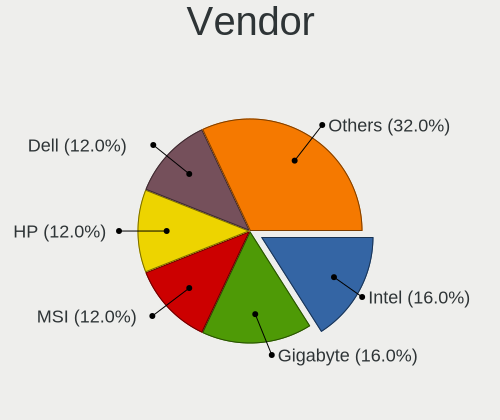
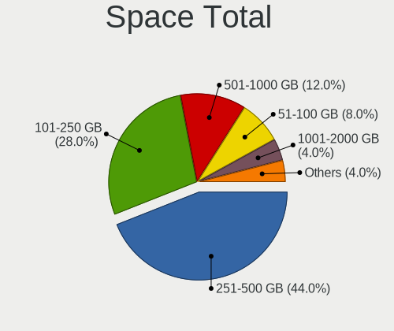
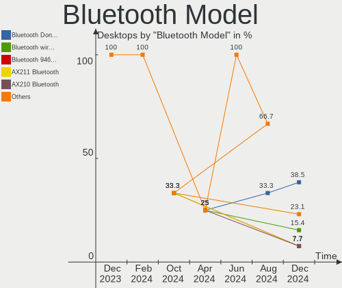

Elementary - Hardware Trends (Desktops)
---------------------------------------

A project to identify most popular hardware characteristics and track their change
over time based on data collected by Linux users at https://Linux-Hardware.org.

Anyone can contribute to this report by the [hw-probe](https://github.com/linuxhw/hw-probe) tool:

    sudo -E hw-probe -all -upload

This report is for one last month. Overall report since the beginning of time: [TestCoverage](https://github.com/linuxhw/TestCoverage)

Period: Dec, 2022.

Contents
--------

* [ System ](#system)
  - [ OS                       ](#os)
  - [ OS Family                ](#os-family)
  - [ Kernel                   ](#kernel)
  - [ Kernel Family            ](#kernel-family)
  - [ Kernel Major Ver.        ](#kernel-major-ver)
  - [ Arch                     ](#arch)
  - [ DE                       ](#de)
  - [ Display Server           ](#display-server)
  - [ Display Manager          ](#display-manager)
  - [ OS Lang                  ](#os-lang)
  - [ Boot Mode                ](#boot-mode)
  - [ Filesystem               ](#filesystem)
  - [ Part. scheme             ](#part-scheme)
  - [ Dual Boot with Linux/BSD ](#dual-boot-with-linuxbsd)
  - [ Dual Boot (Win)          ](#dual-boot-win)

* [ Board ](#board)
  - [ Vendor                   ](#vendor)
  - [ Model                    ](#model)
  - [ Model Family             ](#model-family)
  - [ MFG Year                 ](#mfg-year)
  - [ Form Factor              ](#form-factor)
  - [ Secure Boot              ](#secure-boot)
  - [ Coreboot                 ](#coreboot)
  - [ RAM Size                 ](#ram-size)
  - [ RAM Used                 ](#ram-used)
  - [ Total Drives             ](#total-drives)
  - [ Has CD-ROM               ](#has-cd-rom)
  - [ Has Ethernet             ](#has-ethernet)
  - [ Has WiFi                 ](#has-wifi)
  - [ Has Bluetooth            ](#has-bluetooth)

* [ Location ](#location)
  - [ Country                  ](#country)
  - [ City                     ](#city)

* [ Drives ](#drives)
  - [ Drive Vendor             ](#drive-vendor)
  - [ Drive Model              ](#drive-model)
  - [ HDD Vendor               ](#hdd-vendor)
  - [ SSD Vendor               ](#ssd-vendor)
  - [ Drive Kind               ](#drive-kind)
  - [ Drive Connector          ](#drive-connector)
  - [ Drive Size               ](#drive-size)
  - [ Space Total              ](#space-total)
  - [ Space Used               ](#space-used)
  - [ Malfunc. Drives          ](#malfunc-drives)
  - [ Malfunc. Drive Vendor    ](#malfunc-drive-vendor)
  - [ Malfunc. HDD Vendor      ](#malfunc-hdd-vendor)
  - [ Malfunc. Drive Kind      ](#malfunc-drive-kind)
  - [ Failed Drives            ](#failed-drives)
  - [ Failed Drive Vendor      ](#failed-drive-vendor)
  - [ Drive Status             ](#drive-status)

* [ Storage controller ](#storage-controller)
  - [ Storage Vendor           ](#storage-vendor)
  - [ Storage Model            ](#storage-model)
  - [ Storage Kind             ](#storage-kind)

* [ Processor ](#processor)
  - [ CPU Vendor               ](#cpu-vendor)
  - [ CPU Model                ](#cpu-model)
  - [ CPU Model Family         ](#cpu-model-family)
  - [ CPU Cores                ](#cpu-cores)
  - [ CPU Sockets              ](#cpu-sockets)
  - [ CPU Threads              ](#cpu-threads)
  - [ CPU Op-Modes             ](#cpu-op-modes)
  - [ CPU Microcode            ](#cpu-microcode)
  - [ CPU Microarch            ](#cpu-microarch)

* [ Graphics ](#graphics)
  - [ GPU Vendor               ](#gpu-vendor)
  - [ GPU Model                ](#gpu-model)
  - [ GPU Combo                ](#gpu-combo)
  - [ GPU Driver               ](#gpu-driver)
  - [ GPU Memory               ](#gpu-memory)

* [ Monitor ](#monitor)
  - [ Monitor Vendor           ](#monitor-vendor)
  - [ Monitor Model            ](#monitor-model)
  - [ Monitor Resolution       ](#monitor-resolution)
  - [ Monitor Diagonal         ](#monitor-diagonal)
  - [ Monitor Width            ](#monitor-width)
  - [ Aspect Ratio             ](#aspect-ratio)
  - [ Monitor Area             ](#monitor-area)
  - [ Pixel Density            ](#pixel-density)
  - [ Multiple Monitors        ](#multiple-monitors)

* [ Network ](#network)
  - [ Net Controller Vendor    ](#net-controller-vendor)
  - [ Net Controller Model     ](#net-controller-model)
  - [ Wireless Vendor          ](#wireless-vendor)
  - [ Wireless Model           ](#wireless-model)
  - [ Ethernet Vendor          ](#ethernet-vendor)
  - [ Ethernet Model           ](#ethernet-model)
  - [ Net Controller Kind      ](#net-controller-kind)
  - [ Used Controller          ](#used-controller)
  - [ NICs                     ](#nics)
  - [ IPv6                     ](#ipv6)

* [ Bluetooth ](#bluetooth)
  - [ Bluetooth Vendor         ](#bluetooth-vendor)
  - [ Bluetooth Model          ](#bluetooth-model)

* [ Sound ](#sound)
  - [ Sound Vendor             ](#sound-vendor)
  - [ Sound Model              ](#sound-model)

* [ Memory ](#memory)
  - [ Memory Vendor            ](#memory-vendor)
  - [ Memory Model             ](#memory-model)
  - [ Memory Kind              ](#memory-kind)
  - [ Memory Form Factor       ](#memory-form-factor)
  - [ Memory Size              ](#memory-size)
  - [ Memory Speed             ](#memory-speed)

* [ Printers & scanners ](#printers--scanners)
  - [ Printer Vendor           ](#printer-vendor)
  - [ Printer Model            ](#printer-model)
  - [ Scanner Vendor           ](#scanner-vendor)
  - [ Scanner Model            ](#scanner-model)

* [ Camera ](#camera)
  - [ Camera Vendor            ](#camera-vendor)
  - [ Camera Model             ](#camera-model)

* [ Security ](#security)
  - [ Fingerprint Vendor       ](#fingerprint-vendor)
  - [ Fingerprint Model        ](#fingerprint-model)
  - [ Chipcard Vendor          ](#chipcard-vendor)
  - [ Chipcard Model           ](#chipcard-model)

* [ Unsupported ](#unsupported)
  - [ Unsupported Devices      ](#unsupported-devices)
  - [ Unsupported Device Types ](#unsupported-device-types)

System
------

OS
--

Installed operating systems

| Name             | Desktops | Percent |
|------------------|----------|---------|
| Elementary 6.1   | 12       | 85.71%  |
| Elementary 5.1.7 | 2        | 14.29%  |

OS Family
---------

OS without a version

| Name       | Desktops | Percent |
|------------|----------|---------|
| Elementary | 14       | 100%    |

Kernel
------

Version of the Linux kernel

| Version           | Desktops | Percent |
|-------------------|----------|---------|
| 5.15.0-56-generic | 7        | 50%     |
| 5.11.0-43-generic | 3        | 21.43%  |
| 5.4.0-99-generic  | 1        | 7.14%   |
| 5.4.0-135-generic | 1        | 7.14%   |
| 5.15.0-53-generic | 1        | 7.14%   |
| 5.15.0-48-generic | 1        | 7.14%   |

Kernel Family
-------------

Linux kernel without a distro release

| Version | Desktops | Percent |
|---------|----------|---------|
| 5.15.0  | 9        | 64.29%  |
| 5.11.0  | 3        | 21.43%  |
| 5.4.0   | 2        | 14.29%  |

Kernel Major Ver.
-----------------

Linux kernel major version

| Version | Desktops | Percent |
|---------|----------|---------|
| 5.15    | 9        | 64.29%  |
| 5.11    | 3        | 21.43%  |
| 5.4     | 2        | 14.29%  |

Arch
----

OS architecture (x86_64, i586, etc.)

| Name   | Desktops | Percent |
|--------|----------|---------|
| x86_64 | 14       | 100%    |

DE
--

Desktop Environment

| Name     | Desktops | Percent |
|----------|----------|---------|
| Pantheon | 14       | 100%    |

Display Server
--------------

X11 or Wayland

| Name | Desktops | Percent |
|------|----------|---------|
| X11  | 14       | 100%    |

Display Manager
---------------

SDDM, LightDM, etc.

| Name    | Desktops | Percent |
|---------|----------|---------|
| Unknown | 12       | 85.71%  |
| LightDM | 2        | 14.29%  |

OS Lang
-------

Language

| Lang  | Desktops | Percent |
|-------|----------|---------|
| en_US | 6        | 42.86%  |
| ru_RU | 2        | 14.29%  |
| de_DE | 2        | 14.29%  |
| pt_PT | 1        | 7.14%   |
| nl_NL | 1        | 7.14%   |
| it_IT | 1        | 7.14%   |
| fr_FR | 1        | 7.14%   |

Boot Mode
---------

EFI or BIOS

| Mode | Desktops | Percent |
|------|----------|---------|
| BIOS | 8        | 57.14%  |
| EFI  | 6        | 42.86%  |

Filesystem
----------

Type of filesystem

| Type | Desktops | Percent |
|------|----------|---------|
| Ext4 | 14       | 100%    |

Part. scheme
------------

Scheme of partitioning

| Type    | Desktops | Percent |
|---------|----------|---------|
| Unknown | 12       | 85.71%  |
| MBR     | 1        | 7.14%   |
| GPT     | 1        | 7.14%   |

Dual Boot with Linux/BSD
------------------------

Hosting more than one Linux/BSD

| Dual boot | Desktops | Percent |
|-----------|----------|---------|
| No        | 14       | 100%    |

Dual Boot (Win)
---------------

Hosting Linux and Windows

| Dual boot | Desktops | Percent |
|-----------|----------|---------|
| No        | 13       | 92.86%  |
| Yes       | 1        | 7.14%   |

Board
-----

Vendor
------

Motherboard manufacturer

| Name                | Desktops | Percent |
|---------------------|----------|---------|
| ASUSTek Computer    | 3        | 21.43%  |
| Gigabyte Technology | 2        | 14.29%  |
| Fujitsu             | 2        | 14.29%  |
| ASRock              | 2        | 14.29%  |
| MSI                 | 1        | 7.14%   |
| LORD ELECTRONICS    | 1        | 7.14%   |
| Lenovo              | 1        | 7.14%   |
| Foxconn             | 1        | 7.14%   |
| Dell                | 1        | 7.14%   |

Model
-----

Motherboard model

| Name                                              | Desktops | Percent |
|---------------------------------------------------|----------|---------|
| MSI MS-7A34                                       | 1        | 7.14%   |
| LORD ELECTRONICS LORD G4x 775 ICH7 8712 As Design | 1        | 7.14%   |
| Lenovo ThinkCentre M71e 3129C3G                   | 1        | 7.14%   |
| Gigabyte H61M-S2V-B3                              | 1        | 7.14%   |
| Gigabyte AB350-Gaming 3                           | 1        | 7.14%   |
| Fujitsu ESPRIMO P958                              | 1        | 7.14%   |
| Fujitsu ESPRIMO E3521                             | 1        | 7.14%   |
| Foxconn G5440pt                                   | 1        | 7.14%   |
| Dell OptiPlex 7020                                | 1        | 7.14%   |
| ASUS Z170-P                                       | 1        | 7.14%   |
| ASUS ROG STRIX B550-A GAMING                      | 1        | 7.14%   |
| ASUS PRIME H310M-E R2.0                           | 1        | 7.14%   |
| ASRock H55M-LE                                    | 1        | 7.14%   |
| ASRock H110 Pro BTC+                              | 1        | 7.14%   |

Model Family
------------

Motherboard model prefix

| Name                  | Desktops | Percent |
|-----------------------|----------|---------|
| Fujitsu ESPRIMO       | 2        | 14.29%  |
| MSI MS-7A34           | 1        | 7.14%   |
| LORD ELECTRONICS LORD | 1        | 7.14%   |
| Lenovo ThinkCentre    | 1        | 7.14%   |
| Gigabyte H61M-S2V-B3  | 1        | 7.14%   |
| Gigabyte AB350-Gaming | 1        | 7.14%   |
| Foxconn G5440pt       | 1        | 7.14%   |
| Dell OptiPlex         | 1        | 7.14%   |
| ASUS Z170-P           | 1        | 7.14%   |
| ASUS ROG              | 1        | 7.14%   |
| ASUS PRIME            | 1        | 7.14%   |
| ASRock H55M-LE        | 1        | 7.14%   |
| ASRock H110           | 1        | 7.14%   |

MFG Year
--------

Motherboard manufacture year

| Year | Desktops | Percent |
|------|----------|---------|
| 2017 | 3        | 21.43%  |
| 2011 | 2        | 14.29%  |
| 2010 | 2        | 14.29%  |
| 2020 | 1        | 7.14%   |
| 2019 | 1        | 7.14%   |
| 2018 | 1        | 7.14%   |
| 2016 | 1        | 7.14%   |
| 2015 | 1        | 7.14%   |
| 2014 | 1        | 7.14%   |
| 2012 | 1        | 7.14%   |

Form Factor
-----------

Physical design of the computer

| Name    | Desktops | Percent |
|---------|----------|---------|
| Desktop | 14       | 100%    |

Secure Boot
-----------

Enabled or disabled

| State    | Desktops | Percent |
|----------|----------|---------|
| Disabled | 12       | 85.71%  |
| Enabled  | 2        | 14.29%  |

Coreboot
--------

Have coreboot on board

| Used | Desktops | Percent |
|------|----------|---------|
| No   | 14       | 100%    |

RAM Size
--------

Total RAM memory

| Size in GB | Desktops | Percent |
|------------|----------|---------|
| 8.01-16.0  | 5        | 35.71%  |
| 4.01-8.0   | 2        | 14.29%  |
| 32.01-64.0 | 2        | 14.29%  |
| 3.01-4.0   | 2        | 14.29%  |
| 16.01-24.0 | 2        | 14.29%  |
| 1.01-2.0   | 1        | 7.14%   |

RAM Used
--------

Used RAM memory

| Used GB  | Desktops | Percent |
|----------|----------|---------|
| 2.01-3.0 | 5        | 35.71%  |
| 1.01-2.0 | 5        | 35.71%  |
| 4.01-8.0 | 4        | 28.57%  |

Total Drives
------------

Number of drives on board

| Drives | Desktops | Percent |
|--------|----------|---------|
| 1      | 5        | 35.71%  |
| 3      | 4        | 28.57%  |
| 2      | 3        | 21.43%  |
| 4      | 2        | 14.29%  |

Has CD-ROM
----------

Has CD-ROM on board

| Presented | Desktops | Percent |
|-----------|----------|---------|
| Yes       | 8        | 57.14%  |
| No        | 6        | 42.86%  |

Has Ethernet
------------

Has Ethernet on board

| Presented | Desktops | Percent |
|-----------|----------|---------|
| Yes       | 14       | 100%    |

Has WiFi
--------

Has WiFi module

| Presented | Desktops | Percent |
|-----------|----------|---------|
| No        | 11       | 78.57%  |
| Yes       | 3        | 21.43%  |

Has Bluetooth
-------------

Has Bluetooth module

| Presented | Desktops | Percent |
|-----------|----------|---------|
| No        | 10       | 71.43%  |
| Yes       | 4        | 28.57%  |

Location
--------

Country
-------

Geographic location (country)

| Country     | Desktops | Percent |
|-------------|----------|---------|
| Russia      | 3        | 21.43%  |
| Germany     | 2        | 14.29%  |
| USA         | 1        | 7.14%   |
| Slovenia    | 1        | 7.14%   |
| Portugal    | 1        | 7.14%   |
| Netherlands | 1        | 7.14%   |
| Libya       | 1        | 7.14%   |
| Italy       | 1        | 7.14%   |
| Indonesia   | 1        | 7.14%   |
| Guyana      | 1        | 7.14%   |
| France      | 1        | 7.14%   |

City
----

Geographic location (city)

| City            | Desktops | Percent |
|-----------------|----------|---------|
| Troisdorf       | 1        | 7.14%   |
| Tripoli         | 1        | 7.14%   |
| Tacoma          | 1        | 7.14%   |
| Saratov         | 1        | 7.14%   |
| Rome            | 1        | 7.14%   |
| Oryol           | 1        | 7.14%   |
| Mulhouse        | 1        | 7.14%   |
| Moscow          | 1        | 7.14%   |
| Maastricht      | 1        | 7.14%   |
| Georgetown      | 1        | 7.14%   |
| Flensburg       | 1        | 7.14%   |
| Bandung         | 1        | 7.14%   |
| Aveiras de Cima | 1        | 7.14%   |
| Ajdovščina    | 1        | 7.14%   |

Drives
------

Drive Vendor
------------

Hard drive vendors

| Vendor                    | Desktops | Drives | Percent |
|---------------------------|----------|--------|---------|
| WDC                       | 5        | 7      | 17.86%  |
| Samsung Electronics       | 4        | 4      | 14.29%  |
| China                     | 3        | 3      | 10.71%  |
| Seagate                   | 2        | 2      | 7.14%   |
| Kingston                  | 2        | 2      | 7.14%   |
| Transcend                 | 1        | 1      | 3.57%   |
| Toshiba                   | 1        | 1      | 3.57%   |
| Team                      | 1        | 1      | 3.57%   |
| SPCC                      | 1        | 1      | 3.57%   |
| Sandisk                   | 1        | 1      | 3.57%   |
| PNY                       | 1        | 1      | 3.57%   |
| OCZ                       | 1        | 1      | 3.57%   |
| Micron/Crucial Technology | 1        | 1      | 3.57%   |
| LITEON                    | 1        | 1      | 3.57%   |
| JMicron Technology        | 1        | 1      | 3.57%   |
| HS-SSD-C100               | 1        | 1      | 3.57%   |
| Hitachi                   | 1        | 1      | 3.57%   |

Drive Model
-----------

Hard drive models

| Model                                               | Desktops | Percent |
|-----------------------------------------------------|----------|---------|
| WDC WD5001AALS-00L3B2 500GB                         | 1        | 3.33%   |
| WDC WD5000AAKX-00ERMA0 500GB                        | 1        | 3.33%   |
| WDC WD20EZRX-00DC0B0 2TB                            | 1        | 3.33%   |
| WDC WD20EZBX-00AYRA0 2TB                            | 1        | 3.33%   |
| WDC WD10EARS-00Y5B1 1TB                             | 1        | 3.33%   |
| WDC WD10EADS-00L5B1 1TB                             | 1        | 3.33%   |
| WDC WD1001FALS-00J7B0 1TB                           | 1        | 3.33%   |
| Transcend TS128GSSD360S 128GB                       | 1        | 3.33%   |
| Toshiba DT01ABA300 3TB                              | 1        | 3.33%   |
| Team T253X6001T 1024GB SSD                          | 1        | 3.33%   |
| SPCC Solid State Disk 256GB                         | 1        | 3.33%   |
| Seagate ST3500630AS 500GB                           | 1        | 3.33%   |
| Seagate ST250DM000-1BD141 250GB                     | 1        | 3.33%   |
| Sandisk WD Blue SN550 NVMe SSD 500GB                | 1        | 3.33%   |
| Samsung SSD 860 EVO 500GB                           | 1        | 3.33%   |
| Samsung NVMe SSD Controller SM981/PM981/PM983 500GB | 1        | 3.33%   |
| Samsung MZALQ512HALU-000L2 512GB                    | 1        | 3.33%   |
| Samsung HD103UJ 1TB                                 | 1        | 3.33%   |
| PNY CS900 120GB SSD                                 | 1        | 3.33%   |
| OCZ VERTEX4 64GB SSD                                | 1        | 3.33%   |
| Micron/Crucial P2 NVMe PCIe SSD 500GB               | 1        | 3.33%   |
| LITEON CV3-CE128-11 SATA 128GB SSD                  | 1        | 3.33%   |
| Kingston SA400S37480G 480GB SSD                     | 1        | 3.33%   |
| Kingston SA400S37240G 240GB SSD                     | 1        | 3.33%   |
| JMicron Generic 240GB SSD                           | 1        | 3.33%   |
| HS-SSD-C100 480G                                    | 1        | 3.33%   |
| Hitachi HTS547575A9E384 752GB                       | 1        | 3.33%   |
| China SSV5 480GB                                    | 1        | 3.33%   |
| China SATA SSD 240GB                                | 1        | 3.33%   |
| China 240GB SSD                                     | 1        | 3.33%   |

HDD Vendor
----------

Hard disk drive vendors

| Vendor              | Desktops | Drives | Percent |
|---------------------|----------|--------|---------|
| WDC                 | 5        | 7      | 50%     |
| Seagate             | 2        | 2      | 20%     |
| Toshiba             | 1        | 1      | 10%     |
| Samsung Electronics | 1        | 1      | 10%     |
| Hitachi             | 1        | 1      | 10%     |

SSD Vendor
----------

Solid state drive vendors

| Vendor              | Desktops | Drives | Percent |
|---------------------|----------|--------|---------|
| China               | 3        | 3      | 23.08%  |
| Kingston            | 2        | 2      | 15.38%  |
| Transcend           | 1        | 1      | 7.69%   |
| Team                | 1        | 1      | 7.69%   |
| SPCC                | 1        | 1      | 7.69%   |
| Samsung Electronics | 1        | 1      | 7.69%   |
| PNY                 | 1        | 1      | 7.69%   |
| OCZ                 | 1        | 1      | 7.69%   |
| LITEON              | 1        | 1      | 7.69%   |
| JMicron Technology  | 1        | 1      | 7.69%   |

Drive Kind
----------

HDD or SSD

| Kind    | Desktops | Drives | Percent |
|---------|----------|--------|---------|
| SSD     | 11       | 13     | 45.83%  |
| HDD     | 9        | 12     | 37.5%   |
| NVMe    | 3        | 4      | 12.5%   |
| Unknown | 1        | 1      | 4.17%   |

Drive Connector
---------------

SATA, SAS, NVMe, etc.

| Type | Desktops | Drives | Percent |
|------|----------|--------|---------|
| SATA | 14       | 25     | 77.78%  |
| NVMe | 3        | 4      | 16.67%  |
| SAS  | 1        | 1      | 5.56%   |

Drive Size
----------

Size of hard drive

| Size in TB | Desktops | Drives | Percent |
|------------|----------|--------|---------|
| 0.01-0.5   | 12       | 16     | 63.16%  |
| 1.01-2.0   | 3        | 3      | 15.79%  |
| 0.51-1.0   | 3        | 5      | 15.79%  |
| 2.01-3.0   | 1        | 1      | 5.26%   |

Space Total
-----------

Amount of disk space available on the file system

| Size in GB | Desktops | Percent |
|------------|----------|---------|
| 101-250    | 8        | 57.14%  |
| 251-500    | 2        | 14.29%  |
| 2001-3000  | 2        | 14.29%  |
| 1001-2000  | 1        | 7.14%   |
| 51-100     | 1        | 7.14%   |

Space Used
----------

Amount of used disk space

| Used GB   | Desktops | Percent |
|-----------|----------|---------|
| 1-20      | 4        | 28.57%  |
| 21-50     | 3        | 21.43%  |
| 51-100    | 3        | 21.43%  |
| 101-250   | 2        | 14.29%  |
| 1001-2000 | 1        | 7.14%   |
| 501-1000  | 1        | 7.14%   |

Malfunc. Drives
---------------

Drive models with a malfunction

Zero info for selected period =(

Malfunc. Drive Vendor
---------------------

Vendors of faulty drives

Zero info for selected period =(

Malfunc. HDD Vendor
-------------------

Vendors of faulty HDD drives

Zero info for selected period =(

Malfunc. Drive Kind
-------------------

Kinds of faulty drives

Zero info for selected period =(

Failed Drives
-------------

Failed drive models

Zero info for selected period =(

Failed Drive Vendor
-------------------

Failed drive vendors

Zero info for selected period =(

Drive Status
------------

Number of failed and malfunc. drives

| Status   | Desktops | Drives | Percent |
|----------|----------|--------|---------|
| Detected | 14       | 30     | 100%    |

Storage controller
------------------

Storage Vendor
--------------

Storage controller vendors

| Vendor                    | Desktops | Percent |
|---------------------------|----------|---------|
| Intel                     | 11       | 61.11%  |
| AMD                       | 3        | 16.67%  |
| Samsung Electronics       | 2        | 11.11%  |
| SanDisk                   | 1        | 5.56%   |
| Micron/Crucial Technology | 1        | 5.56%   |

Storage Model
-------------

Storage controller models

| Model                                                                                   | Desktops | Percent |
|-----------------------------------------------------------------------------------------|----------|---------|
| Intel Q170/Q150/B150/H170/H110/Z170/CM236 Chipset SATA Controller [AHCI Mode]           | 2        | 8.7%    |
| Intel NM10/ICH7 Family SATA Controller [IDE mode]                                       | 2        | 8.7%    |
| Intel 6 Series/C200 Series Chipset Family 6 port Desktop SATA AHCI Controller           | 2        | 8.7%    |
| AMD FCH SATA Controller [AHCI mode]                                                     | 2        | 8.7%    |
| AMD 300 Series Chipset SATA Controller                                                  | 2        | 8.7%    |
| SanDisk WD Blue SN550 NVMe SSD                                                          | 1        | 4.35%   |
| Samsung NVMe SSD Controller SM981/PM981/PM983                                           | 1        | 4.35%   |
| Samsung NVMe SSD Controller 980                                                         | 1        | 4.35%   |
| Micron/Crucial P2 NVMe PCIe SSD                                                         | 1        | 4.35%   |
| Intel Cannon Lake PCH SATA AHCI Controller                                              | 1        | 4.35%   |
| Intel 82801G (ICH7 Family) IDE Controller                                               | 1        | 4.35%   |
| Intel 8 Series/C220 Series Chipset Family 6-port SATA Controller 1 [AHCI mode]          | 1        | 4.35%   |
| Intel 6 Series/C200 Series Chipset Family Desktop SATA Controller (IDE mode, ports 4-5) | 1        | 4.35%   |
| Intel 6 Series/C200 Series Chipset Family Desktop SATA Controller (IDE mode, ports 0-3) | 1        | 4.35%   |
| Intel 5 Series/3400 Series Chipset 4 port SATA IDE Controller                           | 1        | 4.35%   |
| Intel 5 Series/3400 Series Chipset 2 port SATA IDE Controller                           | 1        | 4.35%   |
| Intel 200 Series PCH SATA controller [AHCI mode]                                        | 1        | 4.35%   |
| AMD 500 Series Chipset SATA Controller                                                  | 1        | 4.35%   |

Storage Kind
------------

Kind of storage controller (IDE, SATA, NVMe, SAS, ...)

| Kind | Desktops | Percent |
|------|----------|---------|
| SATA | 10       | 58.82%  |
| IDE  | 4        | 23.53%  |
| NVMe | 3        | 17.65%  |

Processor
---------

CPU Vendor
----------

Processor vendors

| Vendor | Desktops | Percent |
|--------|----------|---------|
| Intel  | 11       | 78.57%  |
| AMD    | 3        | 21.43%  |

CPU Model
---------

Processor models

| Model                                       | Desktops | Percent |
|---------------------------------------------|----------|---------|
| Intel Core i3-2100 CPU @ 3.10GHz            | 2        | 14.29%  |
| Intel Pentium Gold G5400 CPU @ 3.70GHz      | 1        | 7.14%   |
| Intel Pentium Dual-Core CPU E5700 @ 3.00GHz | 1        | 7.14%   |
| Intel Core i7-4790 CPU @ 3.60GHz            | 1        | 7.14%   |
| Intel Core i7-2600 CPU @ 3.40GHz            | 1        | 7.14%   |
| Intel Core i5-8500 CPU @ 3.00GHz            | 1        | 7.14%   |
| Intel Core i5-7500 CPU @ 3.40GHz            | 1        | 7.14%   |
| Intel Core i5-7400 CPU @ 3.00GHz            | 1        | 7.14%   |
| Intel Core i5 CPU 760 @ 2.80GHz             | 1        | 7.14%   |
| Intel Core 2 Duo CPU E6550 @ 2.33GHz        | 1        | 7.14%   |
| AMD Ryzen 5 5600X 6-Core Processor          | 1        | 7.14%   |
| AMD Ryzen 5 1400 Quad-Core Processor        | 1        | 7.14%   |
| AMD Ryzen 3 1200 Quad-Core Processor        | 1        | 7.14%   |

CPU Model Family
----------------

Processor model prefix

| Model                   | Desktops | Percent |
|-------------------------|----------|---------|
| Intel Core i5           | 4        | 28.57%  |
| Intel Core i7           | 2        | 14.29%  |
| Intel Core i3           | 2        | 14.29%  |
| AMD Ryzen 5             | 2        | 14.29%  |
| Intel Pentium Gold      | 1        | 7.14%   |
| Intel Pentium Dual-Core | 1        | 7.14%   |
| Intel Core 2 Duo        | 1        | 7.14%   |
| AMD Ryzen 3             | 1        | 7.14%   |

CPU Cores
---------

Number of processor cores

| Number | Desktops | Percent |
|--------|----------|---------|
| 4      | 7        | 50%     |
| 2      | 5        | 35.71%  |
| 6      | 2        | 14.29%  |

CPU Sockets
-----------

Number of sockets

| Number | Desktops | Percent |
|--------|----------|---------|
| 1      | 14       | 100%    |

CPU Threads
-----------

Threads per core (Hyper-Threading)

| Number | Desktops | Percent |
|--------|----------|---------|
| 2      | 7        | 50%     |
| 1      | 7        | 50%     |

CPU Op-Modes
------------

CPU Operation Modes (32-bit, 64-bit)

| Op mode        | Desktops | Percent |
|----------------|----------|---------|
| 32-bit, 64-bit | 14       | 100%    |

CPU Microcode
-------------

Microcode number

| Number     | Desktops | Percent |
|------------|----------|---------|
| 0x206a7    | 3        | 21.43%  |
| 0x906ea    | 2        | 14.29%  |
| 0x906e9    | 2        | 14.29%  |
| 0x6fb      | 1        | 7.14%   |
| 0x306c3    | 1        | 7.14%   |
| 0x106e5    | 1        | 7.14%   |
| 0x1067a    | 1        | 7.14%   |
| 0x0a201016 | 1        | 7.14%   |
| 0x08001129 | 1        | 7.14%   |
| 0x0800111c | 1        | 7.14%   |

CPU Microarch
-------------

Microarchitecture

| Name        | Desktops | Percent |
|-------------|----------|---------|
| KabyLake    | 4        | 28.57%  |
| SandyBridge | 3        | 21.43%  |
| Zen         | 2        | 14.29%  |
| Zen 3       | 1        | 7.14%   |
| Penryn      | 1        | 7.14%   |
| Nehalem     | 1        | 7.14%   |
| Haswell     | 1        | 7.14%   |
| Core        | 1        | 7.14%   |

Graphics
--------

GPU Vendor
----------

Vendors of graphics cards

| Vendor | Desktops | Percent |
|--------|----------|---------|
| Nvidia | 5        | 35.71%  |
| Intel  | 5        | 35.71%  |
| AMD    | 4        | 28.57%  |

GPU Model
---------

Graphics card models

| Model                                                                       | Desktops | Percent |
|-----------------------------------------------------------------------------|----------|---------|
| Intel 4 Series Chipset Integrated Graphics Controller                       | 2        | 14.29%  |
| AMD Ellesmere [Radeon RX 470/480/570/570X/580/580X/590]                     | 2        | 14.29%  |
| Nvidia GP107 [GeForce GTX 1050]                                             | 1        | 7.14%   |
| Nvidia GP102 [GeForce GTX 1080 Ti]                                          | 1        | 7.14%   |
| Nvidia GF108 [GeForce GT 420]                                               | 1        | 7.14%   |
| Nvidia GA102 [GeForce RTX 3080 Lite Hash Rate]                              | 1        | 7.14%   |
| Nvidia G84 [GeForce 8600 GT]                                                | 1        | 7.14%   |
| Intel Xeon E3-1200 v3/4th Gen Core Processor Integrated Graphics Controller | 1        | 7.14%   |
| Intel CoffeeLake-S GT2 [UHD Graphics 630]                                   | 1        | 7.14%   |
| Intel 2nd Generation Core Processor Family Integrated Graphics Controller   | 1        | 7.14%   |
| AMD Juniper XT [Radeon HD 5770]                                             | 1        | 7.14%   |
| AMD Cayman PRO [Radeon HD 6950]                                             | 1        | 7.14%   |

GPU Combo
---------

Combinations of graphics cards

| Name       | Desktops | Percent |
|------------|----------|---------|
| 1 x Intel  | 5        | 35.71%  |
| 1 x Nvidia | 4        | 28.57%  |
| 1 x AMD    | 4        | 28.57%  |
| 2 x Nvidia | 1        | 7.14%   |

GPU Driver
----------

Free vs proprietary

| Driver      | Desktops | Percent |
|-------------|----------|---------|
| Free        | 11       | 78.57%  |
| Proprietary | 3        | 21.43%  |

GPU Memory
----------

Total video memory

| Size in GB | Desktops | Percent |
|------------|----------|---------|
| Unknown    | 5        | 35.71%  |
| 7.01-8.0   | 2        | 14.29%  |
| 1.01-2.0   | 2        | 14.29%  |
| 8.01-16.0  | 2        | 14.29%  |
| 0.51-1.0   | 2        | 14.29%  |
| 0.01-0.5   | 1        | 7.14%   |

Monitor
-------

Monitor Vendor
--------------

Monitor vendors

| Vendor              | Desktops | Percent |
|---------------------|----------|---------|
| Samsung Electronics | 3        | 27.27%  |
| Hewlett-Packard     | 2        | 18.18%  |
| AOC                 | 2        | 18.18%  |
| Vestel              | 1        | 9.09%   |
| Philips             | 1        | 9.09%   |
| LG Electronics      | 1        | 9.09%   |
| Dell                | 1        | 9.09%   |

Monitor Model
-------------

Monitor models

| Model                                                                | Desktops | Percent |
|----------------------------------------------------------------------|----------|---------|
| Vestel LCD Monitor 43UHD_LCD_TV 3840x2160                            | 1        | 9.09%   |
| Samsung Electronics SyncMaster SAM0423 1920x1080                     | 1        | 9.09%   |
| Samsung Electronics SyncMaster SAM0259 1280x1024 376x301mm 19.0-inch | 1        | 9.09%   |
| Samsung Electronics LC49G95T SAM7053 3840x1080 1193x336mm 48.8-inch  | 1        | 9.09%   |
| Philips PHL 272B8Q PHL0918 2560x1440 597x336mm 27.0-inch             | 1        | 9.09%   |
| LG Electronics LCD Monitor LG FULL HD 1920x1080                      | 1        | 9.09%   |
| Hewlett-Packard LCD Monitor w2007 1680x1050                          | 1        | 9.09%   |
| Hewlett-Packard E241i HWP3124 1920x1200 518x324mm 24.1-inch          | 1        | 9.09%   |
| Dell E170S DELA04A 1280x1024 338x270mm 17.0-inch                     | 1        | 9.09%   |
| AOC 27V2G5 AOC2702 1920x1080 598x336mm 27.0-inch                     | 1        | 9.09%   |
| AOC 2470W AOC2470 1920x1080 521x293mm 23.5-inch                      | 1        | 9.09%   |

Monitor Resolution
------------------

Monitor screen resolution

| Resolution         | Desktops | Percent |
|--------------------|----------|---------|
| 1920x1080 (FHD)    | 4        | 36.36%  |
| 3840x2160 (4K)     | 2        | 18.18%  |
| 1280x1024 (SXGA)   | 2        | 18.18%  |
| 3840x1080          | 1        | 9.09%   |
| 2560x1440 (QHD)    | 1        | 9.09%   |
| 1680x1050 (WSXGA+) | 1        | 9.09%   |

Monitor Diagonal
----------------

Diagonal size in inches

| Inches  | Desktops | Percent |
|---------|----------|---------|
| Unknown | 4        | 36.36%  |
| 27      | 2        | 18.18%  |
| 48      | 1        | 9.09%   |
| 24      | 1        | 9.09%   |
| 23      | 1        | 9.09%   |
| 19      | 1        | 9.09%   |
| 17      | 1        | 9.09%   |

Monitor Width
-------------

Physical width

| Width in mm | Desktops | Percent |
|-------------|----------|---------|
| 501-600     | 4        | 36.36%  |
| Unknown     | 4        | 36.36%  |
| 351-400     | 1        | 9.09%   |
| 301-350     | 1        | 9.09%   |
| 1001-1500   | 1        | 9.09%   |

Aspect Ratio
------------

Proportional relationship between the width and the height

| Ratio   | Desktops | Percent |
|---------|----------|---------|
| 16/9    | 4        | 36.36%  |
| Unknown | 3        | 27.27%  |
| 5/4     | 2        | 18.18%  |
| 32/9    | 1        | 9.09%   |
| 16/10   | 1        | 9.09%   |

Monitor Area
------------

Area in inch²

| Area in inch² | Desktops | Percent |
|----------------|----------|---------|
| Unknown        | 4        | 36.36%  |
| 301-350        | 2        | 18.18%  |
| 251-300        | 1        | 9.09%   |
| 201-250        | 1        | 9.09%   |
| 151-200        | 1        | 9.09%   |
| 141-150        | 1        | 9.09%   |
| 501-1000       | 1        | 9.09%   |

Pixel Density
-------------

Pixels per inch

| Density | Desktops | Percent |
|---------|----------|---------|
| 51-100  | 6        | 54.55%  |
| Unknown | 4        | 36.36%  |
| 101-120 | 1        | 9.09%   |

Multiple Monitors
-----------------

Total monitors connected

| Total | Desktops | Percent |
|-------|----------|---------|
| 1     | 14       | 100%    |

Network
-------

Net Controller Vendor
---------------------

Controller vendors

| Vendor                | Desktops | Percent |
|-----------------------|----------|---------|
| Realtek Semiconductor | 12       | 63.16%  |
| Intel                 | 4        | 21.05%  |
| vivo                  | 1        | 5.26%   |
| Microsoft             | 1        | 5.26%   |
| AboCom Systems        | 1        | 5.26%   |

Net Controller Model
--------------------

Controller models

| Model                                                                      | Desktops | Percent |
|----------------------------------------------------------------------------|----------|---------|
| Realtek RTL8111/8168/8411 PCI Express Gigabit Ethernet Controller          | 9        | 45%     |
| vivo 1806                                                                  | 1        | 5%      |
| Realtek RTL8188EUS 802.11n Wireless Network Adapter                        | 1        | 5%      |
| Realtek RTL8153 Gigabit Ethernet Adapter                                   | 1        | 5%      |
| Realtek RTL810xE PCI Express Fast Ethernet controller                      | 1        | 5%      |
| Microsoft XBOX ACC                                                         | 1        | 5%      |
| Intel Wi-Fi 6 AX210/AX211/AX411 160MHz                                     | 1        | 5%      |
| Intel Ethernet Controller I225-V                                           | 1        | 5%      |
| Intel Ethernet Connection I217-LM                                          | 1        | 5%      |
| Intel Ethernet Connection (7) I219-LM                                      | 1        | 5%      |
| Intel Ethernet Connection (2) I219-V                                       | 1        | 5%      |
| AboCom Systems AboCom Systems Inc [WN2001 Prolink Wireless-N Nano Adapter] | 1        | 5%      |

Wireless Vendor
---------------

Wireless vendors

| Vendor                | Desktops | Percent |
|-----------------------|----------|---------|
| Realtek Semiconductor | 1        | 25%     |
| Microsoft             | 1        | 25%     |
| Intel                 | 1        | 25%     |
| AboCom Systems        | 1        | 25%     |

Wireless Model
--------------

Wireless models

| Model                                                                      | Desktops | Percent |
|----------------------------------------------------------------------------|----------|---------|
| Realtek RTL8188EUS 802.11n Wireless Network Adapter                        | 1        | 25%     |
| Microsoft XBOX ACC                                                         | 1        | 25%     |
| Intel Wi-Fi 6 AX210/AX211/AX411 160MHz                                     | 1        | 25%     |
| AboCom Systems AboCom Systems Inc [WN2001 Prolink Wireless-N Nano Adapter] | 1        | 25%     |

Ethernet Vendor
---------------

Ethernet vendors

| Vendor                | Desktops | Percent |
|-----------------------|----------|---------|
| Realtek Semiconductor | 11       | 68.75%  |
| Intel                 | 4        | 25%     |
| vivo                  | 1        | 6.25%   |

Ethernet Model
--------------

Ethernet models

| Model                                                             | Desktops | Percent |
|-------------------------------------------------------------------|----------|---------|
| Realtek RTL8111/8168/8411 PCI Express Gigabit Ethernet Controller | 9        | 56.25%  |
| vivo 1806                                                         | 1        | 6.25%   |
| Realtek RTL8153 Gigabit Ethernet Adapter                          | 1        | 6.25%   |
| Realtek RTL810xE PCI Express Fast Ethernet controller             | 1        | 6.25%   |
| Intel Ethernet Controller I225-V                                  | 1        | 6.25%   |
| Intel Ethernet Connection I217-LM                                 | 1        | 6.25%   |
| Intel Ethernet Connection (7) I219-LM                             | 1        | 6.25%   |
| Intel Ethernet Connection (2) I219-V                              | 1        | 6.25%   |

Net Controller Kind
-------------------

Ethernet, WiFi or modem

| Kind     | Desktops | Percent |
|----------|----------|---------|
| Ethernet | 14       | 82.35%  |
| WiFi     | 3        | 17.65%  |

Used Controller
---------------

Currently used network controller

| Kind     | Desktops | Percent |
|----------|----------|---------|
| Ethernet | 12       | 92.31%  |
| WiFi     | 1        | 7.69%   |

NICs
----

Total network controllers on board

| Total | Desktops | Percent |
|-------|----------|---------|
| 1     | 13       | 92.86%  |
| 2     | 1        | 7.14%   |

IPv6
----

IPv6 vs IPv4

| Used | Desktops | Percent |
|------|----------|---------|
| No   | 9        | 64.29%  |
| Yes  | 5        | 35.71%  |

Bluetooth
---------

Bluetooth Vendor
----------------

Controller vendors

| Vendor                  | Desktops | Percent |
|-------------------------|----------|---------|
| Cambridge Silicon Radio | 2        | 50%     |
| Realtek Semiconductor   | 1        | 25%     |
| Intel                   | 1        | 25%     |

Bluetooth Model
---------------

Controller models

| Model                                               | Desktops | Percent |
|-----------------------------------------------------|----------|---------|
| Cambridge Silicon Radio Bluetooth Dongle (HCI mode) | 2        | 50%     |
| Realtek Bluetooth Radio                             | 1        | 25%     |
| Intel AX210 Bluetooth                               | 1        | 25%     |

Sound
-----

Sound Vendor
------------

Sound card vendors

| Vendor               | Desktops | Percent |
|----------------------|----------|---------|
| Intel                | 10       | 38.46%  |
| AMD                  | 7        | 26.92%  |
| Nvidia               | 4        | 15.38%  |
| C-Media Electronics  | 2        | 7.69%   |
| iCreate Technologies | 1        | 3.85%   |
| BR25                 | 1        | 3.85%   |
| ASUSTek Computer     | 1        | 3.85%   |

Sound Model
-----------

Sound card models

| Model                                                                      | Desktops | Percent |
|----------------------------------------------------------------------------|----------|---------|
| Intel 6 Series/C200 Series Chipset Family High Definition Audio Controller | 3        | 11.11%  |
| Intel NM10/ICH7 Family High Definition Audio Controller                    | 2        | 7.41%   |
| AMD Family 17h (Models 00h-0fh) HD Audio Controller                        | 2        | 7.41%   |
| AMD Ellesmere HDMI Audio [Radeon RX 470/480 / 570/580/590]                 | 2        | 7.41%   |
| Nvidia GP107GL High Definition Audio Controller                            | 1        | 3.7%    |
| Nvidia GP102 HDMI Audio Controller                                         | 1        | 3.7%    |
| Nvidia GF108 High Definition Audio Controller                              | 1        | 3.7%    |
| Nvidia GA102 High Definition Audio Controller                              | 1        | 3.7%    |
| Intel Xeon E3-1200 v3/4th Gen Core Processor HD Audio Controller           | 1        | 3.7%    |
| Intel Cannon Lake PCH cAVS                                                 | 1        | 3.7%    |
| Intel 8 Series/C220 Series Chipset High Definition Audio Controller        | 1        | 3.7%    |
| Intel 5 Series/3400 Series Chipset High Definition Audio                   | 1        | 3.7%    |
| Intel 200 Series PCH HD Audio                                              | 1        | 3.7%    |
| Intel 100 Series/C230 Series Chipset Family HD Audio Controller            | 1        | 3.7%    |
| iCreate Technologies Xonar U7                                              | 1        | 3.7%    |
| C-Media Electronics CM8888 [Oxygen Express]                                | 1        | 3.7%    |
| C-Media Electronics CM108 Audio Controller                                 | 1        | 3.7%    |
| BR25 UACDemoV1.0                                                           | 1        | 3.7%    |
| ASUSTek Computer XONAR SOUND CARD                                          | 1        | 3.7%    |
| AMD Starship/Matisse HD Audio Controller                                   | 1        | 3.7%    |
| AMD Juniper HDMI Audio [Radeon HD 5700 Series]                             | 1        | 3.7%    |
| AMD Cayman/Antilles HDMI Audio [Radeon HD 6930/6950/6970/6990]             | 1        | 3.7%    |

Memory
------

Memory Vendor
-------------

Memory module vendors

| Vendor  | Desktops | Percent |
|---------|----------|---------|
| Unknown | 1        | 100%    |

Memory Model
------------

Memory module models

| Model                                | Desktops | Percent |
|--------------------------------------|----------|---------|
| Unknown RAM Module 8GB DIMM 1333MT/s | 1        | 100%    |

Memory Kind
-----------

Memory module kinds

| Kind    | Desktops | Percent |
|---------|----------|---------|
| Unknown | 1        | 100%    |

Memory Form Factor
------------------

Physical design of the memory module

| Name | Desktops | Percent |
|------|----------|---------|
| DIMM | 1        | 100%    |

Memory Size
-----------

Memory module size

| Size | Desktops | Percent |
|------|----------|---------|
| 8192 | 1        | 100%    |

Memory Speed
------------

Memory module speed

| Speed | Desktops | Percent |
|-------|----------|---------|
| 1333  | 1        | 100%    |

Printers & scanners
-------------------

Printer Vendor
--------------

Printer device vendors

| Vendor | Desktops | Percent |
|--------|----------|---------|
| Canon  | 1        | 100%    |

Printer Model
-------------

Printer device models

| Model                    | Desktops | Percent |
|--------------------------|----------|---------|
| Canon PIXMA MX390 Series | 1        | 100%    |

Scanner Vendor
--------------

Scanner device vendors

Zero info for selected period =(

Scanner Model
-------------

Scanner device models

Zero info for selected period =(

Camera
------

Camera Vendor
-------------

Camera device vendors

| Vendor    | Desktops | Percent |
|-----------|----------|---------|
| Microsoft | 1        | 50%     |
| Microdia  | 1        | 50%     |

Camera Model
------------

Camera device models

| Model                     | Desktops | Percent |
|---------------------------|----------|---------|
| Microsoft LifeCam HD-3000 | 1        | 50%     |
| Microdia Camera           | 1        | 50%     |

Security
--------

Fingerprint Vendor
------------------

Fingerprint sensor vendors

Zero info for selected period =(

Fingerprint Model
-----------------

Fingerprint sensor models

Zero info for selected period =(

Chipcard Vendor
---------------

Chipcard module vendors

Zero info for selected period =(

Chipcard Model
--------------

Chipcard module models

Zero info for selected period =(

Unsupported
-----------

Unsupported Devices
-------------------

Total unsupported devices on board

| Total | Desktops | Percent |
|-------|----------|---------|
| 0     | 12       | 85.71%  |
| 1     | 2        | 14.29%  |

Unsupported Device Types
------------------------

Types of unsupported devices

| Type                     | Desktops | Percent |
|--------------------------|----------|---------|
| Net/wireless             | 1        | 50%     |
| Communication controller | 1        | 50%     |

