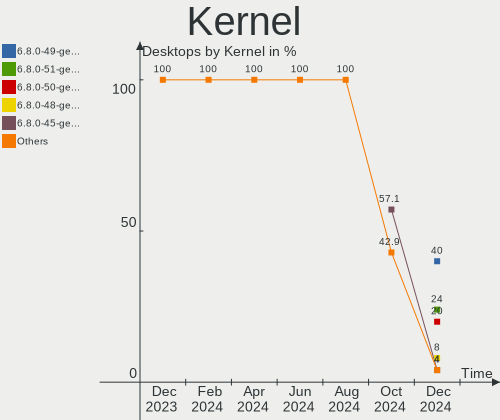
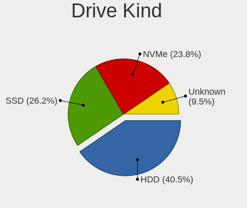
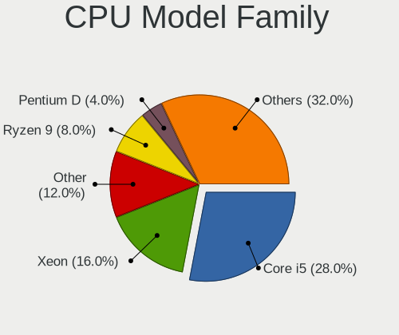
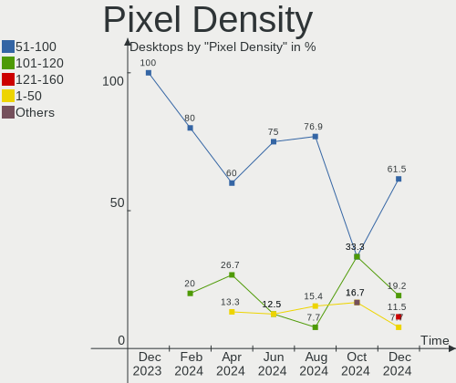

Elementary - Hardware Trends (Desktops)
---------------------------------------

A project to identify most popular hardware characteristics and track their change
over time based on data collected by Linux users at https://Linux-Hardware.org.

Anyone can contribute to this report by the [hw-probe](https://github.com/linuxhw/hw-probe) tool:

    sudo -E hw-probe -all -upload

This report is for one last month. Overall report since the beginning of time: [TestCoverage](https://github.com/linuxhw/TestCoverage)

Period: May, 2022.

Contents
--------

* [ System ](#system)
  - [ OS                       ](#os)
  - [ OS Family                ](#os-family)
  - [ Kernel                   ](#kernel)
  - [ Kernel Family            ](#kernel-family)
  - [ Kernel Major Ver.        ](#kernel-major-ver)
  - [ Arch                     ](#arch)
  - [ DE                       ](#de)
  - [ Display Server           ](#display-server)
  - [ Display Manager          ](#display-manager)
  - [ OS Lang                  ](#os-lang)
  - [ Boot Mode                ](#boot-mode)
  - [ Filesystem               ](#filesystem)
  - [ Part. scheme             ](#part-scheme)
  - [ Dual Boot with Linux/BSD ](#dual-boot-with-linuxbsd)
  - [ Dual Boot (Win)          ](#dual-boot-win)

* [ Board ](#board)
  - [ Vendor                   ](#vendor)
  - [ Model                    ](#model)
  - [ Model Family             ](#model-family)
  - [ MFG Year                 ](#mfg-year)
  - [ Form Factor              ](#form-factor)
  - [ Secure Boot              ](#secure-boot)
  - [ Coreboot                 ](#coreboot)
  - [ RAM Size                 ](#ram-size)
  - [ RAM Used                 ](#ram-used)
  - [ Total Drives             ](#total-drives)
  - [ Has CD-ROM               ](#has-cd-rom)
  - [ Has Ethernet             ](#has-ethernet)
  - [ Has WiFi                 ](#has-wifi)
  - [ Has Bluetooth            ](#has-bluetooth)

* [ Location ](#location)
  - [ Country                  ](#country)
  - [ City                     ](#city)

* [ Drives ](#drives)
  - [ Drive Vendor             ](#drive-vendor)
  - [ Drive Model              ](#drive-model)
  - [ HDD Vendor               ](#hdd-vendor)
  - [ SSD Vendor               ](#ssd-vendor)
  - [ Drive Kind               ](#drive-kind)
  - [ Drive Connector          ](#drive-connector)
  - [ Drive Size               ](#drive-size)
  - [ Space Total              ](#space-total)
  - [ Space Used               ](#space-used)
  - [ Malfunc. Drives          ](#malfunc-drives)
  - [ Malfunc. Drive Vendor    ](#malfunc-drive-vendor)
  - [ Malfunc. HDD Vendor      ](#malfunc-hdd-vendor)
  - [ Malfunc. Drive Kind      ](#malfunc-drive-kind)
  - [ Failed Drives            ](#failed-drives)
  - [ Failed Drive Vendor      ](#failed-drive-vendor)
  - [ Drive Status             ](#drive-status)

* [ Storage controller ](#storage-controller)
  - [ Storage Vendor           ](#storage-vendor)
  - [ Storage Model            ](#storage-model)
  - [ Storage Kind             ](#storage-kind)

* [ Processor ](#processor)
  - [ CPU Vendor               ](#cpu-vendor)
  - [ CPU Model                ](#cpu-model)
  - [ CPU Model Family         ](#cpu-model-family)
  - [ CPU Cores                ](#cpu-cores)
  - [ CPU Sockets              ](#cpu-sockets)
  - [ CPU Threads              ](#cpu-threads)
  - [ CPU Op-Modes             ](#cpu-op-modes)
  - [ CPU Microcode            ](#cpu-microcode)
  - [ CPU Microarch            ](#cpu-microarch)

* [ Graphics ](#graphics)
  - [ GPU Vendor               ](#gpu-vendor)
  - [ GPU Model                ](#gpu-model)
  - [ GPU Combo                ](#gpu-combo)
  - [ GPU Driver               ](#gpu-driver)
  - [ GPU Memory               ](#gpu-memory)

* [ Monitor ](#monitor)
  - [ Monitor Vendor           ](#monitor-vendor)
  - [ Monitor Model            ](#monitor-model)
  - [ Monitor Resolution       ](#monitor-resolution)
  - [ Monitor Diagonal         ](#monitor-diagonal)
  - [ Monitor Width            ](#monitor-width)
  - [ Aspect Ratio             ](#aspect-ratio)
  - [ Monitor Area             ](#monitor-area)
  - [ Pixel Density            ](#pixel-density)
  - [ Multiple Monitors        ](#multiple-monitors)

* [ Network ](#network)
  - [ Net Controller Vendor    ](#net-controller-vendor)
  - [ Net Controller Model     ](#net-controller-model)
  - [ Wireless Vendor          ](#wireless-vendor)
  - [ Wireless Model           ](#wireless-model)
  - [ Ethernet Vendor          ](#ethernet-vendor)
  - [ Ethernet Model           ](#ethernet-model)
  - [ Net Controller Kind      ](#net-controller-kind)
  - [ Used Controller          ](#used-controller)
  - [ NICs                     ](#nics)
  - [ IPv6                     ](#ipv6)

* [ Bluetooth ](#bluetooth)
  - [ Bluetooth Vendor         ](#bluetooth-vendor)
  - [ Bluetooth Model          ](#bluetooth-model)

* [ Sound ](#sound)
  - [ Sound Vendor             ](#sound-vendor)
  - [ Sound Model              ](#sound-model)

* [ Memory ](#memory)
  - [ Memory Vendor            ](#memory-vendor)
  - [ Memory Model             ](#memory-model)
  - [ Memory Kind              ](#memory-kind)
  - [ Memory Form Factor       ](#memory-form-factor)
  - [ Memory Size              ](#memory-size)
  - [ Memory Speed             ](#memory-speed)

* [ Printers & scanners ](#printers--scanners)
  - [ Printer Vendor           ](#printer-vendor)
  - [ Printer Model            ](#printer-model)
  - [ Scanner Vendor           ](#scanner-vendor)
  - [ Scanner Model            ](#scanner-model)

* [ Camera ](#camera)
  - [ Camera Vendor            ](#camera-vendor)
  - [ Camera Model             ](#camera-model)

* [ Security ](#security)
  - [ Fingerprint Vendor       ](#fingerprint-vendor)
  - [ Fingerprint Model        ](#fingerprint-model)
  - [ Chipcard Vendor          ](#chipcard-vendor)
  - [ Chipcard Model           ](#chipcard-model)

* [ Unsupported ](#unsupported)
  - [ Unsupported Devices      ](#unsupported-devices)
  - [ Unsupported Device Types ](#unsupported-device-types)

System
------

OS
--

Installed operating systems

| Name             | Desktops | Percent |
|------------------|----------|---------|
| Elementary 6.1   | 11       | 84.62%  |
| Elementary 5.1.7 | 2        | 15.38%  |

OS Family
---------

OS without a version

| Name       | Desktops | Percent |
|------------|----------|---------|
| Elementary | 13       | 100%    |

Kernel
------

Version of the Linux kernel

| Version           | Desktops | Percent |
|-------------------|----------|---------|
| 5.13.0-40-generic | 3        | 23.08%  |
| 5.13.0-41-generic | 2        | 15.38%  |
| 5.11.0-43-generic | 2        | 15.38%  |
| 5.4.0-113-generic | 1        | 7.69%   |
| 5.4.0-109-generic | 1        | 7.69%   |
| 5.15.36-xanmod1   | 1        | 7.69%   |
| 5.13.0-44-generic | 1        | 7.69%   |
| 5.13.0-39-generic | 1        | 7.69%   |
| 5.13.0-28-generic | 1        | 7.69%   |

Kernel Family
-------------

Linux kernel without a distro release

| Version | Desktops | Percent |
|---------|----------|---------|
| 5.13.0  | 8        | 61.54%  |
| 5.4.0   | 2        | 15.38%  |
| 5.11.0  | 2        | 15.38%  |
| 5.15.36 | 1        | 7.69%   |

Kernel Major Ver.
-----------------

Linux kernel major version

| Version | Desktops | Percent |
|---------|----------|---------|
| 5.13    | 8        | 61.54%  |
| 5.4     | 2        | 15.38%  |
| 5.11    | 2        | 15.38%  |
| 5.15    | 1        | 7.69%   |

Arch
----

OS architecture (x86_64, i586, etc.)

| Name   | Desktops | Percent |
|--------|----------|---------|
| x86_64 | 13       | 100%    |

DE
--

Desktop Environment

| Name     | Desktops | Percent |
|----------|----------|---------|
| Pantheon | 13       | 100%    |

Display Server
--------------

X11 or Wayland

| Name | Desktops | Percent |
|------|----------|---------|
| X11  | 13       | 100%    |

Display Manager
---------------

SDDM, LightDM, etc.

| Name    | Desktops | Percent |
|---------|----------|---------|
| Unknown | 12       | 92.31%  |
| LightDM | 1        | 7.69%   |

OS Lang
-------

Language

| Lang  | Desktops | Percent |
|-------|----------|---------|
| en_US | 4        | 30.77%  |
| fr_FR | 3        | 23.08%  |
| zh_TW | 1        | 7.69%   |
| zh_CN | 1        | 7.69%   |
| id_ID | 1        | 7.69%   |
| es_ES | 1        | 7.69%   |
| en_ZA | 1        | 7.69%   |
| de_DE | 1        | 7.69%   |

Boot Mode
---------

EFI or BIOS

| Mode | Desktops | Percent |
|------|----------|---------|
| BIOS | 8        | 61.54%  |
| EFI  | 5        | 38.46%  |

Filesystem
----------

Type of filesystem

| Type    | Desktops | Percent |
|---------|----------|---------|
| Ext4    | 12       | 92.31%  |
| Overlay | 1        | 7.69%   |

Part. scheme
------------

Scheme of partitioning

| Type    | Desktops | Percent |
|---------|----------|---------|
| Unknown | 12       | 92.31%  |
| GPT     | 1        | 7.69%   |

Dual Boot with Linux/BSD
------------------------

Hosting more than one Linux/BSD

| Dual boot | Desktops | Percent |
|-----------|----------|---------|
| No        | 12       | 92.31%  |
| Yes       | 1        | 7.69%   |

Dual Boot (Win)
---------------

Hosting Linux and Windows

| Dual boot | Desktops | Percent |
|-----------|----------|---------|
| No        | 12       | 92.31%  |
| Yes       | 1        | 7.69%   |

Board
-----

Vendor
------

Motherboard manufacturer

| Name                | Desktops | Percent |
|---------------------|----------|---------|
| ASUSTek Computer    | 5        | 38.46%  |
| MSI                 | 4        | 30.77%  |
| LORD ELECTRONICS    | 1        | 7.69%   |
| Gigabyte Technology | 1        | 7.69%   |
| Biostar             | 1        | 7.69%   |
| ASRock              | 1        | 7.69%   |

Model
-----

Motherboard model

| Name                                              | Desktops | Percent |
|---------------------------------------------------|----------|---------|
| MSI MS-7D52                                       | 1        | 7.69%   |
| MSI MS-7C35                                       | 1        | 7.69%   |
| MSI MS-7851                                       | 1        | 7.69%   |
| MSI MS-7817                                       | 1        | 7.69%   |
| LORD ELECTRONICS LORD G4x 775 ICH7 8712 As Design | 1        | 7.69%   |
| Gigabyte GA-880GMA-UD2H                           | 1        | 7.69%   |
| Biostar GF8200C M2+                               | 1        | 7.69%   |
| ASUS SABERTOOTH X58                               | 1        | 7.69%   |
| ASUS P8H61-M LE/USB3                              | 1        | 7.69%   |
| ASUS P5KPL-VM/S                                   | 1        | 7.69%   |
| ASUS P5B                                          | 1        | 7.69%   |
| ASUS All Series                                   | 1        | 7.69%   |
| ASRock X570 Extreme4                              | 1        | 7.69%   |

Model Family
------------

Motherboard model prefix

| Name                    | Desktops | Percent |
|-------------------------|----------|---------|
| MSI MS-7D52             | 1        | 7.69%   |
| MSI MS-7C35             | 1        | 7.69%   |
| MSI MS-7851             | 1        | 7.69%   |
| MSI MS-7817             | 1        | 7.69%   |
| LORD ELECTRONICS LORD   | 1        | 7.69%   |
| Gigabyte GA-880GMA-UD2H | 1        | 7.69%   |
| Biostar GF8200C         | 1        | 7.69%   |
| ASUS SABERTOOTH         | 1        | 7.69%   |
| ASUS P8H61-M            | 1        | 7.69%   |
| ASUS P5KPL-VM           | 1        | 7.69%   |
| ASUS P5B                | 1        | 7.69%   |
| ASUS All                | 1        | 7.69%   |
| ASRock X570             | 1        | 7.69%   |

MFG Year
--------

Motherboard manufacture year

| Year | Desktops | Percent |
|------|----------|---------|
| 2019 | 2        | 15.38%  |
| 2016 | 2        | 15.38%  |
| 2013 | 2        | 15.38%  |
| 2010 | 2        | 15.38%  |
| 2009 | 2        | 15.38%  |
| 2021 | 1        | 7.69%   |
| 2011 | 1        | 7.69%   |
| 2006 | 1        | 7.69%   |

Form Factor
-----------

Physical design of the computer

| Name    | Desktops | Percent |
|---------|----------|---------|
| Desktop | 13       | 100%    |

Secure Boot
-----------

Enabled or disabled

| State    | Desktops | Percent |
|----------|----------|---------|
| Disabled | 13       | 100%    |

Coreboot
--------

Have coreboot on board

| Used | Desktops | Percent |
|------|----------|---------|
| No   | 13       | 100%    |

RAM Size
--------

Total RAM memory

| Size in GB  | Desktops | Percent |
|-------------|----------|---------|
| 8.01-16.0   | 3        | 23.08%  |
| 4.01-8.0    | 2        | 15.38%  |
| 32.01-64.0  | 2        | 15.38%  |
| 3.01-4.0    | 2        | 15.38%  |
| 2.01-3.0    | 1        | 7.69%   |
| 64.01-256.0 | 1        | 7.69%   |
| 16.01-24.0  | 1        | 7.69%   |
| 1.01-2.0    | 1        | 7.69%   |

RAM Used
--------

Used RAM memory

| Used GB  | Desktops | Percent |
|----------|----------|---------|
| 2.01-3.0 | 4        | 30.77%  |
| 4.01-8.0 | 3        | 23.08%  |
| 3.01-4.0 | 2        | 15.38%  |
| 1.01-2.0 | 2        | 15.38%  |
| 0.51-1.0 | 2        | 15.38%  |

Total Drives
------------

Number of drives on board

| Drives | Desktops | Percent |
|--------|----------|---------|
| 2      | 7        | 53.85%  |
| 3      | 3        | 23.08%  |
| 1      | 2        | 15.38%  |
| 4      | 1        | 7.69%   |

Has CD-ROM
----------

Has CD-ROM on board

| Presented | Desktops | Percent |
|-----------|----------|---------|
| No        | 7        | 53.85%  |
| Yes       | 6        | 46.15%  |

Has Ethernet
------------

Has Ethernet on board

| Presented | Desktops | Percent |
|-----------|----------|---------|
| Yes       | 13       | 100%    |

Has WiFi
--------

Has WiFi module

| Presented | Desktops | Percent |
|-----------|----------|---------|
| No        | 7        | 53.85%  |
| Yes       | 6        | 46.15%  |

Has Bluetooth
-------------

Has Bluetooth module

| Presented | Desktops | Percent |
|-----------|----------|---------|
| No        | 7        | 53.85%  |
| Yes       | 6        | 46.15%  |

Location
--------

Country
-------

Geographic location (country)

| Country     | Desktops | Percent |
|-------------|----------|---------|
| Indonesia   | 2        | 15.38%  |
| France      | 2        | 15.38%  |
| Canada      | 2        | 15.38%  |
| USA         | 1        | 7.69%   |
| Turkey      | 1        | 7.69%   |
| Switzerland | 1        | 7.69%   |
| Hong Kong   | 1        | 7.69%   |
| Eswatini    | 1        | 7.69%   |
| Colombia    | 1        | 7.69%   |
| China       | 1        | 7.69%   |

City
----

Geographic location (city)

| City           | Desktops | Percent |
|----------------|----------|---------|
| Tangerang      | 1        | 7.69%   |
| Plano          | 1        | 7.69%   |
| Plan-de-Cuques | 1        | 7.69%   |
| Ottawa         | 1        | 7.69%   |
| Montreal       | 1        | 7.69%   |
| Montbrison     | 1        | 7.69%   |
| Mbabane        | 1        | 7.69%   |
| Istanbul       | 1        | 7.69%   |
| Ibague         | 1        | 7.69%   |
| Huainan        | 1        | 7.69%   |
| Central        | 1        | 7.69%   |
| Caslano        | 1        | 7.69%   |
| Bogor          | 1        | 7.69%   |

Drives
------

Drive Vendor
------------

Hard drive vendors

| Vendor              | Desktops | Drives | Percent |
|---------------------|----------|--------|---------|
| WDC                 | 6        | 8      | 25%     |
| Seagate             | 5        | 5      | 20.83%  |
| Samsung Electronics | 3        | 4      | 12.5%   |
| Transcend           | 1        | 1      | 4.17%   |
| Toshiba             | 1        | 2      | 4.17%   |
| tigo                | 1        | 1      | 4.17%   |
| SanDisk             | 1        | 1      | 4.17%   |
| PNY                 | 1        | 1      | 4.17%   |
| Phison              | 1        | 1      | 4.17%   |
| OCZ-VERTEX2         | 1        | 1      | 4.17%   |
| JMicron             | 1        | 1      | 4.17%   |
| HGST                | 1        | 1      | 4.17%   |
| China               | 1        | 1      | 4.17%   |

Drive Model
-----------

Hard drive models

| Model                           | Desktops | Percent |
|---------------------------------|----------|---------|
| WDC WD5000AAKX-001CA0 500GB     | 1        | 3.85%   |
| WDC WD5000AAKS-00A7B2 500GB     | 1        | 3.85%   |
| WDC WD400BB-75DEA0 40GB         | 1        | 3.85%   |
| WDC WD30EZRZ-00Z5HB0 3TB        | 1        | 3.85%   |
| WDC WD20EZRX-00D8PB0 2TB        | 1        | 3.85%   |
| WDC WD10EZEX-08WN4A0 1TB        | 1        | 3.85%   |
| WDC SSC-D0064SC-2100 64GB       | 1        | 3.85%   |
| Transcend TS256GSSD230S 256GB   | 1        | 3.85%   |
| Toshiba DT01ACA200 2TB          | 1        | 3.85%   |
| tigo SSD 120GB                  | 1        | 3.85%   |
| Seagate ST3160815AS 160GB       | 1        | 3.85%   |
| Seagate ST250DM000-1BD141 250GB | 1        | 3.85%   |
| Seagate ST2000DM001-9YN164 2TB  | 1        | 3.85%   |
| Seagate ST1000DM010-2EP102 1TB  | 1        | 3.85%   |
| Seagate ST1000DL002-9TT153 1TB  | 1        | 3.85%   |
| SanDisk pSSD 128GB              | 1        | 3.85%   |
| Samsung SSD 860 EVO 250GB       | 1        | 3.85%   |
| Samsung SSD 850 PRO 256GB       | 1        | 3.85%   |
| Samsung NVMe SSD Drive 500GB    | 1        | 3.85%   |
| Samsung NVMe SSD Drive 2TB      | 1        | 3.85%   |
| PNY CS900 120GB SSD             | 1        | 3.85%   |
| Phison NVMe SSD Drive 1TB       | 1        | 3.85%   |
| OCZ-VERTEX2 3.5 120GB SSD       | 1        | 3.85%   |
| JMicron Tech 250GB              | 1        | 3.85%   |
| HGST HTS545050A7E680 500GB      | 1        | 3.85%   |
| China 240GB SSD                 | 1        | 3.85%   |

HDD Vendor
----------

Hard disk drive vendors

| Vendor  | Desktops | Drives | Percent |
|---------|----------|--------|---------|
| WDC     | 6        | 7      | 46.15%  |
| Seagate | 5        | 5      | 38.46%  |
| Toshiba | 1        | 2      | 7.69%   |
| HGST    | 1        | 1      | 7.69%   |

SSD Vendor
----------

Solid state drive vendors

| Vendor              | Desktops | Drives | Percent |
|---------------------|----------|--------|---------|
| Transcend           | 1        | 1      | 14.29%  |
| tigo                | 1        | 1      | 14.29%  |
| SanDisk             | 1        | 1      | 14.29%  |
| Samsung Electronics | 1        | 2      | 14.29%  |
| PNY                 | 1        | 1      | 14.29%  |
| OCZ-VERTEX2         | 1        | 1      | 14.29%  |
| China               | 1        | 1      | 14.29%  |

Drive Kind
----------

HDD or SSD

| Kind    | Desktops | Drives | Percent |
|---------|----------|--------|---------|
| HDD     | 10       | 15     | 47.62%  |
| SSD     | 6        | 8      | 28.57%  |
| NVMe    | 3        | 3      | 14.29%  |
| Unknown | 2        | 2      | 9.52%   |

Drive Connector
---------------

SATA, SAS, NVMe, etc.

| Type | Desktops | Drives | Percent |
|------|----------|--------|---------|
| SATA | 13       | 23     | 72.22%  |
| NVMe | 3        | 3      | 16.67%  |
| SAS  | 2        | 2      | 11.11%  |

Drive Size
----------

Size of hard drive

| Size in TB | Desktops | Drives | Percent |
|------------|----------|--------|---------|
| 0.01-0.5   | 10       | 14     | 66.67%  |
| 1.01-2.0   | 2        | 4      | 13.33%  |
| 0.51-1.0   | 2        | 3      | 13.33%  |
| 2.01-3.0   | 1        | 2      | 6.67%   |

Space Total
-----------

Amount of disk space available on the file system

| Size in GB | Desktops | Percent |
|------------|----------|---------|
| 251-500    | 3        | 23.08%  |
| 101-250    | 3        | 23.08%  |
| 21-50      | 2        | 15.38%  |
| 1001-2000  | 2        | 15.38%  |
| 2001-3000  | 1        | 7.69%   |
| 501-1000   | 1        | 7.69%   |
| 51-100     | 1        | 7.69%   |

Space Used
----------

Amount of used disk space

| Used GB  | Desktops | Percent |
|----------|----------|---------|
| 1-20     | 7        | 53.85%  |
| 101-250  | 2        | 15.38%  |
| 51-100   | 2        | 15.38%  |
| 21-50    | 1        | 7.69%   |
| 501-1000 | 1        | 7.69%   |

Malfunc. Drives
---------------

Drive models with a malfunction

Zero info for selected period =(

Malfunc. Drive Vendor
---------------------

Vendors of faulty drives

Zero info for selected period =(

Malfunc. HDD Vendor
-------------------

Vendors of faulty HDD drives

Zero info for selected period =(

Malfunc. Drive Kind
-------------------

Kinds of faulty drives

Zero info for selected period =(

Failed Drives
-------------

Failed drive models

Zero info for selected period =(

Failed Drive Vendor
-------------------

Failed drive vendors

Zero info for selected period =(

Drive Status
------------

Number of failed and malfunc. drives

| Status   | Desktops | Drives | Percent |
|----------|----------|--------|---------|
| Detected | 12       | 26     | 92.31%  |
| Works    | 1        | 2      | 7.69%   |

Storage controller
------------------

Storage Vendor
--------------

Storage controller vendors

| Vendor                    | Desktops | Percent |
|---------------------------|----------|---------|
| Intel                     | 8        | 38.1%   |
| AMD                       | 4        | 19.05%  |
| JMicron Technology        | 3        | 14.29%  |
| Samsung Electronics       | 2        | 9.52%   |
| Phison Electronics        | 1        | 4.76%   |
| Nvidia                    | 1        | 4.76%   |
| Marvell Technology Group  | 1        | 4.76%   |
| LSI Logic / Symbios Logic | 1        | 4.76%   |

Storage Model
-------------

Storage controller models

| Model                                                                                   | Desktops | Percent |
|-----------------------------------------------------------------------------------------|----------|---------|
| AMD FCH SATA Controller [AHCI mode]                                                     | 3        | 11.11%  |
| Intel NM10/ICH7 Family SATA Controller [IDE mode]                                       | 2        | 7.41%   |
| Intel 82801G (ICH7 Family) IDE Controller                                               | 2        | 7.41%   |
| Intel 8 Series/C220 Series Chipset Family 6-port SATA Controller 1 [AHCI mode]          | 2        | 7.41%   |
| Samsung NVMe SSD Controller SM981/PM981/PM983                                           | 1        | 3.7%    |
| Samsung NVMe SSD Controller PM9A1/PM9A3/980PRO                                          | 1        | 3.7%    |
| Phison E18 PCIe4 NVMe Controller                                                        | 1        | 3.7%    |
| Nvidia MCP78S [GeForce 8200] SATA Controller (non-AHCI mode)                            | 1        | 3.7%    |
| Nvidia MCP78S [GeForce 8200] IDE                                                        | 1        | 3.7%    |
| Marvell Group 88SE91A3 SATA-600 Controller                                              | 1        | 3.7%    |
| LSI Logic / Symbios Logic MegaRAID SAS-3 3108 [Invader]                                 | 1        | 3.7%    |
| JMicron JMB368 IDE controller                                                           | 1        | 3.7%    |
| JMicron JMB363 SATA/IDE Controller                                                      | 1        | 3.7%    |
| JMicron JMB362 SATA Controller                                                          | 1        | 3.7%    |
| Intel 9 Series Chipset Family SATA Controller [AHCI Mode]                               | 1        | 3.7%    |
| Intel 82801JI (ICH10 Family) 4 port SATA IDE Controller #1                              | 1        | 3.7%    |
| Intel 82801JI (ICH10 Family) 2 port SATA IDE Controller #2                              | 1        | 3.7%    |
| Intel 82801HB (ICH8) 4 port SATA Controller [AHCI mode]                                 | 1        | 3.7%    |
| Intel 6 Series/C200 Series Chipset Family Desktop SATA Controller (IDE mode, ports 4-5) | 1        | 3.7%    |
| Intel 6 Series/C200 Series Chipset Family Desktop SATA Controller (IDE mode, ports 0-3) | 1        | 3.7%    |
| AMD SB7x0/SB8x0/SB9x0 SATA Controller [IDE mode]                                        | 1        | 3.7%    |
| AMD SB7x0/SB8x0/SB9x0 IDE Controller                                                    | 1        | 3.7%    |

Storage Kind
------------

Kind of storage controller (IDE, SATA, NVMe, SAS, ...)

| Kind | Desktops | Percent |
|------|----------|---------|
| SATA | 9        | 45%     |
| IDE  | 7        | 35%     |
| NVMe | 3        | 15%     |
| RAID | 1        | 5%      |

Processor
---------

CPU Vendor
----------

Processor vendors

| Vendor | Desktops | Percent |
|--------|----------|---------|
| Intel  | 8        | 61.54%  |
| AMD    | 5        | 38.46%  |

CPU Model
---------

Processor models

| Model                                       | Desktops | Percent |
|---------------------------------------------|----------|---------|
| AMD Ryzen 9 5900X 12-Core Processor         | 2        | 15.38%  |
| Intel Xeon CPU E3-1283L v4 @ 2.90GHz        | 1        | 7.69%   |
| Intel Pentium Dual-Core CPU E5300 @ 2.60GHz | 1        | 7.69%   |
| Intel Core i7-4770 CPU @ 3.40GHz            | 1        | 7.69%   |
| Intel Core i7 CPU 950 @ 3.07GHz             | 1        | 7.69%   |
| Intel Core i3-4130 CPU @ 3.40GHz            | 1        | 7.69%   |
| Intel Core i3-2100 CPU @ 3.10GHz            | 1        | 7.69%   |
| Intel Core 2 Quad CPU Q9400 @ 2.66GHz       | 1        | 7.69%   |
| Intel Core 2 Duo CPU E6550 @ 2.33GHz        | 1        | 7.69%   |
| AMD Ryzen 5 5600X 6-Core Processor          | 1        | 7.69%   |
| AMD Phenom II X4 B50 Processor              | 1        | 7.69%   |
| AMD Athlon II X2 240 Processor              | 1        | 7.69%   |

CPU Model Family
----------------

Processor model prefix

| Model                   | Desktops | Percent |
|-------------------------|----------|---------|
| Intel Core i7           | 2        | 15.38%  |
| Intel Core i3           | 2        | 15.38%  |
| AMD Ryzen 9             | 2        | 15.38%  |
| Intel Xeon              | 1        | 7.69%   |
| Intel Pentium Dual-Core | 1        | 7.69%   |
| Intel Core 2 Quad       | 1        | 7.69%   |
| Intel Core 2 Duo        | 1        | 7.69%   |
| AMD Ryzen 5             | 1        | 7.69%   |
| AMD Phenom II X4        | 1        | 7.69%   |
| AMD Athlon II X2        | 1        | 7.69%   |

CPU Cores
---------

Number of processor cores

| Number | Desktops | Percent |
|--------|----------|---------|
| 2      | 5        | 38.46%  |
| 4      | 4        | 30.77%  |
| 12     | 2        | 15.38%  |
| 6      | 1        | 7.69%   |
| 3      | 1        | 7.69%   |

CPU Sockets
-----------

Number of sockets

| Number | Desktops | Percent |
|--------|----------|---------|
| 1      | 13       | 100%    |

CPU Threads
-----------

Threads per core (Hyper-Threading)

| Number | Desktops | Percent |
|--------|----------|---------|
| 2      | 8        | 61.54%  |
| 1      | 5        | 38.46%  |

CPU Op-Modes
------------

CPU Operation Modes (32-bit, 64-bit)

| Op mode        | Desktops | Percent |
|----------------|----------|---------|
| 32-bit, 64-bit | 13       | 100%    |

CPU Microcode
-------------

Microcode number

| Number     | Desktops | Percent |
|------------|----------|---------|
| 0x306c3    | 2        | 15.38%  |
| 0x1067a    | 2        | 15.38%  |
| Unknown    | 2        | 15.38%  |
| 0x6fb      | 1        | 7.69%   |
| 0x40671    | 1        | 7.69%   |
| 0x206a7    | 1        | 7.69%   |
| 0x106a5    | 1        | 7.69%   |
| 0x0a201205 | 1        | 7.69%   |
| 0x0a201016 | 1        | 7.69%   |
| 0x010000db | 1        | 7.69%   |

CPU Microarch
-------------

Microarchitecture

| Name        | Desktops | Percent |
|-------------|----------|---------|
| Zen 3       | 3        | 23.08%  |
| Penryn      | 2        | 15.38%  |
| K10         | 2        | 15.38%  |
| Haswell     | 2        | 15.38%  |
| SandyBridge | 1        | 7.69%   |
| Nehalem     | 1        | 7.69%   |
| Core        | 1        | 7.69%   |
| Broadwell   | 1        | 7.69%   |

Graphics
--------

GPU Vendor
----------

Vendors of graphics cards

| Vendor | Desktops | Percent |
|--------|----------|---------|
| Intel  | 5        | 38.46%  |
| Nvidia | 4        | 30.77%  |
| AMD    | 4        | 30.77%  |

GPU Model
---------

Graphics card models

| Model                                                                       | Desktops | Percent |
|-----------------------------------------------------------------------------|----------|---------|
| Nvidia TU116 [GeForce GTX 1660 SUPER]                                       | 1        | 7.69%   |
| Nvidia GT218 [GeForce 210]                                                  | 1        | 7.69%   |
| Nvidia GK104 [GeForce GTX 670]                                              | 1        | 7.69%   |
| Nvidia GF100 [GeForce GTX 470]                                              | 1        | 7.69%   |
| Intel Xeon E3-1200 v3/4th Gen Core Processor Integrated Graphics Controller | 1        | 7.69%   |
| Intel Iris Pro Graphics P6300                                               | 1        | 7.69%   |
| Intel 82G33/G31 Express Integrated Graphics Controller                      | 1        | 7.69%   |
| Intel 4 Series Chipset Integrated Graphics Controller                       | 1        | 7.69%   |
| Intel 2nd Generation Core Processor Family Integrated Graphics Controller   | 1        | 7.69%   |
| AMD RS880 [Radeon HD 4250]                                                  | 1        | 7.69%   |
| AMD Navi 24 [Radeon RX 6400 / 6500 XT]                                      | 1        | 7.69%   |
| AMD Ellesmere [Radeon RX 470/480/570/570X/580/580X/590]                     | 1        | 7.69%   |
| AMD Cedar [Radeon HD 5000/6000/7350/8350 Series]                            | 1        | 7.69%   |

GPU Combo
---------

Combinations of graphics cards

| Name       | Desktops | Percent |
|------------|----------|---------|
| 1 x Intel  | 5        | 38.46%  |
| 1 x Nvidia | 4        | 30.77%  |
| 1 x AMD    | 4        | 30.77%  |

GPU Driver
----------

Free vs proprietary

| Driver      | Desktops | Percent |
|-------------|----------|---------|
| Free        | 10       | 76.92%  |
| Proprietary | 2        | 15.38%  |
| Unknown     | 1        | 7.69%   |

GPU Memory
----------

Total video memory

| Size in GB | Desktops | Percent |
|------------|----------|---------|
| Unknown    | 7        | 53.85%  |
| 0.01-0.5   | 2        | 15.38%  |
| 5.01-6.0   | 1        | 7.69%   |
| 3.01-4.0   | 1        | 7.69%   |
| 1.01-2.0   | 1        | 7.69%   |
| 0.51-1.0   | 1        | 7.69%   |

Monitor
-------

Monitor Vendor
--------------

Monitor vendors

| Vendor               | Desktops | Percent |
|----------------------|----------|---------|
| Samsung Electronics  | 3        | 27.27%  |
| Ancor Communications | 2        | 18.18%  |
| Sharp                | 1        | 9.09%   |
| PDA                  | 1        | 9.09%   |
| Lenovo               | 1        | 9.09%   |
| Goldstar             | 1        | 9.09%   |
| AUS                  | 1        | 9.09%   |
| Acer                 | 1        | 9.09%   |

Monitor Model
-------------

Monitor models

| Model                                                                 | Desktops | Percent |
|-----------------------------------------------------------------------|----------|---------|
| Sharp HDMI SHP108E 1360x768 820x460mm 37.0-inch                       | 1        | 9.09%   |
| Samsung Electronics S22D300 SAM0B3E 1920x1080 477x268mm 21.5-inch     | 1        | 9.09%   |
| Samsung Electronics S19B150 SAM08A2 1366x768 410x230mm 18.5-inch      | 1        | 9.09%   |
| Samsung Electronics C49J89x SAM0F21 3840x1080 1196x336mm 48.9-inch    | 1        | 9.09%   |
| PDA P24FA2 PDA2380 1920x1080 409x230mm 18.5-inch                      | 1        | 9.09%   |
| Lenovo LXM-L17AB LEN17AB 1280x1024 340x270mm 17.1-inch                | 1        | 9.09%   |
| Goldstar W1943 GSM4BAD 1360x768 406x229mm 18.4-inch                   | 1        | 9.09%   |
| AUS LCD Monitor ASUS XG32V 1920x1080                                  | 1        | 9.09%   |
| Ancor Communications LCD Monitor ASUS VS239 1920x1080                 | 1        | 9.09%   |
| Ancor Communications ASUS VG278 ACI27E1 1920x1080 598x336mm 27.0-inch | 1        | 9.09%   |
| Acer V173 ACR0019 1280x1024 338x270mm 17.0-inch                       | 1        | 9.09%   |

Monitor Resolution
------------------

Monitor screen resolution

| Resolution       | Desktops | Percent |
|------------------|----------|---------|
| 1920x1080 (FHD)  | 5        | 45.45%  |
| 1360x768         | 2        | 18.18%  |
| 1280x1024 (SXGA) | 2        | 18.18%  |
| 3840x1080        | 1        | 9.09%   |
| 1366x768 (WXGA)  | 1        | 9.09%   |

Monitor Diagonal
----------------

Diagonal size in inches

| Inches  | Desktops | Percent |
|---------|----------|---------|
| 18      | 3        | 27.27%  |
| 17      | 2        | 18.18%  |
| Unknown | 2        | 18.18%  |
| 49      | 1        | 9.09%   |
| 37      | 1        | 9.09%   |
| 27      | 1        | 9.09%   |
| 21      | 1        | 9.09%   |

Monitor Width
-------------

Physical width

| Width in mm | Desktops | Percent |
|-------------|----------|---------|
| 401-500     | 4        | 36.36%  |
| 301-350     | 2        | 18.18%  |
| Unknown     | 2        | 18.18%  |
| 801-900     | 1        | 9.09%   |
| 501-600     | 1        | 9.09%   |
| 1001-1500   | 1        | 9.09%   |

Aspect Ratio
------------

Proportional relationship between the width and the height

| Ratio   | Desktops | Percent |
|---------|----------|---------|
| 16/9    | 6        | 54.55%  |
| 5/4     | 2        | 18.18%  |
| Unknown | 2        | 18.18%  |
| 32/9    | 1        | 9.09%   |

Monitor Area
------------

Area in inch²

| Area in inch² | Desktops | Percent |
|----------------|----------|---------|
| 141-150        | 5        | 45.45%  |
| 501-1000       | 2        | 18.18%  |
| Unknown        | 2        | 18.18%  |
| 301-350        | 1        | 9.09%   |
| 201-250        | 1        | 9.09%   |

Pixel Density
-------------

Pixels per inch

| Density | Desktops | Percent |
|---------|----------|---------|
| 51-100  | 6        | 54.55%  |
| 101-120 | 2        | 18.18%  |
| Unknown | 2        | 18.18%  |
| 1-50    | 1        | 9.09%   |

Multiple Monitors
-----------------

Total monitors connected

| Total | Desktops | Percent |
|-------|----------|---------|
| 1     | 12       | 92.31%  |
| 0     | 1        | 7.69%   |

Network
-------

Net Controller Vendor
---------------------

Controller vendors

| Vendor                | Desktops | Percent |
|-----------------------|----------|---------|
| Realtek Semiconductor | 11       | 52.38%  |
| Intel                 | 4        | 19.05%  |
| Xiaomi                | 1        | 4.76%   |
| vivo                  | 1        | 4.76%   |
| Samsung Electronics   | 1        | 4.76%   |
| Qualcomm Atheros      | 1        | 4.76%   |
| Nvidia                | 1        | 4.76%   |
| AboCom Systems        | 1        | 4.76%   |

Net Controller Model
--------------------

Controller models

| Model                                                                      | Desktops | Percent |
|----------------------------------------------------------------------------|----------|---------|
| Realtek RTL8111/8168/8411 PCI Express Gigabit Ethernet Controller          | 6        | 26.09%  |
| Realtek RTL8125 2.5GbE Controller                                          | 2        | 8.7%    |
| Xiaomi Mi/Redmi series (RNDIS)                                             | 1        | 4.35%   |
| vivo 1806                                                                  | 1        | 4.35%   |
| Samsung GT-I9070 (network tethering, USB debugging enabled)                | 1        | 4.35%   |
| Realtek RTL8188CUS 802.11n WLAN Adapter                                    | 1        | 4.35%   |
| Realtek RTL810xE PCI Express Fast Ethernet controller                      | 1        | 4.35%   |
| Realtek RTL-8110SC/8169SC Gigabit Ethernet                                 | 1        | 4.35%   |
| Realtek RTL-8100/8101L/8139 PCI Fast Ethernet Adapter                      | 1        | 4.35%   |
| Qualcomm Atheros Attansic L1 Gigabit Ethernet                              | 1        | 4.35%   |
| Qualcomm Atheros AR9485 Wireless Network Adapter                           | 1        | 4.35%   |
| Nvidia MCP77 Ethernet                                                      | 1        | 4.35%   |
| Intel Wireless-AC 9260                                                     | 1        | 4.35%   |
| Intel Wireless 3160                                                        | 1        | 4.35%   |
| Intel Wi-Fi 6 AX200                                                        | 1        | 4.35%   |
| Intel I211 Gigabit Network Connection                                      | 1        | 4.35%   |
| AboCom Systems AboCom Systems Inc [WN2001 Prolink Wireless-N Nano Adapter] | 1        | 4.35%   |

Wireless Vendor
---------------

Wireless vendors

| Vendor                | Desktops | Percent |
|-----------------------|----------|---------|
| Intel                 | 3        | 50%     |
| Realtek Semiconductor | 1        | 16.67%  |
| Qualcomm Atheros      | 1        | 16.67%  |
| AboCom Systems        | 1        | 16.67%  |

Wireless Model
--------------

Wireless models

| Model                                                                      | Desktops | Percent |
|----------------------------------------------------------------------------|----------|---------|
| Realtek RTL8188CUS 802.11n WLAN Adapter                                    | 1        | 16.67%  |
| Qualcomm Atheros AR9485 Wireless Network Adapter                           | 1        | 16.67%  |
| Intel Wireless-AC 9260                                                     | 1        | 16.67%  |
| Intel Wireless 3160                                                        | 1        | 16.67%  |
| Intel Wi-Fi 6 AX200                                                        | 1        | 16.67%  |
| AboCom Systems AboCom Systems Inc [WN2001 Prolink Wireless-N Nano Adapter] | 1        | 16.67%  |

Ethernet Vendor
---------------

Ethernet vendors

| Vendor                | Desktops | Percent |
|-----------------------|----------|---------|
| Realtek Semiconductor | 11       | 64.71%  |
| Xiaomi                | 1        | 5.88%   |
| vivo                  | 1        | 5.88%   |
| Samsung Electronics   | 1        | 5.88%   |
| Qualcomm Atheros      | 1        | 5.88%   |
| Nvidia                | 1        | 5.88%   |
| Intel                 | 1        | 5.88%   |

Ethernet Model
--------------

Ethernet models

| Model                                                             | Desktops | Percent |
|-------------------------------------------------------------------|----------|---------|
| Realtek RTL8111/8168/8411 PCI Express Gigabit Ethernet Controller | 6        | 35.29%  |
| Realtek RTL8125 2.5GbE Controller                                 | 2        | 11.76%  |
| Xiaomi Mi/Redmi series (RNDIS)                                    | 1        | 5.88%   |
| vivo 1806                                                         | 1        | 5.88%   |
| Samsung GT-I9070 (network tethering, USB debugging enabled)       | 1        | 5.88%   |
| Realtek RTL810xE PCI Express Fast Ethernet controller             | 1        | 5.88%   |
| Realtek RTL-8110SC/8169SC Gigabit Ethernet                        | 1        | 5.88%   |
| Realtek RTL-8100/8101L/8139 PCI Fast Ethernet Adapter             | 1        | 5.88%   |
| Qualcomm Atheros Attansic L1 Gigabit Ethernet                     | 1        | 5.88%   |
| Nvidia MCP77 Ethernet                                             | 1        | 5.88%   |
| Intel I211 Gigabit Network Connection                             | 1        | 5.88%   |

Net Controller Kind
-------------------

Ethernet, WiFi or modem

| Kind     | Desktops | Percent |
|----------|----------|---------|
| Ethernet | 13       | 68.42%  |
| WiFi     | 6        | 31.58%  |

Used Controller
---------------

Currently used network controller

| Kind     | Desktops | Percent |
|----------|----------|---------|
| Ethernet | 10       | 83.33%  |
| WiFi     | 2        | 16.67%  |

NICs
----

Total network controllers on board

| Total | Desktops | Percent |
|-------|----------|---------|
| 1     | 9        | 69.23%  |
| 2     | 3        | 23.08%  |
| 3     | 1        | 7.69%   |

IPv6
----

IPv6 vs IPv4

| Used | Desktops | Percent |
|------|----------|---------|
| No   | 11       | 84.62%  |
| Yes  | 2        | 15.38%  |

Bluetooth
---------

Bluetooth Vendor
----------------

Controller vendors

| Vendor                  | Desktops | Percent |
|-------------------------|----------|---------|
| Intel                   | 4        | 66.67%  |
| Cambridge Silicon Radio | 1        | 16.67%  |
| ASUSTek Computer        | 1        | 16.67%  |

Bluetooth Model
---------------

Controller models

| Model                                               | Desktops | Percent |
|-----------------------------------------------------|----------|---------|
| Intel Wireless-AC 9260 Bluetooth Adapter            | 1        | 16.67%  |
| Intel Bluetooth wireless interface                  | 1        | 16.67%  |
| Intel AX210 Bluetooth                               | 1        | 16.67%  |
| Intel AX200 Bluetooth                               | 1        | 16.67%  |
| Cambridge Silicon Radio Bluetooth Dongle (HCI mode) | 1        | 16.67%  |
| ASUS Broadcom BCM20702A0 Bluetooth                  | 1        | 16.67%  |

Sound
-----

Sound Vendor
------------

Sound card vendors

| Vendor                   | Desktops | Percent |
|--------------------------|----------|---------|
| Intel                    | 8        | 38.1%   |
| Nvidia                   | 5        | 23.81%  |
| AMD                      | 4        | 19.05%  |
| Micro Star International | 1        | 4.76%   |
| Logitech                 | 1        | 4.76%   |
| Fortemedia               | 1        | 4.76%   |
| C-Media Electronics      | 1        | 4.76%   |

Sound Model
-----------

Sound card models

| Model                                                                      | Desktops | Percent |
|----------------------------------------------------------------------------|----------|---------|
| AMD Starship/Matisse HD Audio Controller                                   | 3        | 12%     |
| Intel NM10/ICH7 Family High Definition Audio Controller                    | 2        | 8%      |
| Intel 8 Series/C220 Series Chipset High Definition Audio Controller        | 2        | 8%      |
| Nvidia TU116 High Definition Audio Controller                              | 1        | 4%      |
| Nvidia MCP72XE/MCP72P/MCP78U/MCP78S High Definition Audio                  | 1        | 4%      |
| Nvidia High Definition Audio Controller                                    | 1        | 4%      |
| Nvidia GK104 HDMI Audio Controller                                         | 1        | 4%      |
| Nvidia GF100 High Definition Audio Controller                              | 1        | 4%      |
| Micro Star International USB Audio                                         | 1        | 4%      |
| Logitech G933 Wireless Headset Dongle                                      | 1        | 4%      |
| Intel Broadwell-U Audio Controller                                         | 1        | 4%      |
| Intel 9 Series Chipset Family HD Audio Controller                          | 1        | 4%      |
| Intel 82801JI (ICH10 Family) HD Audio Controller                           | 1        | 4%      |
| Intel 82801H (ICH8 Family) HD Audio Controller                             | 1        | 4%      |
| Intel 6 Series/C200 Series Chipset Family High Definition Audio Controller | 1        | 4%      |
| Fortemedia Xwave QS3000A [FM801]                                           | 1        | 4%      |
| C-Media Electronics Digital Hifi Audio                                     | 1        | 4%      |
| AMD SBx00 Azalia (Intel HDA)                                               | 1        | 4%      |
| AMD RS880 HDMI Audio [Radeon HD 4200 Series]                               | 1        | 4%      |
| AMD Navi 21/23 HDMI/DP Audio Controller                                    | 1        | 4%      |
| AMD Ellesmere HDMI Audio [Radeon RX 470/480 / 570/580/590]                 | 1        | 4%      |

Memory
------

Memory Vendor
-------------

Memory module vendors

| Vendor            | Desktops | Percent |
|-------------------|----------|---------|
| Micron Technology | 1        | 100%    |

Memory Model
------------

Memory module models

| Model                                        | Desktops | Percent |
|----------------------------------------------|----------|---------|
| Micron RAM Module 16384MB DIMM DDR3 1600MT/s | 1        | 100%    |

Memory Kind
-----------

Memory module kinds

| Kind | Desktops | Percent |
|------|----------|---------|
| DDR3 | 1        | 100%    |

Memory Form Factor
------------------

Physical design of the memory module

| Name | Desktops | Percent |
|------|----------|---------|
| DIMM | 1        | 100%    |

Memory Size
-----------

Memory module size

| Size  | Desktops | Percent |
|-------|----------|---------|
| 16384 | 1        | 100%    |

Memory Speed
------------

Memory module speed

| Speed | Desktops | Percent |
|-------|----------|---------|
| 1600  | 1        | 100%    |

Printers & scanners
-------------------

Printer Vendor
--------------

Printer device vendors

Zero info for selected period =(

Printer Model
-------------

Printer device models

Zero info for selected period =(

Scanner Vendor
--------------

Scanner device vendors

Zero info for selected period =(

Scanner Model
-------------

Scanner device models

Zero info for selected period =(

Camera
------

Camera Vendor
-------------

Camera device vendors

Zero info for selected period =(

Camera Model
------------

Camera device models

Zero info for selected period =(

Security
--------

Fingerprint Vendor
------------------

Fingerprint sensor vendors

Zero info for selected period =(

Fingerprint Model
-----------------

Fingerprint sensor models

Zero info for selected period =(

Chipcard Vendor
---------------

Chipcard module vendors

Zero info for selected period =(

Chipcard Model
--------------

Chipcard module models

Zero info for selected period =(

Unsupported
-----------

Unsupported Devices
-------------------

Total unsupported devices on board

| Total | Desktops | Percent |
|-------|----------|---------|
| 0     | 12       | 92.31%  |
| 1     | 1        | 7.69%   |

Unsupported Device Types
------------------------

Types of unsupported devices

| Type          | Desktops | Percent |
|---------------|----------|---------|
| Graphics card | 1        | 100%    |

