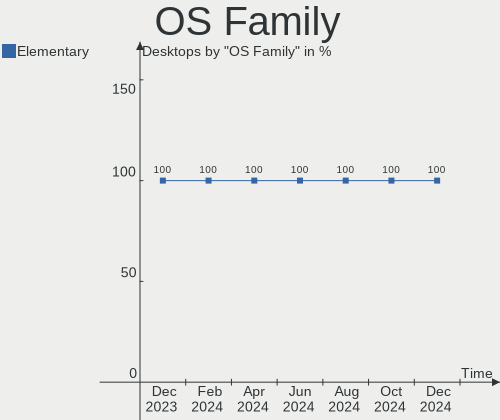
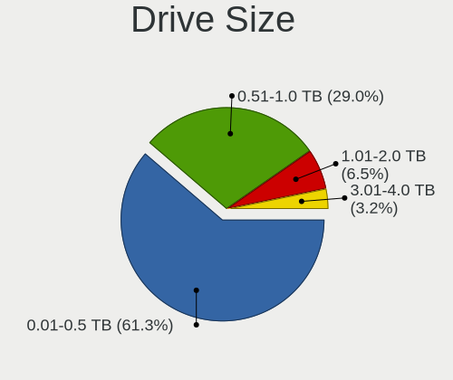
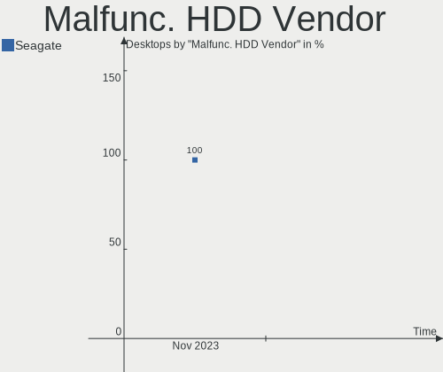
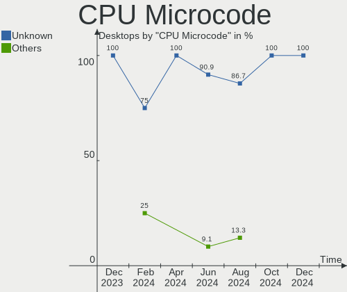
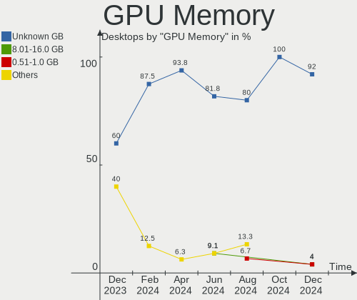
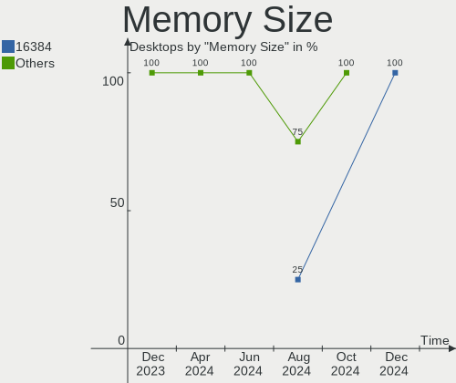

Elementary - Hardware Trends (Desktops)
---------------------------------------

A project to identify most popular hardware characteristics and track their change
over time based on data collected by Linux users at https://Linux-Hardware.org.

Anyone can contribute to this report by the [hw-probe](https://github.com/linuxhw/hw-probe) tool:

    sudo -E hw-probe -all -upload

This report is for one last month. Overall report since the beginning of time: [TestDays](https://github.com/linuxhw/TestDays)

Period: Nov, 2023.

Contents
--------

* [ System ](#system)
  - [ OS                       ](#os)
  - [ OS Family                ](#os-family)
  - [ Kernel                   ](#kernel)
  - [ Kernel Family            ](#kernel-family)
  - [ Kernel Major Ver.        ](#kernel-major-ver)
  - [ Arch                     ](#arch)
  - [ DE                       ](#de)
  - [ Display Server           ](#display-server)
  - [ Display Manager          ](#display-manager)
  - [ OS Lang                  ](#os-lang)
  - [ Boot Mode                ](#boot-mode)
  - [ Filesystem               ](#filesystem)
  - [ Part. scheme             ](#part-scheme)
  - [ Dual Boot with Linux/BSD ](#dual-boot-with-linuxbsd)
  - [ Dual Boot (Win)          ](#dual-boot-win)

* [ Board ](#board)
  - [ Vendor                   ](#vendor)
  - [ Model                    ](#model)
  - [ Model Family             ](#model-family)
  - [ MFG Year                 ](#mfg-year)
  - [ Form Factor              ](#form-factor)
  - [ Secure Boot              ](#secure-boot)
  - [ Coreboot                 ](#coreboot)
  - [ RAM Size                 ](#ram-size)
  - [ RAM Used                 ](#ram-used)
  - [ Total Drives             ](#total-drives)
  - [ Has CD-ROM               ](#has-cd-rom)
  - [ Has Ethernet             ](#has-ethernet)
  - [ Has WiFi                 ](#has-wifi)
  - [ Has Bluetooth            ](#has-bluetooth)

* [ Location ](#location)
  - [ Country                  ](#country)
  - [ City                     ](#city)

* [ Drives ](#drives)
  - [ Drive Vendor             ](#drive-vendor)
  - [ Drive Model              ](#drive-model)
  - [ HDD Vendor               ](#hdd-vendor)
  - [ SSD Vendor               ](#ssd-vendor)
  - [ Drive Kind               ](#drive-kind)
  - [ Drive Connector          ](#drive-connector)
  - [ Drive Size               ](#drive-size)
  - [ Space Total              ](#space-total)
  - [ Space Used               ](#space-used)
  - [ Malfunc. Drives          ](#malfunc-drives)
  - [ Malfunc. Drive Vendor    ](#malfunc-drive-vendor)
  - [ Malfunc. HDD Vendor      ](#malfunc-hdd-vendor)
  - [ Malfunc. Drive Kind      ](#malfunc-drive-kind)
  - [ Failed Drives            ](#failed-drives)
  - [ Failed Drive Vendor      ](#failed-drive-vendor)
  - [ Drive Status             ](#drive-status)

* [ Storage controller ](#storage-controller)
  - [ Storage Vendor           ](#storage-vendor)
  - [ Storage Model            ](#storage-model)
  - [ Storage Kind             ](#storage-kind)

* [ Processor ](#processor)
  - [ CPU Vendor               ](#cpu-vendor)
  - [ CPU Model                ](#cpu-model)
  - [ CPU Model Family         ](#cpu-model-family)
  - [ CPU Cores                ](#cpu-cores)
  - [ CPU Sockets              ](#cpu-sockets)
  - [ CPU Threads              ](#cpu-threads)
  - [ CPU Op-Modes             ](#cpu-op-modes)
  - [ CPU Microcode            ](#cpu-microcode)
  - [ CPU Microarch            ](#cpu-microarch)

* [ Graphics ](#graphics)
  - [ GPU Vendor               ](#gpu-vendor)
  - [ GPU Model                ](#gpu-model)
  - [ GPU Combo                ](#gpu-combo)
  - [ GPU Driver               ](#gpu-driver)
  - [ GPU Memory               ](#gpu-memory)

* [ Monitor ](#monitor)
  - [ Monitor Vendor           ](#monitor-vendor)
  - [ Monitor Model            ](#monitor-model)
  - [ Monitor Resolution       ](#monitor-resolution)
  - [ Monitor Diagonal         ](#monitor-diagonal)
  - [ Monitor Width            ](#monitor-width)
  - [ Aspect Ratio             ](#aspect-ratio)
  - [ Monitor Area             ](#monitor-area)
  - [ Pixel Density            ](#pixel-density)
  - [ Multiple Monitors        ](#multiple-monitors)

* [ Network ](#network)
  - [ Net Controller Vendor    ](#net-controller-vendor)
  - [ Net Controller Model     ](#net-controller-model)
  - [ Wireless Vendor          ](#wireless-vendor)
  - [ Wireless Model           ](#wireless-model)
  - [ Ethernet Vendor          ](#ethernet-vendor)
  - [ Ethernet Model           ](#ethernet-model)
  - [ Net Controller Kind      ](#net-controller-kind)
  - [ Used Controller          ](#used-controller)
  - [ NICs                     ](#nics)
  - [ IPv6                     ](#ipv6)

* [ Bluetooth ](#bluetooth)
  - [ Bluetooth Vendor         ](#bluetooth-vendor)
  - [ Bluetooth Model          ](#bluetooth-model)

* [ Sound ](#sound)
  - [ Sound Vendor             ](#sound-vendor)
  - [ Sound Model              ](#sound-model)

* [ Memory ](#memory)
  - [ Memory Vendor            ](#memory-vendor)
  - [ Memory Model             ](#memory-model)
  - [ Memory Kind              ](#memory-kind)
  - [ Memory Form Factor       ](#memory-form-factor)
  - [ Memory Size              ](#memory-size)
  - [ Memory Speed             ](#memory-speed)

* [ Printers & scanners ](#printers--scanners)
  - [ Printer Vendor           ](#printer-vendor)
  - [ Printer Model            ](#printer-model)
  - [ Scanner Vendor           ](#scanner-vendor)
  - [ Scanner Model            ](#scanner-model)

* [ Camera ](#camera)
  - [ Camera Vendor            ](#camera-vendor)
  - [ Camera Model             ](#camera-model)

* [ Security ](#security)
  - [ Fingerprint Vendor       ](#fingerprint-vendor)
  - [ Fingerprint Model        ](#fingerprint-model)
  - [ Chipcard Vendor          ](#chipcard-vendor)
  - [ Chipcard Model           ](#chipcard-model)

* [ Unsupported ](#unsupported)
  - [ Unsupported Devices      ](#unsupported-devices)
  - [ Unsupported Device Types ](#unsupported-device-types)

System
------

OS
--

Installed operating systems

| Name           | Desktops | Percent |
|----------------|----------|---------|
| Elementary 7.1 | 13       | 86.67%  |
| Elementary 7   | 1        | 6.67%   |
| Elementary 6.1 | 1        | 6.67%   |

OS Family
---------

OS without a version

| Name       | Desktops | Percent |
|------------|----------|---------|
| Elementary | 15       | 100%    |

Kernel
------

Version of the Linux kernel

| Version              | Desktops | Percent |
|----------------------|----------|---------|
| 6.2.0-36-generic     | 8        | 53.33%  |
| 6.2.0-33-generic     | 2        | 13.33%  |
| 6.2.0-37-generic     | 1        | 6.67%   |
| 6.2.0-35-generic     | 1        | 6.67%   |
| 6.2.0-060200-generic | 1        | 6.67%   |
| 5.15.0-84-generic    | 1        | 6.67%   |
| 5.15.0-58-generic    | 1        | 6.67%   |

Kernel Family
-------------

Linux kernel without a distro release

| Version | Desktops | Percent |
|---------|----------|---------|
| 6.2.0   | 13       | 86.67%  |
| 5.15.0  | 2        | 13.33%  |

Kernel Major Ver.
-----------------

Linux kernel major version

| Version | Desktops | Percent |
|---------|----------|---------|
| 6.2     | 13       | 86.67%  |
| 5.15    | 2        | 13.33%  |

Arch
----

OS architecture (x86_64, i586, etc.)

| Name   | Desktops | Percent |
|--------|----------|---------|
| x86_64 | 15       | 100%    |

DE
--

Desktop Environment

| Name     | Desktops | Percent |
|----------|----------|---------|
| Pantheon | 15       | 100%    |

Display Server
--------------

X11 or Wayland

| Name | Desktops | Percent |
|------|----------|---------|
| X11  | 15       | 100%    |

Display Manager
---------------

SDDM, LightDM, etc.

| Name    | Desktops | Percent |
|---------|----------|---------|
| Unknown | 14       | 93.33%  |
| LightDM | 1        | 6.67%   |

OS Lang
-------

Language

| Lang  | Desktops | Percent |
|-------|----------|---------|
| en_US | 8        | 53.33%  |
| de_DE | 2        | 13.33%  |
| pt_BR | 1        | 6.67%   |
| pl_PL | 1        | 6.67%   |
| it_IT | 1        | 6.67%   |
| fr_FR | 1        | 6.67%   |
| en_AU | 1        | 6.67%   |

Boot Mode
---------

EFI or BIOS

| Mode | Desktops | Percent |
|------|----------|---------|
| BIOS | 15       | 100%    |

Filesystem
----------

Type of filesystem

| Type | Desktops | Percent |
|------|----------|---------|
| Ext4 | 15       | 100%    |

Part. scheme
------------

Scheme of partitioning

| Type    | Desktops | Percent |
|---------|----------|---------|
| Unknown | 14       | 93.33%  |
| GPT     | 1        | 6.67%   |

Dual Boot with Linux/BSD
------------------------

Hosting more than one Linux/BSD

| Dual boot | Desktops | Percent |
|-----------|----------|---------|
| No        | 15       | 100%    |

Dual Boot (Win)
---------------

Hosting Linux and Windows

| Dual boot | Desktops | Percent |
|-----------|----------|---------|
| No        | 14       | 93.33%  |
| Yes       | 1        | 6.67%   |

Board
-----

Vendor
------

Motherboard manufacturer

| Name                | Desktops | Percent |
|---------------------|----------|---------|
| Dell                | 4        | 26.67%  |
| ASUSTek Computer    | 4        | 26.67%  |
| MSI                 | 1        | 6.67%   |
| Jetway              | 1        | 6.67%   |
| Intel               | 1        | 6.67%   |
| Hewlett-Packard     | 1        | 6.67%   |
| HC Technology.      | 1        | 6.67%   |
| Gigabyte Technology | 1        | 6.67%   |
| Fujitsu             | 1        | 6.67%   |

Model
-----

Motherboard model

| Name                             | Desktops | Percent |
|----------------------------------|----------|---------|
| ASUS PRIME A320M-K               | 2        | 13.33%  |
| MSI MS-7756                      | 1        | 6.67%   |
| Jetway TI61M5                    | 1        | 6.67%   |
| Intel Nobilis                    | 1        | 6.67%   |
| HP Z600 Workstation              | 1        | 6.67%   |
| HC Technology. HCAR5000-MI       | 1        | 6.67%   |
| Gigabyte B550M DS3H              | 1        | 6.67%   |
| Fujitsu ESPRIMO E720             | 1        | 6.67%   |
| Dell Precision WorkStation T3500 | 1        | 6.67%   |
| Dell OptiPlex 790                | 1        | 6.67%   |
| Dell OptiPlex 5040               | 1        | 6.67%   |
| Dell OptiPlex 3060               | 1        | 6.67%   |
| ASUS ROG STRIX B360-F GAMING     | 1        | 6.67%   |
| ASUS H110M-A/M.2                 | 1        | 6.67%   |

Model Family
------------

Motherboard model prefix

| Name                       | Desktops | Percent |
|----------------------------|----------|---------|
| Dell OptiPlex              | 3        | 20%     |
| ASUS PRIME                 | 2        | 13.33%  |
| MSI MS-7756                | 1        | 6.67%   |
| Jetway TI61M5              | 1        | 6.67%   |
| Intel Nobilis              | 1        | 6.67%   |
| HP Z600                    | 1        | 6.67%   |
| HC Technology. HCAR5000-MI | 1        | 6.67%   |
| Gigabyte B550M             | 1        | 6.67%   |
| Fujitsu ESPRIMO            | 1        | 6.67%   |
| Dell Precision             | 1        | 6.67%   |
| ASUS ROG                   | 1        | 6.67%   |
| ASUS H110M-A               | 1        | 6.67%   |

MFG Year
--------

Motherboard manufacture year

| Year | Desktops | Percent |
|------|----------|---------|
| 2018 | 3        | 20%     |
| 2011 | 3        | 20%     |
| 2017 | 2        | 13.33%  |
| 2022 | 1        | 6.67%   |
| 2020 | 1        | 6.67%   |
| 2016 | 1        | 6.67%   |
| 2013 | 1        | 6.67%   |
| 2012 | 1        | 6.67%   |
| 2010 | 1        | 6.67%   |
| 2009 | 1        | 6.67%   |

Form Factor
-----------

Physical design of the computer

| Name    | Desktops | Percent |
|---------|----------|---------|
| Desktop | 15       | 100%    |

Secure Boot
-----------

Enabled or disabled

| State    | Desktops | Percent |
|----------|----------|---------|
| Disabled | 15       | 100%    |

Coreboot
--------

Have coreboot on board

| Used | Desktops | Percent |
|------|----------|---------|
| No   | 15       | 100%    |

RAM Size
--------

Total RAM memory

| Size in GB | Desktops | Percent |
|------------|----------|---------|
| 16.01-24.0 | 6        | 40%     |
| 4.01-8.0   | 5        | 33.33%  |
| 32.01-64.0 | 2        | 13.33%  |
| 3.01-4.0   | 1        | 6.67%   |
| 8.01-16.0  | 1        | 6.67%   |

RAM Used
--------

Used RAM memory

| Used GB  | Desktops | Percent |
|----------|----------|---------|
| 2.01-3.0 | 6        | 40%     |
| 1.01-2.0 | 6        | 40%     |
| 3.01-4.0 | 3        | 20%     |

Total Drives
------------

Number of drives on board

| Drives | Desktops | Percent |
|--------|----------|---------|
| 2      | 9        | 60%     |
| 1      | 4        | 26.67%  |
| 3      | 2        | 13.33%  |

Has CD-ROM
----------

Has CD-ROM on board

| Presented | Desktops | Percent |
|-----------|----------|---------|
| Yes       | 8        | 53.33%  |
| No        | 7        | 46.67%  |

Has Ethernet
------------

Has Ethernet on board

| Presented | Desktops | Percent |
|-----------|----------|---------|
| Yes       | 15       | 100%    |

Has WiFi
--------

Has WiFi module

| Presented | Desktops | Percent |
|-----------|----------|---------|
| No        | 8        | 53.33%  |
| Yes       | 7        | 46.67%  |

Has Bluetooth
-------------

Has Bluetooth module

| Presented | Desktops | Percent |
|-----------|----------|---------|
| No        | 10       | 66.67%  |
| Yes       | 5        | 33.33%  |

Location
--------

Country
-------

Geographic location (country)

| Country                | Desktops | Percent |
|------------------------|----------|---------|
| USA                    | 4        | 26.67%  |
| Bosnia and Herzegovina | 2        | 13.33%  |
| UK                     | 1        | 6.67%   |
| Poland                 | 1        | 6.67%   |
| Morocco                | 1        | 6.67%   |
| Italy                  | 1        | 6.67%   |
| Israel                 | 1        | 6.67%   |
| Germany                | 1        | 6.67%   |
| Brazil                 | 1        | 6.67%   |
| Austria                | 1        | 6.67%   |
| Australia              | 1        | 6.67%   |

City
----

Geographic location (city)

| City         | Desktops | Percent |
|--------------|----------|---------|
| Sarajevo     | 2        | 13.33%  |
| Warsaw       | 1        | 6.67%   |
| Vienna       | 1        | 6.67%   |
| Van Vleck    | 1        | 6.67%   |
| Sao Vicente  | 1        | 6.67%   |
| Rome         | 1        | 6.67%   |
| Redding      | 1        | 6.67%   |
| Petah Tikva  | 1        | 6.67%   |
| Munich       | 1        | 6.67%   |
| Melbourne    | 1        | 6.67%   |
| London       | 1        | 6.67%   |
| Jacksonville | 1        | 6.67%   |
| Casablanca   | 1        | 6.67%   |
| Alexandria   | 1        | 6.67%   |

Drives
------

Drive Vendor
------------

Hard drive vendors

| Vendor              | Desktops | Drives | Percent |
|---------------------|----------|--------|---------|
| Seagate             | 7        | 9      | 25.93%  |
| WDC                 | 5        | 5      | 18.52%  |
| Samsung Electronics | 4        | 4      | 14.81%  |
| Sandisk             | 2        | 2      | 7.41%   |
| Gigabyte Technology | 2        | 2      | 7.41%   |
| SK hynix            | 1        | 1      | 3.7%    |
| Plextor             | 1        | 1      | 3.7%    |
| Maxtor              | 1        | 1      | 3.7%    |
| KIOXIA-EXCERIA      | 1        | 1      | 3.7%    |
| HUSKY               | 1        | 1      | 3.7%    |
| Hitachi             | 1        | 1      | 3.7%    |
| China               | 1        | 1      | 3.7%    |

Drive Model
-----------

Hard drive models

| Model                                | Desktops | Percent |
|--------------------------------------|----------|---------|
| Seagate ST500DM002-1BD142 500GB      | 2        | 6.9%    |
| Seagate ST3500413AS 500GB            | 2        | 6.9%    |
| Gigabyte GP-GSTFS31120GNTD 120GB SSD | 2        | 6.9%    |
| WDC WDBNCE5000PNC 500GB SSD          | 1        | 3.45%   |
| WDC WD20EZRZ-22Z5HB0 2TB             | 1        | 3.45%   |
| WDC WD10JPVX-22JC3T0 1TB             | 1        | 3.45%   |
| WDC WD10EZEX-60WN4A0 1TB             | 1        | 3.45%   |
| WDC WD1002FAEX-00Z3A0 1TB            | 1        | 3.45%   |
| SK hynix SC311 SATA 128GB SSD        | 1        | 3.45%   |
| Seagate ST3320413AS 320GB            | 1        | 3.45%   |
| Seagate ST3160318AS 160GB            | 1        | 3.45%   |
| Seagate ST3000DM008-2DM166 3TB       | 1        | 3.45%   |
| Seagate ST2000DM008-2FR102 2TB       | 1        | 3.45%   |
| Seagate ST1000DM003-9YN162 1TB       | 1        | 3.45%   |
| Sandisk WD_BLACK SN770 1TB           | 1        | 3.45%   |
| Sandisk WD Blue SN570 500GB          | 1        | 3.45%   |
| Samsung SSD 850 EVO M.2 250GB        | 1        | 3.45%   |
| Samsung MZ7TY256HDHP-000H1 256GB SSD | 1        | 3.45%   |
| Samsung HD501LJ 500GB                | 1        | 3.45%   |
| Samsung HD322HJ 320GB                | 1        | 3.45%   |
| Plextor PH6-CE120-L1 120GB SSD       | 1        | 3.45%   |
| Maxtor STM3320613AS 320GB            | 1        | 3.45%   |
| KIOXIA-EXCERIA SATA SSD 480GB        | 1        | 3.45%   |
| HUSKY SSD 128GB                      | 1        | 3.45%   |
| Hitachi HTS545050A7E380 500GB        | 1        | 3.45%   |
| China SSD 480GB                      | 1        | 3.45%   |

HDD Vendor
----------

Hard disk drive vendors

| Vendor              | Desktops | Drives | Percent |
|---------------------|----------|--------|---------|
| Seagate             | 7        | 9      | 46.67%  |
| WDC                 | 4        | 4      | 26.67%  |
| Samsung Electronics | 2        | 2      | 13.33%  |
| Maxtor              | 1        | 1      | 6.67%   |
| Hitachi             | 1        | 1      | 6.67%   |

SSD Vendor
----------

Solid state drive vendors

| Vendor              | Desktops | Drives | Percent |
|---------------------|----------|--------|---------|
| Samsung Electronics | 2        | 2      | 20%     |
| Gigabyte Technology | 2        | 2      | 20%     |
| WDC                 | 1        | 1      | 10%     |
| SK hynix            | 1        | 1      | 10%     |
| Plextor             | 1        | 1      | 10%     |
| KIOXIA-EXCERIA      | 1        | 1      | 10%     |
| HUSKY               | 1        | 1      | 10%     |
| China               | 1        | 1      | 10%     |

Drive Kind
----------

HDD or SSD

| Kind | Desktops | Drives | Percent |
|------|----------|--------|---------|
| HDD  | 12       | 17     | 52.17%  |
| SSD  | 9        | 10     | 39.13%  |
| NVMe | 2        | 2      | 8.7%    |

Drive Connector
---------------

SATA, SAS, NVMe, etc.

| Type | Desktops | Drives | Percent |
|------|----------|--------|---------|
| SATA | 14       | 27     | 87.5%   |
| NVMe | 2        | 2      | 12.5%   |

Drive Size
----------

Size of hard drive

| Size in TB | Desktops | Drives | Percent |
|------------|----------|--------|---------|
| 0.01-0.5   | 12       | 20     | 63.16%  |
| 0.51-1.0   | 4        | 4      | 21.05%  |
| 1.01-2.0   | 2        | 2      | 10.53%  |
| 2.01-3.0   | 1        | 1      | 5.26%   |

Space Total
-----------

Amount of disk space available on the file system

| Size in GB | Desktops | Percent |
|------------|----------|---------|
| 251-500    | 5        | 33.33%  |
| 101-250    | 3        | 20%     |
| 1001-2000  | 3        | 20%     |
| 501-1000   | 3        | 20%     |
| 2001-3000  | 1        | 6.67%   |

Space Used
----------

Amount of used disk space

| Used GB   | Desktops | Percent |
|-----------|----------|---------|
| 1-20      | 4        | 26.67%  |
| 21-50     | 3        | 20%     |
| 101-250   | 2        | 13.33%  |
| 1001-2000 | 2        | 13.33%  |
| 51-100    | 2        | 13.33%  |
| 251-500   | 1        | 6.67%   |
| 501-1000  | 1        | 6.67%   |

Malfunc. Drives
---------------

Drive models with a malfunction

| Model                     | Desktops | Drives | Percent |
|---------------------------|----------|--------|---------|
| Seagate ST3160318AS 160GB | 1        | 1      | 100%    |

Malfunc. Drive Vendor
---------------------

Vendors of faulty drives

| Vendor  | Desktops | Drives | Percent |
|---------|----------|--------|---------|
| Seagate | 1        | 1      | 100%    |

Malfunc. HDD Vendor
-------------------

Vendors of faulty HDD drives

| Vendor  | Desktops | Drives | Percent |
|---------|----------|--------|---------|
| Seagate | 1        | 1      | 100%    |

Malfunc. Drive Kind
-------------------

Kinds of faulty drives

| Kind | Desktops | Drives | Percent |
|------|----------|--------|---------|
| HDD  | 1        | 1      | 100%    |

Failed Drives
-------------

Failed drive models

Zero info for selected period =(

Failed Drive Vendor
-------------------

Failed drive vendors

Zero info for selected period =(

Drive Status
------------

Number of failed and malfunc. drives

| Status   | Desktops | Drives | Percent |
|----------|----------|--------|---------|
| Detected | 14       | 26     | 87.5%   |
| Malfunc  | 1        | 1      | 6.25%   |
| Works    | 1        | 2      | 6.25%   |

Storage controller
------------------

Storage Vendor
--------------

Storage controller vendors

| Vendor  | Desktops | Percent |
|---------|----------|---------|
| Intel   | 11       | 64.71%  |
| AMD     | 4        | 23.53%  |
| SanDisk | 2        | 11.76%  |

Storage Model
-------------

Storage controller models

| Model                                                                          | Desktops | Percent |
|--------------------------------------------------------------------------------|----------|---------|
| Intel 6 Series/C200 Series Chipset Family 6 port Desktop SATA AHCI Controller  | 3        | 15%     |
| AMD FCH SATA Controller [AHCI mode]                                            | 3        | 15%     |
| Intel SATA Controller [RAID mode]                                              | 2        | 10%     |
| Intel Q170/Q150/B150/H170/H110/Z170/CM236 Chipset SATA Controller [AHCI Mode]  | 2        | 10%     |
| AMD FCH SATA Controller D                                                      | 2        | 10%     |
| SanDisk WD Black SN770 / PC SN740 256GB / PC SN560 (DRAM-less) NVMe SSD        | 1        | 5%      |
| SanDisk Ultra 3D / WD Blue SN570 NVMe SSD (DRAM-less)                          | 1        | 5%      |
| Intel Cannon Lake PCH SATA AHCI Controller                                     | 1        | 5%      |
| Intel 82801JI (ICH10 Family) 4 port SATA IDE Controller #1                     | 1        | 5%      |
| Intel 82801JI (ICH10 Family) 2 port SATA IDE Controller #2                     | 1        | 5%      |
| Intel 8 Series/C220 Series Chipset Family 6-port SATA Controller 1 [AHCI mode] | 1        | 5%      |
| Intel 7 Series/C210 Series Chipset Family 6-port SATA Controller [AHCI mode]   | 1        | 5%      |
| AMD 500 Series Chipset SATA Controller                                         | 1        | 5%      |

Storage Kind
------------

Kind of storage controller (IDE, SATA, NVMe, SAS, ...)

| Kind | Desktops | Percent |
|------|----------|---------|
| SATA | 12       | 70.59%  |
| RAID | 2        | 11.76%  |
| NVMe | 2        | 11.76%  |
| IDE  | 1        | 5.88%   |

Processor
---------

CPU Vendor
----------

Processor vendors

| Vendor | Desktops | Percent |
|--------|----------|---------|
| Intel  | 11       | 73.33%  |
| AMD    | 4        | 26.67%  |

CPU Model
---------

Processor models

| Model                                       | Desktops | Percent |
|---------------------------------------------|----------|---------|
| AMD Ryzen 3 2200G with Radeon Vega Graphics | 2        | 13.33%  |
| Intel Xeon CPU W3540 @ 2.93GHz              | 1        | 6.67%   |
| Intel Xeon CPU E5620 @ 2.40GHz              | 1        | 6.67%   |
| Intel Core i7-7700 CPU @ 3.60GHz            | 1        | 6.67%   |
| Intel Core i7-6700 CPU @ 3.40GHz            | 1        | 6.67%   |
| Intel Core i5-4590 CPU @ 3.30GHz            | 1        | 6.67%   |
| Intel Core i5-3450 CPU @ 3.10GHz            | 1        | 6.67%   |
| Intel Core i5-2500 CPU @ 3.30GHz            | 1        | 6.67%   |
| Intel Core i5-2400 CPU @ 3.10GHz            | 1        | 6.67%   |
| Intel Core i5-2300 CPU @ 2.80GHz            | 1        | 6.67%   |
| Intel Core i3-8100T CPU @ 3.10GHz           | 1        | 6.67%   |
| Intel Core i3-8100 CPU @ 3.60GHz            | 1        | 6.67%   |
| AMD Ryzen 5 5600G with Radeon Graphics      | 1        | 6.67%   |
| AMD Ryzen 5 5500U with Radeon Graphics      | 1        | 6.67%   |

CPU Model Family
----------------

Processor model prefix

| Model         | Desktops | Percent |
|---------------|----------|---------|
| Intel Core i5 | 5        | 33.33%  |
| Intel Xeon    | 2        | 13.33%  |
| Intel Core i7 | 2        | 13.33%  |
| Intel Core i3 | 2        | 13.33%  |
| AMD Ryzen 5   | 2        | 13.33%  |
| AMD Ryzen 3   | 2        | 13.33%  |

CPU Cores
---------

Number of processor cores

| Number | Desktops | Percent |
|--------|----------|---------|
| 4      | 12       | 80%     |
| 6      | 2        | 13.33%  |
| 8      | 1        | 6.67%   |

CPU Sockets
-----------

Number of sockets

| Number | Desktops | Percent |
|--------|----------|---------|
| 1      | 14       | 93.33%  |
| 2      | 1        | 6.67%   |

CPU Threads
-----------

Threads per core (Hyper-Threading)

| Number | Desktops | Percent |
|--------|----------|---------|
| 1      | 9        | 60%     |
| 2      | 6        | 40%     |

CPU Op-Modes
------------

CPU Operation Modes (32-bit, 64-bit)

| Op mode        | Desktops | Percent |
|----------------|----------|---------|
| 32-bit, 64-bit | 15       | 100%    |

CPU Microcode
-------------

Microcode number

| Number  | Desktops | Percent |
|---------|----------|---------|
| Unknown | 14       | 93.33%  |
| 0x206c2 | 1        | 6.67%   |

CPU Microarch
-------------

Microarchitecture

| Name        | Desktops | Percent |
|-------------|----------|---------|
| SandyBridge | 3        | 20%     |
| KabyLake    | 3        | 20%     |
| Zen         | 2        | 13.33%  |
| Zen 3       | 1        | 6.67%   |
| Westmere    | 1        | 6.67%   |
| Skylake     | 1        | 6.67%   |
| Nehalem     | 1        | 6.67%   |
| IvyBridge   | 1        | 6.67%   |
| Haswell     | 1        | 6.67%   |
| Unknown     | 1        | 6.67%   |

Graphics
--------

GPU Vendor
----------

Vendors of graphics cards

| Vendor | Desktops | Percent |
|--------|----------|---------|
| Intel  | 6        | 37.5%   |
| Nvidia | 5        | 31.25%  |
| AMD    | 5        | 31.25%  |

GPU Model
---------

Graphics card models

| Model                                                                       | Desktops | Percent |
|-----------------------------------------------------------------------------|----------|---------|
| Nvidia GK208B [GeForce GT 710]                                              | 2        | 11.76%  |
| Intel 2nd Generation Core Processor Family Integrated Graphics Controller   | 2        | 11.76%  |
| Nvidia TU117 [GeForce GTX 1650]                                             | 1        | 5.88%   |
| Nvidia TU106 [GeForce GTX 1650]                                             | 1        | 5.88%   |
| Nvidia GP107 [GeForce GTX 1050 Ti]                                          | 1        | 5.88%   |
| Nvidia GM107GL [Quadro K620]                                                | 1        | 5.88%   |
| Intel Xeon E3-1200 v3/4th Gen Core Processor Integrated Graphics Controller | 1        | 5.88%   |
| Intel HD Graphics 630                                                       | 1        | 5.88%   |
| Intel HD Graphics 530                                                       | 1        | 5.88%   |
| Intel CoffeeLake-S GT2 [UHD Graphics 630]                                   | 1        | 5.88%   |
| AMD Tahiti XT [Radeon HD 7970/8970 OEM / R9 280X]                           | 1        | 5.88%   |
| AMD Raven Ridge [Radeon Vega Series / Radeon Vega Mobile Series]            | 1        | 5.88%   |
| AMD Lucienne                                                                | 1        | 5.88%   |
| AMD Cezanne [Radeon Vega Series / Radeon Vega Mobile Series]                | 1        | 5.88%   |
| AMD Caicos XT [Radeon HD 7470/8470 / R5 235/310 OEM]                        | 1        | 5.88%   |

GPU Combo
---------

Combinations of graphics cards

| Name           | Desktops | Percent |
|----------------|----------|---------|
| 1 x Intel      | 5        | 33.33%  |
| 1 x AMD        | 5        | 33.33%  |
| 1 x Nvidia     | 3        | 20%     |
| 2 x Nvidia     | 1        | 6.67%   |
| Intel + Nvidia | 1        | 6.67%   |

GPU Driver
----------

Free vs proprietary

| Driver      | Desktops | Percent |
|-------------|----------|---------|
| Free        | 13       | 86.67%  |
| Proprietary | 2        | 13.33%  |

GPU Memory
----------

Total video memory

| Size in GB | Desktops | Percent |
|------------|----------|---------|
| Unknown    | 11       | 73.33%  |
| 3.01-4.0   | 2        | 13.33%  |
| 1.01-2.0   | 1        | 6.67%   |
| 0.51-1.0   | 1        | 6.67%   |

Monitor
-------

Monitor Vendor
--------------

Monitor vendors

| Vendor              | Desktops | Percent |
|---------------------|----------|---------|
| Goldstar            | 4        | 23.53%  |
| Hewlett-Packard     | 3        | 17.65%  |
| Philips             | 2        | 11.76%  |
| Vizio               | 1        | 5.88%   |
| Samsung Electronics | 1        | 5.88%   |
| NEC Computers       | 1        | 5.88%   |
| Medion              | 1        | 5.88%   |
| LTM                 | 1        | 5.88%   |
| Kogan               | 1        | 5.88%   |
| Dell                | 1        | 5.88%   |
| Acer                | 1        | 5.88%   |

Monitor Model
-------------

Monitor models

| Model                                                        | Desktops | Percent |
|--------------------------------------------------------------|----------|---------|
| Vizio D24f-F1 VIZ1027 1920x1080 530x300mm 24.0-inch          | 1        | 5.56%   |
| Samsung Electronics SyncMaster SAM0423 1920x1080             | 1        | 5.56%   |
| Philips PHL 276E9Q PHLC17B 1920x1080 598x336mm 27.0-inch     | 1        | 5.56%   |
| Philips PHL 243V5 PHLC0D1 1920x1080 521x293mm 23.5-inch      | 1        | 5.56%   |
| NEC Computers LCD224WM NEC6733 1680x1050 474x296mm 22.0-inch | 1        | 5.56%   |
| Medion MD21274 MED36B5 1920x1080 598x336mm 27.0-inch         | 1        | 5.56%   |
| LTM LONTIUM LTM0401 1920x1080 890x500mm 40.2-inch            | 1        | 5.56%   |
| Kogan KAMN27QF7TA KGN0270 2560x1440 698x393mm 31.5-inch      | 1        | 5.56%   |
| Hewlett-Packard 27mq HPN3671 2560x1440 597x336mm 27.0-inch   | 1        | 5.56%   |
| Hewlett-Packard 2711 HWP2941 1920x1080 598x337mm 27.0-inch   | 1        | 5.56%   |
| Hewlett-Packard 24f HPN3545 1920x1080 527x296mm 23.8-inch    | 1        | 5.56%   |
| Hewlett-Packard 22es HWP331B 1920x1080 476x268mm 21.5-inch   | 1        | 5.56%   |
| Goldstar ULTRAGEAR GSM5C08 1920x1080 530x300mm 24.0-inch     | 1        | 5.56%   |
| Goldstar L1753T GSM4434 1280x1024 338x270mm 17.0-inch        | 1        | 5.56%   |
| Goldstar FULL HD GSM5B55 1920x1080 480x270mm 21.7-inch       | 1        | 5.56%   |
| Goldstar 2D HD TV GSM59C8 1366x768 509x286mm 23.0-inch       | 1        | 5.56%   |
| Dell 1704FPV DEL3015 1280x1024 338x270mm 17.0-inch           | 1        | 5.56%   |
| Acer P221W ACR0016 1680x1050 474x296mm 22.0-inch             | 1        | 5.56%   |

Monitor Resolution
------------------

Monitor screen resolution

| Resolution         | Desktops | Percent |
|--------------------|----------|---------|
| 1920x1080 (FHD)    | 8        | 50%     |
| 2560x1440 (QHD)    | 2        | 12.5%   |
| 1680x1050 (WSXGA+) | 2        | 12.5%   |
| 1280x1024 (SXGA)   | 2        | 12.5%   |
| 3840x2160 (4K)     | 1        | 6.25%   |
| 1366x768 (WXGA)    | 1        | 6.25%   |

Monitor Diagonal
----------------

Diagonal size in inches

| Inches  | Desktops | Percent |
|---------|----------|---------|
| 27      | 4        | 22.22%  |
| 24      | 2        | 11.11%  |
| 23      | 2        | 11.11%  |
| 22      | 2        | 11.11%  |
| 17      | 2        | 11.11%  |
| 49      | 1        | 5.56%   |
| 40      | 1        | 5.56%   |
| 31      | 1        | 5.56%   |
| 26      | 1        | 5.56%   |
| 21      | 1        | 5.56%   |
| Unknown | 1        | 5.56%   |

Monitor Width
-------------

Physical width

| Width in mm | Desktops | Percent |
|-------------|----------|---------|
| 501-600     | 7        | 41.18%  |
| 401-500     | 4        | 23.53%  |
| 301-350     | 2        | 11.76%  |
| 801-900     | 1        | 5.88%   |
| 601-700     | 1        | 5.88%   |
| 1001-1500   | 1        | 5.88%   |
| Unknown     | 1        | 5.88%   |

Aspect Ratio
------------

Proportional relationship between the width and the height

| Ratio | Desktops | Percent |
|-------|----------|---------|
| 16/9  | 10       | 71.43%  |
| 5/4   | 2        | 14.29%  |
| 16/10 | 2        | 14.29%  |

Monitor Area
------------

Area in inch²

| Area in inch² | Desktops | Percent |
|----------------|----------|---------|
| 201-250        | 6        | 35.29%  |
| 301-350        | 4        | 23.53%  |
| 141-150        | 2        | 11.76%  |
| More than 1000 | 1        | 5.88%   |
| 351-500        | 1        | 5.88%   |
| 251-300        | 1        | 5.88%   |
| 501-1000       | 1        | 5.88%   |
| Unknown        | 1        | 5.88%   |

Pixel Density
-------------

Pixels per inch

| Density | Desktops | Percent |
|---------|----------|---------|
| 51-100  | 10       | 71.43%  |
| 101-120 | 2        | 14.29%  |
| 1-50    | 1        | 7.14%   |
| Unknown | 1        | 7.14%   |

Multiple Monitors
-----------------

Total monitors connected

| Total | Desktops | Percent |
|-------|----------|---------|
| 1     | 10       | 66.67%  |
| 2     | 5        | 33.33%  |

Network
-------

Net Controller Vendor
---------------------

Controller vendors

| Vendor                | Desktops | Percent |
|-----------------------|----------|---------|
| Realtek Semiconductor | 8        | 34.78%  |
| Intel                 | 7        | 30.43%  |
| Broadcom              | 2        | 8.7%    |
| TP-Link               | 1        | 4.35%   |
| Ralink Technology     | 1        | 4.35%   |
| Ralink                | 1        | 4.35%   |
| NetGear               | 1        | 4.35%   |
| ICS Advent            | 1        | 4.35%   |
| ASIX Electronics      | 1        | 4.35%   |

Net Controller Model
--------------------

Controller models

| Model                                                             | Desktops | Percent |
|-------------------------------------------------------------------|----------|---------|
| Realtek RTL8111/8168/8411 PCI Express Gigabit Ethernet Controller | 6        | 24%     |
| Intel Ethernet Connection (2) I219-V                              | 2        | 8%      |
| TP-Link TL-WN823N v2/v3 [Realtek RTL8192EU]                       | 1        | 4%      |
| Realtek RTL8821CE 802.11ac PCIe Wireless Network Adapter          | 1        | 4%      |
| Realtek RTL8188SU 802.11n WLAN Adapter                            | 1        | 4%      |
| Realtek RTL810xE PCI Express Fast Ethernet controller             | 1        | 4%      |
| Realtek 802.11ac NIC                                              | 1        | 4%      |
| Ralink MT7601U Wireless Adapter                                   | 1        | 4%      |
| Ralink RT3060 Wireless 802.11n 1T/1R                              | 1        | 4%      |
| NetGear A6100 AC600 DB Wireless Adapter [Realtek RTL8811AU]       | 1        | 4%      |
| Intel Ethernet Controller I226-V                                  | 1        | 4%      |
| Intel Ethernet Connection I217-V                                  | 1        | 4%      |
| Intel Ethernet Connection (7) I219-V                              | 1        | 4%      |
| Intel 82579V Gigabit Network Connection                           | 1        | 4%      |
| Intel 82579LM Gigabit Network Connection (Lewisville)             | 1        | 4%      |
| ICS Advent DM9601 Fast Ethernet Adapter                           | 1        | 4%      |
| Broadcom NetXtreme BCM5764M Gigabit Ethernet PCIe                 | 1        | 4%      |
| Broadcom NetXtreme BCM5761 Gigabit Ethernet PCIe                  | 1        | 4%      |
| ASIX AX88772B                                                     | 1        | 4%      |

Wireless Vendor
---------------

Wireless vendors

| Vendor                | Desktops | Percent |
|-----------------------|----------|---------|
| Realtek Semiconductor | 3        | 42.86%  |
| TP-Link               | 1        | 14.29%  |
| Ralink Technology     | 1        | 14.29%  |
| Ralink                | 1        | 14.29%  |
| NetGear               | 1        | 14.29%  |

Wireless Model
--------------

Wireless models

| Model                                                       | Desktops | Percent |
|-------------------------------------------------------------|----------|---------|
| TP-Link TL-WN823N v2/v3 [Realtek RTL8192EU]                 | 1        | 14.29%  |
| Realtek RTL8821CE 802.11ac PCIe Wireless Network Adapter    | 1        | 14.29%  |
| Realtek RTL8188SU 802.11n WLAN Adapter                      | 1        | 14.29%  |
| Realtek 802.11ac NIC                                        | 1        | 14.29%  |
| Ralink MT7601U Wireless Adapter                             | 1        | 14.29%  |
| Ralink RT3060 Wireless 802.11n 1T/1R                        | 1        | 14.29%  |
| NetGear A6100 AC600 DB Wireless Adapter [Realtek RTL8811AU] | 1        | 14.29%  |

Ethernet Vendor
---------------

Ethernet vendors

| Vendor                | Desktops | Percent |
|-----------------------|----------|---------|
| Realtek Semiconductor | 7        | 38.89%  |
| Intel                 | 7        | 38.89%  |
| Broadcom              | 2        | 11.11%  |
| ICS Advent            | 1        | 5.56%   |
| ASIX Electronics      | 1        | 5.56%   |

Ethernet Model
--------------

Ethernet models

| Model                                                             | Desktops | Percent |
|-------------------------------------------------------------------|----------|---------|
| Realtek RTL8111/8168/8411 PCI Express Gigabit Ethernet Controller | 6        | 33.33%  |
| Intel Ethernet Connection (2) I219-V                              | 2        | 11.11%  |
| Realtek RTL810xE PCI Express Fast Ethernet controller             | 1        | 5.56%   |
| Intel Ethernet Controller I226-V                                  | 1        | 5.56%   |
| Intel Ethernet Connection I217-V                                  | 1        | 5.56%   |
| Intel Ethernet Connection (7) I219-V                              | 1        | 5.56%   |
| Intel 82579V Gigabit Network Connection                           | 1        | 5.56%   |
| Intel 82579LM Gigabit Network Connection (Lewisville)             | 1        | 5.56%   |
| ICS Advent DM9601 Fast Ethernet Adapter                           | 1        | 5.56%   |
| Broadcom NetXtreme BCM5764M Gigabit Ethernet PCIe                 | 1        | 5.56%   |
| Broadcom NetXtreme BCM5761 Gigabit Ethernet PCIe                  | 1        | 5.56%   |
| ASIX AX88772B                                                     | 1        | 5.56%   |

Net Controller Kind
-------------------

Ethernet, WiFi or modem

| Kind     | Desktops | Percent |
|----------|----------|---------|
| Ethernet | 15       | 68.18%  |
| WiFi     | 7        | 31.82%  |

Used Controller
---------------

Currently used network controller

| Kind     | Desktops | Percent |
|----------|----------|---------|
| Ethernet | 13       | 76.47%  |
| WiFi     | 4        | 23.53%  |

NICs
----

Total network controllers on board

| Total | Desktops | Percent |
|-------|----------|---------|
| 1     | 13       | 86.67%  |
| 3     | 1        | 6.67%   |
| 2     | 1        | 6.67%   |

IPv6
----

IPv6 vs IPv4

| Used | Desktops | Percent |
|------|----------|---------|
| No   | 9        | 60%     |
| Yes  | 6        | 40%     |

Bluetooth
---------

Bluetooth Vendor
----------------

Controller vendors

| Vendor                  | Desktops | Percent |
|-------------------------|----------|---------|
| Cambridge Silicon Radio | 2        | 40%     |
| TP-Link                 | 1        | 20%     |
| Realtek Semiconductor   | 1        | 20%     |
| ASUSTek Computer        | 1        | 20%     |

Bluetooth Model
---------------

Controller models

| Model                                               | Desktops | Percent |
|-----------------------------------------------------|----------|---------|
| Cambridge Silicon Radio Bluetooth Dongle (HCI mode) | 2        | 40%     |
| TP-Link TP-Cdj+ UB5A Adapter                        | 1        | 20%     |
| Realtek Bluetooth Radio                             | 1        | 20%     |
| ASUS Broadcom BCM20702A0 Bluetooth                  | 1        | 20%     |

Sound
-----

Sound Vendor
------------

Sound card vendors

| Vendor              | Desktops | Percent |
|---------------------|----------|---------|
| Intel               | 11       | 47.83%  |
| AMD                 | 6        | 26.09%  |
| Nvidia              | 5        | 21.74%  |
| C-Media Electronics | 1        | 4.35%   |

Sound Model
-----------

Sound card models

| Model                                                                             | Desktops | Percent |
|-----------------------------------------------------------------------------------|----------|---------|
| AMD Family 17h/19h HD Audio Controller                                            | 4        | 14.29%  |
| Intel 6 Series/C200 Series Chipset Family High Definition Audio Controller        | 3        | 10.71%  |
| Nvidia GK208 HDMI/DP Audio Controller                                             | 2        | 7.14%   |
| Intel Cannon Lake PCH cAVS                                                        | 2        | 7.14%   |
| Intel 82801JI (ICH10 Family) HD Audio Controller                                  | 2        | 7.14%   |
| Intel 100 Series/C230 Series Chipset Family HD Audio Controller                   | 2        | 7.14%   |
| AMD Renoir Radeon High Definition Audio Controller                                | 2        | 7.14%   |
| Nvidia TU107 GeForce GTX 1650 High Definition Audio Controller                    | 1        | 3.57%   |
| Nvidia TU106 High Definition Audio Controller                                     | 1        | 3.57%   |
| Nvidia GP107GL High Definition Audio Controller                                   | 1        | 3.57%   |
| Nvidia GM107 High Definition Audio Controller [GeForce 940MX]                     | 1        | 3.57%   |
| Intel Xeon E3-1200 v3/4th Gen Core Processor HD Audio Controller                  | 1        | 3.57%   |
| Intel 8 Series/C220 Series Chipset High Definition Audio Controller               | 1        | 3.57%   |
| Intel 7 Series/C216 Chipset Family High Definition Audio Controller               | 1        | 3.57%   |
| C-Media Electronics Audio Adapter (Unitek Y-247A)                                 | 1        | 3.57%   |
| AMD Tahiti HDMI Audio [Radeon HD 7870 XT / 7950/7970]                             | 1        | 3.57%   |
| AMD Raven/Raven2/Fenghuang HDMI/DP Audio Controller                               | 1        | 3.57%   |
| AMD Caicos HDMI Audio [Radeon HD 6450 / 7450/8450/8490 OEM / R5 230/235/235X OEM] | 1        | 3.57%   |

Memory
------

Memory Vendor
-------------

Memory module vendors

| Vendor           | Desktops | Percent |
|------------------|----------|---------|
| Nanya Technology | 1        | 50%     |
| Kingston         | 1        | 50%     |

Memory Model
------------

Memory module models

| Model                                              | Desktops | Percent |
|----------------------------------------------------|----------|---------|
| Nanya RAM NT2GC64B88B0NF-CG 2GB DIMM DDR3 1333MT/s | 1        | 50%     |
| Kingston RAM KTW149-ELD 1GB DIMM DDR3 1333MT/s     | 1        | 50%     |

Memory Kind
-----------

Memory module kinds

| Kind | Desktops | Percent |
|------|----------|---------|
| DDR3 | 1        | 100%    |

Memory Form Factor
------------------

Physical design of the memory module

| Name | Desktops | Percent |
|------|----------|---------|
| DIMM | 1        | 100%    |

Memory Size
-----------

Memory module size

| Size | Desktops | Percent |
|------|----------|---------|
| 2048 | 1        | 50%     |
| 1024 | 1        | 50%     |

Memory Speed
------------

Memory module speed

| Speed | Desktops | Percent |
|-------|----------|---------|
| 1333  | 1        | 100%    |

Printers & scanners
-------------------

Printer Vendor
--------------

Printer device vendors

Zero info for selected period =(

Printer Model
-------------

Printer device models

Zero info for selected period =(

Scanner Vendor
--------------

Scanner device vendors

Zero info for selected period =(

Scanner Model
-------------

Scanner device models

Zero info for selected period =(

Camera
------

Camera Vendor
-------------

Camera device vendors

| Vendor       | Desktops | Percent |
|--------------|----------|---------|
| MacroSilicon | 1        | 50%     |
| Logitech     | 1        | 50%     |

Camera Model
------------

Camera device models

| Model                           | Desktops | Percent |
|---------------------------------|----------|---------|
| MacroSilicon USB3.0 UHD         | 1        | 50%     |
| Logitech C922 Pro Stream Webcam | 1        | 50%     |

Security
--------

Fingerprint Vendor
------------------

Fingerprint sensor vendors

Zero info for selected period =(

Fingerprint Model
-----------------

Fingerprint sensor models

Zero info for selected period =(

Chipcard Vendor
---------------

Chipcard module vendors

Zero info for selected period =(

Chipcard Model
--------------

Chipcard module models

Zero info for selected period =(

Unsupported
-----------

Unsupported Devices
-------------------

Total unsupported devices on board

| Total | Desktops | Percent |
|-------|----------|---------|
| 0     | 14       | 93.33%  |
| 1     | 1        | 6.67%   |

Unsupported Device Types
------------------------

Types of unsupported devices

| Type         | Desktops | Percent |
|--------------|----------|---------|
| Net/wireless | 1        | 100%    |

