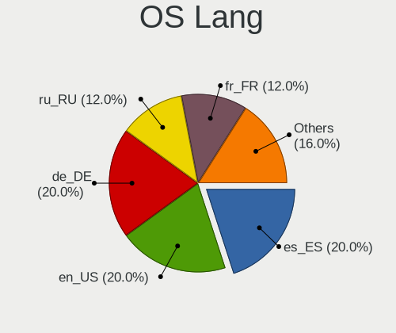
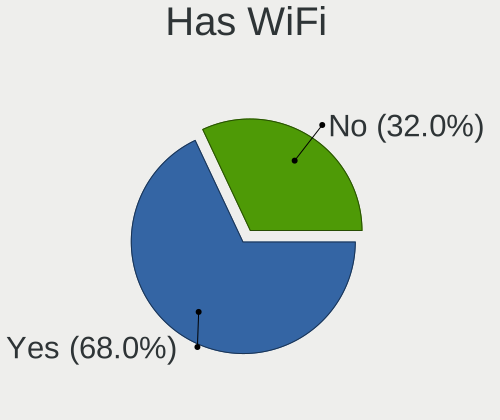
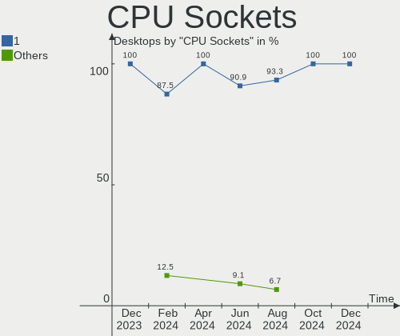
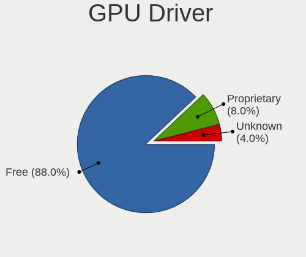
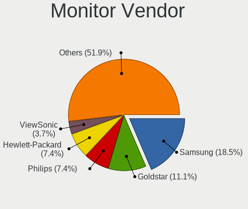
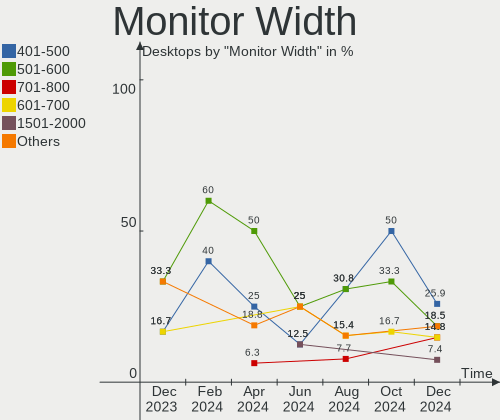
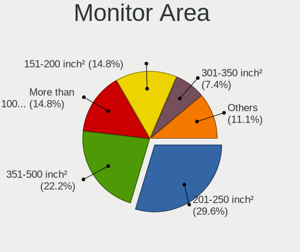

Elementary - Hardware Trends (Desktops)
---------------------------------------

A project to identify most popular hardware characteristics and track their change
over time based on data collected by Linux users at https://Linux-Hardware.org.

Anyone can contribute to this report by the [hw-probe](https://github.com/linuxhw/hw-probe) tool:

    sudo -E hw-probe -all -upload

This report is for one last month. Overall report since the beginning of time: [TestDays](https://github.com/linuxhw/TestDays)

Period: Feb, 2023.

Contents
--------

* [ System ](#system)
  - [ OS                       ](#os)
  - [ OS Family                ](#os-family)
  - [ Kernel                   ](#kernel)
  - [ Kernel Family            ](#kernel-family)
  - [ Kernel Major Ver.        ](#kernel-major-ver)
  - [ Arch                     ](#arch)
  - [ DE                       ](#de)
  - [ Display Server           ](#display-server)
  - [ Display Manager          ](#display-manager)
  - [ OS Lang                  ](#os-lang)
  - [ Boot Mode                ](#boot-mode)
  - [ Filesystem               ](#filesystem)
  - [ Part. scheme             ](#part-scheme)
  - [ Dual Boot with Linux/BSD ](#dual-boot-with-linuxbsd)
  - [ Dual Boot (Win)          ](#dual-boot-win)

* [ Board ](#board)
  - [ Vendor                   ](#vendor)
  - [ Model                    ](#model)
  - [ Model Family             ](#model-family)
  - [ MFG Year                 ](#mfg-year)
  - [ Form Factor              ](#form-factor)
  - [ Secure Boot              ](#secure-boot)
  - [ Coreboot                 ](#coreboot)
  - [ RAM Size                 ](#ram-size)
  - [ RAM Used                 ](#ram-used)
  - [ Total Drives             ](#total-drives)
  - [ Has CD-ROM               ](#has-cd-rom)
  - [ Has Ethernet             ](#has-ethernet)
  - [ Has WiFi                 ](#has-wifi)
  - [ Has Bluetooth            ](#has-bluetooth)

* [ Location ](#location)
  - [ Country                  ](#country)
  - [ City                     ](#city)

* [ Drives ](#drives)
  - [ Drive Vendor             ](#drive-vendor)
  - [ Drive Model              ](#drive-model)
  - [ HDD Vendor               ](#hdd-vendor)
  - [ SSD Vendor               ](#ssd-vendor)
  - [ Drive Kind               ](#drive-kind)
  - [ Drive Connector          ](#drive-connector)
  - [ Drive Size               ](#drive-size)
  - [ Space Total              ](#space-total)
  - [ Space Used               ](#space-used)
  - [ Malfunc. Drives          ](#malfunc-drives)
  - [ Malfunc. Drive Vendor    ](#malfunc-drive-vendor)
  - [ Malfunc. HDD Vendor      ](#malfunc-hdd-vendor)
  - [ Malfunc. Drive Kind      ](#malfunc-drive-kind)
  - [ Failed Drives            ](#failed-drives)
  - [ Failed Drive Vendor      ](#failed-drive-vendor)
  - [ Drive Status             ](#drive-status)

* [ Storage controller ](#storage-controller)
  - [ Storage Vendor           ](#storage-vendor)
  - [ Storage Model            ](#storage-model)
  - [ Storage Kind             ](#storage-kind)

* [ Processor ](#processor)
  - [ CPU Vendor               ](#cpu-vendor)
  - [ CPU Model                ](#cpu-model)
  - [ CPU Model Family         ](#cpu-model-family)
  - [ CPU Cores                ](#cpu-cores)
  - [ CPU Sockets              ](#cpu-sockets)
  - [ CPU Threads              ](#cpu-threads)
  - [ CPU Op-Modes             ](#cpu-op-modes)
  - [ CPU Microcode            ](#cpu-microcode)
  - [ CPU Microarch            ](#cpu-microarch)

* [ Graphics ](#graphics)
  - [ GPU Vendor               ](#gpu-vendor)
  - [ GPU Model                ](#gpu-model)
  - [ GPU Combo                ](#gpu-combo)
  - [ GPU Driver               ](#gpu-driver)
  - [ GPU Memory               ](#gpu-memory)

* [ Monitor ](#monitor)
  - [ Monitor Vendor           ](#monitor-vendor)
  - [ Monitor Model            ](#monitor-model)
  - [ Monitor Resolution       ](#monitor-resolution)
  - [ Monitor Diagonal         ](#monitor-diagonal)
  - [ Monitor Width            ](#monitor-width)
  - [ Aspect Ratio             ](#aspect-ratio)
  - [ Monitor Area             ](#monitor-area)
  - [ Pixel Density            ](#pixel-density)
  - [ Multiple Monitors        ](#multiple-monitors)

* [ Network ](#network)
  - [ Net Controller Vendor    ](#net-controller-vendor)
  - [ Net Controller Model     ](#net-controller-model)
  - [ Wireless Vendor          ](#wireless-vendor)
  - [ Wireless Model           ](#wireless-model)
  - [ Ethernet Vendor          ](#ethernet-vendor)
  - [ Ethernet Model           ](#ethernet-model)
  - [ Net Controller Kind      ](#net-controller-kind)
  - [ Used Controller          ](#used-controller)
  - [ NICs                     ](#nics)
  - [ IPv6                     ](#ipv6)

* [ Bluetooth ](#bluetooth)
  - [ Bluetooth Vendor         ](#bluetooth-vendor)
  - [ Bluetooth Model          ](#bluetooth-model)

* [ Sound ](#sound)
  - [ Sound Vendor             ](#sound-vendor)
  - [ Sound Model              ](#sound-model)

* [ Memory ](#memory)
  - [ Memory Vendor            ](#memory-vendor)
  - [ Memory Model             ](#memory-model)
  - [ Memory Kind              ](#memory-kind)
  - [ Memory Form Factor       ](#memory-form-factor)
  - [ Memory Size              ](#memory-size)
  - [ Memory Speed             ](#memory-speed)

* [ Printers & scanners ](#printers--scanners)
  - [ Printer Vendor           ](#printer-vendor)
  - [ Printer Model            ](#printer-model)
  - [ Scanner Vendor           ](#scanner-vendor)
  - [ Scanner Model            ](#scanner-model)

* [ Camera ](#camera)
  - [ Camera Vendor            ](#camera-vendor)
  - [ Camera Model             ](#camera-model)

* [ Security ](#security)
  - [ Fingerprint Vendor       ](#fingerprint-vendor)
  - [ Fingerprint Model        ](#fingerprint-model)
  - [ Chipcard Vendor          ](#chipcard-vendor)
  - [ Chipcard Model           ](#chipcard-model)

* [ Unsupported ](#unsupported)
  - [ Unsupported Devices      ](#unsupported-devices)
  - [ Unsupported Device Types ](#unsupported-device-types)

System
------

OS
--

Installed operating systems

| Name             | Desktops | Percent |
|------------------|----------|---------|
| Elementary 7     | 14       | 73.68%  |
| Elementary 6.1   | 4        | 21.05%  |
| Elementary 5.1.7 | 1        | 5.26%   |

OS Family
---------

OS without a version

| Name       | Desktops | Percent |
|------------|----------|---------|
| Elementary | 19       | 100%    |

Kernel
------

Version of the Linux kernel

| Version                | Desktops | Percent |
|------------------------|----------|---------|
| 5.19.0-32-generic      | 7        | 36.84%  |
| 5.15.0-60-generic      | 4        | 21.05%  |
| 5.15.0-58-generic      | 4        | 21.05%  |
| 5.4.0-139-generic      | 1        | 5.26%   |
| 5.16.15-051615-generic | 1        | 5.26%   |
| 5.13.0-37-generic      | 1        | 5.26%   |
| 5.11.0-43-generic      | 1        | 5.26%   |

Kernel Family
-------------

Linux kernel without a distro release

| Version | Desktops | Percent |
|---------|----------|---------|
| 5.15.0  | 8        | 42.11%  |
| 5.19.0  | 7        | 36.84%  |
| 5.4.0   | 1        | 5.26%   |
| 5.16.15 | 1        | 5.26%   |
| 5.13.0  | 1        | 5.26%   |
| 5.11.0  | 1        | 5.26%   |

Kernel Major Ver.
-----------------

Linux kernel major version

| Version | Desktops | Percent |
|---------|----------|---------|
| 5.15    | 8        | 42.11%  |
| 5.19    | 7        | 36.84%  |
| 5.4     | 1        | 5.26%   |
| 5.16    | 1        | 5.26%   |
| 5.13    | 1        | 5.26%   |
| 5.11    | 1        | 5.26%   |

Arch
----

OS architecture (x86_64, i586, etc.)

| Name   | Desktops | Percent |
|--------|----------|---------|
| x86_64 | 19       | 100%    |

DE
--

Desktop Environment

| Name     | Desktops | Percent |
|----------|----------|---------|
| Pantheon | 19       | 100%    |

Display Server
--------------

X11 or Wayland

| Name | Desktops | Percent |
|------|----------|---------|
| X11  | 19       | 100%    |

Display Manager
---------------

SDDM, LightDM, etc.

| Name    | Desktops | Percent |
|---------|----------|---------|
| Unknown | 19       | 100%    |

OS Lang
-------

Language

| Lang  | Desktops | Percent |
|-------|----------|---------|
| de_DE | 5        | 26.32%  |
| en_US | 4        | 21.05%  |
| zh_TW | 1        | 5.26%   |
| ru_RU | 1        | 5.26%   |
| pt_BR | 1        | 5.26%   |
| ja_JP | 1        | 5.26%   |
| it_IT | 1        | 5.26%   |
| fr_FR | 1        | 5.26%   |
| es_ES | 1        | 5.26%   |
| en_CA | 1        | 5.26%   |
| en_AU | 1        | 5.26%   |
| cs_CZ | 1        | 5.26%   |

Boot Mode
---------

EFI or BIOS

| Mode | Desktops | Percent |
|------|----------|---------|
| BIOS | 19       | 100%    |

Filesystem
----------

Type of filesystem

| Type     | Desktops | Percent |
|----------|----------|---------|
| Ext4     | 18       | 94.74%  |
| Reiserfs | 1        | 5.26%   |

Part. scheme
------------

Scheme of partitioning

| Type    | Desktops | Percent |
|---------|----------|---------|
| Unknown | 19       | 100%    |

Dual Boot with Linux/BSD
------------------------

Hosting more than one Linux/BSD

| Dual boot | Desktops | Percent |
|-----------|----------|---------|
| No        | 19       | 100%    |

Dual Boot (Win)
---------------

Hosting Linux and Windows

| Dual boot | Desktops | Percent |
|-----------|----------|---------|
| No        | 19       | 100%    |

Board
-----

Vendor
------

Motherboard manufacturer

| Name                | Desktops | Percent |
|---------------------|----------|---------|
| ASUSTek Computer    | 6        | 31.58%  |
| Gigabyte Technology | 5        | 26.32%  |
| Dell                | 2        | 10.53%  |
| Unknown             | 2        | 10.53%  |
| MSI                 | 1        | 5.26%   |
| Hewlett-Packard     | 1        | 5.26%   |
| Foxconn             | 1        | 5.26%   |
| Acer                | 1        | 5.26%   |

Model
-----

Motherboard model

| Name                                 | Desktops | Percent |
|--------------------------------------|----------|---------|
| ASUS H110M-A/M.2                     | 2        | 10.53%  |
| Unknown                              | 2        | 10.53%  |
| MSI MS-7816                          | 1        | 5.26%   |
| HP ProDesk 600 G2 SFF                | 1        | 5.26%   |
| Gigabyte Z77X-UD5H                   | 1        | 5.26%   |
| Gigabyte Z77MX-D3H                   | 1        | 5.26%   |
| Gigabyte GA-880GMA-UD2H              | 1        | 5.26%   |
| Gigabyte F2A88XM-DS2                 | 1        | 5.26%   |
| Gigabyte B550 AORUS ELITE            | 1        | 5.26%   |
| Foxconn 400-034                      | 1        | 5.26%   |
| Dell Vostro 410                      | 1        | 5.26%   |
| Dell Inspiron 5675                   | 1        | 5.26%   |
| ASUS TUF X470-PLUS GAMING            | 1        | 5.26%   |
| ASUS ROG STRIX Z690-A GAMING WIFI D4 | 1        | 5.26%   |
| ASUS P7P55 LX                        | 1        | 5.26%   |
| ASUS M4A785TD-V EVO                  | 1        | 5.26%   |
| Acer Predator G3620                  | 1        | 5.26%   |

Model Family
------------

Motherboard model prefix

| Name                    | Desktops | Percent |
|-------------------------|----------|---------|
| ASUS H110M-A            | 2        | 10.53%  |
| Unknown                 | 2        | 10.53%  |
| MSI MS-7816             | 1        | 5.26%   |
| HP ProDesk              | 1        | 5.26%   |
| Gigabyte Z77X-UD5H      | 1        | 5.26%   |
| Gigabyte Z77MX-D3H      | 1        | 5.26%   |
| Gigabyte GA-880GMA-UD2H | 1        | 5.26%   |
| Gigabyte F2A88XM-DS2    | 1        | 5.26%   |
| Gigabyte B550           | 1        | 5.26%   |
| Foxconn 400-034         | 1        | 5.26%   |
| Dell Vostro             | 1        | 5.26%   |
| Dell Inspiron           | 1        | 5.26%   |
| ASUS TUF                | 1        | 5.26%   |
| ASUS ROG                | 1        | 5.26%   |
| ASUS P7P55              | 1        | 5.26%   |
| ASUS M4A785TD-V         | 1        | 5.26%   |
| Acer Predator           | 1        | 5.26%   |

MFG Year
--------

Motherboard manufacture year

| Year | Desktops | Percent |
|------|----------|---------|
| 2012 | 4        | 21.05%  |
| 2013 | 3        | 15.79%  |
| 2021 | 2        | 10.53%  |
| 2016 | 2        | 10.53%  |
| 2009 | 2        | 10.53%  |
| 2020 | 1        | 5.26%   |
| 2018 | 1        | 5.26%   |
| 2017 | 1        | 5.26%   |
| 2015 | 1        | 5.26%   |
| 2010 | 1        | 5.26%   |
| 2008 | 1        | 5.26%   |

Form Factor
-----------

Physical design of the computer

| Name    | Desktops | Percent |
|---------|----------|---------|
| Desktop | 19       | 100%    |

Secure Boot
-----------

Enabled or disabled

| State    | Desktops | Percent |
|----------|----------|---------|
| Disabled | 19       | 100%    |

Coreboot
--------

Have coreboot on board

| Used | Desktops | Percent |
|------|----------|---------|
| No   | 19       | 100%    |

RAM Size
--------

Total RAM memory

| Size in GB  | Desktops | Percent |
|-------------|----------|---------|
| 4.01-8.0    | 4        | 21.05%  |
| 16.01-24.0  | 4        | 21.05%  |
| 8.01-16.0   | 4        | 21.05%  |
| 32.01-64.0  | 2        | 10.53%  |
| 3.01-4.0    | 2        | 10.53%  |
| 24.01-32.0  | 1        | 5.26%   |
| 2.01-3.0    | 1        | 5.26%   |
| 64.01-256.0 | 1        | 5.26%   |

RAM Used
--------

Used RAM memory

| Used GB   | Desktops | Percent |
|-----------|----------|---------|
| 2.01-3.0  | 12       | 63.16%  |
| 1.01-2.0  | 3        | 15.79%  |
| 3.01-4.0  | 2        | 10.53%  |
| 4.01-8.0  | 1        | 5.26%   |
| 8.01-16.0 | 1        | 5.26%   |

Total Drives
------------

Number of drives on board

| Drives | Desktops | Percent |
|--------|----------|---------|
| 2      | 8        | 42.11%  |
| 1      | 6        | 31.58%  |
| 3      | 3        | 15.79%  |
| 5      | 1        | 5.26%   |
| 4      | 1        | 5.26%   |

Has CD-ROM
----------

Has CD-ROM on board

| Presented | Desktops | Percent |
|-----------|----------|---------|
| Yes       | 10       | 52.63%  |
| No        | 9        | 47.37%  |

Has Ethernet
------------

Has Ethernet on board

| Presented | Desktops | Percent |
|-----------|----------|---------|
| Yes       | 19       | 100%    |

Has WiFi
--------

Has WiFi module

| Presented | Desktops | Percent |
|-----------|----------|---------|
| No        | 12       | 63.16%  |
| Yes       | 7        | 36.84%  |

Has Bluetooth
-------------

Has Bluetooth module

| Presented | Desktops | Percent |
|-----------|----------|---------|
| No        | 10       | 52.63%  |
| Yes       | 9        | 47.37%  |

Location
--------

Country
-------

Geographic location (country)

| Country   | Desktops | Percent |
|-----------|----------|---------|
| Germany   | 5        | 26.32%  |
| USA       | 2        | 10.53%  |
| Spain     | 1        | 5.26%   |
| Russia    | 1        | 5.26%   |
| Pakistan  | 1        | 5.26%   |
| Japan     | 1        | 5.26%   |
| Italy     | 1        | 5.26%   |
| Hong Kong | 1        | 5.26%   |
| France    | 1        | 5.26%   |
| Czechia   | 1        | 5.26%   |
| Chile     | 1        | 5.26%   |
| Canada    | 1        | 5.26%   |
| Brazil    | 1        | 5.26%   |
| Australia | 1        | 5.26%   |

City
----

Geographic location (city)

| City               | Desktops | Percent |
|--------------------|----------|---------|
| Tucson             | 1        | 5.26%   |
| Tremblay-en-France | 1        | 5.26%   |
| Santiago           | 1        | 5.26%   |
| Radeburg           | 1        | 5.26%   |
| Prague             | 1        | 5.26%   |
| Osaka              | 1        | 5.26%   |
| Niesky             | 1        | 5.26%   |
| Niederaichbach     | 1        | 5.26%   |
| New York           | 1        | 5.26%   |
| Munich             | 1        | 5.26%   |
| Moscow             | 1        | 5.26%   |
| Melbourne          | 1        | 5.26%   |
| Los Montesinos     | 1        | 5.26%   |
| Karachi            | 1        | 5.26%   |
| Juazeiro do Norte  | 1        | 5.26%   |
| Hamm               | 1        | 5.26%   |
| Como               | 1        | 5.26%   |
| Central            | 1        | 5.26%   |
| Brampton           | 1        | 5.26%   |

Drives
------

Drive Vendor
------------

Hard drive vendors

| Vendor                    | Desktops | Drives | Percent |
|---------------------------|----------|--------|---------|
| WDC                       | 8        | 8      | 21.05%  |
| Seagate                   | 8        | 10     | 21.05%  |
| Samsung Electronics       | 3        | 3      | 7.89%   |
| Toshiba                   | 2        | 2      | 5.26%   |
| Sandisk                   | 2        | 2      | 5.26%   |
| Hitachi                   | 2        | 2      | 5.26%   |
| Yeestor                   | 1        | 1      | 2.63%   |
| Transcend                 | 1        | 1      | 2.63%   |
| Team                      | 1        | 1      | 2.63%   |
| Silicon Motion            | 1        | 1      | 2.63%   |
| SD                        | 1        | 1      | 2.63%   |
| PNY                       | 1        | 1      | 2.63%   |
| OCZ                       | 1        | 1      | 2.63%   |
| Netac                     | 1        | 1      | 2.63%   |
| Micron/Crucial Technology | 1        | 1      | 2.63%   |
| LITEONIT                  | 1        | 1      | 2.63%   |
| Kingston                  | 1        | 1      | 2.63%   |
| KingDian                  | 1        | 1      | 2.63%   |
| Corsair                   | 1        | 1      | 2.63%   |

Drive Model
-----------

Hard drive models

| Model                                                 | Desktops | Percent |
|-------------------------------------------------------|----------|---------|
| Seagate ST1000DM003-1ER162 1TB                        | 2        | 5%      |
| Yeestor 512GB                                         | 1        | 2.5%    |
| WDC WDS240G2G0A-00JH30 240GB SSD                      | 1        | 2.5%    |
| WDC WDS100T2B0A-00SM50 1TB SSD                        | 1        | 2.5%    |
| WDC WD5000AAKS-75A7B0 500GB                           | 1        | 2.5%    |
| WDC WD2500JB-55GVA0 250GB                             | 1        | 2.5%    |
| WDC WD10EZEX-60ZF5A0 1TB                              | 1        | 2.5%    |
| WDC WD10EZEX-60WN4A0 1TB                              | 1        | 2.5%    |
| WDC WD10EZEX-00BN5A0 1TB                              | 1        | 2.5%    |
| WDC WD10EADS-11M2B2 1TB                               | 1        | 2.5%    |
| Transcend TS256GSSD230S 256GB                         | 1        | 2.5%    |
| Toshiba MQ01ABD100 1TB                                | 1        | 2.5%    |
| Toshiba DT01ACA100 1TB                                | 1        | 2.5%    |
| Team L3 SSD 240GB                                     | 1        | 2.5%    |
| Silicon Motion SM2263EN/SM2263XT SSD Controller 512GB | 1        | 2.5%    |
| Seagate ST3160212A 160GB                              | 1        | 2.5%    |
| Seagate ST31000528AS 1TB                              | 1        | 2.5%    |
| Seagate ST3000NM0053 3TB                              | 1        | 2.5%    |
| Seagate ST2000DM008-2FR102 2TB                        | 1        | 2.5%    |
| Seagate ST1000DM003-9YN162 1TB                        | 1        | 2.5%    |
| Seagate M3 1TB                                        | 1        | 2.5%    |
| Seagate BarraCuda Q1 SSD ZA960CV10001 960GB           | 1        | 2.5%    |
| Seagate BarraCuda 120 SSD ZA500CM10003 500GB          | 1        | 2.5%    |
| SD Ultra 3D 1TB                                       | 1        | 2.5%    |
| Sandisk WD Blue SN570 500GB                           | 1        | 2.5%    |
| Sandisk WD Blue SN550 NVMe SSD 1TB                    | 1        | 2.5%    |
| Samsung SSD 850 EVO M.2 250GB                         | 1        | 2.5%    |
| Samsung SSD 850 EVO 250GB                             | 1        | 2.5%    |
| Samsung HD502HJ 500GB                                 | 1        | 2.5%    |
| PNY CS900 480GB SSD                                   | 1        | 2.5%    |
| OCZ VECTOR150 240GB SSD                               | 1        | 2.5%    |
| Netac S535N4/128 128GB                                | 1        | 2.5%    |
| Micron/Crucial P2 NVMe PCIe SSD 1TB                   | 1        | 2.5%    |
| LITEONIT LCT-128M3S 128GB SSD                         | 1        | 2.5%    |
| Kingston SA400S37240G 240GB SSD                       | 1        | 2.5%    |
| KingDian S280-240GB                                   | 1        | 2.5%    |
| Hitachi HUA722020ALA330 2TB                           | 1        | 2.5%    |
| Hitachi HDT721010SLA360 1TB                           | 1        | 2.5%    |
| Corsair CSSD-F120GB2                                  | 1        | 2.5%    |

HDD Vendor
----------

Hard disk drive vendors

| Vendor              | Desktops | Drives | Percent |
|---------------------|----------|--------|---------|
| Seagate             | 7        | 7      | 38.89%  |
| WDC                 | 6        | 6      | 33.33%  |
| Toshiba             | 2        | 2      | 11.11%  |
| Hitachi             | 2        | 2      | 11.11%  |
| Samsung Electronics | 1        | 1      | 5.56%   |

SSD Vendor
----------

Solid state drive vendors

| Vendor              | Desktops | Drives | Percent |
|---------------------|----------|--------|---------|
| WDC                 | 2        | 2      | 14.29%  |
| Seagate             | 2        | 2      | 14.29%  |
| Samsung Electronics | 2        | 2      | 14.29%  |
| Transcend           | 1        | 1      | 7.14%   |
| Team                | 1        | 1      | 7.14%   |
| PNY                 | 1        | 1      | 7.14%   |
| OCZ                 | 1        | 1      | 7.14%   |
| LITEONIT            | 1        | 1      | 7.14%   |
| Kingston            | 1        | 1      | 7.14%   |
| KingDian            | 1        | 1      | 7.14%   |
| Corsair             | 1        | 1      | 7.14%   |

Drive Kind
----------

HDD or SSD

| Kind    | Desktops | Drives | Percent |
|---------|----------|--------|---------|
| SSD     | 13       | 14     | 40.63%  |
| HDD     | 12       | 18     | 37.5%   |
| Unknown | 4        | 4      | 12.5%   |
| NVMe    | 3        | 4      | 9.38%   |

Drive Connector
---------------

SATA, SAS, NVMe, etc.

| Type | Desktops | Drives | Percent |
|------|----------|--------|---------|
| SATA | 19       | 34     | 79.17%  |
| NVMe | 3        | 4      | 12.5%   |
| SAS  | 2        | 2      | 8.33%   |

Drive Size
----------

Size of hard drive

| Size in TB | Desktops | Drives | Percent |
|------------|----------|--------|---------|
| 0.01-0.5   | 13       | 16     | 54.17%  |
| 0.51-1.0   | 8        | 13     | 33.33%  |
| 1.01-2.0   | 2        | 2      | 8.33%   |
| 2.01-3.0   | 1        | 1      | 4.17%   |

Space Total
-----------

Amount of disk space available on the file system

| Size in GB     | Desktops | Percent |
|----------------|----------|---------|
| 101-250        | 10       | 52.63%  |
| 501-1000       | 4        | 21.05%  |
| 251-500        | 2        | 10.53%  |
| 2001-3000      | 2        | 10.53%  |
| More than 3000 | 1        | 5.26%   |

Space Used
----------

Amount of used disk space

| Used GB   | Desktops | Percent |
|-----------|----------|---------|
| 1-20      | 6        | 31.58%  |
| 21-50     | 5        | 26.32%  |
| 51-100    | 4        | 21.05%  |
| 2001-3000 | 1        | 5.26%   |
| 101-250   | 1        | 5.26%   |
| 1001-2000 | 1        | 5.26%   |
| 501-1000  | 1        | 5.26%   |

Malfunc. Drives
---------------

Drive models with a malfunction

Zero info for selected period =(

Malfunc. Drive Vendor
---------------------

Vendors of faulty drives

Zero info for selected period =(

Malfunc. HDD Vendor
-------------------

Vendors of faulty HDD drives

Zero info for selected period =(

Malfunc. Drive Kind
-------------------

Kinds of faulty drives

Zero info for selected period =(

Failed Drives
-------------

Failed drive models

Zero info for selected period =(

Failed Drive Vendor
-------------------

Failed drive vendors

Zero info for selected period =(

Drive Status
------------

Number of failed and malfunc. drives

| Status   | Desktops | Drives | Percent |
|----------|----------|--------|---------|
| Detected | 19       | 40     | 100%    |

Storage controller
------------------

Storage Vendor
--------------

Storage controller vendors

| Vendor                    | Desktops | Percent |
|---------------------------|----------|---------|
| Intel                     | 13       | 48.15%  |
| AMD                       | 6        | 22.22%  |
| SanDisk                   | 2        | 7.41%   |
| Marvell Technology Group  | 2        | 7.41%   |
| Silicon Motion            | 1        | 3.7%    |
| Micron/Crucial Technology | 1        | 3.7%    |
| JMicron Technology        | 1        | 3.7%    |
| ASMedia Technology        | 1        | 3.7%    |

Storage Model
-------------

Storage controller models

| Model                                                                          | Desktops | Percent |
|--------------------------------------------------------------------------------|----------|---------|
| Intel Q170/Q150/B150/H170/H110/Z170/CM236 Chipset SATA Controller [AHCI Mode]  | 3        | 9.09%   |
| Intel 7 Series/C210 Series Chipset Family 6-port SATA Controller [AHCI mode]   | 3        | 9.09%   |
| AMD FCH SATA Controller [AHCI mode]                                            | 3        | 9.09%   |
| Intel 6 Series/C200 Series Chipset Family 6 port Desktop SATA AHCI Controller  | 2        | 6.06%   |
| AMD SB7x0/SB8x0/SB9x0 SATA Controller [IDE mode]                               | 2        | 6.06%   |
| AMD SB7x0/SB8x0/SB9x0 IDE Controller                                           | 2        | 6.06%   |
| Silicon Motion SM2263EN/SM2263XT SSD Controller                                | 1        | 3.03%   |
| SanDisk WD Blue SN570 NVMe SSD                                                 | 1        | 3.03%   |
| SanDisk WD Blue SN550 NVMe SSD                                                 | 1        | 3.03%   |
| Micron/Crucial P2 NVMe PCIe SSD                                                | 1        | 3.03%   |
| Marvell Group 88SE9172 SATA 6Gb/s Controller                                   | 1        | 3.03%   |
| Marvell Group 88SE9128 PCIe SATA 6 Gb/s RAID controller                        | 1        | 3.03%   |
| JMicron JMB368 IDE controller                                                  | 1        | 3.03%   |
| Intel Volume Management Device NVMe RAID Controller                            | 1        | 3.03%   |
| Intel Celeron/Pentium Silver Processor SATA Controller                         | 1        | 3.03%   |
| Intel Alder Lake-S PCH SATA Controller [AHCI Mode]                             | 1        | 3.03%   |
| Intel 82801IR/IO/IH (ICH9R/DO/DH) 4 port SATA Controller [IDE mode]            | 1        | 3.03%   |
| Intel 82801I (ICH9 Family) 2 port SATA Controller [IDE mode]                   | 1        | 3.03%   |
| Intel 8 Series/C220 Series Chipset Family 6-port SATA Controller 1 [AHCI mode] | 1        | 3.03%   |
| Intel 5 Series/3400 Series Chipset 6 port SATA AHCI Controller                 | 1        | 3.03%   |
| ASMedia ASM1062 Serial ATA Controller                                          | 1        | 3.03%   |
| AMD X370 Series Chipset SATA Controller                                        | 1        | 3.03%   |
| AMD 500 Series Chipset SATA Controller                                         | 1        | 3.03%   |
| AMD 400 Series Chipset SATA Controller                                         | 1        | 3.03%   |

Storage Kind
------------

Kind of storage controller (IDE, SATA, NVMe, SAS, ...)

| Kind | Desktops | Percent |
|------|----------|---------|
| SATA | 18       | 72%     |
| NVMe | 3        | 12%     |
| IDE  | 3        | 12%     |
| RAID | 1        | 4%      |

Processor
---------

CPU Vendor
----------

Processor vendors

| Vendor | Desktops | Percent |
|--------|----------|---------|
| Intel  | 13       | 68.42%  |
| AMD    | 6        | 31.58%  |

CPU Model
---------

Processor models

| Model                                         | Desktops | Percent |
|-----------------------------------------------|----------|---------|
| Intel Pentium CPU G2020 @ 2.90GHz             | 1        | 5.26%   |
| Intel Core i7-7700 CPU @ 3.60GHz              | 1        | 5.26%   |
| Intel Core i7-3770K CPU @ 3.50GHz             | 1        | 5.26%   |
| Intel Core i7-3770 CPU @ 3.40GHz              | 1        | 5.26%   |
| Intel Core i7-2700K CPU @ 3.50GHz             | 1        | 5.26%   |
| Intel Core i5-6600 CPU @ 3.30GHz              | 1        | 5.26%   |
| Intel Core i5-2400 CPU @ 3.10GHz              | 1        | 5.26%   |
| Intel Core i5 CPU 760 @ 2.80GHz               | 1        | 5.26%   |
| Intel Core i3-6100 CPU @ 3.70GHz              | 1        | 5.26%   |
| Intel Core i3-4150 CPU @ 3.50GHz              | 1        | 5.26%   |
| Intel Core 2 Quad CPU Q6600 @ 2.40GHz         | 1        | 5.26%   |
| Intel Celeron J4125 CPU @ 2.00GHz             | 1        | 5.26%   |
| Intel 12th Gen Core i7-12700K                 | 1        | 5.26%   |
| AMD Ryzen 7 1700X Eight-Core Processor        | 1        | 5.26%   |
| AMD Ryzen 5 PRO 4650G with Radeon Graphics    | 1        | 5.26%   |
| AMD Ryzen 5 2600X Six-Core Processor          | 1        | 5.26%   |
| AMD Phenom II X6 1055T Processor              | 1        | 5.26%   |
| AMD Phenom II X4 B50 Processor                | 1        | 5.26%   |
| AMD A8-7600 Radeon R7, 10 Compute Cores 4C+6G | 1        | 5.26%   |

CPU Model Family
----------------

Processor model prefix

| Model             | Desktops | Percent |
|-------------------|----------|---------|
| Intel Core i7     | 4        | 21.05%  |
| Intel Core i5     | 3        | 15.79%  |
| Intel Core i3     | 2        | 10.53%  |
| Other             | 1        | 5.26%   |
| Intel Pentium     | 1        | 5.26%   |
| Intel Core 2 Quad | 1        | 5.26%   |
| Intel Celeron     | 1        | 5.26%   |
| AMD Ryzen 7       | 1        | 5.26%   |
| AMD Ryzen 5 PRO   | 1        | 5.26%   |
| AMD Ryzen 5       | 1        | 5.26%   |
| AMD Phenom II X6  | 1        | 5.26%   |
| AMD Phenom II X4  | 1        | 5.26%   |
| AMD A8            | 1        | 5.26%   |

CPU Cores
---------

Number of processor cores

| Number | Desktops | Percent |
|--------|----------|---------|
| 4      | 9        | 47.37%  |
| 6      | 3        | 15.79%  |
| 2      | 3        | 15.79%  |
| 12     | 1        | 5.26%   |
| 8      | 1        | 5.26%   |
| 3      | 1        | 5.26%   |
| 1      | 1        | 5.26%   |

CPU Sockets
-----------

Number of sockets

| Number | Desktops | Percent |
|--------|----------|---------|
| 1      | 19       | 100%    |

CPU Threads
-----------

Threads per core (Hyper-Threading)

| Number | Desktops | Percent |
|--------|----------|---------|
| 2      | 11       | 57.89%  |
| 1      | 8        | 42.11%  |

CPU Op-Modes
------------

CPU Operation Modes (32-bit, 64-bit)

| Op mode        | Desktops | Percent |
|----------------|----------|---------|
| 32-bit, 64-bit | 19       | 100%    |

CPU Microcode
-------------

Microcode number

| Number     | Desktops | Percent |
|------------|----------|---------|
| Unknown    | 14       | 73.68%  |
| 0x906e9    | 1        | 5.26%   |
| 0x6fb      | 1        | 5.26%   |
| 0x206a7    | 1        | 5.26%   |
| 0x010000db | 1        | 5.26%   |
| 0x010000bf | 1        | 5.26%   |

CPU Microarch
-------------

Microarchitecture

| Name          | Desktops | Percent |
|---------------|----------|---------|
| IvyBridge     | 3        | 15.79%  |
| Skylake       | 2        | 10.53%  |
| SandyBridge   | 2        | 10.53%  |
| K10           | 2        | 10.53%  |
| Zen+          | 1        | 5.26%   |
| Zen 2         | 1        | 5.26%   |
| Zen           | 1        | 5.26%   |
| Steamroller   | 1        | 5.26%   |
| Nehalem       | 1        | 5.26%   |
| KabyLake      | 1        | 5.26%   |
| Haswell       | 1        | 5.26%   |
| Goldmont plus | 1        | 5.26%   |
| Core          | 1        | 5.26%   |
| Unknown       | 1        | 5.26%   |

Graphics
--------

GPU Vendor
----------

Vendors of graphics cards

| Vendor | Desktops | Percent |
|--------|----------|---------|
| Nvidia | 7        | 35%     |
| Intel  | 7        | 35%     |
| AMD    | 6        | 30%     |

GPU Model
---------

Graphics card models

| Model                                                                     | Desktops | Percent |
|---------------------------------------------------------------------------|----------|---------|
| Nvidia GK107 [GeForce GT 640]                                             | 2        | 10%     |
| Intel 2nd Generation Core Processor Family Integrated Graphics Controller | 2        | 10%     |
| Nvidia TU117 [GeForce GTX 1650]                                           | 1        | 5%      |
| Nvidia GT218 [GeForce 210]                                                | 1        | 5%      |
| Nvidia GK107 [GeForce GTX 650]                                            | 1        | 5%      |
| Nvidia GA104 [GeForce RTX 3070]                                           | 1        | 5%      |
| Nvidia GA103 [GeForce RTX 3060 Ti]                                        | 1        | 5%      |
| Intel Xeon E3-1200 v2/3rd Gen Core processor Graphics Controller          | 1        | 5%      |
| Intel HD Graphics 630                                                     | 1        | 5%      |
| Intel HD Graphics 530                                                     | 1        | 5%      |
| Intel GeminiLake [UHD Graphics 600]                                       | 1        | 5%      |
| Intel 82G33/G31 Express Integrated Graphics Controller                    | 1        | 5%      |
| AMD RS880 [Radeon HD 4250]                                                | 1        | 5%      |
| AMD RS880 [Radeon HD 4200]                                                | 1        | 5%      |
| AMD Navi 23 [Radeon RX 6600/6600 XT/6600M]                                | 1        | 5%      |
| AMD Kaveri [Radeon R7 Graphics]                                           | 1        | 5%      |
| AMD Ellesmere [Radeon RX 470/480/570/570X/580/580X/590]                   | 1        | 5%      |
| AMD Curacao PRO [Radeon R7 370 / R9 270/370 OEM]                          | 1        | 5%      |

GPU Combo
---------

Combinations of graphics cards

| Name           | Desktops | Percent |
|----------------|----------|---------|
| 1 x Nvidia     | 6        | 31.58%  |
| 1 x Intel      | 6        | 31.58%  |
| 1 x AMD        | 6        | 31.58%  |
| Intel + Nvidia | 1        | 5.26%   |

GPU Driver
----------

Free vs proprietary

| Driver      | Desktops | Percent |
|-------------|----------|---------|
| Free        | 17       | 89.47%  |
| Proprietary | 2        | 10.53%  |

GPU Memory
----------

Total video memory

| Size in GB | Desktops | Percent |
|------------|----------|---------|
| Unknown    | 15       | 78.95%  |
| 0.01-0.5   | 2        | 10.53%  |
| 7.01-8.0   | 1        | 5.26%   |
| 0.51-1.0   | 1        | 5.26%   |

Monitor
-------

Monitor Vendor
--------------

Monitor vendors

| Vendor               | Desktops | Percent |
|----------------------|----------|---------|
| Samsung Electronics  | 3        | 15%     |
| Goldstar             | 3        | 15%     |
| Sony                 | 1        | 5%      |
| Philips              | 1        | 5%      |
| PANDA                | 1        | 5%      |
| Kogan                | 1        | 5%      |
| Hitachi              | 1        | 5%      |
| Hewlett-Packard      | 1        | 5%      |
| HannStar             | 1        | 5%      |
| Eizo                 | 1        | 5%      |
| Dell                 | 1        | 5%      |
| CVT                  | 1        | 5%      |
| BenQ                 | 1        | 5%      |
| ASUSTek Computer     | 1        | 5%      |
| AOC                  | 1        | 5%      |
| Ancor Communications | 1        | 5%      |

Monitor Model
-------------

Monitor models

| Model                                                                 | Desktops | Percent |
|-----------------------------------------------------------------------|----------|---------|
| Sony TV SNY7A02 1360x768 708x398mm 32.0-inch                          | 1        | 5%      |
| Samsung Electronics SyncMaster SAM05CC 1920x1080 530x300mm 24.0-inch  | 1        | 5%      |
| Samsung Electronics SyncMaster SAM03E4 1680x1050 474x296mm 22.0-inch  | 1        | 5%      |
| Samsung Electronics S24E450 SAM0C7F 1920x1080 521x293mm 23.5-inch     | 1        | 5%      |
| Philips 220TS PHLC06B 1920x1080 477x268mm 21.5-inch                   | 1        | 5%      |
| PANDA P24FA2 PDA2380 1920x1080 409x230mm 18.5-inch                    | 1        | 5%      |
| Kogan KAMN27QF7TA KGN0270 2560x1440 698x393mm 31.5-inch               | 1        | 5%      |
| Hitachi HISENSE HEC0030 1920x1080 580x330mm 26.3-inch                 | 1        | 5%      |
| Hewlett-Packard L2245w HWP26FB 1680x1050 473x296mm 22.0-inch          | 1        | 5%      |
| HannStar HSG1114 HSP0019 1920x1080 409x230mm 18.5-inch                | 1        | 5%      |
| Goldstar HDR WFHD GSM5BA0 2560x1080 798x334mm 34.1-inch               | 1        | 5%      |
| Goldstar 27MP35 GSM5A86 1920x1080 598x337mm 27.0-inch                 | 1        | 5%      |
| Goldstar 22EN33 GSM597C 1920x1080 480x270mm 21.7-inch                 | 1        | 5%      |
| Eizo LCD Monitor EV2456 1920x1200                                     | 1        | 5%      |
| Dell U2410 DELF016 1920x1200 518x324mm 24.1-inch                      | 1        | 5%      |
| CVT CVTE TV CVT0003 1920x1080 575x323mm 26.0-inch                     | 1        | 5%      |
| BenQ GW2470 BNQ78E4 1920x1080 527x296mm 23.8-inch                     | 1        | 5%      |
| ASUSTek Computer VG279Q1A AUS2725 1920x1080 597x336mm 27.0-inch       | 1        | 5%      |
| AOC 24G1WG4 AOC2401 1920x1080 521x293mm 23.5-inch                     | 1        | 5%      |
| Ancor Communications ASUS VS247 ACI249A 1920x1080 521x293mm 23.5-inch | 1        | 5%      |

Monitor Resolution
------------------

Monitor screen resolution

| Resolution         | Desktops | Percent |
|--------------------|----------|---------|
| 1920x1080 (FHD)    | 11       | 55%     |
| 2560x1440 (QHD)    | 2        | 10%     |
| 1920x1200 (WUXGA)  | 2        | 10%     |
| 1680x1050 (WSXGA+) | 2        | 10%     |
| 3840x2160 (4K)     | 1        | 5%      |
| 2560x1080          | 1        | 5%      |
| 1360x768           | 1        | 5%      |

Monitor Diagonal
----------------

Diagonal size in inches

| Inches  | Desktops | Percent |
|---------|----------|---------|
| 24      | 5        | 25%     |
| 27      | 2        | 10%     |
| 23      | 2        | 10%     |
| 22      | 2        | 10%     |
| 21      | 2        | 10%     |
| 84      | 1        | 5%      |
| 34      | 1        | 5%      |
| 32      | 1        | 5%      |
| 31      | 1        | 5%      |
| 26      | 1        | 5%      |
| 18      | 1        | 5%      |
| Unknown | 1        | 5%      |

Monitor Width
-------------

Physical width

| Width in mm | Desktops | Percent |
|-------------|----------|---------|
| 501-600     | 8        | 44.44%  |
| 401-500     | 5        | 27.78%  |
| 701-800     | 2        | 11.11%  |
| 601-700     | 1        | 5.56%   |
| 1501-2000   | 1        | 5.56%   |
| Unknown     | 1        | 5.56%   |

Aspect Ratio
------------

Proportional relationship between the width and the height

| Ratio   | Desktops | Percent |
|---------|----------|---------|
| 16/9    | 14       | 70%     |
| 16/10   | 4        | 20%     |
| 21/9    | 1        | 5%      |
| Unknown | 1        | 5%      |

Monitor Area
------------

Area in inch²

| Area in inch² | Desktops | Percent |
|----------------|----------|---------|
| 201-250        | 7        | 36.84%  |
| 351-500        | 3        | 15.79%  |
| 251-300        | 3        | 15.79%  |
| 301-350        | 2        | 10.53%  |
| More than 1000 | 1        | 5.26%   |
| 151-200        | 1        | 5.26%   |
| 141-150        | 1        | 5.26%   |
| Unknown        | 1        | 5.26%   |

Pixel Density
-------------

Pixels per inch

| Density | Desktops | Percent |
|---------|----------|---------|
| 51-100  | 13       | 72.22%  |
| 101-120 | 3        | 16.67%  |
| 1-50    | 1        | 5.56%   |
| Unknown | 1        | 5.56%   |

Multiple Monitors
-----------------

Total monitors connected

| Total | Desktops | Percent |
|-------|----------|---------|
| 1     | 17       | 89.47%  |
| 2     | 2        | 10.53%  |

Network
-------

Net Controller Vendor
---------------------

Controller vendors

| Vendor                | Desktops | Percent |
|-----------------------|----------|---------|
| Realtek Semiconductor | 10       | 38.46%  |
| Intel                 | 9        | 34.62%  |
| Qualcomm Atheros      | 4        | 15.38%  |
| Ralink Technology     | 1        | 3.85%   |
| Broadcom Limited      | 1        | 3.85%   |
| Accton Technology     | 1        | 3.85%   |

Net Controller Model
--------------------

Controller models

| Model                                                             | Desktops | Percent |
|-------------------------------------------------------------------|----------|---------|
| Realtek RTL8111/8168/8411 PCI Express Gigabit Ethernet Controller | 9        | 32.14%  |
| Intel Ethernet Controller I225-V                                  | 2        | 7.14%   |
| Intel Ethernet Connection (2) I219-V                              | 2        | 7.14%   |
| Intel 82579V Gigabit Network Connection                           | 2        | 7.14%   |
| Realtek RTL8125 2.5GbE Controller                                 | 1        | 3.57%   |
| Ralink RT2870/RT3070 Wireless Adapter                             | 1        | 3.57%   |
| Qualcomm Atheros QCA6174 802.11ac Wireless Network Adapter        | 1        | 3.57%   |
| Qualcomm Atheros Killer E220x Gigabit Ethernet Controller         | 1        | 3.57%   |
| Qualcomm Atheros AR8161 Gigabit Ethernet                          | 1        | 3.57%   |
| Qualcomm Atheros AR8151 v2.0 Gigabit Ethernet                     | 1        | 3.57%   |
| Intel Wireless-AC 9260                                            | 1        | 3.57%   |
| Intel Wireless 3165                                               | 1        | 3.57%   |
| Intel Wi-Fi 6 AX210/AX211/AX411 160MHz                            | 1        | 3.57%   |
| Intel Ethernet Connection (2) I219-LM                             | 1        | 3.57%   |
| Intel Alder Lake-S PCH CNVi WiFi                                  | 1        | 3.57%   |
| Broadcom Limited BCM4321 802.11a/b/g/n                            | 1        | 3.57%   |
| Accton Speedport W 102 Stick IEEE 802.11n USB 2.0 Adapter         | 1        | 3.57%   |

Wireless Vendor
---------------

Wireless vendors

| Vendor            | Desktops | Percent |
|-------------------|----------|---------|
| Intel             | 4        | 50%     |
| Ralink Technology | 1        | 12.5%   |
| Qualcomm Atheros  | 1        | 12.5%   |
| Broadcom Limited  | 1        | 12.5%   |
| Accton Technology | 1        | 12.5%   |

Wireless Model
--------------

Wireless models

| Model                                                      | Desktops | Percent |
|------------------------------------------------------------|----------|---------|
| Ralink RT2870/RT3070 Wireless Adapter                      | 1        | 12.5%   |
| Qualcomm Atheros QCA6174 802.11ac Wireless Network Adapter | 1        | 12.5%   |
| Intel Wireless-AC 9260                                     | 1        | 12.5%   |
| Intel Wireless 3165                                        | 1        | 12.5%   |
| Intel Wi-Fi 6 AX210/AX211/AX411 160MHz                     | 1        | 12.5%   |
| Intel Alder Lake-S PCH CNVi WiFi                           | 1        | 12.5%   |
| Broadcom Limited BCM4321 802.11a/b/g/n                     | 1        | 12.5%   |
| Accton Speedport W 102 Stick IEEE 802.11n USB 2.0 Adapter  | 1        | 12.5%   |

Ethernet Vendor
---------------

Ethernet vendors

| Vendor                | Desktops | Percent |
|-----------------------|----------|---------|
| Realtek Semiconductor | 10       | 50%     |
| Intel                 | 7        | 35%     |
| Qualcomm Atheros      | 3        | 15%     |

Ethernet Model
--------------

Ethernet models

| Model                                                             | Desktops | Percent |
|-------------------------------------------------------------------|----------|---------|
| Realtek RTL8111/8168/8411 PCI Express Gigabit Ethernet Controller | 9        | 45%     |
| Intel Ethernet Controller I225-V                                  | 2        | 10%     |
| Intel Ethernet Connection (2) I219-V                              | 2        | 10%     |
| Intel 82579V Gigabit Network Connection                           | 2        | 10%     |
| Realtek RTL8125 2.5GbE Controller                                 | 1        | 5%      |
| Qualcomm Atheros Killer E220x Gigabit Ethernet Controller         | 1        | 5%      |
| Qualcomm Atheros AR8161 Gigabit Ethernet                          | 1        | 5%      |
| Qualcomm Atheros AR8151 v2.0 Gigabit Ethernet                     | 1        | 5%      |
| Intel Ethernet Connection (2) I219-LM                             | 1        | 5%      |

Net Controller Kind
-------------------

Ethernet, WiFi or modem

| Kind     | Desktops | Percent |
|----------|----------|---------|
| Ethernet | 19       | 73.08%  |
| WiFi     | 7        | 26.92%  |

Used Controller
---------------

Currently used network controller

| Kind     | Desktops | Percent |
|----------|----------|---------|
| Ethernet | 15       | 78.95%  |
| WiFi     | 4        | 21.05%  |

NICs
----

Total network controllers on board

| Total | Desktops | Percent |
|-------|----------|---------|
| 1     | 11       | 57.89%  |
| 2     | 8        | 42.11%  |

IPv6
----

IPv6 vs IPv4

| Used | Desktops | Percent |
|------|----------|---------|
| Yes  | 12       | 63.16%  |
| No   | 7        | 36.84%  |

Bluetooth
---------

Bluetooth Vendor
----------------

Controller vendors

| Vendor                          | Desktops | Percent |
|---------------------------------|----------|---------|
| Intel                           | 4        | 44.44%  |
| Cambridge Silicon Radio         | 3        | 33.33%  |
| Qualcomm Atheros Communications | 1        | 11.11%  |
| Broadcom                        | 1        | 11.11%  |

Bluetooth Model
---------------

Controller models

| Model                                               | Desktops | Percent |
|-----------------------------------------------------|----------|---------|
| Cambridge Silicon Radio Bluetooth Dongle (HCI mode) | 3        | 33.33%  |
| Qualcomm Atheros  Bluetooth Device                  | 1        | 11.11%  |
| Intel Wireless-AC 9260 Bluetooth Adapter            | 1        | 11.11%  |
| Intel Bluetooth wireless interface                  | 1        | 11.11%  |
| Intel AX210 Bluetooth                               | 1        | 11.11%  |
| Intel AX201 Bluetooth                               | 1        | 11.11%  |
| Broadcom Bluetooth 3.0 Dongle                       | 1        | 11.11%  |

Sound
-----

Sound Vendor
------------

Sound card vendors

| Vendor                   | Desktops | Percent |
|--------------------------|----------|---------|
| Intel                    | 13       | 36.11%  |
| Nvidia                   | 7        | 19.44%  |
| AMD                      | 7        | 19.44%  |
| C-Media Electronics      | 2        | 5.56%   |
| VIA Technologies         | 1        | 2.78%   |
| Razer USA                | 1        | 2.78%   |
| Nordic Semiconductor ASA | 1        | 2.78%   |
| Logitech                 | 1        | 2.78%   |
| Generalplus Technology   | 1        | 2.78%   |
| Creative Labs            | 1        | 2.78%   |
| ASUSTek Computer         | 1        | 2.78%   |

Sound Model
-----------

Sound card models

| Model                                                                                           | Desktops | Percent |
|-------------------------------------------------------------------------------------------------|----------|---------|
| Nvidia GK107 HDMI Audio Controller                                                              | 3        | 7.5%    |
| Intel 7 Series/C216 Chipset Family High Definition Audio Controller                             | 3        | 7.5%    |
| Intel 100 Series/C230 Series Chipset Family HD Audio Controller                                 | 3        | 7.5%    |
| Intel 6 Series/C200 Series Chipset Family High Definition Audio Controller                      | 2        | 5%      |
| AMD SBx00 Azalia (Intel HDA)                                                                    | 2        | 5%      |
| AMD RS880 HDMI Audio [Radeon HD 4200 Series]                                                    | 2        | 5%      |
| VIA Technologies ICE1712 [Envy24] PCI Multi-Channel I/O Controller                              | 1        | 2.5%    |
| Razer USA Razer Barracuda X                                                                     | 1        | 2.5%    |
| Nvidia TU107 GeForce GTX 1650 High Definition Audio Controller                                  | 1        | 2.5%    |
| Nvidia High Definition Audio Controller                                                         | 1        | 2.5%    |
| Nvidia GA104 High Definition Audio Controller                                                   | 1        | 2.5%    |
| Nvidia Audio device                                                                             | 1        | 2.5%    |
| Nordic Semiconductor ASA HCY MIC RC                                                             | 1        | 2.5%    |
| Logitech Logi Z407                                                                              | 1        | 2.5%    |
| Intel Celeron/Pentium Silver Processor High Definition Audio                                    | 1        | 2.5%    |
| Intel Alder Lake-S HD Audio Controller                                                          | 1        | 2.5%    |
| Intel 82801I (ICH9 Family) HD Audio Controller                                                  | 1        | 2.5%    |
| Intel 8 Series/C220 Series Chipset High Definition Audio Controller                             | 1        | 2.5%    |
| Intel 5 Series/3400 Series Chipset High Definition Audio                                        | 1        | 2.5%    |
| Generalplus Technology USB Audio Device                                                         | 1        | 2.5%    |
| Creative Labs CA0132 Sound Core3D [Sound Blaster Recon3D / Z-Series / Sound BlasterX AE-5 Plus] | 1        | 2.5%    |
| C-Media Electronics USB Microphone                                                              | 1        | 2.5%    |
| C-Media Electronics Audio Adapter (Unitek Y-247A)                                               | 1        | 2.5%    |
| ASUSTek Computer USB Audio                                                                      | 1        | 2.5%    |
| AMD Renoir Radeon High Definition Audio Controller                                              | 1        | 2.5%    |
| AMD Oland/Hainan/Cape Verde/Pitcairn HDMI Audio [Radeon HD 7000 Series]                         | 1        | 2.5%    |
| AMD Navi 21/23 HDMI/DP Audio Controller                                                         | 1        | 2.5%    |
| AMD FCH Azalia Controller                                                                       | 1        | 2.5%    |
| AMD Family 17h/19h HD Audio Controller                                                          | 1        | 2.5%    |
| AMD Family 17h (Models 00h-0fh) HD Audio Controller                                             | 1        | 2.5%    |
| AMD Ellesmere HDMI Audio [Radeon RX 470/480 / 570/580/590]                                      | 1        | 2.5%    |

Memory
------

Memory Vendor
-------------

Memory module vendors

| Vendor  | Desktops | Percent |
|---------|----------|---------|
| Corsair | 1        | 50%     |
| Apacer  | 1        | 50%     |

Memory Model
------------

Memory module models

| Model                                                | Desktops | Percent |
|------------------------------------------------------|----------|---------|
| Corsair RAM CMK8GX4M1A2400C16 8GB DIMM DDR4 2800MT/s | 1        | 50%     |
| Apacer RAM 78.CAGP7.C7Z0B 8GB DIMM DDR4 2400MT/s     | 1        | 50%     |

Memory Kind
-----------

Memory module kinds

| Kind | Desktops | Percent |
|------|----------|---------|
| DDR4 | 1        | 100%    |

Memory Form Factor
------------------

Physical design of the memory module

| Name | Desktops | Percent |
|------|----------|---------|
| DIMM | 1        | 100%    |

Memory Size
-----------

Memory module size

| Size | Desktops | Percent |
|------|----------|---------|
| 8192 | 1        | 100%    |

Memory Speed
------------

Memory module speed

| Speed | Desktops | Percent |
|-------|----------|---------|
| 2800  | 1        | 50%     |
| 2400  | 1        | 50%     |

Printers & scanners
-------------------

Printer Vendor
--------------

Printer device vendors

| Vendor                | Desktops | Percent |
|-----------------------|----------|---------|
| Samsung Electronics   | 1        | 25%     |
| Lexmark International | 1        | 25%     |
| Hewlett-Packard       | 1        | 25%     |
| Canon                 | 1        | 25%     |

Printer Model
-------------

Printer device models

| Model                                    | Desktops | Percent |
|------------------------------------------|----------|---------|
| Samsung M2020 Series                     | 1        | 25%     |
| Lexmark International Laser Printer E210 | 1        | 25%     |
| HP LaserJet 1300                         | 1        | 25%     |
| Canon MF4320-4350                        | 1        | 25%     |

Scanner Vendor
--------------

Scanner device vendors

Zero info for selected period =(

Scanner Model
-------------

Scanner device models

Zero info for selected period =(

Camera
------

Camera Vendor
-------------

Camera device vendors

| Vendor                        | Desktops | Percent |
|-------------------------------|----------|---------|
| Sunplus Innovation Technology | 1        | 20%     |
| Philips (or NXP)              | 1        | 20%     |
| Generalplus Technology        | 1        | 20%     |
| Arkmicro Technologies         | 1        | 20%     |
| Apple                         | 1        | 20%     |

Camera Model
------------

Camera device models

| Model                         | Desktops | Percent |
|-------------------------------|----------|---------|
| Sunplus FHD Camera Microphone | 1        | 20%     |
| Philips (or NXP) SPZ2500      | 1        | 20%     |
| Generalplus WEB CAM           | 1        | 20%     |
| Arkmicro USB2.0 PC CAMERA     | 1        | 20%     |
| Apple iPhone 5/5C/5S/6/SE     | 1        | 20%     |

Security
--------

Fingerprint Vendor
------------------

Fingerprint sensor vendors

Zero info for selected period =(

Fingerprint Model
-----------------

Fingerprint sensor models

Zero info for selected period =(

Chipcard Vendor
---------------

Chipcard module vendors

Zero info for selected period =(

Chipcard Model
--------------

Chipcard module models

Zero info for selected period =(

Unsupported
-----------

Unsupported Devices
-------------------

Total unsupported devices on board

| Total | Desktops | Percent |
|-------|----------|---------|
| 0     | 17       | 89.47%  |
| 1     | 2        | 10.53%  |

Unsupported Device Types
------------------------

Types of unsupported devices

| Type          | Desktops | Percent |
|---------------|----------|---------|
| Sound         | 1        | 50%     |
| Graphics card | 1        | 50%     |

