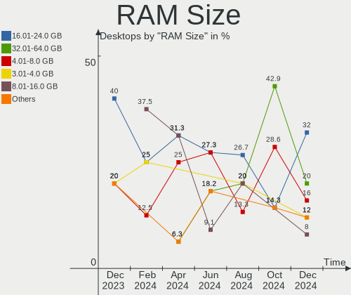
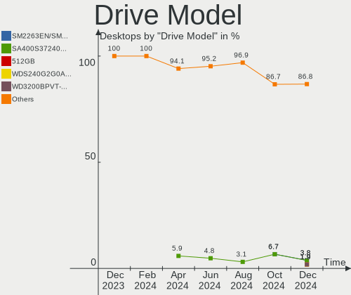
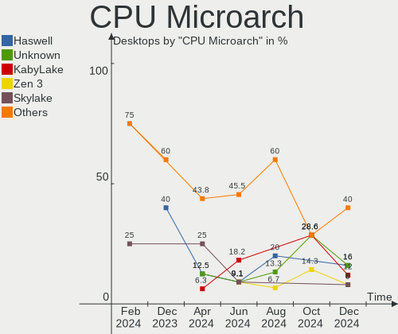
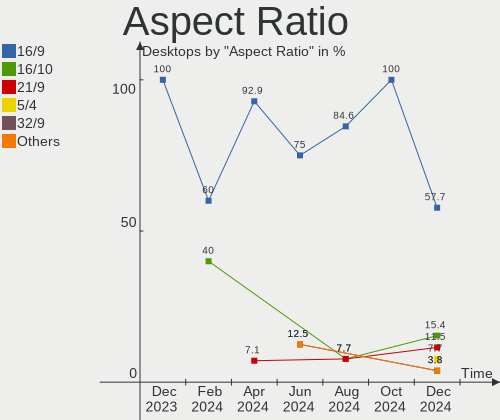
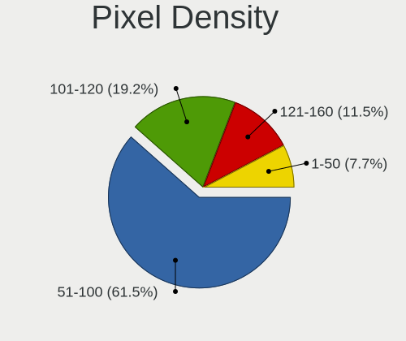
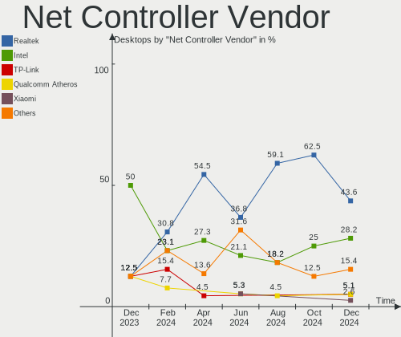
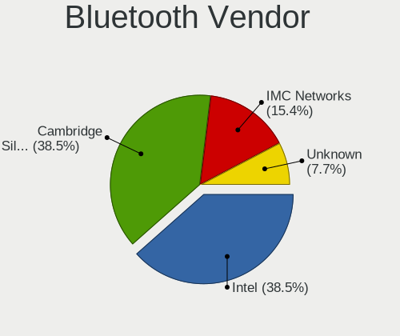
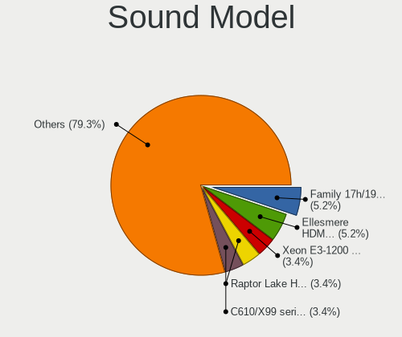
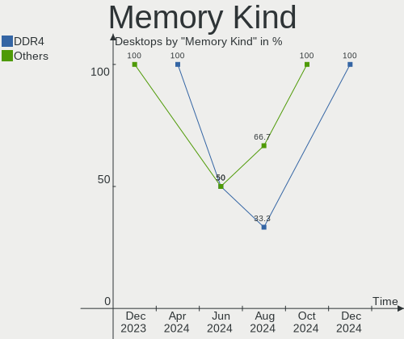

Elementary - Hardware Trends (Desktops)
---------------------------------------

A project to identify most popular hardware characteristics and track their change
over time based on data collected by Linux users at https://Linux-Hardware.org.

Anyone can contribute to this report by the [hw-probe](https://github.com/linuxhw/hw-probe) tool:

    sudo -E hw-probe -all -upload

This report is for one last month. Overall report since the beginning of time: [TestCoverage](https://github.com/linuxhw/TestCoverage)

Period: Jul, 2022.

Contents
--------

* [ System ](#system)
  - [ OS                       ](#os)
  - [ OS Family                ](#os-family)
  - [ Kernel                   ](#kernel)
  - [ Kernel Family            ](#kernel-family)
  - [ Kernel Major Ver.        ](#kernel-major-ver)
  - [ Arch                     ](#arch)
  - [ DE                       ](#de)
  - [ Display Server           ](#display-server)
  - [ Display Manager          ](#display-manager)
  - [ OS Lang                  ](#os-lang)
  - [ Boot Mode                ](#boot-mode)
  - [ Filesystem               ](#filesystem)
  - [ Part. scheme             ](#part-scheme)
  - [ Dual Boot with Linux/BSD ](#dual-boot-with-linuxbsd)
  - [ Dual Boot (Win)          ](#dual-boot-win)

* [ Board ](#board)
  - [ Vendor                   ](#vendor)
  - [ Model                    ](#model)
  - [ Model Family             ](#model-family)
  - [ MFG Year                 ](#mfg-year)
  - [ Form Factor              ](#form-factor)
  - [ Secure Boot              ](#secure-boot)
  - [ Coreboot                 ](#coreboot)
  - [ RAM Size                 ](#ram-size)
  - [ RAM Used                 ](#ram-used)
  - [ Total Drives             ](#total-drives)
  - [ Has CD-ROM               ](#has-cd-rom)
  - [ Has Ethernet             ](#has-ethernet)
  - [ Has WiFi                 ](#has-wifi)
  - [ Has Bluetooth            ](#has-bluetooth)

* [ Location ](#location)
  - [ Country                  ](#country)
  - [ City                     ](#city)

* [ Drives ](#drives)
  - [ Drive Vendor             ](#drive-vendor)
  - [ Drive Model              ](#drive-model)
  - [ HDD Vendor               ](#hdd-vendor)
  - [ SSD Vendor               ](#ssd-vendor)
  - [ Drive Kind               ](#drive-kind)
  - [ Drive Connector          ](#drive-connector)
  - [ Drive Size               ](#drive-size)
  - [ Space Total              ](#space-total)
  - [ Space Used               ](#space-used)
  - [ Malfunc. Drives          ](#malfunc-drives)
  - [ Malfunc. Drive Vendor    ](#malfunc-drive-vendor)
  - [ Malfunc. HDD Vendor      ](#malfunc-hdd-vendor)
  - [ Malfunc. Drive Kind      ](#malfunc-drive-kind)
  - [ Failed Drives            ](#failed-drives)
  - [ Failed Drive Vendor      ](#failed-drive-vendor)
  - [ Drive Status             ](#drive-status)

* [ Storage controller ](#storage-controller)
  - [ Storage Vendor           ](#storage-vendor)
  - [ Storage Model            ](#storage-model)
  - [ Storage Kind             ](#storage-kind)

* [ Processor ](#processor)
  - [ CPU Vendor               ](#cpu-vendor)
  - [ CPU Model                ](#cpu-model)
  - [ CPU Model Family         ](#cpu-model-family)
  - [ CPU Cores                ](#cpu-cores)
  - [ CPU Sockets              ](#cpu-sockets)
  - [ CPU Threads              ](#cpu-threads)
  - [ CPU Op-Modes             ](#cpu-op-modes)
  - [ CPU Microcode            ](#cpu-microcode)
  - [ CPU Microarch            ](#cpu-microarch)

* [ Graphics ](#graphics)
  - [ GPU Vendor               ](#gpu-vendor)
  - [ GPU Model                ](#gpu-model)
  - [ GPU Combo                ](#gpu-combo)
  - [ GPU Driver               ](#gpu-driver)
  - [ GPU Memory               ](#gpu-memory)

* [ Monitor ](#monitor)
  - [ Monitor Vendor           ](#monitor-vendor)
  - [ Monitor Model            ](#monitor-model)
  - [ Monitor Resolution       ](#monitor-resolution)
  - [ Monitor Diagonal         ](#monitor-diagonal)
  - [ Monitor Width            ](#monitor-width)
  - [ Aspect Ratio             ](#aspect-ratio)
  - [ Monitor Area             ](#monitor-area)
  - [ Pixel Density            ](#pixel-density)
  - [ Multiple Monitors        ](#multiple-monitors)

* [ Network ](#network)
  - [ Net Controller Vendor    ](#net-controller-vendor)
  - [ Net Controller Model     ](#net-controller-model)
  - [ Wireless Vendor          ](#wireless-vendor)
  - [ Wireless Model           ](#wireless-model)
  - [ Ethernet Vendor          ](#ethernet-vendor)
  - [ Ethernet Model           ](#ethernet-model)
  - [ Net Controller Kind      ](#net-controller-kind)
  - [ Used Controller          ](#used-controller)
  - [ NICs                     ](#nics)
  - [ IPv6                     ](#ipv6)

* [ Bluetooth ](#bluetooth)
  - [ Bluetooth Vendor         ](#bluetooth-vendor)
  - [ Bluetooth Model          ](#bluetooth-model)

* [ Sound ](#sound)
  - [ Sound Vendor             ](#sound-vendor)
  - [ Sound Model              ](#sound-model)

* [ Memory ](#memory)
  - [ Memory Vendor            ](#memory-vendor)
  - [ Memory Model             ](#memory-model)
  - [ Memory Kind              ](#memory-kind)
  - [ Memory Form Factor       ](#memory-form-factor)
  - [ Memory Size              ](#memory-size)
  - [ Memory Speed             ](#memory-speed)

* [ Printers & scanners ](#printers--scanners)
  - [ Printer Vendor           ](#printer-vendor)
  - [ Printer Model            ](#printer-model)
  - [ Scanner Vendor           ](#scanner-vendor)
  - [ Scanner Model            ](#scanner-model)

* [ Camera ](#camera)
  - [ Camera Vendor            ](#camera-vendor)
  - [ Camera Model             ](#camera-model)

* [ Security ](#security)
  - [ Fingerprint Vendor       ](#fingerprint-vendor)
  - [ Fingerprint Model        ](#fingerprint-model)
  - [ Chipcard Vendor          ](#chipcard-vendor)
  - [ Chipcard Model           ](#chipcard-model)

* [ Unsupported ](#unsupported)
  - [ Unsupported Devices      ](#unsupported-devices)
  - [ Unsupported Device Types ](#unsupported-device-types)

System
------

OS
--

Installed operating systems

| Name           | Desktops | Percent |
|----------------|----------|---------|
| Elementary 6.1 | 11       | 100%    |

OS Family
---------

OS without a version

| Name       | Desktops | Percent |
|------------|----------|---------|
| Elementary | 11       | 100%    |

Kernel
------

Version of the Linux kernel

| Version           | Desktops | Percent |
|-------------------|----------|---------|
| 5.13.0-52-generic | 5        | 45.45%  |
| 5.15.0-41-generic | 3        | 27.27%  |
| 5.13.0-51-generic | 2        | 18.18%  |
| 5.13.0-28-generic | 1        | 9.09%   |

Kernel Family
-------------

Linux kernel without a distro release

| Version | Desktops | Percent |
|---------|----------|---------|
| 5.13.0  | 8        | 72.73%  |
| 5.15.0  | 3        | 27.27%  |

Kernel Major Ver.
-----------------

Linux kernel major version

| Version | Desktops | Percent |
|---------|----------|---------|
| 5.13    | 8        | 72.73%  |
| 5.15    | 3        | 27.27%  |

Arch
----

OS architecture (x86_64, i586, etc.)

| Name   | Desktops | Percent |
|--------|----------|---------|
| x86_64 | 11       | 100%    |

DE
--

Desktop Environment

| Name     | Desktops | Percent |
|----------|----------|---------|
| Pantheon | 11       | 100%    |

Display Server
--------------

X11 or Wayland

| Name | Desktops | Percent |
|------|----------|---------|
| X11  | 11       | 100%    |

Display Manager
---------------

SDDM, LightDM, etc.

| Name    | Desktops | Percent |
|---------|----------|---------|
| Unknown | 9        | 81.82%  |
| LightDM | 2        | 18.18%  |

OS Lang
-------

Language

| Lang  | Desktops | Percent |
|-------|----------|---------|
| en_US | 4        | 36.36%  |
| de_DE | 2        | 18.18%  |
| uk_UA | 1        | 9.09%   |
| it_IT | 1        | 9.09%   |
| fr_FR | 1        | 9.09%   |
| en_GB | 1        | 9.09%   |
| C     | 1        | 9.09%   |

Boot Mode
---------

EFI or BIOS

| Mode | Desktops | Percent |
|------|----------|---------|
| EFI  | 7        | 63.64%  |
| BIOS | 4        | 36.36%  |

Filesystem
----------

Type of filesystem

| Type | Desktops | Percent |
|------|----------|---------|
| Ext4 | 10       | 90.91%  |
| Xfs  | 1        | 9.09%   |

Part. scheme
------------

Scheme of partitioning

| Type    | Desktops | Percent |
|---------|----------|---------|
| Unknown | 9        | 81.82%  |
| GPT     | 2        | 18.18%  |

Dual Boot with Linux/BSD
------------------------

Hosting more than one Linux/BSD

| Dual boot | Desktops | Percent |
|-----------|----------|---------|
| No        | 9        | 81.82%  |
| Yes       | 2        | 18.18%  |

Dual Boot (Win)
---------------

Hosting Linux and Windows

| Dual boot | Desktops | Percent |
|-----------|----------|---------|
| No        | 11       | 100%    |

Board
-----

Vendor
------

Motherboard manufacturer

| Name                | Desktops | Percent |
|---------------------|----------|---------|
| ASUSTek Computer    | 4        | 36.36%  |
| MSI                 | 2        | 18.18%  |
| Gigabyte Technology | 2        | 18.18%  |
| Intel               | 1        | 9.09%   |
| Dell                | 1        | 9.09%   |
| Acer                | 1        | 9.09%   |

Model
-----

Motherboard model

| Name                         | Desktops | Percent |
|------------------------------|----------|---------|
| MSI MS-7B84                  | 1        | 9.09%   |
| MSI MS-7A38                  | 1        | 9.09%   |
| Intel X79                    | 1        | 9.09%   |
| Gigabyte Z87X-OC             | 1        | 9.09%   |
| Gigabyte GA-78LMT-USB3 6.0   | 1        | 9.09%   |
| Dell OptiPlex 9020           | 1        | 9.09%   |
| ASUS TUF X470-PLUS GAMING    | 1        | 9.09%   |
| ASUS ROG STRIX B450-F GAMING | 1        | 9.09%   |
| ASUS ROG STRIX B360-H GAMING | 1        | 9.09%   |
| ASUS P8H61-M LX R2.0         | 1        | 9.09%   |
| Acer Aspire X1420G           | 1        | 9.09%   |

Model Family
------------

Motherboard model prefix

| Name                   | Desktops | Percent |
|------------------------|----------|---------|
| ASUS ROG               | 2        | 18.18%  |
| MSI MS-7B84            | 1        | 9.09%   |
| MSI MS-7A38            | 1        | 9.09%   |
| Intel X79              | 1        | 9.09%   |
| Gigabyte Z87X-OC       | 1        | 9.09%   |
| Gigabyte GA-78LMT-USB3 | 1        | 9.09%   |
| Dell OptiPlex          | 1        | 9.09%   |
| ASUS TUF               | 1        | 9.09%   |
| ASUS P8H61-M           | 1        | 9.09%   |
| Acer Aspire            | 1        | 9.09%   |

MFG Year
--------

Motherboard manufacture year

| Year | Desktops | Percent |
|------|----------|---------|
| 2018 | 3        | 27.27%  |
| 2014 | 2        | 18.18%  |
| 2012 | 2        | 18.18%  |
| 2021 | 1        | 9.09%   |
| 2019 | 1        | 9.09%   |
| 2013 | 1        | 9.09%   |
| 2011 | 1        | 9.09%   |

Form Factor
-----------

Physical design of the computer

| Name    | Desktops | Percent |
|---------|----------|---------|
| Desktop | 11       | 100%    |

Secure Boot
-----------

Enabled or disabled

| State    | Desktops | Percent |
|----------|----------|---------|
| Disabled | 11       | 100%    |

Coreboot
--------

Have coreboot on board

| Used | Desktops | Percent |
|------|----------|---------|
| No   | 11       | 100%    |

RAM Size
--------

Total RAM memory

| Size in GB  | Desktops | Percent |
|-------------|----------|---------|
| 16.01-24.0  | 3        | 27.27%  |
| 4.01-8.0    | 2        | 18.18%  |
| 32.01-64.0  | 2        | 18.18%  |
| 8.01-16.0   | 2        | 18.18%  |
| 3.01-4.0    | 1        | 9.09%   |
| 64.01-256.0 | 1        | 9.09%   |

RAM Used
--------

Used RAM memory

| Used GB   | Desktops | Percent |
|-----------|----------|---------|
| 3.01-4.0  | 3        | 27.27%  |
| 1.01-2.0  | 3        | 27.27%  |
| 4.01-8.0  | 2        | 18.18%  |
| 8.01-16.0 | 2        | 18.18%  |
| 2.01-3.0  | 1        | 9.09%   |

Total Drives
------------

Number of drives on board

| Drives | Desktops | Percent |
|--------|----------|---------|
| 2      | 4        | 36.36%  |
| 1      | 3        | 27.27%  |
| 3      | 2        | 18.18%  |
| 5      | 1        | 9.09%   |
| 4      | 1        | 9.09%   |

Has CD-ROM
----------

Has CD-ROM on board

| Presented | Desktops | Percent |
|-----------|----------|---------|
| No        | 6        | 54.55%  |
| Yes       | 5        | 45.45%  |

Has Ethernet
------------

Has Ethernet on board

| Presented | Desktops | Percent |
|-----------|----------|---------|
| Yes       | 11       | 100%    |

Has WiFi
--------

Has WiFi module

| Presented | Desktops | Percent |
|-----------|----------|---------|
| No        | 6        | 54.55%  |
| Yes       | 5        | 45.45%  |

Has Bluetooth
-------------

Has Bluetooth module

| Presented | Desktops | Percent |
|-----------|----------|---------|
| Yes       | 6        | 54.55%  |
| No        | 5        | 45.45%  |

Location
--------

Country
-------

Geographic location (country)

| Country | Desktops | Percent |
|---------|----------|---------|
| USA     | 3        | 27.27%  |
| Germany | 3        | 27.27%  |
| UK      | 1        | 9.09%   |
| Poland  | 1        | 9.09%   |
| Italy   | 1        | 9.09%   |
| France  | 1        | 9.09%   |
| Brazil  | 1        | 9.09%   |

City
----

Geographic location (city)

| City          | Desktops | Percent |
|---------------|----------|---------|
| Wroclaw       | 1        | 9.09%   |
| Stuttgart     | 1        | 9.09%   |
| Nottingham    | 1        | 9.09%   |
| Naples        | 1        | 9.09%   |
| Munich        | 1        | 9.09%   |
| Louisville    | 1        | 9.09%   |
| Henderson     | 1        | 9.09%   |
| Hamburg       | 1        | 9.09%   |
| Denver        | 1        | 9.09%   |
| Chartres      | 1        | 9.09%   |
| Caxias do Sul | 1        | 9.09%   |

Drives
------

Drive Vendor
------------

Hard drive vendors

| Vendor              | Desktops | Drives | Percent |
|---------------------|----------|--------|---------|
| Samsung Electronics | 4        | 5      | 19.05%  |
| WDC                 | 3        | 3      | 14.29%  |
| Seagate             | 3        | 3      | 14.29%  |
| Toshiba             | 2        | 4      | 9.52%   |
| PNY                 | 2        | 2      | 9.52%   |
| SanDisk             | 1        | 1      | 4.76%   |
| Plextor             | 1        | 1      | 4.76%   |
| Micron Technology   | 1        | 1      | 4.76%   |
| Kingston            | 1        | 2      | 4.76%   |
| KingFast            | 1        | 1      | 4.76%   |
| HGST                | 1        | 1      | 4.76%   |
| BORY                | 1        | 1      | 4.76%   |

Drive Model
-----------

Hard drive models

| Model                                       | Desktops | Percent |
|---------------------------------------------|----------|---------|
| WDC WD10EZEX-00BN5A0 1TB                    | 2        | 8.33%   |
| Samsung SSD 860 QVO 1TB                     | 2        | 8.33%   |
| WDC WD10EADX-22TDHB0 1TB                    | 1        | 4.17%   |
| Toshiba HDWD130 3TB                         | 1        | 4.17%   |
| Toshiba DT01ACA300 3TB                      | 1        | 4.17%   |
| Toshiba DT01ACA100 1TB                      | 1        | 4.17%   |
| Seagate ST2000DM008-2FR102 2TB              | 1        | 4.17%   |
| Seagate BarraCuda Q1 SSD ZA960CV10001 960GB | 1        | 4.17%   |
| Seagate Backup+ Hub BK 4TB                  | 1        | 4.17%   |
| SanDisk SDSSDA120G 120GB                    | 1        | 4.17%   |
| Samsung SSD 860 EVO 250GB                   | 1        | 4.17%   |
| Samsung SSD 840 EVO 120GB                   | 1        | 4.17%   |
| Samsung HD502HI 500GB                       | 1        | 4.17%   |
| PNY SSD2SC240G1CS1754D117-820 240GB         | 1        | 4.17%   |
| PNY CS900 240GB SSD                         | 1        | 4.17%   |
| Plextor PX-64M5S 64GB SSD                   | 1        | 4.17%   |
| Micron 2200S NVMe 512GB                     | 1        | 4.17%   |
| Kingston SA400S37960G 960GB SSD             | 1        | 4.17%   |
| Kingston NVMe SSD Drive 500GB               | 1        | 4.17%   |
| KingFast 1024GB                             | 1        | 4.17%   |
| HGST HTS541010A9E680 1TB                    | 1        | 4.17%   |
| BORY R500 1TB                               | 1        | 4.17%   |

HDD Vendor
----------

Hard disk drive vendors

| Vendor              | Desktops | Drives | Percent |
|---------------------|----------|--------|---------|
| WDC                 | 3        | 3      | 33.33%  |
| Toshiba             | 2        | 4      | 22.22%  |
| Seagate             | 2        | 2      | 22.22%  |
| Samsung Electronics | 1        | 1      | 11.11%  |
| HGST                | 1        | 1      | 11.11%  |

SSD Vendor
----------

Solid state drive vendors

| Vendor              | Desktops | Drives | Percent |
|---------------------|----------|--------|---------|
| Samsung Electronics | 3        | 4      | 33.33%  |
| PNY                 | 2        | 2      | 22.22%  |
| Seagate             | 1        | 1      | 11.11%  |
| SanDisk             | 1        | 1      | 11.11%  |
| Plextor             | 1        | 1      | 11.11%  |
| Kingston            | 1        | 1      | 11.11%  |

Drive Kind
----------

HDD or SSD

| Kind    | Desktops | Drives | Percent |
|---------|----------|--------|---------|
| SSD     | 8        | 10     | 40%     |
| HDD     | 8        | 11     | 40%     |
| NVMe    | 2        | 2      | 10%     |
| Unknown | 2        | 2      | 10%     |

Drive Connector
---------------

SATA, SAS, NVMe, etc.

| Type | Desktops | Drives | Percent |
|------|----------|--------|---------|
| SATA | 11       | 22     | 78.57%  |
| NVMe | 2        | 2      | 14.29%  |
| SAS  | 1        | 1      | 7.14%   |

Drive Size
----------

Size of hard drive

| Size in TB | Desktops | Drives | Percent |
|------------|----------|--------|---------|
| 0.51-1.0   | 7        | 9      | 43.75%  |
| 0.01-0.5   | 5        | 7      | 31.25%  |
| 2.01-3.0   | 2        | 3      | 12.5%   |
| 3.01-4.0   | 1        | 1      | 6.25%   |
| 1.01-2.0   | 1        | 1      | 6.25%   |

Space Total
-----------

Amount of disk space available on the file system

| Size in GB     | Desktops | Percent |
|----------------|----------|---------|
| 501-1000       | 7        | 63.64%  |
| More than 3000 | 2        | 18.18%  |
| 101-250        | 2        | 18.18%  |

Space Used
----------

Amount of used disk space

| Used GB        | Desktops | Percent |
|----------------|----------|---------|
| 101-250        | 4        | 36.36%  |
| 251-500        | 2        | 18.18%  |
| 1-20           | 2        | 18.18%  |
| More than 3000 | 1        | 9.09%   |
| 1001-2000      | 1        | 9.09%   |
| 501-1000       | 1        | 9.09%   |

Malfunc. Drives
---------------

Drive models with a malfunction

Zero info for selected period =(

Malfunc. Drive Vendor
---------------------

Vendors of faulty drives

Zero info for selected period =(

Malfunc. HDD Vendor
-------------------

Vendors of faulty HDD drives

Zero info for selected period =(

Malfunc. Drive Kind
-------------------

Kinds of faulty drives

Zero info for selected period =(

Failed Drives
-------------

Failed drive models

Zero info for selected period =(

Failed Drive Vendor
-------------------

Failed drive vendors

Zero info for selected period =(

Drive Status
------------

Number of failed and malfunc. drives

| Status   | Desktops | Drives | Percent |
|----------|----------|--------|---------|
| Detected | 9        | 20     | 81.82%  |
| Works    | 2        | 5      | 18.18%  |

Storage controller
------------------

Storage Vendor
--------------

Storage controller vendors

| Vendor                      | Desktops | Percent |
|-----------------------------|----------|---------|
| Intel                       | 5        | 38.46%  |
| AMD                         | 5        | 38.46%  |
| Nvidia                      | 1        | 7.69%   |
| Micron Technology           | 1        | 7.69%   |
| Kingston Technology Company | 1        | 7.69%   |

Storage Model
-------------

Storage controller models

| Model                                                                                   | Desktops | Percent |
|-----------------------------------------------------------------------------------------|----------|---------|
| AMD 400 Series Chipset SATA Controller                                                  | 4        | 23.53%  |
| AMD FCH SATA Controller [AHCI mode]                                                     | 2        | 11.76%  |
| Nvidia MCP61 SATA Controller                                                            | 1        | 5.88%   |
| Micron Non-Volatile memory controller                                                   | 1        | 5.88%   |
| Kingston Company A2000 NVMe SSD                                                         | 1        | 5.88%   |
| Intel SATA Controller [RAID mode]                                                       | 1        | 5.88%   |
| Intel Cannon Lake PCH SATA AHCI Controller                                              | 1        | 5.88%   |
| Intel 8 Series/C220 Series Chipset Family 6-port SATA Controller 1 [AHCI mode]          | 1        | 5.88%   |
| Intel 6 Series/C200 Series Chipset Family Desktop SATA Controller (IDE mode, ports 4-5) | 1        | 5.88%   |
| Intel 6 Series/C200 Series Chipset Family Desktop SATA Controller (IDE mode, ports 0-3) | 1        | 5.88%   |
| Intel 6 Series/C200 Series Chipset Family 6 port Desktop SATA AHCI Controller           | 1        | 5.88%   |
| AMD SB7x0/SB8x0/SB9x0 SATA Controller [AHCI mode]                                       | 1        | 5.88%   |
| AMD SB7x0/SB8x0/SB9x0 IDE Controller                                                    | 1        | 5.88%   |

Storage Kind
------------

Kind of storage controller (IDE, SATA, NVMe, SAS, ...)

| Kind | Desktops | Percent |
|------|----------|---------|
| SATA | 8        | 57.14%  |
| IDE  | 3        | 21.43%  |
| NVMe | 2        | 14.29%  |
| RAID | 1        | 7.14%   |

Processor
---------

CPU Vendor
----------

Processor vendors

| Vendor | Desktops | Percent |
|--------|----------|---------|
| AMD    | 6        | 54.55%  |
| Intel  | 5        | 45.45%  |

CPU Model
---------

Processor models

| Model                                       | Desktops | Percent |
|---------------------------------------------|----------|---------|
| Intel Xeon CPU E5-2665 0 @ 2.40GHz          | 1        | 9.09%   |
| Intel Core i7-4770 CPU @ 3.40GHz            | 1        | 9.09%   |
| Intel Core i7-2600 CPU @ 3.40GHz            | 1        | 9.09%   |
| Intel Core i5-9400F CPU @ 2.90GHz           | 1        | 9.09%   |
| Intel Core i5-4670K CPU @ 3.40GHz           | 1        | 9.09%   |
| AMD Ryzen 7 3700X 8-Core Processor          | 1        | 9.09%   |
| AMD Ryzen 5 3600 6-Core Processor           | 1        | 9.09%   |
| AMD Ryzen 5 3400G with Radeon Vega Graphics | 1        | 9.09%   |
| AMD Ryzen 5 2600X Six-Core Processor        | 1        | 9.09%   |
| AMD FX-8370E Eight-Core Processor           | 1        | 9.09%   |
| AMD Athlon II X4 645 Processor              | 1        | 9.09%   |

CPU Model Family
----------------

Processor model prefix

| Model            | Desktops | Percent |
|------------------|----------|---------|
| AMD Ryzen 5      | 3        | 27.27%  |
| Intel Core i7    | 2        | 18.18%  |
| Intel Core i5    | 2        | 18.18%  |
| Intel Xeon       | 1        | 9.09%   |
| AMD Ryzen 7      | 1        | 9.09%   |
| AMD FX           | 1        | 9.09%   |
| AMD Athlon II X4 | 1        | 9.09%   |

CPU Cores
---------

Number of processor cores

| Number | Desktops | Percent |
|--------|----------|---------|
| 4      | 6        | 54.55%  |
| 6      | 3        | 27.27%  |
| 8      | 2        | 18.18%  |

CPU Sockets
-----------

Number of sockets

| Number | Desktops | Percent |
|--------|----------|---------|
| 1      | 11       | 100%    |

CPU Threads
-----------

Threads per core (Hyper-Threading)

| Number | Desktops | Percent |
|--------|----------|---------|
| 2      | 8        | 72.73%  |
| 1      | 3        | 27.27%  |

CPU Op-Modes
------------

CPU Operation Modes (32-bit, 64-bit)

| Op mode        | Desktops | Percent |
|----------------|----------|---------|
| 32-bit, 64-bit | 11       | 100%    |

CPU Microcode
-------------

Microcode number

| Number     | Desktops | Percent |
|------------|----------|---------|
| 0x306c3    | 2        | 18.18%  |
| 0x906ea    | 1        | 9.09%   |
| 0x206d7    | 1        | 9.09%   |
| 0x206a7    | 1        | 9.09%   |
| 0x08701021 | 1        | 9.09%   |
| 0x08701013 | 1        | 9.09%   |
| 0x08108109 | 1        | 9.09%   |
| 0x0800820d | 1        | 9.09%   |
| 0x06000852 | 1        | 9.09%   |
| 0x010000c8 | 1        | 9.09%   |

CPU Microarch
-------------

Microarchitecture

| Name        | Desktops | Percent |
|-------------|----------|---------|
| Zen+        | 2        | 18.18%  |
| Zen 2       | 2        | 18.18%  |
| SandyBridge | 2        | 18.18%  |
| Haswell     | 2        | 18.18%  |
| Piledriver  | 1        | 9.09%   |
| KabyLake    | 1        | 9.09%   |
| K10         | 1        | 9.09%   |

Graphics
--------

GPU Vendor
----------

Vendors of graphics cards

| Vendor | Desktops | Percent |
|--------|----------|---------|
| AMD    | 6        | 54.55%  |
| Intel  | 3        | 27.27%  |
| Nvidia | 2        | 18.18%  |

GPU Model
---------

Graphics card models

| Model                                                                       | Desktops | Percent |
|-----------------------------------------------------------------------------|----------|---------|
| Intel Xeon E3-1200 v3/4th Gen Core Processor Integrated Graphics Controller | 2        | 18.18%  |
| Nvidia TU116 [GeForce GTX 1660]                                             | 1        | 9.09%   |
| Nvidia TU104 [GeForce RTX 2060]                                             | 1        | 9.09%   |
| Intel 2nd Generation Core Processor Family Integrated Graphics Controller   | 1        | 9.09%   |
| AMD Tahiti PRO [Radeon HD 7950/8950 OEM / R9 280]                           | 1        | 9.09%   |
| AMD RS780L [Radeon 3000]                                                    | 1        | 9.09%   |
| AMD Redwood PRO GL [FirePro V3800]                                          | 1        | 9.09%   |
| AMD Picasso/Raven 2 [Radeon Vega Series / Radeon Vega Mobile Series]        | 1        | 9.09%   |
| AMD Navi 24 [Radeon RX 6400 / 6500 XT]                                      | 1        | 9.09%   |
| AMD Ellesmere [Radeon RX 470/480/570/570X/580/580X/590]                     | 1        | 9.09%   |

GPU Combo
---------

Combinations of graphics cards

| Name       | Desktops | Percent |
|------------|----------|---------|
| 1 x AMD    | 6        | 54.55%  |
| 1 x Intel  | 3        | 27.27%  |
| 1 x Nvidia | 2        | 18.18%  |

GPU Driver
----------

Free vs proprietary

| Driver      | Desktops | Percent |
|-------------|----------|---------|
| Free        | 9        | 81.82%  |
| Proprietary | 2        | 18.18%  |

GPU Memory
----------

Total video memory

| Size in GB | Desktops | Percent |
|------------|----------|---------|
| Unknown    | 3        | 27.27%  |
| 5.01-6.0   | 2        | 18.18%  |
| 3.01-4.0   | 2        | 18.18%  |
| 2.01-3.0   | 1        | 9.09%   |
| 1.01-2.0   | 1        | 9.09%   |
| 0.51-1.0   | 1        | 9.09%   |
| 0.01-0.5   | 1        | 9.09%   |

Monitor
-------

Monitor Vendor
--------------

Monitor vendors

| Vendor               | Desktops | Percent |
|----------------------|----------|---------|
| Goldstar             | 3        | 21.43%  |
| Hewlett-Packard      | 2        | 14.29%  |
| Dell                 | 2        | 14.29%  |
| AOC                  | 2        | 14.29%  |
| Vizio                | 1        | 7.14%   |
| Philips              | 1        | 7.14%   |
| Iiyama               | 1        | 7.14%   |
| HannStar             | 1        | 7.14%   |
| Ancor Communications | 1        | 7.14%   |

Monitor Model
-------------

Monitor models

| Model                                                                 | Desktops | Percent |
|-----------------------------------------------------------------------|----------|---------|
| Vizio VO320E VIZ0035 1280x720 700x390mm 31.5-inch                     | 1        | 7.14%   |
| Philips PHL 275E1 PHLC20C 2560x1440 597x336mm 27.0-inch               | 1        | 7.14%   |
| Iiyama PL2483H IVM6138 1920x1080 531x299mm 24.0-inch                  | 1        | 7.14%   |
| Hewlett-Packard w2207 HWP26A9 1680x1050 473x296mm 22.0-inch           | 1        | 7.14%   |
| Hewlett-Packard P204 HPN3631 1600x900 432x240mm 19.5-inch             | 1        | 7.14%   |
| HannStar Hanns.G HH221 HSD20A9 1920x1080 477x268mm 21.5-inch          | 1        | 7.14%   |
| Goldstar M2094D-PZ GSM4E8F 1680x1050 433x270mm 20.1-inch              | 1        | 7.14%   |
| Goldstar IPS FULLHD GSM5AB6 1920x1080 480x270mm 21.7-inch             | 1        | 7.14%   |
| Goldstar E2360 GSM57E3 1920x1080 510x290mm 23.1-inch                  | 1        | 7.14%   |
| Dell SE2422HX DELA1CA 1920x1080 527x296mm 23.8-inch                   | 1        | 7.14%   |
| Dell SE2416H DELD082 1920x1080 527x296mm 23.8-inch                    | 1        | 7.14%   |
| AOC F22 AOC2200 1920x1080 476x268mm 21.5-inch                         | 1        | 7.14%   |
| AOC 27G2G4 AOC2702 1920x1080 598x336mm 27.0-inch                      | 1        | 7.14%   |
| Ancor Communications ASUS VS247 ACI249A 1920x1080 520x290mm 23.4-inch | 1        | 7.14%   |

Monitor Resolution
------------------

Monitor screen resolution

| Resolution         | Desktops | Percent |
|--------------------|----------|---------|
| 1920x1080 (FHD)    | 8        | 61.54%  |
| 1680x1050 (WSXGA+) | 2        | 15.38%  |
| 3840x2160 (4K)     | 1        | 7.69%   |
| 2560x1440 (QHD)    | 1        | 7.69%   |
| 1600x900 (HD+)     | 1        | 7.69%   |

Monitor Diagonal
----------------

Diagonal size in inches

| Inches | Desktops | Percent |
|--------|----------|---------|
| 23     | 4        | 30.77%  |
| 24     | 2        | 15.38%  |
| 21     | 2        | 15.38%  |
| 36     | 1        | 7.69%   |
| 27     | 1        | 7.69%   |
| 22     | 1        | 7.69%   |
| 20     | 1        | 7.69%   |
| 19     | 1        | 7.69%   |

Monitor Width
-------------

Physical width

| Width in mm | Desktops | Percent |
|-------------|----------|---------|
| 501-600     | 6        | 50%     |
| 401-500     | 5        | 41.67%  |
| 701-800     | 1        | 8.33%   |

Aspect Ratio
------------

Proportional relationship between the width and the height

| Ratio | Desktops | Percent |
|-------|----------|---------|
| 16/9  | 9        | 75%     |
| 16/10 | 2        | 16.67%  |
| 3/2   | 1        | 8.33%   |

Monitor Area
------------

Area in inch²

| Area in inch² | Desktops | Percent |
|----------------|----------|---------|
| 201-250        | 6        | 54.55%  |
| 151-200        | 3        | 27.27%  |
| 301-350        | 1        | 9.09%   |
| 501-1000       | 1        | 9.09%   |

Pixel Density
-------------

Pixels per inch

| Density | Desktops | Percent |
|---------|----------|---------|
| 51-100  | 8        | 66.67%  |
| 101-120 | 3        | 25%     |
| 1-50    | 1        | 8.33%   |

Multiple Monitors
-----------------

Total monitors connected

| Total | Desktops | Percent |
|-------|----------|---------|
| 1     | 8        | 72.73%  |
| 2     | 3        | 27.27%  |

Network
-------

Net Controller Vendor
---------------------

Controller vendors

| Vendor                | Desktops | Percent |
|-----------------------|----------|---------|
| Realtek Semiconductor | 6        | 42.86%  |
| Intel                 | 5        | 35.71%  |
| Ralink Technology     | 1        | 7.14%   |
| Nvidia                | 1        | 7.14%   |
| Broadcom              | 1        | 7.14%   |

Net Controller Model
--------------------

Controller models

| Model                                                             | Desktops | Percent |
|-------------------------------------------------------------------|----------|---------|
| Realtek RTL8111/8168/8411 PCI Express Gigabit Ethernet Controller | 6        | 35.29%  |
| Realtek RTL8188EUS 802.11n Wireless Network Adapter               | 1        | 5.88%   |
| Realtek RTL810xE PCI Express Fast Ethernet controller             | 1        | 5.88%   |
| Ralink MT7601U Wireless Adapter                                   | 1        | 5.88%   |
| Nvidia MCP61 Ethernet                                             | 1        | 5.88%   |
| Intel Wireless-AC 9260                                            | 1        | 5.88%   |
| Intel Wi-Fi 6 AX200                                               | 1        | 5.88%   |
| Intel I211 Gigabit Network Connection                             | 1        | 5.88%   |
| Intel Ethernet Connection I217-V                                  | 1        | 5.88%   |
| Intel Ethernet Connection I217-LM                                 | 1        | 5.88%   |
| Intel Ethernet Connection (7) I219-V                              | 1        | 5.88%   |
| Broadcom BCM4360 802.11ac Wireless Network Adapter                | 1        | 5.88%   |

Wireless Vendor
---------------

Wireless vendors

| Vendor                | Desktops | Percent |
|-----------------------|----------|---------|
| Intel                 | 2        | 40%     |
| Realtek Semiconductor | 1        | 20%     |
| Ralink Technology     | 1        | 20%     |
| Broadcom              | 1        | 20%     |

Wireless Model
--------------

Wireless models

| Model                                               | Desktops | Percent |
|-----------------------------------------------------|----------|---------|
| Realtek RTL8188EUS 802.11n Wireless Network Adapter | 1        | 20%     |
| Ralink MT7601U Wireless Adapter                     | 1        | 20%     |
| Intel Wireless-AC 9260                              | 1        | 20%     |
| Intel Wi-Fi 6 AX200                                 | 1        | 20%     |
| Broadcom BCM4360 802.11ac Wireless Network Adapter  | 1        | 20%     |

Ethernet Vendor
---------------

Ethernet vendors

| Vendor                | Desktops | Percent |
|-----------------------|----------|---------|
| Realtek Semiconductor | 6        | 54.55%  |
| Intel                 | 4        | 36.36%  |
| Nvidia                | 1        | 9.09%   |

Ethernet Model
--------------

Ethernet models

| Model                                                             | Desktops | Percent |
|-------------------------------------------------------------------|----------|---------|
| Realtek RTL8111/8168/8411 PCI Express Gigabit Ethernet Controller | 6        | 50%     |
| Realtek RTL810xE PCI Express Fast Ethernet controller             | 1        | 8.33%   |
| Nvidia MCP61 Ethernet                                             | 1        | 8.33%   |
| Intel I211 Gigabit Network Connection                             | 1        | 8.33%   |
| Intel Ethernet Connection I217-V                                  | 1        | 8.33%   |
| Intel Ethernet Connection I217-LM                                 | 1        | 8.33%   |
| Intel Ethernet Connection (7) I219-V                              | 1        | 8.33%   |

Net Controller Kind
-------------------

Ethernet, WiFi or modem

| Kind     | Desktops | Percent |
|----------|----------|---------|
| Ethernet | 11       | 68.75%  |
| WiFi     | 5        | 31.25%  |

Used Controller
---------------

Currently used network controller

| Kind     | Desktops | Percent |
|----------|----------|---------|
| Ethernet | 9        | 81.82%  |
| WiFi     | 2        | 18.18%  |

NICs
----

Total network controllers on board

| Total | Desktops | Percent |
|-------|----------|---------|
| 1     | 7        | 63.64%  |
| 2     | 4        | 36.36%  |

IPv6
----

IPv6 vs IPv4

| Used | Desktops | Percent |
|------|----------|---------|
| No   | 6        | 54.55%  |
| Yes  | 5        | 45.45%  |

Bluetooth
---------

Bluetooth Vendor
----------------

Controller vendors

| Vendor                  | Desktops | Percent |
|-------------------------|----------|---------|
| Intel                   | 2        | 28.57%  |
| Cambridge Silicon Radio | 2        | 28.57%  |
| Broadcom                | 2        | 28.57%  |
| Edimax Technology       | 1        | 14.29%  |

Bluetooth Model
---------------

Controller models

| Model                                               | Desktops | Percent |
|-----------------------------------------------------|----------|---------|
| Cambridge Silicon Radio Bluetooth Dongle (HCI mode) | 2        | 28.57%  |
| Intel Bluetooth Device                              | 1        | 14.29%  |
| Intel AX200 Bluetooth                               | 1        | 14.29%  |
| Edimax Bluetooth Adapter                            | 1        | 14.29%  |
| Broadcom BCM92046DG-CL1ROM Bluetooth 2.1 Adapter    | 1        | 14.29%  |
| Broadcom BCM20702A0 Bluetooth 4.0                   | 1        | 14.29%  |

Sound
-----

Sound Vendor
------------

Sound card vendors

| Vendor              | Desktops | Percent |
|---------------------|----------|---------|
| AMD                 | 7        | 36.84%  |
| Intel               | 4        | 21.05%  |
| Nvidia              | 3        | 15.79%  |
| C-Media Electronics | 3        | 15.79%  |
| Razer USA           | 1        | 5.26%   |
| Creative Labs       | 1        | 5.26%   |

Sound Model
-----------

Sound card models

| Model                                                                      | Desktops | Percent |
|----------------------------------------------------------------------------|----------|---------|
| Intel Xeon E3-1200 v3/4th Gen Core Processor HD Audio Controller           | 2        | 8.33%   |
| Intel 8 Series/C220 Series Chipset High Definition Audio Controller        | 2        | 8.33%   |
| AMD Starship/Matisse HD Audio Controller                                   | 2        | 8.33%   |
| Razer USA RC30-026902, Gaming Headset [Nari Essential, Wireless, Receiver] | 1        | 4.17%   |
| Nvidia TU116 High Definition Audio Controller                              | 1        | 4.17%   |
| Nvidia TU104 HD Audio Controller                                           | 1        | 4.17%   |
| Nvidia MCP61 High Definition Audio                                         | 1        | 4.17%   |
| Intel Cannon Lake PCH cAVS                                                 | 1        | 4.17%   |
| Intel 6 Series/C200 Series Chipset Family High Definition Audio Controller | 1        | 4.17%   |
| Creative Labs Sound Core3D [Sound Blaster Recon3D / Z-Series]              | 1        | 4.17%   |
| C-Media Electronics USB Microphone                                         | 1        | 4.17%   |
| C-Media Electronics CMI8788 [Oxygen HD Audio]                              | 1        | 4.17%   |
| C-Media Electronics CMI8738/CMI8768 PCI Audio                              | 1        | 4.17%   |
| AMD Tahiti HDMI Audio [Radeon HD 7870 XT / 7950/7970]                      | 1        | 4.17%   |
| AMD SBx00 Azalia (Intel HDA)                                               | 1        | 4.17%   |
| AMD RS780 HDMI Audio [Radeon 3000/3100 / HD 3200/3300]                     | 1        | 4.17%   |
| AMD Redwood HDMI Audio [Radeon HD 5000 Series]                             | 1        | 4.17%   |
| AMD Raven/Raven2/Fenghuang HDMI/DP Audio Controller                        | 1        | 4.17%   |
| AMD Navi 21/23 HDMI/DP Audio Controller                                    | 1        | 4.17%   |
| AMD Family 17h/19h HD Audio Controller                                     | 1        | 4.17%   |
| AMD Ellesmere HDMI Audio [Radeon RX 470/480 / 570/580/590]                 | 1        | 4.17%   |

Memory
------

Memory Vendor
-------------

Memory module vendors

| Vendor              | Desktops | Percent |
|---------------------|----------|---------|
| SK hynix            | 1        | 33.33%  |
| Samsung Electronics | 1        | 33.33%  |
| A-DATA Technology   | 1        | 33.33%  |

Memory Model
------------

Memory module models

| Model                                                 | Desktops | Percent |
|-------------------------------------------------------|----------|---------|
| SK hynix RAM HMT42GR7BMR4C 16384MB DIMM DDR3 1066MT/s | 1        | 33.33%  |
| Samsung RAM M393B2K70DM0 16384MB DIMM DDR3 1066MT/s   | 1        | 33.33%  |
| A-DATA RAM Module 16384MB DIMM DDR4 2667MT/s          | 1        | 33.33%  |

Memory Kind
-----------

Memory module kinds

| Kind | Desktops | Percent |
|------|----------|---------|
| DDR4 | 1        | 50%     |
| DDR3 | 1        | 50%     |

Memory Form Factor
------------------

Physical design of the memory module

| Name | Desktops | Percent |
|------|----------|---------|
| DIMM | 2        | 100%    |

Memory Size
-----------

Memory module size

| Size  | Desktops | Percent |
|-------|----------|---------|
| 16384 | 2        | 100%    |

Memory Speed
------------

Memory module speed

| Speed | Desktops | Percent |
|-------|----------|---------|
| 2667  | 1        | 50%     |
| 1066  | 1        | 50%     |

Printers & scanners
-------------------

Printer Vendor
--------------

Printer device vendors

| Vendor             | Desktops | Percent |
|--------------------|----------|---------|
| Hewlett-Packard    | 1        | 50%     |
| Brother Industries | 1        | 50%     |

Printer Model
-------------

Printer device models

| Model                    | Desktops | Percent |
|--------------------------|----------|---------|
| HP OfficeJet 5200 series | 1        | 50%     |
| Brother MFC-J5335DW      | 1        | 50%     |

Scanner Vendor
--------------

Scanner device vendors

Zero info for selected period =(

Scanner Model
-------------

Scanner device models

Zero info for selected period =(

Camera
------

Camera Vendor
-------------

Camera device vendors

| Vendor                        | Desktops | Percent |
|-------------------------------|----------|---------|
| Sunplus Innovation Technology | 1        | 33.33%  |
| Microdia                      | 1        | 33.33%  |
| Logitech                      | 1        | 33.33%  |

Camera Model
------------

Camera device models

| Model                        | Desktops | Percent |
|------------------------------|----------|---------|
| Sunplus Integrated_Webcam_HD | 1        | 33.33%  |
| Microdia HDP Webcam USB      | 1        | 33.33%  |
| Logitech HD Webcam C615      | 1        | 33.33%  |

Security
--------

Fingerprint Vendor
------------------

Fingerprint sensor vendors

Zero info for selected period =(

Fingerprint Model
-----------------

Fingerprint sensor models

Zero info for selected period =(

Chipcard Vendor
---------------

Chipcard module vendors

Zero info for selected period =(

Chipcard Model
--------------

Chipcard module models

Zero info for selected period =(

Unsupported
-----------

Unsupported Devices
-------------------

Total unsupported devices on board

| Total | Desktops | Percent |
|-------|----------|---------|
| 0     | 10       | 90.91%  |
| 1     | 1        | 9.09%   |

Unsupported Device Types
------------------------

Types of unsupported devices

| Type          | Desktops | Percent |
|---------------|----------|---------|
| Graphics card | 1        | 50%     |
| Bluetooth     | 1        | 50%     |

