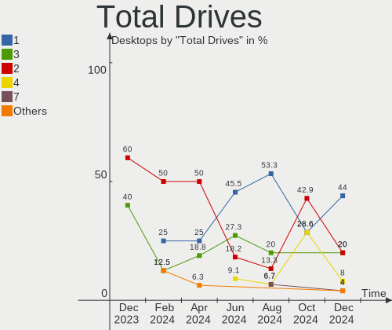
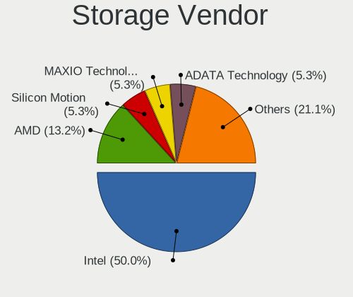
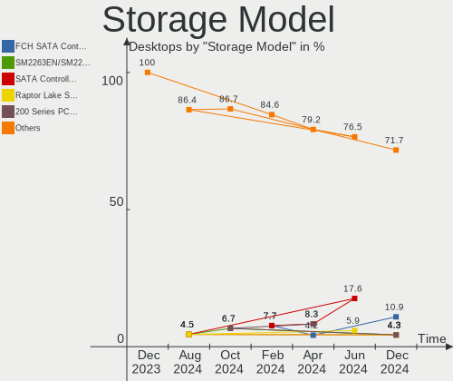
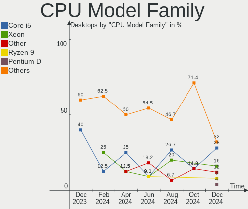
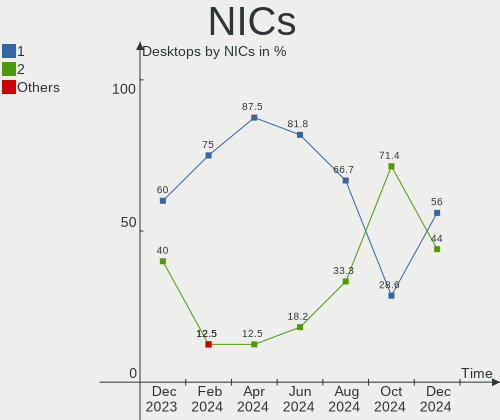

Elementary - Hardware Trends (Desktops)
---------------------------------------

A project to identify most popular hardware characteristics and track their change
over time based on data collected by Linux users at https://Linux-Hardware.org.

Anyone can contribute to this report by the [hw-probe](https://github.com/linuxhw/hw-probe) tool:

    sudo -E hw-probe -all -upload

This report is for one last month. Overall report since the beginning of time: [TestDays](https://github.com/linuxhw/TestDays)

Period: Aug, 2023.

Contents
--------

* [ System ](#system)
  - [ OS                       ](#os)
  - [ OS Family                ](#os-family)
  - [ Kernel                   ](#kernel)
  - [ Kernel Family            ](#kernel-family)
  - [ Kernel Major Ver.        ](#kernel-major-ver)
  - [ Arch                     ](#arch)
  - [ DE                       ](#de)
  - [ Display Server           ](#display-server)
  - [ Display Manager          ](#display-manager)
  - [ OS Lang                  ](#os-lang)
  - [ Boot Mode                ](#boot-mode)
  - [ Filesystem               ](#filesystem)
  - [ Part. scheme             ](#part-scheme)
  - [ Dual Boot with Linux/BSD ](#dual-boot-with-linuxbsd)
  - [ Dual Boot (Win)          ](#dual-boot-win)

* [ Board ](#board)
  - [ Vendor                   ](#vendor)
  - [ Model                    ](#model)
  - [ Model Family             ](#model-family)
  - [ MFG Year                 ](#mfg-year)
  - [ Form Factor              ](#form-factor)
  - [ Secure Boot              ](#secure-boot)
  - [ Coreboot                 ](#coreboot)
  - [ RAM Size                 ](#ram-size)
  - [ RAM Used                 ](#ram-used)
  - [ Total Drives             ](#total-drives)
  - [ Has CD-ROM               ](#has-cd-rom)
  - [ Has Ethernet             ](#has-ethernet)
  - [ Has WiFi                 ](#has-wifi)
  - [ Has Bluetooth            ](#has-bluetooth)

* [ Location ](#location)
  - [ Country                  ](#country)
  - [ City                     ](#city)

* [ Drives ](#drives)
  - [ Drive Vendor             ](#drive-vendor)
  - [ Drive Model              ](#drive-model)
  - [ HDD Vendor               ](#hdd-vendor)
  - [ SSD Vendor               ](#ssd-vendor)
  - [ Drive Kind               ](#drive-kind)
  - [ Drive Connector          ](#drive-connector)
  - [ Drive Size               ](#drive-size)
  - [ Space Total              ](#space-total)
  - [ Space Used               ](#space-used)
  - [ Malfunc. Drives          ](#malfunc-drives)
  - [ Malfunc. Drive Vendor    ](#malfunc-drive-vendor)
  - [ Malfunc. HDD Vendor      ](#malfunc-hdd-vendor)
  - [ Malfunc. Drive Kind      ](#malfunc-drive-kind)
  - [ Failed Drives            ](#failed-drives)
  - [ Failed Drive Vendor      ](#failed-drive-vendor)
  - [ Drive Status             ](#drive-status)

* [ Storage controller ](#storage-controller)
  - [ Storage Vendor           ](#storage-vendor)
  - [ Storage Model            ](#storage-model)
  - [ Storage Kind             ](#storage-kind)

* [ Processor ](#processor)
  - [ CPU Vendor               ](#cpu-vendor)
  - [ CPU Model                ](#cpu-model)
  - [ CPU Model Family         ](#cpu-model-family)
  - [ CPU Cores                ](#cpu-cores)
  - [ CPU Sockets              ](#cpu-sockets)
  - [ CPU Threads              ](#cpu-threads)
  - [ CPU Op-Modes             ](#cpu-op-modes)
  - [ CPU Microcode            ](#cpu-microcode)
  - [ CPU Microarch            ](#cpu-microarch)

* [ Graphics ](#graphics)
  - [ GPU Vendor               ](#gpu-vendor)
  - [ GPU Model                ](#gpu-model)
  - [ GPU Combo                ](#gpu-combo)
  - [ GPU Driver               ](#gpu-driver)
  - [ GPU Memory               ](#gpu-memory)

* [ Monitor ](#monitor)
  - [ Monitor Vendor           ](#monitor-vendor)
  - [ Monitor Model            ](#monitor-model)
  - [ Monitor Resolution       ](#monitor-resolution)
  - [ Monitor Diagonal         ](#monitor-diagonal)
  - [ Monitor Width            ](#monitor-width)
  - [ Aspect Ratio             ](#aspect-ratio)
  - [ Monitor Area             ](#monitor-area)
  - [ Pixel Density            ](#pixel-density)
  - [ Multiple Monitors        ](#multiple-monitors)

* [ Network ](#network)
  - [ Net Controller Vendor    ](#net-controller-vendor)
  - [ Net Controller Model     ](#net-controller-model)
  - [ Wireless Vendor          ](#wireless-vendor)
  - [ Wireless Model           ](#wireless-model)
  - [ Ethernet Vendor          ](#ethernet-vendor)
  - [ Ethernet Model           ](#ethernet-model)
  - [ Net Controller Kind      ](#net-controller-kind)
  - [ Used Controller          ](#used-controller)
  - [ NICs                     ](#nics)
  - [ IPv6                     ](#ipv6)

* [ Bluetooth ](#bluetooth)
  - [ Bluetooth Vendor         ](#bluetooth-vendor)
  - [ Bluetooth Model          ](#bluetooth-model)

* [ Sound ](#sound)
  - [ Sound Vendor             ](#sound-vendor)
  - [ Sound Model              ](#sound-model)

* [ Memory ](#memory)
  - [ Memory Vendor            ](#memory-vendor)
  - [ Memory Model             ](#memory-model)
  - [ Memory Kind              ](#memory-kind)
  - [ Memory Form Factor       ](#memory-form-factor)
  - [ Memory Size              ](#memory-size)
  - [ Memory Speed             ](#memory-speed)

* [ Printers & scanners ](#printers--scanners)
  - [ Printer Vendor           ](#printer-vendor)
  - [ Printer Model            ](#printer-model)
  - [ Scanner Vendor           ](#scanner-vendor)
  - [ Scanner Model            ](#scanner-model)

* [ Camera ](#camera)
  - [ Camera Vendor            ](#camera-vendor)
  - [ Camera Model             ](#camera-model)

* [ Security ](#security)
  - [ Fingerprint Vendor       ](#fingerprint-vendor)
  - [ Fingerprint Model        ](#fingerprint-model)
  - [ Chipcard Vendor          ](#chipcard-vendor)
  - [ Chipcard Model           ](#chipcard-model)

* [ Unsupported ](#unsupported)
  - [ Unsupported Devices      ](#unsupported-devices)
  - [ Unsupported Device Types ](#unsupported-device-types)

System
------

OS
--

Installed operating systems

| Name           | Desktops | Percent |
|----------------|----------|---------|
| Elementary 7   | 7        | 77.78%  |
| Elementary 6.1 | 2        | 22.22%  |

OS Family
---------

OS without a version

| Name       | Desktops | Percent |
|------------|----------|---------|
| Elementary | 9        | 100%    |

Kernel
------

Version of the Linux kernel

| Version           | Desktops | Percent |
|-------------------|----------|---------|
| 6.2.0-26-generic  | 4        | 44.44%  |
| 5.15.0-58-generic | 3        | 33.33%  |
| 5.15.0-79-generic | 1        | 11.11%  |
| 5.15.0-76-generic | 1        | 11.11%  |

Kernel Family
-------------

Linux kernel without a distro release

| Version | Desktops | Percent |
|---------|----------|---------|
| 5.15.0  | 5        | 55.56%  |
| 6.2.0   | 4        | 44.44%  |

Kernel Major Ver.
-----------------

Linux kernel major version

| Version | Desktops | Percent |
|---------|----------|---------|
| 5.15    | 5        | 55.56%  |
| 6.2     | 4        | 44.44%  |

Arch
----

OS architecture (x86_64, i586, etc.)

| Name   | Desktops | Percent |
|--------|----------|---------|
| x86_64 | 9        | 100%    |

DE
--

Desktop Environment

| Name     | Desktops | Percent |
|----------|----------|---------|
| Pantheon | 8        | 88.89%  |
| GNOME    | 1        | 11.11%  |

Display Server
--------------

X11 or Wayland

| Name | Desktops | Percent |
|------|----------|---------|
| X11  | 9        | 100%    |

Display Manager
---------------

SDDM, LightDM, etc.

| Name    | Desktops | Percent |
|---------|----------|---------|
| Unknown | 7        | 77.78%  |
| LightDM | 2        | 22.22%  |

OS Lang
-------

Language

| Lang  | Desktops | Percent |
|-------|----------|---------|
| en_US | 4        | 44.44%  |
| ru_RU | 2        | 22.22%  |
| pl_PL | 1        | 11.11%  |
| es_ES | 1        | 11.11%  |
| en_CA | 1        | 11.11%  |

Boot Mode
---------

EFI or BIOS

| Mode | Desktops | Percent |
|------|----------|---------|
| BIOS | 9        | 100%    |

Filesystem
----------

Type of filesystem

| Type  | Desktops | Percent |
|-------|----------|---------|
| Ext4  | 7        | 77.78%  |
| Tmpfs | 2        | 22.22%  |

Part. scheme
------------

Scheme of partitioning

| Type    | Desktops | Percent |
|---------|----------|---------|
| Unknown | 7        | 77.78%  |
| MBR     | 1        | 11.11%  |
| GPT     | 1        | 11.11%  |

Dual Boot with Linux/BSD
------------------------

Hosting more than one Linux/BSD

| Dual boot | Desktops | Percent |
|-----------|----------|---------|
| No        | 9        | 100%    |

Dual Boot (Win)
---------------

Hosting Linux and Windows

| Dual boot | Desktops | Percent |
|-----------|----------|---------|
| No        | 8        | 88.89%  |
| Yes       | 1        | 11.11%  |

Board
-----

Vendor
------

Motherboard manufacturer

| Name                | Desktops | Percent |
|---------------------|----------|---------|
| Dell                | 3        | 33.33%  |
| Pegatron            | 1        | 11.11%  |
| Hewlett-Packard     | 1        | 11.11%  |
| Gigabyte Technology | 1        | 11.11%  |
| ASRock              | 1        | 11.11%  |
| Acer                | 1        | 11.11%  |
| Unknown             | 1        | 11.11%  |

Model
-----

Motherboard model

| Name                            | Desktops | Percent |
|---------------------------------|----------|---------|
| Dell OptiPlex 790               | 2        | 22.22%  |
| Pegatron Pro 3010 Microtower PC | 1        | 11.11%  |
| HP ProDesk 600 G1 SFF           | 1        | 11.11%  |
| Gigabyte B560M H                | 1        | 11.11%  |
| Dell OptiPlex 330               | 1        | 11.11%  |
| ASRock X370 Pro4                | 1        | 11.11%  |
| Acer Aspire TC-710              | 1        | 11.11%  |
| Unknown                         | 1        | 11.11%  |

Model Family
------------

Motherboard model prefix

| Name           | Desktops | Percent |
|----------------|----------|---------|
| Dell OptiPlex  | 3        | 33.33%  |
| Pegatron Pro   | 1        | 11.11%  |
| HP ProDesk     | 1        | 11.11%  |
| Gigabyte B560M | 1        | 11.11%  |
| ASRock X370    | 1        | 11.11%  |
| Acer Aspire    | 1        | 11.11%  |
| Unknown        | 1        | 11.11%  |

MFG Year
--------

Motherboard manufacture year

| Year | Desktops | Percent |
|------|----------|---------|
| 2012 | 2        | 22.22%  |
| 2021 | 1        | 11.11%  |
| 2018 | 1        | 11.11%  |
| 2015 | 1        | 11.11%  |
| 2013 | 1        | 11.11%  |
| 2011 | 1        | 11.11%  |
| 2009 | 1        | 11.11%  |
| 2007 | 1        | 11.11%  |

Form Factor
-----------

Physical design of the computer

| Name    | Desktops | Percent |
|---------|----------|---------|
| Desktop | 9        | 100%    |

Secure Boot
-----------

Enabled or disabled

| State    | Desktops | Percent |
|----------|----------|---------|
| Disabled | 9        | 100%    |

Coreboot
--------

Have coreboot on board

| Used | Desktops | Percent |
|------|----------|---------|
| No   | 9        | 100%    |

RAM Size
--------

Total RAM memory

| Size in GB | Desktops | Percent |
|------------|----------|---------|
| 16.01-24.0 | 3        | 33.33%  |
| 4.01-8.0   | 2        | 22.22%  |
| 32.01-64.0 | 1        | 11.11%  |
| 3.01-4.0   | 1        | 11.11%  |
| 1.01-2.0   | 1        | 11.11%  |
| 8.01-16.0  | 1        | 11.11%  |

RAM Used
--------

Used RAM memory

| Used GB   | Desktops | Percent |
|-----------|----------|---------|
| 1.01-2.0  | 3        | 33.33%  |
| 4.01-8.0  | 2        | 22.22%  |
| 2.01-3.0  | 2        | 22.22%  |
| 3.01-4.0  | 1        | 11.11%  |
| 8.01-16.0 | 1        | 11.11%  |

Total Drives
------------

Number of drives on board

| Drives | Desktops | Percent |
|--------|----------|---------|
| 1      | 4        | 44.44%  |
| 2      | 3        | 33.33%  |
| 3      | 2        | 22.22%  |

Has CD-ROM
----------

Has CD-ROM on board

| Presented | Desktops | Percent |
|-----------|----------|---------|
| No        | 5        | 55.56%  |
| Yes       | 4        | 44.44%  |

Has Ethernet
------------

Has Ethernet on board

| Presented | Desktops | Percent |
|-----------|----------|---------|
| Yes       | 9        | 100%    |

Has WiFi
--------

Has WiFi module

| Presented | Desktops | Percent |
|-----------|----------|---------|
| Yes       | 5        | 55.56%  |
| No        | 4        | 44.44%  |

Has Bluetooth
-------------

Has Bluetooth module

| Presented | Desktops | Percent |
|-----------|----------|---------|
| No        | 8        | 88.89%  |
| Yes       | 1        | 11.11%  |

Location
--------

Country
-------

Geographic location (country)

| Country   | Desktops | Percent |
|-----------|----------|---------|
| Venezuela | 1        | 11.11%  |
| USA       | 1        | 11.11%  |
| Ukraine   | 1        | 11.11%  |
| UK        | 1        | 11.11%  |
| Russia    | 1        | 11.11%  |
| Pakistan  | 1        | 11.11%  |
| Italy     | 1        | 11.11%  |
| Germany   | 1        | 11.11%  |
| Canada    | 1        | 11.11%  |

City
----

Geographic location (city)

| City        | Desktops | Percent |
|-------------|----------|---------|
| Windsor     | 1        | 11.11%  |
| Spokane     | 1        | 11.11%  |
| Sorel-Tracy | 1        | 11.11%  |
| Padova      | 1        | 11.11%  |
| Munich      | 1        | 11.11%  |
| Moscow      | 1        | 11.11%  |
| Mariupol    | 1        | 11.11%  |
| Karachi     | 1        | 11.11%  |
| Anzoategui  | 1        | 11.11%  |

Drives
------

Drive Vendor
------------

Hard drive vendors

| Vendor                | Desktops | Drives | Percent |
|-----------------------|----------|--------|---------|
| WDC                   | 4        | 4      | 23.53%  |
| Seagate               | 3        | 3      | 17.65%  |
| Kingston              | 2        | 2      | 11.76%  |
| Unknown               | 1        | 1      | 5.88%   |
| Toshiba               | 1        | 1      | 5.88%   |
| SanDisk               | 1        | 1      | 5.88%   |
| Samsung Electronics   | 1        | 1      | 5.88%   |
| Realtek Semiconductor | 1        | 1      | 5.88%   |
| Hitachi               | 1        | 1      | 5.88%   |
| Crucial               | 1        | 1      | 5.88%   |
| A-DATA Technology     | 1        | 1      | 5.88%   |

Drive Model
-----------

Hard drive models

| Model                               | Desktops | Percent |
|-------------------------------------|----------|---------|
| WDC WDS500G2B0A-00SM50 500GB SSD    | 1        | 5.88%   |
| WDC WD800JD-75MSA3 80GB             | 1        | 5.88%   |
| WDC WD5000AAKS-00V6A0 500GB         | 1        | 5.88%   |
| WDC WD20EZRX-22D8PB0 2TB            | 1        | 5.88%   |
| Unknown SD/MMC/MS PRO 1GB           | 1        | 5.88%   |
| Toshiba MQ01ABD100 1TB              | 1        | 5.88%   |
| Seagate ST500LM021-1KJ152 500GB     | 1        | 5.88%   |
| Seagate ST4000DM004-2CV104 4TB      | 1        | 5.88%   |
| Seagate ST1000DM010-2EP102 1TB      | 1        | 5.88%   |
| SanDisk SDSSDA-1T                   | 1        | 5.88%   |
| Samsung SSD 980 500GB               | 1        | 5.88%   |
| Realtek ADATA SX6000LNP 128GB       | 1        | 5.88%   |
| Kingston SA400S37240G 240GB SSD     | 1        | 5.88%   |
| Kingston RBU-SNS8151S396GG 96GB SSD | 1        | 5.88%   |
| Hitachi HUA722020ALA330 2TB         | 1        | 5.88%   |
| Crucial CT240BX500SSD1 240GB        | 1        | 5.88%   |
| A-DATA SU800 512GB SSD              | 1        | 5.88%   |

HDD Vendor
----------

Hard disk drive vendors

| Vendor  | Desktops | Drives | Percent |
|---------|----------|--------|---------|
| WDC     | 3        | 3      | 33.33%  |
| Seagate | 3        | 3      | 33.33%  |
| Unknown | 1        | 1      | 11.11%  |
| Toshiba | 1        | 1      | 11.11%  |
| Hitachi | 1        | 1      | 11.11%  |

SSD Vendor
----------

Solid state drive vendors

| Vendor            | Desktops | Drives | Percent |
|-------------------|----------|--------|---------|
| Kingston          | 2        | 2      | 33.33%  |
| WDC               | 1        | 1      | 16.67%  |
| SanDisk           | 1        | 1      | 16.67%  |
| Crucial           | 1        | 1      | 16.67%  |
| A-DATA Technology | 1        | 1      | 16.67%  |

Drive Kind
----------

HDD or SSD

| Kind | Desktops | Drives | Percent |
|------|----------|--------|---------|
| HDD  | 8        | 9      | 50%     |
| SSD  | 6        | 6      | 37.5%   |
| NVMe | 2        | 2      | 12.5%   |

Drive Connector
---------------

SATA, SAS, NVMe, etc.

| Type | Desktops | Drives | Percent |
|------|----------|--------|---------|
| SATA | 9        | 13     | 69.23%  |
| SAS  | 2        | 2      | 15.38%  |
| NVMe | 2        | 2      | 15.38%  |

Drive Size
----------

Size of hard drive

| Size in TB | Desktops | Drives | Percent |
|------------|----------|--------|---------|
| 0.01-0.5   | 6        | 8      | 46.15%  |
| 0.51-1.0   | 4        | 4      | 30.77%  |
| 1.01-2.0   | 2        | 2      | 15.38%  |
| 3.01-4.0   | 1        | 1      | 7.69%   |

Space Total
-----------

Amount of disk space available on the file system

| Size in GB | Desktops | Percent |
|------------|----------|---------|
| 251-500    | 3        | 33.33%  |
| 1001-2000  | 2        | 22.22%  |
| 51-100     | 2        | 22.22%  |
| 2001-3000  | 1        | 11.11%  |
| 101-250    | 1        | 11.11%  |

Space Used
----------

Amount of used disk space

| Used GB   | Desktops | Percent |
|-----------|----------|---------|
| 21-50     | 3        | 33.33%  |
| 251-500   | 2        | 22.22%  |
| 101-250   | 1        | 11.11%  |
| 1001-2000 | 1        | 11.11%  |
| 1-20      | 1        | 11.11%  |
| 51-100    | 1        | 11.11%  |

Malfunc. Drives
---------------

Drive models with a malfunction

Zero info for selected period =(

Malfunc. Drive Vendor
---------------------

Vendors of faulty drives

Zero info for selected period =(

Malfunc. HDD Vendor
-------------------

Vendors of faulty HDD drives

Zero info for selected period =(

Malfunc. Drive Kind
-------------------

Kinds of faulty drives

Zero info for selected period =(

Failed Drives
-------------

Failed drive models

Zero info for selected period =(

Failed Drive Vendor
-------------------

Failed drive vendors

Zero info for selected period =(

Drive Status
------------

Number of failed and malfunc. drives

| Status   | Desktops | Drives | Percent |
|----------|----------|--------|---------|
| Detected | 10       | 17     | 100%    |

Storage controller
------------------

Storage Vendor
--------------

Storage controller vendors

| Vendor                | Desktops | Percent |
|-----------------------|----------|---------|
| Intel                 | 8        | 66.67%  |
| Samsung Electronics   | 1        | 8.33%   |
| Realtek Semiconductor | 1        | 8.33%   |
| ASMedia Technology    | 1        | 8.33%   |
| AMD                   | 1        | 8.33%   |

Storage Model
-------------

Storage controller models

| Model                                                                          | Desktops | Percent |
|--------------------------------------------------------------------------------|----------|---------|
| Intel 6 Series/C200 Series Chipset Family 6 port Desktop SATA AHCI Controller  | 3        | 21.43%  |
| Samsung NVMe SSD Controller 980                                                | 1        | 7.14%   |
| Realtek RTS5763DL NVMe SSD Controller (DRAM-less)                              | 1        | 7.14%   |
| Intel Q170/Q150/B150/H170/H110/Z170/CM236 Chipset SATA Controller [AHCI Mode]  | 1        | 7.14%   |
| Intel NM10/ICH7 Family SATA Controller [AHCI mode]                             | 1        | 7.14%   |
| Intel 82801JI (ICH10 Family) SATA AHCI Controller                              | 1        | 7.14%   |
| Intel 82801G (ICH7 Family) IDE Controller                                      | 1        | 7.14%   |
| Intel 8 Series/C220 Series Chipset Family 6-port SATA Controller 1 [AHCI mode] | 1        | 7.14%   |
| Intel 500 Series Chipset Family SATA AHCI Controller                           | 1        | 7.14%   |
| ASMedia ASM1062 Serial ATA Controller                                          | 1        | 7.14%   |
| AMD X370 Series Chipset SATA Controller                                        | 1        | 7.14%   |
| AMD FCH SATA Controller [AHCI mode]                                            | 1        | 7.14%   |

Storage Kind
------------

Kind of storage controller (IDE, SATA, NVMe, SAS, ...)

| Kind | Desktops | Percent |
|------|----------|---------|
| SATA | 9        | 75%     |
| NVMe | 2        | 16.67%  |
| IDE  | 1        | 8.33%   |

Processor
---------

CPU Vendor
----------

Processor vendors

| Vendor | Desktops | Percent |
|--------|----------|---------|
| Intel  | 8        | 88.89%  |
| AMD    | 1        | 11.11%  |

CPU Model
---------

Processor models

| Model                                       | Desktops | Percent |
|---------------------------------------------|----------|---------|
| Intel Core i5-2400 CPU @ 3.10GHz            | 2        | 22.22%  |
| Intel Pentium Dual-Core CPU E6300 @ 2.80GHz | 1        | 11.11%  |
| Intel Pentium Dual CPU E2160 @ 1.80GHz      | 1        | 11.11%  |
| Intel Core i7-6700 CPU @ 3.40GHz            | 1        | 11.11%  |
| Intel Core i5-2500S CPU @ 2.70GHz           | 1        | 11.11%  |
| Intel Core i3-4160 CPU @ 3.60GHz            | 1        | 11.11%  |
| Intel 11th Gen Core i5-11400 @ 2.60GHz      | 1        | 11.11%  |
| AMD Ryzen 7 3700X 8-Core Processor          | 1        | 11.11%  |

CPU Model Family
----------------

Processor model prefix

| Model                   | Desktops | Percent |
|-------------------------|----------|---------|
| Intel Core i5           | 3        | 33.33%  |
| Other                   | 1        | 11.11%  |
| Intel Pentium Dual-Core | 1        | 11.11%  |
| Intel Pentium Dual      | 1        | 11.11%  |
| Intel Core i7           | 1        | 11.11%  |
| Intel Core i3           | 1        | 11.11%  |
| AMD Ryzen 7             | 1        | 11.11%  |

CPU Cores
---------

Number of processor cores

| Number | Desktops | Percent |
|--------|----------|---------|
| 4      | 4        | 44.44%  |
| 2      | 3        | 33.33%  |
| 8      | 1        | 11.11%  |
| 6      | 1        | 11.11%  |

CPU Sockets
-----------

Number of sockets

| Number | Desktops | Percent |
|--------|----------|---------|
| 1      | 9        | 100%    |

CPU Threads
-----------

Threads per core (Hyper-Threading)

| Number | Desktops | Percent |
|--------|----------|---------|
| 1      | 5        | 55.56%  |
| 2      | 4        | 44.44%  |

CPU Op-Modes
------------

CPU Operation Modes (32-bit, 64-bit)

| Op mode        | Desktops | Percent |
|----------------|----------|---------|
| 32-bit, 64-bit | 9        | 100%    |

CPU Microcode
-------------

Microcode number

| Number  | Desktops | Percent |
|---------|----------|---------|
| Unknown | 7        | 77.78%  |
| 0x6fd   | 1        | 11.11%  |
| 0x206a7 | 1        | 11.11%  |

CPU Microarch
-------------

Microarchitecture

| Name        | Desktops | Percent |
|-------------|----------|---------|
| SandyBridge | 3        | 33.33%  |
| Zen 2       | 1        | 11.11%  |
| Skylake     | 1        | 11.11%  |
| Penryn      | 1        | 11.11%  |
| Haswell     | 1        | 11.11%  |
| Core        | 1        | 11.11%  |
| Unknown     | 1        | 11.11%  |

Graphics
--------

GPU Vendor
----------

Vendors of graphics cards

| Vendor | Desktops | Percent |
|--------|----------|---------|
| Intel  | 7        | 63.64%  |
| Nvidia | 3        | 27.27%  |
| AMD    | 1        | 9.09%   |

GPU Model
---------

Graphics card models

| Model                                                                     | Desktops | Percent |
|---------------------------------------------------------------------------|----------|---------|
| Intel 2nd Generation Core Processor Family Integrated Graphics Controller | 2        | 18.18%  |
| Nvidia GP108 [GeForce GT 1030]                                            | 1        | 9.09%   |
| Nvidia GK107 [GeForce GTX 650]                                            | 1        | 9.09%   |
| Nvidia G96C [GeForce GT 120]                                              | 1        | 9.09%   |
| Intel RocketLake-S GT1 [UHD Graphics 730]                                 | 1        | 9.09%   |
| Intel HD Graphics 530                                                     | 1        | 9.09%   |
| Intel 82G33/G31 Express Integrated Graphics Controller                    | 1        | 9.09%   |
| Intel 4th Generation Core Processor Family Integrated Graphics Controller | 1        | 9.09%   |
| Intel 4 Series Chipset Integrated Graphics Controller                     | 1        | 9.09%   |
| AMD Navi 14 [Radeon RX 5500/5500M / Pro 5500M]                            | 1        | 9.09%   |

GPU Combo
---------

Combinations of graphics cards

| Name       | Desktops | Percent |
|------------|----------|---------|
| 1 x Intel  | 6        | 66.67%  |
| 1 x Nvidia | 2        | 22.22%  |
| 1 x AMD    | 1        | 11.11%  |

GPU Driver
----------

Free vs proprietary

| Driver | Desktops | Percent |
|--------|----------|---------|
| Free   | 9        | 100%    |

GPU Memory
----------

Total video memory

| Size in GB | Desktops | Percent |
|------------|----------|---------|
| Unknown    | 9        | 100%    |

Monitor
-------

Monitor Vendor
--------------

Monitor vendors

| Vendor              | Desktops | Percent |
|---------------------|----------|---------|
| NEC Computers       | 2        | 22.22%  |
| ViewSonic           | 1        | 11.11%  |
| Sharp               | 1        | 11.11%  |
| Samsung Electronics | 1        | 11.11%  |
| RCA                 | 1        | 11.11%  |
| Hewlett-Packard     | 1        | 11.11%  |
| Goldstar            | 1        | 11.11%  |
| AOC                 | 1        | 11.11%  |

Monitor Model
-------------

Monitor models

| Model                                                             | Desktops | Percent |
|-------------------------------------------------------------------|----------|---------|
| ViewSonic VP201b VSC6911 1600x1200 408x306mm 20.1-inch            | 1        | 10%     |
| Sharp HDMI SHP1048 1920x1080 820x460mm 37.0-inch                  | 1        | 10%     |
| Samsung Electronics LF24T40 SAM703C 1920x1080 521x293mm 23.5-inch | 1        | 10%     |
| RCA RTR3261-B-CA RCA0B01 1920x1080 698x392mm 31.5-inch            | 1        | 10%     |
| NEC Computers EA234WMi NEC691E 1920x1080 509x286mm 23.0-inch      | 1        | 10%     |
| NEC Computers EA221WM NEC673D 1680x1050 474x296mm 22.0-inch       | 1        | 10%     |
| Hewlett-Packard L2245w HWP26FB 1680x1050 473x296mm 22.0-inch      | 1        | 10%     |
| Goldstar W1934 GSM4B7A 1440x900 410x256mm 19.0-inch               | 1        | 10%     |
| Goldstar ULTRAWIDE GSM59F2 2560x1080 798x334mm 34.1-inch          | 1        | 10%     |
| AOC 2270W AOC2270 1920x1080 477x268mm 21.5-inch                   | 1        | 10%     |

Monitor Resolution
------------------

Monitor screen resolution

| Resolution         | Desktops | Percent |
|--------------------|----------|---------|
| 1920x1080 (FHD)    | 4        | 40%     |
| 1680x1050 (WSXGA+) | 2        | 20%     |
| 3840x2160 (4K)     | 1        | 10%     |
| 2560x1080          | 1        | 10%     |
| 1600x1200          | 1        | 10%     |
| 1440x900 (WXGA+)   | 1        | 10%     |

Monitor Diagonal
----------------

Diagonal size in inches

| Inches | Desktops | Percent |
|--------|----------|---------|
| 23     | 2        | 20%     |
| 22     | 2        | 20%     |
| 60     | 1        | 10%     |
| 36     | 1        | 10%     |
| 34     | 1        | 10%     |
| 21     | 1        | 10%     |
| 20     | 1        | 10%     |
| 19     | 1        | 10%     |

Monitor Width
-------------

Physical width

| Width in mm | Desktops | Percent |
|-------------|----------|---------|
| 401-500     | 5        | 50%     |
| 701-800     | 2        | 20%     |
| 501-600     | 2        | 20%     |
| 1001-1500   | 1        | 10%     |

Aspect Ratio
------------

Proportional relationship between the width and the height

| Ratio | Desktops | Percent |
|-------|----------|---------|
| 16/9  | 5        | 50%     |
| 16/10 | 3        | 30%     |
| 4/3   | 1        | 10%     |
| 21/9  | 1        | 10%     |

Monitor Area
------------

Area in inch²

| Area in inch² | Desktops | Percent |
|----------------|----------|---------|
| 201-250        | 4        | 40%     |
| 151-200        | 3        | 30%     |
| More than 1000 | 1        | 10%     |
| 351-500        | 1        | 10%     |
| 501-1000       | 1        | 10%     |

Pixel Density
-------------

Pixels per inch

| Density | Desktops | Percent |
|---------|----------|---------|
| 51-100  | 6        | 66.67%  |
| 1-50    | 1        | 11.11%  |
| 121-160 | 1        | 11.11%  |
| 101-120 | 1        | 11.11%  |

Multiple Monitors
-----------------

Total monitors connected

| Total | Desktops | Percent |
|-------|----------|---------|
| 1     | 7        | 77.78%  |
| 2     | 2        | 22.22%  |

Network
-------

Net Controller Vendor
---------------------

Controller vendors

| Vendor                          | Desktops | Percent |
|---------------------------------|----------|---------|
| Realtek Semiconductor           | 6        | 42.86%  |
| Intel                           | 4        | 28.57%  |
| TP-Link                         | 1        | 7.14%   |
| Ralink Technology               | 1        | 7.14%   |
| Qualcomm Atheros Communications | 1        | 7.14%   |
| Broadcom Limited                | 1        | 7.14%   |

Net Controller Model
--------------------

Controller models

| Model                                                             | Desktops | Percent |
|-------------------------------------------------------------------|----------|---------|
| Realtek RTL8111/8168/8411 PCI Express Gigabit Ethernet Controller | 5        | 35.71%  |
| Intel 82579LM Gigabit Network Connection (Lewisville)             | 2        | 14.29%  |
| TP-Link TL-WN823N v2/v3 [Realtek RTL8192EU]                       | 1        | 7.14%   |
| Realtek 802.11ac NIC                                              | 1        | 7.14%   |
| Ralink RT2870/RT3070 Wireless Adapter                             | 1        | 7.14%   |
| Qualcomm Atheros AR9271 802.11n                                   | 1        | 7.14%   |
| Intel Wireless 3165                                               | 1        | 7.14%   |
| Intel Ethernet Connection I217-LM                                 | 1        | 7.14%   |
| Broadcom Limited NetLink BCM5787 Gigabit Ethernet PCI Express     | 1        | 7.14%   |

Wireless Vendor
---------------

Wireless vendors

| Vendor                          | Desktops | Percent |
|---------------------------------|----------|---------|
| TP-Link                         | 1        | 20%     |
| Realtek Semiconductor           | 1        | 20%     |
| Ralink Technology               | 1        | 20%     |
| Qualcomm Atheros Communications | 1        | 20%     |
| Intel                           | 1        | 20%     |

Wireless Model
--------------

Wireless models

| Model                                       | Desktops | Percent |
|---------------------------------------------|----------|---------|
| TP-Link TL-WN823N v2/v3 [Realtek RTL8192EU] | 1        | 20%     |
| Realtek 802.11ac NIC                        | 1        | 20%     |
| Ralink RT2870/RT3070 Wireless Adapter       | 1        | 20%     |
| Qualcomm Atheros AR9271 802.11n             | 1        | 20%     |
| Intel Wireless 3165                         | 1        | 20%     |

Ethernet Vendor
---------------

Ethernet vendors

| Vendor                | Desktops | Percent |
|-----------------------|----------|---------|
| Realtek Semiconductor | 5        | 55.56%  |
| Intel                 | 3        | 33.33%  |
| Broadcom Limited      | 1        | 11.11%  |

Ethernet Model
--------------

Ethernet models

| Model                                                             | Desktops | Percent |
|-------------------------------------------------------------------|----------|---------|
| Realtek RTL8111/8168/8411 PCI Express Gigabit Ethernet Controller | 5        | 55.56%  |
| Intel 82579LM Gigabit Network Connection (Lewisville)             | 2        | 22.22%  |
| Intel Ethernet Connection I217-LM                                 | 1        | 11.11%  |
| Broadcom Limited NetLink BCM5787 Gigabit Ethernet PCI Express     | 1        | 11.11%  |

Net Controller Kind
-------------------

Ethernet, WiFi or modem

| Kind     | Desktops | Percent |
|----------|----------|---------|
| Ethernet | 9        | 64.29%  |
| WiFi     | 5        | 35.71%  |

Used Controller
---------------

Currently used network controller

| Kind     | Desktops | Percent |
|----------|----------|---------|
| Ethernet | 5        | 55.56%  |
| WiFi     | 4        | 44.44%  |

NICs
----

Total network controllers on board

| Total | Desktops | Percent |
|-------|----------|---------|
| 1     | 7        | 77.78%  |
| 2     | 2        | 22.22%  |

IPv6
----

IPv6 vs IPv4

| Used | Desktops | Percent |
|------|----------|---------|
| No   | 6        | 66.67%  |
| Yes  | 3        | 33.33%  |

Bluetooth
---------

Bluetooth Vendor
----------------

Controller vendors

| Vendor | Desktops | Percent |
|--------|----------|---------|
| Intel  | 1        | 100%    |

Bluetooth Model
---------------

Controller models

| Model                              | Desktops | Percent |
|------------------------------------|----------|---------|
| Intel Bluetooth wireless interface | 1        | 100%    |

Sound
-----

Sound Vendor
------------

Sound card vendors

| Vendor | Desktops | Percent |
|--------|----------|---------|
| Intel  | 8        | 66.67%  |
| Nvidia | 2        | 16.67%  |
| JMTek  | 1        | 8.33%   |
| AMD    | 1        | 8.33%   |

Sound Model
-----------

Sound card models

| Model                                                                      | Desktops | Percent |
|----------------------------------------------------------------------------|----------|---------|
| Intel 6 Series/C200 Series Chipset Family High Definition Audio Controller | 3        | 21.43%  |
| Nvidia GP108 High Definition Audio Controller                              | 1        | 7.14%   |
| Nvidia GK107 HDMI Audio Controller                                         | 1        | 7.14%   |
| JMTek SSS Headphone Set                                                    | 1        | 7.14%   |
| Intel Xeon E3-1200 v3/4th Gen Core Processor HD Audio Controller           | 1        | 7.14%   |
| Intel Tiger Lake-H HD Audio Controller                                     | 1        | 7.14%   |
| Intel NM10/ICH7 Family High Definition Audio Controller                    | 1        | 7.14%   |
| Intel 82801JI (ICH10 Family) HD Audio Controller                           | 1        | 7.14%   |
| Intel 8 Series/C220 Series Chipset High Definition Audio Controller        | 1        | 7.14%   |
| Intel 100 Series/C230 Series Chipset Family HD Audio Controller            | 1        | 7.14%   |
| AMD Starship/Matisse HD Audio Controller                                   | 1        | 7.14%   |
| AMD Navi 10 HDMI Audio                                                     | 1        | 7.14%   |

Memory
------

Memory Vendor
-------------

Memory module vendors

| Vendor              | Desktops | Percent |
|---------------------|----------|---------|
| Samsung Electronics | 1        | 100%    |

Memory Model
------------

Memory module models

| Model                                               | Desktops | Percent |
|-----------------------------------------------------|----------|---------|
| Samsung RAM M378B5173QH0-YK0 4GB DIMM DDR3 1600MT/s | 1        | 100%    |

Memory Kind
-----------

Memory module kinds

| Kind | Desktops | Percent |
|------|----------|---------|
| DDR3 | 1        | 100%    |

Memory Form Factor
------------------

Physical design of the memory module

| Name | Desktops | Percent |
|------|----------|---------|
| DIMM | 1        | 100%    |

Memory Size
-----------

Memory module size

| Size | Desktops | Percent |
|------|----------|---------|
| 4096 | 1        | 100%    |

Memory Speed
------------

Memory module speed

| Speed | Desktops | Percent |
|-------|----------|---------|
| 1600  | 1        | 100%    |

Printers & scanners
-------------------

Printer Vendor
--------------

Printer device vendors

| Vendor          | Desktops | Percent |
|-----------------|----------|---------|
| Hewlett-Packard | 1        | 100%    |

Printer Model
-------------

Printer device models

| Model            | Desktops | Percent |
|------------------|----------|---------|
| HP LaserJet 1300 | 1        | 100%    |

Scanner Vendor
--------------

Scanner device vendors

Zero info for selected period =(

Scanner Model
-------------

Scanner device models

Zero info for selected period =(

Camera
------

Camera Vendor
-------------

Camera device vendors

| Vendor                | Desktops | Percent |
|-----------------------|----------|---------|
| Samsung Electronics   | 1        | 50%     |
| Arkmicro Technologies | 1        | 50%     |

Camera Model
------------

Camera device models

| Model                                   | Desktops | Percent |
|-----------------------------------------|----------|---------|
| Samsung Galaxy series, misc. (MTP mode) | 1        | 50%     |
| Arkmicro USB2.0 PC CAMERA               | 1        | 50%     |

Security
--------

Fingerprint Vendor
------------------

Fingerprint sensor vendors

Zero info for selected period =(

Fingerprint Model
-----------------

Fingerprint sensor models

Zero info for selected period =(

Chipcard Vendor
---------------

Chipcard module vendors

| Vendor  | Desktops | Percent |
|---------|----------|---------|
| OmniKey | 1        | 100%    |

Chipcard Model
--------------

Chipcard module models

| Model                                   | Desktops | Percent |
|-----------------------------------------|----------|---------|
| OmniKey CardMan 3121 (HID Technologies) | 1        | 100%    |

Unsupported
-----------

Unsupported Devices
-------------------

Total unsupported devices on board

| Total | Desktops | Percent |
|-------|----------|---------|
| 0     | 7        | 77.78%  |
| 2     | 1        | 11.11%  |
| 1     | 1        | 11.11%  |

Unsupported Device Types
------------------------

Types of unsupported devices

| Type          | Desktops | Percent |
|---------------|----------|---------|
| Net/wireless  | 1        | 33.33%  |
| Graphics card | 1        | 33.33%  |
| Chipcard      | 1        | 33.33%  |

