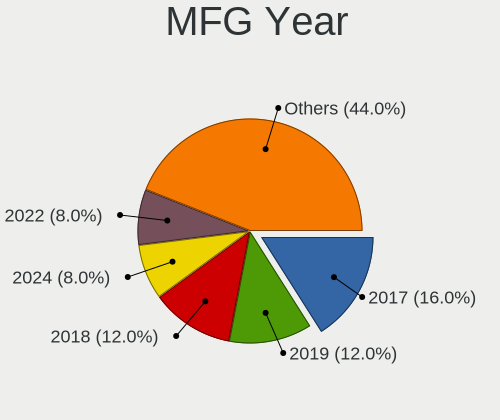
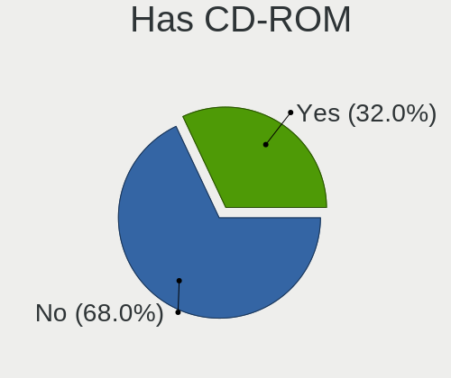
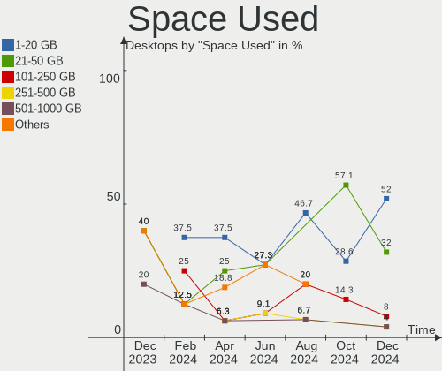
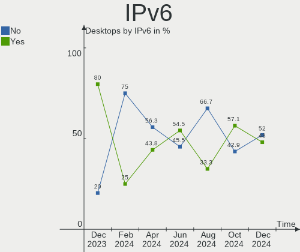
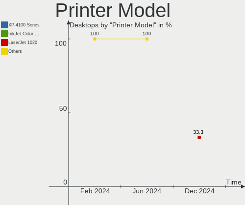
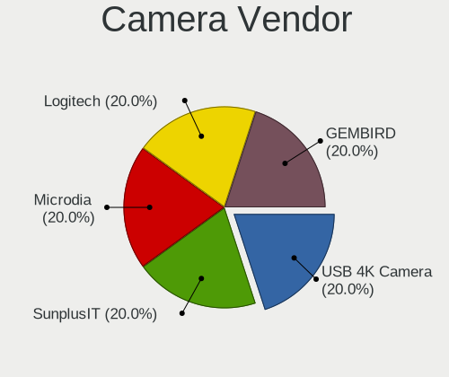
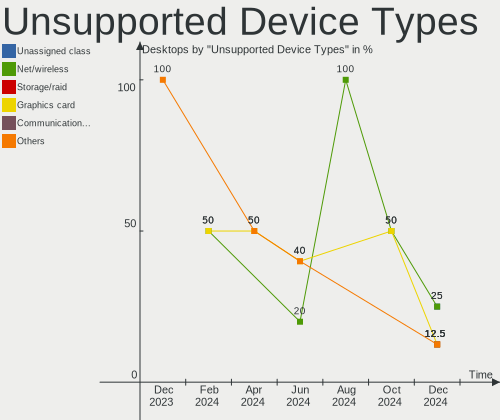

Elementary Hardware Trends (Desktops)
-------------------------------------

A project to identify most popular hardware characteristics and track their change
over time based on data collected by Elementary users at https://Linux-Hardware.org.

Anyone can contribute to this report by the [hw-probe](https://github.com/linuxhw/hw-probe) tool:

    sudo -E hw-probe -all -upload

Full-feature report is available here: https://linux-hardware.org/?view=trends

Period: Dec, 2021.

Contents
--------

* [ System ](#system)
  - [ OS                       ](#os)
  - [ OS Family                ](#os-family)
  - [ Kernel                   ](#kernel)
  - [ Kernel Family            ](#kernel-family)
  - [ Kernel Major Ver.        ](#kernel-major-ver)
  - [ Arch                     ](#arch)
  - [ DE                       ](#de)
  - [ Display Server           ](#display-server)
  - [ Display Manager          ](#display-manager)
  - [ OS Lang                  ](#os-lang)
  - [ Boot Mode                ](#boot-mode)
  - [ Filesystem               ](#filesystem)
  - [ Part. scheme             ](#part-scheme)
  - [ Dual Boot with Linux/BSD ](#dual-boot-with-linuxbsd)
  - [ Dual Boot (Win)          ](#dual-boot-win)

* [ Board ](#board)
  - [ Vendor                   ](#vendor)
  - [ Model                    ](#model)
  - [ Model Family             ](#model-family)
  - [ MFG Year                 ](#mfg-year)
  - [ Form Factor              ](#form-factor)
  - [ Secure Boot              ](#secure-boot)
  - [ Coreboot                 ](#coreboot)
  - [ RAM Size                 ](#ram-size)
  - [ RAM Used                 ](#ram-used)
  - [ Total Drives             ](#total-drives)
  - [ Has CD-ROM               ](#has-cd-rom)
  - [ Has Ethernet             ](#has-ethernet)
  - [ Has WiFi                 ](#has-wifi)
  - [ Has Bluetooth            ](#has-bluetooth)

* [ Location ](#location)
  - [ Country                  ](#country)
  - [ City                     ](#city)

* [ Drives ](#drives)
  - [ Drive Vendor             ](#drive-vendor)
  - [ Drive Model              ](#drive-model)
  - [ HDD Vendor               ](#hdd-vendor)
  - [ SSD Vendor               ](#ssd-vendor)
  - [ Drive Kind               ](#drive-kind)
  - [ Drive Connector          ](#drive-connector)
  - [ Drive Size               ](#drive-size)
  - [ Space Total              ](#space-total)
  - [ Space Used               ](#space-used)
  - [ Malfunc. Drives          ](#malfunc-drives)
  - [ Malfunc. Drive Vendor    ](#malfunc-drive-vendor)
  - [ Malfunc. HDD Vendor      ](#malfunc-hdd-vendor)
  - [ Malfunc. Drive Kind      ](#malfunc-drive-kind)
  - [ Failed Drives            ](#failed-drives)
  - [ Failed Drive Vendor      ](#failed-drive-vendor)
  - [ Drive Status             ](#drive-status)

* [ Storage controller ](#storage-controller)
  - [ Storage Vendor           ](#storage-vendor)
  - [ Storage Model            ](#storage-model)
  - [ Storage Kind             ](#storage-kind)

* [ Processor ](#processor)
  - [ CPU Vendor               ](#cpu-vendor)
  - [ CPU Model                ](#cpu-model)
  - [ CPU Model Family         ](#cpu-model-family)
  - [ CPU Cores                ](#cpu-cores)
  - [ CPU Sockets              ](#cpu-sockets)
  - [ CPU Threads              ](#cpu-threads)
  - [ CPU Op-Modes             ](#cpu-op-modes)
  - [ CPU Microcode            ](#cpu-microcode)
  - [ CPU Microarch            ](#cpu-microarch)

* [ Graphics ](#graphics)
  - [ GPU Vendor               ](#gpu-vendor)
  - [ GPU Model                ](#gpu-model)
  - [ GPU Combo                ](#gpu-combo)
  - [ GPU Driver               ](#gpu-driver)
  - [ GPU Memory               ](#gpu-memory)

* [ Monitor ](#monitor)
  - [ Monitor Vendor           ](#monitor-vendor)
  - [ Monitor Model            ](#monitor-model)
  - [ Monitor Resolution       ](#monitor-resolution)
  - [ Monitor Diagonal         ](#monitor-diagonal)
  - [ Monitor Width            ](#monitor-width)
  - [ Aspect Ratio             ](#aspect-ratio)
  - [ Monitor Area             ](#monitor-area)
  - [ Pixel Density            ](#pixel-density)
  - [ Multiple Monitors        ](#multiple-monitors)

* [ Network ](#network)
  - [ Net Controller Vendor    ](#net-controller-vendor)
  - [ Net Controller Model     ](#net-controller-model)
  - [ Wireless Vendor          ](#wireless-vendor)
  - [ Wireless Model           ](#wireless-model)
  - [ Ethernet Vendor          ](#ethernet-vendor)
  - [ Ethernet Model           ](#ethernet-model)
  - [ Net Controller Kind      ](#net-controller-kind)
  - [ Used Controller          ](#used-controller)
  - [ NICs                     ](#nics)
  - [ IPv6                     ](#ipv6)

* [ Bluetooth ](#bluetooth)
  - [ Bluetooth Vendor         ](#bluetooth-vendor)
  - [ Bluetooth Model          ](#bluetooth-model)

* [ Sound ](#sound)
  - [ Sound Vendor             ](#sound-vendor)
  - [ Sound Model              ](#sound-model)

* [ Memory ](#memory)
  - [ Memory Vendor            ](#memory-vendor)
  - [ Memory Model             ](#memory-model)
  - [ Memory Kind              ](#memory-kind)
  - [ Memory Form Factor       ](#memory-form-factor)
  - [ Memory Size              ](#memory-size)
  - [ Memory Speed             ](#memory-speed)

* [ Printers & scanners ](#printers--scanners)
  - [ Printer Vendor           ](#printer-vendor)
  - [ Printer Model            ](#printer-model)
  - [ Scanner Vendor           ](#scanner-vendor)
  - [ Scanner Model            ](#scanner-model)

* [ Camera ](#camera)
  - [ Camera Vendor            ](#camera-vendor)
  - [ Camera Model             ](#camera-model)

* [ Security ](#security)
  - [ Fingerprint Vendor       ](#fingerprint-vendor)
  - [ Fingerprint Model        ](#fingerprint-model)
  - [ Chipcard Vendor          ](#chipcard-vendor)
  - [ Chipcard Model           ](#chipcard-model)

* [ Unsupported ](#unsupported)
  - [ Unsupported Devices      ](#unsupported-devices)
  - [ Unsupported Device Types ](#unsupported-device-types)

System
------

OS
--

Installed operating systems

| Name             | Desktops | Percent |
|------------------|----------|---------|
| Elementary 6     | 15       | 51.72%  |
| Elementary 6.1   | 13       | 44.83%  |
| Elementary 5.1.7 | 1        | 3.45%   |

OS Family
---------

OS without a version

| Name       | Desktops | Percent |
|------------|----------|---------|
| Elementary | 29       | 100%    |

Kernel
------

Version of the Linux kernel

| Version              | Desktops | Percent |
|----------------------|----------|---------|
| 5.11.0-41-generic    | 17       | 58.62%  |
| 5.11.0-43-generic    | 7        | 24.14%  |
| 5.4.0-91-generic     | 1        | 3.45%   |
| 5.13.0-22-generic    | 1        | 3.45%   |
| 5.11.0-41-lowlatency | 1        | 3.45%   |
| 5.11.0-40-generic    | 1        | 3.45%   |
| 5.11.0-37-generic    | 1        | 3.45%   |

Kernel Family
-------------

Linux kernel without a distro release

| Version | Desktops | Percent |
|---------|----------|---------|
| 5.11.0  | 27       | 93.1%   |
| 5.4.0   | 1        | 3.45%   |
| 5.13.0  | 1        | 3.45%   |

Kernel Major Ver.
-----------------

Linux kernel major version

| Version | Desktops | Percent |
|---------|----------|---------|
| 5.11    | 27       | 93.1%   |
| 5.4     | 1        | 3.45%   |
| 5.13    | 1        | 3.45%   |

Arch
----

OS architecture (x86_64, i586, etc.)

| Name   | Desktops | Percent |
|--------|----------|---------|
| x86_64 | 29       | 100%    |

DE
--

Desktop Environment

| Name     | Desktops | Percent |
|----------|----------|---------|
| Pantheon | 29       | 100%    |

Display Server
--------------

X11 or Wayland

| Name | Desktops | Percent |
|------|----------|---------|
| X11  | 29       | 100%    |

Display Manager
---------------

SDDM, LightDM, etc.

| Name    | Desktops | Percent |
|---------|----------|---------|
| Unknown | 24       | 82.76%  |
| LightDM | 5        | 17.24%  |

OS Lang
-------

Language

| Lang  | Desktops | Percent |
|-------|----------|---------|
| en_US | 16       | 55.17%  |
| de_DE | 4        | 13.79%  |
| pt_BR | 2        | 6.9%    |
| fr_FR | 2        | 6.9%    |
| es_ES | 2        | 6.9%    |
| ru_RU | 1        | 3.45%   |
| en_GB | 1        | 3.45%   |
| en_CA | 1        | 3.45%   |

Boot Mode
---------

EFI or BIOS

| Mode | Desktops | Percent |
|------|----------|---------|
| EFI  | 17       | 58.62%  |
| BIOS | 12       | 41.38%  |

Filesystem
----------

Type of filesystem

| Type | Desktops | Percent |
|------|----------|---------|
| Ext4 | 28       | 96.55%  |
| Xfs  | 1        | 3.45%   |

Part. scheme
------------

Scheme of partitioning

| Type    | Desktops | Percent |
|---------|----------|---------|
| Unknown | 28       | 96.55%  |
| GPT     | 1        | 3.45%   |

Dual Boot with Linux/BSD
------------------------

Hosting more than one Linux/BSD

| Dual boot | Desktops | Percent |
|-----------|----------|---------|
| No        | 29       | 100%    |

Dual Boot (Win)
---------------

Hosting Linux and Windows

| Dual boot | Desktops | Percent |
|-----------|----------|---------|
| No        | 27       | 93.1%   |
| Yes       | 2        | 6.9%    |

Board
-----

Vendor
------

Motherboard manufacturer

| Name                | Desktops | Percent |
|---------------------|----------|---------|
| ASUSTek Computer    | 8        | 27.59%  |
| Gigabyte Technology | 6        | 20.69%  |
| MSI                 | 3        | 10.34%  |
| Hewlett-Packard     | 3        | 10.34%  |
| Pegatron            | 2        | 6.9%    |
| ASRock              | 2        | 6.9%    |
| Acer                | 2        | 6.9%    |
| Foxconn             | 1        | 3.45%   |
| Dell                | 1        | 3.45%   |
| Apple               | 1        | 3.45%   |

Model
-----

Motherboard model

| Name                            | Desktops | Percent |
|---------------------------------|----------|---------|
| ASUS All Series                 | 2        | 6.9%    |
| Pegatron KJ379AA-ABA a6400f     | 1        | 3.45%   |
| Pegatron IPMH61P1               | 1        | 3.45%   |
| MSI PPPPP-CCC#MMMMMMMM          | 1        | 3.45%   |
| MSI MS-7B86                     | 1        | 3.45%   |
| MSI MS-7B46                     | 1        | 3.45%   |
| HP Z420 Workstation             | 1        | 3.45%   |
| HP ENVY TE01-0xxx               | 1        | 3.45%   |
| HP Compaq Elite 8300 SFF        | 1        | 3.45%   |
| Gigabyte Z590 AORUS ELITE AX    | 1        | 3.45%   |
| Gigabyte Z390 UD                | 1        | 3.45%   |
| Gigabyte X570 AORUS PRO WIFI    | 1        | 3.45%   |
| Gigabyte H310M S2P 2.0          | 1        | 3.45%   |
| Gigabyte B85M-DS3H-A            | 1        | 3.45%   |
| Gigabyte AX370-Gaming           | 1        | 3.45%   |
| Foxconn p6616f                  | 1        | 3.45%   |
| Dell OptiPlex 3040              | 1        | 3.45%   |
| ASUS X79-DELUXE                 | 1        | 3.45%   |
| ASUS TUF GAMING B560M-PLUS      | 1        | 3.45%   |
| ASUS TUF GAMING B550M-PLUS      | 1        | 3.45%   |
| ASUS PRIME A320M-K              | 1        | 3.45%   |
| ASUS M5A78L-M LX3               | 1        | 3.45%   |
| ASUS M5A78L-M LX/BR             | 1        | 3.45%   |
| ASRock Z590 Phantom Gaming 4/ac | 1        | 3.45%   |
| ASRock Z370 Pro4                | 1        | 3.45%   |
| Apple MacPro3,1                 | 1        | 3.45%   |
| Acer ConceptD CM100-51A         | 1        | 3.45%   |
| Acer Aspire X3990               | 1        | 3.45%   |

Model Family
------------

Motherboard model prefix

| Name                   | Desktops | Percent |
|------------------------|----------|---------|
| ASUS TUF               | 2        | 6.9%    |
| ASUS M5A78L-M          | 2        | 6.9%    |
| ASUS All               | 2        | 6.9%    |
| Pegatron KJ379AA-ABA   | 1        | 3.45%   |
| Pegatron IPMH61P1      | 1        | 3.45%   |
| MSI PPPPP-CCC#MMMMMMMM | 1        | 3.45%   |
| MSI MS-7B86            | 1        | 3.45%   |
| MSI MS-7B46            | 1        | 3.45%   |
| HP Z420                | 1        | 3.45%   |
| HP ENVY                | 1        | 3.45%   |
| HP Compaq              | 1        | 3.45%   |
| Gigabyte Z590          | 1        | 3.45%   |
| Gigabyte Z390          | 1        | 3.45%   |
| Gigabyte X570          | 1        | 3.45%   |
| Gigabyte H310M         | 1        | 3.45%   |
| Gigabyte B85M-DS3H-A   | 1        | 3.45%   |
| Gigabyte AX370-Gaming  | 1        | 3.45%   |
| Foxconn p6616f         | 1        | 3.45%   |
| Dell OptiPlex          | 1        | 3.45%   |
| ASUS X79-DELUXE        | 1        | 3.45%   |
| ASUS PRIME             | 1        | 3.45%   |
| ASRock Z590            | 1        | 3.45%   |
| ASRock Z370            | 1        | 3.45%   |
| Apple MacPro3          | 1        | 3.45%   |
| Acer ConceptD          | 1        | 3.45%   |
| Acer Aspire            | 1        | 3.45%   |

MFG Year
--------

Motherboard manufacture year

| Year | Desktops | Percent |
|------|----------|---------|
| 2020 | 6        | 20.69%  |
| 2021 | 4        | 13.79%  |
| 2019 | 3        | 10.34%  |
| 2016 | 3        | 10.34%  |
| 2017 | 2        | 6.9%    |
| 2015 | 2        | 6.9%    |
| 2012 | 2        | 6.9%    |
| 2010 | 2        | 6.9%    |
| 2008 | 2        | 6.9%    |
| 2018 | 1        | 3.45%   |
| 2013 | 1        | 3.45%   |
| 2011 | 1        | 3.45%   |

Form Factor
-----------

Physical design of the computer

| Name    | Desktops | Percent |
|---------|----------|---------|
| Desktop | 29       | 100%    |

Secure Boot
-----------

Enabled or disabled

| State    | Desktops | Percent |
|----------|----------|---------|
| Disabled | 28       | 96.55%  |
| Enabled  | 1        | 3.45%   |

Coreboot
--------

Have coreboot on board

| Used | Desktops | Percent |
|------|----------|---------|
| No   | 29       | 100%    |

RAM Size
--------

Total RAM memory

| Size in GB | Desktops | Percent |
|------------|----------|---------|
| 32.01-64.0 | 10       | 34.48%  |
| 16.01-24.0 | 7        | 24.14%  |
| 4.01-8.0   | 5        | 17.24%  |
| 8.01-16.0  | 4        | 13.79%  |
| 3.01-4.0   | 1        | 3.45%   |
| 24.01-32.0 | 1        | 3.45%   |
| 1.01-2.0   | 1        | 3.45%   |

RAM Used
--------

Used RAM memory

| Used GB   | Desktops | Percent |
|-----------|----------|---------|
| 1.01-2.0  | 12       | 41.38%  |
| 2.01-3.0  | 7        | 24.14%  |
| 4.01-8.0  | 6        | 20.69%  |
| 3.01-4.0  | 3        | 10.34%  |
| 8.01-16.0 | 1        | 3.45%   |

Total Drives
------------

Number of drives on board

| Drives | Desktops | Percent |
|--------|----------|---------|
| 2      | 11       | 37.93%  |
| 1      | 8        | 27.59%  |
| 4      | 6        | 20.69%  |
| 3      | 2        | 6.9%    |
| 7      | 1        | 3.45%   |
| 5      | 1        | 3.45%   |

Has CD-ROM
----------

Has CD-ROM on board

| Presented | Desktops | Percent |
|-----------|----------|---------|
| No        | 18       | 62.07%  |
| Yes       | 11       | 37.93%  |

Has Ethernet
------------

Has Ethernet on board

| Presented | Desktops | Percent |
|-----------|----------|---------|
| Yes       | 29       | 100%    |

Has WiFi
--------

Has WiFi module

| Presented | Desktops | Percent |
|-----------|----------|---------|
| No        | 17       | 58.62%  |
| Yes       | 12       | 41.38%  |

Has Bluetooth
-------------

Has Bluetooth module

| Presented | Desktops | Percent |
|-----------|----------|---------|
| No        | 18       | 62.07%  |
| Yes       | 11       | 37.93%  |

Location
--------

Country
-------

Geographic location (country)

| Country      | Desktops | Percent |
|--------------|----------|---------|
| Germany      | 5        | 17.24%  |
| USA          | 4        | 13.79%  |
| Brazil       | 3        | 10.34%  |
| UK           | 2        | 6.9%    |
| Thailand     | 1        | 3.45%   |
| Sweden       | 1        | 3.45%   |
| Sri Lanka    | 1        | 3.45%   |
| Spain        | 1        | 3.45%   |
| South Africa | 1        | 3.45%   |
| Russia       | 1        | 3.45%   |
| Poland       | 1        | 3.45%   |
| Mexico       | 1        | 3.45%   |
| Iran         | 1        | 3.45%   |
| France       | 1        | 3.45%   |
| Estonia      | 1        | 3.45%   |
| Costa Rica   | 1        | 3.45%   |
| Chile        | 1        | 3.45%   |
| Canada       | 1        | 3.45%   |
| Belgium      | 1        | 3.45%   |

City
----

Geographic location (city)

| City                  | Desktops | Percent |
|-----------------------|----------|---------|
| Wattala               | 1        | 3.45%   |
| Warsaw                | 1        | 3.45%   |
| Vit??ria              | 1        | 3.45%   |
| Villahermosa          | 1        | 3.45%   |
| Vilanova i la Geltr?? | 1        | 3.45%   |
| Uppsala               | 1        | 3.45%   |
| Tehran                | 1        | 3.45%   |
| Tallinn               | 1        | 3.45%   |
| Southampton           | 1        | 3.45%   |
| Sornay                | 1        | 3.45%   |
| S??o Paulo            | 1        | 3.45%   |
| Santiago              | 1        | 3.45%   |
| San Jos?©             | 1        | 3.45%   |
| Rueso                 | 1        | 3.45%   |
| Riesweiler            | 1        | 3.45%   |
| Oldenburg             | 1        | 3.45%   |
| Landshut              | 1        | 3.45%   |
| Khimki                | 1        | 3.45%   |
| Johannesburg          | 1        | 3.45%   |
| Itanhem               | 1        | 3.45%   |
| Islington             | 1        | 3.45%   |
| Hennef                | 1        | 3.45%   |
| Hamburg               | 1        | 3.45%   |
| Edmonton              | 1        | 3.45%   |
| Denver                | 1        | 3.45%   |
| Cocoa                 | 1        | 3.45%   |
| Brussels              | 1        | 3.45%   |
| Brooklyn              | 1        | 3.45%   |
| Bergenfield           | 1        | 3.45%   |

Drives
------

Drive Vendor
------------

Hard drive vendors

| Vendor              | Desktops | Drives | Percent |
|---------------------|----------|--------|---------|
| WDC                 | 11       | 16     | 20.37%  |
| Seagate             | 11       | 13     | 20.37%  |
| Samsung Electronics | 11       | 13     | 20.37%  |
| Crucial             | 4        | 4      | 7.41%   |
| Toshiba             | 3        | 4      | 5.56%   |
| Sandisk             | 3        | 4      | 5.56%   |
| Kingston            | 3        | 4      | 5.56%   |
| Unknown             | 2        | 4      | 3.7%    |
| Phison              | 1        | 2      | 1.85%   |
| MAXTOR              | 1        | 1      | 1.85%   |
| JMicron             | 1        | 1      | 1.85%   |
| Intenso             | 1        | 1      | 1.85%   |
| Intel               | 1        | 1      | 1.85%   |
| A-DATA Technology   | 1        | 1      | 1.85%   |

Drive Model
-----------

Hard drive models

| Model                              | Desktops | Percent |
|------------------------------------|----------|---------|
| Samsung NVMe SSD Drive 500GB       | 3        | 4.62%   |
| WDC WD5000AAKX-003CA0 500GB        | 2        | 3.08%   |
| Samsung NVMe SSD Drive 1TB         | 2        | 3.08%   |
| Kingston SA400S37240G 240GB SSD    | 2        | 3.08%   |
| WDC WDS500G2B0A-00SM50 500GB SSD   | 1        | 1.54%   |
| WDC WDS120G2G0A-00JH30 120GB SSD   | 1        | 1.54%   |
| WDC WD6401AALS-00L3B2 640GB        | 1        | 1.54%   |
| WDC WD50 00LUCT-61C26Y0 500GB      | 1        | 1.54%   |
| WDC WD40EZAZ-00SF3B0 4TB           | 1        | 1.54%   |
| WDC WD3003FZEX-00Z4SA0 3TB         | 1        | 1.54%   |
| WDC WD20EFRX-68EUZN0 2TB           | 1        | 1.54%   |
| WDC WD15EARX-00PASB0 1TB           | 1        | 1.54%   |
| WDC WD10EZEX-08WN4A0 1TB           | 1        | 1.54%   |
| WDC WD10EZEX-00BN5A0 1TB           | 1        | 1.54%   |
| WDC WD10EADS-00L5B1 1TB            | 1        | 1.54%   |
| WDC PC SN730 SDBQNTY-1T00-1014 1TB | 1        | 1.54%   |
| Unknown SD/MMC/MS PRO 7GB          | 1        | 1.54%   |
| Unknown SD/MMC/M.S.PRO 32GB        | 1        | 1.54%   |
| Unknown SD/MMC 16GB                | 1        | 1.54%   |
| Unknown M.S./M.S.Pro/HG 16GB       | 1        | 1.54%   |
| Toshiba MQ01ABD100 1TB             | 1        | 1.54%   |
| Toshiba HDWE140 4TB                | 1        | 1.54%   |
| Toshiba HDWD120 2TB                | 1        | 1.54%   |
| Toshiba HDWD110 1TB                | 1        | 1.54%   |
| Seagate ST500DM002-1BC142 500GB    | 1        | 1.54%   |
| Seagate ST4000DX001-1CE168 4TB     | 1        | 1.54%   |
| Seagate ST380815AS 80GB            | 1        | 1.54%   |
| Seagate ST3808110AS 80GB           | 1        | 1.54%   |
| Seagate ST3750528AS 752GB          | 1        | 1.54%   |
| Seagate ST3000DM001-9YN166 3TB     | 1        | 1.54%   |
| Seagate ST250DM000-1BD141 250GB    | 1        | 1.54%   |
| Seagate ST2000NM0033 2TB           | 1        | 1.54%   |
| Seagate ST2000DX002-2DV164 2TB     | 1        | 1.54%   |
| Seagate ST2000DM008-2FR102 2TB     | 1        | 1.54%   |
| Seagate ST1000DM003-1CH162 1TB     | 1        | 1.54%   |
| Seagate ST10000DM0004-1ZC101 10TB  | 1        | 1.54%   |
| Seagate NVMe SSD Drive 500GB       | 1        | 1.54%   |
| SanDisk SDSSDX120GG25 120GB        | 1        | 1.54%   |
| SanDisk SDSSDHII960G 960GB         | 1        | 1.54%   |
| SanDisk SDSSDA240G 240GB           | 1        | 1.54%   |
| Sandisk NVMe SSD Drive 480GB       | 1        | 1.54%   |
| Samsung SSD 870 QVO 2TB            | 1        | 1.54%   |
| Samsung SSD 870 QVO 1TB            | 1        | 1.54%   |
| Samsung SSD 860 EVO M.2 250GB      | 1        | 1.54%   |
| Samsung SSD 860 EVO 1TB            | 1        | 1.54%   |
| Samsung NVMe SSD Drive 512GB       | 1        | 1.54%   |
| Samsung HD322HJ 320GB              | 1        | 1.54%   |
| Samsung HD103SJ 1TB                | 1        | 1.54%   |
| Phison NVMe SSD Drive 1TB          | 1        | 1.54%   |
| MAXTOR Z1 SSD 240GB                | 1        | 1.54%   |
| Kingston SV300S37A120G 120GB SSD   | 1        | 1.54%   |
| Kingston SA400S37480G 480GB SSD    | 1        | 1.54%   |
| JMicron Tech 250GB                 | 1        | 1.54%   |
| Intenso SSD SATAIII 128GB          | 1        | 1.54%   |
| Intel NVMe SSD Drive 512GB         | 1        | 1.54%   |
| Crucial CT525MX300SSD1 528GB       | 1        | 1.54%   |
| Crucial CT240BX500SSD1 240GB       | 1        | 1.54%   |
| Crucial CT240BX200SSD1 240GB       | 1        | 1.54%   |
| Crucial CT1000MX500SSD1 1TB        | 1        | 1.54%   |
| A-DATA SP550 480GB SSD             | 1        | 1.54%   |

HDD Vendor
----------

Hard disk drive vendors

| Vendor              | Desktops | Drives | Percent |
|---------------------|----------|--------|---------|
| Seagate             | 10       | 12     | 41.67%  |
| WDC                 | 8        | 12     | 33.33%  |
| Toshiba             | 3        | 4      | 12.5%   |
| Samsung Electronics | 2        | 2      | 8.33%   |
| Unknown             | 1        | 1      | 4.17%   |

SSD Vendor
----------

Solid state drive vendors

| Vendor              | Desktops | Drives | Percent |
|---------------------|----------|--------|---------|
| Samsung Electronics | 4        | 4      | 21.05%  |
| Crucial             | 4        | 4      | 21.05%  |
| SanDisk             | 3        | 3      | 15.79%  |
| Kingston            | 3        | 4      | 15.79%  |
| WDC                 | 2        | 3      | 10.53%  |
| MAXTOR              | 1        | 1      | 5.26%   |
| Intenso             | 1        | 1      | 5.26%   |
| A-DATA Technology   | 1        | 1      | 5.26%   |

Drive Kind
----------

HDD or SSD

| Kind    | Desktops | Drives | Percent |
|---------|----------|--------|---------|
| HDD     | 18       | 31     | 38.3%   |
| SSD     | 17       | 21     | 36.17%  |
| NVMe    | 10       | 13     | 21.28%  |
| Unknown | 2        | 4      | 4.26%   |

Drive Connector
---------------

SATA, SAS, NVMe, etc.

| Type | Desktops | Drives | Percent |
|------|----------|--------|---------|
| SATA | 25       | 50     | 64.1%   |
| NVMe | 10       | 13     | 25.64%  |
| SAS  | 4        | 6      | 10.26%  |

Drive Size
----------

Size of hard drive

| Size in TB | Desktops | Drives | Percent |
|------------|----------|--------|---------|
| 0.01-0.5   | 17       | 24     | 45.95%  |
| 0.51-1.0   | 10       | 15     | 27.03%  |
| 1.01-2.0   | 4        | 6      | 10.81%  |
| 3.01-4.0   | 3        | 3      | 8.11%   |
| 2.01-3.0   | 2        | 3      | 5.41%   |
| 4.01-10.0  | 1        | 1      | 2.7%    |

Space Total
-----------

Amount of disk space available on the file system

| Size in GB     | Desktops | Percent |
|----------------|----------|---------|
| 251-500        | 11       | 37.93%  |
| More than 3000 | 5        | 17.24%  |
| 101-250        | 5        | 17.24%  |
| 501-1000       | 5        | 17.24%  |
| 51-100         | 2        | 6.9%    |
| 21-50          | 1        | 3.45%   |

Space Used
----------

Amount of used disk space

| Used GB        | Desktops | Percent |
|----------------|----------|---------|
| 1-20           | 8        | 27.59%  |
| 21-50          | 7        | 24.14%  |
| 51-100         | 6        | 20.69%  |
| 101-250        | 3        | 10.34%  |
| 2001-3000      | 2        | 6.9%    |
| More than 3000 | 1        | 3.45%   |
| 1001-2000      | 1        | 3.45%   |
| 501-1000       | 1        | 3.45%   |

Malfunc. Drives
---------------

Drive models with a malfunction

Zero info for selected period =(

Malfunc. Drive Vendor
---------------------

Vendors of faulty drives

Zero info for selected period =(

Malfunc. HDD Vendor
-------------------

Vendors of faulty HDD drives

Zero info for selected period =(

Malfunc. Drive Kind
-------------------

Kinds of faulty drives

Zero info for selected period =(

Failed Drives
-------------

Failed drive models

Zero info for selected period =(

Failed Drive Vendor
-------------------

Failed drive vendors

Zero info for selected period =(

Drive Status
------------

Number of failed and malfunc. drives

| Status   | Desktops | Drives | Percent |
|----------|----------|--------|---------|
| Detected | 29       | 68     | 96.67%  |
| Works    | 1        | 1      | 3.33%   |

Storage controller
------------------

Storage Vendor
--------------

Storage controller vendors

| Vendor                   | Desktops | Percent |
|--------------------------|----------|---------|
| Intel                    | 21       | 51.22%  |
| AMD                      | 8        | 19.51%  |
| Samsung Electronics      | 6        | 14.63%  |
| Sandisk                  | 2        | 4.88%   |
| Seagate Technology       | 1        | 2.44%   |
| Phison Electronics       | 1        | 2.44%   |
| Marvell Technology Group | 1        | 2.44%   |
| ASMedia Technology       | 1        | 2.44%   |

Storage Model
-------------

Storage controller models

| Model                                                                                   | Desktops | Percent |
|-----------------------------------------------------------------------------------------|----------|---------|
| AMD FCH SATA Controller [AHCI mode]                                                     | 4        | 7.84%   |
| Samsung NVMe SSD Controller 980                                                         | 3        | 5.88%   |
| Intel Cannon Lake PCH SATA AHCI Controller                                              | 3        | 5.88%   |
| Intel 500 Series Chipset Family SATA AHCI Controller                                    | 3        | 5.88%   |
| Intel 200 Series PCH SATA controller [AHCI mode]                                        | 3        | 5.88%   |
| Samsung NVMe SSD Controller SM981/PM981/PM983                                           | 2        | 3.92%   |
| Intel 8 Series/C220 Series Chipset Family 6-port SATA Controller 1 [AHCI mode]          | 2        | 3.92%   |
| AMD SB7x0/SB8x0/SB9x0 SATA Controller [IDE mode]                                        | 2        | 3.92%   |
| AMD SB7x0/SB8x0/SB9x0 IDE Controller                                                    | 2        | 3.92%   |
| Seagate Non-Volatile memory controller                                                  | 1        | 1.96%   |
| Sandisk WD Black SN750 / PC SN730 NVMe SSD                                              | 1        | 1.96%   |
| Sandisk Non-Volatile memory controller                                                  | 1        | 1.96%   |
| Samsung NVMe SSD Controller SM961/PM961/SM963                                           | 1        | 1.96%   |
| Phison E16 PCIe4 NVMe Controller                                                        | 1        | 1.96%   |
| Marvell Group 88SE9230 PCIe 2.0 x2 4-port SATA 6 Gb/s RAID Controller                   | 1        | 1.96%   |
| Intel SSD 660P Series                                                                   | 1        | 1.96%   |
| Intel SATA Controller [RAID mode]                                                       | 1        | 1.96%   |
| Intel Q170/Q150/B150/H170/H110/Z170/CM236 Chipset SATA Controller [AHCI Mode]           | 1        | 1.96%   |
| Intel C602 chipset 4-Port SATA Storage Control Unit                                     | 1        | 1.96%   |
| Intel C600/X79 series chipset SATA RAID Controller                                      | 1        | 1.96%   |
| Intel C600/X79 series chipset IDE-r Controller                                          | 1        | 1.96%   |
| Intel C600/X79 series chipset 6-Port SATA AHCI Controller                               | 1        | 1.96%   |
| Intel 9 Series Chipset Family SATA Controller [AHCI Mode]                               | 1        | 1.96%   |
| Intel 7 Series/C210 Series Chipset Family 6-port SATA Controller [AHCI mode]            | 1        | 1.96%   |
| Intel 631xESB/632xESB SATA AHCI Controller                                              | 1        | 1.96%   |
| Intel 631xESB/632xESB IDE Controller                                                    | 1        | 1.96%   |
| Intel 6 Series/C200 Series Chipset Family Desktop SATA Controller (IDE mode, ports 4-5) | 1        | 1.96%   |
| Intel 6 Series/C200 Series Chipset Family Desktop SATA Controller (IDE mode, ports 0-3) | 1        | 1.96%   |
| Intel 6 Series/C200 Series Chipset Family 6 port Desktop SATA AHCI Controller           | 1        | 1.96%   |
| Intel 5 Series/3400 Series Chipset 6 port SATA AHCI Controller                          | 1        | 1.96%   |
| ASMedia ASM1062 Serial ATA Controller                                                   | 1        | 1.96%   |
| AMD X370 Series Chipset SATA Controller                                                 | 1        | 1.96%   |
| AMD Starship/Matisse Chipset SATA Controller [AHCI mode]                                | 1        | 1.96%   |
| AMD SB7x0/SB8x0/SB9x0 SATA Controller [AHCI mode]                                       | 1        | 1.96%   |
| AMD FCH SATA Controller D                                                               | 1        | 1.96%   |
| AMD 400 Series Chipset SATA Controller                                                  | 1        | 1.96%   |

Storage Kind
------------

Kind of storage controller (IDE, SATA, NVMe, SAS, ...)

| Kind | Desktops | Percent |
|------|----------|---------|
| SATA | 26       | 59.09%  |
| NVMe | 10       | 22.73%  |
| IDE  | 5        | 11.36%  |
| RAID | 2        | 4.55%   |
| SAS  | 1        | 2.27%   |

Processor
---------

CPU Vendor
----------

Processor vendors

| Vendor | Desktops | Percent |
|--------|----------|---------|
| Intel  | 21       | 72.41%  |
| AMD    | 8        | 27.59%  |

CPU Model
---------

Processor models

| Model                                         | Desktops | Percent |
|-----------------------------------------------|----------|---------|
| Intel Xeon CPU E5462 @ 2.80GHz                | 1        | 3.45%   |
| Intel Xeon CPU E5-2690 0 @ 2.90GHz            | 1        | 3.45%   |
| Intel Pentium Dual CPU E2200 @ 2.20GHz        | 1        | 3.45%   |
| Intel Pentium CPU G620 @ 2.60GHz              | 1        | 3.45%   |
| Intel Pentium CPU G3260 @ 3.30GHz             | 1        | 3.45%   |
| Intel Core i7-9700K CPU @ 3.60GHz             | 1        | 3.45%   |
| Intel Core i7-9700 CPU @ 3.00GHz              | 1        | 3.45%   |
| Intel Core i7-8700 CPU @ 3.20GHz              | 1        | 3.45%   |
| Intel Core i7-4930K CPU @ 3.40GHz             | 1        | 3.45%   |
| Intel Core i7-4790 CPU @ 3.60GHz              | 1        | 3.45%   |
| Intel Core i7-4770 CPU @ 3.40GHz              | 1        | 3.45%   |
| Intel Core i5-9400F CPU @ 2.90GHz             | 1        | 3.45%   |
| Intel Core i5-8400 CPU @ 2.80GHz              | 1        | 3.45%   |
| Intel Core i5-3470 CPU @ 3.20GHz              | 1        | 3.45%   |
| Intel Core i5-2320 CPU @ 3.00GHz              | 1        | 3.45%   |
| Intel Core i5-10600K CPU @ 4.10GHz            | 1        | 3.45%   |
| Intel Core i3-8100 CPU @ 3.60GHz              | 1        | 3.45%   |
| Intel Core i3-6100T CPU @ 3.20GHz             | 1        | 3.45%   |
| Intel Core i3 CPU 550 @ 3.20GHz               | 1        | 3.45%   |
| Intel 11th Gen Core i7-11700K @ 3.60GHz       | 1        | 3.45%   |
| Intel 11th Gen Core i7-11700 @ 2.50GHz        | 1        | 3.45%   |
| AMD Ryzen 9 3900X 12-Core Processor           | 1        | 3.45%   |
| AMD Ryzen 7 5800X 8-Core Processor            | 1        | 3.45%   |
| AMD Ryzen 7 1700 Eight-Core Processor         | 1        | 3.45%   |
| AMD Ryzen 5 3600 6-Core Processor             | 1        | 3.45%   |
| AMD Phenom II X4 B55 Processor                | 1        | 3.45%   |
| AMD Phenom II X4 820 Processor                | 1        | 3.45%   |
| AMD FX-6100 Six-Core Processor                | 1        | 3.45%   |
| AMD A6-9500E RADEON R5, 6 COMPUTE CORES 2C+4G | 1        | 3.45%   |

CPU Model Family
----------------

Processor model prefix

| Model              | Desktops | Percent |
|--------------------|----------|---------|
| Intel Core i7      | 6        | 20.69%  |
| Intel Core i5      | 5        | 17.24%  |
| Intel Core i3      | 3        | 10.34%  |
| Other              | 2        | 6.9%    |
| Intel Xeon         | 2        | 6.9%    |
| Intel Pentium      | 2        | 6.9%    |
| AMD Ryzen 7        | 2        | 6.9%    |
| AMD Phenom II X4   | 2        | 6.9%    |
| Intel Pentium Dual | 1        | 3.45%   |
| AMD Ryzen 9        | 1        | 3.45%   |
| AMD Ryzen 5        | 1        | 3.45%   |
| AMD FX             | 1        | 3.45%   |
| AMD A6             | 1        | 3.45%   |

CPU Cores
---------

Number of processor cores

| Number | Desktops | Percent |
|--------|----------|---------|
| 8      | 8        | 27.59%  |
| 4      | 7        | 24.14%  |
| 6      | 6        | 20.69%  |
| 2      | 5        | 17.24%  |
| 12     | 1        | 3.45%   |
| 3      | 1        | 3.45%   |
| 1      | 1        | 3.45%   |

CPU Sockets
-----------

Number of sockets

| Number | Desktops | Percent |
|--------|----------|---------|
| 1      | 28       | 96.55%  |
| 2      | 1        | 3.45%   |

CPU Threads
-----------

Threads per core (Hyper-Threading)

| Number | Desktops | Percent |
|--------|----------|---------|
| 2      | 16       | 55.17%  |
| 1      | 13       | 44.83%  |

CPU Op-Modes
------------

CPU Operation Modes (32-bit, 64-bit)

| Op mode        | Desktops | Percent |
|----------------|----------|---------|
| 32-bit, 64-bit | 29       | 100%    |

CPU Microcode
-------------

Microcode number

| Number     | Desktops | Percent |
|------------|----------|---------|
| 0x906ea    | 3        | 10.34%  |
| 0x306c3    | 3        | 10.34%  |
| 0xa0671    | 2        | 6.9%    |
| 0x08701021 | 2        | 6.9%    |
| Unknown    | 2        | 6.9%    |
| 0xa0655    | 1        | 3.45%   |
| 0x906ec    | 1        | 3.45%   |
| 0x906eb    | 1        | 3.45%   |
| 0x6fd      | 1        | 3.45%   |
| 0x506e3    | 1        | 3.45%   |
| 0x306e4    | 1        | 3.45%   |
| 0x306a9    | 1        | 3.45%   |
| 0x206d7    | 1        | 3.45%   |
| 0x206a7    | 1        | 3.45%   |
| 0x20655    | 1        | 3.45%   |
| 0x10676    | 1        | 3.45%   |
| 0x0a201009 | 1        | 3.45%   |
| 0x0800111c | 1        | 3.45%   |
| 0x0600611a | 1        | 3.45%   |
| 0x0600063e | 1        | 3.45%   |
| 0x010000db | 1        | 3.45%   |
| 0x010000c8 | 1        | 3.45%   |

CPU Microarch
-------------

Microarchitecture

| Name        | Desktops | Percent |
|-------------|----------|---------|
| KabyLake    | 6        | 20.69%  |
| SandyBridge | 3        | 10.34%  |
| Haswell     | 3        | 10.34%  |
| Zen 2       | 2        | 6.9%    |
| K10         | 2        | 6.9%    |
| IvyBridge   | 2        | 6.9%    |
| Icelake     | 2        | 6.9%    |
| Zen 3       | 1        | 3.45%   |
| Zen         | 1        | 3.45%   |
| Westmere    | 1        | 3.45%   |
| Skylake     | 1        | 3.45%   |
| Penryn      | 1        | 3.45%   |
| Excavator   | 1        | 3.45%   |
| Core        | 1        | 3.45%   |
| CometLake   | 1        | 3.45%   |
| Bulldozer   | 1        | 3.45%   |

Graphics
--------

GPU Vendor
----------

Vendors of graphics cards

| Vendor           | Desktops | Percent |
|------------------|----------|---------|
| Nvidia           | 16       | 51.61%  |
| AMD              | 8        | 25.81%  |
| Intel            | 6        | 19.35%  |
| ATI Technologies | 1        | 3.23%   |

GPU Model
---------

Graphics card models

| Model                                                                       | Desktops | Percent |
|-----------------------------------------------------------------------------|----------|---------|
| Nvidia TU117 [GeForce GTX 1650]                                             | 2        | 6.25%   |
| Intel Xeon E3-1200 v3/4th Gen Core Processor Integrated Graphics Controller | 2        | 6.25%   |
| AMD Vega 10 XL/XT [Radeon RX Vega 56/64]                                    | 2        | 6.25%   |
| Nvidia TU116 [GeForce GTX 1660]                                             | 1        | 3.13%   |
| Nvidia TU106 [GeForce RTX 2060 Rev. A]                                      | 1        | 3.13%   |
| Nvidia TU104 [GeForce RTX 2080]                                             | 1        | 3.13%   |
| Nvidia GP107GL [Quadro P1000]                                               | 1        | 3.13%   |
| Nvidia GP107 [GeForce GTX 1050]                                             | 1        | 3.13%   |
| Nvidia GP106 [GeForce GTX 1060 3GB]                                         | 1        | 3.13%   |
| Nvidia GP104 [GeForce GTX 1080]                                             | 1        | 3.13%   |
| Nvidia GM204 [GeForce GTX 970]                                              | 1        | 3.13%   |
| Nvidia GK208B [GeForce GT 710]                                              | 1        | 3.13%   |
| Nvidia GF119 [GeForce GT 625 OEM]                                           | 1        | 3.13%   |
| Nvidia GF116 [GeForce GTX 550 Ti]                                           | 1        | 3.13%   |
| Nvidia GF108 [GeForce GT 430]                                               | 1        | 3.13%   |
| Nvidia GA104 [GeForce RTX 3070]                                             | 1        | 3.13%   |
| Nvidia G94 [GeForce 9600 GT]                                                | 1        | 3.13%   |
| Intel RocketLake-S GT1 [UHD Graphics 750]                                   | 1        | 3.13%   |
| Intel HD Graphics 530                                                       | 1        | 3.13%   |
| Intel CoffeeLake-S GT2 [UHD Graphics 630]                                   | 1        | 3.13%   |
| Intel 2nd Generation Core Processor Family Integrated Graphics Controller   | 1        | 3.13%   |
| ATI Technologies Wani [Radeon R5/R6/R7 Graphics]                            | 1        | 3.13%   |
| AMD RV630 XT [Radeon HD 2600 XT]                                            | 1        | 3.13%   |
| AMD RS880 [Radeon HD 4200]                                                  | 1        | 3.13%   |
| AMD Navi 10 [Radeon RX 5600 OEM/5600 XT / 5700/5700 XT]                     | 1        | 3.13%   |
| AMD Ellesmere [Radeon RX 470/480/570/570X/580/580X/590]                     | 1        | 3.13%   |
| AMD Cypress LE [Radeon HD 5830]                                             | 1        | 3.13%   |
| AMD Caicos XT [Radeon HD 7470/8470 / R5 235/310 OEM]                        | 1        | 3.13%   |
| AMD Baffin [Radeon RX 550 640SP / RX 560/560X]                              | 1        | 3.13%   |

GPU Combo
---------

Combinations of graphics cards

| Name       | Desktops | Percent |
|------------|----------|---------|
| 1 x Nvidia | 16       | 55.17%  |
| 1 x AMD    | 6        | 20.69%  |
| 1 x Intel  | 5        | 17.24%  |
| 2 x AMD    | 2        | 6.9%    |

GPU Driver
----------

Free vs proprietary

| Driver      | Desktops | Percent |
|-------------|----------|---------|
| Free        | 20       | 68.97%  |
| Proprietary | 9        | 31.03%  |

GPU Memory
----------

Total video memory

| Size in GB | Desktops | Percent |
|------------|----------|---------|
| 7.01-8.0   | 7        | 24.14%  |
| Unknown    | 6        | 20.69%  |
| 3.01-4.0   | 5        | 17.24%  |
| 0.51-1.0   | 3        | 10.34%  |
| 0.01-0.5   | 3        | 10.34%  |
| 5.01-6.0   | 2        | 6.9%    |
| 1.01-2.0   | 2        | 6.9%    |
| 2.01-3.0   | 1        | 3.45%   |

Monitor
-------

Monitor Vendor
--------------

Monitor vendors

| Vendor               | Desktops | Percent |
|----------------------|----------|---------|
| Samsung Electronics  | 5        | 14.71%  |
| Hewlett-Packard      | 4        | 11.76%  |
| Goldstar             | 4        | 11.76%  |
| Acer                 | 4        | 11.76%  |
| Philips              | 2        | 5.88%   |
| Ancor Communications | 2        | 5.88%   |
| Vizio                | 1        | 2.94%   |
| ViewSonic            | 1        | 2.94%   |
| MSI                  | 1        | 2.94%   |
| LG Electronics       | 1        | 2.94%   |
| Lenovo               | 1        | 2.94%   |
| Iiyama               | 1        | 2.94%   |
| HPN                  | 1        | 2.94%   |
| Eizo                 | 1        | 2.94%   |
| Denver               | 1        | 2.94%   |
| CHD                  | 1        | 2.94%   |
| AUS                  | 1        | 2.94%   |
| AOC                  | 1        | 2.94%   |
| Unknown              | 1        | 2.94%   |

Monitor Model
-------------

Monitor models

| Model                                                                 | Desktops | Percent |
|-----------------------------------------------------------------------|----------|---------|
| Vizio E190VA VIZ0067 1360x768 410x230mm 18.5-inch                     | 1        | 2.7%    |
| ViewSonic VA2055 Series VSC3C31 1920x1080 435x239mm 19.5-inch         | 1        | 2.7%    |
| Samsung Electronics U32J59x SAM0F33 3840x2160 697x392mm 31.5-inch     | 1        | 2.7%    |
| Samsung Electronics U28H75x SAM0E00 3840x2160 607x345mm 27.5-inch     | 1        | 2.7%    |
| Samsung Electronics U28H75x SAM0DFF 3840x2160 608x345mm 27.5-inch     | 1        | 2.7%    |
| Samsung Electronics SA300/SA350 SAM078C 1600x900 443x249mm 20.0-inch  | 1        | 2.7%    |
| Samsung Electronics SA300/SA350 SAM078B 1600x900 443x249mm 20.0-inch  | 1        | 2.7%    |
| Samsung Electronics LCD Monitor SAM0B54 1366x768 609x347mm 27.6-inch  | 1        | 2.7%    |
| Samsung Electronics LCD Monitor C24F390 1920x1080                     | 1        | 2.7%    |
| Philips PHL 223V7 PHLC154 1920x1080 476x268mm 21.5-inch               | 1        | 2.7%    |
| Philips LCD Monitor PHL 276E8V 7680x2160                              | 1        | 2.7%    |
| Philips LCD Monitor PHL 276E8V                                        | 1        | 2.7%    |
| MSI Optix AG32C MSI1462 1920x1080 700x390mm 31.5-inch                 | 1        | 2.7%    |
| LG Electronics LCD Monitor 25UM58G 2560x1080                          | 1        | 2.7%    |
| Lenovo LEN LS1922wA LEN0A14 1366x768 410x230mm 18.5-inch              | 1        | 2.7%    |
| Iiyama PLB2403WS IVM5601 1920x1200 519x324mm 24.1-inch                | 1        | 2.7%    |
| HPN LCD Monitor HP 27fw 1920x1080                                     | 1        | 2.7%    |
| Hewlett-Packard LCD Monitor w17e 1440x900                             | 1        | 2.7%    |
| Hewlett-Packard Compaq WF1907 HWP26A4 1440x900 408x255mm 18.9-inch    | 1        | 2.7%    |
| Hewlett-Packard 24es HWP3320 1920x1080 527x296mm 23.8-inch            | 1        | 2.7%    |
| Hewlett-Packard 2010 HWP2889 1600x900 443x250mm 20.0-inch             | 1        | 2.7%    |
| Goldstar W1752 GSM4490 1440x900 370x232mm 17.2-inch                   | 1        | 2.7%    |
| Goldstar QHD GSM772A 2560x1440 697x392mm 31.5-inch                    | 1        | 2.7%    |
| Goldstar LG ULTRAWIDE GSM59F1 1920x1080 580x240mm 24.7-inch           | 1        | 2.7%    |
| Goldstar IPS FULLHD GSM5AB8 1920x1080 480x270mm 21.7-inch             | 1        | 2.7%    |
| Eizo EV2455 ENC2533 1920x1200 519x324mm 24.1-inch                     | 1        | 2.7%    |
| Denver UXGA-100-C LHC2900 2560x1080 681x287mm 29.1-inch               | 1        | 2.7%    |
| CHD GDM-225JN CHD0220 1920x1080 490x270mm 22.0-inch                   | 1        | 2.7%    |
| AUS LCD Monitor VG27AQL1A 2560x1440                                   | 1        | 2.7%    |
| AOC 24B1W AOC2401 1920x1080 521x293mm 23.5-inch                       | 1        | 2.7%    |
| Ancor Communications ASUS VW199 ACI19ED 1440x900 408x255mm 18.9-inch  | 1        | 2.7%    |
| Ancor Communications ASUS VE278 ACI27F6 1920x1080 598x336mm 27.0-inch | 1        | 2.7%    |
| Acer XV272U ACR06C1 2560x1440 597x336mm 27.0-inch                     | 1        | 2.7%    |
| Acer XB271HU A ACR052F 2560x1440 598x336mm 27.0-inch                  | 1        | 2.7%    |
| Acer V233H ACR0090 1920x1080 510x287mm 23.0-inch                      | 1        | 2.7%    |
| Acer V226HQL ACR032D 1920x1080 477x268mm 21.5-inch                    | 1        | 2.7%    |
| Unknown                                                               | 1        | 2.7%    |

Monitor Resolution
------------------

Monitor screen resolution

| Resolution        | Desktops | Percent |
|-------------------|----------|---------|
| 1920x1080 (FHD)   | 10       | 30.3%   |
| 2560x1440 (QHD)   | 5        | 15.15%  |
| 1440x900 (WXGA+)  | 4        | 12.12%  |
| 2560x1080         | 3        | 9.09%   |
| 3840x2160 (4K)    | 2        | 6.06%   |
| 1600x900 (HD+)    | 2        | 6.06%   |
| 1366x768 (WXGA)   | 2        | 6.06%   |
| 7680x2160         | 1        | 3.03%   |
| 3440x1440         | 1        | 3.03%   |
| 1920x1200 (WUXGA) | 1        | 3.03%   |
| 1360x768          | 1        | 3.03%   |
| Unknown           | 1        | 3.03%   |

Monitor Diagonal
----------------

Diagonal size in inches

| Inches  | Desktops | Percent |
|---------|----------|---------|
| Unknown | 7        | 20.59%  |
| 27      | 5        | 14.71%  |
| 24      | 4        | 11.76%  |
| 31      | 3        | 8.82%   |
| 21      | 3        | 8.82%   |
| 19      | 3        | 8.82%   |
| 34      | 2        | 5.88%   |
| 20      | 2        | 5.88%   |
| 29      | 1        | 2.94%   |
| 23      | 1        | 2.94%   |
| 22      | 1        | 2.94%   |
| 18      | 1        | 2.94%   |
| 17      | 1        | 2.94%   |

Monitor Width
-------------

Physical width

| Width in mm | Desktops | Percent |
|-------------|----------|---------|
| 401-500     | 8        | 25.81%  |
| 501-600     | 7        | 22.58%  |
| Unknown     | 7        | 22.58%  |
| 601-700     | 6        | 19.35%  |
| 701-800     | 2        | 6.45%   |
| 351-400     | 1        | 3.23%   |

Aspect Ratio
------------

Proportional relationship between the width and the height

| Ratio   | Desktops | Percent |
|---------|----------|---------|
| 16/9    | 14       | 48.28%  |
| Unknown | 7        | 24.14%  |
| 16/10   | 5        | 17.24%  |
| 21/9    | 3        | 10.34%  |

Monitor Area
------------

Area in inch²

| Area in inch² | Desktops | Percent |
|----------------|----------|---------|
| Unknown        | 7        | 20.59%  |
| 301-350        | 6        | 17.65%  |
| 151-200        | 6        | 17.65%  |
| 351-500        | 5        | 14.71%  |
| 201-250        | 5        | 14.71%  |
| 251-300        | 3        | 8.82%   |
| 141-150        | 1        | 2.94%   |
| 131-140        | 1        | 2.94%   |

Pixel Density
-------------

Pixels per inch

| Density | Desktops | Percent |
|---------|----------|---------|
| 51-100  | 17       | 54.84%  |
| Unknown | 7        | 22.58%  |
| 101-120 | 5        | 16.13%  |
| 121-160 | 2        | 6.45%   |

Multiple Monitors
-----------------

Total monitors connected

| Total | Desktops | Percent |
|-------|----------|---------|
| 1     | 21       | 72.41%  |
| 2     | 5        | 17.24%  |
| 3     | 2        | 6.9%    |
| 0     | 1        | 3.45%   |

Network
-------

Net Controller Vendor
---------------------

Controller vendors

| Vendor                | Desktops | Percent |
|-----------------------|----------|---------|
| Realtek Semiconductor | 19       | 45.24%  |
| Intel                 | 12       | 28.57%  |
| TP-Link               | 2        | 4.76%   |
| Qualcomm Atheros      | 2        | 4.76%   |
| Broadcom              | 2        | 4.76%   |
| Xiaomi                | 1        | 2.38%   |
| Samsung Electronics   | 1        | 2.38%   |
| Ralink Technology     | 1        | 2.38%   |
| Ralink                | 1        | 2.38%   |
| MediaTek              | 1        | 2.38%   |

Net Controller Model
--------------------

Controller models

| Model                                                             | Desktops | Percent |
|-------------------------------------------------------------------|----------|---------|
| Realtek RTL8111/8168/8411 PCI Express Gigabit Ethernet Controller | 14       | 29.79%  |
| Realtek RTL8125 2.5GbE Controller                                 | 3        | 6.38%   |
| Intel Wi-Fi 6 AX200                                               | 2        | 4.26%   |
| Intel Tiger Lake PCH CNVi WiFi                                    | 2        | 4.26%   |
| Intel Ethernet Connection (2) I219-V                              | 2        | 4.26%   |
| Intel 82579V Gigabit Network Connection                           | 2        | 4.26%   |
| Intel 82579LM Gigabit Network Connection (Lewisville)             | 2        | 4.26%   |
| Xiaomi Mi/Redmi series (RNDIS)                                    | 1        | 2.13%   |
| TP-Link TL-WN722N v2/v3 [Realtek RTL8188EUS]                      | 1        | 2.13%   |
| TP-Link 802.11ac NIC                                              | 1        | 2.13%   |
| Samsung Galaxy series, misc. (tethering mode)                     | 1        | 2.13%   |
| Realtek RTL8821CE 802.11ac PCIe Wireless Network Adapter          | 1        | 2.13%   |
| Realtek RTL8812AE 802.11ac PCIe Wireless Network Adapter          | 1        | 2.13%   |
| Realtek RTL8192EU 802.11b/g/n WLAN Adapter                        | 1        | 2.13%   |
| Realtek RTL810xE PCI Express Fast Ethernet controller             | 1        | 2.13%   |
| Realtek 802.11ac NIC                                              | 1        | 2.13%   |
| Ralink MT7601U Wireless Adapter                                   | 1        | 2.13%   |
| Ralink RT3090 Wireless 802.11n 1T/1R PCIe                         | 1        | 2.13%   |
| Qualcomm Atheros QCA8171 Gigabit Ethernet                         | 1        | 2.13%   |
| Qualcomm Atheros AR8161 Gigabit Ethernet                          | 1        | 2.13%   |
| MediaTek WP5 Pro                                                  | 1        | 2.13%   |
| Intel I211 Gigabit Network Connection                             | 1        | 2.13%   |
| Intel Ethernet Connection (14) I219-V                             | 1        | 2.13%   |
| Intel Cannon Lake PCH CNVi WiFi                                   | 1        | 2.13%   |
| Intel 80003ES2LAN Gigabit Ethernet Controller (Copper)            | 1        | 2.13%   |
| Broadcom BCM4360 802.11ac Wireless Network Adapter                | 1        | 2.13%   |
| Broadcom BCM4352 802.11ac Wireless Network Adapter                | 1        | 2.13%   |

Wireless Vendor
---------------

Wireless vendors

| Vendor                | Desktops | Percent |
|-----------------------|----------|---------|
| Intel                 | 5        | 33.33%  |
| Realtek Semiconductor | 4        | 26.67%  |
| TP-Link               | 2        | 13.33%  |
| Broadcom              | 2        | 13.33%  |
| Ralink Technology     | 1        | 6.67%   |
| Ralink                | 1        | 6.67%   |

Wireless Model
--------------

Wireless models

| Model                                                    | Desktops | Percent |
|----------------------------------------------------------|----------|---------|
| Intel Wi-Fi 6 AX200                                      | 2        | 13.33%  |
| Intel Tiger Lake PCH CNVi WiFi                           | 2        | 13.33%  |
| TP-Link TL-WN722N v2/v3 [Realtek RTL8188EUS]             | 1        | 6.67%   |
| TP-Link 802.11ac NIC                                     | 1        | 6.67%   |
| Realtek RTL8821CE 802.11ac PCIe Wireless Network Adapter | 1        | 6.67%   |
| Realtek RTL8812AE 802.11ac PCIe Wireless Network Adapter | 1        | 6.67%   |
| Realtek RTL8192EU 802.11b/g/n WLAN Adapter               | 1        | 6.67%   |
| Realtek 802.11ac NIC                                     | 1        | 6.67%   |
| Ralink MT7601U Wireless Adapter                          | 1        | 6.67%   |
| Ralink RT3090 Wireless 802.11n 1T/1R PCIe                | 1        | 6.67%   |
| Intel Cannon Lake PCH CNVi WiFi                          | 1        | 6.67%   |
| Broadcom BCM4360 802.11ac Wireless Network Adapter       | 1        | 6.67%   |
| Broadcom BCM4352 802.11ac Wireless Network Adapter       | 1        | 6.67%   |

Ethernet Vendor
---------------

Ethernet vendors

| Vendor                | Desktops | Percent |
|-----------------------|----------|---------|
| Realtek Semiconductor | 18       | 56.25%  |
| Intel                 | 9        | 28.13%  |
| Qualcomm Atheros      | 2        | 6.25%   |
| Xiaomi                | 1        | 3.13%   |
| Samsung Electronics   | 1        | 3.13%   |
| MediaTek              | 1        | 3.13%   |

Ethernet Model
--------------

Ethernet models

| Model                                                             | Desktops | Percent |
|-------------------------------------------------------------------|----------|---------|
| Realtek RTL8111/8168/8411 PCI Express Gigabit Ethernet Controller | 14       | 43.75%  |
| Realtek RTL8125 2.5GbE Controller                                 | 3        | 9.38%   |
| Intel Ethernet Connection (2) I219-V                              | 2        | 6.25%   |
| Intel 82579V Gigabit Network Connection                           | 2        | 6.25%   |
| Intel 82579LM Gigabit Network Connection (Lewisville)             | 2        | 6.25%   |
| Xiaomi Mi/Redmi series (RNDIS)                                    | 1        | 3.13%   |
| Samsung Galaxy series, misc. (tethering mode)                     | 1        | 3.13%   |
| Realtek RTL810xE PCI Express Fast Ethernet controller             | 1        | 3.13%   |
| Qualcomm Atheros QCA8171 Gigabit Ethernet                         | 1        | 3.13%   |
| Qualcomm Atheros AR8161 Gigabit Ethernet                          | 1        | 3.13%   |
| MediaTek WP5 Pro                                                  | 1        | 3.13%   |
| Intel I211 Gigabit Network Connection                             | 1        | 3.13%   |
| Intel Ethernet Connection (14) I219-V                             | 1        | 3.13%   |
| Intel 80003ES2LAN Gigabit Ethernet Controller (Copper)            | 1        | 3.13%   |

Net Controller Kind
-------------------

Ethernet, WiFi or modem

| Kind     | Desktops | Percent |
|----------|----------|---------|
| Ethernet | 29       | 70.73%  |
| WiFi     | 12       | 29.27%  |

Used Controller
---------------

Currently used network controller

| Kind     | Desktops | Percent |
|----------|----------|---------|
| Ethernet | 29       | 70.73%  |
| WiFi     | 12       | 29.27%  |

NICs
----

Total network controllers on board

| Total | Desktops | Percent |
|-------|----------|---------|
| 1     | 18       | 62.07%  |
| 2     | 8        | 27.59%  |
| 3     | 2        | 6.9%    |
| 0     | 1        | 3.45%   |

IPv6
----

IPv6 vs IPv4

| Used | Desktops | Percent |
|------|----------|---------|
| No   | 20       | 68.97%  |
| Yes  | 9        | 31.03%  |

Bluetooth
---------

Bluetooth Vendor
----------------

Controller vendors

| Vendor                  | Desktops | Percent |
|-------------------------|----------|---------|
| Intel                   | 5        | 41.67%  |
| Cambridge Silicon Radio | 3        | 25%     |
| Apple                   | 2        | 16.67%  |
| Realtek Semiconductor   | 1        | 8.33%   |
| ASUSTek Computer        | 1        | 8.33%   |

Bluetooth Model
---------------

Controller models

| Model                                               | Desktops | Percent |
|-----------------------------------------------------|----------|---------|
| Intel Bluetooth Device                              | 3        | 25%     |
| Cambridge Silicon Radio Bluetooth Dongle (HCI mode) | 3        | 25%     |
| Intel AX200 Bluetooth                               | 2        | 16.67%  |
| Realtek  Bluetooth 4.2 Adapter                      | 1        | 8.33%   |
| ASUS BCM20702A0                                     | 1        | 8.33%   |
| Apple Bluetooth USB Host Controller                 | 1        | 8.33%   |
| Apple Bluetooth HCI                                 | 1        | 8.33%   |

Sound
-----

Sound Vendor
------------

Sound card vendors

| Vendor                   | Desktops | Percent |
|--------------------------|----------|---------|
| Intel                    | 20       | 35.71%  |
| Nvidia                   | 15       | 26.79%  |
| AMD                      | 11       | 19.64%  |
| C-Media Electronics      | 4        | 7.14%   |
| Logitech                 | 1        | 1.79%   |
| HECATE G2 GAMING HEADSET | 1        | 1.79%   |
| Generalplus Technology   | 1        | 1.79%   |
| Focusrite-Novation       | 1        | 1.79%   |
| Creative Labs            | 1        | 1.79%   |
| ATI Technologies         | 1        | 1.79%   |

Sound Model
-----------

Sound card models

| Model                                                                             | Desktops | Percent |
|-----------------------------------------------------------------------------------|----------|---------|
| Intel Cannon Lake PCH cAVS                                                        | 3        | 4.92%   |
| Intel 200 Series PCH HD Audio                                                     | 3        | 4.92%   |
| AMD SBx00 Azalia (Intel HDA)                                                      | 3        | 4.92%   |
| Nvidia TU107 GeForce GTX 1650 High Definition Audio Controller                    | 2        | 3.28%   |
| Nvidia GP107GL High Definition Audio Controller                                   | 2        | 3.28%   |
| Intel Tiger Lake-H HD Audio Controller                                            | 2        | 3.28%   |
| Intel C600/X79 series chipset High Definition Audio Controller                    | 2        | 3.28%   |
| Intel 6 Series/C200 Series Chipset Family High Definition Audio Controller        | 2        | 3.28%   |
| AMD Vega 10 HDMI Audio [Radeon Vega 56/64]                                        | 2        | 3.28%   |
| AMD Starship/Matisse HD Audio Controller                                          | 2        | 3.28%   |
| Nvidia TU116 High Definition Audio Controller                                     | 1        | 1.64%   |
| Nvidia TU106 High Definition Audio Controller                                     | 1        | 1.64%   |
| Nvidia TU104 HD Audio Controller                                                  | 1        | 1.64%   |
| Nvidia GP106 High Definition Audio Controller                                     | 1        | 1.64%   |
| Nvidia GP104 High Definition Audio Controller                                     | 1        | 1.64%   |
| Nvidia GM204 High Definition Audio Controller                                     | 1        | 1.64%   |
| Nvidia GK208 HDMI/DP Audio Controller                                             | 1        | 1.64%   |
| Nvidia GF119 HDMI Audio Controller                                                | 1        | 1.64%   |
| Nvidia GF116 High Definition Audio Controller                                     | 1        | 1.64%   |
| Nvidia GF108 High Definition Audio Controller                                     | 1        | 1.64%   |
| Nvidia GA104 High Definition Audio Controller                                     | 1        | 1.64%   |
| Logitech G733 Gaming Headset                                                      | 1        | 1.64%   |
| Intel Xeon E3-1200 v3/4th Gen Core Processor HD Audio Controller                  | 1        | 1.64%   |
| Intel Audio device                                                                | 1        | 1.64%   |
| Intel 9 Series Chipset Family HD Audio Controller                                 | 1        | 1.64%   |
| Intel 82801I (ICH9 Family) HD Audio Controller                                    | 1        | 1.64%   |
| Intel 8 Series/C220 Series Chipset High Definition Audio Controller               | 1        | 1.64%   |
| Intel 7 Series/C216 Chipset Family High Definition Audio Controller               | 1        | 1.64%   |
| Intel 631xESB/632xESB High Definition Audio Controller                            | 1        | 1.64%   |
| Intel 5 Series/3400 Series Chipset High Definition Audio                          | 1        | 1.64%   |
| Intel 100 Series/C230 Series Chipset Family HD Audio Controller                   | 1        | 1.64%   |
| HECATE G2 GAMING HEADSET HECATE G2 GAMING HEADSET                                 | 1        | 1.64%   |
| Generalplus Technology USB Audio Device                                           | 1        | 1.64%   |
| Focusrite-Novation Focusrite Scarlett 2i2 2nd Gen                                 | 1        | 1.64%   |
| Creative Labs EMU20k2 [Sound Blaster X-Fi Titanium Series]                        | 1        | 1.64%   |
| C-Media Electronics USB Audio Device                                              | 1        | 1.64%   |
| C-Media Electronics CM102-A+/102S+ Audio Controller                               | 1        | 1.64%   |
| C-Media Electronics Auna Mic CM900                                                | 1        | 1.64%   |
| C-Media Electronics Audio Adapter (Planet UP-100, Genius G-Talk)                  | 1        | 1.64%   |
| ATI Technologies Kabini HDMI/DP Audio                                             | 1        | 1.64%   |
| AMD RS880 HDMI Audio [Radeon HD 4200 Series]                                      | 1        | 1.64%   |
| AMD Navi 10 HDMI Audio                                                            | 1        | 1.64%   |
| AMD Family 17h (Models 00h-0fh) HD Audio Controller                               | 1        | 1.64%   |
| AMD Family 15h (Models 60h-6fh) Audio Controller                                  | 1        | 1.64%   |
| AMD Ellesmere HDMI Audio [Radeon RX 470/480 / 570/580/590]                        | 1        | 1.64%   |
| AMD Cypress HDMI Audio [Radeon HD 5830/5850/5870 / 6850/6870 Rebrand]             | 1        | 1.64%   |
| AMD Caicos HDMI Audio [Radeon HD 6450 / 7450/8450/8490 OEM / R5 230/235/235X OEM] | 1        | 1.64%   |
| AMD Baffin HDMI/DP Audio [Radeon RX 550 640SP / RX 560/560X]                      | 1        | 1.64%   |

Memory
------

Memory Vendor
-------------

Memory module vendors

| Vendor              | Desktops | Percent |
|---------------------|----------|---------|
| Samsung Electronics | 1        | 100%    |

Memory Model
------------

Memory module models

| Model                                        | Desktops | Percent |
|----------------------------------------------|----------|---------|
| Samsung RAM Module 8192MB DIMM DDR4 2666MT/s | 1        | 100%    |

Memory Kind
-----------

Memory module kinds

| Kind | Desktops | Percent |
|------|----------|---------|
| DDR4 | 1        | 100%    |

Memory Form Factor
------------------

Physical design of the memory module

| Name | Desktops | Percent |
|------|----------|---------|
| DIMM | 1        | 100%    |

Memory Size
-----------

Memory module size

| Size | Desktops | Percent |
|------|----------|---------|
| 8192 | 1        | 100%    |

Memory Speed
------------

Memory module speed

| Speed | Desktops | Percent |
|-------|----------|---------|
| 2666  | 1        | 100%    |

Printers & scanners
-------------------

Printer Vendor
--------------

Printer device vendors

| Vendor             | Desktops | Percent |
|--------------------|----------|---------|
| Brother Industries | 1        | 100%    |

Printer Model
-------------

Printer device models

| Model                    | Desktops | Percent |
|--------------------------|----------|---------|
| Brother HL-4140CN series | 1        | 100%    |

Scanner Vendor
--------------

Scanner device vendors

Zero info for selected period =(

Scanner Model
-------------

Scanner device models

Zero info for selected period =(

Camera
------

Camera Vendor
-------------

Camera device vendors

| Vendor                        | Desktops | Percent |
|-------------------------------|----------|---------|
| Logitech                      | 4        | 40%     |
| Sunplus Innovation Technology | 2        | 20%     |
| Microdia                      | 2        | 20%     |
| Microsoft                     | 1        | 10%     |
| Apple                         | 1        | 10%     |

Camera Model
------------

Camera device models

| Model                           | Desktops | Percent |
|---------------------------------|----------|---------|
| Sunplus Depstech webcam MIC     | 1        | 10%     |
| Sunplus Aukey-PC-LM1E Camera    | 1        | 10%     |
| Microsoft LifeCam VX-800        | 1        | 10%     |
| Microdia Webcam Vitade AF       | 1        | 10%     |
| Microdia USB 2.0 Camera         | 1        | 10%     |
| Logitech Webcam C310            | 1        | 10%     |
| Logitech C505 HD Webcam         | 1        | 10%     |
| Logitech BRIO 4K Stream Edition | 1        | 10%     |
| Logitech B525 HD Webcam         | 1        | 10%     |
| Apple iPhone 5/5C/5S/6/SE       | 1        | 10%     |

Security
--------

Fingerprint Vendor
------------------

Fingerprint sensor vendors

Zero info for selected period =(

Fingerprint Model
-----------------

Fingerprint sensor models

Zero info for selected period =(

Chipcard Vendor
---------------

Chipcard module vendors

Zero info for selected period =(

Chipcard Model
--------------

Chipcard module models

Zero info for selected period =(

Unsupported
-----------

Unsupported Devices
-------------------

Total unsupported devices on board

| Total | Desktops | Percent |
|-------|----------|---------|
| 0     | 27       | 93.1%   |
| 1     | 2        | 6.9%    |

Unsupported Device Types
------------------------

Types of unsupported devices

| Type                     | Desktops | Percent |
|--------------------------|----------|---------|
| Net/wireless             | 1        | 50%     |
| Communication controller | 1        | 50%     |

