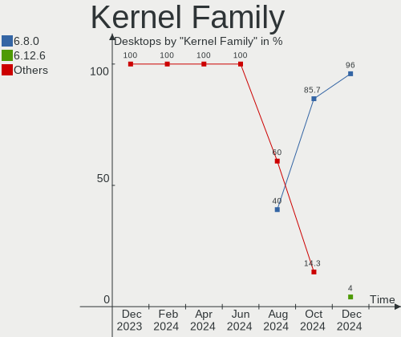
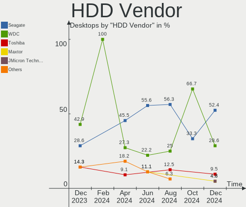
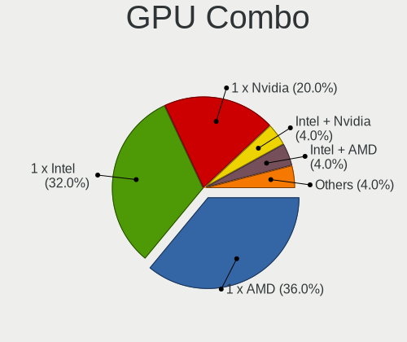
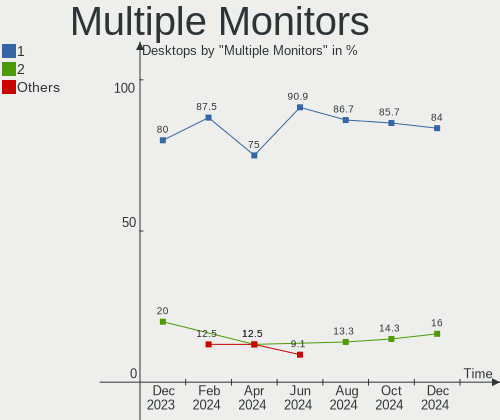
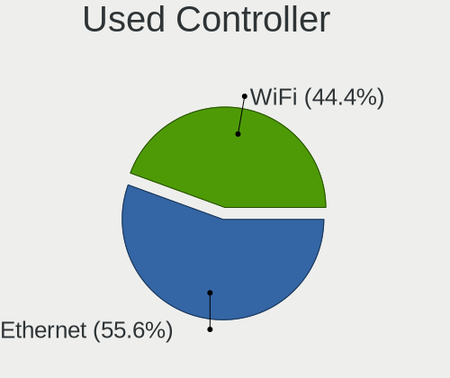

Elementary - Hardware Trends (Desktops)
---------------------------------------

A project to identify most popular hardware characteristics and track their change
over time based on data collected by Linux users at https://Linux-Hardware.org.

Anyone can contribute to this report by the [hw-probe](https://github.com/linuxhw/hw-probe) tool:

    sudo -E hw-probe -all -upload

This report is for one last month. Overall report since the beginning of time: [TestDays](https://github.com/linuxhw/TestDays)

Period: May, 2023.

Contents
--------

* [ System ](#system)
  - [ OS                       ](#os)
  - [ OS Family                ](#os-family)
  - [ Kernel                   ](#kernel)
  - [ Kernel Family            ](#kernel-family)
  - [ Kernel Major Ver.        ](#kernel-major-ver)
  - [ Arch                     ](#arch)
  - [ DE                       ](#de)
  - [ Display Server           ](#display-server)
  - [ Display Manager          ](#display-manager)
  - [ OS Lang                  ](#os-lang)
  - [ Boot Mode                ](#boot-mode)
  - [ Filesystem               ](#filesystem)
  - [ Part. scheme             ](#part-scheme)
  - [ Dual Boot with Linux/BSD ](#dual-boot-with-linuxbsd)
  - [ Dual Boot (Win)          ](#dual-boot-win)

* [ Board ](#board)
  - [ Vendor                   ](#vendor)
  - [ Model                    ](#model)
  - [ Model Family             ](#model-family)
  - [ MFG Year                 ](#mfg-year)
  - [ Form Factor              ](#form-factor)
  - [ Secure Boot              ](#secure-boot)
  - [ Coreboot                 ](#coreboot)
  - [ RAM Size                 ](#ram-size)
  - [ RAM Used                 ](#ram-used)
  - [ Total Drives             ](#total-drives)
  - [ Has CD-ROM               ](#has-cd-rom)
  - [ Has Ethernet             ](#has-ethernet)
  - [ Has WiFi                 ](#has-wifi)
  - [ Has Bluetooth            ](#has-bluetooth)

* [ Location ](#location)
  - [ Country                  ](#country)
  - [ City                     ](#city)

* [ Drives ](#drives)
  - [ Drive Vendor             ](#drive-vendor)
  - [ Drive Model              ](#drive-model)
  - [ HDD Vendor               ](#hdd-vendor)
  - [ SSD Vendor               ](#ssd-vendor)
  - [ Drive Kind               ](#drive-kind)
  - [ Drive Connector          ](#drive-connector)
  - [ Drive Size               ](#drive-size)
  - [ Space Total              ](#space-total)
  - [ Space Used               ](#space-used)
  - [ Malfunc. Drives          ](#malfunc-drives)
  - [ Malfunc. Drive Vendor    ](#malfunc-drive-vendor)
  - [ Malfunc. HDD Vendor      ](#malfunc-hdd-vendor)
  - [ Malfunc. Drive Kind      ](#malfunc-drive-kind)
  - [ Failed Drives            ](#failed-drives)
  - [ Failed Drive Vendor      ](#failed-drive-vendor)
  - [ Drive Status             ](#drive-status)

* [ Storage controller ](#storage-controller)
  - [ Storage Vendor           ](#storage-vendor)
  - [ Storage Model            ](#storage-model)
  - [ Storage Kind             ](#storage-kind)

* [ Processor ](#processor)
  - [ CPU Vendor               ](#cpu-vendor)
  - [ CPU Model                ](#cpu-model)
  - [ CPU Model Family         ](#cpu-model-family)
  - [ CPU Cores                ](#cpu-cores)
  - [ CPU Sockets              ](#cpu-sockets)
  - [ CPU Threads              ](#cpu-threads)
  - [ CPU Op-Modes             ](#cpu-op-modes)
  - [ CPU Microcode            ](#cpu-microcode)
  - [ CPU Microarch            ](#cpu-microarch)

* [ Graphics ](#graphics)
  - [ GPU Vendor               ](#gpu-vendor)
  - [ GPU Model                ](#gpu-model)
  - [ GPU Combo                ](#gpu-combo)
  - [ GPU Driver               ](#gpu-driver)
  - [ GPU Memory               ](#gpu-memory)

* [ Monitor ](#monitor)
  - [ Monitor Vendor           ](#monitor-vendor)
  - [ Monitor Model            ](#monitor-model)
  - [ Monitor Resolution       ](#monitor-resolution)
  - [ Monitor Diagonal         ](#monitor-diagonal)
  - [ Monitor Width            ](#monitor-width)
  - [ Aspect Ratio             ](#aspect-ratio)
  - [ Monitor Area             ](#monitor-area)
  - [ Pixel Density            ](#pixel-density)
  - [ Multiple Monitors        ](#multiple-monitors)

* [ Network ](#network)
  - [ Net Controller Vendor    ](#net-controller-vendor)
  - [ Net Controller Model     ](#net-controller-model)
  - [ Wireless Vendor          ](#wireless-vendor)
  - [ Wireless Model           ](#wireless-model)
  - [ Ethernet Vendor          ](#ethernet-vendor)
  - [ Ethernet Model           ](#ethernet-model)
  - [ Net Controller Kind      ](#net-controller-kind)
  - [ Used Controller          ](#used-controller)
  - [ NICs                     ](#nics)
  - [ IPv6                     ](#ipv6)

* [ Bluetooth ](#bluetooth)
  - [ Bluetooth Vendor         ](#bluetooth-vendor)
  - [ Bluetooth Model          ](#bluetooth-model)

* [ Sound ](#sound)
  - [ Sound Vendor             ](#sound-vendor)
  - [ Sound Model              ](#sound-model)

* [ Memory ](#memory)
  - [ Memory Vendor            ](#memory-vendor)
  - [ Memory Model             ](#memory-model)
  - [ Memory Kind              ](#memory-kind)
  - [ Memory Form Factor       ](#memory-form-factor)
  - [ Memory Size              ](#memory-size)
  - [ Memory Speed             ](#memory-speed)

* [ Printers & scanners ](#printers--scanners)
  - [ Printer Vendor           ](#printer-vendor)
  - [ Printer Model            ](#printer-model)
  - [ Scanner Vendor           ](#scanner-vendor)
  - [ Scanner Model            ](#scanner-model)

* [ Camera ](#camera)
  - [ Camera Vendor            ](#camera-vendor)
  - [ Camera Model             ](#camera-model)

* [ Security ](#security)
  - [ Fingerprint Vendor       ](#fingerprint-vendor)
  - [ Fingerprint Model        ](#fingerprint-model)
  - [ Chipcard Vendor          ](#chipcard-vendor)
  - [ Chipcard Model           ](#chipcard-model)

* [ Unsupported ](#unsupported)
  - [ Unsupported Devices      ](#unsupported-devices)
  - [ Unsupported Device Types ](#unsupported-device-types)

System
------

OS
--

Installed operating systems

| Name           | Desktops | Percent |
|----------------|----------|---------|
| Elementary 7   | 8        | 88.89%  |
| Elementary 6.1 | 1        | 11.11%  |

OS Family
---------

OS without a version

| Name       | Desktops | Percent |
|------------|----------|---------|
| Elementary | 9        | 100%    |

Kernel
------

Version of the Linux kernel

| Version           | Desktops | Percent |
|-------------------|----------|---------|
| 5.19.0-41-generic | 3        | 33.33%  |
| 5.19.0-42-generic | 2        | 22.22%  |
| 5.15.0-58-generic | 2        | 22.22%  |
| 5.19.0-43-generic | 1        | 11.11%  |
| 5.15.0-71-generic | 1        | 11.11%  |

Kernel Family
-------------

Linux kernel without a distro release

| Version | Desktops | Percent |
|---------|----------|---------|
| 5.19.0  | 6        | 66.67%  |
| 5.15.0  | 3        | 33.33%  |

Kernel Major Ver.
-----------------

Linux kernel major version

| Version | Desktops | Percent |
|---------|----------|---------|
| 5.19    | 6        | 66.67%  |
| 5.15    | 3        | 33.33%  |

Arch
----

OS architecture (x86_64, i586, etc.)

| Name   | Desktops | Percent |
|--------|----------|---------|
| x86_64 | 9        | 100%    |

DE
--

Desktop Environment

| Name     | Desktops | Percent |
|----------|----------|---------|
| Pantheon | 9        | 100%    |

Display Server
--------------

X11 or Wayland

| Name | Desktops | Percent |
|------|----------|---------|
| X11  | 9        | 100%    |

Display Manager
---------------

SDDM, LightDM, etc.

| Name    | Desktops | Percent |
|---------|----------|---------|
| Unknown | 7        | 77.78%  |
| LightDM | 2        | 22.22%  |

OS Lang
-------

Language

| Lang  | Desktops | Percent |
|-------|----------|---------|
| en_US | 3        | 33.33%  |
| de_DE | 2        | 22.22%  |
| sv_SE | 1        | 11.11%  |
| pt_PT | 1        | 11.11%  |
| nl_NL | 1        | 11.11%  |
| es_ES | 1        | 11.11%  |

Boot Mode
---------

EFI or BIOS

| Mode | Desktops | Percent |
|------|----------|---------|
| BIOS | 9        | 100%    |

Filesystem
----------

Type of filesystem

| Type | Desktops | Percent |
|------|----------|---------|
| Ext4 | 9        | 100%    |

Part. scheme
------------

Scheme of partitioning

| Type    | Desktops | Percent |
|---------|----------|---------|
| Unknown | 7        | 77.78%  |
| MBR     | 2        | 22.22%  |

Dual Boot with Linux/BSD
------------------------

Hosting more than one Linux/BSD

| Dual boot | Desktops | Percent |
|-----------|----------|---------|
| No        | 8        | 88.89%  |
| Yes       | 1        | 11.11%  |

Dual Boot (Win)
---------------

Hosting Linux and Windows

| Dual boot | Desktops | Percent |
|-----------|----------|---------|
| No        | 9        | 100%    |

Board
-----

Vendor
------

Motherboard manufacturer

| Name                | Desktops | Percent |
|---------------------|----------|---------|
| ASUSTek Computer    | 3        | 33.33%  |
| Hewlett-Packard     | 2        | 22.22%  |
| Lenovo              | 1        | 11.11%  |
| Intel               | 1        | 11.11%  |
| Gigabyte Technology | 1        | 11.11%  |
| Dell                | 1        | 11.11%  |

Model
-----

Motherboard model

| Name                                    | Desktops | Percent |
|-----------------------------------------|----------|---------|
| Lenovo IdeaCentre 510S-08IKL 90GB00E3IN | 1        | 11.11%  |
| Intel Jasper Lake Client Platform       | 1        | 11.11%  |
| HP EliteDesk 705 G1 DM                  | 1        | 11.11%  |
| HP 1998                                 | 1        | 11.11%  |
| Gigabyte GA-E6010N                      | 1        | 11.11%  |
| Dell OptiPlex 3070                      | 1        | 11.11%  |
| ASUS ROG STRIX B350-F GAMING            | 1        | 11.11%  |
| ASUS PRIME B450-PLUS                    | 1        | 11.11%  |
| ASUS P8H61-MX R2.0                      | 1        | 11.11%  |

Model Family
------------

Motherboard model prefix

| Name               | Desktops | Percent |
|--------------------|----------|---------|
| Lenovo IdeaCentre  | 1        | 11.11%  |
| Intel Jasper       | 1        | 11.11%  |
| HP EliteDesk       | 1        | 11.11%  |
| HP 1998            | 1        | 11.11%  |
| Gigabyte GA-E6010N | 1        | 11.11%  |
| Dell OptiPlex      | 1        | 11.11%  |
| ASUS ROG           | 1        | 11.11%  |
| ASUS PRIME         | 1        | 11.11%  |
| ASUS P8H61-MX      | 1        | 11.11%  |

MFG Year
--------

Motherboard manufacture year

| Year | Desktops | Percent |
|------|----------|---------|
| 2019 | 2        | 22.22%  |
| 2022 | 1        | 11.11%  |
| 2020 | 1        | 11.11%  |
| 2018 | 1        | 11.11%  |
| 2017 | 1        | 11.11%  |
| 2015 | 1        | 11.11%  |
| 2013 | 1        | 11.11%  |
| 2012 | 1        | 11.11%  |

Form Factor
-----------

Physical design of the computer

| Name    | Desktops | Percent |
|---------|----------|---------|
| Desktop | 9        | 100%    |

Secure Boot
-----------

Enabled or disabled

| State    | Desktops | Percent |
|----------|----------|---------|
| Disabled | 9        | 100%    |

Coreboot
--------

Have coreboot on board

| Used | Desktops | Percent |
|------|----------|---------|
| No   | 9        | 100%    |

RAM Size
--------

Total RAM memory

| Size in GB | Desktops | Percent |
|------------|----------|---------|
| 4.01-8.0   | 3        | 33.33%  |
| 8.01-16.0  | 2        | 22.22%  |
| 32.01-64.0 | 1        | 11.11%  |
| 3.01-4.0   | 1        | 11.11%  |
| 24.01-32.0 | 1        | 11.11%  |
| 16.01-24.0 | 1        | 11.11%  |

RAM Used
--------

Used RAM memory

| Used GB  | Desktops | Percent |
|----------|----------|---------|
| 2.01-3.0 | 4        | 44.44%  |
| 1.01-2.0 | 3        | 33.33%  |
| 4.01-8.0 | 1        | 11.11%  |
| 3.01-4.0 | 1        | 11.11%  |

Total Drives
------------

Number of drives on board

| Drives | Desktops | Percent |
|--------|----------|---------|
| 1      | 6        | 66.67%  |
| 2      | 2        | 22.22%  |
| 5      | 1        | 11.11%  |

Has CD-ROM
----------

Has CD-ROM on board

| Presented | Desktops | Percent |
|-----------|----------|---------|
| No        | 6        | 66.67%  |
| Yes       | 3        | 33.33%  |

Has Ethernet
------------

Has Ethernet on board

| Presented | Desktops | Percent |
|-----------|----------|---------|
| Yes       | 9        | 100%    |

Has WiFi
--------

Has WiFi module

| Presented | Desktops | Percent |
|-----------|----------|---------|
| No        | 5        | 55.56%  |
| Yes       | 4        | 44.44%  |

Has Bluetooth
-------------

Has Bluetooth module

| Presented | Desktops | Percent |
|-----------|----------|---------|
| No        | 6        | 66.67%  |
| Yes       | 3        | 33.33%  |

Location
--------

Country
-------

Geographic location (country)

| Country     | Desktops | Percent |
|-------------|----------|---------|
| Germany     | 2        | 22.22%  |
| Sweden      | 1        | 11.11%  |
| Russia      | 1        | 11.11%  |
| Portugal    | 1        | 11.11%  |
| Netherlands | 1        | 11.11%  |
| Mexico      | 1        | 11.11%  |
| Italy       | 1        | 11.11%  |
| India       | 1        | 11.11%  |

City
----

Geographic location (city)

| City          | Desktops | Percent |
|---------------|----------|---------|
| Viareggio     | 1        | 11.11%  |
| Stockholm     | 1        | 11.11%  |
| St Petersburg | 1        | 11.11%  |
| Munich        | 1        | 11.11%  |
| Lisbon        | 1        | 11.11%  |
| Hürth        | 1        | 11.11%  |
| Faridabad     | 1        | 11.11%  |
| Cuernavaca    | 1        | 11.11%  |
| Amersfoort    | 1        | 11.11%  |

Drives
------

Drive Vendor
------------

Hard drive vendors

| Vendor            | Desktops | Drives | Percent |
|-------------------|----------|--------|---------|
| WDC               | 2        | 2      | 14.29%  |
| Toshiba           | 2        | 2      | 14.29%  |
| XrayDisk          | 1        | 1      | 7.14%   |
| Seagate           | 1        | 2      | 7.14%   |
| SanDisk           | 1        | 1      | 7.14%   |
| Micron Technology | 1        | 1      | 7.14%   |
| LuminouTek        | 1        | 1      | 7.14%   |
| Intenso           | 1        | 1      | 7.14%   |
| Hitachi           | 1        | 1      | 7.14%   |
| HGST              | 1        | 1      | 7.14%   |
| Hewlett-Packard   | 1        | 1      | 7.14%   |
| Crucial           | 1        | 1      | 7.14%   |

Drive Model
-----------

Hard drive models

| Model                                    | Desktops | Percent |
|------------------------------------------|----------|---------|
| WDC WD10EZEX-08WN4A0 1TB                 | 2        | 13.33%  |
| XrayDisk 512GB SSD                       | 1        | 6.67%   |
| Toshiba DT01ACA200 2TB                   | 1        | 6.67%   |
| Toshiba DT01ACA050 500GB                 | 1        | 6.67%   |
| Seagate ST3500418AS 500GB                | 1        | 6.67%   |
| Seagate ST1000VT001-1RE172 1TB           | 1        | 6.67%   |
| SanDisk SSD PLUS 120GB                   | 1        | 6.67%   |
| Micron MTFDDAK256TBN-1AR1ZABHA 256GB SSD | 1        | 6.67%   |
| LuminouTek 128GB                         | 1        | 6.67%   |
| Intenso SSD SATAIII 120GB                | 1        | 6.67%   |
| Hitachi HCS545050GLA380 500GB            | 1        | 6.67%   |
| HGST HTS725050A7E630 500GB               | 1        | 6.67%   |
| HP SSD S600 120GB                        | 1        | 6.67%   |
| Crucial CT128MX100SSD1 128GB             | 1        | 6.67%   |

HDD Vendor
----------

Hard disk drive vendors

| Vendor  | Desktops | Drives | Percent |
|---------|----------|--------|---------|
| WDC     | 2        | 2      | 28.57%  |
| Toshiba | 2        | 2      | 28.57%  |
| Seagate | 1        | 2      | 14.29%  |
| Hitachi | 1        | 1      | 14.29%  |
| HGST    | 1        | 1      | 14.29%  |

SSD Vendor
----------

Solid state drive vendors

| Vendor            | Desktops | Drives | Percent |
|-------------------|----------|--------|---------|
| XrayDisk          | 1        | 1      | 16.67%  |
| SanDisk           | 1        | 1      | 16.67%  |
| Micron Technology | 1        | 1      | 16.67%  |
| Intenso           | 1        | 1      | 16.67%  |
| Hewlett-Packard   | 1        | 1      | 16.67%  |
| Crucial           | 1        | 1      | 16.67%  |

Drive Kind
----------

HDD or SSD

| Kind    | Desktops | Drives | Percent |
|---------|----------|--------|---------|
| SSD     | 6        | 6      | 50%     |
| HDD     | 5        | 8      | 41.67%  |
| Unknown | 1        | 1      | 8.33%   |

Drive Connector
---------------

SATA, SAS, NVMe, etc.

| Type | Desktops | Drives | Percent |
|------|----------|--------|---------|
| SATA | 9        | 15     | 100%    |

Drive Size
----------

Size of hard drive

| Size in TB | Desktops | Drives | Percent |
|------------|----------|--------|---------|
| 0.01-0.5   | 7        | 9      | 58.33%  |
| 0.51-1.0   | 4        | 4      | 33.33%  |
| 1.01-2.0   | 1        | 1      | 8.33%   |

Space Total
-----------

Amount of disk space available on the file system

| Size in GB | Desktops | Percent |
|------------|----------|---------|
| 101-250    | 3        | 33.33%  |
| 501-1000   | 3        | 33.33%  |
| 251-500    | 2        | 22.22%  |
| 1001-2000  | 1        | 11.11%  |

Space Used
----------

Amount of used disk space

| Used GB | Desktops | Percent |
|---------|----------|---------|
| 1-20    | 3        | 33.33%  |
| 251-500 | 2        | 22.22%  |
| 101-250 | 2        | 22.22%  |
| 51-100  | 2        | 22.22%  |

Malfunc. Drives
---------------

Drive models with a malfunction

Zero info for selected period =(

Malfunc. Drive Vendor
---------------------

Vendors of faulty drives

Zero info for selected period =(

Malfunc. HDD Vendor
-------------------

Vendors of faulty HDD drives

Zero info for selected period =(

Malfunc. Drive Kind
-------------------

Kinds of faulty drives

Zero info for selected period =(

Failed Drives
-------------

Failed drive models

Zero info for selected period =(

Failed Drive Vendor
-------------------

Failed drive vendors

Zero info for selected period =(

Drive Status
------------

Number of failed and malfunc. drives

| Status   | Desktops | Drives | Percent |
|----------|----------|--------|---------|
| Detected | 7        | 11     | 77.78%  |
| Works    | 2        | 4      | 22.22%  |

Storage controller
------------------

Storage Vendor
--------------

Storage controller vendors

| Vendor | Desktops | Percent |
|--------|----------|---------|
| Intel  | 5        | 55.56%  |
| AMD    | 4        | 44.44%  |

Storage Model
-------------

Storage controller models

| Model                                                                                   | Desktops | Percent |
|-----------------------------------------------------------------------------------------|----------|---------|
| AMD FCH SATA Controller [AHCI mode]                                                     | 4        | 33.33%  |
| Intel Jasper Lake SATA AHCI Controller                                                  | 1        | 8.33%   |
| Intel Cannon Lake PCH SATA AHCI Controller                                              | 1        | 8.33%   |
| Intel 8 Series/C220 Series Chipset Family 6-port SATA Controller 1 [AHCI mode]          | 1        | 8.33%   |
| Intel 6 Series/C200 Series Chipset Family Desktop SATA Controller (IDE mode, ports 4-5) | 1        | 8.33%   |
| Intel 6 Series/C200 Series Chipset Family Desktop SATA Controller (IDE mode, ports 0-3) | 1        | 8.33%   |
| Intel 200 Series PCH SATA controller [AHCI mode]                                        | 1        | 8.33%   |
| AMD 400 Series Chipset SATA Controller                                                  | 1        | 8.33%   |
| AMD 300 Series Chipset SATA Controller                                                  | 1        | 8.33%   |

Storage Kind
------------

Kind of storage controller (IDE, SATA, NVMe, SAS, ...)

| Kind | Desktops | Percent |
|------|----------|---------|
| SATA | 8        | 88.89%  |
| IDE  | 1        | 11.11%  |

Processor
---------

CPU Vendor
----------

Processor vendors

| Vendor | Desktops | Percent |
|--------|----------|---------|
| Intel  | 5        | 55.56%  |
| AMD    | 4        | 44.44%  |

CPU Model
---------

Processor models

| Model                                       | Desktops | Percent |
|---------------------------------------------|----------|---------|
| Intel Core i5-9400T CPU @ 1.80GHz           | 1        | 11.11%  |
| Intel Core i5-4590 CPU @ 3.30GHz            | 1        | 11.11%  |
| Intel Core i5-3470 CPU @ 3.20GHz            | 1        | 11.11%  |
| Intel Core i3-7100 CPU @ 3.90GHz            | 1        | 11.11%  |
| Intel Celeron N5105 @ 2.00GHz               | 1        | 11.11%  |
| AMD Ryzen 5 5600G with Radeon Graphics      | 1        | 11.11%  |
| AMD Ryzen 3 2200G with Radeon Vega Graphics | 1        | 11.11%  |
| AMD E1-6010 APU with AMD Radeon R2 Graphics | 1        | 11.11%  |
| AMD A8 PRO-7600B R7, 10 Compute Cores 4C+6G | 1        | 11.11%  |

CPU Model Family
----------------

Processor model prefix

| Model         | Desktops | Percent |
|---------------|----------|---------|
| Intel Core i5 | 3        | 33.33%  |
| Intel Core i3 | 1        | 11.11%  |
| Intel Celeron | 1        | 11.11%  |
| AMD Ryzen 5   | 1        | 11.11%  |
| AMD Ryzen 3   | 1        | 11.11%  |
| AMD E1        | 1        | 11.11%  |
| AMD A8        | 1        | 11.11%  |

CPU Cores
---------

Number of processor cores

| Number | Desktops | Percent |
|--------|----------|---------|
| 4      | 4        | 44.44%  |
| 2      | 3        | 33.33%  |
| 6      | 2        | 22.22%  |

CPU Sockets
-----------

Number of sockets

| Number | Desktops | Percent |
|--------|----------|---------|
| 1      | 9        | 100%    |

CPU Threads
-----------

Threads per core (Hyper-Threading)

| Number | Desktops | Percent |
|--------|----------|---------|
| 1      | 6        | 66.67%  |
| 2      | 3        | 33.33%  |

CPU Op-Modes
------------

CPU Operation Modes (32-bit, 64-bit)

| Op mode        | Desktops | Percent |
|----------------|----------|---------|
| 32-bit, 64-bit | 9        | 100%    |

CPU Microcode
-------------

Microcode number

| Number     | Desktops | Percent |
|------------|----------|---------|
| Unknown    | 7        | 77.78%  |
| 0x306a9    | 1        | 11.11%  |
| 0x07030106 | 1        | 11.11%  |

CPU Microarch
-------------

Microarchitecture

| Name        | Desktops | Percent |
|-------------|----------|---------|
| KabyLake    | 2        | 22.22%  |
| Zen 3       | 1        | 11.11%  |
| Zen         | 1        | 11.11%  |
| Steamroller | 1        | 11.11%  |
| Puma        | 1        | 11.11%  |
| IvyBridge   | 1        | 11.11%  |
| Haswell     | 1        | 11.11%  |
| Unknown     | 1        | 11.11%  |

Graphics
--------

GPU Vendor
----------

Vendors of graphics cards

| Vendor | Desktops | Percent |
|--------|----------|---------|
| Intel  | 4        | 44.44%  |
| AMD    | 4        | 44.44%  |
| Nvidia | 1        | 11.11%  |

GPU Model
---------

Graphics card models

| Model                                                                       | Desktops | Percent |
|-----------------------------------------------------------------------------|----------|---------|
| Nvidia GP108 [GeForce GT 1030]                                              | 1        | 11.11%  |
| Intel Xeon E3-1200 v3/4th Gen Core Processor Integrated Graphics Controller | 1        | 11.11%  |
| Intel JasperLake [UHD Graphics]                                             | 1        | 11.11%  |
| Intel HD Graphics 630                                                       | 1        | 11.11%  |
| Intel CoffeeLake-S GT2 [UHD Graphics 630]                                   | 1        | 11.11%  |
| AMD Raven Ridge [Radeon Vega Series / Radeon Vega Mobile Series]            | 1        | 11.11%  |
| AMD Mullins [Radeon R2 Graphics]                                            | 1        | 11.11%  |
| AMD Kaveri [Radeon R7 Graphics]                                             | 1        | 11.11%  |
| AMD Cezanne [Radeon Vega Series / Radeon Vega Mobile Series]                | 1        | 11.11%  |

GPU Combo
---------

Combinations of graphics cards

| Name       | Desktops | Percent |
|------------|----------|---------|
| 1 x Intel  | 4        | 44.44%  |
| 1 x AMD    | 4        | 44.44%  |
| 1 x Nvidia | 1        | 11.11%  |

GPU Driver
----------

Free vs proprietary

| Driver      | Desktops | Percent |
|-------------|----------|---------|
| Free        | 7        | 77.78%  |
| Proprietary | 1        | 11.11%  |
| Unknown     | 1        | 11.11%  |

GPU Memory
----------

Total video memory

| Size in GB | Desktops | Percent |
|------------|----------|---------|
| Unknown    | 7        | 77.78%  |
| 1.01-2.0   | 1        | 11.11%  |
| 0.51-1.0   | 1        | 11.11%  |

Monitor
-------

Monitor Vendor
--------------

Monitor vendors

| Vendor          | Desktops | Percent |
|-----------------|----------|---------|
| BenQ            | 2        | 22.22%  |
| ___             | 1        | 11.11%  |
| Unknown         | 1        | 11.11%  |
| Positivo        | 1        | 11.11%  |
| Lenovo          | 1        | 11.11%  |
| Hewlett-Packard | 1        | 11.11%  |
| Dell            | 1        | 11.11%  |
| Acer            | 1        | 11.11%  |

Monitor Model
-------------

Monitor models

| Model                                                       | Desktops | Percent |
|-------------------------------------------------------------|----------|---------|
| ___ LCDTV16 ___3393 1366x768                                | 1        | 10%     |
| Unknown LCDTV16 3393 1920x1080 1600x900mm 72.3-inch         | 1        | 10%     |
| Positivo MC35120QWQHD NON3503 3440x1440 819x346mm 35.0-inch | 1        | 10%     |
| Lenovo LI2215sD LEN65CC 1920x1080 476x267mm 21.5-inch       | 1        | 10%     |
| Hewlett-Packard ZR30w HWP286C 2560x1600 641x400mm 29.7-inch | 1        | 10%     |
| Dell P2213 DELF043 1680x1050 473x296mm 22.0-inch            | 1        | 10%     |
| Dell 1905FP DEL400D 1280x1024 376x301mm 19.0-inch           | 1        | 10%     |
| BenQ GW2406Z BNQ78E1 1920x1080 527x296mm 23.8-inch          | 1        | 10%     |
| BenQ GW2280 BNQ78E8 1920x1080 476x268mm 21.5-inch           | 1        | 10%     |
| Acer EK240Y ACR0758 1920x1080 527x296mm 23.8-inch           | 1        | 10%     |

Monitor Resolution
------------------

Monitor screen resolution

| Resolution         | Desktops | Percent |
|--------------------|----------|---------|
| 1920x1080 (FHD)    | 5        | 55.56%  |
| 3440x1440          | 1        | 11.11%  |
| 2560x1600          | 1        | 11.11%  |
| 1680x1050 (WSXGA+) | 1        | 11.11%  |
| 1280x1024 (SXGA)   | 1        | 11.11%  |

Monitor Diagonal
----------------

Diagonal size in inches

| Inches  | Desktops | Percent |
|---------|----------|---------|
| 24      | 2        | 20%     |
| 21      | 2        | 20%     |
| 72      | 1        | 10%     |
| 35      | 1        | 10%     |
| 29      | 1        | 10%     |
| 22      | 1        | 10%     |
| 19      | 1        | 10%     |
| Unknown | 1        | 10%     |

Monitor Width
-------------

Physical width

| Width in mm | Desktops | Percent |
|-------------|----------|---------|
| 401-500     | 3        | 30%     |
| 501-600     | 2        | 20%     |
| 801-900     | 1        | 10%     |
| 601-700     | 1        | 10%     |
| 351-400     | 1        | 10%     |
| 1501-2000   | 1        | 10%     |
| Unknown     | 1        | 10%     |

Aspect Ratio
------------

Proportional relationship between the width and the height

| Ratio | Desktops | Percent |
|-------|----------|---------|
| 16/9  | 5        | 55.56%  |
| 16/10 | 2        | 22.22%  |
| 6/5   | 1        | 11.11%  |
| 21/9  | 1        | 11.11%  |

Monitor Area
------------

Area in inch²

| Area in inch² | Desktops | Percent |
|----------------|----------|---------|
| 201-250        | 4        | 40%     |
| 351-500        | 2        | 20%     |
| 151-200        | 2        | 20%     |
| More than 1000 | 1        | 10%     |
| Unknown        | 1        | 10%     |

Pixel Density
-------------

Pixels per inch

| Density | Desktops | Percent |
|---------|----------|---------|
| 101-120 | 4        | 44.44%  |
| 51-100  | 3        | 33.33%  |
| 1-50    | 1        | 11.11%  |
| Unknown | 1        | 11.11%  |

Multiple Monitors
-----------------

Total monitors connected

| Total | Desktops | Percent |
|-------|----------|---------|
| 1     | 6        | 66.67%  |
| 2     | 2        | 22.22%  |
| 0     | 1        | 11.11%  |

Network
-------

Net Controller Vendor
---------------------

Controller vendors

| Vendor                | Desktops | Percent |
|-----------------------|----------|---------|
| Realtek Semiconductor | 6        | 37.5%   |
| Broadcom              | 3        | 18.75%  |
| TP-Link               | 2        | 12.5%   |
| Intel                 | 2        | 12.5%   |
| Qualcomm Atheros      | 1        | 6.25%   |
| Qualcomm              | 1        | 6.25%   |
| Huawei Technologies   | 1        | 6.25%   |

Net Controller Model
--------------------

Controller models

| Model                                                             | Desktops | Percent |
|-------------------------------------------------------------------|----------|---------|
| Realtek RTL8111/8168/8411 PCI Express Gigabit Ethernet Controller | 5        | 29.41%  |
| TP-Link UE300 10/100/1000 LAN (ethernet mode) [Realtek RTL8153]   | 1        | 5.88%   |
| TP-Link TL-WN722N v2/v3 [Realtek RTL8188EUS]                      | 1        | 5.88%   |
| Realtek RTL8821CE 802.11ac PCIe Wireless Network Adapter          | 1        | 5.88%   |
| Realtek RTL8188CUS 802.11n WLAN Adapter                           | 1        | 5.88%   |
| Qualcomm Fairphone 4 5G                                           | 1        | 5.88%   |
| Qualcomm Atheros QCA9377 802.11ac Wireless Network Adapter        | 1        | 5.88%   |
| Intel I211 Gigabit Network Connection                             | 1        | 5.88%   |
| Intel Ethernet Connection I217-LM                                 | 1        | 5.88%   |
| Huawei ANE-LX1                                                    | 1        | 5.88%   |
| Broadcom NetXtreme II BCM5706 Gigabit Ethernet                    | 1        | 5.88%   |
| Broadcom NetXtreme BCM5762 Gigabit Ethernet PCIe                  | 1        | 5.88%   |
| Broadcom BCM4360 802.11ac Wireless Network Adapter                | 1        | 5.88%   |

Wireless Vendor
---------------

Wireless vendors

| Vendor                | Desktops | Percent |
|-----------------------|----------|---------|
| Realtek Semiconductor | 2        | 40%     |
| TP-Link               | 1        | 20%     |
| Qualcomm Atheros      | 1        | 20%     |
| Broadcom              | 1        | 20%     |

Wireless Model
--------------

Wireless models

| Model                                                      | Desktops | Percent |
|------------------------------------------------------------|----------|---------|
| TP-Link TL-WN722N v2/v3 [Realtek RTL8188EUS]               | 1        | 20%     |
| Realtek RTL8821CE 802.11ac PCIe Wireless Network Adapter   | 1        | 20%     |
| Realtek RTL8188CUS 802.11n WLAN Adapter                    | 1        | 20%     |
| Qualcomm Atheros QCA9377 802.11ac Wireless Network Adapter | 1        | 20%     |
| Broadcom BCM4360 802.11ac Wireless Network Adapter         | 1        | 20%     |

Ethernet Vendor
---------------

Ethernet vendors

| Vendor                | Desktops | Percent |
|-----------------------|----------|---------|
| Realtek Semiconductor | 5        | 41.67%  |
| Intel                 | 2        | 16.67%  |
| Broadcom              | 2        | 16.67%  |
| TP-Link               | 1        | 8.33%   |
| Qualcomm              | 1        | 8.33%   |
| Huawei Technologies   | 1        | 8.33%   |

Ethernet Model
--------------

Ethernet models

| Model                                                             | Desktops | Percent |
|-------------------------------------------------------------------|----------|---------|
| Realtek RTL8111/8168/8411 PCI Express Gigabit Ethernet Controller | 5        | 41.67%  |
| TP-Link UE300 10/100/1000 LAN (ethernet mode) [Realtek RTL8153]   | 1        | 8.33%   |
| Qualcomm Fairphone 4 5G                                           | 1        | 8.33%   |
| Intel I211 Gigabit Network Connection                             | 1        | 8.33%   |
| Intel Ethernet Connection I217-LM                                 | 1        | 8.33%   |
| Huawei ANE-LX1                                                    | 1        | 8.33%   |
| Broadcom NetXtreme II BCM5706 Gigabit Ethernet                    | 1        | 8.33%   |
| Broadcom NetXtreme BCM5762 Gigabit Ethernet PCIe                  | 1        | 8.33%   |

Net Controller Kind
-------------------

Ethernet, WiFi or modem

| Kind     | Desktops | Percent |
|----------|----------|---------|
| Ethernet | 9        | 69.23%  |
| WiFi     | 4        | 30.77%  |

Used Controller
---------------

Currently used network controller

| Kind     | Desktops | Percent |
|----------|----------|---------|
| Ethernet | 5        | 62.5%   |
| WiFi     | 3        | 37.5%   |

NICs
----

Total network controllers on board

| Total | Desktops | Percent |
|-------|----------|---------|
| 1     | 4        | 44.44%  |
| 3     | 2        | 22.22%  |
| 2     | 2        | 22.22%  |
| 0     | 1        | 11.11%  |

IPv6
----

IPv6 vs IPv4

| Used | Desktops | Percent |
|------|----------|---------|
| No   | 7        | 77.78%  |
| Yes  | 2        | 22.22%  |

Bluetooth
---------

Bluetooth Vendor
----------------

Controller vendors

| Vendor                          | Desktops | Percent |
|---------------------------------|----------|---------|
| Realtek Semiconductor           | 2        | 66.67%  |
| Qualcomm Atheros Communications | 1        | 33.33%  |

Bluetooth Model
---------------

Controller models

| Model                              | Desktops | Percent |
|------------------------------------|----------|---------|
| Realtek Bluetooth Radio            | 2        | 66.67%  |
| Qualcomm Atheros  Bluetooth Device | 1        | 33.33%  |

Sound
-----

Sound Vendor
------------

Sound card vendors

| Vendor              | Desktops | Percent |
|---------------------|----------|---------|
| Intel               | 5        | 41.67%  |
| AMD                 | 4        | 33.33%  |
| C-Media Electronics | 2        | 16.67%  |
| Nvidia              | 1        | 8.33%   |

Sound Model
-----------

Sound card models

| Model                                                                      | Desktops | Percent |
|----------------------------------------------------------------------------|----------|---------|
| C-Media Electronics Audio Adapter (Unitek Y-247A)                          | 2        | 11.76%  |
| AMD FCH Azalia Controller                                                  | 2        | 11.76%  |
| AMD Family 17h/19h HD Audio Controller                                     | 2        | 11.76%  |
| Nvidia GP108 High Definition Audio Controller                              | 1        | 5.88%   |
| Intel Xeon E3-1200 v3/4th Gen Core Processor HD Audio Controller           | 1        | 5.88%   |
| Intel Jasper Lake HD Audio                                                 | 1        | 5.88%   |
| Intel Cannon Lake PCH cAVS                                                 | 1        | 5.88%   |
| Intel 8 Series/C220 Series Chipset High Definition Audio Controller        | 1        | 5.88%   |
| Intel 6 Series/C200 Series Chipset Family High Definition Audio Controller | 1        | 5.88%   |
| Intel 200 Series PCH HD Audio                                              | 1        | 5.88%   |
| AMD Renoir Radeon High Definition Audio Controller                         | 1        | 5.88%   |
| AMD Raven/Raven2/Fenghuang HDMI/DP Audio Controller                        | 1        | 5.88%   |
| AMD Kaveri HDMI/DP Audio Controller                                        | 1        | 5.88%   |
| AMD Kabini HDMI/DP Audio                                                   | 1        | 5.88%   |

Memory
------

Memory Vendor
-------------

Memory module vendors

| Vendor              | Desktops | Percent |
|---------------------|----------|---------|
| Samsung Electronics | 1        | 33.33%  |
| Kingston            | 1        | 33.33%  |
| A-DATA Technology   | 1        | 33.33%  |

Memory Model
------------

Memory module models

| Model                                               | Desktops | Percent |
|-----------------------------------------------------|----------|---------|
| Samsung RAM M378B5273CH0-CK0 4GB DIMM DDR3 2000MT/s | 1        | 33.33%  |
| Kingston RAM HX318C10F/8 8GB DIMM DDR3 1600MT/s     | 1        | 33.33%  |
| A-DATA RAM Module 4GB DIMM DDR3 1600MT/s            | 1        | 33.33%  |

Memory Kind
-----------

Memory module kinds

| Kind | Desktops | Percent |
|------|----------|---------|
| DDR3 | 2        | 100%    |

Memory Form Factor
------------------

Physical design of the memory module

| Name | Desktops | Percent |
|------|----------|---------|
| DIMM | 2        | 100%    |

Memory Size
-----------

Memory module size

| Size | Desktops | Percent |
|------|----------|---------|
| 8192 | 1        | 50%     |
| 4096 | 1        | 50%     |

Memory Speed
------------

Memory module speed

| Speed | Desktops | Percent |
|-------|----------|---------|
| 1600  | 2        | 66.67%  |
| 2000  | 1        | 33.33%  |

Printers & scanners
-------------------

Printer Vendor
--------------

Printer device vendors

Zero info for selected period =(

Printer Model
-------------

Printer device models

Zero info for selected period =(

Scanner Vendor
--------------

Scanner device vendors

Zero info for selected period =(

Scanner Model
-------------

Scanner device models

Zero info for selected period =(

Camera
------

Camera Vendor
-------------

Camera device vendors

Zero info for selected period =(

Camera Model
------------

Camera device models

Zero info for selected period =(

Security
--------

Fingerprint Vendor
------------------

Fingerprint sensor vendors

Zero info for selected period =(

Fingerprint Model
-----------------

Fingerprint sensor models

Zero info for selected period =(

Chipcard Vendor
---------------

Chipcard module vendors

Zero info for selected period =(

Chipcard Model
--------------

Chipcard module models

Zero info for selected period =(

Unsupported
-----------

Unsupported Devices
-------------------

Total unsupported devices on board

| Total | Desktops | Percent |
|-------|----------|---------|
| 0     | 7        | 77.78%  |
| 1     | 2        | 22.22%  |

Unsupported Device Types
------------------------

Types of unsupported devices

| Type          | Desktops | Percent |
|---------------|----------|---------|
| Net/ethernet  | 1        | 50%     |
| Graphics card | 1        | 50%     |

