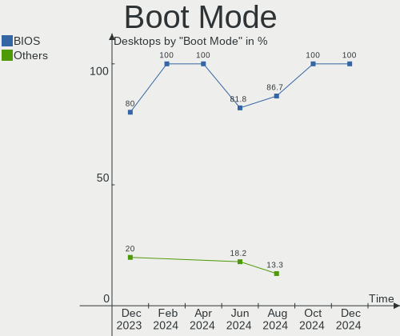
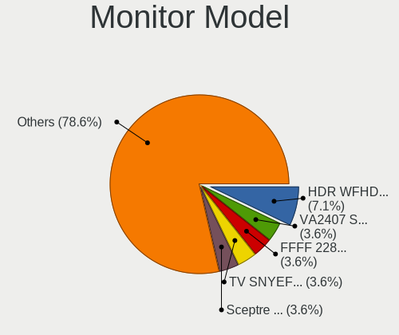
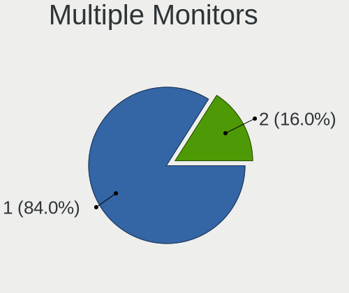

Elementary - Hardware Trends (Desktops)
---------------------------------------

A project to identify most popular hardware characteristics and track their change
over time based on data collected by Linux users at https://Linux-Hardware.org.

Anyone can contribute to this report by the [hw-probe](https://github.com/linuxhw/hw-probe) tool:

    sudo -E hw-probe -all -upload

This report is for one last month. Overall report since the beginning of time: [TestDays](https://github.com/linuxhw/TestDays)

Period: Oct, 2023.

Contents
--------

* [ System ](#system)
  - [ OS                       ](#os)
  - [ OS Family                ](#os-family)
  - [ Kernel                   ](#kernel)
  - [ Kernel Family            ](#kernel-family)
  - [ Kernel Major Ver.        ](#kernel-major-ver)
  - [ Arch                     ](#arch)
  - [ DE                       ](#de)
  - [ Display Server           ](#display-server)
  - [ Display Manager          ](#display-manager)
  - [ OS Lang                  ](#os-lang)
  - [ Boot Mode                ](#boot-mode)
  - [ Filesystem               ](#filesystem)
  - [ Part. scheme             ](#part-scheme)
  - [ Dual Boot with Linux/BSD ](#dual-boot-with-linuxbsd)
  - [ Dual Boot (Win)          ](#dual-boot-win)

* [ Board ](#board)
  - [ Vendor                   ](#vendor)
  - [ Model                    ](#model)
  - [ Model Family             ](#model-family)
  - [ MFG Year                 ](#mfg-year)
  - [ Form Factor              ](#form-factor)
  - [ Secure Boot              ](#secure-boot)
  - [ Coreboot                 ](#coreboot)
  - [ RAM Size                 ](#ram-size)
  - [ RAM Used                 ](#ram-used)
  - [ Total Drives             ](#total-drives)
  - [ Has CD-ROM               ](#has-cd-rom)
  - [ Has Ethernet             ](#has-ethernet)
  - [ Has WiFi                 ](#has-wifi)
  - [ Has Bluetooth            ](#has-bluetooth)

* [ Location ](#location)
  - [ Country                  ](#country)
  - [ City                     ](#city)

* [ Drives ](#drives)
  - [ Drive Vendor             ](#drive-vendor)
  - [ Drive Model              ](#drive-model)
  - [ HDD Vendor               ](#hdd-vendor)
  - [ SSD Vendor               ](#ssd-vendor)
  - [ Drive Kind               ](#drive-kind)
  - [ Drive Connector          ](#drive-connector)
  - [ Drive Size               ](#drive-size)
  - [ Space Total              ](#space-total)
  - [ Space Used               ](#space-used)
  - [ Malfunc. Drives          ](#malfunc-drives)
  - [ Malfunc. Drive Vendor    ](#malfunc-drive-vendor)
  - [ Malfunc. HDD Vendor      ](#malfunc-hdd-vendor)
  - [ Malfunc. Drive Kind      ](#malfunc-drive-kind)
  - [ Failed Drives            ](#failed-drives)
  - [ Failed Drive Vendor      ](#failed-drive-vendor)
  - [ Drive Status             ](#drive-status)

* [ Storage controller ](#storage-controller)
  - [ Storage Vendor           ](#storage-vendor)
  - [ Storage Model            ](#storage-model)
  - [ Storage Kind             ](#storage-kind)

* [ Processor ](#processor)
  - [ CPU Vendor               ](#cpu-vendor)
  - [ CPU Model                ](#cpu-model)
  - [ CPU Model Family         ](#cpu-model-family)
  - [ CPU Cores                ](#cpu-cores)
  - [ CPU Sockets              ](#cpu-sockets)
  - [ CPU Threads              ](#cpu-threads)
  - [ CPU Op-Modes             ](#cpu-op-modes)
  - [ CPU Microcode            ](#cpu-microcode)
  - [ CPU Microarch            ](#cpu-microarch)

* [ Graphics ](#graphics)
  - [ GPU Vendor               ](#gpu-vendor)
  - [ GPU Model                ](#gpu-model)
  - [ GPU Combo                ](#gpu-combo)
  - [ GPU Driver               ](#gpu-driver)
  - [ GPU Memory               ](#gpu-memory)

* [ Monitor ](#monitor)
  - [ Monitor Vendor           ](#monitor-vendor)
  - [ Monitor Model            ](#monitor-model)
  - [ Monitor Resolution       ](#monitor-resolution)
  - [ Monitor Diagonal         ](#monitor-diagonal)
  - [ Monitor Width            ](#monitor-width)
  - [ Aspect Ratio             ](#aspect-ratio)
  - [ Monitor Area             ](#monitor-area)
  - [ Pixel Density            ](#pixel-density)
  - [ Multiple Monitors        ](#multiple-monitors)

* [ Network ](#network)
  - [ Net Controller Vendor    ](#net-controller-vendor)
  - [ Net Controller Model     ](#net-controller-model)
  - [ Wireless Vendor          ](#wireless-vendor)
  - [ Wireless Model           ](#wireless-model)
  - [ Ethernet Vendor          ](#ethernet-vendor)
  - [ Ethernet Model           ](#ethernet-model)
  - [ Net Controller Kind      ](#net-controller-kind)
  - [ Used Controller          ](#used-controller)
  - [ NICs                     ](#nics)
  - [ IPv6                     ](#ipv6)

* [ Bluetooth ](#bluetooth)
  - [ Bluetooth Vendor         ](#bluetooth-vendor)
  - [ Bluetooth Model          ](#bluetooth-model)

* [ Sound ](#sound)
  - [ Sound Vendor             ](#sound-vendor)
  - [ Sound Model              ](#sound-model)

* [ Memory ](#memory)
  - [ Memory Vendor            ](#memory-vendor)
  - [ Memory Model             ](#memory-model)
  - [ Memory Kind              ](#memory-kind)
  - [ Memory Form Factor       ](#memory-form-factor)
  - [ Memory Size              ](#memory-size)
  - [ Memory Speed             ](#memory-speed)

* [ Printers & scanners ](#printers--scanners)
  - [ Printer Vendor           ](#printer-vendor)
  - [ Printer Model            ](#printer-model)
  - [ Scanner Vendor           ](#scanner-vendor)
  - [ Scanner Model            ](#scanner-model)

* [ Camera ](#camera)
  - [ Camera Vendor            ](#camera-vendor)
  - [ Camera Model             ](#camera-model)

* [ Security ](#security)
  - [ Fingerprint Vendor       ](#fingerprint-vendor)
  - [ Fingerprint Model        ](#fingerprint-model)
  - [ Chipcard Vendor          ](#chipcard-vendor)
  - [ Chipcard Model           ](#chipcard-model)

* [ Unsupported ](#unsupported)
  - [ Unsupported Devices      ](#unsupported-devices)
  - [ Unsupported Device Types ](#unsupported-device-types)

System
------

OS
--

Installed operating systems

| Name             | Desktops | Percent |
|------------------|----------|---------|
| Elementary 7.1   | 11       | 91.67%  |
| Elementary 5.1.7 | 1        | 8.33%   |

OS Family
---------

OS without a version

| Name       | Desktops | Percent |
|------------|----------|---------|
| Elementary | 12       | 100%    |

Kernel
------

Version of the Linux kernel

| Version            | Desktops | Percent |
|--------------------|----------|---------|
| 6.2.0-35-generic   | 5        | 41.67%  |
| 6.2.0-34-generic   | 3        | 25%     |
| 6.2.0-33-generic   | 2        | 16.67%  |
| 5.19.0-41-generic  | 1        | 8.33%   |
| 4.15.0-213-generic | 1        | 8.33%   |

Kernel Family
-------------

Linux kernel without a distro release

| Version | Desktops | Percent |
|---------|----------|---------|
| 6.2.0   | 10       | 83.33%  |
| 5.19.0  | 1        | 8.33%   |
| 4.15.0  | 1        | 8.33%   |

Kernel Major Ver.
-----------------

Linux kernel major version

| Version | Desktops | Percent |
|---------|----------|---------|
| 6.2     | 10       | 83.33%  |
| 5.19    | 1        | 8.33%   |
| 4.15    | 1        | 8.33%   |

Arch
----

OS architecture (x86_64, i586, etc.)

| Name   | Desktops | Percent |
|--------|----------|---------|
| x86_64 | 12       | 100%    |

DE
--

Desktop Environment

| Name     | Desktops | Percent |
|----------|----------|---------|
| Pantheon | 12       | 100%    |

Display Server
--------------

X11 or Wayland

| Name | Desktops | Percent |
|------|----------|---------|
| X11  | 12       | 100%    |

Display Manager
---------------

SDDM, LightDM, etc.

| Name    | Desktops | Percent |
|---------|----------|---------|
| Unknown | 11       | 91.67%  |
| LightDM | 1        | 8.33%   |

OS Lang
-------

Language

| Lang  | Desktops | Percent |
|-------|----------|---------|
| en_US | 6        | 50%     |
| de_DE | 2        | 16.67%  |
| ru_RU | 1        | 8.33%   |
| pt_PT | 1        | 8.33%   |
| pl_PL | 1        | 8.33%   |
| es_ES | 1        | 8.33%   |

Boot Mode
---------

EFI or BIOS

| Mode | Desktops | Percent |
|------|----------|---------|
| BIOS | 12       | 100%    |

Filesystem
----------

Type of filesystem

| Type | Desktops | Percent |
|------|----------|---------|
| Ext4 | 12       | 100%    |

Part. scheme
------------

Scheme of partitioning

| Type    | Desktops | Percent |
|---------|----------|---------|
| Unknown | 11       | 91.67%  |
| MBR     | 1        | 8.33%   |

Dual Boot with Linux/BSD
------------------------

Hosting more than one Linux/BSD

| Dual boot | Desktops | Percent |
|-----------|----------|---------|
| No        | 11       | 91.67%  |
| Yes       | 1        | 8.33%   |

Dual Boot (Win)
---------------

Hosting Linux and Windows

| Dual boot | Desktops | Percent |
|-----------|----------|---------|
| No        | 12       | 100%    |

Board
-----

Vendor
------

Motherboard manufacturer

| Name                | Desktops | Percent |
|---------------------|----------|---------|
| ASUSTek Computer    | 4        | 33.33%  |
| MACHINIST           | 2        | 16.67%  |
| Dell                | 2        | 16.67%  |
| MSI                 | 1        | 8.33%   |
| Lenovo              | 1        | 8.33%   |
| Gigabyte Technology | 1        | 8.33%   |
| Acer                | 1        | 8.33%   |

Model
-----

Motherboard model

| Name                                    | Desktops | Percent |
|-----------------------------------------|----------|---------|
| MSI MS-7A63                             | 1        | 8.33%   |
| MACHINIST X79 Z9-D7 V1.2                | 1        | 8.33%   |
| MACHINIST H81M-PRO S1 V2.0              | 1        | 8.33%   |
| Lenovo IdeaCentre 310S-08ASR 90G90073GE | 1        | 8.33%   |
| Gigabyte B560M DS3H                     | 1        | 8.33%   |
| Dell PowerEdge T40                      | 1        | 8.33%   |
| Dell Inspiron 620                       | 1        | 8.33%   |
| ASUS ROG STRIX X570-E GAMING WIFI II    | 1        | 8.33%   |
| ASUS P8H61-MX R2.0                      | 1        | 8.33%   |
| ASUS P5G41T-M LX                        | 1        | 8.33%   |
| ASUS P5G41-M LX2/GB                     | 1        | 8.33%   |
| Acer Aspire M5620                       | 1        | 8.33%   |

Model Family
------------

Motherboard model prefix

| Name               | Desktops | Percent |
|--------------------|----------|---------|
| MSI MS-7A63        | 1        | 8.33%   |
| MACHINIST X79      | 1        | 8.33%   |
| MACHINIST H81M-PRO | 1        | 8.33%   |
| Lenovo IdeaCentre  | 1        | 8.33%   |
| Gigabyte B560M     | 1        | 8.33%   |
| Dell PowerEdge     | 1        | 8.33%   |
| Dell Inspiron      | 1        | 8.33%   |
| ASUS ROG           | 1        | 8.33%   |
| ASUS P8H61-MX      | 1        | 8.33%   |
| ASUS P5G41T-M      | 1        | 8.33%   |
| ASUS P5G41-M       | 1        | 8.33%   |
| Acer Aspire        | 1        | 8.33%   |

MFG Year
--------

Motherboard manufacture year

| Year | Desktops | Percent |
|------|----------|---------|
| 2021 | 4        | 33.33%  |
| 2019 | 1        | 8.33%   |
| 2018 | 1        | 8.33%   |
| 2016 | 1        | 8.33%   |
| 2012 | 1        | 8.33%   |
| 2011 | 1        | 8.33%   |
| 2010 | 1        | 8.33%   |
| 2009 | 1        | 8.33%   |
| 2007 | 1        | 8.33%   |

Form Factor
-----------

Physical design of the computer

| Name    | Desktops | Percent |
|---------|----------|---------|
| Desktop | 12       | 100%    |

Secure Boot
-----------

Enabled or disabled

| State    | Desktops | Percent |
|----------|----------|---------|
| Disabled | 12       | 100%    |

Coreboot
--------

Have coreboot on board

| Used | Desktops | Percent |
|------|----------|---------|
| No   | 12       | 100%    |

RAM Size
--------

Total RAM memory

| Size in GB  | Desktops | Percent |
|-------------|----------|---------|
| 3.01-4.0    | 4        | 33.33%  |
| 16.01-24.0  | 4        | 33.33%  |
| 4.01-8.0    | 2        | 16.67%  |
| 24.01-32.0  | 1        | 8.33%   |
| 64.01-256.0 | 1        | 8.33%   |

RAM Used
--------

Used RAM memory

| Used GB  | Desktops | Percent |
|----------|----------|---------|
| 4.01-8.0 | 4        | 33.33%  |
| 2.01-3.0 | 4        | 33.33%  |
| 1.01-2.0 | 3        | 25%     |
| 3.01-4.0 | 1        | 8.33%   |

Total Drives
------------

Number of drives on board

| Drives | Desktops | Percent |
|--------|----------|---------|
| 2      | 7        | 58.33%  |
| 1      | 4        | 33.33%  |
| 3      | 1        | 8.33%   |

Has CD-ROM
----------

Has CD-ROM on board

| Presented | Desktops | Percent |
|-----------|----------|---------|
| No        | 8        | 66.67%  |
| Yes       | 4        | 33.33%  |

Has Ethernet
------------

Has Ethernet on board

| Presented | Desktops | Percent |
|-----------|----------|---------|
| Yes       | 12       | 100%    |

Has WiFi
--------

Has WiFi module

| Presented | Desktops | Percent |
|-----------|----------|---------|
| No        | 7        | 58.33%  |
| Yes       | 5        | 41.67%  |

Has Bluetooth
-------------

Has Bluetooth module

| Presented | Desktops | Percent |
|-----------|----------|---------|
| No        | 7        | 58.33%  |
| Yes       | 5        | 41.67%  |

Location
--------

Country
-------

Geographic location (country)

| Country   | Desktops | Percent |
|-----------|----------|---------|
| Russia    | 3        | 25%     |
| Canada    | 2        | 16.67%  |
| USA       | 1        | 8.33%   |
| Portugal  | 1        | 8.33%   |
| Poland    | 1        | 8.33%   |
| Israel    | 1        | 8.33%   |
| Germany   | 1        | 8.33%   |
| Austria   | 1        | 8.33%   |
| Argentina | 1        | 8.33%   |

City
----

Geographic location (city)

| City           | Desktops | Percent |
|----------------|----------|---------|
| Moscow         | 2        | 16.67%  |
| Warsaw         | 1        | 8.33%   |
| Victoria       | 1        | 8.33%   |
| Ummendorf      | 1        | 8.33%   |
| Toronto        | 1        | 8.33%   |
| Resistencia    | 1        | 8.33%   |
| Portland       | 1        | 8.33%   |
| Ponte de Lima  | 1        | 8.33%   |
| Petah Tikva    | 1        | 8.33%   |
| Mikhaylovsk    | 1        | 8.33%   |
| Baumgartenberg | 1        | 8.33%   |

Drives
------

Drive Vendor
------------

Hard drive vendors

| Vendor                      | Desktops | Drives | Percent |
|-----------------------------|----------|--------|---------|
| WDC                         | 4        | 4      | 20%     |
| Seagate                     | 3        | 3      | 15%     |
| Toshiba                     | 2        | 2      | 10%     |
| Samsung Electronics         | 2        | 3      | 10%     |
| XrayDisk                    | 1        | 1      | 5%      |
| SPCC                        | 1        | 1      | 5%      |
| SanDisk                     | 1        | 1      | 5%      |
| Patriot                     | 1        | 1      | 5%      |
| Netac                       | 1        | 1      | 5%      |
| MAXIO Technology (Hangzhou) | 1        | 1      | 5%      |
| KingSpec                    | 1        | 1      | 5%      |
| HGST                        | 1        | 1      | 5%      |
| China                       | 1        | 1      | 5%      |

Drive Model
-----------

Hard drive models

| Model                                              | Desktops | Percent |
|----------------------------------------------------|----------|---------|
| XrayDisk 512GB SSD                                 | 1        | 4.76%   |
| WDC WDS200T2B0A-00SM50 2TB SSD                     | 1        | 4.76%   |
| WDC WD50 00AZLX-60K2TA0 500GB                      | 1        | 4.76%   |
| WDC WD10EZEX-22MFCA0 1TB                           | 1        | 4.76%   |
| WDC WD Blue SA510 2.5 500GB                        | 1        | 4.76%   |
| Toshiba HDWD110 1TB                                | 1        | 4.76%   |
| Toshiba DT01ACA050 500GB                           | 1        | 4.76%   |
| SPCC Solid State Disk 256GB                        | 1        | 4.76%   |
| Seagate ST2000LM007-1R8174 2TB                     | 1        | 4.76%   |
| Seagate ST2000DM001-1ER164 2TB                     | 1        | 4.76%   |
| Seagate ST1000DM003-1ER162 1TB                     | 1        | 4.76%   |
| SanDisk SSD PLUS 240GB                             | 1        | 4.76%   |
| Samsung NVMe SSD Controller SM981/PM981/PM983 1TB  | 1        | 4.76%   |
| Samsung HD251HJ 250GB                              | 1        | 4.76%   |
| Samsung HD250HJ 250GB                              | 1        | 4.76%   |
| Patriot Burst 240GB SSD                            | 1        | 4.76%   |
| Netac SSD 64GB                                     | 1        | 4.76%   |
| MAXIO (Hangzhou) NVMe SSD Controller MAP1202 250GB | 1        | 4.76%   |
| KingSpec NT-256 256GB SSD                          | 1        | 4.76%   |
| HGST HTS545050A7E680 500GB                         | 1        | 4.76%   |
| China SSD 128GB                                    | 1        | 4.76%   |

HDD Vendor
----------

Hard disk drive vendors

| Vendor              | Desktops | Drives | Percent |
|---------------------|----------|--------|---------|
| Seagate             | 3        | 3      | 33.33%  |
| WDC                 | 2        | 2      | 22.22%  |
| Toshiba             | 2        | 2      | 22.22%  |
| Samsung Electronics | 1        | 2      | 11.11%  |
| HGST                | 1        | 1      | 11.11%  |

SSD Vendor
----------

Solid state drive vendors

| Vendor   | Desktops | Drives | Percent |
|----------|----------|--------|---------|
| WDC      | 2        | 2      | 22.22%  |
| XrayDisk | 1        | 1      | 11.11%  |
| SPCC     | 1        | 1      | 11.11%  |
| SanDisk  | 1        | 1      | 11.11%  |
| Patriot  | 1        | 1      | 11.11%  |
| Netac    | 1        | 1      | 11.11%  |
| KingSpec | 1        | 1      | 11.11%  |
| China    | 1        | 1      | 11.11%  |

Drive Kind
----------

HDD or SSD

| Kind | Desktops | Drives | Percent |
|------|----------|--------|---------|
| SSD  | 8        | 9      | 44.44%  |
| HDD  | 8        | 10     | 44.44%  |
| NVMe | 2        | 2      | 11.11%  |

Drive Connector
---------------

SATA, SAS, NVMe, etc.

| Type | Desktops | Drives | Percent |
|------|----------|--------|---------|
| SATA | 12       | 18     | 80%     |
| NVMe | 2        | 2      | 13.33%  |
| SAS  | 1        | 1      | 6.67%   |

Drive Size
----------

Size of hard drive

| Size in TB | Desktops | Drives | Percent |
|------------|----------|--------|---------|
| 0.01-0.5   | 8        | 12     | 53.33%  |
| 0.51-1.0   | 4        | 4      | 26.67%  |
| 1.01-2.0   | 3        | 3      | 20%     |

Space Total
-----------

Amount of disk space available on the file system

| Size in GB | Desktops | Percent |
|------------|----------|---------|
| 101-250    | 4        | 33.33%  |
| 251-500    | 3        | 25%     |
| 1001-2000  | 2        | 16.67%  |
| 51-100     | 2        | 16.67%  |
| 2001-3000  | 1        | 8.33%   |

Space Used
----------

Amount of used disk space

| Used GB   | Desktops | Percent |
|-----------|----------|---------|
| 1-20      | 6        | 50%     |
| 21-50     | 3        | 25%     |
| 251-500   | 2        | 16.67%  |
| 1001-2000 | 1        | 8.33%   |

Malfunc. Drives
---------------

Drive models with a malfunction

Zero info for selected period =(

Malfunc. Drive Vendor
---------------------

Vendors of faulty drives

Zero info for selected period =(

Malfunc. HDD Vendor
-------------------

Vendors of faulty HDD drives

Zero info for selected period =(

Malfunc. Drive Kind
-------------------

Kinds of faulty drives

Zero info for selected period =(

Failed Drives
-------------

Failed drive models

Zero info for selected period =(

Failed Drive Vendor
-------------------

Failed drive vendors

Zero info for selected period =(

Drive Status
------------

Number of failed and malfunc. drives

| Status   | Desktops | Drives | Percent |
|----------|----------|--------|---------|
| Detected | 11       | 19     | 91.67%  |
| Works    | 1        | 2      | 8.33%   |

Storage controller
------------------

Storage Vendor
--------------

Storage controller vendors

| Vendor                      | Desktops | Percent |
|-----------------------------|----------|---------|
| Intel                       | 10       | 71.43%  |
| AMD                         | 2        | 14.29%  |
| Samsung Electronics         | 1        | 7.14%   |
| MAXIO Technology (Hangzhou) | 1        | 7.14%   |

Storage Model
-------------

Storage controller models

| Model                                                                                   | Desktops | Percent |
|-----------------------------------------------------------------------------------------|----------|---------|
| Intel NM10/ICH7 Family SATA Controller [IDE mode]                                       | 2        | 11.11%  |
| Intel 82801G (ICH7 Family) IDE Controller                                               | 2        | 11.11%  |
| Intel 6 Series/C200 Series Chipset Family Desktop SATA Controller (IDE mode, ports 4-5) | 2        | 11.11%  |
| Intel 6 Series/C200 Series Chipset Family Desktop SATA Controller (IDE mode, ports 0-3) | 2        | 11.11%  |
| AMD FCH SATA Controller [AHCI mode]                                                     | 2        | 11.11%  |
| Samsung NVMe SSD Controller SM981/PM981/PM983                                           | 1        | 5.56%   |
| MAXIO (Hangzhou) NVMe SSD Controller MAP1202                                            | 1        | 5.56%   |
| Intel SATA Controller [RAID mode]                                                       | 1        | 5.56%   |
| Intel C600/X79 series chipset SATA RAID Controller                                      | 1        | 5.56%   |
| Intel C600/X79 series chipset 6-Port SATA AHCI Controller                               | 1        | 5.56%   |
| Intel 8 Series/C220 Series Chipset Family 6-port SATA Controller 1 [AHCI mode]          | 1        | 5.56%   |
| Intel 500 Series Chipset Family SATA AHCI Controller                                    | 1        | 5.56%   |
| Intel 200 Series PCH SATA controller [AHCI mode]                                        | 1        | 5.56%   |

Storage Kind
------------

Kind of storage controller (IDE, SATA, NVMe, SAS, ...)

| Kind | Desktops | Percent |
|------|----------|---------|
| SATA | 6        | 42.86%  |
| IDE  | 4        | 28.57%  |
| RAID | 2        | 14.29%  |
| NVMe | 2        | 14.29%  |

Processor
---------

CPU Vendor
----------

Processor vendors

| Vendor | Desktops | Percent |
|--------|----------|---------|
| Intel  | 10       | 83.33%  |
| AMD    | 2        | 16.67%  |

CPU Model
---------

Processor models

| Model                                        | Desktops | Percent |
|----------------------------------------------|----------|---------|
| Intel Xeon E-2224G CPU @ 3.50GHz             | 1        | 8.33%   |
| Intel Xeon CPU E5-2643 0 @ 3.30GHz           | 1        | 8.33%   |
| Intel Pentium Dual-Core CPU E5700 @ 3.00GHz  | 1        | 8.33%   |
| Intel Pentium Dual-Core CPU E5400 @ 2.70GHz  | 1        | 8.33%   |
| Intel Core i7-6700K CPU @ 4.00GHz            | 1        | 8.33%   |
| Intel Core i7-10700 CPU @ 2.90GHz            | 1        | 8.33%   |
| Intel Core i5-3470 CPU @ 3.20GHz             | 1        | 8.33%   |
| Intel Core i5-2320 CPU @ 3.00GHz             | 1        | 8.33%   |
| Intel Core i3-4170 CPU @ 3.70GHz             | 1        | 8.33%   |
| Intel Core 2 Quad CPU Q6600 @ 2.40GHz        | 1        | 8.33%   |
| AMD Ryzen 9 5950X 16-Core Processor          | 1        | 8.33%   |
| AMD A9-9425 RADEON R5, 5 COMPUTE CORES 2C+3G | 1        | 8.33%   |

CPU Model Family
----------------

Processor model prefix

| Model                   | Desktops | Percent |
|-------------------------|----------|---------|
| Intel Xeon              | 2        | 16.67%  |
| Intel Pentium Dual-Core | 2        | 16.67%  |
| Intel Core i7           | 2        | 16.67%  |
| Intel Core i5           | 2        | 16.67%  |
| Other                   | 1        | 8.33%   |
| Intel Core i3           | 1        | 8.33%   |
| Intel Core 2 Quad       | 1        | 8.33%   |
| AMD Ryzen 9             | 1        | 8.33%   |

CPU Cores
---------

Number of processor cores

| Number | Desktops | Percent |
|--------|----------|---------|
| 4      | 6        | 50%     |
| 2      | 4        | 33.33%  |
| 16     | 1        | 8.33%   |
| 8      | 1        | 8.33%   |

CPU Sockets
-----------

Number of sockets

| Number | Desktops | Percent |
|--------|----------|---------|
| 1      | 12       | 100%    |

CPU Threads
-----------

Threads per core (Hyper-Threading)

| Number | Desktops | Percent |
|--------|----------|---------|
| 1      | 7        | 58.33%  |
| 2      | 5        | 41.67%  |

CPU Op-Modes
------------

CPU Operation Modes (32-bit, 64-bit)

| Op mode        | Desktops | Percent |
|----------------|----------|---------|
| 32-bit, 64-bit | 12       | 100%    |

CPU Microcode
-------------

Microcode number

| Number     | Desktops | Percent |
|------------|----------|---------|
| Unknown    | 9        | 75%     |
| 0x306a9    | 1        | 8.33%   |
| 0x206a7    | 1        | 8.33%   |
| 0x06006704 | 1        | 8.33%   |

CPU Microarch
-------------

Microarchitecture

| Name        | Desktops | Percent |
|-------------|----------|---------|
| SandyBridge | 2        | 16.67%  |
| Penryn      | 2        | 16.67%  |
| Zen 3       | 1        | 8.33%   |
| Skylake     | 1        | 8.33%   |
| KabyLake    | 1        | 8.33%   |
| IvyBridge   | 1        | 8.33%   |
| Haswell     | 1        | 8.33%   |
| Excavator   | 1        | 8.33%   |
| Core        | 1        | 8.33%   |
| CometLake   | 1        | 8.33%   |

Graphics
--------

GPU Vendor
----------

Vendors of graphics cards

| Vendor | Desktops | Percent |
|--------|----------|---------|
| Nvidia | 6        | 50%     |
| Intel  | 4        | 33.33%  |
| AMD    | 2        | 16.67%  |

GPU Model
---------

Graphics card models

| Model                                                 | Desktops | Percent |
|-------------------------------------------------------|----------|---------|
| Intel 4 Series Chipset Integrated Graphics Controller | 2        | 16.67%  |
| Nvidia GP108 [GeForce GT 1030]                        | 1        | 8.33%   |
| Nvidia GP104 [GeForce GTX 1070]                       | 1        | 8.33%   |
| Nvidia GP104 [GeForce GTX 1070 Ti]                    | 1        | 8.33%   |
| Nvidia GK208B [GeForce GT 710]                        | 1        | 8.33%   |
| Nvidia GF108 [GeForce GT 730]                         | 1        | 8.33%   |
| Nvidia GA102 [GeForce RTX 3090]                       | 1        | 8.33%   |
| Intel CometLake-S GT2 [UHD Graphics 630]              | 1        | 8.33%   |
| Intel CoffeeLake-S GT2 [UHD Graphics P630]            | 1        | 8.33%   |
| AMD Vega 10 XL/XT [Radeon RX Vega 56/64]              | 1        | 8.33%   |
| AMD Stoney [Radeon R2/R3/R4/R5 Graphics]              | 1        | 8.33%   |

GPU Combo
---------

Combinations of graphics cards

| Name       | Desktops | Percent |
|------------|----------|---------|
| 1 x Nvidia | 6        | 50%     |
| 1 x Intel  | 4        | 33.33%  |
| 1 x AMD    | 2        | 16.67%  |

GPU Driver
----------

Free vs proprietary

| Driver      | Desktops | Percent |
|-------------|----------|---------|
| Free        | 10       | 83.33%  |
| Proprietary | 1        | 8.33%   |
| Unknown     | 1        | 8.33%   |

GPU Memory
----------

Total video memory

| Size in GB | Desktops | Percent |
|------------|----------|---------|
| Unknown    | 10       | 83.33%  |
| 7.01-8.0   | 1        | 8.33%   |
| 3.01-4.0   | 1        | 8.33%   |

Monitor
-------

Monitor Vendor
--------------

Monitor vendors

| Vendor               | Desktops | Percent |
|----------------------|----------|---------|
| BenQ                 | 2        | 20%     |
| Ancor Communications | 2        | 20%     |
| Acer                 | 2        | 20%     |
| Skyworth             | 1        | 10%     |
| Philips              | 1        | 10%     |
| Hewlett-Packard      | 1        | 10%     |
| Goldstar             | 1        | 10%     |

Monitor Model
-------------

Monitor models

| Model                                                                | Desktops | Percent |
|----------------------------------------------------------------------|----------|---------|
| Skyworth CP9687 SII9687 1920x1080 708x398mm 32.0-inch                | 1        | 10%     |
| Philips 226V4 PHLC0B1 1920x1080 477x268mm 21.5-inch                  | 1        | 10%     |
| Hewlett-Packard 22xi HWP302E 1920x1080 480x270mm 21.7-inch           | 1        | 10%     |
| Goldstar L192WS GSM4B32 1440x900 410x256mm 19.0-inch                 | 1        | 10%     |
| BenQ GW2406Z BNQ78E1 1920x1080 527x296mm 23.8-inch                   | 1        | 10%     |
| BenQ GL2780 BNQ78EC 1920x1080 598x336mm 27.0-inch                    | 1        | 10%     |
| Ancor Communications VE247 ACI2493 1920x1080 531x299mm 24.0-inch     | 1        | 10%     |
| Ancor Communications ASUS VS197 ACI19F2 1366x768 410x230mm 18.5-inch | 1        | 10%     |
| Acer S230HL ACR0282 1920x1080 509x286mm 23.0-inch                    | 1        | 10%     |
| Acer ED273UR ACR0692 2560x1440 596x335mm 26.9-inch                   | 1        | 10%     |

Monitor Resolution
------------------

Monitor screen resolution

| Resolution       | Desktops | Percent |
|------------------|----------|---------|
| 1920x1080 (FHD)  | 6        | 60%     |
| 2560x1440 (QHD)  | 1        | 10%     |
| 1920x540         | 1        | 10%     |
| 1440x900 (WXGA+) | 1        | 10%     |
| 1366x768 (WXGA)  | 1        | 10%     |

Monitor Diagonal
----------------

Diagonal size in inches

| Inches | Desktops | Percent |
|--------|----------|---------|
| 24     | 2        | 20%     |
| 21     | 2        | 20%     |
| 32     | 1        | 10%     |
| 27     | 1        | 10%     |
| 26     | 1        | 10%     |
| 23     | 1        | 10%     |
| 19     | 1        | 10%     |
| 18     | 1        | 10%     |

Monitor Width
-------------

Physical width

| Width in mm | Desktops | Percent |
|-------------|----------|---------|
| 501-600     | 5        | 50%     |
| 401-500     | 4        | 40%     |
| 701-800     | 1        | 10%     |

Aspect Ratio
------------

Proportional relationship between the width and the height

| Ratio | Desktops | Percent |
|-------|----------|---------|
| 16/9  | 9        | 90%     |
| 16/10 | 1        | 10%     |

Monitor Area
------------

Area in inch²

| Area in inch² | Desktops | Percent |
|----------------|----------|---------|
| 201-250        | 5        | 50%     |
| 301-350        | 2        | 20%     |
| 351-500        | 1        | 10%     |
| 151-200        | 1        | 10%     |
| 141-150        | 1        | 10%     |

Pixel Density
-------------

Pixels per inch

| Density | Desktops | Percent |
|---------|----------|---------|
| 51-100  | 7        | 70%     |
| 101-120 | 3        | 30%     |

Multiple Monitors
-----------------

Total monitors connected

| Total | Desktops | Percent |
|-------|----------|---------|
| 1     | 11       | 91.67%  |
| 0     | 1        | 8.33%   |

Network
-------

Net Controller Vendor
---------------------

Controller vendors

| Vendor                | Desktops | Percent |
|-----------------------|----------|---------|
| Realtek Semiconductor | 8        | 47.06%  |
| Intel                 | 4        | 23.53%  |
| Ralink Technology     | 2        | 11.76%  |
| Qualcomm Atheros      | 1        | 5.88%   |
| MediaTek              | 1        | 5.88%   |
| Broadcom              | 1        | 5.88%   |

Net Controller Model
--------------------

Controller models

| Model                                                             | Desktops | Percent |
|-------------------------------------------------------------------|----------|---------|
| Realtek RTL8111/8168/8411 PCI Express Gigabit Ethernet Controller | 7        | 38.89%  |
| Ralink MT7601U Wireless Adapter                                   | 2        | 11.11%  |
| Realtek RTL8821CE 802.11ac PCIe Wireless Network Adapter          | 1        | 5.56%   |
| Realtek RTL8125 2.5GbE Controller                                 | 1        | 5.56%   |
| Qualcomm Atheros AR8131 Gigabit Ethernet                          | 1        | 5.56%   |
| MediaTek MT7921K (RZ608) Wi-Fi 6E 80MHz                           | 1        | 5.56%   |
| Intel I211 Gigabit Network Connection                             | 1        | 5.56%   |
| Intel Ethernet Connection (7) I219-LM                             | 1        | 5.56%   |
| Intel Ethernet Connection (2) I219-V                              | 1        | 5.56%   |
| Intel 82566DC-2 Gigabit Network Connection                        | 1        | 5.56%   |
| Broadcom BCM4360 802.11ac Dual Band Wireless Network Adapter      | 1        | 5.56%   |

Wireless Vendor
---------------

Wireless vendors

| Vendor                | Desktops | Percent |
|-----------------------|----------|---------|
| Ralink Technology     | 2        | 40%     |
| Realtek Semiconductor | 1        | 20%     |
| MediaTek              | 1        | 20%     |
| Broadcom              | 1        | 20%     |

Wireless Model
--------------

Wireless models

| Model                                                        | Desktops | Percent |
|--------------------------------------------------------------|----------|---------|
| Ralink MT7601U Wireless Adapter                              | 2        | 40%     |
| Realtek RTL8821CE 802.11ac PCIe Wireless Network Adapter     | 1        | 20%     |
| MediaTek MT7921K (RZ608) Wi-Fi 6E 80MHz                      | 1        | 20%     |
| Broadcom BCM4360 802.11ac Dual Band Wireless Network Adapter | 1        | 20%     |

Ethernet Vendor
---------------

Ethernet vendors

| Vendor                | Desktops | Percent |
|-----------------------|----------|---------|
| Realtek Semiconductor | 8        | 61.54%  |
| Intel                 | 4        | 30.77%  |
| Qualcomm Atheros      | 1        | 7.69%   |

Ethernet Model
--------------

Ethernet models

| Model                                                             | Desktops | Percent |
|-------------------------------------------------------------------|----------|---------|
| Realtek RTL8111/8168/8411 PCI Express Gigabit Ethernet Controller | 7        | 53.85%  |
| Realtek RTL8125 2.5GbE Controller                                 | 1        | 7.69%   |
| Qualcomm Atheros AR8131 Gigabit Ethernet                          | 1        | 7.69%   |
| Intel I211 Gigabit Network Connection                             | 1        | 7.69%   |
| Intel Ethernet Connection (7) I219-LM                             | 1        | 7.69%   |
| Intel Ethernet Connection (2) I219-V                              | 1        | 7.69%   |
| Intel 82566DC-2 Gigabit Network Connection                        | 1        | 7.69%   |

Net Controller Kind
-------------------

Ethernet, WiFi or modem

| Kind     | Desktops | Percent |
|----------|----------|---------|
| Ethernet | 12       | 70.59%  |
| WiFi     | 5        | 29.41%  |

Used Controller
---------------

Currently used network controller

| Kind     | Desktops | Percent |
|----------|----------|---------|
| Ethernet | 8        | 66.67%  |
| WiFi     | 4        | 33.33%  |

NICs
----

Total network controllers on board

| Total | Desktops | Percent |
|-------|----------|---------|
| 1     | 9        | 75%     |
| 2     | 2        | 16.67%  |
| 3     | 1        | 8.33%   |

IPv6
----

IPv6 vs IPv4

| Used | Desktops | Percent |
|------|----------|---------|
| No   | 10       | 83.33%  |
| Yes  | 2        | 16.67%  |

Bluetooth
---------

Bluetooth Vendor
----------------

Controller vendors

| Vendor                | Desktops | Percent |
|-----------------------|----------|---------|
| Realtek Semiconductor | 3        | 60%     |
| MediaTek              | 1        | 20%     |
| Broadcom              | 1        | 20%     |

Bluetooth Model
---------------

Controller models

| Model                         | Desktops | Percent |
|-------------------------------|----------|---------|
| Realtek Bluetooth Radio       | 3        | 60%     |
| MediaTek Wireless_Device      | 1        | 20%     |
| Broadcom Bluetooth Controller | 1        | 20%     |

Sound
-----

Sound Vendor
------------

Sound card vendors

| Vendor        | Desktops | Percent |
|---------------|----------|---------|
| Intel         | 10       | 47.62%  |
| Nvidia        | 6        | 28.57%  |
| AMD           | 3        | 14.29%  |
| Logitech      | 1        | 4.76%   |
| Creative Labs | 1        | 4.76%   |

Sound Model
-----------

Sound card models

| Model                                                                                           | Desktops | Percent |
|-------------------------------------------------------------------------------------------------|----------|---------|
| Nvidia GP104 High Definition Audio Controller                                                   | 2        | 9.09%   |
| Intel NM10/ICH7 Family High Definition Audio Controller                                         | 2        | 9.09%   |
| Intel 6 Series/C200 Series Chipset Family High Definition Audio Controller                      | 2        | 9.09%   |
| Nvidia GP108 High Definition Audio Controller                                                   | 1        | 4.55%   |
| Nvidia GK208 HDMI/DP Audio Controller                                                           | 1        | 4.55%   |
| Nvidia GF108 High Definition Audio Controller                                                   | 1        | 4.55%   |
| Nvidia GA102 High Definition Audio Controller                                                   | 1        | 4.55%   |
| Logitech H390 headset with microphone                                                           | 1        | 4.55%   |
| Intel Smart Sound Technology (SST) Audio Controller                                             | 1        | 4.55%   |
| Intel Cannon Lake PCH cAVS                                                                      | 1        | 4.55%   |
| Intel C600/X79 series chipset High Definition Audio Controller                                  | 1        | 4.55%   |
| Intel 82801I (ICH9 Family) HD Audio Controller                                                  | 1        | 4.55%   |
| Intel 8 Series/C220 Series Chipset High Definition Audio Controller                             | 1        | 4.55%   |
| Intel 200 Series PCH HD Audio                                                                   | 1        | 4.55%   |
| Creative Labs CA0132 Sound Core3D [Sound Blaster Recon3D / Z-Series / Sound BlasterX AE-5 Plus] | 1        | 4.55%   |
| AMD Vega 10 HDMI Audio [Radeon Vega 56/64]                                                      | 1        | 4.55%   |
| AMD Starship/Matisse HD Audio Controller                                                        | 1        | 4.55%   |
| AMD High Definition Audio Controller                                                            | 1        | 4.55%   |
| AMD Family 15h (Models 60h-6fh) Audio Controller                                                | 1        | 4.55%   |

Memory
------

Memory Vendor
-------------

Memory module vendors

| Vendor             | Desktops | Percent |
|--------------------|----------|---------|
| Ramaxel Technology | 1        | 50%     |
| Kingston           | 1        | 50%     |

Memory Model
------------

Memory module models

| Model                                                   | Desktops | Percent |
|---------------------------------------------------------|----------|---------|
| Ramaxel RAM RMUA5110ME78HAF-2666 8GB DIMM DDR4 2667MT/s | 1        | 50%     |
| Kingston RAM HX318C10F/8 8GB DIMM DDR3 1600MT/s         | 1        | 50%     |

Memory Kind
-----------

Memory module kinds

| Kind | Desktops | Percent |
|------|----------|---------|
| DDR4 | 1        | 50%     |
| DDR3 | 1        | 50%     |

Memory Form Factor
------------------

Physical design of the memory module

| Name | Desktops | Percent |
|------|----------|---------|
| DIMM | 2        | 100%    |

Memory Size
-----------

Memory module size

| Size | Desktops | Percent |
|------|----------|---------|
| 8192 | 2        | 100%    |

Memory Speed
------------

Memory module speed

| Speed | Desktops | Percent |
|-------|----------|---------|
| 2667  | 1        | 50%     |
| 1600  | 1        | 50%     |

Printers & scanners
-------------------

Printer Vendor
--------------

Printer device vendors

| Vendor              | Desktops | Percent |
|---------------------|----------|---------|
| Samsung Electronics | 1        | 100%    |

Printer Model
-------------

Printer device models

| Model                | Desktops | Percent |
|----------------------|----------|---------|
| Samsung M2070 Series | 1        | 100%    |

Scanner Vendor
--------------

Scanner device vendors

Zero info for selected period =(

Scanner Model
-------------

Scanner device models

Zero info for selected period =(

Camera
------

Camera Vendor
-------------

Camera device vendors

| Vendor  | Desktops | Percent |
|---------|----------|---------|
| Trust   | 1        | 33.33%  |
| GEMBIRD | 1        | 33.33%  |
| Apple   | 1        | 33.33%  |

Camera Model
------------

Camera device models

| Model                           | Desktops | Percent |
|---------------------------------|----------|---------|
| Trust Trust USB Camera          | 1        | 33.33%  |
| GEMBIRD USB2.0 PC CAMERA        | 1        | 33.33%  |
| Apple iPhone 5/5C/5S/6/SE/7/8/X | 1        | 33.33%  |

Security
--------

Fingerprint Vendor
------------------

Fingerprint sensor vendors

Zero info for selected period =(

Fingerprint Model
-----------------

Fingerprint sensor models

Zero info for selected period =(

Chipcard Vendor
---------------

Chipcard module vendors

Zero info for selected period =(

Chipcard Model
--------------

Chipcard module models

Zero info for selected period =(

Unsupported
-----------

Unsupported Devices
-------------------

Total unsupported devices on board

| Total | Desktops | Percent |
|-------|----------|---------|
| 0     | 11       | 91.67%  |
| 1     | 1        | 8.33%   |

Unsupported Device Types
------------------------

Types of unsupported devices

| Type          | Desktops | Percent |
|---------------|----------|---------|
| Graphics card | 1        | 100%    |

