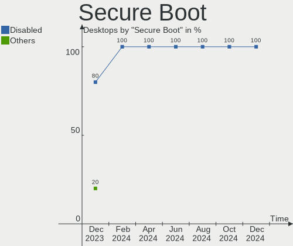
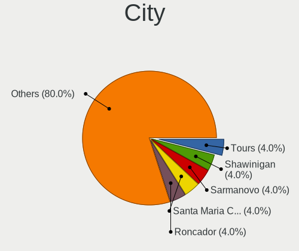
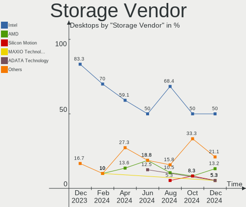
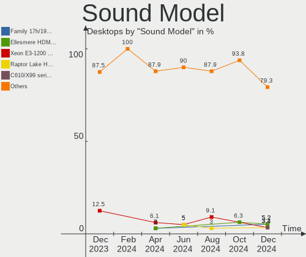
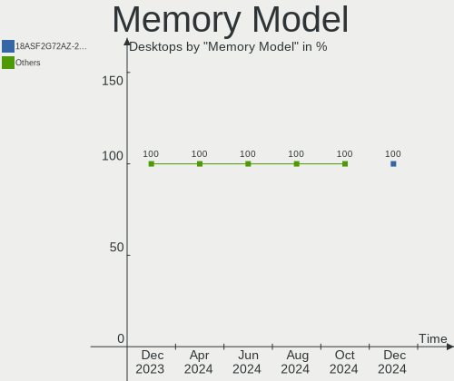
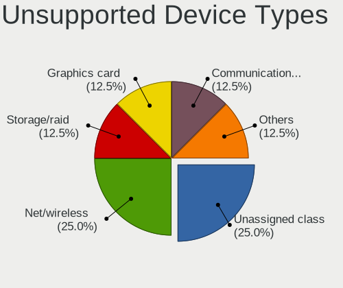

Elementary - Hardware Trends (Desktops)
---------------------------------------

A project to identify most popular hardware characteristics and track their change
over time based on data collected by Linux users at https://Linux-Hardware.org.

Anyone can contribute to this report by the [hw-probe](https://github.com/linuxhw/hw-probe) tool:

    sudo -E hw-probe -all -upload

This report is for one last month. Overall report since the beginning of time: [TestDays](https://github.com/linuxhw/TestDays)

Period: Apr, 2024.

Contents
--------

* [ System ](#system)
  - [ OS                       ](#os)
  - [ OS Family                ](#os-family)
  - [ Kernel                   ](#kernel)
  - [ Kernel Family            ](#kernel-family)
  - [ Kernel Major Ver.        ](#kernel-major-ver)
  - [ Arch                     ](#arch)
  - [ DE                       ](#de)
  - [ Display Server           ](#display-server)
  - [ Display Manager          ](#display-manager)
  - [ OS Lang                  ](#os-lang)
  - [ Boot Mode                ](#boot-mode)
  - [ Filesystem               ](#filesystem)
  - [ Part. scheme             ](#part-scheme)
  - [ Dual Boot with Linux/BSD ](#dual-boot-with-linuxbsd)
  - [ Dual Boot (Win)          ](#dual-boot-win)

* [ Board ](#board)
  - [ Vendor                   ](#vendor)
  - [ Model                    ](#model)
  - [ Model Family             ](#model-family)
  - [ MFG Year                 ](#mfg-year)
  - [ Form Factor              ](#form-factor)
  - [ Secure Boot              ](#secure-boot)
  - [ Coreboot                 ](#coreboot)
  - [ RAM Size                 ](#ram-size)
  - [ RAM Used                 ](#ram-used)
  - [ Total Drives             ](#total-drives)
  - [ Has CD-ROM               ](#has-cd-rom)
  - [ Has Ethernet             ](#has-ethernet)
  - [ Has WiFi                 ](#has-wifi)
  - [ Has Bluetooth            ](#has-bluetooth)

* [ Location ](#location)
  - [ Country                  ](#country)
  - [ City                     ](#city)

* [ Drives ](#drives)
  - [ Drive Vendor             ](#drive-vendor)
  - [ Drive Model              ](#drive-model)
  - [ HDD Vendor               ](#hdd-vendor)
  - [ SSD Vendor               ](#ssd-vendor)
  - [ Drive Kind               ](#drive-kind)
  - [ Drive Connector          ](#drive-connector)
  - [ Drive Size               ](#drive-size)
  - [ Space Total              ](#space-total)
  - [ Space Used               ](#space-used)
  - [ Malfunc. Drives          ](#malfunc-drives)
  - [ Malfunc. Drive Vendor    ](#malfunc-drive-vendor)
  - [ Malfunc. HDD Vendor      ](#malfunc-hdd-vendor)
  - [ Malfunc. Drive Kind      ](#malfunc-drive-kind)
  - [ Failed Drives            ](#failed-drives)
  - [ Failed Drive Vendor      ](#failed-drive-vendor)
  - [ Drive Status             ](#drive-status)

* [ Storage controller ](#storage-controller)
  - [ Storage Vendor           ](#storage-vendor)
  - [ Storage Model            ](#storage-model)
  - [ Storage Kind             ](#storage-kind)

* [ Processor ](#processor)
  - [ CPU Vendor               ](#cpu-vendor)
  - [ CPU Model                ](#cpu-model)
  - [ CPU Model Family         ](#cpu-model-family)
  - [ CPU Cores                ](#cpu-cores)
  - [ CPU Sockets              ](#cpu-sockets)
  - [ CPU Threads              ](#cpu-threads)
  - [ CPU Op-Modes             ](#cpu-op-modes)
  - [ CPU Microcode            ](#cpu-microcode)
  - [ CPU Microarch            ](#cpu-microarch)

* [ Graphics ](#graphics)
  - [ GPU Vendor               ](#gpu-vendor)
  - [ GPU Model                ](#gpu-model)
  - [ GPU Combo                ](#gpu-combo)
  - [ GPU Driver               ](#gpu-driver)
  - [ GPU Memory               ](#gpu-memory)

* [ Monitor ](#monitor)
  - [ Monitor Vendor           ](#monitor-vendor)
  - [ Monitor Model            ](#monitor-model)
  - [ Monitor Resolution       ](#monitor-resolution)
  - [ Monitor Diagonal         ](#monitor-diagonal)
  - [ Monitor Width            ](#monitor-width)
  - [ Aspect Ratio             ](#aspect-ratio)
  - [ Monitor Area             ](#monitor-area)
  - [ Pixel Density            ](#pixel-density)
  - [ Multiple Monitors        ](#multiple-monitors)

* [ Network ](#network)
  - [ Net Controller Vendor    ](#net-controller-vendor)
  - [ Net Controller Model     ](#net-controller-model)
  - [ Wireless Vendor          ](#wireless-vendor)
  - [ Wireless Model           ](#wireless-model)
  - [ Ethernet Vendor          ](#ethernet-vendor)
  - [ Ethernet Model           ](#ethernet-model)
  - [ Net Controller Kind      ](#net-controller-kind)
  - [ Used Controller          ](#used-controller)
  - [ NICs                     ](#nics)
  - [ IPv6                     ](#ipv6)

* [ Bluetooth ](#bluetooth)
  - [ Bluetooth Vendor         ](#bluetooth-vendor)
  - [ Bluetooth Model          ](#bluetooth-model)

* [ Sound ](#sound)
  - [ Sound Vendor             ](#sound-vendor)
  - [ Sound Model              ](#sound-model)

* [ Memory ](#memory)
  - [ Memory Vendor            ](#memory-vendor)
  - [ Memory Model             ](#memory-model)
  - [ Memory Kind              ](#memory-kind)
  - [ Memory Form Factor       ](#memory-form-factor)
  - [ Memory Size              ](#memory-size)
  - [ Memory Speed             ](#memory-speed)

* [ Printers & scanners ](#printers--scanners)
  - [ Printer Vendor           ](#printer-vendor)
  - [ Printer Model            ](#printer-model)
  - [ Scanner Vendor           ](#scanner-vendor)
  - [ Scanner Model            ](#scanner-model)

* [ Camera ](#camera)
  - [ Camera Vendor            ](#camera-vendor)
  - [ Camera Model             ](#camera-model)

* [ Security ](#security)
  - [ Fingerprint Vendor       ](#fingerprint-vendor)
  - [ Fingerprint Model        ](#fingerprint-model)
  - [ Chipcard Vendor          ](#chipcard-vendor)
  - [ Chipcard Model           ](#chipcard-model)

* [ Unsupported ](#unsupported)
  - [ Unsupported Devices      ](#unsupported-devices)
  - [ Unsupported Device Types ](#unsupported-device-types)

System
------

OS
--

Installed operating systems

| Name           | Desktops | Percent |
|----------------|----------|---------|
| Elementary 7.1 | 16       | 100%    |

OS Family
---------

OS without a version

| Name       | Desktops | Percent |
|------------|----------|---------|
| Elementary | 16       | 100%    |

Kernel
------

Version of the Linux kernel

| Version          | Desktops | Percent |
|------------------|----------|---------|
| 6.5.0-26-generic | 6        | 37.5%   |
| 6.5.0-28-generic | 5        | 31.25%  |
| 6.5.0-27-generic | 4        | 25%     |
| 6.2.0-33-generic | 1        | 6.25%   |

Kernel Family
-------------

Linux kernel without a distro release

| Version | Desktops | Percent |
|---------|----------|---------|
| 6.5.0   | 15       | 93.75%  |
| 6.2.0   | 1        | 6.25%   |

Kernel Major Ver.
-----------------

Linux kernel major version

| Version | Desktops | Percent |
|---------|----------|---------|
| 6.5     | 15       | 93.75%  |
| 6.2     | 1        | 6.25%   |

Arch
----

OS architecture (x86_64, i586, etc.)

| Name   | Desktops | Percent |
|--------|----------|---------|
| x86_64 | 16       | 100%    |

DE
--

Desktop Environment

| Name     | Desktops | Percent |
|----------|----------|---------|
| Pantheon | 16       | 100%    |

Display Server
--------------

X11 or Wayland

| Name | Desktops | Percent |
|------|----------|---------|
| X11  | 16       | 100%    |

Display Manager
---------------

SDDM, LightDM, etc.

| Name    | Desktops | Percent |
|---------|----------|---------|
| Unknown | 16       | 100%    |

OS Lang
-------

Language

| Lang  | Desktops | Percent |
|-------|----------|---------|
| en_US | 10       | 62.5%   |
| de_DE | 3        | 18.75%  |
| es_ES | 2        | 12.5%   |
| ru_RU | 1        | 6.25%   |

Boot Mode
---------

EFI or BIOS

| Mode | Desktops | Percent |
|------|----------|---------|
| BIOS | 16       | 100%    |

Filesystem
----------

Type of filesystem

| Type  | Desktops | Percent |
|-------|----------|---------|
| Ext4  | 15       | 93.75%  |
| Btrfs | 1        | 6.25%   |

Part. scheme
------------

Scheme of partitioning

| Type    | Desktops | Percent |
|---------|----------|---------|
| Unknown | 16       | 100%    |

Dual Boot with Linux/BSD
------------------------

Hosting more than one Linux/BSD

| Dual boot | Desktops | Percent |
|-----------|----------|---------|
| No        | 16       | 100%    |

Dual Boot (Win)
---------------

Hosting Linux and Windows

| Dual boot | Desktops | Percent |
|-----------|----------|---------|
| No        | 16       | 100%    |

Board
-----

Vendor
------

Motherboard manufacturer

| Name                | Desktops | Percent |
|---------------------|----------|---------|
| ASUSTek Computer    | 5        | 31.25%  |
| Hewlett-Packard     | 3        | 18.75%  |
| Gigabyte Technology | 3        | 18.75%  |
| Medion              | 2        | 12.5%   |
| MSI                 | 1        | 6.25%   |
| ECS                 | 1        | 6.25%   |
| Dell                | 1        | 6.25%   |

Model
-----

Motherboard model

| Name                      | Desktops | Percent |
|---------------------------|----------|---------|
| HP ProDesk 600 G1 SFF     | 2        | 12.5%   |
| MSI MS-7D38               | 1        | 6.25%   |
| Medion Z370H4-EM          | 1        | 6.25%   |
| Medion MS-7797            | 1        | 6.25%   |
| HP Z400 Workstation       | 1        | 6.25%   |
| Gigabyte F2A68HM-S1       | 1        | 6.25%   |
| Gigabyte B250M-D2VX-SI    | 1        | 6.25%   |
| Gigabyte 945GME-DS2       | 1        | 6.25%   |
| ECS H110M-C3D/C3V         | 1        | 6.25%   |
| Dell OptiPlex 7050        | 1        | 6.25%   |
| ASUS TUF X470-PLUS GAMING | 1        | 6.25%   |
| ASUS PRIME H510M-A        | 1        | 6.25%   |
| ASUS PRIME A320M-K        | 1        | 6.25%   |
| ASUS P8H77-M PRO          | 1        | 6.25%   |
| ASUS EX-B150M-V3          | 1        | 6.25%   |

Model Family
------------

Motherboard model prefix

| Name                   | Desktops | Percent |
|------------------------|----------|---------|
| HP ProDesk             | 2        | 12.5%   |
| ASUS PRIME             | 2        | 12.5%   |
| MSI MS-7D38            | 1        | 6.25%   |
| Medion Z370H4-EM       | 1        | 6.25%   |
| Medion MS-7797         | 1        | 6.25%   |
| HP Z400                | 1        | 6.25%   |
| Gigabyte F2A68HM-S1    | 1        | 6.25%   |
| Gigabyte B250M-D2VX-SI | 1        | 6.25%   |
| Gigabyte 945GME-DS2    | 1        | 6.25%   |
| ECS H110M-C3D          | 1        | 6.25%   |
| Dell OptiPlex          | 1        | 6.25%   |
| ASUS TUF               | 1        | 6.25%   |
| ASUS P8H77-M           | 1        | 6.25%   |
| ASUS EX-B150M-V3       | 1        | 6.25%   |

MFG Year
--------

Motherboard manufacture year

| Year | Desktops | Percent |
|------|----------|---------|
| 2018 | 2        | 12.5%   |
| 2017 | 2        | 12.5%   |
| 2013 | 2        | 12.5%   |
| 2012 | 2        | 12.5%   |
| 2022 | 1        | 6.25%   |
| 2021 | 1        | 6.25%   |
| 2019 | 1        | 6.25%   |
| 2016 | 1        | 6.25%   |
| 2015 | 1        | 6.25%   |
| 2014 | 1        | 6.25%   |
| 2010 | 1        | 6.25%   |
| 2007 | 1        | 6.25%   |

Form Factor
-----------

Physical design of the computer

| Name    | Desktops | Percent |
|---------|----------|---------|
| Desktop | 16       | 100%    |

Secure Boot
-----------

Enabled or disabled

| State    | Desktops | Percent |
|----------|----------|---------|
| Disabled | 16       | 100%    |

Coreboot
--------

Have coreboot on board

| Used | Desktops | Percent |
|------|----------|---------|
| No   | 16       | 100%    |

RAM Size
--------

Total RAM memory

| Size in GB | Desktops | Percent |
|------------|----------|---------|
| 16.01-24.0 | 5        | 31.25%  |
| 8.01-16.0  | 5        | 31.25%  |
| 4.01-8.0   | 4        | 25%     |
| 32.01-64.0 | 1        | 6.25%   |
| 1.01-2.0   | 1        | 6.25%   |

RAM Used
--------

Used RAM memory

| Used GB  | Desktops | Percent |
|----------|----------|---------|
| 1.01-2.0 | 6        | 37.5%   |
| 2.01-3.0 | 4        | 25%     |
| 4.01-8.0 | 3        | 18.75%  |
| 3.01-4.0 | 3        | 18.75%  |

Total Drives
------------

Number of drives on board

| Drives | Desktops | Percent |
|--------|----------|---------|
| 2      | 8        | 50%     |
| 1      | 4        | 25%     |
| 3      | 3        | 18.75%  |
| 6      | 1        | 6.25%   |

Has CD-ROM
----------

Has CD-ROM on board

| Presented | Desktops | Percent |
|-----------|----------|---------|
| No        | 9        | 56.25%  |
| Yes       | 7        | 43.75%  |

Has Ethernet
------------

Has Ethernet on board

| Presented | Desktops | Percent |
|-----------|----------|---------|
| Yes       | 15       | 93.75%  |
| No        | 1        | 6.25%   |

Has WiFi
--------

Has WiFi module

| Presented | Desktops | Percent |
|-----------|----------|---------|
| Yes       | 8        | 50%     |
| No        | 8        | 50%     |

Has Bluetooth
-------------

Has Bluetooth module

| Presented | Desktops | Percent |
|-----------|----------|---------|
| No        | 12       | 75%     |
| Yes       | 4        | 25%     |

Location
--------

Country
-------

Geographic location (country)

| Country     | Desktops | Percent |
|-------------|----------|---------|
| USA         | 2        | 12.5%   |
| Mexico      | 2        | 12.5%   |
| UAE         | 1        | 6.25%   |
| Spain       | 1        | 6.25%   |
| Russia      | 1        | 6.25%   |
| Philippines | 1        | 6.25%   |
| Pakistan    | 1        | 6.25%   |
| Netherlands | 1        | 6.25%   |
| Malaysia    | 1        | 6.25%   |
| Indonesia   | 1        | 6.25%   |
| Greece      | 1        | 6.25%   |
| Germany     | 1        | 6.25%   |
| Czechia     | 1        | 6.25%   |
| Austria     | 1        | 6.25%   |

City
----

Geographic location (city)

| City         | Desktops | Percent |
|--------------|----------|---------|
| Zapopan      | 1        | 6.25%   |
| Spokane      | 1        | 6.25%   |
| Polomolok    | 1        | 6.25%   |
| Naaldwijk    | 1        | 6.25%   |
| Moscow       | 1        | 6.25%   |
| Mérida      | 1        | 6.25%   |
| Malang       | 1        | 6.25%   |
| Loxstedt     | 1        | 6.25%   |
| Kuala Lumpur | 1        | 6.25%   |
| Kladno       | 1        | 6.25%   |
| Islamabad    | 1        | 6.25%   |
| Graz         | 1        | 6.25%   |
| Grand Rapids | 1        | 6.25%   |
| Dubai        | 1        | 6.25%   |
| Barcelona    | 1        | 6.25%   |
| Athens       | 1        | 6.25%   |

Drives
------

Drive Vendor
------------

Hard drive vendors

| Vendor                       | Desktops | Drives | Percent |
|------------------------------|----------|--------|---------|
| Seagate                      | 5        | 5      | 15.63%  |
| Samsung Electronics          | 4        | 6      | 12.5%   |
| WDC                          | 3        | 3      | 9.38%   |
| Kingston                     | 3        | 3      | 9.38%   |
| Sandisk                      | 2        | 2      | 6.25%   |
| Intel                        | 2        | 2      | 6.25%   |
| Transcend                    | 1        | 1      | 3.13%   |
| Toshiba                      | 1        | 1      | 3.13%   |
| Shenzhen Longsys Electronics | 1        | 1      | 3.13%   |
| Patriot                      | 1        | 1      | 3.13%   |
| Micron/Crucial Technology    | 1        | 1      | 3.13%   |
| Intenso                      | 1        | 1      | 3.13%   |
| HGST                         | 1        | 1      | 3.13%   |
| ETOPSO                       | 1        | 1      | 3.13%   |
| Crucial                      | 1        | 1      | 3.13%   |
| China                        | 1        | 1      | 3.13%   |
| AGI                          | 1        | 1      | 3.13%   |
| A-DATA Technology            | 1        | 1      | 3.13%   |
| Unknown                      | 1        | 1      | 3.13%   |

Drive Model
-----------

Hard drive models

| Model                                                  | Desktops | Percent |
|--------------------------------------------------------|----------|---------|
| Kingston SA400S37240G 240GB SSD                        | 2        | 5.88%   |
| WDC WD7502AAEX-00Y9A0 752GB                            | 1        | 2.94%   |
| WDC WD5003ABYX-01WERA2 500GB                           | 1        | 2.94%   |
| WDC WD5000AAKX-75U6AA0 500GB                           | 1        | 2.94%   |
| Transcend TS500GSSD220Q 500GB                          | 1        | 2.94%   |
| Toshiba DT01ACA050 500GB                               | 1        | 2.94%   |
| Shenzhen Longsys SM2263EN/SM2263XT-based OEM SSD 256GB | 1        | 2.94%   |
| Seagate ST3320813AS 320GB                              | 1        | 2.94%   |
| Seagate ST3250310CS 250GB                              | 1        | 2.94%   |
| Seagate ST3000DM008-2DM166 3TB                         | 1        | 2.94%   |
| Seagate ST2000DM001-9YN164 2TB                         | 1        | 2.94%   |
| Seagate BUP BK 4TB                                     | 1        | 2.94%   |
| Sandisk WD Black 2018/SN750 / PC SN720 NVMe SSD 1TB    | 1        | 2.94%   |
| SanDisk SSD PLUS 1000GB                                | 1        | 2.94%   |
| Samsung SSD PM871b 2.5 7mm 256GB                       | 1        | 2.94%   |
| Samsung SSD 870 QVO 1TB                                | 1        | 2.94%   |
| Samsung SSD 860 EVO 500GB                              | 1        | 2.94%   |
| Samsung SSD 860 EVO 1TB                                | 1        | 2.94%   |
| Samsung NVMe SSD Controller SM951/PM951 256GB          | 1        | 2.94%   |
| Samsung NVMe SSD Controller PM9A1/PM9A3/980PRO 1TB     | 1        | 2.94%   |
| Patriot P210 1TB SSD                                   | 1        | 2.94%   |
| Micron/Crucial CT500P5PSSD8 500GB                      | 1        | 2.94%   |
| Kingston SV300S37A60G 64GB SSD                         | 1        | 2.94%   |
| Intenso SSD Sata III 250GB                             | 1        | 2.94%   |
| Intel SSDSCKKF128G8 SATA 128GB                         | 1        | 2.94%   |
| Intel SSDSA2M080G2GC 80GB                              | 1        | 2.94%   |
| HGST HTS545050B7E660 500GB                             | 1        | 2.94%   |
| ETOPSO SSD 128GB                                       | 1        | 2.94%   |
| Crucial CT500MX500SSD1 500GB                           | 1        | 2.94%   |
| China SSD 128GB                                        | 1        | 2.94%   |
| AGI AGI240G18AI238 240GB                               | 1        | 2.94%   |
| A-DATA SU650 120GB SSD                                 | 1        | 2.94%   |
| Unknown                                                | 1        | 2.94%   |

HDD Vendor
----------

Hard disk drive vendors

| Vendor  | Desktops | Drives | Percent |
|---------|----------|--------|---------|
| Seagate | 5        | 5      | 50%     |
| WDC     | 3        | 3      | 30%     |
| Toshiba | 1        | 1      | 10%     |
| HGST    | 1        | 1      | 10%     |

SSD Vendor
----------

Solid state drive vendors

| Vendor              | Desktops | Drives | Percent |
|---------------------|----------|--------|---------|
| Samsung Electronics | 3        | 4      | 17.65%  |
| Kingston            | 3        | 3      | 17.65%  |
| Intel               | 2        | 2      | 11.76%  |
| Transcend           | 1        | 1      | 5.88%   |
| SanDisk             | 1        | 1      | 5.88%   |
| Patriot             | 1        | 1      | 5.88%   |
| Intenso             | 1        | 1      | 5.88%   |
| ETOPSO              | 1        | 1      | 5.88%   |
| Crucial             | 1        | 1      | 5.88%   |
| China               | 1        | 1      | 5.88%   |
| AGI                 | 1        | 1      | 5.88%   |
| A-DATA Technology   | 1        | 1      | 5.88%   |

Drive Kind
----------

HDD or SSD

| Kind    | Desktops | Drives | Percent |
|---------|----------|--------|---------|
| SSD     | 13       | 18     | 48.15%  |
| HDD     | 9        | 10     | 33.33%  |
| NVMe    | 4        | 5      | 14.81%  |
| Unknown | 1        | 1      | 3.7%    |

Drive Connector
---------------

SATA, SAS, NVMe, etc.

| Type | Desktops | Drives | Percent |
|------|----------|--------|---------|
| SATA | 16       | 28     | 76.19%  |
| NVMe | 4        | 5      | 19.05%  |
| SAS  | 1        | 1      | 4.76%   |

Drive Size
----------

Size of hard drive

| Size in TB | Desktops | Drives | Percent |
|------------|----------|--------|---------|
| 0.01-0.5   | 12       | 20     | 63.16%  |
| 0.51-1.0   | 3        | 4      | 15.79%  |
| 1.01-2.0   | 2        | 2      | 10.53%  |
| 3.01-4.0   | 1        | 1      | 5.26%   |
| 2.01-3.0   | 1        | 1      | 5.26%   |

Space Total
-----------

Amount of disk space available on the file system

| Size in GB | Desktops | Percent |
|------------|----------|---------|
| 101-250    | 6        | 37.5%   |
| 251-500    | 4        | 25%     |
| 1001-2000  | 3        | 18.75%  |
| 501-1000   | 2        | 12.5%   |
| 21-50      | 1        | 6.25%   |

Space Used
----------

Amount of used disk space

| Used GB  | Desktops | Percent |
|----------|----------|---------|
| 1-20     | 6        | 37.5%   |
| 21-50    | 4        | 25%     |
| 51-100   | 3        | 18.75%  |
| 251-500  | 1        | 6.25%   |
| 101-250  | 1        | 6.25%   |
| 501-1000 | 1        | 6.25%   |

Malfunc. Drives
---------------

Drive models with a malfunction

Zero info for selected period =(

Malfunc. Drive Vendor
---------------------

Vendors of faulty drives

Zero info for selected period =(

Malfunc. HDD Vendor
-------------------

Vendors of faulty HDD drives

Zero info for selected period =(

Malfunc. Drive Kind
-------------------

Kinds of faulty drives

Zero info for selected period =(

Failed Drives
-------------

Failed drive models

Zero info for selected period =(

Failed Drive Vendor
-------------------

Failed drive vendors

Zero info for selected period =(

Drive Status
------------

Number of failed and malfunc. drives

| Status   | Desktops | Drives | Percent |
|----------|----------|--------|---------|
| Detected | 16       | 34     | 100%    |

Storage controller
------------------

Storage Vendor
--------------

Storage controller vendors

| Vendor                       | Desktops | Percent |
|------------------------------|----------|---------|
| Intel                        | 13       | 59.09%  |
| AMD                          | 3        | 13.64%  |
| Samsung Electronics          | 2        | 9.09%   |
| Shenzhen Longsys Electronics | 1        | 4.55%   |
| SanDisk                      | 1        | 4.55%   |
| Micron/Crucial Technology    | 1        | 4.55%   |
| Marvell Technology Group     | 1        | 4.55%   |

Storage Model
-------------

Storage controller models

| Model                                                                          | Desktops | Percent |
|--------------------------------------------------------------------------------|----------|---------|
| Intel SATA Controller [RAID mode]                                              | 2        | 8.33%   |
| Intel Q170/Q150/B150/H170/H110/Z170/CM236 Chipset SATA Controller [AHCI Mode]  | 2        | 8.33%   |
| Intel 8 Series/C220 Series Chipset Family 6-port SATA Controller 1 [AHCI mode] | 2        | 8.33%   |
| Intel 500 Series Chipset Family SATA AHCI Controller                           | 2        | 8.33%   |
| Intel 200 Series PCH SATA controller [AHCI mode]                               | 2        | 8.33%   |
| Shenzhen Longsys SM2263EN/SM2263XT-based OEM NVME SSD (DRAM-less)              | 1        | 4.17%   |
| SanDisk Extreme Pro / WD Black 2018/SN750/PC SN720 NVMe SSD                    | 1        | 4.17%   |
| Samsung NVMe SSD Controller SM951/PM951                                        | 1        | 4.17%   |
| Samsung NVMe SSD Controller PM9A1/PM9A3/980PRO                                 | 1        | 4.17%   |
| Micron/Crucial P5 Plus NVMe PCIe SSD                                           | 1        | 4.17%   |
| Marvell Group 88SE9172 SATA III 6Gb/s RAID Controller                          | 1        | 4.17%   |
| Intel NM10/ICH7 Family SATA Controller [IDE mode]                              | 1        | 4.17%   |
| Intel 7 Series/C210 Series Chipset Family 6-port SATA Controller [AHCI mode]   | 1        | 4.17%   |
| Intel 7 Series/C210 Series Chipset Family 4-port SATA Controller [IDE mode]    | 1        | 4.17%   |
| Intel 7 Series/C210 Series Chipset Family 2-port SATA Controller [IDE mode]    | 1        | 4.17%   |
| AMD FCH SATA Controller [IDE mode]                                             | 1        | 4.17%   |
| AMD FCH SATA Controller [AHCI mode]                                            | 1        | 4.17%   |
| AMD FCH SATA Controller D                                                      | 1        | 4.17%   |
| AMD 400 Series Chipset SATA Controller                                         | 1        | 4.17%   |

Storage Kind
------------

Kind of storage controller (IDE, SATA, NVMe, SAS, ...)

| Kind | Desktops | Percent |
|------|----------|---------|
| SATA | 12       | 60%     |
| NVMe | 4        | 20%     |
| RAID | 2        | 10%     |
| IDE  | 2        | 10%     |

Processor
---------

CPU Vendor
----------

Processor vendors

| Vendor | Desktops | Percent |
|--------|----------|---------|
| Intel  | 13       | 81.25%  |
| AMD    | 3        | 18.75%  |

CPU Model
---------

Processor models

| Model                                       | Desktops | Percent |
|---------------------------------------------|----------|---------|
| Intel Xeon CPU W3520 @ 2.67GHz              | 1        | 6.25%   |
| Intel Xeon CPU E3-1220 v5 @ 3.00GHz         | 1        | 6.25%   |
| Intel Pentium CPU G4400 @ 3.30GHz           | 1        | 6.25%   |
| Intel Core i5-8400 CPU @ 2.80GHz            | 1        | 6.25%   |
| Intel Core i5-4670 CPU @ 3.40GHz            | 1        | 6.25%   |
| Intel Core i5-4570 CPU @ 3.20GHz            | 1        | 6.25%   |
| Intel Core i5-3470 CPU @ 3.20GHz            | 1        | 6.25%   |
| Intel Core i3-6100T CPU @ 3.20GHz           | 1        | 6.25%   |
| Intel Core i3-6100 CPU @ 3.70GHz            | 1        | 6.25%   |
| Intel Core i3-3220 CPU @ 3.30GHz            | 1        | 6.25%   |
| Intel Core 2 CPU 6600 @ 2.40GHz             | 1        | 6.25%   |
| Intel 11th Gen Core i7-11700KF @ 3.60GHz    | 1        | 6.25%   |
| Intel 11th Gen Core i5-11400 @ 2.60GHz      | 1        | 6.25%   |
| AMD Ryzen 7 2700X Eight-Core Processor      | 1        | 6.25%   |
| AMD Ryzen 5 3400G with Radeon Vega Graphics | 1        | 6.25%   |
| AMD A6-6400K APU with Radeon HD Graphics    | 1        | 6.25%   |

CPU Model Family
----------------

Processor model prefix

| Model         | Desktops | Percent |
|---------------|----------|---------|
| Intel Core i5 | 4        | 25%     |
| Intel Core i3 | 3        | 18.75%  |
| Other         | 2        | 12.5%   |
| Intel Xeon    | 2        | 12.5%   |
| Intel Pentium | 1        | 6.25%   |
| Intel Core 2  | 1        | 6.25%   |
| AMD Ryzen 7   | 1        | 6.25%   |
| AMD Ryzen 5   | 1        | 6.25%   |
| AMD A6        | 1        | 6.25%   |

CPU Cores
---------

Number of processor cores

| Number | Desktops | Percent |
|--------|----------|---------|
| 4      | 6        | 37.5%   |
| 2      | 5        | 31.25%  |
| 8      | 2        | 12.5%   |
| 6      | 2        | 12.5%   |
| 1      | 1        | 6.25%   |

CPU Sockets
-----------

Number of sockets

| Number | Desktops | Percent |
|--------|----------|---------|
| 1      | 16       | 100%    |

CPU Threads
-----------

Threads per core (Hyper-Threading)

| Number | Desktops | Percent |
|--------|----------|---------|
| 2      | 8        | 50%     |
| 1      | 8        | 50%     |

CPU Op-Modes
------------

CPU Operation Modes (32-bit, 64-bit)

| Op mode        | Desktops | Percent |
|----------------|----------|---------|
| 32-bit, 64-bit | 16       | 100%    |

CPU Microcode
-------------

Microcode number

| Number  | Desktops | Percent |
|---------|----------|---------|
| Unknown | 16       | 100%    |

CPU Microarch
-------------

Microarchitecture

| Name       | Desktops | Percent |
|------------|----------|---------|
| Skylake    | 4        | 25%     |
| Zen+       | 2        | 12.5%   |
| IvyBridge  | 2        | 12.5%   |
| Haswell    | 2        | 12.5%   |
| Unknown    | 2        | 12.5%   |
| Piledriver | 1        | 6.25%   |
| Nehalem    | 1        | 6.25%   |
| KabyLake   | 1        | 6.25%   |
| Core       | 1        | 6.25%   |

Graphics
--------

GPU Vendor
----------

Vendors of graphics cards

| Vendor | Desktops | Percent |
|--------|----------|---------|
| Nvidia | 7        | 41.18%  |
| Intel  | 6        | 35.29%  |
| AMD    | 4        | 23.53%  |

GPU Model
---------

Graphics card models

| Model                                                                       | Desktops | Percent |
|-----------------------------------------------------------------------------|----------|---------|
| Nvidia GK107 [GeForce GTX 650]                                              | 2        | 11.11%  |
| Intel Xeon E3-1200 v3/4th Gen Core Processor Integrated Graphics Controller | 2        | 11.11%  |
| Intel HD Graphics 530                                                       | 2        | 11.11%  |
| Nvidia TU104 [GeForce RTX 2070 SUPER]                                       | 1        | 5.56%   |
| Nvidia GT218 [GeForce 210]                                                  | 1        | 5.56%   |
| Nvidia GP106 [GeForce GTX 1060 6GB]                                         | 1        | 5.56%   |
| Nvidia GA106 [Geforce RTX 3050]                                             | 1        | 5.56%   |
| Nvidia G98 [Quadro NVS 295]                                                 | 1        | 5.56%   |
| Intel HD Graphics 510                                                       | 1        | 5.56%   |
| Intel CoffeeLake-S GT2 [UHD Graphics 630]                                   | 1        | 5.56%   |
| AMD Vega 10 XL/XT [Radeon RX Vega 56/64]                                    | 1        | 5.56%   |
| AMD Richland [Radeon HD 8470D]                                              | 1        | 5.56%   |
| AMD Picasso/Raven 2 [Radeon Vega Series / Radeon Vega Mobile Series]        | 1        | 5.56%   |
| AMD Lexa PRO [Radeon 540/540X/550/550X / RX 540X/550/550X]                  | 1        | 5.56%   |
| AMD Ellesmere [Radeon RX 470/480/570/570X/580/580X/590]                     | 1        | 5.56%   |

GPU Combo
---------

Combinations of graphics cards

| Name       | Desktops | Percent |
|------------|----------|---------|
| 1 x Nvidia | 7        | 43.75%  |
| 1 x Intel  | 5        | 31.25%  |
| 1 x AMD    | 3        | 18.75%  |
| 2 x AMD    | 1        | 6.25%   |

GPU Driver
----------

Free vs proprietary

| Driver      | Desktops | Percent |
|-------------|----------|---------|
| Free        | 14       | 87.5%   |
| Proprietary | 1        | 6.25%   |
| Unknown     | 1        | 6.25%   |

GPU Memory
----------

Total video memory

| Size in GB | Desktops | Percent |
|------------|----------|---------|
| Unknown    | 15       | 93.75%  |
| 7.01-8.0   | 1        | 6.25%   |

Monitor
-------

Monitor Vendor
--------------

Monitor vendors

| Vendor              | Desktops | Percent |
|---------------------|----------|---------|
| Samsung Electronics | 3        | 20%     |
| Philips             | 2        | 13.33%  |
| Goldstar            | 2        | 13.33%  |
| Dell                | 2        | 13.33%  |
| AOC                 | 2        | 13.33%  |
| RTK                 | 1        | 6.67%   |
| HKC                 | 1        | 6.67%   |
| Hewlett-Packard     | 1        | 6.67%   |
| Acer                | 1        | 6.67%   |

Monitor Model
-------------

Monitor models

| Model                                                                  | Desktops | Percent |
|------------------------------------------------------------------------|----------|---------|
| Samsung Electronics S24F350 SAM0D21 1920x1080 521x293mm 23.5-inch      | 1        | 5.88%   |
| Samsung Electronics LF27T35 SAM707F 1920x1080 598x337mm 27.0-inch      | 1        | 5.88%   |
| Samsung Electronics LCD Monitor SAM7106 1920x1080 1210x680mm 54.6-inch | 1        | 5.88%   |
| Samsung Electronics C27F390 SAM0D32 1920x1080 598x336mm 27.0-inch      | 1        | 5.88%   |
| RTK LCD Monitor RTK1D1A 1920x1080 1020x570mm 46.0-inch                 | 1        | 5.88%   |
| Philips PHL 274E5 PHLC0C8 1920x1080 598x336mm 27.0-inch                | 1        | 5.88%   |
| Philips PHL 241V8 PHLC212 1920x1080 527x296mm 23.8-inch                | 1        | 5.88%   |
| HKC 22N1 HKCB215 1920x1080 476x268mm 21.5-inch                         | 1        | 5.88%   |
| Hewlett-Packard P22v G5 HPN3813 1920x1080 478x260mm 21.4-inch          | 1        | 5.88%   |
| Goldstar W2361 GSM56F9 1920x1080 474x296mm 22.0-inch                   | 1        | 5.88%   |
| Goldstar HD GSM5ACD 1366x768 410x230mm 18.5-inch                       | 1        | 5.88%   |
| Dell E2216H DELF069 1920x1080 476x268mm 21.5-inch                      | 1        | 5.88%   |
| Dell E2216H DELF068 1920x1080 476x268mm 21.5-inch                      | 1        | 5.88%   |
| Dell AW3418DW DELA0FA 3440x1440 798x335mm 34.1-inch                    | 1        | 5.88%   |
| AOC Q27P1B AOC2701 2560x1440 597x336mm 27.0-inch                       | 1        | 5.88%   |
| AOC 27G2G3 AOC2702 1920x1080 598x336mm 27.0-inch                       | 1        | 5.88%   |
| Acer V223HQ ACR0070 1920x1080 470x270mm 21.3-inch                      | 1        | 5.88%   |

Monitor Resolution
------------------

Monitor screen resolution

| Resolution      | Desktops | Percent |
|-----------------|----------|---------|
| 1920x1080 (FHD) | 10       | 71.43%  |
| 3840x2160 (4K)  | 2        | 14.29%  |
| 3440x1440       | 1        | 7.14%   |
| 1366x768 (WXGA) | 1        | 7.14%   |

Monitor Diagonal
----------------

Diagonal size in inches

| Inches | Desktops | Percent |
|--------|----------|---------|
| 27     | 4        | 25%     |
| 23     | 3        | 18.75%  |
| 21     | 3        | 18.75%  |
| 54     | 1        | 6.25%   |
| 46     | 1        | 6.25%   |
| 40     | 1        | 6.25%   |
| 34     | 1        | 6.25%   |
| 24     | 1        | 6.25%   |
| 18     | 1        | 6.25%   |

Monitor Width
-------------

Physical width

| Width in mm | Desktops | Percent |
|-------------|----------|---------|
| 501-600     | 8        | 50%     |
| 401-500     | 4        | 25%     |
| 1001-1500   | 2        | 12.5%   |
| 801-900     | 1        | 6.25%   |
| 701-800     | 1        | 6.25%   |

Aspect Ratio
------------

Proportional relationship between the width and the height

| Ratio | Desktops | Percent |
|-------|----------|---------|
| 16/9  | 13       | 92.86%  |
| 21/9  | 1        | 7.14%   |

Monitor Area
------------

Area in inch²

| Area in inch² | Desktops | Percent |
|----------------|----------|---------|
| 301-350        | 4        | 26.67%  |
| 201-250        | 4        | 26.67%  |
| 151-200        | 2        | 13.33%  |
| 501-1000       | 2        | 13.33%  |
| More than 1000 | 1        | 6.67%   |
| 351-500        | 1        | 6.67%   |
| 141-150        | 1        | 6.67%   |

Pixel Density
-------------

Pixels per inch

| Density | Desktops | Percent |
|---------|----------|---------|
| 51-100  | 9        | 60%     |
| 101-120 | 4        | 26.67%  |
| 1-50    | 2        | 13.33%  |

Multiple Monitors
-----------------

Total monitors connected

| Total | Desktops | Percent |
|-------|----------|---------|
| 1     | 12       | 75%     |
| 2     | 2        | 12.5%   |
| 3     | 1        | 6.25%   |
| 0     | 1        | 6.25%   |

Network
-------

Net Controller Vendor
---------------------

Controller vendors

| Vendor                   | Desktops | Percent |
|--------------------------|----------|---------|
| Realtek Semiconductor    | 12       | 54.55%  |
| Intel                    | 6        | 27.27%  |
| TP-Link                  | 1        | 4.55%   |
| Mercucys                 | 1        | 4.55%   |
| Marvell Technology Group | 1        | 4.55%   |
| Broadcom                 | 1        | 4.55%   |

Net Controller Model
--------------------

Controller models

| Model                                                                  | Desktops | Percent |
|------------------------------------------------------------------------|----------|---------|
| Realtek RTL8111/8168/8211/8411 PCI Express Gigabit Ethernet Controller | 8        | 33.33%  |
| Intel Ethernet Connection I217-LM                                      | 2        | 8.33%   |
| TP-Link 802.11ac NIC                                                   | 1        | 4.17%   |
| Realtek RTL8188FTV 802.11b/g/n 1T1R 2.4G WLAN Adapter                  | 1        | 4.17%   |
| Realtek RTL8188EUS 802.11n Wireless Network Adapter                    | 1        | 4.17%   |
| Realtek RTL8188CUS 802.11n WLAN Adapter                                | 1        | 4.17%   |
| Realtek RTL-8100/8101L/8139 PCI Fast Ethernet Adapter                  | 1        | 4.17%   |
| Realtek 802.11ax WLAN Adapter                                          | 1        | 4.17%   |
| Mercucys 802.11n NIC                                                   | 1        | 4.17%   |
| Marvell Group 88E8001 Gigabit Ethernet Controller                      | 1        | 4.17%   |
| Intel Wireless 3160                                                    | 1        | 4.17%   |
| Intel Wi-Fi 6E(802.11ax) AX210/AX1675* 2x2 [Typhoon Peak]              | 1        | 4.17%   |
| Intel Ethernet Controller I225-V                                       | 1        | 4.17%   |
| Intel Ethernet Connection (5) I219-LM                                  | 1        | 4.17%   |
| Intel Ethernet Connection (14) I219-V                                  | 1        | 4.17%   |
| Broadcom NetXtreme BCM5764M Gigabit Ethernet PCIe                      | 1        | 4.17%   |

Wireless Vendor
---------------

Wireless vendors

| Vendor                | Desktops | Percent |
|-----------------------|----------|---------|
| Realtek Semiconductor | 4        | 50%     |
| Intel                 | 2        | 25%     |
| TP-Link               | 1        | 12.5%   |
| Mercucys              | 1        | 12.5%   |

Wireless Model
--------------

Wireless models

| Model                                                     | Desktops | Percent |
|-----------------------------------------------------------|----------|---------|
| TP-Link 802.11ac NIC                                      | 1        | 12.5%   |
| Realtek RTL8188FTV 802.11b/g/n 1T1R 2.4G WLAN Adapter     | 1        | 12.5%   |
| Realtek RTL8188EUS 802.11n Wireless Network Adapter       | 1        | 12.5%   |
| Realtek RTL8188CUS 802.11n WLAN Adapter                   | 1        | 12.5%   |
| Realtek 802.11ax WLAN Adapter                             | 1        | 12.5%   |
| Mercucys 802.11n NIC                                      | 1        | 12.5%   |
| Intel Wireless 3160                                       | 1        | 12.5%   |
| Intel Wi-Fi 6E(802.11ax) AX210/AX1675* 2x2 [Typhoon Peak] | 1        | 12.5%   |

Ethernet Vendor
---------------

Ethernet vendors

| Vendor                   | Desktops | Percent |
|--------------------------|----------|---------|
| Realtek Semiconductor    | 9        | 56.25%  |
| Intel                    | 5        | 31.25%  |
| Marvell Technology Group | 1        | 6.25%   |
| Broadcom                 | 1        | 6.25%   |

Ethernet Model
--------------

Ethernet models

| Model                                                                  | Desktops | Percent |
|------------------------------------------------------------------------|----------|---------|
| Realtek RTL8111/8168/8211/8411 PCI Express Gigabit Ethernet Controller | 8        | 50%     |
| Intel Ethernet Connection I217-LM                                      | 2        | 12.5%   |
| Realtek RTL-8100/8101L/8139 PCI Fast Ethernet Adapter                  | 1        | 6.25%   |
| Marvell Group 88E8001 Gigabit Ethernet Controller                      | 1        | 6.25%   |
| Intel Ethernet Controller I225-V                                       | 1        | 6.25%   |
| Intel Ethernet Connection (5) I219-LM                                  | 1        | 6.25%   |
| Intel Ethernet Connection (14) I219-V                                  | 1        | 6.25%   |
| Broadcom NetXtreme BCM5764M Gigabit Ethernet PCIe                      | 1        | 6.25%   |

Net Controller Kind
-------------------

Ethernet, WiFi or modem

| Kind     | Desktops | Percent |
|----------|----------|---------|
| Ethernet | 15       | 65.22%  |
| WiFi     | 8        | 34.78%  |

Used Controller
---------------

Currently used network controller

| Kind     | Desktops | Percent |
|----------|----------|---------|
| Ethernet | 11       | 64.71%  |
| WiFi     | 6        | 35.29%  |

NICs
----

Total network controllers on board

| Total | Desktops | Percent |
|-------|----------|---------|
| 1     | 14       | 87.5%   |
| 2     | 2        | 12.5%   |

IPv6
----

IPv6 vs IPv4

| Used | Desktops | Percent |
|------|----------|---------|
| No   | 9        | 56.25%  |
| Yes  | 7        | 43.75%  |

Bluetooth
---------

Bluetooth Vendor
----------------

Controller vendors

| Vendor                  | Desktops | Percent |
|-------------------------|----------|---------|
| Intel                   | 2        | 50%     |
| Realtek Semiconductor   | 1        | 25%     |
| Cambridge Silicon Radio | 1        | 25%     |

Bluetooth Model
---------------

Controller models

| Model                                               | Desktops | Percent |
|-----------------------------------------------------|----------|---------|
| Realtek Bluetooth Radio                             | 1        | 25%     |
| Intel Bluetooth wireless interface                  | 1        | 25%     |
| Intel AX210 Bluetooth                               | 1        | 25%     |
| Cambridge Silicon Radio Bluetooth Dongle (HCI mode) | 1        | 25%     |

Sound
-----

Sound Vendor
------------

Sound card vendors

| Vendor                   | Desktops | Percent |
|--------------------------|----------|---------|
| Intel                    | 13       | 46.43%  |
| Nvidia                   | 6        | 21.43%  |
| AMD                      | 4        | 14.29%  |
| Texas Instruments        | 1        | 3.57%   |
| Micro Star International | 1        | 3.57%   |
| GN Netcom                | 1        | 3.57%   |
| Dell                     | 1        | 3.57%   |
| C-Media Electronics      | 1        | 3.57%   |

Sound Model
-----------

Sound card models

| Model                                                               | Desktops | Percent |
|---------------------------------------------------------------------|----------|---------|
| Intel 200 Series PCH HD Audio                                       | 3        | 9.09%   |
| Nvidia GK107 HDMI Audio Controller                                  | 2        | 6.06%   |
| Intel Xeon E3-1200 v3/4th Gen Core Processor HD Audio Controller    | 2        | 6.06%   |
| Intel Tiger Lake-H HD Audio Controller                              | 2        | 6.06%   |
| Intel 8 Series/C220 Series Chipset High Definition Audio Controller | 2        | 6.06%   |
| Intel 7 Series/C216 Chipset Family High Definition Audio Controller | 2        | 6.06%   |
| Intel 100 Series/C230 Series Chipset Family HD Audio Controller     | 2        | 6.06%   |
| Texas Instruments PCM2901 Audio Codec                               | 1        | 3.03%   |
| Nvidia TU104 HD Audio Controller                                    | 1        | 3.03%   |
| Nvidia High Definition Audio Controller                             | 1        | 3.03%   |
| Nvidia GP106 High Definition Audio Controller                       | 1        | 3.03%   |
| Nvidia GA106 High Definition Audio Controller                       | 1        | 3.03%   |
| Micro Star International USB Audio                                  | 1        | 3.03%   |
| Intel NM10/ICH7 Family High Definition Audio Controller             | 1        | 3.03%   |
| Intel 82801JI (ICH10 Family) HD Audio Controller                    | 1        | 3.03%   |
| GN Netcom Jabra EVOLVE 20 MS                                        | 1        | 3.03%   |
| Dell AC511 Sound Bar                                                | 1        | 3.03%   |
| C-Media Electronics CMI8738/CMI8768 PCI Audio                       | 1        | 3.03%   |
| AMD Vega 10 HDMI Audio [Radeon Vega 56/64]                          | 1        | 3.03%   |
| AMD Raven/Raven2/Fenghuang HDMI/DP Audio Controller                 | 1        | 3.03%   |
| AMD FCH Azalia Controller                                           | 1        | 3.03%   |
| AMD Family 17h/19h HD Audio Controller                              | 1        | 3.03%   |
| AMD Family 17h (Models 00h-0fh) HD Audio Controller                 | 1        | 3.03%   |
| AMD Ellesmere HDMI Audio [Radeon RX 470/480 / 570/580/590]          | 1        | 3.03%   |
| AMD Baffin HDMI/DP Audio [Radeon RX 550 640SP / RX 560/560X]        | 1        | 3.03%   |

Memory
------

Memory Vendor
-------------

Memory module vendors

| Vendor  | Desktops | Percent |
|---------|----------|---------|
| Crucial | 1        | 100%    |

Memory Model
------------

Memory module models

| Model                                                | Desktops | Percent |
|------------------------------------------------------|----------|---------|
| Crucial RAM CT8G4DFRA266.C8FE 8GB DIMM DDR4 2933MT/s | 1        | 100%    |

Memory Kind
-----------

Memory module kinds

| Kind | Desktops | Percent |
|------|----------|---------|
| DDR4 | 1        | 100%    |

Memory Form Factor
------------------

Physical design of the memory module

| Name | Desktops | Percent |
|------|----------|---------|
| DIMM | 1        | 100%    |

Memory Size
-----------

Memory module size

| Size | Desktops | Percent |
|------|----------|---------|
| 8192 | 1        | 100%    |

Memory Speed
------------

Memory module speed

| Speed | Desktops | Percent |
|-------|----------|---------|
| 2933  | 1        | 100%    |

Printers & scanners
-------------------

Printer Vendor
--------------

Printer device vendors

Zero info for selected period =(

Printer Model
-------------

Printer device models

Zero info for selected period =(

Scanner Vendor
--------------

Scanner device vendors

Zero info for selected period =(

Scanner Model
-------------

Scanner device models

Zero info for selected period =(

Camera
------

Camera Vendor
-------------

Camera device vendors

| Vendor              | Desktops | Percent |
|---------------------|----------|---------|
| Samsung Electronics | 1        | 33.33%  |
| Microdia            | 1        | 33.33%  |
| Logitech            | 1        | 33.33%  |

Camera Model
------------

Camera device models

| Model                                   | Desktops | Percent |
|-----------------------------------------|----------|---------|
| Samsung Galaxy series, misc. (MTP mode) | 1        | 33.33%  |
| Microdia Integrated Camera              | 1        | 33.33%  |
| Logitech C922 Pro Stream Webcam         | 1        | 33.33%  |

Security
--------

Fingerprint Vendor
------------------

Fingerprint sensor vendors

Zero info for selected period =(

Fingerprint Model
-----------------

Fingerprint sensor models

Zero info for selected period =(

Chipcard Vendor
---------------

Chipcard module vendors

Zero info for selected period =(

Chipcard Model
--------------

Chipcard module models

Zero info for selected period =(

Unsupported
-----------

Unsupported Devices
-------------------

Total unsupported devices on board

| Total | Desktops | Percent |
|-------|----------|---------|
| 0     | 14       | 87.5%   |
| 1     | 2        | 12.5%   |

Unsupported Device Types
------------------------

Types of unsupported devices

| Type          | Desktops | Percent |
|---------------|----------|---------|
| Graphics card | 1        | 50%     |
| Card reader   | 1        | 50%     |

