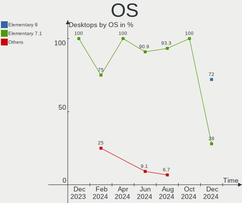
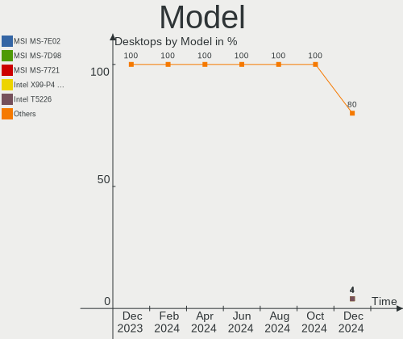
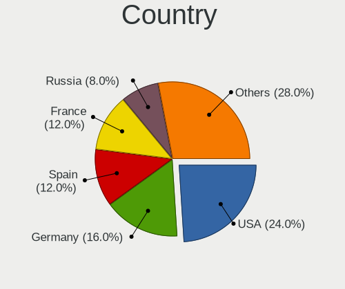
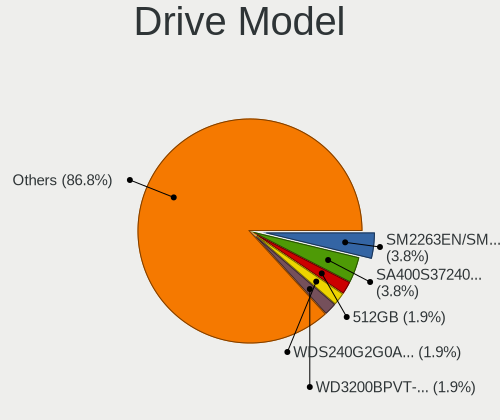
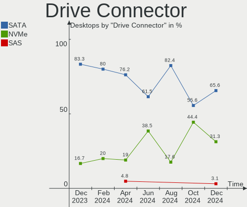
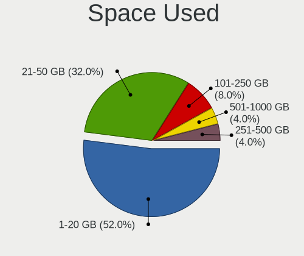
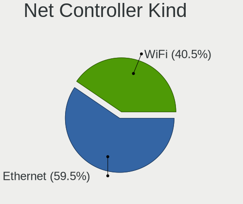
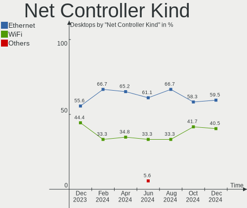
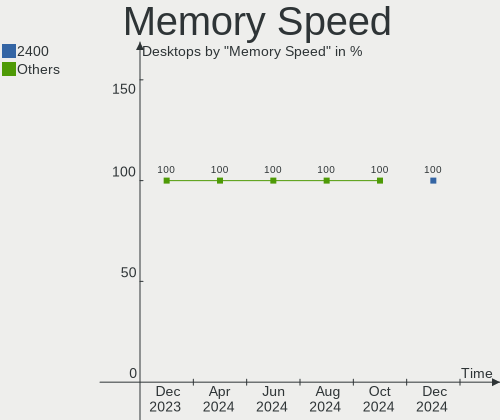
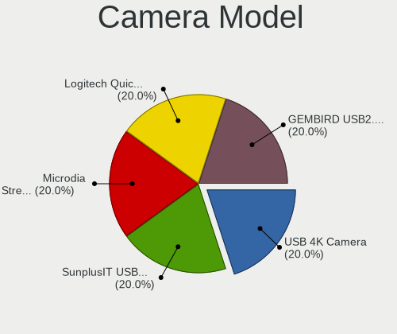

Elementary Hardware Trends (Desktops)
-------------------------------------

A project to identify most popular hardware characteristics and track their change
over time based on data collected by Elementary users at https://Linux-Hardware.org.

Anyone can contribute to this report by the [hw-probe](https://github.com/linuxhw/hw-probe) tool:

    sudo -E hw-probe -all -upload

Full-feature report is available here: https://linux-hardware.org/?view=trends

Period: Feb, 2022.

Contents
--------

* [ System ](#system)
  - [ OS                       ](#os)
  - [ OS Family                ](#os-family)
  - [ Kernel                   ](#kernel)
  - [ Kernel Family            ](#kernel-family)
  - [ Kernel Major Ver.        ](#kernel-major-ver)
  - [ Arch                     ](#arch)
  - [ DE                       ](#de)
  - [ Display Server           ](#display-server)
  - [ Display Manager          ](#display-manager)
  - [ OS Lang                  ](#os-lang)
  - [ Boot Mode                ](#boot-mode)
  - [ Filesystem               ](#filesystem)
  - [ Part. scheme             ](#part-scheme)
  - [ Dual Boot with Linux/BSD ](#dual-boot-with-linuxbsd)
  - [ Dual Boot (Win)          ](#dual-boot-win)

* [ Board ](#board)
  - [ Vendor                   ](#vendor)
  - [ Model                    ](#model)
  - [ Model Family             ](#model-family)
  - [ MFG Year                 ](#mfg-year)
  - [ Form Factor              ](#form-factor)
  - [ Secure Boot              ](#secure-boot)
  - [ Coreboot                 ](#coreboot)
  - [ RAM Size                 ](#ram-size)
  - [ RAM Used                 ](#ram-used)
  - [ Total Drives             ](#total-drives)
  - [ Has CD-ROM               ](#has-cd-rom)
  - [ Has Ethernet             ](#has-ethernet)
  - [ Has WiFi                 ](#has-wifi)
  - [ Has Bluetooth            ](#has-bluetooth)

* [ Location ](#location)
  - [ Country                  ](#country)
  - [ City                     ](#city)

* [ Drives ](#drives)
  - [ Drive Vendor             ](#drive-vendor)
  - [ Drive Model              ](#drive-model)
  - [ HDD Vendor               ](#hdd-vendor)
  - [ SSD Vendor               ](#ssd-vendor)
  - [ Drive Kind               ](#drive-kind)
  - [ Drive Connector          ](#drive-connector)
  - [ Drive Size               ](#drive-size)
  - [ Space Total              ](#space-total)
  - [ Space Used               ](#space-used)
  - [ Malfunc. Drives          ](#malfunc-drives)
  - [ Malfunc. Drive Vendor    ](#malfunc-drive-vendor)
  - [ Malfunc. HDD Vendor      ](#malfunc-hdd-vendor)
  - [ Malfunc. Drive Kind      ](#malfunc-drive-kind)
  - [ Failed Drives            ](#failed-drives)
  - [ Failed Drive Vendor      ](#failed-drive-vendor)
  - [ Drive Status             ](#drive-status)

* [ Storage controller ](#storage-controller)
  - [ Storage Vendor           ](#storage-vendor)
  - [ Storage Model            ](#storage-model)
  - [ Storage Kind             ](#storage-kind)

* [ Processor ](#processor)
  - [ CPU Vendor               ](#cpu-vendor)
  - [ CPU Model                ](#cpu-model)
  - [ CPU Model Family         ](#cpu-model-family)
  - [ CPU Cores                ](#cpu-cores)
  - [ CPU Sockets              ](#cpu-sockets)
  - [ CPU Threads              ](#cpu-threads)
  - [ CPU Op-Modes             ](#cpu-op-modes)
  - [ CPU Microcode            ](#cpu-microcode)
  - [ CPU Microarch            ](#cpu-microarch)

* [ Graphics ](#graphics)
  - [ GPU Vendor               ](#gpu-vendor)
  - [ GPU Model                ](#gpu-model)
  - [ GPU Combo                ](#gpu-combo)
  - [ GPU Driver               ](#gpu-driver)
  - [ GPU Memory               ](#gpu-memory)

* [ Monitor ](#monitor)
  - [ Monitor Vendor           ](#monitor-vendor)
  - [ Monitor Model            ](#monitor-model)
  - [ Monitor Resolution       ](#monitor-resolution)
  - [ Monitor Diagonal         ](#monitor-diagonal)
  - [ Monitor Width            ](#monitor-width)
  - [ Aspect Ratio             ](#aspect-ratio)
  - [ Monitor Area             ](#monitor-area)
  - [ Pixel Density            ](#pixel-density)
  - [ Multiple Monitors        ](#multiple-monitors)

* [ Network ](#network)
  - [ Net Controller Vendor    ](#net-controller-vendor)
  - [ Net Controller Model     ](#net-controller-model)
  - [ Wireless Vendor          ](#wireless-vendor)
  - [ Wireless Model           ](#wireless-model)
  - [ Ethernet Vendor          ](#ethernet-vendor)
  - [ Ethernet Model           ](#ethernet-model)
  - [ Net Controller Kind      ](#net-controller-kind)
  - [ Used Controller          ](#used-controller)
  - [ NICs                     ](#nics)
  - [ IPv6                     ](#ipv6)

* [ Bluetooth ](#bluetooth)
  - [ Bluetooth Vendor         ](#bluetooth-vendor)
  - [ Bluetooth Model          ](#bluetooth-model)

* [ Sound ](#sound)
  - [ Sound Vendor             ](#sound-vendor)
  - [ Sound Model              ](#sound-model)

* [ Memory ](#memory)
  - [ Memory Vendor            ](#memory-vendor)
  - [ Memory Model             ](#memory-model)
  - [ Memory Kind              ](#memory-kind)
  - [ Memory Form Factor       ](#memory-form-factor)
  - [ Memory Size              ](#memory-size)
  - [ Memory Speed             ](#memory-speed)

* [ Printers & scanners ](#printers--scanners)
  - [ Printer Vendor           ](#printer-vendor)
  - [ Printer Model            ](#printer-model)
  - [ Scanner Vendor           ](#scanner-vendor)
  - [ Scanner Model            ](#scanner-model)

* [ Camera ](#camera)
  - [ Camera Vendor            ](#camera-vendor)
  - [ Camera Model             ](#camera-model)

* [ Security ](#security)
  - [ Fingerprint Vendor       ](#fingerprint-vendor)
  - [ Fingerprint Model        ](#fingerprint-model)
  - [ Chipcard Vendor          ](#chipcard-vendor)
  - [ Chipcard Model           ](#chipcard-model)

* [ Unsupported ](#unsupported)
  - [ Unsupported Devices      ](#unsupported-devices)
  - [ Unsupported Device Types ](#unsupported-device-types)

System
------

OS
--

Installed operating systems

| Name           | Desktops | Percent |
|----------------|----------|---------|
| Elementary 6.1 | 27       | 96.43%  |
| Elementary 6   | 1        | 3.57%   |

OS Family
---------

OS without a version

| Name       | Desktops | Percent |
|------------|----------|---------|
| Elementary | 28       | 100%    |

Kernel
------

Version of the Linux kernel

| Version              | Desktops | Percent |
|----------------------|----------|---------|
| 5.13.0-28-generic    | 15       | 53.57%  |
| 5.13.0-30-generic    | 4        | 14.29%  |
| 5.11.0-43-generic    | 4        | 14.29%  |
| 5.13.0-27-generic    | 2        | 7.14%   |
| 5.13.0-28-lowlatency | 1        | 3.57%   |
| 5.11.0-41-generic    | 1        | 3.57%   |
| 5.11.0-40-generic    | 1        | 3.57%   |

Kernel Family
-------------

Linux kernel without a distro release

| Version | Desktops | Percent |
|---------|----------|---------|
| 5.13.0  | 22       | 78.57%  |
| 5.11.0  | 6        | 21.43%  |

Kernel Major Ver.
-----------------

Linux kernel major version

| Version | Desktops | Percent |
|---------|----------|---------|
| 5.13    | 22       | 78.57%  |
| 5.11    | 6        | 21.43%  |

Arch
----

OS architecture (x86_64, i586, etc.)

| Name   | Desktops | Percent |
|--------|----------|---------|
| x86_64 | 28       | 100%    |

DE
--

Desktop Environment

| Name     | Desktops | Percent |
|----------|----------|---------|
| Pantheon | 28       | 100%    |

Display Server
--------------

X11 or Wayland

| Name | Desktops | Percent |
|------|----------|---------|
| X11  | 28       | 100%    |

Display Manager
---------------

SDDM, LightDM, etc.

| Name    | Desktops | Percent |
|---------|----------|---------|
| Unknown | 26       | 92.86%  |
| LightDM | 2        | 7.14%   |

OS Lang
-------

Language

| Lang  | Desktops | Percent |
|-------|----------|---------|
| en_US | 6        | 21.43%  |
| de_DE | 6        | 21.43%  |
| fr_FR | 4        | 14.29%  |
| es_ES | 4        | 14.29%  |
| ru_RU | 2        | 7.14%   |
| tr_TR | 1        | 3.57%   |
| sr_RS | 1        | 3.57%   |
| pt_PT | 1        | 3.57%   |
| pt_BR | 1        | 3.57%   |
| ja_JP | 1        | 3.57%   |
| en_AU | 1        | 3.57%   |

Boot Mode
---------

EFI or BIOS

| Mode | Desktops | Percent |
|------|----------|---------|
| BIOS | 15       | 53.57%  |
| EFI  | 13       | 46.43%  |

Filesystem
----------

Type of filesystem

| Type | Desktops | Percent |
|------|----------|---------|
| Ext4 | 28       | 100%    |

Part. scheme
------------

Scheme of partitioning

| Type    | Desktops | Percent |
|---------|----------|---------|
| Unknown | 26       | 92.86%  |
| MBR     | 2        | 7.14%   |

Dual Boot with Linux/BSD
------------------------

Hosting more than one Linux/BSD

| Dual boot | Desktops | Percent |
|-----------|----------|---------|
| No        | 27       | 96.43%  |
| Yes       | 1        | 3.57%   |

Dual Boot (Win)
---------------

Hosting Linux and Windows

| Dual boot | Desktops | Percent |
|-----------|----------|---------|
| No        | 28       | 100%    |

Board
-----

Vendor
------

Motherboard manufacturer

| Name                | Desktops | Percent |
|---------------------|----------|---------|
| ASUSTek Computer    | 11       | 39.29%  |
| Hewlett-Packard     | 4        | 14.29%  |
| Gigabyte Technology | 4        | 14.29%  |
| MSI                 | 2        | 7.14%   |
| Intel               | 2        | 7.14%   |
| Lenovo              | 1        | 3.57%   |
| Foxconn             | 1        | 3.57%   |
| ECS                 | 1        | 3.57%   |
| Biostar             | 1        | 3.57%   |
| Unknown             | 1        | 3.57%   |

Model
-----

Motherboard model

| Name                             | Desktops | Percent |
|----------------------------------|----------|---------|
| MSI MS-7A40                      | 1        | 3.57%   |
| MSI MS-7851                      | 1        | 3.57%   |
| Lenovo ThinkCentre M72e 3664AD7  | 1        | 3.57%   |
| Intel H61                        | 1        | 3.57%   |
| Intel DH61BE AAG14062-210        | 1        | 3.57%   |
| HP Z240 SFF Workstation          | 1        | 3.57%   |
| HP ProLiant ML110 G7             | 1        | 3.57%   |
| HP ProDesk 600 G2 SFF            | 1        | 3.57%   |
| HP Compaq Pro 6300 MT            | 1        | 3.57%   |
| Gigabyte Z390 UD                 | 1        | 3.57%   |
| Gigabyte X470 AORUS ULTRA GAMING | 1        | 3.57%   |
| Gigabyte F2A68HM-H               | 1        | 3.57%   |
| Gigabyte B75M-D3H                | 1        | 3.57%   |
| Foxconn nT435/nT535              | 1        | 3.57%   |
| ECS H55H-M                       | 1        | 3.57%   |
| Biostar A68MD PRO                | 1        | 3.57%   |
| ASUS ROG STRIX B360-H GAMING     | 1        | 3.57%   |
| ASUS PRIME Z590-A                | 1        | 3.57%   |
| ASUS PRIME B450M-GAMING/BR       | 1        | 3.57%   |
| ASUS PRIME B360M-K               | 1        | 3.57%   |
| ASUS PRIME B250-PRO              | 1        | 3.57%   |
| ASUS P5B                         | 1        | 3.57%   |
| ASUS M4N72-E                     | 1        | 3.57%   |
| ASUS M11AD                       | 1        | 3.57%   |
| ASUS H110M-C                     | 1        | 3.57%   |
| ASUS H110I-PLUS                  | 1        | 3.57%   |
| ASUS All Series                  | 1        | 3.57%   |
| Unknown                          | 1        | 3.57%   |

Model Family
------------

Motherboard model prefix

| Name               | Desktops | Percent |
|--------------------|----------|---------|
| ASUS PRIME         | 4        | 14.29%  |
| MSI MS-7A40        | 1        | 3.57%   |
| MSI MS-7851        | 1        | 3.57%   |
| Lenovo ThinkCentre | 1        | 3.57%   |
| Intel H61          | 1        | 3.57%   |
| Intel DH61BE       | 1        | 3.57%   |
| HP Z240            | 1        | 3.57%   |
| HP ProLiant        | 1        | 3.57%   |
| HP ProDesk         | 1        | 3.57%   |
| HP Compaq          | 1        | 3.57%   |
| Gigabyte Z390      | 1        | 3.57%   |
| Gigabyte X470      | 1        | 3.57%   |
| Gigabyte F2A68HM-H | 1        | 3.57%   |
| Gigabyte B75M-D3H  | 1        | 3.57%   |
| Foxconn nT435      | 1        | 3.57%   |
| ECS H55H-M         | 1        | 3.57%   |
| Biostar A68MD      | 1        | 3.57%   |
| ASUS ROG           | 1        | 3.57%   |
| ASUS P5B           | 1        | 3.57%   |
| ASUS M4N72-E       | 1        | 3.57%   |
| ASUS M11AD         | 1        | 3.57%   |
| ASUS H110M-C       | 1        | 3.57%   |
| ASUS H110I-PLUS    | 1        | 3.57%   |
| ASUS All           | 1        | 3.57%   |
| Unknown            | 1        | 3.57%   |

MFG Year
--------

Motherboard manufacture year

| Year | Desktops | Percent |
|------|----------|---------|
| 2018 | 6        | 21.43%  |
| 2015 | 4        | 14.29%  |
| 2012 | 4        | 14.29%  |
| 2016 | 3        | 10.71%  |
| 2013 | 3        | 10.71%  |
| 2011 | 3        | 10.71%  |
| 2021 | 2        | 7.14%   |
| 2017 | 1        | 3.57%   |
| 2010 | 1        | 3.57%   |
| 2006 | 1        | 3.57%   |

Form Factor
-----------

Physical design of the computer

| Name    | Desktops | Percent |
|---------|----------|---------|
| Desktop | 28       | 100%    |

Secure Boot
-----------

Enabled or disabled

| State    | Desktops | Percent |
|----------|----------|---------|
| Disabled | 28       | 100%    |

Coreboot
--------

Have coreboot on board

| Used | Desktops | Percent |
|------|----------|---------|
| No   | 28       | 100%    |

RAM Size
--------

Total RAM memory

| Size in GB | Desktops | Percent |
|------------|----------|---------|
| 16.01-24.0 | 8        | 28.57%  |
| 4.01-8.0   | 7        | 25%     |
| 8.01-16.0  | 5        | 17.86%  |
| 3.01-4.0   | 4        | 14.29%  |
| 32.01-64.0 | 2        | 7.14%   |
| 24.01-32.0 | 1        | 3.57%   |
| 2.01-3.0   | 1        | 3.57%   |

RAM Used
--------

Used RAM memory

| Used GB   | Desktops | Percent |
|-----------|----------|---------|
| 1.01-2.0  | 12       | 42.86%  |
| 2.01-3.0  | 7        | 25%     |
| 3.01-4.0  | 5        | 17.86%  |
| 4.01-8.0  | 3        | 10.71%  |
| 8.01-16.0 | 1        | 3.57%   |

Total Drives
------------

Number of drives on board

| Drives | Desktops | Percent |
|--------|----------|---------|
| 2      | 12       | 42.86%  |
| 1      | 8        | 28.57%  |
| 3      | 4        | 14.29%  |
| 4      | 2        | 7.14%   |
| 7      | 1        | 3.57%   |
| 5      | 1        | 3.57%   |

Has CD-ROM
----------

Has CD-ROM on board

| Presented | Desktops | Percent |
|-----------|----------|---------|
| No        | 16       | 57.14%  |
| Yes       | 12       | 42.86%  |

Has Ethernet
------------

Has Ethernet on board

| Presented | Desktops | Percent |
|-----------|----------|---------|
| Yes       | 28       | 100%    |

Has WiFi
--------

Has WiFi module

| Presented | Desktops | Percent |
|-----------|----------|---------|
| No        | 15       | 53.57%  |
| Yes       | 13       | 46.43%  |

Has Bluetooth
-------------

Has Bluetooth module

| Presented | Desktops | Percent |
|-----------|----------|---------|
| No        | 20       | 71.43%  |
| Yes       | 8        | 28.57%  |

Location
--------

Country
-------

Geographic location (country)

| Country     | Desktops | Percent |
|-------------|----------|---------|
| Germany     | 6        | 21.43%  |
| Spain       | 3        | 10.71%  |
| France      | 3        | 10.71%  |
| USA         | 2        | 7.14%   |
| UK          | 2        | 7.14%   |
| Brazil      | 2        | 7.14%   |
| Turkey      | 1        | 3.57%   |
| Switzerland | 1        | 3.57%   |
| Serbia      | 1        | 3.57%   |
| Russia      | 1        | 3.57%   |
| Lithuania   | 1        | 3.57%   |
| Japan       | 1        | 3.57%   |
| Iran        | 1        | 3.57%   |
| Indonesia   | 1        | 3.57%   |
| Australia   | 1        | 3.57%   |
| Argentina   | 1        | 3.57%   |

City
----

Geographic location (city)

| City                 | Desktops | Percent |
|----------------------|----------|---------|
| Woolloongabba        | 1        | 3.57%   |
| Wolgast              | 1        | 3.57%   |
| Tangerang            | 1        | 3.57%   |
| Suresnes             | 1        | 3.57%   |
| São Paulo         | 1        | 3.57%   |
| Paris                | 1        | 3.57%   |
| Novi Sad             | 1        | 3.57%   |
| Neubrandenburg       | 1        | 3.57%   |
| Muralto              | 1        | 3.57%   |
| Moscow               | 1        | 3.57%   |
| Monmouth             | 1        | 3.57%   |
| McKinney             | 1        | 3.57%   |
| Málaga            | 1        | 3.57%   |
| Madrid               | 1        | 3.57%   |
| Mažeikiai         | 1        | 3.57%   |
| Lauterbach           | 1        | 3.57%   |
| Larnage              | 1        | 3.57%   |
| Kobe                 | 1        | 3.57%   |
| Kingston             | 1        | 3.57%   |
| Hamburg              | 1        | 3.57%   |
| Garin                | 1        | 3.57%   |
| Espelkamp            | 1        | 3.57%   |
| Dresden              | 1        | 3.57%   |
| Campo Limpo Paulista | 1        | 3.57%   |
| Behshahr             | 1        | 3.57%   |
| Barnsley             | 1        | 3.57%   |
| Barakaldo            | 1        | 3.57%   |
| Ankara               | 1        | 3.57%   |

Drives
------

Drive Vendor
------------

Hard drive vendors

| Vendor                | Desktops | Drives | Percent |
|-----------------------|----------|--------|---------|
| WDC                   | 8        | 10     | 16%     |
| Seagate               | 8        | 10     | 16%     |
| Samsung Electronics   | 8        | 12     | 16%     |
| Kingston              | 4        | 4      | 8%      |
| Toshiba               | 3        | 3      | 6%      |
| Crucial               | 3        | 3      | 6%      |
| SanDisk               | 2        | 3      | 4%      |
| PNY                   | 2        | 2      | 4%      |
| Intel                 | 2        | 2      | 4%      |
| Unknown               | 1        | 3      | 2%      |
| Realtek Semiconductor | 1        | 1      | 2%      |
| Phison                | 1        | 1      | 2%      |
| Netac                 | 1        | 1      | 2%      |
| Leven                 | 1        | 1      | 2%      |
| Hitachi               | 1        | 1      | 2%      |
| Hewlett-Packard       | 1        | 1      | 2%      |
| Gigabyte Technology   | 1        | 1      | 2%      |
| Corsair               | 1        | 1      | 2%      |
| ASMT                  | 1        | 1      | 2%      |

Drive Model
-----------

Hard drive models

| Model                                  | Desktops | Percent |
|----------------------------------------|----------|---------|
| WDC WD5000AAKX-00ERMA0 500GB           | 2        | 3.45%   |
| Toshiba DT01ACA050 500GB               | 2        | 3.45%   |
| Seagate ST1000DM003-1ER162 1TB         | 2        | 3.45%   |
| Kingston SA400S37120G 120GB SSD        | 2        | 3.45%   |
| Crucial CT240BX500SSD1 240GB           | 2        | 3.45%   |
| WDC WDS250G1B0A-00H9H0 250GB SSD       | 1        | 1.72%   |
| WDC WD5000AAKX-001CA0 500GB            | 1        | 1.72%   |
| WDC WD5000AAKS-00A7B2 500GB            | 1        | 1.72%   |
| WDC WD3200AAJS-00L7A0 320GB            | 1        | 1.72%   |
| WDC WD30PURX-64P6ZY0 3TB               | 1        | 1.72%   |
| WDC WD30EFRX-68EUZN0 3TB               | 1        | 1.72%   |
| WDC WD20EARX-00PASB0 2TB               | 1        | 1.72%   |
| WDC SSC-D0064SC-2100 64GB              | 1        | 1.72%   |
| Unknown SD/MMC 16GB                    | 1        | 1.72%   |
| Unknown M.S./M.S.Pro/HG 16GB           | 1        | 1.72%   |
| Toshiba HDWD110 1TB                    | 1        | 1.72%   |
| Seagate ST9500325AS 500GB              | 1        | 1.72%   |
| Seagate ST93205620AS 320GB             | 1        | 1.72%   |
| Seagate ST3320620AS 320GB              | 1        | 1.72%   |
| Seagate ST3250310AS 250GB              | 1        | 1.72%   |
| Seagate ST3160811AS 160GB              | 1        | 1.72%   |
| Seagate ST2000DM001-9YN164 2TB         | 1        | 1.72%   |
| Seagate OneTouch HDD 4TB               | 1        | 1.72%   |
| Seagate Expansion Desk 8TB             | 1        | 1.72%   |
| SanDisk SSD PLUS 480GB                 | 1        | 1.72%   |
| SanDisk SSD PLUS 120GB                 | 1        | 1.72%   |
| Samsung SSD 870 EVO 1TB                | 1        | 1.72%   |
| Samsung SSD 860 QVO 1TB                | 1        | 1.72%   |
| Samsung SSD 860 EVO 250GB              | 1        | 1.72%   |
| Samsung SSD 860 EVO 1TB                | 1        | 1.72%   |
| Samsung SSD 850 EVO 250GB              | 1        | 1.72%   |
| Samsung SSD 840 EVO 120GB              | 1        | 1.72%   |
| Samsung SSD 750 EVO 250GB              | 1        | 1.72%   |
| Samsung SM963 2.5" NVMe PCIe SSD 256GB | 1        | 1.72%   |
| Samsung NVMe SSD Drive 500GB           | 1        | 1.72%   |
| Samsung MZ7PD128HCFV-000H1 128GB SSD   | 1        | 1.72%   |
| Samsung HD322HJ 320GB                  | 1        | 1.72%   |
| Realtek NVMe SSD Drive 512GB           | 1        | 1.72%   |
| PNY CS900 480GB SSD                    | 1        | 1.72%   |
| PNY CS900 120GB SSD                    | 1        | 1.72%   |
| Phison NVMe SSD Drive 1TB              | 1        | 1.72%   |
| Netac S535N4/128 128GB                 | 1        | 1.72%   |
| Leven JAJS600M256C 256GB               | 1        | 1.72%   |
| Kingston SUV400S37480G 480GB SSD       | 1        | 1.72%   |
| Kingston SHFS37A120G 120GB SSD         | 1        | 1.72%   |
| Intel SSDSC2CT120A3 120GB              | 1        | 1.72%   |
| Intel SSDSC2CT060A3 64GB               | 1        | 1.72%   |
| Hitachi HDP725050GLA360 500GB          | 1        | 1.72%   |
| HP FB080C4080 80GB                     | 1        | 1.72%   |
| Gigabyte GP-GSTFS31240GNTD 240GB SSD   | 1        | 1.72%   |
| Crucial CT1000MX500SSD1 1TB            | 1        | 1.72%   |
| Corsair Force GT 120GB SSD             | 1        | 1.72%   |
| ASMT 2105 2TB                          | 1        | 1.72%   |

HDD Vendor
----------

Hard disk drive vendors

| Vendor              | Desktops | Drives | Percent |
|---------------------|----------|--------|---------|
| WDC                 | 8        | 8      | 34.78%  |
| Seagate             | 8        | 10     | 34.78%  |
| Toshiba             | 3        | 3      | 13.04%  |
| Samsung Electronics | 1        | 1      | 4.35%   |
| Hitachi             | 1        | 1      | 4.35%   |
| Hewlett-Packard     | 1        | 1      | 4.35%   |
| ASMT                | 1        | 1      | 4.35%   |

SSD Vendor
----------

Solid state drive vendors

| Vendor              | Desktops | Drives | Percent |
|---------------------|----------|--------|---------|
| Samsung Electronics | 7        | 9      | 29.17%  |
| Kingston            | 4        | 4      | 16.67%  |
| Crucial             | 3        | 3      | 12.5%   |
| SanDisk             | 2        | 3      | 8.33%   |
| PNY                 | 2        | 2      | 8.33%   |
| Intel               | 2        | 2      | 8.33%   |
| WDC                 | 1        | 1      | 4.17%   |
| Leven               | 1        | 1      | 4.17%   |
| Gigabyte Technology | 1        | 1      | 4.17%   |
| Corsair             | 1        | 1      | 4.17%   |

Drive Kind
----------

HDD or SSD

| Kind    | Desktops | Drives | Percent |
|---------|----------|--------|---------|
| SSD     | 21       | 27     | 43.75%  |
| HDD     | 20       | 25     | 41.67%  |
| NVMe    | 4        | 4      | 8.33%   |
| Unknown | 3        | 5      | 6.25%   |

Drive Connector
---------------

SATA, SAS, NVMe, etc.

| Type | Desktops | Drives | Percent |
|------|----------|--------|---------|
| SATA | 28       | 51     | 77.78%  |
| SAS  | 4        | 6      | 11.11%  |
| NVMe | 4        | 4      | 11.11%  |

Drive Size
----------

Size of hard drive

| Size in TB | Desktops | Drives | Percent |
|------------|----------|--------|---------|
| 0.01-0.5   | 25       | 37     | 64.1%   |
| 0.51-1.0   | 7        | 8      | 17.95%  |
| 1.01-2.0   | 3        | 3      | 7.69%   |
| 2.01-3.0   | 2        | 2      | 5.13%   |
| 3.01-4.0   | 1        | 1      | 2.56%   |
| 4.01-10.0  | 1        | 1      | 2.56%   |

Space Total
-----------

Amount of disk space available on the file system

| Size in GB     | Desktops | Percent |
|----------------|----------|---------|
| 101-250        | 11       | 39.29%  |
| 251-500        | 9        | 32.14%  |
| 51-100         | 3        | 10.71%  |
| 501-1000       | 2        | 7.14%   |
| More than 3000 | 1        | 3.57%   |
| 21-50          | 1        | 3.57%   |
| 2001-3000      | 1        | 3.57%   |

Space Used
----------

Amount of used disk space

| Used GB   | Desktops | Percent |
|-----------|----------|---------|
| 1-20      | 16       | 57.14%  |
| 21-50     | 4        | 14.29%  |
| 51-100    | 3        | 10.71%  |
| 501-1000  | 2        | 7.14%   |
| 251-500   | 1        | 3.57%   |
| 101-250   | 1        | 3.57%   |
| 1001-2000 | 1        | 3.57%   |

Malfunc. Drives
---------------

Drive models with a malfunction

Zero info for selected period =(

Malfunc. Drive Vendor
---------------------

Vendors of faulty drives

Zero info for selected period =(

Malfunc. HDD Vendor
-------------------

Vendors of faulty HDD drives

Zero info for selected period =(

Malfunc. Drive Kind
-------------------

Kinds of faulty drives

Zero info for selected period =(

Failed Drives
-------------

Failed drive models

Zero info for selected period =(

Failed Drive Vendor
-------------------

Failed drive vendors

Zero info for selected period =(

Drive Status
------------

Number of failed and malfunc. drives

| Status   | Desktops | Drives | Percent |
|----------|----------|--------|---------|
| Detected | 26       | 58     | 92.86%  |
| Works    | 2        | 3      | 7.14%   |

Storage controller
------------------

Storage Vendor
--------------

Storage controller vendors

| Vendor                   | Desktops | Percent |
|--------------------------|----------|---------|
| Intel                    | 22       | 62.86%  |
| AMD                      | 5        | 14.29%  |
| Samsung Electronics      | 2        | 5.71%   |
| Realtek Semiconductor    | 1        | 2.86%   |
| Phison Electronics       | 1        | 2.86%   |
| Nvidia                   | 1        | 2.86%   |
| Marvell Technology Group | 1        | 2.86%   |
| JMicron Technology       | 1        | 2.86%   |
| ASMedia Technology       | 1        | 2.86%   |

Storage Model
-------------

Storage controller models

| Model                                                                          | Desktops | Percent |
|--------------------------------------------------------------------------------|----------|---------|
| Intel Q170/Q150/B150/H170/H110/Z170/CM236 Chipset SATA Controller [AHCI Mode]  | 4        | 10.53%  |
| Intel 6 Series/C200 Series Chipset Family 6 port Desktop SATA AHCI Controller  | 4        | 10.53%  |
| Intel Cannon Lake PCH SATA AHCI Controller                                     | 3        | 7.89%   |
| Intel 8 Series/C220 Series Chipset Family 6-port SATA Controller 1 [AHCI mode] | 3        | 7.89%   |
| AMD 400 Series Chipset SATA Controller                                         | 3        | 7.89%   |
| Samsung NVMe SSD Controller SM981/PM981/PM983                                  | 2        | 5.26%   |
| Intel 7 Series/C210 Series Chipset Family 6-port SATA Controller [AHCI mode]   | 2        | 5.26%   |
| AMD FCH SATA Controller [IDE mode]                                             | 2        | 5.26%   |
| AMD FCH SATA Controller [AHCI mode]                                            | 2        | 5.26%   |
| Realtek RTS5763DL NVMe SSD Controller                                          | 1        | 2.63%   |
| Phison E16 PCIe4 NVMe Controller                                               | 1        | 2.63%   |
| Nvidia MCP78S [GeForce 8200] IDE                                               | 1        | 2.63%   |
| Nvidia MCP78S [GeForce 8200] AHCI Controller                                   | 1        | 2.63%   |
| Marvell Group 88SE9172 SATA 6Gb/s Controller                                   | 1        | 2.63%   |
| JMicron JMB363 SATA/IDE Controller                                             | 1        | 2.63%   |
| Intel SATA Controller [RAID mode]                                              | 1        | 2.63%   |
| Intel NM10/ICH7 Family SATA Controller [IDE mode]                              | 1        | 2.63%   |
| Intel Celeron/Pentium Silver Processor SATA Controller                         | 1        | 2.63%   |
| Intel 82801HB (ICH8) 4 port SATA Controller [AHCI mode]                        | 1        | 2.63%   |
| Intel 500 Series Chipset Family SATA AHCI Controller                           | 1        | 2.63%   |
| Intel 5 Series/3400 Series Chipset 6 port SATA AHCI Controller                 | 1        | 2.63%   |
| ASMedia ASM1062 Serial ATA Controller                                          | 1        | 2.63%   |

Storage Kind
------------

Kind of storage controller (IDE, SATA, NVMe, SAS, ...)

| Kind | Desktops | Percent |
|------|----------|---------|
| SATA | 26       | 76.47%  |
| NVMe | 4        | 11.76%  |
| IDE  | 3        | 8.82%   |
| RAID | 1        | 2.94%   |

Processor
---------

CPU Vendor
----------

Processor vendors

| Vendor | Desktops | Percent |
|--------|----------|---------|
| Intel  | 22       | 78.57%  |
| AMD    | 6        | 21.43%  |

CPU Model
---------

Processor models

| Model                                          | Desktops | Percent |
|------------------------------------------------|----------|---------|
| Intel Xeon CPU E31240 @ 3.30GHz                | 1        | 3.57%   |
| Intel Pentium CPU G630 @ 2.70GHz               | 1        | 3.57%   |
| Intel Core i7-6700 CPU @ 3.40GHz               | 1        | 3.57%   |
| Intel Core i7-4790S CPU @ 3.20GHz              | 1        | 3.57%   |
| Intel Core i7-2600 CPU @ 3.40GHz               | 1        | 3.57%   |
| Intel Core i5-9600K CPU @ 3.70GHz              | 1        | 3.57%   |
| Intel Core i5-9400F CPU @ 2.90GHz              | 1        | 3.57%   |
| Intel Core i5-7500 CPU @ 3.40GHz               | 1        | 3.57%   |
| Intel Core i5-7400 CPU @ 3.00GHz               | 1        | 3.57%   |
| Intel Core i5-6400 CPU @ 2.70GHz               | 1        | 3.57%   |
| Intel Core i5-3470 CPU @ 3.20GHz               | 1        | 3.57%   |
| Intel Core i5-2500K CPU @ 3.30GHz              | 1        | 3.57%   |
| Intel Core i5-2400 CPU @ 3.10GHz               | 1        | 3.57%   |
| Intel Core i3-9100F CPU @ 3.60GHz              | 1        | 3.57%   |
| Intel Core i3-6100 CPU @ 3.70GHz               | 1        | 3.57%   |
| Intel Core i3-4160 CPU @ 3.60GHz               | 1        | 3.57%   |
| Intel Core i3-4130 CPU @ 3.40GHz               | 1        | 3.57%   |
| Intel Core i3 CPU 530 @ 2.93GHz                | 1        | 3.57%   |
| Intel Core 2 Quad CPU Q9400 @ 2.66GHz          | 1        | 3.57%   |
| Intel Celeron J4125 CPU @ 2.00GHz              | 1        | 3.57%   |
| Intel Atom CPU D525 @ 1.80GHz                  | 1        | 3.57%   |
| Intel 11th Gen Core i7-11700K @ 3.60GHz        | 1        | 3.57%   |
| AMD Ryzen 5 2600X Six-Core Processor           | 1        | 3.57%   |
| AMD Ryzen 5 2600 Six-Core Processor            | 1        | 3.57%   |
| AMD Ryzen 3 3200G with Radeon Vega Graphics    | 1        | 3.57%   |
| AMD Phenom II X4 955 Processor                 | 1        | 3.57%   |
| AMD A8-7600 Radeon R7, 10 Compute Cores 4C+6G  | 1        | 3.57%   |
| AMD A10-8750 Radeon R7, 12 Compute Cores 4C+8G | 1        | 3.57%   |

CPU Model Family
----------------

Processor model prefix

| Model             | Desktops | Percent |
|-------------------|----------|---------|
| Intel Core i5     | 8        | 28.57%  |
| Intel Core i3     | 5        | 17.86%  |
| Intel Core i7     | 3        | 10.71%  |
| AMD Ryzen 5       | 2        | 7.14%   |
| Other             | 1        | 3.57%   |
| Intel Xeon        | 1        | 3.57%   |
| Intel Pentium     | 1        | 3.57%   |
| Intel Core 2 Quad | 1        | 3.57%   |
| Intel Celeron     | 1        | 3.57%   |
| Intel Atom        | 1        | 3.57%   |
| AMD Ryzen 3       | 1        | 3.57%   |
| AMD Phenom II X4  | 1        | 3.57%   |
| AMD A8            | 1        | 3.57%   |
| AMD A10           | 1        | 3.57%   |

CPU Cores
---------

Number of processor cores

| Number | Desktops | Percent |
|--------|----------|---------|
| 4      | 15       | 53.57%  |
| 2      | 8        | 28.57%  |
| 6      | 4        | 14.29%  |
| 8      | 1        | 3.57%   |

CPU Sockets
-----------

Number of sockets

| Number | Desktops | Percent |
|--------|----------|---------|
| 1      | 28       | 100%    |

CPU Threads
-----------

Threads per core (Hyper-Threading)

| Number | Desktops | Percent |
|--------|----------|---------|
| 2      | 14       | 50%     |
| 1      | 14       | 50%     |

CPU Op-Modes
------------

CPU Operation Modes (32-bit, 64-bit)

| Op mode        | Desktops | Percent |
|----------------|----------|---------|
| 32-bit, 64-bit | 28       | 100%    |

CPU Microcode
-------------

Microcode number

| Number     | Desktops | Percent |
|------------|----------|---------|
| 0x206a7    | 5        | 17.86%  |
| 0x506e3    | 3        | 10.71%  |
| 0x306c3    | 3        | 10.71%  |
| 0x906e9    | 2        | 7.14%   |
| 0x06003106 | 2        | 7.14%   |
| 0xa0671    | 1        | 3.57%   |
| 0x906ed    | 1        | 3.57%   |
| 0x906eb    | 1        | 3.57%   |
| 0x906ea    | 1        | 3.57%   |
| 0x706a8    | 1        | 3.57%   |
| 0x306a9    | 1        | 3.57%   |
| 0x20652    | 1        | 3.57%   |
| 0x106ca    | 1        | 3.57%   |
| 0x1067a    | 1        | 3.57%   |
| 0x08108109 | 1        | 3.57%   |
| 0x0800820d | 1        | 3.57%   |
| 0x010000c8 | 1        | 3.57%   |
| Unknown    | 1        | 3.57%   |

CPU Microarch
-------------

Microarchitecture

| Name          | Desktops | Percent |
|---------------|----------|---------|
| SandyBridge   | 5        | 17.86%  |
| KabyLake      | 5        | 17.86%  |
| Zen+          | 3        | 10.71%  |
| Skylake       | 3        | 10.71%  |
| Haswell       | 3        | 10.71%  |
| Steamroller   | 2        | 7.14%   |
| Westmere      | 1        | 3.57%   |
| Penryn        | 1        | 3.57%   |
| K10           | 1        | 3.57%   |
| IvyBridge     | 1        | 3.57%   |
| Icelake       | 1        | 3.57%   |
| Goldmont plus | 1        | 3.57%   |
| Bonnell       | 1        | 3.57%   |

Graphics
--------

GPU Vendor
----------

Vendors of graphics cards

| Vendor | Desktops | Percent |
|--------|----------|---------|
| AMD    | 10       | 35.71%  |
| Nvidia | 9        | 32.14%  |
| Intel  | 9        | 32.14%  |

GPU Model
---------

Graphics card models

| Model                                                                     | Desktops | Percent |
|---------------------------------------------------------------------------|----------|---------|
| Intel 2nd Generation Core Processor Family Integrated Graphics Controller | 3        | 10.34%  |
| Intel HD Graphics 630                                                     | 2        | 6.9%    |
| Intel HD Graphics 530                                                     | 2        | 6.9%    |
| AMD Kaveri [Radeon R7 Graphics]                                           | 2        | 6.9%    |
| AMD Baffin [Radeon RX 460/560D / Pro 450/455/460/555/555X/560/560X]       | 2        | 6.9%    |
| Nvidia TU104 [GeForce RTX 2060]                                           | 1        | 3.45%   |
| Nvidia GP106 [GeForce GTX 1060 6GB]                                       | 1        | 3.45%   |
| Nvidia GP106 [GeForce GTX 1060 3GB]                                       | 1        | 3.45%   |
| Nvidia GK104 [GeForce GTX 670]                                            | 1        | 3.45%   |
| Nvidia GF110 [GeForce GTX 580]                                            | 1        | 3.45%   |
| Nvidia GF108 [GeForce GT 730]                                             | 1        | 3.45%   |
| Nvidia GF108 [GeForce GT 630]                                             | 1        | 3.45%   |
| Nvidia GF100 [GeForce GTX 470]                                            | 1        | 3.45%   |
| Nvidia G96C [GeForce 9400 GT]                                             | 1        | 3.45%   |
| Intel GeminiLake [UHD Graphics 600]                                       | 1        | 3.45%   |
| Intel Atom Processor D4xx/D5xx/N4xx/N5xx Integrated Graphics Controller   | 1        | 3.45%   |
| AMD RV730 PRO [Radeon HD 4650]                                            | 1        | 3.45%   |
| AMD Oland [Radeon HD 8570 / R5 430 OEM / R7 240/340 / Radeon 520 OEM]     | 1        | 3.45%   |
| AMD Lexa PRO [Radeon 540/540X/550/550X / RX 540X/550/550X]                | 1        | 3.45%   |
| AMD Hawaii PRO [Radeon R9 290/390]                                        | 1        | 3.45%   |
| AMD Curacao PRO [Radeon R7 370 / R9 270/370 OEM]                          | 1        | 3.45%   |
| AMD Cedar [Radeon HD 5000/6000/7350/8350 Series]                          | 1        | 3.45%   |
| AMD Caicos [Radeon HD 6450/7450/8450 / R5 230 OEM]                        | 1        | 3.45%   |

GPU Combo
---------

Combinations of graphics cards

| Name       | Desktops | Percent |
|------------|----------|---------|
| 1 x Nvidia | 9        | 32.14%  |
| 1 x Intel  | 9        | 32.14%  |
| 1 x AMD    | 9        | 32.14%  |
| 2 x AMD    | 1        | 3.57%   |

GPU Driver
----------

Free vs proprietary

| Driver      | Desktops | Percent |
|-------------|----------|---------|
| Free        | 23       | 82.14%  |
| Proprietary | 5        | 17.86%  |

GPU Memory
----------

Total video memory

| Size in GB | Desktops | Percent |
|------------|----------|---------|
| Unknown    | 10       | 35.71%  |
| 1.01-2.0   | 6        | 21.43%  |
| 0.51-1.0   | 5        | 17.86%  |
| 3.01-4.0   | 3        | 10.71%  |
| 5.01-6.0   | 2        | 7.14%   |
| 7.01-8.0   | 1        | 3.57%   |
| 0.01-0.5   | 1        | 3.57%   |

Monitor
-------

Monitor Vendor
--------------

Monitor vendors

| Vendor               | Desktops | Percent |
|----------------------|----------|---------|
| Samsung Electronics  | 4        | 12.9%   |
| Philips              | 3        | 9.68%   |
| Hewlett-Packard      | 3        | 9.68%   |
| Goldstar             | 3        | 9.68%   |
| Dell                 | 3        | 9.68%   |
| BenQ                 | 3        | 9.68%   |
| Ancor Communications | 3        | 9.68%   |
| Acer                 | 3        | 9.68%   |
| AOC                  | 2        | 6.45%   |
| Vestel               | 1        | 3.23%   |
| Mi                   | 1        | 3.23%   |
| IOD                  | 1        | 3.23%   |
| AUS                  | 1        | 3.23%   |

Monitor Model
-------------

Monitor models

| Model                                                                  | Desktops | Percent |
|------------------------------------------------------------------------|----------|---------|
| Vestel LCD Monitor 49FHD_LCD_TV 1920x1080                              | 1        | 3.23%   |
| Samsung Electronics S22B300 SAM08AC 1920x1080 477x268mm 21.5-inch      | 1        | 3.23%   |
| Samsung Electronics LCD Monitor SAM0A7D 1920x1080 1060x626mm 48.5-inch | 1        | 3.23%   |
| Samsung Electronics LCD Monitor SAM0900 1366x768 410x230mm 18.5-inch   | 1        | 3.23%   |
| Samsung Electronics C24F390 SAM0D2C 1920x1080 521x293mm 23.5-inch      | 1        | 3.23%   |
| Philips PHL 275E1 PHLC20C 2560x1440 597x336mm 27.0-inch                | 1        | 3.23%   |
| Philips PHL 203V5 PHLC0CE 1600x900 434x236mm 19.4-inch                 | 1        | 3.23%   |
| Philips LCD Monitor 19B 1280x1024                                      | 1        | 3.23%   |
| Mi Monitor XMI2701 2560x1440 597x335mm 27.0-inch                       | 1        | 3.23%   |
| IOD LCD-AD221F-T IOD1687 1920x1080 477x268mm 21.5-inch                 | 1        | 3.23%   |
| Hewlett-Packard OMEN by HP 32 HPN3378 2560x1440 708x399mm 32.0-inch    | 1        | 3.23%   |
| Hewlett-Packard E243m HPN3466 1920x1080 527x296mm 23.8-inch            | 1        | 3.23%   |
| Hewlett-Packard 27q HPN3564 2560x1440 597x336mm 27.0-inch              | 1        | 3.23%   |
| Goldstar 2D HD TV GSM59CA 1366x768 509x286mm 23.0-inch                 | 1        | 3.23%   |
| Goldstar 2D HD TV GSM59C8 1366x768 509x286mm 23.0-inch                 | 1        | 3.23%   |
| Goldstar 22EN33 GSM597C 1920x1080 480x270mm 21.7-inch                  | 1        | 3.23%   |
| Dell U2414H DELA0B2 1920x1080 527x296mm 23.8-inch                      | 1        | 3.23%   |
| Dell SE2216H DELF071 1920x1080 476x268mm 21.5-inch                     | 1        | 3.23%   |
| Dell 2209WA DELF011 1680x1050 474x296mm 22.0-inch                      | 1        | 3.23%   |
| BenQ G610HDA BNQ7819 1366x768 344x194mm 15.5-inch                      | 1        | 3.23%   |
| BenQ EL2870U BNQ7949 3840x2160 621x341mm 27.9-inch                     | 1        | 3.23%   |
| BenQ BL2411 BNQ8011 1920x1200 518x324mm 24.1-inch                      | 1        | 3.23%   |
| AUS LCD Monitor ASUS XG32V 1920x1080                                   | 1        | 3.23%   |
| AOC 27B2 AOC2702 1920x1080 598x336mm 27.0-inch                         | 1        | 3.23%   |
| AOC 2343 AOC2343 1920x1080 510x290mm 23.1-inch                         | 1        | 3.23%   |
| Ancor Communications VW222 ACI22A2 1680x1050 473x296mm 22.0-inch       | 1        | 3.23%   |
| Ancor Communications LCD Monitor ASUS VS239 1920x1080                  | 1        | 3.23%   |
| Ancor Communications ASUS VS247 ACI249A 1920x1080 521x293mm 23.5-inch  | 1        | 3.23%   |
| Acer V226HQL ACR032D 1920x1080 477x268mm 21.5-inch                     | 1        | 3.23%   |
| Acer B226WL ACR033A 1680x1050 474x296mm 22.0-inch                      | 1        | 3.23%   |
| Acer 1080p PJ ACR2706 1920x1080 1220x680mm 55.0-inch                   | 1        | 3.23%   |

Monitor Resolution
------------------

Monitor screen resolution

| Resolution         | Desktops | Percent |
|--------------------|----------|---------|
| 1920x1080 (FHD)    | 15       | 50%     |
| 2560x1440 (QHD)    | 4        | 13.33%  |
| 1680x1050 (WSXGA+) | 3        | 10%     |
| 1366x768 (WXGA)    | 3        | 10%     |
| 3840x2160 (4K)     | 2        | 6.67%   |
| 1920x1200 (WUXGA)  | 1        | 3.33%   |
| 1600x900 (HD+)     | 1        | 3.33%   |
| 1280x1024 (SXGA)   | 1        | 3.33%   |

Monitor Diagonal
----------------

Diagonal size in inches

| Inches  | Desktops | Percent |
|---------|----------|---------|
| 23      | 5        | 17.86%  |
| 27      | 4        | 14.29%  |
| 21      | 4        | 14.29%  |
| 22      | 3        | 10.71%  |
| Unknown | 3        | 10.71%  |
| 24      | 2        | 7.14%   |
| 55      | 1        | 3.57%   |
| 48      | 1        | 3.57%   |
| 32      | 1        | 3.57%   |
| 31      | 1        | 3.57%   |
| 26      | 1        | 3.57%   |
| 19      | 1        | 3.57%   |
| 15      | 1        | 3.57%   |

Monitor Width
-------------

Physical width

| Width in mm | Desktops | Percent |
|-------------|----------|---------|
| 501-600     | 11       | 39.29%  |
| 401-500     | 8        | 28.57%  |
| Unknown     | 3        | 10.71%  |
| 601-700     | 2        | 7.14%   |
| 1001-1500   | 2        | 7.14%   |
| 701-800     | 1        | 3.57%   |
| 301-350     | 1        | 3.57%   |

Aspect Ratio
------------

Proportional relationship between the width and the height

| Ratio   | Desktops | Percent |
|---------|----------|---------|
| 16/9    | 20       | 74.07%  |
| 16/10   | 4        | 14.81%  |
| Unknown | 3        | 11.11%  |

Monitor Area
------------

Area in inch²

| Area in inch² | Desktops | Percent |
|----------------|----------|---------|
| 201-250        | 12       | 42.86%  |
| 301-350        | 4        | 14.29%  |
| Unknown        | 3        | 10.71%  |
| More than 1000 | 2        | 7.14%   |
| 351-500        | 2        | 7.14%   |
| 251-300        | 2        | 7.14%   |
| 151-200        | 2        | 7.14%   |
| 101-110        | 1        | 3.57%   |

Pixel Density
-------------

Pixels per inch

| Density | Desktops | Percent |
|---------|----------|---------|
| 51-100  | 14       | 48.28%  |
| 101-120 | 8        | 27.59%  |
| 1-50    | 3        | 10.34%  |
| Unknown | 3        | 10.34%  |
| 121-160 | 1        | 3.45%   |

Multiple Monitors
-----------------

Total monitors connected

| Total | Desktops | Percent |
|-------|----------|---------|
| 1     | 25       | 89.29%  |
| 2     | 3        | 10.71%  |

Network
-------

Net Controller Vendor
---------------------

Controller vendors

| Vendor                   | Desktops | Percent |
|--------------------------|----------|---------|
| Realtek Semiconductor    | 19       | 47.5%   |
| Intel                    | 12       | 30%     |
| Samsung Electronics      | 2        | 5%      |
| Xiaomi                   | 1        | 2.5%    |
| TP-Link                  | 1        | 2.5%    |
| Qualcomm Atheros         | 1        | 2.5%    |
| Marvell Technology Group | 1        | 2.5%    |
| LG Electronics           | 1        | 2.5%    |
| D-Link System            | 1        | 2.5%    |
| AVM                      | 1        | 2.5%    |

Net Controller Model
--------------------

Controller models

| Model                                                             | Desktops | Percent |
|-------------------------------------------------------------------|----------|---------|
| Realtek RTL8111/8168/8411 PCI Express Gigabit Ethernet Controller | 16       | 36.36%  |
| Intel Wi-Fi 6 AX200                                               | 2        | 4.55%   |
| Intel Ethernet Controller I225-V                                  | 2        | 4.55%   |
| Intel Ethernet Connection (2) I219-LM                             | 2        | 4.55%   |
| Xiaomi Mi/Redmi series (RNDIS)                                    | 1        | 2.27%   |
| TP-Link Archer T4U ver.3                                          | 1        | 2.27%   |
| Samsung GT-I9070 (network tethering, USB debugging enabled)       | 1        | 2.27%   |
| Samsung Galaxy series, misc. (tethering mode)                     | 1        | 2.27%   |
| Realtek RTL8821AE 802.11ac PCIe Wireless Network Adapter          | 1        | 2.27%   |
| Realtek RTL8191SEvA Wireless LAN Controller                       | 1        | 2.27%   |
| Realtek RTL8188FTV 802.11b/g/n 1T1R 2.4G WLAN Adapter             | 1        | 2.27%   |
| Realtek RTL8187 Wireless Adapter                                  | 1        | 2.27%   |
| Realtek RTL810xE PCI Express Fast Ethernet controller             | 1        | 2.27%   |
| Qualcomm Atheros AR8131 Gigabit Ethernet                          | 1        | 2.27%   |
| Marvell Group 88w8335 [Libertas] 802.11b/g Wireless               | 1        | 2.27%   |
| LG AN-WF100 802.11abgn Wireless Adapter [Broadcom BCM4323]        | 1        | 2.27%   |
| Intel Wireless-AC 9260                                            | 1        | 2.27%   |
| Intel Wireless 3165                                               | 1        | 2.27%   |
| Intel I211 Gigabit Network Connection                             | 1        | 2.27%   |
| Intel Ethernet Connection (7) I219-V                              | 1        | 2.27%   |
| Intel Dual Band Wireless-AC 3168NGW [Stone Peak]                  | 1        | 2.27%   |
| Intel 82579V Gigabit Network Connection                           | 1        | 2.27%   |
| Intel 82579LM Gigabit Network Connection (Lewisville)             | 1        | 2.27%   |
| Intel 82574L Gigabit Network Connection                           | 1        | 2.27%   |
| D-Link System DWA-110 Wireless G Adapter(rev.A1) [Ralink RT2571W] | 1        | 2.27%   |
| AVM Fritz!WLAN N v2 [Atheros AR9271]                              | 1        | 2.27%   |

Wireless Vendor
---------------

Wireless vendors

| Vendor                   | Desktops | Percent |
|--------------------------|----------|---------|
| Intel                    | 5        | 35.71%  |
| Realtek Semiconductor    | 4        | 28.57%  |
| TP-Link                  | 1        | 7.14%   |
| Marvell Technology Group | 1        | 7.14%   |
| LG Electronics           | 1        | 7.14%   |
| D-Link System            | 1        | 7.14%   |
| AVM                      | 1        | 7.14%   |

Wireless Model
--------------

Wireless models

| Model                                                             | Desktops | Percent |
|-------------------------------------------------------------------|----------|---------|
| Intel Wi-Fi 6 AX200                                               | 2        | 14.29%  |
| TP-Link Archer T4U ver.3                                          | 1        | 7.14%   |
| Realtek RTL8821AE 802.11ac PCIe Wireless Network Adapter          | 1        | 7.14%   |
| Realtek RTL8191SEvA Wireless LAN Controller                       | 1        | 7.14%   |
| Realtek RTL8188FTV 802.11b/g/n 1T1R 2.4G WLAN Adapter             | 1        | 7.14%   |
| Realtek RTL8187 Wireless Adapter                                  | 1        | 7.14%   |
| Marvell Group 88w8335 [Libertas] 802.11b/g Wireless               | 1        | 7.14%   |
| LG AN-WF100 802.11abgn Wireless Adapter [Broadcom BCM4323]        | 1        | 7.14%   |
| Intel Wireless-AC 9260                                            | 1        | 7.14%   |
| Intel Wireless 3165                                               | 1        | 7.14%   |
| Intel Dual Band Wireless-AC 3168NGW [Stone Peak]                  | 1        | 7.14%   |
| D-Link System DWA-110 Wireless G Adapter(rev.A1) [Ralink RT2571W] | 1        | 7.14%   |
| AVM Fritz!WLAN N v2 [Atheros AR9271]                              | 1        | 7.14%   |

Ethernet Vendor
---------------

Ethernet vendors

| Vendor                | Desktops | Percent |
|-----------------------|----------|---------|
| Realtek Semiconductor | 17       | 56.67%  |
| Intel                 | 9        | 30%     |
| Samsung Electronics   | 2        | 6.67%   |
| Xiaomi                | 1        | 3.33%   |
| Qualcomm Atheros      | 1        | 3.33%   |

Ethernet Model
--------------

Ethernet models

| Model                                                             | Desktops | Percent |
|-------------------------------------------------------------------|----------|---------|
| Realtek RTL8111/8168/8411 PCI Express Gigabit Ethernet Controller | 16       | 53.33%  |
| Intel Ethernet Controller I225-V                                  | 2        | 6.67%   |
| Intel Ethernet Connection (2) I219-LM                             | 2        | 6.67%   |
| Xiaomi Mi/Redmi series (RNDIS)                                    | 1        | 3.33%   |
| Samsung GT-I9070 (network tethering, USB debugging enabled)       | 1        | 3.33%   |
| Samsung Galaxy series, misc. (tethering mode)                     | 1        | 3.33%   |
| Realtek RTL810xE PCI Express Fast Ethernet controller             | 1        | 3.33%   |
| Qualcomm Atheros AR8131 Gigabit Ethernet                          | 1        | 3.33%   |
| Intel I211 Gigabit Network Connection                             | 1        | 3.33%   |
| Intel Ethernet Connection (7) I219-V                              | 1        | 3.33%   |
| Intel 82579V Gigabit Network Connection                           | 1        | 3.33%   |
| Intel 82579LM Gigabit Network Connection (Lewisville)             | 1        | 3.33%   |
| Intel 82574L Gigabit Network Connection                           | 1        | 3.33%   |

Net Controller Kind
-------------------

Ethernet, WiFi or modem

| Kind     | Desktops | Percent |
|----------|----------|---------|
| Ethernet | 28       | 66.67%  |
| WiFi     | 14       | 33.33%  |

Used Controller
---------------

Currently used network controller

| Kind     | Desktops | Percent |
|----------|----------|---------|
| Ethernet | 27       | 72.97%  |
| WiFi     | 10       | 27.03%  |

NICs
----

Total network controllers on board

| Total | Desktops | Percent |
|-------|----------|---------|
| 1     | 18       | 64.29%  |
| 2     | 8        | 28.57%  |
| 3     | 1        | 3.57%   |
| 0     | 1        | 3.57%   |

IPv6
----

IPv6 vs IPv4

| Used | Desktops | Percent |
|------|----------|---------|
| No   | 18       | 64.29%  |
| Yes  | 10       | 35.71%  |

Bluetooth
---------

Bluetooth Vendor
----------------

Controller vendors

| Vendor                  | Desktops | Percent |
|-------------------------|----------|---------|
| Intel                   | 4        | 50%     |
| Cambridge Silicon Radio | 4        | 50%     |

Bluetooth Model
---------------

Controller models

| Model                                               | Desktops | Percent |
|-----------------------------------------------------|----------|---------|
| Cambridge Silicon Radio Bluetooth Dongle (HCI mode) | 4        | 50%     |
| Intel Wireless-AC 9260 Bluetooth Adapter            | 1        | 12.5%   |
| Intel Wireless-AC 3168 Bluetooth                    | 1        | 12.5%   |
| Intel Bluetooth wireless interface                  | 1        | 12.5%   |
| Intel AX200 Bluetooth                               | 1        | 12.5%   |

Sound
-----

Sound Vendor
------------

Sound card vendors

| Vendor              | Desktops | Percent |
|---------------------|----------|---------|
| Intel               | 21       | 45.65%  |
| AMD                 | 11       | 23.91%  |
| Nvidia              | 8        | 17.39%  |
| Creative Labs       | 2        | 4.35%   |
| Razer USA           | 1        | 2.17%   |
| GN Netcom           | 1        | 2.17%   |
| Corsair             | 1        | 2.17%   |
| C-Media Electronics | 1        | 2.17%   |

Sound Model
-----------

Sound card models

| Model                                                                             | Desktops | Percent |
|-----------------------------------------------------------------------------------|----------|---------|
| Intel 100 Series/C230 Series Chipset Family HD Audio Controller                   | 4        | 7.69%   |
| Intel Cannon Lake PCH cAVS                                                        | 3        | 5.77%   |
| Intel 8 Series/C220 Series Chipset High Definition Audio Controller               | 3        | 5.77%   |
| Intel 6 Series/C200 Series Chipset Family High Definition Audio Controller        | 3        | 5.77%   |
| AMD Baffin HDMI/DP Audio [Radeon RX 550 640SP / RX 560/560X]                      | 3        | 5.77%   |
| Nvidia GP106 High Definition Audio Controller                                     | 2        | 3.85%   |
| Nvidia GF108 High Definition Audio Controller                                     | 2        | 3.85%   |
| Intel 7 Series/C216 Chipset Family High Definition Audio Controller               | 2        | 3.85%   |
| AMD Oland/Hainan/Cape Verde/Pitcairn HDMI Audio [Radeon HD 7000 Series]           | 2        | 3.85%   |
| AMD Kaveri HDMI/DP Audio Controller                                               | 2        | 3.85%   |
| AMD FCH Azalia Controller                                                         | 2        | 3.85%   |
| AMD Family 17h (Models 00h-0fh) HD Audio Controller                               | 2        | 3.85%   |
| Razer USA RC30-026902, Gaming Headset [Nari Essential, Wireless, Receiver]        | 1        | 1.92%   |
| Nvidia TU104 HD Audio Controller                                                  | 1        | 1.92%   |
| Nvidia MCP72XE/MCP72P/MCP78U/MCP78S High Definition Audio                         | 1        | 1.92%   |
| Nvidia GK104 HDMI Audio Controller                                                | 1        | 1.92%   |
| Nvidia GF110 High Definition Audio Controller                                     | 1        | 1.92%   |
| Nvidia GF100 High Definition Audio Controller                                     | 1        | 1.92%   |
| Intel Tiger Lake-H HD Audio Controller                                            | 1        | 1.92%   |
| Intel NM10/ICH7 Family High Definition Audio Controller                           | 1        | 1.92%   |
| Intel Celeron/Pentium Silver Processor High Definition Audio                      | 1        | 1.92%   |
| Intel 82801H (ICH8 Family) HD Audio Controller                                    | 1        | 1.92%   |
| Intel 5 Series/3400 Series Chipset High Definition Audio                          | 1        | 1.92%   |
| Intel 200 Series PCH HD Audio                                                     | 1        | 1.92%   |
| GN Netcom Jabra SPEAK 510 USB                                                     | 1        | 1.92%   |
| Creative Labs EMU10k1 [Sound Blaster Live! Series]                                | 1        | 1.92%   |
| Creative Labs CA0108/CA10300 [Sound Blaster Audigy Series]                        | 1        | 1.92%   |
| Corsair VOID PRO Wireless Gaming Headset                                          | 1        | 1.92%   |
| C-Media Electronics Audio Adapter (Unitek Y-247A)                                 | 1        | 1.92%   |
| AMD RV710/730 HDMI Audio [Radeon HD 4000 series]                                  | 1        | 1.92%   |
| AMD Hawaii HDMI Audio [Radeon R9 290/290X / 390/390X]                             | 1        | 1.92%   |
| AMD Family 17h/19h HD Audio Controller                                            | 1        | 1.92%   |
| AMD Cedar HDMI Audio [Radeon HD 5400/6300/7300 Series]                            | 1        | 1.92%   |
| AMD Caicos HDMI Audio [Radeon HD 6450 / 7450/8450/8490 OEM / R5 230/235/235X OEM] | 1        | 1.92%   |

Memory
------

Memory Vendor
-------------

Memory module vendors

| Vendor             | Desktops | Percent |
|--------------------|----------|---------|
| Ramaxel Technology | 1        | 33.33%  |
| Kingston           | 1        | 33.33%  |
| Corsair            | 1        | 33.33%  |

Memory Model
------------

Memory module models

| Model                                                     | Desktops | Percent |
|-----------------------------------------------------------|----------|---------|
| Ramaxel RAM RMUA5090KB78HAF2133 8192MB DIMM DDR4 2133MT/s | 1        | 33.33%  |
| Kingston RAM 9905625-030.A00G 8192MB DIMM DDR4 2133MT/s   | 1        | 33.33%  |
| Corsair RAM CMX8GX3M1A1600C11 8192MB DIMM DDR3 1600MT/s   | 1        | 33.33%  |

Memory Kind
-----------

Memory module kinds

| Kind | Desktops | Percent |
|------|----------|---------|
| DDR4 | 1        | 50%     |
| DDR3 | 1        | 50%     |

Memory Form Factor
------------------

Physical design of the memory module

| Name | Desktops | Percent |
|------|----------|---------|
| DIMM | 2        | 100%    |

Memory Size
-----------

Memory module size

| Size | Desktops | Percent |
|------|----------|---------|
| 8192 | 2        | 100%    |

Memory Speed
------------

Memory module speed

| Speed | Desktops | Percent |
|-------|----------|---------|
| 2133  | 1        | 50%     |
| 1600  | 1        | 50%     |

Printers & scanners
-------------------

Printer Vendor
--------------

Printer device vendors

Zero info for selected period =(

Printer Model
-------------

Printer device models

Zero info for selected period =(

Scanner Vendor
--------------

Scanner device vendors

Zero info for selected period =(

Scanner Model
-------------

Scanner device models

Zero info for selected period =(

Camera
------

Camera Vendor
-------------

Camera device vendors

| Vendor    | Desktops | Percent |
|-----------|----------|---------|
| Microsoft | 1        | 33.33%  |
| Apple     | 1        | 33.33%  |
| ANYKA     | 1        | 33.33%  |

Camera Model
------------

Camera device models

| Model                     | Desktops | Percent |
|---------------------------|----------|---------|
| Microsoft LifeCam HD-3000 | 1        | 33.33%  |
| Apple iPhone 5/5C/5S/6/SE | 1        | 33.33%  |
| ANYKA V380 FHD Camera     | 1        | 33.33%  |

Security
--------

Fingerprint Vendor
------------------

Fingerprint sensor vendors

Zero info for selected period =(

Fingerprint Model
-----------------

Fingerprint sensor models

Zero info for selected period =(

Chipcard Vendor
---------------

Chipcard module vendors

| Vendor              | Desktops | Percent |
|---------------------|----------|---------|
| Chicony Electronics | 1        | 100%    |

Chipcard Model
--------------

Chipcard module models

| Model                                                | Desktops | Percent |
|------------------------------------------------------|----------|---------|
| Chicony Electronics HP Skylab USB Smartcard Keyboard | 1        | 100%    |

Unsupported
-----------

Unsupported Devices
-------------------

Total unsupported devices on board

| Total | Desktops | Percent |
|-------|----------|---------|
| 0     | 24       | 85.71%  |
| 1     | 4        | 14.29%  |

Unsupported Device Types
------------------------

Types of unsupported devices

| Type                  | Desktops | Percent |
|-----------------------|----------|---------|
| Net/wireless          | 4        | 80%     |
| Multimedia controller | 1        | 20%     |

