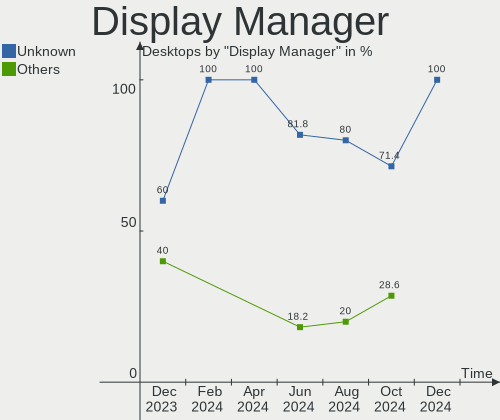
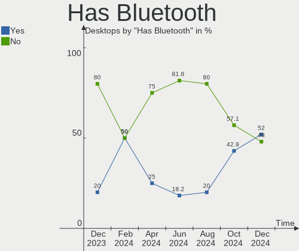
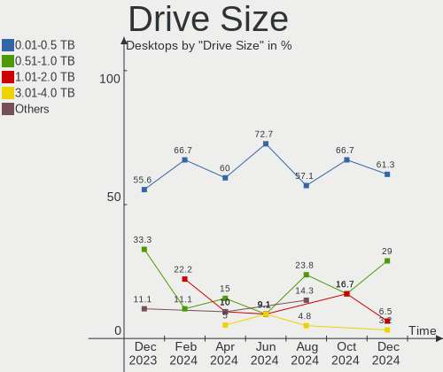
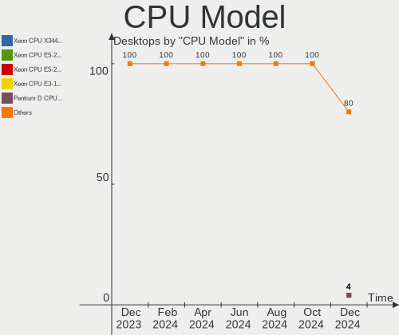
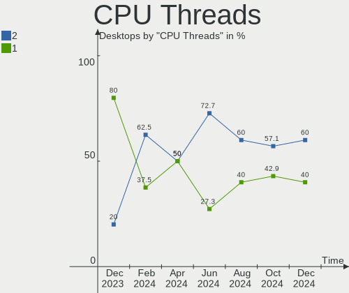
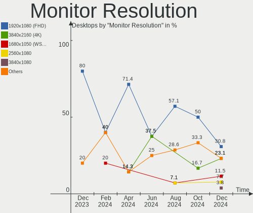
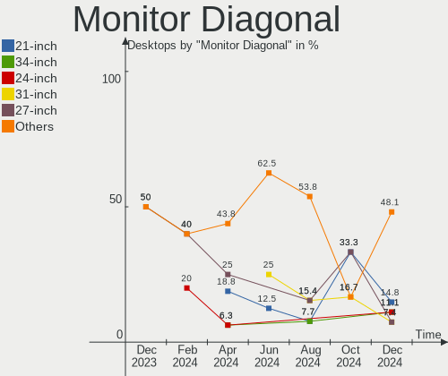
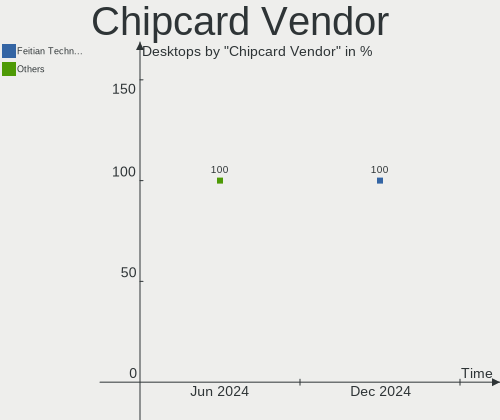

Elementary - Hardware Trends (Desktops)
---------------------------------------

A project to identify most popular hardware characteristics and track their change
over time based on data collected by Linux users at https://Linux-Hardware.org.

Anyone can contribute to this report by the [hw-probe](https://github.com/linuxhw/hw-probe) tool:

    sudo -E hw-probe -all -upload

This report is for one last month. Overall report since the beginning of time: [TestDays](https://github.com/linuxhw/TestDays)

Period: Dec, 2024.

Contents
--------

* [ System ](#system)
  - [ OS                       ](#os)
  - [ OS Family                ](#os-family)
  - [ Kernel                   ](#kernel)
  - [ Kernel Family            ](#kernel-family)
  - [ Kernel Major Ver.        ](#kernel-major-ver)
  - [ Arch                     ](#arch)
  - [ DE                       ](#de)
  - [ Display Server           ](#display-server)
  - [ Display Manager          ](#display-manager)
  - [ OS Lang                  ](#os-lang)
  - [ Boot Mode                ](#boot-mode)
  - [ Filesystem               ](#filesystem)
  - [ Part. scheme             ](#part-scheme)
  - [ Dual Boot with Linux/BSD ](#dual-boot-with-linuxbsd)
  - [ Dual Boot (Win)          ](#dual-boot-win)

* [ Board ](#board)
  - [ Vendor                   ](#vendor)
  - [ Model                    ](#model)
  - [ Model Family             ](#model-family)
  - [ MFG Year                 ](#mfg-year)
  - [ Form Factor              ](#form-factor)
  - [ Secure Boot              ](#secure-boot)
  - [ Coreboot                 ](#coreboot)
  - [ RAM Size                 ](#ram-size)
  - [ RAM Used                 ](#ram-used)
  - [ Total Drives             ](#total-drives)
  - [ Has CD-ROM               ](#has-cd-rom)
  - [ Has Ethernet             ](#has-ethernet)
  - [ Has WiFi                 ](#has-wifi)
  - [ Has Bluetooth            ](#has-bluetooth)

* [ Location ](#location)
  - [ Country                  ](#country)
  - [ City                     ](#city)

* [ Drives ](#drives)
  - [ Drive Vendor             ](#drive-vendor)
  - [ Drive Model              ](#drive-model)
  - [ HDD Vendor               ](#hdd-vendor)
  - [ SSD Vendor               ](#ssd-vendor)
  - [ Drive Kind               ](#drive-kind)
  - [ Drive Connector          ](#drive-connector)
  - [ Drive Size               ](#drive-size)
  - [ Space Total              ](#space-total)
  - [ Space Used               ](#space-used)
  - [ Malfunc. Drives          ](#malfunc-drives)
  - [ Malfunc. Drive Vendor    ](#malfunc-drive-vendor)
  - [ Malfunc. HDD Vendor      ](#malfunc-hdd-vendor)
  - [ Malfunc. Drive Kind      ](#malfunc-drive-kind)
  - [ Failed Drives            ](#failed-drives)
  - [ Failed Drive Vendor      ](#failed-drive-vendor)
  - [ Drive Status             ](#drive-status)

* [ Storage controller ](#storage-controller)
  - [ Storage Vendor           ](#storage-vendor)
  - [ Storage Model            ](#storage-model)
  - [ Storage Kind             ](#storage-kind)

* [ Processor ](#processor)
  - [ CPU Vendor               ](#cpu-vendor)
  - [ CPU Model                ](#cpu-model)
  - [ CPU Model Family         ](#cpu-model-family)
  - [ CPU Cores                ](#cpu-cores)
  - [ CPU Sockets              ](#cpu-sockets)
  - [ CPU Threads              ](#cpu-threads)
  - [ CPU Op-Modes             ](#cpu-op-modes)
  - [ CPU Microcode            ](#cpu-microcode)
  - [ CPU Microarch            ](#cpu-microarch)

* [ Graphics ](#graphics)
  - [ GPU Vendor               ](#gpu-vendor)
  - [ GPU Model                ](#gpu-model)
  - [ GPU Combo                ](#gpu-combo)
  - [ GPU Driver               ](#gpu-driver)
  - [ GPU Memory               ](#gpu-memory)

* [ Monitor ](#monitor)
  - [ Monitor Vendor           ](#monitor-vendor)
  - [ Monitor Model            ](#monitor-model)
  - [ Monitor Resolution       ](#monitor-resolution)
  - [ Monitor Diagonal         ](#monitor-diagonal)
  - [ Monitor Width            ](#monitor-width)
  - [ Aspect Ratio             ](#aspect-ratio)
  - [ Monitor Area             ](#monitor-area)
  - [ Pixel Density            ](#pixel-density)
  - [ Multiple Monitors        ](#multiple-monitors)

* [ Network ](#network)
  - [ Net Controller Vendor    ](#net-controller-vendor)
  - [ Net Controller Model     ](#net-controller-model)
  - [ Wireless Vendor          ](#wireless-vendor)
  - [ Wireless Model           ](#wireless-model)
  - [ Ethernet Vendor          ](#ethernet-vendor)
  - [ Ethernet Model           ](#ethernet-model)
  - [ Net Controller Kind      ](#net-controller-kind)
  - [ Used Controller          ](#used-controller)
  - [ NICs                     ](#nics)
  - [ IPv6                     ](#ipv6)

* [ Bluetooth ](#bluetooth)
  - [ Bluetooth Vendor         ](#bluetooth-vendor)
  - [ Bluetooth Model          ](#bluetooth-model)

* [ Sound ](#sound)
  - [ Sound Vendor             ](#sound-vendor)
  - [ Sound Model              ](#sound-model)

* [ Memory ](#memory)
  - [ Memory Vendor            ](#memory-vendor)
  - [ Memory Model             ](#memory-model)
  - [ Memory Kind              ](#memory-kind)
  - [ Memory Form Factor       ](#memory-form-factor)
  - [ Memory Size              ](#memory-size)
  - [ Memory Speed             ](#memory-speed)

* [ Printers & scanners ](#printers--scanners)
  - [ Printer Vendor           ](#printer-vendor)
  - [ Printer Model            ](#printer-model)
  - [ Scanner Vendor           ](#scanner-vendor)
  - [ Scanner Model            ](#scanner-model)

* [ Camera ](#camera)
  - [ Camera Vendor            ](#camera-vendor)
  - [ Camera Model             ](#camera-model)

* [ Security ](#security)
  - [ Fingerprint Vendor       ](#fingerprint-vendor)
  - [ Fingerprint Model        ](#fingerprint-model)
  - [ Chipcard Vendor          ](#chipcard-vendor)
  - [ Chipcard Model           ](#chipcard-model)

* [ Unsupported ](#unsupported)
  - [ Unsupported Devices      ](#unsupported-devices)
  - [ Unsupported Device Types ](#unsupported-device-types)

System
------

OS
--

Installed operating systems

| Name           | Desktops | Percent |
|----------------|----------|---------|
| Elementary 8   | 18       | 72%     |
| Elementary 7.1 | 7        | 28%     |

OS Family
---------

OS without a version

| Name       | Desktops | Percent |
|------------|----------|---------|
| Elementary | 25       | 100%    |

Kernel
------

Version of the Linux kernel

| Version              | Desktops | Percent |
|----------------------|----------|---------|
| 6.8.0-49-generic     | 10       | 40%     |
| 6.8.0-51-generic     | 6        | 24%     |
| 6.8.0-50-generic     | 5        | 20%     |
| 6.8.0-48-generic     | 2        | 8%      |
| 6.8.0-45-generic     | 1        | 4%      |
| 6.12.6-x64v3-xanmod1 | 1        | 4%      |

Kernel Family
-------------

Linux kernel without a distro release

| Version | Desktops | Percent |
|---------|----------|---------|
| 6.8.0   | 24       | 96%     |
| 6.12.6  | 1        | 4%      |

Kernel Major Ver.
-----------------

Linux kernel major version

| Version | Desktops | Percent |
|---------|----------|---------|
| 6.8     | 24       | 96%     |
| 6.12    | 1        | 4%      |

Arch
----

OS architecture (x86_64, i586, etc.)

| Name   | Desktops | Percent |
|--------|----------|---------|
| x86_64 | 25       | 100%    |

DE
--

Desktop Environment

| Name     | Desktops | Percent |
|----------|----------|---------|
| Pantheon | 25       | 100%    |

Display Server
--------------

X11 or Wayland

| Name    | Desktops | Percent |
|---------|----------|---------|
| X11     | 24       | 96%     |
| Wayland | 1        | 4%      |

Display Manager
---------------

SDDM, LightDM, etc.

| Name    | Desktops | Percent |
|---------|----------|---------|
| Unknown | 25       | 100%    |

OS Lang
-------

Language

| Lang  | Desktops | Percent |
|-------|----------|---------|
| es_ES | 5        | 20%     |
| en_US | 5        | 20%     |
| de_DE | 5        | 20%     |
| ru_RU | 3        | 12%     |
| fr_FR | 3        | 12%     |
| pt_BR | 2        | 8%      |
| hu_HU | 1        | 4%      |
| fr_CA | 1        | 4%      |

Boot Mode
---------

EFI or BIOS

| Mode | Desktops | Percent |
|------|----------|---------|
| BIOS | 25       | 100%    |

Filesystem
----------

Type of filesystem

| Type | Desktops | Percent |
|------|----------|---------|
| Ext4 | 25       | 100%    |

Part. scheme
------------

Scheme of partitioning

| Type    | Desktops | Percent |
|---------|----------|---------|
| Unknown | 25       | 100%    |

Dual Boot with Linux/BSD
------------------------

Hosting more than one Linux/BSD

| Dual boot | Desktops | Percent |
|-----------|----------|---------|
| No        | 25       | 100%    |

Dual Boot (Win)
---------------

Hosting Linux and Windows

| Dual boot | Desktops | Percent |
|-----------|----------|---------|
| No        | 25       | 100%    |

Board
-----

Vendor
------

Motherboard manufacturer

| Name                | Desktops | Percent |
|---------------------|----------|---------|
| Intel               | 4        | 16%     |
| Gigabyte Technology | 4        | 16%     |
| MSI                 | 3        | 12%     |
| Hewlett-Packard     | 3        | 12%     |
| Dell                | 3        | 12%     |
| ASUSTek Computer    | 3        | 12%     |
| ASRock              | 2        | 8%      |
| Huanan              | 1        | 4%      |
| GEEKOM              | 1        | 4%      |
| Fujitsu Siemens     | 1        | 4%      |

Model
-----

Motherboard model

| Name                              | Desktops | Percent |
|-----------------------------------|----------|---------|
| MSI MS-7E02                       | 1        | 4%      |
| MSI MS-7D98                       | 1        | 4%      |
| MSI MS-7721                       | 1        | 4%      |
| Intel X99-P4 V5.11                | 1        | 4%      |
| Intel T5226                       | 1        | 4%      |
| Intel B75                         | 1        | 4%      |
| Huanan X99-F8 GAMING V5.0         | 1        | 4%      |
| HP EliteDesk 800 G3 SFF           | 1        | 4%      |
| HP EliteDesk 705 G4 SFF           | 1        | 4%      |
| HP EliteDesk 705 G3 Desktop Mini  | 1        | 4%      |
| Gigabyte Z77-D3H                  | 1        | 4%      |
| Gigabyte B85M-HD3                 | 1        | 4%      |
| Gigabyte B560 DS3H AC-Y1          | 1        | 4%      |
| Gigabyte B360 AORUS GAMING 3 WIFI | 1        | 4%      |
| GEEKOM A8                         | 1        | 4%      |
| Fujitsu Siemens ESPRIMO E5730     | 1        | 4%      |
| Dell Precision Tower 3620         | 1        | 4%      |
| Dell OptiPlex 9020                | 1        | 4%      |
| Dell OptiPlex 390                 | 1        | 4%      |
| ASUS PRIME B450M-A                | 1        | 4%      |
| ASUS P8H67-M PRO                  | 1        | 4%      |
| ASUS H110M-D                      | 1        | 4%      |
| ASRock X570 Extreme4              | 1        | 4%      |
| ASRock H310CM-HG4                 | 1        | 4%      |
| Unknown                           | 1        | 4%      |

Model Family
------------

Motherboard model prefix

| Name                    | Desktops | Percent |
|-------------------------|----------|---------|
| HP EliteDesk            | 3        | 12%     |
| Dell OptiPlex           | 2        | 8%      |
| MSI MS-7E02             | 1        | 4%      |
| MSI MS-7D98             | 1        | 4%      |
| MSI MS-7721             | 1        | 4%      |
| Intel X99-P4            | 1        | 4%      |
| Intel T5226             | 1        | 4%      |
| Intel B75               | 1        | 4%      |
| Huanan X99-F8           | 1        | 4%      |
| Gigabyte Z77-D3H        | 1        | 4%      |
| Gigabyte B85M-HD3       | 1        | 4%      |
| Gigabyte B560           | 1        | 4%      |
| Gigabyte B360           | 1        | 4%      |
| GEEKOM A8               | 1        | 4%      |
| Fujitsu Siemens ESPRIMO | 1        | 4%      |
| Dell Precision          | 1        | 4%      |
| ASUS PRIME              | 1        | 4%      |
| ASUS P8H67-M            | 1        | 4%      |
| ASUS H110M-D            | 1        | 4%      |
| ASRock X570             | 1        | 4%      |
| ASRock H310CM-HG4       | 1        | 4%      |
| Unknown                 | 1        | 4%      |

MFG Year
--------

Motherboard manufacture year

| Year | Desktops | Percent |
|------|----------|---------|
| 2017 | 4        | 16%     |
| 2019 | 3        | 12%     |
| 2018 | 3        | 12%     |
| 2024 | 2        | 8%      |
| 2022 | 2        | 8%      |
| 2015 | 2        | 8%      |
| 2013 | 2        | 8%      |
| 2021 | 1        | 4%      |
| 2014 | 1        | 4%      |
| 2012 | 1        | 4%      |
| 2011 | 1        | 4%      |
| 2010 | 1        | 4%      |
| 2009 | 1        | 4%      |
| 2007 | 1        | 4%      |

Form Factor
-----------

Physical design of the computer

| Name    | Desktops | Percent |
|---------|----------|---------|
| Desktop | 25       | 100%    |

Secure Boot
-----------

Enabled or disabled

| State    | Desktops | Percent |
|----------|----------|---------|
| Disabled | 25       | 100%    |

Coreboot
--------

Have coreboot on board

| Used | Desktops | Percent |
|------|----------|---------|
| No   | 25       | 100%    |

RAM Size
--------

Total RAM memory

| Size in GB  | Desktops | Percent |
|-------------|----------|---------|
| 16.01-24.0  | 8        | 32%     |
| 32.01-64.0  | 5        | 20%     |
| 4.01-8.0    | 4        | 16%     |
| 3.01-4.0    | 3        | 12%     |
| 8.01-16.0   | 2        | 8%      |
| 24.01-32.0  | 1        | 4%      |
| 64.01-256.0 | 1        | 4%      |
| 1.01-2.0    | 1        | 4%      |

RAM Used
--------

Used RAM memory

| Used GB  | Desktops | Percent |
|----------|----------|---------|
| 1.01-2.0 | 8        | 32%     |
| 2.01-3.0 | 7        | 28%     |
| 4.01-8.0 | 5        | 20%     |
| 3.01-4.0 | 5        | 20%     |

Total Drives
------------

Number of drives on board

| Drives | Desktops | Percent |
|--------|----------|---------|
| 1      | 11       | 44%     |
| 3      | 5        | 20%     |
| 2      | 5        | 20%     |
| 4      | 2        | 8%      |
| 7      | 1        | 4%      |
| 5      | 1        | 4%      |

Has CD-ROM
----------

Has CD-ROM on board

| Presented | Desktops | Percent |
|-----------|----------|---------|
| No        | 17       | 68%     |
| Yes       | 8        | 32%     |

Has Ethernet
------------

Has Ethernet on board

| Presented | Desktops | Percent |
|-----------|----------|---------|
| Yes       | 25       | 100%    |

Has WiFi
--------

Has WiFi module

| Presented | Desktops | Percent |
|-----------|----------|---------|
| Yes       | 17       | 68%     |
| No        | 8        | 32%     |

Has Bluetooth
-------------

Has Bluetooth module

| Presented | Desktops | Percent |
|-----------|----------|---------|
| Yes       | 13       | 52%     |
| No        | 12       | 48%     |

Location
--------

Country
-------

Geographic location (country)

| Country    | Desktops | Percent |
|------------|----------|---------|
| USA        | 6        | 24%     |
| Germany    | 4        | 16%     |
| Spain      | 3        | 12%     |
| France     | 3        | 12%     |
| Russia     | 2        | 8%      |
| Brazil     | 2        | 8%      |
| Venezuela  | 1        | 4%      |
| Mexico     | 1        | 4%      |
| Kazakhstan | 1        | 4%      |
| Hungary    | 1        | 4%      |
| Canada     | 1        | 4%      |

City
----

Geographic location (city)

| City                     | Desktops | Percent |
|--------------------------|----------|---------|
| Tours                    | 1        | 4%      |
| Shawinigan               | 1        | 4%      |
| Sarmanovo                | 1        | 4%      |
| Santa Maria Chimalhuacan | 1        | 4%      |
| Roncador                 | 1        | 4%      |
| Paris                    | 1        | 4%      |
| Palma                    | 1        | 4%      |
| Orekhovo-Zuyevo          | 1        | 4%      |
| New York                 | 1        | 4%      |
| Munich                   | 1        | 4%      |
| Mezokovesd               | 1        | 4%      |
| Mérida                  | 1        | 4%      |
| Marseille                | 1        | 4%      |
| Mannheim                 | 1        | 4%      |
| Málaga                  | 1        | 4%      |
| Ludwigsburg              | 1        | 4%      |
| Loerrach                 | 1        | 4%      |
| Joao Pessoa              | 1        | 4%      |
| Huelva                   | 1        | 4%      |
| Georgetown               | 1        | 4%      |
| Fort Worth               | 1        | 4%      |
| Cary                     | 1        | 4%      |
| Carbondale               | 1        | 4%      |
| Bristol                  | 1        | 4%      |
| Aktobe                   | 1        | 4%      |

Drives
------

Drive Vendor
------------

Hard drive vendors

| Vendor                      | Desktops | Drives | Percent |
|-----------------------------|----------|--------|---------|
| Seagate                     | 11       | 14     | 22%     |
| WDC                         | 7        | 7      | 14%     |
| Samsung Electronics         | 4        | 5      | 8%      |
| Toshiba                     | 3        | 3      | 6%      |
| Kingston                    | 3        | 4      | 6%      |
| Silicon Motion              | 2        | 2      | 4%      |
| MAXIO Technology (Hangzhou) | 2        | 2      | 4%      |
| ADATA Technology            | 2        | 2      | 4%      |
| XrayDisk                    | 1        | 1      | 2%      |
| Sandisk                     | 1        | 1      | 2%      |
| PRO Z                       | 1        | 2      | 2%      |
| PNY                         | 1        | 1      | 2%      |
| OCZ-VERTEX2                 | 1        | 1      | 2%      |
| Micron/Crucial Technology   | 1        | 1      | 2%      |
| Maxtor                      | 1        | 1      | 2%      |
| KIOXIA                      | 1        | 1      | 2%      |
| Kingston Technology Company | 1        | 1      | 2%      |
| JMicron Technology          | 1        | 1      | 2%      |
| HS-SSD-E100                 | 1        | 1      | 2%      |
| GOODRAM                     | 1        | 1      | 2%      |
| Fanxiang                    | 1        | 1      | 2%      |
| Emtec                       | 1        | 1      | 2%      |
| Crucial                     | 1        | 1      | 2%      |
| China                       | 1        | 1      | 2%      |

Drive Model
-----------

Hard drive models

| Model                                                 | Desktops | Percent |
|-------------------------------------------------------|----------|---------|
| Silicon Motion SM2263EN/SM2263XT SSD Controller 256GB | 2        | 3.77%   |
| Kingston SA400S37240G 240GB SSD                       | 2        | 3.77%   |
| XrayDisk 512GB                                        | 1        | 1.89%   |
| WDC WDS240G2G0A-00JH30 240GB SSD                      | 1        | 1.89%   |
| WDC WD3200BPVT-00JJ5T0 320GB                          | 1        | 1.89%   |
| WDC WD20EZRX-00DC0B0 2TB                              | 1        | 1.89%   |
| WDC WD20EZRX-00D8PB0 2TB                              | 1        | 1.89%   |
| WDC WD1600AVVS-62L2B0 160GB                           | 1        | 1.89%   |
| WDC WD10EZEX-22MFCA0 1TB                              | 1        | 1.89%   |
| WDC WD10EARS-22Y5B1 1TB                               | 1        | 1.89%   |
| Toshiba MQ01ABF032 320GB                              | 1        | 1.89%   |
| Toshiba KXG50ZNV512G 512GB                            | 1        | 1.89%   |
| Toshiba DT01ACA100 1TB                                | 1        | 1.89%   |
| Seagate ST500LM030-1RK17D 500GB                       | 1        | 1.89%   |
| Seagate ST500LM021-1KJ152 500GB                       | 1        | 1.89%   |
| Seagate ST500LM000-1EJ162 500GB                       | 1        | 1.89%   |
| Seagate ST500DM002-1ER14C 500GB                       | 1        | 1.89%   |
| Seagate ST500DM002-1BD142 500GB                       | 1        | 1.89%   |
| Seagate ST4000DM004-2CV104 4TB                        | 1        | 1.89%   |
| Seagate ST3250318AS 250GB                             | 1        | 1.89%   |
| Seagate ST3250310SV 250GB                             | 1        | 1.89%   |
| Seagate ST1000VT000 HN-M101MBB 1TB                    | 1        | 1.89%   |
| Seagate ST1000LM048-2E7172 1TB                        | 1        | 1.89%   |
| Seagate ST1000LM035-1RK172 1TB                        | 1        | 1.89%   |
| Seagate ST1000DM010-2EP102 1TB                        | 1        | 1.89%   |
| Seagate ST1000DM003-1CH162 1TB                        | 1        | 1.89%   |
| Sandisk WD Blue SN570 2TB                             | 1        | 1.89%   |
| Samsung SSD 870 QVO 1TB                               | 1        | 1.89%   |
| Samsung SSD 870 EVO 1TB                               | 1        | 1.89%   |
| Samsung SSD 850 EVO 120GB                             | 1        | 1.89%   |
| Samsung NVMe SSD Controller SM981/PM981/PM983 512GB   | 1        | 1.89%   |
| PRO Z Avolusion 8TB                                   | 1        | 1.89%   |
| PNY CS900 480GB SSD                                   | 1        | 1.89%   |
| OCZ-VERTEX2 3.5 120GB SSD                             | 1        | 1.89%   |
| Micron/Crucial CT2000P3PSSD8 2TB                      | 1        | 1.89%   |
| Maxtor STM3250310AS 250GB                             | 1        | 1.89%   |
| MAXIO (Hangzhou) YSSDXB-2TN5000 2TB                   | 1        | 1.89%   |
| MAXIO (Hangzhou) NVMe SSD Controller MAP1202 512GB    | 1        | 1.89%   |
| KIOXIA EXCERIA PLUS G3 SSD 2TB                        | 1        | 1.89%   |
| Kingston Company OM3PDP3 NVMe SSD 512GB               | 1        | 1.89%   |

HDD Vendor
----------

Hard disk drive vendors

| Vendor             | Desktops | Drives | Percent |
|--------------------|----------|--------|---------|
| Seagate            | 11       | 14     | 52.38%  |
| WDC                | 6        | 6      | 28.57%  |
| Toshiba            | 2        | 2      | 9.52%   |
| Maxtor             | 1        | 1      | 4.76%   |
| JMicron Technology | 1        | 1      | 4.76%   |

SSD Vendor
----------

Solid state drive vendors

| Vendor              | Desktops | Drives | Percent |
|---------------------|----------|--------|---------|
| Samsung Electronics | 3        | 4      | 23.08%  |
| Kingston            | 3        | 4      | 23.08%  |
| WDC                 | 1        | 1      | 7.69%   |
| PNY                 | 1        | 1      | 7.69%   |
| OCZ-VERTEX2         | 1        | 1      | 7.69%   |
| GOODRAM             | 1        | 1      | 7.69%   |
| Emtec               | 1        | 1      | 7.69%   |
| Crucial             | 1        | 1      | 7.69%   |
| China               | 1        | 1      | 7.69%   |

Drive Kind
----------

HDD or SSD

| Kind    | Desktops | Drives | Percent |
|---------|----------|--------|---------|
| HDD     | 17       | 24     | 40.48%  |
| SSD     | 11       | 15     | 26.19%  |
| NVMe    | 10       | 12     | 23.81%  |
| Unknown | 4        | 5      | 9.52%   |

Drive Connector
---------------

SATA, SAS, NVMe, etc.

| Type | Desktops | Drives | Percent |
|------|----------|--------|---------|
| SATA | 21       | 41     | 65.63%  |
| NVMe | 10       | 12     | 31.25%  |
| SAS  | 1        | 3      | 3.13%   |

Drive Size
----------

Size of hard drive

| Size in TB | Desktops | Drives | Percent |
|------------|----------|--------|---------|
| 0.01-0.5   | 19       | 23     | 61.29%  |
| 0.51-1.0   | 9        | 13     | 29.03%  |
| 1.01-2.0   | 2        | 2      | 6.45%   |
| 3.01-4.0   | 1        | 1      | 3.23%   |

Space Total
-----------

Amount of disk space available on the file system

| Size in GB | Desktops | Percent |
|------------|----------|---------|
| 251-500    | 11       | 44%     |
| 101-250    | 7        | 28%     |
| 501-1000   | 3        | 12%     |
| 51-100     | 2        | 8%      |
| 21-50      | 1        | 4%      |
| 1001-2000  | 1        | 4%      |

Space Used
----------

Amount of used disk space

| Used GB  | Desktops | Percent |
|----------|----------|---------|
| 1-20     | 13       | 52%     |
| 21-50    | 8        | 32%     |
| 101-250  | 2        | 8%      |
| 251-500  | 1        | 4%      |
| 501-1000 | 1        | 4%      |

Malfunc. Drives
---------------

Drive models with a malfunction

Zero info for selected period =(

Malfunc. Drive Vendor
---------------------

Vendors of faulty drives

Zero info for selected period =(

Malfunc. HDD Vendor
-------------------

Vendors of faulty HDD drives

Zero info for selected period =(

Malfunc. Drive Kind
-------------------

Kinds of faulty drives

Zero info for selected period =(

Failed Drives
-------------

Failed drive models

Zero info for selected period =(

Failed Drive Vendor
-------------------

Failed drive vendors

Zero info for selected period =(

Drive Status
------------

Number of failed and malfunc. drives

| Status   | Desktops | Drives | Percent |
|----------|----------|--------|---------|
| Detected | 25       | 56     | 100%    |

Storage controller
------------------

Storage Vendor
--------------

Storage controller vendors

| Vendor                       | Desktops | Percent |
|------------------------------|----------|---------|
| Intel                        | 19       | 50%     |
| AMD                          | 5        | 13.16%  |
| Silicon Motion               | 2        | 5.26%   |
| MAXIO Technology (Hangzhou)  | 2        | 5.26%   |
| ADATA Technology             | 2        | 5.26%   |
| VIA Technologies             | 1        | 2.63%   |
| Toshiba America Info Systems | 1        | 2.63%   |
| SanDisk                      | 1        | 2.63%   |
| Samsung Electronics          | 1        | 2.63%   |
| Micron/Crucial Technology    | 1        | 2.63%   |
| KIOXIA                       | 1        | 2.63%   |
| Kingston Technology Company  | 1        | 2.63%   |
| ASMedia Technology           | 1        | 2.63%   |

Storage Model
-------------

Storage controller models

| Model                                                                                   | Desktops | Percent |
|-----------------------------------------------------------------------------------------|----------|---------|
| AMD FCH SATA Controller [AHCI mode]                                                     | 5        | 10.87%  |
| Silicon Motion SM2263EN/SM2263XT (DRAM-less) NVMe SSD Controllers                       | 2        | 4.35%   |
| Intel SATA Controller [RAID mode]                                                       | 2        | 4.35%   |
| Intel Raptor Lake SATA AHCI Controller                                                  | 2        | 4.35%   |
| Intel 200 Series PCH SATA controller [AHCI mode]                                        | 2        | 4.35%   |
| VIA VT6415 PATA IDE Host Controller                                                     | 1        | 2.17%   |
| Toshiba America Info Systems XG5 NVMe SSD Controller                                    | 1        | 2.17%   |
| SanDisk WD Blue SN570 NVMe SSD 2TB                                                      | 1        | 2.17%   |
| Samsung NVMe SSD Controller SM981/PM981/PM983                                           | 1        | 2.17%   |
| Micron/Crucial P3 Plus NVMe PCIe SSD (DRAM-less)                                        | 1        | 2.17%   |
| MAXIO (Hangzhou) NVMe SSD Controller MAP1602 (DRAM-less)                                | 1        | 2.17%   |
| MAXIO (Hangzhou) NVMe SSD Controller MAP1202 (DRAM-less)                                | 1        | 2.17%   |
| KIOXIA Exceria Plus G3 NVMe SSD (DRAM-less)                                             | 1        | 2.17%   |
| Kingston Company OM3PDP3 NVMe SSD                                                       | 1        | 2.17%   |
| Intel Q170/Q150/B150/H170/H110/Z170/CM236 Chipset SATA Controller [AHCI Mode]           | 1        | 2.17%   |
| Intel NM10/ICH7 Family SATA Controller [IDE mode]                                       | 1        | 2.17%   |
| Intel Cannon Lake PCH SATA AHCI Controller                                              | 1        | 2.17%   |
| Intel C610/X99 series chipset sSATA Controller [AHCI mode]                              | 1        | 2.17%   |
| Intel C610/X99 series chipset 6-Port SATA Controller [AHCI mode]                        | 1        | 2.17%   |
| Intel 82801JD/DO (ICH10 Family) 4-port SATA IDE Controller                              | 1        | 2.17%   |
| Intel 82801JD/DO (ICH10 Family) 2-port SATA IDE Controller                              | 1        | 2.17%   |
| Intel 82801G (ICH7 Family) IDE Controller                                               | 1        | 2.17%   |
| Intel 8 Series/C220 Series Chipset Family 6-port SATA Controller 1 [AHCI mode]          | 1        | 2.17%   |
| Intel 7 Series/C210 Series Chipset Family 6-port SATA Controller [AHCI mode]            | 1        | 2.17%   |
| Intel 7 Series/C210 Series Chipset Family 4-port SATA Controller [IDE mode]             | 1        | 2.17%   |
| Intel 7 Series/C210 Series Chipset Family 2-port SATA Controller [IDE mode]             | 1        | 2.17%   |
| Intel 6 Series/C200 Series Chipset Family Desktop SATA Controller (IDE mode, ports 4-5) | 1        | 2.17%   |
| Intel 6 Series/C200 Series Chipset Family Desktop SATA Controller (IDE mode, ports 0-3) | 1        | 2.17%   |
| Intel 6 Series/C200 Series Chipset Family 6 port Desktop SATA AHCI Controller           | 1        | 2.17%   |
| Intel 500 Series Chipset Family SATA RAID Controller                                    | 1        | 2.17%   |
| Intel 5 Series/3400 Series Chipset 4 port SATA IDE Controller                           | 1        | 2.17%   |
| Intel 5 Series/3400 Series Chipset 2 port SATA IDE Controller                           | 1        | 2.17%   |
| Intel 4 Series Chipset PT IDER Controller                                               | 1        | 2.17%   |
| ASMedia ASM1061/ASM1062 Serial ATA Controller                                           | 1        | 2.17%   |
| AMD 400 Series Chipset SATA Controller                                                  | 1        | 2.17%   |
| AMD 300 Series Chipset SATA Controller                                                  | 1        | 2.17%   |
| ADATA LEGEND 800 NVMe SSD (DRAM-less)                                                   | 1        | 2.17%   |
| ADATA LEGEND 700, XPG GAMMIX S20 NVMe SSD (DRAM-less)                                   | 1        | 2.17%   |

Storage Kind
------------

Kind of storage controller (IDE, SATA, NVMe, SAS, ...)

| Kind | Desktops | Percent |
|------|----------|---------|
| SATA | 16       | 45.71%  |
| NVMe | 10       | 28.57%  |
| IDE  | 6        | 17.14%  |
| RAID | 3        | 8.57%   |

Processor
---------

CPU Vendor
----------

Processor vendors

| Vendor | Desktops | Percent |
|--------|----------|---------|
| Intel  | 19       | 76%     |
| AMD    | 6        | 24%     |

CPU Model
---------

Processor models

| Model                                           | Desktops | Percent |
|-------------------------------------------------|----------|---------|
| Intel Xeon CPU X3440 @ 2.53GHz                  | 1        | 4%      |
| Intel Xeon CPU E5-2696 v3 @ 2.30GHz             | 1        | 4%      |
| Intel Xeon CPU E5-2660 v3 @ 2.60GHz             | 1        | 4%      |
| Intel Xeon CPU E3-1245 v5 @ 3.50GHz             | 1        | 4%      |
| Intel Pentium D CPU 3.00GHz                     | 1        | 4%      |
| Intel Pentium CPU G4400 @ 3.30GHz               | 1        | 4%      |
| Intel Core i7-3770S CPU @ 3.10GHz               | 1        | 4%      |
| Intel Core i5-8500 CPU @ 3.00GHz                | 1        | 4%      |
| Intel Core i5-8400 CPU @ 2.80GHz                | 1        | 4%      |
| Intel Core i5-7500 CPU @ 3.40GHz                | 1        | 4%      |
| Intel Core i5-4690 CPU @ 3.50GHz                | 1        | 4%      |
| Intel Core i5-4430 CPU @ 3.00GHz                | 1        | 4%      |
| Intel Core i5-3570K CPU @ 3.40GHz               | 1        | 4%      |
| Intel Core i5-2500 CPU @ 3.30GHz                | 1        | 4%      |
| Intel Core i3-2120 CPU @ 3.30GHz                | 1        | 4%      |
| Intel Core 2 Duo CPU E8500 @ 3.16GHz            | 1        | 4%      |
| Intel 12th Gen Core i5-12600K                   | 1        | 4%      |
| Intel 12th Gen Core i5-12400F                   | 1        | 4%      |
| Intel 11th Gen Core i7-11700F @ 2.50GHz         | 1        | 4%      |
| AMD Ryzen 9 8945HS w/ Radeon 780M Graphics      | 1        | 4%      |
| AMD Ryzen 9 5900X 12-Core Processor             | 1        | 4%      |
| AMD Ryzen 5 PRO 2400G with Radeon Vega Graphics | 1        | 4%      |
| AMD Ryzen 5 5500                                | 1        | 4%      |
| AMD PRO A10-8770E R7, 10 COMPUTE CORES 4C+6G    | 1        | 4%      |
| AMD A8-7600 Radeon R7, 10 Compute Cores 4C+6G   | 1        | 4%      |

CPU Model Family
----------------

Processor model prefix

| Model            | Desktops | Percent |
|------------------|----------|---------|
| Intel Core i5    | 7        | 28%     |
| Intel Xeon       | 4        | 16%     |
| Other            | 3        | 12%     |
| AMD Ryzen 9      | 2        | 8%      |
| Intel Pentium D  | 1        | 4%      |
| Intel Pentium    | 1        | 4%      |
| Intel Core i7    | 1        | 4%      |
| Intel Core i3    | 1        | 4%      |
| Intel Core 2 Duo | 1        | 4%      |
| AMD Ryzen 5 PRO  | 1        | 4%      |
| AMD Ryzen 5      | 1        | 4%      |
| AMD PRO A10      | 1        | 4%      |
| AMD A8           | 1        | 4%      |

CPU Cores
---------

Number of processor cores

| Number | Desktops | Percent |
|--------|----------|---------|
| 4      | 9        | 36%     |
| 2      | 6        | 24%     |
| 6      | 4        | 16%     |
| 10     | 2        | 8%      |
| 8      | 2        | 8%      |
| 18     | 1        | 4%      |
| 12     | 1        | 4%      |

CPU Sockets
-----------

Number of sockets

| Number | Desktops | Percent |
|--------|----------|---------|
| 1      | 25       | 100%    |

CPU Threads
-----------

Threads per core (Hyper-Threading)

| Number | Desktops | Percent |
|--------|----------|---------|
| 2      | 15       | 60%     |
| 1      | 10       | 40%     |

CPU Op-Modes
------------

CPU Operation Modes (32-bit, 64-bit)

| Op mode        | Desktops | Percent |
|----------------|----------|---------|
| 32-bit, 64-bit | 25       | 100%    |

CPU Microcode
-------------

Microcode number

| Number  | Desktops | Percent |
|---------|----------|---------|
| Unknown | 25       | 100%    |

CPU Microarch
-------------

Microarchitecture

| Name        | Desktops | Percent |
|-------------|----------|---------|
| Haswell     | 4        | 16%     |
| Unknown     | 4        | 16%     |
| KabyLake    | 3        | 12%     |
| Zen 3       | 2        | 8%      |
| Skylake     | 2        | 8%      |
| SandyBridge | 2        | 8%      |
| IvyBridge   | 2        | 8%      |
| Zen         | 1        | 4%      |
| Steamroller | 1        | 4%      |
| Penryn      | 1        | 4%      |
| NetBurst    | 1        | 4%      |
| Nehalem     | 1        | 4%      |
| Excavator   | 1        | 4%      |

Graphics
--------

GPU Vendor
----------

Vendors of graphics cards

| Vendor | Desktops | Percent |
|--------|----------|---------|
| Intel  | 11       | 37.93%  |
| AMD    | 11       | 37.93%  |
| Nvidia | 7        | 24.14%  |

GPU Model
---------

Graphics card models

| Model                                                                       | Desktops | Percent |
|-----------------------------------------------------------------------------|----------|---------|
| AMD Ellesmere [Radeon RX 470/480/570/570X/580/580X/590]                     | 3        | 10.34%  |
| Intel Xeon E3-1200 v3/4th Gen Core Processor Integrated Graphics Controller | 2        | 6.9%    |
| Intel 2nd Generation Core Processor Family Integrated Graphics Controller   | 2        | 6.9%    |
| Nvidia TU116 [GeForce GTX 1650 SUPER]                                       | 1        | 3.45%   |
| Nvidia GP108 [GeForce GT 1030]                                              | 1        | 3.45%   |
| Nvidia GP104 [GeForce GTX 1080]                                             | 1        | 3.45%   |
| Nvidia GM107 [GeForce GTX 750]                                              | 1        | 3.45%   |
| Nvidia GF108 [GeForce GT 630]                                               | 1        | 3.45%   |
| Nvidia GA106 [GeForce RTX 3060 Lite Hash Rate]                              | 1        | 3.45%   |
| Nvidia G98 [GeForce 9300 GE]                                                | 1        | 3.45%   |
| Intel IvyBridge GT2 [HD Graphics 4000]                                      | 1        | 3.45%   |
| Intel HD Graphics P530                                                      | 1        | 3.45%   |
| Intel HD Graphics 630                                                       | 1        | 3.45%   |
| Intel HD Graphics 510                                                       | 1        | 3.45%   |
| Intel CoffeeLake-S GT2 [UHD Graphics 630]                                   | 1        | 3.45%   |
| Intel AlderLake-S GT1                                                       | 1        | 3.45%   |
| Intel 82945G/GZ Integrated Graphics Controller                              | 1        | 3.45%   |
| AMD Wani [Radeon R5/R6/R7 Graphics]                                         | 1        | 3.45%   |
| AMD Raven Ridge [Radeon Vega Series / Radeon Vega Mobile Series]            | 1        | 3.45%   |
| AMD Phoenix3                                                                | 1        | 3.45%   |
| AMD Navi 33 [Radeon RX 7600/7600 XT/7600M XT/7600S/7700S / PRO W7600]       | 1        | 3.45%   |
| AMD Navi 22 [Radeon RX 6700/6700 XT/6750 XT / 6800M/6850M XT]               | 1        | 3.45%   |
| AMD Kaveri [Radeon R7 Graphics]                                             | 1        | 3.45%   |
| AMD Cape Verde PRO [Radeon HD 7750/8740 / R7 250E]                          | 1        | 3.45%   |
| AMD Caicos [Radeon HD 6450/7450/8450 / R5 230 OEM]                          | 1        | 3.45%   |

GPU Combo
---------

Combinations of graphics cards

| Name           | Desktops | Percent |
|----------------|----------|---------|
| 1 x AMD        | 9        | 36%     |
| 1 x Intel      | 8        | 32%     |
| 1 x Nvidia     | 5        | 20%     |
| Intel + Nvidia | 1        | 4%      |
| Intel + AMD    | 1        | 4%      |
| AMD + Nvidia   | 1        | 4%      |

GPU Driver
----------

Free vs proprietary

| Driver      | Desktops | Percent |
|-------------|----------|---------|
| Free        | 22       | 88%     |
| Proprietary | 2        | 8%      |
| Unknown     | 1        | 4%      |

GPU Memory
----------

Total video memory

| Size in GB | Desktops | Percent |
|------------|----------|---------|
| Unknown    | 23       | 92%     |
| 8.01-16.0  | 1        | 4%      |
| 0.51-1.0   | 1        | 4%      |

Monitor
-------

Monitor Vendor
--------------

Monitor vendors

| Vendor               | Desktops | Percent |
|----------------------|----------|---------|
| Samsung Electronics  | 5        | 18.52%  |
| Goldstar             | 3        | 11.11%  |
| Philips              | 2        | 7.41%   |
| Hewlett-Packard      | 2        | 7.41%   |
| ViewSonic            | 1        | 3.7%    |
| Unknown              | 1        | 3.7%    |
| Sony                 | 1        | 3.7%    |
| Sceptre Tech         | 1        | 3.7%    |
| Panasonic            | 1        | 3.7%    |
| Lenovo               | 1        | 3.7%    |
| Insignia             | 1        | 3.7%    |
| Iiyama               | 1        | 3.7%    |
| HannStar             | 1        | 3.7%    |
| DENON                | 1        | 3.7%    |
| Dell                 | 1        | 3.7%    |
| ASUSTek Computer     | 1        | 3.7%    |
| AOC                  | 1        | 3.7%    |
| Ancor Communications | 1        | 3.7%    |
| Acer                 | 1        | 3.7%    |

Monitor Model
-------------

Monitor models

| Model                                                                  | Desktops | Percent |
|------------------------------------------------------------------------|----------|---------|
| Goldstar HDR WFHD GSM7714 2560x1080 798x334mm 34.1-inch                | 2        | 7.14%   |
| ViewSonic VA2407 Series VSC8C31 1920x1080 521x293mm 23.5-inch          | 1        | 3.57%   |
| Unknown LCD Monitor FFFF 2288x1287 2550x2550mm 142.0-inch              | 1        | 3.57%   |
| Sony TV SNYEF03 1600x900                                               | 1        | 3.57%   |
| Sceptre Tech Sceptre O34 SPT8542 3440x1440 797x334mm 34.0-inch         | 1        | 3.57%   |
| Samsung Electronics SyncMaster SAM0467 1920x1200 518x324mm 24.1-inch   | 1        | 3.57%   |
| Samsung Electronics SyncMaster SAM027F 1680x1050 474x296mm 22.0-inch   | 1        | 3.57%   |
| Samsung Electronics LS32A70 SAM7166 3840x2160 698x393mm 31.5-inch      | 1        | 3.57%   |
| Samsung Electronics LCD Monitor SAM735B 3840x2160 1420x800mm 64.2-inch | 1        | 3.57%   |
| Samsung Electronics C49J89x SAM0F21 3840x1080 1196x336mm 48.9-inch     | 1        | 3.57%   |
| Philips PHL 221B6Q PHL08DF 1920x1080 477x268mm 21.5-inch               | 1        | 3.57%   |
| Philips 236V4 PHLC0B3 1920x1080 510x287mm 23.0-inch                    | 1        | 3.57%   |
| Panasonic TV MEIA296 1920x1080 698x392mm 31.5-inch                     | 1        | 3.57%   |
| Lenovo LEN L171p LEN24C9 1280x1024 338x270mm 17.0-inch                 | 1        | 3.57%   |
| Insignia TV BBY3223 1920x1080 697x392mm 31.5-inch                      | 1        | 3.57%   |
| Iiyama PLG2888UH IVM710D 3840x2160 621x341mm 27.9-inch                 | 1        | 3.57%   |
| Hewlett-Packard V221 HWP3112 1920x1080 477x268mm 21.5-inch             | 1        | 3.57%   |
| Hewlett-Packard S2231 HWP2906 1920x1080 477x268mm 21.5-inch            | 1        | 3.57%   |
| HannStar iW171A HSD2397 1440x900 410x256mm 19.0-inch                   | 1        | 3.57%   |
| Goldstar FULL HD GSM5AB9 1920x1080 480x270mm 21.7-inch                 | 1        | 3.57%   |
| DENON AVR DON0070 3840x2160 708x398mm 32.0-inch                        | 1        | 3.57%   |
| Dell P2210 DEL404E 1680x1050 474x296mm 22.0-inch                       | 1        | 3.57%   |
| Dell P2210 DEL404D 1680x1050 474x296mm 22.0-inch                       | 1        | 3.57%   |
| ASUSTek Computer VP249 AUS24AA 1920x1080 527x296mm 23.8-inch           | 1        | 3.57%   |
| AOC U2879G6 AOC2879 3840x2160 621x341mm 27.9-inch                      | 1        | 3.57%   |
| Ancor Communications ASUS VB191 ACI19B4 1280x1024 340x270mm 17.1-inch  | 1        | 3.57%   |
| Acer X243H ACR009B 1920x1080 531x298mm 24.0-inch                       | 1        | 3.57%   |

Monitor Resolution
------------------

Monitor screen resolution

| Resolution         | Desktops | Percent |
|--------------------|----------|---------|
| 1920x1080 (FHD)    | 8        | 30.77%  |
| 3840x2160 (4K)     | 6        | 23.08%  |
| 1680x1050 (WSXGA+) | 3        | 11.54%  |
| 2560x1080          | 2        | 7.69%   |
| 3840x1080          | 1        | 3.85%   |
| 3440x1440          | 1        | 3.85%   |
| 2288x1287          | 1        | 3.85%   |
| 1920x1200 (WUXGA)  | 1        | 3.85%   |
| 1440x900 (WXGA+)   | 1        | 3.85%   |
| 1280x720 (HD)      | 1        | 3.85%   |
| 1280x1024 (SXGA)   | 1        | 3.85%   |

Monitor Diagonal
----------------

Diagonal size in inches

| Inches | Desktops | Percent |
|--------|----------|---------|
| 21     | 4        | 14.81%  |
| 34     | 3        | 11.11%  |
| 24     | 3        | 11.11%  |
| 31     | 2        | 7.41%   |
| 27     | 2        | 7.41%   |
| 23     | 2        | 7.41%   |
| 22     | 2        | 7.41%   |
| 19     | 2        | 7.41%   |
| 142    | 1        | 3.7%    |
| 84     | 1        | 3.7%    |
| 72     | 1        | 3.7%    |
| 64     | 1        | 3.7%    |
| 49     | 1        | 3.7%    |
| 32     | 1        | 3.7%    |
| 17     | 1        | 3.7%    |

Monitor Width
-------------

Physical width

| Width in mm    | Desktops | Percent |
|----------------|----------|---------|
| 401-500        | 7        | 25.93%  |
| 501-600        | 5        | 18.52%  |
| 701-800        | 4        | 14.81%  |
| 601-700        | 4        | 14.81%  |
| 1501-2000      | 2        | 7.41%   |
| 1001-1500      | 2        | 7.41%   |
| More than 2000 | 1        | 3.7%    |
| 351-400        | 1        | 3.7%    |
| 301-350        | 1        | 3.7%    |

Aspect Ratio
------------

Proportional relationship between the width and the height

| Ratio | Desktops | Percent |
|-------|----------|---------|
| 16/9  | 15       | 57.69%  |
| 16/10 | 4        | 15.38%  |
| 21/9  | 3        | 11.54%  |
| 5/4   | 2        | 7.69%   |
| 32/9  | 1        | 3.85%   |
| 1.00  | 1        | 3.85%   |

Monitor Area
------------

Area in inch²

| Area in inch² | Desktops | Percent |
|----------------|----------|---------|
| 201-250        | 8        | 29.63%  |
| 351-500        | 6        | 22.22%  |
| More than 1000 | 4        | 14.81%  |
| 151-200        | 4        | 14.81%  |
| 301-350        | 2        | 7.41%   |
| 251-300        | 1        | 3.7%    |
| 141-150        | 1        | 3.7%    |
| 501-1000       | 1        | 3.7%    |

Pixel Density
-------------

Pixels per inch

| Density | Desktops | Percent |
|---------|----------|---------|
| 51-100  | 16       | 61.54%  |
| 101-120 | 5        | 19.23%  |
| 121-160 | 3        | 11.54%  |
| 1-50    | 2        | 7.69%   |

Multiple Monitors
-----------------

Total monitors connected

| Total | Desktops | Percent |
|-------|----------|---------|
| 1     | 21       | 84%     |
| 2     | 4        | 16%     |

Network
-------

Net Controller Vendor
---------------------

Controller vendors

| Vendor                          | Desktops | Percent |
|---------------------------------|----------|---------|
| Realtek Semiconductor           | 17       | 43.59%  |
| Intel                           | 11       | 28.21%  |
| TP-Link                         | 2        | 5.13%   |
| Qualcomm Atheros                | 2        | 5.13%   |
| Xiaomi                          | 1        | 2.56%   |
| Samsung Electronics             | 1        | 2.56%   |
| Qualcomm Atheros Communications | 1        | 2.56%   |
| MediaTek                        | 1        | 2.56%   |
| Edimax Technology               | 1        | 2.56%   |
| Broadcom                        | 1        | 2.56%   |
| Belkin Components               | 1        | 2.56%   |

Net Controller Model
--------------------

Controller models

| Model                                                                                  | Desktops | Percent |
|----------------------------------------------------------------------------------------|----------|---------|
| Realtek RTL8111/8168/8211/8411 PCI Express Gigabit Ethernet Controller                 | 13       | 28.89%  |
| Realtek RTL8125 2.5GbE Controller                                                      | 2        | 4.44%   |
| Intel Wireless 7265                                                                    | 2        | 4.44%   |
| Xiaomi Mi/Redmi series (RNDIS)                                                         | 1        | 2.22%   |
| TP-Link TL-WN821N v5/v6 [RTL8192EU]                                                    | 1        | 2.22%   |
| TP-Link AC600 wireless Realtek RTL8811AU [Archer T2U Nano]                             | 1        | 2.22%   |
| Samsung Galaxy series, misc. (tethering mode)                                          | 1        | 2.22%   |
| Realtek RTL8821CE 802.11ac PCIe Wireless Network Adapter                               | 1        | 2.22%   |
| Realtek RTL8188FTV 802.11b/g/n 1T1R 2.4G WLAN Adapter                                  | 1        | 2.22%   |
| Realtek RTL8188CE 802.11b/g/n WiFi Adapter                                             | 1        | 2.22%   |
| Realtek RTL810xE PCI Express Fast Ethernet controller                                  | 1        | 2.22%   |
| Realtek RTL-8185 IEEE 802.11a/b/g Wireless LAN Controller                              | 1        | 2.22%   |
| Realtek 802.11ac NIC                                                                   | 1        | 2.22%   |
| Qualcomm Atheros AR9271 802.11n                                                        | 1        | 2.22%   |
| Qualcomm Atheros AR928X Wireless Network Adapter (PCI-Express)                         | 1        | 2.22%   |
| Qualcomm Atheros AR8151 v2.0 Gigabit Ethernet                                          | 1        | 2.22%   |
| MediaTek MT7922 802.11ax PCI Express Wireless Network Adapter                          | 1        | 2.22%   |
| Intel Wi-Fi 6E(802.11ax) AX210/AX1675* 2x2 [Typhoon Peak]                              | 1        | 2.22%   |
| Intel Raptor Lake-S PCH CNVi WiFi                                                      | 1        | 2.22%   |
| Intel PRO/100 VE Network Connection                                                    | 1        | 2.22%   |
| Intel I211 Gigabit Network Connection                                                  | 1        | 2.22%   |
| Intel I210 Gigabit Network Connection                                                  | 1        | 2.22%   |
| Intel Ethernet Connection I217-LM                                                      | 1        | 2.22%   |
| Intel Ethernet Connection (7) I219-V                                                   | 1        | 2.22%   |
| Intel Ethernet Connection (5) I219-LM                                                  | 1        | 2.22%   |
| Intel Ethernet Connection (2) I219-LM                                                  | 1        | 2.22%   |
| Intel Cannon Lake PCH CNVi WiFi                                                        | 1        | 2.22%   |
| Intel 82567LF-3 Gigabit Network Connection                                             | 1        | 2.22%   |
| Edimax EW-7811Un 802.11n Wireless Adapter [Realtek RTL8188CUS]                         | 1        | 2.22%   |
| Broadcom NetXtreme BCM5762 Gigabit Ethernet PCIe                                       | 1        | 2.22%   |
| Belkin Components F6D4050 N150 Enhanced Wireless Network Adapter v2000 [Ralink RT3070] | 1        | 2.22%   |

Wireless Vendor
---------------

Wireless vendors

| Vendor                          | Desktops | Percent |
|---------------------------------|----------|---------|
| Realtek Semiconductor           | 5        | 29.41%  |
| Intel                           | 5        | 29.41%  |
| TP-Link                         | 2        | 11.76%  |
| Qualcomm Atheros Communications | 1        | 5.88%   |
| Qualcomm Atheros                | 1        | 5.88%   |
| MediaTek                        | 1        | 5.88%   |
| Edimax Technology               | 1        | 5.88%   |
| Belkin Components               | 1        | 5.88%   |

Wireless Model
--------------

Wireless models

| Model                                                                                  | Desktops | Percent |
|----------------------------------------------------------------------------------------|----------|---------|
| Intel Wireless 7265                                                                    | 2        | 11.76%  |
| TP-Link TL-WN821N v5/v6 [RTL8192EU]                                                    | 1        | 5.88%   |
| TP-Link AC600 wireless Realtek RTL8811AU [Archer T2U Nano]                             | 1        | 5.88%   |
| Realtek RTL8821CE 802.11ac PCIe Wireless Network Adapter                               | 1        | 5.88%   |
| Realtek RTL8188FTV 802.11b/g/n 1T1R 2.4G WLAN Adapter                                  | 1        | 5.88%   |
| Realtek RTL8188CE 802.11b/g/n WiFi Adapter                                             | 1        | 5.88%   |
| Realtek RTL-8185 IEEE 802.11a/b/g Wireless LAN Controller                              | 1        | 5.88%   |
| Realtek 802.11ac NIC                                                                   | 1        | 5.88%   |
| Qualcomm Atheros AR9271 802.11n                                                        | 1        | 5.88%   |
| Qualcomm Atheros AR928X Wireless Network Adapter (PCI-Express)                         | 1        | 5.88%   |
| MediaTek MT7922 802.11ax PCI Express Wireless Network Adapter                          | 1        | 5.88%   |
| Intel Wi-Fi 6E(802.11ax) AX210/AX1675* 2x2 [Typhoon Peak]                              | 1        | 5.88%   |
| Intel Raptor Lake-S PCH CNVi WiFi                                                      | 1        | 5.88%   |
| Intel Cannon Lake PCH CNVi WiFi                                                        | 1        | 5.88%   |
| Edimax EW-7811Un 802.11n Wireless Adapter [Realtek RTL8188CUS]                         | 1        | 5.88%   |
| Belkin Components F6D4050 N150 Enhanced Wireless Network Adapter v2000 [Ralink RT3070] | 1        | 5.88%   |

Ethernet Vendor
---------------

Ethernet vendors

| Vendor                | Desktops | Percent |
|-----------------------|----------|---------|
| Realtek Semiconductor | 16       | 59.26%  |
| Intel                 | 7        | 25.93%  |
| Xiaomi                | 1        | 3.7%    |
| Samsung Electronics   | 1        | 3.7%    |
| Qualcomm Atheros      | 1        | 3.7%    |
| Broadcom              | 1        | 3.7%    |

Ethernet Model
--------------

Ethernet models

| Model                                                                  | Desktops | Percent |
|------------------------------------------------------------------------|----------|---------|
| Realtek RTL8111/8168/8211/8411 PCI Express Gigabit Ethernet Controller | 13       | 46.43%  |
| Realtek RTL8125 2.5GbE Controller                                      | 2        | 7.14%   |
| Xiaomi Mi/Redmi series (RNDIS)                                         | 1        | 3.57%   |
| Samsung Galaxy series, misc. (tethering mode)                          | 1        | 3.57%   |
| Realtek RTL810xE PCI Express Fast Ethernet controller                  | 1        | 3.57%   |
| Qualcomm Atheros AR8151 v2.0 Gigabit Ethernet                          | 1        | 3.57%   |
| Intel PRO/100 VE Network Connection                                    | 1        | 3.57%   |
| Intel I211 Gigabit Network Connection                                  | 1        | 3.57%   |
| Intel I210 Gigabit Network Connection                                  | 1        | 3.57%   |
| Intel Ethernet Connection I217-LM                                      | 1        | 3.57%   |
| Intel Ethernet Connection (7) I219-V                                   | 1        | 3.57%   |
| Intel Ethernet Connection (5) I219-LM                                  | 1        | 3.57%   |
| Intel Ethernet Connection (2) I219-LM                                  | 1        | 3.57%   |
| Intel 82567LF-3 Gigabit Network Connection                             | 1        | 3.57%   |
| Broadcom NetXtreme BCM5762 Gigabit Ethernet PCIe                       | 1        | 3.57%   |

Net Controller Kind
-------------------

Ethernet, WiFi or modem

| Kind     | Desktops | Percent |
|----------|----------|---------|
| Ethernet | 25       | 59.52%  |
| WiFi     | 17       | 40.48%  |

Used Controller
---------------

Currently used network controller

| Kind     | Desktops | Percent |
|----------|----------|---------|
| Ethernet | 15       | 55.56%  |
| WiFi     | 12       | 44.44%  |

NICs
----

Total network controllers on board

| Total | Desktops | Percent |
|-------|----------|---------|
| 1     | 14       | 56%     |
| 2     | 11       | 44%     |

IPv6
----

IPv6 vs IPv4

| Used | Desktops | Percent |
|------|----------|---------|
| No   | 13       | 52%     |
| Yes  | 12       | 48%     |

Bluetooth
---------

Bluetooth Vendor
----------------

Controller vendors

| Vendor                  | Desktops | Percent |
|-------------------------|----------|---------|
| Intel                   | 5        | 38.46%  |
| Cambridge Silicon Radio | 5        | 38.46%  |
| IMC Networks            | 2        | 15.38%  |
| Unknown                 | 1        | 7.69%   |

Bluetooth Model
---------------

Controller models

| Model                                               | Desktops | Percent |
|-----------------------------------------------------|----------|---------|
| Cambridge Silicon Radio Bluetooth Dongle (HCI mode) | 5        | 38.46%  |
| Intel Bluetooth wireless interface                  | 2        | 15.38%  |
| Intel Bluetooth 9460/9560 Jefferson Peak (JfP)      | 1        | 7.69%   |
| Intel AX211 Bluetooth                               | 1        | 7.69%   |
| Intel AX210 Bluetooth                               | 1        | 7.69%   |
| IMC Networks Wireless_Device                        | 1        | 7.69%   |
| IMC Networks Bluetooth Radio                        | 1        | 7.69%   |
| Unknown                                             | 1        | 7.69%   |

Sound
-----

Sound Vendor
------------

Sound card vendors

| Vendor                  | Desktops | Percent |
|-------------------------|----------|---------|
| Intel                   | 19       | 38.78%  |
| AMD                     | 11       | 22.45%  |
| Nvidia                  | 6        | 12.24%  |
| Texas Instruments       | 2        | 4.08%   |
| M-Audio                 | 2        | 4.08%   |
| Creative Labs           | 2        | 4.08%   |
| C-Media Electronics     | 2        | 4.08%   |
| Kingston Technology     | 1        | 2.04%   |
| Hewlett-Packard         | 1        | 2.04%   |
| GN Netcom               | 1        | 2.04%   |
| CMTECK                  | 1        | 2.04%   |
| Cambridge Silicon Radio | 1        | 2.04%   |

Sound Model
-----------

Sound card models

| Model                                                                                           | Desktops | Percent |
|-------------------------------------------------------------------------------------------------|----------|---------|
| AMD Family 17h/19h/1ah HD Audio Controller                                                      | 3        | 5.17%   |
| AMD Ellesmere HDMI Audio [Radeon RX 470/480 / 570/580/590]                                      | 3        | 5.17%   |
| Intel Xeon E3-1200 v3/4th Gen Core Processor HD Audio Controller                                | 2        | 3.45%   |
| Intel Raptor Lake High Definition Audio Controller                                              | 2        | 3.45%   |
| Intel C610/X99 series chipset HD Audio Controller                                               | 2        | 3.45%   |
| Intel 8 Series/C220 Series Chipset High Definition Audio Controller                             | 2        | 3.45%   |
| Intel 7 Series/C216 Chipset Family High Definition Audio Controller                             | 2        | 3.45%   |
| Intel 6 Series/C200 Series Chipset Family High Definition Audio Controller                      | 2        | 3.45%   |
| Intel 200 Series PCH HD Audio                                                                   | 2        | 3.45%   |
| Intel 100 Series/C230 Series Chipset Family HD Audio Controller                                 | 2        | 3.45%   |
| Creative Labs CA0132 Sound Core3D [Sound Blaster Recon3D / Z-Series / Sound BlasterX AE-5 Plus] | 2        | 3.45%   |
| Texas Instruments PCM2902 Audio Codec                                                           | 1        | 1.72%   |
| Texas Instruments PCM2901 Audio Codec                                                           | 1        | 1.72%   |
| Nvidia TU116 High Definition Audio Controller                                                   | 1        | 1.72%   |
| Nvidia GP108 High Definition Audio Controller                                                   | 1        | 1.72%   |
| Nvidia GP104 High Definition Audio Controller                                                   | 1        | 1.72%   |
| Nvidia GM107 High Definition Audio Controller [GeForce 940MX]                                   | 1        | 1.72%   |
| Nvidia GF108 High Definition Audio Controller                                                   | 1        | 1.72%   |
| Nvidia GA106 High Definition Audio Controller                                                   | 1        | 1.72%   |
| M-Audio M-Audio Fast Track                                                                      | 1        | 1.72%   |
| M-Audio AIR 192 4                                                                               | 1        | 1.72%   |
| Kingston Technology HyperX 7.1 Audio                                                            | 1        | 1.72%   |
| Intel Tiger Lake-H HD Audio Controller                                                          | 1        | 1.72%   |
| Intel NM10/ICH7 Family High Definition Audio Controller                                         | 1        | 1.72%   |
| Intel Cannon Lake PCH cAVS                                                                      | 1        | 1.72%   |
| Intel 82801JD/DO (ICH10 Family) HD Audio Controller                                             | 1        | 1.72%   |
| Intel 5 Series/3400 Series Chipset High Definition Audio                                        | 1        | 1.72%   |
| Hewlett-Packard HyperX SoloCast                                                                 | 1        | 1.72%   |
| GN Netcom V20                                                                                   | 1        | 1.72%   |
| CMTECK CMTECK                                                                                   | 1        | 1.72%   |
| Cambridge Silicon Radio B25                                                                     | 1        | 1.72%   |
| C-Media Electronics CMI8738/CMI8768 PCI Audio                                                   | 1        | 1.72%   |
| C-Media Electronics Auna Mic CM900                                                              | 1        | 1.72%   |
| AMD Starship/Matisse HD Audio Controller                                                        | 1        | 1.72%   |
| AMD Renoir Radeon High Definition Audio Controller                                              | 1        | 1.72%   |
| AMD Rembrandt Radeon High Definition Audio Controller                                           | 1        | 1.72%   |
| AMD Raven/Raven2/Fenghuang HDMI/DP Audio Controller                                             | 1        | 1.72%   |
| AMD Oland/Hainan/Cape Verde/Pitcairn HDMI Audio [Radeon HD 7000 Series]                         | 1        | 1.72%   |
| AMD Navi 31 HDMI/DP Audio                                                                       | 1        | 1.72%   |
| AMD Navi 21/23 HDMI/DP Audio Controller                                                         | 1        | 1.72%   |

Memory
------

Memory Vendor
-------------

Memory module vendors

| Vendor            | Desktops | Percent |
|-------------------|----------|---------|
| Micron Technology | 1        | 100%    |

Memory Model
------------

Memory module models

| Model                                                | Desktops | Percent |
|------------------------------------------------------|----------|---------|
| Micron RAM 18ASF2G72AZ-2G3B1 16GB DIMM DDR4 2400MT/s | 1        | 100%    |

Memory Kind
-----------

Memory module kinds

| Kind | Desktops | Percent |
|------|----------|---------|
| DDR4 | 1        | 100%    |

Memory Form Factor
------------------

Physical design of the memory module

| Name | Desktops | Percent |
|------|----------|---------|
| DIMM | 1        | 100%    |

Memory Size
-----------

Memory module size

| Size  | Desktops | Percent |
|-------|----------|---------|
| 16384 | 1        | 100%    |

Memory Speed
------------

Memory module speed

| Speed | Desktops | Percent |
|-------|----------|---------|
| 2400  | 1        | 100%    |

Printers & scanners
-------------------

Printer Vendor
--------------

Printer device vendors

| Vendor                | Desktops | Percent |
|-----------------------|----------|---------|
| Seiko Epson           | 1        | 33.33%  |
| Lexmark International | 1        | 33.33%  |
| Hewlett-Packard       | 1        | 33.33%  |

Printer Model
-------------

Printer device models

| Model                                      | Desktops | Percent |
|--------------------------------------------|----------|---------|
| Seiko Epson XP-4100 Series                 | 1        | 33.33%  |
| Lexmark International InkJet Color Printer | 1        | 33.33%  |
| HP LaserJet 1020                           | 1        | 33.33%  |

Scanner Vendor
--------------

Scanner device vendors

Zero info for selected period =(

Scanner Model
-------------

Scanner device models

Zero info for selected period =(

Camera
------

Camera Vendor
-------------

Camera device vendors

| Vendor        | Desktops | Percent |
|---------------|----------|---------|
| USB 4K Camera | 1        | 20%     |
| SunplusIT     | 1        | 20%     |
| Microdia      | 1        | 20%     |
| Logitech      | 1        | 20%     |
| GEMBIRD       | 1        | 20%     |

Camera Model
------------

Camera device models

| Model                          | Desktops | Percent |
|--------------------------------|----------|---------|
| USB 4K Camera                  | 1        | 20%     |
| SunplusIT USB IR Camera        | 1        | 20%     |
| Microdia Streaming Camera W8GS | 1        | 20%     |
| Logitech QuickCam Pro 9000     | 1        | 20%     |
| GEMBIRD USB2.0 PC CAMERA       | 1        | 20%     |

Security
--------

Fingerprint Vendor
------------------

Fingerprint sensor vendors

Zero info for selected period =(

Fingerprint Model
-----------------

Fingerprint sensor models

Zero info for selected period =(

Chipcard Vendor
---------------

Chipcard module vendors

| Vendor               | Desktops | Percent |
|----------------------|----------|---------|
| Feitian Technologies | 1        | 100%    |

Chipcard Model
--------------

Chipcard module models

| Model                       | Desktops | Percent |
|-----------------------------|----------|---------|
| Feitian Technologies SCR301 | 1        | 100%    |

Unsupported
-----------

Unsupported Devices
-------------------

Total unsupported devices on board

| Total | Desktops | Percent |
|-------|----------|---------|
| 0     | 17       | 68%     |
| 1     | 8        | 32%     |

Unsupported Device Types
------------------------

Types of unsupported devices

| Type                     | Desktops | Percent |
|--------------------------|----------|---------|
| Unassigned class         | 2        | 25%     |
| Net/wireless             | 2        | 25%     |
| Storage/raid             | 1        | 12.5%   |
| Graphics card            | 1        | 12.5%   |
| Communication controller | 1        | 12.5%   |
| Chipcard                 | 1        | 12.5%   |

