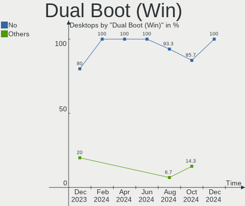
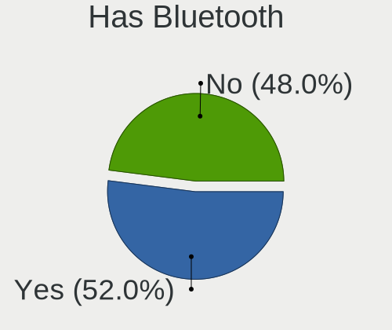
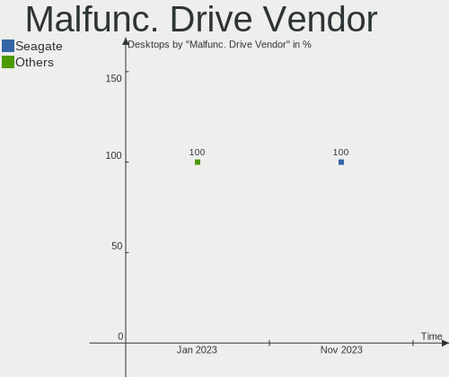
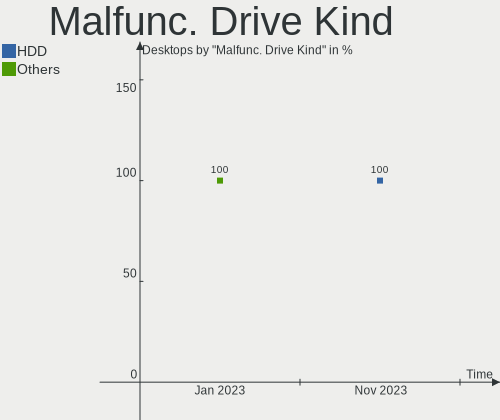
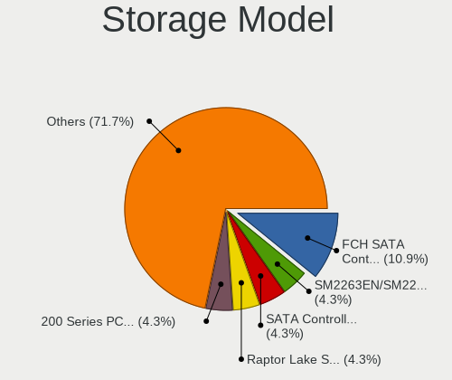
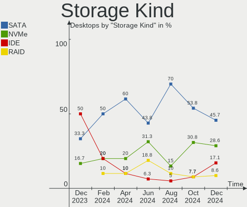
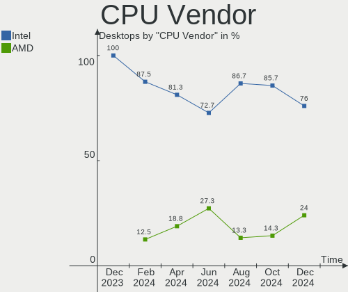
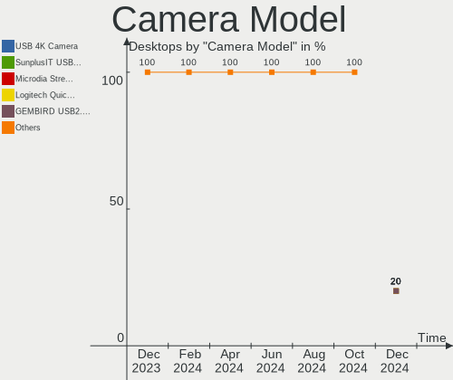

Elementary - Hardware Trends (Desktops)
---------------------------------------

A project to identify most popular hardware characteristics and track their change
over time based on data collected by Linux users at https://Linux-Hardware.org.

Anyone can contribute to this report by the [hw-probe](https://github.com/linuxhw/hw-probe) tool:

    sudo -E hw-probe -all -upload

This report is for one last month. Overall report since the beginning of time: [TestCoverage](https://github.com/linuxhw/TestCoverage)

Period: Jan, 2023.

Contents
--------

* [ System ](#system)
  - [ OS                       ](#os)
  - [ OS Family                ](#os-family)
  - [ Kernel                   ](#kernel)
  - [ Kernel Family            ](#kernel-family)
  - [ Kernel Major Ver.        ](#kernel-major-ver)
  - [ Arch                     ](#arch)
  - [ DE                       ](#de)
  - [ Display Server           ](#display-server)
  - [ Display Manager          ](#display-manager)
  - [ OS Lang                  ](#os-lang)
  - [ Boot Mode                ](#boot-mode)
  - [ Filesystem               ](#filesystem)
  - [ Part. scheme             ](#part-scheme)
  - [ Dual Boot with Linux/BSD ](#dual-boot-with-linuxbsd)
  - [ Dual Boot (Win)          ](#dual-boot-win)

* [ Board ](#board)
  - [ Vendor                   ](#vendor)
  - [ Model                    ](#model)
  - [ Model Family             ](#model-family)
  - [ MFG Year                 ](#mfg-year)
  - [ Form Factor              ](#form-factor)
  - [ Secure Boot              ](#secure-boot)
  - [ Coreboot                 ](#coreboot)
  - [ RAM Size                 ](#ram-size)
  - [ RAM Used                 ](#ram-used)
  - [ Total Drives             ](#total-drives)
  - [ Has CD-ROM               ](#has-cd-rom)
  - [ Has Ethernet             ](#has-ethernet)
  - [ Has WiFi                 ](#has-wifi)
  - [ Has Bluetooth            ](#has-bluetooth)

* [ Location ](#location)
  - [ Country                  ](#country)
  - [ City                     ](#city)

* [ Drives ](#drives)
  - [ Drive Vendor             ](#drive-vendor)
  - [ Drive Model              ](#drive-model)
  - [ HDD Vendor               ](#hdd-vendor)
  - [ SSD Vendor               ](#ssd-vendor)
  - [ Drive Kind               ](#drive-kind)
  - [ Drive Connector          ](#drive-connector)
  - [ Drive Size               ](#drive-size)
  - [ Space Total              ](#space-total)
  - [ Space Used               ](#space-used)
  - [ Malfunc. Drives          ](#malfunc-drives)
  - [ Malfunc. Drive Vendor    ](#malfunc-drive-vendor)
  - [ Malfunc. HDD Vendor      ](#malfunc-hdd-vendor)
  - [ Malfunc. Drive Kind      ](#malfunc-drive-kind)
  - [ Failed Drives            ](#failed-drives)
  - [ Failed Drive Vendor      ](#failed-drive-vendor)
  - [ Drive Status             ](#drive-status)

* [ Storage controller ](#storage-controller)
  - [ Storage Vendor           ](#storage-vendor)
  - [ Storage Model            ](#storage-model)
  - [ Storage Kind             ](#storage-kind)

* [ Processor ](#processor)
  - [ CPU Vendor               ](#cpu-vendor)
  - [ CPU Model                ](#cpu-model)
  - [ CPU Model Family         ](#cpu-model-family)
  - [ CPU Cores                ](#cpu-cores)
  - [ CPU Sockets              ](#cpu-sockets)
  - [ CPU Threads              ](#cpu-threads)
  - [ CPU Op-Modes             ](#cpu-op-modes)
  - [ CPU Microcode            ](#cpu-microcode)
  - [ CPU Microarch            ](#cpu-microarch)

* [ Graphics ](#graphics)
  - [ GPU Vendor               ](#gpu-vendor)
  - [ GPU Model                ](#gpu-model)
  - [ GPU Combo                ](#gpu-combo)
  - [ GPU Driver               ](#gpu-driver)
  - [ GPU Memory               ](#gpu-memory)

* [ Monitor ](#monitor)
  - [ Monitor Vendor           ](#monitor-vendor)
  - [ Monitor Model            ](#monitor-model)
  - [ Monitor Resolution       ](#monitor-resolution)
  - [ Monitor Diagonal         ](#monitor-diagonal)
  - [ Monitor Width            ](#monitor-width)
  - [ Aspect Ratio             ](#aspect-ratio)
  - [ Monitor Area             ](#monitor-area)
  - [ Pixel Density            ](#pixel-density)
  - [ Multiple Monitors        ](#multiple-monitors)

* [ Network ](#network)
  - [ Net Controller Vendor    ](#net-controller-vendor)
  - [ Net Controller Model     ](#net-controller-model)
  - [ Wireless Vendor          ](#wireless-vendor)
  - [ Wireless Model           ](#wireless-model)
  - [ Ethernet Vendor          ](#ethernet-vendor)
  - [ Ethernet Model           ](#ethernet-model)
  - [ Net Controller Kind      ](#net-controller-kind)
  - [ Used Controller          ](#used-controller)
  - [ NICs                     ](#nics)
  - [ IPv6                     ](#ipv6)

* [ Bluetooth ](#bluetooth)
  - [ Bluetooth Vendor         ](#bluetooth-vendor)
  - [ Bluetooth Model          ](#bluetooth-model)

* [ Sound ](#sound)
  - [ Sound Vendor             ](#sound-vendor)
  - [ Sound Model              ](#sound-model)

* [ Memory ](#memory)
  - [ Memory Vendor            ](#memory-vendor)
  - [ Memory Model             ](#memory-model)
  - [ Memory Kind              ](#memory-kind)
  - [ Memory Form Factor       ](#memory-form-factor)
  - [ Memory Size              ](#memory-size)
  - [ Memory Speed             ](#memory-speed)

* [ Printers & scanners ](#printers--scanners)
  - [ Printer Vendor           ](#printer-vendor)
  - [ Printer Model            ](#printer-model)
  - [ Scanner Vendor           ](#scanner-vendor)
  - [ Scanner Model            ](#scanner-model)

* [ Camera ](#camera)
  - [ Camera Vendor            ](#camera-vendor)
  - [ Camera Model             ](#camera-model)

* [ Security ](#security)
  - [ Fingerprint Vendor       ](#fingerprint-vendor)
  - [ Fingerprint Model        ](#fingerprint-model)
  - [ Chipcard Vendor          ](#chipcard-vendor)
  - [ Chipcard Model           ](#chipcard-model)

* [ Unsupported ](#unsupported)
  - [ Unsupported Devices      ](#unsupported-devices)
  - [ Unsupported Device Types ](#unsupported-device-types)

System
------

OS
--

Installed operating systems

| Name             | Desktops | Percent |
|------------------|----------|---------|
| Elementary 6.1   | 11       | 78.57%  |
| Elementary 7     | 2        | 14.29%  |
| Elementary 5.1.7 | 1        | 7.14%   |

OS Family
---------

OS without a version

| Name       | Desktops | Percent |
|------------|----------|---------|
| Elementary | 14       | 100%    |

Kernel
------

Version of the Linux kernel

| Version                | Desktops | Percent |
|------------------------|----------|---------|
| 5.15.0-58-generic      | 4        | 28.57%  |
| 5.15.0-57-generic      | 3        | 21.43%  |
| 5.11.0-43-generic      | 2        | 14.29%  |
| 6.1.8-x64v2-xanmod1    | 1        | 7.14%   |
| 5.4.0-137-generic      | 1        | 7.14%   |
| 5.16.15-051615-generic | 1        | 7.14%   |
| 5.15.0-60-generic      | 1        | 7.14%   |
| 5.15.0-56-generic      | 1        | 7.14%   |

Kernel Family
-------------

Linux kernel without a distro release

| Version | Desktops | Percent |
|---------|----------|---------|
| 5.15.0  | 9        | 64.29%  |
| 5.11.0  | 2        | 14.29%  |
| 6.1.8   | 1        | 7.14%   |
| 5.4.0   | 1        | 7.14%   |
| 5.16.15 | 1        | 7.14%   |

Kernel Major Ver.
-----------------

Linux kernel major version

| Version | Desktops | Percent |
|---------|----------|---------|
| 5.15    | 9        | 64.29%  |
| 5.11    | 2        | 14.29%  |
| 6.1     | 1        | 7.14%   |
| 5.4     | 1        | 7.14%   |
| 5.16    | 1        | 7.14%   |

Arch
----

OS architecture (x86_64, i586, etc.)

| Name   | Desktops | Percent |
|--------|----------|---------|
| x86_64 | 14       | 100%    |

DE
--

Desktop Environment

| Name     | Desktops | Percent |
|----------|----------|---------|
| Pantheon | 14       | 100%    |

Display Server
--------------

X11 or Wayland

| Name | Desktops | Percent |
|------|----------|---------|
| X11  | 14       | 100%    |

Display Manager
---------------

SDDM, LightDM, etc.

| Name    | Desktops | Percent |
|---------|----------|---------|
| Unknown | 10       | 71.43%  |
| LightDM | 4        | 28.57%  |

OS Lang
-------

Language

| Lang  | Desktops | Percent |
|-------|----------|---------|
| en_US | 4        | 28.57%  |
| it_IT | 3        | 21.43%  |
| ru_RU | 1        | 7.14%   |
| pt_BR | 1        | 7.14%   |
| pl_PL | 1        | 7.14%   |
| nb_NO | 1        | 7.14%   |
| fr_FR | 1        | 7.14%   |
| en_CA | 1        | 7.14%   |
| de_DE | 1        | 7.14%   |

Boot Mode
---------

EFI or BIOS

| Mode | Desktops | Percent |
|------|----------|---------|
| BIOS | 8        | 57.14%  |
| EFI  | 6        | 42.86%  |

Filesystem
----------

Type of filesystem

| Type | Desktops | Percent |
|------|----------|---------|
| Ext4 | 13       | 92.86%  |
| Xfs  | 1        | 7.14%   |

Part. scheme
------------

Scheme of partitioning

| Type    | Desktops | Percent |
|---------|----------|---------|
| Unknown | 10       | 71.43%  |
| GPT     | 4        | 28.57%  |

Dual Boot with Linux/BSD
------------------------

Hosting more than one Linux/BSD

| Dual boot | Desktops | Percent |
|-----------|----------|---------|
| No        | 13       | 92.86%  |
| Yes       | 1        | 7.14%   |

Dual Boot (Win)
---------------

Hosting Linux and Windows

| Dual boot | Desktops | Percent |
|-----------|----------|---------|
| No        | 13       | 92.86%  |
| Yes       | 1        | 7.14%   |

Board
-----

Vendor
------

Motherboard manufacturer

| Name                | Desktops | Percent |
|---------------------|----------|---------|
| Gigabyte Technology | 4        | 28.57%  |
| ASUSTek Computer    | 2        | 14.29%  |
| Unknown             | 2        | 14.29%  |
| Intel               | 1        | 7.14%   |
| Hewlett-Packard     | 1        | 7.14%   |
| EVGA                | 1        | 7.14%   |
| Dell                | 1        | 7.14%   |
| BESSTAR Tech        | 1        | 7.14%   |
| Acer                | 1        | 7.14%   |

Model
-----

Motherboard model

| Name                                 | Desktops | Percent |
|--------------------------------------|----------|---------|
| Unknown                              | 2        | 14.29%  |
| Intel Jasper Lake Client Platform    | 1        | 7.14%   |
| HP Pavilion Gaming Desktop TG01-0xxx | 1        | 7.14%   |
| Gigabyte Z77MX-D3H                   | 1        | 7.14%   |
| Gigabyte GA-990FXA-UD3               | 1        | 7.14%   |
| Gigabyte B450 AORUS ELITE            | 1        | 7.14%   |
| Gigabyte A320M-S2H V2                | 1        | 7.14%   |
| EVGA E689 0.0                        | 1        | 7.14%   |
| Dell OptiPlex 960                    | 1        | 7.14%   |
| BESSTAR Tech UM350                   | 1        | 7.14%   |
| ASUS Z170 PRO GAMING                 | 1        | 7.14%   |
| ASUS All Series                      | 1        | 7.14%   |
| Acer Veriton M2631G                  | 1        | 7.14%   |

Model Family
------------

Motherboard model prefix

| Name                   | Desktops | Percent |
|------------------------|----------|---------|
| Unknown                | 2        | 14.29%  |
| Intel Jasper           | 1        | 7.14%   |
| HP Pavilion            | 1        | 7.14%   |
| Gigabyte Z77MX-D3H     | 1        | 7.14%   |
| Gigabyte GA-990FXA-UD3 | 1        | 7.14%   |
| Gigabyte B450          | 1        | 7.14%   |
| Gigabyte A320M-S2H     | 1        | 7.14%   |
| EVGA E689              | 1        | 7.14%   |
| Dell OptiPlex          | 1        | 7.14%   |
| BESSTAR Tech UM350     | 1        | 7.14%   |
| ASUS Z170              | 1        | 7.14%   |
| ASUS All               | 1        | 7.14%   |
| Acer Veriton           | 1        | 7.14%   |

MFG Year
--------

Motherboard manufacture year

| Year | Desktops | Percent |
|------|----------|---------|
| 2022 | 2        | 14.29%  |
| 2018 | 2        | 14.29%  |
| 2013 | 2        | 14.29%  |
| 2021 | 1        | 7.14%   |
| 2020 | 1        | 7.14%   |
| 2015 | 1        | 7.14%   |
| 2014 | 1        | 7.14%   |
| 2012 | 1        | 7.14%   |
| 2011 | 1        | 7.14%   |
| 2010 | 1        | 7.14%   |
| 2009 | 1        | 7.14%   |

Form Factor
-----------

Physical design of the computer

| Name    | Desktops | Percent |
|---------|----------|---------|
| Desktop | 14       | 100%    |

Secure Boot
-----------

Enabled or disabled

| State    | Desktops | Percent |
|----------|----------|---------|
| Disabled | 14       | 100%    |

Coreboot
--------

Have coreboot on board

| Used | Desktops | Percent |
|------|----------|---------|
| No   | 14       | 100%    |

RAM Size
--------

Total RAM memory

| Size in GB | Desktops | Percent |
|------------|----------|---------|
| 32.01-64.0 | 4        | 28.57%  |
| 8.01-16.0  | 3        | 21.43%  |
| 24.01-32.0 | 2        | 14.29%  |
| 16.01-24.0 | 2        | 14.29%  |
| 4.01-8.0   | 1        | 7.14%   |
| 3.01-4.0   | 1        | 7.14%   |
| 1.01-2.0   | 1        | 7.14%   |

RAM Used
--------

Used RAM memory

| Used GB   | Desktops | Percent |
|-----------|----------|---------|
| 3.01-4.0  | 4        | 28.57%  |
| 2.01-3.0  | 4        | 28.57%  |
| 1.01-2.0  | 4        | 28.57%  |
| 8.01-16.0 | 2        | 14.29%  |

Total Drives
------------

Number of drives on board

| Drives | Desktops | Percent |
|--------|----------|---------|
| 1      | 5        | 35.71%  |
| 2      | 4        | 28.57%  |
| 5      | 2        | 14.29%  |
| 3      | 2        | 14.29%  |
| 4      | 1        | 7.14%   |

Has CD-ROM
----------

Has CD-ROM on board

| Presented | Desktops | Percent |
|-----------|----------|---------|
| No        | 11       | 78.57%  |
| Yes       | 3        | 21.43%  |

Has Ethernet
------------

Has Ethernet on board

| Presented | Desktops | Percent |
|-----------|----------|---------|
| Yes       | 14       | 100%    |

Has WiFi
--------

Has WiFi module

| Presented | Desktops | Percent |
|-----------|----------|---------|
| Yes       | 8        | 57.14%  |
| No        | 6        | 42.86%  |

Has Bluetooth
-------------

Has Bluetooth module

| Presented | Desktops | Percent |
|-----------|----------|---------|
| Yes       | 8        | 57.14%  |
| No        | 6        | 42.86%  |

Location
--------

Country
-------

Geographic location (country)

| Country     | Desktops | Percent |
|-------------|----------|---------|
| Italy       | 3        | 21.43%  |
| USA         | 2        | 14.29%  |
| Russia      | 2        | 14.29%  |
| Norway      | 1        | 7.14%   |
| Netherlands | 1        | 7.14%   |
| Germany     | 1        | 7.14%   |
| France      | 1        | 7.14%   |
| Canada      | 1        | 7.14%   |
| Brazil      | 1        | 7.14%   |
| Austria     | 1        | 7.14%   |

City
----

Geographic location (city)

| City          | Desktops | Percent |
|---------------|----------|---------|
| Vienna        | 1        | 7.14%   |
| Trondheim     | 1        | 7.14%   |
| Stuttgart     | 1        | 7.14%   |
| St Petersburg | 1        | 7.14%   |
| Saransk       | 1        | 7.14%   |
| Sao Gotardo   | 1        | 7.14%   |
| Rovato        | 1        | 7.14%   |
| Newport       | 1        | 7.14%   |
| Los Angeles   | 1        | 7.14%   |
| Como          | 1        | 7.14%   |
| Cogliate      | 1        | 7.14%   |
| Belleville    | 1        | 7.14%   |
| Amsterdam     | 1        | 7.14%   |
| Ableiges      | 1        | 7.14%   |

Drives
------

Drive Vendor
------------

Hard drive vendors

| Vendor                    | Desktops | Drives | Percent |
|---------------------------|----------|--------|---------|
| Seagate                   | 5        | 5      | 18.52%  |
| Samsung Electronics       | 5        | 9      | 18.52%  |
| WDC                       | 4        | 5      | 14.81%  |
| Hitachi                   | 2        | 2      | 7.41%   |
| Team                      | 1        | 1      | 3.7%    |
| SPCC                      | 1        | 1      | 3.7%    |
| SK hynix                  | 1        | 1      | 3.7%    |
| SanDisk                   | 1        | 2      | 3.7%    |
| Patriot                   | 1        | 1      | 3.7%    |
| OCZ                       | 1        | 1      | 3.7%    |
| Micron/Crucial Technology | 1        | 1      | 3.7%    |
| Micron Technology         | 1        | 1      | 3.7%    |
| Kingchuxing               | 1        | 1      | 3.7%    |
| Apacer                    | 1        | 1      | 3.7%    |
| Unknown                   | 1        | 1      | 3.7%    |

Drive Model
-----------

Hard drive models

| Model                                                | Desktops | Percent |
|------------------------------------------------------|----------|---------|
| Samsung NVMe SSD Controller PM9A1/PM9A3/980PRO 512GB | 2        | 6.45%   |
| WDC WD10JPVX-60JC3T0 1TB                             | 1        | 3.23%   |
| WDC WD10EZEX-60WN4A0 1TB                             | 1        | 3.23%   |
| WDC WD10EZEX-08WN4A0 1TB                             | 1        | 3.23%   |
| WDC WD10EZEX-00ZF5A0 1TB                             | 1        | 3.23%   |
| WDC WD10EADS-11M2B2 1TB                              | 1        | 3.23%   |
| Team T253X1480G 480GB SSD                            | 1        | 3.23%   |
| SPCC Solid State Disk 120GB                          | 1        | 3.23%   |
| SK hynix SHPP41-2000GM 2TB                           | 1        | 3.23%   |
| Seagate ST500DM002-1BD142 500GB                      | 1        | 3.23%   |
| Seagate ST4000DM000-1F2168 4TB                       | 1        | 3.23%   |
| Seagate ST3500413AS 500GB                            | 1        | 3.23%   |
| Seagate ST1000DM010-2EP102 1TB                       | 1        | 3.23%   |
| Seagate ST1000DM003-1ER162 1TB                       | 1        | 3.23%   |
| SanDisk SSD PLUS 1000GB                              | 1        | 3.23%   |
| SanDisk SDSSDHP256G 256GB                            | 1        | 3.23%   |
| Samsung SSD 860 EVO 250GB                            | 1        | 3.23%   |
| Samsung SSD 860 EVO 1TB                              | 1        | 3.23%   |
| Samsung SSD 850 EVO 500GB                            | 1        | 3.23%   |
| Samsung SSD 850 EVO 250GB                            | 1        | 3.23%   |
| Samsung SSD 840 Series 250GB                         | 1        | 3.23%   |
| Patriot P210 1024GB SSD                              | 1        | 3.23%   |
| OCZ VECTOR150 240GB SSD                              | 1        | 3.23%   |
| Micron/Crucial P2 NVMe PCIe SSD 500GB                | 1        | 3.23%   |
| Micron MTFDHBA256TCK-1AS1AABHA  256GB                | 1        | 3.23%   |
| Kingchuxing 360GB                                    | 1        | 3.23%   |
| Hitachi HUS724030ALE641 3TB                          | 1        | 3.23%   |
| Hitachi HTS543225L9A300 250GB                        | 1        | 3.23%   |
| Apacer AS350 256GB SSD                               | 1        | 3.23%   |
| Unknown                                              | 1        | 3.23%   |

HDD Vendor
----------

Hard disk drive vendors

| Vendor  | Desktops | Drives | Percent |
|---------|----------|--------|---------|
| Seagate | 5        | 5      | 45.45%  |
| WDC     | 4        | 5      | 36.36%  |
| Hitachi | 2        | 2      | 18.18%  |

SSD Vendor
----------

Solid state drive vendors

| Vendor              | Desktops | Drives | Percent |
|---------------------|----------|--------|---------|
| Samsung Electronics | 3        | 7      | 30%     |
| Team                | 1        | 1      | 10%     |
| SPCC                | 1        | 1      | 10%     |
| SanDisk             | 1        | 2      | 10%     |
| Patriot             | 1        | 1      | 10%     |
| OCZ                 | 1        | 1      | 10%     |
| Apacer              | 1        | 1      | 10%     |
| Unknown             | 1        | 1      | 10%     |

Drive Kind
----------

HDD or SSD

| Kind    | Desktops | Drives | Percent |
|---------|----------|--------|---------|
| SSD     | 8        | 15     | 36.36%  |
| HDD     | 8        | 12     | 36.36%  |
| NVMe    | 5        | 5      | 22.73%  |
| Unknown | 1        | 1      | 4.55%   |

Drive Connector
---------------

SATA, SAS, NVMe, etc.

| Type | Desktops | Drives | Percent |
|------|----------|--------|---------|
| SATA | 12       | 28     | 70.59%  |
| NVMe | 5        | 5      | 29.41%  |

Drive Size
----------

Size of hard drive

| Size in TB | Desktops | Drives | Percent |
|------------|----------|--------|---------|
| 0.01-0.5   | 8        | 13     | 47.06%  |
| 0.51-1.0   | 6        | 11     | 35.29%  |
| 3.01-4.0   | 1        | 1      | 5.88%   |
| 2.01-3.0   | 1        | 1      | 5.88%   |
| 1.01-2.0   | 1        | 1      | 5.88%   |

Space Total
-----------

Amount of disk space available on the file system

| Size in GB | Desktops | Percent |
|------------|----------|---------|
| 501-1000   | 6        | 42.86%  |
| 101-250    | 5        | 35.71%  |
| 251-500    | 1        | 7.14%   |
| 2001-3000  | 1        | 7.14%   |
| 1001-2000  | 1        | 7.14%   |

Space Used
----------

Amount of used disk space

| Used GB | Desktops | Percent |
|---------|----------|---------|
| 1-20    | 5        | 35.71%  |
| 21-50   | 4        | 28.57%  |
| 101-250 | 3        | 21.43%  |
| 251-500 | 1        | 7.14%   |
| 51-100  | 1        | 7.14%   |

Malfunc. Drives
---------------

Drive models with a malfunction

| Model                   | Desktops | Drives | Percent |
|-------------------------|----------|--------|---------|
| OCZ VECTOR150 240GB SSD | 1        | 1      | 100%    |

Malfunc. Drive Vendor
---------------------

Vendors of faulty drives

| Vendor | Desktops | Drives | Percent |
|--------|----------|--------|---------|
| OCZ    | 1        | 1      | 100%    |

Malfunc. HDD Vendor
-------------------

Vendors of faulty HDD drives

Zero info for selected period =(

Malfunc. Drive Kind
-------------------

Kinds of faulty drives

| Kind | Desktops | Drives | Percent |
|------|----------|--------|---------|
| SSD  | 1        | 1      | 100%    |

Failed Drives
-------------

Failed drive models

Zero info for selected period =(

Failed Drive Vendor
-------------------

Failed drive vendors

Zero info for selected period =(

Drive Status
------------

Number of failed and malfunc. drives

| Status   | Desktops | Drives | Percent |
|----------|----------|--------|---------|
| Detected | 12       | 29     | 80%     |
| Works    | 2        | 3      | 13.33%  |
| Malfunc  | 1        | 1      | 6.67%   |

Storage controller
------------------

Storage Vendor
--------------

Storage controller vendors

| Vendor                    | Desktops | Percent |
|---------------------------|----------|---------|
| Intel                     | 8        | 36.36%  |
| AMD                       | 6        | 27.27%  |
| Samsung Electronics       | 2        | 9.09%   |
| JMicron Technology        | 2        | 9.09%   |
| SK hynix                  | 1        | 4.55%   |
| Micron/Crucial Technology | 1        | 4.55%   |
| Micron Technology         | 1        | 4.55%   |
| Marvell Technology Group  | 1        | 4.55%   |

Storage Model
-------------

Storage controller models

| Model                                                                          | Desktops | Percent |
|--------------------------------------------------------------------------------|----------|---------|
| AMD FCH SATA Controller [AHCI mode]                                            | 5        | 17.24%  |
| Samsung NVMe SSD Controller PM9A1/PM9A3/980PRO                                 | 2        | 6.9%    |
| JMicron JMB368 IDE controller                                                  | 2        | 6.9%    |
| Intel 8 Series/C220 Series Chipset Family 6-port SATA Controller 1 [AHCI mode] | 2        | 6.9%    |
| AMD 400 Series Chipset SATA Controller                                         | 2        | 6.9%    |
| SK hynix Non-Volatile memory controller                                        | 1        | 3.45%   |
| Micron/Crucial P2 NVMe PCIe SSD                                                | 1        | 3.45%   |
| Micron Non-Volatile memory controller                                          | 1        | 3.45%   |
| Marvell Group 88SE6111/6121 SATA II / PATA Controller                          | 1        | 3.45%   |
| JMicron JMB363 SATA/IDE Controller                                             | 1        | 3.45%   |
| Intel Q170/Q150/B150/H170/H110/Z170/CM236 Chipset SATA Controller [AHCI Mode]  | 1        | 3.45%   |
| Intel NM10/ICH7 Family SATA Controller [IDE mode]                              | 1        | 3.45%   |
| Intel Jasper Lake SATA AHCI Controller                                         | 1        | 3.45%   |
| Intel 82801JD/DO (ICH10 Family) SATA AHCI Controller                           | 1        | 3.45%   |
| Intel 82801G (ICH7 Family) IDE Controller                                      | 1        | 3.45%   |
| Intel 7 Series/C210 Series Chipset Family 6-port SATA Controller [AHCI mode]   | 1        | 3.45%   |
| Intel 6 Series/C200 Series Chipset Family 6 port Desktop SATA AHCI Controller  | 1        | 3.45%   |
| Intel 4 Series Chipset PT IDER Controller                                      | 1        | 3.45%   |
| AMD SB7x0/SB8x0/SB9x0 SATA Controller [RAID5 mode]                             | 1        | 3.45%   |
| AMD SB7x0/SB8x0/SB9x0 IDE Controller                                           | 1        | 3.45%   |
| AMD 300 Series Chipset SATA Controller                                         | 1        | 3.45%   |

Storage Kind
------------

Kind of storage controller (IDE, SATA, NVMe, SAS, ...)

| Kind | Desktops | Percent |
|------|----------|---------|
| SATA | 13       | 56.52%  |
| NVMe | 5        | 21.74%  |
| IDE  | 4        | 17.39%  |
| RAID | 1        | 4.35%   |

Processor
---------

CPU Vendor
----------

Processor vendors

| Vendor | Desktops | Percent |
|--------|----------|---------|
| Intel  | 8        | 57.14%  |
| AMD    | 6        | 42.86%  |

CPU Model
---------

Processor models

| Model                                         | Desktops | Percent |
|-----------------------------------------------|----------|---------|
| Intel Pentium Dual-Core CPU E5700 @ 3.00GHz   | 1        | 7.14%   |
| Intel Core i7-6700K CPU @ 4.00GHz             | 1        | 7.14%   |
| Intel Core i7-2700K CPU @ 3.50GHz             | 1        | 7.14%   |
| Intel Core i7-2600K CPU @ 3.40GHz             | 1        | 7.14%   |
| Intel Core i5-4460 CPU @ 3.20GHz              | 1        | 7.14%   |
| Intel Core i5-4430 CPU @ 3.00GHz              | 1        | 7.14%   |
| Intel Core 2 Quad CPU Q9400 @ 2.66GHz         | 1        | 7.14%   |
| Intel Celeron N5105 @ 2.00GHz                 | 1        | 7.14%   |
| AMD Ryzen 9 5900HX with Radeon Graphics       | 1        | 7.14%   |
| AMD Ryzen 5 5600G with Radeon Graphics        | 1        | 7.14%   |
| AMD Ryzen 5 3600 6-Core Processor             | 1        | 7.14%   |
| AMD Ryzen 5 3550H with Radeon Vega Mobile Gfx | 1        | 7.14%   |
| AMD Ryzen 5 2600 Six-Core Processor           | 1        | 7.14%   |
| AMD FX-8350 Eight-Core Processor              | 1        | 7.14%   |

CPU Model Family
----------------

Processor model prefix

| Model                   | Desktops | Percent |
|-------------------------|----------|---------|
| AMD Ryzen 5             | 4        | 28.57%  |
| Intel Core i7           | 3        | 21.43%  |
| Intel Core i5           | 2        | 14.29%  |
| Intel Pentium Dual-Core | 1        | 7.14%   |
| Intel Core 2 Quad       | 1        | 7.14%   |
| Intel Celeron           | 1        | 7.14%   |
| AMD Ryzen 9             | 1        | 7.14%   |
| AMD FX                  | 1        | 7.14%   |

CPU Cores
---------

Number of processor cores

| Number | Desktops | Percent |
|--------|----------|---------|
| 4      | 9        | 64.29%  |
| 6      | 3        | 21.43%  |
| 8      | 1        | 7.14%   |
| 2      | 1        | 7.14%   |

CPU Sockets
-----------

Number of sockets

| Number | Desktops | Percent |
|--------|----------|---------|
| 1      | 14       | 100%    |

CPU Threads
-----------

Threads per core (Hyper-Threading)

| Number | Desktops | Percent |
|--------|----------|---------|
| 2      | 9        | 64.29%  |
| 1      | 5        | 35.71%  |

CPU Op-Modes
------------

CPU Operation Modes (32-bit, 64-bit)

| Op mode        | Desktops | Percent |
|----------------|----------|---------|
| 32-bit, 64-bit | 14       | 100%    |

CPU Microcode
-------------

Microcode number

| Number     | Desktops | Percent |
|------------|----------|---------|
| Unknown    | 3        | 21.43%  |
| 0x306c3    | 2        | 14.29%  |
| 0x206a7    | 2        | 14.29%  |
| 0x1067a    | 2        | 14.29%  |
| 0x906c0    | 1        | 7.14%   |
| 0x08701021 | 1        | 7.14%   |
| 0x08108109 | 1        | 7.14%   |
| 0x0800820d | 1        | 7.14%   |
| 0x06000852 | 1        | 7.14%   |

CPU Microarch
-------------

Microarchitecture

| Name        | Desktops | Percent |
|-------------|----------|---------|
| Zen+        | 2        | 14.29%  |
| Zen 3       | 2        | 14.29%  |
| SandyBridge | 2        | 14.29%  |
| Penryn      | 2        | 14.29%  |
| Haswell     | 2        | 14.29%  |
| Zen 2       | 1        | 7.14%   |
| Tremont     | 1        | 7.14%   |
| Skylake     | 1        | 7.14%   |
| Piledriver  | 1        | 7.14%   |

Graphics
--------

GPU Vendor
----------

Vendors of graphics cards

| Vendor | Desktops | Percent |
|--------|----------|---------|
| AMD    | 6        | 40%     |
| Nvidia | 5        | 33.33%  |
| Intel  | 4        | 26.67%  |

GPU Model
---------

Graphics card models

| Model                                                                     | Desktops | Percent |
|---------------------------------------------------------------------------|----------|---------|
| Intel 4 Series Chipset Integrated Graphics Controller                     | 2        | 13.33%  |
| AMD Cezanne [Radeon Vega Series / Radeon Vega Mobile Series]              | 2        | 13.33%  |
| Nvidia TU117 [GeForce GTX 1650]                                           | 1        | 6.67%   |
| Nvidia TU106 [GeForce RTX 2060 Rev. A]                                    | 1        | 6.67%   |
| Nvidia GP108 [GeForce GT 1030]                                            | 1        | 6.67%   |
| Nvidia GP104 [GeForce GTX 1070]                                           | 1        | 6.67%   |
| Nvidia GM107 [GeForce GTX 750]                                            | 1        | 6.67%   |
| Intel JasperLake [UHD Graphics]                                           | 1        | 6.67%   |
| Intel 2nd Generation Core Processor Family Integrated Graphics Controller | 1        | 6.67%   |
| AMD Turks LE [Radeon HD 5570/6510/7510/8510]                              | 1        | 6.67%   |
| AMD Picasso/Raven 2 [Radeon Vega Series / Radeon Vega Mobile Series]      | 1        | 6.67%   |
| AMD Navi 21 [Radeon RX 6800/6800 XT / 6900 XT]                            | 1        | 6.67%   |
| AMD Ellesmere [Radeon RX 470/480/570/570X/580/580X/590]                   | 1        | 6.67%   |

GPU Combo
---------

Combinations of graphics cards

| Name         | Desktops | Percent |
|--------------|----------|---------|
| 1 x AMD      | 5        | 35.71%  |
| 1 x Nvidia   | 4        | 28.57%  |
| 1 x Intel    | 4        | 28.57%  |
| AMD + Nvidia | 1        | 7.14%   |

GPU Driver
----------

Free vs proprietary

| Driver      | Desktops | Percent |
|-------------|----------|---------|
| Free        | 10       | 71.43%  |
| Proprietary | 4        | 28.57%  |

GPU Memory
----------

Total video memory

| Size in GB | Desktops | Percent |
|------------|----------|---------|
| Unknown    | 6        | 42.86%  |
| 7.01-8.0   | 2        | 14.29%  |
| 1.01-2.0   | 2        | 14.29%  |
| 5.01-6.0   | 1        | 7.14%   |
| 3.01-4.0   | 1        | 7.14%   |
| 8.01-16.0  | 1        | 7.14%   |
| 0.51-1.0   | 1        | 7.14%   |

Monitor
-------

Monitor Vendor
--------------

Monitor vendors

| Vendor              | Desktops | Percent |
|---------------------|----------|---------|
| Samsung Electronics | 5        | 33.33%  |
| Philips             | 2        | 13.33%  |
| Hewlett-Packard     | 2        | 13.33%  |
| Acer                | 2        | 13.33%  |
| Goldstar            | 1        | 6.67%   |
| CHI                 | 1        | 6.67%   |
| BenQ                | 1        | 6.67%   |
| AOC                 | 1        | 6.67%   |

Monitor Model
-------------

Monitor models

| Model                                                                   | Desktops | Percent |
|-------------------------------------------------------------------------|----------|---------|
| Samsung Electronics U32R59x SAM0F94 3840x2160 697x392mm 31.5-inch       | 1        | 6.67%   |
| Samsung Electronics SMBX2035 SAM06FD 1600x900 443x249mm 20.0-inch       | 1        | 6.67%   |
| Samsung Electronics S27A950D SAM079F 1920x1080 598x336mm 27.0-inch      | 1        | 6.67%   |
| Samsung Electronics LCD Monitor SAM0FEF 3840x2160 1872x1053mm 84.6-inch | 1        | 6.67%   |
| Samsung Electronics LCD Monitor S24D300 1920x1080                       | 1        | 6.67%   |
| Philips PHL 243V7 PHLC155 1920x1080 527x296mm 23.8-inch                 | 1        | 6.67%   |
| Philips PHL 221V8 PHLC211 1920x1080 477x268mm 21.5-inch                 | 1        | 6.67%   |
| Hewlett-Packard ENVY 32 HWP315E 2560x1440 708x399mm 32.0-inch           | 1        | 6.67%   |
| Hewlett-Packard 27xw HWP3197 1920x1080 598x336mm 27.0-inch              | 1        | 6.67%   |
| Goldstar 27GL850 GSM5B7F 2560x1440 597x336mm 27.0-inch                  | 1        | 6.67%   |
| CHI VGA DISPLAY CHIBD1B 1920x1080 880x500mm 39.8-inch                   | 1        | 6.67%   |
| BenQ GW2470 BNQ78E4 1920x1080 527x296mm 23.8-inch                       | 1        | 6.67%   |
| AOC 1970W AOC1970 1366x768 410x230mm 18.5-inch                          | 1        | 6.67%   |
| Acer S231HL ACR0308 1920x1080 510x287mm 23.0-inch                       | 1        | 6.67%   |
| Acer KG251Q ACR0591 1920x1080 544x303mm 24.5-inch                       | 1        | 6.67%   |

Monitor Resolution
------------------

Monitor screen resolution

| Resolution      | Desktops | Percent |
|-----------------|----------|---------|
| 1920x1080 (FHD) | 8        | 57.14%  |
| 3840x2160 (4K)  | 2        | 14.29%  |
| 2560x1440 (QHD) | 2        | 14.29%  |
| 1600x900 (HD+)  | 1        | 7.14%   |
| 1366x768 (WXGA) | 1        | 7.14%   |

Monitor Diagonal
----------------

Diagonal size in inches

| Inches  | Desktops | Percent |
|---------|----------|---------|
| 27      | 3        | 20%     |
| 24      | 3        | 20%     |
| 84      | 1        | 6.67%   |
| 39      | 1        | 6.67%   |
| 32      | 1        | 6.67%   |
| 31      | 1        | 6.67%   |
| 23      | 1        | 6.67%   |
| 21      | 1        | 6.67%   |
| 20      | 1        | 6.67%   |
| 18      | 1        | 6.67%   |
| Unknown | 1        | 6.67%   |

Monitor Width
-------------

Physical width

| Width in mm | Desktops | Percent |
|-------------|----------|---------|
| 501-600     | 6        | 46.15%  |
| 401-500     | 2        | 15.38%  |
| 801-900     | 1        | 7.69%   |
| 701-800     | 1        | 7.69%   |
| 601-700     | 1        | 7.69%   |
| 1501-2000   | 1        | 7.69%   |
| Unknown     | 1        | 7.69%   |

Aspect Ratio
------------

Proportional relationship between the width and the height

| Ratio   | Desktops | Percent |
|---------|----------|---------|
| 16/9    | 12       | 92.31%  |
| Unknown | 1        | 7.69%   |

Monitor Area
------------

Area in inch²

| Area in inch² | Desktops | Percent |
|----------------|----------|---------|
| 201-250        | 4        | 26.67%  |
| 301-350        | 3        | 20%     |
| 351-500        | 2        | 13.33%  |
| More than 1000 | 1        | 6.67%   |
| 251-300        | 1        | 6.67%   |
| 151-200        | 1        | 6.67%   |
| 141-150        | 1        | 6.67%   |
| 501-1000       | 1        | 6.67%   |
| Unknown        | 1        | 6.67%   |

Pixel Density
-------------

Pixels per inch

| Density | Desktops | Percent |
|---------|----------|---------|
| 51-100  | 10       | 71.43%  |
| 101-120 | 2        | 14.29%  |
| 121-160 | 1        | 7.14%   |
| Unknown | 1        | 7.14%   |

Multiple Monitors
-----------------

Total monitors connected

| Total | Desktops | Percent |
|-------|----------|---------|
| 1     | 12       | 85.71%  |
| 2     | 2        | 14.29%  |

Network
-------

Net Controller Vendor
---------------------

Controller vendors

| Vendor                   | Desktops | Percent |
|--------------------------|----------|---------|
| Realtek Semiconductor    | 8        | 40%     |
| Intel                    | 5        | 25%     |
| TP-Link                  | 2        | 10%     |
| Samsung Electronics      | 1        | 5%      |
| Qualcomm Atheros         | 1        | 5%      |
| MediaTek                 | 1        | 5%      |
| Marvell Technology Group | 1        | 5%      |
| ASUSTek Computer         | 1        | 5%      |

Net Controller Model
--------------------

Controller models

| Model                                                             | Desktops | Percent |
|-------------------------------------------------------------------|----------|---------|
| Realtek RTL8111/8168/8411 PCI Express Gigabit Ethernet Controller | 7        | 29.17%  |
| Intel Ethernet Controller I225-V                                  | 2        | 8.33%   |
| TP-Link TL-WN823N v2/v3 [Realtek RTL8192EU]                       | 1        | 4.17%   |
| TP-Link 802.11ac WLAN Adapter                                     | 1        | 4.17%   |
| Samsung GT-I9070 (network tethering, USB debugging enabled)       | 1        | 4.17%   |
| Realtek RTL8822CE 802.11ac PCIe Wireless Network Adapter          | 1        | 4.17%   |
| Realtek RTL8821CE 802.11ac PCIe Wireless Network Adapter          | 1        | 4.17%   |
| Realtek RTL810xE PCI Express Fast Ethernet controller             | 1        | 4.17%   |
| Realtek 802.11ac NIC                                              | 1        | 4.17%   |
| Qualcomm Atheros AR8151 v2.0 Gigabit Ethernet                     | 1        | 4.17%   |
| MediaTek MT7921K (RZ608) Wi-Fi 6E 80MHz                           | 1        | 4.17%   |
| Marvell Group 88E8057 PCI-E Gigabit Ethernet Controller           | 1        | 4.17%   |
| Intel Wireless 7265                                               | 1        | 4.17%   |
| Intel Wi-Fi 6 AX210/AX211/AX411 160MHz                            | 1        | 4.17%   |
| Intel Ethernet Connection (2) I219-V                              | 1        | 4.17%   |
| Intel 82567LM-3 Gigabit Network Connection                        | 1        | 4.17%   |
| ASUS 802.11ac WLAN Adapter                                        | 1        | 4.17%   |

Wireless Vendor
---------------

Wireless vendors

| Vendor                | Desktops | Percent |
|-----------------------|----------|---------|
| Realtek Semiconductor | 3        | 33.33%  |
| TP-Link               | 2        | 22.22%  |
| Intel                 | 2        | 22.22%  |
| MediaTek              | 1        | 11.11%  |
| ASUSTek Computer      | 1        | 11.11%  |

Wireless Model
--------------

Wireless models

| Model                                                    | Desktops | Percent |
|----------------------------------------------------------|----------|---------|
| TP-Link TL-WN823N v2/v3 [Realtek RTL8192EU]              | 1        | 11.11%  |
| TP-Link 802.11ac WLAN Adapter                            | 1        | 11.11%  |
| Realtek RTL8822CE 802.11ac PCIe Wireless Network Adapter | 1        | 11.11%  |
| Realtek RTL8821CE 802.11ac PCIe Wireless Network Adapter | 1        | 11.11%  |
| Realtek 802.11ac NIC                                     | 1        | 11.11%  |
| MediaTek MT7921K (RZ608) Wi-Fi 6E 80MHz                  | 1        | 11.11%  |
| Intel Wireless 7265                                      | 1        | 11.11%  |
| Intel Wi-Fi 6 AX210/AX211/AX411 160MHz                   | 1        | 11.11%  |
| ASUS 802.11ac WLAN Adapter                               | 1        | 11.11%  |

Ethernet Vendor
---------------

Ethernet vendors

| Vendor                   | Desktops | Percent |
|--------------------------|----------|---------|
| Realtek Semiconductor    | 8        | 53.33%  |
| Intel                    | 4        | 26.67%  |
| Samsung Electronics      | 1        | 6.67%   |
| Qualcomm Atheros         | 1        | 6.67%   |
| Marvell Technology Group | 1        | 6.67%   |

Ethernet Model
--------------

Ethernet models

| Model                                                             | Desktops | Percent |
|-------------------------------------------------------------------|----------|---------|
| Realtek RTL8111/8168/8411 PCI Express Gigabit Ethernet Controller | 7        | 46.67%  |
| Intel Ethernet Controller I225-V                                  | 2        | 13.33%  |
| Samsung GT-I9070 (network tethering, USB debugging enabled)       | 1        | 6.67%   |
| Realtek RTL810xE PCI Express Fast Ethernet controller             | 1        | 6.67%   |
| Qualcomm Atheros AR8151 v2.0 Gigabit Ethernet                     | 1        | 6.67%   |
| Marvell Group 88E8057 PCI-E Gigabit Ethernet Controller           | 1        | 6.67%   |
| Intel Ethernet Connection (2) I219-V                              | 1        | 6.67%   |
| Intel 82567LM-3 Gigabit Network Connection                        | 1        | 6.67%   |

Net Controller Kind
-------------------

Ethernet, WiFi or modem

| Kind     | Desktops | Percent |
|----------|----------|---------|
| Ethernet | 14       | 63.64%  |
| WiFi     | 8        | 36.36%  |

Used Controller
---------------

Currently used network controller

| Kind     | Desktops | Percent |
|----------|----------|---------|
| Ethernet | 9        | 64.29%  |
| WiFi     | 5        | 35.71%  |

NICs
----

Total network controllers on board

| Total | Desktops | Percent |
|-------|----------|---------|
| 1     | 8        | 57.14%  |
| 2     | 6        | 42.86%  |

IPv6
----

IPv6 vs IPv4

| Used | Desktops | Percent |
|------|----------|---------|
| No   | 10       | 71.43%  |
| Yes  | 4        | 28.57%  |

Bluetooth
---------

Bluetooth Vendor
----------------

Controller vendors

| Vendor                  | Desktops | Percent |
|-------------------------|----------|---------|
| Realtek Semiconductor   | 2        | 25%     |
| Intel                   | 2        | 25%     |
| MediaTek                | 1        | 12.5%   |
| Cambridge Silicon Radio | 1        | 12.5%   |
| ASUSTek Computer        | 1        | 12.5%   |
| 3Com                    | 1        | 12.5%   |

Bluetooth Model
---------------

Controller models

| Model                                               | Desktops | Percent |
|-----------------------------------------------------|----------|---------|
| Realtek Bluetooth Radio                             | 2        | 25%     |
| MediaTek Wireless_Device                            | 1        | 12.5%   |
| Intel Bluetooth wireless interface                  | 1        | 12.5%   |
| Intel AX210 Bluetooth                               | 1        | 12.5%   |
| Cambridge Silicon Radio Bluetooth Dongle (HCI mode) | 1        | 12.5%   |
| ASUS ASUS USB-BT500                                 | 1        | 12.5%   |
| 3Com 3CREB96 Bluetooth Adapter                      | 1        | 12.5%   |

Sound
-----

Sound Vendor
------------

Sound card vendors

| Vendor                 | Desktops | Percent |
|------------------------|----------|---------|
| Intel                  | 8        | 28.57%  |
| AMD                    | 8        | 28.57%  |
| Nvidia                 | 5        | 17.86%  |
| C-Media Electronics    | 3        | 10.71%  |
| Realtek Semiconductor  | 1        | 3.57%   |
| JMTek                  | 1        | 3.57%   |
| Jieli Technology       | 1        | 3.57%   |
| Generalplus Technology | 1        | 3.57%   |

Sound Model
-----------

Sound card models

| Model                                                                      | Desktops | Percent |
|----------------------------------------------------------------------------|----------|---------|
| C-Media Electronics Audio Adapter (Unitek Y-247A)                          | 3        | 9.38%   |
| AMD Family 17h/19h HD Audio Controller                                     | 3        | 9.38%   |
| Intel 8 Series/C220 Series Chipset High Definition Audio Controller        | 2        | 6.25%   |
| AMD Renoir Radeon High Definition Audio Controller                         | 2        | 6.25%   |
| Realtek Semiconductor Realtek USB2.0 Audio                                 | 1        | 3.13%   |
| Nvidia TU107 GeForce GTX 1650 High Definition Audio Controller             | 1        | 3.13%   |
| Nvidia TU106 High Definition Audio Controller                              | 1        | 3.13%   |
| Nvidia GP108 High Definition Audio Controller                              | 1        | 3.13%   |
| Nvidia GP104 High Definition Audio Controller                              | 1        | 3.13%   |
| Nvidia GM107 High Definition Audio Controller [GeForce 940MX]              | 1        | 3.13%   |
| JMTek USB PnP Audio Device                                                 | 1        | 3.13%   |
| Jieli Technology UACDemoV1.0                                               | 1        | 3.13%   |
| Intel NM10/ICH7 Family High Definition Audio Controller                    | 1        | 3.13%   |
| Intel Jasper Lake HD Audio                                                 | 1        | 3.13%   |
| Intel 82801JD/DO (ICH10 Family) HD Audio Controller                        | 1        | 3.13%   |
| Intel 7 Series/C216 Chipset Family High Definition Audio Controller        | 1        | 3.13%   |
| Intel 6 Series/C200 Series Chipset Family High Definition Audio Controller | 1        | 3.13%   |
| Intel 100 Series/C230 Series Chipset Family HD Audio Controller            | 1        | 3.13%   |
| Generalplus Technology USB Audio Device                                    | 1        | 3.13%   |
| AMD Turks HDMI Audio [Radeon HD 6500/6600 / 6700M Series]                  | 1        | 3.13%   |
| AMD Starship/Matisse HD Audio Controller                                   | 1        | 3.13%   |
| AMD SBx00 Azalia (Intel HDA)                                               | 1        | 3.13%   |
| AMD Raven/Raven2/Fenghuang HDMI/DP Audio Controller                        | 1        | 3.13%   |
| AMD Navi 21/23 HDMI/DP Audio Controller                                    | 1        | 3.13%   |
| AMD Family 17h (Models 00h-0fh) HD Audio Controller                        | 1        | 3.13%   |
| AMD Ellesmere HDMI Audio [Radeon RX 470/480 / 570/580/590]                 | 1        | 3.13%   |

Memory
------

Memory Vendor
-------------

Memory module vendors

| Vendor              | Desktops | Percent |
|---------------------|----------|---------|
| Samsung Electronics | 1        | 33.33%  |
| Kingston            | 1        | 33.33%  |
| G.Skill             | 1        | 33.33%  |

Memory Model
------------

Memory module models

| Model                                                  | Desktops | Percent |
|--------------------------------------------------------|----------|---------|
| Samsung RAM Module 8192MB Row Of Chips LPDDR4 3733MT/s | 1        | 33.33%  |
| Kingston RAM KHX1600C9D3/8G 8192MB DIMM DDR3 1600MT/s  | 1        | 33.33%  |
| G.Skill RAM F3-1600C9-8GXM 8GB DIMM DDR3 1867MT/s      | 1        | 33.33%  |

Memory Kind
-----------

Memory module kinds

| Kind   | Desktops | Percent |
|--------|----------|---------|
| DDR3   | 2        | 66.67%  |
| LPDDR4 | 1        | 33.33%  |

Memory Form Factor
------------------

Physical design of the memory module

| Name         | Desktops | Percent |
|--------------|----------|---------|
| DIMM         | 2        | 66.67%  |
| Row Of Chips | 1        | 33.33%  |

Memory Size
-----------

Memory module size

| Size | Desktops | Percent |
|------|----------|---------|
| 8192 | 3        | 100%    |

Memory Speed
------------

Memory module speed

| Speed | Desktops | Percent |
|-------|----------|---------|
| 3733  | 1        | 33.33%  |
| 1867  | 1        | 33.33%  |
| 1600  | 1        | 33.33%  |

Printers & scanners
-------------------

Printer Vendor
--------------

Printer device vendors

Zero info for selected period =(

Printer Model
-------------

Printer device models

Zero info for selected period =(

Scanner Vendor
--------------

Scanner device vendors

Zero info for selected period =(

Scanner Model
-------------

Scanner device models

Zero info for selected period =(

Camera
------

Camera Vendor
-------------

Camera device vendors

| Vendor        | Desktops | Percent |
|---------------|----------|---------|
| Unknown       | 1        | 50%     |
| HD USB Camera | 1        | 50%     |

Camera Model
------------

Camera device models

| Model                         | Desktops | Percent |
|-------------------------------|----------|---------|
| Unknown Integrated RGB Camera | 1        | 50%     |
| HD USB Camera HD USB Camera   | 1        | 50%     |

Security
--------

Fingerprint Vendor
------------------

Fingerprint sensor vendors

Zero info for selected period =(

Fingerprint Model
-----------------

Fingerprint sensor models

Zero info for selected period =(

Chipcard Vendor
---------------

Chipcard module vendors

Zero info for selected period =(

Chipcard Model
--------------

Chipcard module models

Zero info for selected period =(

Unsupported
-----------

Unsupported Devices
-------------------

Total unsupported devices on board

| Total | Desktops | Percent |
|-------|----------|---------|
| 0     | 8        | 57.14%  |
| 1     | 6        | 42.86%  |

Unsupported Device Types
------------------------

Types of unsupported devices

| Type                  | Desktops | Percent |
|-----------------------|----------|---------|
| Net/wireless          | 3        | 75%     |
| Multimedia controller | 1        | 25%     |

