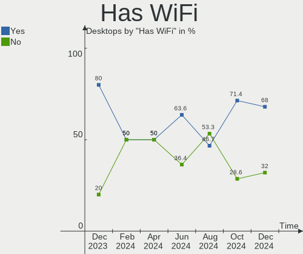
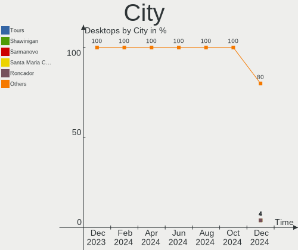
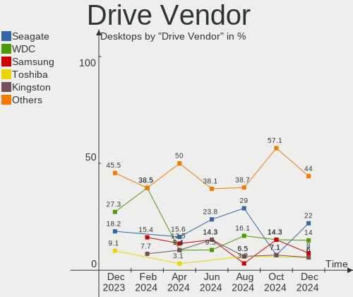
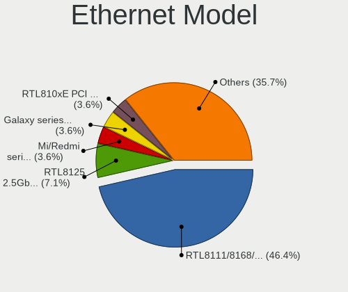
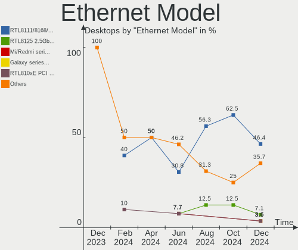

Elementary - Hardware Trends (Desktops)
---------------------------------------

A project to identify most popular hardware characteristics and track their change
over time based on data collected by Linux users at https://Linux-Hardware.org.

Anyone can contribute to this report by the [hw-probe](https://github.com/linuxhw/hw-probe) tool:

    sudo -E hw-probe -all -upload

This report is for one last month. Overall report since the beginning of time: [TestCoverage](https://github.com/linuxhw/TestCoverage)

Period: Jun, 2022.

Contents
--------

* [ System ](#system)
  - [ OS                       ](#os)
  - [ OS Family                ](#os-family)
  - [ Kernel                   ](#kernel)
  - [ Kernel Family            ](#kernel-family)
  - [ Kernel Major Ver.        ](#kernel-major-ver)
  - [ Arch                     ](#arch)
  - [ DE                       ](#de)
  - [ Display Server           ](#display-server)
  - [ Display Manager          ](#display-manager)
  - [ OS Lang                  ](#os-lang)
  - [ Boot Mode                ](#boot-mode)
  - [ Filesystem               ](#filesystem)
  - [ Part. scheme             ](#part-scheme)
  - [ Dual Boot with Linux/BSD ](#dual-boot-with-linuxbsd)
  - [ Dual Boot (Win)          ](#dual-boot-win)

* [ Board ](#board)
  - [ Vendor                   ](#vendor)
  - [ Model                    ](#model)
  - [ Model Family             ](#model-family)
  - [ MFG Year                 ](#mfg-year)
  - [ Form Factor              ](#form-factor)
  - [ Secure Boot              ](#secure-boot)
  - [ Coreboot                 ](#coreboot)
  - [ RAM Size                 ](#ram-size)
  - [ RAM Used                 ](#ram-used)
  - [ Total Drives             ](#total-drives)
  - [ Has CD-ROM               ](#has-cd-rom)
  - [ Has Ethernet             ](#has-ethernet)
  - [ Has WiFi                 ](#has-wifi)
  - [ Has Bluetooth            ](#has-bluetooth)

* [ Location ](#location)
  - [ Country                  ](#country)
  - [ City                     ](#city)

* [ Drives ](#drives)
  - [ Drive Vendor             ](#drive-vendor)
  - [ Drive Model              ](#drive-model)
  - [ HDD Vendor               ](#hdd-vendor)
  - [ SSD Vendor               ](#ssd-vendor)
  - [ Drive Kind               ](#drive-kind)
  - [ Drive Connector          ](#drive-connector)
  - [ Drive Size               ](#drive-size)
  - [ Space Total              ](#space-total)
  - [ Space Used               ](#space-used)
  - [ Malfunc. Drives          ](#malfunc-drives)
  - [ Malfunc. Drive Vendor    ](#malfunc-drive-vendor)
  - [ Malfunc. HDD Vendor      ](#malfunc-hdd-vendor)
  - [ Malfunc. Drive Kind      ](#malfunc-drive-kind)
  - [ Failed Drives            ](#failed-drives)
  - [ Failed Drive Vendor      ](#failed-drive-vendor)
  - [ Drive Status             ](#drive-status)

* [ Storage controller ](#storage-controller)
  - [ Storage Vendor           ](#storage-vendor)
  - [ Storage Model            ](#storage-model)
  - [ Storage Kind             ](#storage-kind)

* [ Processor ](#processor)
  - [ CPU Vendor               ](#cpu-vendor)
  - [ CPU Model                ](#cpu-model)
  - [ CPU Model Family         ](#cpu-model-family)
  - [ CPU Cores                ](#cpu-cores)
  - [ CPU Sockets              ](#cpu-sockets)
  - [ CPU Threads              ](#cpu-threads)
  - [ CPU Op-Modes             ](#cpu-op-modes)
  - [ CPU Microcode            ](#cpu-microcode)
  - [ CPU Microarch            ](#cpu-microarch)

* [ Graphics ](#graphics)
  - [ GPU Vendor               ](#gpu-vendor)
  - [ GPU Model                ](#gpu-model)
  - [ GPU Combo                ](#gpu-combo)
  - [ GPU Driver               ](#gpu-driver)
  - [ GPU Memory               ](#gpu-memory)

* [ Monitor ](#monitor)
  - [ Monitor Vendor           ](#monitor-vendor)
  - [ Monitor Model            ](#monitor-model)
  - [ Monitor Resolution       ](#monitor-resolution)
  - [ Monitor Diagonal         ](#monitor-diagonal)
  - [ Monitor Width            ](#monitor-width)
  - [ Aspect Ratio             ](#aspect-ratio)
  - [ Monitor Area             ](#monitor-area)
  - [ Pixel Density            ](#pixel-density)
  - [ Multiple Monitors        ](#multiple-monitors)

* [ Network ](#network)
  - [ Net Controller Vendor    ](#net-controller-vendor)
  - [ Net Controller Model     ](#net-controller-model)
  - [ Wireless Vendor          ](#wireless-vendor)
  - [ Wireless Model           ](#wireless-model)
  - [ Ethernet Vendor          ](#ethernet-vendor)
  - [ Ethernet Model           ](#ethernet-model)
  - [ Net Controller Kind      ](#net-controller-kind)
  - [ Used Controller          ](#used-controller)
  - [ NICs                     ](#nics)
  - [ IPv6                     ](#ipv6)

* [ Bluetooth ](#bluetooth)
  - [ Bluetooth Vendor         ](#bluetooth-vendor)
  - [ Bluetooth Model          ](#bluetooth-model)

* [ Sound ](#sound)
  - [ Sound Vendor             ](#sound-vendor)
  - [ Sound Model              ](#sound-model)

* [ Memory ](#memory)
  - [ Memory Vendor            ](#memory-vendor)
  - [ Memory Model             ](#memory-model)
  - [ Memory Kind              ](#memory-kind)
  - [ Memory Form Factor       ](#memory-form-factor)
  - [ Memory Size              ](#memory-size)
  - [ Memory Speed             ](#memory-speed)

* [ Printers & scanners ](#printers--scanners)
  - [ Printer Vendor           ](#printer-vendor)
  - [ Printer Model            ](#printer-model)
  - [ Scanner Vendor           ](#scanner-vendor)
  - [ Scanner Model            ](#scanner-model)

* [ Camera ](#camera)
  - [ Camera Vendor            ](#camera-vendor)
  - [ Camera Model             ](#camera-model)

* [ Security ](#security)
  - [ Fingerprint Vendor       ](#fingerprint-vendor)
  - [ Fingerprint Model        ](#fingerprint-model)
  - [ Chipcard Vendor          ](#chipcard-vendor)
  - [ Chipcard Model           ](#chipcard-model)

* [ Unsupported ](#unsupported)
  - [ Unsupported Devices      ](#unsupported-devices)
  - [ Unsupported Device Types ](#unsupported-device-types)

System
------

OS
--

Installed operating systems

| Name           | Desktops | Percent |
|----------------|----------|---------|
| Elementary 6.1 | 14       | 100%    |

OS Family
---------

OS without a version

| Name       | Desktops | Percent |
|------------|----------|---------|
| Elementary | 14       | 100%    |

Kernel
------

Version of the Linux kernel

| Version           | Desktops | Percent |
|-------------------|----------|---------|
| 5.13.0-44-generic | 4        | 28.57%  |
| 5.13.0-51-generic | 3        | 21.43%  |
| 5.13.0-48-generic | 3        | 21.43%  |
| 5.17.3-xanmod1    | 1        | 7.14%   |
| 5.14.0-1042-oem   | 1        | 7.14%   |
| 5.13.0-40-generic | 1        | 7.14%   |
| 5.13.0-39-generic | 1        | 7.14%   |

Kernel Family
-------------

Linux kernel without a distro release

| Version | Desktops | Percent |
|---------|----------|---------|
| 5.13.0  | 12       | 85.71%  |
| 5.17.3  | 1        | 7.14%   |
| 5.14.0  | 1        | 7.14%   |

Kernel Major Ver.
-----------------

Linux kernel major version

| Version | Desktops | Percent |
|---------|----------|---------|
| 5.13    | 12       | 85.71%  |
| 5.17    | 1        | 7.14%   |
| 5.14    | 1        | 7.14%   |

Arch
----

OS architecture (x86_64, i586, etc.)

| Name   | Desktops | Percent |
|--------|----------|---------|
| x86_64 | 14       | 100%    |

DE
--

Desktop Environment

| Name     | Desktops | Percent |
|----------|----------|---------|
| Pantheon | 14       | 100%    |

Display Server
--------------

X11 or Wayland

| Name | Desktops | Percent |
|------|----------|---------|
| X11  | 14       | 100%    |

Display Manager
---------------

SDDM, LightDM, etc.

| Name    | Desktops | Percent |
|---------|----------|---------|
| Unknown | 9        | 64.29%  |
| LightDM | 5        | 35.71%  |

OS Lang
-------

Language

| Lang  | Desktops | Percent |
|-------|----------|---------|
| en_US | 7        | 50%     |
| pt_BR | 2        | 14.29%  |
| it_IT | 1        | 7.14%   |
| fr_FR | 1        | 7.14%   |
| en_CA | 1        | 7.14%   |
| de_DE | 1        | 7.14%   |
| de_CH | 1        | 7.14%   |

Boot Mode
---------

EFI or BIOS

| Mode | Desktops | Percent |
|------|----------|---------|
| BIOS | 7        | 50%     |
| EFI  | 7        | 50%     |

Filesystem
----------

Type of filesystem

| Type  | Desktops | Percent |
|-------|----------|---------|
| Ext4  | 13       | 92.86%  |
| Btrfs | 1        | 7.14%   |

Part. scheme
------------

Scheme of partitioning

| Type    | Desktops | Percent |
|---------|----------|---------|
| Unknown | 9        | 64.29%  |
| GPT     | 4        | 28.57%  |
| MBR     | 1        | 7.14%   |

Dual Boot with Linux/BSD
------------------------

Hosting more than one Linux/BSD

| Dual boot | Desktops | Percent |
|-----------|----------|---------|
| No        | 13       | 92.86%  |
| Yes       | 1        | 7.14%   |

Dual Boot (Win)
---------------

Hosting Linux and Windows

| Dual boot | Desktops | Percent |
|-----------|----------|---------|
| No        | 10       | 71.43%  |
| Yes       | 4        | 28.57%  |

Board
-----

Vendor
------

Motherboard manufacturer

| Name                | Desktops | Percent |
|---------------------|----------|---------|
| ASUSTek Computer    | 3        | 21.43%  |
| MSI                 | 2        | 14.29%  |
| Hewlett-Packard     | 2        | 14.29%  |
| Gigabyte Technology | 2        | 14.29%  |
| T-bao               | 1        | 7.14%   |
| Pegatron            | 1        | 7.14%   |
| Lenovo              | 1        | 7.14%   |
| Dell                | 1        | 7.14%   |
| ASRock              | 1        | 7.14%   |

Model
-----

Motherboard model

| Name                              | Desktops | Percent |
|-----------------------------------|----------|---------|
| T-bao MINI PC                     | 1        | 7.14%   |
| Pegatron p7-1174                  | 1        | 7.14%   |
| MSI MS-7D52                       | 1        | 7.14%   |
| MSI MS-7851                       | 1        | 7.14%   |
| Lenovo ThinkCentre M73 10B6001SUS | 1        | 7.14%   |
| HP Compaq Pro 6300 MT             | 1        | 7.14%   |
| HP 23-q120d                       | 1        | 7.14%   |
| Gigabyte Z690 AORUS MASTER        | 1        | 7.14%   |
| Gigabyte B450 AORUS ELITE         | 1        | 7.14%   |
| Dell OptiPlex 5040                | 1        | 7.14%   |
| ASUS SABERTOOTH X58               | 1        | 7.14%   |
| ASUS PRIME B550-PLUS              | 1        | 7.14%   |
| ASUS PRIME A320M-K/BR             | 1        | 7.14%   |
| ASRock Z490 Pro4                  | 1        | 7.14%   |

Model Family
------------

Motherboard model prefix

| Name               | Desktops | Percent |
|--------------------|----------|---------|
| ASUS PRIME         | 2        | 14.29%  |
| T-bao MINI         | 1        | 7.14%   |
| Pegatron p7-1174   | 1        | 7.14%   |
| MSI MS-7D52        | 1        | 7.14%   |
| MSI MS-7851        | 1        | 7.14%   |
| Lenovo ThinkCentre | 1        | 7.14%   |
| HP Compaq          | 1        | 7.14%   |
| HP 23-q120d        | 1        | 7.14%   |
| Gigabyte Z690      | 1        | 7.14%   |
| Gigabyte B450      | 1        | 7.14%   |
| Dell OptiPlex      | 1        | 7.14%   |
| ASUS SABERTOOTH    | 1        | 7.14%   |
| ASRock Z490        | 1        | 7.14%   |

MFG Year
--------

Motherboard manufacture year

| Year | Desktops | Percent |
|------|----------|---------|
| 2020 | 3        | 21.43%  |
| 2022 | 2        | 14.29%  |
| 2015 | 2        | 14.29%  |
| 2021 | 1        | 7.14%   |
| 2018 | 1        | 7.14%   |
| 2017 | 1        | 7.14%   |
| 2013 | 1        | 7.14%   |
| 2012 | 1        | 7.14%   |
| 2011 | 1        | 7.14%   |
| 2010 | 1        | 7.14%   |

Form Factor
-----------

Physical design of the computer

| Name    | Desktops | Percent |
|---------|----------|---------|
| Desktop | 14       | 100%    |

Secure Boot
-----------

Enabled or disabled

| State    | Desktops | Percent |
|----------|----------|---------|
| Disabled | 13       | 92.86%  |
| Enabled  | 1        | 7.14%   |

Coreboot
--------

Have coreboot on board

| Used | Desktops | Percent |
|------|----------|---------|
| No   | 14       | 100%    |

RAM Size
--------

Total RAM memory

| Size in GB  | Desktops | Percent |
|-------------|----------|---------|
| 8.01-16.0   | 5        | 35.71%  |
| 16.01-24.0  | 4        | 28.57%  |
| 3.01-4.0    | 2        | 14.29%  |
| 4.01-8.0    | 1        | 7.14%   |
| 32.01-64.0  | 1        | 7.14%   |
| 64.01-256.0 | 1        | 7.14%   |

RAM Used
--------

Used RAM memory

| Used GB  | Desktops | Percent |
|----------|----------|---------|
| 1.01-2.0 | 8        | 57.14%  |
| 2.01-3.0 | 3        | 21.43%  |
| 3.01-4.0 | 2        | 14.29%  |
| 4.01-8.0 | 1        | 7.14%   |

Total Drives
------------

Number of drives on board

| Drives | Desktops | Percent |
|--------|----------|---------|
| 2      | 5        | 35.71%  |
| 3      | 4        | 28.57%  |
| 1      | 4        | 28.57%  |
| 5      | 1        | 7.14%   |

Has CD-ROM
----------

Has CD-ROM on board

| Presented | Desktops | Percent |
|-----------|----------|---------|
| Yes       | 7        | 50%     |
| No        | 7        | 50%     |

Has Ethernet
------------

Has Ethernet on board

| Presented | Desktops | Percent |
|-----------|----------|---------|
| Yes       | 14       | 100%    |

Has WiFi
--------

Has WiFi module

| Presented | Desktops | Percent |
|-----------|----------|---------|
| No        | 8        | 57.14%  |
| Yes       | 6        | 42.86%  |

Has Bluetooth
-------------

Has Bluetooth module

| Presented | Desktops | Percent |
|-----------|----------|---------|
| No        | 8        | 57.14%  |
| Yes       | 6        | 42.86%  |

Location
--------

Country
-------

Geographic location (country)

| Country     | Desktops | Percent |
|-------------|----------|---------|
| USA         | 5        | 35.71%  |
| Brazil      | 2        | 14.29%  |
| Switzerland | 1        | 7.14%   |
| Italy       | 1        | 7.14%   |
| Israel      | 1        | 7.14%   |
| Indonesia   | 1        | 7.14%   |
| France      | 1        | 7.14%   |
| Canada      | 1        | 7.14%   |
| Austria     | 1        | 7.14%   |

City
----

Geographic location (city)

| City            | Desktops | Percent |
|-----------------|----------|---------|
| Yucca Valley    | 1        | 7.14%   |
| Tel Aviv        | 1        | 7.14%   |
| Rio de Janeiro  | 1        | 7.14%   |
| Porto Mantovano | 1        | 7.14%   |
| Plano           | 1        | 7.14%   |
| Plan-de-Cuques  | 1        | 7.14%   |
| Ottawa          | 1        | 7.14%   |
| New Carlisle    | 1        | 7.14%   |
| Mount Pleasant  | 1        | 7.14%   |
| Liestal         | 1        | 7.14%   |
| Krenglbach      | 1        | 7.14%   |
| Jatiasih        | 1        | 7.14%   |
| Brasília       | 1        | 7.14%   |
| Baton Rouge     | 1        | 7.14%   |

Drives
------

Drive Vendor
------------

Hard drive vendors

| Vendor                    | Desktops | Drives | Percent |
|---------------------------|----------|--------|---------|
| WDC                       | 6        | 8      | 22.22%  |
| Seagate                   | 5        | 5      | 18.52%  |
| Samsung Electronics       | 3        | 4      | 11.11%  |
| Toshiba                   | 2        | 2      | 7.41%   |
| Kingston                  | 2        | 2      | 7.41%   |
| Crucial                   | 2        | 3      | 7.41%   |
| Team                      | 1        | 1      | 3.7%    |
| Silicon Motion            | 1        | 1      | 3.7%    |
| SanDisk                   | 1        | 1      | 3.7%    |
| Realtek Semiconductor     | 1        | 1      | 3.7%    |
| PNY                       | 1        | 1      | 3.7%    |
| Micron/Crucial Technology | 1        | 1      | 3.7%    |
| A-DATA Technology         | 1        | 1      | 3.7%    |

Drive Model
-----------

Hard drive models

| Model                               | Desktops | Percent |
|-------------------------------------|----------|---------|
| WDC WDS240G2G0B-00EPW0 240GB SSD    | 1        | 3.45%   |
| WDC WD5000AAKS-00UU3A0 500GB        | 1        | 3.45%   |
| WDC WD30EZRZ-00Z5HB0 3TB            | 1        | 3.45%   |
| WDC WD15EARS-60MVWB0 1TB            | 1        | 3.45%   |
| WDC WD10EZEX-08WN4A0 1TB            | 1        | 3.45%   |
| WDC WD10EZEX-00ZF5A0 1TB            | 1        | 3.45%   |
| WDC WD10EURX-63UY4Y0 1TB            | 1        | 3.45%   |
| Toshiba HDWF180 8TB                 | 1        | 3.45%   |
| Toshiba DT01ACA100 1TB              | 1        | 3.45%   |
| Team T253X1480G 480GB SSD           | 1        | 3.45%   |
| Silicon Motion NVMe SSD Drive 128GB | 1        | 3.45%   |
| Seagate ST3500630AS 500GB           | 1        | 3.45%   |
| Seagate ST1000DM010-2EP102 1TB      | 1        | 3.45%   |
| Seagate ST1000DM003-1ER162 1TB      | 1        | 3.45%   |
| Seagate ST1000DM003-1CH162 1TB      | 1        | 3.45%   |
| Seagate ST1000DL002-9TT153 1TB      | 1        | 3.45%   |
| SanDisk SDSSDH3512G 512GB           | 1        | 3.45%   |
| Samsung SSD PM810 2.5 7mm 128GB     | 1        | 3.45%   |
| Samsung SSD 860 EVO 250GB           | 1        | 3.45%   |
| Samsung NVMe SSD Drive 2TB          | 1        | 3.45%   |
| Samsung HD500LJ 500GB               | 1        | 3.45%   |
| Realtek NVMe SSD Drive 1024GB       | 1        | 3.45%   |
| PNY CS900 120GB SSD                 | 1        | 3.45%   |
| Micron/Crucial NVMe SSD Drive 500GB | 1        | 3.45%   |
| Kingston SNVS500G 500GB             | 1        | 3.45%   |
| Kingston NVMe SSD Drive 1TB         | 1        | 3.45%   |
| Crucial CT240BX500SSD1 240GB        | 1        | 3.45%   |
| Crucial CT1000P2SSD8 1TB            | 1        | 3.45%   |
| A-DATA SP600 128GB SSD              | 1        | 3.45%   |

HDD Vendor
----------

Hard disk drive vendors

| Vendor              | Desktops | Drives | Percent |
|---------------------|----------|--------|---------|
| WDC                 | 5        | 7      | 38.46%  |
| Seagate             | 5        | 5      | 38.46%  |
| Toshiba             | 2        | 2      | 15.38%  |
| Samsung Electronics | 1        | 1      | 7.69%   |

SSD Vendor
----------

Solid state drive vendors

| Vendor              | Desktops | Drives | Percent |
|---------------------|----------|--------|---------|
| Samsung Electronics | 2        | 2      | 25%     |
| WDC                 | 1        | 1      | 12.5%   |
| Team                | 1        | 1      | 12.5%   |
| SanDisk             | 1        | 1      | 12.5%   |
| PNY                 | 1        | 1      | 12.5%   |
| Crucial             | 1        | 1      | 12.5%   |
| A-DATA Technology   | 1        | 1      | 12.5%   |

Drive Kind
----------

HDD or SSD

| Kind | Desktops | Drives | Percent |
|------|----------|--------|---------|
| HDD  | 10       | 15     | 45.45%  |
| NVMe | 6        | 8      | 27.27%  |
| SSD  | 6        | 8      | 27.27%  |

Drive Connector
---------------

SATA, SAS, NVMe, etc.

| Type | Desktops | Drives | Percent |
|------|----------|--------|---------|
| SATA | 12       | 22     | 63.16%  |
| NVMe | 6        | 8      | 31.58%  |
| SAS  | 1        | 1      | 5.26%   |

Drive Size
----------

Size of hard drive

| Size in TB | Desktops | Drives | Percent |
|------------|----------|--------|---------|
| 0.51-1.0   | 7        | 10     | 43.75%  |
| 0.01-0.5   | 7        | 10     | 43.75%  |
| 2.01-3.0   | 1        | 2      | 6.25%   |
| 4.01-10.0  | 1        | 1      | 6.25%   |

Space Total
-----------

Amount of disk space available on the file system

| Size in GB | Desktops | Percent |
|------------|----------|---------|
| 101-250    | 8        | 57.14%  |
| 501-1000   | 4        | 28.57%  |
| 1001-2000  | 2        | 14.29%  |

Space Used
----------

Amount of used disk space

| Used GB | Desktops | Percent |
|---------|----------|---------|
| 1-20    | 5        | 35.71%  |
| 51-100  | 5        | 35.71%  |
| 21-50   | 2        | 14.29%  |
| 251-500 | 1        | 7.14%   |
| 101-250 | 1        | 7.14%   |

Malfunc. Drives
---------------

Drive models with a malfunction

| Model                        | Desktops | Drives | Percent |
|------------------------------|----------|--------|---------|
| WDC WD5000AAKS-00UU3A0 500GB | 1        | 1      | 100%    |

Malfunc. Drive Vendor
---------------------

Vendors of faulty drives

| Vendor | Desktops | Drives | Percent |
|--------|----------|--------|---------|
| WDC    | 1        | 1      | 100%    |

Malfunc. HDD Vendor
-------------------

Vendors of faulty HDD drives

| Vendor | Desktops | Drives | Percent |
|--------|----------|--------|---------|
| WDC    | 1        | 1      | 100%    |

Malfunc. Drive Kind
-------------------

Kinds of faulty drives

| Kind | Desktops | Drives | Percent |
|------|----------|--------|---------|
| HDD  | 1        | 1      | 100%    |

Failed Drives
-------------

Failed drive models

Zero info for selected period =(

Failed Drive Vendor
-------------------

Failed drive vendors

Zero info for selected period =(

Drive Status
------------

Number of failed and malfunc. drives

| Status   | Desktops | Drives | Percent |
|----------|----------|--------|---------|
| Detected | 9        | 20     | 60%     |
| Works    | 5        | 10     | 33.33%  |
| Malfunc  | 1        | 1      | 6.67%   |

Storage controller
------------------

Storage Vendor
--------------

Storage controller vendors

| Vendor                      | Desktops | Percent |
|-----------------------------|----------|---------|
| Intel                       | 8        | 34.78%  |
| AMD                         | 6        | 26.09%  |
| Micron/Crucial Technology   | 2        | 8.7%    |
| Kingston Technology Company | 2        | 8.7%    |
| Silicon Motion              | 1        | 4.35%   |
| Samsung Electronics         | 1        | 4.35%   |
| Realtek Semiconductor       | 1        | 4.35%   |
| Marvell Technology Group    | 1        | 4.35%   |
| JMicron Technology          | 1        | 4.35%   |

Storage Model
-------------

Storage controller models

| Model                                                                          | Desktops | Percent |
|--------------------------------------------------------------------------------|----------|---------|
| AMD FCH SATA Controller [AHCI mode]                                            | 4        | 15.38%  |
| Intel 8 Series/C220 Series Chipset Family 6-port SATA Controller 1 [AHCI mode] | 3        | 11.54%  |
| Micron/Crucial P2 NVMe PCIe SSD                                                | 2        | 7.69%   |
| Silicon Motion SM2263EN/SM2263XT SSD Controller                                | 1        | 3.85%   |
| Samsung NVMe SSD Controller PM9A1/PM9A3/980PRO                                 | 1        | 3.85%   |
| Realtek Realtek Non-Volatile memory controller                                 | 1        | 3.85%   |
| Marvell Group 88SE91A3 SATA-600 Controller                                     | 1        | 3.85%   |
| Kingston Company Company Non-Volatile memory controller                        | 1        | 3.85%   |
| Kingston Company A2000 NVMe SSD                                                | 1        | 3.85%   |
| JMicron JMB362 SATA Controller                                                 | 1        | 3.85%   |
| Intel Q170/Q150/B150/H170/H110/Z170/CM236 Chipset SATA Controller [AHCI Mode]  | 1        | 3.85%   |
| Intel Comet Lake SATA AHCI Controller                                          | 1        | 3.85%   |
| Intel Alder Lake-S PCH SATA Controller [AHCI Mode]                             | 1        | 3.85%   |
| Intel 82801JI (ICH10 Family) 4 port SATA IDE Controller #1                     | 1        | 3.85%   |
| Intel 82801JI (ICH10 Family) 2 port SATA IDE Controller #2                     | 1        | 3.85%   |
| Intel 7 Series/C210 Series Chipset Family 6-port SATA Controller [AHCI mode]   | 1        | 3.85%   |
| AMD RS690 PCI to PCI Bridge (PCI Express Port 2)                               | 1        | 3.85%   |
| AMD FCH SATA Controller D                                                      | 1        | 3.85%   |
| AMD 500 Series Chipset SATA Controller                                         | 1        | 3.85%   |
| AMD 400 Series Chipset SATA Controller                                         | 1        | 3.85%   |

Storage Kind
------------

Kind of storage controller (IDE, SATA, NVMe, SAS, ...)

| Kind | Desktops | Percent |
|------|----------|---------|
| SATA | 13       | 61.9%   |
| NVMe | 6        | 28.57%  |
| RAID | 1        | 4.76%   |
| IDE  | 1        | 4.76%   |

Processor
---------

CPU Vendor
----------

Processor vendors

| Vendor | Desktops | Percent |
|--------|----------|---------|
| Intel  | 8        | 57.14%  |
| AMD    | 6        | 42.86%  |

CPU Model
---------

Processor models

| Model                                         | Desktops | Percent |
|-----------------------------------------------|----------|---------|
| Intel Core i7-3770 CPU @ 3.40GHz              | 1        | 7.14%   |
| Intel Core i7-10700K CPU @ 3.80GHz            | 1        | 7.14%   |
| Intel Core i7 CPU 950 @ 3.07GHz               | 1        | 7.14%   |
| Intel Core i5-6500 CPU @ 3.20GHz              | 1        | 7.14%   |
| Intel Core i5-4590 CPU @ 3.30GHz              | 1        | 7.14%   |
| Intel Core i5-4460T CPU @ 1.90GHz             | 1        | 7.14%   |
| Intel Core i3-4130 CPU @ 3.40GHz              | 1        | 7.14%   |
| Intel 12th Gen Core i9-12900KF                | 1        | 7.14%   |
| AMD Ryzen 9 5900X 12-Core Processor           | 1        | 7.14%   |
| AMD Ryzen 7 5700G with Radeon Graphics        | 1        | 7.14%   |
| AMD Ryzen 7 3750H with Radeon Vega Mobile Gfx | 1        | 7.14%   |
| AMD Ryzen 7 1700 Eight-Core Processor         | 1        | 7.14%   |
| AMD Ryzen 5 5600G with Radeon Graphics        | 1        | 7.14%   |
| AMD A8-3800 APU with Radeon HD Graphics       | 1        | 7.14%   |

CPU Model Family
----------------

Processor model prefix

| Model         | Desktops | Percent |
|---------------|----------|---------|
| Intel Core i7 | 3        | 21.43%  |
| Intel Core i5 | 3        | 21.43%  |
| AMD Ryzen 7   | 3        | 21.43%  |
| Other         | 1        | 7.14%   |
| Intel Core i3 | 1        | 7.14%   |
| AMD Ryzen 9   | 1        | 7.14%   |
| AMD Ryzen 5   | 1        | 7.14%   |
| AMD A8        | 1        | 7.14%   |

CPU Cores
---------

Number of processor cores

| Number | Desktops | Percent |
|--------|----------|---------|
| 4      | 7        | 50%     |
| 8      | 3        | 21.43%  |
| 16     | 1        | 7.14%   |
| 12     | 1        | 7.14%   |
| 2      | 1        | 7.14%   |
| 1      | 1        | 7.14%   |

CPU Sockets
-----------

Number of sockets

| Number | Desktops | Percent |
|--------|----------|---------|
| 1      | 14       | 100%    |

CPU Threads
-----------

Threads per core (Hyper-Threading)

| Number | Desktops | Percent |
|--------|----------|---------|
| 2      | 8        | 57.14%  |
| 1      | 6        | 42.86%  |

CPU Op-Modes
------------

CPU Operation Modes (32-bit, 64-bit)

| Op mode        | Desktops | Percent |
|----------------|----------|---------|
| 32-bit, 64-bit | 14       | 100%    |

CPU Microcode
-------------

Microcode number

| Number     | Desktops | Percent |
|------------|----------|---------|
| 0x306c3    | 3        | 21.43%  |
| 0xa0655    | 1        | 7.14%   |
| 0x90672    | 1        | 7.14%   |
| 0x506e3    | 1        | 7.14%   |
| 0x306a9    | 1        | 7.14%   |
| 0x106a5    | 1        | 7.14%   |
| 0x0a50000c | 1        | 7.14%   |
| 0x0a201205 | 1        | 7.14%   |
| 0x08108109 | 1        | 7.14%   |
| 0x08001138 | 1        | 7.14%   |
| 0x03000027 | 1        | 7.14%   |
| Unknown    | 1        | 7.14%   |

CPU Microarch
-------------

Microarchitecture

| Name             | Desktops | Percent |
|------------------|----------|---------|
| Zen 3            | 3        | 21.43%  |
| Haswell          | 3        | 21.43%  |
| Zen+             | 1        | 7.14%   |
| Zen              | 1        | 7.14%   |
| Skylake          | 1        | 7.14%   |
| Nehalem          | 1        | 7.14%   |
| K10 Llano        | 1        | 7.14%   |
| IvyBridge        | 1        | 7.14%   |
| CometLake        | 1        | 7.14%   |
| Alderlake Hybrid | 1        | 7.14%   |

Graphics
--------

GPU Vendor
----------

Vendors of graphics cards

| Vendor | Desktops | Percent |
|--------|----------|---------|
| AMD    | 9        | 52.94%  |
| Nvidia | 6        | 35.29%  |
| Intel  | 2        | 11.76%  |

GPU Model
---------

Graphics card models

| Model                                                                                 | Desktops | Percent |
|---------------------------------------------------------------------------------------|----------|---------|
| AMD Cezanne                                                                           | 2        | 11.76%  |
| Nvidia TU106 [GeForce GTX 1650]                                                       | 1        | 5.88%   |
| Nvidia GT218 [GeForce 210]                                                            | 1        | 5.88%   |
| Nvidia GP107GL [Quadro P620]                                                          | 1        | 5.88%   |
| Nvidia GM107 [GeForce GTX 750]                                                        | 1        | 5.88%   |
| Nvidia GK104 [GeForce GTX 670]                                                        | 1        | 5.88%   |
| Nvidia GF108 [GeForce GT 730]                                                         | 1        | 5.88%   |
| Intel Xeon E3-1200 v3/4th Gen Core Processor Integrated Graphics Controller           | 1        | 5.88%   |
| Intel 4th Generation Core Processor Family Integrated Graphics Controller             | 1        | 5.88%   |
| AMD Turks GL [FirePro V3900]                                                          | 1        | 5.88%   |
| AMD Topaz XT [Radeon R7 M260/M265 / M340/M360 / M440/M445 / 530/535 / 620/625 Mobile] | 1        | 5.88%   |
| AMD RV710 [Radeon HD 4350/4550]                                                       | 1        | 5.88%   |
| AMD Redwood LE [Radeon HD 5550/5570/5630/6390/6490/7570]                              | 1        | 5.88%   |
| AMD Picasso/Raven 2 [Radeon Vega Series / Radeon Vega Mobile Series]                  | 1        | 5.88%   |
| AMD Oland XT [Radeon HD 8670 / R5 340X OEM / R7 250/350/350X OEM]                     | 1        | 5.88%   |
| AMD Navi 24 [Radeon RX 6400 / 6500 XT]                                                | 1        | 5.88%   |

GPU Combo
---------

Combinations of graphics cards

| Name         | Desktops | Percent |
|--------------|----------|---------|
| 1 x AMD      | 7        | 50%     |
| 1 x Nvidia   | 5        | 35.71%  |
| Intel + AMD  | 1        | 7.14%   |
| AMD + Nvidia | 1        | 7.14%   |

GPU Driver
----------

Free vs proprietary

| Driver      | Desktops | Percent |
|-------------|----------|---------|
| Free        | 11       | 78.57%  |
| Proprietary | 2        | 14.29%  |
| Unknown     | 1        | 7.14%   |

GPU Memory
----------

Total video memory

| Size in GB | Desktops | Percent |
|------------|----------|---------|
| 1.01-2.0   | 4        | 28.57%  |
| 3.01-4.0   | 3        | 21.43%  |
| 0.51-1.0   | 3        | 21.43%  |
| 0.01-0.5   | 2        | 14.29%  |
| Unknown    | 2        | 14.29%  |

Monitor
-------

Monitor Vendor
--------------

Monitor vendors

| Vendor               | Desktops | Percent |
|----------------------|----------|---------|
| Samsung Electronics  | 3        | 17.65%  |
| Goldstar             | 3        | 17.65%  |
| Philips              | 2        | 11.76%  |
| Sony                 | 1        | 5.88%   |
| Onkyo                | 1        | 5.88%   |
| LLP                  | 1        | 5.88%   |
| Hitachi              | 1        | 5.88%   |
| Hewlett-Packard      | 1        | 5.88%   |
| Dell                 | 1        | 5.88%   |
| AOC                  | 1        | 5.88%   |
| Ancor Communications | 1        | 5.88%   |
| Acer                 | 1        | 5.88%   |

Monitor Model
-------------

Monitor models

| Model                                                                 | Desktops | Percent |
|-----------------------------------------------------------------------|----------|---------|
| Sony TV SNYD703 1360x768                                              | 1        | 5.56%   |
| Samsung Electronics SMBX2035 SAM06FD 1600x900 443x249mm 20.0-inch     | 1        | 5.56%   |
| Samsung Electronics S27R35x SAM1053 1920x1080 598x336mm 27.0-inch     | 1        | 5.56%   |
| Samsung Electronics LCD Monitor SAM0C3C 1366x768 609x347mm 27.6-inch  | 1        | 5.56%   |
| Philips PHL 221V8 PHLC211 1920x1080 477x268mm 21.5-inch               | 1        | 5.56%   |
| Philips LCD Monitor PHL 498P9 5120x1440                               | 1        | 5.56%   |
| Onkyo PA-R200 ONK0C6B 1920x1080                                       | 1        | 5.56%   |
| LLP 32V3H-H6A LLP4C54 1440x900 697x392mm 31.5-inch                    | 1        | 5.56%   |
| Hitachi X224W DVI HIT7D0B 1680x1050 473x296mm 22.0-inch               | 1        | 5.56%   |
| Hewlett-Packard ALL-in-One HWP4224 1920x1080 509x286mm 23.0-inch      | 1        | 5.56%   |
| Goldstar W1943 GSM4BAD 1360x768 406x229mm 18.4-inch                   | 1        | 5.56%   |
| Goldstar IPS FULLHD GSM5AB7 1920x1080 480x270mm 21.7-inch             | 1        | 5.56%   |
| Goldstar 25UM58G GSM5B98 2560x1080 673x284mm 28.8-inch                | 1        | 5.56%   |
| Dell P2414H DELA09B 1920x1080 527x297mm 23.8-inch                     | 1        | 5.56%   |
| AOC 2490W1 AOC2490 1920x1080 527x296mm 23.8-inch                      | 1        | 5.56%   |
| Ancor Communications LCD Monitor ASUS VS239 1920x1080                 | 1        | 5.56%   |
| Ancor Communications ASUS VS239 ACI23D2 1920x1080 509x286mm 23.0-inch | 1        | 5.56%   |
| Acer G206HQL ACR035A 1600x900 432x239mm 19.4-inch                     | 1        | 5.56%   |

Monitor Resolution
------------------

Monitor screen resolution

| Resolution         | Desktops | Percent |
|--------------------|----------|---------|
| 1920x1080 (FHD)    | 8        | 50%     |
| 1600x900 (HD+)     | 2        | 12.5%   |
| 5120x1440          | 1        | 6.25%   |
| 2560x1080          | 1        | 6.25%   |
| 1680x1050 (WSXGA+) | 1        | 6.25%   |
| 1366x768 (WXGA)    | 1        | 6.25%   |
| 1360x768           | 1        | 6.25%   |
| 1280x1024 (SXGA)   | 1        | 6.25%   |

Monitor Diagonal
----------------

Diagonal size in inches

| Inches  | Desktops | Percent |
|---------|----------|---------|
| Unknown | 3        | 16.67%  |
| 31      | 2        | 11.11%  |
| 24      | 2        | 11.11%  |
| 23      | 2        | 11.11%  |
| 21      | 2        | 11.11%  |
| 72      | 1        | 5.56%   |
| 28      | 1        | 5.56%   |
| 27      | 1        | 5.56%   |
| 22      | 1        | 5.56%   |
| 20      | 1        | 5.56%   |
| 19      | 1        | 5.56%   |
| 18      | 1        | 5.56%   |

Monitor Width
-------------

Physical width

| Width in mm | Desktops | Percent |
|-------------|----------|---------|
| 501-600     | 5        | 29.41%  |
| 401-500     | 5        | 29.41%  |
| 601-700     | 3        | 17.65%  |
| Unknown     | 3        | 17.65%  |
| 1501-2000   | 1        | 5.88%   |

Aspect Ratio
------------

Proportional relationship between the width and the height

| Ratio   | Desktops | Percent |
|---------|----------|---------|
| 16/9    | 11       | 73.33%  |
| Unknown | 2        | 13.33%  |
| 21/9    | 1        | 6.67%   |
| 16/10   | 1        | 6.67%   |

Monitor Area
------------

Area in inch²

| Area in inch² | Desktops | Percent |
|----------------|----------|---------|
| 201-250        | 6        | 33.33%  |
| Unknown        | 3        | 16.67%  |
| 351-500        | 2        | 11.11%  |
| 251-300        | 2        | 11.11%  |
| 151-200        | 2        | 11.11%  |
| More than 1000 | 1        | 5.56%   |
| 301-350        | 1        | 5.56%   |
| 141-150        | 1        | 5.56%   |

Pixel Density
-------------

Pixels per inch

| Density | Desktops | Percent |
|---------|----------|---------|
| 51-100  | 11       | 61.11%  |
| Unknown | 3        | 16.67%  |
| 1-50    | 2        | 11.11%  |
| 101-120 | 2        | 11.11%  |

Multiple Monitors
-----------------

Total monitors connected

| Total | Desktops | Percent |
|-------|----------|---------|
| 1     | 9        | 64.29%  |
| 2     | 4        | 28.57%  |
| 0     | 1        | 7.14%   |

Network
-------

Net Controller Vendor
---------------------

Controller vendors

| Vendor                          | Desktops | Percent |
|---------------------------------|----------|---------|
| Realtek Semiconductor           | 10       | 52.63%  |
| Intel                           | 4        | 21.05%  |
| TP-Link                         | 1        | 5.26%   |
| Ralink                          | 1        | 5.26%   |
| Qualcomm Atheros Communications | 1        | 5.26%   |
| Broadcom                        | 1        | 5.26%   |
| Aquantia                        | 1        | 5.26%   |

Net Controller Model
--------------------

Controller models

| Model                                                             | Desktops | Percent |
|-------------------------------------------------------------------|----------|---------|
| Realtek RTL8111/8168/8411 PCI Express Gigabit Ethernet Controller | 8        | 38.1%   |
| TP-Link Archer T4U ver.3                                          | 1        | 4.76%   |
| Realtek RTL8821CE 802.11ac PCIe Wireless Network Adapter          | 1        | 4.76%   |
| Realtek RTL8188CUS 802.11n WLAN Adapter                           | 1        | 4.76%   |
| Realtek RTL8125 2.5GbE Controller                                 | 1        | 4.76%   |
| Realtek RTL-8110SC/8169SC Gigabit Ethernet                        | 1        | 4.76%   |
| Ralink RT5390 Wireless 802.11n 1T/1R PCIe                         | 1        | 4.76%   |
| Qualcomm Atheros AR9271 802.11n                                   | 1        | 4.76%   |
| Intel Ethernet Connection (2) I219-V                              | 1        | 4.76%   |
| Intel Ethernet Connection (11) I219-V                             | 1        | 4.76%   |
| Intel Alder Lake-S PCH CNVi WiFi                                  | 1        | 4.76%   |
| Intel 82579LM Gigabit Network Connection (Lewisville)             | 1        | 4.76%   |
| Broadcom BCM43142 802.11b/g/n                                     | 1        | 4.76%   |
| Aquantia Ethernet controller                                      | 1        | 4.76%   |

Wireless Vendor
---------------

Wireless vendors

| Vendor                          | Desktops | Percent |
|---------------------------------|----------|---------|
| Realtek Semiconductor           | 2        | 28.57%  |
| TP-Link                         | 1        | 14.29%  |
| Ralink                          | 1        | 14.29%  |
| Qualcomm Atheros Communications | 1        | 14.29%  |
| Intel                           | 1        | 14.29%  |
| Broadcom                        | 1        | 14.29%  |

Wireless Model
--------------

Wireless models

| Model                                                    | Desktops | Percent |
|----------------------------------------------------------|----------|---------|
| TP-Link Archer T4U ver.3                                 | 1        | 14.29%  |
| Realtek RTL8821CE 802.11ac PCIe Wireless Network Adapter | 1        | 14.29%  |
| Realtek RTL8188CUS 802.11n WLAN Adapter                  | 1        | 14.29%  |
| Ralink RT5390 Wireless 802.11n 1T/1R PCIe                | 1        | 14.29%  |
| Qualcomm Atheros AR9271 802.11n                          | 1        | 14.29%  |
| Intel Alder Lake-S PCH CNVi WiFi                         | 1        | 14.29%  |
| Broadcom BCM43142 802.11b/g/n                            | 1        | 14.29%  |

Ethernet Vendor
---------------

Ethernet vendors

| Vendor                | Desktops | Percent |
|-----------------------|----------|---------|
| Realtek Semiconductor | 10       | 71.43%  |
| Intel                 | 3        | 21.43%  |
| Aquantia              | 1        | 7.14%   |

Ethernet Model
--------------

Ethernet models

| Model                                                             | Desktops | Percent |
|-------------------------------------------------------------------|----------|---------|
| Realtek RTL8111/8168/8411 PCI Express Gigabit Ethernet Controller | 8        | 57.14%  |
| Realtek RTL8125 2.5GbE Controller                                 | 1        | 7.14%   |
| Realtek RTL-8110SC/8169SC Gigabit Ethernet                        | 1        | 7.14%   |
| Intel Ethernet Connection (2) I219-V                              | 1        | 7.14%   |
| Intel Ethernet Connection (11) I219-V                             | 1        | 7.14%   |
| Intel 82579LM Gigabit Network Connection (Lewisville)             | 1        | 7.14%   |
| Aquantia Ethernet controller                                      | 1        | 7.14%   |

Net Controller Kind
-------------------

Ethernet, WiFi or modem

| Kind     | Desktops | Percent |
|----------|----------|---------|
| Ethernet | 14       | 70%     |
| WiFi     | 6        | 30%     |

Used Controller
---------------

Currently used network controller

| Kind     | Desktops | Percent |
|----------|----------|---------|
| Ethernet | 10       | 71.43%  |
| WiFi     | 4        | 28.57%  |

NICs
----

Total network controllers on board

| Total | Desktops | Percent |
|-------|----------|---------|
| 1     | 10       | 71.43%  |
| 2     | 4        | 28.57%  |

IPv6
----

IPv6 vs IPv4

| Used | Desktops | Percent |
|------|----------|---------|
| No   | 10       | 71.43%  |
| Yes  | 4        | 28.57%  |

Bluetooth
---------

Bluetooth Vendor
----------------

Controller vendors

| Vendor                | Desktops | Percent |
|-----------------------|----------|---------|
| Realtek Semiconductor | 2        | 33.33%  |
| Intel                 | 2        | 33.33%  |
| Broadcom              | 2        | 33.33%  |

Bluetooth Model
---------------

Controller models

| Model                             | Desktops | Percent |
|-----------------------------------|----------|---------|
| Realtek Bluetooth Radio           | 1        | 16.67%  |
| Realtek Bluetooth 5.1 Radio       | 1        | 16.67%  |
| Intel Bluetooth Device            | 1        | 16.67%  |
| Intel AX210 Bluetooth             | 1        | 16.67%  |
| Broadcom BCM43142A0 Bluetooth 4.0 | 1        | 16.67%  |
| Broadcom BCM20702A0 Bluetooth 4.0 | 1        | 16.67%  |

Sound
-----

Sound Vendor
------------

Sound card vendors

| Vendor                   | Desktops | Percent |
|--------------------------|----------|---------|
| Intel                    | 8        | 34.78%  |
| AMD                      | 8        | 34.78%  |
| Nvidia                   | 6        | 26.09%  |
| Micro Star International | 1        | 4.35%   |

Sound Model
-----------

Sound card models

| Model                                                                   | Desktops | Percent |
|-------------------------------------------------------------------------|----------|---------|
| Intel 8 Series/C220 Series Chipset High Definition Audio Controller     | 3        | 9.68%   |
| AMD Family 17h/19h HD Audio Controller                                  | 3        | 9.68%   |
| Intel Xeon E3-1200 v3/4th Gen Core Processor HD Audio Controller        | 2        | 6.45%   |
| AMD Renoir Radeon High Definition Audio Controller                      | 2        | 6.45%   |
| Nvidia TU106 High Definition Audio Controller                           | 1        | 3.23%   |
| Nvidia High Definition Audio Controller                                 | 1        | 3.23%   |
| Nvidia GP107GL High Definition Audio Controller                         | 1        | 3.23%   |
| Nvidia GM107 High Definition Audio Controller [GeForce 940MX]           | 1        | 3.23%   |
| Nvidia GK104 HDMI Audio Controller                                      | 1        | 3.23%   |
| Nvidia GF108 High Definition Audio Controller                           | 1        | 3.23%   |
| Micro Star International USB Audio                                      | 1        | 3.23%   |
| Intel Comet Lake PCH cAVS                                               | 1        | 3.23%   |
| Intel Alder Lake-S HD Audio Controller                                  | 1        | 3.23%   |
| Intel 82801JI (ICH10 Family) HD Audio Controller                        | 1        | 3.23%   |
| Intel 7 Series/C216 Chipset Family High Definition Audio Controller     | 1        | 3.23%   |
| Intel 100 Series/C230 Series Chipset Family HD Audio Controller         | 1        | 3.23%   |
| AMD Turks HDMI Audio [Radeon HD 6500/6600 / 6700M Series]               | 1        | 3.23%   |
| AMD Starship/Matisse HD Audio Controller                                | 1        | 3.23%   |
| AMD RV710/730 HDMI Audio [Radeon HD 4000 series]                        | 1        | 3.23%   |
| AMD Redwood HDMI Audio [Radeon HD 5000 Series]                          | 1        | 3.23%   |
| AMD Raven/Raven2/Fenghuang HDMI/DP Audio Controller                     | 1        | 3.23%   |
| AMD Oland/Hainan/Cape Verde/Pitcairn HDMI Audio [Radeon HD 7000 Series] | 1        | 3.23%   |
| AMD Navi 21/23 HDMI/DP Audio Controller                                 | 1        | 3.23%   |
| AMD FCH Azalia Controller                                               | 1        | 3.23%   |
| AMD Family 17h (Models 00h-0fh) HD Audio Controller                     | 1        | 3.23%   |

Memory
------

Memory Vendor
-------------

Memory module vendors

| Vendor              | Desktops | Percent |
|---------------------|----------|---------|
| Kingston            | 2        | 28.57%  |
| Unknown             | 1        | 14.29%  |
| Samsung Electronics | 1        | 14.29%  |
| G.Skill             | 1        | 14.29%  |
| Crucial             | 1        | 14.29%  |
| A-DATA Technology   | 1        | 14.29%  |

Memory Model
------------

Memory module models

| Model                                                    | Desktops | Percent |
|----------------------------------------------------------|----------|---------|
| Unknown RAM Module 8192MB DIMM 1066MT/s                  | 1        | 14.29%  |
| Samsung RAM M471B5173EB0-YK0 4GB SODIMM DDR3 1600MT/s    | 1        | 14.29%  |
| Kingston RAM KHX2400C15/8G 8GB DIMM DDR4 2933MT/s        | 1        | 14.29%  |
| Kingston RAM 9905783-049.A01G 16384MB DIMM 4800MT/s      | 1        | 14.29%  |
| G.Skill RAM F3-14900CL9-2GBXM 2048MB DIMM DDR3 1600MT/s  | 1        | 14.29%  |
| Crucial RAM CT25664BA1339.C8FE 2048MB DIMM DDR3 1333MT/s | 1        | 14.29%  |
| A-DATA RAM Module 4096MB DIMM DDR4 2400MT/s              | 1        | 14.29%  |

Memory Kind
-----------

Memory module kinds

| Kind    | Desktops | Percent |
|---------|----------|---------|
| DDR3    | 2        | 40%     |
| Unknown | 2        | 40%     |
| DDR4    | 1        | 20%     |

Memory Form Factor
------------------

Physical design of the memory module

| Name   | Desktops | Percent |
|--------|----------|---------|
| DIMM   | 4        | 80%     |
| SODIMM | 1        | 20%     |

Memory Size
-----------

Memory module size

| Size  | Desktops | Percent |
|-------|----------|---------|
| 8192  | 2        | 33.33%  |
| 4096  | 2        | 33.33%  |
| 16384 | 1        | 16.67%  |
| 2048  | 1        | 16.67%  |

Memory Speed
------------

Memory module speed

| Speed | Desktops | Percent |
|-------|----------|---------|
| 1600  | 2        | 28.57%  |
| 4800  | 1        | 14.29%  |
| 2933  | 1        | 14.29%  |
| 2400  | 1        | 14.29%  |
| 1333  | 1        | 14.29%  |
| 1066  | 1        | 14.29%  |

Printers & scanners
-------------------

Printer Vendor
--------------

Printer device vendors

Zero info for selected period =(

Printer Model
-------------

Printer device models

Zero info for selected period =(

Scanner Vendor
--------------

Scanner device vendors

Zero info for selected period =(

Scanner Model
-------------

Scanner device models

Zero info for selected period =(

Camera
------

Camera Vendor
-------------

Camera device vendors

| Vendor              | Desktops | Percent |
|---------------------|----------|---------|
| Chicony Electronics | 1        | 100%    |

Camera Model
------------

Camera device models

| Model                                 | Desktops | Percent |
|---------------------------------------|----------|---------|
| Chicony HP High Definition 1MP Webcam | 1        | 100%    |

Security
--------

Fingerprint Vendor
------------------

Fingerprint sensor vendors

Zero info for selected period =(

Fingerprint Model
-----------------

Fingerprint sensor models

Zero info for selected period =(

Chipcard Vendor
---------------

Chipcard module vendors

Zero info for selected period =(

Chipcard Model
--------------

Chipcard module models

Zero info for selected period =(

Unsupported
-----------

Unsupported Devices
-------------------

Total unsupported devices on board

| Total | Desktops | Percent |
|-------|----------|---------|
| 0     | 11       | 78.57%  |
| 1     | 2        | 14.29%  |
| 2     | 1        | 7.14%   |

Unsupported Device Types
------------------------

Types of unsupported devices

| Type          | Desktops | Percent |
|---------------|----------|---------|
| Net/wireless  | 2        | 50%     |
| Graphics card | 2        | 50%     |

