Elementary - Hardware Trends (Notebooks)
----------------------------------------

A project to identify most popular hardware characteristics and track their change
over time based on data collected by Linux users at https://Linux-Hardware.org.

Anyone can contribute to this report by the [hw-probe](https://github.com/linuxhw/hw-probe) tool:

    sudo -E hw-probe -all -upload

This report is for one last month. Overall report since the beginning of time: [TestDays](https://github.com/linuxhw/TestDays)

Period: Dec, 2025.

Contents
--------

* [ System ](#system)
  - [ OS                       ](#os)
  - [ OS Family                ](#os-family)
  - [ Kernel                   ](#kernel)
  - [ Kernel Family            ](#kernel-family)
  - [ Kernel Major Ver.        ](#kernel-major-ver)
  - [ Arch                     ](#arch)
  - [ DE                       ](#de)
  - [ Display Server           ](#display-server)
  - [ Display Manager          ](#display-manager)
  - [ OS Lang                  ](#os-lang)
  - [ Boot Mode                ](#boot-mode)
  - [ Filesystem               ](#filesystem)
  - [ Part. scheme             ](#part-scheme)
  - [ Dual Boot with Linux/BSD ](#dual-boot-with-linuxbsd)
  - [ Dual Boot (Win)          ](#dual-boot-win)

* [ Board ](#board)
  - [ Vendor                   ](#vendor)
  - [ Model                    ](#model)
  - [ Model Family             ](#model-family)
  - [ MFG Year                 ](#mfg-year)
  - [ Form Factor              ](#form-factor)
  - [ Secure Boot              ](#secure-boot)
  - [ Coreboot                 ](#coreboot)
  - [ RAM Size                 ](#ram-size)
  - [ RAM Used                 ](#ram-used)
  - [ Total Drives             ](#total-drives)
  - [ Has CD-ROM               ](#has-cd-rom)
  - [ Has Ethernet             ](#has-ethernet)
  - [ Has WiFi                 ](#has-wifi)
  - [ Has Bluetooth            ](#has-bluetooth)

* [ Location ](#location)
  - [ Country                  ](#country)
  - [ City                     ](#city)

* [ Drives ](#drives)
  - [ Drive Vendor             ](#drive-vendor)
  - [ Drive Model              ](#drive-model)
  - [ HDD Vendor               ](#hdd-vendor)
  - [ SSD Vendor               ](#ssd-vendor)
  - [ Drive Kind               ](#drive-kind)
  - [ Drive Connector          ](#drive-connector)
  - [ Drive Size               ](#drive-size)
  - [ Space Total              ](#space-total)
  - [ Space Used               ](#space-used)
  - [ Malfunc. Drives          ](#malfunc-drives)
  - [ Malfunc. Drive Vendor    ](#malfunc-drive-vendor)
  - [ Malfunc. HDD Vendor      ](#malfunc-hdd-vendor)
  - [ Malfunc. Drive Kind      ](#malfunc-drive-kind)
  - [ Failed Drives            ](#failed-drives)
  - [ Failed Drive Vendor      ](#failed-drive-vendor)
  - [ Drive Status             ](#drive-status)

* [ Storage controller ](#storage-controller)
  - [ Storage Vendor           ](#storage-vendor)
  - [ Storage Model            ](#storage-model)
  - [ Storage Kind             ](#storage-kind)

* [ Processor ](#processor)
  - [ CPU Vendor               ](#cpu-vendor)
  - [ CPU Model                ](#cpu-model)
  - [ CPU Model Family         ](#cpu-model-family)
  - [ CPU Cores                ](#cpu-cores)
  - [ CPU Sockets              ](#cpu-sockets)
  - [ CPU Threads              ](#cpu-threads)
  - [ CPU Op-Modes             ](#cpu-op-modes)
  - [ CPU Microcode            ](#cpu-microcode)
  - [ CPU Microarch            ](#cpu-microarch)

* [ Graphics ](#graphics)
  - [ GPU Vendor               ](#gpu-vendor)
  - [ GPU Model                ](#gpu-model)
  - [ GPU Combo                ](#gpu-combo)
  - [ GPU Driver               ](#gpu-driver)
  - [ GPU Memory               ](#gpu-memory)

* [ Monitor ](#monitor)
  - [ Monitor Vendor           ](#monitor-vendor)
  - [ Monitor Model            ](#monitor-model)
  - [ Monitor Resolution       ](#monitor-resolution)
  - [ Monitor Diagonal         ](#monitor-diagonal)
  - [ Monitor Width            ](#monitor-width)
  - [ Aspect Ratio             ](#aspect-ratio)
  - [ Monitor Area             ](#monitor-area)
  - [ Pixel Density            ](#pixel-density)
  - [ Multiple Monitors        ](#multiple-monitors)

* [ Network ](#network)
  - [ Net Controller Vendor    ](#net-controller-vendor)
  - [ Net Controller Model     ](#net-controller-model)
  - [ Wireless Vendor          ](#wireless-vendor)
  - [ Wireless Model           ](#wireless-model)
  - [ Ethernet Vendor          ](#ethernet-vendor)
  - [ Ethernet Model           ](#ethernet-model)
  - [ Net Controller Kind      ](#net-controller-kind)
  - [ Used Controller          ](#used-controller)
  - [ NICs                     ](#nics)
  - [ IPv6                     ](#ipv6)

* [ Bluetooth ](#bluetooth)
  - [ Bluetooth Vendor         ](#bluetooth-vendor)
  - [ Bluetooth Model          ](#bluetooth-model)

* [ Sound ](#sound)
  - [ Sound Vendor             ](#sound-vendor)
  - [ Sound Model              ](#sound-model)

* [ Memory ](#memory)
  - [ Memory Vendor            ](#memory-vendor)
  - [ Memory Model             ](#memory-model)
  - [ Memory Kind              ](#memory-kind)
  - [ Memory Form Factor       ](#memory-form-factor)
  - [ Memory Size              ](#memory-size)
  - [ Memory Speed             ](#memory-speed)

* [ Printers & scanners ](#printers--scanners)
  - [ Printer Vendor           ](#printer-vendor)
  - [ Printer Model            ](#printer-model)
  - [ Scanner Vendor           ](#scanner-vendor)
  - [ Scanner Model            ](#scanner-model)

* [ Camera ](#camera)
  - [ Camera Vendor            ](#camera-vendor)
  - [ Camera Model             ](#camera-model)

* [ Security ](#security)
  - [ Fingerprint Vendor       ](#fingerprint-vendor)
  - [ Fingerprint Model        ](#fingerprint-model)
  - [ Chipcard Vendor          ](#chipcard-vendor)
  - [ Chipcard Model           ](#chipcard-model)

* [ Unsupported ](#unsupported)
  - [ Unsupported Devices      ](#unsupported-devices)
  - [ Unsupported Device Types ](#unsupported-device-types)

System
------

OS
--

Installed operating systems

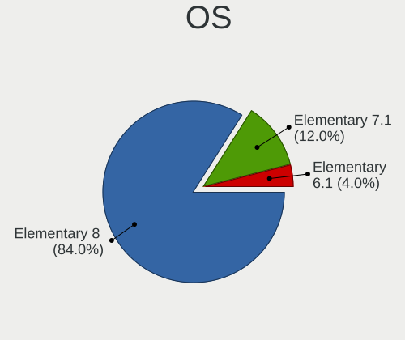

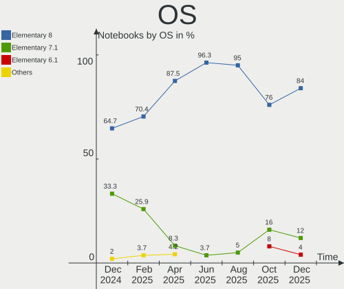

| Name           | Notebooks | Percent |
|----------------|-----------|---------|
| Elementary 8   | 21        | 84%     |
| Elementary 7.1 | 3         | 12%     |
| Elementary 6.1 | 1         | 4%      |

OS Family
---------

OS without a version

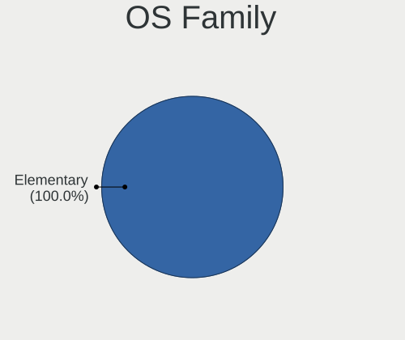

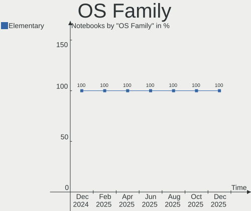

| Name       | Notebooks | Percent |
|------------|-----------|---------|
| Elementary | 25        | 100%    |

Kernel
------

Version of the Linux kernel

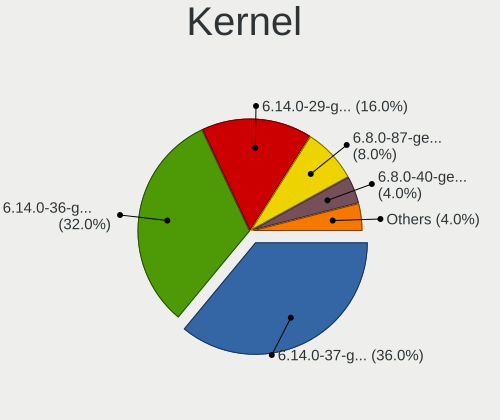

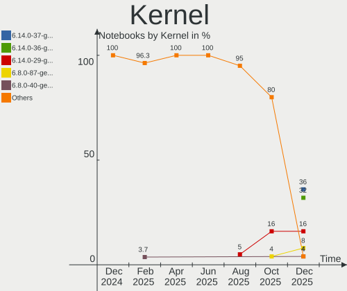

| Version            | Notebooks | Percent |
|--------------------|-----------|---------|
| 6.14.0-37-generic  | 9         | 36%     |
| 6.14.0-36-generic  | 8         | 32%     |
| 6.14.0-29-generic  | 4         | 16%     |
| 6.8.0-87-generic   | 2         | 8%      |
| 6.8.0-40-generic   | 1         | 4%      |
| 5.15.0-139-generic | 1         | 4%      |

Kernel Family
-------------

Linux kernel without a distro release

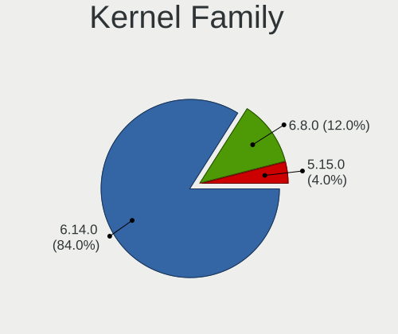

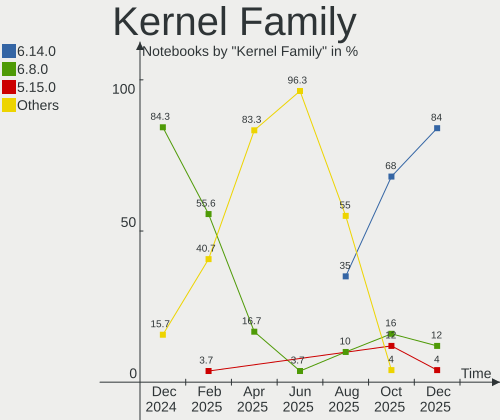

| Version | Notebooks | Percent |
|---------|-----------|---------|
| 6.14.0  | 21        | 84%     |
| 6.8.0   | 3         | 12%     |
| 5.15.0  | 1         | 4%      |

Kernel Major Ver.
-----------------

Linux kernel major version

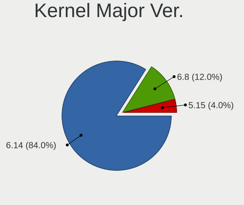

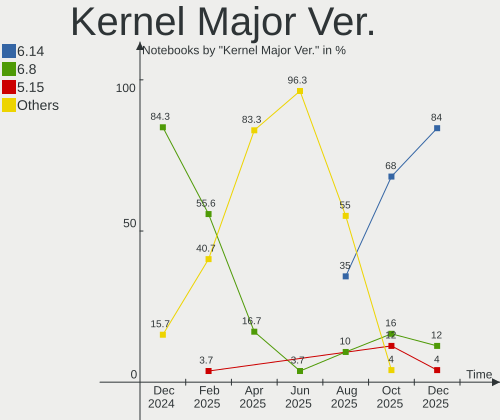

| Version | Notebooks | Percent |
|---------|-----------|---------|
| 6.14    | 21        | 84%     |
| 6.8     | 3         | 12%     |
| 5.15    | 1         | 4%      |

Arch
----

OS architecture (x86_64, i586, etc.)

| Name   | Notebooks | Percent |
|--------|-----------|---------|
| x86_64 | 25        | 100%    |

DE
--

Desktop Environment

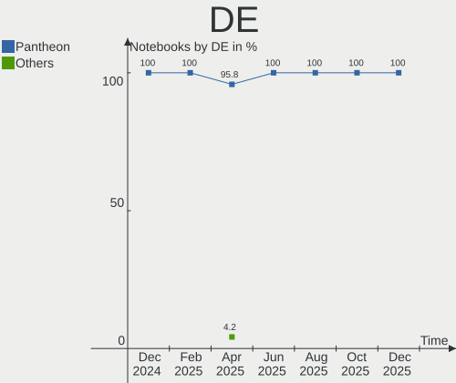

| Name     | Notebooks | Percent |
|----------|-----------|---------|
| Pantheon | 25        | 100%    |

Display Server
--------------

X11 or Wayland

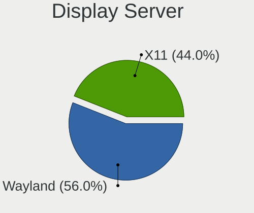

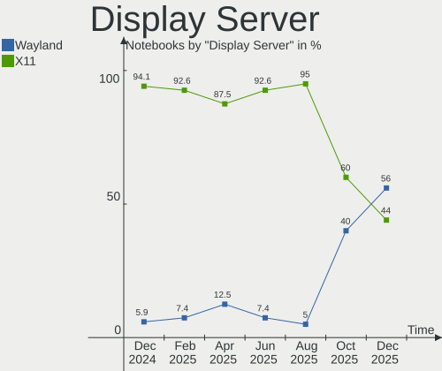

| Name    | Notebooks | Percent |
|---------|-----------|---------|
| Wayland | 14        | 56%     |
| X11     | 11        | 44%     |

Display Manager
---------------

SDDM, LightDM, etc.

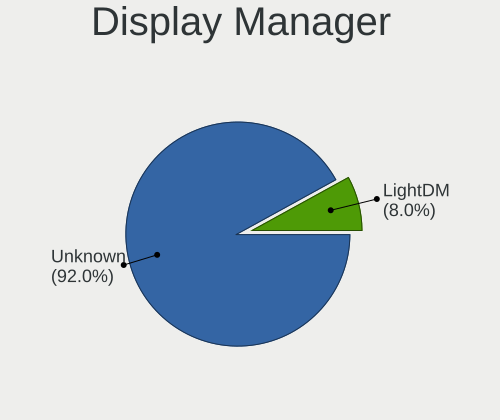

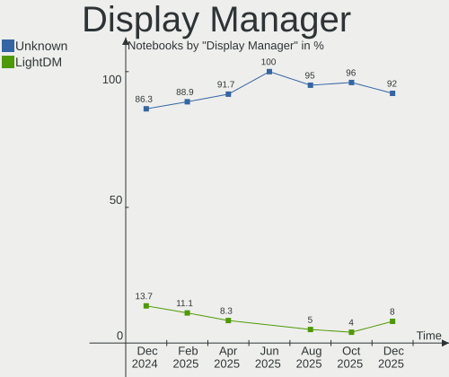

| Name    | Notebooks | Percent |
|---------|-----------|---------|
| Unknown | 23        | 92%     |
| LightDM | 2         | 8%      |

OS Lang
-------

Language

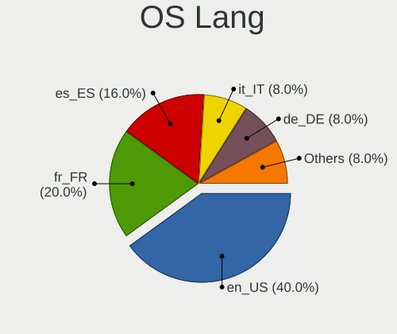

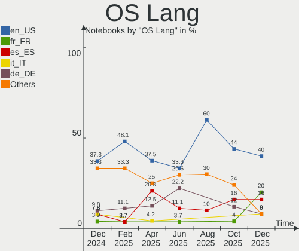

| Lang  | Notebooks | Percent |
|-------|-----------|---------|
| en_US | 10        | 40%     |
| fr_FR | 5         | 20%     |
| es_ES | 4         | 16%     |
| it_IT | 2         | 8%      |
| de_DE | 2         | 8%      |
| nl_NL | 1         | 4%      |
| nb_NO | 1         | 4%      |

Boot Mode
---------

EFI or BIOS

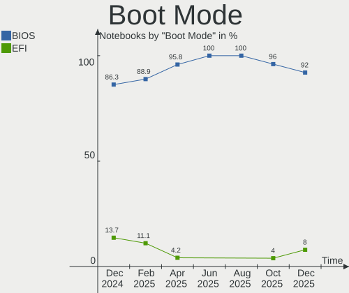

| Mode | Notebooks | Percent |
|------|-----------|---------|
| BIOS | 23        | 92%     |
| EFI  | 2         | 8%      |

Filesystem
----------

Type of filesystem

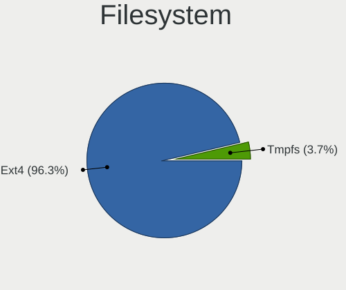

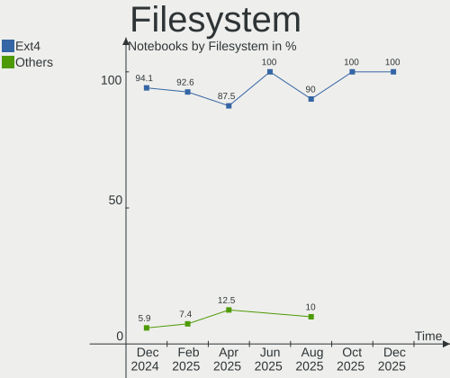

| Type | Notebooks | Percent |
|------|-----------|---------|
| Ext4 | 25        | 100%    |

Part. scheme
------------

Scheme of partitioning

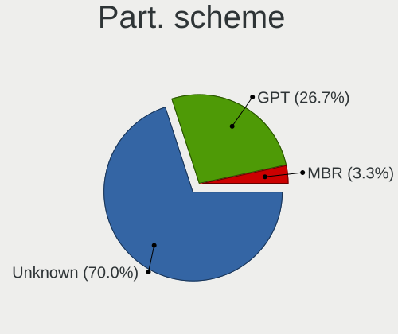

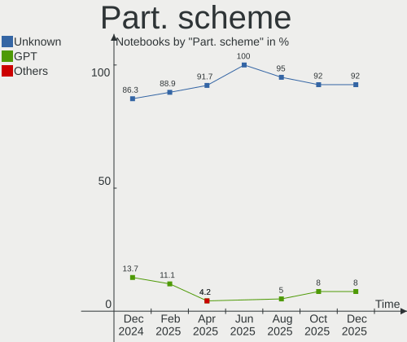

| Type    | Notebooks | Percent |
|---------|-----------|---------|
| Unknown | 23        | 92%     |
| GPT     | 2         | 8%      |

Dual Boot with Linux/BSD
------------------------

Hosting more than one Linux/BSD

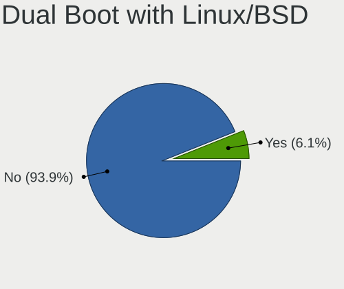

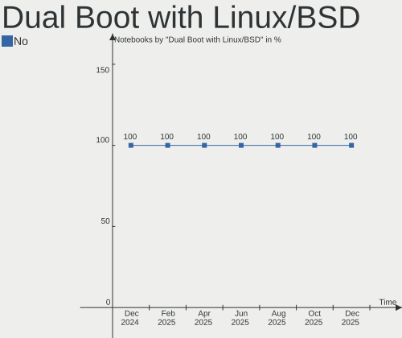

| Dual boot | Notebooks | Percent |
|-----------|-----------|---------|
| No        | 25        | 100%    |

Dual Boot (Win)
---------------

Hosting Linux and Windows

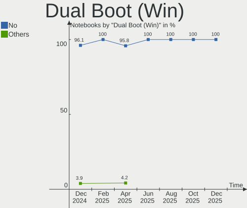

| Dual boot | Notebooks | Percent |
|-----------|-----------|---------|
| No        | 25        | 100%    |

Board
-----

Vendor
------

Motherboard manufacturer

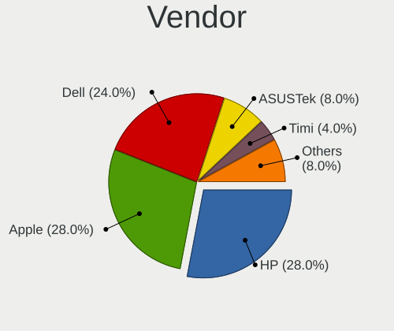

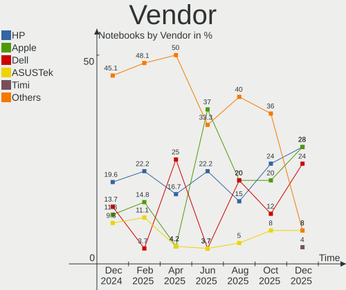

| Name             | Notebooks | Percent |
|------------------|-----------|---------|
| Hewlett-Packard  | 7         | 28%     |
| Apple            | 7         | 28%     |
| Dell             | 6         | 24%     |
| ASUSTek Computer | 2         | 8%      |
| Timi             | 1         | 4%      |
| Lenovo           | 1         | 4%      |
| Acer             | 1         | 4%      |

Model
-----

Motherboard model

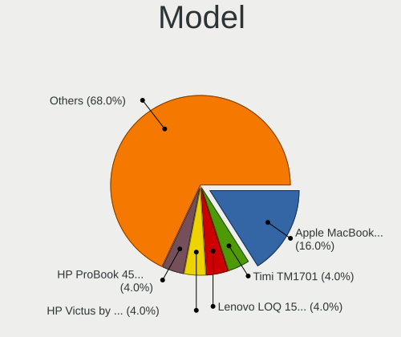

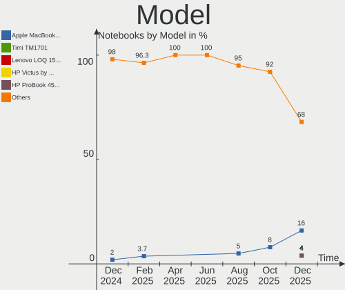

| Name                                 | Notebooks | Percent |
|--------------------------------------|-----------|---------|
| Apple MacBookPro8,1                  | 4         | 16%     |
| Timi TM1701                          | 1         | 4%      |
| Lenovo LOQ 15APH8 82XT               | 1         | 4%      |
| HP Victus by Gaming Laptop 15-fb0xxx | 1         | 4%      |
| HP ProBook 455 G8 Notebook PC        | 1         | 4%      |
| HP Pavilion dv7                      | 1         | 4%      |
| HP Pavilion dv6                      | 1         | 4%      |
| HP Laptop 15-bs1xx                   | 1         | 4%      |
| HP EliteBook 845 G7 Notebook PC      | 1         | 4%      |
| HP 15 Notebook PC                    | 1         | 4%      |
| Dell XPS 15 9530                     | 1         | 4%      |
| Dell Vostro1710                      | 1         | 4%      |
| Dell Latitude E5550                  | 1         | 4%      |
| Dell Latitude E5470                  | 1         | 4%      |
| Dell Latitude 7480                   | 1         | 4%      |
| Dell Latitude 5580                   | 1         | 4%      |
| ASUS K93SV                           | 1         | 4%      |
| ASUS GL752VW                         | 1         | 4%      |
| Apple MacBookPro9,2                  | 1         | 4%      |
| Apple MacBookPro9,1                  | 1         | 4%      |
| Apple MacBookPro11,1                 | 1         | 4%      |
| Acer Aspire E1-572                   | 1         | 4%      |

Model Family
------------

Motherboard model prefix

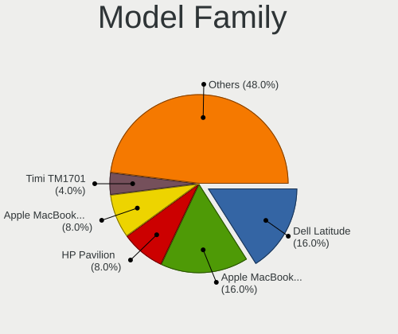

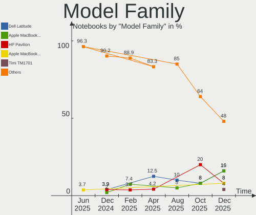

| Name               | Notebooks | Percent |
|--------------------|-----------|---------|
| Dell Latitude      | 4         | 16%     |
| Apple MacBookPro8  | 4         | 16%     |
| HP Pavilion        | 2         | 8%      |
| Apple MacBookPro9  | 2         | 8%      |
| Timi TM1701        | 1         | 4%      |
| Lenovo LOQ         | 1         | 4%      |
| HP Victus          | 1         | 4%      |
| HP ProBook         | 1         | 4%      |
| HP Laptop          | 1         | 4%      |
| HP EliteBook       | 1         | 4%      |
| HP 15              | 1         | 4%      |
| Dell XPS           | 1         | 4%      |
| Dell Vostro1710    | 1         | 4%      |
| ASUS K93SV         | 1         | 4%      |
| ASUS GL752VW       | 1         | 4%      |
| Apple MacBookPro11 | 1         | 4%      |
| Acer Aspire        | 1         | 4%      |

MFG Year
--------

Motherboard manufacture year

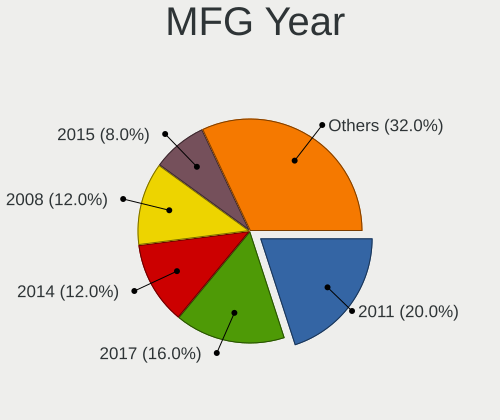

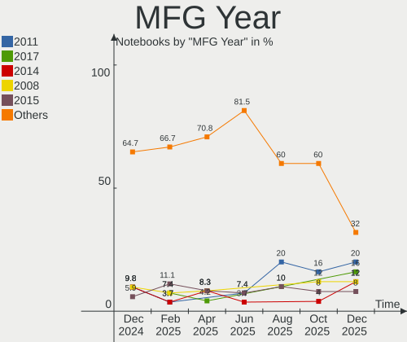

| Year | Notebooks | Percent |
|------|-----------|---------|
| 2011 | 5         | 20%     |
| 2017 | 4         | 16%     |
| 2014 | 3         | 12%     |
| 2008 | 3         | 12%     |
| 2015 | 2         | 8%      |
| 2012 | 2         | 8%      |
| 2023 | 1         | 4%      |
| 2022 | 1         | 4%      |
| 2021 | 1         | 4%      |
| 2020 | 1         | 4%      |
| 2016 | 1         | 4%      |
| 2013 | 1         | 4%      |

Form Factor
-----------

Physical design of the computer

| Name     | Notebooks | Percent |
|----------|-----------|---------|
| Notebook | 25        | 100%    |

Secure Boot
-----------

Enabled or disabled

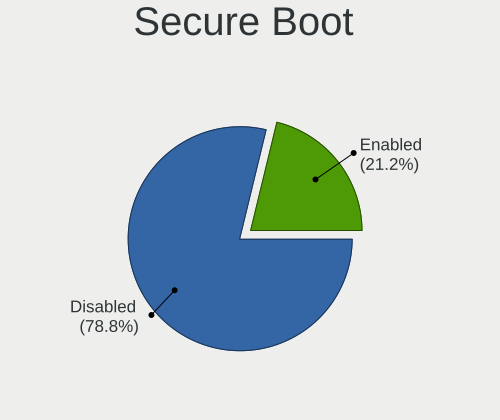

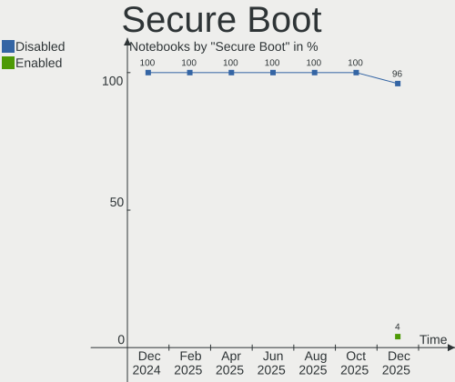

| State    | Notebooks | Percent |
|----------|-----------|---------|
| Disabled | 24        | 96%     |
| Enabled  | 1         | 4%      |

Coreboot
--------

Have coreboot on board

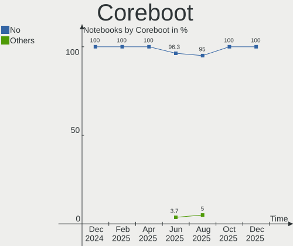

| Used | Notebooks | Percent |
|------|-----------|---------|
| No   | 25        | 100%    |

RAM Size
--------

Total RAM memory

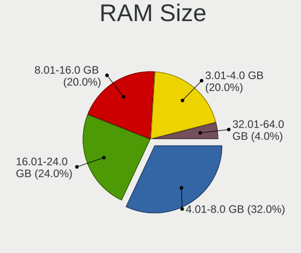

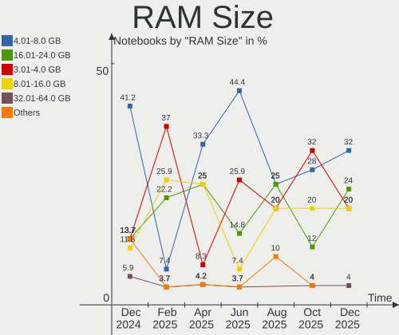

| Size in GB | Notebooks | Percent |
|------------|-----------|---------|
| 4.01-8.0   | 8         | 32%     |
| 16.01-24.0 | 6         | 24%     |
| 3.01-4.0   | 5         | 20%     |
| 8.01-16.0  | 5         | 20%     |
| 32.01-64.0 | 1         | 4%      |

RAM Used
--------

Used RAM memory

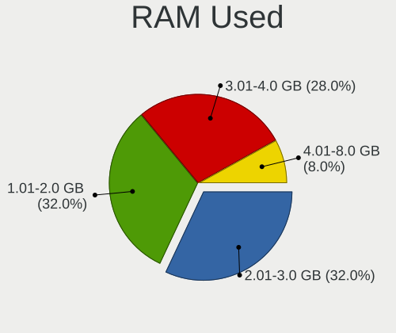

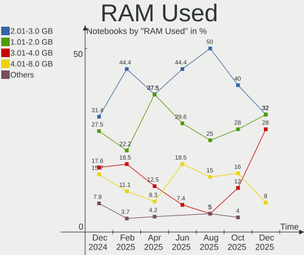

| Used GB  | Notebooks | Percent |
|----------|-----------|---------|
| 2.01-3.0 | 8         | 32%     |
| 1.01-2.0 | 8         | 32%     |
| 3.01-4.0 | 7         | 28%     |
| 4.01-8.0 | 2         | 8%      |

Total Drives
------------

Number of drives on board

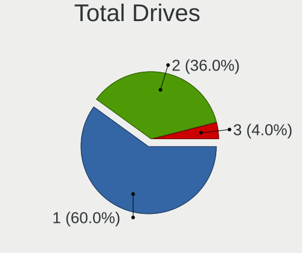

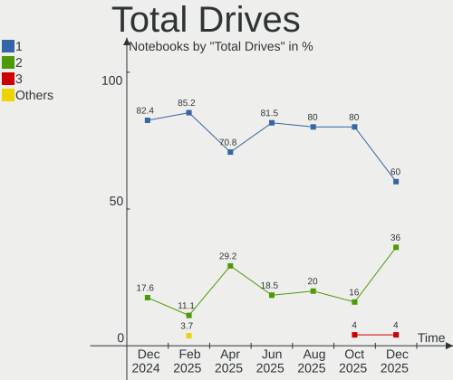

| Drives | Notebooks | Percent |
|--------|-----------|---------|
| 1      | 15        | 60%     |
| 2      | 9         | 36%     |
| 3      | 1         | 4%      |

Has CD-ROM
----------

Has CD-ROM on board

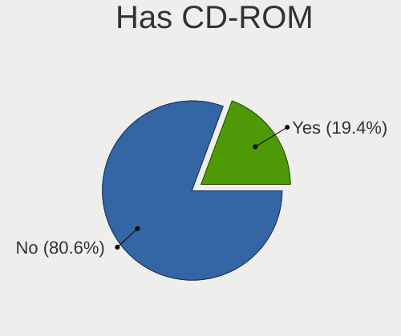

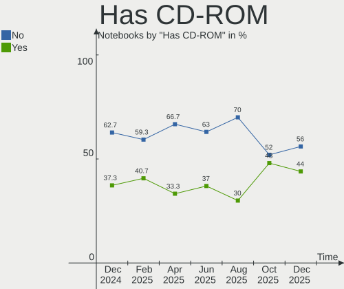

| Presented | Notebooks | Percent |
|-----------|-----------|---------|
| No        | 14        | 56%     |
| Yes       | 11        | 44%     |

Has Ethernet
------------

Has Ethernet on board

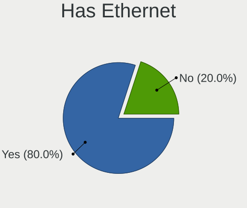

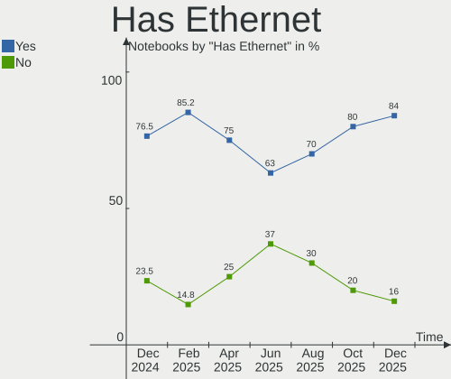

| Presented | Notebooks | Percent |
|-----------|-----------|---------|
| Yes       | 21        | 84%     |
| No        | 4         | 16%     |

Has WiFi
--------

Has WiFi module

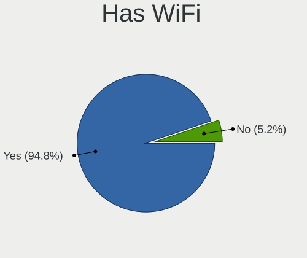

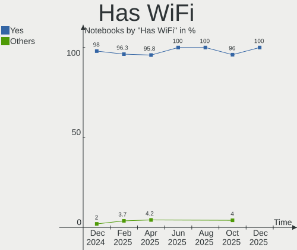

| Presented | Notebooks | Percent |
|-----------|-----------|---------|
| Yes       | 25        | 100%    |

Has Bluetooth
-------------

Has Bluetooth module

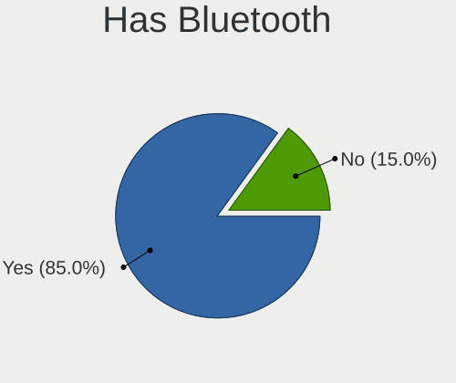

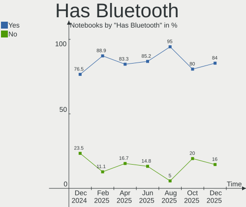

| Presented | Notebooks | Percent |
|-----------|-----------|---------|
| Yes       | 21        | 84%     |
| No        | 4         | 16%     |

Location
--------

Country
-------

Geographic location (country)

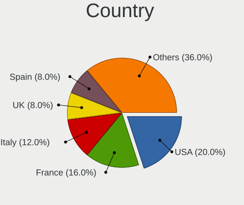

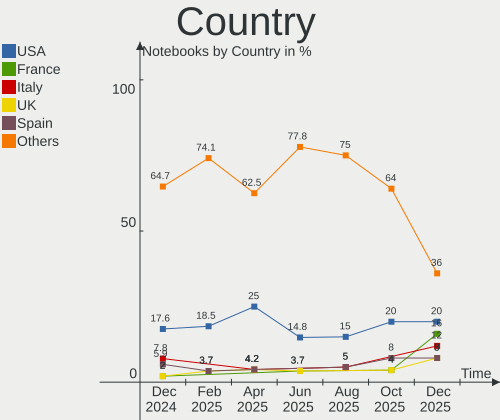

| Country   | Notebooks | Percent |
|-----------|-----------|---------|
| USA       | 5         | 20%     |
| France    | 4         | 16%     |
| Italy     | 3         | 12%     |
| UK        | 2         | 8%      |
| Spain     | 2         | 8%      |
| Germany   | 2         | 8%      |
| Norway    | 1         | 4%      |
| Japan     | 1         | 4%      |
| Indonesia | 1         | 4%      |
| India     | 1         | 4%      |
| Canada    | 1         | 4%      |
| Bolivia   | 1         | 4%      |
| Belgium   | 1         | 4%      |

City
----

Geographic location (city)

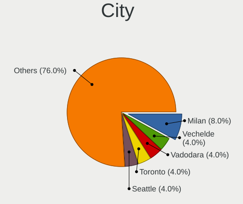

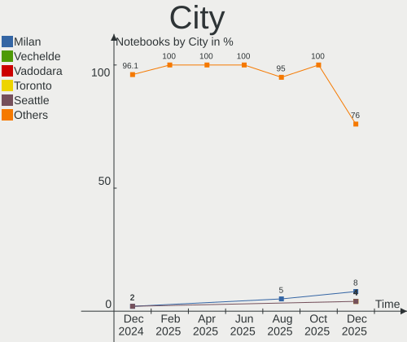

| City            | Notebooks | Percent |
|-----------------|-----------|---------|
| Milan           | 2         | 8%      |
| Vechelde        | 1         | 4%      |
| Vadodara        | 1         | 4%      |
| Toronto         | 1         | 4%      |
| Seattle         | 1         | 4%      |
| Rosny-sous-Bois | 1         | 4%      |
| Overijse        | 1         | 4%      |
| Oslo            | 1         | 4%      |
| New York        | 1         | 4%      |
| Münster        | 1         | 4%      |
| Madrid          | 1         | 4%      |
| Lille           | 1         | 4%      |
| La Paz          | 1         | 4%      |
| Jakarta         | 1         | 4%      |
| High Wycombe    | 1         | 4%      |
| Gonzales        | 1         | 4%      |
| Chatan          | 1         | 4%      |
| Cesson          | 1         | 4%      |
| Calcinaia       | 1         | 4%      |
| Brumath         | 1         | 4%      |
| Bromley         | 1         | 4%      |
| Barcelona       | 1         | 4%      |
| Aurora          | 1         | 4%      |
| Atlanta         | 1         | 4%      |

Drives
------

Drive Vendor
------------

Hard drive vendors

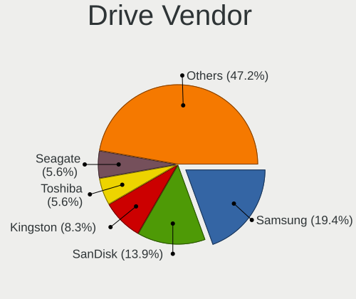

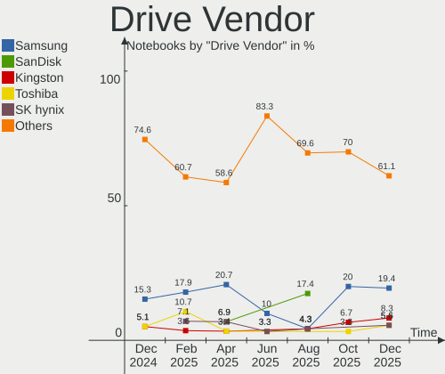

| Vendor                       | Notebooks | Drives | Percent |
|------------------------------|-----------|--------|---------|
| Samsung Electronics          | 7         | 7      | 19.44%  |
| SanDisk                      | 5         | 5      | 13.89%  |
| Kingston                     | 3         | 3      | 8.33%   |
| Toshiba                      | 2         | 2      | 5.56%   |
| SK hynix                     | 2         | 2      | 5.56%   |
| Seagate                      | 2         | 2      | 5.56%   |
| KingSpec                     | 2         | 2      | 5.56%   |
| Crucial                      | 2         | 2      | 5.56%   |
| WDC                          | 1         | 1      | 2.78%   |
| V-GeN                        | 1         | 1      | 2.78%   |
| Shenzhen Longsys Electronics | 1         | 1      | 2.78%   |
| Patriot                      | 1         | 1      | 2.78%   |
| MAXIO Technology (Hangzhou)  | 1         | 1      | 2.78%   |
| Kingston Technology Company  | 1         | 1      | 2.78%   |
| JMicron Technology           | 1         | 1      | 2.78%   |
| Hitachi                      | 1         | 1      | 2.78%   |
| Fujitsu                      | 1         | 1      | 2.78%   |
| China                        | 1         | 1      | 2.78%   |
| Apple                        | 1         | 1      | 2.78%   |

Drive Model
-----------

Hard drive models

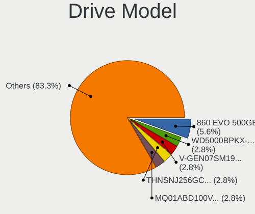

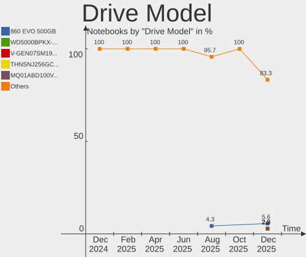

| Model                                              | Notebooks | Percent |
|----------------------------------------------------|-----------|---------|
| Samsung SSD 860 EVO 500GB                          | 2         | 5.56%   |
| WDC WD5000BPKX-75HPJT0 500GB                       | 1         | 2.78%   |
| V-GeN V-GEN07SM19EG240GBIT                         | 1         | 2.78%   |
| Toshiba THNSNJ256GCSU 256GB SSD                    | 1         | 2.78%   |
| Toshiba MQ01ABD100V -63 1TB                        | 1         | 2.78%   |
| SK hynix SC311 SATA 512GB SSD                      | 1         | 2.78%   |
| SK hynix PC711 HFS512GDE9X073N 512GB               | 1         | 2.78%   |
| Shenzhen Longsys Lexar SSD NM620 256GB             | 1         | 2.78%   |
| Seagate ST9500420AS 500GB                          | 1         | 2.78%   |
| Seagate ST500LT012-1DG142 500GB                    | 1         | 2.78%   |
| Sandisk Western Digital SN560E 1TB                 | 1         | 2.78%   |
| Sandisk WD Blue SN550 NVMe SSD 1024GB              | 1         | 2.78%   |
| Sandisk WD Black SN850 1TB                         | 1         | 2.78%   |
| SanDisk NVMe SSD Drive 500GB                       | 1         | 2.78%   |
| SanDisk 3.2 Gen 1 250GB SSD                        | 1         | 2.78%   |
| Samsung SSD 850 EVO 500GB                          | 1         | 2.78%   |
| Samsung NVMe SSD Controller SM981/PM981/PM983 1TB  | 1         | 2.78%   |
| Samsung NVMe SSD Controller PM9A1/PM9A3/980PRO 1TB | 1         | 2.78%   |
| Samsung MZYTN512HDJH-000 512GB SSD                 | 1         | 2.78%   |
| Samsung MZNLF128HCHP-00004 128GB SSD               | 1         | 2.78%   |
| Patriot Burst Elite 240GB SSD                      | 1         | 2.78%   |
| MAXIO (Hangzhou) NVMe SSD Controller MAP1202 2TB   | 1         | 2.78%   |
| Kingston Company SNV2S1000G 1TB                    | 1         | 2.78%   |
| Kingston SKC600512G 512GB SSD                      | 1         | 2.78%   |
| Kingston SHSS37A240G 240GB SSD                     | 1         | 2.78%   |
| Kingston SA400S37480G 480GB SSD                    | 1         | 2.78%   |
| KingSpec P3-1TB SSD                                | 1         | 2.78%   |
| KingSpec MT-256 256GB SSD                          | 1         | 2.78%   |
| JMicron Disk 1TB                                   | 1         | 2.78%   |
| Hitachi HTS545032B9A302 320GB                      | 1         | 2.78%   |
| Fujitsu MJA2500BH G2 500GB                         | 1         | 2.78%   |
| Crucial CT500MX500SSD1 500GB                       | 1         | 2.78%   |
| Crucial CT240BX500SSD1 240GB                       | 1         | 2.78%   |
| China SSD 256GB                                    | 1         | 2.78%   |
| Apple SSD SM0256G 256GB                            | 1         | 2.78%   |

HDD Vendor
----------

Hard disk drive vendors

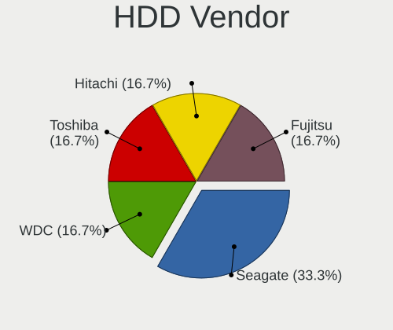

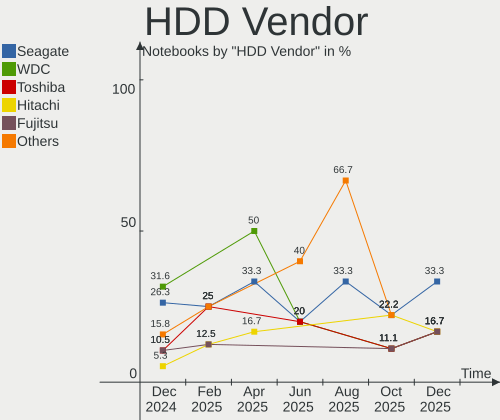

| Vendor  | Notebooks | Drives | Percent |
|---------|-----------|--------|---------|
| Seagate | 2         | 2      | 33.33%  |
| WDC     | 1         | 1      | 16.67%  |
| Toshiba | 1         | 1      | 16.67%  |
| Hitachi | 1         | 1      | 16.67%  |
| Fujitsu | 1         | 1      | 16.67%  |

SSD Vendor
----------

Solid state drive vendors

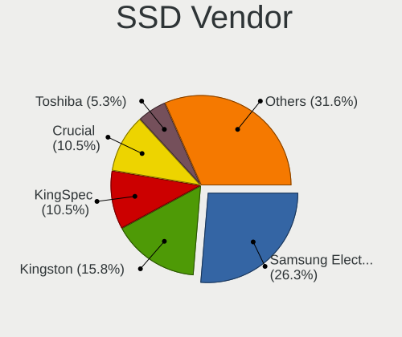

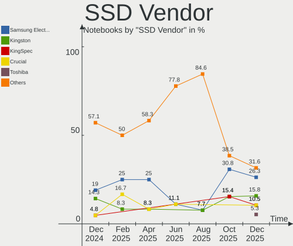

| Vendor              | Notebooks | Drives | Percent |
|---------------------|-----------|--------|---------|
| Samsung Electronics | 5         | 5      | 26.32%  |
| Kingston            | 3         | 3      | 15.79%  |
| KingSpec            | 2         | 2      | 10.53%  |
| Crucial             | 2         | 2      | 10.53%  |
| Toshiba             | 1         | 1      | 5.26%   |
| SK hynix            | 1         | 1      | 5.26%   |
| SanDisk             | 1         | 1      | 5.26%   |
| Patriot             | 1         | 1      | 5.26%   |
| JMicron Technology  | 1         | 1      | 5.26%   |
| China               | 1         | 1      | 5.26%   |
| Apple               | 1         | 1      | 5.26%   |

Drive Kind
----------

HDD or SSD

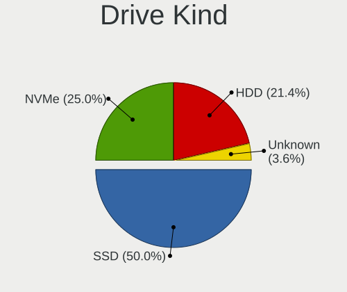

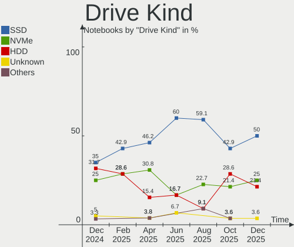

| Kind    | Notebooks | Drives | Percent |
|---------|-----------|--------|---------|
| SSD     | 14        | 19     | 50%     |
| NVMe    | 7         | 10     | 25%     |
| HDD     | 6         | 6      | 21.43%  |
| Unknown | 1         | 1      | 3.57%   |

Drive Connector
---------------

SATA, SAS, NVMe, etc.

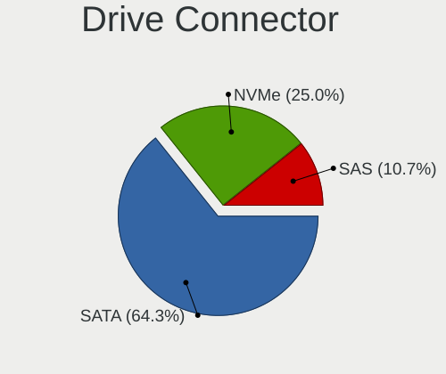

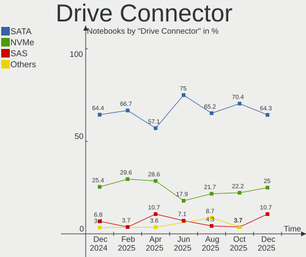

| Type | Notebooks | Drives | Percent |
|------|-----------|--------|---------|
| SATA | 18        | 23     | 64.29%  |
| NVMe | 7         | 10     | 25%     |
| SAS  | 3         | 3      | 10.71%  |

Drive Size
----------

Size of hard drive

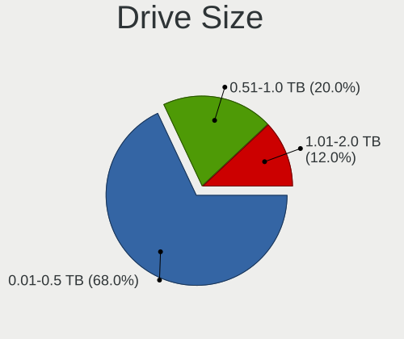

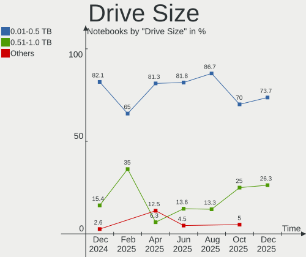

| Size in TB | Notebooks | Drives | Percent |
|------------|-----------|--------|---------|
| 0.01-0.5   | 14        | 19     | 73.68%  |
| 0.51-1.0   | 5         | 6      | 26.32%  |

Space Total
-----------

Amount of disk space available on the file system

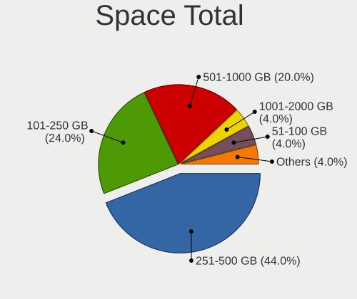

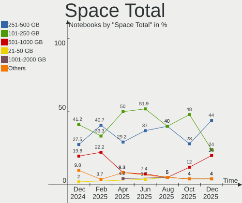

| Size in GB | Notebooks | Percent |
|------------|-----------|---------|
| 251-500    | 11        | 44%     |
| 101-250    | 6         | 24%     |
| 501-1000   | 5         | 20%     |
| 21-50      | 1         | 4%      |
| 1001-2000  | 1         | 4%      |
| 51-100     | 1         | 4%      |

Space Used
----------

Amount of used disk space

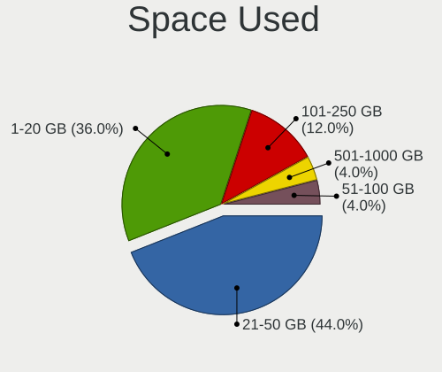

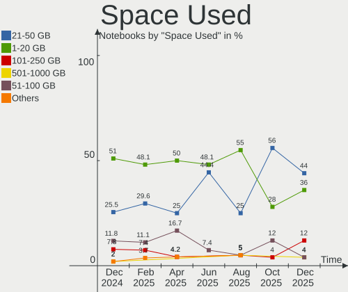

| Used GB  | Notebooks | Percent |
|----------|-----------|---------|
| 21-50    | 11        | 44%     |
| 1-20     | 9         | 36%     |
| 101-250  | 3         | 12%     |
| 501-1000 | 1         | 4%      |
| 51-100   | 1         | 4%      |

Malfunc. Drives
---------------

Drive models with a malfunction

Zero info for selected period =(

Malfunc. Drive Vendor
---------------------

Vendors of faulty drives

Zero info for selected period =(

Malfunc. HDD Vendor
-------------------

Vendors of faulty HDD drives

Zero info for selected period =(

Malfunc. Drive Kind
-------------------

Kinds of faulty drives

Zero info for selected period =(

Failed Drives
-------------

Failed drive models

Zero info for selected period =(

Failed Drive Vendor
-------------------

Failed drive vendors

Zero info for selected period =(

Drive Status
------------

Number of failed and malfunc. drives

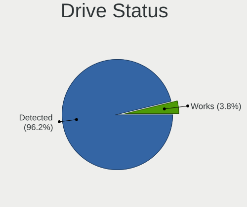

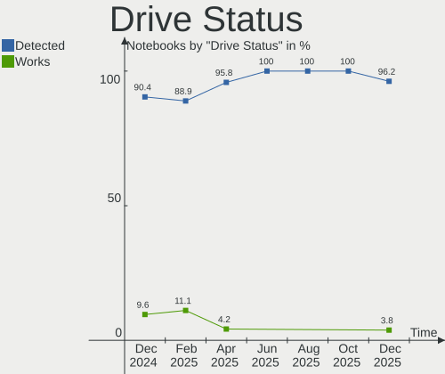

| Status   | Notebooks | Drives | Percent |
|----------|-----------|--------|---------|
| Detected | 25        | 35     | 96.15%  |
| Works    | 1         | 1      | 3.85%   |

Storage controller
------------------

Storage Vendor
--------------

Storage controller vendors

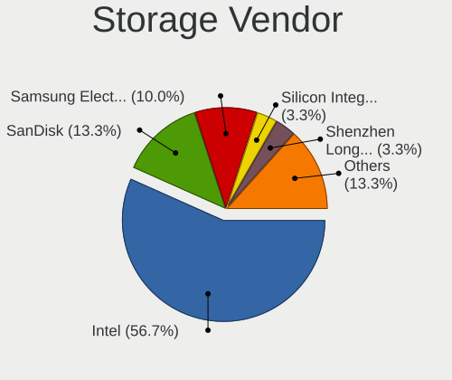

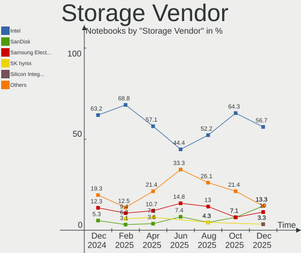

| Vendor                           | Notebooks | Percent |
|----------------------------------|-----------|---------|
| Intel                            | 17        | 56.67%  |
| SanDisk                          | 4         | 13.33%  |
| Samsung Electronics              | 3         | 10%     |
| SK hynix                         | 1         | 3.33%   |
| Silicon Integrated Systems [SiS] | 1         | 3.33%   |
| Shenzhen Longsys Electronics     | 1         | 3.33%   |
| MAXIO Technology (Hangzhou)      | 1         | 3.33%   |
| Kingston Technology Company      | 1         | 3.33%   |
| AMD                              | 1         | 3.33%   |

Storage Model
-------------

Storage controller models

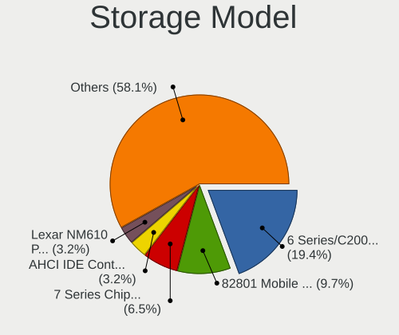

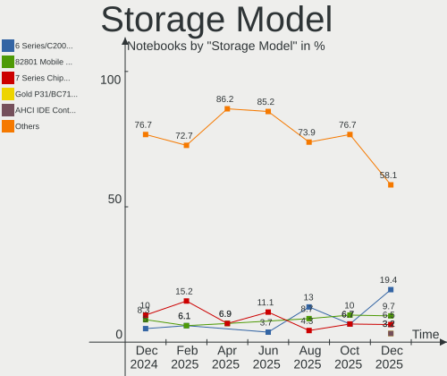

| Model                                                                        | Notebooks | Percent |
|------------------------------------------------------------------------------|-----------|---------|
| Intel 6 Series/C200 Series Chipset Family 6 port Mobile SATA AHCI Controller | 6         | 19.35%  |
| Intel 82801 Mobile SATA Controller [RAID mode]                               | 3         | 9.68%   |
| Intel 7 Series Chipset Family 6-port SATA Controller [AHCI mode]             | 2         | 6.45%   |
| SK hynix Gold P31/BC711/PC711 NVMe Solid State Drive                         | 1         | 3.23%   |
| Silicon Integrated Systems [SiS] AHCI IDE Controller (0106)                  | 1         | 3.23%   |
| Shenzhen Longsys Lexar NM610 PRO NVME SSD (DRAM-less)                        | 1         | 3.23%   |
| SanDisk WD PC SN810 / Black SN850 NVMe SSD                                   | 1         | 3.23%   |
| SanDisk WD Green SN350 240GB (DRAM-less) / SN560E NVMe SSD                   | 1         | 3.23%   |
| Sandisk WD Blue SN5100 NVMe SSD (DRAM-less)                                  | 1         | 3.23%   |
| SanDisk Ultra 3D / WD PC SN530, IX SN530, Blue SN550 NVMe SSD (DRAM-less)    | 1         | 3.23%   |
| Samsung S4LN058A01[SSUBX] AHCI SSD Controller (Apple slot)                   | 1         | 3.23%   |
| Samsung NVMe SSD Controller SM981/PM981/PM983                                | 1         | 3.23%   |
| Samsung NVMe SSD Controller PM9A1/PM9A3/980PRO                               | 1         | 3.23%   |
| MAXIO (Hangzhou) NVMe SSD Controller MAP1202 (DRAM-less)                     | 1         | 3.23%   |
| Kingston Company NV2 NVMe SSD [SM2267XT] (DRAM-less)                         | 1         | 3.23%   |
| Intel Sunrise Point-LP SATA Controller [AHCI mode]                           | 1         | 3.23%   |
| Intel RST Volume Management Device Controller                                | 1         | 3.23%   |
| Intel HM170/QM170 Chipset SATA Controller [AHCI Mode]                        | 1         | 3.23%   |
| Intel 82801IBM/IEM (ICH9M/ICH9M-E) 4 port SATA Controller [AHCI mode]        | 1         | 3.23%   |
| Intel 82801HM/HEM (ICH8M/ICH8M-E) SATA Controller [AHCI mode]                | 1         | 3.23%   |
| Intel 82801HM/HEM (ICH8M/ICH8M-E) IDE Controller                             | 1         | 3.23%   |
| Intel 8 Series SATA Controller 1 [AHCI mode]                                 | 1         | 3.23%   |
| AMD FCH SATA Controller [AHCI mode]                                          | 1         | 3.23%   |

Storage Kind
------------

Kind of storage controller (IDE, SATA, NVMe, SAS, ...)

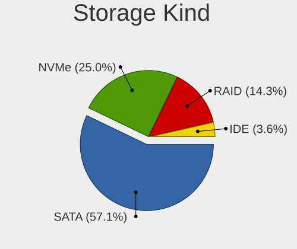

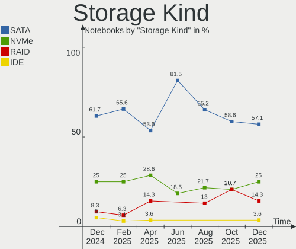

| Kind | Notebooks | Percent |
|------|-----------|---------|
| SATA | 16        | 57.14%  |
| NVMe | 7         | 25%     |
| RAID | 4         | 14.29%  |
| IDE  | 1         | 3.57%   |

Processor
---------

CPU Vendor
----------

Processor vendors

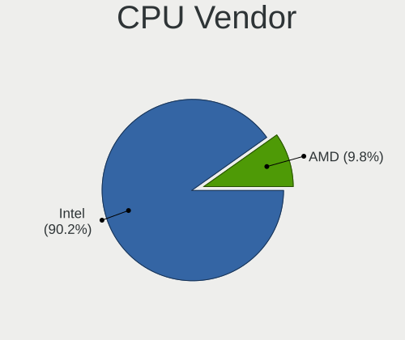

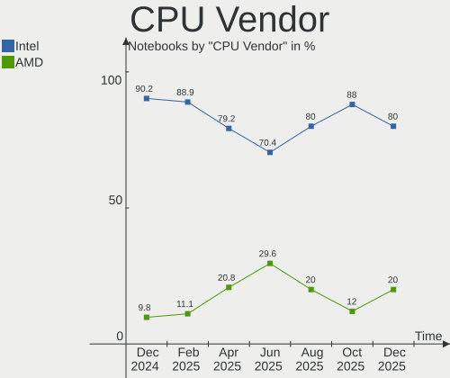

| Vendor | Notebooks | Percent |
|--------|-----------|---------|
| Intel  | 20        | 80%     |
| AMD    | 5         | 20%     |

CPU Model
---------

Processor models

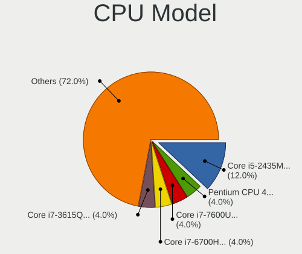

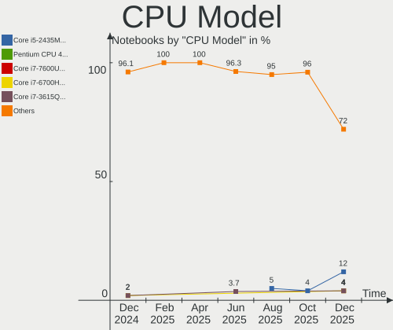

| Model                                       | Notebooks | Percent |
|---------------------------------------------|-----------|---------|
| Intel Core i5-2435M CPU @ 2.40GHz           | 3         | 12%     |
| Intel Pentium CPU 4417U @ 2.30GHz           | 1         | 4%      |
| Intel Core i7-7600U CPU @ 2.80GHz           | 1         | 4%      |
| Intel Core i7-6700HQ CPU @ 2.60GHz          | 1         | 4%      |
| Intel Core i7-3615QM CPU @ 2.30GHz          | 1         | 4%      |
| Intel Core i7-2670QM CPU @ 2.20GHz          | 1         | 4%      |
| Intel Core i5-8250U CPU @ 1.60GHz           | 1         | 4%      |
| Intel Core i5-6300U CPU @ 2.40GHz           | 1         | 4%      |
| Intel Core i5-6200U CPU @ 2.30GHz           | 1         | 4%      |
| Intel Core i5-4278U CPU @ 2.60GHz           | 1         | 4%      |
| Intel Core i5-4200U CPU @ 1.60GHz           | 1         | 4%      |
| Intel Core i5-3210M CPU @ 2.50GHz           | 1         | 4%      |
| Intel Core i5-2415M CPU @ 2.30GHz           | 1         | 4%      |
| Intel Core i5-2410M CPU @ 2.30GHz           | 1         | 4%      |
| Intel Core i3-5010U CPU @ 2.10GHz           | 1         | 4%      |
| Intel Core 2 Duo CPU T8100 @ 2.10GHz        | 1         | 4%      |
| Intel Core 2 Duo CPU P8700 @ 2.53GHz        | 1         | 4%      |
| Intel 13th Gen Core i7-13700H               | 1         | 4%      |
| AMD Ryzen 7 7840HS w/ Radeon 780M Graphics  | 1         | 4%      |
| AMD Ryzen 7 5800U with Radeon Graphics      | 1         | 4%      |
| AMD Ryzen 5 PRO 4650U with Radeon Graphics  | 1         | 4%      |
| AMD Ryzen 5 5600H with Radeon Graphics      | 1         | 4%      |
| AMD A8-7410 APU with AMD Radeon R5 Graphics | 1         | 4%      |

CPU Model Family
----------------

Processor model prefix

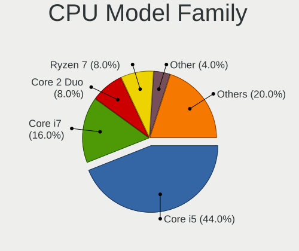

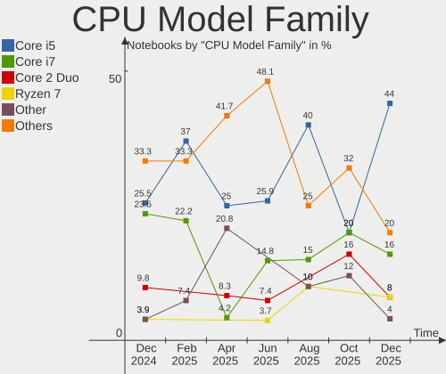

| Model            | Notebooks | Percent |
|------------------|-----------|---------|
| Intel Core i5    | 11        | 44%     |
| Intel Core i7    | 4         | 16%     |
| Intel Core 2 Duo | 2         | 8%      |
| AMD Ryzen 7      | 2         | 8%      |
| Other            | 1         | 4%      |
| Intel Pentium    | 1         | 4%      |
| Intel Core i3    | 1         | 4%      |
| AMD Ryzen 5 PRO  | 1         | 4%      |
| AMD Ryzen 5      | 1         | 4%      |
| AMD A8           | 1         | 4%      |

CPU Cores
---------

Number of processor cores

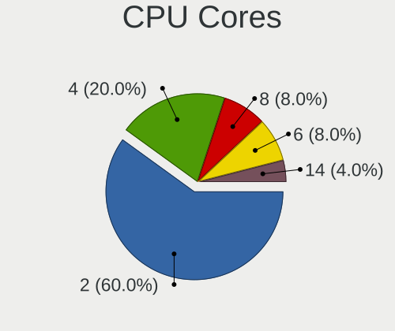

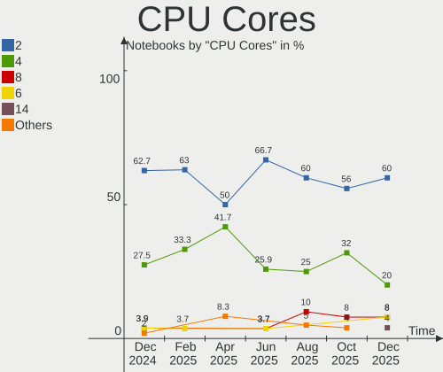

| Number | Notebooks | Percent |
|--------|-----------|---------|
| 2      | 15        | 60%     |
| 4      | 5         | 20%     |
| 8      | 2         | 8%      |
| 6      | 2         | 8%      |
| 14     | 1         | 4%      |

CPU Sockets
-----------

Number of sockets

| Number | Notebooks | Percent |
|--------|-----------|---------|
| 1      | 25        | 100%    |

CPU Threads
-----------

Threads per core (Hyper-Threading)

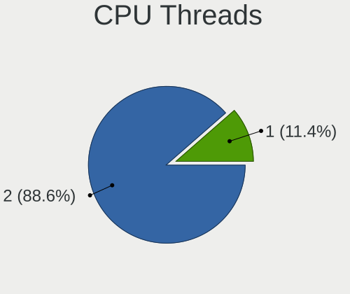

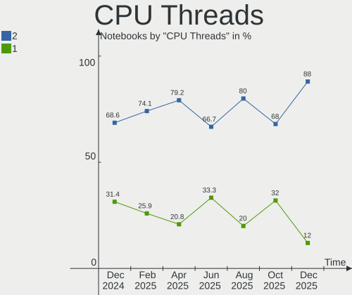

| Number | Notebooks | Percent |
|--------|-----------|---------|
| 2      | 22        | 88%     |
| 1      | 3         | 12%     |

CPU Op-Modes
------------

CPU Operation Modes (32-bit, 64-bit)

| Op mode        | Notebooks | Percent |
|----------------|-----------|---------|
| 32-bit, 64-bit | 25        | 100%    |

CPU Microcode
-------------

Microcode number

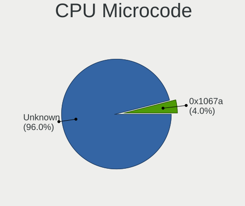

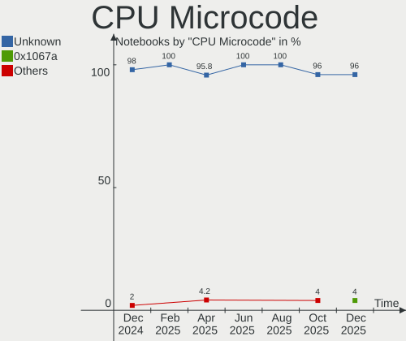

| Number  | Notebooks | Percent |
|---------|-----------|---------|
| Unknown | 24        | 96%     |
| 0x1067a | 1         | 4%      |

CPU Microarch
-------------

Microarchitecture

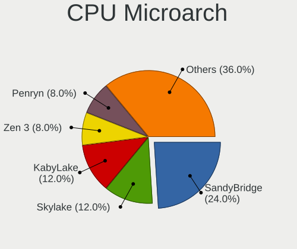

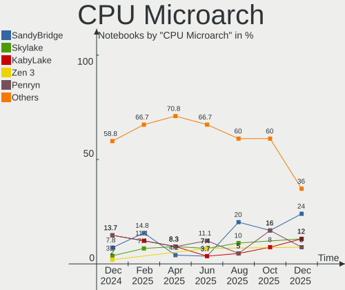

| Name        | Notebooks | Percent |
|-------------|-----------|---------|
| SandyBridge | 6         | 24%     |
| Skylake     | 3         | 12%     |
| KabyLake    | 3         | 12%     |
| Zen 3       | 2         | 8%      |
| Penryn      | 2         | 8%      |
| IvyBridge   | 2         | 8%      |
| Haswell     | 2         | 8%      |
| Unknown     | 2         | 8%      |
| Zen 2       | 1         | 4%      |
| Puma        | 1         | 4%      |
| Broadwell   | 1         | 4%      |

Graphics
--------

GPU Vendor
----------

Vendors of graphics cards

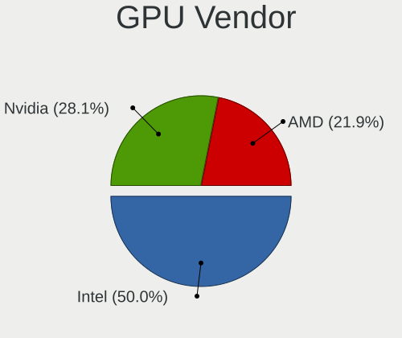

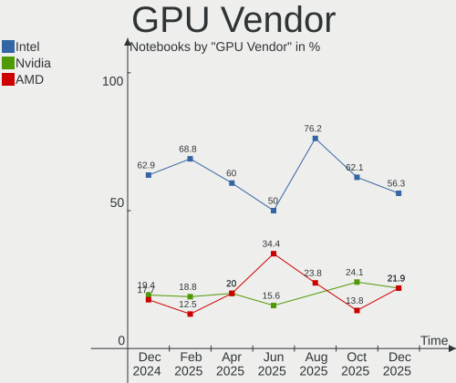

| Vendor | Notebooks | Percent |
|--------|-----------|---------|
| Intel  | 18        | 56.25%  |
| Nvidia | 7         | 21.88%  |
| AMD    | 7         | 21.88%  |

GPU Model
---------

Graphics card models

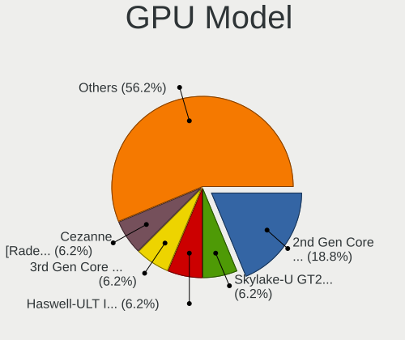

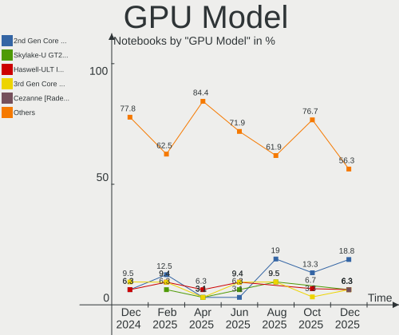

| Model                                                                     | Notebooks | Percent |
|---------------------------------------------------------------------------|-----------|---------|
| Intel 2nd Generation Core Processor Family Integrated Graphics Controller | 6         | 18.75%  |
| Intel Skylake-U GT2 [HD Graphics 520]                                     | 2         | 6.25%   |
| Intel Haswell-ULT Integrated Graphics Controller                          | 2         | 6.25%   |
| Intel 3rd Gen Core processor Graphics Controller                          | 2         | 6.25%   |
| AMD Cezanne [Radeon Vega Series / Radeon Vega Mobile Series]              | 2         | 6.25%   |
| Nvidia GP108M [GeForce MX150]                                             | 1         | 3.13%   |
| Nvidia GM107M [GeForce GTX 960M]                                          | 1         | 3.13%   |
| Nvidia GK107M [GeForce GT 650M Mac Edition]                               | 1         | 3.13%   |
| Nvidia GF108M [GeForce GT 540M]                                           | 1         | 3.13%   |
| Nvidia GA107M [GeForce RTX 3050 Mobile]                                   | 1         | 3.13%   |
| Nvidia G86M [GeForce 8600M GS]                                            | 1         | 3.13%   |
| Nvidia AD107M [GeForce RTX 4050 Max-Q / Mobile]                           | 1         | 3.13%   |
| Intel Skylake-H GT2 [HD Graphics 530]                                     | 1         | 3.13%   |
| Intel Raptor Lake-P [Iris Xe Graphics]                                    | 1         | 3.13%   |
| Intel Kaby Lake-U GT2 [HD Graphics 620]                                   | 1         | 3.13%   |
| Intel Kaby Lake-U GT1 [HD Graphics 610]                                   | 1         | 3.13%   |
| Intel Kaby Lake-R GT2 [UHD Graphics 620]                                  | 1         | 3.13%   |
| Intel Broadwell-U GT2 [HD Graphics 5500]                                  | 1         | 3.13%   |
| AMD Seymour [Radeon HD 6400M/7400M Series]                                | 1         | 3.13%   |
| AMD RV710/M92 [Mobility Radeon HD 4530/4570/5145/530v/540v/545v]          | 1         | 3.13%   |
| AMD Renoir [Radeon Vega Series / Radeon Vega Mobile Series]               | 1         | 3.13%   |
| AMD Phoenix1                                                              | 1         | 3.13%   |
| AMD Mullins [Radeon R4/R5 Graphics]                                       | 1         | 3.13%   |

GPU Combo
---------

Combinations of graphics cards

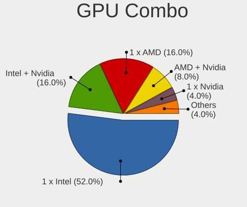

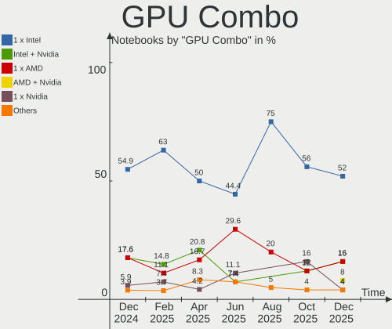

| Name           | Notebooks | Percent |
|----------------|-----------|---------|
| 1 x Intel      | 13        | 52%     |
| Intel + Nvidia | 4         | 16%     |
| 1 x AMD        | 4         | 16%     |
| AMD + Nvidia   | 2         | 8%      |
| 1 x Nvidia     | 1         | 4%      |
| Intel + AMD    | 1         | 4%      |

GPU Driver
----------

Free vs proprietary

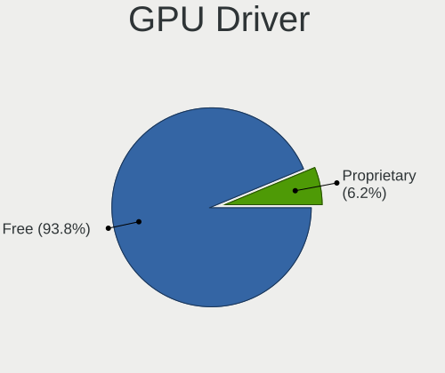

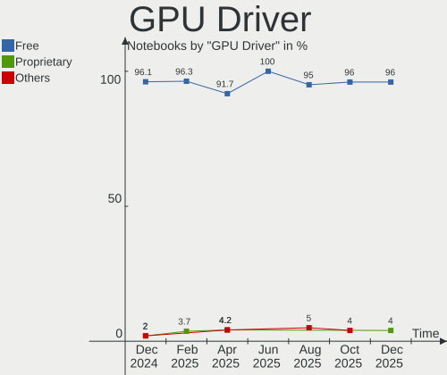

| Driver      | Notebooks | Percent |
|-------------|-----------|---------|
| Free        | 24        | 96%     |
| Proprietary | 1         | 4%      |

GPU Memory
----------

Total video memory

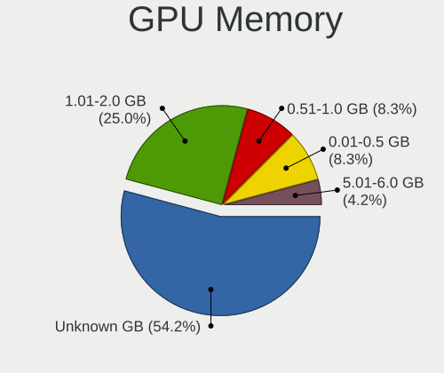

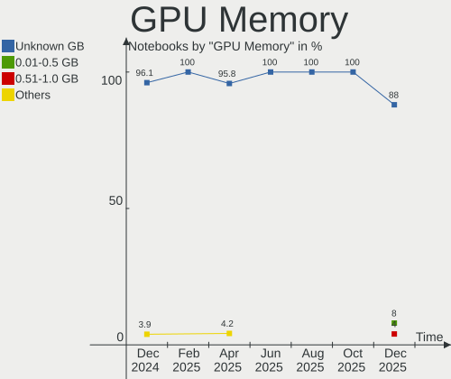

| Size in GB | Notebooks | Percent |
|------------|-----------|---------|
| Unknown    | 22        | 88%     |
| 0.01-0.5   | 2         | 8%      |
| 0.51-1.0   | 1         | 4%      |

Monitor
-------

Monitor Vendor
--------------

Monitor vendors

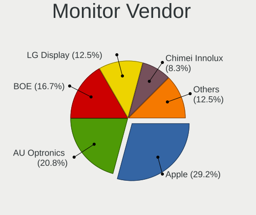

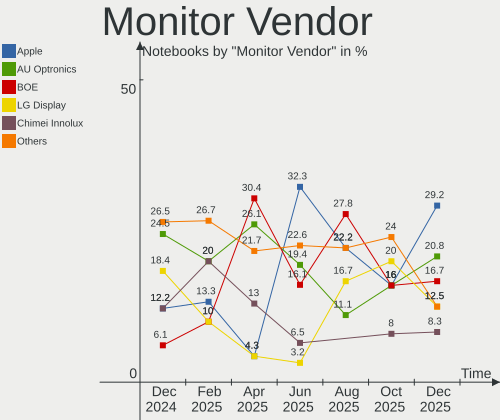

| Vendor                  | Notebooks | Percent |
|-------------------------|-----------|---------|
| Apple                   | 7         | 29.17%  |
| AU Optronics            | 5         | 20.83%  |
| BOE                     | 4         | 16.67%  |
| LG Display              | 3         | 12.5%   |
| Chimei Innolux          | 2         | 8.33%   |
| Samsung Electronics     | 1         | 4.17%   |
| Goldstar                | 1         | 4.17%   |
| Chi Mei Optoelectronics | 1         | 4.17%   |

Monitor Model
-------------

Monitor models

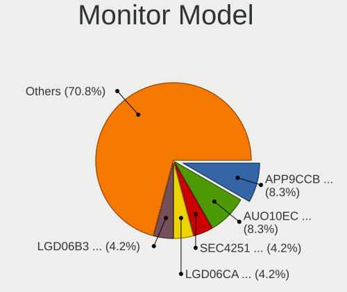

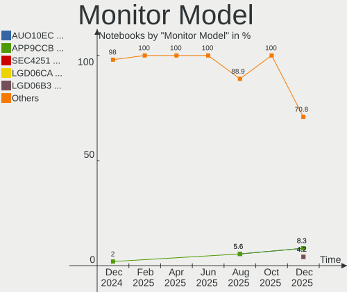

| Model                                                                     | Notebooks | Percent |
|---------------------------------------------------------------------------|-----------|---------|
| AU Optronics LCD Monitor AUO10EC 1366x768 344x193mm 15.5-inch             | 2         | 8.33%   |
| Apple LCD Monitor APP9CCB 1280x800 286x179mm 13.3-inch                    | 2         | 8.33%   |
| Samsung Electronics LCD Monitor SEC4251 1366x768 344x194mm 15.5-inch      | 1         | 4.17%   |
| LG Display LCD Monitor LGD06CA 1920x1080 309x174mm 14.0-inch              | 1         | 4.17%   |
| LG Display LCD Monitor LGD06B3 1920x1200 336x210mm 15.6-inch              | 1         | 4.17%   |
| LG Display LCD Monitor LGD053F 1920x1080 344x194mm 15.5-inch              | 1         | 4.17%   |
| Goldstar 32 FHD GSM7700 1920x1080 698x392mm 31.5-inch                     | 1         | 4.17%   |
| Chimei Innolux LCD Monitor CMN1735 1920x1080 381x214mm 17.2-inch          | 1         | 4.17%   |
| Chimei Innolux LCD Monitor CMN1490 1366x768 309x174mm 14.0-inch           | 1         | 4.17%   |
| Chi Mei Optoelectronics LCD Monitor CMO1807 1920x1080 408x230mm 18.4-inch | 1         | 4.17%   |
| BOE LCD Monitor BOE094D 1920x1080 344x194mm 15.5-inch                     | 1         | 4.17%   |
| BOE LCD Monitor BOE08A8 1920x1080 344x194mm 15.5-inch                     | 1         | 4.17%   |
| BOE LCD Monitor BOE0747 1920x1080 344x194mm 15.5-inch                     | 1         | 4.17%   |
| BOE LCD Monitor BOE06EE 1920x1080 309x173mm 13.9-inch                     | 1         | 4.17%   |
| AU Optronics LCD Monitor AUOE3A1 1920x1080 344x193mm 15.5-inch            | 1         | 4.17%   |
| AU Optronics LCD Monitor AUO48EC 1366x768 344x193mm 15.5-inch             | 1         | 4.17%   |
| AU Optronics LCD Monitor AUO11ED 1920x1080 344x193mm 15.5-inch            | 1         | 4.17%   |
| Apple LCD Monitor APP9CC5 1280x800 286x179mm 13.3-inch                    | 1         | 4.17%   |
| Apple LCD Monitor APP9CC3 1280x800 286x179mm 13.3-inch                    | 1         | 4.17%   |
| Apple Color LCD APPA020 2560x1600 286x179mm 13.3-inch                     | 1         | 4.17%   |
| Apple Color LCD APP9CC7 1280x800 286x179mm 13.3-inch                      | 1         | 4.17%   |
| Apple Color LCD APP9CB7 1680x1050 331x207mm 15.4-inch                     | 1         | 4.17%   |

Monitor Resolution
------------------

Monitor screen resolution

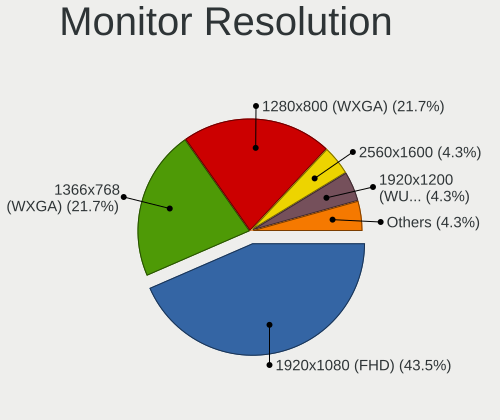

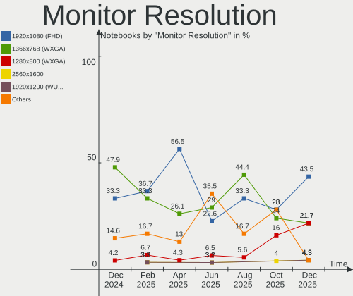

| Resolution         | Notebooks | Percent |
|--------------------|-----------|---------|
| 1920x1080 (FHD)    | 10        | 43.48%  |
| 1366x768 (WXGA)    | 5         | 21.74%  |
| 1280x800 (WXGA)    | 5         | 21.74%  |
| 2560x1600          | 1         | 4.35%   |
| 1920x1200 (WUXGA)  | 1         | 4.35%   |
| 1680x1050 (WSXGA+) | 1         | 4.35%   |

Monitor Diagonal
----------------

Diagonal size in inches

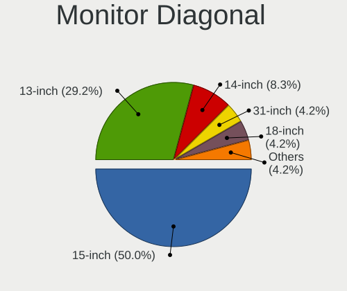

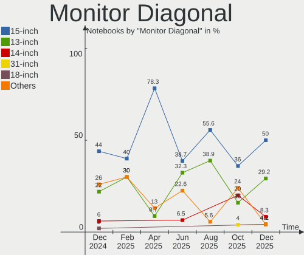

| Inches | Notebooks | Percent |
|--------|-----------|---------|
| 15     | 12        | 50%     |
| 13     | 7         | 29.17%  |
| 14     | 2         | 8.33%   |
| 31     | 1         | 4.17%   |
| 18     | 1         | 4.17%   |
| 17     | 1         | 4.17%   |

Monitor Width
-------------

Physical width

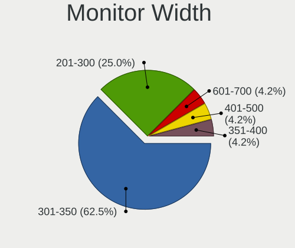

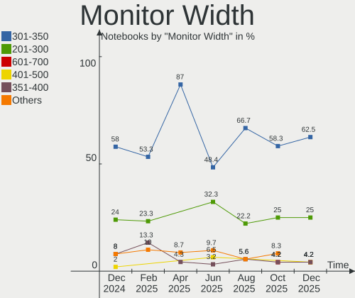

| Width in mm | Notebooks | Percent |
|-------------|-----------|---------|
| 301-350     | 15        | 62.5%   |
| 201-300     | 6         | 25%     |
| 601-700     | 1         | 4.17%   |
| 401-500     | 1         | 4.17%   |
| 351-400     | 1         | 4.17%   |

Aspect Ratio
------------

Proportional relationship between the width and the height

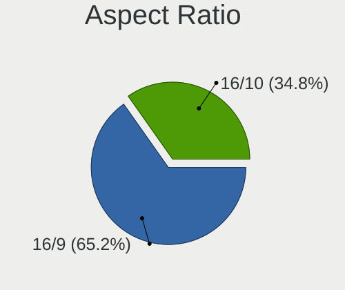

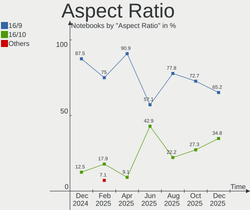

| Ratio | Notebooks | Percent |
|-------|-----------|---------|
| 16/9  | 15        | 65.22%  |
| 16/10 | 8         | 34.78%  |

Monitor Area
------------

Area in inch²

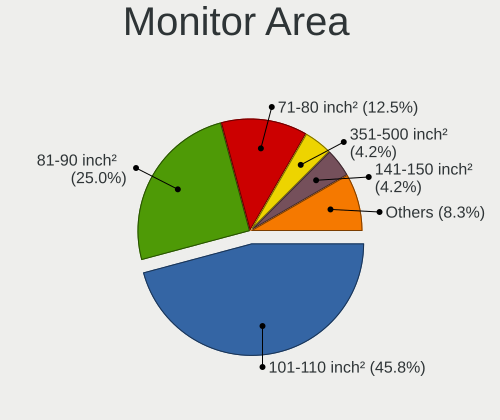

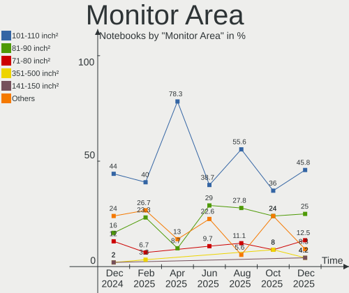

| Area in inch² | Notebooks | Percent |
|----------------|-----------|---------|
| 101-110        | 11        | 45.83%  |
| 81-90          | 6         | 25%     |
| 71-80          | 3         | 12.5%   |
| 351-500        | 1         | 4.17%   |
| 141-150        | 1         | 4.17%   |
| 121-130        | 1         | 4.17%   |
| 111-120        | 1         | 4.17%   |

Pixel Density
-------------

Pixels per inch

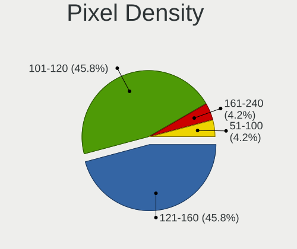

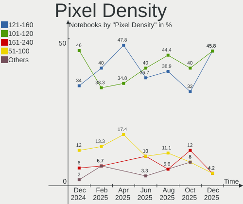

| Density | Notebooks | Percent |
|---------|-----------|---------|
| 121-160 | 11        | 45.83%  |
| 101-120 | 11        | 45.83%  |
| 161-240 | 1         | 4.17%   |
| 51-100  | 1         | 4.17%   |

Multiple Monitors
-----------------

Total monitors connected

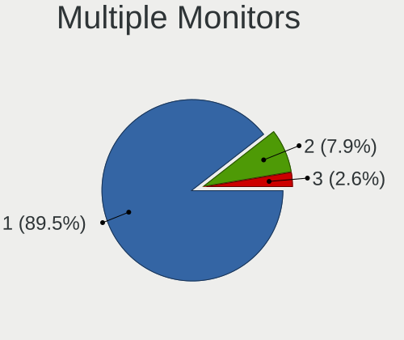

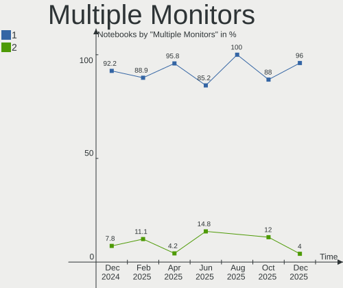

| Total | Notebooks | Percent |
|-------|-----------|---------|
| 1     | 24        | 96%     |
| 2     | 1         | 4%      |

Network
-------

Net Controller Vendor
---------------------

Controller vendors

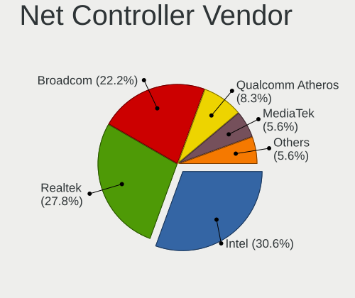

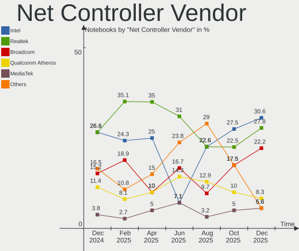

| Vendor                | Notebooks | Percent |
|-----------------------|-----------|---------|
| Intel                 | 11        | 30.56%  |
| Realtek Semiconductor | 10        | 27.78%  |
| Broadcom              | 8         | 22.22%  |
| Qualcomm Atheros      | 3         | 8.33%   |
| MediaTek              | 2         | 5.56%   |
| Broadcom Limited      | 1         | 2.78%   |
| ASIX Electronics      | 1         | 2.78%   |

Net Controller Model
--------------------

Controller models

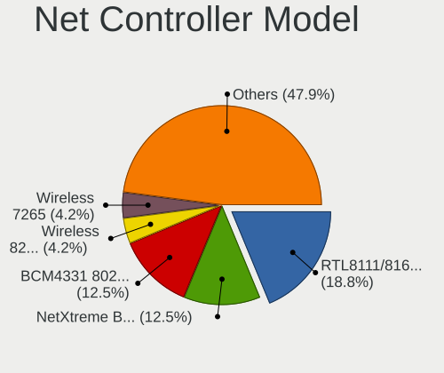

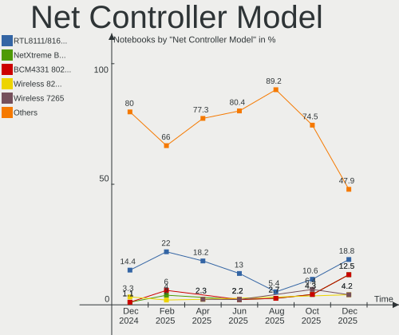

| Model                                                                  | Notebooks | Percent |
|------------------------------------------------------------------------|-----------|---------|
| Realtek RTL8111/8168/8211/8411 PCI Express Gigabit Ethernet Controller | 9         | 18.75%  |
| Broadcom NetXtreme BCM57765 Gigabit Ethernet PCIe                      | 6         | 12.5%   |
| Broadcom BCM4331 802.11a/b/g/n                                         | 6         | 12.5%   |
| Intel Wireless 8265 / 8275                                             | 2         | 4.17%   |
| Intel Wireless 7265                                                    | 2         | 4.17%   |
| Intel Ethernet Connection (4) I219-LM                                  | 2         | 4.17%   |
| Realtek RTL8822CE 802.11ac PCIe Wireless Network Adapter               | 1         | 2.08%   |
| Realtek RTL8188EE Wireless Network Adapter                             | 1         | 2.08%   |
| Realtek RTL810xE PCI Express Fast Ethernet controller                  | 1         | 2.08%   |
| Qualcomm Atheros QCA9565 / AR9565 Wireless Network Adapter             | 1         | 2.08%   |
| Qualcomm Atheros QCA6174 802.11ac Wireless Network Adapter             | 1         | 2.08%   |
| Qualcomm Atheros AR9285 Wireless Network Adapter (PCI-Express)         | 1         | 2.08%   |
| MediaTek MT7922 802.11ax PCI Express Wireless Network Adapter          | 1         | 2.08%   |
| MediaTek MT7921 802.11ax PCIe Wireless Network Adapter [Filogic 330]   | 1         | 2.08%   |
| Intel Wireless 8260                                                    | 1         | 2.08%   |
| Intel WiGig(802.11ad) wireless network connection                      | 1         | 2.08%   |
| Intel Wi-Fi 6 AX200                                                    | 1         | 2.08%   |
| Intel Raptor Lake PCH CNVi WiFi                                        | 1         | 2.08%   |
| Intel PRO/Wireless 5100 AGN [Shiloh] Network Connection                | 1         | 2.08%   |
| Intel Ethernet Connection I219-LM                                      | 1         | 2.08%   |
| Intel Ethernet Connection (3) I218-LM                                  | 1         | 2.08%   |
| Intel Dual Band Wireless-AC 3168NGW [Stone Peak]                       | 1         | 2.08%   |
| Intel Centrino Wireless-N 1030 [Rainbow Peak]                          | 1         | 2.08%   |
| Broadcom NetXtreme BCM57786 Gigabit Ethernet PCIe                      | 1         | 2.08%   |
| Broadcom Limited BCM4360 802.11ac Dual Band Wireless Network Adapter   | 1         | 2.08%   |
| Broadcom BCM4312 802.11b/g LP-PHY                                      | 1         | 2.08%   |
| ASIX AX88179 Gigabit Ethernet                                          | 1         | 2.08%   |

Wireless Vendor
---------------

Wireless vendors

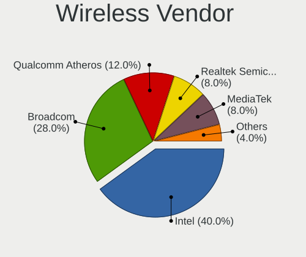

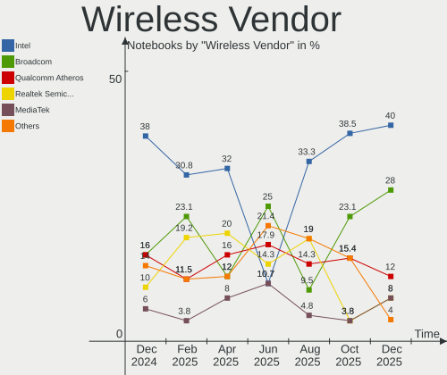

| Vendor                | Notebooks | Percent |
|-----------------------|-----------|---------|
| Intel                 | 10        | 40%     |
| Broadcom              | 7         | 28%     |
| Qualcomm Atheros      | 3         | 12%     |
| Realtek Semiconductor | 2         | 8%      |
| MediaTek              | 2         | 8%      |
| Broadcom Limited      | 1         | 4%      |

Wireless Model
--------------

Wireless models

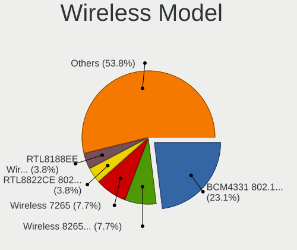

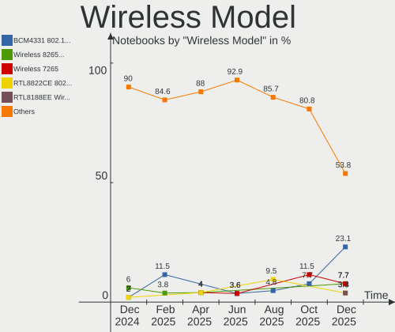

| Model                                                                | Notebooks | Percent |
|----------------------------------------------------------------------|-----------|---------|
| Broadcom BCM4331 802.11a/b/g/n                                       | 6         | 23.08%  |
| Intel Wireless 8265 / 8275                                           | 2         | 7.69%   |
| Intel Wireless 7265                                                  | 2         | 7.69%   |
| Realtek RTL8822CE 802.11ac PCIe Wireless Network Adapter             | 1         | 3.85%   |
| Realtek RTL8188EE Wireless Network Adapter                           | 1         | 3.85%   |
| Qualcomm Atheros QCA9565 / AR9565 Wireless Network Adapter           | 1         | 3.85%   |
| Qualcomm Atheros QCA6174 802.11ac Wireless Network Adapter           | 1         | 3.85%   |
| Qualcomm Atheros AR9285 Wireless Network Adapter (PCI-Express)       | 1         | 3.85%   |
| MediaTek MT7922 802.11ax PCI Express Wireless Network Adapter        | 1         | 3.85%   |
| MediaTek MT7921 802.11ax PCIe Wireless Network Adapter [Filogic 330] | 1         | 3.85%   |
| Intel Wireless 8260                                                  | 1         | 3.85%   |
| Intel WiGig(802.11ad) wireless network connection                    | 1         | 3.85%   |
| Intel Wi-Fi 6 AX200                                                  | 1         | 3.85%   |
| Intel Raptor Lake PCH CNVi WiFi                                      | 1         | 3.85%   |
| Intel PRO/Wireless 5100 AGN [Shiloh] Network Connection              | 1         | 3.85%   |
| Intel Dual Band Wireless-AC 3168NGW [Stone Peak]                     | 1         | 3.85%   |
| Intel Centrino Wireless-N 1030 [Rainbow Peak]                        | 1         | 3.85%   |
| Broadcom Limited BCM4360 802.11ac Dual Band Wireless Network Adapter | 1         | 3.85%   |
| Broadcom BCM4312 802.11b/g LP-PHY                                    | 1         | 3.85%   |

Ethernet Vendor
---------------

Ethernet vendors

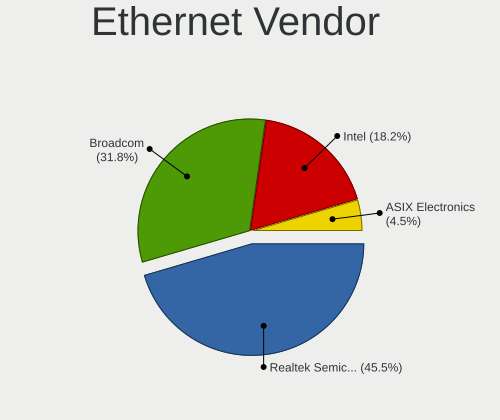

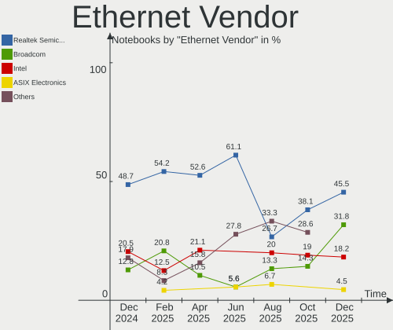

| Vendor                | Notebooks | Percent |
|-----------------------|-----------|---------|
| Realtek Semiconductor | 10        | 45.45%  |
| Broadcom              | 7         | 31.82%  |
| Intel                 | 4         | 18.18%  |
| ASIX Electronics      | 1         | 4.55%   |

Ethernet Model
--------------

Ethernet models

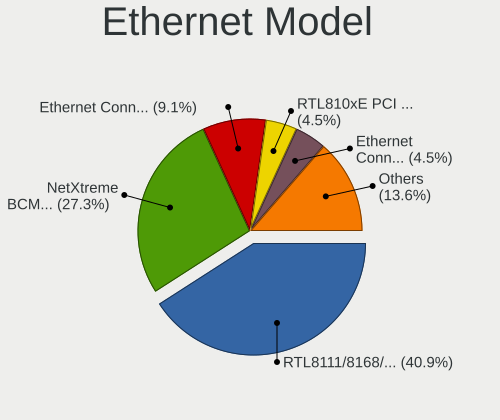

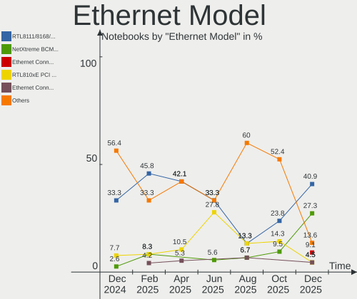

| Model                                                                  | Notebooks | Percent |
|------------------------------------------------------------------------|-----------|---------|
| Realtek RTL8111/8168/8211/8411 PCI Express Gigabit Ethernet Controller | 9         | 40.91%  |
| Broadcom NetXtreme BCM57765 Gigabit Ethernet PCIe                      | 6         | 27.27%  |
| Intel Ethernet Connection (4) I219-LM                                  | 2         | 9.09%   |
| Realtek RTL810xE PCI Express Fast Ethernet controller                  | 1         | 4.55%   |
| Intel Ethernet Connection I219-LM                                      | 1         | 4.55%   |
| Intel Ethernet Connection (3) I218-LM                                  | 1         | 4.55%   |
| Broadcom NetXtreme BCM57786 Gigabit Ethernet PCIe                      | 1         | 4.55%   |
| ASIX AX88179 Gigabit Ethernet                                          | 1         | 4.55%   |

Net Controller Kind
-------------------

Ethernet, WiFi or modem

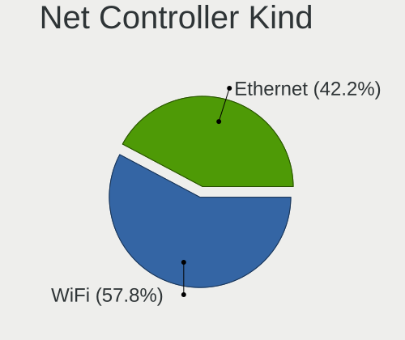

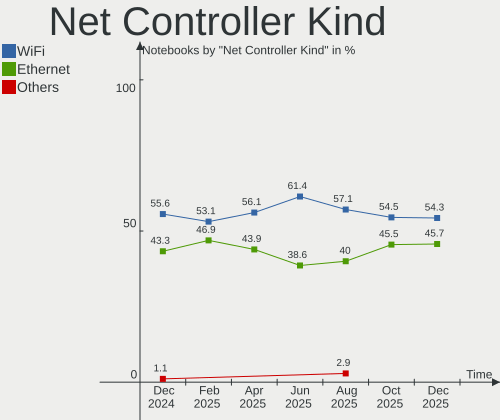

| Kind     | Notebooks | Percent |
|----------|-----------|---------|
| WiFi     | 25        | 54.35%  |
| Ethernet | 21        | 45.65%  |

Used Controller
---------------

Currently used network controller

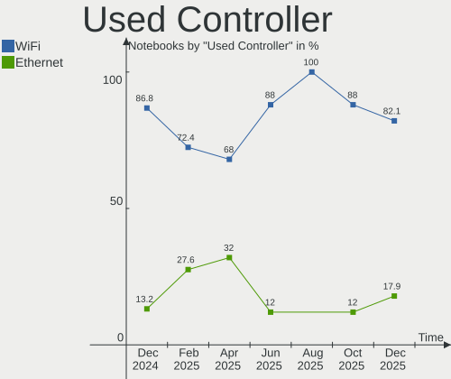

| Kind     | Notebooks | Percent |
|----------|-----------|---------|
| WiFi     | 23        | 82.14%  |
| Ethernet | 5         | 17.86%  |

NICs
----

Total network controllers on board

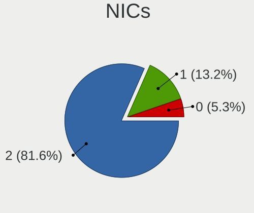

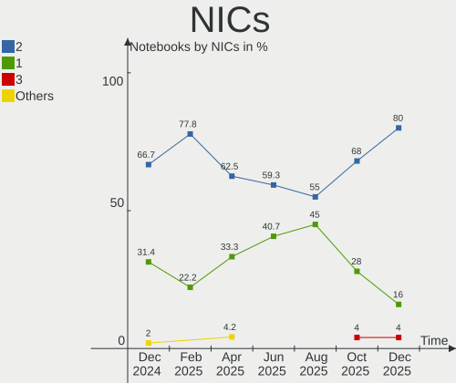

| Total | Notebooks | Percent |
|-------|-----------|---------|
| 2     | 20        | 80%     |
| 1     | 4         | 16%     |
| 3     | 1         | 4%      |

IPv6
----

IPv6 vs IPv4

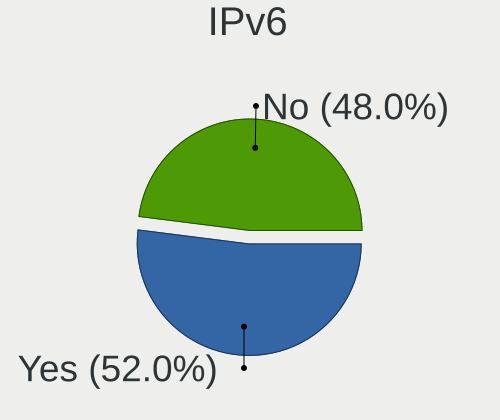

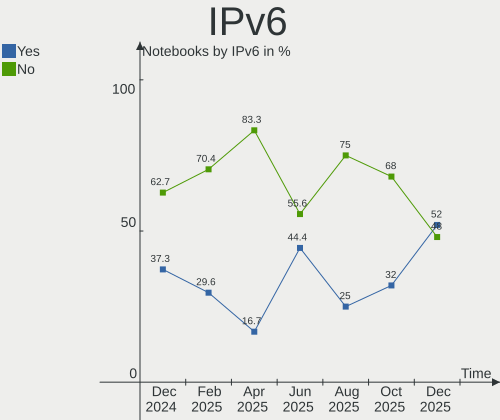

| Used | Notebooks | Percent |
|------|-----------|---------|
| Yes  | 13        | 52%     |
| No   | 12        | 48%     |

Bluetooth
---------

Bluetooth Vendor
----------------

Controller vendors

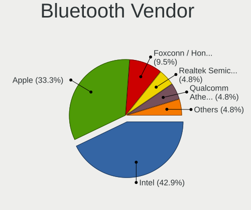

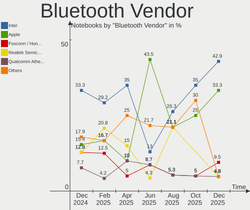

| Vendor                          | Notebooks | Percent |
|---------------------------------|-----------|---------|
| Intel                           | 9         | 42.86%  |
| Apple                           | 7         | 33.33%  |
| Foxconn / Hon Hai               | 2         | 9.52%   |
| Realtek Semiconductor           | 1         | 4.76%   |
| Qualcomm Atheros Communications | 1         | 4.76%   |
| Lite-On Technology              | 1         | 4.76%   |

Bluetooth Model
---------------

Controller models

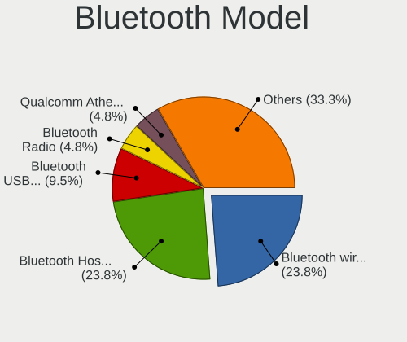

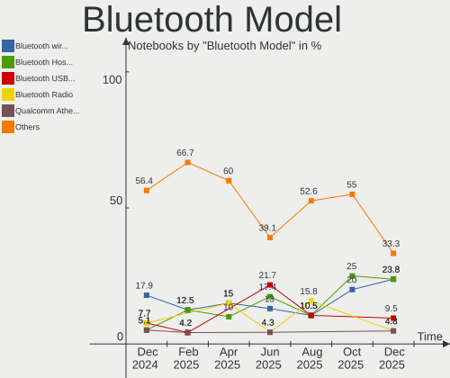

| Model                                            | Notebooks | Percent |
|--------------------------------------------------|-----------|---------|
| Intel Bluetooth wireless interface               | 5         | 23.81%  |
| Apple Bluetooth Host Controller                  | 5         | 23.81%  |
| Apple Bluetooth USB Host Controller              | 2         | 9.52%   |
| Realtek Bluetooth Radio                          | 1         | 4.76%   |
| Qualcomm Atheros  Bluetooth Device               | 1         | 4.76%   |
| Lite-On Atheros AR3012 Bluetooth                 | 1         | 4.76%   |
| Intel Wireless-AC 3168 Bluetooth                 | 1         | 4.76%   |
| Intel Centrino Advanced-N 6230 Bluetooth adapter | 1         | 4.76%   |
| Intel Bluetooth Device                           | 1         | 4.76%   |
| Intel AX200 Bluetooth                            | 1         | 4.76%   |
| Foxconn / Hon Hai Wireless_Device                | 1         | 4.76%   |
| Foxconn / Hon Hai MediaTek Bluetooth Adapter     | 1         | 4.76%   |

Sound
-----

Sound Vendor
------------

Sound card vendors

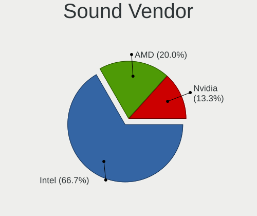

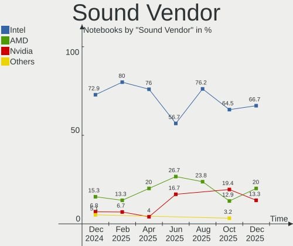

| Vendor | Notebooks | Percent |
|--------|-----------|---------|
| Intel  | 20        | 66.67%  |
| AMD    | 6         | 20%     |
| Nvidia | 4         | 13.33%  |

Sound Model
-----------

Sound card models

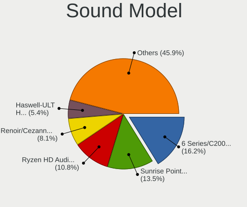

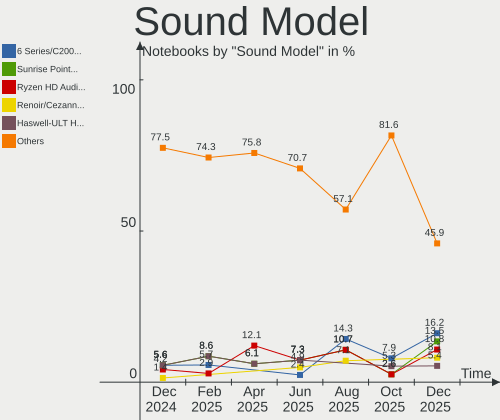

| Model                                                                      | Notebooks | Percent |
|----------------------------------------------------------------------------|-----------|---------|
| Intel 6 Series/C200 Series Chipset Family High Definition Audio Controller | 6         | 16.22%  |
| Intel Sunrise Point-LP HD Audio                                            | 5         | 13.51%  |
| AMD Ryzen HD Audio Controller                                              | 4         | 10.81%  |
| AMD Renoir/Cezanne HDMI/DP Audio Controller                                | 3         | 8.11%   |
| Intel Haswell-ULT HD Audio Controller                                      | 2         | 5.41%   |
| Intel 8 Series HD Audio Controller                                         | 2         | 5.41%   |
| Intel 7 Series/C216 Chipset Family High Definition Audio Controller        | 2         | 5.41%   |
| Nvidia GK107 HDMI Audio Controller                                         | 1         | 2.7%    |
| Nvidia GF108 High Definition Audio Controller                              | 1         | 2.7%    |
| Nvidia GA107 High Definition Audio Controller                              | 1         | 2.7%    |
| Nvidia AD107 High Definition Audio Controller                              | 1         | 2.7%    |
| Intel Wildcat Point-LP High Definition Audio Controller                    | 1         | 2.7%    |
| Intel Raptor Lake-P/U/H cAVS                                               | 1         | 2.7%    |
| Intel Broadwell-U Audio Controller                                         | 1         | 2.7%    |
| Intel 82801I (ICH9 Family) HD Audio Controller                             | 1         | 2.7%    |
| Intel 82801H (ICH8 Family) HD Audio Controller                             | 1         | 2.7%    |
| Intel 100 Series/C230 Series Chipset Family HD Audio Controller            | 1         | 2.7%    |
| AMD RV710/730 HDMI Audio [Radeon HD 4000 series]                           | 1         | 2.7%    |
| AMD Kabini HDMI/DP Audio                                                   | 1         | 2.7%    |
| AMD FCH Azalia Controller                                                  | 1         | 2.7%    |

Memory
------

Memory Vendor
-------------

Memory module vendors

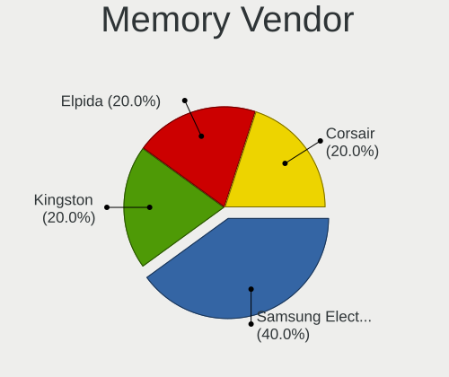

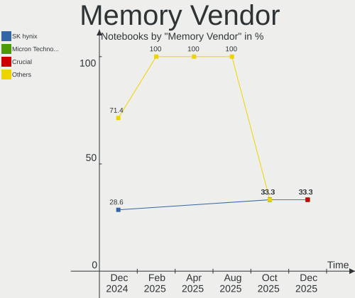

| Vendor            | Notebooks | Percent |
|-------------------|-----------|---------|
| SK hynix          | 1         | 33.33%  |
| Micron Technology | 1         | 33.33%  |
| Crucial           | 1         | 33.33%  |

Memory Model
------------

Memory module models

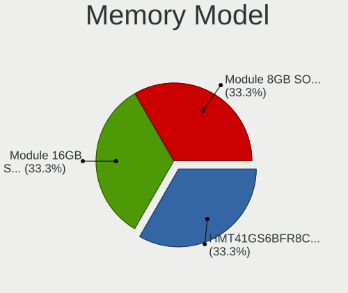

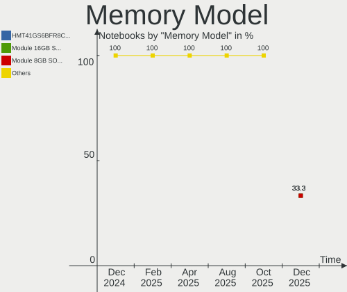

| Model                                                  | Notebooks | Percent |
|--------------------------------------------------------|-----------|---------|
| SK hynix RAM HMT41GS6BFR8C-PB 8GB SODIMM DDR3 1600MT/s | 1         | 33.33%  |
| Micron RAM Module 16GB SODIMM DDR4 3200MT/s            | 1         | 33.33%  |
| Crucial RAM Module 8GB SODIMM DDR3 1600MT/s            | 1         | 33.33%  |

Memory Kind
-----------

Memory module kinds

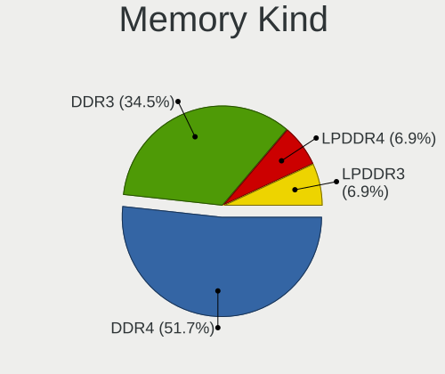

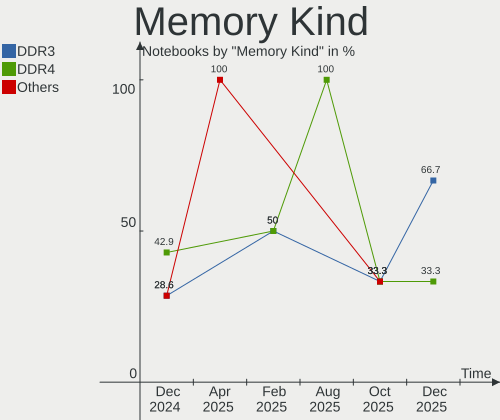

| Kind | Notebooks | Percent |
|------|-----------|---------|
| DDR3 | 2         | 66.67%  |
| DDR4 | 1         | 33.33%  |

Memory Form Factor
------------------

Physical design of the memory module

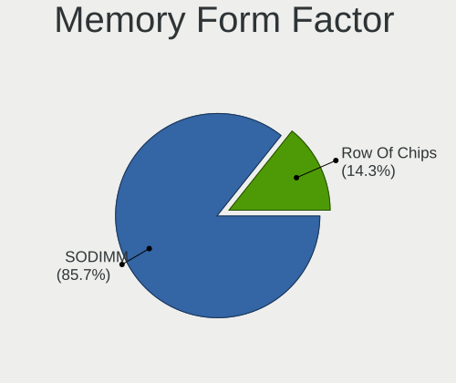

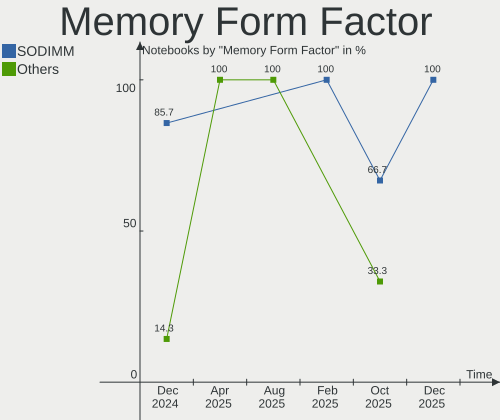

| Name   | Notebooks | Percent |
|--------|-----------|---------|
| SODIMM | 3         | 100%    |

Memory Size
-----------

Memory module size

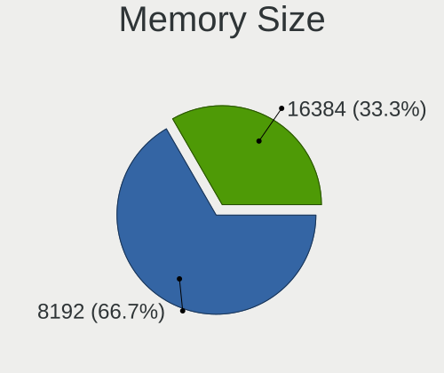

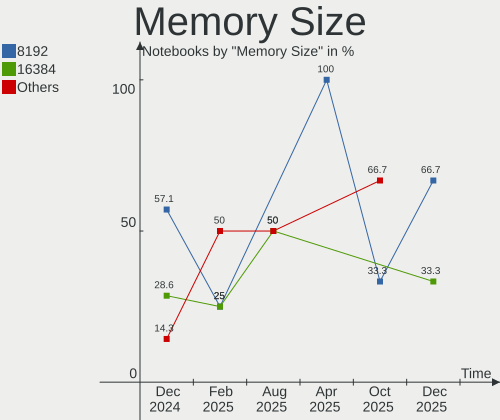

| Size  | Notebooks | Percent |
|-------|-----------|---------|
| 8192  | 2         | 66.67%  |
| 16384 | 1         | 33.33%  |

Memory Speed
------------

Memory module speed

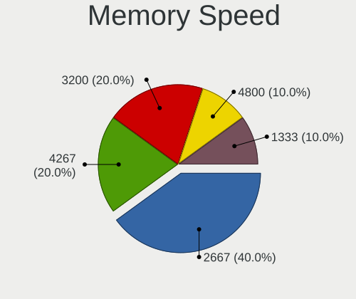

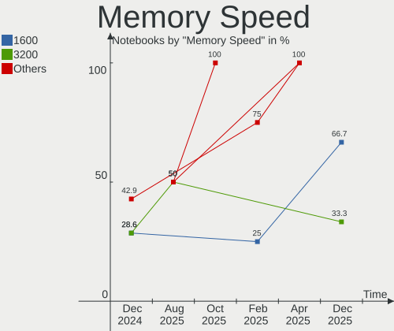

| Speed | Notebooks | Percent |
|-------|-----------|---------|
| 1600  | 2         | 66.67%  |
| 3200  | 1         | 33.33%  |

Printers & scanners
-------------------

Printer Vendor
--------------

Printer device vendors

Zero info for selected period =(

Printer Model
-------------

Printer device models

Zero info for selected period =(

Scanner Vendor
--------------

Scanner device vendors

Zero info for selected period =(

Scanner Model
-------------

Scanner device models

Zero info for selected period =(

Camera
------

Camera Vendor
-------------

Camera device vendors

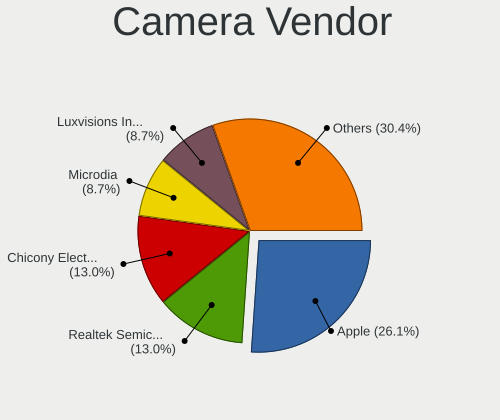

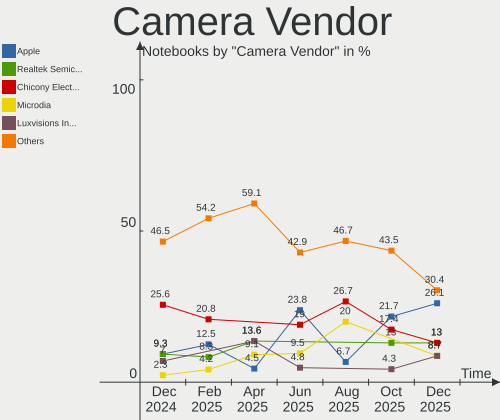

| Vendor                                 | Notebooks | Percent |
|----------------------------------------|-----------|---------|
| Apple                                  | 6         | 26.09%  |
| Realtek Semiconductor                  | 3         | 13.04%  |
| Chicony Electronics                    | 3         | 13.04%  |
| Microdia                               | 2         | 8.7%    |
| Luxvisions Innotech Limited            | 2         | 8.7%    |
| Cheng Uei Precision Industry (Foxlink) | 2         | 8.7%    |
| Bison Electronics                      | 2         | 8.7%    |
| Sunplus Innovation Technology          | 1         | 4.35%   |
| Quanta                                 | 1         | 4.35%   |
| Alcor Micro                            | 1         | 4.35%   |

Camera Model
------------

Camera device models

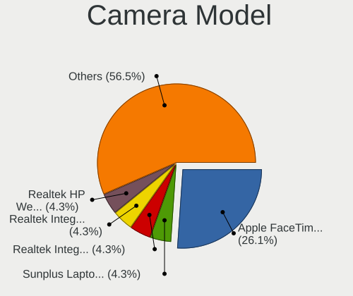

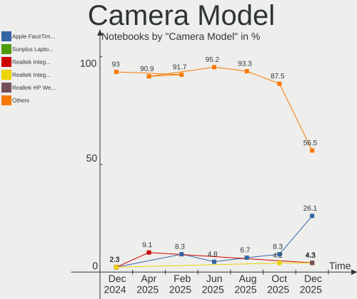

| Model                                                        | Notebooks | Percent |
|--------------------------------------------------------------|-----------|---------|
| Apple FaceTime HD Camera                                     | 6         | 26.09%  |
| Sunplus Laptop Integrated Webcam HD                          | 1         | 4.35%   |
| Realtek Integrated_Webcam_HD                                 | 1         | 4.35%   |
| Realtek Integrated Webcam HD                                 | 1         | 4.35%   |
| Realtek HP Webcam                                            | 1         | 4.35%   |
| Quanta HP HD Camera                                          | 1         | 4.35%   |
| Microdia Sonix Integrated Webcam                             | 1         | 4.35%   |
| Microdia Integrated_Webcam_HD                                | 1         | 4.35%   |
| Luxvisions Innotech Limited Integrated Camera                | 1         | 4.35%   |
| Luxvisions Innotech Limited HP HD Camera                     | 1         | 4.35%   |
| Chicony USB2.0 HD UVC WebCam                                 | 1         | 4.35%   |
| Chicony HP Wide Vision HD Camera                             | 1         | 4.35%   |
| Chicony HD WebCam (Acer)                                     | 1         | 4.35%   |
| Cheng Uei Precision Industry (Foxlink) XiaoMi USB 2.0 Webcam | 1         | 4.35%   |
| Cheng Uei Precision Industry (Foxlink) HP Webcam             | 1         | 4.35%   |
| Bison HP Webcam                                              | 1         | 4.35%   |
| Bison HP TrueVision HD Webcam                                | 1         | 4.35%   |
| Alcor Micro ASUS USB2.0 WebCam                               | 1         | 4.35%   |

Security
--------

Fingerprint Vendor
------------------

Fingerprint sensor vendors

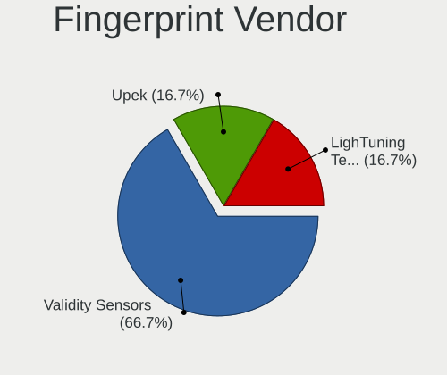

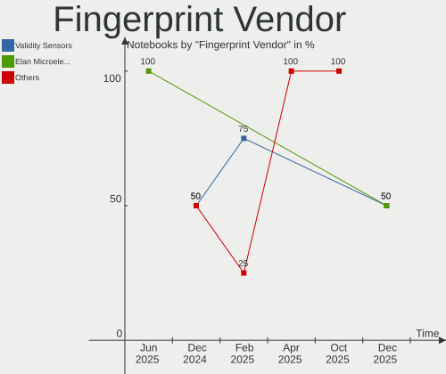

| Vendor                | Notebooks | Percent |
|-----------------------|-----------|---------|
| Validity Sensors      | 1         | 50%     |
| Elan Microelectronics | 1         | 50%     |

Fingerprint Model
-----------------

Fingerprint sensor models

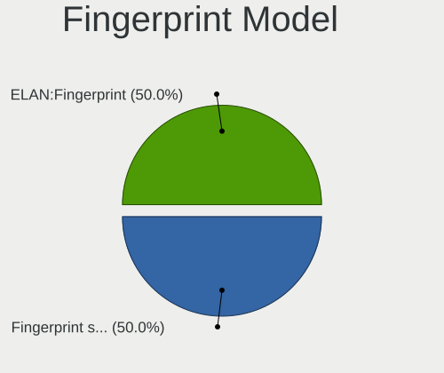

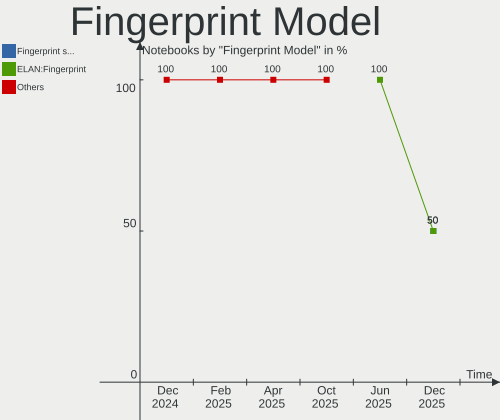

| Model                                | Notebooks | Percent |
|--------------------------------------|-----------|---------|
| Validity Sensors Fingerprint scanner | 1         | 50%     |
| Elan ELAN:Fingerprint                | 1         | 50%     |

Chipcard Vendor
---------------

Chipcard module vendors

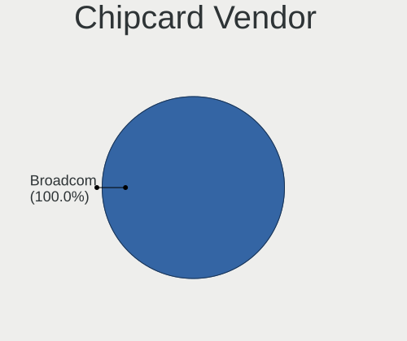

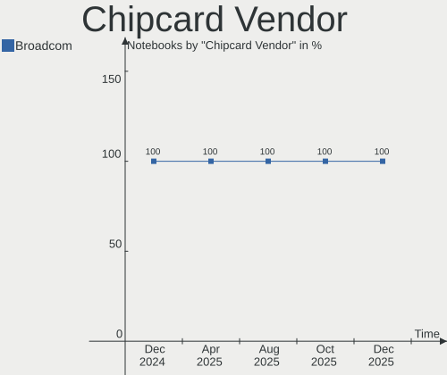

| Vendor   | Notebooks | Percent |
|----------|-----------|---------|
| Broadcom | 3         | 100%    |

Chipcard Model
--------------

Chipcard module models

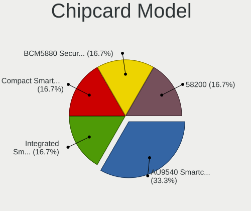

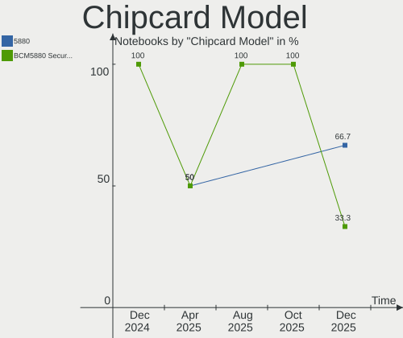

| Model                                          | Notebooks | Percent |
|------------------------------------------------|-----------|---------|
| Broadcom 5880                                  | 2         | 66.67%  |
| Broadcom BCM5880 Secure Applications Processor | 1         | 33.33%  |

Unsupported
-----------

Unsupported Devices
-------------------

Total unsupported devices on board

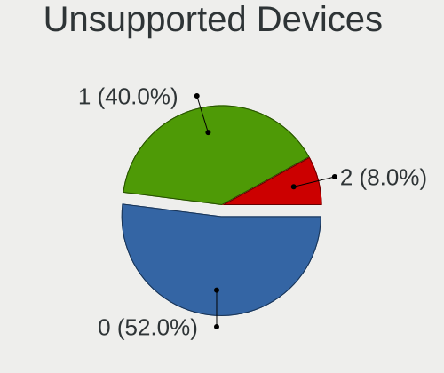

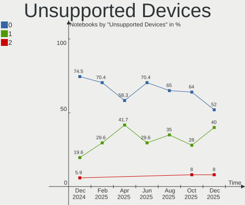

| Total | Notebooks | Percent |
|-------|-----------|---------|
| 0     | 13        | 52%     |
| 1     | 10        | 40%     |
| 2     | 2         | 8%      |

Unsupported Device Types
------------------------

Types of unsupported devices

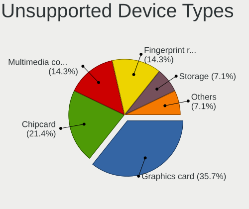

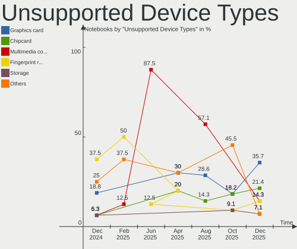

| Type                  | Notebooks | Percent |
|-----------------------|-----------|---------|
| Graphics card         | 5         | 35.71%  |
| Chipcard              | 3         | 21.43%  |
| Multimedia controller | 2         | 14.29%  |
| Fingerprint reader    | 2         | 14.29%  |
| Storage               | 1         | 7.14%   |
| Net/wireless          | 1         | 7.14%   |

