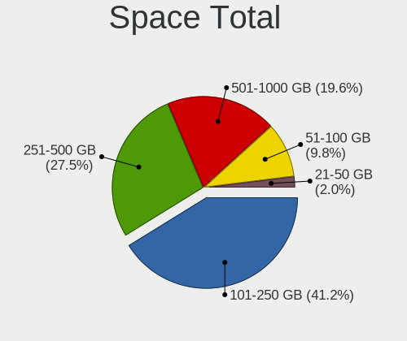
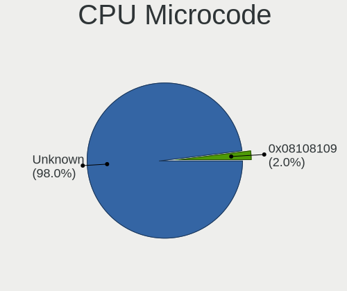
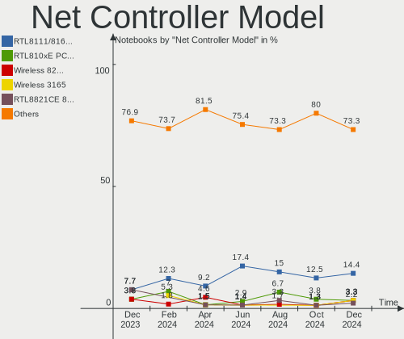

Elementary - Hardware Trends (Notebooks)
----------------------------------------

A project to identify most popular hardware characteristics and track their change
over time based on data collected by Linux users at https://Linux-Hardware.org.

Anyone can contribute to this report by the [hw-probe](https://github.com/linuxhw/hw-probe) tool:

    sudo -E hw-probe -all -upload

This report is for one last month. Overall report since the beginning of time: [TestCoverage](https://github.com/linuxhw/TestCoverage)

Period: Jul, 2022.

Contents
--------

* [ System ](#system)
  - [ OS                       ](#os)
  - [ OS Family                ](#os-family)
  - [ Kernel                   ](#kernel)
  - [ Kernel Family            ](#kernel-family)
  - [ Kernel Major Ver.        ](#kernel-major-ver)
  - [ Arch                     ](#arch)
  - [ DE                       ](#de)
  - [ Display Server           ](#display-server)
  - [ Display Manager          ](#display-manager)
  - [ OS Lang                  ](#os-lang)
  - [ Boot Mode                ](#boot-mode)
  - [ Filesystem               ](#filesystem)
  - [ Part. scheme             ](#part-scheme)
  - [ Dual Boot with Linux/BSD ](#dual-boot-with-linuxbsd)
  - [ Dual Boot (Win)          ](#dual-boot-win)

* [ Board ](#board)
  - [ Vendor                   ](#vendor)
  - [ Model                    ](#model)
  - [ Model Family             ](#model-family)
  - [ MFG Year                 ](#mfg-year)
  - [ Form Factor              ](#form-factor)
  - [ Secure Boot              ](#secure-boot)
  - [ Coreboot                 ](#coreboot)
  - [ RAM Size                 ](#ram-size)
  - [ RAM Used                 ](#ram-used)
  - [ Total Drives             ](#total-drives)
  - [ Has CD-ROM               ](#has-cd-rom)
  - [ Has Ethernet             ](#has-ethernet)
  - [ Has WiFi                 ](#has-wifi)
  - [ Has Bluetooth            ](#has-bluetooth)

* [ Location ](#location)
  - [ Country                  ](#country)
  - [ City                     ](#city)

* [ Drives ](#drives)
  - [ Drive Vendor             ](#drive-vendor)
  - [ Drive Model              ](#drive-model)
  - [ HDD Vendor               ](#hdd-vendor)
  - [ SSD Vendor               ](#ssd-vendor)
  - [ Drive Kind               ](#drive-kind)
  - [ Drive Connector          ](#drive-connector)
  - [ Drive Size               ](#drive-size)
  - [ Space Total              ](#space-total)
  - [ Space Used               ](#space-used)
  - [ Malfunc. Drives          ](#malfunc-drives)
  - [ Malfunc. Drive Vendor    ](#malfunc-drive-vendor)
  - [ Malfunc. HDD Vendor      ](#malfunc-hdd-vendor)
  - [ Malfunc. Drive Kind      ](#malfunc-drive-kind)
  - [ Failed Drives            ](#failed-drives)
  - [ Failed Drive Vendor      ](#failed-drive-vendor)
  - [ Drive Status             ](#drive-status)

* [ Storage controller ](#storage-controller)
  - [ Storage Vendor           ](#storage-vendor)
  - [ Storage Model            ](#storage-model)
  - [ Storage Kind             ](#storage-kind)

* [ Processor ](#processor)
  - [ CPU Vendor               ](#cpu-vendor)
  - [ CPU Model                ](#cpu-model)
  - [ CPU Model Family         ](#cpu-model-family)
  - [ CPU Cores                ](#cpu-cores)
  - [ CPU Sockets              ](#cpu-sockets)
  - [ CPU Threads              ](#cpu-threads)
  - [ CPU Op-Modes             ](#cpu-op-modes)
  - [ CPU Microcode            ](#cpu-microcode)
  - [ CPU Microarch            ](#cpu-microarch)

* [ Graphics ](#graphics)
  - [ GPU Vendor               ](#gpu-vendor)
  - [ GPU Model                ](#gpu-model)
  - [ GPU Combo                ](#gpu-combo)
  - [ GPU Driver               ](#gpu-driver)
  - [ GPU Memory               ](#gpu-memory)

* [ Monitor ](#monitor)
  - [ Monitor Vendor           ](#monitor-vendor)
  - [ Monitor Model            ](#monitor-model)
  - [ Monitor Resolution       ](#monitor-resolution)
  - [ Monitor Diagonal         ](#monitor-diagonal)
  - [ Monitor Width            ](#monitor-width)
  - [ Aspect Ratio             ](#aspect-ratio)
  - [ Monitor Area             ](#monitor-area)
  - [ Pixel Density            ](#pixel-density)
  - [ Multiple Monitors        ](#multiple-monitors)

* [ Network ](#network)
  - [ Net Controller Vendor    ](#net-controller-vendor)
  - [ Net Controller Model     ](#net-controller-model)
  - [ Wireless Vendor          ](#wireless-vendor)
  - [ Wireless Model           ](#wireless-model)
  - [ Ethernet Vendor          ](#ethernet-vendor)
  - [ Ethernet Model           ](#ethernet-model)
  - [ Net Controller Kind      ](#net-controller-kind)
  - [ Used Controller          ](#used-controller)
  - [ NICs                     ](#nics)
  - [ IPv6                     ](#ipv6)

* [ Bluetooth ](#bluetooth)
  - [ Bluetooth Vendor         ](#bluetooth-vendor)
  - [ Bluetooth Model          ](#bluetooth-model)

* [ Sound ](#sound)
  - [ Sound Vendor             ](#sound-vendor)
  - [ Sound Model              ](#sound-model)

* [ Memory ](#memory)
  - [ Memory Vendor            ](#memory-vendor)
  - [ Memory Model             ](#memory-model)
  - [ Memory Kind              ](#memory-kind)
  - [ Memory Form Factor       ](#memory-form-factor)
  - [ Memory Size              ](#memory-size)
  - [ Memory Speed             ](#memory-speed)

* [ Printers & scanners ](#printers--scanners)
  - [ Printer Vendor           ](#printer-vendor)
  - [ Printer Model            ](#printer-model)
  - [ Scanner Vendor           ](#scanner-vendor)
  - [ Scanner Model            ](#scanner-model)

* [ Camera ](#camera)
  - [ Camera Vendor            ](#camera-vendor)
  - [ Camera Model             ](#camera-model)

* [ Security ](#security)
  - [ Fingerprint Vendor       ](#fingerprint-vendor)
  - [ Fingerprint Model        ](#fingerprint-model)
  - [ Chipcard Vendor          ](#chipcard-vendor)
  - [ Chipcard Model           ](#chipcard-model)

* [ Unsupported ](#unsupported)
  - [ Unsupported Devices      ](#unsupported-devices)
  - [ Unsupported Device Types ](#unsupported-device-types)

System
------

OS
--

Installed operating systems

| Name           | Notebooks | Percent |
|----------------|-----------|---------|
| Elementary 6.1 | 32        | 96.97%  |
| Elementary 6   | 1         | 3.03%   |

OS Family
---------

OS without a version

| Name       | Notebooks | Percent |
|------------|-----------|---------|
| Elementary | 33        | 100%    |

Kernel
------

Version of the Linux kernel

| Version           | Notebooks | Percent |
|-------------------|-----------|---------|
| 5.15.0-41-generic | 17        | 51.52%  |
| 5.13.0-52-generic | 10        | 30.3%   |
| 5.11.0-43-generic | 3         | 9.09%   |
| 5.4.0-122-generic | 1         | 3.03%   |
| 5.13.0-51-generic | 1         | 3.03%   |
| 5.11.0-25-generic | 1         | 3.03%   |

Kernel Family
-------------

Linux kernel without a distro release

| Version | Notebooks | Percent |
|---------|-----------|---------|
| 5.15.0  | 17        | 51.52%  |
| 5.13.0  | 11        | 33.33%  |
| 5.11.0  | 4         | 12.12%  |
| 5.4.0   | 1         | 3.03%   |

Kernel Major Ver.
-----------------

Linux kernel major version

| Version | Notebooks | Percent |
|---------|-----------|---------|
| 5.15    | 17        | 51.52%  |
| 5.13    | 11        | 33.33%  |
| 5.11    | 4         | 12.12%  |
| 5.4     | 1         | 3.03%   |

Arch
----

OS architecture (x86_64, i586, etc.)

| Name   | Notebooks | Percent |
|--------|-----------|---------|
| x86_64 | 33        | 100%    |

DE
--

Desktop Environment

| Name     | Notebooks | Percent |
|----------|-----------|---------|
| Pantheon | 33        | 100%    |

Display Server
--------------

X11 or Wayland

| Name | Notebooks | Percent |
|------|-----------|---------|
| X11  | 33        | 100%    |

Display Manager
---------------

SDDM, LightDM, etc.

| Name    | Notebooks | Percent |
|---------|-----------|---------|
| Unknown | 27        | 81.82%  |
| LightDM | 6         | 18.18%  |

OS Lang
-------

Language

| Lang  | Notebooks | Percent |
|-------|-----------|---------|
| en_US | 13        | 39.39%  |
| ru_RU | 3         | 9.09%   |
| pt_BR | 3         | 9.09%   |
| de_DE | 3         | 9.09%   |
| nl_NL | 2         | 6.06%   |
| it_IT | 2         | 6.06%   |
| es_ES | 2         | 6.06%   |
| en_AU | 2         | 6.06%   |
| uk_UA | 1         | 3.03%   |
| tr_TR | 1         | 3.03%   |
| en_GB | 1         | 3.03%   |

Boot Mode
---------

EFI or BIOS

| Mode | Notebooks | Percent |
|------|-----------|---------|
| EFI  | 23        | 69.7%   |
| BIOS | 10        | 30.3%   |

Filesystem
----------

Type of filesystem

| Type    | Notebooks | Percent |
|---------|-----------|---------|
| Ext4    | 31        | 93.94%  |
| Overlay | 1         | 3.03%   |
| Btrfs   | 1         | 3.03%   |

Part. scheme
------------

Scheme of partitioning

| Type    | Notebooks | Percent |
|---------|-----------|---------|
| Unknown | 29        | 87.88%  |
| GPT     | 4         | 12.12%  |

Dual Boot with Linux/BSD
------------------------

Hosting more than one Linux/BSD

| Dual boot | Notebooks | Percent |
|-----------|-----------|---------|
| No        | 31        | 93.94%  |
| Yes       | 2         | 6.06%   |

Dual Boot (Win)
---------------

Hosting Linux and Windows

| Dual boot | Notebooks | Percent |
|-----------|-----------|---------|
| No        | 30        | 90.91%  |
| Yes       | 3         | 9.09%   |

Board
-----

Vendor
------

Motherboard manufacturer

| Name             | Notebooks | Percent |
|------------------|-----------|---------|
| Hewlett-Packard  | 9         | 27.27%  |
| Dell             | 6         | 18.18%  |
| Lenovo           | 4         | 12.12%  |
| Acer             | 4         | 12.12%  |
| ASUSTek Computer | 3         | 9.09%   |
| Apple            | 3         | 9.09%   |
| Sony             | 2         | 6.06%   |
| HUAWEI           | 1         | 3.03%   |
| Casper           | 1         | 3.03%   |

Model
-----

Motherboard model

| Name                                   | Notebooks | Percent |
|----------------------------------------|-----------|---------|
| HP Notebook                            | 2         | 6.06%   |
| Sony VPCYB20AL                         | 1         | 3.03%   |
| Sony SVF1521F6EW                       | 1         | 3.03%   |
| Lenovo ThinkPad T480 20L6S9WY00        | 1         | 3.03%   |
| Lenovo IdeaPad Yoga 13 20175           | 1         | 3.03%   |
| Lenovo IdeaPad S540-14API 81NH         | 1         | 3.03%   |
| Lenovo IdeaPad Gaming 3 15IHU6 82K1    | 1         | 3.03%   |
| HUAWEI HLYL-WXX9                       | 1         | 3.03%   |
| HP ProBook 430 G2                      | 1         | 3.03%   |
| HP Pavilion g6                         | 1         | 3.03%   |
| HP Pavilion g4                         | 1         | 3.03%   |
| HP Laptop 15-dy1xxx                    | 1         | 3.03%   |
| HP EliteBook 8460p                     | 1         | 3.03%   |
| HP EliteBook 845 G8 Notebook PC        | 1         | 3.03%   |
| HP 255 G7 Notebook PC                  | 1         | 3.03%   |
| Dell XPS 15 9500                       | 1         | 3.03%   |
| Dell XPS 13 9360                       | 1         | 3.03%   |
| Dell Latitude E6320                    | 1         | 3.03%   |
| Dell Latitude D630                     | 1         | 3.03%   |
| Dell Latitude 3190                     | 1         | 3.03%   |
| Dell Inspiron 3593                     | 1         | 3.03%   |
| Casper NIRVANA NOTEBOOK                | 1         | 3.03%   |
| ASUS VivoBook_ASUSLaptop X509JB_R521JB | 1         | 3.03%   |
| ASUS N56VB                             | 1         | 3.03%   |
| ASUS K43E                              | 1         | 3.03%   |
| Apple MacBookPro8,1                    | 1         | 3.03%   |
| Apple MacBookPro11,5                   | 1         | 3.03%   |
| Apple MacBook4,1                       | 1         | 3.03%   |
| Acer Aspire V3-771                     | 1         | 3.03%   |
| Acer Aspire AV15-51                    | 1         | 3.03%   |
| Acer Aspire A315-32                    | 1         | 3.03%   |
| Acer Aspire 1830T                      | 1         | 3.03%   |

Model Family
------------

Motherboard model prefix

| Name               | Notebooks | Percent |
|--------------------|-----------|---------|
| Acer Aspire        | 4         | 12.12%  |
| Lenovo IdeaPad     | 3         | 9.09%   |
| Dell Latitude      | 3         | 9.09%   |
| HP Pavilion        | 2         | 6.06%   |
| HP Notebook        | 2         | 6.06%   |
| HP EliteBook       | 2         | 6.06%   |
| Dell XPS           | 2         | 6.06%   |
| Sony VPCYB20AL     | 1         | 3.03%   |
| Sony SVF1521F6EW   | 1         | 3.03%   |
| Lenovo ThinkPad    | 1         | 3.03%   |
| HUAWEI HLYL-WXX9   | 1         | 3.03%   |
| HP ProBook         | 1         | 3.03%   |
| HP Laptop          | 1         | 3.03%   |
| HP 255             | 1         | 3.03%   |
| Dell Inspiron      | 1         | 3.03%   |
| Casper NIRVANA     | 1         | 3.03%   |
| ASUS VivoBook      | 1         | 3.03%   |
| ASUS N56VB         | 1         | 3.03%   |
| ASUS K43E          | 1         | 3.03%   |
| Apple MacBookPro8  | 1         | 3.03%   |
| Apple MacBookPro11 | 1         | 3.03%   |
| Apple MacBook4     | 1         | 3.03%   |

MFG Year
--------

Motherboard manufacture year

| Year | Notebooks | Percent |
|------|-----------|---------|
| 2011 | 6         | 18.18%  |
| 2019 | 5         | 15.15%  |
| 2021 | 4         | 12.12%  |
| 2018 | 3         | 9.09%   |
| 2016 | 3         | 9.09%   |
| 2020 | 2         | 6.06%   |
| 2012 | 2         | 6.06%   |
| 2010 | 2         | 6.06%   |
| 2017 | 1         | 3.03%   |
| 2015 | 1         | 3.03%   |
| 2014 | 1         | 3.03%   |
| 2013 | 1         | 3.03%   |
| 2008 | 1         | 3.03%   |
| 2007 | 1         | 3.03%   |

Form Factor
-----------

Physical design of the computer

| Name     | Notebooks | Percent |
|----------|-----------|---------|
| Notebook | 33        | 100%    |

Secure Boot
-----------

Enabled or disabled

| State    | Notebooks | Percent |
|----------|-----------|---------|
| Disabled | 26        | 78.79%  |
| Enabled  | 7         | 21.21%  |

Coreboot
--------

Have coreboot on board

| Used | Notebooks | Percent |
|------|-----------|---------|
| No   | 33        | 100%    |

RAM Size
--------

Total RAM memory

| Size in GB | Notebooks | Percent |
|------------|-----------|---------|
| 3.01-4.0   | 11        | 33.33%  |
| 4.01-8.0   | 9         | 27.27%  |
| 16.01-24.0 | 7         | 21.21%  |
| 8.01-16.0  | 4         | 12.12%  |
| 32.01-64.0 | 1         | 3.03%   |
| 1.01-2.0   | 1         | 3.03%   |

RAM Used
--------

Used RAM memory

| Used GB  | Notebooks | Percent |
|----------|-----------|---------|
| 1.01-2.0 | 15        | 45.45%  |
| 2.01-3.0 | 13        | 39.39%  |
| 3.01-4.0 | 3         | 9.09%   |
| 4.01-8.0 | 1         | 3.03%   |
| 0.51-1.0 | 1         | 3.03%   |

Total Drives
------------

Number of drives on board

| Drives | Notebooks | Percent |
|--------|-----------|---------|
| 1      | 28        | 84.85%  |
| 2      | 5         | 15.15%  |

Has CD-ROM
----------

Has CD-ROM on board

| Presented | Notebooks | Percent |
|-----------|-----------|---------|
| No        | 19        | 57.58%  |
| Yes       | 14        | 42.42%  |

Has Ethernet
------------

Has Ethernet on board

| Presented | Notebooks | Percent |
|-----------|-----------|---------|
| Yes       | 24        | 72.73%  |
| No        | 9         | 27.27%  |

Has WiFi
--------

Has WiFi module

| Presented | Notebooks | Percent |
|-----------|-----------|---------|
| Yes       | 33        | 100%    |

Has Bluetooth
-------------

Has Bluetooth module

| Presented | Notebooks | Percent |
|-----------|-----------|---------|
| Yes       | 29        | 87.88%  |
| No        | 4         | 12.12%  |

Location
--------

Country
-------

Geographic location (country)

| Country     | Notebooks | Percent |
|-------------|-----------|---------|
| USA         | 7         | 21.21%  |
| Russia      | 3         | 9.09%   |
| Germany     | 3         | 9.09%   |
| Brazil      | 3         | 9.09%   |
| UK          | 2         | 6.06%   |
| Netherlands | 2         | 6.06%   |
| Italy       | 2         | 6.06%   |
| Ukraine     | 1         | 3.03%   |
| Turkey      | 1         | 3.03%   |
| Portugal    | 1         | 3.03%   |
| Norway      | 1         | 3.03%   |
| Mexico      | 1         | 3.03%   |
| Iran        | 1         | 3.03%   |
| Indonesia   | 1         | 3.03%   |
| Hungary     | 1         | 3.03%   |
| Belgium     | 1         | 3.03%   |
| Australia   | 1         | 3.03%   |
| Argentina   | 1         | 3.03%   |

City
----

Geographic location (city)

| City                 | Notebooks | Percent |
|----------------------|-----------|---------|
| Ypres                | 1         | 3.03%   |
| Vladivostok          | 1         | 3.03%   |
| Villa Bosch          | 1         | 3.03%   |
| Uden                 | 1         | 3.03%   |
| Traben-Trarbach      | 1         | 3.03%   |
| The Hague            | 1         | 3.03%   |
| Tehran               | 1         | 3.03%   |
| Taubate              | 1         | 3.03%   |
| Sydney               | 1         | 3.03%   |
| Sunnyvale            | 1         | 3.03%   |
| Stockton-on-Tees     | 1         | 3.03%   |
| Seattle              | 1         | 3.03%   |
| Santa Teresa di Riva | 1         | 3.03%   |
| Rome                 | 1         | 3.03%   |
| Oaxaca City          | 1         | 3.03%   |
| Moscow               | 1         | 3.03%   |
| Lowell               | 1         | 3.03%   |
| Loures               | 1         | 3.03%   |
| Liverpool            | 1         | 3.03%   |
| Ligonier             | 1         | 3.03%   |
| Kryvyi Rih           | 1         | 3.03%   |
| Istanbul             | 1         | 3.03%   |
| Hamburg              | 1         | 3.03%   |
| Foz do Iguaçu       | 1         | 3.03%   |
| Forest Park          | 1         | 3.03%   |
| Cologne              | 1         | 3.03%   |
| Chelyabinsk          | 1         | 3.03%   |
| Calhoun              | 1         | 3.03%   |
| Budapest             | 1         | 3.03%   |
| Bogor                | 1         | 3.03%   |
| Bergen               | 1         | 3.03%   |
| Belo Horizonte       | 1         | 3.03%   |
| Austin               | 1         | 3.03%   |

Drives
------

Drive Vendor
------------

Hard drive vendors

| Vendor              | Notebooks | Drives | Percent |
|---------------------|-----------|--------|---------|
| WDC                 | 7         | 7      | 19.44%  |
| Samsung Electronics | 5         | 6      | 13.89%  |
| Seagate             | 3         | 3      | 8.33%   |
| Kingston            | 3         | 3      | 8.33%   |
| HGST                | 3         | 3      | 8.33%   |
| Toshiba             | 2         | 2      | 5.56%   |
| KIOXIA              | 2         | 2      | 5.56%   |
| ZTE                 | 1         | 1      | 2.78%   |
| UMIS                | 1         | 1      | 2.78%   |
| SK hynix            | 1         | 1      | 2.78%   |
| Silicon Motion      | 1         | 1      | 2.78%   |
| SanDisk             | 1         | 1      | 2.78%   |
| Patriot             | 1         | 1      | 2.78%   |
| Micron Technology   | 1         | 1      | 2.78%   |
| Lexar               | 1         | 1      | 2.78%   |
| China               | 1         | 1      | 2.78%   |
| Apple               | 1         | 1      | 2.78%   |
| A-DATA Technology   | 1         | 1      | 2.78%   |

Drive Model
-----------

Hard drive models

| Model                                | Notebooks | Percent |
|--------------------------------------|-----------|---------|
| ZTE MMC Storage 942MB                | 1         | 2.7%    |
| WDC WDS240G2G0A-00JH30 240GB SSD     | 1         | 2.7%    |
| WDC WD5000BPVT-60HXZT3 500GB         | 1         | 2.7%    |
| WDC WD1600BEKT-08PVMT1 160GB         | 1         | 2.7%    |
| WDC WD10SPZX-60Z10T0 1TB             | 1         | 2.7%    |
| WDC WD10SPZX-24Z10 1TB               | 1         | 2.7%    |
| WDC WD10SPZX-21Z10T0 1TB             | 1         | 2.7%    |
| WDC WD10JPVX-60JC3T0 1TB             | 1         | 2.7%    |
| UMIS RPFTJ256PDD2MWX 256GB           | 1         | 2.7%    |
| Toshiba NVMe SSD Drive 512GB         | 1         | 2.7%    |
| Toshiba MQ01ABF050 500GB             | 1         | 2.7%    |
| SK hynix NVMe SSD Drive 256GB        | 1         | 2.7%    |
| Silicon Motion NVMe SSD Drive 128GB  | 1         | 2.7%    |
| Seagate ST9500420AS 500GB            | 1         | 2.7%    |
| Seagate ST9320325AS 320GB            | 1         | 2.7%    |
| Seagate ST500LT012-9WS142 500GB      | 1         | 2.7%    |
| SanDisk NVMe SSD Drive 1024GB        | 1         | 2.7%    |
| Samsung SSD 980 500GB                | 1         | 2.7%    |
| Samsung SSD 850 EVO M.2 250GB        | 1         | 2.7%    |
| Samsung NVMe SSD Drive 512GB         | 1         | 2.7%    |
| Samsung MZMPC128HBFU-000L1 128GB SSD | 1         | 2.7%    |
| Samsung MZALQ512HBLU-00BL2 512GB     | 1         | 2.7%    |
| Samsung MZ7TE128HMGR-000H1 128GB SSD | 1         | 2.7%    |
| Patriot Burst 240GB SSD              | 1         | 2.7%    |
| Micron NVMe SSD Drive 256GB          | 1         | 2.7%    |
| Lexar 128GB SSD                      | 1         | 2.7%    |
| KIOXIA NVMe SSD Drive 256GB          | 1         | 2.7%    |
| KIOXIA NVMe SSD Drive 128GB          | 1         | 2.7%    |
| Kingston SV300S37A240G 240GB SSD     | 1         | 2.7%    |
| Kingston SA400S37240G 240GB SSD      | 1         | 2.7%    |
| Kingston NVMe SSD Drive 512GB        | 1         | 2.7%    |
| HGST HTS725050A7E630 500GB           | 1         | 2.7%    |
| HGST HTS721010A9E630 1TB             | 1         | 2.7%    |
| HGST HTS541010B7E610 1TB             | 1         | 2.7%    |
| China SSD 512GB                      | 1         | 2.7%    |
| Apple SSD SM1024G 1TB                | 1         | 2.7%    |
| A-DATA SU630 480GB SSD               | 1         | 2.7%    |

HDD Vendor
----------

Hard disk drive vendors

| Vendor  | Notebooks | Drives | Percent |
|---------|-----------|--------|---------|
| WDC     | 6         | 6      | 46.15%  |
| Seagate | 3         | 3      | 23.08%  |
| HGST    | 3         | 3      | 23.08%  |
| Toshiba | 1         | 1      | 7.69%   |

SSD Vendor
----------

Solid state drive vendors

| Vendor              | Notebooks | Drives | Percent |
|---------------------|-----------|--------|---------|
| Samsung Electronics | 3         | 3      | 27.27%  |
| Kingston            | 2         | 2      | 18.18%  |
| WDC                 | 1         | 1      | 9.09%   |
| Patriot             | 1         | 1      | 9.09%   |
| Lexar               | 1         | 1      | 9.09%   |
| China               | 1         | 1      | 9.09%   |
| Apple               | 1         | 1      | 9.09%   |
| A-DATA Technology   | 1         | 1      | 9.09%   |

Drive Kind
----------

HDD or SSD

| Kind    | Notebooks | Drives | Percent |
|---------|-----------|--------|---------|
| HDD     | 13        | 13     | 36.11%  |
| NVMe    | 11        | 12     | 30.56%  |
| SSD     | 11        | 11     | 30.56%  |
| Unknown | 1         | 1      | 2.78%   |

Drive Connector
---------------

SATA, SAS, NVMe, etc.

| Type | Notebooks | Drives | Percent |
|------|-----------|--------|---------|
| SATA | 23        | 24     | 65.71%  |
| NVMe | 11        | 12     | 31.43%  |
| SAS  | 1         | 1      | 2.86%   |

Drive Size
----------

Size of hard drive

| Size in TB | Notebooks | Drives | Percent |
|------------|-----------|--------|---------|
| 0.01-0.5   | 16        | 16     | 66.67%  |
| 0.51-1.0   | 8         | 8      | 33.33%  |

Space Total
-----------

Amount of disk space available on the file system

| Size in GB | Notebooks | Percent |
|------------|-----------|---------|
| 101-250    | 16        | 48.48%  |
| 251-500    | 9         | 27.27%  |
| 501-1000   | 6         | 18.18%  |
| 2001-3000  | 1         | 3.03%   |
| 51-100     | 1         | 3.03%   |

Space Used
----------

Amount of used disk space

| Used GB   | Notebooks | Percent |
|-----------|-----------|---------|
| 1-20      | 16        | 48.48%  |
| 21-50     | 8         | 24.24%  |
| 251-500   | 3         | 9.09%   |
| 51-100    | 3         | 9.09%   |
| 101-250   | 2         | 6.06%   |
| 1001-2000 | 1         | 3.03%   |

Malfunc. Drives
---------------

Drive models with a malfunction

| Model                            | Notebooks | Drives | Percent |
|----------------------------------|-----------|--------|---------|
| Kingston SV300S37A240G 240GB SSD | 1         | 1      | 100%    |

Malfunc. Drive Vendor
---------------------

Vendors of faulty drives

| Vendor   | Notebooks | Drives | Percent |
|----------|-----------|--------|---------|
| Kingston | 1         | 1      | 100%    |

Malfunc. HDD Vendor
-------------------

Vendors of faulty HDD drives

Zero info for selected period =(

Malfunc. Drive Kind
-------------------

Kinds of faulty drives

| Kind | Notebooks | Drives | Percent |
|------|-----------|--------|---------|
| SSD  | 1         | 1      | 100%    |

Failed Drives
-------------

Failed drive models

Zero info for selected period =(

Failed Drive Vendor
-------------------

Failed drive vendors

Zero info for selected period =(

Drive Status
------------

Number of failed and malfunc. drives

| Status   | Notebooks | Drives | Percent |
|----------|-----------|--------|---------|
| Detected | 29        | 31     | 87.88%  |
| Works    | 3         | 5      | 9.09%   |
| Malfunc  | 1         | 1      | 3.03%   |

Storage controller
------------------

Storage Vendor
--------------

Storage controller vendors

| Vendor                       | Notebooks | Percent |
|------------------------------|-----------|---------|
| Intel                        | 22        | 56.41%  |
| AMD                          | 5         | 12.82%  |
| Samsung Electronics          | 3         | 7.69%   |
| KIOXIA                       | 2         | 5.13%   |
| Union Memory (Shenzhen)      | 1         | 2.56%   |
| Toshiba America Info Systems | 1         | 2.56%   |
| SK hynix                     | 1         | 2.56%   |
| Silicon Motion               | 1         | 2.56%   |
| SanDisk                      | 1         | 2.56%   |
| Micron Technology            | 1         | 2.56%   |
| Kingston Technology Company  | 1         | 2.56%   |

Storage Model
-------------

Storage controller models

| Model                                                                                  | Notebooks | Percent |
|----------------------------------------------------------------------------------------|-----------|---------|
| Intel 7 Series Chipset Family 6-port SATA Controller [AHCI mode]                       | 5         | 11.63%  |
| AMD FCH SATA Controller [AHCI mode]                                                    | 4         | 9.3%    |
| Intel 6 Series/C200 Series Chipset Family 6 port Mobile SATA AHCI Controller           | 3         | 6.98%   |
| KIOXIA NVMe SSD Controller BG4                                                         | 2         | 4.65%   |
| Intel Tiger Lake-LP SATA Controller                                                    | 2         | 4.65%   |
| Intel Celeron/Pentium Silver Processor SATA Controller                                 | 2         | 4.65%   |
| Intel 82801HM/HEM (ICH8M/ICH8M-E) SATA Controller [AHCI mode]                          | 2         | 4.65%   |
| Intel 82801HM/HEM (ICH8M/ICH8M-E) IDE Controller                                       | 2         | 4.65%   |
| Intel 82801 Mobile SATA Controller [RAID mode]                                         | 2         | 4.65%   |
| Union Memory (Shenzhen) Non-Volatile memory controller                                 | 1         | 2.33%   |
| Toshiba America Info Systems XG4 NVMe SSD Controller                                   | 1         | 2.33%   |
| SK hynix Gold P31 SSD                                                                  | 1         | 2.33%   |
| Silicon Motion SM2263EN/SM2263XT SSD Controller                                        | 1         | 2.33%   |
| SanDisk WD Black SN750 / PC SN730 NVMe SSD                                             | 1         | 2.33%   |
| Samsung NVMe SSD Controller SM981/PM981/PM983                                          | 1         | 2.33%   |
| Samsung NVMe SSD Controller 980                                                        | 1         | 2.33%   |
| Samsung Electronics SATA controller                                                    | 1         | 2.33%   |
| Micron Non-Volatile memory controller                                                  | 1         | 2.33%   |
| Kingston Company OM3PDP3 NVMe SSD                                                      | 1         | 2.33%   |
| Intel Wildcat Point-LP SATA Controller [AHCI Mode]                                     | 1         | 2.33%   |
| Intel Volume Management Device NVMe RAID Controller                                    | 1         | 2.33%   |
| Intel Sunrise Point-LP SATA Controller [AHCI mode]                                     | 1         | 2.33%   |
| Intel Ice Lake-LP SATA Controller [AHCI mode]                                          | 1         | 2.33%   |
| Intel Atom/Celeron/Pentium Processor x5-E8000/J3xxx/N3xxx Series SATA Controller       | 1         | 2.33%   |
| Intel 6 Series/C200 Series Chipset Family Mobile SATA Controller (IDE mode, ports 4-5) | 1         | 2.33%   |
| Intel 6 Series/C200 Series Chipset Family Mobile SATA Controller (IDE mode, ports 0-3) | 1         | 2.33%   |
| Intel 5 Series/3400 Series Chipset 4 port SATA AHCI Controller                         | 1         | 2.33%   |
| AMD SB7x0/SB8x0/SB9x0 SATA Controller [AHCI mode]                                      | 1         | 2.33%   |

Storage Kind
------------

Kind of storage controller (IDE, SATA, NVMe, SAS, ...)

| Kind | Notebooks | Percent |
|------|-----------|---------|
| SATA | 25        | 59.52%  |
| NVMe | 11        | 26.19%  |
| RAID | 3         | 7.14%   |
| IDE  | 3         | 7.14%   |

Processor
---------

CPU Vendor
----------

Processor vendors

| Vendor | Notebooks | Percent |
|--------|-----------|---------|
| Intel  | 26        | 78.79%  |
| AMD    | 7         | 21.21%  |

CPU Model
---------

Processor models

| Model                                           | Notebooks | Percent |
|-------------------------------------------------|-----------|---------|
| Intel Core i3-1005G1 CPU @ 1.20GHz              | 2         | 6.06%   |
| Intel Pentium CPU B950 @ 2.10GHz                | 1         | 3.03%   |
| Intel Core i7-7560U CPU @ 2.40GHz               | 1         | 3.03%   |
| Intel Core i7-4980HQ CPU @ 2.80GHz              | 1         | 3.03%   |
| Intel Core i7-3632QM CPU @ 2.20GHz              | 1         | 3.03%   |
| Intel Core i7-2620M CPU @ 2.70GHz               | 1         | 3.03%   |
| Intel Core i7-10750H CPU @ 2.60GHz              | 1         | 3.03%   |
| Intel Core i5-8350U CPU @ 1.70GHz               | 1         | 3.03%   |
| Intel Core i5-3317U CPU @ 1.70GHz               | 1         | 3.03%   |
| Intel Core i5-3230M CPU @ 2.60GHz               | 1         | 3.03%   |
| Intel Core i5-2540M CPU @ 2.60GHz               | 1         | 3.03%   |
| Intel Core i5-2520M CPU @ 2.50GHz               | 1         | 3.03%   |
| Intel Core i5-1035G1 CPU @ 1.00GHz              | 1         | 3.03%   |
| Intel Core i3-6006U CPU @ 2.00GHz               | 1         | 3.03%   |
| Intel Core i3-5010U CPU @ 2.10GHz               | 1         | 3.03%   |
| Intel Core i3-3217U CPU @ 1.80GHz               | 1         | 3.03%   |
| Intel Core i3-3110M CPU @ 2.40GHz               | 1         | 3.03%   |
| Intel Core i3 CPU U 380 @ 1.33GHz               | 1         | 3.03%   |
| Intel Core 2 Duo CPU T8100 @ 2.10GHz            | 1         | 3.03%   |
| Intel Core 2 Duo CPU T7250 @ 2.00GHz            | 1         | 3.03%   |
| Intel Celeron N4120 CPU @ 1.10GHz               | 1         | 3.03%   |
| Intel Celeron N4000 CPU @ 1.10GHz               | 1         | 3.03%   |
| Intel Celeron CPU N3060 @ 1.60GHz               | 1         | 3.03%   |
| Intel 11th Gen Core i7-11370H @ 3.30GHz         | 1         | 3.03%   |
| Intel 11th Gen Core i5-1155G7 @ 2.50GHz         | 1         | 3.03%   |
| AMD Ryzen 5 PRO 5650U with Radeon Graphics      | 1         | 3.03%   |
| AMD Ryzen 5 4600H with Radeon Graphics          | 1         | 3.03%   |
| AMD Ryzen 5 3500U with Radeon Vega Mobile Gfx   | 1         | 3.03%   |
| AMD Ryzen 5 2500U with Radeon Vega Mobile Gfx   | 1         | 3.03%   |
| AMD E-240 Processor                             | 1         | 3.03%   |
| AMD A6-3400M APU with Radeon HD Graphics        | 1         | 3.03%   |
| AMD A12-9700P RADEON R7, 10 COMPUTE CORES 4C+6G | 1         | 3.03%   |

CPU Model Family
----------------

Processor model prefix

| Model            | Notebooks | Percent |
|------------------|-----------|---------|
| Intel Core i3    | 7         | 21.21%  |
| Intel Core i5    | 6         | 18.18%  |
| Intel Core i7    | 5         | 15.15%  |
| Intel Celeron    | 3         | 9.09%   |
| AMD Ryzen 5      | 3         | 9.09%   |
| Other            | 2         | 6.06%   |
| Intel Core 2 Duo | 2         | 6.06%   |
| Intel Pentium    | 1         | 3.03%   |
| AMD Ryzen 5 PRO  | 1         | 3.03%   |
| AMD E            | 1         | 3.03%   |
| AMD A6           | 1         | 3.03%   |
| AMD A12          | 1         | 3.03%   |

CPU Cores
---------

Number of processor cores

| Number | Notebooks | Percent |
|--------|-----------|---------|
| 2      | 19        | 57.58%  |
| 4      | 10        | 30.3%   |
| 6      | 3         | 9.09%   |
| 1      | 1         | 3.03%   |

CPU Sockets
-----------

Number of sockets

| Number | Notebooks | Percent |
|--------|-----------|---------|
| 1      | 33        | 100%    |

CPU Threads
-----------

Threads per core (Hyper-Threading)

| Number | Notebooks | Percent |
|--------|-----------|---------|
| 2      | 24        | 72.73%  |
| 1      | 9         | 27.27%  |

CPU Op-Modes
------------

CPU Operation Modes (32-bit, 64-bit)

| Op mode        | Notebooks | Percent |
|----------------|-----------|---------|
| 32-bit, 64-bit | 33        | 100%    |

CPU Microcode
-------------

Microcode number

| Number     | Notebooks | Percent |
|------------|-----------|---------|
| 0x306a9    | 4         | 12.12%  |
| 0x206a7    | 4         | 12.12%  |
| 0x706e5    | 3         | 9.09%   |
| 0xa0652    | 1         | 3.03%   |
| 0x806ea    | 1         | 3.03%   |
| 0x806e9    | 1         | 3.03%   |
| 0x806c2    | 1         | 3.03%   |
| 0x806c1    | 1         | 3.03%   |
| 0x706a8    | 1         | 3.03%   |
| 0x706a1    | 1         | 3.03%   |
| 0x6fd      | 1         | 3.03%   |
| 0x406e3    | 1         | 3.03%   |
| 0x406c4    | 1         | 3.03%   |
| 0x40661    | 1         | 3.03%   |
| 0x306d4    | 1         | 3.03%   |
| 0x20655    | 1         | 3.03%   |
| 0x10676    | 1         | 3.03%   |
| 0x0a50000c | 1         | 3.03%   |
| 0x08600104 | 1         | 3.03%   |
| 0x08108109 | 1         | 3.03%   |
| 0x0810100b | 1         | 3.03%   |
| 0x0600611a | 1         | 3.03%   |
| 0x05000029 | 1         | 3.03%   |
| 0x03000027 | 1         | 3.03%   |
| Unknown    | 1         | 3.03%   |

CPU Microarch
-------------

Microarchitecture

| Name          | Notebooks | Percent |
|---------------|-----------|---------|
| IvyBridge     | 5         | 15.15%  |
| SandyBridge   | 4         | 12.12%  |
| IceLake       | 3         | 9.09%   |
| TigerLake     | 2         | 6.06%   |
| KabyLake      | 2         | 6.06%   |
| Goldmont plus | 2         | 6.06%   |
| Zen+          | 1         | 3.03%   |
| Zen 3         | 1         | 3.03%   |
| Zen 2         | 1         | 3.03%   |
| Zen           | 1         | 3.03%   |
| Westmere      | 1         | 3.03%   |
| Skylake       | 1         | 3.03%   |
| Silvermont    | 1         | 3.03%   |
| Penryn        | 1         | 3.03%   |
| K10 Llano     | 1         | 3.03%   |
| Haswell       | 1         | 3.03%   |
| Excavator     | 1         | 3.03%   |
| Core          | 1         | 3.03%   |
| CometLake     | 1         | 3.03%   |
| Broadwell     | 1         | 3.03%   |
| Bobcat        | 1         | 3.03%   |

Graphics
--------

GPU Vendor
----------

Vendors of graphics cards

| Vendor | Notebooks | Percent |
|--------|-----------|---------|
| Intel  | 24        | 61.54%  |
| AMD    | 10        | 25.64%  |
| Nvidia | 5         | 12.82%  |

GPU Model
---------

Graphics card models

| Model                                                                                    | Notebooks | Percent |
|------------------------------------------------------------------------------------------|-----------|---------|
| Intel 3rd Gen Core processor Graphics Controller                                         | 5         | 12.2%   |
| Intel Iris Plus Graphics G1 (Ice Lake)                                                   | 3         | 7.32%   |
| Intel 2nd Generation Core Processor Family Integrated Graphics Controller                | 3         | 7.32%   |
| Nvidia GK107M [GeForce GT 740M]                                                          | 2         | 4.88%   |
| Intel TigerLake-LP GT2 [Iris Xe Graphics]                                                | 2         | 4.88%   |
| Intel Mobile GM965/GL960 Integrated Graphics Controller (secondary)                      | 2         | 4.88%   |
| Intel Mobile GM965/GL960 Integrated Graphics Controller (primary)                        | 2         | 4.88%   |
| Intel GeminiLake [UHD Graphics 600]                                                      | 2         | 4.88%   |
| Nvidia TU117M [GeForce GTX 1650 Ti Mobile]                                               | 1         | 2.44%   |
| Nvidia GM108M [GeForce MX110]                                                            | 1         | 2.44%   |
| Nvidia GK208M [GeForce GT 740M]                                                          | 1         | 2.44%   |
| Intel UHD Graphics 620                                                                   | 1         | 2.44%   |
| Intel Skylake GT2 [HD Graphics 520]                                                      | 1         | 2.44%   |
| Intel Iris Plus Graphics 640                                                             | 1         | 2.44%   |
| Intel HD Graphics 5500                                                                   | 1         | 2.44%   |
| Intel Core Processor Integrated Graphics Controller                                      | 1         | 2.44%   |
| Intel CometLake-H GT2 [UHD Graphics]                                                     | 1         | 2.44%   |
| Intel Atom/Celeron/Pentium Processor x5-E8000/J3xxx/N3xxx Integrated Graphics Controller | 1         | 2.44%   |
| AMD Wrestler [Radeon HD 6310]                                                            | 1         | 2.44%   |
| AMD Wani [Radeon R5/R6/R7 Graphics]                                                      | 1         | 2.44%   |
| AMD Venus XT [Radeon HD 8870M / R9 M270X/M370X]                                          | 1         | 2.44%   |
| AMD Sun XT [Radeon HD 8670A/8670M/8690M / R5 M330 / M430 / Radeon 520 Mobile]            | 1         | 2.44%   |
| AMD Sumo [Radeon HD 6520G]                                                               | 1         | 2.44%   |
| AMD Seymour [Radeon HD 6400M/7400M Series]                                               | 1         | 2.44%   |
| AMD Renoir                                                                               | 1         | 2.44%   |
| AMD Raven Ridge [Radeon Vega Series / Radeon Vega Mobile Series]                         | 1         | 2.44%   |
| AMD Picasso/Raven 2 [Radeon Vega Series / Radeon Vega Mobile Series]                     | 1         | 2.44%   |
| AMD Cezanne                                                                              | 1         | 2.44%   |

GPU Combo
---------

Combinations of graphics cards

| Name           | Notebooks | Percent |
|----------------|-----------|---------|
| 1 x Intel      | 18        | 54.55%  |
| 1 x AMD        | 9         | 27.27%  |
| Intel + Nvidia | 5         | 15.15%  |
| Intel + AMD    | 1         | 3.03%   |

GPU Driver
----------

Free vs proprietary

| Driver      | Notebooks | Percent |
|-------------|-----------|---------|
| Free        | 30        | 90.91%  |
| Proprietary | 3         | 9.09%   |

GPU Memory
----------

Total video memory

| Size in GB | Notebooks | Percent |
|------------|-----------|---------|
| Unknown    | 20        | 60.61%  |
| 1.01-2.0   | 5         | 15.15%  |
| 0.01-0.5   | 5         | 15.15%  |
| 0.51-1.0   | 2         | 6.06%   |
| 3.01-4.0   | 1         | 3.03%   |

Monitor
-------

Monitor Vendor
--------------

Monitor vendors

| Vendor                  | Notebooks | Percent |
|-------------------------|-----------|---------|
| AU Optronics            | 7         | 18.42%  |
| Samsung Electronics     | 5         | 13.16%  |
| Chi Mei Optoelectronics | 5         | 13.16%  |
| LG Display              | 4         | 10.53%  |
| BOE                     | 4         | 10.53%  |
| Chimei Innolux          | 3         | 7.89%   |
| Apple                   | 3         | 7.89%   |
| Sony                    | 2         | 5.26%   |
| Sharp                   | 2         | 5.26%   |
| SANYO                   | 1         | 2.63%   |
| InfoVision              | 1         | 2.63%   |
| Hewlett-Packard         | 1         | 2.63%   |

Monitor Model
-------------

Monitor models

| Model                                                                     | Notebooks | Percent |
|---------------------------------------------------------------------------|-----------|---------|
| Sony TV SNYA401 1920x1080                                                 | 1         | 2.63%   |
| Sony TV SNY9600 1920x540 735x420mm 33.3-inch                              | 1         | 2.63%   |
| Sharp LCD Monitor SHP14D1 1920x1200 336x210mm 15.6-inch                   | 1         | 2.63%   |
| Sharp LCD Monitor SHP144A 3200x1800 294x165mm 13.3-inch                   | 1         | 2.63%   |
| SANYO Casper SAN2213 1600x900 304x228mm 15.0-inch                         | 1         | 2.63%   |
| Samsung Electronics S22F350 SAM0D1A 1920x1080 477x268mm 21.5-inch         | 1         | 2.63%   |
| Samsung Electronics LCD Monitor SEC5441 1366x768 344x194mm 15.5-inch      | 1         | 2.63%   |
| Samsung Electronics LCD Monitor SEC3859 1366x768 293x165mm 13.2-inch      | 1         | 2.63%   |
| Samsung Electronics LCD Monitor SEC335A 1366x768 309x174mm 14.0-inch      | 1         | 2.63%   |
| Samsung Electronics LCD Monitor SEC314C 1920x1080 344x194mm 15.5-inch     | 1         | 2.63%   |
| LG Display LCD Monitor LGD0503 1366x768 344x194mm 15.5-inch               | 1         | 2.63%   |
| LG Display LCD Monitor LGD0456 1366x768 344x194mm 15.5-inch               | 1         | 2.63%   |
| LG Display LCD Monitor LGD0360 1600x900 294x166mm 13.3-inch               | 1         | 2.63%   |
| LG Display LCD Monitor LGD033C 1366x768 309x174mm 14.0-inch               | 1         | 2.63%   |
| InfoVision LCD Monitor IVO8CDF 1920x1080 309x174mm 14.0-inch              | 1         | 2.63%   |
| Hewlett-Packard LE2201w HWP2843 1680x1050 473x296mm 22.0-inch             | 1         | 2.63%   |
| Chimei Innolux LCD Monitor CMN15FD 1366x768 344x193mm 15.5-inch           | 1         | 2.63%   |
| Chimei Innolux LCD Monitor CMN14D5 1920x1080 309x173mm 13.9-inch          | 1         | 2.63%   |
| Chimei Innolux LCD Monitor CMN1132 1366x768 256x144mm 11.6-inch           | 1         | 2.63%   |
| Chi Mei Optoelectronics LCD Monitor CMO1720 1920x1080 382x215mm 17.3-inch | 1         | 2.63%   |
| Chi Mei Optoelectronics LCD Monitor CMO15AB 1366x768 340x190mm 15.3-inch  | 1         | 2.63%   |
| Chi Mei Optoelectronics LCD Monitor CMO1426 1280x800 303x190mm 14.1-inch  | 1         | 2.63%   |
| Chi Mei Optoelectronics LCD Monitor CMO1113 1366x768 256x144mm 11.6-inch  | 1         | 2.63%   |
| Chi Mei Optoelectronics LCD Monitor CMO1100 1366x768 256x144mm 11.6-inch  | 1         | 2.63%   |
| BOE LCD Monitor BOE08E7 1920x1080 344x193mm 15.5-inch                     | 1         | 2.63%   |
| BOE LCD Monitor BOE0878 1920x1080 355x200mm 16.0-inch                     | 1         | 2.63%   |
| BOE LCD Monitor BOE0687 1920x1080 344x193mm 15.5-inch                     | 1         | 2.63%   |
| BOE LCD Monitor BOE0675 1366x768 344x194mm 15.5-inch                      | 1         | 2.63%   |
| AU Optronics LCD Monitor AUOD1ED 1920x1080 344x193mm 15.5-inch            | 1         | 2.63%   |
| AU Optronics LCD Monitor AUO70EC 1366x768 344x193mm 15.5-inch             | 1         | 2.63%   |
| AU Optronics LCD Monitor AUO61ED 1920x1080 344x193mm 15.5-inch            | 1         | 2.63%   |
| AU Optronics LCD Monitor AUO323C 1366x768 309x173mm 13.9-inch             | 1         | 2.63%   |
| AU Optronics LCD Monitor AUO313C 1366x768 309x173mm 13.9-inch             | 1         | 2.63%   |
| AU Optronics LCD Monitor AUO22EC 1366x768 344x193mm 15.5-inch             | 1         | 2.63%   |
| AU Optronics LCD Monitor AUO0C9C 1920x1080 344x193mm 15.5-inch            | 1         | 2.63%   |
| Apple LCD Monitor APP9CC5 1280x800 286x179mm 13.3-inch                    | 1         | 2.63%   |
| Apple LCD Monitor APP9C5F 1280x800 286x179mm 13.3-inch                    | 1         | 2.63%   |
| Apple Color LCD APPA02E 2880x1800 331x207mm 15.4-inch                     | 1         | 2.63%   |

Monitor Resolution
------------------

Monitor screen resolution

| Resolution         | Notebooks | Percent |
|--------------------|-----------|---------|
| 1366x768 (WXGA)    | 16        | 43.24%  |
| 1920x1080 (FHD)    | 12        | 32.43%  |
| 1280x800 (WXGA)    | 3         | 8.11%   |
| 3200x1800 (QHD+)   | 1         | 2.7%    |
| 2880x1800          | 1         | 2.7%    |
| 1920x540           | 1         | 2.7%    |
| 1920x1200 (WUXGA)  | 1         | 2.7%    |
| 1680x1050 (WSXGA+) | 1         | 2.7%    |
| 1600x900 (HD+)     | 1         | 2.7%    |

Monitor Diagonal
----------------

Diagonal size in inches

| Inches | Notebooks | Percent |
|--------|-----------|---------|
| 15     | 16        | 42.11%  |
| 13     | 8         | 21.05%  |
| 14     | 4         | 10.53%  |
| 11     | 3         | 7.89%   |
| 72     | 1         | 2.63%   |
| 33     | 1         | 2.63%   |
| 23     | 1         | 2.63%   |
| 22     | 1         | 2.63%   |
| 21     | 1         | 2.63%   |
| 17     | 1         | 2.63%   |
| 16     | 1         | 2.63%   |

Monitor Width
-------------

Physical width

| Width in mm | Notebooks | Percent |
|-------------|-----------|---------|
| 301-350     | 21        | 55.26%  |
| 201-300     | 8         | 21.05%  |
| 351-400     | 4         | 10.53%  |
| 401-500     | 2         | 5.26%   |
| 701-800     | 1         | 2.63%   |
| 501-600     | 1         | 2.63%   |
| 1501-2000   | 1         | 2.63%   |

Aspect Ratio
------------

Proportional relationship between the width and the height

| Ratio | Notebooks | Percent |
|-------|-----------|---------|
| 16/9  | 28        | 84.85%  |
| 16/10 | 5         | 15.15%  |

Monitor Area
------------

Area in inch²

| Area in inch² | Notebooks | Percent |
|----------------|-----------|---------|
| 101-110        | 17        | 44.74%  |
| 81-90          | 9         | 23.68%  |
| 71-80          | 3         | 7.89%   |
| 51-60          | 3         | 7.89%   |
| 201-250        | 3         | 7.89%   |
| More than 1000 | 1         | 2.63%   |
| 351-500        | 1         | 2.63%   |
| 121-130        | 1         | 2.63%   |

Pixel Density
-------------

Pixels per inch

| Density       | Notebooks | Percent |
|---------------|-----------|---------|
| 101-120       | 15        | 40.54%  |
| 121-160       | 14        | 37.84%  |
| 51-100        | 5         | 13.51%  |
| More than 240 | 1         | 2.7%    |
| 1-50          | 1         | 2.7%    |
| 161-240       | 1         | 2.7%    |

Multiple Monitors
-----------------

Total monitors connected

| Total | Notebooks | Percent |
|-------|-----------|---------|
| 1     | 28        | 84.85%  |
| 2     | 5         | 15.15%  |

Network
-------

Net Controller Vendor
---------------------

Controller vendors

| Vendor                     | Notebooks | Percent |
|----------------------------|-----------|---------|
| Realtek Semiconductor      | 16        | 34.04%  |
| Intel                      | 11        | 23.4%   |
| Qualcomm Atheros           | 9         | 19.15%  |
| Broadcom                   | 5         | 10.64%  |
| ZTE WCDMA Technologies MSM | 1         | 2.13%   |
| TP-Link                    | 1         | 2.13%   |
| Ralink Technology          | 1         | 2.13%   |
| Ralink                     | 1         | 2.13%   |
| Qualcomm                   | 1         | 2.13%   |
| Marvell Technology Group   | 1         | 2.13%   |

Net Controller Model
--------------------

Controller models

| Model                                                               | Notebooks | Percent |
|---------------------------------------------------------------------|-----------|---------|
| Realtek RTL8111/8168/8411 PCI Express Gigabit Ethernet Controller   | 6         | 9.84%   |
| Realtek RTL810xE PCI Express Fast Ethernet controller               | 6         | 9.84%   |
| Realtek RTL8723BE PCIe Wireless Network Adapter                     | 3         | 4.92%   |
| Qualcomm Atheros AR8151 v2.0 Gigabit Ethernet                       | 3         | 4.92%   |
| Qualcomm Atheros QCA9377 802.11ac Wireless Network Adapter          | 2         | 3.28%   |
| Qualcomm Atheros AR9485 Wireless Network Adapter                    | 2         | 3.28%   |
| Qualcomm Atheros AR9285 Wireless Network Adapter (PCI-Express)      | 2         | 3.28%   |
| Intel Wireless 8265 / 8275                                          | 2         | 3.28%   |
| Intel Wi-Fi 6 AX201                                                 | 2         | 3.28%   |
| Intel Ice Lake-LP PCH CNVi WiFi                                     | 2         | 3.28%   |
| Intel Centrino Advanced-N 6205 [Taylor Peak]                        | 2         | 3.28%   |
| Intel 82579LM Gigabit Network Connection (Lewisville)               | 2         | 3.28%   |
| ZTE WCDMA MSM ZTE MSM                                               | 1         | 1.64%   |
| TP-Link Archer T1U 802.11a/n/ac Wireless Adapter [MediaTek MT7610U] | 1         | 1.64%   |
| Realtek RTL8822CE 802.11ac PCIe Wireless Network Adapter            | 1         | 1.64%   |
| Realtek RTL8822BE 802.11a/b/g/n/ac WiFi adapter                     | 1         | 1.64%   |
| Realtek RTL8821CE 802.11ac PCIe Wireless Network Adapter            | 1         | 1.64%   |
| Realtek RTL8723AU 802.11n WLAN Adapter                              | 1         | 1.64%   |
| Realtek RTL8188EUS 802.11n Wireless Network Adapter                 | 1         | 1.64%   |
| Realtek RTL8153 Gigabit Ethernet Adapter                            | 1         | 1.64%   |
| Ralink MT7601U Wireless Adapter                                     | 1         | 1.64%   |
| Ralink RT3290 Wireless 802.11n 1T/1R PCIe                           | 1         | 1.64%   |
| Qualcomm QCNFA765 Wireless Network Adapter                          | 1         | 1.64%   |
| Qualcomm Atheros QCA6174 802.11ac Wireless Network Adapter          | 1         | 1.64%   |
| Qualcomm Atheros AR9462 Wireless Network Adapter                    | 1         | 1.64%   |
| Qualcomm Atheros AR8161 Gigabit Ethernet                            | 1         | 1.64%   |
| Qualcomm Atheros AR8131 Gigabit Ethernet                            | 1         | 1.64%   |
| Marvell Group 88E8058 PCI-E Gigabit Ethernet Controller             | 1         | 1.64%   |
| Intel Ethernet Connection (4) I219-LM                               | 1         | 1.64%   |
| Intel Dual Band Wireless-AC 3165 Plus Bluetooth                     | 1         | 1.64%   |
| Intel Comet Lake PCH CNVi WiFi                                      | 1         | 1.64%   |
| Intel Centrino Ultimate-N 6300                                      | 1         | 1.64%   |
| Broadcom NetXtreme BCM57765 Gigabit Ethernet PCIe                   | 1         | 1.64%   |
| Broadcom NetXtreme BCM5755M Gigabit Ethernet PCI Express            | 1         | 1.64%   |
| Broadcom BCM43602 802.11ac Wireless LAN SoC                         | 1         | 1.64%   |
| Broadcom BCM4331 802.11a/b/g/n                                      | 1         | 1.64%   |
| Broadcom BCM4321 802.11a/b/g/n                                      | 1         | 1.64%   |
| Broadcom BCM43142 802.11b/g/n                                       | 1         | 1.64%   |
| Broadcom BCM4312 802.11b/g LP-PHY                                   | 1         | 1.64%   |

Wireless Vendor
---------------

Wireless vendors

| Vendor                | Notebooks | Percent |
|-----------------------|-----------|---------|
| Intel                 | 11        | 30.56%  |
| Realtek Semiconductor | 8         | 22.22%  |
| Qualcomm Atheros      | 8         | 22.22%  |
| Broadcom              | 5         | 13.89%  |
| TP-Link               | 1         | 2.78%   |
| Ralink Technology     | 1         | 2.78%   |
| Ralink                | 1         | 2.78%   |
| Qualcomm              | 1         | 2.78%   |

Wireless Model
--------------

Wireless models

| Model                                                               | Notebooks | Percent |
|---------------------------------------------------------------------|-----------|---------|
| Realtek RTL8723BE PCIe Wireless Network Adapter                     | 3         | 8.33%   |
| Qualcomm Atheros QCA9377 802.11ac Wireless Network Adapter          | 2         | 5.56%   |
| Qualcomm Atheros AR9485 Wireless Network Adapter                    | 2         | 5.56%   |
| Qualcomm Atheros AR9285 Wireless Network Adapter (PCI-Express)      | 2         | 5.56%   |
| Intel Wireless 8265 / 8275                                          | 2         | 5.56%   |
| Intel Wi-Fi 6 AX201                                                 | 2         | 5.56%   |
| Intel Ice Lake-LP PCH CNVi WiFi                                     | 2         | 5.56%   |
| Intel Centrino Advanced-N 6205 [Taylor Peak]                        | 2         | 5.56%   |
| TP-Link Archer T1U 802.11a/n/ac Wireless Adapter [MediaTek MT7610U] | 1         | 2.78%   |
| Realtek RTL8822CE 802.11ac PCIe Wireless Network Adapter            | 1         | 2.78%   |
| Realtek RTL8822BE 802.11a/b/g/n/ac WiFi adapter                     | 1         | 2.78%   |
| Realtek RTL8821CE 802.11ac PCIe Wireless Network Adapter            | 1         | 2.78%   |
| Realtek RTL8723AU 802.11n WLAN Adapter                              | 1         | 2.78%   |
| Realtek RTL8188EUS 802.11n Wireless Network Adapter                 | 1         | 2.78%   |
| Ralink MT7601U Wireless Adapter                                     | 1         | 2.78%   |
| Ralink RT3290 Wireless 802.11n 1T/1R PCIe                           | 1         | 2.78%   |
| Qualcomm QCNFA765 Wireless Network Adapter                          | 1         | 2.78%   |
| Qualcomm Atheros QCA6174 802.11ac Wireless Network Adapter          | 1         | 2.78%   |
| Qualcomm Atheros AR9462 Wireless Network Adapter                    | 1         | 2.78%   |
| Intel Dual Band Wireless-AC 3165 Plus Bluetooth                     | 1         | 2.78%   |
| Intel Comet Lake PCH CNVi WiFi                                      | 1         | 2.78%   |
| Intel Centrino Ultimate-N 6300                                      | 1         | 2.78%   |
| Broadcom BCM43602 802.11ac Wireless LAN SoC                         | 1         | 2.78%   |
| Broadcom BCM4331 802.11a/b/g/n                                      | 1         | 2.78%   |
| Broadcom BCM4321 802.11a/b/g/n                                      | 1         | 2.78%   |
| Broadcom BCM43142 802.11b/g/n                                       | 1         | 2.78%   |
| Broadcom BCM4312 802.11b/g LP-PHY                                   | 1         | 2.78%   |

Ethernet Vendor
---------------

Ethernet vendors

| Vendor                     | Notebooks | Percent |
|----------------------------|-----------|---------|
| Realtek Semiconductor      | 13        | 52%     |
| Qualcomm Atheros           | 5         | 20%     |
| Intel                      | 3         | 12%     |
| Broadcom                   | 2         | 8%      |
| ZTE WCDMA Technologies MSM | 1         | 4%      |
| Marvell Technology Group   | 1         | 4%      |

Ethernet Model
--------------

Ethernet models

| Model                                                             | Notebooks | Percent |
|-------------------------------------------------------------------|-----------|---------|
| Realtek RTL8111/8168/8411 PCI Express Gigabit Ethernet Controller | 6         | 24%     |
| Realtek RTL810xE PCI Express Fast Ethernet controller             | 6         | 24%     |
| Qualcomm Atheros AR8151 v2.0 Gigabit Ethernet                     | 3         | 12%     |
| Intel 82579LM Gigabit Network Connection (Lewisville)             | 2         | 8%      |
| ZTE WCDMA MSM ZTE MSM                                             | 1         | 4%      |
| Realtek RTL8153 Gigabit Ethernet Adapter                          | 1         | 4%      |
| Qualcomm Atheros AR8161 Gigabit Ethernet                          | 1         | 4%      |
| Qualcomm Atheros AR8131 Gigabit Ethernet                          | 1         | 4%      |
| Marvell Group 88E8058 PCI-E Gigabit Ethernet Controller           | 1         | 4%      |
| Intel Ethernet Connection (4) I219-LM                             | 1         | 4%      |
| Broadcom NetXtreme BCM57765 Gigabit Ethernet PCIe                 | 1         | 4%      |
| Broadcom NetXtreme BCM5755M Gigabit Ethernet PCI Express          | 1         | 4%      |

Net Controller Kind
-------------------

Ethernet, WiFi or modem

| Kind     | Notebooks | Percent |
|----------|-----------|---------|
| WiFi     | 33        | 57.89%  |
| Ethernet | 24        | 42.11%  |

Used Controller
---------------

Currently used network controller

| Kind     | Notebooks | Percent |
|----------|-----------|---------|
| WiFi     | 29        | 90.63%  |
| Ethernet | 3         | 9.38%   |

NICs
----

Total network controllers on board

| Total | Notebooks | Percent |
|-------|-----------|---------|
| 2     | 23        | 69.7%   |
| 1     | 9         | 27.27%  |
| 0     | 1         | 3.03%   |

IPv6
----

IPv6 vs IPv4

| Used | Notebooks | Percent |
|------|-----------|---------|
| No   | 20        | 60.61%  |
| Yes  | 13        | 39.39%  |

Bluetooth
---------

Bluetooth Vendor
----------------

Controller vendors

| Vendor                          | Notebooks | Percent |
|---------------------------------|-----------|---------|
| Intel                           | 8         | 27.59%  |
| Realtek Semiconductor           | 4         | 13.79%  |
| Foxconn / Hon Hai               | 3         | 10.34%  |
| Apple                           | 3         | 10.34%  |
| Qualcomm Atheros Communications | 2         | 6.9%    |
| Lite-On Technology              | 2         | 6.9%    |
| IMC Networks                    | 2         | 6.9%    |
| Dell                            | 2         | 6.9%    |
| Realtek                         | 1         | 3.45%   |
| Ralink                          | 1         | 3.45%   |
| Cambridge Silicon Radio         | 1         | 3.45%   |

Bluetooth Model
---------------

Controller models

| Model                                               | Notebooks | Percent |
|-----------------------------------------------------|-----------|---------|
| Intel Bluetooth wireless interface                  | 3         | 10.34%  |
| Intel AX201 Bluetooth                               | 3         | 10.34%  |
| Realtek Bluetooth Radio                             | 2         | 6.9%    |
| Qualcomm Atheros  Bluetooth Device                  | 2         | 6.9%    |
| Intel Bluetooth 9460/9560 Jefferson Peak (JfP)      | 2         | 6.9%    |
| Apple Bluetooth Host Controller                     | 2         | 6.9%    |
| Realtek RTL8822BE Bluetooth 4.2 Adapter             | 1         | 3.45%   |
| Realtek  Bluetooth 4.2 Adapter                      | 1         | 3.45%   |
| Realtek Bluetooth Radio                             | 1         | 3.45%   |
| Ralink RT3290 Bluetooth                             | 1         | 3.45%   |
| Lite-On Qualcomm Atheros QCA9377 Bluetooth          | 1         | 3.45%   |
| Lite-On Bluetooth Device                            | 1         | 3.45%   |
| IMC Networks Bluetooth Radio                        | 1         | 3.45%   |
| IMC Networks Atheros AR3012 Bluetooth 4.0 Adapter   | 1         | 3.45%   |
| Foxconn / Hon Hai Bluetooth USB Host Controller     | 1         | 3.45%   |
| Foxconn / Hon Hai Bluetooth Device                  | 1         | 3.45%   |
| Foxconn / Hon Hai BCM43142A0                        | 1         | 3.45%   |
| Dell Wireless 360 Bluetooth                         | 1         | 3.45%   |
| Dell DW375 Bluetooth Module                         | 1         | 3.45%   |
| Cambridge Silicon Radio Bluetooth Dongle (HCI mode) | 1         | 3.45%   |
| Apple Bluetooth HCI                                 | 1         | 3.45%   |

Sound
-----

Sound Vendor
------------

Sound card vendors

| Vendor | Notebooks | Percent |
|--------|-----------|---------|
| Intel  | 26        | 70.27%  |
| AMD    | 9         | 24.32%  |
| Nvidia | 2         | 5.41%   |

Sound Model
-----------

Sound card models

| Model                                                                                             | Notebooks | Percent |
|---------------------------------------------------------------------------------------------------|-----------|---------|
| Intel 7 Series/C216 Chipset Family High Definition Audio Controller                               | 5         | 11.36%  |
| Intel 6 Series/C200 Series Chipset Family High Definition Audio Controller                        | 4         | 9.09%   |
| Intel Sunrise Point-LP HD Audio                                                                   | 3         | 6.82%   |
| Intel Ice Lake-LP Smart Sound Technology Audio Controller                                         | 3         | 6.82%   |
| AMD Family 17h/19h HD Audio Controller                                                            | 3         | 6.82%   |
| Nvidia GK107 HDMI Audio Controller                                                                | 2         | 4.55%   |
| Intel Tiger Lake-LP Smart Sound Technology Audio Controller                                       | 2         | 4.55%   |
| Intel Celeron/Pentium Silver Processor High Definition Audio                                      | 2         | 4.55%   |
| Intel 82801H (ICH8 Family) HD Audio Controller                                                    | 2         | 4.55%   |
| AMD Renoir Radeon High Definition Audio Controller                                                | 2         | 4.55%   |
| AMD Raven/Raven2/Fenghuang HDMI/DP Audio Controller                                               | 2         | 4.55%   |
| Intel Wildcat Point-LP High Definition Audio Controller                                           | 1         | 2.27%   |
| Intel Comet Lake PCH cAVS                                                                         | 1         | 2.27%   |
| Intel Broadwell-U Audio Controller                                                                | 1         | 2.27%   |
| Intel Atom/Celeron/Pentium Processor x5-E8000/J3xxx/N3xxx Series High Definition Audio Controller | 1         | 2.27%   |
| Intel 8 Series/C220 Series Chipset High Definition Audio Controller                               | 1         | 2.27%   |
| Intel 5 Series/3400 Series Chipset High Definition Audio                                          | 1         | 2.27%   |
| AMD Wrestler HDMI Audio                                                                           | 1         | 2.27%   |
| AMD SBx00 Azalia (Intel HDA)                                                                      | 1         | 2.27%   |
| AMD Oland/Hainan/Cape Verde/Pitcairn HDMI Audio [Radeon HD 7000 Series]                           | 1         | 2.27%   |
| AMD Kabini HDMI/DP Audio                                                                          | 1         | 2.27%   |
| AMD FCH Azalia Controller                                                                         | 1         | 2.27%   |
| AMD Family 15h (Models 60h-6fh) Audio Controller                                                  | 1         | 2.27%   |
| AMD Caicos HDMI Audio [Radeon HD 6450 / 7450/8450/8490 OEM / R5 230/235/235X OEM]                 | 1         | 2.27%   |
| AMD BeaverCreek HDMI Audio [Radeon HD 6500D and 6400G-6600G series]                               | 1         | 2.27%   |

Memory
------

Memory Vendor
-------------

Memory module vendors

| Vendor              | Notebooks | Percent |
|---------------------|-----------|---------|
| Micron Technology   | 2         | 40%     |
| Transcend           | 1         | 20%     |
| Samsung Electronics | 1         | 20%     |
| Crucial             | 1         | 20%     |

Memory Model
------------

Memory module models

| Model                                                    | Notebooks | Percent |
|----------------------------------------------------------|-----------|---------|
| Transcend RAM JM3200HSE-16G 16384MB SODIMM DDR4 3200MT/s | 1         | 20%     |
| Samsung RAM M471A1G44AB0-CWE 8192MB SODIMM DDR4 3200MT/s | 1         | 20%     |
| Micron RAM Module 8192MB SODIMM DDR3 1600MT/s            | 1         | 20%     |
| Micron RAM 4ATF51264HZ-2G6E1 4GB SODIMM DDR4 2667MT/s    | 1         | 20%     |
| Crucial RAM Module 2048MB SODIMM DDR2 667MT/s            | 1         | 20%     |

Memory Kind
-----------

Memory module kinds

| Kind | Notebooks | Percent |
|------|-----------|---------|
| DDR4 | 2         | 50%     |
| DDR3 | 1         | 25%     |
| DDR2 | 1         | 25%     |

Memory Form Factor
------------------

Physical design of the memory module

| Name   | Notebooks | Percent |
|--------|-----------|---------|
| SODIMM | 4         | 100%    |

Memory Size
-----------

Memory module size

| Size  | Notebooks | Percent |
|-------|-----------|---------|
| 8192  | 2         | 40%     |
| 16384 | 1         | 20%     |
| 4096  | 1         | 20%     |
| 2048  | 1         | 20%     |

Memory Speed
------------

Memory module speed

| Speed | Notebooks | Percent |
|-------|-----------|---------|
| 3200  | 2         | 40%     |
| 2667  | 1         | 20%     |
| 1600  | 1         | 20%     |
| 667   | 1         | 20%     |

Printers & scanners
-------------------

Printer Vendor
--------------

Printer device vendors

Zero info for selected period =(

Printer Model
-------------

Printer device models

Zero info for selected period =(

Scanner Vendor
--------------

Scanner device vendors

Zero info for selected period =(

Scanner Model
-------------

Scanner device models

Zero info for selected period =(

Camera
------

Camera Vendor
-------------

Camera device vendors

| Vendor                                 | Notebooks | Percent |
|----------------------------------------|-----------|---------|
| Chicony Electronics                    | 7         | 23.33%  |
| Sunplus Innovation Technology          | 5         | 16.67%  |
| Quanta                                 | 5         | 16.67%  |
| IMC Networks                           | 3         | 10%     |
| Suyin                                  | 2         | 6.67%   |
| Microdia                               | 2         | 6.67%   |
| Cheng Uei Precision Industry (Foxlink) | 2         | 6.67%   |
| Realtek Semiconductor                  | 1         | 3.33%   |
| Apple                                  | 1         | 3.33%   |
| Alcor Micro                            | 1         | 3.33%   |
| Acer                                   | 1         | 3.33%   |

Camera Model
------------

Camera device models

| Model                                                       | Notebooks | Percent |
|-------------------------------------------------------------|-----------|---------|
| Sunplus Integrated_Webcam_HD                                | 2         | 6.67%   |
| Quanta HP TrueVision HD Camera                              | 2         | 6.67%   |
| IMC Networks Integrated Camera                              | 2         | 6.67%   |
| Suyin HP TrueVision HD Integrated Webcam                    | 1         | 3.33%   |
| Suyin 1.3M WebCam (notebook emachines E730, Acer sub-brand) | 1         | 3.33%   |
| Sunplus Laptop_Integrated_Webcam_HD                         | 1         | 3.33%   |
| Sunplus HP HD Webcam [Fixed]                                | 1         | 3.33%   |
| Sunplus HD WebCam                                           | 1         | 3.33%   |
| Realtek Built-In Video Camera                               | 1         | 3.33%   |
| Quanta VGA WebCam                                           | 1         | 3.33%   |
| Quanta ov9734_techfront_camera                              | 1         | 3.33%   |
| Quanta HD User Facing                                       | 1         | 3.33%   |
| Microdia Integrated_Webcam_HD                               | 1         | 3.33%   |
| Microdia Integrated Webcam HD                               | 1         | 3.33%   |
| IMC Networks USB2.0 VGA UVC WebCam                          | 1         | 3.33%   |
| Chicony UVC 1.00 device HD UVC WebCam                       | 1         | 3.33%   |
| Chicony Sony Visual Communication Camera                    | 1         | 3.33%   |
| Chicony Lenovo EasyCamera                                   | 1         | 3.33%   |
| Chicony Integrated Camera                                   | 1         | 3.33%   |
| Chicony HP TrueVision HD                                    | 1         | 3.33%   |
| Chicony HP HD Webcam                                        | 1         | 3.33%   |
| Chicony HP HD Camera                                        | 1         | 3.33%   |
| Cheng Uei Precision Industry (Foxlink) HP Webcam-101        | 1         | 3.33%   |
| Cheng Uei Precision Industry (Foxlink) HP TrueVision HD     | 1         | 3.33%   |
| Apple FaceTime HD Camera                                    | 1         | 3.33%   |
| Alcor Micro Asus Integrated Webcam                          | 1         | 3.33%   |
| Acer Front Camera                                           | 1         | 3.33%   |

Security
--------

Fingerprint Vendor
------------------

Fingerprint sensor vendors

| Vendor                     | Notebooks | Percent |
|----------------------------|-----------|---------|
| Synaptics                  | 3         | 60%     |
| Validity Sensors           | 1         | 20%     |
| Shenzhen Goodix Technology | 1         | 20%     |

Fingerprint Model
-----------------

Fingerprint sensor models

| Model                                                     | Notebooks | Percent |
|-----------------------------------------------------------|-----------|---------|
| Validity Sensors VFS471 Fingerprint Reader                | 1         | 20%     |
| Synaptics  FS7604 Touch Fingerprint Sensor with PurePrint | 1         | 20%     |
| Synaptics Metallica MIS Touch Fingerprint Reader          | 1         | 20%     |
| Shenzhen Goodix FingerPrint                               | 1         | 20%     |
| Unknown                                                   | 1         | 20%     |

Chipcard Vendor
---------------

Chipcard module vendors

| Vendor   | Notebooks | Percent |
|----------|-----------|---------|
| O2 Micro | 1         | 50%     |
| Broadcom | 1         | 50%     |

Chipcard Model
--------------

Chipcard module models

| Model                                          | Notebooks | Percent |
|------------------------------------------------|-----------|---------|
| O2 Micro OZ776 CCID Smartcard Reader           | 1         | 50%     |
| Broadcom BCM5880 Secure Applications Processor | 1         | 50%     |

Unsupported
-----------

Unsupported Devices
-------------------

Total unsupported devices on board

| Total | Notebooks | Percent |
|-------|-----------|---------|
| 0     | 22        | 66.67%  |
| 1     | 8         | 24.24%  |
| 2     | 3         | 9.09%   |

Unsupported Device Types
------------------------

Types of unsupported devices

| Type                  | Notebooks | Percent |
|-----------------------|-----------|---------|
| Fingerprint reader    | 5         | 41.67%  |
| Net/wireless          | 2         | 16.67%  |
| Chipcard              | 2         | 16.67%  |
| Multimedia controller | 1         | 8.33%   |
| Graphics card         | 1         | 8.33%   |
| Bluetooth             | 1         | 8.33%   |

