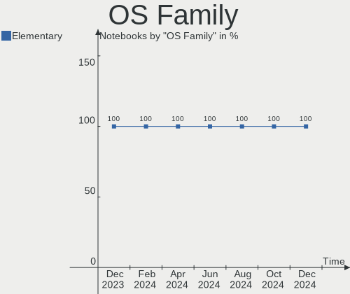
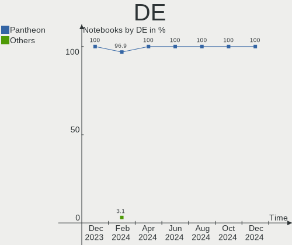
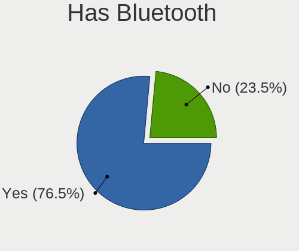
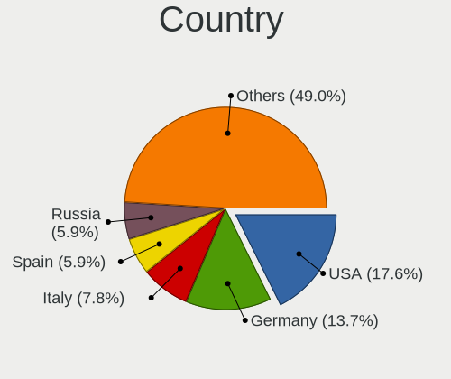
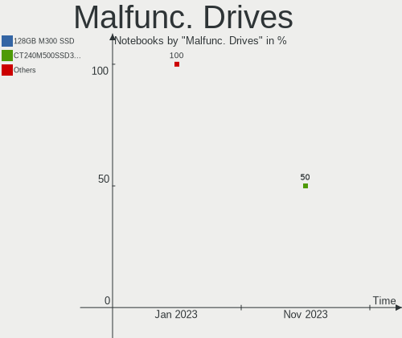
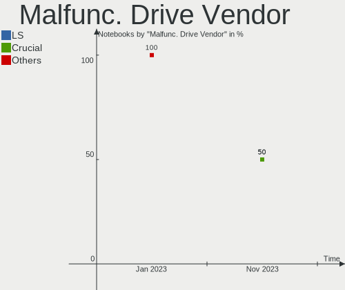
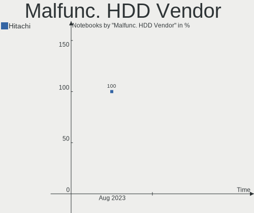
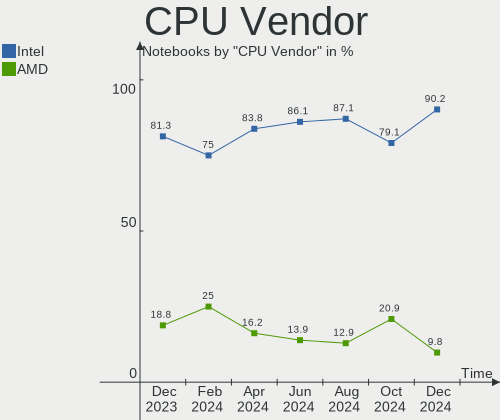
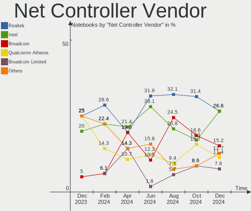
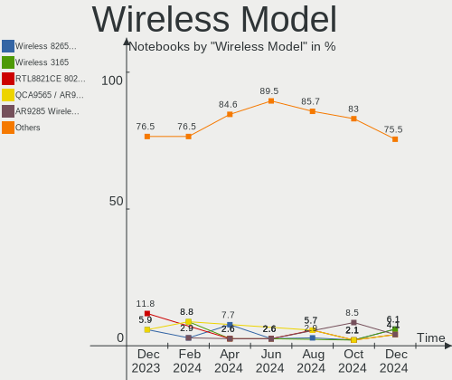

Elementary - Hardware Trends (Notebooks)
----------------------------------------

A project to identify most popular hardware characteristics and track their change
over time based on data collected by Linux users at https://Linux-Hardware.org.

Anyone can contribute to this report by the [hw-probe](https://github.com/linuxhw/hw-probe) tool:

    sudo -E hw-probe -all -upload

This report is for one last month. Overall report since the beginning of time: [TestDays](https://github.com/linuxhw/TestDays)

Period: Aug, 2023.

Contents
--------

* [ System ](#system)
  - [ OS                       ](#os)
  - [ OS Family                ](#os-family)
  - [ Kernel                   ](#kernel)
  - [ Kernel Family            ](#kernel-family)
  - [ Kernel Major Ver.        ](#kernel-major-ver)
  - [ Arch                     ](#arch)
  - [ DE                       ](#de)
  - [ Display Server           ](#display-server)
  - [ Display Manager          ](#display-manager)
  - [ OS Lang                  ](#os-lang)
  - [ Boot Mode                ](#boot-mode)
  - [ Filesystem               ](#filesystem)
  - [ Part. scheme             ](#part-scheme)
  - [ Dual Boot with Linux/BSD ](#dual-boot-with-linuxbsd)
  - [ Dual Boot (Win)          ](#dual-boot-win)

* [ Board ](#board)
  - [ Vendor                   ](#vendor)
  - [ Model                    ](#model)
  - [ Model Family             ](#model-family)
  - [ MFG Year                 ](#mfg-year)
  - [ Form Factor              ](#form-factor)
  - [ Secure Boot              ](#secure-boot)
  - [ Coreboot                 ](#coreboot)
  - [ RAM Size                 ](#ram-size)
  - [ RAM Used                 ](#ram-used)
  - [ Total Drives             ](#total-drives)
  - [ Has CD-ROM               ](#has-cd-rom)
  - [ Has Ethernet             ](#has-ethernet)
  - [ Has WiFi                 ](#has-wifi)
  - [ Has Bluetooth            ](#has-bluetooth)

* [ Location ](#location)
  - [ Country                  ](#country)
  - [ City                     ](#city)

* [ Drives ](#drives)
  - [ Drive Vendor             ](#drive-vendor)
  - [ Drive Model              ](#drive-model)
  - [ HDD Vendor               ](#hdd-vendor)
  - [ SSD Vendor               ](#ssd-vendor)
  - [ Drive Kind               ](#drive-kind)
  - [ Drive Connector          ](#drive-connector)
  - [ Drive Size               ](#drive-size)
  - [ Space Total              ](#space-total)
  - [ Space Used               ](#space-used)
  - [ Malfunc. Drives          ](#malfunc-drives)
  - [ Malfunc. Drive Vendor    ](#malfunc-drive-vendor)
  - [ Malfunc. HDD Vendor      ](#malfunc-hdd-vendor)
  - [ Malfunc. Drive Kind      ](#malfunc-drive-kind)
  - [ Failed Drives            ](#failed-drives)
  - [ Failed Drive Vendor      ](#failed-drive-vendor)
  - [ Drive Status             ](#drive-status)

* [ Storage controller ](#storage-controller)
  - [ Storage Vendor           ](#storage-vendor)
  - [ Storage Model            ](#storage-model)
  - [ Storage Kind             ](#storage-kind)

* [ Processor ](#processor)
  - [ CPU Vendor               ](#cpu-vendor)
  - [ CPU Model                ](#cpu-model)
  - [ CPU Model Family         ](#cpu-model-family)
  - [ CPU Cores                ](#cpu-cores)
  - [ CPU Sockets              ](#cpu-sockets)
  - [ CPU Threads              ](#cpu-threads)
  - [ CPU Op-Modes             ](#cpu-op-modes)
  - [ CPU Microcode            ](#cpu-microcode)
  - [ CPU Microarch            ](#cpu-microarch)

* [ Graphics ](#graphics)
  - [ GPU Vendor               ](#gpu-vendor)
  - [ GPU Model                ](#gpu-model)
  - [ GPU Combo                ](#gpu-combo)
  - [ GPU Driver               ](#gpu-driver)
  - [ GPU Memory               ](#gpu-memory)

* [ Monitor ](#monitor)
  - [ Monitor Vendor           ](#monitor-vendor)
  - [ Monitor Model            ](#monitor-model)
  - [ Monitor Resolution       ](#monitor-resolution)
  - [ Monitor Diagonal         ](#monitor-diagonal)
  - [ Monitor Width            ](#monitor-width)
  - [ Aspect Ratio             ](#aspect-ratio)
  - [ Monitor Area             ](#monitor-area)
  - [ Pixel Density            ](#pixel-density)
  - [ Multiple Monitors        ](#multiple-monitors)

* [ Network ](#network)
  - [ Net Controller Vendor    ](#net-controller-vendor)
  - [ Net Controller Model     ](#net-controller-model)
  - [ Wireless Vendor          ](#wireless-vendor)
  - [ Wireless Model           ](#wireless-model)
  - [ Ethernet Vendor          ](#ethernet-vendor)
  - [ Ethernet Model           ](#ethernet-model)
  - [ Net Controller Kind      ](#net-controller-kind)
  - [ Used Controller          ](#used-controller)
  - [ NICs                     ](#nics)
  - [ IPv6                     ](#ipv6)

* [ Bluetooth ](#bluetooth)
  - [ Bluetooth Vendor         ](#bluetooth-vendor)
  - [ Bluetooth Model          ](#bluetooth-model)

* [ Sound ](#sound)
  - [ Sound Vendor             ](#sound-vendor)
  - [ Sound Model              ](#sound-model)

* [ Memory ](#memory)
  - [ Memory Vendor            ](#memory-vendor)
  - [ Memory Model             ](#memory-model)
  - [ Memory Kind              ](#memory-kind)
  - [ Memory Form Factor       ](#memory-form-factor)
  - [ Memory Size              ](#memory-size)
  - [ Memory Speed             ](#memory-speed)

* [ Printers & scanners ](#printers--scanners)
  - [ Printer Vendor           ](#printer-vendor)
  - [ Printer Model            ](#printer-model)
  - [ Scanner Vendor           ](#scanner-vendor)
  - [ Scanner Model            ](#scanner-model)

* [ Camera ](#camera)
  - [ Camera Vendor            ](#camera-vendor)
  - [ Camera Model             ](#camera-model)

* [ Security ](#security)
  - [ Fingerprint Vendor       ](#fingerprint-vendor)
  - [ Fingerprint Model        ](#fingerprint-model)
  - [ Chipcard Vendor          ](#chipcard-vendor)
  - [ Chipcard Model           ](#chipcard-model)

* [ Unsupported ](#unsupported)
  - [ Unsupported Devices      ](#unsupported-devices)
  - [ Unsupported Device Types ](#unsupported-device-types)

System
------

OS
--

Installed operating systems

| Name             | Notebooks | Percent |
|------------------|-----------|---------|
| Elementary 7     | 26        | 81.25%  |
| Elementary 6.1   | 5         | 15.63%  |
| Elementary 5.1.7 | 1         | 3.13%   |

OS Family
---------

OS without a version

| Name       | Notebooks | Percent |
|------------|-----------|---------|
| Elementary | 32        | 100%    |

Kernel
------

Version of the Linux kernel

| Version           | Notebooks | Percent |
|-------------------|-----------|---------|
| 6.2.0-26-generic  | 14        | 43.75%  |
| 6.2.0-31-generic  | 4         | 12.5%   |
| 5.15.0-58-generic | 4         | 12.5%   |
| 5.19.0-50-generic | 3         | 9.38%   |
| 5.15.0-79-generic | 2         | 6.25%   |
| 5.15.0-71-generic | 2         | 6.25%   |
| 5.4.0-73-generic  | 1         | 3.13%   |
| 5.15.0-78-generic | 1         | 3.13%   |
| 5.15.0-52-generic | 1         | 3.13%   |

Kernel Family
-------------

Linux kernel without a distro release

| Version | Notebooks | Percent |
|---------|-----------|---------|
| 6.2.0   | 18        | 56.25%  |
| 5.15.0  | 10        | 31.25%  |
| 5.19.0  | 3         | 9.38%   |
| 5.4.0   | 1         | 3.13%   |

Kernel Major Ver.
-----------------

Linux kernel major version

| Version | Notebooks | Percent |
|---------|-----------|---------|
| 6.2     | 18        | 56.25%  |
| 5.15    | 10        | 31.25%  |
| 5.19    | 3         | 9.38%   |
| 5.4     | 1         | 3.13%   |

Arch
----

OS architecture (x86_64, i586, etc.)

| Name   | Notebooks | Percent |
|--------|-----------|---------|
| x86_64 | 32        | 100%    |

DE
--

Desktop Environment

| Name     | Notebooks | Percent |
|----------|-----------|---------|
| Pantheon | 32        | 100%    |

Display Server
--------------

X11 or Wayland

| Name | Notebooks | Percent |
|------|-----------|---------|
| X11  | 32        | 100%    |

Display Manager
---------------

SDDM, LightDM, etc.

| Name    | Notebooks | Percent |
|---------|-----------|---------|
| Unknown | 23        | 71.88%  |
| LightDM | 9         | 28.13%  |

OS Lang
-------

Language

| Lang  | Notebooks | Percent |
|-------|-----------|---------|
| en_US | 18        | 56.25%  |
| ru_RU | 4         | 12.5%   |
| fr_FR | 3         | 9.38%   |
| de_DE | 2         | 6.25%   |
| pt_BR | 1         | 3.13%   |
| pl_PL | 1         | 3.13%   |
| it_IT | 1         | 3.13%   |
| en_CA | 1         | 3.13%   |
| bg_BG | 1         | 3.13%   |

Boot Mode
---------

EFI or BIOS

| Mode | Notebooks | Percent |
|------|-----------|---------|
| BIOS | 23        | 71.88%  |
| EFI  | 9         | 28.13%  |

Filesystem
----------

Type of filesystem

| Type  | Notebooks | Percent |
|-------|-----------|---------|
| Ext4  | 29        | 90.63%  |
| Tmpfs | 3         | 9.38%   |

Part. scheme
------------

Scheme of partitioning

| Type    | Notebooks | Percent |
|---------|-----------|---------|
| Unknown | 23        | 71.88%  |
| GPT     | 7         | 21.88%  |
| MBR     | 2         | 6.25%   |

Dual Boot with Linux/BSD
------------------------

Hosting more than one Linux/BSD

| Dual boot | Notebooks | Percent |
|-----------|-----------|---------|
| No        | 31        | 96.88%  |
| Yes       | 1         | 3.13%   |

Dual Boot (Win)
---------------

Hosting Linux and Windows

| Dual boot | Notebooks | Percent |
|-----------|-----------|---------|
| No        | 28        | 87.5%   |
| Yes       | 4         | 12.5%   |

Board
-----

Vendor
------

Motherboard manufacturer

| Name             | Notebooks | Percent |
|------------------|-----------|---------|
| Hewlett-Packard  | 8         | 25%     |
| Lenovo           | 7         | 21.88%  |
| Apple            | 6         | 18.75%  |
| Acer             | 3         | 9.38%   |
| ASUSTek Computer | 2         | 6.25%   |
| Packard Bell     | 1         | 3.13%   |
| Medion           | 1         | 3.13%   |
| HUAWEI           | 1         | 3.13%   |
| Google           | 1         | 3.13%   |
| Digma            | 1         | 3.13%   |
| Dell             | 1         | 3.13%   |

Model
-----

Motherboard model

| Name                                     | Notebooks | Percent |
|------------------------------------------|-----------|---------|
| Apple MacBookAir6,2                      | 2         | 6.25%   |
| Packard Bell EasyNote LS11HR             | 1         | 3.13%   |
| Medion E15301                            | 1         | 3.13%   |
| Lenovo ThinkPad X201 Tablet 2985DMG      | 1         | 3.13%   |
| Lenovo ThinkPad T540p 20BFS02S00         | 1         | 3.13%   |
| Lenovo ThinkPad T470 20JNS08H00          | 1         | 3.13%   |
| Lenovo ThinkPad Edge E330 33542E4        | 1         | 3.13%   |
| Lenovo Legion Y530-15ICH 81FV            | 1         | 3.13%   |
| Lenovo IdeaPad 3 14ALC6 82KT             | 1         | 3.13%   |
| Lenovo G570 20079                        | 1         | 3.13%   |
| HUAWEI KLVD-WXX9                         | 1         | 3.13%   |
| HP ZBook 15                              | 1         | 3.13%   |
| HP ProBook 4310s                         | 1         | 3.13%   |
| HP Pavilion Laptop 15-eg0xxx             | 1         | 3.13%   |
| HP G60                                   | 1         | 3.13%   |
| HP EliteBook 850 G3                      | 1         | 3.13%   |
| HP EliteBook 840 G3                      | 1         | 3.13%   |
| HP EliteBook 2560p                       | 1         | 3.13%   |
| HP 350 G1                                | 1         | 3.13%   |
| Google Eldrid                            | 1         | 3.13%   |
| Digma EVE 11 C421Y ES1067EW              | 1         | 3.13%   |
| Dell Inspiron 15 3511                    | 1         | 3.13%   |
| ASUS VivoBook_ASUSLaptop X515JA_R565JA   | 1         | 3.13%   |
| ASUS VivoBook_ASUSLaptop M1502IA_M1502IA | 1         | 3.13%   |
| Apple MacBookPro9,2                      | 1         | 3.13%   |
| Apple MacBookPro8,1                      | 1         | 3.13%   |
| Apple MacBookPro6,2                      | 1         | 3.13%   |
| Apple MacBookPro5,5                      | 1         | 3.13%   |
| Acer TravelMate B113                     | 1         | 3.13%   |
| Acer Swift SF515-51T                     | 1         | 3.13%   |
| Acer Predator G3-571                     | 1         | 3.13%   |

Model Family
------------

Motherboard model prefix

| Name                  | Notebooks | Percent |
|-----------------------|-----------|---------|
| Lenovo ThinkPad       | 4         | 12.5%   |
| HP EliteBook          | 3         | 9.38%   |
| ASUS VivoBook         | 2         | 6.25%   |
| Apple MacBookAir6     | 2         | 6.25%   |
| Packard Bell EasyNote | 1         | 3.13%   |
| Medion E15301         | 1         | 3.13%   |
| Lenovo Legion         | 1         | 3.13%   |
| Lenovo IdeaPad        | 1         | 3.13%   |
| Lenovo G570           | 1         | 3.13%   |
| HUAWEI KLVD-WXX9      | 1         | 3.13%   |
| HP ZBook              | 1         | 3.13%   |
| HP ProBook            | 1         | 3.13%   |
| HP Pavilion           | 1         | 3.13%   |
| HP G60                | 1         | 3.13%   |
| HP 350                | 1         | 3.13%   |
| Google Eldrid         | 1         | 3.13%   |
| Digma EVE             | 1         | 3.13%   |
| Dell Inspiron         | 1         | 3.13%   |
| Apple MacBookPro9     | 1         | 3.13%   |
| Apple MacBookPro8     | 1         | 3.13%   |
| Apple MacBookPro6     | 1         | 3.13%   |
| Apple MacBookPro5     | 1         | 3.13%   |
| Acer TravelMate       | 1         | 3.13%   |
| Acer Swift            | 1         | 3.13%   |
| Acer Predator         | 1         | 3.13%   |

MFG Year
--------

Motherboard manufacture year

| Year | Notebooks | Percent |
|------|-----------|---------|
| 2021 | 5         | 15.63%  |
| 2013 | 4         | 12.5%   |
| 2011 | 4         | 12.5%   |
| 2012 | 3         | 9.38%   |
| 2023 | 2         | 6.25%   |
| 2018 | 2         | 6.25%   |
| 2017 | 2         | 6.25%   |
| 2016 | 2         | 6.25%   |
| 2010 | 2         | 6.25%   |
| 2009 | 2         | 6.25%   |
| 2020 | 1         | 3.13%   |
| 2019 | 1         | 3.13%   |
| 2014 | 1         | 3.13%   |
| 2008 | 1         | 3.13%   |

Form Factor
-----------

Physical design of the computer

| Name     | Notebooks | Percent |
|----------|-----------|---------|
| Notebook | 32        | 100%    |

Secure Boot
-----------

Enabled or disabled

| State    | Notebooks | Percent |
|----------|-----------|---------|
| Disabled | 31        | 96.88%  |
| Enabled  | 1         | 3.13%   |

Coreboot
--------

Have coreboot on board

| Used | Notebooks | Percent |
|------|-----------|---------|
| No   | 31        | 96.88%  |
| Yes  | 1         | 3.13%   |

RAM Size
--------

Total RAM memory

| Size in GB | Notebooks | Percent |
|------------|-----------|---------|
| 3.01-4.0   | 13        | 40.63%  |
| 4.01-8.0   | 9         | 28.13%  |
| 16.01-24.0 | 7         | 21.88%  |
| 8.01-16.0  | 3         | 9.38%   |

RAM Used
--------

Used RAM memory

| Used GB   | Notebooks | Percent |
|-----------|-----------|---------|
| 2.01-3.0  | 11        | 34.38%  |
| 1.01-2.0  | 10        | 31.25%  |
| 3.01-4.0  | 6         | 18.75%  |
| 8.01-16.0 | 4         | 12.5%   |
| 0.51-1.0  | 1         | 3.13%   |

Total Drives
------------

Number of drives on board

| Drives | Notebooks | Percent |
|--------|-----------|---------|
| 1      | 23        | 71.88%  |
| 2      | 8         | 25%     |
| 3      | 1         | 3.13%   |

Has CD-ROM
----------

Has CD-ROM on board

| Presented | Notebooks | Percent |
|-----------|-----------|---------|
| No        | 23        | 71.88%  |
| Yes       | 9         | 28.13%  |

Has Ethernet
------------

Has Ethernet on board

| Presented | Notebooks | Percent |
|-----------|-----------|---------|
| Yes       | 22        | 68.75%  |
| No        | 10        | 31.25%  |

Has WiFi
--------

Has WiFi module

| Presented | Notebooks | Percent |
|-----------|-----------|---------|
| Yes       | 31        | 96.88%  |
| No        | 1         | 3.13%   |

Has Bluetooth
-------------

Has Bluetooth module

| Presented | Notebooks | Percent |
|-----------|-----------|---------|
| Yes       | 29        | 90.63%  |
| No        | 3         | 9.38%   |

Location
--------

Country
-------

Geographic location (country)

| Country     | Notebooks | Percent |
|-------------|-----------|---------|
| USA         | 4         | 12.5%   |
| Russia      | 4         | 12.5%   |
| Indonesia   | 3         | 9.38%   |
| France      | 3         | 9.38%   |
| UK          | 2         | 6.25%   |
| Germany     | 2         | 6.25%   |
| Sweden      | 1         | 3.13%   |
| Spain       | 1         | 3.13%   |
| Portugal    | 1         | 3.13%   |
| Poland      | 1         | 3.13%   |
| Peru        | 1         | 3.13%   |
| Netherlands | 1         | 3.13%   |
| Italy       | 1         | 3.13%   |
| India       | 1         | 3.13%   |
| Egypt       | 1         | 3.13%   |
| Colombia    | 1         | 3.13%   |
| Canada      | 1         | 3.13%   |
| Bulgaria    | 1         | 3.13%   |
| Brazil      | 1         | 3.13%   |
| Australia   | 1         | 3.13%   |

City
----

Geographic location (city)

| City               | Notebooks | Percent |
|--------------------|-----------|---------|
| Wouldham           | 1         | 3.13%   |
| Wilsdruff          | 1         | 3.13%   |
| Sheffield          | 1         | 3.13%   |
| Plovdiv            | 1         | 3.13%   |
| Obninsk            | 1         | 3.13%   |
| Novosibirsk        | 1         | 3.13%   |
| North Myrtle Beach | 1         | 3.13%   |
| Nantes             | 1         | 3.13%   |
| Naaldwijk          | 1         | 3.13%   |
| Murowana Goslina   | 1         | 3.13%   |
| Moscow             | 1         | 3.13%   |
| Monza              | 1         | 3.13%   |
| Montería          | 1         | 3.13%   |
| Melbourne          | 1         | 3.13%   |
| Los Angeles        | 1         | 3.13%   |
| Lisbon             | 1         | 3.13%   |
| Lima               | 1         | 3.13%   |
| Lille              | 1         | 3.13%   |
| Kudus              | 1         | 3.13%   |
| Jakarta            | 1         | 3.13%   |
| Imphal             | 1         | 3.13%   |
| Hultsfred          | 1         | 3.13%   |
| Houston            | 1         | 3.13%   |
| Elektrostal        | 1         | 3.13%   |
| Córdoba           | 1         | 3.13%   |
| Colorado Springs   | 1         | 3.13%   |
| Campo Largo        | 1         | 3.13%   |
| Brebes             | 1         | 3.13%   |
| Brantford          | 1         | 3.13%   |
| Béziers           | 1         | 3.13%   |
| Bad Kreuznach      | 1         | 3.13%   |
| Alexandria         | 1         | 3.13%   |

Drives
------

Drive Vendor
------------

Hard drive vendors

| Vendor                       | Notebooks | Drives | Percent |
|------------------------------|-----------|--------|---------|
| Samsung Electronics          | 4         | 4      | 9.52%   |
| SanDisk                      | 3         | 3      | 7.14%   |
| Hitachi                      | 3         | 3      | 7.14%   |
| VISIPRO                      | 2         | 2      | 4.76%   |
| Toshiba                      | 2         | 2      | 4.76%   |
| Micron Technology            | 2         | 2      | 4.76%   |
| Intel                        | 2         | 2      | 4.76%   |
| China                        | 2         | 2      | 4.76%   |
| Apple                        | 2         | 2      | 4.76%   |
| Unknown                      | 2         | 2      | 4.76%   |
| WDC                          | 1         | 1      | 2.38%   |
| USB30                        | 1         | 1      | 2.38%   |
| Unknown                      | 1         | 1      | 2.38%   |
| Union Memory (Shenzhen)      | 1         | 1      | 2.38%   |
| Transcend                    | 1         | 1      | 2.38%   |
| SK hynix                     | 1         | 1      | 2.38%   |
| Shenzhen Longsys Electronics | 1         | 1      | 2.38%   |
| Seagate                      | 1         | 1      | 2.38%   |
| PNY                          | 1         | 1      | 2.38%   |
| Phison                       | 1         | 1      | 2.38%   |
| KIOXIA                       | 1         | 1      | 2.38%   |
| Kingston Technology Company  | 1         | 1      | 2.38%   |
| Kingston                     | 1         | 1      | 2.38%   |
| KingDian                     | 1         | 1      | 2.38%   |
| HGST                         | 1         | 1      | 2.38%   |
| FORESEE                      | 1         | 1      | 2.38%   |
| Apacer                       | 1         | 1      | 2.38%   |
| A-DATA Technology            | 1         | 1      | 2.38%   |

Drive Model
-----------

Hard drive models

| Model                                                 | Notebooks | Percent |
|-------------------------------------------------------|-----------|---------|
| Apple SSD SD0128F 121GB                               | 2         | 4.76%   |
| Unknown                                               | 2         | 4.76%   |
| WDC WD Green 2.5 1000GB                               | 1         | 2.38%   |
| VISIPRO SSD 256GB                                     | 1         | 2.38%   |
| VISIPRO SDVPSA1910256 256GB SSD                       | 1         | 2.38%   |
| USB30 Disk 256GB                                      | 1         | 2.38%   |
| Unknown MMC Card  16GB                                | 1         | 2.38%   |
| Union Memory (Shenzhen) RPFTJ128PDD2EWX 128GB         | 1         | 2.38%   |
| Transcend TS128GSSD370S 128GB                         | 1         | 2.38%   |
| Toshiba MK3263GSX 320GB                               | 1         | 2.38%   |
| Toshiba MK3256GSY 320GB                               | 1         | 2.38%   |
| SK hynix BC501 NVMe Solid State Drive 512GB           | 1         | 2.38%   |
| Shenzhen Longsys FORESEE P900F128GH 128GB             | 1         | 2.38%   |
| Seagate ST1000LM035-1RK172 1TB                        | 1         | 2.38%   |
| SanDisk SSD U110 16GB                                 | 1         | 2.38%   |
| SanDisk SD9SN8W-128G-1006 128GB SSD                   | 1         | 2.38%   |
| SanDisk 3.2 Gen 1 496GB SSD                           | 1         | 2.38%   |
| Samsung SSD 980 1TB                                   | 1         | 2.38%   |
| Samsung SSD 870 EVO 1TB                               | 1         | 2.38%   |
| Samsung SSD 850 EVO 250GB                             | 1         | 2.38%   |
| Samsung NVMe SSD Controller PM9A1/PM9A3/980PRO 1024GB | 1         | 2.38%   |
| PNY CS900 240GB SSD                                   | 1         | 2.38%   |
| Phison S11-512G-PHISON-SSD-B47 512GB                  | 1         | 2.38%   |
| Micron MTFDHBA512QFD 512GB                            | 1         | 2.38%   |
| Micron MTFDDAV256MBF-1AN15ABHA 256GB SSD              | 1         | 2.38%   |
| KIOXIA KBG50ZNS512G NVMe 512GB                        | 1         | 2.38%   |
| Kingston Company OM3PDP3 NVMe SSD 256GB               | 1         | 2.38%   |
| Kingston SA400S37480G 480GB SSD                       | 1         | 2.38%   |
| KingDian S280 240GB                                   | 1         | 2.38%   |
| Intel SSDPEKNW512G8H 512GB                            | 1         | 2.38%   |
| Intel SSDPEKNU512GZ 512GB                             | 1         | 2.38%   |
| Hitachi HTS727550A9E364 500GB                         | 1         | 2.38%   |
| Hitachi HTS547564A9E384 640GB                         | 1         | 2.38%   |
| Hitachi HTS545025B9SA02 250GB                         | 1         | 2.38%   |
| HGST HTS541010A9E680 1TB                              | 1         | 2.38%   |
| FORESEE P900F128GH 128GB                              | 1         | 2.38%   |
| China SATA SSD 120GB                                  | 1         | 2.38%   |
| China 128GB SSD                                       | 1         | 2.38%   |
| Apacer AST280 120GB SSD                               | 1         | 2.38%   |
| A-DATA SP550 240GB SSD                                | 1         | 2.38%   |

HDD Vendor
----------

Hard disk drive vendors

| Vendor  | Notebooks | Drives | Percent |
|---------|-----------|--------|---------|
| Hitachi | 3         | 3      | 42.86%  |
| Toshiba | 2         | 2      | 28.57%  |
| Seagate | 1         | 1      | 14.29%  |
| HGST    | 1         | 1      | 14.29%  |

SSD Vendor
----------

Solid state drive vendors

| Vendor              | Notebooks | Drives | Percent |
|---------------------|-----------|--------|---------|
| SanDisk             | 3         | 3      | 14.29%  |
| VISIPRO             | 2         | 2      | 9.52%   |
| Samsung Electronics | 2         | 2      | 9.52%   |
| China               | 2         | 2      | 9.52%   |
| Apple               | 2         | 2      | 9.52%   |
| WDC                 | 1         | 1      | 4.76%   |
| USB30               | 1         | 1      | 4.76%   |
| Transcend           | 1         | 1      | 4.76%   |
| PNY                 | 1         | 1      | 4.76%   |
| Phison              | 1         | 1      | 4.76%   |
| Micron Technology   | 1         | 1      | 4.76%   |
| Kingston            | 1         | 1      | 4.76%   |
| KingDian            | 1         | 1      | 4.76%   |
| Apacer              | 1         | 1      | 4.76%   |
| A-DATA Technology   | 1         | 1      | 4.76%   |

Drive Kind
----------

HDD or SSD

| Kind    | Notebooks | Drives | Percent |
|---------|-----------|--------|---------|
| SSD     | 20        | 21     | 50%     |
| NVMe    | 10        | 11     | 25%     |
| HDD     | 7         | 7      | 17.5%   |
| MMC     | 2         | 2      | 5%      |
| Unknown | 1         | 1      | 2.5%    |

Drive Connector
---------------

SATA, SAS, NVMe, etc.

| Type | Notebooks | Drives | Percent |
|------|-----------|--------|---------|
| SATA | 24        | 27     | 63.16%  |
| NVMe | 10        | 11     | 26.32%  |
| SAS  | 2         | 2      | 5.26%   |
| MMC  | 2         | 2      | 5.26%   |

Drive Size
----------

Size of hard drive

| Size in TB | Notebooks | Drives | Percent |
|------------|-----------|--------|---------|
| 0.01-0.5   | 20        | 22     | 76.92%  |
| 0.51-1.0   | 6         | 6      | 23.08%  |

Space Total
-----------

Amount of disk space available on the file system

| Size in GB | Notebooks | Percent |
|------------|-----------|---------|
| 101-250    | 17        | 53.13%  |
| 251-500    | 7         | 21.88%  |
| 501-1000   | 5         | 15.63%  |
| 21-50      | 1         | 3.13%   |
| 2001-3000  | 1         | 3.13%   |
| 51-100     | 1         | 3.13%   |

Space Used
----------

Amount of used disk space

| Used GB  | Notebooks | Percent |
|----------|-----------|---------|
| 1-20     | 15        | 46.88%  |
| 21-50    | 11        | 34.38%  |
| 251-500  | 2         | 6.25%   |
| 101-250  | 2         | 6.25%   |
| 501-1000 | 1         | 3.13%   |
| 51-100   | 1         | 3.13%   |

Malfunc. Drives
---------------

Drive models with a malfunction

| Model                         | Notebooks | Drives | Percent |
|-------------------------------|-----------|--------|---------|
| Hitachi HTS547564A9E384 640GB | 1         | 1      | 100%    |

Malfunc. Drive Vendor
---------------------

Vendors of faulty drives

| Vendor  | Notebooks | Drives | Percent |
|---------|-----------|--------|---------|
| Hitachi | 1         | 1      | 100%    |

Malfunc. HDD Vendor
-------------------

Vendors of faulty HDD drives

| Vendor  | Notebooks | Drives | Percent |
|---------|-----------|--------|---------|
| Hitachi | 1         | 1      | 100%    |

Malfunc. Drive Kind
-------------------

Kinds of faulty drives

| Kind | Notebooks | Drives | Percent |
|------|-----------|--------|---------|
| HDD  | 1         | 1      | 100%    |

Failed Drives
-------------

Failed drive models

Zero info for selected period =(

Failed Drive Vendor
-------------------

Failed drive vendors

Zero info for selected period =(

Drive Status
------------

Number of failed and malfunc. drives

| Status   | Notebooks | Drives | Percent |
|----------|-----------|--------|---------|
| Detected | 27        | 34     | 77.14%  |
| Works    | 7         | 7      | 20%     |
| Malfunc  | 1         | 1      | 2.86%   |

Storage controller
------------------

Storage Vendor
--------------

Storage controller vendors

| Vendor                       | Notebooks | Percent |
|------------------------------|-----------|---------|
| Intel                        | 25        | 65.79%  |
| Samsung Electronics          | 2         | 5.26%   |
| Marvell Technology Group     | 2         | 5.26%   |
| AMD                          | 2         | 5.26%   |
| Union Memory (Shenzhen)      | 1         | 2.63%   |
| SK hynix                     | 1         | 2.63%   |
| Shenzhen Longsys Electronics | 1         | 2.63%   |
| Nvidia                       | 1         | 2.63%   |
| Micron Technology            | 1         | 2.63%   |
| KIOXIA                       | 1         | 2.63%   |
| Kingston Technology Company  | 1         | 2.63%   |

Storage Model
-------------

Storage controller models

| Model                                                                          | Notebooks | Percent |
|--------------------------------------------------------------------------------|-----------|---------|
| Intel 6 Series/C200 Series Chipset Family 6 port Mobile SATA AHCI Controller   | 4         | 10%     |
| Intel Sunrise Point-LP SATA Controller [AHCI mode]                             | 3         | 7.5%    |
| Intel 7 Series Chipset Family 6-port SATA Controller [AHCI mode]               | 3         | 7.5%    |
| Marvell Group 88SS9183 PCIe SSD Controller                                     | 2         | 5%      |
| Intel 82801IBM/IEM (ICH9M/ICH9M-E) 4 port SATA Controller [AHCI mode]          | 2         | 5%      |
| Intel 82801 Mobile SATA Controller [RAID mode]                                 | 2         | 5%      |
| Intel 8 Series/C220 Series Chipset Family 6-port SATA Controller 1 [AHCI mode] | 2         | 5%      |
| AMD FCH SATA Controller [AHCI mode]                                            | 2         | 5%      |
| Union Memory (Shenzhen) AM610 PCIe 3.0 NVMe SSD 128GB                          | 1         | 2.5%    |
| SK hynix BC501 NVMe Solid State Drive                                          | 1         | 2.5%    |
| Shenzhen Longsys Non-Volatile memory controller                                | 1         | 2.5%    |
| Samsung NVMe SSD Controller PM9A1/PM9A3/980PRO                                 | 1         | 2.5%    |
| Samsung NVMe SSD Controller 980                                                | 1         | 2.5%    |
| Nvidia MCP79 AHCI Controller                                                   | 1         | 2.5%    |
| Micron 2210 NVMe SSD [Cobain]                                                  | 1         | 2.5%    |
| KIOXIA NVMe SSD Controller BG5 (DRAM-less)                                     | 1         | 2.5%    |
| Kingston Company OM3PDP3 NVMe SSD                                              | 1         | 2.5%    |
| Intel Volume Management Device NVMe RAID Controller                            | 1         | 2.5%    |
| Intel Tiger Lake-LP SATA Controller                                            | 1         | 2.5%    |
| Intel SSD 670p Series [Keystone Harbor]                                        | 1         | 2.5%    |
| Intel SSD 660P Series                                                          | 1         | 2.5%    |
| Intel HM170/QM170 Chipset SATA Controller [AHCI Mode]                          | 1         | 2.5%    |
| Intel Celeron/Pentium Silver Processor SATA Controller                         | 1         | 2.5%    |
| Intel Cannon Lake Mobile PCH SATA AHCI Controller                              | 1         | 2.5%    |
| Intel 8 Series SATA Controller 1 [AHCI mode]                                   | 1         | 2.5%    |
| Intel 5 Series/3400 Series Chipset 4 port SATA IDE Controller                  | 1         | 2.5%    |
| Intel 5 Series/3400 Series Chipset 4 port SATA AHCI Controller                 | 1         | 2.5%    |
| Intel 5 Series/3400 Series Chipset 2 port SATA IDE Controller                  | 1         | 2.5%    |

Storage Kind
------------

Kind of storage controller (IDE, SATA, NVMe, SAS, ...)

| Kind | Notebooks | Percent |
|------|-----------|---------|
| SATA | 25        | 64.1%   |
| NVMe | 10        | 25.64%  |
| RAID | 3         | 7.69%   |
| IDE  | 1         | 2.56%   |

Processor
---------

CPU Vendor
----------

Processor vendors

| Vendor | Notebooks | Percent |
|--------|-----------|---------|
| Intel  | 29        | 90.63%  |
| AMD    | 3         | 9.38%   |

CPU Model
---------

Processor models

| Model                                         | Notebooks | Percent |
|-----------------------------------------------|-----------|---------|
| Intel 11th Gen Core i5-1135G7 @ 2.40GHz       | 4         | 12.5%   |
| Intel Pentium Dual-Core CPU T4300 @ 2.10GHz   | 1         | 3.13%   |
| Intel Pentium CPU 6805 @ 1.10GHz              | 1         | 3.13%   |
| Intel Core i7-8750H CPU @ 2.20GHz             | 1         | 3.13%   |
| Intel Core i7-7700HQ CPU @ 2.80GHz            | 1         | 3.13%   |
| Intel Core i7-6600U CPU @ 2.60GHz             | 1         | 3.13%   |
| Intel Core i7-4700MQ CPU @ 2.40GHz            | 1         | 3.13%   |
| Intel Core i7-2670QM CPU @ 2.20GHz            | 1         | 3.13%   |
| Intel Core i7 CPU L 620 @ 2.00GHz             | 1         | 3.13%   |
| Intel Core i5-8265U CPU @ 1.60GHz             | 1         | 3.13%   |
| Intel Core i5-6300U CPU @ 2.40GHz             | 1         | 3.13%   |
| Intel Core i5-6200U CPU @ 2.30GHz             | 1         | 3.13%   |
| Intel Core i5-4300M CPU @ 2.60GHz             | 1         | 3.13%   |
| Intel Core i5-4260U CPU @ 1.40GHz             | 1         | 3.13%   |
| Intel Core i5-4250U CPU @ 1.30GHz             | 1         | 3.13%   |
| Intel Core i5-4200U CPU @ 1.60GHz             | 1         | 3.13%   |
| Intel Core i5-3210M CPU @ 2.50GHz             | 1         | 3.13%   |
| Intel Core i5-2520M CPU @ 2.50GHz             | 1         | 3.13%   |
| Intel Core i5-2435M CPU @ 2.40GHz             | 1         | 3.13%   |
| Intel Core i5 CPU M 520 @ 2.40GHz             | 1         | 3.13%   |
| Intel Core i3-3110M CPU @ 2.40GHz             | 1         | 3.13%   |
| Intel Core i3-2377M CPU @ 1.50GHz             | 1         | 3.13%   |
| Intel Core 2 Duo CPU T6570 @ 2.10GHz          | 1         | 3.13%   |
| Intel Core 2 Duo CPU P8700 @ 2.53GHz          | 1         | 3.13%   |
| Intel Celeron N4020 CPU @ 1.10GHz             | 1         | 3.13%   |
| Intel Celeron CPU B800 @ 1.50GHz              | 1         | 3.13%   |
| AMD Ryzen 7 4800HS with Radeon Graphics       | 1         | 3.13%   |
| AMD Ryzen 5 3500U with Radeon Vega Mobile Gfx | 1         | 3.13%   |
| AMD Ryzen 3 5300U with Radeon Graphics        | 1         | 3.13%   |

CPU Model Family
----------------

Processor model prefix

| Model                   | Notebooks | Percent |
|-------------------------|-----------|---------|
| Intel Core i5           | 11        | 34.38%  |
| Intel Core i7           | 6         | 18.75%  |
| Other                   | 4         | 12.5%   |
| Intel Core i3           | 2         | 6.25%   |
| Intel Core 2 Duo        | 2         | 6.25%   |
| Intel Celeron           | 2         | 6.25%   |
| Intel Pentium Dual-Core | 1         | 3.13%   |
| Intel Pentium           | 1         | 3.13%   |
| AMD Ryzen 7             | 1         | 3.13%   |
| AMD Ryzen 5             | 1         | 3.13%   |
| AMD Ryzen 3             | 1         | 3.13%   |

CPU Cores
---------

Number of processor cores

| Number | Notebooks | Percent |
|--------|-----------|---------|
| 2      | 20        | 62.5%   |
| 4      | 10        | 31.25%  |
| 8      | 1         | 3.13%   |
| 6      | 1         | 3.13%   |

CPU Sockets
-----------

Number of sockets

| Number | Notebooks | Percent |
|--------|-----------|---------|
| 1      | 32        | 100%    |

CPU Threads
-----------

Threads per core (Hyper-Threading)

| Number | Notebooks | Percent |
|--------|-----------|---------|
| 2      | 27        | 84.38%  |
| 1      | 5         | 15.63%  |

CPU Op-Modes
------------

CPU Operation Modes (32-bit, 64-bit)

| Op mode        | Notebooks | Percent |
|----------------|-----------|---------|
| 32-bit, 64-bit | 32        | 100%    |

CPU Microcode
-------------

Microcode number

| Number     | Notebooks | Percent |
|------------|-----------|---------|
| Unknown    | 22        | 68.75%  |
| 0x206a7    | 3         | 9.38%   |
| 0x906e9    | 1         | 3.13%   |
| 0x806c1    | 1         | 3.13%   |
| 0x706e5    | 1         | 3.13%   |
| 0x706a8    | 1         | 3.13%   |
| 0x406e3    | 1         | 3.13%   |
| 0x306c3    | 1         | 3.13%   |
| 0x08600106 | 1         | 3.13%   |

CPU Microarch
-------------

Microarchitecture

| Name          | Notebooks | Percent |
|---------------|-----------|---------|
| SandyBridge   | 5         | 15.63%  |
| Haswell       | 5         | 15.63%  |
| TigerLake     | 4         | 12.5%   |
| Skylake       | 3         | 9.38%   |
| Penryn        | 3         | 9.38%   |
| KabyLake      | 3         | 9.38%   |
| Westmere      | 2         | 6.25%   |
| IvyBridge     | 2         | 6.25%   |
| Zen+          | 1         | 3.13%   |
| Zen 2         | 1         | 3.13%   |
| IceLake       | 1         | 3.13%   |
| Goldmont plus | 1         | 3.13%   |
| Unknown       | 1         | 3.13%   |

Graphics
--------

GPU Vendor
----------

Vendors of graphics cards

| Vendor | Notebooks | Percent |
|--------|-----------|---------|
| Intel  | 26        | 68.42%  |
| Nvidia | 6         | 15.79%  |
| AMD    | 6         | 15.79%  |

GPU Model
---------

Graphics card models

| Model                                                                         | Notebooks | Percent |
|-------------------------------------------------------------------------------|-----------|---------|
| Intel 2nd Generation Core Processor Family Integrated Graphics Controller     | 5         | 13.16%  |
| Intel TigerLake-LP GT2 [Iris Xe Graphics]                                     | 4         | 10.53%  |
| Intel Skylake GT2 [HD Graphics 520]                                           | 3         | 7.89%   |
| Intel Haswell-ULT Integrated Graphics Controller                              | 3         | 7.89%   |
| Intel Core Processor Integrated Graphics Controller                           | 2         | 5.26%   |
| Intel 3rd Gen Core processor Graphics Controller                              | 2         | 5.26%   |
| Nvidia TU117M [GeForce MX450]                                                 | 1         | 2.63%   |
| Nvidia GT216M [GeForce GT 330M]                                               | 1         | 2.63%   |
| Nvidia GP107M [GeForce GTX 1050 Mobile]                                       | 1         | 2.63%   |
| Nvidia GP106M [GeForce GTX 1060 Mobile]                                       | 1         | 2.63%   |
| Nvidia GK208GLM [Quadro K610M]                                                | 1         | 2.63%   |
| Nvidia C79 [GeForce 9400M]                                                    | 1         | 2.63%   |
| Intel WhiskeyLake-U GT2 [UHD Graphics 620]                                    | 1         | 2.63%   |
| Intel Mobile 4 Series Chipset Integrated Graphics Controller                  | 1         | 2.63%   |
| Intel Iris Plus Graphics G1 (Ice Lake)                                        | 1         | 2.63%   |
| Intel HD Graphics 630                                                         | 1         | 2.63%   |
| Intel GeminiLake [UHD Graphics 600]                                           | 1         | 2.63%   |
| Intel CoffeeLake-H GT2 [UHD Graphics 630]                                     | 1         | 2.63%   |
| Intel 4th Gen Core Processor Integrated Graphics Controller                   | 1         | 2.63%   |
| AMD Thames [Radeon HD 7500M/7600M Series]                                     | 1         | 2.63%   |
| AMD Sun XT [Radeon HD 8670A/8670M/8690M / R5 M330 / M430 / Radeon 520 Mobile] | 1         | 2.63%   |
| AMD RV710/M92 [Mobility Radeon HD 4330/4350/4550]                             | 1         | 2.63%   |
| AMD Renoir                                                                    | 1         | 2.63%   |
| AMD Picasso/Raven 2 [Radeon Vega Series / Radeon Vega Mobile Series]          | 1         | 2.63%   |
| AMD Lucienne                                                                  | 1         | 2.63%   |

GPU Combo
---------

Combinations of graphics cards

| Name           | Notebooks | Percent |
|----------------|-----------|---------|
| 1 x Intel      | 20        | 62.5%   |
| Intel + Nvidia | 4         | 12.5%   |
| 1 x AMD        | 4         | 12.5%   |
| 1 x Nvidia     | 2         | 6.25%   |
| Intel + AMD    | 2         | 6.25%   |

GPU Driver
----------

Free vs proprietary

| Driver      | Notebooks | Percent |
|-------------|-----------|---------|
| Free        | 30        | 93.75%  |
| Proprietary | 2         | 6.25%   |

GPU Memory
----------

Total video memory

| Size in GB | Notebooks | Percent |
|------------|-----------|---------|
| Unknown    | 28        | 87.5%   |
| 0.51-1.0   | 2         | 6.25%   |
| 3.01-4.0   | 1         | 3.13%   |
| 0.01-0.5   | 1         | 3.13%   |

Monitor
-------

Monitor Vendor
--------------

Monitor vendors

| Vendor                  | Notebooks | Percent |
|-------------------------|-----------|---------|
| AU Optronics            | 8         | 23.53%  |
| Apple                   | 6         | 17.65%  |
| LG Display              | 5         | 14.71%  |
| Chimei Innolux          | 4         | 11.76%  |
| BOE                     | 4         | 11.76%  |
| Samsung Electronics     | 2         | 5.88%   |
| XCX                     | 1         | 2.94%   |
| RGT                     | 1         | 2.94%   |
| Lenovo                  | 1         | 2.94%   |
| Goldstar                | 1         | 2.94%   |
| Chi Mei Optoelectronics | 1         | 2.94%   |

Monitor Model
-------------

Monitor models

| Model                                                                    | Notebooks | Percent |
|--------------------------------------------------------------------------|-----------|---------|
| Apple Color LCD APP9CF0 1440x900 290x180mm 13.4-inch                     | 2         | 5.88%   |
| XCX LCD Monitor XCX0844 1366x768 256x144mm 11.6-inch                     | 1         | 2.94%   |
| Samsung Electronics LCD Monitor SEC5341 1366x768 344x193mm 15.5-inch     | 1         | 2.94%   |
| Samsung Electronics LCD Monitor SEC4149 1366x768 292x174mm 13.4-inch     | 1         | 2.94%   |
| RGT LCD Monitor RGT1352 1920x1080 480x270mm 21.7-inch                    | 1         | 2.94%   |
| LG Display LCD Monitor LGD06FF 1920x1080 344x194mm 15.5-inch             | 1         | 2.94%   |
| LG Display LCD Monitor LGD05F7 1920x1080 344x194mm 15.5-inch             | 1         | 2.94%   |
| LG Display LCD Monitor LGD0521 1920x1080 309x174mm 14.0-inch             | 1         | 2.94%   |
| LG Display LCD Monitor LGD038E 1366x768 344x194mm 15.5-inch              | 1         | 2.94%   |
| LG Display LCD Monitor LGD01DA 1366x768 294x166mm 13.3-inch              | 1         | 2.94%   |
| Lenovo LCD Monitor LEN4011 1280x800 261x163mm 12.1-inch                  | 1         | 2.94%   |
| Goldstar ULTRAGEAR GSM5C0A 1920x1080 600x340mm 27.2-inch                 | 1         | 2.94%   |
| Chimei Innolux LCD Monitor CMN15E7 1920x1080 344x193mm 15.5-inch         | 1         | 2.94%   |
| Chimei Innolux LCD Monitor CMN15D3 1920x1080 344x193mm 15.5-inch         | 1         | 2.94%   |
| Chimei Innolux LCD Monitor CMN1515 1920x1080 344x193mm 15.5-inch         | 1         | 2.94%   |
| Chimei Innolux LCD Monitor CMN1406 1920x1080 309x173mm 13.9-inch         | 1         | 2.94%   |
| Chi Mei Optoelectronics LCD Monitor CMO1721 1600x900 382x215mm 17.3-inch | 1         | 2.94%   |
| BOE LCD Monitor BOE09AE 1920x1080 309x174mm 14.0-inch                    | 1         | 2.94%   |
| BOE LCD Monitor BOE0893 2160x1440 296x197mm 14.0-inch                    | 1         | 2.94%   |
| BOE LCD Monitor BOE07AA 1366x768 344x194mm 15.5-inch                     | 1         | 2.94%   |
| BOE LCD Monitor BOE06FB 1920x1080 344x194mm 15.5-inch                    | 1         | 2.94%   |
| AU Optronics LCD Monitor AUO4999 1920x1080 344x193mm 15.5-inch           | 1         | 2.94%   |
| AU Optronics LCD Monitor AUO46EC 1366x768 344x193mm 15.5-inch            | 1         | 2.94%   |
| AU Optronics LCD Monitor AUO405C 1366x768 256x144mm 11.6-inch            | 1         | 2.94%   |
| AU Optronics LCD Monitor AUO35ED 1920x1080 344x193mm 15.5-inch           | 1         | 2.94%   |
| AU Optronics LCD Monitor AUO312C 1366x768 293x164mm 13.2-inch            | 1         | 2.94%   |
| AU Optronics LCD Monitor AUO123D 1920x1080 309x173mm 13.9-inch           | 1         | 2.94%   |
| AU Optronics LCD Monitor AUO10EC 1366x768 344x193mm 15.5-inch            | 1         | 2.94%   |
| AU Optronics LCD Monitor 1920x1080                                       | 1         | 2.94%   |
| Apple LCD Monitor APP9CC5 1280x800 286x179mm 13.3-inch                   | 1         | 2.94%   |
| Apple LCD Monitor APP9CBD 1280x800 286x179mm 13.3-inch                   | 1         | 2.94%   |
| Apple Color LCD APP9CC7 1280x800 286x179mm 13.3-inch                     | 1         | 2.94%   |
| Apple Color LCD APP9CA4 1440x900 331x207mm 15.4-inch                     | 1         | 2.94%   |

Monitor Resolution
------------------

Monitor screen resolution

| Resolution       | Notebooks | Percent |
|------------------|-----------|---------|
| 1920x1080 (FHD)  | 13        | 40.63%  |
| 1366x768 (WXGA)  | 10        | 31.25%  |
| 1280x800 (WXGA)  | 4         | 12.5%   |
| 1440x900 (WXGA+) | 3         | 9.38%   |
| 2160x1440        | 1         | 3.13%   |
| 1600x900 (HD+)   | 1         | 3.13%   |

Monitor Diagonal
----------------

Diagonal size in inches

| Inches  | Notebooks | Percent |
|---------|-----------|---------|
| 15      | 14        | 41.18%  |
| 13      | 10        | 29.41%  |
| 14      | 3         | 8.82%   |
| 11      | 2         | 5.88%   |
| 27      | 1         | 2.94%   |
| 21      | 1         | 2.94%   |
| 17      | 1         | 2.94%   |
| 12      | 1         | 2.94%   |
| Unknown | 1         | 2.94%   |

Monitor Width
-------------

Physical width

| Width in mm | Notebooks | Percent |
|-------------|-----------|---------|
| 301-350     | 18        | 52.94%  |
| 201-300     | 12        | 35.29%  |
| 501-600     | 1         | 2.94%   |
| 401-500     | 1         | 2.94%   |
| 351-400     | 1         | 2.94%   |
| Unknown     | 1         | 2.94%   |

Aspect Ratio
------------

Proportional relationship between the width and the height

| Ratio   | Notebooks | Percent |
|---------|-----------|---------|
| 16/9    | 23        | 71.88%  |
| 16/10   | 6         | 18.75%  |
| 3/2     | 2         | 6.25%   |
| Unknown | 1         | 3.13%   |

Monitor Area
------------

Area in inch²

| Area in inch² | Notebooks | Percent |
|----------------|-----------|---------|
| 101-110        | 14        | 41.18%  |
| 81-90          | 10        | 29.41%  |
| 71-80          | 3         | 8.82%   |
| 51-60          | 2         | 5.88%   |
| 61-70          | 1         | 2.94%   |
| 301-350        | 1         | 2.94%   |
| 201-250        | 1         | 2.94%   |
| 121-130        | 1         | 2.94%   |
| Unknown        | 1         | 2.94%   |

Pixel Density
-------------

Pixels per inch

| Density | Notebooks | Percent |
|---------|-----------|---------|
| 121-160 | 17        | 50%     |
| 101-120 | 14        | 41.18%  |
| 161-240 | 1         | 2.94%   |
| 51-100  | 1         | 2.94%   |
| Unknown | 1         | 2.94%   |

Multiple Monitors
-----------------

Total monitors connected

| Total | Notebooks | Percent |
|-------|-----------|---------|
| 1     | 29        | 90.63%  |
| 2     | 3         | 9.38%   |

Network
-------

Net Controller Vendor
---------------------

Controller vendors

| Vendor                   | Notebooks | Percent |
|--------------------------|-----------|---------|
| Intel                    | 15        | 36.59%  |
| Realtek Semiconductor    | 10        | 24.39%  |
| Broadcom                 | 5         | 12.2%   |
| Qualcomm Atheros         | 4         | 9.76%   |
| Broadcom Limited         | 2         | 4.88%   |
| TP-Link                  | 1         | 2.44%   |
| Ralink                   | 1         | 2.44%   |
| Nvidia                   | 1         | 2.44%   |
| NetGear                  | 1         | 2.44%   |
| Marvell Technology Group | 1         | 2.44%   |

Net Controller Model
--------------------

Controller models

| Model                                                             | Notebooks | Percent |
|-------------------------------------------------------------------|-----------|---------|
| Realtek RTL8111/8168/8411 PCI Express Gigabit Ethernet Controller | 4         | 7.27%   |
| Intel Wi-Fi 6 AX201                                               | 4         | 7.27%   |
| Intel Wireless 8260                                               | 3         | 5.45%   |
| Qualcomm Atheros AR9285 Wireless Network Adapter (PCI-Express)    | 2         | 3.64%   |
| Intel Ethernet Connection I219-LM                                 | 2         | 3.64%   |
| Intel Ethernet Connection I217-LM                                 | 2         | 3.64%   |
| Intel Centrino Ultimate-N 6300                                    | 2         | 3.64%   |
| Intel Centrino Advanced-N 6235                                    | 2         | 3.64%   |
| Broadcom NetXtreme BCM57765 Gigabit Ethernet PCIe                 | 2         | 3.64%   |
| Broadcom Limited BCM4360 802.11ac Wireless Network Adapter        | 2         | 3.64%   |
| Broadcom BCM4331 802.11a/b/g/n                                    | 2         | 3.64%   |
| TP-Link TL-WN722N v2/v3 [Realtek RTL8188EUS]                      | 1         | 1.82%   |
| Realtek RTL8852BE PCIe 802.11ax Wireless Network Controller       | 1         | 1.82%   |
| Realtek RTL8822CE 802.11ac PCIe Wireless Network Adapter          | 1         | 1.82%   |
| Realtek RTL8821CE 802.11ac PCIe Wireless Network Adapter          | 1         | 1.82%   |
| Realtek RTL8188EUS 802.11n Wireless Network Adapter               | 1         | 1.82%   |
| Realtek RTL8152 Fast Ethernet Adapter                             | 1         | 1.82%   |
| Realtek RTL810xE PCI Express Fast Ethernet controller             | 1         | 1.82%   |
| Realtek 802.11n WLAN Adapter                                      | 1         | 1.82%   |
| Ralink RT3290 Wireless 802.11n 1T/1R PCIe                         | 1         | 1.82%   |
| Qualcomm Atheros QCA6174 802.11ac Wireless Network Adapter        | 1         | 1.82%   |
| Qualcomm Atheros AR9287 Wireless Network Adapter (PCI-Express)    | 1         | 1.82%   |
| Qualcomm Atheros AR8152 v2.0 Fast Ethernet                        | 1         | 1.82%   |
| Qualcomm Atheros AR8151 v2.0 Gigabit Ethernet                     | 1         | 1.82%   |
| Nvidia MCP79 Ethernet                                             | 1         | 1.82%   |
| NetGear WNA3100M(v1) Wireless-N 300 [Realtek RTL8192CU]           | 1         | 1.82%   |
| Marvell Group 88E8072 PCI-E Gigabit Ethernet Controller           | 1         | 1.82%   |
| Intel Wireless 3165                                               | 1         | 1.82%   |
| Intel Ethernet Connection I219-V                                  | 1         | 1.82%   |
| Intel Centrino Wireless-N 2230                                    | 1         | 1.82%   |
| Intel Centrino Wireless-N 1000 [Condor Peak]                      | 1         | 1.82%   |
| Intel Cannon Point-LP CNVi [Wireless-AC]                          | 1         | 1.82%   |
| Intel 82579LM Gigabit Network Connection (Lewisville)             | 1         | 1.82%   |
| Intel 82577LM Gigabit Network Connection                          | 1         | 1.82%   |
| Broadcom NetXtreme BCM5764M Gigabit Ethernet PCIe                 | 1         | 1.82%   |
| Broadcom NetLink BCM57785 Gigabit Ethernet PCIe                   | 1         | 1.82%   |
| Broadcom BCM43228 802.11a/b/g/n                                   | 1         | 1.82%   |
| Broadcom BCM43224 802.11a/b/g/n                                   | 1         | 1.82%   |
| Broadcom BCM4322 802.11a/b/g/n Wireless LAN Controller            | 1         | 1.82%   |

Wireless Vendor
---------------

Wireless vendors

| Vendor                | Notebooks | Percent |
|-----------------------|-----------|---------|
| Intel                 | 15        | 45.45%  |
| Broadcom              | 5         | 15.15%  |
| Realtek Semiconductor | 4         | 12.12%  |
| Qualcomm Atheros      | 4         | 12.12%  |
| Broadcom Limited      | 2         | 6.06%   |
| TP-Link               | 1         | 3.03%   |
| Ralink                | 1         | 3.03%   |
| NetGear               | 1         | 3.03%   |

Wireless Model
--------------

Wireless models

| Model                                                          | Notebooks | Percent |
|----------------------------------------------------------------|-----------|---------|
| Intel Wi-Fi 6 AX201                                            | 4         | 11.76%  |
| Intel Wireless 8260                                            | 3         | 8.82%   |
| Qualcomm Atheros AR9285 Wireless Network Adapter (PCI-Express) | 2         | 5.88%   |
| Intel Centrino Ultimate-N 6300                                 | 2         | 5.88%   |
| Intel Centrino Advanced-N 6235                                 | 2         | 5.88%   |
| Broadcom Limited BCM4360 802.11ac Wireless Network Adapter     | 2         | 5.88%   |
| Broadcom BCM4331 802.11a/b/g/n                                 | 2         | 5.88%   |
| TP-Link TL-WN722N v2/v3 [Realtek RTL8188EUS]                   | 1         | 2.94%   |
| Realtek RTL8852BE PCIe 802.11ax Wireless Network Controller    | 1         | 2.94%   |
| Realtek RTL8822CE 802.11ac PCIe Wireless Network Adapter       | 1         | 2.94%   |
| Realtek RTL8821CE 802.11ac PCIe Wireless Network Adapter       | 1         | 2.94%   |
| Realtek RTL8188EUS 802.11n Wireless Network Adapter            | 1         | 2.94%   |
| Realtek 802.11n WLAN Adapter                                   | 1         | 2.94%   |
| Ralink RT3290 Wireless 802.11n 1T/1R PCIe                      | 1         | 2.94%   |
| Qualcomm Atheros QCA6174 802.11ac Wireless Network Adapter     | 1         | 2.94%   |
| Qualcomm Atheros AR9287 Wireless Network Adapter (PCI-Express) | 1         | 2.94%   |
| NetGear WNA3100M(v1) Wireless-N 300 [Realtek RTL8192CU]        | 1         | 2.94%   |
| Intel Wireless 3165                                            | 1         | 2.94%   |
| Intel Centrino Wireless-N 2230                                 | 1         | 2.94%   |
| Intel Centrino Wireless-N 1000 [Condor Peak]                   | 1         | 2.94%   |
| Intel Cannon Point-LP CNVi [Wireless-AC]                       | 1         | 2.94%   |
| Broadcom BCM43228 802.11a/b/g/n                                | 1         | 2.94%   |
| Broadcom BCM43224 802.11a/b/g/n                                | 1         | 2.94%   |
| Broadcom BCM4322 802.11a/b/g/n Wireless LAN Controller         | 1         | 2.94%   |

Ethernet Vendor
---------------

Ethernet vendors

| Vendor                   | Notebooks | Percent |
|--------------------------|-----------|---------|
| Intel                    | 7         | 33.33%  |
| Realtek Semiconductor    | 6         | 28.57%  |
| Broadcom                 | 4         | 19.05%  |
| Qualcomm Atheros         | 2         | 9.52%   |
| Nvidia                   | 1         | 4.76%   |
| Marvell Technology Group | 1         | 4.76%   |

Ethernet Model
--------------

Ethernet models

| Model                                                             | Notebooks | Percent |
|-------------------------------------------------------------------|-----------|---------|
| Realtek RTL8111/8168/8411 PCI Express Gigabit Ethernet Controller | 4         | 19.05%  |
| Intel Ethernet Connection I219-LM                                 | 2         | 9.52%   |
| Intel Ethernet Connection I217-LM                                 | 2         | 9.52%   |
| Broadcom NetXtreme BCM57765 Gigabit Ethernet PCIe                 | 2         | 9.52%   |
| Realtek RTL8152 Fast Ethernet Adapter                             | 1         | 4.76%   |
| Realtek RTL810xE PCI Express Fast Ethernet controller             | 1         | 4.76%   |
| Qualcomm Atheros AR8152 v2.0 Fast Ethernet                        | 1         | 4.76%   |
| Qualcomm Atheros AR8151 v2.0 Gigabit Ethernet                     | 1         | 4.76%   |
| Nvidia MCP79 Ethernet                                             | 1         | 4.76%   |
| Marvell Group 88E8072 PCI-E Gigabit Ethernet Controller           | 1         | 4.76%   |
| Intel Ethernet Connection I219-V                                  | 1         | 4.76%   |
| Intel 82579LM Gigabit Network Connection (Lewisville)             | 1         | 4.76%   |
| Intel 82577LM Gigabit Network Connection                          | 1         | 4.76%   |
| Broadcom NetXtreme BCM5764M Gigabit Ethernet PCIe                 | 1         | 4.76%   |
| Broadcom NetLink BCM57785 Gigabit Ethernet PCIe                   | 1         | 4.76%   |

Net Controller Kind
-------------------

Ethernet, WiFi or modem

| Kind     | Notebooks | Percent |
|----------|-----------|---------|
| WiFi     | 31        | 59.62%  |
| Ethernet | 21        | 40.38%  |

Used Controller
---------------

Currently used network controller

| Kind     | Notebooks | Percent |
|----------|-----------|---------|
| WiFi     | 24        | 68.57%  |
| Ethernet | 11        | 31.43%  |

NICs
----

Total network controllers on board

| Total | Notebooks | Percent |
|-------|-----------|---------|
| 2     | 19        | 59.38%  |
| 1     | 12        | 37.5%   |
| 0     | 1         | 3.13%   |

IPv6
----

IPv6 vs IPv4

| Used | Notebooks | Percent |
|------|-----------|---------|
| No   | 24        | 75%     |
| Yes  | 8         | 25%     |

Bluetooth
---------

Bluetooth Vendor
----------------

Controller vendors

| Vendor                          | Notebooks | Percent |
|---------------------------------|-----------|---------|
| Intel                           | 12        | 41.38%  |
| Apple                           | 6         | 20.69%  |
| IMC Networks                    | 2         | 6.9%    |
| Hewlett-Packard                 | 2         | 6.9%    |
| Realtek Semiconductor           | 1         | 3.45%   |
| Ralink                          | 1         | 3.45%   |
| Qualcomm Atheros Communications | 1         | 3.45%   |
| Lite-On Technology              | 1         | 3.45%   |
| Foxconn / Hon Hai               | 1         | 3.45%   |
| Broadcom                        | 1         | 3.45%   |
| Unknown                         | 1         | 3.45%   |

Bluetooth Model
---------------

Controller models

| Model                                          | Notebooks | Percent |
|------------------------------------------------|-----------|---------|
| Intel Bluetooth wireless interface             | 4         | 13.79%  |
| Intel Centrino Bluetooth Wireless Transceiver  | 3         | 10.34%  |
| Intel AX201 Bluetooth                          | 3         | 10.34%  |
| Apple Bluetooth USB Host Controller            | 3         | 10.34%  |
| Apple Bluetooth Host Controller                | 3         | 10.34%  |
| Intel Bluetooth 9460/9560 Jefferson Peak (JfP) | 2         | 6.9%    |
| IMC Networks Bluetooth Radio                   | 2         | 6.9%    |
| HP Broadcom 2070 Bluetooth Combo               | 2         | 6.9%    |
| Realtek Bluetooth Radio                        | 1         | 3.45%   |
| Ralink RT3290 Bluetooth                        | 1         | 3.45%   |
| Qualcomm Atheros  Bluetooth Device             | 1         | 3.45%   |
| Lite-On Bluetooth Device                       | 1         | 3.45%   |
| Foxconn / Hon Hai BCM20702A0                   | 1         | 3.45%   |
| Broadcom BCM2045B (BDC-2.1)                    | 1         | 3.45%   |
| Unknown                                        | 1         | 3.45%   |

Sound
-----

Sound Vendor
------------

Sound card vendors

| Vendor | Notebooks | Percent |
|--------|-----------|---------|
| Intel  | 28        | 73.68%  |
| Nvidia | 5         | 13.16%  |
| AMD    | 4         | 10.53%  |
| Sony   | 1         | 2.63%   |

Sound Model
-----------

Sound card models

| Model                                                                      | Notebooks | Percent |
|----------------------------------------------------------------------------|-----------|---------|
| Intel Tiger Lake-LP Smart Sound Technology Audio Controller                | 4         | 8.89%   |
| Intel 6 Series/C200 Series Chipset Family High Definition Audio Controller | 4         | 8.89%   |
| Intel Sunrise Point-LP HD Audio                                            | 3         | 6.67%   |
| Intel Haswell-ULT HD Audio Controller                                      | 3         | 6.67%   |
| Intel 8 Series HD Audio Controller                                         | 3         | 6.67%   |
| Intel 7 Series/C216 Chipset Family High Definition Audio Controller        | 3         | 6.67%   |
| AMD Family 17h/19h HD Audio Controller                                     | 3         | 6.67%   |
| Intel 82801I (ICH9 Family) HD Audio Controller                             | 2         | 4.44%   |
| Intel 8 Series/C220 Series Chipset High Definition Audio Controller        | 2         | 4.44%   |
| Intel 5 Series/3400 Series Chipset High Definition Audio                   | 2         | 4.44%   |
| AMD Renoir Radeon High Definition Audio Controller                         | 2         | 4.44%   |
| Sony DualSense Wireless Controller                                         | 1         | 2.22%   |
| Nvidia MCP79 High Definition Audio                                         | 1         | 2.22%   |
| Nvidia GT216 HDMI Audio Controller                                         | 1         | 2.22%   |
| Nvidia GP107GL High Definition Audio Controller                            | 1         | 2.22%   |
| Nvidia GP106 High Definition Audio Controller                              | 1         | 2.22%   |
| Nvidia GK208 HDMI/DP Audio Controller                                      | 1         | 2.22%   |
| Intel Xeon E3-1200 v3/4th Gen Core Processor HD Audio Controller           | 1         | 2.22%   |
| Intel Ice Lake-LP Smart Sound Technology Audio Controller                  | 1         | 2.22%   |
| Intel CM238 HD Audio Controller                                            | 1         | 2.22%   |
| Intel Celeron/Pentium Silver Processor High Definition Audio               | 1         | 2.22%   |
| Intel Cannon Point-LP High Definition Audio Controller                     | 1         | 2.22%   |
| Intel Cannon Lake PCH cAVS                                                 | 1         | 2.22%   |
| AMD RV710/730 HDMI Audio [Radeon HD 4000 series]                           | 1         | 2.22%   |
| AMD Raven/Raven2/Fenghuang HDMI/DP Audio Controller                        | 1         | 2.22%   |

Memory
------

Memory Vendor
-------------

Memory module vendors

| Vendor              | Notebooks | Percent |
|---------------------|-----------|---------|
| Samsung Electronics | 4         | 36.36%  |
| Micron Technology   | 3         | 27.27%  |
| Unknown (ABCD)      | 1         | 9.09%   |
| SK hynix            | 1         | 9.09%   |
| Elpida              | 1         | 9.09%   |
| Unknown             | 1         | 9.09%   |

Memory Model
------------

Memory module models

| Model                                                            | Notebooks | Percent |
|------------------------------------------------------------------|-----------|---------|
| Unknown (ABCD) RAM 123456789012345678 4GB SODIMM LPDDR4 2400MT/s | 1         | 9.09%   |
| SK hynix RAM HMT41GS6AFR8A-PB 8GB SODIMM DDR3 1600MT/s           | 1         | 9.09%   |
| Samsung RAM M471B5273EB0-YK0 4GB SODIMM DDR3 1600MT/s            | 1         | 9.09%   |
| Samsung RAM M471B1G73DB0-YK0 8GB SODIMM DDR3 1600MT/s            | 1         | 9.09%   |
| Samsung RAM M471A1K43EB1-CWE 8GB SODIMM DDR4 3200MT/s            | 1         | 9.09%   |
| Samsung RAM M471A1K43CB1-CTD 8GB SODIMM DDR4 2667MT/s            | 1         | 9.09%   |
| Micron RAM 4ATF51264HZ-3G2J1 4GB SODIMM DDR4 3200MT/s            | 1         | 9.09%   |
| Micron RAM 4ATF1G64HZ-3G2F1 8GB SODIMM DDR4 3200MT/s             | 1         | 9.09%   |
| Micron RAM 4ATF1G64HZ-3G2E2 8GB SODIMM DDR4 3200MT/s             | 1         | 9.09%   |
| Elpida RAM Module 2GB SODIMM DDR3 1600MT/s                       | 1         | 9.09%   |
| Unknown                                                          | 1         | 9.09%   |

Memory Kind
-----------

Memory module kinds

| Kind   | Notebooks | Percent |
|--------|-----------|---------|
| DDR4   | 4         | 50%     |
| DDR3   | 3         | 37.5%   |
| LPDDR4 | 1         | 12.5%   |

Memory Form Factor
------------------

Physical design of the memory module

| Name   | Notebooks | Percent |
|--------|-----------|---------|
| SODIMM | 8         | 100%    |

Memory Size
-----------

Memory module size

| Size | Notebooks | Percent |
|------|-----------|---------|
| 8192 | 6         | 75%     |
| 4096 | 1         | 12.5%   |
| 2048 | 1         | 12.5%   |

Memory Speed
------------

Memory module speed

| Speed | Notebooks | Percent |
|-------|-----------|---------|
| 3200  | 3         | 33.33%  |
| 1600  | 3         | 33.33%  |
| 2667  | 1         | 11.11%  |
| 2400  | 1         | 11.11%  |
| 800   | 1         | 11.11%  |

Printers & scanners
-------------------

Printer Vendor
--------------

Printer device vendors

| Vendor              | Notebooks | Percent |
|---------------------|-----------|---------|
| Samsung Electronics | 1         | 100%    |

Printer Model
-------------

Printer device models

| Model                                                 | Notebooks | Percent |
|-------------------------------------------------------|-----------|---------|
| Samsung C48x Series Color Laser Multifunction Printer | 1         | 100%    |

Scanner Vendor
--------------

Scanner device vendors

Zero info for selected period =(

Scanner Model
-------------

Scanner device models

Zero info for selected period =(

Camera
------

Camera Vendor
-------------

Camera device vendors

| Vendor                                 | Notebooks | Percent |
|----------------------------------------|-----------|---------|
| Chicony Electronics                    | 6         | 20%     |
| Apple                                  | 6         | 20%     |
| Cheng Uei Precision Industry (Foxlink) | 3         | 10%     |
| Quanta                                 | 2         | 6.67%   |
| Lite-On Technology                     | 2         | 6.67%   |
| IMC Networks                           | 2         | 6.67%   |
| Bison Electronics                      | 2         | 6.67%   |
| Y Media                                | 1         | 3.33%   |
| Suyin                                  | 1         | 3.33%   |
| Sunplus Innovation Technology          | 1         | 3.33%   |
| Sonix Technology                       | 1         | 3.33%   |
| Shine-optics                           | 1         | 3.33%   |
| Microdia                               | 1         | 3.33%   |
| Lenovo                                 | 1         | 3.33%   |

Camera Model
------------

Camera device models

| Model                                                           | Notebooks | Percent |
|-----------------------------------------------------------------|-----------|---------|
| Chicony Integrated Camera                                       | 2         | 6.67%   |
| Bison Lenovo Integrated Webcam                                  | 2         | 6.67%   |
| Apple iPhone 5/5C/5S/6/SE/7/8/X                                 | 2         | 6.67%   |
| Apple FaceTime HD Camera                                        | 2         | 6.67%   |
| Apple Built-in iSight                                           | 2         | 6.67%   |
| Y Media USB Camera                                              | 1         | 3.33%   |
| Suyin 1.3M HD WebCam                                            | 1         | 3.33%   |
| Sunplus HP HD Webcam [Fixed]                                    | 1         | 3.33%   |
| Sonix HP Webcam-101                                             | 1         | 3.33%   |
| Shine-optics USB2.0 HD UVC WebCam                               | 1         | 3.33%   |
| Quanta ov9734_techfront_camera                                  | 1         | 3.33%   |
| Quanta HP Wide Vision HD Camera                                 | 1         | 3.33%   |
| Microdia Integrated_Webcam_HD                                   | 1         | 3.33%   |
| Lite-On Integrated Camera                                       | 1         | 3.33%   |
| Lite-On HP HD Webcam                                            | 1         | 3.33%   |
| Lenovo Integrated Webcam                                        | 1         | 3.33%   |
| IMC Networks USB2.0 VGA UVC WebCam                              | 1         | 3.33%   |
| IMC Networks Integrated Camera                                  | 1         | 3.33%   |
| Chicony Integrated HD WebCam                                    | 1         | 3.33%   |
| Chicony HP HD Webcam                                            | 1         | 3.33%   |
| Chicony HD WebCam                                               | 1         | 3.33%   |
| Chicony CNF8243 Webcam                                          | 1         | 3.33%   |
| Cheng Uei Precision Industry (Foxlink) Webcam                   | 1         | 3.33%   |
| Cheng Uei Precision Industry (Foxlink) HP Wide Vision HD Camera | 1         | 3.33%   |
| Cheng Uei Precision Industry (Foxlink) HP HD Camera             | 1         | 3.33%   |

Security
--------

Fingerprint Vendor
------------------

Fingerprint sensor vendors

| Vendor                     | Notebooks | Percent |
|----------------------------|-----------|---------|
| Validity Sensors           | 5         | 62.5%   |
| Shenzhen Goodix Technology | 1         | 12.5%   |
| LighTuning Technology      | 1         | 12.5%   |
| Elan Microelectronics      | 1         | 12.5%   |

Fingerprint Model
-----------------

Fingerprint sensor models

| Model                                       | Notebooks | Percent |
|---------------------------------------------|-----------|---------|
| Validity Sensors VFS495 Fingerprint Reader  | 3         | 37.5%   |
| Validity Sensors VFS471 Fingerprint Reader  | 1         | 12.5%   |
| Validity Sensors Swipe Fingerprint Sensor   | 1         | 12.5%   |
| Shenzhen Goodix  Fingerprint Device         | 1         | 12.5%   |
| LighTuning EgisTec Touch Fingerprint Sensor | 1         | 12.5%   |
| Elan ELAN:ARM-M4                            | 1         | 12.5%   |

Chipcard Vendor
---------------

Chipcard module vendors

Zero info for selected period =(

Chipcard Model
--------------

Chipcard module models

Zero info for selected period =(

Unsupported
-----------

Unsupported Devices
-------------------

Total unsupported devices on board

| Total | Notebooks | Percent |
|-------|-----------|---------|
| 0     | 19        | 59.38%  |
| 1     | 12        | 37.5%   |
| 2     | 1         | 3.13%   |

Unsupported Device Types
------------------------

Types of unsupported devices

| Type                  | Notebooks | Percent |
|-----------------------|-----------|---------|
| Fingerprint reader    | 8         | 57.14%  |
| Multimedia controller | 3         | 21.43%  |
| Net/wireless          | 1         | 7.14%   |
| Graphics card         | 1         | 7.14%   |
| Bluetooth             | 1         | 7.14%   |

