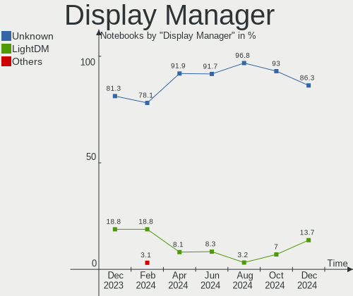
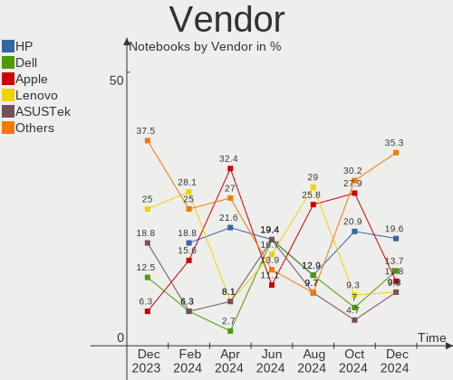
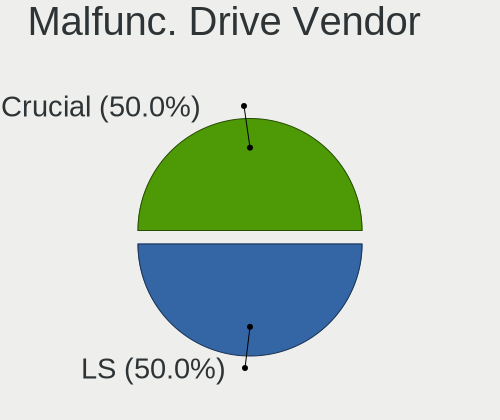
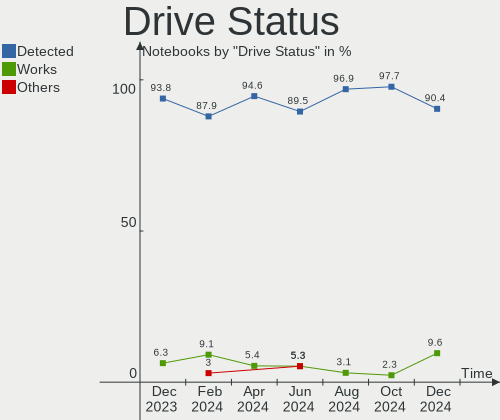
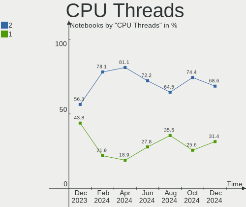
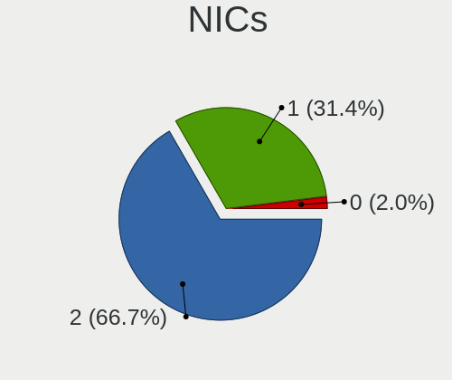
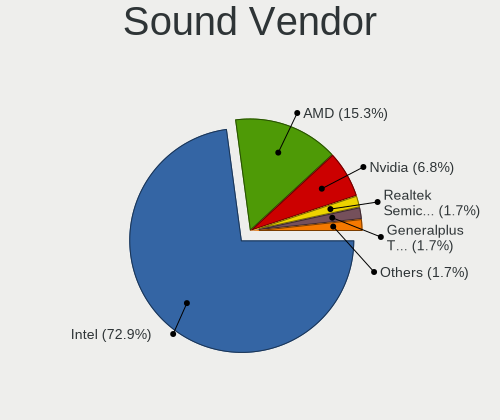
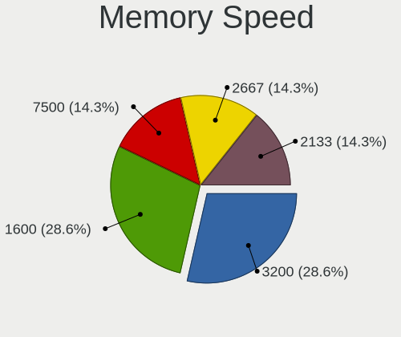
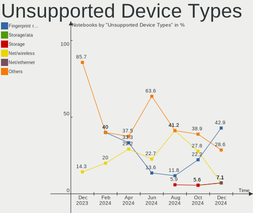

Elementary - Hardware Trends (Notebooks)
----------------------------------------

A project to identify most popular hardware characteristics and track their change
over time based on data collected by Linux users at https://Linux-Hardware.org.

Anyone can contribute to this report by the [hw-probe](https://github.com/linuxhw/hw-probe) tool:

    sudo -E hw-probe -all -upload

This report is for one last month. Overall report since the beginning of time: [TestDays](https://github.com/linuxhw/TestDays)

Period: Nov, 2023.

Contents
--------

* [ System ](#system)
  - [ OS                       ](#os)
  - [ OS Family                ](#os-family)
  - [ Kernel                   ](#kernel)
  - [ Kernel Family            ](#kernel-family)
  - [ Kernel Major Ver.        ](#kernel-major-ver)
  - [ Arch                     ](#arch)
  - [ DE                       ](#de)
  - [ Display Server           ](#display-server)
  - [ Display Manager          ](#display-manager)
  - [ OS Lang                  ](#os-lang)
  - [ Boot Mode                ](#boot-mode)
  - [ Filesystem               ](#filesystem)
  - [ Part. scheme             ](#part-scheme)
  - [ Dual Boot with Linux/BSD ](#dual-boot-with-linuxbsd)
  - [ Dual Boot (Win)          ](#dual-boot-win)

* [ Board ](#board)
  - [ Vendor                   ](#vendor)
  - [ Model                    ](#model)
  - [ Model Family             ](#model-family)
  - [ MFG Year                 ](#mfg-year)
  - [ Form Factor              ](#form-factor)
  - [ Secure Boot              ](#secure-boot)
  - [ Coreboot                 ](#coreboot)
  - [ RAM Size                 ](#ram-size)
  - [ RAM Used                 ](#ram-used)
  - [ Total Drives             ](#total-drives)
  - [ Has CD-ROM               ](#has-cd-rom)
  - [ Has Ethernet             ](#has-ethernet)
  - [ Has WiFi                 ](#has-wifi)
  - [ Has Bluetooth            ](#has-bluetooth)

* [ Location ](#location)
  - [ Country                  ](#country)
  - [ City                     ](#city)

* [ Drives ](#drives)
  - [ Drive Vendor             ](#drive-vendor)
  - [ Drive Model              ](#drive-model)
  - [ HDD Vendor               ](#hdd-vendor)
  - [ SSD Vendor               ](#ssd-vendor)
  - [ Drive Kind               ](#drive-kind)
  - [ Drive Connector          ](#drive-connector)
  - [ Drive Size               ](#drive-size)
  - [ Space Total              ](#space-total)
  - [ Space Used               ](#space-used)
  - [ Malfunc. Drives          ](#malfunc-drives)
  - [ Malfunc. Drive Vendor    ](#malfunc-drive-vendor)
  - [ Malfunc. HDD Vendor      ](#malfunc-hdd-vendor)
  - [ Malfunc. Drive Kind      ](#malfunc-drive-kind)
  - [ Failed Drives            ](#failed-drives)
  - [ Failed Drive Vendor      ](#failed-drive-vendor)
  - [ Drive Status             ](#drive-status)

* [ Storage controller ](#storage-controller)
  - [ Storage Vendor           ](#storage-vendor)
  - [ Storage Model            ](#storage-model)
  - [ Storage Kind             ](#storage-kind)

* [ Processor ](#processor)
  - [ CPU Vendor               ](#cpu-vendor)
  - [ CPU Model                ](#cpu-model)
  - [ CPU Model Family         ](#cpu-model-family)
  - [ CPU Cores                ](#cpu-cores)
  - [ CPU Sockets              ](#cpu-sockets)
  - [ CPU Threads              ](#cpu-threads)
  - [ CPU Op-Modes             ](#cpu-op-modes)
  - [ CPU Microcode            ](#cpu-microcode)
  - [ CPU Microarch            ](#cpu-microarch)

* [ Graphics ](#graphics)
  - [ GPU Vendor               ](#gpu-vendor)
  - [ GPU Model                ](#gpu-model)
  - [ GPU Combo                ](#gpu-combo)
  - [ GPU Driver               ](#gpu-driver)
  - [ GPU Memory               ](#gpu-memory)

* [ Monitor ](#monitor)
  - [ Monitor Vendor           ](#monitor-vendor)
  - [ Monitor Model            ](#monitor-model)
  - [ Monitor Resolution       ](#monitor-resolution)
  - [ Monitor Diagonal         ](#monitor-diagonal)
  - [ Monitor Width            ](#monitor-width)
  - [ Aspect Ratio             ](#aspect-ratio)
  - [ Monitor Area             ](#monitor-area)
  - [ Pixel Density            ](#pixel-density)
  - [ Multiple Monitors        ](#multiple-monitors)

* [ Network ](#network)
  - [ Net Controller Vendor    ](#net-controller-vendor)
  - [ Net Controller Model     ](#net-controller-model)
  - [ Wireless Vendor          ](#wireless-vendor)
  - [ Wireless Model           ](#wireless-model)
  - [ Ethernet Vendor          ](#ethernet-vendor)
  - [ Ethernet Model           ](#ethernet-model)
  - [ Net Controller Kind      ](#net-controller-kind)
  - [ Used Controller          ](#used-controller)
  - [ NICs                     ](#nics)
  - [ IPv6                     ](#ipv6)

* [ Bluetooth ](#bluetooth)
  - [ Bluetooth Vendor         ](#bluetooth-vendor)
  - [ Bluetooth Model          ](#bluetooth-model)

* [ Sound ](#sound)
  - [ Sound Vendor             ](#sound-vendor)
  - [ Sound Model              ](#sound-model)

* [ Memory ](#memory)
  - [ Memory Vendor            ](#memory-vendor)
  - [ Memory Model             ](#memory-model)
  - [ Memory Kind              ](#memory-kind)
  - [ Memory Form Factor       ](#memory-form-factor)
  - [ Memory Size              ](#memory-size)
  - [ Memory Speed             ](#memory-speed)

* [ Printers & scanners ](#printers--scanners)
  - [ Printer Vendor           ](#printer-vendor)
  - [ Printer Model            ](#printer-model)
  - [ Scanner Vendor           ](#scanner-vendor)
  - [ Scanner Model            ](#scanner-model)

* [ Camera ](#camera)
  - [ Camera Vendor            ](#camera-vendor)
  - [ Camera Model             ](#camera-model)

* [ Security ](#security)
  - [ Fingerprint Vendor       ](#fingerprint-vendor)
  - [ Fingerprint Model        ](#fingerprint-model)
  - [ Chipcard Vendor          ](#chipcard-vendor)
  - [ Chipcard Model           ](#chipcard-model)

* [ Unsupported ](#unsupported)
  - [ Unsupported Devices      ](#unsupported-devices)
  - [ Unsupported Device Types ](#unsupported-device-types)

System
------

OS
--

Installed operating systems

| Name           | Notebooks | Percent |
|----------------|-----------|---------|
| Elementary 7.1 | 21        | 80.77%  |
| Elementary 6.1 | 5         | 19.23%  |

OS Family
---------

OS without a version

| Name       | Notebooks | Percent |
|------------|-----------|---------|
| Elementary | 26        | 100%    |

Kernel
------

Version of the Linux kernel

| Version           | Notebooks | Percent |
|-------------------|-----------|---------|
| 6.2.0-36-generic  | 10        | 38.46%  |
| 6.2.0-33-generic  | 5         | 19.23%  |
| 6.2.0-37-generic  | 4         | 15.38%  |
| 6.2.0-34-generic  | 1         | 3.85%   |
| 6.2.0-26-generic  | 1         | 3.85%   |
| 5.15.0-88-generic | 1         | 3.85%   |
| 5.15.0-78-generic | 1         | 3.85%   |
| 5.15.0-69-generic | 1         | 3.85%   |
| 5.13.0-40-generic | 1         | 3.85%   |
| 5.11.0-43-generic | 1         | 3.85%   |

Kernel Family
-------------

Linux kernel without a distro release

| Version | Notebooks | Percent |
|---------|-----------|---------|
| 6.2.0   | 21        | 80.77%  |
| 5.15.0  | 3         | 11.54%  |
| 5.13.0  | 1         | 3.85%   |
| 5.11.0  | 1         | 3.85%   |

Kernel Major Ver.
-----------------

Linux kernel major version

| Version | Notebooks | Percent |
|---------|-----------|---------|
| 6.2     | 21        | 80.77%  |
| 5.15    | 3         | 11.54%  |
| 5.13    | 1         | 3.85%   |
| 5.11    | 1         | 3.85%   |

Arch
----

OS architecture (x86_64, i586, etc.)

| Name   | Notebooks | Percent |
|--------|-----------|---------|
| x86_64 | 26        | 100%    |

DE
--

Desktop Environment

| Name     | Notebooks | Percent |
|----------|-----------|---------|
| Pantheon | 26        | 100%    |

Display Server
--------------

X11 or Wayland

| Name | Notebooks | Percent |
|------|-----------|---------|
| X11  | 26        | 100%    |

Display Manager
---------------

SDDM, LightDM, etc.

| Name    | Notebooks | Percent |
|---------|-----------|---------|
| Unknown | 19        | 73.08%  |
| LightDM | 7         | 26.92%  |

OS Lang
-------

Language

| Lang  | Notebooks | Percent |
|-------|-----------|---------|
| en_US | 7         | 26.92%  |
| de_DE | 4         | 15.38%  |
| ru_RU | 3         | 11.54%  |
| pl_PL | 2         | 7.69%   |
| it_IT | 2         | 7.69%   |
| fr_FR | 2         | 7.69%   |
| en_GB | 2         | 7.69%   |
| nl_NL | 1         | 3.85%   |
| fr_CA | 1         | 3.85%   |
| es_ES | 1         | 3.85%   |
| cs_CZ | 1         | 3.85%   |

Boot Mode
---------

EFI or BIOS

| Mode | Notebooks | Percent |
|------|-----------|---------|
| BIOS | 20        | 76.92%  |
| EFI  | 6         | 23.08%  |

Filesystem
----------

Type of filesystem

| Type  | Notebooks | Percent |
|-------|-----------|---------|
| Ext4  | 24        | 92.31%  |
| Tmpfs | 1         | 3.85%   |
| Btrfs | 1         | 3.85%   |

Part. scheme
------------

Scheme of partitioning

| Type    | Notebooks | Percent |
|---------|-----------|---------|
| Unknown | 19        | 73.08%  |
| GPT     | 5         | 19.23%  |
| MBR     | 2         | 7.69%   |

Dual Boot with Linux/BSD
------------------------

Hosting more than one Linux/BSD

| Dual boot | Notebooks | Percent |
|-----------|-----------|---------|
| No        | 26        | 100%    |

Dual Boot (Win)
---------------

Hosting Linux and Windows

| Dual boot | Notebooks | Percent |
|-----------|-----------|---------|
| No        | 22        | 84.62%  |
| Yes       | 4         | 15.38%  |

Board
-----

Vendor
------

Motherboard manufacturer

| Name                | Notebooks | Percent |
|---------------------|-----------|---------|
| Hewlett-Packard     | 8         | 30.77%  |
| Dell                | 3         | 11.54%  |
| Apple               | 3         | 11.54%  |
| Alienware           | 2         | 7.69%   |
| UMAX                | 1         | 3.85%   |
| Timi                | 1         | 3.85%   |
| Samsung Electronics | 1         | 3.85%   |
| Lenovo              | 1         | 3.85%   |
| iOTA                | 1         | 3.85%   |
| HONOR               | 1         | 3.85%   |
| Fujitsu             | 1         | 3.85%   |
| ASUSTek Computer    | 1         | 3.85%   |
| Acer                | 1         | 3.85%   |
| Unknown             | 1         | 3.85%   |

Model
-----

Motherboard model

| Name                            | Notebooks | Percent |
|---------------------------------|-----------|---------|
| UMAX N14R                       | 1         | 3.85%   |
| Timi Redmi G 2022               | 1         | 3.85%   |
| Samsung RF510/RF410/RF710       | 1         | 3.85%   |
| Lenovo IdeaPad 320-15AST 80XV   | 1         | 3.85%   |
| iOTA IOTA2320                   | 1         | 3.85%   |
| HONOR NMH-WDX9                  | 1         | 3.85%   |
| HP Spectre Pro G1               | 1         | 3.85%   |
| HP ProBook 6545b                | 1         | 3.85%   |
| HP Pavilion Sleekbook 15 PC     | 1         | 3.85%   |
| HP Pavilion dv7                 | 1         | 3.85%   |
| HP OMEN by Laptop               | 1         | 3.85%   |
| HP EliteBook 845 G7 Notebook PC | 1         | 3.85%   |
| HP EliteBook 840 G3             | 1         | 3.85%   |
| HP 245 G8                       | 1         | 3.85%   |
| Fujitsu LIFEBOOK E780           | 1         | 3.85%   |
| Dell Vostro 3500                | 1         | 3.85%   |
| Dell Inspiron N5040             | 1         | 3.85%   |
| Dell G7 7500                    | 1         | 3.85%   |
| ASUS X555LAB                    | 1         | 3.85%   |
| Apple MacBookPro5,5             | 1         | 3.85%   |
| Apple MacBookPro11,1            | 1         | 3.85%   |
| Apple MacBookAir6,2             | 1         | 3.85%   |
| Alienware 15 R3                 | 1         | 3.85%   |
| Alienware 14                    | 1         | 3.85%   |
| Acer Aspire E5-551G             | 1         | 3.85%   |
| Unknown                         | 1         | 3.85%   |

Model Family
------------

Motherboard model prefix

| Name               | Notebooks | Percent |
|--------------------|-----------|---------|
| HP Pavilion        | 2         | 7.69%   |
| HP EliteBook       | 2         | 7.69%   |
| UMAX N14R          | 1         | 3.85%   |
| Timi Redmi         | 1         | 3.85%   |
| Samsung RF510      | 1         | 3.85%   |
| Lenovo IdeaPad     | 1         | 3.85%   |
| iOTA IOTA2320      | 1         | 3.85%   |
| HONOR NMH-WDX9     | 1         | 3.85%   |
| HP Spectre         | 1         | 3.85%   |
| HP ProBook         | 1         | 3.85%   |
| HP OMEN            | 1         | 3.85%   |
| HP 245             | 1         | 3.85%   |
| Fujitsu LIFEBOOK   | 1         | 3.85%   |
| Dell Vostro        | 1         | 3.85%   |
| Dell Inspiron      | 1         | 3.85%   |
| Dell G7            | 1         | 3.85%   |
| ASUS X555LAB       | 1         | 3.85%   |
| Apple MacBookPro5  | 1         | 3.85%   |
| Apple MacBookPro11 | 1         | 3.85%   |
| Apple MacBookAir6  | 1         | 3.85%   |
| Alienware 15       | 1         | 3.85%   |
| Alienware 14       | 1         | 3.85%   |
| Acer Aspire        | 1         | 3.85%   |
| Unknown            | 1         | 3.85%   |

MFG Year
--------

Motherboard manufacture year

| Year | Notebooks | Percent |
|------|-----------|---------|
| 2021 | 3         | 11.54%  |
| 2017 | 3         | 11.54%  |
| 2014 | 3         | 11.54%  |
| 2010 | 3         | 11.54%  |
| 2020 | 2         | 7.69%   |
| 2016 | 2         | 7.69%   |
| 2013 | 2         | 7.69%   |
| 2009 | 2         | 7.69%   |
| 2023 | 1         | 3.85%   |
| 2022 | 1         | 3.85%   |
| 2019 | 1         | 3.85%   |
| 2012 | 1         | 3.85%   |
| 2011 | 1         | 3.85%   |
| 2008 | 1         | 3.85%   |

Form Factor
-----------

Physical design of the computer

| Name     | Notebooks | Percent |
|----------|-----------|---------|
| Notebook | 26        | 100%    |

Secure Boot
-----------

Enabled or disabled

| State    | Notebooks | Percent |
|----------|-----------|---------|
| Disabled | 23        | 88.46%  |
| Enabled  | 3         | 11.54%  |

Coreboot
--------

Have coreboot on board

| Used | Notebooks | Percent |
|------|-----------|---------|
| No   | 26        | 100%    |

RAM Size
--------

Total RAM memory

| Size in GB | Notebooks | Percent |
|------------|-----------|---------|
| 4.01-8.0   | 10        | 38.46%  |
| 3.01-4.0   | 6         | 23.08%  |
| 16.01-24.0 | 4         | 15.38%  |
| 8.01-16.0  | 4         | 15.38%  |
| 32.01-64.0 | 1         | 3.85%   |
| 1.01-2.0   | 1         | 3.85%   |

RAM Used
--------

Used RAM memory

| Used GB   | Notebooks | Percent |
|-----------|-----------|---------|
| 2.01-3.0  | 10        | 38.46%  |
| 1.01-2.0  | 6         | 23.08%  |
| 3.01-4.0  | 5         | 19.23%  |
| 4.01-8.0  | 4         | 15.38%  |
| 8.01-16.0 | 1         | 3.85%   |

Total Drives
------------

Number of drives on board

| Drives | Notebooks | Percent |
|--------|-----------|---------|
| 1      | 15        | 57.69%  |
| 2      | 10        | 38.46%  |
| 3      | 1         | 3.85%   |

Has CD-ROM
----------

Has CD-ROM on board

| Presented | Notebooks | Percent |
|-----------|-----------|---------|
| No        | 20        | 76.92%  |
| Yes       | 6         | 23.08%  |

Has Ethernet
------------

Has Ethernet on board

| Presented | Notebooks | Percent |
|-----------|-----------|---------|
| Yes       | 18        | 69.23%  |
| No        | 8         | 30.77%  |

Has WiFi
--------

Has WiFi module

| Presented | Notebooks | Percent |
|-----------|-----------|---------|
| Yes       | 26        | 100%    |

Has Bluetooth
-------------

Has Bluetooth module

| Presented | Notebooks | Percent |
|-----------|-----------|---------|
| Yes       | 21        | 80.77%  |
| No        | 5         | 19.23%  |

Location
--------

Country
-------

Geographic location (country)

| Country    | Notebooks | Percent |
|------------|-----------|---------|
| Germany    | 5         | 19.23%  |
| USA        | 2         | 7.69%   |
| Russia     | 2         | 7.69%   |
| Poland     | 2         | 7.69%   |
| Italy      | 2         | 7.69%   |
| France     | 2         | 7.69%   |
| Ukraine    | 1         | 3.85%   |
| UK         | 1         | 3.85%   |
| Spain      | 1         | 3.85%   |
| Mexico     | 1         | 3.85%   |
| Kazakhstan | 1         | 3.85%   |
| India      | 1         | 3.85%   |
| Ecuador    | 1         | 3.85%   |
| Czechia    | 1         | 3.85%   |
| Chile      | 1         | 3.85%   |
| Canada     | 1         | 3.85%   |
| Belgium    | 1         | 3.85%   |

City
----

Geographic location (city)

| City              | Notebooks | Percent |
|-------------------|-----------|---------|
| Yuzhno-Sakhalinsk | 1         | 3.85%   |
| Warsaw            | 1         | 3.85%   |
| Sohlde            | 1         | 3.85%   |
| Sint-Michiels     | 1         | 3.85%   |
| Sheffield         | 1         | 3.85%   |
| Rostock           | 1         | 3.85%   |
| Prague            | 1         | 3.85%   |
| Nowy Sącz        | 1         | 3.85%   |
| Naples            | 1         | 3.85%   |
| Munich            | 1         | 3.85%   |
| Mumbai            | 1         | 3.85%   |
| Moscow            | 1         | 3.85%   |
| Mascouche         | 1         | 3.85%   |
| Lviv              | 1         | 3.85%   |
| Loja              | 1         | 3.85%   |
| Lille             | 1         | 3.85%   |
| Irapuato          | 1         | 3.85%   |
| Hayward           | 1         | 3.85%   |
| Foggia            | 1         | 3.85%   |
| Cahors            | 1         | 3.85%   |
| Berlin            | 1         | 3.85%   |
| Beaverton         | 1         | 3.85%   |
| Antofagasta       | 1         | 3.85%   |
| Almaty            | 1         | 3.85%   |
| Aarbergen         | 1         | 3.85%   |
| A Coruña         | 1         | 3.85%   |

Drives
------

Drive Vendor
------------

Hard drive vendors

| Vendor                      | Notebooks | Drives | Percent |
|-----------------------------|-----------|--------|---------|
| Samsung Electronics         | 4         | 4      | 11.11%  |
| WDC                         | 3         | 3      | 8.33%   |
| Unknown                     | 2         | 3      | 5.56%   |
| Toshiba                     | 2         | 2      | 5.56%   |
| Sandisk                     | 2         | 2      | 5.56%   |
| Hitachi                     | 2         | 2      | 5.56%   |
| HGST                        | 2         | 2      | 5.56%   |
| Crucial                     | 2         | 2      | 5.56%   |
| Apple                       | 2         | 2      | 5.56%   |
| A-DATA Technology           | 2         | 2      | 5.56%   |
| Transcend                   | 1         | 1      | 2.78%   |
| SK hynix                    | 1         | 1      | 2.78%   |
| NGFF                        | 1         | 1      | 2.78%   |
| LS                          | 1         | 1      | 2.78%   |
| LITEON                      | 1         | 1      | 2.78%   |
| Lite-On Technology          | 1         | 1      | 2.78%   |
| KIOXIA                      | 1         | 1      | 2.78%   |
| Kingston Technology Company | 1         | 1      | 2.78%   |
| Kingston                    | 1         | 1      | 2.78%   |
| Intel                       | 1         | 1      | 2.78%   |
| Hewlett-Packard             | 1         | 1      | 2.78%   |
| Gigabyte Technology         | 1         | 1      | 2.78%   |
| Fanxiang                    | 1         | 1      | 2.78%   |

Drive Model
-----------

Hard drive models

| Model                                   | Notebooks | Percent |
|-----------------------------------------|-----------|---------|
| Unknown MMC Card  64GB                  | 2         | 5.41%   |
| HGST HTS721010A9E630 1TB                | 2         | 5.41%   |
| WDC WDS240G2G0A-00JH30 240GB SSD        | 1         | 2.7%    |
| WDC WD6400BPVT-22HXZT3 640GB            | 1         | 2.7%    |
| WDC WD1600BEKT-08PVMT1 160GB            | 1         | 2.7%    |
| Unknown MMC Card  32GB                  | 1         | 2.7%    |
| Transcend TS64GMTS400S 64GB SSD         | 1         | 2.7%    |
| Toshiba MQ01ABD100 1TB                  | 1         | 2.7%    |
| Toshiba MK1655GSXF 160GB                | 1         | 2.7%    |
| SK hynix PC611 NVMe 1TB                 | 1         | 2.7%    |
| Sandisk WD Blue SN550 NVMe SSD 512GB    | 1         | 2.7%    |
| SanDisk SD8SN8U-128G-1006 128GB SSD     | 1         | 2.7%    |
| Samsung SSD 860 EVO 500GB               | 1         | 2.7%    |
| Samsung SSD 750 EVO 500GB               | 1         | 2.7%    |
| Samsung MZVLV512HCJH-000H1 512GB        | 1         | 2.7%    |
| Samsung MZVLQ512HALU-000H1 512GB        | 1         | 2.7%    |
| NGFF 2242 128GB SSD                     | 1         | 2.7%    |
| LS 128GB M300 SSD                       | 1         | 2.7%    |
| LITEON L8H-256V2G-HP 256GB SSD          | 1         | 2.7%    |
| Lite-On CX2-8B256-Q11 NVMe LITEON 256GB | 1         | 2.7%    |
| KIOXIA KBG50ZNV512G 512GB               | 1         | 2.7%    |
| Kingston Company SNV2S1000G 1TB         | 1         | 2.7%    |
| Kingston SA400S37120G 120GB SSD         | 1         | 2.7%    |
| Intel SSDPEKNU512GZH 512GB              | 1         | 2.7%    |
| Hitachi HTS727575A9E364 752GB           | 1         | 2.7%    |
| Hitachi HTS545050B9A300 500GB           | 1         | 2.7%    |
| HP SSD S700 500GB                       | 1         | 2.7%    |
| Gigabyte GP-GSM2NE3100TNTD 1TB          | 1         | 2.7%    |
| Fanxiang S101 256GB MX                  | 1         | 2.7%    |
| Crucial CT500MX500SSD1 500GB            | 1         | 2.7%    |
| Crucial CT240M500SSD3 240GB             | 1         | 2.7%    |
| Apple SSD SM0256F 256GB                 | 1         | 2.7%    |
| Apple SSD SD0256F 256GB                 | 1         | 2.7%    |
| A-DATA SU650 1024GB SSD                 | 1         | 2.7%    |
| A-DATA SP600 32GB SSD                   | 1         | 2.7%    |

HDD Vendor
----------

Hard disk drive vendors

| Vendor  | Notebooks | Drives | Percent |
|---------|-----------|--------|---------|
| WDC     | 2         | 2      | 25%     |
| Toshiba | 2         | 2      | 25%     |
| Hitachi | 2         | 2      | 25%     |
| HGST    | 2         | 2      | 25%     |

SSD Vendor
----------

Solid state drive vendors

| Vendor              | Notebooks | Drives | Percent |
|---------------------|-----------|--------|---------|
| Samsung Electronics | 2         | 2      | 12.5%   |
| Crucial             | 2         | 2      | 12.5%   |
| Apple               | 2         | 2      | 12.5%   |
| A-DATA Technology   | 2         | 2      | 12.5%   |
| WDC                 | 1         | 1      | 6.25%   |
| Transcend           | 1         | 1      | 6.25%   |
| SanDisk             | 1         | 1      | 6.25%   |
| NGFF                | 1         | 1      | 6.25%   |
| LS                  | 1         | 1      | 6.25%   |
| LITEON              | 1         | 1      | 6.25%   |
| Kingston            | 1         | 1      | 6.25%   |
| Hewlett-Packard     | 1         | 1      | 6.25%   |

Drive Kind
----------

HDD or SSD

| Kind    | Notebooks | Drives | Percent |
|---------|-----------|--------|---------|
| SSD     | 16        | 16     | 45.71%  |
| NVMe    | 8         | 9      | 22.86%  |
| HDD     | 8         | 8      | 22.86%  |
| MMC     | 2         | 3      | 5.71%   |
| Unknown | 1         | 1      | 2.86%   |

Drive Connector
---------------

SATA, SAS, NVMe, etc.

| Type | Notebooks | Drives | Percent |
|------|-----------|--------|---------|
| SATA | 20        | 25     | 66.67%  |
| NVMe | 8         | 9      | 26.67%  |
| MMC  | 2         | 3      | 6.67%   |

Drive Size
----------

Size of hard drive

| Size in TB | Notebooks | Drives | Percent |
|------------|-----------|--------|---------|
| 0.01-0.5   | 17        | 18     | 73.91%  |
| 0.51-1.0   | 5         | 5      | 21.74%  |
| 1.01-2.0   | 1         | 1      | 4.35%   |

Space Total
-----------

Amount of disk space available on the file system

| Size in GB | Notebooks | Percent |
|------------|-----------|---------|
| 101-250    | 10        | 38.46%  |
| 251-500    | 6         | 23.08%  |
| 501-1000   | 4         | 15.38%  |
| 51-100     | 4         | 15.38%  |
| 21-50      | 1         | 3.85%   |
| 1001-2000  | 1         | 3.85%   |

Space Used
----------

Amount of used disk space

| Used GB | Notebooks | Percent |
|---------|-----------|---------|
| 21-50   | 11        | 42.31%  |
| 1-20    | 6         | 23.08%  |
| 101-250 | 4         | 15.38%  |
| 51-100  | 4         | 15.38%  |
| 251-500 | 1         | 3.85%   |

Malfunc. Drives
---------------

Drive models with a malfunction

| Model                       | Notebooks | Drives | Percent |
|-----------------------------|-----------|--------|---------|
| LS 128GB M300 SSD           | 1         | 1      | 50%     |
| Crucial CT240M500SSD3 240GB | 1         | 1      | 50%     |

Malfunc. Drive Vendor
---------------------

Vendors of faulty drives

| Vendor  | Notebooks | Drives | Percent |
|---------|-----------|--------|---------|
| LS      | 1         | 1      | 50%     |
| Crucial | 1         | 1      | 50%     |

Malfunc. HDD Vendor
-------------------

Vendors of faulty HDD drives

Zero info for selected period =(

Malfunc. Drive Kind
-------------------

Kinds of faulty drives

| Kind | Notebooks | Drives | Percent |
|------|-----------|--------|---------|
| SSD  | 2         | 2      | 100%    |

Failed Drives
-------------

Failed drive models

Zero info for selected period =(

Failed Drive Vendor
-------------------

Failed drive vendors

Zero info for selected period =(

Drive Status
------------

Number of failed and malfunc. drives

| Status   | Notebooks | Drives | Percent |
|----------|-----------|--------|---------|
| Detected | 20        | 28     | 74.07%  |
| Works    | 5         | 7      | 18.52%  |
| Malfunc  | 2         | 2      | 7.41%   |

Storage controller
------------------

Storage Vendor
--------------

Storage controller vendors

| Vendor                      | Notebooks | Percent |
|-----------------------------|-----------|---------|
| Intel                       | 17        | 53.13%  |
| AMD                         | 4         | 12.5%   |
| Samsung Electronics         | 3         | 9.38%   |
| SK hynix                    | 1         | 3.13%   |
| SanDisk                     | 1         | 3.13%   |
| Phison Electronics          | 1         | 3.13%   |
| Nvidia                      | 1         | 3.13%   |
| Marvell Technology Group    | 1         | 3.13%   |
| Lite-On Technology          | 1         | 3.13%   |
| KIOXIA                      | 1         | 3.13%   |
| Kingston Technology Company | 1         | 3.13%   |

Storage Model
-------------

Storage controller models

| Model                                                                          | Notebooks | Percent |
|--------------------------------------------------------------------------------|-----------|---------|
| AMD FCH SATA Controller [AHCI mode]                                            | 3         | 9.09%   |
| Intel Wildcat Point-LP SATA Controller [AHCI Mode]                             | 2         | 6.06%   |
| Intel Sunrise Point-LP SATA Controller [AHCI mode]                             | 2         | 6.06%   |
| Intel 5 Series/3400 Series Chipset 6 port SATA AHCI Controller                 | 2         | 6.06%   |
| Intel 5 Series/3400 Series Chipset 4 port SATA AHCI Controller                 | 2         | 6.06%   |
| SK hynix PC611 NVMe Solid State Drive                                          | 1         | 3.03%   |
| SanDisk Ultra 3D / WD Blue SN550 NVMe SSD                                      | 1         | 3.03%   |
| Samsung S4LN053X01 AHCI SSD Controller(Apple slot)                             | 1         | 3.03%   |
| Samsung NVMe SSD Controller SM951/PM951                                        | 1         | 3.03%   |
| Samsung NVMe SSD Controller 980 (DRAM-less)                                    | 1         | 3.03%   |
| Phison PS5013-E13 PCIe3 NVMe Controller (DRAM-less)                            | 1         | 3.03%   |
| Nvidia MCP79 AHCI Controller                                                   | 1         | 3.03%   |
| Marvell Group 88SS9183 PCIe SSD Controller                                     | 1         | 3.03%   |
| Lite-On CX2-8B256, CX2-8B512 NVMe SSD                                          | 1         | 3.03%   |
| KIOXIA NVMe SSD Controller BG5 (DRAM-less)                                     | 1         | 3.03%   |
| Kingston Company NV2 NVMe SSD SM2267XT                                         | 1         | 3.03%   |
| Intel Tiger Lake-LP SATA Controller                                            | 1         | 3.03%   |
| Intel SSD 670p Series [Keystone Harbor]                                        | 1         | 3.03%   |
| Intel Q170/Q150/B150/H170/H110/Z170/CM236 Chipset SATA Controller [AHCI Mode]  | 1         | 3.03%   |
| Intel HM170/QM170 Chipset SATA Controller [AHCI Mode]                          | 1         | 3.03%   |
| Intel Celeron/Pentium Silver Processor SATA Controller                         | 1         | 3.03%   |
| Intel Celeron N3350/Pentium N4200/Atom E3900 Series SATA AHCI Controller       | 1         | 3.03%   |
| Intel 8 Series/C220 Series Chipset Family 6-port SATA Controller 1 [AHCI mode] | 1         | 3.03%   |
| Intel 7 Series Chipset Family 6-port SATA Controller [AHCI mode]               | 1         | 3.03%   |
| Intel 5 Series/3400 Series Chipset PT IDER Controller                          | 1         | 3.03%   |
| Intel 400 Series Chipset Family SATA AHCI Controller                           | 1         | 3.03%   |
| AMD SB7x0/SB8x0/SB9x0 SATA Controller [AHCI mode]                              | 1         | 3.03%   |

Storage Kind
------------

Kind of storage controller (IDE, SATA, NVMe, SAS, ...)

| Kind | Notebooks | Percent |
|------|-----------|---------|
| SATA | 23        | 71.88%  |
| NVMe | 8         | 25%     |
| IDE  | 1         | 3.13%   |

Processor
---------

CPU Vendor
----------

Processor vendors

| Vendor | Notebooks | Percent |
|--------|-----------|---------|
| Intel  | 19        | 73.08%  |
| AMD    | 7         | 26.92%  |

CPU Model
---------

Processor models

| Model                                         | Notebooks | Percent |
|-----------------------------------------------|-----------|---------|
| Intel Core i7-7700HQ CPU @ 2.80GHz            | 2         | 7.69%   |
| AMD Ryzen 5 5500U with Radeon Graphics        | 2         | 7.69%   |
| Intel Pentium CPU P6200 @ 2.13GHz             | 1         | 3.85%   |
| Intel Pentium CPU N4200 @ 1.10GHz             | 1         | 3.85%   |
| Intel Pentium CPU 987 @ 1.50GHz               | 1         | 3.85%   |
| Intel Core i7-6500U CPU @ 2.50GHz             | 1         | 3.85%   |
| Intel Core i7-4800MQ CPU @ 2.70GHz            | 1         | 3.85%   |
| Intel Core i7-10750H CPU @ 2.60GHz            | 1         | 3.85%   |
| Intel Core i7 CPU Q 720 @ 1.60GHz             | 1         | 3.85%   |
| Intel Core i5-6200U CPU @ 2.30GHz             | 1         | 3.85%   |
| Intel Core i5-5350U CPU @ 1.80GHz             | 1         | 3.85%   |
| Intel Core i5-4278U CPU @ 2.60GHz             | 1         | 3.85%   |
| Intel Core i5-4250U CPU @ 1.30GHz             | 1         | 3.85%   |
| Intel Core i5 CPU M 560 @ 2.67GHz             | 1         | 3.85%   |
| Intel Core i5 CPU M 480 @ 2.67GHz             | 1         | 3.85%   |
| Intel Core i3-5005U CPU @ 2.00GHz             | 1         | 3.85%   |
| Intel Core 2 Duo CPU P7550 @ 2.26GHz          | 1         | 3.85%   |
| Intel Celeron N4020 CPU @ 1.10GHz             | 1         | 3.85%   |
| Intel 11th Gen Core i5-1135G7 @ 2.40GHz       | 1         | 3.85%   |
| AMD Turion II Dual-Core Mobile M540           | 1         | 3.85%   |
| AMD Ryzen 7 6800H with Radeon Graphics        | 1         | 3.85%   |
| AMD Ryzen 5 PRO 4650U with Radeon Graphics    | 1         | 3.85%   |
| AMD FX-7500 Radeon R7, 10 Compute Cores 4C+6G | 1         | 3.85%   |
| AMD A6-9220 RADEON R4, 5 COMPUTE CORES 2C+3G  | 1         | 3.85%   |

CPU Model Family
----------------

Processor model prefix

| Model                   | Notebooks | Percent |
|-------------------------|-----------|---------|
| Intel Core i7           | 6         | 23.08%  |
| Intel Core i5           | 6         | 23.08%  |
| Intel Pentium           | 3         | 11.54%  |
| AMD Ryzen 5             | 2         | 7.69%   |
| Other                   | 1         | 3.85%   |
| Intel Core i3           | 1         | 3.85%   |
| Intel Core 2 Duo        | 1         | 3.85%   |
| Intel Celeron           | 1         | 3.85%   |
| AMD Turion II Dual-Core | 1         | 3.85%   |
| AMD Ryzen 7             | 1         | 3.85%   |
| AMD Ryzen 5 PRO         | 1         | 3.85%   |
| AMD FX                  | 1         | 3.85%   |
| AMD A6                  | 1         | 3.85%   |

CPU Cores
---------

Number of processor cores

| Number | Notebooks | Percent |
|--------|-----------|---------|
| 2      | 15        | 57.69%  |
| 4      | 6         | 23.08%  |
| 6      | 4         | 15.38%  |
| 8      | 1         | 3.85%   |

CPU Sockets
-----------

Number of sockets

| Number | Notebooks | Percent |
|--------|-----------|---------|
| 1      | 26        | 100%    |

CPU Threads
-----------

Threads per core (Hyper-Threading)

| Number | Notebooks | Percent |
|--------|-----------|---------|
| 2      | 19        | 73.08%  |
| 1      | 7         | 26.92%  |

CPU Op-Modes
------------

CPU Operation Modes (32-bit, 64-bit)

| Op mode        | Notebooks | Percent |
|----------------|-----------|---------|
| 32-bit, 64-bit | 26        | 100%    |

CPU Microcode
-------------

Microcode number

| Number     | Notebooks | Percent |
|------------|-----------|---------|
| Unknown    | 20        | 76.92%  |
| 0x506c9    | 1         | 3.85%   |
| 0x406e3    | 1         | 3.85%   |
| 0x40651    | 1         | 3.85%   |
| 0x106e5    | 1         | 3.85%   |
| 0x0a404102 | 1         | 3.85%   |
| 0x08608104 | 1         | 3.85%   |

CPU Microarch
-------------

Microarchitecture

| Name          | Notebooks | Percent |
|---------------|-----------|---------|
| Westmere      | 3         | 11.54%  |
| Haswell       | 3         | 11.54%  |
| Unknown       | 3         | 11.54%  |
| Skylake       | 2         | 7.69%   |
| KabyLake      | 2         | 7.69%   |
| Broadwell     | 2         | 7.69%   |
| Zen 2         | 1         | 3.85%   |
| TigerLake     | 1         | 3.85%   |
| Steamroller   | 1         | 3.85%   |
| SandyBridge   | 1         | 3.85%   |
| Penryn        | 1         | 3.85%   |
| Nehalem       | 1         | 3.85%   |
| K10           | 1         | 3.85%   |
| Goldmont plus | 1         | 3.85%   |
| Goldmont      | 1         | 3.85%   |
| Excavator     | 1         | 3.85%   |
| CometLake     | 1         | 3.85%   |

Graphics
--------

GPU Vendor
----------

Vendors of graphics cards

| Vendor | Notebooks | Percent |
|--------|-----------|---------|
| Intel  | 15        | 50%     |
| AMD    | 8         | 26.67%  |
| Nvidia | 7         | 23.33%  |

GPU Model
---------

Graphics card models

| Model                                                                     | Notebooks | Percent |
|---------------------------------------------------------------------------|-----------|---------|
| Intel Skylake GT2 [HD Graphics 520]                                       | 2         | 6.45%   |
| Intel HD Graphics 630                                                     | 2         | 6.45%   |
| Intel Haswell-ULT Integrated Graphics Controller                          | 2         | 6.45%   |
| Intel Core Processor Integrated Graphics Controller                       | 2         | 6.45%   |
| AMD Lucienne                                                              | 2         | 6.45%   |
| Nvidia TU106M [GeForce RTX 2070 Mobile / Max-Q Refresh]                   | 1         | 3.23%   |
| Nvidia GT216M [GeForce GT 330M]                                           | 1         | 3.23%   |
| Nvidia GP107M [GeForce GTX 1050 Mobile]                                   | 1         | 3.23%   |
| Nvidia GP106BM [GeForce GTX 1060 Mobile 6GB]                              | 1         | 3.23%   |
| Nvidia GK106M [GeForce GTX 765M]                                          | 1         | 3.23%   |
| Nvidia GA106M [GeForce RTX 3060 Mobile / Max-Q]                           | 1         | 3.23%   |
| Nvidia C79 [GeForce 9400M]                                                | 1         | 3.23%   |
| Intel TigerLake-LP GT2 [Iris Xe Graphics]                                 | 1         | 3.23%   |
| Intel HD Graphics 6000                                                    | 1         | 3.23%   |
| Intel HD Graphics 5500                                                    | 1         | 3.23%   |
| Intel GeminiLake [UHD Graphics 600]                                       | 1         | 3.23%   |
| Intel CometLake-H GT2 [UHD Graphics]                                      | 1         | 3.23%   |
| Intel Apollo Lake [HD Graphics 505]                                       | 1         | 3.23%   |
| Intel 2nd Generation Core Processor Family Integrated Graphics Controller | 1         | 3.23%   |
| AMD Stoney [Radeon R2/R3/R4/R5 Graphics]                                  | 1         | 3.23%   |
| AMD RS880M [Mobility Radeon HD 4225/4250]                                 | 1         | 3.23%   |
| AMD Renoir [Radeon RX Vega 6 (Ryzen 4000/5000 Mobile Series)]             | 1         | 3.23%   |
| AMD Rembrandt [Radeon 680M]                                               | 1         | 3.23%   |
| AMD Opal XT [Radeon R7 M265/M365X/M465]                                   | 1         | 3.23%   |
| AMD Madison [Mobility Radeon HD 5650/5750 / 6530M/6550M]                  | 1         | 3.23%   |
| AMD Kaveri [Radeon R6/R7 Graphics]                                        | 1         | 3.23%   |

GPU Combo
---------

Combinations of graphics cards

| Name           | Notebooks | Percent |
|----------------|-----------|---------|
| 1 x Intel      | 12        | 46.15%  |
| 1 x AMD        | 6         | 23.08%  |
| 1 x Nvidia     | 4         | 15.38%  |
| Intel + Nvidia | 2         | 7.69%   |
| 2 x AMD        | 1         | 3.85%   |
| AMD + Nvidia   | 1         | 3.85%   |

GPU Driver
----------

Free vs proprietary

| Driver      | Notebooks | Percent |
|-------------|-----------|---------|
| Free        | 23        | 88.46%  |
| Proprietary | 2         | 7.69%   |
| Unknown     | 1         | 3.85%   |

GPU Memory
----------

Total video memory

| Size in GB | Notebooks | Percent |
|------------|-----------|---------|
| Unknown    | 22        | 84.62%  |
| 0.01-0.5   | 3         | 11.54%  |
| 0.51-1.0   | 1         | 3.85%   |

Monitor
-------

Monitor Vendor
--------------

Monitor vendors

| Vendor               | Notebooks | Percent |
|----------------------|-----------|---------|
| AU Optronics         | 7         | 23.33%  |
| Chimei Innolux       | 5         | 16.67%  |
| BOE                  | 4         | 13.33%  |
| Apple                | 3         | 10%     |
| Samsung Electronics  | 2         | 6.67%   |
| LG Display           | 2         | 6.67%   |
| TMX                  | 1         | 3.33%   |
| Mi                   | 1         | 3.33%   |
| HKC                  | 1         | 3.33%   |
| Hewlett-Packard      | 1         | 3.33%   |
| Fujitsu Siemens      | 1         | 3.33%   |
| Dell                 | 1         | 3.33%   |
| Ancor Communications | 1         | 3.33%   |

Monitor Model
-------------

Monitor models

| Model                                                                  | Notebooks | Percent |
|------------------------------------------------------------------------|-----------|---------|
| TMX TL160ADMP11-0 TMX1601 2560x1600 345x215mm 16.0-inch                | 1         | 3.33%   |
| Samsung Electronics LCD Monitor SEC5441 1366x768 309x174mm 14.0-inch   | 1         | 3.33%   |
| Samsung Electronics LCD Monitor SEC5341 1366x768 344x193mm 15.5-inch   | 1         | 3.33%   |
| Mi Monitor XMI3447 3440x1440 797x334mm 34.0-inch                       | 1         | 3.33%   |
| LG Display LCD Monitor LGD03EA 1920x1080 309x174mm 14.0-inch           | 1         | 3.33%   |
| LG Display LCD Monitor LGD02DC 1366x768 344x194mm 15.5-inch            | 1         | 3.33%   |
| HKC LCD Monitor HKC3CFB 1920x1080 344x194mm 15.5-inch                  | 1         | 3.33%   |
| Hewlett-Packard 23cw HWP3188 1920x1080 509x286mm 23.0-inch             | 1         | 3.33%   |
| Fujitsu Siemens E19-5 FUS07CD 1280x1024 376x301mm 19.0-inch            | 1         | 3.33%   |
| Dell P2314H DEL4098 1920x1080 509x286mm 23.0-inch                      | 1         | 3.33%   |
| Chimei Innolux LCD Monitor CMN15E5 1920x1080 344x193mm 15.5-inch       | 1         | 3.33%   |
| Chimei Innolux LCD Monitor CMN15BF 1366x768 344x194mm 15.5-inch        | 1         | 3.33%   |
| Chimei Innolux LCD Monitor CMN142C 1366x768 309x173mm 13.9-inch        | 1         | 3.33%   |
| Chimei Innolux LCD Monitor CMN1401 1920x1080 309x173mm 13.9-inch       | 1         | 3.33%   |
| Chimei Innolux LCD Monitor CMN1367 1920x1080 293x165mm 13.2-inch       | 1         | 3.33%   |
| BOE LCD Monitor BOE0877 1920x1080 309x173mm 13.9-inch                  | 1         | 3.33%   |
| BOE LCD Monitor BOE084A 1920x1080 344x194mm 15.5-inch                  | 1         | 3.33%   |
| BOE LCD Monitor BOE06F3 1920x1080 309x173mm 13.9-inch                  | 1         | 3.33%   |
| BOE LCD Monitor BOE0675 1366x768 344x194mm 15.5-inch                   | 1         | 3.33%   |
| AU Optronics LCD Monitor AUO51ED 1920x1080 344x193mm 15.5-inch         | 1         | 3.33%   |
| AU Optronics LCD Monitor AUO45EC 1366x768 344x193mm 15.5-inch          | 1         | 3.33%   |
| AU Optronics LCD Monitor AUO43EC 1366x768 344x193mm 15.5-inch          | 1         | 3.33%   |
| AU Optronics LCD Monitor AUO41ED 1920x1080 344x193mm 15.5-inch         | 1         | 3.33%   |
| AU Optronics LCD Monitor AUO413D 1920x1080 309x174mm 14.0-inch         | 1         | 3.33%   |
| AU Optronics LCD Monitor AUO23EC 1366x768 344x193mm 15.5-inch          | 1         | 3.33%   |
| AU Optronics LCD Monitor AUO123D 1920x1080 309x173mm 13.9-inch         | 1         | 3.33%   |
| Apple LCD Monitor APP9CBD 1280x800 286x179mm 13.3-inch                 | 1         | 3.33%   |
| Apple Color LCD APPA018 2560x1600 286x179mm 13.3-inch                  | 1         | 3.33%   |
| Apple Color LCD APP9CDF 1440x900 286x179mm 13.3-inch                   | 1         | 3.33%   |
| Ancor Communications ASUS PB287Q ACI28A3 3840x2160 621x341mm 27.9-inch | 1         | 3.33%   |

Monitor Resolution
------------------

Monitor screen resolution

| Resolution       | Notebooks | Percent |
|------------------|-----------|---------|
| 1920x1080 (FHD)  | 12        | 42.86%  |
| 1366x768 (WXGA)  | 9         | 32.14%  |
| 2560x1600        | 2         | 7.14%   |
| 3840x2160 (4K)   | 1         | 3.57%   |
| 3440x1440        | 1         | 3.57%   |
| 1440x900 (WXGA+) | 1         | 3.57%   |
| 1280x800 (WXGA)  | 1         | 3.57%   |
| 1280x1024 (SXGA) | 1         | 3.57%   |

Monitor Diagonal
----------------

Diagonal size in inches

| Inches | Notebooks | Percent |
|--------|-----------|---------|
| 15     | 13        | 43.33%  |
| 13     | 8         | 26.67%  |
| 14     | 3         | 10%     |
| 23     | 2         | 6.67%   |
| 34     | 1         | 3.33%   |
| 27     | 1         | 3.33%   |
| 19     | 1         | 3.33%   |
| 16     | 1         | 3.33%   |

Monitor Width
-------------

Physical width

| Width in mm | Notebooks | Percent |
|-------------|-----------|---------|
| 301-350     | 20        | 66.67%  |
| 201-300     | 4         | 13.33%  |
| 501-600     | 2         | 6.67%   |
| 351-400     | 2         | 6.67%   |
| 701-800     | 1         | 3.33%   |
| 601-700     | 1         | 3.33%   |

Aspect Ratio
------------

Proportional relationship between the width and the height

| Ratio | Notebooks | Percent |
|-------|-----------|---------|
| 16/9  | 22        | 78.57%  |
| 16/10 | 4         | 14.29%  |
| 5/4   | 1         | 3.57%   |
| 21/9  | 1         | 3.57%   |

Monitor Area
------------

Area in inch²

| Area in inch² | Notebooks | Percent |
|----------------|-----------|---------|
| 101-110        | 13        | 43.33%  |
| 81-90          | 8         | 26.67%  |
| 71-80          | 3         | 10%     |
| 201-250        | 2         | 6.67%   |
| 351-500        | 1         | 3.33%   |
| 301-350        | 1         | 3.33%   |
| 151-200        | 1         | 3.33%   |
| 111-120        | 1         | 3.33%   |

Pixel Density
-------------

Pixels per inch

| Density | Notebooks | Percent |
|---------|-----------|---------|
| 121-160 | 13        | 43.33%  |
| 101-120 | 10        | 33.33%  |
| 51-100  | 4         | 13.33%  |
| 161-240 | 3         | 10%     |

Multiple Monitors
-----------------

Total monitors connected

| Total | Notebooks | Percent |
|-------|-----------|---------|
| 1     | 22        | 84.62%  |
| 2     | 4         | 15.38%  |

Network
-------

Net Controller Vendor
---------------------

Controller vendors

| Vendor                   | Notebooks | Percent |
|--------------------------|-----------|---------|
| Realtek Semiconductor    | 13        | 33.33%  |
| Intel                    | 8         | 20.51%  |
| Broadcom                 | 5         | 12.82%  |
| Qualcomm Atheros         | 4         | 10.26%  |
| Broadcom Limited         | 3         | 7.69%   |
| Marvell Technology Group | 2         | 5.13%   |
| TP-Link                  | 1         | 2.56%   |
| Qualcomm                 | 1         | 2.56%   |
| Nvidia                   | 1         | 2.56%   |
| MediaTek                 | 1         | 2.56%   |

Net Controller Model
--------------------

Controller models

| Model                                                                          | Notebooks | Percent |
|--------------------------------------------------------------------------------|-----------|---------|
| Realtek RTL8111/8168/8411 PCI Express Gigabit Ethernet Controller              | 6         | 13.33%  |
| Realtek RTL810xE PCI Express Fast Ethernet controller                          | 3         | 6.67%   |
| Intel Wireless 8260                                                            | 2         | 4.44%   |
| Broadcom Limited BCM4360 802.11ac Dual Band Wireless Network Adapter           | 2         | 4.44%   |
| TP-Link TL-WN722N v2/v3 [Realtek RTL8188EUS]                                   | 1         | 2.22%   |
| Realtek RTL8852BE PCIe 802.11ax Wireless Network Controller                    | 1         | 2.22%   |
| Realtek RTL8822CE 802.11ac PCIe Wireless Network Adapter                       | 1         | 2.22%   |
| Realtek RTL8821CE 802.11ac PCIe Wireless Network Adapter                       | 1         | 2.22%   |
| Realtek RTL8821AE 802.11ac PCIe Wireless Network Adapter                       | 1         | 2.22%   |
| Realtek RTL8125 2.5GbE Controller                                              | 1         | 2.22%   |
| Realtek Killer E2500 Gigabit Ethernet Controller                               | 1         | 2.22%   |
| Realtek 802.11n WLAN Adapter                                                   | 1         | 2.22%   |
| Qualcomm QCNFA765 Wireless Network Adapter                                     | 1         | 2.22%   |
| Qualcomm Atheros QCA6174 802.11ac Wireless Network Adapter                     | 1         | 2.22%   |
| Qualcomm Atheros Killer E2500 Gigabit Ethernet Controller                      | 1         | 2.22%   |
| Qualcomm Atheros Killer E220x Gigabit Ethernet Controller                      | 1         | 2.22%   |
| Qualcomm Atheros AR9485 Wireless Network Adapter                               | 1         | 2.22%   |
| Qualcomm Atheros AR9285 Wireless Network Adapter (PCI-Express)                 | 1         | 2.22%   |
| Nvidia MCP79 Ethernet                                                          | 1         | 2.22%   |
| MediaTek MT7630e 802.11bgn Wireless Network Adapter                            | 1         | 2.22%   |
| Marvell Group Yukon Optima 88E8059 [PCIe Gigabit Ethernet Controller with AVB] | 1         | 2.22%   |
| Marvell Group 88E8072 PCI-E Gigabit Ethernet Controller                        | 1         | 2.22%   |
| Intel Wireless 7265                                                            | 1         | 2.22%   |
| Intel Wireless 3165                                                            | 1         | 2.22%   |
| Intel Wi-Fi 6 AX201                                                            | 1         | 2.22%   |
| Intel Wi-Fi 6 AX200                                                            | 1         | 2.22%   |
| Intel Ethernet Connection I219-V                                               | 1         | 2.22%   |
| Intel Comet Lake PCH CNVi WiFi                                                 | 1         | 2.22%   |
| Intel Centrino Advanced-N 6200                                                 | 1         | 2.22%   |
| Intel 82577LM Gigabit Network Connection                                       | 1         | 2.22%   |
| Broadcom Limited BCM43224 802.11a/b/g/n                                        | 1         | 2.22%   |
| Broadcom BCM4352 802.11ac Dual Band Wireless Network Adapter                   | 1         | 2.22%   |
| Broadcom BCM4322 802.11a/b/g/n Wireless LAN Controller                         | 1         | 2.22%   |
| Broadcom BCM43142 802.11b/g/n                                                  | 1         | 2.22%   |
| Broadcom BCM4313 802.11bgn Wireless Network Adapter                            | 1         | 2.22%   |
| Broadcom BCM4312 802.11b/g LP-PHY                                              | 1         | 2.22%   |

Wireless Vendor
---------------

Wireless vendors

| Vendor                | Notebooks | Percent |
|-----------------------|-----------|---------|
| Intel                 | 8         | 29.63%  |
| Realtek Semiconductor | 5         | 18.52%  |
| Broadcom              | 5         | 18.52%  |
| Qualcomm Atheros      | 3         | 11.11%  |
| Broadcom Limited      | 3         | 11.11%  |
| TP-Link               | 1         | 3.7%    |
| Qualcomm              | 1         | 3.7%    |
| MediaTek              | 1         | 3.7%    |

Wireless Model
--------------

Wireless models

| Model                                                                | Notebooks | Percent |
|----------------------------------------------------------------------|-----------|---------|
| Intel Wireless 8260                                                  | 2         | 7.41%   |
| Broadcom Limited BCM4360 802.11ac Dual Band Wireless Network Adapter | 2         | 7.41%   |
| TP-Link TL-WN722N v2/v3 [Realtek RTL8188EUS]                         | 1         | 3.7%    |
| Realtek RTL8852BE PCIe 802.11ax Wireless Network Controller          | 1         | 3.7%    |
| Realtek RTL8822CE 802.11ac PCIe Wireless Network Adapter             | 1         | 3.7%    |
| Realtek RTL8821CE 802.11ac PCIe Wireless Network Adapter             | 1         | 3.7%    |
| Realtek RTL8821AE 802.11ac PCIe Wireless Network Adapter             | 1         | 3.7%    |
| Realtek 802.11n WLAN Adapter                                         | 1         | 3.7%    |
| Qualcomm QCNFA765 Wireless Network Adapter                           | 1         | 3.7%    |
| Qualcomm Atheros QCA6174 802.11ac Wireless Network Adapter           | 1         | 3.7%    |
| Qualcomm Atheros AR9485 Wireless Network Adapter                     | 1         | 3.7%    |
| Qualcomm Atheros AR9285 Wireless Network Adapter (PCI-Express)       | 1         | 3.7%    |
| MediaTek MT7630e 802.11bgn Wireless Network Adapter                  | 1         | 3.7%    |
| Intel Wireless 7265                                                  | 1         | 3.7%    |
| Intel Wireless 3165                                                  | 1         | 3.7%    |
| Intel Wi-Fi 6 AX201                                                  | 1         | 3.7%    |
| Intel Wi-Fi 6 AX200                                                  | 1         | 3.7%    |
| Intel Comet Lake PCH CNVi WiFi                                       | 1         | 3.7%    |
| Intel Centrino Advanced-N 6200                                       | 1         | 3.7%    |
| Broadcom Limited BCM43224 802.11a/b/g/n                              | 1         | 3.7%    |
| Broadcom BCM4352 802.11ac Dual Band Wireless Network Adapter         | 1         | 3.7%    |
| Broadcom BCM4322 802.11a/b/g/n Wireless LAN Controller               | 1         | 3.7%    |
| Broadcom BCM43142 802.11b/g/n                                        | 1         | 3.7%    |
| Broadcom BCM4313 802.11bgn Wireless Network Adapter                  | 1         | 3.7%    |
| Broadcom BCM4312 802.11b/g LP-PHY                                    | 1         | 3.7%    |

Ethernet Vendor
---------------

Ethernet vendors

| Vendor                   | Notebooks | Percent |
|--------------------------|-----------|---------|
| Realtek Semiconductor    | 11        | 61.11%  |
| Qualcomm Atheros         | 2         | 11.11%  |
| Marvell Technology Group | 2         | 11.11%  |
| Intel                    | 2         | 11.11%  |
| Nvidia                   | 1         | 5.56%   |

Ethernet Model
--------------

Ethernet models

| Model                                                                          | Notebooks | Percent |
|--------------------------------------------------------------------------------|-----------|---------|
| Realtek RTL8111/8168/8411 PCI Express Gigabit Ethernet Controller              | 6         | 33.33%  |
| Realtek RTL810xE PCI Express Fast Ethernet controller                          | 3         | 16.67%  |
| Realtek RTL8125 2.5GbE Controller                                              | 1         | 5.56%   |
| Realtek Killer E2500 Gigabit Ethernet Controller                               | 1         | 5.56%   |
| Qualcomm Atheros Killer E2500 Gigabit Ethernet Controller                      | 1         | 5.56%   |
| Qualcomm Atheros Killer E220x Gigabit Ethernet Controller                      | 1         | 5.56%   |
| Nvidia MCP79 Ethernet                                                          | 1         | 5.56%   |
| Marvell Group Yukon Optima 88E8059 [PCIe Gigabit Ethernet Controller with AVB] | 1         | 5.56%   |
| Marvell Group 88E8072 PCI-E Gigabit Ethernet Controller                        | 1         | 5.56%   |
| Intel Ethernet Connection I219-V                                               | 1         | 5.56%   |
| Intel 82577LM Gigabit Network Connection                                       | 1         | 5.56%   |

Net Controller Kind
-------------------

Ethernet, WiFi or modem

| Kind     | Notebooks | Percent |
|----------|-----------|---------|
| WiFi     | 26        | 59.09%  |
| Ethernet | 18        | 40.91%  |

Used Controller
---------------

Currently used network controller

| Kind     | Notebooks | Percent |
|----------|-----------|---------|
| WiFi     | 21        | 75%     |
| Ethernet | 7         | 25%     |

NICs
----

Total network controllers on board

| Total | Notebooks | Percent |
|-------|-----------|---------|
| 2     | 18        | 69.23%  |
| 1     | 7         | 26.92%  |
| 0     | 1         | 3.85%   |

IPv6
----

IPv6 vs IPv4

| Used | Notebooks | Percent |
|------|-----------|---------|
| No   | 18        | 69.23%  |
| Yes  | 8         | 30.77%  |

Bluetooth
---------

Bluetooth Vendor
----------------

Controller vendors

| Vendor                          | Notebooks | Percent |
|---------------------------------|-----------|---------|
| Intel                           | 6         | 27.27%  |
| Realtek Semiconductor           | 3         | 13.64%  |
| Apple                           | 3         | 13.64%  |
| Hewlett-Packard                 | 2         | 9.09%   |
| Foxconn / Hon Hai               | 2         | 9.09%   |
| Cambridge Silicon Radio         | 2         | 9.09%   |
| Qualcomm Atheros Communications | 1         | 4.55%   |
| Opticis                         | 1         | 4.55%   |
| IMC Networks                    | 1         | 4.55%   |
| Broadcom                        | 1         | 4.55%   |

Bluetooth Model
---------------

Controller models

| Model                                               | Notebooks | Percent |
|-----------------------------------------------------|-----------|---------|
| Intel Bluetooth wireless interface                  | 3         | 13.64%  |
| Realtek Bluetooth Radio                             | 2         | 9.09%   |
| HP Broadcom 2070 Bluetooth Combo                    | 2         | 9.09%   |
| Cambridge Silicon Radio Bluetooth Dongle (HCI mode) | 2         | 9.09%   |
| Apple Bluetooth Host Controller                     | 2         | 9.09%   |
| Realtek 802.11ac WLAN Adapter                       | 1         | 4.55%   |
| Qualcomm Atheros QCA61x4 Bluetooth 4.0              | 1         | 4.55%   |
| Opticis Bluetooth Radio                             | 1         | 4.55%   |
| Intel Bluetooth 9460/9560 Jefferson Peak (JfP)      | 1         | 4.55%   |
| Intel AX201 Bluetooth                               | 1         | 4.55%   |
| Intel AX200 Bluetooth                               | 1         | 4.55%   |
| IMC Networks BCM20702A0                             | 1         | 4.55%   |
| Foxconn / Hon Hai BT                                | 1         | 4.55%   |
| Foxconn / Hon Hai BCM43142A0 broadcom bluetooth     | 1         | 4.55%   |
| Broadcom BCM2070 Bluetooth Device                   | 1         | 4.55%   |
| Apple Bluetooth USB Host Controller                 | 1         | 4.55%   |

Sound
-----

Sound Vendor
------------

Sound card vendors

| Vendor              | Notebooks | Percent |
|---------------------|-----------|---------|
| Intel               | 18        | 52.94%  |
| AMD                 | 8         | 23.53%  |
| Nvidia              | 7         | 20.59%  |
| Kingston Technology | 1         | 2.94%   |

Sound Model
-----------

Sound card models

| Model                                                               | Notebooks | Percent |
|---------------------------------------------------------------------|-----------|---------|
| Intel 5 Series/3400 Series Chipset High Definition Audio            | 4         | 8.89%   |
| AMD Family 17h/19h HD Audio Controller                              | 4         | 8.89%   |
| AMD Renoir Radeon High Definition Audio Controller                  | 3         | 6.67%   |
| Intel Wildcat Point-LP High Definition Audio Controller             | 2         | 4.44%   |
| Intel Sunrise Point-LP HD Audio                                     | 2         | 4.44%   |
| Intel Haswell-ULT HD Audio Controller                               | 2         | 4.44%   |
| Intel CM238 HD Audio Controller                                     | 2         | 4.44%   |
| Intel Broadwell-U Audio Controller                                  | 2         | 4.44%   |
| Intel 8 Series HD Audio Controller                                  | 2         | 4.44%   |
| Nvidia TU106 High Definition Audio Controller                       | 1         | 2.22%   |
| Nvidia MCP79 High Definition Audio                                  | 1         | 2.22%   |
| Nvidia GT216 HDMI Audio Controller                                  | 1         | 2.22%   |
| Nvidia GP107GL High Definition Audio Controller                     | 1         | 2.22%   |
| Nvidia GP106 High Definition Audio Controller                       | 1         | 2.22%   |
| Nvidia GK106 HDMI Audio Controller                                  | 1         | 2.22%   |
| Nvidia GA106 High Definition Audio Controller                       | 1         | 2.22%   |
| Kingston Technology HyperX SoloCast                                 | 1         | 2.22%   |
| Intel Tiger Lake-LP Smart Sound Technology Audio Controller         | 1         | 2.22%   |
| Intel Comet Lake PCH cAVS                                           | 1         | 2.22%   |
| Intel Celeron/Pentium Silver Processor High Definition Audio        | 1         | 2.22%   |
| Intel Celeron N3350/Pentium N4200/Atom E3900 Series Audio Cluster   | 1         | 2.22%   |
| Intel 8 Series/C220 Series Chipset High Definition Audio Controller | 1         | 2.22%   |
| Intel 7 Series/C216 Chipset Family High Definition Audio Controller | 1         | 2.22%   |
| AMD SBx00 Azalia (Intel HDA)                                        | 1         | 2.22%   |
| AMD RS880 HDMI Audio [Radeon HD 4200 Series]                        | 1         | 2.22%   |
| AMD Rembrandt Radeon High Definition Audio Controller               | 1         | 2.22%   |
| AMD Redwood HDMI Audio [Radeon HD 5000 Series]                      | 1         | 2.22%   |
| AMD Kaveri HDMI/DP Audio Controller                                 | 1         | 2.22%   |
| AMD High Definition Audio Controller                                | 1         | 2.22%   |
| AMD FCH Azalia Controller                                           | 1         | 2.22%   |
| AMD Family 15h (Models 60h-6fh) Audio Controller                    | 1         | 2.22%   |

Memory
------

Memory Vendor
-------------

Memory module vendors

| Vendor              | Notebooks | Percent |
|---------------------|-----------|---------|
| Samsung Electronics | 3         | 37.5%   |
| SK hynix            | 1         | 12.5%   |
| Ramaxel Technology  | 1         | 12.5%   |
| Micron Technology   | 1         | 12.5%   |
| Kingston            | 1         | 12.5%   |
| Elpida              | 1         | 12.5%   |

Memory Model
------------

Memory module models

| Model                                                     | Notebooks | Percent |
|-----------------------------------------------------------|-----------|---------|
| SK hynix RAM HMA81GS6DJR8N-XN 8GB SODIMM DDR4 3200MT/s    | 1         | 12.5%   |
| Samsung RAM M471A2K43EB1-CWE 16GB SODIMM DDR4 3200MT/s    | 1         | 12.5%   |
| Samsung RAM M425R1GB4BB0-CQKOD 8GB SODIMM DDR5 4800MT/s   | 1         | 12.5%   |
| Samsung RAM M4 70T5663EH3-CF7 2GB SODIMM DDR2 975MT/s     | 1         | 12.5%   |
| Ramaxel RAM RMN1740EC48D8W-800 2GB SODIMM DDR2 800MT/s    | 1         | 12.5%   |
| Micron RAM 16KTF1G64HZ-1G6E1 8GB SODIMM DDR3 1600MT/s     | 1         | 12.5%   |
| Kingston RAM HX316LS9IB/8 8GB SODIMM DDR3 1600MT/s        | 1         | 12.5%   |
| Elpida RAM EDJ4208EFBG-GN-F 4096MB SODIMM LPDDR3 1867MT/s | 1         | 12.5%   |

Memory Kind
-----------

Memory module kinds

| Kind   | Notebooks | Percent |
|--------|-----------|---------|
| DDR3   | 2         | 28.57%  |
| SDRAM  | 1         | 14.29%  |
| LPDDR3 | 1         | 14.29%  |
| DDR5   | 1         | 14.29%  |
| DDR4   | 1         | 14.29%  |
| DDR2   | 1         | 14.29%  |

Memory Form Factor
------------------

Physical design of the memory module

| Name   | Notebooks | Percent |
|--------|-----------|---------|
| SODIMM | 6         | 100%    |

Memory Size
-----------

Memory module size

| Size  | Notebooks | Percent |
|-------|-----------|---------|
| 8192  | 4         | 57.14%  |
| 16384 | 1         | 14.29%  |
| 4096  | 1         | 14.29%  |
| 2048  | 1         | 14.29%  |

Memory Speed
------------

Memory module speed

| Speed | Notebooks | Percent |
|-------|-----------|---------|
| 1600  | 2         | 28.57%  |
| 4800  | 1         | 14.29%  |
| 3200  | 1         | 14.29%  |
| 2048  | 1         | 14.29%  |
| 1867  | 1         | 14.29%  |
| 800   | 1         | 14.29%  |

Printers & scanners
-------------------

Printer Vendor
--------------

Printer device vendors

Zero info for selected period =(

Printer Model
-------------

Printer device models

Zero info for selected period =(

Scanner Vendor
--------------

Scanner device vendors

Zero info for selected period =(

Scanner Model
-------------

Scanner device models

Zero info for selected period =(

Camera
------

Camera Vendor
-------------

Camera device vendors

| Vendor                                 | Notebooks | Percent |
|----------------------------------------|-----------|---------|
| Chicony Electronics                    | 6         | 28.57%  |
| Realtek Semiconductor                  | 5         | 23.81%  |
| Microdia                               | 2         | 9.52%   |
| SunplusIT                              | 1         | 4.76%   |
| Sunplus Innovation Technology          | 1         | 4.76%   |
| Silicon Motion                         | 1         | 4.76%   |
| Luxvisions Innotech Limited            | 1         | 4.76%   |
| GEMBIRD                                | 1         | 4.76%   |
| Cheng Uei Precision Industry (Foxlink) | 1         | 4.76%   |
| Apple                                  | 1         | 4.76%   |
| Alcor Micro                            | 1         | 4.76%   |

Camera Model
------------

Camera device models

| Model                                                    | Notebooks | Percent |
|----------------------------------------------------------|-----------|---------|
| Realtek USB Camera                                       | 2         | 9.52%   |
| Chicony HP Truevision HD                                 | 2         | 9.52%   |
| SunplusIT XiaoMi Webcam                                  | 1         | 4.76%   |
| Sunplus Laptop Integrated Webcam FHD                     | 1         | 4.76%   |
| Silicon Motion WebCam SCB-0370N                          | 1         | 4.76%   |
| Realtek Laptop_Integrated_Webcam_HD                      | 1         | 4.76%   |
| Realtek Integrated_Webcam_HD                             | 1         | 4.76%   |
| Realtek Integrated Webcam                                | 1         | 4.76%   |
| Microdia Sonix USB 2.0 Camera                            | 1         | 4.76%   |
| Microdia Integrated_Webcam_HD                            | 1         | 4.76%   |
| Luxvisions Innotech Limited HP HD Camera                 | 1         | 4.76%   |
| GEMBIRD Generic UVC 1.00 camera [AppoTech AX2311]        | 1         | 4.76%   |
| Chicony HP Webcam [2 MP Macro]                           | 1         | 4.76%   |
| Chicony HP TrueVision HD Camera                          | 1         | 4.76%   |
| Chicony HD WebCam                                        | 1         | 4.76%   |
| Chicony EasyCamera                                       | 1         | 4.76%   |
| Cheng Uei Precision Industry (Foxlink) HP Wide Vision HD | 1         | 4.76%   |
| Apple Built-in iSight                                    | 1         | 4.76%   |
| Alcor Micro USB 2.0 Camera                               | 1         | 4.76%   |

Security
--------

Fingerprint Vendor
------------------

Fingerprint sensor vendors

| Vendor           | Notebooks | Percent |
|------------------|-----------|---------|
| Validity Sensors | 2         | 66.67%  |
| Synaptics        | 1         | 33.33%  |

Fingerprint Model
-----------------

Fingerprint sensor models

| Model                                                     | Notebooks | Percent |
|-----------------------------------------------------------|-----------|---------|
| Validity Sensors VFS451 Fingerprint Reader                | 1         | 33.33%  |
| Validity Sensors VFS301 Fingerprint Reader                | 1         | 33.33%  |
| Synaptics  FS7604 Touch Fingerprint Sensor with PurePrint | 1         | 33.33%  |

Chipcard Vendor
---------------

Chipcard module vendors

Zero info for selected period =(

Chipcard Model
--------------

Chipcard module models

Zero info for selected period =(

Unsupported
-----------

Unsupported Devices
-------------------

Total unsupported devices on board

| Total | Notebooks | Percent |
|-------|-----------|---------|
| 0     | 14        | 53.85%  |
| 1     | 10        | 38.46%  |
| 2     | 2         | 7.69%   |

Unsupported Device Types
------------------------

Types of unsupported devices

| Type                  | Notebooks | Percent |
|-----------------------|-----------|---------|
| Multimedia controller | 5         | 35.71%  |
| Fingerprint reader    | 3         | 21.43%  |
| Net/wireless          | 2         | 14.29%  |
| Graphics card         | 2         | 14.29%  |
| Storage               | 1         | 7.14%   |
| Bluetooth             | 1         | 7.14%   |

