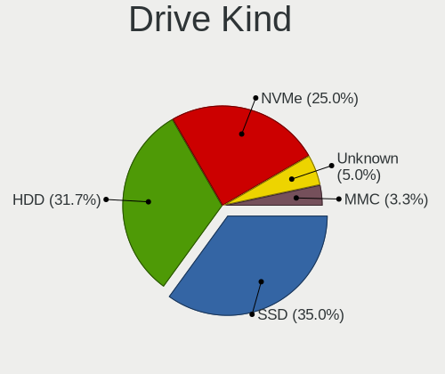
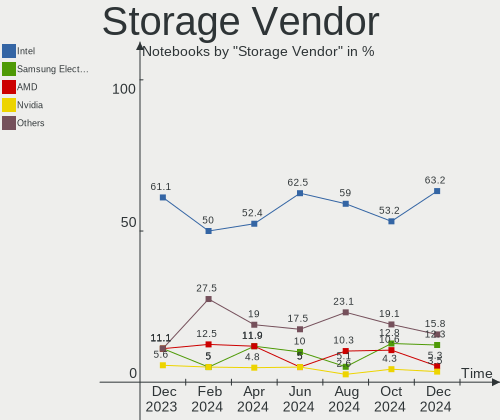
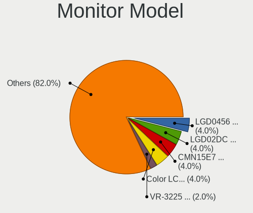
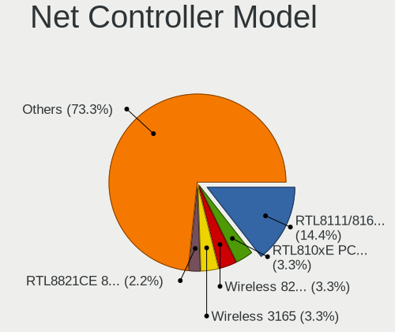

Elementary - Hardware Trends (Notebooks)
----------------------------------------

A project to identify most popular hardware characteristics and track their change
over time based on data collected by Linux users at https://Linux-Hardware.org.

Anyone can contribute to this report by the [hw-probe](https://github.com/linuxhw/hw-probe) tool:

    sudo -E hw-probe -all -upload

This report is for one last month. Overall report since the beginning of time: [TestDays](https://github.com/linuxhw/TestDays)

Period: Jan, 2024.

Contents
--------

* [ System ](#system)
  - [ OS                       ](#os)
  - [ OS Family                ](#os-family)
  - [ Kernel                   ](#kernel)
  - [ Kernel Family            ](#kernel-family)
  - [ Kernel Major Ver.        ](#kernel-major-ver)
  - [ Arch                     ](#arch)
  - [ DE                       ](#de)
  - [ Display Server           ](#display-server)
  - [ Display Manager          ](#display-manager)
  - [ OS Lang                  ](#os-lang)
  - [ Boot Mode                ](#boot-mode)
  - [ Filesystem               ](#filesystem)
  - [ Part. scheme             ](#part-scheme)
  - [ Dual Boot with Linux/BSD ](#dual-boot-with-linuxbsd)
  - [ Dual Boot (Win)          ](#dual-boot-win)

* [ Board ](#board)
  - [ Vendor                   ](#vendor)
  - [ Model                    ](#model)
  - [ Model Family             ](#model-family)
  - [ MFG Year                 ](#mfg-year)
  - [ Form Factor              ](#form-factor)
  - [ Secure Boot              ](#secure-boot)
  - [ Coreboot                 ](#coreboot)
  - [ RAM Size                 ](#ram-size)
  - [ RAM Used                 ](#ram-used)
  - [ Total Drives             ](#total-drives)
  - [ Has CD-ROM               ](#has-cd-rom)
  - [ Has Ethernet             ](#has-ethernet)
  - [ Has WiFi                 ](#has-wifi)
  - [ Has Bluetooth            ](#has-bluetooth)

* [ Location ](#location)
  - [ Country                  ](#country)
  - [ City                     ](#city)

* [ Drives ](#drives)
  - [ Drive Vendor             ](#drive-vendor)
  - [ Drive Model              ](#drive-model)
  - [ HDD Vendor               ](#hdd-vendor)
  - [ SSD Vendor               ](#ssd-vendor)
  - [ Drive Kind               ](#drive-kind)
  - [ Drive Connector          ](#drive-connector)
  - [ Drive Size               ](#drive-size)
  - [ Space Total              ](#space-total)
  - [ Space Used               ](#space-used)
  - [ Malfunc. Drives          ](#malfunc-drives)
  - [ Malfunc. Drive Vendor    ](#malfunc-drive-vendor)
  - [ Malfunc. HDD Vendor      ](#malfunc-hdd-vendor)
  - [ Malfunc. Drive Kind      ](#malfunc-drive-kind)
  - [ Failed Drives            ](#failed-drives)
  - [ Failed Drive Vendor      ](#failed-drive-vendor)
  - [ Drive Status             ](#drive-status)

* [ Storage controller ](#storage-controller)
  - [ Storage Vendor           ](#storage-vendor)
  - [ Storage Model            ](#storage-model)
  - [ Storage Kind             ](#storage-kind)

* [ Processor ](#processor)
  - [ CPU Vendor               ](#cpu-vendor)
  - [ CPU Model                ](#cpu-model)
  - [ CPU Model Family         ](#cpu-model-family)
  - [ CPU Cores                ](#cpu-cores)
  - [ CPU Sockets              ](#cpu-sockets)
  - [ CPU Threads              ](#cpu-threads)
  - [ CPU Op-Modes             ](#cpu-op-modes)
  - [ CPU Microcode            ](#cpu-microcode)
  - [ CPU Microarch            ](#cpu-microarch)

* [ Graphics ](#graphics)
  - [ GPU Vendor               ](#gpu-vendor)
  - [ GPU Model                ](#gpu-model)
  - [ GPU Combo                ](#gpu-combo)
  - [ GPU Driver               ](#gpu-driver)
  - [ GPU Memory               ](#gpu-memory)

* [ Monitor ](#monitor)
  - [ Monitor Vendor           ](#monitor-vendor)
  - [ Monitor Model            ](#monitor-model)
  - [ Monitor Resolution       ](#monitor-resolution)
  - [ Monitor Diagonal         ](#monitor-diagonal)
  - [ Monitor Width            ](#monitor-width)
  - [ Aspect Ratio             ](#aspect-ratio)
  - [ Monitor Area             ](#monitor-area)
  - [ Pixel Density            ](#pixel-density)
  - [ Multiple Monitors        ](#multiple-monitors)

* [ Network ](#network)
  - [ Net Controller Vendor    ](#net-controller-vendor)
  - [ Net Controller Model     ](#net-controller-model)
  - [ Wireless Vendor          ](#wireless-vendor)
  - [ Wireless Model           ](#wireless-model)
  - [ Ethernet Vendor          ](#ethernet-vendor)
  - [ Ethernet Model           ](#ethernet-model)
  - [ Net Controller Kind      ](#net-controller-kind)
  - [ Used Controller          ](#used-controller)
  - [ NICs                     ](#nics)
  - [ IPv6                     ](#ipv6)

* [ Bluetooth ](#bluetooth)
  - [ Bluetooth Vendor         ](#bluetooth-vendor)
  - [ Bluetooth Model          ](#bluetooth-model)

* [ Sound ](#sound)
  - [ Sound Vendor             ](#sound-vendor)
  - [ Sound Model              ](#sound-model)

* [ Memory ](#memory)
  - [ Memory Vendor            ](#memory-vendor)
  - [ Memory Model             ](#memory-model)
  - [ Memory Kind              ](#memory-kind)
  - [ Memory Form Factor       ](#memory-form-factor)
  - [ Memory Size              ](#memory-size)
  - [ Memory Speed             ](#memory-speed)

* [ Printers & scanners ](#printers--scanners)
  - [ Printer Vendor           ](#printer-vendor)
  - [ Printer Model            ](#printer-model)
  - [ Scanner Vendor           ](#scanner-vendor)
  - [ Scanner Model            ](#scanner-model)

* [ Camera ](#camera)
  - [ Camera Vendor            ](#camera-vendor)
  - [ Camera Model             ](#camera-model)

* [ Security ](#security)
  - [ Fingerprint Vendor       ](#fingerprint-vendor)
  - [ Fingerprint Model        ](#fingerprint-model)
  - [ Chipcard Vendor          ](#chipcard-vendor)
  - [ Chipcard Model           ](#chipcard-model)

* [ Unsupported ](#unsupported)
  - [ Unsupported Devices      ](#unsupported-devices)
  - [ Unsupported Device Types ](#unsupported-device-types)

System
------

OS
--

Installed operating systems

| Name           | Notebooks | Percent |
|----------------|-----------|---------|
| Elementary 7.1 | 24        | 92.31%  |
| Elementary 6.1 | 2         | 7.69%   |

OS Family
---------

OS without a version

| Name       | Notebooks | Percent |
|------------|-----------|---------|
| Elementary | 26        | 100%    |

Kernel
------

Version of the Linux kernel

| Version           | Notebooks | Percent |
|-------------------|-----------|---------|
| 6.5.0-14-generic  | 7         | 26.92%  |
| 6.2.0-39-generic  | 6         | 23.08%  |
| 6.2.0-33-generic  | 6         | 23.08%  |
| 6.5.0-15-generic  | 4         | 15.38%  |
| 5.15.0-91-generic | 2         | 7.69%   |
| 6.2.0-26-generic  | 1         | 3.85%   |

Kernel Family
-------------

Linux kernel without a distro release

| Version | Notebooks | Percent |
|---------|-----------|---------|
| 6.2.0   | 13        | 50%     |
| 6.5.0   | 11        | 42.31%  |
| 5.15.0  | 2         | 7.69%   |

Kernel Major Ver.
-----------------

Linux kernel major version

| Version | Notebooks | Percent |
|---------|-----------|---------|
| 6.2     | 13        | 50%     |
| 6.5     | 11        | 42.31%  |
| 5.15    | 2         | 7.69%   |

Arch
----

OS architecture (x86_64, i586, etc.)

| Name   | Notebooks | Percent |
|--------|-----------|---------|
| x86_64 | 26        | 100%    |

DE
--

Desktop Environment

| Name     | Notebooks | Percent |
|----------|-----------|---------|
| Pantheon | 26        | 100%    |

Display Server
--------------

X11 or Wayland

| Name | Notebooks | Percent |
|------|-----------|---------|
| X11  | 26        | 100%    |

Display Manager
---------------

SDDM, LightDM, etc.

| Name    | Notebooks | Percent |
|---------|-----------|---------|
| Unknown | 19        | 73.08%  |
| LightDM | 7         | 26.92%  |

OS Lang
-------

Language

| Lang  | Notebooks | Percent |
|-------|-----------|---------|
| en_US | 6         | 23.08%  |
| de_DE | 5         | 19.23%  |
| ru_RU | 4         | 15.38%  |
| es_ES | 3         | 11.54%  |
| it_IT | 2         | 7.69%   |
| tr_TR | 1         | 3.85%   |
| pt_BR | 1         | 3.85%   |
| fr_FR | 1         | 3.85%   |
| fi_FI | 1         | 3.85%   |
| da_DK | 1         | 3.85%   |
| ar_EG | 1         | 3.85%   |

Boot Mode
---------

EFI or BIOS

| Mode | Notebooks | Percent |
|------|-----------|---------|
| BIOS | 20        | 76.92%  |
| EFI  | 6         | 23.08%  |

Filesystem
----------

Type of filesystem

| Type  | Notebooks | Percent |
|-------|-----------|---------|
| Ext4  | 23        | 88.46%  |
| Tmpfs | 3         | 11.54%  |

Part. scheme
------------

Scheme of partitioning

| Type    | Notebooks | Percent |
|---------|-----------|---------|
| Unknown | 19        | 73.08%  |
| GPT     | 7         | 26.92%  |

Dual Boot with Linux/BSD
------------------------

Hosting more than one Linux/BSD

| Dual boot | Notebooks | Percent |
|-----------|-----------|---------|
| No        | 26        | 100%    |

Dual Boot (Win)
---------------

Hosting Linux and Windows

| Dual boot | Notebooks | Percent |
|-----------|-----------|---------|
| No        | 26        | 100%    |

Board
-----

Vendor
------

Motherboard manufacturer

| Name                 | Notebooks | Percent |
|----------------------|-----------|---------|
| Lenovo               | 6         | 23.08%  |
| Apple                | 5         | 19.23%  |
| Hewlett-Packard      | 3         | 11.54%  |
| Dell                 | 2         | 7.69%   |
| Acer                 | 2         | 7.69%   |
| TECNO Mobile Limited | 1         | 3.85%   |
| Samsung Electronics  | 1         | 3.85%   |
| Positivo             | 1         | 3.85%   |
| Packard Bell         | 1         | 3.85%   |
| Medion               | 1         | 3.85%   |
| HUAWEI               | 1         | 3.85%   |
| Fujitsu              | 1         | 3.85%   |
| ASUSTek Computer     | 1         | 3.85%   |

Model
-----

Motherboard model

| Name                                     | Notebooks | Percent |
|------------------------------------------|-----------|---------|
| Apple MacBookPro7,1                      | 2         | 7.69%   |
| TECNO Mobile Limited MEGABOOK T14TA      | 1         | 3.85%   |
| Samsung RC410/RC510/RC710                | 1         | 3.85%   |
| Positivo C4128A-15                       | 1         | 3.85%   |
| Packard Bell EasyNote TS11HR             | 1         | 3.85%   |
| Medion E11202                            | 1         | 3.85%   |
| Lenovo V17 G2 ITL 82NX                   | 1         | 3.85%   |
| Lenovo ThinkPad X1 Carbon 2nd 20A8S2G103 | 1         | 3.85%   |
| Lenovo ThinkPad T480 20L6S3ED18          | 1         | 3.85%   |
| Lenovo ThinkPad T470 20JNS08H00          | 1         | 3.85%   |
| Lenovo ThinkPad L440 20AT0030MD          | 1         | 3.85%   |
| Lenovo IdeaPad 330S-15IKB 81F5           | 1         | 3.85%   |
| HUAWEI BOD-WXX9                          | 1         | 3.85%   |
| HP Pavilion g6                           | 1         | 3.85%   |
| HP Laptop 17-by3xxx                      | 1         | 3.85%   |
| HP EliteBook 840 G1                      | 1         | 3.85%   |
| Fujitsu LIFEBOOK E734                    | 1         | 3.85%   |
| Dell Latitude E7440                      | 1         | 3.85%   |
| Dell Latitude E7240                      | 1         | 3.85%   |
| ASUS VivoBook_ASUSLaptop X1504ZA_R1504ZA | 1         | 3.85%   |
| Apple MacBookPro9,2                      | 1         | 3.85%   |
| Apple MacBook6,1                         | 1         | 3.85%   |
| Apple MacBook5,1                         | 1         | 3.85%   |
| Acer Aspire E5-573G                      | 1         | 3.85%   |
| Acer Aspire E5-571                       | 1         | 3.85%   |

Model Family
------------

Motherboard model prefix

| Name                          | Notebooks | Percent |
|-------------------------------|-----------|---------|
| Lenovo ThinkPad               | 4         | 15.38%  |
| Dell Latitude                 | 2         | 7.69%   |
| Apple MacBookPro7             | 2         | 7.69%   |
| Acer Aspire                   | 2         | 7.69%   |
| TECNO Mobile Limited MEGABOOK | 1         | 3.85%   |
| Samsung RC410                 | 1         | 3.85%   |
| Positivo C4128A-15            | 1         | 3.85%   |
| Packard Bell EasyNote         | 1         | 3.85%   |
| Medion E11202                 | 1         | 3.85%   |
| Lenovo V17                    | 1         | 3.85%   |
| Lenovo IdeaPad                | 1         | 3.85%   |
| HUAWEI BOD-WXX9               | 1         | 3.85%   |
| HP Pavilion                   | 1         | 3.85%   |
| HP Laptop                     | 1         | 3.85%   |
| HP EliteBook                  | 1         | 3.85%   |
| Fujitsu LIFEBOOK              | 1         | 3.85%   |
| ASUS VivoBook                 | 1         | 3.85%   |
| Apple MacBookPro9             | 1         | 3.85%   |
| Apple MacBook6                | 1         | 3.85%   |
| Apple MacBook5                | 1         | 3.85%   |

MFG Year
--------

Motherboard manufacture year

| Year | Notebooks | Percent |
|------|-----------|---------|
| 2014 | 4         | 15.38%  |
| 2023 | 3         | 11.54%  |
| 2021 | 3         | 11.54%  |
| 2013 | 3         | 11.54%  |
| 2011 | 3         | 11.54%  |
| 2018 | 2         | 7.69%   |
| 2010 | 2         | 7.69%   |
| 2009 | 2         | 7.69%   |
| 2020 | 1         | 3.85%   |
| 2017 | 1         | 3.85%   |
| 2015 | 1         | 3.85%   |
| 2012 | 1         | 3.85%   |

Form Factor
-----------

Physical design of the computer

| Name     | Notebooks | Percent |
|----------|-----------|---------|
| Notebook | 26        | 100%    |

Secure Boot
-----------

Enabled or disabled

| State    | Notebooks | Percent |
|----------|-----------|---------|
| Disabled | 26        | 100%    |

Coreboot
--------

Have coreboot on board

| Used | Notebooks | Percent |
|------|-----------|---------|
| No   | 26        | 100%    |

RAM Size
--------

Total RAM memory

| Size in GB | Notebooks | Percent |
|------------|-----------|---------|
| 4.01-8.0   | 12        | 46.15%  |
| 3.01-4.0   | 7         | 26.92%  |
| 16.01-24.0 | 7         | 26.92%  |

RAM Used
--------

Used RAM memory

| Used GB  | Notebooks | Percent |
|----------|-----------|---------|
| 2.01-3.0 | 9         | 34.62%  |
| 3.01-4.0 | 8         | 30.77%  |
| 1.01-2.0 | 5         | 19.23%  |
| 4.01-8.0 | 3         | 11.54%  |
| 0.51-1.0 | 1         | 3.85%   |

Total Drives
------------

Number of drives on board

| Drives | Notebooks | Percent |
|--------|-----------|---------|
| 1      | 21        | 80.77%  |
| 2      | 5         | 19.23%  |

Has CD-ROM
----------

Has CD-ROM on board

| Presented | Notebooks | Percent |
|-----------|-----------|---------|
| No        | 17        | 65.38%  |
| Yes       | 9         | 34.62%  |

Has Ethernet
------------

Has Ethernet on board

| Presented | Notebooks | Percent |
|-----------|-----------|---------|
| Yes       | 20        | 76.92%  |
| No        | 6         | 23.08%  |

Has WiFi
--------

Has WiFi module

| Presented | Notebooks | Percent |
|-----------|-----------|---------|
| Yes       | 25        | 96.15%  |
| No        | 1         | 3.85%   |

Has Bluetooth
-------------

Has Bluetooth module

| Presented | Notebooks | Percent |
|-----------|-----------|---------|
| Yes       | 23        | 88.46%  |
| No        | 3         | 11.54%  |

Location
--------

Country
-------

Geographic location (country)

| Country     | Notebooks | Percent |
|-------------|-----------|---------|
| Russia      | 3         | 11.54%  |
| Germany     | 3         | 11.54%  |
| Mexico      | 2         | 7.69%   |
| Brazil      | 2         | 7.69%   |
| Austria     | 2         | 7.69%   |
| USA         | 1         | 3.85%   |
| Turkey      | 1         | 3.85%   |
| Switzerland | 1         | 3.85%   |
| Spain       | 1         | 3.85%   |
| Slovakia    | 1         | 3.85%   |
| Romania     | 1         | 3.85%   |
| Puerto Rico | 1         | 3.85%   |
| Netherlands | 1         | 3.85%   |
| Italy       | 1         | 3.85%   |
| France      | 1         | 3.85%   |
| Finland     | 1         | 3.85%   |
| Denmark     | 1         | 3.85%   |
| Belarus     | 1         | 3.85%   |
| Algeria     | 1         | 3.85%   |

City
----

Geographic location (city)

| City             | Notebooks | Percent |
|------------------|-----------|---------|
| Vienna           | 2         | 7.69%   |
| Moscow           | 2         | 7.69%   |
| Zhodzina         | 1         | 3.85%   |
| Zamora           | 1         | 3.85%   |
| Valby            | 1         | 3.85%   |
| Turku            | 1         | 3.85%   |
| Rio Grande       | 1         | 3.85%   |
| Puebla City      | 1         | 3.85%   |
| Paris            | 1         | 3.85%   |
| Murcia           | 1         | 3.85%   |
| Mundelein        | 1         | 3.85%   |
| Monza            | 1         | 3.85%   |
| Martin           | 1         | 3.85%   |
| Izmir            | 1         | 3.85%   |
| Ilsede           | 1         | 3.85%   |
| Feira de Santana | 1         | 3.85%   |
| Embu             | 1         | 3.85%   |
| Dordrecht        | 1         | 3.85%   |
| Chelyabinsk      | 1         | 3.85%   |
| Bremen           | 1         | 3.85%   |
| Berlin           | 1         | 3.85%   |
| Bellinzona       | 1         | 3.85%   |
| Baia Mare        | 1         | 3.85%   |
| Abadla           | 1         | 3.85%   |

Drives
------

Drive Vendor
------------

Hard drive vendors

| Vendor                       | Notebooks | Drives | Percent |
|------------------------------|-----------|--------|---------|
| Samsung Electronics          | 4         | 4      | 12.9%   |
| Kingston                     | 3         | 3      | 9.68%   |
| Unknown                      | 2         | 2      | 6.45%   |
| Toshiba                      | 2         | 2      | 6.45%   |
| Seagate                      | 2         | 2      | 6.45%   |
| SanDisk                      | 2         | 2      | 6.45%   |
| KIOXIA                       | 2         | 2      | 6.45%   |
| Crucial                      | 2         | 2      | 6.45%   |
| XrayDisk                     | 1         | 1      | 3.23%   |
| WDC                          | 1         | 1      | 3.23%   |
| Transcend                    | 1         | 1      | 3.23%   |
| Shenzhen Longsys Electronics | 1         | 1      | 3.23%   |
| Phison Electronics           | 1         | 1      | 3.23%   |
| Patriot                      | 1         | 1      | 3.23%   |
| Micron Technology            | 1         | 1      | 3.23%   |
| Intel                        | 1         | 1      | 3.23%   |
| Hitachi                      | 1         | 1      | 3.23%   |
| HGST                         | 1         | 1      | 3.23%   |
| Apple                        | 1         | 1      | 3.23%   |
| Unknown                      | 1         | 1      | 3.23%   |

Drive Model
-----------

Hard drive models

| Model                                        | Notebooks | Percent |
|----------------------------------------------|-----------|---------|
| Kingston SUV500MS480G 480GB SSD              | 2         | 6.45%   |
| XrayDisk 256GB SSD                           | 1         | 3.23%   |
| WDC WDS240G2G0B-00EPW0 240GB SSD             | 1         | 3.23%   |
| Unknown MMC Card  64GB                       | 1         | 3.23%   |
| Unknown MMC Card  128GB                      | 1         | 3.23%   |
| Transcend TS256GMTS430S 256GB SSD            | 1         | 3.23%   |
| Toshiba MQ04ABF100 1TB                       | 1         | 3.23%   |
| Toshiba MK3275GSX 320GB                      | 1         | 3.23%   |
| Shenzhen Longsys FORESEE XP1000F512G 512GB   | 1         | 3.23%   |
| Seagate ST9250315AS 250GB                    | 1         | 3.23%   |
| Seagate ST500LT012-1DG142 500GB              | 1         | 3.23%   |
| Sandisk WDC PC SN530 SDBPMPZ-256G-1101 256GB | 1         | 3.23%   |
| SanDisk SD9SN8W-128G-1006 128GB SSD          | 1         | 3.23%   |
| Samsung SSD 860 EVO 250GB                    | 1         | 3.23%   |
| Samsung SSD 850 PRO 128GB                    | 1         | 3.23%   |
| Samsung SSD 850 EVO 500GB                    | 1         | 3.23%   |
| Samsung MZ7TE256HMHP-00004 256GB SSD         | 1         | 3.23%   |
| Phison PS5013 E13 NVMe Controller 256GB      | 1         | 3.23%   |
| Patriot Burst 120GB SSD                      | 1         | 3.23%   |
| Micron 2450_MTFDKBA256TFK 256GB              | 1         | 3.23%   |
| KIOXIA KBG40ZNV512G 512GB                    | 1         | 3.23%   |
| KIOXIA KBG40ZNV256G 256GB                    | 1         | 3.23%   |
| Kingston SV300S37A120G 120GB SSD             | 1         | 3.23%   |
| Intel SSDSCKJF240A5L 240GB                   | 1         | 3.23%   |
| Hitachi HTS543216A7A384 160GB                | 1         | 3.23%   |
| HGST HTS545050A7E680 500GB                   | 1         | 3.23%   |
| Crucial CT1000MX500SSD1 1TB                  | 1         | 3.23%   |
| Crucial CT1000BX500SSD1 1TB                  | 1         | 3.23%   |
| Apple HDD HTS545050A7E362 500GB              | 1         | 3.23%   |
| Unknown                                      | 1         | 3.23%   |

HDD Vendor
----------

Hard disk drive vendors

| Vendor  | Notebooks | Drives | Percent |
|---------|-----------|--------|---------|
| Toshiba | 2         | 2      | 28.57%  |
| Seagate | 2         | 2      | 28.57%  |
| Hitachi | 1         | 1      | 14.29%  |
| HGST    | 1         | 1      | 14.29%  |
| Apple   | 1         | 1      | 14.29%  |

SSD Vendor
----------

Solid state drive vendors

| Vendor              | Notebooks | Drives | Percent |
|---------------------|-----------|--------|---------|
| Samsung Electronics | 4         | 4      | 26.67%  |
| Kingston            | 3         | 3      | 20%     |
| Crucial             | 2         | 2      | 13.33%  |
| XrayDisk            | 1         | 1      | 6.67%   |
| WDC                 | 1         | 1      | 6.67%   |
| Transcend           | 1         | 1      | 6.67%   |
| SanDisk             | 1         | 1      | 6.67%   |
| Patriot             | 1         | 1      | 6.67%   |
| Intel               | 1         | 1      | 6.67%   |

Drive Kind
----------

HDD or SSD

| Kind | Notebooks | Drives | Percent |
|------|-----------|--------|---------|
| SSD  | 13        | 15     | 46.43%  |
| HDD  | 7         | 7      | 25%     |
| NVMe | 6         | 6      | 21.43%  |
| MMC  | 2         | 3      | 7.14%   |

Drive Connector
---------------

SATA, SAS, NVMe, etc.

| Type | Notebooks | Drives | Percent |
|------|-----------|--------|---------|
| SATA | 19        | 22     | 70.37%  |
| NVMe | 6         | 6      | 22.22%  |
| MMC  | 2         | 3      | 7.41%   |

Drive Size
----------

Size of hard drive

| Size in TB | Notebooks | Drives | Percent |
|------------|-----------|--------|---------|
| 0.01-0.5   | 18        | 19     | 85.71%  |
| 0.51-1.0   | 3         | 3      | 14.29%  |

Space Total
-----------

Amount of disk space available on the file system

| Size in GB | Notebooks | Percent |
|------------|-----------|---------|
| 101-250    | 14        | 53.85%  |
| 251-500    | 7         | 26.92%  |
| 501-1000   | 3         | 11.54%  |
| 1001-2000  | 1         | 3.85%   |
| 51-100     | 1         | 3.85%   |

Space Used
----------

Amount of used disk space

| Used GB | Notebooks | Percent |
|---------|-----------|---------|
| 1-20    | 11        | 42.31%  |
| 21-50   | 9         | 34.62%  |
| 251-500 | 3         | 11.54%  |
| 101-250 | 2         | 7.69%   |
| 51-100  | 1         | 3.85%   |

Malfunc. Drives
---------------

Drive models with a malfunction

Zero info for selected period =(

Malfunc. Drive Vendor
---------------------

Vendors of faulty drives

Zero info for selected period =(

Malfunc. HDD Vendor
-------------------

Vendors of faulty HDD drives

Zero info for selected period =(

Malfunc. Drive Kind
-------------------

Kinds of faulty drives

Zero info for selected period =(

Failed Drives
-------------

Failed drive models

Zero info for selected period =(

Failed Drive Vendor
-------------------

Failed drive vendors

Zero info for selected period =(

Drive Status
------------

Number of failed and malfunc. drives

| Status   | Notebooks | Drives | Percent |
|----------|-----------|--------|---------|
| Detected | 22        | 27     | 84.62%  |
| Works    | 4         | 4      | 15.38%  |

Storage controller
------------------

Storage Vendor
--------------

Storage controller vendors

| Vendor                       | Notebooks | Percent |
|------------------------------|-----------|---------|
| Intel                        | 20        | 66.67%  |
| Nvidia                       | 4         | 13.33%  |
| KIOXIA                       | 2         | 6.67%   |
| Shenzhen Longsys Electronics | 1         | 3.33%   |
| SanDisk                      | 1         | 3.33%   |
| Phison Electronics           | 1         | 3.33%   |
| Micron Technology            | 1         | 3.33%   |

Storage Model
-------------

Storage controller models

| Model                                                                                                              | Notebooks | Percent |
|--------------------------------------------------------------------------------------------------------------------|-----------|---------|
| Intel 8 Series SATA Controller 1 [AHCI mode]                                                                       | 5         | 15.15%  |
| Nvidia MCP89 SATA Controller (AHCI mode)                                                                           | 2         | 6.06%   |
| Nvidia MCP79 AHCI Controller                                                                                       | 2         | 6.06%   |
| KIOXIA NVMe SSD Controller BG4 (DRAM-less)                                                                         | 2         | 6.06%   |
| Intel Volume Management Device NVMe RAID Controller                                                                | 2         | 6.06%   |
| Intel Tiger Lake-LP SATA Controller                                                                                | 2         | 6.06%   |
| Intel Sunrise Point-LP SATA Controller [AHCI mode]                                                                 | 2         | 6.06%   |
| Intel 82801 Mobile SATA Controller [RAID mode]                                                                     | 2         | 6.06%   |
| Shenzhen Longsys FORESEE XP1000 / Lexar Professional CFexpress Type B Gold series, NM620 PCIe NVME SSD (DRAM-less) | 1         | 3.03%   |
| SanDisk PC SN530 NVMe SSD (DRAM-less)                                                                              | 1         | 3.03%   |
| Phison PS5013-E13 PCIe3 NVMe Controller (DRAM-less)                                                                | 1         | 3.03%   |
| Micron 2450 NVMe SSD [HendrixV] (DRAM-less)                                                                        | 1         | 3.03%   |
| Intel Celeron/Pentium Silver Processor SATA Controller                                                             | 1         | 3.03%   |
| Intel Celeron N3350/Pentium N4200/Atom E3900 Series SATA AHCI Controller                                           | 1         | 3.03%   |
| Intel 8 Series/C220 Series Chipset Family 6-port SATA Controller 1 [AHCI mode]                                     | 1         | 3.03%   |
| Intel 8 Series/C220 Series Chipset Family 2-port SATA Controller 2 [IDE mode]                                      | 1         | 3.03%   |
| Intel 8 Series Chipset Family 4-port SATA Controller 1 [IDE mode] - Mobile                                         | 1         | 3.03%   |
| Intel 7 Series Chipset Family 6-port SATA Controller [AHCI mode]                                                   | 1         | 3.03%   |
| Intel 6 Series/C200 Series Chipset Family Mobile SATA Controller (IDE mode, ports 4-5)                             | 1         | 3.03%   |
| Intel 6 Series/C200 Series Chipset Family Mobile SATA Controller (IDE mode, ports 0-3)                             | 1         | 3.03%   |
| Intel 6 Series/C200 Series Chipset Family 6 port Mobile SATA AHCI Controller                                       | 1         | 3.03%   |
| Intel 5 Series/3400 Series Chipset 4 port SATA AHCI Controller                                                     | 1         | 3.03%   |

Storage Kind
------------

Kind of storage controller (IDE, SATA, NVMe, SAS, ...)

| Kind | Notebooks | Percent |
|------|-----------|---------|
| SATA | 19        | 61.29%  |
| NVMe | 6         | 19.35%  |
| RAID | 4         | 12.9%   |
| IDE  | 2         | 6.45%   |

Processor
---------

CPU Vendor
----------

Processor vendors

| Vendor | Notebooks | Percent |
|--------|-----------|---------|
| Intel  | 26        | 100%    |

CPU Model
---------

Processor models

| Model                                   | Notebooks | Percent |
|-----------------------------------------|-----------|---------|
| Intel Core i7-4600U CPU @ 2.10GHz       | 2         | 7.69%   |
| Intel Core i5-4210U CPU @ 1.70GHz       | 2         | 7.69%   |
| Intel Core i5-2430M CPU @ 2.40GHz       | 2         | 7.69%   |
| Intel Core 2 Duo CPU P8600 @ 2.40GHz    | 2         | 7.69%   |
| Intel Core i7-8650U CPU @ 1.90GHz       | 1         | 3.85%   |
| Intel Core i7-8550U CPU @ 1.80GHz       | 1         | 3.85%   |
| Intel Core i5-6300U CPU @ 2.40GHz       | 1         | 3.85%   |
| Intel Core i5-4310M CPU @ 2.70GHz       | 1         | 3.85%   |
| Intel Core i5-4200M CPU @ 2.50GHz       | 1         | 3.85%   |
| Intel Core i5-3210M CPU @ 2.50GHz       | 1         | 3.85%   |
| Intel Core i5-1035G1 CPU @ 1.00GHz      | 1         | 3.85%   |
| Intel Core i3-4010U CPU @ 1.70GHz       | 1         | 3.85%   |
| Intel Core i3-4005U CPU @ 1.70GHz       | 1         | 3.85%   |
| Intel Core i3 CPU M 380 @ 2.53GHz       | 1         | 3.85%   |
| Intel Core 2 Duo CPU P8800 @ 2.66GHz    | 1         | 3.85%   |
| Intel Core 2 Duo CPU P7550 @ 2.26GHz    | 1         | 3.85%   |
| Intel Celeron N4020C CPU @ 1.10GHz      | 1         | 3.85%   |
| Intel Celeron CPU N3450 @ 1.10GHz       | 1         | 3.85%   |
| Intel 12th Gen Core i3-1215U            | 1         | 3.85%   |
| Intel 11th Gen Core i5-1155G7 @ 2.50GHz | 1         | 3.85%   |
| Intel 11th Gen Core i5-1135G7 @ 2.40GHz | 1         | 3.85%   |
| Intel 11th Gen Core i3-1115G4 @ 3.00GHz | 1         | 3.85%   |

CPU Model Family
----------------

Processor model prefix

| Model            | Notebooks | Percent |
|------------------|-----------|---------|
| Intel Core i5    | 9         | 34.62%  |
| Other            | 4         | 15.38%  |
| Intel Core i7    | 4         | 15.38%  |
| Intel Core 2 Duo | 4         | 15.38%  |
| Intel Core i3    | 3         | 11.54%  |
| Intel Celeron    | 2         | 7.69%   |

CPU Cores
---------

Number of processor cores

| Number | Notebooks | Percent |
|--------|-----------|---------|
| 2      | 19        | 73.08%  |
| 4      | 6         | 23.08%  |
| 6      | 1         | 3.85%   |

CPU Sockets
-----------

Number of sockets

| Number | Notebooks | Percent |
|--------|-----------|---------|
| 1      | 26        | 100%    |

CPU Threads
-----------

Threads per core (Hyper-Threading)

| Number | Notebooks | Percent |
|--------|-----------|---------|
| 2      | 20        | 76.92%  |
| 1      | 6         | 23.08%  |

CPU Op-Modes
------------

CPU Operation Modes (32-bit, 64-bit)

| Op mode        | Notebooks | Percent |
|----------------|-----------|---------|
| 32-bit, 64-bit | 26        | 100%    |

CPU Microcode
-------------

Microcode number

| Number  | Notebooks | Percent |
|---------|-----------|---------|
| Unknown | 24        | 92.31%  |
| 0x806c1 | 1         | 3.85%   |
| 0x206a7 | 1         | 3.85%   |

CPU Microarch
-------------

Microarchitecture

| Name          | Notebooks | Percent |
|---------------|-----------|---------|
| Haswell       | 8         | 30.77%  |
| Penryn        | 4         | 15.38%  |
| TigerLake     | 3         | 11.54%  |
| SandyBridge   | 2         | 7.69%   |
| KabyLake      | 2         | 7.69%   |
| Westmere      | 1         | 3.85%   |
| Skylake       | 1         | 3.85%   |
| IvyBridge     | 1         | 3.85%   |
| IceLake       | 1         | 3.85%   |
| Goldmont plus | 1         | 3.85%   |
| Goldmont      | 1         | 3.85%   |
| Unknown       | 1         | 3.85%   |

Graphics
--------

GPU Vendor
----------

Vendors of graphics cards

| Vendor | Notebooks | Percent |
|--------|-----------|---------|
| Intel  | 22        | 70.97%  |
| Nvidia | 7         | 22.58%  |
| AMD    | 2         | 6.45%   |

GPU Model
---------

Graphics card models

| Model                                                                     | Notebooks | Percent |
|---------------------------------------------------------------------------|-----------|---------|
| Intel Haswell-ULT Integrated Graphics Controller                          | 6         | 19.35%  |
| Nvidia MCP89 [GeForce 320M]                                               | 2         | 6.45%   |
| Nvidia C79 [GeForce 9400M]                                                | 2         | 6.45%   |
| Intel UHD Graphics 620                                                    | 2         | 6.45%   |
| Intel TigerLake-LP GT2 [Iris Xe Graphics]                                 | 2         | 6.45%   |
| Intel 4th Gen Core Processor Integrated Graphics Controller               | 2         | 6.45%   |
| Intel 2nd Generation Core Processor Family Integrated Graphics Controller | 2         | 6.45%   |
| Nvidia GT218M [GeForce 315M]                                              | 1         | 3.23%   |
| Nvidia GP108M [GeForce MX150]                                             | 1         | 3.23%   |
| Nvidia GM108M [GeForce 940M]                                              | 1         | 3.23%   |
| Intel Tiger Lake-LP GT2 [UHD Graphics G4]                                 | 1         | 3.23%   |
| Intel Skylake GT2 [HD Graphics 520]                                       | 1         | 3.23%   |
| Intel Iris Plus Graphics G1 (Ice Lake)                                    | 1         | 3.23%   |
| Intel HD Graphics 500                                                     | 1         | 3.23%   |
| Intel GeminiLake [UHD Graphics 600]                                       | 1         | 3.23%   |
| Intel Core Processor Integrated Graphics Controller                       | 1         | 3.23%   |
| Intel Alder Lake-UP3 GT1 [UHD Graphics]                                   | 1         | 3.23%   |
| Intel 3rd Gen Core processor Graphics Controller                          | 1         | 3.23%   |
| AMD Seymour [Radeon HD 6400M/7400M Series]                                | 1         | 3.23%   |
| AMD Mars [Radeon HD 8730M]                                                | 1         | 3.23%   |

GPU Combo
---------

Combinations of graphics cards

| Name           | Notebooks | Percent |
|----------------|-----------|---------|
| 1 x Intel      | 17        | 65.38%  |
| 1 x Nvidia     | 4         | 15.38%  |
| Intel + Nvidia | 3         | 11.54%  |
| Intel + AMD    | 2         | 7.69%   |

GPU Driver
----------

Free vs proprietary

| Driver      | Notebooks | Percent |
|-------------|-----------|---------|
| Free        | 23        | 88.46%  |
| Proprietary | 2         | 7.69%   |
| Unknown     | 1         | 3.85%   |

GPU Memory
----------

Total video memory

| Size in GB | Notebooks | Percent |
|------------|-----------|---------|
| Unknown    | 24        | 92.31%  |
| 0.01-0.5   | 2         | 7.69%   |

Monitor
-------

Monitor Vendor
--------------

Monitor vendors

| Vendor              | Notebooks | Percent |
|---------------------|-----------|---------|
| LG Display          | 6         | 22.22%  |
| AU Optronics        | 6         | 22.22%  |
| Apple               | 5         | 18.52%  |
| Samsung Electronics | 3         | 11.11%  |
| Chimei Innolux      | 2         | 7.41%   |
| BOE                 | 2         | 7.41%   |
| Mi                  | 1         | 3.7%    |
| KDB                 | 1         | 3.7%    |
| HKC                 | 1         | 3.7%    |

Monitor Model
-------------

Monitor models

| Model                                                                | Notebooks | Percent |
|----------------------------------------------------------------------|-----------|---------|
| Apple LCD Monitor APP9CC3 1280x800 286x179mm 13.3-inch               | 2         | 7.41%   |
| Samsung Electronics SyncMaster SAM0247 1280x1024 376x301mm 19.0-inch | 1         | 3.7%    |
| Samsung Electronics LS27A600U SAM7172 2560x1440 600x340mm 27.2-inch  | 1         | 3.7%    |
| Samsung Electronics LCD Monitor SEC364A 1366x768 344x194mm 15.5-inch | 1         | 3.7%    |
| Mi 27 NFGL XMIB004 1920x1080 598x336mm 27.0-inch                     | 1         | 3.7%    |
| LG Display LCD Monitor LGD0521 1920x1080 309x174mm 14.0-inch         | 1         | 3.7%    |
| LG Display LCD Monitor LGD0418 2560x1440 310x174mm 14.0-inch         | 1         | 3.7%    |
| LG Display LCD Monitor LGD03EA 1920x1080 309x174mm 14.0-inch         | 1         | 3.7%    |
| LG Display LCD Monitor LGD03DC 1366x768 277x156mm 12.5-inch          | 1         | 3.7%    |
| LG Display LCD Monitor LGD03D7 1366x768 310x174mm 14.0-inch          | 1         | 3.7%    |
| LG Display LCD Monitor LGD02F2 1366x768 344x194mm 15.5-inch          | 1         | 3.7%    |
| KDB LCD Monitor KDB1130 1366x768 256x144mm 11.6-inch                 | 1         | 3.7%    |
| HKC LCD Monitor HKC0200 1920x1200 302x188mm 14.0-inch                | 1         | 3.7%    |
| Chimei Innolux LCD Monitor CMN175E 1920x1080 381x214mm 17.2-inch     | 1         | 3.7%    |
| Chimei Innolux LCD Monitor CMN1541 1366x768 344x193mm 15.5-inch      | 1         | 3.7%    |
| BOE LCD Monitor BOE09C1 1920x1080 382x215mm 17.3-inch                | 1         | 3.7%    |
| BOE LCD Monitor BOE0757 1366x768 344x194mm 15.5-inch                 | 1         | 3.7%    |
| AU Optronics LCD Monitor AUO46EC 1366x768 344x193mm 15.5-inch        | 1         | 3.7%    |
| AU Optronics LCD Monitor AUO40EC 1366x768 344x193mm 15.5-inch        | 1         | 3.7%    |
| AU Optronics LCD Monitor AUO28ED 1920x1080 344x193mm 15.5-inch       | 1         | 3.7%    |
| AU Optronics LCD Monitor AUO26EC 1366x768 344x193mm 15.5-inch        | 1         | 3.7%    |
| AU Optronics LCD Monitor AUO133D 1920x1080 309x173mm 13.9-inch       | 1         | 3.7%    |
| AU Optronics LCD Monitor AUO103D 1920x1080 309x173mm 13.9-inch       | 1         | 3.7%    |
| Apple LCD Monitor APP9CC5 1280x800 286x179mm 13.3-inch               | 1         | 3.7%    |
| Apple LCD Monitor APP9C89 1280x800 286x179mm 13.3-inch               | 1         | 3.7%    |
| Apple Color LCD APP9CC0 1280x800 261x163mm 12.1-inch                 | 1         | 3.7%    |

Monitor Resolution
------------------

Monitor screen resolution

| Resolution        | Notebooks | Percent |
|-------------------|-----------|---------|
| 1366x768 (WXGA)   | 10        | 37.04%  |
| 1920x1080 (FHD)   | 8         | 29.63%  |
| 1280x800 (WXGA)   | 5         | 18.52%  |
| 2560x1440 (QHD)   | 2         | 7.41%   |
| 1920x1200 (WUXGA) | 1         | 3.7%    |
| 1280x1024 (SXGA)  | 1         | 3.7%    |

Monitor Diagonal
----------------

Diagonal size in inches

| Inches | Notebooks | Percent |
|--------|-----------|---------|
| 15     | 8         | 29.63%  |
| 13     | 6         | 22.22%  |
| 14     | 5         | 18.52%  |
| 27     | 2         | 7.41%   |
| 17     | 2         | 7.41%   |
| 12     | 2         | 7.41%   |
| 19     | 1         | 3.7%    |
| 11     | 1         | 3.7%    |

Monitor Width
-------------

Physical width

| Width in mm | Notebooks | Percent |
|-------------|-----------|---------|
| 301-350     | 15        | 55.56%  |
| 201-300     | 7         | 25.93%  |
| 351-400     | 3         | 11.11%  |
| 501-600     | 2         | 7.41%   |

Aspect Ratio
------------

Proportional relationship between the width and the height

| Ratio | Notebooks | Percent |
|-------|-----------|---------|
| 16/9  | 19        | 73.08%  |
| 16/10 | 6         | 23.08%  |
| 5/4   | 1         | 3.85%   |

Monitor Area
------------

Area in inch²

| Area in inch² | Notebooks | Percent |
|----------------|-----------|---------|
| 81-90          | 10        | 37.04%  |
| 101-110        | 8         | 29.63%  |
| 61-70          | 2         | 7.41%   |
| 301-350        | 2         | 7.41%   |
| 121-130        | 2         | 7.41%   |
| 71-80          | 1         | 3.7%    |
| 51-60          | 1         | 3.7%    |
| 151-200        | 1         | 3.7%    |

Pixel Density
-------------

Pixels per inch

| Density | Notebooks | Percent |
|---------|-----------|---------|
| 101-120 | 12        | 46.15%  |
| 121-160 | 10        | 38.46%  |
| 161-240 | 2         | 7.69%   |
| 51-100  | 2         | 7.69%   |

Multiple Monitors
-----------------

Total monitors connected

| Total | Notebooks | Percent |
|-------|-----------|---------|
| 1     | 22        | 84.62%  |
| 2     | 3         | 11.54%  |
| 0     | 1         | 3.85%   |

Network
-------

Net Controller Vendor
---------------------

Controller vendors

| Vendor                            | Notebooks | Percent |
|-----------------------------------|-----------|---------|
| Intel                             | 11        | 28.95%  |
| Broadcom                          | 8         | 21.05%  |
| Realtek Semiconductor             | 7         | 18.42%  |
| Qualcomm Atheros                  | 3         | 7.89%   |
| Samsung Electronics               | 2         | 5.26%   |
| Nvidia                            | 2         | 5.26%   |
| Sierra Wireless                   | 1         | 2.63%   |
| Qualcomm Atheros Communications   | 1         | 2.63%   |
| MediaTek                          | 1         | 2.63%   |
| Hewlett-Packard                   | 1         | 2.63%   |
| Ericsson Business Mobile Networks | 1         | 2.63%   |

Net Controller Model
--------------------

Controller models

| Model                                                                  | Notebooks | Percent |
|------------------------------------------------------------------------|-----------|---------|
| Intel Wireless 7260                                                    | 6         | 12%     |
| Realtek RTL8111/8168/8211/8411 PCI Express Gigabit Ethernet Controller | 4         | 8%      |
| Intel Ethernet Connection I218-LM                                      | 4         | 8%      |
| Realtek RTL8821CE 802.11ac PCIe Wireless Network Adapter               | 3         | 6%      |
| Broadcom BCM4322 802.11a/b/g/n Wireless LAN Controller                 | 3         | 6%      |
| Samsung Galaxy series, misc. (tethering mode)                          | 2         | 4%      |
| Qualcomm Atheros QCA9377 802.11ac Wireless Network Adapter             | 2         | 4%      |
| Nvidia MCP79 Ethernet                                                  | 2         | 4%      |
| Intel Wi-Fi 6 AX201                                                    | 2         | 4%      |
| Broadcom NetXtreme BCM5764M Gigabit Ethernet PCIe                      | 2         | 4%      |
| Sierra Wireless EM7305 Modem                                           | 1         | 2%      |
| Realtek RTL810xE PCI Express Fast Ethernet controller                  | 1         | 2%      |
| Qualcomm Atheros AR9271 802.11n                                        | 1         | 2%      |
| Qualcomm Atheros AR9287 Wireless Network Adapter (PCI-Express)         | 1         | 2%      |
| MediaTek Wi-Fi 6E MT7902 Wireless Network Adapter                      | 1         | 2%      |
| Intel Wireless 8265 / 8275                                             | 1         | 2%      |
| Intel Wireless 8260                                                    | 1         | 2%      |
| Intel Wireless 7265                                                    | 1         | 2%      |
| Intel Ethernet Connection I219-LM                                      | 1         | 2%      |
| Intel Ethernet Connection I217-V                                       | 1         | 2%      |
| Intel Ethernet Connection I217-LM                                      | 1         | 2%      |
| Intel Ethernet Connection (4) I219-LM                                  | 1         | 2%      |
| HP lt4112 Gobi 4G Module Network Device                                | 1         | 2%      |
| Ericsson Business Mobile Networks N5321 gw                             | 1         | 2%      |
| Broadcom NetXtreme BCM57765 Gigabit Ethernet PCIe                      | 1         | 2%      |
| Broadcom NetLink BCM57785 Gigabit Ethernet PCIe                        | 1         | 2%      |
| Broadcom BCM4331 802.11a/b/g/n                                         | 1         | 2%      |
| Broadcom BCM43224 802.11a/b/g/n                                        | 1         | 2%      |
| Broadcom BCM43142 802.11b/g/n                                          | 1         | 2%      |
| Broadcom BCM4313 802.11bgn Wireless Network Adapter                    | 1         | 2%      |

Wireless Vendor
---------------

Wireless vendors

| Vendor                            | Notebooks | Percent |
|-----------------------------------|-----------|---------|
| Intel                             | 11        | 37.93%  |
| Broadcom                          | 7         | 24.14%  |
| Realtek Semiconductor             | 3         | 10.34%  |
| Qualcomm Atheros                  | 3         | 10.34%  |
| Sierra Wireless                   | 1         | 3.45%   |
| Qualcomm Atheros Communications   | 1         | 3.45%   |
| MediaTek                          | 1         | 3.45%   |
| Hewlett-Packard                   | 1         | 3.45%   |
| Ericsson Business Mobile Networks | 1         | 3.45%   |

Wireless Model
--------------

Wireless models

| Model                                                          | Notebooks | Percent |
|----------------------------------------------------------------|-----------|---------|
| Intel Wireless 7260                                            | 6         | 20.69%  |
| Realtek RTL8821CE 802.11ac PCIe Wireless Network Adapter       | 3         | 10.34%  |
| Broadcom BCM4322 802.11a/b/g/n Wireless LAN Controller         | 3         | 10.34%  |
| Qualcomm Atheros QCA9377 802.11ac Wireless Network Adapter     | 2         | 6.9%    |
| Intel Wi-Fi 6 AX201                                            | 2         | 6.9%    |
| Sierra Wireless EM7305 Modem                                   | 1         | 3.45%   |
| Qualcomm Atheros AR9271 802.11n                                | 1         | 3.45%   |
| Qualcomm Atheros AR9287 Wireless Network Adapter (PCI-Express) | 1         | 3.45%   |
| MediaTek Wi-Fi 6E MT7902 Wireless Network Adapter              | 1         | 3.45%   |
| Intel Wireless 8265 / 8275                                     | 1         | 3.45%   |
| Intel Wireless 8260                                            | 1         | 3.45%   |
| Intel Wireless 7265                                            | 1         | 3.45%   |
| HP lt4112 Gobi 4G Module Network Device                        | 1         | 3.45%   |
| Ericsson Business Mobile Networks N5321 gw                     | 1         | 3.45%   |
| Broadcom BCM4331 802.11a/b/g/n                                 | 1         | 3.45%   |
| Broadcom BCM43224 802.11a/b/g/n                                | 1         | 3.45%   |
| Broadcom BCM43142 802.11b/g/n                                  | 1         | 3.45%   |
| Broadcom BCM4313 802.11bgn Wireless Network Adapter            | 1         | 3.45%   |

Ethernet Vendor
---------------

Ethernet vendors

| Vendor                | Notebooks | Percent |
|-----------------------|-----------|---------|
| Intel                 | 8         | 38.1%   |
| Realtek Semiconductor | 5         | 23.81%  |
| Broadcom              | 4         | 19.05%  |
| Samsung Electronics   | 2         | 9.52%   |
| Nvidia                | 2         | 9.52%   |

Ethernet Model
--------------

Ethernet models

| Model                                                                  | Notebooks | Percent |
|------------------------------------------------------------------------|-----------|---------|
| Realtek RTL8111/8168/8211/8411 PCI Express Gigabit Ethernet Controller | 4         | 19.05%  |
| Intel Ethernet Connection I218-LM                                      | 4         | 19.05%  |
| Samsung Galaxy series, misc. (tethering mode)                          | 2         | 9.52%   |
| Nvidia MCP79 Ethernet                                                  | 2         | 9.52%   |
| Broadcom NetXtreme BCM5764M Gigabit Ethernet PCIe                      | 2         | 9.52%   |
| Realtek RTL810xE PCI Express Fast Ethernet controller                  | 1         | 4.76%   |
| Intel Ethernet Connection I219-LM                                      | 1         | 4.76%   |
| Intel Ethernet Connection I217-V                                       | 1         | 4.76%   |
| Intel Ethernet Connection I217-LM                                      | 1         | 4.76%   |
| Intel Ethernet Connection (4) I219-LM                                  | 1         | 4.76%   |
| Broadcom NetXtreme BCM57765 Gigabit Ethernet PCIe                      | 1         | 4.76%   |
| Broadcom NetLink BCM57785 Gigabit Ethernet PCIe                        | 1         | 4.76%   |

Net Controller Kind
-------------------

Ethernet, WiFi or modem

| Kind     | Notebooks | Percent |
|----------|-----------|---------|
| WiFi     | 25        | 55.56%  |
| Ethernet | 20        | 44.44%  |

Used Controller
---------------

Currently used network controller

| Kind     | Notebooks | Percent |
|----------|-----------|---------|
| WiFi     | 21        | 80.77%  |
| Ethernet | 5         | 19.23%  |

NICs
----

Total network controllers on board

| Total | Notebooks | Percent |
|-------|-----------|---------|
| 2     | 18        | 69.23%  |
| 1     | 8         | 30.77%  |

IPv6
----

IPv6 vs IPv4

| Used | Notebooks | Percent |
|------|-----------|---------|
| No   | 18        | 69.23%  |
| Yes  | 8         | 30.77%  |

Bluetooth
---------

Bluetooth Vendor
----------------

Controller vendors

| Vendor                          | Notebooks | Percent |
|---------------------------------|-----------|---------|
| Intel                           | 10        | 43.48%  |
| Apple                           | 5         | 21.74%  |
| Realtek Semiconductor           | 3         | 13.04%  |
| Qualcomm Atheros Communications | 1         | 4.35%   |
| Lite-On Technology              | 1         | 4.35%   |
| IMC Networks                    | 1         | 4.35%   |
| Foxconn / Hon Hai               | 1         | 4.35%   |
| Cambridge Silicon Radio         | 1         | 4.35%   |

Bluetooth Model
---------------

Controller models

| Model                                               | Notebooks | Percent |
|-----------------------------------------------------|-----------|---------|
| Intel Bluetooth wireless interface                  | 8         | 34.78%  |
| Apple Bluetooth Host Controller                     | 4         | 17.39%  |
| Realtek Bluetooth Radio                             | 2         | 8.7%    |
| Intel AX201 Bluetooth                               | 2         | 8.7%    |
| Realtek  Bluetooth 4.2 Adapter                      | 1         | 4.35%   |
| Qualcomm Atheros  Bluetooth Device                  | 1         | 4.35%   |
| Lite-On BCM43142A0                                  | 1         | 4.35%   |
| IMC Networks Wireless_Device                        | 1         | 4.35%   |
| Foxconn / Hon Hai Bluetooth Device                  | 1         | 4.35%   |
| Cambridge Silicon Radio Bluetooth Dongle (HCI mode) | 1         | 4.35%   |
| Apple Bluetooth USB Host Controller                 | 1         | 4.35%   |

Sound
-----

Sound Vendor
------------

Sound card vendors

| Vendor | Notebooks | Percent |
|--------|-----------|---------|
| Intel  | 22        | 78.57%  |
| Nvidia | 5         | 17.86%  |
| AMD    | 1         | 3.57%   |

Sound Model
-----------

Sound card models

| Model                                                                      | Notebooks | Percent |
|----------------------------------------------------------------------------|-----------|---------|
| Intel Haswell-ULT HD Audio Controller                                      | 6         | 16.67%  |
| Intel 8 Series HD Audio Controller                                         | 6         | 16.67%  |
| Intel Tiger Lake-LP Smart Sound Technology Audio Controller                | 3         | 8.33%   |
| Intel Sunrise Point-LP HD Audio                                            | 3         | 8.33%   |
| Nvidia MCP89 High Definition Audio                                         | 2         | 5.56%   |
| Nvidia MCP79 High Definition Audio                                         | 2         | 5.56%   |
| Intel Xeon E3-1200 v3/4th Gen Core Processor HD Audio Controller           | 2         | 5.56%   |
| Intel 8 Series/C220 Series Chipset High Definition Audio Controller        | 2         | 5.56%   |
| Intel 6 Series/C200 Series Chipset Family High Definition Audio Controller | 2         | 5.56%   |
| Nvidia High Definition Audio Controller                                    | 1         | 2.78%   |
| Intel Ice Lake-LP Smart Sound Technology Audio Controller                  | 1         | 2.78%   |
| Intel Celeron/Pentium Silver Processor High Definition Audio               | 1         | 2.78%   |
| Intel Celeron N3350/Pentium N4200/Atom E3900 Series Audio Cluster          | 1         | 2.78%   |
| Intel Alder Lake PCH-P High Definition Audio Controller                    | 1         | 2.78%   |
| Intel 7 Series/C216 Chipset Family High Definition Audio Controller        | 1         | 2.78%   |
| Intel 5 Series/3400 Series Chipset High Definition Audio                   | 1         | 2.78%   |
| AMD Oland/Hainan/Cape Verde/Pitcairn HDMI Audio [Radeon HD 7000 Series]    | 1         | 2.78%   |

Memory
------

Memory Vendor
-------------

Memory module vendors

| Vendor              | Notebooks | Percent |
|---------------------|-----------|---------|
| Samsung Electronics | 2         | 40%     |
| Kingston            | 1         | 20%     |
| Elpida              | 1         | 20%     |
| Corsair             | 1         | 20%     |

Memory Model
------------

Memory module models

| Model                                                   | Notebooks | Percent |
|---------------------------------------------------------|-----------|---------|
| Samsung RAM Module 2GB SODIMM DDR3 1067MT/s             | 1         | 20%     |
| Samsung RAM M471A1K43DB1-CTD 8GB SODIMM DDR4 2667MT/s   | 1         | 20%     |
| Kingston RAM 99U5428-063.A00LF 8GB SODIMM DDR3 2667MT/s | 1         | 20%     |
| Elpida RAM EBJ40UG8EFU0-GN-F 4GB SODIMM DDR3 1600MT/s   | 1         | 20%     |
| Corsair RAM Module 4GB SODIMM DDR3 1067MT/s             | 1         | 20%     |

Memory Kind
-----------

Memory module kinds

| Kind | Notebooks | Percent |
|------|-----------|---------|
| DDR3 | 3         | 60%     |
| DDR4 | 2         | 40%     |

Memory Form Factor
------------------

Physical design of the memory module

| Name   | Notebooks | Percent |
|--------|-----------|---------|
| SODIMM | 5         | 100%    |

Memory Size
-----------

Memory module size

| Size  | Notebooks | Percent |
|-------|-----------|---------|
| 4096  | 2         | 40%     |
| 16384 | 1         | 20%     |
| 8192  | 1         | 20%     |
| 2048  | 1         | 20%     |

Memory Speed
------------

Memory module speed

| Speed | Notebooks | Percent |
|-------|-----------|---------|
| 2667  | 2         | 40%     |
| 1067  | 2         | 40%     |
| 1600  | 1         | 20%     |

Printers & scanners
-------------------

Printer Vendor
--------------

Printer device vendors

Zero info for selected period =(

Printer Model
-------------

Printer device models

Zero info for selected period =(

Scanner Vendor
--------------

Scanner device vendors

Zero info for selected period =(

Scanner Model
-------------

Scanner device models

Zero info for selected period =(

Camera
------

Camera Vendor
-------------

Camera device vendors

| Vendor                                 | Notebooks | Percent |
|----------------------------------------|-----------|---------|
| Chicony Electronics                    | 4         | 15.38%  |
| Apple                                  | 4         | 15.38%  |
| Cheng Uei Precision Industry (Foxlink) | 3         | 11.54%  |
| Bison Electronics                      | 3         | 11.54%  |
| Microdia                               | 2         | 7.69%   |
| Suyin                                  | 1         | 3.85%   |
| Sunplus Innovation Technology          | 1         | 3.85%   |
| Sonix Technology                       | 1         | 3.85%   |
| ShineTech                              | 1         | 3.85%   |
| Samsung Electronics                    | 1         | 3.85%   |
| Quanta                                 | 1         | 3.85%   |
| OYT Tech                               | 1         | 3.85%   |
| MacroSilicon                           | 1         | 3.85%   |
| Acer                                   | 1         | 3.85%   |
| Unknown                                | 1         | 3.85%   |

Camera Model
------------

Camera device models

| Model                                                | Notebooks | Percent |
|------------------------------------------------------|-----------|---------|
| Apple Built-in iSight                                | 3         | 11.54%  |
| Microdia Integrated Webcam                           | 2         | 7.69%   |
| Chicony Integrated Camera                            | 2         | 7.69%   |
| Bison Integrated Camera                              | 2         | 7.69%   |
| Suyin HD WebCam                                      | 1         | 3.85%   |
| Sunplus 1.3M HD WebCam                               | 1         | 3.85%   |
| Sonix Usb Camera                                     | 1         | 3.85%   |
| ShineTech USB2.0 HD UVC WebCam                       | 1         | 3.85%   |
| Samsung Galaxy series, misc. (MTP mode)              | 1         | 3.85%   |
| Quanta HD Camera                                     | 1         | 3.85%   |
| OYT Tech OYV1RDFF1                                   | 1         | 3.85%   |
| MacroSilicon MS210x Video Grabber [EasierCAP]        | 1         | 3.85%   |
| Chicony HD WebCam                                    | 1         | 3.85%   |
| Chicony FJ Camera                                    | 1         | 3.85%   |
| Cheng Uei Precision Industry (Foxlink) HP Webcam-101 | 1         | 3.85%   |
| Cheng Uei Precision Industry (Foxlink) HP Webcam     | 1         | 3.85%   |
| Cheng Uei Precision Industry (Foxlink) HP HD Webcam  | 1         | 3.85%   |
| Bison Integrated IR Camera                           | 1         | 3.85%   |
| Apple FaceTime HD Camera                             | 1         | 3.85%   |
| Acer SunplusIT Integrated Camera                     | 1         | 3.85%   |
| Unknown                                              | 1         | 3.85%   |

Security
--------

Fingerprint Vendor
------------------

Fingerprint sensor vendors

| Vendor                     | Notebooks | Percent |
|----------------------------|-----------|---------|
| Validity Sensors           | 2         | 50%     |
| Synaptics                  | 1         | 25%     |
| Shenzhen Goodix Technology | 1         | 25%     |

Fingerprint Model
-----------------

Fingerprint sensor models

| Model                                            | Notebooks | Percent |
|--------------------------------------------------|-----------|---------|
| Validity Sensors VFS495 Fingerprint Reader       | 1         | 25%     |
| Validity Sensors VFS 5011 fingerprint sensor     | 1         | 25%     |
| Synaptics Metallica MIS Touch Fingerprint Reader | 1         | 25%     |
| Shenzhen Goodix  Fingerprint Device              | 1         | 25%     |

Chipcard Vendor
---------------

Chipcard module vendors

| Vendor   | Notebooks | Percent |
|----------|-----------|---------|
| Broadcom | 2         | 66.67%  |
| O2 Micro | 1         | 33.33%  |

Chipcard Model
--------------

Chipcard module models

| Model                                                                        | Notebooks | Percent |
|------------------------------------------------------------------------------|-----------|---------|
| Broadcom BCM5880 Secure Applications Processor with fingerprint swipe sensor | 2         | 66.67%  |
| O2 Micro OZ776 CCID Smartcard Reader                                         | 1         | 33.33%  |

Unsupported
-----------

Unsupported Devices
-------------------

Total unsupported devices on board

| Total | Notebooks | Percent |
|-------|-----------|---------|
| 0     | 16        | 61.54%  |
| 1     | 7         | 26.92%  |
| 2     | 3         | 11.54%  |

Unsupported Device Types
------------------------

Types of unsupported devices

| Type               | Notebooks | Percent |
|--------------------|-----------|---------|
| Net/wireless       | 4         | 30.77%  |
| Fingerprint reader | 4         | 30.77%  |
| Chipcard           | 3         | 23.08%  |
| Graphics card      | 1         | 7.69%   |
| Camera             | 1         | 7.69%   |

