Elementary - Hardware Trends (Notebooks)
----------------------------------------

A project to identify most popular hardware characteristics and track their change
over time based on data collected by Linux users at https://Linux-Hardware.org.

Anyone can contribute to this report by the [hw-probe](https://github.com/linuxhw/hw-probe) tool:

    sudo -E hw-probe -all -upload

This report is for one last month. Overall report since the beginning of time: [TestCoverage](https://github.com/linuxhw/TestCoverage)

Period: May, 2022.

Contents
--------

* [ System ](#system)
  - [ OS                       ](#os)
  - [ OS Family                ](#os-family)
  - [ Kernel                   ](#kernel)
  - [ Kernel Family            ](#kernel-family)
  - [ Kernel Major Ver.        ](#kernel-major-ver)
  - [ Arch                     ](#arch)
  - [ DE                       ](#de)
  - [ Display Server           ](#display-server)
  - [ Display Manager          ](#display-manager)
  - [ OS Lang                  ](#os-lang)
  - [ Boot Mode                ](#boot-mode)
  - [ Filesystem               ](#filesystem)
  - [ Part. scheme             ](#part-scheme)
  - [ Dual Boot with Linux/BSD ](#dual-boot-with-linuxbsd)
  - [ Dual Boot (Win)          ](#dual-boot-win)

* [ Board ](#board)
  - [ Vendor                   ](#vendor)
  - [ Model                    ](#model)
  - [ Model Family             ](#model-family)
  - [ MFG Year                 ](#mfg-year)
  - [ Form Factor              ](#form-factor)
  - [ Secure Boot              ](#secure-boot)
  - [ Coreboot                 ](#coreboot)
  - [ RAM Size                 ](#ram-size)
  - [ RAM Used                 ](#ram-used)
  - [ Total Drives             ](#total-drives)
  - [ Has CD-ROM               ](#has-cd-rom)
  - [ Has Ethernet             ](#has-ethernet)
  - [ Has WiFi                 ](#has-wifi)
  - [ Has Bluetooth            ](#has-bluetooth)

* [ Location ](#location)
  - [ Country                  ](#country)
  - [ City                     ](#city)

* [ Drives ](#drives)
  - [ Drive Vendor             ](#drive-vendor)
  - [ Drive Model              ](#drive-model)
  - [ HDD Vendor               ](#hdd-vendor)
  - [ SSD Vendor               ](#ssd-vendor)
  - [ Drive Kind               ](#drive-kind)
  - [ Drive Connector          ](#drive-connector)
  - [ Drive Size               ](#drive-size)
  - [ Space Total              ](#space-total)
  - [ Space Used               ](#space-used)
  - [ Malfunc. Drives          ](#malfunc-drives)
  - [ Malfunc. Drive Vendor    ](#malfunc-drive-vendor)
  - [ Malfunc. HDD Vendor      ](#malfunc-hdd-vendor)
  - [ Malfunc. Drive Kind      ](#malfunc-drive-kind)
  - [ Failed Drives            ](#failed-drives)
  - [ Failed Drive Vendor      ](#failed-drive-vendor)
  - [ Drive Status             ](#drive-status)

* [ Storage controller ](#storage-controller)
  - [ Storage Vendor           ](#storage-vendor)
  - [ Storage Model            ](#storage-model)
  - [ Storage Kind             ](#storage-kind)

* [ Processor ](#processor)
  - [ CPU Vendor               ](#cpu-vendor)
  - [ CPU Model                ](#cpu-model)
  - [ CPU Model Family         ](#cpu-model-family)
  - [ CPU Cores                ](#cpu-cores)
  - [ CPU Sockets              ](#cpu-sockets)
  - [ CPU Threads              ](#cpu-threads)
  - [ CPU Op-Modes             ](#cpu-op-modes)
  - [ CPU Microcode            ](#cpu-microcode)
  - [ CPU Microarch            ](#cpu-microarch)

* [ Graphics ](#graphics)
  - [ GPU Vendor               ](#gpu-vendor)
  - [ GPU Model                ](#gpu-model)
  - [ GPU Combo                ](#gpu-combo)
  - [ GPU Driver               ](#gpu-driver)
  - [ GPU Memory               ](#gpu-memory)

* [ Monitor ](#monitor)
  - [ Monitor Vendor           ](#monitor-vendor)
  - [ Monitor Model            ](#monitor-model)
  - [ Monitor Resolution       ](#monitor-resolution)
  - [ Monitor Diagonal         ](#monitor-diagonal)
  - [ Monitor Width            ](#monitor-width)
  - [ Aspect Ratio             ](#aspect-ratio)
  - [ Monitor Area             ](#monitor-area)
  - [ Pixel Density            ](#pixel-density)
  - [ Multiple Monitors        ](#multiple-monitors)

* [ Network ](#network)
  - [ Net Controller Vendor    ](#net-controller-vendor)
  - [ Net Controller Model     ](#net-controller-model)
  - [ Wireless Vendor          ](#wireless-vendor)
  - [ Wireless Model           ](#wireless-model)
  - [ Ethernet Vendor          ](#ethernet-vendor)
  - [ Ethernet Model           ](#ethernet-model)
  - [ Net Controller Kind      ](#net-controller-kind)
  - [ Used Controller          ](#used-controller)
  - [ NICs                     ](#nics)
  - [ IPv6                     ](#ipv6)

* [ Bluetooth ](#bluetooth)
  - [ Bluetooth Vendor         ](#bluetooth-vendor)
  - [ Bluetooth Model          ](#bluetooth-model)

* [ Sound ](#sound)
  - [ Sound Vendor             ](#sound-vendor)
  - [ Sound Model              ](#sound-model)

* [ Memory ](#memory)
  - [ Memory Vendor            ](#memory-vendor)
  - [ Memory Model             ](#memory-model)
  - [ Memory Kind              ](#memory-kind)
  - [ Memory Form Factor       ](#memory-form-factor)
  - [ Memory Size              ](#memory-size)
  - [ Memory Speed             ](#memory-speed)

* [ Printers & scanners ](#printers--scanners)
  - [ Printer Vendor           ](#printer-vendor)
  - [ Printer Model            ](#printer-model)
  - [ Scanner Vendor           ](#scanner-vendor)
  - [ Scanner Model            ](#scanner-model)

* [ Camera ](#camera)
  - [ Camera Vendor            ](#camera-vendor)
  - [ Camera Model             ](#camera-model)

* [ Security ](#security)
  - [ Fingerprint Vendor       ](#fingerprint-vendor)
  - [ Fingerprint Model        ](#fingerprint-model)
  - [ Chipcard Vendor          ](#chipcard-vendor)
  - [ Chipcard Model           ](#chipcard-model)

* [ Unsupported ](#unsupported)
  - [ Unsupported Devices      ](#unsupported-devices)
  - [ Unsupported Device Types ](#unsupported-device-types)

System
------

OS
--

Installed operating systems

| Name             | Notebooks | Percent |
|------------------|-----------|---------|
| Elementary 6.1   | 24        | 92.31%  |
| Elementary 5.1.7 | 2         | 7.69%   |

OS Family
---------

OS without a version

| Name       | Notebooks | Percent |
|------------|-----------|---------|
| Elementary | 26        | 100%    |

Kernel
------

Version of the Linux kernel

| Version           | Notebooks | Percent |
|-------------------|-----------|---------|
| 5.13.0-41-generic | 9         | 34.62%  |
| 5.13.0-40-generic | 8         | 30.77%  |
| 5.13.0-44-generic | 3         | 11.54%  |
| 5.11.0-43-generic | 2         | 7.69%   |
| 5.4.0-73-generic  | 1         | 3.85%   |
| 5.4.0-109-generic | 1         | 3.85%   |
| 5.13.0-37-generic | 1         | 3.85%   |
| 5.11.0-40-generic | 1         | 3.85%   |

Kernel Family
-------------

Linux kernel without a distro release

| Version | Notebooks | Percent |
|---------|-----------|---------|
| 5.13.0  | 21        | 80.77%  |
| 5.11.0  | 3         | 11.54%  |
| 5.4.0   | 2         | 7.69%   |

Kernel Major Ver.
-----------------

Linux kernel major version

| Version | Notebooks | Percent |
|---------|-----------|---------|
| 5.13    | 21        | 80.77%  |
| 5.11    | 3         | 11.54%  |
| 5.4     | 2         | 7.69%   |

Arch
----

OS architecture (x86_64, i586, etc.)

| Name   | Notebooks | Percent |
|--------|-----------|---------|
| x86_64 | 26        | 100%    |

DE
--

Desktop Environment

| Name     | Notebooks | Percent |
|----------|-----------|---------|
| Pantheon | 26        | 100%    |

Display Server
--------------

X11 or Wayland

| Name | Notebooks | Percent |
|------|-----------|---------|
| X11  | 26        | 100%    |

Display Manager
---------------

SDDM, LightDM, etc.

| Name    | Notebooks | Percent |
|---------|-----------|---------|
| Unknown | 25        | 96.15%  |
| LightDM | 1         | 3.85%   |

OS Lang
-------

Language

| Lang  | Notebooks | Percent |
|-------|-----------|---------|
| en_US | 12        | 46.15%  |
| fr_FR | 3         | 11.54%  |
| es_ES | 3         | 11.54%  |
| pt_BR | 2         | 7.69%   |
| it_IT | 2         | 7.69%   |
| de_DE | 2         | 7.69%   |
| ru_RU | 1         | 3.85%   |
| en_CA | 1         | 3.85%   |

Boot Mode
---------

EFI or BIOS

| Mode | Notebooks | Percent |
|------|-----------|---------|
| EFI  | 17        | 65.38%  |
| BIOS | 9         | 34.62%  |

Filesystem
----------

Type of filesystem

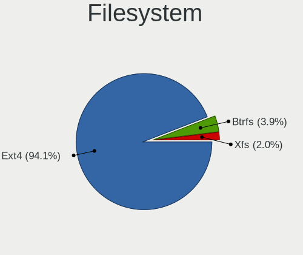

| Type  | Notebooks | Percent |
|-------|-----------|---------|
| Ext4  | 25        | 96.15%  |
| Btrfs | 1         | 3.85%   |

Part. scheme
------------

Scheme of partitioning

| Type    | Notebooks | Percent |
|---------|-----------|---------|
| Unknown | 26        | 100%    |

Dual Boot with Linux/BSD
------------------------

Hosting more than one Linux/BSD

| Dual boot | Notebooks | Percent |
|-----------|-----------|---------|
| No        | 26        | 100%    |

Dual Boot (Win)
---------------

Hosting Linux and Windows

| Dual boot | Notebooks | Percent |
|-----------|-----------|---------|
| No        | 26        | 100%    |

Board
-----

Vendor
------

Motherboard manufacturer

| Name                | Notebooks | Percent |
|---------------------|-----------|---------|
| Hewlett-Packard     | 8         | 30.77%  |
| ASUSTek Computer    | 5         | 19.23%  |
| HUAWEI              | 2         | 7.69%   |
| Dell                | 2         | 7.69%   |
| Apple               | 2         | 7.69%   |
| Toshiba             | 1         | 3.85%   |
| Sony                | 1         | 3.85%   |
| Samsung Electronics | 1         | 3.85%   |
| Lenovo              | 1         | 3.85%   |
| eMachines           | 1         | 3.85%   |
| AMI                 | 1         | 3.85%   |
| Acer                | 1         | 3.85%   |

Model
-----

Motherboard model

| Name                                | Notebooks | Percent |
|-------------------------------------|-----------|---------|
| Toshiba PORTEGE Z830                | 1         | 3.85%   |
| Sony VPCEB23FM                      | 1         | 3.85%   |
| Samsung Lumpy                       | 1         | 3.85%   |
| Lenovo ThinkPad T400 6474ES3        | 1         | 3.85%   |
| HUAWEI NBLK-WAX9X                   | 1         | 3.85%   |
| HUAWEI MACHD-WXX9                   | 1         | 3.85%   |
| HP ZBook 15                         | 1         | 3.85%   |
| HP Stream Laptop 14-cb1xxx          | 1         | 3.85%   |
| HP ProBook 6550b                    | 1         | 3.85%   |
| HP ProBook 4510s                    | 1         | 3.85%   |
| HP Pavilion 17                      | 1         | 3.85%   |
| HP ENVY 14                          | 1         | 3.85%   |
| HP EliteBook 8470p                  | 1         | 3.85%   |
| HP EliteBook 840 G7 Notebook PC     | 1         | 3.85%   |
| eMachines E525                      | 1         | 3.85%   |
| Dell XPS 13 9343                    | 1         | 3.85%   |
| Dell Inspiron 7720                  | 1         | 3.85%   |
| ASUS X550CA                         | 1         | 3.85%   |
| ASUS X202E                          | 1         | 3.85%   |
| ASUS VivoBook 15 ASUS Laptop X570UD | 1         | 3.85%   |
| ASUS UX310UQK                       | 1         | 3.85%   |
| ASUS K55A                           | 1         | 3.85%   |
| Apple MacBookPro8,2                 | 1         | 3.85%   |
| Apple MacBook4,1                    | 1         | 3.85%   |
| AMI Intel                           | 1         | 3.85%   |
| Acer Swift SF114-32                 | 1         | 3.85%   |

Model Family
------------

Motherboard model prefix

| Name              | Notebooks | Percent |
|-------------------|-----------|---------|
| HP ProBook        | 2         | 7.69%   |
| HP EliteBook      | 2         | 7.69%   |
| Toshiba PORTEGE   | 1         | 3.85%   |
| Sony VPCEB23FM    | 1         | 3.85%   |
| Samsung Lumpy     | 1         | 3.85%   |
| Lenovo ThinkPad   | 1         | 3.85%   |
| HUAWEI NBLK-WAX9X | 1         | 3.85%   |
| HUAWEI MACHD-WXX9 | 1         | 3.85%   |
| HP ZBook          | 1         | 3.85%   |
| HP Stream         | 1         | 3.85%   |
| HP Pavilion       | 1         | 3.85%   |
| HP ENVY           | 1         | 3.85%   |
| eMachines E525    | 1         | 3.85%   |
| Dell XPS          | 1         | 3.85%   |
| Dell Inspiron     | 1         | 3.85%   |
| ASUS X550CA       | 1         | 3.85%   |
| ASUS X202E        | 1         | 3.85%   |
| ASUS VivoBook     | 1         | 3.85%   |
| ASUS UX310UQK     | 1         | 3.85%   |
| ASUS K55A         | 1         | 3.85%   |
| Apple MacBookPro8 | 1         | 3.85%   |
| Apple MacBook4    | 1         | 3.85%   |
| AMI Intel         | 1         | 3.85%   |
| Acer Swift        | 1         | 3.85%   |

MFG Year
--------

Motherboard manufacture year

| Year | Notebooks | Percent |
|------|-----------|---------|
| 2013 | 4         | 15.38%  |
| 2012 | 4         | 15.38%  |
| 2019 | 3         | 11.54%  |
| 2021 | 2         | 7.69%   |
| 2018 | 2         | 7.69%   |
| 2011 | 2         | 7.69%   |
| 2010 | 2         | 7.69%   |
| 2009 | 2         | 7.69%   |
| 2008 | 2         | 7.69%   |
| 2020 | 1         | 3.85%   |
| 2016 | 1         | 3.85%   |
| 2015 | 1         | 3.85%   |

Form Factor
-----------

Physical design of the computer

| Name     | Notebooks | Percent |
|----------|-----------|---------|
| Notebook | 26        | 100%    |

Secure Boot
-----------

Enabled or disabled

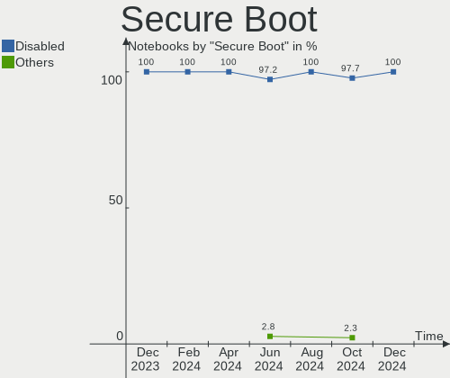

| State    | Notebooks | Percent |
|----------|-----------|---------|
| Disabled | 22        | 84.62%  |
| Enabled  | 4         | 15.38%  |

Coreboot
--------

Have coreboot on board

| Used | Notebooks | Percent |
|------|-----------|---------|
| No   | 25        | 96.15%  |
| Yes  | 1         | 3.85%   |

RAM Size
--------

Total RAM memory

| Size in GB | Notebooks | Percent |
|------------|-----------|---------|
| 3.01-4.0   | 11        | 42.31%  |
| 4.01-8.0   | 6         | 23.08%  |
| 16.01-24.0 | 4         | 15.38%  |
| 8.01-16.0  | 2         | 7.69%   |
| 32.01-64.0 | 1         | 3.85%   |
| 2.01-3.0   | 1         | 3.85%   |
| 1.01-2.0   | 1         | 3.85%   |

RAM Used
--------

Used RAM memory

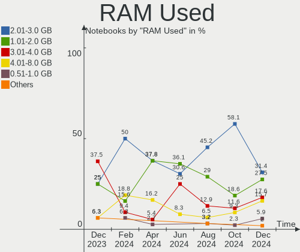

| Used GB  | Notebooks | Percent |
|----------|-----------|---------|
| 1.01-2.0 | 11        | 42.31%  |
| 2.01-3.0 | 10        | 38.46%  |
| 3.01-4.0 | 3         | 11.54%  |
| 4.01-8.0 | 1         | 3.85%   |
| 0.51-1.0 | 1         | 3.85%   |

Total Drives
------------

Number of drives on board

| Drives | Notebooks | Percent |
|--------|-----------|---------|
| 1      | 20        | 76.92%  |
| 2      | 6         | 23.08%  |

Has CD-ROM
----------

Has CD-ROM on board

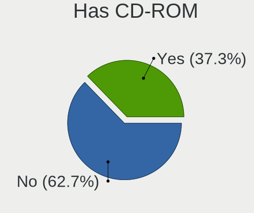

| Presented | Notebooks | Percent |
|-----------|-----------|---------|
| No        | 15        | 57.69%  |
| Yes       | 11        | 42.31%  |

Has Ethernet
------------

Has Ethernet on board

| Presented | Notebooks | Percent |
|-----------|-----------|---------|
| Yes       | 19        | 73.08%  |
| No        | 7         | 26.92%  |

Has WiFi
--------

Has WiFi module

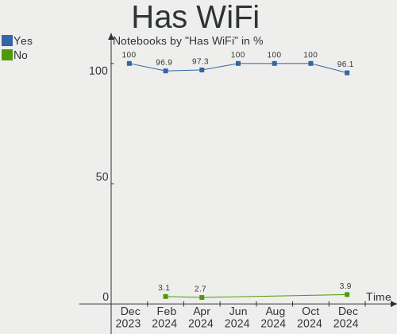

| Presented | Notebooks | Percent |
|-----------|-----------|---------|
| Yes       | 26        | 100%    |

Has Bluetooth
-------------

Has Bluetooth module

| Presented | Notebooks | Percent |
|-----------|-----------|---------|
| Yes       | 20        | 76.92%  |
| No        | 6         | 23.08%  |

Location
--------

Country
-------

Geographic location (country)

| Country     | Notebooks | Percent |
|-------------|-----------|---------|
| USA         | 5         | 19.23%  |
| Germany     | 3         | 11.54%  |
| France      | 3         | 11.54%  |
| Italy       | 2         | 7.69%   |
| Brazil      | 2         | 7.69%   |
| Spain       | 1         | 3.85%   |
| Senegal     | 1         | 3.85%   |
| Russia      | 1         | 3.85%   |
| Peru        | 1         | 3.85%   |
| Norway      | 1         | 3.85%   |
| New Zealand | 1         | 3.85%   |
| Mexico      | 1         | 3.85%   |
| Lithuania   | 1         | 3.85%   |
| Croatia     | 1         | 3.85%   |
| Canada      | 1         | 3.85%   |
| Argentina   | 1         | 3.85%   |

City
----

Geographic location (city)

| City                | Notebooks | Percent |
|---------------------|-----------|---------|
| Zagreb              | 1         | 3.85%   |
| Warrenton           | 1         | 3.85%   |
| Vilnius             | 1         | 3.85%   |
| Vernouillet         | 1         | 3.85%   |
| Vear                | 1         | 3.85%   |
| Toronto             | 1         | 3.85%   |
| Tauranga            | 1         | 3.85%   |
| Sao Paulo           | 1         | 3.85%   |
| Salvador            | 1         | 3.85%   |
| Río Cuarto         | 1         | 3.85%   |
| Parma               | 1         | 3.85%   |
| Moscow              | 1         | 3.85%   |
| Milan               | 1         | 3.85%   |
| Louisville          | 1         | 3.85%   |
| Lima                | 1         | 3.85%   |
| Gainesville         | 1         | 3.85%   |
| Frankfurt am Main   | 1         | 3.85%   |
| Decines-Charpieu    | 1         | 3.85%   |
| Dakar               | 1         | 3.85%   |
| Ciudad Lopez Mateos | 1         | 3.85%   |
| Chattanooga         | 1         | 3.85%   |
| Boadilla del Monte  | 1         | 3.85%   |
| Berlin              | 1         | 3.85%   |
| Amplepuis           | 1         | 3.85%   |
| Altlandsberg        | 1         | 3.85%   |
| Albany              | 1         | 3.85%   |

Drives
------

Drive Vendor
------------

Hard drive vendors

| Vendor              | Notebooks | Drives | Percent |
|---------------------|-----------|--------|---------|
| Seagate             | 6         | 6      | 19.35%  |
| WDC                 | 3         | 3      | 9.68%   |
| Unknown             | 3         | 4      | 9.68%   |
| Toshiba             | 3         | 3      | 9.68%   |
| Sandisk             | 2         | 2      | 6.45%   |
| OCZ                 | 2         | 2      | 6.45%   |
| Intel               | 2         | 2      | 6.45%   |
| TO Exter            | 1         | 1      | 3.23%   |
| SK Hynix            | 1         | 1      | 3.23%   |
| Samsung Electronics | 1         | 1      | 3.23%   |
| Micron Technology   | 1         | 1      | 3.23%   |
| Kingston            | 1         | 1      | 3.23%   |
| Kingchuxing         | 1         | 1      | 3.23%   |
| Hitachi             | 1         | 1      | 3.23%   |
| FORESEE             | 1         | 1      | 3.23%   |
| Crucial             | 1         | 1      | 3.23%   |
| A-DATA Technology   | 1         | 1      | 3.23%   |

Drive Model
-----------

Hard drive models

| Model                                 | Notebooks | Percent |
|---------------------------------------|-----------|---------|
| OCZ VERTEX3 120GB SSD                 | 2         | 6.25%   |
| WDC WDS500G2B0B 500GB SSD             | 1         | 3.13%   |
| WDC WD5000LPVX-22V0TT0 500GB          | 1         | 3.13%   |
| WDC WD10JPVX-22JC3T0 1TB              | 1         | 3.13%   |
| Unknown SD/MMC/MS PRO 999GB           | 1         | 3.13%   |
| Unknown MMC Card  64GB                | 1         | 3.13%   |
| Unknown MMC Card  32GB                | 1         | 3.13%   |
| Unknown MMC Card  16GB                | 1         | 3.13%   |
| Toshiba THNSNB128GMCJ 128GB SSD       | 1         | 3.13%   |
| Toshiba MK3263GSX 320GB               | 1         | 3.13%   |
| Toshiba KBG30ZMS128G 128GB NVMe SSD   | 1         | 3.13%   |
| TO Exter nal USB 3.0 320GB            | 1         | 3.13%   |
| SK Hynix HFS128G39TND-N210A 128GB SSD | 1         | 3.13%   |
| Seagate ST9750420AS 752GB             | 1         | 3.13%   |
| Seagate ST9250410AS 250GB             | 1         | 3.13%   |
| Seagate ST9120817AS 120GB             | 1         | 3.13%   |
| Seagate ST500LM012 HN-M500MBB 500GB   | 1         | 3.13%   |
| Seagate ST2000LX001-1RG174 2TB        | 1         | 3.13%   |
| Seagate ST1000LM035-1RK172 1TB        | 1         | 3.13%   |
| SanDisk SD9SN8W256G1002 256GB SSD     | 1         | 3.13%   |
| Sandisk NVMe SSD Drive 256GB          | 1         | 3.13%   |
| Samsung NVMe SSD Drive 1024GB         | 1         | 3.13%   |
| Micron 1100_MTFDDAV256TBN 256GB SSD   | 1         | 3.13%   |
| Kingston SA400S37480G 480GB SSD       | 1         | 3.13%   |
| Kingchuxing 64GB                      | 1         | 3.13%   |
| Intel SSDSC2BX200G4R 200GB            | 1         | 3.13%   |
| Intel SSDSA2CW160G3 160GB             | 1         | 3.13%   |
| Hitachi HTS723216L9SA60 160GB         | 1         | 3.13%   |
| FORESEE 256GB SSD                     | 1         | 3.13%   |
| Crucial M4-CT256M4SSD2 256GB          | 1         | 3.13%   |
| A-DATA SU650 120GB SSD                | 1         | 3.13%   |

HDD Vendor
----------

Hard disk drive vendors

| Vendor  | Notebooks | Drives | Percent |
|---------|-----------|--------|---------|
| Seagate | 6         | 6      | 54.55%  |
| WDC     | 2         | 2      | 18.18%  |
| Unknown | 1         | 1      | 9.09%   |
| Toshiba | 1         | 1      | 9.09%   |
| Hitachi | 1         | 1      | 9.09%   |

SSD Vendor
----------

Solid state drive vendors

| Vendor            | Notebooks | Drives | Percent |
|-------------------|-----------|--------|---------|
| OCZ               | 2         | 2      | 14.29%  |
| Intel             | 2         | 2      | 14.29%  |
| WDC               | 1         | 1      | 7.14%   |
| Toshiba           | 1         | 1      | 7.14%   |
| TO Exter          | 1         | 1      | 7.14%   |
| SK Hynix          | 1         | 1      | 7.14%   |
| SanDisk           | 1         | 1      | 7.14%   |
| Micron Technology | 1         | 1      | 7.14%   |
| Kingston          | 1         | 1      | 7.14%   |
| FORESEE           | 1         | 1      | 7.14%   |
| Crucial           | 1         | 1      | 7.14%   |
| A-DATA Technology | 1         | 1      | 7.14%   |

Drive Kind
----------

HDD or SSD

| Kind    | Notebooks | Drives | Percent |
|---------|-----------|--------|---------|
| SSD     | 14        | 14     | 43.75%  |
| HDD     | 11        | 11     | 34.38%  |
| MMC     | 3         | 3      | 9.38%   |
| NVMe    | 3         | 3      | 9.38%   |
| Unknown | 1         | 1      | 3.13%   |

Drive Connector
---------------

SATA, SAS, NVMe, etc.

| Type | Notebooks | Drives | Percent |
|------|-----------|--------|---------|
| SATA | 22        | 24     | 73.33%  |
| NVMe | 3         | 3      | 10%     |
| MMC  | 3         | 3      | 10%     |
| SAS  | 2         | 2      | 6.67%   |

Drive Size
----------

Size of hard drive

| Size in TB | Notebooks | Drives | Percent |
|------------|-----------|--------|---------|
| 0.01-0.5   | 19        | 20     | 79.17%  |
| 0.51-1.0   | 4         | 4      | 16.67%  |
| 1.01-2.0   | 1         | 1      | 4.17%   |

Space Total
-----------

Amount of disk space available on the file system

| Size in GB | Notebooks | Percent |
|------------|-----------|---------|
| 101-250    | 13        | 50%     |
| 251-500    | 5         | 19.23%  |
| 21-50      | 3         | 11.54%  |
| 501-1000   | 3         | 11.54%  |
| 1001-2000  | 1         | 3.85%   |
| 51-100     | 1         | 3.85%   |

Space Used
----------

Amount of used disk space

| Used GB  | Notebooks | Percent |
|----------|-----------|---------|
| 1-20     | 11        | 42.31%  |
| 21-50    | 9         | 34.62%  |
| 101-250  | 3         | 11.54%  |
| 251-500  | 1         | 3.85%   |
| 501-1000 | 1         | 3.85%   |
| 51-100   | 1         | 3.85%   |

Malfunc. Drives
---------------

Drive models with a malfunction

Zero info for selected period =(

Malfunc. Drive Vendor
---------------------

Vendors of faulty drives

Zero info for selected period =(

Malfunc. HDD Vendor
-------------------

Vendors of faulty HDD drives

Zero info for selected period =(

Malfunc. Drive Kind
-------------------

Kinds of faulty drives

Zero info for selected period =(

Failed Drives
-------------

Failed drive models

Zero info for selected period =(

Failed Drive Vendor
-------------------

Failed drive vendors

Zero info for selected period =(

Drive Status
------------

Number of failed and malfunc. drives

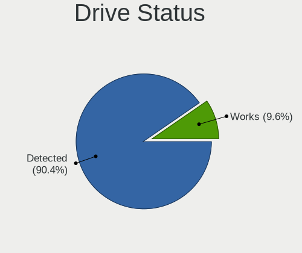

| Status   | Notebooks | Drives | Percent |
|----------|-----------|--------|---------|
| Detected | 26        | 32     | 100%    |

Storage controller
------------------

Storage Vendor
--------------

Storage controller vendors

| Vendor                       | Notebooks | Percent |
|------------------------------|-----------|---------|
| Intel                        | 22        | 88%     |
| Toshiba America Info Systems | 1         | 4%      |
| Sandisk                      | 1         | 4%      |
| Samsung Electronics          | 1         | 4%      |

Storage Model
-------------

Storage controller models

| Model                                                                          | Notebooks | Percent |
|--------------------------------------------------------------------------------|-----------|---------|
| Intel 7 Series Chipset Family 6-port SATA Controller [AHCI mode]               | 4         | 14.81%  |
| Intel 82801IBM/IEM (ICH9M/ICH9M-E) 4 port SATA Controller [AHCI mode]          | 3         | 11.11%  |
| Intel 6 Series/C200 Series Chipset Family 6 port Mobile SATA AHCI Controller   | 3         | 11.11%  |
| Intel Celeron/Pentium Silver Processor SATA Controller                         | 2         | 7.41%   |
| Intel 5 Series/3400 Series Chipset 4 port SATA AHCI Controller                 | 2         | 7.41%   |
| Toshiba America Info Systems XG6 NVMe SSD Controller                           | 1         | 3.7%    |
| Sandisk WD Blue SN550 NVMe SSD                                                 | 1         | 3.7%    |
| Samsung NVMe SSD Controller SM981/PM981/PM983                                  | 1         | 3.7%    |
| Intel Wildcat Point-LP SATA Controller [AHCI Mode]                             | 1         | 3.7%    |
| Intel Sunrise Point-LP SATA Controller [AHCI mode]                             | 1         | 3.7%    |
| Intel 82801HM/HEM (ICH8M/ICH8M-E) SATA Controller [AHCI mode]                  | 1         | 3.7%    |
| Intel 82801HM/HEM (ICH8M/ICH8M-E) IDE Controller                               | 1         | 3.7%    |
| Intel 82801 Mobile SATA Controller [RAID mode]                                 | 1         | 3.7%    |
| Intel 8 Series/C220 Series Chipset Family 6-port SATA Controller 1 [AHCI mode] | 1         | 3.7%    |
| Intel 8 Series SATA Controller 1 [AHCI mode]                                   | 1         | 3.7%    |
| Intel 7 Series Chipset Family 4-port SATA Controller [IDE mode]                | 1         | 3.7%    |
| Intel 7 Series Chipset Family 2-port SATA Controller [IDE mode]                | 1         | 3.7%    |
| Intel 5 Series/3400 Series Chipset 6 port SATA AHCI Controller                 | 1         | 3.7%    |

Storage Kind
------------

Kind of storage controller (IDE, SATA, NVMe, SAS, ...)

| Kind | Notebooks | Percent |
|------|-----------|---------|
| SATA | 20        | 76.92%  |
| NVMe | 3         | 11.54%  |
| IDE  | 2         | 7.69%   |
| RAID | 1         | 3.85%   |

Processor
---------

CPU Vendor
----------

Processor vendors

| Vendor | Notebooks | Percent |
|--------|-----------|---------|
| Intel  | 25        | 96.15%  |
| AMD    | 1         | 3.85%   |

CPU Model
---------

Processor models

| Model                                         | Notebooks | Percent |
|-----------------------------------------------|-----------|---------|
| Intel Core i5 CPU M 460 @ 2.53GHz             | 2         | 7.69%   |
| Intel Pentium Silver N5000 CPU @ 1.10GHz      | 1         | 3.85%   |
| Intel Pentium Dual CPU T3400 @ 2.16GHz        | 1         | 3.85%   |
| Intel Core i7-8550U CPU @ 1.80GHz             | 1         | 3.85%   |
| Intel Core i7-7500U CPU @ 2.70GHz             | 1         | 3.85%   |
| Intel Core i7-4700MQ CPU @ 2.40GHz            | 1         | 3.85%   |
| Intel Core i7-3610QM CPU @ 2.30GHz            | 1         | 3.85%   |
| Intel Core i7-2635QM CPU @ 2.00GHz            | 1         | 3.85%   |
| Intel Core i5-5200U CPU @ 2.20GHz             | 1         | 3.85%   |
| Intel Core i5-3340M CPU @ 2.70GHz             | 1         | 3.85%   |
| Intel Core i5-3337U CPU @ 1.80GHz             | 1         | 3.85%   |
| Intel Core i5-3210M CPU @ 2.50GHz             | 1         | 3.85%   |
| Intel Core i5-2467M CPU @ 1.60GHz             | 1         | 3.85%   |
| Intel Core i5-10210U CPU @ 1.60GHz            | 1         | 3.85%   |
| Intel Core i5 CPU M 520 @ 2.40GHz             | 1         | 3.85%   |
| Intel Core i3-4030U CPU @ 1.90GHz             | 1         | 3.85%   |
| Intel Core i3-3217U CPU @ 1.80GHz             | 1         | 3.85%   |
| Intel Core 2 Duo CPU T8300 @ 2.40GHz          | 1         | 3.85%   |
| Intel Core 2 Duo CPU P8600 @ 2.40GHz          | 1         | 3.85%   |
| Intel Celeron N4120 CPU @ 1.10GHz             | 1         | 3.85%   |
| Intel Celeron N4020 CPU @ 1.10GHz             | 1         | 3.85%   |
| Intel Celeron Dual-Core CPU T3000 @ 1.80GHz   | 1         | 3.85%   |
| Intel Celeron CPU 867 @ 1.30GHz               | 1         | 3.85%   |
| Intel 11th Gen Core i7-1165G7 @ 2.80GHz       | 1         | 3.85%   |
| AMD Ryzen 5 3500U with Radeon Vega Mobile Gfx | 1         | 3.85%   |

CPU Model Family
----------------

Processor model prefix

| Model                   | Notebooks | Percent |
|-------------------------|-----------|---------|
| Intel Core i5           | 9         | 34.62%  |
| Intel Core i7           | 5         | 19.23%  |
| Intel Celeron           | 3         | 11.54%  |
| Intel Core i3           | 2         | 7.69%   |
| Intel Core 2 Duo        | 2         | 7.69%   |
| Other                   | 1         | 3.85%   |
| Intel Pentium Silver    | 1         | 3.85%   |
| Intel Pentium Dual      | 1         | 3.85%   |
| Intel Celeron Dual-Core | 1         | 3.85%   |
| AMD Ryzen 5             | 1         | 3.85%   |

CPU Cores
---------

Number of processor cores

| Number | Notebooks | Percent |
|--------|-----------|---------|
| 2      | 17        | 65.38%  |
| 4      | 9         | 34.62%  |

CPU Sockets
-----------

Number of sockets

| Number | Notebooks | Percent |
|--------|-----------|---------|
| 1      | 26        | 100%    |

CPU Threads
-----------

Threads per core (Hyper-Threading)

| Number | Notebooks | Percent |
|--------|-----------|---------|
| 2      | 18        | 69.23%  |
| 1      | 8         | 30.77%  |

CPU Op-Modes
------------

CPU Operation Modes (32-bit, 64-bit)

| Op mode        | Notebooks | Percent |
|----------------|-----------|---------|
| 32-bit, 64-bit | 26        | 100%    |

CPU Microcode
-------------

Microcode number

| Number     | Notebooks | Percent |
|------------|-----------|---------|
| 0x306a9    | 5         | 19.23%  |
| 0x206a7    | 3         | 11.54%  |
| 0x706a8    | 2         | 7.69%   |
| 0x20655    | 2         | 7.69%   |
| 0x1067a    | 2         | 7.69%   |
| 0x806ec    | 1         | 3.85%   |
| 0x806ea    | 1         | 3.85%   |
| 0x806e9    | 1         | 3.85%   |
| 0x806c1    | 1         | 3.85%   |
| 0x706a1    | 1         | 3.85%   |
| 0x6fd      | 1         | 3.85%   |
| 0x40651    | 1         | 3.85%   |
| 0x306d4    | 1         | 3.85%   |
| 0x306c3    | 1         | 3.85%   |
| 0x20652    | 1         | 3.85%   |
| 0x10676    | 1         | 3.85%   |
| 0x08108109 | 1         | 3.85%   |

CPU Microarch
-------------

Microarchitecture

| Name          | Notebooks | Percent |
|---------------|-----------|---------|
| IvyBridge     | 5         | 19.23%  |
| Westmere      | 3         | 11.54%  |
| SandyBridge   | 3         | 11.54%  |
| Penryn        | 3         | 11.54%  |
| KabyLake      | 3         | 11.54%  |
| Goldmont plus | 3         | 11.54%  |
| Haswell       | 2         | 7.69%   |
| Zen+          | 1         | 3.85%   |
| TigerLake     | 1         | 3.85%   |
| Core          | 1         | 3.85%   |
| Broadwell     | 1         | 3.85%   |

Graphics
--------

GPU Vendor
----------

Vendors of graphics cards

| Vendor | Notebooks | Percent |
|--------|-----------|---------|
| Intel  | 23        | 74.19%  |
| Nvidia | 4         | 12.9%   |
| AMD    | 4         | 12.9%   |

GPU Model
---------

Graphics card models

| Model                                                                     | Notebooks | Percent |
|---------------------------------------------------------------------------|-----------|---------|
| Intel 3rd Gen Core processor Graphics Controller                          | 4         | 12.5%   |
| Intel Mobile 4 Series Chipset Integrated Graphics Controller              | 3         | 9.38%   |
| Intel Core Processor Integrated Graphics Controller                       | 3         | 9.38%   |
| Intel 2nd Generation Core Processor Family Integrated Graphics Controller | 3         | 9.38%   |
| Intel GeminiLake [UHD Graphics 600]                                       | 2         | 6.25%   |
| Nvidia GP107M [GeForce GTX 1050 Mobile]                                   | 1         | 3.13%   |
| Nvidia GM108M [GeForce 940MX]                                             | 1         | 3.13%   |
| Nvidia GK208GLM [Quadro K610M]                                            | 1         | 3.13%   |
| Nvidia GK107M [GeForce GT 650M]                                           | 1         | 3.13%   |
| Intel UHD Graphics 620                                                    | 1         | 3.13%   |
| Intel TigerLake-LP GT2 [Iris Xe Graphics]                                 | 1         | 3.13%   |
| Intel Mobile GM965/GL960 Integrated Graphics Controller (secondary)       | 1         | 3.13%   |
| Intel Mobile GM965/GL960 Integrated Graphics Controller (primary)         | 1         | 3.13%   |
| Intel HD Graphics 620                                                     | 1         | 3.13%   |
| Intel HD Graphics 5500                                                    | 1         | 3.13%   |
| Intel Haswell-ULT Integrated Graphics Controller                          | 1         | 3.13%   |
| Intel GeminiLake [UHD Graphics 605]                                       | 1         | 3.13%   |
| Intel CometLake-U GT2 [UHD Graphics]                                      | 1         | 3.13%   |
| AMD Thames [Radeon HD 7550M/7570M/7650M]                                  | 1         | 3.13%   |
| AMD Seymour [Radeon HD 6400M/7400M Series]                                | 1         | 3.13%   |
| AMD Picasso/Raven 2 [Radeon Vega Series / Radeon Vega Mobile Series]      | 1         | 3.13%   |
| AMD Madison [Mobility Radeon HD 5650/5750 / 6530M/6550M]                  | 1         | 3.13%   |

GPU Combo
---------

Combinations of graphics cards

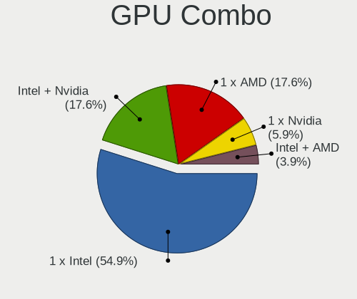

| Name           | Notebooks | Percent |
|----------------|-----------|---------|
| 1 x Intel      | 18        | 69.23%  |
| Intel + Nvidia | 3         | 11.54%  |
| Intel + AMD    | 2         | 7.69%   |
| 1 x AMD        | 2         | 7.69%   |
| 1 x Nvidia     | 1         | 3.85%   |

GPU Driver
----------

Free vs proprietary

| Driver      | Notebooks | Percent |
|-------------|-----------|---------|
| Free        | 23        | 88.46%  |
| Proprietary | 3         | 11.54%  |

GPU Memory
----------

Total video memory

| Size in GB | Notebooks | Percent |
|------------|-----------|---------|
| Unknown    | 19        | 73.08%  |
| 0.51-1.0   | 4         | 15.38%  |
| 3.01-4.0   | 1         | 3.85%   |
| 1.01-2.0   | 1         | 3.85%   |
| 0.01-0.5   | 1         | 3.85%   |

Monitor
-------

Monitor Vendor
--------------

Monitor vendors

| Vendor              | Notebooks | Percent |
|---------------------|-----------|---------|
| AU Optronics        | 6         | 23.08%  |
| LG Display          | 4         | 15.38%  |
| Samsung Electronics | 3         | 11.54%  |
| Chimei Innolux      | 3         | 11.54%  |
| Apple               | 2         | 7.69%   |
| Sharp               | 1         | 3.85%   |
| Lenovo              | 1         | 3.85%   |
| InfoVision          | 1         | 3.85%   |
| HJC                 | 1         | 3.85%   |
| CSO                 | 1         | 3.85%   |
| BOE                 | 1         | 3.85%   |
| AOC                 | 1         | 3.85%   |
| Unknown             | 1         | 3.85%   |

Monitor Model
-------------

Monitor models

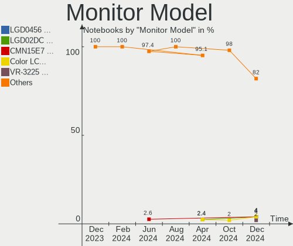

| Model                                                                | Notebooks | Percent |
|----------------------------------------------------------------------|-----------|---------|
| Samsung Electronics LCD Monitor SEC3551 1366x768 344x194mm 15.5-inch | 2         | 7.41%   |
| Sharp LCD Monitor SHP1420 1920x1080 294x165mm 13.3-inch              | 1         | 3.7%    |
| Samsung Electronics SyncMaster SAM00C8 1280x1024 338x270mm 17.0-inch | 1         | 3.7%    |
| Samsung Electronics LCD Monitor SEC3142 1280x800 261x163mm 12.1-inch | 1         | 3.7%    |
| LG Display LP156WH1-TLA3 LGD01C2 1366x768 344x194mm 15.5-inch        | 1         | 3.7%    |
| LG Display LCD Monitor LGD03DB 1366x768 345x194mm 15.6-inch          | 1         | 3.7%    |
| LG Display LCD Monitor LGD038E 1366x768 344x194mm 15.5-inch          | 1         | 3.7%    |
| LG Display LCD Monitor LGD02B6 1366x768 321x181mm 14.5-inch          | 1         | 3.7%    |
| Lenovo LCD Monitor LEN4033 1440x900 303x190mm 14.1-inch              | 1         | 3.7%    |
| InfoVision LCD Monitor IVO8C78 1920x1080 309x174mm 14.0-inch         | 1         | 3.7%    |
| HJC LCD Monitor HJC003D 1920x1080 309x174mm 14.0-inch                | 1         | 3.7%    |
| CSO LCD Monitor CSO1309 3000x2000 293x195mm 13.9-inch                | 1         | 3.7%    |
| Chimei Innolux LCD Monitor CMN1720 1920x1080 382x215mm 17.3-inch     | 1         | 3.7%    |
| Chimei Innolux LCD Monitor CMN14D4 1920x1080 309x173mm 13.9-inch     | 1         | 3.7%    |
| Chimei Innolux LCD Monitor CMN14C4 1366x768 309x173mm 13.9-inch      | 1         | 3.7%    |
| BOE LCD Monitor BOE0877 1920x1080 309x173mm 13.9-inch                | 1         | 3.7%    |
| AU Optronics LCD Monitor AUO61ED 1920x1080 344x194mm 15.5-inch       | 1         | 3.7%    |
| AU Optronics LCD Monitor AUO313C 1366x768 309x173mm 13.9-inch        | 1         | 3.7%    |
| AU Optronics LCD Monitor AUO305C 1366x768 256x144mm 11.6-inch        | 1         | 3.7%    |
| AU Optronics LCD Monitor AUO272D 1920x1080 293x165mm 13.2-inch       | 1         | 3.7%    |
| AU Optronics LCD Monitor AUO159E 1600x900 382x214mm 17.2-inch        | 1         | 3.7%    |
| AU Optronics LCD Monitor 3840x1080                                   | 1         | 3.7%    |
| Apple LCD Monitor APP9CA3 1440x900 331x207mm 15.4-inch               | 1         | 3.7%    |
| Apple LCD Monitor APP9C5F 1280x800 286x179mm 13.3-inch               | 1         | 3.7%    |
| AOC 24B2W1G5 AOC2402 1920x1080 527x296mm 23.8-inch                   | 1         | 3.7%    |
| Unknown                                                              | 1         | 3.7%    |

Monitor Resolution
------------------

Monitor screen resolution

| Resolution       | Notebooks | Percent |
|------------------|-----------|---------|
| 1366x768 (WXGA)  | 10        | 38.46%  |
| 1920x1080 (FHD)  | 8         | 30.77%  |
| 1440x900 (WXGA+) | 2         | 7.69%   |
| 3840x1080        | 1         | 3.85%   |
| 3000x2000        | 1         | 3.85%   |
| 1600x900 (HD+)   | 1         | 3.85%   |
| 1280x800 (WXGA)  | 1         | 3.85%   |
| 1280x1024 (SXGA) | 1         | 3.85%   |
| Unknown          | 1         | 3.85%   |

Monitor Diagonal
----------------

Diagonal size in inches

| Inches  | Notebooks | Percent |
|---------|-----------|---------|
| 13      | 8         | 30.77%  |
| 15      | 7         | 26.92%  |
| 14      | 5         | 19.23%  |
| 17      | 3         | 11.54%  |
| 23      | 1         | 3.85%   |
| 11      | 1         | 3.85%   |
| Unknown | 1         | 3.85%   |

Monitor Width
-------------

Physical width

| Width in mm | Notebooks | Percent |
|-------------|-----------|---------|
| 301-350     | 16        | 64%     |
| 201-300     | 5         | 20%     |
| 351-400     | 2         | 8%      |
| 501-600     | 1         | 4%      |
| Unknown     | 1         | 4%      |

Aspect Ratio
------------

Proportional relationship between the width and the height

| Ratio   | Notebooks | Percent |
|---------|-----------|---------|
| 16/9    | 19        | 76%     |
| 16/10   | 3         | 12%     |
| 5/4     | 1         | 4%      |
| 3/2     | 1         | 4%      |
| Unknown | 1         | 4%      |

Monitor Area
------------

Area in inch²

| Area in inch² | Notebooks | Percent |
|----------------|-----------|---------|
| 81-90          | 11        | 42.31%  |
| 101-110        | 7         | 26.92%  |
| 71-80          | 2         | 7.69%   |
| 121-130        | 2         | 7.69%   |
| 51-60          | 1         | 3.85%   |
| 201-250        | 1         | 3.85%   |
| 141-150        | 1         | 3.85%   |
| Unknown        | 1         | 3.85%   |

Pixel Density
-------------

Pixels per inch

| Density       | Notebooks | Percent |
|---------------|-----------|---------|
| 101-120       | 11        | 42.31%  |
| 121-160       | 8         | 30.77%  |
| 51-100        | 3         | 11.54%  |
| 161-240       | 2         | 7.69%   |
| More than 240 | 1         | 3.85%   |
| Unknown       | 1         | 3.85%   |

Multiple Monitors
-----------------

Total monitors connected

| Total | Notebooks | Percent |
|-------|-----------|---------|
| 1     | 23        | 88.46%  |
| 2     | 3         | 11.54%  |

Network
-------

Net Controller Vendor
---------------------

Controller vendors

| Vendor                   | Notebooks | Percent |
|--------------------------|-----------|---------|
| Intel                    | 14        | 35%     |
| Realtek Semiconductor    | 9         | 22.5%   |
| Qualcomm Atheros         | 7         | 17.5%   |
| Broadcom                 | 5         | 12.5%   |
| Marvell Technology Group | 3         | 7.5%    |
| D-Link                   | 1         | 2.5%    |
| ASIX Electronics         | 1         | 2.5%    |

Net Controller Model
--------------------

Controller models

| Model                                                                                 | Notebooks | Percent |
|---------------------------------------------------------------------------------------|-----------|---------|
| Realtek RTL8111/8168/8411 PCI Express Gigabit Ethernet Controller                     | 5         | 10.87%  |
| Qualcomm Atheros AR9485 Wireless Network Adapter                                      | 3         | 6.52%   |
| Intel Centrino Advanced-N 6200                                                        | 3         | 6.52%   |
| Realtek RTL8822CE 802.11ac PCIe Wireless Network Adapter                              | 2         | 4.35%   |
| Realtek RTL810xE PCI Express Fast Ethernet controller                                 | 2         | 4.35%   |
| Intel Wireless 8260                                                                   | 2         | 4.35%   |
| Intel Gemini Lake PCH CNVi WiFi                                                       | 2         | 4.35%   |
| Realtek RTL8822BE 802.11a/b/g/n/ac WiFi adapter                                       | 1         | 2.17%   |
| Qualcomm Atheros AR93xx Wireless Network Adapter                                      | 1         | 2.17%   |
| Qualcomm Atheros AR9285 Wireless Network Adapter (PCI-Express)                        | 1         | 2.17%   |
| Qualcomm Atheros AR8162 Fast Ethernet                                                 | 1         | 2.17%   |
| Qualcomm Atheros AR8132 Fast Ethernet                                                 | 1         | 2.17%   |
| Qualcomm Atheros AR5418 Wireless Network Adapter [AR5008E 802.11(a)bgn] (PCI-Express) | 1         | 2.17%   |
| Marvell Group Yukon Optima 88E8059 [PCIe Gigabit Ethernet Controller with AVB]        | 1         | 2.17%   |
| Marvell Group 88E8072 PCI-E Gigabit Ethernet Controller                               | 1         | 2.17%   |
| Marvell Group 88E8058 PCI-E Gigabit Ethernet Controller                               | 1         | 2.17%   |
| Intel Wi-Fi 6 AX201                                                                   | 1         | 2.17%   |
| Intel PRO/Wireless 5100 AGN [Shiloh] Network Connection                               | 1         | 2.17%   |
| Intel Ethernet Connection I217-LM                                                     | 1         | 2.17%   |
| Intel Comet Lake PCH-LP CNVi WiFi                                                     | 1         | 2.17%   |
| Intel Centrino Wireless-N 2230                                                        | 1         | 2.17%   |
| Intel Centrino Advanced-N 6235                                                        | 1         | 2.17%   |
| Intel 82579V Gigabit Network Connection                                               | 1         | 2.17%   |
| Intel 82579LM Gigabit Network Connection (Lewisville)                                 | 1         | 2.17%   |
| Intel 82577LC Gigabit Network Connection                                              | 1         | 2.17%   |
| Intel 82567LM Gigabit Network Connection                                              | 1         | 2.17%   |
| D-Link 802.11 n WLAN                                                                  | 1         | 2.17%   |
| Broadcom NetXtreme BCM57765 Gigabit Ethernet PCIe                                     | 1         | 2.17%   |
| Broadcom BCM4331 802.11a/b/g/n                                                        | 1         | 2.17%   |
| Broadcom BCM43228 802.11a/b/g/n                                                       | 1         | 2.17%   |
| Broadcom BCM4321 802.11a/b/g/n                                                        | 1         | 2.17%   |
| Broadcom BCM43142 802.11b/g/n                                                         | 1         | 2.17%   |
| Broadcom BCM4312 802.11b/g LP-PHY                                                     | 1         | 2.17%   |
| ASIX AX88179 Gigabit Ethernet                                                         | 1         | 2.17%   |

Wireless Vendor
---------------

Wireless vendors

| Vendor                | Notebooks | Percent |
|-----------------------|-----------|---------|
| Intel                 | 12        | 44.44%  |
| Qualcomm Atheros      | 6         | 22.22%  |
| Broadcom              | 5         | 18.52%  |
| Realtek Semiconductor | 3         | 11.11%  |
| D-Link                | 1         | 3.7%    |

Wireless Model
--------------

Wireless models

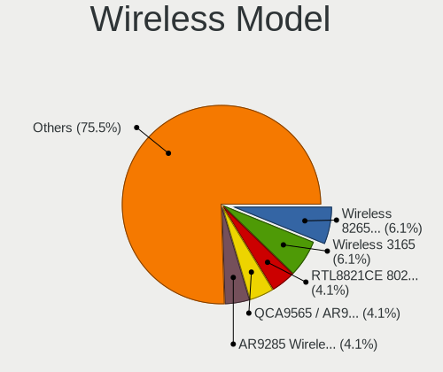

| Model                                                                                 | Notebooks | Percent |
|---------------------------------------------------------------------------------------|-----------|---------|
| Qualcomm Atheros AR9485 Wireless Network Adapter                                      | 3         | 11.11%  |
| Intel Centrino Advanced-N 6200                                                        | 3         | 11.11%  |
| Realtek RTL8822CE 802.11ac PCIe Wireless Network Adapter                              | 2         | 7.41%   |
| Intel Wireless 8260                                                                   | 2         | 7.41%   |
| Intel Gemini Lake PCH CNVi WiFi                                                       | 2         | 7.41%   |
| Realtek RTL8822BE 802.11a/b/g/n/ac WiFi adapter                                       | 1         | 3.7%    |
| Qualcomm Atheros AR93xx Wireless Network Adapter                                      | 1         | 3.7%    |
| Qualcomm Atheros AR9285 Wireless Network Adapter (PCI-Express)                        | 1         | 3.7%    |
| Qualcomm Atheros AR5418 Wireless Network Adapter [AR5008E 802.11(a)bgn] (PCI-Express) | 1         | 3.7%    |
| Intel Wi-Fi 6 AX201                                                                   | 1         | 3.7%    |
| Intel PRO/Wireless 5100 AGN [Shiloh] Network Connection                               | 1         | 3.7%    |
| Intel Comet Lake PCH-LP CNVi WiFi                                                     | 1         | 3.7%    |
| Intel Centrino Wireless-N 2230                                                        | 1         | 3.7%    |
| Intel Centrino Advanced-N 6235                                                        | 1         | 3.7%    |
| D-Link 802.11 n WLAN                                                                  | 1         | 3.7%    |
| Broadcom BCM4331 802.11a/b/g/n                                                        | 1         | 3.7%    |
| Broadcom BCM43228 802.11a/b/g/n                                                       | 1         | 3.7%    |
| Broadcom BCM4321 802.11a/b/g/n                                                        | 1         | 3.7%    |
| Broadcom BCM43142 802.11b/g/n                                                         | 1         | 3.7%    |
| Broadcom BCM4312 802.11b/g LP-PHY                                                     | 1         | 3.7%    |

Ethernet Vendor
---------------

Ethernet vendors

| Vendor                   | Notebooks | Percent |
|--------------------------|-----------|---------|
| Realtek Semiconductor    | 7         | 36.84%  |
| Intel                    | 5         | 26.32%  |
| Marvell Technology Group | 3         | 15.79%  |
| Qualcomm Atheros         | 2         | 10.53%  |
| Broadcom                 | 1         | 5.26%   |
| ASIX Electronics         | 1         | 5.26%   |

Ethernet Model
--------------

Ethernet models

| Model                                                                          | Notebooks | Percent |
|--------------------------------------------------------------------------------|-----------|---------|
| Realtek RTL8111/8168/8411 PCI Express Gigabit Ethernet Controller              | 5         | 26.32%  |
| Realtek RTL810xE PCI Express Fast Ethernet controller                          | 2         | 10.53%  |
| Qualcomm Atheros AR8162 Fast Ethernet                                          | 1         | 5.26%   |
| Qualcomm Atheros AR8132 Fast Ethernet                                          | 1         | 5.26%   |
| Marvell Group Yukon Optima 88E8059 [PCIe Gigabit Ethernet Controller with AVB] | 1         | 5.26%   |
| Marvell Group 88E8072 PCI-E Gigabit Ethernet Controller                        | 1         | 5.26%   |
| Marvell Group 88E8058 PCI-E Gigabit Ethernet Controller                        | 1         | 5.26%   |
| Intel Ethernet Connection I217-LM                                              | 1         | 5.26%   |
| Intel 82579V Gigabit Network Connection                                        | 1         | 5.26%   |
| Intel 82579LM Gigabit Network Connection (Lewisville)                          | 1         | 5.26%   |
| Intel 82577LC Gigabit Network Connection                                       | 1         | 5.26%   |
| Intel 82567LM Gigabit Network Connection                                       | 1         | 5.26%   |
| Broadcom NetXtreme BCM57765 Gigabit Ethernet PCIe                              | 1         | 5.26%   |
| ASIX AX88179 Gigabit Ethernet                                                  | 1         | 5.26%   |

Net Controller Kind
-------------------

Ethernet, WiFi or modem

| Kind     | Notebooks | Percent |
|----------|-----------|---------|
| WiFi     | 26        | 57.78%  |
| Ethernet | 19        | 42.22%  |

Used Controller
---------------

Currently used network controller

| Kind     | Notebooks | Percent |
|----------|-----------|---------|
| WiFi     | 23        | 85.19%  |
| Ethernet | 4         | 14.81%  |

NICs
----

Total network controllers on board

| Total | Notebooks | Percent |
|-------|-----------|---------|
| 2     | 18        | 69.23%  |
| 1     | 8         | 30.77%  |

IPv6
----

IPv6 vs IPv4

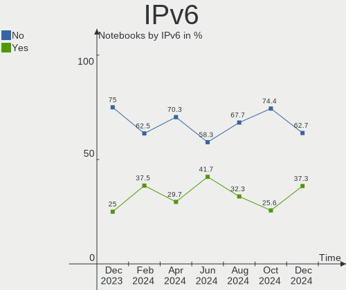

| Used | Notebooks | Percent |
|------|-----------|---------|
| No   | 20        | 76.92%  |
| Yes  | 6         | 23.08%  |

Bluetooth
---------

Bluetooth Vendor
----------------

Controller vendors

| Vendor                          | Notebooks | Percent |
|---------------------------------|-----------|---------|
| Intel                           | 8         | 40%     |
| Broadcom                        | 3         | 15%     |
| IMC Networks                    | 2         | 10%     |
| Hewlett-Packard                 | 2         | 10%     |
| Realtek Semiconductor           | 1         | 5%      |
| Realtek                         | 1         | 5%      |
| Qualcomm Atheros Communications | 1         | 5%      |
| Lite-On Technology              | 1         | 5%      |
| Apple                           | 1         | 5%      |

Bluetooth Model
---------------

Controller models

| Model                                              | Notebooks | Percent |
|----------------------------------------------------|-----------|---------|
| Intel Centrino Bluetooth Wireless Transceiver      | 2         | 10%     |
| Intel Bluetooth wireless interface                 | 2         | 10%     |
| Intel Bluetooth 9460/9560 Jefferson Peak (JfP)     | 2         | 10%     |
| Intel AX201 Bluetooth                              | 2         | 10%     |
| HP Broadcom 2070 Bluetooth Combo                   | 2         | 10%     |
| Realtek 802.11ac WLAN Adapter                      | 1         | 5%      |
| Realtek Bluetooth Radio                            | 1         | 5%      |
| Qualcomm Atheros AR3011 Bluetooth                  | 1         | 5%      |
| Lite-On Atheros Bluetooth                          | 1         | 5%      |
| IMC Networks Bluetooth Radio                       | 1         | 5%      |
| IMC Networks Atheros AR3012 Bluetooth 4.0 Adapter  | 1         | 5%      |
| Broadcom HP Portable SoftSailing                   | 1         | 5%      |
| Broadcom BCM43142A0 Bluetooth Device               | 1         | 5%      |
| Broadcom BCM2045B (BDC-2.1) [Bluetooth Controller] | 1         | 5%      |
| Apple Bluetooth Host Controller                    | 1         | 5%      |

Sound
-----

Sound Vendor
------------

Sound card vendors

| Vendor | Notebooks | Percent |
|--------|-----------|---------|
| Intel  | 25        | 83.33%  |
| AMD    | 4         | 13.33%  |
| Nvidia | 1         | 3.33%   |

Sound Model
-----------

Sound card models

| Model                                                                             | Notebooks | Percent |
|-----------------------------------------------------------------------------------|-----------|---------|
| Intel 7 Series/C216 Chipset Family High Definition Audio Controller               | 5         | 15.15%  |
| Intel Celeron/Pentium Silver Processor High Definition Audio                      | 3         | 9.09%   |
| Intel 82801I (ICH9 Family) HD Audio Controller                                    | 3         | 9.09%   |
| Intel 6 Series/C200 Series Chipset Family High Definition Audio Controller        | 3         | 9.09%   |
| Intel 5 Series/3400 Series Chipset High Definition Audio                          | 3         | 9.09%   |
| Intel Sunrise Point-LP HD Audio                                                   | 2         | 6.06%   |
| Nvidia GK208 HDMI/DP Audio Controller                                             | 1         | 3.03%   |
| Intel Wildcat Point-LP High Definition Audio Controller                           | 1         | 3.03%   |
| Intel Tiger Lake-LP Smart Sound Technology Audio Controller                       | 1         | 3.03%   |
| Intel Haswell-ULT HD Audio Controller                                             | 1         | 3.03%   |
| Intel Comet Lake PCH-LP cAVS                                                      | 1         | 3.03%   |
| Intel Broadwell-U Audio Controller                                                | 1         | 3.03%   |
| Intel 82801H (ICH8 Family) HD Audio Controller                                    | 1         | 3.03%   |
| Intel 8 Series/C220 Series Chipset High Definition Audio Controller               | 1         | 3.03%   |
| Intel 8 Series HD Audio Controller                                                | 1         | 3.03%   |
| AMD Turks HDMI Audio [Radeon HD 6500/6600 / 6700M Series]                         | 1         | 3.03%   |
| AMD Redwood HDMI Audio [Radeon HD 5000 Series]                                    | 1         | 3.03%   |
| AMD Raven/Raven2/Fenghuang HDMI/DP Audio Controller                               | 1         | 3.03%   |
| AMD Family 17h/19h HD Audio Controller                                            | 1         | 3.03%   |
| AMD Caicos HDMI Audio [Radeon HD 6450 / 7450/8450/8490 OEM / R5 230/235/235X OEM] | 1         | 3.03%   |

Memory
------

Memory Vendor
-------------

Memory module vendors

| Vendor | Notebooks | Percent |
|--------|-----------|---------|
| PNY    | 1         | 100%    |

Memory Model
------------

Memory module models

| Model                                   | Notebooks | Percent |
|-----------------------------------------|-----------|---------|
| PNY RAM Module 4GB SODIMM DDR3 1333MT/s | 1         | 100%    |

Memory Kind
-----------

Memory module kinds

| Kind | Notebooks | Percent |
|------|-----------|---------|
| DDR3 | 1         | 100%    |

Memory Form Factor
------------------

Physical design of the memory module

| Name   | Notebooks | Percent |
|--------|-----------|---------|
| SODIMM | 1         | 100%    |

Memory Size
-----------

Memory module size

| Size | Notebooks | Percent |
|------|-----------|---------|
| 4096 | 1         | 100%    |

Memory Speed
------------

Memory module speed

| Speed | Notebooks | Percent |
|-------|-----------|---------|
| 1333  | 1         | 100%    |

Printers & scanners
-------------------

Printer Vendor
--------------

Printer device vendors

| Vendor | Notebooks | Percent |
|--------|-----------|---------|
| Canon  | 1         | 100%    |

Printer Model
-------------

Printer device models

| Model              | Notebooks | Percent |
|--------------------|-----------|---------|
| Canon G3000 series | 1         | 100%    |

Scanner Vendor
--------------

Scanner device vendors

Zero info for selected period =(

Scanner Model
-------------

Scanner device models

Zero info for selected period =(

Camera
------

Camera Vendor
-------------

Camera device vendors

| Vendor                        | Notebooks | Percent |
|-------------------------------|-----------|---------|
| Chicony Electronics           | 5         | 20.83%  |
| Sunplus Innovation Technology | 3         | 12.5%   |
| Realtek Semiconductor         | 3         | 12.5%   |
| IMC Networks                  | 3         | 12.5%   |
| Suyin                         | 1         | 4.17%   |
| Silicon Motion                | 1         | 4.17%   |
| Samsung Electronics           | 1         | 4.17%   |
| Primax Electronics            | 1         | 4.17%   |
| Microdia                      | 1         | 4.17%   |
| Luxvisions Innotech Limited   | 1         | 4.17%   |
| Lenovo                        | 1         | 4.17%   |
| Importek                      | 1         | 4.17%   |
| Apple                         | 1         | 4.17%   |
| Acer                          | 1         | 4.17%   |

Camera Model
------------

Camera device models

| Model                                    | Notebooks | Percent |
|------------------------------------------|-----------|---------|
| Suyin Acer/HP Integrated Webcam [CN0314] | 1         | 4.17%   |
| Sunplus TOSHIBA Web Camera - HD          | 1         | 4.17%   |
| Sunplus HD User Facing                   | 1         | 4.17%   |
| Sunplus Asus Webcam                      | 1         | 4.17%   |
| Silicon Motion WebCam SC-10HDP11538N     | 1         | 4.17%   |
| Samsung Galaxy A5 (MTP)                  | 1         | 4.17%   |
| Realtek USB2.0 HD UVC WebCam             | 1         | 4.17%   |
| Realtek Laptop_Integrated_Webcam_HD      | 1         | 4.17%   |
| Realtek Integrated_Webcam_HD             | 1         | 4.17%   |
| Primax Villem                            | 1         | 4.17%   |
| Microdia USB 2.0 Camera                  | 1         | 4.17%   |
| Luxvisions Innotech Limited HP HD Camera | 1         | 4.17%   |
| Lenovo Integrated Webcam                 | 1         | 4.17%   |
| Importek HP Webcam                       | 1         | 4.17%   |
| IMC Networks USB2.0 VGA UVC WebCam       | 1         | 4.17%   |
| IMC Networks USB2.0 UVC HD Webcam        | 1         | 4.17%   |
| IMC Networks ov9734_azurewave_camera     | 1         | 4.17%   |
| Chicony USB2.0 HD UVC WebCam             | 1         | 4.17%   |
| Chicony Sony Visual Communication Camera | 1         | 4.17%   |
| Chicony Integrated HP HD Webcam          | 1         | 4.17%   |
| Chicony HP Webcam                        | 1         | 4.17%   |
| Chicony HP HD Webcam                     | 1         | 4.17%   |
| Apple FaceTime HD Camera                 | 1         | 4.17%   |
| Acer HP Webcam [2 MP Fixed]              | 1         | 4.17%   |

Security
--------

Fingerprint Vendor
------------------

Fingerprint sensor vendors

| Vendor                     | Notebooks | Percent |
|----------------------------|-----------|---------|
| Validity Sensors           | 3         | 50%     |
| Synaptics                  | 1         | 16.67%  |
| Shenzhen Goodix Technology | 1         | 16.67%  |
| LighTuning Technology      | 1         | 16.67%  |

Fingerprint Model
-----------------

Fingerprint sensor models

| Model                                                     | Notebooks | Percent |
|-----------------------------------------------------------|-----------|---------|
| Validity Sensors VFS495 Fingerprint Reader                | 1         | 16.67%  |
| Validity Sensors VFS491                                   | 1         | 16.67%  |
| Validity Sensors VFS451 Fingerprint Reader                | 1         | 16.67%  |
| Synaptics  FS7604 Touch Fingerprint Sensor with PurePrint | 1         | 16.67%  |
| Shenzhen Goodix  Fingerprint Device                       | 1         | 16.67%  |
| LighTuning EgisTec Touch Fingerprint Sensor               | 1         | 16.67%  |

Chipcard Vendor
---------------

Chipcard module vendors

Zero info for selected period =(

Chipcard Model
--------------

Chipcard module models

Zero info for selected period =(

Unsupported
-----------

Unsupported Devices
-------------------

Total unsupported devices on board

| Total | Notebooks | Percent |
|-------|-----------|---------|
| 0     | 19        | 73.08%  |
| 1     | 6         | 23.08%  |
| 2     | 1         | 3.85%   |

Unsupported Device Types
------------------------

Types of unsupported devices

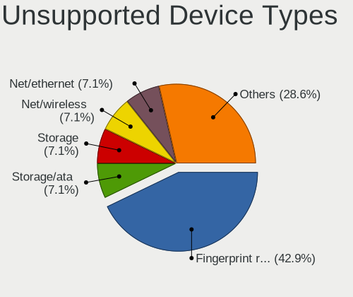

| Type               | Notebooks | Percent |
|--------------------|-----------|---------|
| Fingerprint reader | 6         | 75%     |
| Net/wireless       | 1         | 12.5%   |
| Camera             | 1         | 12.5%   |

