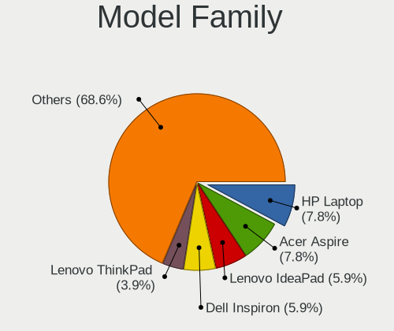
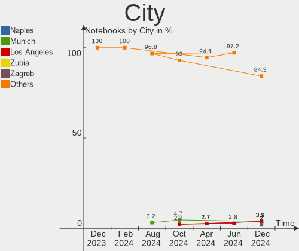
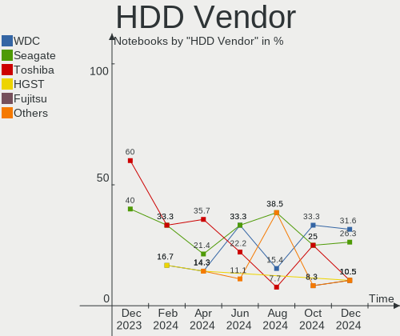
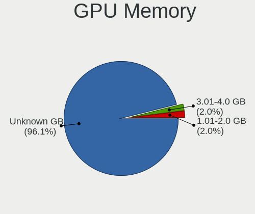
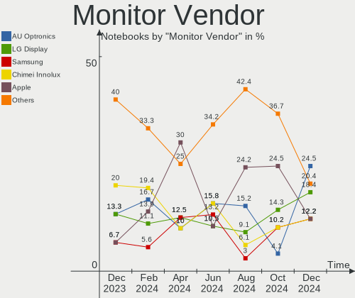
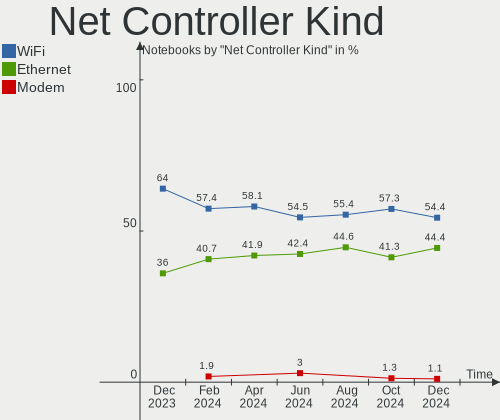
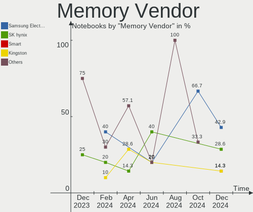
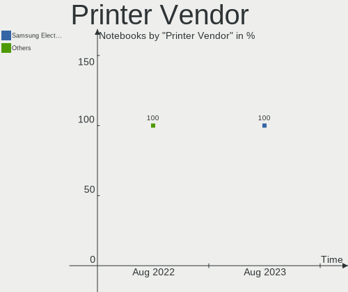

Elementary - Hardware Trends (Notebooks)
----------------------------------------

A project to identify most popular hardware characteristics and track their change
over time based on data collected by Linux users at https://Linux-Hardware.org.

Anyone can contribute to this report by the [hw-probe](https://github.com/linuxhw/hw-probe) tool:

    sudo -E hw-probe -all -upload

This report is for one last month. Overall report since the beginning of time: [TestDays](https://github.com/linuxhw/TestDays)

Period: Mar, 2023.

Contents
--------

* [ System ](#system)
  - [ OS                       ](#os)
  - [ OS Family                ](#os-family)
  - [ Kernel                   ](#kernel)
  - [ Kernel Family            ](#kernel-family)
  - [ Kernel Major Ver.        ](#kernel-major-ver)
  - [ Arch                     ](#arch)
  - [ DE                       ](#de)
  - [ Display Server           ](#display-server)
  - [ Display Manager          ](#display-manager)
  - [ OS Lang                  ](#os-lang)
  - [ Boot Mode                ](#boot-mode)
  - [ Filesystem               ](#filesystem)
  - [ Part. scheme             ](#part-scheme)
  - [ Dual Boot with Linux/BSD ](#dual-boot-with-linuxbsd)
  - [ Dual Boot (Win)          ](#dual-boot-win)

* [ Board ](#board)
  - [ Vendor                   ](#vendor)
  - [ Model                    ](#model)
  - [ Model Family             ](#model-family)
  - [ MFG Year                 ](#mfg-year)
  - [ Form Factor              ](#form-factor)
  - [ Secure Boot              ](#secure-boot)
  - [ Coreboot                 ](#coreboot)
  - [ RAM Size                 ](#ram-size)
  - [ RAM Used                 ](#ram-used)
  - [ Total Drives             ](#total-drives)
  - [ Has CD-ROM               ](#has-cd-rom)
  - [ Has Ethernet             ](#has-ethernet)
  - [ Has WiFi                 ](#has-wifi)
  - [ Has Bluetooth            ](#has-bluetooth)

* [ Location ](#location)
  - [ Country                  ](#country)
  - [ City                     ](#city)

* [ Drives ](#drives)
  - [ Drive Vendor             ](#drive-vendor)
  - [ Drive Model              ](#drive-model)
  - [ HDD Vendor               ](#hdd-vendor)
  - [ SSD Vendor               ](#ssd-vendor)
  - [ Drive Kind               ](#drive-kind)
  - [ Drive Connector          ](#drive-connector)
  - [ Drive Size               ](#drive-size)
  - [ Space Total              ](#space-total)
  - [ Space Used               ](#space-used)
  - [ Malfunc. Drives          ](#malfunc-drives)
  - [ Malfunc. Drive Vendor    ](#malfunc-drive-vendor)
  - [ Malfunc. HDD Vendor      ](#malfunc-hdd-vendor)
  - [ Malfunc. Drive Kind      ](#malfunc-drive-kind)
  - [ Failed Drives            ](#failed-drives)
  - [ Failed Drive Vendor      ](#failed-drive-vendor)
  - [ Drive Status             ](#drive-status)

* [ Storage controller ](#storage-controller)
  - [ Storage Vendor           ](#storage-vendor)
  - [ Storage Model            ](#storage-model)
  - [ Storage Kind             ](#storage-kind)

* [ Processor ](#processor)
  - [ CPU Vendor               ](#cpu-vendor)
  - [ CPU Model                ](#cpu-model)
  - [ CPU Model Family         ](#cpu-model-family)
  - [ CPU Cores                ](#cpu-cores)
  - [ CPU Sockets              ](#cpu-sockets)
  - [ CPU Threads              ](#cpu-threads)
  - [ CPU Op-Modes             ](#cpu-op-modes)
  - [ CPU Microcode            ](#cpu-microcode)
  - [ CPU Microarch            ](#cpu-microarch)

* [ Graphics ](#graphics)
  - [ GPU Vendor               ](#gpu-vendor)
  - [ GPU Model                ](#gpu-model)
  - [ GPU Combo                ](#gpu-combo)
  - [ GPU Driver               ](#gpu-driver)
  - [ GPU Memory               ](#gpu-memory)

* [ Monitor ](#monitor)
  - [ Monitor Vendor           ](#monitor-vendor)
  - [ Monitor Model            ](#monitor-model)
  - [ Monitor Resolution       ](#monitor-resolution)
  - [ Monitor Diagonal         ](#monitor-diagonal)
  - [ Monitor Width            ](#monitor-width)
  - [ Aspect Ratio             ](#aspect-ratio)
  - [ Monitor Area             ](#monitor-area)
  - [ Pixel Density            ](#pixel-density)
  - [ Multiple Monitors        ](#multiple-monitors)

* [ Network ](#network)
  - [ Net Controller Vendor    ](#net-controller-vendor)
  - [ Net Controller Model     ](#net-controller-model)
  - [ Wireless Vendor          ](#wireless-vendor)
  - [ Wireless Model           ](#wireless-model)
  - [ Ethernet Vendor          ](#ethernet-vendor)
  - [ Ethernet Model           ](#ethernet-model)
  - [ Net Controller Kind      ](#net-controller-kind)
  - [ Used Controller          ](#used-controller)
  - [ NICs                     ](#nics)
  - [ IPv6                     ](#ipv6)

* [ Bluetooth ](#bluetooth)
  - [ Bluetooth Vendor         ](#bluetooth-vendor)
  - [ Bluetooth Model          ](#bluetooth-model)

* [ Sound ](#sound)
  - [ Sound Vendor             ](#sound-vendor)
  - [ Sound Model              ](#sound-model)

* [ Memory ](#memory)
  - [ Memory Vendor            ](#memory-vendor)
  - [ Memory Model             ](#memory-model)
  - [ Memory Kind              ](#memory-kind)
  - [ Memory Form Factor       ](#memory-form-factor)
  - [ Memory Size              ](#memory-size)
  - [ Memory Speed             ](#memory-speed)

* [ Printers & scanners ](#printers--scanners)
  - [ Printer Vendor           ](#printer-vendor)
  - [ Printer Model            ](#printer-model)
  - [ Scanner Vendor           ](#scanner-vendor)
  - [ Scanner Model            ](#scanner-model)

* [ Camera ](#camera)
  - [ Camera Vendor            ](#camera-vendor)
  - [ Camera Model             ](#camera-model)

* [ Security ](#security)
  - [ Fingerprint Vendor       ](#fingerprint-vendor)
  - [ Fingerprint Model        ](#fingerprint-model)
  - [ Chipcard Vendor          ](#chipcard-vendor)
  - [ Chipcard Model           ](#chipcard-model)

* [ Unsupported ](#unsupported)
  - [ Unsupported Devices      ](#unsupported-devices)
  - [ Unsupported Device Types ](#unsupported-device-types)

System
------

OS
--

Installed operating systems

| Name           | Notebooks | Percent |
|----------------|-----------|---------|
| Elementary 7   | 25        | 73.53%  |
| Elementary 6.1 | 9         | 26.47%  |

OS Family
---------

OS without a version

| Name       | Notebooks | Percent |
|------------|-----------|---------|
| Elementary | 34        | 100%    |

Kernel
------

Version of the Linux kernel

| Version                | Notebooks | Percent |
|------------------------|-----------|---------|
| 5.19.0-35-generic      | 17        | 50%     |
| 5.19.0-32-generic      | 5         | 14.71%  |
| 5.15.0-67-generic      | 3         | 8.82%   |
| 5.15.0-60-generic      | 3         | 8.82%   |
| 5.19.12-051912-generic | 1         | 2.94%   |
| 5.19.0-38-generic      | 1         | 2.94%   |
| 5.15.0-58-generic      | 1         | 2.94%   |
| 5.15.0-56-generic      | 1         | 2.94%   |
| 5.15.0-52-generic      | 1         | 2.94%   |
| 5.15.0-46-generic      | 1         | 2.94%   |

Kernel Family
-------------

Linux kernel without a distro release

| Version | Notebooks | Percent |
|---------|-----------|---------|
| 5.19.0  | 23        | 67.65%  |
| 5.15.0  | 10        | 29.41%  |
| 5.19.12 | 1         | 2.94%   |

Kernel Major Ver.
-----------------

Linux kernel major version

| Version | Notebooks | Percent |
|---------|-----------|---------|
| 5.19    | 24        | 70.59%  |
| 5.15    | 10        | 29.41%  |

Arch
----

OS architecture (x86_64, i586, etc.)

| Name   | Notebooks | Percent |
|--------|-----------|---------|
| x86_64 | 34        | 100%    |

DE
--

Desktop Environment

| Name     | Notebooks | Percent |
|----------|-----------|---------|
| Pantheon | 34        | 100%    |

Display Server
--------------

X11 or Wayland

| Name | Notebooks | Percent |
|------|-----------|---------|
| X11  | 34        | 100%    |

Display Manager
---------------

SDDM, LightDM, etc.

| Name    | Notebooks | Percent |
|---------|-----------|---------|
| Unknown | 27        | 79.41%  |
| LightDM | 7         | 20.59%  |

OS Lang
-------

Language

| Lang  | Notebooks | Percent |
|-------|-----------|---------|
| en_US | 20        | 58.82%  |
| de_DE | 4         | 11.76%  |
| ru_RU | 3         | 8.82%   |
| pl_PL | 2         | 5.88%   |
| pt_BR | 1         | 2.94%   |
| es_ES | 1         | 2.94%   |
| en_GB | 1         | 2.94%   |
| en_AU | 1         | 2.94%   |
| el_GR | 1         | 2.94%   |

Boot Mode
---------

EFI or BIOS

| Mode | Notebooks | Percent |
|------|-----------|---------|
| BIOS | 26        | 76.47%  |
| EFI  | 8         | 23.53%  |

Filesystem
----------

Type of filesystem

| Type | Notebooks | Percent |
|------|-----------|---------|
| Ext4 | 34        | 100%    |

Part. scheme
------------

Scheme of partitioning

| Type    | Notebooks | Percent |
|---------|-----------|---------|
| Unknown | 27        | 79.41%  |
| GPT     | 6         | 17.65%  |
| MBR     | 1         | 2.94%   |

Dual Boot with Linux/BSD
------------------------

Hosting more than one Linux/BSD

| Dual boot | Notebooks | Percent |
|-----------|-----------|---------|
| No        | 34        | 100%    |

Dual Boot (Win)
---------------

Hosting Linux and Windows

| Dual boot | Notebooks | Percent |
|-----------|-----------|---------|
| No        | 33        | 97.06%  |
| Yes       | 1         | 2.94%   |

Board
-----

Vendor
------

Motherboard manufacturer

| Name             | Notebooks | Percent |
|------------------|-----------|---------|
| Lenovo           | 7         | 20.59%  |
| Hewlett-Packard  | 4         | 11.76%  |
| Dell             | 4         | 11.76%  |
| ASUSTek Computer | 4         | 11.76%  |
| Fujitsu          | 3         | 8.82%   |
| Acer             | 3         | 8.82%   |
| MSI              | 2         | 5.88%   |
| Apple            | 2         | 5.88%   |
| Toshiba          | 1         | 2.94%   |
| Sony             | 1         | 2.94%   |
| HUAWEI           | 1         | 2.94%   |
| HONOR            | 1         | 2.94%   |
| GPU Company      | 1         | 2.94%   |

Model
-----

Motherboard model

| Name                                    | Notebooks | Percent |
|-----------------------------------------|-----------|---------|
| Toshiba TECRA Z40-C                     | 1         | 2.94%   |
| Sony VPCEH2C5E                          | 1         | 2.94%   |
| MSI GT72 2QE                            | 1         | 2.94%   |
| MSI CX61 2PC                            | 1         | 2.94%   |
| Lenovo V510-15IKB 80WQ                  | 1         | 2.94%   |
| Lenovo V17 G2 ITL 82NX                  | 1         | 2.94%   |
| Lenovo ThinkPad X240 20AMS0XP0S         | 1         | 2.94%   |
| Lenovo ThinkPad X13 Gen 1 20T3S3SH0U    | 1         | 2.94%   |
| Lenovo Legion 5 15ARH05H 82B1           | 1         | 2.94%   |
| Lenovo IdeaPad 330S-15ARR 81FB          | 1         | 2.94%   |
| Lenovo G580 20150                       | 1         | 2.94%   |
| HUAWEI KLVL-WXX9                        | 1         | 2.94%   |
| HONOR HYM-WXX                           | 1         | 2.94%   |
| HP ProBook 450 15.6 inch G9 Notebook PC | 1         | 2.94%   |
| HP Pavilion Laptop 15-eh0xxx            | 1         | 2.94%   |
| HP Laptop 15-bs2xx                      | 1         | 2.94%   |
| HP 255 G7 Notebook PC                   | 1         | 2.94%   |
| GPU Company GWTN156-11                  | 1         | 2.94%   |
| Fujitsu LIFEBOOK E744                   | 1         | 2.94%   |
| Fujitsu LIFEBOOK AH530                  | 1         | 2.94%   |
| Fujitsu LIFEBOOK A359                   | 1         | 2.94%   |
| Dell Latitude E7440                     | 1         | 2.94%   |
| Dell Latitude E5570                     | 1         | 2.94%   |
| Dell Latitude 5420                      | 1         | 2.94%   |
| Dell G3 3590                            | 1         | 2.94%   |
| ASUS ZenBook UX425EA_UX425EA            | 1         | 2.94%   |
| ASUS ZenBook S UX391UA                  | 1         | 2.94%   |
| ASUS ROG Zephyrus M16 GU603HE_GU603HE   | 1         | 2.94%   |
| ASUS K55A                               | 1         | 2.94%   |
| Apple MacBookPro5,5                     | 1         | 2.94%   |
| Apple MacBookPro11,2                    | 1         | 2.94%   |
| Acer Aspire V3-771                      | 1         | 2.94%   |
| Acer Aspire A715-72G                    | 1         | 2.94%   |
| Acer Aspire A315-32                     | 1         | 2.94%   |

Model Family
------------

Motherboard model prefix

| Name                   | Notebooks | Percent |
|------------------------|-----------|---------|
| Fujitsu LIFEBOOK       | 3         | 8.82%   |
| Dell Latitude          | 3         | 8.82%   |
| Acer Aspire            | 3         | 8.82%   |
| Lenovo ThinkPad        | 2         | 5.88%   |
| ASUS ZenBook           | 2         | 5.88%   |
| Toshiba TECRA          | 1         | 2.94%   |
| Sony VPCEH2C5E         | 1         | 2.94%   |
| MSI GT72               | 1         | 2.94%   |
| MSI CX61               | 1         | 2.94%   |
| Lenovo V510-15IKB      | 1         | 2.94%   |
| Lenovo V17             | 1         | 2.94%   |
| Lenovo Legion          | 1         | 2.94%   |
| Lenovo IdeaPad         | 1         | 2.94%   |
| Lenovo G580            | 1         | 2.94%   |
| HUAWEI KLVL-WXX9       | 1         | 2.94%   |
| HONOR HYM-WXX          | 1         | 2.94%   |
| HP ProBook             | 1         | 2.94%   |
| HP Pavilion            | 1         | 2.94%   |
| HP Laptop              | 1         | 2.94%   |
| HP 255                 | 1         | 2.94%   |
| GPU Company GWTN156-11 | 1         | 2.94%   |
| Dell G3                | 1         | 2.94%   |
| ASUS ROG               | 1         | 2.94%   |
| ASUS K55A              | 1         | 2.94%   |
| Apple MacBookPro5      | 1         | 2.94%   |
| Apple MacBookPro11     | 1         | 2.94%   |

MFG Year
--------

Motherboard manufacture year

| Year | Notebooks | Percent |
|------|-----------|---------|
| 2020 | 6         | 17.65%  |
| 2018 | 5         | 14.71%  |
| 2022 | 4         | 11.76%  |
| 2016 | 4         | 11.76%  |
| 2012 | 4         | 11.76%  |
| 2014 | 3         | 8.82%   |
| 2021 | 2         | 5.88%   |
| 2019 | 2         | 5.88%   |
| 2013 | 2         | 5.88%   |
| 2010 | 1         | 2.94%   |
| 2009 | 1         | 2.94%   |

Form Factor
-----------

Physical design of the computer

| Name     | Notebooks | Percent |
|----------|-----------|---------|
| Notebook | 34        | 100%    |

Secure Boot
-----------

Enabled or disabled

| State    | Notebooks | Percent |
|----------|-----------|---------|
| Disabled | 31        | 91.18%  |
| Enabled  | 3         | 8.82%   |

Coreboot
--------

Have coreboot on board

| Used | Notebooks | Percent |
|------|-----------|---------|
| No   | 34        | 100%    |

RAM Size
--------

Total RAM memory

| Size in GB | Notebooks | Percent |
|------------|-----------|---------|
| 4.01-8.0   | 9         | 26.47%  |
| 16.01-24.0 | 8         | 23.53%  |
| 3.01-4.0   | 7         | 20.59%  |
| 8.01-16.0  | 7         | 20.59%  |
| 32.01-64.0 | 3         | 8.82%   |

RAM Used
--------

Used RAM memory

| Used GB  | Notebooks | Percent |
|----------|-----------|---------|
| 1.01-2.0 | 11        | 32.35%  |
| 2.01-3.0 | 10        | 29.41%  |
| 4.01-8.0 | 7         | 20.59%  |
| 3.01-4.0 | 6         | 17.65%  |

Total Drives
------------

Number of drives on board

| Drives | Notebooks | Percent |
|--------|-----------|---------|
| 1      | 23        | 67.65%  |
| 2      | 10        | 29.41%  |
| 4      | 1         | 2.94%   |

Has CD-ROM
----------

Has CD-ROM on board

| Presented | Notebooks | Percent |
|-----------|-----------|---------|
| No        | 22        | 64.71%  |
| Yes       | 12        | 35.29%  |

Has Ethernet
------------

Has Ethernet on board

| Presented | Notebooks | Percent |
|-----------|-----------|---------|
| Yes       | 25        | 73.53%  |
| No        | 9         | 26.47%  |

Has WiFi
--------

Has WiFi module

| Presented | Notebooks | Percent |
|-----------|-----------|---------|
| Yes       | 34        | 100%    |

Has Bluetooth
-------------

Has Bluetooth module

| Presented | Notebooks | Percent |
|-----------|-----------|---------|
| Yes       | 31        | 91.18%  |
| No        | 3         | 8.82%   |

Location
--------

Country
-------

Geographic location (country)

| Country     | Notebooks | Percent |
|-------------|-----------|---------|
| USA         | 7         | 20.59%  |
| Germany     | 6         | 17.65%  |
| Russia      | 4         | 11.76%  |
| Poland      | 3         | 8.82%   |
| UK          | 2         | 5.88%   |
| Turkey      | 1         | 2.94%   |
| Tunisia     | 1         | 2.94%   |
| Thailand    | 1         | 2.94%   |
| Spain       | 1         | 2.94%   |
| Puerto Rico | 1         | 2.94%   |
| Norway      | 1         | 2.94%   |
| Israel      | 1         | 2.94%   |
| Ireland     | 1         | 2.94%   |
| Greece      | 1         | 2.94%   |
| Cyprus      | 1         | 2.94%   |
| Belgium     | 1         | 2.94%   |
| Australia   | 1         | 2.94%   |

City
----

Geographic location (city)

| City                | Notebooks | Percent |
|---------------------|-----------|---------|
| Wellingborough      | 1         | 2.94%   |
| Wauconda            | 1         | 2.94%   |
| Warsaw              | 1         | 2.94%   |
| Vigo                | 1         | 2.94%   |
| Tuam                | 1         | 2.94%   |
| Tower City          | 1         | 2.94%   |
| Tel Aviv            | 1         | 2.94%   |
| Stuttgart           | 1         | 2.94%   |
| St Petersburg       | 1         | 2.94%   |
| Salt Lake City      | 1         | 2.94%   |
| Perth               | 1         | 2.94%   |
| Nicosia             | 1         | 2.94%   |
| Newcastle upon Tyne | 1         | 2.94%   |
| Moscow              | 1         | 2.94%   |
| Mahlstetten         | 1         | 2.94%   |
| Lyngdal             | 1         | 2.94%   |
| Lublin              | 1         | 2.94%   |
| Las Vegas           | 1         | 2.94%   |
| Khimki              | 1         | 2.94%   |
| Kansas City         | 1         | 2.94%   |
| Houston             | 1         | 2.94%   |
| Herne               | 1         | 2.94%   |
| Ghent               | 1         | 2.94%   |
| Fürstenfeldbruck   | 1         | 2.94%   |
| Chemnitz            | 1         | 2.94%   |
| Brzesko             | 1         | 2.94%   |
| Berlin              | 1         | 2.94%   |
| Ben Arous           | 1         | 2.94%   |
| Bellingham          | 1         | 2.94%   |
| Bayamón            | 1         | 2.94%   |
| Bangkok             | 1         | 2.94%   |
| Balashikha          | 1         | 2.94%   |
| Athens              | 1         | 2.94%   |
| Amasya              | 1         | 2.94%   |

Drives
------

Drive Vendor
------------

Hard drive vendors

| Vendor              | Notebooks | Drives | Percent |
|---------------------|-----------|--------|---------|
| Samsung Electronics | 8         | 8      | 18.6%   |
| WDC                 | 6         | 6      | 13.95%  |
| Toshiba             | 4         | 5      | 9.3%    |
| Seagate             | 4         | 5      | 9.3%    |
| Sandisk             | 3         | 3      | 6.98%   |
| Unknown             | 2         | 2      | 4.65%   |
| Kingston            | 2         | 2      | 4.65%   |
| Intel               | 2         | 3      | 4.65%   |
| Crucial             | 2         | 2      | 4.65%   |
| T-FORCE             | 1         | 1      | 2.33%   |
| Solid State Storage | 1         | 1      | 2.33%   |
| SK hynix            | 1         | 1      | 2.33%   |
| Micron Technology   | 1         | 1      | 2.33%   |
| Intenso             | 1         | 1      | 2.33%   |
| Inland              | 1         | 1      | 2.33%   |
| Hewlett-Packard     | 1         | 1      | 2.33%   |
| Fujitsu             | 1         | 1      | 2.33%   |
| ASMT                | 1         | 1      | 2.33%   |
| Apple               | 1         | 1      | 2.33%   |

Drive Model
-----------

Hard drive models

| Model                                              | Notebooks | Percent |
|----------------------------------------------------|-----------|---------|
| Intel SSD 660P Series 512GB                        | 2         | 4.44%   |
| WDC WDS240G2G0B-00EPW0 240GB SSD                   | 1         | 2.22%   |
| WDC WDS100T2B0B-00YS70 1TB SSD                     | 1         | 2.22%   |
| WDC WD5000LPVX-22V0TT0 500GB                       | 1         | 2.22%   |
| WDC WD5000LPCX-60VHAT1 500GB                       | 1         | 2.22%   |
| WDC WD10SPZX-21Z10T0 1TB                           | 1         | 2.22%   |
| WDC WD10JPVX-22JC3T0 1TB                           | 1         | 2.22%   |
| Unknown MMC Card  32GB                             | 1         | 2.22%   |
| Unknown MMC Card  128GB                            | 1         | 2.22%   |
| Toshiba THNSNK128GVN8 M.2 2280 128GB SSD           | 1         | 2.22%   |
| Toshiba THNSNJ128GCSU 128GB SSD                    | 1         | 2.22%   |
| Toshiba THNSNJ128G8NU 128GB SSD                    | 1         | 2.22%   |
| Toshiba NVMe Controller 1TB                        | 1         | 2.22%   |
| T-FORCE 2TB                                        | 1         | 2.22%   |
| Solid State Storage CL1-3D512-Q11 NVMe SSSTC 512GB | 1         | 2.22%   |
| SK hynix BC501 NVMe Solid State Drive 512GB        | 1         | 2.22%   |
| Seagate ST9500325AS 500GB                          | 1         | 2.22%   |
| Seagate ST500LM012 HN-M500MBB 500GB                | 1         | 2.22%   |
| Seagate ST2000LM015-2E8174 2TB                     | 1         | 2.22%   |
| Seagate ST2000LM003 HN-M201RAD 2TB                 | 1         | 2.22%   |
| Seagate Expansion+ 2TB                             | 1         | 2.22%   |
| Sandisk WDC PC SN530 SDBPMPZ-256G-1101 256GB       | 1         | 2.22%   |
| Sandisk WD Black SN750 / PC SN730 NVMe SSD 1TB     | 1         | 2.22%   |
| Sandisk PC SN530 NVMe WDC 256GB                    | 1         | 2.22%   |
| Samsung SSD 850 PRO 256GB                          | 1         | 2.22%   |
| Samsung NVMe SSD Controller PM9A1/PM9A3/980PRO 1TB | 1         | 2.22%   |
| Samsung MZVLQ512HALU-000H1 512GB                   | 1         | 2.22%   |
| Samsung MZVLQ512HALU-00000 512GB                   | 1         | 2.22%   |
| Samsung MZVL4256HBJD-00BH1 256GB                   | 1         | 2.22%   |
| Samsung MZNTY256HDHP-000L2 256GB SSD               | 1         | 2.22%   |
| Samsung MZNLN128HAHQ-000H1 128GB SSD               | 1         | 2.22%   |
| Samsung MZ7LN256HAJQ-00000 256GB SSD               | 1         | 2.22%   |
| Micron MTFDHBA256TDV 256GB                         | 1         | 2.22%   |
| Kingston SUV500MS480G 480GB SSD                    | 1         | 2.22%   |
| Kingston SA400S37240G 240GB SSD                    | 1         | 2.22%   |
| Intenso SSD SATAIII 512GB                          | 1         | 2.22%   |
| Intel SSDPEKNU010TZ 1TB                            | 1         | 2.22%   |
| Inland SATA SSD 1024GB                             | 1         | 2.22%   |
| HP SSD S600 120GB                                  | 1         | 2.22%   |
| Fujitsu MHZ2160BH FFS G1 160GB                     | 1         | 2.22%   |

HDD Vendor
----------

Hard disk drive vendors

| Vendor  | Notebooks | Drives | Percent |
|---------|-----------|--------|---------|
| WDC     | 4         | 4      | 40%     |
| Seagate | 4         | 5      | 40%     |
| Fujitsu | 1         | 1      | 10%     |
| ASMT    | 1         | 1      | 10%     |

SSD Vendor
----------

Solid state drive vendors

| Vendor              | Notebooks | Drives | Percent |
|---------------------|-----------|--------|---------|
| Samsung Electronics | 4         | 4      | 23.53%  |
| Toshiba             | 3         | 4      | 17.65%  |
| WDC                 | 2         | 2      | 11.76%  |
| Kingston            | 2         | 2      | 11.76%  |
| Crucial             | 2         | 2      | 11.76%  |
| Intenso             | 1         | 1      | 5.88%   |
| Inland              | 1         | 1      | 5.88%   |
| Hewlett-Packard     | 1         | 1      | 5.88%   |
| Apple               | 1         | 1      | 5.88%   |

Drive Kind
----------

HDD or SSD

| Kind    | Notebooks | Drives | Percent |
|---------|-----------|--------|---------|
| SSD     | 15        | 18     | 37.5%   |
| NVMe    | 13        | 14     | 32.5%   |
| HDD     | 9         | 11     | 22.5%   |
| MMC     | 2         | 2      | 5%      |
| Unknown | 1         | 1      | 2.5%    |

Drive Connector
---------------

SATA, SAS, NVMe, etc.

| Type | Notebooks | Drives | Percent |
|------|-----------|--------|---------|
| SATA | 23        | 28     | 57.5%   |
| NVMe | 13        | 14     | 32.5%   |
| SAS  | 2         | 2      | 5%      |
| MMC  | 2         | 2      | 5%      |

Drive Size
----------

Size of hard drive

| Size in TB | Notebooks | Drives | Percent |
|------------|-----------|--------|---------|
| 0.01-0.5   | 17        | 20     | 68%     |
| 0.51-1.0   | 5         | 5      | 20%     |
| 1.01-2.0   | 3         | 4      | 12%     |

Space Total
-----------

Amount of disk space available on the file system

| Size in GB     | Notebooks | Percent |
|----------------|-----------|---------|
| 101-250        | 16        | 47.06%  |
| 251-500        | 7         | 20.59%  |
| 501-1000       | 6         | 17.65%  |
| 1001-2000      | 2         | 5.88%   |
| More than 3000 | 1         | 2.94%   |
| 2001-3000      | 1         | 2.94%   |
| 51-100         | 1         | 2.94%   |

Space Used
----------

Amount of used disk space

| Used GB        | Notebooks | Percent |
|----------------|-----------|---------|
| 1-20           | 12        | 35.29%  |
| 51-100         | 8         | 23.53%  |
| 21-50          | 6         | 17.65%  |
| 101-250        | 5         | 14.71%  |
| 1001-2000      | 2         | 5.88%   |
| More than 3000 | 1         | 2.94%   |

Malfunc. Drives
---------------

Drive models with a malfunction

Zero info for selected period =(

Malfunc. Drive Vendor
---------------------

Vendors of faulty drives

Zero info for selected period =(

Malfunc. HDD Vendor
-------------------

Vendors of faulty HDD drives

Zero info for selected period =(

Malfunc. Drive Kind
-------------------

Kinds of faulty drives

Zero info for selected period =(

Failed Drives
-------------

Failed drive models

Zero info for selected period =(

Failed Drive Vendor
-------------------

Failed drive vendors

Zero info for selected period =(

Drive Status
------------

Number of failed and malfunc. drives

| Status   | Notebooks | Drives | Percent |
|----------|-----------|--------|---------|
| Detected | 31        | 43     | 91.18%  |
| Works    | 3         | 3      | 8.82%   |

Storage controller
------------------

Storage Vendor
--------------

Storage controller vendors

| Vendor                         | Notebooks | Percent |
|--------------------------------|-----------|---------|
| Intel                          | 22        | 57.89%  |
| Samsung Electronics            | 5         | 13.16%  |
| SanDisk                        | 3         | 7.89%   |
| AMD                            | 3         | 7.89%   |
| Toshiba America Info Systems   | 1         | 2.63%   |
| Solid State Storage Technology | 1         | 2.63%   |
| SK hynix                       | 1         | 2.63%   |
| Nvidia                         | 1         | 2.63%   |
| Micron Technology              | 1         | 2.63%   |

Storage Model
-------------

Storage controller models

| Model                                                                          | Notebooks | Percent |
|--------------------------------------------------------------------------------|-----------|---------|
| Intel Volume Management Device NVMe RAID Controller                            | 3         | 6.98%   |
| Intel Sunrise Point-LP SATA Controller [AHCI mode]                             | 3         | 6.98%   |
| Intel Celeron/Pentium Silver Processor SATA Controller                         | 3         | 6.98%   |
| Intel 82801 Mobile SATA Controller [RAID mode]                                 | 3         | 6.98%   |
| AMD FCH SATA Controller [AHCI mode]                                            | 3         | 6.98%   |
| Samsung NVMe SSD Controller 980                                                | 2         | 4.65%   |
| Intel SSD 660P Series                                                          | 2         | 4.65%   |
| Intel Cannon Lake Mobile PCH SATA AHCI Controller                              | 2         | 4.65%   |
| Intel 8 Series/C220 Series Chipset Family 6-port SATA Controller 1 [AHCI mode] | 2         | 4.65%   |
| Intel 7 Series Chipset Family 6-port SATA Controller [AHCI mode]               | 2         | 4.65%   |
| Toshiba America Info Systems NVMe Controller                                   | 1         | 2.33%   |
| Solid State Storage Non-Volatile memory controller                             | 1         | 2.33%   |
| SK hynix BC501 NVMe Solid State Drive                                          | 1         | 2.33%   |
| SanDisk WD Black SN750 / PC SN730 NVMe SSD                                     | 1         | 2.33%   |
| SanDisk NVMe Controller                                                        | 1         | 2.33%   |
| SanDisk Non-Volatile memory controller                                         | 1         | 2.33%   |
| Samsung NVMe SSD Controller PM9B1                                              | 1         | 2.33%   |
| Samsung NVMe SSD Controller PM9A1/PM9A3/980PRO                                 | 1         | 2.33%   |
| Samsung Apple PCIe SSD                                                         | 1         | 2.33%   |
| Nvidia MCP79 AHCI Controller                                                   | 1         | 2.33%   |
| Micron NVMe Storage Controller                                                 | 1         | 2.33%   |
| Intel Tiger Lake-LP SATA Controller                                            | 1         | 2.33%   |
| Intel Non-Volatile memory controller                                           | 1         | 2.33%   |
| Intel 8 Series SATA Controller 1 [AHCI mode]                                   | 1         | 2.33%   |
| Intel 7 Series Chipset Family 4-port SATA Controller [IDE mode]                | 1         | 2.33%   |
| Intel 7 Series Chipset Family 2-port SATA Controller [IDE mode]                | 1         | 2.33%   |
| Intel 6 Series/C200 Series Chipset Family 6 port Mobile SATA AHCI Controller   | 1         | 2.33%   |
| Intel 5 Series/3400 Series Chipset 4 port SATA AHCI Controller                 | 1         | 2.33%   |

Storage Kind
------------

Kind of storage controller (IDE, SATA, NVMe, SAS, ...)

| Kind | Notebooks | Percent |
|------|-----------|---------|
| SATA | 21        | 51.22%  |
| NVMe | 13        | 31.71%  |
| RAID | 6         | 14.63%  |
| IDE  | 1         | 2.44%   |

Processor
---------

CPU Vendor
----------

Processor vendors

| Vendor | Notebooks | Percent |
|--------|-----------|---------|
| Intel  | 28        | 82.35%  |
| AMD    | 6         | 17.65%  |

CPU Model
---------

Processor models

| Model                                         | Notebooks | Percent |
|-----------------------------------------------|-----------|---------|
| Intel Pentium Silver N5030 CPU @ 1.10GHz      | 1         | 2.94%   |
| Intel Pentium Silver N5000 CPU @ 1.10GHz      | 1         | 2.94%   |
| Intel Pentium CPU P6200 @ 2.13GHz             | 1         | 2.94%   |
| Intel Core i7-9750H CPU @ 2.60GHz             | 1         | 2.94%   |
| Intel Core i7-8550U CPU @ 1.80GHz             | 1         | 2.94%   |
| Intel Core i7-4750HQ CPU @ 2.00GHz            | 1         | 2.94%   |
| Intel Core i7-4712MQ CPU @ 2.30GHz            | 1         | 2.94%   |
| Intel Core i7-4710HQ CPU @ 2.50GHz            | 1         | 2.94%   |
| Intel Core i7-4600U CPU @ 2.10GHz             | 1         | 2.94%   |
| Intel Core i5-8300H CPU @ 2.30GHz             | 1         | 2.94%   |
| Intel Core i5-8250U CPU @ 1.60GHz             | 1         | 2.94%   |
| Intel Core i5-6300U CPU @ 2.40GHz             | 1         | 2.94%   |
| Intel Core i5-6200U CPU @ 2.30GHz             | 1         | 2.94%   |
| Intel Core i5-4300U CPU @ 1.90GHz             | 1         | 2.94%   |
| Intel Core i5-4300M CPU @ 2.60GHz             | 1         | 2.94%   |
| Intel Core i5-3230M CPU @ 2.60GHz             | 1         | 2.94%   |
| Intel Core i5-3210M CPU @ 2.50GHz             | 1         | 2.94%   |
| Intel Core i5-2430M CPU @ 2.40GHz             | 1         | 2.94%   |
| Intel Core i5-10310U CPU @ 1.70GHz            | 1         | 2.94%   |
| Intel Core i3-6006U CPU @ 2.00GHz             | 1         | 2.94%   |
| Intel Core 2 Duo CPU P7550 @ 2.26GHz          | 1         | 2.94%   |
| Intel Celeron N4000 CPU @ 1.10GHz             | 1         | 2.94%   |
| Intel Celeron CPU B830 @ 1.80GHz              | 1         | 2.94%   |
| Intel 12th Gen Core i5-1235U                  | 1         | 2.94%   |
| Intel 11th Gen Core i7-1185G7 @ 3.00GHz       | 1         | 2.94%   |
| Intel 11th Gen Core i7-11800H @ 2.30GHz       | 1         | 2.94%   |
| Intel 11th Gen Core i7-1165G7 @ 2.80GHz       | 1         | 2.94%   |
| Intel 11th Gen Core i3-1115G4 @ 3.00GHz       | 1         | 2.94%   |
| AMD Ryzen 7 4800H with Radeon Graphics        | 1         | 2.94%   |
| AMD Ryzen 5 5600H with Radeon Graphics        | 1         | 2.94%   |
| AMD Ryzen 5 4600H with Radeon Graphics        | 1         | 2.94%   |
| AMD Ryzen 5 4500U with Radeon Graphics        | 1         | 2.94%   |
| AMD Ryzen 5 2500U with Radeon Vega Mobile Gfx | 1         | 2.94%   |
| AMD A4-9125 RADEON R3, 4 COMPUTE CORES 2C+2G  | 1         | 2.94%   |

CPU Model Family
----------------

Processor model prefix

| Model                | Notebooks | Percent |
|----------------------|-----------|---------|
| Intel Core i5        | 10        | 29.41%  |
| Intel Core i7        | 6         | 17.65%  |
| Other                | 5         | 14.71%  |
| AMD Ryzen 5          | 4         | 11.76%  |
| Intel Pentium Silver | 2         | 5.88%   |
| Intel Celeron        | 2         | 5.88%   |
| Intel Pentium        | 1         | 2.94%   |
| Intel Core i3        | 1         | 2.94%   |
| Intel Core 2 Duo     | 1         | 2.94%   |
| AMD Ryzen 7          | 1         | 2.94%   |
| AMD A4               | 1         | 2.94%   |

CPU Cores
---------

Number of processor cores

| Number | Notebooks | Percent |
|--------|-----------|---------|
| 2      | 15        | 44.12%  |
| 4      | 12        | 35.29%  |
| 6      | 3         | 8.82%   |
| 8      | 2         | 5.88%   |
| 10     | 1         | 2.94%   |
| 5      | 1         | 2.94%   |

CPU Sockets
-----------

Number of sockets

| Number | Notebooks | Percent |
|--------|-----------|---------|
| 1      | 34        | 100%    |

CPU Threads
-----------

Threads per core (Hyper-Threading)

| Number | Notebooks | Percent |
|--------|-----------|---------|
| 2      | 26        | 76.47%  |
| 1      | 8         | 23.53%  |

CPU Op-Modes
------------

CPU Operation Modes (32-bit, 64-bit)

| Op mode        | Notebooks | Percent |
|----------------|-----------|---------|
| 32-bit, 64-bit | 34        | 100%    |

CPU Microcode
-------------

Microcode number

| Number     | Notebooks | Percent |
|------------|-----------|---------|
| Unknown    | 22        | 64.71%  |
| 0x706a1    | 2         | 5.88%   |
| 0x906a4    | 1         | 2.94%   |
| 0x806ea    | 1         | 2.94%   |
| 0x806c1    | 1         | 2.94%   |
| 0x406e3    | 1         | 2.94%   |
| 0x40651    | 1         | 2.94%   |
| 0x306a9    | 1         | 2.94%   |
| 0x206a7    | 1         | 2.94%   |
| 0x0a50000c | 1         | 2.94%   |
| 0x08600104 | 1         | 2.94%   |
| 0x0810100b | 1         | 2.94%   |

CPU Microarch
-------------

Microarchitecture

| Name             | Notebooks | Percent |
|------------------|-----------|---------|
| Haswell          | 6         | 17.65%  |
| KabyLake         | 5         | 14.71%  |
| Zen 2            | 3         | 8.82%   |
| TigerLake        | 3         | 8.82%   |
| Skylake          | 3         | 8.82%   |
| Goldmont plus    | 3         | 8.82%   |
| SandyBridge      | 2         | 5.88%   |
| IvyBridge        | 2         | 5.88%   |
| Zen 3            | 1         | 2.94%   |
| Zen              | 1         | 2.94%   |
| Westmere         | 1         | 2.94%   |
| Penryn           | 1         | 2.94%   |
| Excavator        | 1         | 2.94%   |
| Alderlake Hybrid | 1         | 2.94%   |
| Unknown          | 1         | 2.94%   |

Graphics
--------

GPU Vendor
----------

Vendors of graphics cards

| Vendor | Notebooks | Percent |
|--------|-----------|---------|
| Intel  | 25        | 60.98%  |
| Nvidia | 9         | 21.95%  |
| AMD    | 7         | 17.07%  |

GPU Model
---------

Graphics card models

| Model                                                                                 | Notebooks | Percent |
|---------------------------------------------------------------------------------------|-----------|---------|
| AMD Renoir                                                                            | 3         | 7.32%   |
| Nvidia GF117M [GeForce 610M/710M/810M/820M / GT 620M/625M/630M/720M]                  | 2         | 4.88%   |
| Intel UHD Graphics 620                                                                | 2         | 4.88%   |
| Intel TigerLake-LP GT2 [Iris Xe Graphics]                                             | 2         | 4.88%   |
| Intel Skylake GT2 [HD Graphics 520]                                                   | 2         | 4.88%   |
| Intel Haswell-ULT Integrated Graphics Controller                                      | 2         | 4.88%   |
| Intel GeminiLake [UHD Graphics 605]                                                   | 2         | 4.88%   |
| Intel CoffeeLake-H GT2 [UHD Graphics 630]                                             | 2         | 4.88%   |
| Intel 4th Gen Core Processor Integrated Graphics Controller                           | 2         | 4.88%   |
| Intel 3rd Gen Core processor Graphics Controller                                      | 2         | 4.88%   |
| Nvidia TU116M [GeForce GTX 1660 Ti Mobile]                                            | 1         | 2.44%   |
| Nvidia TU106M [GeForce RTX 2060 Mobile]                                               | 1         | 2.44%   |
| Nvidia GP107M [GeForce GTX 1050 Mobile]                                               | 1         | 2.44%   |
| Nvidia GM204M [GeForce GTX 980M]                                                      | 1         | 2.44%   |
| Nvidia GF119M [GeForce 410M]                                                          | 1         | 2.44%   |
| Nvidia GA107M [GeForce RTX 3050 Ti Mobile]                                            | 1         | 2.44%   |
| Nvidia C79 [GeForce 9400M]                                                            | 1         | 2.44%   |
| Intel TigerLake-H GT1 [UHD Graphics]                                                  | 1         | 2.44%   |
| Intel Tiger Lake-LP GT2 [UHD Graphics G4]                                             | 1         | 2.44%   |
| Intel HD Graphics 520                                                                 | 1         | 2.44%   |
| Intel GeminiLake [UHD Graphics 600]                                                   | 1         | 2.44%   |
| Intel Crystal Well Integrated Graphics Controller                                     | 1         | 2.44%   |
| Intel Core Processor Integrated Graphics Controller                                   | 1         | 2.44%   |
| Intel CometLake-U GT2 [UHD Graphics]                                                  | 1         | 2.44%   |
| Intel Alder Lake-UP3 GT2 [UHD Graphics]                                               | 1         | 2.44%   |
| Intel 2nd Generation Core Processor Family Integrated Graphics Controller             | 1         | 2.44%   |
| AMD Topaz XT [Radeon R7 M260/M265 / M340/M360 / M440/M445 / 530/535 / 620/625 Mobile] | 1         | 2.44%   |
| AMD Stoney [Radeon R2/R3/R4/R5 Graphics]                                              | 1         | 2.44%   |
| AMD Raven Ridge [Radeon Vega Series / Radeon Vega Mobile Series]                      | 1         | 2.44%   |
| AMD Cezanne [Radeon Vega Series / Radeon Vega Mobile Series]                          | 1         | 2.44%   |

GPU Combo
---------

Combinations of graphics cards

| Name           | Notebooks | Percent |
|----------------|-----------|---------|
| 1 x Intel      | 19        | 55.88%  |
| Intel + Nvidia | 5         | 14.71%  |
| 1 x AMD        | 5         | 14.71%  |
| 1 x Nvidia     | 3         | 8.82%   |
| Intel + AMD    | 1         | 2.94%   |
| AMD + Nvidia   | 1         | 2.94%   |

GPU Driver
----------

Free vs proprietary

| Driver      | Notebooks | Percent |
|-------------|-----------|---------|
| Free        | 32        | 94.12%  |
| Proprietary | 2         | 5.88%   |

GPU Memory
----------

Total video memory

| Size in GB | Notebooks | Percent |
|------------|-----------|---------|
| Unknown    | 30        | 88.24%  |
| 0.01-0.5   | 2         | 5.88%   |
| 1.01-2.0   | 1         | 2.94%   |
| 0.51-1.0   | 1         | 2.94%   |

Monitor
-------

Monitor Vendor
--------------

Monitor vendors

| Vendor              | Notebooks | Percent |
|---------------------|-----------|---------|
| BOE                 | 10        | 25%     |
| LG Display          | 9         | 22.5%   |
| AU Optronics        | 6         | 15%     |
| Chimei Innolux      | 3         | 7.5%    |
| Samsung Electronics | 2         | 5%      |
| Apple               | 2         | 5%      |
| Philips             | 1         | 2.5%    |
| Panasonic           | 1         | 2.5%    |
| Lenovo              | 1         | 2.5%    |
| Hewlett-Packard     | 1         | 2.5%    |
| Goldstar            | 1         | 2.5%    |
| Dell                | 1         | 2.5%    |
| CPT                 | 1         | 2.5%    |
| Cisco               | 1         | 2.5%    |

Monitor Model
-------------

Monitor models

| Model                                                                | Notebooks | Percent |
|----------------------------------------------------------------------|-----------|---------|
| AU Optronics LCD Monitor AUO38ED 1920x1080 344x193mm 15.5-inch       | 2         | 5%      |
| Samsung Electronics U32J59x SAM0F33 3840x2160 697x392mm 31.5-inch    | 1         | 2.5%    |
| Samsung Electronics LCD Monitor SEC5641 1366x768 344x193mm 15.5-inch | 1         | 2.5%    |
| Philips FTV PHL01EA 1920x1080 1440x810mm 65.0-inch                   | 1         | 2.5%    |
| Panasonic TV MEIA296 3840x2160 698x392mm 31.5-inch                   | 1         | 2.5%    |
| LG Display LCD Monitor LGD068D 1920x1080 309x174mm 14.0-inch         | 1         | 2.5%    |
| LG Display LCD Monitor LGD060A 1920x1080 294x165mm 13.3-inch         | 1         | 2.5%    |
| LG Display LCD Monitor LGD05E5 1920x1080 344x194mm 15.5-inch         | 1         | 2.5%    |
| LG Display LCD Monitor LGD04A7 1920x1080 344x194mm 15.5-inch         | 1         | 2.5%    |
| LG Display LCD Monitor LGD046D 1920x1080 309x174mm 14.0-inch         | 1         | 2.5%    |
| LG Display LCD Monitor LGD03EA 1920x1080 309x174mm 14.0-inch         | 1         | 2.5%    |
| LG Display LCD Monitor LGD038E 1366x768 344x194mm 15.5-inch          | 1         | 2.5%    |
| LG Display LCD Monitor LGD033A 1366x768 344x194mm 15.5-inch          | 1         | 2.5%    |
| LG Display LCD Monitor LGD0259 1920x1080 345x194mm 15.6-inch         | 1         | 2.5%    |
| Lenovo Q24i-10 LEN65F3 1920x1080 527x296mm 23.8-inch                 | 1         | 2.5%    |
| Hewlett-Packard 27fw HPN3607 1920x1080 598x336mm 27.0-inch           | 1         | 2.5%    |
| Goldstar IPS FULLHD GSM5AB8 1920x1080 480x270mm 21.7-inch            | 1         | 2.5%    |
| Dell S2740L DELA08E 1920x1080 598x336mm 27.0-inch                    | 1         | 2.5%    |
| CPT LCD Monitor CPT14C7 1366x768 344x194mm 15.5-inch                 | 1         | 2.5%    |
| Cisco CS-DESKPRO-1 CIS0107 3840x2160 598x336mm 27.0-inch             | 1         | 2.5%    |
| Chimei Innolux LCD Monitor CMN1735 1920x1080 382x215mm 17.3-inch     | 1         | 2.5%    |
| Chimei Innolux LCD Monitor CMN1728 1600x900 382x215mm 17.3-inch      | 1         | 2.5%    |
| Chimei Innolux LCD Monitor CMN15DB 1366x768 344x193mm 15.5-inch      | 1         | 2.5%    |
| BOE LCD Monitor BOE0A0B 2560x1600 344x215mm 16.0-inch                | 1         | 2.5%    |
| BOE LCD Monitor BOE09E1 1366x768 344x194mm 15.5-inch                 | 1         | 2.5%    |
| BOE LCD Monitor BOE09C1 1920x1080 382x215mm 17.3-inch                | 1         | 2.5%    |
| BOE LCD Monitor BOE0893 2160x1440 296x197mm 14.0-inch                | 1         | 2.5%    |
| BOE LCD Monitor BOE0878 1920x1080 355x200mm 16.0-inch                | 1         | 2.5%    |
| BOE LCD Monitor BOE0819 1920x1080 344x194mm 15.5-inch                | 1         | 2.5%    |
| BOE LCD Monitor BOE0747 1920x1080 344x194mm 15.5-inch                | 1         | 2.5%    |
| BOE LCD Monitor BOE06A4 1366x768 344x194mm 15.5-inch                 | 1         | 2.5%    |
| BOE LCD Monitor BOE0675 1366x768 344x194mm 15.5-inch                 | 1         | 2.5%    |
| BOE LCD Monitor BOE0620 1366x768 344x194mm 15.5-inch                 | 1         | 2.5%    |
| AU Optronics LCD Monitor AUOB78F 1920x1080 344x194mm 15.5-inch       | 1         | 2.5%    |
| AU Optronics LCD Monitor AUOB78D 1920x1080 344x193mm 15.5-inch       | 1         | 2.5%    |
| AU Optronics LCD Monitor AUOA48F 1920x1080 309x174mm 14.0-inch       | 1         | 2.5%    |
| AU Optronics LCD Monitor AUO492D 1920x1080 293x165mm 13.2-inch       | 1         | 2.5%    |
| Apple Color LCD APPA019 2880x1800 331x207mm 15.4-inch                | 1         | 2.5%    |
| Apple Color LCD APP9C9E 1280x800 286x179mm 13.3-inch                 | 1         | 2.5%    |

Monitor Resolution
------------------

Monitor screen resolution

| Resolution      | Notebooks | Percent |
|-----------------|-----------|---------|
| 1920x1080 (FHD) | 19        | 52.78%  |
| 1366x768 (WXGA) | 9         | 25%     |
| 3840x2160 (4K)  | 3         | 8.33%   |
| 2880x1800       | 1         | 2.78%   |
| 2560x1600       | 1         | 2.78%   |
| 2160x1440       | 1         | 2.78%   |
| 1600x900 (HD+)  | 1         | 2.78%   |
| 1280x800 (WXGA) | 1         | 2.78%   |

Monitor Diagonal
----------------

Diagonal size in inches

| Inches | Notebooks | Percent |
|--------|-----------|---------|
| 15     | 19        | 47.5%   |
| 14     | 5         | 12.5%   |
| 27     | 3         | 7.5%    |
| 17     | 3         | 7.5%    |
| 13     | 3         | 7.5%    |
| 16     | 2         | 5%      |
| 84     | 1         | 2.5%    |
| 65     | 1         | 2.5%    |
| 31     | 1         | 2.5%    |
| 24     | 1         | 2.5%    |
| 21     | 1         | 2.5%    |

Monitor Width
-------------

Physical width

| Width in mm | Notebooks | Percent |
|-------------|-----------|---------|
| 301-350     | 24        | 60%     |
| 501-600     | 4         | 10%     |
| 351-400     | 4         | 10%     |
| 201-300     | 4         | 10%     |
| 601-700     | 1         | 2.5%    |
| 401-500     | 1         | 2.5%    |
| 1501-2000   | 1         | 2.5%    |
| 1001-1500   | 1         | 2.5%    |

Aspect Ratio
------------

Proportional relationship between the width and the height

| Ratio | Notebooks | Percent |
|-------|-----------|---------|
| 16/9  | 29        | 87.88%  |
| 16/10 | 3         | 9.09%   |
| 3/2   | 1         | 3.03%   |

Monitor Area
------------

Area in inch²

| Area in inch² | Notebooks | Percent |
|----------------|-----------|---------|
| 101-110        | 20        | 50%     |
| 81-90          | 5         | 12.5%   |
| 71-80          | 3         | 7.5%    |
| 301-350        | 3         | 7.5%    |
| More than 1000 | 2         | 5%      |
| 201-250        | 2         | 5%      |
| 121-130        | 2         | 5%      |
| 351-500        | 1         | 2.5%    |
| 131-140        | 1         | 2.5%    |
| 111-120        | 1         | 2.5%    |

Pixel Density
-------------

Pixels per inch

| Density | Notebooks | Percent |
|---------|-----------|---------|
| 121-160 | 16        | 42.11%  |
| 101-120 | 12        | 31.58%  |
| 161-240 | 5         | 13.16%  |
| 51-100  | 4         | 10.53%  |
| 1-50    | 1         | 2.63%   |

Multiple Monitors
-----------------

Total monitors connected

| Total | Notebooks | Percent |
|-------|-----------|---------|
| 1     | 27        | 79.41%  |
| 2     | 7         | 20.59%  |

Network
-------

Net Controller Vendor
---------------------

Controller vendors

| Vendor                | Notebooks | Percent |
|-----------------------|-----------|---------|
| Realtek Semiconductor | 17        | 34%     |
| Intel                 | 14        | 28%     |
| Qualcomm Atheros      | 11        | 22%     |
| Broadcom              | 2         | 4%      |
| Qualcomm              | 1         | 2%      |
| Nvidia                | 1         | 2%      |
| Motorola PCS          | 1         | 2%      |
| MediaTek              | 1         | 2%      |
| Dell                  | 1         | 2%      |
| Broadcom Limited      | 1         | 2%      |

Net Controller Model
--------------------

Controller models

| Model                                                             | Notebooks | Percent |
|-------------------------------------------------------------------|-----------|---------|
| Realtek RTL8111/8168/8411 PCI Express Gigabit Ethernet Controller | 12        | 19.67%  |
| Qualcomm Atheros QCA9377 802.11ac Wireless Network Adapter        | 3         | 4.92%   |
| Intel Wireless 7260                                               | 3         | 4.92%   |
| Intel Wi-Fi 6 AX201                                               | 3         | 4.92%   |
| Realtek RTL8821CE 802.11ac PCIe Wireless Network Adapter          | 2         | 3.28%   |
| Qualcomm Atheros QCA6174 802.11ac Wireless Network Adapter        | 2         | 3.28%   |
| Qualcomm Atheros AR9285 Wireless Network Adapter (PCI-Express)    | 2         | 3.28%   |
| Intel Wireless 8260                                               | 2         | 3.28%   |
| Intel Ethernet Connection I218-LM                                 | 2         | 3.28%   |
| Realtek RTL8852BE PCIe 802.11ax Wireless Network Controller       | 1         | 1.64%   |
| Realtek RTL8822CE 802.11ac PCIe Wireless Network Adapter          | 1         | 1.64%   |
| Realtek RTL8723AE PCIe Wireless Network Adapter                   | 1         | 1.64%   |
| Realtek PCIe GbE Family Controller                                | 1         | 1.64%   |
| Realtek 802.11n WLAN Adapter                                      | 1         | 1.64%   |
| Qualcomm QCNFA765 Wireless Network Adapter                        | 1         | 1.64%   |
| Qualcomm Atheros Killer E220x Gigabit Ethernet Controller         | 1         | 1.64%   |
| Qualcomm Atheros AR9485 Wireless Network Adapter                  | 1         | 1.64%   |
| Qualcomm Atheros AR9462 Wireless Network Adapter                  | 1         | 1.64%   |
| Qualcomm Atheros AR8162 Fast Ethernet                             | 1         | 1.64%   |
| Qualcomm Atheros AR8161 Gigabit Ethernet                          | 1         | 1.64%   |
| Qualcomm Atheros AR8151 v2.0 Gigabit Ethernet                     | 1         | 1.64%   |
| Nvidia MCP79 Ethernet                                             | 1         | 1.64%   |
| Motorola PCS moto g(7) optimo maxx(XT1955DL)                      | 1         | 1.64%   |
| MediaTek MT7921 802.11ax PCI Express Wireless Network Adapter     | 1         | 1.64%   |
| Intel Wireless 8265 / 8275                                        | 1         | 1.64%   |
| Intel Wireless 7265                                               | 1         | 1.64%   |
| Intel Wi-Fi 6 AX200                                               | 1         | 1.64%   |
| Intel Gemini Lake PCH CNVi WiFi                                   | 1         | 1.64%   |
| Intel Ethernet Connection I219-V                                  | 1         | 1.64%   |
| Intel Ethernet Connection I219-LM                                 | 1         | 1.64%   |
| Intel Ethernet Connection I217-V                                  | 1         | 1.64%   |
| Intel Ethernet Connection (13) I219-LM                            | 1         | 1.64%   |
| Intel Ethernet Connection (10) I219-LM                            | 1         | 1.64%   |
| Intel Dual Band Wireless-AC 3165 Plus Bluetooth                   | 1         | 1.64%   |
| Intel Comet Lake PCH-LP CNVi WiFi                                 | 1         | 1.64%   |
| Dell DW5811e Snapdragon™ X7 LTE                              | 1         | 1.64%   |
| Broadcom Limited BCM4313 802.11bgn Wireless Network Adapter       | 1         | 1.64%   |
| Broadcom BCM4360 802.11ac Wireless Network Adapter                | 1         | 1.64%   |
| Broadcom BCM4322 802.11a/b/g/n Wireless LAN Controller            | 1         | 1.64%   |

Wireless Vendor
---------------

Wireless vendors

| Vendor                | Notebooks | Percent |
|-----------------------|-----------|---------|
| Intel                 | 14        | 40%     |
| Qualcomm Atheros      | 9         | 25.71%  |
| Realtek Semiconductor | 6         | 17.14%  |
| Broadcom              | 2         | 5.71%   |
| Qualcomm              | 1         | 2.86%   |
| MediaTek              | 1         | 2.86%   |
| Dell                  | 1         | 2.86%   |
| Broadcom Limited      | 1         | 2.86%   |

Wireless Model
--------------

Wireless models

| Model                                                          | Notebooks | Percent |
|----------------------------------------------------------------|-----------|---------|
| Qualcomm Atheros QCA9377 802.11ac Wireless Network Adapter     | 3         | 8.57%   |
| Intel Wireless 7260                                            | 3         | 8.57%   |
| Intel Wi-Fi 6 AX201                                            | 3         | 8.57%   |
| Realtek RTL8821CE 802.11ac PCIe Wireless Network Adapter       | 2         | 5.71%   |
| Qualcomm Atheros QCA6174 802.11ac Wireless Network Adapter     | 2         | 5.71%   |
| Qualcomm Atheros AR9285 Wireless Network Adapter (PCI-Express) | 2         | 5.71%   |
| Intel Wireless 8260                                            | 2         | 5.71%   |
| Realtek RTL8852BE PCIe 802.11ax Wireless Network Controller    | 1         | 2.86%   |
| Realtek RTL8822CE 802.11ac PCIe Wireless Network Adapter       | 1         | 2.86%   |
| Realtek RTL8723AE PCIe Wireless Network Adapter                | 1         | 2.86%   |
| Realtek 802.11n WLAN Adapter                                   | 1         | 2.86%   |
| Qualcomm QCNFA765 Wireless Network Adapter                     | 1         | 2.86%   |
| Qualcomm Atheros AR9485 Wireless Network Adapter               | 1         | 2.86%   |
| Qualcomm Atheros AR9462 Wireless Network Adapter               | 1         | 2.86%   |
| MediaTek MT7921 802.11ax PCI Express Wireless Network Adapter  | 1         | 2.86%   |
| Intel Wireless 8265 / 8275                                     | 1         | 2.86%   |
| Intel Wireless 7265                                            | 1         | 2.86%   |
| Intel Wi-Fi 6 AX200                                            | 1         | 2.86%   |
| Intel Gemini Lake PCH CNVi WiFi                                | 1         | 2.86%   |
| Intel Dual Band Wireless-AC 3165 Plus Bluetooth                | 1         | 2.86%   |
| Intel Comet Lake PCH-LP CNVi WiFi                              | 1         | 2.86%   |
| Dell DW5811e Snapdragon™ X7 LTE                           | 1         | 2.86%   |
| Broadcom Limited BCM4313 802.11bgn Wireless Network Adapter    | 1         | 2.86%   |
| Broadcom BCM4360 802.11ac Wireless Network Adapter             | 1         | 2.86%   |
| Broadcom BCM4322 802.11a/b/g/n Wireless LAN Controller         | 1         | 2.86%   |

Ethernet Vendor
---------------

Ethernet vendors

| Vendor                | Notebooks | Percent |
|-----------------------|-----------|---------|
| Realtek Semiconductor | 13        | 52%     |
| Intel                 | 7         | 28%     |
| Qualcomm Atheros      | 4         | 16%     |
| Nvidia                | 1         | 4%      |

Ethernet Model
--------------

Ethernet models

| Model                                                             | Notebooks | Percent |
|-------------------------------------------------------------------|-----------|---------|
| Realtek RTL8111/8168/8411 PCI Express Gigabit Ethernet Controller | 12        | 48%     |
| Intel Ethernet Connection I218-LM                                 | 2         | 8%      |
| Realtek PCIe GbE Family Controller                                | 1         | 4%      |
| Qualcomm Atheros Killer E220x Gigabit Ethernet Controller         | 1         | 4%      |
| Qualcomm Atheros AR8162 Fast Ethernet                             | 1         | 4%      |
| Qualcomm Atheros AR8161 Gigabit Ethernet                          | 1         | 4%      |
| Qualcomm Atheros AR8151 v2.0 Gigabit Ethernet                     | 1         | 4%      |
| Nvidia MCP79 Ethernet                                             | 1         | 4%      |
| Intel Ethernet Connection I219-V                                  | 1         | 4%      |
| Intel Ethernet Connection I219-LM                                 | 1         | 4%      |
| Intel Ethernet Connection I217-V                                  | 1         | 4%      |
| Intel Ethernet Connection (13) I219-LM                            | 1         | 4%      |
| Intel Ethernet Connection (10) I219-LM                            | 1         | 4%      |

Net Controller Kind
-------------------

Ethernet, WiFi or modem

| Kind     | Notebooks | Percent |
|----------|-----------|---------|
| WiFi     | 34        | 56.67%  |
| Ethernet | 25        | 41.67%  |
| Unknown  | 1         | 1.67%   |

Used Controller
---------------

Currently used network controller

| Kind     | Notebooks | Percent |
|----------|-----------|---------|
| WiFi     | 28        | 84.85%  |
| Ethernet | 5         | 15.15%  |

NICs
----

Total network controllers on board

| Total | Notebooks | Percent |
|-------|-----------|---------|
| 2     | 25        | 73.53%  |
| 1     | 8         | 23.53%  |
| 0     | 1         | 2.94%   |

IPv6
----

IPv6 vs IPv4

| Used | Notebooks | Percent |
|------|-----------|---------|
| No   | 24        | 70.59%  |
| Yes  | 10        | 29.41%  |

Bluetooth
---------

Bluetooth Vendor
----------------

Controller vendors

| Vendor                          | Notebooks | Percent |
|---------------------------------|-----------|---------|
| Intel                           | 13        | 41.94%  |
| Qualcomm Atheros Communications | 4         | 12.9%   |
| Realtek Semiconductor           | 3         | 9.68%   |
| Lite-On Technology              | 3         | 9.68%   |
| IMC Networks                    | 2         | 6.45%   |
| Foxconn / Hon Hai               | 2         | 6.45%   |
| Apple                           | 2         | 6.45%   |
| Realtek                         | 1         | 3.23%   |
| Askey Computer                  | 1         | 3.23%   |

Bluetooth Model
---------------

Controller models

| Model                                          | Notebooks | Percent |
|------------------------------------------------|-----------|---------|
| Intel Bluetooth wireless interface             | 7         | 22.58%  |
| Intel AX201 Bluetooth                          | 4         | 12.9%   |
| Realtek  Bluetooth 4.2 Adapter                 | 2         | 6.45%   |
| Qualcomm Atheros  Bluetooth Device             | 2         | 6.45%   |
| Lite-On Bluetooth Device                       | 2         | 6.45%   |
| Apple Bluetooth Host Controller                | 2         | 6.45%   |
| Realtek Bluetooth Radio                        | 1         | 3.23%   |
| Realtek Bluetooth Radio                        | 1         | 3.23%   |
| Qualcomm Atheros AR3012 Bluetooth 4.0          | 1         | 3.23%   |
| Qualcomm Atheros AR3011 Bluetooth              | 1         | 3.23%   |
| Lite-On Qualcomm Atheros QCA9377 Bluetooth     | 1         | 3.23%   |
| Intel Bluetooth 9460/9560 Jefferson Peak (JfP) | 1         | 3.23%   |
| Intel AX200 Bluetooth                          | 1         | 3.23%   |
| IMC Networks Wireless_Device                   | 1         | 3.23%   |
| IMC Networks Bluetooth                         | 1         | 3.23%   |
| Foxconn / Hon Hai Broadcom BCM20702 Bluetooth  | 1         | 3.23%   |
| Foxconn / Hon Hai Bluetooth Device             | 1         | 3.23%   |
| Askey Bluetooth Device                         | 1         | 3.23%   |

Sound
-----

Sound Vendor
------------

Sound card vendors

| Vendor | Notebooks | Percent |
|--------|-----------|---------|
| Intel  | 27        | 67.5%   |
| Nvidia | 7         | 17.5%   |
| AMD    | 6         | 15%     |

Sound Model
-----------

Sound card models

| Model                                                                      | Notebooks | Percent |
|----------------------------------------------------------------------------|-----------|---------|
| Intel Sunrise Point-LP HD Audio                                            | 5         | 10%     |
| AMD Family 17h/19h HD Audio Controller                                     | 5         | 10%     |
| Intel 8 Series/C220 Series Chipset High Definition Audio Controller        | 4         | 8%      |
| Intel Tiger Lake-LP Smart Sound Technology Audio Controller                | 3         | 6%      |
| Intel Celeron/Pentium Silver Processor High Definition Audio               | 3         | 6%      |
| Intel 7 Series/C216 Chipset Family High Definition Audio Controller        | 3         | 6%      |
| AMD Renoir Radeon High Definition Audio Controller                         | 3         | 6%      |
| Intel Xeon E3-1200 v3/4th Gen Core Processor HD Audio Controller           | 2         | 4%      |
| Intel Haswell-ULT HD Audio Controller                                      | 2         | 4%      |
| Intel Cannon Lake PCH cAVS                                                 | 2         | 4%      |
| Intel 8 Series HD Audio Controller                                         | 2         | 4%      |
| Nvidia TU116 High Definition Audio Controller                              | 1         | 2%      |
| Nvidia TU106 High Definition Audio Controller                              | 1         | 2%      |
| Nvidia MCP79 High Definition Audio                                         | 1         | 2%      |
| Nvidia GP107GL High Definition Audio Controller                            | 1         | 2%      |
| Nvidia GM204 High Definition Audio Controller                              | 1         | 2%      |
| Nvidia GF119 HDMI Audio Controller                                         | 1         | 2%      |
| Nvidia Audio device                                                        | 1         | 2%      |
| Intel Tiger Lake-H HD Audio Controller                                     | 1         | 2%      |
| Intel Crystal Well HD Audio Controller                                     | 1         | 2%      |
| Intel Comet Lake PCH-LP cAVS                                               | 1         | 2%      |
| Intel Alder Lake PCH-P High Definition Audio Controller                    | 1         | 2%      |
| Intel 6 Series/C200 Series Chipset Family High Definition Audio Controller | 1         | 2%      |
| Intel 5 Series/3400 Series Chipset High Definition Audio                   | 1         | 2%      |
| AMD Raven/Raven2/Fenghuang HDMI/DP Audio Controller                        | 1         | 2%      |
| AMD High Definition Audio Controller                                       | 1         | 2%      |
| AMD Family 15h (Models 60h-6fh) Audio Controller                           | 1         | 2%      |

Memory
------

Memory Vendor
-------------

Memory module vendors

| Vendor              | Notebooks | Percent |
|---------------------|-----------|---------|
| SK hynix            | 2         | 40%     |
| Samsung Electronics | 2         | 40%     |
| Ramaxel Technology  | 1         | 20%     |

Memory Model
------------

Memory module models

| Model                                                       | Notebooks | Percent |
|-------------------------------------------------------------|-----------|---------|
| SK hynix RAM HMA851S6AFR6N-UH 4GB SODIMM DDR4 2667MT/s      | 1         | 20%     |
| SK hynix RAM HMA81GS6CJR8N-VK 8GB SODIMM DDR4 2667MT/s      | 1         | 20%     |
| Samsung RAM M471B1G73QH0-YK0 8GB SODIMM DDR3 1867MT/s       | 1         | 20%     |
| Samsung RAM M471A1G44AB0-CWE 8GB Row Of Chips DDR4 3200MT/s | 1         | 20%     |
| Ramaxel RAM Module 16GB SODIMM DDR4 3200MT/s                | 1         | 20%     |

Memory Kind
-----------

Memory module kinds

| Kind   | Notebooks | Percent |
|--------|-----------|---------|
| DDR4   | 3         | 60%     |
| LPDDR4 | 1         | 20%     |
| DDR3   | 1         | 20%     |

Memory Form Factor
------------------

Physical design of the memory module

| Name         | Notebooks | Percent |
|--------------|-----------|---------|
| SODIMM       | 4         | 80%     |
| Row Of Chips | 1         | 20%     |

Memory Size
-----------

Memory module size

| Size  | Notebooks | Percent |
|-------|-----------|---------|
| 8192  | 4         | 80%     |
| 16384 | 1         | 20%     |

Memory Speed
------------

Memory module speed

| Speed | Notebooks | Percent |
|-------|-----------|---------|
| 2667  | 3         | 60%     |
| 3200  | 2         | 40%     |

Printers & scanners
-------------------

Printer Vendor
--------------

Printer device vendors

| Vendor          | Notebooks | Percent |
|-----------------|-----------|---------|
| Hewlett-Packard | 1         | 100%    |

Printer Model
-------------

Printer device models

| Model                  | Notebooks | Percent |
|------------------------|-----------|---------|
| HP DeskJet 2600 series | 1         | 100%    |

Scanner Vendor
--------------

Scanner device vendors

Zero info for selected period =(

Scanner Model
-------------

Scanner device models

Zero info for selected period =(

Camera
------

Camera Vendor
-------------

Camera device vendors

| Vendor                                 | Notebooks | Percent |
|----------------------------------------|-----------|---------|
| Chicony Electronics                    | 7         | 25%     |
| Sunplus Innovation Technology          | 4         | 14.29%  |
| Quanta                                 | 4         | 14.29%  |
| IMC Networks                           | 4         | 14.29%  |
| Cheng Uei Precision Industry (Foxlink) | 2         | 7.14%   |
| Syntek                                 | 1         | 3.57%   |
| SunplusIT                              | 1         | 3.57%   |
| Realtek Semiconductor                  | 1         | 3.57%   |
| Microdia                               | 1         | 3.57%   |
| Cisco Systems                          | 1         | 3.57%   |
| Apple                                  | 1         | 3.57%   |
| Acer                                   | 1         | 3.57%   |

Camera Model
------------

Camera device models

| Model                                             | Notebooks | Percent |
|---------------------------------------------------|-----------|---------|
| IMC Networks USB2.0 HD UVC WebCam                 | 3         | 10.71%  |
| Quanta HP Webcam                                  | 2         | 7.14%   |
| Chicony Integrated Camera                         | 2         | 7.14%   |
| Syntek EasyCamera                                 | 1         | 3.57%   |
| SunplusIT HD Camera                               | 1         | 3.57%   |
| Sunplus USB Camera                                | 1         | 3.57%   |
| Sunplus HD WebCam                                 | 1         | 3.57%   |
| Sunplus Dell E5570 integrated webcam              | 1         | 3.57%   |
| Sunplus Asus Webcam                               | 1         | 3.57%   |
| Realtek Integrated_Webcam_HD                      | 1         | 3.57%   |
| Quanta VGA WebCam                                 | 1         | 3.57%   |
| Quanta HD Webcam                                  | 1         | 3.57%   |
| Microdia Integrated Webcam                        | 1         | 3.57%   |
| IMC Networks Integrated Camera                    | 1         | 3.57%   |
| Cisco Systems Desk Pro Web Camera                 | 1         | 3.57%   |
| Chicony TOSHIBA Web Camera - FHD                  | 1         | 3.57%   |
| Chicony Sony Visual Communication Camera          | 1         | 3.57%   |
| Chicony Lenovo EasyCamera                         | 1         | 3.57%   |
| Chicony HP Wide Vision HD Camera                  | 1         | 3.57%   |
| Chicony HP HD Camera                              | 1         | 3.57%   |
| Cheng Uei Precision Industry (Foxlink) HD Camera  | 1         | 3.57%   |
| Cheng Uei Precision Industry (Foxlink) FH13FF-238 | 1         | 3.57%   |
| Apple Built-in iSight                             | 1         | 3.57%   |
| Acer Integrated Camera                            | 1         | 3.57%   |

Security
--------

Fingerprint Vendor
------------------

Fingerprint sensor vendors

| Vendor                     | Notebooks | Percent |
|----------------------------|-----------|---------|
| Shenzhen Goodix Technology | 3         | 37.5%   |
| Validity Sensors           | 2         | 25%     |
| Elan Microelectronics      | 2         | 25%     |
| Synaptics                  | 1         | 12.5%   |

Fingerprint Model
-----------------

Fingerprint sensor models

| Model                                             | Notebooks | Percent |
|---------------------------------------------------|-----------|---------|
| Shenzhen Goodix  Fingerprint Device               | 2         | 25%     |
| Validity Sensors VFS5011 Fingerprint Reader       | 1         | 12.5%   |
| Validity Sensors VFS Fingerprint sensor           | 1         | 12.5%   |
| Synaptics Prometheus MIS Touch Fingerprint Reader | 1         | 12.5%   |
| Shenzhen Goodix Fingerprint Reader                | 1         | 12.5%   |
| Elan ELAN:Fingerprint                             | 1         | 12.5%   |
| Elan ELAN:ARM-M4                                  | 1         | 12.5%   |

Chipcard Vendor
---------------

Chipcard module vendors

| Vendor   | Notebooks | Percent |
|----------|-----------|---------|
| O2 Micro | 1         | 50%     |
| Broadcom | 1         | 50%     |

Chipcard Model
--------------

Chipcard module models

| Model                                                                        | Notebooks | Percent |
|------------------------------------------------------------------------------|-----------|---------|
| O2 Micro OZ776 CCID Smartcard Reader                                         | 1         | 50%     |
| Broadcom BCM5880 Secure Applications Processor with fingerprint swipe sensor | 1         | 50%     |

Unsupported
-----------

Unsupported Devices
-------------------

Total unsupported devices on board

| Total | Notebooks | Percent |
|-------|-----------|---------|
| 0     | 23        | 67.65%  |
| 1     | 9         | 26.47%  |
| 2     | 2         | 5.88%   |

Unsupported Device Types
------------------------

Types of unsupported devices

| Type                  | Notebooks | Percent |
|-----------------------|-----------|---------|
| Fingerprint reader    | 7         | 53.85%  |
| Net/wireless          | 2         | 15.38%  |
| Multimedia controller | 2         | 15.38%  |
| Chipcard              | 2         | 15.38%  |

