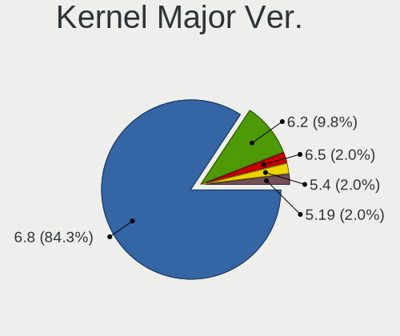
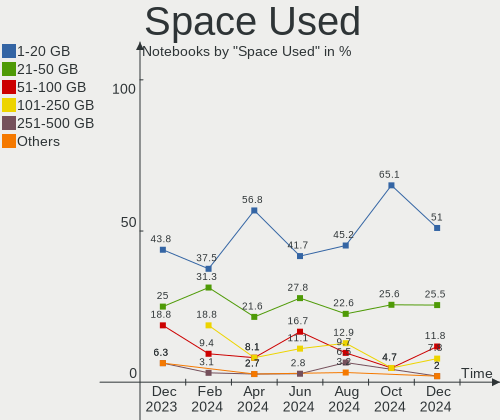
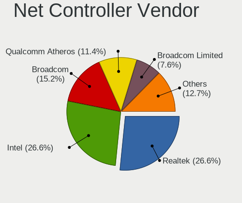

Elementary - Hardware Trends (Notebooks)
----------------------------------------

A project to identify most popular hardware characteristics and track their change
over time based on data collected by Linux users at https://Linux-Hardware.org.

Anyone can contribute to this report by the [hw-probe](https://github.com/linuxhw/hw-probe) tool:

    sudo -E hw-probe -all -upload

This report is for one last month. Overall report since the beginning of time: [TestCoverage](https://github.com/linuxhw/TestCoverage)

Period: Jun, 2022.

Contents
--------

* [ System ](#system)
  - [ OS                       ](#os)
  - [ OS Family                ](#os-family)
  - [ Kernel                   ](#kernel)
  - [ Kernel Family            ](#kernel-family)
  - [ Kernel Major Ver.        ](#kernel-major-ver)
  - [ Arch                     ](#arch)
  - [ DE                       ](#de)
  - [ Display Server           ](#display-server)
  - [ Display Manager          ](#display-manager)
  - [ OS Lang                  ](#os-lang)
  - [ Boot Mode                ](#boot-mode)
  - [ Filesystem               ](#filesystem)
  - [ Part. scheme             ](#part-scheme)
  - [ Dual Boot with Linux/BSD ](#dual-boot-with-linuxbsd)
  - [ Dual Boot (Win)          ](#dual-boot-win)

* [ Board ](#board)
  - [ Vendor                   ](#vendor)
  - [ Model                    ](#model)
  - [ Model Family             ](#model-family)
  - [ MFG Year                 ](#mfg-year)
  - [ Form Factor              ](#form-factor)
  - [ Secure Boot              ](#secure-boot)
  - [ Coreboot                 ](#coreboot)
  - [ RAM Size                 ](#ram-size)
  - [ RAM Used                 ](#ram-used)
  - [ Total Drives             ](#total-drives)
  - [ Has CD-ROM               ](#has-cd-rom)
  - [ Has Ethernet             ](#has-ethernet)
  - [ Has WiFi                 ](#has-wifi)
  - [ Has Bluetooth            ](#has-bluetooth)

* [ Location ](#location)
  - [ Country                  ](#country)
  - [ City                     ](#city)

* [ Drives ](#drives)
  - [ Drive Vendor             ](#drive-vendor)
  - [ Drive Model              ](#drive-model)
  - [ HDD Vendor               ](#hdd-vendor)
  - [ SSD Vendor               ](#ssd-vendor)
  - [ Drive Kind               ](#drive-kind)
  - [ Drive Connector          ](#drive-connector)
  - [ Drive Size               ](#drive-size)
  - [ Space Total              ](#space-total)
  - [ Space Used               ](#space-used)
  - [ Malfunc. Drives          ](#malfunc-drives)
  - [ Malfunc. Drive Vendor    ](#malfunc-drive-vendor)
  - [ Malfunc. HDD Vendor      ](#malfunc-hdd-vendor)
  - [ Malfunc. Drive Kind      ](#malfunc-drive-kind)
  - [ Failed Drives            ](#failed-drives)
  - [ Failed Drive Vendor      ](#failed-drive-vendor)
  - [ Drive Status             ](#drive-status)

* [ Storage controller ](#storage-controller)
  - [ Storage Vendor           ](#storage-vendor)
  - [ Storage Model            ](#storage-model)
  - [ Storage Kind             ](#storage-kind)

* [ Processor ](#processor)
  - [ CPU Vendor               ](#cpu-vendor)
  - [ CPU Model                ](#cpu-model)
  - [ CPU Model Family         ](#cpu-model-family)
  - [ CPU Cores                ](#cpu-cores)
  - [ CPU Sockets              ](#cpu-sockets)
  - [ CPU Threads              ](#cpu-threads)
  - [ CPU Op-Modes             ](#cpu-op-modes)
  - [ CPU Microcode            ](#cpu-microcode)
  - [ CPU Microarch            ](#cpu-microarch)

* [ Graphics ](#graphics)
  - [ GPU Vendor               ](#gpu-vendor)
  - [ GPU Model                ](#gpu-model)
  - [ GPU Combo                ](#gpu-combo)
  - [ GPU Driver               ](#gpu-driver)
  - [ GPU Memory               ](#gpu-memory)

* [ Monitor ](#monitor)
  - [ Monitor Vendor           ](#monitor-vendor)
  - [ Monitor Model            ](#monitor-model)
  - [ Monitor Resolution       ](#monitor-resolution)
  - [ Monitor Diagonal         ](#monitor-diagonal)
  - [ Monitor Width            ](#monitor-width)
  - [ Aspect Ratio             ](#aspect-ratio)
  - [ Monitor Area             ](#monitor-area)
  - [ Pixel Density            ](#pixel-density)
  - [ Multiple Monitors        ](#multiple-monitors)

* [ Network ](#network)
  - [ Net Controller Vendor    ](#net-controller-vendor)
  - [ Net Controller Model     ](#net-controller-model)
  - [ Wireless Vendor          ](#wireless-vendor)
  - [ Wireless Model           ](#wireless-model)
  - [ Ethernet Vendor          ](#ethernet-vendor)
  - [ Ethernet Model           ](#ethernet-model)
  - [ Net Controller Kind      ](#net-controller-kind)
  - [ Used Controller          ](#used-controller)
  - [ NICs                     ](#nics)
  - [ IPv6                     ](#ipv6)

* [ Bluetooth ](#bluetooth)
  - [ Bluetooth Vendor         ](#bluetooth-vendor)
  - [ Bluetooth Model          ](#bluetooth-model)

* [ Sound ](#sound)
  - [ Sound Vendor             ](#sound-vendor)
  - [ Sound Model              ](#sound-model)

* [ Memory ](#memory)
  - [ Memory Vendor            ](#memory-vendor)
  - [ Memory Model             ](#memory-model)
  - [ Memory Kind              ](#memory-kind)
  - [ Memory Form Factor       ](#memory-form-factor)
  - [ Memory Size              ](#memory-size)
  - [ Memory Speed             ](#memory-speed)

* [ Printers & scanners ](#printers--scanners)
  - [ Printer Vendor           ](#printer-vendor)
  - [ Printer Model            ](#printer-model)
  - [ Scanner Vendor           ](#scanner-vendor)
  - [ Scanner Model            ](#scanner-model)

* [ Camera ](#camera)
  - [ Camera Vendor            ](#camera-vendor)
  - [ Camera Model             ](#camera-model)

* [ Security ](#security)
  - [ Fingerprint Vendor       ](#fingerprint-vendor)
  - [ Fingerprint Model        ](#fingerprint-model)
  - [ Chipcard Vendor          ](#chipcard-vendor)
  - [ Chipcard Model           ](#chipcard-model)

* [ Unsupported ](#unsupported)
  - [ Unsupported Devices      ](#unsupported-devices)
  - [ Unsupported Device Types ](#unsupported-device-types)

System
------

OS
--

Installed operating systems

| Name             | Notebooks | Percent |
|------------------|-----------|---------|
| Elementary 6.1   | 24        | 88.89%  |
| Elementary 5.1.7 | 3         | 11.11%  |

OS Family
---------

OS without a version

| Name       | Notebooks | Percent |
|------------|-----------|---------|
| Elementary | 27        | 100%    |

Kernel
------

Version of the Linux kernel

| Version               | Notebooks | Percent |
|-----------------------|-----------|---------|
| 5.13.0-51-generic     | 7         | 25.93%  |
| 5.13.0-48-generic     | 6         | 22.22%  |
| 5.13.0-44-generic     | 4         | 14.81%  |
| 5.11.0-43-generic     | 4         | 14.81%  |
| 5.4.0-120-generic     | 2         | 7.41%   |
| 5.4.0-42-generic      | 1         | 3.7%    |
| 5.18.3-051803-generic | 1         | 3.7%    |
| 5.13.0-41-generic     | 1         | 3.7%    |
| 5.13.0-39-generic     | 1         | 3.7%    |

Kernel Family
-------------

Linux kernel without a distro release

| Version | Notebooks | Percent |
|---------|-----------|---------|
| 5.13.0  | 19        | 70.37%  |
| 5.11.0  | 4         | 14.81%  |
| 5.4.0   | 3         | 11.11%  |
| 5.18.3  | 1         | 3.7%    |

Kernel Major Ver.
-----------------

Linux kernel major version

| Version | Notebooks | Percent |
|---------|-----------|---------|
| 5.13    | 19        | 70.37%  |
| 5.11    | 4         | 14.81%  |
| 5.4     | 3         | 11.11%  |
| 5.18    | 1         | 3.7%    |

Arch
----

OS architecture (x86_64, i586, etc.)

| Name   | Notebooks | Percent |
|--------|-----------|---------|
| x86_64 | 27        | 100%    |

DE
--

Desktop Environment

| Name     | Notebooks | Percent |
|----------|-----------|---------|
| Pantheon | 27        | 100%    |

Display Server
--------------

X11 or Wayland

| Name | Notebooks | Percent |
|------|-----------|---------|
| X11  | 27        | 100%    |

Display Manager
---------------

SDDM, LightDM, etc.

| Name    | Notebooks | Percent |
|---------|-----------|---------|
| Unknown | 24        | 88.89%  |
| LightDM | 3         | 11.11%  |

OS Lang
-------

Language

| Lang  | Notebooks | Percent |
|-------|-----------|---------|
| en_US | 14        | 51.85%  |
| de_DE | 2         | 7.41%   |
| zh_CN | 1         | 3.7%    |
| ru_RU | 1         | 3.7%    |
| pt_PT | 1         | 3.7%    |
| pt_BR | 1         | 3.7%    |
| pl_PL | 1         | 3.7%    |
| nl_NL | 1         | 3.7%    |
| it_IT | 1         | 3.7%    |
| hu_HU | 1         | 3.7%    |
| fr_FR | 1         | 3.7%    |
| es_PE | 1         | 3.7%    |
| en_GB | 1         | 3.7%    |

Boot Mode
---------

EFI or BIOS

| Mode | Notebooks | Percent |
|------|-----------|---------|
| EFI  | 21        | 77.78%  |
| BIOS | 6         | 22.22%  |

Filesystem
----------

Type of filesystem

| Type  | Notebooks | Percent |
|-------|-----------|---------|
| Ext4  | 26        | 96.3%   |
| Btrfs | 1         | 3.7%    |

Part. scheme
------------

Scheme of partitioning

| Type    | Notebooks | Percent |
|---------|-----------|---------|
| Unknown | 25        | 92.59%  |
| GPT     | 2         | 7.41%   |

Dual Boot with Linux/BSD
------------------------

Hosting more than one Linux/BSD

| Dual boot | Notebooks | Percent |
|-----------|-----------|---------|
| No        | 26        | 96.3%   |
| Yes       | 1         | 3.7%    |

Dual Boot (Win)
---------------

Hosting Linux and Windows

| Dual boot | Notebooks | Percent |
|-----------|-----------|---------|
| No        | 27        | 100%    |

Board
-----

Vendor
------

Motherboard manufacturer

| Name                | Notebooks | Percent |
|---------------------|-----------|---------|
| Hewlett-Packard     | 7         | 25.93%  |
| ASUSTek Computer    | 4         | 14.81%  |
| Apple               | 4         | 14.81%  |
| Toshiba             | 2         | 7.41%   |
| Samsung Electronics | 2         | 7.41%   |
| Lenovo              | 2         | 7.41%   |
| Dell                | 2         | 7.41%   |
| Acer                | 2         | 7.41%   |
| Compaq              | 1         | 3.7%    |
| Alienware           | 1         | 3.7%    |

Model
-----

Motherboard model

| Name                                    | Notebooks | Percent |
|-----------------------------------------|-----------|---------|
| Toshiba Satellite T130                  | 1         | 3.7%    |
| Toshiba Satellite C870-1H2              | 1         | 3.7%    |
| Samsung Lumpy                           | 1         | 3.7%    |
| Samsung 300E5M/300E5L                   | 1         | 3.7%    |
| Lenovo V15-IIL 82C5                     | 1         | 3.7%    |
| Lenovo ThinkPad E14 Gen 3 20YDS06K00    | 1         | 3.7%    |
| HP Stream Laptop 14-cb1xxx              | 1         | 3.7%    |
| HP ProBook 455R G6                      | 1         | 3.7%    |
| HP ProBook 4540s                        | 1         | 3.7%    |
| HP Pavilion g4                          | 1         | 3.7%    |
| HP Pavilion dv5                         | 1         | 3.7%    |
| HP Notebook                             | 1         | 3.7%    |
| HP EliteBook 2170p                      | 1         | 3.7%    |
| Dell Latitude E5510                     | 1         | 3.7%    |
| Dell Inspiron 5537                      | 1         | 3.7%    |
| Compaq Presario CQ-23                   | 1         | 3.7%    |
| ASUS X553MA                             | 1         | 3.7%    |
| ASUS UX303LAB                           | 1         | 3.7%    |
| ASUS ROG Zephyrus G14 GA401IHR_GA401IHR | 1         | 3.7%    |
| ASUS GR8                                | 1         | 3.7%    |
| Apple MacBookPro14,2                    | 1         | 3.7%    |
| Apple MacBookAir7,2                     | 1         | 3.7%    |
| Apple MacBookAir4,2                     | 1         | 3.7%    |
| Apple MacBook4,1                        | 1         | 3.7%    |
| Alienware m17 R3                        | 1         | 3.7%    |
| Acer TravelMate 5760                    | 1         | 3.7%    |
| Acer Aspire A315-21                     | 1         | 3.7%    |

Model Family
------------

Motherboard model prefix

| Name               | Notebooks | Percent |
|--------------------|-----------|---------|
| Toshiba Satellite  | 2         | 7.41%   |
| HP ProBook         | 2         | 7.41%   |
| HP Pavilion        | 2         | 7.41%   |
| Samsung Lumpy      | 1         | 3.7%    |
| Samsung 300E5M     | 1         | 3.7%    |
| Lenovo V15-IIL     | 1         | 3.7%    |
| Lenovo ThinkPad    | 1         | 3.7%    |
| HP Stream          | 1         | 3.7%    |
| HP Notebook        | 1         | 3.7%    |
| HP EliteBook       | 1         | 3.7%    |
| Dell Latitude      | 1         | 3.7%    |
| Dell Inspiron      | 1         | 3.7%    |
| Compaq Presario    | 1         | 3.7%    |
| ASUS X553MA        | 1         | 3.7%    |
| ASUS UX303LAB      | 1         | 3.7%    |
| ASUS ROG           | 1         | 3.7%    |
| ASUS GR8           | 1         | 3.7%    |
| Apple MacBookPro14 | 1         | 3.7%    |
| Apple MacBookAir7  | 1         | 3.7%    |
| Apple MacBookAir4  | 1         | 3.7%    |
| Apple MacBook4     | 1         | 3.7%    |
| Alienware m17      | 1         | 3.7%    |
| Acer TravelMate    | 1         | 3.7%    |
| Acer Aspire        | 1         | 3.7%    |

MFG Year
--------

Motherboard manufacture year

| Year | Notebooks | Percent |
|------|-----------|---------|
| 2021 | 3         | 11.11%  |
| 2017 | 3         | 11.11%  |
| 2014 | 3         | 11.11%  |
| 2012 | 3         | 11.11%  |
| 2019 | 2         | 7.41%   |
| 2016 | 2         | 7.41%   |
| 2013 | 2         | 7.41%   |
| 2011 | 2         | 7.41%   |
| 2008 | 2         | 7.41%   |
| 2022 | 1         | 3.7%    |
| 2020 | 1         | 3.7%    |
| 2018 | 1         | 3.7%    |
| 2010 | 1         | 3.7%    |
| 2009 | 1         | 3.7%    |

Form Factor
-----------

Physical design of the computer

| Name     | Notebooks | Percent |
|----------|-----------|---------|
| Notebook | 27        | 100%    |

Secure Boot
-----------

Enabled or disabled

| State    | Notebooks | Percent |
|----------|-----------|---------|
| Disabled | 24        | 88.89%  |
| Enabled  | 3         | 11.11%  |

Coreboot
--------

Have coreboot on board

| Used | Notebooks | Percent |
|------|-----------|---------|
| No   | 26        | 96.3%   |
| Yes  | 1         | 3.7%    |

RAM Size
--------

Total RAM memory

| Size in GB | Notebooks | Percent |
|------------|-----------|---------|
| 4.01-8.0   | 9         | 33.33%  |
| 3.01-4.0   | 9         | 33.33%  |
| 8.01-16.0  | 6         | 22.22%  |
| 16.01-24.0 | 2         | 7.41%   |
| 32.01-64.0 | 1         | 3.7%    |

RAM Used
--------

Used RAM memory

| Used GB  | Notebooks | Percent |
|----------|-----------|---------|
| 1.01-2.0 | 11        | 40.74%  |
| 2.01-3.0 | 10        | 37.04%  |
| 4.01-8.0 | 3         | 11.11%  |
| 3.01-4.0 | 3         | 11.11%  |

Total Drives
------------

Number of drives on board

| Drives | Notebooks | Percent |
|--------|-----------|---------|
| 1      | 16        | 59.26%  |
| 2      | 11        | 40.74%  |

Has CD-ROM
----------

Has CD-ROM on board

| Presented | Notebooks | Percent |
|-----------|-----------|---------|
| No        | 23        | 85.19%  |
| Yes       | 4         | 14.81%  |

Has Ethernet
------------

Has Ethernet on board

| Presented | Notebooks | Percent |
|-----------|-----------|---------|
| Yes       | 22        | 81.48%  |
| No        | 5         | 18.52%  |

Has WiFi
--------

Has WiFi module

| Presented | Notebooks | Percent |
|-----------|-----------|---------|
| Yes       | 27        | 100%    |

Has Bluetooth
-------------

Has Bluetooth module

| Presented | Notebooks | Percent |
|-----------|-----------|---------|
| Yes       | 21        | 77.78%  |
| No        | 6         | 22.22%  |

Location
--------

Country
-------

Geographic location (country)

| Country     | Notebooks | Percent |
|-------------|-----------|---------|
| USA         | 5         | 18.52%  |
| Netherlands | 2         | 7.41%   |
| Germany     | 2         | 7.41%   |
| Brazil      | 2         | 7.41%   |
| Zambia      | 1         | 3.7%    |
| UK          | 1         | 3.7%    |
| Turkey      | 1         | 3.7%    |
| Russia      | 1         | 3.7%    |
| Portugal    | 1         | 3.7%    |
| Poland      | 1         | 3.7%    |
| Peru        | 1         | 3.7%    |
| Italy       | 1         | 3.7%    |
| Indonesia   | 1         | 3.7%    |
| India       | 1         | 3.7%    |
| Hungary     | 1         | 3.7%    |
| France      | 1         | 3.7%    |
| China       | 1         | 3.7%    |
| Canada      | 1         | 3.7%    |
| Australia   | 1         | 3.7%    |
| Argentina   | 1         | 3.7%    |

City
----

Geographic location (city)

| City                        | Notebooks | Percent |
|-----------------------------|-----------|---------|
| Wuhan                       | 1         | 3.7%    |
| Wroclaw                     | 1         | 3.7%    |
| Warrenton                   | 1         | 3.7%    |
| Voerde                      | 1         | 3.7%    |
| The Hague                   | 1         | 3.7%    |
| Sydney                      | 1         | 3.7%    |
| Sao Francisco de Itabapoana | 1         | 3.7%    |
| Porto                       | 1         | 3.7%    |
| North Shields               | 1         | 3.7%    |
| Mumbai                      | 1         | 3.7%    |
| Milwaukee                   | 1         | 3.7%    |
| Lusaka                      | 1         | 3.7%    |
| Los Angeles                 | 1         | 3.7%    |
| Kingston                    | 1         | 3.7%    |
| Kimry                       | 1         | 3.7%    |
| Jakarta                     | 1         | 3.7%    |
| Istanbul                    | 1         | 3.7%    |
| Iquitos                     | 1         | 3.7%    |
| Guarulhos                   | 1         | 3.7%    |
| Furci Siculo                | 1         | 3.7%    |
| Feuquieres-en-Vimeu         | 1         | 3.7%    |
| Dipperz                     | 1         | 3.7%    |
| Córdoba                    | 1         | 3.7%    |
| Chattanooga                 | 1         | 3.7%    |
| Babolna                     | 1         | 3.7%    |
| Almere Stad                 | 1         | 3.7%    |
| Albany                      | 1         | 3.7%    |

Drives
------

Drive Vendor
------------

Hard drive vendors

| Vendor              | Notebooks | Drives | Percent |
|---------------------|-----------|--------|---------|
| Toshiba             | 4         | 4      | 11.11%  |
| HGST                | 4         | 4      | 11.11%  |
| WDC                 | 3         | 3      | 8.33%   |
| Samsung Electronics | 3         | 3      | 8.33%   |
| Kingston            | 3         | 3      | 8.33%   |
| Apple               | 3         | 4      | 8.33%   |
| Unknown             | 2         | 2      | 5.56%   |
| V-GeN               | 1         | 1      | 2.78%   |
| SK hynix            | 1         | 1      | 2.78%   |
| Silicon Motion      | 1         | 1      | 2.78%   |
| Seagate             | 1         | 1      | 2.78%   |
| SanDisk             | 1         | 1      | 2.78%   |
| Patriot             | 1         | 1      | 2.78%   |
| OCZ                 | 1         | 1      | 2.78%   |
| Micron Technology   | 1         | 1      | 2.78%   |
| Kingchuxing         | 1         | 1      | 2.78%   |
| Hitachi             | 1         | 1      | 2.78%   |
| Faspeed             | 1         | 1      | 2.78%   |
| EVM                 | 1         | 1      | 2.78%   |
| Crucial             | 1         | 1      | 2.78%   |
| Apacer              | 1         | 1      | 2.78%   |

Drive Model
-----------

Hard drive models

| Model                               | Notebooks | Percent |
|-------------------------------------|-----------|---------|
| Toshiba MQ01ABD100 1TB              | 2         | 5.41%   |
| HGST HTS545050A7E680 500GB          | 2         | 5.41%   |
| WDC WD5000BPVT-22HXZT1 500GB        | 1         | 2.7%    |
| WDC WD3200BEKT-75PVMT1 320GB        | 1         | 2.7%    |
| WDC WD10 JPVX-22JC3T0 1TB           | 1         | 2.7%    |
| V-GeN V-GEN01SM21AR128SDK 128GB     | 1         | 2.7%    |
| Unknown MMC Card  64GB              | 1         | 2.7%    |
| Unknown MMC Card  30MB              | 1         | 2.7%    |
| Toshiba MQ04ABF100 1TB              | 1         | 2.7%    |
| Toshiba MK5055GSX 500GB             | 1         | 2.7%    |
| SK hynix NVMe SSD Drive 256GB       | 1         | 2.7%    |
| Silicon Motion NVMe SSD Drive 1TB   | 1         | 2.7%    |
| Seagate ST500LT012-1DG142 500GB     | 1         | 2.7%    |
| SanDisk SD7SB3Q256G1002 256GB SSD   | 1         | 2.7%    |
| Samsung NVMe SSD Drive 512GB        | 1         | 2.7%    |
| Samsung MZALQ256HBJD-00BL1 256GB    | 1         | 2.7%    |
| Samsung HM160HI 160GB               | 1         | 2.7%    |
| Patriot Burst 240GB SSD             | 1         | 2.7%    |
| OCZ VERTEX3 120GB SSD               | 1         | 2.7%    |
| Micron 1100_MTFDDAK256TBN 256GB SSD | 1         | 2.7%    |
| Kingston SUV400S37240G 240GB SSD    | 1         | 2.7%    |
| Kingston SA400S37240G 240GB SSD     | 1         | 2.7%    |
| Kingston NVMe SSD Drive 2TB         | 1         | 2.7%    |
| Kingchuxing 64GB                    | 1         | 2.7%    |
| Hitachi HTS727550A9E364 500GB       | 1         | 2.7%    |
| HGST HTS721010A9E630 1TB            | 1         | 2.7%    |
| HGST HTS541010A9E680 1TB            | 1         | 2.7%    |
| Faspeed K7-256G-CD 256GB            | 1         | 2.7%    |
| EVM 512GB SSD                       | 1         | 2.7%    |
| Crucial M4-CT064M4SSD2 64GB         | 1         | 2.7%    |
| Apple SSD SM256C 256GB              | 1         | 2.7%    |
| Apple SSD SM0128G 121GB             | 1         | 2.7%    |
| Apple NVMe SSD Drive 8KB            | 1         | 2.7%    |
| Apple NVMe SSD Drive 500GB          | 1         | 2.7%    |
| Apacer AS350 240GB SSD              | 1         | 2.7%    |

HDD Vendor
----------

Hard disk drive vendors

| Vendor              | Notebooks | Drives | Percent |
|---------------------|-----------|--------|---------|
| Toshiba             | 4         | 4      | 28.57%  |
| HGST                | 4         | 4      | 28.57%  |
| WDC                 | 3         | 3      | 21.43%  |
| Seagate             | 1         | 1      | 7.14%   |
| Samsung Electronics | 1         | 1      | 7.14%   |
| Hitachi             | 1         | 1      | 7.14%   |

SSD Vendor
----------

Solid state drive vendors

| Vendor            | Notebooks | Drives | Percent |
|-------------------|-----------|--------|---------|
| Kingston          | 2         | 2      | 18.18%  |
| Apple             | 2         | 2      | 18.18%  |
| SanDisk           | 1         | 1      | 9.09%   |
| Patriot           | 1         | 1      | 9.09%   |
| OCZ               | 1         | 1      | 9.09%   |
| Micron Technology | 1         | 1      | 9.09%   |
| EVM               | 1         | 1      | 9.09%   |
| Crucial           | 1         | 1      | 9.09%   |
| Apacer            | 1         | 1      | 9.09%   |

Drive Kind
----------

HDD or SSD

| Kind    | Notebooks | Drives | Percent |
|---------|-----------|--------|---------|
| HDD     | 13        | 14     | 38.24%  |
| SSD     | 11        | 11     | 32.35%  |
| NVMe    | 5         | 7      | 14.71%  |
| Unknown | 3         | 3      | 8.82%   |
| MMC     | 2         | 2      | 5.88%   |

Drive Connector
---------------

SATA, SAS, NVMe, etc.

| Type | Notebooks | Drives | Percent |
|------|-----------|--------|---------|
| SATA | 22        | 27     | 73.33%  |
| NVMe | 5         | 7      | 16.67%  |
| MMC  | 2         | 2      | 6.67%   |
| SAS  | 1         | 1      | 3.33%   |

Drive Size
----------

Size of hard drive

| Size in TB | Notebooks | Drives | Percent |
|------------|-----------|--------|---------|
| 0.01-0.5   | 15        | 18     | 71.43%  |
| 0.51-1.0   | 6         | 7      | 28.57%  |

Space Total
-----------

Amount of disk space available on the file system

| Size in GB | Notebooks | Percent |
|------------|-----------|---------|
| 101-250    | 11        | 40.74%  |
| 51-100     | 5         | 18.52%  |
| 501-1000   | 4         | 14.81%  |
| 251-500    | 3         | 11.11%  |
| 1001-2000  | 2         | 7.41%   |
| 21-50      | 1         | 3.7%    |
| 1-20       | 1         | 3.7%    |

Space Used
----------

Amount of used disk space

| Used GB  | Notebooks | Percent |
|----------|-----------|---------|
| 21-50    | 9         | 33.33%  |
| 1-20     | 9         | 33.33%  |
| 51-100   | 5         | 18.52%  |
| 501-1000 | 2         | 7.41%   |
| 251-500  | 1         | 3.7%    |
| 101-250  | 1         | 3.7%    |

Malfunc. Drives
---------------

Drive models with a malfunction

| Model                  | Notebooks | Drives | Percent |
|------------------------|-----------|--------|---------|
| Apple SSD SM256C 256GB | 1         | 1      | 100%    |

Malfunc. Drive Vendor
---------------------

Vendors of faulty drives

| Vendor | Notebooks | Drives | Percent |
|--------|-----------|--------|---------|
| Apple  | 1         | 1      | 100%    |

Malfunc. HDD Vendor
-------------------

Vendors of faulty HDD drives

Zero info for selected period =(

Malfunc. Drive Kind
-------------------

Kinds of faulty drives

| Kind | Notebooks | Drives | Percent |
|------|-----------|--------|---------|
| SSD  | 1         | 1      | 100%    |

Failed Drives
-------------

Failed drive models

Zero info for selected period =(

Failed Drive Vendor
-------------------

Failed drive vendors

Zero info for selected period =(

Drive Status
------------

Number of failed and malfunc. drives

| Status   | Notebooks | Drives | Percent |
|----------|-----------|--------|---------|
| Detected | 25        | 35     | 92.59%  |
| Malfunc  | 1         | 1      | 3.7%    |
| Works    | 1         | 1      | 3.7%    |

Storage controller
------------------

Storage Vendor
--------------

Storage controller vendors

| Vendor                      | Notebooks | Percent |
|-----------------------------|-----------|---------|
| Intel                       | 18        | 64.29%  |
| Samsung Electronics         | 3         | 10.71%  |
| AMD                         | 3         | 10.71%  |
| SK hynix                    | 1         | 3.57%   |
| Silicon Motion              | 1         | 3.57%   |
| Kingston Technology Company | 1         | 3.57%   |
| Apple                       | 1         | 3.57%   |

Storage Model
-------------

Storage controller models

| Model                                                                        | Notebooks | Percent |
|------------------------------------------------------------------------------|-----------|---------|
| Intel 7 Series Chipset Family 6-port SATA Controller [AHCI mode]             | 4         | 13.33%  |
| Intel 6 Series/C200 Series Chipset Family 6 port Mobile SATA AHCI Controller | 3         | 10%     |
| Samsung NVMe SSD Controller 980                                              | 2         | 6.67%   |
| Intel Sunrise Point-LP SATA Controller [AHCI mode]                           | 2         | 6.67%   |
| Intel Atom Processor E3800 Series SATA AHCI Controller                       | 2         | 6.67%   |
| Intel 8 Series SATA Controller 1 [AHCI mode]                                 | 2         | 6.67%   |
| AMD FCH SATA Controller [AHCI mode]                                          | 2         | 6.67%   |
| SK hynix BC501 NVMe Solid State Drive                                        | 1         | 3.33%   |
| Silicon Motion SM2263EN/SM2263XT SSD Controller                              | 1         | 3.33%   |
| Samsung Electronics SATA controller                                          | 1         | 3.33%   |
| Kingston Company KC2000 NVMe SSD                                             | 1         | 3.33%   |
| Intel Wildcat Point-LP SATA Controller [AHCI Mode]                           | 1         | 3.33%   |
| Intel Ice Lake-LP SATA Controller [AHCI mode]                                | 1         | 3.33%   |
| Intel 82801IBM/IEM (ICH9M/ICH9M-E) 4 port SATA Controller [AHCI mode]        | 1         | 3.33%   |
| Intel 82801HM/HEM (ICH8M/ICH8M-E) SATA Controller [AHCI mode]                | 1         | 3.33%   |
| Intel 82801HM/HEM (ICH8M/ICH8M-E) IDE Controller                             | 1         | 3.33%   |
| Intel 5 Series/3400 Series Chipset 4 port SATA AHCI Controller               | 1         | 3.33%   |
| Apple S3X NVMe Controller                                                    | 1         | 3.33%   |
| AMD SB7x0/SB8x0/SB9x0 SATA Controller [AHCI mode]                            | 1         | 3.33%   |
| AMD SB7x0/SB8x0/SB9x0 IDE Controller                                         | 1         | 3.33%   |

Storage Kind
------------

Kind of storage controller (IDE, SATA, NVMe, SAS, ...)

| Kind | Notebooks | Percent |
|------|-----------|---------|
| SATA | 22        | 75.86%  |
| NVMe | 5         | 17.24%  |
| IDE  | 2         | 6.9%    |

Processor
---------

CPU Vendor
----------

Processor vendors

| Vendor | Notebooks | Percent |
|--------|-----------|---------|
| Intel  | 22        | 81.48%  |
| AMD    | 5         | 18.52%  |

CPU Model
---------

Processor models

| Model                                         | Notebooks | Percent |
|-----------------------------------------------|-----------|---------|
| Intel Core i3-6006U CPU @ 2.00GHz             | 2         | 7.41%   |
| Intel Pentium CPU N3530 @ 2.16GHz             | 1         | 3.7%    |
| Intel Genuine CPU U4100 @ 1.30GHz             | 1         | 3.7%    |
| Intel Core i7-5500U CPU @ 2.40GHz             | 1         | 3.7%    |
| Intel Core i7-4510U CPU @ 2.00GHz             | 1         | 3.7%    |
| Intel Core i7-3667U CPU @ 2.00GHz             | 1         | 3.7%    |
| Intel Core i7-3612QM CPU @ 2.10GHz            | 1         | 3.7%    |
| Intel Core i7-2677M CPU @ 1.80GHz             | 1         | 3.7%    |
| Intel Core i7-10875H CPU @ 2.30GHz            | 1         | 3.7%    |
| Intel Core i7-1065G7 CPU @ 1.30GHz            | 1         | 3.7%    |
| Intel Core i5-7267U CPU @ 3.10GHz             | 1         | 3.7%    |
| Intel Core i5-5250U CPU @ 1.60GHz             | 1         | 3.7%    |
| Intel Core i5-4200U CPU @ 1.60GHz             | 1         | 3.7%    |
| Intel Core i5-3210M CPU @ 2.50GHz             | 1         | 3.7%    |
| Intel Core i5 CPU M 560 @ 2.67GHz             | 1         | 3.7%    |
| Intel Core i3-3120M CPU @ 2.50GHz             | 1         | 3.7%    |
| Intel Core i3-2330M CPU @ 2.20GHz             | 1         | 3.7%    |
| Intel Core 2 Duo CPU T8300 @ 2.40GHz          | 1         | 3.7%    |
| Intel Celeron N4020 CPU @ 1.10GHz             | 1         | 3.7%    |
| Intel Celeron CPU N2830 @ 2.16GHz             | 1         | 3.7%    |
| Intel Celeron CPU 867 @ 1.30GHz               | 1         | 3.7%    |
| AMD Turion X2 Ultra Dual-Core Mobile ZM-87    | 1         | 3.7%    |
| AMD Ryzen 7 4800HS with Radeon Graphics       | 1         | 3.7%    |
| AMD Ryzen 7 3700U with Radeon Vega Mobile Gfx | 1         | 3.7%    |
| AMD Ryzen 5 5500U with Radeon Graphics        | 1         | 3.7%    |
| AMD A4-9120 RADEON R3, 4 COMPUTE CORES 2C+2G  | 1         | 3.7%    |

CPU Model Family
----------------

Processor model prefix

| Model                                | Notebooks | Percent |
|--------------------------------------|-----------|---------|
| Intel Core i7                        | 7         | 25.93%  |
| Intel Core i5                        | 5         | 18.52%  |
| Intel Core i3                        | 4         | 14.81%  |
| Intel Celeron                        | 3         | 11.11%  |
| AMD Ryzen 7                          | 2         | 7.41%   |
| Intel Pentium                        | 1         | 3.7%    |
| Intel Genuine                        | 1         | 3.7%    |
| Intel Core 2 Duo                     | 1         | 3.7%    |
| AMD Turion X2 Ultra Dual-Core Mobile | 1         | 3.7%    |
| AMD Ryzen 5                          | 1         | 3.7%    |
| AMD A4                               | 1         | 3.7%    |

CPU Cores
---------

Number of processor cores

| Number | Notebooks | Percent |
|--------|-----------|---------|
| 2      | 20        | 74.07%  |
| 4      | 4         | 14.81%  |
| 8      | 2         | 7.41%   |
| 6      | 1         | 3.7%    |

CPU Sockets
-----------

Number of sockets

| Number | Notebooks | Percent |
|--------|-----------|---------|
| 1      | 27        | 100%    |

CPU Threads
-----------

Threads per core (Hyper-Threading)

| Number | Notebooks | Percent |
|--------|-----------|---------|
| 2      | 19        | 70.37%  |
| 1      | 8         | 29.63%  |

CPU Op-Modes
------------

CPU Operation Modes (32-bit, 64-bit)

| Op mode        | Notebooks | Percent |
|----------------|-----------|---------|
| 32-bit, 64-bit | 27        | 100%    |

CPU Microcode
-------------

Microcode number

| Number     | Notebooks | Percent |
|------------|-----------|---------|
| 0x306a9    | 4         | 14.81%  |
| 0x206a7    | 3         | 11.11%  |
| 0x406e3    | 2         | 7.41%   |
| 0x40651    | 2         | 7.41%   |
| 0x306d4    | 2         | 7.41%   |
| 0x30678    | 2         | 7.41%   |
| 0xa0652    | 1         | 3.7%    |
| 0x806e9    | 1         | 3.7%    |
| 0x706e5    | 1         | 3.7%    |
| 0x706a8    | 1         | 3.7%    |
| 0x20655    | 1         | 3.7%    |
| 0x1067a    | 1         | 3.7%    |
| 0x10676    | 1         | 3.7%    |
| 0x08608103 | 1         | 3.7%    |
| 0x08108109 | 1         | 3.7%    |
| 0x06006705 | 1         | 3.7%    |
| 0x02000057 | 1         | 3.7%    |
| Unknown    | 1         | 3.7%    |

CPU Microarch
-------------

Microarchitecture

| Name            | Notebooks | Percent |
|-----------------|-----------|---------|
| IvyBridge       | 4         | 14.81%  |
| SandyBridge     | 3         | 11.11%  |
| Skylake         | 2         | 7.41%   |
| Silvermont      | 2         | 7.41%   |
| Penryn          | 2         | 7.41%   |
| Haswell         | 2         | 7.41%   |
| Broadwell       | 2         | 7.41%   |
| Zen+            | 1         | 3.7%    |
| Zen 2           | 1         | 3.7%    |
| Westmere        | 1         | 3.7%    |
| KabyLake        | 1         | 3.7%    |
| K8 & K10 hybrid | 1         | 3.7%    |
| IceLake         | 1         | 3.7%    |
| Goldmont plus   | 1         | 3.7%    |
| Excavator       | 1         | 3.7%    |
| CometLake       | 1         | 3.7%    |
| Unknown         | 1         | 3.7%    |

Graphics
--------

GPU Vendor
----------

Vendors of graphics cards

| Vendor | Notebooks | Percent |
|--------|-----------|---------|
| Intel  | 22        | 64.71%  |
| AMD    | 9         | 26.47%  |
| Nvidia | 3         | 8.82%   |

GPU Model
---------

Graphics card models

| Model                                                                         | Notebooks | Percent |
|-------------------------------------------------------------------------------|-----------|---------|
| Intel 3rd Gen Core processor Graphics Controller                              | 4         | 11.43%  |
| Intel 2nd Generation Core Processor Family Integrated Graphics Controller     | 3         | 8.57%   |
| Intel Skylake GT2 [HD Graphics 520]                                           | 2         | 5.71%   |
| Intel Haswell-ULT Integrated Graphics Controller                              | 2         | 5.71%   |
| Intel Atom Processor Z36xxx/Z37xxx Series Graphics & Display                  | 2         | 5.71%   |
| Nvidia TU117M [GeForce GTX 1650 Mobile / Max-Q]                               | 1         | 2.86%   |
| Nvidia TU104BM [GeForce RTX 2070 SUPER Mobile / Max-Q]                        | 1         | 2.86%   |
| Nvidia GM107M [GeForce GTX 860M]                                              | 1         | 2.86%   |
| Intel Mobile GM965/GL960 Integrated Graphics Controller (secondary)           | 1         | 2.86%   |
| Intel Mobile GM965/GL960 Integrated Graphics Controller (primary)             | 1         | 2.86%   |
| Intel Mobile 4 Series Chipset Integrated Graphics Controller                  | 1         | 2.86%   |
| Intel Iris Plus Graphics G7                                                   | 1         | 2.86%   |
| Intel Iris Plus Graphics 650                                                  | 1         | 2.86%   |
| Intel HD Graphics 6000                                                        | 1         | 2.86%   |
| Intel HD Graphics 5500                                                        | 1         | 2.86%   |
| Intel GeminiLake [UHD Graphics 600]                                           | 1         | 2.86%   |
| Intel Core Processor Integrated Graphics Controller                           | 1         | 2.86%   |
| Intel CometLake-H GT2 [UHD Graphics]                                          | 1         | 2.86%   |
| AMD Venus PRO [Radeon HD 8850M / R9 M265X]                                    | 1         | 2.86%   |
| AMD Thames [Radeon HD 7550M/7570M/7650M]                                      | 1         | 2.86%   |
| AMD Thames [Radeon HD 7500M/7600M Series]                                     | 1         | 2.86%   |
| AMD Sun XT [Radeon HD 8670A/8670M/8690M / R5 M330 / M430 / Radeon 520 Mobile] | 1         | 2.86%   |
| AMD Stoney [Radeon R2/R3/R4/R5 Graphics]                                      | 1         | 2.86%   |
| AMD RV620/M82 [Mobility Radeon HD 3450/3470]                                  | 1         | 2.86%   |
| AMD Renoir                                                                    | 1         | 2.86%   |
| AMD Picasso/Raven 2 [Radeon Vega Series / Radeon Vega Mobile Series]          | 1         | 2.86%   |
| AMD Lucienne                                                                  | 1         | 2.86%   |

GPU Combo
---------

Combinations of graphics cards

| Name           | Notebooks | Percent |
|----------------|-----------|---------|
| 1 x Intel      | 16        | 59.26%  |
| Intel + AMD    | 4         | 14.81%  |
| 1 x AMD        | 4         | 14.81%  |
| Intel + Nvidia | 2         | 7.41%   |
| AMD + Nvidia   | 1         | 3.7%    |

GPU Driver
----------

Free vs proprietary

| Driver      | Notebooks | Percent |
|-------------|-----------|---------|
| Free        | 26        | 96.3%   |
| Proprietary | 1         | 3.7%    |

GPU Memory
----------

Total video memory

| Size in GB | Notebooks | Percent |
|------------|-----------|---------|
| Unknown    | 19        | 70.37%  |
| 1.01-2.0   | 5         | 18.52%  |
| 0.51-1.0   | 2         | 7.41%   |
| 0.01-0.5   | 1         | 3.7%    |

Monitor
-------

Monitor Vendor
--------------

Monitor vendors

| Vendor              | Notebooks | Percent |
|---------------------|-----------|---------|
| Samsung Electronics | 6         | 19.35%  |
| Chimei Innolux      | 6         | 19.35%  |
| AU Optronics        | 4         | 12.9%   |
| Apple               | 4         | 12.9%   |
| LG Display          | 3         | 9.68%   |
| BOE                 | 3         | 9.68%   |
| ___                 | 1         | 3.23%   |
| Unknown             | 1         | 3.23%   |
| TMX                 | 1         | 3.23%   |
| Goldstar            | 1         | 3.23%   |
| Dell                | 1         | 3.23%   |

Monitor Model
-------------

Monitor models

| Model                                                                 | Notebooks | Percent |
|-----------------------------------------------------------------------|-----------|---------|
| ___ LCD TV ___0101 1360x768                                           | 1         | 3.23%   |
| Unknown LCD TV 0101 1920x1080 1600x900mm 72.3-inch                    | 1         | 3.23%   |
| TMX TL140BDXP01-0 TMX1400 2560x1440 310x174mm 14.0-inch               | 1         | 3.23%   |
| Samsung Electronics LCD Monitor SEC544B 1600x900 310x174mm 14.0-inch  | 1         | 3.23%   |
| Samsung Electronics LCD Monitor SEC3953 1366x768 256x144mm 11.6-inch  | 1         | 3.23%   |
| Samsung Electronics LCD Monitor SEC3142 1280x800 261x163mm 12.1-inch  | 1         | 3.23%   |
| Samsung Electronics LCD Monitor SDC354A 1366x768 344x194mm 15.5-inch  | 1         | 3.23%   |
| Samsung Electronics LCD Monitor SAM723F 3840x2160 950x540mm 43.0-inch | 1         | 3.23%   |
| Samsung Electronics LC24RG50 SAM0F90 1920x1080 532x304mm 24.1-inch    | 1         | 3.23%   |
| LG Display LCD Monitor LGD070C 1920x1080 309x174mm 14.0-inch          | 1         | 3.23%   |
| LG Display LCD Monitor LGD0395 1366x768 344x194mm 15.5-inch           | 1         | 3.23%   |
| LG Display LCD Monitor LGD02E9 1366x768 309x174mm 14.0-inch           | 1         | 3.23%   |
| Goldstar ULTRAGEAR GSM7765 2560x1440 697x392mm 31.5-inch              | 1         | 3.23%   |
| Dell S2721HGF DEL41E7 1920x1080 597x336mm 27.0-inch                   | 1         | 3.23%   |
| Chimei Innolux LCD Monitor CMN1728 1600x900 382x215mm 17.3-inch       | 1         | 3.23%   |
| Chimei Innolux LCD Monitor CMN15E6 1366x768 344x193mm 15.5-inch       | 1         | 3.23%   |
| Chimei Innolux LCD Monitor CMN15B6 1366x768 344x194mm 15.5-inch       | 1         | 3.23%   |
| Chimei Innolux LCD Monitor CMN150D 1920x1080 344x193mm 15.5-inch      | 1         | 3.23%   |
| Chimei Innolux LCD Monitor CMN14C4 1366x768 309x173mm 13.9-inch       | 1         | 3.23%   |
| Chimei Innolux LCD Monitor CMN1361 1920x1080 293x165mm 13.2-inch      | 1         | 3.23%   |
| BOE LCD Monitor BOE0675 1366x768 344x194mm 15.5-inch                  | 1         | 3.23%   |
| BOE LCD Monitor BOE062B 1920x1080 344x193mm 15.5-inch                 | 1         | 3.23%   |
| BOE LCD Monitor BOE05F0 1366x768 309x173mm 13.9-inch                  | 1         | 3.23%   |
| AU Optronics LCD Monitor AUO70EC 1366x768 344x193mm 15.5-inch         | 1         | 3.23%   |
| AU Optronics LCD Monitor AUO402C 1366x768 293x164mm 13.2-inch         | 1         | 3.23%   |
| AU Optronics LCD Monitor AUO329B 3840x2160 381x214mm 17.2-inch        | 1         | 3.23%   |
| AU Optronics LCD Monitor AUO23EC 1366x768 344x193mm 15.5-inch         | 1         | 3.23%   |
| Apple LCD Monitor APP9C5F 1280x800 286x179mm 13.3-inch                | 1         | 3.23%   |
| Apple Color LCD APPA034 2880x1800 286x179mm 13.3-inch                 | 1         | 3.23%   |
| Apple Color LCD APP9CF0 1440x900 290x180mm 13.4-inch                  | 1         | 3.23%   |
| Apple Color LCD APP9CDF 1440x900 286x179mm 13.3-inch                  | 1         | 3.23%   |

Monitor Resolution
------------------

Monitor screen resolution

| Resolution       | Notebooks | Percent |
|------------------|-----------|---------|
| 1366x768 (WXGA)  | 12        | 41.38%  |
| 1920x1080 (FHD)  | 8         | 27.59%  |
| 2560x1440 (QHD)  | 2         | 6.9%    |
| 1600x900 (HD+)   | 2         | 6.9%    |
| 1440x900 (WXGA+) | 2         | 6.9%    |
| 3840x2160 (4K)   | 1         | 3.45%   |
| 2880x1800        | 1         | 3.45%   |
| 1280x800 (WXGA)  | 1         | 3.45%   |

Monitor Diagonal
----------------

Diagonal size in inches

| Inches | Notebooks | Percent |
|--------|-----------|---------|
| 15     | 9         | 29.03%  |
| 13     | 8         | 25.81%  |
| 14     | 4         | 12.9%   |
| 17     | 3         | 9.68%   |
| 72     | 1         | 3.23%   |
| 43     | 1         | 3.23%   |
| 31     | 1         | 3.23%   |
| 27     | 1         | 3.23%   |
| 24     | 1         | 3.23%   |
| 21     | 1         | 3.23%   |
| 11     | 1         | 3.23%   |

Monitor Width
-------------

Physical width

| Width in mm | Notebooks | Percent |
|-------------|-----------|---------|
| 301-350     | 15        | 48.39%  |
| 201-300     | 7         | 22.58%  |
| 351-400     | 3         | 9.68%   |
| 501-600     | 2         | 6.45%   |
| 601-700     | 1         | 3.23%   |
| 401-500     | 1         | 3.23%   |
| 1501-2000   | 1         | 3.23%   |
| 901-1000    | 1         | 3.23%   |

Aspect Ratio
------------

Proportional relationship between the width and the height

| Ratio | Notebooks | Percent |
|-------|-----------|---------|
| 16/9  | 24        | 85.71%  |
| 16/10 | 4         | 14.29%  |

Monitor Area
------------

Area in inch²

| Area in inch² | Notebooks | Percent |
|----------------|-----------|---------|
| 101-110        | 9         | 29.03%  |
| 81-90          | 8         | 25.81%  |
| 71-80          | 4         | 12.9%   |
| 121-130        | 2         | 6.45%   |
| More than 1000 | 1         | 3.23%   |
| 51-60          | 1         | 3.23%   |
| 351-500        | 1         | 3.23%   |
| 301-350        | 1         | 3.23%   |
| 251-300        | 1         | 3.23%   |
| 201-250        | 1         | 3.23%   |
| 131-140        | 1         | 3.23%   |
| 501-1000       | 1         | 3.23%   |

Pixel Density
-------------

Pixels per inch

| Density       | Notebooks | Percent |
|---------------|-----------|---------|
| 101-120       | 17        | 54.84%  |
| 121-160       | 6         | 19.35%  |
| 51-100        | 3         | 9.68%   |
| More than 240 | 2         | 6.45%   |
| 161-240       | 2         | 6.45%   |
| 1-50          | 1         | 3.23%   |

Multiple Monitors
-----------------

Total monitors connected

| Total | Notebooks | Percent |
|-------|-----------|---------|
| 1     | 23        | 85.19%  |
| 2     | 4         | 14.81%  |

Network
-------

Net Controller Vendor
---------------------

Controller vendors

| Vendor                   | Notebooks | Percent |
|--------------------------|-----------|---------|
| Realtek Semiconductor    | 19        | 42.22%  |
| Qualcomm Atheros         | 8         | 17.78%  |
| Broadcom                 | 5         | 11.11%  |
| Intel                    | 4         | 8.89%   |
| TP-Link                  | 2         | 4.44%   |
| Broadcom Limited         | 2         | 4.44%   |
| Xiaomi                   | 1         | 2.22%   |
| TRENDnet                 | 1         | 2.22%   |
| Ralink                   | 1         | 2.22%   |
| MediaTek                 | 1         | 2.22%   |
| Marvell Technology Group | 1         | 2.22%   |

Net Controller Model
--------------------

Controller models

| Model                                                                                 | Notebooks | Percent |
|---------------------------------------------------------------------------------------|-----------|---------|
| Realtek RTL8111/8168/8411 PCI Express Gigabit Ethernet Controller                     | 7         | 13.21%  |
| Realtek RTL810xE PCI Express Fast Ethernet controller                                 | 6         | 11.32%  |
| Realtek RTL8822CE 802.11ac PCIe Wireless Network Adapter                              | 3         | 5.66%   |
| TP-Link TL-WN722N v2/v3 [Realtek RTL8188EUS]                                          | 2         | 3.77%   |
| Qualcomm Atheros QCA9377 802.11ac Wireless Network Adapter                            | 2         | 3.77%   |
| Qualcomm Atheros AR5418 Wireless Network Adapter [AR5008E 802.11(a)bgn] (PCI-Express) | 2         | 3.77%   |
| Broadcom BCM4313 802.11bgn Wireless Network Adapter                                   | 2         | 3.77%   |
| Xiaomi Mi/Redmi series (RNDIS)                                                        | 1         | 1.89%   |
| TRENDnet TEW-805UB 300Mbps+867Mbps Wireless AC Adapter [Realtek RTL8812AU]            | 1         | 1.89%   |
| Realtek RTL8822BE 802.11a/b/g/n/ac WiFi adapter                                       | 1         | 1.89%   |
| Realtek RTL8811AU 802.11a/b/g/n/ac WLAN Adapter                                       | 1         | 1.89%   |
| Realtek RTL8723BE PCIe Wireless Network Adapter                                       | 1         | 1.89%   |
| Realtek RTL8191SEvB Wireless LAN Controller                                           | 1         | 1.89%   |
| Realtek RTL8188EE Wireless Network Adapter                                            | 1         | 1.89%   |
| Realtek RTL8153 Gigabit Ethernet Adapter                                              | 1         | 1.89%   |
| Realtek Killer E3000 2.5GbE Controller                                                | 1         | 1.89%   |
| Realtek 802.11ac NIC                                                                  | 1         | 1.89%   |
| Ralink RT3290 Wireless 802.11n 1T/1R PCIe                                             | 1         | 1.89%   |
| Qualcomm Atheros QCA9565 / AR9565 Wireless Network Adapter                            | 1         | 1.89%   |
| Qualcomm Atheros AR9462 Wireless Network Adapter                                      | 1         | 1.89%   |
| Qualcomm Atheros AR93xx Wireless Network Adapter                                      | 1         | 1.89%   |
| Qualcomm Atheros AR8151 v2.0 Gigabit Ethernet                                         | 1         | 1.89%   |
| Qualcomm Atheros AR8132 Fast Ethernet                                                 | 1         | 1.89%   |
| Qualcomm Atheros AR242x / AR542x Wireless Network Adapter (PCI-Express)               | 1         | 1.89%   |
| MediaTek MT7921 802.11ax PCI Express Wireless Network Adapter                         | 1         | 1.89%   |
| Marvell Group 88E8058 PCI-E Gigabit Ethernet Controller                               | 1         | 1.89%   |
| Intel Wireless 7265                                                                   | 1         | 1.89%   |
| Intel Wi-Fi 6 AX200                                                                   | 1         | 1.89%   |
| Intel Ethernet Connection I218-V                                                      | 1         | 1.89%   |
| Intel Centrino Advanced-N 6235                                                        | 1         | 1.89%   |
| Intel 82579LM Gigabit Network Connection (Lewisville)                                 | 1         | 1.89%   |
| Broadcom Limited NetXtreme BCM5761e Gigabit Ethernet PCIe                             | 1         | 1.89%   |
| Broadcom Limited BCM4360 802.11ac Wireless Network Adapter                            | 1         | 1.89%   |
| Broadcom BCM43602 802.11ac Wireless LAN SoC                                           | 1         | 1.89%   |
| Broadcom BCM43224 802.11a/b/g/n                                                       | 1         | 1.89%   |
| Broadcom BCM43142 802.11b/g/n                                                         | 1         | 1.89%   |

Wireless Vendor
---------------

Wireless vendors

| Vendor                | Notebooks | Percent |
|-----------------------|-----------|---------|
| Realtek Semiconductor | 9         | 30%     |
| Qualcomm Atheros      | 7         | 23.33%  |
| Broadcom              | 5         | 16.67%  |
| Intel                 | 3         | 10%     |
| TP-Link               | 2         | 6.67%   |
| TRENDnet              | 1         | 3.33%   |
| Ralink                | 1         | 3.33%   |
| MediaTek              | 1         | 3.33%   |
| Broadcom Limited      | 1         | 3.33%   |

Wireless Model
--------------

Wireless models

| Model                                                                                 | Notebooks | Percent |
|---------------------------------------------------------------------------------------|-----------|---------|
| Realtek RTL8822CE 802.11ac PCIe Wireless Network Adapter                              | 3         | 9.68%   |
| TP-Link TL-WN722N v2/v3 [Realtek RTL8188EUS]                                          | 2         | 6.45%   |
| Qualcomm Atheros QCA9377 802.11ac Wireless Network Adapter                            | 2         | 6.45%   |
| Qualcomm Atheros AR5418 Wireless Network Adapter [AR5008E 802.11(a)bgn] (PCI-Express) | 2         | 6.45%   |
| Broadcom BCM4313 802.11bgn Wireless Network Adapter                                   | 2         | 6.45%   |
| TRENDnet TEW-805UB 300Mbps+867Mbps Wireless AC Adapter [Realtek RTL8812AU]            | 1         | 3.23%   |
| Realtek RTL8822BE 802.11a/b/g/n/ac WiFi adapter                                       | 1         | 3.23%   |
| Realtek RTL8811AU 802.11a/b/g/n/ac WLAN Adapter                                       | 1         | 3.23%   |
| Realtek RTL8723BE PCIe Wireless Network Adapter                                       | 1         | 3.23%   |
| Realtek RTL8191SEvB Wireless LAN Controller                                           | 1         | 3.23%   |
| Realtek RTL8188EE Wireless Network Adapter                                            | 1         | 3.23%   |
| Realtek 802.11ac NIC                                                                  | 1         | 3.23%   |
| Ralink RT3290 Wireless 802.11n 1T/1R PCIe                                             | 1         | 3.23%   |
| Qualcomm Atheros QCA9565 / AR9565 Wireless Network Adapter                            | 1         | 3.23%   |
| Qualcomm Atheros AR9462 Wireless Network Adapter                                      | 1         | 3.23%   |
| Qualcomm Atheros AR93xx Wireless Network Adapter                                      | 1         | 3.23%   |
| Qualcomm Atheros AR242x / AR542x Wireless Network Adapter (PCI-Express)               | 1         | 3.23%   |
| MediaTek MT7921 802.11ax PCI Express Wireless Network Adapter                         | 1         | 3.23%   |
| Intel Wireless 7265                                                                   | 1         | 3.23%   |
| Intel Wi-Fi 6 AX200                                                                   | 1         | 3.23%   |
| Intel Centrino Advanced-N 6235                                                        | 1         | 3.23%   |
| Broadcom Limited BCM4360 802.11ac Wireless Network Adapter                            | 1         | 3.23%   |
| Broadcom BCM43602 802.11ac Wireless LAN SoC                                           | 1         | 3.23%   |
| Broadcom BCM43224 802.11a/b/g/n                                                       | 1         | 3.23%   |
| Broadcom BCM43142 802.11b/g/n                                                         | 1         | 3.23%   |

Ethernet Vendor
---------------

Ethernet vendors

| Vendor                   | Notebooks | Percent |
|--------------------------|-----------|---------|
| Realtek Semiconductor    | 15        | 68.18%  |
| Qualcomm Atheros         | 2         | 9.09%   |
| Intel                    | 2         | 9.09%   |
| Xiaomi                   | 1         | 4.55%   |
| Marvell Technology Group | 1         | 4.55%   |
| Broadcom Limited         | 1         | 4.55%   |

Ethernet Model
--------------

Ethernet models

| Model                                                             | Notebooks | Percent |
|-------------------------------------------------------------------|-----------|---------|
| Realtek RTL8111/8168/8411 PCI Express Gigabit Ethernet Controller | 7         | 31.82%  |
| Realtek RTL810xE PCI Express Fast Ethernet controller             | 6         | 27.27%  |
| Xiaomi Mi/Redmi series (RNDIS)                                    | 1         | 4.55%   |
| Realtek RTL8153 Gigabit Ethernet Adapter                          | 1         | 4.55%   |
| Realtek Killer E3000 2.5GbE Controller                            | 1         | 4.55%   |
| Qualcomm Atheros AR8151 v2.0 Gigabit Ethernet                     | 1         | 4.55%   |
| Qualcomm Atheros AR8132 Fast Ethernet                             | 1         | 4.55%   |
| Marvell Group 88E8058 PCI-E Gigabit Ethernet Controller           | 1         | 4.55%   |
| Intel Ethernet Connection I218-V                                  | 1         | 4.55%   |
| Intel 82579LM Gigabit Network Connection (Lewisville)             | 1         | 4.55%   |
| Broadcom Limited NetXtreme BCM5761e Gigabit Ethernet PCIe         | 1         | 4.55%   |

Net Controller Kind
-------------------

Ethernet, WiFi or modem

| Kind     | Notebooks | Percent |
|----------|-----------|---------|
| WiFi     | 27        | 55.1%   |
| Ethernet | 22        | 44.9%   |

Used Controller
---------------

Currently used network controller

| Kind     | Notebooks | Percent |
|----------|-----------|---------|
| WiFi     | 24        | 88.89%  |
| Ethernet | 3         | 11.11%  |

NICs
----

Total network controllers on board

| Total | Notebooks | Percent |
|-------|-----------|---------|
| 2     | 18        | 66.67%  |
| 1     | 9         | 33.33%  |

IPv6
----

IPv6 vs IPv4

| Used | Notebooks | Percent |
|------|-----------|---------|
| No   | 18        | 66.67%  |
| Yes  | 9         | 33.33%  |

Bluetooth
---------

Bluetooth Vendor
----------------

Controller vendors

| Vendor                          | Notebooks | Percent |
|---------------------------------|-----------|---------|
| Realtek Semiconductor           | 5         | 22.73%  |
| Intel                           | 3         | 13.64%  |
| Apple                           | 3         | 13.64%  |
| Qualcomm Atheros Communications | 2         | 9.09%   |
| Lite-On Technology              | 2         | 9.09%   |
| Broadcom                        | 2         | 9.09%   |
| Toshiba                         | 1         | 4.55%   |
| Ralink                          | 1         | 4.55%   |
| IMC Networks                    | 1         | 4.55%   |
| Cambridge Silicon Radio         | 1         | 4.55%   |
| ASUSTek Computer                | 1         | 4.55%   |

Bluetooth Model
---------------

Controller models

| Model                                               | Notebooks | Percent |
|-----------------------------------------------------|-----------|---------|
| Realtek Bluetooth Radio                             | 4         | 18.18%  |
| Qualcomm Atheros  Bluetooth Device                  | 2         | 9.09%   |
| Toshiba Askey for                                   | 1         | 4.55%   |
| Realtek  Bluetooth 4.2 Adapter                      | 1         | 4.55%   |
| Ralink RT3290 Bluetooth                             | 1         | 4.55%   |
| Lite-On Qualcomm Atheros QCA9377 Bluetooth          | 1         | 4.55%   |
| Lite-On Bluetooth Device                            | 1         | 4.55%   |
| Intel Centrino Bluetooth Wireless Transceiver       | 1         | 4.55%   |
| Intel Bluetooth wireless interface                  | 1         | 4.55%   |
| Intel AX200 Bluetooth                               | 1         | 4.55%   |
| IMC Networks Wireless_Device                        | 1         | 4.55%   |
| Cambridge Silicon Radio Bluetooth Dongle (HCI mode) | 1         | 4.55%   |
| Broadcom BCM43142 Bluetooth 4.0                     | 1         | 4.55%   |
| Broadcom BCM2070 Bluetooth 2.1 + EDR                | 1         | 4.55%   |
| ASUS Broadcom BCM20702A0 Bluetooth                  | 1         | 4.55%   |
| Apple Built-in Bluetooth 2.0+EDR HCI                | 1         | 4.55%   |
| Apple Bluetooth USB Host Controller                 | 1         | 4.55%   |
| Apple Bluetooth HCI                                 | 1         | 4.55%   |

Sound
-----

Sound Vendor
------------

Sound card vendors

| Vendor | Notebooks | Percent |
|--------|-----------|---------|
| Intel  | 22        | 75.86%  |
| AMD    | 5         | 17.24%  |
| Nvidia | 2         | 6.9%    |

Sound Model
-----------

Sound card models

| Model                                                                      | Notebooks | Percent |
|----------------------------------------------------------------------------|-----------|---------|
| Intel 7 Series/C216 Chipset Family High Definition Audio Controller        | 4         | 10.53%  |
| Intel Sunrise Point-LP HD Audio                                            | 3         | 7.89%   |
| Intel 6 Series/C200 Series Chipset Family High Definition Audio Controller | 3         | 7.89%   |
| AMD Family 17h/19h HD Audio Controller                                     | 3         | 7.89%   |
| Intel Wildcat Point-LP High Definition Audio Controller                    | 2         | 5.26%   |
| Intel Haswell-ULT HD Audio Controller                                      | 2         | 5.26%   |
| Intel Broadwell-U Audio Controller                                         | 2         | 5.26%   |
| Intel Atom Processor Z36xxx/Z37xxx Series High Definition Audio Controller | 2         | 5.26%   |
| Intel 8 Series HD Audio Controller                                         | 2         | 5.26%   |
| AMD Renoir Radeon High Definition Audio Controller                         | 2         | 5.26%   |
| Nvidia TU107 GeForce GTX 1650 High Definition Audio Controller             | 1         | 2.63%   |
| Nvidia TU104 HD Audio Controller                                           | 1         | 2.63%   |
| Intel Ice Lake-LP Smart Sound Technology Audio Controller                  | 1         | 2.63%   |
| Intel Comet Lake PCH cAVS                                                  | 1         | 2.63%   |
| Intel Celeron/Pentium Silver Processor High Definition Audio               | 1         | 2.63%   |
| Intel 82801I (ICH9 Family) HD Audio Controller                             | 1         | 2.63%   |
| Intel 82801H (ICH8 Family) HD Audio Controller                             | 1         | 2.63%   |
| Intel 5 Series/3400 Series Chipset High Definition Audio                   | 1         | 2.63%   |
| AMD SBx00 Azalia (Intel HDA)                                               | 1         | 2.63%   |
| AMD RV620 HDMI Audio [Radeon HD 3450/3470/3550/3570]                       | 1         | 2.63%   |
| AMD Raven/Raven2/Fenghuang HDMI/DP Audio Controller                        | 1         | 2.63%   |
| AMD High Definition Audio Controller                                       | 1         | 2.63%   |
| AMD Family 15h (Models 60h-6fh) Audio Controller                           | 1         | 2.63%   |

Memory
------

Memory Vendor
-------------

Memory module vendors

| Vendor   | Notebooks | Percent |
|----------|-----------|---------|
| SK hynix | 2         | 100%    |

Memory Model
------------

Memory module models

| Model                                                  | Notebooks | Percent |
|--------------------------------------------------------|-----------|---------|
| SK hynix RAM Module 2048MB SODIMM DDR3 1333MT/s        | 1         | 50%     |
| SK hynix RAM HMAA1GS6CJR6N-XN 8GB SODIMM DDR4 3200MT/s | 1         | 50%     |

Memory Kind
-----------

Memory module kinds

| Kind | Notebooks | Percent |
|------|-----------|---------|
| DDR4 | 1         | 50%     |
| DDR3 | 1         | 50%     |

Memory Form Factor
------------------

Physical design of the memory module

| Name   | Notebooks | Percent |
|--------|-----------|---------|
| SODIMM | 2         | 100%    |

Memory Size
-----------

Memory module size

| Size | Notebooks | Percent |
|------|-----------|---------|
| 8192 | 1         | 50%     |
| 2048 | 1         | 50%     |

Memory Speed
------------

Memory module speed

| Speed | Notebooks | Percent |
|-------|-----------|---------|
| 3200  | 1         | 50%     |
| 1333  | 1         | 50%     |

Printers & scanners
-------------------

Printer Vendor
--------------

Printer device vendors

Zero info for selected period =(

Printer Model
-------------

Printer device models

Zero info for selected period =(

Scanner Vendor
--------------

Scanner device vendors

Zero info for selected period =(

Scanner Model
-------------

Scanner device models

Zero info for selected period =(

Camera
------

Camera Vendor
-------------

Camera device vendors

| Vendor                                 | Notebooks | Percent |
|----------------------------------------|-----------|---------|
| Chicony Electronics                    | 8         | 38.1%   |
| Silicon Motion                         | 2         | 9.52%   |
| Quanta                                 | 2         | 9.52%   |
| Microdia                               | 2         | 9.52%   |
| Apple                                  | 2         | 9.52%   |
| Suyin                                  | 1         | 4.76%   |
| Realtek Semiconductor                  | 1         | 4.76%   |
| Cheng Uei Precision Industry (Foxlink) | 1         | 4.76%   |
| Alcor Micro                            | 1         | 4.76%   |
| 8SSC20F27145V1SR1BX02P8                | 1         | 4.76%   |

Camera Model
------------

Camera device models

| Model                                                   | Notebooks | Percent |
|---------------------------------------------------------|-----------|---------|
| Chicony USB 2.0 Camera                                  | 2         | 9.52%   |
| Chicony HP HD Webcam [Fixed]                            | 2         | 9.52%   |
| Suyin Asus Integrated Webcam                            | 1         | 4.76%   |
| Silicon Motion WebCam SC-10HDP11538N                    | 1         | 4.76%   |
| Silicon Motion Web Camera                               | 1         | 4.76%   |
| Realtek Integrated_Webcam_HD                            | 1         | 4.76%   |
| Quanta HP Webcam                                        | 1         | 4.76%   |
| Quanta HP HD Camera                                     | 1         | 4.76%   |
| Microdia Dell Laptop Integrated Webcam HD               | 1         | 4.76%   |
| Microdia Camera                                         | 1         | 4.76%   |
| Chicony VGA WebCam                                      | 1         | 4.76%   |
| Chicony USB2.0 HD UVC WebCam                            | 1         | 4.76%   |
| Chicony Integrated Camera                               | 1         | 4.76%   |
| Chicony HP Webcam                                       | 1         | 4.76%   |
| Cheng Uei Precision Industry (Foxlink) HP TrueVision HD | 1         | 4.76%   |
| Apple FaceTime Camera                                   | 1         | 4.76%   |
| Apple Built-in iSight [Micron]                          | 1         | 4.76%   |
| Alcor Micro Acer Integrated Webcam                      | 1         | 4.76%   |
| 8SSC20F27145V1SR1BX02P8 Integrated Camera               | 1         | 4.76%   |

Security
--------

Fingerprint Vendor
------------------

Fingerprint sensor vendors

| Vendor                     | Notebooks | Percent |
|----------------------------|-----------|---------|
| Validity Sensors           | 2         | 50%     |
| Synaptics                  | 1         | 25%     |
| Shenzhen Goodix Technology | 1         | 25%     |

Fingerprint Model
-----------------

Fingerprint sensor models

| Model                                                      | Notebooks | Percent |
|------------------------------------------------------------|-----------|---------|
| Validity Sensors VFS491                                    | 2         | 50%     |
| Synaptics  VFS7552 Touch Fingerprint Sensor with PurePrint | 1         | 25%     |
| Shenzhen Goodix  FingerPrint Device                        | 1         | 25%     |

Chipcard Vendor
---------------

Chipcard module vendors

Zero info for selected period =(

Chipcard Model
--------------

Chipcard module models

Zero info for selected period =(

Unsupported
-----------

Unsupported Devices
-------------------

Total unsupported devices on board

| Total | Notebooks | Percent |
|-------|-----------|---------|
| 0     | 18        | 66.67%  |
| 1     | 5         | 18.52%  |
| 2     | 4         | 14.81%  |

Unsupported Device Types
------------------------

Types of unsupported devices

| Type                  | Notebooks | Percent |
|-----------------------|-----------|---------|
| Net/wireless          | 4         | 30.77%  |
| Fingerprint reader    | 4         | 30.77%  |
| Multimedia controller | 2         | 15.38%  |
| Graphics card         | 1         | 7.69%   |
| Card reader           | 1         | 7.69%   |
| Bluetooth             | 1         | 7.69%   |

