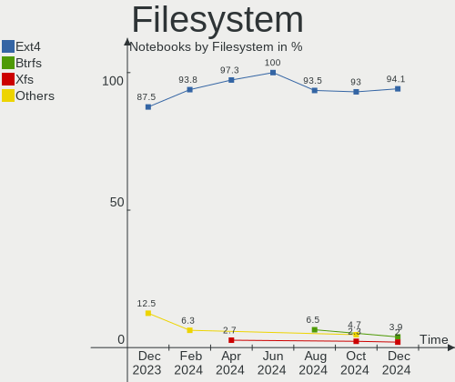
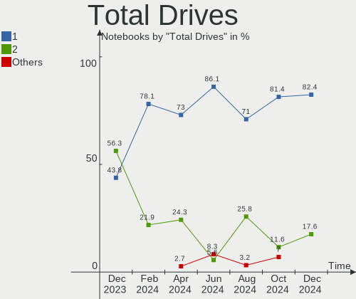
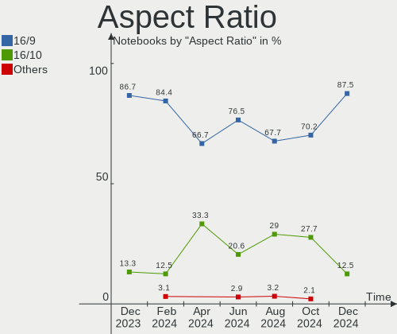
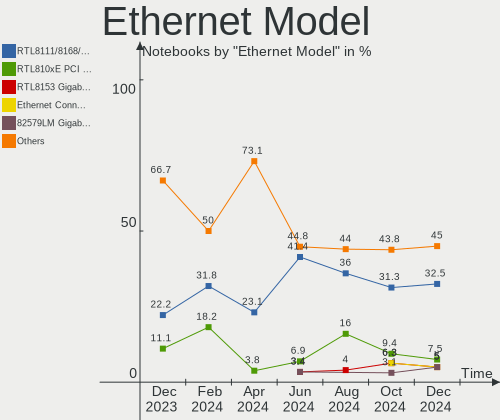
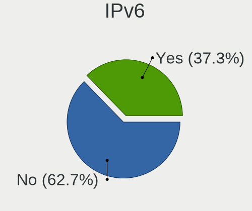
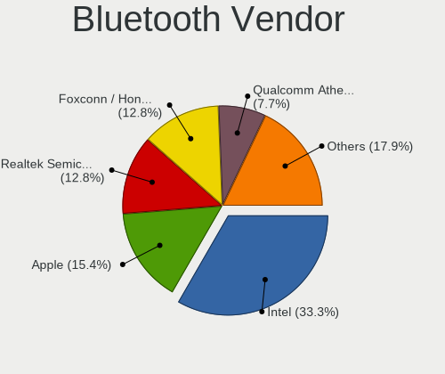
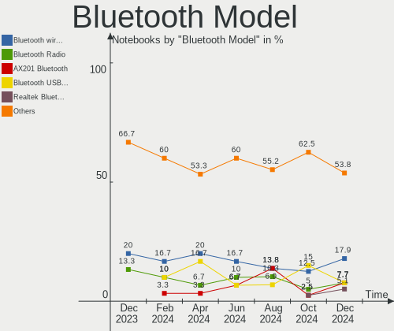
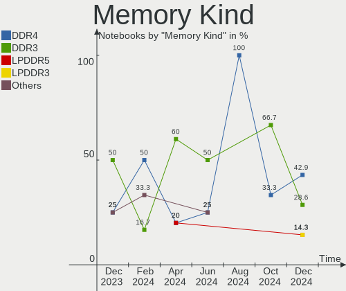

Elementary - Hardware Trends (Notebooks)
----------------------------------------

A project to identify most popular hardware characteristics and track their change
over time based on data collected by Linux users at https://Linux-Hardware.org.

Anyone can contribute to this report by the [hw-probe](https://github.com/linuxhw/hw-probe) tool:

    sudo -E hw-probe -all -upload

This report is for one last month. Overall report since the beginning of time: [TestDays](https://github.com/linuxhw/TestDays)

Period: Jun, 2023.

Contents
--------

* [ System ](#system)
  - [ OS                       ](#os)
  - [ OS Family                ](#os-family)
  - [ Kernel                   ](#kernel)
  - [ Kernel Family            ](#kernel-family)
  - [ Kernel Major Ver.        ](#kernel-major-ver)
  - [ Arch                     ](#arch)
  - [ DE                       ](#de)
  - [ Display Server           ](#display-server)
  - [ Display Manager          ](#display-manager)
  - [ OS Lang                  ](#os-lang)
  - [ Boot Mode                ](#boot-mode)
  - [ Filesystem               ](#filesystem)
  - [ Part. scheme             ](#part-scheme)
  - [ Dual Boot with Linux/BSD ](#dual-boot-with-linuxbsd)
  - [ Dual Boot (Win)          ](#dual-boot-win)

* [ Board ](#board)
  - [ Vendor                   ](#vendor)
  - [ Model                    ](#model)
  - [ Model Family             ](#model-family)
  - [ MFG Year                 ](#mfg-year)
  - [ Form Factor              ](#form-factor)
  - [ Secure Boot              ](#secure-boot)
  - [ Coreboot                 ](#coreboot)
  - [ RAM Size                 ](#ram-size)
  - [ RAM Used                 ](#ram-used)
  - [ Total Drives             ](#total-drives)
  - [ Has CD-ROM               ](#has-cd-rom)
  - [ Has Ethernet             ](#has-ethernet)
  - [ Has WiFi                 ](#has-wifi)
  - [ Has Bluetooth            ](#has-bluetooth)

* [ Location ](#location)
  - [ Country                  ](#country)
  - [ City                     ](#city)

* [ Drives ](#drives)
  - [ Drive Vendor             ](#drive-vendor)
  - [ Drive Model              ](#drive-model)
  - [ HDD Vendor               ](#hdd-vendor)
  - [ SSD Vendor               ](#ssd-vendor)
  - [ Drive Kind               ](#drive-kind)
  - [ Drive Connector          ](#drive-connector)
  - [ Drive Size               ](#drive-size)
  - [ Space Total              ](#space-total)
  - [ Space Used               ](#space-used)
  - [ Malfunc. Drives          ](#malfunc-drives)
  - [ Malfunc. Drive Vendor    ](#malfunc-drive-vendor)
  - [ Malfunc. HDD Vendor      ](#malfunc-hdd-vendor)
  - [ Malfunc. Drive Kind      ](#malfunc-drive-kind)
  - [ Failed Drives            ](#failed-drives)
  - [ Failed Drive Vendor      ](#failed-drive-vendor)
  - [ Drive Status             ](#drive-status)

* [ Storage controller ](#storage-controller)
  - [ Storage Vendor           ](#storage-vendor)
  - [ Storage Model            ](#storage-model)
  - [ Storage Kind             ](#storage-kind)

* [ Processor ](#processor)
  - [ CPU Vendor               ](#cpu-vendor)
  - [ CPU Model                ](#cpu-model)
  - [ CPU Model Family         ](#cpu-model-family)
  - [ CPU Cores                ](#cpu-cores)
  - [ CPU Sockets              ](#cpu-sockets)
  - [ CPU Threads              ](#cpu-threads)
  - [ CPU Op-Modes             ](#cpu-op-modes)
  - [ CPU Microcode            ](#cpu-microcode)
  - [ CPU Microarch            ](#cpu-microarch)

* [ Graphics ](#graphics)
  - [ GPU Vendor               ](#gpu-vendor)
  - [ GPU Model                ](#gpu-model)
  - [ GPU Combo                ](#gpu-combo)
  - [ GPU Driver               ](#gpu-driver)
  - [ GPU Memory               ](#gpu-memory)

* [ Monitor ](#monitor)
  - [ Monitor Vendor           ](#monitor-vendor)
  - [ Monitor Model            ](#monitor-model)
  - [ Monitor Resolution       ](#monitor-resolution)
  - [ Monitor Diagonal         ](#monitor-diagonal)
  - [ Monitor Width            ](#monitor-width)
  - [ Aspect Ratio             ](#aspect-ratio)
  - [ Monitor Area             ](#monitor-area)
  - [ Pixel Density            ](#pixel-density)
  - [ Multiple Monitors        ](#multiple-monitors)

* [ Network ](#network)
  - [ Net Controller Vendor    ](#net-controller-vendor)
  - [ Net Controller Model     ](#net-controller-model)
  - [ Wireless Vendor          ](#wireless-vendor)
  - [ Wireless Model           ](#wireless-model)
  - [ Ethernet Vendor          ](#ethernet-vendor)
  - [ Ethernet Model           ](#ethernet-model)
  - [ Net Controller Kind      ](#net-controller-kind)
  - [ Used Controller          ](#used-controller)
  - [ NICs                     ](#nics)
  - [ IPv6                     ](#ipv6)

* [ Bluetooth ](#bluetooth)
  - [ Bluetooth Vendor         ](#bluetooth-vendor)
  - [ Bluetooth Model          ](#bluetooth-model)

* [ Sound ](#sound)
  - [ Sound Vendor             ](#sound-vendor)
  - [ Sound Model              ](#sound-model)

* [ Memory ](#memory)
  - [ Memory Vendor            ](#memory-vendor)
  - [ Memory Model             ](#memory-model)
  - [ Memory Kind              ](#memory-kind)
  - [ Memory Form Factor       ](#memory-form-factor)
  - [ Memory Size              ](#memory-size)
  - [ Memory Speed             ](#memory-speed)

* [ Printers & scanners ](#printers--scanners)
  - [ Printer Vendor           ](#printer-vendor)
  - [ Printer Model            ](#printer-model)
  - [ Scanner Vendor           ](#scanner-vendor)
  - [ Scanner Model            ](#scanner-model)

* [ Camera ](#camera)
  - [ Camera Vendor            ](#camera-vendor)
  - [ Camera Model             ](#camera-model)

* [ Security ](#security)
  - [ Fingerprint Vendor       ](#fingerprint-vendor)
  - [ Fingerprint Model        ](#fingerprint-model)
  - [ Chipcard Vendor          ](#chipcard-vendor)
  - [ Chipcard Model           ](#chipcard-model)

* [ Unsupported ](#unsupported)
  - [ Unsupported Devices      ](#unsupported-devices)
  - [ Unsupported Device Types ](#unsupported-device-types)

System
------

OS
--

Installed operating systems

| Name             | Notebooks | Percent |
|------------------|-----------|---------|
| Elementary 7     | 16        | 80%     |
| Elementary 6.1   | 2         | 10%     |
| Elementary 5.1.7 | 2         | 10%     |

OS Family
---------

OS without a version

| Name       | Notebooks | Percent |
|------------|-----------|---------|
| Elementary | 20        | 100%    |

Kernel
------

Version of the Linux kernel

| Version           | Notebooks | Percent |
|-------------------|-----------|---------|
| 5.19.0-43-generic | 8         | 40%     |
| 5.15.0-58-generic | 4         | 20%     |
| 5.19.0-46-generic | 2         | 10%     |
| 5.19.0-45-generic | 2         | 10%     |
| 5.15.0-73-generic | 2         | 10%     |
| 5.4.0-92-generic  | 1         | 5%      |
| 5.4.0-150-generic | 1         | 5%      |

Kernel Family
-------------

Linux kernel without a distro release

| Version | Notebooks | Percent |
|---------|-----------|---------|
| 5.19.0  | 12        | 60%     |
| 5.15.0  | 6         | 30%     |
| 5.4.0   | 2         | 10%     |

Kernel Major Ver.
-----------------

Linux kernel major version

| Version | Notebooks | Percent |
|---------|-----------|---------|
| 5.19    | 12        | 60%     |
| 5.15    | 6         | 30%     |
| 5.4     | 2         | 10%     |

Arch
----

OS architecture (x86_64, i586, etc.)

| Name   | Notebooks | Percent |
|--------|-----------|---------|
| x86_64 | 20        | 100%    |

DE
--

Desktop Environment

| Name     | Notebooks | Percent |
|----------|-----------|---------|
| Pantheon | 19        | 95%     |
| Unknown  | 1         | 5%      |

Display Server
--------------

X11 or Wayland

| Name | Notebooks | Percent |
|------|-----------|---------|
| X11  | 20        | 100%    |

Display Manager
---------------

SDDM, LightDM, etc.

| Name    | Notebooks | Percent |
|---------|-----------|---------|
| Unknown | 14        | 70%     |
| LightDM | 6         | 30%     |

OS Lang
-------

Language

| Lang  | Notebooks | Percent |
|-------|-----------|---------|
| en_US | 9         | 45%     |
| de_DE | 5         | 25%     |
| ru_RU | 2         | 10%     |
| en_CA | 2         | 10%     |
| tr_TR | 1         | 5%      |
| es_ES | 1         | 5%      |

Boot Mode
---------

EFI or BIOS

| Mode | Notebooks | Percent |
|------|-----------|---------|
| BIOS | 16        | 80%     |
| EFI  | 4         | 20%     |

Filesystem
----------

Type of filesystem

| Type  | Notebooks | Percent |
|-------|-----------|---------|
| Ext4  | 16        | 80%     |
| Tmpfs | 4         | 20%     |

Part. scheme
------------

Scheme of partitioning

| Type    | Notebooks | Percent |
|---------|-----------|---------|
| Unknown | 14        | 70%     |
| GPT     | 4         | 20%     |
| MBR     | 2         | 10%     |

Dual Boot with Linux/BSD
------------------------

Hosting more than one Linux/BSD

| Dual boot | Notebooks | Percent |
|-----------|-----------|---------|
| No        | 20        | 100%    |

Dual Boot (Win)
---------------

Hosting Linux and Windows

| Dual boot | Notebooks | Percent |
|-----------|-----------|---------|
| No        | 19        | 95%     |
| Yes       | 1         | 5%      |

Board
-----

Vendor
------

Motherboard manufacturer

| Name             | Notebooks | Percent |
|------------------|-----------|---------|
| Dell             | 6         | 30%     |
| Lenovo           | 4         | 20%     |
| Toshiba          | 2         | 10%     |
| Hewlett-Packard  | 2         | 10%     |
| ASUSTek Computer | 2         | 10%     |
| Apple            | 2         | 10%     |
| Razer            | 1         | 5%      |
| HUAWEI           | 1         | 5%      |

Model
-----

Motherboard model

| Name                              | Notebooks | Percent |
|-----------------------------------|-----------|---------|
| Toshiba TECRA Z40-C               | 1         | 5%      |
| Toshiba TECRA R850                | 1         | 5%      |
| Razer Blade Stealth               | 1         | 5%      |
| Lenovo ThinkPad T460 20FMS08H00   | 1         | 5%      |
| Lenovo ThinkPad T430 2349OB6      | 1         | 5%      |
| Lenovo ThinkPad Edge E330 3354AHG | 1         | 5%      |
| Lenovo IdeaPad 3 15IGL05 81WQ     | 1         | 5%      |
| HUAWEI BOD-WXX9                   | 1         | 5%      |
| HP Laptop 17-by3xxx               | 1         | 5%      |
| HP G62                            | 1         | 5%      |
| Dell Precision M6600              | 1         | 5%      |
| Dell Latitude E5540               | 1         | 5%      |
| Dell Latitude E5470               | 1         | 5%      |
| Dell Latitude 5590                | 1         | 5%      |
| Dell Inspiron 3501                | 1         | 5%      |
| Dell Inspiron 15-3567             | 1         | 5%      |
| ASUS X555LA                       | 1         | 5%      |
| ASUS G750JM                       | 1         | 5%      |
| Apple MacBookPro11,1              | 1         | 5%      |
| Apple MacBookAir7,2               | 1         | 5%      |

Model Family
------------

Motherboard model prefix

| Name               | Notebooks | Percent |
|--------------------|-----------|---------|
| Lenovo ThinkPad    | 3         | 15%     |
| Dell Latitude      | 3         | 15%     |
| Toshiba TECRA      | 2         | 10%     |
| Dell Inspiron      | 2         | 10%     |
| Razer Blade        | 1         | 5%      |
| Lenovo IdeaPad     | 1         | 5%      |
| HUAWEI BOD-WXX9    | 1         | 5%      |
| HP Laptop          | 1         | 5%      |
| HP G62             | 1         | 5%      |
| Dell Precision     | 1         | 5%      |
| ASUS X555LA        | 1         | 5%      |
| ASUS G750JM        | 1         | 5%      |
| Apple MacBookPro11 | 1         | 5%      |
| Apple MacBookAir7  | 1         | 5%      |

MFG Year
--------

Motherboard manufacture year

| Year | Notebooks | Percent |
|------|-----------|---------|
| 2016 | 4         | 20%     |
| 2014 | 4         | 20%     |
| 2020 | 3         | 15%     |
| 2012 | 2         | 10%     |
| 2011 | 2         | 10%     |
| 2021 | 1         | 5%      |
| 2019 | 1         | 5%      |
| 2018 | 1         | 5%      |
| 2015 | 1         | 5%      |
| 2010 | 1         | 5%      |

Form Factor
-----------

Physical design of the computer

| Name     | Notebooks | Percent |
|----------|-----------|---------|
| Notebook | 20        | 100%    |

Secure Boot
-----------

Enabled or disabled

| State    | Notebooks | Percent |
|----------|-----------|---------|
| Disabled | 18        | 90%     |
| Enabled  | 2         | 10%     |

Coreboot
--------

Have coreboot on board

| Used | Notebooks | Percent |
|------|-----------|---------|
| No   | 20        | 100%    |

RAM Size
--------

Total RAM memory

| Size in GB | Notebooks | Percent |
|------------|-----------|---------|
| 4.01-8.0   | 7         | 35%     |
| 16.01-24.0 | 7         | 35%     |
| 8.01-16.0  | 5         | 25%     |
| 3.01-4.0   | 1         | 5%      |

RAM Used
--------

Used RAM memory

| Used GB  | Notebooks | Percent |
|----------|-----------|---------|
| 2.01-3.0 | 13        | 65%     |
| 4.01-8.0 | 4         | 20%     |
| 1.01-2.0 | 2         | 10%     |
| 3.01-4.0 | 1         | 5%      |

Total Drives
------------

Number of drives on board

| Drives | Notebooks | Percent |
|--------|-----------|---------|
| 1      | 15        | 75%     |
| 2      | 5         | 25%     |

Has CD-ROM
----------

Has CD-ROM on board

| Presented | Notebooks | Percent |
|-----------|-----------|---------|
| No        | 13        | 65%     |
| Yes       | 7         | 35%     |

Has Ethernet
------------

Has Ethernet on board

| Presented | Notebooks | Percent |
|-----------|-----------|---------|
| Yes       | 17        | 85%     |
| No        | 3         | 15%     |

Has WiFi
--------

Has WiFi module

| Presented | Notebooks | Percent |
|-----------|-----------|---------|
| Yes       | 20        | 100%    |

Has Bluetooth
-------------

Has Bluetooth module

| Presented | Notebooks | Percent |
|-----------|-----------|---------|
| Yes       | 17        | 85%     |
| No        | 3         | 15%     |

Location
--------

Country
-------

Geographic location (country)

| Country  | Notebooks | Percent |
|----------|-----------|---------|
| Germany  | 6         | 30%     |
| USA      | 4         | 20%     |
| Russia   | 2         | 10%     |
| Mexico   | 2         | 10%     |
| Canada   | 2         | 10%     |
| Turkey   | 1         | 5%      |
| Portugal | 1         | 5%      |
| Israel   | 1         | 5%      |
| Austria  | 1         | 5%      |

City
----

Geographic location (city)

| City                | Notebooks | Percent |
|---------------------|-----------|---------|
| Vienna              | 1         | 5%      |
| Torres Vedras       | 1         | 5%      |
| Stuttgart           | 1         | 5%      |
| Spaichingen         | 1         | 5%      |
| Slavyansk-na-Kubani | 1         | 5%      |
| Nuremberg           | 1         | 5%      |
| Munich              | 1         | 5%      |
| Mexico City         | 1         | 5%      |
| Los Angeles         | 1         | 5%      |
| Karlsruhe           | 1         | 5%      |
| Istanbul            | 1         | 5%      |
| Herzliya            | 1         | 5%      |
| Greater Sudbury     | 1         | 5%      |
| Great Falls         | 1         | 5%      |
| Flushing            | 1         | 5%      |
| Fairfax             | 1         | 5%      |
| Chelyabinsk         | 1         | 5%      |
| Cabo San Lucas      | 1         | 5%      |
| Burnaby             | 1         | 5%      |
| Berlin              | 1         | 5%      |

Drives
------

Drive Vendor
------------

Hard drive vendors

| Vendor                         | Notebooks | Drives | Percent |
|--------------------------------|-----------|--------|---------|
| Unknown                        | 4         | 4      | 16%     |
| Kingston                       | 3         | 4      | 12%     |
| Apple                          | 3         | 3      | 12%     |
| WDC                            | 2         | 2      | 8%      |
| Sandisk                        | 2         | 2      | 8%      |
| Samsung Electronics            | 2         | 2      | 8%      |
| Crucial                        | 2         | 2      | 8%      |
| Solid State Storage Technology | 1         | 1      | 4%      |
| Seagate                        | 1         | 1      | 4%      |
| Phison Electronics             | 1         | 1      | 4%      |
| KIOXIA                         | 1         | 1      | 4%      |
| Intel                          | 1         | 1      | 4%      |
| Hitachi                        | 1         | 1      | 4%      |
| China                          | 1         | 1      | 4%      |

Drive Model
-----------

Hard drive models

| Model                                            | Notebooks | Percent |
|--------------------------------------------------|-----------|---------|
| Kingston SA400S37960G 960GB SSD                  | 2         | 7.69%   |
| WDC WDS100T2B0B-00YS70 1TB SSD                   | 1         | 3.85%   |
| WDC WD5000LPVX-80V0TT0 500GB                     | 1         | 3.85%   |
| Unknown SE64G  64GB                              | 1         | 3.85%   |
| Unknown MMC Card  7GB                            | 1         | 3.85%   |
| Unknown MMC Card  32GB                           | 1         | 3.85%   |
| Unknown MMC Card  128GB                          | 1         | 3.85%   |
| Solid State Storage SSSTC CL1-4D128 128GB        | 1         | 3.85%   |
| Seagate ST9320423AS 320GB                        | 1         | 3.85%   |
| Sandisk WD Black SN750 / PC SN730 NVMe SSD 500GB | 1         | 3.85%   |
| SanDisk SDSSDA240G 240GB                         | 1         | 3.85%   |
| Samsung PM991a NVMe 256GB                        | 1         | 3.85%   |
| Samsung MZ7LN256HCHP-000L7 256GB SSD             | 1         | 3.85%   |
| Phison E12 NVMe Controller 1TB                   | 1         | 3.85%   |
| KIOXIA KBG40ZNV512G 512GB                        | 1         | 3.85%   |
| Kingston SNVS500G 500GB                          | 1         | 3.85%   |
| Kingston SKC400S37512G 512GB SSD                 | 1         | 3.85%   |
| Intel SSDSC2BF180A4L 180GB                       | 1         | 3.85%   |
| Hitachi HTS545050A7E380 500GB                    | 1         | 3.85%   |
| Crucial CT500MX500SSD1 500GB                     | 1         | 3.85%   |
| Crucial CT240BX500SSD1 240GB                     | 1         | 3.85%   |
| China SATA SSD 480GB                             | 1         | 3.85%   |
| Apple SSD SM0256G 256GB                          | 1         | 3.85%   |
| Apple SSD SD0128F 121GB                          | 1         | 3.85%   |
| Apple HDD ST500LM012 500GB                       | 1         | 3.85%   |

HDD Vendor
----------

Hard disk drive vendors

| Vendor  | Notebooks | Drives | Percent |
|---------|-----------|--------|---------|
| WDC     | 1         | 1      | 25%     |
| Seagate | 1         | 1      | 25%     |
| Hitachi | 1         | 1      | 25%     |
| Apple   | 1         | 1      | 25%     |

SSD Vendor
----------

Solid state drive vendors

| Vendor              | Notebooks | Drives | Percent |
|---------------------|-----------|--------|---------|
| Kingston            | 3         | 3      | 25%     |
| Crucial             | 2         | 2      | 16.67%  |
| Apple               | 2         | 2      | 16.67%  |
| WDC                 | 1         | 1      | 8.33%   |
| SanDisk             | 1         | 1      | 8.33%   |
| Samsung Electronics | 1         | 1      | 8.33%   |
| Intel               | 1         | 1      | 8.33%   |
| China               | 1         | 1      | 8.33%   |

Drive Kind
----------

HDD or SSD

| Kind | Notebooks | Drives | Percent |
|------|-----------|--------|---------|
| SSD  | 12        | 12     | 46.15%  |
| NVMe | 6         | 6      | 23.08%  |
| MMC  | 4         | 4      | 15.38%  |
| HDD  | 4         | 4      | 15.38%  |

Drive Connector
---------------

SATA, SAS, NVMe, etc.

| Type | Notebooks | Drives | Percent |
|------|-----------|--------|---------|
| SATA | 15        | 16     | 60%     |
| NVMe | 6         | 6      | 24%     |
| MMC  | 4         | 4      | 16%     |

Drive Size
----------

Size of hard drive

| Size in TB | Notebooks | Drives | Percent |
|------------|-----------|--------|---------|
| 0.01-0.5   | 11        | 12     | 73.33%  |
| 0.51-1.0   | 4         | 4      | 26.67%  |

Space Total
-----------

Amount of disk space available on the file system

| Size in GB | Notebooks | Percent |
|------------|-----------|---------|
| 251-500    | 8         | 40%     |
| 101-250    | 8         | 40%     |
| 501-1000   | 2         | 10%     |
| 1001-2000  | 1         | 5%      |
| 51-100     | 1         | 5%      |

Space Used
----------

Amount of used disk space

| Used GB  | Notebooks | Percent |
|----------|-----------|---------|
| 1-20     | 8         | 40%     |
| 21-50    | 7         | 35%     |
| 101-250  | 2         | 10%     |
| 251-500  | 1         | 5%      |
| 501-1000 | 1         | 5%      |
| 51-100   | 1         | 5%      |

Malfunc. Drives
---------------

Drive models with a malfunction

Zero info for selected period =(

Malfunc. Drive Vendor
---------------------

Vendors of faulty drives

Zero info for selected period =(

Malfunc. HDD Vendor
-------------------

Vendors of faulty HDD drives

Zero info for selected period =(

Malfunc. Drive Kind
-------------------

Kinds of faulty drives

Zero info for selected period =(

Failed Drives
-------------

Failed drive models

Zero info for selected period =(

Failed Drive Vendor
-------------------

Failed drive vendors

Zero info for selected period =(

Drive Status
------------

Number of failed and malfunc. drives

| Status   | Notebooks | Drives | Percent |
|----------|-----------|--------|---------|
| Detected | 19        | 24     | 90.48%  |
| Works    | 2         | 2      | 9.52%   |

Storage controller
------------------

Storage Vendor
--------------

Storage controller vendors

| Vendor                         | Notebooks | Percent |
|--------------------------------|-----------|---------|
| Intel                          | 16        | 66.67%  |
| Samsung Electronics            | 2         | 8.33%   |
| Solid State Storage Technology | 1         | 4.17%   |
| SanDisk                        | 1         | 4.17%   |
| Phison Electronics             | 1         | 4.17%   |
| Marvell Technology Group       | 1         | 4.17%   |
| KIOXIA                         | 1         | 4.17%   |
| Kingston Technology Company    | 1         | 4.17%   |

Storage Model
-------------

Storage controller models

| Model                                                                          | Notebooks | Percent |
|--------------------------------------------------------------------------------|-----------|---------|
| Intel Sunrise Point-LP SATA Controller [AHCI mode]                             | 4         | 16.67%  |
| Intel 82801 Mobile SATA Controller [RAID mode]                                 | 2         | 8.33%   |
| Intel 8 Series SATA Controller 1 [AHCI mode]                                   | 2         | 8.33%   |
| Intel 7 Series Chipset Family 6-port SATA Controller [AHCI mode]               | 2         | 8.33%   |
| Solid State Storage CL1-3D256-Q11 NVMe SSD M.2                                 | 1         | 4.17%   |
| SanDisk WD Black SN750 / PC SN730 NVMe SSD                                     | 1         | 4.17%   |
| Samsung NVMe SSD Controller 980                                                | 1         | 4.17%   |
| Samsung Electronics SATA controller                                            | 1         | 4.17%   |
| Phison E12 NVMe Controller                                                     | 1         | 4.17%   |
| Marvell Group 88SS9183 PCIe SSD Controller                                     | 1         | 4.17%   |
| KIOXIA NVMe SSD Controller BG4                                                 | 1         | 4.17%   |
| Kingston Company NVMe Controller                                               | 1         | 4.17%   |
| Intel SATA Controller [RAID mode]                                              | 1         | 4.17%   |
| Intel Ice Lake-LP SATA Controller [AHCI mode]                                  | 1         | 4.17%   |
| Intel Celeron/Pentium Silver Processor SATA Controller                         | 1         | 4.17%   |
| Intel 8 Series/C220 Series Chipset Family 6-port SATA Controller 1 [AHCI mode] | 1         | 4.17%   |
| Intel 6 Series/C200 Series Chipset Family 6 port Mobile SATA AHCI Controller   | 1         | 4.17%   |
| Intel 5 Series/3400 Series Chipset 4 port SATA AHCI Controller                 | 1         | 4.17%   |

Storage Kind
------------

Kind of storage controller (IDE, SATA, NVMe, SAS, ...)

| Kind | Notebooks | Percent |
|------|-----------|---------|
| SATA | 15        | 62.5%   |
| NVMe | 6         | 25%     |
| RAID | 3         | 12.5%   |

Processor
---------

CPU Vendor
----------

Processor vendors

| Vendor | Notebooks | Percent |
|--------|-----------|---------|
| Intel  | 20        | 100%    |

CPU Model
---------

Processor models

| Model                                   | Notebooks | Percent |
|-----------------------------------------|-----------|---------|
| Intel Core i5-1035G1 CPU @ 1.00GHz      | 2         | 10%     |
| Intel Core i7-8650U CPU @ 1.90GHz       | 1         | 5%      |
| Intel Core i7-8565U CPU @ 1.80GHz       | 1         | 5%      |
| Intel Core i7-6820HQ CPU @ 2.70GHz      | 1         | 5%      |
| Intel Core i7-4700HQ CPU @ 2.40GHz      | 1         | 5%      |
| Intel Core i7-2820QM CPU @ 2.30GHz      | 1         | 5%      |
| Intel Core i5-6300U CPU @ 2.40GHz       | 1         | 5%      |
| Intel Core i5-6200U CPU @ 2.30GHz       | 1         | 5%      |
| Intel Core i5-5250U CPU @ 1.60GHz       | 1         | 5%      |
| Intel Core i5-4310U CPU @ 2.00GHz       | 1         | 5%      |
| Intel Core i5-4278U CPU @ 2.60GHz       | 1         | 5%      |
| Intel Core i5-4210U CPU @ 1.70GHz       | 1         | 5%      |
| Intel Core i5-3320M CPU @ 2.60GHz       | 1         | 5%      |
| Intel Core i5-3210M CPU @ 2.50GHz       | 1         | 5%      |
| Intel Core i5-2520M CPU @ 2.50GHz       | 1         | 5%      |
| Intel Core i5 CPU M 460 @ 2.53GHz       | 1         | 5%      |
| Intel Core i3-7100U CPU @ 2.40GHz       | 1         | 5%      |
| Intel Celeron N4020 CPU @ 1.10GHz       | 1         | 5%      |
| Intel 11th Gen Core i3-1115G4 @ 3.00GHz | 1         | 5%      |

CPU Model Family
----------------

Processor model prefix

| Model         | Notebooks | Percent |
|---------------|-----------|---------|
| Intel Core i5 | 12        | 60%     |
| Intel Core i7 | 5         | 25%     |
| Other         | 1         | 5%      |
| Intel Core i3 | 1         | 5%      |
| Intel Celeron | 1         | 5%      |

CPU Cores
---------

Number of processor cores

| Number | Notebooks | Percent |
|--------|-----------|---------|
| 2      | 13        | 65%     |
| 4      | 7         | 35%     |

CPU Sockets
-----------

Number of sockets

| Number | Notebooks | Percent |
|--------|-----------|---------|
| 1      | 20        | 100%    |

CPU Threads
-----------

Threads per core (Hyper-Threading)

| Number | Notebooks | Percent |
|--------|-----------|---------|
| 2      | 19        | 95%     |
| 1      | 1         | 5%      |

CPU Op-Modes
------------

CPU Operation Modes (32-bit, 64-bit)

| Op mode        | Notebooks | Percent |
|----------------|-----------|---------|
| 32-bit, 64-bit | 20        | 100%    |

CPU Microcode
-------------

Microcode number

| Number  | Notebooks | Percent |
|---------|-----------|---------|
| Unknown | 13        | 65%     |
| 0x206a7 | 2         | 10%     |
| 0x806ea | 1         | 5%      |
| 0x806e9 | 1         | 5%      |
| 0x706e5 | 1         | 5%      |
| 0x706a8 | 1         | 5%      |
| 0x40651 | 1         | 5%      |

CPU Microarch
-------------

Microarchitecture

| Name          | Notebooks | Percent |
|---------------|-----------|---------|
| Haswell       | 4         | 20%     |
| Skylake       | 3         | 15%     |
| KabyLake      | 3         | 15%     |
| SandyBridge   | 2         | 10%     |
| IvyBridge     | 2         | 10%     |
| IceLake       | 2         | 10%     |
| Westmere      | 1         | 5%      |
| TigerLake     | 1         | 5%      |
| Goldmont plus | 1         | 5%      |
| Broadwell     | 1         | 5%      |

Graphics
--------

GPU Vendor
----------

Vendors of graphics cards

| Vendor | Notebooks | Percent |
|--------|-----------|---------|
| Intel  | 19        | 82.61%  |
| Nvidia | 2         | 8.7%    |
| AMD    | 2         | 8.7%    |

GPU Model
---------

Graphics card models

| Model                                                                     | Notebooks | Percent |
|---------------------------------------------------------------------------|-----------|---------|
| Intel Haswell-ULT Integrated Graphics Controller                          | 3         | 13.04%  |
| Intel Skylake GT2 [HD Graphics 520]                                       | 2         | 8.7%    |
| Intel Iris Plus Graphics G1 (Ice Lake)                                    | 2         | 8.7%    |
| Intel 3rd Gen Core processor Graphics Controller                          | 2         | 8.7%    |
| Nvidia GP108M [GeForce MX150]                                             | 1         | 4.35%   |
| Nvidia GM107M [GeForce GTX 860M]                                          | 1         | 4.35%   |
| Intel WhiskeyLake-U GT2 [UHD Graphics 620]                                | 1         | 4.35%   |
| Intel UHD Graphics 620                                                    | 1         | 4.35%   |
| Intel Tiger Lake-LP GT2 [UHD Graphics G4]                                 | 1         | 4.35%   |
| Intel HD Graphics 620                                                     | 1         | 4.35%   |
| Intel HD Graphics 6000                                                    | 1         | 4.35%   |
| Intel HD Graphics 530                                                     | 1         | 4.35%   |
| Intel GeminiLake [UHD Graphics 600]                                       | 1         | 4.35%   |
| Intel Core Processor Integrated Graphics Controller                       | 1         | 4.35%   |
| Intel 4th Gen Core Processor Integrated Graphics Controller               | 1         | 4.35%   |
| Intel 2nd Generation Core Processor Family Integrated Graphics Controller | 1         | 4.35%   |
| AMD Park [Mobility Radeon HD 5430/5450/5470]                              | 1         | 4.35%   |
| AMD Blackcomb [Radeon HD 6970M/6990M]                                     | 1         | 4.35%   |

GPU Combo
---------

Combinations of graphics cards

| Name           | Notebooks | Percent |
|----------------|-----------|---------|
| 1 x Intel      | 16        | 80%     |
| Intel + Nvidia | 2         | 10%     |
| Intel + AMD    | 1         | 5%      |
| 1 x AMD        | 1         | 5%      |

GPU Driver
----------

Free vs proprietary

| Driver | Notebooks | Percent |
|--------|-----------|---------|
| Free   | 20        | 100%    |

GPU Memory
----------

Total video memory

| Size in GB | Notebooks | Percent |
|------------|-----------|---------|
| Unknown    | 19        | 95%     |
| 1.01-2.0   | 1         | 5%      |

Monitor
-------

Monitor Vendor
--------------

Monitor vendors

| Vendor         | Notebooks | Percent |
|----------------|-----------|---------|
| LG Display     | 6         | 28.57%  |
| BOE            | 4         | 19.05%  |
| AU Optronics   | 4         | 19.05%  |
| Chimei Innolux | 2         | 9.52%   |
| Apple          | 2         | 9.52%   |
| Sharp          | 1         | 4.76%   |
| Dell           | 1         | 4.76%   |
| BenQ           | 1         | 4.76%   |

Monitor Model
-------------

Monitor models

| Model                                                            | Notebooks | Percent |
|------------------------------------------------------------------|-----------|---------|
| AU Optronics LCD Monitor AUO21ED 1920x1080 344x194mm 15.5-inch   | 2         | 9.52%   |
| Sharp LCD Monitor SHP14B8 1920x1080 294x165mm 13.3-inch          | 1         | 4.76%   |
| LG Display LCD Monitor LGD04B1 1366x768 310x174mm 14.0-inch      | 1         | 4.76%   |
| LG Display LCD Monitor LGD046D 1920x1080 309x174mm 14.0-inch     | 1         | 4.76%   |
| LG Display LCD Monitor LGD045C 1366x768 345x194mm 15.6-inch      | 1         | 4.76%   |
| LG Display LCD Monitor LGD03B8 1366x768 310x174mm 14.0-inch      | 1         | 4.76%   |
| LG Display LCD Monitor LGD0354 1366x768 293x165mm 13.2-inch      | 1         | 4.76%   |
| LG Display LCD Monitor LGD02AC 1366x768 344x194mm 15.5-inch      | 1         | 4.76%   |
| Dell S2240T DELA096 1920x1080 477x268mm 21.5-inch                | 1         | 4.76%   |
| Chimei Innolux LCD Monitor CMN175E 1920x1080 381x214mm 17.2-inch | 1         | 4.76%   |
| Chimei Innolux LCD Monitor CMN14B1 1920x1080 308x173mm 13.9-inch | 1         | 4.76%   |
| BOE LCD Monitor BOE09E6 1920x1080 344x193mm 15.5-inch            | 1         | 4.76%   |
| BOE LCD Monitor BOE0872 1920x1080 344x194mm 15.5-inch            | 1         | 4.76%   |
| BOE LCD Monitor BOE06CB 1920x1080 344x194mm 15.5-inch            | 1         | 4.76%   |
| BOE LCD Monitor BOE06C2 1366x768 344x194mm 15.5-inch             | 1         | 4.76%   |
| BenQ PD2500Q BNQ802A 2560x1440 553x311mm 25.0-inch               | 1         | 4.76%   |
| AU Optronics LCD Monitor AUO219D 1920x1080 381x214mm 17.2-inch   | 1         | 4.76%   |
| AU Optronics LCD Monitor AUO129E 1600x900 382x214mm 17.2-inch    | 1         | 4.76%   |
| Apple Color LCD APPA018 2560x1600 286x179mm 13.3-inch            | 1         | 4.76%   |
| Apple Color LCD APP9CF0 1440x900 290x180mm 13.4-inch             | 1         | 4.76%   |

Monitor Resolution
------------------

Monitor screen resolution

| Resolution       | Notebooks | Percent |
|------------------|-----------|---------|
| 1920x1080 (FHD)  | 10        | 50%     |
| 1366x768 (WXGA)  | 6         | 30%     |
| 2560x1600        | 1         | 5%      |
| 2560x1440 (QHD)  | 1         | 5%      |
| 1600x900 (HD+)   | 1         | 5%      |
| 1440x900 (WXGA+) | 1         | 5%      |

Monitor Diagonal
----------------

Diagonal size in inches

| Inches | Notebooks | Percent |
|--------|-----------|---------|
| 15     | 8         | 38.1%   |
| 13     | 5         | 23.81%  |
| 17     | 3         | 14.29%  |
| 14     | 3         | 14.29%  |
| 25     | 1         | 4.76%   |
| 21     | 1         | 4.76%   |

Monitor Width
-------------

Physical width

| Width in mm | Notebooks | Percent |
|-------------|-----------|---------|
| 301-350     | 12        | 57.14%  |
| 201-300     | 4         | 19.05%  |
| 351-400     | 3         | 14.29%  |
| 501-600     | 1         | 4.76%   |
| 401-500     | 1         | 4.76%   |

Aspect Ratio
------------

Proportional relationship between the width and the height

| Ratio | Notebooks | Percent |
|-------|-----------|---------|
| 16/9  | 17        | 89.47%  |
| 16/10 | 2         | 10.53%  |

Monitor Area
------------

Area in inch²

| Area in inch² | Notebooks | Percent |
|----------------|-----------|---------|
| 101-110        | 8         | 38.1%   |
| 81-90          | 5         | 23.81%  |
| 71-80          | 3         | 14.29%  |
| 121-130        | 3         | 14.29%  |
| 251-300        | 1         | 4.76%   |
| 201-250        | 1         | 4.76%   |

Pixel Density
-------------

Pixels per inch

| Density | Notebooks | Percent |
|---------|-----------|---------|
| 121-160 | 10        | 50%     |
| 101-120 | 7         | 35%     |
| 161-240 | 2         | 10%     |
| 51-100  | 1         | 5%      |

Multiple Monitors
-----------------

Total monitors connected

| Total | Notebooks | Percent |
|-------|-----------|---------|
| 1     | 18        | 90%     |
| 2     | 2         | 10%     |

Network
-------

Net Controller Vendor
---------------------

Controller vendors

| Vendor                     | Notebooks | Percent |
|----------------------------|-----------|---------|
| Intel                      | 12        | 40%     |
| Realtek Semiconductor      | 6         | 20%     |
| Qualcomm Atheros           | 4         | 13.33%  |
| Broadcom                   | 3         | 10%     |
| Broadcom Limited           | 2         | 6.67%   |
| ZTE WCDMA Technologies MSM | 1         | 3.33%   |
| NetGear                    | 1         | 3.33%   |
| Huawei Technologies        | 1         | 3.33%   |

Net Controller Model
--------------------

Controller models

| Model                                                             | Notebooks | Percent |
|-------------------------------------------------------------------|-----------|---------|
| Realtek RTL8111/8168/8411 PCI Express Gigabit Ethernet Controller | 3         | 8.11%   |
| Intel Wireless 8260                                               | 3         | 8.11%   |
| Intel 82579LM Gigabit Network Connection (Lewisville)             | 3         | 8.11%   |
| Realtek RTL810xE PCI Express Fast Ethernet controller             | 2         | 5.41%   |
| Broadcom Limited BCM4360 802.11ac Wireless Network Adapter        | 2         | 5.41%   |
| Broadcom BCM4313 802.11bgn Wireless Network Adapter               | 2         | 5.41%   |
| ZTE WCDMA MSM Android                                             | 1         | 2.7%    |
| Realtek RTL8822CE 802.11ac PCIe Wireless Network Adapter          | 1         | 2.7%    |
| Realtek RTL8821CE 802.11ac PCIe Wireless Network Adapter          | 1         | 2.7%    |
| Qualcomm Atheros QCA9565 / AR9565 Wireless Network Adapter        | 1         | 2.7%    |
| Qualcomm Atheros QCA8171 Gigabit Ethernet                         | 1         | 2.7%    |
| Qualcomm Atheros AR9485 Wireless Network Adapter                  | 1         | 2.7%    |
| Qualcomm Atheros AR9462 Wireless Network Adapter                  | 1         | 2.7%    |
| NetGear LB1120-100NAS                                             | 1         | 2.7%    |
| Intel Wireless 8265 / 8275                                        | 1         | 2.7%    |
| Intel Wireless 7260                                               | 1         | 2.7%    |
| Intel Wi-Fi 6 AX201                                               | 1         | 2.7%    |
| Intel Ice Lake-LP PCH CNVi WiFi                                   | 1         | 2.7%    |
| Intel Ethernet Connection I219-V                                  | 1         | 2.7%    |
| Intel Ethernet Connection I219-LM                                 | 1         | 2.7%    |
| Intel Ethernet Connection I218-LM                                 | 1         | 2.7%    |
| Intel Ethernet Connection (4) I219-LM                             | 1         | 2.7%    |
| Intel Ethernet Connection (2) I219-LM                             | 1         | 2.7%    |
| Intel Centrino Wireless-N 2230                                    | 1         | 2.7%    |
| Intel Centrino Advanced-N 6230 [Rainbow Peak]                     | 1         | 2.7%    |
| Intel Cannon Point-LP CNVi [Wireless-AC]                          | 1         | 2.7%    |
| Huawei E353/E3131                                                 | 1         | 2.7%    |
| Broadcom BCM4352 802.11ac Wireless Network Adapter                | 1         | 2.7%    |

Wireless Vendor
---------------

Wireless vendors

| Vendor                | Notebooks | Percent |
|-----------------------|-----------|---------|
| Intel                 | 10        | 50%     |
| Qualcomm Atheros      | 3         | 15%     |
| Broadcom              | 3         | 15%     |
| Realtek Semiconductor | 2         | 10%     |
| Broadcom Limited      | 2         | 10%     |

Wireless Model
--------------

Wireless models

| Model                                                      | Notebooks | Percent |
|------------------------------------------------------------|-----------|---------|
| Intel Wireless 8260                                        | 3         | 15%     |
| Broadcom Limited BCM4360 802.11ac Wireless Network Adapter | 2         | 10%     |
| Broadcom BCM4313 802.11bgn Wireless Network Adapter        | 2         | 10%     |
| Realtek RTL8822CE 802.11ac PCIe Wireless Network Adapter   | 1         | 5%      |
| Realtek RTL8821CE 802.11ac PCIe Wireless Network Adapter   | 1         | 5%      |
| Qualcomm Atheros QCA9565 / AR9565 Wireless Network Adapter | 1         | 5%      |
| Qualcomm Atheros AR9485 Wireless Network Adapter           | 1         | 5%      |
| Qualcomm Atheros AR9462 Wireless Network Adapter           | 1         | 5%      |
| Intel Wireless 8265 / 8275                                 | 1         | 5%      |
| Intel Wireless 7260                                        | 1         | 5%      |
| Intel Wi-Fi 6 AX201                                        | 1         | 5%      |
| Intel Ice Lake-LP PCH CNVi WiFi                            | 1         | 5%      |
| Intel Centrino Wireless-N 2230                             | 1         | 5%      |
| Intel Centrino Advanced-N 6230 [Rainbow Peak]              | 1         | 5%      |
| Intel Cannon Point-LP CNVi [Wireless-AC]                   | 1         | 5%      |
| Broadcom BCM4352 802.11ac Wireless Network Adapter         | 1         | 5%      |

Ethernet Vendor
---------------

Ethernet vendors

| Vendor                     | Notebooks | Percent |
|----------------------------|-----------|---------|
| Intel                      | 8         | 47.06%  |
| Realtek Semiconductor      | 5         | 29.41%  |
| ZTE WCDMA Technologies MSM | 1         | 5.88%   |
| Qualcomm Atheros           | 1         | 5.88%   |
| NetGear                    | 1         | 5.88%   |
| Huawei Technologies        | 1         | 5.88%   |

Ethernet Model
--------------

Ethernet models

| Model                                                             | Notebooks | Percent |
|-------------------------------------------------------------------|-----------|---------|
| Realtek RTL8111/8168/8411 PCI Express Gigabit Ethernet Controller | 3         | 17.65%  |
| Intel 82579LM Gigabit Network Connection (Lewisville)             | 3         | 17.65%  |
| Realtek RTL810xE PCI Express Fast Ethernet controller             | 2         | 11.76%  |
| ZTE WCDMA MSM Android                                             | 1         | 5.88%   |
| Qualcomm Atheros QCA8171 Gigabit Ethernet                         | 1         | 5.88%   |
| NetGear LB1120-100NAS                                             | 1         | 5.88%   |
| Intel Ethernet Connection I219-V                                  | 1         | 5.88%   |
| Intel Ethernet Connection I219-LM                                 | 1         | 5.88%   |
| Intel Ethernet Connection I218-LM                                 | 1         | 5.88%   |
| Intel Ethernet Connection (4) I219-LM                             | 1         | 5.88%   |
| Intel Ethernet Connection (2) I219-LM                             | 1         | 5.88%   |
| Huawei E353/E3131                                                 | 1         | 5.88%   |

Net Controller Kind
-------------------

Ethernet, WiFi or modem

| Kind     | Notebooks | Percent |
|----------|-----------|---------|
| WiFi     | 20        | 54.05%  |
| Ethernet | 17        | 45.95%  |

Used Controller
---------------

Currently used network controller

| Kind     | Notebooks | Percent |
|----------|-----------|---------|
| WiFi     | 17        | 80.95%  |
| Ethernet | 4         | 19.05%  |

NICs
----

Total network controllers on board

| Total | Notebooks | Percent |
|-------|-----------|---------|
| 2     | 14        | 70%     |
| 1     | 6         | 30%     |

IPv6
----

IPv6 vs IPv4

| Used | Notebooks | Percent |
|------|-----------|---------|
| No   | 15        | 75%     |
| Yes  | 5         | 25%     |

Bluetooth
---------

Bluetooth Vendor
----------------

Controller vendors

| Vendor                          | Notebooks | Percent |
|---------------------------------|-----------|---------|
| Intel                           | 10        | 58.82%  |
| Realtek Semiconductor           | 2         | 11.76%  |
| Apple                           | 2         | 11.76%  |
| Qualcomm Atheros Communications | 1         | 5.88%   |
| IMC Networks                    | 1         | 5.88%   |
| Dell                            | 1         | 5.88%   |

Bluetooth Model
---------------

Controller models

| Model                                            | Notebooks | Percent |
|--------------------------------------------------|-----------|---------|
| Intel Bluetooth wireless interface               | 5         | 29.41%  |
| Intel Bluetooth 9460/9560 Jefferson Peak (JfP)   | 2         | 11.76%  |
| Realtek  Bluetooth 4.2 Adapter                   | 1         | 5.88%   |
| Realtek Bluetooth Radio                          | 1         | 5.88%   |
| Qualcomm Atheros  Bluetooth Device               | 1         | 5.88%   |
| Intel Centrino Bluetooth Wireless Transceiver    | 1         | 5.88%   |
| Intel Centrino Advanced-N 6230 Bluetooth adapter | 1         | 5.88%   |
| Intel AX201 Bluetooth                            | 1         | 5.88%   |
| IMC Networks BCM20702A0                          | 1         | 5.88%   |
| Dell DW375 Bluetooth Module                      | 1         | 5.88%   |
| Apple Bluetooth USB Host Controller              | 1         | 5.88%   |
| Apple Bluetooth Host Controller                  | 1         | 5.88%   |

Sound
-----

Sound Vendor
------------

Sound card vendors

| Vendor | Notebooks | Percent |
|--------|-----------|---------|
| Intel  | 20        | 90.91%  |
| AMD    | 2         | 9.09%   |

Sound Model
-----------

Sound card models

| Model                                                                      | Notebooks | Percent |
|----------------------------------------------------------------------------|-----------|---------|
| Intel Sunrise Point-LP HD Audio                                            | 4         | 14.81%  |
| Intel Haswell-ULT HD Audio Controller                                      | 3         | 11.11%  |
| Intel 8 Series HD Audio Controller                                         | 3         | 11.11%  |
| Intel Ice Lake-LP Smart Sound Technology Audio Controller                  | 2         | 7.41%   |
| Intel 7 Series/C216 Chipset Family High Definition Audio Controller        | 2         | 7.41%   |
| Intel 6 Series/C200 Series Chipset Family High Definition Audio Controller | 2         | 7.41%   |
| Intel Xeon E3-1200 v3/4th Gen Core Processor HD Audio Controller           | 1         | 3.7%    |
| Intel Wildcat Point-LP High Definition Audio Controller                    | 1         | 3.7%    |
| Intel Tiger Lake-LP Smart Sound Technology Audio Controller                | 1         | 3.7%    |
| Intel Celeron/Pentium Silver Processor High Definition Audio               | 1         | 3.7%    |
| Intel Cannon Point-LP High Definition Audio Controller                     | 1         | 3.7%    |
| Intel Broadwell-U Audio Controller                                         | 1         | 3.7%    |
| Intel 8 Series/C220 Series Chipset High Definition Audio Controller        | 1         | 3.7%    |
| Intel 5 Series/3400 Series Chipset High Definition Audio                   | 1         | 3.7%    |
| Intel 100 Series/C230 Series Chipset Family HD Audio Controller            | 1         | 3.7%    |
| AMD Cedar HDMI Audio [Radeon HD 5400/6300/7300 Series]                     | 1         | 3.7%    |
| AMD Barts HDMI Audio [Radeon HD 6790/6850/6870 / 7720 OEM]                 | 1         | 3.7%    |

Memory
------

Memory Vendor
-------------

Memory module vendors

| Vendor              | Notebooks | Percent |
|---------------------|-----------|---------|
| Samsung Electronics | 2         | 28.57%  |
| Crucial             | 2         | 28.57%  |
| SK hynix            | 1         | 14.29%  |
| Micron Technology   | 1         | 14.29%  |
| A-DATA Technology   | 1         | 14.29%  |

Memory Model
------------

Memory module models

| Model                                                   | Notebooks | Percent |
|---------------------------------------------------------|-----------|---------|
| SK hynix RAM HMA82GS6AFR8N-UH 16GB SODIMM DDR4 2667MT/s | 1         | 14.29%  |
| Samsung RAM Module 4GB Row Of Chips DDR4 2400MT/s       | 1         | 14.29%  |
| Samsung RAM M471A1K43DB1-CTD 8GB SODIMM DDR4 2667MT/s   | 1         | 14.29%  |
| Micron RAM 4ATF51264HZ-2G3H1R 4GB SODIMM DDR4 2400MT/s  | 1         | 14.29%  |
| Crucial RAM CT8G4SFS824A.C8FE 8GB SODIMM DDR4 2667MT/s  | 1         | 14.29%  |
| Crucial RAM CT102464BF160B.M16 8GB SODIMM DDR3 1600MT/s | 1         | 14.29%  |
| A-DATA RAM AO1P24HC8T1-BSFS 8GB SODIMM DDR4 2400MT/s    | 1         | 14.29%  |

Memory Kind
-----------

Memory module kinds

| Kind | Notebooks | Percent |
|------|-----------|---------|
| DDR4 | 4         | 80%     |
| DDR3 | 1         | 20%     |

Memory Form Factor
------------------

Physical design of the memory module

| Name         | Notebooks | Percent |
|--------------|-----------|---------|
| SODIMM       | 4         | 80%     |
| Row Of Chips | 1         | 20%     |

Memory Size
-----------

Memory module size

| Size  | Notebooks | Percent |
|-------|-----------|---------|
| 8192  | 3         | 50%     |
| 4096  | 2         | 33.33%  |
| 16384 | 1         | 16.67%  |

Memory Speed
------------

Memory module speed

| Speed | Notebooks | Percent |
|-------|-----------|---------|
| 2667  | 3         | 42.86%  |
| 2400  | 3         | 42.86%  |
| 1600  | 1         | 14.29%  |

Printers & scanners
-------------------

Printer Vendor
--------------

Printer device vendors

Zero info for selected period =(

Printer Model
-------------

Printer device models

Zero info for selected period =(

Scanner Vendor
--------------

Scanner device vendors

Zero info for selected period =(

Scanner Model
-------------

Scanner device models

Zero info for selected period =(

Camera
------

Camera Vendor
-------------

Camera device vendors

| Vendor                                 | Notebooks | Percent |
|----------------------------------------|-----------|---------|
| Realtek Semiconductor                  | 5         | 29.41%  |
| IMC Networks                           | 3         | 17.65%  |
| Chicony Electronics                    | 3         | 17.65%  |
| Microdia                               | 2         | 11.76%  |
| Ricoh                                  | 1         | 5.88%   |
| Lite-On Technology                     | 1         | 5.88%   |
| Cheng Uei Precision Industry (Foxlink) | 1         | 5.88%   |
| Bison Electronics                      | 1         | 5.88%   |

Camera Model
------------

Camera device models

| Model                                            | Notebooks | Percent |
|--------------------------------------------------|-----------|---------|
| IMC Networks Integrated Camera                   | 2         | 11.76%  |
| Ricoh Laptop_Integrated_Webcam_FHD               | 1         | 5.88%   |
| Realtek USB Camera                               | 1         | 5.88%   |
| Realtek Integrated_Webcam_HD                     | 1         | 5.88%   |
| Realtek Integrated Webcam HD                     | 1         | 5.88%   |
| Realtek Integrated Webcam                        | 1         | 5.88%   |
| Realtek 2SF022                                   | 1         | 5.88%   |
| Microdia Integrated_Webcam_HD                    | 1         | 5.88%   |
| Microdia Integrated Webcam                       | 1         | 5.88%   |
| Lite-On Integrated Camera                        | 1         | 5.88%   |
| IMC Networks HD Camera                           | 1         | 5.88%   |
| Chicony USB2.0 HD UVC WebCam                     | 1         | 5.88%   |
| Chicony TOSHIBA Web Camera - FHD                 | 1         | 5.88%   |
| Chicony CNF9055 Toshiba Webcam                   | 1         | 5.88%   |
| Cheng Uei Precision Industry (Foxlink) HP Webcam | 1         | 5.88%   |
| Bison Lenovo Integrated Webcam                   | 1         | 5.88%   |

Security
--------

Fingerprint Vendor
------------------

Fingerprint sensor vendors

| Vendor                     | Notebooks | Percent |
|----------------------------|-----------|---------|
| Validity Sensors           | 2         | 50%     |
| Shenzhen Goodix Technology | 1         | 25%     |
| AuthenTec                  | 1         | 25%     |

Fingerprint Model
-----------------

Fingerprint sensor models

| Model                                        | Notebooks | Percent |
|----------------------------------------------|-----------|---------|
| Validity Sensors VFS Fingerprint sensor      | 1         | 25%     |
| Validity Sensors VFS 5011 fingerprint sensor | 1         | 25%     |
| Shenzhen Goodix  Fingerprint Device          | 1         | 25%     |
| AuthenTec Fingerprint Sensor                 | 1         | 25%     |

Chipcard Vendor
---------------

Chipcard module vendors

| Vendor   | Notebooks | Percent |
|----------|-----------|---------|
| Broadcom | 2         | 66.67%  |
| O2 Micro | 1         | 33.33%  |

Chipcard Model
--------------

Chipcard module models

| Model                                          | Notebooks | Percent |
|------------------------------------------------|-----------|---------|
| O2 Micro OZ776 CCID Smartcard Reader           | 1         | 33.33%  |
| Broadcom BCM5880 Secure Applications Processor | 1         | 33.33%  |
| Broadcom 5880                                  | 1         | 33.33%  |

Unsupported
-----------

Unsupported Devices
-------------------

Total unsupported devices on board

| Total | Notebooks | Percent |
|-------|-----------|---------|
| 0     | 12        | 60%     |
| 1     | 6         | 30%     |
| 2     | 2         | 10%     |

Unsupported Device Types
------------------------

Types of unsupported devices

| Type                  | Notebooks | Percent |
|-----------------------|-----------|---------|
| Fingerprint reader    | 4         | 40%     |
| Chipcard              | 3         | 30%     |
| Multimedia controller | 2         | 20%     |
| Storage               | 1         | 10%     |

