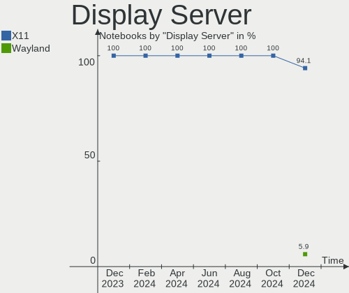
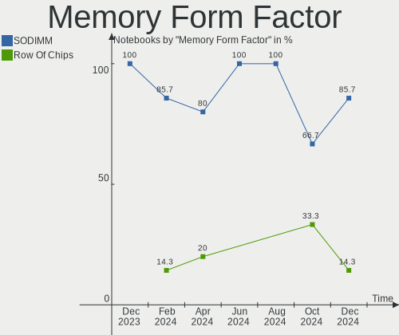

Elementary - Hardware Trends (Notebooks)
----------------------------------------

A project to identify most popular hardware characteristics and track their change
over time based on data collected by Linux users at https://Linux-Hardware.org.

Anyone can contribute to this report by the [hw-probe](https://github.com/linuxhw/hw-probe) tool:

    sudo -E hw-probe -all -upload

This report is for one last month. Overall report since the beginning of time: [TestCoverage](https://github.com/linuxhw/TestCoverage)

Period: Nov, 2022.

Contents
--------

* [ System ](#system)
  - [ OS                       ](#os)
  - [ OS Family                ](#os-family)
  - [ Kernel                   ](#kernel)
  - [ Kernel Family            ](#kernel-family)
  - [ Kernel Major Ver.        ](#kernel-major-ver)
  - [ Arch                     ](#arch)
  - [ DE                       ](#de)
  - [ Display Server           ](#display-server)
  - [ Display Manager          ](#display-manager)
  - [ OS Lang                  ](#os-lang)
  - [ Boot Mode                ](#boot-mode)
  - [ Filesystem               ](#filesystem)
  - [ Part. scheme             ](#part-scheme)
  - [ Dual Boot with Linux/BSD ](#dual-boot-with-linuxbsd)
  - [ Dual Boot (Win)          ](#dual-boot-win)

* [ Board ](#board)
  - [ Vendor                   ](#vendor)
  - [ Model                    ](#model)
  - [ Model Family             ](#model-family)
  - [ MFG Year                 ](#mfg-year)
  - [ Form Factor              ](#form-factor)
  - [ Secure Boot              ](#secure-boot)
  - [ Coreboot                 ](#coreboot)
  - [ RAM Size                 ](#ram-size)
  - [ RAM Used                 ](#ram-used)
  - [ Total Drives             ](#total-drives)
  - [ Has CD-ROM               ](#has-cd-rom)
  - [ Has Ethernet             ](#has-ethernet)
  - [ Has WiFi                 ](#has-wifi)
  - [ Has Bluetooth            ](#has-bluetooth)

* [ Location ](#location)
  - [ Country                  ](#country)
  - [ City                     ](#city)

* [ Drives ](#drives)
  - [ Drive Vendor             ](#drive-vendor)
  - [ Drive Model              ](#drive-model)
  - [ HDD Vendor               ](#hdd-vendor)
  - [ SSD Vendor               ](#ssd-vendor)
  - [ Drive Kind               ](#drive-kind)
  - [ Drive Connector          ](#drive-connector)
  - [ Drive Size               ](#drive-size)
  - [ Space Total              ](#space-total)
  - [ Space Used               ](#space-used)
  - [ Malfunc. Drives          ](#malfunc-drives)
  - [ Malfunc. Drive Vendor    ](#malfunc-drive-vendor)
  - [ Malfunc. HDD Vendor      ](#malfunc-hdd-vendor)
  - [ Malfunc. Drive Kind      ](#malfunc-drive-kind)
  - [ Failed Drives            ](#failed-drives)
  - [ Failed Drive Vendor      ](#failed-drive-vendor)
  - [ Drive Status             ](#drive-status)

* [ Storage controller ](#storage-controller)
  - [ Storage Vendor           ](#storage-vendor)
  - [ Storage Model            ](#storage-model)
  - [ Storage Kind             ](#storage-kind)

* [ Processor ](#processor)
  - [ CPU Vendor               ](#cpu-vendor)
  - [ CPU Model                ](#cpu-model)
  - [ CPU Model Family         ](#cpu-model-family)
  - [ CPU Cores                ](#cpu-cores)
  - [ CPU Sockets              ](#cpu-sockets)
  - [ CPU Threads              ](#cpu-threads)
  - [ CPU Op-Modes             ](#cpu-op-modes)
  - [ CPU Microcode            ](#cpu-microcode)
  - [ CPU Microarch            ](#cpu-microarch)

* [ Graphics ](#graphics)
  - [ GPU Vendor               ](#gpu-vendor)
  - [ GPU Model                ](#gpu-model)
  - [ GPU Combo                ](#gpu-combo)
  - [ GPU Driver               ](#gpu-driver)
  - [ GPU Memory               ](#gpu-memory)

* [ Monitor ](#monitor)
  - [ Monitor Vendor           ](#monitor-vendor)
  - [ Monitor Model            ](#monitor-model)
  - [ Monitor Resolution       ](#monitor-resolution)
  - [ Monitor Diagonal         ](#monitor-diagonal)
  - [ Monitor Width            ](#monitor-width)
  - [ Aspect Ratio             ](#aspect-ratio)
  - [ Monitor Area             ](#monitor-area)
  - [ Pixel Density            ](#pixel-density)
  - [ Multiple Monitors        ](#multiple-monitors)

* [ Network ](#network)
  - [ Net Controller Vendor    ](#net-controller-vendor)
  - [ Net Controller Model     ](#net-controller-model)
  - [ Wireless Vendor          ](#wireless-vendor)
  - [ Wireless Model           ](#wireless-model)
  - [ Ethernet Vendor          ](#ethernet-vendor)
  - [ Ethernet Model           ](#ethernet-model)
  - [ Net Controller Kind      ](#net-controller-kind)
  - [ Used Controller          ](#used-controller)
  - [ NICs                     ](#nics)
  - [ IPv6                     ](#ipv6)

* [ Bluetooth ](#bluetooth)
  - [ Bluetooth Vendor         ](#bluetooth-vendor)
  - [ Bluetooth Model          ](#bluetooth-model)

* [ Sound ](#sound)
  - [ Sound Vendor             ](#sound-vendor)
  - [ Sound Model              ](#sound-model)

* [ Memory ](#memory)
  - [ Memory Vendor            ](#memory-vendor)
  - [ Memory Model             ](#memory-model)
  - [ Memory Kind              ](#memory-kind)
  - [ Memory Form Factor       ](#memory-form-factor)
  - [ Memory Size              ](#memory-size)
  - [ Memory Speed             ](#memory-speed)

* [ Printers & scanners ](#printers--scanners)
  - [ Printer Vendor           ](#printer-vendor)
  - [ Printer Model            ](#printer-model)
  - [ Scanner Vendor           ](#scanner-vendor)
  - [ Scanner Model            ](#scanner-model)

* [ Camera ](#camera)
  - [ Camera Vendor            ](#camera-vendor)
  - [ Camera Model             ](#camera-model)

* [ Security ](#security)
  - [ Fingerprint Vendor       ](#fingerprint-vendor)
  - [ Fingerprint Model        ](#fingerprint-model)
  - [ Chipcard Vendor          ](#chipcard-vendor)
  - [ Chipcard Model           ](#chipcard-model)

* [ Unsupported ](#unsupported)
  - [ Unsupported Devices      ](#unsupported-devices)
  - [ Unsupported Device Types ](#unsupported-device-types)

System
------

OS
--

Installed operating systems

| Name             | Notebooks | Percent |
|------------------|-----------|---------|
| Elementary 6.1   | 28        | 93.33%  |
| Elementary 5.1.7 | 2         | 6.67%   |

OS Family
---------

OS without a version

| Name       | Notebooks | Percent |
|------------|-----------|---------|
| Elementary | 30        | 100%    |

Kernel
------

Version of the Linux kernel

| Version           | Notebooks | Percent |
|-------------------|-----------|---------|
| 5.15.0-52-generic | 15        | 50%     |
| 5.15.0-53-generic | 10        | 33.33%  |
| 5.4.0-131-generic | 2         | 6.67%   |
| 5.11.0-43-generic | 2         | 6.67%   |
| 5.15.0-48-generic | 1         | 3.33%   |

Kernel Family
-------------

Linux kernel without a distro release

| Version | Notebooks | Percent |
|---------|-----------|---------|
| 5.15.0  | 26        | 86.67%  |
| 5.4.0   | 2         | 6.67%   |
| 5.11.0  | 2         | 6.67%   |

Kernel Major Ver.
-----------------

Linux kernel major version

| Version | Notebooks | Percent |
|---------|-----------|---------|
| 5.15    | 26        | 86.67%  |
| 5.4     | 2         | 6.67%   |
| 5.11    | 2         | 6.67%   |

Arch
----

OS architecture (x86_64, i586, etc.)

| Name   | Notebooks | Percent |
|--------|-----------|---------|
| x86_64 | 30        | 100%    |

DE
--

Desktop Environment

| Name     | Notebooks | Percent |
|----------|-----------|---------|
| Pantheon | 30        | 100%    |

Display Server
--------------

X11 or Wayland

| Name | Notebooks | Percent |
|------|-----------|---------|
| X11  | 30        | 100%    |

Display Manager
---------------

SDDM, LightDM, etc.

| Name    | Notebooks | Percent |
|---------|-----------|---------|
| Unknown | 21        | 70%     |
| LightDM | 9         | 30%     |

OS Lang
-------

Language

| Lang  | Notebooks | Percent |
|-------|-----------|---------|
| en_US | 12        | 40%     |
| de_DE | 7         | 23.33%  |
| fr_FR | 3         | 10%     |
| en_GB | 3         | 10%     |
| ru_RU | 2         | 6.67%   |
| pt_BR | 1         | 3.33%   |
| it_IT | 1         | 3.33%   |
| es_ES | 1         | 3.33%   |

Boot Mode
---------

EFI or BIOS

| Mode | Notebooks | Percent |
|------|-----------|---------|
| EFI  | 19        | 63.33%  |
| BIOS | 11        | 36.67%  |

Filesystem
----------

Type of filesystem

| Type | Notebooks | Percent |
|------|-----------|---------|
| Ext4 | 30        | 100%    |

Part. scheme
------------

Scheme of partitioning

| Type    | Notebooks | Percent |
|---------|-----------|---------|
| Unknown | 21        | 70%     |
| GPT     | 8         | 26.67%  |
| MBR     | 1         | 3.33%   |

Dual Boot with Linux/BSD
------------------------

Hosting more than one Linux/BSD

| Dual boot | Notebooks | Percent |
|-----------|-----------|---------|
| No        | 29        | 96.67%  |
| Yes       | 1         | 3.33%   |

Dual Boot (Win)
---------------

Hosting Linux and Windows

| Dual boot | Notebooks | Percent |
|-----------|-----------|---------|
| No        | 30        | 100%    |

Board
-----

Vendor
------

Motherboard manufacturer

| Name                | Notebooks | Percent |
|---------------------|-----------|---------|
| Lenovo              | 8         | 26.67%  |
| Apple               | 6         | 20%     |
| Dell                | 4         | 13.33%  |
| ASUSTek Computer    | 3         | 10%     |
| Wortmann AG         | 1         | 3.33%   |
| Sony                | 1         | 3.33%   |
| Samsung Electronics | 1         | 3.33%   |
| Packard Bell        | 1         | 3.33%   |
| Medion              | 1         | 3.33%   |
| HUAWEI              | 1         | 3.33%   |
| Hewlett-Packard     | 1         | 3.33%   |
| Alienware           | 1         | 3.33%   |
| Acer                | 1         | 3.33%   |

Model
-----

Motherboard model

| Name                                 | Notebooks | Percent |
|--------------------------------------|-----------|---------|
| Apple MacBook3,1                     | 2         | 6.67%   |
| Wortmann AG 1220624_1470150          | 1         | 3.33%   |
| Sony VPCEA1S1R                       | 1         | 3.33%   |
| Samsung 530U3C/530U4C/532U3C         | 1         | 3.33%   |
| Packard Bell EasyNote LS44HR         | 1         | 3.33%   |
| Medion E7220                         | 1         | 3.33%   |
| Lenovo ThinkPad T495 20NKS01W02      | 1         | 3.33%   |
| Lenovo ThinkPad T470p 20J60018MX     | 1         | 3.33%   |
| Lenovo ThinkPad T430 2349IF8         | 1         | 3.33%   |
| Lenovo ThinkPad T14 Gen 1 20S1S5MX1J | 1         | 3.33%   |
| Lenovo IdeaPad 5 Pro 14ACN6 82L7     | 1         | 3.33%   |
| Lenovo IdeaPad 5 15ALC05 82LN        | 1         | 3.33%   |
| Lenovo IdeaPad 330S-15ARR 81FB       | 1         | 3.33%   |
| Lenovo G50-45 80E3                   | 1         | 3.33%   |
| HUAWEI KLVL-WXX9                     | 1         | 3.33%   |
| HP Pavilion dv5                      | 1         | 3.33%   |
| Dell Studio 1558                     | 1         | 3.33%   |
| Dell Latitude E6520                  | 1         | 3.33%   |
| Dell Inspiron 5584                   | 1         | 3.33%   |
| Dell Inspiron 15-3567                | 1         | 3.33%   |
| ASUS ZenBook S UX391UA               | 1         | 3.33%   |
| ASUS ROG Strix G512LV_G512LV         | 1         | 3.33%   |
| ASUS 1001PX                          | 1         | 3.33%   |
| Apple MacBookPro9,2                  | 1         | 3.33%   |
| Apple MacBookPro6,2                  | 1         | 3.33%   |
| Apple MacBookPro12,1                 | 1         | 3.33%   |
| Apple MacBookPro11,3                 | 1         | 3.33%   |
| Alienware m15 R6                     | 1         | 3.33%   |
| Acer Aspire A315-51                  | 1         | 3.33%   |

Model Family
------------

Motherboard model prefix

| Name                  | Notebooks | Percent |
|-----------------------|-----------|---------|
| Lenovo ThinkPad       | 4         | 13.33%  |
| Lenovo IdeaPad        | 3         | 10%     |
| Dell Inspiron         | 2         | 6.67%   |
| Apple MacBook3        | 2         | 6.67%   |
| Wortmann AG 1220624   | 1         | 3.33%   |
| Sony VPCEA1S1R        | 1         | 3.33%   |
| Samsung 530U3C        | 1         | 3.33%   |
| Packard Bell EasyNote | 1         | 3.33%   |
| Medion E7220          | 1         | 3.33%   |
| Lenovo G50-45         | 1         | 3.33%   |
| HUAWEI KLVL-WXX9      | 1         | 3.33%   |
| HP Pavilion           | 1         | 3.33%   |
| Dell Studio           | 1         | 3.33%   |
| Dell Latitude         | 1         | 3.33%   |
| ASUS ZenBook          | 1         | 3.33%   |
| ASUS ROG              | 1         | 3.33%   |
| ASUS 1001PX           | 1         | 3.33%   |
| Apple MacBookPro9     | 1         | 3.33%   |
| Apple MacBookPro6     | 1         | 3.33%   |
| Apple MacBookPro12    | 1         | 3.33%   |
| Apple MacBookPro11    | 1         | 3.33%   |
| Alienware m15         | 1         | 3.33%   |
| Acer Aspire           | 1         | 3.33%   |

MFG Year
--------

Motherboard manufacture year

| Year | Notebooks | Percent |
|------|-----------|---------|
| 2020 | 4         | 13.33%  |
| 2010 | 4         | 13.33%  |
| 2021 | 3         | 10%     |
| 2019 | 3         | 10%     |
| 2012 | 3         | 10%     |
| 2011 | 3         | 10%     |
| 2008 | 3         | 10%     |
| 2017 | 2         | 6.67%   |
| 2014 | 2         | 6.67%   |
| 2018 | 1         | 3.33%   |
| 2016 | 1         | 3.33%   |
| 2015 | 1         | 3.33%   |

Form Factor
-----------

Physical design of the computer

| Name     | Notebooks | Percent |
|----------|-----------|---------|
| Notebook | 30        | 100%    |

Secure Boot
-----------

Enabled or disabled

| State    | Notebooks | Percent |
|----------|-----------|---------|
| Disabled | 27        | 90%     |
| Enabled  | 3         | 10%     |

Coreboot
--------

Have coreboot on board

| Used | Notebooks | Percent |
|------|-----------|---------|
| No   | 30        | 100%    |

RAM Size
--------

Total RAM memory

| Size in GB  | Notebooks | Percent |
|-------------|-----------|---------|
| 4.01-8.0    | 12        | 40%     |
| 8.01-16.0   | 7         | 23.33%  |
| 3.01-4.0    | 5         | 16.67%  |
| 16.01-24.0  | 3         | 10%     |
| 32.01-64.0  | 1         | 3.33%   |
| 64.01-256.0 | 1         | 3.33%   |
| 1.01-2.0    | 1         | 3.33%   |

RAM Used
--------

Used RAM memory

| Used GB  | Notebooks | Percent |
|----------|-----------|---------|
| 1.01-2.0 | 11        | 36.67%  |
| 2.01-3.0 | 10        | 33.33%  |
| 4.01-8.0 | 6         | 20%     |
| 3.01-4.0 | 2         | 6.67%   |
| 0.51-1.0 | 1         | 3.33%   |

Total Drives
------------

Number of drives on board

| Drives | Notebooks | Percent |
|--------|-----------|---------|
| 1      | 20        | 66.67%  |
| 2      | 10        | 33.33%  |

Has CD-ROM
----------

Has CD-ROM on board

| Presented | Notebooks | Percent |
|-----------|-----------|---------|
| No        | 18        | 60%     |
| Yes       | 12        | 40%     |

Has Ethernet
------------

Has Ethernet on board

| Presented | Notebooks | Percent |
|-----------|-----------|---------|
| Yes       | 24        | 80%     |
| No        | 6         | 20%     |

Has WiFi
--------

Has WiFi module

| Presented | Notebooks | Percent |
|-----------|-----------|---------|
| Yes       | 30        | 100%    |

Has Bluetooth
-------------

Has Bluetooth module

| Presented | Notebooks | Percent |
|-----------|-----------|---------|
| Yes       | 27        | 90%     |
| No        | 3         | 10%     |

Location
--------

Country
-------

Geographic location (country)

| Country  | Notebooks | Percent |
|----------|-----------|---------|
| Germany  | 7         | 23.33%  |
| USA      | 3         | 10%     |
| Brazil   | 3         | 10%     |
| Russia   | 2         | 6.67%   |
| Romania  | 2         | 6.67%   |
| France   | 2         | 6.67%   |
| Turkey   | 1         | 3.33%   |
| Thailand | 1         | 3.33%   |
| Sweden   | 1         | 3.33%   |
| Spain    | 1         | 3.33%   |
| Serbia   | 1         | 3.33%   |
| Poland   | 1         | 3.33%   |
| Italy    | 1         | 3.33%   |
| India    | 1         | 3.33%   |
| Croatia  | 1         | 3.33%   |
| Canada   | 1         | 3.33%   |
| Belgium  | 1         | 3.33%   |

City
----

Geographic location (city)

| City                | Notebooks | Percent |
|---------------------|-----------|---------|
| Stuttgart           | 2         | 6.67%   |
| Moscow              | 2         | 6.67%   |
| Vranje              | 1         | 3.33%   |
| Storm Lake          | 1         | 3.33%   |
| Silverton           | 1         | 3.33%   |
| Seynod              | 1         | 3.33%   |
| Seedorf             | 1         | 3.33%   |
| Sao Paulo           | 1         | 3.33%   |
| Reno                | 1         | 3.33%   |
| Poznan              | 1         | 3.33%   |
| Petrinja            | 1         | 3.33%   |
| Pak Kret            | 1         | 3.33%   |
| Novo Hamburgo       | 1         | 3.33%   |
| Milan               | 1         | 3.33%   |
| Karabük            | 1         | 3.33%   |
| Hyderabad           | 1         | 3.33%   |
| Granada             | 1         | 3.33%   |
| Gelsenkirchen       | 1         | 3.33%   |
| Floresti            | 1         | 3.33%   |
| Flemalle            | 1         | 3.33%   |
| Feuquieres-en-Vimeu | 1         | 3.33%   |
| Erfurt              | 1         | 3.33%   |
| Cologne             | 1         | 3.33%   |
| Bucharest           | 1         | 3.33%   |
| Brasília           | 1         | 3.33%   |
| Brampton            | 1         | 3.33%   |
| Bottrop             | 1         | 3.33%   |
| Borensberg          | 1         | 3.33%   |

Drives
------

Drive Vendor
------------

Hard drive vendors

| Vendor              | Notebooks | Drives | Percent |
|---------------------|-----------|--------|---------|
| Samsung Electronics | 7         | 7      | 17.95%  |
| WDC                 | 6         | 6      | 15.38%  |
| Toshiba             | 4         | 4      | 10.26%  |
| Unknown             | 3         | 3      | 7.69%   |
| SanDisk             | 3         | 3      | 7.69%   |
| Intel               | 3         | 4      | 7.69%   |
| Crucial             | 3         | 3      | 7.69%   |
| SK hynix            | 2         | 2      | 5.13%   |
| Hitachi             | 2         | 2      | 5.13%   |
| Apple               | 2         | 2      | 5.13%   |
| SPCC                | 1         | 1      | 2.56%   |
| Seagate             | 1         | 1      | 2.56%   |
| JetFlash            | 1         | 1      | 2.56%   |
| Intenso             | 1         | 1      | 2.56%   |

Drive Model
-----------

Hard drive models

| Model                                                | Notebooks | Percent |
|------------------------------------------------------|-----------|---------|
| Samsung NVMe SSD Controller SM981/PM981/PM983 1TB    | 3         | 7.5%    |
| Unknown MMC Card  16GB                               | 2         | 5%      |
| WDC WDS240G2G0A-00JH30 240GB SSD                     | 1         | 2.5%    |
| WDC WDS100T2B0C-00PXH0 1TB                           | 1         | 2.5%    |
| WDC WD5000LPVX-22V0TT0 500GB                         | 1         | 2.5%    |
| WDC WD5000LPCX-24C6HT0 500GB                         | 1         | 2.5%    |
| WDC WD3200BEVT-75ZCT2 320GB                          | 1         | 2.5%    |
| WDC WD1600BEVT-80A23T0 160GB                         | 1         | 2.5%    |
| Unknown MMC Card  4GB                                | 1         | 2.5%    |
| Toshiba XG4 NVMe SSD Controller 256GB                | 1         | 2.5%    |
| Toshiba NVMe Controller 512GB                        | 1         | 2.5%    |
| Toshiba MK7559GSXP 752GB                             | 1         | 2.5%    |
| Toshiba MK3261GSYN 320GB                             | 1         | 2.5%    |
| SPCC Solid State Disk 120GB                          | 1         | 2.5%    |
| SK hynix PC711 NVMe 1TB                              | 1         | 2.5%    |
| SK hynix BC501 NVMe Solid State Drive 512GB          | 1         | 2.5%    |
| Seagate ST320LT007-9ZV142 320GB                      | 1         | 2.5%    |
| Sandisk WD Blue SN550 NVMe SSD 1TB                   | 1         | 2.5%    |
| SanDisk SSD i100 24GB                                | 1         | 2.5%    |
| SanDisk SDSSDP128G 128GB                             | 1         | 2.5%    |
| Samsung NVMe SSD Controller PM9A1/PM9A3/980PRO 250GB | 1         | 2.5%    |
| Samsung MZVLQ512HALU-00000 512GB                     | 1         | 2.5%    |
| Samsung MZALQ512HBLU-00BL2 512GB                     | 1         | 2.5%    |
| Samsung HM160HI 160GB                                | 1         | 2.5%    |
| JetFlash Transcend 128GB                             | 1         | 2.5%    |
| Intenso SSD SATAIII 128GB                            | 1         | 2.5%    |
| Intel SSDSC2BF180A5L 180GB                           | 1         | 2.5%    |
| Intel SSDSC2BF180A4L 180GB                           | 1         | 2.5%    |
| Intel H10 HBRPEKNX0101AO NVMe 16GB                   | 1         | 2.5%    |
| Intel H10 HBRPEKNX0101A NVMe 256GB                   | 1         | 2.5%    |
| Hitachi HTS547575A9E384 752GB                        | 1         | 2.5%    |
| Hitachi HTS545025A7E380 250GB                        | 1         | 2.5%    |
| Crucial M4-CT064M4SSD2 64GB                          | 1         | 2.5%    |
| Crucial CT960BX500SSD1 960GB                         | 1         | 2.5%    |
| Crucial CT500MX500SSD1 500GB                         | 1         | 2.5%    |
| Apple SSD SM0512F 500GB                              | 1         | 2.5%    |
| Apple SSD SM0256G 256GB                              | 1         | 2.5%    |

HDD Vendor
----------

Hard disk drive vendors

| Vendor              | Notebooks | Drives | Percent |
|---------------------|-----------|--------|---------|
| WDC                 | 4         | 4      | 40%     |
| Toshiba             | 2         | 2      | 20%     |
| Hitachi             | 2         | 2      | 20%     |
| Seagate             | 1         | 1      | 10%     |
| Samsung Electronics | 1         | 1      | 10%     |

SSD Vendor
----------

Solid state drive vendors

| Vendor  | Notebooks | Drives | Percent |
|---------|-----------|--------|---------|
| Crucial | 3         | 3      | 25%     |
| SanDisk | 2         | 2      | 16.67%  |
| Intel   | 2         | 2      | 16.67%  |
| Apple   | 2         | 2      | 16.67%  |
| WDC     | 1         | 1      | 8.33%   |
| SPCC    | 1         | 1      | 8.33%   |
| Intenso | 1         | 1      | 8.33%   |

Drive Kind
----------

HDD or SSD

| Kind    | Notebooks | Drives | Percent |
|---------|-----------|--------|---------|
| SSD     | 12        | 12     | 32.43%  |
| NVMe    | 11        | 14     | 29.73%  |
| HDD     | 10        | 10     | 27.03%  |
| MMC     | 3         | 3      | 8.11%   |
| Unknown | 1         | 1      | 2.7%    |

Drive Connector
---------------

SATA, SAS, NVMe, etc.

| Type | Notebooks | Drives | Percent |
|------|-----------|--------|---------|
| SATA | 20        | 22     | 57.14%  |
| NVMe | 11        | 14     | 31.43%  |
| MMC  | 3         | 3      | 8.57%   |
| SAS  | 1         | 1      | 2.86%   |

Drive Size
----------

Size of hard drive

| Size in TB | Notebooks | Drives | Percent |
|------------|-----------|--------|---------|
| 0.01-0.5   | 17        | 19     | 85%     |
| 0.51-1.0   | 3         | 3      | 15%     |

Space Total
-----------

Amount of disk space available on the file system

| Size in GB | Notebooks | Percent |
|------------|-----------|---------|
| 101-250    | 16        | 53.33%  |
| 251-500    | 9         | 30%     |
| 1001-2000  | 2         | 6.67%   |
| 501-1000   | 2         | 6.67%   |
| 51-100     | 1         | 3.33%   |

Space Used
----------

Amount of used disk space

| Used GB  | Notebooks | Percent |
|----------|-----------|---------|
| 1-20     | 12        | 40%     |
| 21-50    | 11        | 36.67%  |
| 101-250  | 3         | 10%     |
| 501-1000 | 2         | 6.67%   |
| 51-100   | 2         | 6.67%   |

Malfunc. Drives
---------------

Drive models with a malfunction

Zero info for selected period =(

Malfunc. Drive Vendor
---------------------

Vendors of faulty drives

Zero info for selected period =(

Malfunc. HDD Vendor
-------------------

Vendors of faulty HDD drives

Zero info for selected period =(

Malfunc. Drive Kind
-------------------

Kinds of faulty drives

Zero info for selected period =(

Failed Drives
-------------

Failed drive models

Zero info for selected period =(

Failed Drive Vendor
-------------------

Failed drive vendors

Zero info for selected period =(

Drive Status
------------

Number of failed and malfunc. drives

| Status   | Notebooks | Drives | Percent |
|----------|-----------|--------|---------|
| Detected | 27        | 34     | 87.1%   |
| Works    | 4         | 6      | 12.9%   |

Storage controller
------------------

Storage Vendor
--------------

Storage controller vendors

| Vendor                       | Notebooks | Percent |
|------------------------------|-----------|---------|
| Intel                        | 17        | 48.57%  |
| Samsung Electronics          | 8         | 22.86%  |
| AMD                          | 4         | 11.43%  |
| Toshiba America Info Systems | 2         | 5.71%   |
| SK hynix                     | 2         | 5.71%   |
| SanDisk                      | 2         | 5.71%   |

Storage Model
-------------

Storage controller models

| Model                                                                        | Notebooks | Percent |
|------------------------------------------------------------------------------|-----------|---------|
| Samsung NVMe SSD Controller SM981/PM981/PM983                                | 3         | 7.69%   |
| Intel 7 Series Chipset Family 6-port SATA Controller [AHCI mode]             | 3         | 7.69%   |
| AMD FCH SATA Controller [AHCI mode]                                          | 3         | 7.69%   |
| SanDisk WD Blue SN550 NVMe SSD                                               | 2         | 5.13%   |
| Samsung NVMe SSD Controller 980                                              | 2         | 5.13%   |
| Intel Sunrise Point-LP SATA Controller [AHCI mode]                           | 2         | 5.13%   |
| Intel 82801HM/HEM (ICH8M/ICH8M-E) SATA Controller [AHCI mode]                | 2         | 5.13%   |
| Intel 82801HM/HEM (ICH8M/ICH8M-E) IDE Controller                             | 2         | 5.13%   |
| Intel 82801 Mobile SATA Controller [RAID mode]                               | 2         | 5.13%   |
| Intel 6 Series/C200 Series Chipset Family 6 port Mobile SATA AHCI Controller | 2         | 5.13%   |
| Intel 5 Series/3400 Series Chipset 4 port SATA AHCI Controller               | 2         | 5.13%   |
| Toshiba America Info Systems XG4 NVMe SSD Controller                         | 1         | 2.56%   |
| Toshiba America Info Systems NVMe Controller                                 | 1         | 2.56%   |
| SK hynix Gold P31/PC711 NVMe Solid State Drive                               | 1         | 2.56%   |
| SK hynix BC501 NVMe Solid State Drive                                        | 1         | 2.56%   |
| Samsung NVMe SSD Controller PM9A1/PM9A3/980PRO                               | 1         | 2.56%   |
| Samsung Electronics SATA controller                                          | 1         | 2.56%   |
| Samsung Apple PCIe SSD                                                       | 1         | 2.56%   |
| Intel Non-Volatile memory controller                                         | 1         | 2.56%   |
| Intel NM10/ICH7 Family SATA Controller [AHCI mode]                           | 1         | 2.56%   |
| Intel Celeron/Pentium Silver Processor SATA Controller                       | 1         | 2.56%   |
| Intel 500 Series Chipset Family SATA AHCI Controller                         | 1         | 2.56%   |
| Intel 5 Series/3400 Series Chipset 4 port SATA IDE Controller                | 1         | 2.56%   |
| AMD SB7x0/SB8x0/SB9x0 SATA Controller [AHCI mode]                            | 1         | 2.56%   |
| AMD SB7x0/SB8x0/SB9x0 IDE Controller                                         | 1         | 2.56%   |

Storage Kind
------------

Kind of storage controller (IDE, SATA, NVMe, SAS, ...)

| Kind | Notebooks | Percent |
|------|-----------|---------|
| SATA | 20        | 54.05%  |
| NVMe | 11        | 29.73%  |
| IDE  | 4         | 10.81%  |
| RAID | 2         | 5.41%   |

Processor
---------

CPU Vendor
----------

Processor vendors

| Vendor | Notebooks | Percent |
|--------|-----------|---------|
| Intel  | 23        | 76.67%  |
| AMD    | 7         | 23.33%  |

CPU Model
---------

Processor models

| Model                                           | Notebooks | Percent |
|-------------------------------------------------|-----------|---------|
| Intel Core i3 CPU M 330 @ 2.13GHz               | 2         | 6.67%   |
| Intel Core 2 Duo CPU T7500 @ 2.20GHz            | 2         | 6.67%   |
| Intel Pentium Silver N5000 CPU @ 1.10GHz        | 1         | 3.33%   |
| Intel Core i7-8565U CPU @ 1.80GHz               | 1         | 3.33%   |
| Intel Core i7-8550U CPU @ 1.80GHz               | 1         | 3.33%   |
| Intel Core i7-7700HQ CPU @ 2.80GHz              | 1         | 3.33%   |
| Intel Core i7-7500U CPU @ 2.70GHz               | 1         | 3.33%   |
| Intel Core i7-4870HQ CPU @ 2.50GHz              | 1         | 3.33%   |
| Intel Core i7-3517U CPU @ 1.90GHz               | 1         | 3.33%   |
| Intel Core i7-10870H CPU @ 2.20GHz              | 1         | 3.33%   |
| Intel Core i7-10610U CPU @ 1.80GHz              | 1         | 3.33%   |
| Intel Core i7 CPU M 620 @ 2.67GHz               | 1         | 3.33%   |
| Intel Core i5-5257U CPU @ 2.70GHz               | 1         | 3.33%   |
| Intel Core i5-3320M CPU @ 2.60GHz               | 1         | 3.33%   |
| Intel Core i5-3210M CPU @ 2.50GHz               | 1         | 3.33%   |
| Intel Core i5-2450M CPU @ 2.50GHz               | 1         | 3.33%   |
| Intel Core i3-7020U CPU @ 2.30GHz               | 1         | 3.33%   |
| Intel Core i3-2330M CPU @ 2.20GHz               | 1         | 3.33%   |
| Intel Core i3-2310M CPU @ 2.10GHz               | 1         | 3.33%   |
| Intel Atom CPU N450 @ 1.66GHz                   | 1         | 3.33%   |
| Intel 11th Gen Core i7-11800H @ 2.30GHz         | 1         | 3.33%   |
| AMD Turion X2 Ultra Dual-Core Mobile ZM-87      | 1         | 3.33%   |
| AMD Ryzen 7 5700U with Radeon Graphics          | 1         | 3.33%   |
| AMD Ryzen 5 PRO 3500U w/ Radeon Vega Mobile Gfx | 1         | 3.33%   |
| AMD Ryzen 5 5600U with Radeon Graphics          | 1         | 3.33%   |
| AMD Ryzen 5 4600H with Radeon Graphics          | 1         | 3.33%   |
| AMD Ryzen 5 2500U with Radeon Vega Mobile Gfx   | 1         | 3.33%   |
| AMD A8-6410 APU with AMD Radeon R5 Graphics     | 1         | 3.33%   |

CPU Model Family
----------------

Processor model prefix

| Model                                | Notebooks | Percent |
|--------------------------------------|-----------|---------|
| Intel Core i7                        | 9         | 30%     |
| Intel Core i3                        | 5         | 16.67%  |
| Intel Core i5                        | 4         | 13.33%  |
| AMD Ryzen 5                          | 3         | 10%     |
| Intel Core 2 Duo                     | 2         | 6.67%   |
| Other                                | 1         | 3.33%   |
| Intel Pentium Silver                 | 1         | 3.33%   |
| Intel Atom                           | 1         | 3.33%   |
| AMD Turion X2 Ultra Dual-Core Mobile | 1         | 3.33%   |
| AMD Ryzen 7                          | 1         | 3.33%   |
| AMD Ryzen 5 PRO                      | 1         | 3.33%   |
| AMD A8                               | 1         | 3.33%   |

CPU Cores
---------

Number of processor cores

| Number | Notebooks | Percent |
|--------|-----------|---------|
| 2      | 15        | 50%     |
| 4      | 9         | 30%     |
| 8      | 3         | 10%     |
| 6      | 2         | 6.67%   |
| 1      | 1         | 3.33%   |

CPU Sockets
-----------

Number of sockets

| Number | Notebooks | Percent |
|--------|-----------|---------|
| 1      | 30        | 100%    |

CPU Threads
-----------

Threads per core (Hyper-Threading)

| Number | Notebooks | Percent |
|--------|-----------|---------|
| 2      | 25        | 83.33%  |
| 1      | 5         | 16.67%  |

CPU Op-Modes
------------

CPU Operation Modes (32-bit, 64-bit)

| Op mode        | Notebooks | Percent |
|----------------|-----------|---------|
| 32-bit, 64-bit | 30        | 100%    |

CPU Microcode
-------------

Microcode number

| Number     | Notebooks | Percent |
|------------|-----------|---------|
| 0x306a9    | 3         | 10%     |
| 0x206a7    | 3         | 10%     |
| 0x806ea    | 2         | 6.67%   |
| 0x6fb      | 2         | 6.67%   |
| 0x20652    | 2         | 6.67%   |
| Unknown    | 2         | 6.67%   |
| 0xa0652    | 1         | 3.33%   |
| 0x906e9    | 1         | 3.33%   |
| 0x806ec    | 1         | 3.33%   |
| 0x806eb    | 1         | 3.33%   |
| 0x806e9    | 1         | 3.33%   |
| 0x806d1    | 1         | 3.33%   |
| 0x706a1    | 1         | 3.33%   |
| 0x40661    | 1         | 3.33%   |
| 0x20655    | 1         | 3.33%   |
| 0x106ca    | 1         | 3.33%   |
| 0x0a50000c | 1         | 3.33%   |
| 0x08608102 | 1         | 3.33%   |
| 0x08108109 | 1         | 3.33%   |
| 0x0810100b | 1         | 3.33%   |
| 0x07030105 | 1         | 3.33%   |
| 0x02000057 | 1         | 3.33%   |

CPU Microarch
-------------

Microarchitecture

| Name            | Notebooks | Percent |
|-----------------|-----------|---------|
| KabyLake        | 6         | 20%     |
| Westmere        | 3         | 10%     |
| SandyBridge     | 3         | 10%     |
| IvyBridge       | 3         | 10%     |
| Core            | 2         | 6.67%   |
| Zen+            | 1         | 3.33%   |
| Zen 3           | 1         | 3.33%   |
| Zen 2           | 1         | 3.33%   |
| Zen             | 1         | 3.33%   |
| Puma            | 1         | 3.33%   |
| K8 & K10 hybrid | 1         | 3.33%   |
| Icelake         | 1         | 3.33%   |
| Haswell         | 1         | 3.33%   |
| Goldmont plus   | 1         | 3.33%   |
| CometLake       | 1         | 3.33%   |
| Broadwell       | 1         | 3.33%   |
| Bonnell         | 1         | 3.33%   |
| Unknown         | 1         | 3.33%   |

Graphics
--------

GPU Vendor
----------

Vendors of graphics cards

| Vendor | Notebooks | Percent |
|--------|-----------|---------|
| Intel  | 19        | 54.29%  |
| AMD    | 11        | 31.43%  |
| Nvidia | 5         | 14.29%  |

GPU Model
---------

Graphics card models

| Model                                                                         | Notebooks | Percent |
|-------------------------------------------------------------------------------|-----------|---------|
| Intel 3rd Gen Core processor Graphics Controller                              | 3         | 8.11%   |
| Intel 2nd Generation Core Processor Family Integrated Graphics Controller     | 3         | 8.11%   |
| Intel Mobile GM965/GL960 Integrated Graphics Controller (secondary)           | 2         | 5.41%   |
| Intel Mobile GM965/GL960 Integrated Graphics Controller (primary)             | 2         | 5.41%   |
| Intel HD Graphics 620                                                         | 2         | 5.41%   |
| AMD RV710/M92 [Mobility Radeon HD 4530/4570/545v]                             | 2         | 5.41%   |
| Nvidia TU106M [GeForce RTX 2060 Mobile]                                       | 1         | 2.7%    |
| Nvidia GT216M [GeForce GT 330M]                                               | 1         | 2.7%    |
| Nvidia GM108M [GeForce 940MX]                                                 | 1         | 2.7%    |
| Nvidia GK107M [GeForce GT 750M Mac Edition]                                   | 1         | 2.7%    |
| Nvidia GA104M [GeForce RTX 3070 Mobile / Max-Q]                               | 1         | 2.7%    |
| Intel WhiskeyLake-U GT2 [UHD Graphics 620]                                    | 1         | 2.7%    |
| Intel UHD Graphics 620                                                        | 1         | 2.7%    |
| Intel TigerLake-H GT1 [UHD Graphics]                                          | 1         | 2.7%    |
| Intel Iris Graphics 6100                                                      | 1         | 2.7%    |
| Intel HD Graphics 630                                                         | 1         | 2.7%    |
| Intel GeminiLake [UHD Graphics 605]                                           | 1         | 2.7%    |
| Intel CometLake-U GT2 [UHD Graphics]                                          | 1         | 2.7%    |
| Intel CometLake-H GT2 [UHD Graphics]                                          | 1         | 2.7%    |
| Intel Atom Processor D4xx/D5xx/N4xx/N5xx Integrated Graphics Controller       | 1         | 2.7%    |
| AMD Sun XT [Radeon HD 8670A/8670M/8690M / R5 M330 / M430 / Radeon 520 Mobile] | 1         | 2.7%    |
| AMD Seymour [Radeon HD 6400M/7400M Series]                                    | 1         | 2.7%    |
| AMD RV620/M82 [Mobility Radeon HD 3450/3470]                                  | 1         | 2.7%    |
| AMD Renoir                                                                    | 1         | 2.7%    |
| AMD Raven Ridge [Radeon Vega Series / Radeon Vega Mobile Series]              | 1         | 2.7%    |
| AMD Picasso/Raven 2 [Radeon Vega Series / Radeon Vega Mobile Series]          | 1         | 2.7%    |
| AMD Mullins [Radeon R4/R5 Graphics]                                           | 1         | 2.7%    |
| AMD Lucienne                                                                  | 1         | 2.7%    |
| AMD Cezanne [Radeon Vega Series / Radeon Vega Mobile Series]                  | 1         | 2.7%    |

GPU Combo
---------

Combinations of graphics cards

| Name           | Notebooks | Percent |
|----------------|-----------|---------|
| 1 x Intel      | 14        | 46.67%  |
| 1 x AMD        | 9         | 30%     |
| Intel + Nvidia | 3         | 10%     |
| 1 x Nvidia     | 2         | 6.67%   |
| Intel + AMD    | 2         | 6.67%   |

GPU Driver
----------

Free vs proprietary

| Driver      | Notebooks | Percent |
|-------------|-----------|---------|
| Free        | 26        | 86.67%  |
| Proprietary | 4         | 13.33%  |

GPU Memory
----------

Total video memory

| Size in GB | Notebooks | Percent |
|------------|-----------|---------|
| Unknown    | 17        | 56.67%  |
| 1.01-2.0   | 6         | 20%     |
| 0.01-0.5   | 4         | 13.33%  |
| 0.51-1.0   | 2         | 6.67%   |
| 5.01-6.0   | 1         | 3.33%   |

Monitor
-------

Monitor Vendor
--------------

Monitor vendors

| Vendor              | Notebooks | Percent |
|---------------------|-----------|---------|
| AU Optronics        | 10        | 31.25%  |
| Apple               | 6         | 18.75%  |
| LG Display          | 3         | 9.38%   |
| Chimei Innolux      | 2         | 6.25%   |
| BOE                 | 2         | 6.25%   |
| Sony                | 1         | 3.13%   |
| Sharp               | 1         | 3.13%   |
| Samsung Electronics | 1         | 3.13%   |
| LG Electronics      | 1         | 3.13%   |
| Lenovo              | 1         | 3.13%   |
| Iiyama              | 1         | 3.13%   |
| HannStar            | 1         | 3.13%   |
| CSO                 | 1         | 3.13%   |
| Acer                | 1         | 3.13%   |

Monitor Model
-------------

Monitor models

| Model                                                                | Notebooks | Percent |
|----------------------------------------------------------------------|-----------|---------|
| AU Optronics LCD Monitor AUO403D 1920x1080 309x173mm 13.9-inch       | 2         | 6.25%   |
| Sony Nvidia Defaul t Flat Panel SNY06FA 1600x900 360x200mm 16.2-inch | 1         | 3.13%   |
| Sharp LCD Monitor SHP151C 1920x1080 344x194mm 15.5-inch              | 1         | 3.13%   |
| Samsung Electronics LCD Monitor SEC304C 1366x768 309x174mm 14.0-inch | 1         | 3.13%   |
| LG Electronics LCD Monitor LG ULTRAWIDE                              | 1         | 3.13%   |
| LG Display LCD Monitor LGD05FF 1920x1080 344x194mm 15.5-inch         | 1         | 3.13%   |
| LG Display LCD Monitor LGD05E5 1920x1080 344x194mm 15.5-inch         | 1         | 3.13%   |
| LG Display LCD Monitor LGD0525 1366x768 344x194mm 15.5-inch          | 1         | 3.13%   |
| Lenovo LCD Monitor LEN40A3 1920x1080 309x175mm 14.0-inch             | 1         | 3.13%   |
| Iiyama PL2796HS IVM6668 1920x1080 598x336mm 27.0-inch                | 1         | 3.13%   |
| HannStar HSD101PFW2 HSD03E9 1024x600 222x125mm 10.0-inch             | 1         | 3.13%   |
| CSO LCD Monitor CSO1402 2880x1800 302x188mm 14.0-inch                | 1         | 3.13%   |
| Chimei Innolux LCD Monitor CMN15DB 1366x768 344x193mm 15.5-inch      | 1         | 3.13%   |
| Chimei Innolux LCD Monitor CMN15B7 1366x768 344x193mm 15.5-inch      | 1         | 3.13%   |
| BOE LCD Monitor BOE090F 1920x1080 344x194mm 15.5-inch                | 1         | 3.13%   |
| BOE LCD Monitor BOE0893 2160x1440 296x197mm 14.0-inch                | 1         | 3.13%   |
| AU Optronics LCD Monitor AUOE48D 1920x1080 344x194mm 15.5-inch       | 1         | 3.13%   |
| AU Optronics LCD Monitor AUO492D 1920x1080 293x165mm 13.2-inch       | 1         | 3.13%   |
| AU Optronics LCD Monitor AUO38ED 1920x1080 344x193mm 15.5-inch       | 1         | 3.13%   |
| AU Optronics LCD Monitor AUO243D 1920x1080 309x173mm 13.9-inch       | 1         | 3.13%   |
| AU Optronics LCD Monitor AUO23EC 1366x768 344x193mm 15.5-inch        | 1         | 3.13%   |
| AU Optronics LCD Monitor AUO22EC 1366x768 344x193mm 15.5-inch        | 1         | 3.13%   |
| AU Optronics LCD Monitor AUO139E 1600x900 382x214mm 17.2-inch        | 1         | 3.13%   |
| AU Optronics LCD Monitor AUO129E 1600x900 382x214mm 17.2-inch        | 1         | 3.13%   |
| Apple LCD Monitor Color LCD 4240x1080                                | 1         | 3.13%   |
| Apple Color LCD APPA02A 2560x1600 286x179mm 13.3-inch                | 1         | 3.13%   |
| Apple Color LCD APPA022 2880x1800 330x210mm 15.4-inch                | 1         | 3.13%   |
| Apple Color LCD APP9CC7 1280x800 286x179mm 13.3-inch                 | 1         | 3.13%   |
| Apple Color LCD APP9C5E 1280x800 286x178mm 13.3-inch                 | 1         | 3.13%   |
| Apple Color LCD APP9C5C 1280x800 286x179mm 13.3-inch                 | 1         | 3.13%   |
| Acer KG271 C ACR064E 1920x1080 598x336mm 27.0-inch                   | 1         | 3.13%   |

Monitor Resolution
------------------

Monitor screen resolution

| Resolution      | Notebooks | Percent |
|-----------------|-----------|---------|
| 1920x1080 (FHD) | 12        | 40%     |
| 1366x768 (WXGA) | 5         | 16.67%  |
| 1600x900 (HD+)  | 3         | 10%     |
| 1280x800 (WXGA) | 3         | 10%     |
| 2880x1800       | 2         | 6.67%   |
| 4240x1080       | 1         | 3.33%   |
| 2560x1600       | 1         | 3.33%   |
| 2160x1440       | 1         | 3.33%   |
| 1024x600        | 1         | 3.33%   |
| Unknown         | 1         | 3.33%   |

Monitor Diagonal
----------------

Diagonal size in inches

| Inches  | Notebooks | Percent |
|---------|-----------|---------|
| 15      | 13        | 41.94%  |
| 14      | 6         | 19.35%  |
| 13      | 5         | 16.13%  |
| 17      | 3         | 9.68%   |
| 27      | 2         | 6.45%   |
| 10      | 1         | 3.23%   |
| Unknown | 1         | 3.23%   |

Monitor Width
-------------

Physical width

| Width in mm | Notebooks | Percent |
|-------------|-----------|---------|
| 301-350     | 17        | 54.84%  |
| 201-300     | 7         | 22.58%  |
| 351-400     | 4         | 12.9%   |
| 501-600     | 2         | 6.45%   |
| Unknown     | 1         | 3.23%   |

Aspect Ratio
------------

Proportional relationship between the width and the height

| Ratio   | Notebooks | Percent |
|---------|-----------|---------|
| 16/9    | 20        | 71.43%  |
| 16/10   | 6         | 21.43%  |
| 3/2     | 1         | 3.57%   |
| Unknown | 1         | 3.57%   |

Monitor Area
------------

Area in inch²

| Area in inch² | Notebooks | Percent |
|----------------|-----------|---------|
| 101-110        | 13        | 41.94%  |
| 81-90          | 9         | 29.03%  |
| 121-130        | 3         | 9.68%   |
| 71-80          | 2         | 6.45%   |
| 301-350        | 2         | 6.45%   |
| 41-50          | 1         | 3.23%   |
| Unknown        | 1         | 3.23%   |

Pixel Density
-------------

Pixels per inch

| Density       | Notebooks | Percent |
|---------------|-----------|---------|
| 101-120       | 12        | 38.71%  |
| 121-160       | 10        | 32.26%  |
| 161-240       | 4         | 12.9%   |
| 51-100        | 3         | 9.68%   |
| More than 240 | 1         | 3.23%   |
| Unknown       | 1         | 3.23%   |

Multiple Monitors
-----------------

Total monitors connected

| Total | Notebooks | Percent |
|-------|-----------|---------|
| 1     | 26        | 86.67%  |
| 2     | 4         | 13.33%  |

Network
-------

Net Controller Vendor
---------------------

Controller vendors

| Vendor                   | Notebooks | Percent |
|--------------------------|-----------|---------|
| Realtek Semiconductor    | 13        | 27.66%  |
| Intel                    | 13        | 27.66%  |
| Qualcomm Atheros         | 11        | 23.4%   |
| Broadcom                 | 6         | 12.77%  |
| Marvell Technology Group | 3         | 6.38%   |
| Lenovo                   | 1         | 2.13%   |

Net Controller Model
--------------------

Controller models

| Model                                                                          | Notebooks | Percent |
|--------------------------------------------------------------------------------|-----------|---------|
| Realtek RTL8111/8168/8411 PCI Express Gigabit Ethernet Controller              | 8         | 14.29%  |
| Qualcomm Atheros QCA9377 802.11ac Wireless Network Adapter                     | 4         | 7.14%   |
| Intel Centrino Advanced-N 6205 [Taylor Peak]                                   | 3         | 5.36%   |
| Realtek RTL810xE PCI Express Fast Ethernet controller                          | 2         | 3.57%   |
| Qualcomm Atheros QCA6174 802.11ac Wireless Network Adapter                     | 2         | 3.57%   |
| Qualcomm Atheros AR8151 v2.0 Gigabit Ethernet                                  | 2         | 3.57%   |
| Marvell Group 88E8058 PCI-E Gigabit Ethernet Controller                        | 2         | 3.57%   |
| Intel Wireless 8265 / 8275                                                     | 2         | 3.57%   |
| Intel 82579LM Gigabit Network Connection (Lewisville)                          | 2         | 3.57%   |
| Broadcom BCM4321 802.11a/b/g/n                                                 | 2         | 3.57%   |
| Realtek RTL8822CE 802.11ac PCIe Wireless Network Adapter                       | 1         | 1.79%   |
| Realtek RTL8188EE Wireless Network Adapter                                     | 1         | 1.79%   |
| Realtek Killer E2600 Gigabit Ethernet Controller                               | 1         | 1.79%   |
| Qualcomm Atheros QCA6164 802.11ac Wireless Network Adapter                     | 1         | 1.79%   |
| Qualcomm Atheros AR8132 Fast Ethernet                                          | 1         | 1.79%   |
| Qualcomm Atheros AR242x / AR542x Wireless Network Adapter (PCI-Express)        | 1         | 1.79%   |
| Qualcomm Atheros AR2427 802.11bg Wireless Network Adapter (PCI-Express)        | 1         | 1.79%   |
| Marvell Group Yukon Optima 88E8059 [PCIe Gigabit Ethernet Controller with AVB] | 1         | 1.79%   |
| Lenovo ThinkPad Lan                                                            | 1         | 1.79%   |
| Intel Wireless-AC 9260                                                         | 1         | 1.79%   |
| Intel Wireless 7260                                                            | 1         | 1.79%   |
| Intel Tiger Lake PCH CNVi WiFi                                                 | 1         | 1.79%   |
| Intel Gemini Lake PCH CNVi WiFi                                                | 1         | 1.79%   |
| Intel Ethernet Connection (5) I219-V                                           | 1         | 1.79%   |
| Intel Ethernet Connection (10) I219-LM                                         | 1         | 1.79%   |
| Intel Comet Lake PCH-LP CNVi WiFi                                              | 1         | 1.79%   |
| Intel Comet Lake PCH CNVi WiFi                                                 | 1         | 1.79%   |
| Intel Centrino Wireless-N 1030 [Rainbow Peak]                                  | 1         | 1.79%   |
| Intel Centrino Advanced-N 6235                                                 | 1         | 1.79%   |
| Intel Centrino Advanced-N 6200                                                 | 1         | 1.79%   |
| Broadcom NetXtreme BCM57765 Gigabit Ethernet PCIe                              | 1         | 1.79%   |
| Broadcom NetXtreme BCM57762 Gigabit Ethernet PCIe                              | 1         | 1.79%   |
| Broadcom NetXtreme BCM5764M Gigabit Ethernet PCIe                              | 1         | 1.79%   |
| Broadcom BCM43602 802.11ac Wireless LAN SoC                                    | 1         | 1.79%   |
| Broadcom BCM4360 802.11ac Wireless Network Adapter                             | 1         | 1.79%   |
| Broadcom BCM4331 802.11a/b/g/n                                                 | 1         | 1.79%   |
| Broadcom BCM43224 802.11a/b/g/n                                                | 1         | 1.79%   |

Wireless Vendor
---------------

Wireless vendors

| Vendor                | Notebooks | Percent |
|-----------------------|-----------|---------|
| Intel                 | 13        | 43.33%  |
| Qualcomm Atheros      | 9         | 30%     |
| Broadcom              | 6         | 20%     |
| Realtek Semiconductor | 2         | 6.67%   |

Wireless Model
--------------

Wireless models

| Model                                                                   | Notebooks | Percent |
|-------------------------------------------------------------------------|-----------|---------|
| Qualcomm Atheros QCA9377 802.11ac Wireless Network Adapter              | 4         | 12.9%   |
| Intel Centrino Advanced-N 6205 [Taylor Peak]                            | 3         | 9.68%   |
| Qualcomm Atheros QCA6174 802.11ac Wireless Network Adapter              | 2         | 6.45%   |
| Intel Wireless 8265 / 8275                                              | 2         | 6.45%   |
| Broadcom BCM4321 802.11a/b/g/n                                          | 2         | 6.45%   |
| Realtek RTL8822CE 802.11ac PCIe Wireless Network Adapter                | 1         | 3.23%   |
| Realtek RTL8188EE Wireless Network Adapter                              | 1         | 3.23%   |
| Qualcomm Atheros QCA6164 802.11ac Wireless Network Adapter              | 1         | 3.23%   |
| Qualcomm Atheros AR242x / AR542x Wireless Network Adapter (PCI-Express) | 1         | 3.23%   |
| Qualcomm Atheros AR2427 802.11bg Wireless Network Adapter (PCI-Express) | 1         | 3.23%   |
| Intel Wireless-AC 9260                                                  | 1         | 3.23%   |
| Intel Wireless 7260                                                     | 1         | 3.23%   |
| Intel Tiger Lake PCH CNVi WiFi                                          | 1         | 3.23%   |
| Intel Gemini Lake PCH CNVi WiFi                                         | 1         | 3.23%   |
| Intel Comet Lake PCH-LP CNVi WiFi                                       | 1         | 3.23%   |
| Intel Comet Lake PCH CNVi WiFi                                          | 1         | 3.23%   |
| Intel Centrino Wireless-N 1030 [Rainbow Peak]                           | 1         | 3.23%   |
| Intel Centrino Advanced-N 6235                                          | 1         | 3.23%   |
| Intel Centrino Advanced-N 6200                                          | 1         | 3.23%   |
| Broadcom BCM43602 802.11ac Wireless LAN SoC                             | 1         | 3.23%   |
| Broadcom BCM4360 802.11ac Wireless Network Adapter                      | 1         | 3.23%   |
| Broadcom BCM4331 802.11a/b/g/n                                          | 1         | 3.23%   |
| Broadcom BCM43224 802.11a/b/g/n                                         | 1         | 3.23%   |

Ethernet Vendor
---------------

Ethernet vendors

| Vendor                   | Notebooks | Percent |
|--------------------------|-----------|---------|
| Realtek Semiconductor    | 11        | 44%     |
| Intel                    | 4         | 16%     |
| Qualcomm Atheros         | 3         | 12%     |
| Marvell Technology Group | 3         | 12%     |
| Broadcom                 | 3         | 12%     |
| Lenovo                   | 1         | 4%      |

Ethernet Model
--------------

Ethernet models

| Model                                                                          | Notebooks | Percent |
|--------------------------------------------------------------------------------|-----------|---------|
| Realtek RTL8111/8168/8411 PCI Express Gigabit Ethernet Controller              | 8         | 32%     |
| Realtek RTL810xE PCI Express Fast Ethernet controller                          | 2         | 8%      |
| Qualcomm Atheros AR8151 v2.0 Gigabit Ethernet                                  | 2         | 8%      |
| Marvell Group 88E8058 PCI-E Gigabit Ethernet Controller                        | 2         | 8%      |
| Intel 82579LM Gigabit Network Connection (Lewisville)                          | 2         | 8%      |
| Realtek Killer E2600 Gigabit Ethernet Controller                               | 1         | 4%      |
| Qualcomm Atheros AR8132 Fast Ethernet                                          | 1         | 4%      |
| Marvell Group Yukon Optima 88E8059 [PCIe Gigabit Ethernet Controller with AVB] | 1         | 4%      |
| Lenovo ThinkPad Lan                                                            | 1         | 4%      |
| Intel Ethernet Connection (5) I219-V                                           | 1         | 4%      |
| Intel Ethernet Connection (10) I219-LM                                         | 1         | 4%      |
| Broadcom NetXtreme BCM57765 Gigabit Ethernet PCIe                              | 1         | 4%      |
| Broadcom NetXtreme BCM57762 Gigabit Ethernet PCIe                              | 1         | 4%      |
| Broadcom NetXtreme BCM5764M Gigabit Ethernet PCIe                              | 1         | 4%      |

Net Controller Kind
-------------------

Ethernet, WiFi or modem

| Kind     | Notebooks | Percent |
|----------|-----------|---------|
| WiFi     | 30        | 55.56%  |
| Ethernet | 24        | 44.44%  |

Used Controller
---------------

Currently used network controller

| Kind     | Notebooks | Percent |
|----------|-----------|---------|
| WiFi     | 27        | 87.1%   |
| Ethernet | 4         | 12.9%   |

NICs
----

Total network controllers on board

| Total | Notebooks | Percent |
|-------|-----------|---------|
| 2     | 23        | 76.67%  |
| 1     | 6         | 20%     |
| 3     | 1         | 3.33%   |

IPv6
----

IPv6 vs IPv4

| Used | Notebooks | Percent |
|------|-----------|---------|
| No   | 19        | 63.33%  |
| Yes  | 11        | 36.67%  |

Bluetooth
---------

Bluetooth Vendor
----------------

Controller vendors

| Vendor                          | Notebooks | Percent |
|---------------------------------|-----------|---------|
| Intel                           | 9         | 33.33%  |
| Qualcomm Atheros Communications | 6         | 22.22%  |
| Apple                           | 6         | 22.22%  |
| Dell                            | 2         | 7.41%   |
| Realtek                         | 1         | 3.7%    |
| Lite-On Technology              | 1         | 3.7%    |
| Foxconn / Hon Hai               | 1         | 3.7%    |
| Cambridge Silicon Radio         | 1         | 3.7%    |

Bluetooth Model
---------------

Controller models

| Model                                                                               | Notebooks | Percent |
|-------------------------------------------------------------------------------------|-----------|---------|
| Qualcomm Atheros  Bluetooth Device                                                  | 3         | 11.11%  |
| Qualcomm Atheros QCA61x4 Bluetooth 4.0                                              | 3         | 11.11%  |
| Intel AX201 Bluetooth                                                               | 3         | 11.11%  |
| Apple Bluetooth Host Controller                                                     | 3         | 11.11%  |
| Intel Bluetooth wireless interface                                                  | 2         | 7.41%   |
| Apple Bluetooth HCI                                                                 | 2         | 7.41%   |
| Realtek Bluetooth Radio                                                             | 1         | 3.7%    |
| Lite-On Qualcomm Atheros QCA9377 Bluetooth                                          | 1         | 3.7%    |
| Intel Wireless-AC 9260 Bluetooth Adapter                                            | 1         | 3.7%    |
| Intel Centrino Bluetooth Wireless Transceiver                                       | 1         | 3.7%    |
| Intel Centrino Advanced-N 6230 Bluetooth adapter                                    | 1         | 3.7%    |
| Intel Bluetooth 9460/9560 Jefferson Peak (JfP)                                      | 1         | 3.7%    |
| Foxconn / Hon Hai Foxconn T77H114 BCM2070 [Single-Chip Bluetooth 2.1 + EDR Adapter] | 1         | 3.7%    |
| Dell Wireless 365 Bluetooth                                                         | 1         | 3.7%    |
| Dell DW375 Bluetooth Module                                                         | 1         | 3.7%    |
| Cambridge Silicon Radio Bluetooth Dongle (HCI mode)                                 | 1         | 3.7%    |
| Apple Bluetooth USB Host Controller                                                 | 1         | 3.7%    |

Sound
-----

Sound Vendor
------------

Sound card vendors

| Vendor              | Notebooks | Percent |
|---------------------|-----------|---------|
| Intel               | 23        | 60.53%  |
| AMD                 | 9         | 23.68%  |
| Nvidia              | 4         | 10.53%  |
| Texas Instruments   | 1         | 2.63%   |
| Huawei Technologies | 1         | 2.63%   |

Sound Model
-----------

Sound card models

| Model                                                                      | Notebooks | Percent |
|----------------------------------------------------------------------------|-----------|---------|
| AMD Family 17h/19h HD Audio Controller                                     | 5         | 10.87%  |
| Intel Sunrise Point-LP HD Audio                                            | 3         | 6.52%   |
| Intel 7 Series/C216 Chipset Family High Definition Audio Controller        | 3         | 6.52%   |
| Intel 6 Series/C200 Series Chipset Family High Definition Audio Controller | 3         | 6.52%   |
| Intel 5 Series/3400 Series Chipset High Definition Audio                   | 3         | 6.52%   |
| AMD Renoir Radeon High Definition Audio Controller                         | 3         | 6.52%   |
| Intel 82801H (ICH8 Family) HD Audio Controller                             | 2         | 4.35%   |
| AMD RV710/730 HDMI Audio [Radeon HD 4000 series]                           | 2         | 4.35%   |
| AMD Raven/Raven2/Fenghuang HDMI/DP Audio Controller                        | 2         | 4.35%   |
| Texas Instruments PCM2706 stereo audio DAC                                 | 1         | 2.17%   |
| Nvidia TU106 High Definition Audio Controller                              | 1         | 2.17%   |
| Nvidia GT216 HDMI Audio Controller                                         | 1         | 2.17%   |
| Nvidia GK107 HDMI Audio Controller                                         | 1         | 2.17%   |
| Nvidia GA104 High Definition Audio Controller                              | 1         | 2.17%   |
| Intel Wildcat Point-LP High Definition Audio Controller                    | 1         | 2.17%   |
| Intel Tiger Lake-H HD Audio Controller                                     | 1         | 2.17%   |
| Intel NM10/ICH7 Family High Definition Audio Controller                    | 1         | 2.17%   |
| Intel Comet Lake PCH-LP cAVS                                               | 1         | 2.17%   |
| Intel Comet Lake PCH cAVS                                                  | 1         | 2.17%   |
| Intel CM238 HD Audio Controller                                            | 1         | 2.17%   |
| Intel Celeron/Pentium Silver Processor High Definition Audio               | 1         | 2.17%   |
| Intel Cannon Point-LP High Definition Audio Controller                     | 1         | 2.17%   |
| Intel Broadwell-U Audio Controller                                         | 1         | 2.17%   |
| Intel 8 Series/C220 Series Chipset High Definition Audio Controller        | 1         | 2.17%   |
| Huawei Technologies USB-C HEADSET                                          | 1         | 2.17%   |
| AMD SBx00 Azalia (Intel HDA)                                               | 1         | 2.17%   |
| AMD RV620 HDMI Audio [Radeon HD 3450/3470/3550/3570]                       | 1         | 2.17%   |
| AMD Kabini HDMI/DP Audio                                                   | 1         | 2.17%   |
| AMD FCH Azalia Controller                                                  | 1         | 2.17%   |

Memory
------

Memory Vendor
-------------

Memory module vendors

| Vendor              | Notebooks | Percent |
|---------------------|-----------|---------|
| Samsung Electronics | 2         | 25%     |
| Transcend           | 1         | 12.5%   |
| SK hynix            | 1         | 12.5%   |
| Melco               | 1         | 12.5%   |
| Kingston            | 1         | 12.5%   |
| G.Skill             | 1         | 12.5%   |
| Elpida              | 1         | 12.5%   |

Memory Model
------------

Memory module models

| Model                                                       | Notebooks | Percent |
|-------------------------------------------------------------|-----------|---------|
| Transcend RAM Module 2048MB SODIMM DDR2 667MT/s             | 1         | 12.5%   |
| SK hynix RAM Module 8192MB SODIMM DDR3 1600MT/s             | 1         | 12.5%   |
| Samsung RAM M471B5173QH0-YK0 4GB SODIMM DDR3 1600MT/s       | 1         | 12.5%   |
| Samsung RAM M471A5244CB0-CTD 4GB Row Of Chips DDR4 2667MT/s | 1         | 12.5%   |
| Melco RAM Module 2048MB SODIMM DDR2 667MT/s                 | 1         | 12.5%   |
| Kingston RAM 9905428-426.A00LF 8192MB SODIMM DDR3 1600MT/s  | 1         | 12.5%   |
| G.Skill RAM F4-3200C22-32GRS 32GB SODIMM DDR4 3200MT/s      | 1         | 12.5%   |
| Elpida RAM EBJ41UF8BDU0-GN-F 4096MB SODIMM DDR3 1600MT/s    | 1         | 12.5%   |

Memory Kind
-----------

Memory module kinds

| Kind | Notebooks | Percent |
|------|-----------|---------|
| DDR3 | 3         | 50%     |
| DDR4 | 2         | 33.33%  |
| DDR2 | 1         | 16.67%  |

Memory Form Factor
------------------

Physical design of the memory module

| Name         | Notebooks | Percent |
|--------------|-----------|---------|
| SODIMM       | 5         | 83.33%  |
| Row Of Chips | 1         | 16.67%  |

Memory Size
-----------

Memory module size

| Size  | Notebooks | Percent |
|-------|-----------|---------|
| 4096  | 3         | 42.86%  |
| 8192  | 2         | 28.57%  |
| 32768 | 1         | 14.29%  |
| 2048  | 1         | 14.29%  |

Memory Speed
------------

Memory module speed

| Speed | Notebooks | Percent |
|-------|-----------|---------|
| 1600  | 3         | 50%     |
| 3200  | 1         | 16.67%  |
| 2667  | 1         | 16.67%  |
| 667   | 1         | 16.67%  |

Printers & scanners
-------------------

Printer Vendor
--------------

Printer device vendors

Zero info for selected period =(

Printer Model
-------------

Printer device models

Zero info for selected period =(

Scanner Vendor
--------------

Scanner device vendors

Zero info for selected period =(

Scanner Model
-------------

Scanner device models

Zero info for selected period =(

Camera
------

Camera Vendor
-------------

Camera device vendors

| Vendor                                 | Notebooks | Percent |
|----------------------------------------|-----------|---------|
| Chicony Electronics                    | 5         | 20.83%  |
| Apple                                  | 3         | 12.5%   |
| Suyin                                  | 2         | 8.33%   |
| Sunplus Innovation Technology          | 2         | 8.33%   |
| Realtek Semiconductor                  | 2         | 8.33%   |
| Microdia                               | 2         | 8.33%   |
| IMC Networks                           | 2         | 8.33%   |
| Cheng Uei Precision Industry (Foxlink) | 2         | 8.33%   |
| Acer                                   | 2         | 8.33%   |
| Silicon Motion                         | 1         | 4.17%   |
| Quanta                                 | 1         | 4.17%   |

Camera Model
------------

Camera device models

| Model                                                         | Notebooks | Percent |
|---------------------------------------------------------------|-----------|---------|
| Chicony Integrated Camera                                     | 4         | 16.67%  |
| Suyin USB 2.0 Camera                                          | 1         | 4.17%   |
| Suyin 1.3M HD WebCam                                          | 1         | 4.17%   |
| Sunplus Laptop_Integrated_Webcam_FHD                          | 1         | 4.17%   |
| Sunplus Integrated_Webcam_HD                                  | 1         | 4.17%   |
| Silicon Motion WebCam SC-13HDL12131N                          | 1         | 4.17%   |
| Realtek VGA WebCam                                            | 1         | 4.17%   |
| Realtek Integrated_Webcam_HD                                  | 1         | 4.17%   |
| Quanta HP Webcam                                              | 1         | 4.17%   |
| Microdia Integrated_Webcam_HD                                 | 1         | 4.17%   |
| Microdia Integrated Webcam                                    | 1         | 4.17%   |
| IMC Networks UVC VGA Webcam                                   | 1         | 4.17%   |
| IMC Networks USB2.0 HD UVC WebCam                             | 1         | 4.17%   |
| Chicony thinkpad t430s camera                                 | 1         | 4.17%   |
| Cheng Uei Precision Industry (Foxlink) USB2.0 UVC 1.3M Webcam | 1         | 4.17%   |
| Cheng Uei Precision Industry (Foxlink) HD Camera              | 1         | 4.17%   |
| Apple FaceTime HD Camera                                      | 1         | 4.17%   |
| Apple Built-in iSight [Micron]                                | 1         | 4.17%   |
| Apple Built-in iSight                                         | 1         | 4.17%   |
| Acer SunplusIT Integrated Camera                              | 1         | 4.17%   |
| Acer Lenovo EasyCamera                                        | 1         | 4.17%   |

Security
--------

Fingerprint Vendor
------------------

Fingerprint sensor vendors

| Vendor                     | Notebooks | Percent |
|----------------------------|-----------|---------|
| Synaptics                  | 2         | 50%     |
| Shenzhen Goodix Technology | 2         | 50%     |

Fingerprint Model
-----------------

Fingerprint sensor models

| Model                                             | Notebooks | Percent |
|---------------------------------------------------|-----------|---------|
| Synaptics Prometheus MIS Touch Fingerprint Reader | 2         | 50%     |
| Shenzhen Goodix  Fingerprint Device               | 1         | 25%     |
| Shenzhen Goodix Fingerprint Reader                | 1         | 25%     |

Chipcard Vendor
---------------

Chipcard module vendors

| Vendor   | Notebooks | Percent |
|----------|-----------|---------|
| Lenovo   | 1         | 50%     |
| Broadcom | 1         | 50%     |

Chipcard Model
--------------

Chipcard module models

| Model                                                                        | Notebooks | Percent |
|------------------------------------------------------------------------------|-----------|---------|
| Lenovo Integrated Smart Card Reader                                          | 1         | 50%     |
| Broadcom BCM5880 Secure Applications Processor with fingerprint swipe sensor | 1         | 50%     |

Unsupported
-----------

Unsupported Devices
-------------------

Total unsupported devices on board

| Total | Notebooks | Percent |
|-------|-----------|---------|
| 0     | 21        | 70%     |
| 1     | 8         | 26.67%  |
| 2     | 1         | 3.33%   |

Unsupported Device Types
------------------------

Types of unsupported devices

| Type                  | Notebooks | Percent |
|-----------------------|-----------|---------|
| Multimedia controller | 3         | 30%     |
| Fingerprint reader    | 3         | 30%     |
| Chipcard              | 2         | 20%     |
| Storage               | 1         | 10%     |
| Graphics card         | 1         | 10%     |

