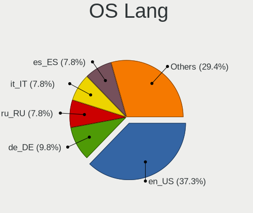
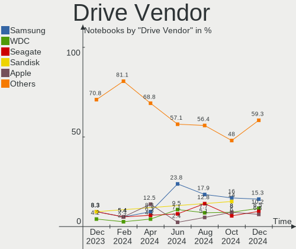
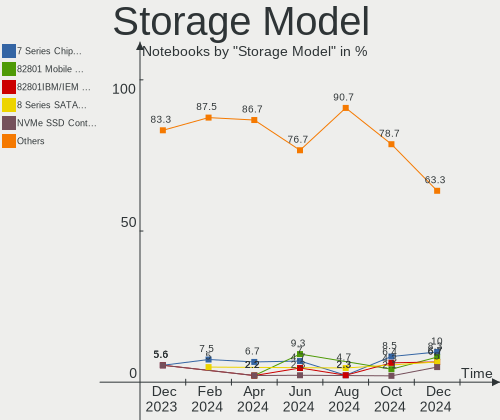
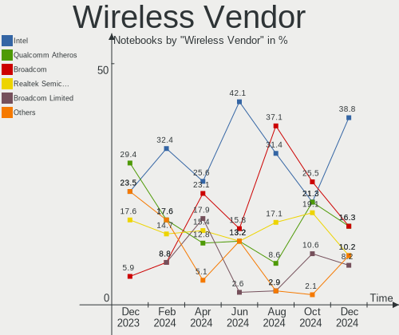

Elementary Hardware Trends (Notebooks)
--------------------------------------

A project to identify most popular hardware characteristics and track their change
over time based on data collected by Elementary users at https://Linux-Hardware.org.

Anyone can contribute to this report by the [hw-probe](https://github.com/linuxhw/hw-probe) tool:

    sudo -E hw-probe -all -upload

Full-feature report is available here: https://linux-hardware.org/?view=trends

Period: Feb, 2022.

Contents
--------

* [ System ](#system)
  - [ OS                       ](#os)
  - [ OS Family                ](#os-family)
  - [ Kernel                   ](#kernel)
  - [ Kernel Family            ](#kernel-family)
  - [ Kernel Major Ver.        ](#kernel-major-ver)
  - [ Arch                     ](#arch)
  - [ DE                       ](#de)
  - [ Display Server           ](#display-server)
  - [ Display Manager          ](#display-manager)
  - [ OS Lang                  ](#os-lang)
  - [ Boot Mode                ](#boot-mode)
  - [ Filesystem               ](#filesystem)
  - [ Part. scheme             ](#part-scheme)
  - [ Dual Boot with Linux/BSD ](#dual-boot-with-linuxbsd)
  - [ Dual Boot (Win)          ](#dual-boot-win)

* [ Board ](#board)
  - [ Vendor                   ](#vendor)
  - [ Model                    ](#model)
  - [ Model Family             ](#model-family)
  - [ MFG Year                 ](#mfg-year)
  - [ Form Factor              ](#form-factor)
  - [ Secure Boot              ](#secure-boot)
  - [ Coreboot                 ](#coreboot)
  - [ RAM Size                 ](#ram-size)
  - [ RAM Used                 ](#ram-used)
  - [ Total Drives             ](#total-drives)
  - [ Has CD-ROM               ](#has-cd-rom)
  - [ Has Ethernet             ](#has-ethernet)
  - [ Has WiFi                 ](#has-wifi)
  - [ Has Bluetooth            ](#has-bluetooth)

* [ Location ](#location)
  - [ Country                  ](#country)
  - [ City                     ](#city)

* [ Drives ](#drives)
  - [ Drive Vendor             ](#drive-vendor)
  - [ Drive Model              ](#drive-model)
  - [ HDD Vendor               ](#hdd-vendor)
  - [ SSD Vendor               ](#ssd-vendor)
  - [ Drive Kind               ](#drive-kind)
  - [ Drive Connector          ](#drive-connector)
  - [ Drive Size               ](#drive-size)
  - [ Space Total              ](#space-total)
  - [ Space Used               ](#space-used)
  - [ Malfunc. Drives          ](#malfunc-drives)
  - [ Malfunc. Drive Vendor    ](#malfunc-drive-vendor)
  - [ Malfunc. HDD Vendor      ](#malfunc-hdd-vendor)
  - [ Malfunc. Drive Kind      ](#malfunc-drive-kind)
  - [ Failed Drives            ](#failed-drives)
  - [ Failed Drive Vendor      ](#failed-drive-vendor)
  - [ Drive Status             ](#drive-status)

* [ Storage controller ](#storage-controller)
  - [ Storage Vendor           ](#storage-vendor)
  - [ Storage Model            ](#storage-model)
  - [ Storage Kind             ](#storage-kind)

* [ Processor ](#processor)
  - [ CPU Vendor               ](#cpu-vendor)
  - [ CPU Model                ](#cpu-model)
  - [ CPU Model Family         ](#cpu-model-family)
  - [ CPU Cores                ](#cpu-cores)
  - [ CPU Sockets              ](#cpu-sockets)
  - [ CPU Threads              ](#cpu-threads)
  - [ CPU Op-Modes             ](#cpu-op-modes)
  - [ CPU Microcode            ](#cpu-microcode)
  - [ CPU Microarch            ](#cpu-microarch)

* [ Graphics ](#graphics)
  - [ GPU Vendor               ](#gpu-vendor)
  - [ GPU Model                ](#gpu-model)
  - [ GPU Combo                ](#gpu-combo)
  - [ GPU Driver               ](#gpu-driver)
  - [ GPU Memory               ](#gpu-memory)

* [ Monitor ](#monitor)
  - [ Monitor Vendor           ](#monitor-vendor)
  - [ Monitor Model            ](#monitor-model)
  - [ Monitor Resolution       ](#monitor-resolution)
  - [ Monitor Diagonal         ](#monitor-diagonal)
  - [ Monitor Width            ](#monitor-width)
  - [ Aspect Ratio             ](#aspect-ratio)
  - [ Monitor Area             ](#monitor-area)
  - [ Pixel Density            ](#pixel-density)
  - [ Multiple Monitors        ](#multiple-monitors)

* [ Network ](#network)
  - [ Net Controller Vendor    ](#net-controller-vendor)
  - [ Net Controller Model     ](#net-controller-model)
  - [ Wireless Vendor          ](#wireless-vendor)
  - [ Wireless Model           ](#wireless-model)
  - [ Ethernet Vendor          ](#ethernet-vendor)
  - [ Ethernet Model           ](#ethernet-model)
  - [ Net Controller Kind      ](#net-controller-kind)
  - [ Used Controller          ](#used-controller)
  - [ NICs                     ](#nics)
  - [ IPv6                     ](#ipv6)

* [ Bluetooth ](#bluetooth)
  - [ Bluetooth Vendor         ](#bluetooth-vendor)
  - [ Bluetooth Model          ](#bluetooth-model)

* [ Sound ](#sound)
  - [ Sound Vendor             ](#sound-vendor)
  - [ Sound Model              ](#sound-model)

* [ Memory ](#memory)
  - [ Memory Vendor            ](#memory-vendor)
  - [ Memory Model             ](#memory-model)
  - [ Memory Kind              ](#memory-kind)
  - [ Memory Form Factor       ](#memory-form-factor)
  - [ Memory Size              ](#memory-size)
  - [ Memory Speed             ](#memory-speed)

* [ Printers & scanners ](#printers--scanners)
  - [ Printer Vendor           ](#printer-vendor)
  - [ Printer Model            ](#printer-model)
  - [ Scanner Vendor           ](#scanner-vendor)
  - [ Scanner Model            ](#scanner-model)

* [ Camera ](#camera)
  - [ Camera Vendor            ](#camera-vendor)
  - [ Camera Model             ](#camera-model)

* [ Security ](#security)
  - [ Fingerprint Vendor       ](#fingerprint-vendor)
  - [ Fingerprint Model        ](#fingerprint-model)
  - [ Chipcard Vendor          ](#chipcard-vendor)
  - [ Chipcard Model           ](#chipcard-model)

* [ Unsupported ](#unsupported)
  - [ Unsupported Devices      ](#unsupported-devices)
  - [ Unsupported Device Types ](#unsupported-device-types)

System
------

OS
--

Installed operating systems

| Name             | Notebooks | Percent |
|------------------|-----------|---------|
| Elementary 6.1   | 56        | 96.55%  |
| Elementary 5.1.7 | 2         | 3.45%   |

OS Family
---------

OS without a version

| Name       | Notebooks | Percent |
|------------|-----------|---------|
| Elementary | 58        | 100%    |

Kernel
------

Version of the Linux kernel

| Version                | Notebooks | Percent |
|------------------------|-----------|---------|
| 5.13.0-28-generic      | 32        | 55.17%  |
| 5.13.0-30-generic      | 14        | 24.14%  |
| 5.13.0-27-generic      | 3         | 5.17%   |
| 5.11.0-44-generic      | 2         | 3.45%   |
| 5.11.0-43-generic      | 2         | 3.45%   |
| 5.4.0-97-generic       | 1         | 1.72%   |
| 5.4.0-81-generic       | 1         | 1.72%   |
| 5.16.10-051610-generic | 1         | 1.72%   |
| 5.13.0-25-generic      | 1         | 1.72%   |
| 5.11.0-41-generic      | 1         | 1.72%   |

Kernel Family
-------------

Linux kernel without a distro release

| Version | Notebooks | Percent |
|---------|-----------|---------|
| 5.13.0  | 50        | 86.21%  |
| 5.11.0  | 5         | 8.62%   |
| 5.4.0   | 2         | 3.45%   |
| 5.16.10 | 1         | 1.72%   |

Kernel Major Ver.
-----------------

Linux kernel major version

| Version | Notebooks | Percent |
|---------|-----------|---------|
| 5.13    | 50        | 86.21%  |
| 5.11    | 5         | 8.62%   |
| 5.4     | 2         | 3.45%   |
| 5.16    | 1         | 1.72%   |

Arch
----

OS architecture (x86_64, i586, etc.)

| Name   | Notebooks | Percent |
|--------|-----------|---------|
| x86_64 | 58        | 100%    |

DE
--

Desktop Environment

| Name       | Notebooks | Percent |
|------------|-----------|---------|
| Pantheon   | 57        | 98.28%  |
| X-Cinnamon | 1         | 1.72%   |

Display Server
--------------

X11 or Wayland

| Name | Notebooks | Percent |
|------|-----------|---------|
| X11  | 58        | 100%    |

Display Manager
---------------

SDDM, LightDM, etc.

| Name    | Notebooks | Percent |
|---------|-----------|---------|
| Unknown | 53        | 91.38%  |
| LightDM | 5         | 8.62%   |

OS Lang
-------

Language

| Lang  | Notebooks | Percent |
|-------|-----------|---------|
| en_US | 24        | 41.38%  |
| de_DE | 13        | 22.41%  |
| es_ES | 5         | 8.62%   |
| it_IT | 4         | 6.9%    |
| ru_RU | 2         | 3.45%   |
| pt_BR | 2         | 3.45%   |
| pl_PL | 2         | 3.45%   |
| fr_FR | 2         | 3.45%   |
| en_GB | 2         | 3.45%   |
| pt_PT | 1         | 1.72%   |
| en_CA | 1         | 1.72%   |

Boot Mode
---------

EFI or BIOS

| Mode | Notebooks | Percent |
|------|-----------|---------|
| EFI  | 37        | 63.79%  |
| BIOS | 21        | 36.21%  |

Filesystem
----------

Type of filesystem

| Type | Notebooks | Percent |
|------|-----------|---------|
| Ext4 | 58        | 100%    |

Part. scheme
------------

Scheme of partitioning

| Type    | Notebooks | Percent |
|---------|-----------|---------|
| Unknown | 55        | 94.83%  |
| GPT     | 2         | 3.45%   |
| MBR     | 1         | 1.72%   |

Dual Boot with Linux/BSD
------------------------

Hosting more than one Linux/BSD

| Dual boot | Notebooks | Percent |
|-----------|-----------|---------|
| No        | 58        | 100%    |

Dual Boot (Win)
---------------

Hosting Linux and Windows

| Dual boot | Notebooks | Percent |
|-----------|-----------|---------|
| No        | 57        | 98.28%  |
| Yes       | 1         | 1.72%   |

Board
-----

Vendor
------

Motherboard manufacturer

| Name                | Notebooks | Percent |
|---------------------|-----------|---------|
| ASUSTek Computer    | 11        | 18.97%  |
| Hewlett-Packard     | 10        | 17.24%  |
| Lenovo              | 7         | 12.07%  |
| Apple               | 7         | 12.07%  |
| Acer                | 6         | 10.34%  |
| Dell                | 4         | 6.9%    |
| Samsung Electronics | 2         | 3.45%   |
| MSI                 | 2         | 3.45%   |
| Toshiba             | 1         | 1.72%   |
| Timi                | 1         | 1.72%   |
| Sony                | 1         | 1.72%   |
| PIPO                | 1         | 1.72%   |
| Panasonic           | 1         | 1.72%   |
| Packard Bell        | 1         | 1.72%   |
| LG Electronics      | 1         | 1.72%   |
| HUAWEI              | 1         | 1.72%   |
| Google              | 1         | 1.72%   |

Model
-----

Motherboard model

| Name                                              | Notebooks | Percent |
|---------------------------------------------------|-----------|---------|
| Apple MacBook5,1                                  | 2         | 3.45%   |
| Toshiba Satellite L850D-BJS                       | 1         | 1.72%   |
| Timi TM1613                                       | 1         | 1.72%   |
| Sony SVE15115EN                                   | 1         | 1.72%   |
| Samsung 870Z5E/880Z5E/680Z5E                      | 1         | 1.72%   |
| Samsung 500R4K/500R5H/5400RK/501R5H/5500RH/500R5S | 1         | 1.72%   |
| PIPO W9                                           | 1         | 1.72%   |
| Panasonic CF-31SBLJGDM                            | 1         | 1.72%   |
| Packard Bell EasyNote LS11HR                      | 1         | 1.72%   |
| MSI Modern 14 B4MW                                | 1         | 1.72%   |
| MSI Modern 14 B10MW                               | 1         | 1.72%   |
| LG A410-G.BC51P1                                  | 1         | 1.72%   |
| Lenovo ThinkPad X1 Carbon 6th 20KHS0L800          | 1         | 1.72%   |
| Lenovo ThinkPad T470 20JNS08H00                   | 1         | 1.72%   |
| Lenovo ThinkPad T440p 20AN006NUS                  | 1         | 1.72%   |
| Lenovo ThinkPad P14s Gen 1 20Y1000HMH             | 1         | 1.72%   |
| Lenovo ThinkPad E550 20DF0040US                   | 1         | 1.72%   |
| Lenovo IdeaPad 5 15ARE05 81YQ                     | 1         | 1.72%   |
| Lenovo G550 2958                                  | 1         | 1.72%   |
| HUAWEI MACHD-WXX9                                 | 1         | 1.72%   |
| HP ProBook 640 G1                                 | 1         | 1.72%   |
| HP ProBook 450 G7                                 | 1         | 1.72%   |
| HP Pavilion Laptop 15-cd0xx                       | 1         | 1.72%   |
| HP Pavilion Laptop 14-ce0xxx                      | 1         | 1.72%   |
| HP Pavilion 13 x360 PC                            | 1         | 1.72%   |
| HP Laptop 17-by0xxx                               | 1         | 1.72%   |
| HP EliteBook 8460p                                | 1         | 1.72%   |
| HP EliteBook 840 G1                               | 1         | 1.72%   |
| HP 255 G8 Notebook PC                             | 1         | 1.72%   |
| HP 240 G4                                         | 1         | 1.72%   |
| Google Lulu                                       | 1         | 1.72%   |
| Dell Precision 7720                               | 1         | 1.72%   |
| Dell Inspiron N5050                               | 1         | 1.72%   |
| Dell Inspiron 1764                                | 1         | 1.72%   |
| Dell Inspiron 15-3567                             | 1         | 1.72%   |
| ASUS ZenBook UX325EA_UX325EA                      | 1         | 1.72%   |
| ASUS X550CA                                       | 1         | 1.72%   |
| ASUS X540SA                                       | 1         | 1.72%   |
| ASUS VivoBook_ASUSLaptop X510QA_X510QA            | 1         | 1.72%   |
| ASUS VivoBook_ASUSLaptop X409MA                   | 1         | 1.72%   |
| ASUS K95VJ                                        | 1         | 1.72%   |
| ASUS K75VJ                                        | 1         | 1.72%   |
| ASUS K50IJ                                        | 1         | 1.72%   |
| ASUS GL753VE                                      | 1         | 1.72%   |
| ASUS E402SA                                       | 1         | 1.72%   |
| ASUS E402NA                                       | 1         | 1.72%   |
| Apple MacBookPro6,2                               | 1         | 1.72%   |
| Apple MacBookAir7,1                               | 1         | 1.72%   |
| Apple MacBookAir6,2                               | 1         | 1.72%   |
| Apple MacBookAir4,2                               | 1         | 1.72%   |
| Apple MacBookAir3,1                               | 1         | 1.72%   |
| Acer Swift SF314-56                               | 1         | 1.72%   |
| Acer Swift SF114-32                               | 1         | 1.72%   |
| Acer Aspire V5-573PG                              | 1         | 1.72%   |
| Acer Aspire S3-391                                | 1         | 1.72%   |
| Acer Aspire A315-42G                              | 1         | 1.72%   |
| Acer Aspire A315-35                               | 1         | 1.72%   |

Model Family
------------

Motherboard model prefix

| Name                   | Notebooks | Percent |
|------------------------|-----------|---------|
| Lenovo ThinkPad        | 5         | 8.62%   |
| Acer Aspire            | 4         | 6.9%    |
| HP Pavilion            | 3         | 5.17%   |
| Dell Inspiron          | 3         | 5.17%   |
| MSI Modern             | 2         | 3.45%   |
| HP ProBook             | 2         | 3.45%   |
| HP EliteBook           | 2         | 3.45%   |
| ASUS VivoBook          | 2         | 3.45%   |
| Apple MacBook5         | 2         | 3.45%   |
| Acer Swift             | 2         | 3.45%   |
| Toshiba Satellite      | 1         | 1.72%   |
| Timi TM1613            | 1         | 1.72%   |
| Sony SVE15115EN        | 1         | 1.72%   |
| Samsung 870Z5E         | 1         | 1.72%   |
| Samsung 500R4K         | 1         | 1.72%   |
| PIPO W9                | 1         | 1.72%   |
| Panasonic CF-31SBLJGDM | 1         | 1.72%   |
| Packard Bell EasyNote  | 1         | 1.72%   |
| LG A410-G.BC51P1       | 1         | 1.72%   |
| Lenovo IdeaPad         | 1         | 1.72%   |
| Lenovo G550            | 1         | 1.72%   |
| HUAWEI MACHD-WXX9      | 1         | 1.72%   |
| HP Laptop              | 1         | 1.72%   |
| HP 255                 | 1         | 1.72%   |
| HP 240                 | 1         | 1.72%   |
| Google Lulu            | 1         | 1.72%   |
| Dell Precision         | 1         | 1.72%   |
| ASUS ZenBook           | 1         | 1.72%   |
| ASUS X550CA            | 1         | 1.72%   |
| ASUS X540SA            | 1         | 1.72%   |
| ASUS K95VJ             | 1         | 1.72%   |
| ASUS K75VJ             | 1         | 1.72%   |
| ASUS K50IJ             | 1         | 1.72%   |
| ASUS GL753VE           | 1         | 1.72%   |
| ASUS E402SA            | 1         | 1.72%   |
| ASUS E402NA            | 1         | 1.72%   |
| Apple MacBookPro6      | 1         | 1.72%   |
| Apple MacBookAir7      | 1         | 1.72%   |
| Apple MacBookAir6      | 1         | 1.72%   |
| Apple MacBookAir4      | 1         | 1.72%   |
| Apple MacBookAir3      | 1         | 1.72%   |

MFG Year
--------

Motherboard manufacture year

| Year | Notebooks | Percent |
|------|-----------|---------|
| 2020 | 7         | 12.07%  |
| 2012 | 7         | 12.07%  |
| 2013 | 6         | 10.34%  |
| 2018 | 5         | 8.62%   |
| 2017 | 5         | 8.62%   |
| 2016 | 5         | 8.62%   |
| 2009 | 5         | 8.62%   |
| 2011 | 4         | 6.9%    |
| 2021 | 3         | 5.17%   |
| 2019 | 3         | 5.17%   |
| 2015 | 3         | 5.17%   |
| 2014 | 3         | 5.17%   |
| 2010 | 2         | 3.45%   |

Form Factor
-----------

Physical design of the computer

| Name     | Notebooks | Percent |
|----------|-----------|---------|
| Notebook | 58        | 100%    |

Secure Boot
-----------

Enabled or disabled

| State    | Notebooks | Percent |
|----------|-----------|---------|
| Disabled | 48        | 82.76%  |
| Enabled  | 10        | 17.24%  |

Coreboot
--------

Have coreboot on board

| Used | Notebooks | Percent |
|------|-----------|---------|
| No   | 57        | 98.28%  |
| Yes  | 1         | 1.72%   |

RAM Size
--------

Total RAM memory

| Size in GB | Notebooks | Percent |
|------------|-----------|---------|
| 4.01-8.0   | 23        | 39.66%  |
| 3.01-4.0   | 13        | 22.41%  |
| 8.01-16.0  | 10        | 17.24%  |
| 16.01-24.0 | 8         | 13.79%  |
| 1.01-2.0   | 3         | 5.17%   |
| 32.01-64.0 | 1         | 1.72%   |

RAM Used
--------

Used RAM memory

| Used GB    | Notebooks | Percent |
|------------|-----------|---------|
| 2.01-3.0   | 23        | 39.66%  |
| 1.01-2.0   | 21        | 36.21%  |
| 3.01-4.0   | 6         | 10.34%  |
| 4.01-8.0   | 4         | 6.9%    |
| 0.51-1.0   | 3         | 5.17%   |
| 16.01-24.0 | 1         | 1.72%   |

Total Drives
------------

Number of drives on board

| Drives | Notebooks | Percent |
|--------|-----------|---------|
| 1      | 37        | 63.79%  |
| 2      | 20        | 34.48%  |
| 3      | 1         | 1.72%   |

Has CD-ROM
----------

Has CD-ROM on board

| Presented | Notebooks | Percent |
|-----------|-----------|---------|
| No        | 36        | 62.07%  |
| Yes       | 22        | 37.93%  |

Has Ethernet
------------

Has Ethernet on board

| Presented | Notebooks | Percent |
|-----------|-----------|---------|
| Yes       | 41        | 70.69%  |
| No        | 17        | 29.31%  |

Has WiFi
--------

Has WiFi module

| Presented | Notebooks | Percent |
|-----------|-----------|---------|
| Yes       | 55        | 94.83%  |
| No        | 3         | 5.17%   |

Has Bluetooth
-------------

Has Bluetooth module

| Presented | Notebooks | Percent |
|-----------|-----------|---------|
| Yes       | 53        | 91.38%  |
| No        | 5         | 8.62%   |

Location
--------

Country
-------

Geographic location (country)

| Country      | Notebooks | Percent |
|--------------|-----------|---------|
| USA          | 11        | 18.97%  |
| Germany      | 11        | 18.97%  |
| Russia       | 4         | 6.9%    |
| Italy        | 4         | 6.9%    |
| UK           | 3         | 5.17%   |
| India        | 3         | 5.17%   |
| Poland       | 2         | 3.45%   |
| Indonesia    | 2         | 3.45%   |
| Brazil       | 2         | 3.45%   |
| Austria      | 2         | 3.45%   |
| Taiwan       | 1         | 1.72%   |
| Spain        | 1         | 1.72%   |
| South Africa | 1         | 1.72%   |
| Peru         | 1         | 1.72%   |
| Netherlands  | 1         | 1.72%   |
| Mexico       | 1         | 1.72%   |
| Latvia       | 1         | 1.72%   |
| Ireland      | 1         | 1.72%   |
| France       | 1         | 1.72%   |
| Colombia     | 1         | 1.72%   |
| Chile        | 1         | 1.72%   |
| Canada       | 1         | 1.72%   |
| Belgium      | 1         | 1.72%   |
| Argentina    | 1         | 1.72%   |

City
----

Geographic location (city)

| City                 | Notebooks | Percent |
|----------------------|-----------|---------|
| St Petersburg        | 3         | 5.17%   |
| Tucson               | 2         | 3.45%   |
| Wolgast              | 1         | 1.72%   |
| Witbank              | 1         | 1.72%   |
| West Bromwich        | 1         | 1.72%   |
| Warsaw               | 1         | 1.72%   |
| Vigodarzere          | 1         | 1.72%   |
| Vienna               | 1         | 1.72%   |
| Trieste              | 1         | 1.72%   |
| The Hague            | 1         | 1.72%   |
| Stronsdorf           | 1         | 1.72%   |
| Semarang             | 1         | 1.72%   |
| Scottsdale           | 1         | 1.72%   |
| São Paulo         | 1         | 1.72%   |
| Sassnitz             | 1         | 1.72%   |
| Santa Clara          | 1         | 1.72%   |
| Rzeszów           | 1         | 1.72%   |
| Riga                 | 1         | 1.72%   |
| Purwokerto           | 1         | 1.72%   |
| Patiala              | 1         | 1.72%   |
| North                | 1         | 1.72%   |
| Nome                 | 1         | 1.72%   |
| New Taipei           | 1         | 1.72%   |
| Mysore               | 1         | 1.72%   |
| Munich               | 1         | 1.72%   |
| Monza                | 1         | 1.72%   |
| Montreal             | 1         | 1.72%   |
| Madrid               | 1         | 1.72%   |
| Ligonier             | 1         | 1.72%   |
| Langenlonsheim       | 1         | 1.72%   |
| La Calera            | 1         | 1.72%   |
| Kirchheim unter Teck | 1         | 1.72%   |
| Kensington           | 1         | 1.72%   |
| Jarnac               | 1         | 1.72%   |
| Hugo                 | 1         | 1.72%   |
| Ghaziabad            | 1         | 1.72%   |
| Geretsried           | 1         | 1.72%   |
| Garland              | 1         | 1.72%   |
| Garbagnate Milanese  | 1         | 1.72%   |
| Freising             | 1         | 1.72%   |
| Frankfurt am Main    | 1         | 1.72%   |
| Forest               | 1         | 1.72%   |
| Florence             | 1         | 1.72%   |
| Farnham              | 1         | 1.72%   |
| Dublin               | 1         | 1.72%   |
| Culiacán          | 1         | 1.72%   |
| Cuiabá            | 1         | 1.72%   |
| Chelyabinsk          | 1         | 1.72%   |
| Callao               | 1         | 1.72%   |
| Burg bei Magdeburg   | 1         | 1.72%   |
| Buenos Aires         | 1         | 1.72%   |
| Bozeman              | 1         | 1.72%   |
| Berlin               | 1         | 1.72%   |
| Bello                | 1         | 1.72%   |
| Bad Liebenstein      | 1         | 1.72%   |

Drives
------

Drive Vendor
------------

Hard drive vendors

| Vendor                    | Notebooks | Drives | Percent |
|---------------------------|-----------|--------|---------|
| Samsung Electronics       | 10        | 10     | 13.33%  |
| WDC                       | 7         | 7      | 9.33%   |
| Seagate                   | 7         | 7      | 9.33%   |
| Sandisk                   | 6         | 6      | 8%      |
| Unknown                   | 5         | 5      | 6.67%   |
| Toshiba                   | 5         | 5      | 6.67%   |
| HGST                      | 4         | 4      | 5.33%   |
| Crucial                   | 4         | 4      | 5.33%   |
| Apple                     | 4         | 4      | 5.33%   |
| Kingston                  | 3         | 3      | 4%      |
| KingDian                  | 2         | 2      | 2.67%   |
| Hitachi                   | 2         | 2      | 2.67%   |
| Transcend                 | 1         | 1      | 1.33%   |
| TO Exter                  | 1         | 1      | 1.33%   |
| SSK                       | 1         | 1      | 1.33%   |
| SSDPR-CX                  | 1         | 1      | 1.33%   |
| SK Hynix                  | 1         | 1      | 1.33%   |
| PNY                       | 1         | 1      | 1.33%   |
| Phison                    | 1         | 1      | 1.33%   |
| Micron/Crucial Technology | 1         | 1      | 1.33%   |
| MENGMI                    | 1         | 1      | 1.33%   |
| LITEON                    | 1         | 1      | 1.33%   |
| JMicron                   | 1         | 1      | 1.33%   |
| Intel                     | 1         | 1      | 1.33%   |
| Colorful                  | 1         | 1      | 1.33%   |
| China                     | 1         | 1      | 1.33%   |
| asmedia                   | 1         | 1      | 1.33%   |
| A-DATA Technology         | 1         | 1      | 1.33%   |

Drive Model
-----------

Hard drive models

| Model                                  | Notebooks | Percent |
|----------------------------------------|-----------|---------|
| Sandisk NVMe SSD Drive 512GB           | 3         | 4%      |
| Unknown MMC Card  32GB                 | 2         | 2.67%   |
| Toshiba MQ01ABF050 500GB               | 2         | 2.67%   |
| Toshiba KBG30ZMS128G 128GB NVMe SSD    | 2         | 2.67%   |
| Seagate ST1000LM024 HN-M101MBB 1TB     | 2         | 2.67%   |
| Samsung SM963 2.5" NVMe PCIe SSD 256GB | 2         | 2.67%   |
| HGST HTS541010B7E610 1TB               | 2         | 2.67%   |
| WDC WDS480G2G0A-00JH30 480GB SSD       | 1         | 1.33%   |
| WDC WDS240G2G0A-00JH30 240GB SSD       | 1         | 1.33%   |
| WDC WD5000LPVX-75V0TT0 500GB           | 1         | 1.33%   |
| WDC WD5000BPVT-22HXZT3 500GB           | 1         | 1.33%   |
| WDC WD3200BPVT-00JJ5T0 320GB           | 1         | 1.33%   |
| WDC WD3200BEVT-75A23T0 320GB           | 1         | 1.33%   |
| WDC WD2500BEVS-22UST0 250GB            | 1         | 1.33%   |
| Unknown MMC Card  64GB                 | 1         | 1.33%   |
| Unknown MMC Card  128GB                | 1         | 1.33%   |
| Unknown BJNB4R  32GB                   | 1         | 1.33%   |
| Transcend TS128GMTS430S 128GB SSD      | 1         | 1.33%   |
| Toshiba MQ04ABF100 1TB                 | 1         | 1.33%   |
| TO Exter nal USB 3.0 2TB               | 1         | 1.33%   |
| SSK Disk 512GB                         | 1         | 1.33%   |
| SSDPR-CX 400-128 128GB                 | 1         | 1.33%   |
| SK Hynix NVMe SSD Drive 128GB          | 1         | 1.33%   |
| Seagate ST9250315AS 250GB              | 1         | 1.33%   |
| Seagate ST500LT012-1DG142 500GB        | 1         | 1.33%   |
| Seagate ST500LM021-1KJ152 500GB        | 1         | 1.33%   |
| Seagate ST320LM010-1KJ15C 320GB        | 1         | 1.33%   |
| Seagate OneTouch HDD 4TB               | 1         | 1.33%   |
| SanDisk Ultra II 480GB SSD             | 1         | 1.33%   |
| SanDisk SDSSDA120G 120GB               | 1         | 1.33%   |
| SanDisk SD9SN8W-128G-1006 128GB SSD    | 1         | 1.33%   |
| Samsung SSD 870 EVO 500GB              | 1         | 1.33%   |
| Samsung SSD 860 EVO 500GB              | 1         | 1.33%   |
| Samsung SSD 850 EVO 500GB              | 1         | 1.33%   |
| Samsung SSD 840 Series 250GB           | 1         | 1.33%   |
| Samsung SSD 840 EVO 120GB              | 1         | 1.33%   |
| Samsung NVMe SSD Drive 512GB           | 1         | 1.33%   |
| Samsung NVMe SSD Drive 1024GB          | 1         | 1.33%   |
| Samsung MZNLN128HAHQ-000H1 128GB SSD   | 1         | 1.33%   |
| PNY CS900 480GB SSD                    | 1         | 1.33%   |
| Phison NVMe SSD Drive 512GB            | 1         | 1.33%   |
| Micron/Crucial NVMe SSD Drive 1TB      | 1         | 1.33%   |
| MENGMI SSD 120GB                       | 1         | 1.33%   |
| LITEON IT LST-32S9G-HP 32GB SSD        | 1         | 1.33%   |
| Kingston NVMe SSD Drive 512GB          | 1         | 1.33%   |
| Kingston NVMe SSD Drive 256GB          | 1         | 1.33%   |
| Kingston NVMe SSD Drive 128GB          | 1         | 1.33%   |
| KingDian N480 120GB                    | 1         | 1.33%   |
| KingDian N400 32GB SSD                 | 1         | 1.33%   |
| JMicron Tech 250GB                     | 1         | 1.33%   |
| Intel NVMe SSD Drive 512GB             | 1         | 1.33%   |
| Hitachi HTS727575A9E364 752GB          | 1         | 1.33%   |
| Hitachi HTS547564A9E384 640GB          | 1         | 1.33%   |
| HGST HTS725050A7E630 500GB             | 1         | 1.33%   |
| HGST HTS721010A9E630 1TB               | 1         | 1.33%   |
| Crucial CT480BX500SSD1 480GB           | 1         | 1.33%   |
| Crucial CT250MX200SSD1 250GB           | 1         | 1.33%   |
| Crucial CT240BX500SSD1 240GB           | 1         | 1.33%   |
| Crucial CT120BX500SSD1 120GB           | 1         | 1.33%   |
| Colorful SL500 240GB                   | 1         | 1.33%   |

HDD Vendor
----------

Hard disk drive vendors

| Vendor  | Notebooks | Drives | Percent |
|---------|-----------|--------|---------|
| Seagate | 7         | 7      | 33.33%  |
| WDC     | 5         | 5      | 23.81%  |
| HGST    | 4         | 4      | 19.05%  |
| Toshiba | 3         | 3      | 14.29%  |
| Hitachi | 2         | 2      | 9.52%   |

SSD Vendor
----------

Solid state drive vendors

| Vendor              | Notebooks | Drives | Percent |
|---------------------|-----------|--------|---------|
| Samsung Electronics | 6         | 6      | 21.43%  |
| Crucial             | 4         | 4      | 14.29%  |
| Apple               | 4         | 4      | 14.29%  |
| SanDisk             | 3         | 3      | 10.71%  |
| WDC                 | 2         | 2      | 7.14%   |
| Transcend           | 1         | 1      | 3.57%   |
| TO Exter            | 1         | 1      | 3.57%   |
| PNY                 | 1         | 1      | 3.57%   |
| MENGMI              | 1         | 1      | 3.57%   |
| LITEON              | 1         | 1      | 3.57%   |
| KingDian            | 1         | 1      | 3.57%   |
| Colorful            | 1         | 1      | 3.57%   |
| China               | 1         | 1      | 3.57%   |
| A-DATA Technology   | 1         | 1      | 3.57%   |

Drive Kind
----------

HDD or SSD

| Kind    | Notebooks | Drives | Percent |
|---------|-----------|--------|---------|
| SSD     | 27        | 28     | 36.99%  |
| HDD     | 20        | 21     | 27.4%   |
| NVMe    | 16        | 16     | 21.92%  |
| MMC     | 5         | 5      | 6.85%   |
| Unknown | 5         | 5      | 6.85%   |

Drive Connector
---------------

SATA, SAS, NVMe, etc.

| Type | Notebooks | Drives | Percent |
|------|-----------|--------|---------|
| SATA | 44        | 48     | 61.97%  |
| NVMe | 16        | 16     | 22.54%  |
| SAS  | 6         | 6      | 8.45%   |
| MMC  | 5         | 5      | 7.04%   |

Drive Size
----------

Size of hard drive

| Size in TB | Notebooks | Drives | Percent |
|------------|-----------|--------|---------|
| 0.01-0.5   | 36        | 39     | 78.26%  |
| 0.51-1.0   | 8         | 8      | 17.39%  |
| 3.01-4.0   | 1         | 1      | 2.17%   |
| 1.01-2.0   | 1         | 1      | 2.17%   |

Space Total
-----------

Amount of disk space available on the file system

| Size in GB | Notebooks | Percent |
|------------|-----------|---------|
| 251-500    | 23        | 39.66%  |
| 101-250    | 22        | 37.93%  |
| 501-1000   | 5         | 8.62%   |
| 51-100     | 4         | 6.9%    |
| 21-50      | 3         | 5.17%   |
| 1001-2000  | 1         | 1.72%   |

Space Used
----------

Amount of used disk space

| Used GB | Notebooks | Percent |
|---------|-----------|---------|
| 1-20    | 32        | 55.17%  |
| 21-50   | 14        | 24.14%  |
| 51-100  | 6         | 10.34%  |
| 101-250 | 5         | 8.62%   |
| 251-500 | 1         | 1.72%   |

Malfunc. Drives
---------------

Drive models with a malfunction

Zero info for selected period =(

Malfunc. Drive Vendor
---------------------

Vendors of faulty drives

Zero info for selected period =(

Malfunc. HDD Vendor
-------------------

Vendors of faulty HDD drives

Zero info for selected period =(

Malfunc. Drive Kind
-------------------

Kinds of faulty drives

Zero info for selected period =(

Failed Drives
-------------

Failed drive models

Zero info for selected period =(

Failed Drive Vendor
-------------------

Failed drive vendors

Zero info for selected period =(

Drive Status
------------

Number of failed and malfunc. drives

| Status   | Notebooks | Drives | Percent |
|----------|-----------|--------|---------|
| Detected | 57        | 70     | 95%     |
| Works    | 3         | 5      | 5%      |

Storage controller
------------------

Storage Vendor
--------------

Storage controller vendors

| Vendor                       | Notebooks | Percent |
|------------------------------|-----------|---------|
| Intel                        | 41        | 60.29%  |
| AMD                          | 7         | 10.29%  |
| Samsung Electronics          | 5         | 7.35%   |
| Sandisk                      | 3         | 4.41%   |
| Nvidia                       | 3         | 4.41%   |
| Kingston Technology Company  | 3         | 4.41%   |
| Toshiba America Info Systems | 2         | 2.94%   |
| SK Hynix                     | 1         | 1.47%   |
| Phison Electronics           | 1         | 1.47%   |
| Micron/Crucial Technology    | 1         | 1.47%   |
| Marvell Technology Group     | 1         | 1.47%   |

Storage Model
-------------

Storage controller models

| Model                                                                                  | Notebooks | Percent |
|----------------------------------------------------------------------------------------|-----------|---------|
| Intel 7 Series Chipset Family 6-port SATA Controller [AHCI mode]                       | 7         | 9.86%   |
| AMD FCH SATA Controller [AHCI mode]                                                    | 7         | 9.86%   |
| Intel Sunrise Point-LP SATA Controller [AHCI mode]                                     | 4         | 5.63%   |
| Intel Wildcat Point-LP SATA Controller [AHCI Mode]                                     | 3         | 4.23%   |
| Intel Atom/Celeron/Pentium Processor x5-E8000/J3xxx/N3xxx Series SATA Controller       | 3         | 4.23%   |
| Intel 8 Series SATA Controller 1 [AHCI mode]                                           | 3         | 4.23%   |
| Intel 6 Series/C200 Series Chipset Family 6 port Mobile SATA AHCI Controller           | 3         | 4.23%   |
| Toshiba America Info Systems BG3 NVMe SSD Controller                                   | 2         | 2.82%   |
| Samsung NVMe SSD Controller SM981/PM981/PM983                                          | 2         | 2.82%   |
| Intel Celeron/Pentium Silver Processor SATA Controller                                 | 2         | 2.82%   |
| Intel 82801IBM/IEM (ICH9M/ICH9M-E) 4 port SATA Controller [AHCI mode]                  | 2         | 2.82%   |
| Intel 82801 Mobile SATA Controller [RAID mode]                                         | 2         | 2.82%   |
| Intel 8 Series/C220 Series Chipset Family 6-port SATA Controller 1 [AHCI mode]         | 2         | 2.82%   |
| Intel 5 Series/3400 Series Chipset 4 port SATA AHCI Controller                         | 2         | 2.82%   |
| SK Hynix Gold P31 SSD                                                                  | 1         | 1.41%   |
| Sandisk WD Blue SN550 NVMe SSD                                                         | 1         | 1.41%   |
| Sandisk WD Blue SN500 / PC SN520 NVMe SSD                                              | 1         | 1.41%   |
| Sandisk WD Black 2018/SN750 / PC SN720 NVMe SSD                                        | 1         | 1.41%   |
| Samsung NVMe SSD Controller SM951/PM951                                                | 1         | 1.41%   |
| Samsung NVMe SSD Controller 980                                                        | 1         | 1.41%   |
| Samsung Electronics SATA controller                                                    | 1         | 1.41%   |
| Phison NVMe Storage Controller                                                         | 1         | 1.41%   |
| Nvidia MCP89 SATA Controller (AHCI mode)                                               | 1         | 1.41%   |
| Nvidia MCP79 SATA Controller                                                           | 1         | 1.41%   |
| Nvidia MCP79 AHCI Controller                                                           | 1         | 1.41%   |
| Micron/Crucial P2 NVMe PCIe SSD                                                        | 1         | 1.41%   |
| Marvell Group 88SS9183 PCIe SSD Controller                                             | 1         | 1.41%   |
| Kingston Company U-SNS8154P3 NVMe SSD                                                  | 1         | 1.41%   |
| Kingston Company Company Non-Volatile memory controller                                | 1         | 1.41%   |
| Kingston Company OM3PDP3 NVMe SSD                                                      | 1         | 1.41%   |
| Intel Volume Management Device NVMe RAID Controller                                    | 1         | 1.41%   |
| Intel SSD 660P Series                                                                  | 1         | 1.41%   |
| Intel Q170/Q150/B150/H170/H110/Z170/CM236 Chipset SATA Controller [AHCI Mode]          | 1         | 1.41%   |
| Intel Jasper Lake SATA AHCI Controller                                                 | 1         | 1.41%   |
| Intel HM170/QM170 Chipset SATA Controller [AHCI Mode]                                  | 1         | 1.41%   |
| Intel Comet Lake SATA AHCI Controller                                                  | 1         | 1.41%   |
| Intel Celeron N3350/Pentium N4200/Atom E3900 Series SATA AHCI Controller               | 1         | 1.41%   |
| Intel 6 Series/C200 Series Chipset Family Mobile SATA Controller (IDE mode, ports 4-5) | 1         | 1.41%   |
| Intel 6 Series/C200 Series Chipset Family Mobile SATA Controller (IDE mode, ports 0-3) | 1         | 1.41%   |
| Intel 5 Series/3400 Series Chipset 4 port SATA IDE Controller                          | 1         | 1.41%   |
| Intel 5 Series/3400 Series Chipset 2 port SATA IDE Controller                          | 1         | 1.41%   |

Storage Kind
------------

Kind of storage controller (IDE, SATA, NVMe, SAS, ...)

| Kind | Notebooks | Percent |
|------|-----------|---------|
| SATA | 47        | 68.12%  |
| NVMe | 16        | 23.19%  |
| RAID | 3         | 4.35%   |
| IDE  | 3         | 4.35%   |

Processor
---------

CPU Vendor
----------

Processor vendors

| Vendor | Notebooks | Percent |
|--------|-----------|---------|
| Intel  | 50        | 86.21%  |
| AMD    | 8         | 13.79%  |

CPU Model
---------

Processor models

| Model                                           | Notebooks | Percent |
|-------------------------------------------------|-----------|---------|
| Intel Core i7-8550U CPU @ 1.80GHz               | 2         | 3.45%   |
| Intel Core i7-5500U CPU @ 2.40GHz               | 2         | 3.45%   |
| Intel Celeron CPU N3050 @ 1.60GHz               | 2         | 3.45%   |
| Intel 11th Gen Core i7-1165G7 @ 2.80GHz         | 2         | 3.45%   |
| AMD A12-9720P RADEON R7, 12 COMPUTE CORES 4C+8G | 2         | 3.45%   |
| Intel Pentium Silver N5030 CPU @ 1.10GHz        | 1         | 1.72%   |
| Intel Pentium Dual-Core CPU T4400 @ 2.20GHz     | 1         | 1.72%   |
| Intel Pentium Dual-Core CPU T4200 @ 2.00GHz     | 1         | 1.72%   |
| Intel Core i7-7700HQ CPU @ 2.80GHz              | 1         | 1.72%   |
| Intel Core i7-6820HQ CPU @ 2.70GHz              | 1         | 1.72%   |
| Intel Core i7-5650U CPU @ 2.20GHz               | 1         | 1.72%   |
| Intel Core i7-4702MQ CPU @ 2.20GHz              | 1         | 1.72%   |
| Intel Core i7-4610M CPU @ 3.00GHz               | 1         | 1.72%   |
| Intel Core i7-3635QM CPU @ 2.40GHz              | 1         | 1.72%   |
| Intel Core i7-3630QM CPU @ 2.40GHz              | 1         | 1.72%   |
| Intel Core i7-2670QM CPU @ 2.20GHz              | 1         | 1.72%   |
| Intel Core i5-8265U CPU @ 1.60GHz               | 1         | 1.72%   |
| Intel Core i5-7200U CPU @ 2.50GHz               | 1         | 1.72%   |
| Intel Core i5-6300U CPU @ 2.40GHz               | 1         | 1.72%   |
| Intel Core i5-6200U CPU @ 2.30GHz               | 1         | 1.72%   |
| Intel Core i5-4300U CPU @ 1.90GHz               | 1         | 1.72%   |
| Intel Core i5-4260U CPU @ 1.40GHz               | 1         | 1.72%   |
| Intel Core i5-4200U CPU @ 1.60GHz               | 1         | 1.72%   |
| Intel Core i5-3320M CPU @ 2.60GHz               | 1         | 1.72%   |
| Intel Core i5-3210M CPU @ 2.50GHz               | 1         | 1.72%   |
| Intel Core i5-2557M CPU @ 1.70GHz               | 1         | 1.72%   |
| Intel Core i5-2520M CPU @ 2.50GHz               | 1         | 1.72%   |
| Intel Core i5-10210U CPU @ 1.60GHz              | 1         | 1.72%   |
| Intel Core i5 CPU M 520 @ 2.40GHz               | 1         | 1.72%   |
| Intel Core i3-8130U CPU @ 2.20GHz               | 1         | 1.72%   |
| Intel Core i3-5005U CPU @ 2.00GHz               | 1         | 1.72%   |
| Intel Core i3-4030U CPU @ 1.90GHz               | 1         | 1.72%   |
| Intel Core i3-3217U CPU @ 1.80GHz               | 1         | 1.72%   |
| Intel Core i3-2370M CPU @ 2.40GHz               | 1         | 1.72%   |
| Intel Core i3-2365M CPU @ 1.40GHz               | 1         | 1.72%   |
| Intel Core i3-10110U CPU @ 2.10GHz              | 1         | 1.72%   |
| Intel Core i3 CPU M 390 @ 2.67GHz               | 1         | 1.72%   |
| Intel Core i3 CPU M 350 @ 2.27GHz               | 1         | 1.72%   |
| Intel Core 2 Duo CPU U9400 @ 1.40GHz            | 1         | 1.72%   |
| Intel Core 2 Duo CPU P8600 @ 2.40GHz            | 1         | 1.72%   |
| Intel Core 2 Duo CPU P7350 @ 2.00GHz            | 1         | 1.72%   |
| Intel Celeron N4500 @ 1.10GHz                   | 1         | 1.72%   |
| Intel Celeron N4020 CPU @ 1.10GHz               | 1         | 1.72%   |
| Intel Celeron CPU N3350 @ 1.10GHz               | 1         | 1.72%   |
| Intel Celeron CPU N3150 @ 1.60GHz               | 1         | 1.72%   |
| Intel Celeron CPU B815 @ 1.60GHz                | 1         | 1.72%   |
| Intel Atom x5-Z8300 CPU @ 1.44GHz               | 1         | 1.72%   |
| AMD Ryzen 7 PRO 4750U with Radeon Graphics      | 1         | 1.72%   |
| AMD Ryzen 7 4700U with Radeon Graphics          | 1         | 1.72%   |
| AMD Ryzen 5 5500U with Radeon Graphics          | 1         | 1.72%   |
| AMD Ryzen 5 4500U with Radeon Graphics          | 1         | 1.72%   |
| AMD Ryzen 5 3500U with Radeon Vega Mobile Gfx   | 1         | 1.72%   |
| AMD A10-4600M APU with Radeon HD Graphics       | 1         | 1.72%   |

CPU Model Family
----------------

Processor model prefix

| Model                   | Notebooks | Percent |
|-------------------------|-----------|---------|
| Intel Core i5           | 13        | 22.41%  |
| Intel Core i7           | 12        | 20.69%  |
| Intel Core i3           | 9         | 15.52%  |
| Intel Celeron           | 7         | 12.07%  |
| Intel Core 2 Duo        | 3         | 5.17%   |
| AMD Ryzen 5             | 3         | 5.17%   |
| Other                   | 2         | 3.45%   |
| Intel Pentium Dual-Core | 2         | 3.45%   |
| AMD A12                 | 2         | 3.45%   |
| Intel Pentium Silver    | 1         | 1.72%   |
| Intel Atom              | 1         | 1.72%   |
| AMD Ryzen 7 PRO         | 1         | 1.72%   |
| AMD Ryzen 7             | 1         | 1.72%   |
| AMD A10                 | 1         | 1.72%   |

CPU Cores
---------

Number of processor cores

| Number | Notebooks | Percent |
|--------|-----------|---------|
| 2      | 38        | 65.52%  |
| 4      | 16        | 27.59%  |
| 8      | 2         | 3.45%   |
| 6      | 2         | 3.45%   |

CPU Sockets
-----------

Number of sockets

| Number | Notebooks | Percent |
|--------|-----------|---------|
| 1      | 58        | 100%    |

CPU Threads
-----------

Threads per core (Hyper-Threading)

| Number | Notebooks | Percent |
|--------|-----------|---------|
| 2      | 41        | 70.69%  |
| 1      | 17        | 29.31%  |

CPU Op-Modes
------------

CPU Operation Modes (32-bit, 64-bit)

| Op mode        | Notebooks | Percent |
|----------------|-----------|---------|
| 32-bit, 64-bit | 58        | 100%    |

CPU Microcode
-------------

Microcode number

| Number     | Notebooks | Percent |
|------------|-----------|---------|
| 0x206a7    | 6         | 10.34%  |
| Unknown    | 5         | 8.62%   |
| 0x406c3    | 4         | 6.9%    |
| 0x306d4    | 4         | 6.9%    |
| 0x306a9    | 4         | 6.9%    |
| 0x806ea    | 3         | 5.17%   |
| 0x40651    | 3         | 5.17%   |
| 0x1067a    | 3         | 5.17%   |
| 0x806ec    | 2         | 3.45%   |
| 0x806c1    | 2         | 3.45%   |
| 0x706a8    | 2         | 3.45%   |
| 0x406e3    | 2         | 3.45%   |
| 0x306c3    | 2         | 3.45%   |
| 0x20652    | 2         | 3.45%   |
| 0x10676    | 2         | 3.45%   |
| 0x906e9    | 1         | 1.72%   |
| 0x906c0    | 1         | 1.72%   |
| 0x806eb    | 1         | 1.72%   |
| 0x806e9    | 1         | 1.72%   |
| 0x506e3    | 1         | 1.72%   |
| 0x506c9    | 1         | 1.72%   |
| 0x20655    | 1         | 1.72%   |
| 0x08608103 | 1         | 1.72%   |
| 0x08600106 | 1         | 1.72%   |
| 0x08108109 | 1         | 1.72%   |
| 0x0600611a | 1         | 1.72%   |
| 0x06001119 | 1         | 1.72%   |

CPU Microarch
-------------

Microarchitecture

| Name          | Notebooks | Percent |
|---------------|-----------|---------|
| KabyLake      | 8         | 13.79%  |
| SandyBridge   | 6         | 10.34%  |
| Haswell       | 6         | 10.34%  |
| Penryn        | 5         | 8.62%   |
| IvyBridge     | 5         | 8.62%   |
| Silvermont    | 4         | 6.9%    |
| Broadwell     | 4         | 6.9%    |
| Zen 2         | 3         | 5.17%   |
| Westmere      | 3         | 5.17%   |
| Skylake       | 3         | 5.17%   |
| TigerLake     | 2         | 3.45%   |
| Goldmont plus | 2         | 3.45%   |
| Excavator     | 2         | 3.45%   |
| Zen+          | 1         | 1.72%   |
| Tremont       | 1         | 1.72%   |
| Piledriver    | 1         | 1.72%   |
| Goldmont      | 1         | 1.72%   |
| Unknown       | 1         | 1.72%   |

Graphics
--------

GPU Vendor
----------

Vendors of graphics cards

| Vendor | Notebooks | Percent |
|--------|-----------|---------|
| Intel  | 46        | 63.89%  |
| Nvidia | 13        | 18.06%  |
| AMD    | 13        | 18.06%  |

GPU Model
---------

Graphics card models

| Model                                                                                    | Notebooks | Percent |
|------------------------------------------------------------------------------------------|-----------|---------|
| Intel 3rd Gen Core processor Graphics Controller                                         | 5         | 6.76%   |
| Intel 2nd Generation Core Processor Family Integrated Graphics Controller                | 5         | 6.76%   |
| Intel Haswell-ULT Integrated Graphics Controller                                         | 4         | 5.41%   |
| Intel Atom/Celeron/Pentium Processor x5-E8000/J3xxx/N3xxx Integrated Graphics Controller | 4         | 5.41%   |
| Intel UHD Graphics 620                                                                   | 3         | 4.05%   |
| Intel HD Graphics 5500                                                                   | 3         | 4.05%   |
| Intel Core Processor Integrated Graphics Controller                                      | 3         | 4.05%   |
| AMD Renoir                                                                               | 3         | 4.05%   |
| Nvidia GF108M [GeForce GT 635M]                                                          | 2         | 2.7%    |
| Nvidia C79 [GeForce 9400M]                                                               | 2         | 2.7%    |
| Intel TigerLake-LP GT2 [Iris Xe Graphics]                                                | 2         | 2.7%    |
| Intel Skylake GT2 [HD Graphics 520]                                                      | 2         | 2.7%    |
| Intel Mobile 4 Series Chipset Integrated Graphics Controller                             | 2         | 2.7%    |
| Intel CometLake-U GT2 [UHD Graphics]                                                     | 2         | 2.7%    |
| Intel 4th Gen Core Processor Integrated Graphics Controller                              | 2         | 2.7%    |
| AMD Wani [Radeon R5/R6/R7 Graphics]                                                      | 2         | 2.7%    |
| AMD Topaz XT [Radeon R7 M260/M265 / M340/M360 / M440/M445 / 530/535 / 620/625 Mobile]    | 2         | 2.7%    |
| Nvidia MCP89 [GeForce 320M]                                                              | 1         | 1.35%   |
| Nvidia GT216M [GeForce GT 330M]                                                          | 1         | 1.35%   |
| Nvidia GP108M [GeForce MX250]                                                            | 1         | 1.35%   |
| Nvidia GP107M [GeForce GTX 1050 Ti Mobile]                                               | 1         | 1.35%   |
| Nvidia GM108M [GeForce 940M]                                                             | 1         | 1.35%   |
| Nvidia GM108M [GeForce 940MX]                                                            | 1         | 1.35%   |
| Nvidia GM107GLM [Quadro M1200 Mobile]                                                    | 1         | 1.35%   |
| Nvidia GK208M [GeForce GT 730M]                                                          | 1         | 1.35%   |
| Nvidia GK107M [GeForce GT 750M]                                                          | 1         | 1.35%   |
| Intel WhiskeyLake-U GT2 [UHD Graphics 620]                                               | 1         | 1.35%   |
| Intel JasperLake [UHD Graphics]                                                          | 1         | 1.35%   |
| Intel HD Graphics 630                                                                    | 1         | 1.35%   |
| Intel HD Graphics 620                                                                    | 1         | 1.35%   |
| Intel HD Graphics 6000                                                                   | 1         | 1.35%   |
| Intel HD Graphics 530                                                                    | 1         | 1.35%   |
| Intel HD Graphics 500                                                                    | 1         | 1.35%   |
| Intel GeminiLake [UHD Graphics 605]                                                      | 1         | 1.35%   |
| Intel GeminiLake [UHD Graphics 600]                                                      | 1         | 1.35%   |
| AMD Trinity [Radeon HD 7660G]                                                            | 1         | 1.35%   |
| AMD Thames [Radeon HD 7500M/7600M Series]                                                | 1         | 1.35%   |
| AMD Seymour [Radeon HD 6400M/7400M Series]                                               | 1         | 1.35%   |
| AMD Picasso/Raven 2 [Radeon Vega Series / Radeon Vega Mobile Series]                     | 1         | 1.35%   |
| AMD Opal XT [Radeon R7 M265/M365X/M465]                                                  | 1         | 1.35%   |
| AMD Mars [Radeon HD 8670A/8670M/8750M / R7 M370]                                         | 1         | 1.35%   |
| AMD Lucienne                                                                             | 1         | 1.35%   |
| AMD Lexa [Radeon 540X/550X/630 / RX 640 / E9171 MCM]                                     | 1         | 1.35%   |

GPU Combo
---------

Combinations of graphics cards

| Name           | Notebooks | Percent |
|----------------|-----------|---------|
| 1 x Intel      | 32        | 55.17%  |
| Intel + Nvidia | 10        | 17.24%  |
| 1 x AMD        | 7         | 12.07%  |
| Intel + AMD    | 4         | 6.9%    |
| 1 x Nvidia     | 3         | 5.17%   |
| 2 x AMD        | 2         | 3.45%   |

GPU Driver
----------

Free vs proprietary

| Driver      | Notebooks | Percent |
|-------------|-----------|---------|
| Free        | 52        | 89.66%  |
| Proprietary | 6         | 10.34%  |

GPU Memory
----------

Total video memory

| Size in GB | Notebooks | Percent |
|------------|-----------|---------|
| Unknown    | 37        | 63.79%  |
| 0.01-0.5   | 7         | 12.07%  |
| 1.01-2.0   | 5         | 8.62%   |
| 0.51-1.0   | 5         | 8.62%   |
| 3.01-4.0   | 4         | 6.9%    |

Monitor
-------

Monitor Vendor
--------------

Monitor vendors

| Vendor                  | Notebooks | Percent |
|-------------------------|-----------|---------|
| AU Optronics            | 15        | 23.08%  |
| LG Display              | 10        | 15.38%  |
| Chimei Innolux          | 10        | 15.38%  |
| Apple                   | 7         | 10.77%  |
| Samsung Electronics     | 6         | 9.23%   |
| BOE                     | 5         | 7.69%   |
| Hewlett-Packard         | 2         | 3.08%   |
| Chi Mei Optoelectronics | 2         | 3.08%   |
| ViewSonic               | 1         | 1.54%   |
| Toshiba                 | 1         | 1.54%   |
| Philips                 | 1         | 1.54%   |
| PANDA                   | 1         | 1.54%   |
| Lenovo                  | 1         | 1.54%   |
| HUAWEI                  | 1         | 1.54%   |
| CSO                     | 1         | 1.54%   |
| Acer                    | 1         | 1.54%   |

Monitor Model
-------------

Monitor models

| Model                                                                     | Notebooks | Percent |
|---------------------------------------------------------------------------|-----------|---------|
| Chimei Innolux LCD Monitor CMN14D4 1920x1080 309x173mm 13.9-inch          | 2         | 3.08%   |
| BOE LCD Monitor BOE06DF 1920x1080 309x173mm 13.9-inch                     | 2         | 3.08%   |
| AU Optronics LCD Monitor AUO403D 1920x1080 309x174mm 14.0-inch            | 2         | 3.08%   |
| AU Optronics LCD Monitor AUO109D 1920x1080 381x214mm 17.2-inch            | 2         | 3.08%   |
| ViewSonic VX3211-2K VSCF634 2560x1440 698x392mm 31.5-inch                 | 1         | 1.54%   |
| Toshiba TV TSB2019 3840x2160                                              | 1         | 1.54%   |
| Samsung Electronics LCD Monitor SEC5441 1366x768 344x194mm 15.5-inch      | 1         | 1.54%   |
| Samsung Electronics LCD Monitor SEC3541 1366x768 344x194mm 15.5-inch      | 1         | 1.54%   |
| Samsung Electronics LCD Monitor SEC314F 1600x900 382x215mm 17.3-inch      | 1         | 1.54%   |
| Samsung Electronics LCD Monitor SDC834D 1920x1080 293x165mm 13.2-inch     | 1         | 1.54%   |
| Samsung Electronics LCD Monitor SDC4259 1920x1080 293x165mm 13.2-inch     | 1         | 1.54%   |
| Samsung Electronics LCD Monitor SDC4158 1920x1080 294x165mm 13.3-inch     | 1         | 1.54%   |
| Philips 273ELH PHLC07D 1920x1080 598x336mm 27.0-inch                      | 1         | 1.54%   |
| PANDA LCD Monitor NCP0063 1920x1080 344x194mm 15.5-inch                   | 1         | 1.54%   |
| LG Display LCD Monitor LGD062E 1920x1080 344x194mm 15.5-inch              | 1         | 1.54%   |
| LG Display LCD Monitor LGD0608 1920x1080 309x174mm 14.0-inch              | 1         | 1.54%   |
| LG Display LCD Monitor LGD0521 1920x1080 309x174mm 14.0-inch              | 1         | 1.54%   |
| LG Display LCD Monitor LGD04E8 1920x1080 382x215mm 17.3-inch              | 1         | 1.54%   |
| LG Display LCD Monitor LGD0484 1366x768 344x194mm 15.5-inch               | 1         | 1.54%   |
| LG Display LCD Monitor LGD03F1 1600x900 309x174mm 14.0-inch               | 1         | 1.54%   |
| LG Display LCD Monitor LGD03DB 1366x768 345x194mm 15.6-inch               | 1         | 1.54%   |
| LG Display LCD Monitor LGD033A 1366x768 344x194mm 15.5-inch               | 1         | 1.54%   |
| LG Display LCD Monitor LGD02E9 1366x768 309x174mm 14.0-inch               | 1         | 1.54%   |
| LG Display LCD Monitor LGD01E8 1366x768 344x194mm 15.5-inch               | 1         | 1.54%   |
| Lenovo LEN Y27gA LEN65BE 1920x1080 595x336mm 26.9-inch                    | 1         | 1.54%   |
| HUAWEI AD80HW HWV2402 1920x1080 527x296mm 23.8-inch                       | 1         | 1.54%   |
| Hewlett-Packard M24fw FHD HPN3708 1920x1080 527x296mm 23.8-inch           | 1         | 1.54%   |
| Hewlett-Packard E273q HPN3474 2560x1440 597x336mm 27.0-inch               | 1         | 1.54%   |
| CSO LCD Monitor CSO1309 3000x2000 293x195mm 13.9-inch                     | 1         | 1.54%   |
| Chimei Innolux LCD Monitor CMN15F5 1920x1080 344x193mm 15.5-inch          | 1         | 1.54%   |
| Chimei Innolux LCD Monitor CMN15E6 1366x768 344x193mm 15.5-inch           | 1         | 1.54%   |
| Chimei Innolux LCD Monitor CMN15CA 1366x768 344x193mm 15.5-inch           | 1         | 1.54%   |
| Chimei Innolux LCD Monitor CMN1526 1920x1080 344x193mm 15.5-inch          | 1         | 1.54%   |
| Chimei Innolux LCD Monitor CMN14C4 1366x768 309x173mm 13.9-inch           | 1         | 1.54%   |
| Chimei Innolux LCD Monitor CMN1495 1366x768 309x173mm 13.9-inch           | 1         | 1.54%   |
| Chimei Innolux LCD Monitor CMN1493 1366x768 309x173mm 13.9-inch           | 1         | 1.54%   |
| Chimei Innolux LCD Monitor CMN1482 1600x900 309x174mm 14.0-inch           | 1         | 1.54%   |
| Chi Mei Optoelectronics LCD Monitor CMO1808 1920x1080 408x230mm 18.4-inch | 1         | 1.54%   |
| Chi Mei Optoelectronics LCD Monitor CMO1721 1600x900 382x215mm 17.3-inch  | 1         | 1.54%   |
| BOE LCD Monitor BOE07F6 1920x1080 309x174mm 14.0-inch                     | 1         | 1.54%   |
| BOE LCD Monitor BOE06A4 1366x768 344x194mm 15.5-inch                      | 1         | 1.54%   |
| BOE LCD Monitor BOE05F3 1366x768 309x173mm 13.9-inch                      | 1         | 1.54%   |
| AU Optronics LCD Monitor AUO44EC 1366x768 344x193mm 15.5-inch             | 1         | 1.54%   |
| AU Optronics LCD Monitor AUO36ED 1920x1080 344x193mm 15.5-inch            | 1         | 1.54%   |
| AU Optronics LCD Monitor AUO31EC 1366x768 344x193mm 15.5-inch             | 1         | 1.54%   |
| AU Optronics LCD Monitor AUO313C 1366x768 309x173mm 13.9-inch             | 1         | 1.54%   |
| AU Optronics LCD Monitor AUO312C 1366x768 293x164mm 13.2-inch             | 1         | 1.54%   |
| AU Optronics LCD Monitor AUO238D 1920x1080 344x194mm 15.5-inch            | 1         | 1.54%   |
| AU Optronics LCD Monitor AUO233E 1600x900 309x174mm 14.0-inch             | 1         | 1.54%   |
| AU Optronics LCD Monitor AUO22EC 1366x768 344x193mm 15.5-inch             | 1         | 1.54%   |
| AU Optronics LCD Monitor AUO132C 1366x768 293x164mm 13.2-inch             | 1         | 1.54%   |
| AU Optronics LCD Monitor AUO12ED 1920x1080 344x193mm 15.5-inch            | 1         | 1.54%   |
| AU Optronics LCD Monitor AUO109E 1600x900 382x214mm 17.2-inch             | 1         | 1.54%   |
| Apple LCD Monitor APP9CA3 1440x900 331x207mm 15.4-inch                    | 1         | 1.54%   |
| Apple LCD Monitor APP9C8C 1280x800 286x179mm 13.3-inch                    | 1         | 1.54%   |
| Apple LCD Monitor APP9C89 1280x800 286x179mm 13.3-inch                    | 1         | 1.54%   |
| Apple Color LCD APP9CF3 1366x768 260x140mm 11.6-inch                      | 1         | 1.54%   |
| Apple Color LCD APP9CF2 1366x768 256x144mm 11.6-inch                      | 1         | 1.54%   |
| Apple Color LCD APP9CF0 1440x900 290x180mm 13.4-inch                      | 1         | 1.54%   |
| Apple Color LCD APP9CDF 1440x900 286x179mm 13.3-inch                      | 1         | 1.54%   |

Monitor Resolution
------------------

Monitor screen resolution

| Resolution       | Notebooks | Percent |
|------------------|-----------|---------|
| 1920x1080 (FHD)  | 24        | 39.34%  |
| 1366x768 (WXGA)  | 22        | 36.07%  |
| 1600x900 (HD+)   | 6         | 9.84%   |
| 1440x900 (WXGA+) | 3         | 4.92%   |
| 2560x1440 (QHD)  | 2         | 3.28%   |
| 1280x800 (WXGA)  | 2         | 3.28%   |
| 3840x2160 (4K)   | 1         | 1.64%   |
| 3000x2000        | 1         | 1.64%   |

Monitor Diagonal
----------------

Diagonal size in inches

| Inches | Notebooks | Percent |
|--------|-----------|---------|
| 15     | 20        | 30.77%  |
| 13     | 17        | 26.15%  |
| 14     | 11        | 16.92%  |
| 17     | 6         | 9.23%   |
| 27     | 2         | 3.08%   |
| 24     | 2         | 3.08%   |
| 11     | 2         | 3.08%   |
| 72     | 1         | 1.54%   |
| 31     | 1         | 1.54%   |
| 26     | 1         | 1.54%   |
| 23     | 1         | 1.54%   |
| 18     | 1         | 1.54%   |

Monitor Width
-------------

Physical width

| Width in mm | Notebooks | Percent |
|-------------|-----------|---------|
| 301-350     | 37        | 57.81%  |
| 201-300     | 12        | 18.75%  |
| 351-400     | 7         | 10.94%  |
| 501-600     | 5         | 7.81%   |
| 601-700     | 1         | 1.56%   |
| 401-500     | 1         | 1.56%   |
| 1501-2000   | 1         | 1.56%   |

Aspect Ratio
------------

Proportional relationship between the width and the height

| Ratio | Notebooks | Percent |
|-------|-----------|---------|
| 16/9  | 52        | 88.14%  |
| 16/10 | 6         | 10.17%  |
| 3/2   | 1         | 1.69%   |

Monitor Area
------------

Area in inch²

| Area in inch² | Notebooks | Percent |
|----------------|-----------|---------|
| 81-90          | 21        | 32.81%  |
| 101-110        | 20        | 31.25%  |
| 71-80          | 7         | 10.94%  |
| 121-130        | 6         | 9.38%   |
| 51-60          | 2         | 3.13%   |
| 301-350        | 2         | 3.13%   |
| 201-250        | 2         | 3.13%   |
| More than 1000 | 1         | 1.56%   |
| 351-500        | 1         | 1.56%   |
| 251-300        | 1         | 1.56%   |
| 141-150        | 1         | 1.56%   |

Pixel Density
-------------

Pixels per inch

| Density       | Notebooks | Percent |
|---------------|-----------|---------|
| 121-160       | 26        | 40.63%  |
| 101-120       | 26        | 40.63%  |
| 51-100        | 8         | 12.5%   |
| 161-240       | 3         | 4.69%   |
| More than 240 | 1         | 1.56%   |

Multiple Monitors
-----------------

Total monitors connected

| Total | Notebooks | Percent |
|-------|-----------|---------|
| 1     | 52        | 89.66%  |
| 2     | 5         | 8.62%   |
| 3     | 1         | 1.72%   |

Network
-------

Net Controller Vendor
---------------------

Controller vendors

| Vendor                | Notebooks | Percent |
|-----------------------|-----------|---------|
| Realtek Semiconductor | 27        | 33.75%  |
| Intel                 | 25        | 31.25%  |
| Qualcomm Atheros      | 13        | 16.25%  |
| Broadcom              | 7         | 8.75%   |
| Nvidia                | 2         | 2.5%    |
| Broadcom Limited      | 2         | 2.5%    |
| Sierra Wireless       | 1         | 1.25%   |
| Ralink Technology     | 1         | 1.25%   |
| Ralink                | 1         | 1.25%   |
| ASIX Electronics      | 1         | 1.25%   |

Net Controller Model
--------------------

Controller models

| Model                                                             | Notebooks | Percent |
|-------------------------------------------------------------------|-----------|---------|
| Realtek RTL8111/8168/8411 PCI Express Gigabit Ethernet Controller | 17        | 17.17%  |
| Realtek RTL810xE PCI Express Fast Ethernet controller             | 8         | 8.08%   |
| Qualcomm Atheros AR9485 Wireless Network Adapter                  | 4         | 4.04%   |
| Broadcom BCM43224 802.11a/b/g/n                                   | 4         | 4.04%   |
| Intel Wireless 8260                                               | 3         | 3.03%   |
| Intel Wireless 7260                                               | 3         | 3.03%   |
| Realtek RTL8822CE 802.11ac PCIe Wireless Network Adapter          | 2         | 2.02%   |
| Realtek RTL8821CE 802.11ac PCIe Wireless Network Adapter          | 2         | 2.02%   |
| Realtek RTL8723BE PCIe Wireless Network Adapter                   | 2         | 2.02%   |
| Qualcomm Atheros QCA9565 / AR9565 Wireless Network Adapter        | 2         | 2.02%   |
| Qualcomm Atheros QCA9377 802.11ac Wireless Network Adapter        | 2         | 2.02%   |
| Qualcomm Atheros AR9462 Wireless Network Adapter                  | 2         | 2.02%   |
| Qualcomm Atheros AR9285 Wireless Network Adapter (PCI-Express)    | 2         | 2.02%   |
| Nvidia MCP79 Ethernet                                             | 2         | 2.02%   |
| Intel Wireless 8265 / 8275                                        | 2         | 2.02%   |
| Intel Wireless 7265                                               | 2         | 2.02%   |
| Intel Wi-Fi 6 AX201                                               | 2         | 2.02%   |
| Intel Wi-Fi 6 AX200                                               | 2         | 2.02%   |
| Intel Gemini Lake PCH CNVi WiFi                                   | 2         | 2.02%   |
| Intel Dual Band Wireless-AC 3168NGW [Stone Peak]                  | 2         | 2.02%   |
| Intel Centrino Advanced-N 6235                                    | 2         | 2.02%   |
| Intel 82579LM Gigabit Network Connection (Lewisville)             | 2         | 2.02%   |
| Broadcom Limited BCM4360 802.11ac Wireless Network Adapter        | 2         | 2.02%   |
| Sierra Wireless MC7700                                            | 1         | 1.01%   |
| Realtek RTL8723DE Wireless Network Adapter                        | 1         | 1.01%   |
| Realtek RTL8723AE PCIe Wireless Network Adapter                   | 1         | 1.01%   |
| Realtek RTL8192CU 802.11n WLAN Adapter                            | 1         | 1.01%   |
| Realtek RTL8188EUS 802.11n Wireless Network Adapter               | 1         | 1.01%   |
| Ralink MT7601U Wireless Adapter                                   | 1         | 1.01%   |
| Ralink RT3090 Wireless 802.11n 1T/1R PCIe                         | 1         | 1.01%   |
| Qualcomm Atheros AR9287 Wireless Network Adapter (PCI-Express)    | 1         | 1.01%   |
| Qualcomm Atheros AR8151 v2.0 Gigabit Ethernet                     | 1         | 1.01%   |
| Qualcomm Atheros AR8121/AR8113/AR8114 Gigabit or Fast Ethernet    | 1         | 1.01%   |
| Intel Wireless 3160                                               | 1         | 1.01%   |
| Intel Ethernet Connection I219-LM                                 | 1         | 1.01%   |
| Intel Ethernet Connection I218-LM                                 | 1         | 1.01%   |
| Intel Ethernet Connection I217-V                                  | 1         | 1.01%   |
| Intel Ethernet Connection I217-LM                                 | 1         | 1.01%   |
| Intel Ethernet Connection (5) I219-LM                             | 1         | 1.01%   |
| Intel Ethernet Connection (4) I219-V                              | 1         | 1.01%   |
| Intel Ethernet Connection (3) I218-V                              | 1         | 1.01%   |
| Intel Comet Lake PCH-LP CNVi WiFi                                 | 1         | 1.01%   |
| Intel Cannon Point-LP CNVi [Wireless-AC]                          | 1         | 1.01%   |
| Broadcom NetXtreme BCM5764M Gigabit Ethernet PCIe                 | 1         | 1.01%   |
| Broadcom NetLink BCM5906M Fast Ethernet PCI Express               | 1         | 1.01%   |
| Broadcom BCM4322 802.11a/b/g/n Wireless LAN Controller            | 1         | 1.01%   |
| Broadcom BCM43142 802.11b/g/n                                     | 1         | 1.01%   |
| Broadcom BCM4312 802.11b/g LP-PHY                                 | 1         | 1.01%   |
| ASIX AX88179 Gigabit Ethernet                                     | 1         | 1.01%   |

Wireless Vendor
---------------

Wireless vendors

| Vendor                | Notebooks | Percent |
|-----------------------|-----------|---------|
| Intel                 | 23        | 39.66%  |
| Qualcomm Atheros      | 13        | 22.41%  |
| Realtek Semiconductor | 10        | 17.24%  |
| Broadcom              | 7         | 12.07%  |
| Broadcom Limited      | 2         | 3.45%   |
| Sierra Wireless       | 1         | 1.72%   |
| Ralink Technology     | 1         | 1.72%   |
| Ralink                | 1         | 1.72%   |

Wireless Model
--------------

Wireless models

| Model                                                          | Notebooks | Percent |
|----------------------------------------------------------------|-----------|---------|
| Qualcomm Atheros AR9485 Wireless Network Adapter               | 4         | 6.9%    |
| Broadcom BCM43224 802.11a/b/g/n                                | 4         | 6.9%    |
| Intel Wireless 8260                                            | 3         | 5.17%   |
| Intel Wireless 7260                                            | 3         | 5.17%   |
| Realtek RTL8822CE 802.11ac PCIe Wireless Network Adapter       | 2         | 3.45%   |
| Realtek RTL8821CE 802.11ac PCIe Wireless Network Adapter       | 2         | 3.45%   |
| Realtek RTL8723BE PCIe Wireless Network Adapter                | 2         | 3.45%   |
| Qualcomm Atheros QCA9565 / AR9565 Wireless Network Adapter     | 2         | 3.45%   |
| Qualcomm Atheros QCA9377 802.11ac Wireless Network Adapter     | 2         | 3.45%   |
| Qualcomm Atheros AR9462 Wireless Network Adapter               | 2         | 3.45%   |
| Qualcomm Atheros AR9285 Wireless Network Adapter (PCI-Express) | 2         | 3.45%   |
| Intel Wireless 8265 / 8275                                     | 2         | 3.45%   |
| Intel Wireless 7265                                            | 2         | 3.45%   |
| Intel Wi-Fi 6 AX201                                            | 2         | 3.45%   |
| Intel Wi-Fi 6 AX200                                            | 2         | 3.45%   |
| Intel Gemini Lake PCH CNVi WiFi                                | 2         | 3.45%   |
| Intel Dual Band Wireless-AC 3168NGW [Stone Peak]               | 2         | 3.45%   |
| Intel Centrino Advanced-N 6235                                 | 2         | 3.45%   |
| Broadcom Limited BCM4360 802.11ac Wireless Network Adapter     | 2         | 3.45%   |
| Sierra Wireless MC7700                                         | 1         | 1.72%   |
| Realtek RTL8723DE Wireless Network Adapter                     | 1         | 1.72%   |
| Realtek RTL8723AE PCIe Wireless Network Adapter                | 1         | 1.72%   |
| Realtek RTL8192CU 802.11n WLAN Adapter                         | 1         | 1.72%   |
| Realtek RTL8188EUS 802.11n Wireless Network Adapter            | 1         | 1.72%   |
| Ralink MT7601U Wireless Adapter                                | 1         | 1.72%   |
| Ralink RT3090 Wireless 802.11n 1T/1R PCIe                      | 1         | 1.72%   |
| Qualcomm Atheros AR9287 Wireless Network Adapter (PCI-Express) | 1         | 1.72%   |
| Intel Wireless 3160                                            | 1         | 1.72%   |
| Intel Comet Lake PCH-LP CNVi WiFi                              | 1         | 1.72%   |
| Intel Cannon Point-LP CNVi [Wireless-AC]                       | 1         | 1.72%   |
| Broadcom BCM4322 802.11a/b/g/n Wireless LAN Controller         | 1         | 1.72%   |
| Broadcom BCM43142 802.11b/g/n                                  | 1         | 1.72%   |
| Broadcom BCM4312 802.11b/g LP-PHY                              | 1         | 1.72%   |

Ethernet Vendor
---------------

Ethernet vendors

| Vendor                | Notebooks | Percent |
|-----------------------|-----------|---------|
| Realtek Semiconductor | 25        | 60.98%  |
| Intel                 | 9         | 21.95%  |
| Qualcomm Atheros      | 2         | 4.88%   |
| Nvidia                | 2         | 4.88%   |
| Broadcom              | 2         | 4.88%   |
| ASIX Electronics      | 1         | 2.44%   |

Ethernet Model
--------------

Ethernet models

| Model                                                             | Notebooks | Percent |
|-------------------------------------------------------------------|-----------|---------|
| Realtek RTL8111/8168/8411 PCI Express Gigabit Ethernet Controller | 17        | 41.46%  |
| Realtek RTL810xE PCI Express Fast Ethernet controller             | 8         | 19.51%  |
| Nvidia MCP79 Ethernet                                             | 2         | 4.88%   |
| Intel 82579LM Gigabit Network Connection (Lewisville)             | 2         | 4.88%   |
| Qualcomm Atheros AR8151 v2.0 Gigabit Ethernet                     | 1         | 2.44%   |
| Qualcomm Atheros AR8121/AR8113/AR8114 Gigabit or Fast Ethernet    | 1         | 2.44%   |
| Intel Ethernet Connection I219-LM                                 | 1         | 2.44%   |
| Intel Ethernet Connection I218-LM                                 | 1         | 2.44%   |
| Intel Ethernet Connection I217-V                                  | 1         | 2.44%   |
| Intel Ethernet Connection I217-LM                                 | 1         | 2.44%   |
| Intel Ethernet Connection (5) I219-LM                             | 1         | 2.44%   |
| Intel Ethernet Connection (4) I219-V                              | 1         | 2.44%   |
| Intel Ethernet Connection (3) I218-V                              | 1         | 2.44%   |
| Broadcom NetXtreme BCM5764M Gigabit Ethernet PCIe                 | 1         | 2.44%   |
| Broadcom NetLink BCM5906M Fast Ethernet PCI Express               | 1         | 2.44%   |
| ASIX AX88179 Gigabit Ethernet                                     | 1         | 2.44%   |

Net Controller Kind
-------------------

Ethernet, WiFi or modem

| Kind     | Notebooks | Percent |
|----------|-----------|---------|
| WiFi     | 55        | 57.29%  |
| Ethernet | 41        | 42.71%  |

Used Controller
---------------

Currently used network controller

| Kind     | Notebooks | Percent |
|----------|-----------|---------|
| WiFi     | 52        | 56.52%  |
| Ethernet | 40        | 43.48%  |

NICs
----

Total network controllers on board

| Total | Notebooks | Percent |
|-------|-----------|---------|
| 2     | 36        | 62.07%  |
| 1     | 20        | 34.48%  |
| 3     | 1         | 1.72%   |
| 0     | 1         | 1.72%   |

IPv6
----

IPv6 vs IPv4

| Used | Notebooks | Percent |
|------|-----------|---------|
| No   | 42        | 72.41%  |
| Yes  | 16        | 27.59%  |

Bluetooth
---------

Bluetooth Vendor
----------------

Controller vendors

| Vendor                          | Notebooks | Percent |
|---------------------------------|-----------|---------|
| Intel                           | 22        | 41.51%  |
| Realtek Semiconductor           | 7         | 13.21%  |
| Apple                           | 7         | 13.21%  |
| IMC Networks                    | 4         | 7.55%   |
| Qualcomm Atheros Communications | 3         | 5.66%   |
| Lite-On Technology              | 3         | 5.66%   |
| Foxconn / Hon Hai               | 2         | 3.77%   |
| Cambridge Silicon Radio         | 2         | 3.77%   |
| Toshiba                         | 1         | 1.89%   |
| Hewlett-Packard                 | 1         | 1.89%   |
| Broadcom                        | 1         | 1.89%   |

Bluetooth Model
---------------

Controller models

| Model                                               | Notebooks | Percent |
|-----------------------------------------------------|-----------|---------|
| Intel Bluetooth Device                              | 9         | 16.98%  |
| Realtek Bluetooth Radio                             | 5         | 9.43%   |
| Intel Bluetooth wireless interface                  | 5         | 9.43%   |
| Apple Bluetooth USB Host Controller                 | 3         | 5.66%   |
| Apple Bluetooth Host Controller                     | 3         | 5.66%   |
| Realtek  Bluetooth 4.2 Adapter                      | 2         | 3.77%   |
| Qualcomm Atheros  Bluetooth Device                  | 2         | 3.77%   |
| Lite-On Bluetooth Device                            | 2         | 3.77%   |
| Intel Wireless-AC 3168 Bluetooth                    | 2         | 3.77%   |
| Intel Centrino Bluetooth Wireless Transceiver       | 2         | 3.77%   |
| Intel AX201 Bluetooth                               | 2         | 3.77%   |
| Intel AX200 Bluetooth                               | 2         | 3.77%   |
| IMC Networks Bluetooth Device                       | 2         | 3.77%   |
| Cambridge Silicon Radio Bluetooth Dongle (HCI mode) | 2         | 3.77%   |
| Toshiba RT Bluetooth Radio                          | 1         | 1.89%   |
| Qualcomm Atheros AR3011 Bluetooth                   | 1         | 1.89%   |
| Lite-On Atheros Bluetooth                           | 1         | 1.89%   |
| IMC Networks Bluetooth Radio                        | 1         | 1.89%   |
| IMC Networks Atheros AR3012 Bluetooth 4.0 Adapter   | 1         | 1.89%   |
| HP Broadcom 2070 Bluetooth Combo                    | 1         | 1.89%   |
| Foxconn / Hon Hai Bluetooth USB Host Controller     | 1         | 1.89%   |
| Foxconn / Hon Hai Bluetooth Device                  | 1         | 1.89%   |
| Broadcom BCM43142A0 Bluetooth 4.0                   | 1         | 1.89%   |
| Apple Built-in Bluetooth 2.0+EDR HCI                | 1         | 1.89%   |

Sound
-----

Sound Vendor
------------

Sound card vendors

| Vendor         | Notebooks | Percent |
|----------------|-----------|---------|
| Intel          | 46        | 71.88%  |
| AMD            | 9         | 14.06%  |
| Nvidia         | 7         | 10.94%  |
| Logitech       | 1         | 1.56%   |
| ESS Technology | 1         | 1.56%   |

Sound Model
-----------

Sound card models

| Model                                                                                             | Notebooks | Percent |
|---------------------------------------------------------------------------------------------------|-----------|---------|
| Intel 7 Series/C216 Chipset Family High Definition Audio Controller                               | 7         | 8.54%   |
| Intel Sunrise Point-LP HD Audio                                                                   | 6         | 7.32%   |
| AMD Family 17h/19h HD Audio Controller                                                            | 5         | 6.1%    |
| Intel Wildcat Point-LP High Definition Audio Controller                                           | 4         | 4.88%   |
| Intel Haswell-ULT HD Audio Controller                                                             | 4         | 4.88%   |
| Intel Broadwell-U Audio Controller                                                                | 4         | 4.88%   |
| Intel 8 Series HD Audio Controller                                                                | 4         | 4.88%   |
| Intel 6 Series/C200 Series Chipset Family High Definition Audio Controller                        | 4         | 4.88%   |
| AMD Renoir Radeon High Definition Audio Controller                                                | 4         | 4.88%   |
| Intel Atom/Celeron/Pentium Processor x5-E8000/J3xxx/N3xxx Series High Definition Audio Controller | 3         | 3.66%   |
| Intel 5 Series/3400 Series Chipset High Definition Audio                                          | 3         | 3.66%   |
| Nvidia MCP79 High Definition Audio                                                                | 2         | 2.44%   |
| Nvidia GF108 High Definition Audio Controller                                                     | 2         | 2.44%   |
| Intel Xeon E3-1200 v3/4th Gen Core Processor HD Audio Controller                                  | 2         | 2.44%   |
| Intel Tiger Lake-LP Smart Sound Technology Audio Controller                                       | 2         | 2.44%   |
| Intel Comet Lake PCH-LP cAVS                                                                      | 2         | 2.44%   |
| Intel CM238 HD Audio Controller                                                                   | 2         | 2.44%   |
| Intel Celeron/Pentium Silver Processor High Definition Audio                                      | 2         | 2.44%   |
| Intel 82801I (ICH9 Family) HD Audio Controller                                                    | 2         | 2.44%   |
| Intel 8 Series/C220 Series Chipset High Definition Audio Controller                               | 2         | 2.44%   |
| AMD Kabini HDMI/DP Audio                                                                          | 2         | 2.44%   |
| AMD Family 15h (Models 60h-6fh) Audio Controller                                                  | 2         | 2.44%   |
| Nvidia MCP89 High Definition Audio                                                                | 1         | 1.22%   |
| Nvidia GT216 HDMI Audio Controller                                                                | 1         | 1.22%   |
| Nvidia GM107 High Definition Audio Controller [GeForce 940MX]                                     | 1         | 1.22%   |
| Logitech G430 Surround Sound Gaming Headset                                                       | 1         | 1.22%   |
| Intel Jasper Lake HD Audio                                                                        | 1         | 1.22%   |
| Intel Celeron N3350/Pentium N4200/Atom E3900 Series Audio Cluster                                 | 1         | 1.22%   |
| Intel Cannon Point-LP High Definition Audio Controller                                            | 1         | 1.22%   |
| ESS Technology Asus USB DAC                                                                       | 1         | 1.22%   |
| AMD Trinity HDMI Audio Controller                                                                 | 1         | 1.22%   |
| AMD Raven/Raven2/Fenghuang HDMI/DP Audio Controller                                               | 1         | 1.22%   |
| AMD FCH Azalia Controller                                                                         | 1         | 1.22%   |
| AMD Caicos HDMI Audio [Radeon HD 6450 / 7450/8450/8490 OEM / R5 230/235/235X OEM]                 | 1         | 1.22%   |

Memory
------

Memory Vendor
-------------

Memory module vendors

| Vendor              | Notebooks | Percent |
|---------------------|-----------|---------|
| Unknown             | 1         | 25%     |
| SHARETRONIC         | 1         | 25%     |
| Samsung Electronics | 1         | 25%     |
| A-DATA Technology   | 1         | 25%     |

Memory Model
------------

Memory module models

| Model                                                   | Notebooks | Percent |
|---------------------------------------------------------|-----------|---------|
| Unknown RAM Module 4096MB SODIMM DDR3 1600MT/s          | 1         | 25%     |
| SHARETRONIC RAM Module 8192MB SODIMM DDR3 1600MT/s      | 1         | 25%     |
| Samsung RAM M471B5173DB0-YK0 4GB SODIMM DDR3 1600MT/s   | 1         | 25%     |
| A-DATA RAM AM1U16BC4P2-B19N 4096MB SODIMM DDR3 1600MT/s | 1         | 25%     |

Memory Kind
-----------

Memory module kinds

| Kind | Notebooks | Percent |
|------|-----------|---------|
| DDR3 | 3         | 100%    |

Memory Form Factor
------------------

Physical design of the memory module

| Name   | Notebooks | Percent |
|--------|-----------|---------|
| SODIMM | 3         | 100%    |

Memory Size
-----------

Memory module size

| Size | Notebooks | Percent |
|------|-----------|---------|
| 4096 | 3         | 75%     |
| 8192 | 1         | 25%     |

Memory Speed
------------

Memory module speed

| Speed | Notebooks | Percent |
|-------|-----------|---------|
| 1600  | 3         | 100%    |

Printers & scanners
-------------------

Printer Vendor
--------------

Printer device vendors

Zero info for selected period =(

Printer Model
-------------

Printer device models

Zero info for selected period =(

Scanner Vendor
--------------

Scanner device vendors

Zero info for selected period =(

Scanner Model
-------------

Scanner device models

Zero info for selected period =(

Camera
------

Camera Vendor
-------------

Camera device vendors

| Vendor                                 | Notebooks | Percent |
|----------------------------------------|-----------|---------|
| Chicony Electronics                    | 13        | 24.53%  |
| IMC Networks                           | 7         | 13.21%  |
| Suyin                                  | 5         | 9.43%   |
| Realtek Semiconductor                  | 5         | 9.43%   |
| Apple                                  | 5         | 9.43%   |
| Quanta                                 | 3         | 5.66%   |
| Microdia                               | 3         | 5.66%   |
| Acer                                   | 3         | 5.66%   |
| Sunplus Innovation Technology          | 2         | 3.77%   |
| Silicon Motion                         | 2         | 3.77%   |
| Cheng Uei Precision Industry (Foxlink) | 2         | 3.77%   |
| Lite-On Technology                     | 1         | 1.89%   |
| Google                                 | 1         | 1.89%   |
| Alcor Micro                            | 1         | 1.89%   |

Camera Model
------------

Camera device models

| Model                                                        | Notebooks | Percent |
|--------------------------------------------------------------|-----------|---------|
| Chicony HD WebCam                                            | 3         | 5.66%   |
| Apple Built-in iSight                                        | 3         | 5.66%   |
| Suyin UVC HD Webcam                                          | 2         | 3.77%   |
| Realtek USB2.0 VGA UVC WebCam                                | 2         | 3.77%   |
| IMC Networks USB2.0 VGA UVC WebCam                           | 2         | 3.77%   |
| IMC Networks USB2.0 HD UVC WebCam                            | 2         | 3.77%   |
| IMC Networks Integrated Camera                               | 2         | 3.77%   |
| Apple FaceTime Camera                                        | 2         | 3.77%   |
| Suyin HP Integrated Webcam                                   | 1         | 1.89%   |
| Suyin HD WebCam                                              | 1         | 1.89%   |
| Suyin 1.3M HD WebCam                                         | 1         | 1.89%   |
| Sunplus Integrated_Webcam_HD                                 | 1         | 1.89%   |
| Sunplus HP HD Webcam [Fixed]                                 | 1         | 1.89%   |
| Silicon Motion WebCam SC-10HDP12631N                         | 1         | 1.89%   |
| Silicon Motion ATIV VGA Camera                               | 1         | 1.89%   |
| Realtek USB2.0 HD UVC WebCam                                 | 1         | 1.89%   |
| Realtek Integrated_Webcam_HD                                 | 1         | 1.89%   |
| Realtek HP Wide Vision HD Camera                             | 1         | 1.89%   |
| Quanta VGA WebCam                                            | 1         | 1.89%   |
| Quanta HP Webcam                                             | 1         | 1.89%   |
| Quanta HP TrueVision HD Camera                               | 1         | 1.89%   |
| Microdia Sonix 1.3 MP Laptop Integrated Webcam               | 1         | 1.89%   |
| Microdia Laptop_Integrated_Webcam_0.3M                       | 1         | 1.89%   |
| Microdia Integrated_Webcam_HD                                | 1         | 1.89%   |
| Lite-On HP HD Webcam                                         | 1         | 1.89%   |
| IMC Networks USB2.0 UVC HD Webcam                            | 1         | 1.89%   |
| Google Nexus/Pixel Device (MTP + debug)                      | 1         | 1.89%   |
| Chicony VGA WebCam                                           | 1         | 1.89%   |
| Chicony USB2.0 VGA UVC WebCam                                | 1         | 1.89%   |
| Chicony TOSHIBA Web Camera                                   | 1         | 1.89%   |
| Chicony Lenovo Integrated Webcam                             | 1         | 1.89%   |
| Chicony Integrated Camera                                    | 1         | 1.89%   |
| Chicony HP Wide Vision HD Camera                             | 1         | 1.89%   |
| Chicony HP Truevision HD camera                              | 1         | 1.89%   |
| Chicony HP HD Webcam                                         | 1         | 1.89%   |
| Chicony HP HD Camera                                         | 1         | 1.89%   |
| Chicony 2.0M UVC Webcam / CNF7129                            | 1         | 1.89%   |
| Cheng Uei Precision Industry (Foxlink) XiaoMi USB 2.0 Webcam | 1         | 1.89%   |
| Cheng Uei Precision Industry (Foxlink) HP Webcam             | 1         | 1.89%   |
| Alcor Micro USB 2.0 Camera                                   | 1         | 1.89%   |
| Acer USB2.0 Camera                                           | 1         | 1.89%   |
| Acer Integrated Camera                                       | 1         | 1.89%   |
| Acer HD Webcam                                               | 1         | 1.89%   |

Security
--------

Fingerprint Vendor
------------------

Fingerprint sensor vendors

| Vendor                | Notebooks | Percent |
|-----------------------|-----------|---------|
| Validity Sensors      | 3         | 33.33%  |
| Synaptics             | 3         | 33.33%  |
| LighTuning Technology | 2         | 22.22%  |
| Elan Microelectronics | 1         | 11.11%  |

Fingerprint Model
-----------------

Fingerprint sensor models

| Model                                                     | Notebooks | Percent |
|-----------------------------------------------------------|-----------|---------|
| LighTuning EgisTec Touch Fingerprint Sensor               | 2         | 22.22%  |
| Validity Sensors VFS5011 Fingerprint Reader               | 1         | 11.11%  |
| Validity Sensors VFS471 Fingerprint Reader                | 1         | 11.11%  |
| Validity Sensors VFS 5011 fingerprint sensor              | 1         | 11.11%  |
| Synaptics  FS7604 Touch Fingerprint Sensor with PurePrint | 1         | 11.11%  |
| Synaptics Prometheus MIS Touch Fingerprint Reader         | 1         | 11.11%  |
| Synaptics Metallica MIS Touch Fingerprint Reader          | 1         | 11.11%  |
| Elan ELAN:Fingerprint                                     | 1         | 11.11%  |

Chipcard Vendor
---------------

Chipcard module vendors

| Vendor      | Notebooks | Percent |
|-------------|-----------|---------|
| Broadcom    | 1         | 50%     |
| Alcor Micro | 1         | 50%     |

Chipcard Model
--------------

Chipcard module models

| Model                               | Notebooks | Percent |
|-------------------------------------|-----------|---------|
| Broadcom 5880                       | 1         | 50%     |
| Alcor Micro AU9540 Smartcard Reader | 1         | 50%     |

Unsupported
-----------

Unsupported Devices
-------------------

Total unsupported devices on board

| Total | Notebooks | Percent |
|-------|-----------|---------|
| 0     | 40        | 68.97%  |
| 1     | 16        | 27.59%  |
| 2     | 2         | 3.45%   |

Unsupported Device Types
------------------------

Types of unsupported devices

| Type                  | Notebooks | Percent |
|-----------------------|-----------|---------|
| Fingerprint reader    | 9         | 45%     |
| Multimedia controller | 5         | 25%     |
| Net/wireless          | 2         | 10%     |
| Chipcard              | 2         | 10%     |
| Graphics card         | 1         | 5%      |
| Camera                | 1         | 5%      |

