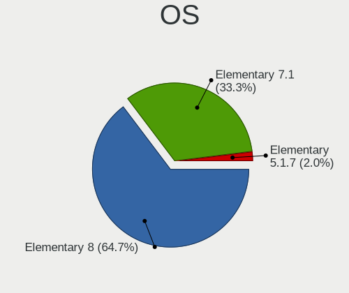
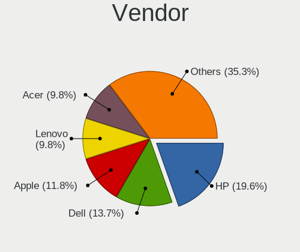
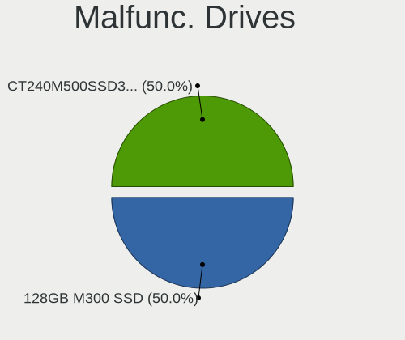
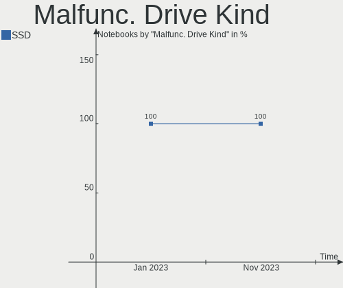
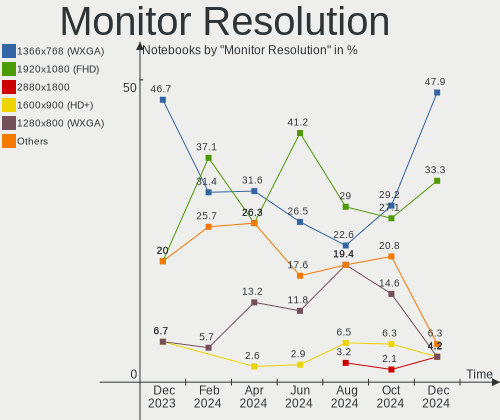
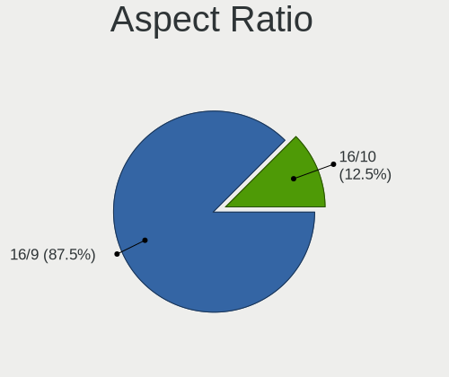
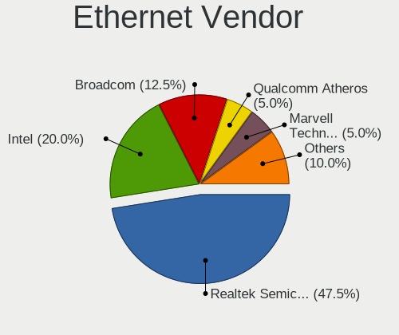
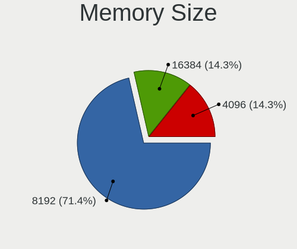
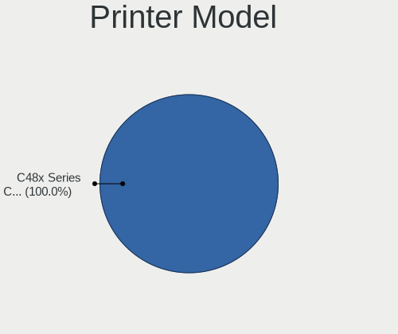

Elementary - Hardware Trends (Notebooks)
----------------------------------------

A project to identify most popular hardware characteristics and track their change
over time based on data collected by Linux users at https://Linux-Hardware.org.

Anyone can contribute to this report by the [hw-probe](https://github.com/linuxhw/hw-probe) tool:

    sudo -E hw-probe -all -upload

This report is for one last month. Overall report since the beginning of time: [TestCoverage](https://github.com/linuxhw/TestCoverage)

Period: Aug, 2022.

Contents
--------

* [ System ](#system)
  - [ OS                       ](#os)
  - [ OS Family                ](#os-family)
  - [ Kernel                   ](#kernel)
  - [ Kernel Family            ](#kernel-family)
  - [ Kernel Major Ver.        ](#kernel-major-ver)
  - [ Arch                     ](#arch)
  - [ DE                       ](#de)
  - [ Display Server           ](#display-server)
  - [ Display Manager          ](#display-manager)
  - [ OS Lang                  ](#os-lang)
  - [ Boot Mode                ](#boot-mode)
  - [ Filesystem               ](#filesystem)
  - [ Part. scheme             ](#part-scheme)
  - [ Dual Boot with Linux/BSD ](#dual-boot-with-linuxbsd)
  - [ Dual Boot (Win)          ](#dual-boot-win)

* [ Board ](#board)
  - [ Vendor                   ](#vendor)
  - [ Model                    ](#model)
  - [ Model Family             ](#model-family)
  - [ MFG Year                 ](#mfg-year)
  - [ Form Factor              ](#form-factor)
  - [ Secure Boot              ](#secure-boot)
  - [ Coreboot                 ](#coreboot)
  - [ RAM Size                 ](#ram-size)
  - [ RAM Used                 ](#ram-used)
  - [ Total Drives             ](#total-drives)
  - [ Has CD-ROM               ](#has-cd-rom)
  - [ Has Ethernet             ](#has-ethernet)
  - [ Has WiFi                 ](#has-wifi)
  - [ Has Bluetooth            ](#has-bluetooth)

* [ Location ](#location)
  - [ Country                  ](#country)
  - [ City                     ](#city)

* [ Drives ](#drives)
  - [ Drive Vendor             ](#drive-vendor)
  - [ Drive Model              ](#drive-model)
  - [ HDD Vendor               ](#hdd-vendor)
  - [ SSD Vendor               ](#ssd-vendor)
  - [ Drive Kind               ](#drive-kind)
  - [ Drive Connector          ](#drive-connector)
  - [ Drive Size               ](#drive-size)
  - [ Space Total              ](#space-total)
  - [ Space Used               ](#space-used)
  - [ Malfunc. Drives          ](#malfunc-drives)
  - [ Malfunc. Drive Vendor    ](#malfunc-drive-vendor)
  - [ Malfunc. HDD Vendor      ](#malfunc-hdd-vendor)
  - [ Malfunc. Drive Kind      ](#malfunc-drive-kind)
  - [ Failed Drives            ](#failed-drives)
  - [ Failed Drive Vendor      ](#failed-drive-vendor)
  - [ Drive Status             ](#drive-status)

* [ Storage controller ](#storage-controller)
  - [ Storage Vendor           ](#storage-vendor)
  - [ Storage Model            ](#storage-model)
  - [ Storage Kind             ](#storage-kind)

* [ Processor ](#processor)
  - [ CPU Vendor               ](#cpu-vendor)
  - [ CPU Model                ](#cpu-model)
  - [ CPU Model Family         ](#cpu-model-family)
  - [ CPU Cores                ](#cpu-cores)
  - [ CPU Sockets              ](#cpu-sockets)
  - [ CPU Threads              ](#cpu-threads)
  - [ CPU Op-Modes             ](#cpu-op-modes)
  - [ CPU Microcode            ](#cpu-microcode)
  - [ CPU Microarch            ](#cpu-microarch)

* [ Graphics ](#graphics)
  - [ GPU Vendor               ](#gpu-vendor)
  - [ GPU Model                ](#gpu-model)
  - [ GPU Combo                ](#gpu-combo)
  - [ GPU Driver               ](#gpu-driver)
  - [ GPU Memory               ](#gpu-memory)

* [ Monitor ](#monitor)
  - [ Monitor Vendor           ](#monitor-vendor)
  - [ Monitor Model            ](#monitor-model)
  - [ Monitor Resolution       ](#monitor-resolution)
  - [ Monitor Diagonal         ](#monitor-diagonal)
  - [ Monitor Width            ](#monitor-width)
  - [ Aspect Ratio             ](#aspect-ratio)
  - [ Monitor Area             ](#monitor-area)
  - [ Pixel Density            ](#pixel-density)
  - [ Multiple Monitors        ](#multiple-monitors)

* [ Network ](#network)
  - [ Net Controller Vendor    ](#net-controller-vendor)
  - [ Net Controller Model     ](#net-controller-model)
  - [ Wireless Vendor          ](#wireless-vendor)
  - [ Wireless Model           ](#wireless-model)
  - [ Ethernet Vendor          ](#ethernet-vendor)
  - [ Ethernet Model           ](#ethernet-model)
  - [ Net Controller Kind      ](#net-controller-kind)
  - [ Used Controller          ](#used-controller)
  - [ NICs                     ](#nics)
  - [ IPv6                     ](#ipv6)

* [ Bluetooth ](#bluetooth)
  - [ Bluetooth Vendor         ](#bluetooth-vendor)
  - [ Bluetooth Model          ](#bluetooth-model)

* [ Sound ](#sound)
  - [ Sound Vendor             ](#sound-vendor)
  - [ Sound Model              ](#sound-model)

* [ Memory ](#memory)
  - [ Memory Vendor            ](#memory-vendor)
  - [ Memory Model             ](#memory-model)
  - [ Memory Kind              ](#memory-kind)
  - [ Memory Form Factor       ](#memory-form-factor)
  - [ Memory Size              ](#memory-size)
  - [ Memory Speed             ](#memory-speed)

* [ Printers & scanners ](#printers--scanners)
  - [ Printer Vendor           ](#printer-vendor)
  - [ Printer Model            ](#printer-model)
  - [ Scanner Vendor           ](#scanner-vendor)
  - [ Scanner Model            ](#scanner-model)

* [ Camera ](#camera)
  - [ Camera Vendor            ](#camera-vendor)
  - [ Camera Model             ](#camera-model)

* [ Security ](#security)
  - [ Fingerprint Vendor       ](#fingerprint-vendor)
  - [ Fingerprint Model        ](#fingerprint-model)
  - [ Chipcard Vendor          ](#chipcard-vendor)
  - [ Chipcard Model           ](#chipcard-model)

* [ Unsupported ](#unsupported)
  - [ Unsupported Devices      ](#unsupported-devices)
  - [ Unsupported Device Types ](#unsupported-device-types)

System
------

OS
--

Installed operating systems

| Name             | Notebooks | Percent |
|------------------|-----------|---------|
| Elementary 6.1   | 36        | 94.74%  |
| Elementary 6     | 1         | 2.63%   |
| Elementary 5.1.7 | 1         | 2.63%   |

OS Family
---------

OS without a version

| Name       | Notebooks | Percent |
|------------|-----------|---------|
| Elementary | 38        | 100%    |

Kernel
------

Version of the Linux kernel

| Version               | Notebooks | Percent |
|-----------------------|-----------|---------|
| 5.15.0-46-generic     | 13        | 34.21%  |
| 5.15.0-43-generic     | 11        | 28.95%  |
| 5.15.0-41-generic     | 5         | 13.16%  |
| 5.11.0-43-generic     | 5         | 13.16%  |
| 5.11.0-40-generic     | 2         | 5.26%   |
| 5.4.0-122-generic     | 1         | 2.63%   |
| 5.19.3-051903-generic | 1         | 2.63%   |

Kernel Family
-------------

Linux kernel without a distro release

| Version | Notebooks | Percent |
|---------|-----------|---------|
| 5.15.0  | 29        | 76.32%  |
| 5.11.0  | 7         | 18.42%  |
| 5.4.0   | 1         | 2.63%   |
| 5.19.3  | 1         | 2.63%   |

Kernel Major Ver.
-----------------

Linux kernel major version

| Version | Notebooks | Percent |
|---------|-----------|---------|
| 5.15    | 29        | 76.32%  |
| 5.11    | 7         | 18.42%  |
| 5.4     | 1         | 2.63%   |
| 5.19    | 1         | 2.63%   |

Arch
----

OS architecture (x86_64, i586, etc.)

| Name   | Notebooks | Percent |
|--------|-----------|---------|
| x86_64 | 38        | 100%    |

DE
--

Desktop Environment

| Name     | Notebooks | Percent |
|----------|-----------|---------|
| Pantheon | 38        | 100%    |

Display Server
--------------

X11 or Wayland

| Name | Notebooks | Percent |
|------|-----------|---------|
| X11  | 38        | 100%    |

Display Manager
---------------

SDDM, LightDM, etc.

| Name    | Notebooks | Percent |
|---------|-----------|---------|
| Unknown | 27        | 71.05%  |
| LightDM | 11        | 28.95%  |

OS Lang
-------

Language

| Lang  | Notebooks | Percent |
|-------|-----------|---------|
| en_US | 19        | 50%     |
| ru_RU | 3         | 7.89%   |
| pt_BR | 3         | 7.89%   |
| es_ES | 3         | 7.89%   |
| de_DE | 3         | 7.89%   |
| nl_NL | 2         | 5.26%   |
| it_IT | 2         | 5.26%   |
| en_GB | 2         | 5.26%   |
| fr_FR | 1         | 2.63%   |

Boot Mode
---------

EFI or BIOS

| Mode | Notebooks | Percent |
|------|-----------|---------|
| EFI  | 26        | 68.42%  |
| BIOS | 12        | 31.58%  |

Filesystem
----------

Type of filesystem

| Type    | Notebooks | Percent |
|---------|-----------|---------|
| Ext4    | 37        | 97.37%  |
| Overlay | 1         | 2.63%   |

Part. scheme
------------

Scheme of partitioning

| Type    | Notebooks | Percent |
|---------|-----------|---------|
| Unknown | 31        | 81.58%  |
| GPT     | 6         | 15.79%  |
| MBR     | 1         | 2.63%   |

Dual Boot with Linux/BSD
------------------------

Hosting more than one Linux/BSD

| Dual boot | Notebooks | Percent |
|-----------|-----------|---------|
| No        | 37        | 97.37%  |
| Yes       | 1         | 2.63%   |

Dual Boot (Win)
---------------

Hosting Linux and Windows

| Dual boot | Notebooks | Percent |
|-----------|-----------|---------|
| No        | 36        | 94.74%  |
| Yes       | 2         | 5.26%   |

Board
-----

Vendor
------

Motherboard manufacturer

| Name             | Notebooks | Percent |
|------------------|-----------|---------|
| Lenovo           | 8         | 21.05%  |
| Dell             | 6         | 15.79%  |
| Hewlett-Packard  | 5         | 13.16%  |
| Apple            | 5         | 13.16%  |
| ASUSTek Computer | 4         | 10.53%  |
| Sony             | 2         | 5.26%   |
| TrekStor         | 1         | 2.63%   |
| Toshiba          | 1         | 2.63%   |
| Standard         | 1         | 2.63%   |
| Notebook         | 1         | 2.63%   |
| MSI              | 1         | 2.63%   |
| Medion           | 1         | 2.63%   |
| Complet          | 1         | 2.63%   |
| Acer             | 1         | 2.63%   |

Model
-----

Motherboard model

| Name                                 | Notebooks | Percent |
|--------------------------------------|-----------|---------|
| TrekStor Notebook Slim S130          | 1         | 2.63%   |
| Toshiba Satellite L875-11M           | 1         | 2.63%   |
| Sony VPCEB16FG                       | 1         | 2.63%   |
| Sony SVS15117FLB                     | 1         | 2.63%   |
| Notebook NLx0MU                      | 1         | 2.63%   |
| MSI Creator 15 A10SET                | 1         | 2.63%   |
| Medion Akoya E6422 MD99680           | 1         | 2.63%   |
| Lenovo ThinkPad X230 Tablet 34353MG  | 1         | 2.63%   |
| Lenovo ThinkPad T480 20L6S9WY00      | 1         | 2.63%   |
| Lenovo ThinkPad T460 20FMS271BR      | 1         | 2.63%   |
| Lenovo ThinkPad E470 20H2A02NBR      | 1         | 2.63%   |
| Lenovo ThinkBook 14-IML 20RV         | 1         | 2.63%   |
| Lenovo Legion Y540-15IRH 81SX        | 1         | 2.63%   |
| Lenovo IdeaPad Gaming 3 15IMH05 82CG | 1         | 2.63%   |
| Lenovo IdeaPad 5 14ALC05 82LM        | 1         | 2.63%   |
| HP Pavilion dv6                      | 1         | 2.63%   |
| HP Pavilion 17                       | 1         | 2.63%   |
| HP Laptop 15-db0xxx                  | 1         | 2.63%   |
| HP 431                               | 1         | 2.63%   |
| HP 240 G7 Notebook PC                | 1         | 2.63%   |
| Dell Latitude E7250                  | 1         | 2.63%   |
| Dell Latitude E6400                  | 1         | 2.63%   |
| Dell Latitude D630                   | 1         | 2.63%   |
| Dell Latitude 3190                   | 1         | 2.63%   |
| Dell Inspiron 5570                   | 1         | 2.63%   |
| Dell Inspiron 5537                   | 1         | 2.63%   |
| Complet MY8312                       | 1         | 2.63%   |
| ASUS ZenBook Pro Duo UX581LV_UX581LV | 1         | 2.63%   |
| ASUS X542UA                          | 1         | 2.63%   |
| ASUS K52F                            | 1         | 2.63%   |
| ASUS K43E                            | 1         | 2.63%   |
| Apple MacBookPro8,2                  | 1         | 2.63%   |
| Apple MacBookPro8,1                  | 1         | 2.63%   |
| Apple MacBookPro5,2                  | 1         | 2.63%   |
| Apple MacBookAir7,1                  | 1         | 2.63%   |
| Apple MacBookAir6,2                  | 1         | 2.63%   |
| Acer Aspire V5-552G                  | 1         | 2.63%   |
| Unknown                              | 1         | 2.63%   |

Model Family
------------

Motherboard model prefix

| Name              | Notebooks | Percent |
|-------------------|-----------|---------|
| Lenovo ThinkPad   | 4         | 10.53%  |
| Dell Latitude     | 4         | 10.53%  |
| Lenovo IdeaPad    | 2         | 5.26%   |
| HP Pavilion       | 2         | 5.26%   |
| Dell Inspiron     | 2         | 5.26%   |
| Apple MacBookPro8 | 2         | 5.26%   |
| TrekStor Notebook | 1         | 2.63%   |
| Toshiba Satellite | 1         | 2.63%   |
| Sony VPCEB16FG    | 1         | 2.63%   |
| Sony SVS15117FLB  | 1         | 2.63%   |
| Notebook NLx0MU   | 1         | 2.63%   |
| MSI Creator       | 1         | 2.63%   |
| Medion Akoya      | 1         | 2.63%   |
| Lenovo ThinkBook  | 1         | 2.63%   |
| Lenovo Legion     | 1         | 2.63%   |
| HP Laptop         | 1         | 2.63%   |
| HP 431            | 1         | 2.63%   |
| HP 240            | 1         | 2.63%   |
| Complet MY8312    | 1         | 2.63%   |
| ASUS ZenBook      | 1         | 2.63%   |
| ASUS X542UA       | 1         | 2.63%   |
| ASUS K52F         | 1         | 2.63%   |
| ASUS K43E         | 1         | 2.63%   |
| Apple MacBookPro5 | 1         | 2.63%   |
| Apple MacBookAir7 | 1         | 2.63%   |
| Apple MacBookAir6 | 1         | 2.63%   |
| Acer Aspire       | 1         | 2.63%   |
| Unknown           | 1         | 2.63%   |

MFG Year
--------

Motherboard manufacture year

| Year | Notebooks | Percent |
|------|-----------|---------|
| 2013 | 6         | 15.79%  |
| 2018 | 5         | 13.16%  |
| 2020 | 4         | 10.53%  |
| 2019 | 4         | 10.53%  |
| 2016 | 3         | 7.89%   |
| 2011 | 3         | 7.89%   |
| 2021 | 2         | 5.26%   |
| 2012 | 2         | 5.26%   |
| 2009 | 2         | 5.26%   |
| 2008 | 2         | 5.26%   |
| 2017 | 1         | 2.63%   |
| 2015 | 1         | 2.63%   |
| 2014 | 1         | 2.63%   |
| 2010 | 1         | 2.63%   |
| 2007 | 1         | 2.63%   |

Form Factor
-----------

Physical design of the computer

| Name     | Notebooks | Percent |
|----------|-----------|---------|
| Notebook | 38        | 100%    |

Secure Boot
-----------

Enabled or disabled

| State    | Notebooks | Percent |
|----------|-----------|---------|
| Disabled | 29        | 76.32%  |
| Enabled  | 9         | 23.68%  |

Coreboot
--------

Have coreboot on board

| Used | Notebooks | Percent |
|------|-----------|---------|
| No   | 38        | 100%    |

RAM Size
--------

Total RAM memory

| Size in GB  | Notebooks | Percent |
|-------------|-----------|---------|
| 4.01-8.0    | 13        | 34.21%  |
| 3.01-4.0    | 9         | 23.68%  |
| 16.01-24.0  | 7         | 18.42%  |
| 8.01-16.0   | 5         | 13.16%  |
| 32.01-64.0  | 2         | 5.26%   |
| 24.01-32.0  | 1         | 2.63%   |
| 64.01-256.0 | 1         | 2.63%   |

RAM Used
--------

Used RAM memory

| Used GB   | Notebooks | Percent |
|-----------|-----------|---------|
| 1.01-2.0  | 15        | 39.47%  |
| 3.01-4.0  | 10        | 26.32%  |
| 2.01-3.0  | 8         | 21.05%  |
| 4.01-8.0  | 3         | 7.89%   |
| 8.01-16.0 | 2         | 5.26%   |

Total Drives
------------

Number of drives on board

| Drives | Notebooks | Percent |
|--------|-----------|---------|
| 1      | 30        | 78.95%  |
| 2      | 8         | 21.05%  |

Has CD-ROM
----------

Has CD-ROM on board

| Presented | Notebooks | Percent |
|-----------|-----------|---------|
| No        | 24        | 63.16%  |
| Yes       | 14        | 36.84%  |

Has Ethernet
------------

Has Ethernet on board

| Presented | Notebooks | Percent |
|-----------|-----------|---------|
| Yes       | 33        | 86.84%  |
| No        | 5         | 13.16%  |

Has WiFi
--------

Has WiFi module

| Presented | Notebooks | Percent |
|-----------|-----------|---------|
| Yes       | 37        | 97.37%  |
| No        | 1         | 2.63%   |

Has Bluetooth
-------------

Has Bluetooth module

| Presented | Notebooks | Percent |
|-----------|-----------|---------|
| Yes       | 33        | 86.84%  |
| No        | 5         | 13.16%  |

Location
--------

Country
-------

Geographic location (country)

| Country         | Notebooks | Percent |
|-----------------|-----------|---------|
| USA             | 5         | 13.16%  |
| Brazil          | 5         | 13.16%  |
| UK              | 3         | 7.89%   |
| Russia          | 3         | 7.89%   |
| Germany         | 3         | 7.89%   |
| Italy           | 2         | 5.26%   |
| Indonesia       | 2         | 5.26%   |
| India           | 2         | 5.26%   |
| Chile           | 2         | 5.26%   |
| Belgium         | 2         | 5.26%   |
| Ukraine         | 1         | 2.63%   |
| Romania         | 1         | 2.63%   |
| Norway          | 1         | 2.63%   |
| North Macedonia | 1         | 2.63%   |
| Netherlands     | 1         | 2.63%   |
| Mexico          | 1         | 2.63%   |
| Israel          | 1         | 2.63%   |
| France          | 1         | 2.63%   |
| Barbados        | 1         | 2.63%   |

City
----

Geographic location (city)

| City                      | Notebooks | Percent |
|---------------------------|-----------|---------|
| Ypres                     | 1         | 2.63%   |
| Yaroslavl                 | 1         | 2.63%   |
| Wervik                    | 1         | 2.63%   |
| Voronezh                  | 1         | 2.63%   |
| The Hague                 | 1         | 2.63%   |
| Teresina                  | 1         | 2.63%   |
| Tangerang                 | 1         | 2.63%   |
| Swansea                   | 1         | 2.63%   |
| Struga                    | 1         | 2.63%   |
| Sevastopol                | 1         | 2.63%   |
| San Felipe                | 1         | 2.63%   |
| Saint Charles             | 1         | 2.63%   |
| Rome                      | 1         | 2.63%   |
| Renca                     | 1         | 2.63%   |
| Paddington                | 1         | 2.63%   |
| Oslo                      | 1         | 2.63%   |
| Navi Mumbai               | 1         | 2.63%   |
| Moscow                    | 1         | 2.63%   |
| Milan                     | 1         | 2.63%   |
| Mansfield                 | 1         | 2.63%   |
| Mage                      | 1         | 2.63%   |
| Ketchum                   | 1         | 2.63%   |
| Hanau                     | 1         | 2.63%   |
| Hamburg                   | 1         | 2.63%   |
| Givat Shmuel              | 1         | 2.63%   |
| Fortaleza                 | 1         | 2.63%   |
| Cluj-Napoca               | 1         | 2.63%   |
| Bridgetown                | 1         | 2.63%   |
| Brest                     | 1         | 2.63%   |
| Bogor                     | 1         | 2.63%   |
| Billinge                  | 1         | 2.63%   |
| Betim                     | 1         | 2.63%   |
| Berlin                    | 1         | 2.63%   |
| Belo Jardim               | 1         | 2.63%   |
| Austin                    | 1         | 2.63%   |
| Albuquerque               | 1         | 2.63%   |
| Ahmedabad                 | 1         | 2.63%   |
| Acatlan de Perez Figueroa | 1         | 2.63%   |

Drives
------

Drive Vendor
------------

Hard drive vendors

| Vendor              | Notebooks | Drives | Percent |
|---------------------|-----------|--------|---------|
| Samsung Electronics | 7         | 7      | 15.56%  |
| WDC                 | 4         | 4      | 8.89%   |
| Seagate             | 4         | 4      | 8.89%   |
| Crucial             | 4         | 4      | 8.89%   |
| Unknown             | 3         | 3      | 6.67%   |
| Kingston            | 3         | 3      | 6.67%   |
| Toshiba             | 2         | 2      | 4.44%   |
| Intel               | 2         | 2      | 4.44%   |
| Apple               | 2         | 2      | 4.44%   |
| XPG                 | 1         | 1      | 2.22%   |
| Timetec             | 1         | 1      | 2.22%   |
| Super Talent        | 1         | 1      | 2.22%   |
| SanDisk             | 1         | 1      | 2.22%   |
| Phison              | 1         | 1      | 2.22%   |
| Micron Technology   | 1         | 1      | 2.22%   |
| Lite-On             | 1         | 1      | 2.22%   |
| KIOXIA              | 1         | 1      | 2.22%   |
| JMicron Technology  | 1         | 1      | 2.22%   |
| Hitachi             | 1         | 1      | 2.22%   |
| HGST                | 1         | 1      | 2.22%   |
| FORESEE             | 1         | 1      | 2.22%   |
| EYOTA               | 1         | 1      | 2.22%   |
| BIWIN               | 1         | 1      | 2.22%   |

Drive Model
-----------

Hard drive models

| Model                              | Notebooks | Percent |
|------------------------------------|-----------|---------|
| XPG GAMMIX S5 256GB                | 1         | 2.22%   |
| WDC WD7500BPVT-55HXZT3 752GB       | 1         | 2.22%   |
| WDC WD3200BPVT-22ZEST0 320GB       | 1         | 2.22%   |
| WDC WD1600BEKT-08PVMT1 160GB       | 1         | 2.22%   |
| WDC PC SN730 SDBPNTY-1T00-1032 1TB | 1         | 2.22%   |
| Unknown SD08G  8GB                 | 1         | 2.22%   |
| Unknown NCard  64GB                | 1         | 2.22%   |
| Unknown MMC Card  64GB             | 1         | 2.22%   |
| Toshiba MQ04ABF100 1TB             | 1         | 2.22%   |
| Toshiba MQ01ABD100 1TB             | 1         | 2.22%   |
| Timetec 30TT253X2-256G             | 1         | 2.22%   |
| Super Talent FTM56N325H 256GB      | 1         | 2.22%   |
| Seagate ST9500325AS 500GB          | 1         | 2.22%   |
| Seagate ST9320325AS 320GB          | 1         | 2.22%   |
| Seagate ST2000LM007-1R8174 2TB     | 1         | 2.22%   |
| Seagate ST1000LM035-1RK172 1TB     | 1         | 2.22%   |
| SanDisk NVMe SSD Drive 512GB       | 1         | 2.22%   |
| Samsung SSD PM851 mSATA 256GB      | 1         | 2.22%   |
| Samsung SSD PB22-JS3 FDE 2.5 256GB | 1         | 2.22%   |
| Samsung SSD 860 EVO 500GB          | 1         | 2.22%   |
| Samsung SSD 850 EVO 500GB          | 1         | 2.22%   |
| Samsung NVMe SSD Drive 500GB       | 1         | 2.22%   |
| Samsung NVMe SSD Drive 1TB         | 1         | 2.22%   |
| Samsung HM500JI 500GB              | 1         | 2.22%   |
| Phison SSD 128GB PS3109-S9         | 1         | 2.22%   |
| Micron NVMe SSD Drive 512GB        | 1         | 2.22%   |
| Lite-On NVMe SSD Drive 256GB       | 1         | 2.22%   |
| KIOXIA NVMe SSD Drive 128GB        | 1         | 2.22%   |
| Kingston SV300S37A120G 120GB SSD   | 1         | 2.22%   |
| Kingston SUV400S37480G 480GB SSD   | 1         | 2.22%   |
| Kingston SA400S37240G 240GB SSD    | 1         | 2.22%   |
| JMicron Tech 250GB                 | 1         | 2.22%   |
| Intel SSDSC2KW512G8 512GB          | 1         | 2.22%   |
| Intel NVMe SSD Drive 512GB         | 1         | 2.22%   |
| Hitachi HTS722010K9SA00 100GB      | 1         | 2.22%   |
| HGST HTS545050A7E680 500GB         | 1         | 2.22%   |
| FORESEE 256GB SSD                  | 1         | 2.22%   |
| EYOTA 256GB                        | 1         | 2.22%   |
| Crucial CT500MX500SSD4 500GB       | 1         | 2.22%   |
| Crucial CT500MX500SSD1 500GB       | 1         | 2.22%   |
| Crucial CT500MX200SSD1 500GB       | 1         | 2.22%   |
| Crucial CT1000MX500SSD1 1TB        | 1         | 2.22%   |
| BIWIN NVMe SSD Drive 250GB         | 1         | 2.22%   |
| Apple SSD SM0512G 500GB            | 1         | 2.22%   |
| Apple SSD SD0256F 256GB            | 1         | 2.22%   |

HDD Vendor
----------

Hard disk drive vendors

| Vendor              | Notebooks | Drives | Percent |
|---------------------|-----------|--------|---------|
| Seagate             | 4         | 4      | 33.33%  |
| WDC                 | 3         | 3      | 25%     |
| Toshiba             | 2         | 2      | 16.67%  |
| Samsung Electronics | 1         | 1      | 8.33%   |
| Hitachi             | 1         | 1      | 8.33%   |
| HGST                | 1         | 1      | 8.33%   |

SSD Vendor
----------

Solid state drive vendors

| Vendor              | Notebooks | Drives | Percent |
|---------------------|-----------|--------|---------|
| Samsung Electronics | 4         | 4      | 22.22%  |
| Crucial             | 4         | 4      | 22.22%  |
| Kingston            | 3         | 3      | 16.67%  |
| Apple               | 2         | 2      | 11.11%  |
| Super Talent        | 1         | 1      | 5.56%   |
| Phison              | 1         | 1      | 5.56%   |
| Intel               | 1         | 1      | 5.56%   |
| FORESEE             | 1         | 1      | 5.56%   |
| EYOTA               | 1         | 1      | 5.56%   |

Drive Kind
----------

HDD or SSD

| Kind    | Notebooks | Drives | Percent |
|---------|-----------|--------|---------|
| SSD     | 18        | 18     | 40%     |
| HDD     | 12        | 12     | 26.67%  |
| NVMe    | 10        | 10     | 22.22%  |
| MMC     | 3         | 3      | 6.67%   |
| Unknown | 2         | 2      | 4.44%   |

Drive Connector
---------------

SATA, SAS, NVMe, etc.

| Type | Notebooks | Drives | Percent |
|------|-----------|--------|---------|
| SATA | 28        | 31     | 66.67%  |
| NVMe | 10        | 10     | 23.81%  |
| MMC  | 3         | 3      | 7.14%   |
| SAS  | 1         | 1      | 2.38%   |

Drive Size
----------

Size of hard drive

| Size in TB | Notebooks | Drives | Percent |
|------------|-----------|--------|---------|
| 0.01-0.5   | 22        | 23     | 75.86%  |
| 0.51-1.0   | 6         | 6      | 20.69%  |
| 1.01-2.0   | 1         | 1      | 3.45%   |

Space Total
-----------

Amount of disk space available on the file system

| Size in GB | Notebooks | Percent |
|------------|-----------|---------|
| 251-500    | 15        | 39.47%  |
| 101-250    | 13        | 34.21%  |
| 501-1000   | 5         | 13.16%  |
| 51-100     | 3         | 7.89%   |
| 21-50      | 1         | 2.63%   |
| 1001-2000  | 1         | 2.63%   |

Space Used
----------

Amount of used disk space

| Used GB | Notebooks | Percent |
|---------|-----------|---------|
| 1-20    | 18        | 47.37%  |
| 21-50   | 8         | 21.05%  |
| 51-100  | 5         | 13.16%  |
| 251-500 | 4         | 10.53%  |
| 101-250 | 3         | 7.89%   |

Malfunc. Drives
---------------

Drive models with a malfunction

| Model                            | Notebooks | Drives | Percent |
|----------------------------------|-----------|--------|---------|
| Kingston SUV400S37480G 480GB SSD | 1         | 1      | 100%    |

Malfunc. Drive Vendor
---------------------

Vendors of faulty drives

| Vendor   | Notebooks | Drives | Percent |
|----------|-----------|--------|---------|
| Kingston | 1         | 1      | 100%    |

Malfunc. HDD Vendor
-------------------

Vendors of faulty HDD drives

Zero info for selected period =(

Malfunc. Drive Kind
-------------------

Kinds of faulty drives

| Kind | Notebooks | Drives | Percent |
|------|-----------|--------|---------|
| SSD  | 1         | 1      | 100%    |

Failed Drives
-------------

Failed drive models

Zero info for selected period =(

Failed Drive Vendor
-------------------

Failed drive vendors

Zero info for selected period =(

Drive Status
------------

Number of failed and malfunc. drives

| Status   | Notebooks | Drives | Percent |
|----------|-----------|--------|---------|
| Detected | 34        | 40     | 87.18%  |
| Works    | 4         | 4      | 10.26%  |
| Malfunc  | 1         | 1      | 2.56%   |

Storage controller
------------------

Storage Vendor
--------------

Storage controller vendors

| Vendor                   | Notebooks | Percent |
|--------------------------|-----------|---------|
| Intel                    | 30        | 66.67%  |
| Samsung Electronics      | 3         | 6.67%   |
| AMD                      | 3         | 6.67%   |
| SanDisk                  | 2         | 4.44%   |
| Realtek Semiconductor    | 1         | 2.22%   |
| Nvidia                   | 1         | 2.22%   |
| Micron Technology        | 1         | 2.22%   |
| Marvell Technology Group | 1         | 2.22%   |
| Lite-On Technology       | 1         | 2.22%   |
| KIOXIA                   | 1         | 2.22%   |
| Biwin Storage Technology | 1         | 2.22%   |

Storage Model
-------------

Storage controller models

| Model                                                                          | Notebooks | Percent |
|--------------------------------------------------------------------------------|-----------|---------|
| Intel 6 Series/C200 Series Chipset Family 6 port Mobile SATA AHCI Controller   | 5         | 10.64%  |
| Intel Sunrise Point-LP SATA Controller [AHCI mode]                             | 4         | 8.51%   |
| Intel 82801 Mobile SATA Controller [RAID mode]                                 | 3         | 6.38%   |
| Intel 7 Series Chipset Family 6-port SATA Controller [AHCI mode]               | 3         | 6.38%   |
| AMD FCH SATA Controller [AHCI mode]                                            | 3         | 6.38%   |
| Intel Celeron/Pentium Silver Processor SATA Controller                         | 2         | 4.26%   |
| Intel 5 Series/3400 Series Chipset 4 port SATA AHCI Controller                 | 2         | 4.26%   |
| Intel 400 Series Chipset Family SATA AHCI Controller                           | 2         | 4.26%   |
| SanDisk WD Black SN750 / PC SN730 NVMe SSD                                     | 1         | 2.13%   |
| SanDisk Non-Volatile memory controller                                         | 1         | 2.13%   |
| Samsung NVMe SSD Controller SM981/PM981/PM983                                  | 1         | 2.13%   |
| Samsung NVMe SSD Controller 980                                                | 1         | 2.13%   |
| Samsung Electronics SATA controller                                            | 1         | 2.13%   |
| Realtek Realtek Non-Volatile memory controller                                 | 1         | 2.13%   |
| Nvidia MCP79 AHCI Controller                                                   | 1         | 2.13%   |
| Micron Non-Volatile memory controller                                          | 1         | 2.13%   |
| Marvell Group 88SS9183 PCIe SSD Controller                                     | 1         | 2.13%   |
| Lite-On Non-Volatile memory controller                                         | 1         | 2.13%   |
| KIOXIA NVMe SSD Controller BG4                                                 | 1         | 2.13%   |
| Intel Wildcat Point-LP SATA Controller [AHCI Mode]                             | 1         | 2.13%   |
| Intel Tiger Lake-LP SATA Controller                                            | 1         | 2.13%   |
| Intel SSD 660P Series                                                          | 1         | 2.13%   |
| Intel Comet Lake SATA AHCI Controller                                          | 1         | 2.13%   |
| Intel Comet Lake PCH-H RAID                                                    | 1         | 2.13%   |
| Intel Celeron N3350/Pentium N4200/Atom E3900 Series SATA AHCI Controller       | 1         | 2.13%   |
| Intel Cannon Lake Mobile PCH SATA AHCI Controller                              | 1         | 2.13%   |
| Intel 82801HM/HEM (ICH8M/ICH8M-E) SATA Controller [AHCI mode]                  | 1         | 2.13%   |
| Intel 82801HM/HEM (ICH8M/ICH8M-E) IDE Controller                               | 1         | 2.13%   |
| Intel 8 Series/C220 Series Chipset Family 6-port SATA Controller 1 [AHCI mode] | 1         | 2.13%   |
| Intel 8 Series SATA Controller 1 [AHCI mode]                                   | 1         | 2.13%   |
| Biwin Storage Non-Volatile memory controller                                   | 1         | 2.13%   |

Storage Kind
------------

Kind of storage controller (IDE, SATA, NVMe, SAS, ...)

| Kind | Notebooks | Percent |
|------|-----------|---------|
| SATA | 32        | 68.09%  |
| NVMe | 10        | 21.28%  |
| RAID | 4         | 8.51%   |
| IDE  | 1         | 2.13%   |

Processor
---------

CPU Vendor
----------

Processor vendors

| Vendor | Notebooks | Percent |
|--------|-----------|---------|
| Intel  | 35        | 92.11%  |
| AMD    | 3         | 7.89%   |

CPU Model
---------

Processor models

| Model                                         | Notebooks | Percent |
|-----------------------------------------------|-----------|---------|
| Intel Core i7-3520M CPU @ 2.90GHz             | 2         | 5.26%   |
| Intel Core i7-10875H CPU @ 2.30GHz            | 2         | 5.26%   |
| Intel Pentium CPU P6100 @ 2.00GHz             | 1         | 2.63%   |
| Intel Pentium CPU N4200 @ 1.10GHz             | 1         | 2.63%   |
| Intel Pentium CPU B950 @ 2.10GHz              | 1         | 2.63%   |
| Intel Core i9-10980HK CPU @ 2.40GHz           | 1         | 2.63%   |
| Intel Core i7-9750HF CPU @ 2.60GHz            | 1         | 2.63%   |
| Intel Core i7-5650U CPU @ 2.20GHz             | 1         | 2.63%   |
| Intel Core i7-4500U CPU @ 1.80GHz             | 1         | 2.63%   |
| Intel Core i7-3610QM CPU @ 2.30GHz            | 1         | 2.63%   |
| Intel Core i7-2760QM CPU @ 2.40GHz            | 1         | 2.63%   |
| Intel Core i7-2670QM CPU @ 2.20GHz            | 1         | 2.63%   |
| Intel Core i7-10750H CPU @ 2.60GHz            | 1         | 2.63%   |
| Intel Core i5-8350U CPU @ 1.70GHz             | 1         | 2.63%   |
| Intel Core i5-8265U CPU @ 1.60GHz             | 1         | 2.63%   |
| Intel Core i5-8250U CPU @ 1.60GHz             | 1         | 2.63%   |
| Intel Core i5-7200U CPU @ 2.50GHz             | 1         | 2.63%   |
| Intel Core i5-6300U CPU @ 2.40GHz             | 1         | 2.63%   |
| Intel Core i5-5300U CPU @ 2.30GHz             | 1         | 2.63%   |
| Intel Core i5-4250U CPU @ 1.30GHz             | 1         | 2.63%   |
| Intel Core i5-4200M CPU @ 2.50GHz             | 1         | 2.63%   |
| Intel Core i5-2415M CPU @ 2.30GHz             | 1         | 2.63%   |
| Intel Core i5-10210U CPU @ 1.60GHz            | 1         | 2.63%   |
| Intel Core i3-7100U CPU @ 2.40GHz             | 1         | 2.63%   |
| Intel Core i3-6100U CPU @ 2.30GHz             | 1         | 2.63%   |
| Intel Core i3-2310M CPU @ 2.10GHz             | 1         | 2.63%   |
| Intel Core i3 CPU M 330 @ 2.13GHz             | 1         | 2.63%   |
| Intel Core 2 Duo CPU T9600 @ 2.80GHz          | 1         | 2.63%   |
| Intel Core 2 Duo CPU T9550 @ 2.66GHz          | 1         | 2.63%   |
| Intel Core 2 Duo CPU T7250 @ 2.00GHz          | 1         | 2.63%   |
| Intel Celeron N4120 CPU @ 1.10GHz             | 1         | 2.63%   |
| Intel Celeron N4000 CPU @ 1.10GHz             | 1         | 2.63%   |
| Intel 11th Gen Core i5-1135G7 @ 2.40GHz       | 1         | 2.63%   |
| AMD Ryzen 7 5700U with Radeon Graphics        | 1         | 2.63%   |
| AMD Ryzen 3 2200U with Radeon Vega Mobile Gfx | 1         | 2.63%   |
| AMD A10-5757M APU with Radeon HD Graphics     | 1         | 2.63%   |

CPU Model Family
----------------

Processor model prefix

| Model            | Notebooks | Percent |
|------------------|-----------|---------|
| Intel Core i7    | 11        | 28.95%  |
| Intel Core i5    | 10        | 26.32%  |
| Intel Core i3    | 4         | 10.53%  |
| Intel Pentium    | 3         | 7.89%   |
| Intel Core 2 Duo | 3         | 7.89%   |
| Intel Celeron    | 2         | 5.26%   |
| Other            | 1         | 2.63%   |
| Intel Core i9    | 1         | 2.63%   |
| AMD Ryzen 7      | 1         | 2.63%   |
| AMD Ryzen 3      | 1         | 2.63%   |
| AMD A10          | 1         | 2.63%   |

CPU Cores
---------

Number of processor cores

| Number | Notebooks | Percent |
|--------|-----------|---------|
| 2      | 22        | 57.89%  |
| 4      | 10        | 26.32%  |
| 8      | 4         | 10.53%  |
| 6      | 2         | 5.26%   |

CPU Sockets
-----------

Number of sockets

| Number | Notebooks | Percent |
|--------|-----------|---------|
| 1      | 38        | 100%    |

CPU Threads
-----------

Threads per core (Hyper-Threading)

| Number | Notebooks | Percent |
|--------|-----------|---------|
| 2      | 30        | 78.95%  |
| 1      | 8         | 21.05%  |

CPU Op-Modes
------------

CPU Operation Modes (32-bit, 64-bit)

| Op mode        | Notebooks | Percent |
|----------------|-----------|---------|
| 32-bit, 64-bit | 38        | 100%    |

CPU Microcode
-------------

Microcode number

| Number     | Notebooks | Percent |
|------------|-----------|---------|
| 0xa0652    | 4         | 10.53%  |
| 0x206a7    | 4         | 10.53%  |
| 0x306a9    | 3         | 7.89%   |
| Unknown    | 3         | 7.89%   |
| 0x806ea    | 2         | 5.26%   |
| 0x806e9    | 2         | 5.26%   |
| 0x406e3    | 2         | 5.26%   |
| 0x40651    | 2         | 5.26%   |
| 0x1067a    | 2         | 5.26%   |
| 0x906ed    | 1         | 2.63%   |
| 0x806ec    | 1         | 2.63%   |
| 0x806c1    | 1         | 2.63%   |
| 0x706a8    | 1         | 2.63%   |
| 0x706a1    | 1         | 2.63%   |
| 0x6fd      | 1         | 2.63%   |
| 0x506c9    | 1         | 2.63%   |
| 0x306d4    | 1         | 2.63%   |
| 0x306c3    | 1         | 2.63%   |
| 0x20655    | 1         | 2.63%   |
| 0x20652    | 1         | 2.63%   |
| 0x08608103 | 1         | 2.63%   |
| 0x08101007 | 1         | 2.63%   |
| 0x06001119 | 1         | 2.63%   |

CPU Microarch
-------------

Microarchitecture

| Name          | Notebooks | Percent |
|---------------|-----------|---------|
| KabyLake      | 7         | 18.42%  |
| SandyBridge   | 5         | 13.16%  |
| CometLake     | 4         | 10.53%  |
| IvyBridge     | 3         | 7.89%   |
| Haswell       | 3         | 7.89%   |
| Westmere      | 2         | 5.26%   |
| Skylake       | 2         | 5.26%   |
| Penryn        | 2         | 5.26%   |
| Goldmont plus | 2         | 5.26%   |
| Broadwell     | 2         | 5.26%   |
| Zen           | 1         | 2.63%   |
| TigerLake     | 1         | 2.63%   |
| Piledriver    | 1         | 2.63%   |
| Goldmont      | 1         | 2.63%   |
| Core          | 1         | 2.63%   |
| Unknown       | 1         | 2.63%   |

Graphics
--------

GPU Vendor
----------

Vendors of graphics cards

| Vendor | Notebooks | Percent |
|--------|-----------|---------|
| Intel  | 31        | 63.27%  |
| AMD    | 11        | 22.45%  |
| Nvidia | 7         | 14.29%  |

GPU Model
---------

Graphics card models

| Model                                                                                 | Notebooks | Percent |
|---------------------------------------------------------------------------------------|-----------|---------|
| Intel 2nd Generation Core Processor Family Integrated Graphics Controller             | 5         | 9.62%   |
| Intel CometLake-H GT2 [UHD Graphics]                                                  | 4         | 7.69%   |
| Nvidia TU106M [GeForce RTX 2060 Mobile]                                               | 2         | 3.85%   |
| Intel UHD Graphics 620                                                                | 2         | 3.85%   |
| Intel Skylake GT2 [HD Graphics 520]                                                   | 2         | 3.85%   |
| Intel HD Graphics 620                                                                 | 2         | 3.85%   |
| Intel Haswell-ULT Integrated Graphics Controller                                      | 2         | 3.85%   |
| Intel GeminiLake [UHD Graphics 600]                                                   | 2         | 3.85%   |
| Intel 3rd Gen Core processor Graphics Controller                                      | 2         | 3.85%   |
| AMD Whistler [Radeon HD 6730M/6770M/7690M XT]                                         | 2         | 3.85%   |
| Nvidia TU117M                                                                         | 1         | 1.92%   |
| Nvidia TU116M [GeForce GTX 1660 Ti Mobile]                                            | 1         | 1.92%   |
| Nvidia TU106M [GeForce RTX 2070 Mobile / Max-Q Refresh]                               | 1         | 1.92%   |
| Nvidia GK107M [GeForce GT 640M LE]                                                    | 1         | 1.92%   |
| Nvidia G96CM [GeForce 9600M GT]                                                       | 1         | 1.92%   |
| Nvidia C79 [GeForce 9400M]                                                            | 1         | 1.92%   |
| Intel WhiskeyLake-U GT2 [UHD Graphics 620]                                            | 1         | 1.92%   |
| Intel TigerLake-LP GT2 [Iris Xe Graphics]                                             | 1         | 1.92%   |
| Intel Mobile GM965/GL960 Integrated Graphics Controller (secondary)                   | 1         | 1.92%   |
| Intel Mobile GM965/GL960 Integrated Graphics Controller (primary)                     | 1         | 1.92%   |
| Intel Mobile 4 Series Chipset Integrated Graphics Controller                          | 1         | 1.92%   |
| Intel HD Graphics 6000                                                                | 1         | 1.92%   |
| Intel HD Graphics 5500                                                                | 1         | 1.92%   |
| Intel Core Processor Integrated Graphics Controller                                   | 1         | 1.92%   |
| Intel CometLake-U GT2 [UHD Graphics]                                                  | 1         | 1.92%   |
| Intel Celeron N3350/Pentium N4200/Atom E3900 Series Integrated Graphics Controller    | 1         | 1.92%   |
| Intel 4th Gen Core Processor Integrated Graphics Controller                           | 1         | 1.92%   |
| AMD Venus PRO [Radeon HD 8850M / R9 M265X]                                            | 1         | 1.92%   |
| AMD Topaz XT [Radeon R7 M260/M265 / M340/M360 / M440/M445 / 530/535 / 620/625 Mobile] | 1         | 1.92%   |
| AMD Thames [Radeon HD 7500M/7600M Series]                                             | 1         | 1.92%   |
| AMD Sun XT [Radeon HD 8670A/8670M/8690M / R5 M330 / M430 / Radeon 520 Mobile]         | 1         | 1.92%   |
| AMD Seymour [Radeon HD 6400M/7400M Series]                                            | 1         | 1.92%   |
| AMD Richland [Radeon HD 8650G]                                                        | 1         | 1.92%   |
| AMD Raven Ridge [Radeon Vega Series / Radeon Vega Mobile Series]                      | 1         | 1.92%   |
| AMD Mars [Radeon HD 8670A/8670M/8750M / R7 M370]                                      | 1         | 1.92%   |
| AMD Madison [Mobility Radeon HD 5650/5750 / 6530M/6550M]                              | 1         | 1.92%   |
| AMD Lucienne                                                                          | 1         | 1.92%   |

GPU Combo
---------

Combinations of graphics cards

| Name           | Notebooks | Percent |
|----------------|-----------|---------|
| 1 x Intel      | 20        | 52.63%  |
| Intel + AMD    | 6         | 15.79%  |
| Intel + Nvidia | 5         | 13.16%  |
| 1 x AMD        | 4         | 10.53%  |
| 2 x Nvidia     | 1         | 2.63%   |
| 2 x AMD        | 1         | 2.63%   |
| 1 x Nvidia     | 1         | 2.63%   |

GPU Driver
----------

Free vs proprietary

| Driver      | Notebooks | Percent |
|-------------|-----------|---------|
| Free        | 35        | 92.11%  |
| Proprietary | 3         | 7.89%   |

GPU Memory
----------

Total video memory

| Size in GB | Notebooks | Percent |
|------------|-----------|---------|
| Unknown    | 22        | 57.89%  |
| 0.51-1.0   | 5         | 13.16%  |
| 0.01-0.5   | 4         | 10.53%  |
| 5.01-6.0   | 3         | 7.89%   |
| 1.01-2.0   | 3         | 7.89%   |
| 7.01-8.0   | 1         | 2.63%   |

Monitor
-------

Monitor Vendor
--------------

Monitor vendors

| Vendor                  | Notebooks | Percent |
|-------------------------|-----------|---------|
| LG Display              | 9         | 21.95%  |
| BOE                     | 8         | 19.51%  |
| AU Optronics            | 6         | 14.63%  |
| Apple                   | 5         | 12.2%   |
| Samsung Electronics     | 2         | 4.88%   |
| Chimei Innolux          | 2         | 4.88%   |
| Chi Mei Optoelectronics | 2         | 4.88%   |
| ViewSonic               | 1         | 2.44%   |
| Sony                    | 1         | 2.44%   |
| PANDA                   | 1         | 2.44%   |
| LG Philips              | 1         | 2.44%   |
| Goldstar                | 1         | 2.44%   |
| BenQ                    | 1         | 2.44%   |
| AOC                     | 1         | 2.44%   |

Monitor Model
-------------

Monitor models

| Model                                                                    | Notebooks | Percent |
|--------------------------------------------------------------------------|-----------|---------|
| LG Display LCD Monitor LGD05E5 1920x1080 344x194mm 15.5-inch             | 2         | 4.88%   |
| ViewSonic VA702b VSC231C 1280x1024 338x270mm 17.0-inch                   | 1         | 2.44%   |
| Sony LCD Monitor MS_0025 1920x1080 340x190mm 15.3-inch                   | 1         | 2.44%   |
| Samsung Electronics LCD Monitor SDC3654 1600x900 382x215mm 17.3-inch     | 1         | 2.44%   |
| Samsung Electronics Color LCD SDCA029 2160x1440 252x168mm 11.9-inch      | 1         | 2.44%   |
| PANDA LC133LF2L03 NCP0015 1920x1080 294x165mm 13.3-inch                  | 1         | 2.44%   |
| LG Philips LCD Monitor LPL0140 1440x900 304x190mm 14.1-inch              | 1         | 2.44%   |
| LG Display LCD Monitor LGD0551 1920x1080 309x174mm 14.0-inch             | 1         | 2.44%   |
| LG Display LCD Monitor LGD04A7 1920x1080 344x194mm 15.5-inch             | 1         | 2.44%   |
| LG Display LCD Monitor LGD03AB 1366x768 344x194mm 15.5-inch              | 1         | 2.44%   |
| LG Display LCD Monitor LGD033C 1366x768 309x174mm 14.0-inch              | 1         | 2.44%   |
| LG Display LCD Monitor LGD0323 1920x1080 345x194mm 15.6-inch             | 1         | 2.44%   |
| LG Display LCD Monitor LGD02E9 1366x768 309x174mm 14.0-inch              | 1         | 2.44%   |
| LG Display LCD Monitor LGD02D8 1366x768 277x156mm 12.5-inch              | 1         | 2.44%   |
| Goldstar HDR WFHD GSM7714 2560x1080 798x334mm 34.1-inch                  | 1         | 2.44%   |
| Chimei Innolux LCD Monitor CMN15B7 1366x768 344x193mm 15.5-inch          | 1         | 2.44%   |
| Chimei Innolux LCD Monitor CMN1132 1366x768 256x144mm 11.6-inch          | 1         | 2.44%   |
| Chi Mei Optoelectronics LCD Monitor CMO1593 1366x768 344x193mm 15.5-inch | 1         | 2.44%   |
| Chi Mei Optoelectronics LCD Monitor CMO1426 1280x800 303x190mm 14.1-inch | 1         | 2.44%   |
| BOE LCD Monitor BOE085F 3840x1100 340x100mm 14.0-inch                    | 1         | 2.44%   |
| BOE LCD Monitor BOE0826 1920x1080 344x193mm 15.5-inch                    | 1         | 2.44%   |
| BOE LCD Monitor BOE07D3 1920x1080 309x174mm 14.0-inch                    | 1         | 2.44%   |
| BOE LCD Monitor BOE07B6 1920x1080 382x215mm 17.3-inch                    | 1         | 2.44%   |
| BOE LCD Monitor BOE06B3 1366x768 309x173mm 13.9-inch                     | 1         | 2.44%   |
| BOE LCD Monitor BOE06A9 1920x1080 344x193mm 15.5-inch                    | 1         | 2.44%   |
| BOE LCD Monitor BOE0697 1366x768 309x173mm 13.9-inch                     | 1         | 2.44%   |
| BOE LCD Monitor BOE05F4 1366x768 277x156mm 12.5-inch                     | 1         | 2.44%   |
| BenQ GL2460 BNQ78CE 1920x1080 531x299mm 24.0-inch                        | 1         | 2.44%   |
| AU Optronics LCD Monitor AUOF08A 1920x1080 344x194mm 15.5-inch           | 1         | 2.44%   |
| AU Optronics LCD Monitor AUO403D 1920x1080 309x173mm 13.9-inch           | 1         | 2.44%   |
| AU Optronics LCD Monitor AUO38ED 1920x1080 344x193mm 15.5-inch           | 1         | 2.44%   |
| AU Optronics LCD Monitor AUO323C 1366x768 309x173mm 13.9-inch            | 1         | 2.44%   |
| AU Optronics LCD Monitor AUO22EC 1366x768 344x193mm 15.5-inch            | 1         | 2.44%   |
| AU Optronics LCD Monitor AUO208D 1920x1080 309x174mm 14.0-inch           | 1         | 2.44%   |
| Apple Color LCD APP9CF2 1366x768 256x144mm 11.6-inch                     | 1         | 2.44%   |
| Apple Color LCD APP9CDF 1440x900 286x179mm 13.3-inch                     | 1         | 2.44%   |
| Apple Color LCD APP9CC7 1280x800 286x179mm 13.3-inch                     | 1         | 2.44%   |
| Apple Color LCD APP9CAC 1920x1200 367x230mm 17.1-inch                    | 1         | 2.44%   |
| Apple Color LCD APP9CA4 1440x900 331x207mm 15.4-inch                     | 1         | 2.44%   |
| AOC AG323FWG3R3 AOC3230 1920x1080 698x393mm 31.5-inch                    | 1         | 2.44%   |

Monitor Resolution
------------------

Monitor screen resolution

| Resolution        | Notebooks | Percent |
|-------------------|-----------|---------|
| 1920x1080 (FHD)   | 16        | 41.03%  |
| 1366x768 (WXGA)   | 12        | 30.77%  |
| 1440x900 (WXGA+)  | 3         | 7.69%   |
| 1280x800 (WXGA)   | 2         | 5.13%   |
| 3840x2160 (4K)    | 1         | 2.56%   |
| 3840x1100         | 1         | 2.56%   |
| 2560x1080         | 1         | 2.56%   |
| 1920x1200 (WUXGA) | 1         | 2.56%   |
| 1600x900 (HD+)    | 1         | 2.56%   |
| 1280x1024 (SXGA)  | 1         | 2.56%   |

Monitor Diagonal
----------------

Diagonal size in inches

| Inches | Notebooks | Percent |
|--------|-----------|---------|
| 15     | 14        | 34.15%  |
| 14     | 9         | 21.95%  |
| 13     | 6         | 14.63%  |
| 17     | 4         | 9.76%   |
| 24     | 2         | 4.88%   |
| 12     | 2         | 4.88%   |
| 11     | 2         | 4.88%   |
| 34     | 1         | 2.44%   |
| 31     | 1         | 2.44%   |

Monitor Width
-------------

Physical width

| Width in mm | Notebooks | Percent |
|-------------|-----------|---------|
| 301-350     | 25        | 64.1%   |
| 201-300     | 7         | 17.95%  |
| 351-400     | 3         | 7.69%   |
| 501-600     | 2         | 5.13%   |
| 701-800     | 1         | 2.56%   |
| 601-700     | 1         | 2.56%   |

Aspect Ratio
------------

Proportional relationship between the width and the height

| Ratio | Notebooks | Percent |
|-------|-----------|---------|
| 16/9  | 30        | 76.92%  |
| 16/10 | 6         | 15.38%  |
| 5/4   | 1         | 2.56%   |
| 3.40  | 1         | 2.56%   |
| 21/9  | 1         | 2.56%   |

Monitor Area
------------

Area in inch

| Area in inch | Notebooks | Percent |
|----------------|-----------|---------|
| 101-110        | 14        | 34.15%  |
| 81-90          | 12        | 29.27%  |
| 51-60          | 3         | 7.32%   |
| 71-80          | 2         | 4.88%   |
| 61-70          | 2         | 4.88%   |
| 351-500        | 2         | 4.88%   |
| 201-250        | 2         | 4.88%   |
| 121-130        | 2         | 4.88%   |
| 141-150        | 1         | 2.44%   |
| 131-140        | 1         | 2.44%   |

Pixel Density
-------------

Pixels per inch

| Density       | Notebooks | Percent |
|---------------|-----------|---------|
| 121-160       | 20        | 50%     |
| 101-120       | 13        | 32.5%   |
| 51-100        | 5         | 12.5%   |
| More than 240 | 1         | 2.5%    |
| 161-240       | 1         | 2.5%    |

Multiple Monitors
-----------------

Total monitors connected

| Total | Notebooks | Percent |
|-------|-----------|---------|
| 1     | 34        | 89.47%  |
| 2     | 3         | 7.89%   |
| 3     | 1         | 2.63%   |

Network
-------

Net Controller Vendor
---------------------

Controller vendors

| Vendor                   | Notebooks | Percent |
|--------------------------|-----------|---------|
| Realtek Semiconductor    | 18        | 30.51%  |
| Intel                    | 17        | 28.81%  |
| Qualcomm Atheros         | 10        | 16.95%  |
| Broadcom                 | 5         | 8.47%   |
| Broadcom Limited         | 2         | 3.39%   |
| Samsung Electronics      | 1         | 1.69%   |
| Ralink                   | 1         | 1.69%   |
| Nvidia                   | 1         | 1.69%   |
| Marvell Technology Group | 1         | 1.69%   |
| JMicron Technology       | 1         | 1.69%   |
| Huawei Technologies      | 1         | 1.69%   |
| Apple                    | 1         | 1.69%   |

Net Controller Model
--------------------

Controller models

| Model                                                                          | Notebooks | Percent |
|--------------------------------------------------------------------------------|-----------|---------|
| Realtek RTL8111/8168/8411 PCI Express Gigabit Ethernet Controller              | 13        | 18.31%  |
| Qualcomm Atheros AR9285 Wireless Network Adapter (PCI-Express)                 | 4         | 5.63%   |
| Intel Comet Lake PCH CNVi WiFi                                                 | 4         | 5.63%   |
| Realtek RTL810xE PCI Express Fast Ethernet controller                          | 3         | 4.23%   |
| Qualcomm Atheros QCA9377 802.11ac Wireless Network Adapter                     | 3         | 4.23%   |
| Intel Wireless 8265 / 8275                                                     | 2         | 2.82%   |
| Intel Wireless 8260                                                            | 2         | 2.82%   |
| Broadcom NetXtreme BCM57765 Gigabit Ethernet PCIe                              | 2         | 2.82%   |
| Broadcom Limited BCM4360 802.11ac Wireless Network Adapter                     | 2         | 2.82%   |
| Broadcom BCM4331 802.11a/b/g/n                                                 | 2         | 2.82%   |
| Samsung GT-I9070 (network tethering, USB debugging enabled)                    | 1         | 1.41%   |
| Realtek RTL8822CE 802.11ac PCIe Wireless Network Adapter                       | 1         | 1.41%   |
| Realtek RTL8723DE Wireless Network Adapter                                     | 1         | 1.41%   |
| Realtek RTL8723BU 802.11b/g/n WLAN Adapter                                     | 1         | 1.41%   |
| Ralink RT3290 Wireless 802.11n 1T/1R PCIe                                      | 1         | 1.41%   |
| Qualcomm Atheros QCA9565 / AR9565 Wireless Network Adapter                     | 1         | 1.41%   |
| Qualcomm Atheros QCA8171 Gigabit Ethernet                                      | 1         | 1.41%   |
| Qualcomm Atheros AR9485 Wireless Network Adapter                               | 1         | 1.41%   |
| Qualcomm Atheros AR8151 v2.0 Gigabit Ethernet                                  | 1         | 1.41%   |
| Nvidia MCP79 Ethernet                                                          | 1         | 1.41%   |
| Marvell Group Yukon Optima 88E8059 [PCIe Gigabit Ethernet Controller with AVB] | 1         | 1.41%   |
| JMicron JMC250 PCI Express Gigabit Ethernet Controller                         | 1         | 1.41%   |
| Intel Wireless 7265                                                            | 1         | 1.41%   |
| Intel Wireless 3165                                                            | 1         | 1.41%   |
| Intel Wi-Fi 6 AX200                                                            | 1         | 1.41%   |
| Intel Ultimate N WiFi Link 5300                                                | 1         | 1.41%   |
| Intel Ethernet Controller I225-V                                               | 1         | 1.41%   |
| Intel Ethernet Connection I219-LM                                              | 1         | 1.41%   |
| Intel Ethernet Connection (4) I219-LM                                          | 1         | 1.41%   |
| Intel Ethernet Connection (3) I218-LM                                          | 1         | 1.41%   |
| Intel Ethernet Connection (13) I219-V                                          | 1         | 1.41%   |
| Intel Comet Lake PCH-LP CNVi WiFi                                              | 1         | 1.41%   |
| Intel Centrino Wireless-N 1030 [Rainbow Peak]                                  | 1         | 1.41%   |
| Intel Centrino Advanced-N 6235                                                 | 1         | 1.41%   |
| Intel Centrino Advanced-N 6205 [Taylor Peak]                                   | 1         | 1.41%   |
| Intel Cannon Lake PCH CNVi WiFi                                                | 1         | 1.41%   |
| Intel 82579LM Gigabit Network Connection (Lewisville)                          | 1         | 1.41%   |
| Intel 82567LM Gigabit Network Connection                                       | 1         | 1.41%   |
| Huawei JNY-LX1                                                                 | 1         | 1.41%   |
| Broadcom NetXtreme BCM5755M Gigabit Ethernet PCI Express                       | 1         | 1.41%   |
| Broadcom BCM43228 802.11a/b/g/n                                                | 1         | 1.41%   |
| Broadcom BCM4322 802.11a/b/g/n Wireless LAN Controller                         | 1         | 1.41%   |
| Broadcom BCM4312 802.11b/g LP-PHY                                              | 1         | 1.41%   |
| Apple iPad 4/Mini1                                                             | 1         | 1.41%   |

Wireless Vendor
---------------

Wireless vendors

| Vendor                | Notebooks | Percent |
|-----------------------|-----------|---------|
| Intel                 | 17        | 45.95%  |
| Qualcomm Atheros      | 9         | 24.32%  |
| Broadcom              | 5         | 13.51%  |
| Realtek Semiconductor | 3         | 8.11%   |
| Broadcom Limited      | 2         | 5.41%   |
| Ralink                | 1         | 2.7%    |

Wireless Model
--------------

Wireless models

| Model                                                          | Notebooks | Percent |
|----------------------------------------------------------------|-----------|---------|
| Qualcomm Atheros AR9285 Wireless Network Adapter (PCI-Express) | 4         | 10.81%  |
| Intel Comet Lake PCH CNVi WiFi                                 | 4         | 10.81%  |
| Qualcomm Atheros QCA9377 802.11ac Wireless Network Adapter     | 3         | 8.11%   |
| Intel Wireless 8265 / 8275                                     | 2         | 5.41%   |
| Intel Wireless 8260                                            | 2         | 5.41%   |
| Broadcom Limited BCM4360 802.11ac Wireless Network Adapter     | 2         | 5.41%   |
| Broadcom BCM4331 802.11a/b/g/n                                 | 2         | 5.41%   |
| Realtek RTL8822CE 802.11ac PCIe Wireless Network Adapter       | 1         | 2.7%    |
| Realtek RTL8723DE Wireless Network Adapter                     | 1         | 2.7%    |
| Realtek RTL8723BU 802.11b/g/n WLAN Adapter                     | 1         | 2.7%    |
| Ralink RT3290 Wireless 802.11n 1T/1R PCIe                      | 1         | 2.7%    |
| Qualcomm Atheros QCA9565 / AR9565 Wireless Network Adapter     | 1         | 2.7%    |
| Qualcomm Atheros AR9485 Wireless Network Adapter               | 1         | 2.7%    |
| Intel Wireless 7265                                            | 1         | 2.7%    |
| Intel Wireless 3165                                            | 1         | 2.7%    |
| Intel Wi-Fi 6 AX200                                            | 1         | 2.7%    |
| Intel Ultimate N WiFi Link 5300                                | 1         | 2.7%    |
| Intel Comet Lake PCH-LP CNVi WiFi                              | 1         | 2.7%    |
| Intel Centrino Wireless-N 1030 [Rainbow Peak]                  | 1         | 2.7%    |
| Intel Centrino Advanced-N 6235                                 | 1         | 2.7%    |
| Intel Centrino Advanced-N 6205 [Taylor Peak]                   | 1         | 2.7%    |
| Intel Cannon Lake PCH CNVi WiFi                                | 1         | 2.7%    |
| Broadcom BCM43228 802.11a/b/g/n                                | 1         | 2.7%    |
| Broadcom BCM4322 802.11a/b/g/n Wireless LAN Controller         | 1         | 2.7%    |
| Broadcom BCM4312 802.11b/g LP-PHY                              | 1         | 2.7%    |

Ethernet Vendor
---------------

Ethernet vendors

| Vendor                   | Notebooks | Percent |
|--------------------------|-----------|---------|
| Realtek Semiconductor    | 16        | 47.06%  |
| Intel                    | 7         | 20.59%  |
| Broadcom                 | 3         | 8.82%   |
| Qualcomm Atheros         | 2         | 5.88%   |
| Samsung Electronics      | 1         | 2.94%   |
| Nvidia                   | 1         | 2.94%   |
| Marvell Technology Group | 1         | 2.94%   |
| JMicron Technology       | 1         | 2.94%   |
| Huawei Technologies      | 1         | 2.94%   |
| Apple                    | 1         | 2.94%   |

Ethernet Model
--------------

Ethernet models

| Model                                                                          | Notebooks | Percent |
|--------------------------------------------------------------------------------|-----------|---------|
| Realtek RTL8111/8168/8411 PCI Express Gigabit Ethernet Controller              | 13        | 38.24%  |
| Realtek RTL810xE PCI Express Fast Ethernet controller                          | 3         | 8.82%   |
| Broadcom NetXtreme BCM57765 Gigabit Ethernet PCIe                              | 2         | 5.88%   |
| Samsung GT-I9070 (network tethering, USB debugging enabled)                    | 1         | 2.94%   |
| Qualcomm Atheros QCA8171 Gigabit Ethernet                                      | 1         | 2.94%   |
| Qualcomm Atheros AR8151 v2.0 Gigabit Ethernet                                  | 1         | 2.94%   |
| Nvidia MCP79 Ethernet                                                          | 1         | 2.94%   |
| Marvell Group Yukon Optima 88E8059 [PCIe Gigabit Ethernet Controller with AVB] | 1         | 2.94%   |
| JMicron JMC250 PCI Express Gigabit Ethernet Controller                         | 1         | 2.94%   |
| Intel Ethernet Controller I225-V                                               | 1         | 2.94%   |
| Intel Ethernet Connection I219-LM                                              | 1         | 2.94%   |
| Intel Ethernet Connection (4) I219-LM                                          | 1         | 2.94%   |
| Intel Ethernet Connection (3) I218-LM                                          | 1         | 2.94%   |
| Intel Ethernet Connection (13) I219-V                                          | 1         | 2.94%   |
| Intel 82579LM Gigabit Network Connection (Lewisville)                          | 1         | 2.94%   |
| Intel 82567LM Gigabit Network Connection                                       | 1         | 2.94%   |
| Huawei JNY-LX1                                                                 | 1         | 2.94%   |
| Broadcom NetXtreme BCM5755M Gigabit Ethernet PCI Express                       | 1         | 2.94%   |
| Apple iPad 4/Mini1                                                             | 1         | 2.94%   |

Net Controller Kind
-------------------

Ethernet, WiFi or modem

| Kind     | Notebooks | Percent |
|----------|-----------|---------|
| WiFi     | 37        | 52.86%  |
| Ethernet | 33        | 47.14%  |

Used Controller
---------------

Currently used network controller

| Kind     | Notebooks | Percent |
|----------|-----------|---------|
| WiFi     | 31        | 88.57%  |
| Ethernet | 4         | 11.43%  |

NICs
----

Total network controllers on board

| Total | Notebooks | Percent |
|-------|-----------|---------|
| 2     | 31        | 81.58%  |
| 1     | 5         | 13.16%  |
| 0     | 2         | 5.26%   |

IPv6
----

IPv6 vs IPv4

| Used | Notebooks | Percent |
|------|-----------|---------|
| No   | 30        | 78.95%  |
| Yes  | 8         | 21.05%  |

Bluetooth
---------

Bluetooth Vendor
----------------

Controller vendors

| Vendor                          | Notebooks | Percent |
|---------------------------------|-----------|---------|
| Intel                           | 16        | 48.48%  |
| Apple                           | 5         | 15.15%  |
| Qualcomm Atheros Communications | 4         | 12.12%  |
| Realtek Semiconductor           | 2         | 6.06%   |
| Foxconn / Hon Hai               | 2         | 6.06%   |
| Ralink                          | 1         | 3.03%   |
| IMC Networks                    | 1         | 3.03%   |
| Dell                            | 1         | 3.03%   |
| Broadcom                        | 1         | 3.03%   |

Bluetooth Model
---------------

Controller models

| Model                                                                               | Notebooks | Percent |
|-------------------------------------------------------------------------------------|-----------|---------|
| Intel Bluetooth wireless interface                                                  | 7         | 21.21%  |
| Intel Bluetooth 9460/9560 Jefferson Peak (JfP)                                      | 3         | 9.09%   |
| Intel AX201 Bluetooth                                                               | 3         | 9.09%   |
| Apple Bluetooth USB Host Controller                                                 | 3         | 9.09%   |
| Qualcomm Atheros  Bluetooth Device                                                  | 2         | 6.06%   |
| Apple Bluetooth Host Controller                                                     | 2         | 6.06%   |
| Realtek  Bluetooth 4.2 Adapter                                                      | 1         | 3.03%   |
| Realtek Bluetooth Radio                                                             | 1         | 3.03%   |
| Ralink RT3290 Bluetooth                                                             | 1         | 3.03%   |
| Qualcomm Atheros AR9462 Bluetooth                                                   | 1         | 3.03%   |
| Qualcomm Atheros AR3011 Bluetooth                                                   | 1         | 3.03%   |
| Intel Centrino Bluetooth Wireless Transceiver                                       | 1         | 3.03%   |
| Intel Centrino Advanced-N 6230 Bluetooth adapter                                    | 1         | 3.03%   |
| Intel AX200 Bluetooth                                                               | 1         | 3.03%   |
| IMC Networks Bluetooth Device                                                       | 1         | 3.03%   |
| Foxconn / Hon Hai Foxconn T77H114 BCM2070 [Single-Chip Bluetooth 2.1 + EDR Adapter] | 1         | 3.03%   |
| Foxconn / Hon Hai BCM20702A0                                                        | 1         | 3.03%   |
| Dell Wireless 360 Bluetooth                                                         | 1         | 3.03%   |
| Broadcom BCM20702 Bluetooth 4.0 [ThinkPad]                                          | 1         | 3.03%   |

Sound
-----

Sound Vendor
------------

Sound card vendors

| Vendor              | Notebooks | Percent |
|---------------------|-----------|---------|
| Intel               | 34        | 72.34%  |
| Nvidia              | 6         | 12.77%  |
| AMD                 | 6         | 12.77%  |
| C-Media Electronics | 1         | 2.13%   |

Sound Model
-----------

Sound card models

| Model                                                                      | Notebooks | Percent |
|----------------------------------------------------------------------------|-----------|---------|
| Intel Sunrise Point-LP HD Audio                                            | 6         | 10.91%  |
| Intel 6 Series/C200 Series Chipset Family High Definition Audio Controller | 5         | 9.09%   |
| Intel Comet Lake PCH cAVS                                                  | 4         | 7.27%   |
| Nvidia TU106 High Definition Audio Controller                              | 3         | 5.45%   |
| Intel 7 Series/C216 Chipset Family High Definition Audio Controller        | 3         | 5.45%   |
| Intel Wildcat Point-LP High Definition Audio Controller                    | 2         | 3.64%   |
| Intel Haswell-ULT HD Audio Controller                                      | 2         | 3.64%   |
| Intel Celeron/Pentium Silver Processor High Definition Audio               | 2         | 3.64%   |
| Intel Broadwell-U Audio Controller                                         | 2         | 3.64%   |
| Intel 8 Series HD Audio Controller                                         | 2         | 3.64%   |
| Intel 5 Series/3400 Series Chipset High Definition Audio                   | 2         | 3.64%   |
| AMD Turks HDMI Audio [Radeon HD 6500/6600 / 6700M Series]                  | 2         | 3.64%   |
| AMD Family 17h/19h HD Audio Controller                                     | 2         | 3.64%   |
| Nvidia TU116 High Definition Audio Controller                              | 1         | 1.82%   |
| Nvidia TU107 GeForce GTX 1650 High Definition Audio Controller             | 1         | 1.82%   |
| Nvidia MCP79 High Definition Audio                                         | 1         | 1.82%   |
| Intel Xeon E3-1200 v3/4th Gen Core Processor HD Audio Controller           | 1         | 1.82%   |
| Intel Tiger Lake-LP Smart Sound Technology Audio Controller                | 1         | 1.82%   |
| Intel Comet Lake PCH-LP cAVS                                               | 1         | 1.82%   |
| Intel Celeron N3350/Pentium N4200/Atom E3900 Series Audio Cluster          | 1         | 1.82%   |
| Intel Cannon Point-LP High Definition Audio Controller                     | 1         | 1.82%   |
| Intel Cannon Lake PCH cAVS                                                 | 1         | 1.82%   |
| Intel 82801I (ICH9 Family) HD Audio Controller                             | 1         | 1.82%   |
| Intel 82801H (ICH8 Family) HD Audio Controller                             | 1         | 1.82%   |
| Intel 8 Series/C220 Series Chipset High Definition Audio Controller        | 1         | 1.82%   |
| C-Media Electronics USB Advanced Audio Device                              | 1         | 1.82%   |
| AMD Trinity HDMI Audio Controller                                          | 1         | 1.82%   |
| AMD Renoir Radeon High Definition Audio Controller                         | 1         | 1.82%   |
| AMD Redwood HDMI Audio [Radeon HD 5000 Series]                             | 1         | 1.82%   |
| AMD Raven/Raven2/Fenghuang HDMI/DP Audio Controller                        | 1         | 1.82%   |
| AMD FCH Azalia Controller                                                  | 1         | 1.82%   |

Memory
------

Memory Vendor
-------------

Memory module vendors

| Vendor              | Notebooks | Percent |
|---------------------|-----------|---------|
| Unknown (ABCD)      | 2         | 25%     |
| SK hynix            | 2         | 25%     |
| Samsung Electronics | 2         | 25%     |
| Micron Technology   | 1         | 12.5%   |
| Kingston            | 1         | 12.5%   |

Memory Model
------------

Memory module models

| Model                                                               | Notebooks | Percent |
|---------------------------------------------------------------------|-----------|---------|
| Unknown (ABCD) RAM 123456789012345678 2048MB SODIMM LPDDR4 2400MT/s | 2         | 25%     |
| SK hynix RAM HMP351S6AFR8C-S6 4096MB SODIMM DDR2 800MT/s            | 1         | 12.5%   |
| SK hynix RAM HMAB2GS6AMR6N-XN 16GB SODIMM DDR4 3200MT/s             | 1         | 12.5%   |
| Samsung RAM M471A2K43CB1-CTD 16GB SODIMM DDR4 8400MT/s              | 1         | 12.5%   |
| Samsung RAM M471A1G44AB0-CTD 8GB SODIMM DDR4 2667MT/s               | 1         | 12.5%   |
| Micron RAM 4ATF1G64HZ-3G2E1 8GB Row Of Chips DDR4 3200MT/s          | 1         | 12.5%   |
| Kingston RAM KHX2400C14S4/8G 8GB SODIMM DDR4 2400MT/s               | 1         | 12.5%   |

Memory Kind
-----------

Memory module kinds

| Kind   | Notebooks | Percent |
|--------|-----------|---------|
| DDR4   | 5         | 62.5%   |
| LPDDR4 | 2         | 25%     |
| DDR2   | 1         | 12.5%   |

Memory Form Factor
------------------

Physical design of the memory module

| Name         | Notebooks | Percent |
|--------------|-----------|---------|
| SODIMM       | 7         | 87.5%   |
| Row Of Chips | 1         | 12.5%   |

Memory Size
-----------

Memory module size

| Size  | Notebooks | Percent |
|-------|-----------|---------|
| 8192  | 3         | 37.5%   |
| 4096  | 3         | 37.5%   |
| 16384 | 2         | 25%     |

Memory Speed
------------

Memory module speed

| Speed | Notebooks | Percent |
|-------|-----------|---------|
| 2400  | 3         | 37.5%   |
| 3200  | 2         | 25%     |
| 8400  | 1         | 12.5%   |
| 2667  | 1         | 12.5%   |
| 800   | 1         | 12.5%   |

Printers & scanners
-------------------

Printer Vendor
--------------

Printer device vendors

| Vendor              | Notebooks | Percent |
|---------------------|-----------|---------|
| Prolific Technology | 1         | 100%    |

Printer Model
-------------

Printer device models

| Model                         | Notebooks | Percent |
|-------------------------------|-----------|---------|
| Prolific PL2305 Parallel Port | 1         | 100%    |

Scanner Vendor
--------------

Scanner device vendors

Zero info for selected period =(

Scanner Model
-------------

Scanner device models

Zero info for selected period =(

Camera
------

Camera Vendor
-------------

Camera device vendors

| Vendor                        | Notebooks | Percent |
|-------------------------------|-----------|---------|
| Chicony Electronics           | 8         | 21.62%  |
| Apple                         | 6         | 16.22%  |
| IMC Networks                  | 4         | 10.81%  |
| Microdia                      | 3         | 8.11%   |
| Acer                          | 3         | 8.11%   |
| Realtek Semiconductor         | 2         | 5.41%   |
| Quanta                        | 2         | 5.41%   |
| Alcor Micro                   | 2         | 5.41%   |
| Syntek                        | 1         | 2.7%    |
| Suyin                         | 1         | 2.7%    |
| Sunplus Innovation Technology | 1         | 2.7%    |
| Primax Electronics            | 1         | 2.7%    |
| Logitech                      | 1         | 2.7%    |
| Foxconn / Hon Hai             | 1         | 2.7%    |
| ALi                           | 1         | 2.7%    |

Camera Model
------------

Camera device models

| Model                                | Notebooks | Percent |
|--------------------------------------|-----------|---------|
| Chicony Integrated Camera            | 5         | 13.51%  |
| Chicony HD Webcam                    | 2         | 5.41%   |
| Apple iPhone 5/5C/5S/6/SE            | 2         | 5.41%   |
| Apple FaceTime HD Camera             | 2         | 5.41%   |
| Syntek Integrated Camera             | 1         | 2.7%    |
| Suyin HP Truevision HD               | 1         | 2.7%    |
| Sunplus Integrated_Webcam_HD         | 1         | 2.7%    |
| Realtek Integrated Webcam            | 1         | 2.7%    |
| Realtek Built-In Video Camera        | 1         | 2.7%    |
| Quanta HP Webcam                     | 1         | 2.7%    |
| Quanta HP TrueVision HD Camera       | 1         | 2.7%    |
| Primax HP Webcam-101                 | 1         | 2.7%    |
| Microdia Webcam                      | 1         | 2.7%    |
| Microdia Laptop_Integrated_Webcam_HD | 1         | 2.7%    |
| Microdia Integrated_Webcam_HD        | 1         | 2.7%    |
| Logitech C505 HD Webcam              | 1         | 2.7%    |
| IMC Networks USB2.0 VGA UVC WebCam   | 1         | 2.7%    |
| IMC Networks USB2.0 HD UVC WebCam    | 1         | 2.7%    |
| IMC Networks Integrated Webcam       | 1         | 2.7%    |
| IMC Networks Integrated Camera       | 1         | 2.7%    |
| Foxconn / Hon Hai USB2.0 Camera      | 1         | 2.7%    |
| Chicony TOSHIBA Web Camera - HD      | 1         | 2.7%    |
| Apple iPad 2                         | 1         | 2.7%    |
| Apple Built-in iSight                | 1         | 2.7%    |
| ALi USB 2.0 Web Camera               | 1         | 2.7%    |
| Alcor Micro USB 2.0 PC Camera        | 1         | 2.7%    |
| Alcor Micro Asus Integrated Webcam   | 1         | 2.7%    |
| Acer ThinkPad Integrated Camera      | 1         | 2.7%    |
| Acer HD Camera                       | 1         | 2.7%    |
| Acer BisonCam,NB Pro                 | 1         | 2.7%    |

Security
--------

Fingerprint Vendor
------------------

Fingerprint sensor vendors

| Vendor                     | Notebooks | Percent |
|----------------------------|-----------|---------|
| Validity Sensors           | 3         | 50%     |
| Synaptics                  | 2         | 33.33%  |
| Shenzhen Goodix Technology | 1         | 16.67%  |

Fingerprint Model
-----------------

Fingerprint sensor models

| Model                                            | Notebooks | Percent |
|--------------------------------------------------|-----------|---------|
| Validity Sensors VFS5011 Fingerprint Reader      | 1         | 16.67%  |
| Validity Sensors VFS 5011 fingerprint sensor     | 1         | 16.67%  |
| Validity Sensors Fingerprint scanner             | 1         | 16.67%  |
| Synaptics Metallica MIS Touch Fingerprint Reader | 1         | 16.67%  |
| Shenzhen Goodix  FingerPrint Device              | 1         | 16.67%  |
| Unknown                                          | 1         | 16.67%  |

Chipcard Vendor
---------------

Chipcard module vendors

| Vendor   | Notebooks | Percent |
|----------|-----------|---------|
| Broadcom | 2         | 66.67%  |
| O2 Micro | 1         | 33.33%  |

Chipcard Model
--------------

Chipcard module models

| Model                                          | Notebooks | Percent |
|------------------------------------------------|-----------|---------|
| Broadcom BCM5880 Secure Applications Processor | 2         | 66.67%  |
| O2 Micro OZ776 CCID Smartcard Reader           | 1         | 33.33%  |

Unsupported
-----------

Unsupported Devices
-------------------

Total unsupported devices on board

| Total | Notebooks | Percent |
|-------|-----------|---------|
| 0     | 25        | 65.79%  |
| 1     | 13        | 34.21%  |

Unsupported Device Types
------------------------

Types of unsupported devices

| Type                  | Notebooks | Percent |
|-----------------------|-----------|---------|
| Fingerprint reader    | 6         | 46.15%  |
| Chipcard              | 3         | 23.08%  |
| Multimedia controller | 2         | 15.38%  |
| Net/wireless          | 1         | 7.69%   |
| Bluetooth             | 1         | 7.69%   |

