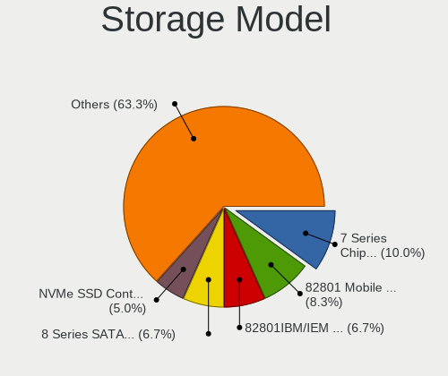
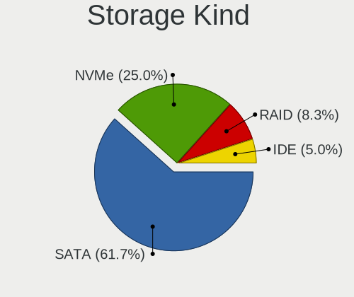
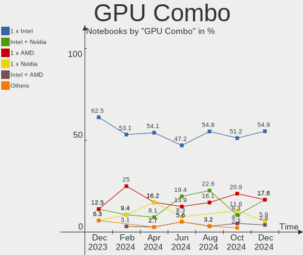

Elementary - Hardware Trends (Notebooks)
----------------------------------------

A project to identify most popular hardware characteristics and track their change
over time based on data collected by Linux users at https://Linux-Hardware.org.

Anyone can contribute to this report by the [hw-probe](https://github.com/linuxhw/hw-probe) tool:

    sudo -E hw-probe -all -upload

This report is for one last month. Overall report since the beginning of time: [TestCoverage](https://github.com/linuxhw/TestCoverage)

Period: Jan, 2023.

Contents
--------

* [ System ](#system)
  - [ OS                       ](#os)
  - [ OS Family                ](#os-family)
  - [ Kernel                   ](#kernel)
  - [ Kernel Family            ](#kernel-family)
  - [ Kernel Major Ver.        ](#kernel-major-ver)
  - [ Arch                     ](#arch)
  - [ DE                       ](#de)
  - [ Display Server           ](#display-server)
  - [ Display Manager          ](#display-manager)
  - [ OS Lang                  ](#os-lang)
  - [ Boot Mode                ](#boot-mode)
  - [ Filesystem               ](#filesystem)
  - [ Part. scheme             ](#part-scheme)
  - [ Dual Boot with Linux/BSD ](#dual-boot-with-linuxbsd)
  - [ Dual Boot (Win)          ](#dual-boot-win)

* [ Board ](#board)
  - [ Vendor                   ](#vendor)
  - [ Model                    ](#model)
  - [ Model Family             ](#model-family)
  - [ MFG Year                 ](#mfg-year)
  - [ Form Factor              ](#form-factor)
  - [ Secure Boot              ](#secure-boot)
  - [ Coreboot                 ](#coreboot)
  - [ RAM Size                 ](#ram-size)
  - [ RAM Used                 ](#ram-used)
  - [ Total Drives             ](#total-drives)
  - [ Has CD-ROM               ](#has-cd-rom)
  - [ Has Ethernet             ](#has-ethernet)
  - [ Has WiFi                 ](#has-wifi)
  - [ Has Bluetooth            ](#has-bluetooth)

* [ Location ](#location)
  - [ Country                  ](#country)
  - [ City                     ](#city)

* [ Drives ](#drives)
  - [ Drive Vendor             ](#drive-vendor)
  - [ Drive Model              ](#drive-model)
  - [ HDD Vendor               ](#hdd-vendor)
  - [ SSD Vendor               ](#ssd-vendor)
  - [ Drive Kind               ](#drive-kind)
  - [ Drive Connector          ](#drive-connector)
  - [ Drive Size               ](#drive-size)
  - [ Space Total              ](#space-total)
  - [ Space Used               ](#space-used)
  - [ Malfunc. Drives          ](#malfunc-drives)
  - [ Malfunc. Drive Vendor    ](#malfunc-drive-vendor)
  - [ Malfunc. HDD Vendor      ](#malfunc-hdd-vendor)
  - [ Malfunc. Drive Kind      ](#malfunc-drive-kind)
  - [ Failed Drives            ](#failed-drives)
  - [ Failed Drive Vendor      ](#failed-drive-vendor)
  - [ Drive Status             ](#drive-status)

* [ Storage controller ](#storage-controller)
  - [ Storage Vendor           ](#storage-vendor)
  - [ Storage Model            ](#storage-model)
  - [ Storage Kind             ](#storage-kind)

* [ Processor ](#processor)
  - [ CPU Vendor               ](#cpu-vendor)
  - [ CPU Model                ](#cpu-model)
  - [ CPU Model Family         ](#cpu-model-family)
  - [ CPU Cores                ](#cpu-cores)
  - [ CPU Sockets              ](#cpu-sockets)
  - [ CPU Threads              ](#cpu-threads)
  - [ CPU Op-Modes             ](#cpu-op-modes)
  - [ CPU Microcode            ](#cpu-microcode)
  - [ CPU Microarch            ](#cpu-microarch)

* [ Graphics ](#graphics)
  - [ GPU Vendor               ](#gpu-vendor)
  - [ GPU Model                ](#gpu-model)
  - [ GPU Combo                ](#gpu-combo)
  - [ GPU Driver               ](#gpu-driver)
  - [ GPU Memory               ](#gpu-memory)

* [ Monitor ](#monitor)
  - [ Monitor Vendor           ](#monitor-vendor)
  - [ Monitor Model            ](#monitor-model)
  - [ Monitor Resolution       ](#monitor-resolution)
  - [ Monitor Diagonal         ](#monitor-diagonal)
  - [ Monitor Width            ](#monitor-width)
  - [ Aspect Ratio             ](#aspect-ratio)
  - [ Monitor Area             ](#monitor-area)
  - [ Pixel Density            ](#pixel-density)
  - [ Multiple Monitors        ](#multiple-monitors)

* [ Network ](#network)
  - [ Net Controller Vendor    ](#net-controller-vendor)
  - [ Net Controller Model     ](#net-controller-model)
  - [ Wireless Vendor          ](#wireless-vendor)
  - [ Wireless Model           ](#wireless-model)
  - [ Ethernet Vendor          ](#ethernet-vendor)
  - [ Ethernet Model           ](#ethernet-model)
  - [ Net Controller Kind      ](#net-controller-kind)
  - [ Used Controller          ](#used-controller)
  - [ NICs                     ](#nics)
  - [ IPv6                     ](#ipv6)

* [ Bluetooth ](#bluetooth)
  - [ Bluetooth Vendor         ](#bluetooth-vendor)
  - [ Bluetooth Model          ](#bluetooth-model)

* [ Sound ](#sound)
  - [ Sound Vendor             ](#sound-vendor)
  - [ Sound Model              ](#sound-model)

* [ Memory ](#memory)
  - [ Memory Vendor            ](#memory-vendor)
  - [ Memory Model             ](#memory-model)
  - [ Memory Kind              ](#memory-kind)
  - [ Memory Form Factor       ](#memory-form-factor)
  - [ Memory Size              ](#memory-size)
  - [ Memory Speed             ](#memory-speed)

* [ Printers & scanners ](#printers--scanners)
  - [ Printer Vendor           ](#printer-vendor)
  - [ Printer Model            ](#printer-model)
  - [ Scanner Vendor           ](#scanner-vendor)
  - [ Scanner Model            ](#scanner-model)

* [ Camera ](#camera)
  - [ Camera Vendor            ](#camera-vendor)
  - [ Camera Model             ](#camera-model)

* [ Security ](#security)
  - [ Fingerprint Vendor       ](#fingerprint-vendor)
  - [ Fingerprint Model        ](#fingerprint-model)
  - [ Chipcard Vendor          ](#chipcard-vendor)
  - [ Chipcard Model           ](#chipcard-model)

* [ Unsupported ](#unsupported)
  - [ Unsupported Devices      ](#unsupported-devices)
  - [ Unsupported Device Types ](#unsupported-device-types)

System
------

OS
--

Installed operating systems

| Name             | Notebooks | Percent |
|------------------|-----------|---------|
| Elementary 6.1   | 24        | 92.31%  |
| Elementary 7     | 1         | 3.85%   |
| Elementary 5.1.7 | 1         | 3.85%   |

OS Family
---------

OS without a version

| Name       | Notebooks | Percent |
|------------|-----------|---------|
| Elementary | 26        | 100%    |

Kernel
------

Version of the Linux kernel

| Version              | Notebooks | Percent |
|----------------------|-----------|---------|
| 5.15.0-58-generic    | 8         | 30.77%  |
| 5.15.0-57-generic    | 7         | 26.92%  |
| 5.15.0-56-generic    | 6         | 23.08%  |
| 5.11.0-43-generic    | 2         | 7.69%   |
| 6.1.6-060106-generic | 1         | 3.85%   |
| 5.4.0-135-generic    | 1         | 3.85%   |
| 5.15.0-50-generic    | 1         | 3.85%   |

Kernel Family
-------------

Linux kernel without a distro release

| Version | Notebooks | Percent |
|---------|-----------|---------|
| 5.15.0  | 22        | 84.62%  |
| 5.11.0  | 2         | 7.69%   |
| 6.1.6   | 1         | 3.85%   |
| 5.4.0   | 1         | 3.85%   |

Kernel Major Ver.
-----------------

Linux kernel major version

| Version | Notebooks | Percent |
|---------|-----------|---------|
| 5.15    | 22        | 84.62%  |
| 5.11    | 2         | 7.69%   |
| 6.1     | 1         | 3.85%   |
| 5.4     | 1         | 3.85%   |

Arch
----

OS architecture (x86_64, i586, etc.)

| Name   | Notebooks | Percent |
|--------|-----------|---------|
| x86_64 | 26        | 100%    |

DE
--

Desktop Environment

| Name     | Notebooks | Percent |
|----------|-----------|---------|
| Pantheon | 26        | 100%    |

Display Server
--------------

X11 or Wayland

| Name | Notebooks | Percent |
|------|-----------|---------|
| X11  | 26        | 100%    |

Display Manager
---------------

SDDM, LightDM, etc.

| Name    | Notebooks | Percent |
|---------|-----------|---------|
| LightDM | 14        | 53.85%  |
| Unknown | 12        | 46.15%  |

OS Lang
-------

Language

| Lang  | Notebooks | Percent |
|-------|-----------|---------|
| en_US | 10        | 38.46%  |
| de_DE | 3         | 11.54%  |
| es_ES | 2         | 7.69%   |
| zh_CN | 1         | 3.85%   |
| tr_TR | 1         | 3.85%   |
| sv_SE | 1         | 3.85%   |
| pt_BR | 1         | 3.85%   |
| pl_PL | 1         | 3.85%   |
| nb_NO | 1         | 3.85%   |
| it_IT | 1         | 3.85%   |
| fr_FR | 1         | 3.85%   |
| en_GB | 1         | 3.85%   |
| el_GR | 1         | 3.85%   |
| ca_ES | 1         | 3.85%   |

Boot Mode
---------

EFI or BIOS

| Mode | Notebooks | Percent |
|------|-----------|---------|
| EFI  | 17        | 65.38%  |
| BIOS | 9         | 34.62%  |

Filesystem
----------

Type of filesystem

| Type    | Notebooks | Percent |
|---------|-----------|---------|
| Ext4    | 25        | 96.15%  |
| Overlay | 1         | 3.85%   |

Part. scheme
------------

Scheme of partitioning

| Type    | Notebooks | Percent |
|---------|-----------|---------|
| Unknown | 12        | 46.15%  |
| GPT     | 11        | 42.31%  |
| MBR     | 3         | 11.54%  |

Dual Boot with Linux/BSD
------------------------

Hosting more than one Linux/BSD

| Dual boot | Notebooks | Percent |
|-----------|-----------|---------|
| No        | 25        | 96.15%  |
| Yes       | 1         | 3.85%   |

Dual Boot (Win)
---------------

Hosting Linux and Windows

| Dual boot | Notebooks | Percent |
|-----------|-----------|---------|
| No        | 20        | 76.92%  |
| Yes       | 6         | 23.08%  |

Board
-----

Vendor
------

Motherboard manufacturer

| Name                   | Notebooks | Percent |
|------------------------|-----------|---------|
| Lenovo                 | 8         | 30.77%  |
| Apple                  | 4         | 15.38%  |
| Hewlett-Packard        | 3         | 11.54%  |
| Sony                   | 2         | 7.69%   |
| HUAWEI                 | 2         | 7.69%   |
| Dell                   | 2         | 7.69%   |
| Star Labs              | 1         | 3.85%   |
| Notebook               | 1         | 3.85%   |
| Chuwi                  | 1         | 3.85%   |
| Avell High Performance | 1         | 3.85%   |
| Acer                   | 1         | 3.85%   |

Model
-----

Motherboard model

| Name                                 | Notebooks | Percent |
|--------------------------------------|-----------|---------|
| HUAWEI MACHD-WXX9                    | 2         | 7.69%   |
| Star Labs StarBook                   | 1         | 3.85%   |
| Sony VPCSB11FX                       | 1         | 3.85%   |
| Sony SVE1711C5E                      | 1         | 3.85%   |
| Notebook NLx0MU                      | 1         | 3.85%   |
| Lenovo Y50-70 20378                  | 1         | 3.85%   |
| Lenovo V14 G2 ALC 82KC               | 1         | 3.85%   |
| Lenovo ThinkPad T480 20L5000YUS      | 1         | 3.85%   |
| Lenovo ThinkPad T14 Gen 1 20S1S3PM00 | 1         | 3.85%   |
| Lenovo ThinkPad E14 Gen 2 20TA00BUAD | 1         | 3.85%   |
| Lenovo IdeaPad S145-14AST 81ST       | 1         | 3.85%   |
| Lenovo IdeaPad 330-15IKB 81FE        | 1         | 3.85%   |
| Lenovo IdeaPad 110-15ACL 80TJ        | 1         | 3.85%   |
| HP ProBook 650 G1                    | 1         | 3.85%   |
| HP ProBook 455R G6                   | 1         | 3.85%   |
| HP EliteBook 2560p                   | 1         | 3.85%   |
| Dell XPS 15 9510                     | 1         | 3.85%   |
| Dell XPS 13 9360                     | 1         | 3.85%   |
| Chuwi AeroBook Pro                   | 1         | 3.85%   |
| Avell High Performance B.ON          | 1         | 3.85%   |
| Apple MacBookPro8,2                  | 1         | 3.85%   |
| Apple MacBookPro8,1                  | 1         | 3.85%   |
| Apple MacBookPro11,3                 | 1         | 3.85%   |
| Apple MacBookAir6,2                  | 1         | 3.85%   |
| Acer TravelMate 5735Z                | 1         | 3.85%   |

Model Family
------------

Motherboard model prefix

| Name                        | Notebooks | Percent |
|-----------------------------|-----------|---------|
| Lenovo ThinkPad             | 3         | 11.54%  |
| Lenovo IdeaPad              | 3         | 11.54%  |
| HUAWEI MACHD-WXX9           | 2         | 7.69%   |
| HP ProBook                  | 2         | 7.69%   |
| Dell XPS                    | 2         | 7.69%   |
| Apple MacBookPro8           | 2         | 7.69%   |
| Star Labs StarBook          | 1         | 3.85%   |
| Sony VPCSB11FX              | 1         | 3.85%   |
| Sony SVE1711C5E             | 1         | 3.85%   |
| Notebook NLx0MU             | 1         | 3.85%   |
| Lenovo Y50-70               | 1         | 3.85%   |
| Lenovo V14                  | 1         | 3.85%   |
| HP EliteBook                | 1         | 3.85%   |
| Chuwi AeroBook              | 1         | 3.85%   |
| Avell High Performance B.ON | 1         | 3.85%   |
| Apple MacBookPro11          | 1         | 3.85%   |
| Apple MacBookAir6           | 1         | 3.85%   |
| Acer TravelMate             | 1         | 3.85%   |

MFG Year
--------

Motherboard manufacture year

| Year | Notebooks | Percent |
|------|-----------|---------|
| 2021 | 5         | 19.23%  |
| 2020 | 3         | 11.54%  |
| 2011 | 3         | 11.54%  |
| 2019 | 2         | 7.69%   |
| 2018 | 2         | 7.69%   |
| 2016 | 2         | 7.69%   |
| 2014 | 2         | 7.69%   |
| 2013 | 2         | 7.69%   |
| 2012 | 2         | 7.69%   |
| 2023 | 1         | 3.85%   |
| 2022 | 1         | 3.85%   |
| 2010 | 1         | 3.85%   |

Form Factor
-----------

Physical design of the computer

| Name     | Notebooks | Percent |
|----------|-----------|---------|
| Notebook | 26        | 100%    |

Secure Boot
-----------

Enabled or disabled

| State    | Notebooks | Percent |
|----------|-----------|---------|
| Disabled | 23        | 88.46%  |
| Enabled  | 3         | 11.54%  |

Coreboot
--------

Have coreboot on board

| Used | Notebooks | Percent |
|------|-----------|---------|
| No   | 25        | 96.15%  |
| Yes  | 1         | 3.85%   |

RAM Size
--------

Total RAM memory

| Size in GB  | Notebooks | Percent |
|-------------|-----------|---------|
| 16.01-24.0  | 9         | 34.62%  |
| 4.01-8.0    | 7         | 26.92%  |
| 8.01-16.0   | 6         | 23.08%  |
| 3.01-4.0    | 2         | 7.69%   |
| 32.01-64.0  | 1         | 3.85%   |
| 64.01-256.0 | 1         | 3.85%   |

RAM Used
--------

Used RAM memory

| Used GB   | Notebooks | Percent |
|-----------|-----------|---------|
| 2.01-3.0  | 9         | 34.62%  |
| 1.01-2.0  | 8         | 30.77%  |
| 4.01-8.0  | 3         | 11.54%  |
| 3.01-4.0  | 3         | 11.54%  |
| 8.01-16.0 | 3         | 11.54%  |

Total Drives
------------

Number of drives on board

| Drives | Notebooks | Percent |
|--------|-----------|---------|
| 1      | 22        | 84.62%  |
| 2      | 4         | 15.38%  |

Has CD-ROM
----------

Has CD-ROM on board

| Presented | Notebooks | Percent |
|-----------|-----------|---------|
| No        | 21        | 80.77%  |
| Yes       | 5         | 19.23%  |

Has Ethernet
------------

Has Ethernet on board

| Presented | Notebooks | Percent |
|-----------|-----------|---------|
| Yes       | 18        | 69.23%  |
| No        | 8         | 30.77%  |

Has WiFi
--------

Has WiFi module

| Presented | Notebooks | Percent |
|-----------|-----------|---------|
| Yes       | 26        | 100%    |

Has Bluetooth
-------------

Has Bluetooth module

| Presented | Notebooks | Percent |
|-----------|-----------|---------|
| Yes       | 25        | 96.15%  |
| No        | 1         | 3.85%   |

Location
--------

Country
-------

Geographic location (country)

| Country      | Notebooks | Percent |
|--------------|-----------|---------|
| USA          | 3         | 11.54%  |
| Norway       | 2         | 7.69%   |
| Italy        | 2         | 7.69%   |
| Germany      | 2         | 7.69%   |
| Brazil       | 2         | 7.69%   |
| Turkey       | 1         | 3.85%   |
| Sweden       | 1         | 3.85%   |
| Spain        | 1         | 3.85%   |
| Singapore    | 1         | 3.85%   |
| Saudi Arabia | 1         | 3.85%   |
| Russia       | 1         | 3.85%   |
| Poland       | 1         | 3.85%   |
| Pakistan     | 1         | 3.85%   |
| Mexico       | 1         | 3.85%   |
| Israel       | 1         | 3.85%   |
| Indonesia    | 1         | 3.85%   |
| Greece       | 1         | 3.85%   |
| France       | 1         | 3.85%   |
| Chile        | 1         | 3.85%   |
| Austria      | 1         | 3.85%   |

City
----

Geographic location (city)

| City                     | Notebooks | Percent |
|--------------------------|-----------|---------|
| Yio Chu Kang             | 1         | 3.85%   |
| Vienna                   | 1         | 3.85%   |
| Tuxpam de Rodriguez Cano | 1         | 3.85%   |
| Tempio Pausania          | 1         | 3.85%   |
| Stockholm                | 1         | 3.85%   |
| St Petersburg            | 1         | 3.85%   |
| Sant Esteve Sesrovires   | 1         | 3.85%   |
| Round Rock               | 1         | 3.85%   |
| Riyadh                   | 1         | 3.85%   |
| Philipsburg              | 1         | 3.85%   |
| Oslo                     | 1         | 3.85%   |
| Maloy                    | 1         | 3.85%   |
| Lahore                   | 1         | 3.85%   |
| Krakow                   | 1         | 3.85%   |
| Kallithea                | 1         | 3.85%   |
| Izmir                    | 1         | 3.85%   |
| Frankfurt am Main        | 1         | 3.85%   |
| Fortaleza                | 1         | 3.85%   |
| Élancourt               | 1         | 3.85%   |
| Chiguayante              | 1         | 3.85%   |
| Campodarsego             | 1         | 3.85%   |
| Boituva                  | 1         | 3.85%   |
| Berlin                   | 1         | 3.85%   |
| Bandung                  | 1         | 3.85%   |
| Austin                   | 1         | 3.85%   |
| Ashdod                   | 1         | 3.85%   |

Drives
------

Drive Vendor
------------

Hard drive vendors

| Vendor                      | Notebooks | Drives | Percent |
|-----------------------------|-----------|--------|---------|
| WDC                         | 4         | 4      | 13.33%  |
| Samsung Electronics         | 4         | 4      | 13.33%  |
| SK hynix                    | 3         | 4      | 10%     |
| Seagate                     | 2         | 2      | 6.67%   |
| Kingston                    | 2         | 2      | 6.67%   |
| Apacer                      | 2         | 2      | 6.67%   |
| Yangtze Memory Technologies | 1         | 1      | 3.33%   |
| Union Memory                | 1         | 1      | 3.33%   |
| Star Drive                  | 1         | 1      | 3.33%   |
| SPCC                        | 1         | 1      | 3.33%   |
| SanDisk                     | 1         | 1      | 3.33%   |
| PNY                         | 1         | 1      | 3.33%   |
| Morebeck-N100               | 1         | 1      | 3.33%   |
| Intenso                     | 1         | 1      | 3.33%   |
| Fanxiang                    | 1         | 1      | 3.33%   |
| Crucial                     | 1         | 1      | 3.33%   |
| China                       | 1         | 1      | 3.33%   |
| Apple                       | 1         | 1      | 3.33%   |
| A-DATA Technology           | 1         | 1      | 3.33%   |

Drive Model
-----------

Hard drive models

| Model                                       | Notebooks | Percent |
|---------------------------------------------|-----------|---------|
| Yangtze Memory YMTC PC005 512GB             | 1         | 3.33%   |
| WDC WDS100T2G0A-00JH30 1TB SSD              | 1         | 3.33%   |
| WDC WD6400BPVT-80HXZT1 640GB                | 1         | 3.33%   |
| WDC WD Green 2.5 240GB                      | 1         | 3.33%   |
| WDC PC SN730 SDBQNTY-512G-1001 512GB        | 1         | 3.33%   |
| Union Memory UMIS RPJTJ256MEE1OWX 256GB     | 1         | 3.33%   |
| Star Drive PCIe SSD 1TB                     | 1         | 3.33%   |
| SPCC M.2 SSD 512GB                          | 1         | 3.33%   |
| SK hynix PC711 NVMe 1TB                     | 1         | 3.33%   |
| SK hynix BC511 512GB                        | 1         | 3.33%   |
| SK hynix BC501 NVMe Solid State Drive 512GB | 1         | 3.33%   |
| Seagate ST1000LM048-2E7172 1TB              | 1         | 3.33%   |
| Seagate ST1000LM035-1RK172 1TB              | 1         | 3.33%   |
| SanDisk SD9SN8W-256G-1006 256GB SSD         | 1         | 3.33%   |
| Samsung SSD 980 500GB                       | 1         | 3.33%   |
| Samsung MZVLB512HAJQ-000L7 512GB            | 1         | 3.33%   |
| Samsung MZVLB1T0HBLR-00000 1TB              | 1         | 3.33%   |
| Samsung MZALQ256HBJD-00BL1 256GB            | 1         | 3.33%   |
| PNY CS900 240GB SSD                         | 1         | 3.33%   |
| Morebeck-N100 SSD 256GB                     | 1         | 3.33%   |
| Kingston SV300S37A120G 120GB SSD            | 1         | 3.33%   |
| Kingston SUV400S37480G 480GB SSD            | 1         | 3.33%   |
| Intenso SSD Sata III 120GB                  | 1         | 3.33%   |
| Fanxiang S101 512GB                         | 1         | 3.33%   |
| Crucial CT1000BX500SSD1 1TB                 | 1         | 3.33%   |
| China SSD 256GB                             | 1         | 3.33%   |
| Apple SSD SM0512F 500GB                     | 1         | 3.33%   |
| Apacer AS350 256GB SSD                      | 1         | 3.33%   |
| Apacer AS350 240GB SSD                      | 1         | 3.33%   |
| A-DATA IM2P33F8A-512GD 512GB                | 1         | 3.33%   |

HDD Vendor
----------

Hard disk drive vendors

| Vendor  | Notebooks | Drives | Percent |
|---------|-----------|--------|---------|
| Seagate | 2         | 2      | 66.67%  |
| WDC     | 1         | 1      | 33.33%  |

SSD Vendor
----------

Solid state drive vendors

| Vendor        | Notebooks | Drives | Percent |
|---------------|-----------|--------|---------|
| WDC           | 2         | 2      | 13.33%  |
| Kingston      | 2         | 2      | 13.33%  |
| Apacer        | 2         | 2      | 13.33%  |
| SPCC          | 1         | 1      | 6.67%   |
| SanDisk       | 1         | 1      | 6.67%   |
| PNY           | 1         | 1      | 6.67%   |
| Morebeck-N100 | 1         | 1      | 6.67%   |
| Intenso       | 1         | 1      | 6.67%   |
| Fanxiang      | 1         | 1      | 6.67%   |
| Crucial       | 1         | 1      | 6.67%   |
| China         | 1         | 1      | 6.67%   |
| Apple         | 1         | 1      | 6.67%   |

Drive Kind
----------

HDD or SSD

| Kind | Notebooks | Drives | Percent |
|------|-----------|--------|---------|
| SSD  | 14        | 15     | 48.28%  |
| NVMe | 12        | 13     | 41.38%  |
| HDD  | 3         | 3      | 10.34%  |

Drive Connector
---------------

SATA, SAS, NVMe, etc.

| Type | Notebooks | Drives | Percent |
|------|-----------|--------|---------|
| SATA | 16        | 18     | 57.14%  |
| NVMe | 12        | 13     | 42.86%  |

Drive Size
----------

Size of hard drive

| Size in TB | Notebooks | Drives | Percent |
|------------|-----------|--------|---------|
| 0.01-0.5   | 10        | 11     | 58.82%  |
| 0.51-1.0   | 7         | 7      | 41.18%  |

Space Total
-----------

Amount of disk space available on the file system

| Size in GB | Notebooks | Percent |
|------------|-----------|---------|
| 101-250    | 9         | 34.62%  |
| 251-500    | 7         | 26.92%  |
| 501-1000   | 6         | 23.08%  |
| 51-100     | 3         | 11.54%  |
| 21-50      | 1         | 3.85%   |

Space Used
----------

Amount of used disk space

| Used GB  | Notebooks | Percent |
|----------|-----------|---------|
| 1-20     | 9         | 34.62%  |
| 21-50    | 5         | 19.23%  |
| 51-100   | 5         | 19.23%  |
| 101-250  | 4         | 15.38%  |
| 251-500  | 2         | 7.69%   |
| 501-1000 | 1         | 3.85%   |

Malfunc. Drives
---------------

Drive models with a malfunction

| Model           | Notebooks | Drives | Percent |
|-----------------|-----------|--------|---------|
| China SSD 256GB | 1         | 1      | 100%    |

Malfunc. Drive Vendor
---------------------

Vendors of faulty drives

| Vendor | Notebooks | Drives | Percent |
|--------|-----------|--------|---------|
| China  | 1         | 1      | 100%    |

Malfunc. HDD Vendor
-------------------

Vendors of faulty HDD drives

Zero info for selected period =(

Malfunc. Drive Kind
-------------------

Kinds of faulty drives

| Kind | Notebooks | Drives | Percent |
|------|-----------|--------|---------|
| SSD  | 1         | 1      | 100%    |

Failed Drives
-------------

Failed drive models

Zero info for selected period =(

Failed Drive Vendor
-------------------

Failed drive vendors

Zero info for selected period =(

Drive Status
------------

Number of failed and malfunc. drives

| Status   | Notebooks | Drives | Percent |
|----------|-----------|--------|---------|
| Detected | 16        | 20     | 59.26%  |
| Works    | 10        | 10     | 37.04%  |
| Malfunc  | 1         | 1      | 3.7%    |

Storage controller
------------------

Storage Vendor
--------------

Storage controller vendors

| Vendor                      | Notebooks | Percent |
|-----------------------------|-----------|---------|
| Intel                       | 14        | 46.67%  |
| Samsung Electronics         | 5         | 16.67%  |
| AMD                         | 4         | 13.33%  |
| SK hynix                    | 2         | 6.67%   |
| Yangtze Memory Technologies | 1         | 3.33%   |
| Union Memory (Shenzhen)     | 1         | 3.33%   |
| SanDisk                     | 1         | 3.33%   |
| Phison Electronics          | 1         | 3.33%   |
| ADATA Technology            | 1         | 3.33%   |

Storage Model
-------------

Storage controller models

| Model                                                                                  | Notebooks | Percent |
|----------------------------------------------------------------------------------------|-----------|---------|
| AMD FCH SATA Controller [AHCI mode]                                                    | 4         | 12.9%   |
| Intel Sunrise Point-LP SATA Controller [AHCI mode]                                     | 3         | 9.68%   |
| Samsung NVMe SSD Controller SM981/PM981/PM983                                          | 2         | 6.45%   |
| Samsung NVMe SSD Controller 980                                                        | 2         | 6.45%   |
| Intel 6 Series/C200 Series Chipset Family Mobile SATA Controller (IDE mode, ports 0-3) | 2         | 6.45%   |
| Intel 6 Series/C200 Series Chipset Family 6 port Mobile SATA AHCI Controller           | 2         | 6.45%   |
| Yangtze Memory Non-Volatile memory controller                                          | 1         | 3.23%   |
| Union Memory (Shenzhen) Non-Volatile memory controller                                 | 1         | 3.23%   |
| SK hynix Gold P31/PC711 NVMe Solid State Drive                                         | 1         | 3.23%   |
| SK hynix BC501 NVMe Solid State Drive                                                  | 1         | 3.23%   |
| SanDisk WD Black SN750 / PC SN730 NVMe SSD                                             | 1         | 3.23%   |
| Samsung Apple PCIe SSD                                                                 | 1         | 3.23%   |
| Phison E18 PCIe4 NVMe Controller                                                       | 1         | 3.23%   |
| Intel Volume Management Device NVMe RAID Controller                                    | 1         | 3.23%   |
| Intel Tiger Lake-LP SATA Controller                                                    | 1         | 3.23%   |
| Intel 82801IBM/IEM (ICH9M/ICH9M-E) 4 port SATA Controller [AHCI mode]                  | 1         | 3.23%   |
| Intel 82801 Mobile SATA Controller [RAID mode]                                         | 1         | 3.23%   |
| Intel 8 Series/C220 Series Chipset Family 6-port SATA Controller 1 [AHCI mode]         | 1         | 3.23%   |
| Intel 8 Series/C220 Series Chipset Family 2-port SATA Controller 2 [IDE mode]          | 1         | 3.23%   |
| Intel 7 Series Chipset Family 6-port SATA Controller [AHCI mode]                       | 1         | 3.23%   |
| Intel 6 Series/C200 Series Chipset Family Mobile SATA Controller (IDE mode, ports 4-5) | 1         | 3.23%   |
| ADATA IM2P33F8ABR1 NVMe SSD                                                            | 1         | 3.23%   |

Storage Kind
------------

Kind of storage controller (IDE, SATA, NVMe, SAS, ...)

| Kind | Notebooks | Percent |
|------|-----------|---------|
| SATA | 14        | 46.67%  |
| NVMe | 11        | 36.67%  |
| IDE  | 3         | 10%     |
| RAID | 2         | 6.67%   |

Processor
---------

CPU Vendor
----------

Processor vendors

| Vendor | Notebooks | Percent |
|--------|-----------|---------|
| Intel  | 22        | 84.62%  |
| AMD    | 4         | 15.38%  |

CPU Model
---------

Processor models

| Model                                         | Notebooks | Percent |
|-----------------------------------------------|-----------|---------|
| Intel 11th Gen Core i5-1135G7 @ 2.40GHz       | 3         | 11.54%  |
| Intel Core i5-8250U CPU @ 1.60GHz             | 2         | 7.69%   |
| Intel 11th Gen Core i7-1165G7 @ 2.80GHz       | 2         | 7.69%   |
| Intel Pentium Dual-Core CPU T4500 @ 2.30GHz   | 1         | 3.85%   |
| Intel Core m3-8100Y CPU @ 1.10GHz             | 1         | 3.85%   |
| Intel Core i7-8550U CPU @ 1.80GHz             | 1         | 3.85%   |
| Intel Core i7-4980HQ CPU @ 2.80GHz            | 1         | 3.85%   |
| Intel Core i7-4710HQ CPU @ 2.50GHz            | 1         | 3.85%   |
| Intel Core i7-4650U CPU @ 1.70GHz             | 1         | 3.85%   |
| Intel Core i7-2720QM CPU @ 2.20GHz            | 1         | 3.85%   |
| Intel Core i5-4200M CPU @ 2.50GHz             | 1         | 3.85%   |
| Intel Core i5-3210M CPU @ 2.50GHz             | 1         | 3.85%   |
| Intel Core i5-2520M CPU @ 2.50GHz             | 1         | 3.85%   |
| Intel Core i5-2415M CPU @ 2.30GHz             | 1         | 3.85%   |
| Intel Core i5-2410M CPU @ 2.30GHz             | 1         | 3.85%   |
| Intel Core i5-10210U CPU @ 1.60GHz            | 1         | 3.85%   |
| Intel 12th Gen Core i7-1260P                  | 1         | 3.85%   |
| Intel 11th Gen Core i9-11900H @ 2.50GHz       | 1         | 3.85%   |
| AMD Ryzen 7 3700U with Radeon Vega Mobile Gfx | 1         | 3.85%   |
| AMD Ryzen 5 5500U with Radeon Graphics        | 1         | 3.85%   |
| AMD A9-9425 RADEON R5, 5 COMPUTE CORES 2C+3G  | 1         | 3.85%   |
| AMD A6-7310 APU with AMD Radeon R4 Graphics   | 1         | 3.85%   |

CPU Model Family
----------------

Processor model prefix

| Model                   | Notebooks | Percent |
|-------------------------|-----------|---------|
| Other                   | 8         | 30.77%  |
| Intel Core i5           | 8         | 30.77%  |
| Intel Core i7           | 5         | 19.23%  |
| Intel Pentium Dual-Core | 1         | 3.85%   |
| Intel Core m3           | 1         | 3.85%   |
| AMD Ryzen 7             | 1         | 3.85%   |
| AMD Ryzen 5             | 1         | 3.85%   |
| AMD A6                  | 1         | 3.85%   |

CPU Cores
---------

Number of processor cores

| Number | Notebooks | Percent |
|--------|-----------|---------|
| 4      | 14        | 53.85%  |
| 2      | 9         | 34.62%  |
| 12     | 1         | 3.85%   |
| 8      | 1         | 3.85%   |
| 6      | 1         | 3.85%   |

CPU Sockets
-----------

Number of sockets

| Number | Notebooks | Percent |
|--------|-----------|---------|
| 1      | 26        | 100%    |

CPU Threads
-----------

Threads per core (Hyper-Threading)

| Number | Notebooks | Percent |
|--------|-----------|---------|
| 2      | 23        | 88.46%  |
| 1      | 3         | 11.54%  |

CPU Op-Modes
------------

CPU Operation Modes (32-bit, 64-bit)

| Op mode        | Notebooks | Percent |
|----------------|-----------|---------|
| 32-bit, 64-bit | 26        | 100%    |

CPU Microcode
-------------

Microcode number

| Number     | Notebooks | Percent |
|------------|-----------|---------|
| 0x806c1    | 5         | 19.23%  |
| 0x206a7    | 4         | 15.38%  |
| 0x806ea    | 3         | 11.54%  |
| 0x306c3    | 2         | 7.69%   |
| 0x906a3    | 1         | 3.85%   |
| 0x806ec    | 1         | 3.85%   |
| 0x806e9    | 1         | 3.85%   |
| 0x806d1    | 1         | 3.85%   |
| 0x40661    | 1         | 3.85%   |
| 0x40651    | 1         | 3.85%   |
| 0x306a9    | 1         | 3.85%   |
| 0x1067a    | 1         | 3.85%   |
| 0x08608103 | 1         | 3.85%   |
| 0x08108109 | 1         | 3.85%   |
| 0x07030105 | 1         | 3.85%   |
| 0x06006705 | 1         | 3.85%   |

CPU Microarch
-------------

Microarchitecture

| Name             | Notebooks | Percent |
|------------------|-----------|---------|
| TigerLake        | 5         | 19.23%  |
| KabyLake         | 5         | 19.23%  |
| SandyBridge      | 4         | 15.38%  |
| Haswell          | 4         | 15.38%  |
| Zen+             | 1         | 3.85%   |
| Puma             | 1         | 3.85%   |
| Penryn           | 1         | 3.85%   |
| IvyBridge        | 1         | 3.85%   |
| Icelake          | 1         | 3.85%   |
| Excavator        | 1         | 3.85%   |
| Alderlake Hybrid | 1         | 3.85%   |
| Unknown          | 1         | 3.85%   |

Graphics
--------

GPU Vendor
----------

Vendors of graphics cards

| Vendor | Notebooks | Percent |
|--------|-----------|---------|
| Intel  | 19        | 63.33%  |
| AMD    | 7         | 23.33%  |
| Nvidia | 4         | 13.33%  |

GPU Model
---------

Graphics card models

| Model                                                                                 | Notebooks | Percent |
|---------------------------------------------------------------------------------------|-----------|---------|
| Intel TigerLake-LP GT2 [Iris Xe Graphics]                                             | 5         | 15.63%  |
| Intel UHD Graphics 620                                                                | 3         | 9.38%   |
| Intel 2nd Generation Core Processor Family Integrated Graphics Controller             | 3         | 9.38%   |
| Intel 4th Gen Core Processor Integrated Graphics Controller                           | 2         | 6.25%   |
| Nvidia GP108M [GeForce MX150]                                                         | 1         | 3.13%   |
| Nvidia GM107M [GeForce GTX 860M]                                                      | 1         | 3.13%   |
| Nvidia GK107M [GeForce GT 750M Mac Edition]                                           | 1         | 3.13%   |
| Nvidia GA107M [GeForce RTX 3050 Ti Mobile]                                            | 1         | 3.13%   |
| Intel UHD Graphics 615                                                                | 1         | 3.13%   |
| Intel TigerLake-H GT1 [UHD Graphics]                                                  | 1         | 3.13%   |
| Intel Mobile 4 Series Chipset Integrated Graphics Controller                          | 1         | 3.13%   |
| Intel Haswell-ULT Integrated Graphics Controller                                      | 1         | 3.13%   |
| Intel CometLake-U GT2 [UHD Graphics]                                                  | 1         | 3.13%   |
| Intel Alder Lake-P Integrated Graphics Controller                                     | 1         | 3.13%   |
| AMD Whistler [Radeon HD 6630M/6650M/6750M/7670M/7690M]                                | 1         | 3.13%   |
| AMD Topaz XT [Radeon R7 M260/M265 / M340/M360 / M440/M445 / 530/535 / 620/625 Mobile] | 1         | 3.13%   |
| AMD Thames [Radeon HD 7550M/7570M/7650M]                                              | 1         | 3.13%   |
| AMD Sun XT [Radeon HD 8670A/8670M/8690M / R5 M330 / M430 / Radeon 520 Mobile]         | 1         | 3.13%   |
| AMD Stoney [Radeon R2/R3/R4/R5 Graphics]                                              | 1         | 3.13%   |
| AMD Seymour [Radeon HD 6400M/7400M Series]                                            | 1         | 3.13%   |
| AMD Picasso/Raven 2 [Radeon Vega Series / Radeon Vega Mobile Series]                  | 1         | 3.13%   |
| AMD Mullins [Radeon R4/R5 Graphics]                                                   | 1         | 3.13%   |
| AMD Lucienne                                                                          | 1         | 3.13%   |

GPU Combo
---------

Combinations of graphics cards

| Name           | Notebooks | Percent |
|----------------|-----------|---------|
| 1 x Intel      | 15        | 57.69%  |
| 1 x AMD        | 4         | 15.38%  |
| Intel + Nvidia | 3         | 11.54%  |
| 2 x AMD        | 2         | 7.69%   |
| 1 x Nvidia     | 1         | 3.85%   |
| Intel + AMD    | 1         | 3.85%   |

GPU Driver
----------

Free vs proprietary

| Driver      | Notebooks | Percent |
|-------------|-----------|---------|
| Free        | 23        | 88.46%  |
| Proprietary | 2         | 7.69%   |
| Unknown     | 1         | 3.85%   |

GPU Memory
----------

Total video memory

| Size in GB | Notebooks | Percent |
|------------|-----------|---------|
| Unknown    | 18        | 69.23%  |
| 1.01-2.0   | 4         | 15.38%  |
| 0.51-1.0   | 2         | 7.69%   |
| 0.01-0.5   | 2         | 7.69%   |

Monitor
-------

Monitor Vendor
--------------

Monitor vendors

| Vendor              | Notebooks | Percent |
|---------------------|-----------|---------|
| BOE                 | 6         | 22.22%  |
| Chimei Innolux      | 5         | 18.52%  |
| AU Optronics        | 5         | 18.52%  |
| Apple               | 3         | 11.11%  |
| Sharp               | 2         | 7.41%   |
| Tianma XM           | 1         | 3.7%    |
| Samsung Electronics | 1         | 3.7%    |
| Hewlett-Packard     | 1         | 3.7%    |
| Dell                | 1         | 3.7%    |
| CSO                 | 1         | 3.7%    |
| BenQ                | 1         | 3.7%    |

Monitor Model
-------------

Monitor models

| Model                                                             | Notebooks | Percent |
|-------------------------------------------------------------------|-----------|---------|
| Tianma XM LCD Monitor TLX1388 3000x2000 293x196mm 13.9-inch       | 1         | 3.7%    |
| Sharp LCD Monitor SHP14D0 3840x2400 336x210mm 15.6-inch           | 1         | 3.7%    |
| Sharp LCD Monitor SHP144A 3200x1800 294x165mm 13.3-inch           | 1         | 3.7%    |
| Samsung Electronics C24F390 SAM0D2C 1920x1080 521x293mm 23.5-inch | 1         | 3.7%    |
| Hewlett-Packard 27ec HPN3387 1920x1080 598x336mm 27.0-inch        | 1         | 3.7%    |
| Dell U2412M DELA07A 1920x1200 518x324mm 24.1-inch                 | 1         | 3.7%    |
| CSO LCD Monitor CSO1309 3000x2000 293x195mm 13.9-inch             | 1         | 3.7%    |
| Chimei Innolux LCD Monitor CMN15BE 1366x768 344x194mm 15.5-inch   | 1         | 3.7%    |
| Chimei Innolux LCD Monitor CMN150D 1920x1080 344x193mm 15.5-inch  | 1         | 3.7%    |
| Chimei Innolux LCD Monitor CMN14F2 1920x1080 309x173mm 13.9-inch  | 1         | 3.7%    |
| Chimei Innolux LCD Monitor CMN14E5 1920x1080 309x173mm 13.9-inch  | 1         | 3.7%    |
| Chimei Innolux LCD Monitor CMN14D4 1920x1080 309x173mm 13.9-inch  | 1         | 3.7%    |
| BOE LCD Monitor BOE08F5 1920x1080 344x194mm 15.5-inch             | 1         | 3.7%    |
| BOE LCD Monitor BOE07C9 1920x1080 309x173mm 13.9-inch             | 1         | 3.7%    |
| BOE LCD Monitor BOE0791 1920x1080 309x173mm 13.9-inch             | 1         | 3.7%    |
| BOE LCD Monitor BOE06FA 1920x1080 294x165mm 13.3-inch             | 1         | 3.7%    |
| BOE LCD Monitor BOE06A5 1366x768 344x194mm 15.5-inch              | 1         | 3.7%    |
| BOE LCD Monitor BOE0672 1366x768 344x194mm 15.5-inch              | 1         | 3.7%    |
| BenQ GL2460 BNQ78CE 1920x1080 531x299mm 24.0-inch                 | 1         | 3.7%    |
| AU Optronics LCD Monitor AUO723C 1366x768 309x173mm 13.9-inch     | 1         | 3.7%    |
| AU Optronics LCD Monitor AUO403D 1920x1080 309x173mm 13.9-inch    | 1         | 3.7%    |
| AU Optronics LCD Monitor AUO36ED 1920x1080 344x193mm 15.5-inch    | 1         | 3.7%    |
| AU Optronics LCD Monitor AUO23EC 1366x768 344x193mm 15.5-inch     | 1         | 3.7%    |
| AU Optronics LCD Monitor AUO206C 1366x768 277x156mm 12.5-inch     | 1         | 3.7%    |
| Apple Color LCD APPA022 2880x1800 331x207mm 15.4-inch             | 1         | 3.7%    |
| Apple Color LCD APP9CF0 1440x900 290x180mm 13.4-inch              | 1         | 3.7%    |
| Apple Color LCD APP9CC7 1280x800 286x179mm 13.3-inch              | 1         | 3.7%    |

Monitor Resolution
------------------

Monitor screen resolution

| Resolution        | Notebooks | Percent |
|-------------------|-----------|---------|
| 1920x1080 (FHD)   | 11        | 44%     |
| 1366x768 (WXGA)   | 6         | 24%     |
| 3000x2000         | 2         | 8%      |
| 3840x2400         | 1         | 4%      |
| 3200x1800 (QHD+)  | 1         | 4%      |
| 2880x1800         | 1         | 4%      |
| 1920x1200 (WUXGA) | 1         | 4%      |
| 1440x900 (WXGA+)  | 1         | 4%      |
| 1280x800 (WXGA)   | 1         | 4%      |

Monitor Diagonal
----------------

Diagonal size in inches

| Inches | Notebooks | Percent |
|--------|-----------|---------|
| 13     | 11        | 40.74%  |
| 15     | 9         | 33.33%  |
| 24     | 2         | 7.41%   |
| 14     | 2         | 7.41%   |
| 27     | 1         | 3.7%    |
| 23     | 1         | 3.7%    |
| 12     | 1         | 3.7%    |

Monitor Width
-------------

Physical width

| Width in mm | Notebooks | Percent |
|-------------|-----------|---------|
| 301-350     | 16        | 59.26%  |
| 201-300     | 7         | 25.93%  |
| 501-600     | 4         | 14.81%  |

Aspect Ratio
------------

Proportional relationship between the width and the height

| Ratio | Notebooks | Percent |
|-------|-----------|---------|
| 16/9  | 17        | 70.83%  |
| 16/10 | 5         | 20.83%  |
| 3/2   | 2         | 8.33%   |

Monitor Area
------------

Area in inch²

| Area in inch² | Notebooks | Percent |
|----------------|-----------|---------|
| 81-90          | 11        | 40.74%  |
| 101-110        | 9         | 33.33%  |
| 71-80          | 2         | 7.41%   |
| 201-250        | 2         | 7.41%   |
| 61-70          | 1         | 3.7%    |
| 301-350        | 1         | 3.7%    |
| 251-300        | 1         | 3.7%    |

Pixel Density
-------------

Pixels per inch

| Density       | Notebooks | Percent |
|---------------|-----------|---------|
| 121-160       | 11        | 40.74%  |
| 101-120       | 6         | 22.22%  |
| More than 240 | 4         | 14.81%  |
| 51-100        | 4         | 14.81%  |
| 161-240       | 2         | 7.41%   |

Multiple Monitors
-----------------

Total monitors connected

| Total | Notebooks | Percent |
|-------|-----------|---------|
| 1     | 21        | 80.77%  |
| 2     | 4         | 15.38%  |
| 0     | 1         | 3.85%   |

Network
-------

Net Controller Vendor
---------------------

Controller vendors

| Vendor                | Notebooks | Percent |
|-----------------------|-----------|---------|
| Intel                 | 12        | 32.43%  |
| Realtek Semiconductor | 8         | 21.62%  |
| Qualcomm Atheros      | 7         | 18.92%  |
| Broadcom              | 5         | 13.51%  |
| Broadcom Limited      | 2         | 5.41%   |
| Xiaomi                | 1         | 2.7%    |
| ASIX Electronics      | 1         | 2.7%    |
| ADMtek                | 1         | 2.7%    |

Net Controller Model
--------------------

Controller models

| Model                                                             | Notebooks | Percent |
|-------------------------------------------------------------------|-----------|---------|
| Realtek RTL8111/8168/8411 PCI Express Gigabit Ethernet Controller | 7         | 15.56%  |
| Intel Wi-Fi 6 AX201                                               | 4         | 8.89%   |
| Qualcomm Atheros QCA9377 802.11ac Wireless Network Adapter        | 2         | 4.44%   |
| Qualcomm Atheros QCA6174 802.11ac Wireless Network Adapter        | 2         | 4.44%   |
| Broadcom NetXtreme BCM57765 Gigabit Ethernet PCIe                 | 2         | 4.44%   |
| Broadcom BCM4331 802.11a/b/g/n                                    | 2         | 4.44%   |
| Xiaomi Mi/Redmi series (RNDIS)                                    | 1         | 2.22%   |
| Realtek RTL8822BE 802.11a/b/g/n/ac WiFi adapter                   | 1         | 2.22%   |
| Realtek RTL8821AE 802.11ac PCIe Wireless Network Adapter          | 1         | 2.22%   |
| Realtek RTL8723BE PCIe Wireless Network Adapter                   | 1         | 2.22%   |
| Realtek RTL810xE PCI Express Fast Ethernet controller             | 1         | 2.22%   |
| Qualcomm Atheros QCA9565 / AR9565 Wireless Network Adapter        | 1         | 2.22%   |
| Qualcomm Atheros AR9485 Wireless Network Adapter                  | 1         | 2.22%   |
| Qualcomm Atheros AR9285 Wireless Network Adapter (PCI-Express)    | 1         | 2.22%   |
| Intel Wireless 8265 / 8275                                        | 1         | 2.22%   |
| Intel Wireless 7265                                               | 1         | 2.22%   |
| Intel Wi-Fi 6 AX210/AX211/AX411 160MHz                            | 1         | 2.22%   |
| Intel Wi-Fi 6 AX200                                               | 1         | 2.22%   |
| Intel Tiger Lake PCH CNVi WiFi                                    | 1         | 2.22%   |
| Intel Ethernet Connection I217-V                                  | 1         | 2.22%   |
| Intel Ethernet Connection (4) I219-V                              | 1         | 2.22%   |
| Intel Ethernet Connection (13) I219-V                             | 1         | 2.22%   |
| Intel Ethernet Connection (10) I219-V                             | 1         | 2.22%   |
| Intel Comet Lake PCH-LP CNVi WiFi                                 | 1         | 2.22%   |
| Intel 82579LM Gigabit Network Connection (Lewisville)             | 1         | 2.22%   |
| Broadcom Limited NetLink BCM57780 Gigabit Ethernet PCIe           | 1         | 2.22%   |
| Broadcom Limited BCM4360 802.11ac Wireless Network Adapter        | 1         | 2.22%   |
| Broadcom BCM4360 802.11ac Wireless Network Adapter                | 1         | 2.22%   |
| Broadcom BCM43225 802.11b/g/n                                     | 1         | 2.22%   |
| Broadcom BCM4313 802.11bgn Wireless Network Adapter               | 1         | 2.22%   |
| ASIX AX88179 Gigabit Ethernet                                     | 1         | 2.22%   |
| ADMtek ADM8515 Pegasus II Ethernet                                | 1         | 2.22%   |

Wireless Vendor
---------------

Wireless vendors

| Vendor                | Notebooks | Percent |
|-----------------------|-----------|---------|
| Intel                 | 10        | 38.46%  |
| Qualcomm Atheros      | 7         | 26.92%  |
| Broadcom              | 5         | 19.23%  |
| Realtek Semiconductor | 3         | 11.54%  |
| Broadcom Limited      | 1         | 3.85%   |

Wireless Model
--------------

Wireless models

| Model                                                          | Notebooks | Percent |
|----------------------------------------------------------------|-----------|---------|
| Intel Wi-Fi 6 AX201                                            | 4         | 15.38%  |
| Qualcomm Atheros QCA9377 802.11ac Wireless Network Adapter     | 2         | 7.69%   |
| Qualcomm Atheros QCA6174 802.11ac Wireless Network Adapter     | 2         | 7.69%   |
| Broadcom BCM4331 802.11a/b/g/n                                 | 2         | 7.69%   |
| Realtek RTL8822BE 802.11a/b/g/n/ac WiFi adapter                | 1         | 3.85%   |
| Realtek RTL8821AE 802.11ac PCIe Wireless Network Adapter       | 1         | 3.85%   |
| Realtek RTL8723BE PCIe Wireless Network Adapter                | 1         | 3.85%   |
| Qualcomm Atheros QCA9565 / AR9565 Wireless Network Adapter     | 1         | 3.85%   |
| Qualcomm Atheros AR9485 Wireless Network Adapter               | 1         | 3.85%   |
| Qualcomm Atheros AR9285 Wireless Network Adapter (PCI-Express) | 1         | 3.85%   |
| Intel Wireless 8265 / 8275                                     | 1         | 3.85%   |
| Intel Wireless 7265                                            | 1         | 3.85%   |
| Intel Wi-Fi 6 AX210/AX211/AX411 160MHz                         | 1         | 3.85%   |
| Intel Wi-Fi 6 AX200                                            | 1         | 3.85%   |
| Intel Tiger Lake PCH CNVi WiFi                                 | 1         | 3.85%   |
| Intel Comet Lake PCH-LP CNVi WiFi                              | 1         | 3.85%   |
| Broadcom Limited BCM4360 802.11ac Wireless Network Adapter     | 1         | 3.85%   |
| Broadcom BCM4360 802.11ac Wireless Network Adapter             | 1         | 3.85%   |
| Broadcom BCM43225 802.11b/g/n                                  | 1         | 3.85%   |
| Broadcom BCM4313 802.11bgn Wireless Network Adapter            | 1         | 3.85%   |

Ethernet Vendor
---------------

Ethernet vendors

| Vendor                | Notebooks | Percent |
|-----------------------|-----------|---------|
| Realtek Semiconductor | 8         | 42.11%  |
| Intel                 | 5         | 26.32%  |
| Broadcom              | 2         | 10.53%  |
| Xiaomi                | 1         | 5.26%   |
| Broadcom Limited      | 1         | 5.26%   |
| ASIX Electronics      | 1         | 5.26%   |
| ADMtek                | 1         | 5.26%   |

Ethernet Model
--------------

Ethernet models

| Model                                                             | Notebooks | Percent |
|-------------------------------------------------------------------|-----------|---------|
| Realtek RTL8111/8168/8411 PCI Express Gigabit Ethernet Controller | 7         | 36.84%  |
| Broadcom NetXtreme BCM57765 Gigabit Ethernet PCIe                 | 2         | 10.53%  |
| Xiaomi Mi/Redmi series (RNDIS)                                    | 1         | 5.26%   |
| Realtek RTL810xE PCI Express Fast Ethernet controller             | 1         | 5.26%   |
| Intel Ethernet Connection I217-V                                  | 1         | 5.26%   |
| Intel Ethernet Connection (4) I219-V                              | 1         | 5.26%   |
| Intel Ethernet Connection (13) I219-V                             | 1         | 5.26%   |
| Intel Ethernet Connection (10) I219-V                             | 1         | 5.26%   |
| Intel 82579LM Gigabit Network Connection (Lewisville)             | 1         | 5.26%   |
| Broadcom Limited NetLink BCM57780 Gigabit Ethernet PCIe           | 1         | 5.26%   |
| ASIX AX88179 Gigabit Ethernet                                     | 1         | 5.26%   |
| ADMtek ADM8515 Pegasus II Ethernet                                | 1         | 5.26%   |

Net Controller Kind
-------------------

Ethernet, WiFi or modem

| Kind     | Notebooks | Percent |
|----------|-----------|---------|
| WiFi     | 26        | 59.09%  |
| Ethernet | 18        | 40.91%  |

Used Controller
---------------

Currently used network controller

| Kind | Notebooks | Percent |
|------|-----------|---------|
| WiFi | 25        | 100%    |

NICs
----

Total network controllers on board

| Total | Notebooks | Percent |
|-------|-----------|---------|
| 2     | 16        | 61.54%  |
| 1     | 10        | 38.46%  |

IPv6
----

IPv6 vs IPv4

| Used | Notebooks | Percent |
|------|-----------|---------|
| No   | 19        | 73.08%  |
| Yes  | 7         | 26.92%  |

Bluetooth
---------

Bluetooth Vendor
----------------

Controller vendors

| Vendor                          | Notebooks | Percent |
|---------------------------------|-----------|---------|
| Intel                           | 10        | 40%     |
| Qualcomm Atheros Communications | 5         | 20%     |
| Apple                           | 4         | 16%     |
| Realtek Semiconductor           | 3         | 12%     |
| Foxconn / Hon Hai               | 2         | 8%      |
| Hewlett-Packard                 | 1         | 4%      |

Bluetooth Model
---------------

Controller models

| Model                                                                               | Notebooks | Percent |
|-------------------------------------------------------------------------------------|-----------|---------|
| Intel Bluetooth Device                                                              | 6         | 24%     |
| Qualcomm Atheros  Bluetooth Device                                                  | 3         | 12%     |
| Apple Bluetooth Host Controller                                                     | 3         | 12%     |
| Intel Bluetooth wireless interface                                                  | 2         | 8%      |
| Realtek RTL8821A Bluetooth                                                          | 1         | 4%      |
| Realtek RTL8723B Bluetooth                                                          | 1         | 4%      |
| Realtek  Bluetooth 4.2 Adapter                                                      | 1         | 4%      |
| Qualcomm Atheros QCA61x4 Bluetooth 4.0                                              | 1         | 4%      |
| Qualcomm Atheros AR3012 Bluetooth                                                   | 1         | 4%      |
| Intel AX210 Bluetooth                                                               | 1         | 4%      |
| Intel AX200 Bluetooth                                                               | 1         | 4%      |
| HP Broadcom 2070 Bluetooth Combo                                                    | 1         | 4%      |
| Foxconn / Hon Hai Foxconn T77H114 BCM2070 [Single-Chip Bluetooth 2.1 + EDR Adapter] | 1         | 4%      |
| Foxconn / Hon Hai Bluetooth USB Host Controller                                     | 1         | 4%      |
| Apple Bluetooth USB Host Controller                                                 | 1         | 4%      |

Sound
-----

Sound Vendor
------------

Sound card vendors

| Vendor              | Notebooks | Percent |
|---------------------|-----------|---------|
| Intel               | 22        | 66.67%  |
| AMD                 | 6         | 18.18%  |
| Nvidia              | 2         | 6.06%   |
| Midiplus            | 1         | 3.03%   |
| Logitech            | 1         | 3.03%   |
| C-Media Electronics | 1         | 3.03%   |

Sound Model
-----------

Sound card models

| Model                                                                      | Notebooks | Percent |
|----------------------------------------------------------------------------|-----------|---------|
| Intel Tiger Lake-LP Smart Sound Technology Audio Controller                | 5         | 12.5%   |
| Intel Sunrise Point-LP HD Audio                                            | 4         | 10%     |
| Intel 6 Series/C200 Series Chipset Family High Definition Audio Controller | 4         | 10%     |
| Intel 8 Series/C220 Series Chipset High Definition Audio Controller        | 3         | 7.5%    |
| Intel Xeon E3-1200 v3/4th Gen Core Processor HD Audio Controller           | 2         | 5%      |
| AMD Turks HDMI Audio [Radeon HD 6500/6600 / 6700M Series]                  | 2         | 5%      |
| AMD Family 17h/19h HD Audio Controller                                     | 2         | 5%      |
| Nvidia GM107 High Definition Audio Controller [GeForce 940MX]              | 1         | 2.5%    |
| Nvidia GK107 HDMI Audio Controller                                         | 1         | 2.5%    |
| Midiplus AKM320                                                            | 1         | 2.5%    |
| Logitech Headset H390                                                      | 1         | 2.5%    |
| Intel Tiger Lake-H HD Audio Controller                                     | 1         | 2.5%    |
| Intel Haswell-ULT HD Audio Controller                                      | 1         | 2.5%    |
| Intel Comet Lake PCH-LP cAVS                                               | 1         | 2.5%    |
| Intel Alder Lake PCH-P High Definition Audio Controller                    | 1         | 2.5%    |
| Intel 82801I (ICH9 Family) HD Audio Controller                             | 1         | 2.5%    |
| Intel 8 Series HD Audio Controller                                         | 1         | 2.5%    |
| Intel 7 Series/C216 Chipset Family High Definition Audio Controller        | 1         | 2.5%    |
| C-Media Electronics USB Advanced Audio Device                              | 1         | 2.5%    |
| AMD Renoir Radeon High Definition Audio Controller                         | 1         | 2.5%    |
| AMD Raven/Raven2/Fenghuang HDMI/DP Audio Controller                        | 1         | 2.5%    |
| AMD Kabini HDMI/DP Audio                                                   | 1         | 2.5%    |
| AMD High Definition Audio Controller                                       | 1         | 2.5%    |
| AMD FCH Azalia Controller                                                  | 1         | 2.5%    |
| AMD Family 15h (Models 60h-6fh) Audio Controller                           | 1         | 2.5%    |

Memory
------

Memory Vendor
-------------

Memory module vendors

| Vendor              | Notebooks | Percent |
|---------------------|-----------|---------|
| SK hynix            | 5         | 27.78%  |
| Micron Technology   | 4         | 22.22%  |
| Samsung Electronics | 3         | 16.67%  |
| Kingston            | 2         | 11.11%  |
| GSkill              | 1         | 5.56%   |
| Elpida              | 1         | 5.56%   |
| Crucial             | 1         | 5.56%   |
| A-DATA Technology   | 1         | 5.56%   |

Memory Model
------------

Memory module models

| Model                                                         | Notebooks | Percent |
|---------------------------------------------------------------|-----------|---------|
| SK hynix RAM Module 8192MB SODIMM DDR3 1600MT/s               | 1         | 5.56%   |
| SK hynix RAM Module 2048MB SODIMM DDR3 1333MT/s               | 1         | 5.56%   |
| SK hynix RAM HMAB2GS6AMR6N-XN 16384MB SODIMM DDR4 3200MT/s    | 1         | 5.56%   |
| SK hynix RAM HMAA4GS6CJR8N-XN 32GB SODIMM DDR4 3200MT/s       | 1         | 5.56%   |
| SK hynix RAM HMA81GS6CJR8N-VK 8GB SODIMM DDR4 2667MT/s        | 1         | 5.56%   |
| Samsung RAM UBE3D4AA-MGCR 2048MB Row Of Chips LPDDR4 4267MT/s | 1         | 5.56%   |
| Samsung RAM M471B1G73DB0-YK0 8GB SODIMM DDR3 1600MT/s         | 1         | 5.56%   |
| Samsung RAM M471A5244CB0-CRC 4GB SODIMM DDR4 2667MT/s         | 1         | 5.56%   |
| Micron RAM Module 4096MB Row Of Chips LPDDR3 1867MT/s         | 1         | 5.56%   |
| Micron RAM 8ATF51264HZ-2G3B1 4096MB SODIMM DDR4 2400MT/s      | 1         | 5.56%   |
| Micron RAM 53E1G32D4NQ 2048MB Row Of Chips LPDDR4 4267MT/s    | 1         | 5.56%   |
| Micron RAM 16ATF4G64HZ-3G2E2 32GB SODIMM DDR4 3200MT/s        | 1         | 5.56%   |
| Kingston RAM 9905700-118.A00G 8192MB SODIMM DDR4 3200MT/s     | 1         | 5.56%   |
| Kingston RAM 9905624-059.A00G 8192MB SODIMM DDR4 2667MT/s     | 1         | 5.56%   |
| GSkill RAM F4-3200C22-16GRS 16GB SODIMM DDR4 3200MT/s         | 1         | 5.56%   |
| Elpida RAM Module 4096MB SODIMM DDR3 1600MT/s                 | 1         | 5.56%   |
| Crucial RAM CT8G4SFS824A.C8FN 8192MB SODIMM DDR4 2400MT/s     | 1         | 5.56%   |
| A-DATA RAM Module 8192MB SODIMM DDR3 1600MT/s                 | 1         | 5.56%   |

Memory Kind
-----------

Memory module kinds

| Kind   | Notebooks | Percent |
|--------|-----------|---------|
| DDR4   | 7         | 50%     |
| DDR3   | 4         | 28.57%  |
| LPDDR4 | 2         | 14.29%  |
| LPDDR3 | 1         | 7.14%   |

Memory Form Factor
------------------

Physical design of the memory module

| Name         | Notebooks | Percent |
|--------------|-----------|---------|
| SODIMM       | 11        | 78.57%  |
| Row Of Chips | 3         | 21.43%  |

Memory Size
-----------

Memory module size

| Size  | Notebooks | Percent |
|-------|-----------|---------|
| 8192  | 6         | 42.86%  |
| 4096  | 3         | 21.43%  |
| 16384 | 2         | 14.29%  |
| 2048  | 2         | 14.29%  |
| 32768 | 1         | 7.14%   |

Memory Speed
------------

Memory module speed

| Speed | Notebooks | Percent |
|-------|-----------|---------|
| 3200  | 4         | 25%     |
| 2667  | 3         | 18.75%  |
| 1600  | 3         | 18.75%  |
| 4267  | 2         | 12.5%   |
| 2400  | 2         | 12.5%   |
| 1867  | 1         | 6.25%   |
| 1333  | 1         | 6.25%   |

Printers & scanners
-------------------

Printer Vendor
--------------

Printer device vendors

| Vendor      | Notebooks | Percent |
|-------------|-----------|---------|
| Xerox       | 1         | 50%     |
| Seiko Epson | 1         | 50%     |

Printer Model
-------------

Printer device models

| Model                   | Notebooks | Percent |
|-------------------------|-----------|---------|
| Xerox Phaser 3610       | 1         | 50%     |
| Seiko Epson L355 Series | 1         | 50%     |

Scanner Vendor
--------------

Scanner device vendors

Zero info for selected period =(

Scanner Model
-------------

Scanner device models

Zero info for selected period =(

Camera
------

Camera Vendor
-------------

Camera device vendors

| Vendor                                 | Notebooks | Percent |
|----------------------------------------|-----------|---------|
| Microdia                               | 5         | 21.74%  |
| Acer                                   | 5         | 21.74%  |
| Syntek                                 | 3         | 13.04%  |
| Chicony Electronics                    | 2         | 8.7%    |
| Cheng Uei Precision Industry (Foxlink) | 2         | 8.7%    |
| Apple                                  | 2         | 8.7%    |
| Sunplus Innovation Technology          | 1         | 4.35%   |
| Quanta                                 | 1         | 4.35%   |
| Luxvisions Innotech Limited            | 1         | 4.35%   |
| ALi                                    | 1         | 4.35%   |

Camera Model
------------

Camera device models

| Model                                            | Notebooks | Percent |
|--------------------------------------------------|-----------|---------|
| Microdia USB 2.0 Camera                          | 3         | 13.04%  |
| Syntek Integrated Camera                         | 2         | 8.7%    |
| Cheng Uei Precision Industry (Foxlink) HD Camera | 2         | 8.7%    |
| Apple FaceTime HD Camera                         | 2         | 8.7%    |
| Acer EasyCamera                                  | 2         | 8.7%    |
| Syntek Lenovo EasyCamera                         | 1         | 4.35%   |
| Sunplus HP HD Webcam [Fixed]                     | 1         | 4.35%   |
| Quanta HP HD Camera                              | 1         | 4.35%   |
| Microdia Integrated_Webcam_HD                    | 1         | 4.35%   |
| Microdia Integrated Webcam HD                    | 1         | 4.35%   |
| Luxvisions Innotech Limited Integrated Camera    | 1         | 4.35%   |
| Chicony Integrated Camera                        | 1         | 4.35%   |
| Chicony HP HD Webcam                             | 1         | 4.35%   |
| ALi Gateway Webcam                               | 1         | 4.35%   |
| Acer USB2.0 Camera                               | 1         | 4.35%   |
| Acer SunplusIT Integrated Camera                 | 1         | 4.35%   |
| Acer BisonCam,NB Pro                             | 1         | 4.35%   |

Security
--------

Fingerprint Vendor
------------------

Fingerprint sensor vendors

| Vendor                     | Notebooks | Percent |
|----------------------------|-----------|---------|
| Synaptics                  | 3         | 60%     |
| Validity Sensors           | 1         | 20%     |
| Shenzhen Goodix Technology | 1         | 20%     |

Fingerprint Model
-----------------

Fingerprint sensor models

| Model                                                      | Notebooks | Percent |
|------------------------------------------------------------|-----------|---------|
| Validity Sensors VFS471 Fingerprint Reader                 | 1         | 20%     |
| Synaptics  VFS7552 Touch Fingerprint Sensor with PurePrint | 1         | 20%     |
| Synaptics Prometheus MIS Touch Fingerprint Reader          | 1         | 20%     |
| Synaptics Metallica MIS Touch Fingerprint Reader           | 1         | 20%     |
| Shenzhen Goodix  Fingerprint Device                        | 1         | 20%     |

Chipcard Vendor
---------------

Chipcard module vendors

| Vendor      | Notebooks | Percent |
|-------------|-----------|---------|
| Alcor Micro | 1         | 100%    |

Chipcard Model
--------------

Chipcard module models

| Model                               | Notebooks | Percent |
|-------------------------------------|-----------|---------|
| Alcor Micro AU9540 Smartcard Reader | 1         | 100%    |

Unsupported
-----------

Unsupported Devices
-------------------

Total unsupported devices on board

| Total | Notebooks | Percent |
|-------|-----------|---------|
| 0     | 17        | 65.38%  |
| 1     | 7         | 26.92%  |
| 2     | 2         | 7.69%   |

Unsupported Device Types
------------------------

Types of unsupported devices

| Type                  | Notebooks | Percent |
|-----------------------|-----------|---------|
| Fingerprint reader    | 5         | 45.45%  |
| Multimedia controller | 3         | 27.27%  |
| Net/wireless          | 1         | 9.09%   |
| Graphics card         | 1         | 9.09%   |
| Chipcard              | 1         | 9.09%   |

