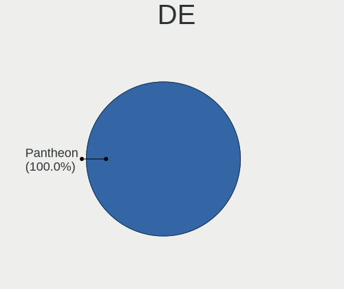
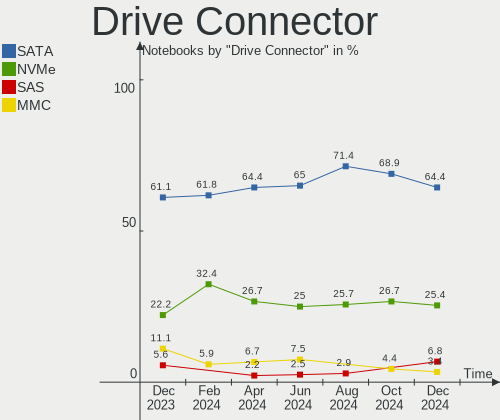
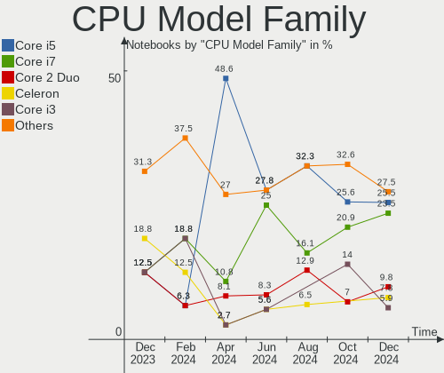
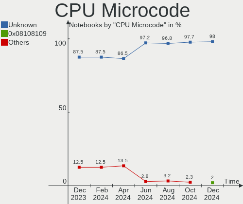
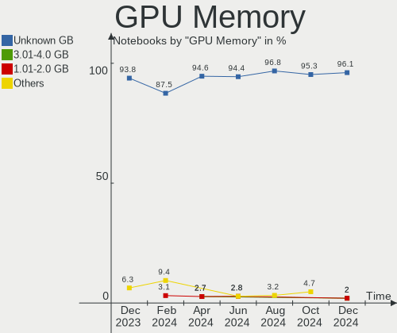
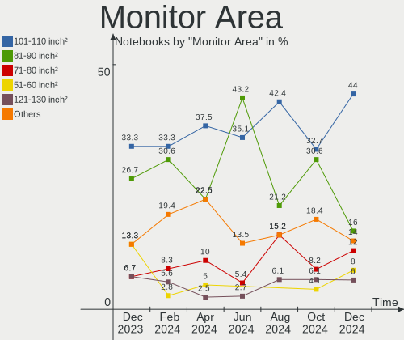
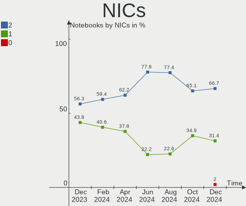
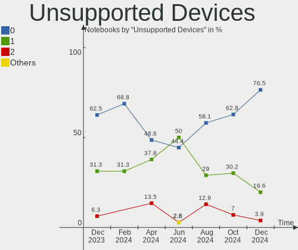

Elementary - Hardware Trends (Notebooks)
----------------------------------------

A project to identify most popular hardware characteristics and track their change
over time based on data collected by Linux users at https://Linux-Hardware.org.

Anyone can contribute to this report by the [hw-probe](https://github.com/linuxhw/hw-probe) tool:

    sudo -E hw-probe -all -upload

This report is for one last month. Overall report since the beginning of time: [TestDays](https://github.com/linuxhw/TestDays)

Period: May, 2023.

Contents
--------

* [ System ](#system)
  - [ OS                       ](#os)
  - [ OS Family                ](#os-family)
  - [ Kernel                   ](#kernel)
  - [ Kernel Family            ](#kernel-family)
  - [ Kernel Major Ver.        ](#kernel-major-ver)
  - [ Arch                     ](#arch)
  - [ DE                       ](#de)
  - [ Display Server           ](#display-server)
  - [ Display Manager          ](#display-manager)
  - [ OS Lang                  ](#os-lang)
  - [ Boot Mode                ](#boot-mode)
  - [ Filesystem               ](#filesystem)
  - [ Part. scheme             ](#part-scheme)
  - [ Dual Boot with Linux/BSD ](#dual-boot-with-linuxbsd)
  - [ Dual Boot (Win)          ](#dual-boot-win)

* [ Board ](#board)
  - [ Vendor                   ](#vendor)
  - [ Model                    ](#model)
  - [ Model Family             ](#model-family)
  - [ MFG Year                 ](#mfg-year)
  - [ Form Factor              ](#form-factor)
  - [ Secure Boot              ](#secure-boot)
  - [ Coreboot                 ](#coreboot)
  - [ RAM Size                 ](#ram-size)
  - [ RAM Used                 ](#ram-used)
  - [ Total Drives             ](#total-drives)
  - [ Has CD-ROM               ](#has-cd-rom)
  - [ Has Ethernet             ](#has-ethernet)
  - [ Has WiFi                 ](#has-wifi)
  - [ Has Bluetooth            ](#has-bluetooth)

* [ Location ](#location)
  - [ Country                  ](#country)
  - [ City                     ](#city)

* [ Drives ](#drives)
  - [ Drive Vendor             ](#drive-vendor)
  - [ Drive Model              ](#drive-model)
  - [ HDD Vendor               ](#hdd-vendor)
  - [ SSD Vendor               ](#ssd-vendor)
  - [ Drive Kind               ](#drive-kind)
  - [ Drive Connector          ](#drive-connector)
  - [ Drive Size               ](#drive-size)
  - [ Space Total              ](#space-total)
  - [ Space Used               ](#space-used)
  - [ Malfunc. Drives          ](#malfunc-drives)
  - [ Malfunc. Drive Vendor    ](#malfunc-drive-vendor)
  - [ Malfunc. HDD Vendor      ](#malfunc-hdd-vendor)
  - [ Malfunc. Drive Kind      ](#malfunc-drive-kind)
  - [ Failed Drives            ](#failed-drives)
  - [ Failed Drive Vendor      ](#failed-drive-vendor)
  - [ Drive Status             ](#drive-status)

* [ Storage controller ](#storage-controller)
  - [ Storage Vendor           ](#storage-vendor)
  - [ Storage Model            ](#storage-model)
  - [ Storage Kind             ](#storage-kind)

* [ Processor ](#processor)
  - [ CPU Vendor               ](#cpu-vendor)
  - [ CPU Model                ](#cpu-model)
  - [ CPU Model Family         ](#cpu-model-family)
  - [ CPU Cores                ](#cpu-cores)
  - [ CPU Sockets              ](#cpu-sockets)
  - [ CPU Threads              ](#cpu-threads)
  - [ CPU Op-Modes             ](#cpu-op-modes)
  - [ CPU Microcode            ](#cpu-microcode)
  - [ CPU Microarch            ](#cpu-microarch)

* [ Graphics ](#graphics)
  - [ GPU Vendor               ](#gpu-vendor)
  - [ GPU Model                ](#gpu-model)
  - [ GPU Combo                ](#gpu-combo)
  - [ GPU Driver               ](#gpu-driver)
  - [ GPU Memory               ](#gpu-memory)

* [ Monitor ](#monitor)
  - [ Monitor Vendor           ](#monitor-vendor)
  - [ Monitor Model            ](#monitor-model)
  - [ Monitor Resolution       ](#monitor-resolution)
  - [ Monitor Diagonal         ](#monitor-diagonal)
  - [ Monitor Width            ](#monitor-width)
  - [ Aspect Ratio             ](#aspect-ratio)
  - [ Monitor Area             ](#monitor-area)
  - [ Pixel Density            ](#pixel-density)
  - [ Multiple Monitors        ](#multiple-monitors)

* [ Network ](#network)
  - [ Net Controller Vendor    ](#net-controller-vendor)
  - [ Net Controller Model     ](#net-controller-model)
  - [ Wireless Vendor          ](#wireless-vendor)
  - [ Wireless Model           ](#wireless-model)
  - [ Ethernet Vendor          ](#ethernet-vendor)
  - [ Ethernet Model           ](#ethernet-model)
  - [ Net Controller Kind      ](#net-controller-kind)
  - [ Used Controller          ](#used-controller)
  - [ NICs                     ](#nics)
  - [ IPv6                     ](#ipv6)

* [ Bluetooth ](#bluetooth)
  - [ Bluetooth Vendor         ](#bluetooth-vendor)
  - [ Bluetooth Model          ](#bluetooth-model)

* [ Sound ](#sound)
  - [ Sound Vendor             ](#sound-vendor)
  - [ Sound Model              ](#sound-model)

* [ Memory ](#memory)
  - [ Memory Vendor            ](#memory-vendor)
  - [ Memory Model             ](#memory-model)
  - [ Memory Kind              ](#memory-kind)
  - [ Memory Form Factor       ](#memory-form-factor)
  - [ Memory Size              ](#memory-size)
  - [ Memory Speed             ](#memory-speed)

* [ Printers & scanners ](#printers--scanners)
  - [ Printer Vendor           ](#printer-vendor)
  - [ Printer Model            ](#printer-model)
  - [ Scanner Vendor           ](#scanner-vendor)
  - [ Scanner Model            ](#scanner-model)

* [ Camera ](#camera)
  - [ Camera Vendor            ](#camera-vendor)
  - [ Camera Model             ](#camera-model)

* [ Security ](#security)
  - [ Fingerprint Vendor       ](#fingerprint-vendor)
  - [ Fingerprint Model        ](#fingerprint-model)
  - [ Chipcard Vendor          ](#chipcard-vendor)
  - [ Chipcard Model           ](#chipcard-model)

* [ Unsupported ](#unsupported)
  - [ Unsupported Devices      ](#unsupported-devices)
  - [ Unsupported Device Types ](#unsupported-device-types)

System
------

OS
--

Installed operating systems

| Name           | Notebooks | Percent |
|----------------|-----------|---------|
| Elementary 7   | 25        | 80.65%  |
| Elementary 6.1 | 6         | 19.35%  |

OS Family
---------

OS without a version

| Name       | Notebooks | Percent |
|------------|-----------|---------|
| Elementary | 31        | 100%    |

Kernel
------

Version of the Linux kernel

| Version           | Notebooks | Percent |
|-------------------|-----------|---------|
| 5.19.0-41-generic | 17        | 54.84%  |
| 5.15.0-58-generic | 5         | 16.13%  |
| 5.19.0-42-generic | 2         | 6.45%   |
| 5.15.0-71-generic | 2         | 6.45%   |
| 6.1.0-1013-oem    | 1         | 3.23%   |
| 5.15.0-72-generic | 1         | 3.23%   |
| 5.15.0-69-generic | 1         | 3.23%   |
| 5.15.0-56-generic | 1         | 3.23%   |
| 5.11.0-43-generic | 1         | 3.23%   |

Kernel Family
-------------

Linux kernel without a distro release

| Version | Notebooks | Percent |
|---------|-----------|---------|
| 5.19.0  | 19        | 61.29%  |
| 5.15.0  | 10        | 32.26%  |
| 6.1.0   | 1         | 3.23%   |
| 5.11.0  | 1         | 3.23%   |

Kernel Major Ver.
-----------------

Linux kernel major version

| Version | Notebooks | Percent |
|---------|-----------|---------|
| 5.19    | 19        | 61.29%  |
| 5.15    | 10        | 32.26%  |
| 6.1     | 1         | 3.23%   |
| 5.11    | 1         | 3.23%   |

Arch
----

OS architecture (x86_64, i586, etc.)

| Name   | Notebooks | Percent |
|--------|-----------|---------|
| x86_64 | 31        | 100%    |

DE
--

Desktop Environment

| Name     | Notebooks | Percent |
|----------|-----------|---------|
| Pantheon | 31        | 100%    |

Display Server
--------------

X11 or Wayland

| Name | Notebooks | Percent |
|------|-----------|---------|
| X11  | 31        | 100%    |

Display Manager
---------------

SDDM, LightDM, etc.

| Name    | Notebooks | Percent |
|---------|-----------|---------|
| Unknown | 20        | 64.52%  |
| LightDM | 11        | 35.48%  |

OS Lang
-------

Language

| Lang  | Notebooks | Percent |
|-------|-----------|---------|
| en_US | 13        | 41.94%  |
| ru_RU | 5         | 16.13%  |
| es_ES | 4         | 12.9%   |
| pt_PT | 1         | 3.23%   |
| pt_BR | 1         | 3.23%   |
| pl_PL | 1         | 3.23%   |
| it_IT | 1         | 3.23%   |
| hu_HU | 1         | 3.23%   |
| fr_FR | 1         | 3.23%   |
| en_GB | 1         | 3.23%   |
| de_DE | 1         | 3.23%   |
| C     | 1         | 3.23%   |

Boot Mode
---------

EFI or BIOS

| Mode | Notebooks | Percent |
|------|-----------|---------|
| BIOS | 19        | 61.29%  |
| EFI  | 12        | 38.71%  |

Filesystem
----------

Type of filesystem

| Type    | Notebooks | Percent |
|---------|-----------|---------|
| Ext4    | 29        | 93.55%  |
| Tmpfs   | 1         | 3.23%   |
| Overlay | 1         | 3.23%   |

Part. scheme
------------

Scheme of partitioning

| Type    | Notebooks | Percent |
|---------|-----------|---------|
| Unknown | 20        | 64.52%  |
| GPT     | 11        | 35.48%  |

Dual Boot with Linux/BSD
------------------------

Hosting more than one Linux/BSD

| Dual boot | Notebooks | Percent |
|-----------|-----------|---------|
| No        | 30        | 96.77%  |
| Yes       | 1         | 3.23%   |

Dual Boot (Win)
---------------

Hosting Linux and Windows

| Dual boot | Notebooks | Percent |
|-----------|-----------|---------|
| No        | 26        | 83.87%  |
| Yes       | 5         | 16.13%  |

Board
-----

Vendor
------

Motherboard manufacturer

| Name                | Notebooks | Percent |
|---------------------|-----------|---------|
| Hewlett-Packard     | 9         | 29.03%  |
| Lenovo              | 5         | 16.13%  |
| Dell                | 3         | 9.68%   |
| ASUSTek Computer    | 3         | 9.68%   |
| HUAWEI              | 2         | 6.45%   |
| Acer                | 2         | 6.45%   |
| Samsung Electronics | 1         | 3.23%   |
| PCBOX               | 1         | 3.23%   |
| Multilaser          | 1         | 3.23%   |
| MSI                 | 1         | 3.23%   |
| HONOR               | 1         | 3.23%   |
| Clevo               | 1         | 3.23%   |
| Alienware           | 1         | 3.23%   |

Model
-----

Motherboard model

| Name                                       | Notebooks | Percent |
|--------------------------------------------|-----------|---------|
| Samsung 300E4A/300E5A/300E7A/3430EA/3530EA | 1         | 3.23%   |
| PCBOX Kant                                 | 1         | 3.23%   |
| Multilaser PC150                           | 1         | 3.23%   |
| MSI GE62VR 6RF                             | 1         | 3.23%   |
| Lenovo ThinkPad P51s 20HB001TUS            | 1         | 3.23%   |
| Lenovo ThinkBook 13s G3 ACN 20YA           | 1         | 3.23%   |
| Lenovo IdeaPad 320-15IKB 80XL              | 1         | 3.23%   |
| Lenovo IdeaPad 3 15ALC6 82KU               | 1         | 3.23%   |
| Lenovo G580 20150                          | 1         | 3.23%   |
| HUAWEI NBLB-WAX9N                          | 1         | 3.23%   |
| HUAWEI KLVL-WXX9                           | 1         | 3.23%   |
| HONOR BMH-WCX9                             | 1         | 3.23%   |
| HP ProBook 4540s                           | 1         | 3.23%   |
| HP ProBook 450 G6                          | 1         | 3.23%   |
| HP ProBook 440 G6                          | 1         | 3.23%   |
| HP ProBook 4310s                           | 1         | 3.23%   |
| HP Pavilion Notebook                       | 1         | 3.23%   |
| HP Pavilion Laptop 14-ce3xxx               | 1         | 3.23%   |
| HP Laptop 17-by3xxx                        | 1         | 3.23%   |
| HP Laptop 15s-eq0xxx                       | 1         | 3.23%   |
| HP EliteBook 840 14 inch G9 Notebook PC    | 1         | 3.23%   |
| Dell Precision 5530                        | 1         | 3.23%   |
| Dell Latitude E5470                        | 1         | 3.23%   |
| Dell Inspiron 15 5510                      | 1         | 3.23%   |
| Clevo NL41MU2                              | 1         | 3.23%   |
| ASUS ZenBook UX325EA_UX325EA               | 1         | 3.23%   |
| ASUS X550WA                                | 1         | 3.23%   |
| ASUS VivoBook_ASUSLaptop X510QA_X510QA     | 1         | 3.23%   |
| Alienware m15 R6                           | 1         | 3.23%   |
| Acer Aspire E3-111                         | 1         | 3.23%   |
| Acer Aspire 7750G                          | 1         | 3.23%   |

Model Family
------------

Motherboard model prefix

| Name              | Notebooks | Percent |
|-------------------|-----------|---------|
| HP ProBook        | 4         | 12.9%   |
| Lenovo IdeaPad    | 2         | 6.45%   |
| HP Pavilion       | 2         | 6.45%   |
| HP Laptop         | 2         | 6.45%   |
| Acer Aspire       | 2         | 6.45%   |
| Samsung 300E4A    | 1         | 3.23%   |
| PCBOX Kant        | 1         | 3.23%   |
| Multilaser PC150  | 1         | 3.23%   |
| MSI GE62VR        | 1         | 3.23%   |
| Lenovo ThinkPad   | 1         | 3.23%   |
| Lenovo ThinkBook  | 1         | 3.23%   |
| Lenovo G580       | 1         | 3.23%   |
| HUAWEI NBLB-WAX9N | 1         | 3.23%   |
| HUAWEI KLVL-WXX9  | 1         | 3.23%   |
| HONOR BMH-WCX9    | 1         | 3.23%   |
| HP EliteBook      | 1         | 3.23%   |
| Dell Precision    | 1         | 3.23%   |
| Dell Latitude     | 1         | 3.23%   |
| Dell Inspiron     | 1         | 3.23%   |
| Clevo NL41MU2     | 1         | 3.23%   |
| ASUS ZenBook      | 1         | 3.23%   |
| ASUS X550WA       | 1         | 3.23%   |
| ASUS VivoBook     | 1         | 3.23%   |
| Alienware m15     | 1         | 3.23%   |

MFG Year
--------

Motherboard manufacture year

| Year | Notebooks | Percent |
|------|-----------|---------|
| 2019 | 6         | 19.35%  |
| 2021 | 4         | 12.9%   |
| 2020 | 4         | 12.9%   |
| 2018 | 3         | 9.68%   |
| 2022 | 2         | 6.45%   |
| 2016 | 2         | 6.45%   |
| 2015 | 2         | 6.45%   |
| 2014 | 2         | 6.45%   |
| 2012 | 2         | 6.45%   |
| 2011 | 2         | 6.45%   |
| 2017 | 1         | 3.23%   |
| 2009 | 1         | 3.23%   |

Form Factor
-----------

Physical design of the computer

| Name     | Notebooks | Percent |
|----------|-----------|---------|
| Notebook | 31        | 100%    |

Secure Boot
-----------

Enabled or disabled

| State    | Notebooks | Percent |
|----------|-----------|---------|
| Disabled | 27        | 87.1%   |
| Enabled  | 4         | 12.9%   |

Coreboot
--------

Have coreboot on board

| Used | Notebooks | Percent |
|------|-----------|---------|
| No   | 31        | 100%    |

RAM Size
--------

Total RAM memory

| Size in GB  | Notebooks | Percent |
|-------------|-----------|---------|
| 4.01-8.0    | 12        | 38.71%  |
| 16.01-24.0  | 6         | 19.35%  |
| 8.01-16.0   | 5         | 16.13%  |
| 32.01-64.0  | 3         | 9.68%   |
| 3.01-4.0    | 3         | 9.68%   |
| 64.01-256.0 | 1         | 3.23%   |
| 1.01-2.0    | 1         | 3.23%   |

RAM Used
--------

Used RAM memory

| Used GB   | Notebooks | Percent |
|-----------|-----------|---------|
| 2.01-3.0  | 13        | 41.94%  |
| 3.01-4.0  | 9         | 29.03%  |
| 1.01-2.0  | 5         | 16.13%  |
| 4.01-8.0  | 3         | 9.68%   |
| 8.01-16.0 | 1         | 3.23%   |

Total Drives
------------

Number of drives on board

| Drives | Notebooks | Percent |
|--------|-----------|---------|
| 1      | 22        | 70.97%  |
| 2      | 8         | 25.81%  |
| 4      | 1         | 3.23%   |

Has CD-ROM
----------

Has CD-ROM on board

| Presented | Notebooks | Percent |
|-----------|-----------|---------|
| No        | 25        | 80.65%  |
| Yes       | 6         | 19.35%  |

Has Ethernet
------------

Has Ethernet on board

| Presented | Notebooks | Percent |
|-----------|-----------|---------|
| Yes       | 22        | 70.97%  |
| No        | 9         | 29.03%  |

Has WiFi
--------

Has WiFi module

| Presented | Notebooks | Percent |
|-----------|-----------|---------|
| Yes       | 31        | 100%    |

Has Bluetooth
-------------

Has Bluetooth module

| Presented | Notebooks | Percent |
|-----------|-----------|---------|
| Yes       | 28        | 90.32%  |
| No        | 3         | 9.68%   |

Location
--------

Country
-------

Geographic location (country)

| Country      | Notebooks | Percent |
|--------------|-----------|---------|
| Russia       | 5         | 16.13%  |
| USA          | 4         | 12.9%   |
| Germany      | 3         | 9.68%   |
| Brazil       | 3         | 9.68%   |
| India        | 2         | 6.45%   |
| UK           | 1         | 3.23%   |
| Turkey       | 1         | 3.23%   |
| Saudi Arabia | 1         | 3.23%   |
| Portugal     | 1         | 3.23%   |
| Poland       | 1         | 3.23%   |
| Netherlands  | 1         | 3.23%   |
| Mexico       | 1         | 3.23%   |
| Italy        | 1         | 3.23%   |
| Indonesia    | 1         | 3.23%   |
| Hungary      | 1         | 3.23%   |
| France       | 1         | 3.23%   |
| Ecuador      | 1         | 3.23%   |
| Colombia     | 1         | 3.23%   |
| Argentina    | 1         | 3.23%   |

City
----

Geographic location (city)

| City                    | Notebooks | Percent |
|-------------------------|-----------|---------|
| Moscow                  | 3         | 9.68%   |
| Wiesbaden               | 1         | 3.23%   |
| Villefranche-sur-Saône | 1         | 3.23%   |
| Salt Lake City          | 1         | 3.23%   |
| Rostov-on-Don           | 1         | 3.23%   |
| Portimao                | 1         | 3.23%   |
| Newcastle upon Tyne     | 1         | 3.23%   |
| Monza                   | 1         | 3.23%   |
| Leiden                  | 1         | 3.23%   |
| Langen                  | 1         | 3.23%   |
| Lancaster               | 1         | 3.23%   |
| Jeddah                  | 1         | 3.23%   |
| Jakarta                 | 1         | 3.23%   |
| Jagiella                | 1         | 3.23%   |
| Istanbul                | 1         | 3.23%   |
| Hummelstown             | 1         | 3.23%   |
| Hamburg                 | 1         | 3.23%   |
| Guayaquil               | 1         | 3.23%   |
| Ecatepec                | 1         | 3.23%   |
| Delhi                   | 1         | 3.23%   |
| Curitiba                | 1         | 3.23%   |
| Córdoba                | 1         | 3.23%   |
| Chelyabinsk             | 1         | 3.23%   |
| Chandigarh              | 1         | 3.23%   |
| Budapest                | 1         | 3.23%   |
| Brasília               | 1         | 3.23%   |
| Bogotá                 | 1         | 3.23%   |
| Blumenau                | 1         | 3.23%   |
| Ashburn                 | 1         | 3.23%   |

Drives
------

Drive Vendor
------------

Hard drive vendors

| Vendor              | Notebooks | Drives | Percent |
|---------------------|-----------|--------|---------|
| Samsung Electronics | 7         | 7      | 17.95%  |
| WDC                 | 6         | 6      | 15.38%  |
| Seagate             | 3         | 3      | 7.69%   |
| Crucial             | 3         | 3      | 7.69%   |
| SK hynix            | 2         | 2      | 5.13%   |
| Sandisk             | 2         | 2      | 5.13%   |
| KIOXIA              | 2         | 2      | 5.13%   |
| Kingston            | 2         | 2      | 5.13%   |
| Intel               | 2         | 2      | 5.13%   |
| Unknown             | 1         | 2      | 2.56%   |
| Toshiba             | 1         | 1      | 2.56%   |
| PNY                 | 1         | 1      | 2.56%   |
| JMicron Technology  | 1         | 1      | 2.56%   |
| HGST                | 1         | 1      | 2.56%   |
| Hewlett-Packard     | 1         | 1      | 2.56%   |
| Fujitsu             | 1         | 1      | 2.56%   |
| China               | 1         | 1      | 2.56%   |
| BIWIN               | 1         | 1      | 2.56%   |
| ACASIS              | 1         | 2      | 2.56%   |

Drive Model
-----------

Hard drive models

| Model                                               | Notebooks | Percent |
|-----------------------------------------------------|-----------|---------|
| Samsung NVMe SSD Controller SM981/PM981/PM983 256GB | 2         | 5%      |
| WDC WDS100T2B0C-00PXH0 1TB                          | 1         | 2.5%    |
| WDC WD5000LPVX-22V0TT0 500GB                        | 1         | 2.5%    |
| WDC WD10SPZX-24Z10T0 1TB                            | 1         | 2.5%    |
| WDC PC SN530 SDBPMPZ-512G-1101 512GB                | 1         | 2.5%    |
| WDC PC SN520 SDAPNUW-256G-1102 256GB                | 1         | 2.5%    |
| WDC PC SN520 SDAPNUW-256G-1006 256GB                | 1         | 2.5%    |
| Unknown MMC Card  8GB                               | 1         | 2.5%    |
| Unknown MMC Card  32GB                              | 1         | 2.5%    |
| Toshiba MK3256GSY 320GB                             | 1         | 2.5%    |
| SK hynix PC711 NVMe 1TB                             | 1         | 2.5%    |
| SK hynix BC711 NVMe 512GB                           | 1         | 2.5%    |
| Seagate ST500LT012-1DG142 500GB                     | 1         | 2.5%    |
| Seagate ST2000LM007-1R8174 2TB                      | 1         | 2.5%    |
| Seagate ST1000LM024 HN-M101MBB 1TB                  | 1         | 2.5%    |
| Sandisk WD Blue SN550 NVMe SSD 512GB                | 1         | 2.5%    |
| SanDisk SDSSDA240G 240GB                            | 1         | 2.5%    |
| Samsung SSD 970 EVO Plus 500GB                      | 1         | 2.5%    |
| Samsung NVMe SSD Controller SM961/PM961/SM963 256GB | 1         | 2.5%    |
| Samsung NVMe SSD Controller PM9A1/PM9A3/980PRO 1TB  | 1         | 2.5%    |
| Samsung MZVLQ512HALU-00000 512GB                    | 1         | 2.5%    |
| Samsung MZALQ512HBLU-00BL2 512GB                    | 1         | 2.5%    |
| PNY CS1311 960GB SSD                                | 1         | 2.5%    |
| KIOXIA KBG50ZNV512G 512GB                           | 1         | 2.5%    |
| KIOXIA KBG40ZNV512G 512GB                           | 1         | 2.5%    |
| Kingston SA400S37960G 960GB SSD                     | 1         | 2.5%    |
| Kingston RBU-SNS8152S3256GG5 256GB SSD              | 1         | 2.5%    |
| JMicron Tech 250GB                                  | 1         | 2.5%    |
| Intel SSDPEKNW512G8 512GB                           | 1         | 2.5%    |
| Intel SSD 660P Series 512GB                         | 1         | 2.5%    |
| HGST HTS721010A9E630 1TB                            | 1         | 2.5%    |
| HP SSD S600 120GB                                   | 1         | 2.5%    |
| Fujitsu MHZ2160BH FFS G1 160GB                      | 1         | 2.5%    |
| Crucial CT480BX500SSD1 480GB                        | 1         | 2.5%    |
| Crucial CT120BX500SSD1 120GB                        | 1         | 2.5%    |
| Crucial CT1000MX500SSD1 1TB                         | 1         | 2.5%    |
| China SSD 128G                                      | 1         | 2.5%    |
| BIWIN NVMe SSD Drive 256GB                          | 1         | 2.5%    |
| ACASIS 3598US 1TB                                   | 1         | 2.5%    |

HDD Vendor
----------

Hard disk drive vendors

| Vendor  | Notebooks | Drives | Percent |
|---------|-----------|--------|---------|
| Seagate | 3         | 3      | 37.5%   |
| WDC     | 2         | 2      | 25%     |
| Toshiba | 1         | 1      | 12.5%   |
| HGST    | 1         | 1      | 12.5%   |
| Fujitsu | 1         | 1      | 12.5%   |

SSD Vendor
----------

Solid state drive vendors

| Vendor          | Notebooks | Drives | Percent |
|-----------------|-----------|--------|---------|
| Crucial         | 3         | 3      | 33.33%  |
| Kingston        | 2         | 2      | 22.22%  |
| SanDisk         | 1         | 1      | 11.11%  |
| PNY             | 1         | 1      | 11.11%  |
| Hewlett-Packard | 1         | 1      | 11.11%  |
| China           | 1         | 1      | 11.11%  |

Drive Kind
----------

HDD or SSD

| Kind    | Notebooks | Drives | Percent |
|---------|-----------|--------|---------|
| NVMe    | 18        | 19     | 48.65%  |
| SSD     | 8         | 9      | 21.62%  |
| HDD     | 8         | 8      | 21.62%  |
| Unknown | 2         | 3      | 5.41%   |
| MMC     | 1         | 2      | 2.7%    |

Drive Connector
---------------

SATA, SAS, NVMe, etc.

| Type | Notebooks | Drives | Percent |
|------|-----------|--------|---------|
| NVMe | 18        | 19     | 52.94%  |
| SATA | 13        | 17     | 38.24%  |
| SAS  | 2         | 3      | 5.88%   |
| MMC  | 1         | 2      | 2.94%   |

Drive Size
----------

Size of hard drive

| Size in TB | Notebooks | Drives | Percent |
|------------|-----------|--------|---------|
| 0.01-0.5   | 8         | 10     | 53.33%  |
| 0.51-1.0   | 6         | 6      | 40%     |
| 1.01-2.0   | 1         | 1      | 6.67%   |

Space Total
-----------

Amount of disk space available on the file system

| Size in GB | Notebooks | Percent |
|------------|-----------|---------|
| 101-250    | 11        | 35.48%  |
| 251-500    | 10        | 32.26%  |
| 501-1000   | 6         | 19.35%  |
| 21-50      | 1         | 3.23%   |
| 2001-3000  | 1         | 3.23%   |
| 1001-2000  | 1         | 3.23%   |
| 1-20       | 1         | 3.23%   |

Space Used
----------

Amount of used disk space

| Used GB   | Notebooks | Percent |
|-----------|-----------|---------|
| 1-20      | 13        | 41.94%  |
| 21-50     | 8         | 25.81%  |
| 251-500   | 5         | 16.13%  |
| 51-100    | 3         | 9.68%   |
| 101-250   | 1         | 3.23%   |
| 1001-2000 | 1         | 3.23%   |

Malfunc. Drives
---------------

Drive models with a malfunction

Zero info for selected period =(

Malfunc. Drive Vendor
---------------------

Vendors of faulty drives

Zero info for selected period =(

Malfunc. HDD Vendor
-------------------

Vendors of faulty HDD drives

Zero info for selected period =(

Malfunc. Drive Kind
-------------------

Kinds of faulty drives

Zero info for selected period =(

Failed Drives
-------------

Failed drive models

Zero info for selected period =(

Failed Drive Vendor
-------------------

Failed drive vendors

Zero info for selected period =(

Drive Status
------------

Number of failed and malfunc. drives

| Status   | Notebooks | Drives | Percent |
|----------|-----------|--------|---------|
| Detected | 23        | 31     | 71.88%  |
| Works    | 9         | 10     | 28.13%  |

Storage controller
------------------

Storage Vendor
--------------

Storage controller vendors

| Vendor              | Notebooks | Percent |
|---------------------|-----------|---------|
| Intel               | 20        | 47.62%  |
| Samsung Electronics | 7         | 16.67%  |
| SanDisk             | 5         | 11.9%   |
| AMD                 | 5         | 11.9%   |
| SK hynix            | 2         | 4.76%   |
| KIOXIA              | 2         | 4.76%   |
| INNOGRIT            | 1         | 2.38%   |

Storage Model
-------------

Storage controller models

| Model                                                                        | Notebooks | Percent |
|------------------------------------------------------------------------------|-----------|---------|
| AMD FCH SATA Controller [AHCI mode]                                          | 4         | 9.09%   |
| Samsung NVMe SSD Controller SM981/PM981/PM983                                | 3         | 6.82%   |
| SK hynix Gold P31/PC711 NVMe Solid State Drive                               | 2         | 4.55%   |
| SanDisk WD Blue SN550 NVMe SSD                                               | 2         | 4.55%   |
| SanDisk WD Blue SN500 / PC SN520 NVMe SSD                                    | 2         | 4.55%   |
| Samsung NVMe SSD Controller 980                                              | 2         | 4.55%   |
| Intel Volume Management Device NVMe RAID Controller                          | 2         | 4.55%   |
| Intel SSD 660P Series                                                        | 2         | 4.55%   |
| Intel Cannon Point-LP SATA Controller [AHCI Mode]                            | 2         | 4.55%   |
| Intel Atom Processor E3800 Series SATA AHCI Controller                       | 2         | 4.55%   |
| Intel 82801 Mobile SATA Controller [RAID mode]                               | 2         | 4.55%   |
| Intel 7 Series Chipset Family 6-port SATA Controller [AHCI mode]             | 2         | 4.55%   |
| Intel 6 Series/C200 Series Chipset Family 6 port Mobile SATA AHCI Controller | 2         | 4.55%   |
| SanDisk NVMe Controller                                                      | 1         | 2.27%   |
| Samsung NVMe SSD Controller SM961/PM961/SM963                                | 1         | 2.27%   |
| Samsung NVMe SSD Controller PM9A1/PM9A3/980PRO                               | 1         | 2.27%   |
| KIOXIA NVMe SSD Controller BG4                                               | 1         | 2.27%   |
| KIOXIA Non-Volatile memory controller                                        | 1         | 2.27%   |
| Intel Tiger Lake-LP SATA Controller                                          | 1         | 2.27%   |
| Intel Sunrise Point-LP SATA Controller [AHCI mode]                           | 1         | 2.27%   |
| Intel SATA Controller [RAID mode]                                            | 1         | 2.27%   |
| Intel HM170/QM170 Chipset SATA Controller [AHCI Mode]                        | 1         | 2.27%   |
| Intel Comet Lake SATA AHCI Controller                                        | 1         | 2.27%   |
| Intel Cannon Lake Mobile PCH SATA AHCI Controller                            | 1         | 2.27%   |
| Intel 82801IBM/IEM (ICH9M/ICH9M-E) 4 port SATA Controller [AHCI mode]        | 1         | 2.27%   |
| Intel 500 Series Chipset Family SATA AHCI Controller                         | 1         | 2.27%   |
| INNOGRIT Non-Volatile memory controller                                      | 1         | 2.27%   |
| AMD FCH SATA Controller [IDE mode]                                           | 1         | 2.27%   |

Storage Kind
------------

Kind of storage controller (IDE, SATA, NVMe, SAS, ...)

| Kind | Notebooks | Percent |
|------|-----------|---------|
| SATA | 20        | 46.51%  |
| NVMe | 18        | 41.86%  |
| RAID | 5         | 11.63%  |

Processor
---------

CPU Vendor
----------

Processor vendors

| Vendor | Notebooks | Percent |
|--------|-----------|---------|
| Intel  | 22        | 70.97%  |
| AMD    | 9         | 29.03%  |

CPU Model
---------

Processor models

| Model                                           | Notebooks | Percent |
|-------------------------------------------------|-----------|---------|
| Intel Core i5-8265U CPU @ 1.60GHz               | 2         | 6.45%   |
| Intel Core i5-1035G1 CPU @ 1.00GHz              | 2         | 6.45%   |
| Intel 11th Gen Core i5-1135G7 @ 2.40GHz         | 2         | 6.45%   |
| Intel Pentium CPU N3540 @ 2.16GHz               | 1         | 3.23%   |
| Intel Core i7-8850H CPU @ 2.60GHz               | 1         | 3.23%   |
| Intel Core i7-7500U CPU @ 2.70GHz               | 1         | 3.23%   |
| Intel Core i7-6820HQ CPU @ 2.70GHz              | 1         | 3.23%   |
| Intel Core i7-6700HQ CPU @ 2.60GHz              | 1         | 3.23%   |
| Intel Core i7-3632QM CPU @ 2.20GHz              | 1         | 3.23%   |
| Intel Core i5-7200U CPU @ 2.50GHz               | 1         | 3.23%   |
| Intel Core i5-2450M CPU @ 2.50GHz               | 1         | 3.23%   |
| Intel Core i5-2410M CPU @ 2.30GHz               | 1         | 3.23%   |
| Intel Core i3-10110U CPU @ 2.10GHz              | 1         | 3.23%   |
| Intel Core 2 Duo CPU T6570 @ 2.10GHz            | 1         | 3.23%   |
| Intel Celeron CPU N2830 @ 2.16GHz               | 1         | 3.23%   |
| Intel Celeron CPU B830 @ 1.80GHz                | 1         | 3.23%   |
| Intel 12th Gen Core i7-1255U                    | 1         | 3.23%   |
| Intel 11th Gen Core i7-11800H @ 2.30GHz         | 1         | 3.23%   |
| Intel 11th Gen Core i7-11390H @ 3.40GHz         | 1         | 3.23%   |
| AMD Ryzen 7 5800U with Radeon Graphics          | 1         | 3.23%   |
| AMD Ryzen 7 5700U with Radeon Graphics          | 1         | 3.23%   |
| AMD Ryzen 5 5500U with Radeon Graphics          | 1         | 3.23%   |
| AMD Ryzen 5 4600H with Radeon Graphics          | 1         | 3.23%   |
| AMD Ryzen 5 3500U with Radeon Vega Mobile Gfx   | 1         | 3.23%   |
| AMD A8-7410 APU with AMD Radeon R5 Graphics     | 1         | 3.23%   |
| AMD A4-9120e RADEON R3, 4 COMPUTE CORES 2C+2G   | 1         | 3.23%   |
| AMD A4-6210 APU with AMD Radeon R3 Graphics     | 1         | 3.23%   |
| AMD A12-9720P RADEON R7, 12 COMPUTE CORES 4C+8G | 1         | 3.23%   |

CPU Model Family
----------------

Processor model prefix

| Model            | Notebooks | Percent |
|------------------|-----------|---------|
| Intel Core i5    | 7         | 22.58%  |
| Other            | 5         | 16.13%  |
| Intel Core i7    | 5         | 16.13%  |
| AMD Ryzen 5      | 3         | 9.68%   |
| Intel Celeron    | 2         | 6.45%   |
| AMD Ryzen 7      | 2         | 6.45%   |
| AMD A4           | 2         | 6.45%   |
| Intel Pentium    | 1         | 3.23%   |
| Intel Core i3    | 1         | 3.23%   |
| Intel Core 2 Duo | 1         | 3.23%   |
| AMD A8           | 1         | 3.23%   |
| AMD A12          | 1         | 3.23%   |

CPU Cores
---------

Number of processor cores

| Number | Notebooks | Percent |
|--------|-----------|---------|
| 4      | 14        | 45.16%  |
| 2      | 10        | 32.26%  |
| 8      | 3         | 9.68%   |
| 6      | 3         | 9.68%   |
| 10     | 1         | 3.23%   |

CPU Sockets
-----------

Number of sockets

| Number | Notebooks | Percent |
|--------|-----------|---------|
| 1      | 31        | 100%    |

CPU Threads
-----------

Threads per core (Hyper-Threading)

| Number | Notebooks | Percent |
|--------|-----------|---------|
| 2      | 24        | 77.42%  |
| 1      | 7         | 22.58%  |

CPU Op-Modes
------------

CPU Operation Modes (32-bit, 64-bit)

| Op mode        | Notebooks | Percent |
|----------------|-----------|---------|
| 32-bit, 64-bit | 31        | 100%    |

CPU Microcode
-------------

Microcode number

| Number     | Notebooks | Percent |
|------------|-----------|---------|
| Unknown    | 18        | 58.06%  |
| 0x806ec    | 2         | 6.45%   |
| 0x706e5    | 2         | 6.45%   |
| 0x906a4    | 1         | 3.23%   |
| 0x806eb    | 1         | 3.23%   |
| 0x806d1    | 1         | 3.23%   |
| 0x806c1    | 1         | 3.23%   |
| 0x1067a    | 1         | 3.23%   |
| 0x0a50000d | 1         | 3.23%   |
| 0x08600106 | 1         | 3.23%   |
| 0x06006705 | 1         | 3.23%   |
| 0x0600611a | 1         | 3.23%   |

CPU Microarch
-------------

Microarchitecture

| Name             | Notebooks | Percent |
|------------------|-----------|---------|
| KabyLake         | 6         | 19.35%  |
| TigerLake        | 3         | 9.68%   |
| SandyBridge      | 3         | 9.68%   |
| Icelake          | 3         | 9.68%   |
| Skylake          | 2         | 6.45%   |
| Silvermont       | 2         | 6.45%   |
| Puma             | 2         | 6.45%   |
| Excavator        | 2         | 6.45%   |
| Unknown          | 2         | 6.45%   |
| Zen+             | 1         | 3.23%   |
| Zen 3            | 1         | 3.23%   |
| Zen 2            | 1         | 3.23%   |
| Penryn           | 1         | 3.23%   |
| IvyBridge        | 1         | 3.23%   |
| Alderlake Hybrid | 1         | 3.23%   |

Graphics
--------

GPU Vendor
----------

Vendors of graphics cards

| Vendor | Notebooks | Percent |
|--------|-----------|---------|
| Intel  | 20        | 50%     |
| AMD    | 12        | 30%     |
| Nvidia | 8         | 20%     |

GPU Model
---------

Graphics card models

| Model                                                                                 | Notebooks | Percent |
|---------------------------------------------------------------------------------------|-----------|---------|
| Intel TigerLake-LP GT2 [Iris Xe Graphics]                                             | 3         | 7.32%   |
| Intel WhiskeyLake-U GT2 [UHD Graphics 620]                                            | 2         | 4.88%   |
| Intel Iris Plus Graphics G1 (Ice Lake)                                                | 2         | 4.88%   |
| Intel HD Graphics 620                                                                 | 2         | 4.88%   |
| Intel HD Graphics 530                                                                 | 2         | 4.88%   |
| Intel Atom Processor Z36xxx/Z37xxx Series Graphics & Display                          | 2         | 4.88%   |
| Intel 2nd Generation Core Processor Family Integrated Graphics Controller             | 2         | 4.88%   |
| AMD Lucienne                                                                          | 2         | 4.88%   |
| Nvidia TU117M [GeForce MX450]                                                         | 1         | 2.44%   |
| Nvidia GP107GLM [Quadro P1000 Mobile]                                                 | 1         | 2.44%   |
| Nvidia GP106M [GeForce GTX 1060 Mobile]                                               | 1         | 2.44%   |
| Nvidia GM108M [GeForce MX130]                                                         | 1         | 2.44%   |
| Nvidia GM108M [GeForce 920MX]                                                         | 1         | 2.44%   |
| Nvidia GM108GLM [Quadro M520 Mobile]                                                  | 1         | 2.44%   |
| Nvidia GF119M [GeForce GT 520MX]                                                      | 1         | 2.44%   |
| Nvidia GA104M [GeForce RTX 3070 Mobile / Max-Q]                                       | 1         | 2.44%   |
| Intel TigerLake-H GT1 [UHD Graphics]                                                  | 1         | 2.44%   |
| Intel CometLake-U GT2 [UHD Graphics]                                                  | 1         | 2.44%   |
| Intel CoffeeLake-H GT2 [UHD Graphics 630]                                             | 1         | 2.44%   |
| Intel Alder Lake-UP3 GT2 [Iris Xe Graphics]                                           | 1         | 2.44%   |
| Intel 3rd Gen Core processor Graphics Controller                                      | 1         | 2.44%   |
| AMD Whistler [Radeon HD 6630M/6650M/6750M/7670M/7690M]                                | 1         | 2.44%   |
| AMD Wani [Radeon R5/R6/R7 Graphics]                                                   | 1         | 2.44%   |
| AMD Topaz XT [Radeon R7 M260/M265 / M340/M360 / M440/M445 / 530/535 / 620/625 Mobile] | 1         | 2.44%   |
| AMD Thames [Radeon HD 7550M/7570M/7650M]                                              | 1         | 2.44%   |
| AMD Stoney [Radeon R2/R3/R4/R5 Graphics]                                              | 1         | 2.44%   |
| AMD RV710/M92 [Mobility Radeon HD 4330/4350/4550]                                     | 1         | 2.44%   |
| AMD Renoir                                                                            | 1         | 2.44%   |
| AMD Picasso/Raven 2 [Radeon Vega Series / Radeon Vega Mobile Series]                  | 1         | 2.44%   |
| AMD Mullins [Radeon R4/R5 Graphics]                                                   | 1         | 2.44%   |
| AMD Mullins [Radeon R3 Graphics]                                                      | 1         | 2.44%   |
| AMD Cezanne [Radeon Vega Series / Radeon Vega Mobile Series]                          | 1         | 2.44%   |

GPU Combo
---------

Combinations of graphics cards

| Name           | Notebooks | Percent |
|----------------|-----------|---------|
| 1 x Intel      | 11        | 35.48%  |
| 1 x AMD        | 10        | 32.26%  |
| Intel + Nvidia | 8         | 25.81%  |
| 2 x AMD        | 1         | 3.23%   |
| Intel + AMD    | 1         | 3.23%   |

GPU Driver
----------

Free vs proprietary

| Driver      | Notebooks | Percent |
|-------------|-----------|---------|
| Free        | 28        | 90.32%  |
| Proprietary | 2         | 6.45%   |
| Unknown     | 1         | 3.23%   |

GPU Memory
----------

Total video memory

| Size in GB | Notebooks | Percent |
|------------|-----------|---------|
| Unknown    | 25        | 80.65%  |
| 0.01-0.5   | 3         | 9.68%   |
| 1.01-2.0   | 2         | 6.45%   |
| 7.01-8.0   | 1         | 3.23%   |

Monitor
-------

Monitor Vendor
--------------

Monitor vendors

| Vendor                  | Notebooks | Percent |
|-------------------------|-----------|---------|
| Chimei Innolux          | 6         | 18.18%  |
| BOE                     | 6         | 18.18%  |
| LG Display              | 5         | 15.15%  |
| AU Optronics            | 4         | 12.12%  |
| Samsung Electronics     | 3         | 9.09%   |
| Sharp                   | 2         | 6.06%   |
| PANDA                   | 2         | 6.06%   |
| Dell                    | 2         | 6.06%   |
| INS                     | 1         | 3.03%   |
| InfoVision              | 1         | 3.03%   |
| Chi Mei Optoelectronics | 1         | 3.03%   |

Monitor Model
-------------

Monitor models

| Model                                                                    | Notebooks | Percent |
|--------------------------------------------------------------------------|-----------|---------|
| Sharp LCD Monitor SHP151C 1920x1080 344x194mm 15.5-inch                  | 1         | 2.94%   |
| Sharp LCD Monitor SHP149A 1920x1080 344x194mm 15.5-inch                  | 1         | 2.94%   |
| Samsung Electronics LCD Monitor SEC4249 1366x768 309x174mm 14.0-inch     | 1         | 2.94%   |
| Samsung Electronics LCD Monitor SDC4E51 1366x768 344x194mm 15.5-inch     | 1         | 2.94%   |
| Samsung Electronics LCD Monitor SDC4158 1920x1080 294x165mm 13.3-inch    | 1         | 2.94%   |
| Samsung Electronics LCD Monitor SAM0C26 1920x1080 700x390mm 31.5-inch    | 1         | 2.94%   |
| PANDA LCD Monitor NCP004A 1920x1080 309x174mm 14.0-inch                  | 1         | 2.94%   |
| PANDA LCD Monitor NCP0040 1920x1080 344x194mm 15.5-inch                  | 1         | 2.94%   |
| LG Display LCD Monitor LGD04B1 1366x768 310x174mm 14.0-inch              | 1         | 2.94%   |
| LG Display LCD Monitor LGD04A7 1920x1080 344x194mm 15.5-inch             | 1         | 2.94%   |
| LG Display LCD Monitor LGD0395 1366x768 344x194mm 15.5-inch              | 1         | 2.94%   |
| LG Display LCD Monitor LGD033A 1366x768 344x194mm 15.5-inch              | 1         | 2.94%   |
| LG Display LCD Monitor LGD01DA 1366x768 294x166mm 13.3-inch              | 1         | 2.94%   |
| INS NS24DF310NA19 INS2483 1920x1080 521x293mm 23.5-inch                  | 1         | 2.94%   |
| InfoVision LCD Monitor IVO854A 1920x1200 286x179mm 13.3-inch             | 1         | 2.94%   |
| Dell P2421 DELA172 1920x1200 518x324mm 24.1-inch                         | 1         | 2.94%   |
| Dell P2419H DELD0DA 1920x1080 527x296mm 23.8-inch                        | 1         | 2.94%   |
| Chimei Innolux LCD Monitor CMN175E 1920x1080 381x214mm 17.2-inch         | 1         | 2.94%   |
| Chimei Innolux LCD Monitor CMN15E6 1366x768 344x193mm 15.5-inch          | 1         | 2.94%   |
| Chimei Innolux LCD Monitor CMN152E 1920x1080 344x193mm 15.5-inch         | 1         | 2.94%   |
| Chimei Innolux LCD Monitor CMN1502 1920x1080 344x193mm 15.5-inch         | 1         | 2.94%   |
| Chimei Innolux LCD Monitor CMN14D6 1366x768 309x173mm 13.9-inch          | 1         | 2.94%   |
| Chimei Innolux LCD Monitor CMN14D4 1920x1080 309x173mm 13.9-inch         | 1         | 2.94%   |
| Chi Mei Optoelectronics LCD Monitor CMO15A7 1366x768 344x193mm 15.5-inch | 1         | 2.94%   |
| BOE LCD Monitor BOE09D3 1920x1080 344x194mm 15.5-inch                    | 1         | 2.94%   |
| BOE LCD Monitor BOE0936 1920x1080 344x194mm 15.5-inch                    | 1         | 2.94%   |
| BOE LCD Monitor BOE0893 2160x1440 296x197mm 14.0-inch                    | 1         | 2.94%   |
| BOE LCD Monitor BOE0877 1920x1080 309x173mm 13.9-inch                    | 1         | 2.94%   |
| BOE LCD Monitor BOE0868 1920x1080 309x174mm 14.0-inch                    | 1         | 2.94%   |
| BOE LCD Monitor BOE0675 1366x768 344x194mm 15.5-inch                     | 1         | 2.94%   |
| AU Optronics LCD Monitor AUO303E 1600x900 309x174mm 14.0-inch            | 1         | 2.94%   |
| AU Optronics LCD Monitor AUO215C 1366x768 256x144mm 11.6-inch            | 1         | 2.94%   |
| AU Optronics LCD Monitor AUO20ED 1920x1080 344x193mm 15.5-inch           | 1         | 2.94%   |
| AU Optronics LCD Monitor AUO139E 1600x900 382x214mm 17.2-inch            | 1         | 2.94%   |

Monitor Resolution
------------------

Monitor screen resolution

| Resolution        | Notebooks | Percent |
|-------------------|-----------|---------|
| 1920x1080 (FHD)   | 17        | 53.13%  |
| 1366x768 (WXGA)   | 11        | 34.38%  |
| 1600x900 (HD+)    | 2         | 6.25%   |
| 2160x1440         | 1         | 3.13%   |
| 1920x1200 (WUXGA) | 1         | 3.13%   |

Monitor Diagonal
----------------

Diagonal size in inches

| Inches | Notebooks | Percent |
|--------|-----------|---------|
| 15     | 15        | 44.12%  |
| 14     | 6         | 17.65%  |
| 13     | 6         | 17.65%  |
| 24     | 2         | 5.88%   |
| 17     | 2         | 5.88%   |
| 60     | 1         | 2.94%   |
| 23     | 1         | 2.94%   |
| 11     | 1         | 2.94%   |

Monitor Width
-------------

Physical width

| Width in mm | Notebooks | Percent |
|-------------|-----------|---------|
| 301-350     | 23        | 67.65%  |
| 201-300     | 5         | 14.71%  |
| 501-600     | 3         | 8.82%   |
| 351-400     | 2         | 5.88%   |
| 1001-1500   | 1         | 2.94%   |

Aspect Ratio
------------

Proportional relationship between the width and the height

| Ratio | Notebooks | Percent |
|-------|-----------|---------|
| 16/9  | 28        | 90.32%  |
| 16/10 | 2         | 6.45%   |
| 3/2   | 1         | 3.23%   |

Monitor Area
------------

Area in inch²

| Area in inch² | Notebooks | Percent |
|----------------|-----------|---------|
| 101-110        | 15        | 44.12%  |
| 81-90          | 9         | 26.47%  |
| 71-80          | 3         | 8.82%   |
| 201-250        | 2         | 5.88%   |
| 121-130        | 2         | 5.88%   |
| More than 1000 | 1         | 2.94%   |
| 51-60          | 1         | 2.94%   |
| 251-300        | 1         | 2.94%   |

Pixel Density
-------------

Pixels per inch

| Density | Notebooks | Percent |
|---------|-----------|---------|
| 121-160 | 16        | 47.06%  |
| 101-120 | 10        | 29.41%  |
| 51-100  | 4         | 11.76%  |
| 161-240 | 3         | 8.82%   |
| 1-50    | 1         | 2.94%   |

Multiple Monitors
-----------------

Total monitors connected

| Total | Notebooks | Percent |
|-------|-----------|---------|
| 1     | 26        | 83.87%  |
| 2     | 4         | 12.9%   |
| 0     | 1         | 3.23%   |

Network
-------

Net Controller Vendor
---------------------

Controller vendors

| Vendor                   | Notebooks | Percent |
|--------------------------|-----------|---------|
| Realtek Semiconductor    | 18        | 36%     |
| Intel                    | 16        | 32%     |
| Qualcomm Atheros         | 6         | 12%     |
| Broadcom                 | 2         | 4%      |
| Sierra Wireless          | 1         | 2%      |
| Ralink Technology        | 1         | 2%      |
| Qualcomm                 | 1         | 2%      |
| NetGear                  | 1         | 2%      |
| Marvell Technology Group | 1         | 2%      |
| Huawei Technologies      | 1         | 2%      |
| Broadcom Limited         | 1         | 2%      |
| ASIX Electronics         | 1         | 2%      |

Net Controller Model
--------------------

Controller models

| Model                                                             | Notebooks | Percent |
|-------------------------------------------------------------------|-----------|---------|
| Realtek RTL8111/8168/8411 PCI Express Gigabit Ethernet Controller | 9         | 15.79%  |
| Intel Wi-Fi 6 AX201                                               | 3         | 5.26%   |
| Realtek RTL8821CE 802.11ac PCIe Wireless Network Adapter          | 2         | 3.51%   |
| Realtek RTL8723BU 802.11b/g/n WLAN Adapter                        | 2         | 3.51%   |
| Realtek RTL8153 Gigabit Ethernet Adapter                          | 2         | 3.51%   |
| Realtek RTL810xE PCI Express Fast Ethernet controller             | 2         | 3.51%   |
| Intel Cannon Point-LP CNVi [Wireless-AC]                          | 2         | 3.51%   |
| Sierra Wireless EM7455                                            | 1         | 1.75%   |
| Realtek RTL8822CE 802.11ac PCIe Wireless Network Adapter          | 1         | 1.75%   |
| Realtek RTL8822BE 802.11a/b/g/n/ac WiFi adapter                   | 1         | 1.75%   |
| Realtek RTL8723BE PCIe Wireless Network Adapter                   | 1         | 1.75%   |
| Realtek Killer E2600 Gigabit Ethernet Controller                  | 1         | 1.75%   |
| Ralink RT5370 Wireless Adapter                                    | 1         | 1.75%   |
| Qualcomm QCNFA765 Wireless Network Adapter                        | 1         | 1.75%   |
| Qualcomm Atheros QCA9565 / AR9565 Wireless Network Adapter        | 1         | 1.75%   |
| Qualcomm Atheros QCA9377 802.11ac Wireless Network Adapter        | 1         | 1.75%   |
| Qualcomm Atheros QCA6174 802.11ac Wireless Network Adapter        | 1         | 1.75%   |
| Qualcomm Atheros Killer E2400 Gigabit Ethernet Controller         | 1         | 1.75%   |
| Qualcomm Atheros AR9287 Wireless Network Adapter (PCI-Express)    | 1         | 1.75%   |
| Qualcomm Atheros AR8162 Fast Ethernet                             | 1         | 1.75%   |
| Qualcomm Atheros AR8151 v2.0 Gigabit Ethernet                     | 1         | 1.75%   |
| NetGear WNA3100M(v1) Wireless-N 300 [Realtek RTL8192CU]           | 1         | 1.75%   |
| Marvell Group 88E8072 PCI-E Gigabit Ethernet Controller           | 1         | 1.75%   |
| Intel Wireless-AC 9260                                            | 1         | 1.75%   |
| Intel Wireless 8265 / 8275                                        | 1         | 1.75%   |
| Intel Wireless 8260                                               | 1         | 1.75%   |
| Intel Wireless 3165                                               | 1         | 1.75%   |
| Intel Wi-Fi 6 AX200                                               | 1         | 1.75%   |
| Intel Tiger Lake PCH CNVi WiFi                                    | 1         | 1.75%   |
| Intel Ice Lake-LP PCH CNVi WiFi                                   | 1         | 1.75%   |
| Intel Ethernet Connection (4) I219-V                              | 1         | 1.75%   |
| Intel Ethernet Connection (2) I219-LM                             | 1         | 1.75%   |
| Intel Ethernet Connection (13) I219-V                             | 1         | 1.75%   |
| Intel Comet Lake PCH-LP CNVi WiFi                                 | 1         | 1.75%   |
| Intel Centrino Wireless-N 130                                     | 1         | 1.75%   |
| Intel Centrino Wireless-N 1000 [Condor Peak]                      | 1         | 1.75%   |
| Intel Alder Lake-P PCH CNVi WiFi                                  | 1         | 1.75%   |
| Huawei ANE-LX1                                                    | 1         | 1.75%   |
| Broadcom Limited BCM4313 802.11bgn Wireless Network Adapter       | 1         | 1.75%   |
| Broadcom BCM4322 802.11a/b/g/n Wireless LAN Controller            | 1         | 1.75%   |

Wireless Vendor
---------------

Wireless vendors

| Vendor                | Notebooks | Percent |
|-----------------------|-----------|---------|
| Intel                 | 16        | 47.06%  |
| Realtek Semiconductor | 7         | 20.59%  |
| Qualcomm Atheros      | 4         | 11.76%  |
| Broadcom              | 2         | 5.88%   |
| Sierra Wireless       | 1         | 2.94%   |
| Ralink Technology     | 1         | 2.94%   |
| Qualcomm              | 1         | 2.94%   |
| NetGear               | 1         | 2.94%   |
| Broadcom Limited      | 1         | 2.94%   |

Wireless Model
--------------

Wireless models

| Model                                                          | Notebooks | Percent |
|----------------------------------------------------------------|-----------|---------|
| Intel Wi-Fi 6 AX201                                            | 3         | 8.82%   |
| Realtek RTL8821CE 802.11ac PCIe Wireless Network Adapter       | 2         | 5.88%   |
| Realtek RTL8723BU 802.11b/g/n WLAN Adapter                     | 2         | 5.88%   |
| Intel Cannon Point-LP CNVi [Wireless-AC]                       | 2         | 5.88%   |
| Sierra Wireless EM7455                                         | 1         | 2.94%   |
| Realtek RTL8822CE 802.11ac PCIe Wireless Network Adapter       | 1         | 2.94%   |
| Realtek RTL8822BE 802.11a/b/g/n/ac WiFi adapter                | 1         | 2.94%   |
| Realtek RTL8723BE PCIe Wireless Network Adapter                | 1         | 2.94%   |
| Ralink RT5370 Wireless Adapter                                 | 1         | 2.94%   |
| Qualcomm QCNFA765 Wireless Network Adapter                     | 1         | 2.94%   |
| Qualcomm Atheros QCA9565 / AR9565 Wireless Network Adapter     | 1         | 2.94%   |
| Qualcomm Atheros QCA9377 802.11ac Wireless Network Adapter     | 1         | 2.94%   |
| Qualcomm Atheros QCA6174 802.11ac Wireless Network Adapter     | 1         | 2.94%   |
| Qualcomm Atheros AR9287 Wireless Network Adapter (PCI-Express) | 1         | 2.94%   |
| NetGear WNA3100M(v1) Wireless-N 300 [Realtek RTL8192CU]        | 1         | 2.94%   |
| Intel Wireless-AC 9260                                         | 1         | 2.94%   |
| Intel Wireless 8265 / 8275                                     | 1         | 2.94%   |
| Intel Wireless 8260                                            | 1         | 2.94%   |
| Intel Wireless 3165                                            | 1         | 2.94%   |
| Intel Wi-Fi 6 AX200                                            | 1         | 2.94%   |
| Intel Tiger Lake PCH CNVi WiFi                                 | 1         | 2.94%   |
| Intel Ice Lake-LP PCH CNVi WiFi                                | 1         | 2.94%   |
| Intel Comet Lake PCH-LP CNVi WiFi                              | 1         | 2.94%   |
| Intel Centrino Wireless-N 130                                  | 1         | 2.94%   |
| Intel Centrino Wireless-N 1000 [Condor Peak]                   | 1         | 2.94%   |
| Intel Alder Lake-P PCH CNVi WiFi                               | 1         | 2.94%   |
| Broadcom Limited BCM4313 802.11bgn Wireless Network Adapter    | 1         | 2.94%   |
| Broadcom BCM4322 802.11a/b/g/n Wireless LAN Controller         | 1         | 2.94%   |
| Broadcom BCM43142 802.11b/g/n                                  | 1         | 2.94%   |

Ethernet Vendor
---------------

Ethernet vendors

| Vendor                   | Notebooks | Percent |
|--------------------------|-----------|---------|
| Realtek Semiconductor    | 14        | 60.87%  |
| Qualcomm Atheros         | 3         | 13.04%  |
| Intel                    | 3         | 13.04%  |
| Marvell Technology Group | 1         | 4.35%   |
| Huawei Technologies      | 1         | 4.35%   |
| ASIX Electronics         | 1         | 4.35%   |

Ethernet Model
--------------

Ethernet models

| Model                                                             | Notebooks | Percent |
|-------------------------------------------------------------------|-----------|---------|
| Realtek RTL8111/8168/8411 PCI Express Gigabit Ethernet Controller | 9         | 39.13%  |
| Realtek RTL8153 Gigabit Ethernet Adapter                          | 2         | 8.7%    |
| Realtek RTL810xE PCI Express Fast Ethernet controller             | 2         | 8.7%    |
| Realtek Killer E2600 Gigabit Ethernet Controller                  | 1         | 4.35%   |
| Qualcomm Atheros Killer E2400 Gigabit Ethernet Controller         | 1         | 4.35%   |
| Qualcomm Atheros AR8162 Fast Ethernet                             | 1         | 4.35%   |
| Qualcomm Atheros AR8151 v2.0 Gigabit Ethernet                     | 1         | 4.35%   |
| Marvell Group 88E8072 PCI-E Gigabit Ethernet Controller           | 1         | 4.35%   |
| Intel Ethernet Connection (4) I219-V                              | 1         | 4.35%   |
| Intel Ethernet Connection (2) I219-LM                             | 1         | 4.35%   |
| Intel Ethernet Connection (13) I219-V                             | 1         | 4.35%   |
| Huawei ANE-LX1                                                    | 1         | 4.35%   |
| ASIX AX88772B                                                     | 1         | 4.35%   |

Net Controller Kind
-------------------

Ethernet, WiFi or modem

| Kind     | Notebooks | Percent |
|----------|-----------|---------|
| WiFi     | 31        | 58.49%  |
| Ethernet | 22        | 41.51%  |

Used Controller
---------------

Currently used network controller

| Kind     | Notebooks | Percent |
|----------|-----------|---------|
| WiFi     | 28        | 90.32%  |
| Ethernet | 3         | 9.68%   |

NICs
----

Total network controllers on board

| Total | Notebooks | Percent |
|-------|-----------|---------|
| 2     | 18        | 58.06%  |
| 1     | 12        | 38.71%  |
| 0     | 1         | 3.23%   |

IPv6
----

IPv6 vs IPv4

| Used | Notebooks | Percent |
|------|-----------|---------|
| No   | 23        | 74.19%  |
| Yes  | 8         | 25.81%  |

Bluetooth
---------

Bluetooth Vendor
----------------

Controller vendors

| Vendor                          | Notebooks | Percent |
|---------------------------------|-----------|---------|
| Intel                           | 15        | 51.72%  |
| Realtek Semiconductor           | 3         | 10.34%  |
| Qualcomm Atheros Communications | 3         | 10.34%  |
| Foxconn / Hon Hai               | 3         | 10.34%  |
| Realtek                         | 1         | 3.45%   |
| Lite-On Technology              | 1         | 3.45%   |
| IMC Networks                    | 1         | 3.45%   |
| Hewlett-Packard                 | 1         | 3.45%   |
| Cambridge Silicon Radio         | 1         | 3.45%   |

Bluetooth Model
---------------

Controller models

| Model                                               | Notebooks | Percent |
|-----------------------------------------------------|-----------|---------|
| Intel Bluetooth 9460/9560 Jefferson Peak (JfP)      | 4         | 13.79%  |
| Intel AX201 Bluetooth                               | 4         | 13.79%  |
| Intel Bluetooth wireless interface                  | 3         | 10.34%  |
| Realtek  Bluetooth 4.2 Adapter                      | 2         | 6.9%    |
| Intel Bluetooth Device                              | 2         | 6.9%    |
| Foxconn / Hon Hai Bluetooth Device                  | 2         | 6.9%    |
| Realtek Bluetooth Radio                             | 1         | 3.45%   |
| Realtek Bluetooth Radio                             | 1         | 3.45%   |
| Qualcomm Atheros  Bluetooth Device                  | 1         | 3.45%   |
| Qualcomm Atheros QCA61x4 Bluetooth 4.0              | 1         | 3.45%   |
| Qualcomm Atheros AR3011 Bluetooth                   | 1         | 3.45%   |
| Lite-On Broadcom BCM43142A0 Bluetooth Device        | 1         | 3.45%   |
| Intel Wireless-AC 9260 Bluetooth Adapter            | 1         | 3.45%   |
| Intel AX200 Bluetooth                               | 1         | 3.45%   |
| IMC Networks Bluetooth Radio                        | 1         | 3.45%   |
| HP Broadcom 2070 Bluetooth Combo                    | 1         | 3.45%   |
| Foxconn / Hon Hai Broadcom BCM20702 Bluetooth       | 1         | 3.45%   |
| Cambridge Silicon Radio Bluetooth Dongle (HCI mode) | 1         | 3.45%   |

Sound
-----

Sound Vendor
------------

Sound card vendors

| Vendor                | Notebooks | Percent |
|-----------------------|-----------|---------|
| Intel                 | 22        | 53.66%  |
| AMD                   | 11        | 26.83%  |
| Nvidia                | 2         | 4.88%   |
| C-Media Electronics   | 2         | 4.88%   |
| Trust                 | 1         | 2.44%   |
| Realtek Semiconductor | 1         | 2.44%   |
| Hewlett-Packard       | 1         | 2.44%   |
| GN Netcom             | 1         | 2.44%   |

Sound Model
-----------

Sound card models

| Model                                                                      | Notebooks | Percent |
|----------------------------------------------------------------------------|-----------|---------|
| AMD Family 17h/19h HD Audio Controller                                     | 5         | 10%     |
| AMD Renoir Radeon High Definition Audio Controller                         | 4         | 8%      |
| Intel Tiger Lake-LP Smart Sound Technology Audio Controller                | 3         | 6%      |
| AMD Kabini HDMI/DP Audio                                                   | 3         | 6%      |
| Intel Sunrise Point-LP HD Audio                                            | 2         | 4%      |
| Intel Ice Lake-LP Smart Sound Technology Audio Controller                  | 2         | 4%      |
| Intel Cannon Point-LP High Definition Audio Controller                     | 2         | 4%      |
| Intel Atom Processor Z36xxx/Z37xxx Series High Definition Audio Controller | 2         | 4%      |
| Intel 7 Series/C216 Chipset Family High Definition Audio Controller        | 2         | 4%      |
| Intel 6 Series/C200 Series Chipset Family High Definition Audio Controller | 2         | 4%      |
| Intel 100 Series/C230 Series Chipset Family HD Audio Controller            | 2         | 4%      |
| AMD FCH Azalia Controller                                                  | 2         | 4%      |
| AMD Family 15h (Models 60h-6fh) Audio Controller                           | 2         | 4%      |
| Trust GXT 232 Microphone                                                   | 1         | 2%      |
| Realtek Semiconductor USB Audio                                            | 1         | 2%      |
| Nvidia GP106 High Definition Audio Controller                              | 1         | 2%      |
| Nvidia GA104 High Definition Audio Controller                              | 1         | 2%      |
| Intel Tiger Lake-H HD Audio Controller                                     | 1         | 2%      |
| Intel Comet Lake PCH-LP cAVS                                               | 1         | 2%      |
| Intel Cannon Lake PCH cAVS                                                 | 1         | 2%      |
| Intel Alder Lake PCH-P High Definition Audio Controller                    | 1         | 2%      |
| Intel 82801I (ICH9 Family) HD Audio Controller                             | 1         | 2%      |
| Hewlett-Packard USB Audio                                                  | 1         | 2%      |
| GN Netcom Jabra Engage 75                                                  | 1         | 2%      |
| C-Media Electronics USB Advanced Audio Device                              | 1         | 2%      |
| C-Media Electronics Audio Adapter (Unitek Y-247A)                          | 1         | 2%      |
| AMD Turks HDMI Audio [Radeon HD 6500/6600 / 6700M Series]                  | 1         | 2%      |
| AMD RV710/730 HDMI Audio [Radeon HD 4000 series]                           | 1         | 2%      |
| AMD Raven/Raven2/Fenghuang HDMI/DP Audio Controller                        | 1         | 2%      |
| AMD High Definition Audio Controller                                       | 1         | 2%      |

Memory
------

Memory Vendor
-------------

Memory module vendors

| Vendor              | Notebooks | Percent |
|---------------------|-----------|---------|
| Micron Technology   | 4         | 40%     |
| Samsung Electronics | 3         | 30%     |
| SK hynix            | 2         | 20%     |
| G.Skill             | 1         | 10%     |

Memory Model
------------

Memory module models

| Model                                                         | Notebooks | Percent |
|---------------------------------------------------------------|-----------|---------|
| SK hynix RAM Module 8GB SODIMM DDR4 2667MT/s                  | 1         | 10%     |
| SK hynix RAM HMT125S6BFR8C-H9 2GB SODIMM DDR3 1333MT/s        | 1         | 10%     |
| Samsung RAM UBE3D4AA-MGCR 2GB Row Of Chips LPDDR4 4267MT/s    | 1         | 10%     |
| Samsung RAM Module 16GB SODIMM DDR5 4800MT/s                  | 1         | 10%     |
| Samsung RAM M471A1K43DB1-CTD 8GB SODIMM DDR4 2667MT/s         | 1         | 10%     |
| Micron RAM MT53E1G32D2NP-046 8GB Row Of Chips LPDDR4 4267MT/s | 1         | 10%     |
| Micron RAM Module 8GB SODIMM DDR4 2667MT/s                    | 1         | 10%     |
| Micron RAM 8ATF1G64HZ-2G6E1 8GB SODIMM DDR4 2667MT/s          | 1         | 10%     |
| Micron RAM 4ATF1G64HZ-3G2E1 8GB SODIMM DDR4 3200MT/s          | 1         | 10%     |
| G.Skill RAM F4-3200C22-32GRS 32GB SODIMM DDR4 3200MT/s        | 1         | 10%     |

Memory Kind
-----------

Memory module kinds

| Kind   | Notebooks | Percent |
|--------|-----------|---------|
| DDR4   | 6         | 60%     |
| LPDDR4 | 2         | 20%     |
| DDR5   | 1         | 10%     |
| DDR3   | 1         | 10%     |

Memory Form Factor
------------------

Physical design of the memory module

| Name         | Notebooks | Percent |
|--------------|-----------|---------|
| SODIMM       | 8         | 80%     |
| Row Of Chips | 2         | 20%     |

Memory Size
-----------

Memory module size

| Size  | Notebooks | Percent |
|-------|-----------|---------|
| 8192  | 7         | 70%     |
| 32768 | 1         | 10%     |
| 16384 | 1         | 10%     |
| 2048  | 1         | 10%     |

Memory Speed
------------

Memory module speed

| Speed | Notebooks | Percent |
|-------|-----------|---------|
| 2667  | 4         | 40%     |
| 4267  | 2         | 20%     |
| 3200  | 2         | 20%     |
| 4800  | 1         | 10%     |
| 1333  | 1         | 10%     |

Printers & scanners
-------------------

Printer Vendor
--------------

Printer device vendors

Zero info for selected period =(

Printer Model
-------------

Printer device models

Zero info for selected period =(

Scanner Vendor
--------------

Scanner device vendors

Zero info for selected period =(

Scanner Model
-------------

Scanner device models

Zero info for selected period =(

Camera
------

Camera Vendor
-------------

Camera device vendors

| Vendor                                 | Notebooks | Percent |
|----------------------------------------|-----------|---------|
| Chicony Electronics                    | 6         | 19.35%  |
| Quanta                                 | 5         | 16.13%  |
| Realtek Semiconductor                  | 4         | 12.9%   |
| IMC Networks                           | 2         | 6.45%   |
| Cheng Uei Precision Industry (Foxlink) | 2         | 6.45%   |
| Bison Electronics                      | 2         | 6.45%   |
| Sunplus Technology                     | 1         | 3.23%   |
| Sunplus Innovation Technology          | 1         | 3.23%   |
| Silicon Motion                         | 1         | 3.23%   |
| Microdia                               | 1         | 3.23%   |
| Luxvisions Innotech Limited            | 1         | 3.23%   |
| Logitech                               | 1         | 3.23%   |
| Lite-On Technology                     | 1         | 3.23%   |
| Cubeternet                             | 1         | 3.23%   |
| Alcor Micro                            | 1         | 3.23%   |
| Acer                                   | 1         | 3.23%   |

Camera Model
------------

Camera device models

| Model                                            | Notebooks | Percent |
|--------------------------------------------------|-----------|---------|
| Realtek Integrated_Webcam_HD                     | 2         | 6.45%   |
| Quanta HP HD Camera                              | 2         | 6.45%   |
| Bison Integrated Camera                          | 2         | 6.45%   |
| Sunplus 1.3M HD WebCam                           | 1         | 3.23%   |
| Sunplus Integrated_Webcam_HD                     | 1         | 3.23%   |
| Silicon Motion WebCam SC-03FFL11939N             | 1         | 3.23%   |
| Realtek EasyCamera                               | 1         | 3.23%   |
| Realtek Acer 640 x 480 laptop camera             | 1         | 3.23%   |
| Quanta USB2.0 HD UVC WebCam                      | 1         | 3.23%   |
| Quanta HP TrueVision HD Camera                   | 1         | 3.23%   |
| Quanta HD Camera                                 | 1         | 3.23%   |
| Microdia Integrated_Webcam_HD                    | 1         | 3.23%   |
| Luxvisions Innotech Limited HP 5MP Camera        | 1         | 3.23%   |
| Logitech C922 Pro Stream Webcam                  | 1         | 3.23%   |
| Lite-On HP Wide Vision HD Camera                 | 1         | 3.23%   |
| IMC Networks VGA UVC WebCam                      | 1         | 3.23%   |
| IMC Networks ov9734_azurewave_camera             | 1         | 3.23%   |
| Cubeternet USB2.0 Camera                         | 1         | 3.23%   |
| Chicony USB2.0 VGA UVC WebCam                    | 1         | 3.23%   |
| Chicony Lenovo EasyCamera                        | 1         | 3.23%   |
| Chicony Integrated Camera                        | 1         | 3.23%   |
| Chicony HP Truevision HD                         | 1         | 3.23%   |
| Chicony HP HD Webcam [Fixed]                     | 1         | 3.23%   |
| Chicony CNF8243 Webcam                           | 1         | 3.23%   |
| Cheng Uei Precision Industry (Foxlink) HP Webcam | 1         | 3.23%   |
| Cheng Uei Precision Industry (Foxlink) HD Camera | 1         | 3.23%   |
| Alcor Micro USB 2.0 Camera                       | 1         | 3.23%   |
| Acer BisonCam,NB Pro                             | 1         | 3.23%   |

Security
--------

Fingerprint Vendor
------------------

Fingerprint sensor vendors

| Vendor                     | Notebooks | Percent |
|----------------------------|-----------|---------|
| Shenzhen Goodix Technology | 3         | 37.5%   |
| Validity Sensors           | 2         | 25%     |
| Synaptics                  | 2         | 25%     |
| Elan Microelectronics      | 1         | 12.5%   |

Fingerprint Model
-----------------

Fingerprint sensor models

| Model                                                                      | Notebooks | Percent |
|----------------------------------------------------------------------------|-----------|---------|
| Shenzhen Goodix  FingerPrint Device                                        | 3         | 37.5%   |
| Validity Sensors Synaptics WBDI                                            | 1         | 12.5%   |
| Validity Sensors Synaptics VFS7552 Touch Fingerprint Sensor with PurePrint | 1         | 12.5%   |
| Synaptics  VFS7552 Touch Fingerprint Sensor with PurePrint                 | 1         | 12.5%   |
| Synaptics FS7604 Touch Fingerprint Sensor with PurePrint                   | 1         | 12.5%   |
| Elan ELAN:Fingerprint                                                      | 1         | 12.5%   |

Chipcard Vendor
---------------

Chipcard module vendors

| Vendor   | Notebooks | Percent |
|----------|-----------|---------|
| Broadcom | 1         | 100%    |

Chipcard Model
--------------

Chipcard module models

| Model         | Notebooks | Percent |
|---------------|-----------|---------|
| Broadcom 5880 | 1         | 100%    |

Unsupported
-----------

Unsupported Devices
-------------------

Total unsupported devices on board

| Total | Notebooks | Percent |
|-------|-----------|---------|
| 0     | 18        | 58.06%  |
| 1     | 11        | 35.48%  |
| 2     | 2         | 6.45%   |

Unsupported Device Types
------------------------

Types of unsupported devices

| Type                  | Notebooks | Percent |
|-----------------------|-----------|---------|
| Fingerprint reader    | 8         | 53.33%  |
| Net/wireless          | 2         | 13.33%  |
| Multimedia controller | 2         | 13.33%  |
| Graphics card         | 2         | 13.33%  |
| Chipcard              | 1         | 6.67%   |

