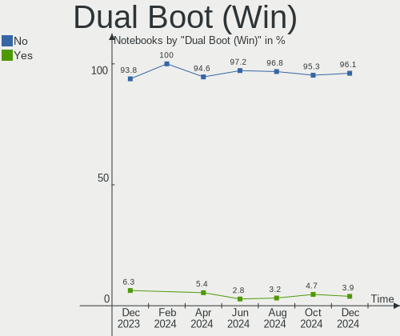
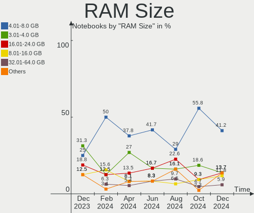
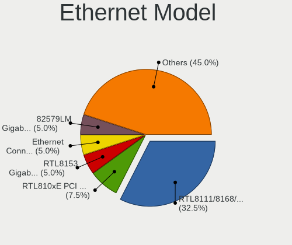
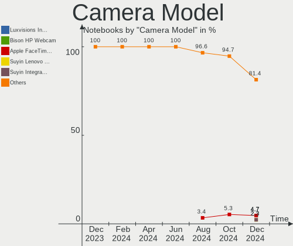

Elementary - Hardware Trends (Notebooks)
----------------------------------------

A project to identify most popular hardware characteristics and track their change
over time based on data collected by Linux users at https://Linux-Hardware.org.

Anyone can contribute to this report by the [hw-probe](https://github.com/linuxhw/hw-probe) tool:

    sudo -E hw-probe -all -upload

This report is for one last month. Overall report since the beginning of time: [TestDays](https://github.com/linuxhw/TestDays)

Period: Feb, 2023.

Contents
--------

* [ System ](#system)
  - [ OS                       ](#os)
  - [ OS Family                ](#os-family)
  - [ Kernel                   ](#kernel)
  - [ Kernel Family            ](#kernel-family)
  - [ Kernel Major Ver.        ](#kernel-major-ver)
  - [ Arch                     ](#arch)
  - [ DE                       ](#de)
  - [ Display Server           ](#display-server)
  - [ Display Manager          ](#display-manager)
  - [ OS Lang                  ](#os-lang)
  - [ Boot Mode                ](#boot-mode)
  - [ Filesystem               ](#filesystem)
  - [ Part. scheme             ](#part-scheme)
  - [ Dual Boot with Linux/BSD ](#dual-boot-with-linuxbsd)
  - [ Dual Boot (Win)          ](#dual-boot-win)

* [ Board ](#board)
  - [ Vendor                   ](#vendor)
  - [ Model                    ](#model)
  - [ Model Family             ](#model-family)
  - [ MFG Year                 ](#mfg-year)
  - [ Form Factor              ](#form-factor)
  - [ Secure Boot              ](#secure-boot)
  - [ Coreboot                 ](#coreboot)
  - [ RAM Size                 ](#ram-size)
  - [ RAM Used                 ](#ram-used)
  - [ Total Drives             ](#total-drives)
  - [ Has CD-ROM               ](#has-cd-rom)
  - [ Has Ethernet             ](#has-ethernet)
  - [ Has WiFi                 ](#has-wifi)
  - [ Has Bluetooth            ](#has-bluetooth)

* [ Location ](#location)
  - [ Country                  ](#country)
  - [ City                     ](#city)

* [ Drives ](#drives)
  - [ Drive Vendor             ](#drive-vendor)
  - [ Drive Model              ](#drive-model)
  - [ HDD Vendor               ](#hdd-vendor)
  - [ SSD Vendor               ](#ssd-vendor)
  - [ Drive Kind               ](#drive-kind)
  - [ Drive Connector          ](#drive-connector)
  - [ Drive Size               ](#drive-size)
  - [ Space Total              ](#space-total)
  - [ Space Used               ](#space-used)
  - [ Malfunc. Drives          ](#malfunc-drives)
  - [ Malfunc. Drive Vendor    ](#malfunc-drive-vendor)
  - [ Malfunc. HDD Vendor      ](#malfunc-hdd-vendor)
  - [ Malfunc. Drive Kind      ](#malfunc-drive-kind)
  - [ Failed Drives            ](#failed-drives)
  - [ Failed Drive Vendor      ](#failed-drive-vendor)
  - [ Drive Status             ](#drive-status)

* [ Storage controller ](#storage-controller)
  - [ Storage Vendor           ](#storage-vendor)
  - [ Storage Model            ](#storage-model)
  - [ Storage Kind             ](#storage-kind)

* [ Processor ](#processor)
  - [ CPU Vendor               ](#cpu-vendor)
  - [ CPU Model                ](#cpu-model)
  - [ CPU Model Family         ](#cpu-model-family)
  - [ CPU Cores                ](#cpu-cores)
  - [ CPU Sockets              ](#cpu-sockets)
  - [ CPU Threads              ](#cpu-threads)
  - [ CPU Op-Modes             ](#cpu-op-modes)
  - [ CPU Microcode            ](#cpu-microcode)
  - [ CPU Microarch            ](#cpu-microarch)

* [ Graphics ](#graphics)
  - [ GPU Vendor               ](#gpu-vendor)
  - [ GPU Model                ](#gpu-model)
  - [ GPU Combo                ](#gpu-combo)
  - [ GPU Driver               ](#gpu-driver)
  - [ GPU Memory               ](#gpu-memory)

* [ Monitor ](#monitor)
  - [ Monitor Vendor           ](#monitor-vendor)
  - [ Monitor Model            ](#monitor-model)
  - [ Monitor Resolution       ](#monitor-resolution)
  - [ Monitor Diagonal         ](#monitor-diagonal)
  - [ Monitor Width            ](#monitor-width)
  - [ Aspect Ratio             ](#aspect-ratio)
  - [ Monitor Area             ](#monitor-area)
  - [ Pixel Density            ](#pixel-density)
  - [ Multiple Monitors        ](#multiple-monitors)

* [ Network ](#network)
  - [ Net Controller Vendor    ](#net-controller-vendor)
  - [ Net Controller Model     ](#net-controller-model)
  - [ Wireless Vendor          ](#wireless-vendor)
  - [ Wireless Model           ](#wireless-model)
  - [ Ethernet Vendor          ](#ethernet-vendor)
  - [ Ethernet Model           ](#ethernet-model)
  - [ Net Controller Kind      ](#net-controller-kind)
  - [ Used Controller          ](#used-controller)
  - [ NICs                     ](#nics)
  - [ IPv6                     ](#ipv6)

* [ Bluetooth ](#bluetooth)
  - [ Bluetooth Vendor         ](#bluetooth-vendor)
  - [ Bluetooth Model          ](#bluetooth-model)

* [ Sound ](#sound)
  - [ Sound Vendor             ](#sound-vendor)
  - [ Sound Model              ](#sound-model)

* [ Memory ](#memory)
  - [ Memory Vendor            ](#memory-vendor)
  - [ Memory Model             ](#memory-model)
  - [ Memory Kind              ](#memory-kind)
  - [ Memory Form Factor       ](#memory-form-factor)
  - [ Memory Size              ](#memory-size)
  - [ Memory Speed             ](#memory-speed)

* [ Printers & scanners ](#printers--scanners)
  - [ Printer Vendor           ](#printer-vendor)
  - [ Printer Model            ](#printer-model)
  - [ Scanner Vendor           ](#scanner-vendor)
  - [ Scanner Model            ](#scanner-model)

* [ Camera ](#camera)
  - [ Camera Vendor            ](#camera-vendor)
  - [ Camera Model             ](#camera-model)

* [ Security ](#security)
  - [ Fingerprint Vendor       ](#fingerprint-vendor)
  - [ Fingerprint Model        ](#fingerprint-model)
  - [ Chipcard Vendor          ](#chipcard-vendor)
  - [ Chipcard Model           ](#chipcard-model)

* [ Unsupported ](#unsupported)
  - [ Unsupported Devices      ](#unsupported-devices)
  - [ Unsupported Device Types ](#unsupported-device-types)

System
------

OS
--

Installed operating systems

| Name           | Notebooks | Percent |
|----------------|-----------|---------|
| Elementary 7   | 27        | 79.41%  |
| Elementary 6.1 | 7         | 20.59%  |

OS Family
---------

OS without a version

| Name       | Notebooks | Percent |
|------------|-----------|---------|
| Elementary | 34        | 100%    |

Kernel
------

Version of the Linux kernel

| Version              | Notebooks | Percent |
|----------------------|-----------|---------|
| 5.15.0-58-generic    | 19        | 55.88%  |
| 5.19.0-32-generic    | 8         | 23.53%  |
| 5.15.0-60-generic    | 5         | 14.71%  |
| 6.1.9-060109-generic | 1         | 2.94%   |
| 5.11.0-43-generic    | 1         | 2.94%   |

Kernel Family
-------------

Linux kernel without a distro release

| Version | Notebooks | Percent |
|---------|-----------|---------|
| 5.15.0  | 24        | 70.59%  |
| 5.19.0  | 8         | 23.53%  |
| 6.1.9   | 1         | 2.94%   |
| 5.11.0  | 1         | 2.94%   |

Kernel Major Ver.
-----------------

Linux kernel major version

| Version | Notebooks | Percent |
|---------|-----------|---------|
| 5.15    | 24        | 70.59%  |
| 5.19    | 8         | 23.53%  |
| 6.1     | 1         | 2.94%   |
| 5.11    | 1         | 2.94%   |

Arch
----

OS architecture (x86_64, i586, etc.)

| Name   | Notebooks | Percent |
|--------|-----------|---------|
| x86_64 | 34        | 100%    |

DE
--

Desktop Environment

| Name     | Notebooks | Percent |
|----------|-----------|---------|
| Pantheon | 34        | 100%    |

Display Server
--------------

X11 or Wayland

| Name | Notebooks | Percent |
|------|-----------|---------|
| X11  | 34        | 100%    |

Display Manager
---------------

SDDM, LightDM, etc.

| Name    | Notebooks | Percent |
|---------|-----------|---------|
| Unknown | 27        | 79.41%  |
| LightDM | 7         | 20.59%  |

OS Lang
-------

Language

| Lang  | Notebooks | Percent |
|-------|-----------|---------|
| de_DE | 10        | 29.41%  |
| en_US | 9         | 26.47%  |
| fr_FR | 3         | 8.82%   |
| es_ES | 3         | 8.82%   |
| ru_RU | 2         | 5.88%   |
| en_GB | 2         | 5.88%   |
| uk_UA | 1         | 2.94%   |
| pt_BR | 1         | 2.94%   |
| nl_NL | 1         | 2.94%   |
| nb_NO | 1         | 2.94%   |
| it_IT | 1         | 2.94%   |

Boot Mode
---------

EFI or BIOS

| Mode | Notebooks | Percent |
|------|-----------|---------|
| BIOS | 28        | 82.35%  |
| EFI  | 6         | 17.65%  |

Filesystem
----------

Type of filesystem

| Type    | Notebooks | Percent |
|---------|-----------|---------|
| Ext4    | 31        | 91.18%  |
| Xfs     | 1         | 2.94%   |
| Overlay | 1         | 2.94%   |
| Btrfs   | 1         | 2.94%   |

Part. scheme
------------

Scheme of partitioning

| Type    | Notebooks | Percent |
|---------|-----------|---------|
| Unknown | 27        | 79.41%  |
| GPT     | 5         | 14.71%  |
| MBR     | 2         | 5.88%   |

Dual Boot with Linux/BSD
------------------------

Hosting more than one Linux/BSD

| Dual boot | Notebooks | Percent |
|-----------|-----------|---------|
| No        | 34        | 100%    |

Dual Boot (Win)
---------------

Hosting Linux and Windows

| Dual boot | Notebooks | Percent |
|-----------|-----------|---------|
| No        | 32        | 94.12%  |
| Yes       | 2         | 5.88%   |

Board
-----

Vendor
------

Motherboard manufacturer

| Name             | Notebooks | Percent |
|------------------|-----------|---------|
| Lenovo           | 6         | 17.65%  |
| Hewlett-Packard  | 6         | 17.65%  |
| Acer             | 5         | 14.71%  |
| Apple            | 4         | 11.76%  |
| Dell             | 3         | 8.82%   |
| ASUSTek Computer | 3         | 8.82%   |
| Toshiba          | 2         | 5.88%   |
| Sony             | 1         | 2.94%   |
| Fujitsu          | 1         | 2.94%   |
| Alienware        | 1         | 2.94%   |
| Acidanthera      | 1         | 2.94%   |
| Unknown          | 1         | 2.94%   |

Model
-----

Motherboard model

| Name                                    | Notebooks | Percent |
|-----------------------------------------|-----------|---------|
| Toshiba Satellite C660                  | 1         | 2.94%   |
| Toshiba Satellite C50D-A                | 1         | 2.94%   |
| Sony SVF1521O4E                         | 1         | 2.94%   |
| Lenovo V14 G2 ITL 82KA                  | 1         | 2.94%   |
| Lenovo ThinkPad X230 23259S9            | 1         | 2.94%   |
| Lenovo ThinkPad T440p 20AWS38H0G        | 1         | 2.94%   |
| Lenovo ThinkPad T400s 2808D9G           | 1         | 2.94%   |
| Lenovo ThinkPad E560 20EV003DSP         | 1         | 2.94%   |
| Lenovo IdeaPad 320-15ABR 80XS           | 1         | 2.94%   |
| HP OMEN by Laptop 17-ck0xxx             | 1         | 2.94%   |
| HP Laptop 17-by3xxx                     | 1         | 2.94%   |
| HP Laptop 14-bs0xx                      | 1         | 2.94%   |
| HP G62                                  | 1         | 2.94%   |
| HP EliteBook 8760w                      | 1         | 2.94%   |
| HP 550                                  | 1         | 2.94%   |
| Fujitsu LIFEBOOK E744                   | 1         | 2.94%   |
| Dell XPS 15 9560                        | 1         | 2.94%   |
| Dell Vostro 3460                        | 1         | 2.94%   |
| Dell Latitude E6400                     | 1         | 2.94%   |
| ASUS ZenBook UX434FAC_UX434FAC          | 1         | 2.94%   |
| ASUS ZenBook UX425EA_UX425EA            | 1         | 2.94%   |
| ASUS VivoBook_ASUSLaptop X513EAN_K513EA | 1         | 2.94%   |
| Apple MacBookPro8,3                     | 1         | 2.94%   |
| Apple MacBookAir6,2                     | 1         | 2.94%   |
| Apple MacBookAir3,1                     | 1         | 2.94%   |
| Apple MacBook4,1                        | 1         | 2.94%   |
| Alienware x17 R2                        | 1         | 2.94%   |
| Acidanthera MacBookPro11,3              | 1         | 2.94%   |
| Acer Aspire V3-771                      | 1         | 2.94%   |
| Acer Aspire one 1-132                   | 1         | 2.94%   |
| Acer Aspire E5-771                      | 1         | 2.94%   |
| Acer Aspire E5-575G                     | 1         | 2.94%   |
| Acer Aspire 8935G                       | 1         | 2.94%   |
| Unknown                                 | 1         | 2.94%   |

Model Family
------------

Motherboard model prefix

| Name                     | Notebooks | Percent |
|--------------------------|-----------|---------|
| Acer Aspire              | 5         | 14.71%  |
| Lenovo ThinkPad          | 4         | 11.76%  |
| Toshiba Satellite        | 2         | 5.88%   |
| HP Laptop                | 2         | 5.88%   |
| ASUS ZenBook             | 2         | 5.88%   |
| Sony SVF1521O4E          | 1         | 2.94%   |
| Lenovo V14               | 1         | 2.94%   |
| Lenovo IdeaPad           | 1         | 2.94%   |
| HP OMEN                  | 1         | 2.94%   |
| HP G62                   | 1         | 2.94%   |
| HP EliteBook             | 1         | 2.94%   |
| HP 550                   | 1         | 2.94%   |
| Fujitsu LIFEBOOK         | 1         | 2.94%   |
| Dell XPS                 | 1         | 2.94%   |
| Dell Vostro              | 1         | 2.94%   |
| Dell Latitude            | 1         | 2.94%   |
| ASUS VivoBook            | 1         | 2.94%   |
| Apple MacBookPro8        | 1         | 2.94%   |
| Apple MacBookAir6        | 1         | 2.94%   |
| Apple MacBookAir3        | 1         | 2.94%   |
| Apple MacBook4           | 1         | 2.94%   |
| Alienware x17            | 1         | 2.94%   |
| Acidanthera MacBookPro11 | 1         | 2.94%   |
| Unknown                  | 1         | 2.94%   |

MFG Year
--------

Motherboard manufacture year

| Year | Notebooks | Percent |
|------|-----------|---------|
| 2021 | 4         | 11.76%  |
| 2020 | 3         | 8.82%   |
| 2017 | 3         | 8.82%   |
| 2016 | 3         | 8.82%   |
| 2014 | 3         | 8.82%   |
| 2013 | 3         | 8.82%   |
| 2012 | 3         | 8.82%   |
| 2010 | 3         | 8.82%   |
| 2008 | 3         | 8.82%   |
| 2015 | 2         | 5.88%   |
| 2009 | 2         | 5.88%   |
| 2022 | 1         | 2.94%   |
| 2011 | 1         | 2.94%   |

Form Factor
-----------

Physical design of the computer

| Name     | Notebooks | Percent |
|----------|-----------|---------|
| Notebook | 34        | 100%    |

Secure Boot
-----------

Enabled or disabled

| State    | Notebooks | Percent |
|----------|-----------|---------|
| Disabled | 34        | 100%    |

Coreboot
--------

Have coreboot on board

| Used | Notebooks | Percent |
|------|-----------|---------|
| No   | 34        | 100%    |

RAM Size
--------

Total RAM memory

| Size in GB | Notebooks | Percent |
|------------|-----------|---------|
| 4.01-8.0   | 10        | 29.41%  |
| 3.01-4.0   | 10        | 29.41%  |
| 16.01-24.0 | 6         | 17.65%  |
| 8.01-16.0  | 4         | 11.76%  |
| 1.01-2.0   | 2         | 5.88%   |
| 32.01-64.0 | 1         | 2.94%   |
| 2.01-3.0   | 1         | 2.94%   |

RAM Used
--------

Used RAM memory

| Used GB   | Notebooks | Percent |
|-----------|-----------|---------|
| 1.01-2.0  | 12        | 35.29%  |
| 2.01-3.0  | 11        | 32.35%  |
| 4.01-8.0  | 5         | 14.71%  |
| 3.01-4.0  | 4         | 11.76%  |
| 8.01-16.0 | 1         | 2.94%   |
| 0.51-1.0  | 1         | 2.94%   |

Total Drives
------------

Number of drives on board

| Drives | Notebooks | Percent |
|--------|-----------|---------|
| 1      | 25        | 73.53%  |
| 2      | 8         | 23.53%  |
| 0      | 1         | 2.94%   |

Has CD-ROM
----------

Has CD-ROM on board

| Presented | Notebooks | Percent |
|-----------|-----------|---------|
| Yes       | 18        | 52.94%  |
| No        | 16        | 47.06%  |

Has Ethernet
------------

Has Ethernet on board

| Presented | Notebooks | Percent |
|-----------|-----------|---------|
| Yes       | 26        | 76.47%  |
| No        | 8         | 23.53%  |

Has WiFi
--------

Has WiFi module

| Presented | Notebooks | Percent |
|-----------|-----------|---------|
| Yes       | 34        | 100%    |

Has Bluetooth
-------------

Has Bluetooth module

| Presented | Notebooks | Percent |
|-----------|-----------|---------|
| Yes       | 28        | 82.35%  |
| No        | 6         | 17.65%  |

Location
--------

Country
-------

Geographic location (country)

| Country    | Notebooks | Percent |
|------------|-----------|---------|
| Germany    | 10        | 29.41%  |
| USA        | 6         | 17.65%  |
| France     | 3         | 8.82%   |
| UK         | 2         | 5.88%   |
| Russia     | 2         | 5.88%   |
| Tunisia    | 1         | 2.94%   |
| Spain      | 1         | 2.94%   |
| Poland     | 1         | 2.94%   |
| Norway     | 1         | 2.94%   |
| Mexico     | 1         | 2.94%   |
| Kazakhstan | 1         | 2.94%   |
| Italy      | 1         | 2.94%   |
| Georgia    | 1         | 2.94%   |
| China      | 1         | 2.94%   |
| Brazil     | 1         | 2.94%   |
| Belgium    | 1         | 2.94%   |

City
----

Geographic location (city)

| City             | Notebooks | Percent |
|------------------|-----------|---------|
| Berlin           | 2         | 5.88%   |
| Zhuantang        | 1         | 2.94%   |
| Wuppertal        | 1         | 2.94%   |
| Wilster          | 1         | 2.94%   |
| West Monroe      | 1         | 2.94%   |
| Warsaw           | 1         | 2.94%   |
| Twickenham       | 1         | 2.94%   |
| Tunis            | 1         | 2.94%   |
| Tromsø          | 1         | 2.94%   |
| Tbilisi          | 1         | 2.94%   |
| Stuttgart        | 1         | 2.94%   |
| St Petersburg    | 1         | 2.94%   |
| St Albans        | 1         | 2.94%   |
| Salzgitter       | 1         | 2.94%   |
| Reading          | 1         | 2.94%   |
| Puebla City      | 1         | 2.94%   |
| Pforzheim        | 1         | 2.94%   |
| Nesso            | 1         | 2.94%   |
| Miami            | 1         | 2.94%   |
| Madrid           | 1         | 2.94%   |
| Louisville       | 1         | 2.94%   |
| Koksijde         | 1         | 2.94%   |
| Hamm             | 1         | 2.94%   |
| Grenoble         | 1         | 2.94%   |
| Farroupilha      | 1         | 2.94%   |
| Essen            | 1         | 2.94%   |
| Eilenburg        | 1         | 2.94%   |
| Columbus         | 1         | 2.94%   |
| Clovis           | 1         | 2.94%   |
| Chelyabinsk      | 1         | 2.94%   |
| Cenon-sur-Vienne | 1         | 2.94%   |
| Aubagne          | 1         | 2.94%   |
| Astana           | 1         | 2.94%   |

Drives
------

Drive Vendor
------------

Hard drive vendors

| Vendor                   | Notebooks | Drives | Percent |
|--------------------------|-----------|--------|---------|
| Unknown                  | 4         | 5      | 9.76%   |
| Samsung Electronics      | 4         | 4      | 9.76%   |
| Crucial                  | 4         | 4      | 9.76%   |
| WDC                      | 3         | 3      | 7.32%   |
| Toshiba                  | 3         | 3      | 7.32%   |
| SanDisk                  | 3         | 3      | 7.32%   |
| Apple                    | 3         | 3      | 7.32%   |
| Seagate                  | 2         | 2      | 4.88%   |
| Union Memory             | 1         | 1      | 2.44%   |
| SPCC                     | 1         | 1      | 2.44%   |
| Realtek Semiconductor    | 1         | 2      | 2.44%   |
| Phison Electronics       | 1         | 1      | 2.44%   |
| OWC                      | 1         | 1      | 2.44%   |
| Micron Technology        | 1         | 1      | 2.44%   |
| KIOXIA                   | 1         | 1      | 2.44%   |
| JMicron Technology       | 1         | 1      | 2.44%   |
| JetFlash                 | 1         | 1      | 2.44%   |
| Intenso                  | 1         | 1      | 2.44%   |
| Intel                    | 1         | 1      | 2.44%   |
| GeIL                     | 1         | 1      | 2.44%   |
| Fujitsu                  | 1         | 1      | 2.44%   |
| Biwin Storage Technology | 1         | 1      | 2.44%   |
| A-DATA Technology        | 1         | 1      | 2.44%   |

Drive Model
-----------

Hard drive models

| Model                                   | Notebooks | Percent |
|-----------------------------------------|-----------|---------|
| Unknown MMC Card  64GB                  | 2         | 4.65%   |
| Unknown MMC Card  32GB                  | 2         | 4.65%   |
| WDC WDS500G2B0A-00SM50 500GB SSD        | 1         | 2.33%   |
| WDC WD5000LPVX-22V0TT0 500GB            | 1         | 2.33%   |
| WDC WD10SPCX-08S8TT0 1TB                | 1         | 2.33%   |
| Unknown MMC Card  256GB                 | 1         | 2.33%   |
| Union Memory UMIS RPJTJ512MEE1OWX 512GB | 1         | 2.33%   |
| Toshiba THNS128GG4BAAA-NonFDE 128GB SSD | 1         | 2.33%   |
| Toshiba MQ01ABF050 500GB                | 1         | 2.33%   |
| Toshiba MQ01ABD100 1TB                  | 1         | 2.33%   |
| SPCC Solid State Disk 512GB             | 1         | 2.33%   |
| Seagate Photo Drive 2TB                 | 1         | 2.33%   |
| Seagate Expansion 1TB                   | 1         | 2.33%   |
| Sandisk WD Black SN850 500GB            | 1         | 2.33%   |
| SanDisk SSD PLUS 480GB                  | 1         | 2.33%   |
| SanDisk SDSSDH3 500G                    | 1         | 2.33%   |
| Samsung SSD 860 EVO 1TB                 | 1         | 2.33%   |
| Samsung SSD 850 PRO 256GB               | 1         | 2.33%   |
| Samsung SSD 850 EVO 500GB               | 1         | 2.33%   |
| Samsung MZVL2512HCJQ-00BH1 512GB        | 1         | 2.33%   |
| Realtek SX6000PBR1-256GB                | 1         | 2.33%   |
| Realtek NVMe SSD Drive 256GB            | 1         | 2.33%   |
| Phison E12 NVMe Controller 1024GB       | 1         | 2.33%   |
| OWC Mercury Electra 6G SSD              | 1         | 2.33%   |
| Micron 2210_MTFDHBA512QFD 512GB         | 1         | 2.33%   |
| KIOXIA KBG40ZNV512G 512GB               | 1         | 2.33%   |
| JMicron Generic 200GB                   | 1         | 2.33%   |
| JetFlash Transcend 128GB                | 1         | 2.33%   |
| Intenso SSD SATAIII 256GB               | 1         | 2.33%   |
| Intel SSD 660P Series 1024GB            | 1         | 2.33%   |
| GeIL Z3_512GB                           | 1         | 2.33%   |
| Fujitsu MHV2080BH 80GB                  | 1         | 2.33%   |
| Crucial CT500MX500SSD1 500GB            | 1         | 2.33%   |
| Crucial CT275MX300SSD1 275GB            | 1         | 2.33%   |
| Crucial CT250MX500SSD1 250GB            | 1         | 2.33%   |
| Crucial CT240BX500SSD1 240GB            | 1         | 2.33%   |
| Biwin Storage HP SSD EX900 500GB        | 1         | 2.33%   |
| Apple SSD TS128C 121GB                  | 1         | 2.33%   |
| Apple SSD SM0512F 500GB                 | 1         | 2.33%   |
| Apple SSD SD0256F 256GB                 | 1         | 2.33%   |

HDD Vendor
----------

Hard disk drive vendors

| Vendor             | Notebooks | Drives | Percent |
|--------------------|-----------|--------|---------|
| WDC                | 2         | 2      | 28.57%  |
| Toshiba            | 2         | 2      | 28.57%  |
| Seagate            | 1         | 1      | 14.29%  |
| JMicron Technology | 1         | 1      | 14.29%  |
| Fujitsu            | 1         | 1      | 14.29%  |

SSD Vendor
----------

Solid state drive vendors

| Vendor              | Notebooks | Drives | Percent |
|---------------------|-----------|--------|---------|
| Crucial             | 4         | 4      | 22.22%  |
| Samsung Electronics | 3         | 3      | 16.67%  |
| Apple               | 3         | 3      | 16.67%  |
| SanDisk             | 2         | 2      | 11.11%  |
| WDC                 | 1         | 1      | 5.56%   |
| Toshiba             | 1         | 1      | 5.56%   |
| SPCC                | 1         | 1      | 5.56%   |
| OWC                 | 1         | 1      | 5.56%   |
| Intenso             | 1         | 1      | 5.56%   |
| A-DATA Technology   | 1         | 1      | 5.56%   |

Drive Kind
----------

HDD or SSD

| Kind    | Notebooks | Drives | Percent |
|---------|-----------|--------|---------|
| SSD     | 17        | 18     | 45.95%  |
| NVMe    | 8         | 10     | 21.62%  |
| HDD     | 5         | 7      | 13.51%  |
| MMC     | 4         | 5      | 10.81%  |
| Unknown | 3         | 3      | 8.11%   |

Drive Connector
---------------

SATA, SAS, NVMe, etc.

| Type | Notebooks | Drives | Percent |
|------|-----------|--------|---------|
| SATA | 23        | 24     | 60.53%  |
| NVMe | 8         | 10     | 21.05%  |
| MMC  | 4         | 5      | 10.53%  |
| SAS  | 3         | 4      | 7.89%   |

Drive Size
----------

Size of hard drive

| Size in TB | Notebooks | Drives | Percent |
|------------|-----------|--------|---------|
| 0.01-0.5   | 19        | 20     | 82.61%  |
| 0.51-1.0   | 4         | 5      | 17.39%  |

Space Total
-----------

Amount of disk space available on the file system

| Size in GB | Notebooks | Percent |
|------------|-----------|---------|
| 251-500    | 14        | 41.18%  |
| 101-250    | 13        | 38.24%  |
| 501-1000   | 2         | 5.88%   |
| 51-100     | 2         | 5.88%   |
| 21-50      | 1         | 2.94%   |
| 2001-3000  | 1         | 2.94%   |
| 1-20       | 1         | 2.94%   |

Space Used
----------

Amount of used disk space

| Used GB   | Notebooks | Percent |
|-----------|-----------|---------|
| 1-20      | 16        | 47.06%  |
| 21-50     | 9         | 26.47%  |
| 101-250   | 5         | 14.71%  |
| 51-100    | 3         | 8.82%   |
| 1001-2000 | 1         | 2.94%   |

Malfunc. Drives
---------------

Drive models with a malfunction

Zero info for selected period =(

Malfunc. Drive Vendor
---------------------

Vendors of faulty drives

Zero info for selected period =(

Malfunc. HDD Vendor
-------------------

Vendors of faulty HDD drives

Zero info for selected period =(

Malfunc. Drive Kind
-------------------

Kinds of faulty drives

Zero info for selected period =(

Failed Drives
-------------

Failed drive models

Zero info for selected period =(

Failed Drive Vendor
-------------------

Failed drive vendors

Zero info for selected period =(

Drive Status
------------

Number of failed and malfunc. drives

| Status   | Notebooks | Drives | Percent |
|----------|-----------|--------|---------|
| Detected | 31        | 40     | 91.18%  |
| Works    | 3         | 3      | 8.82%   |

Storage controller
------------------

Storage Vendor
--------------

Storage controller vendors

| Vendor                   | Notebooks | Percent |
|--------------------------|-----------|---------|
| Intel                    | 27        | 67.5%   |
| Samsung Electronics      | 2         | 5%      |
| AMD                      | 2         | 5%      |
| Union Memory (Shenzhen)  | 1         | 2.5%    |
| SanDisk                  | 1         | 2.5%    |
| Realtek Semiconductor    | 1         | 2.5%    |
| Phison Electronics       | 1         | 2.5%    |
| Nvidia                   | 1         | 2.5%    |
| Micron Technology        | 1         | 2.5%    |
| Marvell Technology Group | 1         | 2.5%    |
| KIOXIA                   | 1         | 2.5%    |
| Biwin Storage Technology | 1         | 2.5%    |

Storage Model
-------------

Storage controller models

| Model                                                                            | Notebooks | Percent |
|----------------------------------------------------------------------------------|-----------|---------|
| Intel Volume Management Device NVMe RAID Controller                              | 5         | 10.87%  |
| Intel 7 Series Chipset Family 6-port SATA Controller [AHCI mode]                 | 4         | 8.7%    |
| Intel Tiger Lake-LP SATA Controller                                              | 2         | 4.35%   |
| Intel Sunrise Point-LP SATA Controller [AHCI mode]                               | 2         | 4.35%   |
| Intel 82801IBM/IEM (ICH9M/ICH9M-E) 4 port SATA Controller [AHCI mode]            | 2         | 4.35%   |
| Intel 82801HM/HEM (ICH8M/ICH8M-E) SATA Controller [AHCI mode]                    | 2         | 4.35%   |
| Intel 82801HM/HEM (ICH8M/ICH8M-E) IDE Controller                                 | 2         | 4.35%   |
| Intel 82801 Mobile SATA Controller [RAID mode]                                   | 2         | 4.35%   |
| Intel 8 Series/C220 Series Chipset Family 6-port SATA Controller 1 [AHCI mode]   | 2         | 4.35%   |
| Intel 6 Series/C200 Series Chipset Family 6 port Mobile SATA AHCI Controller     | 2         | 4.35%   |
| Intel 5 Series/3400 Series Chipset 4 port SATA AHCI Controller                   | 2         | 4.35%   |
| Union Memory (Shenzhen) Non-Volatile memory controller                           | 1         | 2.17%   |
| SanDisk WD PC SN810 / Black SN850 NVMe SSD                                       | 1         | 2.17%   |
| Samsung NVMe SSD Controller PM9A1/PM9A3/980PRO                                   | 1         | 2.17%   |
| Samsung Apple PCIe SSD                                                           | 1         | 2.17%   |
| Realtek Realtek Non-Volatile memory controller                                   | 1         | 2.17%   |
| Phison E12 NVMe Controller                                                       | 1         | 2.17%   |
| Nvidia MCP89 SATA Controller (AHCI mode)                                         | 1         | 2.17%   |
| Micron Non-Volatile memory controller                                            | 1         | 2.17%   |
| Marvell Group 88SS9183 PCIe SSD Controller                                       | 1         | 2.17%   |
| KIOXIA NVMe SSD Controller BG4                                                   | 1         | 2.17%   |
| Intel SSD 660P Series                                                            | 1         | 2.17%   |
| Intel Mobile 4 Series Chipset PT IDER Controller                                 | 1         | 2.17%   |
| Intel HM170/QM170 Chipset SATA Controller [AHCI Mode]                            | 1         | 2.17%   |
| Intel Celeron N3350/Pentium N4200/Atom E3900 Series SATA AHCI Controller         | 1         | 2.17%   |
| Intel Atom/Celeron/Pentium Processor x5-E8000/J3xxx/N3xxx Series SATA Controller | 1         | 2.17%   |
| Intel 8 Series SATA Controller 1 [AHCI mode]                                     | 1         | 2.17%   |
| Biwin Storage Non-Volatile memory controller                                     | 1         | 2.17%   |
| AMD FCH SATA Controller [IDE mode]                                               | 1         | 2.17%   |
| AMD FCH SATA Controller [AHCI mode]                                              | 1         | 2.17%   |

Storage Kind
------------

Kind of storage controller (IDE, SATA, NVMe, SAS, ...)

| Kind | Notebooks | Percent |
|------|-----------|---------|
| SATA | 27        | 60%     |
| NVMe | 8         | 17.78%  |
| RAID | 7         | 15.56%  |
| IDE  | 3         | 6.67%   |

Processor
---------

CPU Vendor
----------

Processor vendors

| Vendor | Notebooks | Percent |
|--------|-----------|---------|
| Intel  | 32        | 94.12%  |
| AMD    | 2         | 5.88%   |

CPU Model
---------

Processor models

| Model                                           | Notebooks | Percent |
|-------------------------------------------------|-----------|---------|
| Intel Celeron CPU N3060 @ 1.60GHz               | 2         | 5.88%   |
| Intel 11th Gen Core i7-1165G7 @ 2.80GHz         | 2         | 5.88%   |
| Intel Core i7-6500U CPU @ 2.50GHz               | 1         | 2.94%   |
| Intel Core i7-4870HQ CPU @ 2.50GHz              | 1         | 2.94%   |
| Intel Core i7-2720QM CPU @ 2.20GHz              | 1         | 2.94%   |
| Intel Core i7-10510U CPU @ 1.80GHz              | 1         | 2.94%   |
| Intel Core i5-7300HQ CPU @ 2.50GHz              | 1         | 2.94%   |
| Intel Core i5-7200U CPU @ 2.50GHz               | 1         | 2.94%   |
| Intel Core i5-4300M CPU @ 2.60GHz               | 1         | 2.94%   |
| Intel Core i5-4250U CPU @ 1.30GHz               | 1         | 2.94%   |
| Intel Core i5-4210M CPU @ 2.60GHz               | 1         | 2.94%   |
| Intel Core i5-3337U CPU @ 1.80GHz               | 1         | 2.94%   |
| Intel Core i5-3320M CPU @ 2.60GHz               | 1         | 2.94%   |
| Intel Core i5-3230M CPU @ 2.60GHz               | 1         | 2.94%   |
| Intel Core i5-2540M CPU @ 2.60GHz               | 1         | 2.94%   |
| Intel Core i5-1035G1 CPU @ 1.00GHz              | 1         | 2.94%   |
| Intel Core i5 CPU M 460 @ 2.53GHz               | 1         | 2.94%   |
| Intel Core i3-4005U CPU @ 1.70GHz               | 1         | 2.94%   |
| Intel Core i3-3120M CPU @ 2.50GHz               | 1         | 2.94%   |
| Intel Core i3 CPU M 380 @ 2.53GHz               | 1         | 2.94%   |
| Intel Core 2 Duo CPU U9400 @ 1.40GHz            | 1         | 2.94%   |
| Intel Core 2 Duo CPU T8300 @ 2.40GHz            | 1         | 2.94%   |
| Intel Core 2 Duo CPU P9400 @ 2.40GHz            | 1         | 2.94%   |
| Intel Core 2 Duo CPU P8700 @ 2.53GHz            | 1         | 2.94%   |
| Intel Core 2 Duo CPU P7450 @ 2.13GHz            | 1         | 2.94%   |
| Intel Celeron CPU N3450 @ 1.10GHz               | 1         | 2.94%   |
| Intel Celeron CPU 550 @ 2.00GHz                 | 1         | 2.94%   |
| Intel 12th Gen Core i7-12700H                   | 1         | 2.94%   |
| Intel 11th Gen Core i7-11800H @ 2.30GHz         | 1         | 2.94%   |
| Intel 11th Gen Core i5-1135G7 @ 2.40GHz         | 1         | 2.94%   |
| AMD E1-1200 APU with Radeon HD Graphics         | 1         | 2.94%   |
| AMD A12-9720P RADEON R7, 12 COMPUTE CORES 4C+8G | 1         | 2.94%   |

CPU Model Family
----------------

Processor model prefix

| Model            | Notebooks | Percent |
|------------------|-----------|---------|
| Intel Core i5    | 11        | 32.35%  |
| Other            | 5         | 14.71%  |
| Intel Core 2 Duo | 5         | 14.71%  |
| Intel Core i7    | 4         | 11.76%  |
| Intel Celeron    | 4         | 11.76%  |
| Intel Core i3    | 3         | 8.82%   |
| AMD E1           | 1         | 2.94%   |
| AMD A12          | 1         | 2.94%   |

CPU Cores
---------

Number of processor cores

| Number | Notebooks | Percent |
|--------|-----------|---------|
| 2      | 22        | 64.71%  |
| 4      | 9         | 26.47%  |
| 14     | 1         | 2.94%   |
| 8      | 1         | 2.94%   |
| 1      | 1         | 2.94%   |

CPU Sockets
-----------

Number of sockets

| Number | Notebooks | Percent |
|--------|-----------|---------|
| 1      | 34        | 100%    |

CPU Threads
-----------

Threads per core (Hyper-Threading)

| Number | Notebooks | Percent |
|--------|-----------|---------|
| 2      | 23        | 67.65%  |
| 1      | 11        | 32.35%  |

CPU Op-Modes
------------

CPU Operation Modes (32-bit, 64-bit)

| Op mode        | Notebooks | Percent |
|----------------|-----------|---------|
| 32-bit, 64-bit | 34        | 100%    |

CPU Microcode
-------------

Microcode number

| Number     | Notebooks | Percent |
|------------|-----------|---------|
| Unknown    | 21        | 61.76%  |
| 0x806ec    | 1         | 2.94%   |
| 0x806d1    | 1         | 2.94%   |
| 0x806c1    | 1         | 2.94%   |
| 0x706e5    | 1         | 2.94%   |
| 0x506c9    | 1         | 2.94%   |
| 0x406c4    | 1         | 2.94%   |
| 0x40661    | 1         | 2.94%   |
| 0x40651    | 1         | 2.94%   |
| 0x206a7    | 1         | 2.94%   |
| 0x20655    | 1         | 2.94%   |
| 0x1067a    | 1         | 2.94%   |
| 0x10676    | 1         | 2.94%   |
| 0x05000119 | 1         | 2.94%   |

CPU Microarch
-------------

Microarchitecture

| Name        | Notebooks | Percent |
|-------------|-----------|---------|
| Penryn      | 5         | 14.71%  |
| Haswell     | 5         | 14.71%  |
| IvyBridge   | 4         | 11.76%  |
| TigerLake   | 3         | 8.82%   |
| KabyLake    | 3         | 8.82%   |
| Westmere    | 2         | 5.88%   |
| Silvermont  | 2         | 5.88%   |
| SandyBridge | 2         | 5.88%   |
| Unknown     | 2         | 5.88%   |
| Skylake     | 1         | 2.94%   |
| IceLake     | 1         | 2.94%   |
| Goldmont    | 1         | 2.94%   |
| Excavator   | 1         | 2.94%   |
| Core        | 1         | 2.94%   |
| Bobcat      | 1         | 2.94%   |

Graphics
--------

GPU Vendor
----------

Vendors of graphics cards

| Vendor | Notebooks | Percent |
|--------|-----------|---------|
| Intel  | 28        | 66.67%  |
| Nvidia | 8         | 19.05%  |
| AMD    | 6         | 14.29%  |

GPU Model
---------

Graphics card models

| Model                                                                                    | Notebooks | Percent |
|------------------------------------------------------------------------------------------|-----------|---------|
| Intel 3rd Gen Core processor Graphics Controller                                         | 4         | 9.09%   |
| Intel TigerLake-LP GT2 [Iris Xe Graphics]                                                | 3         | 6.82%   |
| Intel Mobile 4 Series Chipset Integrated Graphics Controller                             | 2         | 4.55%   |
| Intel Haswell-ULT Integrated Graphics Controller                                         | 2         | 4.55%   |
| Intel Core Processor Integrated Graphics Controller                                      | 2         | 4.55%   |
| Intel Atom/Celeron/Pentium Processor x5-E8000/J3xxx/N3xxx Integrated Graphics Controller | 2         | 4.55%   |
| Intel 4th Gen Core Processor Integrated Graphics Controller                              | 2         | 4.55%   |
| Nvidia MCP89 [GeForce 320M]                                                              | 1         | 2.27%   |
| Nvidia GP107M [GeForce GTX 1050 Mobile]                                                  | 1         | 2.27%   |
| Nvidia GM107M [GeForce GTX 950M]                                                         | 1         | 2.27%   |
| Nvidia GK107M [GeForce GT 750M Mac Edition]                                              | 1         | 2.27%   |
| Nvidia GF117M [GeForce 610M/710M/810M/820M / GT 620M/625M/630M/720M]                     | 1         | 2.27%   |
| Nvidia GA106M [GeForce RTX 3060 Mobile / Max-Q]                                          | 1         | 2.27%   |
| Nvidia GA103M [GeForce RTX 3080 Ti Laptop GPU]                                           | 1         | 2.27%   |
| Nvidia G98M [Quadro NVS 160M]                                                            | 1         | 2.27%   |
| Intel TigerLake-H GT1 [UHD Graphics]                                                     | 1         | 2.27%   |
| Intel Skylake GT2 [HD Graphics 520]                                                      | 1         | 2.27%   |
| Intel Mobile GME965/GLE960 Integrated Graphics Controller                                | 1         | 2.27%   |
| Intel Mobile GM965/GL960 Integrated Graphics Controller (secondary)                      | 1         | 2.27%   |
| Intel Mobile GM965/GL960 Integrated Graphics Controller (primary)                        | 1         | 2.27%   |
| Intel Iris Plus Graphics G1 (Ice Lake)                                                   | 1         | 2.27%   |
| Intel HD Graphics 630                                                                    | 1         | 2.27%   |
| Intel HD Graphics 620                                                                    | 1         | 2.27%   |
| Intel HD Graphics 500                                                                    | 1         | 2.27%   |
| Intel CometLake-U GT2 [UHD Graphics]                                                     | 1         | 2.27%   |
| Intel Alder Lake-P Integrated Graphics Controller                                        | 1         | 2.27%   |
| Intel 2nd Generation Core Processor Family Integrated Graphics Controller                | 1         | 2.27%   |
| AMD Wrestler [Radeon HD 7310]                                                            | 1         | 2.27%   |
| AMD Whistler [Radeon HD 6730M/6770M/7690M XT]                                            | 1         | 2.27%   |
| AMD Wani [Radeon R5/R6/R7 Graphics]                                                      | 1         | 2.27%   |
| AMD Topaz XT [Radeon R7 M260/M265 / M340/M360 / M440/M445 / 530/535 / 620/625 Mobile]    | 1         | 2.27%   |
| AMD RV730/M96-XT [Mobility Radeon HD 4670]                                               | 1         | 2.27%   |
| AMD Park [Mobility Radeon HD 5430/5450/5470]                                             | 1         | 2.27%   |
| AMD Mars [Radeon HD 8670A/8670M/8750M / R7 M370]                                         | 1         | 2.27%   |

GPU Combo
---------

Combinations of graphics cards

| Name           | Notebooks | Percent |
|----------------|-----------|---------|
| 1 x Intel      | 20        | 58.82%  |
| Intel + Nvidia | 5         | 14.71%  |
| 1 x Nvidia     | 3         | 8.82%   |
| Intel + AMD    | 3         | 8.82%   |
| 1 x AMD        | 2         | 5.88%   |
| 2 x AMD        | 1         | 2.94%   |

GPU Driver
----------

Free vs proprietary

| Driver      | Notebooks | Percent |
|-------------|-----------|---------|
| Free        | 32        | 94.12%  |
| Proprietary | 1         | 2.94%   |
| Unknown     | 1         | 2.94%   |

GPU Memory
----------

Total video memory

| Size in GB | Notebooks | Percent |
|------------|-----------|---------|
| Unknown    | 29        | 85.29%  |
| 0.01-0.5   | 3         | 8.82%   |
| 1.01-2.0   | 1         | 2.94%   |
| 0.51-1.0   | 1         | 2.94%   |

Monitor
-------

Monitor Vendor
--------------

Monitor vendors

| Vendor                  | Notebooks | Percent |
|-------------------------|-----------|---------|
| AU Optronics            | 8         | 21.62%  |
| LG Display              | 5         | 13.51%  |
| Apple                   | 5         | 13.51%  |
| Chimei Innolux          | 4         | 10.81%  |
| Samsung Electronics     | 3         | 8.11%   |
| Lenovo                  | 2         | 5.41%   |
| BOE                     | 2         | 5.41%   |
| Toshiba                 | 1         | 2.7%    |
| Sharp                   | 1         | 2.7%    |
| Mi                      | 1         | 2.7%    |
| LG Philips              | 1         | 2.7%    |
| KDC                     | 1         | 2.7%    |
| Dell                    | 1         | 2.7%    |
| Chi Mei Optoelectronics | 1         | 2.7%    |
| BenQ                    | 1         | 2.7%    |

Monitor Model
-------------

Monitor models

| Model                                                                     | Notebooks | Percent |
|---------------------------------------------------------------------------|-----------|---------|
| Toshiba ScreenXpert TSB8888 1080x2160                                     | 1         | 2.7%    |
| Sharp LCD Monitor SHP1453 1920x1080 346x194mm 15.6-inch                   | 1         | 2.7%    |
| Samsung Electronics LCD Monitor SEC3150 1366x768 344x193mm 15.5-inch      | 1         | 2.7%    |
| Samsung Electronics LCD Monitor SDC4347 1366x768 344x193mm 15.5-inch      | 1         | 2.7%    |
| Samsung Electronics LCD Monitor SDC4161 1920x1080 344x194mm 15.5-inch     | 1         | 2.7%    |
| Mi Monitor XMI3444 3440x1440 797x334mm 34.0-inch                          | 1         | 2.7%    |
| LG Philips LCD Monitor LPLB900 1280x800 330x210mm 15.4-inch               | 1         | 2.7%    |
| LG Display LCD Monitor LGD04A7 1920x1080 344x194mm 15.5-inch              | 1         | 2.7%    |
| LG Display LCD Monitor LGD046D 1920x1080 309x174mm 14.0-inch              | 1         | 2.7%    |
| LG Display LCD Monitor LGD035C 1366x768 309x174mm 14.0-inch               | 1         | 2.7%    |
| LG Display LCD Monitor LGD02D8 1366x768 277x156mm 12.5-inch               | 1         | 2.7%    |
| LG Display LCD Monitor LGD0285 1920x1080 383x215mm 17.3-inch              | 1         | 2.7%    |
| Lenovo LEN S22e-19 LEN61C9 1920x1080 476x268mm 21.5-inch                  | 1         | 2.7%    |
| Lenovo LCD Monitor LEN4036 1440x900 303x190mm 14.1-inch                   | 1         | 2.7%    |
| KDC LCD Monitor KDC05F1 1366x768 344x193mm 15.5-inch                      | 1         | 2.7%    |
| Dell 1908FP DEL4025 1280x1024 376x301mm 19.0-inch                         | 1         | 2.7%    |
| Chimei Innolux LCD Monitor CMN175E 1920x1080 381x214mm 17.2-inch          | 1         | 2.7%    |
| Chimei Innolux LCD Monitor CMN1728 1600x900 382x215mm 17.3-inch           | 1         | 2.7%    |
| Chimei Innolux LCD Monitor CMN15DB 1366x768 344x193mm 15.5-inch           | 1         | 2.7%    |
| Chimei Innolux LCD Monitor CMN1132 1366x768 256x144mm 11.6-inch           | 1         | 2.7%    |
| Chi Mei Optoelectronics LCD Monitor CMO1807 1920x1080 408x230mm 18.4-inch | 1         | 2.7%    |
| BOE LCD Monitor BOE07E9 1920x1080 309x174mm 14.0-inch                     | 1         | 2.7%    |
| BOE LCD Monitor BOE0675 1366x768 344x194mm 15.5-inch                      | 1         | 2.7%    |
| BenQ GL2460 BNQ78CE 1920x1080 531x299mm 24.0-inch                         | 1         | 2.7%    |
| AU Optronics LCD Monitor AUOBD90 1920x1080 382x215mm 17.3-inch            | 1         | 2.7%    |
| AU Optronics LCD Monitor AUOA48F 1920x1080 309x174mm 14.0-inch            | 1         | 2.7%    |
| AU Optronics LCD Monitor AUO45EC 1366x768 344x193mm 15.5-inch             | 1         | 2.7%    |
| AU Optronics LCD Monitor AUO4544 1280x800 304x190mm 14.1-inch             | 1         | 2.7%    |
| AU Optronics LCD Monitor AUO22EC 1366x768 344x193mm 15.5-inch             | 1         | 2.7%    |
| AU Optronics LCD Monitor AUO208D 1920x1080 309x174mm 14.0-inch            | 1         | 2.7%    |
| AU Optronics LCD Monitor AUO119E 1600x900 382x214mm 17.2-inch             | 1         | 2.7%    |
| AU Optronics LCD Monitor AUO0A97 1920x1080 382x215mm 17.3-inch            | 1         | 2.7%    |
| Apple LCD Monitor Color LCD 2880x1800                                     | 1         | 2.7%    |
| Apple LCD Monitor APP9CCD 1920x1200 367x230mm 17.1-inch                   | 1         | 2.7%    |
| Apple LCD Monitor APP9C5F 1280x800 286x179mm 13.3-inch                    | 1         | 2.7%    |
| Apple Color LCD APP9CF2 1366x768 256x144mm 11.6-inch                      | 1         | 2.7%    |
| Apple Color LCD APP9CDF 1440x900 286x179mm 13.3-inch                      | 1         | 2.7%    |

Monitor Resolution
------------------

Monitor screen resolution

| Resolution        | Notebooks | Percent |
|-------------------|-----------|---------|
| 1920x1080 (FHD)   | 12        | 34.29%  |
| 1366x768 (WXGA)   | 11        | 31.43%  |
| 1280x800 (WXGA)   | 3         | 8.57%   |
| 1600x900 (HD+)    | 2         | 5.71%   |
| 1440x900 (WXGA+)  | 2         | 5.71%   |
| 1280x1024 (SXGA)  | 2         | 5.71%   |
| 3440x1440         | 1         | 2.86%   |
| 2880x1800         | 1         | 2.86%   |
| 1920x1200 (WUXGA) | 1         | 2.86%   |

Monitor Diagonal
----------------

Diagonal size in inches

| Inches  | Notebooks | Percent |
|---------|-----------|---------|
| 15      | 11        | 29.73%  |
| 17      | 7         | 18.92%  |
| 14      | 7         | 18.92%  |
| 13      | 2         | 5.41%   |
| 11      | 2         | 5.41%   |
| 34      | 1         | 2.7%    |
| 26      | 1         | 2.7%    |
| 24      | 1         | 2.7%    |
| 21      | 1         | 2.7%    |
| 19      | 1         | 2.7%    |
| 18      | 1         | 2.7%    |
| 12      | 1         | 2.7%    |
| Unknown | 1         | 2.7%    |

Monitor Width
-------------

Physical width

| Width in mm | Notebooks | Percent |
|-------------|-----------|---------|
| 301-350     | 18        | 48.65%  |
| 351-400     | 8         | 21.62%  |
| 201-300     | 5         | 13.51%  |
| 501-600     | 2         | 5.41%   |
| 401-500     | 2         | 5.41%   |
| 701-800     | 1         | 2.7%    |
| Unknown     | 1         | 2.7%    |

Aspect Ratio
------------

Proportional relationship between the width and the height

| Ratio   | Notebooks | Percent |
|---------|-----------|---------|
| 16/9    | 25        | 71.43%  |
| 16/10   | 6         | 17.14%  |
| 5/4     | 1         | 2.86%   |
| 4/3     | 1         | 2.86%   |
| 21/9    | 1         | 2.86%   |
| Unknown | 1         | 2.86%   |

Monitor Area
------------

Area in inch²

| Area in inch² | Notebooks | Percent |
|----------------|-----------|---------|
| 101-110        | 11        | 30.56%  |
| 81-90          | 8         | 22.22%  |
| 121-130        | 5         | 13.89%  |
| 51-60          | 2         | 5.56%   |
| 131-140        | 2         | 5.56%   |
| 71-80          | 1         | 2.78%   |
| 61-70          | 1         | 2.78%   |
| 351-500        | 1         | 2.78%   |
| 301-350        | 1         | 2.78%   |
| 201-250        | 1         | 2.78%   |
| 151-200        | 1         | 2.78%   |
| 141-150        | 1         | 2.78%   |
| Unknown        | 1         | 2.78%   |

Pixel Density
-------------

Pixels per inch

| Density | Notebooks | Percent |
|---------|-----------|---------|
| 121-160 | 17        | 45.95%  |
| 101-120 | 15        | 40.54%  |
| 51-100  | 4         | 10.81%  |
| Unknown | 1         | 2.7%    |

Multiple Monitors
-----------------

Total monitors connected

| Total | Notebooks | Percent |
|-------|-----------|---------|
| 1     | 29        | 85.29%  |
| 2     | 3         | 8.82%   |
| 3     | 1         | 2.94%   |
| 0     | 1         | 2.94%   |

Network
-------

Net Controller Vendor
---------------------

Controller vendors

| Vendor                            | Notebooks | Percent |
|-----------------------------------|-----------|---------|
| Intel                             | 15        | 30%     |
| Realtek Semiconductor             | 14        | 28%     |
| Broadcom                          | 8         | 16%     |
| Qualcomm Atheros                  | 5         | 10%     |
| Ericsson Business Mobile Networks | 2         | 4%      |
| Broadcom Limited                  | 2         | 4%      |
| Samsung Electronics               | 1         | 2%      |
| Ralink Technology                 | 1         | 2%      |
| Marvell Technology Group          | 1         | 2%      |
| Dell                              | 1         | 2%      |

Net Controller Model
--------------------

Controller models

| Model                                                             | Notebooks | Percent |
|-------------------------------------------------------------------|-----------|---------|
| Realtek RTL8111/8168/8411 PCI Express Gigabit Ethernet Controller | 8         | 12.12%  |
| Realtek RTL810xE PCI Express Fast Ethernet controller             | 3         | 4.55%   |
| Intel Wireless 7260                                               | 2         | 3.03%   |
| Intel Wi-Fi 6 AX201                                               | 2         | 3.03%   |
| Intel Ultimate N WiFi Link 5300                                   | 2         | 3.03%   |
| Intel Centrino Advanced-N 6205 [Taylor Peak]                      | 2         | 3.03%   |
| Intel 82579LM Gigabit Network Connection (Lewisville)             | 2         | 3.03%   |
| Intel 82567LM Gigabit Network Connection                          | 2         | 3.03%   |
| Broadcom BCM43142 802.11b/g/n                                     | 2         | 3.03%   |
| Samsung Galaxy series, misc. (tethering mode)                     | 1         | 1.52%   |
| Realtek RTL8822CE 802.11ac PCIe Wireless Network Adapter          | 1         | 1.52%   |
| Realtek RTL8821CE 802.11ac PCIe Wireless Network Adapter          | 1         | 1.52%   |
| Realtek RTL8821AE 802.11ac PCIe Wireless Network Adapter          | 1         | 1.52%   |
| Realtek RTL8723DE Wireless Network Adapter                        | 1         | 1.52%   |
| Realtek RTL8723BE PCIe Wireless Network Adapter                   | 1         | 1.52%   |
| Realtek RTL8188CE 802.11b/g/n WiFi Adapter                        | 1         | 1.52%   |
| Realtek RTL8153 Gigabit Ethernet Adapter                          | 1         | 1.52%   |
| Realtek Killer E3000 2.5GbE Controller                            | 1         | 1.52%   |
| Realtek 802.11n WLAN Adapter                                      | 1         | 1.52%   |
| Ralink RT2070 Wireless Adapter                                    | 1         | 1.52%   |
| Qualcomm Atheros QCA9565 / AR9565 Wireless Network Adapter        | 1         | 1.52%   |
| Qualcomm Atheros QCA9377 802.11ac Wireless Network Adapter        | 1         | 1.52%   |
| Qualcomm Atheros QCA6174 802.11ac Wireless Network Adapter        | 1         | 1.52%   |
| Qualcomm Atheros AR9462 Wireless Network Adapter                  | 1         | 1.52%   |
| Qualcomm Atheros AR8161 Gigabit Ethernet                          | 1         | 1.52%   |
| Qualcomm Atheros AR8151 v2.0 Gigabit Ethernet                     | 1         | 1.52%   |
| Marvell Group 88E8058 PCI-E Gigabit Ethernet Controller           | 1         | 1.52%   |
| Intel Wireless 8260                                               | 1         | 1.52%   |
| Intel Wireless 7265                                               | 1         | 1.52%   |
| Intel WiFi Link 5100                                              | 1         | 1.52%   |
| Intel Wi-Fi 6 AX210/AX211/AX411 160MHz                            | 1         | 1.52%   |
| Intel Ethernet Connection I219-V                                  | 1         | 1.52%   |
| Intel Ethernet Connection I217-V                                  | 1         | 1.52%   |
| Intel Ethernet Connection I217-LM                                 | 1         | 1.52%   |
| Intel Comet Lake PCH-LP CNVi WiFi                                 | 1         | 1.52%   |
| Intel Alder Lake-P PCH CNVi WiFi                                  | 1         | 1.52%   |
| Intel 82562GT 10/100 Network Connection                           | 1         | 1.52%   |
| Ericsson Business Mobile Networks N5321 gw                        | 1         | 1.52%   |
| Ericsson Business Mobile Networks F3507g Mobile Broadband Module  | 1         | 1.52%   |
| Dell F3507g Mobile Broadband Module                               | 1         | 1.52%   |

Wireless Vendor
---------------

Wireless vendors

| Vendor                            | Notebooks | Percent |
|-----------------------------------|-----------|---------|
| Intel                             | 14        | 38.89%  |
| Broadcom                          | 8         | 22.22%  |
| Realtek Semiconductor             | 7         | 19.44%  |
| Qualcomm Atheros                  | 4         | 11.11%  |
| Ralink Technology                 | 1         | 2.78%   |
| Ericsson Business Mobile Networks | 1         | 2.78%   |
| Broadcom Limited                  | 1         | 2.78%   |

Wireless Model
--------------

Wireless models

| Model                                                      | Notebooks | Percent |
|------------------------------------------------------------|-----------|---------|
| Intel Wireless 7260                                        | 2         | 5.56%   |
| Intel Wi-Fi 6 AX201                                        | 2         | 5.56%   |
| Intel Ultimate N WiFi Link 5300                            | 2         | 5.56%   |
| Intel Centrino Advanced-N 6205 [Taylor Peak]               | 2         | 5.56%   |
| Broadcom BCM43142 802.11b/g/n                              | 2         | 5.56%   |
| Realtek RTL8822CE 802.11ac PCIe Wireless Network Adapter   | 1         | 2.78%   |
| Realtek RTL8821CE 802.11ac PCIe Wireless Network Adapter   | 1         | 2.78%   |
| Realtek RTL8821AE 802.11ac PCIe Wireless Network Adapter   | 1         | 2.78%   |
| Realtek RTL8723DE Wireless Network Adapter                 | 1         | 2.78%   |
| Realtek RTL8723BE PCIe Wireless Network Adapter            | 1         | 2.78%   |
| Realtek RTL8188CE 802.11b/g/n WiFi Adapter                 | 1         | 2.78%   |
| Realtek 802.11n WLAN Adapter                               | 1         | 2.78%   |
| Ralink RT2070 Wireless Adapter                             | 1         | 2.78%   |
| Qualcomm Atheros QCA9565 / AR9565 Wireless Network Adapter | 1         | 2.78%   |
| Qualcomm Atheros QCA9377 802.11ac Wireless Network Adapter | 1         | 2.78%   |
| Qualcomm Atheros QCA6174 802.11ac Wireless Network Adapter | 1         | 2.78%   |
| Qualcomm Atheros AR9462 Wireless Network Adapter           | 1         | 2.78%   |
| Intel Wireless 8260                                        | 1         | 2.78%   |
| Intel Wireless 7265                                        | 1         | 2.78%   |
| Intel WiFi Link 5100                                       | 1         | 2.78%   |
| Intel Wi-Fi 6 AX210/AX211/AX411 160MHz                     | 1         | 2.78%   |
| Intel Comet Lake PCH-LP CNVi WiFi                          | 1         | 2.78%   |
| Intel Alder Lake-P PCH CNVi WiFi                           | 1         | 2.78%   |
| Ericsson Business Mobile Networks N5321 gw                 | 1         | 2.78%   |
| Broadcom Limited BCM4360 802.11ac Wireless Network Adapter | 1         | 2.78%   |
| Broadcom BCM4360 802.11ac Wireless Network Adapter         | 1         | 2.78%   |
| Broadcom BCM4331 802.11a/b/g/n                             | 1         | 2.78%   |
| Broadcom BCM43224 802.11a/b/g/n                            | 1         | 2.78%   |
| Broadcom BCM4321 802.11a/b/g/n                             | 1         | 2.78%   |
| Broadcom BCM4313 802.11bgn Wireless Network Adapter        | 1         | 2.78%   |
| Broadcom BCM4312 802.11b/g LP-PHY                          | 1         | 2.78%   |

Ethernet Vendor
---------------

Ethernet vendors

| Vendor                   | Notebooks | Percent |
|--------------------------|-----------|---------|
| Realtek Semiconductor    | 13        | 46.43%  |
| Intel                    | 8         | 28.57%  |
| Qualcomm Atheros         | 2         | 7.14%   |
| Broadcom                 | 2         | 7.14%   |
| Samsung Electronics      | 1         | 3.57%   |
| Marvell Technology Group | 1         | 3.57%   |
| Broadcom Limited         | 1         | 3.57%   |

Ethernet Model
--------------

Ethernet models

| Model                                                             | Notebooks | Percent |
|-------------------------------------------------------------------|-----------|---------|
| Realtek RTL8111/8168/8411 PCI Express Gigabit Ethernet Controller | 8         | 28.57%  |
| Realtek RTL810xE PCI Express Fast Ethernet controller             | 3         | 10.71%  |
| Intel 82579LM Gigabit Network Connection (Lewisville)             | 2         | 7.14%   |
| Intel 82567LM Gigabit Network Connection                          | 2         | 7.14%   |
| Samsung Galaxy series, misc. (tethering mode)                     | 1         | 3.57%   |
| Realtek RTL8153 Gigabit Ethernet Adapter                          | 1         | 3.57%   |
| Realtek Killer E3000 2.5GbE Controller                            | 1         | 3.57%   |
| Qualcomm Atheros AR8161 Gigabit Ethernet                          | 1         | 3.57%   |
| Qualcomm Atheros AR8151 v2.0 Gigabit Ethernet                     | 1         | 3.57%   |
| Marvell Group 88E8058 PCI-E Gigabit Ethernet Controller           | 1         | 3.57%   |
| Intel Ethernet Connection I219-V                                  | 1         | 3.57%   |
| Intel Ethernet Connection I217-V                                  | 1         | 3.57%   |
| Intel Ethernet Connection I217-LM                                 | 1         | 3.57%   |
| Intel 82562GT 10/100 Network Connection                           | 1         | 3.57%   |
| Broadcom NetXtreme BCM57765 Gigabit Ethernet PCIe                 | 1         | 3.57%   |
| Broadcom NetXtreme BCM57762 Gigabit Ethernet PCIe                 | 1         | 3.57%   |
| Broadcom Limited NetLink BCM5784M Gigabit Ethernet PCIe           | 1         | 3.57%   |

Net Controller Kind
-------------------

Ethernet, WiFi or modem

| Kind     | Notebooks | Percent |
|----------|-----------|---------|
| WiFi     | 34        | 54.84%  |
| Ethernet | 26        | 41.94%  |
| Modem    | 2         | 3.23%   |

Used Controller
---------------

Currently used network controller

| Kind     | Notebooks | Percent |
|----------|-----------|---------|
| WiFi     | 28        | 80%     |
| Ethernet | 7         | 20%     |

NICs
----

Total network controllers on board

| Total | Notebooks | Percent |
|-------|-----------|---------|
| 2     | 26        | 76.47%  |
| 1     | 7         | 20.59%  |
| 0     | 1         | 2.94%   |

IPv6
----

IPv6 vs IPv4

| Used | Notebooks | Percent |
|------|-----------|---------|
| No   | 21        | 61.76%  |
| Yes  | 13        | 38.24%  |

Bluetooth
---------

Bluetooth Vendor
----------------

Controller vendors

| Vendor                          | Notebooks | Percent |
|---------------------------------|-----------|---------|
| Intel                           | 9         | 32.14%  |
| Realtek Semiconductor           | 5         | 17.86%  |
| Apple                           | 5         | 17.86%  |
| Lite-On Technology              | 2         | 7.14%   |
| Broadcom                        | 2         | 7.14%   |
| Toshiba                         | 1         | 3.57%   |
| Qualcomm Atheros Communications | 1         | 3.57%   |
| Hewlett-Packard                 | 1         | 3.57%   |
| Foxconn / Hon Hai               | 1         | 3.57%   |
| Dell                            | 1         | 3.57%   |

Bluetooth Model
---------------

Controller models

| Model                                              | Notebooks | Percent |
|----------------------------------------------------|-----------|---------|
| Intel Bluetooth wireless interface                 | 4         | 14.29%  |
| Intel AX201 Bluetooth                              | 3         | 10.71%  |
| Realtek  Bluetooth 4.2 Adapter                     | 2         | 7.14%   |
| Realtek Bluetooth Radio                            | 2         | 7.14%   |
| Apple Bluetooth USB Host Controller                | 2         | 7.14%   |
| Apple Bluetooth Host Controller                    | 2         | 7.14%   |
| Toshiba Bluetooth Device                           | 1         | 3.57%   |
| Realtek RTL8821A Bluetooth                         | 1         | 3.57%   |
| Qualcomm Atheros  Bluetooth Device                 | 1         | 3.57%   |
| Lite-On Qualcomm Atheros QCA9377 Bluetooth         | 1         | 3.57%   |
| Lite-On Bluetooth Device                           | 1         | 3.57%   |
| Intel Bluetooth Device                             | 1         | 3.57%   |
| Intel AX210 Bluetooth                              | 1         | 3.57%   |
| HP Broadcom 2070 Bluetooth Combo                   | 1         | 3.57%   |
| Foxconn / Hon Hai BCM43142A0                       | 1         | 3.57%   |
| Dell Wireless 370 Bluetooth Mini-card              | 1         | 3.57%   |
| Broadcom BCM20702 Bluetooth 4.0 [ThinkPad]         | 1         | 3.57%   |
| Broadcom BCM2045B (BDC-2.1) [Bluetooth Controller] | 1         | 3.57%   |
| Apple Bluetooth HCI                                | 1         | 3.57%   |

Sound
-----

Sound Vendor
------------

Sound card vendors

| Vendor              | Notebooks | Percent |
|---------------------|-----------|---------|
| Intel               | 31        | 75.61%  |
| AMD                 | 5         | 12.2%   |
| Nvidia              | 4         | 9.76%   |
| C-Media Electronics | 1         | 2.44%   |

Sound Model
-----------

Sound card models

| Model                                                                                             | Notebooks | Percent |
|---------------------------------------------------------------------------------------------------|-----------|---------|
| Intel 7 Series/C216 Chipset Family High Definition Audio Controller                               | 4         | 8.51%   |
| Intel Tiger Lake-LP Smart Sound Technology Audio Controller                                       | 3         | 6.38%   |
| Intel 82801I (ICH9 Family) HD Audio Controller                                                    | 3         | 6.38%   |
| Intel 8 Series/C220 Series Chipset High Definition Audio Controller                               | 3         | 6.38%   |
| Intel Xeon E3-1200 v3/4th Gen Core Processor HD Audio Controller                                  | 2         | 4.26%   |
| Intel Sunrise Point-LP HD Audio                                                                   | 2         | 4.26%   |
| Intel Haswell-ULT HD Audio Controller                                                             | 2         | 4.26%   |
| Intel Atom/Celeron/Pentium Processor x5-E8000/J3xxx/N3xxx Series High Definition Audio Controller | 2         | 4.26%   |
| Intel 82801H (ICH8 Family) HD Audio Controller                                                    | 2         | 4.26%   |
| Intel 8 Series HD Audio Controller                                                                | 2         | 4.26%   |
| Intel 6 Series/C200 Series Chipset Family High Definition Audio Controller                        | 2         | 4.26%   |
| Intel 5 Series/3400 Series Chipset High Definition Audio                                          | 2         | 4.26%   |
| Nvidia MCP89 High Definition Audio                                                                | 1         | 2.13%   |
| Nvidia GK107 HDMI Audio Controller                                                                | 1         | 2.13%   |
| Nvidia GA106 High Definition Audio Controller                                                     | 1         | 2.13%   |
| Nvidia Audio device                                                                               | 1         | 2.13%   |
| Intel Tiger Lake-H HD Audio Controller                                                            | 1         | 2.13%   |
| Intel Ice Lake-LP Smart Sound Technology Audio Controller                                         | 1         | 2.13%   |
| Intel Comet Lake PCH-LP cAVS                                                                      | 1         | 2.13%   |
| Intel CM238 HD Audio Controller                                                                   | 1         | 2.13%   |
| Intel Celeron N3350/Pentium N4200/Atom E3900 Series Audio Cluster                                 | 1         | 2.13%   |
| Intel Alder Lake PCH-P High Definition Audio Controller                                           | 1         | 2.13%   |
| C-Media Electronics AmazonBasics Desktop Mini Mic                                                 | 1         | 2.13%   |
| AMD Wrestler HDMI Audio                                                                           | 1         | 2.13%   |
| AMD Turks HDMI Audio [Radeon HD 6500/6600 / 6700M Series]                                         | 1         | 2.13%   |
| AMD RV710/730 HDMI Audio [Radeon HD 4000 series]                                                  | 1         | 2.13%   |
| AMD Kabini HDMI/DP Audio                                                                          | 1         | 2.13%   |
| AMD FCH Azalia Controller                                                                         | 1         | 2.13%   |
| AMD Family 15h (Models 60h-6fh) Audio Controller                                                  | 1         | 2.13%   |
| AMD Cedar HDMI Audio [Radeon HD 5400/6300/7300 Series]                                            | 1         | 2.13%   |

Memory
------

Memory Vendor
-------------

Memory module vendors

| Vendor              | Notebooks | Percent |
|---------------------|-----------|---------|
| Samsung Electronics | 3         | 37.5%   |
| SK hynix            | 2         | 25%     |
| Unknown (ABCD)      | 1         | 12.5%   |
| pqi                 | 1         | 12.5%   |
| Micron Technology   | 1         | 12.5%   |

Memory Model
------------

Memory module models

| Model                                                            | Notebooks | Percent |
|------------------------------------------------------------------|-----------|---------|
| Unknown (ABCD) RAM 123456789012345678 2GB SODIMM LPDDR4 2400MT/s | 1         | 12.5%   |
| SK hynix RAM Module 8GB SODIMM DDR3 1600MT/s                     | 1         | 12.5%   |
| SK hynix RAM HMA81GS6CJR8N-XN 8GB SODIMM DDR4 3200MT/s           | 1         | 12.5%   |
| Samsung RAM M471A5244CB0-CWE 4GB Row Of Chips DDR4 3200MT/s      | 1         | 12.5%   |
| Samsung RAM M471A1K43DB1-CTD 8GB SODIMM DDR4 2667MT/s            | 1         | 12.5%   |
| Samsung RAM K4E6E304EC-EGCG 4GB Row Of Chips LPDDR3 2133MT/s     | 1         | 12.5%   |
| pqi RAM Module 2GB SODIMM DDR2 667MT/s                           | 1         | 12.5%   |
| Micron RAM 4ATF51264HZ-3G2J1 4GB SODIMM DDR4 3200MT/s            | 1         | 12.5%   |

Memory Kind
-----------

Memory module kinds

| Kind   | Notebooks | Percent |
|--------|-----------|---------|
| DDR4   | 3         | 42.86%  |
| LPDDR4 | 1         | 14.29%  |
| LPDDR3 | 1         | 14.29%  |
| DDR3   | 1         | 14.29%  |
| DDR2   | 1         | 14.29%  |

Memory Form Factor
------------------

Physical design of the memory module

| Name         | Notebooks | Percent |
|--------------|-----------|---------|
| SODIMM       | 6         | 75%     |
| Row Of Chips | 2         | 25%     |

Memory Size
-----------

Memory module size

| Size | Notebooks | Percent |
|------|-----------|---------|
| 8192 | 5         | 62.5%   |
| 4096 | 2         | 25%     |
| 2048 | 1         | 12.5%   |

Memory Speed
------------

Memory module speed

| Speed | Notebooks | Percent |
|-------|-----------|---------|
| 3200  | 2         | 28.57%  |
| 2667  | 1         | 14.29%  |
| 2400  | 1         | 14.29%  |
| 2133  | 1         | 14.29%  |
| 1600  | 1         | 14.29%  |
| 667   | 1         | 14.29%  |

Printers & scanners
-------------------

Printer Vendor
--------------

Printer device vendors

Zero info for selected period =(

Printer Model
-------------

Printer device models

Zero info for selected period =(

Scanner Vendor
--------------

Scanner device vendors

Zero info for selected period =(

Scanner Model
-------------

Scanner device models

Zero info for selected period =(

Camera
------

Camera Vendor
-------------

Camera device vendors

| Vendor                                 | Notebooks | Percent |
|----------------------------------------|-----------|---------|
| Chicony Electronics                    | 5         | 16.67%  |
| Microdia                               | 4         | 13.33%  |
| Quanta                                 | 3         | 10%     |
| Realtek Semiconductor                  | 2         | 6.67%   |
| IMC Networks                           | 2         | 6.67%   |
| Apple                                  | 2         | 6.67%   |
| Acer                                   | 2         | 6.67%   |
| Syntek                                 | 1         | 3.33%   |
| Suyin                                  | 1         | 3.33%   |
| Sunplus Innovation Technology          | 1         | 3.33%   |
| Silicon Motion                         | 1         | 3.33%   |
| Samsung Electronics                    | 1         | 3.33%   |
| Lenovo                                 | 1         | 3.33%   |
| Intel                                  | 1         | 3.33%   |
| Importek                               | 1         | 3.33%   |
| Cheng Uei Precision Industry (Foxlink) | 1         | 3.33%   |
| Alcor Micro                            | 1         | 3.33%   |

Camera Model
------------

Camera device models

| Model                                            | Notebooks | Percent |
|--------------------------------------------------|-----------|---------|
| Microdia Integrated_Webcam_HD                    | 2         | 6.67%   |
| Chicony Integrated Camera                        | 2         | 6.67%   |
| Chicony HD WebCam                                | 2         | 6.67%   |
| Syntek EasyCamera                                | 1         | 3.33%   |
| Suyin Acer HD Crystal Eye webcam                 | 1         | 3.33%   |
| Sunplus HD WebCam                                | 1         | 3.33%   |
| Silicon Motion 300k Pixel Camera                 | 1         | 3.33%   |
| Samsung Galaxy A5 (MTP)                          | 1         | 3.33%   |
| Realtek HP Webcam                                | 1         | 3.33%   |
| Realtek 2SF022                                   | 1         | 3.33%   |
| Quanta USB2.0 HD UVC WebCam                      | 1         | 3.33%   |
| Quanta HP Wide Vision HD Camera                  | 1         | 3.33%   |
| Quanta HD WebCam                                 | 1         | 3.33%   |
| Microdia Sonix Integrated Webcam                 | 1         | 3.33%   |
| Microdia Integrated Webcam                       | 1         | 3.33%   |
| Lenovo Integrated Webcam [R5U877]                | 1         | 3.33%   |
| Intel RealSense 3D Camera (Front F200)           | 1         | 3.33%   |
| Importek TOSHIBA Web Camera - HD                 | 1         | 3.33%   |
| IMC Networks USB2.0 HD UVC WebCam                | 1         | 3.33%   |
| IMC Networks USB2.0 HD IR UVC WebCam             | 1         | 3.33%   |
| Chicony Integrated HP HD Webcam                  | 1         | 3.33%   |
| Cheng Uei Precision Industry (Foxlink) HP Webcam | 1         | 3.33%   |
| Apple FaceTime HD Camera                         | 1         | 3.33%   |
| Apple FaceTime Camera                            | 1         | 3.33%   |
| Alcor Micro TOSHIBA Web Camera                   | 1         | 3.33%   |
| Acer SunplusIT INC. Integrated Camera            | 1         | 3.33%   |
| Acer Front Camera                                | 1         | 3.33%   |

Security
--------

Fingerprint Vendor
------------------

Fingerprint sensor vendors

| Vendor                | Notebooks | Percent |
|-----------------------|-----------|---------|
| Validity Sensors      | 4         | 66.67%  |
| Upek                  | 1         | 16.67%  |
| LighTuning Technology | 1         | 16.67%  |

Fingerprint Model
-----------------

Fingerprint sensor models

| Model                                                  | Notebooks | Percent |
|--------------------------------------------------------|-----------|---------|
| Validity Sensors VFS7552 Touch Fingerprint Sensor      | 1         | 16.67%  |
| Validity Sensors VFS5011 Fingerprint Reader            | 1         | 16.67%  |
| Validity Sensors VFS471 Fingerprint Reader             | 1         | 16.67%  |
| Validity Sensors VFS 5011 fingerprint sensor           | 1         | 16.67%  |
| Upek Biometric Touchchip/Touchstrip Fingerprint Sensor | 1         | 16.67%  |
| LighTuning Fingerprint Reader                          | 1         | 16.67%  |

Chipcard Vendor
---------------

Chipcard module vendors

| Vendor      | Notebooks | Percent |
|-------------|-----------|---------|
| Upek        | 1         | 33.33%  |
| Broadcom    | 1         | 33.33%  |
| Alcor Micro | 1         | 33.33%  |

Chipcard Model
--------------

Chipcard module models

| Model                                                      | Notebooks | Percent |
|------------------------------------------------------------|-----------|---------|
| Upek TouchChip Fingerprint Coprocessor (WBF advanced mode) | 1         | 33.33%  |
| Broadcom BCM5880 Secure Applications Processor             | 1         | 33.33%  |
| Alcor Micro AU9540 Smartcard Reader                        | 1         | 33.33%  |

Unsupported
-----------

Unsupported Devices
-------------------

Total unsupported devices on board

| Total | Notebooks | Percent |
|-------|-----------|---------|
| 0     | 21        | 61.76%  |
| 1     | 11        | 32.35%  |
| 2     | 2         | 5.88%   |

Unsupported Device Types
------------------------

Types of unsupported devices

| Type                  | Notebooks | Percent |
|-----------------------|-----------|---------|
| Fingerprint reader    | 6         | 40%     |
| Graphics card         | 3         | 20%     |
| Chipcard              | 3         | 20%     |
| Multimedia controller | 2         | 13.33%  |
| Storage               | 1         | 6.67%   |

