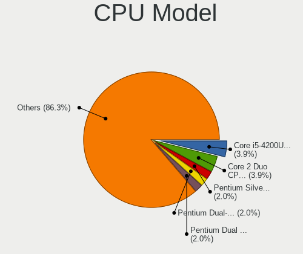
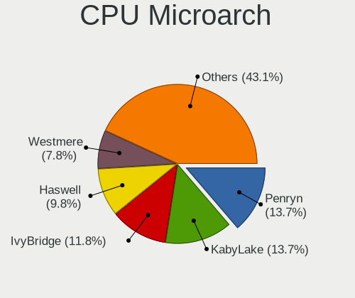
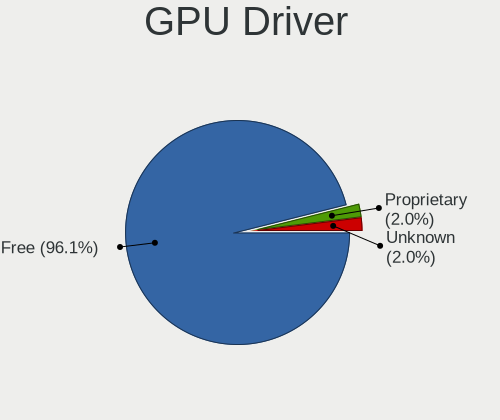
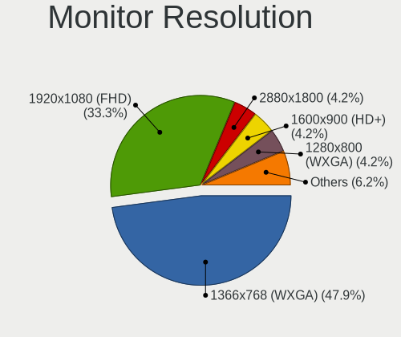
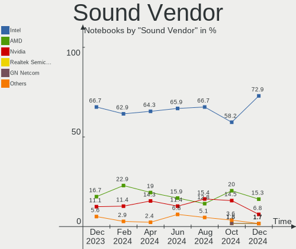
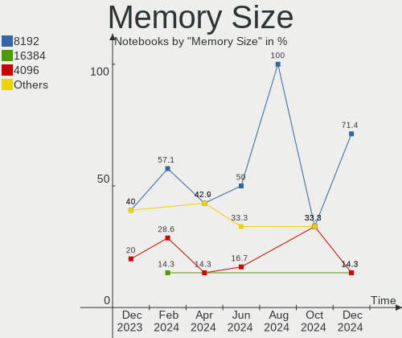
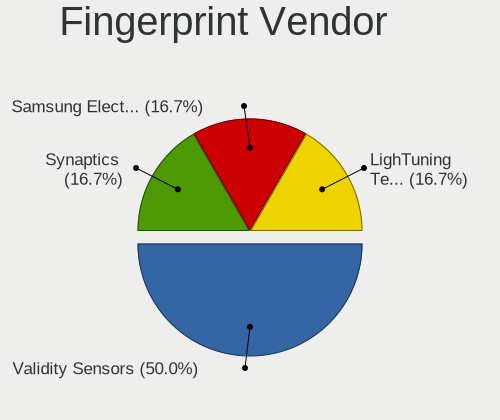
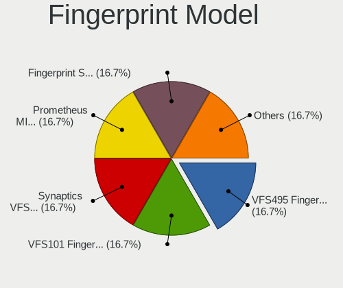

Elementary - Hardware Trends (Notebooks)
----------------------------------------

A project to identify most popular hardware characteristics and track their change
over time based on data collected by Linux users at https://Linux-Hardware.org.

Anyone can contribute to this report by the [hw-probe](https://github.com/linuxhw/hw-probe) tool:

    sudo -E hw-probe -all -upload

This report is for one last month. Overall report since the beginning of time: [TestCoverage](https://github.com/linuxhw/TestCoverage)

Period: Sep, 2022.

Contents
--------

* [ System ](#system)
  - [ OS                       ](#os)
  - [ OS Family                ](#os-family)
  - [ Kernel                   ](#kernel)
  - [ Kernel Family            ](#kernel-family)
  - [ Kernel Major Ver.        ](#kernel-major-ver)
  - [ Arch                     ](#arch)
  - [ DE                       ](#de)
  - [ Display Server           ](#display-server)
  - [ Display Manager          ](#display-manager)
  - [ OS Lang                  ](#os-lang)
  - [ Boot Mode                ](#boot-mode)
  - [ Filesystem               ](#filesystem)
  - [ Part. scheme             ](#part-scheme)
  - [ Dual Boot with Linux/BSD ](#dual-boot-with-linuxbsd)
  - [ Dual Boot (Win)          ](#dual-boot-win)

* [ Board ](#board)
  - [ Vendor                   ](#vendor)
  - [ Model                    ](#model)
  - [ Model Family             ](#model-family)
  - [ MFG Year                 ](#mfg-year)
  - [ Form Factor              ](#form-factor)
  - [ Secure Boot              ](#secure-boot)
  - [ Coreboot                 ](#coreboot)
  - [ RAM Size                 ](#ram-size)
  - [ RAM Used                 ](#ram-used)
  - [ Total Drives             ](#total-drives)
  - [ Has CD-ROM               ](#has-cd-rom)
  - [ Has Ethernet             ](#has-ethernet)
  - [ Has WiFi                 ](#has-wifi)
  - [ Has Bluetooth            ](#has-bluetooth)

* [ Location ](#location)
  - [ Country                  ](#country)
  - [ City                     ](#city)

* [ Drives ](#drives)
  - [ Drive Vendor             ](#drive-vendor)
  - [ Drive Model              ](#drive-model)
  - [ HDD Vendor               ](#hdd-vendor)
  - [ SSD Vendor               ](#ssd-vendor)
  - [ Drive Kind               ](#drive-kind)
  - [ Drive Connector          ](#drive-connector)
  - [ Drive Size               ](#drive-size)
  - [ Space Total              ](#space-total)
  - [ Space Used               ](#space-used)
  - [ Malfunc. Drives          ](#malfunc-drives)
  - [ Malfunc. Drive Vendor    ](#malfunc-drive-vendor)
  - [ Malfunc. HDD Vendor      ](#malfunc-hdd-vendor)
  - [ Malfunc. Drive Kind      ](#malfunc-drive-kind)
  - [ Failed Drives            ](#failed-drives)
  - [ Failed Drive Vendor      ](#failed-drive-vendor)
  - [ Drive Status             ](#drive-status)

* [ Storage controller ](#storage-controller)
  - [ Storage Vendor           ](#storage-vendor)
  - [ Storage Model            ](#storage-model)
  - [ Storage Kind             ](#storage-kind)

* [ Processor ](#processor)
  - [ CPU Vendor               ](#cpu-vendor)
  - [ CPU Model                ](#cpu-model)
  - [ CPU Model Family         ](#cpu-model-family)
  - [ CPU Cores                ](#cpu-cores)
  - [ CPU Sockets              ](#cpu-sockets)
  - [ CPU Threads              ](#cpu-threads)
  - [ CPU Op-Modes             ](#cpu-op-modes)
  - [ CPU Microcode            ](#cpu-microcode)
  - [ CPU Microarch            ](#cpu-microarch)

* [ Graphics ](#graphics)
  - [ GPU Vendor               ](#gpu-vendor)
  - [ GPU Model                ](#gpu-model)
  - [ GPU Combo                ](#gpu-combo)
  - [ GPU Driver               ](#gpu-driver)
  - [ GPU Memory               ](#gpu-memory)

* [ Monitor ](#monitor)
  - [ Monitor Vendor           ](#monitor-vendor)
  - [ Monitor Model            ](#monitor-model)
  - [ Monitor Resolution       ](#monitor-resolution)
  - [ Monitor Diagonal         ](#monitor-diagonal)
  - [ Monitor Width            ](#monitor-width)
  - [ Aspect Ratio             ](#aspect-ratio)
  - [ Monitor Area             ](#monitor-area)
  - [ Pixel Density            ](#pixel-density)
  - [ Multiple Monitors        ](#multiple-monitors)

* [ Network ](#network)
  - [ Net Controller Vendor    ](#net-controller-vendor)
  - [ Net Controller Model     ](#net-controller-model)
  - [ Wireless Vendor          ](#wireless-vendor)
  - [ Wireless Model           ](#wireless-model)
  - [ Ethernet Vendor          ](#ethernet-vendor)
  - [ Ethernet Model           ](#ethernet-model)
  - [ Net Controller Kind      ](#net-controller-kind)
  - [ Used Controller          ](#used-controller)
  - [ NICs                     ](#nics)
  - [ IPv6                     ](#ipv6)

* [ Bluetooth ](#bluetooth)
  - [ Bluetooth Vendor         ](#bluetooth-vendor)
  - [ Bluetooth Model          ](#bluetooth-model)

* [ Sound ](#sound)
  - [ Sound Vendor             ](#sound-vendor)
  - [ Sound Model              ](#sound-model)

* [ Memory ](#memory)
  - [ Memory Vendor            ](#memory-vendor)
  - [ Memory Model             ](#memory-model)
  - [ Memory Kind              ](#memory-kind)
  - [ Memory Form Factor       ](#memory-form-factor)
  - [ Memory Size              ](#memory-size)
  - [ Memory Speed             ](#memory-speed)

* [ Printers & scanners ](#printers--scanners)
  - [ Printer Vendor           ](#printer-vendor)
  - [ Printer Model            ](#printer-model)
  - [ Scanner Vendor           ](#scanner-vendor)
  - [ Scanner Model            ](#scanner-model)

* [ Camera ](#camera)
  - [ Camera Vendor            ](#camera-vendor)
  - [ Camera Model             ](#camera-model)

* [ Security ](#security)
  - [ Fingerprint Vendor       ](#fingerprint-vendor)
  - [ Fingerprint Model        ](#fingerprint-model)
  - [ Chipcard Vendor          ](#chipcard-vendor)
  - [ Chipcard Model           ](#chipcard-model)

* [ Unsupported ](#unsupported)
  - [ Unsupported Devices      ](#unsupported-devices)
  - [ Unsupported Device Types ](#unsupported-device-types)

System
------

OS
--

Installed operating systems

| Name           | Notebooks | Percent |
|----------------|-----------|---------|
| Elementary 6.1 | 31        | 100%    |

OS Family
---------

OS without a version

| Name       | Notebooks | Percent |
|------------|-----------|---------|
| Elementary | 31        | 100%    |

Kernel
------

Version of the Linux kernel

| Version                   | Notebooks | Percent |
|---------------------------|-----------|---------|
| 5.15.0-46-generic         | 18        | 58.06%  |
| 5.15.0-48-generic         | 8         | 25.81%  |
| 6.0.0-060000rc7-generic   | 1         | 3.23%   |
| 5.19.11-xanmod1           | 1         | 3.23%   |
| 5.19.0-8.2-liquorix-amd64 | 1         | 3.23%   |
| 5.11.0-44-generic         | 1         | 3.23%   |
| 5.11.0-43-generic         | 1         | 3.23%   |

Kernel Family
-------------

Linux kernel without a distro release

| Version | Notebooks | Percent |
|---------|-----------|---------|
| 5.15.0  | 26        | 83.87%  |
| 5.11.0  | 2         | 6.45%   |
| 6.0.0   | 1         | 3.23%   |
| 5.19.11 | 1         | 3.23%   |
| 5.19.0  | 1         | 3.23%   |

Kernel Major Ver.
-----------------

Linux kernel major version

| Version | Notebooks | Percent |
|---------|-----------|---------|
| 5.15    | 26        | 83.87%  |
| 5.19    | 2         | 6.45%   |
| 5.11    | 2         | 6.45%   |
| 6.0     | 1         | 3.23%   |

Arch
----

OS architecture (x86_64, i586, etc.)

| Name   | Notebooks | Percent |
|--------|-----------|---------|
| x86_64 | 31        | 100%    |

DE
--

Desktop Environment

| Name     | Notebooks | Percent |
|----------|-----------|---------|
| Pantheon | 31        | 100%    |

Display Server
--------------

X11 or Wayland

| Name | Notebooks | Percent |
|------|-----------|---------|
| X11  | 31        | 100%    |

Display Manager
---------------

SDDM, LightDM, etc.

| Name    | Notebooks | Percent |
|---------|-----------|---------|
| Unknown | 28        | 90.32%  |
| LightDM | 3         | 9.68%   |

OS Lang
-------

Language

| Lang  | Notebooks | Percent |
|-------|-----------|---------|
| en_US | 13        | 41.94%  |
| nl_NL | 3         | 9.68%   |
| it_IT | 3         | 9.68%   |
| es_ES | 3         | 9.68%   |
| ru_RU | 2         | 6.45%   |
| tr_TR | 1         | 3.23%   |
| pt_BR | 1         | 3.23%   |
| pl_PL | 1         | 3.23%   |
| fr_FR | 1         | 3.23%   |
| en_GB | 1         | 3.23%   |
| de_DE | 1         | 3.23%   |
| de_CH | 1         | 3.23%   |

Boot Mode
---------

EFI or BIOS

| Mode | Notebooks | Percent |
|------|-----------|---------|
| EFI  | 24        | 77.42%  |
| BIOS | 7         | 22.58%  |

Filesystem
----------

Type of filesystem

| Type | Notebooks | Percent |
|------|-----------|---------|
| Ext4 | 31        | 100%    |

Part. scheme
------------

Scheme of partitioning

| Type    | Notebooks | Percent |
|---------|-----------|---------|
| Unknown | 28        | 90.32%  |
| GPT     | 3         | 9.68%   |

Dual Boot with Linux/BSD
------------------------

Hosting more than one Linux/BSD

| Dual boot | Notebooks | Percent |
|-----------|-----------|---------|
| No        | 31        | 100%    |

Dual Boot (Win)
---------------

Hosting Linux and Windows

| Dual boot | Notebooks | Percent |
|-----------|-----------|---------|
| No        | 30        | 96.77%  |
| Yes       | 1         | 3.23%   |

Board
-----

Vendor
------

Motherboard manufacturer

| Name             | Notebooks | Percent |
|------------------|-----------|---------|
| Lenovo           | 6         | 19.35%  |
| Dell             | 5         | 16.13%  |
| Apple            | 5         | 16.13%  |
| ASUSTek Computer | 4         | 12.9%   |
| Hewlett-Packard  | 2         | 6.45%   |
| Acer             | 2         | 6.45%   |
| TUXEDO           | 1         | 3.23%   |
| Toshiba          | 1         | 3.23%   |
| MSI              | 1         | 3.23%   |
| Medion           | 1         | 3.23%   |
| HUAWEI           | 1         | 3.23%   |
| Google           | 1         | 3.23%   |
| Clevo            | 1         | 3.23%   |

Model
-----

Motherboard model

| Name                                   | Notebooks | Percent |
|----------------------------------------|-----------|---------|
| Apple MacBookAir6,2                    | 2         | 6.45%   |
| TUXEDO Book XP14 Gen12                 | 1         | 3.23%   |
| Toshiba PORTEGE Z30-B                  | 1         | 3.23%   |
| MSI PS63 Modern 8RD                    | 1         | 3.23%   |
| Medion Akoya E6422 MD99680             | 1         | 3.23%   |
| Lenovo ThinkPad X270 W10DG 20K5S2VL00  | 1         | 3.23%   |
| Lenovo ThinkPad T470 20JNS08H00        | 1         | 3.23%   |
| Lenovo ThinkPad T460 20FMS271BR        | 1         | 3.23%   |
| Lenovo ThinkPad E15 Gen 2 20TDS0GD00   | 1         | 3.23%   |
| Lenovo Legion Y540-15IRH 81SX          | 1         | 3.23%   |
| Lenovo IdeaPad 510-15IKB 80SV          | 1         | 3.23%   |
| HUAWEI HVY-WXX9                        | 1         | 3.23%   |
| HP Laptop 15-bw0xx                     | 1         | 3.23%   |
| HP ENVY m6                             | 1         | 3.23%   |
| Google Blooglet                        | 1         | 3.23%   |
| Dell Vostro 5402                       | 1         | 3.23%   |
| Dell Latitude E6540                    | 1         | 3.23%   |
| Dell Latitude E5450                    | 1         | 3.23%   |
| Dell Inspiron 5458                     | 1         | 3.23%   |
| Dell Inspiron 3493                     | 1         | 3.23%   |
| Clevo W54xEU                           | 1         | 3.23%   |
| ASUS X555LAB                           | 1         | 3.23%   |
| ASUS X555DG                            | 1         | 3.23%   |
| ASUS VivoBook_ASUSLaptop X512DK_X512DK | 1         | 3.23%   |
| ASUS GL702VSK                          | 1         | 3.23%   |
| Apple MacBookPro8,2                    | 1         | 3.23%   |
| Apple MacBookPro11,4                   | 1         | 3.23%   |
| Apple MacBookPro11,2                   | 1         | 3.23%   |
| Acer Nitro AN515-54                    | 1         | 3.23%   |
| Acer Aspire V5-552                     | 1         | 3.23%   |

Model Family
------------

Motherboard model prefix

| Name               | Notebooks | Percent |
|--------------------|-----------|---------|
| Lenovo ThinkPad    | 4         | 12.9%   |
| Dell Latitude      | 2         | 6.45%   |
| Dell Inspiron      | 2         | 6.45%   |
| Apple MacBookPro11 | 2         | 6.45%   |
| Apple MacBookAir6  | 2         | 6.45%   |
| TUXEDO Book        | 1         | 3.23%   |
| Toshiba PORTEGE    | 1         | 3.23%   |
| MSI PS63           | 1         | 3.23%   |
| Medion Akoya       | 1         | 3.23%   |
| Lenovo Legion      | 1         | 3.23%   |
| Lenovo IdeaPad     | 1         | 3.23%   |
| HUAWEI HVY-WXX9    | 1         | 3.23%   |
| HP Laptop          | 1         | 3.23%   |
| HP ENVY            | 1         | 3.23%   |
| Google Blooglet    | 1         | 3.23%   |
| Dell Vostro        | 1         | 3.23%   |
| Clevo W54xEU       | 1         | 3.23%   |
| ASUS X555LAB       | 1         | 3.23%   |
| ASUS X555DG        | 1         | 3.23%   |
| ASUS VivoBook      | 1         | 3.23%   |
| ASUS GL702VSK      | 1         | 3.23%   |
| Apple MacBookPro8  | 1         | 3.23%   |
| Acer Nitro         | 1         | 3.23%   |
| Acer Aspire        | 1         | 3.23%   |

MFG Year
--------

Motherboard manufacture year

| Year | Notebooks | Percent |
|------|-----------|---------|
| 2017 | 5         | 16.13%  |
| 2013 | 5         | 16.13%  |
| 2020 | 4         | 12.9%   |
| 2019 | 4         | 12.9%   |
| 2015 | 4         | 12.9%   |
| 2016 | 3         | 9.68%   |
| 2014 | 2         | 6.45%   |
| 2012 | 2         | 6.45%   |
| 2022 | 1         | 3.23%   |
| 2018 | 1         | 3.23%   |

Form Factor
-----------

Physical design of the computer

| Name     | Notebooks | Percent |
|----------|-----------|---------|
| Notebook | 31        | 100%    |

Secure Boot
-----------

Enabled or disabled

| State    | Notebooks | Percent |
|----------|-----------|---------|
| Disabled | 24        | 77.42%  |
| Enabled  | 7         | 22.58%  |

Coreboot
--------

Have coreboot on board

| Used | Notebooks | Percent |
|------|-----------|---------|
| No   | 30        | 96.77%  |
| Yes  | 1         | 3.23%   |

RAM Size
--------

Total RAM memory

| Size in GB | Notebooks | Percent |
|------------|-----------|---------|
| 4.01-8.0   | 9         | 29.03%  |
| 3.01-4.0   | 7         | 22.58%  |
| 16.01-24.0 | 7         | 22.58%  |
| 8.01-16.0  | 5         | 16.13%  |
| 32.01-64.0 | 2         | 6.45%   |
| 24.01-32.0 | 1         | 3.23%   |

RAM Used
--------

Used RAM memory

| Used GB   | Notebooks | Percent |
|-----------|-----------|---------|
| 3.01-4.0  | 10        | 32.26%  |
| 1.01-2.0  | 8         | 25.81%  |
| 2.01-3.0  | 6         | 19.35%  |
| 4.01-8.0  | 5         | 16.13%  |
| 8.01-16.0 | 2         | 6.45%   |

Total Drives
------------

Number of drives on board

| Drives | Notebooks | Percent |
|--------|-----------|---------|
| 1      | 25        | 80.65%  |
| 2      | 6         | 19.35%  |

Has CD-ROM
----------

Has CD-ROM on board

| Presented | Notebooks | Percent |
|-----------|-----------|---------|
| No        | 26        | 83.87%  |
| Yes       | 5         | 16.13%  |

Has Ethernet
------------

Has Ethernet on board

| Presented | Notebooks | Percent |
|-----------|-----------|---------|
| Yes       | 25        | 80.65%  |
| No        | 6         | 19.35%  |

Has WiFi
--------

Has WiFi module

| Presented | Notebooks | Percent |
|-----------|-----------|---------|
| Yes       | 30        | 96.77%  |
| No        | 1         | 3.23%   |

Has Bluetooth
-------------

Has Bluetooth module

| Presented | Notebooks | Percent |
|-----------|-----------|---------|
| Yes       | 28        | 90.32%  |
| No        | 3         | 9.68%   |

Location
--------

Country
-------

Geographic location (country)

| Country         | Notebooks | Percent |
|-----------------|-----------|---------|
| Italy           | 5         | 16.13%  |
| USA             | 3         | 9.68%   |
| Brazil          | 3         | 9.68%   |
| Russia          | 2         | 6.45%   |
| Mexico          | 2         | 6.45%   |
| Germany         | 2         | 6.45%   |
| Belgium         | 2         | 6.45%   |
| Venezuela       | 1         | 3.23%   |
| UK              | 1         | 3.23%   |
| Turkey          | 1         | 3.23%   |
| Poland          | 1         | 3.23%   |
| Pakistan        | 1         | 3.23%   |
| North Macedonia | 1         | 3.23%   |
| Netherlands     | 1         | 3.23%   |
| Indonesia       | 1         | 3.23%   |
| Iceland         | 1         | 3.23%   |
| France          | 1         | 3.23%   |
| Costa Rica      | 1         | 3.23%   |
| Colombia        | 1         | 3.23%   |

City
----

Geographic location (city)

| City           | Notebooks | Percent |
|----------------|-----------|---------|
| Yuba City      | 2         | 6.45%   |
| Pozza di Fassa | 2         | 6.45%   |
| Harelbeke      | 2         | 6.45%   |
| Fortaleza      | 2         | 6.45%   |
| Yaroslavl      | 1         | 3.23%   |
| Warsaw         | 1         | 3.23%   |
| Strumica       | 1         | 3.23%   |
| Sleman         | 1         | 3.23%   |
| San José      | 1         | 3.23%   |
| Queretaro      | 1         | 3.23%   |
| Nottingham     | 1         | 3.23%   |
| Moscow         | 1         | 3.23%   |
| Morelia        | 1         | 3.23%   |
| Monza          | 1         | 3.23%   |
| Milan          | 1         | 3.23%   |
| Manchester     | 1         | 3.23%   |
| Lesneven       | 1         | 3.23%   |
| Konya          | 1         | 3.23%   |
| Islamabad      | 1         | 3.23%   |
| Hanau          | 1         | 3.23%   |
| Gorredijk      | 1         | 3.23%   |
| Empoli         | 1         | 3.23%   |
| Egilsstaðir   | 1         | 3.23%   |
| Cota           | 1         | 3.23%   |
| Caracas        | 1         | 3.23%   |
| Brasília      | 1         | 3.23%   |
| Altlandsberg   | 1         | 3.23%   |

Drives
------

Drive Vendor
------------

Hard drive vendors

| Vendor                      | Notebooks | Drives | Percent |
|-----------------------------|-----------|--------|---------|
| Toshiba                     | 7         | 7      | 18.42%  |
| Samsung Electronics         | 4         | 4      | 10.53%  |
| Apple                       | 4         | 4      | 10.53%  |
| A-DATA Technology           | 4         | 4      | 10.53%  |
| WDC                         | 3         | 3      | 7.89%   |
| SanDisk                     | 2         | 2      | 5.26%   |
| Phison                      | 2         | 2      | 5.26%   |
| Kingston                    | 2         | 2      | 5.26%   |
| Crucial                     | 2         | 2      | 5.26%   |
| Yangtze Memory Technologies | 1         | 1      | 2.63%   |
| Unknown                     | 1         | 1      | 2.63%   |
| Seagate                     | 1         | 1      | 2.63%   |
| Realtek Semiconductor       | 1         | 1      | 2.63%   |
| Kingston Technology Company | 1         | 1      | 2.63%   |
| HGST                        | 1         | 1      | 2.63%   |
| Generic-                    | 1         | 1      | 2.63%   |
| Corsair                     | 1         | 1      | 2.63%   |

Drive Model
-----------

Hard drive models

| Model                                       | Notebooks | Percent |
|---------------------------------------------|-----------|---------|
| Toshiba MQ01ABD100 1TB                      | 4         | 10.53%  |
| Apple SSD SD0256F 256GB                     | 2         | 5.26%   |
| Yangtze Memory YMTC PC005 512GB             | 1         | 2.63%   |
| WDC WD5000LPCX-60VHAT0 500GB                | 1         | 2.63%   |
| WDC WD10JPVX-22JC3T0 1TB                    | 1         | 2.63%   |
| WDC PC SN520 SDAPNUW-512G                   | 1         | 2.63%   |
| Unknown MMC Card  32GB                      | 1         | 2.63%   |
| Toshiba THNSNJ256GMCU 256GB SSD             | 1         | 2.63%   |
| Toshiba THNSNF128GCSS 128GB SSD             | 1         | 2.63%   |
| Toshiba MQ01ABF050 500GB                    | 1         | 2.63%   |
| Seagate ST2000LX001-1RG174 2TB              | 1         | 2.63%   |
| SanDisk SD9SN8W-128G-1006 128GB SSD         | 1         | 2.63%   |
| SanDisk SD8SN8U-128G-1006 128GB SSD         | 1         | 2.63%   |
| Samsung SSD 850 EVO 500GB                   | 1         | 2.63%   |
| Samsung NVMe SSD Drive 512GB                | 1         | 2.63%   |
| Samsung NVMe SSD Drive 1TB                  | 1         | 2.63%   |
| Samsung MZNLN128HAHQ-000H1 128GB SSD        | 1         | 2.63%   |
| Realtek ADATA SX6000PNP 512GB               | 1         | 2.63%   |
| Phison SSD 128GB PS3109-S9                  | 1         | 2.63%   |
| Phison NVMe SSD Drive 1TB                   | 1         | 2.63%   |
| Kingston Company U-SNS8154P3 NVMe SSD 512GB | 1         | 2.63%   |
| Kingston SA400S37240G 240GB SSD             | 1         | 2.63%   |
| Kingston SA400S37120G 120GB SSD             | 1         | 2.63%   |
| HGST HTS545050A7E680 500GB                  | 1         | 2.63%   |
| Generic- SD-M.S 121GB                       | 1         | 2.63%   |
| Crucial M4-CT256M4SSD2 256GB                | 1         | 2.63%   |
| Crucial CT1050MX300SSD4 1050GB              | 1         | 2.63%   |
| Corsair Force MP 510 240GB SSD              | 1         | 2.63%   |
| Apple SSD SM0512G 500GB                     | 1         | 2.63%   |
| Apple SSD SM0256F 256GB                     | 1         | 2.63%   |
| A-DATA SU800 512GB SSD                      | 1         | 2.63%   |
| A-DATA SU650 120GB SSD                      | 1         | 2.63%   |
| A-DATA SU630 240GB SSD                      | 1         | 2.63%   |
| A-DATA IM2P33F3A NVMe 256GB                 | 1         | 2.63%   |

HDD Vendor
----------

Hard disk drive vendors

| Vendor   | Notebooks | Drives | Percent |
|----------|-----------|--------|---------|
| Toshiba  | 5         | 5      | 50%     |
| WDC      | 2         | 2      | 20%     |
| Seagate  | 1         | 1      | 10%     |
| HGST     | 1         | 1      | 10%     |
| Generic- | 1         | 1      | 10%     |

SSD Vendor
----------

Solid state drive vendors

| Vendor              | Notebooks | Drives | Percent |
|---------------------|-----------|--------|---------|
| Apple               | 4         | 4      | 21.05%  |
| A-DATA Technology   | 3         | 3      | 15.79%  |
| Toshiba             | 2         | 2      | 10.53%  |
| SanDisk             | 2         | 2      | 10.53%  |
| Samsung Electronics | 2         | 2      | 10.53%  |
| Kingston            | 2         | 2      | 10.53%  |
| Crucial             | 2         | 2      | 10.53%  |
| Phison              | 1         | 1      | 5.26%   |
| Corsair             | 1         | 1      | 5.26%   |

Drive Kind
----------

HDD or SSD

| Kind | Notebooks | Drives | Percent |
|------|-----------|--------|---------|
| SSD  | 19        | 19     | 50%     |
| HDD  | 10        | 10     | 26.32%  |
| NVMe | 8         | 8      | 21.05%  |
| MMC  | 1         | 1      | 2.63%   |

Drive Connector
---------------

SATA, SAS, NVMe, etc.

| Type | Notebooks | Drives | Percent |
|------|-----------|--------|---------|
| SATA | 23        | 28     | 69.7%   |
| NVMe | 8         | 8      | 24.24%  |
| SAS  | 1         | 1      | 3.03%   |
| MMC  | 1         | 1      | 3.03%   |

Drive Size
----------

Size of hard drive

| Size in TB | Notebooks | Drives | Percent |
|------------|-----------|--------|---------|
| 0.01-0.5   | 18        | 21     | 69.23%  |
| 0.51-1.0   | 6         | 6      | 23.08%  |
| 1.01-2.0   | 2         | 2      | 7.69%   |

Space Total
-----------

Amount of disk space available on the file system

| Size in GB | Notebooks | Percent |
|------------|-----------|---------|
| 101-250    | 15        | 48.39%  |
| 251-500    | 6         | 19.35%  |
| 501-1000   | 6         | 19.35%  |
| 21-50      | 3         | 9.68%   |
| 1001-2000  | 1         | 3.23%   |

Space Used
----------

Amount of used disk space

| Used GB  | Notebooks | Percent |
|----------|-----------|---------|
| 21-50    | 12        | 38.71%  |
| 1-20     | 11        | 35.48%  |
| 251-500  | 3         | 9.68%   |
| 51-100   | 3         | 9.68%   |
| 101-250  | 1         | 3.23%   |
| 501-1000 | 1         | 3.23%   |

Malfunc. Drives
---------------

Drive models with a malfunction

| Model                      | Notebooks | Drives | Percent |
|----------------------------|-----------|--------|---------|
| HGST HTS545050A7E680 500GB | 1         | 1      | 100%    |

Malfunc. Drive Vendor
---------------------

Vendors of faulty drives

| Vendor | Notebooks | Drives | Percent |
|--------|-----------|--------|---------|
| HGST   | 1         | 1      | 100%    |

Malfunc. HDD Vendor
-------------------

Vendors of faulty HDD drives

| Vendor | Notebooks | Drives | Percent |
|--------|-----------|--------|---------|
| HGST   | 1         | 1      | 100%    |

Malfunc. Drive Kind
-------------------

Kinds of faulty drives

| Kind | Notebooks | Drives | Percent |
|------|-----------|--------|---------|
| HDD  | 1         | 1      | 100%    |

Failed Drives
-------------

Failed drive models

Zero info for selected period =(

Failed Drive Vendor
-------------------

Failed drive vendors

Zero info for selected period =(

Drive Status
------------

Number of failed and malfunc. drives

| Status   | Notebooks | Drives | Percent |
|----------|-----------|--------|---------|
| Detected | 29        | 34     | 87.88%  |
| Works    | 3         | 3      | 9.09%   |
| Malfunc  | 1         | 1      | 3.03%   |

Storage controller
------------------

Storage Vendor
--------------

Storage controller vendors

| Vendor                      | Notebooks | Percent |
|-----------------------------|-----------|---------|
| Intel                       | 17        | 50%     |
| AMD                         | 5         | 14.71%  |
| Samsung Electronics         | 4         | 11.76%  |
| Marvell Technology Group    | 2         | 5.88%   |
| Yangtze Memory Technologies | 1         | 2.94%   |
| SanDisk                     | 1         | 2.94%   |
| Realtek Semiconductor       | 1         | 2.94%   |
| Phison Electronics          | 1         | 2.94%   |
| Kingston Technology Company | 1         | 2.94%   |
| ADATA Technology            | 1         | 2.94%   |

Storage Model
-------------

Storage controller models

| Model                                                                          | Notebooks | Percent |
|--------------------------------------------------------------------------------|-----------|---------|
| Intel Sunrise Point-LP SATA Controller [AHCI mode]                             | 5         | 14.71%  |
| AMD FCH SATA Controller [AHCI mode]                                            | 5         | 14.71%  |
| Marvell Group 88SS9183 PCIe SSD Controller                                     | 2         | 5.88%   |
| Intel Wildcat Point-LP SATA Controller [AHCI Mode]                             | 2         | 5.88%   |
| Intel Cannon Lake Mobile PCH SATA AHCI Controller                              | 2         | 5.88%   |
| Intel 82801 Mobile SATA Controller [RAID mode]                                 | 2         | 5.88%   |
| Yangtze Memory Non-Volatile memory controller                                  | 1         | 2.94%   |
| SanDisk WD Blue SN500 / PC SN520 NVMe SSD                                      | 1         | 2.94%   |
| Samsung NVMe SSD Controller SM981/PM981/PM983                                  | 1         | 2.94%   |
| Samsung NVMe SSD Controller 980                                                | 1         | 2.94%   |
| Samsung Electronics SATA controller                                            | 1         | 2.94%   |
| Samsung Apple PCIe SSD                                                         | 1         | 2.94%   |
| Realtek Realtek Non-Volatile memory controller                                 | 1         | 2.94%   |
| Phison E16 PCIe4 NVMe Controller                                               | 1         | 2.94%   |
| Kingston Company U-SNS8154P3 NVMe SSD                                          | 1         | 2.94%   |
| Intel HM170/QM170 Chipset SATA Controller [AHCI Mode]                          | 1         | 2.94%   |
| Intel Cannon Point-LP SATA Controller [AHCI Mode]                              | 1         | 2.94%   |
| Intel 8 Series/C220 Series Chipset Family 6-port SATA Controller 1 [AHCI mode] | 1         | 2.94%   |
| Intel 8 Series SATA Controller 1 [AHCI mode]                                   | 1         | 2.94%   |
| Intel 7 Series Chipset Family 6-port SATA Controller [AHCI mode]               | 1         | 2.94%   |
| Intel 6 Series/C200 Series Chipset Family 6 port Mobile SATA AHCI Controller   | 1         | 2.94%   |
| ADATA Non-Volatile memory controller                                           | 1         | 2.94%   |

Storage Kind
------------

Kind of storage controller (IDE, SATA, NVMe, SAS, ...)

| Kind | Notebooks | Percent |
|------|-----------|---------|
| SATA | 24        | 70.59%  |
| NVMe | 8         | 23.53%  |
| RAID | 2         | 5.88%   |

Processor
---------

CPU Vendor
----------

Processor vendors

| Vendor | Notebooks | Percent |
|--------|-----------|---------|
| Intel  | 25        | 80.65%  |
| AMD    | 6         | 19.35%  |

CPU Model
---------

Processor models

| Model                                           | Notebooks | Percent |
|-------------------------------------------------|-----------|---------|
| Intel Core i5-6300U CPU @ 2.40GHz               | 2         | 6.45%   |
| Intel Core i5-5300U CPU @ 2.30GHz               | 2         | 6.45%   |
| Intel Core i5-4250U CPU @ 1.30GHz               | 2         | 6.45%   |
| Intel 11th Gen Core i7-1165G7 @ 2.80GHz         | 2         | 6.45%   |
| Intel Pentium CPU 2030M @ 2.50GHz               | 1         | 3.23%   |
| Intel Core i7-9750H CPU @ 2.60GHz               | 1         | 3.23%   |
| Intel Core i7-8565U CPU @ 1.80GHz               | 1         | 3.23%   |
| Intel Core i7-7700HQ CPU @ 2.80GHz              | 1         | 3.23%   |
| Intel Core i7-7500U CPU @ 2.70GHz               | 1         | 3.23%   |
| Intel Core i7-6500U CPU @ 2.50GHz               | 1         | 3.23%   |
| Intel Core i7-4770HQ CPU @ 2.20GHz              | 1         | 3.23%   |
| Intel Core i7-4750HQ CPU @ 2.00GHz              | 1         | 3.23%   |
| Intel Core i7-4600M CPU @ 2.90GHz               | 1         | 3.23%   |
| Intel Core i7-2635QM CPU @ 2.00GHz              | 1         | 3.23%   |
| Intel Core i5-9300H CPU @ 2.40GHz               | 1         | 3.23%   |
| Intel Core i3-6100U CPU @ 2.30GHz               | 1         | 3.23%   |
| Intel Core i3-5005U CPU @ 2.00GHz               | 1         | 3.23%   |
| Intel Core i3-4005U CPU @ 1.70GHz               | 1         | 3.23%   |
| Intel Core i3-1005G1 CPU @ 1.20GHz              | 1         | 3.23%   |
| Intel Celeron N4020 CPU @ 1.10GHz               | 1         | 3.23%   |
| Intel 11th Gen Core i5-1135G7 @ 2.40GHz         | 1         | 3.23%   |
| AMD Ryzen 5 4600H with Radeon Graphics          | 1         | 3.23%   |
| AMD Ryzen 5 3500U with Radeon Vega Mobile Gfx   | 1         | 3.23%   |
| AMD A8-5557M APU with Radeon HD Graphics        | 1         | 3.23%   |
| AMD A10-9620P RADEON R5, 10 COMPUTE CORES 4C+6G | 1         | 3.23%   |
| AMD A10-8700P Radeon R6, 10 Compute Cores 4C+6G | 1         | 3.23%   |
| AMD A10-5750M APU with Radeon HD Graphics       | 1         | 3.23%   |

CPU Model Family
----------------

Processor model prefix

| Model         | Notebooks | Percent |
|---------------|-----------|---------|
| Intel Core i7 | 9         | 29.03%  |
| Intel Core i5 | 7         | 22.58%  |
| Intel Core i3 | 4         | 12.9%   |
| Other         | 3         | 9.68%   |
| AMD A10       | 3         | 9.68%   |
| AMD Ryzen 5   | 2         | 6.45%   |
| Intel Pentium | 1         | 3.23%   |
| Intel Celeron | 1         | 3.23%   |
| AMD A8        | 1         | 3.23%   |

CPU Cores
---------

Number of processor cores

| Number | Notebooks | Percent |
|--------|-----------|---------|
| 2      | 19        | 61.29%  |
| 4      | 10        | 32.26%  |
| 6      | 2         | 6.45%   |

CPU Sockets
-----------

Number of sockets

| Number | Notebooks | Percent |
|--------|-----------|---------|
| 1      | 31        | 100%    |

CPU Threads
-----------

Threads per core (Hyper-Threading)

| Number | Notebooks | Percent |
|--------|-----------|---------|
| 2      | 29        | 93.55%  |
| 1      | 2         | 6.45%   |

CPU Op-Modes
------------

CPU Operation Modes (32-bit, 64-bit)

| Op mode        | Notebooks | Percent |
|----------------|-----------|---------|
| 32-bit, 64-bit | 31        | 100%    |

CPU Microcode
-------------

Microcode number

| Number     | Notebooks | Percent |
|------------|-----------|---------|
| 0x406e3    | 4         | 12.9%   |
| 0x806c1    | 3         | 9.68%   |
| 0x40651    | 3         | 9.68%   |
| 0x306d4    | 3         | 9.68%   |
| 0x906ea    | 2         | 6.45%   |
| 0x40661    | 2         | 6.45%   |
| 0x06001119 | 2         | 6.45%   |
| Unknown    | 2         | 6.45%   |
| 0x906e9    | 1         | 3.23%   |
| 0x806eb    | 1         | 3.23%   |
| 0x806e9    | 1         | 3.23%   |
| 0x306c3    | 1         | 3.23%   |
| 0x306a9    | 1         | 3.23%   |
| 0x206a7    | 1         | 3.23%   |
| 0x08600106 | 1         | 3.23%   |
| 0x08108102 | 1         | 3.23%   |
| 0x0600611a | 1         | 3.23%   |
| 0x06006118 | 1         | 3.23%   |

CPU Microarch
-------------

Microarchitecture

| Name          | Notebooks | Percent |
|---------------|-----------|---------|
| Haswell       | 6         | 19.35%  |
| KabyLake      | 5         | 16.13%  |
| Skylake       | 4         | 12.9%   |
| TigerLake     | 3         | 9.68%   |
| Broadwell     | 3         | 9.68%   |
| Piledriver    | 2         | 6.45%   |
| Excavator     | 2         | 6.45%   |
| Zen+          | 1         | 3.23%   |
| Zen 2         | 1         | 3.23%   |
| SandyBridge   | 1         | 3.23%   |
| IvyBridge     | 1         | 3.23%   |
| IceLake       | 1         | 3.23%   |
| Goldmont plus | 1         | 3.23%   |

Graphics
--------

GPU Vendor
----------

Vendors of graphics cards

| Vendor | Notebooks | Percent |
|--------|-----------|---------|
| Intel  | 23        | 60.53%  |
| AMD    | 8         | 21.05%  |
| Nvidia | 7         | 18.42%  |

GPU Model
---------

Graphics card models

| Model                                                                                 | Notebooks | Percent |
|---------------------------------------------------------------------------------------|-----------|---------|
| Intel Skylake GT2 [HD Graphics 520]                                                   | 4         | 9.76%   |
| Intel TigerLake-LP GT2 [Iris Xe Graphics]                                             | 3         | 7.32%   |
| Intel HD Graphics 5500                                                                | 3         | 7.32%   |
| Intel Haswell-ULT Integrated Graphics Controller                                      | 3         | 7.32%   |
| Intel Crystal Well Integrated Graphics Controller                                     | 2         | 4.88%   |
| AMD Wani [Radeon R5/R6/R7 Graphics]                                                   | 2         | 4.88%   |
| Nvidia TU117M                                                                         | 1         | 2.44%   |
| Nvidia TU106M [GeForce RTX 2060 Mobile]                                               | 1         | 2.44%   |
| Nvidia GP108M [GeForce MX330]                                                         | 1         | 2.44%   |
| Nvidia GP107M [GeForce GTX 1050 Ti Max-Q]                                             | 1         | 2.44%   |
| Nvidia GP107M [GeForce GTX 1050 3 GB Max-Q]                                           | 1         | 2.44%   |
| Nvidia GP104BM [GeForce GTX 1070 Mobile]                                              | 1         | 2.44%   |
| Nvidia GM108M [GeForce 940MX]                                                         | 1         | 2.44%   |
| Intel WhiskeyLake-U GT2 [UHD Graphics 620]                                            | 1         | 2.44%   |
| Intel Iris Plus Graphics G1 (Ice Lake)                                                | 1         | 2.44%   |
| Intel HD Graphics 620                                                                 | 1         | 2.44%   |
| Intel GeminiLake [UHD Graphics 600]                                                   | 1         | 2.44%   |
| Intel CoffeeLake-H GT2 [UHD Graphics 630]                                             | 1         | 2.44%   |
| Intel 4th Gen Core Processor Integrated Graphics Controller                           | 1         | 2.44%   |
| Intel 3rd Gen Core processor Graphics Controller                                      | 1         | 2.44%   |
| Intel 2nd Generation Core Processor Family Integrated Graphics Controller             | 1         | 2.44%   |
| AMD Topaz XT [Radeon R7 M260/M265 / M340/M360 / M440/M445 / 530/535 / 620/625 Mobile] | 1         | 2.44%   |
| AMD Sun XT [Radeon HD 8670A/8670M/8690M / R5 M330 / M430 / Radeon 520 Mobile]         | 1         | 2.44%   |
| AMD Seymour [Radeon HD 6400M/7400M Series]                                            | 1         | 2.44%   |
| AMD Richland [Radeon HD 8650G]                                                        | 1         | 2.44%   |
| AMD Richland [Radeon HD 8550G]                                                        | 1         | 2.44%   |
| AMD Renoir                                                                            | 1         | 2.44%   |
| AMD Picasso/Raven 2 [Radeon Vega Series / Radeon Vega Mobile Series]                  | 1         | 2.44%   |
| AMD Mars XTX [Radeon HD 8790M]                                                        | 1         | 2.44%   |
| AMD Lexa PRO [Radeon 540/540X/550/550X / RX 540X/550/550X]                            | 1         | 2.44%   |

GPU Combo
---------

Combinations of graphics cards

| Name           | Notebooks | Percent |
|----------------|-----------|---------|
| 1 x Intel      | 15        | 48.39%  |
| Intel + Nvidia | 5         | 16.13%  |
| 2 x AMD        | 3         | 9.68%   |
| 1 x AMD        | 3         | 9.68%   |
| 1 x Nvidia     | 2         | 6.45%   |
| Intel + AMD    | 2         | 6.45%   |
| Other          | 1         | 3.23%   |

GPU Driver
----------

Free vs proprietary

| Driver      | Notebooks | Percent |
|-------------|-----------|---------|
| Free        | 25        | 80.65%  |
| Proprietary | 6         | 19.35%  |

GPU Memory
----------

Total video memory

| Size in GB | Notebooks | Percent |
|------------|-----------|---------|
| Unknown    | 19        | 61.29%  |
| 1.01-2.0   | 4         | 12.9%   |
| 0.01-0.5   | 4         | 12.9%   |
| 7.01-8.0   | 1         | 3.23%   |
| 5.01-6.0   | 1         | 3.23%   |
| 3.01-4.0   | 1         | 3.23%   |
| 0.51-1.0   | 1         | 3.23%   |

Monitor
-------

Monitor Vendor
--------------

Monitor vendors

| Vendor               | Notebooks | Percent |
|----------------------|-----------|---------|
| BOE                  | 9         | 27.27%  |
| LG Display           | 6         | 18.18%  |
| Apple                | 5         | 15.15%  |
| Chimei Innolux       | 4         | 12.12%  |
| AU Optronics         | 4         | 12.12%  |
| Tech Concepts        | 1         | 3.03%   |
| PANDA                | 1         | 3.03%   |
| Goldstar             | 1         | 3.03%   |
| Dell                 | 1         | 3.03%   |
| BOE Technology Group | 1         | 3.03%   |

Monitor Model
-------------

Monitor models

| Model                                                            | Notebooks | Percent |
|------------------------------------------------------------------|-----------|---------|
| AU Optronics LCD Monitor AUO21ED 1920x1080 344x193mm 15.5-inch   | 2         | 6.06%   |
| Apple Color LCD APP9CDF 1440x900 286x179mm 13.3-inch             | 2         | 6.06%   |
| Tech Concepts LCD Monitor      DTV 1360x768                      | 1         | 3.03%   |
| PANDA LCD Monitor NCP0050 1920x1080 309x174mm 14.0-inch          | 1         | 3.03%   |
| LG Display LCD Monitor LGD0551 1920x1080 309x174mm 14.0-inch     | 1         | 3.03%   |
| LG Display LCD Monitor LGD0521 1920x1080 309x174mm 14.0-inch     | 1         | 3.03%   |
| LG Display LCD Monitor LGD04E1 1366x768 344x194mm 15.5-inch      | 1         | 3.03%   |
| LG Display LCD Monitor LGD04B1 1366x768 310x174mm 14.0-inch      | 1         | 3.03%   |
| LG Display LCD Monitor LGD04A7 1920x1080 344x194mm 15.5-inch     | 1         | 3.03%   |
| LG Display LCD Monitor LGD03E3 1366x768 310x174mm 14.0-inch      | 1         | 3.03%   |
| Goldstar 2D FHD TV GSM59C6 1920x1080 509x286mm 23.0-inch         | 1         | 3.03%   |
| Dell P2417H DELA0DC 1920x1080 527x296mm 23.8-inch                | 1         | 3.03%   |
| Chimei Innolux LCD Monitor CMN15E8 1920x1080 344x193mm 15.5-inch | 1         | 3.03%   |
| Chimei Innolux LCD Monitor CMN15BC 1366x768 344x193mm 15.5-inch  | 1         | 3.03%   |
| Chimei Innolux LCD Monitor CMN14C3 1366x768 309x173mm 13.9-inch  | 1         | 3.03%   |
| Chimei Innolux LCD Monitor CMN1355 1366x768 293x165mm 13.2-inch  | 1         | 3.03%   |
| BOE Technology Group LCD Monitor 1920x1080                       | 1         | 3.03%   |
| BOE LCD Monitor BOE0878 1920x1080 355x200mm 16.0-inch            | 1         | 3.03%   |
| BOE LCD Monitor BOE0868 1920x1080 309x174mm 14.0-inch            | 1         | 3.03%   |
| BOE LCD Monitor BOE0864 1920x1080 344x194mm 15.5-inch            | 1         | 3.03%   |
| BOE LCD Monitor BOE082E 1920x1080 309x174mm 14.0-inch            | 1         | 3.03%   |
| BOE LCD Monitor BOE0747 1920x1080 344x194mm 15.5-inch            | 1         | 3.03%   |
| BOE LCD Monitor BOE06A5 1366x768 344x194mm 15.5-inch             | 1         | 3.03%   |
| BOE LCD Monitor BOE0687 1920x1080 344x193mm 15.5-inch            | 1         | 3.03%   |
| BOE LCD Monitor BOE065E 1920x1080 344x194mm 15.5-inch            | 1         | 3.03%   |
| BOE LCD Monitor BOE05C2 1366x768 309x173mm 13.9-inch             | 1         | 3.03%   |
| AU Optronics LCD Monitor AUO46EC 1366x768 344x193mm 15.5-inch    | 1         | 3.03%   |
| AU Optronics LCD Monitor AUO106C 1366x768 277x156mm 12.5-inch    | 1         | 3.03%   |
| Apple LCD Monitor APP9CA3 1440x900 331x207mm 15.4-inch           | 1         | 3.03%   |
| Apple Color LCD APPA02E 2880x1800 331x207mm 15.4-inch            | 1         | 3.03%   |
| Apple Color LCD APPA019 2880x1800 331x207mm 15.4-inch            | 1         | 3.03%   |

Monitor Resolution
------------------

Monitor screen resolution

| Resolution       | Notebooks | Percent |
|------------------|-----------|---------|
| 1920x1080 (FHD)  | 16        | 50%     |
| 1366x768 (WXGA)  | 10        | 31.25%  |
| 1440x900 (WXGA+) | 3         | 9.38%   |
| 2880x1800        | 2         | 6.25%   |
| 1360x768         | 1         | 3.13%   |

Monitor Diagonal
----------------

Diagonal size in inches

| Inches  | Notebooks | Percent |
|---------|-----------|---------|
| 15      | 15        | 45.45%  |
| 14      | 7         | 21.21%  |
| 13      | 5         | 15.15%  |
| Unknown | 2         | 6.06%   |
| 24      | 1         | 3.03%   |
| 23      | 1         | 3.03%   |
| 16      | 1         | 3.03%   |
| 12      | 1         | 3.03%   |

Monitor Width
-------------

Physical width

| Width in mm | Notebooks | Percent |
|-------------|-----------|---------|
| 301-350     | 24        | 72.73%  |
| 201-300     | 4         | 12.12%  |
| 501-600     | 2         | 6.06%   |
| Unknown     | 2         | 6.06%   |
| 351-400     | 1         | 3.03%   |

Aspect Ratio
------------

Proportional relationship between the width and the height

| Ratio   | Notebooks | Percent |
|---------|-----------|---------|
| 16/9    | 24        | 77.42%  |
| 16/10   | 5         | 16.13%  |
| Unknown | 2         | 6.45%   |

Monitor Area
------------

Area in inch²

| Area in inch² | Notebooks | Percent |
|----------------|-----------|---------|
| 101-110        | 16        | 48.48%  |
| 81-90          | 9         | 27.27%  |
| 71-80          | 3         | 9.09%   |
| 201-250        | 2         | 6.06%   |
| Unknown        | 2         | 6.06%   |
| 61-70          | 1         | 3.03%   |

Pixel Density
-------------

Pixels per inch

| Density | Notebooks | Percent |
|---------|-----------|---------|
| 121-160 | 17        | 51.52%  |
| 101-120 | 9         | 27.27%  |
| 51-100  | 3         | 9.09%   |
| 161-240 | 2         | 6.06%   |
| Unknown | 2         | 6.06%   |

Multiple Monitors
-----------------

Total monitors connected

| Total | Notebooks | Percent |
|-------|-----------|---------|
| 1     | 29        | 93.55%  |
| 2     | 2         | 6.45%   |

Network
-------

Net Controller Vendor
---------------------

Controller vendors

| Vendor                | Notebooks | Percent |
|-----------------------|-----------|---------|
| Realtek Semiconductor | 16        | 34.04%  |
| Intel                 | 16        | 34.04%  |
| Qualcomm Atheros      | 6         | 12.77%  |
| Broadcom              | 3         | 6.38%   |
| Sierra Wireless       | 2         | 4.26%   |
| MediaTek              | 2         | 4.26%   |
| Broadcom Limited      | 2         | 4.26%   |

Net Controller Model
--------------------

Controller models

| Model                                                             | Notebooks | Percent |
|-------------------------------------------------------------------|-----------|---------|
| Realtek RTL8111/8168/8411 PCI Express Gigabit Ethernet Controller | 13        | 22.41%  |
| Intel Wireless 8260                                               | 4         | 6.9%    |
| Realtek RTL810xE PCI Express Fast Ethernet controller             | 2         | 3.45%   |
| Qualcomm Atheros QCA9565 / AR9565 Wireless Network Adapter        | 2         | 3.45%   |
| Qualcomm Atheros AR9462 Wireless Network Adapter                  | 2         | 3.45%   |
| MediaTek Nokia 5.1 Plus                                           | 2         | 3.45%   |
| Intel Wireless 7265                                               | 2         | 3.45%   |
| Intel Wi-Fi 6 AX201                                               | 2         | 3.45%   |
| Intel Wi-Fi 6 AX200                                               | 2         | 3.45%   |
| Intel Ethernet Connection I219-LM                                 | 2         | 3.45%   |
| Intel Ethernet Connection (3) I218-LM                             | 2         | 3.45%   |
| Intel Cannon Lake PCH CNVi WiFi                                   | 2         | 3.45%   |
| Broadcom Limited BCM4360 802.11ac Wireless Network Adapter        | 2         | 3.45%   |
| Sierra Wireless EM7455                                            | 1         | 1.72%   |
| Sierra Wireless EM7305                                            | 1         | 1.72%   |
| Realtek RTL8822CE 802.11ac PCIe Wireless Network Adapter          | 1         | 1.72%   |
| Realtek RTL8723DE Wireless Network Adapter                        | 1         | 1.72%   |
| Realtek RTL8723BE PCIe Wireless Network Adapter                   | 1         | 1.72%   |
| Realtek RTL8723AE PCIe Wireless Network Adapter                   | 1         | 1.72%   |
| Realtek 802.11ac NIC                                              | 1         | 1.72%   |
| Qualcomm Atheros QCA9377 802.11ac Wireless Network Adapter        | 1         | 1.72%   |
| Qualcomm Atheros QCA8171 Gigabit Ethernet                         | 1         | 1.72%   |
| Qualcomm Atheros AR9485 Wireless Network Adapter                  | 1         | 1.72%   |
| Intel Wireless 8265 / 8275                                        | 1         | 1.72%   |
| Intel Wireless 3165                                               | 1         | 1.72%   |
| Intel Ethernet Connection I219-V                                  | 1         | 1.72%   |
| Intel Ethernet Connection I217-LM                                 | 1         | 1.72%   |
| Intel Cannon Point-LP CNVi [Wireless-AC]                          | 1         | 1.72%   |
| Broadcom NetXtreme BCM57765 Gigabit Ethernet PCIe                 | 1         | 1.72%   |
| Broadcom BCM43602 802.11ac Wireless LAN SoC                       | 1         | 1.72%   |
| Broadcom BCM4360 802.11ac Wireless Network Adapter                | 1         | 1.72%   |
| Broadcom BCM4331 802.11a/b/g/n                                    | 1         | 1.72%   |

Wireless Vendor
---------------

Wireless vendors

| Vendor                | Notebooks | Percent |
|-----------------------|-----------|---------|
| Intel                 | 15        | 45.45%  |
| Qualcomm Atheros      | 6         | 18.18%  |
| Realtek Semiconductor | 5         | 15.15%  |
| Broadcom              | 3         | 9.09%   |
| Sierra Wireless       | 2         | 6.06%   |
| Broadcom Limited      | 2         | 6.06%   |

Wireless Model
--------------

Wireless models

| Model                                                      | Notebooks | Percent |
|------------------------------------------------------------|-----------|---------|
| Intel Wireless 8260                                        | 4         | 12.12%  |
| Qualcomm Atheros QCA9565 / AR9565 Wireless Network Adapter | 2         | 6.06%   |
| Qualcomm Atheros AR9462 Wireless Network Adapter           | 2         | 6.06%   |
| Intel Wireless 7265                                        | 2         | 6.06%   |
| Intel Wi-Fi 6 AX201                                        | 2         | 6.06%   |
| Intel Wi-Fi 6 AX200                                        | 2         | 6.06%   |
| Intel Cannon Lake PCH CNVi WiFi                            | 2         | 6.06%   |
| Broadcom Limited BCM4360 802.11ac Wireless Network Adapter | 2         | 6.06%   |
| Sierra Wireless EM7455                                     | 1         | 3.03%   |
| Sierra Wireless EM7305                                     | 1         | 3.03%   |
| Realtek RTL8822CE 802.11ac PCIe Wireless Network Adapter   | 1         | 3.03%   |
| Realtek RTL8723DE Wireless Network Adapter                 | 1         | 3.03%   |
| Realtek RTL8723BE PCIe Wireless Network Adapter            | 1         | 3.03%   |
| Realtek RTL8723AE PCIe Wireless Network Adapter            | 1         | 3.03%   |
| Realtek 802.11ac NIC                                       | 1         | 3.03%   |
| Qualcomm Atheros QCA9377 802.11ac Wireless Network Adapter | 1         | 3.03%   |
| Qualcomm Atheros AR9485 Wireless Network Adapter           | 1         | 3.03%   |
| Intel Wireless 8265 / 8275                                 | 1         | 3.03%   |
| Intel Wireless 3165                                        | 1         | 3.03%   |
| Intel Cannon Point-LP CNVi [Wireless-AC]                   | 1         | 3.03%   |
| Broadcom BCM43602 802.11ac Wireless LAN SoC                | 1         | 3.03%   |
| Broadcom BCM4360 802.11ac Wireless Network Adapter         | 1         | 3.03%   |
| Broadcom BCM4331 802.11a/b/g/n                             | 1         | 3.03%   |

Ethernet Vendor
---------------

Ethernet vendors

| Vendor                | Notebooks | Percent |
|-----------------------|-----------|---------|
| Realtek Semiconductor | 15        | 60%     |
| Intel                 | 6         | 24%     |
| MediaTek              | 2         | 8%      |
| Qualcomm Atheros      | 1         | 4%      |
| Broadcom              | 1         | 4%      |

Ethernet Model
--------------

Ethernet models

| Model                                                             | Notebooks | Percent |
|-------------------------------------------------------------------|-----------|---------|
| Realtek RTL8111/8168/8411 PCI Express Gigabit Ethernet Controller | 13        | 52%     |
| Realtek RTL810xE PCI Express Fast Ethernet controller             | 2         | 8%      |
| MediaTek Nokia 5.1 Plus                                           | 2         | 8%      |
| Intel Ethernet Connection I219-LM                                 | 2         | 8%      |
| Intel Ethernet Connection (3) I218-LM                             | 2         | 8%      |
| Qualcomm Atheros QCA8171 Gigabit Ethernet                         | 1         | 4%      |
| Intel Ethernet Connection I219-V                                  | 1         | 4%      |
| Intel Ethernet Connection I217-LM                                 | 1         | 4%      |
| Broadcom NetXtreme BCM57765 Gigabit Ethernet PCIe                 | 1         | 4%      |

Net Controller Kind
-------------------

Ethernet, WiFi or modem

| Kind     | Notebooks | Percent |
|----------|-----------|---------|
| WiFi     | 30        | 54.55%  |
| Ethernet | 25        | 45.45%  |

Used Controller
---------------

Currently used network controller

| Kind     | Notebooks | Percent |
|----------|-----------|---------|
| WiFi     | 25        | 80.65%  |
| Ethernet | 6         | 19.35%  |

NICs
----

Total network controllers on board

| Total | Notebooks | Percent |
|-------|-----------|---------|
| 2     | 22        | 70.97%  |
| 1     | 9         | 29.03%  |

IPv6
----

IPv6 vs IPv4

| Used | Notebooks | Percent |
|------|-----------|---------|
| No   | 17        | 54.84%  |
| Yes  | 14        | 45.16%  |

Bluetooth
---------

Bluetooth Vendor
----------------

Controller vendors

| Vendor                          | Notebooks | Percent |
|---------------------------------|-----------|---------|
| Intel                           | 15        | 53.57%  |
| Apple                           | 5         | 17.86%  |
| Realtek Semiconductor           | 3         | 10.71%  |
| Lite-On Technology              | 2         | 7.14%   |
| Qualcomm Atheros Communications | 1         | 3.57%   |
| IMC Networks                    | 1         | 3.57%   |
| Foxconn / Hon Hai               | 1         | 3.57%   |

Bluetooth Model
---------------

Controller models

| Model                                          | Notebooks | Percent |
|------------------------------------------------|-----------|---------|
| Intel Bluetooth wireless interface             | 8         | 28.57%  |
| Intel Bluetooth 9460/9560 Jefferson Peak (JfP) | 4         | 14.29%  |
| Apple Bluetooth Host Controller                | 3         | 10.71%  |
| Realtek Bluetooth Radio                        | 2         | 7.14%   |
| Intel AX200 Bluetooth                          | 2         | 7.14%   |
| Apple Bluetooth USB Host Controller            | 2         | 7.14%   |
| Realtek  Bluetooth 4.2 Adapter                 | 1         | 3.57%   |
| Qualcomm Atheros  Bluetooth Device             | 1         | 3.57%   |
| Lite-On Qualcomm Atheros QCA9377 Bluetooth     | 1         | 3.57%   |
| Lite-On Bluetooth Device                       | 1         | 3.57%   |
| Intel AX201 Bluetooth                          | 1         | 3.57%   |
| IMC Networks Bluetooth Device                  | 1         | 3.57%   |
| Foxconn / Hon Hai Bluetooth Device             | 1         | 3.57%   |

Sound
-----

Sound Vendor
------------

Sound card vendors

| Vendor | Notebooks | Percent |
|--------|-----------|---------|
| Intel  | 25        | 71.43%  |
| AMD    | 7         | 20%     |
| Nvidia | 3         | 8.57%   |

Sound Model
-----------

Sound card models

| Model                                                                             | Notebooks | Percent |
|-----------------------------------------------------------------------------------|-----------|---------|
| Intel Sunrise Point-LP HD Audio                                                   | 5         | 10.2%   |
| Intel Wildcat Point-LP High Definition Audio Controller                           | 3         | 6.12%   |
| Intel Tiger Lake-LP Smart Sound Technology Audio Controller                       | 3         | 6.12%   |
| Intel Haswell-ULT HD Audio Controller                                             | 3         | 6.12%   |
| Intel Broadwell-U Audio Controller                                                | 3         | 6.12%   |
| Intel 8 Series/C220 Series Chipset High Definition Audio Controller               | 3         | 6.12%   |
| Intel 8 Series HD Audio Controller                                                | 3         | 6.12%   |
| Intel Crystal Well HD Audio Controller                                            | 2         | 4.08%   |
| Intel Cannon Lake PCH cAVS                                                        | 2         | 4.08%   |
| AMD Trinity HDMI Audio Controller                                                 | 2         | 4.08%   |
| AMD Kabini HDMI/DP Audio                                                          | 2         | 4.08%   |
| AMD FCH Azalia Controller                                                         | 2         | 4.08%   |
| AMD Family 15h (Models 60h-6fh) Audio Controller                                  | 2         | 4.08%   |
| Nvidia TU106 High Definition Audio Controller                                     | 1         | 2.04%   |
| Nvidia GP107GL High Definition Audio Controller                                   | 1         | 2.04%   |
| Nvidia GP104 High Definition Audio Controller                                     | 1         | 2.04%   |
| Intel Xeon E3-1200 v3/4th Gen Core Processor HD Audio Controller                  | 1         | 2.04%   |
| Intel Ice Lake-LP Smart Sound Technology Audio Controller                         | 1         | 2.04%   |
| Intel CM238 HD Audio Controller                                                   | 1         | 2.04%   |
| Intel Celeron/Pentium Silver Processor High Definition Audio                      | 1         | 2.04%   |
| Intel Cannon Point-LP High Definition Audio Controller                            | 1         | 2.04%   |
| Intel 7 Series/C216 Chipset Family High Definition Audio Controller               | 1         | 2.04%   |
| Intel 6 Series/C200 Series Chipset Family High Definition Audio Controller        | 1         | 2.04%   |
| AMD Renoir Radeon High Definition Audio Controller                                | 1         | 2.04%   |
| AMD Raven/Raven2/Fenghuang HDMI/DP Audio Controller                               | 1         | 2.04%   |
| AMD Family 17h/19h HD Audio Controller                                            | 1         | 2.04%   |
| AMD Caicos HDMI Audio [Radeon HD 6450 / 7450/8450/8490 OEM / R5 230/235/235X OEM] | 1         | 2.04%   |

Memory
------

Memory Vendor
-------------

Memory module vendors

| Vendor              | Notebooks | Percent |
|---------------------|-----------|---------|
| Samsung Electronics | 4         | 57.14%  |
| SK hynix            | 1         | 14.29%  |
| Micron Technology   | 1         | 14.29%  |
| A-DATA Technology   | 1         | 14.29%  |

Memory Model
------------

Memory module models

| Model                                                     | Notebooks | Percent |
|-----------------------------------------------------------|-----------|---------|
| SK hynix RAM HMT451S6BFR8A-PB 4096MB SODIMM DDR3 1600MT/s | 1         | 14.29%  |
| Samsung RAM M471B1G73QH0-YK0 8192MB SODIMM DDR3 1600MT/s  | 1         | 14.29%  |
| Samsung RAM M471A5244CB0-CRC 4GB SODIMM DDR4 2667MT/s     | 1         | 14.29%  |
| Samsung RAM M471A2K43CB1-CTD 16384MB SODIMM DDR4 8400MT/s | 1         | 14.29%  |
| Samsung RAM M471A1K43CB1-CRC 8GB SODIMM DDR4 2667MT/s     | 1         | 14.29%  |
| Micron RAM 4ATF51264HZ-2G3AZ 4GB SODIMM DDR4 2133MT/s     | 1         | 14.29%  |
| A-DATA RAM Module 8192MB SODIMM DDR4 2667MT/s             | 1         | 14.29%  |

Memory Kind
-----------

Memory module kinds

| Kind | Notebooks | Percent |
|------|-----------|---------|
| DDR4 | 3         | 60%     |
| DDR3 | 2         | 40%     |

Memory Form Factor
------------------

Physical design of the memory module

| Name   | Notebooks | Percent |
|--------|-----------|---------|
| SODIMM | 5         | 100%    |

Memory Size
-----------

Memory module size

| Size  | Notebooks | Percent |
|-------|-----------|---------|
| 8192  | 3         | 42.86%  |
| 4096  | 3         | 42.86%  |
| 16384 | 1         | 14.29%  |

Memory Speed
------------

Memory module speed

| Speed | Notebooks | Percent |
|-------|-----------|---------|
| 2667  | 4         | 57.14%  |
| 8400  | 1         | 14.29%  |
| 2133  | 1         | 14.29%  |
| 1600  | 1         | 14.29%  |

Printers & scanners
-------------------

Printer Vendor
--------------

Printer device vendors

Zero info for selected period =(

Printer Model
-------------

Printer device models

Zero info for selected period =(

Scanner Vendor
--------------

Scanner device vendors

Zero info for selected period =(

Scanner Model
-------------

Scanner device models

Zero info for selected period =(

Camera
------

Camera Vendor
-------------

Camera device vendors

| Vendor                                 | Notebooks | Percent |
|----------------------------------------|-----------|---------|
| Chicony Electronics                    | 8         | 30.77%  |
| Realtek Semiconductor                  | 4         | 15.38%  |
| Acer                                   | 3         | 11.54%  |
| Quanta                                 | 2         | 7.69%   |
| Microdia                               | 2         | 7.69%   |
| IMC Networks                           | 2         | 7.69%   |
| Syntek                                 | 1         | 3.85%   |
| Suyin                                  | 1         | 3.85%   |
| Sunplus Innovation Technology          | 1         | 3.85%   |
| Cheng Uei Precision Industry (Foxlink) | 1         | 3.85%   |
| Apple                                  | 1         | 3.85%   |

Camera Model
------------

Camera device models

| Model                                                          | Notebooks | Percent |
|----------------------------------------------------------------|-----------|---------|
| Chicony Integrated Camera                                      | 4         | 15.38%  |
| Realtek USB Camera                                             | 2         | 7.69%   |
| Syntek EasyCamera                                              | 1         | 3.85%   |
| Suyin Integrated_Webcam_HD                                     | 1         | 3.85%   |
| Sunplus Integrated_Webcam_HD                                   | 1         | 3.85%   |
| Realtek Integrated_Webcam_HD                                   | 1         | 3.85%   |
| Realtek Built-In Video Camera                                  | 1         | 3.85%   |
| Quanta HP Wide Vision HD Camera                                | 1         | 3.85%   |
| Quanta HD Webcam                                               | 1         | 3.85%   |
| Microdia Integrated_Webcam_HD                                  | 1         | 3.85%   |
| Microdia Integrated Webcam                                     | 1         | 3.85%   |
| IMC Networks USB2.0 HD UVC WebCam                              | 1         | 3.85%   |
| IMC Networks HD Camera                                         | 1         | 3.85%   |
| Chicony USB2.0 Camera                                          | 1         | 3.85%   |
| Chicony TOSHIBA Web Camera - FHD                               | 1         | 3.85%   |
| Chicony HP Truevision HD                                       | 1         | 3.85%   |
| Chicony HD WebCam (Acer)                                       | 1         | 3.85%   |
| Cheng Uei Precision Industry (Foxlink) HP TrueVision HD Camera | 1         | 3.85%   |
| Apple FaceTime HD Camera                                       | 1         | 3.85%   |
| Acer Integrated Camera                                         | 1         | 3.85%   |
| Acer HD Webcam                                                 | 1         | 3.85%   |
| Acer BisonCam, NB Pro                                          | 1         | 3.85%   |

Security
--------

Fingerprint Vendor
------------------

Fingerprint sensor vendors

| Vendor                     | Notebooks | Percent |
|----------------------------|-----------|---------|
| Validity Sensors           | 2         | 50%     |
| Synaptics                  | 1         | 25%     |
| Shenzhen Goodix Technology | 1         | 25%     |

Fingerprint Model
-----------------

Fingerprint sensor models

| Model                                        | Notebooks | Percent |
|----------------------------------------------|-----------|---------|
| Validity Sensors VFS Fingerprint sensor      | 1         | 25%     |
| Validity Sensors VFS 5011 fingerprint sensor | 1         | 25%     |
| Shenzhen Goodix  Fingerprint Device          | 1         | 25%     |
| Unknown                                      | 1         | 25%     |

Chipcard Vendor
---------------

Chipcard module vendors

| Vendor      | Notebooks | Percent |
|-------------|-----------|---------|
| O2 Micro    | 1         | 33.33%  |
| Broadcom    | 1         | 33.33%  |
| Alcor Micro | 1         | 33.33%  |

Chipcard Model
--------------

Chipcard module models

| Model                                                                        | Notebooks | Percent |
|------------------------------------------------------------------------------|-----------|---------|
| O2 Micro OZ776 CCID Smartcard Reader                                         | 1         | 33.33%  |
| Broadcom BCM5880 Secure Applications Processor with fingerprint swipe sensor | 1         | 33.33%  |
| Alcor Micro AU9540 Smartcard Reader                                          | 1         | 33.33%  |

Unsupported
-----------

Unsupported Devices
-------------------

Total unsupported devices on board

| Total | Notebooks | Percent |
|-------|-----------|---------|
| 0     | 20        | 64.52%  |
| 1     | 9         | 29.03%  |
| 2     | 2         | 6.45%   |

Unsupported Device Types
------------------------

Types of unsupported devices

| Type                  | Notebooks | Percent |
|-----------------------|-----------|---------|
| Multimedia controller | 4         | 30.77%  |
| Fingerprint reader    | 4         | 30.77%  |
| Chipcard              | 3         | 23.08%  |
| Net/wireless          | 2         | 15.38%  |

