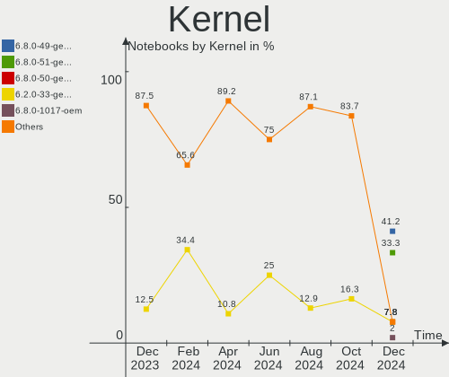
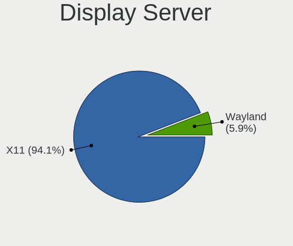
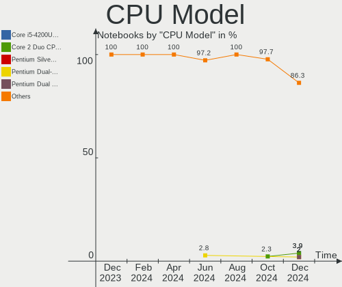
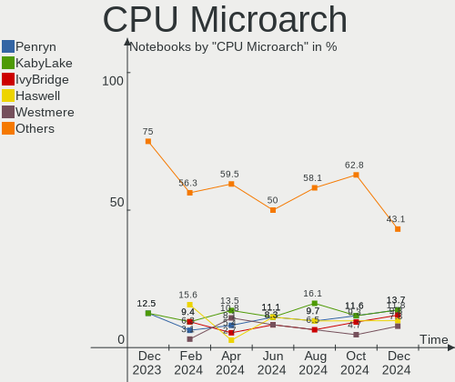
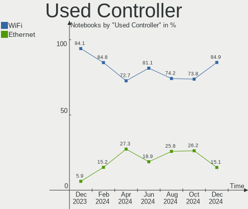
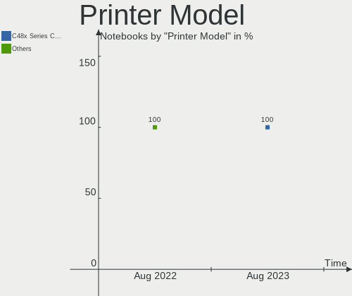

Elementary Hardware Trends (Notebooks)
--------------------------------------

A project to identify most popular hardware characteristics and track their change
over time based on data collected by Elementary users at https://Linux-Hardware.org.

Anyone can contribute to this report by the [hw-probe](https://github.com/linuxhw/hw-probe) tool:

    sudo -E hw-probe -all -upload

Full-feature report is available here: https://linux-hardware.org/?view=trends

Period: Mar, 2022.

Contents
--------

* [ System ](#system)
  - [ OS                       ](#os)
  - [ OS Family                ](#os-family)
  - [ Kernel                   ](#kernel)
  - [ Kernel Family            ](#kernel-family)
  - [ Kernel Major Ver.        ](#kernel-major-ver)
  - [ Arch                     ](#arch)
  - [ DE                       ](#de)
  - [ Display Server           ](#display-server)
  - [ Display Manager          ](#display-manager)
  - [ OS Lang                  ](#os-lang)
  - [ Boot Mode                ](#boot-mode)
  - [ Filesystem               ](#filesystem)
  - [ Part. scheme             ](#part-scheme)
  - [ Dual Boot with Linux/BSD ](#dual-boot-with-linuxbsd)
  - [ Dual Boot (Win)          ](#dual-boot-win)

* [ Board ](#board)
  - [ Vendor                   ](#vendor)
  - [ Model                    ](#model)
  - [ Model Family             ](#model-family)
  - [ MFG Year                 ](#mfg-year)
  - [ Form Factor              ](#form-factor)
  - [ Secure Boot              ](#secure-boot)
  - [ Coreboot                 ](#coreboot)
  - [ RAM Size                 ](#ram-size)
  - [ RAM Used                 ](#ram-used)
  - [ Total Drives             ](#total-drives)
  - [ Has CD-ROM               ](#has-cd-rom)
  - [ Has Ethernet             ](#has-ethernet)
  - [ Has WiFi                 ](#has-wifi)
  - [ Has Bluetooth            ](#has-bluetooth)

* [ Location ](#location)
  - [ Country                  ](#country)
  - [ City                     ](#city)

* [ Drives ](#drives)
  - [ Drive Vendor             ](#drive-vendor)
  - [ Drive Model              ](#drive-model)
  - [ HDD Vendor               ](#hdd-vendor)
  - [ SSD Vendor               ](#ssd-vendor)
  - [ Drive Kind               ](#drive-kind)
  - [ Drive Connector          ](#drive-connector)
  - [ Drive Size               ](#drive-size)
  - [ Space Total              ](#space-total)
  - [ Space Used               ](#space-used)
  - [ Malfunc. Drives          ](#malfunc-drives)
  - [ Malfunc. Drive Vendor    ](#malfunc-drive-vendor)
  - [ Malfunc. HDD Vendor      ](#malfunc-hdd-vendor)
  - [ Malfunc. Drive Kind      ](#malfunc-drive-kind)
  - [ Failed Drives            ](#failed-drives)
  - [ Failed Drive Vendor      ](#failed-drive-vendor)
  - [ Drive Status             ](#drive-status)

* [ Storage controller ](#storage-controller)
  - [ Storage Vendor           ](#storage-vendor)
  - [ Storage Model            ](#storage-model)
  - [ Storage Kind             ](#storage-kind)

* [ Processor ](#processor)
  - [ CPU Vendor               ](#cpu-vendor)
  - [ CPU Model                ](#cpu-model)
  - [ CPU Model Family         ](#cpu-model-family)
  - [ CPU Cores                ](#cpu-cores)
  - [ CPU Sockets              ](#cpu-sockets)
  - [ CPU Threads              ](#cpu-threads)
  - [ CPU Op-Modes             ](#cpu-op-modes)
  - [ CPU Microcode            ](#cpu-microcode)
  - [ CPU Microarch            ](#cpu-microarch)

* [ Graphics ](#graphics)
  - [ GPU Vendor               ](#gpu-vendor)
  - [ GPU Model                ](#gpu-model)
  - [ GPU Combo                ](#gpu-combo)
  - [ GPU Driver               ](#gpu-driver)
  - [ GPU Memory               ](#gpu-memory)

* [ Monitor ](#monitor)
  - [ Monitor Vendor           ](#monitor-vendor)
  - [ Monitor Model            ](#monitor-model)
  - [ Monitor Resolution       ](#monitor-resolution)
  - [ Monitor Diagonal         ](#monitor-diagonal)
  - [ Monitor Width            ](#monitor-width)
  - [ Aspect Ratio             ](#aspect-ratio)
  - [ Monitor Area             ](#monitor-area)
  - [ Pixel Density            ](#pixel-density)
  - [ Multiple Monitors        ](#multiple-monitors)

* [ Network ](#network)
  - [ Net Controller Vendor    ](#net-controller-vendor)
  - [ Net Controller Model     ](#net-controller-model)
  - [ Wireless Vendor          ](#wireless-vendor)
  - [ Wireless Model           ](#wireless-model)
  - [ Ethernet Vendor          ](#ethernet-vendor)
  - [ Ethernet Model           ](#ethernet-model)
  - [ Net Controller Kind      ](#net-controller-kind)
  - [ Used Controller          ](#used-controller)
  - [ NICs                     ](#nics)
  - [ IPv6                     ](#ipv6)

* [ Bluetooth ](#bluetooth)
  - [ Bluetooth Vendor         ](#bluetooth-vendor)
  - [ Bluetooth Model          ](#bluetooth-model)

* [ Sound ](#sound)
  - [ Sound Vendor             ](#sound-vendor)
  - [ Sound Model              ](#sound-model)

* [ Memory ](#memory)
  - [ Memory Vendor            ](#memory-vendor)
  - [ Memory Model             ](#memory-model)
  - [ Memory Kind              ](#memory-kind)
  - [ Memory Form Factor       ](#memory-form-factor)
  - [ Memory Size              ](#memory-size)
  - [ Memory Speed             ](#memory-speed)

* [ Printers & scanners ](#printers--scanners)
  - [ Printer Vendor           ](#printer-vendor)
  - [ Printer Model            ](#printer-model)
  - [ Scanner Vendor           ](#scanner-vendor)
  - [ Scanner Model            ](#scanner-model)

* [ Camera ](#camera)
  - [ Camera Vendor            ](#camera-vendor)
  - [ Camera Model             ](#camera-model)

* [ Security ](#security)
  - [ Fingerprint Vendor       ](#fingerprint-vendor)
  - [ Fingerprint Model        ](#fingerprint-model)
  - [ Chipcard Vendor          ](#chipcard-vendor)
  - [ Chipcard Model           ](#chipcard-model)

* [ Unsupported ](#unsupported)
  - [ Unsupported Devices      ](#unsupported-devices)
  - [ Unsupported Device Types ](#unsupported-device-types)

System
------

OS
--

Installed operating systems

| Name             | Notebooks | Percent |
|------------------|-----------|---------|
| Elementary 6.1   | 46        | 92%     |
| Elementary 5.1.7 | 3         | 6%      |
| Elementary 6     | 1         | 2%      |

OS Family
---------

OS without a version

| Name       | Notebooks | Percent |
|------------|-----------|---------|
| Elementary | 50        | 100%    |

Kernel
------

Version of the Linux kernel

| Version                    | Notebooks | Percent |
|----------------------------|-----------|---------|
| 5.13.0-30-generic          | 16        | 32%     |
| 5.13.0-35-generic          | 11        | 22%     |
| 5.13.0-37-generic          | 10        | 20%     |
| 5.11.0-43-generic          | 3         | 6%      |
| 5.4.0-100-generic          | 1         | 2%      |
| 5.3.0-7648-generic         | 1         | 2%      |
| 5.16.16-051616-generic     | 1         | 2%      |
| 5.16.0-13.4-liquorix-amd64 | 1         | 2%      |
| 5.14.0-1029-oem            | 1         | 2%      |
| 5.13.0-39-generic          | 1         | 2%      |
| 5.13.0-28-generic          | 1         | 2%      |
| 5.13.0-25-generic          | 1         | 2%      |
| 5.11.0-41-generic          | 1         | 2%      |
| 4.15.0-171-generic         | 1         | 2%      |

Kernel Family
-------------

Linux kernel without a distro release

| Version | Notebooks | Percent |
|---------|-----------|---------|
| 5.13.0  | 40        | 80%     |
| 5.11.0  | 4         | 8%      |
| 5.4.0   | 1         | 2%      |
| 5.3.0   | 1         | 2%      |
| 5.16.16 | 1         | 2%      |
| 5.16.0  | 1         | 2%      |
| 5.14.0  | 1         | 2%      |
| 4.15.0  | 1         | 2%      |

Kernel Major Ver.
-----------------

Linux kernel major version

| Version | Notebooks | Percent |
|---------|-----------|---------|
| 5.13    | 40        | 80%     |
| 5.11    | 4         | 8%      |
| 5.16    | 2         | 4%      |
| 5.4     | 1         | 2%      |
| 5.3     | 1         | 2%      |
| 5.14    | 1         | 2%      |
| 4.15    | 1         | 2%      |

Arch
----

OS architecture (x86_64, i586, etc.)

| Name   | Notebooks | Percent |
|--------|-----------|---------|
| x86_64 | 50        | 100%    |

DE
--

Desktop Environment

| Name     | Notebooks | Percent |
|----------|-----------|---------|
| Pantheon | 50        | 100%    |

Display Server
--------------

X11 or Wayland

| Name | Notebooks | Percent |
|------|-----------|---------|
| X11  | 50        | 100%    |

Display Manager
---------------

SDDM, LightDM, etc.

| Name    | Notebooks | Percent |
|---------|-----------|---------|
| Unknown | 39        | 78%     |
| LightDM | 11        | 22%     |

OS Lang
-------

Language

| Lang  | Notebooks | Percent |
|-------|-----------|---------|
| en_US | 17        | 34%     |
| de_DE | 6         | 12%     |
| fr_FR | 4         | 8%      |
| ru_RU | 2         | 4%      |
| pt_BR | 2         | 4%      |
| nb_NO | 2         | 4%      |
| it_IT | 2         | 4%      |
| es_ES | 2         | 4%      |
| en_AU | 2         | 4%      |
| tr_TR | 1         | 2%      |
| sv_SE | 1         | 2%      |
| pt_PT | 1         | 2%      |
| pl_PL | 1         | 2%      |
| et_EE | 1         | 2%      |
| en_ZA | 1         | 2%      |
| en_IN | 1         | 2%      |
| en_GB | 1         | 2%      |
| en_CA | 1         | 2%      |
| cs_CZ | 1         | 2%      |
| C     | 1         | 2%      |

Boot Mode
---------

EFI or BIOS

| Mode | Notebooks | Percent |
|------|-----------|---------|
| EFI  | 31        | 62%     |
| BIOS | 19        | 38%     |

Filesystem
----------

Type of filesystem

| Type | Notebooks | Percent |
|------|-----------|---------|
| Ext4 | 50        | 100%    |

Part. scheme
------------

Scheme of partitioning

| Type    | Notebooks | Percent |
|---------|-----------|---------|
| Unknown | 46        | 92%     |
| GPT     | 4         | 8%      |

Dual Boot with Linux/BSD
------------------------

Hosting more than one Linux/BSD

| Dual boot | Notebooks | Percent |
|-----------|-----------|---------|
| No        | 50        | 100%    |

Dual Boot (Win)
---------------

Hosting Linux and Windows

| Dual boot | Notebooks | Percent |
|-----------|-----------|---------|
| No        | 46        | 92%     |
| Yes       | 4         | 8%      |

Board
-----

Vendor
------

Motherboard manufacturer

| Name                | Notebooks | Percent |
|---------------------|-----------|---------|
| Lenovo              | 13        | 26%     |
| Dell                | 7         | 14%     |
| Acer                | 7         | 14%     |
| LG Electronics      | 3         | 6%      |
| Hewlett-Packard     | 3         | 6%      |
| ASUSTek Computer    | 3         | 6%      |
| Toshiba             | 2         | 4%      |
| Sony                | 2         | 4%      |
| Samsung Electronics | 2         | 4%      |
| MSI                 | 2         | 4%      |
| HUAWEI              | 2         | 4%      |
| Apple               | 2         | 4%      |
| Teclast             | 1         | 2%      |
| iOTA                | 1         | 2%      |

Model
-----

Motherboard model

| Name                                        | Notebooks | Percent |
|---------------------------------------------|-----------|---------|
| Toshiba Satellite L50D-C                    | 1         | 2%      |
| Toshiba Satellite C70D-A                    | 1         | 2%      |
| Teclast F15S                                | 1         | 2%      |
| Sony VPCCA4E1E                              | 1         | 2%      |
| Sony SVP1321B4E                             | 1         | 2%      |
| Samsung RV411/RV511/E3511/S3511/RV711/E3411 | 1         | 2%      |
| Samsung 530U3C/530U4C/532U3C                | 1         | 2%      |
| MSI Modern 14 B4MW                          | 1         | 2%      |
| MSI Modern 14 B10MW                         | 1         | 2%      |
| LG P1-JSUVT                                 | 1         | 2%      |
| LG A410-G.BC51P1                            | 1         | 2%      |
| LG 17Z95P-K.AAE8U1                          | 1         | 2%      |
| Lenovo ThinkPad X230 2325ND9                | 1         | 2%      |
| Lenovo ThinkPad T420 4236JY2                | 1         | 2%      |
| Lenovo ThinkPad T400s 2808D9G               | 1         | 2%      |
| Lenovo ThinkPad P14s Gen 1 20S4004AMH       | 1         | 2%      |
| Lenovo ThinkPad L470 20J4002FMX             | 1         | 2%      |
| Lenovo ThinkBook 16p Gen 2 20YM             | 1         | 2%      |
| Lenovo IdeaPad Y580                         | 1         | 2%      |
| Lenovo IdeaPad S340-15API 81NC              | 1         | 2%      |
| Lenovo IdeaPad S145-15IWL 81MV              | 1         | 2%      |
| Lenovo IdeaPad S145-15IIL 82DJ              | 1         | 2%      |
| Lenovo IdeaPad S145-14AST 81ST              | 1         | 2%      |
| Lenovo IdeaPad 330S-15ARR 81FB              | 1         | 2%      |
| Lenovo IdeaPad 310-15IKB 80TV               | 1         | 2%      |
| iOTA IOTA2320                               | 1         | 2%      |
| HUAWEI NBLB-WAX9N                           | 1         | 2%      |
| HUAWEI MACHD-WXX9                           | 1         | 2%      |
| HP Laptop 15-db0xxx                         | 1         | 2%      |
| HP EliteBook 8730w                          | 1         | 2%      |
| HP 250 G7 Notebook PC                       | 1         | 2%      |
| Dell Vostro 15 3515                         | 1         | 2%      |
| Dell Latitude E6220                         | 1         | 2%      |
| Dell Latitude 5520                          | 1         | 2%      |
| Dell Latitude 3550                          | 1         | 2%      |
| Dell Inspiron MM061                         | 1         | 2%      |
| Dell Inspiron 1545                          | 1         | 2%      |
| Dell Inspiron 15-3567                       | 1         | 2%      |
| ASUS X200CA                                 | 1         | 2%      |
| ASUS VivoBook_ASUS Laptop E410MA_E410MA     | 1         | 2%      |
| ASUS UL80VT                                 | 1         | 2%      |
| Apple MacBookPro6,2                         | 1         | 2%      |
| Apple MacBookAir7,1                         | 1         | 2%      |
| Acer Swift SF314-52                         | 1         | 2%      |
| Acer Nitro AN517-52                         | 1         | 2%      |
| Acer Nitro AN515-55                         | 1         | 2%      |
| Acer Aspire ES1-531                         | 1         | 2%      |
| Acer Aspire ES1-520                         | 1         | 2%      |
| Acer Aspire A315-42G                        | 1         | 2%      |
| Acer Aspire A315-21G                        | 1         | 2%      |

Model Family
------------

Motherboard model prefix

| Name               | Notebooks | Percent |
|--------------------|-----------|---------|
| Lenovo IdeaPad     | 7         | 14%     |
| Lenovo ThinkPad    | 5         | 10%     |
| Acer Aspire        | 4         | 8%      |
| Dell Latitude      | 3         | 6%      |
| Dell Inspiron      | 3         | 6%      |
| Toshiba Satellite  | 2         | 4%      |
| MSI Modern         | 2         | 4%      |
| Acer Nitro         | 2         | 4%      |
| Teclast F15S       | 1         | 2%      |
| Sony VPCCA4E1E     | 1         | 2%      |
| Sony SVP1321B4E    | 1         | 2%      |
| Samsung RV411      | 1         | 2%      |
| Samsung 530U3C     | 1         | 2%      |
| LG P1-JSUVT        | 1         | 2%      |
| LG A410-G.BC51P1   | 1         | 2%      |
| LG 17Z95P-K.AAE8U1 | 1         | 2%      |
| Lenovo ThinkBook   | 1         | 2%      |
| iOTA IOTA2320      | 1         | 2%      |
| HUAWEI NBLB-WAX9N  | 1         | 2%      |
| HUAWEI MACHD-WXX9  | 1         | 2%      |
| HP Laptop          | 1         | 2%      |
| HP EliteBook       | 1         | 2%      |
| HP 250             | 1         | 2%      |
| Dell Vostro        | 1         | 2%      |
| ASUS X200CA        | 1         | 2%      |
| ASUS VivoBook      | 1         | 2%      |
| ASUS UL80VT        | 1         | 2%      |
| Apple MacBookPro6  | 1         | 2%      |
| Apple MacBookAir7  | 1         | 2%      |
| Acer Swift         | 1         | 2%      |

MFG Year
--------

Motherboard manufacture year

| Year | Notebooks | Percent |
|------|-----------|---------|
| 2020 | 10        | 20%     |
| 2011 | 5         | 10%     |
| 2021 | 4         | 8%      |
| 2019 | 4         | 8%      |
| 2017 | 4         | 8%      |
| 2018 | 3         | 6%      |
| 2016 | 3         | 6%      |
| 2015 | 3         | 6%      |
| 2013 | 3         | 6%      |
| 2012 | 3         | 6%      |
| 2010 | 2         | 4%      |
| 2008 | 2         | 4%      |
| 2006 | 2         | 4%      |
| 2014 | 1         | 2%      |
| 2009 | 1         | 2%      |

Form Factor
-----------

Physical design of the computer

| Name     | Notebooks | Percent |
|----------|-----------|---------|
| Notebook | 50        | 100%    |

Secure Boot
-----------

Enabled or disabled

| State    | Notebooks | Percent |
|----------|-----------|---------|
| Disabled | 39        | 78%     |
| Enabled  | 11        | 22%     |

Coreboot
--------

Have coreboot on board

| Used | Notebooks | Percent |
|------|-----------|---------|
| No   | 50        | 100%    |

RAM Size
--------

Total RAM memory

| Size in GB | Notebooks | Percent |
|------------|-----------|---------|
| 4.01-8.0   | 18        | 36%     |
| 3.01-4.0   | 16        | 32%     |
| 8.01-16.0  | 7         | 14%     |
| 16.01-24.0 | 5         | 10%     |
| 32.01-64.0 | 2         | 4%      |
| 1.01-2.0   | 2         | 4%      |

RAM Used
--------

Used RAM memory

| Used GB    | Notebooks | Percent |
|------------|-----------|---------|
| 1.01-2.0   | 23        | 46%     |
| 2.01-3.0   | 17        | 34%     |
| 3.01-4.0   | 5         | 10%     |
| 4.01-8.0   | 3         | 6%      |
| 24.01-32.0 | 1         | 2%      |
| 0.51-1.0   | 1         | 2%      |

Total Drives
------------

Number of drives on board

| Drives | Notebooks | Percent |
|--------|-----------|---------|
| 1      | 41        | 82%     |
| 2      | 9         | 18%     |

Has CD-ROM
----------

Has CD-ROM on board

| Presented | Notebooks | Percent |
|-----------|-----------|---------|
| No        | 34        | 68%     |
| Yes       | 16        | 32%     |

Has Ethernet
------------

Has Ethernet on board

| Presented | Notebooks | Percent |
|-----------|-----------|---------|
| Yes       | 36        | 72%     |
| No        | 14        | 28%     |

Has WiFi
--------

Has WiFi module

| Presented | Notebooks | Percent |
|-----------|-----------|---------|
| Yes       | 50        | 100%    |

Has Bluetooth
-------------

Has Bluetooth module

| Presented | Notebooks | Percent |
|-----------|-----------|---------|
| Yes       | 47        | 94%     |
| No        | 3         | 6%      |

Location
--------

Country
-------

Geographic location (country)

| Country      | Notebooks | Percent |
|--------------|-----------|---------|
| Germany      | 5         | 10%     |
| USA          | 4         | 8%      |
| Russia       | 4         | 8%      |
| Italy        | 4         | 8%      |
| Brazil       | 3         | 6%      |
| UK           | 2         | 4%      |
| Spain        | 2         | 4%      |
| South Africa | 2         | 4%      |
| New Zealand  | 2         | 4%      |
| India        | 2         | 4%      |
| France       | 2         | 4%      |
| Czechia      | 2         | 4%      |
| Australia    | 2         | 4%      |
| Turkey       | 1         | 2%      |
| Switzerland  | 1         | 2%      |
| Serbia       | 1         | 2%      |
| Poland       | 1         | 2%      |
| Norway       | 1         | 2%      |
| Nicaragua    | 1         | 2%      |
| Luxembourg   | 1         | 2%      |
| Indonesia    | 1         | 2%      |
| Iceland      | 1         | 2%      |
| Finland      | 1         | 2%      |
| Estonia      | 1         | 2%      |
| Canada       | 1         | 2%      |
| Bulgaria     | 1         | 2%      |
| Austria      | 1         | 2%      |

City
----

Geographic location (city)

| City                  | Notebooks | Percent |
|-----------------------|-----------|---------|
| Wellington            | 2         | 4%      |
| Sydney                | 2         | 4%      |
| Moscow                | 2         | 4%      |
| Cape Town             | 2         | 4%      |
| Wonosari              | 1         | 2%      |
| Vantaa                | 1         | 2%      |
| Valencia              | 1         | 2%      |
| Ulyanovsk             | 1         | 2%      |
| Ubstadt-Weiher        | 1         | 2%      |
| Tromsø               | 1         | 2%      |
| Treviso               | 1         | 2%      |
| Tomsk                 | 1         | 2%      |
| Strasbourg            | 1         | 2%      |
| Sofia                 | 1         | 2%      |
| Sault Ste. Marie      | 1         | 2%      |
| Sao Paulo             | 1         | 2%      |
| Rzeszów              | 1         | 2%      |
| Rome                  | 1         | 2%      |
| Reykjavik             | 1         | 2%      |
| Recklinghausen        | 1         | 2%      |
| Prague                | 1         | 2%      |
| New Delhi             | 1         | 2%      |
| Neuhofen an der Krems | 1         | 2%      |
| Narva                 | 1         | 2%      |
| Muralto               | 1         | 2%      |
| Moorhead              | 1         | 2%      |
| Monterey Park         | 1         | 2%      |
| Managua               | 1         | 2%      |
| Madrid                | 1         | 2%      |
| Luxembourg            | 1         | 2%      |
| London                | 1         | 2%      |
| Licata                | 1         | 2%      |
| l'Alfas del Pi        | 1         | 2%      |
| Kolkata               | 1         | 2%      |
| Joinville             | 1         | 2%      |
| Istanbul              | 1         | 2%      |
| Hradec Králové      | 1         | 2%      |
| Gloucester            | 1         | 2%      |
| Fürth                | 1         | 2%      |
| Frankfurt am Main     | 1         | 2%      |
| Cuiabá               | 1         | 2%      |
| Cologne               | 1         | 2%      |
| Charlotte             | 1         | 2%      |
| Bolzano               | 1         | 2%      |
| Béziers              | 1         | 2%      |
| Belgrade              | 1         | 2%      |

Drives
------

Drive Vendor
------------

Hard drive vendors

| Vendor              | Notebooks | Drives | Percent |
|---------------------|-----------|--------|---------|
| Samsung Electronics | 9         | 9      | 15%     |
| Toshiba             | 8         | 8      | 13.33%  |
| Seagate             | 6         | 6      | 10%     |
| Sandisk             | 6         | 6      | 10%     |
| WDC                 | 4         | 5      | 6.67%   |
| SK Hynix            | 4         | 4      | 6.67%   |
| Kingston            | 4         | 4      | 6.67%   |
| Unknown             | 2         | 2      | 3.33%   |
| Fujitsu             | 2         | 2      | 3.33%   |
| Crucial             | 2         | 2      | 3.33%   |
| Smartbuy            | 1         | 1      | 1.67%   |
| PNY                 | 1         | 1      | 1.67%   |
| Pichau              | 1         | 1      | 1.67%   |
| Phison              | 1         | 1      | 1.67%   |
| NGFF                | 1         | 1      | 1.67%   |
| Netac               | 1         | 1      | 1.67%   |
| Micron Technology   | 1         | 1      | 1.67%   |
| Leven               | 1         | 1      | 1.67%   |
| KIOXIA              | 1         | 1      | 1.67%   |
| HGST                | 1         | 1      | 1.67%   |
| Dogfish             | 1         | 1      | 1.67%   |
| China               | 1         | 1      | 1.67%   |
| Apple               | 1         | 1      | 1.67%   |

Drive Model
-----------

Hard drive models

| Model                                   | Notebooks | Percent |
|-----------------------------------------|-----------|---------|
| Sandisk NVMe SSD Drive 512GB            | 3         | 4.92%   |
| SK Hynix NVMe SSD Drive 512GB           | 2         | 3.28%   |
| Sandisk NVMe SSD Drive 1024GB           | 2         | 3.28%   |
| Samsung SSD 860 EVO 250GB               | 2         | 3.28%   |
| Samsung NVMe SSD Drive 256GB            | 2         | 3.28%   |
| WDC WDS100T2B0A-00SM50 1TB SSD          | 1         | 1.64%   |
| WDC WD5000LPVX-75V0TT0 500GB            | 1         | 1.64%   |
| WDC WD1600BEVT-24A23T0 160GB            | 1         | 1.64%   |
| WDC PC SN730 SDBPNTY-1T00-1101 1TB      | 1         | 1.64%   |
| WDC PC SN530 SDBPNPZ-512G-1014 512GB    | 1         | 1.64%   |
| Unknown MMC Card  32GB                  | 1         | 1.64%   |
| Unknown MMC Card  128GB                 | 1         | 1.64%   |
| Toshiba THNS128GG4BAAA-NonFDE 128GB SSD | 1         | 1.64%   |
| Toshiba NVMe SSD Drive 512GB            | 1         | 1.64%   |
| Toshiba MQ01ACF050 500GB                | 1         | 1.64%   |
| Toshiba MQ01ABF050 500GB                | 1         | 1.64%   |
| Toshiba MQ01ABF032 320GB                | 1         | 1.64%   |
| Toshiba MQ01ABD100 1TB                  | 1         | 1.64%   |
| Toshiba MK6459GSXP 640GB                | 1         | 1.64%   |
| Toshiba MK3275GSX 320GB                 | 1         | 1.64%   |
| Smartbuy SSD 64GB                       | 1         | 1.64%   |
| SK Hynix HFS128G39TND-N210A 128GB SSD   | 1         | 1.64%   |
| SK Hynix HFM256GDHTNG-8310A 256GB       | 1         | 1.64%   |
| Seagate ST980811AS 80GB                 | 1         | 1.64%   |
| Seagate ST9320423AS 320GB               | 1         | 1.64%   |
| Seagate ST500LT012-1DG142 500GB         | 1         | 1.64%   |
| Seagate ST1000LM035-1RK172 1TB          | 1         | 1.64%   |
| Seagate ST1000LM024 HN-M101MBB 1TB      | 1         | 1.64%   |
| Seagate BUP Slim SL 1TB                 | 1         | 1.64%   |
| SanDisk SSD i100 24GB                   | 1         | 1.64%   |
| Samsung SSD 860 EVO mSATA 500GB         | 1         | 1.64%   |
| Samsung NVMe SSD Drive 500GB            | 1         | 1.64%   |
| Samsung NVMe SSD Drive 1024GB           | 1         | 1.64%   |
| Samsung MZNTD128HAGM-00000 128GB SSD    | 1         | 1.64%   |
| Samsung MZ7LN128HAHQ-000L2 128GB SSD    | 1         | 1.64%   |
| PNY CS900 480GB SSD                     | 1         | 1.64%   |
| Pichau Gaming PG256X 256GB              | 1         | 1.64%   |
| Phison NVMe SSD Drive 512GB             | 1         | 1.64%   |
| NGFF 2242 128GB SSD                     | 1         | 1.64%   |
| Netac SSD 256GB                         | 1         | 1.64%   |
| Micron 1100_MTFDDAV256TBN 256GB SSD     | 1         | 1.64%   |
| Leven JAJS600M1TB                       | 1         | 1.64%   |
| KIOXIA KBG40ZNS512G NVMe 512GB          | 1         | 1.64%   |
| Kingston SKC600512G 512GB SSD           | 1         | 1.64%   |
| Kingston SA400S37240G 240GB SSD         | 1         | 1.64%   |
| Kingston NVMe SSD Drive 512GB           | 1         | 1.64%   |
| Kingston NVMe SSD Drive 256GB           | 1         | 1.64%   |
| HGST HTS541010B7E610 1TB                | 1         | 1.64%   |
| Fujitsu MHZ2320BH G1 320GB              | 1         | 1.64%   |
| Fujitsu MHV2100BH 100GB                 | 1         | 1.64%   |
| Dogfish SSD 128GB                       | 1         | 1.64%   |
| Crucial CT240BX500SSD1 240GB            | 1         | 1.64%   |
| Crucial CT2000MX500SSD1 2TB             | 1         | 1.64%   |
| China SH00R120GB                        | 1         | 1.64%   |
| Apple SSD SM0512G 500GB                 | 1         | 1.64%   |

HDD Vendor
----------

Hard disk drive vendors

| Vendor  | Notebooks | Drives | Percent |
|---------|-----------|--------|---------|
| Toshiba | 6         | 6      | 35.29%  |
| Seagate | 6         | 6      | 35.29%  |
| WDC     | 2         | 2      | 11.76%  |
| Fujitsu | 2         | 2      | 11.76%  |
| HGST    | 1         | 1      | 5.88%   |

SSD Vendor
----------

Solid state drive vendors

| Vendor              | Notebooks | Drives | Percent |
|---------------------|-----------|--------|---------|
| Samsung Electronics | 5         | 5      | 22.73%  |
| Kingston            | 2         | 2      | 9.09%   |
| Crucial             | 2         | 2      | 9.09%   |
| WDC                 | 1         | 1      | 4.55%   |
| Toshiba             | 1         | 1      | 4.55%   |
| Smartbuy            | 1         | 1      | 4.55%   |
| SK Hynix            | 1         | 1      | 4.55%   |
| SanDisk             | 1         | 1      | 4.55%   |
| PNY                 | 1         | 1      | 4.55%   |
| Pichau              | 1         | 1      | 4.55%   |
| NGFF                | 1         | 1      | 4.55%   |
| Netac               | 1         | 1      | 4.55%   |
| Micron Technology   | 1         | 1      | 4.55%   |
| Dogfish             | 1         | 1      | 4.55%   |
| China               | 1         | 1      | 4.55%   |
| Apple               | 1         | 1      | 4.55%   |

Drive Kind
----------

HDD or SSD

| Kind    | Notebooks | Drives | Percent |
|---------|-----------|--------|---------|
| SSD     | 20        | 22     | 36.36%  |
| NVMe    | 16        | 19     | 29.09%  |
| HDD     | 16        | 17     | 29.09%  |
| MMC     | 2         | 2      | 3.64%   |
| Unknown | 1         | 1      | 1.82%   |

Drive Connector
---------------

SATA, SAS, NVMe, etc.

| Type | Notebooks | Drives | Percent |
|------|-----------|--------|---------|
| SATA | 36        | 39     | 65.45%  |
| NVMe | 16        | 19     | 29.09%  |
| MMC  | 2         | 2      | 3.64%   |
| SAS  | 1         | 1      | 1.82%   |

Drive Size
----------

Size of hard drive

| Size in TB | Notebooks | Drives | Percent |
|------------|-----------|--------|---------|
| 0.01-0.5   | 30        | 30     | 76.92%  |
| 0.51-1.0   | 8         | 8      | 20.51%  |
| 1.01-2.0   | 1         | 1      | 2.56%   |

Space Total
-----------

Amount of disk space available on the file system

| Size in GB | Notebooks | Percent |
|------------|-----------|---------|
| 101-250    | 17        | 34%     |
| 251-500    | 14        | 28%     |
| 501-1000   | 8         | 16%     |
| 51-100     | 5         | 10%     |
| 21-50      | 3         | 6%      |
| 1001-2000  | 3         | 6%      |

Space Used
----------

Amount of used disk space

| Used GB   | Notebooks | Percent |
|-----------|-----------|---------|
| 1-20      | 21        | 42%     |
| 21-50     | 13        | 26%     |
| 51-100    | 7         | 14%     |
| 101-250   | 5         | 10%     |
| 501-1000  | 2         | 4%      |
| 251-500   | 1         | 2%      |
| 1001-2000 | 1         | 2%      |

Malfunc. Drives
---------------

Drive models with a malfunction

Zero info for selected period =(

Malfunc. Drive Vendor
---------------------

Vendors of faulty drives

Zero info for selected period =(

Malfunc. HDD Vendor
-------------------

Vendors of faulty HDD drives

Zero info for selected period =(

Malfunc. Drive Kind
-------------------

Kinds of faulty drives

Zero info for selected period =(

Failed Drives
-------------

Failed drive models

Zero info for selected period =(

Failed Drive Vendor
-------------------

Failed drive vendors

Zero info for selected period =(

Drive Status
------------

Number of failed and malfunc. drives

| Status   | Notebooks | Drives | Percent |
|----------|-----------|--------|---------|
| Detected | 46        | 54     | 86.79%  |
| Works    | 7         | 7      | 13.21%  |

Storage controller
------------------

Storage Vendor
--------------

Storage controller vendors

| Vendor                       | Notebooks | Percent |
|------------------------------|-----------|---------|
| Intel                        | 32        | 54.24%  |
| AMD                          | 10        | 16.95%  |
| Sandisk                      | 5         | 8.47%   |
| Samsung Electronics          | 5         | 8.47%   |
| SK Hynix                     | 3         | 5.08%   |
| Kingston Technology Company  | 2         | 3.39%   |
| Toshiba America Info Systems | 1         | 1.69%   |
| Phison Electronics           | 1         | 1.69%   |

Storage Model
-------------

Storage controller models

| Model                                                                            | Notebooks | Percent |
|----------------------------------------------------------------------------------|-----------|---------|
| AMD FCH SATA Controller [AHCI mode]                                              | 10        | 16.39%  |
| Intel Sunrise Point-LP SATA Controller [AHCI mode]                               | 4         | 6.56%   |
| Intel 82801IBM/IEM (ICH9M/ICH9M-E) 4 port SATA Controller [AHCI mode]            | 4         | 6.56%   |
| Intel 7 Series Chipset Family 6-port SATA Controller [AHCI mode]                 | 4         | 6.56%   |
| Intel 6 Series/C200 Series Chipset Family 6 port Mobile SATA AHCI Controller     | 3         | 4.92%   |
| Sandisk WD Blue SN550 NVMe SSD                                                   | 2         | 3.28%   |
| Sandisk WD Black SN750 / PC SN730 NVMe SSD                                       | 2         | 3.28%   |
| Samsung NVMe SSD Controller SM981/PM981/PM983                                    | 2         | 3.28%   |
| Samsung NVMe SSD Controller 980                                                  | 2         | 3.28%   |
| Intel Celeron N3350/Pentium N4200/Atom E3900 Series SATA AHCI Controller         | 2         | 3.28%   |
| Intel 5 Series/3400 Series Chipset 4 port SATA AHCI Controller                   | 2         | 3.28%   |
| Intel 400 Series Chipset Family SATA AHCI Controller                             | 2         | 3.28%   |
| Toshiba America Info Systems XG6 NVMe SSD Controller                             | 1         | 1.64%   |
| SK Hynix Gold P31 SSD                                                            | 1         | 1.64%   |
| SK Hynix BC511                                                                   | 1         | 1.64%   |
| SK Hynix BC501 NVMe Solid State Drive                                            | 1         | 1.64%   |
| Sandisk PC SN520 NVMe SSD                                                        | 1         | 1.64%   |
| Samsung Electronics SATA controller                                              | 1         | 1.64%   |
| Phison PS5013 E13 NVMe Controller                                                | 1         | 1.64%   |
| Kingston Company Company Non-Volatile memory controller                          | 1         | 1.64%   |
| Kingston Company OM3PDP3 NVMe SSD                                                | 1         | 1.64%   |
| Intel Wildcat Point-LP SATA Controller [AHCI Mode]                               | 1         | 1.64%   |
| Intel Ice Lake-LP SATA Controller [AHCI mode]                                    | 1         | 1.64%   |
| Intel Comet Lake SATA AHCI Controller                                            | 1         | 1.64%   |
| Intel Celeron/Pentium Silver Processor SATA Controller                           | 1         | 1.64%   |
| Intel Cannon Point-LP SATA Controller [AHCI Mode]                                | 1         | 1.64%   |
| Intel Atom/Celeron/Pentium Processor x5-E8000/J3xxx/N3xxx Series SATA Controller | 1         | 1.64%   |
| Intel 82801GBM/GHM (ICH7-M Family) SATA Controller [IDE mode]                    | 1         | 1.64%   |
| Intel 82801GBM/GHM (ICH7-M Family) SATA Controller [AHCI mode]                   | 1         | 1.64%   |
| Intel 82801G (ICH7 Family) IDE Controller                                        | 1         | 1.64%   |
| Intel 82801 Mobile SATA Controller [RAID mode]                                   | 1         | 1.64%   |
| Intel 8 Series SATA Controller 1 [AHCI mode]                                     | 1         | 1.64%   |
| Intel 5 Series/3400 Series Chipset 4 port SATA IDE Controller                    | 1         | 1.64%   |
| Intel 5 Series/3400 Series Chipset 2 port SATA IDE Controller                    | 1         | 1.64%   |

Storage Kind
------------

Kind of storage controller (IDE, SATA, NVMe, SAS, ...)

| Kind | Notebooks | Percent |
|------|-----------|---------|
| SATA | 40        | 67.8%   |
| NVMe | 15        | 25.42%  |
| IDE  | 3         | 5.08%   |
| RAID | 1         | 1.69%   |

Processor
---------

CPU Vendor
----------

Processor vendors

| Vendor | Notebooks | Percent |
|--------|-----------|---------|
| Intel  | 38        | 76%     |
| AMD    | 12        | 24%     |

CPU Model
---------

Processor models

| Model                                           | Notebooks | Percent |
|-------------------------------------------------|-----------|---------|
| Intel Core i5-7200U CPU @ 2.50GHz               | 3         | 6%      |
| Intel Core i5-2520M CPU @ 2.50GHz               | 2         | 4%      |
| Intel 11th Gen Core i7-1165G7 @ 2.80GHz         | 2         | 4%      |
| AMD A6-9225 RADEON R4, 5 COMPUTE CORES 2C+3G    | 2         | 4%      |
| Intel Pentium Silver N5030 CPU @ 1.10GHz        | 1         | 2%      |
| Intel Pentium CPU N4200 @ 1.10GHz               | 1         | 2%      |
| Intel Genuine CPU U7300 @ 1.30GHz               | 1         | 2%      |
| Intel Core i7-5650U CPU @ 2.20GHz               | 1         | 2%      |
| Intel Core i7-4500U CPU @ 1.80GHz               | 1         | 2%      |
| Intel Core i7-3630QM CPU @ 2.40GHz              | 1         | 2%      |
| Intel Core i7-10750H CPU @ 2.60GHz              | 1         | 2%      |
| Intel Core i7-1065G7 CPU @ 1.30GHz              | 1         | 2%      |
| Intel Core i7-10510U CPU @ 1.80GHz              | 1         | 2%      |
| Intel Core i5-3320M CPU @ 2.60GHz               | 1         | 2%      |
| Intel Core i5-1035G1 CPU @ 1.00GHz              | 1         | 2%      |
| Intel Core i5-10300H CPU @ 2.50GHz              | 1         | 2%      |
| Intel Core i5-10210U CPU @ 1.60GHz              | 1         | 2%      |
| Intel Core i5 CPU M 520 @ 2.40GHz               | 1         | 2%      |
| Intel Core i3-8145U CPU @ 2.10GHz               | 1         | 2%      |
| Intel Core i3-7100U CPU @ 2.40GHz               | 1         | 2%      |
| Intel Core i3-5005U CPU @ 2.00GHz               | 1         | 2%      |
| Intel Core i3-3217U CPU @ 1.80GHz               | 1         | 2%      |
| Intel Core i3-2350M CPU @ 2.30GHz               | 1         | 2%      |
| Intel Core i3-10110U CPU @ 2.10GHz              | 1         | 2%      |
| Intel Core i3 CPU M 390 @ 2.67GHz               | 1         | 2%      |
| Intel Core i3 CPU M 380 @ 2.53GHz               | 1         | 2%      |
| Intel Core 2 Quad CPU Q9000 @ 2.00GHz           | 1         | 2%      |
| Intel Core 2 Duo CPU P9400 @ 2.40GHz            | 1         | 2%      |
| Intel Core 2 CPU T5600 @ 1.83GHz                | 1         | 2%      |
| Intel Core 2 CPU T5300 @ 1.73GHz                | 1         | 2%      |
| Intel Celeron CPU N3050 @ 1.60GHz               | 1         | 2%      |
| Intel Celeron CPU J3455 @ 1.50GHz               | 1         | 2%      |
| Intel Celeron CPU 900 @ 2.20GHz                 | 1         | 2%      |
| Intel Celeron CPU 1007U @ 1.50GHz               | 1         | 2%      |
| Intel 11th Gen Core i7-1195G7 @ 2.90GHz         | 1         | 2%      |
| AMD Ryzen 9 5900HX with Radeon Graphics         | 1         | 2%      |
| AMD Ryzen 5 4500U with Radeon Graphics          | 1         | 2%      |
| AMD Ryzen 5 3500U with Radeon Vega Mobile Gfx   | 1         | 2%      |
| AMD Ryzen 5 3450U with Radeon Vega Mobile Gfx   | 1         | 2%      |
| AMD Ryzen 5 2500U with Radeon Vega Mobile Gfx   | 1         | 2%      |
| AMD Ryzen 3 3200U with Radeon Vega Mobile Gfx   | 1         | 2%      |
| AMD E1-2500 APU with Radeon HD Graphics         | 1         | 2%      |
| AMD A9-9420 RADEON R5, 5 COMPUTE CORES 2C+3G    | 1         | 2%      |
| AMD A4-5000 APU with Radeon HD Graphics         | 1         | 2%      |
| AMD A10-8700P Radeon R6, 10 Compute Cores 4C+6G | 1         | 2%      |

CPU Model Family
----------------

Processor model prefix

| Model                | Notebooks | Percent |
|----------------------|-----------|---------|
| Intel Core i5        | 10        | 20%     |
| Intel Core i3        | 8         | 16%     |
| Intel Core i7        | 6         | 12%     |
| Other                | 4         | 8%      |
| Intel Celeron        | 4         | 8%      |
| AMD Ryzen 5          | 4         | 8%      |
| Intel Core 2         | 2         | 4%      |
| AMD A6               | 2         | 4%      |
| Intel Pentium Silver | 1         | 2%      |
| Intel Pentium        | 1         | 2%      |
| Intel Genuine        | 1         | 2%      |
| Intel Core 2 Quad    | 1         | 2%      |
| Intel Core 2 Duo     | 1         | 2%      |
| AMD Ryzen 9          | 1         | 2%      |
| AMD Ryzen 3          | 1         | 2%      |
| AMD E1               | 1         | 2%      |
| AMD A4               | 1         | 2%      |
| AMD A10              | 1         | 2%      |

CPU Cores
---------

Number of processor cores

| Number | Notebooks | Percent |
|--------|-----------|---------|
| 2      | 29        | 58%     |
| 4      | 17        | 34%     |
| 6      | 2         | 4%      |
| 8      | 1         | 2%      |
| 1      | 1         | 2%      |

CPU Sockets
-----------

Number of sockets

| Number | Notebooks | Percent |
|--------|-----------|---------|
| 1      | 50        | 100%    |

CPU Threads
-----------

Threads per core (Hyper-Threading)

| Number | Notebooks | Percent |
|--------|-----------|---------|
| 2      | 33        | 66%     |
| 1      | 17        | 34%     |

CPU Op-Modes
------------

CPU Operation Modes (32-bit, 64-bit)

| Op mode        | Notebooks | Percent |
|----------------|-----------|---------|
| 32-bit, 64-bit | 50        | 100%    |

CPU Microcode
-------------

Microcode number

| Number     | Notebooks | Percent |
|------------|-----------|---------|
| Unknown    | 6         | 12%     |
| 0x1067a    | 4         | 8%      |
| 0x806ec    | 3         | 6%      |
| 0x806e9    | 3         | 6%      |
| 0x306a9    | 3         | 6%      |
| 0x206a7    | 3         | 6%      |
| 0x20655    | 3         | 6%      |
| 0x06006705 | 3         | 6%      |
| 0xa0652    | 2         | 4%      |
| 0x806c1    | 2         | 4%      |
| 0x706e5    | 2         | 4%      |
| 0x506c9    | 2         | 4%      |
| 0x306d4    | 2         | 4%      |
| 0x08108109 | 2         | 4%      |
| 0x0700010f | 2         | 4%      |
| 0x806c2    | 1         | 2%      |
| 0x706a8    | 1         | 2%      |
| 0x6f6      | 1         | 2%      |
| 0x6f2      | 1         | 2%      |
| 0x0a50000c | 1         | 2%      |
| 0x08108102 | 1         | 2%      |
| 0x0810100b | 1         | 2%      |
| 0x06006110 | 1         | 2%      |

CPU Microarch
-------------

Microarchitecture

| Name          | Notebooks | Percent |
|---------------|-----------|---------|
| KabyLake      | 8         | 16%     |
| Penryn        | 4         | 8%      |
| IvyBridge     | 4         | 8%      |
| Excavator     | 4         | 8%      |
| Zen+          | 3         | 6%      |
| Westmere      | 3         | 6%      |
| TigerLake     | 3         | 6%      |
| SandyBridge   | 3         | 6%      |
| Jaguar        | 2         | 4%      |
| IceLake       | 2         | 4%      |
| Goldmont      | 2         | 4%      |
| Core          | 2         | 4%      |
| CometLake     | 2         | 4%      |
| Broadwell     | 2         | 4%      |
| Zen 3         | 1         | 2%      |
| Zen 2         | 1         | 2%      |
| Zen           | 1         | 2%      |
| Silvermont    | 1         | 2%      |
| Haswell       | 1         | 2%      |
| Goldmont plus | 1         | 2%      |

Graphics
--------

GPU Vendor
----------

Vendors of graphics cards

| Vendor | Notebooks | Percent |
|--------|-----------|---------|
| Intel  | 34        | 57.63%  |
| AMD    | 14        | 23.73%  |
| Nvidia | 11        | 18.64%  |

GPU Model
---------

Graphics card models

| Model                                                                                    | Notebooks | Percent |
|------------------------------------------------------------------------------------------|-----------|---------|
| Intel HD Graphics 620                                                                    | 4         | 6.35%   |
| Intel 3rd Gen Core processor Graphics Controller                                         | 4         | 6.35%   |
| Intel TigerLake-LP GT2 [Iris Xe Graphics]                                                | 3         | 4.76%   |
| Intel Mobile 4 Series Chipset Integrated Graphics Controller                             | 3         | 4.76%   |
| Intel CometLake-U GT2 [UHD Graphics]                                                     | 3         | 4.76%   |
| Intel 2nd Generation Core Processor Family Integrated Graphics Controller                | 3         | 4.76%   |
| AMD Stoney [Radeon R2/R3/R4/R5 Graphics]                                                 | 3         | 4.76%   |
| AMD Picasso/Raven 2 [Radeon Vega Series / Radeon Vega Mobile Series]                     | 3         | 4.76%   |
| Intel Core Processor Integrated Graphics Controller                                      | 2         | 3.17%   |
| Intel CometLake-H GT2 [UHD Graphics]                                                     | 2         | 3.17%   |
| AMD Jet PRO [Radeon R5 M230 / R7 M260DX / Radeon 520 Mobile]                             | 2         | 3.17%   |
| Nvidia TU117M                                                                            | 1         | 1.59%   |
| Nvidia TU106M [GeForce RTX 2060 Mobile]                                                  | 1         | 1.59%   |
| Nvidia GT218M [GeForce G210M]                                                            | 1         | 1.59%   |
| Nvidia GT218M [GeForce 315M]                                                             | 1         | 1.59%   |
| Nvidia GT216M [GeForce GT 330M]                                                          | 1         | 1.59%   |
| Nvidia GP108GLM [Quadro P520]                                                            | 1         | 1.59%   |
| Nvidia GM108M [GeForce 920MX]                                                            | 1         | 1.59%   |
| Nvidia GK107M [GeForce GTX 660M]                                                         | 1         | 1.59%   |
| Nvidia GA106M [GeForce RTX 3060 Mobile / Max-Q]                                          | 1         | 1.59%   |
| Nvidia G94GLM [Quadro FX 2700M]                                                          | 1         | 1.59%   |
| Nvidia G72M [Quadro NVS 110M/GeForce Go 7300]                                            | 1         | 1.59%   |
| Intel WhiskeyLake-U GT2 [UHD Graphics 620]                                               | 1         | 1.59%   |
| Intel Iris Plus Graphics G7                                                              | 1         | 1.59%   |
| Intel Iris Plus Graphics G1 (Ice Lake)                                                   | 1         | 1.59%   |
| Intel HD Graphics 6000                                                                   | 1         | 1.59%   |
| Intel HD Graphics 5500                                                                   | 1         | 1.59%   |
| Intel HD Graphics 500                                                                    | 1         | 1.59%   |
| Intel Haswell-ULT Integrated Graphics Controller                                         | 1         | 1.59%   |
| Intel GeminiLake [UHD Graphics 605]                                                      | 1         | 1.59%   |
| Intel Celeron N3350/Pentium N4200/Atom E3900 Series Integrated Graphics Controller       | 1         | 1.59%   |
| Intel Atom/Celeron/Pentium Processor x5-E8000/J3xxx/N3xxx Integrated Graphics Controller | 1         | 1.59%   |
| AMD Wani [Radeon R5/R6/R7 Graphics]                                                      | 1         | 1.59%   |
| AMD Topaz XT [Radeon R7 M260/M265 / M340/M360 / M440/M445 / 530/535 / 620/625 Mobile]    | 1         | 1.59%   |
| AMD Sun XT [Radeon HD 8670A/8670M/8690M / R5 M330 / M430 / Radeon 520 Mobile]            | 1         | 1.59%   |
| AMD RV515/M54 [Mobility Radeon X1400]                                                    | 1         | 1.59%   |
| AMD Renoir                                                                               | 1         | 1.59%   |
| AMD Raven Ridge [Radeon Vega Series / Radeon Vega Mobile Series]                         | 1         | 1.59%   |
| AMD Lexa [Radeon 540X/550X/630 / RX 640 / E9171 MCM]                                     | 1         | 1.59%   |
| AMD Kabini [Radeon HD 8330]                                                              | 1         | 1.59%   |
| AMD Kabini [Radeon HD 8240 / R3 Series]                                                  | 1         | 1.59%   |
| AMD Cezanne                                                                              | 1         | 1.59%   |

GPU Combo
---------

Combinations of graphics cards

| Name           | Notebooks | Percent |
|----------------|-----------|---------|
| 1 x Intel      | 26        | 52%     |
| 1 x AMD        | 8         | 16%     |
| Intel + Nvidia | 7         | 14%     |
| 2 x AMD        | 4         | 8%      |
| 1 x Nvidia     | 3         | 6%      |
| Intel + AMD    | 1         | 2%      |
| AMD + Nvidia   | 1         | 2%      |

GPU Driver
----------

Free vs proprietary

| Driver      | Notebooks | Percent |
|-------------|-----------|---------|
| Free        | 45        | 90%     |
| Proprietary | 3         | 6%      |
| Unknown     | 2         | 4%      |

GPU Memory
----------

Total video memory

| Size in GB | Notebooks | Percent |
|------------|-----------|---------|
| Unknown    | 30        | 60%     |
| 0.01-0.5   | 9         | 18%     |
| 1.01-2.0   | 7         | 14%     |
| 0.51-1.0   | 2         | 4%      |
| 5.01-6.0   | 1         | 2%      |
| 3.01-4.0   | 1         | 2%      |

Monitor
-------

Monitor Vendor
--------------

Monitor vendors

| Vendor              | Notebooks | Percent |
|---------------------|-----------|---------|
| AU Optronics        | 12        | 22.64%  |
| BOE                 | 11        | 20.75%  |
| LG Display          | 10        | 18.87%  |
| Chimei Innolux      | 4         | 7.55%   |
| Samsung Electronics | 2         | 3.77%   |
| PANDA               | 2         | 3.77%   |
| Dell                | 2         | 3.77%   |
| Apple               | 2         | 3.77%   |
| Panasonic           | 1         | 1.89%   |
| Packard Bell        | 1         | 1.89%   |
| Lenovo              | 1         | 1.89%   |
| Konka               | 1         | 1.89%   |
| Goldstar            | 1         | 1.89%   |
| CSO                 | 1         | 1.89%   |
| CPT                 | 1         | 1.89%   |
| AOC                 | 1         | 1.89%   |

Monitor Model
-------------

Monitor models

| Model                                                                | Notebooks | Percent |
|----------------------------------------------------------------------|-----------|---------|
| LG Display LCD Monitor LGD05E5 1920x1080 344x194mm 15.5-inch         | 2         | 3.77%   |
| AU Optronics LCD Monitor AUO403D 1920x1080 309x174mm 14.0-inch       | 2         | 3.77%   |
| Samsung Electronics LCD Monitor SEC5441 1366x768 256x144mm 11.6-inch | 1         | 1.89%   |
| Samsung Electronics LCD Monitor SDC4141 1366x768 344x194mm 15.5-inch | 1         | 1.89%   |
| PANDA LM156LF1L03 NCP001C 1920x1080 344x194mm 15.5-inch              | 1         | 1.89%   |
| PANDA LCD Monitor NCP004D 1920x1080 344x194mm 15.5-inch              | 1         | 1.89%   |
| Panasonic VVX13F009G00 MEI96A2 1920x1080 344x193mm 15.5-inch         | 1         | 1.89%   |
| Packard Bell Viseo 240DX PKB0121 1920x1080 521x293mm 23.5-inch       | 1         | 1.89%   |
| LG Display LP171WU5-TLB1 LGD0169 1920x1200 367x230mm 17.1-inch       | 1         | 1.89%   |
| LG Display LCD Monitor LGD0695 2560x1600 366x229mm 17.0-inch         | 1         | 1.89%   |
| LG Display LCD Monitor LGD0456 1366x768 340x190mm 15.3-inch          | 1         | 1.89%   |
| LG Display LCD Monitor LGD036C 1366x768 277x156mm 12.5-inch          | 1         | 1.89%   |
| LG Display LCD Monitor LGD02EF 1366x768 310x174mm 14.0-inch          | 1         | 1.89%   |
| LG Display LCD Monitor LGD02E9 1366x768 309x174mm 14.0-inch          | 1         | 1.89%   |
| LG Display LCD Monitor LGD02D8 1366x768 277x156mm 12.5-inch          | 1         | 1.89%   |
| LG Display LCD Monitor LGD01E9 1920x1080 345x194mm 15.6-inch         | 1         | 1.89%   |
| Lenovo LCD Monitor LEN4036 1440x900 303x190mm 14.1-inch              | 1         | 1.89%   |
| Konka TV MONIOR KOA0030 1920x540 708x398mm 32.0-inch                 | 1         | 1.89%   |
| Goldstar ULTRAGEAR GSM5BB3 2560x1440 597x336mm 27.0-inch             | 1         | 1.89%   |
| Dell U2720Q DEL41B5 3840x2160 600x340mm 27.2-inch                    | 1         | 1.89%   |
| Dell P2715Q DEL40BD 3840x2160 597x336mm 27.0-inch                    | 1         | 1.89%   |
| CSO LCD Monitor CSO1309 3000x2000 293x195mm 13.9-inch                | 1         | 1.89%   |
| CPT LCD Monitor CPT14BF 1366x768 344x193mm 15.5-inch                 | 1         | 1.89%   |
| Chimei Innolux LCD Monitor CMN1728 1600x900 382x215mm 17.3-inch      | 1         | 1.89%   |
| Chimei Innolux LCD Monitor CMN15E6 1366x768 344x193mm 15.5-inch      | 1         | 1.89%   |
| Chimei Innolux LCD Monitor CMN15DC 1366x768 344x193mm 15.5-inch      | 1         | 1.89%   |
| Chimei Innolux LCD Monitor CMN14C9 1920x1080 309x173mm 13.9-inch     | 1         | 1.89%   |
| BOE LCD Monitor BOE0A89 1920x1080 344x194mm 15.5-inch                | 1         | 1.89%   |
| BOE LCD Monitor BOE0877 1920x1080 309x173mm 13.9-inch                | 1         | 1.89%   |
| BOE LCD Monitor BOE0812 1920x1080 344x194mm 15.5-inch                | 1         | 1.89%   |
| BOE LCD Monitor BOE0757 1366x768 344x194mm 15.5-inch                 | 1         | 1.89%   |
| BOE LCD Monitor BOE06F3 1920x1080 309x173mm 13.9-inch                | 1         | 1.89%   |
| BOE LCD Monitor BOE06DF 1920x1080 309x173mm 13.9-inch                | 1         | 1.89%   |
| BOE LCD Monitor BOE06A5 1366x768 344x194mm 15.5-inch                 | 1         | 1.89%   |
| BOE LCD Monitor BOE0690 1920x1080 344x193mm 15.5-inch                | 1         | 1.89%   |
| BOE LCD Monitor BOE0687 1920x1080 344x193mm 15.5-inch                | 1         | 1.89%   |
| BOE LCD Monitor BOE0620 1366x768 344x194mm 15.5-inch                 | 1         | 1.89%   |
| BOE LCD Monitor BOE061D 1366x768 309x173mm 13.9-inch                 | 1         | 1.89%   |
| AU Optronics LCD Monitor AUO573D 1920x1080 309x174mm 14.0-inch       | 1         | 1.89%   |
| AU Optronics LCD Monitor AUO479D 1920x1080 382x215mm 17.3-inch       | 1         | 1.89%   |
| AU Optronics LCD Monitor AUO39ED 1920x1080 344x193mm 15.5-inch       | 1         | 1.89%   |
| AU Optronics LCD Monitor AUO313C 1366x768 309x173mm 13.9-inch        | 1         | 1.89%   |
| AU Optronics LCD Monitor AUO305C 1366x768 256x144mm 11.6-inch        | 1         | 1.89%   |
| AU Optronics LCD Monitor AUO23ED 1920x1080 344x194mm 15.5-inch       | 1         | 1.89%   |
| AU Optronics LCD Monitor AUO213D 1920x1080 309x173mm 13.9-inch       | 1         | 1.89%   |
| AU Optronics LCD Monitor AUO213C 1366x768 309x174mm 14.0-inch        | 1         | 1.89%   |
| AU Optronics LCD Monitor AUO1C74 1280x800 331x207mm 15.4-inch        | 1         | 1.89%   |
| AU Optronics LCD Monitor AUO1296 2560x1600 344x215mm 16.0-inch       | 1         | 1.89%   |
| Apple LCD Monitor APP9CA3 1440x900 331x207mm 15.4-inch               | 1         | 1.89%   |
| Apple Color LCD APP9CF2 1366x768 256x144mm 11.6-inch                 | 1         | 1.89%   |
| AOC 2436 AOC2436 1920x1080 521x293mm 23.5-inch                       | 1         | 1.89%   |

Monitor Resolution
------------------

Monitor screen resolution

| Resolution        | Notebooks | Percent |
|-------------------|-----------|---------|
| 1920x1080 (FHD)   | 21        | 41.18%  |
| 1366x768 (WXGA)   | 17        | 33.33%  |
| 3840x2160 (4K)    | 4         | 7.84%   |
| 2560x1600         | 2         | 3.92%   |
| 1440x900 (WXGA+)  | 2         | 3.92%   |
| 3000x2000         | 1         | 1.96%   |
| 2560x1440 (QHD)   | 1         | 1.96%   |
| 1920x1200 (WUXGA) | 1         | 1.96%   |
| 1600x900 (HD+)    | 1         | 1.96%   |
| 1280x800 (WXGA)   | 1         | 1.96%   |

Monitor Diagonal
----------------

Diagonal size in inches

| Inches | Notebooks | Percent |
|--------|-----------|---------|
| 15     | 21        | 39.62%  |
| 14     | 9         | 16.98%  |
| 13     | 6         | 11.32%  |
| 17     | 5         | 9.43%   |
| 27     | 3         | 5.66%   |
| 23     | 2         | 3.77%   |
| 12     | 2         | 3.77%   |
| 11     | 2         | 3.77%   |
| 52     | 1         | 1.89%   |
| 21     | 1         | 1.89%   |
| 16     | 1         | 1.89%   |

Monitor Width
-------------

Physical width

| Width in mm | Notebooks | Percent |
|-------------|-----------|---------|
| 301-350     | 35        | 66.04%  |
| 351-400     | 6         | 11.32%  |
| 501-600     | 5         | 9.43%   |
| 201-300     | 5         | 9.43%   |
| 401-500     | 1         | 1.89%   |
| 1001-1500   | 1         | 1.89%   |

Aspect Ratio
------------

Proportional relationship between the width and the height

| Ratio | Notebooks | Percent |
|-------|-----------|---------|
| 16/9  | 41        | 85.42%  |
| 16/10 | 6         | 12.5%   |
| 3/2   | 1         | 2.08%   |

Monitor Area
------------

Area in inch²

| Area in inch² | Notebooks | Percent |
|----------------|-----------|---------|
| 101-110        | 21        | 39.62%  |
| 81-90          | 15        | 28.3%   |
| 301-350        | 3         | 5.66%   |
| 201-250        | 3         | 5.66%   |
| 121-130        | 3         | 5.66%   |
| 61-70          | 2         | 3.77%   |
| 51-60          | 2         | 3.77%   |
| 131-140        | 2         | 3.77%   |
| More than 1000 | 1         | 1.89%   |
| 111-120        | 1         | 1.89%   |

Pixel Density
-------------

Pixels per inch

| Density       | Notebooks | Percent |
|---------------|-----------|---------|
| 121-160       | 25        | 48.08%  |
| 101-120       | 16        | 30.77%  |
| 51-100        | 4         | 7.69%   |
| More than 240 | 3         | 5.77%   |
| 161-240       | 3         | 5.77%   |
| 1-50          | 1         | 1.92%   |

Multiple Monitors
-----------------

Total monitors connected

| Total | Notebooks | Percent |
|-------|-----------|---------|
| 1     | 43        | 86%     |
| 2     | 6         | 12%     |
| 0     | 1         | 2%      |

Network
-------

Net Controller Vendor
---------------------

Controller vendors

| Vendor                            | Notebooks | Percent |
|-----------------------------------|-----------|---------|
| Intel                             | 27        | 36.49%  |
| Realtek Semiconductor             | 21        | 28.38%  |
| Qualcomm Atheros                  | 12        | 16.22%  |
| Broadcom                          | 4         | 5.41%   |
| Ralink                            | 2         | 2.7%    |
| Broadcom Limited                  | 2         | 2.7%    |
| Xiaomi                            | 1         | 1.35%   |
| OnePlus Technology (Shenzhen)     | 1         | 1.35%   |
| Marvell Technology Group          | 1         | 1.35%   |
| LSI                               | 1         | 1.35%   |
| Ericsson Business Mobile Networks | 1         | 1.35%   |
| ASIX Electronics                  | 1         | 1.35%   |

Net Controller Model
--------------------

Controller models

| Model                                                             | Notebooks | Percent |
|-------------------------------------------------------------------|-----------|---------|
| Realtek RTL8111/8168/8411 PCI Express Gigabit Ethernet Controller | 12        | 13.64%  |
| Realtek RTL8821CE 802.11ac PCIe Wireless Network Adapter          | 5         | 5.68%   |
| Qualcomm Atheros QCA9377 802.11ac Wireless Network Adapter        | 5         | 5.68%   |
| Qualcomm Atheros QCA9565 / AR9565 Wireless Network Adapter        | 3         | 3.41%   |
| Intel Wi-Fi 6 AX201                                               | 3         | 3.41%   |
| Intel Comet Lake PCH-LP CNVi WiFi                                 | 3         | 3.41%   |
| Intel 82579LM Gigabit Network Connection (Lewisville)             | 3         | 3.41%   |
| Realtek RTL810xE PCI Express Fast Ethernet controller             | 2         | 2.27%   |
| Realtek Killer E2600 Gigabit Ethernet Controller                  | 2         | 2.27%   |
| Intel Wireless 7265                                               | 2         | 2.27%   |
| Intel Wireless 3165                                               | 2         | 2.27%   |
| Intel Ultimate N WiFi Link 5300                                   | 2         | 2.27%   |
| Intel PRO/Wireless 3945ABG [Golan] Network Connection             | 2         | 2.27%   |
| Intel Comet Lake PCH CNVi WiFi                                    | 2         | 2.27%   |
| Intel Centrino Advanced-N 6205 [Taylor Peak]                      | 2         | 2.27%   |
| Intel 82567LM Gigabit Network Connection                          | 2         | 2.27%   |
| Xiaomi Mi/Redmi series (RNDIS)                                    | 1         | 1.14%   |
| Realtek RTL8822CE 802.11ac PCIe Wireless Network Adapter          | 1         | 1.14%   |
| Realtek RTL8822BE 802.11a/b/g/n/ac WiFi adapter                   | 1         | 1.14%   |
| Realtek RTL8821AE 802.11ac PCIe Wireless Network Adapter          | 1         | 1.14%   |
| Realtek RTL8188CUS 802.11n WLAN Adapter                           | 1         | 1.14%   |
| Ralink RT3290 Wireless 802.11n 1T/1R PCIe                         | 1         | 1.14%   |
| Ralink RT3090 Wireless 802.11n 1T/1R PCIe                         | 1         | 1.14%   |
| Qualcomm Atheros QCA8172 Fast Ethernet                            | 1         | 1.14%   |
| Qualcomm Atheros AR9485 Wireless Network Adapter                  | 1         | 1.14%   |
| Qualcomm Atheros AR8162 Fast Ethernet                             | 1         | 1.14%   |
| Qualcomm Atheros AR8161 Gigabit Ethernet                          | 1         | 1.14%   |
| Qualcomm Atheros AR8151 v2.0 Gigabit Ethernet                     | 1         | 1.14%   |
| Qualcomm Atheros AR8131 Gigabit Ethernet                          | 1         | 1.14%   |
| OnePlus (Shenzhen) AC2001                                         | 1         | 1.14%   |
| Marvell Group 88E8040 PCI-E Fast Ethernet Controller              | 1         | 1.14%   |
| LSI ET-131x PCI-E Ethernet Controller                             | 1         | 1.14%   |
| Intel Wireless 8265 / 8275                                        | 1         | 1.14%   |
| Intel Wireless 7260                                               | 1         | 1.14%   |
| Intel Wi-Fi 6 AX200                                               | 1         | 1.14%   |
| Intel Ice Lake-LP PCH CNVi WiFi                                   | 1         | 1.14%   |
| Intel Ethernet Connection (4) I219-V                              | 1         | 1.14%   |
| Intel Ethernet Connection (13) I219-V                             | 1         | 1.14%   |
| Intel Ethernet Connection (10) I219-V                             | 1         | 1.14%   |
| Intel Dual Band Wireless-AC 3168NGW [Stone Peak]                  | 1         | 1.14%   |
| Intel Centrino Wireless-N 2200                                    | 1         | 1.14%   |
| Intel Centrino Wireless-N 1000 [Condor Peak]                      | 1         | 1.14%   |
| Intel Centrino Advanced-N 6235                                    | 1         | 1.14%   |
| Ericsson Business Mobile Networks F3507g Mobile Broadband Module  | 1         | 1.14%   |
| Broadcom NetXtreme BCM5764M Gigabit Ethernet PCIe                 | 1         | 1.14%   |
| Broadcom Limited BCM4360 802.11ac Wireless Network Adapter        | 1         | 1.14%   |
| Broadcom Limited BCM4312 802.11b/g LP-PHY                         | 1         | 1.14%   |
| Broadcom BCM4401-B0 100Base-TX                                    | 1         | 1.14%   |
| Broadcom BCM43228 802.11a/b/g/n                                   | 1         | 1.14%   |
| Broadcom BCM43224 802.11a/b/g/n                                   | 1         | 1.14%   |
| Broadcom BCM4313 802.11bgn Wireless Network Adapter               | 1         | 1.14%   |
| ASIX AX88179 Gigabit Ethernet                                     | 1         | 1.14%   |

Wireless Vendor
---------------

Wireless vendors

| Vendor                | Notebooks | Percent |
|-----------------------|-----------|---------|
| Intel                 | 26        | 50.98%  |
| Realtek Semiconductor | 9         | 17.65%  |
| Qualcomm Atheros      | 9         | 17.65%  |
| Broadcom              | 3         | 5.88%   |
| Ralink                | 2         | 3.92%   |
| Broadcom Limited      | 2         | 3.92%   |

Wireless Model
--------------

Wireless models

| Model                                                      | Notebooks | Percent |
|------------------------------------------------------------|-----------|---------|
| Realtek RTL8821CE 802.11ac PCIe Wireless Network Adapter   | 5         | 9.8%    |
| Qualcomm Atheros QCA9377 802.11ac Wireless Network Adapter | 5         | 9.8%    |
| Qualcomm Atheros QCA9565 / AR9565 Wireless Network Adapter | 3         | 5.88%   |
| Intel Wi-Fi 6 AX201                                        | 3         | 5.88%   |
| Intel Comet Lake PCH-LP CNVi WiFi                          | 3         | 5.88%   |
| Intel Wireless 7265                                        | 2         | 3.92%   |
| Intel Wireless 3165                                        | 2         | 3.92%   |
| Intel Ultimate N WiFi Link 5300                            | 2         | 3.92%   |
| Intel PRO/Wireless 3945ABG [Golan] Network Connection      | 2         | 3.92%   |
| Intel Comet Lake PCH CNVi WiFi                             | 2         | 3.92%   |
| Intel Centrino Advanced-N 6205 [Taylor Peak]               | 2         | 3.92%   |
| Realtek RTL8822CE 802.11ac PCIe Wireless Network Adapter   | 1         | 1.96%   |
| Realtek RTL8822BE 802.11a/b/g/n/ac WiFi adapter            | 1         | 1.96%   |
| Realtek RTL8821AE 802.11ac PCIe Wireless Network Adapter   | 1         | 1.96%   |
| Realtek RTL8188CUS 802.11n WLAN Adapter                    | 1         | 1.96%   |
| Ralink RT3290 Wireless 802.11n 1T/1R PCIe                  | 1         | 1.96%   |
| Ralink RT3090 Wireless 802.11n 1T/1R PCIe                  | 1         | 1.96%   |
| Qualcomm Atheros AR9485 Wireless Network Adapter           | 1         | 1.96%   |
| Intel Wireless 8265 / 8275                                 | 1         | 1.96%   |
| Intel Wireless 7260                                        | 1         | 1.96%   |
| Intel Wi-Fi 6 AX200                                        | 1         | 1.96%   |
| Intel Ice Lake-LP PCH CNVi WiFi                            | 1         | 1.96%   |
| Intel Dual Band Wireless-AC 3168NGW [Stone Peak]           | 1         | 1.96%   |
| Intel Centrino Wireless-N 2200                             | 1         | 1.96%   |
| Intel Centrino Wireless-N 1000 [Condor Peak]               | 1         | 1.96%   |
| Intel Centrino Advanced-N 6235                             | 1         | 1.96%   |
| Broadcom Limited BCM4360 802.11ac Wireless Network Adapter | 1         | 1.96%   |
| Broadcom Limited BCM4312 802.11b/g LP-PHY                  | 1         | 1.96%   |
| Broadcom BCM43228 802.11a/b/g/n                            | 1         | 1.96%   |
| Broadcom BCM43224 802.11a/b/g/n                            | 1         | 1.96%   |
| Broadcom BCM4313 802.11bgn Wireless Network Adapter        | 1         | 1.96%   |

Ethernet Vendor
---------------

Ethernet vendors

| Vendor                   | Notebooks | Percent |
|--------------------------|-----------|---------|
| Realtek Semiconductor    | 16        | 45.71%  |
| Intel                    | 8         | 22.86%  |
| Qualcomm Atheros         | 5         | 14.29%  |
| Broadcom                 | 2         | 5.71%   |
| Xiaomi                   | 1         | 2.86%   |
| Marvell Technology Group | 1         | 2.86%   |
| LSI                      | 1         | 2.86%   |
| ASIX Electronics         | 1         | 2.86%   |

Ethernet Model
--------------

Ethernet models

| Model                                                             | Notebooks | Percent |
|-------------------------------------------------------------------|-----------|---------|
| Realtek RTL8111/8168/8411 PCI Express Gigabit Ethernet Controller | 12        | 34.29%  |
| Intel 82579LM Gigabit Network Connection (Lewisville)             | 3         | 8.57%   |
| Realtek RTL810xE PCI Express Fast Ethernet controller             | 2         | 5.71%   |
| Realtek Killer E2600 Gigabit Ethernet Controller                  | 2         | 5.71%   |
| Intel 82567LM Gigabit Network Connection                          | 2         | 5.71%   |
| Xiaomi Mi/Redmi series (RNDIS)                                    | 1         | 2.86%   |
| Qualcomm Atheros QCA8172 Fast Ethernet                            | 1         | 2.86%   |
| Qualcomm Atheros AR8162 Fast Ethernet                             | 1         | 2.86%   |
| Qualcomm Atheros AR8161 Gigabit Ethernet                          | 1         | 2.86%   |
| Qualcomm Atheros AR8151 v2.0 Gigabit Ethernet                     | 1         | 2.86%   |
| Qualcomm Atheros AR8131 Gigabit Ethernet                          | 1         | 2.86%   |
| Marvell Group 88E8040 PCI-E Fast Ethernet Controller              | 1         | 2.86%   |
| LSI ET-131x PCI-E Ethernet Controller                             | 1         | 2.86%   |
| Intel Ethernet Connection (4) I219-V                              | 1         | 2.86%   |
| Intel Ethernet Connection (13) I219-V                             | 1         | 2.86%   |
| Intel Ethernet Connection (10) I219-V                             | 1         | 2.86%   |
| Broadcom NetXtreme BCM5764M Gigabit Ethernet PCIe                 | 1         | 2.86%   |
| Broadcom BCM4401-B0 100Base-TX                                    | 1         | 2.86%   |
| ASIX AX88179 Gigabit Ethernet                                     | 1         | 2.86%   |

Net Controller Kind
-------------------

Ethernet, WiFi or modem

| Kind     | Notebooks | Percent |
|----------|-----------|---------|
| WiFi     | 50        | 57.47%  |
| Ethernet | 35        | 40.23%  |
| Modem    | 1         | 1.15%   |
| Unknown  | 1         | 1.15%   |

Used Controller
---------------

Currently used network controller

| Kind     | Notebooks | Percent |
|----------|-----------|---------|
| WiFi     | 46        | 73.02%  |
| Ethernet | 16        | 25.4%   |
| Modem    | 1         | 1.59%   |

NICs
----

Total network controllers on board

| Total | Notebooks | Percent |
|-------|-----------|---------|
| 2     | 33        | 66%     |
| 1     | 17        | 34%     |

IPv6
----

IPv6 vs IPv4

| Used | Notebooks | Percent |
|------|-----------|---------|
| No   | 38        | 76%     |
| Yes  | 12        | 24%     |

Bluetooth
---------

Bluetooth Vendor
----------------

Controller vendors

| Vendor                          | Notebooks | Percent |
|---------------------------------|-----------|---------|
| Intel                           | 18        | 38.3%   |
| Realtek Semiconductor           | 5         | 10.64%  |
| Qualcomm Atheros Communications | 4         | 8.51%   |
| Broadcom                        | 4         | 8.51%   |
| Lite-On Technology              | 3         | 6.38%   |
| IMC Networks                    | 3         | 6.38%   |
| Toshiba                         | 2         | 4.26%   |
| Apple                           | 2         | 4.26%   |
| Ralink                          | 1         | 2.13%   |
| Hewlett-Packard                 | 1         | 2.13%   |
| Foxconn / Hon Hai               | 1         | 2.13%   |
| Dell                            | 1         | 2.13%   |
| Cambridge Silicon Radio         | 1         | 2.13%   |
| ASUSTek Computer                | 1         | 2.13%   |

Bluetooth Model
---------------

Controller models

| Model                                               | Notebooks | Percent |
|-----------------------------------------------------|-----------|---------|
| Intel Bluetooth wireless interface                  | 6         | 12.77%  |
| Intel AX201 Bluetooth                               | 6         | 12.77%  |
| Realtek Bluetooth Radio                             | 4         | 8.51%   |
| Qualcomm Atheros  Bluetooth Device                  | 4         | 8.51%   |
| Intel Bluetooth 9460/9560 Jefferson Peak (JfP)      | 3         | 6.38%   |
| Lite-On Atheros AR3012 Bluetooth                    | 2         | 4.26%   |
| IMC Networks Bluetooth Radio                        | 2         | 4.26%   |
| Toshiba Bluetooth Radio                             | 1         | 2.13%   |
| Toshiba Bluetooth Device                            | 1         | 2.13%   |
| Realtek  Bluetooth 4.2 Adapter                      | 1         | 2.13%   |
| Ralink RT3290 Bluetooth                             | 1         | 2.13%   |
| Lite-On Qualcomm Atheros QCA9377 Bluetooth          | 1         | 2.13%   |
| Intel Wireless-AC 3168 Bluetooth                    | 1         | 2.13%   |
| Intel Centrino Bluetooth Wireless Transceiver       | 1         | 2.13%   |
| Intel AX200 Bluetooth                               | 1         | 2.13%   |
| IMC Networks Bluetooth Device                       | 1         | 2.13%   |
| HP Bluetooth 2.0 Interface [Broadcom BCM2045]       | 1         | 2.13%   |
| Foxconn / Hon Hai Bluetooth USB Host Controller     | 1         | 2.13%   |
| Dell DW375 Bluetooth Module                         | 1         | 2.13%   |
| Cambridge Silicon Radio Bluetooth Dongle (HCI mode) | 1         | 2.13%   |
| Broadcom BCM20702 Bluetooth 4.0 [ThinkPad]          | 1         | 2.13%   |
| Broadcom BCM2070 Bluetooth Device                   | 1         | 2.13%   |
| Broadcom BCM2045B (BDC-2.1) [Bluetooth Controller]  | 1         | 2.13%   |
| Broadcom BCM2045B (BDC-2.1)                         | 1         | 2.13%   |
| ASUS BT-253 Bluetooth Adapter                       | 1         | 2.13%   |
| Apple Bluetooth USB Host Controller                 | 1         | 2.13%   |
| Apple Bluetooth Host Controller                     | 1         | 2.13%   |

Sound
-----

Sound Vendor
------------

Sound card vendors

| Vendor | Notebooks | Percent |
|--------|-----------|---------|
| Intel  | 38        | 66.67%  |
| AMD    | 12        | 21.05%  |
| Nvidia | 6         | 10.53%  |
| Dell   | 1         | 1.75%   |

Sound Model
-----------

Sound card models

| Model                                                                                             | Notebooks | Percent |
|---------------------------------------------------------------------------------------------------|-----------|---------|
| AMD Family 17h/19h HD Audio Controller                                                            | 6         | 8.33%   |
| Intel Sunrise Point-LP HD Audio                                                                   | 4         | 5.56%   |
| Intel 82801I (ICH9 Family) HD Audio Controller                                                    | 4         | 5.56%   |
| Intel 7 Series/C216 Chipset Family High Definition Audio Controller                               | 4         | 5.56%   |
| AMD Raven/Raven2/Fenghuang HDMI/DP Audio Controller                                               | 4         | 5.56%   |
| AMD Family 15h (Models 60h-6fh) Audio Controller                                                  | 4         | 5.56%   |
| Intel Tiger Lake-LP Smart Sound Technology Audio Controller                                       | 3         | 4.17%   |
| Intel Comet Lake PCH-LP cAVS                                                                      | 3         | 4.17%   |
| Intel 6 Series/C200 Series Chipset Family High Definition Audio Controller                        | 3         | 4.17%   |
| Intel 5 Series/3400 Series Chipset High Definition Audio                                          | 3         | 4.17%   |
| AMD Kabini HDMI/DP Audio                                                                          | 3         | 4.17%   |
| AMD High Definition Audio Controller                                                              | 3         | 4.17%   |
| Nvidia High Definition Audio Controller                                                           | 2         | 2.78%   |
| Intel Wildcat Point-LP High Definition Audio Controller                                           | 2         | 2.78%   |
| Intel NM10/ICH7 Family High Definition Audio Controller                                           | 2         | 2.78%   |
| Intel Ice Lake-LP Smart Sound Technology Audio Controller                                         | 2         | 2.78%   |
| Intel Comet Lake PCH cAVS                                                                         | 2         | 2.78%   |
| Intel Celeron N3350/Pentium N4200/Atom E3900 Series Audio Cluster                                 | 2         | 2.78%   |
| Intel Broadwell-U Audio Controller                                                                | 2         | 2.78%   |
| AMD FCH Azalia Controller                                                                         | 2         | 2.78%   |
| Nvidia TU107 GeForce GTX 1650 High Definition Audio Controller                                    | 1         | 1.39%   |
| Nvidia TU106 High Definition Audio Controller                                                     | 1         | 1.39%   |
| Nvidia GT216 HDMI Audio Controller                                                                | 1         | 1.39%   |
| Nvidia Audio device                                                                               | 1         | 1.39%   |
| Intel USB2.0 Device                                                                               | 1         | 1.39%   |
| Intel Haswell-ULT HD Audio Controller                                                             | 1         | 1.39%   |
| Intel Celeron/Pentium Silver Processor High Definition Audio                                      | 1         | 1.39%   |
| Intel Cannon Point-LP High Definition Audio Controller                                            | 1         | 1.39%   |
| Intel Atom/Celeron/Pentium Processor x5-E8000/J3xxx/N3xxx Series High Definition Audio Controller | 1         | 1.39%   |
| Intel 8 Series HD Audio Controller                                                                | 1         | 1.39%   |
| Dell PROFESSIONAL SOUND BAR AE515                                                                 | 1         | 1.39%   |
| AMD Renoir Radeon High Definition Audio Controller                                                | 1         | 1.39%   |

Memory
------

Memory Vendor
-------------

Memory module vendors

| Vendor              | Notebooks | Percent |
|---------------------|-----------|---------|
| Samsung Electronics | 5         | 50%     |
| SK Hynix            | 2         | 20%     |
| Ramaxel Technology  | 1         | 10%     |
| Micron Technology   | 1         | 10%     |
| Kingston            | 1         | 10%     |

Memory Model
------------

Memory module models

| Model                                                        | Notebooks | Percent |
|--------------------------------------------------------------|-----------|---------|
| SK Hynix RAM HMA851S6AFR6N-UH 4096MB SODIMM DDR4 2667MT/s    | 1         | 7.69%   |
| SK Hynix RAM HMA81GS6DJR8N-XN 8GB SODIMM DDR4 3200MT/s       | 1         | 7.69%   |
| SK Hynix RAM HMA425S6AFR6N-UH 2048MB SODIMM DDR4 2400MT/s    | 1         | 7.69%   |
| Samsung RAM M471B1G73DB0-YK0 8GB SODIMM DDR3 1600MT/s        | 1         | 7.69%   |
| Samsung RAM M471A5244CB0-CTD 4096MB SODIMM DDR4 3266MT/s     | 1         | 7.69%   |
| Samsung RAM M471A5244BB0-CPB 4GB SODIMM DDR4 2400MT/s        | 1         | 7.69%   |
| Samsung RAM M471A5143EB1-CRC 4096MB SODIMM DDR4 2400MT/s     | 1         | 7.69%   |
| Samsung RAM M471A2G44AM0-CWE 16GB Row Of Chips DDR4 3200MT/s | 1         | 7.69%   |
| Samsung RAM M471A2G43AB2-CWE 16GB SODIMM DDR4 3200MT/s       | 1         | 7.69%   |
| Samsung RAM M471A1K43BB1-CRC 8GB SODIMM DDR4 2667MT/s        | 1         | 7.69%   |
| Ramaxel RAM RMSA3270ME86H9F-2666 4GB SODIMM DDR4 2667MT/s    | 1         | 7.69%   |
| Micron RAM 4ATF51264HZ-2G3B1 4GB SODIMM DDR4 2400MT/s        | 1         | 7.69%   |
| Kingston RAM KHYXPX-HYJ 8GB SODIMM DDR4 2667MT/s             | 1         | 7.69%   |

Memory Kind
-----------

Memory module kinds

| Kind   | Notebooks | Percent |
|--------|-----------|---------|
| DDR4   | 8         | 80%     |
| LPDDR4 | 1         | 10%     |
| DDR3   | 1         | 10%     |

Memory Form Factor
------------------

Physical design of the memory module

| Name         | Notebooks | Percent |
|--------------|-----------|---------|
| SODIMM       | 9         | 90%     |
| Row Of Chips | 1         | 10%     |

Memory Size
-----------

Memory module size

| Size  | Notebooks | Percent |
|-------|-----------|---------|
| 8192  | 5         | 45.45%  |
| 4096  | 4         | 36.36%  |
| 16384 | 1         | 9.09%   |
| 2048  | 1         | 9.09%   |

Memory Speed
------------

Memory module speed

| Speed | Notebooks | Percent |
|-------|-----------|---------|
| 2667  | 4         | 36.36%  |
| 2400  | 3         | 27.27%  |
| 3200  | 2         | 18.18%  |
| 3266  | 1         | 9.09%   |
| 1600  | 1         | 9.09%   |

Printers & scanners
-------------------

Printer Vendor
--------------

Printer device vendors

| Vendor                          | Notebooks | Percent |
|---------------------------------|-----------|---------|
| Samsung Electronics             | 1         | 50%     |
| cab Produkttechnik GmbH & Co KG | 1         | 50%     |

Printer Model
-------------

Printer device models

| Model                                    | Notebooks | Percent |
|------------------------------------------|-----------|---------|
| Samsung M2020 Series                     | 1         | 50%     |
| cab Produkttechnik GmbH & Co KG EOS2/300 | 1         | 50%     |

Scanner Vendor
--------------

Scanner device vendors

Zero info for selected period =(

Scanner Model
-------------

Scanner device models

Zero info for selected period =(

Camera
------

Camera Vendor
-------------

Camera device vendors

| Vendor                                 | Notebooks | Percent |
|----------------------------------------|-----------|---------|
| Chicony Electronics                    | 8         | 17.39%  |
| Realtek Semiconductor                  | 7         | 15.22%  |
| Syntek                                 | 5         | 10.87%  |
| Quanta                                 | 5         | 10.87%  |
| Sunplus Innovation Technology          | 3         | 6.52%   |
| Apple                                  | 3         | 6.52%   |
| Silicon Motion                         | 2         | 4.35%   |
| Microdia                               | 2         | 4.35%   |
| IMC Networks                           | 2         | 4.35%   |
| Alcor Micro                            | 2         | 4.35%   |
| Acer                                   | 2         | 4.35%   |
| Suyin                                  | 1         | 2.17%   |
| Ricoh                                  | 1         | 2.17%   |
| Logitech                               | 1         | 2.17%   |
| Lenovo                                 | 1         | 2.17%   |
| Cheng Uei Precision Industry (Foxlink) | 1         | 2.17%   |

Camera Model
------------

Camera device models

| Model                                            | Notebooks | Percent |
|--------------------------------------------------|-----------|---------|
| Syntek Integrated Camera                         | 5         | 10.87%  |
| Sunplus Integrated_Webcam_HD                     | 2         | 4.35%   |
| Realtek Acer 640 x 480 laptop camera             | 2         | 4.35%   |
| Quanta HD User Facing                            | 2         | 4.35%   |
| Chicony Integrated Camera                        | 2         | 4.35%   |
| Apple iPhone 5/5C/5S/6/SE                        | 2         | 4.35%   |
| Alcor Micro USB 2.0 PC cam                       | 2         | 4.35%   |
| Suyin Asus Integrated Webcam [CN031B]            | 1         | 2.17%   |
| Sunplus Laptop_Integrated_Webcam_HD              | 1         | 2.17%   |
| Silicon Motion WebCam SCB-0385N                  | 1         | 2.17%   |
| Silicon Motion WebCam SC-13HDL12131N             | 1         | 2.17%   |
| Ricoh USB2.0 Camera                              | 1         | 2.17%   |
| Realtek USB2.0 HD UVC WebCam                     | 1         | 2.17%   |
| Realtek LG Webcam                                | 1         | 2.17%   |
| Realtek LG Camera                                | 1         | 2.17%   |
| Realtek Integrated Webcam                        | 1         | 2.17%   |
| Realtek Integrated Camera                        | 1         | 2.17%   |
| Quanta VGA WebCam                                | 1         | 2.17%   |
| Quanta HP TrueVision HD Camera                   | 1         | 2.17%   |
| Quanta HD Camera                                 | 1         | 2.17%   |
| Microdia Integrated_Webcam_HD                    | 1         | 2.17%   |
| Microdia Integrated_Webcam_1.3M                  | 1         | 2.17%   |
| Logitech Logi 4K Stream Edition                  | 1         | 2.17%   |
| Lenovo Integrated Webcam [R5U877]                | 1         | 2.17%   |
| IMC Networks USB2.0 VGA UVC WebCam               | 1         | 2.17%   |
| IMC Networks Integrated Camera                   | 1         | 2.17%   |
| Chicony VGA WebCam                               | 1         | 2.17%   |
| Chicony TOSHIBA Web Camera - HD                  | 1         | 2.17%   |
| Chicony Lenovo EasyCamera                        | 1         | 2.17%   |
| Chicony HD WebCam                                | 1         | 2.17%   |
| Chicony EasyCamera                               | 1         | 2.17%   |
| Chicony CKA7216                                  | 1         | 2.17%   |
| Cheng Uei Precision Industry (Foxlink) HP Webcam | 1         | 2.17%   |
| Apple Built-in iSight                            | 1         | 2.17%   |
| Acer ThinkPad Integrated Camera                  | 1         | 2.17%   |
| Acer HD Webcam                                   | 1         | 2.17%   |

Security
--------

Fingerprint Vendor
------------------

Fingerprint sensor vendors

| Vendor                | Notebooks | Percent |
|-----------------------|-----------|---------|
| Upek                  | 2         | 33.33%  |
| Validity Sensors      | 1         | 16.67%  |
| Synaptics             | 1         | 16.67%  |
| LighTuning Technology | 1         | 16.67%  |
| AuthenTec             | 1         | 16.67%  |

Fingerprint Model
-----------------

Fingerprint sensor models

| Model                                                  | Notebooks | Percent |
|--------------------------------------------------------|-----------|---------|
| Upek Biometric Touchchip/Touchstrip Fingerprint Sensor | 2         | 33.33%  |
| Validity Sensors VFS5011 Fingerprint Reader            | 1         | 16.67%  |
| Synaptics Prometheus MIS Touch Fingerprint Reader      | 1         | 16.67%  |
| LighTuning EgisTec Touch Fingerprint Sensor            | 1         | 16.67%  |
| AuthenTec AES2501 Fingerprint Sensor                   | 1         | 16.67%  |

Chipcard Vendor
---------------

Chipcard module vendors

| Vendor                | Notebooks | Percent |
|-----------------------|-----------|---------|
| Broadcom              | 2         | 33.33%  |
| Alcor Micro           | 2         | 33.33%  |
| Lenovo                | 1         | 16.67%  |
| Gemalto (was Gemplus) | 1         | 16.67%  |

Chipcard Model
--------------

Chipcard module models

| Model                                                  | Notebooks | Percent |
|--------------------------------------------------------|-----------|---------|
| Alcor Micro AU9540 Smartcard Reader                    | 2         | 33.33%  |
| Lenovo Integrated Smart Card Reader                    | 1         | 16.67%  |
| Gemalto (was Gemplus) Compact Smart Card Reader Writer | 1         | 16.67%  |
| Broadcom BCM5880 Secure Applications Processor         | 1         | 16.67%  |
| Broadcom 58200                                         | 1         | 16.67%  |

Unsupported
-----------

Unsupported Devices
-------------------

Total unsupported devices on board

| Total | Notebooks | Percent |
|-------|-----------|---------|
| 0     | 33        | 66%     |
| 1     | 10        | 20%     |
| 2     | 7         | 14%     |

Unsupported Device Types
------------------------

Types of unsupported devices

| Type                  | Notebooks | Percent |
|-----------------------|-----------|---------|
| Fingerprint reader    | 6         | 25%     |
| Chipcard              | 6         | 25%     |
| Net/wireless          | 4         | 16.67%  |
| Multimedia controller | 3         | 12.5%   |
| Graphics card         | 3         | 12.5%   |
| Storage               | 1         | 4.17%   |
| Bluetooth             | 1         | 4.17%   |

