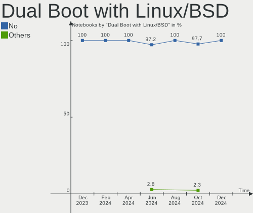
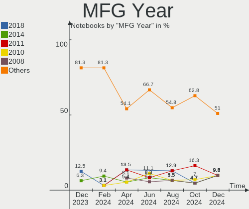
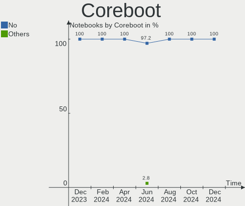
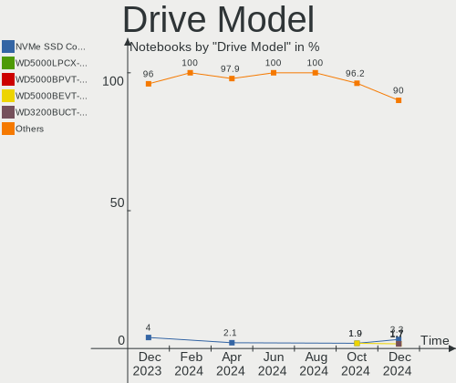
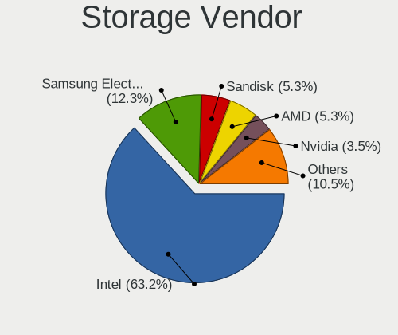
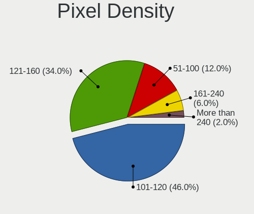
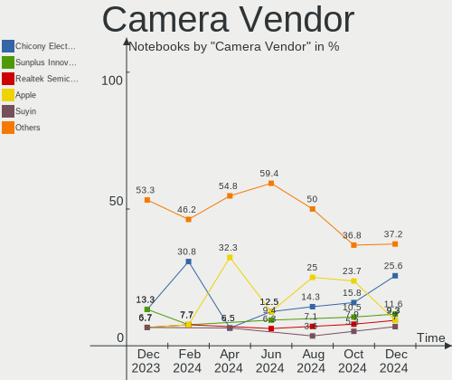

Elementary Hardware Trends (Notebooks)
--------------------------------------

A project to identify most popular hardware characteristics and track their change
over time based on data collected by Elementary users at https://Linux-Hardware.org.

Anyone can contribute to this report by the [hw-probe](https://github.com/linuxhw/hw-probe) tool:

    sudo -E hw-probe -all -upload

Full-feature report is available here: https://linux-hardware.org/?view=trends

Period: Jan, 2022.

Contents
--------

* [ System ](#system)
  - [ OS                       ](#os)
  - [ OS Family                ](#os-family)
  - [ Kernel                   ](#kernel)
  - [ Kernel Family            ](#kernel-family)
  - [ Kernel Major Ver.        ](#kernel-major-ver)
  - [ Arch                     ](#arch)
  - [ DE                       ](#de)
  - [ Display Server           ](#display-server)
  - [ Display Manager          ](#display-manager)
  - [ OS Lang                  ](#os-lang)
  - [ Boot Mode                ](#boot-mode)
  - [ Filesystem               ](#filesystem)
  - [ Part. scheme             ](#part-scheme)
  - [ Dual Boot with Linux/BSD ](#dual-boot-with-linuxbsd)
  - [ Dual Boot (Win)          ](#dual-boot-win)

* [ Board ](#board)
  - [ Vendor                   ](#vendor)
  - [ Model                    ](#model)
  - [ Model Family             ](#model-family)
  - [ MFG Year                 ](#mfg-year)
  - [ Form Factor              ](#form-factor)
  - [ Secure Boot              ](#secure-boot)
  - [ Coreboot                 ](#coreboot)
  - [ RAM Size                 ](#ram-size)
  - [ RAM Used                 ](#ram-used)
  - [ Total Drives             ](#total-drives)
  - [ Has CD-ROM               ](#has-cd-rom)
  - [ Has Ethernet             ](#has-ethernet)
  - [ Has WiFi                 ](#has-wifi)
  - [ Has Bluetooth            ](#has-bluetooth)

* [ Location ](#location)
  - [ Country                  ](#country)
  - [ City                     ](#city)

* [ Drives ](#drives)
  - [ Drive Vendor             ](#drive-vendor)
  - [ Drive Model              ](#drive-model)
  - [ HDD Vendor               ](#hdd-vendor)
  - [ SSD Vendor               ](#ssd-vendor)
  - [ Drive Kind               ](#drive-kind)
  - [ Drive Connector          ](#drive-connector)
  - [ Drive Size               ](#drive-size)
  - [ Space Total              ](#space-total)
  - [ Space Used               ](#space-used)
  - [ Malfunc. Drives          ](#malfunc-drives)
  - [ Malfunc. Drive Vendor    ](#malfunc-drive-vendor)
  - [ Malfunc. HDD Vendor      ](#malfunc-hdd-vendor)
  - [ Malfunc. Drive Kind      ](#malfunc-drive-kind)
  - [ Failed Drives            ](#failed-drives)
  - [ Failed Drive Vendor      ](#failed-drive-vendor)
  - [ Drive Status             ](#drive-status)

* [ Storage controller ](#storage-controller)
  - [ Storage Vendor           ](#storage-vendor)
  - [ Storage Model            ](#storage-model)
  - [ Storage Kind             ](#storage-kind)

* [ Processor ](#processor)
  - [ CPU Vendor               ](#cpu-vendor)
  - [ CPU Model                ](#cpu-model)
  - [ CPU Model Family         ](#cpu-model-family)
  - [ CPU Cores                ](#cpu-cores)
  - [ CPU Sockets              ](#cpu-sockets)
  - [ CPU Threads              ](#cpu-threads)
  - [ CPU Op-Modes             ](#cpu-op-modes)
  - [ CPU Microcode            ](#cpu-microcode)
  - [ CPU Microarch            ](#cpu-microarch)

* [ Graphics ](#graphics)
  - [ GPU Vendor               ](#gpu-vendor)
  - [ GPU Model                ](#gpu-model)
  - [ GPU Combo                ](#gpu-combo)
  - [ GPU Driver               ](#gpu-driver)
  - [ GPU Memory               ](#gpu-memory)

* [ Monitor ](#monitor)
  - [ Monitor Vendor           ](#monitor-vendor)
  - [ Monitor Model            ](#monitor-model)
  - [ Monitor Resolution       ](#monitor-resolution)
  - [ Monitor Diagonal         ](#monitor-diagonal)
  - [ Monitor Width            ](#monitor-width)
  - [ Aspect Ratio             ](#aspect-ratio)
  - [ Monitor Area             ](#monitor-area)
  - [ Pixel Density            ](#pixel-density)
  - [ Multiple Monitors        ](#multiple-monitors)

* [ Network ](#network)
  - [ Net Controller Vendor    ](#net-controller-vendor)
  - [ Net Controller Model     ](#net-controller-model)
  - [ Wireless Vendor          ](#wireless-vendor)
  - [ Wireless Model           ](#wireless-model)
  - [ Ethernet Vendor          ](#ethernet-vendor)
  - [ Ethernet Model           ](#ethernet-model)
  - [ Net Controller Kind      ](#net-controller-kind)
  - [ Used Controller          ](#used-controller)
  - [ NICs                     ](#nics)
  - [ IPv6                     ](#ipv6)

* [ Bluetooth ](#bluetooth)
  - [ Bluetooth Vendor         ](#bluetooth-vendor)
  - [ Bluetooth Model          ](#bluetooth-model)

* [ Sound ](#sound)
  - [ Sound Vendor             ](#sound-vendor)
  - [ Sound Model              ](#sound-model)

* [ Memory ](#memory)
  - [ Memory Vendor            ](#memory-vendor)
  - [ Memory Model             ](#memory-model)
  - [ Memory Kind              ](#memory-kind)
  - [ Memory Form Factor       ](#memory-form-factor)
  - [ Memory Size              ](#memory-size)
  - [ Memory Speed             ](#memory-speed)

* [ Printers & scanners ](#printers--scanners)
  - [ Printer Vendor           ](#printer-vendor)
  - [ Printer Model            ](#printer-model)
  - [ Scanner Vendor           ](#scanner-vendor)
  - [ Scanner Model            ](#scanner-model)

* [ Camera ](#camera)
  - [ Camera Vendor            ](#camera-vendor)
  - [ Camera Model             ](#camera-model)

* [ Security ](#security)
  - [ Fingerprint Vendor       ](#fingerprint-vendor)
  - [ Fingerprint Model        ](#fingerprint-model)
  - [ Chipcard Vendor          ](#chipcard-vendor)
  - [ Chipcard Model           ](#chipcard-model)

* [ Unsupported ](#unsupported)
  - [ Unsupported Devices      ](#unsupported-devices)
  - [ Unsupported Device Types ](#unsupported-device-types)

System
------

OS
--

Installed operating systems

| Name             | Notebooks | Percent |
|------------------|-----------|---------|
| Elementary 6.1   | 78        | 88.64%  |
| Elementary 6     | 6         | 6.82%   |
| Elementary 5.1.7 | 4         | 4.55%   |

OS Family
---------

OS without a version

| Name       | Notebooks | Percent |
|------------|-----------|---------|
| Elementary | 88        | 100%    |

Kernel
------

Version of the Linux kernel

| Version                | Notebooks | Percent |
|------------------------|-----------|---------|
| 5.11.0-43-generic      | 28        | 31.82%  |
| 5.13.0-27-generic      | 21        | 23.86%  |
| 5.11.0-44-generic      | 12        | 13.64%  |
| 5.11.0-46-generic      | 10        | 11.36%  |
| 5.4.0-92-generic       | 2         | 2.27%   |
| 5.11.0-38-generic      | 2         | 2.27%   |
| 5.11.0-27-generic      | 2         | 2.27%   |
| 5.4.0-96-generic       | 1         | 1.14%   |
| 5.4.0-91-generic       | 1         | 1.14%   |
| 5.15.3-xanmod1         | 1         | 1.14%   |
| 5.15.13-xanmod1        | 1         | 1.14%   |
| 5.15.12-xanmod1-tt     | 1         | 1.14%   |
| 5.15.11-t2-big-sur     | 1         | 1.14%   |
| 5.14.10-051410-generic | 1         | 1.14%   |
| 5.14.0-1011-oem        | 1         | 1.14%   |
| 5.11.0-41-generic      | 1         | 1.14%   |
| 5.11.0-40-generic      | 1         | 1.14%   |
| 4.15.0-163-generic     | 1         | 1.14%   |

Kernel Family
-------------

Linux kernel without a distro release

| Version | Notebooks | Percent |
|---------|-----------|---------|
| 5.11.0  | 56        | 63.64%  |
| 5.13.0  | 21        | 23.86%  |
| 5.4.0   | 4         | 4.55%   |
| 5.15.3  | 1         | 1.14%   |
| 5.15.13 | 1         | 1.14%   |
| 5.15.12 | 1         | 1.14%   |
| 5.15.11 | 1         | 1.14%   |
| 5.14.10 | 1         | 1.14%   |
| 5.14.0  | 1         | 1.14%   |
| 4.15.0  | 1         | 1.14%   |

Kernel Major Ver.
-----------------

Linux kernel major version

| Version | Notebooks | Percent |
|---------|-----------|---------|
| 5.11    | 56        | 63.64%  |
| 5.13    | 21        | 23.86%  |
| 5.4     | 4         | 4.55%   |
| 5.15    | 4         | 4.55%   |
| 5.14    | 2         | 2.27%   |
| 4.15    | 1         | 1.14%   |

Arch
----

OS architecture (x86_64, i586, etc.)

| Name   | Notebooks | Percent |
|--------|-----------|---------|
| x86_64 | 88        | 100%    |

DE
--

Desktop Environment

| Name     | Notebooks | Percent |
|----------|-----------|---------|
| Pantheon | 86        | 97.73%  |
| GNOME    | 1         | 1.14%   |
| Unknown  | 1         | 1.14%   |

Display Server
--------------

X11 or Wayland

| Name | Notebooks | Percent |
|------|-----------|---------|
| X11  | 88        | 100%    |

Display Manager
---------------

SDDM, LightDM, etc.

| Name    | Notebooks | Percent |
|---------|-----------|---------|
| Unknown | 55        | 62.5%   |
| LightDM | 31        | 35.23%  |
| GDM     | 2         | 2.27%   |

OS Lang
-------

Language

| Lang  | Notebooks | Percent |
|-------|-----------|---------|
| en_US | 42        | 47.73%  |
| de_DE | 12        | 13.64%  |
| en_GB | 7         | 7.95%   |
| ru_RU | 4         | 4.55%   |
| pt_BR | 4         | 4.55%   |
| en_CA | 3         | 3.41%   |
| pt_PT | 2         | 2.27%   |
| nl_NL | 2         | 2.27%   |
| it_IT | 2         | 2.27%   |
| fr_FR | 2         | 2.27%   |
| es_ES | 2         | 2.27%   |
| en_AU | 2         | 2.27%   |
| tr_TR | 1         | 1.14%   |
| pl_PL | 1         | 1.14%   |
| hu_HU | 1         | 1.14%   |
| bg_BG | 1         | 1.14%   |

Boot Mode
---------

EFI or BIOS

| Mode | Notebooks | Percent |
|------|-----------|---------|
| EFI  | 67        | 76.14%  |
| BIOS | 21        | 23.86%  |

Filesystem
----------

Type of filesystem

| Type  | Notebooks | Percent |
|-------|-----------|---------|
| Ext4  | 85        | 96.59%  |
| Btrfs | 3         | 3.41%   |

Part. scheme
------------

Scheme of partitioning

| Type    | Notebooks | Percent |
|---------|-----------|---------|
| Unknown | 62        | 70.45%  |
| GPT     | 23        | 26.14%  |
| MBR     | 3         | 3.41%   |

Dual Boot with Linux/BSD
------------------------

Hosting more than one Linux/BSD

| Dual boot | Notebooks | Percent |
|-----------|-----------|---------|
| No        | 85        | 96.59%  |
| Yes       | 3         | 3.41%   |

Dual Boot (Win)
---------------

Hosting Linux and Windows

| Dual boot | Notebooks | Percent |
|-----------|-----------|---------|
| No        | 77        | 87.5%   |
| Yes       | 11        | 12.5%   |

Board
-----

Vendor
------

Motherboard manufacturer

| Name                | Notebooks | Percent |
|---------------------|-----------|---------|
| Lenovo              | 24        | 27.27%  |
| Apple               | 13        | 14.77%  |
| Hewlett-Packard     | 10        | 11.36%  |
| ASUSTek Computer    | 10        | 11.36%  |
| Dell                | 8         | 9.09%   |
| HUAWEI              | 5         | 5.68%   |
| Acer                | 5         | 5.68%   |
| MSI                 | 3         | 3.41%   |
| Star Labs           | 2         | 2.27%   |
| Sony                | 2         | 2.27%   |
| Timi                | 1         | 1.14%   |
| Samsung Electronics | 1         | 1.14%   |
| Razer               | 1         | 1.14%   |
| Notebook            | 1         | 1.14%   |
| Monster             | 1         | 1.14%   |
| Fujitsu             | 1         | 1.14%   |

Model
-----

Motherboard model

| Name                                       | Notebooks | Percent |
|--------------------------------------------|-----------|---------|
| HUAWEI MACHD-WXX9                          | 2         | 2.27%   |
| Dell Inspiron N5110                        | 2         | 2.27%   |
| Apple MacBookPro8,2                        | 2         | 2.27%   |
| Apple MacBookPro5,5                        | 2         | 2.27%   |
| Apple MacBook5,1                           | 2         | 2.27%   |
| Timi TM1613                                | 1         | 1.14%   |
| Star Labs StarBook                         | 1         | 1.14%   |
| Star Labs LabTop                           | 1         | 1.14%   |
| Sony VPCEA3S1E                             | 1         | 1.14%   |
| Sony SVE14A390X                            | 1         | 1.14%   |
| Samsung 900X3C/900X3D/900X3E/900X4C/900X4D | 1         | 1.14%   |
| Razer Blade Stealth                        | 1         | 1.14%   |
| Notebook W65_67SJ                          | 1         | 1.14%   |
| MSI PS63 Modern 8RD                        | 1         | 1.14%   |
| MSI GF63 Thin 9SCSR                        | 1         | 1.14%   |
| MSI GE60 2PE                               | 1         | 1.14%   |
| Monster ABRA A5 V13.2                      | 1         | 1.14%   |
| Lenovo Yoga 300-11IBR 80M1                 | 1         | 1.14%   |
| Lenovo ThinkPad X270 W10DG 20K5S2VL00      | 1         | 1.14%   |
| Lenovo ThinkPad X13 Gen 1 20UFS00G00       | 1         | 1.14%   |
| Lenovo ThinkPad X1 Carbon Gen 9 20XWCTO1WW | 1         | 1.14%   |
| Lenovo ThinkPad X1 Carbon 6th 20KHS1L200   | 1         | 1.14%   |
| Lenovo ThinkPad W541 20EGS1VV00            | 1         | 1.14%   |
| Lenovo ThinkPad T470 W10DG 20JNS08H00      | 1         | 1.14%   |
| Lenovo ThinkPad T470 20JNS08H00            | 1         | 1.14%   |
| Lenovo ThinkPad T460s 20F9CTO1WW           | 1         | 1.14%   |
| Lenovo ThinkPad T430 2347JC2               | 1         | 1.14%   |
| Lenovo ThinkPad P14s Gen 1 20Y1S00E00      | 1         | 1.14%   |
| Lenovo ThinkPad E495 20NE001RTX            | 1         | 1.14%   |
| Lenovo ThinkPad E14 20RAS0EQ00             | 1         | 1.14%   |
| Lenovo Legion Y530-15ICH 81GT              | 1         | 1.14%   |
| Lenovo Legion Y530-15ICH 81FV              | 1         | 1.14%   |
| Lenovo IdeaPad Gaming 3 15IMH05 82CG       | 1         | 1.14%   |
| Lenovo IdeaPad 5 14ARE05 81YM              | 1         | 1.14%   |
| Lenovo IdeaPad 330-15ARR 81D2              | 1         | 1.14%   |
| Lenovo IdeaPad 310-15ISK 80SM              | 1         | 1.14%   |
| Lenovo IdeaPad 310-15IKB 80TV              | 1         | 1.14%   |
| Lenovo IdeaPad 130-15AST 81H5              | 1         | 1.14%   |
| Lenovo G550 2958                           | 1         | 1.14%   |
| Lenovo G550 20023                          | 1         | 1.14%   |
| Lenovo G50-80 80E5                         | 1         | 1.14%   |
| HUAWEI NBLK-WAX9X                          | 1         | 1.14%   |
| HUAWEI MACHC-WAX9                          | 1         | 1.14%   |
| HUAWEI KPL-W0X                             | 1         | 1.14%   |
| HP ProBook 4540s                           | 1         | 1.14%   |
| HP ProBook 4430s                           | 1         | 1.14%   |
| HP Pavilion Laptop 15-eh0xxx               | 1         | 1.14%   |
| HP Pavilion Laptop 15-cs0xxx               | 1         | 1.14%   |
| HP Pavilion dv5                            | 1         | 1.14%   |
| HP Laptop 15s-eq1xxx                       | 1         | 1.14%   |
| HP Laptop 15-ef2xxx                        | 1         | 1.14%   |
| HP EliteBook Folio 1040 G2                 | 1         | 1.14%   |
| HP EliteBook 840 G1                        | 1         | 1.14%   |
| HP Elite x2 1012 G1                        | 1         | 1.14%   |
| Fujitsu LIFEBOOK S760                      | 1         | 1.14%   |
| Dell XPS 15 9500                           | 1         | 1.14%   |
| Dell Vostro 3500                           | 1         | 1.14%   |
| Dell Vostro 15 3515                        | 1         | 1.14%   |
| Dell Precision 5530                        | 1         | 1.14%   |
| Dell Latitude E5400                        | 1         | 1.14%   |

Model Family
------------

Motherboard model prefix

| Name               | Notebooks | Percent |
|--------------------|-----------|---------|
| Lenovo ThinkPad    | 12        | 13.64%  |
| Lenovo IdeaPad     | 6         | 6.82%   |
| HP Pavilion        | 3         | 3.41%   |
| Apple MacBookPro8  | 3         | 3.41%   |
| Apple MacBookPro5  | 3         | 3.41%   |
| Acer Aspire        | 3         | 3.41%   |
| Lenovo Legion      | 2         | 2.27%   |
| Lenovo G550        | 2         | 2.27%   |
| HUAWEI MACHD-WXX9  | 2         | 2.27%   |
| HP ProBook         | 2         | 2.27%   |
| HP Laptop          | 2         | 2.27%   |
| HP EliteBook       | 2         | 2.27%   |
| Dell Vostro        | 2         | 2.27%   |
| Dell Latitude      | 2         | 2.27%   |
| Dell Inspiron      | 2         | 2.27%   |
| ASUS ZenBook       | 2         | 2.27%   |
| ASUS VivoBook      | 2         | 2.27%   |
| Apple MacBookPro9  | 2         | 2.27%   |
| Apple MacBook5     | 2         | 2.27%   |
| Acer Swift         | 2         | 2.27%   |
| Timi TM1613        | 1         | 1.14%   |
| Star Labs StarBook | 1         | 1.14%   |
| Star Labs LabTop   | 1         | 1.14%   |
| Sony VPCEA3S1E     | 1         | 1.14%   |
| Sony SVE14A390X    | 1         | 1.14%   |
| Samsung 900X3C     | 1         | 1.14%   |
| Razer Blade        | 1         | 1.14%   |
| Notebook W65       | 1         | 1.14%   |
| MSI PS63           | 1         | 1.14%   |
| MSI GF63           | 1         | 1.14%   |
| MSI GE60           | 1         | 1.14%   |
| Monster ABRA       | 1         | 1.14%   |
| Lenovo Yoga        | 1         | 1.14%   |
| Lenovo G50-80      | 1         | 1.14%   |
| HUAWEI NBLK-WAX9X  | 1         | 1.14%   |
| HUAWEI MACHC-WAX9  | 1         | 1.14%   |
| HUAWEI KPL-W0X     | 1         | 1.14%   |
| HP Elite           | 1         | 1.14%   |
| Fujitsu LIFEBOOK   | 1         | 1.14%   |
| Dell XPS           | 1         | 1.14%   |
| Dell Precision     | 1         | 1.14%   |
| ASUS X555LN        | 1         | 1.14%   |
| ASUS X550CA        | 1         | 1.14%   |
| ASUS X541NA        | 1         | 1.14%   |
| ASUS UX31A         | 1         | 1.14%   |
| ASUS GL502VS       | 1         | 1.14%   |
| ASUS E202SA        | 1         | 1.14%   |
| Apple MacBookPro16 | 1         | 1.14%   |
| Apple MacBookPro11 | 1         | 1.14%   |
| Apple MacBookAir1  | 1         | 1.14%   |

MFG Year
--------

Motherboard manufacture year

| Year | Notebooks | Percent |
|------|-----------|---------|
| 2020 | 15        | 17.05%  |
| 2018 | 10        | 11.36%  |
| 2021 | 9         | 10.23%  |
| 2016 | 7         | 7.95%   |
| 2012 | 7         | 7.95%   |
| 2015 | 6         | 6.82%   |
| 2009 | 6         | 6.82%   |
| 2019 | 5         | 5.68%   |
| 2017 | 5         | 5.68%   |
| 2014 | 5         | 5.68%   |
| 2013 | 4         | 4.55%   |
| 2011 | 3         | 3.41%   |
| 2010 | 3         | 3.41%   |
| 2008 | 3         | 3.41%   |

Form Factor
-----------

Physical design of the computer

| Name     | Notebooks | Percent |
|----------|-----------|---------|
| Notebook | 88        | 100%    |

Secure Boot
-----------

Enabled or disabled

| State    | Notebooks | Percent |
|----------|-----------|---------|
| Disabled | 70        | 79.55%  |
| Enabled  | 18        | 20.45%  |

Coreboot
--------

Have coreboot on board

| Used | Notebooks | Percent |
|------|-----------|---------|
| No   | 86        | 97.73%  |
| Yes  | 2         | 2.27%   |

RAM Size
--------

Total RAM memory

| Size in GB | Notebooks | Percent |
|------------|-----------|---------|
| 4.01-8.0   | 34        | 38.64%  |
| 16.01-24.0 | 17        | 19.32%  |
| 8.01-16.0  | 15        | 17.05%  |
| 3.01-4.0   | 12        | 13.64%  |
| 32.01-64.0 | 4         | 4.55%   |
| 24.01-32.0 | 3         | 3.41%   |
| 1.01-2.0   | 3         | 3.41%   |

RAM Used
--------

Used RAM memory

| Used GB   | Notebooks | Percent |
|-----------|-----------|---------|
| 1.01-2.0  | 31        | 35.23%  |
| 2.01-3.0  | 20        | 22.73%  |
| 3.01-4.0  | 15        | 17.05%  |
| 4.01-8.0  | 12        | 13.64%  |
| 8.01-16.0 | 5         | 5.68%   |
| 0.51-1.0  | 5         | 5.68%   |

Total Drives
------------

Number of drives on board

| Drives | Notebooks | Percent |
|--------|-----------|---------|
| 1      | 64        | 72.73%  |
| 2      | 23        | 26.14%  |
| 3      | 1         | 1.14%   |

Has CD-ROM
----------

Has CD-ROM on board

| Presented | Notebooks | Percent |
|-----------|-----------|---------|
| No        | 63        | 71.59%  |
| Yes       | 25        | 28.41%  |

Has Ethernet
------------

Has Ethernet on board

| Presented | Notebooks | Percent |
|-----------|-----------|---------|
| Yes       | 65        | 73.86%  |
| No        | 23        | 26.14%  |

Has WiFi
--------

Has WiFi module

| Presented | Notebooks | Percent |
|-----------|-----------|---------|
| Yes       | 88        | 100%    |

Has Bluetooth
-------------

Has Bluetooth module

| Presented | Notebooks | Percent |
|-----------|-----------|---------|
| Yes       | 80        | 90.91%  |
| No        | 8         | 9.09%   |

Location
--------

Country
-------

Geographic location (country)

| Country     | Notebooks | Percent |
|-------------|-----------|---------|
| Germany     | 11        | 12.5%   |
| USA         | 10        | 11.36%  |
| India       | 8         | 9.09%   |
| Brazil      | 6         | 6.82%   |
| Turkey      | 5         | 5.68%   |
| Canada      | 5         | 5.68%   |
| UK          | 4         | 4.55%   |
| Russia      | 4         | 4.55%   |
| Poland      | 3         | 3.41%   |
| Italy       | 3         | 3.41%   |
| France      | 3         | 3.41%   |
| Australia   | 3         | 3.41%   |
| Indonesia   | 2         | 2.27%   |
| Belgium     | 2         | 2.27%   |
| Belarus     | 2         | 2.27%   |
| Switzerland | 1         | 1.14%   |
| Spain       | 1         | 1.14%   |
| Romania     | 1         | 1.14%   |
| Portugal    | 1         | 1.14%   |
| Pakistan    | 1         | 1.14%   |
| New Zealand | 1         | 1.14%   |
| Mozambique  | 1         | 1.14%   |
| Mexico      | 1         | 1.14%   |
| Kenya       | 1         | 1.14%   |
| Japan       | 1         | 1.14%   |
| Hungary     | 1         | 1.14%   |
| Greece      | 1         | 1.14%   |
| Czechia     | 1         | 1.14%   |
| Colombia    | 1         | 1.14%   |
| Chile       | 1         | 1.14%   |
| Bulgaria    | 1         | 1.14%   |
| Austria     | 1         | 1.14%   |

City
----

Geographic location (city)

| City                  | Notebooks | Percent |
|-----------------------|-----------|---------|
| Ankara                | 3         | 3.41%   |
| Vernon                | 2         | 2.27%   |
| Sydney                | 2         | 2.27%   |
| Santo Andr?©          | 2         | 2.27%   |
| Munich                | 2         | 2.27%   |
| Minsk                 | 2         | 2.27%   |
| Wellington            | 1         | 1.14%   |
| Warsaw                | 1         | 1.14%   |
| Vit??ria da Conquista | 1         | 1.14%   |
| Vila Nova de Gaia     | 1         | 1.14%   |
| Vienna                | 1         | 1.14%   |
| Valencia              | 1         | 1.14%   |
| Tongeren              | 1         | 1.14%   |
| Surrey                | 1         | 1.14%   |
| Surabaya              | 1         | 1.14%   |
| Solapur               | 1         | 1.14%   |
| Siersburg             | 1         | 1.14%   |
| Shetland Islands      | 1         | 1.14%   |
| Sazava                | 1         | 1.14%   |
| Rostock               | 1         | 1.14%   |
| Rome                  | 1         | 1.14%   |
| Providencia           | 1         | 1.14%   |
| Perth                 | 1         | 1.14%   |
| Patna                 | 1         | 1.14%   |
| Paris                 | 1         | 1.14%   |
| Osaka                 | 1         | 1.14%   |
| Orenburg              | 1         | 1.14%   |
| Oceanside             | 1         | 1.14%   |
| Novosibirsk           | 1         | 1.14%   |
| New Delhi             | 1         | 1.14%   |
| Nairobi               | 1         | 1.14%   |
| Mumbai                | 1         | 1.14%   |
| Moscow                | 1         | 1.14%   |
| Mississauga           | 1         | 1.14%   |
| Minerva               | 1         | 1.14%   |
| Mieuxce               | 1         | 1.14%   |
| Mexico City           | 1         | 1.14%   |
| Marshfield            | 1         | 1.14%   |
| Mahemdavad            | 1         | 1.14%   |
| Mage                  | 1         | 1.14%   |
| Lyubertsy             | 1         | 1.14%   |
| Lydney                | 1         | 1.14%   |
| Leduc                 | 1         | 1.14%   |
| Le Grand-Saconnex     | 1         | 1.14%   |
| Krakow                | 1         | 1.14%   |
| Kobern-Gondorf        | 1         | 1.14%   |
| Kayseri               | 1         | 1.14%   |
| Kaufbeuren            | 1         | 1.14%   |
| Jakarta               | 1         | 1.14%   |
| Itaquaquecetuba       | 1         | 1.14%   |
| Islamabad             | 1         | 1.14%   |
| Idaho Falls           | 1         | 1.14%   |
| Hyderabad             | 1         | 1.14%   |
| Holland               | 1         | 1.14%   |
| Hanover               | 1         | 1.14%   |
| Hallbergmoos          | 1         | 1.14%   |
| Gorakhpur             | 1         | 1.14%   |
| Gera                  | 1         | 1.14%   |
| Gdansk                | 1         | 1.14%   |
| Fougeres              | 1         | 1.14%   |

Drives
------

Drive Vendor
------------

Hard drive vendors

| Vendor              | Notebooks | Drives | Percent |
|---------------------|-----------|--------|---------|
| Samsung Electronics | 24        | 25     | 22.22%  |
| Sandisk             | 13        | 13     | 12.04%  |
| WDC                 | 9         | 10     | 8.33%   |
| Kingston            | 9         | 10     | 8.33%   |
| Seagate             | 8         | 8      | 7.41%   |
| Unknown             | 5         | 5      | 4.63%   |
| Toshiba             | 5         | 5      | 4.63%   |
| Crucial             | 5         | 5      | 4.63%   |
| SK Hynix            | 4         | 4      | 3.7%    |
| Intel               | 4         | 5      | 3.7%    |
| HGST                | 4         | 4      | 3.7%    |
| KIOXIA              | 3         | 4      | 2.78%   |
| Apple               | 3         | 3      | 2.78%   |
| Unknown             | 3         | 3      | 2.78%   |
| Micron Technology   | 2         | 2      | 1.85%   |
| Hitachi             | 2         | 2      | 1.85%   |
| Transcend           | 1         | 1      | 0.93%   |
| Star Drive          | 1         | 1      | 0.93%   |
| Star                | 1         | 1      | 0.93%   |
| SPCC                | 1         | 1      | 0.93%   |
| A-DATA Technology   | 1         | 1      | 0.93%   |

Drive Model
-----------

Hard drive models

| Model                                     | Notebooks | Percent |
|-------------------------------------------|-----------|---------|
| Samsung NVMe SSD Drive 512GB              | 4         | 3.54%   |
| Seagate ST1000LM035-1RK172 1TB            | 3         | 2.65%   |
| Samsung SSD 850 EVO 250GB                 | 3         | 2.65%   |
| Samsung NVMe SSD Drive 256GB              | 3         | 2.65%   |
| Unknown                                   | 3         | 2.65%   |
| Toshiba MQ04ABF100 1TB                    | 2         | 1.77%   |
| Toshiba MQ01ABD100V -63 1TB               | 2         | 1.77%   |
| SanDisk SD9SN8W-128G-1006 128GB SSD       | 2         | 1.77%   |
| SanDisk SD8SN8U-256G-1006 256GB SSD       | 2         | 1.77%   |
| Samsung SSD 850 EVO 120GB                 | 2         | 1.77%   |
| Kingston SA400S37240G 240GB SSD           | 2         | 1.77%   |
| Kingston SA400S37120G 120GB SSD           | 2         | 1.77%   |
| Kingston NVMe SSD Drive 500GB             | 2         | 1.77%   |
| Intel NVMe SSD Drive 512GB                | 2         | 1.77%   |
| WDC WDS240G2G0A-00JH30 240GB SSD          | 1         | 0.88%   |
| WDC WDS200T2B0A-00SM50 2TB SSD            | 1         | 0.88%   |
| WDC WDS120G2G0A-00JH30 120GB SSD          | 1         | 0.88%   |
| WDC WD5000LPVX-80V0TT0 500GB              | 1         | 0.88%   |
| WDC WD5000BPVT-22HXZT1 500GB              | 1         | 0.88%   |
| WDC WD2500BEVS-22UST0 250GB               | 1         | 0.88%   |
| WDC WD10SPZX-24Z10 1TB                    | 1         | 0.88%   |
| WDC WD10JPCX-24UE4T0 1TB                  | 1         | 0.88%   |
| WDC PC SN730 SDBPNTY-512G-1027 512GB      | 1         | 0.88%   |
| WDC PC SN520 SDAPNUW-512G                 | 1         | 0.88%   |
| Unknown USD00  16GB                       | 1         | 0.88%   |
| Unknown SL128  128GB                      | 1         | 0.88%   |
| Unknown SC128  128GB                      | 1         | 0.88%   |
| Unknown MMC Card  128GB                   | 1         | 0.88%   |
| Unknown GD2S5  128GB                      | 1         | 0.88%   |
| Transcend TS512GMTS430S 512GB SSD         | 1         | 0.88%   |
| Toshiba NVMe SSD Drive 512GB              | 1         | 0.88%   |
| Star Drive SATA SSD 960GB                 | 1         | 0.88%   |
| Star Drive PCIe SSD 480GB                 | 1         | 0.88%   |
| SPCC Solid State Disk 256GB               | 1         | 0.88%   |
| SK Hynix SKHynix_HFS512GD9TNI-L2B0B 512GB | 1         | 0.88%   |
| SK Hynix NVMe SSD Drive 512GB             | 1         | 0.88%   |
| SK Hynix NVMe SSD Drive 256GB             | 1         | 0.88%   |
| SK Hynix HFM128GDHTNG-8510B 128GB         | 1         | 0.88%   |
| Seagate ST980313AS 80GB                   | 1         | 0.88%   |
| Seagate ST500LT012-9WS142 500GB           | 1         | 0.88%   |
| Seagate ST500LT012-1DG142 500GB           | 1         | 0.88%   |
| Seagate ST500LM030-2E717D 500GB           | 1         | 0.88%   |
| Seagate ST500LM021-1KJ152 500GB           | 1         | 0.88%   |
| SanDisk SD9SN8W256G1102 256GB SSD         | 1         | 0.88%   |
| SanDisk SD9SN8W256G1027 256GB SSD         | 1         | 0.88%   |
| SanDisk SD8SBAT128G1002 128GB SSD         | 1         | 0.88%   |
| SanDisk SD5SE2256G1002E 256GB SSD         | 1         | 0.88%   |
| Sandisk NVMe SSD Drive 512GB              | 1         | 0.88%   |
| Sandisk NVMe SSD Drive 2TB                | 1         | 0.88%   |
| Sandisk NVMe SSD Drive 250GB              | 1         | 0.88%   |
| Sandisk NVMe SSD Drive 1TB                | 1         | 0.88%   |
| SanDisk Extreme SSD 500GB                 | 1         | 0.88%   |
| Samsung SSD 980 PRO 2TB                   | 1         | 0.88%   |
| Samsung SSD 870 EVO 250GB                 | 1         | 0.88%   |
| Samsung SSD 860 EVO 500GB                 | 1         | 0.88%   |
| Samsung SSD 860 EVO 1TB                   | 1         | 0.88%   |
| Samsung SSD 840 Series 250GB              | 1         | 0.88%   |
| Samsung SSD 840 EVO 250GB                 | 1         | 0.88%   |
| Samsung NVMe SSD Drive 1TB                | 1         | 0.88%   |
| Samsung NVMe SSD Drive 1024GB             | 1         | 0.88%   |

HDD Vendor
----------

Hard disk drive vendors

| Vendor              | Notebooks | Drives | Percent |
|---------------------|-----------|--------|---------|
| Seagate             | 8         | 8      | 32%     |
| WDC                 | 5         | 5      | 20%     |
| Toshiba             | 4         | 4      | 16%     |
| HGST                | 4         | 4      | 16%     |
| Hitachi             | 2         | 2      | 8%      |
| Samsung Electronics | 1         | 1      | 4%      |
| Apple               | 1         | 1      | 4%      |

SSD Vendor
----------

Solid state drive vendors

| Vendor              | Notebooks | Drives | Percent |
|---------------------|-----------|--------|---------|
| Samsung Electronics | 11        | 11     | 27.5%   |
| SanDisk             | 9         | 9      | 22.5%   |
| Kingston            | 6         | 6      | 15%     |
| Crucial             | 5         | 5      | 12.5%   |
| WDC                 | 3         | 3      | 7.5%    |
| Transcend           | 1         | 1      | 2.5%    |
| Star                | 1         | 1      | 2.5%    |
| SPCC                | 1         | 1      | 2.5%    |
| Micron Technology   | 1         | 1      | 2.5%    |
| Apple               | 1         | 1      | 2.5%    |
| A-DATA Technology   | 1         | 1      | 2.5%    |

Drive Kind
----------

HDD or SSD

| Kind    | Notebooks | Drives | Percent |
|---------|-----------|--------|---------|
| SSD     | 38        | 40     | 35.51%  |
| NVMe    | 36        | 40     | 33.64%  |
| HDD     | 25        | 25     | 23.36%  |
| MMC     | 6         | 6      | 5.61%   |
| Unknown | 2         | 2      | 1.87%   |

Drive Connector
---------------

SATA, SAS, NVMe, etc.

| Type | Notebooks | Drives | Percent |
|------|-----------|--------|---------|
| SATA | 58        | 66     | 57.43%  |
| NVMe | 36        | 40     | 35.64%  |
| MMC  | 6         | 6      | 5.94%   |
| SAS  | 1         | 1      | 0.99%   |

Drive Size
----------

Size of hard drive

| Size in TB | Notebooks | Drives | Percent |
|------------|-----------|--------|---------|
| 0.01-0.5   | 43        | 48     | 71.67%  |
| 0.51-1.0   | 15        | 15     | 25%     |
| 1.01-2.0   | 2         | 2      | 3.33%   |

Space Total
-----------

Amount of disk space available on the file system

| Size in GB | Notebooks | Percent |
|------------|-----------|---------|
| 101-250    | 38        | 43.18%  |
| 251-500    | 20        | 22.73%  |
| 501-1000   | 14        | 15.91%  |
| 51-100     | 8         | 9.09%   |
| 1001-2000  | 5         | 5.68%   |
| 21-50      | 3         | 3.41%   |

Space Used
----------

Amount of used disk space

| Used GB   | Notebooks | Percent |
|-----------|-----------|---------|
| 1-20      | 34        | 38.64%  |
| 21-50     | 29        | 32.95%  |
| 101-250   | 10        | 11.36%  |
| 51-100    | 7         | 7.95%   |
| 251-500   | 6         | 6.82%   |
| 1001-2000 | 1         | 1.14%   |
| 501-1000  | 1         | 1.14%   |

Malfunc. Drives
---------------

Drive models with a malfunction

| Model                           | Notebooks | Drives | Percent |
|---------------------------------|-----------|--------|---------|
| WDC WD10SPZX-24Z10 1TB          | 1         | 1      | 33.33%  |
| Seagate ST500LM030-2E717D 500GB | 1         | 1      | 33.33%  |
| Crucial CT512M550SSD3 512GB     | 1         | 1      | 33.33%  |

Malfunc. Drive Vendor
---------------------

Vendors of faulty drives

| Vendor  | Notebooks | Drives | Percent |
|---------|-----------|--------|---------|
| WDC     | 1         | 1      | 33.33%  |
| Seagate | 1         | 1      | 33.33%  |
| Crucial | 1         | 1      | 33.33%  |

Malfunc. HDD Vendor
-------------------

Vendors of faulty HDD drives

| Vendor  | Notebooks | Drives | Percent |
|---------|-----------|--------|---------|
| WDC     | 1         | 1      | 50%     |
| Seagate | 1         | 1      | 50%     |

Malfunc. Drive Kind
-------------------

Kinds of faulty drives

| Kind | Notebooks | Drives | Percent |
|------|-----------|--------|---------|
| HDD  | 2         | 2      | 66.67%  |
| SSD  | 1         | 1      | 33.33%  |

Failed Drives
-------------

Failed drive models

Zero info for selected period =(

Failed Drive Vendor
-------------------

Failed drive vendors

Zero info for selected period =(

Drive Status
------------

Number of failed and malfunc. drives

| Status   | Notebooks | Drives | Percent |
|----------|-----------|--------|---------|
| Detected | 70        | 82     | 72.16%  |
| Works    | 24        | 28     | 24.74%  |
| Malfunc  | 3         | 3      | 3.09%   |

Storage controller
------------------

Storage Vendor
--------------

Storage controller vendors

| Vendor                       | Notebooks | Percent |
|------------------------------|-----------|---------|
| Intel                        | 57        | 55.88%  |
| Samsung Electronics          | 12        | 11.76%  |
| AMD                          | 7         | 6.86%   |
| Sandisk                      | 6         | 5.88%   |
| Nvidia                       | 5         | 4.9%    |
| SK Hynix                     | 4         | 3.92%   |
| Kingston Technology Company  | 4         | 3.92%   |
| KIOXIA                       | 3         | 2.94%   |
| Toshiba America Info Systems | 1         | 0.98%   |
| Phison Electronics           | 1         | 0.98%   |
| Micron Technology            | 1         | 0.98%   |
| Apple                        | 1         | 0.98%   |

Storage Model
-------------

Storage controller models

| Model                                                                            | Notebooks | Percent |
|----------------------------------------------------------------------------------|-----------|---------|
| Intel Sunrise Point-LP SATA Controller [AHCI mode]                               | 9         | 8.18%   |
| Intel 7 Series Chipset Family 6-port SATA Controller [AHCI mode]                 | 8         | 7.27%   |
| Intel 6 Series/C200 Series Chipset Family 6 port Mobile SATA AHCI Controller     | 6         | 5.45%   |
| AMD FCH SATA Controller [AHCI mode]                                              | 6         | 5.45%   |
| Samsung NVMe SSD Controller 980                                                  | 5         | 4.55%   |
| Nvidia MCP79 AHCI Controller                                                     | 5         | 4.55%   |
| Intel Cannon Lake Mobile PCH SATA AHCI Controller                                | 5         | 4.55%   |
| Samsung NVMe SSD Controller SM981/PM981/PM983                                    | 4         | 3.64%   |
| KIOXIA Non-Volatile memory controller                                            | 3         | 2.73%   |
| Intel Wildcat Point-LP SATA Controller [AHCI Mode]                               | 3         | 2.73%   |
| Intel Volume Management Device NVMe RAID Controller                              | 3         | 2.73%   |
| Intel SSD 660P Series                                                            | 3         | 2.73%   |
| Intel 82801IBM/IEM (ICH9M/ICH9M-E) 4 port SATA Controller [AHCI mode]            | 3         | 2.73%   |
| Intel 8 Series/C220 Series Chipset Family 6-port SATA Controller 1 [AHCI mode]   | 3         | 2.73%   |
| Intel 8 Series SATA Controller 1 [AHCI mode]                                     | 3         | 2.73%   |
| SK Hynix BC511                                                                   | 2         | 1.82%   |
| Sandisk WD Blue SN550 NVMe SSD                                                   | 2         | 1.82%   |
| Sandisk Non-Volatile memory controller                                           | 2         | 1.82%   |
| Samsung NVMe SSD Controller SM951/PM951                                          | 2         | 1.82%   |
| Intel Comet Lake SATA AHCI Controller                                            | 2         | 1.82%   |
| Intel Atom/Celeron/Pentium Processor x5-E8000/J3xxx/N3xxx Series SATA Controller | 2         | 1.82%   |
| Intel 5 Series/3400 Series Chipset 4 port SATA IDE Controller                    | 2         | 1.82%   |
| Intel 5 Series/3400 Series Chipset 2 port SATA IDE Controller                    | 2         | 1.82%   |
| Toshiba America Info Systems XG6 NVMe SSD Controller                             | 1         | 0.91%   |
| SK Hynix Non-Volatile memory controller                                          | 1         | 0.91%   |
| SK Hynix BC501 NVMe Solid State Drive                                            | 1         | 0.91%   |
| Sandisk WD Blue SN500 / PC SN520 NVMe SSD                                        | 1         | 0.91%   |
| Sandisk WD Black SN750 / PC SN730 NVMe SSD                                       | 1         | 0.91%   |
| Samsung NVMe SSD Controller PM9A1/PM9A3/980PRO                                   | 1         | 0.91%   |
| Phison E12 NVMe Controller                                                       | 1         | 0.91%   |
| Micron Non-Volatile memory controller                                            | 1         | 0.91%   |
| Kingston Company U-SNS8154P3 NVMe SSD                                            | 1         | 0.91%   |
| Kingston Company OM3PDP3 NVMe SSD                                                | 1         | 0.91%   |
| Kingston Company KC2000 NVMe SSD                                                 | 1         | 0.91%   |
| Kingston Company A2000 NVMe SSD                                                  | 1         | 0.91%   |
| Intel NVMe Optane Memory Series                                                  | 1         | 0.91%   |
| Intel HM170/QM170 Chipset SATA Controller [AHCI Mode]                            | 1         | 0.91%   |
| Intel Celeron N3350/Pentium N4200/Atom E3900 Series SATA AHCI Controller         | 1         | 0.91%   |
| Intel Cannon Point-LP SATA Controller [AHCI Mode]                                | 1         | 0.91%   |
| Intel 82801HM/HEM (ICH8M/ICH8M-E) SATA Controller [AHCI mode]                    | 1         | 0.91%   |
| Intel 82801HM/HEM (ICH8M/ICH8M-E) IDE Controller                                 | 1         | 0.91%   |
| Intel 82801 Mobile SATA Controller [RAID mode]                                   | 1         | 0.91%   |
| Intel 5 Series/3400 Series Chipset PT IDER Controller                            | 1         | 0.91%   |
| Intel 5 Series/3400 Series Chipset 4 port SATA AHCI Controller                   | 1         | 0.91%   |
| Intel 400 Series Chipset Family SATA AHCI Controller                             | 1         | 0.91%   |
| Apple ANS2 NVMe Controller                                                       | 1         | 0.91%   |
| AMD SB7x0/SB8x0/SB9x0 SATA Controller [AHCI mode]                                | 1         | 0.91%   |
| AMD SB7x0/SB8x0/SB9x0 IDE Controller                                             | 1         | 0.91%   |

Storage Kind
------------

Kind of storage controller (IDE, SATA, NVMe, SAS, ...)

| Kind | Notebooks | Percent |
|------|-----------|---------|
| SATA | 62        | 58.49%  |
| NVMe | 36        | 33.96%  |
| RAID | 4         | 3.77%   |
| IDE  | 4         | 3.77%   |

Processor
---------

CPU Vendor
----------

Processor vendors

| Vendor | Notebooks | Percent |
|--------|-----------|---------|
| Intel  | 72        | 81.82%  |
| AMD    | 16        | 18.18%  |

CPU Model
---------

Processor models

| Model                                         | Notebooks | Percent |
|-----------------------------------------------|-----------|---------|
| Intel 11th Gen Core i7-1165G7 @ 2.80GHz       | 4         | 4.55%   |
| Intel Core i7-8565U CPU @ 1.80GHz             | 3         | 3.41%   |
| Intel Core i7-8750H CPU @ 2.20GHz             | 2         | 2.27%   |
| Intel Core i7-8550U CPU @ 1.80GHz             | 2         | 2.27%   |
| Intel Core i7-10750H CPU @ 2.60GHz            | 2         | 2.27%   |
| Intel Core i5-6300U CPU @ 2.40GHz             | 2         | 2.27%   |
| Intel Core i5-3317U CPU @ 1.70GHz             | 2         | 2.27%   |
| Intel Core i5-10210U CPU @ 1.60GHz            | 2         | 2.27%   |
| Intel Core i3-2310M CPU @ 2.10GHz             | 2         | 2.27%   |
| Intel 11th Gen Core i5-1135G7 @ 2.40GHz       | 2         | 2.27%   |
| AMD Ryzen 7 PRO 4750U with Radeon Graphics    | 2         | 2.27%   |
| AMD Ryzen 5 5500U with Radeon Graphics        | 2         | 2.27%   |
| AMD Ryzen 5 3500U with Radeon Vega Mobile Gfx | 2         | 2.27%   |
| AMD Ryzen 5 2500U with Radeon Vega Mobile Gfx | 2         | 2.27%   |
| Intel Pentium Dual-Core CPU T4400 @ 2.20GHz   | 1         | 1.14%   |
| Intel Pentium CPU N4200 @ 1.10GHz             | 1         | 1.14%   |
| Intel Pentium CPU N3700 @ 1.60GHz             | 1         | 1.14%   |
| Intel Core m5-6Y57 CPU @ 1.10GHz              | 1         | 1.14%   |
| Intel Core i7-9750H CPU @ 2.60GHz             | 1         | 1.14%   |
| Intel Core i7-8850H CPU @ 2.60GHz             | 1         | 1.14%   |
| Intel Core i7-6700HQ CPU @ 2.60GHz            | 1         | 1.14%   |
| Intel Core i7-6600U CPU @ 2.60GHz             | 1         | 1.14%   |
| Intel Core i7-6500U CPU @ 2.50GHz             | 1         | 1.14%   |
| Intel Core i7-4980HQ CPU @ 2.80GHz            | 1         | 1.14%   |
| Intel Core i7-4910MQ CPU @ 2.90GHz            | 1         | 1.14%   |
| Intel Core i7-4720HQ CPU @ 2.60GHz            | 1         | 1.14%   |
| Intel Core i7-4510U CPU @ 2.00GHz             | 1         | 1.14%   |
| Intel Core i7-3632QM CPU @ 2.20GHz            | 1         | 1.14%   |
| Intel Core i7-3615QM CPU @ 2.30GHz            | 1         | 1.14%   |
| Intel Core i7-2760QM CPU @ 2.40GHz            | 1         | 1.14%   |
| Intel Core i7-2675QM CPU @ 2.20GHz            | 1         | 1.14%   |
| Intel Core i7-2635QM CPU @ 2.00GHz            | 1         | 1.14%   |
| Intel Core i7-10710U CPU @ 1.10GHz            | 1         | 1.14%   |
| Intel Core i5-9300H CPU @ 2.40GHz             | 1         | 1.14%   |
| Intel Core i5-8300H CPU @ 2.30GHz             | 1         | 1.14%   |
| Intel Core i5-8250U CPU @ 1.60GHz             | 1         | 1.14%   |
| Intel Core i5-7200U CPU @ 2.50GHz             | 1         | 1.14%   |
| Intel Core i5-6200U CPU @ 2.30GHz             | 1         | 1.14%   |
| Intel Core i5-5300U CPU @ 2.30GHz             | 1         | 1.14%   |
| Intel Core i5-5200U CPU @ 2.20GHz             | 1         | 1.14%   |
| Intel Core i5-4300U CPU @ 1.90GHz             | 1         | 1.14%   |
| Intel Core i5-4210U CPU @ 1.70GHz             | 1         | 1.14%   |
| Intel Core i5-4210M CPU @ 2.60GHz             | 1         | 1.14%   |
| Intel Core i5-3337U CPU @ 1.80GHz             | 1         | 1.14%   |
| Intel Core i5-3210M CPU @ 2.50GHz             | 1         | 1.14%   |
| Intel Core i5-2520M CPU @ 2.50GHz             | 1         | 1.14%   |
| Intel Core i5 CPU M 520 @ 2.40GHz             | 1         | 1.14%   |
| Intel Core i5 CPU M 450 @ 2.40GHz             | 1         | 1.14%   |
| Intel Core i3-6006U CPU @ 2.00GHz             | 1         | 1.14%   |
| Intel Core i3-5005U CPU @ 2.00GHz             | 1         | 1.14%   |
| Intel Core i3-3110M CPU @ 2.40GHz             | 1         | 1.14%   |
| Intel Core i3 CPU M 350 @ 2.27GHz             | 1         | 1.14%   |
| Intel Core 2 Duo CPU T9400 @ 2.53GHz          | 1         | 1.14%   |
| Intel Core 2 Duo CPU T7250 @ 2.00GHz          | 1         | 1.14%   |
| Intel Core 2 Duo CPU P8700 @ 2.53GHz          | 1         | 1.14%   |
| Intel Core 2 Duo CPU P8600 @ 2.40GHz          | 1         | 1.14%   |
| Intel Core 2 Duo CPU P7700 @ 1.80GHz          | 1         | 1.14%   |
| Intel Core 2 Duo CPU P7550 @ 2.26GHz          | 1         | 1.14%   |
| Intel Core 2 Duo CPU P7350 @ 2.00GHz          | 1         | 1.14%   |
| Intel Celeron Dual-Core CPU T3000 @ 1.80GHz   | 1         | 1.14%   |

CPU Model Family
----------------

Processor model prefix

| Model                                | Notebooks | Percent |
|--------------------------------------|-----------|---------|
| Intel Core i7                        | 24        | 27.27%  |
| Intel Core i5                        | 21        | 23.86%  |
| Other                                | 8         | 9.09%   |
| AMD Ryzen 5                          | 8         | 9.09%   |
| Intel Core 2 Duo                     | 7         | 7.95%   |
| Intel Core i3                        | 6         | 6.82%   |
| Intel Pentium                        | 2         | 2.27%   |
| Intel Celeron                        | 2         | 2.27%   |
| AMD Ryzen 7 PRO                      | 2         | 2.27%   |
| AMD Ryzen 7                          | 2         | 2.27%   |
| AMD Ryzen 3                          | 2         | 2.27%   |
| Intel Pentium Dual-Core              | 1         | 1.14%   |
| Intel Core m5                        | 1         | 1.14%   |
| Intel Celeron Dual-Core              | 1         | 1.14%   |
| AMD Turion X2 Ultra Dual-Core Mobile | 1         | 1.14%   |

CPU Cores
---------

Number of processor cores

| Number | Notebooks | Percent |
|--------|-----------|---------|
| 2      | 40        | 45.45%  |
| 4      | 34        | 38.64%  |
| 6      | 10        | 11.36%  |
| 8      | 4         | 4.55%   |

CPU Sockets
-----------

Number of sockets

| Number | Notebooks | Percent |
|--------|-----------|---------|
| 1      | 88        | 100%    |

CPU Threads
-----------

Threads per core (Hyper-Threading)

| Number | Notebooks | Percent |
|--------|-----------|---------|
| 2      | 70        | 79.55%  |
| 1      | 18        | 20.45%  |

CPU Op-Modes
------------

CPU Operation Modes (32-bit, 64-bit)

| Op mode        | Notebooks | Percent |
|----------------|-----------|---------|
| 32-bit, 64-bit | 88        | 100%    |

CPU Microcode
-------------

Microcode number

| Number     | Notebooks | Percent |
|------------|-----------|---------|
| Unknown    | 9         | 10.23%  |
| 0x806c1    | 7         | 7.95%   |
| 0x306a9    | 7         | 7.95%   |
| 0x206a7    | 6         | 6.82%   |
| 0x406e3    | 5         | 5.68%   |
| 0x08600106 | 5         | 5.68%   |
| 0x1067a    | 4         | 4.55%   |
| 0x906ea    | 3         | 3.41%   |
| 0x40651    | 3         | 3.41%   |
| 0x306d4    | 3         | 3.41%   |
| 0x20655    | 3         | 3.41%   |
| 0x10676    | 3         | 3.41%   |
| 0xa0652    | 2         | 2.27%   |
| 0x806ec    | 2         | 2.27%   |
| 0x806eb    | 2         | 2.27%   |
| 0x806ea    | 2         | 2.27%   |
| 0x406c3    | 2         | 2.27%   |
| 0x306c3    | 2         | 2.27%   |
| 0x08608103 | 2         | 2.27%   |
| 0x08108109 | 2         | 2.27%   |
| 0x08108102 | 2         | 2.27%   |
| 0x08101007 | 2         | 2.27%   |
| 0xa0660    | 1         | 1.14%   |
| 0x906ed    | 1         | 1.14%   |
| 0x806e9    | 1         | 1.14%   |
| 0x6fd      | 1         | 1.14%   |
| 0x6fb      | 1         | 1.14%   |
| 0x506e3    | 1         | 1.14%   |
| 0x506c9    | 1         | 1.14%   |
| 0x40661    | 1         | 1.14%   |
| 0x06006705 | 1         | 1.14%   |
| 0x02000057 | 1         | 1.14%   |

CPU Microarch
-------------

Microarchitecture

| Name            | Notebooks | Percent |
|-----------------|-----------|---------|
| KabyLake        | 15        | 17.05%  |
| Skylake         | 8         | 9.09%   |
| TigerLake       | 7         | 7.95%   |
| SandyBridge     | 7         | 7.95%   |
| Penryn          | 7         | 7.95%   |
| IvyBridge       | 7         | 7.95%   |
| Haswell         | 7         | 7.95%   |
| Zen 2           | 5         | 5.68%   |
| Zen+            | 4         | 4.55%   |
| Westmere        | 3         | 3.41%   |
| CometLake       | 3         | 3.41%   |
| Broadwell       | 3         | 3.41%   |
| Unknown         | 3         | 3.41%   |
| Zen             | 2         | 2.27%   |
| Silvermont      | 2         | 2.27%   |
| Core            | 2         | 2.27%   |
| K8 & K10 hybrid | 1         | 1.14%   |
| Goldmont        | 1         | 1.14%   |
| Excavator       | 1         | 1.14%   |

Graphics
--------

GPU Vendor
----------

Vendors of graphics cards

| Vendor | Notebooks | Percent |
|--------|-----------|---------|
| Intel  | 63        | 55.26%  |
| Nvidia | 28        | 24.56%  |
| AMD    | 23        | 20.18%  |

GPU Model
---------

Graphics card models

| Model                                                                                    | Notebooks | Percent |
|------------------------------------------------------------------------------------------|-----------|---------|
| Intel TigerLake-LP GT2 [Iris Xe Graphics]                                                | 7         | 6.03%   |
| Intel 3rd Gen Core processor Graphics Controller                                         | 7         | 6.03%   |
| Intel 2nd Generation Core Processor Family Integrated Graphics Controller                | 7         | 6.03%   |
| Nvidia C79 [GeForce 9400M]                                                               | 5         | 4.31%   |
| Intel Skylake GT2 [HD Graphics 520]                                                      | 5         | 4.31%   |
| Intel CoffeeLake-H GT2 [UHD Graphics 630]                                                | 5         | 4.31%   |
| AMD Renoir                                                                               | 5         | 4.31%   |
| AMD Picasso/Raven 2 [Radeon Vega Series / Radeon Vega Mobile Series]                     | 4         | 3.45%   |
| Intel WhiskeyLake-U GT2 [UHD Graphics 620]                                               | 3         | 2.59%   |
| Intel UHD Graphics 620                                                                   | 3         | 2.59%   |
| Intel Mobile 4 Series Chipset Integrated Graphics Controller                             | 3         | 2.59%   |
| Intel HD Graphics 5500                                                                   | 3         | 2.59%   |
| Intel Haswell-ULT Integrated Graphics Controller                                         | 3         | 2.59%   |
| Intel 4th Gen Core Processor Integrated Graphics Controller                              | 3         | 2.59%   |
| AMD Lucienne                                                                             | 3         | 2.59%   |
| Nvidia TU117M [GeForce GTX 1650 Ti Mobile]                                               | 2         | 1.72%   |
| Nvidia GP108M [GeForce MX150]                                                            | 2         | 1.72%   |
| Nvidia GP107M [GeForce GTX 1050 Mobile]                                                  | 2         | 1.72%   |
| Nvidia GM108M [GeForce 840M]                                                             | 2         | 1.72%   |
| Intel Core Processor Integrated Graphics Controller                                      | 2         | 1.72%   |
| Intel CometLake-U GT2 [UHD Graphics]                                                     | 2         | 1.72%   |
| Intel CometLake-H GT2 [UHD Graphics]                                                     | 2         | 1.72%   |
| Intel Atom/Celeron/Pentium Processor x5-E8000/J3xxx/N3xxx Integrated Graphics Controller | 2         | 1.72%   |
| AMD Raven Ridge [Radeon Vega Series / Radeon Vega Mobile Series]                         | 2         | 1.72%   |
| Nvidia TU117M [GeForce MX450]                                                            | 1         | 0.86%   |
| Nvidia TU117M                                                                            | 1         | 0.86%   |
| Nvidia GP108BM [GeForce MX250]                                                           | 1         | 0.86%   |
| Nvidia GP107M [GeForce GTX 1050 Ti Mobile]                                               | 1         | 0.86%   |
| Nvidia GP107M [GeForce GTX 1050 Ti Max-Q]                                                | 1         | 0.86%   |
| Nvidia GP107GLM [Quadro P1000 Mobile]                                                    | 1         | 0.86%   |
| Nvidia GP104BM [GeForce GTX 1070 Mobile]                                                 | 1         | 0.86%   |
| Nvidia GM108M [GeForce MX110]                                                            | 1         | 0.86%   |
| Nvidia GM108M [GeForce 940MX]                                                            | 1         | 0.86%   |
| Nvidia GM108M [GeForce 930M]                                                             | 1         | 0.86%   |
| Nvidia GM108M [GeForce 920MX]                                                            | 1         | 0.86%   |
| Nvidia GM107M [GeForce GTX 860M]                                                         | 1         | 0.86%   |
| Nvidia GM107M [GeForce GTX 850M]                                                         | 1         | 0.86%   |
| Nvidia GK107M [GeForce GT 650M Mac Edition]                                              | 1         | 0.86%   |
| Nvidia GK106GLM [Quadro K2100M]                                                          | 1         | 0.86%   |
| Nvidia G96CM [GeForce 9600M GT]                                                          | 1         | 0.86%   |
| Intel Mobile GM965/GL960 Integrated Graphics Controller (secondary)                      | 1         | 0.86%   |
| Intel Mobile GM965/GL960 Integrated Graphics Controller (primary)                        | 1         | 0.86%   |
| Intel HD Graphics 620                                                                    | 1         | 0.86%   |
| Intel HD Graphics 520                                                                    | 1         | 0.86%   |
| Intel HD Graphics 515                                                                    | 1         | 0.86%   |
| Intel Comet Lake UHD Graphics                                                            | 1         | 0.86%   |
| Intel Celeron N3350/Pentium N4200/Atom E3900 Series Integrated Graphics Controller       | 1         | 0.86%   |
| AMD Whistler [Radeon HD 6730M/6770M/7690M XT]                                            | 1         | 0.86%   |
| AMD Whistler [Radeon HD 6630M/6650M/6750M/7670M/7690M]                                   | 1         | 0.86%   |
| AMD Venus XT [Radeon HD 8870M / R9 M270X/M370X]                                          | 1         | 0.86%   |
| AMD Thames [Radeon HD 7500M/7600M Series]                                                | 1         | 0.86%   |
| AMD Stoney [Radeon R2/R3/R4/R5 Graphics]                                                 | 1         | 0.86%   |
| AMD Seymour [Radeon HD 6400M/7400M Series]                                               | 1         | 0.86%   |
| AMD RV620/M82 [Mobility Radeon HD 3450/3470]                                             | 1         | 0.86%   |
| AMD Park [Mobility Radeon HD 5430/5450/5470]                                             | 1         | 0.86%   |
| AMD Navi 14 [Radeon RX 5500/5500M / Pro 5500M]                                           | 1         | 0.86%   |

GPU Combo
---------

Combinations of graphics cards

| Name           | Notebooks | Percent |
|----------------|-----------|---------|
| 1 x Intel      | 38        | 43.18%  |
| Intel + Nvidia | 21        | 23.86%  |
| 1 x AMD        | 18        | 20.45%  |
| 1 x Nvidia     | 5         | 5.68%   |
| Intel + AMD    | 4         | 4.55%   |
| 2 x Nvidia     | 1         | 1.14%   |
| AMD + Nvidia   | 1         | 1.14%   |

GPU Driver
----------

Free vs proprietary

| Driver      | Notebooks | Percent |
|-------------|-----------|---------|
| Free        | 73        | 82.95%  |
| Proprietary | 13        | 14.77%  |
| Unknown     | 2         | 2.27%   |

GPU Memory
----------

Total video memory

| Size in GB | Notebooks | Percent |
|------------|-----------|---------|
| Unknown    | 47        | 53.41%  |
| 0.01-0.5   | 18        | 20.45%  |
| 1.01-2.0   | 14        | 15.91%  |
| 3.01-4.0   | 5         | 5.68%   |
| 0.51-1.0   | 4         | 4.55%   |

Monitor
-------

Monitor Vendor
--------------

Monitor vendors

| Vendor                  | Notebooks | Percent |
|-------------------------|-----------|---------|
| AU Optronics            | 18        | 18.18%  |
| LG Display              | 17        | 17.17%  |
| Chimei Innolux          | 13        | 13.13%  |
| Apple                   | 13        | 13.13%  |
| BOE                     | 5         | 5.05%   |
| Sharp                   | 4         | 4.04%   |
| Samsung Electronics     | 4         | 4.04%   |
| Lenovo                  | 4         | 4.04%   |
| Dell                    | 4         | 4.04%   |
| PANDA                   | 3         | 3.03%   |
| Goldstar                | 3         | 3.03%   |
| CSO                     | 3         | 3.03%   |
| Hewlett-Packard         | 2         | 2.02%   |
| Sony                    | 1         | 1.01%   |
| Panasonic               | 1         | 1.01%   |
| JDI                     | 1         | 1.01%   |
| Chi Mei Optoelectronics | 1         | 1.01%   |
| BenQ                    | 1         | 1.01%   |
| Acer                    | 1         | 1.01%   |

Monitor Model
-------------

Monitor models

| Model                                                                    | Notebooks | Percent |
|--------------------------------------------------------------------------|-----------|---------|
| LG Display LCD Monitor LGD0563 1920x1080 344x194mm 15.5-inch             | 2         | 1.96%   |
| LG Display LCD Monitor LGD0521 1920x1080 309x174mm 14.0-inch             | 2         | 1.96%   |
| LG Display LCD Monitor LGD02DC 1366x768 344x194mm 15.5-inch              | 2         | 1.96%   |
| Goldstar HDR WFHD GSM7714 2560x1080 798x334mm 34.1-inch                  | 2         | 1.96%   |
| CSO LCD Monitor CSO1309 3000x2000 293x195mm 13.9-inch                    | 2         | 1.96%   |
| Chimei Innolux LCD Monitor CMN15F5 1920x1080 344x193mm 15.5-inch         | 2         | 1.96%   |
| Chimei Innolux LCD Monitor CMN15DB 1366x768 344x193mm 15.5-inch          | 2         | 1.96%   |
| Chimei Innolux LCD Monitor CMN14D4 1920x1080 309x173mm 13.9-inch         | 2         | 1.96%   |
| AU Optronics LCD Monitor AUO235C 1366x768 256x144mm 11.6-inch            | 2         | 1.96%   |
| AU Optronics LCD Monitor AUO21ED 1920x1080 344x193mm 15.5-inch           | 2         | 1.96%   |
| Apple LCD Monitor APP9C89 1280x800 286x179mm 13.3-inch                   | 2         | 1.96%   |
| Apple Color LCD APP9CA4 1440x900 331x207mm 15.4-inch                     | 2         | 1.96%   |
| Sony Nvidia Defaul SNY05FA 1366x768 290x170mm 13.2-inch                  | 1         | 0.98%   |
| Sharp LCD Monitor SHP14D1 1920x1200 336x210mm 15.6-inch                  | 1         | 0.98%   |
| Sharp LCD Monitor SHP14B8 1920x1080 294x165mm 13.3-inch                  | 1         | 0.98%   |
| Sharp LCD Monitor SHP148D 3840x2160 344x194mm 15.5-inch                  | 1         | 0.98%   |
| Sharp LCD Monitor SHP1447 1920x1080 294x165mm 13.3-inch                  | 1         | 0.98%   |
| Samsung Electronics LCD Monitor SEC5441 1366x768 344x194mm 15.5-inch     | 1         | 0.98%   |
| Samsung Electronics LCD Monitor SDC4161 1920x1080 344x194mm 15.5-inch    | 1         | 0.98%   |
| Samsung Electronics LCD Monitor SDC324C 1920x1080 344x194mm 15.5-inch    | 1         | 0.98%   |
| Samsung Electronics LCD Monitor SAM0C39 1920x1080 885x498mm 40.0-inch    | 1         | 0.98%   |
| PANDA LCD Monitor NCP0040 1920x1080 344x194mm 15.5-inch                  | 1         | 0.98%   |
| PANDA LCD Monitor NCP0035 1920x1080 309x174mm 14.0-inch                  | 1         | 0.98%   |
| PANDA LC133LF1L02 NCP0019 1920x1080 294x165mm 13.3-inch                  | 1         | 0.98%   |
| Panasonic LCD Monitor MEI96A2 2880x1620 344x193mm 15.5-inch              | 1         | 0.98%   |
| LG Display LCD Monitor LGD060A 1920x1080 294x165mm 13.3-inch             | 1         | 0.98%   |
| LG Display LCD Monitor LGD05FA 1920x1080 309x174mm 14.0-inch             | 1         | 0.98%   |
| LG Display LCD Monitor LGD05E5 1920x1080 344x194mm 15.5-inch             | 1         | 0.98%   |
| LG Display LCD Monitor LGD04A5 1920x1280 253x169mm 12.0-inch             | 1         | 0.98%   |
| LG Display LCD Monitor LGD0456 1366x768 344x194mm 15.5-inch              | 1         | 0.98%   |
| LG Display LCD Monitor LGD040A 1920x1080 309x175mm 14.0-inch             | 1         | 0.98%   |
| LG Display LCD Monitor LGD03E9 1366x768 345x194mm 15.6-inch              | 1         | 0.98%   |
| LG Display LCD Monitor LGD039F 1366x768 345x194mm 15.6-inch              | 1         | 0.98%   |
| LG Display LCD Monitor LGD0362 1600x900 309x174mm 14.0-inch              | 1         | 0.98%   |
| LG Display LCD Monitor LGD02EB 1366x768 309x174mm 14.0-inch              | 1         | 0.98%   |
| LG Display LCD Monitor LGD01DA 1366x768 294x166mm 13.3-inch              | 1         | 0.98%   |
| Lenovo P24h-10 LEN61AE 2560x1440 527x296mm 23.8-inch                     | 1         | 0.98%   |
| Lenovo LEN T2454pA LEN60C9 1920x1200 527x296mm 23.8-inch                 | 1         | 0.98%   |
| Lenovo LEN P24h-20 LEN61F4 2560x1440 527x296mm 23.8-inch                 | 1         | 0.98%   |
| Lenovo LEN L28u-30 LEN65FA 3840x2160 621x341mm 27.9-inch                 | 1         | 0.98%   |
| Lenovo LCD Monitor LEN40B0 1366x768 344x193mm 15.5-inch                  | 1         | 0.98%   |
| JDI LCD Monitor JDI422A 3000x2000 293x196mm 13.9-inch                    | 1         | 0.98%   |
| Hewlett-Packard E273q HPN3475 2560x1440 597x336mm 27.0-inch              | 1         | 0.98%   |
| Hewlett-Packard 27fw HPN354A 1920x1080 600x340mm 27.2-inch               | 1         | 0.98%   |
| Goldstar 2D FHD TV GSM59C6 1920x1080 509x286mm 23.0-inch                 | 1         | 0.98%   |
| Dell U2520DR DELA155 2560x1440 553x311mm 25.0-inch                       | 1         | 0.98%   |
| Dell U2515H DELD070 2560x1440 553x311mm 25.0-inch                        | 1         | 0.98%   |
| Dell P2417H DELA0DC 1920x1080 530x300mm 24.0-inch                        | 1         | 0.98%   |
| Dell P2417H DELA0DB 1920x1080 527x296mm 23.8-inch                        | 1         | 0.98%   |
| Dell E2418HN DELA105 1920x1080 527x296mm 23.8-inch                       | 1         | 0.98%   |
| Dell E2418HN DELA104 1920x1080 527x296mm 23.8-inch                       | 1         | 0.98%   |
| CSO LCD Monitor CSO1403 3840x2400 302x189mm 14.0-inch                    | 1         | 0.98%   |
| Chimei Innolux LCD Monitor CMN15E8 1920x1080 344x193mm 15.5-inch         | 1         | 0.98%   |
| Chimei Innolux LCD Monitor CMN15E6 1366x768 344x193mm 15.5-inch          | 1         | 0.98%   |
| Chimei Innolux LCD Monitor CMN15D9 1920x1080 344x193mm 15.5-inch         | 1         | 0.98%   |
| Chimei Innolux LCD Monitor CMN15C3 1920x1080 344x193mm 15.5-inch         | 1         | 0.98%   |
| Chimei Innolux LCD Monitor CMN1515 1920x1080 344x193mm 15.5-inch         | 1         | 0.98%   |
| Chimei Innolux LCD Monitor CMN14F2 1920x1080 309x173mm 13.9-inch         | 1         | 0.98%   |
| Chimei Innolux LCD Monitor CMN1348 1920x1080 293x165mm 13.2-inch         | 1         | 0.98%   |
| Chi Mei Optoelectronics LCD Monitor CMO15A1 1366x768 344x193mm 15.5-inch | 1         | 0.98%   |

Monitor Resolution
------------------

Monitor screen resolution

| Resolution         | Notebooks | Percent |
|--------------------|-----------|---------|
| 1920x1080 (FHD)    | 41        | 43.16%  |
| 1366x768 (WXGA)    | 23        | 24.21%  |
| 1280x800 (WXGA)    | 6         | 6.32%   |
| 2560x1440 (QHD)    | 5         | 5.26%   |
| 3000x2000          | 3         | 3.16%   |
| 1600x900 (HD+)     | 3         | 3.16%   |
| 1440x900 (WXGA+)   | 3         | 3.16%   |
| 3840x2160 (4K)     | 2         | 2.11%   |
| 2560x1080          | 2         | 2.11%   |
| 1920x1200 (WUXGA)  | 2         | 2.11%   |
| 3840x2400          | 1         | 1.05%   |
| 3072x1920          | 1         | 1.05%   |
| 2880x1800          | 1         | 1.05%   |
| 1920x1280          | 1         | 1.05%   |
| 1680x1050 (WSXGA+) | 1         | 1.05%   |

Monitor Diagonal
----------------

Diagonal size in inches

| Inches | Notebooks | Percent |
|--------|-----------|---------|
| 15     | 44        | 44%     |
| 13     | 20        | 20%     |
| 14     | 13        | 13%     |
| 27     | 5         | 5%      |
| 24     | 3         | 3%      |
| 23     | 3         | 3%      |
| 34     | 2         | 2%      |
| 25     | 2         | 2%      |
| 17     | 2         | 2%      |
| 12     | 2         | 2%      |
| 11     | 2         | 2%      |
| 47     | 1         | 1%      |
| 16     | 1         | 1%      |

Monitor Width
-------------

Physical width

| Width in mm | Notebooks | Percent |
|-------------|-----------|---------|
| 301-350     | 62        | 62.63%  |
| 201-300     | 19        | 19.19%  |
| 501-600     | 11        | 11.11%  |
| 351-400     | 3         | 3.03%   |
| 701-800     | 2         | 2.02%   |
| 601-700     | 1         | 1.01%   |
| 1001-1500   | 1         | 1.01%   |

Aspect Ratio
------------

Proportional relationship between the width and the height

| Ratio | Notebooks | Percent |
|-------|-----------|---------|
| 16/9  | 66        | 75%     |
| 16/10 | 15        | 17.05%  |
| 3/2   | 5         | 5.68%   |
| 21/9  | 2         | 2.27%   |

Monitor Area
------------

Area in inch²

| Area in inch² | Notebooks | Percent |
|----------------|-----------|---------|
| 101-110        | 42        | 42.42%  |
| 81-90          | 24        | 24.24%  |
| 71-80          | 9         | 9.09%   |
| 301-350        | 5         | 5.05%   |
| 201-250        | 4         | 4.04%   |
| 251-300        | 3         | 3.03%   |
| 61-70          | 2         | 2.02%   |
| 51-60          | 2         | 2.02%   |
| 351-500        | 2         | 2.02%   |
| 111-120        | 2         | 2.02%   |
| 131-140        | 1         | 1.01%   |
| 121-130        | 1         | 1.01%   |
| 501-1000       | 1         | 1.01%   |
| 91-100         | 1         | 1.01%   |

Pixel Density
-------------

Pixels per inch

| Density       | Notebooks | Percent |
|---------------|-----------|---------|
| 121-160       | 42        | 42.86%  |
| 101-120       | 28        | 28.57%  |
| 51-100        | 13        | 13.27%  |
| 161-240       | 8         | 8.16%   |
| More than 240 | 6         | 6.12%   |
| 1-50          | 1         | 1.02%   |

Multiple Monitors
-----------------

Total monitors connected

| Total | Notebooks | Percent |
|-------|-----------|---------|
| 1     | 70        | 79.55%  |
| 2     | 13        | 14.77%  |
| 3     | 3         | 3.41%   |
| 0     | 2         | 2.27%   |

Network
-------

Net Controller Vendor
---------------------

Controller vendors

| Vendor                   | Notebooks | Percent |
|--------------------------|-----------|---------|
| Intel                    | 49        | 36.03%  |
| Realtek Semiconductor    | 41        | 30.15%  |
| Broadcom                 | 18        | 13.24%  |
| Qualcomm Atheros         | 8         | 5.88%   |
| Nvidia                   | 5         | 3.68%   |
| TP-Link                  | 2         | 1.47%   |
| Google                   | 2         | 1.47%   |
| Broadcom Limited         | 2         | 1.47%   |
| Xiaomi                   | 1         | 0.74%   |
| Sitecom Europe           | 1         | 0.74%   |
| Sierra Wireless          | 1         | 0.74%   |
| Ralink                   | 1         | 0.74%   |
| OPPO Electronics         | 1         | 0.74%   |
| MEDIATEK                 | 1         | 0.74%   |
| Marvell Technology Group | 1         | 0.74%   |
| Hewlett-Packard          | 1         | 0.74%   |
| Apple                    | 1         | 0.74%   |

Net Controller Model
--------------------

Controller models

| Model                                                                          | Notebooks | Percent |
|--------------------------------------------------------------------------------|-----------|---------|
| Realtek RTL8111/8168/8411 PCI Express Gigabit Ethernet Controller              | 28        | 17.18%  |
| Intel Wireless 8260                                                            | 7         | 4.29%   |
| Intel Wi-Fi 6 AX201                                                            | 7         | 4.29%   |
| Broadcom BCM4331 802.11a/b/g/n                                                 | 6         | 3.68%   |
| Realtek RTL8821CE 802.11ac PCIe Wireless Network Adapter                       | 5         | 3.07%   |
| Nvidia MCP79 Ethernet                                                          | 5         | 3.07%   |
| Broadcom NetXtreme BCM57765 Gigabit Ethernet PCIe                              | 5         | 3.07%   |
| Broadcom BCM4322 802.11a/b/g/n Wireless LAN Controller                         | 5         | 3.07%   |
| Realtek RTL810xE PCI Express Fast Ethernet controller                          | 4         | 2.45%   |
| Intel Wi-Fi 6 AX200                                                            | 4         | 2.45%   |
| Realtek RTL8153 Gigabit Ethernet Adapter                                       | 3         | 1.84%   |
| Intel Wireless 7265                                                            | 3         | 1.84%   |
| Intel Ethernet Connection I219-LM                                              | 3         | 1.84%   |
| Intel Dual Band Wireless-AC 3165 Plus Bluetooth                                | 3         | 1.84%   |
| Intel Comet Lake PCH-LP CNVi WiFi                                              | 3         | 1.84%   |
| Intel Cannon Point-LP CNVi [Wireless-AC]                                       | 3         | 1.84%   |
| TP-Link 802.11ac WLAN Adapter                                                  | 2         | 1.23%   |
| Realtek RTL8723BE PCIe Wireless Network Adapter                                | 2         | 1.23%   |
| Realtek RTL8152 Fast Ethernet Adapter                                          | 2         | 1.23%   |
| Qualcomm Atheros AR9485 Wireless Network Adapter                               | 2         | 1.23%   |
| Intel Wireless-AC 9260                                                         | 2         | 1.23%   |
| Intel Wireless 8265 / 8275                                                     | 2         | 1.23%   |
| Intel Wireless 7260                                                            | 2         | 1.23%   |
| Intel Wireless 3160                                                            | 2         | 1.23%   |
| Intel Comet Lake PCH CNVi WiFi                                                 | 2         | 1.23%   |
| Intel Centrino Wireless-N 2230                                                 | 2         | 1.23%   |
| Intel Centrino Advanced-N 6235                                                 | 2         | 1.23%   |
| Intel Cannon Lake PCH CNVi WiFi                                                | 2         | 1.23%   |
| Google Nexus/Pixel Device (tether)                                             | 2         | 1.23%   |
| Broadcom NetLink BCM5906M Fast Ethernet PCI Express                            | 2         | 1.23%   |
| Broadcom BCM4312 802.11b/g LP-PHY                                              | 2         | 1.23%   |
| Xiaomi Mi/Redmi series (RNDIS)                                                 | 1         | 0.61%   |
| Sitecom Europe WL-329 Wireless Dualband USB adapter 300N                       | 1         | 0.61%   |
| Sierra Wireless EM7455                                                         | 1         | 0.61%   |
| Realtek RTL8822CE 802.11ac PCIe Wireless Network Adapter                       | 1         | 0.61%   |
| Realtek RTL8822BE 802.11a/b/g/n/ac WiFi adapter                                | 1         | 0.61%   |
| Realtek RTL8821AE 802.11ac PCIe Wireless Network Adapter                       | 1         | 0.61%   |
| Realtek Realtek Network controller                                             | 1         | 0.61%   |
| Ralink RT3290 Wireless 802.11n 1T/1R PCIe                                      | 1         | 0.61%   |
| Qualcomm Atheros QCA9565 / AR9565 Wireless Network Adapter                     | 1         | 0.61%   |
| Qualcomm Atheros QCA9377 802.11ac Wireless Network Adapter                     | 1         | 0.61%   |
| Qualcomm Atheros Killer E220x Gigabit Ethernet Controller                      | 1         | 0.61%   |
| Qualcomm Atheros AR9287 Wireless Network Adapter (PCI-Express)                 | 1         | 0.61%   |
| Qualcomm Atheros AR9285 Wireless Network Adapter (PCI-Express)                 | 1         | 0.61%   |
| Qualcomm Atheros AR242x / AR542x Wireless Network Adapter (PCI-Express)        | 1         | 0.61%   |
| OPPO RMX3381                                                                   | 1         | 0.61%   |
| MEDIATEK MT7921 802.11ax PCI Express Wireless Network Adapter                  | 1         | 0.61%   |
| Marvell Group Yukon Optima 88E8059 [PCIe Gigabit Ethernet Controller with AVB] | 1         | 0.61%   |
| Intel Wireless Gigabit 17265                                                   | 1         | 0.61%   |
| Intel I210 Gigabit Network Connection                                          | 1         | 0.61%   |
| Intel Ethernet Connection I219-V                                               | 1         | 0.61%   |
| Intel Ethernet Connection I218-LM                                              | 1         | 0.61%   |
| Intel Ethernet Connection I217-LM                                              | 1         | 0.61%   |
| Intel Ethernet Connection (4) I219-V                                           | 1         | 0.61%   |
| Intel Ethernet Connection (3) I218-LM                                          | 1         | 0.61%   |
| Intel Ethernet Connection (13) I219-LM                                         | 1         | 0.61%   |
| Intel Centrino Ultimate-N 6300                                                 | 1         | 0.61%   |
| Intel Centrino Advanced-N 6205 [Taylor Peak]                                   | 1         | 0.61%   |
| Intel 82579LM Gigabit Network Connection (Lewisville)                          | 1         | 0.61%   |
| Intel 82577LM Gigabit Network Connection                                       | 1         | 0.61%   |

Wireless Vendor
---------------

Wireless vendors

| Vendor                | Notebooks | Percent |
|-----------------------|-----------|---------|
| Intel                 | 48        | 52.17%  |
| Broadcom              | 18        | 19.57%  |
| Realtek Semiconductor | 11        | 11.96%  |
| Qualcomm Atheros      | 7         | 7.61%   |
| TP-Link               | 2         | 2.17%   |
| Broadcom Limited      | 2         | 2.17%   |
| Sitecom Europe        | 1         | 1.09%   |
| Sierra Wireless       | 1         | 1.09%   |
| Ralink                | 1         | 1.09%   |
| MEDIATEK              | 1         | 1.09%   |

Wireless Model
--------------

Wireless models

| Model                                                                   | Notebooks | Percent |
|-------------------------------------------------------------------------|-----------|---------|
| Intel Wireless 8260                                                     | 7         | 7.53%   |
| Intel Wi-Fi 6 AX201                                                     | 7         | 7.53%   |
| Broadcom BCM4331 802.11a/b/g/n                                          | 6         | 6.45%   |
| Realtek RTL8821CE 802.11ac PCIe Wireless Network Adapter                | 5         | 5.38%   |
| Broadcom BCM4322 802.11a/b/g/n Wireless LAN Controller                  | 5         | 5.38%   |
| Intel Wi-Fi 6 AX200                                                     | 4         | 4.3%    |
| Intel Wireless 7265                                                     | 3         | 3.23%   |
| Intel Dual Band Wireless-AC 3165 Plus Bluetooth                         | 3         | 3.23%   |
| Intel Comet Lake PCH-LP CNVi WiFi                                       | 3         | 3.23%   |
| Intel Cannon Point-LP CNVi [Wireless-AC]                                | 3         | 3.23%   |
| TP-Link 802.11ac WLAN Adapter                                           | 2         | 2.15%   |
| Realtek RTL8723BE PCIe Wireless Network Adapter                         | 2         | 2.15%   |
| Qualcomm Atheros AR9485 Wireless Network Adapter                        | 2         | 2.15%   |
| Intel Wireless-AC 9260                                                  | 2         | 2.15%   |
| Intel Wireless 8265 / 8275                                              | 2         | 2.15%   |
| Intel Wireless 7260                                                     | 2         | 2.15%   |
| Intel Wireless 3160                                                     | 2         | 2.15%   |
| Intel Comet Lake PCH CNVi WiFi                                          | 2         | 2.15%   |
| Intel Centrino Wireless-N 2230                                          | 2         | 2.15%   |
| Intel Centrino Advanced-N 6235                                          | 2         | 2.15%   |
| Intel Cannon Lake PCH CNVi WiFi                                         | 2         | 2.15%   |
| Broadcom BCM4312 802.11b/g LP-PHY                                       | 2         | 2.15%   |
| Sitecom Europe WL-329 Wireless Dualband USB adapter 300N                | 1         | 1.08%   |
| Sierra Wireless EM7455                                                  | 1         | 1.08%   |
| Realtek RTL8822CE 802.11ac PCIe Wireless Network Adapter                | 1         | 1.08%   |
| Realtek RTL8822BE 802.11a/b/g/n/ac WiFi adapter                         | 1         | 1.08%   |
| Realtek RTL8821AE 802.11ac PCIe Wireless Network Adapter                | 1         | 1.08%   |
| Realtek Realtek Network controller                                      | 1         | 1.08%   |
| Ralink RT3290 Wireless 802.11n 1T/1R PCIe                               | 1         | 1.08%   |
| Qualcomm Atheros QCA9565 / AR9565 Wireless Network Adapter              | 1         | 1.08%   |
| Qualcomm Atheros QCA9377 802.11ac Wireless Network Adapter              | 1         | 1.08%   |
| Qualcomm Atheros AR9287 Wireless Network Adapter (PCI-Express)          | 1         | 1.08%   |
| Qualcomm Atheros AR9285 Wireless Network Adapter (PCI-Express)          | 1         | 1.08%   |
| Qualcomm Atheros AR242x / AR542x Wireless Network Adapter (PCI-Express) | 1         | 1.08%   |
| MEDIATEK MT7921 802.11ax PCI Express Wireless Network Adapter           | 1         | 1.08%   |
| Intel Wireless Gigabit 17265                                            | 1         | 1.08%   |
| Intel Centrino Ultimate-N 6300                                          | 1         | 1.08%   |
| Intel Centrino Advanced-N 6205 [Taylor Peak]                            | 1         | 1.08%   |
| Broadcom Limited BCM43142 802.11b/g/n                                   | 1         | 1.08%   |
| Broadcom Limited BCM4312 802.11b/g LP-PHY                               | 1         | 1.08%   |
| Broadcom BCM4364 802.11ac Wireless Network Adapter                      | 1         | 1.08%   |
| Broadcom BCM43602 802.11ac Wireless LAN SoC                             | 1         | 1.08%   |
| Broadcom BCM43224 802.11a/b/g/n                                         | 1         | 1.08%   |
| Broadcom BCM4321 802.11a/b/g/n                                          | 1         | 1.08%   |
| Broadcom BCM43142 802.11b/g/n                                           | 1         | 1.08%   |

Ethernet Vendor
---------------

Ethernet vendors

| Vendor                   | Notebooks | Percent |
|--------------------------|-----------|---------|
| Realtek Semiconductor    | 36        | 52.17%  |
| Intel                    | 12        | 17.39%  |
| Broadcom                 | 7         | 10.14%  |
| Nvidia                   | 5         | 7.25%   |
| Google                   | 2         | 2.9%    |
| Xiaomi                   | 1         | 1.45%   |
| Qualcomm Atheros         | 1         | 1.45%   |
| OPPO Electronics         | 1         | 1.45%   |
| Marvell Technology Group | 1         | 1.45%   |
| Hewlett-Packard          | 1         | 1.45%   |
| Broadcom Limited         | 1         | 1.45%   |
| Apple                    | 1         | 1.45%   |

Ethernet Model
--------------

Ethernet models

| Model                                                                          | Notebooks | Percent |
|--------------------------------------------------------------------------------|-----------|---------|
| Realtek RTL8111/8168/8411 PCI Express Gigabit Ethernet Controller              | 28        | 40%     |
| Nvidia MCP79 Ethernet                                                          | 5         | 7.14%   |
| Broadcom NetXtreme BCM57765 Gigabit Ethernet PCIe                              | 5         | 7.14%   |
| Realtek RTL810xE PCI Express Fast Ethernet controller                          | 4         | 5.71%   |
| Realtek RTL8153 Gigabit Ethernet Adapter                                       | 3         | 4.29%   |
| Intel Ethernet Connection I219-LM                                              | 3         | 4.29%   |
| Realtek RTL8152 Fast Ethernet Adapter                                          | 2         | 2.86%   |
| Google Nexus/Pixel Device (tether)                                             | 2         | 2.86%   |
| Broadcom NetLink BCM5906M Fast Ethernet PCI Express                            | 2         | 2.86%   |
| Xiaomi Mi/Redmi series (RNDIS)                                                 | 1         | 1.43%   |
| Qualcomm Atheros Killer E220x Gigabit Ethernet Controller                      | 1         | 1.43%   |
| OPPO RMX3381                                                                   | 1         | 1.43%   |
| Marvell Group Yukon Optima 88E8059 [PCIe Gigabit Ethernet Controller with AVB] | 1         | 1.43%   |
| Intel I210 Gigabit Network Connection                                          | 1         | 1.43%   |
| Intel Ethernet Connection I219-V                                               | 1         | 1.43%   |
| Intel Ethernet Connection I218-LM                                              | 1         | 1.43%   |
| Intel Ethernet Connection I217-LM                                              | 1         | 1.43%   |
| Intel Ethernet Connection (4) I219-V                                           | 1         | 1.43%   |
| Intel Ethernet Connection (3) I218-LM                                          | 1         | 1.43%   |
| Intel Ethernet Connection (13) I219-LM                                         | 1         | 1.43%   |
| Intel 82579LM Gigabit Network Connection (Lewisville)                          | 1         | 1.43%   |
| Intel 82577LM Gigabit Network Connection                                       | 1         | 1.43%   |
| HP lt4120 Snapdragon X5 LTE                                                    | 1         | 1.43%   |
| Broadcom Limited NetXtreme BCM5761e Gigabit Ethernet PCIe                      | 1         | 1.43%   |
| Apple T2 Controller                                                            | 1         | 1.43%   |

Net Controller Kind
-------------------

Ethernet, WiFi or modem

| Kind     | Notebooks | Percent |
|----------|-----------|---------|
| WiFi     | 89        | 58.55%  |
| Ethernet | 63        | 41.45%  |

Used Controller
---------------

Currently used network controller

| Kind     | Notebooks | Percent |
|----------|-----------|---------|
| WiFi     | 86        | 60.14%  |
| Ethernet | 57        | 39.86%  |

NICs
----

Total network controllers on board

| Total | Notebooks | Percent |
|-------|-----------|---------|
| 2     | 58        | 65.91%  |
| 1     | 29        | 32.95%  |
| 3     | 1         | 1.14%   |

IPv6
----

IPv6 vs IPv4

| Used | Notebooks | Percent |
|------|-----------|---------|
| No   | 57        | 64.77%  |
| Yes  | 31        | 35.23%  |

Bluetooth
---------

Bluetooth Vendor
----------------

Controller vendors

| Vendor                          | Notebooks | Percent |
|---------------------------------|-----------|---------|
| Intel                           | 45        | 54.88%  |
| Apple                           | 13        | 15.85%  |
| Realtek Semiconductor           | 10        | 12.2%   |
| Lite-On Technology              | 3         | 3.66%   |
| Cambridge Silicon Radio         | 3         | 3.66%   |
| Foxconn / Hon Hai               | 2         | 2.44%   |
| Broadcom                        | 2         | 2.44%   |
| Realtek                         | 1         | 1.22%   |
| Ralink                          | 1         | 1.22%   |
| Qualcomm Atheros Communications | 1         | 1.22%   |
| IMC Networks                    | 1         | 1.22%   |

Bluetooth Model
---------------

Controller models

| Model                                                                               | Notebooks | Percent |
|-------------------------------------------------------------------------------------|-----------|---------|
| Intel Bluetooth Device                                                              | 24        | 29.27%  |
| Apple Bluetooth Host Controller                                                     | 9         | 10.98%  |
| Intel Bluetooth wireless interface                                                  | 8         | 9.76%   |
| Intel Bluetooth 9460/9560 Jefferson Peak (JfP)                                      | 7         | 8.54%   |
| Realtek Bluetooth Radio                                                             | 6         | 7.32%   |
| Intel Centrino Bluetooth Wireless Transceiver                                       | 4         | 4.88%   |
| Cambridge Silicon Radio Bluetooth Dongle (HCI mode)                                 | 3         | 3.66%   |
| Apple Bluetooth USB Host Controller                                                 | 3         | 3.66%   |
| Realtek  Bluetooth 4.2 Adapter                                                      | 2         | 2.44%   |
| Intel Wireless-AC 9260 Bluetooth Adapter                                            | 2         | 2.44%   |
| Realtek RTL8822BE Bluetooth 4.2 Adapter                                             | 1         | 1.22%   |
| Realtek RTL8821A Bluetooth                                                          | 1         | 1.22%   |
| Realtek Bluetooth Radio                                                             | 1         | 1.22%   |
| Ralink RT3290 Bluetooth                                                             | 1         | 1.22%   |
| Qualcomm Atheros AR3011 Bluetooth                                                   | 1         | 1.22%   |
| Lite-On Qualcomm Atheros QCA9377 Bluetooth                                          | 1         | 1.22%   |
| Lite-On Broadcom BCM43142A0 Bluetooth Device                                        | 1         | 1.22%   |
| Lite-On Atheros AR3012 Bluetooth                                                    | 1         | 1.22%   |
| IMC Networks Wireless_Device                                                        | 1         | 1.22%   |
| Foxconn / Hon Hai Foxconn T77H114 BCM2070 [Single-Chip Bluetooth 2.1 + EDR Adapter] | 1         | 1.22%   |
| Foxconn / Hon Hai Bluetooth USB Host Controller                                     | 1         | 1.22%   |
| Broadcom BCM20702A0 Bluetooth 4.0                                                   | 1         | 1.22%   |
| Broadcom BCM20702 Bluetooth 4.0 [ThinkPad]                                          | 1         | 1.22%   |
| Apple Bluetooth HCI                                                                 | 1         | 1.22%   |

Sound
-----

Sound Vendor
------------

Sound card vendors

| Vendor                  | Notebooks | Percent |
|-------------------------|-----------|---------|
| Intel                   | 66        | 62.26%  |
| AMD                     | 22        | 20.75%  |
| Nvidia                  | 12        | 11.32%  |
| Realtek Semiconductor   | 1         | 0.94%   |
| Logitech                | 1         | 0.94%   |
| CalDigit                | 1         | 0.94%   |
| C-Media Electronics     | 1         | 0.94%   |
| BEHRINGER International | 1         | 0.94%   |
| Apple                   | 1         | 0.94%   |

Sound Model
-----------

Sound card models

| Model                                                                                             | Notebooks | Percent |
|---------------------------------------------------------------------------------------------------|-----------|---------|
| AMD Family 17h (Models 10h-1fh) HD Audio Controller                                               | 14        | 10.69%  |
| Intel Sunrise Point-LP HD Audio                                                                   | 11        | 8.4%    |
| Intel 7 Series/C216 Chipset Family High Definition Audio Controller                               | 8         | 6.11%   |
| AMD Renoir Radeon High Definition Audio Controller                                                | 8         | 6.11%   |
| Intel Tiger Lake-LP Smart Sound Technology Audio Controller                                       | 7         | 5.34%   |
| Intel 6 Series/C200 Series Chipset Family High Definition Audio Controller                        | 6         | 4.58%   |
| AMD Raven/Raven2/Fenghuang HDMI/DP Audio Controller                                               | 6         | 4.58%   |
| Nvidia MCP79 High Definition Audio                                                                | 5         | 3.82%   |
| Intel Cannon Lake PCH cAVS                                                                        | 5         | 3.82%   |
| Intel 8 Series/C220 Series Chipset High Definition Audio Controller                               | 4         | 3.05%   |
| Nvidia GP107GL High Definition Audio Controller                                                   | 3         | 2.29%   |
| Intel Xeon E3-1200 v3/4th Gen Core Processor HD Audio Controller                                  | 3         | 2.29%   |
| Intel Wildcat Point-LP High Definition Audio Controller                                           | 3         | 2.29%   |
| Intel Haswell-ULT HD Audio Controller                                                             | 3         | 2.29%   |
| Intel Comet Lake PCH-LP cAVS                                                                      | 3         | 2.29%   |
| Intel Cannon Point-LP High Definition Audio Controller                                            | 3         | 2.29%   |
| Intel Broadwell-U Audio Controller                                                                | 3         | 2.29%   |
| Intel 82801I (ICH9 Family) HD Audio Controller                                                    | 3         | 2.29%   |
| Intel 8 Series HD Audio Controller                                                                | 3         | 2.29%   |
| Intel 5 Series/3400 Series Chipset High Definition Audio                                          | 3         | 2.29%   |
| Intel Comet Lake PCH cAVS                                                                         | 2         | 1.53%   |
| Intel Atom/Celeron/Pentium Processor x5-E8000/J3xxx/N3xxx Series High Definition Audio Controller | 2         | 1.53%   |
| AMD Turks HDMI Audio [Radeon HD 6500/6600 / 6700M Series]                                         | 2         | 1.53%   |
| Realtek Semiconductor USB Audio                                                                   | 1         | 0.76%   |
| Nvidia TU107 GeForce GTX 1650 High Definition Audio Controller                                    | 1         | 0.76%   |
| Nvidia GP104 High Definition Audio Controller                                                     | 1         | 0.76%   |
| Nvidia GK107 HDMI Audio Controller                                                                | 1         | 0.76%   |
| Nvidia GK106 HDMI Audio Controller                                                                | 1         | 0.76%   |
| Logitech 960 Headset                                                                              | 1         | 0.76%   |
| Intel Celeron N3350/Pentium N4200/Atom E3900 Series Audio Cluster                                 | 1         | 0.76%   |
| Intel 82801H (ICH8 Family) HD Audio Controller                                                    | 1         | 0.76%   |
| Intel 100 Series/C230 Series Chipset Family HD Audio Controller                                   | 1         | 0.76%   |
| CalDigit Thunderbolt 3 Audio                                                                      | 1         | 0.76%   |
| C-Media Electronics Audio Adapter (Unitek Y-247A)                                                 | 1         | 0.76%   |
| BEHRINGER International UMC202HD 192k                                                             | 1         | 0.76%   |
| Apple Audio Device                                                                                | 1         | 0.76%   |
| AMD SBx00 Azalia (Intel HDA)                                                                      | 1         | 0.76%   |
| AMD RV620 HDMI Audio [Radeon HD 3450/3470/3550/3570]                                              | 1         | 0.76%   |
| AMD Oland/Hainan/Cape Verde/Pitcairn HDMI Audio [Radeon HD 7000 Series]                           | 1         | 0.76%   |
| AMD Navi 10 HDMI Audio                                                                            | 1         | 0.76%   |
| AMD High Definition Audio Controller                                                              | 1         | 0.76%   |
| AMD Family 15h (Models 60h-6fh) Audio Controller                                                  | 1         | 0.76%   |
| AMD Cedar HDMI Audio [Radeon HD 5400/6300/7300 Series]                                            | 1         | 0.76%   |
| AMD Caicos HDMI Audio [Radeon HD 6450 / 7450/8450/8490 OEM / R5 230/235/235X OEM]                 | 1         | 0.76%   |

Memory
------

Memory Vendor
-------------

Memory module vendors

| Vendor              | Notebooks | Percent |
|---------------------|-----------|---------|
| Samsung Electronics | 10        | 32.26%  |
| Micron Technology   | 7         | 22.58%  |
| SK Hynix            | 6         | 19.35%  |
| Crucial             | 2         | 6.45%   |
| Unknown             | 1         | 3.23%   |
| GSkill              | 1         | 3.23%   |
| G.Skill             | 1         | 3.23%   |
| Elpida              | 1         | 3.23%   |
| A-DATA Technology   | 1         | 3.23%   |
| Unknown             | 1         | 3.23%   |

Memory Model
------------

Memory module models

| Model                                                           | Notebooks | Percent |
|-----------------------------------------------------------------|-----------|---------|
| Samsung RAM M471A2K43CB1-CTD 16384MB SODIMM DDR4 2667MT/s       | 2         | 5.71%   |
| Samsung RAM M471A1K43DB1-CWE 8GB SODIMM DDR4 3200MT/s           | 2         | 5.71%   |
| Samsung RAM M471A1G44AB0-CWE 8192MB SODIMM DDR4 3200MT/s        | 2         | 5.71%   |
| Unknown RAM Module 8192MB SODIMM DDR3                           | 1         | 2.86%   |
| SK Hynix RAM Module 8192MB SODIMM DDR3 1600MT/s                 | 1         | 2.86%   |
| SK Hynix RAM Module 4096MB SODIMM LPDDR3 1867MT/s               | 1         | 2.86%   |
| SK Hynix RAM Module 4096MB SODIMM DDR3 1600MT/s                 | 1         | 2.86%   |
| SK Hynix RAM HMT41GS6BFR8A-PB 8192MB SODIMM DDR3 1600MT/s       | 1         | 2.86%   |
| SK Hynix RAM HMA851S6JJR6N-VK 4096MB SODIMM DDR4 2667MT/s       | 1         | 2.86%   |
| SK Hynix RAM HMA82GS6MFR8N-TF 16GB SODIMM DDR4 2133MT/s         | 1         | 2.86%   |
| SK Hynix RAM HMA81GS6DJR8N-XN 8GB SODIMM DDR4 3200MT/s          | 1         | 2.86%   |
| Samsung RAM M471B5673FH0-CH9 2GB SODIMM DDR3 1334MT/s           | 1         | 2.86%   |
| Samsung RAM M471B5273CH0-CK0 4GB SODIMM DDR3 1600MT/s           | 1         | 2.86%   |
| Samsung RAM M471A5244CB0-CTD 4GB SODIMM DDR4 3266MT/s           | 1         | 2.86%   |
| Samsung RAM M471A1K43CB1-CTD 8GB SODIMM DDR4 2667MT/s           | 1         | 2.86%   |
| Samsung RAM K4EBE304ED-EGCG 8192MB Row Of Chips LPDDR3 2133MT/s | 1         | 2.86%   |
| Micron RAM MT40A1G16KD-062E:E 8192MB SODIMM DDR4 2667MT/s       | 1         | 2.86%   |
| Micron RAM Module 2048MB SODIMM DDR3 1600MT/s                   | 1         | 2.86%   |
| Micron RAM 8KTF51264HZ-1G6N1 4096MB SODIMM DDR3 1600MT/s        | 1         | 2.86%   |
| Micron RAM 8KTF51264HZ-1G6E1 4096MB SODIMM DDR3 1600MT/s        | 1         | 2.86%   |
| Micron RAM 8ATF1G64HZ-2G6E1 8192MB SODIMM DDR4 2667MT/s         | 1         | 2.86%   |
| Micron RAM 53E2G32D4NQ-046 4GB Row Of Chips LPDDR4 4267MT/s     | 1         | 2.86%   |
| Micron RAM 53E1G32D4NQ 2048MB Row Of Chips LPDDR4 4267MT/s      | 1         | 2.86%   |
| Micron RAM 4ATF51264HZ-2G3AZ 4096MB SODIMM DDR4 2133MT/s        | 1         | 2.86%   |
| GSkill RAM F4-3200C22-8GRS 8192MB SODIMM DDR4 3200MT/s          | 1         | 2.86%   |
| G.Skill RAM F3-1600C11-8GSQ 8192MB SODIMM DDR3 1600MT/s         | 1         | 2.86%   |
| G.Skill RAM F3-1600C11-8GSL 8192MB SODIMM DDR3 1600MT/s         | 1         | 2.86%   |
| Elpida RAM Module 4GB SODIMM DDR3 1600MT/s                      | 1         | 2.86%   |
| Crucial RAM CT102464BF160B.C16 8GB SODIMM DDR3 1600MT/s         | 1         | 2.86%   |
| Crucial RAM CB8GS2400.C8D 8192MB SODIMM DDR4 2400MT/s           | 1         | 2.86%   |
| A-DATA RAM AO1P32NCST2-B85S 16384MB SODIMM DDR4 3200MT/s        | 1         | 2.86%   |
| Unknown                                                         | 1         | 2.86%   |

Memory Kind
-----------

Memory module kinds

| Kind   | Notebooks | Percent |
|--------|-----------|---------|
| DDR4   | 15        | 51.72%  |
| DDR3   | 10        | 34.48%  |
| LPDDR4 | 2         | 6.9%    |
| LPDDR3 | 2         | 6.9%    |

Memory Form Factor
------------------

Physical design of the memory module

| Name         | Notebooks | Percent |
|--------------|-----------|---------|
| SODIMM       | 26        | 86.67%  |
| Row Of Chips | 3         | 10%     |
| Chip         | 1         | 3.33%   |

Memory Size
-----------

Memory module size

| Size  | Notebooks | Percent |
|-------|-----------|---------|
| 8192  | 16        | 50%     |
| 4096  | 9         | 28.13%  |
| 16384 | 4         | 12.5%   |
| 2048  | 3         | 9.38%   |

Memory Speed
------------

Memory module speed

| Speed   | Notebooks | Percent |
|---------|-----------|---------|
| 1600    | 8         | 26.67%  |
| 3200    | 6         | 20%     |
| 2667    | 6         | 20%     |
| 2133    | 3         | 10%     |
| 4267    | 2         | 6.67%   |
| 3266    | 1         | 3.33%   |
| 2400    | 1         | 3.33%   |
| 1867    | 1         | 3.33%   |
| 1334    | 1         | 3.33%   |
| Unknown | 1         | 3.33%   |

Printers & scanners
-------------------

Printer Vendor
--------------

Printer device vendors

Zero info for selected period =(

Printer Model
-------------

Printer device models

Zero info for selected period =(

Scanner Vendor
--------------

Scanner device vendors

Zero info for selected period =(

Scanner Model
-------------

Scanner device models

Zero info for selected period =(

Camera
------

Camera Vendor
-------------

Camera device vendors

| Vendor                                 | Notebooks | Percent |
|----------------------------------------|-----------|---------|
| Chicony Electronics                    | 15        | 17.05%  |
| IMC Networks                           | 14        | 15.91%  |
| Apple                                  | 14        | 15.91%  |
| Acer                                   | 9         | 10.23%  |
| Microdia                               | 6         | 6.82%   |
| Cheng Uei Precision Industry (Foxlink) | 6         | 6.82%   |
| Realtek Semiconductor                  | 5         | 5.68%   |
| Quanta                                 | 5         | 5.68%   |
| Suyin                                  | 2         | 2.27%   |
| Luxvisions Innotech Limited            | 2         | 2.27%   |
| Lite-On Technology                     | 2         | 2.27%   |
| Y Media                                | 1         | 1.14%   |
| Syntek                                 | 1         | 1.14%   |
| Sunplus Innovation Technology          | 1         | 1.14%   |
| Sony                                   | 1         | 1.14%   |
| Silicon Motion                         | 1         | 1.14%   |
| Logitech                               | 1         | 1.14%   |
| kingcome                               | 1         | 1.14%   |
| Foxconn / Hon Hai                      | 1         | 1.14%   |

Camera Model
------------

Camera device models

| Model                                                                      | Notebooks | Percent |
|----------------------------------------------------------------------------|-----------|---------|
| IMC Networks Integrated Camera                                             | 6         | 6.67%   |
| Chicony Integrated Camera                                                  | 6         | 6.67%   |
| Apple Built-in iSight                                                      | 6         | 6.67%   |
| Apple FaceTime HD Camera                                                   | 5         | 5.56%   |
| IMC Networks USB2.0 HD UVC WebCam                                          | 3         | 3.33%   |
| Chicony HD WebCam                                                          | 3         | 3.33%   |
| Apple iPhone 5/5C/5S/6/SE                                                  | 3         | 3.33%   |
| Acer Lenovo EasyCamera                                                     | 3         | 3.33%   |
| Realtek USB Camera                                                         | 2         | 2.22%   |
| Realtek Integrated_Webcam_HD                                               | 2         | 2.22%   |
| Microdia Laptop_Integrated_Webcam_HD                                       | 2         | 2.22%   |
| Microdia Integrated_Webcam_HD                                              | 2         | 2.22%   |
| Luxvisions Innotech Limited HP TrueVision HD Camera                        | 2         | 2.22%   |
| Cheng Uei Precision Industry (Foxlink) HD Camera                           | 2         | 2.22%   |
| Acer EasyCamera                                                            | 2         | 2.22%   |
| Y Media USB Camera                                                         | 1         | 1.11%   |
| Syntek Integrated Camera                                                   | 1         | 1.11%   |
| Suyin USB 2.0 Camera                                                       | 1         | 1.11%   |
| Suyin HP Integrated Webcam                                                 | 1         | 1.11%   |
| Sunplus HP Universal Camera                                                | 1         | 1.11%   |
| Sony CEVCECM                                                               | 1         | 1.11%   |
| Silicon Motion WebCam SC-13HDL11624N                                       | 1         | 1.11%   |
| Realtek USB2.0 HD UVC WebCam                                               | 1         | 1.11%   |
| Quanta VGA WebCam                                                          | 1         | 1.11%   |
| Quanta USB2.0 HD UVC WebCam                                                | 1         | 1.11%   |
| Quanta HP Webcam                                                           | 1         | 1.11%   |
| Quanta hm1091_techfront                                                    | 1         | 1.11%   |
| Quanta HD User Facing                                                      | 1         | 1.11%   |
| Microdia Webcam Vitade AF                                                  | 1         | 1.11%   |
| Microdia Laptop_Integrated_Webcam_2M                                       | 1         | 1.11%   |
| Logitech Webcam Pro 9000                                                   | 1         | 1.11%   |
| Lite-On Integrated Camera                                                  | 1         | 1.11%   |
| Lite-On HP HD Webcam                                                       | 1         | 1.11%   |
| kingcome HD Camera                                                         | 1         | 1.11%   |
| IMC Networks USB2.0-Camera                                                 | 1         | 1.11%   |
| IMC Networks USB2.0 VGA UVC WebCam                                         | 1         | 1.11%   |
| IMC Networks USB2.0 UVC HD Webcam                                          | 1         | 1.11%   |
| IMC Networks ov9734_azurewave_camera                                       | 1         | 1.11%   |
| IMC Networks EasyCamera                                                    | 1         | 1.11%   |
| Foxconn / Hon Hai USB2.0 Camera                                            | 1         | 1.11%   |
| Chicony VGA Webcam                                                         | 1         | 1.11%   |
| Chicony USB2.0 VGA UVC WebCam                                              | 1         | 1.11%   |
| Chicony USB2.0 HD UVC WebCam                                               | 1         | 1.11%   |
| Chicony USB 2.0 Camera                                                     | 1         | 1.11%   |
| Chicony Integrated IR Camera                                               | 1         | 1.11%   |
| Chicony HP HD Webcam [Fixed]                                               | 1         | 1.11%   |
| Chicony EasyCamera                                                         | 1         | 1.11%   |
| Cheng Uei Precision Industry (Foxlink) HP Wide Vision HD Integrated Webcam | 1         | 1.11%   |
| Cheng Uei Precision Industry (Foxlink) HP Wide Vision HD Camera            | 1         | 1.11%   |
| Cheng Uei Precision Industry (Foxlink) HP Full HD Camera                   | 1         | 1.11%   |
| Cheng Uei Precision Industry (Foxlink) HP EliteBook integrated HD Webcam   | 1         | 1.11%   |
| Apple FaceTime HD Camera (Built-in)                                        | 1         | 1.11%   |
| Acer SunplusIT Integrated Camera                                           | 1         | 1.11%   |
| Acer Integrated Camera                                                     | 1         | 1.11%   |
| Acer HD Webcam                                                             | 1         | 1.11%   |
| Acer BisonCam, NB Pro                                                      | 1         | 1.11%   |

Security
--------

Fingerprint Vendor
------------------

Fingerprint sensor vendors

| Vendor                     | Notebooks | Percent |
|----------------------------|-----------|---------|
| Validity Sensors           | 5         | 38.46%  |
| Synaptics                  | 4         | 30.77%  |
| Shenzhen Goodix Technology | 3         | 23.08%  |
| LighTuning Technology      | 1         | 7.69%   |

Fingerprint Model
-----------------

Fingerprint sensor models

| Model                                             | Notebooks | Percent |
|---------------------------------------------------|-----------|---------|
| Validity Sensors VFS495 Fingerprint Reader        | 2         | 15.38%  |
| Synaptics Prometheus MIS Touch Fingerprint Reader | 2         | 15.38%  |
| Shenzhen Goodix  Fingerprint Device               | 2         | 15.38%  |
| Validity Sensors VFS7500 Touch Fingerprint Sensor | 1         | 7.69%   |
| Validity Sensors VFS491                           | 1         | 7.69%   |
| Validity Sensors VFS 5011 fingerprint sensor      | 1         | 7.69%   |
| Synaptics Metallica MIS Touch Fingerprint Reader  | 1         | 7.69%   |
| Shenzhen Goodix FingerPrint                       | 1         | 7.69%   |
| LighTuning EgisTec Touch Fingerprint Sensor       | 1         | 7.69%   |
| Unknown                                           | 1         | 7.69%   |

Chipcard Vendor
---------------

Chipcard module vendors

| Vendor      | Notebooks | Percent |
|-------------|-----------|---------|
| Alcor Micro | 2         | 66.67%  |
| Broadcom    | 1         | 33.33%  |

Chipcard Model
--------------

Chipcard module models

| Model                               | Notebooks | Percent |
|-------------------------------------|-----------|---------|
| Alcor Micro AU9540 Smartcard Reader | 2         | 66.67%  |
| Broadcom 58200                      | 1         | 33.33%  |

Unsupported
-----------

Unsupported Devices
-------------------

Total unsupported devices on board

| Total | Notebooks | Percent |
|-------|-----------|---------|
| 0     | 63        | 71.59%  |
| 1     | 20        | 22.73%  |
| 2     | 3         | 3.41%   |
| 3     | 2         | 2.27%   |

Unsupported Device Types
------------------------

Types of unsupported devices

| Type                  | Notebooks | Percent |
|-----------------------|-----------|---------|
| Fingerprint reader    | 13        | 40.63%  |
| Graphics card         | 6         | 18.75%  |
| Net/wireless          | 4         | 12.5%   |
| Chipcard              | 3         | 9.38%   |
| Multimedia controller | 2         | 6.25%   |
| Camera                | 2         | 6.25%   |
| Net/ethernet          | 1         | 3.13%   |
| Bluetooth             | 1         | 3.13%   |

