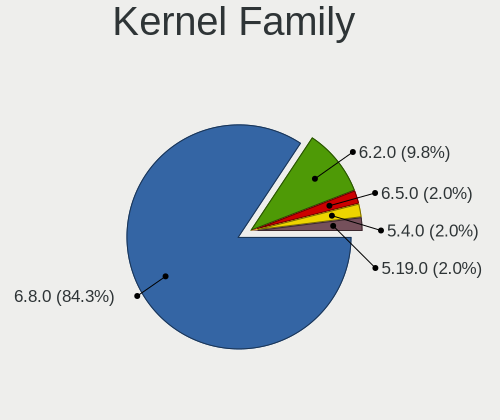
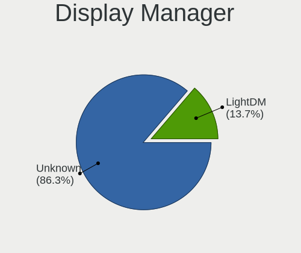
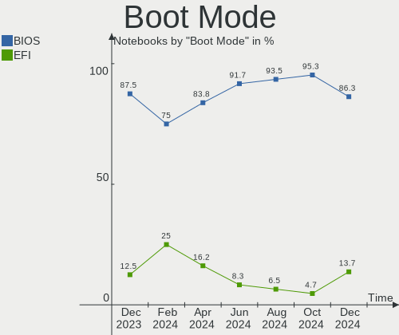
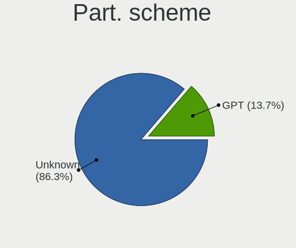
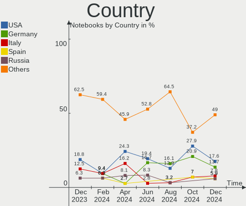
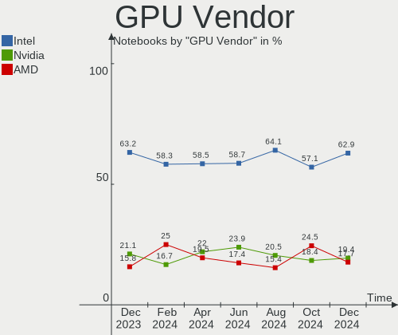
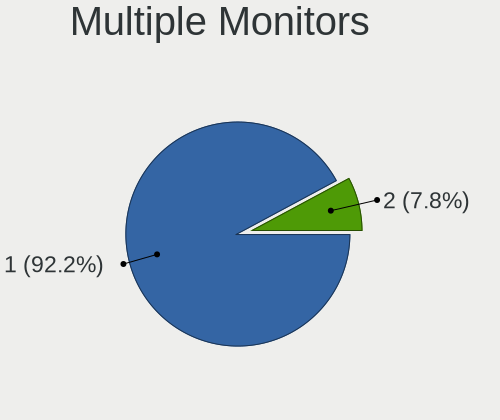
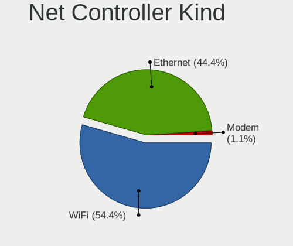
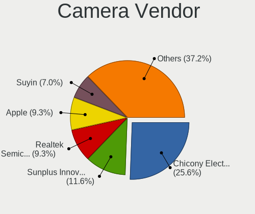
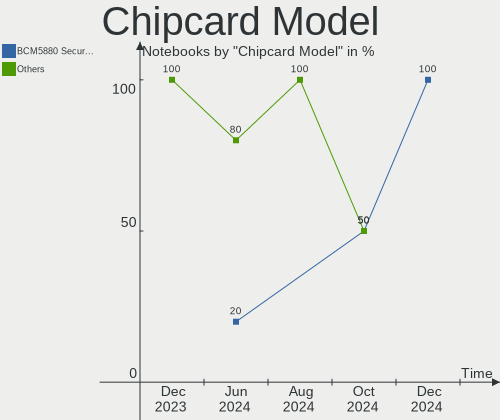

Elementary - Hardware Trends (Notebooks)
----------------------------------------

A project to identify most popular hardware characteristics and track their change
over time based on data collected by Linux users at https://Linux-Hardware.org.

Anyone can contribute to this report by the [hw-probe](https://github.com/linuxhw/hw-probe) tool:

    sudo -E hw-probe -all -upload

This report is for one last month. Overall report since the beginning of time: [TestDays](https://github.com/linuxhw/TestDays)

Period: Dec, 2024.

Contents
--------

* [ System ](#system)
  - [ OS                       ](#os)
  - [ OS Family                ](#os-family)
  - [ Kernel                   ](#kernel)
  - [ Kernel Family            ](#kernel-family)
  - [ Kernel Major Ver.        ](#kernel-major-ver)
  - [ Arch                     ](#arch)
  - [ DE                       ](#de)
  - [ Display Server           ](#display-server)
  - [ Display Manager          ](#display-manager)
  - [ OS Lang                  ](#os-lang)
  - [ Boot Mode                ](#boot-mode)
  - [ Filesystem               ](#filesystem)
  - [ Part. scheme             ](#part-scheme)
  - [ Dual Boot with Linux/BSD ](#dual-boot-with-linuxbsd)
  - [ Dual Boot (Win)          ](#dual-boot-win)

* [ Board ](#board)
  - [ Vendor                   ](#vendor)
  - [ Model                    ](#model)
  - [ Model Family             ](#model-family)
  - [ MFG Year                 ](#mfg-year)
  - [ Form Factor              ](#form-factor)
  - [ Secure Boot              ](#secure-boot)
  - [ Coreboot                 ](#coreboot)
  - [ RAM Size                 ](#ram-size)
  - [ RAM Used                 ](#ram-used)
  - [ Total Drives             ](#total-drives)
  - [ Has CD-ROM               ](#has-cd-rom)
  - [ Has Ethernet             ](#has-ethernet)
  - [ Has WiFi                 ](#has-wifi)
  - [ Has Bluetooth            ](#has-bluetooth)

* [ Location ](#location)
  - [ Country                  ](#country)
  - [ City                     ](#city)

* [ Drives ](#drives)
  - [ Drive Vendor             ](#drive-vendor)
  - [ Drive Model              ](#drive-model)
  - [ HDD Vendor               ](#hdd-vendor)
  - [ SSD Vendor               ](#ssd-vendor)
  - [ Drive Kind               ](#drive-kind)
  - [ Drive Connector          ](#drive-connector)
  - [ Drive Size               ](#drive-size)
  - [ Space Total              ](#space-total)
  - [ Space Used               ](#space-used)
  - [ Malfunc. Drives          ](#malfunc-drives)
  - [ Malfunc. Drive Vendor    ](#malfunc-drive-vendor)
  - [ Malfunc. HDD Vendor      ](#malfunc-hdd-vendor)
  - [ Malfunc. Drive Kind      ](#malfunc-drive-kind)
  - [ Failed Drives            ](#failed-drives)
  - [ Failed Drive Vendor      ](#failed-drive-vendor)
  - [ Drive Status             ](#drive-status)

* [ Storage controller ](#storage-controller)
  - [ Storage Vendor           ](#storage-vendor)
  - [ Storage Model            ](#storage-model)
  - [ Storage Kind             ](#storage-kind)

* [ Processor ](#processor)
  - [ CPU Vendor               ](#cpu-vendor)
  - [ CPU Model                ](#cpu-model)
  - [ CPU Model Family         ](#cpu-model-family)
  - [ CPU Cores                ](#cpu-cores)
  - [ CPU Sockets              ](#cpu-sockets)
  - [ CPU Threads              ](#cpu-threads)
  - [ CPU Op-Modes             ](#cpu-op-modes)
  - [ CPU Microcode            ](#cpu-microcode)
  - [ CPU Microarch            ](#cpu-microarch)

* [ Graphics ](#graphics)
  - [ GPU Vendor               ](#gpu-vendor)
  - [ GPU Model                ](#gpu-model)
  - [ GPU Combo                ](#gpu-combo)
  - [ GPU Driver               ](#gpu-driver)
  - [ GPU Memory               ](#gpu-memory)

* [ Monitor ](#monitor)
  - [ Monitor Vendor           ](#monitor-vendor)
  - [ Monitor Model            ](#monitor-model)
  - [ Monitor Resolution       ](#monitor-resolution)
  - [ Monitor Diagonal         ](#monitor-diagonal)
  - [ Monitor Width            ](#monitor-width)
  - [ Aspect Ratio             ](#aspect-ratio)
  - [ Monitor Area             ](#monitor-area)
  - [ Pixel Density            ](#pixel-density)
  - [ Multiple Monitors        ](#multiple-monitors)

* [ Network ](#network)
  - [ Net Controller Vendor    ](#net-controller-vendor)
  - [ Net Controller Model     ](#net-controller-model)
  - [ Wireless Vendor          ](#wireless-vendor)
  - [ Wireless Model           ](#wireless-model)
  - [ Ethernet Vendor          ](#ethernet-vendor)
  - [ Ethernet Model           ](#ethernet-model)
  - [ Net Controller Kind      ](#net-controller-kind)
  - [ Used Controller          ](#used-controller)
  - [ NICs                     ](#nics)
  - [ IPv6                     ](#ipv6)

* [ Bluetooth ](#bluetooth)
  - [ Bluetooth Vendor         ](#bluetooth-vendor)
  - [ Bluetooth Model          ](#bluetooth-model)

* [ Sound ](#sound)
  - [ Sound Vendor             ](#sound-vendor)
  - [ Sound Model              ](#sound-model)

* [ Memory ](#memory)
  - [ Memory Vendor            ](#memory-vendor)
  - [ Memory Model             ](#memory-model)
  - [ Memory Kind              ](#memory-kind)
  - [ Memory Form Factor       ](#memory-form-factor)
  - [ Memory Size              ](#memory-size)
  - [ Memory Speed             ](#memory-speed)

* [ Printers & scanners ](#printers--scanners)
  - [ Printer Vendor           ](#printer-vendor)
  - [ Printer Model            ](#printer-model)
  - [ Scanner Vendor           ](#scanner-vendor)
  - [ Scanner Model            ](#scanner-model)

* [ Camera ](#camera)
  - [ Camera Vendor            ](#camera-vendor)
  - [ Camera Model             ](#camera-model)

* [ Security ](#security)
  - [ Fingerprint Vendor       ](#fingerprint-vendor)
  - [ Fingerprint Model        ](#fingerprint-model)
  - [ Chipcard Vendor          ](#chipcard-vendor)
  - [ Chipcard Model           ](#chipcard-model)

* [ Unsupported ](#unsupported)
  - [ Unsupported Devices      ](#unsupported-devices)
  - [ Unsupported Device Types ](#unsupported-device-types)

System
------

OS
--

Installed operating systems

| Name             | Notebooks | Percent |
|------------------|-----------|---------|
| Elementary 8     | 33        | 64.71%  |
| Elementary 7.1   | 17        | 33.33%  |
| Elementary 5.1.7 | 1         | 1.96%   |

OS Family
---------

OS without a version

| Name       | Notebooks | Percent |
|------------|-----------|---------|
| Elementary | 51        | 100%    |

Kernel
------

Version of the Linux kernel

| Version           | Notebooks | Percent |
|-------------------|-----------|---------|
| 6.8.0-49-generic  | 21        | 41.18%  |
| 6.8.0-51-generic  | 17        | 33.33%  |
| 6.8.0-50-generic  | 4         | 7.84%   |
| 6.2.0-33-generic  | 4         | 7.84%   |
| 6.8.0-1017-oem    | 1         | 1.96%   |
| 6.5.0-41-generic  | 1         | 1.96%   |
| 6.2.0-26-generic  | 1         | 1.96%   |
| 5.4.0-135-generic | 1         | 1.96%   |
| 5.19.0-41-generic | 1         | 1.96%   |

Kernel Family
-------------

Linux kernel without a distro release

| Version | Notebooks | Percent |
|---------|-----------|---------|
| 6.8.0   | 43        | 84.31%  |
| 6.2.0   | 5         | 9.8%    |
| 6.5.0   | 1         | 1.96%   |
| 5.4.0   | 1         | 1.96%   |
| 5.19.0  | 1         | 1.96%   |

Kernel Major Ver.
-----------------

Linux kernel major version

| Version | Notebooks | Percent |
|---------|-----------|---------|
| 6.8     | 43        | 84.31%  |
| 6.2     | 5         | 9.8%    |
| 6.5     | 1         | 1.96%   |
| 5.4     | 1         | 1.96%   |
| 5.19    | 1         | 1.96%   |

Arch
----

OS architecture (x86_64, i586, etc.)

| Name   | Notebooks | Percent |
|--------|-----------|---------|
| x86_64 | 51        | 100%    |

DE
--

Desktop Environment

| Name     | Notebooks | Percent |
|----------|-----------|---------|
| Pantheon | 51        | 100%    |

Display Server
--------------

X11 or Wayland

| Name    | Notebooks | Percent |
|---------|-----------|---------|
| X11     | 48        | 94.12%  |
| Wayland | 3         | 5.88%   |

Display Manager
---------------

SDDM, LightDM, etc.

| Name    | Notebooks | Percent |
|---------|-----------|---------|
| Unknown | 44        | 86.27%  |
| LightDM | 7         | 13.73%  |

OS Lang
-------

Language

| Lang  | Notebooks | Percent |
|-------|-----------|---------|
| en_US | 19        | 37.25%  |
| de_DE | 5         | 9.8%    |
| ru_RU | 4         | 7.84%   |
| it_IT | 4         | 7.84%   |
| es_ES | 4         | 7.84%   |
| nl_NL | 2         | 3.92%   |
| fr_FR | 2         | 3.92%   |
| bg_BG | 2         | 3.92%   |
| uk_UA | 1         | 1.96%   |
| tr_TR | 1         | 1.96%   |
| pt_BR | 1         | 1.96%   |
| pl_PL | 1         | 1.96%   |
| ko_KR | 1         | 1.96%   |
| ja_JP | 1         | 1.96%   |
| hu_HU | 1         | 1.96%   |
| hr_HR | 1         | 1.96%   |
| da_DK | 1         | 1.96%   |

Boot Mode
---------

EFI or BIOS

| Mode | Notebooks | Percent |
|------|-----------|---------|
| BIOS | 44        | 86.27%  |
| EFI  | 7         | 13.73%  |

Filesystem
----------

Type of filesystem

| Type  | Notebooks | Percent |
|-------|-----------|---------|
| Ext4  | 48        | 94.12%  |
| Btrfs | 2         | 3.92%   |
| Xfs   | 1         | 1.96%   |

Part. scheme
------------

Scheme of partitioning

| Type    | Notebooks | Percent |
|---------|-----------|---------|
| Unknown | 44        | 86.27%  |
| GPT     | 7         | 13.73%  |

Dual Boot with Linux/BSD
------------------------

Hosting more than one Linux/BSD

| Dual boot | Notebooks | Percent |
|-----------|-----------|---------|
| No        | 51        | 100%    |

Dual Boot (Win)
---------------

Hosting Linux and Windows

| Dual boot | Notebooks | Percent |
|-----------|-----------|---------|
| No        | 49        | 96.08%  |
| Yes       | 2         | 3.92%   |

Board
-----

Vendor
------

Motherboard manufacturer

| Name                | Notebooks | Percent |
|---------------------|-----------|---------|
| Hewlett-Packard     | 10        | 19.61%  |
| Dell                | 7         | 13.73%  |
| Apple               | 6         | 11.76%  |
| Lenovo              | 5         | 9.8%    |
| ASUSTek Computer    | 5         | 9.8%    |
| Acer                | 5         | 9.8%    |
| Sony                | 2         | 3.92%   |
| Samsung Electronics | 2         | 3.92%   |
| Toshiba             | 1         | 1.96%   |
| Pegatron            | 1         | 1.96%   |
| Panasonic           | 1         | 1.96%   |
| Packard Bell        | 1         | 1.96%   |
| NEC Computers       | 1         | 1.96%   |
| Microtech           | 1         | 1.96%   |
| eMachines           | 1         | 1.96%   |
| Chuwi               | 1         | 1.96%   |
| Unknown             | 1         | 1.96%   |

Model
-----

Motherboard model

| Name                                       | Notebooks | Percent |
|--------------------------------------------|-----------|---------|
| Apple MacBookAir3,1                        | 2         | 3.92%   |
| Toshiba Satellite L50-B                    | 1         | 1.96%   |
| Sony SVS1313V9RB                           | 1         | 1.96%   |
| Sony SVF14213CLB                           | 1         | 1.96%   |
| Samsung SR58P                              | 1         | 1.96%   |
| Samsung 950XCJ/951XCJ/950XCR               | 1         | 1.96%   |
| Pegatron A15                               | 1         | 1.96%   |
| Panasonic CF-52PFP54QL                     | 1         | 1.96%   |
| Packard Bell EasyNote TJ75                 | 1         | 1.96%   |
| NEC Computers PC-LL750MSW                  | 1         | 1.96%   |
| Microtech ebookPro                         | 1         | 1.96%   |
| Lenovo ThinkPad X1 Carbon Gen 8 20U90030US | 1         | 1.96%   |
| Lenovo ThinkPad L380 20M6S11800            | 1         | 1.96%   |
| Lenovo IdeaPad Y560                        | 1         | 1.96%   |
| Lenovo IdeaPad Slim 5 14AHP9 83DB          | 1         | 1.96%   |
| Lenovo IdeaPad S205 1038D8G                | 1         | 1.96%   |
| HP ProBook 6570b                           | 1         | 1.96%   |
| HP ProBook 645 G2                          | 1         | 1.96%   |
| HP Pavilion dv7                            | 1         | 1.96%   |
| HP Pavilion dv6                            | 1         | 1.96%   |
| HP Laptop 17z-ca100                        | 1         | 1.96%   |
| HP Laptop 17-by3xxx                        | 1         | 1.96%   |
| HP Laptop 15s-fq1xxx                       | 1         | 1.96%   |
| HP Laptop 15-dy5xxx                        | 1         | 1.96%   |
| HP EliteBook 830 G5                        | 1         | 1.96%   |
| HP EliteBook 2170p                         | 1         | 1.96%   |
| eMachines eME732Z                          | 1         | 1.96%   |
| Dell XPS 15 9550                           | 1         | 1.96%   |
| Dell Precision 5530                        | 1         | 1.96%   |
| Dell Latitude E6520                        | 1         | 1.96%   |
| Dell Latitude 3340                         | 1         | 1.96%   |
| Dell Inspiron 5567                         | 1         | 1.96%   |
| Dell Inspiron 5547                         | 1         | 1.96%   |
| Dell Inspiron 15-3552                      | 1         | 1.96%   |
| Chuwi UBook                                | 1         | 1.96%   |
| ASUS X751MA                                | 1         | 1.96%   |
| ASUS X555LDB                               | 1         | 1.96%   |
| ASUS X550CL                                | 1         | 1.96%   |
| ASUS VivoBook_ASUSLaptop X1502ZA_X1502ZA   | 1         | 1.96%   |
| ASUS UX30                                  | 1         | 1.96%   |

Model Family
------------

Motherboard model prefix

| Name                      | Notebooks | Percent |
|---------------------------|-----------|---------|
| HP Laptop                 | 4         | 7.84%   |
| Acer Aspire               | 4         | 7.84%   |
| Lenovo IdeaPad            | 3         | 5.88%   |
| Dell Inspiron             | 3         | 5.88%   |
| Lenovo ThinkPad           | 2         | 3.92%   |
| HP ProBook                | 2         | 3.92%   |
| HP Pavilion               | 2         | 3.92%   |
| HP EliteBook              | 2         | 3.92%   |
| Dell Latitude             | 2         | 3.92%   |
| Apple MacBookAir3         | 2         | 3.92%   |
| Toshiba Satellite         | 1         | 1.96%   |
| Sony SVS1313V9RB          | 1         | 1.96%   |
| Sony SVF14213CLB          | 1         | 1.96%   |
| Samsung SR58P             | 1         | 1.96%   |
| Samsung 950XCJ            | 1         | 1.96%   |
| Pegatron A15              | 1         | 1.96%   |
| Panasonic CF-52PFP54QL    | 1         | 1.96%   |
| Packard Bell EasyNote     | 1         | 1.96%   |
| NEC Computers PC-LL750MSW | 1         | 1.96%   |
| Microtech ebookPro        | 1         | 1.96%   |
| eMachines eME732Z         | 1         | 1.96%   |
| Dell XPS                  | 1         | 1.96%   |
| Dell Precision            | 1         | 1.96%   |
| Chuwi UBook               | 1         | 1.96%   |
| ASUS X751MA               | 1         | 1.96%   |
| ASUS X555LDB              | 1         | 1.96%   |
| ASUS X550CL               | 1         | 1.96%   |
| ASUS VivoBook             | 1         | 1.96%   |
| ASUS UX30                 | 1         | 1.96%   |
| Apple MacBookPro8         | 1         | 1.96%   |
| Apple MacBookPro10        | 1         | 1.96%   |
| Apple MacBookAir7         | 1         | 1.96%   |
| Apple MacBook4            | 1         | 1.96%   |
| Acer Swift                | 1         | 1.96%   |
| Unknown                   | 1         | 1.96%   |

MFG Year
--------

Motherboard manufacture year

| Year | Notebooks | Percent |
|------|-----------|---------|
| 2018 | 5         | 9.8%    |
| 2014 | 5         | 9.8%    |
| 2011 | 5         | 9.8%    |
| 2010 | 5         | 9.8%    |
| 2008 | 5         | 9.8%    |
| 2020 | 4         | 7.84%   |
| 2012 | 4         | 7.84%   |
| 2022 | 3         | 5.88%   |
| 2015 | 3         | 5.88%   |
| 2013 | 3         | 5.88%   |
| 2019 | 2         | 3.92%   |
| 2016 | 2         | 3.92%   |
| 2009 | 2         | 3.92%   |
| 2024 | 1         | 1.96%   |
| 2023 | 1         | 1.96%   |
| 2007 | 1         | 1.96%   |

Form Factor
-----------

Physical design of the computer

| Name     | Notebooks | Percent |
|----------|-----------|---------|
| Notebook | 51        | 100%    |

Secure Boot
-----------

Enabled or disabled

| State    | Notebooks | Percent |
|----------|-----------|---------|
| Disabled | 51        | 100%    |

Coreboot
--------

Have coreboot on board

| Used | Notebooks | Percent |
|------|-----------|---------|
| No   | 51        | 100%    |

RAM Size
--------

Total RAM memory

| Size in GB | Notebooks | Percent |
|------------|-----------|---------|
| 4.01-8.0   | 21        | 41.18%  |
| 3.01-4.0   | 7         | 13.73%  |
| 16.01-24.0 | 7         | 13.73%  |
| 8.01-16.0  | 6         | 11.76%  |
| 32.01-64.0 | 3         | 5.88%   |
| 2.01-3.0   | 3         | 5.88%   |
| 1.01-2.0   | 3         | 5.88%   |
| 24.01-32.0 | 1         | 1.96%   |

RAM Used
--------

Used RAM memory

| Used GB   | Notebooks | Percent |
|-----------|-----------|---------|
| 2.01-3.0  | 16        | 31.37%  |
| 1.01-2.0  | 14        | 27.45%  |
| 3.01-4.0  | 9         | 17.65%  |
| 4.01-8.0  | 8         | 15.69%  |
| 0.51-1.0  | 3         | 5.88%   |
| 8.01-16.0 | 1         | 1.96%   |

Total Drives
------------

Number of drives on board

| Drives | Notebooks | Percent |
|--------|-----------|---------|
| 1      | 42        | 82.35%  |
| 2      | 9         | 17.65%  |

Has CD-ROM
----------

Has CD-ROM on board

| Presented | Notebooks | Percent |
|-----------|-----------|---------|
| No        | 32        | 62.75%  |
| Yes       | 19        | 37.25%  |

Has Ethernet
------------

Has Ethernet on board

| Presented | Notebooks | Percent |
|-----------|-----------|---------|
| Yes       | 40        | 78.43%  |
| No        | 11        | 21.57%  |

Has WiFi
--------

Has WiFi module

| Presented | Notebooks | Percent |
|-----------|-----------|---------|
| Yes       | 49        | 96.08%  |
| No        | 2         | 3.92%   |

Has Bluetooth
-------------

Has Bluetooth module

| Presented | Notebooks | Percent |
|-----------|-----------|---------|
| Yes       | 39        | 76.47%  |
| No        | 12        | 23.53%  |

Location
--------

Country
-------

Geographic location (country)

| Country         | Notebooks | Percent |
|-----------------|-----------|---------|
| USA             | 9         | 17.65%  |
| Germany         | 7         | 13.73%  |
| Italy           | 4         | 7.84%   |
| Spain           | 3         | 5.88%   |
| Russia          | 3         | 5.88%   |
| Ukraine         | 2         | 3.92%   |
| Bulgaria        | 2         | 3.92%   |
| UK              | 1         | 1.96%   |
| Türkiye        | 1         | 1.96%   |
| Turkey          | 1         | 1.96%   |
| The Netherlands | 1         | 1.96%   |
| South Korea     | 1         | 1.96%   |
| Slovakia        | 1         | 1.96%   |
| Serbia          | 1         | 1.96%   |
| Portugal        | 1         | 1.96%   |
| Poland          | 1         | 1.96%   |
| Morocco         | 1         | 1.96%   |
| Mexico          | 1         | 1.96%   |
| Latvia          | 1         | 1.96%   |
| Japan           | 1         | 1.96%   |
| Indonesia       | 1         | 1.96%   |
| France          | 1         | 1.96%   |
| Faroe Islands   | 1         | 1.96%   |
| Croatia         | 1         | 1.96%   |
| Canada          | 1         | 1.96%   |
| Brazil          | 1         | 1.96%   |
| Belgium         | 1         | 1.96%   |
| Australia       | 1         | 1.96%   |

City
----

Geographic location (city)

| City                   | Notebooks | Percent |
|------------------------|-----------|---------|
| Naples                 | 2         | 3.92%   |
| Munich                 | 2         | 3.92%   |
| Los Angeles            | 2         | 3.92%   |
| Zubia                  | 1         | 1.96%   |
| Zagreb                 | 1         | 1.96%   |
| Yeonsu-gu              | 1         | 1.96%   |
| Wolverhampton          | 1         | 1.96%   |
| Wiesbaden              | 1         | 1.96%   |
| Warsaw                 | 1         | 1.96%   |
| Trnava                 | 1         | 1.96%   |
| Tórshavn              | 1         | 1.96%   |
| Sofia                  | 1         | 1.96%   |
| Sioux Falls            | 1         | 1.96%   |
| Simferopol             | 1         | 1.96%   |
| Seth                   | 1         | 1.96%   |
| Seattle                | 1         | 1.96%   |
| Sannomaru              | 1         | 1.96%   |
| Sainte-Therese         | 1         | 1.96%   |
| Saint-Cyr-au-Mont-d'Or | 1         | 1.96%   |
| Rome                   | 1         | 1.96%   |
| Riga                   | 1         | 1.96%   |
| Ramstein-Miesenbach    | 1         | 1.96%   |
| Querétaro City        | 1         | 1.96%   |
| Porto                  | 1         | 1.96%   |
| Pontevedra             | 1         | 1.96%   |
| Pazardzhik             | 1         | 1.96%   |
| Overijse               | 1         | 1.96%   |
| Odesa                  | 1         | 1.96%   |
| Novosibirsk            | 1         | 1.96%   |
| Nashville              | 1         | 1.96%   |
| Morrow                 | 1         | 1.96%   |
| Milpitas               | 1         | 1.96%   |
| Milan                  | 1         | 1.96%   |
| Málaga                | 1         | 1.96%   |
| Krasnoznamensk         | 1         | 1.96%   |
| Kennett Square         | 1         | 1.96%   |
| Kaliningrad            | 1         | 1.96%   |
| Istanbul               | 1         | 1.96%   |
| Goiânia               | 1         | 1.96%   |
| Frankfurt am Main      | 1         | 1.96%   |

Drives
------

Drive Vendor
------------

Hard drive vendors

| Vendor                      | Notebooks | Drives | Percent |
|-----------------------------|-----------|--------|---------|
| Samsung Electronics         | 9         | 10     | 15.25%  |
| WDC                         | 6         | 6      | 10.17%  |
| Seagate                     | 5         | 5      | 8.47%   |
| Sandisk                     | 4         | 4      | 6.78%   |
| Apple                       | 4         | 4      | 6.78%   |
| Toshiba                     | 3         | 3      | 5.08%   |
| Kingston                    | 3         | 3      | 5.08%   |
| Unknown                     | 2         | 2      | 3.39%   |
| KIOXIA                      | 2         | 2      | 3.39%   |
| HGST                        | 2         | 2      | 3.39%   |
| Fujitsu                     | 2         | 2      | 3.39%   |
| WALRAM                      | 1         | 1      | 1.69%   |
| SPCC                        | 1         | 1      | 1.69%   |
| Netac                       | 1         | 1      | 1.69%   |
| Micron/Crucial Technology   | 1         | 1      | 1.69%   |
| Micron Technology           | 1         | 1      | 1.69%   |
| MAXIO Technology (Hangzhou) | 1         | 1      | 1.69%   |
| KingSpec                    | 1         | 1      | 1.69%   |
| KingDian                    | 1         | 1      | 1.69%   |
| JMicron Technology          | 1         | 1      | 1.69%   |
| Hitachi                     | 1         | 1      | 1.69%   |
| GOODRAM                     | 1         | 1      | 1.69%   |
| Fanxiang                    | 1         | 1      | 1.69%   |
| Emtec                       | 1         | 1      | 1.69%   |
| Crucial                     | 1         | 1      | 1.69%   |
| Apacer                      | 1         | 1      | 1.69%   |
| A-DATA Technology           | 1         | 1      | 1.69%   |
| 2-Power                     | 1         | 2      | 1.69%   |

Drive Model
-----------

Hard drive models

| Model                                                | Notebooks | Percent |
|------------------------------------------------------|-----------|---------|
| Samsung NVMe SSD Controller SM981/PM981/PM983 512GB  | 2         | 3.33%   |
| WDC WD5000LPCX-21VHAT0 500GB                         | 1         | 1.67%   |
| WDC WD5000BPVT-22HXZT3 500GB                         | 1         | 1.67%   |
| WDC WD5000BEVT-22ZAT0 500GB                          | 1         | 1.67%   |
| WDC WD3200BUCT-63TWBY0 320GB                         | 1         | 1.67%   |
| WDC WD3200BEKT-60PVMT0 320GB                         | 1         | 1.67%   |
| WDC WD10JPVX-08JC3T2 1TB                             | 1         | 1.67%   |
| WALRAM 512GB                                         | 1         | 1.67%   |
| Unknown MMC Card  393GB                              | 1         | 1.67%   |
| Unknown MMC Card  32GB                               | 1         | 1.67%   |
| Toshiba MQ04ABF100 1TB                               | 1         | 1.67%   |
| Toshiba MQ01ABD075 752GB                             | 1         | 1.67%   |
| Toshiba KXG6AZNV512G 512GB                           | 1         | 1.67%   |
| SPCC Solid State Disk 64GB                           | 1         | 1.67%   |
| Seagate ST9160412ASG 160GB                           | 1         | 1.67%   |
| Seagate ST9160310AS 160GB                            | 1         | 1.67%   |
| Seagate ST500LM000-1EJ162 500GB                      | 1         | 1.67%   |
| Seagate ST1000LM024 HN-M101MBB 1TB                   | 1         | 1.67%   |
| Seagate Expansion 1TB                                | 1         | 1.67%   |
| Sandisk WD PC SN740 SDDQNQD-512G-1014 512GB          | 1         | 1.67%   |
| Sandisk WD Blue SN550 NVMe SSD 256GB                 | 1         | 1.67%   |
| SanDisk SSD PLUS 1000GB                              | 1         | 1.67%   |
| SanDisk NVMe SSD Drive 1TB                           | 1         | 1.67%   |
| Samsung SSD 990 EVO 1TB                              | 1         | 1.67%   |
| Samsung SSD 970 EVO Plus 500GB                       | 1         | 1.67%   |
| Samsung SSD 870 EVO 250GB                            | 1         | 1.67%   |
| Samsung SSD 850 EVO 250GB                            | 1         | 1.67%   |
| Samsung Portable SSD T5 250GB                        | 1         | 1.67%   |
| Samsung NVMe SSD Controller SM961/PM961/SM963 256GB  | 1         | 1.67%   |
| Samsung NVMe SSD Controller PM9A1/PM9A3/980PRO 512GB | 1         | 1.67%   |
| Samsung MZNLN128HAHQ-000H1 128GB SSD                 | 1         | 1.67%   |
| Netac N600 256GB                                     | 1         | 1.67%   |
| Micron/Crucial P2 NVMe PCIe SSD 500GB                | 1         | 1.67%   |
| Micron 2400_MTFDKBA512QFM 512GB                      | 1         | 1.67%   |
| MAXIO (Hangzhou) NVMe SSD Controller MAP1202 512GB   | 1         | 1.67%   |
| KIOXIA KBG50ZNV256G 256GB                            | 1         | 1.67%   |
| KIOXIA KBG40ZNV512G 512GB                            | 1         | 1.67%   |
| Kingston SV300S37A240G 240GB SSD                     | 1         | 1.67%   |
| Kingston SM2280S3240G 240GB SSD                      | 1         | 1.67%   |
| Kingston SA400S37240G 240GB SSD                      | 1         | 1.67%   |

HDD Vendor
----------

Hard disk drive vendors

| Vendor             | Notebooks | Drives | Percent |
|--------------------|-----------|--------|---------|
| WDC                | 6         | 6      | 31.58%  |
| Seagate            | 5         | 5      | 26.32%  |
| Toshiba            | 2         | 2      | 10.53%  |
| HGST               | 2         | 2      | 10.53%  |
| Fujitsu            | 2         | 2      | 10.53%  |
| JMicron Technology | 1         | 1      | 5.26%   |
| Hitachi            | 1         | 1      | 5.26%   |

SSD Vendor
----------

Solid state drive vendors

| Vendor              | Notebooks | Drives | Percent |
|---------------------|-----------|--------|---------|
| Samsung Electronics | 4         | 4      | 19.05%  |
| Apple               | 4         | 4      | 19.05%  |
| Kingston            | 3         | 3      | 14.29%  |
| SPCC                | 1         | 1      | 4.76%   |
| SanDisk             | 1         | 1      | 4.76%   |
| KingSpec            | 1         | 1      | 4.76%   |
| KingDian            | 1         | 1      | 4.76%   |
| GOODRAM             | 1         | 1      | 4.76%   |
| Emtec               | 1         | 1      | 4.76%   |
| Crucial             | 1         | 1      | 4.76%   |
| Apacer              | 1         | 1      | 4.76%   |
| A-DATA Technology   | 1         | 1      | 4.76%   |
| 2-Power             | 1         | 2      | 4.76%   |

Drive Kind
----------

HDD or SSD

| Kind    | Notebooks | Drives | Percent |
|---------|-----------|--------|---------|
| SSD     | 21        | 22     | 35%     |
| HDD     | 19        | 19     | 31.67%  |
| NVMe    | 15        | 15     | 25%     |
| Unknown | 3         | 3      | 5%      |
| MMC     | 2         | 2      | 3.33%   |

Drive Connector
---------------

SATA, SAS, NVMe, etc.

| Type | Notebooks | Drives | Percent |
|------|-----------|--------|---------|
| SATA | 38        | 40     | 64.41%  |
| NVMe | 15        | 15     | 25.42%  |
| SAS  | 4         | 4      | 6.78%   |
| MMC  | 2         | 2      | 3.39%   |

Drive Size
----------

Size of hard drive

| Size in TB | Notebooks | Drives | Percent |
|------------|-----------|--------|---------|
| 0.01-0.5   | 32        | 34     | 84.21%  |
| 0.51-1.0   | 6         | 7      | 15.79%  |

Space Total
-----------

Amount of disk space available on the file system

| Size in GB | Notebooks | Percent |
|------------|-----------|---------|
| 101-250    | 21        | 41.18%  |
| 251-500    | 14        | 27.45%  |
| 501-1000   | 10        | 19.61%  |
| 51-100     | 5         | 9.8%    |
| 21-50      | 1         | 1.96%   |

Space Used
----------

Amount of used disk space

| Used GB  | Notebooks | Percent |
|----------|-----------|---------|
| 1-20     | 26        | 50.98%  |
| 21-50    | 13        | 25.49%  |
| 51-100   | 6         | 11.76%  |
| 101-250  | 4         | 7.84%   |
| 251-500  | 1         | 1.96%   |
| 501-1000 | 1         | 1.96%   |

Malfunc. Drives
---------------

Drive models with a malfunction

Zero info for selected period =(

Malfunc. Drive Vendor
---------------------

Vendors of faulty drives

Zero info for selected period =(

Malfunc. HDD Vendor
-------------------

Vendors of faulty HDD drives

Zero info for selected period =(

Malfunc. Drive Kind
-------------------

Kinds of faulty drives

Zero info for selected period =(

Failed Drives
-------------

Failed drive models

Zero info for selected period =(

Failed Drive Vendor
-------------------

Failed drive vendors

Zero info for selected period =(

Drive Status
------------

Number of failed and malfunc. drives

| Status   | Notebooks | Drives | Percent |
|----------|-----------|--------|---------|
| Detected | 47        | 56     | 90.38%  |
| Works    | 5         | 5      | 9.62%   |

Storage controller
------------------

Storage Vendor
--------------

Storage controller vendors

| Vendor                       | Notebooks | Percent |
|------------------------------|-----------|---------|
| Intel                        | 36        | 63.16%  |
| Samsung Electronics          | 7         | 12.28%  |
| Sandisk                      | 3         | 5.26%   |
| AMD                          | 3         | 5.26%   |
| Nvidia                       | 2         | 3.51%   |
| KIOXIA                       | 2         | 3.51%   |
| Toshiba America Info Systems | 1         | 1.75%   |
| Micron/Crucial Technology    | 1         | 1.75%   |
| Micron Technology            | 1         | 1.75%   |
| MAXIO Technology (Hangzhou)  | 1         | 1.75%   |

Storage Model
-------------

Storage controller models

| Model                                                                            | Notebooks | Percent |
|----------------------------------------------------------------------------------|-----------|---------|
| Intel 7 Series Chipset Family 6-port SATA Controller [AHCI mode]                 | 6         | 10%     |
| Intel 82801 Mobile SATA Controller [RAID mode]                                   | 5         | 8.33%   |
| Intel 82801IBM/IEM (ICH9M/ICH9M-E) 4 port SATA Controller [AHCI mode]            | 4         | 6.67%   |
| Intel 8 Series SATA Controller 1 [AHCI mode]                                     | 4         | 6.67%   |
| Samsung NVMe SSD Controller SM981/PM981/PM983                                    | 3         | 5%      |
| Intel 6 Series/C200 Series Chipset Family 6 port Mobile SATA AHCI Controller     | 3         | 5%      |
| Intel 5 Series/3400 Series Chipset 4 port SATA AHCI Controller                   | 3         | 5%      |
| Nvidia MCP89 SATA Controller (AHCI mode)                                         | 2         | 3.33%   |
| Intel Sunrise Point-LP SATA Controller [AHCI mode]                               | 2         | 3.33%   |
| Intel Celeron/Pentium Silver Processor SATA Controller                           | 2         | 3.33%   |
| Toshiba America Info Systems XG6 NVMe SSD Controller                             | 1         | 1.67%   |
| Sandisk WD PC SN740 NVMe SSD 512GB (DRAM-less)                                   | 1         | 1.67%   |
| SanDisk WD Black SN770 / PC SN740 256GB / PC SN560 (DRAM-less) NVMe SSD          | 1         | 1.67%   |
| SanDisk Ultra 3D / WD PC SN530, IX SN530, Blue SN550 NVMe SSD (DRAM-less)        | 1         | 1.67%   |
| Samsung S4LN058A01[SSUBX] AHCI SSD Controller (Apple slot)                       | 1         | 1.67%   |
| Samsung NVMe SSD Controller SM961/PM961/SM963                                    | 1         | 1.67%   |
| Samsung NVMe SSD Controller PM9C1a (DRAM-less)                                   | 1         | 1.67%   |
| Samsung NVMe SSD Controller PM9A1/PM9A3/980PRO                                   | 1         | 1.67%   |
| Micron/Crucial P2 [Nick P2] / P3 / P3 Plus NVMe PCIe SSD (DRAM-less)             | 1         | 1.67%   |
| Micron 2400 NVMe SSD (DRAM-less)                                                 | 1         | 1.67%   |
| MAXIO (Hangzhou) NVMe SSD Controller MAP1202 (DRAM-less)                         | 1         | 1.67%   |
| KIOXIA NVMe SSD Controller BG5 (DRAM-less)                                       | 1         | 1.67%   |
| KIOXIA NVMe SSD Controller BG4 (DRAM-less)                                       | 1         | 1.67%   |
| Intel Wildcat Point-LP SATA Controller [AHCI Mode]                               | 1         | 1.67%   |
| Intel HM170/QM170 Chipset SATA Controller [AHCI Mode]                            | 1         | 1.67%   |
| Intel Cannon Lake Mobile PCH SATA AHCI Controller                                | 1         | 1.67%   |
| Intel Atom/Celeron/Pentium Processor x5-E8000/J3xxx/N3xxx Series SATA Controller | 1         | 1.67%   |
| Intel Atom Processor E3800 Series SATA AHCI Controller                           | 1         | 1.67%   |
| Intel 82801IBM/IEM (ICH9M/ICH9M-E) 2 port SATA Controller [IDE mode]             | 1         | 1.67%   |
| Intel 82801HM/HEM (ICH8M/ICH8M-E) SATA Controller [AHCI mode]                    | 1         | 1.67%   |
| Intel 82801HM/HEM (ICH8M/ICH8M-E) IDE Controller                                 | 1         | 1.67%   |
| Intel 5 Series/3400 Series Chipset 6 port SATA AHCI Controller                   | 1         | 1.67%   |
| AMD SB7x0/SB8x0/SB9x0 SATA Controller [AHCI mode]                                | 1         | 1.67%   |
| AMD SB600 Non-Raid-5 SATA                                                        | 1         | 1.67%   |
| AMD SB600 IDE                                                                    | 1         | 1.67%   |
| AMD FCH SATA Controller [AHCI mode]                                              | 1         | 1.67%   |

Storage Kind
------------

Kind of storage controller (IDE, SATA, NVMe, SAS, ...)

| Kind | Notebooks | Percent |
|------|-----------|---------|
| SATA | 37        | 61.67%  |
| NVMe | 15        | 25%     |
| RAID | 5         | 8.33%   |
| IDE  | 3         | 5%      |

Processor
---------

CPU Vendor
----------

Processor vendors

| Vendor | Notebooks | Percent |
|--------|-----------|---------|
| Intel  | 46        | 90.2%   |
| AMD    | 5         | 9.8%    |

CPU Model
---------

Processor models

| Model                                       | Notebooks | Percent |
|---------------------------------------------|-----------|---------|
| Intel Core i5-4200U CPU @ 1.60GHz           | 2         | 3.92%   |
| Intel Core 2 Duo CPU U9400 @ 1.40GHz        | 2         | 3.92%   |
| Intel Pentium Silver N5000 CPU @ 1.10GHz    | 1         | 1.96%   |
| Intel Pentium Dual-Core CPU T4400 @ 2.20GHz | 1         | 1.96%   |
| Intel Pentium Dual CPU T2330 @ 1.60GHz      | 1         | 1.96%   |
| Intel Pentium CPU N3710 @ 1.60GHz           | 1         | 1.96%   |
| Intel Pentium CPU 2117U @ 1.80GHz           | 1         | 1.96%   |
| Intel Genuine CPU U7300 @ 1.30GHz           | 1         | 1.96%   |
| Intel Core m3-6Y30 CPU @ 0.90GHz            | 1         | 1.96%   |
| Intel Core i7-8850H CPU @ 2.60GHz           | 1         | 1.96%   |
| Intel Core i7-8565U CPU @ 1.80GHz           | 1         | 1.96%   |
| Intel Core i7-8550U CPU @ 1.80GHz           | 1         | 1.96%   |
| Intel Core i7-6700HQ CPU @ 2.60GHz          | 1         | 1.96%   |
| Intel Core i7-4700MQ CPU @ 2.40GHz          | 1         | 1.96%   |
| Intel Core i7-4510U CPU @ 2.00GHz           | 1         | 1.96%   |
| Intel Core i7-3615QM CPU @ 2.30GHz          | 1         | 1.96%   |
| Intel Core i7-3540M CPU @ 3.00GHz           | 1         | 1.96%   |
| Intel Core i7-2670QM CPU @ 2.20GHz          | 1         | 1.96%   |
| Intel Core i7-1065G7 CPU @ 1.30GHz          | 1         | 1.96%   |
| Intel Core i7-10610U CPU @ 1.80GHz          | 1         | 1.96%   |
| Intel Core i7 CPU M 620 @ 2.67GHz           | 1         | 1.96%   |
| Intel Core i5-7200U CPU @ 2.50GHz           | 1         | 1.96%   |
| Intel Core i5-5250U CPU @ 1.60GHz           | 1         | 1.96%   |
| Intel Core i5-3427U CPU @ 1.80GHz           | 1         | 1.96%   |
| Intel Core i5-3320M CPU @ 2.60GHz           | 1         | 1.96%   |
| Intel Core i5-2415M CPU @ 2.30GHz           | 1         | 1.96%   |
| Intel Core i5-2410M CPU @ 2.30GHz           | 1         | 1.96%   |
| Intel Core i5-1035G1 CPU @ 1.00GHz          | 1         | 1.96%   |
| Intel Core i5-10210U CPU @ 1.60GHz          | 1         | 1.96%   |
| Intel Core i5 CPU M 560 @ 2.67GHz           | 1         | 1.96%   |
| Intel Core i5 CPU M 520 @ 2.40GHz           | 1         | 1.96%   |
| Intel Core i5 CPU M 430 @ 2.27GHz           | 1         | 1.96%   |
| Intel Core i3-8130U CPU @ 2.20GHz           | 1         | 1.96%   |
| Intel Core i3-5010U CPU @ 2.10GHz           | 1         | 1.96%   |
| Intel Core i3-3227U CPU @ 1.90GHz           | 1         | 1.96%   |
| Intel Core 2 Duo CPU T8300 @ 2.40GHz        | 1         | 1.96%   |
| Intel Core 2 Duo CPU T6500 @ 2.10GHz        | 1         | 1.96%   |
| Intel Core 2 Duo CPU P8700 @ 2.53GHz        | 1         | 1.96%   |
| Intel Celeron J4005 CPU @ 2.00GHz           | 1         | 1.96%   |
| Intel Celeron CPU N2940 @ 1.83GHz           | 1         | 1.96%   |

CPU Model Family
----------------

Processor model prefix

| Model                   | Notebooks | Percent |
|-------------------------|-----------|---------|
| Intel Core i5           | 13        | 25.49%  |
| Intel Core i7           | 12        | 23.53%  |
| Intel Core 2 Duo        | 5         | 9.8%    |
| Intel Celeron           | 4         | 7.84%   |
| Intel Core i3           | 3         | 5.88%   |
| Other                   | 2         | 3.92%   |
| Intel Pentium           | 2         | 3.92%   |
| AMD Ryzen 7             | 2         | 3.92%   |
| Intel Pentium Silver    | 1         | 1.96%   |
| Intel Pentium Dual-Core | 1         | 1.96%   |
| Intel Pentium Dual      | 1         | 1.96%   |
| Intel Genuine           | 1         | 1.96%   |
| Intel Core m3           | 1         | 1.96%   |
| AMD Ryzen 5             | 1         | 1.96%   |
| AMD PRO A8              | 1         | 1.96%   |
| AMD E                   | 1         | 1.96%   |

CPU Cores
---------

Number of processor cores

| Number | Notebooks | Percent |
|--------|-----------|---------|
| 2      | 32        | 62.75%  |
| 4      | 14        | 27.45%  |
| 8      | 2         | 3.92%   |
| 6      | 2         | 3.92%   |
| 12     | 1         | 1.96%   |

CPU Sockets
-----------

Number of sockets

| Number | Notebooks | Percent |
|--------|-----------|---------|
| 1      | 51        | 100%    |

CPU Threads
-----------

Threads per core (Hyper-Threading)

| Number | Notebooks | Percent |
|--------|-----------|---------|
| 2      | 35        | 68.63%  |
| 1      | 16        | 31.37%  |

CPU Op-Modes
------------

CPU Operation Modes (32-bit, 64-bit)

| Op mode        | Notebooks | Percent |
|----------------|-----------|---------|
| 32-bit, 64-bit | 51        | 100%    |

CPU Microcode
-------------

Microcode number

| Number     | Notebooks | Percent |
|------------|-----------|---------|
| Unknown    | 50        | 98.04%  |
| 0x08108109 | 1         | 1.96%   |

CPU Microarch
-------------

Microarchitecture

| Name             | Notebooks | Percent |
|------------------|-----------|---------|
| Penryn           | 7         | 13.73%  |
| KabyLake         | 7         | 13.73%  |
| IvyBridge        | 6         | 11.76%  |
| Haswell          | 5         | 9.8%    |
| Westmere         | 4         | 7.84%   |
| SandyBridge      | 4         | 7.84%   |
| Skylake          | 2         | 3.92%   |
| Silvermont       | 2         | 3.92%   |
| IceLake          | 2         | 3.92%   |
| Goldmont plus    | 2         | 3.92%   |
| Broadwell        | 2         | 3.92%   |
| Alderlake Hybrid | 2         | 3.92%   |
| Zen+             | 1         | 1.96%   |
| Zen 3            | 1         | 1.96%   |
| Excavator        | 1         | 1.96%   |
| Core             | 1         | 1.96%   |
| Bobcat           | 1         | 1.96%   |
| Unknown          | 1         | 1.96%   |

Graphics
--------

GPU Vendor
----------

Vendors of graphics cards

| Vendor | Notebooks | Percent |
|--------|-----------|---------|
| Intel  | 39        | 62.9%   |
| Nvidia | 12        | 19.35%  |
| AMD    | 11        | 17.74%  |

GPU Model
---------

Graphics card models

| Model                                                                                    | Notebooks | Percent |
|------------------------------------------------------------------------------------------|-----------|---------|
| Intel 3rd Gen Core processor Graphics Controller                                         | 6         | 9.52%   |
| Intel Haswell-ULT Integrated Graphics Controller                                         | 4         | 6.35%   |
| Intel 2nd Generation Core Processor Family Integrated Graphics Controller                | 4         | 6.35%   |
| Intel Core Processor Integrated Graphics Controller                                      | 3         | 4.76%   |
| Nvidia MCP89 [GeForce 320M]                                                              | 2         | 3.17%   |
| Nvidia GP108M [GeForce MX250]                                                            | 2         | 3.17%   |
| Nvidia GF117M [GeForce 610M/710M/810M/820M / GT 620M/625M/630M/720M]                     | 2         | 3.17%   |
| Intel UHD Graphics 620                                                                   | 2         | 3.17%   |
| Intel CometLake-U GT2 [UHD Graphics]                                                     | 2         | 3.17%   |
| AMD RV710/M92 [Mobility Radeon HD 4530/4570/5145/530v/540v/545v]                         | 2         | 3.17%   |
| Nvidia GP107GLM [Quadro P1000 Mobile]                                                    | 1         | 1.59%   |
| Nvidia GM107M [GeForce GTX 960M]                                                         | 1         | 1.59%   |
| Nvidia GK107M [GeForce GT 650M Mac Edition]                                              | 1         | 1.59%   |
| Nvidia GK107M [GeForce GT 640M LE]                                                       | 1         | 1.59%   |
| Nvidia GF119M [NVS 4200M]                                                                | 1         | 1.59%   |
| Nvidia G96CM [GeForce 9600M GT]                                                          | 1         | 1.59%   |
| Intel WhiskeyLake-U GT2 [UHD Graphics 620]                                               | 1         | 1.59%   |
| Intel Mobile GM965/GL960 Integrated Graphics Controller (secondary)                      | 1         | 1.59%   |
| Intel Mobile GM965/GL960 Integrated Graphics Controller (primary)                        | 1         | 1.59%   |
| Intel Mobile 4 Series Chipset Integrated Graphics Controller                             | 1         | 1.59%   |
| Intel Iris Plus Graphics G7                                                              | 1         | 1.59%   |
| Intel Iris Plus Graphics G1 (Ice Lake)                                                   | 1         | 1.59%   |
| Intel HD Graphics 620                                                                    | 1         | 1.59%   |
| Intel HD Graphics 6000                                                                   | 1         | 1.59%   |
| Intel HD Graphics 5500                                                                   | 1         | 1.59%   |
| Intel HD Graphics 530                                                                    | 1         | 1.59%   |
| Intel HD Graphics 515                                                                    | 1         | 1.59%   |
| Intel GeminiLake [UHD Graphics 605]                                                      | 1         | 1.59%   |
| Intel GeminiLake [UHD Graphics 600]                                                      | 1         | 1.59%   |
| Intel CoffeeLake-H GT2 [UHD Graphics 630]                                                | 1         | 1.59%   |
| Intel Atom/Celeron/Pentium Processor x5-E8000/J3xxx/N3xxx Integrated Graphics Controller | 1         | 1.59%   |
| Intel Atom Processor Z36xxx/Z37xxx Series Graphics & Display                             | 1         | 1.59%   |
| Intel Alder Lake-UP3 GT1 [UHD Graphics]                                                  | 1         | 1.59%   |
| Intel Alder Lake-P Integrated Graphics Controller                                        | 1         | 1.59%   |
| Intel 4th Gen Core Processor Integrated Graphics Controller                              | 1         | 1.59%   |
| AMD Wrestler [Radeon HD 6320]                                                            | 1         | 1.59%   |
| AMD Wani [Radeon R5/R6/R7 Graphics]                                                      | 1         | 1.59%   |
| AMD Topaz XT [Radeon R7 M260/M265 / M340/M360 / M440/M445 / 530/535 / 620/625 Mobile]    | 1         | 1.59%   |
| AMD RS600M [Radeon Xpress 1250]                                                          | 1         | 1.59%   |
| AMD Picasso/Raven 2 [Radeon Vega Series / Radeon Vega Mobile Series]                     | 1         | 1.59%   |

GPU Combo
---------

Combinations of graphics cards

| Name           | Notebooks | Percent |
|----------------|-----------|---------|
| 1 x Intel      | 28        | 54.9%   |
| Intel + Nvidia | 9         | 17.65%  |
| 1 x AMD        | 9         | 17.65%  |
| 1 x Nvidia     | 3         | 5.88%   |
| Intel + AMD    | 2         | 3.92%   |

GPU Driver
----------

Free vs proprietary

| Driver      | Notebooks | Percent |
|-------------|-----------|---------|
| Free        | 49        | 96.08%  |
| Proprietary | 1         | 1.96%   |
| Unknown     | 1         | 1.96%   |

GPU Memory
----------

Total video memory

| Size in GB | Notebooks | Percent |
|------------|-----------|---------|
| Unknown    | 49        | 96.08%  |
| 3.01-4.0   | 1         | 1.96%   |
| 1.01-2.0   | 1         | 1.96%   |

Monitor
-------

Monitor Vendor
--------------

Monitor vendors

| Vendor                  | Notebooks | Percent |
|-------------------------|-----------|---------|
| AU Optronics            | 12        | 24.49%  |
| LG Display              | 9         | 18.37%  |
| Samsung Electronics     | 6         | 12.24%  |
| Chimei Innolux          | 6         | 12.24%  |
| Apple                   | 6         | 12.24%  |
| BOE                     | 3         | 6.12%   |
| Sharp                   | 2         | 4.08%   |
| Chi Mei Optoelectronics | 2         | 4.08%   |
| Westinghouse            | 1         | 2.04%   |
| InfoVision              | 1         | 2.04%   |
| Dell                    | 1         | 2.04%   |

Monitor Model
-------------

Monitor models

| Model                                                                    | Notebooks | Percent |
|--------------------------------------------------------------------------|-----------|---------|
| LG Display LCD Monitor LGD0456 1366x768 344x194mm 15.5-inch              | 2         | 4%      |
| LG Display LCD Monitor LGD02DC 1366x768 344x194mm 15.5-inch              | 2         | 4%      |
| Chimei Innolux LCD Monitor CMN15E7 1920x1080 344x193mm 15.5-inch         | 2         | 4%      |
| Apple Color LCD APP9CF2 1366x768 256x144mm 11.6-inch                     | 2         | 4%      |
| Westinghouse VR-3225 WDT6400 1920x1080 710x400mm 32.1-inch               | 1         | 2%      |
| Sharp LCD Monitor SHP149A 1920x1080 344x194mm 15.5-inch                  | 1         | 2%      |
| Sharp LCD Monitor SHP143E 3840x2160 346x194mm 15.6-inch                  | 1         | 2%      |
| Samsung Electronics T24E390 SAM0C20 1920x1080 521x293mm 23.5-inch        | 1         | 2%      |
| Samsung Electronics S24C300 SAM0A28 1920x1080 531x299mm 24.0-inch        | 1         | 2%      |
| Samsung Electronics LCD Monitor SEC3953 1366x768 256x144mm 11.6-inch     | 1         | 2%      |
| Samsung Electronics LCD Monitor SEC324B 1440x900 367x230mm 17.1-inch     | 1         | 2%      |
| Samsung Electronics LCD Monitor SEC3245 1366x768 344x194mm 15.5-inch     | 1         | 2%      |
| Samsung Electronics LCD Monitor SDC4187 1920x1200 302x189mm 14.0-inch    | 1         | 2%      |
| Samsung Electronics LCD Monitor SDC4146 1366x768 344x194mm 15.5-inch     | 1         | 2%      |
| LG Display LCD Monitor LGD2298 1366x768 345x194mm 15.6-inch              | 1         | 2%      |
| LG Display LCD Monitor LGD045E 1366x768 309x174mm 14.0-inch              | 1         | 2%      |
| LG Display LCD Monitor LGD03E7 1366x768 345x194mm 15.6-inch              | 1         | 2%      |
| LG Display LCD Monitor LGD031D 1366x768 256x144mm 11.6-inch              | 1         | 2%      |
| LG Display LCD Monitor LGD02E3 1366x768 344x194mm 15.5-inch              | 1         | 2%      |
| InfoVision LCD Monitor IVO0533 1366x768 293x165mm 13.2-inch              | 1         | 2%      |
| Dell P2421 DELA172 1920x1200 518x324mm 24.1-inch                         | 1         | 2%      |
| Chimei Innolux LCD Monitor CMN175E 1920x1080 381x214mm 17.2-inch         | 1         | 2%      |
| Chimei Innolux LCD Monitor CMN1728 1600x900 382x215mm 17.3-inch          | 1         | 2%      |
| Chimei Innolux LCD Monitor CMN15F5 1920x1080 344x193mm 15.5-inch         | 1         | 2%      |
| Chimei Innolux LCD Monitor CMN14D4 1920x1080 309x173mm 13.9-inch         | 1         | 2%      |
| Chi Mei Optoelectronics LCD Monitor CMO15A7 1366x768 344x193mm 15.5-inch | 1         | 2%      |
| Chi Mei Optoelectronics LCD Monitor CMO1592 1366x768 350x190mm 15.7-inch | 1         | 2%      |
| BOE LCD Monitor BOE0949 1366x768 344x194mm 15.5-inch                     | 1         | 2%      |
| BOE LCD Monitor BOE0889 1920x1080 344x194mm 15.5-inch                    | 1         | 2%      |
| BOE LCD Monitor BOE06F3 1920x1080 309x173mm 13.9-inch                    | 1         | 2%      |
| AU Optronics LCD Monitor AUO472D 1920x1080 293x165mm 13.2-inch           | 1         | 2%      |
| AU Optronics LCD Monitor AUO42EC 1366x768 344x193mm 15.5-inch            | 1         | 2%      |
| AU Optronics LCD Monitor AUO418D 1920x1080 309x174mm 14.0-inch           | 1         | 2%      |
| AU Optronics LCD Monitor AUO312C 1366x768 293x164mm 13.2-inch            | 1         | 2%      |
| AU Optronics LCD Monitor AUO30ED 1920x1080 344x193mm 15.5-inch           | 1         | 2%      |
| AU Optronics LCD Monitor AUO2E3C 1366x768 309x173mm 13.9-inch            | 1         | 2%      |
| AU Optronics LCD Monitor AUO229E 1600x900 382x214mm 17.2-inch            | 1         | 2%      |
| AU Optronics LCD Monitor AUO223C 1366x768 309x173mm 13.9-inch            | 1         | 2%      |
| AU Optronics LCD Monitor AUO212C 1366x768 293x164mm 13.2-inch            | 1         | 2%      |
| AU Optronics LCD Monitor AUO11EE 1600x900 344x193mm 15.5-inch            | 1         | 2%      |

Monitor Resolution
------------------

Monitor screen resolution

| Resolution       | Notebooks | Percent |
|------------------|-----------|---------|
| 1366x768 (WXGA)  | 23        | 47.92%  |
| 1920x1080 (FHD)  | 16        | 33.33%  |
| 2880x1800        | 2         | 4.17%   |
| 1600x900 (HD+)   | 2         | 4.17%   |
| 1280x800 (WXGA)  | 2         | 4.17%   |
| 3840x2160 (4K)   | 1         | 2.08%   |
| 1680x945         | 1         | 2.08%   |
| 1440x900 (WXGA+) | 1         | 2.08%   |

Monitor Diagonal
----------------

Diagonal size in inches

| Inches | Notebooks | Percent |
|--------|-----------|---------|
| 15     | 22        | 44%     |
| 13     | 11        | 22%     |
| 17     | 4         | 8%      |
| 11     | 4         | 8%      |
| 14     | 3         | 6%      |
| 24     | 2         | 4%      |
| 32     | 1         | 2%      |
| 23     | 1         | 2%      |
| 18     | 1         | 2%      |
| 16     | 1         | 2%      |

Monitor Width
-------------

Physical width

| Width in mm | Notebooks | Percent |
|-------------|-----------|---------|
| 301-350     | 29        | 58%     |
| 201-300     | 12        | 24%     |
| 351-400     | 4         | 8%      |
| 501-600     | 3         | 6%      |
| 701-800     | 1         | 2%      |
| 401-500     | 1         | 2%      |

Aspect Ratio
------------

Proportional relationship between the width and the height

| Ratio | Notebooks | Percent |
|-------|-----------|---------|
| 16/9  | 42        | 87.5%   |
| 16/10 | 6         | 12.5%   |

Monitor Area
------------

Area in inch²

| Area in inch² | Notebooks | Percent |
|----------------|-----------|---------|
| 101-110        | 22        | 44%     |
| 81-90          | 8         | 16%     |
| 71-80          | 6         | 12%     |
| 51-60          | 4         | 8%      |
| 121-130        | 3         | 6%      |
| 201-250        | 2         | 4%      |
| 351-500        | 1         | 2%      |
| 251-300        | 1         | 2%      |
| 141-150        | 1         | 2%      |
| 131-140        | 1         | 2%      |
| 111-120        | 1         | 2%      |

Pixel Density
-------------

Pixels per inch

| Density       | Notebooks | Percent |
|---------------|-----------|---------|
| 101-120       | 23        | 46%     |
| 121-160       | 17        | 34%     |
| 51-100        | 6         | 12%     |
| 161-240       | 3         | 6%      |
| More than 240 | 1         | 2%      |

Multiple Monitors
-----------------

Total monitors connected

| Total | Notebooks | Percent |
|-------|-----------|---------|
| 1     | 47        | 92.16%  |
| 2     | 4         | 7.84%   |

Network
-------

Net Controller Vendor
---------------------

Controller vendors

| Vendor                   | Notebooks | Percent |
|--------------------------|-----------|---------|
| Realtek Semiconductor    | 21        | 26.58%  |
| Intel                    | 21        | 26.58%  |
| Broadcom                 | 12        | 15.19%  |
| Qualcomm Atheros         | 9         | 11.39%  |
| Broadcom Limited         | 6         | 7.59%   |
| Ralink                   | 3         | 3.8%    |
| MediaTek                 | 3         | 3.8%    |
| Marvell Technology Group | 2         | 2.53%   |
| Lenovo                   | 1         | 1.27%   |
| Hewlett-Packard          | 1         | 1.27%   |

Net Controller Model
--------------------

Controller models

| Model                                                                   | Notebooks | Percent |
|-------------------------------------------------------------------------|-----------|---------|
| Realtek RTL8111/8168/8211/8411 PCI Express Gigabit Ethernet Controller  | 13        | 14.44%  |
| Realtek RTL810xE PCI Express Fast Ethernet controller                   | 3         | 3.33%   |
| Intel Wireless 8265 / 8275                                              | 3         | 3.33%   |
| Intel Wireless 3165                                                     | 3         | 3.33%   |
| Realtek RTL8821CE 802.11ac PCIe Wireless Network Adapter                | 2         | 2.22%   |
| Realtek RTL8153 Gigabit Ethernet Adapter                                | 2         | 2.22%   |
| Qualcomm Atheros QCA9565 / AR9565 Wireless Network Adapter              | 2         | 2.22%   |
| Qualcomm Atheros AR9285 Wireless Network Adapter (PCI-Express)          | 2         | 2.22%   |
| MediaTek MT7922 802.11ax PCI Express Wireless Network Adapter           | 2         | 2.22%   |
| Intel Ethernet Connection (4) I219-V                                    | 2         | 2.22%   |
| Intel Comet Lake PCH-LP CNVi WiFi                                       | 2         | 2.22%   |
| Intel Centrino Advanced-N 6235                                          | 2         | 2.22%   |
| Intel 82579LM Gigabit Network Connection (Lewisville)                   | 2         | 2.22%   |
| Broadcom Limited NetLink BCM57780 Gigabit Ethernet PCIe                 | 2         | 2.22%   |
| Broadcom BCM43228 802.11a/b/g/n                                         | 2         | 2.22%   |
| Broadcom BCM43224 802.11a/b/g/n                                         | 2         | 2.22%   |
| Realtek RTL8822CE 802.11ac PCIe Wireless Network Adapter                | 1         | 1.11%   |
| Realtek RTL8723BE PCIe Wireless Network Adapter                         | 1         | 1.11%   |
| Realtek RTL8152 Fast Ethernet Adapter                                   | 1         | 1.11%   |
| Realtek 802.11n WLAN Adapter                                            | 1         | 1.11%   |
| Ralink RT3290 Wireless 802.11n 1T/1R PCIe                               | 1         | 1.11%   |
| Ralink RT3091 Wireless 802.11n 1T/2R PCIe                               | 1         | 1.11%   |
| Ralink RT3090 Wireless 802.11n 1T/1R PCIe                               | 1         | 1.11%   |
| Qualcomm Atheros AR9485 Wireless Network Adapter                        | 1         | 1.11%   |
| Qualcomm Atheros AR928X Wireless Network Adapter (PCI-Express)          | 1         | 1.11%   |
| Qualcomm Atheros AR9287 Wireless Network Adapter (PCI-Express)          | 1         | 1.11%   |
| Qualcomm Atheros AR8151 v2.0 Gigabit Ethernet                           | 1         | 1.11%   |
| Qualcomm Atheros AR8131 Gigabit Ethernet                                | 1         | 1.11%   |
| Qualcomm Atheros AR242x / AR542x Wireless Network Adapter (PCI-Express) | 1         | 1.11%   |
| MediaTek MT7921 802.11ax PCI Express Wireless Network Adapter           | 1         | 1.11%   |
| Marvell Group 88E8058 PCI-E Gigabit Ethernet Controller                 | 1         | 1.11%   |
| Marvell Group 88E8039 PCI-E Fast Ethernet Controller                    | 1         | 1.11%   |
| Lenovo Lenovo USB-C to LAN                                              | 1         | 1.11%   |
| Intel Wireless 7260                                                     | 1         | 1.11%   |
| Intel Wireless 3160                                                     | 1         | 1.11%   |
| Intel WiFi Link 5100                                                    | 1         | 1.11%   |
| Intel Wi-Fi 5(802.11ac) Wireless-AC 9x6x [Thunder Peak]                 | 1         | 1.11%   |
| Intel PRO/Wireless 5100 AGN [Shiloh] Network Connection                 | 1         | 1.11%   |
| Intel Ice Lake-LP PCH CNVi WiFi                                         | 1         | 1.11%   |
| Intel Ethernet Connection I218-LM                                       | 1         | 1.11%   |

Wireless Vendor
---------------

Wireless vendors

| Vendor                | Notebooks | Percent |
|-----------------------|-----------|---------|
| Intel                 | 19        | 38.78%  |
| Qualcomm Atheros      | 8         | 16.33%  |
| Broadcom              | 8         | 16.33%  |
| Realtek Semiconductor | 5         | 10.2%   |
| Broadcom Limited      | 4         | 8.16%   |
| Ralink                | 3         | 6.12%   |
| MediaTek              | 2         | 4.08%   |

Wireless Model
--------------

Wireless models

| Model                                                                   | Notebooks | Percent |
|-------------------------------------------------------------------------|-----------|---------|
| Intel Wireless 8265 / 8275                                              | 3         | 6.12%   |
| Intel Wireless 3165                                                     | 3         | 6.12%   |
| Realtek RTL8821CE 802.11ac PCIe Wireless Network Adapter                | 2         | 4.08%   |
| Qualcomm Atheros QCA9565 / AR9565 Wireless Network Adapter              | 2         | 4.08%   |
| Qualcomm Atheros AR9285 Wireless Network Adapter (PCI-Express)          | 2         | 4.08%   |
| Intel Comet Lake PCH-LP CNVi WiFi                                       | 2         | 4.08%   |
| Intel Centrino Advanced-N 6235                                          | 2         | 4.08%   |
| Broadcom BCM43228 802.11a/b/g/n                                         | 2         | 4.08%   |
| Broadcom BCM43224 802.11a/b/g/n                                         | 2         | 4.08%   |
| Realtek RTL8822CE 802.11ac PCIe Wireless Network Adapter                | 1         | 2.04%   |
| Realtek RTL8723BE PCIe Wireless Network Adapter                         | 1         | 2.04%   |
| Realtek 802.11n WLAN Adapter                                            | 1         | 2.04%   |
| Ralink RT3290 Wireless 802.11n 1T/1R PCIe                               | 1         | 2.04%   |
| Ralink RT3091 Wireless 802.11n 1T/2R PCIe                               | 1         | 2.04%   |
| Ralink RT3090 Wireless 802.11n 1T/1R PCIe                               | 1         | 2.04%   |
| Qualcomm Atheros AR9485 Wireless Network Adapter                        | 1         | 2.04%   |
| Qualcomm Atheros AR928X Wireless Network Adapter (PCI-Express)          | 1         | 2.04%   |
| Qualcomm Atheros AR9287 Wireless Network Adapter (PCI-Express)          | 1         | 2.04%   |
| Qualcomm Atheros AR242x / AR542x Wireless Network Adapter (PCI-Express) | 1         | 2.04%   |
| MediaTek MT7922 802.11ax PCI Express Wireless Network Adapter           | 1         | 2.04%   |
| MediaTek MT7921 802.11ax PCI Express Wireless Network Adapter           | 1         | 2.04%   |
| Intel Wireless 7260                                                     | 1         | 2.04%   |
| Intel Wireless 3160                                                     | 1         | 2.04%   |
| Intel WiFi Link 5100                                                    | 1         | 2.04%   |
| Intel Wi-Fi 5(802.11ac) Wireless-AC 9x6x [Thunder Peak]                 | 1         | 2.04%   |
| Intel PRO/Wireless 5100 AGN [Shiloh] Network Connection                 | 1         | 2.04%   |
| Intel Ice Lake-LP PCH CNVi WiFi                                         | 1         | 2.04%   |
| Intel Centrino Advanced-N 6205 [Taylor Peak]                            | 1         | 2.04%   |
| Intel Centrino Advanced-N 6200                                          | 1         | 2.04%   |
| Intel Cannon Point-LP CNVi [Wireless-AC]                                | 1         | 2.04%   |
| Broadcom Limited BCM4360 802.11ac Dual Band Wireless Network Adapter    | 1         | 2.04%   |
| Broadcom Limited BCM4331 802.11a/b/g/n                                  | 1         | 2.04%   |
| Broadcom Limited BCM43228 802.11a/b/g/n                                 | 1         | 2.04%   |
| Broadcom Limited BCM43142 802.11b/g/n                                   | 1         | 2.04%   |
| Broadcom BCM4331 802.11a/b/g/n                                          | 1         | 2.04%   |
| Broadcom BCM4321 802.11a/b/g/n                                          | 1         | 2.04%   |
| Broadcom BCM43142 802.11b/g/n                                           | 1         | 2.04%   |
| Broadcom BCM4312 802.11b/g LP-PHY                                       | 1         | 2.04%   |

Ethernet Vendor
---------------

Ethernet vendors

| Vendor                   | Notebooks | Percent |
|--------------------------|-----------|---------|
| Realtek Semiconductor    | 19        | 47.5%   |
| Intel                    | 8         | 20%     |
| Broadcom                 | 5         | 12.5%   |
| Qualcomm Atheros         | 2         | 5%      |
| Marvell Technology Group | 2         | 5%      |
| Broadcom Limited         | 2         | 5%      |
| MediaTek                 | 1         | 2.5%    |
| Lenovo                   | 1         | 2.5%    |

Ethernet Model
--------------

Ethernet models

| Model                                                                  | Notebooks | Percent |
|------------------------------------------------------------------------|-----------|---------|
| Realtek RTL8111/8168/8211/8411 PCI Express Gigabit Ethernet Controller | 13        | 32.5%   |
| Realtek RTL810xE PCI Express Fast Ethernet controller                  | 3         | 7.5%    |
| Realtek RTL8153 Gigabit Ethernet Adapter                               | 2         | 5%      |
| Intel Ethernet Connection (4) I219-V                                   | 2         | 5%      |
| Intel 82579LM Gigabit Network Connection (Lewisville)                  | 2         | 5%      |
| Broadcom Limited NetLink BCM57780 Gigabit Ethernet PCIe                | 2         | 5%      |
| Realtek RTL8152 Fast Ethernet Adapter                                  | 1         | 2.5%    |
| Qualcomm Atheros AR8151 v2.0 Gigabit Ethernet                          | 1         | 2.5%    |
| Qualcomm Atheros AR8131 Gigabit Ethernet                               | 1         | 2.5%    |
| MediaTek MT7922 802.11ax PCI Express Wireless Network Adapter          | 1         | 2.5%    |
| Marvell Group 88E8058 PCI-E Gigabit Ethernet Controller                | 1         | 2.5%    |
| Marvell Group 88E8039 PCI-E Fast Ethernet Controller                   | 1         | 2.5%    |
| Lenovo Lenovo USB-C to LAN                                             | 1         | 2.5%    |
| Intel Ethernet Connection I218-LM                                      | 1         | 2.5%    |
| Intel Ethernet Connection (10) I219-LM                                 | 1         | 2.5%    |
| Intel 82579V Gigabit Network Connection                                | 1         | 2.5%    |
| Intel 82577LM Gigabit Network Connection                               | 1         | 2.5%    |
| Broadcom NetXtreme BCM57786 Gigabit Ethernet PCIe                      | 1         | 2.5%    |
| Broadcom NetXtreme BCM57765 Gigabit Ethernet PCIe                      | 1         | 2.5%    |
| Broadcom NetXtreme BCM5764M Gigabit Ethernet PCIe                      | 1         | 2.5%    |
| Broadcom NetLink BCM57785 Gigabit Ethernet PCIe                        | 1         | 2.5%    |
| Broadcom NetLink BCM57780 Gigabit Ethernet PCIe                        | 1         | 2.5%    |

Net Controller Kind
-------------------

Ethernet, WiFi or modem

| Kind     | Notebooks | Percent |
|----------|-----------|---------|
| WiFi     | 49        | 54.44%  |
| Ethernet | 40        | 44.44%  |
| Modem    | 1         | 1.11%   |

Used Controller
---------------

Currently used network controller

| Kind     | Notebooks | Percent |
|----------|-----------|---------|
| WiFi     | 45        | 84.91%  |
| Ethernet | 8         | 15.09%  |

NICs
----

Total network controllers on board

| Total | Notebooks | Percent |
|-------|-----------|---------|
| 2     | 34        | 66.67%  |
| 1     | 16        | 31.37%  |
| 0     | 1         | 1.96%   |

IPv6
----

IPv6 vs IPv4

| Used | Notebooks | Percent |
|------|-----------|---------|
| No   | 32        | 62.75%  |
| Yes  | 19        | 37.25%  |

Bluetooth
---------

Bluetooth Vendor
----------------

Controller vendors

| Vendor                          | Notebooks | Percent |
|---------------------------------|-----------|---------|
| Intel                           | 13        | 33.33%  |
| Apple                           | 6         | 15.38%  |
| Realtek Semiconductor           | 5         | 12.82%  |
| Foxconn / Hon Hai               | 5         | 12.82%  |
| Qualcomm Atheros Communications | 3         | 7.69%   |
| Ralink                          | 1         | 2.56%   |
| Lite-On Technology              | 1         | 2.56%   |
| IMC Networks                    | 1         | 2.56%   |
| Dell                            | 1         | 2.56%   |
| Broadcom                        | 1         | 2.56%   |
| ASUSTek Computer                | 1         | 2.56%   |
| Alps Electric                   | 1         | 2.56%   |

Bluetooth Model
---------------

Controller models

| Model                                           | Notebooks | Percent |
|-------------------------------------------------|-----------|---------|
| Intel Bluetooth wireless interface              | 7         | 17.95%  |
| Realtek Bluetooth Radio                         | 3         | 7.69%   |
| Intel AX201 Bluetooth                           | 3         | 7.69%   |
| Apple Bluetooth USB Host Controller             | 3         | 7.69%   |
| Realtek  Bluetooth 4.2 Adapter                  | 2         | 5.13%   |
| Qualcomm Atheros  Bluetooth Device              | 2         | 5.13%   |
| Foxconn / Hon Hai Wireless_Device               | 2         | 5.13%   |
| Foxconn / Hon Hai Broadcom Bluetooth 2.1 Device | 2         | 5.13%   |
| Apple Bluetooth Host Controller                 | 2         | 5.13%   |
| Ralink RT3290 Bluetooth                         | 1         | 2.56%   |
| Qualcomm Atheros AR3011 Bluetooth               | 1         | 2.56%   |
| Lite-On Broadcom BCM43142A0 Bluetooth Device    | 1         | 2.56%   |
| Intel Wireless-AC 9260 Bluetooth Adapter        | 1         | 2.56%   |
| Intel Centrino Bluetooth Wireless Transceiver   | 1         | 2.56%   |
| Intel Bluetooth 9460/9560 Jefferson Peak (JfP)  | 1         | 2.56%   |
| IMC Networks Wireless_Device                    | 1         | 2.56%   |
| Foxconn / Hon Hai BCM43142A0                    | 1         | 2.56%   |
| Dell DW375 Bluetooth Module                     | 1         | 2.56%   |
| Broadcom BCM20702A0                             | 1         | 2.56%   |
| ASUS BT-253 Bluetooth Adapter                   | 1         | 2.56%   |
| Apple Bluetooth HCI                             | 1         | 2.56%   |
| Alps Electric UGTZ4 Bluetooth                   | 1         | 2.56%   |

Sound
-----

Sound Vendor
------------

Sound card vendors

| Vendor                 | Notebooks | Percent |
|------------------------|-----------|---------|
| Intel                  | 43        | 72.88%  |
| AMD                    | 9         | 15.25%  |
| Nvidia                 | 4         | 6.78%   |
| Realtek Semiconductor  | 1         | 1.69%   |
| GN Netcom              | 1         | 1.69%   |
| Generalplus Technology | 1         | 1.69%   |

Sound Model
-----------

Sound card models

| Model                                                                                             | Notebooks | Percent |
|---------------------------------------------------------------------------------------------------|-----------|---------|
| Intel 7 Series/C216 Chipset Family High Definition Audio Controller                               | 6         | 8.45%   |
| Intel Sunrise Point-LP HD Audio                                                                   | 4         | 5.63%   |
| Intel Haswell-ULT HD Audio Controller                                                             | 4         | 5.63%   |
| Intel 82801I (ICH9 Family) HD Audio Controller                                                    | 4         | 5.63%   |
| Intel 8 Series HD Audio Controller                                                                | 4         | 5.63%   |
| Intel 6 Series/C200 Series Chipset Family High Definition Audio Controller                        | 4         | 5.63%   |
| Intel 5 Series/3400 Series Chipset High Definition Audio                                          | 4         | 5.63%   |
| AMD Family 17h/19h/1ah HD Audio Controller                                                        | 3         | 4.23%   |
| Nvidia MCP89 High Definition Audio                                                                | 2         | 2.82%   |
| Intel Wildcat Point-LP High Definition Audio Controller                                           | 2         | 2.82%   |
| Intel Ice Lake-LP Smart Sound Technology Audio Controller                                         | 2         | 2.82%   |
| Intel Comet Lake PCH-LP cAVS                                                                      | 2         | 2.82%   |
| Intel Celeron/Pentium Silver Processor High Definition Audio                                      | 2         | 2.82%   |
| Intel Broadwell-U Audio Controller                                                                | 2         | 2.82%   |
| Intel Alder Lake PCH-P High Definition Audio Controller                                           | 2         | 2.82%   |
| AMD SBx00 Azalia (Intel HDA)                                                                      | 2         | 2.82%   |
| AMD RV710/730 HDMI Audio [Radeon HD 4000 series]                                                  | 2         | 2.82%   |
| Realtek Semiconductor USB Audio                                                                   | 1         | 1.41%   |
| Nvidia GK107 HDMI Audio Controller                                                                | 1         | 1.41%   |
| Nvidia GF119 HDMI Audio Controller                                                                | 1         | 1.41%   |
| Intel Xeon E3-1200 v3/4th Gen Core Processor HD Audio Controller                                  | 1         | 1.41%   |
| Intel Cannon Point-LP High Definition Audio Controller                                            | 1         | 1.41%   |
| Intel Cannon Lake PCH cAVS                                                                        | 1         | 1.41%   |
| Intel Atom/Celeron/Pentium Processor x5-E8000/J3xxx/N3xxx Series High Definition Audio Controller | 1         | 1.41%   |
| Intel Atom Processor Z36xxx/Z37xxx Series High Definition Audio Controller                        | 1         | 1.41%   |
| Intel 82801H (ICH8 Family) HD Audio Controller                                                    | 1         | 1.41%   |
| Intel 8 Series/C220 Series Chipset High Definition Audio Controller                               | 1         | 1.41%   |
| Intel 100 Series/C230 Series Chipset Family HD Audio Controller                                   | 1         | 1.41%   |
| GN Netcom Jabra Engage 75                                                                         | 1         | 1.41%   |
| Generalplus Technology USB Audio Device                                                           | 1         | 1.41%   |
| AMD Wrestler HDMI Audio                                                                           | 1         | 1.41%   |
| AMD Renoir Radeon High Definition Audio Controller                                                | 1         | 1.41%   |
| AMD Rembrandt Radeon High Definition Audio Controller                                             | 1         | 1.41%   |
| AMD Raven/Raven2/Fenghuang HDMI/DP Audio Controller                                               | 1         | 1.41%   |
| AMD Kabini HDMI/DP Audio                                                                          | 1         | 1.41%   |
| AMD Family 15h (Models 60h-6fh) Audio Controller                                                  | 1         | 1.41%   |
| AMD Cedar HDMI Audio [Radeon HD 5400/6300/7300 Series]                                            | 1         | 1.41%   |

Memory
------

Memory Vendor
-------------

Memory module vendors

| Vendor              | Notebooks | Percent |
|---------------------|-----------|---------|
| Samsung Electronics | 3         | 42.86%  |
| SK hynix            | 2         | 28.57%  |
| Smart               | 1         | 14.29%  |
| Kingston            | 1         | 14.29%  |

Memory Model
------------

Memory module models

| Model                                                  | Notebooks | Percent |
|--------------------------------------------------------|-----------|---------|
| Smart RAM SH5641G8FJ8NWRNSQG 8GB SODIMM DDR3 1600MT/s  | 1         | 14.29%  |
| SK hynix RAM Module 8GB Row Of Chips LPDDR3 2133MT/s   | 1         | 14.29%  |
| SK hynix RAM Module 4GB SODIMM DDR3 1600MT/s           | 1         | 14.29%  |
| Samsung RAM M471A2G44BM0-CWE 16GB SODIMM DDR4 3200MT/s | 1         | 14.29%  |
| Samsung RAM M471A1K43DB1-CTD 8GB SODIMM DDR4 2667MT/s  | 1         | 14.29%  |
| Samsung RAM K3KL9L90CM-MGCT 8GB SODIMM LPDDR5 7500MT/s | 1         | 14.29%  |
| Kingston RAM HP32D4S2S1MF-8 8GB SODIMM DDR4 3200MT/s   | 1         | 14.29%  |

Memory Kind
-----------

Memory module kinds

| Kind   | Notebooks | Percent |
|--------|-----------|---------|
| DDR4   | 3         | 42.86%  |
| DDR3   | 2         | 28.57%  |
| LPDDR5 | 1         | 14.29%  |
| LPDDR3 | 1         | 14.29%  |

Memory Form Factor
------------------

Physical design of the memory module

| Name         | Notebooks | Percent |
|--------------|-----------|---------|
| SODIMM       | 6         | 85.71%  |
| Row Of Chips | 1         | 14.29%  |

Memory Size
-----------

Memory module size

| Size  | Notebooks | Percent |
|-------|-----------|---------|
| 8192  | 5         | 71.43%  |
| 16384 | 1         | 14.29%  |
| 4096  | 1         | 14.29%  |

Memory Speed
------------

Memory module speed

| Speed | Notebooks | Percent |
|-------|-----------|---------|
| 3200  | 2         | 28.57%  |
| 1600  | 2         | 28.57%  |
| 7500  | 1         | 14.29%  |
| 2667  | 1         | 14.29%  |
| 2133  | 1         | 14.29%  |

Printers & scanners
-------------------

Printer Vendor
--------------

Printer device vendors

Zero info for selected period =(

Printer Model
-------------

Printer device models

Zero info for selected period =(

Scanner Vendor
--------------

Scanner device vendors

Zero info for selected period =(

Scanner Model
-------------

Scanner device models

Zero info for selected period =(

Camera
------

Camera Vendor
-------------

Camera device vendors

| Vendor                                 | Notebooks | Percent |
|----------------------------------------|-----------|---------|
| Chicony Electronics                    | 11        | 25.58%  |
| Sunplus Innovation Technology          | 5         | 11.63%  |
| Realtek Semiconductor                  | 4         | 9.3%    |
| Apple                                  | 4         | 9.3%    |
| Suyin                                  | 3         | 6.98%   |
| Luxvisions Innotech Limited            | 3         | 6.98%   |
| Cheng Uei Precision Industry (Foxlink) | 3         | 6.98%   |
| Bison Electronics                      | 3         | 6.98%   |
| Shine-optics                           | 1         | 2.33%   |
| Shenzhen Kingcome Optoelectronic       | 1         | 2.33%   |
| Samsung Electronics                    | 1         | 2.33%   |
| Ricoh                                  | 1         | 2.33%   |
| Microdia                               | 1         | 2.33%   |
| IMC Networks                           | 1         | 2.33%   |
| Alcor Micro                            | 1         | 2.33%   |

Camera Model
------------

Camera device models

| Model                                                          | Notebooks | Percent |
|----------------------------------------------------------------|-----------|---------|
| Luxvisions Innotech Limited HP TrueVision HD Camera            | 2         | 4.65%   |
| Bison HP Webcam                                                | 2         | 4.65%   |
| Apple FaceTime Camera                                          | 2         | 4.65%   |
| Suyin Lenovo EasyCamera Integrated Webcam                      | 1         | 2.33%   |
| Suyin Integrated_Webcam_HD                                     | 1         | 2.33%   |
| Suyin Acer/HP Integrated Webcam [CN0314]                       | 1         | 2.33%   |
| Sunplus USB2.0 Camera                                          | 1         | 2.33%   |
| Sunplus MTD camera                                             | 1         | 2.33%   |
| Sunplus Integrated_Webcam_HD                                   | 1         | 2.33%   |
| Sunplus HP HD Webcam [Fixed]                                   | 1         | 2.33%   |
| Sunplus HD User Facing                                         | 1         | 2.33%   |
| Shine-optics USB2.0 HD UVC WebCam                              | 1         | 2.33%   |
| Shenzhen Kingcome Optoelectronic 720p HD Camera                | 1         | 2.33%   |
| Samsung Galaxy series, misc. (MTP mode)                        | 1         | 2.33%   |
| Ricoh Laptop_Integrated_Webcam_FHD                             | 1         | 2.33%   |
| Realtek USB Camera                                             | 1         | 2.33%   |
| Realtek Integrated_Webcam_HD                                   | 1         | 2.33%   |
| Realtek Integrated Webcam HD                                   | 1         | 2.33%   |
| Realtek Acer 640 x 480 laptop camera                           | 1         | 2.33%   |
| Microdia Integrated_Webcam_HD                                  | 1         | 2.33%   |
| Luxvisions Innotech Limited Integrated RGB Camera              | 1         | 2.33%   |
| IMC Networks Integrated Camera                                 | 1         | 2.33%   |
| Chicony USB2.0 VGA UVC WebCam                                  | 1         | 2.33%   |
| Chicony USB2.0 HD UVC WebCam                                   | 1         | 2.33%   |
| Chicony USB 2.0 Camera                                         | 1         | 2.33%   |
| Chicony NEC HD WebCam                                          | 1         | 2.33%   |
| Chicony Lenovo EasyCamera                                      | 1         | 2.33%   |
| Chicony Integrated Camera (1280x720@30)                        | 1         | 2.33%   |
| Chicony HP HD Webcam [Fixed]                                   | 1         | 2.33%   |
| Chicony CKF8156                                                | 1         | 2.33%   |
| Chicony ACER FHD User Facing                                   | 1         | 2.33%   |
| Chicony Acer CrystalEye Webcam                                 | 1         | 2.33%   |
| Chicony 1.3M HD WebCam                                         | 1         | 2.33%   |
| Cheng Uei Precision Industry (Foxlink) HP Webcam               | 1         | 2.33%   |
| Cheng Uei Precision Industry (Foxlink) HP TrueVision HD Camera | 1         | 2.33%   |
| Cheng Uei Precision Industry (Foxlink) HP HD Camera            | 1         | 2.33%   |
| Bison Front Camera                                             | 1         | 2.33%   |
| Apple FaceTime HD Camera (Built-in)                            | 1         | 2.33%   |
| Apple FaceTime HD Camera                                       | 1         | 2.33%   |
| Alcor Micro USB 2.0 Camera                                     | 1         | 2.33%   |

Security
--------

Fingerprint Vendor
------------------

Fingerprint sensor vendors

| Vendor                | Notebooks | Percent |
|-----------------------|-----------|---------|
| Validity Sensors      | 3         | 50%     |
| Synaptics             | 1         | 16.67%  |
| Samsung Electronics   | 1         | 16.67%  |
| LighTuning Technology | 1         | 16.67%  |

Fingerprint Model
-----------------

Fingerprint sensor models

| Model                                                                      | Notebooks | Percent |
|----------------------------------------------------------------------------|-----------|---------|
| Validity Sensors VFS495 Fingerprint Reader                                 | 1         | 16.67%  |
| Validity Sensors VFS101 Fingerprint Reader                                 | 1         | 16.67%  |
| Validity Sensors Synaptics VFS7552 Touch Fingerprint Sensor with PurePrint | 1         | 16.67%  |
| Synaptics Prometheus MIS Touch Fingerprint Reader                          | 1         | 16.67%  |
| Samsung Fingerprint Sensor Device - 730B                                   | 1         | 16.67%  |
| LighTuning EgisTec Touch Fingerprint Sensor                                | 1         | 16.67%  |

Chipcard Vendor
---------------

Chipcard module vendors

| Vendor   | Notebooks | Percent |
|----------|-----------|---------|
| Broadcom | 1         | 100%    |

Chipcard Model
--------------

Chipcard module models

| Model                                          | Notebooks | Percent |
|------------------------------------------------|-----------|---------|
| Broadcom BCM5880 Secure Applications Processor | 1         | 100%    |

Unsupported
-----------

Unsupported Devices
-------------------

Total unsupported devices on board

| Total | Notebooks | Percent |
|-------|-----------|---------|
| 0     | 39        | 76.47%  |
| 1     | 10        | 19.61%  |
| 2     | 2         | 3.92%   |

Unsupported Device Types
------------------------

Types of unsupported devices

| Type                  | Notebooks | Percent |
|-----------------------|-----------|---------|
| Fingerprint reader    | 6         | 42.86%  |
| Storage/ata           | 1         | 7.14%   |
| Storage               | 1         | 7.14%   |
| Net/wireless          | 1         | 7.14%   |
| Net/ethernet          | 1         | 7.14%   |
| Multimedia controller | 1         | 7.14%   |
| Graphics card         | 1         | 7.14%   |
| Chipcard              | 1         | 7.14%   |
| Bluetooth             | 1         | 7.14%   |

