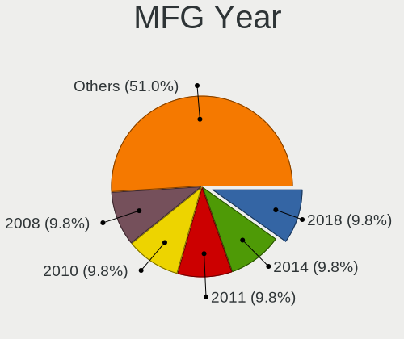
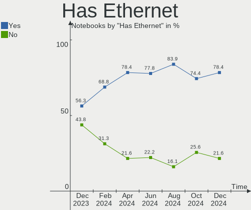
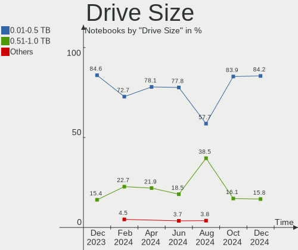
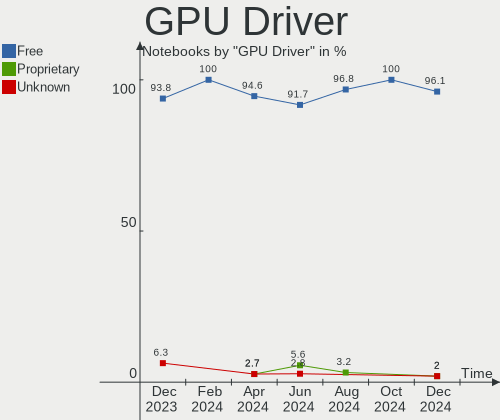
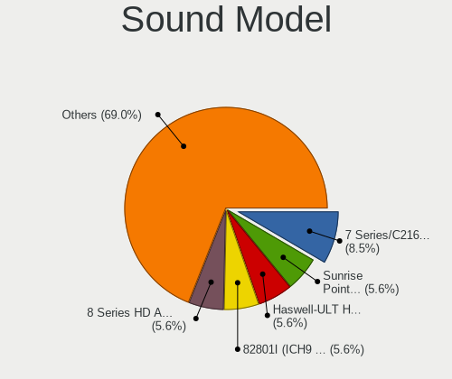
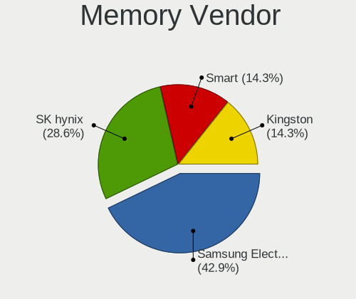
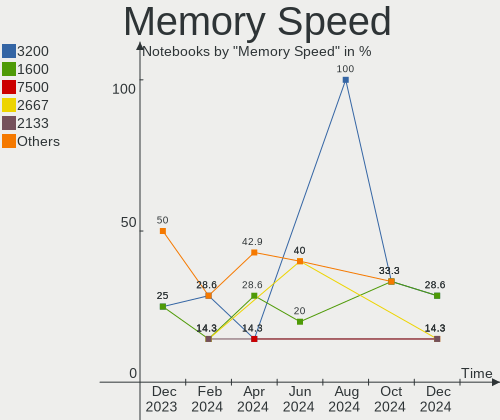
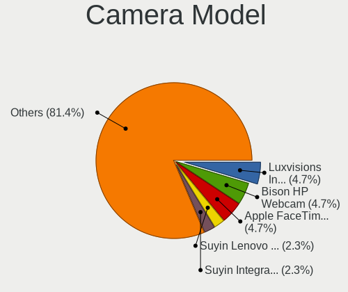
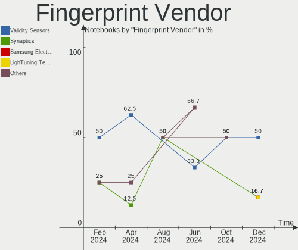

Elementary - Hardware Trends (Notebooks)
----------------------------------------

A project to identify most popular hardware characteristics and track their change
over time based on data collected by Linux users at https://Linux-Hardware.org.

Anyone can contribute to this report by the [hw-probe](https://github.com/linuxhw/hw-probe) tool:

    sudo -E hw-probe -all -upload

This report is for one last month. Overall report since the beginning of time: [TestDays](https://github.com/linuxhw/TestDays)

Period: Apr, 2023.

Contents
--------

* [ System ](#system)
  - [ OS                       ](#os)
  - [ OS Family                ](#os-family)
  - [ Kernel                   ](#kernel)
  - [ Kernel Family            ](#kernel-family)
  - [ Kernel Major Ver.        ](#kernel-major-ver)
  - [ Arch                     ](#arch)
  - [ DE                       ](#de)
  - [ Display Server           ](#display-server)
  - [ Display Manager          ](#display-manager)
  - [ OS Lang                  ](#os-lang)
  - [ Boot Mode                ](#boot-mode)
  - [ Filesystem               ](#filesystem)
  - [ Part. scheme             ](#part-scheme)
  - [ Dual Boot with Linux/BSD ](#dual-boot-with-linuxbsd)
  - [ Dual Boot (Win)          ](#dual-boot-win)

* [ Board ](#board)
  - [ Vendor                   ](#vendor)
  - [ Model                    ](#model)
  - [ Model Family             ](#model-family)
  - [ MFG Year                 ](#mfg-year)
  - [ Form Factor              ](#form-factor)
  - [ Secure Boot              ](#secure-boot)
  - [ Coreboot                 ](#coreboot)
  - [ RAM Size                 ](#ram-size)
  - [ RAM Used                 ](#ram-used)
  - [ Total Drives             ](#total-drives)
  - [ Has CD-ROM               ](#has-cd-rom)
  - [ Has Ethernet             ](#has-ethernet)
  - [ Has WiFi                 ](#has-wifi)
  - [ Has Bluetooth            ](#has-bluetooth)

* [ Location ](#location)
  - [ Country                  ](#country)
  - [ City                     ](#city)

* [ Drives ](#drives)
  - [ Drive Vendor             ](#drive-vendor)
  - [ Drive Model              ](#drive-model)
  - [ HDD Vendor               ](#hdd-vendor)
  - [ SSD Vendor               ](#ssd-vendor)
  - [ Drive Kind               ](#drive-kind)
  - [ Drive Connector          ](#drive-connector)
  - [ Drive Size               ](#drive-size)
  - [ Space Total              ](#space-total)
  - [ Space Used               ](#space-used)
  - [ Malfunc. Drives          ](#malfunc-drives)
  - [ Malfunc. Drive Vendor    ](#malfunc-drive-vendor)
  - [ Malfunc. HDD Vendor      ](#malfunc-hdd-vendor)
  - [ Malfunc. Drive Kind      ](#malfunc-drive-kind)
  - [ Failed Drives            ](#failed-drives)
  - [ Failed Drive Vendor      ](#failed-drive-vendor)
  - [ Drive Status             ](#drive-status)

* [ Storage controller ](#storage-controller)
  - [ Storage Vendor           ](#storage-vendor)
  - [ Storage Model            ](#storage-model)
  - [ Storage Kind             ](#storage-kind)

* [ Processor ](#processor)
  - [ CPU Vendor               ](#cpu-vendor)
  - [ CPU Model                ](#cpu-model)
  - [ CPU Model Family         ](#cpu-model-family)
  - [ CPU Cores                ](#cpu-cores)
  - [ CPU Sockets              ](#cpu-sockets)
  - [ CPU Threads              ](#cpu-threads)
  - [ CPU Op-Modes             ](#cpu-op-modes)
  - [ CPU Microcode            ](#cpu-microcode)
  - [ CPU Microarch            ](#cpu-microarch)

* [ Graphics ](#graphics)
  - [ GPU Vendor               ](#gpu-vendor)
  - [ GPU Model                ](#gpu-model)
  - [ GPU Combo                ](#gpu-combo)
  - [ GPU Driver               ](#gpu-driver)
  - [ GPU Memory               ](#gpu-memory)

* [ Monitor ](#monitor)
  - [ Monitor Vendor           ](#monitor-vendor)
  - [ Monitor Model            ](#monitor-model)
  - [ Monitor Resolution       ](#monitor-resolution)
  - [ Monitor Diagonal         ](#monitor-diagonal)
  - [ Monitor Width            ](#monitor-width)
  - [ Aspect Ratio             ](#aspect-ratio)
  - [ Monitor Area             ](#monitor-area)
  - [ Pixel Density            ](#pixel-density)
  - [ Multiple Monitors        ](#multiple-monitors)

* [ Network ](#network)
  - [ Net Controller Vendor    ](#net-controller-vendor)
  - [ Net Controller Model     ](#net-controller-model)
  - [ Wireless Vendor          ](#wireless-vendor)
  - [ Wireless Model           ](#wireless-model)
  - [ Ethernet Vendor          ](#ethernet-vendor)
  - [ Ethernet Model           ](#ethernet-model)
  - [ Net Controller Kind      ](#net-controller-kind)
  - [ Used Controller          ](#used-controller)
  - [ NICs                     ](#nics)
  - [ IPv6                     ](#ipv6)

* [ Bluetooth ](#bluetooth)
  - [ Bluetooth Vendor         ](#bluetooth-vendor)
  - [ Bluetooth Model          ](#bluetooth-model)

* [ Sound ](#sound)
  - [ Sound Vendor             ](#sound-vendor)
  - [ Sound Model              ](#sound-model)

* [ Memory ](#memory)
  - [ Memory Vendor            ](#memory-vendor)
  - [ Memory Model             ](#memory-model)
  - [ Memory Kind              ](#memory-kind)
  - [ Memory Form Factor       ](#memory-form-factor)
  - [ Memory Size              ](#memory-size)
  - [ Memory Speed             ](#memory-speed)

* [ Printers & scanners ](#printers--scanners)
  - [ Printer Vendor           ](#printer-vendor)
  - [ Printer Model            ](#printer-model)
  - [ Scanner Vendor           ](#scanner-vendor)
  - [ Scanner Model            ](#scanner-model)

* [ Camera ](#camera)
  - [ Camera Vendor            ](#camera-vendor)
  - [ Camera Model             ](#camera-model)

* [ Security ](#security)
  - [ Fingerprint Vendor       ](#fingerprint-vendor)
  - [ Fingerprint Model        ](#fingerprint-model)
  - [ Chipcard Vendor          ](#chipcard-vendor)
  - [ Chipcard Model           ](#chipcard-model)

* [ Unsupported ](#unsupported)
  - [ Unsupported Devices      ](#unsupported-devices)
  - [ Unsupported Device Types ](#unsupported-device-types)

System
------

OS
--

Installed operating systems

| Name           | Notebooks | Percent |
|----------------|-----------|---------|
| Elementary 7   | 21        | 77.78%  |
| Elementary 6.1 | 6         | 22.22%  |

OS Family
---------

OS without a version

| Name       | Notebooks | Percent |
|------------|-----------|---------|
| Elementary | 27        | 100%    |

Kernel
------

Version of the Linux kernel

| Version              | Notebooks | Percent |
|----------------------|-----------|---------|
| 5.19.0-38-generic    | 8         | 29.63%  |
| 5.15.0-58-generic    | 6         | 22.22%  |
| 5.15.0-69-generic    | 5         | 18.52%  |
| 5.19.0-40-generic    | 4         | 14.81%  |
| 5.19.0-41-generic    | 2         | 7.41%   |
| 6.2.7-060207-generic | 1         | 3.7%    |
| 5.11.0-43-generic    | 1         | 3.7%    |

Kernel Family
-------------

Linux kernel without a distro release

| Version | Notebooks | Percent |
|---------|-----------|---------|
| 5.19.0  | 14        | 51.85%  |
| 5.15.0  | 11        | 40.74%  |
| 6.2.7   | 1         | 3.7%    |
| 5.11.0  | 1         | 3.7%    |

Kernel Major Ver.
-----------------

Linux kernel major version

| Version | Notebooks | Percent |
|---------|-----------|---------|
| 5.19    | 14        | 51.85%  |
| 5.15    | 11        | 40.74%  |
| 6.2     | 1         | 3.7%    |
| 5.11    | 1         | 3.7%    |

Arch
----

OS architecture (x86_64, i586, etc.)

| Name   | Notebooks | Percent |
|--------|-----------|---------|
| x86_64 | 27        | 100%    |

DE
--

Desktop Environment

| Name     | Notebooks | Percent |
|----------|-----------|---------|
| Pantheon | 27        | 100%    |

Display Server
--------------

X11 or Wayland

| Name | Notebooks | Percent |
|------|-----------|---------|
| X11  | 27        | 100%    |

Display Manager
---------------

SDDM, LightDM, etc.

| Name    | Notebooks | Percent |
|---------|-----------|---------|
| Unknown | 22        | 81.48%  |
| LightDM | 5         | 18.52%  |

OS Lang
-------

Language

| Lang  | Notebooks | Percent |
|-------|-----------|---------|
| en_US | 11        | 40.74%  |
| de_DE | 5         | 18.52%  |
| en_GB | 3         | 11.11%  |
| sv_SE | 1         | 3.7%    |
| ru_RU | 1         | 3.7%    |
| pt_BR | 1         | 3.7%    |
| hu_HU | 1         | 3.7%    |
| fr_CA | 1         | 3.7%    |
| es_ES | 1         | 3.7%    |
| en_CA | 1         | 3.7%    |
| da_DK | 1         | 3.7%    |

Boot Mode
---------

EFI or BIOS

| Mode | Notebooks | Percent |
|------|-----------|---------|
| BIOS | 21        | 77.78%  |
| EFI  | 6         | 22.22%  |

Filesystem
----------

Type of filesystem

| Type  | Notebooks | Percent |
|-------|-----------|---------|
| Ext4  | 26        | 96.3%   |
| Tmpfs | 1         | 3.7%    |

Part. scheme
------------

Scheme of partitioning

| Type    | Notebooks | Percent |
|---------|-----------|---------|
| Unknown | 22        | 81.48%  |
| GPT     | 5         | 18.52%  |

Dual Boot with Linux/BSD
------------------------

Hosting more than one Linux/BSD

| Dual boot | Notebooks | Percent |
|-----------|-----------|---------|
| No        | 27        | 100%    |

Dual Boot (Win)
---------------

Hosting Linux and Windows

| Dual boot | Notebooks | Percent |
|-----------|-----------|---------|
| No        | 25        | 92.59%  |
| Yes       | 2         | 7.41%   |

Board
-----

Vendor
------

Motherboard manufacturer

| Name             | Notebooks | Percent |
|------------------|-----------|---------|
| Hewlett-Packard  | 7         | 25.93%  |
| Apple            | 5         | 18.52%  |
| Lenovo           | 4         | 14.81%  |
| Dell             | 4         | 14.81%  |
| MSI              | 2         | 7.41%   |
| HUAWEI           | 2         | 7.41%   |
| Notebook         | 1         | 3.7%    |
| Multilaser       | 1         | 3.7%    |
| ASUSTek Computer | 1         | 3.7%    |

Model
-----

Motherboard model

| Name                                     | Notebooks | Percent |
|------------------------------------------|-----------|---------|
| Notebook NLx0MU                          | 1         | 3.7%    |
| Multilaser PC150                         | 1         | 3.7%    |
| MSI PE70 6QE                             | 1         | 3.7%    |
| MSI GE62VR 6RF                           | 1         | 3.7%    |
| Lenovo V17 G2 ITL 82NX                   | 1         | 3.7%    |
| Lenovo V14 G2 ITL 82KA                   | 1         | 3.7%    |
| Lenovo ThinkPad X1 Carbon 3rd 20BSCTO1WW | 1         | 3.7%    |
| Lenovo G580 20150                        | 1         | 3.7%    |
| HUAWEI NBD-WXX9                          | 1         | 3.7%    |
| HUAWEI BOD-WXX9                          | 1         | 3.7%    |
| HP Pavilion Laptop 15-cw1xxx             | 1         | 3.7%    |
| HP Pavilion g6                           | 1         | 3.7%    |
| HP Pavilion dv7                          | 1         | 3.7%    |
| HP Pavilion 15                           | 1         | 3.7%    |
| HP EliteBook 2560p                       | 1         | 3.7%    |
| HP 255 G7 Notebook PC                    | 1         | 3.7%    |
| HP 250 G8 Notebook PC                    | 1         | 3.7%    |
| Dell XPS 15 9510                         | 1         | 3.7%    |
| Dell Latitude E5570                      | 1         | 3.7%    |
| Dell Latitude E4300                      | 1         | 3.7%    |
| Dell Latitude 5420                       | 1         | 3.7%    |
| ASUS ASUS TUF Gaming A15 FA506QR         | 1         | 3.7%    |
| Apple MacBookPro9,2                      | 1         | 3.7%    |
| Apple MacBookPro5,2                      | 1         | 3.7%    |
| Apple MacBookPro10,1                     | 1         | 3.7%    |
| Apple MacBookAir7,1                      | 1         | 3.7%    |
| Apple MacBookAir3,2                      | 1         | 3.7%    |

Model Family
------------

Motherboard model prefix

| Name               | Notebooks | Percent |
|--------------------|-----------|---------|
| HP Pavilion        | 4         | 14.81%  |
| Dell Latitude      | 3         | 11.11%  |
| Notebook NLx0MU    | 1         | 3.7%    |
| Multilaser PC150   | 1         | 3.7%    |
| MSI PE70           | 1         | 3.7%    |
| MSI GE62VR         | 1         | 3.7%    |
| Lenovo V17         | 1         | 3.7%    |
| Lenovo V14         | 1         | 3.7%    |
| Lenovo ThinkPad    | 1         | 3.7%    |
| Lenovo G580        | 1         | 3.7%    |
| HUAWEI NBD-WXX9    | 1         | 3.7%    |
| HUAWEI BOD-WXX9    | 1         | 3.7%    |
| HP EliteBook       | 1         | 3.7%    |
| HP 255             | 1         | 3.7%    |
| HP 250             | 1         | 3.7%    |
| Dell XPS           | 1         | 3.7%    |
| ASUS ASUS          | 1         | 3.7%    |
| Apple MacBookPro9  | 1         | 3.7%    |
| Apple MacBookPro5  | 1         | 3.7%    |
| Apple MacBookPro10 | 1         | 3.7%    |
| Apple MacBookAir7  | 1         | 3.7%    |
| Apple MacBookAir3  | 1         | 3.7%    |

MFG Year
--------

Motherboard manufacture year

| Year | Notebooks | Percent |
|------|-----------|---------|
| 2021 | 5         | 18.52%  |
| 2016 | 3         | 11.11%  |
| 2012 | 3         | 11.11%  |
| 2022 | 2         | 7.41%   |
| 2020 | 2         | 7.41%   |
| 2019 | 2         | 7.41%   |
| 2015 | 2         | 7.41%   |
| 2011 | 2         | 7.41%   |
| 2008 | 2         | 7.41%   |
| 2018 | 1         | 3.7%    |
| 2013 | 1         | 3.7%    |
| 2010 | 1         | 3.7%    |
| 2009 | 1         | 3.7%    |

Form Factor
-----------

Physical design of the computer

| Name     | Notebooks | Percent |
|----------|-----------|---------|
| Notebook | 27        | 100%    |

Secure Boot
-----------

Enabled or disabled

| State    | Notebooks | Percent |
|----------|-----------|---------|
| Disabled | 24        | 88.89%  |
| Enabled  | 3         | 11.11%  |

Coreboot
--------

Have coreboot on board

| Used | Notebooks | Percent |
|------|-----------|---------|
| No   | 27        | 100%    |

RAM Size
--------

Total RAM memory

| Size in GB  | Notebooks | Percent |
|-------------|-----------|---------|
| 4.01-8.0    | 9         | 33.33%  |
| 8.01-16.0   | 6         | 22.22%  |
| 3.01-4.0    | 5         | 18.52%  |
| 16.01-24.0  | 4         | 14.81%  |
| 1.01-2.0    | 2         | 7.41%   |
| 64.01-256.0 | 1         | 3.7%    |

RAM Used
--------

Used RAM memory

| Used GB  | Notebooks | Percent |
|----------|-----------|---------|
| 2.01-3.0 | 11        | 40.74%  |
| 1.01-2.0 | 8         | 29.63%  |
| 3.01-4.0 | 6         | 22.22%  |
| 4.01-8.0 | 1         | 3.7%    |
| 0.51-1.0 | 1         | 3.7%    |

Total Drives
------------

Number of drives on board

| Drives | Notebooks | Percent |
|--------|-----------|---------|
| 1      | 21        | 77.78%  |
| 2      | 6         | 22.22%  |

Has CD-ROM
----------

Has CD-ROM on board

| Presented | Notebooks | Percent |
|-----------|-----------|---------|
| No        | 19        | 70.37%  |
| Yes       | 8         | 29.63%  |

Has Ethernet
------------

Has Ethernet on board

| Presented | Notebooks | Percent |
|-----------|-----------|---------|
| Yes       | 20        | 74.07%  |
| No        | 7         | 25.93%  |

Has WiFi
--------

Has WiFi module

| Presented | Notebooks | Percent |
|-----------|-----------|---------|
| Yes       | 27        | 100%    |

Has Bluetooth
-------------

Has Bluetooth module

| Presented | Notebooks | Percent |
|-----------|-----------|---------|
| Yes       | 22        | 81.48%  |
| No        | 5         | 18.52%  |

Location
--------

Country
-------

Geographic location (country)

| Country      | Notebooks | Percent |
|--------------|-----------|---------|
| USA          | 8         | 29.63%  |
| Germany      | 5         | 18.52%  |
| Canada       | 2         | 7.41%   |
| UK           | 1         | 3.7%    |
| Thailand     | 1         | 3.7%    |
| South Africa | 1         | 3.7%    |
| Russia       | 1         | 3.7%    |
| Norway       | 1         | 3.7%    |
| Netherlands  | 1         | 3.7%    |
| Mexico       | 1         | 3.7%    |
| Hungary      | 1         | 3.7%    |
| Denmark      | 1         | 3.7%    |
| Brazil       | 1         | 3.7%    |
| Australia    | 1         | 3.7%    |
| Albania      | 1         | 3.7%    |

City
----

Geographic location (city)

| City         | Notebooks | Percent |
|--------------|-----------|---------|
| Berlin       | 2         | 7.41%   |
| Tirana       | 1         | 3.7%    |
| Soborg       | 1         | 3.7%    |
| Sarasota     | 1         | 3.7%    |
| Roosendaal   | 1         | 3.7%    |
| Pforzheim    | 1         | 3.7%    |
| Pécs        | 1         | 3.7%    |
| Oslo         | 1         | 3.7%    |
| Odessa       | 1         | 3.7%    |
| Oaxaca City  | 1         | 3.7%    |
| Novosibirsk  | 1         | 3.7%    |
| Melbourne    | 1         | 3.7%    |
| Mascouche    | 1         | 3.7%    |
| Las Vegas    | 1         | 3.7%    |
| Kingston     | 1         | 3.7%    |
| Johannesburg | 1         | 3.7%    |
| Gaston       | 1         | 3.7%    |
| Dresden      | 1         | 3.7%    |
| Derby        | 1         | 3.7%    |
| Curitiba     | 1         | 3.7%    |
| Chemnitz     | 1         | 3.7%    |
| Burlingame   | 1         | 3.7%    |
| Budd Lake    | 1         | 3.7%    |
| Bluffton     | 1         | 3.7%    |
| Bangkok      | 1         | 3.7%    |
| Asheville    | 1         | 3.7%    |

Drives
------

Drive Vendor
------------

Hard drive vendors

| Vendor                      | Notebooks | Drives | Percent |
|-----------------------------|-----------|--------|---------|
| Sandisk                     | 3         | 3      | 9.38%   |
| Samsung Electronics         | 3         | 3      | 9.38%   |
| Kingston                    | 3         | 3      | 9.38%   |
| Apple                       | 3         | 3      | 9.38%   |
| Unknown                     | 2         | 3      | 6.25%   |
| Toshiba                     | 2         | 2      | 6.25%   |
| SK hynix                    | 2         | 3      | 6.25%   |
| Hitachi                     | 2         | 2      | 6.25%   |
| HGST                        | 2         | 2      | 6.25%   |
| WDC                         | 1         | 1      | 3.13%   |
| USB 3.0                     | 1         | 1      | 3.13%   |
| Union Memory                | 1         | 1      | 3.13%   |
| Silicon Motion              | 1         | 1      | 3.13%   |
| Phison Electronics          | 1         | 1      | 3.13%   |
| LITEON                      | 1         | 1      | 3.13%   |
| Kingston Technology Company | 1         | 1      | 3.13%   |
| Intenso                     | 1         | 1      | 3.13%   |
| Crucial                     | 1         | 1      | 3.13%   |
| A-DATA Technology           | 1         | 1      | 3.13%   |

Drive Model
-----------

Hard drive models

| Model                                        | Notebooks | Percent |
|----------------------------------------------|-----------|---------|
| HGST HTS721010A9E630 1TB                     | 2         | 6.06%   |
| WDC WDS240G2G0A-00JH30 240GB SSD             | 1         | 3.03%   |
| USB 3.0 Device 250GB                         | 1         | 3.03%   |
| Unknown MMC Card  8GB                        | 1         | 3.03%   |
| Unknown MMC Card  7GB                        | 1         | 3.03%   |
| Unknown MMC Card  32GB                       | 1         | 3.03%   |
| Union Memory UMIS RPJTJ512MEE1OWX 512GB      | 1         | 3.03%   |
| Toshiba THNSNK128GVN8 M.2 2280 128GB SSD     | 1         | 3.03%   |
| Toshiba MQ01ABF050 500GB                     | 1         | 3.03%   |
| SK hynix PC711 NVMe 1TB                      | 1         | 3.03%   |
| SK hynix HFM512GD3JX013N 512GB               | 1         | 3.03%   |
| Silicon Motion PCIe-8 SSD 256GB              | 1         | 3.03%   |
| Sandisk WDC PC SN530 SDBPMPZ-256G-1101 256GB | 1         | 3.03%   |
| SanDisk SSD G5 BICS4 1TB                     | 1         | 3.03%   |
| Sandisk PC SN530 NVMe WDC 256GB              | 1         | 3.03%   |
| Samsung SSD 980 500GB                        | 1         | 3.03%   |
| Samsung SSD 860 EVO 500GB                    | 1         | 3.03%   |
| Samsung PSSD T7 Shield 2TB                   | 1         | 3.03%   |
| Phison E12 NVMe Controller 512GB             | 1         | 3.03%   |
| LITEON L8H-256V2G 256GB SSD                  | 1         | 3.03%   |
| Kingston Company SNV2S1000G 1TB              | 1         | 3.03%   |
| Kingston SKC300S37A60G 64GB SSD              | 1         | 3.03%   |
| Kingston SA400S37240G 240GB SSD              | 1         | 3.03%   |
| Kingston RBU-SNS8152S3256GG5 256GB SSD       | 1         | 3.03%   |
| Intenso 256GB                                | 1         | 3.03%   |
| Hitachi HTS727550A9E364 500GB                | 1         | 3.03%   |
| Hitachi HTS725016A9A362 160GB                | 1         | 3.03%   |
| Crucial CT250MX500SSD1 250GB                 | 1         | 3.03%   |
| Apple SSD TS256C 256GB                       | 1         | 3.03%   |
| Apple SSD SM512E 500GB                       | 1         | 3.03%   |
| Apple SSD SM0512G 500GB                      | 1         | 3.03%   |
| A-DATA SP550 240GB SSD                       | 1         | 3.03%   |

HDD Vendor
----------

Hard disk drive vendors

| Vendor  | Notebooks | Drives | Percent |
|---------|-----------|--------|---------|
| Hitachi | 2         | 2      | 40%     |
| HGST    | 2         | 2      | 40%     |
| Toshiba | 1         | 1      | 20%     |

SSD Vendor
----------

Solid state drive vendors

| Vendor              | Notebooks | Drives | Percent |
|---------------------|-----------|--------|---------|
| Kingston            | 3         | 3      | 21.43%  |
| Apple               | 3         | 3      | 21.43%  |
| Samsung Electronics | 2         | 2      | 14.29%  |
| WDC                 | 1         | 1      | 7.14%   |
| Toshiba             | 1         | 1      | 7.14%   |
| SanDisk             | 1         | 1      | 7.14%   |
| LITEON              | 1         | 1      | 7.14%   |
| Crucial             | 1         | 1      | 7.14%   |
| A-DATA Technology   | 1         | 1      | 7.14%   |

Drive Kind
----------

HDD or SSD

| Kind    | Notebooks | Drives | Percent |
|---------|-----------|--------|---------|
| SSD     | 13        | 14     | 41.94%  |
| NVMe    | 9         | 10     | 29.03%  |
| HDD     | 5         | 5      | 16.13%  |
| MMC     | 2         | 3      | 6.45%   |
| Unknown | 2         | 2      | 6.45%   |

Drive Connector
---------------

SATA, SAS, NVMe, etc.

| Type | Notebooks | Drives | Percent |
|------|-----------|--------|---------|
| SATA | 17        | 19     | 56.67%  |
| NVMe | 9         | 10     | 30%     |
| SAS  | 2         | 2      | 6.67%   |
| MMC  | 2         | 3      | 6.67%   |

Drive Size
----------

Size of hard drive

| Size in TB | Notebooks | Drives | Percent |
|------------|-----------|--------|---------|
| 0.01-0.5   | 14        | 15     | 77.78%  |
| 0.51-1.0   | 3         | 3      | 16.67%  |
| 1.01-2.0   | 1         | 1      | 5.56%   |

Space Total
-----------

Amount of disk space available on the file system

| Size in GB | Notebooks | Percent |
|------------|-----------|---------|
| 101-250    | 11        | 40.74%  |
| 251-500    | 9         | 33.33%  |
| 501-1000   | 3         | 11.11%  |
| 51-100     | 3         | 11.11%  |
| 21-50      | 1         | 3.7%    |

Space Used
----------

Amount of used disk space

| Used GB | Notebooks | Percent |
|---------|-----------|---------|
| 1-20    | 12        | 44.44%  |
| 51-100  | 6         | 22.22%  |
| 101-250 | 5         | 18.52%  |
| 21-50   | 3         | 11.11%  |
| 251-500 | 1         | 3.7%    |

Malfunc. Drives
---------------

Drive models with a malfunction

Zero info for selected period =(

Malfunc. Drive Vendor
---------------------

Vendors of faulty drives

Zero info for selected period =(

Malfunc. HDD Vendor
-------------------

Vendors of faulty HDD drives

Zero info for selected period =(

Malfunc. Drive Kind
-------------------

Kinds of faulty drives

Zero info for selected period =(

Failed Drives
-------------

Failed drive models

Zero info for selected period =(

Failed Drive Vendor
-------------------

Failed drive vendors

Zero info for selected period =(

Drive Status
------------

Number of failed and malfunc. drives

| Status   | Notebooks | Drives | Percent |
|----------|-----------|--------|---------|
| Detected | 26        | 33     | 96.3%   |
| Works    | 1         | 1      | 3.7%    |

Storage controller
------------------

Storage Vendor
--------------

Storage controller vendors

| Vendor                      | Notebooks | Percent |
|-----------------------------|-----------|---------|
| Intel                       | 16        | 51.61%  |
| AMD                         | 3         | 9.68%   |
| SK hynix                    | 2         | 6.45%   |
| SanDisk                     | 2         | 6.45%   |
| Samsung Electronics         | 2         | 6.45%   |
| Nvidia                      | 2         | 6.45%   |
| Union Memory (Shenzhen)     | 1         | 3.23%   |
| Silicon Motion              | 1         | 3.23%   |
| Phison Electronics          | 1         | 3.23%   |
| Kingston Technology Company | 1         | 3.23%   |

Storage Model
-------------

Storage controller models

| Model                                                                        | Notebooks | Percent |
|------------------------------------------------------------------------------|-----------|---------|
| Intel Volume Management Device NVMe RAID Controller                          | 3         | 9.09%   |
| Intel Tiger Lake-LP SATA Controller                                          | 3         | 9.09%   |
| Intel 7 Series Chipset Family 6-port SATA Controller [AHCI mode]             | 3         | 9.09%   |
| AMD FCH SATA Controller [AHCI mode]                                          | 3         | 9.09%   |
| SK hynix Gold P31/PC711 NVMe Solid State Drive                               | 2         | 6.06%   |
| Intel HM170/QM170 Chipset SATA Controller [AHCI Mode]                        | 2         | 6.06%   |
| Intel 82801 Mobile SATA Controller [RAID mode]                               | 2         | 6.06%   |
| Union Memory (Shenzhen) Non-Volatile memory controller                       | 1         | 3.03%   |
| Silicon Motion Non-Volatile memory controller                                | 1         | 3.03%   |
| SanDisk NVMe Controller                                                      | 1         | 3.03%   |
| SanDisk Non-Volatile memory controller                                       | 1         | 3.03%   |
| Samsung NVMe SSD Controller 980                                              | 1         | 3.03%   |
| Samsung Electronics SATA controller                                          | 1         | 3.03%   |
| Phison E12 NVMe Controller                                                   | 1         | 3.03%   |
| Nvidia MCP89 SATA Controller (AHCI mode)                                     | 1         | 3.03%   |
| Nvidia MCP79 AHCI Controller                                                 | 1         | 3.03%   |
| Kingston Company Company Non-Volatile memory controller                      | 1         | 3.03%   |
| Intel Wildcat Point-LP SATA Controller [AHCI Mode]                           | 1         | 3.03%   |
| Intel Celeron/Pentium Silver Processor SATA Controller                       | 1         | 3.03%   |
| Intel 8 Series SATA Controller 1 [AHCI mode]                                 | 1         | 3.03%   |
| Intel 6 Series/C200 Series Chipset Family 6 port Mobile SATA AHCI Controller | 1         | 3.03%   |
| Intel 5 Series/3400 Series Chipset 4 port SATA AHCI Controller               | 1         | 3.03%   |

Storage Kind
------------

Kind of storage controller (IDE, SATA, NVMe, SAS, ...)

| Kind | Notebooks | Percent |
|------|-----------|---------|
| SATA | 19        | 57.58%  |
| NVMe | 9         | 27.27%  |
| RAID | 5         | 15.15%  |

Processor
---------

CPU Vendor
----------

Processor vendors

| Vendor | Notebooks | Percent |
|--------|-----------|---------|
| Intel  | 22        | 81.48%  |
| AMD    | 5         | 18.52%  |

CPU Model
---------

Processor models

| Model                                         | Notebooks | Percent |
|-----------------------------------------------|-----------|---------|
| Intel 11th Gen Core i3-1115G4 @ 3.00GHz       | 3         | 11.11%  |
| Intel Core i7-6700HQ CPU @ 2.60GHz            | 2         | 7.41%   |
| Intel 11th Gen Core i5-1135G7 @ 2.40GHz       | 2         | 7.41%   |
| Intel Core i7-5650U CPU @ 2.20GHz             | 1         | 3.7%    |
| Intel Core i7-5600U CPU @ 2.60GHz             | 1         | 3.7%    |
| Intel Core i7-4510U CPU @ 2.00GHz             | 1         | 3.7%    |
| Intel Core i7-3720QM CPU @ 2.60GHz            | 1         | 3.7%    |
| Intel Core i7 CPU Q 720 @ 1.60GHz             | 1         | 3.7%    |
| Intel Core i5-6300U CPU @ 2.40GHz             | 1         | 3.7%    |
| Intel Core i5-3210M CPU @ 2.50GHz             | 1         | 3.7%    |
| Intel Core i5-2520M CPU @ 2.50GHz             | 1         | 3.7%    |
| Intel Core i3-3120M CPU @ 2.50GHz             | 1         | 3.7%    |
| Intel Core 2 Duo CPU T9600 @ 2.80GHz          | 1         | 3.7%    |
| Intel Core 2 Duo CPU P9600 @ 2.53GHz          | 1         | 3.7%    |
| Intel Core 2 Duo CPU L9400 @ 1.86GHz          | 1         | 3.7%    |
| Intel Celeron N4020 CPU @ 1.10GHz             | 1         | 3.7%    |
| Intel 11th Gen Core i9-11900H @ 2.50GHz       | 1         | 3.7%    |
| Intel 11th Gen Core i7-1185G7 @ 3.00GHz       | 1         | 3.7%    |
| AMD Ryzen 7 5800H with Radeon Graphics        | 1         | 3.7%    |
| AMD Ryzen 3 3300U with Radeon Vega Mobile Gfx | 1         | 3.7%    |
| AMD Athlon Silver 3050U with Radeon Graphics  | 1         | 3.7%    |
| AMD A6-4400M APU with Radeon HD Graphics      | 1         | 3.7%    |
| AMD A4-9120e RADEON R3, 4 COMPUTE CORES 2C+2G | 1         | 3.7%    |

CPU Model Family
----------------

Processor model prefix

| Model            | Notebooks | Percent |
|------------------|-----------|---------|
| Other            | 7         | 25.93%  |
| Intel Core i7    | 7         | 25.93%  |
| Intel Core i5    | 3         | 11.11%  |
| Intel Core 2 Duo | 3         | 11.11%  |
| Intel Core i3    | 1         | 3.7%    |
| Intel Celeron    | 1         | 3.7%    |
| AMD Ryzen 7      | 1         | 3.7%    |
| AMD Ryzen 3      | 1         | 3.7%    |
| AMD Athlon       | 1         | 3.7%    |
| AMD A6           | 1         | 3.7%    |
| AMD A4           | 1         | 3.7%    |

CPU Cores
---------

Number of processor cores

| Number | Notebooks | Percent |
|--------|-----------|---------|
| 2      | 16        | 59.26%  |
| 4      | 8         | 29.63%  |
| 8      | 2         | 7.41%   |
| 1      | 1         | 3.7%    |

CPU Sockets
-----------

Number of sockets

| Number | Notebooks | Percent |
|--------|-----------|---------|
| 1      | 27        | 100%    |

CPU Threads
-----------

Threads per core (Hyper-Threading)

| Number | Notebooks | Percent |
|--------|-----------|---------|
| 2      | 20        | 74.07%  |
| 1      | 7         | 25.93%  |

CPU Op-Modes
------------

CPU Operation Modes (32-bit, 64-bit)

| Op mode        | Notebooks | Percent |
|----------------|-----------|---------|
| 32-bit, 64-bit | 27        | 100%    |

CPU Microcode
-------------

Microcode number

| Number     | Notebooks | Percent |
|------------|-----------|---------|
| Unknown    | 19        | 70.37%  |
| 0x806c1    | 2         | 7.41%   |
| 0x806d1    | 1         | 3.7%    |
| 0x306d4    | 1         | 3.7%    |
| 0x206a7    | 1         | 3.7%    |
| 0x106e5    | 1         | 3.7%    |
| 0x0a50000c | 1         | 3.7%    |
| 0x06006705 | 1         | 3.7%    |

CPU Microarch
-------------

Microarchitecture

| Name          | Notebooks | Percent |
|---------------|-----------|---------|
| TigerLake     | 6         | 22.22%  |
| Skylake       | 3         | 11.11%  |
| Penryn        | 3         | 11.11%  |
| IvyBridge     | 3         | 11.11%  |
| Zen+          | 2         | 7.41%   |
| Broadwell     | 2         | 7.41%   |
| Zen 3         | 1         | 3.7%    |
| SandyBridge   | 1         | 3.7%    |
| Piledriver    | 1         | 3.7%    |
| Nehalem       | 1         | 3.7%    |
| Icelake       | 1         | 3.7%    |
| Haswell       | 1         | 3.7%    |
| Goldmont plus | 1         | 3.7%    |
| Excavator     | 1         | 3.7%    |

Graphics
--------

GPU Vendor
----------

Vendors of graphics cards

| Vendor | Notebooks | Percent |
|--------|-----------|---------|
| Intel  | 19        | 55.88%  |
| Nvidia | 9         | 26.47%  |
| AMD    | 6         | 17.65%  |

GPU Model
---------

Graphics card models

| Model                                                                     | Notebooks | Percent |
|---------------------------------------------------------------------------|-----------|---------|
| Intel TigerLake-LP GT2 [Iris Xe Graphics]                                 | 3         | 8.57%   |
| Intel Tiger Lake-LP GT2 [UHD Graphics G4]                                 | 3         | 8.57%   |
| Intel 3rd Gen Core processor Graphics Controller                          | 3         | 8.57%   |
| Intel HD Graphics 530                                                     | 2         | 5.71%   |
| AMD Picasso/Raven 2 [Radeon Vega Series / Radeon Vega Mobile Series]      | 2         | 5.71%   |
| Nvidia MCP89 [GeForce 320M]                                               | 1         | 2.86%   |
| Nvidia GP106M [GeForce GTX 1060 Mobile]                                   | 1         | 2.86%   |
| Nvidia GM108M [GeForce 840M]                                              | 1         | 2.86%   |
| Nvidia GM107M [GeForce GTX 960M]                                          | 1         | 2.86%   |
| Nvidia GK107M [GeForce GT 650M Mac Edition]                               | 1         | 2.86%   |
| Nvidia GF117M [GeForce 610M/710M/810M/820M / GT 620M/625M/630M/720M]      | 1         | 2.86%   |
| Nvidia GA107M [GeForce RTX 3050 Ti Mobile]                                | 1         | 2.86%   |
| Nvidia GA104M [GeForce RTX 3070 Mobile / Max-Q]                           | 1         | 2.86%   |
| Nvidia G96CM [GeForce 9600M GT]                                           | 1         | 2.86%   |
| Nvidia C79 [GeForce 9400M]                                                | 1         | 2.86%   |
| Intel TigerLake-H GT1 [UHD Graphics]                                      | 1         | 2.86%   |
| Intel Skylake GT2 [HD Graphics 520]                                       | 1         | 2.86%   |
| Intel Mobile 4 Series Chipset Integrated Graphics Controller              | 1         | 2.86%   |
| Intel HD Graphics 6000                                                    | 1         | 2.86%   |
| Intel HD Graphics 5500                                                    | 1         | 2.86%   |
| Intel Haswell-ULT Integrated Graphics Controller                          | 1         | 2.86%   |
| Intel GeminiLake [UHD Graphics 600]                                       | 1         | 2.86%   |
| Intel 2nd Generation Core Processor Family Integrated Graphics Controller | 1         | 2.86%   |
| AMD Trinity 2 [Radeon HD 7520G]                                           | 1         | 2.86%   |
| AMD Stoney [Radeon R2/R3/R4/R5 Graphics]                                  | 1         | 2.86%   |
| AMD Madison [Mobility Radeon HD 5650/5750 / 6530M/6550M]                  | 1         | 2.86%   |
| AMD Cezanne [Radeon Vega Series / Radeon Vega Mobile Series]              | 1         | 2.86%   |

GPU Combo
---------

Combinations of graphics cards

| Name           | Notebooks | Percent |
|----------------|-----------|---------|
| 1 x Intel      | 13        | 48.15%  |
| Intel + Nvidia | 6         | 22.22%  |
| 1 x AMD        | 5         | 18.52%  |
| 2 x Nvidia     | 1         | 3.7%    |
| 1 x Nvidia     | 1         | 3.7%    |
| AMD + Nvidia   | 1         | 3.7%    |

GPU Driver
----------

Free vs proprietary

| Driver      | Notebooks | Percent |
|-------------|-----------|---------|
| Free        | 26        | 96.3%   |
| Proprietary | 1         | 3.7%    |

GPU Memory
----------

Total video memory

| Size in GB | Notebooks | Percent |
|------------|-----------|---------|
| Unknown    | 24        | 88.89%  |
| 3.01-4.0   | 1         | 3.7%    |
| 0.51-1.0   | 1         | 3.7%    |
| 0.01-0.5   | 1         | 3.7%    |

Monitor
-------

Monitor Vendor
--------------

Monitor vendors

| Vendor              | Notebooks | Percent |
|---------------------|-----------|---------|
| BOE                 | 6         | 21.43%  |
| LG Display          | 5         | 17.86%  |
| Apple               | 5         | 17.86%  |
| Chimei Innolux      | 4         | 14.29%  |
| Samsung Electronics | 2         | 7.14%   |
| AU Optronics        | 2         | 7.14%   |
| Sharp               | 1         | 3.57%   |
| PANDA               | 1         | 3.57%   |
| Goldstar            | 1         | 3.57%   |
| BenQ                | 1         | 3.57%   |

Monitor Model
-------------

Monitor models

| Model                                                                | Notebooks | Percent |
|----------------------------------------------------------------------|-----------|---------|
| Sharp LCD Monitor SHP14D0 3840x2400 336x210mm 15.6-inch              | 1         | 3.57%   |
| Samsung Electronics LCD Monitor SEC5441 1366x768 344x194mm 15.5-inch | 1         | 3.57%   |
| Samsung Electronics LCD Monitor SEC4149 1366x768 292x174mm 13.4-inch | 1         | 3.57%   |
| PANDA LCD Monitor NCP004D 1920x1080 344x194mm 15.5-inch              | 1         | 3.57%   |
| LG Display LCD Monitor LGD4601 1280x800 286x179mm 13.3-inch          | 1         | 3.57%   |
| LG Display LCD Monitor LGD068D 1920x1080 309x174mm 14.0-inch         | 1         | 3.57%   |
| LG Display LCD Monitor LGD04A7 1920x1080 344x194mm 15.5-inch         | 1         | 3.57%   |
| LG Display LCD Monitor LGD0419 2560x1440 310x174mm 14.0-inch         | 1         | 3.57%   |
| LG Display LCD Monitor LGD034D 1366x768 344x194mm 15.5-inch          | 1         | 3.57%   |
| Goldstar FULL HD GSM5B55 1920x1080 480x270mm 21.7-inch               | 1         | 3.57%   |
| Chimei Innolux LCD Monitor CMN1735 1920x1080 381x214mm 17.2-inch     | 1         | 3.57%   |
| Chimei Innolux LCD Monitor CMN15DB 1366x768 344x193mm 15.5-inch      | 1         | 3.57%   |
| Chimei Innolux LCD Monitor CMN15BC 1366x768 344x193mm 15.5-inch      | 1         | 3.57%   |
| Chimei Innolux LCD Monitor CMN14D6 1366x768 309x173mm 13.9-inch      | 1         | 3.57%   |
| BOE LCD Monitor BOE09C1 1920x1080 382x215mm 17.3-inch                | 1         | 3.57%   |
| BOE LCD Monitor BOE091F 1366x768 344x194mm 15.5-inch                 | 1         | 3.57%   |
| BOE LCD Monitor BOE0877 1920x1080 309x173mm 13.9-inch                | 1         | 3.57%   |
| BOE LCD Monitor BOE0872 1920x1080 344x194mm 15.5-inch                | 1         | 3.57%   |
| BOE LCD Monitor BOE076F 1366x768 344x194mm 15.5-inch                 | 1         | 3.57%   |
| BOE LCD Monitor BOE0620 1366x768 344x194mm 15.5-inch                 | 1         | 3.57%   |
| BenQ GL2460 BNQ78CE 1920x1080 531x299mm 24.0-inch                    | 1         | 3.57%   |
| AU Optronics LCD Monitor AUO403D 1920x1080 309x174mm 14.0-inch       | 1         | 3.57%   |
| AU Optronics LCD Monitor AUO208D 1920x1080 309x174mm 14.0-inch       | 1         | 3.57%   |
| Apple LCD Monitor APP9CCB 1280x800 286x179mm 13.3-inch               | 1         | 3.57%   |
| Apple Color LCD APPA00E 2880x1800 331x207mm 15.4-inch                | 1         | 3.57%   |
| Apple Color LCD APP9CF2 1366x768 256x144mm 11.6-inch                 | 1         | 3.57%   |
| Apple Color LCD APP9CDF 1440x900 286x179mm 13.3-inch                 | 1         | 3.57%   |
| Apple Color LCD APP9C99 1920x1200 367x230mm 17.1-inch                | 1         | 3.57%   |

Monitor Resolution
------------------

Monitor screen resolution

| Resolution        | Notebooks | Percent |
|-------------------|-----------|---------|
| 1366x768 (WXGA)   | 10        | 37.04%  |
| 1920x1080 (FHD)   | 9         | 33.33%  |
| 1280x800 (WXGA)   | 2         | 7.41%   |
| 3840x2400         | 1         | 3.7%    |
| 3840x2160 (4K)    | 1         | 3.7%    |
| 2880x1800         | 1         | 3.7%    |
| 2560x1440 (QHD)   | 1         | 3.7%    |
| 1920x1200 (WUXGA) | 1         | 3.7%    |
| 1440x900 (WXGA+)  | 1         | 3.7%    |

Monitor Diagonal
----------------

Diagonal size in inches

| Inches | Notebooks | Percent |
|--------|-----------|---------|
| 15     | 12        | 42.86%  |
| 13     | 6         | 21.43%  |
| 14     | 4         | 14.29%  |
| 17     | 3         | 10.71%  |
| 24     | 1         | 3.57%   |
| 21     | 1         | 3.57%   |
| 11     | 1         | 3.57%   |

Monitor Width
-------------

Physical width

| Width in mm | Notebooks | Percent |
|-------------|-----------|---------|
| 301-350     | 17        | 60.71%  |
| 201-300     | 5         | 17.86%  |
| 351-400     | 4         | 14.29%  |
| 501-600     | 1         | 3.57%   |
| 401-500     | 1         | 3.57%   |

Aspect Ratio
------------

Proportional relationship between the width and the height

| Ratio | Notebooks | Percent |
|-------|-----------|---------|
| 16/9  | 20        | 76.92%  |
| 16/10 | 6         | 23.08%  |

Monitor Area
------------

Area in inch²

| Area in inch² | Notebooks | Percent |
|----------------|-----------|---------|
| 101-110        | 12        | 42.86%  |
| 81-90          | 6         | 21.43%  |
| 71-80          | 4         | 14.29%  |
| 201-250        | 2         | 7.14%   |
| 121-130        | 2         | 7.14%   |
| 51-60          | 1         | 3.57%   |
| 131-140        | 1         | 3.57%   |

Pixel Density
-------------

Pixels per inch

| Density       | Notebooks | Percent |
|---------------|-----------|---------|
| 121-160       | 12        | 44.44%  |
| 101-120       | 9         | 33.33%  |
| 51-100        | 3         | 11.11%  |
| 161-240       | 2         | 7.41%   |
| More than 240 | 1         | 3.7%    |

Multiple Monitors
-----------------

Total monitors connected

| Total | Notebooks | Percent |
|-------|-----------|---------|
| 1     | 25        | 92.59%  |
| 2     | 2         | 7.41%   |

Network
-------

Net Controller Vendor
---------------------

Controller vendors

| Vendor                | Notebooks | Percent |
|-----------------------|-----------|---------|
| Intel                 | 13        | 30.95%  |
| Realtek Semiconductor | 10        | 23.81%  |
| Broadcom              | 5         | 11.9%   |
| Qualcomm Atheros      | 4         | 9.52%   |
| Broadcom Limited      | 3         | 7.14%   |
| Dell                  | 2         | 4.76%   |
| Xiaomi                | 1         | 2.38%   |
| Samsung Electronics   | 1         | 2.38%   |
| Nvidia                | 1         | 2.38%   |
| D-Link                | 1         | 2.38%   |
| ASIX Electronics      | 1         | 2.38%   |

Net Controller Model
--------------------

Controller models

| Model                                                             | Notebooks | Percent |
|-------------------------------------------------------------------|-----------|---------|
| Realtek RTL8111/8168/8411 PCI Express Gigabit Ethernet Controller | 6         | 11.11%  |
| Intel Wi-Fi 6 AX201                                               | 4         | 7.41%   |
| Realtek RTL8821CE 802.11ac PCIe Wireless Network Adapter          | 3         | 5.56%   |
| Realtek RTL810xE PCI Express Fast Ethernet controller             | 2         | 3.7%    |
| Intel Wireless 3165                                               | 2         | 3.7%    |
| Intel Wi-Fi 6 AX200                                               | 2         | 3.7%    |
| Xiaomi Mi/Redmi series (RNDIS)                                    | 1         | 1.85%   |
| Samsung Galaxy series, misc. (tethering mode)                     | 1         | 1.85%   |
| Realtek RTL8822CE 802.11ac PCIe Wireless Network Adapter          | 1         | 1.85%   |
| Realtek RTL8723BU 802.11b/g/n WLAN Adapter                        | 1         | 1.85%   |
| Realtek RTL8153 Gigabit Ethernet Adapter                          | 1         | 1.85%   |
| Qualcomm Atheros QCA9565 / AR9565 Wireless Network Adapter        | 1         | 1.85%   |
| Qualcomm Atheros QCA8171 Gigabit Ethernet                         | 1         | 1.85%   |
| Qualcomm Atheros Killer E2400 Gigabit Ethernet Controller         | 1         | 1.85%   |
| Qualcomm Atheros AR9485 Wireless Network Adapter                  | 1         | 1.85%   |
| Qualcomm Atheros AR8162 Fast Ethernet                             | 1         | 1.85%   |
| Nvidia MCP79 Ethernet                                             | 1         | 1.85%   |
| Intel Wireless 8260                                               | 1         | 1.85%   |
| Intel Wireless 7265                                               | 1         | 1.85%   |
| Intel Ultimate N WiFi Link 5300                                   | 1         | 1.85%   |
| Intel Tiger Lake PCH CNVi WiFi                                    | 1         | 1.85%   |
| Intel Ethernet Connection I219-LM                                 | 1         | 1.85%   |
| Intel Ethernet Connection (3) I218-LM                             | 1         | 1.85%   |
| Intel Ethernet Connection (13) I219-V                             | 1         | 1.85%   |
| Intel Ethernet Connection (13) I219-LM                            | 1         | 1.85%   |
| Intel Centrino Ultimate-N 6300                                    | 1         | 1.85%   |
| Intel 82579LM Gigabit Network Connection (Lewisville)             | 1         | 1.85%   |
| Intel 82567LM Gigabit Network Connection                          | 1         | 1.85%   |
| Dell F3507g Mobile Broadband Module                               | 1         | 1.85%   |
| Dell DW5811e Snapdragon™ X7 LTE                              | 1         | 1.85%   |
| D-Link 802.11ac NIC                                               | 1         | 1.85%   |
| Broadcom NetXtreme BCM57786 Gigabit Ethernet PCIe                 | 1         | 1.85%   |
| Broadcom NetXtreme BCM57765 Gigabit Ethernet PCIe                 | 1         | 1.85%   |
| Broadcom Limited BCM4360 802.11ac Wireless Network Adapter        | 1         | 1.85%   |
| Broadcom Limited BCM4331 802.11a/b/g/n                            | 1         | 1.85%   |
| Broadcom Limited BCM43224 802.11a/b/g/n                           | 1         | 1.85%   |
| Broadcom BCM4331 802.11a/b/g/n                                    | 1         | 1.85%   |
| Broadcom BCM43224 802.11a/b/g/n                                   | 1         | 1.85%   |
| Broadcom BCM4322 802.11a/b/g/n Wireless LAN Controller            | 1         | 1.85%   |
| Broadcom BCM43142 802.11b/g/n                                     | 1         | 1.85%   |

Wireless Vendor
---------------

Wireless vendors

| Vendor                | Notebooks | Percent |
|-----------------------|-----------|---------|
| Intel                 | 13        | 44.83%  |
| Realtek Semiconductor | 5         | 17.24%  |
| Broadcom              | 4         | 13.79%  |
| Broadcom Limited      | 3         | 10.34%  |
| Qualcomm Atheros      | 2         | 6.9%    |
| Dell                  | 1         | 3.45%   |
| D-Link                | 1         | 3.45%   |

Wireless Model
--------------

Wireless models

| Model                                                      | Notebooks | Percent |
|------------------------------------------------------------|-----------|---------|
| Intel Wi-Fi 6 AX201                                        | 4         | 13.79%  |
| Realtek RTL8821CE 802.11ac PCIe Wireless Network Adapter   | 3         | 10.34%  |
| Intel Wireless 3165                                        | 2         | 6.9%    |
| Intel Wi-Fi 6 AX200                                        | 2         | 6.9%    |
| Realtek RTL8822CE 802.11ac PCIe Wireless Network Adapter   | 1         | 3.45%   |
| Realtek RTL8723BU 802.11b/g/n WLAN Adapter                 | 1         | 3.45%   |
| Qualcomm Atheros QCA9565 / AR9565 Wireless Network Adapter | 1         | 3.45%   |
| Qualcomm Atheros AR9485 Wireless Network Adapter           | 1         | 3.45%   |
| Intel Wireless 8260                                        | 1         | 3.45%   |
| Intel Wireless 7265                                        | 1         | 3.45%   |
| Intel Ultimate N WiFi Link 5300                            | 1         | 3.45%   |
| Intel Tiger Lake PCH CNVi WiFi                             | 1         | 3.45%   |
| Intel Centrino Ultimate-N 6300                             | 1         | 3.45%   |
| Dell DW5811e Snapdragon™ X7 LTE                       | 1         | 3.45%   |
| D-Link 802.11ac NIC                                        | 1         | 3.45%   |
| Broadcom Limited BCM4360 802.11ac Wireless Network Adapter | 1         | 3.45%   |
| Broadcom Limited BCM4331 802.11a/b/g/n                     | 1         | 3.45%   |
| Broadcom Limited BCM43224 802.11a/b/g/n                    | 1         | 3.45%   |
| Broadcom BCM4331 802.11a/b/g/n                             | 1         | 3.45%   |
| Broadcom BCM43224 802.11a/b/g/n                            | 1         | 3.45%   |
| Broadcom BCM4322 802.11a/b/g/n Wireless LAN Controller     | 1         | 3.45%   |
| Broadcom BCM43142 802.11b/g/n                              | 1         | 3.45%   |

Ethernet Vendor
---------------

Ethernet vendors

| Vendor                | Notebooks | Percent |
|-----------------------|-----------|---------|
| Realtek Semiconductor | 9         | 37.5%   |
| Intel                 | 6         | 25%     |
| Qualcomm Atheros      | 3         | 12.5%   |
| Broadcom              | 2         | 8.33%   |
| Xiaomi                | 1         | 4.17%   |
| Samsung Electronics   | 1         | 4.17%   |
| Nvidia                | 1         | 4.17%   |
| ASIX Electronics      | 1         | 4.17%   |

Ethernet Model
--------------

Ethernet models

| Model                                                             | Notebooks | Percent |
|-------------------------------------------------------------------|-----------|---------|
| Realtek RTL8111/8168/8411 PCI Express Gigabit Ethernet Controller | 6         | 25%     |
| Realtek RTL810xE PCI Express Fast Ethernet controller             | 2         | 8.33%   |
| Xiaomi Mi/Redmi series (RNDIS)                                    | 1         | 4.17%   |
| Samsung Galaxy series, misc. (tethering mode)                     | 1         | 4.17%   |
| Realtek RTL8153 Gigabit Ethernet Adapter                          | 1         | 4.17%   |
| Qualcomm Atheros QCA8171 Gigabit Ethernet                         | 1         | 4.17%   |
| Qualcomm Atheros Killer E2400 Gigabit Ethernet Controller         | 1         | 4.17%   |
| Qualcomm Atheros AR8162 Fast Ethernet                             | 1         | 4.17%   |
| Nvidia MCP79 Ethernet                                             | 1         | 4.17%   |
| Intel Ethernet Connection I219-LM                                 | 1         | 4.17%   |
| Intel Ethernet Connection (3) I218-LM                             | 1         | 4.17%   |
| Intel Ethernet Connection (13) I219-V                             | 1         | 4.17%   |
| Intel Ethernet Connection (13) I219-LM                            | 1         | 4.17%   |
| Intel 82579LM Gigabit Network Connection (Lewisville)             | 1         | 4.17%   |
| Intel 82567LM Gigabit Network Connection                          | 1         | 4.17%   |
| Broadcom NetXtreme BCM57786 Gigabit Ethernet PCIe                 | 1         | 4.17%   |
| Broadcom NetXtreme BCM57765 Gigabit Ethernet PCIe                 | 1         | 4.17%   |
| ASIX AX88179 Gigabit Ethernet                                     | 1         | 4.17%   |

Net Controller Kind
-------------------

Ethernet, WiFi or modem

| Kind     | Notebooks | Percent |
|----------|-----------|---------|
| WiFi     | 27        | 56.25%  |
| Ethernet | 20        | 41.67%  |
| Modem    | 1         | 2.08%   |

Used Controller
---------------

Currently used network controller

| Kind     | Notebooks | Percent |
|----------|-----------|---------|
| WiFi     | 20        | 74.07%  |
| Ethernet | 7         | 25.93%  |

NICs
----

Total network controllers on board

| Total | Notebooks | Percent |
|-------|-----------|---------|
| 2     | 20        | 74.07%  |
| 1     | 6         | 22.22%  |
| 0     | 1         | 3.7%    |

IPv6
----

IPv6 vs IPv4

| Used | Notebooks | Percent |
|------|-----------|---------|
| No   | 19        | 70.37%  |
| Yes  | 8         | 29.63%  |

Bluetooth
---------

Bluetooth Vendor
----------------

Controller vendors

| Vendor                | Notebooks | Percent |
|-----------------------|-----------|---------|
| Intel                 | 11        | 50%     |
| Realtek Semiconductor | 4         | 18.18%  |
| Apple                 | 4         | 18.18%  |
| Toshiba               | 1         | 4.55%   |
| Hewlett-Packard       | 1         | 4.55%   |
| Broadcom              | 1         | 4.55%   |

Bluetooth Model
---------------

Controller models

| Model                                | Notebooks | Percent |
|--------------------------------------|-----------|---------|
| Intel AX201 Bluetooth                | 5         | 22.73%  |
| Intel Bluetooth wireless interface   | 4         | 18.18%  |
| Realtek  Bluetooth 4.2 Adapter       | 3         | 13.64%  |
| Apple Bluetooth USB Host Controller  | 3         | 13.64%  |
| Intel AX200 Bluetooth                | 2         | 9.09%   |
| Toshiba Bluetooth Device             | 1         | 4.55%   |
| Realtek Bluetooth Radio              | 1         | 4.55%   |
| HP Broadcom 2070 Bluetooth Combo     | 1         | 4.55%   |
| Broadcom BCM43142A0 Bluetooth Device | 1         | 4.55%   |
| Apple Bluetooth Host Controller      | 1         | 4.55%   |

Sound
-----

Sound Vendor
------------

Sound card vendors

| Vendor                 | Notebooks | Percent |
|------------------------|-----------|---------|
| Intel                  | 20        | 58.82%  |
| AMD                    | 6         | 17.65%  |
| Nvidia                 | 5         | 14.71%  |
| Logitech               | 1         | 2.94%   |
| Generalplus Technology | 1         | 2.94%   |
| C-Media Electronics    | 1         | 2.94%   |

Sound Model
-----------

Sound card models

| Model                                                                      | Notebooks | Percent |
|----------------------------------------------------------------------------|-----------|---------|
| Intel Tiger Lake-LP Smart Sound Technology Audio Controller                | 6         | 14.29%  |
| Intel 7 Series/C216 Chipset Family High Definition Audio Controller        | 3         | 7.14%   |
| AMD Family 17h/19h HD Audio Controller                                     | 3         | 7.14%   |
| Intel Wildcat Point-LP High Definition Audio Controller                    | 2         | 4.76%   |
| Intel Broadwell-U Audio Controller                                         | 2         | 4.76%   |
| Intel 100 Series/C230 Series Chipset Family HD Audio Controller            | 2         | 4.76%   |
| AMD Raven/Raven2/Fenghuang HDMI/DP Audio Controller                        | 2         | 4.76%   |
| Nvidia MCP89 High Definition Audio                                         | 1         | 2.38%   |
| Nvidia MCP79 High Definition Audio                                         | 1         | 2.38%   |
| Nvidia GP106 High Definition Audio Controller                              | 1         | 2.38%   |
| Nvidia GK107 HDMI Audio Controller                                         | 1         | 2.38%   |
| Nvidia GA104 High Definition Audio Controller                              | 1         | 2.38%   |
| Logitech PRO X Wireless Gaming Headset                                     | 1         | 2.38%   |
| Intel Tiger Lake-H HD Audio Controller                                     | 1         | 2.38%   |
| Intel Sunrise Point-LP HD Audio                                            | 1         | 2.38%   |
| Intel Haswell-ULT HD Audio Controller                                      | 1         | 2.38%   |
| Intel Celeron/Pentium Silver Processor High Definition Audio               | 1         | 2.38%   |
| Intel 82801I (ICH9 Family) HD Audio Controller                             | 1         | 2.38%   |
| Intel 8 Series HD Audio Controller                                         | 1         | 2.38%   |
| Intel 6 Series/C200 Series Chipset Family High Definition Audio Controller | 1         | 2.38%   |
| Intel 5 Series/3400 Series Chipset High Definition Audio                   | 1         | 2.38%   |
| Generalplus Technology USB Audio Device                                    | 1         | 2.38%   |
| C-Media Electronics USB Advanced Audio Device                              | 1         | 2.38%   |
| AMD Trinity HDMI Audio Controller                                          | 1         | 2.38%   |
| AMD Renoir Radeon High Definition Audio Controller                         | 1         | 2.38%   |
| AMD Redwood HDMI Audio [Radeon HD 5000 Series]                             | 1         | 2.38%   |
| AMD High Definition Audio Controller                                       | 1         | 2.38%   |
| AMD FCH Azalia Controller                                                  | 1         | 2.38%   |
| AMD Family 15h (Models 60h-6fh) Audio Controller                           | 1         | 2.38%   |

Memory
------

Memory Vendor
-------------

Memory module vendors

| Vendor              | Notebooks | Percent |
|---------------------|-----------|---------|
| Samsung Electronics | 3         | 60%     |
| SK hynix            | 1         | 20%     |
| Micron Technology   | 1         | 20%     |

Memory Model
------------

Memory module models

| Model                                                      | Notebooks | Percent |
|------------------------------------------------------------|-----------|---------|
| Samsung RAM U6E3S4AA-MGCR 4GB Row Of Chips LPDDR4 4267MT/s | 2         | 40%     |
| SK hynix RAM HMAA4GS6CJR8N-XN 32GB SODIMM DDR4 3200MT/s    | 1         | 20%     |
| Samsung RAM M471A1G44AB0-CWE 8GB SODIMM DDR4 3200MT/s      | 1         | 20%     |
| Micron RAM 16ATF4G64HZ-3G2E2 32GB SODIMM DDR4 3200MT/s     | 1         | 20%     |

Memory Kind
-----------

Memory module kinds

| Kind   | Notebooks | Percent |
|--------|-----------|---------|
| LPDDR4 | 2         | 50%     |
| DDR4   | 2         | 50%     |

Memory Form Factor
------------------

Physical design of the memory module

| Name         | Notebooks | Percent |
|--------------|-----------|---------|
| SODIMM       | 2         | 50%     |
| Row Of Chips | 2         | 50%     |

Memory Size
-----------

Memory module size

| Size  | Notebooks | Percent |
|-------|-----------|---------|
| 4096  | 2         | 50%     |
| 32768 | 1         | 25%     |
| 8192  | 1         | 25%     |

Memory Speed
------------

Memory module speed

| Speed | Notebooks | Percent |
|-------|-----------|---------|
| 4267  | 2         | 50%     |
| 3200  | 2         | 50%     |

Printers & scanners
-------------------

Printer Vendor
--------------

Printer device vendors

Zero info for selected period =(

Printer Model
-------------

Printer device models

Zero info for selected period =(

Scanner Vendor
--------------

Scanner device vendors

Zero info for selected period =(

Scanner Model
-------------

Scanner device models

Zero info for selected period =(

Camera
------

Camera Vendor
-------------

Camera device vendors

| Vendor                        | Notebooks | Percent |
|-------------------------------|-----------|---------|
| Chicony Electronics           | 6         | 23.08%  |
| Apple                         | 5         | 19.23%  |
| Microdia                      | 3         | 11.54%  |
| Sunplus Innovation Technology | 2         | 7.69%   |
| IMC Networks                  | 2         | 7.69%   |
| Bison Electronics             | 2         | 7.69%   |
| Syntek                        | 1         | 3.85%   |
| Realtek Semiconductor         | 1         | 3.85%   |
| Quanta                        | 1         | 3.85%   |
| Logitech                      | 1         | 3.85%   |
| Alcor Micro                   | 1         | 3.85%   |
| Acer                          | 1         | 3.85%   |

Camera Model
------------

Camera device models

| Model                                | Notebooks | Percent |
|--------------------------------------|-----------|---------|
| Chicony Integrated Camera            | 2         | 7.41%   |
| Chicony HP TrueVision HD Camera      | 2         | 7.41%   |
| Apple iPhone 5/5C/5S/6/SE/7/8/X      | 2         | 7.41%   |
| Syntek Lenovo EasyCamera             | 1         | 3.7%    |
| Sunplus HP HD Webcam [Fixed]         | 1         | 3.7%    |
| Sunplus Dell E5570 integrated webcam | 1         | 3.7%    |
| Realtek 2SF022                       | 1         | 3.7%    |
| Quanta ov9734_techfront_camera       | 1         | 3.7%    |
| Microdia Webcam Vitade AF            | 1         | 3.7%    |
| Microdia Integrated_Webcam_HD        | 1         | 3.7%    |
| Microdia Integrated_Webcam_2M        | 1         | 3.7%    |
| Logitech C922 Pro Stream Webcam      | 1         | 3.7%    |
| IMC Networks USB2.0 HD UVC WebCam    | 1         | 3.7%    |
| IMC Networks HD Camera               | 1         | 3.7%    |
| Chicony HP Webcam                    | 1         | 3.7%    |
| Chicony HP Truevision HD             | 1         | 3.7%    |
| Bison BisonCam,NB Pro                | 1         | 3.7%    |
| Bison BisonCam, NB Pro               | 1         | 3.7%    |
| Apple FaceTime HD Camera (Built-in)  | 1         | 3.7%    |
| Apple FaceTime HD Camera             | 1         | 3.7%    |
| Apple FaceTime Camera                | 1         | 3.7%    |
| Apple Built-in iSight                | 1         | 3.7%    |
| Alcor Micro SHUNCCM2MP               | 1         | 3.7%    |
| Acer Integrated Camera               | 1         | 3.7%    |

Security
--------

Fingerprint Vendor
------------------

Fingerprint sensor vendors

| Vendor                     | Notebooks | Percent |
|----------------------------|-----------|---------|
| Validity Sensors           | 3         | 60%     |
| Shenzhen Goodix Technology | 2         | 40%     |

Fingerprint Model
-----------------

Fingerprint sensor models

| Model                                        | Notebooks | Percent |
|----------------------------------------------|-----------|---------|
| Shenzhen Goodix  Fingerprint Device          | 2         | 40%     |
| Validity Sensors VFS471 Fingerprint Reader   | 1         | 20%     |
| Validity Sensors VFS301 Fingerprint Reader   | 1         | 20%     |
| Validity Sensors VFS 5011 fingerprint sensor | 1         | 20%     |

Chipcard Vendor
---------------

Chipcard module vendors

| Vendor   | Notebooks | Percent |
|----------|-----------|---------|
| Broadcom | 1         | 100%    |

Chipcard Model
--------------

Chipcard module models

| Model                                          | Notebooks | Percent |
|------------------------------------------------|-----------|---------|
| Broadcom BCM5880 Secure Applications Processor | 1         | 100%    |

Unsupported
-----------

Unsupported Devices
-------------------

Total unsupported devices on board

| Total | Notebooks | Percent |
|-------|-----------|---------|
| 0     | 14        | 51.85%  |
| 1     | 10        | 37.04%  |
| 2     | 2         | 7.41%   |
| 3     | 1         | 3.7%    |

Unsupported Device Types
------------------------

Types of unsupported devices

| Type                  | Notebooks | Percent |
|-----------------------|-----------|---------|
| Net/wireless          | 5         | 31.25%  |
| Fingerprint reader    | 5         | 31.25%  |
| Multimedia controller | 2         | 12.5%   |
| Graphics card         | 2         | 12.5%   |
| Net/ethernet          | 1         | 6.25%   |
| Chipcard              | 1         | 6.25%   |

