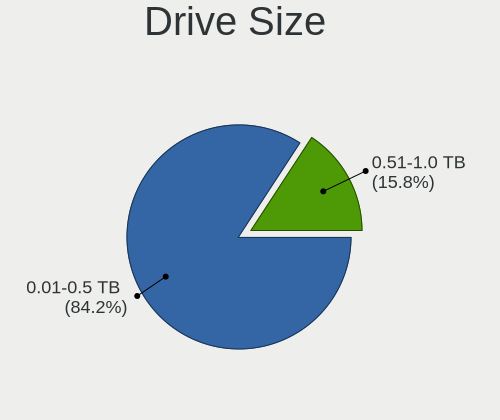
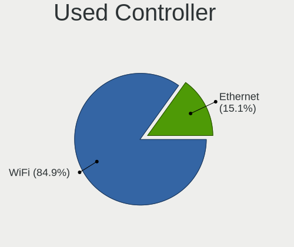
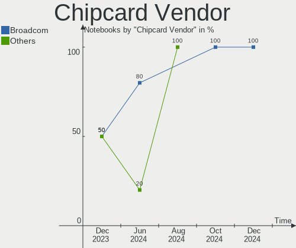

Elementary Hardware Trends (Notebooks)
--------------------------------------

A project to identify most popular hardware characteristics and track their change
over time based on data collected by Elementary users at https://Linux-Hardware.org.

Anyone can contribute to this report by the [hw-probe](https://github.com/linuxhw/hw-probe) tool:

    sudo -E hw-probe -all -upload

This report is for one last month. Overall report since the beginning of time: [TestCoverage](https://github.com/linuxhw/TestCoverage)

Period: Apr, 2022.

Contents
--------

* [ System ](#system)
  - [ OS                       ](#os)
  - [ OS Family                ](#os-family)
  - [ Kernel                   ](#kernel)
  - [ Kernel Family            ](#kernel-family)
  - [ Kernel Major Ver.        ](#kernel-major-ver)
  - [ Arch                     ](#arch)
  - [ DE                       ](#de)
  - [ Display Server           ](#display-server)
  - [ Display Manager          ](#display-manager)
  - [ OS Lang                  ](#os-lang)
  - [ Boot Mode                ](#boot-mode)
  - [ Filesystem               ](#filesystem)
  - [ Part. scheme             ](#part-scheme)
  - [ Dual Boot with Linux/BSD ](#dual-boot-with-linuxbsd)
  - [ Dual Boot (Win)          ](#dual-boot-win)

* [ Board ](#board)
  - [ Vendor                   ](#vendor)
  - [ Model                    ](#model)
  - [ Model Family             ](#model-family)
  - [ MFG Year                 ](#mfg-year)
  - [ Form Factor              ](#form-factor)
  - [ Secure Boot              ](#secure-boot)
  - [ Coreboot                 ](#coreboot)
  - [ RAM Size                 ](#ram-size)
  - [ RAM Used                 ](#ram-used)
  - [ Total Drives             ](#total-drives)
  - [ Has CD-ROM               ](#has-cd-rom)
  - [ Has Ethernet             ](#has-ethernet)
  - [ Has WiFi                 ](#has-wifi)
  - [ Has Bluetooth            ](#has-bluetooth)

* [ Location ](#location)
  - [ Country                  ](#country)
  - [ City                     ](#city)

* [ Drives ](#drives)
  - [ Drive Vendor             ](#drive-vendor)
  - [ Drive Model              ](#drive-model)
  - [ HDD Vendor               ](#hdd-vendor)
  - [ SSD Vendor               ](#ssd-vendor)
  - [ Drive Kind               ](#drive-kind)
  - [ Drive Connector          ](#drive-connector)
  - [ Drive Size               ](#drive-size)
  - [ Space Total              ](#space-total)
  - [ Space Used               ](#space-used)
  - [ Malfunc. Drives          ](#malfunc-drives)
  - [ Malfunc. Drive Vendor    ](#malfunc-drive-vendor)
  - [ Malfunc. HDD Vendor      ](#malfunc-hdd-vendor)
  - [ Malfunc. Drive Kind      ](#malfunc-drive-kind)
  - [ Failed Drives            ](#failed-drives)
  - [ Failed Drive Vendor      ](#failed-drive-vendor)
  - [ Drive Status             ](#drive-status)

* [ Storage controller ](#storage-controller)
  - [ Storage Vendor           ](#storage-vendor)
  - [ Storage Model            ](#storage-model)
  - [ Storage Kind             ](#storage-kind)

* [ Processor ](#processor)
  - [ CPU Vendor               ](#cpu-vendor)
  - [ CPU Model                ](#cpu-model)
  - [ CPU Model Family         ](#cpu-model-family)
  - [ CPU Cores                ](#cpu-cores)
  - [ CPU Sockets              ](#cpu-sockets)
  - [ CPU Threads              ](#cpu-threads)
  - [ CPU Op-Modes             ](#cpu-op-modes)
  - [ CPU Microcode            ](#cpu-microcode)
  - [ CPU Microarch            ](#cpu-microarch)

* [ Graphics ](#graphics)
  - [ GPU Vendor               ](#gpu-vendor)
  - [ GPU Model                ](#gpu-model)
  - [ GPU Combo                ](#gpu-combo)
  - [ GPU Driver               ](#gpu-driver)
  - [ GPU Memory               ](#gpu-memory)

* [ Monitor ](#monitor)
  - [ Monitor Vendor           ](#monitor-vendor)
  - [ Monitor Model            ](#monitor-model)
  - [ Monitor Resolution       ](#monitor-resolution)
  - [ Monitor Diagonal         ](#monitor-diagonal)
  - [ Monitor Width            ](#monitor-width)
  - [ Aspect Ratio             ](#aspect-ratio)
  - [ Monitor Area             ](#monitor-area)
  - [ Pixel Density            ](#pixel-density)
  - [ Multiple Monitors        ](#multiple-monitors)

* [ Network ](#network)
  - [ Net Controller Vendor    ](#net-controller-vendor)
  - [ Net Controller Model     ](#net-controller-model)
  - [ Wireless Vendor          ](#wireless-vendor)
  - [ Wireless Model           ](#wireless-model)
  - [ Ethernet Vendor          ](#ethernet-vendor)
  - [ Ethernet Model           ](#ethernet-model)
  - [ Net Controller Kind      ](#net-controller-kind)
  - [ Used Controller          ](#used-controller)
  - [ NICs                     ](#nics)
  - [ IPv6                     ](#ipv6)

* [ Bluetooth ](#bluetooth)
  - [ Bluetooth Vendor         ](#bluetooth-vendor)
  - [ Bluetooth Model          ](#bluetooth-model)

* [ Sound ](#sound)
  - [ Sound Vendor             ](#sound-vendor)
  - [ Sound Model              ](#sound-model)

* [ Memory ](#memory)
  - [ Memory Vendor            ](#memory-vendor)
  - [ Memory Model             ](#memory-model)
  - [ Memory Kind              ](#memory-kind)
  - [ Memory Form Factor       ](#memory-form-factor)
  - [ Memory Size              ](#memory-size)
  - [ Memory Speed             ](#memory-speed)

* [ Printers & scanners ](#printers--scanners)
  - [ Printer Vendor           ](#printer-vendor)
  - [ Printer Model            ](#printer-model)
  - [ Scanner Vendor           ](#scanner-vendor)
  - [ Scanner Model            ](#scanner-model)

* [ Camera ](#camera)
  - [ Camera Vendor            ](#camera-vendor)
  - [ Camera Model             ](#camera-model)

* [ Security ](#security)
  - [ Fingerprint Vendor       ](#fingerprint-vendor)
  - [ Fingerprint Model        ](#fingerprint-model)
  - [ Chipcard Vendor          ](#chipcard-vendor)
  - [ Chipcard Model           ](#chipcard-model)

* [ Unsupported ](#unsupported)
  - [ Unsupported Devices      ](#unsupported-devices)
  - [ Unsupported Device Types ](#unsupported-device-types)

System
------

OS
--

Installed operating systems

| Name             | Notebooks | Percent |
|------------------|-----------|---------|
| Elementary 6.1   | 33        | 94.29%  |
| Elementary 5.1.7 | 2         | 5.71%   |

OS Family
---------

OS without a version

| Name       | Notebooks | Percent |
|------------|-----------|---------|
| Elementary | 35        | 100%    |

Kernel
------

Version of the Linux kernel

| Version                | Notebooks | Percent |
|------------------------|-----------|---------|
| 5.13.0-39-generic      | 16        | 45.71%  |
| 5.13.0-40-generic      | 6         | 17.14%  |
| 5.11.0-43-generic      | 5         | 14.29%  |
| 5.13.0-35-generic      | 2         | 5.71%   |
| 5.4.0-107-generic      | 1         | 2.86%   |
| 5.4.0-104-generic      | 1         | 2.86%   |
| 5.15.36-xanmod1        | 1         | 2.86%   |
| 5.15.21-051521-generic | 1         | 2.86%   |
| 5.13.0-37-generic      | 1         | 2.86%   |
| 5.13.0-25-generic      | 1         | 2.86%   |

Kernel Family
-------------

Linux kernel without a distro release

| Version | Notebooks | Percent |
|---------|-----------|---------|
| 5.13.0  | 26        | 74.29%  |
| 5.11.0  | 5         | 14.29%  |
| 5.4.0   | 2         | 5.71%   |
| 5.15.36 | 1         | 2.86%   |
| 5.15.21 | 1         | 2.86%   |

Kernel Major Ver.
-----------------

Linux kernel major version

| Version | Notebooks | Percent |
|---------|-----------|---------|
| 5.13    | 26        | 74.29%  |
| 5.11    | 5         | 14.29%  |
| 5.4     | 2         | 5.71%   |
| 5.15    | 2         | 5.71%   |

Arch
----

OS architecture (x86_64, i586, etc.)

| Name   | Notebooks | Percent |
|--------|-----------|---------|
| x86_64 | 35        | 100%    |

DE
--

Desktop Environment

| Name     | Notebooks | Percent |
|----------|-----------|---------|
| Pantheon | 34        | 97.14%  |
| Unknown  | 1         | 2.86%   |

Display Server
--------------

X11 or Wayland

| Name | Notebooks | Percent |
|------|-----------|---------|
| X11  | 35        | 100%    |

Display Manager
---------------

SDDM, LightDM, etc.

| Name    | Notebooks | Percent |
|---------|-----------|---------|
| Unknown | 28        | 80%     |
| LightDM | 7         | 20%     |

OS Lang
-------

Language

| Lang    | Notebooks | Percent |
|---------|-----------|---------|
| en_US   | 13        | 37.14%  |
| es_ES   | 7         | 20%     |
| de_DE   | 5         | 14.29%  |
| ru_RU   | 2         | 5.71%   |
| pl_PL   | 2         | 5.71%   |
| tr_TR   | 1         | 2.86%   |
| fr_FR   | 1         | 2.86%   |
| en_ZA   | 1         | 2.86%   |
| en_CA   | 1         | 2.86%   |
| de_CH   | 1         | 2.86%   |
| Unknown | 1         | 2.86%   |

Boot Mode
---------

EFI or BIOS

| Mode | Notebooks | Percent |
|------|-----------|---------|
| BIOS | 19        | 54.29%  |
| EFI  | 16        | 45.71%  |

Filesystem
----------

Type of filesystem

| Type    | Notebooks | Percent |
|---------|-----------|---------|
| Ext4    | 34        | 97.14%  |
| Overlay | 1         | 2.86%   |

Part. scheme
------------

Scheme of partitioning

| Type    | Notebooks | Percent |
|---------|-----------|---------|
| Unknown | 31        | 88.57%  |
| GPT     | 3         | 8.57%   |
| MBR     | 1         | 2.86%   |

Dual Boot with Linux/BSD
------------------------

Hosting more than one Linux/BSD

| Dual boot | Notebooks | Percent |
|-----------|-----------|---------|
| No        | 35        | 100%    |

Dual Boot (Win)
---------------

Hosting Linux and Windows

| Dual boot | Notebooks | Percent |
|-----------|-----------|---------|
| No        | 32        | 91.43%  |
| Yes       | 3         | 8.57%   |

Board
-----

Vendor
------

Motherboard manufacturer

| Name                   | Notebooks | Percent |
|------------------------|-----------|---------|
| Lenovo                 | 9         | 25.71%  |
| Hewlett-Packard        | 9         | 25.71%  |
| ASUSTek Computer       | 4         | 11.43%  |
| Dell                   | 3         | 8.57%   |
| Samsung Electronics    | 2         | 5.71%   |
| MSI                    | 2         | 5.71%   |
| Apple                  | 2         | 5.71%   |
| Acer                   | 2         | 5.71%   |
| Panasonic              | 1         | 2.86%   |
| Avell High Performance | 1         | 2.86%   |

Model
-----

Motherboard model

| Name                                        | Notebooks | Percent |
|---------------------------------------------|-----------|---------|
| MSI Prestige 15 A11UC                       | 2         | 5.71%   |
| ASUS ZenBook UX425EA_UX425EA                | 2         | 5.71%   |
| Samsung RV411/RV511/E3511/S3511/RV711/E3411 | 1         | 2.86%   |
| Samsung 950XDB/951XDB/950XDY                | 1         | 2.86%   |
| Panasonic CF-31SBLJGDM                      | 1         | 2.86%   |
| Lenovo ThinkPad X270 W10DG 20K5S2VL00       | 1         | 2.86%   |
| Lenovo ThinkPad X260 20F5S84400             | 1         | 2.86%   |
| Lenovo ThinkPad X201 Tablet 3113CG2         | 1         | 2.86%   |
| Lenovo ThinkPad W541 20EGS0UB03             | 1         | 2.86%   |
| Lenovo ThinkPad T420 41786VU                | 1         | 2.86%   |
| Lenovo ThinkPad T410s 2912BR7               | 1         | 2.86%   |
| Lenovo ThinkPad E15 Gen 2 20TDS0GD00        | 1         | 2.86%   |
| Lenovo IdeaPad-510-15IKB 80SV               | 1         | 2.86%   |
| Lenovo IdeaPad 3 15IGL05 81WQ               | 1         | 2.86%   |
| HP Stream Laptop 14-ax1xxx                  | 1         | 2.86%   |
| HP ProBook 6440b                            | 1         | 2.86%   |
| HP ProBook 440 G7                           | 1         | 2.86%   |
| HP Pavilion Notebook                        | 1         | 2.86%   |
| HP Pavilion g6                              | 1         | 2.86%   |
| HP Pavilion 17                              | 1         | 2.86%   |
| HP Notebook                                 | 1         | 2.86%   |
| HP EliteBook 840 G1                         | 1         | 2.86%   |
| HP 250 G7 Notebook PC                       | 1         | 2.86%   |
| Dell Vostro A860                            | 1         | 2.86%   |
| Dell Latitude 5410                          | 1         | 2.86%   |
| Dell Latitude 3550                          | 1         | 2.86%   |
| Avell High Performance B.ON                 | 1         | 2.86%   |
| ASUS ZenBook UX325SA_UM325SA                | 1         | 2.86%   |
| ASUS N56DY                                  | 1         | 2.86%   |
| Apple MacBookPro10,1                        | 1         | 2.86%   |
| Apple MacBookAir4,2                         | 1         | 2.86%   |
| Acer Aspire E5-575G                         | 1         | 2.86%   |
| Acer Aspire E5-411G                         | 1         | 2.86%   |

Model Family
------------

Motherboard model prefix

| Name                        | Notebooks | Percent |
|-----------------------------|-----------|---------|
| Lenovo ThinkPad             | 7         | 20%     |
| HP Pavilion                 | 3         | 8.57%   |
| ASUS ZenBook                | 3         | 8.57%   |
| MSI Prestige                | 2         | 5.71%   |
| HP ProBook                  | 2         | 5.71%   |
| Dell Latitude               | 2         | 5.71%   |
| Acer Aspire                 | 2         | 5.71%   |
| Samsung RV411               | 1         | 2.86%   |
| Samsung 950XDB              | 1         | 2.86%   |
| Panasonic CF-31SBLJGDM      | 1         | 2.86%   |
| Lenovo IdeaPad-510-15IKB    | 1         | 2.86%   |
| Lenovo IdeaPad              | 1         | 2.86%   |
| HP Stream                   | 1         | 2.86%   |
| HP Notebook                 | 1         | 2.86%   |
| HP EliteBook                | 1         | 2.86%   |
| HP 250                      | 1         | 2.86%   |
| Dell Vostro                 | 1         | 2.86%   |
| Avell High Performance B.ON | 1         | 2.86%   |
| ASUS N56DY                  | 1         | 2.86%   |
| Apple MacBookPro10          | 1         | 2.86%   |
| Apple MacBookAir4           | 1         | 2.86%   |

MFG Year
--------

Motherboard manufacture year

| Year | Notebooks | Percent |
|------|-----------|---------|
| 2021 | 6         | 17.14%  |
| 2020 | 5         | 14.29%  |
| 2018 | 3         | 8.57%   |
| 2015 | 3         | 8.57%   |
| 2013 | 3         | 8.57%   |
| 2011 | 3         | 8.57%   |
| 2010 | 3         | 8.57%   |
| 2016 | 2         | 5.71%   |
| 2014 | 2         | 5.71%   |
| 2012 | 2         | 5.71%   |
| 2019 | 1         | 2.86%   |
| 2017 | 1         | 2.86%   |
| 2008 | 1         | 2.86%   |

Form Factor
-----------

Physical design of the computer

| Name     | Notebooks | Percent |
|----------|-----------|---------|
| Notebook | 35        | 100%    |

Secure Boot
-----------

Enabled or disabled

| State    | Notebooks | Percent |
|----------|-----------|---------|
| Disabled | 31        | 88.57%  |
| Enabled  | 4         | 11.43%  |

Coreboot
--------

Have coreboot on board

| Used | Notebooks | Percent |
|------|-----------|---------|
| No   | 35        | 100%    |

RAM Size
--------

Total RAM memory

| Size in GB | Notebooks | Percent |
|------------|-----------|---------|
| 3.01-4.0   | 10        | 28.57%  |
| 4.01-8.0   | 8         | 22.86%  |
| 16.01-24.0 | 7         | 20%     |
| 8.01-16.0  | 7         | 20%     |
| 32.01-64.0 | 2         | 5.71%   |
| 2.01-3.0   | 1         | 2.86%   |

RAM Used
--------

Used RAM memory

| Used GB   | Notebooks | Percent |
|-----------|-----------|---------|
| 1.01-2.0  | 16        | 45.71%  |
| 2.01-3.0  | 7         | 20%     |
| 4.01-8.0  | 5         | 14.29%  |
| 3.01-4.0  | 4         | 11.43%  |
| 0.51-1.0  | 2         | 5.71%   |
| 8.01-16.0 | 1         | 2.86%   |

Total Drives
------------

Number of drives on board

| Drives | Notebooks | Percent |
|--------|-----------|---------|
| 1      | 27        | 77.14%  |
| 2      | 8         | 22.86%  |

Has CD-ROM
----------

Has CD-ROM on board

| Presented | Notebooks | Percent |
|-----------|-----------|---------|
| No        | 25        | 71.43%  |
| Yes       | 10        | 28.57%  |

Has Ethernet
------------

Has Ethernet on board

| Presented | Notebooks | Percent |
|-----------|-----------|---------|
| Yes       | 28        | 80%     |
| No        | 7         | 20%     |

Has WiFi
--------

Has WiFi module

| Presented | Notebooks | Percent |
|-----------|-----------|---------|
| Yes       | 35        | 100%    |

Has Bluetooth
-------------

Has Bluetooth module

| Presented | Notebooks | Percent |
|-----------|-----------|---------|
| Yes       | 32        | 91.43%  |
| No        | 3         | 8.57%   |

Location
--------

Country
-------

Geographic location (country)

| Country      | Notebooks | Percent |
|--------------|-----------|---------|
| USA          | 4         | 11.43%  |
| Germany      | 3         | 8.57%   |
| Switzerland  | 2         | 5.71%   |
| Spain        | 2         | 5.71%   |
| Russia       | 2         | 5.71%   |
| Poland       | 2         | 5.71%   |
| Mexico       | 2         | 5.71%   |
| Chile        | 2         | 5.71%   |
| UK           | 1         | 2.86%   |
| Turkey       | 1         | 2.86%   |
| Sri Lanka    | 1         | 2.86%   |
| South Africa | 1         | 2.86%   |
| Portugal     | 1         | 2.86%   |
| Pakistan     | 1         | 2.86%   |
| India        | 1         | 2.86%   |
| France       | 1         | 2.86%   |
| Estonia      | 1         | 2.86%   |
| Croatia      | 1         | 2.86%   |
| Canada       | 1         | 2.86%   |
| Brazil       | 1         | 2.86%   |
| Belgium      | 1         | 2.86%   |
| Austria      | 1         | 2.86%   |
| Australia    | 1         | 2.86%   |
| Argentina    | 1         | 2.86%   |

City
----

Geographic location (city)

| City                   | Notebooks | Percent |
|------------------------|-----------|---------|
| Montornès del Vallès | 2         | 5.71%   |
| Bern                   | 2         | 5.71%   |
| Wroclaw                | 1         | 2.86%   |
| Temuco                 | 1         | 2.86%   |
| Sydney                 | 1         | 2.86%   |
| Stockton               | 1         | 2.86%   |
| Stare Kozle            | 1         | 2.86%   |
| St Petersburg          | 1         | 2.86%   |
| Sioux City             | 1         | 2.86%   |
| Sindelfingen           | 1         | 2.86%   |
| Santiago               | 1         | 2.86%   |
| Rakvere                | 1         | 2.86%   |
| Puebla City            | 1         | 2.86%   |
| Norwich                | 1         | 2.86%   |
| Neuhofen an der Krems  | 1         | 2.86%   |
| Moscow                 | 1         | 2.86%   |
| Maua                   | 1         | 2.86%   |
| Leiria                 | 1         | 2.86%   |
| Kootenay Bay           | 1         | 2.86%   |
| Istanbul               | 1         | 2.86%   |
| Islamabad              | 1         | 2.86%   |
| Heist-op-den-Berg      | 1         | 2.86%   |
| Harrisburg             | 1         | 2.86%   |
| Hamburg                | 1         | 2.86%   |
| Delhi                  | 1         | 2.86%   |
| Dayton                 | 1         | 2.86%   |
| Colombo                | 1         | 2.86%   |
| Chenove                | 1         | 2.86%   |
| Cape Town              | 1         | 2.86%   |
| Bonn                   | 1         | 2.86%   |
| Belišće              | 1         | 2.86%   |
| Bahía Blanca          | 1         | 2.86%   |
| Apodaca                | 1         | 2.86%   |

Drives
------

Drive Vendor
------------

Hard drive vendors

| Vendor              | Notebooks | Drives | Percent |
|---------------------|-----------|--------|---------|
| Samsung Electronics | 10        | 10     | 23.26%  |
| Toshiba             | 5         | 5      | 11.63%  |
| Seagate             | 5         | 5      | 11.63%  |
| SK Hynix            | 3         | 3      | 6.98%   |
| Intel               | 3         | 3      | 6.98%   |
| WDC                 | 2         | 2      | 4.65%   |
| Unknown             | 2         | 2      | 4.65%   |
| Phison              | 2         | 2      | 4.65%   |
| Apple               | 2         | 2      | 4.65%   |
| Team                | 1         | 1      | 2.33%   |
| SSSTC               | 1         | 1      | 2.33%   |
| OSCOO               | 1         | 1      | 2.33%   |
| JMicron             | 1         | 1      | 2.33%   |
| HGST                | 1         | 1      | 2.33%   |
| GOODRAM             | 1         | 1      | 2.33%   |
| Fujitsu             | 1         | 1      | 2.33%   |
| Crucial             | 1         | 1      | 2.33%   |
| A-DATA Technology   | 1         | 1      | 2.33%   |

Drive Model
-----------

Hard drive models

| Model                                | Notebooks | Percent |
|--------------------------------------|-----------|---------|
| Toshiba MQ01ABD100 1TB               | 3         | 6.98%   |
| Samsung SSD 860 EVO 500GB            | 2         | 4.65%   |
| Samsung NVMe SSD Drive 512GB         | 2         | 4.65%   |
| Samsung NVMe SSD Drive 1024GB        | 2         | 4.65%   |
| Phison NVMe SSD Drive 1TB            | 2         | 4.65%   |
| WDC WD5000LPVT-08G33T1 500GB         | 1         | 2.33%   |
| WDC WD10JPVX-22JC3T0 1TB             | 1         | 2.33%   |
| Unknown MMC Card  64GB               | 1         | 2.33%   |
| Unknown MMC Card  196GB              | 1         | 2.33%   |
| Toshiba MQ01ACF050 500GB             | 1         | 2.33%   |
| Toshiba MK5065GSX 500GB              | 1         | 2.33%   |
| Team T253X6256G 256GB SSD            | 1         | 2.33%   |
| SSSTC CL1-8D256-HP 256GB             | 1         | 2.33%   |
| SK Hynix NVMe SSD Drive 512GB        | 1         | 2.33%   |
| SK Hynix NVMe SSD Drive 256GB        | 1         | 2.33%   |
| SK Hynix HFM512GD3JX013N 512GB       | 1         | 2.33%   |
| Seagate ST980811AS 80GB              | 1         | 2.33%   |
| Seagate ST9750420AS 752GB            | 1         | 2.33%   |
| Seagate ST500LT012-1DG142 500GB      | 1         | 2.33%   |
| Seagate ST1000LM035-1RK172 1TB       | 1         | 2.33%   |
| Seagate BACKUP+ 128PB                | 1         | 2.33%   |
| Samsung SSD 860 EVO 250GB            | 1         | 2.33%   |
| Samsung SSD 850 EVO 500GB            | 1         | 2.33%   |
| Samsung MZNLN128HAHQ-000H1 128GB SSD | 1         | 2.33%   |
| Samsung MZ7LN256HMJP-000L7 256GB SSD | 1         | 2.33%   |
| OSCOO OSC M.2 240GB                  | 1         | 2.33%   |
| JMicron Generic 240GB                | 1         | 2.33%   |
| Intel SSDSA1M160G2LE 160GB           | 1         | 2.33%   |
| Intel NVMe SSD Drive 512GB           | 1         | 2.33%   |
| Intel NVMe SSD Drive 1024GB          | 1         | 2.33%   |
| HGST HTS541010A9E680 1TB             | 1         | 2.33%   |
| GOODRAM SSDPR-CX400-128-G2 128GB     | 1         | 2.33%   |
| Fujitsu MJA2250BH FFS G1 250GB       | 1         | 2.33%   |
| Crucial CT240BX500SSD1 240GB         | 1         | 2.33%   |
| Apple SSD SM256C 256GB               | 1         | 2.33%   |
| Apple SSD SD256E 256GB               | 1         | 2.33%   |
| A-DATA IM2P33F8A-512GD 512GB         | 1         | 2.33%   |

HDD Vendor
----------

Hard disk drive vendors

| Vendor  | Notebooks | Drives | Percent |
|---------|-----------|--------|---------|
| Toshiba | 5         | 5      | 38.46%  |
| Seagate | 4         | 4      | 30.77%  |
| WDC     | 2         | 2      | 15.38%  |
| HGST    | 1         | 1      | 7.69%   |
| Fujitsu | 1         | 1      | 7.69%   |

SSD Vendor
----------

Solid state drive vendors

| Vendor              | Notebooks | Drives | Percent |
|---------------------|-----------|--------|---------|
| Samsung Electronics | 6         | 6      | 46.15%  |
| Apple               | 2         | 2      | 15.38%  |
| Team                | 1         | 1      | 7.69%   |
| JMicron             | 1         | 1      | 7.69%   |
| Intel               | 1         | 1      | 7.69%   |
| GOODRAM             | 1         | 1      | 7.69%   |
| Crucial             | 1         | 1      | 7.69%   |

Drive Kind
----------

HDD or SSD

| Kind    | Notebooks | Drives | Percent |
|---------|-----------|--------|---------|
| SSD     | 13        | 13     | 31.71%  |
| HDD     | 13        | 13     | 31.71%  |
| NVMe    | 11        | 13     | 26.83%  |
| MMC     | 2         | 2      | 4.88%   |
| Unknown | 2         | 2      | 4.88%   |

Drive Connector
---------------

SATA, SAS, NVMe, etc.

| Type | Notebooks | Drives | Percent |
|------|-----------|--------|---------|
| SATA | 23        | 26     | 60.53%  |
| NVMe | 11        | 13     | 28.95%  |
| SAS  | 2         | 2      | 5.26%   |
| MMC  | 2         | 2      | 5.26%   |

Drive Size
----------

Size of hard drive

| Size in TB | Notebooks | Drives | Percent |
|------------|-----------|--------|---------|
| 0.01-0.5   | 19        | 19     | 73.08%  |
| 0.51-1.0   | 7         | 7      | 26.92%  |

Space Total
-----------

Amount of disk space available on the file system

| Size in GB | Notebooks | Percent |
|------------|-----------|---------|
| 101-250    | 14        | 40%     |
| 251-500    | 7         | 20%     |
| 501-1000   | 6         | 17.14%  |
| 51-100     | 5         | 14.29%  |
| 21-50      | 2         | 5.71%   |
| Unknown    | 1         | 2.86%   |

Space Used
----------

Amount of used disk space

| Used GB  | Notebooks | Percent |
|----------|-----------|---------|
| 1-20     | 16        | 45.71%  |
| 21-50    | 8         | 22.86%  |
| 51-100   | 7         | 20%     |
| 101-250  | 2         | 5.71%   |
| 501-1000 | 1         | 2.86%   |
| Unknown  | 1         | 2.86%   |

Malfunc. Drives
---------------

Drive models with a malfunction

Zero info for selected period =(

Malfunc. Drive Vendor
---------------------

Vendors of faulty drives

Zero info for selected period =(

Malfunc. HDD Vendor
-------------------

Vendors of faulty HDD drives

Zero info for selected period =(

Malfunc. Drive Kind
-------------------

Kinds of faulty drives

Zero info for selected period =(

Failed Drives
-------------

Failed drive models

Zero info for selected period =(

Failed Drive Vendor
-------------------

Failed drive vendors

Zero info for selected period =(

Drive Status
------------

Number of failed and malfunc. drives

| Status   | Notebooks | Drives | Percent |
|----------|-----------|--------|---------|
| Detected | 32        | 39     | 88.89%  |
| Works    | 4         | 4      | 11.11%  |

Storage controller
------------------

Storage Vendor
--------------

Storage controller vendors

| Vendor                         | Notebooks | Percent |
|--------------------------------|-----------|---------|
| Intel                          | 27        | 69.23%  |
| Samsung Electronics            | 4         | 10.26%  |
| SK Hynix                       | 3         | 7.69%   |
| Phison Electronics             | 2         | 5.13%   |
| Solid State Storage Technology | 1         | 2.56%   |
| AMD                            | 1         | 2.56%   |
| ADATA Technology               | 1         | 2.56%   |

Storage Model
-------------

Storage controller models

| Model                                                                                  | Notebooks | Percent |
|----------------------------------------------------------------------------------------|-----------|---------|
| Intel Sunrise Point-LP SATA Controller [AHCI mode]                                     | 4         | 9.52%   |
| Intel Wildcat Point-LP SATA Controller [AHCI Mode]                                     | 3         | 7.14%   |
| Intel 5 Series/3400 Series Chipset 6 port SATA AHCI Controller                         | 3         | 7.14%   |
| SK Hynix BC511                                                                         | 2         | 4.76%   |
| Samsung NVMe SSD Controller PM9A1/PM9A3/980PRO                                         | 2         | 4.76%   |
| Samsung NVMe SSD Controller 980                                                        | 2         | 4.76%   |
| Phison E12 NVMe Controller                                                             | 2         | 4.76%   |
| Intel Volume Management Device NVMe RAID Controller                                    | 2         | 4.76%   |
| Intel SSD 660P Series                                                                  | 2         | 4.76%   |
| Intel Comet Lake SATA AHCI Controller                                                  | 2         | 4.76%   |
| Intel 8 Series SATA Controller 1 [AHCI mode]                                           | 2         | 4.76%   |
| Intel 7 Series Chipset Family 6-port SATA Controller [AHCI mode]                       | 2         | 4.76%   |
| Intel 6 Series/C200 Series Chipset Family 6 port Mobile SATA AHCI Controller           | 2         | 4.76%   |
| Solid State Storage Non-Volatile memory controller                                     | 1         | 2.38%   |
| SK Hynix Gold P31 SSD                                                                  | 1         | 2.38%   |
| Intel Celeron/Pentium Silver Processor SATA Controller                                 | 1         | 2.38%   |
| Intel Atom Processor E3800 Series SATA AHCI Controller                                 | 1         | 2.38%   |
| Intel 82801HM/HEM (ICH8M/ICH8M-E) SATA Controller [IDE mode]                           | 1         | 2.38%   |
| Intel 82801 Mobile SATA Controller [RAID mode]                                         | 1         | 2.38%   |
| Intel 8 Series/C220 Series Chipset Family 6-port SATA Controller 1 [AHCI mode]         | 1         | 2.38%   |
| Intel 6 Series/C200 Series Chipset Family Mobile SATA Controller (IDE mode, ports 0-3) | 1         | 2.38%   |
| Intel 5 Series/3400 Series Chipset 4 port SATA IDE Controller                          | 1         | 2.38%   |
| Intel 5 Series/3400 Series Chipset 2 port SATA IDE Controller                          | 1         | 2.38%   |
| AMD FCH SATA Controller [AHCI mode]                                                    | 1         | 2.38%   |
| ADATA Non-Volatile memory controller                                                   | 1         | 2.38%   |

Storage Kind
------------

Kind of storage controller (IDE, SATA, NVMe, SAS, ...)

| Kind | Notebooks | Percent |
|------|-----------|---------|
| SATA | 22        | 56.41%  |
| NVMe | 11        | 28.21%  |
| RAID | 3         | 7.69%   |
| IDE  | 3         | 7.69%   |

Processor
---------

CPU Vendor
----------

Processor vendors

| Vendor | Notebooks | Percent |
|--------|-----------|---------|
| Intel  | 33        | 94.29%  |
| AMD    | 2         | 5.71%   |

CPU Model
---------

Processor models

| Model                                    | Notebooks | Percent |
|------------------------------------------|-----------|---------|
| Intel 11th Gen Core i7-1165G7 @ 2.80GHz  | 3         | 8.57%   |
| Intel Core i5-7200U CPU @ 2.50GHz        | 2         | 5.71%   |
| Intel Core i5-10210U CPU @ 1.60GHz       | 2         | 5.71%   |
| Intel Core i3-5005U CPU @ 2.00GHz        | 2         | 5.71%   |
| Intel 11th Gen Core i7-1195G7 @ 2.90GHz  | 2         | 5.71%   |
| Intel 11th Gen Core i5-1135G7 @ 2.40GHz  | 2         | 5.71%   |
| Intel Core i7-6500U CPU @ 2.50GHz        | 1         | 2.86%   |
| Intel Core i7-4810MQ CPU @ 2.80GHz       | 1         | 2.86%   |
| Intel Core i7-3635QM CPU @ 2.40GHz       | 1         | 2.86%   |
| Intel Core i7-2677M CPU @ 1.80GHz        | 1         | 2.86%   |
| Intel Core i7-2670QM CPU @ 2.20GHz       | 1         | 2.86%   |
| Intel Core i7-1065G7 CPU @ 1.30GHz       | 1         | 2.86%   |
| Intel Core i7 CPU L 620 @ 2.00GHz        | 1         | 2.86%   |
| Intel Core i5-6300U CPU @ 2.40GHz        | 1         | 2.86%   |
| Intel Core i5-4300U CPU @ 1.90GHz        | 1         | 2.86%   |
| Intel Core i5-3320M CPU @ 2.60GHz        | 1         | 2.86%   |
| Intel Core i5 CPU M 560 @ 2.67GHz        | 1         | 2.86%   |
| Intel Core i5 CPU M 520 @ 2.40GHz        | 1         | 2.86%   |
| Intel Core i3-5020U CPU @ 2.20GHz        | 1         | 2.86%   |
| Intel Core i3-4030U CPU @ 1.90GHz        | 1         | 2.86%   |
| Intel Core i3-2310M CPU @ 2.10GHz        | 1         | 2.86%   |
| Intel Core i3 CPU M 380 @ 2.53GHz        | 1         | 2.86%   |
| Intel Core 2 Duo CPU T5870 @ 2.00GHz     | 1         | 2.86%   |
| Intel Celeron N4020 CPU @ 1.10GHz        | 1         | 2.86%   |
| Intel Celeron N4000 CPU @ 1.10GHz        | 1         | 2.86%   |
| Intel Celeron CPU N2940 @ 1.83GHz        | 1         | 2.86%   |
| AMD Ryzen 7 5800U with Radeon Graphics   | 1         | 2.86%   |
| AMD A8-5550M APU with Radeon HD Graphics | 1         | 2.86%   |

CPU Model Family
----------------

Processor model prefix

| Model            | Notebooks | Percent |
|------------------|-----------|---------|
| Intel Core i5    | 9         | 25.71%  |
| Other            | 7         | 20%     |
| Intel Core i7    | 7         | 20%     |
| Intel Core i3    | 6         | 17.14%  |
| Intel Celeron    | 3         | 8.57%   |
| Intel Core 2 Duo | 1         | 2.86%   |
| AMD Ryzen 7      | 1         | 2.86%   |
| AMD A8           | 1         | 2.86%   |

CPU Cores
---------

Number of processor cores

| Number | Notebooks | Percent |
|--------|-----------|---------|
| 2      | 20        | 57.14%  |
| 4      | 14        | 40%     |
| 8      | 1         | 2.86%   |

CPU Sockets
-----------

Number of sockets

| Number | Notebooks | Percent |
|--------|-----------|---------|
| 1      | 35        | 100%    |

CPU Threads
-----------

Threads per core (Hyper-Threading)

| Number | Notebooks | Percent |
|--------|-----------|---------|
| 2      | 31        | 88.57%  |
| 1      | 4         | 11.43%  |

CPU Op-Modes
------------

CPU Operation Modes (32-bit, 64-bit)

| Op mode        | Notebooks | Percent |
|----------------|-----------|---------|
| 32-bit, 64-bit | 35        | 100%    |

CPU Microcode
-------------

Microcode number

| Number     | Notebooks | Percent |
|------------|-----------|---------|
| 0x806c1    | 5         | 14.29%  |
| 0x306d4    | 3         | 8.57%   |
| 0x206a7    | 3         | 8.57%   |
| 0x806ec    | 2         | 5.71%   |
| 0x806e9    | 2         | 5.71%   |
| 0x406e3    | 2         | 5.71%   |
| 0x40651    | 2         | 5.71%   |
| 0x20655    | 2         | 5.71%   |
| 0x20652    | 2         | 5.71%   |
| Unknown    | 2         | 5.71%   |
| 0x806c2    | 1         | 2.86%   |
| 0x706e5    | 1         | 2.86%   |
| 0x706a8    | 1         | 2.86%   |
| 0x706a1    | 1         | 2.86%   |
| 0x6fd      | 1         | 2.86%   |
| 0x306c3    | 1         | 2.86%   |
| 0x306a9    | 1         | 2.86%   |
| 0x30678    | 1         | 2.86%   |
| 0x0a50000c | 1         | 2.86%   |
| 0x06001119 | 1         | 2.86%   |

CPU Microarch
-------------

Microarchitecture

| Name          | Notebooks | Percent |
|---------------|-----------|---------|
| TigerLake     | 7         | 20%     |
| Westmere      | 4         | 11.43%  |
| KabyLake      | 4         | 11.43%  |
| SandyBridge   | 3         | 8.57%   |
| Haswell       | 3         | 8.57%   |
| Broadwell     | 3         | 8.57%   |
| Skylake       | 2         | 5.71%   |
| IvyBridge     | 2         | 5.71%   |
| Goldmont plus | 2         | 5.71%   |
| Zen 3         | 1         | 2.86%   |
| Silvermont    | 1         | 2.86%   |
| Piledriver    | 1         | 2.86%   |
| IceLake       | 1         | 2.86%   |
| Core          | 1         | 2.86%   |

Graphics
--------

GPU Vendor
----------

Vendors of graphics cards

| Vendor | Notebooks | Percent |
|--------|-----------|---------|
| Intel  | 31        | 70.45%  |
| Nvidia | 10        | 22.73%  |
| AMD    | 3         | 6.82%   |

GPU Model
---------

Graphics card models

| Model                                                                     | Notebooks | Percent |
|---------------------------------------------------------------------------|-----------|---------|
| Intel TigerLake-LP GT2 [Iris Xe Graphics]                                 | 7         | 15.22%  |
| Intel HD Graphics 5500                                                    | 3         | 6.52%   |
| Intel Core Processor Integrated Graphics Controller                       | 3         | 6.52%   |
| Nvidia GA107M [GeForce RTX 3050 Mobile]                                   | 2         | 4.35%   |
| Intel Skylake GT2 [HD Graphics 520]                                       | 2         | 4.35%   |
| Intel HD Graphics 620                                                     | 2         | 4.35%   |
| Intel Haswell-ULT Integrated Graphics Controller                          | 2         | 4.35%   |
| Intel GeminiLake [UHD Graphics 600]                                       | 2         | 4.35%   |
| Intel CometLake-U GT2 [UHD Graphics]                                      | 2         | 4.35%   |
| Intel 3rd Gen Core processor Graphics Controller                          | 2         | 4.35%   |
| Intel 2nd Generation Core Processor Family Integrated Graphics Controller | 2         | 4.35%   |
| Nvidia GT218M [NVS 3100M]                                                 | 1         | 2.17%   |
| Nvidia GT218M [GeForce 315M]                                              | 1         | 2.17%   |
| Nvidia GM108M [GeForce 940MX]                                             | 1         | 2.17%   |
| Nvidia GM107 [GeForce 940MX]                                              | 1         | 2.17%   |
| Nvidia GK107M [GeForce GT 650M Mac Edition]                               | 1         | 2.17%   |
| Nvidia GK106GLM [Quadro K2100M]                                           | 1         | 2.17%   |
| Nvidia GF119M [Quadro NVS 4200M]                                          | 1         | 2.17%   |
| Nvidia GF117M [GeForce 610M/710M/810M/820M / GT 620M/625M/630M/720M]      | 1         | 2.17%   |
| Intel Mobile GM965/GL960 Integrated Graphics Controller (secondary)       | 1         | 2.17%   |
| Intel Mobile GM965/GL960 Integrated Graphics Controller (primary)         | 1         | 2.17%   |
| Intel Iris Plus Graphics G7                                               | 1         | 2.17%   |
| Intel Atom Processor Z36xxx/Z37xxx Series Graphics & Display              | 1         | 2.17%   |
| Intel 4th Gen Core Processor Integrated Graphics Controller               | 1         | 2.17%   |
| AMD Seymour [Radeon HD 6400M/7400M Series]                                | 1         | 2.17%   |
| AMD Richland [Radeon HD 8550G]                                            | 1         | 2.17%   |
| AMD Mars [Radeon HD 8670A/8670M/8750M / R7 M370]                          | 1         | 2.17%   |
| AMD Cezanne                                                               | 1         | 2.17%   |

GPU Combo
---------

Combinations of graphics cards

| Name           | Notebooks | Percent |
|----------------|-----------|---------|
| 1 x Intel      | 22        | 62.86%  |
| Intel + Nvidia | 8         | 22.86%  |
| 1 x Nvidia     | 2         | 5.71%   |
| 2 x AMD        | 1         | 2.86%   |
| Intel + AMD    | 1         | 2.86%   |
| 1 x AMD        | 1         | 2.86%   |

GPU Driver
----------

Free vs proprietary

| Driver      | Notebooks | Percent |
|-------------|-----------|---------|
| Free        | 32        | 91.43%  |
| Proprietary | 3         | 8.57%   |

GPU Memory
----------

Total video memory

| Size in GB | Notebooks | Percent |
|------------|-----------|---------|
| Unknown    | 25        | 71.43%  |
| 0.51-1.0   | 4         | 11.43%  |
| 1.01-2.0   | 3         | 8.57%   |
| 0.01-0.5   | 3         | 8.57%   |

Monitor
-------

Monitor Vendor
--------------

Monitor vendors

| Vendor               | Notebooks | Percent |
|----------------------|-----------|---------|
| Samsung Electronics  | 9         | 20.93%  |
| Chimei Innolux       | 7         | 16.28%  |
| BOE                  | 6         | 13.95%  |
| AU Optronics         | 6         | 13.95%  |
| LG Display           | 4         | 9.3%    |
| Lenovo               | 2         | 4.65%   |
| Apple                | 2         | 4.65%   |
| Plain Tree Systems   | 1         | 2.33%   |
| InfoVision           | 1         | 2.33%   |
| Hewlett-Packard      | 1         | 2.33%   |
| EXP                  | 1         | 2.33%   |
| DPL                  | 1         | 2.33%   |
| AOC                  | 1         | 2.33%   |
| Ancor Communications | 1         | 2.33%   |

Monitor Model
-------------

Monitor models

| Model                                                                   | Notebooks | Percent |
|-------------------------------------------------------------------------|-----------|---------|
| Chimei Innolux LCD Monitor CMN152D 1920x1080 344x193mm 15.5-inch        | 2         | 4.44%   |
| Chimei Innolux LCD Monitor CMN14D5 1920x1080 309x173mm 13.9-inch        | 2         | 4.44%   |
| Samsung Electronics S24E650 SAM0CB8 1920x1080 521x293mm 23.5-inch       | 1         | 2.22%   |
| Samsung Electronics LCD Monitor SEC5441 1366x768 309x174mm 14.0-inch    | 1         | 2.22%   |
| Samsung Electronics LCD Monitor SEC4251 1366x768 344x194mm 15.5-inch    | 1         | 2.22%   |
| Samsung Electronics LCD Monitor SDC4A42 1366x768 309x174mm 14.0-inch    | 1         | 2.22%   |
| Samsung Electronics LCD Monitor SDC4159 1920x1080 344x194mm 15.5-inch   | 1         | 2.22%   |
| Samsung Electronics LCD Monitor SDC4158 1920x1080 294x165mm 13.3-inch   | 1         | 2.22%   |
| Samsung Electronics LCD Monitor SDC3754 1600x900 382x215mm 17.3-inch    | 1         | 2.22%   |
| Samsung Electronics LCD Monitor SAM7016 3840x2160 1872x1053mm 84.6-inch | 1         | 2.22%   |
| Samsung Electronics LCD Monitor SAM0F09 3840x2160 1872x1053mm 84.6-inch | 1         | 2.22%   |
| Plain Tree Systems LCD Monitor PTS07D4 1400x1050 410x310mm 20.2-inch    | 1         | 2.22%   |
| Plain Tree Systems LCD Monitor PTS07D3 1400x1050 408x306mm 20.1-inch    | 1         | 2.22%   |
| LG Display LCD Monitor LGD060F 1920x1080 309x174mm 14.0-inch            | 1         | 2.22%   |
| LG Display LCD Monitor LGD05F5 1920x1080 309x174mm 14.0-inch            | 1         | 2.22%   |
| LG Display LCD Monitor LGD0503 1366x768 344x194mm 15.5-inch             | 1         | 2.22%   |
| LG Display LCD Monitor LGD02D9 1920x1080 344x194mm 15.5-inch            | 1         | 2.22%   |
| Lenovo LCD Monitor LEN4036 1440x900 303x190mm 14.1-inch                 | 1         | 2.22%   |
| Lenovo LCD Monitor LEN4011 1280x800 261x163mm 12.1-inch                 | 1         | 2.22%   |
| InfoVision LCD Monitor IVO048E 1366x768 256x144mm 11.6-inch             | 1         | 2.22%   |
| Hewlett-Packard 24f HPN3545 1920x1080 527x296mm 23.8-inch               | 1         | 2.22%   |
| EXP EP-HDMI-RX EXP0901 1280x720 1150x650mm 52.0-inch                    | 1         | 2.22%   |
| DPL HDMI DPL2700 2560x1440 597x336mm 27.0-inch                          | 1         | 2.22%   |
| Chimei Innolux LCD Monitor CMN15E6 1366x768 344x193mm 15.5-inch         | 1         | 2.22%   |
| Chimei Innolux LCD Monitor CMN1493 1366x768 309x173mm 13.9-inch         | 1         | 2.22%   |
| Chimei Innolux LCD Monitor CMN1239 1920x1080 276x155mm 12.5-inch        | 1         | 2.22%   |
| BOE LCD Monitor BOE08F5 1920x1080 344x194mm 15.5-inch                   | 1         | 2.22%   |
| BOE LCD Monitor BOE0864 1920x1080 344x194mm 15.5-inch                   | 1         | 2.22%   |
| BOE LCD Monitor BOE0696 1366x768 309x173mm 13.9-inch                    | 1         | 2.22%   |
| BOE LCD Monitor BOE0687 1920x1080 344x193mm 15.5-inch                   | 1         | 2.22%   |
| BOE LCD Monitor BOE065E 1920x1080 344x194mm 15.5-inch                   | 1         | 2.22%   |
| BOE LCD Monitor BOE0620 1366x768 344x194mm 15.5-inch                    | 1         | 2.22%   |
| AU Optronics LCD Monitor AUO34ED 1920x1080 344x193mm 15.5-inch          | 1         | 2.22%   |
| AU Optronics LCD Monitor AUO213E 1600x900 309x174mm 14.0-inch           | 1         | 2.22%   |
| AU Optronics LCD Monitor AUO193C 1366x768 309x173mm 13.9-inch           | 1         | 2.22%   |
| AU Optronics LCD Monitor AUO159E 1600x900 382x214mm 17.2-inch           | 1         | 2.22%   |
| AU Optronics LCD Monitor AUO11EC 1366x768 344x193mm 15.5-inch           | 1         | 2.22%   |
| AU Optronics LCD Monitor AUO106C 1366x768 277x156mm 12.5-inch           | 1         | 2.22%   |
| Apple LCD Monitor Color LCD 2880x1800                                   | 1         | 2.22%   |
| Apple Color LCD APPA00F 2880x1800 331x207mm 15.4-inch                   | 1         | 2.22%   |
| Apple Color LCD APP9CF0 1440x900 290x180mm 13.4-inch                    | 1         | 2.22%   |
| AOC 2436 AOC2436 1920x1080 521x293mm 23.5-inch                          | 1         | 2.22%   |
| Ancor Communications VX238 ACI23C1 1920x1080 510x290mm 23.1-inch        | 1         | 2.22%   |

Monitor Resolution
------------------

Monitor screen resolution

| Resolution       | Notebooks | Percent |
|------------------|-----------|---------|
| 1920x1080 (FHD)  | 15        | 38.46%  |
| 1366x768 (WXGA)  | 12        | 30.77%  |
| 1600x900 (HD+)   | 3         | 7.69%   |
| 3840x2160 (4K)   | 2         | 5.13%   |
| 1440x900 (WXGA+) | 2         | 5.13%   |
| 2880x1800        | 1         | 2.56%   |
| 2560x1440 (QHD)  | 1         | 2.56%   |
| 1400x1050        | 1         | 2.56%   |
| 1280x800 (WXGA)  | 1         | 2.56%   |
| 1280x720 (HD)    | 1         | 2.56%   |

Monitor Diagonal
----------------

Diagonal size in inches

| Inches  | Notebooks | Percent |
|---------|-----------|---------|
| 15      | 16        | 36.36%  |
| 14      | 6         | 13.64%  |
| 13      | 6         | 13.64%  |
| 23      | 3         | 6.82%   |
| 12      | 3         | 6.82%   |
| 84      | 2         | 4.55%   |
| 17      | 2         | 4.55%   |
| 52      | 1         | 2.27%   |
| 27      | 1         | 2.27%   |
| 24      | 1         | 2.27%   |
| 20      | 1         | 2.27%   |
| 11      | 1         | 2.27%   |
| Unknown | 1         | 2.27%   |

Monitor Width
-------------

Physical width

| Width in mm | Notebooks | Percent |
|-------------|-----------|---------|
| 301-350     | 25        | 58.14%  |
| 201-300     | 6         | 13.95%  |
| 501-600     | 4         | 9.3%    |
| 351-400     | 3         | 6.98%   |
| 1501-2000   | 2         | 4.65%   |
| 401-500     | 1         | 2.33%   |
| 1001-1500   | 1         | 2.33%   |
| Unknown     | 1         | 2.33%   |

Aspect Ratio
------------

Proportional relationship between the width and the height

| Ratio   | Notebooks | Percent |
|---------|-----------|---------|
| 16/9    | 32        | 84.21%  |
| 16/10   | 3         | 7.89%   |
| 4/3     | 1         | 2.63%   |
| 3/2     | 1         | 2.63%   |
| Unknown | 1         | 2.63%   |

Monitor Area
------------

Area in inch²

| Area in inch² | Notebooks | Percent |
|----------------|-----------|---------|
| 101-110        | 16        | 37.21%  |
| 81-90          | 11        | 25.58%  |
| More than 1000 | 3         | 6.98%   |
| 61-70          | 3         | 6.98%   |
| 201-250        | 3         | 6.98%   |
| 121-130        | 2         | 4.65%   |
| 71-80          | 1         | 2.33%   |
| 51-60          | 1         | 2.33%   |
| 301-350        | 1         | 2.33%   |
| 151-200        | 1         | 2.33%   |
| Unknown        | 1         | 2.33%   |

Pixel Density
-------------

Pixels per inch

| Density | Notebooks | Percent |
|---------|-----------|---------|
| 121-160 | 19        | 45.24%  |
| 101-120 | 12        | 28.57%  |
| 51-100  | 6         | 14.29%  |
| 161-240 | 3         | 7.14%   |
| 1-50    | 1         | 2.38%   |
| Unknown | 1         | 2.38%   |

Multiple Monitors
-----------------

Total monitors connected

| Total | Notebooks | Percent |
|-------|-----------|---------|
| 1     | 30        | 85.71%  |
| 3     | 2         | 5.71%   |
| 2     | 2         | 5.71%   |
| 4     | 1         | 2.86%   |

Network
-------

Net Controller Vendor
---------------------

Controller vendors

| Vendor                   | Notebooks | Percent |
|--------------------------|-----------|---------|
| Intel                    | 21        | 35.59%  |
| Realtek Semiconductor    | 16        | 27.12%  |
| Broadcom                 | 7         | 11.86%  |
| Qualcomm Atheros         | 5         | 8.47%   |
| Sierra Wireless          | 2         | 3.39%   |
| Lenovo                   | 2         | 3.39%   |
| Ralink Technology        | 1         | 1.69%   |
| Marvell Technology Group | 1         | 1.69%   |
| Huawei Technologies      | 1         | 1.69%   |
| D-Link                   | 1         | 1.69%   |
| Broadcom Limited         | 1         | 1.69%   |
| ASIX Electronics         | 1         | 1.69%   |

Net Controller Model
--------------------

Controller models

| Model                                                                   | Notebooks | Percent |
|-------------------------------------------------------------------------|-----------|---------|
| Realtek RTL8111/8168/8411 PCI Express Gigabit Ethernet Controller       | 9         | 12.68%  |
| Realtek RTL810xE PCI Express Fast Ethernet controller                   | 5         | 7.04%   |
| Intel Wi-Fi 6 AX201                                                     | 4         | 5.63%   |
| Realtek RTL8153 Gigabit Ethernet Adapter                                | 3         | 4.23%   |
| Intel Wi-Fi 6 AX210/AX211/AX411 160MHz                                  | 3         | 4.23%   |
| Broadcom BCM43142 802.11b/g/n                                           | 3         | 4.23%   |
| Lenovo ThinkPad Lan                                                     | 2         | 2.82%   |
| Intel Wireless 8260                                                     | 2         | 2.82%   |
| Intel Wireless 7265                                                     | 2         | 2.82%   |
| Intel Wireless 7260                                                     | 2         | 2.82%   |
| Intel Comet Lake PCH-LP CNVi WiFi                                       | 2         | 2.82%   |
| Intel Centrino Advanced-N 6200                                          | 2         | 2.82%   |
| Intel 82579LM Gigabit Network Connection (Lewisville)                   | 2         | 2.82%   |
| Intel 82577LM Gigabit Network Connection                                | 2         | 2.82%   |
| Sierra Wireless MC7700                                                  | 1         | 1.41%   |
| Sierra Wireless EM7455 Qualcomm Snapdragon X7 LTE-A                     | 1         | 1.41%   |
| Realtek RTL8821CE 802.11ac PCIe Wireless Network Adapter                | 1         | 1.41%   |
| Realtek RTL8821AE 802.11ac PCIe Wireless Network Adapter                | 1         | 1.41%   |
| Ralink RT2870/RT3070 Wireless Adapter                                   | 1         | 1.41%   |
| Qualcomm Atheros QCA9565 / AR9565 Wireless Network Adapter              | 1         | 1.41%   |
| Qualcomm Atheros QCA9377 802.11ac Wireless Network Adapter              | 1         | 1.41%   |
| Qualcomm Atheros AR9485 Wireless Network Adapter                        | 1         | 1.41%   |
| Qualcomm Atheros AR9285 Wireless Network Adapter (PCI-Express)          | 1         | 1.41%   |
| Qualcomm Atheros AR242x / AR542x Wireless Network Adapter (PCI-Express) | 1         | 1.41%   |
| Marvell Group 88E8072 PCI-E Gigabit Ethernet Controller                 | 1         | 1.41%   |
| Intel Wireless 8265 / 8275                                              | 1         | 1.41%   |
| Intel Gemini Lake PCH CNVi WiFi                                         | 1         | 1.41%   |
| Intel Ethernet Connection I219-V                                        | 1         | 1.41%   |
| Intel Ethernet Connection I219-LM                                       | 1         | 1.41%   |
| Intel Ethernet Connection I218-LM                                       | 1         | 1.41%   |
| Intel Ethernet Connection I217-LM                                       | 1         | 1.41%   |
| Intel Ethernet Connection (10) I219-V                                   | 1         | 1.41%   |
| Intel Centrino Advanced-N 6235                                          | 1         | 1.41%   |
| Intel Centrino Advanced-N 6205 [Taylor Peak]                            | 1         | 1.41%   |
| Huawei Modem/Networkcard                                                | 1         | 1.41%   |
| D-Link 802.11 n WLAN                                                    | 1         | 1.41%   |
| Broadcom NetXtreme BCM57786 Gigabit Ethernet PCIe                       | 1         | 1.41%   |
| Broadcom Limited BCM4331 802.11a/b/g/n                                  | 1         | 1.41%   |
| Broadcom BCM43224 802.11a/b/g/n                                         | 1         | 1.41%   |
| Broadcom BCM4313 802.11bgn Wireless Network Adapter                     | 1         | 1.41%   |
| Broadcom BCM4312 802.11b/g LP-PHY                                       | 1         | 1.41%   |
| ASIX AX88179 Gigabit Ethernet                                           | 1         | 1.41%   |

Wireless Vendor
---------------

Wireless vendors

| Vendor                | Notebooks | Percent |
|-----------------------|-----------|---------|
| Intel                 | 21        | 53.85%  |
| Broadcom              | 6         | 15.38%  |
| Qualcomm Atheros      | 5         | 12.82%  |
| Sierra Wireless       | 2         | 5.13%   |
| Realtek Semiconductor | 2         | 5.13%   |
| Ralink Technology     | 1         | 2.56%   |
| D-Link                | 1         | 2.56%   |
| Broadcom Limited      | 1         | 2.56%   |

Wireless Model
--------------

Wireless models

| Model                                                                   | Notebooks | Percent |
|-------------------------------------------------------------------------|-----------|---------|
| Intel Wi-Fi 6 AX201                                                     | 4         | 10.26%  |
| Intel Wi-Fi 6 AX210/AX211/AX411 160MHz                                  | 3         | 7.69%   |
| Broadcom BCM43142 802.11b/g/n                                           | 3         | 7.69%   |
| Intel Wireless 8260                                                     | 2         | 5.13%   |
| Intel Wireless 7265                                                     | 2         | 5.13%   |
| Intel Wireless 7260                                                     | 2         | 5.13%   |
| Intel Comet Lake PCH-LP CNVi WiFi                                       | 2         | 5.13%   |
| Intel Centrino Advanced-N 6200                                          | 2         | 5.13%   |
| Sierra Wireless MC7700                                                  | 1         | 2.56%   |
| Sierra Wireless EM7455 Qualcomm Snapdragon X7 LTE-A                     | 1         | 2.56%   |
| Realtek RTL8821CE 802.11ac PCIe Wireless Network Adapter                | 1         | 2.56%   |
| Realtek RTL8821AE 802.11ac PCIe Wireless Network Adapter                | 1         | 2.56%   |
| Ralink RT2870/RT3070 Wireless Adapter                                   | 1         | 2.56%   |
| Qualcomm Atheros QCA9565 / AR9565 Wireless Network Adapter              | 1         | 2.56%   |
| Qualcomm Atheros QCA9377 802.11ac Wireless Network Adapter              | 1         | 2.56%   |
| Qualcomm Atheros AR9485 Wireless Network Adapter                        | 1         | 2.56%   |
| Qualcomm Atheros AR9285 Wireless Network Adapter (PCI-Express)          | 1         | 2.56%   |
| Qualcomm Atheros AR242x / AR542x Wireless Network Adapter (PCI-Express) | 1         | 2.56%   |
| Intel Wireless 8265 / 8275                                              | 1         | 2.56%   |
| Intel Gemini Lake PCH CNVi WiFi                                         | 1         | 2.56%   |
| Intel Centrino Advanced-N 6235                                          | 1         | 2.56%   |
| Intel Centrino Advanced-N 6205 [Taylor Peak]                            | 1         | 2.56%   |
| D-Link 802.11 n WLAN                                                    | 1         | 2.56%   |
| Broadcom Limited BCM4331 802.11a/b/g/n                                  | 1         | 2.56%   |
| Broadcom BCM43224 802.11a/b/g/n                                         | 1         | 2.56%   |
| Broadcom BCM4313 802.11bgn Wireless Network Adapter                     | 1         | 2.56%   |
| Broadcom BCM4312 802.11b/g LP-PHY                                       | 1         | 2.56%   |

Ethernet Vendor
---------------

Ethernet vendors

| Vendor                   | Notebooks | Percent |
|--------------------------|-----------|---------|
| Realtek Semiconductor    | 16        | 53.33%  |
| Intel                    | 9         | 30%     |
| Lenovo                   | 2         | 6.67%   |
| Marvell Technology Group | 1         | 3.33%   |
| Broadcom                 | 1         | 3.33%   |
| ASIX Electronics         | 1         | 3.33%   |

Ethernet Model
--------------

Ethernet models

| Model                                                             | Notebooks | Percent |
|-------------------------------------------------------------------|-----------|---------|
| Realtek RTL8111/8168/8411 PCI Express Gigabit Ethernet Controller | 9         | 29.03%  |
| Realtek RTL810xE PCI Express Fast Ethernet controller             | 5         | 16.13%  |
| Realtek RTL8153 Gigabit Ethernet Adapter                          | 3         | 9.68%   |
| Lenovo ThinkPad Lan                                               | 2         | 6.45%   |
| Intel 82579LM Gigabit Network Connection (Lewisville)             | 2         | 6.45%   |
| Intel 82577LM Gigabit Network Connection                          | 2         | 6.45%   |
| Marvell Group 88E8072 PCI-E Gigabit Ethernet Controller           | 1         | 3.23%   |
| Intel Ethernet Connection I219-V                                  | 1         | 3.23%   |
| Intel Ethernet Connection I219-LM                                 | 1         | 3.23%   |
| Intel Ethernet Connection I218-LM                                 | 1         | 3.23%   |
| Intel Ethernet Connection I217-LM                                 | 1         | 3.23%   |
| Intel Ethernet Connection (10) I219-V                             | 1         | 3.23%   |
| Broadcom NetXtreme BCM57786 Gigabit Ethernet PCIe                 | 1         | 3.23%   |
| ASIX AX88179 Gigabit Ethernet                                     | 1         | 3.23%   |

Net Controller Kind
-------------------

Ethernet, WiFi or modem

| Kind     | Notebooks | Percent |
|----------|-----------|---------|
| WiFi     | 35        | 54.69%  |
| Ethernet | 28        | 43.75%  |
| Modem    | 1         | 1.56%   |

Used Controller
---------------

Currently used network controller

| Kind     | Notebooks | Percent |
|----------|-----------|---------|
| WiFi     | 28        | 73.68%  |
| Ethernet | 10        | 26.32%  |

NICs
----

Total network controllers on board

| Total | Notebooks | Percent |
|-------|-----------|---------|
| 2     | 25        | 71.43%  |
| 1     | 10        | 28.57%  |

IPv6
----

IPv6 vs IPv4

| Used | Notebooks | Percent |
|------|-----------|---------|
| No   | 23        | 65.71%  |
| Yes  | 12        | 34.29%  |

Bluetooth
---------

Bluetooth Vendor
----------------

Controller vendors

| Vendor                  | Notebooks | Percent |
|-------------------------|-----------|---------|
| Intel                   | 17        | 53.13%  |
| Broadcom                | 6         | 18.75%  |
| Realtek Semiconductor   | 2         | 6.25%   |
| Apple                   | 2         | 6.25%   |
| Lite-On Technology      | 1         | 3.13%   |
| IMC Networks            | 1         | 3.13%   |
| Hewlett-Packard         | 1         | 3.13%   |
| Foxconn / Hon Hai       | 1         | 3.13%   |
| Cambridge Silicon Radio | 1         | 3.13%   |

Bluetooth Model
---------------

Controller models

| Model                                               | Notebooks | Percent |
|-----------------------------------------------------|-----------|---------|
| Intel Bluetooth wireless interface                  | 6         | 18.75%  |
| Intel Bluetooth Device                              | 6         | 18.75%  |
| Intel AX210 Bluetooth                               | 3         | 9.38%   |
| Broadcom BCM43142A0 Bluetooth 4.0                   | 2         | 6.25%   |
| Broadcom BCM2045B (BDC-2.1)                         | 2         | 6.25%   |
| Realtek RTL8821A Bluetooth                          | 1         | 3.13%   |
| Realtek  Bluetooth 4.2 Adapter                      | 1         | 3.13%   |
| Lite-On Atheros AR3012 Bluetooth                    | 1         | 3.13%   |
| Intel Centrino Bluetooth Wireless Transceiver       | 1         | 3.13%   |
| Intel Bluetooth 9460/9560 Jefferson Peak (JfP)      | 1         | 3.13%   |
| IMC Networks Atheros AR3012 Bluetooth 4.0 Adapter   | 1         | 3.13%   |
| HP Broadcom 2070 Bluetooth Combo                    | 1         | 3.13%   |
| Foxconn / Hon Hai Bluetooth Device                  | 1         | 3.13%   |
| Cambridge Silicon Radio Bluetooth Dongle (HCI mode) | 1         | 3.13%   |
| Broadcom BCM43142A0 Bluetooth Device                | 1         | 3.13%   |
| Broadcom BCM2070 Bluetooth Device                   | 1         | 3.13%   |
| Apple Built-in Bluetooth 2.0+EDR HCI                | 1         | 3.13%   |
| Apple Bluetooth Host Controller                     | 1         | 3.13%   |

Sound
-----

Sound Vendor
------------

Sound card vendors

| Vendor                 | Notebooks | Percent |
|------------------------|-----------|---------|
| Intel                  | 33        | 75%     |
| Nvidia                 | 6         | 13.64%  |
| AMD                    | 2         | 4.55%   |
| SteelSeries ApS        | 1         | 2.27%   |
| Generalplus Technology | 1         | 2.27%   |
| ESS Technology         | 1         | 2.27%   |

Sound Model
-----------

Sound card models

| Model                                                                      | Notebooks | Percent |
|----------------------------------------------------------------------------|-----------|---------|
| Intel Tiger Lake-LP Smart Sound Technology Audio Controller                | 7         | 13.46%  |
| Intel Sunrise Point-LP HD Audio                                            | 4         | 7.69%   |
| Intel 5 Series/3400 Series Chipset High Definition Audio                   | 4         | 7.69%   |
| Intel Wildcat Point-LP High Definition Audio Controller                    | 3         | 5.77%   |
| Intel Broadwell-U Audio Controller                                         | 3         | 5.77%   |
| Intel 6 Series/C200 Series Chipset Family High Definition Audio Controller | 3         | 5.77%   |
| Nvidia High Definition Audio Controller                                    | 2         | 3.85%   |
| Intel Haswell-ULT HD Audio Controller                                      | 2         | 3.85%   |
| Intel Comet Lake PCH-LP cAVS                                               | 2         | 3.85%   |
| Intel Celeron/Pentium Silver Processor High Definition Audio               | 2         | 3.85%   |
| Intel 8 Series HD Audio Controller                                         | 2         | 3.85%   |
| Intel 7 Series/C216 Chipset Family High Definition Audio Controller        | 2         | 3.85%   |
| SteelSeries ApS SteelSeries Arctis 1 Wireless                              | 1         | 1.92%   |
| Nvidia GM107 High Definition Audio Controller [GeForce 940MX]              | 1         | 1.92%   |
| Nvidia GK107 HDMI Audio Controller                                         | 1         | 1.92%   |
| Nvidia GK106 HDMI Audio Controller                                         | 1         | 1.92%   |
| Nvidia GF119 HDMI Audio Controller                                         | 1         | 1.92%   |
| Intel Xeon E3-1200 v3/4th Gen Core Processor HD Audio Controller           | 1         | 1.92%   |
| Intel Ice Lake-LP Smart Sound Technology Audio Controller                  | 1         | 1.92%   |
| Intel Atom Processor Z36xxx/Z37xxx Series High Definition Audio Controller | 1         | 1.92%   |
| Intel 82801H (ICH8 Family) HD Audio Controller                             | 1         | 1.92%   |
| Intel 8 Series/C220 Series Chipset High Definition Audio Controller        | 1         | 1.92%   |
| Generalplus Technology USB Audio Device                                    | 1         | 1.92%   |
| ESS Technology Asus USB DAC                                                | 1         | 1.92%   |
| AMD Trinity HDMI Audio Controller                                          | 1         | 1.92%   |
| AMD Renoir Radeon High Definition Audio Controller                         | 1         | 1.92%   |
| AMD FCH Azalia Controller                                                  | 1         | 1.92%   |
| AMD Family 17h/19h HD Audio Controller                                     | 1         | 1.92%   |

Memory
------

Memory Vendor
-------------

Memory module vendors

| Vendor              | Notebooks | Percent |
|---------------------|-----------|---------|
| Samsung Electronics | 3         | 42.86%  |
| SK Hynix            | 2         | 28.57%  |
| Micron Technology   | 1         | 14.29%  |
| ELPIDA              | 1         | 14.29%  |

Memory Model
------------

Memory module models

| Model                                                         | Notebooks | Percent |
|---------------------------------------------------------------|-----------|---------|
| SK Hynix RAM HMT351S6BFR8C-H9 4096MB SODIMM DDR3 1333MT/s     | 1         | 12.5%   |
| SK Hynix RAM H9HCNNNCPMMLXR-NEE 8192MB SODIMM LPDDR4 4266MT/s | 1         | 12.5%   |
| Samsung RAM UBE3D4AA-MGCR 8GB Row Of Chips LPDDR4 4267MT/s    | 1         | 12.5%   |
| Samsung RAM Module 8192MB SODIMM DDR4 3200MT/s                | 1         | 12.5%   |
| Samsung RAM M471B5674EB0-YK0 2048MB SODIMM DDR3 1600MT/s      | 1         | 12.5%   |
| Samsung RAM M471B5173EB0-YK0 4GB SODIMM DDR3 1600MT/s         | 1         | 12.5%   |
| Micron RAM 53E1G32D4NQ-046 2GB Row Of Chips LPDDR4 4267MT/s   | 1         | 12.5%   |
| ELPIDA RAM EBJ21UE8BDS0-DJ-F 2048MB SODIMM DDR3 1334MT/s      | 1         | 12.5%   |

Memory Kind
-----------

Memory module kinds

| Kind   | Notebooks | Percent |
|--------|-----------|---------|
| LPDDR4 | 3         | 50%     |
| DDR3   | 2         | 33.33%  |
| DDR4   | 1         | 16.67%  |

Memory Form Factor
------------------

Physical design of the memory module

| Name         | Notebooks | Percent |
|--------------|-----------|---------|
| SODIMM       | 4         | 66.67%  |
| Row Of Chips | 2         | 33.33%  |

Memory Size
-----------

Memory module size

| Size | Notebooks | Percent |
|------|-----------|---------|
| 8192 | 4         | 50%     |
| 4096 | 2         | 25%     |
| 2048 | 2         | 25%     |

Memory Speed
------------

Memory module speed

| Speed | Notebooks | Percent |
|-------|-----------|---------|
| 4267  | 2         | 28.57%  |
| 4266  | 1         | 14.29%  |
| 3200  | 1         | 14.29%  |
| 1600  | 1         | 14.29%  |
| 1334  | 1         | 14.29%  |
| 1333  | 1         | 14.29%  |

Printers & scanners
-------------------

Printer Vendor
--------------

Printer device vendors

Zero info for selected period =(

Printer Model
-------------

Printer device models

Zero info for selected period =(

Scanner Vendor
--------------

Scanner device vendors

Zero info for selected period =(

Scanner Model
-------------

Scanner device models

Zero info for selected period =(

Camera
------

Camera Vendor
-------------

Camera device vendors

| Vendor                                 | Notebooks | Percent |
|----------------------------------------|-----------|---------|
| Chicony Electronics                    | 9         | 27.27%  |
| IMC Networks                           | 3         | 9.09%   |
| Cheng Uei Precision Industry (Foxlink) | 3         | 9.09%   |
| Apple                                  | 3         | 9.09%   |
| Acer                                   | 3         | 9.09%   |
| Sunplus Innovation Technology          | 2         | 6.06%   |
| Realtek Semiconductor                  | 2         | 6.06%   |
| Lenovo                                 | 2         | 6.06%   |
| KYE Systems (Mouse Systems)            | 2         | 6.06%   |
| Unknown                                | 1         | 3.03%   |
| Syntek                                 | 1         | 3.03%   |
| Silicon Motion                         | 1         | 3.03%   |
| Quanta                                 | 1         | 3.03%   |

Camera Model
------------

Camera device models

| Model                                               | Notebooks | Percent |
|-----------------------------------------------------|-----------|---------|
| Chicony integrated camera                           | 5         | 15.15%  |
| IMC Networks USB2.0 HD UVC WebCam                   | 3         | 9.09%   |
| KYE Systems (Mouse Systems) Genius Webcam           | 2         | 6.06%   |
| Acer HD Camera                                      | 2         | 6.06%   |
| Unknown 720p HD Camera                              | 1         | 3.03%   |
| Syntek Integrated Camera                            | 1         | 3.03%   |
| Sunplus Integrated_Webcam_HD                        | 1         | 3.03%   |
| Sunplus Asus Webcam                                 | 1         | 3.03%   |
| Silicon Motion WebCam SCB-0385N                     | 1         | 3.03%   |
| Realtek Integrated_Webcam_HD                        | 1         | 3.03%   |
| Realtek HP Truevision HD                            | 1         | 3.03%   |
| Quanta HP Webcam                                    | 1         | 3.03%   |
| Lenovo Integrated Webcam [R5U877]                   | 1         | 3.03%   |
| Lenovo Integrated Webcam                            | 1         | 3.03%   |
| Chicony HP Webcam [2 MP Macro]                      | 1         | 3.03%   |
| Chicony HP TrueVision HD                            | 1         | 3.03%   |
| Chicony HP Integrated Webcam                        | 1         | 3.03%   |
| Chicony HD WebCam                                   | 1         | 3.03%   |
| Cheng Uei Precision Industry (Foxlink) HP Webcam    | 1         | 3.03%   |
| Cheng Uei Precision Industry (Foxlink) HP HD Webcam | 1         | 3.03%   |
| Cheng Uei Precision Industry (Foxlink) HP HD Camera | 1         | 3.03%   |
| Apple iPhone 5/5C/5S/6/SE                           | 1         | 3.03%   |
| Apple FaceTime HD Camera (Built-in)                 | 1         | 3.03%   |
| Apple FaceTime Camera                               | 1         | 3.03%   |
| Acer EasyCamera                                     | 1         | 3.03%   |

Security
--------

Fingerprint Vendor
------------------

Fingerprint sensor vendors

| Vendor           | Notebooks | Percent |
|------------------|-----------|---------|
| Upek             | 3         | 50%     |
| Synaptics        | 2         | 33.33%  |
| Validity Sensors | 1         | 16.67%  |

Fingerprint Model
-----------------

Fingerprint sensor models

| Model                                                  | Notebooks | Percent |
|--------------------------------------------------------|-----------|---------|
| Upek Biometric Touchchip/Touchstrip Fingerprint Sensor | 3         | 50%     |
| Unknown                                                | 2         | 33.33%  |
| Validity Sensors VFS 5011 fingerprint sensor           | 1         | 16.67%  |

Chipcard Vendor
---------------

Chipcard module vendors

| Vendor      | Notebooks | Percent |
|-------------|-----------|---------|
| Alcor Micro | 2         | 66.67%  |
| Broadcom    | 1         | 33.33%  |

Chipcard Model
--------------

Chipcard module models

| Model                               | Notebooks | Percent |
|-------------------------------------|-----------|---------|
| Alcor Micro AU9540 Smartcard Reader | 2         | 66.67%  |
| Broadcom 58200                      | 1         | 33.33%  |

Unsupported
-----------

Unsupported Devices
-------------------

Total unsupported devices on board

| Total | Notebooks | Percent |
|-------|-----------|---------|
| 0     | 24        | 68.57%  |
| 1     | 7         | 20%     |
| 2     | 3         | 8.57%   |
| 3     | 1         | 2.86%   |

Unsupported Device Types
------------------------

Types of unsupported devices

| Type                  | Notebooks | Percent |
|-----------------------|-----------|---------|
| Fingerprint reader    | 6         | 37.5%   |
| Chipcard              | 3         | 18.75%  |
| Net/ethernet          | 2         | 12.5%   |
| Card reader           | 2         | 12.5%   |
| Net/wireless          | 1         | 6.25%   |
| Multimedia controller | 1         | 6.25%   |
| Graphics card         | 1         | 6.25%   |

