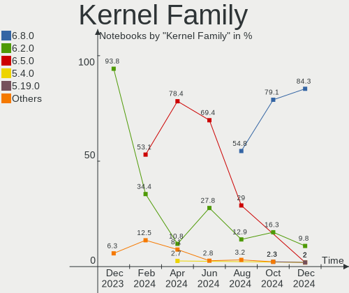
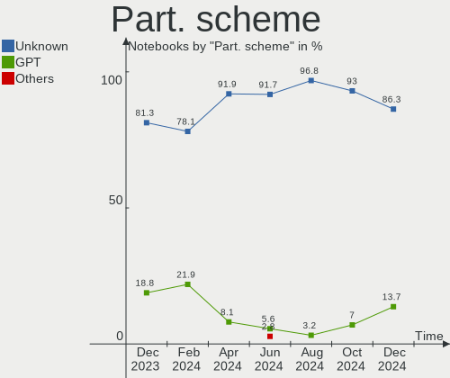
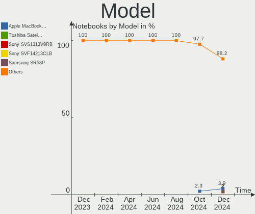
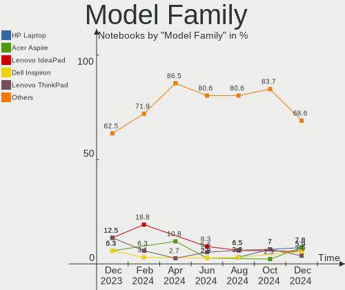
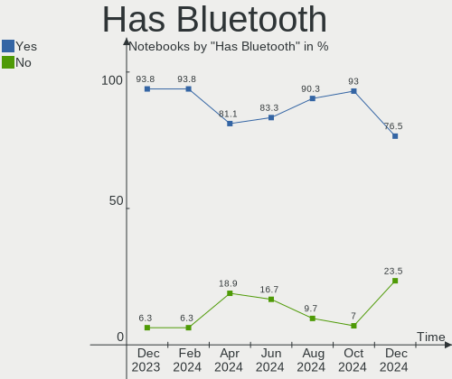
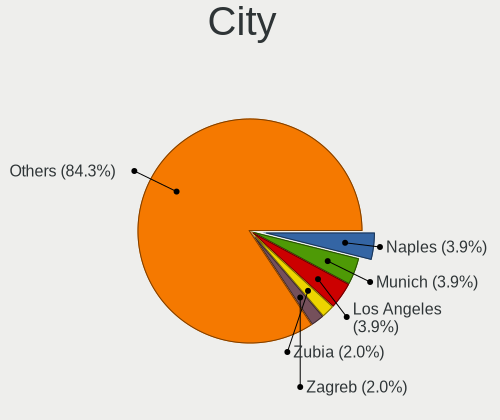
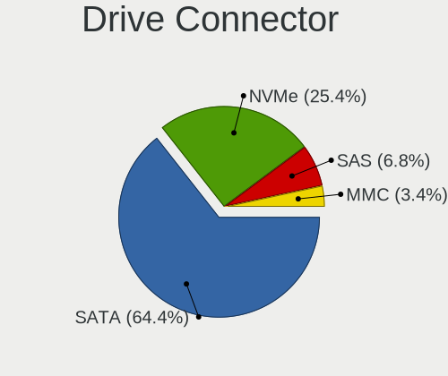
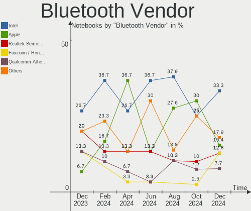

Elementary Hardware Trends (Notebooks)
--------------------------------------

A project to identify most popular hardware characteristics and track their change
over time based on data collected by Elementary users at https://Linux-Hardware.org.

Anyone can contribute to this report by the [hw-probe](https://github.com/linuxhw/hw-probe) tool:

    sudo -E hw-probe -all -upload

Full-feature report is available here: https://linux-hardware.org/?view=trends

Period: Dec, 2021.

Contents
--------

* [ System ](#system)
  - [ OS                       ](#os)
  - [ OS Family                ](#os-family)
  - [ Kernel                   ](#kernel)
  - [ Kernel Family            ](#kernel-family)
  - [ Kernel Major Ver.        ](#kernel-major-ver)
  - [ Arch                     ](#arch)
  - [ DE                       ](#de)
  - [ Display Server           ](#display-server)
  - [ Display Manager          ](#display-manager)
  - [ OS Lang                  ](#os-lang)
  - [ Boot Mode                ](#boot-mode)
  - [ Filesystem               ](#filesystem)
  - [ Part. scheme             ](#part-scheme)
  - [ Dual Boot with Linux/BSD ](#dual-boot-with-linuxbsd)
  - [ Dual Boot (Win)          ](#dual-boot-win)

* [ Board ](#board)
  - [ Vendor                   ](#vendor)
  - [ Model                    ](#model)
  - [ Model Family             ](#model-family)
  - [ MFG Year                 ](#mfg-year)
  - [ Form Factor              ](#form-factor)
  - [ Secure Boot              ](#secure-boot)
  - [ Coreboot                 ](#coreboot)
  - [ RAM Size                 ](#ram-size)
  - [ RAM Used                 ](#ram-used)
  - [ Total Drives             ](#total-drives)
  - [ Has CD-ROM               ](#has-cd-rom)
  - [ Has Ethernet             ](#has-ethernet)
  - [ Has WiFi                 ](#has-wifi)
  - [ Has Bluetooth            ](#has-bluetooth)

* [ Location ](#location)
  - [ Country                  ](#country)
  - [ City                     ](#city)

* [ Drives ](#drives)
  - [ Drive Vendor             ](#drive-vendor)
  - [ Drive Model              ](#drive-model)
  - [ HDD Vendor               ](#hdd-vendor)
  - [ SSD Vendor               ](#ssd-vendor)
  - [ Drive Kind               ](#drive-kind)
  - [ Drive Connector          ](#drive-connector)
  - [ Drive Size               ](#drive-size)
  - [ Space Total              ](#space-total)
  - [ Space Used               ](#space-used)
  - [ Malfunc. Drives          ](#malfunc-drives)
  - [ Malfunc. Drive Vendor    ](#malfunc-drive-vendor)
  - [ Malfunc. HDD Vendor      ](#malfunc-hdd-vendor)
  - [ Malfunc. Drive Kind      ](#malfunc-drive-kind)
  - [ Failed Drives            ](#failed-drives)
  - [ Failed Drive Vendor      ](#failed-drive-vendor)
  - [ Drive Status             ](#drive-status)

* [ Storage controller ](#storage-controller)
  - [ Storage Vendor           ](#storage-vendor)
  - [ Storage Model            ](#storage-model)
  - [ Storage Kind             ](#storage-kind)

* [ Processor ](#processor)
  - [ CPU Vendor               ](#cpu-vendor)
  - [ CPU Model                ](#cpu-model)
  - [ CPU Model Family         ](#cpu-model-family)
  - [ CPU Cores                ](#cpu-cores)
  - [ CPU Sockets              ](#cpu-sockets)
  - [ CPU Threads              ](#cpu-threads)
  - [ CPU Op-Modes             ](#cpu-op-modes)
  - [ CPU Microcode            ](#cpu-microcode)
  - [ CPU Microarch            ](#cpu-microarch)

* [ Graphics ](#graphics)
  - [ GPU Vendor               ](#gpu-vendor)
  - [ GPU Model                ](#gpu-model)
  - [ GPU Combo                ](#gpu-combo)
  - [ GPU Driver               ](#gpu-driver)
  - [ GPU Memory               ](#gpu-memory)

* [ Monitor ](#monitor)
  - [ Monitor Vendor           ](#monitor-vendor)
  - [ Monitor Model            ](#monitor-model)
  - [ Monitor Resolution       ](#monitor-resolution)
  - [ Monitor Diagonal         ](#monitor-diagonal)
  - [ Monitor Width            ](#monitor-width)
  - [ Aspect Ratio             ](#aspect-ratio)
  - [ Monitor Area             ](#monitor-area)
  - [ Pixel Density            ](#pixel-density)
  - [ Multiple Monitors        ](#multiple-monitors)

* [ Network ](#network)
  - [ Net Controller Vendor    ](#net-controller-vendor)
  - [ Net Controller Model     ](#net-controller-model)
  - [ Wireless Vendor          ](#wireless-vendor)
  - [ Wireless Model           ](#wireless-model)
  - [ Ethernet Vendor          ](#ethernet-vendor)
  - [ Ethernet Model           ](#ethernet-model)
  - [ Net Controller Kind      ](#net-controller-kind)
  - [ Used Controller          ](#used-controller)
  - [ NICs                     ](#nics)
  - [ IPv6                     ](#ipv6)

* [ Bluetooth ](#bluetooth)
  - [ Bluetooth Vendor         ](#bluetooth-vendor)
  - [ Bluetooth Model          ](#bluetooth-model)

* [ Sound ](#sound)
  - [ Sound Vendor             ](#sound-vendor)
  - [ Sound Model              ](#sound-model)

* [ Memory ](#memory)
  - [ Memory Vendor            ](#memory-vendor)
  - [ Memory Model             ](#memory-model)
  - [ Memory Kind              ](#memory-kind)
  - [ Memory Form Factor       ](#memory-form-factor)
  - [ Memory Size              ](#memory-size)
  - [ Memory Speed             ](#memory-speed)

* [ Printers & scanners ](#printers--scanners)
  - [ Printer Vendor           ](#printer-vendor)
  - [ Printer Model            ](#printer-model)
  - [ Scanner Vendor           ](#scanner-vendor)
  - [ Scanner Model            ](#scanner-model)

* [ Camera ](#camera)
  - [ Camera Vendor            ](#camera-vendor)
  - [ Camera Model             ](#camera-model)

* [ Security ](#security)
  - [ Fingerprint Vendor       ](#fingerprint-vendor)
  - [ Fingerprint Model        ](#fingerprint-model)
  - [ Chipcard Vendor          ](#chipcard-vendor)
  - [ Chipcard Model           ](#chipcard-model)

* [ Unsupported ](#unsupported)
  - [ Unsupported Devices      ](#unsupported-devices)
  - [ Unsupported Device Types ](#unsupported-device-types)

System
------

OS
--

Installed operating systems

| Name             | Notebooks | Percent |
|------------------|-----------|---------|
| Elementary 6.1   | 26        | 50%     |
| Elementary 6     | 23        | 44.23%  |
| Elementary 5.1.7 | 3         | 5.77%   |

OS Family
---------

OS without a version

| Name       | Notebooks | Percent |
|------------|-----------|---------|
| Elementary | 52        | 100%    |

Kernel
------

Version of the Linux kernel

| Version               | Notebooks | Percent |
|-----------------------|-----------|---------|
| 5.11.0-41-generic     | 24        | 46.15%  |
| 5.11.0-43-generic     | 22        | 42.31%  |
| 5.11.0-38-generic     | 2         | 3.85%   |
| 5.8.0-50-generic      | 1         | 1.92%   |
| 5.4.0-91-generic      | 1         | 1.92%   |
| 5.15.5-051505-generic | 1         | 1.92%   |
| 5.14.9-051409-generic | 1         | 1.92%   |

Kernel Family
-------------

Linux kernel without a distro release

| Version | Notebooks | Percent |
|---------|-----------|---------|
| 5.11.0  | 48        | 92.31%  |
| 5.8.0   | 1         | 1.92%   |
| 5.4.0   | 1         | 1.92%   |
| 5.15.5  | 1         | 1.92%   |
| 5.14.9  | 1         | 1.92%   |

Kernel Major Ver.
-----------------

Linux kernel major version

| Version | Notebooks | Percent |
|---------|-----------|---------|
| 5.11    | 48        | 92.31%  |
| 5.8     | 1         | 1.92%   |
| 5.4     | 1         | 1.92%   |
| 5.15    | 1         | 1.92%   |
| 5.14    | 1         | 1.92%   |

Arch
----

OS architecture (x86_64, i586, etc.)

| Name   | Notebooks | Percent |
|--------|-----------|---------|
| x86_64 | 52        | 100%    |

DE
--

Desktop Environment

| Name     | Notebooks | Percent |
|----------|-----------|---------|
| Pantheon | 52        | 100%    |

Display Server
--------------

X11 or Wayland

| Name | Notebooks | Percent |
|------|-----------|---------|
| X11  | 52        | 100%    |

Display Manager
---------------

SDDM, LightDM, etc.

| Name    | Notebooks | Percent |
|---------|-----------|---------|
| Unknown | 38        | 73.08%  |
| LightDM | 14        | 26.92%  |

OS Lang
-------

Language

| Lang  | Notebooks | Percent |
|-------|-----------|---------|
| en_US | 26        | 50%     |
| de_DE | 7         | 13.46%  |
| pt_BR | 6         | 11.54%  |
| en_GB | 4         | 7.69%   |
| pl_PL | 2         | 3.85%   |
| es_ES | 2         | 3.85%   |
| it_IT | 1         | 1.92%   |
| gl_ES | 1         | 1.92%   |
| fr_FR | 1         | 1.92%   |
| en_AU | 1         | 1.92%   |
| cs_CZ | 1         | 1.92%   |

Boot Mode
---------

EFI or BIOS

| Mode | Notebooks | Percent |
|------|-----------|---------|
| EFI  | 31        | 59.62%  |
| BIOS | 21        | 40.38%  |

Filesystem
----------

Type of filesystem

| Type    | Notebooks | Percent |
|---------|-----------|---------|
| Ext4    | 51        | 98.08%  |
| Overlay | 1         | 1.92%   |

Part. scheme
------------

Scheme of partitioning

| Type    | Notebooks | Percent |
|---------|-----------|---------|
| Unknown | 44        | 84.62%  |
| GPT     | 8         | 15.38%  |

Dual Boot with Linux/BSD
------------------------

Hosting more than one Linux/BSD

| Dual boot | Notebooks | Percent |
|-----------|-----------|---------|
| No        | 49        | 94.23%  |
| Yes       | 3         | 5.77%   |

Dual Boot (Win)
---------------

Hosting Linux and Windows

| Dual boot | Notebooks | Percent |
|-----------|-----------|---------|
| No        | 48        | 92.31%  |
| Yes       | 4         | 7.69%   |

Board
-----

Vendor
------

Motherboard manufacturer

| Name                | Notebooks | Percent |
|---------------------|-----------|---------|
| Lenovo              | 12        | 23.08%  |
| Dell                | 11        | 21.15%  |
| Hewlett-Packard     | 5         | 9.62%   |
| ASUSTek Computer    | 5         | 9.62%   |
| Apple               | 5         | 9.62%   |
| Acer                | 4         | 7.69%   |
| Wortmann AG         | 1         | 1.92%   |
| Teclast             | 1         | 1.92%   |
| Star Labs           | 1         | 1.92%   |
| Samsung Electronics | 1         | 1.92%   |
| Packard Bell        | 1         | 1.92%   |
| Notebook            | 1         | 1.92%   |
| Monster             | 1         | 1.92%   |
| LG Electronics      | 1         | 1.92%   |
| HUAWEI              | 1         | 1.92%   |
| Google              | 1         | 1.92%   |

Model
-----

Motherboard model

| Name                                   | Notebooks | Percent |
|----------------------------------------|-----------|---------|
| Wortmann AG 1220729_1470271            | 1         | 1.92%   |
| Teclast F7                             | 1         | 1.92%   |
| Star Labs StarBook                     | 1         | 1.92%   |
| Samsung 550XDA                         | 1         | 1.92%   |
| Packard Bell EasyNote LS11HR           | 1         | 1.92%   |
| Notebook P65xHP                        | 1         | 1.92%   |
| Monster MARKUT M7 V1.x                 | 1         | 1.92%   |
| LG A410-G.BC51P1                       | 1         | 1.92%   |
| Lenovo ThinkPad X201 Tablet 311396G    | 1         | 1.92%   |
| Lenovo ThinkPad T430 23501M2           | 1         | 1.92%   |
| Lenovo ThinkPad T410s 292494G          | 1         | 1.92%   |
| Lenovo ThinkPad T14 Gen 1 20UES5SR00   | 1         | 1.92%   |
| Lenovo ThinkPad SL400 2743A37          | 1         | 1.92%   |
| Lenovo ThinkPad E14 Gen 3 20Y7006XMX   | 1         | 1.92%   |
| Lenovo IdeaPad 5 Pro 16ACH6 82L5       | 1         | 1.92%   |
| Lenovo IdeaPad 330-15IKB 81DE          | 1         | 1.92%   |
| Lenovo IdeaPad 320S-14IKB 81BN         | 1         | 1.92%   |
| Lenovo IdeaPad 320-14AST 80XU          | 1         | 1.92%   |
| Lenovo IdeaPad 120S-14IAP 81A5         | 1         | 1.92%   |
| Lenovo Flex 2-14D 20376                | 1         | 1.92%   |
| HUAWEI MACHD-WXX9                      | 1         | 1.92%   |
| HP ZBook 15 G5                         | 1         | 1.92%   |
| HP G62                                 | 1         | 1.92%   |
| HP EliteBook 850 G2                    | 1         | 1.92%   |
| HP EliteBook 8460p                     | 1         | 1.92%   |
| HP EliteBook 820 G2                    | 1         | 1.92%   |
| Google Cyan                            | 1         | 1.92%   |
| Dell XPS 15 9570                       | 1         | 1.92%   |
| Dell XPS 15 9510                       | 1         | 1.92%   |
| Dell XPS 13 9343                       | 1         | 1.92%   |
| Dell Precision M6500                   | 1         | 1.92%   |
| Dell Precision M3800                   | 1         | 1.92%   |
| Dell Latitude E5420                    | 1         | 1.92%   |
| Dell Latitude 3580                     | 1         | 1.92%   |
| Dell Inspiron N5050                    | 1         | 1.92%   |
| Dell Inspiron 5555                     | 1         | 1.92%   |
| Dell Inspiron 3542                     | 1         | 1.92%   |
| Dell Inspiron 1764                     | 1         | 1.92%   |
| ASUS X555UB                            | 1         | 1.92%   |
| ASUS VivoBook_ASUSLaptop X512FA_A512FA | 1         | 1.92%   |
| ASUS UX410UAK                          | 1         | 1.92%   |
| ASUS FX503VD                           | 1         | 1.92%   |
| ASUS ASUS TUF Dash F15 FX516PE_FX516PE | 1         | 1.92%   |
| Apple MacBookAir7,2                    | 1         | 1.92%   |
| Apple MacBookAir6,1                    | 1         | 1.92%   |
| Apple MacBook5,2                       | 1         | 1.92%   |
| Apple MacBook4,1                       | 1         | 1.92%   |
| Apple MacBook2,1                       | 1         | 1.92%   |
| Acer TravelMate 5760                   | 1         | 1.92%   |
| Acer Aspire R3-131T                    | 1         | 1.92%   |
| Acer Aspire 7750G                      | 1         | 1.92%   |
| Acer Aspire 5750G                      | 1         | 1.92%   |

Model Family
------------

Motherboard model prefix

| Name                  | Notebooks | Percent |
|-----------------------|-----------|---------|
| Lenovo ThinkPad       | 6         | 11.54%  |
| Lenovo IdeaPad        | 5         | 9.62%   |
| Dell Inspiron         | 4         | 7.69%   |
| HP EliteBook          | 3         | 5.77%   |
| Dell XPS              | 3         | 5.77%   |
| Acer Aspire           | 3         | 5.77%   |
| Dell Precision        | 2         | 3.85%   |
| Dell Latitude         | 2         | 3.85%   |
| Wortmann AG 1220729   | 1         | 1.92%   |
| Teclast F7            | 1         | 1.92%   |
| Star Labs StarBook    | 1         | 1.92%   |
| Samsung 550XDA        | 1         | 1.92%   |
| Packard Bell EasyNote | 1         | 1.92%   |
| Notebook P65xHP       | 1         | 1.92%   |
| Monster MARKUT        | 1         | 1.92%   |
| LG A410-G.BC51P1      | 1         | 1.92%   |
| Lenovo Flex           | 1         | 1.92%   |
| HUAWEI MACHD-WXX9     | 1         | 1.92%   |
| HP ZBook              | 1         | 1.92%   |
| HP G62                | 1         | 1.92%   |
| Google Cyan           | 1         | 1.92%   |
| ASUS X555UB           | 1         | 1.92%   |
| ASUS VivoBook         | 1         | 1.92%   |
| ASUS UX410UAK         | 1         | 1.92%   |
| ASUS FX503VD          | 1         | 1.92%   |
| ASUS ASUS             | 1         | 1.92%   |
| Apple MacBookAir7     | 1         | 1.92%   |
| Apple MacBookAir6     | 1         | 1.92%   |
| Apple MacBook5        | 1         | 1.92%   |
| Apple MacBook4        | 1         | 1.92%   |
| Apple MacBook2        | 1         | 1.92%   |
| Acer TravelMate       | 1         | 1.92%   |

MFG Year
--------

Motherboard manufacture year

| Year | Notebooks | Percent |
|------|-----------|---------|
| 2021 | 11        | 21.15%  |
| 2019 | 9         | 17.31%  |
| 2011 | 7         | 13.46%  |
| 2020 | 4         | 7.69%   |
| 2012 | 4         | 7.69%   |
| 2018 | 3         | 5.77%   |
| 2016 | 3         | 5.77%   |
| 2017 | 2         | 3.85%   |
| 2015 | 2         | 3.85%   |
| 2009 | 2         | 3.85%   |
| 2014 | 1         | 1.92%   |
| 2013 | 1         | 1.92%   |
| 2010 | 1         | 1.92%   |
| 2008 | 1         | 1.92%   |
| 2007 | 1         | 1.92%   |

Form Factor
-----------

Physical design of the computer

| Name     | Notebooks | Percent |
|----------|-----------|---------|
| Notebook | 52        | 100%    |

Secure Boot
-----------

Enabled or disabled

| State    | Notebooks | Percent |
|----------|-----------|---------|
| Disabled | 48        | 92.31%  |
| Enabled  | 4         | 7.69%   |

Coreboot
--------

Have coreboot on board

| Used | Notebooks | Percent |
|------|-----------|---------|
| No   | 50        | 96.15%  |
| Yes  | 2         | 3.85%   |

RAM Size
--------

Total RAM memory

| Size in GB  | Notebooks | Percent |
|-------------|-----------|---------|
| 4.01-8.0    | 23        | 44.23%  |
| 3.01-4.0    | 10        | 19.23%  |
| 8.01-16.0   | 8         | 15.38%  |
| 16.01-24.0  | 7         | 13.46%  |
| 1.01-2.0    | 2         | 3.85%   |
| 32.01-64.0  | 1         | 1.92%   |
| 64.01-256.0 | 1         | 1.92%   |

RAM Used
--------

Used RAM memory

| Used GB   | Notebooks | Percent |
|-----------|-----------|---------|
| 2.01-3.0  | 19        | 36.54%  |
| 1.01-2.0  | 16        | 30.77%  |
| 4.01-8.0  | 7         | 13.46%  |
| 3.01-4.0  | 6         | 11.54%  |
| 0.51-1.0  | 3         | 5.77%   |
| 8.01-16.0 | 1         | 1.92%   |

Total Drives
------------

Number of drives on board

| Drives | Notebooks | Percent |
|--------|-----------|---------|
| 1      | 38        | 73.08%  |
| 2      | 11        | 21.15%  |
| 3      | 2         | 3.85%   |
| 5      | 1         | 1.92%   |

Has CD-ROM
----------

Has CD-ROM on board

| Presented | Notebooks | Percent |
|-----------|-----------|---------|
| No        | 35        | 67.31%  |
| Yes       | 17        | 32.69%  |

Has Ethernet
------------

Has Ethernet on board

| Presented | Notebooks | Percent |
|-----------|-----------|---------|
| Yes       | 40        | 76.92%  |
| No        | 12        | 23.08%  |

Has WiFi
--------

Has WiFi module

| Presented | Notebooks | Percent |
|-----------|-----------|---------|
| Yes       | 52        | 100%    |

Has Bluetooth
-------------

Has Bluetooth module

| Presented | Notebooks | Percent |
|-----------|-----------|---------|
| Yes       | 45        | 86.54%  |
| No        | 7         | 13.46%  |

Location
--------

Country
-------

Geographic location (country)

| Country     | Notebooks | Percent |
|-------------|-----------|---------|
| Germany     | 7         | 13.46%  |
| Brazil      | 7         | 13.46%  |
| USA         | 5         | 9.62%   |
| UK          | 3         | 5.77%   |
| Sweden      | 3         | 5.77%   |
| Netherlands | 3         | 5.77%   |
| India       | 3         | 5.77%   |
| Spain       | 2         | 3.85%   |
| Romania     | 2         | 3.85%   |
| Poland      | 2         | 3.85%   |
| Italy       | 2         | 3.85%   |
| Australia   | 2         | 3.85%   |
| Ukraine     | 1         | 1.92%   |
| Turkey      | 1         | 1.92%   |
| Portugal    | 1         | 1.92%   |
| Mexico      | 1         | 1.92%   |
| Ireland     | 1         | 1.92%   |
| Indonesia   | 1         | 1.92%   |
| Guyana      | 1         | 1.92%   |
| France      | 1         | 1.92%   |
| Finland     | 1         | 1.92%   |
| Denmark     | 1         | 1.92%   |
| Czechia     | 1         | 1.92%   |

City
----

Geographic location (city)

| City                   | Notebooks | Percent |
|------------------------|-----------|---------|
| Essen                  | 2         | 3.85%   |
| Wroclaw                | 1         | 1.92%   |
| Wriedel                | 1         | 1.92%   |
| Wakefield              | 1         | 1.92%   |
| Vinnytsia              | 1         | 1.92%   |
| Tecuci                 | 1         | 1.92%   |
| Sydney                 | 1         | 1.92%   |
| Stockholm              | 1         | 1.92%   |
| Soliera                | 1         | 1.92%   |
| S??o Paulo             | 1         | 1.92%   |
| S??o Bernardo do Campo | 1         | 1.92%   |
| Sao Jose do Rio Preto  | 1         | 1.92%   |
| Sao Joaquim da Barra   | 1         | 1.92%   |
| Santo Andr?©           | 1         | 1.92%   |
| San Antonio            | 1         | 1.92%   |
| Saltsjoe-Boo           | 1         | 1.92%   |
| Porto                  | 1         | 1.92%   |
| Osasco                 | 1         | 1.92%   |
| Olomouc                | 1         | 1.92%   |
| Munich                 | 1         | 1.92%   |
| Montm?©dy              | 1         | 1.92%   |
| Mislea                 | 1         | 1.92%   |
| Melbourne              | 1         | 1.92%   |
| Madrid                 | 1         | 1.92%   |
| Kung?¤lv               | 1         | 1.92%   |
| Jember                 | 1         | 1.92%   |
| Jaipur                 | 1         | 1.92%   |
| Hudson                 | 1         | 1.92%   |
| Helsinki               | 1         | 1.92%   |
| Gloucester             | 1         | 1.92%   |
| Gliwice                | 1         | 1.92%   |
| Georgetown             | 1         | 1.92%   |
| Garland                | 1         | 1.92%   |
| Frederikshavn          | 1         | 1.92%   |
| Erkrath                | 1         | 1.92%   |
| Enschede               | 1         | 1.92%   |
| Cuernavaca             | 1         | 1.92%   |
| Coventry               | 1         | 1.92%   |
| Clonsilla              | 1         | 1.92%   |
| Chalfont               | 1         | 1.92%   |
| Capelle aan den IJssel | 1         | 1.92%   |
| Canyon Country         | 1         | 1.92%   |
| Cabo Frio              | 1         | 1.92%   |
| Bergamo                | 1         | 1.92%   |
| Bengaluru              | 1         | 1.92%   |
| Bad Kreuznach          | 1         | 1.92%   |
| Bad Friedrichshall     | 1         | 1.92%   |
| Antalya                | 1         | 1.92%   |
| Amposta                | 1         | 1.92%   |
| Alphen aan den Rijn    | 1         | 1.92%   |
| Ahmedabad              | 1         | 1.92%   |

Drives
------

Drive Vendor
------------

Hard drive vendors

| Vendor              | Notebooks | Drives | Percent |
|---------------------|-----------|--------|---------|
| WDC                 | 10        | 10     | 15.63%  |
| Samsung Electronics | 9         | 13     | 14.06%  |
| Seagate             | 6         | 6      | 9.38%   |
| Micron Technology   | 4         | 4      | 6.25%   |
| Crucial             | 4         | 4      | 6.25%   |
| SanDisk             | 3         | 3      | 4.69%   |
| Kingston            | 3         | 3      | 4.69%   |
| Hitachi             | 3         | 3      | 4.69%   |
| Toshiba             | 2         | 2      | 3.13%   |
| SK Hynix            | 2         | 2      | 3.13%   |
| Fujitsu             | 2         | 2      | 3.13%   |
| A-DATA Technology   | 2         | 2      | 3.13%   |
| Unknown             | 1         | 2      | 1.56%   |
| Teclast             | 1         | 1      | 1.56%   |
| Star Drive          | 1         | 1      | 1.56%   |
| Silicon Motion      | 1         | 1      | 1.56%   |
| SABRENT             | 1         | 1      | 1.56%   |
| Patriot             | 1         | 1      | 1.56%   |
| LITEON              | 1         | 1      | 1.56%   |
| KIOXIA              | 1         | 1      | 1.56%   |
| KingSpec            | 1         | 1      | 1.56%   |
| Intel               | 1         | 1      | 1.56%   |
| HGST                | 1         | 1      | 1.56%   |
| China               | 1         | 1      | 1.56%   |
| Apple               | 1         | 1      | 1.56%   |
| Unknown             | 1         | 1      | 1.56%   |

Drive Model
-----------

Hard drive models

| Model                                    | Notebooks | Percent |
|------------------------------------------|-----------|---------|
| Seagate ST1000LM035-1RK172 1TB           | 3         | 4.55%   |
| WDC WD5000LPVX-75V0TT0 500GB             | 2         | 3.03%   |
| WDC WD5000LPVX-22V0TT0 500GB             | 2         | 3.03%   |
| Sandisk NVMe SSD Drive 512GB             | 2         | 3.03%   |
| Kingston SA400S37240G 240GB SSD          | 2         | 3.03%   |
| WDC WD7500BPVT-22A1YT0 752GB             | 1         | 1.52%   |
| WDC WD5000BPVT-22HXZT3 500GB             | 1         | 1.52%   |
| WDC WD5000BPVT-22HXZT1 500GB             | 1         | 1.52%   |
| WDC WD3200BEVT-75A23T0 320GB             | 1         | 1.52%   |
| WDC WD20SPZX-22UA7T0 2TB                 | 1         | 1.52%   |
| WDC WD10SPZX-35Z10T0 1TB                 | 1         | 1.52%   |
| Unknown MMC Card  32GB                   | 1         | 1.52%   |
| Toshiba MQ01ABD100 1TB                   | 1         | 1.52%   |
| Toshiba MK2533GSG 250GB                  | 1         | 1.52%   |
| Teclast 128GB NS550-2242 SSD             | 1         | 1.52%   |
| Star Drive PCIe SSD 480GB                | 1         | 1.52%   |
| SK Hynix SKHynix_HFS512GDE9X084N 512GB   | 1         | 1.52%   |
| SK Hynix NVMe SSD Drive 512GB            | 1         | 1.52%   |
| Silicon Motion NVMe SSD Drive 120GB      | 1         | 1.52%   |
| Seagate ST9500325AS 500GB                | 1         | 1.52%   |
| Seagate ST1000LM024 HN-M101MBB 1TB       | 1         | 1.52%   |
| Seagate Expansion Desk 5TB               | 1         | 1.52%   |
| SanDisk SD8SNAT128G1002 128GB SSD        | 1         | 1.52%   |
| Samsung SSD SM841 mSATA 512GB            | 1         | 1.52%   |
| Samsung SSD 950 PRO 512GB                | 1         | 1.52%   |
| Samsung SSD 850 EVO 2TB                  | 1         | 1.52%   |
| Samsung SSD 850 EVO 250GB                | 1         | 1.52%   |
| Samsung SSD 850 EVO 1TB                  | 1         | 1.52%   |
| Samsung PSSD T7 Touch 2TB                | 1         | 1.52%   |
| Samsung Portable SSD T5 500GB            | 1         | 1.52%   |
| Samsung NVMe SSD Drive 512GB             | 1         | 1.52%   |
| Samsung NVMe SSD Drive 256GB             | 1         | 1.52%   |
| Samsung MZVLB512HBJQ-00000 512GB         | 1         | 1.52%   |
| Samsung MZMPA064HMDR-00000 64GB SSD      | 1         | 1.52%   |
| SABRENT Disk 500GB                       | 1         | 1.52%   |
| Patriot Burst 480GB SSD                  | 1         | 1.52%   |
| Micron MTFDDAV512TBN-1AR15ABHA 512GB SSD | 1         | 1.52%   |
| Micron MTFDDAK256TBN 256GB SSD           | 1         | 1.52%   |
| Micron 2300 NVMe 1024GB                  | 1         | 1.52%   |
| Micron 1100_MTFDDAK256TBN 256GB SSD      | 1         | 1.52%   |
| LITEON L8H-256V2G-11 M.2 2280 256GB SSD  | 1         | 1.52%   |
| KIOXIA NVMe SSD Drive 256GB              | 1         | 1.52%   |
| Kingston RBUSNS8180DS3128GJ 128GB SSD    | 1         | 1.52%   |
| KingSpec P4-120 120GB                    | 1         | 1.52%   |
| Intel SSDSCKKW256G8L 256GB               | 1         | 1.52%   |
| Hitachi HTS725032A7E630 320GB            | 1         | 1.52%   |
| Hitachi HTS723232L9SA60 320GB            | 1         | 1.52%   |
| Hitachi HTS543212L9SA02 120GB            | 1         | 1.52%   |
| HGST HTS545050A7E380 500GB               | 1         | 1.52%   |
| Fujitsu MHY2250BH 250GB                  | 1         | 1.52%   |
| Fujitsu MHY2160BH 160GB                  | 1         | 1.52%   |
| Crucial CT525MX300SSD1 528GB             | 1         | 1.52%   |
| Crucial CT120BX300SSD1 120GB             | 1         | 1.52%   |
| Crucial CT1050MX300SSD4 1050GB           | 1         | 1.52%   |
| Crucial CT1000MX500SSD1 1TB              | 1         | 1.52%   |
| China SSD 240GB                          | 1         | 1.52%   |
| Apple SSD SM0128G 121GB                  | 1         | 1.52%   |
| A-DATA SU650 120GB SSD                   | 1         | 1.52%   |
| A-DATA SU630 240GB SSD                   | 1         | 1.52%   |
| Unknown                                  | 1         | 1.52%   |

HDD Vendor
----------

Hard disk drive vendors

| Vendor  | Notebooks | Drives | Percent |
|---------|-----------|--------|---------|
| WDC     | 10        | 10     | 40%     |
| Seagate | 6         | 6      | 24%     |
| Hitachi | 3         | 3      | 12%     |
| Toshiba | 2         | 2      | 8%      |
| Fujitsu | 2         | 2      | 8%      |
| SABRENT | 1         | 1      | 4%      |
| HGST    | 1         | 1      | 4%      |

SSD Vendor
----------

Solid state drive vendors

| Vendor              | Notebooks | Drives | Percent |
|---------------------|-----------|--------|---------|
| Samsung Electronics | 6         | 8      | 22.22%  |
| Crucial             | 4         | 4      | 14.81%  |
| Micron Technology   | 3         | 3      | 11.11%  |
| Kingston            | 3         | 3      | 11.11%  |
| A-DATA Technology   | 2         | 2      | 7.41%   |
| Teclast             | 1         | 1      | 3.7%    |
| SanDisk             | 1         | 1      | 3.7%    |
| Patriot             | 1         | 1      | 3.7%    |
| LITEON              | 1         | 1      | 3.7%    |
| KingSpec            | 1         | 1      | 3.7%    |
| Intel               | 1         | 1      | 3.7%    |
| China               | 1         | 1      | 3.7%    |
| Apple               | 1         | 1      | 3.7%    |
| Unknown             | 1         | 1      | 3.7%    |

Drive Kind
----------

HDD or SSD

| Kind | Notebooks | Drives | Percent |
|------|-----------|--------|---------|
| SSD  | 25        | 29     | 39.68%  |
| HDD  | 25        | 25     | 39.68%  |
| NVMe | 12        | 13     | 19.05%  |
| MMC  | 1         | 2      | 1.59%   |

Drive Connector
---------------

SATA, SAS, NVMe, etc.

| Type | Notebooks | Drives | Percent |
|------|-----------|--------|---------|
| SATA | 41        | 49     | 70.69%  |
| NVMe | 12        | 13     | 20.69%  |
| SAS  | 4         | 5      | 6.9%    |
| MMC  | 1         | 2      | 1.72%   |

Drive Size
----------

Size of hard drive

| Size in TB | Notebooks | Drives | Percent |
|------------|-----------|--------|---------|
| 0.01-0.5   | 32        | 36     | 68.09%  |
| 0.51-1.0   | 12        | 12     | 25.53%  |
| 1.01-2.0   | 2         | 5      | 4.26%   |
| 4.01-10.0  | 1         | 1      | 2.13%   |

Space Total
-----------

Amount of disk space available on the file system

| Size in GB     | Notebooks | Percent |
|----------------|-----------|---------|
| 101-250        | 21        | 40.38%  |
| 251-500        | 17        | 32.69%  |
| 501-1000       | 6         | 11.54%  |
| 1001-2000      | 3         | 5.77%   |
| 51-100         | 3         | 5.77%   |
| More than 3000 | 1         | 1.92%   |
| 21-50          | 1         | 1.92%   |

Space Used
----------

Amount of used disk space

| Used GB   | Notebooks | Percent |
|-----------|-----------|---------|
| 1-20      | 25        | 48.08%  |
| 21-50     | 14        | 26.92%  |
| 51-100    | 7         | 13.46%  |
| 501-1000  | 3         | 5.77%   |
| 101-250   | 2         | 3.85%   |
| 2001-3000 | 1         | 1.92%   |

Malfunc. Drives
---------------

Drive models with a malfunction

Zero info for selected period =(

Malfunc. Drive Vendor
---------------------

Vendors of faulty drives

Zero info for selected period =(

Malfunc. HDD Vendor
-------------------

Vendors of faulty HDD drives

Zero info for selected period =(

Malfunc. Drive Kind
-------------------

Kinds of faulty drives

Zero info for selected period =(

Failed Drives
-------------

Failed drive models

Zero info for selected period =(

Failed Drive Vendor
-------------------

Failed drive vendors

Zero info for selected period =(

Drive Status
------------

Number of failed and malfunc. drives

| Status   | Notebooks | Drives | Percent |
|----------|-----------|--------|---------|
| Detected | 46        | 57     | 85.19%  |
| Works    | 8         | 12     | 14.81%  |

Storage controller
------------------

Storage Vendor
--------------

Storage controller vendors

| Vendor              | Notebooks | Percent |
|---------------------|-----------|---------|
| Intel               | 39        | 69.64%  |
| Samsung Electronics | 5         | 8.93%   |
| AMD                 | 4         | 7.14%   |
| SK Hynix            | 2         | 3.57%   |
| Sandisk             | 2         | 3.57%   |
| Silicon Motion      | 1         | 1.79%   |
| Phison Electronics  | 1         | 1.79%   |
| Nvidia              | 1         | 1.79%   |
| Micron Technology   | 1         | 1.79%   |

Storage Model
-------------

Storage controller models

| Model                                                                            | Notebooks | Percent |
|----------------------------------------------------------------------------------|-----------|---------|
| Intel 6 Series/C200 Series Chipset Family 6 port Mobile SATA AHCI Controller     | 7         | 11.86%  |
| Intel Sunrise Point-LP SATA Controller [AHCI mode]                               | 4         | 6.78%   |
| Intel 82801 Mobile SATA Controller [RAID mode]                                   | 4         | 6.78%   |
| AMD FCH SATA Controller [AHCI mode]                                              | 4         | 6.78%   |
| Samsung NVMe SSD Controller SM981/PM981/PM983                                    | 3         | 5.08%   |
| Intel Wildcat Point-LP SATA Controller [AHCI Mode]                               | 3         | 5.08%   |
| Intel 5 Series/3400 Series Chipset 6 port SATA AHCI Controller                   | 3         | 5.08%   |
| SK Hynix Gold P31 SSD                                                            | 2         | 3.39%   |
| Intel Celeron N3350/Pentium N4200/Atom E3900 Series SATA AHCI Controller         | 2         | 3.39%   |
| Intel Cannon Lake Mobile PCH SATA AHCI Controller                                | 2         | 3.39%   |
| Intel 5 Series/3400 Series Chipset 4 port SATA AHCI Controller                   | 2         | 3.39%   |
| Silicon Motion Non-Volatile memory controller                                    | 1         | 1.69%   |
| Sandisk PC SN520 NVMe SSD                                                        | 1         | 1.69%   |
| Sandisk Non-Volatile memory controller                                           | 1         | 1.69%   |
| Samsung NVMe SSD Controller SM951/PM951                                          | 1         | 1.69%   |
| Samsung Electronics SATA controller                                              | 1         | 1.69%   |
| Phison E12 NVMe Controller                                                       | 1         | 1.69%   |
| Nvidia MCP79 AHCI Controller                                                     | 1         | 1.69%   |
| Micron Non-Volatile memory controller                                            | 1         | 1.69%   |
| Intel Volume Management Device NVMe RAID Controller                              | 1         | 1.69%   |
| Intel Tiger Lake-LP SATA Controller [AHCI mode]                                  | 1         | 1.69%   |
| Intel Q170/Q150/B150/H170/H110/Z170/CM236 Chipset SATA Controller [AHCI Mode]    | 1         | 1.69%   |
| Intel Comet Lake SATA AHCI Controller                                            | 1         | 1.69%   |
| Intel Atom/Celeron/Pentium Processor x5-E8000/J3xxx/N3xxx Series SATA Controller | 1         | 1.69%   |
| Intel 82801IBM/IEM (ICH9M/ICH9M-E) 4 port SATA Controller [AHCI mode]            | 1         | 1.69%   |
| Intel 82801HM/HEM (ICH8M/ICH8M-E) SATA Controller [AHCI mode]                    | 1         | 1.69%   |
| Intel 82801HM/HEM (ICH8M/ICH8M-E) IDE Controller                                 | 1         | 1.69%   |
| Intel 82801GBM/GHM (ICH7-M Family) SATA Controller [AHCI mode]                   | 1         | 1.69%   |
| Intel 82801G (ICH7 Family) IDE Controller                                        | 1         | 1.69%   |
| Intel 8 Series/C220 Series Chipset Family 6-port SATA Controller 1 [AHCI mode]   | 1         | 1.69%   |
| Intel 8 Series SATA Controller 1 [AHCI mode]                                     | 1         | 1.69%   |
| Intel 7 Series Chipset Family 6-port SATA Controller [AHCI mode]                 | 1         | 1.69%   |
| Intel 5 Series/3400 Series Chipset 4 port SATA IDE Controller                    | 1         | 1.69%   |
| Intel 5 Series/3400 Series Chipset 2 port SATA IDE Controller                    | 1         | 1.69%   |

Storage Kind
------------

Kind of storage controller (IDE, SATA, NVMe, SAS, ...)

| Kind | Notebooks | Percent |
|------|-----------|---------|
| SATA | 39        | 67.24%  |
| NVMe | 11        | 18.97%  |
| RAID | 5         | 8.62%   |
| IDE  | 3         | 5.17%   |

Processor
---------

CPU Vendor
----------

Processor vendors

| Vendor | Notebooks | Percent |
|--------|-----------|---------|
| Intel  | 46        | 88.46%  |
| AMD    | 6         | 11.54%  |

CPU Model
---------

Processor models

| Model                                        | Notebooks | Percent |
|----------------------------------------------|-----------|---------|
| Intel Core i7-5500U CPU @ 2.40GHz            | 2         | 3.85%   |
| Intel Core i7-2670QM CPU @ 2.20GHz           | 2         | 3.85%   |
| Intel Core i5-6200U CPU @ 2.30GHz            | 2         | 3.85%   |
| Intel Core i5-2520M CPU @ 2.50GHz            | 2         | 3.85%   |
| Intel Pentium CPU N4200 @ 1.10GHz            | 1         | 1.92%   |
| Intel Pentium CPU N3700 @ 1.60GHz            | 1         | 1.92%   |
| Intel Core i7-8750H CPU @ 2.20GHz            | 1         | 1.92%   |
| Intel Core i7-8550U CPU @ 1.80GHz            | 1         | 1.92%   |
| Intel Core i7-7700HQ CPU @ 2.80GHz           | 1         | 1.92%   |
| Intel Core i7-7500U CPU @ 2.70GHz            | 1         | 1.92%   |
| Intel Core i7-6700K CPU @ 4.00GHz            | 1         | 1.92%   |
| Intel Core i7-4712HQ CPU @ 2.30GHz           | 1         | 1.92%   |
| Intel Core i7 CPU Q 740 @ 1.73GHz            | 1         | 1.92%   |
| Intel Core i7 CPU L 640 @ 2.13GHz            | 1         | 1.92%   |
| Intel Core i5-8300H CPU @ 2.30GHz            | 1         | 1.92%   |
| Intel Core i5-8250U CPU @ 1.60GHz            | 1         | 1.92%   |
| Intel Core i5-7300HQ CPU @ 2.50GHz           | 1         | 1.92%   |
| Intel Core i5-5300U CPU @ 2.30GHz            | 1         | 1.92%   |
| Intel Core i5-5250U CPU @ 1.60GHz            | 1         | 1.92%   |
| Intel Core i5-4260U CPU @ 1.40GHz            | 1         | 1.92%   |
| Intel Core i5-3320M CPU @ 2.60GHz            | 1         | 1.92%   |
| Intel Core i5-2450M CPU @ 2.50GHz            | 1         | 1.92%   |
| Intel Core i5-2430M CPU @ 2.40GHz            | 1         | 1.92%   |
| Intel Core i5 CPU M 540 @ 2.53GHz            | 1         | 1.92%   |
| Intel Core i5 CPU M 460 @ 2.53GHz            | 1         | 1.92%   |
| Intel Core i3-8145U CPU @ 2.10GHz            | 1         | 1.92%   |
| Intel Core i3-4005U CPU @ 1.70GHz            | 1         | 1.92%   |
| Intel Core i3-2330M CPU @ 2.20GHz            | 1         | 1.92%   |
| Intel Core i3-10110U CPU @ 2.10GHz           | 1         | 1.92%   |
| Intel Core i3 CPU M 390 @ 2.67GHz            | 1         | 1.92%   |
| Intel Core i3 CPU M 350 @ 2.27GHz            | 1         | 1.92%   |
| Intel Core 2 Duo CPU T8300 @ 2.40GHz         | 1         | 1.92%   |
| Intel Core 2 Duo CPU P8600 @ 2.40GHz         | 1         | 1.92%   |
| Intel Core 2 Duo CPU P7350 @ 2.00GHz         | 1         | 1.92%   |
| Intel Core 2 CPU T7200 @ 2.00GHz             | 1         | 1.92%   |
| Intel Celeron CPU N3450 @ 1.10GHz            | 1         | 1.92%   |
| Intel Celeron CPU N3160 @ 1.60GHz            | 1         | 1.92%   |
| Intel 11th Gen Core i7-11800H @ 2.30GHz      | 1         | 1.92%   |
| Intel 11th Gen Core i7-1165G7 @ 2.80GHz      | 1         | 1.92%   |
| Intel 11th Gen Core i5-1135G7 @ 2.40GHz      | 1         | 1.92%   |
| Intel 11th Gen Core i5-11300H @ 3.10GHz      | 1         | 1.92%   |
| Intel 11th Gen Core i3-1115G4 @ 3.00GHz      | 1         | 1.92%   |
| AMD Ryzen 7 5800H with Radeon Graphics       | 1         | 1.92%   |
| AMD Ryzen 5 PRO 4650U with Radeon Graphics   | 1         | 1.92%   |
| AMD Ryzen 5 5500U with Radeon Graphics       | 1         | 1.92%   |
| AMD A9-9420 RADEON R5, 5 COMPUTE CORES 2C+3G | 1         | 1.92%   |
| AMD A8-7410 APU with AMD Radeon R5 Graphics  | 1         | 1.92%   |
| AMD A6-6310 APU with AMD Radeon R4 Graphics  | 1         | 1.92%   |

CPU Model Family
----------------

Processor model prefix

| Model            | Notebooks | Percent |
|------------------|-----------|---------|
| Intel Core i5    | 15        | 28.85%  |
| Intel Core i7    | 12        | 23.08%  |
| Other            | 6         | 11.54%  |
| Intel Core i3    | 6         | 11.54%  |
| Intel Core 2 Duo | 3         | 5.77%   |
| Intel Pentium    | 2         | 3.85%   |
| Intel Celeron    | 2         | 3.85%   |
| Intel Core 2     | 1         | 1.92%   |
| AMD Ryzen 7      | 1         | 1.92%   |
| AMD Ryzen 5 PRO  | 1         | 1.92%   |
| AMD Ryzen 5      | 1         | 1.92%   |
| AMD A8           | 1         | 1.92%   |
| AMD A6           | 1         | 1.92%   |

CPU Cores
---------

Number of processor cores

| Number | Notebooks | Percent |
|--------|-----------|---------|
| 2      | 28        | 53.85%  |
| 4      | 19        | 36.54%  |
| 6      | 3         | 5.77%   |
| 8      | 2         | 3.85%   |

CPU Sockets
-----------

Number of sockets

| Number | Notebooks | Percent |
|--------|-----------|---------|
| 1      | 52        | 100%    |

CPU Threads
-----------

Threads per core (Hyper-Threading)

| Number | Notebooks | Percent |
|--------|-----------|---------|
| 2      | 40        | 76.92%  |
| 1      | 12        | 23.08%  |

CPU Op-Modes
------------

CPU Operation Modes (32-bit, 64-bit)

| Op mode        | Notebooks | Percent |
|----------------|-----------|---------|
| 32-bit, 64-bit | 52        | 100%    |

CPU Microcode
-------------

Microcode number

| Number     | Notebooks | Percent |
|------------|-----------|---------|
| Unknown    | 9         | 17.31%  |
| 0x206a7    | 6         | 11.54%  |
| 0x306d4    | 4         | 7.69%   |
| 0x806c1    | 3         | 5.77%   |
| 0x906e9    | 2         | 3.85%   |
| 0x506c9    | 2         | 3.85%   |
| 0x406e3    | 2         | 3.85%   |
| 0x40651    | 2         | 3.85%   |
| 0x20655    | 2         | 3.85%   |
| 0x20652    | 2         | 3.85%   |
| 0x1067a    | 2         | 3.85%   |
| 0x806ec    | 1         | 1.92%   |
| 0x806eb    | 1         | 1.92%   |
| 0x806ea    | 1         | 1.92%   |
| 0x806e9    | 1         | 1.92%   |
| 0x806d1    | 1         | 1.92%   |
| 0x6f6      | 1         | 1.92%   |
| 0x506e3    | 1         | 1.92%   |
| 0x306c3    | 1         | 1.92%   |
| 0x306a9    | 1         | 1.92%   |
| 0x106e5    | 1         | 1.92%   |
| 0x10676    | 1         | 1.92%   |
| 0x08608103 | 1         | 1.92%   |
| 0x08600106 | 1         | 1.92%   |
| 0x07030105 | 1         | 1.92%   |
| 0x07030104 | 1         | 1.92%   |
| 0x06006704 | 1         | 1.92%   |

CPU Microarch
-------------

Microarchitecture

| Name        | Notebooks | Percent |
|-------------|-----------|---------|
| KabyLake    | 9         | 17.31%  |
| SandyBridge | 7         | 13.46%  |
| Westmere    | 5         | 9.62%   |
| TigerLake   | 4         | 7.69%   |
| Broadwell   | 4         | 7.69%   |
| Skylake     | 3         | 5.77%   |
| Penryn      | 3         | 5.77%   |
| Haswell     | 3         | 5.77%   |
| Silvermont  | 2         | 3.85%   |
| Puma        | 2         | 3.85%   |
| Goldmont    | 2         | 3.85%   |
| Zen 3       | 1         | 1.92%   |
| Zen 2       | 1         | 1.92%   |
| Nehalem     | 1         | 1.92%   |
| IvyBridge   | 1         | 1.92%   |
| Icelake     | 1         | 1.92%   |
| Excavator   | 1         | 1.92%   |
| Core        | 1         | 1.92%   |
| Unknown     | 1         | 1.92%   |

Graphics
--------

GPU Vendor
----------

Vendors of graphics cards

| Vendor | Notebooks | Percent |
|--------|-----------|---------|
| Intel  | 43        | 67.19%  |
| Nvidia | 12        | 18.75%  |
| AMD    | 9         | 14.06%  |

GPU Model
---------

Graphics card models

| Model                                                                                    | Notebooks | Percent |
|------------------------------------------------------------------------------------------|-----------|---------|
| Intel 2nd Generation Core Processor Family Integrated Graphics Controller                | 7         | 10.61%  |
| Intel Core Processor Integrated Graphics Controller                                      | 5         | 7.58%   |
| Intel TigerLake-LP GT2 [Iris Xe Graphics]                                                | 3         | 4.55%   |
| Intel HD Graphics 5500                                                                   | 3         | 4.55%   |
| Nvidia GA107M [GeForce RTX 3050 Ti Mobile]                                               | 2         | 3.03%   |
| Intel UHD Graphics 620                                                                   | 2         | 3.03%   |
| Intel Skylake GT2 [HD Graphics 520]                                                      | 2         | 3.03%   |
| Intel HD Graphics 630                                                                    | 2         | 3.03%   |
| Intel Haswell-ULT Integrated Graphics Controller                                         | 2         | 3.03%   |
| Intel CoffeeLake-H GT2 [UHD Graphics 630]                                                | 2         | 3.03%   |
| Intel Atom/Celeron/Pentium Processor x5-E8000/J3xxx/N3xxx Integrated Graphics Controller | 2         | 3.03%   |
| AMD Mullins [Radeon R4/R5 Graphics]                                                      | 2         | 3.03%   |
| Nvidia GP107M [GeForce GTX 1050 Ti Mobile]                                               | 1         | 1.52%   |
| Nvidia GP107M [GeForce GTX 1050 Mobile]                                                  | 1         | 1.52%   |
| Nvidia GP107GLM [Quadro P1000 Mobile]                                                    | 1         | 1.52%   |
| Nvidia GP106M [GeForce GTX 1060 Mobile]                                                  | 1         | 1.52%   |
| Nvidia GM108M [GeForce 940M]                                                             | 1         | 1.52%   |
| Nvidia GM108M [GeForce 920MX]                                                            | 1         | 1.52%   |
| Nvidia GM107GLM [Quadro M1000M]                                                          | 1         | 1.52%   |
| Nvidia GK107GLM [Quadro K1100M]                                                          | 1         | 1.52%   |
| Nvidia GF108M [GeForce GT 540M]                                                          | 1         | 1.52%   |
| Nvidia C79 [GeForce 9400M G]                                                             | 1         | 1.52%   |
| Intel WhiskeyLake-U GT2 [UHD Graphics 620]                                               | 1         | 1.52%   |
| Intel TigerLake-H GT1 [UHD Graphics]                                                     | 1         | 1.52%   |
| Intel Tiger Lake UHD Graphics                                                            | 1         | 1.52%   |
| Intel Mobile GM965/GL960 Integrated Graphics Controller (secondary)                      | 1         | 1.52%   |
| Intel Mobile GM965/GL960 Integrated Graphics Controller (primary)                        | 1         | 1.52%   |
| Intel Mobile 945GM/GMS/GME, 943/940GML Express Integrated Graphics Controller            | 1         | 1.52%   |
| Intel Mobile 945GM/GMS, 943/940GML Express Integrated Graphics Controller                | 1         | 1.52%   |
| Intel Mobile 4 Series Chipset Integrated Graphics Controller                             | 1         | 1.52%   |
| Intel HD Graphics 620                                                                    | 1         | 1.52%   |
| Intel HD Graphics 6000                                                                   | 1         | 1.52%   |
| Intel HD Graphics 500                                                                    | 1         | 1.52%   |
| Intel CometLake-U GT2 [UHD Graphics]                                                     | 1         | 1.52%   |
| Intel Celeron N3350/Pentium N4200/Atom E3900 Series Integrated Graphics Controller       | 1         | 1.52%   |
| Intel 4th Gen Core Processor Integrated Graphics Controller                              | 1         | 1.52%   |
| Intel 3rd Gen Core processor Graphics Controller                                         | 1         | 1.52%   |
| AMD Thames [Radeon HD 7500M/7600M Series]                                                | 1         | 1.52%   |
| AMD Stoney [Radeon R2/R3/R4/R5 Graphics]                                                 | 1         | 1.52%   |
| AMD Renoir                                                                               | 1         | 1.52%   |
| AMD Park [Mobility Radeon HD 5430/5450/5470]                                             | 1         | 1.52%   |
| AMD Lucienne                                                                             | 1         | 1.52%   |
| AMD Cezanne                                                                              | 1         | 1.52%   |
| AMD Broadway XT [Mobility Radeon HD 5870]                                                | 1         | 1.52%   |

GPU Combo
---------

Combinations of graphics cards

| Name           | Notebooks | Percent |
|----------------|-----------|---------|
| 1 x Intel      | 31        | 59.62%  |
| Intel + Nvidia | 10        | 19.23%  |
| 1 x AMD        | 7         | 13.46%  |
| 1 x Nvidia     | 2         | 3.85%   |
| Intel + AMD    | 2         | 3.85%   |

GPU Driver
----------

Free vs proprietary

| Driver      | Notebooks | Percent |
|-------------|-----------|---------|
| Free        | 47        | 90.38%  |
| Proprietary | 5         | 9.62%   |

GPU Memory
----------

Total video memory

| Size in GB | Notebooks | Percent |
|------------|-----------|---------|
| Unknown    | 35        | 67.31%  |
| 0.51-1.0   | 6         | 11.54%  |
| 1.01-2.0   | 5         | 9.62%   |
| 0.01-0.5   | 3         | 5.77%   |
| 3.01-4.0   | 2         | 3.85%   |
| 5.01-6.0   | 1         | 1.92%   |

Monitor
-------

Monitor Vendor
--------------

Monitor vendors

| Vendor                  | Notebooks | Percent |
|-------------------------|-----------|---------|
| AU Optronics            | 12        | 20.34%  |
| LG Display              | 10        | 16.95%  |
| Chimei Innolux          | 7         | 11.86%  |
| BOE                     | 5         | 8.47%   |
| Apple                   | 5         | 8.47%   |
| Sharp                   | 4         | 6.78%   |
| Samsung Electronics     | 4         | 6.78%   |
| Lenovo                  | 4         | 6.78%   |
| CSO                     | 2         | 3.39%   |
| Vizio                   | 1         | 1.69%   |
| Hewlett-Packard         | 1         | 1.69%   |
| Goldstar                | 1         | 1.69%   |
| Dell                    | 1         | 1.69%   |
| Chi Mei Optoelectronics | 1         | 1.69%   |
| BenQ                    | 1         | 1.69%   |

Monitor Model
-------------

Monitor models

| Model                                                                    | Notebooks | Percent |
|--------------------------------------------------------------------------|-----------|---------|
| LG Display LCD Monitor LGD02DC 1366x768 344x194mm 15.5-inch              | 2         | 3.33%   |
| Chimei Innolux LCD Monitor CMN15DB 1366x768 344x193mm 15.5-inch          | 2         | 3.33%   |
| BOE LCD Monitor BOE0812 1920x1080 344x194mm 15.5-inch                    | 2         | 3.33%   |
| Apple Color LCD APP9C5E 1280x800 286x178mm 13.3-inch                     | 2         | 3.33%   |
| Vizio L37 HD VIZ1300 1366x768 820x460mm 37.0-inch                        | 1         | 1.67%   |
| Sharp PN-K321 SHP21DD 3840x2160                                          | 1         | 1.67%   |
| Sharp LCD Monitor SHP148D 3840x2160 344x194mm 15.5-inch                  | 1         | 1.67%   |
| Sharp LCD Monitor SHP1431 3840x2160 350x190mm 15.7-inch                  | 1         | 1.67%   |
| Sharp LCD Monitor SHP1421 3200x1800 294x165mm 13.3-inch                  | 1         | 1.67%   |
| Samsung Electronics U32R59x SAM0F94 3840x2160 697x392mm 31.5-inch        | 1         | 1.67%   |
| Samsung Electronics S27D850 SAM0BC8 2560x1440 598x336mm 27.0-inch        | 1         | 1.67%   |
| Samsung Electronics LCD Monitor SEC5A42 1366x768 309x174mm 14.0-inch     | 1         | 1.67%   |
| Samsung Electronics LCD Monitor SDC280F 1366x768 344x193mm 15.5-inch     | 1         | 1.67%   |
| LG Display LCD Monitor LGD06B3 1920x1200 336x210mm 15.6-inch             | 1         | 1.67%   |
| LG Display LCD Monitor LGD057A 1920x1080 309x174mm 14.0-inch             | 1         | 1.67%   |
| LG Display LCD Monitor LGD0533 1920x1080 344x194mm 15.5-inch             | 1         | 1.67%   |
| LG Display LCD Monitor LGD048A 1920x1080 276x156mm 12.5-inch             | 1         | 1.67%   |
| LG Display LCD Monitor LGD046C 1920x1080 380x210mm 17.1-inch             | 1         | 1.67%   |
| LG Display LCD Monitor LGD0362 1600x900 309x174mm 14.0-inch              | 1         | 1.67%   |
| LG Display LCD Monitor LGD02E9 1366x768 309x174mm 14.0-inch              | 1         | 1.67%   |
| LG Display LCD Monitor LGD02DF 1600x900 310x174mm 14.0-inch              | 1         | 1.67%   |
| Lenovo LEN T27h-20 LEN61EC 2560x1440 597x336mm 27.0-inch                 | 1         | 1.67%   |
| Lenovo LCD Monitor LEN4036 1440x900 304x190mm 14.1-inch                  | 1         | 1.67%   |
| Lenovo LCD Monitor LEN4031 1280x800 303x190mm 14.1-inch                  | 1         | 1.67%   |
| Lenovo LCD Monitor LEN4011 1280x800 261x163mm 12.1-inch                  | 1         | 1.67%   |
| Hewlett-Packard V196bz HWP323E 1366x768 410x230mm 18.5-inch              | 1         | 1.67%   |
| Goldstar E2442 GSM58C6 1920x1080 531x299mm 24.0-inch                     | 1         | 1.67%   |
| Dell U2718Q DELA0EA 3840x2160 609x349mm 27.6-inch                        | 1         | 1.67%   |
| CSO LCD Monitor CSO1602 2560x1600 344x215mm 16.0-inch                    | 1         | 1.67%   |
| CSO LCD Monitor CSO1309 3000x2000 293x195mm 13.9-inch                    | 1         | 1.67%   |
| Chimei Innolux LCD Monitor CMN15BF 1366x768 344x193mm 15.5-inch          | 1         | 1.67%   |
| Chimei Innolux LCD Monitor CMN1521 1920x1080 344x193mm 15.5-inch         | 1         | 1.67%   |
| Chimei Innolux LCD Monitor CMN14F2 1920x1080 309x173mm 13.9-inch         | 1         | 1.67%   |
| Chimei Innolux LCD Monitor CMN14D2 1920x1080 309x173mm 13.9-inch         | 1         | 1.67%   |
| Chimei Innolux LCD Monitor CMN1490 1366x768 309x173mm 13.9-inch          | 1         | 1.67%   |
| Chi Mei Optoelectronics LCD Monitor CMO1721 1600x900 382x215mm 17.3-inch | 1         | 1.67%   |
| BOE LCD Monitor BOE08D7 1920x1080 309x174mm 14.0-inch                    | 1         | 1.67%   |
| BOE LCD Monitor BOE079A 1920x1080 309x173mm 13.9-inch                    | 1         | 1.67%   |
| BOE LCD Monitor BOE06BD 1366x768 309x173mm 13.9-inch                     | 1         | 1.67%   |
| BenQ GL2760 BNQ78D5 1920x1080 600x340mm 27.2-inch                        | 1         | 1.67%   |
| BenQ EX2780Q BNQ7F76 2560x1440 600x340mm 27.2-inch                       | 1         | 1.67%   |
| AU Optronics LCD Monitor AUO45EC 1366x768 340x190mm 15.3-inch            | 1         | 1.67%   |
| AU Optronics LCD Monitor AUO405C 1366x768 256x144mm 11.6-inch            | 1         | 1.67%   |
| AU Optronics LCD Monitor AUO38ED 1920x1080 340x190mm 15.3-inch           | 1         | 1.67%   |
| AU Optronics LCD Monitor AUO35ED 1920x1080 344x193mm 15.5-inch           | 1         | 1.67%   |
| AU Optronics LCD Monitor AUO323D 1920x1080 309x174mm 14.0-inch           | 1         | 1.67%   |
| AU Optronics LCD Monitor AUO24ED 1920x1080 344x193mm 15.5-inch           | 1         | 1.67%   |
| AU Optronics LCD Monitor AUO23EC 1366x768 344x193mm 15.5-inch            | 1         | 1.67%   |
| AU Optronics LCD Monitor AUO22EC 1366x768 344x193mm 15.5-inch            | 1         | 1.67%   |
| AU Optronics LCD Monitor AUO21ED 1920x1080 344x194mm 15.5-inch           | 1         | 1.67%   |
| AU Optronics LCD Monitor AUO139E 1600x900 382x214mm 17.2-inch            | 1         | 1.67%   |
| AU Optronics LCD Monitor AUO109E 1600x900 382x214mm 17.2-inch            | 1         | 1.67%   |
| AU Optronics LCD Monitor AUO105C 1366x768 256x144mm 11.6-inch            | 1         | 1.67%   |
| Apple Color LCD APP9CF3 1366x768 260x140mm 11.6-inch                     | 1         | 1.67%   |
| Apple Color LCD APP9CF0 1440x900 290x180mm 13.4-inch                     | 1         | 1.67%   |
| Apple Color LCD APP9C5B 1280x800 290x180mm 13.4-inch                     | 1         | 1.67%   |

Monitor Resolution
------------------

Monitor screen resolution

| Resolution        | Notebooks | Percent |
|-------------------|-----------|---------|
| 1366x768 (WXGA)   | 18        | 31.03%  |
| 1920x1080 (FHD)   | 16        | 27.59%  |
| 3840x2160 (4K)    | 5         | 8.62%   |
| 1600x900 (HD+)    | 5         | 8.62%   |
| 1280x800 (WXGA)   | 5         | 8.62%   |
| 2560x1440 (QHD)   | 3         | 5.17%   |
| 1440x900 (WXGA+)  | 2         | 3.45%   |
| 3200x1800 (QHD+)  | 1         | 1.72%   |
| 3000x2000         | 1         | 1.72%   |
| 2560x1600         | 1         | 1.72%   |
| 1920x1200 (WUXGA) | 1         | 1.72%   |

Monitor Diagonal
----------------

Diagonal size in inches

| Inches  | Notebooks | Percent |
|---------|-----------|---------|
| 15      | 20        | 33.9%   |
| 14      | 10        | 16.95%  |
| 13      | 10        | 16.95%  |
| 27      | 4         | 6.78%   |
| 17      | 4         | 6.78%   |
| 11      | 3         | 5.08%   |
| 12      | 2         | 3.39%   |
| 37      | 1         | 1.69%   |
| 31      | 1         | 1.69%   |
| 24      | 1         | 1.69%   |
| 18      | 1         | 1.69%   |
| 16      | 1         | 1.69%   |
| Unknown | 1         | 1.69%   |

Monitor Width
-------------

Physical width

| Width in mm | Notebooks | Percent |
|-------------|-----------|---------|
| 301-350     | 35        | 59.32%  |
| 201-300     | 11        | 18.64%  |
| 501-600     | 4         | 6.78%   |
| 351-400     | 4         | 6.78%   |
| 601-700     | 2         | 3.39%   |
| 801-900     | 1         | 1.69%   |
| 401-500     | 1         | 1.69%   |
| Unknown     | 1         | 1.69%   |

Aspect Ratio
------------

Proportional relationship between the width and the height

| Ratio | Notebooks | Percent |
|-------|-----------|---------|
| 16/9  | 42        | 80.77%  |
| 16/10 | 8         | 15.38%  |
| 3/2   | 2         | 3.85%   |

Monitor Area
------------

Area in inch²

| Area in inch² | Notebooks | Percent |
|----------------|-----------|---------|
| 101-110        | 20        | 33.9%   |
| 81-90          | 17        | 28.81%  |
| 301-350        | 4         | 6.78%   |
| 121-130        | 4         | 6.78%   |
| 71-80          | 3         | 5.08%   |
| 51-60          | 3         | 5.08%   |
| 61-70          | 2         | 3.39%   |
| 351-500        | 1         | 1.69%   |
| 201-250        | 1         | 1.69%   |
| 141-150        | 1         | 1.69%   |
| 111-120        | 1         | 1.69%   |
| 501-1000       | 1         | 1.69%   |
| Unknown        | 1         | 1.69%   |

Pixel Density
-------------

Pixels per inch

| Density       | Notebooks | Percent |
|---------------|-----------|---------|
| 121-160       | 25        | 43.1%   |
| 101-120       | 22        | 37.93%  |
| More than 240 | 4         | 6.9%    |
| 51-100        | 3         | 5.17%   |
| 161-240       | 2         | 3.45%   |
| 1-50          | 1         | 1.72%   |
| Unknown       | 1         | 1.72%   |

Multiple Monitors
-----------------

Total monitors connected

| Total | Notebooks | Percent |
|-------|-----------|---------|
| 1     | 43        | 82.69%  |
| 2     | 8         | 15.38%  |
| 3     | 1         | 1.92%   |

Network
-------

Net Controller Vendor
---------------------

Controller vendors

| Vendor                   | Notebooks | Percent |
|--------------------------|-----------|---------|
| Intel                    | 27        | 32.14%  |
| Realtek Semiconductor    | 24        | 28.57%  |
| Qualcomm Atheros         | 14        | 16.67%  |
| Broadcom                 | 9         | 10.71%  |
| Broadcom Limited         | 3         | 3.57%   |
| TP-Link                  | 2         | 2.38%   |
| Marvell Technology Group | 2         | 2.38%   |
| Xiaomi                   | 1         | 1.19%   |
| Ralink                   | 1         | 1.19%   |
| Nvidia                   | 1         | 1.19%   |

Net Controller Model
--------------------

Controller models

| Model                                                                                 | Notebooks | Percent |
|---------------------------------------------------------------------------------------|-----------|---------|
| Realtek RTL8111/8168/8411 PCI Express Gigabit Ethernet Controller                     | 14        | 14.58%  |
| Realtek RTL810xE PCI Express Fast Ethernet controller                                 | 5         | 5.21%   |
| Intel Wi-Fi 6 AX201                                                                   | 4         | 4.17%   |
| Qualcomm Atheros QCA9565 / AR9565 Wireless Network Adapter                            | 3         | 3.13%   |
| Qualcomm Atheros QCA9377 802.11ac Wireless Network Adapter                            | 3         | 3.13%   |
| Qualcomm Atheros AR8151 v2.0 Gigabit Ethernet                                         | 3         | 3.13%   |
| Intel Wireless 8265 / 8275                                                            | 3         | 3.13%   |
| Intel Wireless 3165                                                                   | 3         | 3.13%   |
| Broadcom BCM43227 802.11b/g/n                                                         | 3         | 3.13%   |
| Realtek RTL8153 Gigabit Ethernet Adapter                                              | 2         | 2.08%   |
| Intel Wireless 8260                                                                   | 2         | 2.08%   |
| Intel Wireless 7265                                                                   | 2         | 2.08%   |
| Intel Wi-Fi 6 AX200                                                                   | 2         | 2.08%   |
| Intel Ethernet Connection (3) I218-LM                                                 | 2         | 2.08%   |
| Intel Centrino Advanced-N 6205 [Taylor Peak]                                          | 2         | 2.08%   |
| Intel 82579LM Gigabit Network Connection (Lewisville)                                 | 2         | 2.08%   |
| Intel 82577LM Gigabit Network Connection                                              | 2         | 2.08%   |
| Broadcom Limited BCM4360 802.11ac Wireless Network Adapter                            | 2         | 2.08%   |
| Broadcom BCM4313 802.11bgn Wireless Network Adapter                                   | 2         | 2.08%   |
| Xiaomi Mi/Redmi series (RNDIS + ADB)                                                  | 1         | 1.04%   |
| TP-Link AC600 wireless Realtek RTL8811AU [Archer T2U Nano]                            | 1         | 1.04%   |
| TP-Link 802.11n NIC                                                                   | 1         | 1.04%   |
| Realtek RTL8852AE 802.11ax PCIe Wireless Network Adapter                              | 1         | 1.04%   |
| Realtek RTL8822CE 802.11ac PCIe Wireless Network Adapter                              | 1         | 1.04%   |
| Realtek RTL8192CU 802.11n WLAN Adapter                                                | 1         | 1.04%   |
| Realtek RTL8152 Fast Ethernet Adapter                                                 | 1         | 1.04%   |
| Realtek 802.11ac+Bluetooth 5.0 Adapter                                                | 1         | 1.04%   |
| Ralink RT3090 Wireless 802.11n 1T/1R PCIe                                             | 1         | 1.04%   |
| Qualcomm Atheros QCA6174 802.11ac Wireless Network Adapter                            | 1         | 1.04%   |
| Qualcomm Atheros Killer E2400 Gigabit Ethernet Controller                             | 1         | 1.04%   |
| Qualcomm Atheros AR9485 Wireless Network Adapter                                      | 1         | 1.04%   |
| Qualcomm Atheros AR9287 Wireless Network Adapter (PCI-Express)                        | 1         | 1.04%   |
| Qualcomm Atheros AR9285 Wireless Network Adapter (PCI-Express)                        | 1         | 1.04%   |
| Qualcomm Atheros AR5418 Wireless Network Adapter [AR5008E 802.11(a)bgn] (PCI-Express) | 1         | 1.04%   |
| Nvidia MCP79 Ethernet                                                                 | 1         | 1.04%   |
| Marvell Group 88E8058 PCI-E Gigabit Ethernet Controller                               | 1         | 1.04%   |
| Marvell Group 88E8053 PCI-E Gigabit Ethernet Controller                               | 1         | 1.04%   |
| Intel Wireless 7260                                                                   | 1         | 1.04%   |
| Intel Tiger Lake PCH CNVi WiFi                                                        | 1         | 1.04%   |
| Intel PRO/Wireless 5100 AGN [Shiloh] Network Connection                               | 1         | 1.04%   |
| Intel Ethernet Connection (7) I219-LM                                                 | 1         | 1.04%   |
| Intel Dual Band Wireless-AC 3165 Plus Bluetooth                                       | 1         | 1.04%   |
| Intel Comet Lake PCH-LP CNVi WiFi                                                     | 1         | 1.04%   |
| Intel Centrino Ultimate-N 6300                                                        | 1         | 1.04%   |
| Intel Centrino Advanced-N 6200                                                        | 1         | 1.04%   |
| Intel Cannon Point-LP CNVi [Wireless-AC]                                              | 1         | 1.04%   |
| Intel Cannon Lake PCH CNVi WiFi                                                       | 1         | 1.04%   |
| Broadcom NetXtreme BCM5761e Gigabit Ethernet PCIe                                     | 1         | 1.04%   |
| Broadcom NetLink BCM57785 Gigabit Ethernet PCIe                                       | 1         | 1.04%   |
| Broadcom Limited NetXtreme BCM5761 Gigabit Ethernet PCIe                              | 1         | 1.04%   |
| Broadcom BCM43228 802.11a/b/g/n                                                       | 1         | 1.04%   |
| Broadcom BCM43224 802.11a/b/g/n                                                       | 1         | 1.04%   |
| Broadcom BCM4322 802.11a/b/g/n Wireless LAN Controller                                | 1         | 1.04%   |
| Broadcom BCM4321 802.11a/b/g/n                                                        | 1         | 1.04%   |

Wireless Vendor
---------------

Wireless vendors

| Vendor                | Notebooks | Percent |
|-----------------------|-----------|---------|
| Intel                 | 27        | 48.21%  |
| Qualcomm Atheros      | 11        | 19.64%  |
| Broadcom              | 9         | 16.07%  |
| Realtek Semiconductor | 4         | 7.14%   |
| TP-Link               | 2         | 3.57%   |
| Broadcom Limited      | 2         | 3.57%   |
| Ralink                | 1         | 1.79%   |

Wireless Model
--------------

Wireless models

| Model                                                                                 | Notebooks | Percent |
|---------------------------------------------------------------------------------------|-----------|---------|
| Intel Wi-Fi 6 AX201                                                                   | 4         | 7.14%   |
| Qualcomm Atheros QCA9565 / AR9565 Wireless Network Adapter                            | 3         | 5.36%   |
| Qualcomm Atheros QCA9377 802.11ac Wireless Network Adapter                            | 3         | 5.36%   |
| Intel Wireless 8265 / 8275                                                            | 3         | 5.36%   |
| Intel Wireless 3165                                                                   | 3         | 5.36%   |
| Broadcom BCM43227 802.11b/g/n                                                         | 3         | 5.36%   |
| Intel Wireless 8260                                                                   | 2         | 3.57%   |
| Intel Wireless 7265                                                                   | 2         | 3.57%   |
| Intel Wi-Fi 6 AX200                                                                   | 2         | 3.57%   |
| Intel Centrino Advanced-N 6205 [Taylor Peak]                                          | 2         | 3.57%   |
| Broadcom Limited BCM4360 802.11ac Wireless Network Adapter                            | 2         | 3.57%   |
| Broadcom BCM4313 802.11bgn Wireless Network Adapter                                   | 2         | 3.57%   |
| TP-Link AC600 wireless Realtek RTL8811AU [Archer T2U Nano]                            | 1         | 1.79%   |
| TP-Link 802.11n NIC                                                                   | 1         | 1.79%   |
| Realtek RTL8852AE 802.11ax PCIe Wireless Network Adapter                              | 1         | 1.79%   |
| Realtek RTL8822CE 802.11ac PCIe Wireless Network Adapter                              | 1         | 1.79%   |
| Realtek RTL8192CU 802.11n WLAN Adapter                                                | 1         | 1.79%   |
| Realtek 802.11ac+Bluetooth 5.0 Adapter                                                | 1         | 1.79%   |
| Ralink RT3090 Wireless 802.11n 1T/1R PCIe                                             | 1         | 1.79%   |
| Qualcomm Atheros QCA6174 802.11ac Wireless Network Adapter                            | 1         | 1.79%   |
| Qualcomm Atheros AR9485 Wireless Network Adapter                                      | 1         | 1.79%   |
| Qualcomm Atheros AR9287 Wireless Network Adapter (PCI-Express)                        | 1         | 1.79%   |
| Qualcomm Atheros AR9285 Wireless Network Adapter (PCI-Express)                        | 1         | 1.79%   |
| Qualcomm Atheros AR5418 Wireless Network Adapter [AR5008E 802.11(a)bgn] (PCI-Express) | 1         | 1.79%   |
| Intel Wireless 7260                                                                   | 1         | 1.79%   |
| Intel Tiger Lake PCH CNVi WiFi                                                        | 1         | 1.79%   |
| Intel PRO/Wireless 5100 AGN [Shiloh] Network Connection                               | 1         | 1.79%   |
| Intel Dual Band Wireless-AC 3165 Plus Bluetooth                                       | 1         | 1.79%   |
| Intel Comet Lake PCH-LP CNVi WiFi                                                     | 1         | 1.79%   |
| Intel Centrino Ultimate-N 6300                                                        | 1         | 1.79%   |
| Intel Centrino Advanced-N 6200                                                        | 1         | 1.79%   |
| Intel Cannon Point-LP CNVi [Wireless-AC]                                              | 1         | 1.79%   |
| Intel Cannon Lake PCH CNVi WiFi                                                       | 1         | 1.79%   |
| Broadcom BCM43228 802.11a/b/g/n                                                       | 1         | 1.79%   |
| Broadcom BCM43224 802.11a/b/g/n                                                       | 1         | 1.79%   |
| Broadcom BCM4322 802.11a/b/g/n Wireless LAN Controller                                | 1         | 1.79%   |
| Broadcom BCM4321 802.11a/b/g/n                                                        | 1         | 1.79%   |

Ethernet Vendor
---------------

Ethernet vendors

| Vendor                   | Notebooks | Percent |
|--------------------------|-----------|---------|
| Realtek Semiconductor    | 22        | 55%     |
| Intel                    | 7         | 17.5%   |
| Qualcomm Atheros         | 4         | 10%     |
| Marvell Technology Group | 2         | 5%      |
| Broadcom                 | 2         | 5%      |
| Xiaomi                   | 1         | 2.5%    |
| Nvidia                   | 1         | 2.5%    |
| Broadcom Limited         | 1         | 2.5%    |

Ethernet Model
--------------

Ethernet models

| Model                                                             | Notebooks | Percent |
|-------------------------------------------------------------------|-----------|---------|
| Realtek RTL8111/8168/8411 PCI Express Gigabit Ethernet Controller | 14        | 35%     |
| Realtek RTL810xE PCI Express Fast Ethernet controller             | 5         | 12.5%   |
| Qualcomm Atheros AR8151 v2.0 Gigabit Ethernet                     | 3         | 7.5%    |
| Realtek RTL8153 Gigabit Ethernet Adapter                          | 2         | 5%      |
| Intel Ethernet Connection (3) I218-LM                             | 2         | 5%      |
| Intel 82579LM Gigabit Network Connection (Lewisville)             | 2         | 5%      |
| Intel 82577LM Gigabit Network Connection                          | 2         | 5%      |
| Xiaomi Mi/Redmi series (RNDIS + ADB)                              | 1         | 2.5%    |
| Realtek RTL8152 Fast Ethernet Adapter                             | 1         | 2.5%    |
| Qualcomm Atheros Killer E2400 Gigabit Ethernet Controller         | 1         | 2.5%    |
| Nvidia MCP79 Ethernet                                             | 1         | 2.5%    |
| Marvell Group 88E8058 PCI-E Gigabit Ethernet Controller           | 1         | 2.5%    |
| Marvell Group 88E8053 PCI-E Gigabit Ethernet Controller           | 1         | 2.5%    |
| Intel Ethernet Connection (7) I219-LM                             | 1         | 2.5%    |
| Broadcom NetXtreme BCM5761e Gigabit Ethernet PCIe                 | 1         | 2.5%    |
| Broadcom NetLink BCM57785 Gigabit Ethernet PCIe                   | 1         | 2.5%    |
| Broadcom Limited NetXtreme BCM5761 Gigabit Ethernet PCIe          | 1         | 2.5%    |

Net Controller Kind
-------------------

Ethernet, WiFi or modem

| Kind     | Notebooks | Percent |
|----------|-----------|---------|
| WiFi     | 52        | 56.52%  |
| Ethernet | 40        | 43.48%  |

Used Controller
---------------

Currently used network controller

| Kind     | Notebooks | Percent |
|----------|-----------|---------|
| WiFi     | 51        | 58.62%  |
| Ethernet | 36        | 41.38%  |

NICs
----

Total network controllers on board

| Total | Notebooks | Percent |
|-------|-----------|---------|
| 2     | 35        | 67.31%  |
| 1     | 16        | 30.77%  |
| 3     | 1         | 1.92%   |

IPv6
----

IPv6 vs IPv4

| Used | Notebooks | Percent |
|------|-----------|---------|
| No   | 28        | 53.85%  |
| Yes  | 24        | 46.15%  |

Bluetooth
---------

Bluetooth Vendor
----------------

Controller vendors

| Vendor                          | Notebooks | Percent |
|---------------------------------|-----------|---------|
| Intel                           | 22        | 47.83%  |
| Qualcomm Atheros Communications | 8         | 17.39%  |
| Apple                           | 5         | 10.87%  |
| Broadcom                        | 4         | 8.7%    |
| Realtek Semiconductor           | 3         | 6.52%   |
| IMC Networks                    | 1         | 2.17%   |
| Hewlett-Packard                 | 1         | 2.17%   |
| Foxconn / Hon Hai               | 1         | 2.17%   |
| Cambridge Silicon Radio         | 1         | 2.17%   |

Bluetooth Model
---------------

Controller models

| Model                                               | Notebooks | Percent |
|-----------------------------------------------------|-----------|---------|
| Intel Bluetooth Device                              | 13        | 28.26%  |
| Intel Bluetooth wireless interface                  | 7         | 15.22%  |
| Qualcomm Atheros  Bluetooth Device                  | 5         | 10.87%  |
| Realtek Bluetooth Radio                             | 3         | 6.52%   |
| Intel AX200 Bluetooth                               | 2         | 4.35%   |
| Broadcom BCM2045B (BDC-2.1)                         | 2         | 4.35%   |
| Apple Bluetooth USB Host Controller                 | 2         | 4.35%   |
| Apple Bluetooth HCI                                 | 2         | 4.35%   |
| Qualcomm Atheros AR9462 Bluetooth                   | 1         | 2.17%   |
| Qualcomm Atheros AR3012 Bluetooth 4.0               | 1         | 2.17%   |
| Qualcomm Atheros AR3011 Bluetooth                   | 1         | 2.17%   |
| IMC Networks Bluetooth Device                       | 1         | 2.17%   |
| HP Broadcom 2070 Bluetooth Combo                    | 1         | 2.17%   |
| Foxconn / Hon Hai Acer Module                       | 1         | 2.17%   |
| Cambridge Silicon Radio Bluetooth Dongle (HCI mode) | 1         | 2.17%   |
| Broadcom BCM20702 Bluetooth 4.0 [ThinkPad]          | 1         | 2.17%   |
| Broadcom BCM2045B (BDC-2.1) [Bluetooth Controller]  | 1         | 2.17%   |
| Apple Built-in Bluetooth 2.0+EDR HCI                | 1         | 2.17%   |

Sound
-----

Sound Vendor
------------

Sound card vendors

| Vendor            | Notebooks | Percent |
|-------------------|-----------|---------|
| Intel             | 45        | 73.77%  |
| AMD               | 8         | 13.11%  |
| Nvidia            | 6         | 9.84%   |
| Texas Instruments | 1         | 1.64%   |
| GN Netcom         | 1         | 1.64%   |

Sound Model
-----------

Sound card models

| Model                                                                                             | Notebooks | Percent |
|---------------------------------------------------------------------------------------------------|-----------|---------|
| Intel 6 Series/C200 Series Chipset Family High Definition Audio Controller                        | 7         | 9.46%   |
| Intel 5 Series/3400 Series Chipset High Definition Audio                                          | 6         | 8.11%   |
| Intel Sunrise Point-LP HD Audio                                                                   | 5         | 6.76%   |
| Intel Wildcat Point-LP High Definition Audio Controller                                           | 4         | 5.41%   |
| Intel Tiger Lake-LP Smart Sound Technology Audio Controller                                       | 4         | 5.41%   |
| Intel Broadwell-U Audio Controller                                                                | 4         | 5.41%   |
| AMD Renoir Radeon High Definition Audio Controller                                                | 3         | 4.05%   |
| AMD Family 17h (Models 10h-1fh) HD Audio Controller                                               | 3         | 4.05%   |
| Intel Haswell-ULT HD Audio Controller                                                             | 2         | 2.7%    |
| Intel CM238 HD Audio Controller                                                                   | 2         | 2.7%    |
| Intel Celeron N3350/Pentium N4200/Atom E3900 Series Audio Cluster                                 | 2         | 2.7%    |
| Intel Cannon Lake PCH cAVS                                                                        | 2         | 2.7%    |
| Intel Atom/Celeron/Pentium Processor x5-E8000/J3xxx/N3xxx Series High Definition Audio Controller | 2         | 2.7%    |
| Intel 8 Series HD Audio Controller                                                                | 2         | 2.7%    |
| AMD Kabini HDMI/DP Audio                                                                          | 2         | 2.7%    |
| AMD FCH Azalia Controller                                                                         | 2         | 2.7%    |
| Texas Instruments PCM2902 Audio Codec                                                             | 1         | 1.35%   |
| Nvidia MCP79 High Definition Audio                                                                | 1         | 1.35%   |
| Nvidia GP107GL High Definition Audio Controller                                                   | 1         | 1.35%   |
| Nvidia GP106 High Definition Audio Controller                                                     | 1         | 1.35%   |
| Nvidia GM107 High Definition Audio Controller [GeForce 940MX]                                     | 1         | 1.35%   |
| Nvidia GF108 High Definition Audio Controller                                                     | 1         | 1.35%   |
| Nvidia Audio device                                                                               | 1         | 1.35%   |
| Intel Xeon E3-1200 v3/4th Gen Core Processor HD Audio Controller                                  | 1         | 1.35%   |
| Intel Tiger Lake-H HD Audio Controller                                                            | 1         | 1.35%   |
| Intel NM10/ICH7 Family High Definition Audio Controller                                           | 1         | 1.35%   |
| Intel Comet Lake PCH-LP cAVS                                                                      | 1         | 1.35%   |
| Intel Cannon Point-LP High Definition Audio Controller                                            | 1         | 1.35%   |
| Intel 82801I (ICH9 Family) HD Audio Controller                                                    | 1         | 1.35%   |
| Intel 82801H (ICH8 Family) HD Audio Controller                                                    | 1         | 1.35%   |
| Intel 8 Series/C220 Series Chipset High Definition Audio Controller                               | 1         | 1.35%   |
| Intel 7 Series/C216 Chipset Family High Definition Audio Controller                               | 1         | 1.35%   |
| Intel 100 Series/C230 Series Chipset Family HD Audio Controller                                   | 1         | 1.35%   |
| GN Netcom Jabra Link 380                                                                          | 1         | 1.35%   |
| AMD Juniper HDMI Audio [Radeon HD 5700 Series]                                                    | 1         | 1.35%   |
| AMD High Definition Audio Controller                                                              | 1         | 1.35%   |
| AMD Family 15h (Models 60h-6fh) Audio Controller                                                  | 1         | 1.35%   |
| AMD Cedar HDMI Audio [Radeon HD 5400/6300/7300 Series]                                            | 1         | 1.35%   |

Memory
------

Memory Vendor
-------------

Memory module vendors

| Vendor              | Notebooks | Percent |
|---------------------|-----------|---------|
| Samsung Electronics | 3         | 37.5%   |
| SK Hynix            | 2         | 25%     |
| Micron Technology   | 1         | 12.5%   |
| GSkill              | 1         | 12.5%   |
| G.Skill             | 1         | 12.5%   |

Memory Model
------------

Memory module models

| Model                                                       | Notebooks | Percent |
|-------------------------------------------------------------|-----------|---------|
| SK Hynix RAM HMT851S6AMR6R-PB 4096MB Chip DDR3 1600MT/s     | 1         | 12.5%   |
| SK Hynix RAM HMAA2GS6CJR8N-XN 16384MB SODIMM DDR4 3200MT/s  | 1         | 12.5%   |
| Samsung RAM Module 2048MB SODIMM DDR3 1600MT/s              | 1         | 12.5%   |
| Samsung RAM M471A1K43BB0-CPB 8GB SODIMM DDR4 2133MT/s       | 1         | 12.5%   |
| Samsung RAM M471A1G44AB0-CWE 8GB Row Of Chips DDR4 3200MT/s | 1         | 12.5%   |
| Micron RAM 53E1G32D4NQ 2048MB Row Of Chips LPDDR4 4267MT/s  | 1         | 12.5%   |
| GSkill RAM F4-3200C22-8GRS 8192MB SODIMM DDR4 3200MT/s      | 1         | 12.5%   |
| G.Skill RAM F4-2666C18-16GRS 16384MB SODIMM DDR4 2667MT/s   | 1         | 12.5%   |

Memory Kind
-----------

Memory module kinds

| Kind   | Notebooks | Percent |
|--------|-----------|---------|
| DDR4   | 5         | 62.5%   |
| DDR3   | 2         | 25%     |
| LPDDR4 | 1         | 12.5%   |

Memory Form Factor
------------------

Physical design of the memory module

| Name         | Notebooks | Percent |
|--------------|-----------|---------|
| SODIMM       | 5         | 62.5%   |
| Row Of Chips | 2         | 25%     |
| Chip         | 1         | 12.5%   |

Memory Size
-----------

Memory module size

| Size  | Notebooks | Percent |
|-------|-----------|---------|
| 8192  | 3         | 37.5%   |
| 16384 | 2         | 25%     |
| 2048  | 2         | 25%     |
| 4096  | 1         | 12.5%   |

Memory Speed
------------

Memory module speed

| Speed | Notebooks | Percent |
|-------|-----------|---------|
| 3200  | 3         | 37.5%   |
| 1600  | 2         | 25%     |
| 4267  | 1         | 12.5%   |
| 2667  | 1         | 12.5%   |
| 2133  | 1         | 12.5%   |

Printers & scanners
-------------------

Printer Vendor
--------------

Printer device vendors

| Vendor | Notebooks | Percent |
|--------|-----------|---------|
| Canon  | 1         | 100%    |

Printer Model
-------------

Printer device models

| Model                     | Notebooks | Percent |
|---------------------------|-----------|---------|
| Canon PIXMA MG2500 Series | 1         | 100%    |

Scanner Vendor
--------------

Scanner device vendors

Zero info for selected period =(

Scanner Model
-------------

Scanner device models

Zero info for selected period =(

Camera
------

Camera Vendor
-------------

Camera device vendors

| Vendor                                 | Notebooks | Percent |
|----------------------------------------|-----------|---------|
| Chicony Electronics                    | 11        | 24.44%  |
| Realtek Semiconductor                  | 8         | 17.78%  |
| Microdia                               | 4         | 8.89%   |
| Cheng Uei Precision Industry (Foxlink) | 4         | 8.89%   |
| Suyin                                  | 3         | 6.67%   |
| Lenovo                                 | 3         | 6.67%   |
| IMC Networks                           | 3         | 6.67%   |
| Alcor Micro                            | 3         | 6.67%   |
| Acer                                   | 2         | 4.44%   |
| Sunplus Innovation Technology          | 1         | 2.22%   |
| Ricoh                                  | 1         | 2.22%   |
| Logitech                               | 1         | 2.22%   |
| Apple                                  | 1         | 2.22%   |

Camera Model
------------

Camera device models

| Model                                                                    | Notebooks | Percent |
|--------------------------------------------------------------------------|-----------|---------|
| Realtek Integrated_Webcam_HD                                             | 3         | 6.67%   |
| Chicony Integrated Camera                                                | 3         | 6.67%   |
| Suyin 1.3M HD WebCam                                                     | 2         | 4.44%   |
| IMC Networks USB2.0 HD UVC WebCam                                        | 2         | 4.44%   |
| Chicony EasyCamera                                                       | 2         | 4.44%   |
| Alcor Micro Acer Integrated Webcam                                       | 2         | 4.44%   |
| Suyin Integrated_Webcam_HD                                               | 1         | 2.22%   |
| Sunplus HD WebCam                                                        | 1         | 2.22%   |
| Ricoh Dell Laptop Integrated Webcam                                      | 1         | 2.22%   |
| Realtek USB2.0 VGA UVC WebCam                                            | 1         | 2.22%   |
| Realtek USB2.0 HD UVC WebCam                                             | 1         | 2.22%   |
| Realtek USB Camera                                                       | 1         | 2.22%   |
| Realtek LG Webcam                                                        | 1         | 2.22%   |
| Realtek Integrated Webcam                                                | 1         | 2.22%   |
| Microdia Webcam Vitade AF                                                | 1         | 2.22%   |
| Microdia Sonix 1.3 MP Laptop Integrated Webcam                           | 1         | 2.22%   |
| Microdia Integrated_Webcam_HD                                            | 1         | 2.22%   |
| Microdia AUKEY PC???ˆ?”W1                                                | 1         | 2.22%   |
| Logitech HD Pro Webcam C920                                              | 1         | 2.22%   |
| Lenovo Integrated Webcam [R5U877]                                        | 1         | 2.22%   |
| Lenovo Integrated Webcam                                                 | 1         | 2.22%   |
| Lenovo CNF7237&CNF7238                                                   | 1         | 2.22%   |
| IMC Networks EasyCamera                                                  | 1         | 2.22%   |
| Chicony USB2.0 Camera                                                    | 1         | 2.22%   |
| Chicony USB 2.0 Camera                                                   | 1         | 2.22%   |
| Chicony thinkpad t430s camera                                            | 1         | 2.22%   |
| Chicony Integrated HP HD Webcam                                          | 1         | 2.22%   |
| Chicony HP HD Webcam                                                     | 1         | 2.22%   |
| Chicony HD WebCam                                                        | 1         | 2.22%   |
| Cheng Uei Precision Industry (Foxlink) Webcam                            | 1         | 2.22%   |
| Cheng Uei Precision Industry (Foxlink) VGA Camera                        | 1         | 2.22%   |
| Cheng Uei Precision Industry (Foxlink) HP EliteBook integrated HD Webcam | 1         | 2.22%   |
| Cheng Uei Precision Industry (Foxlink) HD Camera                         | 1         | 2.22%   |
| Apple Built-in iSight [Micron]                                           | 1         | 2.22%   |
| Alcor Micro USB 2.0 PC Camera                                            | 1         | 2.22%   |
| Acer Lenovo EasyCamera                                                   | 1         | 2.22%   |
| Acer BisonCam, NB Pro                                                    | 1         | 2.22%   |

Security
--------

Fingerprint Vendor
------------------

Fingerprint sensor vendors

| Vendor                     | Notebooks | Percent |
|----------------------------|-----------|---------|
| Upek                       | 3         | 33.33%  |
| Validity Sensors           | 2         | 22.22%  |
| LighTuning Technology      | 2         | 22.22%  |
| Synaptics                  | 1         | 11.11%  |
| Shenzhen Goodix Technology | 1         | 11.11%  |

Fingerprint Model
-----------------

Fingerprint sensor models

| Model                                                                      | Notebooks | Percent |
|----------------------------------------------------------------------------|-----------|---------|
| Upek Biometric Touchchip/Touchstrip Fingerprint Sensor                     | 3         | 33.33%  |
| LighTuning ES603 Swipe Fingerprint Sensor                                  | 2         | 22.22%  |
| Validity Sensors VFS495 Fingerprint Reader                                 | 1         | 11.11%  |
| Validity Sensors Synaptics VFS7552 Touch Fingerprint Sensor with PurePrint | 1         | 11.11%  |
| Synaptics Prometheus MIS Touch Fingerprint Reader                          | 1         | 11.11%  |
| Shenzhen Goodix  FingerPrint Device                                        | 1         | 11.11%  |

Chipcard Vendor
---------------

Chipcard module vendors

| Vendor   | Notebooks | Percent |
|----------|-----------|---------|
| Lenovo   | 1         | 50%     |
| Broadcom | 1         | 50%     |

Chipcard Model
--------------

Chipcard module models

| Model                                          | Notebooks | Percent |
|------------------------------------------------|-----------|---------|
| Lenovo Integrated Smart Card Reader            | 1         | 50%     |
| Broadcom BCM5880 Secure Applications Processor | 1         | 50%     |

Unsupported
-----------

Unsupported Devices
-------------------

Total unsupported devices on board

| Total | Notebooks | Percent |
|-------|-----------|---------|
| 0     | 36        | 69.23%  |
| 1     | 15        | 28.85%  |
| 2     | 1         | 1.92%   |

Unsupported Device Types
------------------------

Types of unsupported devices

| Type                  | Notebooks | Percent |
|-----------------------|-----------|---------|
| Fingerprint reader    | 9         | 52.94%  |
| Multimedia controller | 3         | 17.65%  |
| Net/wireless          | 2         | 11.76%  |
| Chipcard              | 2         | 11.76%  |
| Storage               | 1         | 5.88%   |

