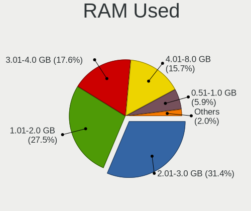
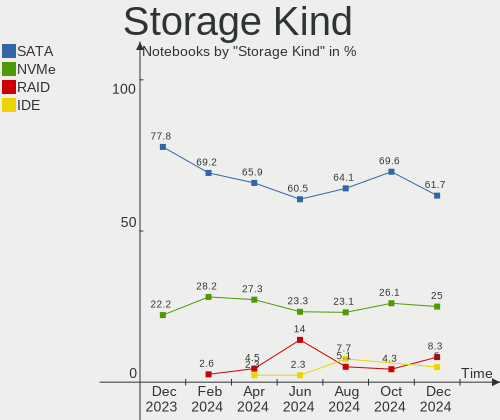
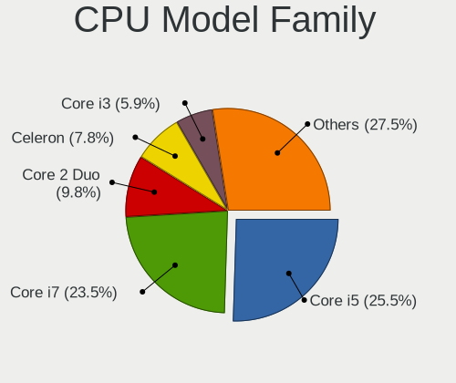
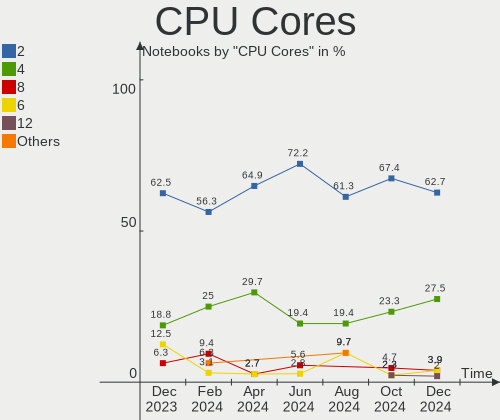
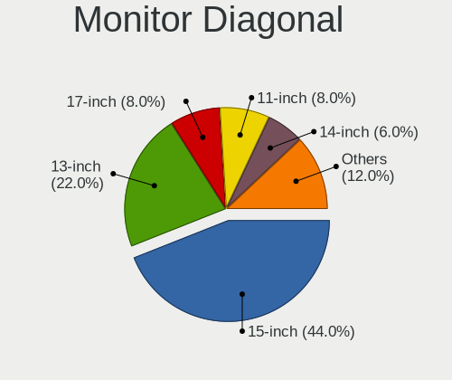
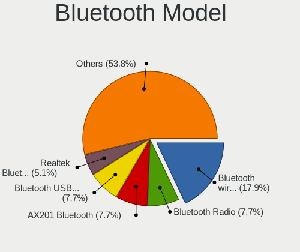
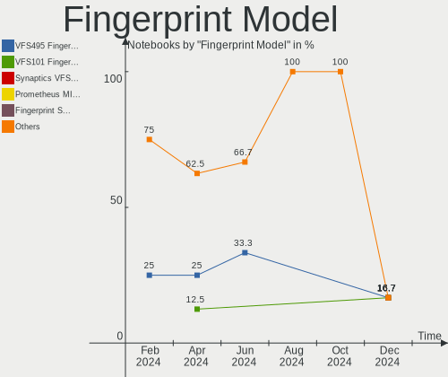

Elementary - Hardware Trends (Notebooks)
----------------------------------------

A project to identify most popular hardware characteristics and track their change
over time based on data collected by Linux users at https://Linux-Hardware.org.

Anyone can contribute to this report by the [hw-probe](https://github.com/linuxhw/hw-probe) tool:

    sudo -E hw-probe -all -upload

This report is for one last month. Overall report since the beginning of time: [TestCoverage](https://github.com/linuxhw/TestCoverage)

Period: Dec, 2022.

Contents
--------

* [ System ](#system)
  - [ OS                       ](#os)
  - [ OS Family                ](#os-family)
  - [ Kernel                   ](#kernel)
  - [ Kernel Family            ](#kernel-family)
  - [ Kernel Major Ver.        ](#kernel-major-ver)
  - [ Arch                     ](#arch)
  - [ DE                       ](#de)
  - [ Display Server           ](#display-server)
  - [ Display Manager          ](#display-manager)
  - [ OS Lang                  ](#os-lang)
  - [ Boot Mode                ](#boot-mode)
  - [ Filesystem               ](#filesystem)
  - [ Part. scheme             ](#part-scheme)
  - [ Dual Boot with Linux/BSD ](#dual-boot-with-linuxbsd)
  - [ Dual Boot (Win)          ](#dual-boot-win)

* [ Board ](#board)
  - [ Vendor                   ](#vendor)
  - [ Model                    ](#model)
  - [ Model Family             ](#model-family)
  - [ MFG Year                 ](#mfg-year)
  - [ Form Factor              ](#form-factor)
  - [ Secure Boot              ](#secure-boot)
  - [ Coreboot                 ](#coreboot)
  - [ RAM Size                 ](#ram-size)
  - [ RAM Used                 ](#ram-used)
  - [ Total Drives             ](#total-drives)
  - [ Has CD-ROM               ](#has-cd-rom)
  - [ Has Ethernet             ](#has-ethernet)
  - [ Has WiFi                 ](#has-wifi)
  - [ Has Bluetooth            ](#has-bluetooth)

* [ Location ](#location)
  - [ Country                  ](#country)
  - [ City                     ](#city)

* [ Drives ](#drives)
  - [ Drive Vendor             ](#drive-vendor)
  - [ Drive Model              ](#drive-model)
  - [ HDD Vendor               ](#hdd-vendor)
  - [ SSD Vendor               ](#ssd-vendor)
  - [ Drive Kind               ](#drive-kind)
  - [ Drive Connector          ](#drive-connector)
  - [ Drive Size               ](#drive-size)
  - [ Space Total              ](#space-total)
  - [ Space Used               ](#space-used)
  - [ Malfunc. Drives          ](#malfunc-drives)
  - [ Malfunc. Drive Vendor    ](#malfunc-drive-vendor)
  - [ Malfunc. HDD Vendor      ](#malfunc-hdd-vendor)
  - [ Malfunc. Drive Kind      ](#malfunc-drive-kind)
  - [ Failed Drives            ](#failed-drives)
  - [ Failed Drive Vendor      ](#failed-drive-vendor)
  - [ Drive Status             ](#drive-status)

* [ Storage controller ](#storage-controller)
  - [ Storage Vendor           ](#storage-vendor)
  - [ Storage Model            ](#storage-model)
  - [ Storage Kind             ](#storage-kind)

* [ Processor ](#processor)
  - [ CPU Vendor               ](#cpu-vendor)
  - [ CPU Model                ](#cpu-model)
  - [ CPU Model Family         ](#cpu-model-family)
  - [ CPU Cores                ](#cpu-cores)
  - [ CPU Sockets              ](#cpu-sockets)
  - [ CPU Threads              ](#cpu-threads)
  - [ CPU Op-Modes             ](#cpu-op-modes)
  - [ CPU Microcode            ](#cpu-microcode)
  - [ CPU Microarch            ](#cpu-microarch)

* [ Graphics ](#graphics)
  - [ GPU Vendor               ](#gpu-vendor)
  - [ GPU Model                ](#gpu-model)
  - [ GPU Combo                ](#gpu-combo)
  - [ GPU Driver               ](#gpu-driver)
  - [ GPU Memory               ](#gpu-memory)

* [ Monitor ](#monitor)
  - [ Monitor Vendor           ](#monitor-vendor)
  - [ Monitor Model            ](#monitor-model)
  - [ Monitor Resolution       ](#monitor-resolution)
  - [ Monitor Diagonal         ](#monitor-diagonal)
  - [ Monitor Width            ](#monitor-width)
  - [ Aspect Ratio             ](#aspect-ratio)
  - [ Monitor Area             ](#monitor-area)
  - [ Pixel Density            ](#pixel-density)
  - [ Multiple Monitors        ](#multiple-monitors)

* [ Network ](#network)
  - [ Net Controller Vendor    ](#net-controller-vendor)
  - [ Net Controller Model     ](#net-controller-model)
  - [ Wireless Vendor          ](#wireless-vendor)
  - [ Wireless Model           ](#wireless-model)
  - [ Ethernet Vendor          ](#ethernet-vendor)
  - [ Ethernet Model           ](#ethernet-model)
  - [ Net Controller Kind      ](#net-controller-kind)
  - [ Used Controller          ](#used-controller)
  - [ NICs                     ](#nics)
  - [ IPv6                     ](#ipv6)

* [ Bluetooth ](#bluetooth)
  - [ Bluetooth Vendor         ](#bluetooth-vendor)
  - [ Bluetooth Model          ](#bluetooth-model)

* [ Sound ](#sound)
  - [ Sound Vendor             ](#sound-vendor)
  - [ Sound Model              ](#sound-model)

* [ Memory ](#memory)
  - [ Memory Vendor            ](#memory-vendor)
  - [ Memory Model             ](#memory-model)
  - [ Memory Kind              ](#memory-kind)
  - [ Memory Form Factor       ](#memory-form-factor)
  - [ Memory Size              ](#memory-size)
  - [ Memory Speed             ](#memory-speed)

* [ Printers & scanners ](#printers--scanners)
  - [ Printer Vendor           ](#printer-vendor)
  - [ Printer Model            ](#printer-model)
  - [ Scanner Vendor           ](#scanner-vendor)
  - [ Scanner Model            ](#scanner-model)

* [ Camera ](#camera)
  - [ Camera Vendor            ](#camera-vendor)
  - [ Camera Model             ](#camera-model)

* [ Security ](#security)
  - [ Fingerprint Vendor       ](#fingerprint-vendor)
  - [ Fingerprint Model        ](#fingerprint-model)
  - [ Chipcard Vendor          ](#chipcard-vendor)
  - [ Chipcard Model           ](#chipcard-model)

* [ Unsupported ](#unsupported)
  - [ Unsupported Devices      ](#unsupported-devices)
  - [ Unsupported Device Types ](#unsupported-device-types)

System
------

OS
--

Installed operating systems

| Name             | Notebooks | Percent |
|------------------|-----------|---------|
| Elementary 6.1   | 24        | 88.89%  |
| Elementary 5.1.7 | 2         | 7.41%   |
| Elementary 7     | 1         | 3.7%    |

OS Family
---------

OS without a version

| Name       | Notebooks | Percent |
|------------|-----------|---------|
| Elementary | 27        | 100%    |

Kernel
------

Version of the Linux kernel

| Version           | Notebooks | Percent |
|-------------------|-----------|---------|
| 5.15.0-56-generic | 18        | 66.67%  |
| 5.11.0-43-generic | 3         | 11.11%  |
| 5.4.0-135-generic | 2         | 7.41%   |
| 5.15.0-53-generic | 1         | 3.7%    |
| 5.15.0-52-generic | 1         | 3.7%    |
| 5.15.0-50-generic | 1         | 3.7%    |
| 5.15.0-46-generic | 1         | 3.7%    |

Kernel Family
-------------

Linux kernel without a distro release

| Version | Notebooks | Percent |
|---------|-----------|---------|
| 5.15.0  | 22        | 81.48%  |
| 5.11.0  | 3         | 11.11%  |
| 5.4.0   | 2         | 7.41%   |

Kernel Major Ver.
-----------------

Linux kernel major version

| Version | Notebooks | Percent |
|---------|-----------|---------|
| 5.15    | 22        | 81.48%  |
| 5.11    | 3         | 11.11%  |
| 5.4     | 2         | 7.41%   |

Arch
----

OS architecture (x86_64, i586, etc.)

| Name   | Notebooks | Percent |
|--------|-----------|---------|
| x86_64 | 27        | 100%    |

DE
--

Desktop Environment

| Name     | Notebooks | Percent |
|----------|-----------|---------|
| Pantheon | 25        | 92.59%  |
| Unknown  | 2         | 7.41%   |

Display Server
--------------

X11 or Wayland

| Name | Notebooks | Percent |
|------|-----------|---------|
| X11  | 27        | 100%    |

Display Manager
---------------

SDDM, LightDM, etc.

| Name    | Notebooks | Percent |
|---------|-----------|---------|
| Unknown | 19        | 70.37%  |
| LightDM | 8         | 29.63%  |

OS Lang
-------

Language

| Lang  | Notebooks | Percent |
|-------|-----------|---------|
| en_US | 12        | 44.44%  |
| de_DE | 4         | 14.81%  |
| ru_RU | 2         | 7.41%   |
| it_IT | 2         | 7.41%   |
| fr_FR | 2         | 7.41%   |
| es_ES | 2         | 7.41%   |
| pt_BR | 1         | 3.7%    |
| id_ID | 1         | 3.7%    |
| en_AU | 1         | 3.7%    |

Boot Mode
---------

EFI or BIOS

| Mode | Notebooks | Percent |
|------|-----------|---------|
| EFI  | 17        | 62.96%  |
| BIOS | 10        | 37.04%  |

Filesystem
----------

Type of filesystem

| Type    | Notebooks | Percent |
|---------|-----------|---------|
| Ext4    | 25        | 92.59%  |
| Overlay | 1         | 3.7%    |
| Btrfs   | 1         | 3.7%    |

Part. scheme
------------

Scheme of partitioning

| Type    | Notebooks | Percent |
|---------|-----------|---------|
| Unknown | 17        | 62.96%  |
| GPT     | 9         | 33.33%  |
| MBR     | 1         | 3.7%    |

Dual Boot with Linux/BSD
------------------------

Hosting more than one Linux/BSD

| Dual boot | Notebooks | Percent |
|-----------|-----------|---------|
| No        | 26        | 96.3%   |
| Yes       | 1         | 3.7%    |

Dual Boot (Win)
---------------

Hosting Linux and Windows

| Dual boot | Notebooks | Percent |
|-----------|-----------|---------|
| No        | 27        | 100%    |

Board
-----

Vendor
------

Motherboard manufacturer

| Name                   | Notebooks | Percent |
|------------------------|-----------|---------|
| Lenovo                 | 11        | 40.74%  |
| Hewlett-Packard        | 5         | 18.52%  |
| ASUSTek Computer       | 2         | 7.41%   |
| Acer                   | 2         | 7.41%   |
| Positivo               | 1         | 3.7%    |
| HUAWEI                 | 1         | 3.7%    |
| Dell                   | 1         | 3.7%    |
| Chuwi                  | 1         | 3.7%    |
| Avell High Performance | 1         | 3.7%    |
| Apple                  | 1         | 3.7%    |
| AMI                    | 1         | 3.7%    |

Model
-----

Motherboard model

| Name                                     | Notebooks | Percent |
|------------------------------------------|-----------|---------|
| Positivo S14SL01                         | 1         | 3.7%    |
| Lenovo V310-14ISK 80SX                   | 1         | 3.7%    |
| Lenovo V17 G2 ITL 82NX                   | 1         | 3.7%    |
| Lenovo ThinkPad X390 20Q0CTO1WW          | 1         | 3.7%    |
| Lenovo ThinkPad X201 3680HB1             | 1         | 3.7%    |
| Lenovo ThinkPad T495 20NKS01W02          | 1         | 3.7%    |
| Lenovo ThinkPad T470p 20J60018MX         | 1         | 3.7%    |
| Lenovo ThinkPad T430 23448AG             | 1         | 3.7%    |
| Lenovo ThinkBook 13s G3 ACN 20YA         | 1         | 3.7%    |
| Lenovo IdeaPad 5 14ALC05 82LM            | 1         | 3.7%    |
| Lenovo IdeaPad 330-15IGM 81D1            | 1         | 3.7%    |
| Lenovo IdeaPad 3 14ITL6 82H7             | 1         | 3.7%    |
| HUAWEI NBM-WXX9                          | 1         | 3.7%    |
| HP ProBook 650 G1                        | 1         | 3.7%    |
| HP ProBook 455R G6                       | 1         | 3.7%    |
| HP Pavilion g6                           | 1         | 3.7%    |
| HP Laptop 17-ca0xxx                      | 1         | 3.7%    |
| HP 250 G7 Notebook PC                    | 1         | 3.7%    |
| Dell System XPS L702X                    | 1         | 3.7%    |
| Chuwi HeroBook                           | 1         | 3.7%    |
| Avell High Performance B.ON              | 1         | 3.7%    |
| ASUS TUF Gaming FX505DT_FX505DT          | 1         | 3.7%    |
| ASUS ASUS TUF Gaming A15 FA506IU_FA566IU | 1         | 3.7%    |
| Apple MacBookPro8,1                      | 1         | 3.7%    |
| AMI SN4-X5-4GBPRO3                       | 1         | 3.7%    |
| Acer Aspire A315-53                      | 1         | 3.7%    |
| Acer Aspire 7741                         | 1         | 3.7%    |

Model Family
------------

Motherboard model prefix

| Name                        | Notebooks | Percent |
|-----------------------------|-----------|---------|
| Lenovo ThinkPad             | 5         | 18.52%  |
| Lenovo IdeaPad              | 3         | 11.11%  |
| HP ProBook                  | 2         | 7.41%   |
| Acer Aspire                 | 2         | 7.41%   |
| Positivo S14SL01            | 1         | 3.7%    |
| Lenovo V310-14ISK           | 1         | 3.7%    |
| Lenovo V17                  | 1         | 3.7%    |
| Lenovo ThinkBook            | 1         | 3.7%    |
| HUAWEI NBM-WXX9             | 1         | 3.7%    |
| HP Pavilion                 | 1         | 3.7%    |
| HP Laptop                   | 1         | 3.7%    |
| HP 250                      | 1         | 3.7%    |
| Dell System                 | 1         | 3.7%    |
| Chuwi HeroBook              | 1         | 3.7%    |
| Avell High Performance B.ON | 1         | 3.7%    |
| ASUS TUF                    | 1         | 3.7%    |
| ASUS ASUS                   | 1         | 3.7%    |
| Apple MacBookPro8           | 1         | 3.7%    |
| AMI SN4-X5-4GBPRO3          | 1         | 3.7%    |

MFG Year
--------

Motherboard manufacture year

| Year | Notebooks | Percent |
|------|-----------|---------|
| 2021 | 5         | 18.52%  |
| 2019 | 5         | 18.52%  |
| 2018 | 5         | 18.52%  |
| 2017 | 3         | 11.11%  |
| 2011 | 3         | 11.11%  |
| 2022 | 2         | 7.41%   |
| 2010 | 2         | 7.41%   |
| 2013 | 1         | 3.7%    |
| 2012 | 1         | 3.7%    |

Form Factor
-----------

Physical design of the computer

| Name     | Notebooks | Percent |
|----------|-----------|---------|
| Notebook | 27        | 100%    |

Secure Boot
-----------

Enabled or disabled

| State    | Notebooks | Percent |
|----------|-----------|---------|
| Disabled | 19        | 70.37%  |
| Enabled  | 8         | 29.63%  |

Coreboot
--------

Have coreboot on board

| Used | Notebooks | Percent |
|------|-----------|---------|
| No   | 27        | 100%    |

RAM Size
--------

Total RAM memory

| Size in GB | Notebooks | Percent |
|------------|-----------|---------|
| 8.01-16.0  | 10        | 37.04%  |
| 4.01-8.0   | 9         | 33.33%  |
| 3.01-4.0   | 6         | 22.22%  |
| 16.01-24.0 | 2         | 7.41%   |

RAM Used
--------

Used RAM memory

| Used GB  | Notebooks | Percent |
|----------|-----------|---------|
| 2.01-3.0 | 12        | 44.44%  |
| 1.01-2.0 | 8         | 29.63%  |
| 3.01-4.0 | 6         | 22.22%  |
| 4.01-8.0 | 1         | 3.7%    |

Total Drives
------------

Number of drives on board

| Drives | Notebooks | Percent |
|--------|-----------|---------|
| 1      | 22        | 81.48%  |
| 2      | 2         | 7.41%   |
| 4      | 1         | 3.7%    |
| 3      | 1         | 3.7%    |
| 0      | 1         | 3.7%    |

Has CD-ROM
----------

Has CD-ROM on board

| Presented | Notebooks | Percent |
|-----------|-----------|---------|
| No        | 18        | 66.67%  |
| Yes       | 9         | 33.33%  |

Has Ethernet
------------

Has Ethernet on board

| Presented | Notebooks | Percent |
|-----------|-----------|---------|
| Yes       | 21        | 77.78%  |
| No        | 6         | 22.22%  |

Has WiFi
--------

Has WiFi module

| Presented | Notebooks | Percent |
|-----------|-----------|---------|
| Yes       | 26        | 96.3%   |
| No        | 1         | 3.7%    |

Has Bluetooth
-------------

Has Bluetooth module

| Presented | Notebooks | Percent |
|-----------|-----------|---------|
| Yes       | 22        | 81.48%  |
| No        | 5         | 18.52%  |

Location
--------

Country
-------

Geographic location (country)

| Country      | Notebooks | Percent |
|--------------|-----------|---------|
| Germany      | 4         | 14.81%  |
| USA          | 2         | 7.41%   |
| Spain        | 2         | 7.41%   |
| Singapore    | 2         | 7.41%   |
| Russia       | 2         | 7.41%   |
| Italy        | 2         | 7.41%   |
| Indonesia    | 2         | 7.41%   |
| Brazil       | 2         | 7.41%   |
| UK           | 1         | 3.7%    |
| Sweden       | 1         | 3.7%    |
| South Africa | 1         | 3.7%    |
| France       | 1         | 3.7%    |
| Chile        | 1         | 3.7%    |
| Canada       | 1         | 3.7%    |
| Belgium      | 1         | 3.7%    |
| Belarus      | 1         | 3.7%    |
| Australia    | 1         | 3.7%    |

City
----

Geographic location (city)

| City                 | Notebooks | Percent |
|----------------------|-----------|---------|
| Singapore            | 2         | 7.41%   |
| Warrington           | 1         | 3.7%    |
| Valladolid           | 1         | 3.7%    |
| St Petersburg        | 1         | 3.7%    |
| Sao Luís            | 1         | 3.7%    |
| San Francisco        | 1         | 3.7%    |
| Rome                 | 1         | 3.7%    |
| Rio Claro            | 1         | 3.7%    |
| Perth                | 1         | 3.7%    |
| Moscow               | 1         | 3.7%    |
| Minsk                | 1         | 3.7%    |
| Milan                | 1         | 3.7%    |
| Lidkoeping           | 1         | 3.7%    |
| La Ligua             | 1         | 3.7%    |
| Kota Matsum Tiga     | 1         | 3.7%    |
| Johannesburg         | 1         | 3.7%    |
| Freiburg im Breisgau | 1         | 3.7%    |
| Frankfurt am Main    | 1         | 3.7%    |
| Buedingen            | 1         | 3.7%    |
| Brussels             | 1         | 3.7%    |
| Brampton             | 1         | 3.7%    |
| Bogor                | 1         | 3.7%    |
| Binghamton           | 1         | 3.7%    |
| Berlin               | 1         | 3.7%    |
| Barcelona            | 1         | 3.7%    |
| Angoulême           | 1         | 3.7%    |

Drives
------

Drive Vendor
------------

Hard drive vendors

| Vendor              | Notebooks | Drives | Percent |
|---------------------|-----------|--------|---------|
| Sandisk             | 4         | 4      | 11.43%  |
| WDC                 | 3         | 3      | 8.57%   |
| Unknown             | 3         | 3      | 8.57%   |
| Seagate             | 3         | 3      | 8.57%   |
| Samsung Electronics | 3         | 3      | 8.57%   |
| Toshiba             | 2         | 2      | 5.71%   |
| Micron Technology   | 2         | 2      | 5.71%   |
| Kingston            | 2         | 2      | 5.71%   |
| Crucial             | 2         | 2      | 5.71%   |
| UMIS                | 1         | 1      | 2.86%   |
| StoreJet            | 1         | 1      | 2.86%   |
| SK hynix            | 1         | 1      | 2.86%   |
| Phison              | 1         | 1      | 2.86%   |
| Intel               | 1         | 1      | 2.86%   |
| Hitachi             | 1         | 1      | 2.86%   |
| HGST                | 1         | 1      | 2.86%   |
| External            | 1         | 1      | 2.86%   |
| China               | 1         | 1      | 2.86%   |
| Apacer              | 1         | 1      | 2.86%   |
| A-DATA Technology   | 1         | 1      | 2.86%   |

Drive Model
-----------

Hard drive models

| Model                                               | Notebooks | Percent |
|-----------------------------------------------------|-----------|---------|
| Seagate ST1000LM035-1RK172 1TB                      | 2         | 5.71%   |
| WDC WDS120G1G0A-00SS50 120GB SSD                    | 1         | 2.86%   |
| WDC WD5000LPCX-24VHAT0 500GB                        | 1         | 2.86%   |
| WDC WD10SPZX-60Z10T0 1TB                            | 1         | 2.86%   |
| Unknown SD/MMC/MS PRO 64GB                          | 1         | 2.86%   |
| Unknown MMC Card  32GB                              | 1         | 2.86%   |
| Unknown M0S002  64GB                                | 1         | 2.86%   |
| UMIS RPJTJ512MEE1OWX 512GB                          | 1         | 2.86%   |
| Toshiba XG4 NVMe SSD Controller 512GB               | 1         | 2.86%   |
| Toshiba MQ04ABF100 1TB                              | 1         | 2.86%   |
| StoreJet Disk 4TB                                   | 1         | 2.86%   |
| SK hynix BC501 NVMe Solid State Drive 512GB         | 1         | 2.86%   |
| Seagate ST1000LM048-2E7172 1TB                      | 1         | 2.86%   |
| Sandisk WDC PC SN530 SDBPMPZ-512G-1101 512GB        | 1         | 2.86%   |
| Sandisk WDC PC SN530 SDBPMPZ-256G-1101 256GB        | 1         | 2.86%   |
| Sandisk WD Blue SN550 NVMe SSD 500GB                | 1         | 2.86%   |
| SanDisk SSD PLUS 240 GB                             | 1         | 2.86%   |
| Samsung SSD 860 EVO 250GB                           | 1         | 2.86%   |
| Samsung NVMe SSD Controller SM981/PM981/PM983 500GB | 1         | 2.86%   |
| Samsung MZALQ512HBLU-00BL2 512GB                    | 1         | 2.86%   |
| Phison 311CD0512GB                                  | 1         | 2.86%   |
| Micron 2210_MTFDHBA512QFD 512GB                     | 1         | 2.86%   |
| Micron 2200V_MTFDHBA512TCK 512GB                    | 1         | 2.86%   |
| Kingston SA400M8120G 120GB SSD                      | 1         | 2.86%   |
| Kingston OM8PDP3256B-AI1 256GB                      | 1         | 2.86%   |
| Intel SSD Pro 7600p/760p/E 6100p Series 1024GB      | 1         | 2.86%   |
| Hitachi HTS545032B9A302 320GB                       | 1         | 2.86%   |
| HGST HTS725050A7E630 500GB                          | 1         | 2.86%   |
| External USB3.0 250GB                               | 1         | 2.86%   |
| Crucial CT275MX300SSD1 275GB                        | 1         | 2.86%   |
| Crucial CT256MX100SSD1 256GB                        | 1         | 2.86%   |
| China SSD 64GB                                      | 1         | 2.86%   |
| Apacer AS350 240GB SSD                              | 1         | 2.86%   |
| A-DATA IM2P33F8A-512GD 512GB                        | 1         | 2.86%   |

HDD Vendor
----------

Hard disk drive vendors

| Vendor   | Notebooks | Drives | Percent |
|----------|-----------|--------|---------|
| Seagate  | 3         | 3      | 30%     |
| WDC      | 2         | 2      | 20%     |
| Unknown  | 1         | 1      | 10%     |
| Toshiba  | 1         | 1      | 10%     |
| StoreJet | 1         | 1      | 10%     |
| Hitachi  | 1         | 1      | 10%     |
| HGST     | 1         | 1      | 10%     |

SSD Vendor
----------

Solid state drive vendors

| Vendor              | Notebooks | Drives | Percent |
|---------------------|-----------|--------|---------|
| Crucial             | 2         | 2      | 25%     |
| WDC                 | 1         | 1      | 12.5%   |
| SanDisk             | 1         | 1      | 12.5%   |
| Samsung Electronics | 1         | 1      | 12.5%   |
| Kingston            | 1         | 1      | 12.5%   |
| China               | 1         | 1      | 12.5%   |
| Apacer              | 1         | 1      | 12.5%   |

Drive Kind
----------

HDD or SSD

| Kind | Notebooks | Drives | Percent |
|------|-----------|--------|---------|
| NVMe | 13        | 15     | 39.39%  |
| HDD  | 10        | 10     | 30.3%   |
| SSD  | 8         | 8      | 24.24%  |
| MMC  | 2         | 2      | 6.06%   |

Drive Connector
---------------

SATA, SAS, NVMe, etc.

| Type | Notebooks | Drives | Percent |
|------|-----------|--------|---------|
| SATA | 15        | 16     | 45.45%  |
| NVMe | 13        | 14     | 39.39%  |
| SAS  | 3         | 3      | 9.09%   |
| MMC  | 2         | 2      | 6.06%   |

Drive Size
----------

Size of hard drive

| Size in TB | Notebooks | Drives | Percent |
|------------|-----------|--------|---------|
| 0.01-0.5   | 12        | 12     | 66.67%  |
| 0.51-1.0   | 5         | 5      | 27.78%  |
| 3.01-4.0   | 1         | 1      | 5.56%   |

Space Total
-----------

Amount of disk space available on the file system

| Size in GB     | Notebooks | Percent |
|----------------|-----------|---------|
| 101-250        | 11        | 40.74%  |
| 251-500        | 8         | 29.63%  |
| 501-1000       | 3         | 11.11%  |
| 51-100         | 2         | 7.41%   |
| More than 3000 | 1         | 3.7%    |
| 21-50          | 1         | 3.7%    |
| 1-20           | 1         | 3.7%    |

Space Used
----------

Amount of used disk space

| Used GB | Notebooks | Percent |
|---------|-----------|---------|
| 1-20    | 13        | 48.15%  |
| 21-50   | 10        | 37.04%  |
| 51-100  | 3         | 11.11%  |
| 101-250 | 1         | 3.7%    |

Malfunc. Drives
---------------

Drive models with a malfunction

Zero info for selected period =(

Malfunc. Drive Vendor
---------------------

Vendors of faulty drives

Zero info for selected period =(

Malfunc. HDD Vendor
-------------------

Vendors of faulty HDD drives

Zero info for selected period =(

Malfunc. Drive Kind
-------------------

Kinds of faulty drives

Zero info for selected period =(

Failed Drives
-------------

Failed drive models

Zero info for selected period =(

Failed Drive Vendor
-------------------

Failed drive vendors

Zero info for selected period =(

Drive Status
------------

Number of failed and malfunc. drives

| Status   | Notebooks | Drives | Percent |
|----------|-----------|--------|---------|
| Detected | 20        | 27     | 71.43%  |
| Works    | 8         | 8      | 28.57%  |

Storage controller
------------------

Storage Vendor
--------------

Storage controller vendors

| Vendor                       | Notebooks | Percent |
|------------------------------|-----------|---------|
| Intel                        | 16        | 48.48%  |
| AMD                          | 4         | 12.12%  |
| SanDisk                      | 3         | 9.09%   |
| Samsung Electronics          | 2         | 6.06%   |
| Micron Technology            | 2         | 6.06%   |
| Union Memory (Shenzhen)      | 1         | 3.03%   |
| Toshiba America Info Systems | 1         | 3.03%   |
| SK hynix                     | 1         | 3.03%   |
| Phison Electronics           | 1         | 3.03%   |
| ASMedia Technology           | 1         | 3.03%   |
| ADATA Technology             | 1         | 3.03%   |

Storage Model
-------------

Storage controller models

| Model                                                                            | Notebooks | Percent |
|----------------------------------------------------------------------------------|-----------|---------|
| AMD FCH SATA Controller [AHCI mode]                                              | 4         | 11.43%  |
| Intel Sunrise Point-LP SATA Controller [AHCI mode]                               | 3         | 8.57%   |
| SanDisk Non-Volatile memory controller                                           | 2         | 5.71%   |
| Micron Non-Volatile memory controller                                            | 2         | 5.71%   |
| Intel Volume Management Device NVMe RAID Controller                              | 2         | 5.71%   |
| Intel Tiger Lake-LP SATA Controller                                              | 2         | 5.71%   |
| Intel 7 Series Chipset Family 6-port SATA Controller [AHCI mode]                 | 2         | 5.71%   |
| Intel 6 Series/C200 Series Chipset Family 6 port Mobile SATA AHCI Controller     | 2         | 5.71%   |
| Union Memory (Shenzhen) Non-Volatile memory controller                           | 1         | 2.86%   |
| Toshiba America Info Systems XG4 NVMe SSD Controller                             | 1         | 2.86%   |
| SK hynix BC501 NVMe Solid State Drive                                            | 1         | 2.86%   |
| SanDisk WD Blue SN550 NVMe SSD                                                   | 1         | 2.86%   |
| Samsung NVMe SSD Controller SM981/PM981/PM983                                    | 1         | 2.86%   |
| Samsung NVMe SSD Controller 980                                                  | 1         | 2.86%   |
| Phison PS5013 E13 NVMe Controller                                                | 1         | 2.86%   |
| Intel SSD Pro 7600p/760p/E 6100p Series                                          | 1         | 2.86%   |
| Intel Celeron/Pentium Silver Processor SATA Controller                           | 1         | 2.86%   |
| Intel Atom/Celeron/Pentium Processor x5-E8000/J3xxx/N3xxx Series SATA Controller | 1         | 2.86%   |
| Intel 82801 Mobile SATA Controller [RAID mode]                                   | 1         | 2.86%   |
| Intel 8 Series/C220 Series Chipset Family 6-port SATA Controller 1 [AHCI mode]   | 1         | 2.86%   |
| Intel 5 Series/3400 Series Chipset 6 port SATA AHCI Controller                   | 1         | 2.86%   |
| Intel 5 Series/3400 Series Chipset 4 port SATA AHCI Controller                   | 1         | 2.86%   |
| ASMedia ASM1062 Serial ATA Controller                                            | 1         | 2.86%   |
| ADATA IM2P33F8ABR1 NVMe SSD                                                      | 1         | 2.86%   |

Storage Kind
------------

Kind of storage controller (IDE, SATA, NVMe, SAS, ...)

| Kind | Notebooks | Percent |
|------|-----------|---------|
| SATA | 19        | 55.88%  |
| NVMe | 12        | 35.29%  |
| RAID | 3         | 8.82%   |

Processor
---------

CPU Vendor
----------

Processor vendors

| Vendor | Notebooks | Percent |
|--------|-----------|---------|
| Intel  | 19        | 70.37%  |
| AMD    | 8         | 29.63%  |

CPU Model
---------

Processor models

| Model                                           | Notebooks | Percent |
|-------------------------------------------------|-----------|---------|
| Intel 11th Gen Core i7-1165G7 @ 2.80GHz         | 2         | 7.41%   |
| Intel Pentium CPU P6200 @ 2.13GHz               | 1         | 3.7%    |
| Intel Core i7-7700HQ CPU @ 2.80GHz              | 1         | 3.7%    |
| Intel Core i7-3610QM CPU @ 2.30GHz              | 1         | 3.7%    |
| Intel Core i7-2630QM CPU @ 2.00GHz              | 1         | 3.7%    |
| Intel Core i5-8265U CPU @ 1.60GHz               | 1         | 3.7%    |
| Intel Core i5-6200U CPU @ 2.30GHz               | 1         | 3.7%    |
| Intel Core i5-4200M CPU @ 2.50GHz               | 1         | 3.7%    |
| Intel Core i5-3210M CPU @ 2.50GHz               | 1         | 3.7%    |
| Intel Core i5-2415M CPU @ 2.30GHz               | 1         | 3.7%    |
| Intel Core i5-1035G1 CPU @ 1.00GHz              | 1         | 3.7%    |
| Intel Core i5 CPU M 520 @ 2.40GHz               | 1         | 3.7%    |
| Intel Core i3-7020U CPU @ 2.30GHz               | 1         | 3.7%    |
| Intel Core i3-6006U CPU @ 2.00GHz               | 1         | 3.7%    |
| Intel Celeron N4000 CPU @ 1.10GHz               | 1         | 3.7%    |
| Intel Atom x5-Z8350 CPU @ 1.44GHz               | 1         | 3.7%    |
| Intel Atom x5-E8000 CPU @ 1.04GHz               | 1         | 3.7%    |
| Intel 11th Gen Core i3-1115G4 @ 3.00GHz         | 1         | 3.7%    |
| AMD Ryzen 9 4900H with Radeon Graphics          | 1         | 3.7%    |
| AMD Ryzen 7 5700U with Radeon Graphics          | 1         | 3.7%    |
| AMD Ryzen 7 3750H with Radeon Vega Mobile Gfx   | 1         | 3.7%    |
| AMD Ryzen 7 3700U with Radeon Vega Mobile Gfx   | 1         | 3.7%    |
| AMD Ryzen 5 PRO 3500U w/ Radeon Vega Mobile Gfx | 1         | 3.7%    |
| AMD Ryzen 5 5600U with Radeon Graphics          | 1         | 3.7%    |
| AMD Ryzen 5 5500U with Radeon Graphics          | 1         | 3.7%    |
| AMD A9-9425 RADEON R5, 5 COMPUTE CORES 2C+3G    | 1         | 3.7%    |

CPU Model Family
----------------

Processor model prefix

| Model           | Notebooks | Percent |
|-----------------|-----------|---------|
| Intel Core i5   | 7         | 25.93%  |
| Other           | 4         | 14.81%  |
| Intel Core i7   | 3         | 11.11%  |
| AMD Ryzen 7     | 3         | 11.11%  |
| Intel Core i3   | 2         | 7.41%   |
| Intel Atom      | 2         | 7.41%   |
| AMD Ryzen 5     | 2         | 7.41%   |
| Intel Pentium   | 1         | 3.7%    |
| Intel Celeron   | 1         | 3.7%    |
| AMD Ryzen 9     | 1         | 3.7%    |
| AMD Ryzen 5 PRO | 1         | 3.7%    |

CPU Cores
---------

Number of processor cores

| Number | Notebooks | Percent |
|--------|-----------|---------|
| 4      | 12        | 44.44%  |
| 2      | 11        | 40.74%  |
| 8      | 2         | 7.41%   |
| 6      | 2         | 7.41%   |

CPU Sockets
-----------

Number of sockets

| Number | Notebooks | Percent |
|--------|-----------|---------|
| 1      | 27        | 100%    |

CPU Threads
-----------

Threads per core (Hyper-Threading)

| Number | Notebooks | Percent |
|--------|-----------|---------|
| 2      | 21        | 77.78%  |
| 1      | 6         | 22.22%  |

CPU Op-Modes
------------

CPU Operation Modes (32-bit, 64-bit)

| Op mode        | Notebooks | Percent |
|----------------|-----------|---------|
| 32-bit, 64-bit | 27        | 100%    |

CPU Microcode
-------------

Microcode number

| Number     | Notebooks | Percent |
|------------|-----------|---------|
| 0x806c1    | 3         | 11.11%  |
| Unknown    | 3         | 11.11%  |
| 0x406e3    | 2         | 7.41%   |
| 0x406c4    | 2         | 7.41%   |
| 0x306a9    | 2         | 7.41%   |
| 0x206a7    | 2         | 7.41%   |
| 0x20655    | 2         | 7.41%   |
| 0x08608103 | 2         | 7.41%   |
| 0x906e9    | 1         | 3.7%    |
| 0x806ec    | 1         | 3.7%    |
| 0x806ea    | 1         | 3.7%    |
| 0x706a1    | 1         | 3.7%    |
| 0x306c3    | 1         | 3.7%    |
| 0x0a50000c | 1         | 3.7%    |
| 0x08600104 | 1         | 3.7%    |
| 0x08108109 | 1         | 3.7%    |
| 0x06006705 | 1         | 3.7%    |

CPU Microarch
-------------

Microarchitecture

| Name          | Notebooks | Percent |
|---------------|-----------|---------|
| Zen+          | 3         | 11.11%  |
| TigerLake     | 3         | 11.11%  |
| KabyLake      | 3         | 11.11%  |
| Westmere      | 2         | 7.41%   |
| Skylake       | 2         | 7.41%   |
| Silvermont    | 2         | 7.41%   |
| SandyBridge   | 2         | 7.41%   |
| IvyBridge     | 2         | 7.41%   |
| Unknown       | 2         | 7.41%   |
| Zen 3         | 1         | 3.7%    |
| Zen 2         | 1         | 3.7%    |
| IceLake       | 1         | 3.7%    |
| Haswell       | 1         | 3.7%    |
| Goldmont plus | 1         | 3.7%    |
| Excavator     | 1         | 3.7%    |

Graphics
--------

GPU Vendor
----------

Vendors of graphics cards

| Vendor | Notebooks | Percent |
|--------|-----------|---------|
| Intel  | 19        | 57.58%  |
| AMD    | 8         | 24.24%  |
| Nvidia | 6         | 18.18%  |

GPU Model
---------

Graphics card models

| Model                                                                                    | Notebooks | Percent |
|------------------------------------------------------------------------------------------|-----------|---------|
| AMD Picasso/Raven 2 [Radeon Vega Series / Radeon Vega Mobile Series]                     | 3         | 9.09%   |
| Intel TigerLake-LP GT2 [Iris Xe Graphics]                                                | 2         | 6.06%   |
| Intel Core Processor Integrated Graphics Controller                                      | 2         | 6.06%   |
| Intel Atom/Celeron/Pentium Processor x5-E8000/J3xxx/N3xxx Integrated Graphics Controller | 2         | 6.06%   |
| Intel 3rd Gen Core processor Graphics Controller                                         | 2         | 6.06%   |
| Intel 2nd Generation Core Processor Family Integrated Graphics Controller                | 2         | 6.06%   |
| AMD Lucienne                                                                             | 2         | 6.06%   |
| Nvidia TU117M [GeForce MX450]                                                            | 1         | 3.03%   |
| Nvidia TU117M [GeForce GTX 1650 Mobile / Max-Q]                                          | 1         | 3.03%   |
| Nvidia TU116M [GeForce GTX 1660 Ti Mobile]                                               | 1         | 3.03%   |
| Nvidia GM108M [GeForce 940MX]                                                            | 1         | 3.03%   |
| Nvidia GF108M [NVS 5400M]                                                                | 1         | 3.03%   |
| Nvidia GF106M [GeForce GT 550M]                                                          | 1         | 3.03%   |
| Intel WhiskeyLake-U GT2 [UHD Graphics 620]                                               | 1         | 3.03%   |
| Intel Tiger Lake-LP GT2 [UHD Graphics G4]                                                | 1         | 3.03%   |
| Intel Skylake GT2 [HD Graphics 520]                                                      | 1         | 3.03%   |
| Intel Iris Plus Graphics G1 (Ice Lake)                                                   | 1         | 3.03%   |
| Intel HD Graphics 630                                                                    | 1         | 3.03%   |
| Intel HD Graphics 620                                                                    | 1         | 3.03%   |
| Intel HD Graphics 520                                                                    | 1         | 3.03%   |
| Intel GeminiLake [UHD Graphics 600]                                                      | 1         | 3.03%   |
| Intel 4th Gen Core Processor Integrated Graphics Controller                              | 1         | 3.03%   |
| AMD Stoney [Radeon R2/R3/R4/R5 Graphics]                                                 | 1         | 3.03%   |
| AMD Renoir                                                                               | 1         | 3.03%   |
| AMD Cezanne [Radeon Vega Series / Radeon Vega Mobile Series]                             | 1         | 3.03%   |

GPU Combo
---------

Combinations of graphics cards

| Name           | Notebooks | Percent |
|----------------|-----------|---------|
| 1 x Intel      | 15        | 55.56%  |
| 1 x AMD        | 6         | 22.22%  |
| Intel + Nvidia | 4         | 14.81%  |
| AMD + Nvidia   | 2         | 7.41%   |

GPU Driver
----------

Free vs proprietary

| Driver      | Notebooks | Percent |
|-------------|-----------|---------|
| Free        | 26        | 96.3%   |
| Proprietary | 1         | 3.7%    |

GPU Memory
----------

Total video memory

| Size in GB | Notebooks | Percent |
|------------|-----------|---------|
| Unknown    | 19        | 70.37%  |
| 1.01-2.0   | 4         | 14.81%  |
| 0.01-0.5   | 3         | 11.11%  |
| 0.51-1.0   | 1         | 3.7%    |

Monitor
-------

Monitor Vendor
--------------

Monitor vendors

| Vendor                  | Notebooks | Percent |
|-------------------------|-----------|---------|
| Chimei Innolux          | 8         | 26.67%  |
| AU Optronics            | 7         | 23.33%  |
| BOE                     | 5         | 16.67%  |
| Samsung Electronics     | 2         | 6.67%   |
| SKG                     | 1         | 3.33%   |
| Philips                 | 1         | 3.33%   |
| PANDA                   | 1         | 3.33%   |
| LG Display              | 1         | 3.33%   |
| Lenovo                  | 1         | 3.33%   |
| Hewlett-Packard         | 1         | 3.33%   |
| Chi Mei Optoelectronics | 1         | 3.33%   |
| Apple                   | 1         | 3.33%   |

Monitor Model
-------------

Monitor models

| Model                                                                    | Notebooks | Percent |
|--------------------------------------------------------------------------|-----------|---------|
| AU Optronics LCD Monitor AUO208D 1920x1080 309x174mm 14.0-inch           | 2         | 6.45%   |
| SKG RW-W2413S SKG2413 1920x1080 597x336mm 27.0-inch                      | 1         | 3.23%   |
| Samsung Electronics LCD Monitor SEC324C 1600x900 310x174mm 14.0-inch     | 1         | 3.23%   |
| Samsung Electronics LCD Monitor SAM0C44 3840x2160 950x540mm 43.0-inch    | 1         | 3.23%   |
| Samsung Electronics C24F390 SAM0D2C 1920x1080 521x293mm 23.5-inch        | 1         | 3.23%   |
| Philips PHL 226V6 PHLC11D 1920x1080 477x268mm 21.5-inch                  | 1         | 3.23%   |
| PANDA LCD Monitor NCP004D 1920x1080 344x194mm 15.5-inch                  | 1         | 3.23%   |
| LG Display LCD Monitor LGD02F2 1366x768 344x194mm 15.5-inch              | 1         | 3.23%   |
| Lenovo LCD Monitor LEN4011 1280x800 261x163mm 12.1-inch                  | 1         | 3.23%   |
| Hewlett-Packard LA2306 HWP294A 1920x1080 509x286mm 23.0-inch             | 1         | 3.23%   |
| Chimei Innolux LCD Monitor CMN15DC 1366x768 344x193mm 15.5-inch          | 1         | 3.23%   |
| Chimei Innolux LCD Monitor CMN15DB 1366x768 344x193mm 15.5-inch          | 1         | 3.23%   |
| Chimei Innolux LCD Monitor CMN15C2 1920x1080 344x194mm 15.5-inch         | 1         | 3.23%   |
| Chimei Innolux LCD Monitor CMN1521 1920x1080 344x193mm 15.5-inch         | 1         | 3.23%   |
| Chimei Innolux LCD Monitor CMN150D 1920x1080 344x193mm 15.5-inch         | 1         | 3.23%   |
| Chimei Innolux LCD Monitor CMN14D4 1920x1080 309x173mm 13.9-inch         | 1         | 3.23%   |
| Chimei Innolux LCD Monitor CMN14C3 1366x768 309x173mm 13.9-inch          | 1         | 3.23%   |
| Chimei Innolux LCD Monitor CMN1404 1920x1080 309x173mm 13.9-inch         | 1         | 3.23%   |
| Chi Mei Optoelectronics LCD Monitor CMO1718 1600x900 382x215mm 17.3-inch | 1         | 3.23%   |
| BOE LCD Monitor BOE09C1 1920x1080 382x215mm 17.3-inch                    | 1         | 3.23%   |
| BOE LCD Monitor BOE08F5 1920x1080 344x194mm 15.5-inch                    | 1         | 3.23%   |
| BOE LCD Monitor BOE069B 1600x900 382x215mm 17.3-inch                     | 1         | 3.23%   |
| BOE LCD Monitor BOE0696 1366x768 309x173mm 13.9-inch                     | 1         | 3.23%   |
| BOE LCD Monitor BOE0687 1920x1080 344x193mm 15.5-inch                    | 1         | 3.23%   |
| AU Optronics LCD Monitor AUO403D 1920x1080 309x173mm 13.9-inch           | 1         | 3.23%   |
| AU Optronics LCD Monitor AUO243D 1920x1080 309x173mm 13.9-inch           | 1         | 3.23%   |
| AU Optronics LCD Monitor AUO222D 1920x1080 293x165mm 13.2-inch           | 1         | 3.23%   |
| AU Optronics LCD Monitor AUO1D8F 1920x1200 286x178mm 13.3-inch           | 1         | 3.23%   |
| AU Optronics LCD Monitor AUO139E 1600x900 382x214mm 17.2-inch            | 1         | 3.23%   |
| Apple LCD Monitor APP9CC3 1280x800 286x179mm 13.3-inch                   | 1         | 3.23%   |

Monitor Resolution
------------------

Monitor screen resolution

| Resolution        | Notebooks | Percent |
|-------------------|-----------|---------|
| 1920x1080 (FHD)   | 16        | 55.17%  |
| 1366x768 (WXGA)   | 5         | 17.24%  |
| 1600x900 (HD+)    | 4         | 13.79%  |
| 1280x800 (WXGA)   | 2         | 6.9%    |
| 3840x2160 (4K)    | 1         | 3.45%   |
| 1920x1200 (WUXGA) | 1         | 3.45%   |

Monitor Diagonal
----------------

Diagonal size in inches

| Inches | Notebooks | Percent |
|--------|-----------|---------|
| 15     | 10        | 32.26%  |
| 13     | 7         | 22.58%  |
| 17     | 4         | 12.9%   |
| 14     | 4         | 12.9%   |
| 23     | 2         | 6.45%   |
| 84     | 1         | 3.23%   |
| 27     | 1         | 3.23%   |
| 21     | 1         | 3.23%   |
| 12     | 1         | 3.23%   |

Monitor Width
-------------

Physical width

| Width in mm | Notebooks | Percent |
|-------------|-----------|---------|
| 301-350     | 17        | 54.84%  |
| 351-400     | 5         | 16.13%  |
| 201-300     | 4         | 12.9%   |
| 501-600     | 3         | 9.68%   |
| 401-500     | 1         | 3.23%   |
| 1501-2000   | 1         | 3.23%   |

Aspect Ratio
------------

Proportional relationship between the width and the height

| Ratio | Notebooks | Percent |
|-------|-----------|---------|
| 16/9  | 24        | 88.89%  |
| 16/10 | 2         | 7.41%   |
| 3/2   | 1         | 3.7%    |

Monitor Area
------------

Area in inch²

| Area in inch² | Notebooks | Percent |
|----------------|-----------|---------|
| 101-110        | 10        | 32.26%  |
| 81-90          | 9         | 29.03%  |
| 121-130        | 4         | 12.9%   |
| 71-80          | 2         | 6.45%   |
| 201-250        | 2         | 6.45%   |
| More than 1000 | 1         | 3.23%   |
| 61-70          | 1         | 3.23%   |
| 301-350        | 1         | 3.23%   |
| 151-200        | 1         | 3.23%   |

Pixel Density
-------------

Pixels per inch

| Density | Notebooks | Percent |
|---------|-----------|---------|
| 121-160 | 14        | 46.67%  |
| 101-120 | 10        | 33.33%  |
| 51-100  | 4         | 13.33%  |
| 161-240 | 2         | 6.67%   |

Multiple Monitors
-----------------

Total monitors connected

| Total | Notebooks | Percent |
|-------|-----------|---------|
| 1     | 23        | 85.19%  |
| 2     | 4         | 14.81%  |

Network
-------

Net Controller Vendor
---------------------

Controller vendors

| Vendor                | Notebooks | Percent |
|-----------------------|-----------|---------|
| Realtek Semiconductor | 18        | 48.65%  |
| Intel                 | 11        | 29.73%  |
| Qualcomm Atheros      | 4         | 10.81%  |
| Broadcom              | 2         | 5.41%   |
| Edimax Technology     | 1         | 2.7%    |
| ASIX Electronics      | 1         | 2.7%    |

Net Controller Model
--------------------

Controller models

| Model                                                             | Notebooks | Percent |
|-------------------------------------------------------------------|-----------|---------|
| Realtek RTL8111/8168/8411 PCI Express Gigabit Ethernet Controller | 10        | 20.41%  |
| Realtek RTL8822CE 802.11ac PCIe Wireless Network Adapter          | 4         | 8.16%   |
| Realtek RTL8821CE 802.11ac PCIe Wireless Network Adapter          | 3         | 6.12%   |
| Qualcomm Atheros QCA9377 802.11ac Wireless Network Adapter        | 3         | 6.12%   |
| Realtek RTL810xE PCI Express Fast Ethernet controller             | 2         | 4.08%   |
| Intel Wireless 7260                                               | 2         | 4.08%   |
| Intel Wi-Fi 6 AX201                                               | 2         | 4.08%   |
| Realtek RTL8822BE 802.11a/b/g/n/ac WiFi adapter                   | 1         | 2.04%   |
| Realtek RTL8153 Gigabit Ethernet Adapter                          | 1         | 2.04%   |
| Realtek RTL8152 Fast Ethernet Adapter                             | 1         | 2.04%   |
| Realtek 802.11n WLAN Adapter                                      | 1         | 2.04%   |
| Realtek 802.11n NIC                                               | 1         | 2.04%   |
| Qualcomm Atheros AR9287 Wireless Network Adapter (PCI-Express)    | 1         | 2.04%   |
| Intel Wireless-AC 9260                                            | 1         | 2.04%   |
| Intel Wireless 8265 / 8275                                        | 1         | 2.04%   |
| Intel Wireless 3160                                               | 1         | 2.04%   |
| Intel Wi-Fi 6 AX200                                               | 1         | 2.04%   |
| Intel Ethernet Connection I217-V                                  | 1         | 2.04%   |
| Intel Ethernet Connection (6) I219-V                              | 1         | 2.04%   |
| Intel Ethernet Connection (5) I219-V                              | 1         | 2.04%   |
| Intel Centrino Wireless-N 1000 [Condor Peak]                      | 1         | 2.04%   |
| Intel Centrino Ultimate-N 6300                                    | 1         | 2.04%   |
| Intel Cannon Point-LP CNVi [Wireless-AC]                          | 1         | 2.04%   |
| Intel 82579LM Gigabit Network Connection (Lewisville)             | 1         | 2.04%   |
| Intel 82577LM Gigabit Network Connection                          | 1         | 2.04%   |
| Edimax EW-7811Un 802.11n Wireless Adapter [Realtek RTL8188CUS]    | 1         | 2.04%   |
| Broadcom NetXtreme BCM57765 Gigabit Ethernet PCIe                 | 1         | 2.04%   |
| Broadcom NetLink BCM57780 Gigabit Ethernet PCIe                   | 1         | 2.04%   |
| Broadcom BCM4331 802.11a/b/g/n                                    | 1         | 2.04%   |
| ASIX AX88179 Gigabit Ethernet                                     | 1         | 2.04%   |

Wireless Vendor
---------------

Wireless vendors

| Vendor                | Notebooks | Percent |
|-----------------------|-----------|---------|
| Intel                 | 11        | 40.74%  |
| Realtek Semiconductor | 10        | 37.04%  |
| Qualcomm Atheros      | 4         | 14.81%  |
| Edimax Technology     | 1         | 3.7%    |
| Broadcom              | 1         | 3.7%    |

Wireless Model
--------------

Wireless models

| Model                                                          | Notebooks | Percent |
|----------------------------------------------------------------|-----------|---------|
| Realtek RTL8822CE 802.11ac PCIe Wireless Network Adapter       | 4         | 14.81%  |
| Realtek RTL8821CE 802.11ac PCIe Wireless Network Adapter       | 3         | 11.11%  |
| Qualcomm Atheros QCA9377 802.11ac Wireless Network Adapter     | 3         | 11.11%  |
| Intel Wireless 7260                                            | 2         | 7.41%   |
| Intel Wi-Fi 6 AX201                                            | 2         | 7.41%   |
| Realtek RTL8822BE 802.11a/b/g/n/ac WiFi adapter                | 1         | 3.7%    |
| Realtek 802.11n WLAN Adapter                                   | 1         | 3.7%    |
| Realtek 802.11n NIC                                            | 1         | 3.7%    |
| Qualcomm Atheros AR9287 Wireless Network Adapter (PCI-Express) | 1         | 3.7%    |
| Intel Wireless-AC 9260                                         | 1         | 3.7%    |
| Intel Wireless 8265 / 8275                                     | 1         | 3.7%    |
| Intel Wireless 3160                                            | 1         | 3.7%    |
| Intel Wi-Fi 6 AX200                                            | 1         | 3.7%    |
| Intel Centrino Wireless-N 1000 [Condor Peak]                   | 1         | 3.7%    |
| Intel Centrino Ultimate-N 6300                                 | 1         | 3.7%    |
| Intel Cannon Point-LP CNVi [Wireless-AC]                       | 1         | 3.7%    |
| Edimax EW-7811Un 802.11n Wireless Adapter [Realtek RTL8188CUS] | 1         | 3.7%    |
| Broadcom BCM4331 802.11a/b/g/n                                 | 1         | 3.7%    |

Ethernet Vendor
---------------

Ethernet vendors

| Vendor                | Notebooks | Percent |
|-----------------------|-----------|---------|
| Realtek Semiconductor | 13        | 61.9%   |
| Intel                 | 5         | 23.81%  |
| Broadcom              | 2         | 9.52%   |
| ASIX Electronics      | 1         | 4.76%   |

Ethernet Model
--------------

Ethernet models

| Model                                                             | Notebooks | Percent |
|-------------------------------------------------------------------|-----------|---------|
| Realtek RTL8111/8168/8411 PCI Express Gigabit Ethernet Controller | 10        | 45.45%  |
| Realtek RTL810xE PCI Express Fast Ethernet controller             | 2         | 9.09%   |
| Realtek RTL8153 Gigabit Ethernet Adapter                          | 1         | 4.55%   |
| Realtek RTL8152 Fast Ethernet Adapter                             | 1         | 4.55%   |
| Intel Ethernet Connection I217-V                                  | 1         | 4.55%   |
| Intel Ethernet Connection (6) I219-V                              | 1         | 4.55%   |
| Intel Ethernet Connection (5) I219-V                              | 1         | 4.55%   |
| Intel 82579LM Gigabit Network Connection (Lewisville)             | 1         | 4.55%   |
| Intel 82577LM Gigabit Network Connection                          | 1         | 4.55%   |
| Broadcom NetXtreme BCM57765 Gigabit Ethernet PCIe                 | 1         | 4.55%   |
| Broadcom NetLink BCM57780 Gigabit Ethernet PCIe                   | 1         | 4.55%   |
| ASIX AX88179 Gigabit Ethernet                                     | 1         | 4.55%   |

Net Controller Kind
-------------------

Ethernet, WiFi or modem

| Kind     | Notebooks | Percent |
|----------|-----------|---------|
| WiFi     | 27        | 56.25%  |
| Ethernet | 21        | 43.75%  |

Used Controller
---------------

Currently used network controller

| Kind     | Notebooks | Percent |
|----------|-----------|---------|
| WiFi     | 23        | 85.19%  |
| Ethernet | 4         | 14.81%  |

NICs
----

Total network controllers on board

| Total | Notebooks | Percent |
|-------|-----------|---------|
| 2     | 17        | 62.96%  |
| 1     | 7         | 25.93%  |
| 0     | 2         | 7.41%   |
| 3     | 1         | 3.7%    |

IPv6
----

IPv6 vs IPv4

| Used | Notebooks | Percent |
|------|-----------|---------|
| No   | 17        | 62.96%  |
| Yes  | 10        | 37.04%  |

Bluetooth
---------

Bluetooth Vendor
----------------

Controller vendors

| Vendor                          | Notebooks | Percent |
|---------------------------------|-----------|---------|
| Intel                           | 9         | 39.13%  |
| Realtek Semiconductor           | 5         | 21.74%  |
| Qualcomm Atheros Communications | 2         | 8.7%    |
| Lite-On Technology              | 2         | 8.7%    |
| Broadcom                        | 2         | 8.7%    |
| Realtek                         | 1         | 4.35%   |
| IMC Networks                    | 1         | 4.35%   |
| Apple                           | 1         | 4.35%   |

Bluetooth Model
---------------

Controller models

| Model                                          | Notebooks | Percent |
|------------------------------------------------|-----------|---------|
| Intel Bluetooth wireless interface             | 4         | 17.39%  |
| Realtek  Bluetooth 4.2 Adapter                 | 3         | 13.04%  |
| Realtek Bluetooth Radio                        | 2         | 8.7%    |
| Qualcomm Atheros  Bluetooth Device             | 2         | 8.7%    |
| Intel AX201 Bluetooth                          | 2         | 8.7%    |
| Realtek Bluetooth Radio                        | 1         | 4.35%   |
| Lite-On Qualcomm Atheros QCA9377 Bluetooth     | 1         | 4.35%   |
| Lite-On Bluetooth Radio                        | 1         | 4.35%   |
| Intel Wireless-AC 9260 Bluetooth Adapter       | 1         | 4.35%   |
| Intel Bluetooth 9460/9560 Jefferson Peak (JfP) | 1         | 4.35%   |
| Intel AX200 Bluetooth                          | 1         | 4.35%   |
| IMC Networks Bluetooth Radio                   | 1         | 4.35%   |
| Broadcom BCM20702 Bluetooth 4.0 [ThinkPad]     | 1         | 4.35%   |
| Broadcom BCM2045B (BDC-2.1)                    | 1         | 4.35%   |
| Apple Bluetooth Host Controller                | 1         | 4.35%   |

Sound
-----

Sound Vendor
------------

Sound card vendors

| Vendor | Notebooks | Percent |
|--------|-----------|---------|
| Intel  | 18        | 60%     |
| AMD    | 8         | 26.67%  |
| Nvidia | 4         | 13.33%  |

Sound Model
-----------

Sound card models

| Model                                                                                             | Notebooks | Percent |
|---------------------------------------------------------------------------------------------------|-----------|---------|
| AMD Family 17h/19h HD Audio Controller                                                            | 6         | 16.22%  |
| AMD Renoir Radeon High Definition Audio Controller                                                | 4         | 10.81%  |
| Intel Tiger Lake-LP Smart Sound Technology Audio Controller                                       | 3         | 8.11%   |
| Intel Sunrise Point-LP HD Audio                                                                   | 3         | 8.11%   |
| Intel 7 Series/C216 Chipset Family High Definition Audio Controller                               | 2         | 5.41%   |
| Intel 6 Series/C200 Series Chipset Family High Definition Audio Controller                        | 2         | 5.41%   |
| Intel 5 Series/3400 Series Chipset High Definition Audio                                          | 2         | 5.41%   |
| AMD Raven/Raven2/Fenghuang HDMI/DP Audio Controller                                               | 2         | 5.41%   |
| Nvidia TU116 High Definition Audio Controller                                                     | 1         | 2.7%    |
| Nvidia TU107 GeForce GTX 1650 High Definition Audio Controller                                    | 1         | 2.7%    |
| Nvidia GF108 High Definition Audio Controller                                                     | 1         | 2.7%    |
| Nvidia GF106 High Definition Audio Controller                                                     | 1         | 2.7%    |
| Intel Xeon E3-1200 v3/4th Gen Core Processor HD Audio Controller                                  | 1         | 2.7%    |
| Intel Ice Lake-LP Smart Sound Technology Audio Controller                                         | 1         | 2.7%    |
| Intel CM238 HD Audio Controller                                                                   | 1         | 2.7%    |
| Intel Celeron/Pentium Silver Processor High Definition Audio                                      | 1         | 2.7%    |
| Intel Cannon Point-LP High Definition Audio Controller                                            | 1         | 2.7%    |
| Intel Atom/Celeron/Pentium Processor x5-E8000/J3xxx/N3xxx Series High Definition Audio Controller | 1         | 2.7%    |
| Intel 8 Series/C220 Series Chipset High Definition Audio Controller                               | 1         | 2.7%    |
| AMD High Definition Audio Controller                                                              | 1         | 2.7%    |
| AMD Family 15h (Models 60h-6fh) Audio Controller                                                  | 1         | 2.7%    |

Memory
------

Memory Vendor
-------------

Memory module vendors

| Vendor              | Notebooks | Percent |
|---------------------|-----------|---------|
| Samsung Electronics | 4         | 33.33%  |
| Micron Technology   | 2         | 16.67%  |
| Unknown             | 1         | 8.33%   |
| Team                | 1         | 8.33%   |
| SK hynix            | 1         | 8.33%   |
| Ramaxel Technology  | 1         | 8.33%   |
| Multilaser          | 1         | 8.33%   |
| Kingston            | 1         | 8.33%   |

Memory Model
------------

Memory module models

| Model                                                         | Notebooks | Percent |
|---------------------------------------------------------------|-----------|---------|
| Unknown RAM Module 2048MB SODIMM DDR3 1066MT/s                | 1         | 8.33%   |
| Team RAM TEAMGROUP-SD4-2400 16384MB SODIMM DDR4 2400MT/s      | 1         | 8.33%   |
| SK hynix RAM HMA81GS6JJR8N-VK 8GB SODIMM DDR4 2667MT/s        | 1         | 8.33%   |
| Samsung RAM Module 4096MB SODIMM DDR4 2133MT/s                | 1         | 8.33%   |
| Samsung RAM M471B5773CHS-CH9 2GB SODIMM DDR3 4199MT/s         | 1         | 8.33%   |
| Samsung RAM M471A1K43EB1-CWE 8GB SODIMM DDR4 3200MT/s         | 1         | 8.33%   |
| Samsung RAM K4A8G165WC-BCTD 4096MB Row Of Chips DDR4 2667MT/s | 1         | 8.33%   |
| Ramaxel RAM RMSA3260NA78HAF-2666 8GB SODIMM DDR4 2667MT/s     | 1         | 8.33%   |
| Multilaser RAM MS3512NSZ-CA3G1 4GB SODIMM DDR3 1600MT/s       | 1         | 8.33%   |
| Micron RAM MT53E1G32D2NP-046 8GB Row Of Chips LPDDR4 4267MT/s | 1         | 8.33%   |
| Micron RAM 4ATF51264HZ-3G2J1 4GB Row Of Chips DDR4 3200MT/s   | 1         | 8.33%   |
| Kingston RAM 9905428-073.A00LF 4096MB SODIMM DDR3 1334MT/s    | 1         | 8.33%   |

Memory Kind
-----------

Memory module kinds

| Kind   | Notebooks | Percent |
|--------|-----------|---------|
| DDR4   | 6         | 54.55%  |
| DDR3   | 3         | 27.27%  |
| SDRAM  | 1         | 9.09%   |
| LPDDR4 | 1         | 9.09%   |

Memory Form Factor
------------------

Physical design of the memory module

| Name         | Notebooks | Percent |
|--------------|-----------|---------|
| SODIMM       | 8         | 72.73%  |
| Row Of Chips | 3         | 27.27%  |

Memory Size
-----------

Memory module size

| Size  | Notebooks | Percent |
|-------|-----------|---------|
| 4096  | 5         | 41.67%  |
| 8192  | 4         | 33.33%  |
| 2048  | 2         | 16.67%  |
| 16384 | 1         | 8.33%   |

Memory Speed
------------

Memory module speed

| Speed | Notebooks | Percent |
|-------|-----------|---------|
| 2667  | 3         | 25%     |
| 3200  | 2         | 16.67%  |
| 4267  | 1         | 8.33%   |
| 4199  | 1         | 8.33%   |
| 2400  | 1         | 8.33%   |
| 2133  | 1         | 8.33%   |
| 1600  | 1         | 8.33%   |
| 1334  | 1         | 8.33%   |
| 1066  | 1         | 8.33%   |

Printers & scanners
-------------------

Printer Vendor
--------------

Printer device vendors

Zero info for selected period =(

Printer Model
-------------

Printer device models

Zero info for selected period =(

Scanner Vendor
--------------

Scanner device vendors

Zero info for selected period =(

Scanner Model
-------------

Scanner device models

Zero info for selected period =(

Camera
------

Camera Vendor
-------------

Camera device vendors

| Vendor                                 | Notebooks | Percent |
|----------------------------------------|-----------|---------|
| Chicony Electronics                    | 10        | 43.48%  |
| Acer                                   | 4         | 17.39%  |
| Quanta                                 | 3         | 13.04%  |
| IMC Networks                           | 2         | 8.7%    |
| Microdia                               | 1         | 4.35%   |
| Lite-On Technology                     | 1         | 4.35%   |
| Cheng Uei Precision Industry (Foxlink) | 1         | 4.35%   |
| Apple                                  | 1         | 4.35%   |

Camera Model
------------

Camera device models

| Model                                                   | Notebooks | Percent |
|---------------------------------------------------------|-----------|---------|
| Acer Integrated Camera                                  | 3         | 13.04%  |
| IMC Networks USB2.0 HD UVC WebCam                       | 2         | 8.7%    |
| Chicony VGA WebCam                                      | 2         | 8.7%    |
| Chicony HP TrueVision HD Camera                         | 2         | 8.7%    |
| Chicony EasyCamera                                      | 2         | 8.7%    |
| Quanta Laptop_Integrated_Webcam_2HDM                    | 1         | 4.35%   |
| Quanta HP HD Camera                                     | 1         | 4.35%   |
| Quanta HD Camera                                        | 1         | 4.35%   |
| Microdia USB 2.0 Camera                                 | 1         | 4.35%   |
| Lite-On Integrated Camera                               | 1         | 4.35%   |
| Chicony Thinkpad T430 camera                            | 1         | 4.35%   |
| Chicony Integrated Camera                               | 1         | 4.35%   |
| Chicony HP HD Webcam                                    | 1         | 4.35%   |
| Chicony 1.3M Webcam                                     | 1         | 4.35%   |
| Cheng Uei Precision Industry (Foxlink) HP Truevision HD | 1         | 4.35%   |
| Apple FaceTime HD Camera                                | 1         | 4.35%   |
| Acer SunplusIT Integrated Camera                        | 1         | 4.35%   |

Security
--------

Fingerprint Vendor
------------------

Fingerprint sensor vendors

| Vendor                     | Notebooks | Percent |
|----------------------------|-----------|---------|
| Validity Sensors           | 2         | 28.57%  |
| Synaptics                  | 2         | 28.57%  |
| Shenzhen Goodix Technology | 2         | 28.57%  |
| Upek                       | 1         | 14.29%  |

Fingerprint Model
-----------------

Fingerprint sensor models

| Model                                                      | Notebooks | Percent |
|------------------------------------------------------------|-----------|---------|
| Shenzhen Goodix  FingerPrint Device                        | 2         | 28.57%  |
| Validity Sensors VFS5011 Fingerprint Reader                | 1         | 14.29%  |
| Validity Sensors VFS495 Fingerprint Reader                 | 1         | 14.29%  |
| Upek Biometric Touchchip/Touchstrip Fingerprint Sensor     | 1         | 14.29%  |
| Synaptics  VFS7552 Touch Fingerprint Sensor with PurePrint | 1         | 14.29%  |
| Synaptics Prometheus MIS Touch Fingerprint Reader          | 1         | 14.29%  |

Chipcard Vendor
---------------

Chipcard module vendors

| Vendor      | Notebooks | Percent |
|-------------|-----------|---------|
| Upek        | 1         | 33.33%  |
| Lenovo      | 1         | 33.33%  |
| Alcor Micro | 1         | 33.33%  |

Chipcard Model
--------------

Chipcard module models

| Model                                                      | Notebooks | Percent |
|------------------------------------------------------------|-----------|---------|
| Upek TouchChip Fingerprint Coprocessor (WBF advanced mode) | 1         | 33.33%  |
| Lenovo Integrated Smart Card Reader                        | 1         | 33.33%  |
| Alcor Micro AU9540 Smartcard Reader                        | 1         | 33.33%  |

Unsupported
-----------

Unsupported Devices
-------------------

Total unsupported devices on board

| Total | Notebooks | Percent |
|-------|-----------|---------|
| 0     | 15        | 55.56%  |
| 1     | 9         | 33.33%  |
| 2     | 3         | 11.11%  |

Unsupported Device Types
------------------------

Types of unsupported devices

| Type                  | Notebooks | Percent |
|-----------------------|-----------|---------|
| Fingerprint reader    | 7         | 43.75%  |
| Multimedia controller | 3         | 18.75%  |
| Net/wireless          | 2         | 12.5%   |
| Graphics card         | 2         | 12.5%   |
| Chipcard              | 2         | 12.5%   |

