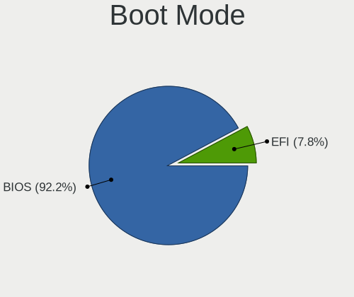
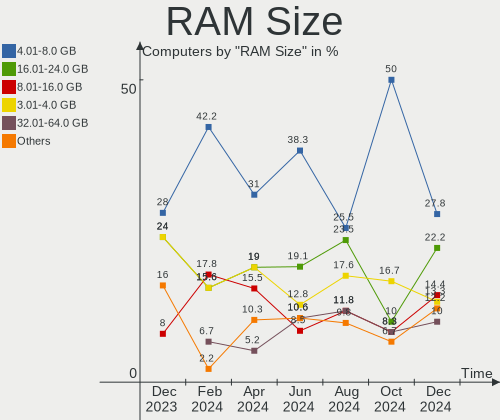
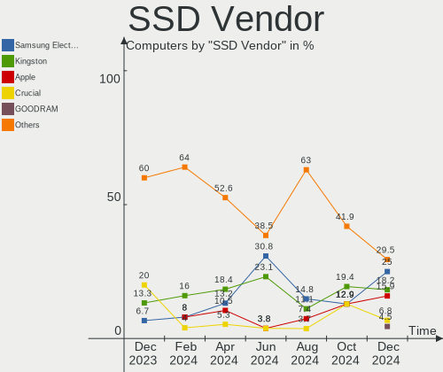
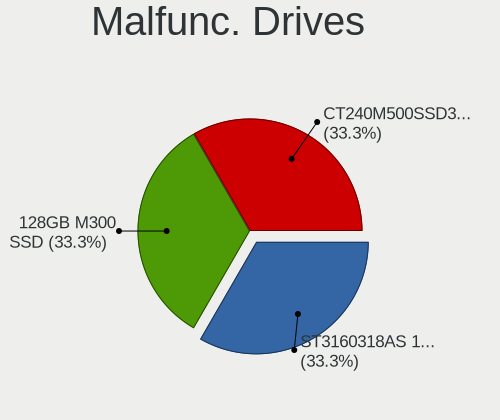
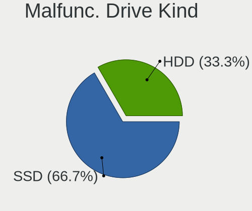
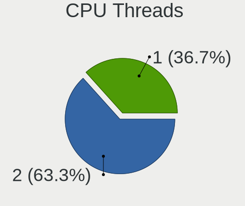

Elementary - Hardware Trends
----------------------------

A project to identify most popular hardware characteristics and track their change
over time based on data collected by Linux users at https://Linux-Hardware.org.

Anyone can contribute to this report by the [hw-probe](https://github.com/linuxhw/hw-probe) tool:

    sudo -E hw-probe -all -upload

This is a report for all computer types. See also reports for [desktops](/Dist/Elementary/Desktop/README.md) and [notebooks](/Dist/Elementary/Notebook/README.md).

This report is for one last month. Overall report since the beginning of time: [TestCoverage](https://github.com/linuxhw/TestCoverage)

Period: Jan, 2023.

Contents
--------

* [ System ](#system)
  - [ OS                       ](#os)
  - [ OS Family                ](#os-family)
  - [ Kernel                   ](#kernel)
  - [ Kernel Family            ](#kernel-family)
  - [ Kernel Major Ver.        ](#kernel-major-ver)
  - [ Arch                     ](#arch)
  - [ DE                       ](#de)
  - [ Display Server           ](#display-server)
  - [ Display Manager          ](#display-manager)
  - [ OS Lang                  ](#os-lang)
  - [ Boot Mode                ](#boot-mode)
  - [ Filesystem               ](#filesystem)
  - [ Part. scheme             ](#part-scheme)
  - [ Dual Boot with Linux/BSD ](#dual-boot-with-linuxbsd)
  - [ Dual Boot (Win)          ](#dual-boot-win)

* [ Board ](#board)
  - [ Vendor                   ](#vendor)
  - [ Model                    ](#model)
  - [ Model Family             ](#model-family)
  - [ MFG Year                 ](#mfg-year)
  - [ Form Factor              ](#form-factor)
  - [ Secure Boot              ](#secure-boot)
  - [ Coreboot                 ](#coreboot)
  - [ RAM Size                 ](#ram-size)
  - [ RAM Used                 ](#ram-used)
  - [ Total Drives             ](#total-drives)
  - [ Has CD-ROM               ](#has-cd-rom)
  - [ Has Ethernet             ](#has-ethernet)
  - [ Has WiFi                 ](#has-wifi)
  - [ Has Bluetooth            ](#has-bluetooth)

* [ Location ](#location)
  - [ Country                  ](#country)
  - [ City                     ](#city)

* [ Drives ](#drives)
  - [ Drive Vendor             ](#drive-vendor)
  - [ Drive Model              ](#drive-model)
  - [ HDD Vendor               ](#hdd-vendor)
  - [ SSD Vendor               ](#ssd-vendor)
  - [ Drive Kind               ](#drive-kind)
  - [ Drive Connector          ](#drive-connector)
  - [ Drive Size               ](#drive-size)
  - [ Space Total              ](#space-total)
  - [ Space Used               ](#space-used)
  - [ Malfunc. Drives          ](#malfunc-drives)
  - [ Malfunc. Drive Vendor    ](#malfunc-drive-vendor)
  - [ Malfunc. HDD Vendor      ](#malfunc-hdd-vendor)
  - [ Malfunc. Drive Kind      ](#malfunc-drive-kind)
  - [ Failed Drives            ](#failed-drives)
  - [ Failed Drive Vendor      ](#failed-drive-vendor)
  - [ Drive Status             ](#drive-status)

* [ Storage controller ](#storage-controller)
  - [ Storage Vendor           ](#storage-vendor)
  - [ Storage Model            ](#storage-model)
  - [ Storage Kind             ](#storage-kind)

* [ Processor ](#processor)
  - [ CPU Vendor               ](#cpu-vendor)
  - [ CPU Model                ](#cpu-model)
  - [ CPU Model Family         ](#cpu-model-family)
  - [ CPU Cores                ](#cpu-cores)
  - [ CPU Sockets              ](#cpu-sockets)
  - [ CPU Threads              ](#cpu-threads)
  - [ CPU Op-Modes             ](#cpu-op-modes)
  - [ CPU Microcode            ](#cpu-microcode)
  - [ CPU Microarch            ](#cpu-microarch)

* [ Graphics ](#graphics)
  - [ GPU Vendor               ](#gpu-vendor)
  - [ GPU Model                ](#gpu-model)
  - [ GPU Combo                ](#gpu-combo)
  - [ GPU Driver               ](#gpu-driver)
  - [ GPU Memory               ](#gpu-memory)

* [ Monitor ](#monitor)
  - [ Monitor Vendor           ](#monitor-vendor)
  - [ Monitor Model            ](#monitor-model)
  - [ Monitor Resolution       ](#monitor-resolution)
  - [ Monitor Diagonal         ](#monitor-diagonal)
  - [ Monitor Width            ](#monitor-width)
  - [ Aspect Ratio             ](#aspect-ratio)
  - [ Monitor Area             ](#monitor-area)
  - [ Pixel Density            ](#pixel-density)
  - [ Multiple Monitors        ](#multiple-monitors)

* [ Network ](#network)
  - [ Net Controller Vendor    ](#net-controller-vendor)
  - [ Net Controller Model     ](#net-controller-model)
  - [ Wireless Vendor          ](#wireless-vendor)
  - [ Wireless Model           ](#wireless-model)
  - [ Ethernet Vendor          ](#ethernet-vendor)
  - [ Ethernet Model           ](#ethernet-model)
  - [ Net Controller Kind      ](#net-controller-kind)
  - [ Used Controller          ](#used-controller)
  - [ NICs                     ](#nics)
  - [ IPv6                     ](#ipv6)

* [ Bluetooth ](#bluetooth)
  - [ Bluetooth Vendor         ](#bluetooth-vendor)
  - [ Bluetooth Model          ](#bluetooth-model)

* [ Sound ](#sound)
  - [ Sound Vendor             ](#sound-vendor)
  - [ Sound Model              ](#sound-model)

* [ Memory ](#memory)
  - [ Memory Vendor            ](#memory-vendor)
  - [ Memory Model             ](#memory-model)
  - [ Memory Kind              ](#memory-kind)
  - [ Memory Form Factor       ](#memory-form-factor)
  - [ Memory Size              ](#memory-size)
  - [ Memory Speed             ](#memory-speed)

* [ Printers & scanners ](#printers--scanners)
  - [ Printer Vendor           ](#printer-vendor)
  - [ Printer Model            ](#printer-model)
  - [ Scanner Vendor           ](#scanner-vendor)
  - [ Scanner Model            ](#scanner-model)

* [ Camera ](#camera)
  - [ Camera Vendor            ](#camera-vendor)
  - [ Camera Model             ](#camera-model)

* [ Security ](#security)
  - [ Fingerprint Vendor       ](#fingerprint-vendor)
  - [ Fingerprint Model        ](#fingerprint-model)
  - [ Chipcard Vendor          ](#chipcard-vendor)
  - [ Chipcard Model           ](#chipcard-model)

* [ Unsupported ](#unsupported)
  - [ Unsupported Devices      ](#unsupported-devices)
  - [ Unsupported Device Types ](#unsupported-device-types)

System
------

OS
--

Installed operating systems

| Name             | Computers | Percent |
|------------------|-----------|---------|
| Elementary 6.1   | 40        | 88.89%  |
| Elementary 7     | 3         | 6.67%   |
| Elementary 5.1.7 | 2         | 4.44%   |

OS Family
---------

OS without a version

| Name       | Computers | Percent |
|------------|-----------|---------|
| Elementary | 45        | 100%    |

Kernel
------

Version of the Linux kernel

| Version                | Computers | Percent |
|------------------------|-----------|---------|
| 5.15.0-58-generic      | 13        | 28.89%  |
| 5.15.0-57-generic      | 10        | 22.22%  |
| 5.15.0-56-generic      | 9         | 20%     |
| 5.11.0-43-generic      | 5         | 11.11%  |
| 6.1.8-x64v2-xanmod1    | 1         | 2.22%   |
| 6.1.6-060106-generic   | 1         | 2.22%   |
| 5.4.0-137-generic      | 1         | 2.22%   |
| 5.4.0-135-lowlatency   | 1         | 2.22%   |
| 5.4.0-135-generic      | 1         | 2.22%   |
| 5.16.15-051615-generic | 1         | 2.22%   |
| 5.15.0-60-generic      | 1         | 2.22%   |
| 5.15.0-50-generic      | 1         | 2.22%   |

Kernel Family
-------------

Linux kernel without a distro release

| Version | Computers | Percent |
|---------|-----------|---------|
| 5.15.0  | 34        | 75.56%  |
| 5.11.0  | 5         | 11.11%  |
| 5.4.0   | 3         | 6.67%   |
| 6.1.8   | 1         | 2.22%   |
| 6.1.6   | 1         | 2.22%   |
| 5.16.15 | 1         | 2.22%   |

Kernel Major Ver.
-----------------

Linux kernel major version

| Version | Computers | Percent |
|---------|-----------|---------|
| 5.15    | 34        | 75.56%  |
| 5.11    | 5         | 11.11%  |
| 5.4     | 3         | 6.67%   |
| 6.1     | 2         | 4.44%   |
| 5.16    | 1         | 2.22%   |

Arch
----

OS architecture (x86_64, i586, etc.)

| Name   | Computers | Percent |
|--------|-----------|---------|
| x86_64 | 45        | 100%    |

DE
--

Desktop Environment

| Name     | Computers | Percent |
|----------|-----------|---------|
| Pantheon | 45        | 100%    |

Display Server
--------------

X11 or Wayland

| Name | Computers | Percent |
|------|-----------|---------|
| X11  | 45        | 100%    |

Display Manager
---------------

SDDM, LightDM, etc.

| Name    | Computers | Percent |
|---------|-----------|---------|
| Unknown | 26        | 57.78%  |
| LightDM | 19        | 42.22%  |

OS Lang
-------

Language

| Lang  | Computers | Percent |
|-------|-----------|---------|
| en_US | 17        | 37.78%  |
| it_IT | 5         | 11.11%  |
| de_DE | 4         | 8.89%   |
| pt_BR | 2         | 4.44%   |
| pl_PL | 2         | 4.44%   |
| nb_NO | 2         | 4.44%   |
| fr_FR | 2         | 4.44%   |
| es_ES | 2         | 4.44%   |
| zh_CN | 1         | 2.22%   |
| tr_TR | 1         | 2.22%   |
| sv_SE | 1         | 2.22%   |
| ru_RU | 1         | 2.22%   |
| fr_CA | 1         | 2.22%   |
| en_GB | 1         | 2.22%   |
| en_CA | 1         | 2.22%   |
| el_GR | 1         | 2.22%   |
| ca_ES | 1         | 2.22%   |

Boot Mode
---------

EFI or BIOS

| Mode | Computers | Percent |
|------|-----------|---------|
| EFI  | 26        | 57.78%  |
| BIOS | 19        | 42.22%  |

Filesystem
----------

Type of filesystem

| Type    | Computers | Percent |
|---------|-----------|---------|
| Ext4    | 43        | 95.56%  |
| Xfs     | 1         | 2.22%   |
| Overlay | 1         | 2.22%   |

Part. scheme
------------

Scheme of partitioning

| Type    | Computers | Percent |
|---------|-----------|---------|
| Unknown | 26        | 57.78%  |
| GPT     | 16        | 35.56%  |
| MBR     | 3         | 6.67%   |

Dual Boot with Linux/BSD
------------------------

Hosting more than one Linux/BSD

| Dual boot | Computers | Percent |
|-----------|-----------|---------|
| No        | 43        | 95.56%  |
| Yes       | 2         | 4.44%   |

Dual Boot (Win)
---------------

Hosting Linux and Windows

| Dual boot | Computers | Percent |
|-----------|-----------|---------|
| No        | 38        | 84.44%  |
| Yes       | 7         | 15.56%  |

Board
-----

Vendor
------

Motherboard manufacturer

| Name                   | Computers | Percent |
|------------------------|-----------|---------|
| Lenovo                 | 8         | 17.78%  |
| Apple                  | 7         | 15.56%  |
| Hewlett-Packard        | 6         | 13.33%  |
| Gigabyte Technology    | 4         | 8.89%   |
| Dell                   | 3         | 6.67%   |
| Sony                   | 2         | 4.44%   |
| HUAWEI                 | 2         | 4.44%   |
| ASUSTek Computer       | 2         | 4.44%   |
| Acer                   | 2         | 4.44%   |
| Unknown                | 2         | 4.44%   |
| Star Labs              | 1         | 2.22%   |
| Notebook               | 1         | 2.22%   |
| Intel                  | 1         | 2.22%   |
| EVGA                   | 1         | 2.22%   |
| Chuwi                  | 1         | 2.22%   |
| BESSTAR Tech           | 1         | 2.22%   |
| Avell High Performance | 1         | 2.22%   |

Model
-----

Motherboard model

| Name                                  | Computers | Percent |
|---------------------------------------|-----------|---------|
| HUAWEI MACHD-WXX9                     | 2         | 4.44%   |
| Unknown                               | 2         | 4.44%   |
| Star Labs StarBook                    | 1         | 2.22%   |
| Sony VPCSB11FX                        | 1         | 2.22%   |
| Sony SVE1711C5E                       | 1         | 2.22%   |
| Notebook NLx0MU                       | 1         | 2.22%   |
| Lenovo Y50-70 20378                   | 1         | 2.22%   |
| Lenovo V14 G2 ALC 82KC                | 1         | 2.22%   |
| Lenovo ThinkPad T480 20L5000YUS       | 1         | 2.22%   |
| Lenovo ThinkPad T14 Gen 1 20S1S3PM00  | 1         | 2.22%   |
| Lenovo ThinkPad E14 Gen 2 20TA00BUAD  | 1         | 2.22%   |
| Lenovo IdeaPad S145-14AST 81ST        | 1         | 2.22%   |
| Lenovo IdeaPad 330-15IKB 81FE         | 1         | 2.22%   |
| Lenovo IdeaPad 110-15ACL 80TJ         | 1         | 2.22%   |
| Intel Jasper Lake Client Platform     | 1         | 2.22%   |
| HP Spectre x360 Convertible 15-eb0xxx | 1         | 2.22%   |
| HP ProLiant DL380p Gen8               | 1         | 2.22%   |
| HP ProBook 650 G1                     | 1         | 2.22%   |
| HP ProBook 455R G6                    | 1         | 2.22%   |
| HP Pavilion Gaming Desktop TG01-0xxx  | 1         | 2.22%   |
| HP EliteBook 2560p                    | 1         | 2.22%   |
| Gigabyte Z77MX-D3H                    | 1         | 2.22%   |
| Gigabyte GA-990FXA-UD3                | 1         | 2.22%   |
| Gigabyte B450 AORUS ELITE             | 1         | 2.22%   |
| Gigabyte A320M-S2H V2                 | 1         | 2.22%   |
| EVGA E689 0.0                         | 1         | 2.22%   |
| Dell XPS 15 9510                      | 1         | 2.22%   |
| Dell XPS 13 9360                      | 1         | 2.22%   |
| Dell OptiPlex 960                     | 1         | 2.22%   |
| Chuwi AeroBook Pro                    | 1         | 2.22%   |
| BESSTAR Tech UM350                    | 1         | 2.22%   |
| Avell High Performance B.ON           | 1         | 2.22%   |
| ASUS Z170 PRO GAMING                  | 1         | 2.22%   |
| ASUS All Series                       | 1         | 2.22%   |
| Apple MacBookPro8,2                   | 1         | 2.22%   |
| Apple MacBookPro8,1                   | 1         | 2.22%   |
| Apple MacBookPro11,3                  | 1         | 2.22%   |
| Apple MacBookAir6,2                   | 1         | 2.22%   |
| Apple iMac14,3                        | 1         | 2.22%   |
| Apple iMac14,1                        | 1         | 2.22%   |

Model Family
------------

Motherboard model prefix

| Name                        | Computers | Percent |
|-----------------------------|-----------|---------|
| Lenovo ThinkPad             | 3         | 6.67%   |
| Lenovo IdeaPad              | 3         | 6.67%   |
| HUAWEI MACHD-WXX9           | 2         | 4.44%   |
| HP ProBook                  | 2         | 4.44%   |
| Dell XPS                    | 2         | 4.44%   |
| Apple MacBookPro8           | 2         | 4.44%   |
| Apple iMac14                | 2         | 4.44%   |
| Unknown                     | 2         | 4.44%   |
| Star Labs StarBook          | 1         | 2.22%   |
| Sony VPCSB11FX              | 1         | 2.22%   |
| Sony SVE1711C5E             | 1         | 2.22%   |
| Notebook NLx0MU             | 1         | 2.22%   |
| Lenovo Y50-70               | 1         | 2.22%   |
| Lenovo V14                  | 1         | 2.22%   |
| Intel Jasper                | 1         | 2.22%   |
| HP Spectre                  | 1         | 2.22%   |
| HP ProLiant                 | 1         | 2.22%   |
| HP Pavilion                 | 1         | 2.22%   |
| HP EliteBook                | 1         | 2.22%   |
| Gigabyte Z77MX-D3H          | 1         | 2.22%   |
| Gigabyte GA-990FXA-UD3      | 1         | 2.22%   |
| Gigabyte B450               | 1         | 2.22%   |
| Gigabyte A320M-S2H          | 1         | 2.22%   |
| EVGA E689                   | 1         | 2.22%   |
| Dell OptiPlex               | 1         | 2.22%   |
| Chuwi AeroBook              | 1         | 2.22%   |
| BESSTAR Tech UM350          | 1         | 2.22%   |
| Avell High Performance B.ON | 1         | 2.22%   |
| ASUS Z170                   | 1         | 2.22%   |
| ASUS All                    | 1         | 2.22%   |
| Apple MacBookPro11          | 1         | 2.22%   |
| Apple MacBookAir6           | 1         | 2.22%   |
| Apple iMac11                | 1         | 2.22%   |
| Acer Veriton                | 1         | 2.22%   |
| Acer TravelMate             | 1         | 2.22%   |

MFG Year
--------

Motherboard manufacture year

| Year | Computers | Percent |
|------|-----------|---------|
| 2021 | 6         | 13.33%  |
| 2020 | 5         | 11.11%  |
| 2018 | 5         | 11.11%  |
| 2011 | 5         | 11.11%  |
| 2013 | 4         | 8.89%   |
| 2022 | 3         | 6.67%   |
| 2014 | 3         | 6.67%   |
| 2012 | 3         | 6.67%   |
| 2010 | 3         | 6.67%   |
| 2019 | 2         | 4.44%   |
| 2016 | 2         | 4.44%   |
| 2015 | 2         | 4.44%   |
| 2023 | 1         | 2.22%   |
| 2009 | 1         | 2.22%   |

Form Factor
-----------

Physical design of the computer

| Name        | Computers | Percent |
|-------------|-----------|---------|
| Notebook    | 26        | 57.78%  |
| Desktop     | 14        | 31.11%  |
| All in one  | 3         | 6.67%   |
| Convertible | 1         | 2.22%   |
| Server      | 1         | 2.22%   |

Secure Boot
-----------

Enabled or disabled

| State    | Computers | Percent |
|----------|-----------|---------|
| Disabled | 42        | 93.33%  |
| Enabled  | 3         | 6.67%   |

Coreboot
--------

Have coreboot on board

| Used | Computers | Percent |
|------|-----------|---------|
| No   | 44        | 97.78%  |
| Yes  | 1         | 2.22%   |

RAM Size
--------

Total RAM memory

| Size in GB  | Computers | Percent |
|-------------|-----------|---------|
| 16.01-24.0  | 13        | 28.89%  |
| 8.01-16.0   | 11        | 24.44%  |
| 4.01-8.0    | 8         | 17.78%  |
| 32.01-64.0  | 6         | 13.33%  |
| 3.01-4.0    | 3         | 6.67%   |
| 24.01-32.0  | 2         | 4.44%   |
| 64.01-256.0 | 1         | 2.22%   |
| 1.01-2.0    | 1         | 2.22%   |

RAM Used
--------

Used RAM memory

| Used GB    | Computers | Percent |
|------------|-----------|---------|
| 2.01-3.0   | 14        | 31.11%  |
| 1.01-2.0   | 13        | 28.89%  |
| 3.01-4.0   | 8         | 17.78%  |
| 8.01-16.0  | 6         | 13.33%  |
| 4.01-8.0   | 3         | 6.67%   |
| 16.01-24.0 | 1         | 2.22%   |

Total Drives
------------

Number of drives on board

| Drives | Computers | Percent |
|--------|-----------|---------|
| 1      | 28        | 62.22%  |
| 2      | 10        | 22.22%  |
| 3      | 3         | 6.67%   |
| 5      | 2         | 4.44%   |
| 4      | 1         | 2.22%   |
| 0      | 1         | 2.22%   |

Has CD-ROM
----------

Has CD-ROM on board

| Presented | Computers | Percent |
|-----------|-----------|---------|
| No        | 35        | 77.78%  |
| Yes       | 10        | 22.22%  |

Has Ethernet
------------

Has Ethernet on board

| Presented | Computers | Percent |
|-----------|-----------|---------|
| Yes       | 36        | 80%     |
| No        | 9         | 20%     |

Has WiFi
--------

Has WiFi module

| Presented | Computers | Percent |
|-----------|-----------|---------|
| Yes       | 38        | 84.44%  |
| No        | 7         | 15.56%  |

Has Bluetooth
-------------

Has Bluetooth module

| Presented | Computers | Percent |
|-----------|-----------|---------|
| Yes       | 36        | 80%     |
| No        | 9         | 20%     |

Location
--------

Country
-------

Geographic location (country)

| Country      | Computers | Percent |
|--------------|-----------|---------|
| USA          | 6         | 13.33%  |
| Italy        | 6         | 13.33%  |
| Russia       | 3         | 6.67%   |
| Norway       | 3         | 6.67%   |
| Germany      | 3         | 6.67%   |
| Brazil       | 3         | 6.67%   |
| France       | 2         | 4.44%   |
| Canada       | 2         | 4.44%   |
| Austria      | 2         | 4.44%   |
| Turkey       | 1         | 2.22%   |
| Sweden       | 1         | 2.22%   |
| Spain        | 1         | 2.22%   |
| South Africa | 1         | 2.22%   |
| Singapore    | 1         | 2.22%   |
| Saudi Arabia | 1         | 2.22%   |
| Poland       | 1         | 2.22%   |
| Pakistan     | 1         | 2.22%   |
| Netherlands  | 1         | 2.22%   |
| Mexico       | 1         | 2.22%   |
| Malaysia     | 1         | 2.22%   |
| Israel       | 1         | 2.22%   |
| Indonesia    | 1         | 2.22%   |
| Greece       | 1         | 2.22%   |
| Chile        | 1         | 2.22%   |

City
----

Geographic location (city)

| City                     | Computers | Percent |
|--------------------------|-----------|---------|
| Vienna                   | 2         | 4.44%   |
| St Petersburg            | 2         | 4.44%   |
| Yio Chu Kang             | 1         | 2.22%   |
| Tuxpam de Rodriguez Cano | 1         | 2.22%   |
| Trondheim                | 1         | 2.22%   |
| Tempio Pausania          | 1         | 2.22%   |
| Stuttgart                | 1         | 2.22%   |
| Stockholm                | 1         | 2.22%   |
| Spring                   | 1         | 2.22%   |
| Saransk                  | 1         | 2.22%   |
| Sao Gotardo              | 1         | 2.22%   |
| Sant Esteve Sesrovires   | 1         | 2.22%   |
| Rovato                   | 1         | 2.22%   |
| Round Rock               | 1         | 2.22%   |
| Riyadh                   | 1         | 2.22%   |
| Potchefstroom            | 1         | 2.22%   |
| Philipsburg              | 1         | 2.22%   |
| Oslo                     | 1         | 2.22%   |
| Newport                  | 1         | 2.22%   |
| Maloy                    | 1         | 2.22%   |
| Los Angeles              | 1         | 2.22%   |
| Laval                    | 1         | 2.22%   |
| Lahore                   | 1         | 2.22%   |
| Kuala Lumpur             | 1         | 2.22%   |
| Krakow                   | 1         | 2.22%   |
| Kallithea                | 1         | 2.22%   |
| Izmir                    | 1         | 2.22%   |
| Frankfurt am Main        | 1         | 2.22%   |
| Fortaleza                | 1         | 2.22%   |
| Faenza                   | 1         | 2.22%   |
| Élancourt               | 1         | 2.22%   |
| Como                     | 1         | 2.22%   |
| Cogliate                 | 1         | 2.22%   |
| Chiguayante              | 1         | 2.22%   |
| Campodarsego             | 1         | 2.22%   |
| Boituva                  | 1         | 2.22%   |
| Berlin                   | 1         | 2.22%   |
| Belleville               | 1         | 2.22%   |
| Bandung                  | 1         | 2.22%   |
| Austin                   | 1         | 2.22%   |

Drives
------

Drive Vendor
------------

Hard drive vendors

| Vendor                      | Computers | Drives | Percent |
|-----------------------------|-----------|--------|---------|
| Samsung Electronics         | 9         | 13     | 15%     |
| WDC                         | 8         | 9      | 13.33%  |
| Seagate                     | 7         | 7      | 11.67%  |
| SK hynix                    | 4         | 5      | 6.67%   |
| Apple                       | 3         | 4      | 5%      |
| Apacer                      | 3         | 3      | 5%      |
| SPCC                        | 2         | 2      | 3.33%   |
| SanDisk                     | 2         | 3      | 3.33%   |
| Kingston                    | 2         | 2      | 3.33%   |
| Hitachi                     | 2         | 2      | 3.33%   |
| Yangtze Memory Technologies | 1         | 1      | 1.67%   |
| Union Memory                | 1         | 1      | 1.67%   |
| Team                        | 1         | 1      | 1.67%   |
| Star Drive                  | 1         | 1      | 1.67%   |
| PNY                         | 1         | 1      | 1.67%   |
| Patriot                     | 1         | 1      | 1.67%   |
| OCZ                         | 1         | 1      | 1.67%   |
| Morebeck-N100               | 1         | 1      | 1.67%   |
| Micron/Crucial Technology   | 1         | 1      | 1.67%   |
| Micron Technology           | 1         | 1      | 1.67%   |
| Kingchuxing                 | 1         | 1      | 1.67%   |
| Intenso                     | 1         | 1      | 1.67%   |
| Intel                       | 1         | 2      | 1.67%   |
| Fanxiang                    | 1         | 1      | 1.67%   |
| Crucial                     | 1         | 1      | 1.67%   |
| China                       | 1         | 1      | 1.67%   |
| A-DATA Technology           | 1         | 1      | 1.67%   |
| Unknown                     | 1         | 1      | 1.67%   |

Drive Model
-----------

Hard drive models

| Model                                                | Computers | Percent |
|------------------------------------------------------|-----------|---------|
| Samsung NVMe SSD Controller PM9A1/PM9A3/980PRO 512GB | 2         | 3.03%   |
| Apple HDD HTS541010A9E662 1TB                        | 2         | 3.03%   |
| Apacer AS350 256GB SSD                               | 2         | 3.03%   |
| Yangtze Memory YMTC PC005 512GB                      | 1         | 1.52%   |
| WDC WDS100T2G0A-00JH30 1TB SSD                       | 1         | 1.52%   |
| WDC WD6400BPVT-80HXZT1 640GB                         | 1         | 1.52%   |
| WDC WD10JPVX-60JC3T0 1TB                             | 1         | 1.52%   |
| WDC WD10EZEX-60WN4A0 1TB                             | 1         | 1.52%   |
| WDC WD10EZEX-08WN4A0 1TB                             | 1         | 1.52%   |
| WDC WD10EZEX-00ZF5A0 1TB                             | 1         | 1.52%   |
| WDC WD10EADS-11M2B2 1TB                              | 1         | 1.52%   |
| WDC WD Green 2.5 240GB                               | 1         | 1.52%   |
| WDC PC SN730 SDBQNTY-512G-1001 512GB                 | 1         | 1.52%   |
| Union Memory UMIS RPJTJ256MEE1OWX 256GB              | 1         | 1.52%   |
| Team T253X1480G 480GB SSD                            | 1         | 1.52%   |
| Star Drive PCIe SSD 1TB                              | 1         | 1.52%   |
| SPCC Solid State Disk 120GB                          | 1         | 1.52%   |
| SPCC M.2 SSD 512GB                                   | 1         | 1.52%   |
| SK hynix SHPP41-2000GM 2TB                           | 1         | 1.52%   |
| SK hynix PC711 NVMe 1TB                              | 1         | 1.52%   |
| SK hynix BC511 512GB                                 | 1         | 1.52%   |
| SK hynix BC501 NVMe Solid State Drive 512GB          | 1         | 1.52%   |
| Seagate ST500DM002-1BD142 500GB                      | 1         | 1.52%   |
| Seagate ST4000DM000-1F2168 4TB                       | 1         | 1.52%   |
| Seagate ST3500413AS 500GB                            | 1         | 1.52%   |
| Seagate ST1000LM048-2E7172 1TB                       | 1         | 1.52%   |
| Seagate ST1000LM035-1RK172 1TB                       | 1         | 1.52%   |
| Seagate ST1000DM010-2EP102 1TB                       | 1         | 1.52%   |
| Seagate ST1000DM003-1ER162 1TB                       | 1         | 1.52%   |
| SanDisk SSD PLUS 1000GB                              | 1         | 1.52%   |
| SanDisk SDSSDHP256G 256GB                            | 1         | 1.52%   |
| SanDisk SD9SN8W-256G-1006 256GB SSD                  | 1         | 1.52%   |
| Samsung SSD 980 500GB                                | 1         | 1.52%   |
| Samsung SSD 860 EVO 250GB                            | 1         | 1.52%   |
| Samsung SSD 860 EVO 1TB                              | 1         | 1.52%   |
| Samsung SSD 850 EVO 500GB                            | 1         | 1.52%   |
| Samsung SSD 850 EVO 250GB                            | 1         | 1.52%   |
| Samsung SSD 840 Series 250GB                         | 1         | 1.52%   |
| Samsung MZVLB512HAJQ-000L7 512GB                     | 1         | 1.52%   |
| Samsung MZVLB1T0HBLR-00000 1TB                       | 1         | 1.52%   |

HDD Vendor
----------

Hard disk drive vendors

| Vendor  | Computers | Drives | Percent |
|---------|-----------|--------|---------|
| Seagate | 7         | 7      | 43.75%  |
| WDC     | 5         | 6      | 31.25%  |
| Hitachi | 2         | 2      | 12.5%   |
| Apple   | 2         | 2      | 12.5%   |

SSD Vendor
----------

Solid state drive vendors

| Vendor              | Computers | Drives | Percent |
|---------------------|-----------|--------|---------|
| Samsung Electronics | 3         | 7      | 11.54%  |
| Apacer              | 3         | 3      | 11.54%  |
| WDC                 | 2         | 2      | 7.69%   |
| SPCC                | 2         | 2      | 7.69%   |
| SanDisk             | 2         | 3      | 7.69%   |
| Kingston            | 2         | 2      | 7.69%   |
| Apple               | 2         | 2      | 7.69%   |
| Team                | 1         | 1      | 3.85%   |
| PNY                 | 1         | 1      | 3.85%   |
| Patriot             | 1         | 1      | 3.85%   |
| OCZ                 | 1         | 1      | 3.85%   |
| Morebeck-N100       | 1         | 1      | 3.85%   |
| Intenso             | 1         | 1      | 3.85%   |
| Fanxiang            | 1         | 1      | 3.85%   |
| Crucial             | 1         | 1      | 3.85%   |
| China               | 1         | 1      | 3.85%   |
| Unknown             | 1         | 1      | 3.85%   |

Drive Kind
----------

HDD or SSD

| Kind    | Computers | Drives | Percent |
|---------|-----------|--------|---------|
| SSD     | 23        | 31     | 41.82%  |
| NVMe    | 18        | 20     | 32.73%  |
| HDD     | 13        | 17     | 23.64%  |
| Unknown | 1         | 1      | 1.82%   |

Drive Connector
---------------

SATA, SAS, NVMe, etc.

| Type | Computers | Drives | Percent |
|------|-----------|--------|---------|
| SATA | 30        | 49     | 62.5%   |
| NVMe | 18        | 20     | 37.5%   |

Drive Size
----------

Size of hard drive

| Size in TB | Computers | Drives | Percent |
|------------|-----------|--------|---------|
| 0.01-0.5   | 19        | 25     | 51.35%  |
| 0.51-1.0   | 15        | 20     | 40.54%  |
| 3.01-4.0   | 1         | 1      | 2.7%    |
| 2.01-3.0   | 1         | 1      | 2.7%    |
| 1.01-2.0   | 1         | 1      | 2.7%    |

Space Total
-----------

Amount of disk space available on the file system

| Size in GB | Computers | Percent |
|------------|-----------|---------|
| 101-250    | 14        | 31.11%  |
| 501-1000   | 14        | 31.11%  |
| 251-500    | 9         | 20%     |
| 51-100     | 4         | 8.89%   |
| 1001-2000  | 2         | 4.44%   |
| 21-50      | 1         | 2.22%   |
| 2001-3000  | 1         | 2.22%   |

Space Used
----------

Amount of used disk space

| Used GB  | Computers | Percent |
|----------|-----------|---------|
| 1-20     | 16        | 35.56%  |
| 21-50    | 10        | 22.22%  |
| 101-250  | 8         | 17.78%  |
| 51-100   | 6         | 13.33%  |
| 251-500  | 4         | 8.89%   |
| 501-1000 | 1         | 2.22%   |

Malfunc. Drives
---------------

Drive models with a malfunction

| Model                   | Computers | Drives | Percent |
|-------------------------|-----------|--------|---------|
| OCZ VECTOR150 240GB SSD | 1         | 1      | 50%     |
| China SSD 256GB         | 1         | 1      | 50%     |

Malfunc. Drive Vendor
---------------------

Vendors of faulty drives

| Vendor | Computers | Drives | Percent |
|--------|-----------|--------|---------|
| OCZ    | 1         | 1      | 50%     |
| China  | 1         | 1      | 50%     |

Malfunc. HDD Vendor
-------------------

Vendors of faulty HDD drives

Zero info for selected period =(

Malfunc. Drive Kind
-------------------

Kinds of faulty drives

| Kind | Computers | Drives | Percent |
|------|-----------|--------|---------|
| SSD  | 2         | 2      | 100%    |

Failed Drives
-------------

Failed drive models

Zero info for selected period =(

Failed Drive Vendor
-------------------

Failed drive vendors

Zero info for selected period =(

Drive Status
------------

Number of failed and malfunc. drives

| Status   | Computers | Drives | Percent |
|----------|-----------|--------|---------|
| Detected | 30        | 52     | 66.67%  |
| Works    | 13        | 15     | 28.89%  |
| Malfunc  | 2         | 2      | 4.44%   |

Storage controller
------------------

Storage Vendor
--------------

Storage controller vendors

| Vendor                      | Computers | Percent |
|-----------------------------|-----------|---------|
| Intel                       | 27        | 45.76%  |
| AMD                         | 10        | 16.95%  |
| Samsung Electronics         | 7         | 11.86%  |
| SK hynix                    | 3         | 5.08%   |
| Marvell Technology Group    | 2         | 3.39%   |
| JMicron Technology          | 2         | 3.39%   |
| Yangtze Memory Technologies | 1         | 1.69%   |
| Union Memory (Shenzhen)     | 1         | 1.69%   |
| SanDisk                     | 1         | 1.69%   |
| Phison Electronics          | 1         | 1.69%   |
| Micron/Crucial Technology   | 1         | 1.69%   |
| Micron Technology           | 1         | 1.69%   |
| Hewlett-Packard             | 1         | 1.69%   |
| ADATA Technology            | 1         | 1.69%   |

Storage Model
-------------

Storage controller models

| Model                                                                                  | Computers | Percent |
|----------------------------------------------------------------------------------------|-----------|---------|
| AMD FCH SATA Controller [AHCI mode]                                                    | 9         | 13.24%  |
| Intel 8 Series/C220 Series Chipset Family 6-port SATA Controller 1 [AHCI mode]         | 5         | 7.35%   |
| Intel Sunrise Point-LP SATA Controller [AHCI mode]                                     | 3         | 4.41%   |
| Samsung NVMe SSD Controller SM981/PM981/PM983                                          | 2         | 2.94%   |
| Samsung NVMe SSD Controller PM9A1/PM9A3/980PRO                                         | 2         | 2.94%   |
| Samsung NVMe SSD Controller 980                                                        | 2         | 2.94%   |
| JMicron JMB368 IDE controller                                                          | 2         | 2.94%   |
| Intel 6 Series/C200 Series Chipset Family Mobile SATA Controller (IDE mode, ports 0-3) | 2         | 2.94%   |
| Intel 6 Series/C200 Series Chipset Family 6 port Mobile SATA AHCI Controller           | 2         | 2.94%   |
| AMD 400 Series Chipset SATA Controller                                                 | 2         | 2.94%   |
| Yangtze Memory Non-Volatile memory controller                                          | 1         | 1.47%   |
| Union Memory (Shenzhen) Non-Volatile memory controller                                 | 1         | 1.47%   |
| SK hynix Non-Volatile memory controller                                                | 1         | 1.47%   |
| SK hynix Gold P31/PC711 NVMe Solid State Drive                                         | 1         | 1.47%   |
| SK hynix BC501 NVMe Solid State Drive                                                  | 1         | 1.47%   |
| SanDisk WD Black SN750 / PC SN730 NVMe SSD                                             | 1         | 1.47%   |
| Samsung Apple PCIe SSD                                                                 | 1         | 1.47%   |
| Phison E18 PCIe4 NVMe Controller                                                       | 1         | 1.47%   |
| Micron/Crucial P2 NVMe PCIe SSD                                                        | 1         | 1.47%   |
| Micron Non-Volatile memory controller                                                  | 1         | 1.47%   |
| Marvell Group 88SS9183 PCIe SSD Controller                                             | 1         | 1.47%   |
| Marvell Group 88SE6111/6121 SATA II / PATA Controller                                  | 1         | 1.47%   |
| JMicron JMB363 SATA/IDE Controller                                                     | 1         | 1.47%   |
| Intel Volume Management Device NVMe RAID Controller                                    | 1         | 1.47%   |
| Intel Tiger Lake-LP SATA Controller                                                    | 1         | 1.47%   |
| Intel Q170/Q150/B150/H170/H110/Z170/CM236 Chipset SATA Controller [AHCI Mode]          | 1         | 1.47%   |
| Intel Non-Volatile memory controller                                                   | 1         | 1.47%   |
| Intel NM10/ICH7 Family SATA Controller [IDE mode]                                      | 1         | 1.47%   |
| Intel Jasper Lake SATA AHCI Controller                                                 | 1         | 1.47%   |
| Intel Comet Lake PCH-LP SATA RAID Premium Controller                                   | 1         | 1.47%   |
| Intel C600/X79 series chipset 6-Port SATA AHCI Controller                              | 1         | 1.47%   |
| Intel 82801JD/DO (ICH10 Family) SATA AHCI Controller                                   | 1         | 1.47%   |
| Intel 82801IBM/IEM (ICH9M/ICH9M-E) 4 port SATA Controller [AHCI mode]                  | 1         | 1.47%   |
| Intel 82801G (ICH7 Family) IDE Controller                                              | 1         | 1.47%   |
| Intel 82801 Mobile SATA Controller [RAID mode]                                         | 1         | 1.47%   |
| Intel 8 Series/C220 Series Chipset Family 2-port SATA Controller 2 [IDE mode]          | 1         | 1.47%   |
| Intel 7 Series/C210 Series Chipset Family 6-port SATA Controller [AHCI mode]           | 1         | 1.47%   |
| Intel 7 Series Chipset Family 6-port SATA Controller [AHCI mode]                       | 1         | 1.47%   |
| Intel 6 Series/C200 Series Chipset Family Mobile SATA Controller (IDE mode, ports 4-5) | 1         | 1.47%   |
| Intel 6 Series/C200 Series Chipset Family 6 port Desktop SATA AHCI Controller          | 1         | 1.47%   |

Storage Kind
------------

Kind of storage controller (IDE, SATA, NVMe, SAS, ...)

| Kind | Computers | Percent |
|------|-----------|---------|
| SATA | 31        | 51.67%  |
| NVMe | 17        | 28.33%  |
| IDE  | 7         | 11.67%  |
| RAID | 5         | 8.33%   |

Processor
---------

CPU Vendor
----------

Processor vendors

| Vendor | Computers | Percent |
|--------|-----------|---------|
| Intel  | 35        | 77.78%  |
| AMD    | 10        | 22.22%  |

CPU Model
---------

Processor models

| Model                                         | Computers | Percent |
|-----------------------------------------------|-----------|---------|
| Intel 11th Gen Core i5-1135G7 @ 2.40GHz       | 3         | 6.67%   |
| Intel Core i5-8250U CPU @ 1.60GHz             | 2         | 4.44%   |
| Intel 11th Gen Core i7-1165G7 @ 2.80GHz       | 2         | 4.44%   |
| Intel Xeon CPU E5-2620 0 @ 2.00GHz            | 1         | 2.22%   |
| Intel Pentium Dual-Core CPU T4500 @ 2.30GHz   | 1         | 2.22%   |
| Intel Pentium Dual-Core CPU E5700 @ 3.00GHz   | 1         | 2.22%   |
| Intel Core m3-8100Y CPU @ 1.10GHz             | 1         | 2.22%   |
| Intel Core i7-8550U CPU @ 1.80GHz             | 1         | 2.22%   |
| Intel Core i7-6700K CPU @ 4.00GHz             | 1         | 2.22%   |
| Intel Core i7-4980HQ CPU @ 2.80GHz            | 1         | 2.22%   |
| Intel Core i7-4710HQ CPU @ 2.50GHz            | 1         | 2.22%   |
| Intel Core i7-4650U CPU @ 1.70GHz             | 1         | 2.22%   |
| Intel Core i7-2720QM CPU @ 2.20GHz            | 1         | 2.22%   |
| Intel Core i7-2700K CPU @ 3.50GHz             | 1         | 2.22%   |
| Intel Core i7-2600K CPU @ 3.40GHz             | 1         | 2.22%   |
| Intel Core i7-10510U CPU @ 1.80GHz            | 1         | 2.22%   |
| Intel Core i5-4570S CPU @ 2.90GHz             | 1         | 2.22%   |
| Intel Core i5-4570R CPU @ 2.70GHz             | 1         | 2.22%   |
| Intel Core i5-4460 CPU @ 3.20GHz              | 1         | 2.22%   |
| Intel Core i5-4430 CPU @ 3.00GHz              | 1         | 2.22%   |
| Intel Core i5-4200M CPU @ 2.50GHz             | 1         | 2.22%   |
| Intel Core i5-3210M CPU @ 2.50GHz             | 1         | 2.22%   |
| Intel Core i5-2520M CPU @ 2.50GHz             | 1         | 2.22%   |
| Intel Core i5-2415M CPU @ 2.30GHz             | 1         | 2.22%   |
| Intel Core i5-2410M CPU @ 2.30GHz             | 1         | 2.22%   |
| Intel Core i5-10210U CPU @ 1.60GHz            | 1         | 2.22%   |
| Intel Core i3 CPU 550 @ 3.20GHz               | 1         | 2.22%   |
| Intel Core 2 Quad CPU Q9400 @ 2.66GHz         | 1         | 2.22%   |
| Intel Celeron N5105 @ 2.00GHz                 | 1         | 2.22%   |
| Intel 12th Gen Core i7-1260P                  | 1         | 2.22%   |
| Intel 11th Gen Core i9-11900H @ 2.50GHz       | 1         | 2.22%   |
| AMD Ryzen 9 5900HX with Radeon Graphics       | 1         | 2.22%   |
| AMD Ryzen 7 3700U with Radeon Vega Mobile Gfx | 1         | 2.22%   |
| AMD Ryzen 5 5600G with Radeon Graphics        | 1         | 2.22%   |
| AMD Ryzen 5 5500U with Radeon Graphics        | 1         | 2.22%   |
| AMD Ryzen 5 3600 6-Core Processor             | 1         | 2.22%   |
| AMD Ryzen 5 3550H with Radeon Vega Mobile Gfx | 1         | 2.22%   |
| AMD Ryzen 5 2600 Six-Core Processor           | 1         | 2.22%   |
| AMD FX-8350 Eight-Core Processor              | 1         | 2.22%   |
| AMD A9-9425 RADEON R5, 5 COMPUTE CORES 2C+3G  | 1         | 2.22%   |

CPU Model Family
----------------

Processor model prefix

| Model                   | Computers | Percent |
|-------------------------|-----------|---------|
| Intel Core i5           | 12        | 26.67%  |
| Intel Core i7           | 9         | 20%     |
| Other                   | 8         | 17.78%  |
| AMD Ryzen 5             | 5         | 11.11%  |
| Intel Pentium Dual-Core | 2         | 4.44%   |
| Intel Xeon              | 1         | 2.22%   |
| Intel Core m3           | 1         | 2.22%   |
| Intel Core i3           | 1         | 2.22%   |
| Intel Core 2 Quad       | 1         | 2.22%   |
| Intel Celeron           | 1         | 2.22%   |
| AMD Ryzen 9             | 1         | 2.22%   |
| AMD Ryzen 7             | 1         | 2.22%   |
| AMD FX                  | 1         | 2.22%   |
| AMD A6                  | 1         | 2.22%   |

CPU Cores
---------

Number of processor cores

| Number | Computers | Percent |
|--------|-----------|---------|
| 4      | 26        | 57.78%  |
| 2      | 11        | 24.44%  |
| 6      | 4         | 8.89%   |
| 12     | 2         | 4.44%   |
| 8      | 2         | 4.44%   |

CPU Sockets
-----------

Number of sockets

| Number | Computers | Percent |
|--------|-----------|---------|
| 1      | 44        | 97.78%  |
| 2      | 1         | 2.22%   |

CPU Threads
-----------

Threads per core (Hyper-Threading)

| Number | Computers | Percent |
|--------|-----------|---------|
| 2      | 35        | 77.78%  |
| 1      | 10        | 22.22%  |

CPU Op-Modes
------------

CPU Operation Modes (32-bit, 64-bit)

| Op mode        | Computers | Percent |
|----------------|-----------|---------|
| 32-bit, 64-bit | 45        | 100%    |

CPU Microcode
-------------

Microcode number

| Number     | Computers | Percent |
|------------|-----------|---------|
| 0x206a7    | 6         | 13.33%  |
| 0x806c1    | 5         | 11.11%  |
| 0x306c3    | 5         | 11.11%  |
| Unknown    | 4         | 8.89%   |
| 0x806ea    | 3         | 6.67%   |
| 0x1067a    | 3         | 6.67%   |
| 0x806ec    | 2         | 4.44%   |
| 0x40661    | 2         | 4.44%   |
| 0x08108109 | 2         | 4.44%   |
| 0x906c0    | 1         | 2.22%   |
| 0x906a3    | 1         | 2.22%   |
| 0x806e9    | 1         | 2.22%   |
| 0x806d1    | 1         | 2.22%   |
| 0x40651    | 1         | 2.22%   |
| 0x306a9    | 1         | 2.22%   |
| 0x206d7    | 1         | 2.22%   |
| 0x08701021 | 1         | 2.22%   |
| 0x08608103 | 1         | 2.22%   |
| 0x0800820d | 1         | 2.22%   |
| 0x07030105 | 1         | 2.22%   |
| 0x06006705 | 1         | 2.22%   |
| 0x06000852 | 1         | 2.22%   |

CPU Microarch
-------------

Microarchitecture

| Name             | Computers | Percent |
|------------------|-----------|---------|
| Haswell          | 8         | 17.78%  |
| SandyBridge      | 7         | 15.56%  |
| KabyLake         | 6         | 13.33%  |
| TigerLake        | 5         | 11.11%  |
| Zen+             | 3         | 6.67%   |
| Penryn           | 3         | 6.67%   |
| Zen 3            | 2         | 4.44%   |
| Zen 2            | 1         | 2.22%   |
| Westmere         | 1         | 2.22%   |
| Tremont          | 1         | 2.22%   |
| Skylake          | 1         | 2.22%   |
| Puma             | 1         | 2.22%   |
| Piledriver       | 1         | 2.22%   |
| IvyBridge        | 1         | 2.22%   |
| Icelake          | 1         | 2.22%   |
| Excavator        | 1         | 2.22%   |
| Alderlake Hybrid | 1         | 2.22%   |
| Unknown          | 1         | 2.22%   |

Graphics
--------

GPU Vendor
----------

Vendors of graphics cards

| Vendor                     | Computers | Percent |
|----------------------------|-----------|---------|
| Intel                      | 25        | 49.02%  |
| AMD                        | 14        | 27.45%  |
| Nvidia                     | 11        | 21.57%  |
| Matrox Electronics Systems | 1         | 1.96%   |

GPU Model
---------

Graphics card models

| Model                                                                                 | Computers | Percent |
|---------------------------------------------------------------------------------------|-----------|---------|
| Intel TigerLake-LP GT2 [Iris Xe Graphics]                                             | 5         | 9.43%   |
| Intel 2nd Generation Core Processor Family Integrated Graphics Controller             | 4         | 7.55%   |
| Intel UHD Graphics 620                                                                | 3         | 5.66%   |
| Nvidia GK107M [GeForce GT 750M Mac Edition]                                           | 2         | 3.77%   |
| Intel CometLake-U GT2 [UHD Graphics]                                                  | 2         | 3.77%   |
| Intel 4th Gen Core Processor Integrated Graphics Controller                           | 2         | 3.77%   |
| Intel 4 Series Chipset Integrated Graphics Controller                                 | 2         | 3.77%   |
| AMD Picasso/Raven 2 [Radeon Vega Series / Radeon Vega Mobile Series]                  | 2         | 3.77%   |
| AMD Cezanne [Radeon Vega Series / Radeon Vega Mobile Series]                          | 2         | 3.77%   |
| Nvidia TU117 [GeForce GTX 1650]                                                       | 1         | 1.89%   |
| Nvidia TU106 [GeForce RTX 2060 Rev. A]                                                | 1         | 1.89%   |
| Nvidia GP108M [GeForce MX330]                                                         | 1         | 1.89%   |
| Nvidia GP108M [GeForce MX150]                                                         | 1         | 1.89%   |
| Nvidia GP108 [GeForce GT 1030]                                                        | 1         | 1.89%   |
| Nvidia GP104 [GeForce GTX 1070]                                                       | 1         | 1.89%   |
| Nvidia GM107M [GeForce GTX 860M]                                                      | 1         | 1.89%   |
| Nvidia GM107 [GeForce GTX 750]                                                        | 1         | 1.89%   |
| Nvidia GA107M [GeForce RTX 3050 Ti Mobile]                                            | 1         | 1.89%   |
| Matrox Electronics Systems MGA G200EH                                                 | 1         | 1.89%   |
| Intel UHD Graphics 615                                                                | 1         | 1.89%   |
| Intel TigerLake-H GT1 [UHD Graphics]                                                  | 1         | 1.89%   |
| Intel Mobile 4 Series Chipset Integrated Graphics Controller                          | 1         | 1.89%   |
| Intel JasperLake [UHD Graphics]                                                       | 1         | 1.89%   |
| Intel Haswell-ULT Integrated Graphics Controller                                      | 1         | 1.89%   |
| Intel Crystal Well Integrated Iris Pro Graphics 5200                                  | 1         | 1.89%   |
| Intel Alder Lake-P Integrated Graphics Controller                                     | 1         | 1.89%   |
| AMD Whistler [Radeon HD 6630M/6650M/6750M/7670M/7690M]                                | 1         | 1.89%   |
| AMD Turks LE [Radeon HD 5570/6510/7510/8510]                                          | 1         | 1.89%   |
| AMD Topaz XT [Radeon R7 M260/M265 / M340/M360 / M440/M445 / 530/535 / 620/625 Mobile] | 1         | 1.89%   |
| AMD Thames [Radeon HD 7550M/7570M/7650M]                                              | 1         | 1.89%   |
| AMD Sun XT [Radeon HD 8670A/8670M/8690M / R5 M330 / M430 / Radeon 520 Mobile]         | 1         | 1.89%   |
| AMD Stoney [Radeon R2/R3/R4/R5 Graphics]                                              | 1         | 1.89%   |
| AMD Seymour [Radeon HD 6400M/7400M Series]                                            | 1         | 1.89%   |
| AMD Navi 21 [Radeon RX 6800/6800 XT / 6900 XT]                                        | 1         | 1.89%   |
| AMD Mullins [Radeon R4/R5 Graphics]                                                   | 1         | 1.89%   |
| AMD Madison [Mobility Radeon HD 5730 / 6570M]                                         | 1         | 1.89%   |
| AMD Lucienne                                                                          | 1         | 1.89%   |
| AMD Ellesmere [Radeon RX 470/480/570/570X/580/580X/590]                               | 1         | 1.89%   |

GPU Combo
---------

Combinations of graphics cards

| Name           | Computers | Percent |
|----------------|-----------|---------|
| 1 x Intel      | 20        | 44.44%  |
| 1 x AMD        | 10        | 22.22%  |
| 1 x Nvidia     | 6         | 13.33%  |
| Intel + Nvidia | 4         | 8.89%   |
| 2 x AMD        | 2         | 4.44%   |
| 1 x Matrox     | 1         | 2.22%   |
| Intel + AMD    | 1         | 2.22%   |
| AMD + Nvidia   | 1         | 2.22%   |

GPU Driver
----------

Free vs proprietary

| Driver      | Computers | Percent |
|-------------|-----------|---------|
| Free        | 38        | 84.44%  |
| Proprietary | 6         | 13.33%  |
| Unknown     | 1         | 2.22%   |

GPU Memory
----------

Total video memory

| Size in GB | Computers | Percent |
|------------|-----------|---------|
| Unknown    | 27        | 60%     |
| 1.01-2.0   | 7         | 15.56%  |
| 0.51-1.0   | 4         | 8.89%   |
| 7.01-8.0   | 2         | 4.44%   |
| 0.01-0.5   | 2         | 4.44%   |
| 5.01-6.0   | 1         | 2.22%   |
| 3.01-4.0   | 1         | 2.22%   |
| 8.01-16.0  | 1         | 2.22%   |

Monitor
-------

Monitor Vendor
--------------

Monitor vendors

| Vendor              | Computers | Percent |
|---------------------|-----------|---------|
| BOE                 | 7         | 15.22%  |
| Samsung Electronics | 6         | 13.04%  |
| Apple               | 6         | 13.04%  |
| Chimei Innolux      | 5         | 10.87%  |
| AU Optronics        | 5         | 10.87%  |
| Hewlett-Packard     | 3         | 6.52%   |
| Sharp               | 2         | 4.35%   |
| Philips             | 2         | 4.35%   |
| BenQ                | 2         | 4.35%   |
| Acer                | 2         | 4.35%   |
| Tianma XM           | 1         | 2.17%   |
| Goldstar            | 1         | 2.17%   |
| Dell                | 1         | 2.17%   |
| CSO                 | 1         | 2.17%   |
| CHI                 | 1         | 2.17%   |
| AOC                 | 1         | 2.17%   |

Monitor Model
-------------

Monitor models

| Model                                                                   | Computers | Percent |
|-------------------------------------------------------------------------|-----------|---------|
| Apple iMac APPA012 1920x1080 475x267mm 21.5-inch                        | 2         | 4.35%   |
| Tianma XM LCD Monitor TLX1388 3000x2000 293x196mm 13.9-inch             | 1         | 2.17%   |
| Sharp LCD Monitor SHP14D0 3840x2400 336x210mm 15.6-inch                 | 1         | 2.17%   |
| Sharp LCD Monitor SHP144A 3200x1800 294x165mm 13.3-inch                 | 1         | 2.17%   |
| Samsung Electronics U32R59x SAM0F94 3840x2160 697x392mm 31.5-inch       | 1         | 2.17%   |
| Samsung Electronics SMBX2035 SAM06FD 1600x900 443x249mm 20.0-inch       | 1         | 2.17%   |
| Samsung Electronics S27A950D SAM079F 1920x1080 598x336mm 27.0-inch      | 1         | 2.17%   |
| Samsung Electronics LCD Monitor SAM0FEF 3840x2160 1872x1053mm 84.6-inch | 1         | 2.17%   |
| Samsung Electronics LCD Monitor S24D300 1920x1080                       | 1         | 2.17%   |
| Samsung Electronics C24F390 SAM0D2C 1920x1080 521x293mm 23.5-inch       | 1         | 2.17%   |
| Philips PHL 243V7 PHLC155 1920x1080 527x296mm 23.8-inch                 | 1         | 2.17%   |
| Philips PHL 221V8 PHLC211 1920x1080 477x268mm 21.5-inch                 | 1         | 2.17%   |
| Hewlett-Packard ENVY 32 HWP315E 2560x1440 708x399mm 32.0-inch           | 1         | 2.17%   |
| Hewlett-Packard 27xw HWP3197 1920x1080 598x336mm 27.0-inch              | 1         | 2.17%   |
| Hewlett-Packard 27ec HPN3387 1920x1080 598x336mm 27.0-inch              | 1         | 2.17%   |
| Goldstar 27GL850 GSM5B7F 2560x1440 597x336mm 27.0-inch                  | 1         | 2.17%   |
| Dell U2412M DELA07A 1920x1200 518x324mm 24.1-inch                       | 1         | 2.17%   |
| CSO LCD Monitor CSO1309 3000x2000 293x195mm 13.9-inch                   | 1         | 2.17%   |
| Chimei Innolux LCD Monitor CMN15BE 1366x768 344x194mm 15.5-inch         | 1         | 2.17%   |
| Chimei Innolux LCD Monitor CMN150D 1920x1080 344x193mm 15.5-inch        | 1         | 2.17%   |
| Chimei Innolux LCD Monitor CMN14F2 1920x1080 309x173mm 13.9-inch        | 1         | 2.17%   |
| Chimei Innolux LCD Monitor CMN14E5 1920x1080 309x173mm 13.9-inch        | 1         | 2.17%   |
| Chimei Innolux LCD Monitor CMN14D4 1920x1080 309x173mm 13.9-inch        | 1         | 2.17%   |
| CHI VGA DISPLAY CHIBD1B 1920x1080 880x500mm 39.8-inch                   | 1         | 2.17%   |
| BOE LCD Monitor BOE08F5 1920x1080 344x194mm 15.5-inch                   | 1         | 2.17%   |
| BOE LCD Monitor BOE0895 3840x2160 344x194mm 15.5-inch                   | 1         | 2.17%   |
| BOE LCD Monitor BOE07C9 1920x1080 309x173mm 13.9-inch                   | 1         | 2.17%   |
| BOE LCD Monitor BOE0791 1920x1080 309x173mm 13.9-inch                   | 1         | 2.17%   |
| BOE LCD Monitor BOE06FA 1920x1080 294x165mm 13.3-inch                   | 1         | 2.17%   |
| BOE LCD Monitor BOE06A5 1366x768 344x194mm 15.5-inch                    | 1         | 2.17%   |
| BOE LCD Monitor BOE0672 1366x768 344x194mm 15.5-inch                    | 1         | 2.17%   |
| BenQ GW2470 BNQ78E4 1920x1080 527x296mm 23.8-inch                       | 1         | 2.17%   |
| BenQ GL2460 BNQ78CE 1920x1080 531x299mm 24.0-inch                       | 1         | 2.17%   |
| AU Optronics LCD Monitor AUO723C 1366x768 309x173mm 13.9-inch           | 1         | 2.17%   |
| AU Optronics LCD Monitor AUO403D 1920x1080 309x173mm 13.9-inch          | 1         | 2.17%   |
| AU Optronics LCD Monitor AUO36ED 1920x1080 344x193mm 15.5-inch          | 1         | 2.17%   |
| AU Optronics LCD Monitor AUO23EC 1366x768 344x193mm 15.5-inch           | 1         | 2.17%   |
| AU Optronics LCD Monitor AUO206C 1366x768 277x156mm 12.5-inch           | 1         | 2.17%   |
| Apple Color LCD APPA022 2880x1800 331x207mm 15.4-inch                   | 1         | 2.17%   |
| Apple Color LCD APP9CF0 1440x900 290x180mm 13.4-inch                    | 1         | 2.17%   |

Monitor Resolution
------------------

Monitor screen resolution

| Resolution        | Computers | Percent |
|-------------------|-----------|---------|
| 1920x1080 (FHD)   | 21        | 48.84%  |
| 1366x768 (WXGA)   | 7         | 16.28%  |
| 3840x2160 (4K)    | 3         | 6.98%   |
| 2560x1440 (QHD)   | 3         | 6.98%   |
| 3000x2000         | 2         | 4.65%   |
| 3840x2400         | 1         | 2.33%   |
| 3200x1800 (QHD+)  | 1         | 2.33%   |
| 2880x1800         | 1         | 2.33%   |
| 1920x1200 (WUXGA) | 1         | 2.33%   |
| 1600x900 (HD+)    | 1         | 2.33%   |
| 1440x900 (WXGA+)  | 1         | 2.33%   |
| 1280x800 (WXGA)   | 1         | 2.33%   |

Monitor Diagonal
----------------

Diagonal size in inches

| Inches  | Computers | Percent |
|---------|-----------|---------|
| 13      | 11        | 23.91%  |
| 15      | 10        | 21.74%  |
| 27      | 5         | 10.87%  |
| 24      | 5         | 10.87%  |
| 21      | 3         | 6.52%   |
| 23      | 2         | 4.35%   |
| 14      | 2         | 4.35%   |
| 84      | 1         | 2.17%   |
| 39      | 1         | 2.17%   |
| 32      | 1         | 2.17%   |
| 31      | 1         | 2.17%   |
| 20      | 1         | 2.17%   |
| 18      | 1         | 2.17%   |
| 12      | 1         | 2.17%   |
| Unknown | 1         | 2.17%   |

Monitor Width
-------------

Physical width

| Width in mm | Computers | Percent |
|-------------|-----------|---------|
| 301-350     | 17        | 38.64%  |
| 501-600     | 11        | 25%     |
| 201-300     | 7         | 15.91%  |
| 401-500     | 4         | 9.09%   |
| 801-900     | 1         | 2.27%   |
| 701-800     | 1         | 2.27%   |
| 601-700     | 1         | 2.27%   |
| 1501-2000   | 1         | 2.27%   |
| Unknown     | 1         | 2.27%   |

Aspect Ratio
------------

Proportional relationship between the width and the height

| Ratio   | Computers | Percent |
|---------|-----------|---------|
| 16/9    | 33        | 80.49%  |
| 16/10   | 5         | 12.2%   |
| 3/2     | 2         | 4.88%   |
| Unknown | 1         | 2.44%   |

Monitor Area
------------

Area in inch²

| Area in inch² | Computers | Percent |
|----------------|-----------|---------|
| 81-90          | 11        | 23.91%  |
| 101-110        | 10        | 21.74%  |
| 201-250        | 8         | 17.39%  |
| 301-350        | 5         | 10.87%  |
| 71-80          | 2         | 4.35%   |
| 351-500        | 2         | 4.35%   |
| 251-300        | 2         | 4.35%   |
| More than 1000 | 1         | 2.17%   |
| 61-70          | 1         | 2.17%   |
| 151-200        | 1         | 2.17%   |
| 141-150        | 1         | 2.17%   |
| 501-1000       | 1         | 2.17%   |
| Unknown        | 1         | 2.17%   |

Pixel Density
-------------

Pixels per inch

| Density       | Computers | Percent |
|---------------|-----------|---------|
| 51-100        | 14        | 31.11%  |
| 121-160       | 12        | 26.67%  |
| 101-120       | 11        | 24.44%  |
| More than 240 | 5         | 11.11%  |
| 161-240       | 2         | 4.44%   |
| Unknown       | 1         | 2.22%   |

Multiple Monitors
-----------------

Total monitors connected

| Total | Computers | Percent |
|-------|-----------|---------|
| 1     | 38        | 84.44%  |
| 2     | 6         | 13.33%  |
| 0     | 1         | 2.22%   |

Network
-------

Net Controller Vendor
---------------------

Controller vendors

| Vendor                   | Computers | Percent |
|--------------------------|-----------|---------|
| Intel                    | 18        | 28.57%  |
| Realtek Semiconductor    | 16        | 25.4%   |
| Qualcomm Atheros         | 9         | 14.29%  |
| Broadcom                 | 9         | 14.29%  |
| TP-Link                  | 2         | 3.17%   |
| Broadcom Limited         | 2         | 3.17%   |
| Xiaomi                   | 1         | 1.59%   |
| Samsung Electronics      | 1         | 1.59%   |
| MediaTek                 | 1         | 1.59%   |
| Marvell Technology Group | 1         | 1.59%   |
| ASUSTek Computer         | 1         | 1.59%   |
| ASIX Electronics         | 1         | 1.59%   |
| ADMtek                   | 1         | 1.59%   |

Net Controller Model
--------------------

Controller models

| Model                                                             | Computers | Percent |
|-------------------------------------------------------------------|-----------|---------|
| Realtek RTL8111/8168/8411 PCI Express Gigabit Ethernet Controller | 14        | 18.18%  |
| Intel Wi-Fi 6 AX201                                               | 4         | 5.19%   |
| Broadcom BCM4360 802.11ac Wireless Network Adapter                | 3         | 3.9%    |
| Realtek RTL810xE PCI Express Fast Ethernet controller             | 2         | 2.6%    |
| Qualcomm Atheros QCA9377 802.11ac Wireless Network Adapter        | 2         | 2.6%    |
| Qualcomm Atheros QCA6174 802.11ac Wireless Network Adapter        | 2         | 2.6%    |
| Intel Wireless 7265                                               | 2         | 2.6%    |
| Intel Wi-Fi 6 AX210/AX211/AX411 160MHz                            | 2         | 2.6%    |
| Intel Ethernet Controller I225-V                                  | 2         | 2.6%    |
| Intel Comet Lake PCH-LP CNVi WiFi                                 | 2         | 2.6%    |
| Broadcom NetXtreme BCM57766 Gigabit Ethernet PCIe                 | 2         | 2.6%    |
| Broadcom NetXtreme BCM57765 Gigabit Ethernet PCIe                 | 2         | 2.6%    |
| Broadcom BCM4331 802.11a/b/g/n                                    | 2         | 2.6%    |
| Xiaomi Mi/Redmi series (RNDIS)                                    | 1         | 1.3%    |
| TP-Link TL-WN823N v2/v3 [Realtek RTL8192EU]                       | 1         | 1.3%    |
| TP-Link 802.11ac WLAN Adapter                                     | 1         | 1.3%    |
| Samsung GT-I9070 (network tethering, USB debugging enabled)       | 1         | 1.3%    |
| Realtek RTL8822CE 802.11ac PCIe Wireless Network Adapter          | 1         | 1.3%    |
| Realtek RTL8822BE 802.11a/b/g/n/ac WiFi adapter                   | 1         | 1.3%    |
| Realtek RTL8821CE 802.11ac PCIe Wireless Network Adapter          | 1         | 1.3%    |
| Realtek RTL8821AE 802.11ac PCIe Wireless Network Adapter          | 1         | 1.3%    |
| Realtek RTL8723BE PCIe Wireless Network Adapter                   | 1         | 1.3%    |
| Realtek 802.11ac NIC                                              | 1         | 1.3%    |
| Qualcomm Atheros QCA9565 / AR9565 Wireless Network Adapter        | 1         | 1.3%    |
| Qualcomm Atheros AR9485 Wireless Network Adapter                  | 1         | 1.3%    |
| Qualcomm Atheros AR928X Wireless Network Adapter (PCI-Express)    | 1         | 1.3%    |
| Qualcomm Atheros AR9285 Wireless Network Adapter (PCI-Express)    | 1         | 1.3%    |
| Qualcomm Atheros AR8151 v2.0 Gigabit Ethernet                     | 1         | 1.3%    |
| MediaTek MT7921K (RZ608) Wi-Fi 6E 80MHz                           | 1         | 1.3%    |
| Marvell Group 88E8057 PCI-E Gigabit Ethernet Controller           | 1         | 1.3%    |
| Intel Wireless 8265 / 8275                                        | 1         | 1.3%    |
| Intel Wi-Fi 6 AX200                                               | 1         | 1.3%    |
| Intel Tiger Lake PCH CNVi WiFi                                    | 1         | 1.3%    |
| Intel Ethernet Connection I217-V                                  | 1         | 1.3%    |
| Intel Ethernet Connection (4) I219-V                              | 1         | 1.3%    |
| Intel Ethernet Connection (2) I219-V                              | 1         | 1.3%    |
| Intel Ethernet Connection (13) I219-V                             | 1         | 1.3%    |
| Intel Ethernet Connection (10) I219-V                             | 1         | 1.3%    |
| Intel 82579LM Gigabit Network Connection (Lewisville)             | 1         | 1.3%    |
| Intel 82567LM-3 Gigabit Network Connection                        | 1         | 1.3%    |

Wireless Vendor
---------------

Wireless vendors

| Vendor                | Computers | Percent |
|-----------------------|-----------|---------|
| Intel                 | 13        | 33.33%  |
| Qualcomm Atheros      | 8         | 20.51%  |
| Broadcom              | 7         | 17.95%  |
| Realtek Semiconductor | 6         | 15.38%  |
| TP-Link               | 2         | 5.13%   |
| MediaTek              | 1         | 2.56%   |
| Broadcom Limited      | 1         | 2.56%   |
| ASUSTek Computer      | 1         | 2.56%   |

Wireless Model
--------------

Wireless models

| Model                                                          | Computers | Percent |
|----------------------------------------------------------------|-----------|---------|
| Intel Wi-Fi 6 AX201                                            | 4         | 10.26%  |
| Broadcom BCM4360 802.11ac Wireless Network Adapter             | 3         | 7.69%   |
| Qualcomm Atheros QCA9377 802.11ac Wireless Network Adapter     | 2         | 5.13%   |
| Qualcomm Atheros QCA6174 802.11ac Wireless Network Adapter     | 2         | 5.13%   |
| Intel Wireless 7265                                            | 2         | 5.13%   |
| Intel Wi-Fi 6 AX210/AX211/AX411 160MHz                         | 2         | 5.13%   |
| Intel Comet Lake PCH-LP CNVi WiFi                              | 2         | 5.13%   |
| Broadcom BCM4331 802.11a/b/g/n                                 | 2         | 5.13%   |
| TP-Link TL-WN823N v2/v3 [Realtek RTL8192EU]                    | 1         | 2.56%   |
| TP-Link 802.11ac WLAN Adapter                                  | 1         | 2.56%   |
| Realtek RTL8822CE 802.11ac PCIe Wireless Network Adapter       | 1         | 2.56%   |
| Realtek RTL8822BE 802.11a/b/g/n/ac WiFi adapter                | 1         | 2.56%   |
| Realtek RTL8821CE 802.11ac PCIe Wireless Network Adapter       | 1         | 2.56%   |
| Realtek RTL8821AE 802.11ac PCIe Wireless Network Adapter       | 1         | 2.56%   |
| Realtek RTL8723BE PCIe Wireless Network Adapter                | 1         | 2.56%   |
| Realtek 802.11ac NIC                                           | 1         | 2.56%   |
| Qualcomm Atheros QCA9565 / AR9565 Wireless Network Adapter     | 1         | 2.56%   |
| Qualcomm Atheros AR9485 Wireless Network Adapter               | 1         | 2.56%   |
| Qualcomm Atheros AR928X Wireless Network Adapter (PCI-Express) | 1         | 2.56%   |
| Qualcomm Atheros AR9285 Wireless Network Adapter (PCI-Express) | 1         | 2.56%   |
| MediaTek MT7921K (RZ608) Wi-Fi 6E 80MHz                        | 1         | 2.56%   |
| Intel Wireless 8265 / 8275                                     | 1         | 2.56%   |
| Intel Wi-Fi 6 AX200                                            | 1         | 2.56%   |
| Intel Tiger Lake PCH CNVi WiFi                                 | 1         | 2.56%   |
| Broadcom Limited BCM4360 802.11ac Wireless Network Adapter     | 1         | 2.56%   |
| Broadcom BCM43225 802.11b/g/n                                  | 1         | 2.56%   |
| Broadcom BCM4313 802.11bgn Wireless Network Adapter            | 1         | 2.56%   |
| ASUS 802.11ac WLAN Adapter                                     | 1         | 2.56%   |

Ethernet Vendor
---------------

Ethernet vendors

| Vendor                   | Computers | Percent |
|--------------------------|-----------|---------|
| Realtek Semiconductor    | 16        | 42.11%  |
| Intel                    | 9         | 23.68%  |
| Broadcom                 | 6         | 15.79%  |
| Xiaomi                   | 1         | 2.63%   |
| Samsung Electronics      | 1         | 2.63%   |
| Qualcomm Atheros         | 1         | 2.63%   |
| Marvell Technology Group | 1         | 2.63%   |
| Broadcom Limited         | 1         | 2.63%   |
| ASIX Electronics         | 1         | 2.63%   |
| ADMtek                   | 1         | 2.63%   |

Ethernet Model
--------------

Ethernet models

| Model                                                             | Computers | Percent |
|-------------------------------------------------------------------|-----------|---------|
| Realtek RTL8111/8168/8411 PCI Express Gigabit Ethernet Controller | 14        | 36.84%  |
| Realtek RTL810xE PCI Express Fast Ethernet controller             | 2         | 5.26%   |
| Intel Ethernet Controller I225-V                                  | 2         | 5.26%   |
| Broadcom NetXtreme BCM57766 Gigabit Ethernet PCIe                 | 2         | 5.26%   |
| Broadcom NetXtreme BCM57765 Gigabit Ethernet PCIe                 | 2         | 5.26%   |
| Xiaomi Mi/Redmi series (RNDIS)                                    | 1         | 2.63%   |
| Samsung GT-I9070 (network tethering, USB debugging enabled)       | 1         | 2.63%   |
| Qualcomm Atheros AR8151 v2.0 Gigabit Ethernet                     | 1         | 2.63%   |
| Marvell Group 88E8057 PCI-E Gigabit Ethernet Controller           | 1         | 2.63%   |
| Intel Ethernet Connection I217-V                                  | 1         | 2.63%   |
| Intel Ethernet Connection (4) I219-V                              | 1         | 2.63%   |
| Intel Ethernet Connection (2) I219-V                              | 1         | 2.63%   |
| Intel Ethernet Connection (13) I219-V                             | 1         | 2.63%   |
| Intel Ethernet Connection (10) I219-V                             | 1         | 2.63%   |
| Intel 82579LM Gigabit Network Connection (Lewisville)             | 1         | 2.63%   |
| Intel 82567LM-3 Gigabit Network Connection                        | 1         | 2.63%   |
| Broadcom NetXtreme BCM5764M Gigabit Ethernet PCIe                 | 1         | 2.63%   |
| Broadcom NetXtreme BCM5719 Gigabit Ethernet PCIe                  | 1         | 2.63%   |
| Broadcom Limited NetLink BCM57780 Gigabit Ethernet PCIe           | 1         | 2.63%   |
| ASIX AX88179 Gigabit Ethernet                                     | 1         | 2.63%   |
| ADMtek ADM8515 Pegasus II Ethernet                                | 1         | 2.63%   |

Net Controller Kind
-------------------

Ethernet, WiFi or modem

| Kind     | Computers | Percent |
|----------|-----------|---------|
| WiFi     | 38        | 51.35%  |
| Ethernet | 36        | 48.65%  |

Used Controller
---------------

Currently used network controller

| Kind     | Computers | Percent |
|----------|-----------|---------|
| WiFi     | 32        | 72.73%  |
| Ethernet | 12        | 27.27%  |

NICs
----

Total network controllers on board

| Total | Computers | Percent |
|-------|-----------|---------|
| 2     | 25        | 55.56%  |
| 1     | 19        | 42.22%  |
| 4     | 1         | 2.22%   |

IPv6
----

IPv6 vs IPv4

| Used | Computers | Percent |
|------|-----------|---------|
| No   | 32        | 71.11%  |
| Yes  | 13        | 28.89%  |

Bluetooth
---------

Bluetooth Vendor
----------------

Controller vendors

| Vendor                          | Computers | Percent |
|---------------------------------|-----------|---------|
| Intel                           | 12        | 33.33%  |
| Apple                           | 7         | 19.44%  |
| Realtek Semiconductor           | 5         | 13.89%  |
| Qualcomm Atheros Communications | 5         | 13.89%  |
| Foxconn / Hon Hai               | 2         | 5.56%   |
| MediaTek                        | 1         | 2.78%   |
| Hewlett-Packard                 | 1         | 2.78%   |
| Cambridge Silicon Radio         | 1         | 2.78%   |
| ASUSTek Computer                | 1         | 2.78%   |
| 3Com                            | 1         | 2.78%   |

Bluetooth Model
---------------

Controller models

| Model                                                                               | Computers | Percent |
|-------------------------------------------------------------------------------------|-----------|---------|
| Intel Bluetooth Device                                                              | 6         | 16.67%  |
| Qualcomm Atheros  Bluetooth Device                                                  | 3         | 8.33%   |
| Intel Bluetooth wireless interface                                                  | 3         | 8.33%   |
| Apple Bluetooth USB Host Controller                                                 | 3         | 8.33%   |
| Apple Bluetooth Host Controller                                                     | 3         | 8.33%   |
| Realtek Bluetooth Radio                                                             | 2         | 5.56%   |
| Intel AX210 Bluetooth                                                               | 2         | 5.56%   |
| Realtek RTL8821A Bluetooth                                                          | 1         | 2.78%   |
| Realtek RTL8723B Bluetooth                                                          | 1         | 2.78%   |
| Realtek  Bluetooth 4.2 Adapter                                                      | 1         | 2.78%   |
| Qualcomm Atheros QCA61x4 Bluetooth 4.0                                              | 1         | 2.78%   |
| Qualcomm Atheros AR3012 Bluetooth                                                   | 1         | 2.78%   |
| MediaTek Wireless_Device                                                            | 1         | 2.78%   |
| Intel AX200 Bluetooth                                                               | 1         | 2.78%   |
| HP Broadcom 2070 Bluetooth Combo                                                    | 1         | 2.78%   |
| Foxconn / Hon Hai Foxconn T77H114 BCM2070 [Single-Chip Bluetooth 2.1 + EDR Adapter] | 1         | 2.78%   |
| Foxconn / Hon Hai Bluetooth USB Host Controller                                     | 1         | 2.78%   |
| Cambridge Silicon Radio Bluetooth Dongle (HCI mode)                                 | 1         | 2.78%   |
| ASUS ASUS USB-BT500                                                                 | 1         | 2.78%   |
| Apple Built-in Bluetooth 2.0+EDR HCI                                                | 1         | 2.78%   |
| 3Com 3CREB96 Bluetooth Adapter                                                      | 1         | 2.78%   |

Sound
-----

Sound Vendor
------------

Sound card vendors

| Vendor                 | Computers | Percent |
|------------------------|-----------|---------|
| Intel                  | 34        | 50.75%  |
| AMD                    | 15        | 22.39%  |
| Nvidia                 | 8         | 11.94%  |
| C-Media Electronics    | 4         | 5.97%   |
| Realtek Semiconductor  | 1         | 1.49%   |
| Midiplus               | 1         | 1.49%   |
| Logitech               | 1         | 1.49%   |
| JMTek                  | 1         | 1.49%   |
| Jieli Technology       | 1         | 1.49%   |
| Generalplus Technology | 1         | 1.49%   |

Sound Model
-----------

Sound card models

| Model                                                                      | Computers | Percent |
|----------------------------------------------------------------------------|-----------|---------|
| Intel 8 Series/C220 Series Chipset High Definition Audio Controller        | 7         | 8.86%   |
| Intel Tiger Lake-LP Smart Sound Technology Audio Controller                | 5         | 6.33%   |
| Intel 6 Series/C200 Series Chipset Family High Definition Audio Controller | 5         | 6.33%   |
| AMD Family 17h/19h HD Audio Controller                                     | 5         | 6.33%   |
| Intel Sunrise Point-LP HD Audio                                            | 4         | 5.06%   |
| C-Media Electronics Audio Adapter (Unitek Y-247A)                          | 3         | 3.8%    |
| AMD Turks HDMI Audio [Radeon HD 6500/6600 / 6700M Series]                  | 3         | 3.8%    |
| AMD Renoir Radeon High Definition Audio Controller                         | 3         | 3.8%    |
| Nvidia GM107 High Definition Audio Controller [GeForce 940MX]              | 2         | 2.53%   |
| Nvidia GK107 HDMI Audio Controller                                         | 2         | 2.53%   |
| Intel Xeon E3-1200 v3/4th Gen Core Processor HD Audio Controller           | 2         | 2.53%   |
| Intel Comet Lake PCH-LP cAVS                                               | 2         | 2.53%   |
| Intel 7 Series/C216 Chipset Family High Definition Audio Controller        | 2         | 2.53%   |
| AMD Raven/Raven2/Fenghuang HDMI/DP Audio Controller                        | 2         | 2.53%   |
| Realtek Semiconductor Realtek USB2.0 Audio                                 | 1         | 1.27%   |
| Nvidia TU107 GeForce GTX 1650 High Definition Audio Controller             | 1         | 1.27%   |
| Nvidia TU106 High Definition Audio Controller                              | 1         | 1.27%   |
| Nvidia GP108 High Definition Audio Controller                              | 1         | 1.27%   |
| Nvidia GP104 High Definition Audio Controller                              | 1         | 1.27%   |
| Midiplus AKM320                                                            | 1         | 1.27%   |
| Logitech Headset H390                                                      | 1         | 1.27%   |
| JMTek USB PnP Audio Device                                                 | 1         | 1.27%   |
| Jieli Technology UACDemoV1.0                                               | 1         | 1.27%   |
| Intel Tiger Lake-H HD Audio Controller                                     | 1         | 1.27%   |
| Intel NM10/ICH7 Family High Definition Audio Controller                    | 1         | 1.27%   |
| Intel Jasper Lake HD Audio                                                 | 1         | 1.27%   |
| Intel Haswell-ULT HD Audio Controller                                      | 1         | 1.27%   |
| Intel Crystal Well HD Audio Controller                                     | 1         | 1.27%   |
| Intel Alder Lake PCH-P High Definition Audio Controller                    | 1         | 1.27%   |
| Intel 82801JD/DO (ICH10 Family) HD Audio Controller                        | 1         | 1.27%   |
| Intel 82801I (ICH9 Family) HD Audio Controller                             | 1         | 1.27%   |
| Intel 8 Series HD Audio Controller                                         | 1         | 1.27%   |
| Intel 5 Series/3400 Series Chipset High Definition Audio                   | 1         | 1.27%   |
| Intel 100 Series/C230 Series Chipset Family HD Audio Controller            | 1         | 1.27%   |
| Generalplus Technology USB Audio Device                                    | 1         | 1.27%   |
| C-Media Electronics USB Advanced Audio Device                              | 1         | 1.27%   |
| AMD Starship/Matisse HD Audio Controller                                   | 1         | 1.27%   |
| AMD SBx00 Azalia (Intel HDA)                                               | 1         | 1.27%   |
| AMD Redwood HDMI Audio [Radeon HD 5000 Series]                             | 1         | 1.27%   |
| AMD Navi 21/23 HDMI/DP Audio Controller                                    | 1         | 1.27%   |

Memory
------

Memory Vendor
-------------

Memory module vendors

| Vendor              | Computers | Percent |
|---------------------|-----------|---------|
| SK hynix            | 5         | 22.73%  |
| Micron Technology   | 5         | 22.73%  |
| Samsung Electronics | 4         | 18.18%  |
| Kingston            | 3         | 13.64%  |
| GSkill              | 1         | 4.55%   |
| G.Skill             | 1         | 4.55%   |
| Elpida              | 1         | 4.55%   |
| Crucial             | 1         | 4.55%   |
| A-DATA Technology   | 1         | 4.55%   |

Memory Model
------------

Memory module models

| Model                                                         | Computers | Percent |
|---------------------------------------------------------------|-----------|---------|
| SK hynix RAM Module 8192MB SODIMM DDR3 1600MT/s               | 1         | 4.55%   |
| SK hynix RAM Module 2048MB SODIMM DDR3 1333MT/s               | 1         | 4.55%   |
| SK hynix RAM HMAB2GS6AMR6N-XN 16384MB SODIMM DDR4 3200MT/s    | 1         | 4.55%   |
| SK hynix RAM HMAA4GS6CJR8N-XN 32GB SODIMM DDR4 3200MT/s       | 1         | 4.55%   |
| SK hynix RAM HMA81GS6CJR8N-VK 8GB SODIMM DDR4 2667MT/s        | 1         | 4.55%   |
| Samsung RAM UBE3D4AA-MGCR 2048MB Row Of Chips LPDDR4 4267MT/s | 1         | 4.55%   |
| Samsung RAM Module 8192MB Row Of Chips LPDDR4 3733MT/s        | 1         | 4.55%   |
| Samsung RAM M471B1G73DB0-YK0 8GB SODIMM DDR3 1600MT/s         | 1         | 4.55%   |
| Samsung RAM M471A5244CB0-CRC 4GB SODIMM DDR4 2667MT/s         | 1         | 4.55%   |
| Micron RAM Module 8192MB SODIMM DDR3 1600MT/s                 | 1         | 4.55%   |
| Micron RAM Module 4096MB Row Of Chips LPDDR3 1867MT/s         | 1         | 4.55%   |
| Micron RAM 8ATF51264HZ-2G3B1 4096MB SODIMM DDR4 2400MT/s      | 1         | 4.55%   |
| Micron RAM 53E1G32D4NQ 2048MB Row Of Chips LPDDR4 4267MT/s    | 1         | 4.55%   |
| Micron RAM 16ATF4G64HZ-3G2E2 32GB SODIMM DDR4 3200MT/s        | 1         | 4.55%   |
| Kingston RAM KHX1600C9D3/8G 8192MB DIMM DDR3 1600MT/s         | 1         | 4.55%   |
| Kingston RAM 9905700-118.A00G 8192MB SODIMM DDR4 3200MT/s     | 1         | 4.55%   |
| Kingston RAM 9905624-059.A00G 8192MB SODIMM DDR4 2667MT/s     | 1         | 4.55%   |
| GSkill RAM F4-3200C22-16GRS 16GB SODIMM DDR4 3200MT/s         | 1         | 4.55%   |
| G.Skill RAM F3-1600C9-8GXM 8GB DIMM DDR3 1867MT/s             | 1         | 4.55%   |
| Elpida RAM Module 4096MB SODIMM DDR3 1600MT/s                 | 1         | 4.55%   |
| Crucial RAM CT8G4SFS824A.C8FN 8192MB SODIMM DDR4 2400MT/s     | 1         | 4.55%   |
| A-DATA RAM Module 8192MB SODIMM DDR3 1600MT/s                 | 1         | 4.55%   |

Memory Kind
-----------

Memory module kinds

| Kind   | Computers | Percent |
|--------|-----------|---------|
| DDR4   | 7         | 38.89%  |
| DDR3   | 7         | 38.89%  |
| LPDDR4 | 3         | 16.67%  |
| LPDDR3 | 1         | 5.56%   |

Memory Form Factor
------------------

Physical design of the memory module

| Name         | Computers | Percent |
|--------------|-----------|---------|
| SODIMM       | 12        | 66.67%  |
| Row Of Chips | 4         | 22.22%  |
| DIMM         | 2         | 11.11%  |

Memory Size
-----------

Memory module size

| Size  | Computers | Percent |
|-------|-----------|---------|
| 8192  | 10        | 55.56%  |
| 4096  | 3         | 16.67%  |
| 16384 | 2         | 11.11%  |
| 2048  | 2         | 11.11%  |
| 32768 | 1         | 5.56%   |

Memory Speed
------------

Memory module speed

| Speed | Computers | Percent |
|-------|-----------|---------|
| 1600  | 5         | 25%     |
| 3200  | 4         | 20%     |
| 2667  | 3         | 15%     |
| 4267  | 2         | 10%     |
| 2400  | 2         | 10%     |
| 1867  | 2         | 10%     |
| 3733  | 1         | 5%      |
| 1333  | 1         | 5%      |

Printers & scanners
-------------------

Printer Vendor
--------------

Printer device vendors

| Vendor      | Computers | Percent |
|-------------|-----------|---------|
| Xerox       | 1         | 50%     |
| Seiko Epson | 1         | 50%     |

Printer Model
-------------

Printer device models

| Model                   | Computers | Percent |
|-------------------------|-----------|---------|
| Xerox Phaser 3610       | 1         | 50%     |
| Seiko Epson L355 Series | 1         | 50%     |

Scanner Vendor
--------------

Scanner device vendors

Zero info for selected period =(

Scanner Model
-------------

Scanner device models

Zero info for selected period =(

Camera
------

Camera Vendor
-------------

Camera device vendors

| Vendor                                 | Computers | Percent |
|----------------------------------------|-----------|---------|
| Microdia                               | 5         | 17.24%  |
| Apple                                  | 5         | 17.24%  |
| Acer                                   | 5         | 17.24%  |
| Syntek                                 | 3         | 10.34%  |
| Chicony Electronics                    | 3         | 10.34%  |
| Cheng Uei Precision Industry (Foxlink) | 2         | 6.9%    |
| Unknown                                | 1         | 3.45%   |
| Sunplus Innovation Technology          | 1         | 3.45%   |
| Quanta                                 | 1         | 3.45%   |
| Luxvisions Innotech Limited            | 1         | 3.45%   |
| HD USB Camera                          | 1         | 3.45%   |
| ALi                                    | 1         | 3.45%   |

Camera Model
------------

Camera device models

| Model                                            | Computers | Percent |
|--------------------------------------------------|-----------|---------|
| Microdia USB 2.0 Camera                          | 3         | 10.34%  |
| Syntek Integrated Camera                         | 2         | 6.9%    |
| Cheng Uei Precision Industry (Foxlink) HD Camera | 2         | 6.9%    |
| Apple FaceTime HD Camera (Built-in)              | 2         | 6.9%    |
| Apple FaceTime HD Camera                         | 2         | 6.9%    |
| Acer EasyCamera                                  | 2         | 6.9%    |
| Unknown Integrated RGB Camera                    | 1         | 3.45%   |
| Syntek Lenovo EasyCamera                         | 1         | 3.45%   |
| Sunplus HP HD Webcam [Fixed]                     | 1         | 3.45%   |
| Quanta HP HD Camera                              | 1         | 3.45%   |
| Microdia Integrated_Webcam_HD                    | 1         | 3.45%   |
| Microdia Integrated Webcam HD                    | 1         | 3.45%   |
| Luxvisions Innotech Limited Integrated Camera    | 1         | 3.45%   |
| HD USB Camera HD USB Camera                      | 1         | 3.45%   |
| Chicony Integrated Camera                        | 1         | 3.45%   |
| Chicony HP True Vision HD Camera                 | 1         | 3.45%   |
| Chicony HP HD Webcam                             | 1         | 3.45%   |
| Apple Built-in iSight                            | 1         | 3.45%   |
| ALi Gateway Webcam                               | 1         | 3.45%   |
| Acer USB2.0 Camera                               | 1         | 3.45%   |
| Acer SunplusIT Integrated Camera                 | 1         | 3.45%   |
| Acer BisonCam,NB Pro                             | 1         | 3.45%   |

Security
--------

Fingerprint Vendor
------------------

Fingerprint sensor vendors

| Vendor                     | Computers | Percent |
|----------------------------|-----------|---------|
| Synaptics                  | 4         | 66.67%  |
| Validity Sensors           | 1         | 16.67%  |
| Shenzhen Goodix Technology | 1         | 16.67%  |

Fingerprint Model
-----------------

Fingerprint sensor models

| Model                                                      | Computers | Percent |
|------------------------------------------------------------|-----------|---------|
| Validity Sensors VFS471 Fingerprint Reader                 | 1         | 16.67%  |
| Synaptics  VFS7552 Touch Fingerprint Sensor with PurePrint | 1         | 16.67%  |
| Synaptics Prometheus MIS Touch Fingerprint Reader          | 1         | 16.67%  |
| Synaptics Metallica MIS Touch Fingerprint Reader           | 1         | 16.67%  |
| Shenzhen Goodix  Fingerprint Device                        | 1         | 16.67%  |
| Unknown                                                    | 1         | 16.67%  |

Chipcard Vendor
---------------

Chipcard module vendors

| Vendor      | Computers | Percent |
|-------------|-----------|---------|
| Alcor Micro | 1         | 100%    |

Chipcard Model
--------------

Chipcard module models

| Model                               | Computers | Percent |
|-------------------------------------|-----------|---------|
| Alcor Micro AU9540 Smartcard Reader | 1         | 100%    |

Unsupported
-----------

Unsupported Devices
-------------------

Total unsupported devices on board

| Total | Computers | Percent |
|-------|-----------|---------|
| 0     | 28        | 62.22%  |
| 1     | 15        | 33.33%  |
| 2     | 2         | 4.44%   |

Unsupported Device Types
------------------------

Types of unsupported devices

| Type                  | Computers | Percent |
|-----------------------|-----------|---------|
| Fingerprint reader    | 6         | 35.29%  |
| Net/wireless          | 5         | 29.41%  |
| Multimedia controller | 4         | 23.53%  |
| Graphics card         | 1         | 5.88%   |
| Chipcard              | 1         | 5.88%   |

