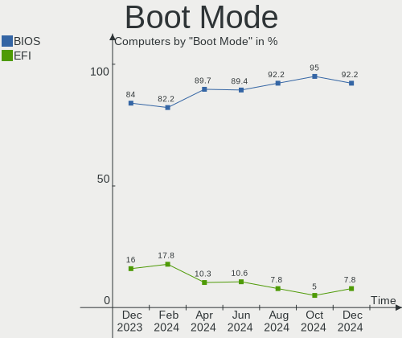
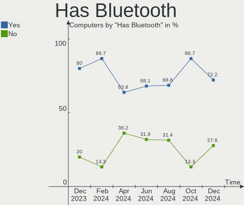
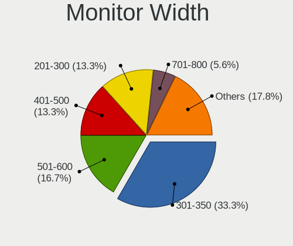
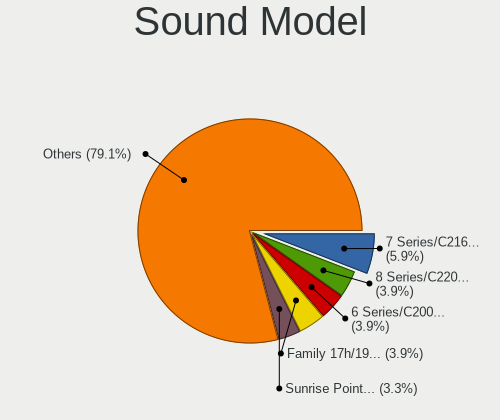
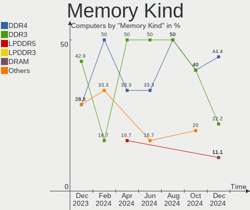
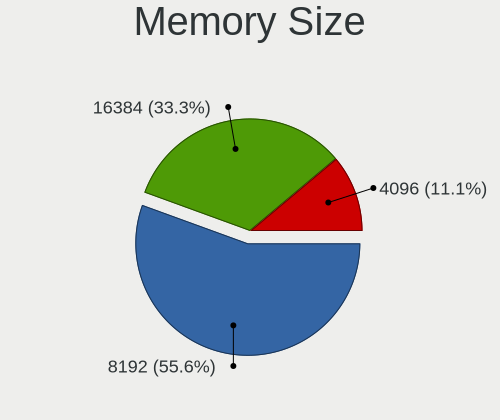

Elementary - Hardware Trends
----------------------------

A project to identify most popular hardware characteristics and track their change
over time based on data collected by Linux users at https://Linux-Hardware.org.

Anyone can contribute to this report by the [hw-probe](https://github.com/linuxhw/hw-probe) tool:

    sudo -E hw-probe -all -upload

This is a report for all computer types. See also reports for [desktops](/Dist/Elementary/Desktop/README.md) and [notebooks](/Dist/Elementary/Notebook/README.md).

This report is for one last month. Overall report since the beginning of time: [TestDays](https://github.com/linuxhw/TestDays)

Period: Nov, 2023.

Contents
--------

* [ System ](#system)
  - [ OS                       ](#os)
  - [ OS Family                ](#os-family)
  - [ Kernel                   ](#kernel)
  - [ Kernel Family            ](#kernel-family)
  - [ Kernel Major Ver.        ](#kernel-major-ver)
  - [ Arch                     ](#arch)
  - [ DE                       ](#de)
  - [ Display Server           ](#display-server)
  - [ Display Manager          ](#display-manager)
  - [ OS Lang                  ](#os-lang)
  - [ Boot Mode                ](#boot-mode)
  - [ Filesystem               ](#filesystem)
  - [ Part. scheme             ](#part-scheme)
  - [ Dual Boot with Linux/BSD ](#dual-boot-with-linuxbsd)
  - [ Dual Boot (Win)          ](#dual-boot-win)

* [ Board ](#board)
  - [ Vendor                   ](#vendor)
  - [ Model                    ](#model)
  - [ Model Family             ](#model-family)
  - [ MFG Year                 ](#mfg-year)
  - [ Form Factor              ](#form-factor)
  - [ Secure Boot              ](#secure-boot)
  - [ Coreboot                 ](#coreboot)
  - [ RAM Size                 ](#ram-size)
  - [ RAM Used                 ](#ram-used)
  - [ Total Drives             ](#total-drives)
  - [ Has CD-ROM               ](#has-cd-rom)
  - [ Has Ethernet             ](#has-ethernet)
  - [ Has WiFi                 ](#has-wifi)
  - [ Has Bluetooth            ](#has-bluetooth)

* [ Location ](#location)
  - [ Country                  ](#country)
  - [ City                     ](#city)

* [ Drives ](#drives)
  - [ Drive Vendor             ](#drive-vendor)
  - [ Drive Model              ](#drive-model)
  - [ HDD Vendor               ](#hdd-vendor)
  - [ SSD Vendor               ](#ssd-vendor)
  - [ Drive Kind               ](#drive-kind)
  - [ Drive Connector          ](#drive-connector)
  - [ Drive Size               ](#drive-size)
  - [ Space Total              ](#space-total)
  - [ Space Used               ](#space-used)
  - [ Malfunc. Drives          ](#malfunc-drives)
  - [ Malfunc. Drive Vendor    ](#malfunc-drive-vendor)
  - [ Malfunc. HDD Vendor      ](#malfunc-hdd-vendor)
  - [ Malfunc. Drive Kind      ](#malfunc-drive-kind)
  - [ Failed Drives            ](#failed-drives)
  - [ Failed Drive Vendor      ](#failed-drive-vendor)
  - [ Drive Status             ](#drive-status)

* [ Storage controller ](#storage-controller)
  - [ Storage Vendor           ](#storage-vendor)
  - [ Storage Model            ](#storage-model)
  - [ Storage Kind             ](#storage-kind)

* [ Processor ](#processor)
  - [ CPU Vendor               ](#cpu-vendor)
  - [ CPU Model                ](#cpu-model)
  - [ CPU Model Family         ](#cpu-model-family)
  - [ CPU Cores                ](#cpu-cores)
  - [ CPU Sockets              ](#cpu-sockets)
  - [ CPU Threads              ](#cpu-threads)
  - [ CPU Op-Modes             ](#cpu-op-modes)
  - [ CPU Microcode            ](#cpu-microcode)
  - [ CPU Microarch            ](#cpu-microarch)

* [ Graphics ](#graphics)
  - [ GPU Vendor               ](#gpu-vendor)
  - [ GPU Model                ](#gpu-model)
  - [ GPU Combo                ](#gpu-combo)
  - [ GPU Driver               ](#gpu-driver)
  - [ GPU Memory               ](#gpu-memory)

* [ Monitor ](#monitor)
  - [ Monitor Vendor           ](#monitor-vendor)
  - [ Monitor Model            ](#monitor-model)
  - [ Monitor Resolution       ](#monitor-resolution)
  - [ Monitor Diagonal         ](#monitor-diagonal)
  - [ Monitor Width            ](#monitor-width)
  - [ Aspect Ratio             ](#aspect-ratio)
  - [ Monitor Area             ](#monitor-area)
  - [ Pixel Density            ](#pixel-density)
  - [ Multiple Monitors        ](#multiple-monitors)

* [ Network ](#network)
  - [ Net Controller Vendor    ](#net-controller-vendor)
  - [ Net Controller Model     ](#net-controller-model)
  - [ Wireless Vendor          ](#wireless-vendor)
  - [ Wireless Model           ](#wireless-model)
  - [ Ethernet Vendor          ](#ethernet-vendor)
  - [ Ethernet Model           ](#ethernet-model)
  - [ Net Controller Kind      ](#net-controller-kind)
  - [ Used Controller          ](#used-controller)
  - [ NICs                     ](#nics)
  - [ IPv6                     ](#ipv6)

* [ Bluetooth ](#bluetooth)
  - [ Bluetooth Vendor         ](#bluetooth-vendor)
  - [ Bluetooth Model          ](#bluetooth-model)

* [ Sound ](#sound)
  - [ Sound Vendor             ](#sound-vendor)
  - [ Sound Model              ](#sound-model)

* [ Memory ](#memory)
  - [ Memory Vendor            ](#memory-vendor)
  - [ Memory Model             ](#memory-model)
  - [ Memory Kind              ](#memory-kind)
  - [ Memory Form Factor       ](#memory-form-factor)
  - [ Memory Size              ](#memory-size)
  - [ Memory Speed             ](#memory-speed)

* [ Printers & scanners ](#printers--scanners)
  - [ Printer Vendor           ](#printer-vendor)
  - [ Printer Model            ](#printer-model)
  - [ Scanner Vendor           ](#scanner-vendor)
  - [ Scanner Model            ](#scanner-model)

* [ Camera ](#camera)
  - [ Camera Vendor            ](#camera-vendor)
  - [ Camera Model             ](#camera-model)

* [ Security ](#security)
  - [ Fingerprint Vendor       ](#fingerprint-vendor)
  - [ Fingerprint Model        ](#fingerprint-model)
  - [ Chipcard Vendor          ](#chipcard-vendor)
  - [ Chipcard Model           ](#chipcard-model)

* [ Unsupported ](#unsupported)
  - [ Unsupported Devices      ](#unsupported-devices)
  - [ Unsupported Device Types ](#unsupported-device-types)

System
------

OS
--

Installed operating systems

| Name           | Computers | Percent |
|----------------|-----------|---------|
| Elementary 7.1 | 39        | 81.25%  |
| Elementary 6.1 | 7         | 14.58%  |
| Elementary 7   | 2         | 4.17%   |

OS Family
---------

OS without a version

| Name       | Computers | Percent |
|------------|-----------|---------|
| Elementary | 48        | 100%    |

Kernel
------

Version of the Linux kernel

| Version              | Computers | Percent |
|----------------------|-----------|---------|
| 6.2.0-36-generic     | 22        | 45.83%  |
| 6.2.0-33-generic     | 7         | 14.58%  |
| 6.2.0-37-generic     | 6         | 12.5%   |
| 6.5.5-060505-generic | 1         | 2.08%   |
| 6.2.0-35-generic     | 1         | 2.08%   |
| 6.2.0-34-generic     | 1         | 2.08%   |
| 6.2.0-26-generic     | 1         | 2.08%   |
| 6.2.0-060200-generic | 1         | 2.08%   |
| 5.15.0-88-generic    | 1         | 2.08%   |
| 5.15.0-87-generic    | 1         | 2.08%   |
| 5.15.0-84-generic    | 1         | 2.08%   |
| 5.15.0-78-generic    | 1         | 2.08%   |
| 5.15.0-69-generic    | 1         | 2.08%   |
| 5.15.0-58-generic    | 1         | 2.08%   |
| 5.13.0-40-generic    | 1         | 2.08%   |
| 5.11.0-43-generic    | 1         | 2.08%   |

Kernel Family
-------------

Linux kernel without a distro release

| Version | Computers | Percent |
|---------|-----------|---------|
| 6.2.0   | 39        | 81.25%  |
| 5.15.0  | 6         | 12.5%   |
| 6.5.5   | 1         | 2.08%   |
| 5.13.0  | 1         | 2.08%   |
| 5.11.0  | 1         | 2.08%   |

Kernel Major Ver.
-----------------

Linux kernel major version

| Version | Computers | Percent |
|---------|-----------|---------|
| 6.2     | 39        | 81.25%  |
| 5.15    | 6         | 12.5%   |
| 6.5     | 1         | 2.08%   |
| 5.13    | 1         | 2.08%   |
| 5.11    | 1         | 2.08%   |

Arch
----

OS architecture (x86_64, i586, etc.)

| Name   | Computers | Percent |
|--------|-----------|---------|
| x86_64 | 48        | 100%    |

DE
--

Desktop Environment

| Name     | Computers | Percent |
|----------|-----------|---------|
| Pantheon | 48        | 100%    |

Display Server
--------------

X11 or Wayland

| Name | Computers | Percent |
|------|-----------|---------|
| X11  | 48        | 100%    |

Display Manager
---------------

SDDM, LightDM, etc.

| Name    | Computers | Percent |
|---------|-----------|---------|
| Unknown | 39        | 81.25%  |
| LightDM | 9         | 18.75%  |

OS Lang
-------

Language

| Lang  | Computers | Percent |
|-------|-----------|---------|
| en_US | 18        | 37.5%   |
| de_DE | 7         | 14.58%  |
| fr_FR | 4         | 8.33%   |
| ru_RU | 3         | 6.25%   |
| pl_PL | 3         | 6.25%   |
| nl_NL | 3         | 6.25%   |
| it_IT | 3         | 6.25%   |
| en_GB | 2         | 4.17%   |
| pt_BR | 1         | 2.08%   |
| fr_CA | 1         | 2.08%   |
| es_ES | 1         | 2.08%   |
| en_AU | 1         | 2.08%   |
| cs_CZ | 1         | 2.08%   |

Boot Mode
---------

EFI or BIOS

| Mode | Computers | Percent |
|------|-----------|---------|
| BIOS | 41        | 85.42%  |
| EFI  | 7         | 14.58%  |

Filesystem
----------

Type of filesystem

| Type  | Computers | Percent |
|-------|-----------|---------|
| Ext4  | 45        | 93.75%  |
| Tmpfs | 2         | 4.17%   |
| Btrfs | 1         | 2.08%   |

Part. scheme
------------

Scheme of partitioning

| Type    | Computers | Percent |
|---------|-----------|---------|
| Unknown | 39        | 81.25%  |
| GPT     | 7         | 14.58%  |
| MBR     | 2         | 4.17%   |

Dual Boot with Linux/BSD
------------------------

Hosting more than one Linux/BSD

| Dual boot | Computers | Percent |
|-----------|-----------|---------|
| No        | 48        | 100%    |

Dual Boot (Win)
---------------

Hosting Linux and Windows

| Dual boot | Computers | Percent |
|-----------|-----------|---------|
| No        | 43        | 89.58%  |
| Yes       | 5         | 10.42%  |

Board
-----

Vendor
------

Motherboard manufacturer

| Name                | Computers | Percent |
|---------------------|-----------|---------|
| Hewlett-Packard     | 10        | 20.83%  |
| Apple               | 9         | 18.75%  |
| Dell                | 7         | 14.58%  |
| ASUSTek Computer    | 5         | 10.42%  |
| Fujitsu             | 2         | 4.17%   |
| Alienware           | 2         | 4.17%   |
| UMAX                | 1         | 2.08%   |
| Timi                | 1         | 2.08%   |
| Samsung Electronics | 1         | 2.08%   |
| MSI                 | 1         | 2.08%   |
| Lenovo              | 1         | 2.08%   |
| Jetway              | 1         | 2.08%   |
| iOTA                | 1         | 2.08%   |
| Intel               | 1         | 2.08%   |
| HONOR               | 1         | 2.08%   |
| HC Technology.      | 1         | 2.08%   |
| Gigabyte Technology | 1         | 2.08%   |
| Acer                | 1         | 2.08%   |
| Unknown             | 1         | 2.08%   |

Model
-----

Motherboard model

| Name                                   | Computers | Percent |
|----------------------------------------|-----------|---------|
| ASUS PRIME A320M-K                     | 2         | 4.17%   |
| Apple iMac12,2                         | 2         | 4.17%   |
| UMAX N14R                              | 1         | 2.08%   |
| Timi Redmi G 2022                      | 1         | 2.08%   |
| Samsung RF510/RF410/RF710              | 1         | 2.08%   |
| MSI MS-7756                            | 1         | 2.08%   |
| Lenovo IdeaPad 320-15AST 80XV          | 1         | 2.08%   |
| Jetway TI61M5                          | 1         | 2.08%   |
| iOTA IOTA2320                          | 1         | 2.08%   |
| Intel Nobilis                          | 1         | 2.08%   |
| HONOR NMH-WDX9                         | 1         | 2.08%   |
| HP Z600 Workstation                    | 1         | 2.08%   |
| HP Spectre Pro G1                      | 1         | 2.08%   |
| HP ProBook 6545b                       | 1         | 2.08%   |
| HP Pavilion x360 Convertible 15-er0xxx | 1         | 2.08%   |
| HP Pavilion Sleekbook 15 PC            | 1         | 2.08%   |
| HP Pavilion dv7                        | 1         | 2.08%   |
| HP OMEN by Laptop                      | 1         | 2.08%   |
| HP EliteBook 845 G7 Notebook PC        | 1         | 2.08%   |
| HP EliteBook 840 G3                    | 1         | 2.08%   |
| HP 245 G8                              | 1         | 2.08%   |
| HC Technology. HCAR5000-MI             | 1         | 2.08%   |
| Gigabyte B550M DS3H                    | 1         | 2.08%   |
| Fujitsu LIFEBOOK E780                  | 1         | 2.08%   |
| Fujitsu ESPRIMO E720                   | 1         | 2.08%   |
| Dell Vostro 3500                       | 1         | 2.08%   |
| Dell Precision WorkStation T3500       | 1         | 2.08%   |
| Dell OptiPlex 790                      | 1         | 2.08%   |
| Dell OptiPlex 5040                     | 1         | 2.08%   |
| Dell OptiPlex 3060                     | 1         | 2.08%   |
| Dell Inspiron N5040                    | 1         | 2.08%   |
| Dell G7 7500                           | 1         | 2.08%   |
| ASUS X555LAB                           | 1         | 2.08%   |
| ASUS ROG STRIX B360-F GAMING           | 1         | 2.08%   |
| ASUS H110M-A/M.2                       | 1         | 2.08%   |
| Apple Macmini6,1                       | 1         | 2.08%   |
| Apple Macmini4,1                       | 1         | 2.08%   |
| Apple MacBookPro5,5                    | 1         | 2.08%   |
| Apple MacBookPro11,1                   | 1         | 2.08%   |
| Apple MacBookAir6,2                    | 1         | 2.08%   |

Model Family
------------

Motherboard model prefix

| Name                       | Computers | Percent |
|----------------------------|-----------|---------|
| HP Pavilion                | 3         | 6.25%   |
| Dell OptiPlex              | 3         | 6.25%   |
| Apple iMac12               | 3         | 6.25%   |
| HP EliteBook               | 2         | 4.17%   |
| ASUS PRIME                 | 2         | 4.17%   |
| UMAX N14R                  | 1         | 2.08%   |
| Timi Redmi                 | 1         | 2.08%   |
| Samsung RF510              | 1         | 2.08%   |
| MSI MS-7756                | 1         | 2.08%   |
| Lenovo IdeaPad             | 1         | 2.08%   |
| Jetway TI61M5              | 1         | 2.08%   |
| iOTA IOTA2320              | 1         | 2.08%   |
| Intel Nobilis              | 1         | 2.08%   |
| HONOR NMH-WDX9             | 1         | 2.08%   |
| HP Z600                    | 1         | 2.08%   |
| HP Spectre                 | 1         | 2.08%   |
| HP ProBook                 | 1         | 2.08%   |
| HP OMEN                    | 1         | 2.08%   |
| HP 245                     | 1         | 2.08%   |
| HC Technology. HCAR5000-MI | 1         | 2.08%   |
| Gigabyte B550M             | 1         | 2.08%   |
| Fujitsu LIFEBOOK           | 1         | 2.08%   |
| Fujitsu ESPRIMO            | 1         | 2.08%   |
| Dell Vostro                | 1         | 2.08%   |
| Dell Precision             | 1         | 2.08%   |
| Dell Inspiron              | 1         | 2.08%   |
| Dell G7                    | 1         | 2.08%   |
| ASUS X555LAB               | 1         | 2.08%   |
| ASUS ROG                   | 1         | 2.08%   |
| ASUS H110M-A               | 1         | 2.08%   |
| Apple Macmini6             | 1         | 2.08%   |
| Apple Macmini4             | 1         | 2.08%   |
| Apple MacBookPro5          | 1         | 2.08%   |
| Apple MacBookPro11         | 1         | 2.08%   |
| Apple MacBookAir6          | 1         | 2.08%   |
| Apple iMac16               | 1         | 2.08%   |
| Alienware 15               | 1         | 2.08%   |
| Alienware 14               | 1         | 2.08%   |
| Acer Aspire                | 1         | 2.08%   |
| Unknown                    | 1         | 2.08%   |

MFG Year
--------

Motherboard manufacture year

| Year | Computers | Percent |
|------|-----------|---------|
| 2011 | 7         | 14.58%  |
| 2017 | 5         | 10.42%  |
| 2010 | 5         | 10.42%  |
| 2021 | 4         | 8.33%   |
| 2018 | 4         | 8.33%   |
| 2020 | 3         | 6.25%   |
| 2016 | 3         | 6.25%   |
| 2014 | 3         | 6.25%   |
| 2013 | 3         | 6.25%   |
| 2012 | 3         | 6.25%   |
| 2009 | 3         | 6.25%   |
| 2022 | 2         | 4.17%   |
| 2023 | 1         | 2.08%   |
| 2019 | 1         | 2.08%   |
| 2008 | 1         | 2.08%   |

Form Factor
-----------

Physical design of the computer

| Name        | Computers | Percent |
|-------------|-----------|---------|
| Notebook    | 26        | 54.17%  |
| Desktop     | 15        | 31.25%  |
| All in one  | 4         | 8.33%   |
| Mini pc     | 2         | 4.17%   |
| Convertible | 1         | 2.08%   |

Secure Boot
-----------

Enabled or disabled

| State    | Computers | Percent |
|----------|-----------|---------|
| Disabled | 45        | 93.75%  |
| Enabled  | 3         | 6.25%   |

Coreboot
--------

Have coreboot on board

| Used | Computers | Percent |
|------|-----------|---------|
| No   | 48        | 100%    |

RAM Size
--------

Total RAM memory

| Size in GB | Computers | Percent |
|------------|-----------|---------|
| 4.01-8.0   | 18        | 37.5%   |
| 16.01-24.0 | 12        | 25%     |
| 3.01-4.0   | 7         | 14.58%  |
| 8.01-16.0  | 7         | 14.58%  |
| 32.01-64.0 | 3         | 6.25%   |
| 1.01-2.0   | 1         | 2.08%   |

RAM Used
--------

Used RAM memory

| Used GB   | Computers | Percent |
|-----------|-----------|---------|
| 2.01-3.0  | 19        | 39.58%  |
| 1.01-2.0  | 14        | 29.17%  |
| 3.01-4.0  | 10        | 20.83%  |
| 4.01-8.0  | 4         | 8.33%   |
| 8.01-16.0 | 1         | 2.08%   |

Total Drives
------------

Number of drives on board

| Drives | Computers | Percent |
|--------|-----------|---------|
| 1      | 24        | 50%     |
| 2      | 21        | 43.75%  |
| 3      | 3         | 6.25%   |

Has CD-ROM
----------

Has CD-ROM on board

| Presented | Computers | Percent |
|-----------|-----------|---------|
| No        | 31        | 64.58%  |
| Yes       | 17        | 35.42%  |

Has Ethernet
------------

Has Ethernet on board

| Presented | Computers | Percent |
|-----------|-----------|---------|
| Yes       | 40        | 83.33%  |
| No        | 8         | 16.67%  |

Has WiFi
--------

Has WiFi module

| Presented | Computers | Percent |
|-----------|-----------|---------|
| Yes       | 40        | 83.33%  |
| No        | 8         | 16.67%  |

Has Bluetooth
-------------

Has Bluetooth module

| Presented | Computers | Percent |
|-----------|-----------|---------|
| Yes       | 33        | 68.75%  |
| No        | 15        | 31.25%  |

Location
--------

Country
-------

Geographic location (country)

| Country                | Computers | Percent |
|------------------------|-----------|---------|
| USA                    | 7         | 14.58%  |
| Germany                | 7         | 14.58%  |
| Poland                 | 3         | 6.25%   |
| Italy                  | 3         | 6.25%   |
| France                 | 3         | 6.25%   |
| UK                     | 2         | 4.17%   |
| Russia                 | 2         | 4.17%   |
| Netherlands            | 2         | 4.17%   |
| Canada                 | 2         | 4.17%   |
| Bosnia and Herzegovina | 2         | 4.17%   |
| Australia              | 2         | 4.17%   |
| Ukraine                | 1         | 2.08%   |
| Spain                  | 1         | 2.08%   |
| Morocco                | 1         | 2.08%   |
| Mexico                 | 1         | 2.08%   |
| Kazakhstan             | 1         | 2.08%   |
| Israel                 | 1         | 2.08%   |
| India                  | 1         | 2.08%   |
| Ecuador                | 1         | 2.08%   |
| Czechia                | 1         | 2.08%   |
| Chile                  | 1         | 2.08%   |
| Brazil                 | 1         | 2.08%   |
| Belgium                | 1         | 2.08%   |
| Austria                | 1         | 2.08%   |

City
----

Geographic location (city)

| City              | Computers | Percent |
|-------------------|-----------|---------|
| Munich            | 3         | 6.25%   |
| Warsaw            | 2         | 4.17%   |
| Sarajevo          | 2         | 4.17%   |
| Yuzhno-Sakhalinsk | 1         | 2.08%   |
| Vienna            | 1         | 2.08%   |
| Van Vleck         | 1         | 2.08%   |
| Sohlde            | 1         | 2.08%   |
| Sint-Michiels     | 1         | 2.08%   |
| Sheffield         | 1         | 2.08%   |
| Sao Vicente       | 1         | 2.08%   |
| Rostock           | 1         | 2.08%   |
| Rome              | 1         | 2.08%   |
| Redding           | 1         | 2.08%   |
| Prague            | 1         | 2.08%   |
| Petah Tikva       | 1         | 2.08%   |
| Nowy Sącz        | 1         | 2.08%   |
| Naples            | 1         | 2.08%   |
| Mumbai            | 1         | 2.08%   |
| Moscow            | 1         | 2.08%   |
| Melbourne         | 1         | 2.08%   |
| Mascouche         | 1         | 2.08%   |
| Lviv              | 1         | 2.08%   |
| London            | 1         | 2.08%   |
| Loja              | 1         | 2.08%   |
| Lille             | 1         | 2.08%   |
| Jacksonville      | 1         | 2.08%   |
| Irapuato          | 1         | 2.08%   |
| Heerenveen        | 1         | 2.08%   |
| Hayward           | 1         | 2.08%   |
| Grande Prairie    | 1         | 2.08%   |
| Foggia            | 1         | 2.08%   |
| Eindhoven         | 1         | 2.08%   |
| Crevant-Laveine   | 1         | 2.08%   |
| Central Coast     | 1         | 2.08%   |
| Casablanca        | 1         | 2.08%   |
| Cahors            | 1         | 2.08%   |
| Berlin            | 1         | 2.08%   |
| Beaverton         | 1         | 2.08%   |
| Bay Shore         | 1         | 2.08%   |
| Antofagasta       | 1         | 2.08%   |

Drives
------

Drive Vendor
------------

Hard drive vendors

| Vendor                      | Computers | Drives | Percent |
|-----------------------------|-----------|--------|---------|
| Samsung Electronics         | 9         | 9      | 12.68%  |
| WDC                         | 8         | 8      | 11.27%  |
| Seagate                     | 8         | 10     | 11.27%  |
| Sandisk                     | 4         | 4      | 5.63%   |
| Hitachi                     | 4         | 5      | 5.63%   |
| SK hynix                    | 3         | 3      | 4.23%   |
| Gigabyte Technology         | 3         | 3      | 4.23%   |
| Apple                       | 3         | 3      | 4.23%   |
| Unknown                     | 2         | 3      | 2.82%   |
| Toshiba                     | 2         | 2      | 2.82%   |
| Kingston                    | 2         | 2      | 2.82%   |
| HGST                        | 2         | 2      | 2.82%   |
| Crucial                     | 2         | 2      | 2.82%   |
| A-DATA Technology           | 2         | 2      | 2.82%   |
| Transcend                   | 1         | 1      | 1.41%   |
| Plextor                     | 1         | 1      | 1.41%   |
| NGFF                        | 1         | 1      | 1.41%   |
| Maxtor                      | 1         | 1      | 1.41%   |
| LS                          | 1         | 1      | 1.41%   |
| LITEON                      | 1         | 1      | 1.41%   |
| Lite-On Technology          | 1         | 1      | 1.41%   |
| KIOXIA-EXCERIA              | 1         | 1      | 1.41%   |
| KIOXIA                      | 1         | 1      | 1.41%   |
| Kingston Technology Company | 1         | 1      | 1.41%   |
| Intenso                     | 1         | 1      | 1.41%   |
| Intel                       | 1         | 1      | 1.41%   |
| HUSKY                       | 1         | 1      | 1.41%   |
| Hewlett-Packard             | 1         | 1      | 1.41%   |
| Fanxiang                    | 1         | 1      | 1.41%   |
| China                       | 1         | 1      | 1.41%   |
| Unknown                     | 1         | 1      | 1.41%   |

Drive Model
-----------

Hard drive models

| Model                                | Computers | Percent |
|--------------------------------------|-----------|---------|
| Seagate ST500DM002-1BD142 500GB      | 3         | 4.05%   |
| Unknown MMC Card  64GB               | 2         | 2.7%    |
| Seagate ST3500413AS 500GB            | 2         | 2.7%    |
| HGST HTS721010A9E630 1TB             | 2         | 2.7%    |
| Gigabyte GP-GSTFS31120GNTD 120GB SSD | 2         | 2.7%    |
| WDC WDS240G2G0A-00JH30 240GB SSD     | 1         | 1.35%   |
| WDC WDBNCE5000PNC 500GB SSD          | 1         | 1.35%   |
| WDC WD6400BPVT-22HXZT3 640GB         | 1         | 1.35%   |
| WDC WD20EZRZ-22Z5HB0 2TB             | 1         | 1.35%   |
| WDC WD1600BEKT-08PVMT1 160GB         | 1         | 1.35%   |
| WDC WD10JPVX-22JC3T0 1TB             | 1         | 1.35%   |
| WDC WD10EZEX-60WN4A0 1TB             | 1         | 1.35%   |
| WDC WD1002FAEX-00Z3A0 1TB            | 1         | 1.35%   |
| Unknown MMC Card  32GB               | 1         | 1.35%   |
| Transcend TS64GMTS400S 64GB SSD      | 1         | 1.35%   |
| Toshiba MQ01ABD100 1TB               | 1         | 1.35%   |
| Toshiba MK1655GSXF 160GB             | 1         | 1.35%   |
| SK hynix SC311 SATA 128GB SSD        | 1         | 1.35%   |
| SK hynix PC611 NVMe 1TB              | 1         | 1.35%   |
| SK hynix BC511 512GB                 | 1         | 1.35%   |
| Seagate ST3320413AS 320GB            | 1         | 1.35%   |
| Seagate ST3160318AS 160GB            | 1         | 1.35%   |
| Seagate ST3000DM008-2DM166 3TB       | 1         | 1.35%   |
| Seagate ST2000DM008-2FR102 2TB       | 1         | 1.35%   |
| Seagate ST1000DM003-9YN162 1TB       | 1         | 1.35%   |
| Sandisk WD_BLACK SN770 1TB           | 1         | 1.35%   |
| Sandisk WD Blue SN570 500GB          | 1         | 1.35%   |
| Sandisk WD Blue SN550 NVMe SSD 512GB | 1         | 1.35%   |
| SanDisk SD8SN8U-128G-1006 128GB SSD  | 1         | 1.35%   |
| Samsung SSD 860 EVO 500GB            | 1         | 1.35%   |
| Samsung SSD 850 EVO M.2 250GB        | 1         | 1.35%   |
| Samsung SSD 850 EVO 250GB            | 1         | 1.35%   |
| Samsung SSD 750 EVO 500GB            | 1         | 1.35%   |
| Samsung MZVLV512HCJH-000H1 512GB     | 1         | 1.35%   |
| Samsung MZVLQ512HALU-000H1 512GB     | 1         | 1.35%   |
| Samsung MZ7TY256HDHP-000H1 256GB SSD | 1         | 1.35%   |
| Samsung HD501LJ 500GB                | 1         | 1.35%   |
| Samsung HD322HJ 320GB                | 1         | 1.35%   |
| Plextor PH6-CE120-L1 120GB SSD       | 1         | 1.35%   |
| NGFF 2242 128GB SSD                  | 1         | 1.35%   |

HDD Vendor
----------

Hard disk drive vendors

| Vendor              | Computers | Drives | Percent |
|---------------------|-----------|--------|---------|
| Seagate             | 8         | 10     | 30.77%  |
| WDC                 | 6         | 6      | 23.08%  |
| Hitachi             | 4         | 5      | 15.38%  |
| Toshiba             | 2         | 2      | 7.69%   |
| Samsung Electronics | 2         | 2      | 7.69%   |
| HGST                | 2         | 2      | 7.69%   |
| Maxtor              | 1         | 1      | 3.85%   |
| Apple               | 1         | 1      | 3.85%   |

SSD Vendor
----------

Solid state drive vendors

| Vendor              | Computers | Drives | Percent |
|---------------------|-----------|--------|---------|
| Samsung Electronics | 5         | 5      | 16.67%  |
| WDC                 | 2         | 2      | 6.67%   |
| Kingston            | 2         | 2      | 6.67%   |
| Gigabyte Technology | 2         | 2      | 6.67%   |
| Crucial             | 2         | 2      | 6.67%   |
| Apple               | 2         | 2      | 6.67%   |
| A-DATA Technology   | 2         | 2      | 6.67%   |
| Transcend           | 1         | 1      | 3.33%   |
| SK hynix            | 1         | 1      | 3.33%   |
| SanDisk             | 1         | 1      | 3.33%   |
| Plextor             | 1         | 1      | 3.33%   |
| NGFF                | 1         | 1      | 3.33%   |
| LS                  | 1         | 1      | 3.33%   |
| LITEON              | 1         | 1      | 3.33%   |
| KIOXIA-EXCERIA      | 1         | 1      | 3.33%   |
| Intenso             | 1         | 1      | 3.33%   |
| HUSKY               | 1         | 1      | 3.33%   |
| Hewlett-Packard     | 1         | 1      | 3.33%   |
| China               | 1         | 1      | 3.33%   |
| Unknown             | 1         | 1      | 3.33%   |

Drive Kind
----------

HDD or SSD

| Kind    | Computers | Drives | Percent |
|---------|-----------|--------|---------|
| SSD     | 29        | 30     | 43.94%  |
| HDD     | 23        | 29     | 34.85%  |
| NVMe    | 11        | 12     | 16.67%  |
| MMC     | 2         | 3      | 3.03%   |
| Unknown | 1         | 1      | 1.52%   |

Drive Connector
---------------

SATA, SAS, NVMe, etc.

| Type | Computers | Drives | Percent |
|------|-----------|--------|---------|
| SATA | 40        | 59     | 74.07%  |
| NVMe | 11        | 12     | 20.37%  |
| MMC  | 2         | 3      | 3.7%    |
| SAS  | 1         | 1      | 1.85%   |

Drive Size
----------

Size of hard drive

| Size in TB | Computers | Drives | Percent |
|------------|-----------|--------|---------|
| 0.01-0.5   | 35        | 45     | 71.43%  |
| 0.51-1.0   | 10        | 10     | 20.41%  |
| 1.01-2.0   | 3         | 3      | 6.12%   |
| 2.01-3.0   | 1         | 1      | 2.04%   |

Space Total
-----------

Amount of disk space available on the file system

| Size in GB | Computers | Percent |
|------------|-----------|---------|
| 101-250    | 16        | 33.33%  |
| 251-500    | 15        | 31.25%  |
| 501-1000   | 7         | 14.58%  |
| 1001-2000  | 4         | 8.33%   |
| 51-100     | 4         | 8.33%   |
| 21-50      | 1         | 2.08%   |
| 2001-3000  | 1         | 2.08%   |

Space Used
----------

Amount of used disk space

| Used GB   | Computers | Percent |
|-----------|-----------|---------|
| 21-50     | 17        | 35.42%  |
| 1-20      | 12        | 25%     |
| 51-100    | 7         | 14.58%  |
| 101-250   | 6         | 12.5%   |
| 251-500   | 3         | 6.25%   |
| 1001-2000 | 2         | 4.17%   |
| 501-1000  | 1         | 2.08%   |

Malfunc. Drives
---------------

Drive models with a malfunction

| Model                       | Computers | Drives | Percent |
|-----------------------------|-----------|--------|---------|
| Seagate ST3160318AS 160GB   | 1         | 1      | 33.33%  |
| LS 128GB M300 SSD           | 1         | 1      | 33.33%  |
| Crucial CT240M500SSD3 240GB | 1         | 1      | 33.33%  |

Malfunc. Drive Vendor
---------------------

Vendors of faulty drives

| Vendor  | Computers | Drives | Percent |
|---------|-----------|--------|---------|
| Seagate | 1         | 1      | 33.33%  |
| LS      | 1         | 1      | 33.33%  |
| Crucial | 1         | 1      | 33.33%  |

Malfunc. HDD Vendor
-------------------

Vendors of faulty HDD drives

| Vendor  | Computers | Drives | Percent |
|---------|-----------|--------|---------|
| Seagate | 1         | 1      | 100%    |

Malfunc. Drive Kind
-------------------

Kinds of faulty drives

| Kind | Computers | Drives | Percent |
|------|-----------|--------|---------|
| SSD  | 2         | 2      | 66.67%  |
| HDD  | 1         | 1      | 33.33%  |

Failed Drives
-------------

Failed drive models

Zero info for selected period =(

Failed Drive Vendor
-------------------

Failed drive vendors

Zero info for selected period =(

Drive Status
------------

Number of failed and malfunc. drives

| Status   | Computers | Drives | Percent |
|----------|-----------|--------|---------|
| Detected | 41        | 63     | 82%     |
| Works    | 6         | 9      | 12%     |
| Malfunc  | 3         | 3      | 6%      |

Storage controller
------------------

Storage Vendor
--------------

Storage controller vendors

| Vendor                      | Computers | Percent |
|-----------------------------|-----------|---------|
| Intel                       | 34        | 59.65%  |
| AMD                         | 8         | 14.04%  |
| SanDisk                     | 3         | 5.26%   |
| Samsung Electronics         | 3         | 5.26%   |
| SK hynix                    | 2         | 3.51%   |
| Nvidia                      | 2         | 3.51%   |
| Phison Electronics          | 1         | 1.75%   |
| Marvell Technology Group    | 1         | 1.75%   |
| Lite-On Technology          | 1         | 1.75%   |
| KIOXIA                      | 1         | 1.75%   |
| Kingston Technology Company | 1         | 1.75%   |

Storage Model
-------------

Storage controller models

| Model                                                                          | Computers | Percent |
|--------------------------------------------------------------------------------|-----------|---------|
| Intel 6 Series/C200 Series Chipset Family 6 port Desktop SATA AHCI Controller  | 6         | 9.84%   |
| AMD FCH SATA Controller [AHCI mode]                                            | 6         | 9.84%   |
| Intel Q170/Q150/B150/H170/H110/Z170/CM236 Chipset SATA Controller [AHCI Mode]  | 3         | 4.92%   |
| Intel Wildcat Point-LP SATA Controller [AHCI Mode]                             | 2         | 3.28%   |
| Intel Sunrise Point-LP SATA Controller [AHCI mode]                             | 2         | 3.28%   |
| Intel SATA Controller [RAID mode]                                              | 2         | 3.28%   |
| Intel 8 Series/C220 Series Chipset Family 6-port SATA Controller 1 [AHCI mode] | 2         | 3.28%   |
| Intel 7 Series Chipset Family 6-port SATA Controller [AHCI mode]               | 2         | 3.28%   |
| Intel 5 Series/3400 Series Chipset 6 port SATA AHCI Controller                 | 2         | 3.28%   |
| Intel 5 Series/3400 Series Chipset 4 port SATA AHCI Controller                 | 2         | 3.28%   |
| AMD FCH SATA Controller D                                                      | 2         | 3.28%   |
| SK hynix PC611 NVMe Solid State Drive                                          | 1         | 1.64%   |
| SK hynix BC511 NVMe SSD                                                        | 1         | 1.64%   |
| SanDisk WD Black SN770 / PC SN740 256GB / PC SN560 (DRAM-less) NVMe SSD        | 1         | 1.64%   |
| SanDisk Ultra 3D / WD Blue SN570 NVMe SSD (DRAM-less)                          | 1         | 1.64%   |
| SanDisk Ultra 3D / WD Blue SN550 NVMe SSD                                      | 1         | 1.64%   |
| Samsung S4LN053X01 AHCI SSD Controller(Apple slot)                             | 1         | 1.64%   |
| Samsung NVMe SSD Controller SM951/PM951                                        | 1         | 1.64%   |
| Samsung NVMe SSD Controller 980 (DRAM-less)                                    | 1         | 1.64%   |
| Phison PS5013-E13 PCIe3 NVMe Controller (DRAM-less)                            | 1         | 1.64%   |
| Nvidia MCP89 SATA Controller (AHCI mode)                                       | 1         | 1.64%   |
| Nvidia MCP79 AHCI Controller                                                   | 1         | 1.64%   |
| Marvell Group 88SS9183 PCIe SSD Controller                                     | 1         | 1.64%   |
| Lite-On CX2-8B256, CX2-8B512 NVMe SSD                                          | 1         | 1.64%   |
| KIOXIA NVMe SSD Controller BG5 (DRAM-less)                                     | 1         | 1.64%   |
| Kingston Company NV2 NVMe SSD SM2267XT                                         | 1         | 1.64%   |
| Intel Volume Management Device NVMe RAID Controller                            | 1         | 1.64%   |
| Intel Tiger Lake-LP SATA Controller                                            | 1         | 1.64%   |
| Intel SSD 670p Series [Keystone Harbor]                                        | 1         | 1.64%   |
| Intel HM170/QM170 Chipset SATA Controller [AHCI Mode]                          | 1         | 1.64%   |
| Intel Celeron/Pentium Silver Processor SATA Controller                         | 1         | 1.64%   |
| Intel Celeron N3350/Pentium N4200/Atom E3900 Series SATA AHCI Controller       | 1         | 1.64%   |
| Intel Cannon Lake PCH SATA AHCI Controller                                     | 1         | 1.64%   |
| Intel 9 Series Chipset Family SATA Controller [AHCI Mode]                      | 1         | 1.64%   |
| Intel 82801JI (ICH10 Family) 4 port SATA IDE Controller #1                     | 1         | 1.64%   |
| Intel 82801JI (ICH10 Family) 2 port SATA IDE Controller #2                     | 1         | 1.64%   |
| Intel 7 Series/C210 Series Chipset Family 6-port SATA Controller [AHCI mode]   | 1         | 1.64%   |
| Intel 5 Series/3400 Series Chipset PT IDER Controller                          | 1         | 1.64%   |
| Intel 400 Series Chipset Family SATA AHCI Controller                           | 1         | 1.64%   |
| AMD SB7x0/SB8x0/SB9x0 SATA Controller [AHCI mode]                              | 1         | 1.64%   |

Storage Kind
------------

Kind of storage controller (IDE, SATA, NVMe, SAS, ...)

| Kind | Computers | Percent |
|------|-----------|---------|
| SATA | 41        | 71.93%  |
| NVMe | 11        | 19.3%   |
| RAID | 3         | 5.26%   |
| IDE  | 2         | 3.51%   |

Processor
---------

CPU Vendor
----------

Processor vendors

| Vendor | Computers | Percent |
|--------|-----------|---------|
| Intel  | 37        | 77.08%  |
| AMD    | 11        | 22.92%  |

CPU Model
---------

Processor models

| Model                                       | Computers | Percent |
|---------------------------------------------|-----------|---------|
| AMD Ryzen 5 5500U with Radeon Graphics      | 3         | 6.25%   |
| Intel Core i7-7700HQ CPU @ 2.80GHz          | 2         | 4.17%   |
| AMD Ryzen 3 2200G with Radeon Vega Graphics | 2         | 4.17%   |
| Intel Xeon CPU W3540 @ 2.93GHz              | 1         | 2.08%   |
| Intel Xeon CPU E5620 @ 2.40GHz              | 1         | 2.08%   |
| Intel Pentium CPU P6200 @ 2.13GHz           | 1         | 2.08%   |
| Intel Pentium CPU N4200 @ 1.10GHz           | 1         | 2.08%   |
| Intel Pentium CPU 987 @ 1.50GHz             | 1         | 2.08%   |
| Intel Core i7-7700 CPU @ 3.60GHz            | 1         | 2.08%   |
| Intel Core i7-6700 CPU @ 3.40GHz            | 1         | 2.08%   |
| Intel Core i7-6500U CPU @ 2.50GHz           | 1         | 2.08%   |
| Intel Core i7-4800MQ CPU @ 2.70GHz          | 1         | 2.08%   |
| Intel Core i7-2600 CPU @ 3.40GHz            | 1         | 2.08%   |
| Intel Core i7-10750H CPU @ 2.60GHz          | 1         | 2.08%   |
| Intel Core i7 CPU Q 720 @ 1.60GHz           | 1         | 2.08%   |
| Intel Core i5-6200U CPU @ 2.30GHz           | 1         | 2.08%   |
| Intel Core i5-5675R CPU @ 3.10GHz           | 1         | 2.08%   |
| Intel Core i5-5350U CPU @ 1.80GHz           | 1         | 2.08%   |
| Intel Core i5-4590 CPU @ 3.30GHz            | 1         | 2.08%   |
| Intel Core i5-4278U CPU @ 2.60GHz           | 1         | 2.08%   |
| Intel Core i5-4250U CPU @ 1.30GHz           | 1         | 2.08%   |
| Intel Core i5-3450 CPU @ 3.10GHz            | 1         | 2.08%   |
| Intel Core i5-3210M CPU @ 2.50GHz           | 1         | 2.08%   |
| Intel Core i5-2500S CPU @ 2.70GHz           | 1         | 2.08%   |
| Intel Core i5-2500 CPU @ 3.30GHz            | 1         | 2.08%   |
| Intel Core i5-2400S CPU @ 2.50GHz           | 1         | 2.08%   |
| Intel Core i5-2400 CPU @ 3.10GHz            | 1         | 2.08%   |
| Intel Core i5-2300 CPU @ 2.80GHz            | 1         | 2.08%   |
| Intel Core i5 CPU M 560 @ 2.67GHz           | 1         | 2.08%   |
| Intel Core i5 CPU M 480 @ 2.67GHz           | 1         | 2.08%   |
| Intel Core i3-8100T CPU @ 3.10GHz           | 1         | 2.08%   |
| Intel Core i3-8100 CPU @ 3.60GHz            | 1         | 2.08%   |
| Intel Core i3-5005U CPU @ 2.00GHz           | 1         | 2.08%   |
| Intel Core 2 Duo CPU P8800 @ 2.66GHz        | 1         | 2.08%   |
| Intel Core 2 Duo CPU P7550 @ 2.26GHz        | 1         | 2.08%   |
| Intel Celeron N4020 CPU @ 1.10GHz           | 1         | 2.08%   |
| Intel 11th Gen Core i5-1135G7 @ 2.40GHz     | 1         | 2.08%   |
| Intel 11th Gen Core i3-1125G4 @ 2.00GHz     | 1         | 2.08%   |
| AMD Turion II Dual-Core Mobile M540         | 1         | 2.08%   |
| AMD Ryzen 7 6800H with Radeon Graphics      | 1         | 2.08%   |

CPU Model Family
----------------

Processor model prefix

| Model                   | Computers | Percent |
|-------------------------|-----------|---------|
| Intel Core i5           | 15        | 31.25%  |
| Intel Core i7           | 9         | 18.75%  |
| AMD Ryzen 5             | 4         | 8.33%   |
| Intel Pentium           | 3         | 6.25%   |
| Intel Core i3           | 3         | 6.25%   |
| Other                   | 2         | 4.17%   |
| Intel Xeon              | 2         | 4.17%   |
| Intel Core 2 Duo        | 2         | 4.17%   |
| AMD Ryzen 3             | 2         | 4.17%   |
| Intel Celeron           | 1         | 2.08%   |
| AMD Turion II Dual-Core | 1         | 2.08%   |
| AMD Ryzen 7             | 1         | 2.08%   |
| AMD Ryzen 5 PRO         | 1         | 2.08%   |
| AMD FX                  | 1         | 2.08%   |
| AMD A6                  | 1         | 2.08%   |

CPU Cores
---------

Number of processor cores

| Number | Computers | Percent |
|--------|-----------|---------|
| 4      | 23        | 47.92%  |
| 2      | 17        | 35.42%  |
| 6      | 6         | 12.5%   |
| 8      | 2         | 4.17%   |

CPU Sockets
-----------

Number of sockets

| Number | Computers | Percent |
|--------|-----------|---------|
| 1      | 47        | 97.92%  |
| 2      | 1         | 2.08%   |

CPU Threads
-----------

Threads per core (Hyper-Threading)

| Number | Computers | Percent |
|--------|-----------|---------|
| 2      | 28        | 58.33%  |
| 1      | 20        | 41.67%  |

CPU Op-Modes
------------

CPU Operation Modes (32-bit, 64-bit)

| Op mode        | Computers | Percent |
|----------------|-----------|---------|
| 32-bit, 64-bit | 48        | 100%    |

CPU Microcode
-------------

Microcode number

| Number     | Computers | Percent |
|------------|-----------|---------|
| Unknown    | 40        | 83.33%  |
| 0x506c9    | 1         | 2.08%   |
| 0x406e3    | 1         | 2.08%   |
| 0x40651    | 1         | 2.08%   |
| 0x206c2    | 1         | 2.08%   |
| 0x106e5    | 1         | 2.08%   |
| 0x1067a    | 1         | 2.08%   |
| 0x0a404102 | 1         | 2.08%   |
| 0x08608104 | 1         | 2.08%   |

CPU Microarch
-------------

Microarchitecture

| Name          | Computers | Percent |
|---------------|-----------|---------|
| SandyBridge   | 7         | 14.58%  |
| KabyLake      | 5         | 10.42%  |
| Westmere      | 4         | 8.33%   |
| Haswell       | 4         | 8.33%   |
| Unknown       | 4         | 8.33%   |
| Skylake       | 3         | 6.25%   |
| Broadwell     | 3         | 6.25%   |
| Zen           | 2         | 4.17%   |
| TigerLake     | 2         | 4.17%   |
| Penryn        | 2         | 4.17%   |
| Nehalem       | 2         | 4.17%   |
| IvyBridge     | 2         | 4.17%   |
| Zen 3         | 1         | 2.08%   |
| Zen 2         | 1         | 2.08%   |
| Steamroller   | 1         | 2.08%   |
| K10           | 1         | 2.08%   |
| Goldmont plus | 1         | 2.08%   |
| Goldmont      | 1         | 2.08%   |
| Excavator     | 1         | 2.08%   |
| CometLake     | 1         | 2.08%   |

Graphics
--------

GPU Vendor
----------

Vendors of graphics cards

| Vendor | Computers | Percent |
|--------|-----------|---------|
| Intel  | 27        | 48.21%  |
| AMD    | 16        | 28.57%  |
| Nvidia | 13        | 23.21%  |

GPU Model
---------

Graphics card models

| Model                                                                       | Computers | Percent |
|-----------------------------------------------------------------------------|-----------|---------|
| Intel 2nd Generation Core Processor Family Integrated Graphics Controller   | 6         | 10.34%  |
| Intel HD Graphics 630                                                       | 3         | 5.17%   |
| AMD Lucienne                                                                | 3         | 5.17%   |
| Nvidia GK208B [GeForce GT 710]                                              | 2         | 3.45%   |
| Intel Skylake GT2 [HD Graphics 520]                                         | 2         | 3.45%   |
| Intel Haswell-ULT Integrated Graphics Controller                            | 2         | 3.45%   |
| Intel Core Processor Integrated Graphics Controller                         | 2         | 3.45%   |
| Nvidia TU117 [GeForce GTX 1650]                                             | 1         | 1.72%   |
| Nvidia TU106M [GeForce RTX 2070 Mobile / Max-Q Refresh]                     | 1         | 1.72%   |
| Nvidia TU106 [GeForce GTX 1650]                                             | 1         | 1.72%   |
| Nvidia MCP89 [GeForce 320M]                                                 | 1         | 1.72%   |
| Nvidia GT216M [GeForce GT 330M]                                             | 1         | 1.72%   |
| Nvidia GP107M [GeForce GTX 1050 Mobile]                                     | 1         | 1.72%   |
| Nvidia GP107 [GeForce GTX 1050 Ti]                                          | 1         | 1.72%   |
| Nvidia GP106BM [GeForce GTX 1060 Mobile 6GB]                                | 1         | 1.72%   |
| Nvidia GM107GL [Quadro K620]                                                | 1         | 1.72%   |
| Nvidia GK106M [GeForce GTX 765M]                                            | 1         | 1.72%   |
| Nvidia GA106M [GeForce RTX 3060 Mobile / Max-Q]                             | 1         | 1.72%   |
| Nvidia C79 [GeForce 9400M]                                                  | 1         | 1.72%   |
| Intel Xeon E3-1200 v3/4th Gen Core Processor Integrated Graphics Controller | 1         | 1.72%   |
| Intel TigerLake-LP GT2 [Iris Xe Graphics]                                   | 1         | 1.72%   |
| Intel Tiger Lake-LP GT2 [UHD Graphics G4]                                   | 1         | 1.72%   |
| Intel Iris Pro Graphics 6200                                                | 1         | 1.72%   |
| Intel HD Graphics 6000                                                      | 1         | 1.72%   |
| Intel HD Graphics 5500                                                      | 1         | 1.72%   |
| Intel HD Graphics 530                                                       | 1         | 1.72%   |
| Intel GeminiLake [UHD Graphics 600]                                         | 1         | 1.72%   |
| Intel CometLake-H GT2 [UHD Graphics]                                        | 1         | 1.72%   |
| Intel CoffeeLake-S GT2 [UHD Graphics 630]                                   | 1         | 1.72%   |
| Intel Apollo Lake [HD Graphics 505]                                         | 1         | 1.72%   |
| Intel 3rd Gen Core processor Graphics Controller                            | 1         | 1.72%   |
| AMD Whistler [Radeon HD 6730M/6770M/7690M XT]                               | 1         | 1.72%   |
| AMD Whistler [Radeon HD 6630M/6650M/6750M/7670M/7690M]                      | 1         | 1.72%   |
| AMD Tahiti XT [Radeon HD 7970/8970 OEM / R9 280X]                           | 1         | 1.72%   |
| AMD Stoney [Radeon R2/R3/R4/R5 Graphics]                                    | 1         | 1.72%   |
| AMD RS880M [Mobility Radeon HD 4225/4250]                                   | 1         | 1.72%   |
| AMD Renoir [Radeon RX Vega 6 (Ryzen 4000/5000 Mobile Series)]               | 1         | 1.72%   |
| AMD Rembrandt [Radeon 680M]                                                 | 1         | 1.72%   |
| AMD Raven Ridge [Radeon Vega Series / Radeon Vega Mobile Series]            | 1         | 1.72%   |
| AMD Opal XT [Radeon R7 M265/M365X/M465]                                     | 1         | 1.72%   |

GPU Combo
---------

Combinations of graphics cards

| Name           | Computers | Percent |
|----------------|-----------|---------|
| 1 x Intel      | 20        | 41.67%  |
| 1 x AMD        | 14        | 29.17%  |
| 1 x Nvidia     | 8         | 16.67%  |
| Intel + Nvidia | 3         | 6.25%   |
| 2 x Nvidia     | 1         | 2.08%   |
| 2 x AMD        | 1         | 2.08%   |
| AMD + Nvidia   | 1         | 2.08%   |

GPU Driver
----------

Free vs proprietary

| Driver      | Computers | Percent |
|-------------|-----------|---------|
| Free        | 43        | 89.58%  |
| Proprietary | 4         | 8.33%   |
| Unknown     | 1         | 2.08%   |

GPU Memory
----------

Total video memory

| Size in GB | Computers | Percent |
|------------|-----------|---------|
| Unknown    | 39        | 81.25%  |
| 0.01-0.5   | 4         | 8.33%   |
| 3.01-4.0   | 2         | 4.17%   |
| 0.51-1.0   | 2         | 4.17%   |
| 1.01-2.0   | 1         | 2.08%   |

Monitor
-------

Monitor Vendor
--------------

Monitor vendors

| Vendor               | Computers | Percent |
|----------------------|-----------|---------|
| AU Optronics         | 8         | 14.81%  |
| Apple                | 7         | 12.96%  |
| Chimei Innolux       | 5         | 9.26%   |
| Hewlett-Packard      | 4         | 7.41%   |
| Goldstar             | 4         | 7.41%   |
| BOE                  | 4         | 7.41%   |
| Samsung Electronics  | 3         | 5.56%   |
| Philips              | 2         | 3.7%    |
| LG Display           | 2         | 3.7%    |
| Dell                 | 2         | 3.7%    |
| Vizio                | 1         | 1.85%   |
| TMX                  | 1         | 1.85%   |
| NEC Computers        | 1         | 1.85%   |
| MSI                  | 1         | 1.85%   |
| Mi                   | 1         | 1.85%   |
| Medion               | 1         | 1.85%   |
| LTM                  | 1         | 1.85%   |
| Kogan                | 1         | 1.85%   |
| HKC                  | 1         | 1.85%   |
| Fujitsu Siemens      | 1         | 1.85%   |
| CVT                  | 1         | 1.85%   |
| Ancor Communications | 1         | 1.85%   |
| Acer                 | 1         | 1.85%   |

Monitor Model
-------------

Monitor models

| Model                                                                | Computers | Percent |
|----------------------------------------------------------------------|-----------|---------|
| Apple iMac APPA007 2560x1440 597x336mm 27.0-inch                     | 2         | 3.64%   |
| Vizio D24f-F1 VIZ1027 1920x1080 530x300mm 24.0-inch                  | 1         | 1.82%   |
| TMX TL160ADMP11-0 TMX1601 2560x1600 345x215mm 16.0-inch              | 1         | 1.82%   |
| Samsung Electronics SyncMaster SAM0423 1920x1080                     | 1         | 1.82%   |
| Samsung Electronics LCD Monitor SEC5441 1366x768 309x174mm 14.0-inch | 1         | 1.82%   |
| Samsung Electronics LCD Monitor SEC5341 1366x768 344x193mm 15.5-inch | 1         | 1.82%   |
| Philips PHL 276E9Q PHLC17B 1920x1080 598x336mm 27.0-inch             | 1         | 1.82%   |
| Philips PHL 243V5 PHLC0D1 1920x1080 521x293mm 23.5-inch              | 1         | 1.82%   |
| NEC Computers LCD224WM NEC6733 1680x1050 474x296mm 22.0-inch         | 1         | 1.82%   |
| MSI G32C4 MSI3DA6 1920x1080 698x393mm 31.5-inch                      | 1         | 1.82%   |
| Mi Monitor XMI3447 3440x1440 797x334mm 34.0-inch                     | 1         | 1.82%   |
| Medion MD21274 MED36B5 1920x1080 598x336mm 27.0-inch                 | 1         | 1.82%   |
| LTM LONTIUM LTM0401 1920x1080 890x500mm 40.2-inch                    | 1         | 1.82%   |
| LG Display LCD Monitor LGD03EA 1920x1080 309x174mm 14.0-inch         | 1         | 1.82%   |
| LG Display LCD Monitor LGD02DC 1366x768 344x194mm 15.5-inch          | 1         | 1.82%   |
| Kogan KAMN27QF7TA KGN0270 2560x1440 698x393mm 31.5-inch              | 1         | 1.82%   |
| HKC LCD Monitor HKC3CFB 1920x1080 344x194mm 15.5-inch                | 1         | 1.82%   |
| Hewlett-Packard 27mq HPN3671 2560x1440 597x336mm 27.0-inch           | 1         | 1.82%   |
| Hewlett-Packard 2711 HWP2941 1920x1080 598x337mm 27.0-inch           | 1         | 1.82%   |
| Hewlett-Packard 24f HPN3545 1920x1080 527x296mm 23.8-inch            | 1         | 1.82%   |
| Hewlett-Packard 23cw HWP3188 1920x1080 509x286mm 23.0-inch           | 1         | 1.82%   |
| Hewlett-Packard 22es HWP331B 1920x1080 476x268mm 21.5-inch           | 1         | 1.82%   |
| Goldstar ULTRAGEAR GSM5C08 1920x1080 530x300mm 24.0-inch             | 1         | 1.82%   |
| Goldstar L1753T GSM4434 1280x1024 338x270mm 17.0-inch                | 1         | 1.82%   |
| Goldstar FULL HD GSM5B55 1920x1080 480x270mm 21.7-inch               | 1         | 1.82%   |
| Goldstar 2D HD TV GSM59C8 1366x768 509x286mm 23.0-inch               | 1         | 1.82%   |
| Fujitsu Siemens E19-5 FUS07CD 1280x1024 376x301mm 19.0-inch          | 1         | 1.82%   |
| Dell P2314H DEL4098 1920x1080 509x286mm 23.0-inch                    | 1         | 1.82%   |
| Dell 1704FPV DEL3015 1280x1024 338x270mm 17.0-inch                   | 1         | 1.82%   |
| CVT CVTE TV CVT0003 1360x768 575x323mm 26.0-inch                     | 1         | 1.82%   |
| Chimei Innolux LCD Monitor CMN15E5 1920x1080 344x193mm 15.5-inch     | 1         | 1.82%   |
| Chimei Innolux LCD Monitor CMN15BF 1366x768 344x194mm 15.5-inch      | 1         | 1.82%   |
| Chimei Innolux LCD Monitor CMN142C 1366x768 309x173mm 13.9-inch      | 1         | 1.82%   |
| Chimei Innolux LCD Monitor CMN1401 1920x1080 309x173mm 13.9-inch     | 1         | 1.82%   |
| Chimei Innolux LCD Monitor CMN1367 1920x1080 293x165mm 13.2-inch     | 1         | 1.82%   |
| BOE LCD Monitor BOE0877 1920x1080 309x173mm 13.9-inch                | 1         | 1.82%   |
| BOE LCD Monitor BOE084A 1920x1080 344x194mm 15.5-inch                | 1         | 1.82%   |
| BOE LCD Monitor BOE06F3 1920x1080 309x173mm 13.9-inch                | 1         | 1.82%   |
| BOE LCD Monitor BOE0675 1366x768 344x194mm 15.5-inch                 | 1         | 1.82%   |
| AU Optronics LCD Monitor AUO5890 1366x768 344x193mm 15.5-inch        | 1         | 1.82%   |

Monitor Resolution
------------------

Monitor screen resolution

| Resolution         | Computers | Percent |
|--------------------|-----------|---------|
| 1920x1080 (FHD)    | 23        | 45.1%   |
| 1366x768 (WXGA)    | 11        | 21.57%  |
| 2560x1440 (QHD)    | 4         | 7.84%   |
| 3840x2160 (4K)     | 3         | 5.88%   |
| 1280x1024 (SXGA)   | 3         | 5.88%   |
| 2560x1600          | 2         | 3.92%   |
| 1680x1050 (WSXGA+) | 2         | 3.92%   |
| 3440x1440          | 1         | 1.96%   |
| 1440x900 (WXGA+)   | 1         | 1.96%   |
| 1280x800 (WXGA)    | 1         | 1.96%   |

Monitor Diagonal
----------------

Diagonal size in inches

| Inches  | Computers | Percent |
|---------|-----------|---------|
| 15      | 14        | 25.45%  |
| 13      | 8         | 14.55%  |
| 27      | 7         | 12.73%  |
| 23      | 4         | 7.27%   |
| 21      | 3         | 5.45%   |
| 14      | 3         | 5.45%   |
| 31      | 2         | 3.64%   |
| 26      | 2         | 3.64%   |
| 24      | 2         | 3.64%   |
| 22      | 2         | 3.64%   |
| 17      | 2         | 3.64%   |
| 49      | 1         | 1.82%   |
| 40      | 1         | 1.82%   |
| 34      | 1         | 1.82%   |
| 19      | 1         | 1.82%   |
| 16      | 1         | 1.82%   |
| Unknown | 1         | 1.82%   |

Monitor Width
-------------

Physical width

| Width in mm | Computers | Percent |
|-------------|-----------|---------|
| 301-350     | 23        | 42.59%  |
| 501-600     | 12        | 22.22%  |
| 401-500     | 6         | 11.11%  |
| 201-300     | 4         | 7.41%   |
| 601-700     | 3         | 5.56%   |
| 351-400     | 2         | 3.7%    |
| 801-900     | 1         | 1.85%   |
| 701-800     | 1         | 1.85%   |
| 1001-1500   | 1         | 1.85%   |
| Unknown     | 1         | 1.85%   |

Aspect Ratio
------------

Proportional relationship between the width and the height

| Ratio | Computers | Percent |
|-------|-----------|---------|
| 16/9  | 38        | 79.17%  |
| 16/10 | 6         | 12.5%   |
| 5/4   | 3         | 6.25%   |
| 21/9  | 1         | 2.08%   |

Monitor Area
------------

Area in inch²

| Area in inch² | Computers | Percent |
|----------------|-----------|---------|
| 101-110        | 14        | 25.93%  |
| 201-250        | 9         | 16.67%  |
| 81-90          | 8         | 14.81%  |
| 301-350        | 7         | 12.96%  |
| 71-80          | 3         | 5.56%   |
| 351-500        | 3         | 5.56%   |
| 251-300        | 2         | 3.7%    |
| 151-200        | 2         | 3.7%    |
| 141-150        | 2         | 3.7%    |
| More than 1000 | 1         | 1.85%   |
| 111-120        | 1         | 1.85%   |
| 501-1000       | 1         | 1.85%   |
| Unknown        | 1         | 1.85%   |

Pixel Density
-------------

Pixels per inch

| Density | Computers | Percent |
|---------|-----------|---------|
| 101-120 | 16        | 31.37%  |
| 51-100  | 16        | 31.37%  |
| 121-160 | 13        | 25.49%  |
| 161-240 | 4         | 7.84%   |
| 1-50    | 1         | 1.96%   |
| Unknown | 1         | 1.96%   |

Multiple Monitors
-----------------

Total monitors connected

| Total | Computers | Percent |
|-------|-----------|---------|
| 1     | 38        | 79.17%  |
| 2     | 10        | 20.83%  |

Network
-------

Net Controller Vendor
---------------------

Controller vendors

| Vendor                   | Computers | Percent |
|--------------------------|-----------|---------|
| Realtek Semiconductor    | 23        | 31.08%  |
| Intel                    | 16        | 21.62%  |
| Broadcom                 | 13        | 17.57%  |
| Qualcomm Atheros         | 7         | 9.46%   |
| Broadcom Limited         | 3         | 4.05%   |
| TP-Link                  | 2         | 2.7%    |
| Marvell Technology Group | 2         | 2.7%    |
| Ralink Technology        | 1         | 1.35%   |
| Ralink                   | 1         | 1.35%   |
| Qualcomm                 | 1         | 1.35%   |
| Nvidia                   | 1         | 1.35%   |
| NetGear                  | 1         | 1.35%   |
| MediaTek                 | 1         | 1.35%   |
| ICS Advent               | 1         | 1.35%   |
| ASIX Electronics         | 1         | 1.35%   |

Net Controller Model
--------------------

Controller models

| Model                                                                          | Computers | Percent |
|--------------------------------------------------------------------------------|-----------|---------|
| Realtek RTL8111/8168/8411 PCI Express Gigabit Ethernet Controller              | 12        | 14.12%  |
| Realtek RTL810xE PCI Express Fast Ethernet controller                          | 4         | 4.71%   |
| Broadcom NetXtreme BCM57765 Gigabit Ethernet PCIe                              | 4         | 4.71%   |
| Qualcomm Atheros AR93xx Wireless Network Adapter                               | 3         | 3.53%   |
| Realtek RTL8821CE 802.11ac PCIe Wireless Network Adapter                       | 2         | 2.35%   |
| Intel Wireless 8260                                                            | 2         | 2.35%   |
| Intel Wi-Fi 6 AX201                                                            | 2         | 2.35%   |
| Intel Ethernet Connection (2) I219-V                                           | 2         | 2.35%   |
| Broadcom NetXtreme BCM57766 Gigabit Ethernet PCIe                              | 2         | 2.35%   |
| Broadcom Limited BCM4360 802.11ac Dual Band Wireless Network Adapter           | 2         | 2.35%   |
| TP-Link TL-WN823N v2/v3 [Realtek RTL8192EU]                                    | 1         | 1.18%   |
| TP-Link TL-WN722N v2/v3 [Realtek RTL8188EUS]                                   | 1         | 1.18%   |
| Realtek RTL8852BE PCIe 802.11ax Wireless Network Controller                    | 1         | 1.18%   |
| Realtek RTL8822CE 802.11ac PCIe Wireless Network Adapter                       | 1         | 1.18%   |
| Realtek RTL8821AE 802.11ac PCIe Wireless Network Adapter                       | 1         | 1.18%   |
| Realtek RTL8192CU 802.11n WLAN Adapter                                         | 1         | 1.18%   |
| Realtek RTL8188SU 802.11n WLAN Adapter                                         | 1         | 1.18%   |
| Realtek RTL8153 Gigabit Ethernet Adapter                                       | 1         | 1.18%   |
| Realtek RTL8125 2.5GbE Controller                                              | 1         | 1.18%   |
| Realtek Killer E2500 Gigabit Ethernet Controller                               | 1         | 1.18%   |
| Realtek 802.11n WLAN Adapter                                                   | 1         | 1.18%   |
| Realtek 802.11ac NIC                                                           | 1         | 1.18%   |
| Ralink MT7601U Wireless Adapter                                                | 1         | 1.18%   |
| Ralink RT3060 Wireless 802.11n 1T/1R                                           | 1         | 1.18%   |
| Qualcomm QCNFA765 Wireless Network Adapter                                     | 1         | 1.18%   |
| Qualcomm Atheros QCA6174 802.11ac Wireless Network Adapter                     | 1         | 1.18%   |
| Qualcomm Atheros Killer E2500 Gigabit Ethernet Controller                      | 1         | 1.18%   |
| Qualcomm Atheros Killer E220x Gigabit Ethernet Controller                      | 1         | 1.18%   |
| Qualcomm Atheros AR9485 Wireless Network Adapter                               | 1         | 1.18%   |
| Qualcomm Atheros AR9285 Wireless Network Adapter (PCI-Express)                 | 1         | 1.18%   |
| Nvidia MCP79 Ethernet                                                          | 1         | 1.18%   |
| NetGear A6100 AC600 DB Wireless Adapter [Realtek RTL8811AU]                    | 1         | 1.18%   |
| MediaTek MT7630e 802.11bgn Wireless Network Adapter                            | 1         | 1.18%   |
| Marvell Group Yukon Optima 88E8059 [PCIe Gigabit Ethernet Controller with AVB] | 1         | 1.18%   |
| Marvell Group 88E8072 PCI-E Gigabit Ethernet Controller                        | 1         | 1.18%   |
| Intel Wireless 7265                                                            | 1         | 1.18%   |
| Intel Wireless 3165                                                            | 1         | 1.18%   |
| Intel Wi-Fi 6 AX200                                                            | 1         | 1.18%   |
| Intel Ethernet Controller I226-V                                               | 1         | 1.18%   |
| Intel Ethernet Connection I219-V                                               | 1         | 1.18%   |

Wireless Vendor
---------------

Wireless vendors

| Vendor                | Computers | Percent |
|-----------------------|-----------|---------|
| Realtek Semiconductor | 9         | 21.43%  |
| Intel                 | 9         | 21.43%  |
| Broadcom              | 8         | 19.05%  |
| Qualcomm Atheros      | 6         | 14.29%  |
| Broadcom Limited      | 3         | 7.14%   |
| TP-Link               | 2         | 4.76%   |
| Ralink Technology     | 1         | 2.38%   |
| Ralink                | 1         | 2.38%   |
| Qualcomm              | 1         | 2.38%   |
| NetGear               | 1         | 2.38%   |
| MediaTek              | 1         | 2.38%   |

Wireless Model
--------------

Wireless models

| Model                                                                | Computers | Percent |
|----------------------------------------------------------------------|-----------|---------|
| Qualcomm Atheros AR93xx Wireless Network Adapter                     | 3         | 7.14%   |
| Realtek RTL8821CE 802.11ac PCIe Wireless Network Adapter             | 2         | 4.76%   |
| Intel Wireless 8260                                                  | 2         | 4.76%   |
| Intel Wi-Fi 6 AX201                                                  | 2         | 4.76%   |
| Broadcom Limited BCM4360 802.11ac Dual Band Wireless Network Adapter | 2         | 4.76%   |
| TP-Link TL-WN823N v2/v3 [Realtek RTL8192EU]                          | 1         | 2.38%   |
| TP-Link TL-WN722N v2/v3 [Realtek RTL8188EUS]                         | 1         | 2.38%   |
| Realtek RTL8852BE PCIe 802.11ax Wireless Network Controller          | 1         | 2.38%   |
| Realtek RTL8822CE 802.11ac PCIe Wireless Network Adapter             | 1         | 2.38%   |
| Realtek RTL8821AE 802.11ac PCIe Wireless Network Adapter             | 1         | 2.38%   |
| Realtek RTL8192CU 802.11n WLAN Adapter                               | 1         | 2.38%   |
| Realtek RTL8188SU 802.11n WLAN Adapter                               | 1         | 2.38%   |
| Realtek 802.11n WLAN Adapter                                         | 1         | 2.38%   |
| Realtek 802.11ac NIC                                                 | 1         | 2.38%   |
| Ralink MT7601U Wireless Adapter                                      | 1         | 2.38%   |
| Ralink RT3060 Wireless 802.11n 1T/1R                                 | 1         | 2.38%   |
| Qualcomm QCNFA765 Wireless Network Adapter                           | 1         | 2.38%   |
| Qualcomm Atheros QCA6174 802.11ac Wireless Network Adapter           | 1         | 2.38%   |
| Qualcomm Atheros AR9485 Wireless Network Adapter                     | 1         | 2.38%   |
| Qualcomm Atheros AR9285 Wireless Network Adapter (PCI-Express)       | 1         | 2.38%   |
| NetGear A6100 AC600 DB Wireless Adapter [Realtek RTL8811AU]          | 1         | 2.38%   |
| MediaTek MT7630e 802.11bgn Wireless Network Adapter                  | 1         | 2.38%   |
| Intel Wireless 7265                                                  | 1         | 2.38%   |
| Intel Wireless 3165                                                  | 1         | 2.38%   |
| Intel Wi-Fi 6 AX200                                                  | 1         | 2.38%   |
| Intel Comet Lake PCH CNVi WiFi                                       | 1         | 2.38%   |
| Intel Centrino Advanced-N 6200                                       | 1         | 2.38%   |
| Broadcom Limited BCM43224 802.11a/b/g/n                              | 1         | 2.38%   |
| Broadcom BCM43602 802.11ac Wireless LAN SoC                          | 1         | 2.38%   |
| Broadcom BCM4352 802.11ac Dual Band Wireless Network Adapter         | 1         | 2.38%   |
| Broadcom BCM4331 802.11a/b/g/n                                       | 1         | 2.38%   |
| Broadcom BCM43224 802.11a/b/g/n                                      | 1         | 2.38%   |
| Broadcom BCM4322 802.11a/b/g/n Wireless LAN Controller               | 1         | 2.38%   |
| Broadcom BCM43142 802.11b/g/n                                        | 1         | 2.38%   |
| Broadcom BCM4313 802.11bgn Wireless Network Adapter                  | 1         | 2.38%   |
| Broadcom BCM4312 802.11b/g LP-PHY                                    | 1         | 2.38%   |

Ethernet Vendor
---------------

Ethernet vendors

| Vendor                   | Computers | Percent |
|--------------------------|-----------|---------|
| Realtek Semiconductor    | 19        | 44.19%  |
| Intel                    | 9         | 20.93%  |
| Broadcom                 | 8         | 18.6%   |
| Qualcomm Atheros         | 2         | 4.65%   |
| Marvell Technology Group | 2         | 4.65%   |
| Nvidia                   | 1         | 2.33%   |
| ICS Advent               | 1         | 2.33%   |
| ASIX Electronics         | 1         | 2.33%   |

Ethernet Model
--------------

Ethernet models

| Model                                                                          | Computers | Percent |
|--------------------------------------------------------------------------------|-----------|---------|
| Realtek RTL8111/8168/8411 PCI Express Gigabit Ethernet Controller              | 12        | 27.91%  |
| Realtek RTL810xE PCI Express Fast Ethernet controller                          | 4         | 9.3%    |
| Broadcom NetXtreme BCM57765 Gigabit Ethernet PCIe                              | 4         | 9.3%    |
| Intel Ethernet Connection (2) I219-V                                           | 2         | 4.65%   |
| Broadcom NetXtreme BCM57766 Gigabit Ethernet PCIe                              | 2         | 4.65%   |
| Realtek RTL8153 Gigabit Ethernet Adapter                                       | 1         | 2.33%   |
| Realtek RTL8125 2.5GbE Controller                                              | 1         | 2.33%   |
| Realtek Killer E2500 Gigabit Ethernet Controller                               | 1         | 2.33%   |
| Qualcomm Atheros Killer E2500 Gigabit Ethernet Controller                      | 1         | 2.33%   |
| Qualcomm Atheros Killer E220x Gigabit Ethernet Controller                      | 1         | 2.33%   |
| Nvidia MCP79 Ethernet                                                          | 1         | 2.33%   |
| Marvell Group Yukon Optima 88E8059 [PCIe Gigabit Ethernet Controller with AVB] | 1         | 2.33%   |
| Marvell Group 88E8072 PCI-E Gigabit Ethernet Controller                        | 1         | 2.33%   |
| Intel Ethernet Controller I226-V                                               | 1         | 2.33%   |
| Intel Ethernet Connection I219-V                                               | 1         | 2.33%   |
| Intel Ethernet Connection I217-V                                               | 1         | 2.33%   |
| Intel Ethernet Connection (7) I219-V                                           | 1         | 2.33%   |
| Intel 82579V Gigabit Network Connection                                        | 1         | 2.33%   |
| Intel 82579LM Gigabit Network Connection (Lewisville)                          | 1         | 2.33%   |
| Intel 82577LM Gigabit Network Connection                                       | 1         | 2.33%   |
| ICS Advent DM9601 Fast Ethernet Adapter                                        | 1         | 2.33%   |
| Broadcom NetXtreme BCM5764M Gigabit Ethernet PCIe                              | 1         | 2.33%   |
| Broadcom NetXtreme BCM5761 Gigabit Ethernet PCIe                               | 1         | 2.33%   |
| ASIX AX88772B                                                                  | 1         | 2.33%   |

Net Controller Kind
-------------------

Ethernet, WiFi or modem

| Kind     | Computers | Percent |
|----------|-----------|---------|
| WiFi     | 40        | 50%     |
| Ethernet | 40        | 50%     |

Used Controller
---------------

Currently used network controller

| Kind     | Computers | Percent |
|----------|-----------|---------|
| WiFi     | 31        | 56.36%  |
| Ethernet | 24        | 43.64%  |

NICs
----

Total network controllers on board

| Total | Computers | Percent |
|-------|-----------|---------|
| 2     | 25        | 52.08%  |
| 1     | 21        | 43.75%  |
| 3     | 1         | 2.08%   |
| 0     | 1         | 2.08%   |

IPv6
----

IPv6 vs IPv4

| Used | Computers | Percent |
|------|-----------|---------|
| No   | 31        | 64.58%  |
| Yes  | 17        | 35.42%  |

Bluetooth
---------

Bluetooth Vendor
----------------

Controller vendors

| Vendor                          | Computers | Percent |
|---------------------------------|-----------|---------|
| Apple                           | 9         | 26.47%  |
| Intel                           | 7         | 20.59%  |
| Realtek Semiconductor           | 4         | 11.76%  |
| Cambridge Silicon Radio         | 4         | 11.76%  |
| Hewlett-Packard                 | 2         | 5.88%   |
| Foxconn / Hon Hai               | 2         | 5.88%   |
| TP-Link                         | 1         | 2.94%   |
| Qualcomm Atheros Communications | 1         | 2.94%   |
| Opticis                         | 1         | 2.94%   |
| IMC Networks                    | 1         | 2.94%   |
| Broadcom                        | 1         | 2.94%   |
| ASUSTek Computer                | 1         | 2.94%   |

Bluetooth Model
---------------

Controller models

| Model                                               | Computers | Percent |
|-----------------------------------------------------|-----------|---------|
| Cambridge Silicon Radio Bluetooth Dongle (HCI mode) | 4         | 11.76%  |
| Realtek Bluetooth Radio                             | 3         | 8.82%   |
| Intel Bluetooth wireless interface                  | 3         | 8.82%   |
| Apple Built-in Bluetooth 2.0+EDR HCI                | 3         | 8.82%   |
| Apple Bluetooth USB Host Controller                 | 3         | 8.82%   |
| Apple Bluetooth Host Controller                     | 3         | 8.82%   |
| Intel AX201 Bluetooth                               | 2         | 5.88%   |
| HP Broadcom 2070 Bluetooth Combo                    | 2         | 5.88%   |
| TP-Link TP-Cdj+ UB5A Adapter                        | 1         | 2.94%   |
| Realtek 802.11ac WLAN Adapter                       | 1         | 2.94%   |
| Qualcomm Atheros QCA61x4 Bluetooth 4.0              | 1         | 2.94%   |
| Opticis Bluetooth Radio                             | 1         | 2.94%   |
| Intel Bluetooth 9460/9560 Jefferson Peak (JfP)      | 1         | 2.94%   |
| Intel AX200 Bluetooth                               | 1         | 2.94%   |
| IMC Networks BCM20702A0                             | 1         | 2.94%   |
| Foxconn / Hon Hai BT                                | 1         | 2.94%   |
| Foxconn / Hon Hai BCM43142A0 broadcom bluetooth     | 1         | 2.94%   |
| Broadcom BCM2070 Bluetooth Device                   | 1         | 2.94%   |
| ASUS Broadcom BCM20702A0 Bluetooth                  | 1         | 2.94%   |

Sound
-----

Sound Vendor
------------

Sound card vendors

| Vendor              | Computers | Percent |
|---------------------|-----------|---------|
| Intel               | 35        | 52.24%  |
| AMD                 | 17        | 25.37%  |
| Nvidia              | 13        | 19.4%   |
| Kingston Technology | 1         | 1.49%   |
| C-Media Electronics | 1         | 1.49%   |

Sound Model
-----------

Sound card models

| Model                                                                      | Computers | Percent |
|----------------------------------------------------------------------------|-----------|---------|
| AMD Family 17h/19h HD Audio Controller                                     | 8         | 9.52%   |
| Intel 6 Series/C200 Series Chipset Family High Definition Audio Controller | 6         | 7.14%   |
| AMD Renoir Radeon High Definition Audio Controller                         | 5         | 5.95%   |
| Intel 5 Series/3400 Series Chipset High Definition Audio                   | 4         | 4.76%   |
| Intel Broadwell-U Audio Controller                                         | 3         | 3.57%   |
| Intel 7 Series/C216 Chipset Family High Definition Audio Controller        | 3         | 3.57%   |
| Nvidia TU106 High Definition Audio Controller                              | 2         | 2.38%   |
| Nvidia GP107GL High Definition Audio Controller                            | 2         | 2.38%   |
| Nvidia GK208 HDMI/DP Audio Controller                                      | 2         | 2.38%   |
| Intel Wildcat Point-LP High Definition Audio Controller                    | 2         | 2.38%   |
| Intel Tiger Lake-LP Smart Sound Technology Audio Controller                | 2         | 2.38%   |
| Intel Sunrise Point-LP HD Audio                                            | 2         | 2.38%   |
| Intel Haswell-ULT HD Audio Controller                                      | 2         | 2.38%   |
| Intel CM238 HD Audio Controller                                            | 2         | 2.38%   |
| Intel Cannon Lake PCH cAVS                                                 | 2         | 2.38%   |
| Intel 82801JI (ICH10 Family) HD Audio Controller                           | 2         | 2.38%   |
| Intel 8 Series/C220 Series Chipset High Definition Audio Controller        | 2         | 2.38%   |
| Intel 8 Series HD Audio Controller                                         | 2         | 2.38%   |
| Intel 100 Series/C230 Series Chipset Family HD Audio Controller            | 2         | 2.38%   |
| AMD Turks HDMI Audio [Radeon HD 6500/6600 / 6700M Series]                  | 2         | 2.38%   |
| Nvidia TU107 GeForce GTX 1650 High Definition Audio Controller             | 1         | 1.19%   |
| Nvidia MCP89 High Definition Audio                                         | 1         | 1.19%   |
| Nvidia MCP79 High Definition Audio                                         | 1         | 1.19%   |
| Nvidia GT216 HDMI Audio Controller                                         | 1         | 1.19%   |
| Nvidia GP106 High Definition Audio Controller                              | 1         | 1.19%   |
| Nvidia GM107 High Definition Audio Controller [GeForce 940MX]              | 1         | 1.19%   |
| Nvidia GK106 HDMI Audio Controller                                         | 1         | 1.19%   |
| Nvidia GA106 High Definition Audio Controller                              | 1         | 1.19%   |
| Kingston Technology HyperX SoloCast                                        | 1         | 1.19%   |
| Intel Xeon E3-1200 v3/4th Gen Core Processor HD Audio Controller           | 1         | 1.19%   |
| Intel Comet Lake PCH cAVS                                                  | 1         | 1.19%   |
| Intel Celeron/Pentium Silver Processor High Definition Audio               | 1         | 1.19%   |
| Intel Celeron N3350/Pentium N4200/Atom E3900 Series Audio Cluster          | 1         | 1.19%   |
| Intel 9 Series Chipset Family HD Audio Controller                          | 1         | 1.19%   |
| C-Media Electronics Audio Adapter (Unitek Y-247A)                          | 1         | 1.19%   |
| AMD Tahiti HDMI Audio [Radeon HD 7870 XT / 7950/7970]                      | 1         | 1.19%   |
| AMD SBx00 Azalia (Intel HDA)                                               | 1         | 1.19%   |
| AMD RS880 HDMI Audio [Radeon HD 4200 Series]                               | 1         | 1.19%   |
| AMD Rembrandt Radeon High Definition Audio Controller                      | 1         | 1.19%   |
| AMD Redwood HDMI Audio [Radeon HD 5000 Series]                             | 1         | 1.19%   |

Memory
------

Memory Vendor
-------------

Memory module vendors

| Vendor              | Computers | Percent |
|---------------------|-----------|---------|
| Samsung Electronics | 3         | 30%     |
| Kingston            | 2         | 20%     |
| SK hynix            | 1         | 10%     |
| Ramaxel Technology  | 1         | 10%     |
| Nanya Technology    | 1         | 10%     |
| Micron Technology   | 1         | 10%     |
| Elpida              | 1         | 10%     |

Memory Model
------------

Memory module models

| Model                                                     | Computers | Percent |
|-----------------------------------------------------------|-----------|---------|
| SK hynix RAM HMA81GS6DJR8N-XN 8GB SODIMM DDR4 3200MT/s    | 1         | 10%     |
| Samsung RAM M471A2K43EB1-CWE 16GB SODIMM DDR4 3200MT/s    | 1         | 10%     |
| Samsung RAM M425R1GB4BB0-CQKOD 8GB SODIMM DDR5 4800MT/s   | 1         | 10%     |
| Samsung RAM M4 70T5663EH3-CF7 2GB SODIMM DDR2 975MT/s     | 1         | 10%     |
| Ramaxel RAM RMN1740EC48D8W-800 2GB SODIMM DDR2 800MT/s    | 1         | 10%     |
| Nanya RAM NT2GC64B88B0NF-CG 2GB DIMM DDR3 1333MT/s        | 1         | 10%     |
| Micron RAM 16KTF1G64HZ-1G6E1 8GB SODIMM DDR3 1600MT/s     | 1         | 10%     |
| Kingston RAM KTW149-ELD 1GB DIMM DDR3 1333MT/s            | 1         | 10%     |
| Kingston RAM HX316LS9IB/8 8GB SODIMM DDR3 1600MT/s        | 1         | 10%     |
| Elpida RAM EDJ4208EFBG-GN-F 4096MB SODIMM LPDDR3 1867MT/s | 1         | 10%     |

Memory Kind
-----------

Memory module kinds

| Kind   | Computers | Percent |
|--------|-----------|---------|
| DDR3   | 3         | 37.5%   |
| SDRAM  | 1         | 12.5%   |
| LPDDR3 | 1         | 12.5%   |
| DDR5   | 1         | 12.5%   |
| DDR4   | 1         | 12.5%   |
| DDR2   | 1         | 12.5%   |

Memory Form Factor
------------------

Physical design of the memory module

| Name   | Computers | Percent |
|--------|-----------|---------|
| SODIMM | 6         | 85.71%  |
| DIMM   | 1         | 14.29%  |

Memory Size
-----------

Memory module size

| Size  | Computers | Percent |
|-------|-----------|---------|
| 8192  | 4         | 44.44%  |
| 2048  | 2         | 22.22%  |
| 16384 | 1         | 11.11%  |
| 4096  | 1         | 11.11%  |
| 1024  | 1         | 11.11%  |

Memory Speed
------------

Memory module speed

| Speed | Computers | Percent |
|-------|-----------|---------|
| 1600  | 2         | 25%     |
| 4800  | 1         | 12.5%   |
| 3200  | 1         | 12.5%   |
| 2048  | 1         | 12.5%   |
| 1867  | 1         | 12.5%   |
| 1333  | 1         | 12.5%   |
| 800   | 1         | 12.5%   |

Printers & scanners
-------------------

Printer Vendor
--------------

Printer device vendors

Zero info for selected period =(

Printer Model
-------------

Printer device models

Zero info for selected period =(

Scanner Vendor
--------------

Scanner device vendors

Zero info for selected period =(

Scanner Model
-------------

Scanner device models

Zero info for selected period =(

Camera
------

Camera Vendor
-------------

Camera device vendors

| Vendor                                 | Computers | Percent |
|----------------------------------------|-----------|---------|
| Chicony Electronics                    | 6         | 20.69%  |
| Realtek Semiconductor                  | 5         | 17.24%  |
| Apple                                  | 5         | 17.24%  |
| Microdia                               | 2         | 6.9%    |
| Luxvisions Innotech Limited            | 2         | 6.9%    |
| SunplusIT                              | 1         | 3.45%   |
| Sunplus Innovation Technology          | 1         | 3.45%   |
| Silicon Motion                         | 1         | 3.45%   |
| Razer USA                              | 1         | 3.45%   |
| MacroSilicon                           | 1         | 3.45%   |
| Logitech                               | 1         | 3.45%   |
| GEMBIRD                                | 1         | 3.45%   |
| Cheng Uei Precision Industry (Foxlink) | 1         | 3.45%   |
| Alcor Micro                            | 1         | 3.45%   |

Camera Model
------------

Camera device models

| Model                                                    | Computers | Percent |
|----------------------------------------------------------|-----------|---------|
| Apple FaceTime HD Camera (Built-in)                      | 4         | 13.79%  |
| Realtek USB Camera                                       | 2         | 6.9%    |
| Chicony HP Truevision HD                                 | 2         | 6.9%    |
| SunplusIT XiaoMi Webcam                                  | 1         | 3.45%   |
| Sunplus Laptop Integrated Webcam FHD                     | 1         | 3.45%   |
| Silicon Motion WebCam SCB-0370N                          | 1         | 3.45%   |
| Realtek Laptop_Integrated_Webcam_HD                      | 1         | 3.45%   |
| Realtek Integrated_Webcam_HD                             | 1         | 3.45%   |
| Realtek Integrated Webcam                                | 1         | 3.45%   |
| Razer USA Gaming Webcam [Kiyo]                           | 1         | 3.45%   |
| Microdia Sonix USB 2.0 Camera                            | 1         | 3.45%   |
| Microdia Integrated_Webcam_HD                            | 1         | 3.45%   |
| MacroSilicon USB3.0 UHD                                  | 1         | 3.45%   |
| Luxvisions Innotech Limited HP Wide Vision HD Camera     | 1         | 3.45%   |
| Luxvisions Innotech Limited HP HD Camera                 | 1         | 3.45%   |
| Logitech C922 Pro Stream Webcam                          | 1         | 3.45%   |
| GEMBIRD Generic UVC 1.00 camera [AppoTech AX2311]        | 1         | 3.45%   |
| Chicony HP Webcam [2 MP Macro]                           | 1         | 3.45%   |
| Chicony HP TrueVision HD Camera                          | 1         | 3.45%   |
| Chicony HD WebCam                                        | 1         | 3.45%   |
| Chicony EasyCamera                                       | 1         | 3.45%   |
| Cheng Uei Precision Industry (Foxlink) HP Wide Vision HD | 1         | 3.45%   |
| Apple Built-in iSight                                    | 1         | 3.45%   |
| Alcor Micro USB 2.0 Camera                               | 1         | 3.45%   |

Security
--------

Fingerprint Vendor
------------------

Fingerprint sensor vendors

| Vendor           | Computers | Percent |
|------------------|-----------|---------|
| Validity Sensors | 2         | 66.67%  |
| Synaptics        | 1         | 33.33%  |

Fingerprint Model
-----------------

Fingerprint sensor models

| Model                                                     | Computers | Percent |
|-----------------------------------------------------------|-----------|---------|
| Validity Sensors VFS451 Fingerprint Reader                | 1         | 33.33%  |
| Validity Sensors VFS301 Fingerprint Reader                | 1         | 33.33%  |
| Synaptics  FS7604 Touch Fingerprint Sensor with PurePrint | 1         | 33.33%  |

Chipcard Vendor
---------------

Chipcard module vendors

Zero info for selected period =(

Chipcard Model
--------------

Chipcard module models

Zero info for selected period =(

Unsupported
-----------

Unsupported Devices
-------------------

Total unsupported devices on board

| Total | Computers | Percent |
|-------|-----------|---------|
| 0     | 34        | 70.83%  |
| 1     | 12        | 25%     |
| 2     | 2         | 4.17%   |

Unsupported Device Types
------------------------

Types of unsupported devices

| Type                  | Computers | Percent |
|-----------------------|-----------|---------|
| Multimedia controller | 5         | 31.25%  |
| Net/wireless          | 4         | 25%     |
| Fingerprint reader    | 3         | 18.75%  |
| Graphics card         | 2         | 12.5%   |
| Storage               | 1         | 6.25%   |
| Bluetooth             | 1         | 6.25%   |

