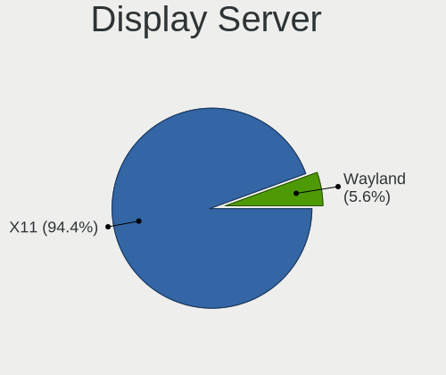
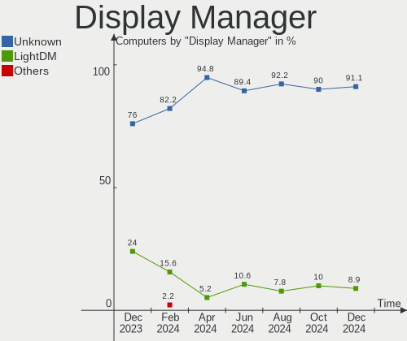
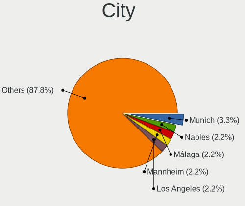
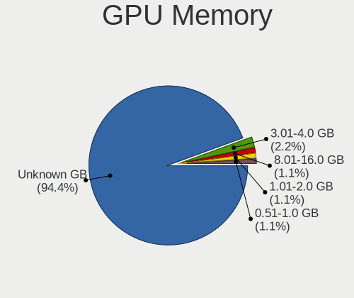
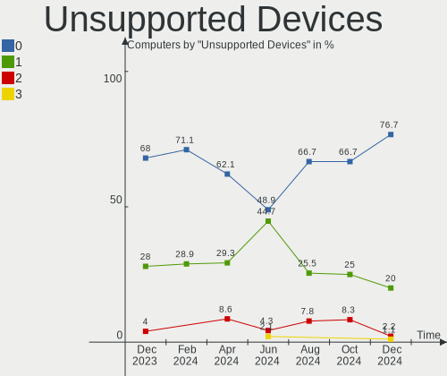

Elementary Hardware Trends
--------------------------

A project to identify most popular hardware characteristics and track their change
over time based on data collected by Elementary users at https://Linux-Hardware.org.

Anyone can contribute to this report by the [hw-probe](https://github.com/linuxhw/hw-probe) tool:

    sudo -E hw-probe -all -upload

This is a report for all computer types. See also reports for [desktops](/Dist/Elementary/Desktop/README.md) and [notebooks](/Dist/Elementary/Notebook/README.md).

Full-feature report is available here: https://linux-hardware.org/?view=trends

Period: Feb, 2022.

Contents
--------

* [ System ](#system)
  - [ OS                       ](#os)
  - [ OS Family                ](#os-family)
  - [ Kernel                   ](#kernel)
  - [ Kernel Family            ](#kernel-family)
  - [ Kernel Major Ver.        ](#kernel-major-ver)
  - [ Arch                     ](#arch)
  - [ DE                       ](#de)
  - [ Display Server           ](#display-server)
  - [ Display Manager          ](#display-manager)
  - [ OS Lang                  ](#os-lang)
  - [ Boot Mode                ](#boot-mode)
  - [ Filesystem               ](#filesystem)
  - [ Part. scheme             ](#part-scheme)
  - [ Dual Boot with Linux/BSD ](#dual-boot-with-linuxbsd)
  - [ Dual Boot (Win)          ](#dual-boot-win)

* [ Board ](#board)
  - [ Vendor                   ](#vendor)
  - [ Model                    ](#model)
  - [ Model Family             ](#model-family)
  - [ MFG Year                 ](#mfg-year)
  - [ Form Factor              ](#form-factor)
  - [ Secure Boot              ](#secure-boot)
  - [ Coreboot                 ](#coreboot)
  - [ RAM Size                 ](#ram-size)
  - [ RAM Used                 ](#ram-used)
  - [ Total Drives             ](#total-drives)
  - [ Has CD-ROM               ](#has-cd-rom)
  - [ Has Ethernet             ](#has-ethernet)
  - [ Has WiFi                 ](#has-wifi)
  - [ Has Bluetooth            ](#has-bluetooth)

* [ Location ](#location)
  - [ Country                  ](#country)
  - [ City                     ](#city)

* [ Drives ](#drives)
  - [ Drive Vendor             ](#drive-vendor)
  - [ Drive Model              ](#drive-model)
  - [ HDD Vendor               ](#hdd-vendor)
  - [ SSD Vendor               ](#ssd-vendor)
  - [ Drive Kind               ](#drive-kind)
  - [ Drive Connector          ](#drive-connector)
  - [ Drive Size               ](#drive-size)
  - [ Space Total              ](#space-total)
  - [ Space Used               ](#space-used)
  - [ Malfunc. Drives          ](#malfunc-drives)
  - [ Malfunc. Drive Vendor    ](#malfunc-drive-vendor)
  - [ Malfunc. HDD Vendor      ](#malfunc-hdd-vendor)
  - [ Malfunc. Drive Kind      ](#malfunc-drive-kind)
  - [ Failed Drives            ](#failed-drives)
  - [ Failed Drive Vendor      ](#failed-drive-vendor)
  - [ Drive Status             ](#drive-status)

* [ Storage controller ](#storage-controller)
  - [ Storage Vendor           ](#storage-vendor)
  - [ Storage Model            ](#storage-model)
  - [ Storage Kind             ](#storage-kind)

* [ Processor ](#processor)
  - [ CPU Vendor               ](#cpu-vendor)
  - [ CPU Model                ](#cpu-model)
  - [ CPU Model Family         ](#cpu-model-family)
  - [ CPU Cores                ](#cpu-cores)
  - [ CPU Sockets              ](#cpu-sockets)
  - [ CPU Threads              ](#cpu-threads)
  - [ CPU Op-Modes             ](#cpu-op-modes)
  - [ CPU Microcode            ](#cpu-microcode)
  - [ CPU Microarch            ](#cpu-microarch)

* [ Graphics ](#graphics)
  - [ GPU Vendor               ](#gpu-vendor)
  - [ GPU Model                ](#gpu-model)
  - [ GPU Combo                ](#gpu-combo)
  - [ GPU Driver               ](#gpu-driver)
  - [ GPU Memory               ](#gpu-memory)

* [ Monitor ](#monitor)
  - [ Monitor Vendor           ](#monitor-vendor)
  - [ Monitor Model            ](#monitor-model)
  - [ Monitor Resolution       ](#monitor-resolution)
  - [ Monitor Diagonal         ](#monitor-diagonal)
  - [ Monitor Width            ](#monitor-width)
  - [ Aspect Ratio             ](#aspect-ratio)
  - [ Monitor Area             ](#monitor-area)
  - [ Pixel Density            ](#pixel-density)
  - [ Multiple Monitors        ](#multiple-monitors)

* [ Network ](#network)
  - [ Net Controller Vendor    ](#net-controller-vendor)
  - [ Net Controller Model     ](#net-controller-model)
  - [ Wireless Vendor          ](#wireless-vendor)
  - [ Wireless Model           ](#wireless-model)
  - [ Ethernet Vendor          ](#ethernet-vendor)
  - [ Ethernet Model           ](#ethernet-model)
  - [ Net Controller Kind      ](#net-controller-kind)
  - [ Used Controller          ](#used-controller)
  - [ NICs                     ](#nics)
  - [ IPv6                     ](#ipv6)

* [ Bluetooth ](#bluetooth)
  - [ Bluetooth Vendor         ](#bluetooth-vendor)
  - [ Bluetooth Model          ](#bluetooth-model)

* [ Sound ](#sound)
  - [ Sound Vendor             ](#sound-vendor)
  - [ Sound Model              ](#sound-model)

* [ Memory ](#memory)
  - [ Memory Vendor            ](#memory-vendor)
  - [ Memory Model             ](#memory-model)
  - [ Memory Kind              ](#memory-kind)
  - [ Memory Form Factor       ](#memory-form-factor)
  - [ Memory Size              ](#memory-size)
  - [ Memory Speed             ](#memory-speed)

* [ Printers & scanners ](#printers--scanners)
  - [ Printer Vendor           ](#printer-vendor)
  - [ Printer Model            ](#printer-model)
  - [ Scanner Vendor           ](#scanner-vendor)
  - [ Scanner Model            ](#scanner-model)

* [ Camera ](#camera)
  - [ Camera Vendor            ](#camera-vendor)
  - [ Camera Model             ](#camera-model)

* [ Security ](#security)
  - [ Fingerprint Vendor       ](#fingerprint-vendor)
  - [ Fingerprint Model        ](#fingerprint-model)
  - [ Chipcard Vendor          ](#chipcard-vendor)
  - [ Chipcard Model           ](#chipcard-model)

* [ Unsupported ](#unsupported)
  - [ Unsupported Devices      ](#unsupported-devices)
  - [ Unsupported Device Types ](#unsupported-device-types)

System
------

OS
--

Installed operating systems

| Name             | Computers | Percent |
|------------------|-----------|---------|
| Elementary 6.1   | 88        | 95.65%  |
| Elementary 5.1.7 | 3         | 3.26%   |
| Elementary 6     | 1         | 1.09%   |

OS Family
---------

OS without a version

| Name       | Computers | Percent |
|------------|-----------|---------|
| Elementary | 92        | 100%    |

Kernel
------

Version of the Linux kernel

| Version                | Computers | Percent |
|------------------------|-----------|---------|
| 5.13.0-28-generic      | 51        | 55.43%  |
| 5.13.0-30-generic      | 19        | 20.65%  |
| 5.11.0-43-generic      | 6         | 6.52%   |
| 5.13.0-27-generic      | 5         | 5.43%   |
| 5.11.0-44-generic      | 2         | 2.17%   |
| 5.11.0-41-generic      | 2         | 2.17%   |
| 5.4.0-97-generic       | 1         | 1.09%   |
| 5.4.0-96-generic       | 1         | 1.09%   |
| 5.4.0-81-generic       | 1         | 1.09%   |
| 5.16.10-051610-generic | 1         | 1.09%   |
| 5.13.0-28-lowlatency   | 1         | 1.09%   |
| 5.13.0-25-generic      | 1         | 1.09%   |
| 5.11.0-40-generic      | 1         | 1.09%   |

Kernel Family
-------------

Linux kernel without a distro release

| Version | Computers | Percent |
|---------|-----------|---------|
| 5.13.0  | 77        | 83.7%   |
| 5.11.0  | 11        | 11.96%  |
| 5.4.0   | 3         | 3.26%   |
| 5.16.10 | 1         | 1.09%   |

Kernel Major Ver.
-----------------

Linux kernel major version

| Version | Computers | Percent |
|---------|-----------|---------|
| 5.13    | 77        | 83.7%   |
| 5.11    | 11        | 11.96%  |
| 5.4     | 3         | 3.26%   |
| 5.16    | 1         | 1.09%   |

Arch
----

OS architecture (x86_64, i586, etc.)

| Name   | Computers | Percent |
|--------|-----------|---------|
| x86_64 | 92        | 100%    |

DE
--

Desktop Environment

| Name       | Computers | Percent |
|------------|-----------|---------|
| Pantheon   | 91        | 98.91%  |
| X-Cinnamon | 1         | 1.09%   |

Display Server
--------------

X11 or Wayland

| Name | Computers | Percent |
|------|-----------|---------|
| X11  | 92        | 100%    |

Display Manager
---------------

SDDM, LightDM, etc.

| Name    | Computers | Percent |
|---------|-----------|---------|
| Unknown | 84        | 91.3%   |
| LightDM | 8         | 8.7%    |

OS Lang
-------

Language

| Lang  | Computers | Percent |
|-------|-----------|---------|
| en_US | 33        | 35.87%  |
| de_DE | 20        | 21.74%  |
| es_ES | 10        | 10.87%  |
| fr_FR | 6         | 6.52%   |
| ru_RU | 4         | 4.35%   |
| pt_BR | 4         | 4.35%   |
| it_IT | 4         | 4.35%   |
| pt_PT | 2         | 2.17%   |
| pl_PL | 2         | 2.17%   |
| en_GB | 2         | 2.17%   |
| tr_TR | 1         | 1.09%   |
| sr_RS | 1         | 1.09%   |
| ja_JP | 1         | 1.09%   |
| en_CA | 1         | 1.09%   |
| en_AU | 1         | 1.09%   |

Boot Mode
---------

EFI or BIOS

| Mode | Computers | Percent |
|------|-----------|---------|
| EFI  | 55        | 59.78%  |
| BIOS | 37        | 40.22%  |

Filesystem
----------

Type of filesystem

| Type | Computers | Percent |
|------|-----------|---------|
| Ext4 | 92        | 100%    |

Part. scheme
------------

Scheme of partitioning

| Type    | Computers | Percent |
|---------|-----------|---------|
| Unknown | 86        | 93.48%  |
| MBR     | 3         | 3.26%   |
| GPT     | 3         | 3.26%   |

Dual Boot with Linux/BSD
------------------------

Hosting more than one Linux/BSD

| Dual boot | Computers | Percent |
|-----------|-----------|---------|
| No        | 91        | 98.91%  |
| Yes       | 1         | 1.09%   |

Dual Boot (Win)
---------------

Hosting Linux and Windows

| Dual boot | Computers | Percent |
|-----------|-----------|---------|
| No        | 91        | 98.91%  |
| Yes       | 1         | 1.09%   |

Board
-----

Vendor
------

Motherboard manufacturer

| Name                | Computers | Percent |
|---------------------|-----------|---------|
| ASUSTek Computer    | 22        | 23.91%  |
| Hewlett-Packard     | 15        | 16.3%   |
| Lenovo              | 8         | 8.7%    |
| Apple               | 8         | 8.7%    |
| Acer                | 6         | 6.52%   |
| Dell                | 5         | 5.43%   |
| MSI                 | 4         | 4.35%   |
| Gigabyte Technology | 4         | 4.35%   |
| Intel               | 3         | 3.26%   |
| Samsung Electronics | 2         | 2.17%   |
| Toshiba             | 1         | 1.09%   |
| Timi                | 1         | 1.09%   |
| Sony                | 1         | 1.09%   |
| PIPO                | 1         | 1.09%   |
| Panasonic           | 1         | 1.09%   |
| Packard Bell        | 1         | 1.09%   |
| Microsoft           | 1         | 1.09%   |
| LG Electronics      | 1         | 1.09%   |
| HUAWEI              | 1         | 1.09%   |
| Google              | 1         | 1.09%   |
| Foxconn             | 1         | 1.09%   |
| ECS                 | 1         | 1.09%   |
| Biostar             | 1         | 1.09%   |
| BANGHO              | 1         | 1.09%   |
| Unknown             | 1         | 1.09%   |

Model
-----

Motherboard model

| Name                                              | Computers | Percent |
|---------------------------------------------------|-----------|---------|
| Apple MacBook5,1                                  | 2         | 2.17%   |
| Toshiba Satellite L850D-BJS                       | 1         | 1.09%   |
| Timi TM1613                                       | 1         | 1.09%   |
| Sony SVE15115EN                                   | 1         | 1.09%   |
| Samsung 870Z5E/880Z5E/680Z5E                      | 1         | 1.09%   |
| Samsung 500R4K/500R5H/5400RK/501R5H/5500RH/500R5S | 1         | 1.09%   |
| PIPO W9                                           | 1         | 1.09%   |
| Panasonic CF-31SBLJGDM                            | 1         | 1.09%   |
| Packard Bell EasyNote LS11HR                      | 1         | 1.09%   |
| MSI MS-7A40                                       | 1         | 1.09%   |
| MSI MS-7851                                       | 1         | 1.09%   |
| MSI Modern 14 B4MW                                | 1         | 1.09%   |
| MSI Modern 14 B10MW                               | 1         | 1.09%   |
| Microsoft Surface with Windows 8 Pro              | 1         | 1.09%   |
| LG A410-G.BC51P1                                  | 1         | 1.09%   |
| Lenovo ThinkPad X1 Carbon 6th 20KHS0L800          | 1         | 1.09%   |
| Lenovo ThinkPad T470 20JNS08H00                   | 1         | 1.09%   |
| Lenovo ThinkPad T440p 20AN006NUS                  | 1         | 1.09%   |
| Lenovo ThinkPad P14s Gen 1 20Y1000HMH             | 1         | 1.09%   |
| Lenovo ThinkPad E550 20DF0040US                   | 1         | 1.09%   |
| Lenovo ThinkCentre M72e 3664AD7                   | 1         | 1.09%   |
| Lenovo IdeaPad 5 15ARE05 81YQ                     | 1         | 1.09%   |
| Lenovo G550 2958                                  | 1         | 1.09%   |
| Intel NUC8i5BEH                                   | 1         | 1.09%   |
| Intel H61                                         | 1         | 1.09%   |
| Intel DH61BE AAG14062-210                         | 1         | 1.09%   |
| HUAWEI MACHD-WXX9                                 | 1         | 1.09%   |
| HP Z240 SFF Workstation                           | 1         | 1.09%   |
| HP ProLiant ML110 G7                              | 1         | 1.09%   |
| HP ProDesk 600 G2 SFF                             | 1         | 1.09%   |
| HP ProDesk 400 G3 DM                              | 1         | 1.09%   |
| HP ProBook 640 G1                                 | 1         | 1.09%   |
| HP ProBook 450 G7                                 | 1         | 1.09%   |
| HP Pavilion Laptop 15-cd0xx                       | 1         | 1.09%   |
| HP Pavilion Laptop 14-ce0xxx                      | 1         | 1.09%   |
| HP Pavilion 13 x360 PC                            | 1         | 1.09%   |
| HP Laptop 17-by0xxx                               | 1         | 1.09%   |
| HP EliteBook 8460p                                | 1         | 1.09%   |
| HP EliteBook 840 G1                               | 1         | 1.09%   |
| HP Compaq Pro 6300 MT                             | 1         | 1.09%   |
| HP 255 G8 Notebook PC                             | 1         | 1.09%   |
| HP 240 G4                                         | 1         | 1.09%   |
| Google Lulu                                       | 1         | 1.09%   |
| Gigabyte Z390 UD                                  | 1         | 1.09%   |
| Gigabyte X470 AORUS ULTRA GAMING                  | 1         | 1.09%   |
| Gigabyte F2A68HM-H                                | 1         | 1.09%   |
| Gigabyte B75M-D3H                                 | 1         | 1.09%   |
| Foxconn nT435/nT535                               | 1         | 1.09%   |
| ECS H55H-M                                        | 1         | 1.09%   |
| Dell Precision 7720                               | 1         | 1.09%   |
| Dell Inspiron N5050                               | 1         | 1.09%   |
| Dell Inspiron 5481                                | 1         | 1.09%   |
| Dell Inspiron 1764                                | 1         | 1.09%   |
| Dell Inspiron 15-3567                             | 1         | 1.09%   |
| Biostar A68MD PRO                                 | 1         | 1.09%   |
| BANGHO Suma 1025                                  | 1         | 1.09%   |
| ASUS ZenBook UX325EA_UX325EA                      | 1         | 1.09%   |
| ASUS X550CA                                       | 1         | 1.09%   |
| ASUS X540SA                                       | 1         | 1.09%   |
| ASUS VivoBook_ASUSLaptop X510QA_X510QA            | 1         | 1.09%   |

Model Family
------------

Motherboard model prefix

| Name                   | Computers | Percent |
|------------------------|-----------|---------|
| Lenovo ThinkPad        | 5         | 5.43%   |
| Dell Inspiron          | 4         | 4.35%   |
| ASUS PRIME             | 4         | 4.35%   |
| Acer Aspire            | 4         | 4.35%   |
| HP Pavilion            | 3         | 3.26%   |
| MSI Modern             | 2         | 2.17%   |
| HP ProDesk             | 2         | 2.17%   |
| HP ProBook             | 2         | 2.17%   |
| HP EliteBook           | 2         | 2.17%   |
| ASUS VivoBook          | 2         | 2.17%   |
| Apple MacBook5         | 2         | 2.17%   |
| Acer Swift             | 2         | 2.17%   |
| Toshiba Satellite      | 1         | 1.09%   |
| Timi TM1613            | 1         | 1.09%   |
| Sony SVE15115EN        | 1         | 1.09%   |
| Samsung 870Z5E         | 1         | 1.09%   |
| Samsung 500R4K         | 1         | 1.09%   |
| PIPO W9                | 1         | 1.09%   |
| Panasonic CF-31SBLJGDM | 1         | 1.09%   |
| Packard Bell EasyNote  | 1         | 1.09%   |
| MSI MS-7A40            | 1         | 1.09%   |
| MSI MS-7851            | 1         | 1.09%   |
| Microsoft Surface      | 1         | 1.09%   |
| LG A410-G.BC51P1       | 1         | 1.09%   |
| Lenovo ThinkCentre     | 1         | 1.09%   |
| Lenovo IdeaPad         | 1         | 1.09%   |
| Lenovo G550            | 1         | 1.09%   |
| Intel NUC8i5BEH        | 1         | 1.09%   |
| Intel H61              | 1         | 1.09%   |
| Intel DH61BE           | 1         | 1.09%   |
| HUAWEI MACHD-WXX9      | 1         | 1.09%   |
| HP Z240                | 1         | 1.09%   |
| HP ProLiant            | 1         | 1.09%   |
| HP Laptop              | 1         | 1.09%   |
| HP Compaq              | 1         | 1.09%   |
| HP 255                 | 1         | 1.09%   |
| HP 240                 | 1         | 1.09%   |
| Google Lulu            | 1         | 1.09%   |
| Gigabyte Z390          | 1         | 1.09%   |
| Gigabyte X470          | 1         | 1.09%   |
| Gigabyte F2A68HM-H     | 1         | 1.09%   |
| Gigabyte B75M-D3H      | 1         | 1.09%   |
| Foxconn nT435          | 1         | 1.09%   |
| ECS H55H-M             | 1         | 1.09%   |
| Dell Precision         | 1         | 1.09%   |
| Biostar A68MD          | 1         | 1.09%   |
| BANGHO Suma            | 1         | 1.09%   |
| ASUS ZenBook           | 1         | 1.09%   |
| ASUS X550CA            | 1         | 1.09%   |
| ASUS X540SA            | 1         | 1.09%   |
| ASUS ROG               | 1         | 1.09%   |
| ASUS P5B               | 1         | 1.09%   |
| ASUS M4N72-E           | 1         | 1.09%   |
| ASUS M11AD             | 1         | 1.09%   |
| ASUS K95VJ             | 1         | 1.09%   |
| ASUS K75VJ             | 1         | 1.09%   |
| ASUS K50IJ             | 1         | 1.09%   |
| ASUS H110M-C           | 1         | 1.09%   |
| ASUS H110I-PLUS        | 1         | 1.09%   |
| ASUS GL753VE           | 1         | 1.09%   |

MFG Year
--------

Motherboard manufacture year

| Year | Computers | Percent |
|------|-----------|---------|
| 2018 | 11        | 11.96%  |
| 2012 | 11        | 11.96%  |
| 2013 | 9         | 9.78%   |
| 2016 | 8         | 8.7%    |
| 2011 | 8         | 8.7%    |
| 2020 | 7         | 7.61%   |
| 2017 | 7         | 7.61%   |
| 2015 | 7         | 7.61%   |
| 2021 | 5         | 5.43%   |
| 2019 | 5         | 5.43%   |
| 2014 | 5         | 5.43%   |
| 2009 | 5         | 5.43%   |
| 2010 | 3         | 3.26%   |
| 2006 | 1         | 1.09%   |

Form Factor
-----------

Physical design of the computer

| Name        | Computers | Percent |
|-------------|-----------|---------|
| Notebook    | 58        | 63.04%  |
| Desktop     | 28        | 30.43%  |
| Tablet      | 2         | 2.17%   |
| Mini pc     | 2         | 2.17%   |
| Convertible | 1         | 1.09%   |
| All in one  | 1         | 1.09%   |

Secure Boot
-----------

Enabled or disabled

| State    | Computers | Percent |
|----------|-----------|---------|
| Disabled | 81        | 88.04%  |
| Enabled  | 11        | 11.96%  |

Coreboot
--------

Have coreboot on board

| Used | Computers | Percent |
|------|-----------|---------|
| No   | 91        | 98.91%  |
| Yes  | 1         | 1.09%   |

RAM Size
--------

Total RAM memory

| Size in GB | Computers | Percent |
|------------|-----------|---------|
| 4.01-8.0   | 31        | 33.7%   |
| 3.01-4.0   | 20        | 21.74%  |
| 16.01-24.0 | 17        | 18.48%  |
| 8.01-16.0  | 16        | 17.39%  |
| 32.01-64.0 | 3         | 3.26%   |
| 1.01-2.0   | 3         | 3.26%   |
| 24.01-32.0 | 1         | 1.09%   |
| 2.01-3.0   | 1         | 1.09%   |

RAM Used
--------

Used RAM memory

| Used GB    | Computers | Percent |
|------------|-----------|---------|
| 1.01-2.0   | 37        | 40.22%  |
| 2.01-3.0   | 30        | 32.61%  |
| 3.01-4.0   | 12        | 13.04%  |
| 4.01-8.0   | 8         | 8.7%    |
| 0.51-1.0   | 3         | 3.26%   |
| 16.01-24.0 | 1         | 1.09%   |
| 8.01-16.0  | 1         | 1.09%   |

Total Drives
------------

Number of drives on board

| Drives | Computers | Percent |
|--------|-----------|---------|
| 1      | 50        | 54.35%  |
| 2      | 33        | 35.87%  |
| 3      | 5         | 5.43%   |
| 4      | 2         | 2.17%   |
| 7      | 1         | 1.09%   |
| 5      | 1         | 1.09%   |

Has CD-ROM
----------

Has CD-ROM on board

| Presented | Computers | Percent |
|-----------|-----------|---------|
| No        | 57        | 61.96%  |
| Yes       | 35        | 38.04%  |

Has Ethernet
------------

Has Ethernet on board

| Presented | Computers | Percent |
|-----------|-----------|---------|
| Yes       | 73        | 79.35%  |
| No        | 19        | 20.65%  |

Has WiFi
--------

Has WiFi module

| Presented | Computers | Percent |
|-----------|-----------|---------|
| Yes       | 72        | 78.26%  |
| No        | 20        | 21.74%  |

Has Bluetooth
-------------

Has Bluetooth module

| Presented | Computers | Percent |
|-----------|-----------|---------|
| Yes       | 66        | 71.74%  |
| No        | 26        | 28.26%  |

Location
--------

Country
-------

Geographic location (country)

| Country      | Computers | Percent |
|--------------|-----------|---------|
| Germany      | 18        | 19.57%  |
| USA          | 14        | 15.22%  |
| UK           | 5         | 5.43%   |
| Spain        | 5         | 5.43%   |
| Russia       | 5         | 5.43%   |
| France       | 5         | 5.43%   |
| Brazil       | 5         | 5.43%   |
| Italy        | 4         | 4.35%   |
| Indonesia    | 3         | 3.26%   |
| India        | 3         | 3.26%   |
| Argentina    | 3         | 3.26%   |
| Poland       | 2         | 2.17%   |
| Austria      | 2         | 2.17%   |
| Turkey       | 1         | 1.09%   |
| Taiwan       | 1         | 1.09%   |
| Switzerland  | 1         | 1.09%   |
| South Africa | 1         | 1.09%   |
| Serbia       | 1         | 1.09%   |
| Peru         | 1         | 1.09%   |
| Netherlands  | 1         | 1.09%   |
| Mexico       | 1         | 1.09%   |
| Lithuania    | 1         | 1.09%   |
| Latvia       | 1         | 1.09%   |
| Japan        | 1         | 1.09%   |
| Ireland      | 1         | 1.09%   |
| Iran         | 1         | 1.09%   |
| Colombia     | 1         | 1.09%   |
| Chile        | 1         | 1.09%   |
| Canada       | 1         | 1.09%   |
| Belgium      | 1         | 1.09%   |
| Australia    | 1         | 1.09%   |

City
----

Geographic location (city)

| City                 | Computers | Percent |
|----------------------|-----------|---------|
| St Petersburg        | 3         | 3.26%   |
| Wolgast              | 2         | 2.17%   |
| Tucson               | 2         | 2.17%   |
| São Paulo         | 2         | 2.17%   |
| Madrid               | 2         | 2.17%   |
| Dresden              | 2         | 2.17%   |
| Woolloongabba        | 1         | 1.09%   |
| Witbank              | 1         | 1.09%   |
| West Bromwich        | 1         | 1.09%   |
| Warsaw               | 1         | 1.09%   |
| Vigodarzere          | 1         | 1.09%   |
| Vienna               | 1         | 1.09%   |
| Trieste              | 1         | 1.09%   |
| The Hague            | 1         | 1.09%   |
| Tangerang            | 1         | 1.09%   |
| Suresnes             | 1         | 1.09%   |
| Stronsdorf           | 1         | 1.09%   |
| Semarang             | 1         | 1.09%   |
| Scottsdale           | 1         | 1.09%   |
| Sassnitz             | 1         | 1.09%   |
| Santa Clara          | 1         | 1.09%   |
| Rzeszów           | 1         | 1.09%   |
| Rosario              | 1         | 1.09%   |
| Riga                 | 1         | 1.09%   |
| Purwokerto           | 1         | 1.09%   |
| Patiala              | 1         | 1.09%   |
| Paris                | 1         | 1.09%   |
| Novi Sad             | 1         | 1.09%   |
| North                | 1         | 1.09%   |
| Nome                 | 1         | 1.09%   |
| New Taipei           | 1         | 1.09%   |
| Neubrandenburg       | 1         | 1.09%   |
| Mysore               | 1         | 1.09%   |
| Muralto              | 1         | 1.09%   |
| Munich               | 1         | 1.09%   |
| Moscow               | 1         | 1.09%   |
| Monza                | 1         | 1.09%   |
| Montreal             | 1         | 1.09%   |
| Monmouth             | 1         | 1.09%   |
| McKinney             | 1         | 1.09%   |
| Málaga            | 1         | 1.09%   |
| Mažeikiai         | 1         | 1.09%   |
| Lyon                 | 1         | 1.09%   |
| Ligonier             | 1         | 1.09%   |
| Lauterbach           | 1         | 1.09%   |
| Larnage              | 1         | 1.09%   |
| Langenlonsheim       | 1         | 1.09%   |
| La Calera            | 1         | 1.09%   |
| Kobe                 | 1         | 1.09%   |
| Kirchheim unter Teck | 1         | 1.09%   |
| Kingston             | 1         | 1.09%   |
| Kensington           | 1         | 1.09%   |
| Jarnac               | 1         | 1.09%   |
| Hugo                 | 1         | 1.09%   |
| Hamburg              | 1         | 1.09%   |
| Ghaziabad            | 1         | 1.09%   |
| Geretsried           | 1         | 1.09%   |
| Garland              | 1         | 1.09%   |
| Garin                | 1         | 1.09%   |
| Garbagnate Milanese  | 1         | 1.09%   |

Drives
------

Drive Vendor
------------

Hard drive vendors

| Vendor                    | Computers | Drives | Percent |
|---------------------------|-----------|--------|---------|
| Samsung Electronics       | 20        | 24     | 15.15%  |
| WDC                       | 17        | 19     | 12.88%  |
| Seagate                   | 16        | 18     | 12.12%  |
| SanDisk                   | 9         | 10     | 6.82%   |
| Toshiba                   | 8         | 8      | 6.06%   |
| Kingston                  | 7         | 7      | 5.3%    |
| Crucial                   | 7         | 7      | 5.3%    |
| Unknown                   | 6         | 8      | 4.55%   |
| PNY                       | 4         | 4      | 3.03%   |
| HGST                      | 4         | 4      | 3.03%   |
| Apple                     | 4         | 4      | 3.03%   |
| Intel                     | 3         | 3      | 2.27%   |
| Hitachi                   | 3         | 3      | 2.27%   |
| Phison                    | 2         | 2      | 1.52%   |
| KingDian                  | 2         | 2      | 1.52%   |
| Transcend                 | 1         | 1      | 0.76%   |
| TO Exter                  | 1         | 1      | 0.76%   |
| SSK                       | 1         | 1      | 0.76%   |
| SSDPR-CX                  | 1         | 1      | 0.76%   |
| SK Hynix                  | 1         | 1      | 0.76%   |
| Realtek Semiconductor     | 1         | 1      | 0.76%   |
| Netac                     | 1         | 1      | 0.76%   |
| Micron/Crucial Technology | 1         | 1      | 0.76%   |
| MENGMI                    | 1         | 1      | 0.76%   |
| LITEON                    | 1         | 1      | 0.76%   |
| Leven                     | 1         | 1      | 0.76%   |
| JMicron                   | 1         | 1      | 0.76%   |
| Hewlett-Packard           | 1         | 1      | 0.76%   |
| Gigabyte Technology       | 1         | 1      | 0.76%   |
| Corsair                   | 1         | 1      | 0.76%   |
| Colorful                  | 1         | 1      | 0.76%   |
| China                     | 1         | 1      | 0.76%   |
| ASMT                      | 1         | 1      | 0.76%   |
| asmedia                   | 1         | 1      | 0.76%   |
| A-DATA Technology         | 1         | 1      | 0.76%   |

Drive Model
-----------

Hard drive models

| Model                                  | Computers | Percent |
|----------------------------------------|-----------|---------|
| Sandisk NVMe SSD Drive 512GB           | 3         | 2.14%   |
| Samsung SM963 2.5" NVMe PCIe SSD 256GB | 3         | 2.14%   |
| Crucial CT240BX500SSD1 240GB           | 3         | 2.14%   |
| WDC WD5000AAKX-00ERMA0 500GB           | 2         | 1.43%   |
| Unknown MMC Card  32GB                 | 2         | 1.43%   |
| Toshiba MQ01ABF050 500GB               | 2         | 1.43%   |
| Toshiba KBG30ZMS128G 128GB NVMe SSD    | 2         | 1.43%   |
| Toshiba DT01ACA050 500GB               | 2         | 1.43%   |
| Seagate ST1000LM024 HN-M101MBB 1TB     | 2         | 1.43%   |
| Seagate ST1000DM003-1ER162 1TB         | 2         | 1.43%   |
| Seagate OneTouch HDD 4TB               | 2         | 1.43%   |
| Samsung SSD 860 QVO 1TB                | 2         | 1.43%   |
| Samsung SSD 840 EVO 120GB              | 2         | 1.43%   |
| PNY CS900 480GB SSD                    | 2         | 1.43%   |
| PNY CS900 120GB SSD                    | 2         | 1.43%   |
| Kingston SA400S37120G 120GB SSD        | 2         | 1.43%   |
| HGST HTS541010B7E610 1TB               | 2         | 1.43%   |
| WDC WDS480G2G0A-00JH30 480GB SSD       | 1         | 0.71%   |
| WDC WDS250G1B0A-00H9H0 250GB SSD       | 1         | 0.71%   |
| WDC WDS240G2G0A-00JH30 240GB SSD       | 1         | 0.71%   |
| WDC WD5000LPVX-75V0TT0 500GB           | 1         | 0.71%   |
| WDC WD5000BPVT-22HXZT3 500GB           | 1         | 0.71%   |
| WDC WD5000AAKX-001CA0 500GB            | 1         | 0.71%   |
| WDC WD5000AAKS-402AA0 500GB            | 1         | 0.71%   |
| WDC WD5000AAKS-00A7B2 500GB            | 1         | 0.71%   |
| WDC WD3200BPVT-00JJ5T0 320GB           | 1         | 0.71%   |
| WDC WD3200BEVT-75A23T0 320GB           | 1         | 0.71%   |
| WDC WD3200AAJS-00L7A0 320GB            | 1         | 0.71%   |
| WDC WD30PURX-64P6ZY0 3TB               | 1         | 0.71%   |
| WDC WD30EFRX-68EUZN0 3TB               | 1         | 0.71%   |
| WDC WD2500BEVS-22UST0 250GB            | 1         | 0.71%   |
| WDC WD20EARX-00PASB0 2TB               | 1         | 0.71%   |
| WDC WD10SPZX-75Z10T2 1TB               | 1         | 0.71%   |
| WDC SSC-D0064SC-2100 64GB              | 1         | 0.71%   |
| Unknown SD/MMC 16GB                    | 1         | 0.71%   |
| Unknown MMC Card  64GB                 | 1         | 0.71%   |
| Unknown MMC Card  128GB                | 1         | 0.71%   |
| Unknown M.S./M.S.Pro/HG 16GB           | 1         | 0.71%   |
| Unknown BJNB4R  32GB                   | 1         | 0.71%   |
| Transcend TS128GMTS430S 128GB SSD      | 1         | 0.71%   |
| Toshiba MQ04ABF100 1TB                 | 1         | 0.71%   |
| Toshiba HDWD110 1TB                    | 1         | 0.71%   |
| TO Exter nal USB 3.0 2TB               | 1         | 0.71%   |
| SSK Disk 512GB                         | 1         | 0.71%   |
| SSDPR-CX 400-128 128GB                 | 1         | 0.71%   |
| SK Hynix NVMe SSD Drive 128GB          | 1         | 0.71%   |
| Seagate ST9500325AS 500GB              | 1         | 0.71%   |
| Seagate ST93205620AS 320GB             | 1         | 0.71%   |
| Seagate ST9250315AS 250GB              | 1         | 0.71%   |
| Seagate ST500LT012-1DG142 500GB        | 1         | 0.71%   |
| Seagate ST500LM021-1KJ152 500GB        | 1         | 0.71%   |
| Seagate ST3320620AS 320GB              | 1         | 0.71%   |
| Seagate ST3250310AS 250GB              | 1         | 0.71%   |
| Seagate ST320LM010-1KJ15C 320GB        | 1         | 0.71%   |
| Seagate ST3160811AS 160GB              | 1         | 0.71%   |
| Seagate ST2000DM001-9YN164 2TB         | 1         | 0.71%   |
| Seagate NVMe SSD Drive 500GB           | 1         | 0.71%   |
| Seagate Expansion Desk 8TB             | 1         | 0.71%   |
| SanDisk Ultra II 480GB SSD             | 1         | 0.71%   |
| SanDisk SSD PLUS 480GB                 | 1         | 0.71%   |

HDD Vendor
----------

Hard disk drive vendors

| Vendor              | Computers | Drives | Percent |
|---------------------|-----------|--------|---------|
| WDC                 | 15        | 15     | 32.61%  |
| Seagate             | 15        | 17     | 32.61%  |
| Toshiba             | 6         | 6      | 13.04%  |
| HGST                | 4         | 4      | 8.7%    |
| Hitachi             | 3         | 3      | 6.52%   |
| Samsung Electronics | 1         | 1      | 2.17%   |
| Hewlett-Packard     | 1         | 1      | 2.17%   |
| ASMT                | 1         | 1      | 2.17%   |

SSD Vendor
----------

Solid state drive vendors

| Vendor              | Computers | Drives | Percent |
|---------------------|-----------|--------|---------|
| Samsung Electronics | 15        | 17     | 26.79%  |
| Crucial             | 7         | 7      | 12.5%   |
| SanDisk             | 6         | 7      | 10.71%  |
| PNY                 | 4         | 4      | 7.14%   |
| Kingston            | 4         | 4      | 7.14%   |
| Apple               | 4         | 4      | 7.14%   |
| WDC                 | 3         | 3      | 5.36%   |
| Intel               | 2         | 2      | 3.57%   |
| Transcend           | 1         | 1      | 1.79%   |
| TO Exter            | 1         | 1      | 1.79%   |
| MENGMI              | 1         | 1      | 1.79%   |
| LITEON              | 1         | 1      | 1.79%   |
| Leven               | 1         | 1      | 1.79%   |
| KingDian            | 1         | 1      | 1.79%   |
| Gigabyte Technology | 1         | 1      | 1.79%   |
| Corsair             | 1         | 1      | 1.79%   |
| Colorful            | 1         | 1      | 1.79%   |
| China               | 1         | 1      | 1.79%   |
| A-DATA Technology   | 1         | 1      | 1.79%   |

Drive Kind
----------

HDD or SSD

| Kind    | Computers | Drives | Percent |
|---------|-----------|--------|---------|
| SSD     | 52        | 59     | 40.63%  |
| HDD     | 42        | 48     | 32.81%  |
| NVMe    | 21        | 21     | 16.41%  |
| Unknown | 8         | 10     | 6.25%   |
| MMC     | 5         | 5      | 3.91%   |

Drive Connector
---------------

SATA, SAS, NVMe, etc.

| Type | Computers | Drives | Percent |
|------|-----------|--------|---------|
| SATA | 78        | 105    | 68.42%  |
| NVMe | 21        | 21     | 18.42%  |
| SAS  | 10        | 12     | 8.77%   |
| MMC  | 5         | 5      | 4.39%   |

Drive Size
----------

Size of hard drive

| Size in TB | Computers | Drives | Percent |
|------------|-----------|--------|---------|
| 0.01-0.5   | 65        | 80     | 71.43%  |
| 0.51-1.0   | 17        | 18     | 18.68%  |
| 1.01-2.0   | 4         | 4      | 4.4%    |
| 3.01-4.0   | 2         | 2      | 2.2%    |
| 2.01-3.0   | 2         | 2      | 2.2%    |
| 4.01-10.0  | 1         | 1      | 1.1%    |

Space Total
-----------

Amount of disk space available on the file system

| Size in GB     | Computers | Percent |
|----------------|-----------|---------|
| 101-250        | 35        | 38.04%  |
| 251-500        | 33        | 35.87%  |
| 501-1000       | 8         | 8.7%    |
| 51-100         | 8         | 8.7%    |
| 21-50          | 4         | 4.35%   |
| 1001-2000      | 2         | 2.17%   |
| More than 3000 | 1         | 1.09%   |
| 2001-3000      | 1         | 1.09%   |

Space Used
----------

Amount of used disk space

| Used GB   | Computers | Percent |
|-----------|-----------|---------|
| 1-20      | 51        | 55.43%  |
| 21-50     | 18        | 19.57%  |
| 51-100    | 10        | 10.87%  |
| 101-250   | 7         | 7.61%   |
| 501-1000  | 3         | 3.26%   |
| 251-500   | 2         | 2.17%   |
| 1001-2000 | 1         | 1.09%   |

Malfunc. Drives
---------------

Drive models with a malfunction

Zero info for selected period =(

Malfunc. Drive Vendor
---------------------

Vendors of faulty drives

Zero info for selected period =(

Malfunc. HDD Vendor
-------------------

Vendors of faulty HDD drives

Zero info for selected period =(

Malfunc. Drive Kind
-------------------

Kinds of faulty drives

Zero info for selected period =(

Failed Drives
-------------

Failed drive models

Zero info for selected period =(

Failed Drive Vendor
-------------------

Failed drive vendors

Zero info for selected period =(

Drive Status
------------

Number of failed and malfunc. drives

| Status   | Computers | Drives | Percent |
|----------|-----------|--------|---------|
| Detected | 88        | 134    | 93.62%  |
| Works    | 6         | 9      | 6.38%   |

Storage controller
------------------

Storage Vendor
--------------

Storage controller vendors

| Vendor                       | Computers | Percent |
|------------------------------|-----------|---------|
| Intel                        | 69        | 62.73%  |
| AMD                          | 12        | 10.91%  |
| Samsung Electronics          | 7         | 6.36%   |
| Nvidia                       | 4         | 3.64%   |
| Sandisk                      | 3         | 2.73%   |
| Kingston Technology Company  | 3         | 2.73%   |
| Toshiba America Info Systems | 2         | 1.82%   |
| Phison Electronics           | 2         | 1.82%   |
| Marvell Technology Group     | 2         | 1.82%   |
| SK Hynix                     | 1         | 0.91%   |
| Seagate Technology           | 1         | 0.91%   |
| Realtek Semiconductor        | 1         | 0.91%   |
| Micron/Crucial Technology    | 1         | 0.91%   |
| JMicron Technology           | 1         | 0.91%   |
| ASMedia Technology           | 1         | 0.91%   |

Storage Model
-------------

Storage controller models

| Model                                                                                  | Computers | Percent |
|----------------------------------------------------------------------------------------|-----------|---------|
| AMD FCH SATA Controller [AHCI mode]                                                    | 9         | 7.76%   |
| Intel 7 Series Chipset Family 6-port SATA Controller [AHCI mode]                       | 8         | 6.9%    |
| Intel Q170/Q150/B150/H170/H110/Z170/CM236 Chipset SATA Controller [AHCI Mode]          | 5         | 4.31%   |
| Intel 8 Series/C220 Series Chipset Family 6-port SATA Controller 1 [AHCI mode]         | 5         | 4.31%   |
| Intel 6 Series/C200 Series Chipset Family 6 port Desktop SATA AHCI Controller          | 5         | 4.31%   |
| Samsung NVMe SSD Controller SM981/PM981/PM983                                          | 4         | 3.45%   |
| Intel Sunrise Point-LP SATA Controller [AHCI mode]                                     | 4         | 3.45%   |
| Intel Wildcat Point-LP SATA Controller [AHCI Mode]                                     | 3         | 2.59%   |
| Intel Celeron/Pentium Silver Processor SATA Controller                                 | 3         | 2.59%   |
| Intel Cannon Lake PCH SATA AHCI Controller                                             | 3         | 2.59%   |
| Intel Atom/Celeron/Pentium Processor x5-E8000/J3xxx/N3xxx Series SATA Controller       | 3         | 2.59%   |
| Intel 82801 Mobile SATA Controller [RAID mode]                                         | 3         | 2.59%   |
| Intel 8 Series SATA Controller 1 [AHCI mode]                                           | 3         | 2.59%   |
| Intel 6 Series/C200 Series Chipset Family 6 port Mobile SATA AHCI Controller           | 3         | 2.59%   |
| AMD 400 Series Chipset SATA Controller                                                 | 3         | 2.59%   |
| Toshiba America Info Systems BG3 NVMe SSD Controller                                   | 2         | 1.72%   |
| Intel 82801IBM/IEM (ICH9M/ICH9M-E) 4 port SATA Controller [AHCI mode]                  | 2         | 1.72%   |
| Intel 7 Series/C210 Series Chipset Family 6-port SATA Controller [AHCI mode]           | 2         | 1.72%   |
| Intel 5 Series/3400 Series Chipset 4 port SATA AHCI Controller                         | 2         | 1.72%   |
| AMD FCH SATA Controller [IDE mode]                                                     | 2         | 1.72%   |
| SK Hynix Gold P31 SSD                                                                  | 1         | 0.86%   |
| Seagate FireCuda 510 SSD                                                               | 1         | 0.86%   |
| Sandisk WD Blue SN550 NVMe SSD                                                         | 1         | 0.86%   |
| Sandisk WD Blue SN500 / PC SN520 NVMe SSD                                              | 1         | 0.86%   |
| Sandisk WD Black 2018/SN750 / PC SN720 NVMe SSD                                        | 1         | 0.86%   |
| Samsung NVMe SSD Controller SM951/PM951                                                | 1         | 0.86%   |
| Samsung NVMe SSD Controller 980                                                        | 1         | 0.86%   |
| Samsung Electronics SATA controller                                                    | 1         | 0.86%   |
| Realtek RTS5763DL NVMe SSD Controller                                                  | 1         | 0.86%   |
| Phison NVMe Storage Controller                                                         | 1         | 0.86%   |
| Phison E16 PCIe4 NVMe Controller                                                       | 1         | 0.86%   |
| Nvidia MCP89 SATA Controller (AHCI mode)                                               | 1         | 0.86%   |
| Nvidia MCP79 SATA Controller                                                           | 1         | 0.86%   |
| Nvidia MCP79 AHCI Controller                                                           | 1         | 0.86%   |
| Nvidia MCP78S [GeForce 8200] IDE                                                       | 1         | 0.86%   |
| Nvidia MCP78S [GeForce 8200] AHCI Controller                                           | 1         | 0.86%   |
| Micron/Crucial P2 NVMe PCIe SSD                                                        | 1         | 0.86%   |
| Marvell Group 88SS9183 PCIe SSD Controller                                             | 1         | 0.86%   |
| Marvell Group 88SE9172 SATA 6Gb/s Controller                                           | 1         | 0.86%   |
| Kingston Company U-SNS8154P3 NVMe SSD                                                  | 1         | 0.86%   |
| Kingston Company Company Non-Volatile memory controller                                | 1         | 0.86%   |
| Kingston Company OM3PDP3 NVMe SSD                                                      | 1         | 0.86%   |
| JMicron JMB363 SATA/IDE Controller                                                     | 1         | 0.86%   |
| Intel Volume Management Device NVMe RAID Controller                                    | 1         | 0.86%   |
| Intel SSD 660P Series                                                                  | 1         | 0.86%   |
| Intel SATA Controller [RAID mode]                                                      | 1         | 0.86%   |
| Intel NM10/ICH7 Family SATA Controller [IDE mode]                                      | 1         | 0.86%   |
| Intel Jasper Lake SATA AHCI Controller                                                 | 1         | 0.86%   |
| Intel HM170/QM170 Chipset SATA Controller [AHCI Mode]                                  | 1         | 0.86%   |
| Intel Comet Lake SATA AHCI Controller                                                  | 1         | 0.86%   |
| Intel Celeron N3350/Pentium N4200/Atom E3900 Series SATA AHCI Controller               | 1         | 0.86%   |
| Intel Cannon Point-LP SATA Controller [AHCI Mode]                                      | 1         | 0.86%   |
| Intel Atom Processor E3800 Series SATA AHCI Controller                                 | 1         | 0.86%   |
| Intel 82801HB (ICH8) 4 port SATA Controller [AHCI mode]                                | 1         | 0.86%   |
| Intel 6 Series/C200 Series Chipset Family Mobile SATA Controller (IDE mode, ports 4-5) | 1         | 0.86%   |
| Intel 6 Series/C200 Series Chipset Family Mobile SATA Controller (IDE mode, ports 0-3) | 1         | 0.86%   |
| Intel 500 Series Chipset Family SATA AHCI Controller                                   | 1         | 0.86%   |
| Intel 5 Series/3400 Series Chipset 6 port SATA AHCI Controller                         | 1         | 0.86%   |
| Intel 5 Series/3400 Series Chipset 4 port SATA IDE Controller                          | 1         | 0.86%   |
| Intel 5 Series/3400 Series Chipset 2 port SATA IDE Controller                          | 1         | 0.86%   |

Storage Kind
------------

Kind of storage controller (IDE, SATA, NVMe, SAS, ...)

| Kind | Computers | Percent |
|------|-----------|---------|
| SATA | 78        | 70.91%  |
| NVMe | 21        | 19.09%  |
| IDE  | 6         | 5.45%   |
| RAID | 5         | 4.55%   |

Processor
---------

CPU Vendor
----------

Processor vendors

| Vendor | Computers | Percent |
|--------|-----------|---------|
| Intel  | 78        | 84.78%  |
| AMD    | 14        | 15.22%  |

CPU Model
---------

Processor models

| Model                                           | Computers | Percent |
|-------------------------------------------------|-----------|---------|
| Intel Core i7-8550U CPU @ 1.80GHz               | 2         | 2.17%   |
| Intel Core i7-5500U CPU @ 2.40GHz               | 2         | 2.17%   |
| Intel Celeron CPU N3050 @ 1.60GHz               | 2         | 2.17%   |
| Intel 11th Gen Core i7-1165G7 @ 2.80GHz         | 2         | 2.17%   |
| AMD A12-9720P RADEON R7, 12 COMPUTE CORES 4C+8G | 2         | 2.17%   |
| Intel Xeon CPU E31240 @ 3.30GHz                 | 1         | 1.09%   |
| Intel Pentium Silver N5030 CPU @ 1.10GHz        | 1         | 1.09%   |
| Intel Pentium Dual-Core CPU T4400 @ 2.20GHz     | 1         | 1.09%   |
| Intel Pentium Dual-Core CPU T4200 @ 2.00GHz     | 1         | 1.09%   |
| Intel Pentium CPU G630 @ 2.70GHz                | 1         | 1.09%   |
| Intel Core i7-7700HQ CPU @ 2.80GHz              | 1         | 1.09%   |
| Intel Core i7-6820HQ CPU @ 2.70GHz              | 1         | 1.09%   |
| Intel Core i7-6700 CPU @ 3.40GHz                | 1         | 1.09%   |
| Intel Core i7-5650U CPU @ 2.20GHz               | 1         | 1.09%   |
| Intel Core i7-4790S CPU @ 3.20GHz               | 1         | 1.09%   |
| Intel Core i7-4702MQ CPU @ 2.20GHz              | 1         | 1.09%   |
| Intel Core i7-4610M CPU @ 3.00GHz               | 1         | 1.09%   |
| Intel Core i7-3635QM CPU @ 2.40GHz              | 1         | 1.09%   |
| Intel Core i7-3630QM CPU @ 2.40GHz              | 1         | 1.09%   |
| Intel Core i7-2670QM CPU @ 2.20GHz              | 1         | 1.09%   |
| Intel Core i7-2600 CPU @ 3.40GHz                | 1         | 1.09%   |
| Intel Core i5-9600K CPU @ 3.70GHz               | 1         | 1.09%   |
| Intel Core i5-9400F CPU @ 2.90GHz               | 1         | 1.09%   |
| Intel Core i5-8265U CPU @ 1.60GHz               | 1         | 1.09%   |
| Intel Core i5-8259U CPU @ 2.30GHz               | 1         | 1.09%   |
| Intel Core i5-7500 CPU @ 3.40GHz                | 1         | 1.09%   |
| Intel Core i5-7400 CPU @ 3.00GHz                | 1         | 1.09%   |
| Intel Core i5-7200U CPU @ 2.50GHz               | 1         | 1.09%   |
| Intel Core i5-6400 CPU @ 2.70GHz                | 1         | 1.09%   |
| Intel Core i5-6300U CPU @ 2.40GHz               | 1         | 1.09%   |
| Intel Core i5-6200U CPU @ 2.30GHz               | 1         | 1.09%   |
| Intel Core i5-4300U CPU @ 1.90GHz               | 1         | 1.09%   |
| Intel Core i5-4260U CPU @ 1.40GHz               | 1         | 1.09%   |
| Intel Core i5-4200U CPU @ 1.60GHz               | 1         | 1.09%   |
| Intel Core i5-3470 CPU @ 3.20GHz                | 1         | 1.09%   |
| Intel Core i5-3320M CPU @ 2.60GHz               | 1         | 1.09%   |
| Intel Core i5-3317U CPU @ 1.70GHz               | 1         | 1.09%   |
| Intel Core i5-3210M CPU @ 2.50GHz               | 1         | 1.09%   |
| Intel Core i5-2557M CPU @ 1.70GHz               | 1         | 1.09%   |
| Intel Core i5-2520M CPU @ 2.50GHz               | 1         | 1.09%   |
| Intel Core i5-2500K CPU @ 3.30GHz               | 1         | 1.09%   |
| Intel Core i5-2400S CPU @ 2.50GHz               | 1         | 1.09%   |
| Intel Core i5-2400 CPU @ 3.10GHz                | 1         | 1.09%   |
| Intel Core i5-10210U CPU @ 1.60GHz              | 1         | 1.09%   |
| Intel Core i5 CPU M 520 @ 2.40GHz               | 1         | 1.09%   |
| Intel Core i3-9100F CPU @ 3.60GHz               | 1         | 1.09%   |
| Intel Core i3-8145U CPU @ 2.10GHz               | 1         | 1.09%   |
| Intel Core i3-8130U CPU @ 2.20GHz               | 1         | 1.09%   |
| Intel Core i3-7100T CPU @ 3.40GHz               | 1         | 1.09%   |
| Intel Core i3-6100 CPU @ 3.70GHz                | 1         | 1.09%   |
| Intel Core i3-5005U CPU @ 2.00GHz               | 1         | 1.09%   |
| Intel Core i3-4160 CPU @ 3.60GHz                | 1         | 1.09%   |
| Intel Core i3-4130 CPU @ 3.40GHz                | 1         | 1.09%   |
| Intel Core i3-4030U CPU @ 1.90GHz               | 1         | 1.09%   |
| Intel Core i3-3217U CPU @ 1.80GHz               | 1         | 1.09%   |
| Intel Core i3-2370M CPU @ 2.40GHz               | 1         | 1.09%   |
| Intel Core i3-2365M CPU @ 1.40GHz               | 1         | 1.09%   |
| Intel Core i3-10110U CPU @ 2.10GHz              | 1         | 1.09%   |
| Intel Core i3 CPU M 390 @ 2.67GHz               | 1         | 1.09%   |
| Intel Core i3 CPU M 350 @ 2.27GHz               | 1         | 1.09%   |

CPU Model Family
----------------

Processor model prefix

| Model                   | Computers | Percent |
|-------------------------|-----------|---------|
| Intel Core i5           | 24        | 26.09%  |
| Intel Core i3           | 16        | 17.39%  |
| Intel Core i7           | 15        | 16.3%   |
| Intel Celeron           | 9         | 9.78%   |
| AMD Ryzen 5             | 5         | 5.43%   |
| Other                   | 3         | 3.26%   |
| Intel Core 2 Duo        | 3         | 3.26%   |
| Intel Pentium Dual-Core | 2         | 2.17%   |
| Intel Atom              | 2         | 2.17%   |
| AMD A12                 | 2         | 2.17%   |
| AMD A10                 | 2         | 2.17%   |
| Intel Xeon              | 1         | 1.09%   |
| Intel Pentium Silver    | 1         | 1.09%   |
| Intel Pentium           | 1         | 1.09%   |
| Intel Core 2 Quad       | 1         | 1.09%   |
| AMD Ryzen 7 PRO         | 1         | 1.09%   |
| AMD Ryzen 7             | 1         | 1.09%   |
| AMD Ryzen 3             | 1         | 1.09%   |
| AMD Phenom II X4        | 1         | 1.09%   |
| AMD A8                  | 1         | 1.09%   |

CPU Cores
---------

Number of processor cores

| Number | Computers | Percent |
|--------|-----------|---------|
| 2      | 50        | 54.35%  |
| 4      | 33        | 35.87%  |
| 6      | 6         | 6.52%   |
| 8      | 3         | 3.26%   |

CPU Sockets
-----------

Number of sockets

| Number | Computers | Percent |
|--------|-----------|---------|
| 1      | 92        | 100%    |

CPU Threads
-----------

Threads per core (Hyper-Threading)

| Number | Computers | Percent |
|--------|-----------|---------|
| 2      | 59        | 64.13%  |
| 1      | 33        | 35.87%  |

CPU Op-Modes
------------

CPU Operation Modes (32-bit, 64-bit)

| Op mode        | Computers | Percent |
|----------------|-----------|---------|
| 32-bit, 64-bit | 92        | 100%    |

CPU Microcode
-------------

Microcode number

| Number     | Computers | Percent |
|------------|-----------|---------|
| 0x206a7    | 12        | 13.04%  |
| Unknown    | 7         | 7.61%   |
| 0x306a9    | 6         | 6.52%   |
| 0x306c3    | 5         | 5.43%   |
| 0x906e9    | 4         | 4.35%   |
| 0x506e3    | 4         | 4.35%   |
| 0x406c3    | 4         | 4.35%   |
| 0x306d4    | 4         | 4.35%   |
| 0x1067a    | 4         | 4.35%   |
| 0x806ea    | 3         | 3.26%   |
| 0x706a8    | 3         | 3.26%   |
| 0x40651    | 3         | 3.26%   |
| 0x20652    | 3         | 3.26%   |
| 0x806ec    | 2         | 2.17%   |
| 0x806eb    | 2         | 2.17%   |
| 0x806c1    | 2         | 2.17%   |
| 0x406e3    | 2         | 2.17%   |
| 0x10676    | 2         | 2.17%   |
| 0x08108109 | 2         | 2.17%   |
| 0x06003106 | 2         | 2.17%   |
| 0xa0671    | 1         | 1.09%   |
| 0x906ed    | 1         | 1.09%   |
| 0x906eb    | 1         | 1.09%   |
| 0x906ea    | 1         | 1.09%   |
| 0x906c0    | 1         | 1.09%   |
| 0x806e9    | 1         | 1.09%   |
| 0x506c9    | 1         | 1.09%   |
| 0x30678    | 1         | 1.09%   |
| 0x20655    | 1         | 1.09%   |
| 0x106ca    | 1         | 1.09%   |
| 0x08608103 | 1         | 1.09%   |
| 0x08600106 | 1         | 1.09%   |
| 0x0800820d | 1         | 1.09%   |
| 0x0600611a | 1         | 1.09%   |
| 0x06001119 | 1         | 1.09%   |
| 0x010000c8 | 1         | 1.09%   |

CPU Microarch
-------------

Microarchitecture

| Name          | Computers | Percent |
|---------------|-----------|---------|
| KabyLake      | 16        | 17.39%  |
| SandyBridge   | 12        | 13.04%  |
| Haswell       | 9         | 9.78%   |
| IvyBridge     | 7         | 7.61%   |
| Skylake       | 6         | 6.52%   |
| Penryn        | 6         | 6.52%   |
| Silvermont    | 5         | 5.43%   |
| Zen+          | 4         | 4.35%   |
| Westmere      | 4         | 4.35%   |
| Broadwell     | 4         | 4.35%   |
| Zen 2         | 3         | 3.26%   |
| Goldmont plus | 3         | 3.26%   |
| TigerLake     | 2         | 2.17%   |
| Steamroller   | 2         | 2.17%   |
| Excavator     | 2         | 2.17%   |
| Tremont       | 1         | 1.09%   |
| Piledriver    | 1         | 1.09%   |
| K10           | 1         | 1.09%   |
| Icelake       | 1         | 1.09%   |
| Goldmont      | 1         | 1.09%   |
| Bonnell       | 1         | 1.09%   |
| Unknown       | 1         | 1.09%   |

Graphics
--------

GPU Vendor
----------

Vendors of graphics cards

| Vendor | Computers | Percent |
|--------|-----------|---------|
| Intel  | 61        | 57.01%  |
| AMD    | 24        | 22.43%  |
| Nvidia | 22        | 20.56%  |

GPU Model
---------

Graphics card models

| Model                                                                                    | Computers | Percent |
|------------------------------------------------------------------------------------------|-----------|---------|
| Intel 2nd Generation Core Processor Family Integrated Graphics Controller                | 9         | 8.18%   |
| Intel 3rd Gen Core processor Graphics Controller                                         | 6         | 5.45%   |
| Intel HD Graphics 630                                                                    | 4         | 3.64%   |
| Intel Haswell-ULT Integrated Graphics Controller                                         | 4         | 3.64%   |
| Intel Atom/Celeron/Pentium Processor x5-E8000/J3xxx/N3xxx Integrated Graphics Controller | 4         | 3.64%   |
| Intel UHD Graphics 620                                                                   | 3         | 2.73%   |
| Intel HD Graphics 5500                                                                   | 3         | 2.73%   |
| Intel HD Graphics 530                                                                    | 3         | 2.73%   |
| Intel Core Processor Integrated Graphics Controller                                      | 3         | 2.73%   |
| AMD Renoir                                                                               | 3         | 2.73%   |
| Nvidia GF108M [GeForce GT 635M]                                                          | 2         | 1.82%   |
| Nvidia C79 [GeForce 9400M]                                                               | 2         | 1.82%   |
| Intel WhiskeyLake-U GT2 [UHD Graphics 620]                                               | 2         | 1.82%   |
| Intel TigerLake-LP GT2 [Iris Xe Graphics]                                                | 2         | 1.82%   |
| Intel Skylake GT2 [HD Graphics 520]                                                      | 2         | 1.82%   |
| Intel Mobile 4 Series Chipset Integrated Graphics Controller                             | 2         | 1.82%   |
| Intel GeminiLake [UHD Graphics 600]                                                      | 2         | 1.82%   |
| Intel CometLake-U GT2 [UHD Graphics]                                                     | 2         | 1.82%   |
| Intel 4th Gen Core Processor Integrated Graphics Controller                              | 2         | 1.82%   |
| AMD Wani [Radeon R5/R6/R7 Graphics]                                                      | 2         | 1.82%   |
| AMD Topaz XT [Radeon R7 M260/M265 / M340/M360 / M440/M445 / 530/535 / 620/625 Mobile]    | 2         | 1.82%   |
| AMD Kaveri [Radeon R7 Graphics]                                                          | 2         | 1.82%   |
| AMD Baffin [Radeon RX 460/560D / Pro 450/455/460/555/555X/560/560X]                      | 2         | 1.82%   |
| Nvidia TU104 [GeForce RTX 2060]                                                          | 1         | 0.91%   |
| Nvidia MCP89 [GeForce 320M]                                                              | 1         | 0.91%   |
| Nvidia GT216M [GeForce GT 330M]                                                          | 1         | 0.91%   |
| Nvidia GP108M [GeForce MX250]                                                            | 1         | 0.91%   |
| Nvidia GP107M [GeForce GTX 1050 Ti Mobile]                                               | 1         | 0.91%   |
| Nvidia GP106 [GeForce GTX 1060 6GB]                                                      | 1         | 0.91%   |
| Nvidia GP106 [GeForce GTX 1060 3GB]                                                      | 1         | 0.91%   |
| Nvidia GM108M [GeForce 940M]                                                             | 1         | 0.91%   |
| Nvidia GM108M [GeForce 940MX]                                                            | 1         | 0.91%   |
| Nvidia GM107GLM [Quadro M1200 Mobile]                                                    | 1         | 0.91%   |
| Nvidia GK208M [GeForce GT 730M]                                                          | 1         | 0.91%   |
| Nvidia GK107M [GeForce GT 750M]                                                          | 1         | 0.91%   |
| Nvidia GK104 [GeForce GTX 670]                                                           | 1         | 0.91%   |
| Nvidia GF110 [GeForce GTX 580]                                                           | 1         | 0.91%   |
| Nvidia GF108 [GeForce GT 730]                                                            | 1         | 0.91%   |
| Nvidia GF108 [GeForce GT 630]                                                            | 1         | 0.91%   |
| Nvidia GF100 [GeForce GTX 470]                                                           | 1         | 0.91%   |
| Nvidia G96C [GeForce 9400 GT]                                                            | 1         | 0.91%   |
| Intel JasperLake [UHD Graphics]                                                          | 1         | 0.91%   |
| Intel HD Graphics 620                                                                    | 1         | 0.91%   |
| Intel HD Graphics 6000                                                                   | 1         | 0.91%   |
| Intel HD Graphics 500                                                                    | 1         | 0.91%   |
| Intel GeminiLake [UHD Graphics 605]                                                      | 1         | 0.91%   |
| Intel CoffeeLake-U GT3e [Iris Plus Graphics 655]                                         | 1         | 0.91%   |
| Intel Atom Processor Z36xxx/Z37xxx Series Graphics & Display                             | 1         | 0.91%   |
| Intel Atom Processor D4xx/D5xx/N4xx/N5xx Integrated Graphics Controller                  | 1         | 0.91%   |
| AMD Whistler [Radeon HD 6630M/6650M/6750M/7670M/7690M]                                   | 1         | 0.91%   |
| AMD Trinity [Radeon HD 7660G]                                                            | 1         | 0.91%   |
| AMD Thames [Radeon HD 7500M/7600M Series]                                                | 1         | 0.91%   |
| AMD Seymour [Radeon HD 6400M/7400M Series]                                               | 1         | 0.91%   |
| AMD RV730 PRO [Radeon HD 4650]                                                           | 1         | 0.91%   |
| AMD Picasso/Raven 2 [Radeon Vega Series / Radeon Vega Mobile Series]                     | 1         | 0.91%   |
| AMD Opal XT [Radeon R7 M265/M365X/M465]                                                  | 1         | 0.91%   |
| AMD Oland [Radeon HD 8570 / R5 430 OEM / R7 240/340 / Radeon 520 OEM]                    | 1         | 0.91%   |
| AMD Mars [Radeon HD 8670A/8670M/8750M / R7 M370]                                         | 1         | 0.91%   |
| AMD Lucienne                                                                             | 1         | 0.91%   |
| AMD Lexa [Radeon 540X/550X/630 / RX 640 / E9171 MCM]                                     | 1         | 0.91%   |

GPU Combo
---------

Combinations of graphics cards

| Name           | Computers | Percent |
|----------------|-----------|---------|
| 1 x Intel      | 46        | 50%     |
| 1 x AMD        | 17        | 18.48%  |
| 1 x Nvidia     | 12        | 13.04%  |
| Intel + Nvidia | 10        | 10.87%  |
| Intel + AMD    | 4         | 4.35%   |
| 2 x AMD        | 3         | 3.26%   |

GPU Driver
----------

Free vs proprietary

| Driver      | Computers | Percent |
|-------------|-----------|---------|
| Free        | 81        | 88.04%  |
| Proprietary | 11        | 11.96%  |

GPU Memory
----------

Total video memory

| Size in GB | Computers | Percent |
|------------|-----------|---------|
| Unknown    | 52        | 56.52%  |
| 1.01-2.0   | 11        | 11.96%  |
| 0.51-1.0   | 10        | 10.87%  |
| 0.01-0.5   | 9         | 9.78%   |
| 3.01-4.0   | 7         | 7.61%   |
| 5.01-6.0   | 2         | 2.17%   |
| 7.01-8.0   | 1         | 1.09%   |

Monitor
-------

Monitor Vendor
--------------

Monitor vendors

| Vendor                  | Computers | Percent |
|-------------------------|-----------|---------|
| AU Optronics            | 16        | 15.53%  |
| Samsung Electronics     | 11        | 10.68%  |
| LG Display              | 10        | 9.71%   |
| Chimei Innolux          | 10        | 9.71%   |
| Apple                   | 8         | 7.77%   |
| Hewlett-Packard         | 6         | 5.83%   |
| BOE                     | 5         | 4.85%   |
| Philips                 | 4         | 3.88%   |
| Dell                    | 4         | 3.88%   |
| Acer                    | 4         | 3.88%   |
| Goldstar                | 3         | 2.91%   |
| BenQ                    | 3         | 2.91%   |
| Ancor Communications    | 3         | 2.91%   |
| Chi Mei Optoelectronics | 2         | 1.94%   |
| AOC                     | 2         | 1.94%   |
| ViewSonic               | 1         | 0.97%   |
| Vestel                  | 1         | 0.97%   |
| Toshiba                 | 1         | 0.97%   |
| PANDA                   | 1         | 0.97%   |
| Mi                      | 1         | 0.97%   |
| Marantz                 | 1         | 0.97%   |
| Lenovo                  | 1         | 0.97%   |
| IOD                     | 1         | 0.97%   |
| InfoVision              | 1         | 0.97%   |
| HUAWEI                  | 1         | 0.97%   |
| CSO                     | 1         | 0.97%   |
| AUS                     | 1         | 0.97%   |

Monitor Model
-------------

Monitor models

| Model                                                                  | Computers | Percent |
|------------------------------------------------------------------------|-----------|---------|
| Chimei Innolux LCD Monitor CMN14D4 1920x1080 309x173mm 13.9-inch       | 2         | 1.94%   |
| BOE LCD Monitor BOE06DF 1920x1080 309x173mm 13.9-inch                  | 2         | 1.94%   |
| AU Optronics LCD Monitor AUO403D 1920x1080 309x174mm 14.0-inch         | 2         | 1.94%   |
| AU Optronics LCD Monitor AUO109D 1920x1080 381x214mm 17.2-inch         | 2         | 1.94%   |
| ViewSonic VX3211-2K VSCF634 2560x1440 698x392mm 31.5-inch              | 1         | 0.97%   |
| Vestel LCD Monitor 49FHD_LCD_TV 1920x1080                              | 1         | 0.97%   |
| Toshiba TV TSB2019 3840x2160                                           | 1         | 0.97%   |
| Samsung Electronics S22B300 SAM08AC 1920x1080 477x268mm 21.5-inch      | 1         | 0.97%   |
| Samsung Electronics LCD Monitor SEC5441 1366x768 344x194mm 15.5-inch   | 1         | 0.97%   |
| Samsung Electronics LCD Monitor SEC3541 1366x768 344x194mm 15.5-inch   | 1         | 0.97%   |
| Samsung Electronics LCD Monitor SEC3242 1024x600 223x125mm 10.1-inch   | 1         | 0.97%   |
| Samsung Electronics LCD Monitor SEC314F 1600x900 382x215mm 17.3-inch   | 1         | 0.97%   |
| Samsung Electronics LCD Monitor SDC834D 1920x1080 293x165mm 13.2-inch  | 1         | 0.97%   |
| Samsung Electronics LCD Monitor SDC4259 1920x1080 293x165mm 13.2-inch  | 1         | 0.97%   |
| Samsung Electronics LCD Monitor SDC4158 1920x1080 294x165mm 13.3-inch  | 1         | 0.97%   |
| Samsung Electronics LCD Monitor SAM0A7D 1920x1080 1060x626mm 48.5-inch | 1         | 0.97%   |
| Samsung Electronics LCD Monitor SAM0900 1366x768 410x230mm 18.5-inch   | 1         | 0.97%   |
| Samsung Electronics C24F390 SAM0D2C 1920x1080 521x293mm 23.5-inch      | 1         | 0.97%   |
| Philips PHL 275E1 PHLC20C 2560x1440 597x336mm 27.0-inch                | 1         | 0.97%   |
| Philips PHL 203V5 PHLC0CE 1600x900 434x236mm 19.4-inch                 | 1         | 0.97%   |
| Philips LCD Monitor 19B 1280x1024                                      | 1         | 0.97%   |
| Philips 273ELH PHLC07D 1920x1080 598x336mm 27.0-inch                   | 1         | 0.97%   |
| PANDA LCD Monitor NCP0063 1920x1080 344x194mm 15.5-inch                | 1         | 0.97%   |
| Mi Monitor XMI2701 2560x1440 597x335mm 27.0-inch                       | 1         | 0.97%   |
| Marantz AVR MJI003D 1920x1080 1440x810mm 65.0-inch                     | 1         | 0.97%   |
| LG Display LCD Monitor LGD062E 1920x1080 344x194mm 15.5-inch           | 1         | 0.97%   |
| LG Display LCD Monitor LGD0608 1920x1080 309x174mm 14.0-inch           | 1         | 0.97%   |
| LG Display LCD Monitor LGD0521 1920x1080 309x174mm 14.0-inch           | 1         | 0.97%   |
| LG Display LCD Monitor LGD04E8 1920x1080 382x215mm 17.3-inch           | 1         | 0.97%   |
| LG Display LCD Monitor LGD0484 1366x768 344x194mm 15.5-inch            | 1         | 0.97%   |
| LG Display LCD Monitor LGD03F1 1600x900 309x174mm 14.0-inch            | 1         | 0.97%   |
| LG Display LCD Monitor LGD03DB 1366x768 345x194mm 15.6-inch            | 1         | 0.97%   |
| LG Display LCD Monitor LGD033A 1366x768 344x194mm 15.5-inch            | 1         | 0.97%   |
| LG Display LCD Monitor LGD02E9 1366x768 309x174mm 14.0-inch            | 1         | 0.97%   |
| LG Display LCD Monitor LGD01E8 1366x768 344x194mm 15.5-inch            | 1         | 0.97%   |
| Lenovo LEN Y27gA LEN65BE 1920x1080 595x336mm 26.9-inch                 | 1         | 0.97%   |
| IOD LCD-AD221F-T IOD1687 1920x1080 477x268mm 21.5-inch                 | 1         | 0.97%   |
| InfoVision LCD Monitor IVO03FA 1366x768 223x125mm 10.1-inch            | 1         | 0.97%   |
| HUAWEI AD80HW HWV2402 1920x1080 527x296mm 23.8-inch                    | 1         | 0.97%   |
| Hewlett-Packard OMEN by HP 32 HPN3378 2560x1440 708x399mm 32.0-inch    | 1         | 0.97%   |
| Hewlett-Packard M24fw FHD HPN3708 1920x1080 527x296mm 23.8-inch        | 1         | 0.97%   |
| Hewlett-Packard E273q HPN3474 2560x1440 597x336mm 27.0-inch            | 1         | 0.97%   |
| Hewlett-Packard E243m HPN3466 1920x1080 527x296mm 23.8-inch            | 1         | 0.97%   |
| Hewlett-Packard E233 HPN3460 1920x1080 510x290mm 23.1-inch             | 1         | 0.97%   |
| Hewlett-Packard 27q HPN3564 2560x1440 597x336mm 27.0-inch              | 1         | 0.97%   |
| Goldstar 2D HD TV GSM59CA 1366x768 509x286mm 23.0-inch                 | 1         | 0.97%   |
| Goldstar 2D HD TV GSM59C8 1366x768 509x286mm 23.0-inch                 | 1         | 0.97%   |
| Goldstar 22EN33 GSM597C 1920x1080 480x270mm 21.7-inch                  | 1         | 0.97%   |
| Dell U2415 DELA0BA 1920x1200 520x320mm 24.0-inch                       | 1         | 0.97%   |
| Dell U2414H DELA0B2 1920x1080 527x296mm 23.8-inch                      | 1         | 0.97%   |
| Dell SE2216H DELF071 1920x1080 476x268mm 21.5-inch                     | 1         | 0.97%   |
| Dell 2209WA DELF011 1680x1050 474x296mm 22.0-inch                      | 1         | 0.97%   |
| CSO LCD Monitor CSO1309 3000x2000 293x195mm 13.9-inch                  | 1         | 0.97%   |
| Chimei Innolux LCD Monitor CMN15F5 1920x1080 344x193mm 15.5-inch       | 1         | 0.97%   |
| Chimei Innolux LCD Monitor CMN15E6 1366x768 344x193mm 15.5-inch        | 1         | 0.97%   |
| Chimei Innolux LCD Monitor CMN15CA 1366x768 344x193mm 15.5-inch        | 1         | 0.97%   |
| Chimei Innolux LCD Monitor CMN1526 1920x1080 344x193mm 15.5-inch       | 1         | 0.97%   |
| Chimei Innolux LCD Monitor CMN14C4 1366x768 309x173mm 13.9-inch        | 1         | 0.97%   |
| Chimei Innolux LCD Monitor CMN1495 1366x768 309x173mm 13.9-inch        | 1         | 0.97%   |
| Chimei Innolux LCD Monitor CMN1493 1366x768 309x173mm 13.9-inch        | 1         | 0.97%   |

Monitor Resolution
------------------

Monitor screen resolution

| Resolution         | Computers | Percent |
|--------------------|-----------|---------|
| 1920x1080 (FHD)    | 42        | 43.3%   |
| 1366x768 (WXGA)    | 27        | 27.84%  |
| 1600x900 (HD+)     | 7         | 7.22%   |
| 2560x1440 (QHD)    | 6         | 6.19%   |
| 3840x2160 (4K)     | 3         | 3.09%   |
| 1680x1050 (WSXGA+) | 3         | 3.09%   |
| 1440x900 (WXGA+)   | 3         | 3.09%   |
| 1280x800 (WXGA)    | 2         | 2.06%   |
| 3000x2000          | 1         | 1.03%   |
| 1920x540           | 1         | 1.03%   |
| 1920x1200 (WUXGA)  | 1         | 1.03%   |
| 1280x1024 (SXGA)   | 1         | 1.03%   |

Monitor Diagonal
----------------

Diagonal size in inches

| Inches  | Computers | Percent |
|---------|-----------|---------|
| 15      | 21        | 21%     |
| 13      | 17        | 17%     |
| 14      | 12        | 12%     |
| 23      | 7         | 7%      |
| 27      | 6         | 6%      |
| 17      | 6         | 6%      |
| 24      | 5         | 5%      |
| 21      | 5         | 5%      |
| 22      | 3         | 3%      |
| Unknown | 3         | 3%      |
| 31      | 2         | 2%      |
| 26      | 2         | 2%      |
| 11      | 2         | 2%      |
| 10      | 2         | 2%      |
| 72      | 1         | 1%      |
| 65      | 1         | 1%      |
| 55      | 1         | 1%      |
| 48      | 1         | 1%      |
| 32      | 1         | 1%      |
| 19      | 1         | 1%      |
| 18      | 1         | 1%      |

Monitor Width
-------------

Physical width

| Width in mm | Computers | Percent |
|-------------|-----------|---------|
| 301-350     | 39        | 39.8%   |
| 501-600     | 17        | 17.35%  |
| 201-300     | 14        | 14.29%  |
| 401-500     | 10        | 10.2%   |
| 351-400     | 7         | 7.14%   |
| 601-700     | 3         | 3.06%   |
| 1001-1500   | 3         | 3.06%   |
| Unknown     | 3         | 3.06%   |
| 701-800     | 1         | 1.02%   |
| 1501-2000   | 1         | 1.02%   |

Aspect Ratio
------------

Proportional relationship between the width and the height

| Ratio   | Computers | Percent |
|---------|-----------|---------|
| 16/9    | 78        | 83.87%  |
| 16/10   | 11        | 11.83%  |
| Unknown | 3         | 3.23%   |
| 3/2     | 1         | 1.08%   |

Monitor Area
------------

Area in inch²

| Area in inch² | Computers | Percent |
|----------------|-----------|---------|
| 81-90          | 22        | 22.22%  |
| 101-110        | 21        | 21.21%  |
| 201-250        | 16        | 16.16%  |
| 71-80          | 7         | 7.07%   |
| 301-350        | 6         | 6.06%   |
| 121-130        | 6         | 6.06%   |
| More than 1000 | 4         | 4.04%   |
| 251-300        | 4         | 4.04%   |
| 351-500        | 3         | 3.03%   |
| Unknown        | 3         | 3.03%   |
| 51-60          | 2         | 2.02%   |
| 41-50          | 2         | 2.02%   |
| 151-200        | 2         | 2.02%   |
| 141-150        | 1         | 1.01%   |

Pixel Density
-------------

Pixels per inch

| Density       | Computers | Percent |
|---------------|-----------|---------|
| 101-120       | 36        | 36.36%  |
| 121-160       | 28        | 28.28%  |
| 51-100        | 23        | 23.23%  |
| 1-50          | 4         | 4.04%   |
| 161-240       | 4         | 4.04%   |
| Unknown       | 3         | 3.03%   |
| More than 240 | 1         | 1.01%   |

Multiple Monitors
-----------------

Total monitors connected

| Total | Computers | Percent |
|-------|-----------|---------|
| 1     | 82        | 89.13%  |
| 2     | 9         | 9.78%   |
| 3     | 1         | 1.09%   |

Network
-------

Net Controller Vendor
---------------------

Controller vendors

| Vendor                   | Computers | Percent |
|--------------------------|-----------|---------|
| Realtek Semiconductor    | 48        | 38.1%   |
| Intel                    | 39        | 30.95%  |
| Qualcomm Atheros         | 15        | 11.9%   |
| Broadcom                 | 8         | 6.35%   |
| Samsung Electronics      | 2         | 1.59%   |
| Nvidia                   | 2         | 1.59%   |
| Broadcom Limited         | 2         | 1.59%   |
| Xiaomi                   | 1         | 0.79%   |
| TP-Link                  | 1         | 0.79%   |
| Sierra Wireless          | 1         | 0.79%   |
| Ralink Technology        | 1         | 0.79%   |
| Ralink                   | 1         | 0.79%   |
| Marvell Technology Group | 1         | 0.79%   |
| LG Electronics           | 1         | 0.79%   |
| D-Link System            | 1         | 0.79%   |
| AVM                      | 1         | 0.79%   |
| ASIX Electronics         | 1         | 0.79%   |

Net Controller Model
--------------------

Controller models

| Model                                                             | Computers | Percent |
|-------------------------------------------------------------------|-----------|---------|
| Realtek RTL8111/8168/8411 PCI Express Gigabit Ethernet Controller | 34        | 22.52%  |
| Realtek RTL810xE PCI Express Fast Ethernet controller             | 10        | 6.62%   |
| Qualcomm Atheros AR9485 Wireless Network Adapter                  | 4         | 2.65%   |
| Intel Wi-Fi 6 AX200                                               | 4         | 2.65%   |
| Broadcom BCM43224 802.11a/b/g/n                                   | 4         | 2.65%   |
| Realtek RTL8723BE PCIe Wireless Network Adapter                   | 3         | 1.99%   |
| Intel Wireless 8260                                               | 3         | 1.99%   |
| Intel Wireless 7260                                               | 3         | 1.99%   |
| Intel Dual Band Wireless-AC 3168NGW [Stone Peak]                  | 3         | 1.99%   |
| Intel Cannon Point-LP CNVi [Wireless-AC]                          | 3         | 1.99%   |
| Intel 82579LM Gigabit Network Connection (Lewisville)             | 3         | 1.99%   |
| Realtek RTL8822CE 802.11ac PCIe Wireless Network Adapter          | 2         | 1.32%   |
| Realtek RTL8821CE 802.11ac PCIe Wireless Network Adapter          | 2         | 1.32%   |
| Qualcomm Atheros QCA9565 / AR9565 Wireless Network Adapter        | 2         | 1.32%   |
| Qualcomm Atheros QCA9377 802.11ac Wireless Network Adapter        | 2         | 1.32%   |
| Qualcomm Atheros AR9462 Wireless Network Adapter                  | 2         | 1.32%   |
| Qualcomm Atheros AR9285 Wireless Network Adapter (PCI-Express)    | 2         | 1.32%   |
| Nvidia MCP79 Ethernet                                             | 2         | 1.32%   |
| Intel Wireless 8265 / 8275                                        | 2         | 1.32%   |
| Intel Wireless 7265                                               | 2         | 1.32%   |
| Intel Wi-Fi 6 AX201                                               | 2         | 1.32%   |
| Intel Gemini Lake PCH CNVi WiFi                                   | 2         | 1.32%   |
| Intel Ethernet Controller I225-V                                  | 2         | 1.32%   |
| Intel Ethernet Connection (2) I219-LM                             | 2         | 1.32%   |
| Intel Centrino Advanced-N 6235                                    | 2         | 1.32%   |
| Broadcom Limited BCM4360 802.11ac Wireless Network Adapter        | 2         | 1.32%   |
| Xiaomi Mi/Redmi series (RNDIS)                                    | 1         | 0.66%   |
| TP-Link Archer T4U ver.3                                          | 1         | 0.66%   |
| Sierra Wireless MC7700                                            | 1         | 0.66%   |
| Samsung GT-I9070 (network tethering, USB debugging enabled)       | 1         | 0.66%   |
| Samsung Galaxy series, misc. (tethering mode)                     | 1         | 0.66%   |
| Realtek RTL8821AE 802.11ac PCIe Wireless Network Adapter          | 1         | 0.66%   |
| Realtek RTL8723DE Wireless Network Adapter                        | 1         | 0.66%   |
| Realtek RTL8723AE PCIe Wireless Network Adapter                   | 1         | 0.66%   |
| Realtek RTL8192CU 802.11n WLAN Adapter                            | 1         | 0.66%   |
| Realtek RTL8191SEvA Wireless LAN Controller                       | 1         | 0.66%   |
| Realtek RTL8188FTV 802.11b/g/n 1T1R 2.4G WLAN Adapter             | 1         | 0.66%   |
| Realtek RTL8188EUS 802.11n Wireless Network Adapter               | 1         | 0.66%   |
| Realtek RTL8187 Wireless Adapter                                  | 1         | 0.66%   |
| Ralink MT7601U Wireless Adapter                                   | 1         | 0.66%   |
| Ralink RT3090 Wireless 802.11n 1T/1R PCIe                         | 1         | 0.66%   |
| Qualcomm Atheros AR93xx Wireless Network Adapter                  | 1         | 0.66%   |
| Qualcomm Atheros AR9287 Wireless Network Adapter (PCI-Express)    | 1         | 0.66%   |
| Qualcomm Atheros AR8151 v2.0 Gigabit Ethernet                     | 1         | 0.66%   |
| Qualcomm Atheros AR8131 Gigabit Ethernet                          | 1         | 0.66%   |
| Qualcomm Atheros AR8121/AR8113/AR8114 Gigabit or Fast Ethernet    | 1         | 0.66%   |
| Marvell Group 88w8335 [Libertas] 802.11b/g Wireless               | 1         | 0.66%   |
| LG AN-WF100 802.11abgn Wireless Adapter [Broadcom BCM4323]        | 1         | 0.66%   |
| Intel Wireless-AC 9260                                            | 1         | 0.66%   |
| Intel Wireless 3165                                               | 1         | 0.66%   |
| Intel Wireless 3160                                               | 1         | 0.66%   |
| Intel I211 Gigabit Network Connection                             | 1         | 0.66%   |
| Intel Ethernet Connection I219-LM                                 | 1         | 0.66%   |
| Intel Ethernet Connection I218-LM                                 | 1         | 0.66%   |
| Intel Ethernet Connection I217-V                                  | 1         | 0.66%   |
| Intel Ethernet Connection I217-LM                                 | 1         | 0.66%   |
| Intel Ethernet Connection (7) I219-V                              | 1         | 0.66%   |
| Intel Ethernet Connection (6) I219-V                              | 1         | 0.66%   |
| Intel Ethernet Connection (5) I219-LM                             | 1         | 0.66%   |
| Intel Ethernet Connection (4) I219-V                              | 1         | 0.66%   |

Wireless Vendor
---------------

Wireless vendors

| Vendor                   | Computers | Percent |
|--------------------------|-----------|---------|
| Intel                    | 30        | 39.47%  |
| Realtek Semiconductor    | 15        | 19.74%  |
| Qualcomm Atheros         | 14        | 18.42%  |
| Broadcom                 | 7         | 9.21%   |
| Broadcom Limited         | 2         | 2.63%   |
| TP-Link                  | 1         | 1.32%   |
| Sierra Wireless          | 1         | 1.32%   |
| Ralink Technology        | 1         | 1.32%   |
| Ralink                   | 1         | 1.32%   |
| Marvell Technology Group | 1         | 1.32%   |
| LG Electronics           | 1         | 1.32%   |
| D-Link System            | 1         | 1.32%   |
| AVM                      | 1         | 1.32%   |

Wireless Model
--------------

Wireless models

| Model                                                             | Computers | Percent |
|-------------------------------------------------------------------|-----------|---------|
| Qualcomm Atheros AR9485 Wireless Network Adapter                  | 4         | 5.26%   |
| Intel Wi-Fi 6 AX200                                               | 4         | 5.26%   |
| Broadcom BCM43224 802.11a/b/g/n                                   | 4         | 5.26%   |
| Realtek RTL8723BE PCIe Wireless Network Adapter                   | 3         | 3.95%   |
| Intel Wireless 8260                                               | 3         | 3.95%   |
| Intel Wireless 7260                                               | 3         | 3.95%   |
| Intel Dual Band Wireless-AC 3168NGW [Stone Peak]                  | 3         | 3.95%   |
| Intel Cannon Point-LP CNVi [Wireless-AC]                          | 3         | 3.95%   |
| Realtek RTL8822CE 802.11ac PCIe Wireless Network Adapter          | 2         | 2.63%   |
| Realtek RTL8821CE 802.11ac PCIe Wireless Network Adapter          | 2         | 2.63%   |
| Qualcomm Atheros QCA9565 / AR9565 Wireless Network Adapter        | 2         | 2.63%   |
| Qualcomm Atheros QCA9377 802.11ac Wireless Network Adapter        | 2         | 2.63%   |
| Qualcomm Atheros AR9462 Wireless Network Adapter                  | 2         | 2.63%   |
| Qualcomm Atheros AR9285 Wireless Network Adapter (PCI-Express)    | 2         | 2.63%   |
| Intel Wireless 8265 / 8275                                        | 2         | 2.63%   |
| Intel Wireless 7265                                               | 2         | 2.63%   |
| Intel Wi-Fi 6 AX201                                               | 2         | 2.63%   |
| Intel Gemini Lake PCH CNVi WiFi                                   | 2         | 2.63%   |
| Intel Centrino Advanced-N 6235                                    | 2         | 2.63%   |
| Broadcom Limited BCM4360 802.11ac Wireless Network Adapter        | 2         | 2.63%   |
| TP-Link Archer T4U ver.3                                          | 1         | 1.32%   |
| Sierra Wireless MC7700                                            | 1         | 1.32%   |
| Realtek RTL8821AE 802.11ac PCIe Wireless Network Adapter          | 1         | 1.32%   |
| Realtek RTL8723DE Wireless Network Adapter                        | 1         | 1.32%   |
| Realtek RTL8723AE PCIe Wireless Network Adapter                   | 1         | 1.32%   |
| Realtek RTL8192CU 802.11n WLAN Adapter                            | 1         | 1.32%   |
| Realtek RTL8191SEvA Wireless LAN Controller                       | 1         | 1.32%   |
| Realtek RTL8188FTV 802.11b/g/n 1T1R 2.4G WLAN Adapter             | 1         | 1.32%   |
| Realtek RTL8188EUS 802.11n Wireless Network Adapter               | 1         | 1.32%   |
| Realtek RTL8187 Wireless Adapter                                  | 1         | 1.32%   |
| Ralink MT7601U Wireless Adapter                                   | 1         | 1.32%   |
| Ralink RT3090 Wireless 802.11n 1T/1R PCIe                         | 1         | 1.32%   |
| Qualcomm Atheros AR93xx Wireless Network Adapter                  | 1         | 1.32%   |
| Qualcomm Atheros AR9287 Wireless Network Adapter (PCI-Express)    | 1         | 1.32%   |
| Marvell Group 88w8335 [Libertas] 802.11b/g Wireless               | 1         | 1.32%   |
| LG AN-WF100 802.11abgn Wireless Adapter [Broadcom BCM4323]        | 1         | 1.32%   |
| Intel Wireless-AC 9260                                            | 1         | 1.32%   |
| Intel Wireless 3165                                               | 1         | 1.32%   |
| Intel Wireless 3160                                               | 1         | 1.32%   |
| Intel Comet Lake PCH-LP CNVi WiFi                                 | 1         | 1.32%   |
| D-Link System DWA-110 Wireless G Adapter(rev.A1) [Ralink RT2571W] | 1         | 1.32%   |
| Broadcom BCM4322 802.11a/b/g/n Wireless LAN Controller            | 1         | 1.32%   |
| Broadcom BCM43142 802.11b/g/n                                     | 1         | 1.32%   |
| Broadcom BCM4312 802.11b/g LP-PHY                                 | 1         | 1.32%   |
| AVM Fritz!WLAN N v2 [Atheros AR9271]                              | 1         | 1.32%   |

Ethernet Vendor
---------------

Ethernet vendors

| Vendor                | Computers | Percent |
|-----------------------|-----------|---------|
| Realtek Semiconductor | 44        | 58.67%  |
| Intel                 | 19        | 25.33%  |
| Qualcomm Atheros      | 3         | 4%      |
| Broadcom              | 3         | 4%      |
| Samsung Electronics   | 2         | 2.67%   |
| Nvidia                | 2         | 2.67%   |
| Xiaomi                | 1         | 1.33%   |
| ASIX Electronics      | 1         | 1.33%   |

Ethernet Model
--------------

Ethernet models

| Model                                                             | Computers | Percent |
|-------------------------------------------------------------------|-----------|---------|
| Realtek RTL8111/8168/8411 PCI Express Gigabit Ethernet Controller | 34        | 45.33%  |
| Realtek RTL810xE PCI Express Fast Ethernet controller             | 10        | 13.33%  |
| Intel 82579LM Gigabit Network Connection (Lewisville)             | 3         | 4%      |
| Nvidia MCP79 Ethernet                                             | 2         | 2.67%   |
| Intel Ethernet Controller I225-V                                  | 2         | 2.67%   |
| Intel Ethernet Connection (2) I219-LM                             | 2         | 2.67%   |
| Xiaomi Mi/Redmi series (RNDIS)                                    | 1         | 1.33%   |
| Samsung GT-I9070 (network tethering, USB debugging enabled)       | 1         | 1.33%   |
| Samsung Galaxy series, misc. (tethering mode)                     | 1         | 1.33%   |
| Qualcomm Atheros AR8151 v2.0 Gigabit Ethernet                     | 1         | 1.33%   |
| Qualcomm Atheros AR8131 Gigabit Ethernet                          | 1         | 1.33%   |
| Qualcomm Atheros AR8121/AR8113/AR8114 Gigabit or Fast Ethernet    | 1         | 1.33%   |
| Intel I211 Gigabit Network Connection                             | 1         | 1.33%   |
| Intel Ethernet Connection I219-LM                                 | 1         | 1.33%   |
| Intel Ethernet Connection I218-LM                                 | 1         | 1.33%   |
| Intel Ethernet Connection I217-V                                  | 1         | 1.33%   |
| Intel Ethernet Connection I217-LM                                 | 1         | 1.33%   |
| Intel Ethernet Connection (7) I219-V                              | 1         | 1.33%   |
| Intel Ethernet Connection (6) I219-V                              | 1         | 1.33%   |
| Intel Ethernet Connection (5) I219-LM                             | 1         | 1.33%   |
| Intel Ethernet Connection (4) I219-V                              | 1         | 1.33%   |
| Intel Ethernet Connection (3) I218-V                              | 1         | 1.33%   |
| Intel 82579V Gigabit Network Connection                           | 1         | 1.33%   |
| Intel 82574L Gigabit Network Connection                           | 1         | 1.33%   |
| Broadcom NetXtreme BCM57765 Gigabit Ethernet PCIe                 | 1         | 1.33%   |
| Broadcom NetXtreme BCM5764M Gigabit Ethernet PCIe                 | 1         | 1.33%   |
| Broadcom NetLink BCM5906M Fast Ethernet PCI Express               | 1         | 1.33%   |
| ASIX AX88179 Gigabit Ethernet                                     | 1         | 1.33%   |

Net Controller Kind
-------------------

Ethernet, WiFi or modem

| Kind     | Computers | Percent |
|----------|-----------|---------|
| WiFi     | 73        | 50%     |
| Ethernet | 73        | 50%     |

Used Controller
---------------

Currently used network controller

| Kind     | Computers | Percent |
|----------|-----------|---------|
| Ethernet | 71        | 51.82%  |
| WiFi     | 66        | 48.18%  |

NICs
----

Total network controllers on board

| Total | Computers | Percent |
|-------|-----------|---------|
| 2     | 47        | 51.09%  |
| 1     | 40        | 43.48%  |
| 0     | 3         | 3.26%   |
| 3     | 2         | 2.17%   |

IPv6
----

IPv6 vs IPv4

| Used | Computers | Percent |
|------|-----------|---------|
| No   | 62        | 67.39%  |
| Yes  | 30        | 32.61%  |

Bluetooth
---------

Bluetooth Vendor
----------------

Controller vendors

| Vendor                          | Computers | Percent |
|---------------------------------|-----------|---------|
| Intel                           | 28        | 42.42%  |
| Realtek Semiconductor           | 8         | 12.12%  |
| Apple                           | 8         | 12.12%  |
| Cambridge Silicon Radio         | 6         | 9.09%   |
| IMC Networks                    | 4         | 6.06%   |
| Qualcomm Atheros Communications | 3         | 4.55%   |
| Lite-On Technology              | 3         | 4.55%   |
| Foxconn / Hon Hai               | 2         | 3.03%   |
| Toshiba                         | 1         | 1.52%   |
| Marvell Semiconductor           | 1         | 1.52%   |
| Hewlett-Packard                 | 1         | 1.52%   |
| Broadcom                        | 1         | 1.52%   |

Bluetooth Model
---------------

Controller models

| Model                                               | Computers | Percent |
|-----------------------------------------------------|-----------|---------|
| Intel Bluetooth Device                              | 11        | 16.67%  |
| Intel Bluetooth wireless interface                  | 6         | 9.09%   |
| Cambridge Silicon Radio Bluetooth Dongle (HCI mode) | 6         | 9.09%   |
| Realtek Bluetooth Radio                             | 5         | 7.58%   |
| Intel Wireless-AC 3168 Bluetooth                    | 3         | 4.55%   |
| Intel AX200 Bluetooth                               | 3         | 4.55%   |
| Apple Bluetooth USB Host Controller                 | 3         | 4.55%   |
| Apple Bluetooth Host Controller                     | 3         | 4.55%   |
| Realtek  Bluetooth 4.2 Adapter                      | 2         | 3.03%   |
| Qualcomm Atheros  Bluetooth Device                  | 2         | 3.03%   |
| Lite-On Bluetooth Device                            | 2         | 3.03%   |
| Intel Centrino Bluetooth Wireless Transceiver       | 2         | 3.03%   |
| Intel AX201 Bluetooth                               | 2         | 3.03%   |
| IMC Networks Bluetooth Device                       | 2         | 3.03%   |
| Apple Built-in Bluetooth 2.0+EDR HCI                | 2         | 3.03%   |
| Toshiba RT Bluetooth Radio                          | 1         | 1.52%   |
| Realtek RTL8723B Bluetooth                          | 1         | 1.52%   |
| Qualcomm Atheros AR3011 Bluetooth                   | 1         | 1.52%   |
| Marvell Bluetooth and Wireless LAN Composite Device | 1         | 1.52%   |
| Lite-On Atheros Bluetooth                           | 1         | 1.52%   |
| Intel Wireless-AC 9260 Bluetooth Adapter            | 1         | 1.52%   |
| IMC Networks Bluetooth Radio                        | 1         | 1.52%   |
| IMC Networks Atheros AR3012 Bluetooth 4.0 Adapter   | 1         | 1.52%   |
| HP Broadcom 2070 Bluetooth Combo                    | 1         | 1.52%   |
| Foxconn / Hon Hai Bluetooth USB Host Controller     | 1         | 1.52%   |
| Foxconn / Hon Hai Bluetooth Device                  | 1         | 1.52%   |
| Broadcom BCM43142A0 Bluetooth 4.0                   | 1         | 1.52%   |

Sound
-----

Sound Vendor
------------

Sound card vendors

| Vendor              | Computers | Percent |
|---------------------|-----------|---------|
| Intel               | 73        | 61.86%  |
| AMD                 | 21        | 17.8%   |
| Nvidia              | 15        | 12.71%  |
| Creative Labs       | 2         | 1.69%   |
| Razer USA           | 1         | 0.85%   |
| Logitech            | 1         | 0.85%   |
| GN Netcom           | 1         | 0.85%   |
| ESS Technology      | 1         | 0.85%   |
| Dell                | 1         | 0.85%   |
| Corsair             | 1         | 0.85%   |
| C-Media Electronics | 1         | 0.85%   |

Sound Model
-----------

Sound card models

| Model                                                                                             | Computers | Percent |
|---------------------------------------------------------------------------------------------------|-----------|---------|
| Intel 7 Series/C216 Chipset Family High Definition Audio Controller                               | 10        | 7.04%   |
| Intel 6 Series/C200 Series Chipset Family High Definition Audio Controller                        | 8         | 5.63%   |
| Intel Sunrise Point-LP HD Audio                                                                   | 6         | 4.23%   |
| AMD Family 17h/19h HD Audio Controller                                                            | 6         | 4.23%   |
| Intel 8 Series/C220 Series Chipset High Definition Audio Controller                               | 5         | 3.52%   |
| Nvidia GF108 High Definition Audio Controller                                                     | 4         | 2.82%   |
| Intel Wildcat Point-LP High Definition Audio Controller                                           | 4         | 2.82%   |
| Intel Haswell-ULT HD Audio Controller                                                             | 4         | 2.82%   |
| Intel Broadwell-U Audio Controller                                                                | 4         | 2.82%   |
| Intel 8 Series HD Audio Controller                                                                | 4         | 2.82%   |
| Intel 5 Series/3400 Series Chipset High Definition Audio                                          | 4         | 2.82%   |
| Intel 100 Series/C230 Series Chipset Family HD Audio Controller                                   | 4         | 2.82%   |
| AMD Renoir Radeon High Definition Audio Controller                                                | 4         | 2.82%   |
| Intel Celeron/Pentium Silver Processor High Definition Audio                                      | 3         | 2.11%   |
| Intel Cannon Point-LP High Definition Audio Controller                                            | 3         | 2.11%   |
| Intel Cannon Lake PCH cAVS                                                                        | 3         | 2.11%   |
| Intel Atom/Celeron/Pentium Processor x5-E8000/J3xxx/N3xxx Series High Definition Audio Controller | 3         | 2.11%   |
| AMD FCH Azalia Controller                                                                         | 3         | 2.11%   |
| AMD Baffin HDMI/DP Audio [Radeon RX 550 640SP / RX 560/560X]                                      | 3         | 2.11%   |
| Nvidia MCP79 High Definition Audio                                                                | 2         | 1.41%   |
| Nvidia GP106 High Definition Audio Controller                                                     | 2         | 1.41%   |
| Intel Xeon E3-1200 v3/4th Gen Core Processor HD Audio Controller                                  | 2         | 1.41%   |
| Intel Tiger Lake-LP Smart Sound Technology Audio Controller                                       | 2         | 1.41%   |
| Intel Comet Lake PCH-LP cAVS                                                                      | 2         | 1.41%   |
| Intel CM238 HD Audio Controller                                                                   | 2         | 1.41%   |
| Intel 82801I (ICH9 Family) HD Audio Controller                                                    | 2         | 1.41%   |
| Intel 200 Series PCH HD Audio                                                                     | 2         | 1.41%   |
| AMD Oland/Hainan/Cape Verde/Pitcairn HDMI Audio [Radeon HD 7000 Series]                           | 2         | 1.41%   |
| AMD Kaveri HDMI/DP Audio Controller                                                               | 2         | 1.41%   |
| AMD Kabini HDMI/DP Audio                                                                          | 2         | 1.41%   |
| AMD Family 17h (Models 00h-0fh) HD Audio Controller                                               | 2         | 1.41%   |
| AMD Family 15h (Models 60h-6fh) Audio Controller                                                  | 2         | 1.41%   |
| AMD Caicos HDMI Audio [Radeon HD 6450 / 7450/8450/8490 OEM / R5 230/235/235X OEM]                 | 2         | 1.41%   |
| Razer USA RC30-026902, Gaming Headset [Nari Essential, Wireless, Receiver]                        | 1         | 0.7%    |
| Nvidia TU104 HD Audio Controller                                                                  | 1         | 0.7%    |
| Nvidia MCP89 High Definition Audio                                                                | 1         | 0.7%    |
| Nvidia MCP72XE/MCP72P/MCP78U/MCP78S High Definition Audio                                         | 1         | 0.7%    |
| Nvidia GT216 HDMI Audio Controller                                                                | 1         | 0.7%    |
| Nvidia GM107 High Definition Audio Controller [GeForce 940MX]                                     | 1         | 0.7%    |
| Nvidia GK104 HDMI Audio Controller                                                                | 1         | 0.7%    |
| Nvidia GF110 High Definition Audio Controller                                                     | 1         | 0.7%    |
| Nvidia GF100 High Definition Audio Controller                                                     | 1         | 0.7%    |
| Logitech G430 Surround Sound Gaming Headset                                                       | 1         | 0.7%    |
| Intel Tiger Lake-H HD Audio Controller                                                            | 1         | 0.7%    |
| Intel NM10/ICH7 Family High Definition Audio Controller                                           | 1         | 0.7%    |
| Intel Jasper Lake HD Audio                                                                        | 1         | 0.7%    |
| Intel Celeron N3350/Pentium N4200/Atom E3900 Series Audio Cluster                                 | 1         | 0.7%    |
| Intel Atom Processor Z36xxx/Z37xxx Series High Definition Audio Controller                        | 1         | 0.7%    |
| Intel 82801H (ICH8 Family) HD Audio Controller                                                    | 1         | 0.7%    |
| GN Netcom Jabra SPEAK 510 USB                                                                     | 1         | 0.7%    |
| ESS Technology Asus USB DAC                                                                       | 1         | 0.7%    |
| Dell AC511 USB SoundBar                                                                           | 1         | 0.7%    |
| Creative Labs EMU10k1 [Sound Blaster Live! Series]                                                | 1         | 0.7%    |
| Creative Labs CA0108/CA10300 [Sound Blaster Audigy Series]                                        | 1         | 0.7%    |
| Corsair VOID PRO Wireless Gaming Headset                                                          | 1         | 0.7%    |
| C-Media Electronics Audio Adapter (Unitek Y-247A)                                                 | 1         | 0.7%    |
| AMD Turks HDMI Audio [Radeon HD 6500/6600 / 6700M Series]                                         | 1         | 0.7%    |
| AMD Trinity HDMI Audio Controller                                                                 | 1         | 0.7%    |
| AMD RV710/730 HDMI Audio [Radeon HD 4000 series]                                                  | 1         | 0.7%    |
| AMD Raven/Raven2/Fenghuang HDMI/DP Audio Controller                                               | 1         | 0.7%    |

Memory
------

Memory Vendor
-------------

Memory module vendors

| Vendor              | Computers | Percent |
|---------------------|-----------|---------|
| Unknown             | 2         | 22.22%  |
| SHARETRONIC         | 1         | 11.11%  |
| Samsung Electronics | 1         | 11.11%  |
| Ramaxel Technology  | 1         | 11.11%  |
| Kingston            | 1         | 11.11%  |
| Crucial             | 1         | 11.11%  |
| Corsair             | 1         | 11.11%  |
| A-DATA Technology   | 1         | 11.11%  |

Memory Model
------------

Memory module models

| Model                                                      | Computers | Percent |
|------------------------------------------------------------|-----------|---------|
| Unknown RAM Module 4096MB SODIMM DDR3 1600MT/s             | 1         | 11.11%  |
| Unknown RAM Module 4096MB SODIMM DDR3 1333MT/s             | 1         | 11.11%  |
| SHARETRONIC RAM Module 8192MB SODIMM DDR3 1600MT/s         | 1         | 11.11%  |
| Samsung RAM M471B5173DB0-YK0 4GB SODIMM DDR3 1600MT/s      | 1         | 11.11%  |
| Ramaxel RAM RMUA5090KB78HAF2133 8192MB DIMM DDR4 2133MT/s  | 1         | 11.11%  |
| Kingston RAM 9905625-030.A00G 8192MB DIMM DDR4 2133MT/s    | 1         | 11.11%  |
| Crucial RAM CT16G4SFD824A.C16FDD 16GB SODIMM DDR4 2400MT/s | 1         | 11.11%  |
| Corsair RAM CMX8GX3M1A1600C11 8192MB DIMM DDR3 1600MT/s    | 1         | 11.11%  |
| A-DATA RAM AM1U16BC4P2-B19N 4096MB SODIMM DDR3 1600MT/s    | 1         | 11.11%  |

Memory Kind
-----------

Memory module kinds

| Kind | Computers | Percent |
|------|-----------|---------|
| DDR3 | 5         | 71.43%  |
| DDR4 | 2         | 28.57%  |

Memory Form Factor
------------------

Physical design of the memory module

| Name   | Computers | Percent |
|--------|-----------|---------|
| SODIMM | 5         | 71.43%  |
| DIMM   | 2         | 28.57%  |

Memory Size
-----------

Memory module size

| Size  | Computers | Percent |
|-------|-----------|---------|
| 4096  | 4         | 50%     |
| 8192  | 3         | 37.5%   |
| 16384 | 1         | 12.5%   |

Memory Speed
------------

Memory module speed

| Speed | Computers | Percent |
|-------|-----------|---------|
| 1600  | 4         | 57.14%  |
| 2400  | 1         | 14.29%  |
| 2133  | 1         | 14.29%  |
| 1333  | 1         | 14.29%  |

Printers & scanners
-------------------

Printer Vendor
--------------

Printer device vendors

Zero info for selected period =(

Printer Model
-------------

Printer device models

Zero info for selected period =(

Scanner Vendor
--------------

Scanner device vendors

Zero info for selected period =(

Scanner Model
-------------

Scanner device models

Zero info for selected period =(

Camera
------

Camera Vendor
-------------

Camera device vendors

| Vendor                                 | Computers | Percent |
|----------------------------------------|-----------|---------|
| Chicony Electronics                    | 14        | 23.33%  |
| IMC Networks                           | 7         | 11.67%  |
| Apple                                  | 7         | 11.67%  |
| Suyin                                  | 5         | 8.33%   |
| Realtek Semiconductor                  | 5         | 8.33%   |
| Microdia                               | 4         | 6.67%   |
| Quanta                                 | 3         | 5%      |
| Acer                                   | 3         | 5%      |
| Sunplus Innovation Technology          | 2         | 3.33%   |
| Silicon Motion                         | 2         | 3.33%   |
| Microsoft                              | 2         | 3.33%   |
| Cheng Uei Precision Industry (Foxlink) | 2         | 3.33%   |
| Lite-On Technology                     | 1         | 1.67%   |
| Google                                 | 1         | 1.67%   |
| ANYKA                                  | 1         | 1.67%   |
| Alcor Micro                            | 1         | 1.67%   |

Camera Model
------------

Camera device models

| Model                                                        | Computers | Percent |
|--------------------------------------------------------------|-----------|---------|
| Chicony HD WebCam                                            | 3         | 4.92%   |
| Apple Built-in iSight                                        | 3         | 4.92%   |
| Suyin UVC HD Webcam                                          | 2         | 3.28%   |
| Realtek USB2.0 VGA UVC WebCam                                | 2         | 3.28%   |
| Microdia Integrated_Webcam_HD                                | 2         | 3.28%   |
| IMC Networks USB2.0 VGA UVC WebCam                           | 2         | 3.28%   |
| IMC Networks USB2.0 HD UVC WebCam                            | 2         | 3.28%   |
| IMC Networks Integrated Camera                               | 2         | 3.28%   |
| Apple FaceTime Camera                                        | 2         | 3.28%   |
| Suyin HP Integrated Webcam                                   | 1         | 1.64%   |
| Suyin HD WebCam                                              | 1         | 1.64%   |
| Suyin 1.3M HD WebCam                                         | 1         | 1.64%   |
| Sunplus Integrated_Webcam_HD                                 | 1         | 1.64%   |
| Sunplus HP HD Webcam [Fixed]                                 | 1         | 1.64%   |
| Silicon Motion WebCam SC-10HDP12631N                         | 1         | 1.64%   |
| Silicon Motion ATIV VGA Camera                               | 1         | 1.64%   |
| Realtek USB2.0 HD UVC WebCam                                 | 1         | 1.64%   |
| Realtek Integrated_Webcam_HD                                 | 1         | 1.64%   |
| Realtek HP Wide Vision HD Camera                             | 1         | 1.64%   |
| Quanta VGA WebCam                                            | 1         | 1.64%   |
| Quanta HP Webcam                                             | 1         | 1.64%   |
| Quanta HP TrueVision HD Camera                               | 1         | 1.64%   |
| Microsoft Rear LifeCam                                       | 1         | 1.64%   |
| Microsoft LifeCam HD-3000                                    | 1         | 1.64%   |
| Microsoft Front LifeCam                                      | 1         | 1.64%   |
| Microdia Sonix 1.3 MP Laptop Integrated Webcam               | 1         | 1.64%   |
| Microdia Laptop_Integrated_Webcam_0.3M                       | 1         | 1.64%   |
| Lite-On HP HD Webcam                                         | 1         | 1.64%   |
| IMC Networks USB2.0 UVC HD Webcam                            | 1         | 1.64%   |
| Google Nexus/Pixel Device (MTP + debug)                      | 1         | 1.64%   |
| Chicony VGA WebCam                                           | 1         | 1.64%   |
| Chicony USB2.0 VGA UVC WebCam                                | 1         | 1.64%   |
| Chicony USB 2.0 Camera                                       | 1         | 1.64%   |
| Chicony TOSHIBA Web Camera                                   | 1         | 1.64%   |
| Chicony Lenovo Integrated Webcam                             | 1         | 1.64%   |
| Chicony Integrated Camera                                    | 1         | 1.64%   |
| Chicony HP Wide Vision HD Camera                             | 1         | 1.64%   |
| Chicony HP Truevision HD camera                              | 1         | 1.64%   |
| Chicony HP HD Webcam                                         | 1         | 1.64%   |
| Chicony HP HD Camera                                         | 1         | 1.64%   |
| Chicony 2.0M UVC Webcam / CNF7129                            | 1         | 1.64%   |
| Cheng Uei Precision Industry (Foxlink) XiaoMi USB 2.0 Webcam | 1         | 1.64%   |
| Cheng Uei Precision Industry (Foxlink) HP Webcam             | 1         | 1.64%   |
| Apple iPhone 5/5C/5S/6/SE                                    | 1         | 1.64%   |
| Apple FaceTime HD Camera (Built-in)                          | 1         | 1.64%   |
| ANYKA V380 FHD Camera                                        | 1         | 1.64%   |
| Alcor Micro USB 2.0 Camera                                   | 1         | 1.64%   |
| Acer USB2.0 Camera                                           | 1         | 1.64%   |
| Acer Integrated Camera                                       | 1         | 1.64%   |
| Acer HD Webcam                                               | 1         | 1.64%   |

Security
--------

Fingerprint Vendor
------------------

Fingerprint sensor vendors

| Vendor                | Computers | Percent |
|-----------------------|-----------|---------|
| Validity Sensors      | 3         | 33.33%  |
| Synaptics             | 3         | 33.33%  |
| LighTuning Technology | 2         | 22.22%  |
| Elan Microelectronics | 1         | 11.11%  |

Fingerprint Model
-----------------

Fingerprint sensor models

| Model                                                     | Computers | Percent |
|-----------------------------------------------------------|-----------|---------|
| LighTuning EgisTec Touch Fingerprint Sensor               | 2         | 22.22%  |
| Validity Sensors VFS5011 Fingerprint Reader               | 1         | 11.11%  |
| Validity Sensors VFS471 Fingerprint Reader                | 1         | 11.11%  |
| Validity Sensors VFS 5011 fingerprint sensor              | 1         | 11.11%  |
| Synaptics  FS7604 Touch Fingerprint Sensor with PurePrint | 1         | 11.11%  |
| Synaptics Prometheus MIS Touch Fingerprint Reader         | 1         | 11.11%  |
| Synaptics Metallica MIS Touch Fingerprint Reader          | 1         | 11.11%  |
| Elan ELAN:Fingerprint                                     | 1         | 11.11%  |

Chipcard Vendor
---------------

Chipcard module vendors

| Vendor              | Computers | Percent |
|---------------------|-----------|---------|
| Chicony Electronics | 1         | 33.33%  |
| Broadcom            | 1         | 33.33%  |
| Alcor Micro         | 1         | 33.33%  |

Chipcard Model
--------------

Chipcard module models

| Model                                                | Computers | Percent |
|------------------------------------------------------|-----------|---------|
| Chicony Electronics HP Skylab USB Smartcard Keyboard | 1         | 33.33%  |
| Broadcom 5880                                        | 1         | 33.33%  |
| Alcor Micro AU9540 Smartcard Reader                  | 1         | 33.33%  |

Unsupported
-----------

Unsupported Devices
-------------------

Total unsupported devices on board

| Total | Computers | Percent |
|-------|-----------|---------|
| 0     | 70        | 76.09%  |
| 1     | 20        | 21.74%  |
| 2     | 2         | 2.17%   |

Unsupported Device Types
------------------------

Types of unsupported devices

| Type                  | Computers | Percent |
|-----------------------|-----------|---------|
| Fingerprint reader    | 9         | 36%     |
| Net/wireless          | 6         | 24%     |
| Multimedia controller | 6         | 24%     |
| Chipcard              | 2         | 8%      |
| Graphics card         | 1         | 4%      |
| Camera                | 1         | 4%      |

