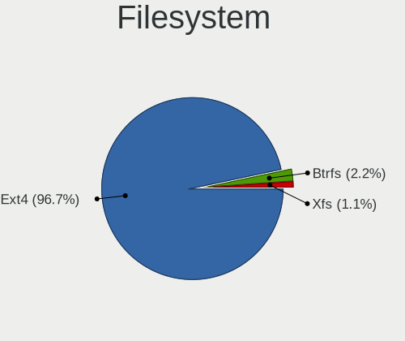
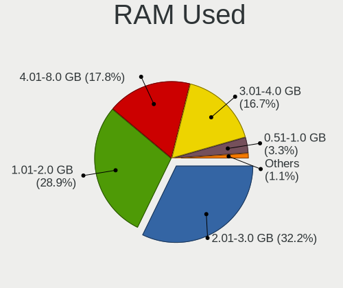
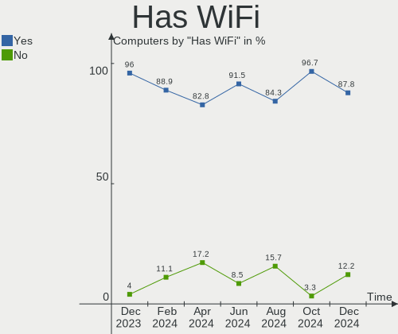
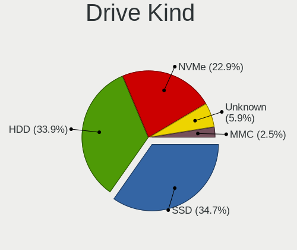
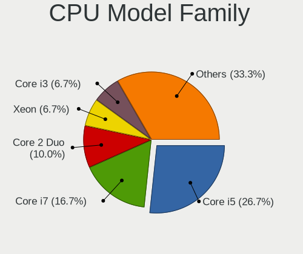
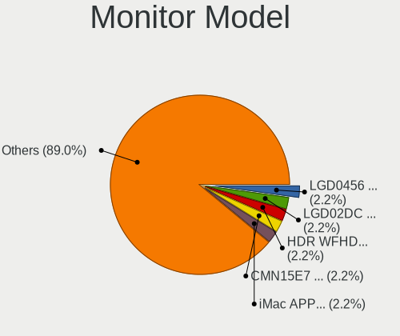
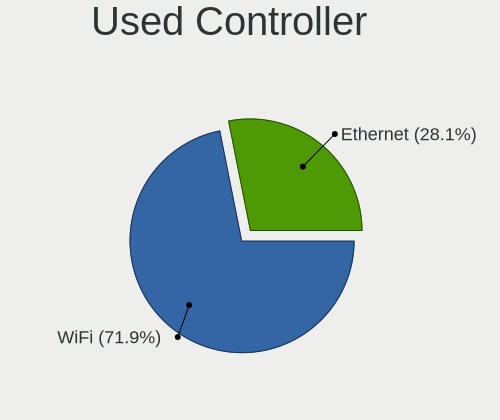
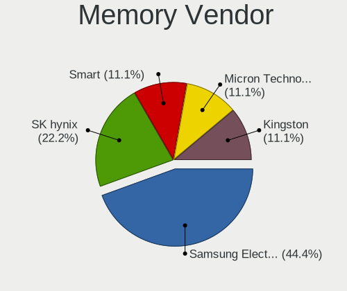
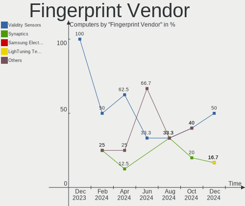
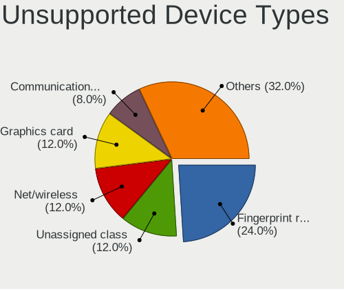

Elementary - Hardware Trends
----------------------------

A project to identify most popular hardware characteristics and track their change
over time based on data collected by Linux users at https://Linux-Hardware.org.

Anyone can contribute to this report by the [hw-probe](https://github.com/linuxhw/hw-probe) tool:

    sudo -E hw-probe -all -upload

This is a report for all computer types. See also reports for [desktops](/Dist/Elementary/Desktop/README.md) and [notebooks](/Dist/Elementary/Notebook/README.md).

This report is for one last month. Overall report since the beginning of time: [TestDays](https://github.com/linuxhw/TestDays)

Period: Jun, 2023.

Contents
--------

* [ System ](#system)
  - [ OS                       ](#os)
  - [ OS Family                ](#os-family)
  - [ Kernel                   ](#kernel)
  - [ Kernel Family            ](#kernel-family)
  - [ Kernel Major Ver.        ](#kernel-major-ver)
  - [ Arch                     ](#arch)
  - [ DE                       ](#de)
  - [ Display Server           ](#display-server)
  - [ Display Manager          ](#display-manager)
  - [ OS Lang                  ](#os-lang)
  - [ Boot Mode                ](#boot-mode)
  - [ Filesystem               ](#filesystem)
  - [ Part. scheme             ](#part-scheme)
  - [ Dual Boot with Linux/BSD ](#dual-boot-with-linuxbsd)
  - [ Dual Boot (Win)          ](#dual-boot-win)

* [ Board ](#board)
  - [ Vendor                   ](#vendor)
  - [ Model                    ](#model)
  - [ Model Family             ](#model-family)
  - [ MFG Year                 ](#mfg-year)
  - [ Form Factor              ](#form-factor)
  - [ Secure Boot              ](#secure-boot)
  - [ Coreboot                 ](#coreboot)
  - [ RAM Size                 ](#ram-size)
  - [ RAM Used                 ](#ram-used)
  - [ Total Drives             ](#total-drives)
  - [ Has CD-ROM               ](#has-cd-rom)
  - [ Has Ethernet             ](#has-ethernet)
  - [ Has WiFi                 ](#has-wifi)
  - [ Has Bluetooth            ](#has-bluetooth)

* [ Location ](#location)
  - [ Country                  ](#country)
  - [ City                     ](#city)

* [ Drives ](#drives)
  - [ Drive Vendor             ](#drive-vendor)
  - [ Drive Model              ](#drive-model)
  - [ HDD Vendor               ](#hdd-vendor)
  - [ SSD Vendor               ](#ssd-vendor)
  - [ Drive Kind               ](#drive-kind)
  - [ Drive Connector          ](#drive-connector)
  - [ Drive Size               ](#drive-size)
  - [ Space Total              ](#space-total)
  - [ Space Used               ](#space-used)
  - [ Malfunc. Drives          ](#malfunc-drives)
  - [ Malfunc. Drive Vendor    ](#malfunc-drive-vendor)
  - [ Malfunc. HDD Vendor      ](#malfunc-hdd-vendor)
  - [ Malfunc. Drive Kind      ](#malfunc-drive-kind)
  - [ Failed Drives            ](#failed-drives)
  - [ Failed Drive Vendor      ](#failed-drive-vendor)
  - [ Drive Status             ](#drive-status)

* [ Storage controller ](#storage-controller)
  - [ Storage Vendor           ](#storage-vendor)
  - [ Storage Model            ](#storage-model)
  - [ Storage Kind             ](#storage-kind)

* [ Processor ](#processor)
  - [ CPU Vendor               ](#cpu-vendor)
  - [ CPU Model                ](#cpu-model)
  - [ CPU Model Family         ](#cpu-model-family)
  - [ CPU Cores                ](#cpu-cores)
  - [ CPU Sockets              ](#cpu-sockets)
  - [ CPU Threads              ](#cpu-threads)
  - [ CPU Op-Modes             ](#cpu-op-modes)
  - [ CPU Microcode            ](#cpu-microcode)
  - [ CPU Microarch            ](#cpu-microarch)

* [ Graphics ](#graphics)
  - [ GPU Vendor               ](#gpu-vendor)
  - [ GPU Model                ](#gpu-model)
  - [ GPU Combo                ](#gpu-combo)
  - [ GPU Driver               ](#gpu-driver)
  - [ GPU Memory               ](#gpu-memory)

* [ Monitor ](#monitor)
  - [ Monitor Vendor           ](#monitor-vendor)
  - [ Monitor Model            ](#monitor-model)
  - [ Monitor Resolution       ](#monitor-resolution)
  - [ Monitor Diagonal         ](#monitor-diagonal)
  - [ Monitor Width            ](#monitor-width)
  - [ Aspect Ratio             ](#aspect-ratio)
  - [ Monitor Area             ](#monitor-area)
  - [ Pixel Density            ](#pixel-density)
  - [ Multiple Monitors        ](#multiple-monitors)

* [ Network ](#network)
  - [ Net Controller Vendor    ](#net-controller-vendor)
  - [ Net Controller Model     ](#net-controller-model)
  - [ Wireless Vendor          ](#wireless-vendor)
  - [ Wireless Model           ](#wireless-model)
  - [ Ethernet Vendor          ](#ethernet-vendor)
  - [ Ethernet Model           ](#ethernet-model)
  - [ Net Controller Kind      ](#net-controller-kind)
  - [ Used Controller          ](#used-controller)
  - [ NICs                     ](#nics)
  - [ IPv6                     ](#ipv6)

* [ Bluetooth ](#bluetooth)
  - [ Bluetooth Vendor         ](#bluetooth-vendor)
  - [ Bluetooth Model          ](#bluetooth-model)

* [ Sound ](#sound)
  - [ Sound Vendor             ](#sound-vendor)
  - [ Sound Model              ](#sound-model)

* [ Memory ](#memory)
  - [ Memory Vendor            ](#memory-vendor)
  - [ Memory Model             ](#memory-model)
  - [ Memory Kind              ](#memory-kind)
  - [ Memory Form Factor       ](#memory-form-factor)
  - [ Memory Size              ](#memory-size)
  - [ Memory Speed             ](#memory-speed)

* [ Printers & scanners ](#printers--scanners)
  - [ Printer Vendor           ](#printer-vendor)
  - [ Printer Model            ](#printer-model)
  - [ Scanner Vendor           ](#scanner-vendor)
  - [ Scanner Model            ](#scanner-model)

* [ Camera ](#camera)
  - [ Camera Vendor            ](#camera-vendor)
  - [ Camera Model             ](#camera-model)

* [ Security ](#security)
  - [ Fingerprint Vendor       ](#fingerprint-vendor)
  - [ Fingerprint Model        ](#fingerprint-model)
  - [ Chipcard Vendor          ](#chipcard-vendor)
  - [ Chipcard Model           ](#chipcard-model)

* [ Unsupported ](#unsupported)
  - [ Unsupported Devices      ](#unsupported-devices)
  - [ Unsupported Device Types ](#unsupported-device-types)

System
------

OS
--

Installed operating systems

| Name             | Computers | Percent |
|------------------|-----------|---------|
| Elementary 7     | 25        | 78.13%  |
| Elementary 6.1   | 5         | 15.63%  |
| Elementary 5.1.7 | 2         | 6.25%   |

OS Family
---------

OS without a version

| Name       | Computers | Percent |
|------------|-----------|---------|
| Elementary | 32        | 100%    |

Kernel
------

Version of the Linux kernel

| Version           | Computers | Percent |
|-------------------|-----------|---------|
| 5.19.0-43-generic | 11        | 34.38%  |
| 5.15.0-58-generic | 6         | 18.75%  |
| 5.15.0-73-generic | 4         | 12.5%   |
| 5.19.0-45-generic | 3         | 9.38%   |
| 5.19.0-46-generic | 2         | 6.25%   |
| 5.19.0-42-generic | 2         | 6.25%   |
| 5.4.0-92-generic  | 1         | 3.13%   |
| 5.4.0-150-generic | 1         | 3.13%   |
| 5.19.0-41-generic | 1         | 3.13%   |
| 5.15.0-69-generic | 1         | 3.13%   |

Kernel Family
-------------

Linux kernel without a distro release

| Version | Computers | Percent |
|---------|-----------|---------|
| 5.19.0  | 19        | 59.38%  |
| 5.15.0  | 11        | 34.38%  |
| 5.4.0   | 2         | 6.25%   |

Kernel Major Ver.
-----------------

Linux kernel major version

| Version | Computers | Percent |
|---------|-----------|---------|
| 5.19    | 19        | 59.38%  |
| 5.15    | 11        | 34.38%  |
| 5.4     | 2         | 6.25%   |

Arch
----

OS architecture (x86_64, i586, etc.)

| Name   | Computers | Percent |
|--------|-----------|---------|
| x86_64 | 32        | 100%    |

DE
--

Desktop Environment

| Name     | Computers | Percent |
|----------|-----------|---------|
| Pantheon | 31        | 96.88%  |
| Unknown  | 1         | 3.13%   |

Display Server
--------------

X11 or Wayland

| Name | Computers | Percent |
|------|-----------|---------|
| X11  | 32        | 100%    |

Display Manager
---------------

SDDM, LightDM, etc.

| Name    | Computers | Percent |
|---------|-----------|---------|
| Unknown | 24        | 75%     |
| LightDM | 8         | 25%     |

OS Lang
-------

Language

| Lang  | Computers | Percent |
|-------|-----------|---------|
| en_US | 14        | 43.75%  |
| de_DE | 7         | 21.88%  |
| tr_TR | 2         | 6.25%   |
| ru_RU | 2         | 6.25%   |
| pt_BR | 2         | 6.25%   |
| en_CA | 2         | 6.25%   |
| fr_FR | 1         | 3.13%   |
| es_ES | 1         | 3.13%   |
| en_AU | 1         | 3.13%   |

Boot Mode
---------

EFI or BIOS

| Mode | Computers | Percent |
|------|-----------|---------|
| BIOS | 26        | 81.25%  |
| EFI  | 6         | 18.75%  |

Filesystem
----------

Type of filesystem

| Type  | Computers | Percent |
|-------|-----------|---------|
| Ext4  | 26        | 81.25%  |
| Tmpfs | 6         | 18.75%  |

Part. scheme
------------

Scheme of partitioning

| Type    | Computers | Percent |
|---------|-----------|---------|
| Unknown | 24        | 75%     |
| GPT     | 6         | 18.75%  |
| MBR     | 2         | 6.25%   |

Dual Boot with Linux/BSD
------------------------

Hosting more than one Linux/BSD

| Dual boot | Computers | Percent |
|-----------|-----------|---------|
| No        | 32        | 100%    |

Dual Boot (Win)
---------------

Hosting Linux and Windows

| Dual boot | Computers | Percent |
|-----------|-----------|---------|
| No        | 30        | 93.75%  |
| Yes       | 2         | 6.25%   |

Board
-----

Vendor
------

Motherboard manufacturer

| Name                | Computers | Percent |
|---------------------|-----------|---------|
| Dell                | 6         | 18.75%  |
| Apple               | 5         | 15.63%  |
| Lenovo              | 4         | 12.5%   |
| ASUSTek Computer    | 4         | 12.5%   |
| Hewlett-Packard     | 3         | 9.38%   |
| Toshiba             | 2         | 6.25%   |
| Gigabyte Technology | 2         | 6.25%   |
| Razer               | 1         | 3.13%   |
| Pegatron            | 1         | 3.13%   |
| MSI                 | 1         | 3.13%   |
| HUAWEI              | 1         | 3.13%   |
| ECS                 | 1         | 3.13%   |
| Acer                | 1         | 3.13%   |

Model
-----

Motherboard model

| Name                              | Computers | Percent |
|-----------------------------------|-----------|---------|
| Toshiba TECRA Z40-C               | 1         | 3.13%   |
| Toshiba TECRA R850                | 1         | 3.13%   |
| Razer Blade Stealth               | 1         | 3.13%   |
| Pegatron IPMIP-GS                 | 1         | 3.13%   |
| MSI MS-7B17                       | 1         | 3.13%   |
| Lenovo ThinkPad T460 20FMS08H00   | 1         | 3.13%   |
| Lenovo ThinkPad T430 2349OB6      | 1         | 3.13%   |
| Lenovo ThinkPad Edge E330 3354AHG | 1         | 3.13%   |
| Lenovo IdeaPad 3 15IGL05 81WQ     | 1         | 3.13%   |
| HUAWEI BOD-WXX9                   | 1         | 3.13%   |
| HP Z600 Workstation               | 1         | 3.13%   |
| HP Laptop 17-by3xxx               | 1         | 3.13%   |
| HP G62                            | 1         | 3.13%   |
| Gigabyte H81M-S2V                 | 1         | 3.13%   |
| Gigabyte B450M GAMING             | 1         | 3.13%   |
| ECS G41T-M                        | 1         | 3.13%   |
| Dell Precision M6600              | 1         | 3.13%   |
| Dell Latitude E5540               | 1         | 3.13%   |
| Dell Latitude E5470               | 1         | 3.13%   |
| Dell Latitude 5590                | 1         | 3.13%   |
| Dell Inspiron 3501                | 1         | 3.13%   |
| Dell Inspiron 15-3567             | 1         | 3.13%   |
| ASUS X555LA                       | 1         | 3.13%   |
| ASUS ROG STRIX B350-F GAMING      | 1         | 3.13%   |
| ASUS PRIME B450-PLUS              | 1         | 3.13%   |
| ASUS G750JM                       | 1         | 3.13%   |
| Apple Macmini6,2                  | 1         | 3.13%   |
| Apple MacBookPro11,1              | 1         | 3.13%   |
| Apple MacBookAir7,2               | 1         | 3.13%   |
| Apple iMac7,1                     | 1         | 3.13%   |
| Apple iMac11,2                    | 1         | 3.13%   |
| Acer Veriton X2631G               | 1         | 3.13%   |

Model Family
------------

Motherboard model prefix

| Name               | Computers | Percent |
|--------------------|-----------|---------|
| Lenovo ThinkPad    | 3         | 9.38%   |
| Dell Latitude      | 3         | 9.38%   |
| Toshiba TECRA      | 2         | 6.25%   |
| Dell Inspiron      | 2         | 6.25%   |
| Razer Blade        | 1         | 3.13%   |
| Pegatron IPMIP-GS  | 1         | 3.13%   |
| MSI MS-7B17        | 1         | 3.13%   |
| Lenovo IdeaPad     | 1         | 3.13%   |
| HUAWEI BOD-WXX9    | 1         | 3.13%   |
| HP Z600            | 1         | 3.13%   |
| HP Laptop          | 1         | 3.13%   |
| HP G62             | 1         | 3.13%   |
| Gigabyte H81M-S2V  | 1         | 3.13%   |
| Gigabyte B450M     | 1         | 3.13%   |
| ECS G41T-M         | 1         | 3.13%   |
| Dell Precision     | 1         | 3.13%   |
| ASUS X555LA        | 1         | 3.13%   |
| ASUS ROG           | 1         | 3.13%   |
| ASUS PRIME         | 1         | 3.13%   |
| ASUS G750JM        | 1         | 3.13%   |
| Apple Macmini6     | 1         | 3.13%   |
| Apple MacBookPro11 | 1         | 3.13%   |
| Apple MacBookAir7  | 1         | 3.13%   |
| Apple iMac7        | 1         | 3.13%   |
| Apple iMac11       | 1         | 3.13%   |
| Acer Veriton       | 1         | 3.13%   |

MFG Year
--------

Motherboard manufacture year

| Year | Computers | Percent |
|------|-----------|---------|
| 2014 | 5         | 15.63%  |
| 2018 | 4         | 12.5%   |
| 2016 | 4         | 12.5%   |
| 2010 | 4         | 12.5%   |
| 2020 | 3         | 9.38%   |
| 2015 | 2         | 6.25%   |
| 2012 | 2         | 6.25%   |
| 2011 | 2         | 6.25%   |
| 2021 | 1         | 3.13%   |
| 2019 | 1         | 3.13%   |
| 2017 | 1         | 3.13%   |
| 2013 | 1         | 3.13%   |
| 2009 | 1         | 3.13%   |
| 2007 | 1         | 3.13%   |

Form Factor
-----------

Physical design of the computer

| Name       | Computers | Percent |
|------------|-----------|---------|
| Notebook   | 20        | 62.5%   |
| Desktop    | 9         | 28.13%  |
| All in one | 2         | 6.25%   |
| Mini pc    | 1         | 3.13%   |

Secure Boot
-----------

Enabled or disabled

| State    | Computers | Percent |
|----------|-----------|---------|
| Disabled | 30        | 93.75%  |
| Enabled  | 2         | 6.25%   |

Coreboot
--------

Have coreboot on board

| Used | Computers | Percent |
|------|-----------|---------|
| No   | 32        | 100%    |

RAM Size
--------

Total RAM memory

| Size in GB | Computers | Percent |
|------------|-----------|---------|
| 4.01-8.0   | 9         | 28.13%  |
| 16.01-24.0 | 9         | 28.13%  |
| 8.01-16.0  | 8         | 25%     |
| 3.01-4.0   | 3         | 9.38%   |
| 32.01-64.0 | 1         | 3.13%   |
| 24.01-32.0 | 1         | 3.13%   |
| 1.01-2.0   | 1         | 3.13%   |

RAM Used
--------

Used RAM memory

| Used GB  | Computers | Percent |
|----------|-----------|---------|
| 2.01-3.0 | 17        | 53.13%  |
| 1.01-2.0 | 7         | 21.88%  |
| 4.01-8.0 | 6         | 18.75%  |
| 3.01-4.0 | 2         | 6.25%   |

Total Drives
------------

Number of drives on board

| Drives | Computers | Percent |
|--------|-----------|---------|
| 1      | 21        | 65.63%  |
| 2      | 8         | 25%     |
| 3      | 2         | 6.25%   |
| 5      | 1         | 3.13%   |

Has CD-ROM
----------

Has CD-ROM on board

| Presented | Computers | Percent |
|-----------|-----------|---------|
| No        | 19        | 59.38%  |
| Yes       | 13        | 40.63%  |

Has Ethernet
------------

Has Ethernet on board

| Presented | Computers | Percent |
|-----------|-----------|---------|
| Yes       | 29        | 90.63%  |
| No        | 3         | 9.38%   |

Has WiFi
--------

Has WiFi module

| Presented | Computers | Percent |
|-----------|-----------|---------|
| Yes       | 27        | 84.38%  |
| No        | 5         | 15.63%  |

Has Bluetooth
-------------

Has Bluetooth module

| Presented | Computers | Percent |
|-----------|-----------|---------|
| Yes       | 22        | 68.75%  |
| No        | 10        | 31.25%  |

Location
--------

Country
-------

Geographic location (country)

| Country   | Computers | Percent |
|-----------|-----------|---------|
| Germany   | 8         | 25%     |
| USA       | 6         | 18.75%  |
| Turkey    | 2         | 6.25%   |
| Russia    | 2         | 6.25%   |
| Mexico    | 2         | 6.25%   |
| Canada    | 2         | 6.25%   |
| Brazil    | 2         | 6.25%   |
| Spain     | 1         | 3.13%   |
| Portugal  | 1         | 3.13%   |
| Israel    | 1         | 3.13%   |
| Hong Kong | 1         | 3.13%   |
| France    | 1         | 3.13%   |
| Austria   | 1         | 3.13%   |
| Australia | 1         | 3.13%   |
| Argentina | 1         | 3.13%   |

City
----

Geographic location (city)

| City                | Computers | Percent |
|---------------------|-----------|---------|
| Munich              | 2         | 6.25%   |
| Vienna              | 1         | 3.13%   |
| Torres Vedras       | 1         | 3.13%   |
| Stuttgart           | 1         | 3.13%   |
| Spaichingen         | 1         | 3.13%   |
| Slavyansk-na-Kubani | 1         | 3.13%   |
| Sao Vicente         | 1         | 3.13%   |
| Nuremberg           | 1         | 3.13%   |
| Nauvoo              | 1         | 3.13%   |
| Morehead City       | 1         | 3.13%   |
| Mexico City         | 1         | 3.13%   |
| Melbourne           | 1         | 3.13%   |
| Málaga             | 1         | 3.13%   |
| Los Angeles         | 1         | 3.13%   |
| Lorena              | 1         | 3.13%   |
| Lanus               | 1         | 3.13%   |
| La Seyne-sur-Mer    | 1         | 3.13%   |
| Karlsruhe           | 1         | 3.13%   |
| Istanbul            | 1         | 3.13%   |
| Hürth              | 1         | 3.13%   |
| Herzliya            | 1         | 3.13%   |
| Greater Sudbury     | 1         | 3.13%   |
| Great Falls         | 1         | 3.13%   |
| Flushing            | 1         | 3.13%   |
| Fairfax             | 1         | 3.13%   |
| Chelyabinsk         | 1         | 3.13%   |
| Central             | 1         | 3.13%   |
| Cabo San Lucas      | 1         | 3.13%   |
| Burnaby             | 1         | 3.13%   |
| Berlin              | 1         | 3.13%   |
| Antalya             | 1         | 3.13%   |

Drives
------

Drive Vendor
------------

Hard drive vendors

| Vendor                         | Computers | Drives | Percent |
|--------------------------------|-----------|--------|---------|
| WDC                            | 6         | 6      | 12.77%  |
| Seagate                        | 5         | 7      | 10.64%  |
| Unknown                        | 4         | 4      | 8.51%   |
| SanDisk                        | 4         | 4      | 8.51%   |
| Samsung Electronics            | 4         | 4      | 8.51%   |
| Hitachi                        | 4         | 4      | 8.51%   |
| Crucial                        | 4         | 4      | 8.51%   |
| Kingston                       | 3         | 4      | 6.38%   |
| Apple                          | 3         | 3      | 6.38%   |
| Toshiba                        | 1         | 1      | 2.13%   |
| Solid State Storage Technology | 1         | 1      | 2.13%   |
| PNY                            | 1         | 1      | 2.13%   |
| Phison Electronics             | 1         | 1      | 2.13%   |
| KIOXIA                         | 1         | 1      | 2.13%   |
| Intel                          | 1         | 1      | 2.13%   |
| HUSKY                          | 1         | 1      | 2.13%   |
| GLOWAY                         | 1         | 1      | 2.13%   |
| China                          | 1         | 1      | 2.13%   |
| A-DATA Technology              | 1         | 1      | 2.13%   |

Drive Model
-----------

Hard drive models

| Model                                               | Computers | Percent |
|-----------------------------------------------------|-----------|---------|
| Samsung NVMe SSD Controller SM981/PM981/PM983 250GB | 2         | 4%      |
| Kingston SA400S37960G 960GB SSD                     | 2         | 4%      |
| Crucial CT240BX500SSD1 240GB                        | 2         | 4%      |
| WDC WDS100T2B0B-00YS70 1TB SSD                      | 1         | 2%      |
| WDC WD5000LPVX-80V0TT0 500GB                        | 1         | 2%      |
| WDC WD40EZRZ-00GXCB0 4TB                            | 1         | 2%      |
| WDC WD20EZRX-22D8PB0 2TB                            | 1         | 2%      |
| WDC WD10PURZ-85U8XY0 1TB                            | 1         | 2%      |
| WDC WD1002FBYS-18W8B0 1TB                           | 1         | 2%      |
| Unknown SE64G  64GB                                 | 1         | 2%      |
| Unknown MMC Card  7GB                               | 1         | 2%      |
| Unknown MMC Card  32GB                              | 1         | 2%      |
| Unknown MMC Card  128GB                             | 1         | 2%      |
| Toshiba DT01ACA200 2TB                              | 1         | 2%      |
| Solid State Storage SSSTC CL1-4D128 128GB           | 1         | 2%      |
| Seagate ST9320423AS 320GB                           | 1         | 2%      |
| Seagate ST750LM022 HN-M750MBB 752GB                 | 1         | 2%      |
| Seagate ST500DM002-1BD142 500GB                     | 1         | 2%      |
| Seagate ST3500418AS 500GB                           | 1         | 2%      |
| Seagate ST3250620AS 250GB                           | 1         | 2%      |
| Seagate ST2000DL003-9VT166 2TB                      | 1         | 2%      |
| Seagate ST1000VT001-1RE172 1TB                      | 1         | 2%      |
| Sandisk WD Black SN750 / PC SN730 NVMe SSD 500GB    | 1         | 2%      |
| SanDisk SSD PLUS 120GB                              | 1         | 2%      |
| SanDisk SDSSDA240G 240GB                            | 1         | 2%      |
| SanDisk NVMe SSD Drive 500GB                        | 1         | 2%      |
| Samsung PM991a NVMe 256GB                           | 1         | 2%      |
| Samsung MZ7LN256HCHP-000L7 256GB SSD                | 1         | 2%      |
| PNY CS900 500GB SSD                                 | 1         | 2%      |
| Phison E12 NVMe Controller 1TB                      | 1         | 2%      |
| KIOXIA KBG40ZNV512G 512GB                           | 1         | 2%      |
| Kingston SNVS500G 500GB                             | 1         | 2%      |
| Kingston SKC400S37512G 512GB SSD                    | 1         | 2%      |
| Intel SSDSC2BF180A4L 180GB                          | 1         | 2%      |
| HUSKY SSD 128GB                                     | 1         | 2%      |
| Hitachi HTS545050A7E380 500GB                       | 1         | 2%      |
| Hitachi HDT725025VLA380 250GB                       | 1         | 2%      |
| Hitachi HDS722020ALA330 2TB                         | 1         | 2%      |
| Hitachi HCS545050GLA380 500GB                       | 1         | 2%      |
| GLOWAY STK480GS3-S7 480GB                           | 1         | 2%      |

HDD Vendor
----------

Hard disk drive vendors

| Vendor  | Computers | Drives | Percent |
|---------|-----------|--------|---------|
| WDC     | 5         | 5      | 31.25%  |
| Seagate | 5         | 7      | 31.25%  |
| Hitachi | 4         | 4      | 25%     |
| Toshiba | 1         | 1      | 6.25%   |
| Apple   | 1         | 1      | 6.25%   |

SSD Vendor
----------

Solid state drive vendors

| Vendor              | Computers | Drives | Percent |
|---------------------|-----------|--------|---------|
| Crucial             | 4         | 4      | 22.22%  |
| Kingston            | 3         | 3      | 16.67%  |
| SanDisk             | 2         | 2      | 11.11%  |
| Apple               | 2         | 2      | 11.11%  |
| WDC                 | 1         | 1      | 5.56%   |
| Samsung Electronics | 1         | 1      | 5.56%   |
| PNY                 | 1         | 1      | 5.56%   |
| Intel               | 1         | 1      | 5.56%   |
| HUSKY               | 1         | 1      | 5.56%   |
| China               | 1         | 1      | 5.56%   |
| A-DATA Technology   | 1         | 1      | 5.56%   |

Drive Kind
----------

HDD or SSD

| Kind    | Computers | Drives | Percent |
|---------|-----------|--------|---------|
| SSD     | 18        | 18     | 40%     |
| HDD     | 13        | 18     | 28.89%  |
| NVMe    | 9         | 9      | 20%     |
| MMC     | 4         | 4      | 8.89%   |
| Unknown | 1         | 1      | 2.22%   |

Drive Connector
---------------

SATA, SAS, NVMe, etc.

| Type | Computers | Drives | Percent |
|------|-----------|--------|---------|
| SATA | 27        | 37     | 67.5%   |
| NVMe | 9         | 9      | 22.5%   |
| MMC  | 4         | 4      | 10%     |

Drive Size
----------

Size of hard drive

| Size in TB | Computers | Drives | Percent |
|------------|-----------|--------|---------|
| 0.01-0.5   | 19        | 23     | 61.29%  |
| 0.51-1.0   | 7         | 8      | 22.58%  |
| 1.01-2.0   | 4         | 4      | 12.9%   |
| 3.01-4.0   | 1         | 1      | 3.23%   |

Space Total
-----------

Amount of disk space available on the file system

| Size in GB | Computers | Percent |
|------------|-----------|---------|
| 101-250    | 14        | 43.75%  |
| 251-500    | 10        | 31.25%  |
| 501-1000   | 6         | 18.75%  |
| 1001-2000  | 1         | 3.13%   |
| 51-100     | 1         | 3.13%   |

Space Used
----------

Amount of used disk space

| Used GB  | Computers | Percent |
|----------|-----------|---------|
| 1-20     | 14        | 43.75%  |
| 21-50    | 11        | 34.38%  |
| 101-250  | 3         | 9.38%   |
| 51-100   | 2         | 6.25%   |
| 251-500  | 1         | 3.13%   |
| 501-1000 | 1         | 3.13%   |

Malfunc. Drives
---------------

Drive models with a malfunction

Zero info for selected period =(

Malfunc. Drive Vendor
---------------------

Vendors of faulty drives

Zero info for selected period =(

Malfunc. HDD Vendor
-------------------

Vendors of faulty HDD drives

Zero info for selected period =(

Malfunc. Drive Kind
-------------------

Kinds of faulty drives

Zero info for selected period =(

Failed Drives
-------------

Failed drive models

Zero info for selected period =(

Failed Drive Vendor
-------------------

Failed drive vendors

Zero info for selected period =(

Drive Status
------------

Number of failed and malfunc. drives

| Status   | Computers | Drives | Percent |
|----------|-----------|--------|---------|
| Detected | 32        | 48     | 94.12%  |
| Works    | 2         | 2      | 5.88%   |

Storage controller
------------------

Storage Vendor
--------------

Storage controller vendors

| Vendor                         | Computers | Percent |
|--------------------------------|-----------|---------|
| Intel                          | 25        | 65.79%  |
| Samsung Electronics            | 4         | 10.53%  |
| AMD                            | 3         | 7.89%   |
| Solid State Storage Technology | 1         | 2.63%   |
| SanDisk                        | 1         | 2.63%   |
| Phison Electronics             | 1         | 2.63%   |
| Marvell Technology Group       | 1         | 2.63%   |
| KIOXIA                         | 1         | 2.63%   |
| Kingston Technology Company    | 1         | 2.63%   |

Storage Model
-------------

Storage controller models

| Model                                                                          | Computers | Percent |
|--------------------------------------------------------------------------------|-----------|---------|
| Intel Sunrise Point-LP SATA Controller [AHCI mode]                             | 4         | 9.3%    |
| Intel 7 Series Chipset Family 6-port SATA Controller [AHCI mode]               | 3         | 6.98%   |
| Samsung NVMe SSD Controller SM981/PM981/PM983                                  | 2         | 4.65%   |
| Intel SATA Controller [RAID mode]                                              | 2         | 4.65%   |
| Intel 82801 Mobile SATA Controller [RAID mode]                                 | 2         | 4.65%   |
| Intel 8 Series/C220 Series Chipset Family 6-port SATA Controller 1 [AHCI mode] | 2         | 4.65%   |
| Intel 8 Series SATA Controller 1 [AHCI mode]                                   | 2         | 4.65%   |
| AMD FCH SATA Controller [AHCI mode]                                            | 2         | 4.65%   |
| AMD 400 Series Chipset SATA Controller                                         | 2         | 4.65%   |
| Solid State Storage CL1-3D256-Q11 NVMe SSD M.2                                 | 1         | 2.33%   |
| SanDisk WD Black SN750 / PC SN730 NVMe SSD                                     | 1         | 2.33%   |
| Samsung NVMe SSD Controller 980                                                | 1         | 2.33%   |
| Samsung Electronics SATA controller                                            | 1         | 2.33%   |
| Phison E12 NVMe Controller                                                     | 1         | 2.33%   |
| Marvell Group 88SS9183 PCIe SSD Controller                                     | 1         | 2.33%   |
| KIOXIA NVMe SSD Controller BG4                                                 | 1         | 2.33%   |
| Kingston Company NVMe Controller                                               | 1         | 2.33%   |
| Intel NM10/ICH7 Family SATA Controller [IDE mode]                              | 1         | 2.33%   |
| Intel Ice Lake-LP SATA Controller [AHCI mode]                                  | 1         | 2.33%   |
| Intel Celeron/Pentium Silver Processor SATA Controller                         | 1         | 2.33%   |
| Intel Cannon Lake PCH SATA AHCI Controller                                     | 1         | 2.33%   |
| Intel 82801HM/HEM (ICH8M/ICH8M-E) SATA Controller [AHCI mode]                  | 1         | 2.33%   |
| Intel 82801HM/HEM (ICH8M/ICH8M-E) IDE Controller                               | 1         | 2.33%   |
| Intel 82801G (ICH7 Family) IDE Controller                                      | 1         | 2.33%   |
| Intel 8 Series/C220 Series Chipset Family 4-port SATA Controller 1 [IDE mode]  | 1         | 2.33%   |
| Intel 6 Series/C200 Series Chipset Family 6 port Mobile SATA AHCI Controller   | 1         | 2.33%   |
| Intel 5 Series/3400 Series Chipset 6 port SATA AHCI Controller                 | 1         | 2.33%   |
| Intel 5 Series/3400 Series Chipset 4 port SATA IDE Controller                  | 1         | 2.33%   |
| Intel 5 Series/3400 Series Chipset 4 port SATA AHCI Controller                 | 1         | 2.33%   |
| Intel 5 Series/3400 Series Chipset 2 port SATA IDE Controller                  | 1         | 2.33%   |
| AMD 300 Series Chipset SATA Controller                                         | 1         | 2.33%   |

Storage Kind
------------

Kind of storage controller (IDE, SATA, NVMe, SAS, ...)

| Kind | Computers | Percent |
|------|-----------|---------|
| SATA | 23        | 58.97%  |
| NVMe | 8         | 20.51%  |
| RAID | 4         | 10.26%  |
| IDE  | 4         | 10.26%  |

Processor
---------

CPU Vendor
----------

Processor vendors

| Vendor | Computers | Percent |
|--------|-----------|---------|
| Intel  | 29        | 90.63%  |
| AMD    | 3         | 9.38%   |

CPU Model
---------

Processor models

| Model                                       | Computers | Percent |
|---------------------------------------------|-----------|---------|
| Intel Core i5-1035G1 CPU @ 1.00GHz          | 2         | 6.25%   |
| Intel Xeon CPU E5620 @ 2.40GHz              | 1         | 3.13%   |
| Intel Core i9-9900K CPU @ 3.60GHz           | 1         | 3.13%   |
| Intel Core i7-8650U CPU @ 1.90GHz           | 1         | 3.13%   |
| Intel Core i7-8565U CPU @ 1.80GHz           | 1         | 3.13%   |
| Intel Core i7-6820HQ CPU @ 2.70GHz          | 1         | 3.13%   |
| Intel Core i7-4700HQ CPU @ 2.40GHz          | 1         | 3.13%   |
| Intel Core i7-3615QM CPU @ 2.30GHz          | 1         | 3.13%   |
| Intel Core i7-2820QM CPU @ 2.30GHz          | 1         | 3.13%   |
| Intel Core i5-6300U CPU @ 2.40GHz           | 1         | 3.13%   |
| Intel Core i5-6200U CPU @ 2.30GHz           | 1         | 3.13%   |
| Intel Core i5-5250U CPU @ 1.60GHz           | 1         | 3.13%   |
| Intel Core i5-4310U CPU @ 2.00GHz           | 1         | 3.13%   |
| Intel Core i5-4278U CPU @ 2.60GHz           | 1         | 3.13%   |
| Intel Core i5-4210U CPU @ 1.70GHz           | 1         | 3.13%   |
| Intel Core i5-3320M CPU @ 2.60GHz           | 1         | 3.13%   |
| Intel Core i5-3210M CPU @ 2.50GHz           | 1         | 3.13%   |
| Intel Core i5-2520M CPU @ 2.50GHz           | 1         | 3.13%   |
| Intel Core i5 CPU M 460 @ 2.53GHz           | 1         | 3.13%   |
| Intel Core i5 CPU 680 @ 3.60GHz             | 1         | 3.13%   |
| Intel Core i5 CPU 650 @ 3.20GHz             | 1         | 3.13%   |
| Intel Core i3-7100U CPU @ 2.40GHz           | 1         | 3.13%   |
| Intel Core i3-4160 CPU @ 3.60GHz            | 1         | 3.13%   |
| Intel Core 2 Duo CPU T7300 @ 2.00GHz        | 1         | 3.13%   |
| Intel Core 2 Duo CPU E7500 @ 2.93GHz        | 1         | 3.13%   |
| Intel Celeron N4020 CPU @ 1.10GHz           | 1         | 3.13%   |
| Intel Celeron CPU G1840 @ 2.80GHz           | 1         | 3.13%   |
| Intel 11th Gen Core i3-1115G4 @ 3.00GHz     | 1         | 3.13%   |
| AMD Ryzen 5 5600G with Radeon Graphics      | 1         | 3.13%   |
| AMD Ryzen 5 3400G with Radeon Vega Graphics | 1         | 3.13%   |
| AMD Ryzen 3 2200G with Radeon Vega Graphics | 1         | 3.13%   |

CPU Model Family
----------------

Processor model prefix

| Model            | Computers | Percent |
|------------------|-----------|---------|
| Intel Core i5    | 14        | 43.75%  |
| Intel Core i7    | 6         | 18.75%  |
| Intel Core i3    | 2         | 6.25%   |
| Intel Core 2 Duo | 2         | 6.25%   |
| Intel Celeron    | 2         | 6.25%   |
| AMD Ryzen 5      | 2         | 6.25%   |
| Other            | 1         | 3.13%   |
| Intel Xeon       | 1         | 3.13%   |
| Intel Core i9    | 1         | 3.13%   |
| AMD Ryzen 3      | 1         | 3.13%   |

CPU Cores
---------

Number of processor cores

| Number | Computers | Percent |
|--------|-----------|---------|
| 2      | 19        | 59.38%  |
| 4      | 10        | 31.25%  |
| 8      | 2         | 6.25%   |
| 5      | 1         | 3.13%   |

CPU Sockets
-----------

Number of sockets

| Number | Computers | Percent |
|--------|-----------|---------|
| 1      | 31        | 96.88%  |
| 2      | 1         | 3.13%   |

CPU Threads
-----------

Threads per core (Hyper-Threading)

| Number | Computers | Percent |
|--------|-----------|---------|
| 2      | 26        | 81.25%  |
| 1      | 6         | 18.75%  |

CPU Op-Modes
------------

CPU Operation Modes (32-bit, 64-bit)

| Op mode        | Computers | Percent |
|----------------|-----------|---------|
| 32-bit, 64-bit | 32        | 100%    |

CPU Microcode
-------------

Microcode number

| Number     | Computers | Percent |
|------------|-----------|---------|
| Unknown    | 22        | 68.75%  |
| 0x206a7    | 2         | 6.25%   |
| 0x806ea    | 1         | 3.13%   |
| 0x806e9    | 1         | 3.13%   |
| 0x706e5    | 1         | 3.13%   |
| 0x706a8    | 1         | 3.13%   |
| 0x40651    | 1         | 3.13%   |
| 0x306c3    | 1         | 3.13%   |
| 0x206c2    | 1         | 3.13%   |
| 0x08108109 | 1         | 3.13%   |

CPU Microarch
-------------

Microarchitecture

| Name          | Computers | Percent |
|---------------|-----------|---------|
| Haswell       | 6         | 18.75%  |
| Westmere      | 4         | 12.5%   |
| KabyLake      | 4         | 12.5%   |
| Skylake       | 3         | 9.38%   |
| IvyBridge     | 3         | 9.38%   |
| SandyBridge   | 2         | 6.25%   |
| IceLake       | 2         | 6.25%   |
| Zen+          | 1         | 3.13%   |
| Zen 3         | 1         | 3.13%   |
| Zen           | 1         | 3.13%   |
| TigerLake     | 1         | 3.13%   |
| Penryn        | 1         | 3.13%   |
| Goldmont plus | 1         | 3.13%   |
| Core          | 1         | 3.13%   |
| Broadwell     | 1         | 3.13%   |

Graphics
--------

GPU Vendor
----------

Vendors of graphics cards

| Vendor | Computers | Percent |
|--------|-----------|---------|
| Intel  | 23        | 63.89%  |
| AMD    | 8         | 22.22%  |
| Nvidia | 5         | 13.89%  |

GPU Model
---------

Graphics card models

| Model                                                                       | Computers | Percent |
|-----------------------------------------------------------------------------|-----------|---------|
| Intel Haswell-ULT Integrated Graphics Controller                            | 3         | 7.89%   |
| Intel 3rd Gen Core processor Graphics Controller                            | 3         | 7.89%   |
| Intel Skylake GT2 [HD Graphics 520]                                         | 2         | 5.26%   |
| Intel Iris Plus Graphics G1 (Ice Lake)                                      | 2         | 5.26%   |
| Intel Core Processor Integrated Graphics Controller                         | 2         | 5.26%   |
| Nvidia TU106 [GeForce GTX 1650]                                             | 1         | 2.63%   |
| Nvidia TU104 [GeForce RTX 2080 SUPER]                                       | 1         | 2.63%   |
| Nvidia GP108M [GeForce MX150]                                               | 1         | 2.63%   |
| Nvidia GM107M [GeForce GTX 860M]                                            | 1         | 2.63%   |
| Nvidia GM107GL [Quadro K620]                                                | 1         | 2.63%   |
| Nvidia G84 [GeForce 8600 GT]                                                | 1         | 2.63%   |
| Intel Xeon E3-1200 v3/4th Gen Core Processor Integrated Graphics Controller | 1         | 2.63%   |
| Intel WhiskeyLake-U GT2 [UHD Graphics 620]                                  | 1         | 2.63%   |
| Intel UHD Graphics 620                                                      | 1         | 2.63%   |
| Intel Tiger Lake-LP GT2 [UHD Graphics G4]                                   | 1         | 2.63%   |
| Intel HD Graphics 620                                                       | 1         | 2.63%   |
| Intel HD Graphics 6000                                                      | 1         | 2.63%   |
| Intel HD Graphics 530                                                       | 1         | 2.63%   |
| Intel GeminiLake [UHD Graphics 600]                                         | 1         | 2.63%   |
| Intel 4th Generation Core Processor Family Integrated Graphics Controller   | 1         | 2.63%   |
| Intel 4th Gen Core Processor Integrated Graphics Controller                 | 1         | 2.63%   |
| Intel 2nd Generation Core Processor Family Integrated Graphics Controller   | 1         | 2.63%   |
| AMD RV610/M74 [Mobility Radeon HD 2400 XT]                                  | 1         | 2.63%   |
| AMD RV535 [Radeon X1650 PRO] (Secondary)                                    | 1         | 2.63%   |
| AMD RV535 [Radeon X1650 PRO]                                                | 1         | 2.63%   |
| AMD Raven Ridge [Radeon Vega Series / Radeon Vega Mobile Series]            | 1         | 2.63%   |
| AMD Picasso/Raven 2 [Radeon Vega Series / Radeon Vega Mobile Series]        | 1         | 2.63%   |
| AMD Park [Mobility Radeon HD 5430/5450/5470]                                | 1         | 2.63%   |
| AMD Madison [Mobility Radeon HD 5730 / 6570M]                               | 1         | 2.63%   |
| AMD Cezanne [Radeon Vega Series / Radeon Vega Mobile Series]                | 1         | 2.63%   |
| AMD Blackcomb [Radeon HD 6970M/6990M]                                       | 1         | 2.63%   |

GPU Combo
---------

Combinations of graphics cards

| Name            | Computers | Percent |
|-----------------|-----------|---------|
| 1 x Intel       | 19        | 59.38%  |
| 1 x AMD         | 6         | 18.75%  |
| 1 x Nvidia      | 2         | 6.25%   |
| Intel + Nvidia  | 2         | 6.25%   |
| 2 x Nvidia      | 1         | 3.13%   |
| Intel + 2 x AMD | 1         | 3.13%   |
| Intel + AMD     | 1         | 3.13%   |

GPU Driver
----------

Free vs proprietary

| Driver      | Computers | Percent |
|-------------|-----------|---------|
| Free        | 31        | 96.88%  |
| Proprietary | 1         | 3.13%   |

GPU Memory
----------

Total video memory

| Size in GB | Computers | Percent |
|------------|-----------|---------|
| Unknown    | 29        | 90.63%  |
| 1.01-2.0   | 3         | 9.38%   |

Monitor
-------

Monitor Vendor
--------------

Monitor vendors

| Vendor              | Computers | Percent |
|---------------------|-----------|---------|
| LG Display          | 6         | 18.75%  |
| Dell                | 4         | 12.5%   |
| BOE                 | 4         | 12.5%   |
| AU Optronics        | 4         | 12.5%   |
| Apple               | 4         | 12.5%   |
| Samsung Electronics | 2         | 6.25%   |
| Goldstar            | 2         | 6.25%   |
| Chimei Innolux      | 2         | 6.25%   |
| Acer                | 2         | 6.25%   |
| Sharp               | 1         | 3.13%   |
| BenQ                | 1         | 3.13%   |

Monitor Model
-------------

Monitor models

| Model                                                                | Computers | Percent |
|----------------------------------------------------------------------|-----------|---------|
| AU Optronics LCD Monitor AUO21ED 1920x1080 344x194mm 15.5-inch       | 2         | 5.88%   |
| Sharp LCD Monitor SHP14B8 1920x1080 294x165mm 13.3-inch              | 1         | 2.94%   |
| Samsung Electronics SyncMaster SAM0473 2048x1152 510x287mm 23.0-inch | 1         | 2.94%   |
| Samsung Electronics S19D300 SAM0B36 1366x768 410x230mm 18.5-inch     | 1         | 2.94%   |
| LG Display LCD Monitor LGD04B1 1366x768 310x174mm 14.0-inch          | 1         | 2.94%   |
| LG Display LCD Monitor LGD046D 1920x1080 309x174mm 14.0-inch         | 1         | 2.94%   |
| LG Display LCD Monitor LGD045C 1366x768 345x194mm 15.6-inch          | 1         | 2.94%   |
| LG Display LCD Monitor LGD03B8 1366x768 310x174mm 14.0-inch          | 1         | 2.94%   |
| LG Display LCD Monitor LGD0354 1366x768 293x165mm 13.2-inch          | 1         | 2.94%   |
| LG Display LCD Monitor LGD02AC 1366x768 344x194mm 15.5-inch          | 1         | 2.94%   |
| Goldstar W1953 GSM4BA7 1360x768 406x229mm 18.4-inch                  | 1         | 2.94%   |
| Goldstar W1943 GSM4BAD 1360x768 406x229mm 18.4-inch                  | 1         | 2.94%   |
| Goldstar L1753T GSM4434 1280x1024 338x270mm 17.0-inch                | 1         | 2.94%   |
| Dell U2414H DELA0A4 1920x1080 527x296mm 23.8-inch                    | 1         | 2.94%   |
| Dell S2240T DELA096 1920x1080 477x268mm 21.5-inch                    | 1         | 2.94%   |
| Dell P2213 DELF043 1680x1050 470x300mm 22.0-inch                     | 1         | 2.94%   |
| Dell 2408WFP DELA029 1920x1200 519x324mm 24.1-inch                   | 1         | 2.94%   |
| Dell 1905FP DEL400D 1280x1024 376x301mm 19.0-inch                    | 1         | 2.94%   |
| Chimei Innolux LCD Monitor CMN175E 1920x1080 381x214mm 17.2-inch     | 1         | 2.94%   |
| Chimei Innolux LCD Monitor CMN14B1 1920x1080 308x173mm 13.9-inch     | 1         | 2.94%   |
| BOE LCD Monitor BOE09E6 1920x1080 344x193mm 15.5-inch                | 1         | 2.94%   |
| BOE LCD Monitor BOE0872 1920x1080 344x194mm 15.5-inch                | 1         | 2.94%   |
| BOE LCD Monitor BOE06CB 1920x1080 344x194mm 15.5-inch                | 1         | 2.94%   |
| BOE LCD Monitor BOE06C2 1366x768 344x194mm 15.5-inch                 | 1         | 2.94%   |
| BenQ PD2500Q BNQ802A 2560x1440 553x311mm 25.0-inch                   | 1         | 2.94%   |
| AU Optronics LCD Monitor AUO219D 1920x1080 381x214mm 17.2-inch       | 1         | 2.94%   |
| AU Optronics LCD Monitor AUO129E 1600x900 382x214mm 17.2-inch        | 1         | 2.94%   |
| Apple Color LCD APPA018 2560x1600 286x179mm 13.3-inch                | 1         | 2.94%   |
| Apple Color LCD APP9CF0 1440x900 290x180mm 13.4-inch                 | 1         | 2.94%   |
| Apple Color LCD APP9CDD 1920x1080 475x267mm 21.5-inch                | 1         | 2.94%   |
| Apple Color LCD APP9C6B 1680x1050 433x270mm 20.1-inch                | 1         | 2.94%   |
| Acer EK240Y ACR0758 1920x1080 527x296mm 23.8-inch                    | 1         | 2.94%   |
| Acer EI342CKR ACR0763 3440x1440 797x334mm 34.0-inch                  | 1         | 2.94%   |

Monitor Resolution
------------------

Monitor screen resolution

| Resolution         | Computers | Percent |
|--------------------|-----------|---------|
| 1920x1080 (FHD)    | 13        | 40.63%  |
| 1366x768 (WXGA)    | 7         | 21.88%  |
| 1680x1050 (WSXGA+) | 2         | 6.25%   |
| 1280x1024 (SXGA)   | 2         | 6.25%   |
| 3440x1440          | 1         | 3.13%   |
| 2560x1600          | 1         | 3.13%   |
| 2560x1440 (QHD)    | 1         | 3.13%   |
| 2048x1152          | 1         | 3.13%   |
| 1920x1200 (WUXGA)  | 1         | 3.13%   |
| 1600x900 (HD+)     | 1         | 3.13%   |
| 1440x900 (WXGA+)   | 1         | 3.13%   |
| 1360x768           | 1         | 3.13%   |

Monitor Diagonal
----------------

Diagonal size in inches

| Inches | Computers | Percent |
|--------|-----------|---------|
| 15     | 8         | 24.24%  |
| 13     | 5         | 15.15%  |
| 17     | 4         | 12.12%  |
| 24     | 3         | 9.09%   |
| 14     | 3         | 9.09%   |
| 21     | 2         | 6.06%   |
| 18     | 2         | 6.06%   |
| 34     | 1         | 3.03%   |
| 25     | 1         | 3.03%   |
| 23     | 1         | 3.03%   |
| 22     | 1         | 3.03%   |
| 20     | 1         | 3.03%   |
| 19     | 1         | 3.03%   |

Monitor Width
-------------

Physical width

| Width in mm | Computers | Percent |
|-------------|-----------|---------|
| 301-350     | 13        | 39.39%  |
| 401-500     | 6         | 18.18%  |
| 501-600     | 5         | 15.15%  |
| 351-400     | 4         | 12.12%  |
| 201-300     | 4         | 12.12%  |
| 701-800     | 1         | 3.03%   |

Aspect Ratio
------------

Proportional relationship between the width and the height

| Ratio | Computers | Percent |
|-------|-----------|---------|
| 16/9  | 23        | 74.19%  |
| 16/10 | 5         | 16.13%  |
| 6/5   | 1         | 3.23%   |
| 5/4   | 1         | 3.23%   |
| 21/9  | 1         | 3.23%   |

Monitor Area
------------

Area in inch²

| Area in inch² | Computers | Percent |
|----------------|-----------|---------|
| 101-110        | 8         | 24.24%  |
| 81-90          | 5         | 15.15%  |
| 201-250        | 5         | 15.15%  |
| 71-80          | 3         | 9.09%   |
| 151-200        | 3         | 9.09%   |
| 141-150        | 3         | 9.09%   |
| 121-130        | 3         | 9.09%   |
| 251-300        | 2         | 6.06%   |
| 351-500        | 1         | 3.03%   |

Pixel Density
-------------

Pixels per inch

| Density | Computers | Percent |
|---------|-----------|---------|
| 121-160 | 10        | 32.26%  |
| 101-120 | 10        | 32.26%  |
| 51-100  | 9         | 29.03%  |
| 161-240 | 2         | 6.45%   |

Multiple Monitors
-----------------

Total monitors connected

| Total | Computers | Percent |
|-------|-----------|---------|
| 1     | 27        | 84.38%  |
| 2     | 5         | 15.63%  |

Network
-------

Net Controller Vendor
---------------------

Controller vendors

| Vendor                     | Computers | Percent |
|----------------------------|-----------|---------|
| Intel                      | 15        | 30.61%  |
| Realtek Semiconductor      | 10        | 20.41%  |
| Broadcom                   | 8         | 16.33%  |
| Qualcomm Atheros           | 7         | 14.29%  |
| Marvell Technology Group   | 2         | 4.08%   |
| Broadcom Limited           | 2         | 4.08%   |
| ZTE WCDMA Technologies MSM | 1         | 2.04%   |
| Xiaomi                     | 1         | 2.04%   |
| NetGear                    | 1         | 2.04%   |
| Huawei Technologies        | 1         | 2.04%   |
| D-Link System              | 1         | 2.04%   |

Net Controller Model
--------------------

Controller models

| Model                                                             | Computers | Percent |
|-------------------------------------------------------------------|-----------|---------|
| Realtek RTL8111/8168/8411 PCI Express Gigabit Ethernet Controller | 7         | 12.07%  |
| Intel Wireless 8260                                               | 3         | 5.17%   |
| Intel 82579LM Gigabit Network Connection (Lewisville)             | 3         | 5.17%   |
| Realtek RTL810xE PCI Express Fast Ethernet controller             | 2         | 3.45%   |
| Qualcomm Atheros AR9485 Wireless Network Adapter                  | 2         | 3.45%   |
| Broadcom NetXtreme BCM5764M Gigabit Ethernet PCIe                 | 2         | 3.45%   |
| Broadcom Limited BCM4360 802.11ac Wireless Network Adapter        | 2         | 3.45%   |
| Broadcom BCM4313 802.11bgn Wireless Network Adapter               | 2         | 3.45%   |
| ZTE WCDMA MSM Android                                             | 1         | 1.72%   |
| Xiaomi Mi/Redmi series (RNDIS + ADB)                              | 1         | 1.72%   |
| Realtek RTL8822CE 802.11ac PCIe Wireless Network Adapter          | 1         | 1.72%   |
| Realtek RTL8821CE 802.11ac PCIe Wireless Network Adapter          | 1         | 1.72%   |
| Qualcomm Atheros QCA9565 / AR9565 Wireless Network Adapter        | 1         | 1.72%   |
| Qualcomm Atheros QCA8171 Gigabit Ethernet                         | 1         | 1.72%   |
| Qualcomm Atheros Attansic L2 Fast Ethernet                        | 1         | 1.72%   |
| Qualcomm Atheros AR9462 Wireless Network Adapter                  | 1         | 1.72%   |
| Qualcomm Atheros AR93xx Wireless Network Adapter                  | 1         | 1.72%   |
| Qualcomm Atheros AR928X Wireless Network Adapter (PCI-Express)    | 1         | 1.72%   |
| NetGear LB1120-100NAS                                             | 1         | 1.72%   |
| Marvell Group Libertas 802.11b/g Wireless LAN Client Adapter      | 1         | 1.72%   |
| Marvell Group 88E8058 PCI-E Gigabit Ethernet Controller           | 1         | 1.72%   |
| Intel Wireless 8265 / 8275                                        | 1         | 1.72%   |
| Intel Wireless 7260                                               | 1         | 1.72%   |
| Intel Wi-Fi 6 AX201                                               | 1         | 1.72%   |
| Intel Ice Lake-LP PCH CNVi WiFi                                   | 1         | 1.72%   |
| Intel I211 Gigabit Network Connection                             | 1         | 1.72%   |
| Intel Ethernet Connection I219-V                                  | 1         | 1.72%   |
| Intel Ethernet Connection I219-LM                                 | 1         | 1.72%   |
| Intel Ethernet Connection I218-LM                                 | 1         | 1.72%   |
| Intel Ethernet Connection (7) I219-V                              | 1         | 1.72%   |
| Intel Ethernet Connection (4) I219-LM                             | 1         | 1.72%   |
| Intel Ethernet Connection (2) I219-LM                             | 1         | 1.72%   |
| Intel Centrino Wireless-N 2230                                    | 1         | 1.72%   |
| Intel Centrino Advanced-N 6230 [Rainbow Peak]                     | 1         | 1.72%   |
| Intel Cannon Point-LP CNVi [Wireless-AC]                          | 1         | 1.72%   |
| Intel 82578DC Gigabit Network Connection                          | 1         | 1.72%   |
| Huawei E353/E3131                                                 | 1         | 1.72%   |
| D-Link System DWA-110 Wireless G Adapter(rev.A1) [Ralink RT2571W] | 1         | 1.72%   |
| Broadcom NetXtreme II BCM5706 Gigabit Ethernet                    | 1         | 1.72%   |
| Broadcom NetXtreme BCM57766 Gigabit Ethernet PCIe                 | 1         | 1.72%   |

Wireless Vendor
---------------

Wireless vendors

| Vendor                   | Computers | Percent |
|--------------------------|-----------|---------|
| Intel                    | 10        | 37.04%  |
| Qualcomm Atheros         | 6         | 22.22%  |
| Broadcom                 | 5         | 18.52%  |
| Realtek Semiconductor    | 2         | 7.41%   |
| Broadcom Limited         | 2         | 7.41%   |
| Marvell Technology Group | 1         | 3.7%    |
| D-Link System            | 1         | 3.7%    |

Wireless Model
--------------

Wireless models

| Model                                                             | Computers | Percent |
|-------------------------------------------------------------------|-----------|---------|
| Intel Wireless 8260                                               | 3         | 11.11%  |
| Qualcomm Atheros AR9485 Wireless Network Adapter                  | 2         | 7.41%   |
| Broadcom Limited BCM4360 802.11ac Wireless Network Adapter        | 2         | 7.41%   |
| Broadcom BCM4313 802.11bgn Wireless Network Adapter               | 2         | 7.41%   |
| Realtek RTL8822CE 802.11ac PCIe Wireless Network Adapter          | 1         | 3.7%    |
| Realtek RTL8821CE 802.11ac PCIe Wireless Network Adapter          | 1         | 3.7%    |
| Qualcomm Atheros QCA9565 / AR9565 Wireless Network Adapter        | 1         | 3.7%    |
| Qualcomm Atheros AR9462 Wireless Network Adapter                  | 1         | 3.7%    |
| Qualcomm Atheros AR93xx Wireless Network Adapter                  | 1         | 3.7%    |
| Qualcomm Atheros AR928X Wireless Network Adapter (PCI-Express)    | 1         | 3.7%    |
| Marvell Group Libertas 802.11b/g Wireless LAN Client Adapter      | 1         | 3.7%    |
| Intel Wireless 8265 / 8275                                        | 1         | 3.7%    |
| Intel Wireless 7260                                               | 1         | 3.7%    |
| Intel Wi-Fi 6 AX201                                               | 1         | 3.7%    |
| Intel Ice Lake-LP PCH CNVi WiFi                                   | 1         | 3.7%    |
| Intel Centrino Wireless-N 2230                                    | 1         | 3.7%    |
| Intel Centrino Advanced-N 6230 [Rainbow Peak]                     | 1         | 3.7%    |
| Intel Cannon Point-LP CNVi [Wireless-AC]                          | 1         | 3.7%    |
| D-Link System DWA-110 Wireless G Adapter(rev.A1) [Ralink RT2571W] | 1         | 3.7%    |
| Broadcom BCM4352 802.11ac Wireless Network Adapter                | 1         | 3.7%    |
| Broadcom BCM4331 802.11a/b/g/n                                    | 1         | 3.7%    |
| Broadcom BCM4321 802.11a/b/g/n                                    | 1         | 3.7%    |

Ethernet Vendor
---------------

Ethernet vendors

| Vendor                     | Computers | Percent |
|----------------------------|-----------|---------|
| Intel                      | 11        | 35.48%  |
| Realtek Semiconductor      | 9         | 29.03%  |
| Broadcom                   | 4         | 12.9%   |
| Qualcomm Atheros           | 2         | 6.45%   |
| ZTE WCDMA Technologies MSM | 1         | 3.23%   |
| Xiaomi                     | 1         | 3.23%   |
| NetGear                    | 1         | 3.23%   |
| Marvell Technology Group   | 1         | 3.23%   |
| Huawei Technologies        | 1         | 3.23%   |

Ethernet Model
--------------

Ethernet models

| Model                                                             | Computers | Percent |
|-------------------------------------------------------------------|-----------|---------|
| Realtek RTL8111/8168/8411 PCI Express Gigabit Ethernet Controller | 7         | 22.58%  |
| Intel 82579LM Gigabit Network Connection (Lewisville)             | 3         | 9.68%   |
| Realtek RTL810xE PCI Express Fast Ethernet controller             | 2         | 6.45%   |
| Broadcom NetXtreme BCM5764M Gigabit Ethernet PCIe                 | 2         | 6.45%   |
| ZTE WCDMA MSM Android                                             | 1         | 3.23%   |
| Xiaomi Mi/Redmi series (RNDIS + ADB)                              | 1         | 3.23%   |
| Qualcomm Atheros QCA8171 Gigabit Ethernet                         | 1         | 3.23%   |
| Qualcomm Atheros Attansic L2 Fast Ethernet                        | 1         | 3.23%   |
| NetGear LB1120-100NAS                                             | 1         | 3.23%   |
| Marvell Group 88E8058 PCI-E Gigabit Ethernet Controller           | 1         | 3.23%   |
| Intel I211 Gigabit Network Connection                             | 1         | 3.23%   |
| Intel Ethernet Connection I219-V                                  | 1         | 3.23%   |
| Intel Ethernet Connection I219-LM                                 | 1         | 3.23%   |
| Intel Ethernet Connection I218-LM                                 | 1         | 3.23%   |
| Intel Ethernet Connection (7) I219-V                              | 1         | 3.23%   |
| Intel Ethernet Connection (4) I219-LM                             | 1         | 3.23%   |
| Intel Ethernet Connection (2) I219-LM                             | 1         | 3.23%   |
| Intel 82578DC Gigabit Network Connection                          | 1         | 3.23%   |
| Huawei E353/E3131                                                 | 1         | 3.23%   |
| Broadcom NetXtreme II BCM5706 Gigabit Ethernet                    | 1         | 3.23%   |
| Broadcom NetXtreme BCM57766 Gigabit Ethernet PCIe                 | 1         | 3.23%   |

Net Controller Kind
-------------------

Ethernet, WiFi or modem

| Kind     | Computers | Percent |
|----------|-----------|---------|
| Ethernet | 30        | 52.63%  |
| WiFi     | 27        | 47.37%  |

Used Controller
---------------

Currently used network controller

| Kind     | Computers | Percent |
|----------|-----------|---------|
| WiFi     | 21        | 61.76%  |
| Ethernet | 13        | 38.24%  |

NICs
----

Total network controllers on board

| Total | Computers | Percent |
|-------|-----------|---------|
| 2     | 20        | 62.5%   |
| 1     | 11        | 34.38%  |
| 3     | 1         | 3.13%   |

IPv6
----

IPv6 vs IPv4

| Used | Computers | Percent |
|------|-----------|---------|
| No   | 21        | 65.63%  |
| Yes  | 11        | 34.38%  |

Bluetooth
---------

Bluetooth Vendor
----------------

Controller vendors

| Vendor                          | Computers | Percent |
|---------------------------------|-----------|---------|
| Intel                           | 10        | 45.45%  |
| Apple                           | 5         | 22.73%  |
| Realtek Semiconductor           | 2         | 9.09%   |
| Qualcomm Atheros Communications | 1         | 4.55%   |
| IMC Networks                    | 1         | 4.55%   |
| Dell                            | 1         | 4.55%   |
| Cambridge Silicon Radio         | 1         | 4.55%   |
| ASUSTek Computer                | 1         | 4.55%   |

Bluetooth Model
---------------

Controller models

| Model                                               | Computers | Percent |
|-----------------------------------------------------|-----------|---------|
| Intel Bluetooth wireless interface                  | 5         | 22.73%  |
| Intel Bluetooth 9460/9560 Jefferson Peak (JfP)      | 2         | 9.09%   |
| Apple Bluetooth USB Host Controller                 | 2         | 9.09%   |
| Realtek  Bluetooth 4.2 Adapter                      | 1         | 4.55%   |
| Realtek Bluetooth Radio                             | 1         | 4.55%   |
| Qualcomm Atheros  Bluetooth Device                  | 1         | 4.55%   |
| Intel Centrino Bluetooth Wireless Transceiver       | 1         | 4.55%   |
| Intel Centrino Advanced-N 6230 Bluetooth adapter    | 1         | 4.55%   |
| Intel AX201 Bluetooth                               | 1         | 4.55%   |
| IMC Networks BCM20702A0                             | 1         | 4.55%   |
| Dell DW375 Bluetooth Module                         | 1         | 4.55%   |
| Cambridge Silicon Radio Bluetooth Dongle (HCI mode) | 1         | 4.55%   |
| ASUS Broadcom BCM20702A0 Bluetooth                  | 1         | 4.55%   |
| Apple Built-in Bluetooth 2.0+EDR HCI                | 1         | 4.55%   |
| Apple Bluetooth Host Controller                     | 1         | 4.55%   |
| Apple Bluetooth HCI                                 | 1         | 4.55%   |

Sound
-----

Sound Vendor
------------

Sound card vendors

| Vendor              | Computers | Percent |
|---------------------|-----------|---------|
| Intel               | 29        | 76.32%  |
| AMD                 | 6         | 15.79%  |
| Nvidia              | 2         | 5.26%   |
| C-Media Electronics | 1         | 2.63%   |

Sound Model
-----------

Sound card models

| Model                                                                      | Computers | Percent |
|----------------------------------------------------------------------------|-----------|---------|
| Intel Sunrise Point-LP HD Audio                                            | 4         | 8.16%   |
| Intel Xeon E3-1200 v3/4th Gen Core Processor HD Audio Controller           | 3         | 6.12%   |
| Intel Haswell-ULT HD Audio Controller                                      | 3         | 6.12%   |
| Intel 8 Series/C220 Series Chipset High Definition Audio Controller        | 3         | 6.12%   |
| Intel 8 Series HD Audio Controller                                         | 3         | 6.12%   |
| Intel 7 Series/C216 Chipset Family High Definition Audio Controller        | 3         | 6.12%   |
| Intel 5 Series/3400 Series Chipset High Definition Audio                   | 3         | 6.12%   |
| AMD Family 17h/19h HD Audio Controller                                     | 3         | 6.12%   |
| Intel Ice Lake-LP Smart Sound Technology Audio Controller                  | 2         | 4.08%   |
| Intel 6 Series/C200 Series Chipset Family High Definition Audio Controller | 2         | 4.08%   |
| AMD Raven/Raven2/Fenghuang HDMI/DP Audio Controller                        | 2         | 4.08%   |
| Nvidia TU106 High Definition Audio Controller                              | 1         | 2.04%   |
| Nvidia TU104 HD Audio Controller                                           | 1         | 2.04%   |
| Nvidia GM107 High Definition Audio Controller [GeForce 940MX]              | 1         | 2.04%   |
| Intel Wildcat Point-LP High Definition Audio Controller                    | 1         | 2.04%   |
| Intel Tiger Lake-LP Smart Sound Technology Audio Controller                | 1         | 2.04%   |
| Intel NM10/ICH7 Family High Definition Audio Controller                    | 1         | 2.04%   |
| Intel Celeron/Pentium Silver Processor High Definition Audio               | 1         | 2.04%   |
| Intel Cannon Point-LP High Definition Audio Controller                     | 1         | 2.04%   |
| Intel Cannon Lake PCH cAVS                                                 | 1         | 2.04%   |
| Intel Broadwell-U Audio Controller                                         | 1         | 2.04%   |
| Intel 82801JI (ICH10 Family) HD Audio Controller                           | 1         | 2.04%   |
| Intel 82801H (ICH8 Family) HD Audio Controller                             | 1         | 2.04%   |
| Intel 100 Series/C230 Series Chipset Family HD Audio Controller            | 1         | 2.04%   |
| C-Media Electronics Audio Adapter (Unitek Y-247A)                          | 1         | 2.04%   |
| AMD Renoir Radeon High Definition Audio Controller                         | 1         | 2.04%   |
| AMD Redwood HDMI Audio [Radeon HD 5000 Series]                             | 1         | 2.04%   |
| AMD Cedar HDMI Audio [Radeon HD 5400/6300/7300 Series]                     | 1         | 2.04%   |
| AMD Barts HDMI Audio [Radeon HD 6790/6850/6870 / 7720 OEM]                 | 1         | 2.04%   |

Memory
------

Memory Vendor
-------------

Memory module vendors

| Vendor              | Computers | Percent |
|---------------------|-----------|---------|
| Samsung Electronics | 2         | 28.57%  |
| Crucial             | 2         | 28.57%  |
| SK hynix            | 1         | 14.29%  |
| Micron Technology   | 1         | 14.29%  |
| A-DATA Technology   | 1         | 14.29%  |

Memory Model
------------

Memory module models

| Model                                                   | Computers | Percent |
|---------------------------------------------------------|-----------|---------|
| SK hynix RAM HMA82GS6AFR8N-UH 16GB SODIMM DDR4 2667MT/s | 1         | 14.29%  |
| Samsung RAM Module 4GB Row Of Chips DDR4 2400MT/s       | 1         | 14.29%  |
| Samsung RAM M471A1K43DB1-CTD 8GB SODIMM DDR4 2667MT/s   | 1         | 14.29%  |
| Micron RAM 4ATF51264HZ-2G3H1R 4GB SODIMM DDR4 2400MT/s  | 1         | 14.29%  |
| Crucial RAM CT8G4SFS824A.C8FE 8GB SODIMM DDR4 2667MT/s  | 1         | 14.29%  |
| Crucial RAM CT102464BF160B.M16 8GB SODIMM DDR3 1600MT/s | 1         | 14.29%  |
| A-DATA RAM AO1P24HC8T1-BSFS 8GB SODIMM DDR4 2400MT/s    | 1         | 14.29%  |

Memory Kind
-----------

Memory module kinds

| Kind | Computers | Percent |
|------|-----------|---------|
| DDR4 | 4         | 80%     |
| DDR3 | 1         | 20%     |

Memory Form Factor
------------------

Physical design of the memory module

| Name         | Computers | Percent |
|--------------|-----------|---------|
| SODIMM       | 4         | 80%     |
| Row Of Chips | 1         | 20%     |

Memory Size
-----------

Memory module size

| Size  | Computers | Percent |
|-------|-----------|---------|
| 8192  | 3         | 50%     |
| 4096  | 2         | 33.33%  |
| 16384 | 1         | 16.67%  |

Memory Speed
------------

Memory module speed

| Speed | Computers | Percent |
|-------|-----------|---------|
| 2667  | 3         | 42.86%  |
| 2400  | 3         | 42.86%  |
| 1600  | 1         | 14.29%  |

Printers & scanners
-------------------

Printer Vendor
--------------

Printer device vendors

Zero info for selected period =(

Printer Model
-------------

Printer device models

Zero info for selected period =(

Scanner Vendor
--------------

Scanner device vendors

Zero info for selected period =(

Scanner Model
-------------

Scanner device models

Zero info for selected period =(

Camera
------

Camera Vendor
-------------

Camera device vendors

| Vendor                                 | Computers | Percent |
|----------------------------------------|-----------|---------|
| Realtek Semiconductor                  | 5         | 26.32%  |
| IMC Networks                           | 3         | 15.79%  |
| Chicony Electronics                    | 3         | 15.79%  |
| Microdia                               | 2         | 10.53%  |
| Apple                                  | 2         | 10.53%  |
| Ricoh                                  | 1         | 5.26%   |
| Lite-On Technology                     | 1         | 5.26%   |
| Cheng Uei Precision Industry (Foxlink) | 1         | 5.26%   |
| Bison Electronics                      | 1         | 5.26%   |

Camera Model
------------

Camera device models

| Model                                            | Computers | Percent |
|--------------------------------------------------|-----------|---------|
| IMC Networks Integrated Camera                   | 2         | 10.53%  |
| Apple Built-in iSight                            | 2         | 10.53%  |
| Ricoh Laptop_Integrated_Webcam_FHD               | 1         | 5.26%   |
| Realtek USB Camera                               | 1         | 5.26%   |
| Realtek Integrated_Webcam_HD                     | 1         | 5.26%   |
| Realtek Integrated Webcam HD                     | 1         | 5.26%   |
| Realtek Integrated Webcam                        | 1         | 5.26%   |
| Realtek 2SF022                                   | 1         | 5.26%   |
| Microdia Integrated_Webcam_HD                    | 1         | 5.26%   |
| Microdia Integrated Webcam                       | 1         | 5.26%   |
| Lite-On Integrated Camera                        | 1         | 5.26%   |
| IMC Networks HD Camera                           | 1         | 5.26%   |
| Chicony USB2.0 HD UVC WebCam                     | 1         | 5.26%   |
| Chicony TOSHIBA Web Camera - FHD                 | 1         | 5.26%   |
| Chicony CNF9055 Toshiba Webcam                   | 1         | 5.26%   |
| Cheng Uei Precision Industry (Foxlink) HP Webcam | 1         | 5.26%   |
| Bison Lenovo Integrated Webcam                   | 1         | 5.26%   |

Security
--------

Fingerprint Vendor
------------------

Fingerprint sensor vendors

| Vendor                     | Computers | Percent |
|----------------------------|-----------|---------|
| Validity Sensors           | 2         | 50%     |
| Shenzhen Goodix Technology | 1         | 25%     |
| AuthenTec                  | 1         | 25%     |

Fingerprint Model
-----------------

Fingerprint sensor models

| Model                                        | Computers | Percent |
|----------------------------------------------|-----------|---------|
| Validity Sensors VFS Fingerprint sensor      | 1         | 25%     |
| Validity Sensors VFS 5011 fingerprint sensor | 1         | 25%     |
| Shenzhen Goodix  Fingerprint Device          | 1         | 25%     |
| AuthenTec Fingerprint Sensor                 | 1         | 25%     |

Chipcard Vendor
---------------

Chipcard module vendors

| Vendor      | Computers | Percent |
|-------------|-----------|---------|
| Broadcom    | 2         | 50%     |
| O2 Micro    | 1         | 25%     |
| Alcor Micro | 1         | 25%     |

Chipcard Model
--------------

Chipcard module models

| Model                                          | Computers | Percent |
|------------------------------------------------|-----------|---------|
| O2 Micro OZ776 CCID Smartcard Reader           | 1         | 25%     |
| Broadcom BCM5880 Secure Applications Processor | 1         | 25%     |
| Broadcom 5880                                  | 1         | 25%     |
| Alcor Micro AU9540 Smartcard Reader            | 1         | 25%     |

Unsupported
-----------

Unsupported Devices
-------------------

Total unsupported devices on board

| Total | Computers | Percent |
|-------|-----------|---------|
| 0     | 20        | 62.5%   |
| 1     | 9         | 28.13%  |
| 2     | 3         | 9.38%   |

Unsupported Device Types
------------------------

Types of unsupported devices

| Type                  | Computers | Percent |
|-----------------------|-----------|---------|
| Fingerprint reader    | 4         | 26.67%  |
| Chipcard              | 4         | 26.67%  |
| Net/wireless          | 2         | 13.33%  |
| Multimedia controller | 2         | 13.33%  |
| Storage               | 1         | 6.67%   |
| Network               | 1         | 6.67%   |
| Card reader           | 1         | 6.67%   |

