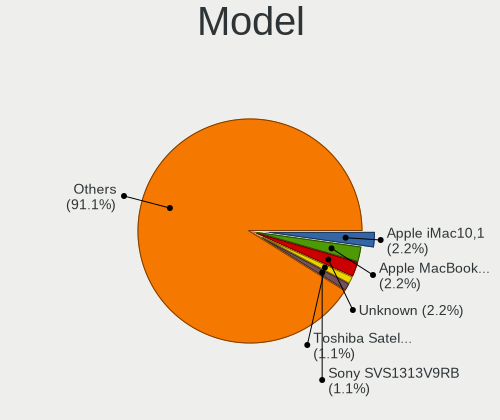
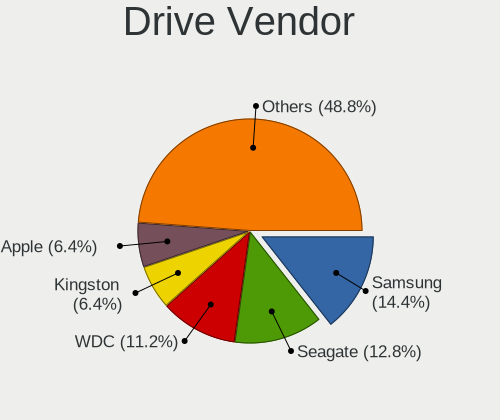
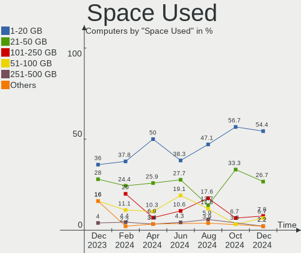
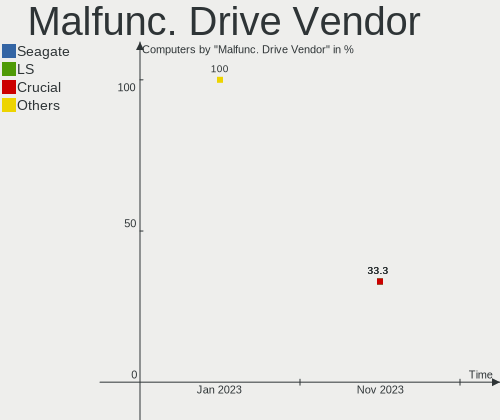
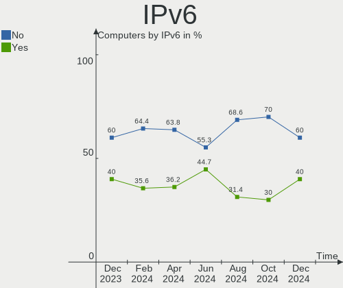
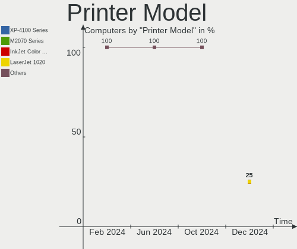
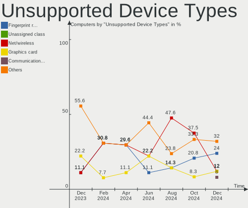

Elementary - Hardware Trends
----------------------------

A project to identify most popular hardware characteristics and track their change
over time based on data collected by Linux users at https://Linux-Hardware.org.

Anyone can contribute to this report by the [hw-probe](https://github.com/linuxhw/hw-probe) tool:

    sudo -E hw-probe -all -upload

This is a report for all computer types. See also reports for [desktops](/Dist/Elementary/Desktop/README.md) and [notebooks](/Dist/Elementary/Notebook/README.md).

This report is for one last month. Overall report since the beginning of time: [TestCoverage](https://github.com/linuxhw/TestCoverage)

Period: May, 2022.

Contents
--------

* [ System ](#system)
  - [ OS                       ](#os)
  - [ OS Family                ](#os-family)
  - [ Kernel                   ](#kernel)
  - [ Kernel Family            ](#kernel-family)
  - [ Kernel Major Ver.        ](#kernel-major-ver)
  - [ Arch                     ](#arch)
  - [ DE                       ](#de)
  - [ Display Server           ](#display-server)
  - [ Display Manager          ](#display-manager)
  - [ OS Lang                  ](#os-lang)
  - [ Boot Mode                ](#boot-mode)
  - [ Filesystem               ](#filesystem)
  - [ Part. scheme             ](#part-scheme)
  - [ Dual Boot with Linux/BSD ](#dual-boot-with-linuxbsd)
  - [ Dual Boot (Win)          ](#dual-boot-win)

* [ Board ](#board)
  - [ Vendor                   ](#vendor)
  - [ Model                    ](#model)
  - [ Model Family             ](#model-family)
  - [ MFG Year                 ](#mfg-year)
  - [ Form Factor              ](#form-factor)
  - [ Secure Boot              ](#secure-boot)
  - [ Coreboot                 ](#coreboot)
  - [ RAM Size                 ](#ram-size)
  - [ RAM Used                 ](#ram-used)
  - [ Total Drives             ](#total-drives)
  - [ Has CD-ROM               ](#has-cd-rom)
  - [ Has Ethernet             ](#has-ethernet)
  - [ Has WiFi                 ](#has-wifi)
  - [ Has Bluetooth            ](#has-bluetooth)

* [ Location ](#location)
  - [ Country                  ](#country)
  - [ City                     ](#city)

* [ Drives ](#drives)
  - [ Drive Vendor             ](#drive-vendor)
  - [ Drive Model              ](#drive-model)
  - [ HDD Vendor               ](#hdd-vendor)
  - [ SSD Vendor               ](#ssd-vendor)
  - [ Drive Kind               ](#drive-kind)
  - [ Drive Connector          ](#drive-connector)
  - [ Drive Size               ](#drive-size)
  - [ Space Total              ](#space-total)
  - [ Space Used               ](#space-used)
  - [ Malfunc. Drives          ](#malfunc-drives)
  - [ Malfunc. Drive Vendor    ](#malfunc-drive-vendor)
  - [ Malfunc. HDD Vendor      ](#malfunc-hdd-vendor)
  - [ Malfunc. Drive Kind      ](#malfunc-drive-kind)
  - [ Failed Drives            ](#failed-drives)
  - [ Failed Drive Vendor      ](#failed-drive-vendor)
  - [ Drive Status             ](#drive-status)

* [ Storage controller ](#storage-controller)
  - [ Storage Vendor           ](#storage-vendor)
  - [ Storage Model            ](#storage-model)
  - [ Storage Kind             ](#storage-kind)

* [ Processor ](#processor)
  - [ CPU Vendor               ](#cpu-vendor)
  - [ CPU Model                ](#cpu-model)
  - [ CPU Model Family         ](#cpu-model-family)
  - [ CPU Cores                ](#cpu-cores)
  - [ CPU Sockets              ](#cpu-sockets)
  - [ CPU Threads              ](#cpu-threads)
  - [ CPU Op-Modes             ](#cpu-op-modes)
  - [ CPU Microcode            ](#cpu-microcode)
  - [ CPU Microarch            ](#cpu-microarch)

* [ Graphics ](#graphics)
  - [ GPU Vendor               ](#gpu-vendor)
  - [ GPU Model                ](#gpu-model)
  - [ GPU Combo                ](#gpu-combo)
  - [ GPU Driver               ](#gpu-driver)
  - [ GPU Memory               ](#gpu-memory)

* [ Monitor ](#monitor)
  - [ Monitor Vendor           ](#monitor-vendor)
  - [ Monitor Model            ](#monitor-model)
  - [ Monitor Resolution       ](#monitor-resolution)
  - [ Monitor Diagonal         ](#monitor-diagonal)
  - [ Monitor Width            ](#monitor-width)
  - [ Aspect Ratio             ](#aspect-ratio)
  - [ Monitor Area             ](#monitor-area)
  - [ Pixel Density            ](#pixel-density)
  - [ Multiple Monitors        ](#multiple-monitors)

* [ Network ](#network)
  - [ Net Controller Vendor    ](#net-controller-vendor)
  - [ Net Controller Model     ](#net-controller-model)
  - [ Wireless Vendor          ](#wireless-vendor)
  - [ Wireless Model           ](#wireless-model)
  - [ Ethernet Vendor          ](#ethernet-vendor)
  - [ Ethernet Model           ](#ethernet-model)
  - [ Net Controller Kind      ](#net-controller-kind)
  - [ Used Controller          ](#used-controller)
  - [ NICs                     ](#nics)
  - [ IPv6                     ](#ipv6)

* [ Bluetooth ](#bluetooth)
  - [ Bluetooth Vendor         ](#bluetooth-vendor)
  - [ Bluetooth Model          ](#bluetooth-model)

* [ Sound ](#sound)
  - [ Sound Vendor             ](#sound-vendor)
  - [ Sound Model              ](#sound-model)

* [ Memory ](#memory)
  - [ Memory Vendor            ](#memory-vendor)
  - [ Memory Model             ](#memory-model)
  - [ Memory Kind              ](#memory-kind)
  - [ Memory Form Factor       ](#memory-form-factor)
  - [ Memory Size              ](#memory-size)
  - [ Memory Speed             ](#memory-speed)

* [ Printers & scanners ](#printers--scanners)
  - [ Printer Vendor           ](#printer-vendor)
  - [ Printer Model            ](#printer-model)
  - [ Scanner Vendor           ](#scanner-vendor)
  - [ Scanner Model            ](#scanner-model)

* [ Camera ](#camera)
  - [ Camera Vendor            ](#camera-vendor)
  - [ Camera Model             ](#camera-model)

* [ Security ](#security)
  - [ Fingerprint Vendor       ](#fingerprint-vendor)
  - [ Fingerprint Model        ](#fingerprint-model)
  - [ Chipcard Vendor          ](#chipcard-vendor)
  - [ Chipcard Model           ](#chipcard-model)

* [ Unsupported ](#unsupported)
  - [ Unsupported Devices      ](#unsupported-devices)
  - [ Unsupported Device Types ](#unsupported-device-types)

System
------

OS
--

Installed operating systems

| Name             | Computers | Percent |
|------------------|-----------|---------|
| Elementary 6.1   | 40        | 90.91%  |
| Elementary 5.1.7 | 4         | 9.09%   |

OS Family
---------

OS without a version

| Name       | Computers | Percent |
|------------|-----------|---------|
| Elementary | 44        | 100%    |

Kernel
------

Version of the Linux kernel

| Version               | Computers | Percent |
|-----------------------|-----------|---------|
| 5.13.0-41-generic     | 13        | 29.55%  |
| 5.13.0-40-generic     | 11        | 25%     |
| 5.13.0-44-generic     | 5         | 11.36%  |
| 5.11.0-43-generic     | 4         | 9.09%   |
| 5.4.0-109-generic     | 2         | 4.55%   |
| 5.13.0-39-generic     | 2         | 4.55%   |
| 5.4.0-73-generic      | 1         | 2.27%   |
| 5.4.0-113-generic     | 1         | 2.27%   |
| 5.15.5-051505-generic | 1         | 2.27%   |
| 5.15.36-xanmod1       | 1         | 2.27%   |
| 5.13.0-37-generic     | 1         | 2.27%   |
| 5.13.0-28-generic     | 1         | 2.27%   |
| 5.11.0-40-generic     | 1         | 2.27%   |

Kernel Family
-------------

Linux kernel without a distro release

| Version | Computers | Percent |
|---------|-----------|---------|
| 5.13.0  | 33        | 75%     |
| 5.11.0  | 5         | 11.36%  |
| 5.4.0   | 4         | 9.09%   |
| 5.15.5  | 1         | 2.27%   |
| 5.15.36 | 1         | 2.27%   |

Kernel Major Ver.
-----------------

Linux kernel major version

| Version | Computers | Percent |
|---------|-----------|---------|
| 5.13    | 33        | 75%     |
| 5.11    | 5         | 11.36%  |
| 5.4     | 4         | 9.09%   |
| 5.15    | 2         | 4.55%   |

Arch
----

OS architecture (x86_64, i586, etc.)

| Name   | Computers | Percent |
|--------|-----------|---------|
| x86_64 | 44        | 100%    |

DE
--

Desktop Environment

| Name     | Computers | Percent |
|----------|-----------|---------|
| Pantheon | 43        | 97.73%  |
| GNOME    | 1         | 2.27%   |

Display Server
--------------

X11 or Wayland

| Name | Computers | Percent |
|------|-----------|---------|
| X11  | 44        | 100%    |

Display Manager
---------------

SDDM, LightDM, etc.

| Name    | Computers | Percent |
|---------|-----------|---------|
| Unknown | 39        | 88.64%  |
| LightDM | 3         | 6.82%   |
| GDM3    | 2         | 4.55%   |

OS Lang
-------

Language

| Lang  | Computers | Percent |
|-------|-----------|---------|
| en_US | 17        | 38.64%  |
| fr_FR | 6         | 13.64%  |
| es_ES | 5         | 11.36%  |
| de_DE | 3         | 6.82%   |
| zh_CN | 2         | 4.55%   |
| pt_BR | 2         | 4.55%   |
| it_IT | 2         | 4.55%   |
| zh_TW | 1         | 2.27%   |
| ru_RU | 1         | 2.27%   |
| pl_PL | 1         | 2.27%   |
| id_ID | 1         | 2.27%   |
| en_ZA | 1         | 2.27%   |
| en_CA | 1         | 2.27%   |
| da_DK | 1         | 2.27%   |

Boot Mode
---------

EFI or BIOS

| Mode | Computers | Percent |
|------|-----------|---------|
| EFI  | 24        | 54.55%  |
| BIOS | 20        | 45.45%  |

Filesystem
----------

Type of filesystem

| Type    | Computers | Percent |
|---------|-----------|---------|
| Ext4    | 42        | 95.45%  |
| Overlay | 1         | 2.27%   |
| Btrfs   | 1         | 2.27%   |

Part. scheme
------------

Scheme of partitioning

| Type    | Computers | Percent |
|---------|-----------|---------|
| Unknown | 42        | 95.45%  |
| GPT     | 2         | 4.55%   |

Dual Boot with Linux/BSD
------------------------

Hosting more than one Linux/BSD

| Dual boot | Computers | Percent |
|-----------|-----------|---------|
| No        | 42        | 95.45%  |
| Yes       | 2         | 4.55%   |

Dual Boot (Win)
---------------

Hosting Linux and Windows

| Dual boot | Computers | Percent |
|-----------|-----------|---------|
| No        | 43        | 97.73%  |
| Yes       | 1         | 2.27%   |

Board
-----

Vendor
------

Motherboard manufacturer

| Name                | Computers | Percent |
|---------------------|-----------|---------|
| Hewlett-Packard     | 10        | 22.73%  |
| ASUSTek Computer    | 10        | 22.73%  |
| MSI                 | 4         | 9.09%   |
| Lenovo              | 2         | 4.55%   |
| Intel               | 2         | 4.55%   |
| HUAWEI              | 2         | 4.55%   |
| Dell                | 2         | 4.55%   |
| Apple               | 2         | 4.55%   |
| Toshiba             | 1         | 2.27%   |
| Sony                | 1         | 2.27%   |
| Samsung Electronics | 1         | 2.27%   |
| LORD ELECTRONICS    | 1         | 2.27%   |
| Gigabyte Technology | 1         | 2.27%   |
| eMachines           | 1         | 2.27%   |
| Biostar             | 1         | 2.27%   |
| ASRock              | 1         | 2.27%   |
| AMI                 | 1         | 2.27%   |
| Acer                | 1         | 2.27%   |

Model
-----

Motherboard model

| Name                                              | Computers | Percent |
|---------------------------------------------------|-----------|---------|
| Toshiba PORTEGE Z830                              | 1         | 2.27%   |
| Sony VPCEB23FM                                    | 1         | 2.27%   |
| Samsung Lumpy                                     | 1         | 2.27%   |
| MSI MS-7D52                                       | 1         | 2.27%   |
| MSI MS-7C35                                       | 1         | 2.27%   |
| MSI MS-7851                                       | 1         | 2.27%   |
| MSI MS-7817                                       | 1         | 2.27%   |
| LORD ELECTRONICS LORD G4x 775 ICH7 8712 As Design | 1         | 2.27%   |
| Lenovo ThinkPad T400 6474ES3                      | 1         | 2.27%   |
| Lenovo ThinkBook 14s Yoga ITL 20WE                | 1         | 2.27%   |
| Intel NUC8i5BEK                                   | 1         | 2.27%   |
| Intel NUC6i7KYB H90766-405                        | 1         | 2.27%   |
| HUAWEI NBLK-WAX9X                                 | 1         | 2.27%   |
| HUAWEI MACHD-WXX9                                 | 1         | 2.27%   |
| HP ZBook 15                                       | 1         | 2.27%   |
| HP Stream Laptop 14-cb1xxx                        | 1         | 2.27%   |
| HP ProBook 6550b                                  | 1         | 2.27%   |
| HP ProBook 4510s                                  | 1         | 2.27%   |
| HP Pavilion 17                                    | 1         | 2.27%   |
| HP ENVY x360 Convertible 13-ay0xxx                | 1         | 2.27%   |
| HP ENVY x360 Convertible                          | 1         | 2.27%   |
| HP ENVY 14                                        | 1         | 2.27%   |
| HP EliteBook 8470p                                | 1         | 2.27%   |
| HP EliteBook 840 G7 Notebook PC                   | 1         | 2.27%   |
| Gigabyte GA-880GMA-UD2H                           | 1         | 2.27%   |
| eMachines E525                                    | 1         | 2.27%   |
| Dell XPS 13 9343                                  | 1         | 2.27%   |
| Dell Inspiron 7720                                | 1         | 2.27%   |
| Biostar GF8200C M2+                               | 1         | 2.27%   |
| ASUS X550CA                                       | 1         | 2.27%   |
| ASUS X202E                                        | 1         | 2.27%   |
| ASUS VivoBook 15 ASUS Laptop X570UD               | 1         | 2.27%   |
| ASUS UX310UQK                                     | 1         | 2.27%   |
| ASUS SABERTOOTH X58                               | 1         | 2.27%   |
| ASUS P8H61-M LE/USB3                              | 1         | 2.27%   |
| ASUS P5KPL-VM/S                                   | 1         | 2.27%   |
| ASUS P5B                                          | 1         | 2.27%   |
| ASUS K55A                                         | 1         | 2.27%   |
| ASUS All Series                                   | 1         | 2.27%   |
| ASRock X570 Extreme4                              | 1         | 2.27%   |
| Apple MacBookPro8,2                               | 1         | 2.27%   |
| Apple MacBook4,1                                  | 1         | 2.27%   |
| AMI Intel                                         | 1         | 2.27%   |
| Acer Swift SF114-32                               | 1         | 2.27%   |

Model Family
------------

Motherboard model prefix

| Name                    | Computers | Percent |
|-------------------------|-----------|---------|
| HP ENVY                 | 3         | 6.82%   |
| HP ProBook              | 2         | 4.55%   |
| HP EliteBook            | 2         | 4.55%   |
| Toshiba PORTEGE         | 1         | 2.27%   |
| Sony VPCEB23FM          | 1         | 2.27%   |
| Samsung Lumpy           | 1         | 2.27%   |
| MSI MS-7D52             | 1         | 2.27%   |
| MSI MS-7C35             | 1         | 2.27%   |
| MSI MS-7851             | 1         | 2.27%   |
| MSI MS-7817             | 1         | 2.27%   |
| LORD ELECTRONICS LORD   | 1         | 2.27%   |
| Lenovo ThinkPad         | 1         | 2.27%   |
| Lenovo ThinkBook        | 1         | 2.27%   |
| Intel NUC8i5BEK         | 1         | 2.27%   |
| Intel NUC6i7KYB         | 1         | 2.27%   |
| HUAWEI NBLK-WAX9X       | 1         | 2.27%   |
| HUAWEI MACHD-WXX9       | 1         | 2.27%   |
| HP ZBook                | 1         | 2.27%   |
| HP Stream               | 1         | 2.27%   |
| HP Pavilion             | 1         | 2.27%   |
| Gigabyte GA-880GMA-UD2H | 1         | 2.27%   |
| eMachines E525          | 1         | 2.27%   |
| Dell XPS                | 1         | 2.27%   |
| Dell Inspiron           | 1         | 2.27%   |
| Biostar GF8200C         | 1         | 2.27%   |
| ASUS X550CA             | 1         | 2.27%   |
| ASUS X202E              | 1         | 2.27%   |
| ASUS VivoBook           | 1         | 2.27%   |
| ASUS UX310UQK           | 1         | 2.27%   |
| ASUS SABERTOOTH         | 1         | 2.27%   |
| ASUS P8H61-M            | 1         | 2.27%   |
| ASUS P5KPL-VM           | 1         | 2.27%   |
| ASUS P5B                | 1         | 2.27%   |
| ASUS K55A               | 1         | 2.27%   |
| ASUS All                | 1         | 2.27%   |
| ASRock X570             | 1         | 2.27%   |
| Apple MacBookPro8       | 1         | 2.27%   |
| Apple MacBook4          | 1         | 2.27%   |
| AMI Intel               | 1         | 2.27%   |
| Acer Swift              | 1         | 2.27%   |

MFG Year
--------

Motherboard manufacture year

| Year | Computers | Percent |
|------|-----------|---------|
| 2013 | 6         | 13.64%  |
| 2019 | 5         | 11.36%  |
| 2020 | 4         | 9.09%   |
| 2012 | 4         | 9.09%   |
| 2010 | 4         | 9.09%   |
| 2009 | 4         | 9.09%   |
| 2021 | 3         | 6.82%   |
| 2016 | 3         | 6.82%   |
| 2011 | 3         | 6.82%   |
| 2018 | 2         | 4.55%   |
| 2015 | 2         | 4.55%   |
| 2008 | 2         | 4.55%   |
| 2017 | 1         | 2.27%   |
| 2006 | 1         | 2.27%   |

Form Factor
-----------

Physical design of the computer

| Name        | Computers | Percent |
|-------------|-----------|---------|
| Notebook    | 26        | 59.09%  |
| Desktop     | 13        | 29.55%  |
| Convertible | 3         | 6.82%   |
| Mini pc     | 2         | 4.55%   |

Secure Boot
-----------

Enabled or disabled

| State    | Computers | Percent |
|----------|-----------|---------|
| Disabled | 39        | 88.64%  |
| Enabled  | 5         | 11.36%  |

Coreboot
--------

Have coreboot on board

| Used | Computers | Percent |
|------|-----------|---------|
| No   | 43        | 97.73%  |
| Yes  | 1         | 2.27%   |

RAM Size
--------

Total RAM memory

| Size in GB  | Computers | Percent |
|-------------|-----------|---------|
| 3.01-4.0    | 13        | 29.55%  |
| 4.01-8.0    | 8         | 18.18%  |
| 16.01-24.0  | 7         | 15.91%  |
| 8.01-16.0   | 6         | 13.64%  |
| 32.01-64.0  | 4         | 9.09%   |
| 2.01-3.0    | 2         | 4.55%   |
| 1.01-2.0    | 2         | 4.55%   |
| 24.01-32.0  | 1         | 2.27%   |
| 64.01-256.0 | 1         | 2.27%   |

RAM Used
--------

Used RAM memory

| Used GB   | Computers | Percent |
|-----------|-----------|---------|
| 2.01-3.0  | 15        | 34.09%  |
| 1.01-2.0  | 14        | 31.82%  |
| 3.01-4.0  | 6         | 13.64%  |
| 4.01-8.0  | 5         | 11.36%  |
| 0.51-1.0  | 3         | 6.82%   |
| 8.01-16.0 | 1         | 2.27%   |

Total Drives
------------

Number of drives on board

| Drives | Computers | Percent |
|--------|-----------|---------|
| 1      | 25        | 56.82%  |
| 2      | 14        | 31.82%  |
| 3      | 4         | 9.09%   |
| 4      | 1         | 2.27%   |

Has CD-ROM
----------

Has CD-ROM on board

| Presented | Computers | Percent |
|-----------|-----------|---------|
| No        | 26        | 59.09%  |
| Yes       | 18        | 40.91%  |

Has Ethernet
------------

Has Ethernet on board

| Presented | Computers | Percent |
|-----------|-----------|---------|
| Yes       | 34        | 77.27%  |
| No        | 10        | 22.73%  |

Has WiFi
--------

Has WiFi module

| Presented | Computers | Percent |
|-----------|-----------|---------|
| Yes       | 37        | 84.09%  |
| No        | 7         | 15.91%  |

Has Bluetooth
-------------

Has Bluetooth module

| Presented | Computers | Percent |
|-----------|-----------|---------|
| Yes       | 31        | 70.45%  |
| No        | 13        | 29.55%  |

Location
--------

Country
-------

Geographic location (country)

| Country     | Computers | Percent |
|-------------|-----------|---------|
| USA         | 7         | 15.91%  |
| France      | 5         | 11.36%  |
| Germany     | 3         | 6.82%   |
| Canada      | 3         | 6.82%   |
| Spain       | 2         | 4.55%   |
| Italy       | 2         | 4.55%   |
| Indonesia   | 2         | 4.55%   |
| China       | 2         | 4.55%   |
| Brazil      | 2         | 4.55%   |
| Turkey      | 1         | 2.27%   |
| Switzerland | 1         | 2.27%   |
| Senegal     | 1         | 2.27%   |
| Russia      | 1         | 2.27%   |
| Poland      | 1         | 2.27%   |
| Peru        | 1         | 2.27%   |
| Norway      | 1         | 2.27%   |
| New Zealand | 1         | 2.27%   |
| Mexico      | 1         | 2.27%   |
| Lithuania   | 1         | 2.27%   |
| Hong Kong   | 1         | 2.27%   |
| Eswatini    | 1         | 2.27%   |
| Denmark     | 1         | 2.27%   |
| Croatia     | 1         | 2.27%   |
| Colombia    | 1         | 2.27%   |
| Argentina   | 1         | 2.27%   |

City
----

Geographic location (city)

| City                | Computers | Percent |
|---------------------|-----------|---------|
| Zhengzhou           | 1         | 2.27%   |
| Zagreb              | 1         | 2.27%   |
| Warsaw              | 1         | 2.27%   |
| Warrenton           | 1         | 2.27%   |
| Vilnius             | 1         | 2.27%   |
| Vernouillet         | 1         | 2.27%   |
| Vear                | 1         | 2.27%   |
| Toronto             | 1         | 2.27%   |
| Tauranga            | 1         | 2.27%   |
| Tangerang           | 1         | 2.27%   |
| Sao Paulo           | 1         | 2.27%   |
| Salvador            | 1         | 2.27%   |
| Río Cuarto         | 1         | 2.27%   |
| Plymouth            | 1         | 2.27%   |
| Plano               | 1         | 2.27%   |
| Plan-de-Cuques      | 1         | 2.27%   |
| Parma               | 1         | 2.27%   |
| Oviedo              | 1         | 2.27%   |
| Ottawa              | 1         | 2.27%   |
| Moscow              | 1         | 2.27%   |
| Montreal            | 1         | 2.27%   |
| Montbrison          | 1         | 2.27%   |
| Milan               | 1         | 2.27%   |
| Mbabane             | 1         | 2.27%   |
| Louisville          | 1         | 2.27%   |
| Lima                | 1         | 2.27%   |
| Istanbul            | 1         | 2.27%   |
| Ibague              | 1         | 2.27%   |
| Huainan             | 1         | 2.27%   |
| Gainesville         | 1         | 2.27%   |
| Frankfurt am Main   | 1         | 2.27%   |
| Decines-Charpieu    | 1         | 2.27%   |
| Dakar               | 1         | 2.27%   |
| Ciudad Lopez Mateos | 1         | 2.27%   |
| Chattanooga         | 1         | 2.27%   |
| Central             | 1         | 2.27%   |
| Caslano             | 1         | 2.27%   |
| Bogor               | 1         | 2.27%   |
| Boadilla del Monte  | 1         | 2.27%   |
| Berlin              | 1         | 2.27%   |
| Amplepuis           | 1         | 2.27%   |
| Altlandsberg        | 1         | 2.27%   |
| Albany              | 1         | 2.27%   |
| Aalborg             | 1         | 2.27%   |

Drives
------

Drive Vendor
------------

Hard drive vendors

| Vendor              | Computers | Drives | Percent |
|---------------------|-----------|--------|---------|
| Seagate             | 11        | 11     | 17.46%  |
| WDC                 | 9         | 11     | 14.29%  |
| Samsung Electronics | 6         | 7      | 9.52%   |
| Unknown             | 4         | 5      | 6.35%   |
| Toshiba             | 4         | 5      | 6.35%   |
| Sandisk             | 4         | 4      | 6.35%   |
| SK Hynix            | 2         | 2      | 3.17%   |
| OCZ                 | 2         | 2      | 3.17%   |
| Intel               | 2         | 2      | 3.17%   |
| HGST                | 2         | 2      | 3.17%   |
| Transcend           | 1         | 1      | 1.59%   |
| TO Exter            | 1         | 1      | 1.59%   |
| tigo                | 1         | 1      | 1.59%   |
| PNY                 | 1         | 1      | 1.59%   |
| Phison              | 1         | 1      | 1.59%   |
| OCZ-VERTEX2         | 1         | 1      | 1.59%   |
| Micron Technology   | 1         | 1      | 1.59%   |
| Lite-On             | 1         | 1      | 1.59%   |
| KIOXIA              | 1         | 1      | 1.59%   |
| Kingston            | 1         | 1      | 1.59%   |
| Kingchuxing         | 1         | 1      | 1.59%   |
| JMicron             | 1         | 1      | 1.59%   |
| Hitachi             | 1         | 1      | 1.59%   |
| FORESEE             | 1         | 1      | 1.59%   |
| Crucial             | 1         | 1      | 1.59%   |
| China               | 1         | 1      | 1.59%   |
| A-DATA Technology   | 1         | 1      | 1.59%   |

Drive Model
-----------

Hard drive models

| Model                                 | Computers | Percent |
|---------------------------------------|-----------|---------|
| Unknown MMC Card  16GB                | 2         | 3.03%   |
| Samsung NVMe SSD Drive 500GB          | 2         | 3.03%   |
| OCZ VERTEX3 120GB SSD                 | 2         | 3.03%   |
| WDC WDS500G2B0B 500GB SSD             | 1         | 1.52%   |
| WDC WD5000LPVX-22V0TT0 500GB          | 1         | 1.52%   |
| WDC WD5000AAKX-001CA0 500GB           | 1         | 1.52%   |
| WDC WD5000AAKS-00A7B2 500GB           | 1         | 1.52%   |
| WDC WD400BB-75DEA0 40GB               | 1         | 1.52%   |
| WDC WD30EZRZ-00Z5HB0 3TB              | 1         | 1.52%   |
| WDC WD20EZRX-00D8PB0 2TB              | 1         | 1.52%   |
| WDC WD10JPVX-22JC3T0 1TB              | 1         | 1.52%   |
| WDC WD10EZEX-08WN4A0 1TB              | 1         | 1.52%   |
| WDC SSC-D0064SC-2100 64GB             | 1         | 1.52%   |
| Unknown SD/MMC/MS PRO 999GB           | 1         | 1.52%   |
| Unknown MMC Card  64GB                | 1         | 1.52%   |
| Unknown MMC Card  32GB                | 1         | 1.52%   |
| Transcend TS256GSSD230S 256GB         | 1         | 1.52%   |
| Toshiba THNSNB128GMCJ 128GB SSD       | 1         | 1.52%   |
| Toshiba MK3263GSX 320GB               | 1         | 1.52%   |
| Toshiba KBG30ZMS128G 128GB NVMe SSD   | 1         | 1.52%   |
| Toshiba DT01ACA200 2TB                | 1         | 1.52%   |
| TO Exter nal USB 3.0 320GB            | 1         | 1.52%   |
| tigo SSD 120GB                        | 1         | 1.52%   |
| SK Hynix NVMe SSD Drive 256GB         | 1         | 1.52%   |
| SK Hynix HFS128G39TND-N210A 128GB SSD | 1         | 1.52%   |
| Seagate ST9750420AS 752GB             | 1         | 1.52%   |
| Seagate ST9250410AS 250GB             | 1         | 1.52%   |
| Seagate ST9120817AS 120GB             | 1         | 1.52%   |
| Seagate ST500LM012 HN-M500MBB 500GB   | 1         | 1.52%   |
| Seagate ST3160815AS 160GB             | 1         | 1.52%   |
| Seagate ST250DM000-1BD141 250GB       | 1         | 1.52%   |
| Seagate ST2000LX001-1RG174 2TB        | 1         | 1.52%   |
| Seagate ST2000DM001-9YN164 2TB        | 1         | 1.52%   |
| Seagate ST1000LM035-1RK172 1TB        | 1         | 1.52%   |
| Seagate ST1000DM010-2EP102 1TB        | 1         | 1.52%   |
| Seagate ST1000DL002-9TT153 1TB        | 1         | 1.52%   |
| SanDisk SD9SN8W256G1002 256GB SSD     | 1         | 1.52%   |
| SanDisk SD8SNAT-128G-1006 128GB SSD   | 1         | 1.52%   |
| SanDisk pSSD 128GB                    | 1         | 1.52%   |
| Sandisk NVMe SSD Drive 256GB          | 1         | 1.52%   |
| Samsung SSD 860 EVO 250GB             | 1         | 1.52%   |
| Samsung SSD 850 PRO 256GB             | 1         | 1.52%   |
| Samsung NVMe SSD Drive 512GB          | 1         | 1.52%   |
| Samsung NVMe SSD Drive 2TB            | 1         | 1.52%   |
| Samsung NVMe SSD Drive 1024GB         | 1         | 1.52%   |
| PNY CS900 120GB SSD                   | 1         | 1.52%   |
| Phison NVMe SSD Drive 1TB             | 1         | 1.52%   |
| OCZ-VERTEX2 3.5 120GB SSD             | 1         | 1.52%   |
| Micron 1100_MTFDDAV256TBN 256GB SSD   | 1         | 1.52%   |
| Lite-On NVMe SSD Drive 256GB          | 1         | 1.52%   |
| KIOXIA NVMe SSD Drive 512GB           | 1         | 1.52%   |
| Kingston SA400S37480G 480GB SSD       | 1         | 1.52%   |
| Kingchuxing 64GB                      | 1         | 1.52%   |
| JMicron Tech 250GB                    | 1         | 1.52%   |
| Intel SSDSC2BX200G4R 200GB            | 1         | 1.52%   |
| Intel SSDSA2CW160G3 160GB             | 1         | 1.52%   |
| Hitachi HTS723216L9SA60 160GB         | 1         | 1.52%   |
| HGST HTS721010A9E630 1TB              | 1         | 1.52%   |
| HGST HTS545050A7E680 500GB            | 1         | 1.52%   |
| FORESEE 256GB SSD                     | 1         | 1.52%   |

HDD Vendor
----------

Hard disk drive vendors

| Vendor  | Computers | Drives | Percent |
|---------|-----------|--------|---------|
| Seagate | 11        | 11     | 44%     |
| WDC     | 8         | 9      | 32%     |
| Toshiba | 2         | 3      | 8%      |
| HGST    | 2         | 2      | 8%      |
| Unknown | 1         | 1      | 4%      |
| Hitachi | 1         | 1      | 4%      |

SSD Vendor
----------

Solid state drive vendors

| Vendor              | Computers | Drives | Percent |
|---------------------|-----------|--------|---------|
| SanDisk             | 3         | 3      | 13.64%  |
| OCZ                 | 2         | 2      | 9.09%   |
| Intel               | 2         | 2      | 9.09%   |
| WDC                 | 1         | 1      | 4.55%   |
| Transcend           | 1         | 1      | 4.55%   |
| Toshiba             | 1         | 1      | 4.55%   |
| TO Exter            | 1         | 1      | 4.55%   |
| tigo                | 1         | 1      | 4.55%   |
| SK Hynix            | 1         | 1      | 4.55%   |
| Samsung Electronics | 1         | 2      | 4.55%   |
| PNY                 | 1         | 1      | 4.55%   |
| OCZ-VERTEX2         | 1         | 1      | 4.55%   |
| Micron Technology   | 1         | 1      | 4.55%   |
| Kingston            | 1         | 1      | 4.55%   |
| FORESEE             | 1         | 1      | 4.55%   |
| Crucial             | 1         | 1      | 4.55%   |
| China               | 1         | 1      | 4.55%   |
| A-DATA Technology   | 1         | 1      | 4.55%   |

Drive Kind
----------

HDD or SSD

| Kind    | Computers | Drives | Percent |
|---------|-----------|--------|---------|
| HDD     | 22        | 27     | 36.67%  |
| SSD     | 21        | 23     | 35%     |
| NVMe    | 10        | 11     | 16.67%  |
| MMC     | 4         | 4      | 6.67%   |
| Unknown | 3         | 3      | 5%      |

Drive Connector
---------------

SATA, SAS, NVMe, etc.

| Type | Computers | Drives | Percent |
|------|-----------|--------|---------|
| SATA | 36        | 49     | 66.67%  |
| NVMe | 10        | 11     | 18.52%  |
| SAS  | 4         | 4      | 7.41%   |
| MMC  | 4         | 4      | 7.41%   |

Drive Size
----------

Size of hard drive

| Size in TB | Computers | Drives | Percent |
|------------|-----------|--------|---------|
| 0.01-0.5   | 30        | 35     | 73.17%  |
| 0.51-1.0   | 7         | 8      | 17.07%  |
| 1.01-2.0   | 3         | 5      | 7.32%   |
| 2.01-3.0   | 1         | 2      | 2.44%   |

Space Total
-----------

Amount of disk space available on the file system

| Size in GB | Computers | Percent |
|------------|-----------|---------|
| 101-250    | 17        | 38.64%  |
| 251-500    | 11        | 25%     |
| 21-50      | 5         | 11.36%  |
| 1001-2000  | 4         | 9.09%   |
| 501-1000   | 4         | 9.09%   |
| 51-100     | 2         | 4.55%   |
| 2001-3000  | 1         | 2.27%   |

Space Used
----------

Amount of used disk space

| Used GB  | Computers | Percent |
|----------|-----------|---------|
| 1-20     | 18        | 40.91%  |
| 21-50    | 13        | 29.55%  |
| 101-250  | 6         | 13.64%  |
| 51-100   | 3         | 6.82%   |
| 251-500  | 2         | 4.55%   |
| 501-1000 | 2         | 4.55%   |

Malfunc. Drives
---------------

Drive models with a malfunction

| Model                    | Computers | Drives | Percent |
|--------------------------|-----------|--------|---------|
| HGST HTS721010A9E630 1TB | 1         | 1      | 100%    |

Malfunc. Drive Vendor
---------------------

Vendors of faulty drives

| Vendor | Computers | Drives | Percent |
|--------|-----------|--------|---------|
| HGST   | 1         | 1      | 100%    |

Malfunc. HDD Vendor
-------------------

Vendors of faulty HDD drives

| Vendor | Computers | Drives | Percent |
|--------|-----------|--------|---------|
| HGST   | 1         | 1      | 100%    |

Malfunc. Drive Kind
-------------------

Kinds of faulty drives

| Kind | Computers | Drives | Percent |
|------|-----------|--------|---------|
| HDD  | 1         | 1      | 100%    |

Failed Drives
-------------

Failed drive models

Zero info for selected period =(

Failed Drive Vendor
-------------------

Failed drive vendors

Zero info for selected period =(

Drive Status
------------

Number of failed and malfunc. drives

| Status   | Computers | Drives | Percent |
|----------|-----------|--------|---------|
| Detected | 42        | 64     | 93.33%  |
| Works    | 2         | 3      | 4.44%   |
| Malfunc  | 1         | 1      | 2.22%   |

Storage controller
------------------

Storage Vendor
--------------

Storage controller vendors

| Vendor                       | Computers | Percent |
|------------------------------|-----------|---------|
| Intel                        | 33        | 61.11%  |
| Samsung Electronics          | 5         | 9.26%   |
| AMD                          | 4         | 7.41%   |
| JMicron Technology           | 3         | 5.56%   |
| Toshiba America Info Systems | 1         | 1.85%   |
| SK Hynix                     | 1         | 1.85%   |
| Sandisk                      | 1         | 1.85%   |
| Phison Electronics           | 1         | 1.85%   |
| Nvidia                       | 1         | 1.85%   |
| Marvell Technology Group     | 1         | 1.85%   |
| LSI Logic / Symbios Logic    | 1         | 1.85%   |
| Lite-On Technology           | 1         | 1.85%   |
| KIOXIA                       | 1         | 1.85%   |

Storage Model
-------------

Storage controller models

| Model                                                                                   | Computers | Percent |
|-----------------------------------------------------------------------------------------|-----------|---------|
| Intel 7 Series Chipset Family 6-port SATA Controller [AHCI mode]                        | 4         | 6.45%   |
| Samsung NVMe SSD Controller SM981/PM981/PM983                                           | 3         | 4.84%   |
| Intel 82801IBM/IEM (ICH9M/ICH9M-E) 4 port SATA Controller [AHCI mode]                   | 3         | 4.84%   |
| Intel 8 Series/C220 Series Chipset Family 6-port SATA Controller 1 [AHCI mode]          | 3         | 4.84%   |
| Intel 6 Series/C200 Series Chipset Family 6 port Mobile SATA AHCI Controller            | 3         | 4.84%   |
| AMD FCH SATA Controller [AHCI mode]                                                     | 3         | 4.84%   |
| Intel Sunrise Point-LP SATA Controller [AHCI mode]                                      | 2         | 3.23%   |
| Intel NM10/ICH7 Family SATA Controller [IDE mode]                                       | 2         | 3.23%   |
| Intel Celeron/Pentium Silver Processor SATA Controller                                  | 2         | 3.23%   |
| Intel 82801G (ICH7 Family) IDE Controller                                               | 2         | 3.23%   |
| Intel 5 Series/3400 Series Chipset 4 port SATA AHCI Controller                          | 2         | 3.23%   |
| Toshiba America Info Systems XG6 NVMe SSD Controller                                    | 1         | 1.61%   |
| SK Hynix Gold P31 SSD                                                                   | 1         | 1.61%   |
| Sandisk WD Blue SN550 NVMe SSD                                                          | 1         | 1.61%   |
| Samsung NVMe SSD Controller PM9A1/PM9A3/980PRO                                          | 1         | 1.61%   |
| Samsung NVMe SSD Controller 980                                                         | 1         | 1.61%   |
| Phison E18 PCIe4 NVMe Controller                                                        | 1         | 1.61%   |
| Nvidia MCP78S [GeForce 8200] SATA Controller (non-AHCI mode)                            | 1         | 1.61%   |
| Nvidia MCP78S [GeForce 8200] IDE                                                        | 1         | 1.61%   |
| Marvell Group 88SE91A3 SATA-600 Controller                                              | 1         | 1.61%   |
| LSI Logic / Symbios Logic MegaRAID SAS-3 3108 [Invader]                                 | 1         | 1.61%   |
| Lite-On NVMe Controller                                                                 | 1         | 1.61%   |
| KIOXIA Non-Volatile memory controller                                                   | 1         | 1.61%   |
| JMicron JMB368 IDE controller                                                           | 1         | 1.61%   |
| JMicron JMB363 SATA/IDE Controller                                                      | 1         | 1.61%   |
| JMicron JMB362 SATA Controller                                                          | 1         | 1.61%   |
| Intel Wildcat Point-LP SATA Controller [AHCI Mode]                                      | 1         | 1.61%   |
| Intel Volume Management Device NVMe RAID Controller                                     | 1         | 1.61%   |
| Intel Cannon Point-LP SATA Controller [AHCI Mode]                                       | 1         | 1.61%   |
| Intel 9 Series Chipset Family SATA Controller [AHCI Mode]                               | 1         | 1.61%   |
| Intel 82801JI (ICH10 Family) 4 port SATA IDE Controller #1                              | 1         | 1.61%   |
| Intel 82801JI (ICH10 Family) 2 port SATA IDE Controller #2                              | 1         | 1.61%   |
| Intel 82801HM/HEM (ICH8M/ICH8M-E) SATA Controller [AHCI mode]                           | 1         | 1.61%   |
| Intel 82801HM/HEM (ICH8M/ICH8M-E) IDE Controller                                        | 1         | 1.61%   |
| Intel 82801HB (ICH8) 4 port SATA Controller [AHCI mode]                                 | 1         | 1.61%   |
| Intel 82801 Mobile SATA Controller [RAID mode]                                          | 1         | 1.61%   |
| Intel 8 Series SATA Controller 1 [AHCI mode]                                            | 1         | 1.61%   |
| Intel 7 Series Chipset Family 4-port SATA Controller [IDE mode]                         | 1         | 1.61%   |
| Intel 7 Series Chipset Family 2-port SATA Controller [IDE mode]                         | 1         | 1.61%   |
| Intel 6 Series/C200 Series Chipset Family Desktop SATA Controller (IDE mode, ports 4-5) | 1         | 1.61%   |
| Intel 6 Series/C200 Series Chipset Family Desktop SATA Controller (IDE mode, ports 0-3) | 1         | 1.61%   |
| Intel 5 Series/3400 Series Chipset 6 port SATA AHCI Controller                          | 1         | 1.61%   |
| AMD SB7x0/SB8x0/SB9x0 SATA Controller [IDE mode]                                        | 1         | 1.61%   |
| AMD SB7x0/SB8x0/SB9x0 IDE Controller                                                    | 1         | 1.61%   |

Storage Kind
------------

Kind of storage controller (IDE, SATA, NVMe, SAS, ...)

| Kind | Computers | Percent |
|------|-----------|---------|
| SATA | 31        | 58.49%  |
| NVMe | 10        | 18.87%  |
| IDE  | 9         | 16.98%  |
| RAID | 3         | 5.66%   |

Processor
---------

CPU Vendor
----------

Processor vendors

| Vendor | Computers | Percent |
|--------|-----------|---------|
| Intel  | 37        | 84.09%  |
| AMD    | 7         | 15.91%  |

CPU Model
---------

Processor models

| Model                                         | Computers | Percent |
|-----------------------------------------------|-----------|---------|
| Intel Core i5 CPU M 460 @ 2.53GHz             | 2         | 4.55%   |
| Intel 11th Gen Core i7-1165G7 @ 2.80GHz       | 2         | 4.55%   |
| AMD Ryzen 9 5900X 12-Core Processor           | 2         | 4.55%   |
| Intel Xeon CPU E3-1283L v4 @ 2.90GHz          | 1         | 2.27%   |
| Intel Pentium Silver N5000 CPU @ 1.10GHz      | 1         | 2.27%   |
| Intel Pentium Dual-Core CPU E5300 @ 2.60GHz   | 1         | 2.27%   |
| Intel Pentium Dual CPU T3400 @ 2.16GHz        | 1         | 2.27%   |
| Intel Core i7-8550U CPU @ 1.80GHz             | 1         | 2.27%   |
| Intel Core i7-7500U CPU @ 2.70GHz             | 1         | 2.27%   |
| Intel Core i7-6770HQ CPU @ 2.60GHz            | 1         | 2.27%   |
| Intel Core i7-6560U CPU @ 2.20GHz             | 1         | 2.27%   |
| Intel Core i7-4770 CPU @ 3.40GHz              | 1         | 2.27%   |
| Intel Core i7-4700MQ CPU @ 2.40GHz            | 1         | 2.27%   |
| Intel Core i7-3610QM CPU @ 2.30GHz            | 1         | 2.27%   |
| Intel Core i7-2635QM CPU @ 2.00GHz            | 1         | 2.27%   |
| Intel Core i7 CPU 950 @ 3.07GHz               | 1         | 2.27%   |
| Intel Core i5-8259U CPU @ 2.30GHz             | 1         | 2.27%   |
| Intel Core i5-5200U CPU @ 2.20GHz             | 1         | 2.27%   |
| Intel Core i5-3340M CPU @ 2.70GHz             | 1         | 2.27%   |
| Intel Core i5-3337U CPU @ 1.80GHz             | 1         | 2.27%   |
| Intel Core i5-3210M CPU @ 2.50GHz             | 1         | 2.27%   |
| Intel Core i5-2467M CPU @ 1.60GHz             | 1         | 2.27%   |
| Intel Core i5-10210U CPU @ 1.60GHz            | 1         | 2.27%   |
| Intel Core i5 CPU M 520 @ 2.40GHz             | 1         | 2.27%   |
| Intel Core i3-4130 CPU @ 3.40GHz              | 1         | 2.27%   |
| Intel Core i3-4030U CPU @ 1.90GHz             | 1         | 2.27%   |
| Intel Core i3-3217U CPU @ 1.80GHz             | 1         | 2.27%   |
| Intel Core i3-2100 CPU @ 3.10GHz              | 1         | 2.27%   |
| Intel Core 2 Quad CPU Q9400 @ 2.66GHz         | 1         | 2.27%   |
| Intel Core 2 Duo CPU T8300 @ 2.40GHz          | 1         | 2.27%   |
| Intel Core 2 Duo CPU P8600 @ 2.40GHz          | 1         | 2.27%   |
| Intel Core 2 Duo CPU E6550 @ 2.33GHz          | 1         | 2.27%   |
| Intel Celeron N4120 CPU @ 1.10GHz             | 1         | 2.27%   |
| Intel Celeron N4020 CPU @ 1.10GHz             | 1         | 2.27%   |
| Intel Celeron Dual-Core CPU T3000 @ 1.80GHz   | 1         | 2.27%   |
| Intel Celeron CPU 867 @ 1.30GHz               | 1         | 2.27%   |
| AMD Ryzen 7 4700U with Radeon Graphics        | 1         | 2.27%   |
| AMD Ryzen 5 5600X 6-Core Processor            | 1         | 2.27%   |
| AMD Ryzen 5 3500U with Radeon Vega Mobile Gfx | 1         | 2.27%   |
| AMD Phenom II X4 B50 Processor                | 1         | 2.27%   |
| AMD Athlon II X2 240 Processor                | 1         | 2.27%   |

CPU Model Family
----------------

Processor model prefix

| Model                   | Computers | Percent |
|-------------------------|-----------|---------|
| Intel Core i5           | 10        | 22.73%  |
| Intel Core i7           | 9         | 20.45%  |
| Intel Core i3           | 4         | 9.09%   |
| Intel Core 2 Duo        | 3         | 6.82%   |
| Intel Celeron           | 3         | 6.82%   |
| Other                   | 2         | 4.55%   |
| AMD Ryzen 9             | 2         | 4.55%   |
| AMD Ryzen 5             | 2         | 4.55%   |
| Intel Xeon              | 1         | 2.27%   |
| Intel Pentium Silver    | 1         | 2.27%   |
| Intel Pentium Dual-Core | 1         | 2.27%   |
| Intel Pentium Dual      | 1         | 2.27%   |
| Intel Core 2 Quad       | 1         | 2.27%   |
| Intel Celeron Dual-Core | 1         | 2.27%   |
| AMD Ryzen 7             | 1         | 2.27%   |
| AMD Phenom II X4        | 1         | 2.27%   |
| AMD Athlon II X2        | 1         | 2.27%   |

CPU Cores
---------

Number of processor cores

| Number | Computers | Percent |
|--------|-----------|---------|
| 2      | 23        | 52.27%  |
| 4      | 16        | 36.36%  |
| 12     | 2         | 4.55%   |
| 8      | 1         | 2.27%   |
| 6      | 1         | 2.27%   |
| 3      | 1         | 2.27%   |

CPU Sockets
-----------

Number of sockets

| Number | Computers | Percent |
|--------|-----------|---------|
| 1      | 44        | 100%    |

CPU Threads
-----------

Threads per core (Hyper-Threading)

| Number | Computers | Percent |
|--------|-----------|---------|
| 2      | 30        | 68.18%  |
| 1      | 14        | 31.82%  |

CPU Op-Modes
------------

CPU Operation Modes (32-bit, 64-bit)

| Op mode        | Computers | Percent |
|----------------|-----------|---------|
| 32-bit, 64-bit | 44        | 100%    |

CPU Microcode
-------------

Microcode number

| Number     | Computers | Percent |
|------------|-----------|---------|
| 0x306a9    | 5         | 11.36%  |
| 0x206a7    | 4         | 9.09%   |
| 0x1067a    | 4         | 9.09%   |
| Unknown    | 4         | 9.09%   |
| 0x306c3    | 3         | 6.82%   |
| 0x706a8    | 2         | 4.55%   |
| 0x20655    | 2         | 4.55%   |
| 0x806ec    | 1         | 2.27%   |
| 0x806ea    | 1         | 2.27%   |
| 0x806e9    | 1         | 2.27%   |
| 0x806c1    | 1         | 2.27%   |
| 0x706a1    | 1         | 2.27%   |
| 0x6fd      | 1         | 2.27%   |
| 0x6fb      | 1         | 2.27%   |
| 0x506e3    | 1         | 2.27%   |
| 0x406e3    | 1         | 2.27%   |
| 0x40671    | 1         | 2.27%   |
| 0x40651    | 1         | 2.27%   |
| 0x306d4    | 1         | 2.27%   |
| 0x20652    | 1         | 2.27%   |
| 0x106a5    | 1         | 2.27%   |
| 0x10676    | 1         | 2.27%   |
| 0x0a201205 | 1         | 2.27%   |
| 0x0a201016 | 1         | 2.27%   |
| 0x08600104 | 1         | 2.27%   |
| 0x08108109 | 1         | 2.27%   |
| 0x010000db | 1         | 2.27%   |

CPU Microarch
-------------

Microarchitecture

| Name          | Computers | Percent |
|---------------|-----------|---------|
| Penryn        | 5         | 11.36%  |
| IvyBridge     | 5         | 11.36%  |
| SandyBridge   | 4         | 9.09%   |
| KabyLake      | 4         | 9.09%   |
| Haswell       | 4         | 9.09%   |
| Zen 3         | 3         | 6.82%   |
| Westmere      | 3         | 6.82%   |
| Goldmont plus | 3         | 6.82%   |
| TigerLake     | 2         | 4.55%   |
| Skylake       | 2         | 4.55%   |
| K10           | 2         | 4.55%   |
| Core          | 2         | 4.55%   |
| Broadwell     | 2         | 4.55%   |
| Zen+          | 1         | 2.27%   |
| Zen 2         | 1         | 2.27%   |
| Nehalem       | 1         | 2.27%   |

Graphics
--------

GPU Vendor
----------

Vendors of graphics cards

| Vendor | Computers | Percent |
|--------|-----------|---------|
| Intel  | 32        | 65.31%  |
| AMD    | 9         | 18.37%  |
| Nvidia | 8         | 16.33%  |

GPU Model
---------

Graphics card models

| Model                                                                       | Computers | Percent |
|-----------------------------------------------------------------------------|-----------|---------|
| Intel 3rd Gen Core processor Graphics Controller                            | 4         | 8%      |
| Intel 2nd Generation Core Processor Family Integrated Graphics Controller   | 4         | 8%      |
| Intel Mobile 4 Series Chipset Integrated Graphics Controller                | 3         | 6%      |
| Intel Core Processor Integrated Graphics Controller                         | 3         | 6%      |
| Intel TigerLake-LP GT2 [Iris Xe Graphics]                                   | 2         | 4%      |
| Intel GeminiLake [UHD Graphics 600]                                         | 2         | 4%      |
| Nvidia TU116 [GeForce GTX 1660 SUPER]                                       | 1         | 2%      |
| Nvidia GT218 [GeForce 210]                                                  | 1         | 2%      |
| Nvidia GP107M [GeForce GTX 1050 Mobile]                                     | 1         | 2%      |
| Nvidia GM108M [GeForce 940MX]                                               | 1         | 2%      |
| Nvidia GK208GLM [Quadro K610M]                                              | 1         | 2%      |
| Nvidia GK107M [GeForce GT 650M]                                             | 1         | 2%      |
| Nvidia GK104 [GeForce GTX 670]                                              | 1         | 2%      |
| Nvidia GF100 [GeForce GTX 470]                                              | 1         | 2%      |
| Intel Xeon E3-1200 v3/4th Gen Core Processor Integrated Graphics Controller | 1         | 2%      |
| Intel UHD Graphics 620                                                      | 1         | 2%      |
| Intel Mobile GM965/GL960 Integrated Graphics Controller (secondary)         | 1         | 2%      |
| Intel Mobile GM965/GL960 Integrated Graphics Controller (primary)           | 1         | 2%      |
| Intel Iris Pro Graphics P6300                                               | 1         | 2%      |
| Intel Iris Pro Graphics 580                                                 | 1         | 2%      |
| Intel Iris Graphics 540                                                     | 1         | 2%      |
| Intel HD Graphics 620                                                       | 1         | 2%      |
| Intel HD Graphics 5500                                                      | 1         | 2%      |
| Intel Haswell-ULT Integrated Graphics Controller                            | 1         | 2%      |
| Intel GeminiLake [UHD Graphics 605]                                         | 1         | 2%      |
| Intel CometLake-U GT2 [UHD Graphics]                                        | 1         | 2%      |
| Intel CoffeeLake-U GT3e [Iris Plus Graphics 655]                            | 1         | 2%      |
| Intel 82G33/G31 Express Integrated Graphics Controller                      | 1         | 2%      |
| Intel 4 Series Chipset Integrated Graphics Controller                       | 1         | 2%      |
| AMD Thames [Radeon HD 7550M/7570M/7650M]                                    | 1         | 2%      |
| AMD Seymour [Radeon HD 6400M/7400M Series]                                  | 1         | 2%      |
| AMD RS880 [Radeon HD 4250]                                                  | 1         | 2%      |
| AMD Renoir                                                                  | 1         | 2%      |
| AMD Picasso/Raven 2 [Radeon Vega Series / Radeon Vega Mobile Series]        | 1         | 2%      |
| AMD Navi 24 [Radeon RX 6400 / 6500 XT]                                      | 1         | 2%      |
| AMD Madison [Mobility Radeon HD 5650/5750 / 6530M/6550M]                    | 1         | 2%      |
| AMD Ellesmere [Radeon RX 470/480/570/570X/580/580X/590]                     | 1         | 2%      |
| AMD Cedar [Radeon HD 5000/6000/7350/8350 Series]                            | 1         | 2%      |

GPU Combo
---------

Combinations of graphics cards

| Name           | Computers | Percent |
|----------------|-----------|---------|
| 1 x Intel      | 27        | 61.36%  |
| 1 x AMD        | 7         | 15.91%  |
| 1 x Nvidia     | 5         | 11.36%  |
| Intel + Nvidia | 3         | 6.82%   |
| Intel + AMD    | 2         | 4.55%   |

GPU Driver
----------

Free vs proprietary

| Driver      | Computers | Percent |
|-------------|-----------|---------|
| Free        | 38        | 86.36%  |
| Proprietary | 5         | 11.36%  |
| Unknown     | 1         | 2.27%   |

GPU Memory
----------

Total video memory

| Size in GB | Computers | Percent |
|------------|-----------|---------|
| Unknown    | 30        | 68.18%  |
| 0.51-1.0   | 5         | 11.36%  |
| 0.01-0.5   | 4         | 9.09%   |
| 3.01-4.0   | 2         | 4.55%   |
| 1.01-2.0   | 2         | 4.55%   |
| 5.01-6.0   | 1         | 2.27%   |

Monitor
-------

Monitor Vendor
--------------

Monitor vendors

| Vendor               | Computers | Percent |
|----------------------|-----------|---------|
| Samsung Electronics  | 6         | 14.29%  |
| AU Optronics         | 6         | 14.29%  |
| LG Display           | 5         | 11.9%   |
| Chimei Innolux       | 4         | 9.52%   |
| Lenovo               | 3         | 7.14%   |
| Sharp                | 2         | 4.76%   |
| BOE                  | 2         | 4.76%   |
| Apple                | 2         | 4.76%   |
| Ancor Communications | 2         | 4.76%   |
| PDA                  | 1         | 2.38%   |
| InfoVision           | 1         | 2.38%   |
| HJC                  | 1         | 2.38%   |
| Goldstar             | 1         | 2.38%   |
| Dell                 | 1         | 2.38%   |
| CSO                  | 1         | 2.38%   |
| AUS                  | 1         | 2.38%   |
| AOC                  | 1         | 2.38%   |
| Acer                 | 1         | 2.38%   |
| Unknown              | 1         | 2.38%   |

Monitor Model
-------------

Monitor models

| Model                                                                 | Computers | Percent |
|-----------------------------------------------------------------------|-----------|---------|
| Samsung Electronics LCD Monitor SEC3551 1366x768 344x194mm 15.5-inch  | 2         | 4.65%   |
| Sharp LCD Monitor SHP1420 1920x1080 294x165mm 13.3-inch               | 1         | 2.33%   |
| Sharp HDMI SHP108E 1360x768 820x460mm 37.0-inch                       | 1         | 2.33%   |
| Samsung Electronics SyncMaster SAM00C8 1280x1024 338x270mm 17.0-inch  | 1         | 2.33%   |
| Samsung Electronics S22D300 SAM0B3E 1920x1080 477x268mm 21.5-inch     | 1         | 2.33%   |
| Samsung Electronics S19B150 SAM08A2 1366x768 410x230mm 18.5-inch      | 1         | 2.33%   |
| Samsung Electronics LCD Monitor SEC3142 1280x800 261x163mm 12.1-inch  | 1         | 2.33%   |
| Samsung Electronics C49J89x SAM0F21 3840x1080 1196x336mm 48.9-inch    | 1         | 2.33%   |
| PDA P24FA2 PDA2380 1920x1080 409x230mm 18.5-inch                      | 1         | 2.33%   |
| LG Display LP156WH1-TLA3 LGD01C2 1366x768 344x194mm 15.5-inch         | 1         | 2.33%   |
| LG Display LCD Monitor LGD04D4 3840x2160 344x194mm 15.5-inch          | 1         | 2.33%   |
| LG Display LCD Monitor LGD03DB 1366x768 345x194mm 15.6-inch           | 1         | 2.33%   |
| LG Display LCD Monitor LGD038E 1366x768 344x194mm 15.5-inch           | 1         | 2.33%   |
| LG Display LCD Monitor LGD02B6 1366x768 321x181mm 14.5-inch           | 1         | 2.33%   |
| Lenovo LXM-L17AB LEN17AB 1280x1024 340x270mm 17.1-inch                | 1         | 2.33%   |
| Lenovo LEN LT2423wC LEN60A8 1920x1080 531x299mm 24.0-inch             | 1         | 2.33%   |
| Lenovo LCD Monitor LEN4033 1440x900 303x190mm 14.1-inch               | 1         | 2.33%   |
| InfoVision LCD Monitor IVO8C78 1920x1080 309x174mm 14.0-inch          | 1         | 2.33%   |
| HJC LCD Monitor HJC003D 1920x1080 309x174mm 14.0-inch                 | 1         | 2.33%   |
| Goldstar W1943 GSM4BAD 1360x768 406x229mm 18.4-inch                   | 1         | 2.33%   |
| Dell U2412M DELA07B 1920x1200 518x324mm 24.1-inch                     | 1         | 2.33%   |
| CSO LCD Monitor CSO1309 3000x2000 293x195mm 13.9-inch                 | 1         | 2.33%   |
| Chimei Innolux LCD Monitor CMN1720 1920x1080 382x215mm 17.3-inch      | 1         | 2.33%   |
| Chimei Innolux LCD Monitor CMN14D4 1920x1080 309x173mm 13.9-inch      | 1         | 2.33%   |
| Chimei Innolux LCD Monitor CMN14C4 1366x768 309x173mm 13.9-inch       | 1         | 2.33%   |
| Chimei Innolux LCD Monitor CMN139D 1920x1080 293x165mm 13.2-inch      | 1         | 2.33%   |
| BOE LCD Monitor BOE08B5 1920x1080 309x174mm 14.0-inch                 | 1         | 2.33%   |
| BOE LCD Monitor BOE0877 1920x1080 309x173mm 13.9-inch                 | 1         | 2.33%   |
| AUS LCD Monitor ASUS XG32V 1920x1080                                  | 1         | 2.33%   |
| AU Optronics LCD Monitor AUO61ED 1920x1080 344x194mm 15.5-inch        | 1         | 2.33%   |
| AU Optronics LCD Monitor AUO313C 1366x768 309x173mm 13.9-inch         | 1         | 2.33%   |
| AU Optronics LCD Monitor AUO305C 1366x768 256x144mm 11.6-inch         | 1         | 2.33%   |
| AU Optronics LCD Monitor AUO272D 1920x1080 293x165mm 13.2-inch        | 1         | 2.33%   |
| AU Optronics LCD Monitor AUO159E 1600x900 382x214mm 17.2-inch         | 1         | 2.33%   |
| AU Optronics LCD Monitor 3840x1080                                    | 1         | 2.33%   |
| Apple LCD Monitor APP9CA3 1440x900 331x207mm 15.4-inch                | 1         | 2.33%   |
| Apple LCD Monitor APP9C5F 1280x800 286x179mm 13.3-inch                | 1         | 2.33%   |
| AOC 24B2W1G5 AOC2402 1920x1080 527x296mm 23.8-inch                    | 1         | 2.33%   |
| Ancor Communications LCD Monitor ASUS VS239 1920x1080                 | 1         | 2.33%   |
| Ancor Communications ASUS VG278 ACI27E1 1920x1080 598x336mm 27.0-inch | 1         | 2.33%   |
| Acer V173 ACR0019 1280x1024 338x270mm 17.0-inch                       | 1         | 2.33%   |
| Unknown                                                               | 1         | 2.33%   |

Monitor Resolution
------------------

Monitor screen resolution

| Resolution        | Computers | Percent |
|-------------------|-----------|---------|
| 1920x1080 (FHD)   | 16        | 38.1%   |
| 1366x768 (WXGA)   | 11        | 26.19%  |
| 1280x1024 (SXGA)  | 3         | 7.14%   |
| 3840x1080         | 2         | 4.76%   |
| 1440x900 (WXGA+)  | 2         | 4.76%   |
| 1360x768          | 2         | 4.76%   |
| 3840x2160 (4K)    | 1         | 2.38%   |
| 3000x2000         | 1         | 2.38%   |
| 1920x1200 (WUXGA) | 1         | 2.38%   |
| 1600x900 (HD+)    | 1         | 2.38%   |
| 1280x800 (WXGA)   | 1         | 2.38%   |
| Unknown           | 1         | 2.38%   |

Monitor Diagonal
----------------

Diagonal size in inches

| Inches  | Computers | Percent |
|---------|-----------|---------|
| 13      | 9         | 21.43%  |
| 15      | 8         | 19.05%  |
| 14      | 6         | 14.29%  |
| 17      | 5         | 11.9%   |
| 18      | 3         | 7.14%   |
| Unknown | 3         | 7.14%   |
| 24      | 2         | 4.76%   |
| 49      | 1         | 2.38%   |
| 37      | 1         | 2.38%   |
| 27      | 1         | 2.38%   |
| 23      | 1         | 2.38%   |
| 21      | 1         | 2.38%   |
| 11      | 1         | 2.38%   |

Monitor Width
-------------

Physical width

| Width in mm | Computers | Percent |
|-------------|-----------|---------|
| 301-350     | 20        | 48.78%  |
| 201-300     | 6         | 14.63%  |
| 501-600     | 4         | 9.76%   |
| 401-500     | 4         | 9.76%   |
| Unknown     | 3         | 7.32%   |
| 351-400     | 2         | 4.88%   |
| 801-900     | 1         | 2.44%   |
| 1001-1500   | 1         | 2.44%   |

Aspect Ratio
------------

Proportional relationship between the width and the height

| Ratio   | Computers | Percent |
|---------|-----------|---------|
| 16/9    | 29        | 70.73%  |
| 16/10   | 4         | 9.76%   |
| 5/4     | 3         | 7.32%   |
| Unknown | 3         | 7.32%   |
| 32/9    | 1         | 2.44%   |
| 3/2     | 1         | 2.44%   |

Monitor Area
------------

Area in inch²

| Area in inch² | Computers | Percent |
|----------------|-----------|---------|
| 81-90          | 12        | 28.57%  |
| 101-110        | 8         | 19.05%  |
| 141-150        | 6         | 14.29%  |
| 71-80          | 3         | 7.14%   |
| 201-250        | 3         | 7.14%   |
| Unknown        | 3         | 7.14%   |
| 121-130        | 2         | 4.76%   |
| 501-1000       | 2         | 4.76%   |
| 51-60          | 1         | 2.38%   |
| 301-350        | 1         | 2.38%   |
| 251-300        | 1         | 2.38%   |

Pixel Density
-------------

Pixels per inch

| Density       | Computers | Percent |
|---------------|-----------|---------|
| 101-120       | 13        | 30.95%  |
| 51-100        | 11        | 26.19%  |
| 121-160       | 9         | 21.43%  |
| 161-240       | 3         | 7.14%   |
| Unknown       | 3         | 7.14%   |
| More than 240 | 2         | 4.76%   |
| 1-50          | 1         | 2.38%   |

Multiple Monitors
-----------------

Total monitors connected

| Total | Computers | Percent |
|-------|-----------|---------|
| 1     | 40        | 90.91%  |
| 2     | 3         | 6.82%   |
| 0     | 1         | 2.27%   |

Network
-------

Net Controller Vendor
---------------------

Controller vendors

| Vendor                   | Computers | Percent |
|--------------------------|-----------|---------|
| Intel                    | 22        | 32.84%  |
| Realtek Semiconductor    | 21        | 31.34%  |
| Qualcomm Atheros         | 8         | 11.94%  |
| Broadcom                 | 5         | 7.46%   |
| Marvell Technology Group | 3         | 4.48%   |
| ASIX Electronics         | 2         | 2.99%   |
| Xiaomi                   | 1         | 1.49%   |
| vivo                     | 1         | 1.49%   |
| Samsung Electronics      | 1         | 1.49%   |
| Nvidia                   | 1         | 1.49%   |
| D-Link                   | 1         | 1.49%   |
| AboCom Systems           | 1         | 1.49%   |

Net Controller Model
--------------------

Controller models

| Model                                                                                 | Computers | Percent |
|---------------------------------------------------------------------------------------|-----------|---------|
| Realtek RTL8111/8168/8411 PCI Express Gigabit Ethernet Controller                     | 11        | 14.29%  |
| Qualcomm Atheros AR9485 Wireless Network Adapter                                      | 4         | 5.19%   |
| Realtek RTL8822CE 802.11ac PCIe Wireless Network Adapter                              | 3         | 3.9%    |
| Realtek RTL810xE PCI Express Fast Ethernet controller                                 | 3         | 3.9%    |
| Intel Wireless 8260                                                                   | 3         | 3.9%    |
| Intel Centrino Advanced-N 6200                                                        | 3         | 3.9%    |
| Realtek RTL8125 2.5GbE Controller                                                     | 2         | 2.6%    |
| Intel Wi-Fi 6 AX201                                                                   | 2         | 2.6%    |
| Intel Gemini Lake PCH CNVi WiFi                                                       | 2         | 2.6%    |
| Xiaomi Mi/Redmi series (RNDIS)                                                        | 1         | 1.3%    |
| vivo 1806                                                                             | 1         | 1.3%    |
| Samsung GT-I9070 (network tethering, USB debugging enabled)                           | 1         | 1.3%    |
| Realtek RTL8822BE 802.11a/b/g/n/ac WiFi adapter                                       | 1         | 1.3%    |
| Realtek RTL8188CUS 802.11n WLAN Adapter                                               | 1         | 1.3%    |
| Realtek RTL-8110SC/8169SC Gigabit Ethernet                                            | 1         | 1.3%    |
| Realtek RTL-8100/8101L/8139 PCI Fast Ethernet Adapter                                 | 1         | 1.3%    |
| Qualcomm Atheros Attansic L1 Gigabit Ethernet                                         | 1         | 1.3%    |
| Qualcomm Atheros AR93xx Wireless Network Adapter                                      | 1         | 1.3%    |
| Qualcomm Atheros AR9285 Wireless Network Adapter (PCI-Express)                        | 1         | 1.3%    |
| Qualcomm Atheros AR8162 Fast Ethernet                                                 | 1         | 1.3%    |
| Qualcomm Atheros AR8132 Fast Ethernet                                                 | 1         | 1.3%    |
| Qualcomm Atheros AR5418 Wireless Network Adapter [AR5008E 802.11(a)bgn] (PCI-Express) | 1         | 1.3%    |
| Nvidia MCP77 Ethernet                                                                 | 1         | 1.3%    |
| Marvell Group Yukon Optima 88E8059 [PCIe Gigabit Ethernet Controller with AVB]        | 1         | 1.3%    |
| Marvell Group 88E8072 PCI-E Gigabit Ethernet Controller                               | 1         | 1.3%    |
| Marvell Group 88E8058 PCI-E Gigabit Ethernet Controller                               | 1         | 1.3%    |
| Intel Wireless-AC 9260                                                                | 1         | 1.3%    |
| Intel Wireless 7265                                                                   | 1         | 1.3%    |
| Intel Wireless 3160                                                                   | 1         | 1.3%    |
| Intel Wi-Fi 6 AX200                                                                   | 1         | 1.3%    |
| Intel PRO/Wireless 5100 AGN [Shiloh] Network Connection                               | 1         | 1.3%    |
| Intel I211 Gigabit Network Connection                                                 | 1         | 1.3%    |
| Intel Ethernet Connection I217-LM                                                     | 1         | 1.3%    |
| Intel Ethernet Connection (6) I219-V                                                  | 1         | 1.3%    |
| Intel Ethernet Connection (2) I219-LM                                                 | 1         | 1.3%    |
| Intel Comet Lake PCH-LP CNVi WiFi                                                     | 1         | 1.3%    |
| Intel Centrino Wireless-N 2230                                                        | 1         | 1.3%    |
| Intel Centrino Advanced-N 6235                                                        | 1         | 1.3%    |
| Intel Cannon Point-LP CNVi [Wireless-AC]                                              | 1         | 1.3%    |
| Intel 82579V Gigabit Network Connection                                               | 1         | 1.3%    |
| Intel 82579LM Gigabit Network Connection (Lewisville)                                 | 1         | 1.3%    |
| Intel 82577LC Gigabit Network Connection                                              | 1         | 1.3%    |
| Intel 82567LM Gigabit Network Connection                                              | 1         | 1.3%    |
| D-Link 802.11 n WLAN                                                                  | 1         | 1.3%    |
| Broadcom NetXtreme BCM57765 Gigabit Ethernet PCIe                                     | 1         | 1.3%    |
| Broadcom BCM4331 802.11a/b/g/n                                                        | 1         | 1.3%    |
| Broadcom BCM43228 802.11a/b/g/n                                                       | 1         | 1.3%    |
| Broadcom BCM4321 802.11a/b/g/n                                                        | 1         | 1.3%    |
| Broadcom BCM43142 802.11b/g/n                                                         | 1         | 1.3%    |
| Broadcom BCM4312 802.11b/g LP-PHY                                                     | 1         | 1.3%    |
| ASIX AX88772B                                                                         | 1         | 1.3%    |
| ASIX AX88179 Gigabit Ethernet                                                         | 1         | 1.3%    |
| AboCom Systems AboCom Systems Inc [WN2001 Prolink Wireless-N Nano Adapter]            | 1         | 1.3%    |

Wireless Vendor
---------------

Wireless vendors

| Vendor                | Computers | Percent |
|-----------------------|-----------|---------|
| Intel                 | 19        | 50%     |
| Qualcomm Atheros      | 7         | 18.42%  |
| Realtek Semiconductor | 5         | 13.16%  |
| Broadcom              | 5         | 13.16%  |
| D-Link                | 1         | 2.63%   |
| AboCom Systems        | 1         | 2.63%   |

Wireless Model
--------------

Wireless models

| Model                                                                                 | Computers | Percent |
|---------------------------------------------------------------------------------------|-----------|---------|
| Qualcomm Atheros AR9485 Wireless Network Adapter                                      | 4         | 10.53%  |
| Realtek RTL8822CE 802.11ac PCIe Wireless Network Adapter                              | 3         | 7.89%   |
| Intel Wireless 8260                                                                   | 3         | 7.89%   |
| Intel Centrino Advanced-N 6200                                                        | 3         | 7.89%   |
| Intel Wi-Fi 6 AX201                                                                   | 2         | 5.26%   |
| Intel Gemini Lake PCH CNVi WiFi                                                       | 2         | 5.26%   |
| Realtek RTL8822BE 802.11a/b/g/n/ac WiFi adapter                                       | 1         | 2.63%   |
| Realtek RTL8188CUS 802.11n WLAN Adapter                                               | 1         | 2.63%   |
| Qualcomm Atheros AR93xx Wireless Network Adapter                                      | 1         | 2.63%   |
| Qualcomm Atheros AR9285 Wireless Network Adapter (PCI-Express)                        | 1         | 2.63%   |
| Qualcomm Atheros AR5418 Wireless Network Adapter [AR5008E 802.11(a)bgn] (PCI-Express) | 1         | 2.63%   |
| Intel Wireless-AC 9260                                                                | 1         | 2.63%   |
| Intel Wireless 7265                                                                   | 1         | 2.63%   |
| Intel Wireless 3160                                                                   | 1         | 2.63%   |
| Intel Wi-Fi 6 AX200                                                                   | 1         | 2.63%   |
| Intel PRO/Wireless 5100 AGN [Shiloh] Network Connection                               | 1         | 2.63%   |
| Intel Comet Lake PCH-LP CNVi WiFi                                                     | 1         | 2.63%   |
| Intel Centrino Wireless-N 2230                                                        | 1         | 2.63%   |
| Intel Centrino Advanced-N 6235                                                        | 1         | 2.63%   |
| Intel Cannon Point-LP CNVi [Wireless-AC]                                              | 1         | 2.63%   |
| D-Link 802.11 n WLAN                                                                  | 1         | 2.63%   |
| Broadcom BCM4331 802.11a/b/g/n                                                        | 1         | 2.63%   |
| Broadcom BCM43228 802.11a/b/g/n                                                       | 1         | 2.63%   |
| Broadcom BCM4321 802.11a/b/g/n                                                        | 1         | 2.63%   |
| Broadcom BCM43142 802.11b/g/n                                                         | 1         | 2.63%   |
| Broadcom BCM4312 802.11b/g LP-PHY                                                     | 1         | 2.63%   |
| AboCom Systems AboCom Systems Inc [WN2001 Prolink Wireless-N Nano Adapter]            | 1         | 2.63%   |

Ethernet Vendor
---------------

Ethernet vendors

| Vendor                   | Computers | Percent |
|--------------------------|-----------|---------|
| Realtek Semiconductor    | 18        | 46.15%  |
| Intel                    | 8         | 20.51%  |
| Qualcomm Atheros         | 3         | 7.69%   |
| Marvell Technology Group | 3         | 7.69%   |
| ASIX Electronics         | 2         | 5.13%   |
| Xiaomi                   | 1         | 2.56%   |
| vivo                     | 1         | 2.56%   |
| Samsung Electronics      | 1         | 2.56%   |
| Nvidia                   | 1         | 2.56%   |
| Broadcom                 | 1         | 2.56%   |

Ethernet Model
--------------

Ethernet models

| Model                                                                          | Computers | Percent |
|--------------------------------------------------------------------------------|-----------|---------|
| Realtek RTL8111/8168/8411 PCI Express Gigabit Ethernet Controller              | 11        | 28.21%  |
| Realtek RTL810xE PCI Express Fast Ethernet controller                          | 3         | 7.69%   |
| Realtek RTL8125 2.5GbE Controller                                              | 2         | 5.13%   |
| Xiaomi Mi/Redmi series (RNDIS)                                                 | 1         | 2.56%   |
| vivo 1806                                                                      | 1         | 2.56%   |
| Samsung GT-I9070 (network tethering, USB debugging enabled)                    | 1         | 2.56%   |
| Realtek RTL-8110SC/8169SC Gigabit Ethernet                                     | 1         | 2.56%   |
| Realtek RTL-8100/8101L/8139 PCI Fast Ethernet Adapter                          | 1         | 2.56%   |
| Qualcomm Atheros Attansic L1 Gigabit Ethernet                                  | 1         | 2.56%   |
| Qualcomm Atheros AR8162 Fast Ethernet                                          | 1         | 2.56%   |
| Qualcomm Atheros AR8132 Fast Ethernet                                          | 1         | 2.56%   |
| Nvidia MCP77 Ethernet                                                          | 1         | 2.56%   |
| Marvell Group Yukon Optima 88E8059 [PCIe Gigabit Ethernet Controller with AVB] | 1         | 2.56%   |
| Marvell Group 88E8072 PCI-E Gigabit Ethernet Controller                        | 1         | 2.56%   |
| Marvell Group 88E8058 PCI-E Gigabit Ethernet Controller                        | 1         | 2.56%   |
| Intel I211 Gigabit Network Connection                                          | 1         | 2.56%   |
| Intel Ethernet Connection I217-LM                                              | 1         | 2.56%   |
| Intel Ethernet Connection (6) I219-V                                           | 1         | 2.56%   |
| Intel Ethernet Connection (2) I219-LM                                          | 1         | 2.56%   |
| Intel 82579V Gigabit Network Connection                                        | 1         | 2.56%   |
| Intel 82579LM Gigabit Network Connection (Lewisville)                          | 1         | 2.56%   |
| Intel 82577LC Gigabit Network Connection                                       | 1         | 2.56%   |
| Intel 82567LM Gigabit Network Connection                                       | 1         | 2.56%   |
| Broadcom NetXtreme BCM57765 Gigabit Ethernet PCIe                              | 1         | 2.56%   |
| ASIX AX88772B                                                                  | 1         | 2.56%   |
| ASIX AX88179 Gigabit Ethernet                                                  | 1         | 2.56%   |

Net Controller Kind
-------------------

Ethernet, WiFi or modem

| Kind     | Computers | Percent |
|----------|-----------|---------|
| WiFi     | 37        | 52.11%  |
| Ethernet | 34        | 47.89%  |

Used Controller
---------------

Currently used network controller

| Kind     | Computers | Percent |
|----------|-----------|---------|
| WiFi     | 30        | 68.18%  |
| Ethernet | 14        | 31.82%  |

NICs
----

Total network controllers on board

| Total | Computers | Percent |
|-------|-----------|---------|
| 2     | 23        | 52.27%  |
| 1     | 20        | 45.45%  |
| 3     | 1         | 2.27%   |

IPv6
----

IPv6 vs IPv4

| Used | Computers | Percent |
|------|-----------|---------|
| No   | 34        | 77.27%  |
| Yes  | 10        | 22.73%  |

Bluetooth
---------

Bluetooth Vendor
----------------

Controller vendors

| Vendor                          | Computers | Percent |
|---------------------------------|-----------|---------|
| Intel                           | 16        | 51.61%  |
| Broadcom                        | 3         | 9.68%   |
| Realtek Semiconductor           | 2         | 6.45%   |
| IMC Networks                    | 2         | 6.45%   |
| Hewlett-Packard                 | 2         | 6.45%   |
| Realtek                         | 1         | 3.23%   |
| Qualcomm Atheros Communications | 1         | 3.23%   |
| Lite-On Technology              | 1         | 3.23%   |
| Cambridge Silicon Radio         | 1         | 3.23%   |
| ASUSTek Computer                | 1         | 3.23%   |
| Apple                           | 1         | 3.23%   |

Bluetooth Model
---------------

Controller models

| Model                                               | Computers | Percent |
|-----------------------------------------------------|-----------|---------|
| Intel Bluetooth wireless interface                  | 5         | 16.13%  |
| Intel Bluetooth 9460/9560 Jefferson Peak (JfP)      | 3         | 9.68%   |
| Intel AX201 Bluetooth                               | 3         | 9.68%   |
| Realtek 802.11ac WLAN Adapter                       | 2         | 6.45%   |
| Intel Centrino Bluetooth Wireless Transceiver       | 2         | 6.45%   |
| HP Broadcom 2070 Bluetooth Combo                    | 2         | 6.45%   |
| Realtek Bluetooth Radio                             | 1         | 3.23%   |
| Qualcomm Atheros AR3011 Bluetooth                   | 1         | 3.23%   |
| Lite-On Atheros Bluetooth                           | 1         | 3.23%   |
| Intel Wireless-AC 9260 Bluetooth Adapter            | 1         | 3.23%   |
| Intel AX210 Bluetooth                               | 1         | 3.23%   |
| Intel AX200 Bluetooth                               | 1         | 3.23%   |
| IMC Networks Bluetooth Radio                        | 1         | 3.23%   |
| IMC Networks Atheros AR3012 Bluetooth 4.0 Adapter   | 1         | 3.23%   |
| Cambridge Silicon Radio Bluetooth Dongle (HCI mode) | 1         | 3.23%   |
| Broadcom HP Portable SoftSailing                    | 1         | 3.23%   |
| Broadcom BCM43142A0 Bluetooth Device                | 1         | 3.23%   |
| Broadcom BCM2045B (BDC-2.1) [Bluetooth Controller]  | 1         | 3.23%   |
| ASUS Broadcom BCM20702A0 Bluetooth                  | 1         | 3.23%   |
| Apple Bluetooth Host Controller                     | 1         | 3.23%   |

Sound
-----

Sound Vendor
------------

Sound card vendors

| Vendor                   | Computers | Percent |
|--------------------------|-----------|---------|
| Intel                    | 37        | 64.91%  |
| AMD                      | 9         | 15.79%  |
| Nvidia                   | 6         | 10.53%  |
| Micro Star International | 1         | 1.75%   |
| Logitech                 | 1         | 1.75%   |
| Fry's Electronics        | 1         | 1.75%   |
| Fortemedia               | 1         | 1.75%   |
| C-Media Electronics      | 1         | 1.75%   |

Sound Model
-----------

Sound card models

| Model                                                                             | Computers | Percent |
|-----------------------------------------------------------------------------------|-----------|---------|
| Intel 7 Series/C216 Chipset Family High Definition Audio Controller               | 5         | 7.69%   |
| Intel 6 Series/C200 Series Chipset Family High Definition Audio Controller        | 4         | 6.15%   |
| Intel Sunrise Point-LP HD Audio                                                   | 3         | 4.62%   |
| Intel Celeron/Pentium Silver Processor High Definition Audio                      | 3         | 4.62%   |
| Intel 82801I (ICH9 Family) HD Audio Controller                                    | 3         | 4.62%   |
| Intel 8 Series/C220 Series Chipset High Definition Audio Controller               | 3         | 4.62%   |
| Intel 5 Series/3400 Series Chipset High Definition Audio                          | 3         | 4.62%   |
| AMD Starship/Matisse HD Audio Controller                                          | 3         | 4.62%   |
| Intel Tiger Lake-LP Smart Sound Technology Audio Controller                       | 2         | 3.08%   |
| Intel NM10/ICH7 Family High Definition Audio Controller                           | 2         | 3.08%   |
| Intel Broadwell-U Audio Controller                                                | 2         | 3.08%   |
| Intel 82801H (ICH8 Family) HD Audio Controller                                    | 2         | 3.08%   |
| AMD Family 17h/19h HD Audio Controller                                            | 2         | 3.08%   |
| Nvidia TU116 High Definition Audio Controller                                     | 1         | 1.54%   |
| Nvidia MCP72XE/MCP72P/MCP78U/MCP78S High Definition Audio                         | 1         | 1.54%   |
| Nvidia High Definition Audio Controller                                           | 1         | 1.54%   |
| Nvidia GK208 HDMI/DP Audio Controller                                             | 1         | 1.54%   |
| Nvidia GK104 HDMI Audio Controller                                                | 1         | 1.54%   |
| Nvidia GF100 High Definition Audio Controller                                     | 1         | 1.54%   |
| Micro Star International USB Audio                                                | 1         | 1.54%   |
| Logitech G933 Wireless Headset Dongle                                             | 1         | 1.54%   |
| Intel Wildcat Point-LP High Definition Audio Controller                           | 1         | 1.54%   |
| Intel Haswell-ULT HD Audio Controller                                             | 1         | 1.54%   |
| Intel Comet Lake PCH-LP cAVS                                                      | 1         | 1.54%   |
| Intel Cannon Point-LP High Definition Audio Controller                            | 1         | 1.54%   |
| Intel 9 Series Chipset Family HD Audio Controller                                 | 1         | 1.54%   |
| Intel 82801JI (ICH10 Family) HD Audio Controller                                  | 1         | 1.54%   |
| Intel 8 Series HD Audio Controller                                                | 1         | 1.54%   |
| Intel 100 Series/C230 Series Chipset Family HD Audio Controller                   | 1         | 1.54%   |
| Fry's Electronics EDIFIER R19U                                                    | 1         | 1.54%   |
| Fortemedia Xwave QS3000A [FM801]                                                  | 1         | 1.54%   |
| C-Media Electronics Digital Hifi Audio                                            | 1         | 1.54%   |
| AMD Turks HDMI Audio [Radeon HD 6500/6600 / 6700M Series]                         | 1         | 1.54%   |
| AMD SBx00 Azalia (Intel HDA)                                                      | 1         | 1.54%   |
| AMD RS880 HDMI Audio [Radeon HD 4200 Series]                                      | 1         | 1.54%   |
| AMD Renoir Radeon High Definition Audio Controller                                | 1         | 1.54%   |
| AMD Redwood HDMI Audio [Radeon HD 5000 Series]                                    | 1         | 1.54%   |
| AMD Raven/Raven2/Fenghuang HDMI/DP Audio Controller                               | 1         | 1.54%   |
| AMD Navi 21/23 HDMI/DP Audio Controller                                           | 1         | 1.54%   |
| AMD Ellesmere HDMI Audio [Radeon RX 470/480 / 570/580/590]                        | 1         | 1.54%   |
| AMD Caicos HDMI Audio [Radeon HD 6450 / 7450/8450/8490 OEM / R5 230/235/235X OEM] | 1         | 1.54%   |

Memory
------

Memory Vendor
-------------

Memory module vendors

| Vendor            | Computers | Percent |
|-------------------|-----------|---------|
| SK Hynix          | 1         | 33.33%  |
| PNY               | 1         | 33.33%  |
| Micron Technology | 1         | 33.33%  |

Memory Model
------------

Memory module models

| Model                                                  | Computers | Percent |
|--------------------------------------------------------|-----------|---------|
| SK Hynix RAM HMA41GS6AFR8N-TF 8GB SODIMM DDR4 2667MT/s | 1         | 33.33%  |
| PNY RAM Module 4GB SODIMM DDR3 1333MT/s                | 1         | 33.33%  |
| Micron RAM Module 16384MB DIMM DDR3 1600MT/s           | 1         | 33.33%  |

Memory Kind
-----------

Memory module kinds

| Kind | Computers | Percent |
|------|-----------|---------|
| DDR3 | 2         | 66.67%  |
| DDR4 | 1         | 33.33%  |

Memory Form Factor
------------------

Physical design of the memory module

| Name   | Computers | Percent |
|--------|-----------|---------|
| SODIMM | 2         | 66.67%  |
| DIMM   | 1         | 33.33%  |

Memory Size
-----------

Memory module size

| Size  | Computers | Percent |
|-------|-----------|---------|
| 16384 | 1         | 33.33%  |
| 8192  | 1         | 33.33%  |
| 4096  | 1         | 33.33%  |

Memory Speed
------------

Memory module speed

| Speed | Computers | Percent |
|-------|-----------|---------|
| 2667  | 1         | 33.33%  |
| 1600  | 1         | 33.33%  |
| 1333  | 1         | 33.33%  |

Printers & scanners
-------------------

Printer Vendor
--------------

Printer device vendors

| Vendor              | Computers | Percent |
|---------------------|-----------|---------|
| Samsung Electronics | 1         | 50%     |
| Canon               | 1         | 50%     |

Printer Model
-------------

Printer device models

| Model                | Computers | Percent |
|----------------------|-----------|---------|
| Samsung M2020 Series | 1         | 50%     |
| Canon G3000 series   | 1         | 50%     |

Scanner Vendor
--------------

Scanner device vendors

Zero info for selected period =(

Scanner Model
-------------

Scanner device models

Zero info for selected period =(

Camera
------

Camera Vendor
-------------

Camera device vendors

| Vendor                        | Computers | Percent |
|-------------------------------|-----------|---------|
| Chicony Electronics           | 6         | 22.22%  |
| IMC Networks                  | 4         | 14.81%  |
| Sunplus Innovation Technology | 3         | 11.11%  |
| Realtek Semiconductor         | 3         | 11.11%  |
| Suyin                         | 1         | 3.7%    |
| Silicon Motion                | 1         | 3.7%    |
| Samsung Electronics           | 1         | 3.7%    |
| Primax Electronics            | 1         | 3.7%    |
| Microdia                      | 1         | 3.7%    |
| Luxvisions Innotech Limited   | 1         | 3.7%    |
| Lenovo                        | 1         | 3.7%    |
| Jieli Technology              | 1         | 3.7%    |
| Importek                      | 1         | 3.7%    |
| Apple                         | 1         | 3.7%    |
| Acer                          | 1         | 3.7%    |

Camera Model
------------

Camera device models

| Model                                    | Computers | Percent |
|------------------------------------------|-----------|---------|
| Suyin Acer/HP Integrated Webcam [CN0314] | 1         | 3.7%    |
| Sunplus TOSHIBA Web Camera - HD          | 1         | 3.7%    |
| Sunplus HD User Facing                   | 1         | 3.7%    |
| Sunplus Asus Webcam                      | 1         | 3.7%    |
| Silicon Motion WebCam SC-10HDP11538N     | 1         | 3.7%    |
| Samsung Galaxy A5 (MTP)                  | 1         | 3.7%    |
| Realtek USB2.0 HD UVC WebCam             | 1         | 3.7%    |
| Realtek Laptop_Integrated_Webcam_HD      | 1         | 3.7%    |
| Realtek Integrated_Webcam_HD             | 1         | 3.7%    |
| Primax Villem                            | 1         | 3.7%    |
| Microdia USB 2.0 Camera                  | 1         | 3.7%    |
| Luxvisions Innotech Limited HP HD Camera | 1         | 3.7%    |
| Lenovo Integrated Webcam                 | 1         | 3.7%    |
| Jieli USB PHY 2.0                        | 1         | 3.7%    |
| Importek HP Webcam                       | 1         | 3.7%    |
| IMC Networks USB2.0 VGA UVC WebCam       | 1         | 3.7%    |
| IMC Networks USB2.0 UVC HD Webcam        | 1         | 3.7%    |
| IMC Networks ov9734_azurewave_camera     | 1         | 3.7%    |
| IMC Networks Integrated Camera           | 1         | 3.7%    |
| Chicony USB2.0 HD UVC WebCam             | 1         | 3.7%    |
| Chicony Sony Visual Communication Camera | 1         | 3.7%    |
| Chicony Integrated HP HD Webcam          | 1         | 3.7%    |
| Chicony HP Wide Vision HD                | 1         | 3.7%    |
| Chicony HP Webcam                        | 1         | 3.7%    |
| Chicony HP HD Webcam                     | 1         | 3.7%    |
| Apple FaceTime HD Camera                 | 1         | 3.7%    |
| Acer HP Webcam [2 MP Fixed]              | 1         | 3.7%    |

Security
--------

Fingerprint Vendor
------------------

Fingerprint sensor vendors

| Vendor                     | Computers | Percent |
|----------------------------|-----------|---------|
| Validity Sensors           | 3         | 37.5%   |
| Synaptics                  | 2         | 25%     |
| Shenzhen Goodix Technology | 2         | 25%     |
| LighTuning Technology      | 1         | 12.5%   |

Fingerprint Model
-----------------

Fingerprint sensor models

| Model                                                     | Computers | Percent |
|-----------------------------------------------------------|-----------|---------|
| Shenzhen Goodix  FingerPrint Device                       | 2         | 25%     |
| Validity Sensors VFS495 Fingerprint Reader                | 1         | 12.5%   |
| Validity Sensors VFS491                                   | 1         | 12.5%   |
| Validity Sensors VFS451 Fingerprint Reader                | 1         | 12.5%   |
| Synaptics  FS7604 Touch Fingerprint Sensor with PurePrint | 1         | 12.5%   |
| LighTuning EgisTec Touch Fingerprint Sensor               | 1         | 12.5%   |
| Unknown                                                   | 1         | 12.5%   |

Chipcard Vendor
---------------

Chipcard module vendors

Zero info for selected period =(

Chipcard Model
--------------

Chipcard module models

Zero info for selected period =(

Unsupported
-----------

Unsupported Devices
-------------------

Total unsupported devices on board

| Total | Computers | Percent |
|-------|-----------|---------|
| 0     | 34        | 77.27%  |
| 1     | 9         | 20.45%  |
| 2     | 1         | 2.27%   |

Unsupported Device Types
------------------------

Types of unsupported devices

| Type               | Computers | Percent |
|--------------------|-----------|---------|
| Fingerprint reader | 8         | 72.73%  |
| Net/wireless       | 1         | 9.09%   |
| Graphics card      | 1         | 9.09%   |
| Camera             | 1         | 9.09%   |

