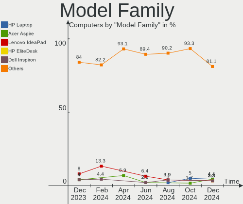
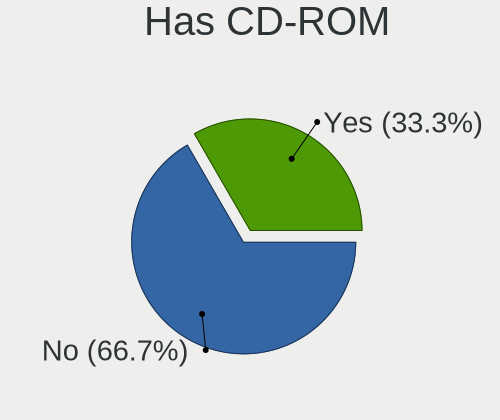
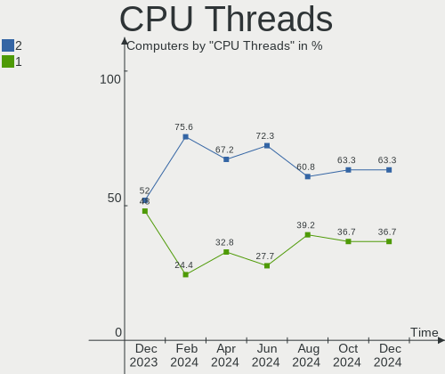
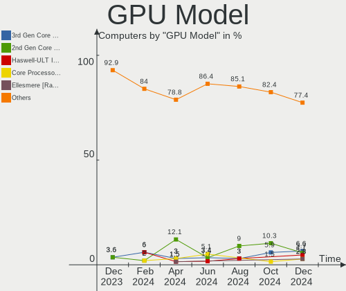
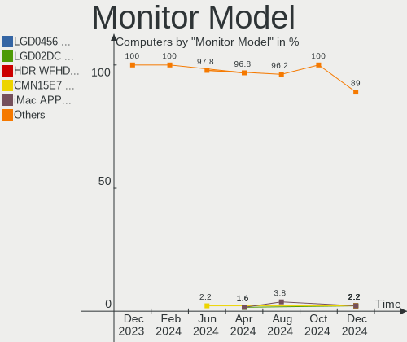
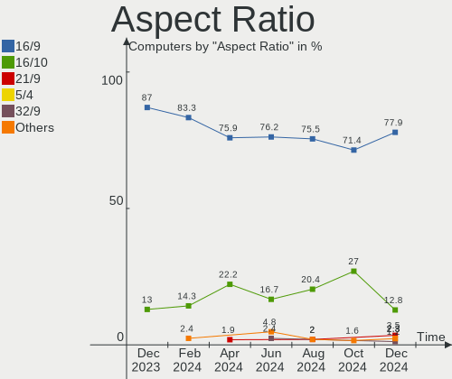
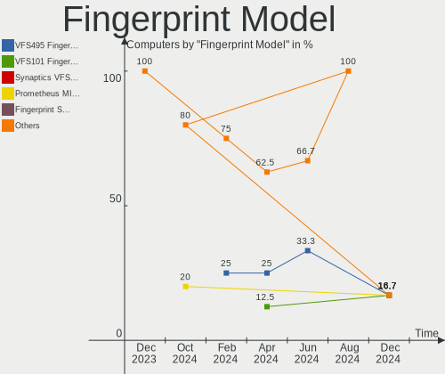

Elementary Hardware Trends
--------------------------

A project to identify most popular hardware characteristics and track their change
over time based on data collected by Elementary users at https://Linux-Hardware.org.

Anyone can contribute to this report by the [hw-probe](https://github.com/linuxhw/hw-probe) tool:

    sudo -E hw-probe -all -upload

This is a report for all computer types. See also reports for [desktops](/Dist/Elementary/Desktop/README.md) and [notebooks](/Dist/Elementary/Notebook/README.md).

Full-feature report is available here: https://linux-hardware.org/?view=trends

Period: Dec, 2021.

Contents
--------

* [ System ](#system)
  - [ OS                       ](#os)
  - [ OS Family                ](#os-family)
  - [ Kernel                   ](#kernel)
  - [ Kernel Family            ](#kernel-family)
  - [ Kernel Major Ver.        ](#kernel-major-ver)
  - [ Arch                     ](#arch)
  - [ DE                       ](#de)
  - [ Display Server           ](#display-server)
  - [ Display Manager          ](#display-manager)
  - [ OS Lang                  ](#os-lang)
  - [ Boot Mode                ](#boot-mode)
  - [ Filesystem               ](#filesystem)
  - [ Part. scheme             ](#part-scheme)
  - [ Dual Boot with Linux/BSD ](#dual-boot-with-linuxbsd)
  - [ Dual Boot (Win)          ](#dual-boot-win)

* [ Board ](#board)
  - [ Vendor                   ](#vendor)
  - [ Model                    ](#model)
  - [ Model Family             ](#model-family)
  - [ MFG Year                 ](#mfg-year)
  - [ Form Factor              ](#form-factor)
  - [ Secure Boot              ](#secure-boot)
  - [ Coreboot                 ](#coreboot)
  - [ RAM Size                 ](#ram-size)
  - [ RAM Used                 ](#ram-used)
  - [ Total Drives             ](#total-drives)
  - [ Has CD-ROM               ](#has-cd-rom)
  - [ Has Ethernet             ](#has-ethernet)
  - [ Has WiFi                 ](#has-wifi)
  - [ Has Bluetooth            ](#has-bluetooth)

* [ Location ](#location)
  - [ Country                  ](#country)
  - [ City                     ](#city)

* [ Drives ](#drives)
  - [ Drive Vendor             ](#drive-vendor)
  - [ Drive Model              ](#drive-model)
  - [ HDD Vendor               ](#hdd-vendor)
  - [ SSD Vendor               ](#ssd-vendor)
  - [ Drive Kind               ](#drive-kind)
  - [ Drive Connector          ](#drive-connector)
  - [ Drive Size               ](#drive-size)
  - [ Space Total              ](#space-total)
  - [ Space Used               ](#space-used)
  - [ Malfunc. Drives          ](#malfunc-drives)
  - [ Malfunc. Drive Vendor    ](#malfunc-drive-vendor)
  - [ Malfunc. HDD Vendor      ](#malfunc-hdd-vendor)
  - [ Malfunc. Drive Kind      ](#malfunc-drive-kind)
  - [ Failed Drives            ](#failed-drives)
  - [ Failed Drive Vendor      ](#failed-drive-vendor)
  - [ Drive Status             ](#drive-status)

* [ Storage controller ](#storage-controller)
  - [ Storage Vendor           ](#storage-vendor)
  - [ Storage Model            ](#storage-model)
  - [ Storage Kind             ](#storage-kind)

* [ Processor ](#processor)
  - [ CPU Vendor               ](#cpu-vendor)
  - [ CPU Model                ](#cpu-model)
  - [ CPU Model Family         ](#cpu-model-family)
  - [ CPU Cores                ](#cpu-cores)
  - [ CPU Sockets              ](#cpu-sockets)
  - [ CPU Threads              ](#cpu-threads)
  - [ CPU Op-Modes             ](#cpu-op-modes)
  - [ CPU Microcode            ](#cpu-microcode)
  - [ CPU Microarch            ](#cpu-microarch)

* [ Graphics ](#graphics)
  - [ GPU Vendor               ](#gpu-vendor)
  - [ GPU Model                ](#gpu-model)
  - [ GPU Combo                ](#gpu-combo)
  - [ GPU Driver               ](#gpu-driver)
  - [ GPU Memory               ](#gpu-memory)

* [ Monitor ](#monitor)
  - [ Monitor Vendor           ](#monitor-vendor)
  - [ Monitor Model            ](#monitor-model)
  - [ Monitor Resolution       ](#monitor-resolution)
  - [ Monitor Diagonal         ](#monitor-diagonal)
  - [ Monitor Width            ](#monitor-width)
  - [ Aspect Ratio             ](#aspect-ratio)
  - [ Monitor Area             ](#monitor-area)
  - [ Pixel Density            ](#pixel-density)
  - [ Multiple Monitors        ](#multiple-monitors)

* [ Network ](#network)
  - [ Net Controller Vendor    ](#net-controller-vendor)
  - [ Net Controller Model     ](#net-controller-model)
  - [ Wireless Vendor          ](#wireless-vendor)
  - [ Wireless Model           ](#wireless-model)
  - [ Ethernet Vendor          ](#ethernet-vendor)
  - [ Ethernet Model           ](#ethernet-model)
  - [ Net Controller Kind      ](#net-controller-kind)
  - [ Used Controller          ](#used-controller)
  - [ NICs                     ](#nics)
  - [ IPv6                     ](#ipv6)

* [ Bluetooth ](#bluetooth)
  - [ Bluetooth Vendor         ](#bluetooth-vendor)
  - [ Bluetooth Model          ](#bluetooth-model)

* [ Sound ](#sound)
  - [ Sound Vendor             ](#sound-vendor)
  - [ Sound Model              ](#sound-model)

* [ Memory ](#memory)
  - [ Memory Vendor            ](#memory-vendor)
  - [ Memory Model             ](#memory-model)
  - [ Memory Kind              ](#memory-kind)
  - [ Memory Form Factor       ](#memory-form-factor)
  - [ Memory Size              ](#memory-size)
  - [ Memory Speed             ](#memory-speed)

* [ Printers & scanners ](#printers--scanners)
  - [ Printer Vendor           ](#printer-vendor)
  - [ Printer Model            ](#printer-model)
  - [ Scanner Vendor           ](#scanner-vendor)
  - [ Scanner Model            ](#scanner-model)

* [ Camera ](#camera)
  - [ Camera Vendor            ](#camera-vendor)
  - [ Camera Model             ](#camera-model)

* [ Security ](#security)
  - [ Fingerprint Vendor       ](#fingerprint-vendor)
  - [ Fingerprint Model        ](#fingerprint-model)
  - [ Chipcard Vendor          ](#chipcard-vendor)
  - [ Chipcard Model           ](#chipcard-model)

* [ Unsupported ](#unsupported)
  - [ Unsupported Devices      ](#unsupported-devices)
  - [ Unsupported Device Types ](#unsupported-device-types)

System
------

OS
--

Installed operating systems

| Name             | Computers | Percent |
|------------------|-----------|---------|
| Elementary 6     | 44        | 48.35%  |
| Elementary 6.1   | 43        | 47.25%  |
| Elementary 5.1.7 | 4         | 4.4%    |

OS Family
---------

OS without a version

| Name       | Computers | Percent |
|------------|-----------|---------|
| Elementary | 91        | 100%    |

Kernel
------

Version of the Linux kernel

| Version               | Computers | Percent |
|-----------------------|-----------|---------|
| 5.11.0-41-generic     | 46        | 50.55%  |
| 5.11.0-43-generic     | 30        | 32.97%  |
| 5.11.0-40-generic     | 3         | 3.3%    |
| 5.4.0-91-generic      | 2         | 2.2%    |
| 5.11.0-38-generic     | 2         | 2.2%    |
| 5.8.0-50-generic      | 1         | 1.1%    |
| 5.15.6-surface        | 1         | 1.1%    |
| 5.15.5-051505-generic | 1         | 1.1%    |
| 5.15.10-xanmod1       | 1         | 1.1%    |
| 5.14.9-051409-generic | 1         | 1.1%    |
| 5.13.0-22-generic     | 1         | 1.1%    |
| 5.11.0-41-lowlatency  | 1         | 1.1%    |
| 5.11.0-37-generic     | 1         | 1.1%    |

Kernel Family
-------------

Linux kernel without a distro release

| Version | Computers | Percent |
|---------|-----------|---------|
| 5.11.0  | 83        | 91.21%  |
| 5.4.0   | 2         | 2.2%    |
| 5.8.0   | 1         | 1.1%    |
| 5.15.6  | 1         | 1.1%    |
| 5.15.5  | 1         | 1.1%    |
| 5.15.10 | 1         | 1.1%    |
| 5.14.9  | 1         | 1.1%    |
| 5.13.0  | 1         | 1.1%    |

Kernel Major Ver.
-----------------

Linux kernel major version

| Version | Computers | Percent |
|---------|-----------|---------|
| 5.11    | 83        | 91.21%  |
| 5.15    | 3         | 3.3%    |
| 5.4     | 2         | 2.2%    |
| 5.8     | 1         | 1.1%    |
| 5.14    | 1         | 1.1%    |
| 5.13    | 1         | 1.1%    |

Arch
----

OS architecture (x86_64, i586, etc.)

| Name   | Computers | Percent |
|--------|-----------|---------|
| x86_64 | 91        | 100%    |

DE
--

Desktop Environment

| Name     | Computers | Percent |
|----------|-----------|---------|
| Pantheon | 91        | 100%    |

Display Server
--------------

X11 or Wayland

| Name | Computers | Percent |
|------|-----------|---------|
| X11  | 91        | 100%    |

Display Manager
---------------

SDDM, LightDM, etc.

| Name    | Computers | Percent |
|---------|-----------|---------|
| Unknown | 71        | 78.02%  |
| LightDM | 20        | 21.98%  |

OS Lang
-------

Language

| Lang  | Computers | Percent |
|-------|-----------|---------|
| en_US | 47        | 51.65%  |
| de_DE | 13        | 14.29%  |
| pt_BR | 8         | 8.79%   |
| es_ES | 5         | 5.49%   |
| en_GB | 5         | 5.49%   |
| pl_PL | 3         | 3.3%    |
| fr_FR | 3         | 3.3%    |
| ru_RU | 1         | 1.1%    |
| lt_LT | 1         | 1.1%    |
| it_IT | 1         | 1.1%    |
| gl_ES | 1         | 1.1%    |
| en_CA | 1         | 1.1%    |
| en_AU | 1         | 1.1%    |
| cs_CZ | 1         | 1.1%    |

Boot Mode
---------

EFI or BIOS

| Mode | Computers | Percent |
|------|-----------|---------|
| EFI  | 56        | 61.54%  |
| BIOS | 35        | 38.46%  |

Filesystem
----------

Type of filesystem

| Type    | Computers | Percent |
|---------|-----------|---------|
| Ext4    | 89        | 97.8%   |
| Xfs     | 1         | 1.1%    |
| Overlay | 1         | 1.1%    |

Part. scheme
------------

Scheme of partitioning

| Type    | Computers | Percent |
|---------|-----------|---------|
| Unknown | 81        | 89.01%  |
| GPT     | 10        | 10.99%  |

Dual Boot with Linux/BSD
------------------------

Hosting more than one Linux/BSD

| Dual boot | Computers | Percent |
|-----------|-----------|---------|
| No        | 88        | 96.7%   |
| Yes       | 3         | 3.3%    |

Dual Boot (Win)
---------------

Hosting Linux and Windows

| Dual boot | Computers | Percent |
|-----------|-----------|---------|
| No        | 84        | 92.31%  |
| Yes       | 7         | 7.69%   |

Board
-----

Vendor
------

Motherboard manufacturer

| Name                | Computers | Percent |
|---------------------|-----------|---------|
| Dell                | 13        | 14.29%  |
| ASUSTek Computer    | 13        | 14.29%  |
| Lenovo              | 12        | 13.19%  |
| Hewlett-Packard     | 10        | 10.99%  |
| Apple               | 9         | 9.89%   |
| Gigabyte Technology | 6         | 6.59%   |
| Acer                | 6         | 6.59%   |
| MSI                 | 3         | 3.3%    |
| Pegatron            | 2         | 2.2%    |
| Microsoft           | 2         | 2.2%    |
| Intel               | 2         | 2.2%    |
| ASRock              | 2         | 2.2%    |
| Wortmann AG         | 1         | 1.1%    |
| Teclast             | 1         | 1.1%    |
| Star Labs           | 1         | 1.1%    |
| Samsung Electronics | 1         | 1.1%    |
| Packard Bell        | 1         | 1.1%    |
| Notebook            | 1         | 1.1%    |
| Monster             | 1         | 1.1%    |
| LG Electronics      | 1         | 1.1%    |
| HUAWEI              | 1         | 1.1%    |
| Google              | 1         | 1.1%    |
| Foxconn             | 1         | 1.1%    |

Model
-----

Motherboard model

| Name                                 | Computers | Percent |
|--------------------------------------|-----------|---------|
| ASUS All Series                      | 2         | 2.2%    |
| Wortmann AG 1220729_1470271          | 1         | 1.1%    |
| Teclast F7                           | 1         | 1.1%    |
| Star Labs StarBook                   | 1         | 1.1%    |
| Samsung 550XDA                       | 1         | 1.1%    |
| Pegatron KJ379AA-ABA a6400f          | 1         | 1.1%    |
| Pegatron IPMH61P1                    | 1         | 1.1%    |
| Packard Bell EasyNote LS11HR         | 1         | 1.1%    |
| Notebook P65xHP                      | 1         | 1.1%    |
| MSI PPPPP-CCC#MMMMMMMM               | 1         | 1.1%    |
| MSI MS-7B86                          | 1         | 1.1%    |
| MSI MS-7B46                          | 1         | 1.1%    |
| Monster MARKUT M7 V1.x               | 1         | 1.1%    |
| Microsoft Surface Pro 3              | 1         | 1.1%    |
| Microsoft Surface Book 2             | 1         | 1.1%    |
| LG A410-G.BC51P1                     | 1         | 1.1%    |
| Lenovo ThinkPad X201 Tablet 311396G  | 1         | 1.1%    |
| Lenovo ThinkPad T430 23501M2         | 1         | 1.1%    |
| Lenovo ThinkPad T410s 292494G        | 1         | 1.1%    |
| Lenovo ThinkPad T14 Gen 1 20UES5SR00 | 1         | 1.1%    |
| Lenovo ThinkPad SL400 2743A37        | 1         | 1.1%    |
| Lenovo ThinkPad E14 Gen 3 20Y7006XMX | 1         | 1.1%    |
| Lenovo IdeaPad 5 Pro 16ACH6 82L5     | 1         | 1.1%    |
| Lenovo IdeaPad 330-15IKB 81DE        | 1         | 1.1%    |
| Lenovo IdeaPad 320S-14IKB 81BN       | 1         | 1.1%    |
| Lenovo IdeaPad 320-14AST 80XU        | 1         | 1.1%    |
| Lenovo IdeaPad 120S-14IAP 81A5       | 1         | 1.1%    |
| Lenovo Flex 2-14D 20376              | 1         | 1.1%    |
| Intel NUC7i3BNH                      | 1         | 1.1%    |
| Intel NUC10i3FNH                     | 1         | 1.1%    |
| HUAWEI MACHD-WXX9                    | 1         | 1.1%    |
| HP ZBook 15 G5                       | 1         | 1.1%    |
| HP Z420 Workstation                  | 1         | 1.1%    |
| HP G62                               | 1         | 1.1%    |
| HP ENVY x360 Convertible             | 1         | 1.1%    |
| HP ENVY TE01-0xxx                    | 1         | 1.1%    |
| HP EliteBook 850 G2                  | 1         | 1.1%    |
| HP EliteBook 8460p                   | 1         | 1.1%    |
| HP EliteBook 820 G2                  | 1         | 1.1%    |
| HP Compaq Elite 8300 SFF             | 1         | 1.1%    |
| HP 205 G1 AiO Business PC            | 1         | 1.1%    |
| Google Cyan                          | 1         | 1.1%    |
| Gigabyte Z590 AORUS ELITE AX         | 1         | 1.1%    |
| Gigabyte Z390 UD                     | 1         | 1.1%    |
| Gigabyte X570 AORUS PRO WIFI         | 1         | 1.1%    |
| Gigabyte H310M S2P 2.0               | 1         | 1.1%    |
| Gigabyte B85M-DS3H-A                 | 1         | 1.1%    |
| Gigabyte AX370-Gaming                | 1         | 1.1%    |
| Foxconn p6616f                       | 1         | 1.1%    |
| Dell XPS 15 9570                     | 1         | 1.1%    |
| Dell XPS 15 9510                     | 1         | 1.1%    |
| Dell XPS 13 9343                     | 1         | 1.1%    |
| Dell Precision M6500                 | 1         | 1.1%    |
| Dell Precision M3800                 | 1         | 1.1%    |
| Dell OptiPlex 3040                   | 1         | 1.1%    |
| Dell Latitude E5420                  | 1         | 1.1%    |
| Dell Latitude 3580                   | 1         | 1.1%    |
| Dell Inspiron N5050                  | 1         | 1.1%    |
| Dell Inspiron 7405 2n1               | 1         | 1.1%    |
| Dell Inspiron 5555                   | 1         | 1.1%    |

Model Family
------------

Motherboard model prefix

| Name                   | Computers | Percent |
|------------------------|-----------|---------|
| Lenovo ThinkPad        | 6         | 6.59%   |
| Lenovo IdeaPad         | 5         | 5.49%   |
| Dell Inspiron          | 5         | 5.49%   |
| Acer Aspire            | 4         | 4.4%    |
| HP EliteBook           | 3         | 3.3%    |
| Dell XPS               | 3         | 3.3%    |
| Microsoft Surface      | 2         | 2.2%    |
| HP ENVY                | 2         | 2.2%    |
| Dell Precision         | 2         | 2.2%    |
| Dell Latitude          | 2         | 2.2%    |
| ASUS TUF               | 2         | 2.2%    |
| ASUS M5A78L-M          | 2         | 2.2%    |
| ASUS All               | 2         | 2.2%    |
| Wortmann AG 1220729    | 1         | 1.1%    |
| Teclast F7             | 1         | 1.1%    |
| Star Labs StarBook     | 1         | 1.1%    |
| Samsung 550XDA         | 1         | 1.1%    |
| Pegatron KJ379AA-ABA   | 1         | 1.1%    |
| Pegatron IPMH61P1      | 1         | 1.1%    |
| Packard Bell EasyNote  | 1         | 1.1%    |
| Notebook P65xHP        | 1         | 1.1%    |
| MSI PPPPP-CCC#MMMMMMMM | 1         | 1.1%    |
| MSI MS-7B86            | 1         | 1.1%    |
| MSI MS-7B46            | 1         | 1.1%    |
| Monster MARKUT         | 1         | 1.1%    |
| LG A410-G.BC51P1       | 1         | 1.1%    |
| Lenovo Flex            | 1         | 1.1%    |
| Intel NUC7i3BNH        | 1         | 1.1%    |
| Intel NUC10i3FNH       | 1         | 1.1%    |
| HUAWEI MACHD-WXX9      | 1         | 1.1%    |
| HP ZBook               | 1         | 1.1%    |
| HP Z420                | 1         | 1.1%    |
| HP G62                 | 1         | 1.1%    |
| HP Compaq              | 1         | 1.1%    |
| HP 205                 | 1         | 1.1%    |
| Google Cyan            | 1         | 1.1%    |
| Gigabyte Z590          | 1         | 1.1%    |
| Gigabyte Z390          | 1         | 1.1%    |
| Gigabyte X570          | 1         | 1.1%    |
| Gigabyte H310M         | 1         | 1.1%    |
| Gigabyte B85M-DS3H-A   | 1         | 1.1%    |
| Gigabyte AX370-Gaming  | 1         | 1.1%    |
| Foxconn p6616f         | 1         | 1.1%    |
| Dell OptiPlex          | 1         | 1.1%    |
| ASUS X79-DELUXE        | 1         | 1.1%    |
| ASUS X555UB            | 1         | 1.1%    |
| ASUS VivoBook          | 1         | 1.1%    |
| ASUS UX410UAK          | 1         | 1.1%    |
| ASUS PRIME             | 1         | 1.1%    |
| ASUS FX503VD           | 1         | 1.1%    |
| ASUS ASUS              | 1         | 1.1%    |
| ASRock Z590            | 1         | 1.1%    |
| ASRock Z370            | 1         | 1.1%    |
| Apple MacPro3          | 1         | 1.1%    |
| Apple MacBookAir7      | 1         | 1.1%    |
| Apple MacBookAir6      | 1         | 1.1%    |
| Apple MacBook5         | 1         | 1.1%    |
| Apple MacBook4         | 1         | 1.1%    |
| Apple MacBook2         | 1         | 1.1%    |
| Apple iMac8            | 1         | 1.1%    |

MFG Year
--------

Motherboard manufacture year

| Year | Computers | Percent |
|------|-----------|---------|
| 2021 | 17        | 18.68%  |
| 2019 | 14        | 15.38%  |
| 2020 | 12        | 13.19%  |
| 2011 | 8         | 8.79%   |
| 2016 | 6         | 6.59%   |
| 2012 | 6         | 6.59%   |
| 2018 | 5         | 5.49%   |
| 2008 | 5         | 5.49%   |
| 2017 | 4         | 4.4%    |
| 2015 | 4         | 4.4%    |
| 2010 | 3         | 3.3%    |
| 2014 | 2         | 2.2%    |
| 2013 | 2         | 2.2%    |
| 2009 | 2         | 2.2%    |
| 2007 | 1         | 1.1%    |

Form Factor
-----------

Physical design of the computer

| Name        | Computers | Percent |
|-------------|-----------|---------|
| Notebook    | 52        | 57.14%  |
| Desktop     | 29        | 31.87%  |
| All in one  | 4         | 4.4%    |
| Tablet      | 2         | 2.2%    |
| Convertible | 2         | 2.2%    |
| Mini pc     | 2         | 2.2%    |

Secure Boot
-----------

Enabled or disabled

| State    | Computers | Percent |
|----------|-----------|---------|
| Disabled | 84        | 92.31%  |
| Enabled  | 7         | 7.69%   |

Coreboot
--------

Have coreboot on board

| Used | Computers | Percent |
|------|-----------|---------|
| No   | 89        | 97.8%   |
| Yes  | 2         | 2.2%    |

RAM Size
--------

Total RAM memory

| Size in GB  | Computers | Percent |
|-------------|-----------|---------|
| 4.01-8.0    | 30        | 32.97%  |
| 16.01-24.0  | 16        | 17.58%  |
| 8.01-16.0   | 15        | 16.48%  |
| 3.01-4.0    | 13        | 14.29%  |
| 32.01-64.0  | 11        | 12.09%  |
| 1.01-2.0    | 4         | 4.4%    |
| 24.01-32.0  | 1         | 1.1%    |
| 64.01-256.0 | 1         | 1.1%    |

RAM Used
--------

Used RAM memory

| Used GB   | Computers | Percent |
|-----------|-----------|---------|
| 1.01-2.0  | 33        | 36.26%  |
| 2.01-3.0  | 26        | 28.57%  |
| 4.01-8.0  | 14        | 15.38%  |
| 3.01-4.0  | 12        | 13.19%  |
| 0.51-1.0  | 4         | 4.4%    |
| 8.01-16.0 | 2         | 2.2%    |

Total Drives
------------

Number of drives on board

| Drives | Computers | Percent |
|--------|-----------|---------|
| 1      | 54        | 59.34%  |
| 2      | 24        | 26.37%  |
| 4      | 6         | 6.59%   |
| 3      | 4         | 4.4%    |
| 5      | 2         | 2.2%    |
| 7      | 1         | 1.1%    |

Has CD-ROM
----------

Has CD-ROM on board

| Presented | Computers | Percent |
|-----------|-----------|---------|
| No        | 60        | 65.93%  |
| Yes       | 31        | 34.07%  |

Has Ethernet
------------

Has Ethernet on board

| Presented | Computers | Percent |
|-----------|-----------|---------|
| Yes       | 76        | 83.52%  |
| No        | 15        | 16.48%  |

Has WiFi
--------

Has WiFi module

| Presented | Computers | Percent |
|-----------|-----------|---------|
| Yes       | 74        | 81.32%  |
| No        | 17        | 18.68%  |

Has Bluetooth
-------------

Has Bluetooth module

| Presented | Computers | Percent |
|-----------|-----------|---------|
| Yes       | 66        | 72.53%  |
| No        | 25        | 27.47%  |

Location
--------

Country
-------

Geographic location (country)

| Country      | Computers | Percent |
|--------------|-----------|---------|
| Germany      | 13        | 14.29%  |
| USA          | 12        | 13.19%  |
| Brazil       | 10        | 10.99%  |
| UK           | 5         | 5.49%   |
| Sweden       | 4         | 4.4%    |
| Spain        | 3         | 3.3%    |
| Poland       | 3         | 3.3%    |
| Netherlands  | 3         | 3.3%    |
| Mexico       | 3         | 3.3%    |
| India        | 3         | 3.3%    |
| Romania      | 2         | 2.2%    |
| Italy        | 2         | 2.2%    |
| France       | 2         | 2.2%    |
| Canada       | 2         | 2.2%    |
| Australia    | 2         | 2.2%    |
| Ukraine      | 1         | 1.1%    |
| Turkey       | 1         | 1.1%    |
| Thailand     | 1         | 1.1%    |
| Switzerland  | 1         | 1.1%    |
| Sri Lanka    | 1         | 1.1%    |
| South Africa | 1         | 1.1%    |
| Russia       | 1         | 1.1%    |
| Portugal     | 1         | 1.1%    |
| New Zealand  | 1         | 1.1%    |
| Lithuania    | 1         | 1.1%    |
| Ireland      | 1         | 1.1%    |
| Iran         | 1         | 1.1%    |
| Indonesia    | 1         | 1.1%    |
| Guyana       | 1         | 1.1%    |
| Finland      | 1         | 1.1%    |
| Estonia      | 1         | 1.1%    |
| Denmark      | 1         | 1.1%    |
| Czechia      | 1         | 1.1%    |
| Costa Rica   | 1         | 1.1%    |
| Chile        | 1         | 1.1%    |
| Belgium      | 1         | 1.1%    |
| Austria      | 1         | 1.1%    |

City
----

Geographic location (city)

| City                          | Computers | Percent |
|-------------------------------|-----------|---------|
| S??o Paulo                    | 2         | 2.2%    |
| Munich                        | 2         | 2.2%    |
| Essen                         | 2         | 2.2%    |
| Wroclaw                       | 1         | 1.1%    |
| Wriedel                       | 1         | 1.1%    |
| Wattala                       | 1         | 1.1%    |
| Warsaw                        | 1         | 1.1%    |
| Wakefield                     | 1         | 1.1%    |
| Vit??ria                      | 1         | 1.1%    |
| Vinnytsia                     | 1         | 1.1%    |
| Vilnius                       | 1         | 1.1%    |
| Villahermosa                  | 1         | 1.1%    |
| Vilanova i la Geltr??         | 1         | 1.1%    |
| Uppsala                       | 1         | 1.1%    |
| Tehran                        | 1         | 1.1%    |
| Tecuci                        | 1         | 1.1%    |
| Tallinn                       | 1         | 1.1%    |
| Sydney                        | 1         | 1.1%    |
| Stockholm                     | 1         | 1.1%    |
| Southampton                   | 1         | 1.1%    |
| Sornay                        | 1         | 1.1%    |
| Soliera                       | 1         | 1.1%    |
| Seattle                       | 1         | 1.1%    |
| S??o Bernardo do Campo        | 1         | 1.1%    |
| Sao Jose do Rio Preto         | 1         | 1.1%    |
| Sao Joaquim da Barra          | 1         | 1.1%    |
| Santo Andr?©                  | 1         | 1.1%    |
| Santiago                      | 1         | 1.1%    |
| San Jos?©                     | 1         | 1.1%    |
| San Antonio                   | 1         | 1.1%    |
| Saltsjoe-Boo                  | 1         | 1.1%    |
| Saalfelden am Steinernen Meer | 1         | 1.1%    |
| Rueso                         | 1         | 1.1%    |
| Riesweiler                    | 1         | 1.1%    |
| Porto                         | 1         | 1.1%    |
| Osasco                        | 1         | 1.1%    |
| Olomouc                       | 1         | 1.1%    |
| Oldenburg                     | 1         | 1.1%    |
| Napier City                   | 1         | 1.1%    |
| Montm?©dy                     | 1         | 1.1%    |
| Mislea                        | 1         | 1.1%    |
| Middletown                    | 1         | 1.1%    |
| Mexico City                   | 1         | 1.1%    |
| Melbourne                     | 1         | 1.1%    |
| Madrid                        | 1         | 1.1%    |
| Lausanne                      | 1         | 1.1%    |
| Landshut                      | 1         | 1.1%    |
| Kung?¤lv                      | 1         | 1.1%    |
| Khimki                        | 1         | 1.1%    |
| Johannesburg                  | 1         | 1.1%    |
| Jember                        | 1         | 1.1%    |
| Jaipur                        | 1         | 1.1%    |
| Itanhem                       | 1         | 1.1%    |
| Islington                     | 1         | 1.1%    |
| Hudson                        | 1         | 1.1%    |
| Hennef                        | 1         | 1.1%    |
| Helsinki                      | 1         | 1.1%    |
| Hammonton                     | 1         | 1.1%    |
| Hamburg                       | 1         | 1.1%    |
| Gloucester                    | 1         | 1.1%    |

Drives
------

Drive Vendor
------------

Hard drive vendors

| Vendor              | Computers | Drives | Percent |
|---------------------|-----------|--------|---------|
| WDC                 | 22        | 27     | 17.05%  |
| Samsung Electronics | 22        | 29     | 17.05%  |
| Seagate             | 19        | 21     | 14.73%  |
| Crucial             | 8         | 8      | 6.2%    |
| Sandisk             | 7         | 8      | 5.43%   |
| Kingston            | 6         | 7      | 4.65%   |
| Toshiba             | 5         | 6      | 3.88%   |
| SK Hynix            | 5         | 5      | 3.88%   |
| Micron Technology   | 4         | 4      | 3.1%    |
| Unknown             | 3         | 6      | 2.33%   |
| Hitachi             | 3         | 3      | 2.33%   |
| A-DATA Technology   | 3         | 3      | 2.33%   |
| Intel               | 2         | 2      | 1.55%   |
| Fujitsu             | 2         | 2      | 1.55%   |
| Apple               | 2         | 2      | 1.55%   |
| Teclast             | 1         | 1      | 0.78%   |
| Star Drive          | 1         | 1      | 0.78%   |
| Silicon Motion      | 1         | 1      | 0.78%   |
| SABRENT             | 1         | 1      | 0.78%   |
| Phison              | 1         | 2      | 0.78%   |
| Patriot             | 1         | 1      | 0.78%   |
| MAXTOR              | 1         | 1      | 0.78%   |
| LITEON              | 1         | 1      | 0.78%   |
| KIOXIA              | 1         | 1      | 0.78%   |
| KingSpec            | 1         | 1      | 0.78%   |
| JMicron             | 1         | 1      | 0.78%   |
| Intenso             | 1         | 1      | 0.78%   |
| HGST                | 1         | 1      | 0.78%   |
| Ext Hard            | 1         | 1      | 0.78%   |
| China               | 1         | 1      | 0.78%   |
| Unknown             | 1         | 1      | 0.78%   |

Drive Model
-----------

Hard drive models

| Model                                  | Computers | Percent |
|----------------------------------------|-----------|---------|
| Kingston SA400S37240G 240GB SSD        | 4         | 2.8%    |
| Seagate ST1000LM035-1RK172 1TB         | 3         | 2.1%    |
| Samsung NVMe SSD Drive 512GB           | 3         | 2.1%    |
| Samsung NVMe SSD Drive 500GB           | 3         | 2.1%    |
| WDC WD5000LPVX-75V0TT0 500GB           | 2         | 1.4%    |
| WDC WD5000LPVX-22V0TT0 500GB           | 2         | 1.4%    |
| WDC WD5000AAKX-003CA0 500GB            | 2         | 1.4%    |
| Toshiba MQ01ABD100 1TB                 | 2         | 1.4%    |
| SK Hynix NVMe SSD Drive 512GB          | 2         | 1.4%    |
| Sandisk NVMe SSD Drive 512GB           | 2         | 1.4%    |
| Samsung NVMe SSD Drive 1TB             | 2         | 1.4%    |
| Crucial CT525MX300SSD1 528GB           | 2         | 1.4%    |
| Crucial CT1000MX500SSD1 1TB            | 2         | 1.4%    |
| WDC WDS500G2B0A-00SM50 500GB SSD       | 1         | 0.7%    |
| WDC WDS120G2G0A-00JH30 120GB SSD       | 1         | 0.7%    |
| WDC WD7500BPVT-22A1YT0 752GB           | 1         | 0.7%    |
| WDC WD6401AALS-00L3B2 640GB            | 1         | 0.7%    |
| WDC WD5000BPVT-22HXZT3 500GB           | 1         | 0.7%    |
| WDC WD5000BPVT-22HXZT1 500GB           | 1         | 0.7%    |
| WDC WD50 00LUCT-61C26Y0 500GB          | 1         | 0.7%    |
| WDC WD40EZAZ-00SF3B0 4TB               | 1         | 0.7%    |
| WDC WD3200BEVT-75A23T0 320GB           | 1         | 0.7%    |
| WDC WD3200AAJS-40RYA0 320GB            | 1         | 0.7%    |
| WDC WD3003FZEX-00Z4SA0 3TB             | 1         | 0.7%    |
| WDC WD20SPZX-22UA7T0 2TB               | 1         | 0.7%    |
| WDC WD20EFRX-68EUZN0 2TB               | 1         | 0.7%    |
| WDC WD15EARX-00PASB0 1TB               | 1         | 0.7%    |
| WDC WD10SPZX-35Z10T0 1TB               | 1         | 0.7%    |
| WDC WD10EZEX-08WN4A0 1TB               | 1         | 0.7%    |
| WDC WD10EZEX-00BN5A0 1TB               | 1         | 0.7%    |
| WDC WD10EADS-00L5B1 1TB                | 1         | 0.7%    |
| WDC PC SN730 SDBQNTY-1T00-1014 1TB     | 1         | 0.7%    |
| Unknown SD/MMC/MS PRO 7GB              | 1         | 0.7%    |
| Unknown SD/MMC/M.S.PRO 32GB            | 1         | 0.7%    |
| Unknown SD/MMC 16GB                    | 1         | 0.7%    |
| Unknown MMC Card  32GB                 | 1         | 0.7%    |
| Unknown M.S./M.S.Pro/HG 16GB           | 1         | 0.7%    |
| Toshiba MK2533GSG 250GB                | 1         | 0.7%    |
| Toshiba HDWE140 4TB                    | 1         | 0.7%    |
| Toshiba HDWD120 2TB                    | 1         | 0.7%    |
| Toshiba HDWD110 1TB                    | 1         | 0.7%    |
| Teclast 128GB NS550-2242 SSD           | 1         | 0.7%    |
| Star Drive PCIe SSD 480GB              | 1         | 0.7%    |
| SK Hynix SKHynix_HFS512GDE9X084N 512GB | 1         | 0.7%    |
| SK Hynix NVMe SSD Drive 256GB          | 1         | 0.7%    |
| SK Hynix HFS128G3AMNB-2200A 128GB SSD  | 1         | 0.7%    |
| Silicon Motion NVMe SSD Drive 120GB    | 1         | 0.7%    |
| Seagate ST9500325AS 500GB              | 1         | 0.7%    |
| Seagate ST500DM002-1BD142 500GB        | 1         | 0.7%    |
| Seagate ST500DM002-1BC142 500GB        | 1         | 0.7%    |
| Seagate ST4000DX001-1CE168 4TB         | 1         | 0.7%    |
| Seagate ST380815AS 80GB                | 1         | 0.7%    |
| Seagate ST3808110AS 80GB               | 1         | 0.7%    |
| Seagate ST3750528AS 752GB              | 1         | 0.7%    |
| Seagate ST3320820AS_Q 320GB            | 1         | 0.7%    |
| Seagate ST3000DM001-9YN166 3TB         | 1         | 0.7%    |
| Seagate ST250DM000-1BD141 250GB        | 1         | 0.7%    |
| Seagate ST2000NM0033 2TB               | 1         | 0.7%    |
| Seagate ST2000DX002-2DV164 2TB         | 1         | 0.7%    |
| Seagate ST2000DM008-2FR102 2TB         | 1         | 0.7%    |

HDD Vendor
----------

Hard disk drive vendors

| Vendor              | Computers | Drives | Percent |
|---------------------|-----------|--------|---------|
| WDC                 | 19        | 23     | 35.19%  |
| Seagate             | 18        | 20     | 33.33%  |
| Toshiba             | 5         | 6      | 9.26%   |
| Hitachi             | 3         | 3      | 5.56%   |
| Samsung Electronics | 2         | 2      | 3.7%    |
| Fujitsu             | 2         | 2      | 3.7%    |
| Unknown             | 1         | 1      | 1.85%   |
| SABRENT             | 1         | 1      | 1.85%   |
| HGST                | 1         | 1      | 1.85%   |
| Ext Hard            | 1         | 1      | 1.85%   |
| Apple               | 1         | 1      | 1.85%   |

SSD Vendor
----------

Solid state drive vendors

| Vendor              | Computers | Drives | Percent |
|---------------------|-----------|--------|---------|
| Samsung Electronics | 12        | 14     | 24.49%  |
| Crucial             | 8         | 8      | 16.33%  |
| Kingston            | 6         | 7      | 12.24%  |
| SanDisk             | 4         | 4      | 8.16%   |
| Micron Technology   | 3         | 3      | 6.12%   |
| A-DATA Technology   | 3         | 3      | 6.12%   |
| WDC                 | 2         | 3      | 4.08%   |
| Teclast             | 1         | 1      | 2.04%   |
| SK Hynix            | 1         | 1      | 2.04%   |
| Patriot             | 1         | 1      | 2.04%   |
| MAXTOR              | 1         | 1      | 2.04%   |
| LITEON              | 1         | 1      | 2.04%   |
| KingSpec            | 1         | 1      | 2.04%   |
| Intenso             | 1         | 1      | 2.04%   |
| Intel               | 1         | 1      | 2.04%   |
| China               | 1         | 1      | 2.04%   |
| Apple               | 1         | 1      | 2.04%   |
| Unknown             | 1         | 1      | 2.04%   |

Drive Kind
----------

HDD or SSD

| Kind    | Computers | Drives | Percent |
|---------|-----------|--------|---------|
| HDD     | 47        | 61     | 38.84%  |
| SSD     | 45        | 53     | 37.19%  |
| NVMe    | 26        | 30     | 21.49%  |
| Unknown | 2         | 4      | 1.65%   |
| MMC     | 1         | 2      | 0.83%   |

Drive Connector
---------------

SATA, SAS, NVMe, etc.

| Type | Computers | Drives | Percent |
|------|-----------|--------|---------|
| SATA | 73        | 106    | 66.97%  |
| NVMe | 26        | 30     | 23.85%  |
| SAS  | 9         | 12     | 8.26%   |
| MMC  | 1         | 2      | 0.92%   |

Drive Size
----------

Size of hard drive

| Size in TB | Computers | Drives | Percent |
|------------|-----------|--------|---------|
| 0.01-0.5   | 54        | 65     | 58.7%   |
| 0.51-1.0   | 25        | 30     | 27.17%  |
| 1.01-2.0   | 6         | 11     | 6.52%   |
| 3.01-4.0   | 3         | 3      | 3.26%   |
| 2.01-3.0   | 2         | 3      | 2.17%   |
| 4.01-10.0  | 2         | 2      | 2.17%   |

Space Total
-----------

Amount of disk space available on the file system

| Size in GB     | Computers | Percent |
|----------------|-----------|---------|
| 251-500        | 31        | 34.07%  |
| 101-250        | 30        | 32.97%  |
| 501-1000       | 12        | 13.19%  |
| More than 3000 | 6         | 6.59%   |
| 1001-2000      | 5         | 5.49%   |
| 51-100         | 5         | 5.49%   |
| 21-50          | 2         | 2.2%    |

Space Used
----------

Amount of used disk space

| Used GB        | Computers | Percent |
|----------------|-----------|---------|
| 1-20           | 36        | 39.56%  |
| 21-50          | 25        | 27.47%  |
| 51-100         | 15        | 16.48%  |
| 101-250        | 5         | 5.49%   |
| 501-1000       | 5         | 5.49%   |
| 2001-3000      | 3         | 3.3%    |
| More than 3000 | 1         | 1.1%    |
| 1001-2000      | 1         | 1.1%    |

Malfunc. Drives
---------------

Drive models with a malfunction

| Model                         | Computers | Drives | Percent |
|-------------------------------|-----------|--------|---------|
| Apple HDD HTS541010A9E662 1TB | 1         | 1      | 100%    |

Malfunc. Drive Vendor
---------------------

Vendors of faulty drives

| Vendor | Computers | Drives | Percent |
|--------|-----------|--------|---------|
| Apple  | 1         | 1      | 100%    |

Malfunc. HDD Vendor
-------------------

Vendors of faulty HDD drives

| Vendor | Computers | Drives | Percent |
|--------|-----------|--------|---------|
| Apple  | 1         | 1      | 100%    |

Malfunc. Drive Kind
-------------------

Kinds of faulty drives

| Kind | Computers | Drives | Percent |
|------|-----------|--------|---------|
| HDD  | 1         | 1      | 100%    |

Failed Drives
-------------

Failed drive models

Zero info for selected period =(

Failed Drive Vendor
-------------------

Failed drive vendors

Zero info for selected period =(

Drive Status
------------

Number of failed and malfunc. drives

| Status   | Computers | Drives | Percent |
|----------|-----------|--------|---------|
| Detected | 84        | 136    | 89.36%  |
| Works    | 9         | 13     | 9.57%   |
| Malfunc  | 1         | 1      | 1.06%   |

Storage controller
------------------

Storage Vendor
--------------

Storage controller vendors

| Vendor                   | Computers | Percent |
|--------------------------|-----------|---------|
| Intel                    | 67        | 60.91%  |
| AMD                      | 14        | 12.73%  |
| Samsung Electronics      | 12        | 10.91%  |
| Sandisk                  | 5         | 4.55%   |
| SK Hynix                 | 4         | 3.64%   |
| Phison Electronics       | 2         | 1.82%   |
| Silicon Motion           | 1         | 0.91%   |
| Seagate Technology       | 1         | 0.91%   |
| Nvidia                   | 1         | 0.91%   |
| Micron Technology        | 1         | 0.91%   |
| Marvell Technology Group | 1         | 0.91%   |
| ASMedia Technology       | 1         | 0.91%   |

Storage Model
-------------

Storage controller models

| Model                                                                                   | Computers | Percent |
|-----------------------------------------------------------------------------------------|-----------|---------|
| AMD FCH SATA Controller [AHCI mode]                                                     | 10        | 8%      |
| Intel 6 Series/C200 Series Chipset Family 6 port Mobile SATA AHCI Controller            | 7         | 5.6%    |
| Samsung NVMe SSD Controller SM981/PM981/PM983                                           | 6         | 4.8%    |
| Intel Sunrise Point-LP SATA Controller [AHCI mode]                                      | 6         | 4.8%    |
| Intel 82801 Mobile SATA Controller [RAID mode]                                          | 4         | 3.2%    |
| Intel 5 Series/3400 Series Chipset 6 port SATA AHCI Controller                          | 4         | 3.2%    |
| Samsung NVMe SSD Controller 980                                                         | 3         | 2.4%    |
| Intel Wildcat Point-LP SATA Controller [AHCI Mode]                                      | 3         | 2.4%    |
| Intel Cannon Lake PCH SATA AHCI Controller                                              | 3         | 2.4%    |
| Intel 82801HM/HEM (ICH8M/ICH8M-E) SATA Controller [AHCI mode]                           | 3         | 2.4%    |
| Intel 82801HM/HEM (ICH8M/ICH8M-E) IDE Controller                                        | 3         | 2.4%    |
| Intel 8 Series/C220 Series Chipset Family 6-port SATA Controller 1 [AHCI mode]          | 3         | 2.4%    |
| Intel 500 Series Chipset Family SATA AHCI Controller                                    | 3         | 2.4%    |
| Intel 200 Series PCH SATA controller [AHCI mode]                                        | 3         | 2.4%    |
| SK Hynix Gold P31 SSD                                                                   | 2         | 1.6%    |
| Sandisk Non-Volatile memory controller                                                  | 2         | 1.6%    |
| Intel Q170/Q150/B150/H170/H110/Z170/CM236 Chipset SATA Controller [AHCI Mode]           | 2         | 1.6%    |
| Intel Comet Lake SATA AHCI Controller                                                   | 2         | 1.6%    |
| Intel Celeron N3350/Pentium N4200/Atom E3900 Series SATA AHCI Controller                | 2         | 1.6%    |
| Intel Cannon Lake Mobile PCH SATA AHCI Controller                                       | 2         | 1.6%    |
| Intel 9 Series Chipset Family SATA Controller [AHCI Mode]                               | 2         | 1.6%    |
| Intel 8 Series SATA Controller 1 [AHCI mode]                                            | 2         | 1.6%    |
| Intel 5 Series/3400 Series Chipset 4 port SATA AHCI Controller                          | 2         | 1.6%    |
| AMD SB7x0/SB8x0/SB9x0 SATA Controller [IDE mode]                                        | 2         | 1.6%    |
| AMD SB7x0/SB8x0/SB9x0 IDE Controller                                                    | 2         | 1.6%    |
| SK Hynix PC401 NVMe Solid State Drive 256GB                                             | 1         | 0.8%    |
| SK Hynix BC511                                                                          | 1         | 0.8%    |
| Silicon Motion Non-Volatile memory controller                                           | 1         | 0.8%    |
| Seagate Non-Volatile memory controller                                                  | 1         | 0.8%    |
| Sandisk WD Black SN750 / PC SN730 NVMe SSD                                              | 1         | 0.8%    |
| Sandisk WD Black 2018/SN750 / PC SN720 NVMe SSD                                         | 1         | 0.8%    |
| Sandisk PC SN520 NVMe SSD                                                               | 1         | 0.8%    |
| Samsung NVMe SSD Controller SM961/PM961/SM963                                           | 1         | 0.8%    |
| Samsung NVMe SSD Controller SM951/PM951                                                 | 1         | 0.8%    |
| Samsung Electronics SATA controller                                                     | 1         | 0.8%    |
| Phison E16 PCIe4 NVMe Controller                                                        | 1         | 0.8%    |
| Phison E12 NVMe Controller                                                              | 1         | 0.8%    |
| Nvidia MCP79 AHCI Controller                                                            | 1         | 0.8%    |
| Micron Non-Volatile memory controller                                                   | 1         | 0.8%    |
| Marvell Group 88SE9230 PCIe 2.0 x2 4-port SATA 6 Gb/s RAID Controller                   | 1         | 0.8%    |
| Intel Volume Management Device NVMe RAID Controller                                     | 1         | 0.8%    |
| Intel Tiger Lake-LP SATA Controller [AHCI mode]                                         | 1         | 0.8%    |
| Intel SSD 660P Series                                                                   | 1         | 0.8%    |
| Intel SATA Controller [RAID mode]                                                       | 1         | 0.8%    |
| Intel C602 chipset 4-Port SATA Storage Control Unit                                     | 1         | 0.8%    |
| Intel C600/X79 series chipset SATA RAID Controller                                      | 1         | 0.8%    |
| Intel C600/X79 series chipset IDE-r Controller                                          | 1         | 0.8%    |
| Intel C600/X79 series chipset 6-Port SATA AHCI Controller                               | 1         | 0.8%    |
| Intel Atom/Celeron/Pentium Processor x5-E8000/J3xxx/N3xxx Series SATA Controller        | 1         | 0.8%    |
| Intel 82801IBM/IEM (ICH9M/ICH9M-E) 4 port SATA Controller [AHCI mode]                   | 1         | 0.8%    |
| Intel 82801GBM/GHM (ICH7-M Family) SATA Controller [AHCI mode]                          | 1         | 0.8%    |
| Intel 82801G (ICH7 Family) IDE Controller                                               | 1         | 0.8%    |
| Intel 7 Series/C210 Series Chipset Family 6-port SATA Controller [AHCI mode]            | 1         | 0.8%    |
| Intel 7 Series Chipset Family 6-port SATA Controller [AHCI mode]                        | 1         | 0.8%    |
| Intel 631xESB/632xESB SATA AHCI Controller                                              | 1         | 0.8%    |
| Intel 631xESB/632xESB IDE Controller                                                    | 1         | 0.8%    |
| Intel 6 Series/C200 Series Chipset Family Desktop SATA Controller (IDE mode, ports 4-5) | 1         | 0.8%    |
| Intel 6 Series/C200 Series Chipset Family Desktop SATA Controller (IDE mode, ports 0-3) | 1         | 0.8%    |
| Intel 6 Series/C200 Series Chipset Family 6 port Desktop SATA AHCI Controller           | 1         | 0.8%    |
| Intel 5 Series/3400 Series Chipset 4 port SATA IDE Controller                           | 1         | 0.8%    |

Storage Kind
------------

Kind of storage controller (IDE, SATA, NVMe, SAS, ...)

| Kind | Computers | Percent |
|------|-----------|---------|
| SATA | 74        | 63.25%  |
| NVMe | 25        | 21.37%  |
| IDE  | 10        | 8.55%   |
| RAID | 7         | 5.98%   |
| SAS  | 1         | 0.85%   |

Processor
---------

CPU Vendor
----------

Processor vendors

| Vendor | Computers | Percent |
|--------|-----------|---------|
| Intel  | 75        | 82.42%  |
| AMD    | 16        | 17.58%  |

CPU Model
---------

Processor models

| Model                                  | Computers | Percent |
|----------------------------------------|-----------|---------|
| Intel Core i7-5500U CPU @ 2.40GHz      | 2         | 2.2%    |
| Intel Core i7-2670QM CPU @ 2.20GHz     | 2         | 2.2%    |
| Intel Core i5-6200U CPU @ 2.30GHz      | 2         | 2.2%    |
| Intel Core i5-2520M CPU @ 2.50GHz      | 2         | 2.2%    |
| Intel Core i3-10110U CPU @ 2.10GHz     | 2         | 2.2%    |
| Intel Xeon CPU E5462 @ 2.80GHz         | 1         | 1.1%    |
| Intel Xeon CPU E5-2690 0 @ 2.90GHz     | 1         | 1.1%    |
| Intel Pentium Dual CPU E2200 @ 2.20GHz | 1         | 1.1%    |
| Intel Pentium CPU N4200 @ 1.10GHz      | 1         | 1.1%    |
| Intel Pentium CPU N3700 @ 1.60GHz      | 1         | 1.1%    |
| Intel Pentium CPU G620 @ 2.60GHz       | 1         | 1.1%    |
| Intel Pentium CPU G3260 @ 3.30GHz      | 1         | 1.1%    |
| Intel Core i7-9700K CPU @ 3.60GHz      | 1         | 1.1%    |
| Intel Core i7-9700 CPU @ 3.00GHz       | 1         | 1.1%    |
| Intel Core i7-8750H CPU @ 2.20GHz      | 1         | 1.1%    |
| Intel Core i7-8700 CPU @ 3.20GHz       | 1         | 1.1%    |
| Intel Core i7-8650U CPU @ 1.90GHz      | 1         | 1.1%    |
| Intel Core i7-8550U CPU @ 1.80GHz      | 1         | 1.1%    |
| Intel Core i7-7700HQ CPU @ 2.80GHz     | 1         | 1.1%    |
| Intel Core i7-7500U CPU @ 2.70GHz      | 1         | 1.1%    |
| Intel Core i7-6700K CPU @ 4.00GHz      | 1         | 1.1%    |
| Intel Core i7-6500U CPU @ 2.50GHz      | 1         | 1.1%    |
| Intel Core i7-4930K CPU @ 3.40GHz      | 1         | 1.1%    |
| Intel Core i7-4790 CPU @ 3.60GHz       | 1         | 1.1%    |
| Intel Core i7-4770 CPU @ 3.40GHz       | 1         | 1.1%    |
| Intel Core i7-4712HQ CPU @ 2.30GHz     | 1         | 1.1%    |
| Intel Core i7 CPU Q 740 @ 1.73GHz      | 1         | 1.1%    |
| Intel Core i7 CPU L 640 @ 2.13GHz      | 1         | 1.1%    |
| Intel Core i5-9400F CPU @ 2.90GHz      | 1         | 1.1%    |
| Intel Core i5-8400 CPU @ 2.80GHz       | 1         | 1.1%    |
| Intel Core i5-8300H CPU @ 2.30GHz      | 1         | 1.1%    |
| Intel Core i5-8250U CPU @ 1.60GHz      | 1         | 1.1%    |
| Intel Core i5-7300HQ CPU @ 2.50GHz     | 1         | 1.1%    |
| Intel Core i5-5675R CPU @ 3.10GHz      | 1         | 1.1%    |
| Intel Core i5-5300U CPU @ 2.30GHz      | 1         | 1.1%    |
| Intel Core i5-5250U CPU @ 1.60GHz      | 1         | 1.1%    |
| Intel Core i5-4300U CPU @ 1.90GHz      | 1         | 1.1%    |
| Intel Core i5-4260U CPU @ 1.40GHz      | 1         | 1.1%    |
| Intel Core i5-3470 CPU @ 3.20GHz       | 1         | 1.1%    |
| Intel Core i5-3320M CPU @ 2.60GHz      | 1         | 1.1%    |
| Intel Core i5-2450M CPU @ 2.50GHz      | 1         | 1.1%    |
| Intel Core i5-2430M CPU @ 2.40GHz      | 1         | 1.1%    |
| Intel Core i5-2320 CPU @ 3.00GHz       | 1         | 1.1%    |
| Intel Core i5-10600K CPU @ 4.10GHz     | 1         | 1.1%    |
| Intel Core i5 CPU M 540 @ 2.53GHz      | 1         | 1.1%    |
| Intel Core i5 CPU M 460 @ 2.53GHz      | 1         | 1.1%    |
| Intel Core i3-8145U CPU @ 2.10GHz      | 1         | 1.1%    |
| Intel Core i3-8100 CPU @ 3.60GHz       | 1         | 1.1%    |
| Intel Core i3-7100U CPU @ 2.40GHz      | 1         | 1.1%    |
| Intel Core i3-6100T CPU @ 3.20GHz      | 1         | 1.1%    |
| Intel Core i3-4005U CPU @ 1.70GHz      | 1         | 1.1%    |
| Intel Core i3-2330M CPU @ 2.20GHz      | 1         | 1.1%    |
| Intel Core i3 CPU M 390 @ 2.67GHz      | 1         | 1.1%    |
| Intel Core i3 CPU M 350 @ 2.27GHz      | 1         | 1.1%    |
| Intel Core i3 CPU 550 @ 3.20GHz        | 1         | 1.1%    |
| Intel Core 2 Duo CPU T8300 @ 2.40GHz   | 1         | 1.1%    |
| Intel Core 2 Duo CPU T7700 @ 2.40GHz   | 1         | 1.1%    |
| Intel Core 2 Duo CPU P8600 @ 2.40GHz   | 1         | 1.1%    |
| Intel Core 2 Duo CPU P7350 @ 2.00GHz   | 1         | 1.1%    |
| Intel Core 2 Duo CPU E8335 @ 2.66GHz   | 1         | 1.1%    |

CPU Model Family
----------------

Processor model prefix

| Model              | Computers | Percent |
|--------------------|-----------|---------|
| Intel Core i5      | 22        | 24.18%  |
| Intel Core i7      | 20        | 21.98%  |
| Intel Core i3      | 11        | 12.09%  |
| Other              | 8         | 8.79%   |
| Intel Core 2 Duo   | 5         | 5.49%   |
| Intel Pentium      | 4         | 4.4%    |
| AMD Ryzen 7        | 4         | 4.4%    |
| Intel Xeon         | 2         | 2.2%    |
| Intel Celeron      | 2         | 2.2%    |
| AMD Ryzen 5        | 2         | 2.2%    |
| AMD Phenom II X4   | 2         | 2.2%    |
| AMD A6             | 2         | 2.2%    |
| Intel Pentium Dual | 1         | 1.1%    |
| Intel Core 2       | 1         | 1.1%    |
| AMD Ryzen 9        | 1         | 1.1%    |
| AMD Ryzen 5 PRO    | 1         | 1.1%    |
| AMD FX             | 1         | 1.1%    |
| AMD E1             | 1         | 1.1%    |
| AMD A8             | 1         | 1.1%    |

CPU Cores
---------

Number of processor cores

| Number | Computers | Percent |
|--------|-----------|---------|
| 2      | 40        | 43.96%  |
| 4      | 28        | 30.77%  |
| 8      | 11        | 12.09%  |
| 6      | 9         | 9.89%   |
| 12     | 1         | 1.1%    |
| 3      | 1         | 1.1%    |
| 1      | 1         | 1.1%    |

CPU Sockets
-----------

Number of sockets

| Number | Computers | Percent |
|--------|-----------|---------|
| 1      | 90        | 98.9%   |
| 2      | 1         | 1.1%    |

CPU Threads
-----------

Threads per core (Hyper-Threading)

| Number | Computers | Percent |
|--------|-----------|---------|
| 2      | 61        | 67.03%  |
| 1      | 30        | 32.97%  |

CPU Op-Modes
------------

CPU Operation Modes (32-bit, 64-bit)

| Op mode        | Computers | Percent |
|----------------|-----------|---------|
| 32-bit, 64-bit | 91        | 100%    |

CPU Microcode
-------------

Microcode number

| Number     | Computers | Percent |
|------------|-----------|---------|
| Unknown    | 13        | 14.29%  |
| 0x206a7    | 7         | 7.69%   |
| 0x306d4    | 4         | 4.4%    |
| 0x306c3    | 4         | 4.4%    |
| 0x906ea    | 3         | 3.3%    |
| 0x806c1    | 3         | 3.3%    |
| 0x406e3    | 3         | 3.3%    |
| 0x40651    | 3         | 3.3%    |
| 0x20655    | 3         | 3.3%    |
| 0x10676    | 3         | 3.3%    |
| 0xa0671    | 2         | 2.2%    |
| 0x906e9    | 2         | 2.2%    |
| 0x806ec    | 2         | 2.2%    |
| 0x806e9    | 2         | 2.2%    |
| 0x506e3    | 2         | 2.2%    |
| 0x506c9    | 2         | 2.2%    |
| 0x306a9    | 2         | 2.2%    |
| 0x20652    | 2         | 2.2%    |
| 0x1067a    | 2         | 2.2%    |
| 0x08701021 | 2         | 2.2%    |
| 0xa0655    | 1         | 1.1%    |
| 0x906ec    | 1         | 1.1%    |
| 0x906eb    | 1         | 1.1%    |
| 0x806eb    | 1         | 1.1%    |
| 0x806ea    | 1         | 1.1%    |
| 0x806d1    | 1         | 1.1%    |
| 0x6fd      | 1         | 1.1%    |
| 0x6fa      | 1         | 1.1%    |
| 0x6f6      | 1         | 1.1%    |
| 0x40671    | 1         | 1.1%    |
| 0x306e4    | 1         | 1.1%    |
| 0x206d7    | 1         | 1.1%    |
| 0x106e5    | 1         | 1.1%    |
| 0x0a201009 | 1         | 1.1%    |
| 0x08608103 | 1         | 1.1%    |
| 0x08600106 | 1         | 1.1%    |
| 0x0800111c | 1         | 1.1%    |
| 0x07030105 | 1         | 1.1%    |
| 0x07030104 | 1         | 1.1%    |
| 0x0700010f | 1         | 1.1%    |
| 0x06006704 | 1         | 1.1%    |
| 0x0600611a | 1         | 1.1%    |
| 0x0600063e | 1         | 1.1%    |
| 0x010000db | 1         | 1.1%    |
| 0x010000c8 | 1         | 1.1%    |

CPU Microarch
-------------

Microarchitecture

| Name        | Computers | Percent |
|-------------|-----------|---------|
| KabyLake    | 18        | 19.78%  |
| SandyBridge | 10        | 10.99%  |
| Haswell     | 7         | 7.69%   |
| Westmere    | 6         | 6.59%   |
| Skylake     | 5         | 5.49%   |
| Penryn      | 5         | 5.49%   |
| Broadwell   | 5         | 5.49%   |
| Zen 2       | 4         | 4.4%    |
| TigerLake   | 4         | 4.4%    |
| IvyBridge   | 3         | 3.3%    |
| Icelake     | 3         | 3.3%    |
| Core        | 3         | 3.3%    |
| Zen 3       | 2         | 2.2%    |
| Silvermont  | 2         | 2.2%    |
| Puma        | 2         | 2.2%    |
| K10         | 2         | 2.2%    |
| Goldmont    | 2         | 2.2%    |
| Excavator   | 2         | 2.2%    |
| Zen         | 1         | 1.1%    |
| Nehalem     | 1         | 1.1%    |
| Jaguar      | 1         | 1.1%    |
| CometLake   | 1         | 1.1%    |
| Bulldozer   | 1         | 1.1%    |
| Unknown     | 1         | 1.1%    |

Graphics
--------

GPU Vendor
----------

Vendors of graphics cards

| Vendor           | Computers | Percent |
|------------------|-----------|---------|
| Intel            | 55        | 51.89%  |
| Nvidia           | 29        | 27.36%  |
| AMD              | 21        | 19.81%  |
| ATI Technologies | 1         | 0.94%   |

GPU Model
---------

Graphics card models

| Model                                                                                    | Computers | Percent |
|------------------------------------------------------------------------------------------|-----------|---------|
| Intel 2nd Generation Core Processor Family Integrated Graphics Controller                | 8         | 7.34%   |
| Intel Core Processor Integrated Graphics Controller                                      | 5         | 4.59%   |
| Intel UHD Graphics 620                                                                   | 3         | 2.75%   |
| Intel TigerLake-LP GT2 [Iris Xe Graphics]                                                | 3         | 2.75%   |
| Intel Skylake GT2 [HD Graphics 520]                                                      | 3         | 2.75%   |
| Intel HD Graphics 5500                                                                   | 3         | 2.75%   |
| Intel Haswell-ULT Integrated Graphics Controller                                         | 3         | 2.75%   |
| Nvidia TU117 [GeForce GTX 1650]                                                          | 2         | 1.83%   |
| Nvidia GP107M [GeForce GTX 1050 Mobile]                                                  | 2         | 1.83%   |
| Nvidia GA107M [GeForce RTX 3050 Ti Mobile]                                               | 2         | 1.83%   |
| Intel Xeon E3-1200 v3/4th Gen Core Processor Integrated Graphics Controller              | 2         | 1.83%   |
| Intel HD Graphics 630                                                                    | 2         | 1.83%   |
| Intel HD Graphics 620                                                                    | 2         | 1.83%   |
| Intel CometLake-U GT2 [UHD Graphics]                                                     | 2         | 1.83%   |
| Intel CoffeeLake-H GT2 [UHD Graphics 630]                                                | 2         | 1.83%   |
| Intel Atom/Celeron/Pentium Processor x5-E8000/J3xxx/N3xxx Integrated Graphics Controller | 2         | 1.83%   |
| AMD Vega 10 XL/XT [Radeon RX Vega 56/64]                                                 | 2         | 1.83%   |
| AMD RV630/M76 [Mobility Radeon HD 2600 XT/2700]                                          | 2         | 1.83%   |
| AMD Renoir                                                                               | 2         | 1.83%   |
| AMD Mullins [Radeon R4/R5 Graphics]                                                      | 2         | 1.83%   |
| Nvidia TU116 [GeForce GTX 1660]                                                          | 1         | 0.92%   |
| Nvidia TU106 [GeForce RTX 2060 Rev. A]                                                   | 1         | 0.92%   |
| Nvidia TU104 [GeForce RTX 2080]                                                          | 1         | 0.92%   |
| Nvidia GP107M [GeForce GTX 1050 Ti Mobile]                                               | 1         | 0.92%   |
| Nvidia GP107GLM [Quadro P1000 Mobile]                                                    | 1         | 0.92%   |
| Nvidia GP107GL [Quadro P1000]                                                            | 1         | 0.92%   |
| Nvidia GP107 [GeForce GTX 1050]                                                          | 1         | 0.92%   |
| Nvidia GP106M [GeForce GTX 1060 Mobile]                                                  | 1         | 0.92%   |
| Nvidia GP106 [GeForce GTX 1060 3GB]                                                      | 1         | 0.92%   |
| Nvidia GP104 [GeForce GTX 1080]                                                          | 1         | 0.92%   |
| Nvidia GM204 [GeForce GTX 970]                                                           | 1         | 0.92%   |
| Nvidia GM108M [GeForce 940M]                                                             | 1         | 0.92%   |
| Nvidia GM108M [GeForce 920MX]                                                            | 1         | 0.92%   |
| Nvidia GM107GLM [Quadro M1000M]                                                          | 1         | 0.92%   |
| Nvidia GK208B [GeForce GT 710]                                                           | 1         | 0.92%   |
| Nvidia GK107GLM [Quadro K1100M]                                                          | 1         | 0.92%   |
| Nvidia GF119 [GeForce GT 625 OEM]                                                        | 1         | 0.92%   |
| Nvidia GF116 [GeForce GTX 550 Ti]                                                        | 1         | 0.92%   |
| Nvidia GF108M [GeForce GT 540M]                                                          | 1         | 0.92%   |
| Nvidia GF108 [GeForce GT 430]                                                            | 1         | 0.92%   |
| Nvidia GA104 [GeForce RTX 3070]                                                          | 1         | 0.92%   |
| Nvidia G94 [GeForce 9600 GT]                                                             | 1         | 0.92%   |
| Nvidia C79 [GeForce 9400M G]                                                             | 1         | 0.92%   |
| Intel WhiskeyLake-U GT2 [UHD Graphics 620]                                               | 1         | 0.92%   |
| Intel TigerLake-H GT1 [UHD Graphics]                                                     | 1         | 0.92%   |
| Intel Tiger Lake UHD Graphics                                                            | 1         | 0.92%   |
| Intel RocketLake-S GT1 [UHD Graphics 750]                                                | 1         | 0.92%   |
| Intel Mobile GM965/GL960 Integrated Graphics Controller (secondary)                      | 1         | 0.92%   |
| Intel Mobile GM965/GL960 Integrated Graphics Controller (primary)                        | 1         | 0.92%   |
| Intel Mobile 945GM/GMS/GME, 943/940GML Express Integrated Graphics Controller            | 1         | 0.92%   |
| Intel Mobile 945GM/GMS, 943/940GML Express Integrated Graphics Controller                | 1         | 0.92%   |
| Intel Mobile 4 Series Chipset Integrated Graphics Controller                             | 1         | 0.92%   |
| Intel Iris Pro Graphics 6200                                                             | 1         | 0.92%   |
| Intel HD Graphics 6000                                                                   | 1         | 0.92%   |
| Intel HD Graphics 530                                                                    | 1         | 0.92%   |
| Intel HD Graphics 500                                                                    | 1         | 0.92%   |
| Intel CoffeeLake-S GT2 [UHD Graphics 630]                                                | 1         | 0.92%   |
| Intel Celeron N3350/Pentium N4200/Atom E3900 Series Integrated Graphics Controller       | 1         | 0.92%   |
| Intel 4th Gen Core Processor Integrated Graphics Controller                              | 1         | 0.92%   |
| Intel 3rd Gen Core processor Graphics Controller                                         | 1         | 0.92%   |

GPU Combo
---------

Combinations of graphics cards

| Name           | Computers | Percent |
|----------------|-----------|---------|
| 1 x Intel      | 41        | 45.05%  |
| 1 x Nvidia     | 18        | 19.78%  |
| 1 x AMD        | 17        | 18.68%  |
| Intel + Nvidia | 11        | 12.09%  |
| 2 x AMD        | 2         | 2.2%    |
| Intel + AMD    | 2         | 2.2%    |

GPU Driver
----------

Free vs proprietary

| Driver      | Computers | Percent |
|-------------|-----------|---------|
| Free        | 76        | 83.52%  |
| Proprietary | 15        | 16.48%  |

GPU Memory
----------

Total video memory

| Size in GB | Computers | Percent |
|------------|-----------|---------|
| Unknown    | 48        | 52.75%  |
| 0.51-1.0   | 9         | 9.89%   |
| 0.01-0.5   | 9         | 9.89%   |
| 7.01-8.0   | 7         | 7.69%   |
| 3.01-4.0   | 7         | 7.69%   |
| 1.01-2.0   | 7         | 7.69%   |
| 5.01-6.0   | 3         | 3.3%    |
| 2.01-3.0   | 1         | 1.1%    |

Monitor
-------

Monitor Vendor
--------------

Monitor vendors

| Vendor                  | Computers | Percent |
|-------------------------|-----------|---------|
| AU Optronics            | 12        | 11.65%  |
| Samsung Electronics     | 11        | 10.68%  |
| LG Display              | 11        | 10.68%  |
| Apple                   | 8         | 7.77%   |
| Chimei Innolux          | 7         | 6.8%    |
| Hewlett-Packard         | 6         | 5.83%   |
| BOE                     | 6         | 5.83%   |
| Lenovo                  | 5         | 4.85%   |
| Goldstar                | 5         | 4.85%   |
| Acer                    | 5         | 4.85%   |
| Sharp                   | 4         | 3.88%   |
| Vizio                   | 2         | 1.94%   |
| Philips                 | 2         | 1.94%   |
| CSO                     | 2         | 1.94%   |
| Ancor Communications    | 2         | 1.94%   |
| ViewSonic               | 1         | 0.97%   |
| Panasonic               | 1         | 0.97%   |
| MSI                     | 1         | 0.97%   |
| LG Electronics          | 1         | 0.97%   |
| Iiyama                  | 1         | 0.97%   |
| HPN                     | 1         | 0.97%   |
| Eizo                    | 1         | 0.97%   |
| Denver                  | 1         | 0.97%   |
| Dell                    | 1         | 0.97%   |
| Chi Mei Optoelectronics | 1         | 0.97%   |
| CHD                     | 1         | 0.97%   |
| BenQ                    | 1         | 0.97%   |
| AUS                     | 1         | 0.97%   |
| AOC                     | 1         | 0.97%   |
| Unknown                 | 1         | 0.97%   |

Monitor Model
-------------

Monitor models

| Model                                                                 | Computers | Percent |
|-----------------------------------------------------------------------|-----------|---------|
| LG Display LCD Monitor LGD02DC 1366x768 344x194mm 15.5-inch           | 2         | 1.87%   |
| Chimei Innolux LCD Monitor CMN15DB 1366x768 344x193mm 15.5-inch       | 2         | 1.87%   |
| BOE LCD Monitor BOE0812 1920x1080 344x194mm 15.5-inch                 | 2         | 1.87%   |
| Apple Color LCD APP9C5E 1280x800 286x178mm 13.3-inch                  | 2         | 1.87%   |
| Vizio L37 HD VIZ1300 1366x768 820x460mm 37.0-inch                     | 1         | 0.93%   |
| Vizio E190VA VIZ0067 1360x768 410x230mm 18.5-inch                     | 1         | 0.93%   |
| ViewSonic VA2055 Series VSC3C31 1920x1080 435x239mm 19.5-inch         | 1         | 0.93%   |
| Sharp PN-K321 SHP21DD 3840x2160                                       | 1         | 0.93%   |
| Sharp LCD Monitor SHP148D 3840x2160 344x194mm 15.5-inch               | 1         | 0.93%   |
| Sharp LCD Monitor SHP1431 3840x2160 350x190mm 15.7-inch               | 1         | 0.93%   |
| Sharp LCD Monitor SHP1421 3200x1800 294x165mm 13.3-inch               | 1         | 0.93%   |
| Samsung Electronics U32R59x SAM0F94 3840x2160 697x392mm 31.5-inch     | 1         | 0.93%   |
| Samsung Electronics U32J59x SAM0F33 3840x2160 697x392mm 31.5-inch     | 1         | 0.93%   |
| Samsung Electronics U28H75x SAM0E00 3840x2160 607x345mm 27.5-inch     | 1         | 0.93%   |
| Samsung Electronics U28H75x SAM0DFF 3840x2160 608x345mm 27.5-inch     | 1         | 0.93%   |
| Samsung Electronics U28H75x SAM0DFE 3840x2160 608x345mm 27.5-inch     | 1         | 0.93%   |
| Samsung Electronics SA300/SA350 SAM078C 1600x900 443x249mm 20.0-inch  | 1         | 0.93%   |
| Samsung Electronics SA300/SA350 SAM078B 1600x900 443x249mm 20.0-inch  | 1         | 0.93%   |
| Samsung Electronics S27D850 SAM0BC8 2560x1440 598x336mm 27.0-inch     | 1         | 0.93%   |
| Samsung Electronics LCD Monitor SEC5A42 1366x768 309x174mm 14.0-inch  | 1         | 0.93%   |
| Samsung Electronics LCD Monitor SEC3542 2160x1440 250x170mm 11.9-inch | 1         | 0.93%   |
| Samsung Electronics LCD Monitor SDC280F 1366x768 344x193mm 15.5-inch  | 1         | 0.93%   |
| Samsung Electronics LCD Monitor SAM0B54 1366x768 609x347mm 27.6-inch  | 1         | 0.93%   |
| Samsung Electronics LCD Monitor C24F390 1920x1080                     | 1         | 0.93%   |
| Philips PHL 223V7 PHLC154 1920x1080 476x268mm 21.5-inch               | 1         | 0.93%   |
| Philips LCD Monitor PHL 276E8V 7680x2160                              | 1         | 0.93%   |
| Philips LCD Monitor PHL 276E8V                                        | 1         | 0.93%   |
| Panasonic VVX13F009G00 MEI96A2 1920x1080 290x170mm 13.2-inch          | 1         | 0.93%   |
| MSI Optix AG32C MSI1462 1920x1080 700x390mm 31.5-inch                 | 1         | 0.93%   |
| LG Electronics LCD Monitor 25UM58G 2560x1080                          | 1         | 0.93%   |
| LG Display LCD Monitor LGD06B3 1920x1200 336x210mm 15.6-inch          | 1         | 0.93%   |
| LG Display LCD Monitor LGD05F3 1920x1080 309x174mm 14.0-inch          | 1         | 0.93%   |
| LG Display LCD Monitor LGD057A 1920x1080 309x174mm 14.0-inch          | 1         | 0.93%   |
| LG Display LCD Monitor LGD0533 1920x1080 344x194mm 15.5-inch          | 1         | 0.93%   |
| LG Display LCD Monitor LGD048A 1920x1080 276x156mm 12.5-inch          | 1         | 0.93%   |
| LG Display LCD Monitor LGD046C 1920x1080 380x210mm 17.1-inch          | 1         | 0.93%   |
| LG Display LCD Monitor LGD0362 1600x900 309x174mm 14.0-inch           | 1         | 0.93%   |
| LG Display LCD Monitor LGD02E9 1366x768 309x174mm 14.0-inch           | 1         | 0.93%   |
| LG Display LCD Monitor LGD02DF 1600x900 310x174mm 14.0-inch           | 1         | 0.93%   |
| Lenovo LEN T27h-20 LEN61EC 2560x1440 597x336mm 27.0-inch              | 1         | 0.93%   |
| Lenovo LEN LS1922wA LEN0A14 1366x768 410x230mm 18.5-inch              | 1         | 0.93%   |
| Lenovo LCD Monitor LEN4036 1440x900 304x190mm 14.1-inch               | 1         | 0.93%   |
| Lenovo LCD Monitor LEN4031 1280x800 303x190mm 14.1-inch               | 1         | 0.93%   |
| Lenovo LCD Monitor LEN4011 1280x800 261x163mm 12.1-inch               | 1         | 0.93%   |
| Iiyama PLB2403WS IVM5601 1920x1200 519x324mm 24.1-inch                | 1         | 0.93%   |
| HPN LCD Monitor HP 27fw 1920x1080                                     | 1         | 0.93%   |
| Hewlett-Packard V196bz HWP323E 1366x768 410x230mm 18.5-inch           | 1         | 0.93%   |
| Hewlett-Packard LCD Monitor w17e 1440x900                             | 1         | 0.93%   |
| Hewlett-Packard Compaq WF1907 HWP26A4 1440x900 408x255mm 18.9-inch    | 1         | 0.93%   |
| Hewlett-Packard All-in-One HWP4241 1366x768 344x194mm 15.5-inch       | 1         | 0.93%   |
| Hewlett-Packard 24es HWP3320 1920x1080 527x296mm 23.8-inch            | 1         | 0.93%   |
| Hewlett-Packard 2010 HWP2889 1600x900 443x250mm 20.0-inch             | 1         | 0.93%   |
| Goldstar W1752 GSM4490 1440x900 370x232mm 17.2-inch                   | 1         | 0.93%   |
| Goldstar QHD GSM772A 2560x1440 697x392mm 31.5-inch                    | 1         | 0.93%   |
| Goldstar LG ULTRAWIDE GSM59F1 1920x1080 580x240mm 24.7-inch           | 1         | 0.93%   |
| Goldstar IPS FULLHD GSM5AB8 1920x1080 480x270mm 21.7-inch             | 1         | 0.93%   |
| Goldstar E2442 GSM58C6 1920x1080 531x299mm 24.0-inch                  | 1         | 0.93%   |
| Eizo EV2455 ENC2533 1920x1200 519x324mm 24.1-inch                     | 1         | 0.93%   |
| Denver UXGA-100-C LHC2900 2560x1080 681x287mm 29.1-inch               | 1         | 0.93%   |
| Dell U2718Q DELA0EA 3840x2160 609x349mm 27.6-inch                     | 1         | 0.93%   |

Monitor Resolution
------------------

Monitor screen resolution

| Resolution         | Computers | Percent |
|--------------------|-----------|---------|
| 1920x1080 (FHD)    | 29        | 28.71%  |
| 1366x768 (WXGA)    | 21        | 20.79%  |
| 3840x2160 (4K)     | 10        | 9.9%    |
| 2560x1440 (QHD)    | 8         | 7.92%   |
| 1600x900 (HD+)     | 7         | 6.93%   |
| 1440x900 (WXGA+)   | 6         | 5.94%   |
| 1280x800 (WXGA)    | 5         | 4.95%   |
| 2560x1080          | 3         | 2.97%   |
| 1920x1200 (WUXGA)  | 2         | 1.98%   |
| 1680x1050 (WSXGA+) | 2         | 1.98%   |
| 7680x2160          | 1         | 0.99%   |
| 3440x1440          | 1         | 0.99%   |
| 3200x1800 (QHD+)   | 1         | 0.99%   |
| 3000x2000          | 1         | 0.99%   |
| 2560x1600          | 1         | 0.99%   |
| 2160x1440          | 1         | 0.99%   |
| 1360x768           | 1         | 0.99%   |
| Unknown            | 1         | 0.99%   |

Monitor Diagonal
----------------

Diagonal size in inches

| Inches  | Computers | Percent |
|---------|-----------|---------|
| 15      | 23        | 22.33%  |
| 14      | 11        | 10.68%  |
| 27      | 10        | 9.71%   |
| 13      | 10        | 9.71%   |
| Unknown | 8         | 7.77%   |
| 17      | 6         | 5.83%   |
| 24      | 5         | 4.85%   |
| 31      | 4         | 3.88%   |
| 21      | 4         | 3.88%   |
| 20      | 4         | 3.88%   |
| 19      | 3         | 2.91%   |
| 11      | 3         | 2.91%   |
| 34      | 2         | 1.94%   |
| 23      | 2         | 1.94%   |
| 18      | 2         | 1.94%   |
| 12      | 2         | 1.94%   |
| 37      | 1         | 0.97%   |
| 29      | 1         | 0.97%   |
| 22      | 1         | 0.97%   |
| 16      | 1         | 0.97%   |

Monitor Width
-------------

Physical width

| Width in mm | Computers | Percent |
|-------------|-----------|---------|
| 301-350     | 39        | 39%     |
| 501-600     | 12        | 12%     |
| 401-500     | 12        | 12%     |
| 201-300     | 11        | 11%     |
| 601-700     | 9         | 9%      |
| Unknown     | 8         | 8%      |
| 351-400     | 6         | 6%      |
| 701-800     | 2         | 2%      |
| 801-900     | 1         | 1%      |

Aspect Ratio
------------

Proportional relationship between the width and the height

| Ratio   | Computers | Percent |
|---------|-----------|---------|
| 16/9    | 64        | 70.33%  |
| 16/10   | 15        | 16.48%  |
| Unknown | 7         | 7.69%   |
| 21/9    | 3         | 3.3%    |
| 3/2     | 2         | 2.2%    |

Monitor Area
------------

Area in inch²

| Area in inch² | Computers | Percent |
|----------------|-----------|---------|
| 101-110        | 23        | 22.33%  |
| 81-90          | 18        | 17.48%  |
| 301-350        | 11        | 10.68%  |
| 151-200        | 9         | 8.74%   |
| Unknown        | 8         | 7.77%   |
| 201-250        | 7         | 6.8%    |
| 351-500        | 6         | 5.83%   |
| 121-130        | 5         | 4.85%   |
| 71-80          | 3         | 2.91%   |
| 51-60          | 3         | 2.91%   |
| 251-300        | 3         | 2.91%   |
| 61-70          | 2         | 1.94%   |
| 141-150        | 2         | 1.94%   |
| 131-140        | 1         | 0.97%   |
| 111-120        | 1         | 0.97%   |
| 501-1000       | 1         | 0.97%   |

Pixel Density
-------------

Pixels per inch

| Density       | Computers | Percent |
|---------------|-----------|---------|
| 121-160       | 29        | 29.29%  |
| 101-120       | 29        | 29.29%  |
| 51-100        | 23        | 23.23%  |
| Unknown       | 8         | 8.08%   |
| More than 240 | 5         | 5.05%   |
| 161-240       | 4         | 4.04%   |
| 1-50          | 1         | 1.01%   |

Multiple Monitors
-----------------

Total monitors connected

| Total | Computers | Percent |
|-------|-----------|---------|
| 1     | 74        | 81.32%  |
| 2     | 13        | 14.29%  |
| 3     | 3         | 3.3%    |
| 0     | 1         | 1.1%    |

Network
-------

Net Controller Vendor
---------------------

Controller vendors

| Vendor                   | Computers | Percent |
|--------------------------|-----------|---------|
| Realtek Semiconductor    | 45        | 32.14%  |
| Intel                    | 43        | 30.71%  |
| Qualcomm Atheros         | 16        | 11.43%  |
| Broadcom                 | 14        | 10%     |
| Marvell Technology Group | 6         | 4.29%   |
| TP-Link                  | 4         | 2.86%   |
| Ralink                   | 3         | 2.14%   |
| Broadcom Limited         | 3         | 2.14%   |
| Xiaomi                   | 2         | 1.43%   |
| Samsung Electronics      | 1         | 0.71%   |
| Ralink Technology        | 1         | 0.71%   |
| Nvidia                   | 1         | 0.71%   |
| MediaTek                 | 1         | 0.71%   |

Net Controller Model
--------------------

Controller models

| Model                                                                                 | Computers | Percent |
|---------------------------------------------------------------------------------------|-----------|---------|
| Realtek RTL8111/8168/8411 PCI Express Gigabit Ethernet Controller                     | 29        | 18.13%  |
| Realtek RTL810xE PCI Express Fast Ethernet controller                                 | 7         | 4.38%   |
| Intel Wi-Fi 6 AX200                                                                   | 5         | 3.13%   |
| Intel Wireless 8265 / 8275                                                            | 4         | 2.5%    |
| Intel Wi-Fi 6 AX201                                                                   | 4         | 2.5%    |
| Intel 82579LM Gigabit Network Connection (Lewisville)                                 | 4         | 2.5%    |
| Realtek RTL8125 2.5GbE Controller                                                     | 3         | 1.88%   |
| Qualcomm Atheros QCA9565 / AR9565 Wireless Network Adapter                            | 3         | 1.88%   |
| Qualcomm Atheros QCA9377 802.11ac Wireless Network Adapter                            | 3         | 1.88%   |
| Qualcomm Atheros AR8151 v2.0 Gigabit Ethernet                                         | 3         | 1.88%   |
| Marvell Group 88E8058 PCI-E Gigabit Ethernet Controller                               | 3         | 1.88%   |
| Intel Wireless 7265                                                                   | 3         | 1.88%   |
| Intel Wireless 3165                                                                   | 3         | 1.88%   |
| Intel Tiger Lake PCH CNVi WiFi                                                        | 3         | 1.88%   |
| Broadcom BCM43227 802.11b/g/n                                                         | 3         | 1.88%   |
| Broadcom BCM4321 802.11a/b/g/n                                                        | 3         | 1.88%   |
| Realtek RTL8153 Gigabit Ethernet Adapter                                              | 2         | 1.25%   |
| Ralink RT3090 Wireless 802.11n 1T/1R PCIe                                             | 2         | 1.25%   |
| Marvell Group 88W8897 [AVASTAR] 802.11ac Wireless                                     | 2         | 1.25%   |
| Intel Wireless 8260                                                                   | 2         | 1.25%   |
| Intel Ethernet Connection (3) I218-LM                                                 | 2         | 1.25%   |
| Intel Ethernet Connection (2) I219-V                                                  | 2         | 1.25%   |
| Intel Comet Lake PCH-LP CNVi WiFi                                                     | 2         | 1.25%   |
| Intel Centrino Advanced-N 6205 [Taylor Peak]                                          | 2         | 1.25%   |
| Intel Cannon Lake PCH CNVi WiFi                                                       | 2         | 1.25%   |
| Intel 82579V Gigabit Network Connection                                               | 2         | 1.25%   |
| Intel 82577LM Gigabit Network Connection                                              | 2         | 1.25%   |
| Broadcom Limited BCM4360 802.11ac Wireless Network Adapter                            | 2         | 1.25%   |
| Broadcom BCM4313 802.11bgn Wireless Network Adapter                                   | 2         | 1.25%   |
| Xiaomi Mi/Redmi series (RNDIS)                                                        | 1         | 0.63%   |
| Xiaomi Mi/Redmi series (RNDIS + ADB)                                                  | 1         | 0.63%   |
| TP-Link TL-WN722N v2/v3 [Realtek RTL8188EUS]                                          | 1         | 0.63%   |
| TP-Link AC600 wireless Realtek RTL8811AU [Archer T2U Nano]                            | 1         | 0.63%   |
| TP-Link 802.11n NIC                                                                   | 1         | 0.63%   |
| TP-Link 802.11ac NIC                                                                  | 1         | 0.63%   |
| Samsung Galaxy series, misc. (tethering mode)                                         | 1         | 0.63%   |
| Realtek RTL8852AE 802.11ax PCIe Wireless Network Adapter                              | 1         | 0.63%   |
| Realtek RTL8822CE 802.11ac PCIe Wireless Network Adapter                              | 1         | 0.63%   |
| Realtek RTL8821CE 802.11ac PCIe Wireless Network Adapter                              | 1         | 0.63%   |
| Realtek RTL8812AE 802.11ac PCIe Wireless Network Adapter                              | 1         | 0.63%   |
| Realtek RTL8192EU 802.11b/g/n WLAN Adapter                                            | 1         | 0.63%   |
| Realtek RTL8192CU 802.11n WLAN Adapter                                                | 1         | 0.63%   |
| Realtek RTL8152 Fast Ethernet Adapter                                                 | 1         | 0.63%   |
| Realtek 802.11ac+Bluetooth 5.0 Adapter                                                | 1         | 0.63%   |
| Realtek 802.11ac NIC                                                                  | 1         | 0.63%   |
| Ralink MT7601U Wireless Adapter                                                       | 1         | 0.63%   |
| Ralink RT3290 Wireless 802.11n 1T/1R PCIe                                             | 1         | 0.63%   |
| Qualcomm Atheros QCA8171 Gigabit Ethernet                                             | 1         | 0.63%   |
| Qualcomm Atheros QCA6174 802.11ac Wireless Network Adapter                            | 1         | 0.63%   |
| Qualcomm Atheros Killer E2400 Gigabit Ethernet Controller                             | 1         | 0.63%   |
| Qualcomm Atheros AR9485 Wireless Network Adapter                                      | 1         | 0.63%   |
| Qualcomm Atheros AR9287 Wireless Network Adapter (PCI-Express)                        | 1         | 0.63%   |
| Qualcomm Atheros AR9285 Wireless Network Adapter (PCI-Express)                        | 1         | 0.63%   |
| Qualcomm Atheros AR8161 Gigabit Ethernet                                              | 1         | 0.63%   |
| Qualcomm Atheros AR5418 Wireless Network Adapter [AR5008E 802.11(a)bgn] (PCI-Express) | 1         | 0.63%   |
| Nvidia MCP79 Ethernet                                                                 | 1         | 0.63%   |
| MediaTek WP5 Pro                                                                      | 1         | 0.63%   |
| Marvell Group 88E8053 PCI-E Gigabit Ethernet Controller                               | 1         | 0.63%   |
| Intel Wireless 7260                                                                   | 1         | 0.63%   |
| Intel PRO/Wireless 5100 AGN [Shiloh] Network Connection                               | 1         | 0.63%   |

Wireless Vendor
---------------

Wireless vendors

| Vendor                   | Computers | Percent |
|--------------------------|-----------|---------|
| Intel                    | 36        | 44.44%  |
| Broadcom                 | 14        | 17.28%  |
| Qualcomm Atheros         | 11        | 13.58%  |
| Realtek Semiconductor    | 8         | 9.88%   |
| TP-Link                  | 4         | 4.94%   |
| Ralink                   | 3         | 3.7%    |
| Marvell Technology Group | 2         | 2.47%   |
| Broadcom Limited         | 2         | 2.47%   |
| Ralink Technology        | 1         | 1.23%   |

Wireless Model
--------------

Wireless models

| Model                                                                                 | Computers | Percent |
|---------------------------------------------------------------------------------------|-----------|---------|
| Intel Wi-Fi 6 AX200                                                                   | 5         | 6.17%   |
| Intel Wireless 8265 / 8275                                                            | 4         | 4.94%   |
| Intel Wi-Fi 6 AX201                                                                   | 4         | 4.94%   |
| Qualcomm Atheros QCA9565 / AR9565 Wireless Network Adapter                            | 3         | 3.7%    |
| Qualcomm Atheros QCA9377 802.11ac Wireless Network Adapter                            | 3         | 3.7%    |
| Intel Wireless 7265                                                                   | 3         | 3.7%    |
| Intel Wireless 3165                                                                   | 3         | 3.7%    |
| Intel Tiger Lake PCH CNVi WiFi                                                        | 3         | 3.7%    |
| Broadcom BCM43227 802.11b/g/n                                                         | 3         | 3.7%    |
| Broadcom BCM4321 802.11a/b/g/n                                                        | 3         | 3.7%    |
| Ralink RT3090 Wireless 802.11n 1T/1R PCIe                                             | 2         | 2.47%   |
| Marvell Group 88W8897 [AVASTAR] 802.11ac Wireless                                     | 2         | 2.47%   |
| Intel Wireless 8260                                                                   | 2         | 2.47%   |
| Intel Comet Lake PCH-LP CNVi WiFi                                                     | 2         | 2.47%   |
| Intel Centrino Advanced-N 6205 [Taylor Peak]                                          | 2         | 2.47%   |
| Intel Cannon Lake PCH CNVi WiFi                                                       | 2         | 2.47%   |
| Broadcom Limited BCM4360 802.11ac Wireless Network Adapter                            | 2         | 2.47%   |
| Broadcom BCM4313 802.11bgn Wireless Network Adapter                                   | 2         | 2.47%   |
| TP-Link TL-WN722N v2/v3 [Realtek RTL8188EUS]                                          | 1         | 1.23%   |
| TP-Link AC600 wireless Realtek RTL8811AU [Archer T2U Nano]                            | 1         | 1.23%   |
| TP-Link 802.11n NIC                                                                   | 1         | 1.23%   |
| TP-Link 802.11ac NIC                                                                  | 1         | 1.23%   |
| Realtek RTL8852AE 802.11ax PCIe Wireless Network Adapter                              | 1         | 1.23%   |
| Realtek RTL8822CE 802.11ac PCIe Wireless Network Adapter                              | 1         | 1.23%   |
| Realtek RTL8821CE 802.11ac PCIe Wireless Network Adapter                              | 1         | 1.23%   |
| Realtek RTL8812AE 802.11ac PCIe Wireless Network Adapter                              | 1         | 1.23%   |
| Realtek RTL8192EU 802.11b/g/n WLAN Adapter                                            | 1         | 1.23%   |
| Realtek RTL8192CU 802.11n WLAN Adapter                                                | 1         | 1.23%   |
| Realtek 802.11ac+Bluetooth 5.0 Adapter                                                | 1         | 1.23%   |
| Realtek 802.11ac NIC                                                                  | 1         | 1.23%   |
| Ralink MT7601U Wireless Adapter                                                       | 1         | 1.23%   |
| Ralink RT3290 Wireless 802.11n 1T/1R PCIe                                             | 1         | 1.23%   |
| Qualcomm Atheros QCA6174 802.11ac Wireless Network Adapter                            | 1         | 1.23%   |
| Qualcomm Atheros AR9485 Wireless Network Adapter                                      | 1         | 1.23%   |
| Qualcomm Atheros AR9287 Wireless Network Adapter (PCI-Express)                        | 1         | 1.23%   |
| Qualcomm Atheros AR9285 Wireless Network Adapter (PCI-Express)                        | 1         | 1.23%   |
| Qualcomm Atheros AR5418 Wireless Network Adapter [AR5008E 802.11(a)bgn] (PCI-Express) | 1         | 1.23%   |
| Intel Wireless 7260                                                                   | 1         | 1.23%   |
| Intel PRO/Wireless 5100 AGN [Shiloh] Network Connection                               | 1         | 1.23%   |
| Intel Dual Band Wireless-AC 3165 Plus Bluetooth                                       | 1         | 1.23%   |
| Intel Centrino Ultimate-N 6300                                                        | 1         | 1.23%   |
| Intel Centrino Advanced-N 6200                                                        | 1         | 1.23%   |
| Intel Cannon Point-LP CNVi [Wireless-AC]                                              | 1         | 1.23%   |
| Broadcom BCM43602 802.11ac Wireless LAN SoC                                           | 1         | 1.23%   |
| Broadcom BCM4360 802.11ac Wireless Network Adapter                                    | 1         | 1.23%   |
| Broadcom BCM4352 802.11ac Wireless Network Adapter                                    | 1         | 1.23%   |
| Broadcom BCM43228 802.11a/b/g/n                                                       | 1         | 1.23%   |
| Broadcom BCM43224 802.11a/b/g/n                                                       | 1         | 1.23%   |
| Broadcom BCM4322 802.11a/b/g/n Wireless LAN Controller                                | 1         | 1.23%   |

Ethernet Vendor
---------------

Ethernet vendors

| Vendor                   | Computers | Percent |
|--------------------------|-----------|---------|
| Realtek Semiconductor    | 42        | 53.16%  |
| Intel                    | 18        | 22.78%  |
| Qualcomm Atheros         | 6         | 7.59%   |
| Marvell Technology Group | 4         | 5.06%   |
| Broadcom                 | 3         | 3.8%    |
| Xiaomi                   | 2         | 2.53%   |
| Samsung Electronics      | 1         | 1.27%   |
| Nvidia                   | 1         | 1.27%   |
| MediaTek                 | 1         | 1.27%   |
| Broadcom Limited         | 1         | 1.27%   |

Ethernet Model
--------------

Ethernet models

| Model                                                             | Computers | Percent |
|-------------------------------------------------------------------|-----------|---------|
| Realtek RTL8111/8168/8411 PCI Express Gigabit Ethernet Controller | 29        | 36.71%  |
| Realtek RTL810xE PCI Express Fast Ethernet controller             | 7         | 8.86%   |
| Intel 82579LM Gigabit Network Connection (Lewisville)             | 4         | 5.06%   |
| Realtek RTL8125 2.5GbE Controller                                 | 3         | 3.8%    |
| Qualcomm Atheros AR8151 v2.0 Gigabit Ethernet                     | 3         | 3.8%    |
| Marvell Group 88E8058 PCI-E Gigabit Ethernet Controller           | 3         | 3.8%    |
| Realtek RTL8153 Gigabit Ethernet Adapter                          | 2         | 2.53%   |
| Intel Ethernet Connection (3) I218-LM                             | 2         | 2.53%   |
| Intel Ethernet Connection (2) I219-V                              | 2         | 2.53%   |
| Intel 82579V Gigabit Network Connection                           | 2         | 2.53%   |
| Intel 82577LM Gigabit Network Connection                          | 2         | 2.53%   |
| Xiaomi Mi/Redmi series (RNDIS)                                    | 1         | 1.27%   |
| Xiaomi Mi/Redmi series (RNDIS + ADB)                              | 1         | 1.27%   |
| Samsung Galaxy series, misc. (tethering mode)                     | 1         | 1.27%   |
| Realtek RTL8152 Fast Ethernet Adapter                             | 1         | 1.27%   |
| Qualcomm Atheros QCA8171 Gigabit Ethernet                         | 1         | 1.27%   |
| Qualcomm Atheros Killer E2400 Gigabit Ethernet Controller         | 1         | 1.27%   |
| Qualcomm Atheros AR8161 Gigabit Ethernet                          | 1         | 1.27%   |
| Nvidia MCP79 Ethernet                                             | 1         | 1.27%   |
| MediaTek WP5 Pro                                                  | 1         | 1.27%   |
| Marvell Group 88E8053 PCI-E Gigabit Ethernet Controller           | 1         | 1.27%   |
| Intel I211 Gigabit Network Connection                             | 1         | 1.27%   |
| Intel Ethernet Connection (7) I219-LM                             | 1         | 1.27%   |
| Intel Ethernet Connection (4) I219-V                              | 1         | 1.27%   |
| Intel Ethernet Connection (14) I219-V                             | 1         | 1.27%   |
| Intel Ethernet Connection (10) I219-V                             | 1         | 1.27%   |
| Intel 80003ES2LAN Gigabit Ethernet Controller (Copper)            | 1         | 1.27%   |
| Broadcom NetXtreme BCM57766 Gigabit Ethernet PCIe                 | 1         | 1.27%   |
| Broadcom NetXtreme BCM5761e Gigabit Ethernet PCIe                 | 1         | 1.27%   |
| Broadcom NetLink BCM57785 Gigabit Ethernet PCIe                   | 1         | 1.27%   |
| Broadcom Limited NetXtreme BCM5761 Gigabit Ethernet PCIe          | 1         | 1.27%   |

Net Controller Kind
-------------------

Ethernet, WiFi or modem

| Kind     | Computers | Percent |
|----------|-----------|---------|
| Ethernet | 76        | 50.67%  |
| WiFi     | 74        | 49.33%  |

Used Controller
---------------

Currently used network controller

| Kind     | Computers | Percent |
|----------|-----------|---------|
| WiFi     | 73        | 50.34%  |
| Ethernet | 72        | 49.66%  |

NICs
----

Total network controllers on board

| Total | Computers | Percent |
|-------|-----------|---------|
| 2     | 50        | 54.95%  |
| 1     | 37        | 40.66%  |
| 3     | 3         | 3.3%    |
| 0     | 1         | 1.1%    |

IPv6
----

IPv6 vs IPv4

| Used | Computers | Percent |
|------|-----------|---------|
| No   | 56        | 61.54%  |
| Yes  | 35        | 38.46%  |

Bluetooth
---------

Bluetooth Vendor
----------------

Controller vendors

| Vendor                          | Computers | Percent |
|---------------------------------|-----------|---------|
| Intel                           | 31        | 45.59%  |
| Apple                           | 10        | 14.71%  |
| Qualcomm Atheros Communications | 8         | 11.76%  |
| Realtek Semiconductor           | 4         | 5.88%   |
| Cambridge Silicon Radio         | 4         | 5.88%   |
| Broadcom                        | 4         | 5.88%   |
| Marvell Semiconductor           | 2         | 2.94%   |
| Ralink                          | 1         | 1.47%   |
| IMC Networks                    | 1         | 1.47%   |
| Hewlett-Packard                 | 1         | 1.47%   |
| Foxconn / Hon Hai               | 1         | 1.47%   |
| ASUSTek Computer                | 1         | 1.47%   |

Bluetooth Model
---------------

Controller models

| Model                                               | Computers | Percent |
|-----------------------------------------------------|-----------|---------|
| Intel Bluetooth Device                              | 18        | 26.47%  |
| Intel Bluetooth wireless interface                  | 8         | 11.76%  |
| Qualcomm Atheros  Bluetooth Device                  | 5         | 7.35%   |
| Intel AX200 Bluetooth                               | 5         | 7.35%   |
| Apple Bluetooth HCI                                 | 5         | 7.35%   |
| Cambridge Silicon Radio Bluetooth Dongle (HCI mode) | 4         | 5.88%   |
| Apple Bluetooth USB Host Controller                 | 4         | 5.88%   |
| Realtek Bluetooth Radio                             | 3         | 4.41%   |
| Broadcom BCM2045B (BDC-2.1)                         | 2         | 2.94%   |
| Realtek  Bluetooth 4.2 Adapter                      | 1         | 1.47%   |
| Ralink RT3290 Bluetooth                             | 1         | 1.47%   |
| Qualcomm Atheros AR9462 Bluetooth                   | 1         | 1.47%   |
| Qualcomm Atheros AR3012 Bluetooth 4.0               | 1         | 1.47%   |
| Qualcomm Atheros AR3011 Bluetooth                   | 1         | 1.47%   |
| Marvell Bluetooth and Wireless LAN Composite Device | 1         | 1.47%   |
| Marvell Bluetooth and Wireless LAN Composite        | 1         | 1.47%   |
| IMC Networks Bluetooth Device                       | 1         | 1.47%   |
| HP Broadcom 2070 Bluetooth Combo                    | 1         | 1.47%   |
| Foxconn / Hon Hai Acer Module                       | 1         | 1.47%   |
| Broadcom BCM20702 Bluetooth 4.0 [ThinkPad]          | 1         | 1.47%   |
| Broadcom BCM2045B (BDC-2.1) [Bluetooth Controller]  | 1         | 1.47%   |
| ASUS BCM20702A0                                     | 1         | 1.47%   |
| Apple Built-in Bluetooth 2.0+EDR HCI                | 1         | 1.47%   |

Sound
-----

Sound Vendor
------------

Sound card vendors

| Vendor                   | Computers | Percent |
|--------------------------|-----------|---------|
| Intel                    | 73        | 57.48%  |
| Nvidia                   | 21        | 16.54%  |
| AMD                      | 21        | 16.54%  |
| C-Media Electronics      | 4         | 3.15%   |
| Texas Instruments        | 1         | 0.79%   |
| Logitech                 | 1         | 0.79%   |
| HECATE G2 GAMING HEADSET | 1         | 0.79%   |
| GN Netcom                | 1         | 0.79%   |
| Generalplus Technology   | 1         | 0.79%   |
| Focusrite-Novation       | 1         | 0.79%   |
| Creative Labs            | 1         | 0.79%   |
| ATI Technologies         | 1         | 0.79%   |

Sound Model
-----------

Sound card models

| Model                                                                                             | Computers | Percent |
|---------------------------------------------------------------------------------------------------|-----------|---------|
| Intel 6 Series/C200 Series Chipset Family High Definition Audio Controller                        | 9         | 6.04%   |
| Intel Sunrise Point-LP HD Audio                                                                   | 8         | 5.37%   |
| Intel 5 Series/3400 Series Chipset High Definition Audio                                          | 7         | 4.7%    |
| Intel Cannon Lake PCH cAVS                                                                        | 5         | 3.36%   |
| Intel Broadwell-U Audio Controller                                                                | 5         | 3.36%   |
| Intel Wildcat Point-LP High Definition Audio Controller                                           | 4         | 2.68%   |
| Intel Tiger Lake-LP Smart Sound Technology Audio Controller                                       | 4         | 2.68%   |
| AMD Renoir Radeon High Definition Audio Controller                                                | 4         | 2.68%   |
| AMD Family 17h (Models 10h-1fh) HD Audio Controller                                               | 4         | 2.68%   |
| Nvidia GP107GL High Definition Audio Controller                                                   | 3         | 2.01%   |
| Intel Tiger Lake-H HD Audio Controller                                                            | 3         | 2.01%   |
| Intel Haswell-ULT HD Audio Controller                                                             | 3         | 2.01%   |
| Intel 82801H (ICH8 Family) HD Audio Controller                                                    | 3         | 2.01%   |
| Intel 8 Series HD Audio Controller                                                                | 3         | 2.01%   |
| Intel 200 Series PCH HD Audio                                                                     | 3         | 2.01%   |
| AMD SBx00 Azalia (Intel HDA)                                                                      | 3         | 2.01%   |
| AMD Kabini HDMI/DP Audio                                                                          | 3         | 2.01%   |
| AMD FCH Azalia Controller                                                                         | 3         | 2.01%   |
| Nvidia TU107 GeForce GTX 1650 High Definition Audio Controller                                    | 2         | 1.34%   |
| Nvidia GP106 High Definition Audio Controller                                                     | 2         | 1.34%   |
| Nvidia GF108 High Definition Audio Controller                                                     | 2         | 1.34%   |
| Intel Xeon E3-1200 v3/4th Gen Core Processor HD Audio Controller                                  | 2         | 1.34%   |
| Intel Comet Lake PCH-LP cAVS                                                                      | 2         | 1.34%   |
| Intel CM238 HD Audio Controller                                                                   | 2         | 1.34%   |
| Intel Celeron N3350/Pentium N4200/Atom E3900 Series Audio Cluster                                 | 2         | 1.34%   |
| Intel C600/X79 series chipset High Definition Audio Controller                                    | 2         | 1.34%   |
| Intel Atom/Celeron/Pentium Processor x5-E8000/J3xxx/N3xxx Series High Definition Audio Controller | 2         | 1.34%   |
| Intel 9 Series Chipset Family HD Audio Controller                                                 | 2         | 1.34%   |
| Intel 82801I (ICH9 Family) HD Audio Controller                                                    | 2         | 1.34%   |
| Intel 8 Series/C220 Series Chipset High Definition Audio Controller                               | 2         | 1.34%   |
| Intel 7 Series/C216 Chipset Family High Definition Audio Controller                               | 2         | 1.34%   |
| Intel 100 Series/C230 Series Chipset Family HD Audio Controller                                   | 2         | 1.34%   |
| AMD Vega 10 HDMI Audio [Radeon Vega 56/64]                                                        | 2         | 1.34%   |
| AMD Starship/Matisse HD Audio Controller                                                          | 2         | 1.34%   |
| AMD Family 15h (Models 60h-6fh) Audio Controller                                                  | 2         | 1.34%   |
| Texas Instruments PCM2902 Audio Codec                                                             | 1         | 0.67%   |
| Nvidia TU116 High Definition Audio Controller                                                     | 1         | 0.67%   |
| Nvidia TU106 High Definition Audio Controller                                                     | 1         | 0.67%   |
| Nvidia TU104 HD Audio Controller                                                                  | 1         | 0.67%   |
| Nvidia MCP79 High Definition Audio                                                                | 1         | 0.67%   |
| Nvidia GP104 High Definition Audio Controller                                                     | 1         | 0.67%   |
| Nvidia GM204 High Definition Audio Controller                                                     | 1         | 0.67%   |
| Nvidia GM107 High Definition Audio Controller [GeForce 940MX]                                     | 1         | 0.67%   |
| Nvidia GK208 HDMI/DP Audio Controller                                                             | 1         | 0.67%   |
| Nvidia GF119 HDMI Audio Controller                                                                | 1         | 0.67%   |
| Nvidia GF116 High Definition Audio Controller                                                     | 1         | 0.67%   |
| Nvidia GA104 High Definition Audio Controller                                                     | 1         | 0.67%   |
| Nvidia Audio device                                                                               | 1         | 0.67%   |
| Logitech G733 Gaming Headset                                                                      | 1         | 0.67%   |
| Intel NM10/ICH7 Family High Definition Audio Controller                                           | 1         | 0.67%   |
| Intel Cannon Point-LP High Definition Audio Controller                                            | 1         | 0.67%   |
| Intel Audio device                                                                                | 1         | 0.67%   |
| Intel 631xESB/632xESB High Definition Audio Controller                                            | 1         | 0.67%   |
| HECATE G2 GAMING HEADSET HECATE G2 GAMING HEADSET                                                 | 1         | 0.67%   |
| GN Netcom Jabra Link 380                                                                          | 1         | 0.67%   |
| Generalplus Technology USB Audio Device                                                           | 1         | 0.67%   |
| Focusrite-Novation Focusrite Scarlett 2i2 2nd Gen                                                 | 1         | 0.67%   |
| Creative Labs EMU20k2 [Sound Blaster X-Fi Titanium Series]                                        | 1         | 0.67%   |
| C-Media Electronics USB Audio Device                                                              | 1         | 0.67%   |
| C-Media Electronics CM102-A+/102S+ Audio Controller                                               | 1         | 0.67%   |

Memory
------

Memory Vendor
-------------

Memory module vendors

| Vendor              | Computers | Percent |
|---------------------|-----------|---------|
| Samsung Electronics | 4         | 36.36%  |
| SK Hynix            | 3         | 27.27%  |
| Micron Technology   | 1         | 9.09%   |
| Kingston            | 1         | 9.09%   |
| GSkill              | 1         | 9.09%   |
| G.Skill             | 1         | 9.09%   |

Memory Model
------------

Memory module models

| Model                                                       | Computers | Percent |
|-------------------------------------------------------------|-----------|---------|
| SK Hynix RAM Module 4096MB SODIMM DDR3 1867MT/s             | 1         | 9.09%   |
| SK Hynix RAM HMT851S6AMR6R-PB 4096MB Chip DDR3 1600MT/s     | 1         | 9.09%   |
| SK Hynix RAM HMAA2GS6CJR8N-XN 16384MB SODIMM DDR4 3200MT/s  | 1         | 9.09%   |
| Samsung RAM Module 8192MB DIMM DDR4 2666MT/s                | 1         | 9.09%   |
| Samsung RAM Module 2048MB SODIMM DDR3 1600MT/s              | 1         | 9.09%   |
| Samsung RAM M471A1K43BB0-CPB 8GB SODIMM DDR4 2133MT/s       | 1         | 9.09%   |
| Samsung RAM M471A1G44AB0-CWE 8GB Row Of Chips DDR4 3200MT/s | 1         | 9.09%   |
| Micron RAM 53E1G32D4NQ 2048MB Row Of Chips LPDDR4 4267MT/s  | 1         | 9.09%   |
| Kingston RAM HP687515-H66-MCN 4096MB SODIMM DDR3 1600MT/s   | 1         | 9.09%   |
| GSkill RAM F4-3200C22-8GRS 8192MB SODIMM DDR4 3200MT/s      | 1         | 9.09%   |
| G.Skill RAM F4-2666C18-16GRS 16384MB SODIMM DDR4 2667MT/s   | 1         | 9.09%   |

Memory Kind
-----------

Memory module kinds

| Kind   | Computers | Percent |
|--------|-----------|---------|
| DDR4   | 6         | 54.55%  |
| DDR3   | 4         | 36.36%  |
| LPDDR4 | 1         | 9.09%   |

Memory Form Factor
------------------

Physical design of the memory module

| Name         | Computers | Percent |
|--------------|-----------|---------|
| SODIMM       | 7         | 63.64%  |
| Row Of Chips | 2         | 18.18%  |
| DIMM         | 1         | 9.09%   |
| Chip         | 1         | 9.09%   |

Memory Size
-----------

Memory module size

| Size  | Computers | Percent |
|-------|-----------|---------|
| 8192  | 4         | 36.36%  |
| 4096  | 3         | 27.27%  |
| 16384 | 2         | 18.18%  |
| 2048  | 2         | 18.18%  |

Memory Speed
------------

Memory module speed

| Speed | Computers | Percent |
|-------|-----------|---------|
| 3200  | 3         | 27.27%  |
| 1600  | 3         | 27.27%  |
| 4267  | 1         | 9.09%   |
| 2667  | 1         | 9.09%   |
| 2666  | 1         | 9.09%   |
| 2133  | 1         | 9.09%   |
| 1867  | 1         | 9.09%   |

Printers & scanners
-------------------

Printer Vendor
--------------

Printer device vendors

| Vendor             | Computers | Percent |
|--------------------|-----------|---------|
| Canon              | 1         | 50%     |
| Brother Industries | 1         | 50%     |

Printer Model
-------------

Printer device models

| Model                     | Computers | Percent |
|---------------------------|-----------|---------|
| Canon PIXMA MG2500 Series | 1         | 50%     |
| Brother HL-4140CN series  | 1         | 50%     |

Scanner Vendor
--------------

Scanner device vendors

Zero info for selected period =(

Scanner Model
-------------

Scanner device models

Zero info for selected period =(

Camera
------

Camera Vendor
-------------

Camera device vendors

| Vendor                                 | Computers | Percent |
|----------------------------------------|-----------|---------|
| Chicony Electronics                    | 12        | 19.35%  |
| Realtek Semiconductor                  | 10        | 16.13%  |
| Microdia                               | 6         | 9.68%   |
| Logitech                               | 5         | 8.06%   |
| Apple                                  | 5         | 8.06%   |
| Cheng Uei Precision Industry (Foxlink) | 4         | 6.45%   |
| Suyin                                  | 3         | 4.84%   |
| Sunplus Innovation Technology          | 3         | 4.84%   |
| Lenovo                                 | 3         | 4.84%   |
| IMC Networks                           | 3         | 4.84%   |
| Alcor Micro                            | 3         | 4.84%   |
| Microsoft                              | 2         | 3.23%   |
| Acer                                   | 2         | 3.23%   |
| Ricoh                                  | 1         | 1.61%   |

Camera Model
------------

Camera device models

| Model                                                                    | Computers | Percent |
|--------------------------------------------------------------------------|-----------|---------|
| Realtek Integrated_Webcam_HD                                             | 4         | 6.35%   |
| Chicony Integrated Camera                                                | 3         | 4.76%   |
| Suyin 1.3M HD WebCam                                                     | 2         | 3.17%   |
| Microdia Webcam Vitade AF                                                | 2         | 3.17%   |
| IMC Networks USB2.0 HD UVC WebCam                                        | 2         | 3.17%   |
| Chicony EasyCamera                                                       | 2         | 3.17%   |
| Apple Built-in iSight                                                    | 2         | 3.17%   |
| Alcor Micro Acer Integrated Webcam                                       | 2         | 3.17%   |
| Suyin Integrated_Webcam_HD                                               | 1         | 1.59%   |
| Sunplus HD WebCam                                                        | 1         | 1.59%   |
| Sunplus Depstech webcam MIC                                              | 1         | 1.59%   |
| Sunplus Aukey-PC-LM1E Camera                                             | 1         | 1.59%   |
| Ricoh Dell Laptop Integrated Webcam                                      | 1         | 1.59%   |
| Realtek USB2.0 VGA UVC WebCam                                            | 1         | 1.59%   |
| Realtek USB2.0 HD UVC WebCam                                             | 1         | 1.59%   |
| Realtek USB Camera                                                       | 1         | 1.59%   |
| Realtek LG Webcam                                                        | 1         | 1.59%   |
| Realtek Integrated Webcam                                                | 1         | 1.59%   |
| Realtek HP Truevision HD                                                 | 1         | 1.59%   |
| Microsoft LifeCam VX-800                                                 | 1         | 1.59%   |
| Microsoft LifeCam Rear                                                   | 1         | 1.59%   |
| Microsoft LifeCam Front                                                  | 1         | 1.59%   |
| Microdia USB 2.0 Camera                                                  | 1         | 1.59%   |
| Microdia Sonix 1.3 MP Laptop Integrated Webcam                           | 1         | 1.59%   |
| Microdia Integrated_Webcam_HD                                            | 1         | 1.59%   |
| Microdia AUKEY PC???ˆ?”W1                                                | 1         | 1.59%   |
| Logitech Webcam C310                                                     | 1         | 1.59%   |
| Logitech HD Pro Webcam C920                                              | 1         | 1.59%   |
| Logitech C505 HD Webcam                                                  | 1         | 1.59%   |
| Logitech BRIO 4K Stream Edition                                          | 1         | 1.59%   |
| Logitech B525 HD Webcam                                                  | 1         | 1.59%   |
| Lenovo Integrated Webcam [R5U877]                                        | 1         | 1.59%   |
| Lenovo Integrated Webcam                                                 | 1         | 1.59%   |
| Lenovo CNF7237&CNF7238                                                   | 1         | 1.59%   |
| IMC Networks EasyCamera                                                  | 1         | 1.59%   |
| Chicony USB2.0 Camera                                                    | 1         | 1.59%   |
| Chicony USB 2.0 Camera                                                   | 1         | 1.59%   |
| Chicony thinkpad t430s camera                                            | 1         | 1.59%   |
| Chicony Integrated HP HD Webcam                                          | 1         | 1.59%   |
| Chicony HP High Definition 1MP Webcam                                    | 1         | 1.59%   |
| Chicony HP HD Webcam                                                     | 1         | 1.59%   |
| Chicony HD WebCam                                                        | 1         | 1.59%   |
| Cheng Uei Precision Industry (Foxlink) Webcam                            | 1         | 1.59%   |
| Cheng Uei Precision Industry (Foxlink) VGA Camera                        | 1         | 1.59%   |
| Cheng Uei Precision Industry (Foxlink) HP EliteBook integrated HD Webcam | 1         | 1.59%   |
| Cheng Uei Precision Industry (Foxlink) HD Camera                         | 1         | 1.59%   |
| Apple iPhone 5/5C/5S/6/SE                                                | 1         | 1.59%   |
| Apple FaceTime HD Camera (Built-in)                                      | 1         | 1.59%   |
| Apple Built-in iSight [Micron]                                           | 1         | 1.59%   |
| Alcor Micro USB 2.0 PC Camera                                            | 1         | 1.59%   |
| Acer Lenovo EasyCamera                                                   | 1         | 1.59%   |
| Acer BisonCam, NB Pro                                                    | 1         | 1.59%   |

Security
--------

Fingerprint Vendor
------------------

Fingerprint sensor vendors

| Vendor                     | Computers | Percent |
|----------------------------|-----------|---------|
| Upek                       | 3         | 33.33%  |
| Validity Sensors           | 2         | 22.22%  |
| LighTuning Technology      | 2         | 22.22%  |
| Synaptics                  | 1         | 11.11%  |
| Shenzhen Goodix Technology | 1         | 11.11%  |

Fingerprint Model
-----------------

Fingerprint sensor models

| Model                                                                      | Computers | Percent |
|----------------------------------------------------------------------------|-----------|---------|
| Upek Biometric Touchchip/Touchstrip Fingerprint Sensor                     | 3         | 33.33%  |
| LighTuning ES603 Swipe Fingerprint Sensor                                  | 2         | 22.22%  |
| Validity Sensors VFS495 Fingerprint Reader                                 | 1         | 11.11%  |
| Validity Sensors Synaptics VFS7552 Touch Fingerprint Sensor with PurePrint | 1         | 11.11%  |
| Synaptics Prometheus MIS Touch Fingerprint Reader                          | 1         | 11.11%  |
| Shenzhen Goodix  FingerPrint Device                                        | 1         | 11.11%  |

Chipcard Vendor
---------------

Chipcard module vendors

| Vendor   | Computers | Percent |
|----------|-----------|---------|
| Lenovo   | 1         | 50%     |
| Broadcom | 1         | 50%     |

Chipcard Model
--------------

Chipcard module models

| Model                                          | Computers | Percent |
|------------------------------------------------|-----------|---------|
| Lenovo Integrated Smart Card Reader            | 1         | 50%     |
| Broadcom BCM5880 Secure Applications Processor | 1         | 50%     |

Unsupported
-----------

Unsupported Devices
-------------------

Total unsupported devices on board

| Total | Computers | Percent |
|-------|-----------|---------|
| 0     | 72        | 79.12%  |
| 1     | 18        | 19.78%  |
| 2     | 1         | 1.1%    |

Unsupported Device Types
------------------------

Types of unsupported devices

| Type                     | Computers | Percent |
|--------------------------|-----------|---------|
| Fingerprint reader       | 9         | 45%     |
| Net/wireless             | 3         | 15%     |
| Multimedia controller    | 3         | 15%     |
| Chipcard                 | 2         | 10%     |
| Storage                  | 1         | 5%      |
| Communication controller | 1         | 5%      |
| Bluetooth                | 1         | 5%      |

