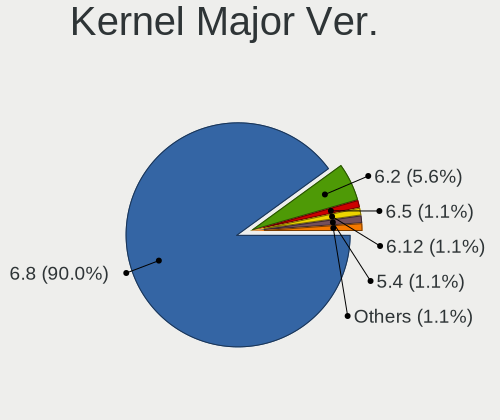
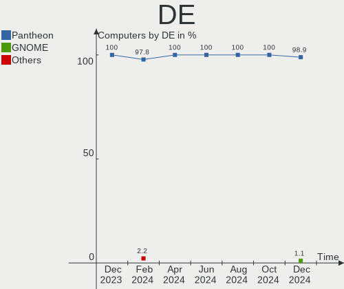
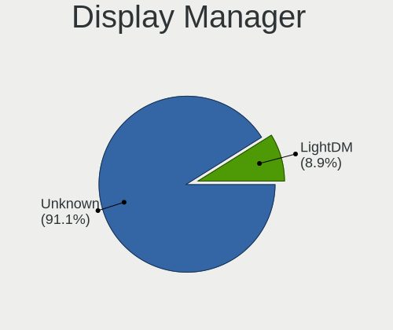
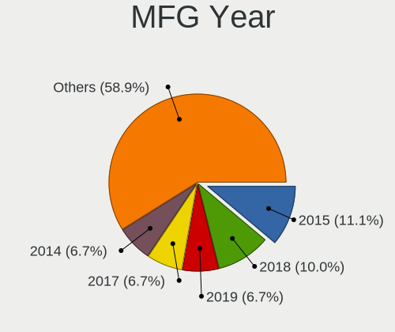
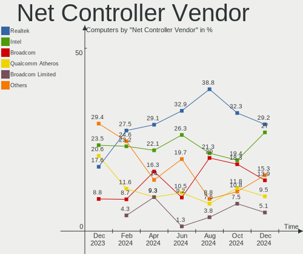
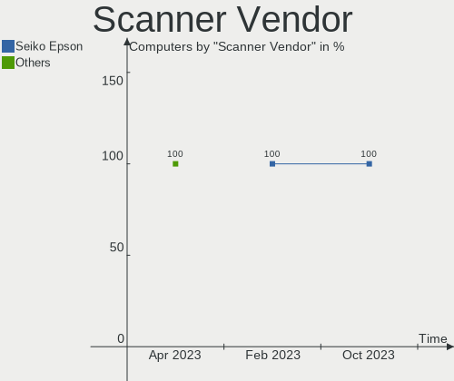
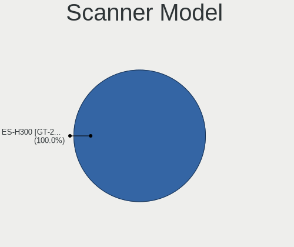
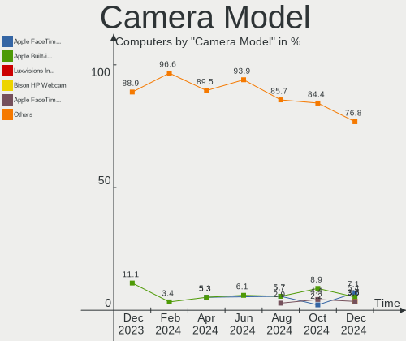

Elementary - Hardware Trends
----------------------------

A project to identify most popular hardware characteristics and track their change
over time based on data collected by Linux users at https://Linux-Hardware.org.

Anyone can contribute to this report by the [hw-probe](https://github.com/linuxhw/hw-probe) tool:

    sudo -E hw-probe -all -upload

This is a report for all computer types. See also reports for [desktops](/Dist/Elementary/Desktop/README.md) and [notebooks](/Dist/Elementary/Notebook/README.md).

This report is for one last month. Overall report since the beginning of time: [TestDays](https://github.com/linuxhw/TestDays)

Period: Feb, 2023.

Contents
--------

* [ System ](#system)
  - [ OS                       ](#os)
  - [ OS Family                ](#os-family)
  - [ Kernel                   ](#kernel)
  - [ Kernel Family            ](#kernel-family)
  - [ Kernel Major Ver.        ](#kernel-major-ver)
  - [ Arch                     ](#arch)
  - [ DE                       ](#de)
  - [ Display Server           ](#display-server)
  - [ Display Manager          ](#display-manager)
  - [ OS Lang                  ](#os-lang)
  - [ Boot Mode                ](#boot-mode)
  - [ Filesystem               ](#filesystem)
  - [ Part. scheme             ](#part-scheme)
  - [ Dual Boot with Linux/BSD ](#dual-boot-with-linuxbsd)
  - [ Dual Boot (Win)          ](#dual-boot-win)

* [ Board ](#board)
  - [ Vendor                   ](#vendor)
  - [ Model                    ](#model)
  - [ Model Family             ](#model-family)
  - [ MFG Year                 ](#mfg-year)
  - [ Form Factor              ](#form-factor)
  - [ Secure Boot              ](#secure-boot)
  - [ Coreboot                 ](#coreboot)
  - [ RAM Size                 ](#ram-size)
  - [ RAM Used                 ](#ram-used)
  - [ Total Drives             ](#total-drives)
  - [ Has CD-ROM               ](#has-cd-rom)
  - [ Has Ethernet             ](#has-ethernet)
  - [ Has WiFi                 ](#has-wifi)
  - [ Has Bluetooth            ](#has-bluetooth)

* [ Location ](#location)
  - [ Country                  ](#country)
  - [ City                     ](#city)

* [ Drives ](#drives)
  - [ Drive Vendor             ](#drive-vendor)
  - [ Drive Model              ](#drive-model)
  - [ HDD Vendor               ](#hdd-vendor)
  - [ SSD Vendor               ](#ssd-vendor)
  - [ Drive Kind               ](#drive-kind)
  - [ Drive Connector          ](#drive-connector)
  - [ Drive Size               ](#drive-size)
  - [ Space Total              ](#space-total)
  - [ Space Used               ](#space-used)
  - [ Malfunc. Drives          ](#malfunc-drives)
  - [ Malfunc. Drive Vendor    ](#malfunc-drive-vendor)
  - [ Malfunc. HDD Vendor      ](#malfunc-hdd-vendor)
  - [ Malfunc. Drive Kind      ](#malfunc-drive-kind)
  - [ Failed Drives            ](#failed-drives)
  - [ Failed Drive Vendor      ](#failed-drive-vendor)
  - [ Drive Status             ](#drive-status)

* [ Storage controller ](#storage-controller)
  - [ Storage Vendor           ](#storage-vendor)
  - [ Storage Model            ](#storage-model)
  - [ Storage Kind             ](#storage-kind)

* [ Processor ](#processor)
  - [ CPU Vendor               ](#cpu-vendor)
  - [ CPU Model                ](#cpu-model)
  - [ CPU Model Family         ](#cpu-model-family)
  - [ CPU Cores                ](#cpu-cores)
  - [ CPU Sockets              ](#cpu-sockets)
  - [ CPU Threads              ](#cpu-threads)
  - [ CPU Op-Modes             ](#cpu-op-modes)
  - [ CPU Microcode            ](#cpu-microcode)
  - [ CPU Microarch            ](#cpu-microarch)

* [ Graphics ](#graphics)
  - [ GPU Vendor               ](#gpu-vendor)
  - [ GPU Model                ](#gpu-model)
  - [ GPU Combo                ](#gpu-combo)
  - [ GPU Driver               ](#gpu-driver)
  - [ GPU Memory               ](#gpu-memory)

* [ Monitor ](#monitor)
  - [ Monitor Vendor           ](#monitor-vendor)
  - [ Monitor Model            ](#monitor-model)
  - [ Monitor Resolution       ](#monitor-resolution)
  - [ Monitor Diagonal         ](#monitor-diagonal)
  - [ Monitor Width            ](#monitor-width)
  - [ Aspect Ratio             ](#aspect-ratio)
  - [ Monitor Area             ](#monitor-area)
  - [ Pixel Density            ](#pixel-density)
  - [ Multiple Monitors        ](#multiple-monitors)

* [ Network ](#network)
  - [ Net Controller Vendor    ](#net-controller-vendor)
  - [ Net Controller Model     ](#net-controller-model)
  - [ Wireless Vendor          ](#wireless-vendor)
  - [ Wireless Model           ](#wireless-model)
  - [ Ethernet Vendor          ](#ethernet-vendor)
  - [ Ethernet Model           ](#ethernet-model)
  - [ Net Controller Kind      ](#net-controller-kind)
  - [ Used Controller          ](#used-controller)
  - [ NICs                     ](#nics)
  - [ IPv6                     ](#ipv6)

* [ Bluetooth ](#bluetooth)
  - [ Bluetooth Vendor         ](#bluetooth-vendor)
  - [ Bluetooth Model          ](#bluetooth-model)

* [ Sound ](#sound)
  - [ Sound Vendor             ](#sound-vendor)
  - [ Sound Model              ](#sound-model)

* [ Memory ](#memory)
  - [ Memory Vendor            ](#memory-vendor)
  - [ Memory Model             ](#memory-model)
  - [ Memory Kind              ](#memory-kind)
  - [ Memory Form Factor       ](#memory-form-factor)
  - [ Memory Size              ](#memory-size)
  - [ Memory Speed             ](#memory-speed)

* [ Printers & scanners ](#printers--scanners)
  - [ Printer Vendor           ](#printer-vendor)
  - [ Printer Model            ](#printer-model)
  - [ Scanner Vendor           ](#scanner-vendor)
  - [ Scanner Model            ](#scanner-model)

* [ Camera ](#camera)
  - [ Camera Vendor            ](#camera-vendor)
  - [ Camera Model             ](#camera-model)

* [ Security ](#security)
  - [ Fingerprint Vendor       ](#fingerprint-vendor)
  - [ Fingerprint Model        ](#fingerprint-model)
  - [ Chipcard Vendor          ](#chipcard-vendor)
  - [ Chipcard Model           ](#chipcard-model)

* [ Unsupported ](#unsupported)
  - [ Unsupported Devices      ](#unsupported-devices)
  - [ Unsupported Device Types ](#unsupported-device-types)

System
------

OS
--

Installed operating systems

| Name             | Computers | Percent |
|------------------|-----------|---------|
| Elementary 7     | 46        | 79.31%  |
| Elementary 6.1   | 11        | 18.97%  |
| Elementary 5.1.7 | 1         | 1.72%   |

OS Family
---------

OS without a version

| Name       | Computers | Percent |
|------------|-----------|---------|
| Elementary | 58        | 100%    |

Kernel
------

Version of the Linux kernel

| Version                | Computers | Percent |
|------------------------|-----------|---------|
| 5.15.0-58-generic      | 26        | 44.83%  |
| 5.19.0-32-generic      | 16        | 27.59%  |
| 5.15.0-60-generic      | 10        | 17.24%  |
| 5.11.0-43-generic      | 2         | 3.45%   |
| 6.1.9-060109-generic   | 1         | 1.72%   |
| 5.4.0-139-generic      | 1         | 1.72%   |
| 5.16.15-051615-generic | 1         | 1.72%   |
| 5.13.0-37-generic      | 1         | 1.72%   |

Kernel Family
-------------

Linux kernel without a distro release

| Version | Computers | Percent |
|---------|-----------|---------|
| 5.15.0  | 36        | 62.07%  |
| 5.19.0  | 16        | 27.59%  |
| 5.11.0  | 2         | 3.45%   |
| 6.1.9   | 1         | 1.72%   |
| 5.4.0   | 1         | 1.72%   |
| 5.16.15 | 1         | 1.72%   |
| 5.13.0  | 1         | 1.72%   |

Kernel Major Ver.
-----------------

Linux kernel major version

| Version | Computers | Percent |
|---------|-----------|---------|
| 5.15    | 36        | 62.07%  |
| 5.19    | 16        | 27.59%  |
| 5.11    | 2         | 3.45%   |
| 6.1     | 1         | 1.72%   |
| 5.4     | 1         | 1.72%   |
| 5.16    | 1         | 1.72%   |
| 5.13    | 1         | 1.72%   |

Arch
----

OS architecture (x86_64, i586, etc.)

| Name   | Computers | Percent |
|--------|-----------|---------|
| x86_64 | 58        | 100%    |

DE
--

Desktop Environment

| Name     | Computers | Percent |
|----------|-----------|---------|
| Pantheon | 58        | 100%    |

Display Server
--------------

X11 or Wayland

| Name | Computers | Percent |
|------|-----------|---------|
| X11  | 58        | 100%    |

Display Manager
---------------

SDDM, LightDM, etc.

| Name    | Computers | Percent |
|---------|-----------|---------|
| Unknown | 49        | 84.48%  |
| LightDM | 9         | 15.52%  |

OS Lang
-------

Language

| Lang  | Computers | Percent |
|-------|-----------|---------|
| de_DE | 16        | 27.59%  |
| en_US | 14        | 24.14%  |
| fr_FR | 5         | 8.62%   |
| es_ES | 5         | 8.62%   |
| ru_RU | 3         | 5.17%   |
| pt_BR | 2         | 3.45%   |
| nl_NL | 2         | 3.45%   |
| it_IT | 2         | 3.45%   |
| en_GB | 2         | 3.45%   |
| zh_TW | 1         | 1.72%   |
| uk_UA | 1         | 1.72%   |
| nb_NO | 1         | 1.72%   |
| ja_JP | 1         | 1.72%   |
| en_CA | 1         | 1.72%   |
| en_AU | 1         | 1.72%   |
| cs_CZ | 1         | 1.72%   |

Boot Mode
---------

EFI or BIOS

| Mode | Computers | Percent |
|------|-----------|---------|
| BIOS | 50        | 86.21%  |
| EFI  | 8         | 13.79%  |

Filesystem
----------

Type of filesystem

| Type     | Computers | Percent |
|----------|-----------|---------|
| Ext4     | 54        | 93.1%   |
| Xfs      | 1         | 1.72%   |
| Reiserfs | 1         | 1.72%   |
| Overlay  | 1         | 1.72%   |
| Btrfs    | 1         | 1.72%   |

Part. scheme
------------

Scheme of partitioning

| Type    | Computers | Percent |
|---------|-----------|---------|
| Unknown | 49        | 84.48%  |
| GPT     | 7         | 12.07%  |
| MBR     | 2         | 3.45%   |

Dual Boot with Linux/BSD
------------------------

Hosting more than one Linux/BSD

| Dual boot | Computers | Percent |
|-----------|-----------|---------|
| No        | 58        | 100%    |

Dual Boot (Win)
---------------

Hosting Linux and Windows

| Dual boot | Computers | Percent |
|-----------|-----------|---------|
| No        | 54        | 93.1%   |
| Yes       | 4         | 6.9%    |

Board
-----

Vendor
------

Motherboard manufacturer

| Name                | Computers | Percent |
|---------------------|-----------|---------|
| ASUSTek Computer    | 9         | 15.52%  |
| Lenovo              | 7         | 12.07%  |
| Hewlett-Packard     | 7         | 12.07%  |
| Apple               | 7         | 12.07%  |
| Dell                | 6         | 10.34%  |
| Acer                | 6         | 10.34%  |
| Gigabyte Technology | 5         | 8.62%   |
| Unknown             | 3         | 5.17%   |
| Toshiba             | 2         | 3.45%   |
| Sony                | 1         | 1.72%   |
| MSI                 | 1         | 1.72%   |
| Fujitsu             | 1         | 1.72%   |
| Foxconn             | 1         | 1.72%   |
| Alienware           | 1         | 1.72%   |
| Acidanthera         | 1         | 1.72%   |

Model
-----

Motherboard model

| Name                                    | Computers | Percent |
|-----------------------------------------|-----------|---------|
| Unknown                                 | 3         | 5.17%   |
| ASUS H110M-A/M.2                        | 2         | 3.45%   |
| Toshiba Satellite C660                  | 1         | 1.72%   |
| Toshiba Satellite C50D-A                | 1         | 1.72%   |
| Sony SVF1521O4E                         | 1         | 1.72%   |
| MSI MS-7816                             | 1         | 1.72%   |
| Lenovo Yoga 6 13ALC7 82UD               | 1         | 1.72%   |
| Lenovo V14 G2 ITL 82KA                  | 1         | 1.72%   |
| Lenovo ThinkPad X230 23259S9            | 1         | 1.72%   |
| Lenovo ThinkPad T440p 20AWS38H0G        | 1         | 1.72%   |
| Lenovo ThinkPad T400s 2808D9G           | 1         | 1.72%   |
| Lenovo ThinkPad E560 20EV003DSP         | 1         | 1.72%   |
| Lenovo IdeaPad 320-15ABR 80XS           | 1         | 1.72%   |
| HP ProDesk 600 G2 SFF                   | 1         | 1.72%   |
| HP OMEN by Laptop 17-ck0xxx             | 1         | 1.72%   |
| HP Laptop 17-by3xxx                     | 1         | 1.72%   |
| HP Laptop 14-bs0xx                      | 1         | 1.72%   |
| HP G62                                  | 1         | 1.72%   |
| HP EliteBook 8760w                      | 1         | 1.72%   |
| HP 550                                  | 1         | 1.72%   |
| Gigabyte Z77X-UD5H                      | 1         | 1.72%   |
| Gigabyte Z77MX-D3H                      | 1         | 1.72%   |
| Gigabyte GA-880GMA-UD2H                 | 1         | 1.72%   |
| Gigabyte F2A88XM-DS2                    | 1         | 1.72%   |
| Gigabyte B550 AORUS ELITE               | 1         | 1.72%   |
| Fujitsu LIFEBOOK E744                   | 1         | 1.72%   |
| Foxconn 400-034                         | 1         | 1.72%   |
| Dell XPS 15 9560                        | 1         | 1.72%   |
| Dell XPS 13 7390 2-in-1                 | 1         | 1.72%   |
| Dell Vostro 410                         | 1         | 1.72%   |
| Dell Vostro 3460                        | 1         | 1.72%   |
| Dell Latitude E6400                     | 1         | 1.72%   |
| Dell Inspiron 5675                      | 1         | 1.72%   |
| ASUS ZenBook UX434FAC_UX434FAC          | 1         | 1.72%   |
| ASUS ZenBook UX425EA_UX425EA            | 1         | 1.72%   |
| ASUS VivoBook_ASUSLaptop X513EAN_K513EA | 1         | 1.72%   |
| ASUS TUF X470-PLUS GAMING               | 1         | 1.72%   |
| ASUS ROG STRIX Z690-A GAMING WIFI D4    | 1         | 1.72%   |
| ASUS P7P55 LX                           | 1         | 1.72%   |
| ASUS M4A785TD-V EVO                     | 1         | 1.72%   |

Model Family
------------

Motherboard model prefix

| Name                    | Computers | Percent |
|-------------------------|-----------|---------|
| Acer Aspire             | 5         | 8.62%   |
| Lenovo ThinkPad         | 4         | 6.9%    |
| Unknown                 | 3         | 5.17%   |
| Toshiba Satellite       | 2         | 3.45%   |
| HP Laptop               | 2         | 3.45%   |
| Dell XPS                | 2         | 3.45%   |
| Dell Vostro             | 2         | 3.45%   |
| ASUS ZenBook            | 2         | 3.45%   |
| ASUS H110M-A            | 2         | 3.45%   |
| Sony SVF1521O4E         | 1         | 1.72%   |
| MSI MS-7816             | 1         | 1.72%   |
| Lenovo Yoga             | 1         | 1.72%   |
| Lenovo V14              | 1         | 1.72%   |
| Lenovo IdeaPad          | 1         | 1.72%   |
| HP ProDesk              | 1         | 1.72%   |
| HP OMEN                 | 1         | 1.72%   |
| HP G62                  | 1         | 1.72%   |
| HP EliteBook            | 1         | 1.72%   |
| HP 550                  | 1         | 1.72%   |
| Gigabyte Z77X-UD5H      | 1         | 1.72%   |
| Gigabyte Z77MX-D3H      | 1         | 1.72%   |
| Gigabyte GA-880GMA-UD2H | 1         | 1.72%   |
| Gigabyte F2A88XM-DS2    | 1         | 1.72%   |
| Gigabyte B550           | 1         | 1.72%   |
| Fujitsu LIFEBOOK        | 1         | 1.72%   |
| Foxconn 400-034         | 1         | 1.72%   |
| Dell Latitude           | 1         | 1.72%   |
| Dell Inspiron           | 1         | 1.72%   |
| ASUS VivoBook           | 1         | 1.72%   |
| ASUS TUF                | 1         | 1.72%   |
| ASUS ROG                | 1         | 1.72%   |
| ASUS P7P55              | 1         | 1.72%   |
| ASUS M4A785TD-V         | 1         | 1.72%   |
| Apple MacBookPro8       | 1         | 1.72%   |
| Apple MacBookAir6       | 1         | 1.72%   |
| Apple MacBookAir3       | 1         | 1.72%   |
| Apple MacBook4          | 1         | 1.72%   |
| Apple iMac7             | 1         | 1.72%   |
| Apple iMac19            | 1         | 1.72%   |
| Apple iMac12            | 1         | 1.72%   |

MFG Year
--------

Motherboard manufacture year

| Year | Computers | Percent |
|------|-----------|---------|
| 2012 | 7         | 12.07%  |
| 2021 | 6         | 10.34%  |
| 2013 | 6         | 10.34%  |
| 2016 | 5         | 8.62%   |
| 2008 | 5         | 8.62%   |
| 2020 | 4         | 6.9%    |
| 2017 | 4         | 6.9%    |
| 2010 | 4         | 6.9%    |
| 2009 | 4         | 6.9%    |
| 2015 | 3         | 5.17%   |
| 2014 | 3         | 5.17%   |
| 2022 | 2         | 3.45%   |
| 2019 | 2         | 3.45%   |
| 2011 | 2         | 3.45%   |
| 2018 | 1         | 1.72%   |

Form Factor
-----------

Physical design of the computer

| Name        | Computers | Percent |
|-------------|-----------|---------|
| Notebook    | 34        | 58.62%  |
| Desktop     | 19        | 32.76%  |
| All in one  | 3         | 5.17%   |
| Convertible | 2         | 3.45%   |

Secure Boot
-----------

Enabled or disabled

| State    | Computers | Percent |
|----------|-----------|---------|
| Disabled | 58        | 100%    |

Coreboot
--------

Have coreboot on board

| Used | Computers | Percent |
|------|-----------|---------|
| No   | 58        | 100%    |

RAM Size
--------

Total RAM memory

| Size in GB  | Computers | Percent |
|-------------|-----------|---------|
| 4.01-8.0    | 14        | 24.14%  |
| 3.01-4.0    | 13        | 22.41%  |
| 16.01-24.0  | 11        | 18.97%  |
| 8.01-16.0   | 10        | 17.24%  |
| 32.01-64.0  | 3         | 5.17%   |
| 2.01-3.0    | 2         | 3.45%   |
| 64.01-256.0 | 2         | 3.45%   |
| 1.01-2.0    | 2         | 3.45%   |
| 24.01-32.0  | 1         | 1.72%   |

RAM Used
--------

Used RAM memory

| Used GB   | Computers | Percent |
|-----------|-----------|---------|
| 2.01-3.0  | 26        | 44.83%  |
| 1.01-2.0  | 15        | 25.86%  |
| 4.01-8.0  | 8         | 13.79%  |
| 3.01-4.0  | 6         | 10.34%  |
| 8.01-16.0 | 2         | 3.45%   |
| 0.51-1.0  | 1         | 1.72%   |

Total Drives
------------

Number of drives on board

| Drives | Computers | Percent |
|--------|-----------|---------|
| 1      | 35        | 60.34%  |
| 2      | 17        | 29.31%  |
| 3      | 3         | 5.17%   |
| 5      | 1         | 1.72%   |
| 4      | 1         | 1.72%   |
| 0      | 1         | 1.72%   |

Has CD-ROM
----------

Has CD-ROM on board

| Presented | Computers | Percent |
|-----------|-----------|---------|
| Yes       | 30        | 51.72%  |
| No        | 28        | 48.28%  |

Has Ethernet
------------

Has Ethernet on board

| Presented | Computers | Percent |
|-----------|-----------|---------|
| Yes       | 49        | 84.48%  |
| No        | 9         | 15.52%  |

Has WiFi
--------

Has WiFi module

| Presented | Computers | Percent |
|-----------|-----------|---------|
| Yes       | 46        | 79.31%  |
| No        | 12        | 20.69%  |

Has Bluetooth
-------------

Has Bluetooth module

| Presented | Computers | Percent |
|-----------|-----------|---------|
| Yes       | 41        | 70.69%  |
| No        | 17        | 29.31%  |

Location
--------

Country
-------

Geographic location (country)

| Country     | Computers | Percent |
|-------------|-----------|---------|
| Germany     | 16        | 27.59%  |
| USA         | 9         | 15.52%  |
| France      | 5         | 8.62%   |
| Russia      | 3         | 5.17%   |
| UK          | 2         | 3.45%   |
| Spain       | 2         | 3.45%   |
| Italy       | 2         | 3.45%   |
| Brazil      | 2         | 3.45%   |
| Tunisia     | 1         | 1.72%   |
| Poland      | 1         | 1.72%   |
| Pakistan    | 1         | 1.72%   |
| Norway      | 1         | 1.72%   |
| Netherlands | 1         | 1.72%   |
| Mexico      | 1         | 1.72%   |
| Kazakhstan  | 1         | 1.72%   |
| Japan       | 1         | 1.72%   |
| Ireland     | 1         | 1.72%   |
| Hong Kong   | 1         | 1.72%   |
| Georgia     | 1         | 1.72%   |
| Czechia     | 1         | 1.72%   |
| China       | 1         | 1.72%   |
| Chile       | 1         | 1.72%   |
| Canada      | 1         | 1.72%   |
| Belgium     | 1         | 1.72%   |
| Australia   | 1         | 1.72%   |

City
----

Geographic location (city)

| City               | Computers | Percent |
|--------------------|-----------|---------|
| Wilster            | 2         | 3.45%   |
| Hamm               | 2         | 3.45%   |
| Berlin             | 2         | 3.45%   |
| Aubagne            | 2         | 3.45%   |
| Zhuantang          | 1         | 1.72%   |
| Wuppertal          | 1         | 1.72%   |
| West Monroe        | 1         | 1.72%   |
| Warsaw             | 1         | 1.72%   |
| Twickenham         | 1         | 1.72%   |
| Tunis              | 1         | 1.72%   |
| Tucson             | 1         | 1.72%   |
| Tromsø            | 1         | 1.72%   |
| Tremblay-en-France | 1         | 1.72%   |
| The Hague          | 1         | 1.72%   |
| Tbilisi            | 1         | 1.72%   |
| Stuttgart          | 1         | 1.72%   |
| St Petersburg      | 1         | 1.72%   |
| St Albans          | 1         | 1.72%   |
| Santiago           | 1         | 1.72%   |
| Salzgitter         | 1         | 1.72%   |
| Reading            | 1         | 1.72%   |
| Radeburg           | 1         | 1.72%   |
| Puebla City        | 1         | 1.72%   |
| Prague             | 1         | 1.72%   |
| Potsdam            | 1         | 1.72%   |
| Pforzheim          | 1         | 1.72%   |
| Osaka              | 1         | 1.72%   |
| Niesky             | 1         | 1.72%   |
| Niederaichbach     | 1         | 1.72%   |
| New York           | 1         | 1.72%   |
| Nesso              | 1         | 1.72%   |
| Munich             | 1         | 1.72%   |
| Moscow             | 1         | 1.72%   |
| Miami              | 1         | 1.72%   |
| Melbourne          | 1         | 1.72%   |
| Madrid             | 1         | 1.72%   |
| Louisville         | 1         | 1.72%   |
| Los Montesinos     | 1         | 1.72%   |
| Koksijde           | 1         | 1.72%   |
| Karachi            | 1         | 1.72%   |

Drives
------

Drive Vendor
------------

Hard drive vendors

| Vendor                    | Computers | Drives | Percent |
|---------------------------|-----------|--------|---------|
| WDC                       | 11        | 11     | 12.94%  |
| Seagate                   | 10        | 12     | 11.76%  |
| Samsung Electronics       | 7         | 7      | 8.24%   |
| Unknown                   | 5         | 6      | 5.88%   |
| Toshiba                   | 5         | 5      | 5.88%   |
| SanDisk                   | 5         | 5      | 5.88%   |
| Crucial                   | 5         | 5      | 5.88%   |
| Apple                     | 4         | 4      | 4.71%   |
| PNY                       | 2         | 2      | 2.35%   |
| KIOXIA                    | 2         | 2      | 2.35%   |
| Hitachi                   | 2         | 2      | 2.35%   |
| Yeestor                   | 1         | 1      | 1.18%   |
| Union Memory              | 1         | 1      | 1.18%   |
| Transcend                 | 1         | 1      | 1.18%   |
| Team                      | 1         | 1      | 1.18%   |
| SPCC                      | 1         | 1      | 1.18%   |
| SK hynix                  | 1         | 1      | 1.18%   |
| Silicon Motion            | 1         | 1      | 1.18%   |
| SD                        | 1         | 1      | 1.18%   |
| Realtek Semiconductor     | 1         | 2      | 1.18%   |
| Phison Electronics        | 1         | 1      | 1.18%   |
| OWC                       | 1         | 1      | 1.18%   |
| OCZ                       | 1         | 1      | 1.18%   |
| Netac                     | 1         | 1      | 1.18%   |
| Micron/Crucial Technology | 1         | 1      | 1.18%   |
| Micron Technology         | 1         | 1      | 1.18%   |
| LITEONIT                  | 1         | 1      | 1.18%   |
| Kingston                  | 1         | 1      | 1.18%   |
| KingDian                  | 1         | 1      | 1.18%   |
| JMicron Technology        | 1         | 1      | 1.18%   |
| JetFlash                  | 1         | 1      | 1.18%   |
| Intenso                   | 1         | 1      | 1.18%   |
| Intel                     | 1         | 1      | 1.18%   |
| GeIL                      | 1         | 1      | 1.18%   |
| Fujitsu                   | 1         | 1      | 1.18%   |
| Corsair                   | 1         | 1      | 1.18%   |
| Biwin Storage Technology  | 1         | 1      | 1.18%   |
| A-DATA Technology         | 1         | 1      | 1.18%   |

Drive Model
-----------

Hard drive models

| Model                                                 | Computers | Percent |
|-------------------------------------------------------|-----------|---------|
| Unknown MMC Card  64GB                                | 2         | 2.25%   |
| Unknown MMC Card  32GB                                | 2         | 2.25%   |
| Toshiba MQ01ABD100 1TB                                | 2         | 2.25%   |
| Seagate ST1000DM003-1ER162 1TB                        | 2         | 2.25%   |
| Yeestor 512GB                                         | 1         | 1.12%   |
| WDC WDS500G2B0A-00SM50 500GB SSD                      | 1         | 1.12%   |
| WDC WDS240G2G0A-00JH30 240GB SSD                      | 1         | 1.12%   |
| WDC WDS100T2B0A-00SM50 1TB SSD                        | 1         | 1.12%   |
| WDC WD5000LPVX-22V0TT0 500GB                          | 1         | 1.12%   |
| WDC WD5000AAKS-75A7B0 500GB                           | 1         | 1.12%   |
| WDC WD2500JB-55GVA0 250GB                             | 1         | 1.12%   |
| WDC WD10SPCX-08S8TT0 1TB                              | 1         | 1.12%   |
| WDC WD10EZEX-60ZF5A0 1TB                              | 1         | 1.12%   |
| WDC WD10EZEX-60WN4A0 1TB                              | 1         | 1.12%   |
| WDC WD10EZEX-00BN5A0 1TB                              | 1         | 1.12%   |
| WDC WD10EADS-11M2B2 1TB                               | 1         | 1.12%   |
| Unknown MMC Card  7GB                                 | 1         | 1.12%   |
| Unknown MMC Card  256GB                               | 1         | 1.12%   |
| Union Memory UMIS RPJTJ512MEE1OWX 512GB               | 1         | 1.12%   |
| Transcend TS256GSSD230S 256GB                         | 1         | 1.12%   |
| Toshiba THNS128GG4BAAA-NonFDE 128GB SSD               | 1         | 1.12%   |
| Toshiba MQ01ABF050 500GB                              | 1         | 1.12%   |
| Toshiba DT01ACA100 1TB                                | 1         | 1.12%   |
| Team L3 SSD 240GB                                     | 1         | 1.12%   |
| SPCC Solid State Disk 512GB                           | 1         | 1.12%   |
| SK hynix SKHynix_HFM512GD3HX015N 512GB                | 1         | 1.12%   |
| Silicon Motion SM2263EN/SM2263XT SSD Controller 512GB | 1         | 1.12%   |
| Seagate ST3160212A 160GB                              | 1         | 1.12%   |
| Seagate ST31000528AS 1TB                              | 1         | 1.12%   |
| Seagate ST3000NM0053 3TB                              | 1         | 1.12%   |
| Seagate ST2000DM008-2FR102 2TB                        | 1         | 1.12%   |
| Seagate ST1000DM003-9YN162 1TB                        | 1         | 1.12%   |
| Seagate Photo Drive 2TB                               | 1         | 1.12%   |
| Seagate M3 1TB                                        | 1         | 1.12%   |
| Seagate Expansion 1TB                                 | 1         | 1.12%   |
| Seagate BarraCuda Q1 SSD ZA960CV10001 960GB           | 1         | 1.12%   |
| Seagate BarraCuda 120 SSD ZA500CM10003 500GB          | 1         | 1.12%   |
| SD Ultra 3D 1TB                                       | 1         | 1.12%   |
| Sandisk WD Blue SN570 500GB                           | 1         | 1.12%   |
| Sandisk WD Blue SN550 NVMe SSD 1TB                    | 1         | 1.12%   |

HDD Vendor
----------

Hard disk drive vendors

| Vendor              | Computers | Drives | Percent |
|---------------------|-----------|--------|---------|
| WDC                 | 8         | 8      | 32%     |
| Seagate             | 8         | 8      | 32%     |
| Toshiba             | 4         | 4      | 16%     |
| Hitachi             | 2         | 2      | 8%      |
| Samsung Electronics | 1         | 1      | 4%      |
| JMicron Technology  | 1         | 1      | 4%      |
| Fujitsu             | 1         | 1      | 4%      |

SSD Vendor
----------

Solid state drive vendors

| Vendor              | Computers | Drives | Percent |
|---------------------|-----------|--------|---------|
| Samsung Electronics | 5         | 5      | 14.71%  |
| Crucial             | 5         | 5      | 14.71%  |
| WDC                 | 3         | 3      | 8.82%   |
| Apple               | 3         | 3      | 8.82%   |
| Seagate             | 2         | 2      | 5.88%   |
| SanDisk             | 2         | 2      | 5.88%   |
| PNY                 | 2         | 2      | 5.88%   |
| Transcend           | 1         | 1      | 2.94%   |
| Toshiba             | 1         | 1      | 2.94%   |
| Team                | 1         | 1      | 2.94%   |
| SPCC                | 1         | 1      | 2.94%   |
| OWC                 | 1         | 1      | 2.94%   |
| OCZ                 | 1         | 1      | 2.94%   |
| LITEONIT            | 1         | 1      | 2.94%   |
| Kingston            | 1         | 1      | 2.94%   |
| KingDian            | 1         | 1      | 2.94%   |
| Intenso             | 1         | 1      | 2.94%   |
| Corsair             | 1         | 1      | 2.94%   |
| A-DATA Technology   | 1         | 1      | 2.94%   |

Drive Kind
----------

HDD or SSD

| Kind    | Computers | Drives | Percent |
|---------|-----------|--------|---------|
| SSD     | 32        | 34     | 42.67%  |
| HDD     | 17        | 25     | 22.67%  |
| NVMe    | 14        | 17     | 18.67%  |
| Unknown | 7         | 7      | 9.33%   |
| MMC     | 5         | 6      | 6.67%   |

Drive Connector
---------------

SATA, SAS, NVMe, etc.

| Type | Computers | Drives | Percent |
|------|-----------|--------|---------|
| SATA | 44        | 60     | 64.71%  |
| NVMe | 14        | 17     | 20.59%  |
| SAS  | 5         | 6      | 7.35%   |
| MMC  | 5         | 6      | 7.35%   |

Drive Size
----------

Size of hard drive

| Size in TB | Computers | Drives | Percent |
|------------|-----------|--------|---------|
| 0.01-0.5   | 33        | 37     | 67.35%  |
| 0.51-1.0   | 12        | 18     | 24.49%  |
| 1.01-2.0   | 3         | 3      | 6.12%   |
| 2.01-3.0   | 1         | 1      | 2.04%   |

Space Total
-----------

Amount of disk space available on the file system

| Size in GB     | Computers | Percent |
|----------------|-----------|---------|
| 101-250        | 24        | 41.38%  |
| 251-500        | 18        | 31.03%  |
| 501-1000       | 7         | 12.07%  |
| 2001-3000      | 3         | 5.17%   |
| 51-100         | 3         | 5.17%   |
| More than 3000 | 1         | 1.72%   |
| 21-50          | 1         | 1.72%   |
| 1-20           | 1         | 1.72%   |

Space Used
----------

Amount of used disk space

| Used GB   | Computers | Percent |
|-----------|-----------|---------|
| 1-20      | 26        | 44.83%  |
| 21-50     | 15        | 25.86%  |
| 51-100    | 7         | 12.07%  |
| 101-250   | 6         | 10.34%  |
| 1001-2000 | 2         | 3.45%   |
| 2001-3000 | 1         | 1.72%   |
| 501-1000  | 1         | 1.72%   |

Malfunc. Drives
---------------

Drive models with a malfunction

Zero info for selected period =(

Malfunc. Drive Vendor
---------------------

Vendors of faulty drives

Zero info for selected period =(

Malfunc. HDD Vendor
-------------------

Vendors of faulty HDD drives

Zero info for selected period =(

Malfunc. Drive Kind
-------------------

Kinds of faulty drives

Zero info for selected period =(

Failed Drives
-------------

Failed drive models

Zero info for selected period =(

Failed Drive Vendor
-------------------

Failed drive vendors

Zero info for selected period =(

Drive Status
------------

Number of failed and malfunc. drives

| Status   | Computers | Drives | Percent |
|----------|-----------|--------|---------|
| Detected | 53        | 84     | 91.38%  |
| Works    | 5         | 5      | 8.62%   |

Storage controller
------------------

Storage Vendor
--------------

Storage controller vendors

| Vendor                    | Computers | Percent |
|---------------------------|-----------|---------|
| Intel                     | 43        | 58.11%  |
| AMD                       | 9         | 12.16%  |
| SanDisk                   | 3         | 4.05%   |
| Samsung Electronics       | 3         | 4.05%   |
| Marvell Technology Group  | 3         | 4.05%   |
| KIOXIA                    | 2         | 2.7%    |
| Union Memory (Shenzhen)   | 1         | 1.35%   |
| SK hynix                  | 1         | 1.35%   |
| Silicon Motion            | 1         | 1.35%   |
| Realtek Semiconductor     | 1         | 1.35%   |
| Phison Electronics        | 1         | 1.35%   |
| Nvidia                    | 1         | 1.35%   |
| Micron/Crucial Technology | 1         | 1.35%   |
| Micron Technology         | 1         | 1.35%   |
| JMicron Technology        | 1         | 1.35%   |
| Biwin Storage Technology  | 1         | 1.35%   |
| ASMedia Technology        | 1         | 1.35%   |

Storage Model
-------------

Storage controller models

| Model                                                                          | Computers | Percent |
|--------------------------------------------------------------------------------|-----------|---------|
| Intel Volume Management Device NVMe RAID Controller                            | 6         | 6.9%    |
| AMD FCH SATA Controller [AHCI mode]                                            | 5         | 5.75%   |
| Intel 7 Series Chipset Family 6-port SATA Controller [AHCI mode]               | 4         | 4.6%    |
| Intel Q170/Q150/B150/H170/H110/Z170/CM236 Chipset SATA Controller [AHCI Mode]  | 3         | 3.45%   |
| Intel 82801HM/HEM (ICH8M/ICH8M-E) SATA Controller [AHCI mode]                  | 3         | 3.45%   |
| Intel 82801HM/HEM (ICH8M/ICH8M-E) IDE Controller                               | 3         | 3.45%   |
| Intel 8 Series/C220 Series Chipset Family 6-port SATA Controller 1 [AHCI mode] | 3         | 3.45%   |
| Intel 7 Series/C210 Series Chipset Family 6-port SATA Controller [AHCI mode]   | 3         | 3.45%   |
| Intel 6 Series/C200 Series Chipset Family 6 port Desktop SATA AHCI Controller  | 3         | 3.45%   |
| KIOXIA NVMe SSD Controller BG4                                                 | 2         | 2.3%    |
| Intel Tiger Lake-LP SATA Controller                                            | 2         | 2.3%    |
| Intel Sunrise Point-LP SATA Controller [AHCI mode]                             | 2         | 2.3%    |
| Intel 82801IBM/IEM (ICH9M/ICH9M-E) 4 port SATA Controller [AHCI mode]          | 2         | 2.3%    |
| Intel 82801 Mobile SATA Controller [RAID mode]                                 | 2         | 2.3%    |
| Intel 6 Series/C200 Series Chipset Family 6 port Mobile SATA AHCI Controller   | 2         | 2.3%    |
| Intel 5 Series/3400 Series Chipset 4 port SATA AHCI Controller                 | 2         | 2.3%    |
| AMD SB7x0/SB8x0/SB9x0 SATA Controller [IDE mode]                               | 2         | 2.3%    |
| AMD SB7x0/SB8x0/SB9x0 IDE Controller                                           | 2         | 2.3%    |
| Union Memory (Shenzhen) Non-Volatile memory controller                         | 1         | 1.15%   |
| SK hynix Gold P31/PC711 NVMe Solid State Drive                                 | 1         | 1.15%   |
| Silicon Motion SM2263EN/SM2263XT SSD Controller                                | 1         | 1.15%   |
| SanDisk WD PC SN810 / Black SN850 NVMe SSD                                     | 1         | 1.15%   |
| SanDisk WD Blue SN570 NVMe SSD                                                 | 1         | 1.15%   |
| SanDisk WD Blue SN550 NVMe SSD                                                 | 1         | 1.15%   |
| Samsung NVMe SSD Controller SM961/PM961/SM963                                  | 1         | 1.15%   |
| Samsung NVMe SSD Controller PM9A1/PM9A3/980PRO                                 | 1         | 1.15%   |
| Samsung Apple PCIe SSD                                                         | 1         | 1.15%   |
| Realtek Realtek Non-Volatile memory controller                                 | 1         | 1.15%   |
| Phison E12 NVMe Controller                                                     | 1         | 1.15%   |
| Nvidia MCP89 SATA Controller (AHCI mode)                                       | 1         | 1.15%   |
| Micron/Crucial P2 NVMe PCIe SSD                                                | 1         | 1.15%   |
| Micron Non-Volatile memory controller                                          | 1         | 1.15%   |
| Marvell Group 88SS9183 PCIe SSD Controller                                     | 1         | 1.15%   |
| Marvell Group 88SE9172 SATA 6Gb/s Controller                                   | 1         | 1.15%   |
| Marvell Group 88SE9128 PCIe SATA 6 Gb/s RAID controller                        | 1         | 1.15%   |
| JMicron JMB368 IDE controller                                                  | 1         | 1.15%   |
| Intel SSD 660P Series                                                          | 1         | 1.15%   |
| Intel Mobile 4 Series Chipset PT IDER Controller                               | 1         | 1.15%   |
| Intel HM170/QM170 Chipset SATA Controller [AHCI Mode]                          | 1         | 1.15%   |
| Intel Celeron/Pentium Silver Processor SATA Controller                         | 1         | 1.15%   |

Storage Kind
------------

Kind of storage controller (IDE, SATA, NVMe, SAS, ...)

| Kind | Computers | Percent |
|------|-----------|---------|
| SATA | 49        | 62.82%  |
| NVMe | 14        | 17.95%  |
| RAID | 8         | 10.26%  |
| IDE  | 7         | 8.97%   |

Processor
---------

CPU Vendor
----------

Processor vendors

| Vendor | Computers | Percent |
|--------|-----------|---------|
| Intel  | 49        | 84.48%  |
| AMD    | 9         | 15.52%  |

CPU Model
---------

Processor models

| Model                                   | Computers | Percent |
|-----------------------------------------|-----------|---------|
| Intel Celeron CPU N3060 @ 1.60GHz       | 2         | 3.45%   |
| Intel 11th Gen Core i7-1165G7 @ 2.80GHz | 2         | 3.45%   |
| Intel Pentium CPU G2020 @ 2.90GHz       | 1         | 1.72%   |
| Intel Core i9-9900K CPU @ 3.60GHz       | 1         | 1.72%   |
| Intel Core i7-7700 CPU @ 3.60GHz        | 1         | 1.72%   |
| Intel Core i7-6500U CPU @ 2.50GHz       | 1         | 1.72%   |
| Intel Core i7-4870HQ CPU @ 2.50GHz      | 1         | 1.72%   |
| Intel Core i7-3770K CPU @ 3.50GHz       | 1         | 1.72%   |
| Intel Core i7-3770 CPU @ 3.40GHz        | 1         | 1.72%   |
| Intel Core i7-2720QM CPU @ 2.20GHz      | 1         | 1.72%   |
| Intel Core i7-2700K CPU @ 3.50GHz       | 1         | 1.72%   |
| Intel Core i7-2600S CPU @ 2.80GHz       | 1         | 1.72%   |
| Intel Core i7-1065G7 CPU @ 1.30GHz      | 1         | 1.72%   |
| Intel Core i7-10510U CPU @ 1.80GHz      | 1         | 1.72%   |
| Intel Core i5-7300HQ CPU @ 2.50GHz      | 1         | 1.72%   |
| Intel Core i5-7200U CPU @ 2.50GHz       | 1         | 1.72%   |
| Intel Core i5-6600 CPU @ 3.30GHz        | 1         | 1.72%   |
| Intel Core i5-4300M CPU @ 2.60GHz       | 1         | 1.72%   |
| Intel Core i5-4250U CPU @ 1.30GHz       | 1         | 1.72%   |
| Intel Core i5-4210M CPU @ 2.60GHz       | 1         | 1.72%   |
| Intel Core i5-3337U CPU @ 1.80GHz       | 1         | 1.72%   |
| Intel Core i5-3320M CPU @ 2.60GHz       | 1         | 1.72%   |
| Intel Core i5-3230M CPU @ 2.60GHz       | 1         | 1.72%   |
| Intel Core i5-2540M CPU @ 2.60GHz       | 1         | 1.72%   |
| Intel Core i5-2400 CPU @ 3.10GHz        | 1         | 1.72%   |
| Intel Core i5-1035G1 CPU @ 1.00GHz      | 1         | 1.72%   |
| Intel Core i5 CPU M 460 @ 2.53GHz       | 1         | 1.72%   |
| Intel Core i5 CPU 760 @ 2.80GHz         | 1         | 1.72%   |
| Intel Core i3-6100 CPU @ 3.70GHz        | 1         | 1.72%   |
| Intel Core i3-4150 CPU @ 3.50GHz        | 1         | 1.72%   |
| Intel Core i3-4005U CPU @ 1.70GHz       | 1         | 1.72%   |
| Intel Core i3-3120M CPU @ 2.50GHz       | 1         | 1.72%   |
| Intel Core i3 CPU M 380 @ 2.53GHz       | 1         | 1.72%   |
| Intel Core 2 Quad CPU Q6600 @ 2.40GHz   | 1         | 1.72%   |
| Intel Core 2 Duo CPU U9400 @ 1.40GHz    | 1         | 1.72%   |
| Intel Core 2 Duo CPU T8300 @ 2.40GHz    | 1         | 1.72%   |
| Intel Core 2 Duo CPU T7700 @ 2.40GHz    | 1         | 1.72%   |
| Intel Core 2 Duo CPU P9400 @ 2.40GHz    | 1         | 1.72%   |
| Intel Core 2 Duo CPU P8700 @ 2.53GHz    | 1         | 1.72%   |
| Intel Core 2 Duo CPU P7450 @ 2.13GHz    | 1         | 1.72%   |

CPU Model Family
----------------

Processor model prefix

| Model             | Computers | Percent |
|-------------------|-----------|---------|
| Intel Core i5     | 14        | 24.14%  |
| Intel Core i7     | 10        | 17.24%  |
| Other             | 6         | 10.34%  |
| Intel Core 2 Duo  | 6         | 10.34%  |
| Intel Core i3     | 5         | 8.62%   |
| Intel Celeron     | 5         | 8.62%   |
| AMD Ryzen 7       | 2         | 3.45%   |
| Intel Pentium     | 1         | 1.72%   |
| Intel Core i9     | 1         | 1.72%   |
| Intel Core 2 Quad | 1         | 1.72%   |
| AMD Ryzen 5 PRO   | 1         | 1.72%   |
| AMD Ryzen 5       | 1         | 1.72%   |
| AMD Phenom II X6  | 1         | 1.72%   |
| AMD Phenom II X4  | 1         | 1.72%   |
| AMD E1            | 1         | 1.72%   |
| AMD A8            | 1         | 1.72%   |
| AMD A12           | 1         | 1.72%   |

CPU Cores
---------

Number of processor cores

| Number | Computers | Percent |
|--------|-----------|---------|
| 2      | 26        | 44.83%  |
| 4      | 20        | 34.48%  |
| 8      | 4         | 6.9%    |
| 6      | 3         | 5.17%   |
| 1      | 2         | 3.45%   |
| 14     | 1         | 1.72%   |
| 12     | 1         | 1.72%   |
| 3      | 1         | 1.72%   |

CPU Sockets
-----------

Number of sockets

| Number | Computers | Percent |
|--------|-----------|---------|
| 1      | 58        | 100%    |

CPU Threads
-----------

Threads per core (Hyper-Threading)

| Number | Computers | Percent |
|--------|-----------|---------|
| 2      | 38        | 65.52%  |
| 1      | 20        | 34.48%  |

CPU Op-Modes
------------

CPU Operation Modes (32-bit, 64-bit)

| Op mode        | Computers | Percent |
|----------------|-----------|---------|
| 32-bit, 64-bit | 58        | 100%    |

CPU Microcode
-------------

Microcode number

| Number     | Computers | Percent |
|------------|-----------|---------|
| Unknown    | 38        | 65.52%  |
| 0x706e5    | 2         | 3.45%   |
| 0x206a7    | 2         | 3.45%   |
| 0x906ec    | 1         | 1.72%   |
| 0x906e9    | 1         | 1.72%   |
| 0x806ec    | 1         | 1.72%   |
| 0x806d1    | 1         | 1.72%   |
| 0x806c1    | 1         | 1.72%   |
| 0x6fb      | 1         | 1.72%   |
| 0x506c9    | 1         | 1.72%   |
| 0x406c4    | 1         | 1.72%   |
| 0x40661    | 1         | 1.72%   |
| 0x40651    | 1         | 1.72%   |
| 0x20655    | 1         | 1.72%   |
| 0x1067a    | 1         | 1.72%   |
| 0x10676    | 1         | 1.72%   |
| 0x05000119 | 1         | 1.72%   |
| 0x010000db | 1         | 1.72%   |
| 0x010000bf | 1         | 1.72%   |

CPU Microarch
-------------

Microarchitecture

| Name          | Computers | Percent |
|---------------|-----------|---------|
| IvyBridge     | 7         | 12.07%  |
| Haswell       | 6         | 10.34%  |
| SandyBridge   | 5         | 8.62%   |
| Penryn        | 5         | 8.62%   |
| KabyLake      | 5         | 8.62%   |
| Unknown       | 4         | 6.9%    |
| TigerLake     | 3         | 5.17%   |
| Skylake       | 3         | 5.17%   |
| Core          | 3         | 5.17%   |
| Westmere      | 2         | 3.45%   |
| Silvermont    | 2         | 3.45%   |
| K10           | 2         | 3.45%   |
| IceLake       | 2         | 3.45%   |
| Zen+          | 1         | 1.72%   |
| Zen 2         | 1         | 1.72%   |
| Zen           | 1         | 1.72%   |
| Steamroller   | 1         | 1.72%   |
| Nehalem       | 1         | 1.72%   |
| Goldmont plus | 1         | 1.72%   |
| Goldmont      | 1         | 1.72%   |
| Excavator     | 1         | 1.72%   |
| Bobcat        | 1         | 1.72%   |

Graphics
--------

GPU Vendor
----------

Vendors of graphics cards

| Vendor | Computers | Percent |
|--------|-----------|---------|
| Intel  | 37        | 54.41%  |
| AMD    | 16        | 23.53%  |
| Nvidia | 15        | 22.06%  |

GPU Model
---------

Graphics card models

| Model                                                                                    | Computers | Percent |
|------------------------------------------------------------------------------------------|-----------|---------|
| Intel 3rd Gen Core processor Graphics Controller                                         | 4         | 5.71%   |
| Intel 2nd Generation Core Processor Family Integrated Graphics Controller                | 4         | 5.71%   |
| Intel TigerLake-LP GT2 [Iris Xe Graphics]                                                | 3         | 4.29%   |
| Nvidia GK107 [GeForce GT 640]                                                            | 2         | 2.86%   |
| Intel Mobile 4 Series Chipset Integrated Graphics Controller                             | 2         | 2.86%   |
| Intel HD Graphics 630                                                                    | 2         | 2.86%   |
| Intel Haswell-ULT Integrated Graphics Controller                                         | 2         | 2.86%   |
| Intel Core Processor Integrated Graphics Controller                                      | 2         | 2.86%   |
| Intel Atom/Celeron/Pentium Processor x5-E8000/J3xxx/N3xxx Integrated Graphics Controller | 2         | 2.86%   |
| Intel 4th Gen Core Processor Integrated Graphics Controller                              | 2         | 2.86%   |
| AMD Whistler [Radeon HD 6730M/6770M/7690M XT]                                            | 2         | 2.86%   |
| Nvidia TU117 [GeForce GTX 1650]                                                          | 1         | 1.43%   |
| Nvidia MCP89 [GeForce 320M]                                                              | 1         | 1.43%   |
| Nvidia GT218 [GeForce 210]                                                               | 1         | 1.43%   |
| Nvidia GP107M [GeForce GTX 1050 Mobile]                                                  | 1         | 1.43%   |
| Nvidia GM107M [GeForce GTX 950M]                                                         | 1         | 1.43%   |
| Nvidia GK107M [GeForce GT 750M Mac Edition]                                              | 1         | 1.43%   |
| Nvidia GK107 [GeForce GTX 650]                                                           | 1         | 1.43%   |
| Nvidia GF117M [GeForce 610M/710M/810M/820M / GT 620M/625M/630M/720M]                     | 1         | 1.43%   |
| Nvidia GA106M [GeForce RTX 3060 Mobile / Max-Q]                                          | 1         | 1.43%   |
| Nvidia GA104 [GeForce RTX 3070]                                                          | 1         | 1.43%   |
| Nvidia GA103M [GeForce RTX 3080 Ti Laptop GPU]                                           | 1         | 1.43%   |
| Nvidia GA103 [GeForce RTX 3060 Ti]                                                       | 1         | 1.43%   |
| Nvidia G98M [Quadro NVS 160M]                                                            | 1         | 1.43%   |
| Intel Xeon E3-1200 v2/3rd Gen Core processor Graphics Controller                         | 1         | 1.43%   |
| Intel TigerLake-H GT1 [UHD Graphics]                                                     | 1         | 1.43%   |
| Intel Skylake GT2 [HD Graphics 520]                                                      | 1         | 1.43%   |
| Intel Mobile GME965/GLE960 Integrated Graphics Controller                                | 1         | 1.43%   |
| Intel Mobile GM965/GL960 Integrated Graphics Controller (secondary)                      | 1         | 1.43%   |
| Intel Mobile GM965/GL960 Integrated Graphics Controller (primary)                        | 1         | 1.43%   |
| Intel Iris Plus Graphics G7                                                              | 1         | 1.43%   |
| Intel Iris Plus Graphics G1 (Ice Lake)                                                   | 1         | 1.43%   |
| Intel HD Graphics 620                                                                    | 1         | 1.43%   |
| Intel HD Graphics 530                                                                    | 1         | 1.43%   |
| Intel HD Graphics 500                                                                    | 1         | 1.43%   |
| Intel GeminiLake [UHD Graphics 600]                                                      | 1         | 1.43%   |
| Intel CometLake-U GT2 [UHD Graphics]                                                     | 1         | 1.43%   |
| Intel Alder Lake-P Integrated Graphics Controller                                        | 1         | 1.43%   |
| Intel 82G33/G31 Express Integrated Graphics Controller                                   | 1         | 1.43%   |
| AMD Wrestler [Radeon HD 7310]                                                            | 1         | 1.43%   |

GPU Combo
---------

Combinations of graphics cards

| Name           | Computers | Percent |
|----------------|-----------|---------|
| 1 x Intel      | 27        | 46.55%  |
| 1 x AMD        | 12        | 20.69%  |
| 1 x Nvidia     | 9         | 15.52%  |
| Intel + Nvidia | 6         | 10.34%  |
| Intel + AMD    | 3         | 5.17%   |
| 2 x AMD        | 1         | 1.72%   |

GPU Driver
----------

Free vs proprietary

| Driver      | Computers | Percent |
|-------------|-----------|---------|
| Free        | 54        | 93.1%   |
| Proprietary | 3         | 5.17%   |
| Unknown     | 1         | 1.72%   |

GPU Memory
----------

Total video memory

| Size in GB | Computers | Percent |
|------------|-----------|---------|
| Unknown    | 48        | 82.76%  |
| 0.01-0.5   | 5         | 8.62%   |
| 7.01-8.0   | 2         | 3.45%   |
| 0.51-1.0   | 2         | 3.45%   |
| 1.01-2.0   | 1         | 1.72%   |

Monitor
-------

Monitor Vendor
--------------

Monitor vendors

| Vendor                  | Computers | Percent |
|-------------------------|-----------|---------|
| AU Optronics            | 8         | 12.9%   |
| Apple                   | 8         | 12.9%   |
| Samsung Electronics     | 6         | 9.68%   |
| LG Display              | 5         | 8.06%   |
| Chimei Innolux          | 4         | 6.45%   |
| Goldstar                | 3         | 4.84%   |
| BOE                     | 3         | 4.84%   |
| Sharp                   | 2         | 3.23%   |
| Lenovo                  | 2         | 3.23%   |
| Dell                    | 2         | 3.23%   |
| BenQ                    | 2         | 3.23%   |
| Toshiba                 | 1         | 1.61%   |
| Sony                    | 1         | 1.61%   |
| Philips                 | 1         | 1.61%   |
| PANDA                   | 1         | 1.61%   |
| Mi                      | 1         | 1.61%   |
| LG Philips              | 1         | 1.61%   |
| Kogan                   | 1         | 1.61%   |
| KDC                     | 1         | 1.61%   |
| Hitachi                 | 1         | 1.61%   |
| Hewlett-Packard         | 1         | 1.61%   |
| HannStar                | 1         | 1.61%   |
| Eizo                    | 1         | 1.61%   |
| CVT                     | 1         | 1.61%   |
| Chi Mei Optoelectronics | 1         | 1.61%   |
| ASUSTek Computer        | 1         | 1.61%   |
| AOC                     | 1         | 1.61%   |
| Ancor Communications    | 1         | 1.61%   |

Monitor Model
-------------

Monitor models

| Model                                                                     | Computers | Percent |
|---------------------------------------------------------------------------|-----------|---------|
| Toshiba ScreenXpert TSB8888 1080x2160                                     | 1         | 1.61%   |
| Sony TV SNY7A02 1360x768 708x398mm 32.0-inch                              | 1         | 1.61%   |
| Sharp LCD Monitor SHP14AF 1920x1200 288x180mm 13.4-inch                   | 1         | 1.61%   |
| Sharp LCD Monitor SHP1453 1920x1080 346x194mm 15.6-inch                   | 1         | 1.61%   |
| Samsung Electronics SyncMaster SAM05CC 1920x1080 530x300mm 24.0-inch      | 1         | 1.61%   |
| Samsung Electronics SyncMaster SAM03E4 1680x1050 474x296mm 22.0-inch      | 1         | 1.61%   |
| Samsung Electronics S24E450 SAM0C7F 1920x1080 521x293mm 23.5-inch         | 1         | 1.61%   |
| Samsung Electronics LCD Monitor SEC3150 1366x768 344x193mm 15.5-inch      | 1         | 1.61%   |
| Samsung Electronics LCD Monitor SDC4347 1366x768 344x193mm 15.5-inch      | 1         | 1.61%   |
| Samsung Electronics LCD Monitor SDC4161 1920x1080 344x194mm 15.5-inch     | 1         | 1.61%   |
| Philips 220TS PHLC06B 1920x1080 477x268mm 21.5-inch                       | 1         | 1.61%   |
| PANDA P24FA2 PDA2380 1920x1080 409x230mm 18.5-inch                        | 1         | 1.61%   |
| Mi Monitor XMI3444 3440x1440 797x334mm 34.0-inch                          | 1         | 1.61%   |
| LG Philips LCD Monitor LPLB900 1280x800 330x210mm 15.4-inch               | 1         | 1.61%   |
| LG Display LCD Monitor LGD04A7 1920x1080 344x194mm 15.5-inch              | 1         | 1.61%   |
| LG Display LCD Monitor LGD046D 1920x1080 309x174mm 14.0-inch              | 1         | 1.61%   |
| LG Display LCD Monitor LGD035C 1366x768 309x174mm 14.0-inch               | 1         | 1.61%   |
| LG Display LCD Monitor LGD02D8 1366x768 277x156mm 12.5-inch               | 1         | 1.61%   |
| LG Display LCD Monitor LGD0285 1920x1080 383x215mm 17.3-inch              | 1         | 1.61%   |
| Lenovo LEN S22e-19 LEN61C9 1920x1080 476x268mm 21.5-inch                  | 1         | 1.61%   |
| Lenovo LCD Monitor LEN4036 1440x900 303x190mm 14.1-inch                   | 1         | 1.61%   |
| Kogan KAMN27QF7TA KGN0270 2560x1440 698x393mm 31.5-inch                   | 1         | 1.61%   |
| KDC LCD Monitor KDC05F1 1366x768 344x193mm 15.5-inch                      | 1         | 1.61%   |
| Hitachi HISENSE HEC0030 1920x1080 580x330mm 26.3-inch                     | 1         | 1.61%   |
| Hewlett-Packard L2245w HWP26FB 1680x1050 473x296mm 22.0-inch              | 1         | 1.61%   |
| HannStar HSG1114 HSP0019 1920x1080 409x230mm 18.5-inch                    | 1         | 1.61%   |
| Goldstar HDR WFHD GSM5BA0 2560x1080 798x334mm 34.1-inch                   | 1         | 1.61%   |
| Goldstar 27MP35 GSM5A86 1920x1080 598x337mm 27.0-inch                     | 1         | 1.61%   |
| Goldstar 22EN33 GSM597C 1920x1080 480x270mm 21.7-inch                     | 1         | 1.61%   |
| Eizo LCD Monitor EV2456 1920x1200                                         | 1         | 1.61%   |
| Dell U2410 DELF016 1920x1200 518x324mm 24.1-inch                          | 1         | 1.61%   |
| Dell 1908FP DEL4025 1280x1024 376x301mm 19.0-inch                         | 1         | 1.61%   |
| CVT CVTE TV CVT0003 1920x1080 575x323mm 26.0-inch                         | 1         | 1.61%   |
| Chimei Innolux LCD Monitor CMN175E 1920x1080 381x214mm 17.2-inch          | 1         | 1.61%   |
| Chimei Innolux LCD Monitor CMN1728 1600x900 382x215mm 17.3-inch           | 1         | 1.61%   |
| Chimei Innolux LCD Monitor CMN15DB 1366x768 344x193mm 15.5-inch           | 1         | 1.61%   |
| Chimei Innolux LCD Monitor CMN1132 1366x768 256x144mm 11.6-inch           | 1         | 1.61%   |
| Chi Mei Optoelectronics LCD Monitor CMO1807 1920x1080 408x230mm 18.4-inch | 1         | 1.61%   |
| BOE LCD Monitor BOE0964 1920x1200 286x179mm 13.3-inch                     | 1         | 1.61%   |
| BOE LCD Monitor BOE07E9 1920x1080 309x174mm 14.0-inch                     | 1         | 1.61%   |

Monitor Resolution
------------------

Monitor screen resolution

| Resolution         | Computers | Percent |
|--------------------|-----------|---------|
| 1920x1080 (FHD)    | 24        | 40%     |
| 1366x768 (WXGA)    | 11        | 18.33%  |
| 1920x1200 (WUXGA)  | 6         | 10%     |
| 1280x800 (WXGA)    | 3         | 5%      |
| 3840x2160 (4K)     | 2         | 3.33%   |
| 2560x1440 (QHD)    | 2         | 3.33%   |
| 1680x1050 (WSXGA+) | 2         | 3.33%   |
| 1600x900 (HD+)     | 2         | 3.33%   |
| 1440x900 (WXGA+)   | 2         | 3.33%   |
| 1280x1024 (SXGA)   | 2         | 3.33%   |
| 3440x1440          | 1         | 1.67%   |
| 2880x1800          | 1         | 1.67%   |
| 2560x1080          | 1         | 1.67%   |
| 1360x768           | 1         | 1.67%   |

Monitor Diagonal
----------------

Diagonal size in inches

| Inches  | Computers | Percent |
|---------|-----------|---------|
| 15      | 11        | 17.74%  |
| 24      | 7         | 11.29%  |
| 17      | 7         | 11.29%  |
| 14      | 7         | 11.29%  |
| 21      | 4         | 6.45%   |
| 13      | 4         | 6.45%   |
| 27      | 3         | 4.84%   |
| 34      | 2         | 3.23%   |
| 26      | 2         | 3.23%   |
| 23      | 2         | 3.23%   |
| 22      | 2         | 3.23%   |
| 18      | 2         | 3.23%   |
| 11      | 2         | 3.23%   |
| Unknown | 2         | 3.23%   |
| 84      | 1         | 1.61%   |
| 32      | 1         | 1.61%   |
| 31      | 1         | 1.61%   |
| 19      | 1         | 1.61%   |
| 12      | 1         | 1.61%   |

Monitor Width
-------------

Physical width

| Width in mm | Computers | Percent |
|-------------|-----------|---------|
| 301-350     | 18        | 30%     |
| 501-600     | 12        | 20%     |
| 401-500     | 8         | 13.33%  |
| 351-400     | 8         | 13.33%  |
| 201-300     | 7         | 11.67%  |
| 701-800     | 3         | 5%      |
| Unknown     | 2         | 3.33%   |
| 601-700     | 1         | 1.67%   |
| 1501-2000   | 1         | 1.67%   |

Aspect Ratio
------------

Proportional relationship between the width and the height

| Ratio   | Computers | Percent |
|---------|-----------|---------|
| 16/9    | 41        | 68.33%  |
| 16/10   | 13        | 21.67%  |
| 21/9    | 2         | 3.33%   |
| Unknown | 2         | 3.33%   |
| 5/4     | 1         | 1.67%   |
| 4/3     | 1         | 1.67%   |

Monitor Area
------------

Area in inch²

| Area in inch² | Computers | Percent |
|----------------|-----------|---------|
| 101-110        | 11        | 18.33%  |
| 201-250        | 9         | 15%     |
| 81-90          | 8         | 13.33%  |
| 121-130        | 5         | 8.33%   |
| 351-500        | 4         | 6.67%   |
| 301-350        | 4         | 6.67%   |
| 251-300        | 4         | 6.67%   |
| 71-80          | 3         | 5%      |
| 51-60          | 2         | 3.33%   |
| 151-200        | 2         | 3.33%   |
| 141-150        | 2         | 3.33%   |
| 131-140        | 2         | 3.33%   |
| Unknown        | 2         | 3.33%   |
| More than 1000 | 1         | 1.67%   |
| 61-70          | 1         | 1.67%   |

Pixel Density
-------------

Pixels per inch

| Density | Computers | Percent |
|---------|-----------|---------|
| 101-120 | 19        | 31.67%  |
| 51-100  | 18        | 30%     |
| 121-160 | 17        | 28.33%  |
| 161-240 | 3         | 5%      |
| Unknown | 2         | 3.33%   |
| 1-50    | 1         | 1.67%   |

Multiple Monitors
-----------------

Total monitors connected

| Total | Computers | Percent |
|-------|-----------|---------|
| 1     | 51        | 87.93%  |
| 2     | 5         | 8.62%   |
| 3     | 1         | 1.72%   |
| 0     | 1         | 1.72%   |

Network
-------

Net Controller Vendor
---------------------

Controller vendors

| Vendor                            | Computers | Percent |
|-----------------------------------|-----------|---------|
| Realtek Semiconductor             | 25        | 29.76%  |
| Intel                             | 25        | 29.76%  |
| Broadcom                          | 11        | 13.1%   |
| Qualcomm Atheros                  | 10        | 11.9%   |
| Broadcom Limited                  | 3         | 3.57%   |
| Ralink Technology                 | 2         | 2.38%   |
| Marvell Technology Group          | 2         | 2.38%   |
| Ericsson Business Mobile Networks | 2         | 2.38%   |
| Samsung Electronics               | 1         | 1.19%   |
| OPPO                              | 1         | 1.19%   |
| Dell                              | 1         | 1.19%   |
| Accton Technology                 | 1         | 1.19%   |

Net Controller Model
--------------------

Controller models

| Model                                                             | Computers | Percent |
|-------------------------------------------------------------------|-----------|---------|
| Realtek RTL8111/8168/8411 PCI Express Gigabit Ethernet Controller | 17        | 16.5%   |
| Realtek RTL810xE PCI Express Fast Ethernet controller             | 3         | 2.91%   |
| Qualcomm Atheros QCA6174 802.11ac Wireless Network Adapter        | 2         | 1.94%   |
| Qualcomm Atheros AR8161 Gigabit Ethernet                          | 2         | 1.94%   |
| Qualcomm Atheros AR8151 v2.0 Gigabit Ethernet                     | 2         | 1.94%   |
| Marvell Group 88E8058 PCI-E Gigabit Ethernet Controller           | 2         | 1.94%   |
| Intel Wireless 7260                                               | 2         | 1.94%   |
| Intel Wi-Fi 6 AX210/AX211/AX411 160MHz                            | 2         | 1.94%   |
| Intel Wi-Fi 6 AX201                                               | 2         | 1.94%   |
| Intel Ultimate N WiFi Link 5300                                   | 2         | 1.94%   |
| Intel Ethernet Controller I225-V                                  | 2         | 1.94%   |
| Intel Ethernet Connection (2) I219-V                              | 2         | 1.94%   |
| Intel Centrino Advanced-N 6205 [Taylor Peak]                      | 2         | 1.94%   |
| Intel 82579V Gigabit Network Connection                           | 2         | 1.94%   |
| Intel 82579LM Gigabit Network Connection (Lewisville)             | 2         | 1.94%   |
| Intel 82567LM Gigabit Network Connection                          | 2         | 1.94%   |
| Broadcom NetXtreme BCM57765 Gigabit Ethernet PCIe                 | 2         | 1.94%   |
| Broadcom BCM4321 802.11a/b/g/n                                    | 2         | 1.94%   |
| Broadcom BCM43142 802.11b/g/n                                     | 2         | 1.94%   |
| Samsung Galaxy series, misc. (tethering mode)                     | 1         | 0.97%   |
| Realtek RTL8822CE 802.11ac PCIe Wireless Network Adapter          | 1         | 0.97%   |
| Realtek RTL8821CE 802.11ac PCIe Wireless Network Adapter          | 1         | 0.97%   |
| Realtek RTL8821AE 802.11ac PCIe Wireless Network Adapter          | 1         | 0.97%   |
| Realtek RTL8723DE Wireless Network Adapter                        | 1         | 0.97%   |
| Realtek RTL8723BE PCIe Wireless Network Adapter                   | 1         | 0.97%   |
| Realtek RTL8188CE 802.11b/g/n WiFi Adapter                        | 1         | 0.97%   |
| Realtek RTL8153 Gigabit Ethernet Adapter                          | 1         | 0.97%   |
| Realtek RTL8125 2.5GbE Controller                                 | 1         | 0.97%   |
| Realtek Realtek Network controller                                | 1         | 0.97%   |
| Realtek Killer E3000 2.5GbE Controller                            | 1         | 0.97%   |
| Realtek 802.11n WLAN Adapter                                      | 1         | 0.97%   |
| Ralink RT2870/RT3070 Wireless Adapter                             | 1         | 0.97%   |
| Ralink RT2070 Wireless Adapter                                    | 1         | 0.97%   |
| Qualcomm Atheros QCA9565 / AR9565 Wireless Network Adapter        | 1         | 0.97%   |
| Qualcomm Atheros QCA9377 802.11ac Wireless Network Adapter        | 1         | 0.97%   |
| Qualcomm Atheros Killer E220x Gigabit Ethernet Controller         | 1         | 0.97%   |
| Qualcomm Atheros AR9462 Wireless Network Adapter                  | 1         | 0.97%   |
| Qualcomm Atheros AR93xx Wireless Network Adapter                  | 1         | 0.97%   |
| OPPO CPH1923                                                      | 1         | 0.97%   |
| Intel Wireless-AC 9260                                            | 1         | 0.97%   |

Wireless Vendor
---------------

Wireless vendors

| Vendor                            | Computers | Percent |
|-----------------------------------|-----------|---------|
| Intel                             | 19        | 38.78%  |
| Broadcom                          | 10        | 20.41%  |
| Realtek Semiconductor             | 8         | 16.33%  |
| Qualcomm Atheros                  | 6         | 12.24%  |
| Ralink Technology                 | 2         | 4.08%   |
| Broadcom Limited                  | 2         | 4.08%   |
| Ericsson Business Mobile Networks | 1         | 2.04%   |
| Accton Technology                 | 1         | 2.04%   |

Wireless Model
--------------

Wireless models

| Model                                                      | Computers | Percent |
|------------------------------------------------------------|-----------|---------|
| Qualcomm Atheros QCA6174 802.11ac Wireless Network Adapter | 2         | 4.08%   |
| Intel Wireless 7260                                        | 2         | 4.08%   |
| Intel Wi-Fi 6 AX210/AX211/AX411 160MHz                     | 2         | 4.08%   |
| Intel Wi-Fi 6 AX201                                        | 2         | 4.08%   |
| Intel Ultimate N WiFi Link 5300                            | 2         | 4.08%   |
| Intel Centrino Advanced-N 6205 [Taylor Peak]               | 2         | 4.08%   |
| Broadcom BCM4321 802.11a/b/g/n                             | 2         | 4.08%   |
| Broadcom BCM43142 802.11b/g/n                              | 2         | 4.08%   |
| Realtek RTL8822CE 802.11ac PCIe Wireless Network Adapter   | 1         | 2.04%   |
| Realtek RTL8821CE 802.11ac PCIe Wireless Network Adapter   | 1         | 2.04%   |
| Realtek RTL8821AE 802.11ac PCIe Wireless Network Adapter   | 1         | 2.04%   |
| Realtek RTL8723DE Wireless Network Adapter                 | 1         | 2.04%   |
| Realtek RTL8723BE PCIe Wireless Network Adapter            | 1         | 2.04%   |
| Realtek RTL8188CE 802.11b/g/n WiFi Adapter                 | 1         | 2.04%   |
| Realtek Realtek Network controller                         | 1         | 2.04%   |
| Realtek 802.11n WLAN Adapter                               | 1         | 2.04%   |
| Ralink RT2870/RT3070 Wireless Adapter                      | 1         | 2.04%   |
| Ralink RT2070 Wireless Adapter                             | 1         | 2.04%   |
| Qualcomm Atheros QCA9565 / AR9565 Wireless Network Adapter | 1         | 2.04%   |
| Qualcomm Atheros QCA9377 802.11ac Wireless Network Adapter | 1         | 2.04%   |
| Qualcomm Atheros AR9462 Wireless Network Adapter           | 1         | 2.04%   |
| Qualcomm Atheros AR93xx Wireless Network Adapter           | 1         | 2.04%   |
| Intel Wireless-AC 9260                                     | 1         | 2.04%   |
| Intel Wireless 8260                                        | 1         | 2.04%   |
| Intel Wireless 7265                                        | 1         | 2.04%   |
| Intel Wireless 3165                                        | 1         | 2.04%   |
| Intel WiFi Link 5100                                       | 1         | 2.04%   |
| Intel Ice Lake-LP PCH CNVi WiFi                            | 1         | 2.04%   |
| Intel Comet Lake PCH-LP CNVi WiFi                          | 1         | 2.04%   |
| Intel Alder Lake-S PCH CNVi WiFi                           | 1         | 2.04%   |
| Intel Alder Lake-P PCH CNVi WiFi                           | 1         | 2.04%   |
| Ericsson Business Mobile Networks N5321 gw                 | 1         | 2.04%   |
| Broadcom Limited BCM4360 802.11ac Wireless Network Adapter | 1         | 2.04%   |
| Broadcom Limited BCM4321 802.11a/b/g/n                     | 1         | 2.04%   |
| Broadcom BCM4364 802.11ac Wireless Network Adapter         | 1         | 2.04%   |
| Broadcom BCM4360 802.11ac Wireless Network Adapter         | 1         | 2.04%   |
| Broadcom BCM4331 802.11a/b/g/n                             | 1         | 2.04%   |
| Broadcom BCM43224 802.11a/b/g/n                            | 1         | 2.04%   |
| Broadcom BCM4313 802.11bgn Wireless Network Adapter        | 1         | 2.04%   |
| Broadcom BCM4312 802.11b/g LP-PHY                          | 1         | 2.04%   |

Ethernet Vendor
---------------

Ethernet vendors

| Vendor                   | Computers | Percent |
|--------------------------|-----------|---------|
| Realtek Semiconductor    | 23        | 44.23%  |
| Intel                    | 15        | 28.85%  |
| Qualcomm Atheros         | 5         | 9.62%   |
| Broadcom                 | 4         | 7.69%   |
| Marvell Technology Group | 2         | 3.85%   |
| Samsung Electronics      | 1         | 1.92%   |
| OPPO                     | 1         | 1.92%   |
| Broadcom Limited         | 1         | 1.92%   |

Ethernet Model
--------------

Ethernet models

| Model                                                             | Computers | Percent |
|-------------------------------------------------------------------|-----------|---------|
| Realtek RTL8111/8168/8411 PCI Express Gigabit Ethernet Controller | 17        | 32.69%  |
| Realtek RTL810xE PCI Express Fast Ethernet controller             | 3         | 5.77%   |
| Qualcomm Atheros AR8161 Gigabit Ethernet                          | 2         | 3.85%   |
| Qualcomm Atheros AR8151 v2.0 Gigabit Ethernet                     | 2         | 3.85%   |
| Marvell Group 88E8058 PCI-E Gigabit Ethernet Controller           | 2         | 3.85%   |
| Intel Ethernet Controller I225-V                                  | 2         | 3.85%   |
| Intel Ethernet Connection (2) I219-V                              | 2         | 3.85%   |
| Intel 82579V Gigabit Network Connection                           | 2         | 3.85%   |
| Intel 82579LM Gigabit Network Connection (Lewisville)             | 2         | 3.85%   |
| Intel 82567LM Gigabit Network Connection                          | 2         | 3.85%   |
| Broadcom NetXtreme BCM57765 Gigabit Ethernet PCIe                 | 2         | 3.85%   |
| Samsung Galaxy series, misc. (tethering mode)                     | 1         | 1.92%   |
| Realtek RTL8153 Gigabit Ethernet Adapter                          | 1         | 1.92%   |
| Realtek RTL8125 2.5GbE Controller                                 | 1         | 1.92%   |
| Realtek Killer E3000 2.5GbE Controller                            | 1         | 1.92%   |
| Qualcomm Atheros Killer E220x Gigabit Ethernet Controller         | 1         | 1.92%   |
| OPPO CPH1923                                                      | 1         | 1.92%   |
| Intel Ethernet Connection I219-V                                  | 1         | 1.92%   |
| Intel Ethernet Connection I217-V                                  | 1         | 1.92%   |
| Intel Ethernet Connection I217-LM                                 | 1         | 1.92%   |
| Intel Ethernet Connection (2) I219-LM                             | 1         | 1.92%   |
| Intel 82562GT 10/100 Network Connection                           | 1         | 1.92%   |
| Broadcom NetXtreme BCM57766 Gigabit Ethernet PCIe                 | 1         | 1.92%   |
| Broadcom NetXtreme BCM57762 Gigabit Ethernet PCIe                 | 1         | 1.92%   |
| Broadcom Limited NetLink BCM5784M Gigabit Ethernet PCIe           | 1         | 1.92%   |

Net Controller Kind
-------------------

Ethernet, WiFi or modem

| Kind     | Computers | Percent |
|----------|-----------|---------|
| Ethernet | 49        | 50.52%  |
| WiFi     | 46        | 47.42%  |
| Modem    | 2         | 2.06%   |

Used Controller
---------------

Currently used network controller

| Kind     | Computers | Percent |
|----------|-----------|---------|
| WiFi     | 35        | 59.32%  |
| Ethernet | 24        | 40.68%  |

NICs
----

Total network controllers on board

| Total | Computers | Percent |
|-------|-----------|---------|
| 2     | 37        | 63.79%  |
| 1     | 20        | 34.48%  |
| 0     | 1         | 1.72%   |

IPv6
----

IPv6 vs IPv4

| Used | Computers | Percent |
|------|-----------|---------|
| No   | 30        | 51.72%  |
| Yes  | 28        | 48.28%  |

Bluetooth
---------

Bluetooth Vendor
----------------

Controller vendors

| Vendor                          | Computers | Percent |
|---------------------------------|-----------|---------|
| Intel                           | 14        | 34.15%  |
| Apple                           | 7         | 17.07%  |
| Realtek Semiconductor           | 6         | 14.63%  |
| Cambridge Silicon Radio         | 3         | 7.32%   |
| Broadcom                        | 3         | 7.32%   |
| Qualcomm Atheros Communications | 2         | 4.88%   |
| Lite-On Technology              | 2         | 4.88%   |
| Toshiba                         | 1         | 2.44%   |
| Hewlett-Packard                 | 1         | 2.44%   |
| Foxconn / Hon Hai               | 1         | 2.44%   |
| Dell                            | 1         | 2.44%   |

Bluetooth Model
---------------

Controller models

| Model                                               | Computers | Percent |
|-----------------------------------------------------|-----------|---------|
| Intel Bluetooth wireless interface                  | 5         | 12.2%   |
| Intel AX201 Bluetooth                               | 5         | 12.2%   |
| Realtek Bluetooth Radio                             | 3         | 7.32%   |
| Cambridge Silicon Radio Bluetooth Dongle (HCI mode) | 3         | 7.32%   |
| Realtek  Bluetooth 4.2 Adapter                      | 2         | 4.88%   |
| Qualcomm Atheros  Bluetooth Device                  | 2         | 4.88%   |
| Intel AX210 Bluetooth                               | 2         | 4.88%   |
| Apple Bluetooth USB Host Controller                 | 2         | 4.88%   |
| Apple Bluetooth Host Controller                     | 2         | 4.88%   |
| Apple Bluetooth HCI                                 | 2         | 4.88%   |
| Toshiba Bluetooth Device                            | 1         | 2.44%   |
| Realtek RTL8821A Bluetooth                          | 1         | 2.44%   |
| Lite-On Qualcomm Atheros QCA9377 Bluetooth          | 1         | 2.44%   |
| Lite-On Bluetooth Device                            | 1         | 2.44%   |
| Intel Wireless-AC 9260 Bluetooth Adapter            | 1         | 2.44%   |
| Intel Bluetooth Device                              | 1         | 2.44%   |
| HP Broadcom 2070 Bluetooth Combo                    | 1         | 2.44%   |
| Foxconn / Hon Hai BCM43142A0                        | 1         | 2.44%   |
| Dell Wireless 370 Bluetooth Mini-card               | 1         | 2.44%   |
| Broadcom Bluetooth 3.0 Dongle                       | 1         | 2.44%   |
| Broadcom BCM20702 Bluetooth 4.0 [ThinkPad]          | 1         | 2.44%   |
| Broadcom BCM2045B (BDC-2.1) [Bluetooth Controller]  | 1         | 2.44%   |
| Apple Built-in Bluetooth 2.0+EDR HCI                | 1         | 2.44%   |

Sound
-----

Sound Vendor
------------

Sound card vendors

| Vendor                   | Computers | Percent |
|--------------------------|-----------|---------|
| Intel                    | 48        | 57.14%  |
| AMD                      | 15        | 17.86%  |
| Nvidia                   | 11        | 13.1%   |
| C-Media Electronics      | 3         | 3.57%   |
| VIA Technologies         | 1         | 1.19%   |
| Razer USA                | 1         | 1.19%   |
| Nordic Semiconductor ASA | 1         | 1.19%   |
| Logitech                 | 1         | 1.19%   |
| Generalplus Technology   | 1         | 1.19%   |
| Creative Labs            | 1         | 1.19%   |
| ASUSTek Computer         | 1         | 1.19%   |

Sound Model
-----------

Sound card models

| Model                                                                                             | Computers | Percent |
|---------------------------------------------------------------------------------------------------|-----------|---------|
| Intel 7 Series/C216 Chipset Family High Definition Audio Controller                               | 7         | 7.37%   |
| Intel 6 Series/C200 Series Chipset Family High Definition Audio Controller                        | 5         | 5.26%   |
| Nvidia GK107 HDMI Audio Controller                                                                | 4         | 4.21%   |
| Intel 82801I (ICH9 Family) HD Audio Controller                                                    | 4         | 4.21%   |
| Intel 8 Series/C220 Series Chipset High Definition Audio Controller                               | 4         | 4.21%   |
| Intel Tiger Lake-LP Smart Sound Technology Audio Controller                                       | 3         | 3.16%   |
| Intel 82801H (ICH8 Family) HD Audio Controller                                                    | 3         | 3.16%   |
| Intel 5 Series/3400 Series Chipset High Definition Audio                                          | 3         | 3.16%   |
| Intel 100 Series/C230 Series Chipset Family HD Audio Controller                                   | 3         | 3.16%   |
| Nvidia Audio device                                                                               | 2         | 2.11%   |
| Intel Xeon E3-1200 v3/4th Gen Core Processor HD Audio Controller                                  | 2         | 2.11%   |
| Intel Sunrise Point-LP HD Audio                                                                   | 2         | 2.11%   |
| Intel Ice Lake-LP Smart Sound Technology Audio Controller                                         | 2         | 2.11%   |
| Intel Haswell-ULT HD Audio Controller                                                             | 2         | 2.11%   |
| Intel Atom/Celeron/Pentium Processor x5-E8000/J3xxx/N3xxx Series High Definition Audio Controller | 2         | 2.11%   |
| Intel 8 Series HD Audio Controller                                                                | 2         | 2.11%   |
| AMD Turks HDMI Audio [Radeon HD 6500/6600 / 6700M Series]                                         | 2         | 2.11%   |
| AMD SBx00 Azalia (Intel HDA)                                                                      | 2         | 2.11%   |
| AMD RS880 HDMI Audio [Radeon HD 4200 Series]                                                      | 2         | 2.11%   |
| AMD Renoir Radeon High Definition Audio Controller                                                | 2         | 2.11%   |
| AMD FCH Azalia Controller                                                                         | 2         | 2.11%   |
| AMD Family 17h/19h HD Audio Controller                                                            | 2         | 2.11%   |
| VIA Technologies ICE1712 [Envy24] PCI Multi-Channel I/O Controller                                | 1         | 1.05%   |
| Razer USA Razer Barracuda X                                                                       | 1         | 1.05%   |
| Nvidia TU107 GeForce GTX 1650 High Definition Audio Controller                                    | 1         | 1.05%   |
| Nvidia MCP89 High Definition Audio                                                                | 1         | 1.05%   |
| Nvidia High Definition Audio Controller                                                           | 1         | 1.05%   |
| Nvidia GA106 High Definition Audio Controller                                                     | 1         | 1.05%   |
| Nvidia GA104 High Definition Audio Controller                                                     | 1         | 1.05%   |
| Nordic Semiconductor ASA HCY MIC RC                                                               | 1         | 1.05%   |
| Logitech Logi Z407                                                                                | 1         | 1.05%   |
| Intel Tiger Lake-H HD Audio Controller                                                            | 1         | 1.05%   |
| Intel Comet Lake PCH-LP cAVS                                                                      | 1         | 1.05%   |
| Intel CM238 HD Audio Controller                                                                   | 1         | 1.05%   |
| Intel Celeron/Pentium Silver Processor High Definition Audio                                      | 1         | 1.05%   |
| Intel Celeron N3350/Pentium N4200/Atom E3900 Series Audio Cluster                                 | 1         | 1.05%   |
| Intel Cannon Lake PCH cAVS                                                                        | 1         | 1.05%   |
| Intel Alder Lake-S HD Audio Controller                                                            | 1         | 1.05%   |
| Intel Alder Lake PCH-P High Definition Audio Controller                                           | 1         | 1.05%   |
| Generalplus Technology USB Audio Device                                                           | 1         | 1.05%   |

Memory
------

Memory Vendor
-------------

Memory module vendors

| Vendor              | Computers | Percent |
|---------------------|-----------|---------|
| Samsung Electronics | 3         | 25%     |
| Micron Technology   | 3         | 25%     |
| SK hynix            | 2         | 16.67%  |
| Unknown (ABCD)      | 1         | 8.33%   |
| pqi                 | 1         | 8.33%   |
| Corsair             | 1         | 8.33%   |
| Apacer              | 1         | 8.33%   |

Memory Model
------------

Memory module models

| Model                                                            | Computers | Percent |
|------------------------------------------------------------------|-----------|---------|
| Unknown (ABCD) RAM 123456789012345678 2GB SODIMM LPDDR4 2400MT/s | 1         | 8.33%   |
| SK hynix RAM Module 8GB SODIMM DDR3 1600MT/s                     | 1         | 8.33%   |
| SK hynix RAM HMA81GS6CJR8N-XN 8GB SODIMM DDR4 3200MT/s           | 1         | 8.33%   |
| Samsung RAM M471A5244CB0-CWE 4GB Row Of Chips DDR4 3200MT/s      | 1         | 8.33%   |
| Samsung RAM M471A1K43DB1-CTD 8GB SODIMM DDR4 2667MT/s            | 1         | 8.33%   |
| Samsung RAM K4E6E304EC-EGCG 4GB Row Of Chips LPDDR3 2133MT/s     | 1         | 8.33%   |
| pqi RAM Module 2GB SODIMM DDR2 667MT/s                           | 1         | 8.33%   |
| Micron RAM MT53E1G32D4NQ-046 8GB Row Of Chips LPDDR4 4267MT/s    | 1         | 8.33%   |
| Micron RAM 4ATF51264HZ-3G2J1 4GB SODIMM DDR4 3200MT/s            | 1         | 8.33%   |
| Micron RAM 16ATF2G64HZ-2G6E3 16GB SODIMM DDR4 2667MT/s           | 1         | 8.33%   |
| Corsair RAM CMK8GX4M1A2400C16 8GB DIMM DDR4 2800MT/s             | 1         | 8.33%   |
| Apacer RAM 78.CAGP7.C7Z0B 8GB DIMM DDR4 2400MT/s                 | 1         | 8.33%   |

Memory Kind
-----------

Memory module kinds

| Kind   | Computers | Percent |
|--------|-----------|---------|
| DDR4   | 5         | 50%     |
| LPDDR4 | 2         | 20%     |
| LPDDR3 | 1         | 10%     |
| DDR3   | 1         | 10%     |
| DDR2   | 1         | 10%     |

Memory Form Factor
------------------

Physical design of the memory module

| Name         | Computers | Percent |
|--------------|-----------|---------|
| SODIMM       | 7         | 63.64%  |
| Row Of Chips | 3         | 27.27%  |
| DIMM         | 1         | 9.09%   |

Memory Size
-----------

Memory module size

| Size  | Computers | Percent |
|-------|-----------|---------|
| 8192  | 7         | 63.64%  |
| 4096  | 2         | 18.18%  |
| 16384 | 1         | 9.09%   |
| 2048  | 1         | 9.09%   |

Memory Speed
------------

Memory module speed

| Speed | Computers | Percent |
|-------|-----------|---------|
| 3200  | 2         | 18.18%  |
| 2667  | 2         | 18.18%  |
| 2400  | 2         | 18.18%  |
| 4267  | 1         | 9.09%   |
| 2800  | 1         | 9.09%   |
| 2133  | 1         | 9.09%   |
| 1600  | 1         | 9.09%   |
| 667   | 1         | 9.09%   |

Printers & scanners
-------------------

Printer Vendor
--------------

Printer device vendors

| Vendor                | Computers | Percent |
|-----------------------|-----------|---------|
| Samsung Electronics   | 1         | 25%     |
| Lexmark International | 1         | 25%     |
| Hewlett-Packard       | 1         | 25%     |
| Canon                 | 1         | 25%     |

Printer Model
-------------

Printer device models

| Model                                    | Computers | Percent |
|------------------------------------------|-----------|---------|
| Samsung M2020 Series                     | 1         | 25%     |
| Lexmark International Laser Printer E210 | 1         | 25%     |
| HP LaserJet 1300                         | 1         | 25%     |
| Canon MF4320-4350                        | 1         | 25%     |

Scanner Vendor
--------------

Scanner device vendors

| Vendor      | Computers | Percent |
|-------------|-----------|---------|
| Seiko Epson | 1         | 100%    |

Scanner Model
-------------

Scanner device models

| Model                         | Computers | Percent |
|-------------------------------|-----------|---------|
| Seiko Epson ES-H300 [GT-2500] | 1         | 100%    |

Camera
------

Camera Vendor
-------------

Camera device vendors

| Vendor                                 | Computers | Percent |
|----------------------------------------|-----------|---------|
| Chicony Electronics                    | 6         | 15.38%  |
| Apple                                  | 6         | 15.38%  |
| Microdia                               | 4         | 10.26%  |
| Quanta                                 | 3         | 7.69%   |
| Sunplus Innovation Technology          | 2         | 5.13%   |
| Realtek Semiconductor                  | 2         | 5.13%   |
| IMC Networks                           | 2         | 5.13%   |
| Acer                                   | 2         | 5.13%   |
| Syntek                                 | 1         | 2.56%   |
| Suyin                                  | 1         | 2.56%   |
| Silicon Motion                         | 1         | 2.56%   |
| Samsung Electronics                    | 1         | 2.56%   |
| Philips (or NXP)                       | 1         | 2.56%   |
| Lenovo                                 | 1         | 2.56%   |
| Intel                                  | 1         | 2.56%   |
| Importek                               | 1         | 2.56%   |
| Generalplus Technology                 | 1         | 2.56%   |
| Cheng Uei Precision Industry (Foxlink) | 1         | 2.56%   |
| Arkmicro Technologies                  | 1         | 2.56%   |
| Alcor Micro                            | 1         | 2.56%   |

Camera Model
------------

Camera device models

| Model                                            | Computers | Percent |
|--------------------------------------------------|-----------|---------|
| Chicony Integrated Camera                        | 3         | 7.69%   |
| Microdia Integrated_Webcam_HD                    | 2         | 5.13%   |
| Chicony HD WebCam                                | 2         | 5.13%   |
| Apple FaceTime HD Camera (Built-in)              | 2         | 5.13%   |
| Syntek EasyCamera                                | 1         | 2.56%   |
| Suyin Acer HD Crystal Eye webcam                 | 1         | 2.56%   |
| Sunplus HD WebCam                                | 1         | 2.56%   |
| Sunplus FHD Camera Microphone                    | 1         | 2.56%   |
| Silicon Motion 300k Pixel Camera                 | 1         | 2.56%   |
| Samsung Galaxy A5 (MTP)                          | 1         | 2.56%   |
| Realtek HP Webcam                                | 1         | 2.56%   |
| Realtek 2SF022                                   | 1         | 2.56%   |
| Quanta USB2.0 HD UVC WebCam                      | 1         | 2.56%   |
| Quanta HP Wide Vision HD Camera                  | 1         | 2.56%   |
| Quanta HD WebCam                                 | 1         | 2.56%   |
| Philips (or NXP) SPZ2500                         | 1         | 2.56%   |
| Microdia Sonix Integrated Webcam                 | 1         | 2.56%   |
| Microdia Integrated Webcam                       | 1         | 2.56%   |
| Lenovo Integrated Webcam [R5U877]                | 1         | 2.56%   |
| Intel RealSense 3D Camera (Front F200)           | 1         | 2.56%   |
| Importek TOSHIBA Web Camera - HD                 | 1         | 2.56%   |
| IMC Networks USB2.0 HD UVC WebCam                | 1         | 2.56%   |
| IMC Networks USB2.0 HD IR UVC WebCam             | 1         | 2.56%   |
| Generalplus WEB CAM                              | 1         | 2.56%   |
| Chicony Integrated HP HD Webcam                  | 1         | 2.56%   |
| Cheng Uei Precision Industry (Foxlink) HP Webcam | 1         | 2.56%   |
| Arkmicro USB2.0 PC CAMERA                        | 1         | 2.56%   |
| Apple iPhone 5/5C/5S/6/SE                        | 1         | 2.56%   |
| Apple FaceTime HD Camera                         | 1         | 2.56%   |
| Apple FaceTime Camera                            | 1         | 2.56%   |
| Apple Built-in iSight                            | 1         | 2.56%   |
| Alcor Micro TOSHIBA Web Camera                   | 1         | 2.56%   |
| Acer SunplusIT INC. Integrated Camera            | 1         | 2.56%   |
| Acer Front Camera                                | 1         | 2.56%   |

Security
--------

Fingerprint Vendor
------------------

Fingerprint sensor vendors

| Vendor                     | Computers | Percent |
|----------------------------|-----------|---------|
| Validity Sensors           | 4         | 57.14%  |
| Upek                       | 1         | 14.29%  |
| Shenzhen Goodix Technology | 1         | 14.29%  |
| LighTuning Technology      | 1         | 14.29%  |

Fingerprint Model
-----------------

Fingerprint sensor models

| Model                                                  | Computers | Percent |
|--------------------------------------------------------|-----------|---------|
| Validity Sensors VFS7552 Touch Fingerprint Sensor      | 1         | 14.29%  |
| Validity Sensors VFS5011 Fingerprint Reader            | 1         | 14.29%  |
| Validity Sensors VFS471 Fingerprint Reader             | 1         | 14.29%  |
| Validity Sensors VFS 5011 fingerprint sensor           | 1         | 14.29%  |
| Upek Biometric Touchchip/Touchstrip Fingerprint Sensor | 1         | 14.29%  |
| Shenzhen Goodix Fingerprint Reader                     | 1         | 14.29%  |
| LighTuning Fingerprint Reader                          | 1         | 14.29%  |

Chipcard Vendor
---------------

Chipcard module vendors

| Vendor      | Computers | Percent |
|-------------|-----------|---------|
| Upek        | 1         | 33.33%  |
| Broadcom    | 1         | 33.33%  |
| Alcor Micro | 1         | 33.33%  |

Chipcard Model
--------------

Chipcard module models

| Model                                                      | Computers | Percent |
|------------------------------------------------------------|-----------|---------|
| Upek TouchChip Fingerprint Coprocessor (WBF advanced mode) | 1         | 33.33%  |
| Broadcom BCM5880 Secure Applications Processor             | 1         | 33.33%  |
| Alcor Micro AU9540 Smartcard Reader                        | 1         | 33.33%  |

Unsupported
-----------

Unsupported Devices
-------------------

Total unsupported devices on board

| Total | Computers | Percent |
|-------|-----------|---------|
| 0     | 41        | 70.69%  |
| 1     | 14        | 24.14%  |
| 2     | 3         | 5.17%   |

Unsupported Device Types
------------------------

Types of unsupported devices

| Type                  | Computers | Percent |
|-----------------------|-----------|---------|
| Fingerprint reader    | 7         | 35%     |
| Multimedia controller | 4         | 20%     |
| Graphics card         | 4         | 20%     |
| Chipcard              | 3         | 15%     |
| Storage               | 1         | 5%      |
| Sound                 | 1         | 5%      |

