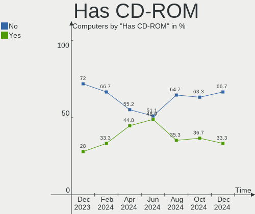
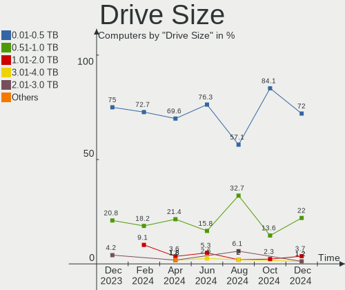
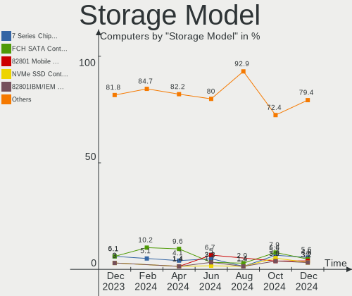
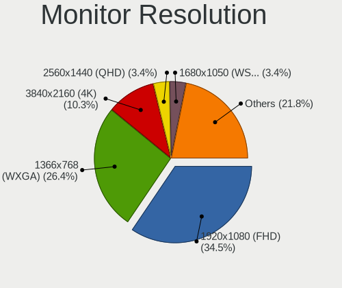
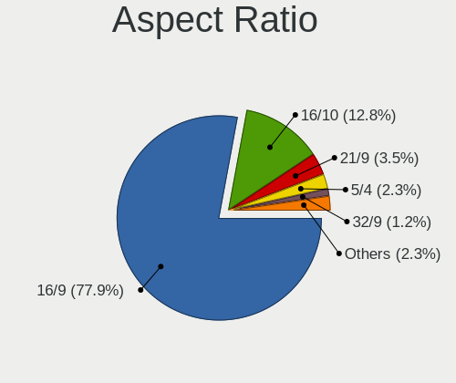
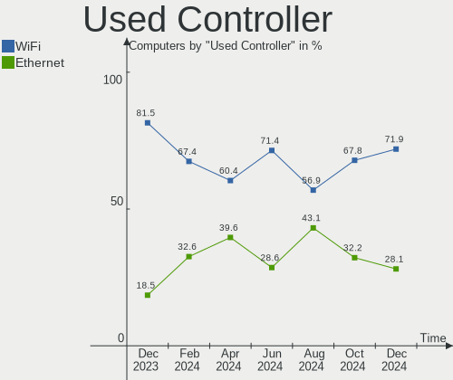
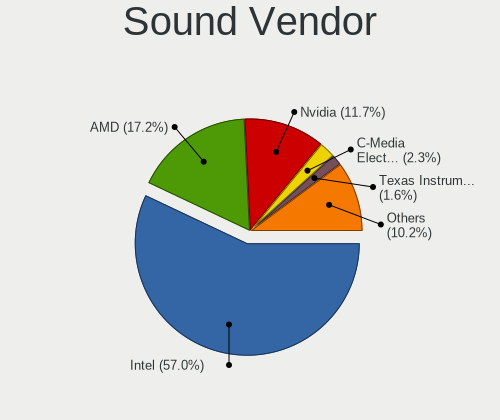

Elementary - Hardware Trends
----------------------------

A project to identify most popular hardware characteristics and track their change
over time based on data collected by Linux users at https://Linux-Hardware.org.

Anyone can contribute to this report by the [hw-probe](https://github.com/linuxhw/hw-probe) tool:

    sudo -E hw-probe -all -upload

This is a report for all computer types. See also reports for [desktops](/Dist/Elementary/Desktop/README.md) and [notebooks](/Dist/Elementary/Notebook/README.md).

This report is for one last month. Overall report since the beginning of time: [TestDays](https://github.com/linuxhw/TestDays)

Period: Jul, 2023.

Contents
--------

* [ System ](#system)
  - [ OS                       ](#os)
  - [ OS Family                ](#os-family)
  - [ Kernel                   ](#kernel)
  - [ Kernel Family            ](#kernel-family)
  - [ Kernel Major Ver.        ](#kernel-major-ver)
  - [ Arch                     ](#arch)
  - [ DE                       ](#de)
  - [ Display Server           ](#display-server)
  - [ Display Manager          ](#display-manager)
  - [ OS Lang                  ](#os-lang)
  - [ Boot Mode                ](#boot-mode)
  - [ Filesystem               ](#filesystem)
  - [ Part. scheme             ](#part-scheme)
  - [ Dual Boot with Linux/BSD ](#dual-boot-with-linuxbsd)
  - [ Dual Boot (Win)          ](#dual-boot-win)

* [ Board ](#board)
  - [ Vendor                   ](#vendor)
  - [ Model                    ](#model)
  - [ Model Family             ](#model-family)
  - [ MFG Year                 ](#mfg-year)
  - [ Form Factor              ](#form-factor)
  - [ Secure Boot              ](#secure-boot)
  - [ Coreboot                 ](#coreboot)
  - [ RAM Size                 ](#ram-size)
  - [ RAM Used                 ](#ram-used)
  - [ Total Drives             ](#total-drives)
  - [ Has CD-ROM               ](#has-cd-rom)
  - [ Has Ethernet             ](#has-ethernet)
  - [ Has WiFi                 ](#has-wifi)
  - [ Has Bluetooth            ](#has-bluetooth)

* [ Location ](#location)
  - [ Country                  ](#country)
  - [ City                     ](#city)

* [ Drives ](#drives)
  - [ Drive Vendor             ](#drive-vendor)
  - [ Drive Model              ](#drive-model)
  - [ HDD Vendor               ](#hdd-vendor)
  - [ SSD Vendor               ](#ssd-vendor)
  - [ Drive Kind               ](#drive-kind)
  - [ Drive Connector          ](#drive-connector)
  - [ Drive Size               ](#drive-size)
  - [ Space Total              ](#space-total)
  - [ Space Used               ](#space-used)
  - [ Malfunc. Drives          ](#malfunc-drives)
  - [ Malfunc. Drive Vendor    ](#malfunc-drive-vendor)
  - [ Malfunc. HDD Vendor      ](#malfunc-hdd-vendor)
  - [ Malfunc. Drive Kind      ](#malfunc-drive-kind)
  - [ Failed Drives            ](#failed-drives)
  - [ Failed Drive Vendor      ](#failed-drive-vendor)
  - [ Drive Status             ](#drive-status)

* [ Storage controller ](#storage-controller)
  - [ Storage Vendor           ](#storage-vendor)
  - [ Storage Model            ](#storage-model)
  - [ Storage Kind             ](#storage-kind)

* [ Processor ](#processor)
  - [ CPU Vendor               ](#cpu-vendor)
  - [ CPU Model                ](#cpu-model)
  - [ CPU Model Family         ](#cpu-model-family)
  - [ CPU Cores                ](#cpu-cores)
  - [ CPU Sockets              ](#cpu-sockets)
  - [ CPU Threads              ](#cpu-threads)
  - [ CPU Op-Modes             ](#cpu-op-modes)
  - [ CPU Microcode            ](#cpu-microcode)
  - [ CPU Microarch            ](#cpu-microarch)

* [ Graphics ](#graphics)
  - [ GPU Vendor               ](#gpu-vendor)
  - [ GPU Model                ](#gpu-model)
  - [ GPU Combo                ](#gpu-combo)
  - [ GPU Driver               ](#gpu-driver)
  - [ GPU Memory               ](#gpu-memory)

* [ Monitor ](#monitor)
  - [ Monitor Vendor           ](#monitor-vendor)
  - [ Monitor Model            ](#monitor-model)
  - [ Monitor Resolution       ](#monitor-resolution)
  - [ Monitor Diagonal         ](#monitor-diagonal)
  - [ Monitor Width            ](#monitor-width)
  - [ Aspect Ratio             ](#aspect-ratio)
  - [ Monitor Area             ](#monitor-area)
  - [ Pixel Density            ](#pixel-density)
  - [ Multiple Monitors        ](#multiple-monitors)

* [ Network ](#network)
  - [ Net Controller Vendor    ](#net-controller-vendor)
  - [ Net Controller Model     ](#net-controller-model)
  - [ Wireless Vendor          ](#wireless-vendor)
  - [ Wireless Model           ](#wireless-model)
  - [ Ethernet Vendor          ](#ethernet-vendor)
  - [ Ethernet Model           ](#ethernet-model)
  - [ Net Controller Kind      ](#net-controller-kind)
  - [ Used Controller          ](#used-controller)
  - [ NICs                     ](#nics)
  - [ IPv6                     ](#ipv6)

* [ Bluetooth ](#bluetooth)
  - [ Bluetooth Vendor         ](#bluetooth-vendor)
  - [ Bluetooth Model          ](#bluetooth-model)

* [ Sound ](#sound)
  - [ Sound Vendor             ](#sound-vendor)
  - [ Sound Model              ](#sound-model)

* [ Memory ](#memory)
  - [ Memory Vendor            ](#memory-vendor)
  - [ Memory Model             ](#memory-model)
  - [ Memory Kind              ](#memory-kind)
  - [ Memory Form Factor       ](#memory-form-factor)
  - [ Memory Size              ](#memory-size)
  - [ Memory Speed             ](#memory-speed)

* [ Printers & scanners ](#printers--scanners)
  - [ Printer Vendor           ](#printer-vendor)
  - [ Printer Model            ](#printer-model)
  - [ Scanner Vendor           ](#scanner-vendor)
  - [ Scanner Model            ](#scanner-model)

* [ Camera ](#camera)
  - [ Camera Vendor            ](#camera-vendor)
  - [ Camera Model             ](#camera-model)

* [ Security ](#security)
  - [ Fingerprint Vendor       ](#fingerprint-vendor)
  - [ Fingerprint Model        ](#fingerprint-model)
  - [ Chipcard Vendor          ](#chipcard-vendor)
  - [ Chipcard Model           ](#chipcard-model)

* [ Unsupported ](#unsupported)
  - [ Unsupported Devices      ](#unsupported-devices)
  - [ Unsupported Device Types ](#unsupported-device-types)

System
------

OS
--

Installed operating systems

| Name           | Computers | Percent |
|----------------|-----------|---------|
| Elementary 7   | 31        | 86.11%  |
| Elementary 6.1 | 5         | 13.89%  |

OS Family
---------

OS without a version

| Name       | Computers | Percent |
|------------|-----------|---------|
| Elementary | 36        | 100%    |

Kernel
------

Version of the Linux kernel

| Version             | Computers | Percent |
|---------------------|-----------|---------|
| 5.19.0-46-generic   | 19        | 52.78%  |
| 5.15.0-58-generic   | 8         | 22.22%  |
| 5.19.0-50-generic   | 2         | 5.56%   |
| 5.15.0-76-generic   | 2         | 5.56%   |
| 6.4.5-x64v3-xanmod1 | 1         | 2.78%   |
| 5.19.0-43-generic   | 1         | 2.78%   |
| 5.15.0-69-generic   | 1         | 2.78%   |
| 5.15.0-56-generic   | 1         | 2.78%   |
| 5.11.0-43-generic   | 1         | 2.78%   |

Kernel Family
-------------

Linux kernel without a distro release

| Version | Computers | Percent |
|---------|-----------|---------|
| 5.19.0  | 22        | 61.11%  |
| 5.15.0  | 12        | 33.33%  |
| 6.4.5   | 1         | 2.78%   |
| 5.11.0  | 1         | 2.78%   |

Kernel Major Ver.
-----------------

Linux kernel major version

| Version | Computers | Percent |
|---------|-----------|---------|
| 5.19    | 22        | 61.11%  |
| 5.15    | 12        | 33.33%  |
| 6.4     | 1         | 2.78%   |
| 5.11    | 1         | 2.78%   |

Arch
----

OS architecture (x86_64, i586, etc.)

| Name   | Computers | Percent |
|--------|-----------|---------|
| x86_64 | 36        | 100%    |

DE
--

Desktop Environment

| Name     | Computers | Percent |
|----------|-----------|---------|
| Pantheon | 36        | 100%    |

Display Server
--------------

X11 or Wayland

| Name | Computers | Percent |
|------|-----------|---------|
| X11  | 36        | 100%    |

Display Manager
---------------

SDDM, LightDM, etc.

| Name    | Computers | Percent |
|---------|-----------|---------|
| Unknown | 36        | 100%    |

OS Lang
-------

Language

| Lang  | Computers | Percent |
|-------|-----------|---------|
| en_US | 13        | 36.11%  |
| de_DE | 6         | 16.67%  |
| es_ES | 5         | 13.89%  |
| ru_RU | 2         | 5.56%   |
| it_IT | 2         | 5.56%   |
| en_AU | 2         | 5.56%   |
| sv_SE | 1         | 2.78%   |
| pl_PL | 1         | 2.78%   |
| nb_NO | 1         | 2.78%   |
| fr_CA | 1         | 2.78%   |
| en_GB | 1         | 2.78%   |
| el_GR | 1         | 2.78%   |

Boot Mode
---------

EFI or BIOS

| Mode | Computers | Percent |
|------|-----------|---------|
| BIOS | 33        | 91.67%  |
| EFI  | 3         | 8.33%   |

Filesystem
----------

Type of filesystem

| Type | Computers | Percent |
|------|-----------|---------|
| Ext4 | 36        | 100%    |

Part. scheme
------------

Scheme of partitioning

| Type    | Computers | Percent |
|---------|-----------|---------|
| Unknown | 36        | 100%    |

Dual Boot with Linux/BSD
------------------------

Hosting more than one Linux/BSD

| Dual boot | Computers | Percent |
|-----------|-----------|---------|
| No        | 36        | 100%    |

Dual Boot (Win)
---------------

Hosting Linux and Windows

| Dual boot | Computers | Percent |
|-----------|-----------|---------|
| No        | 36        | 100%    |

Board
-----

Vendor
------

Motherboard manufacturer

| Name                        | Computers | Percent |
|-----------------------------|-----------|---------|
| Apple                       | 9         | 25%     |
| Hewlett-Packard             | 6         | 16.67%  |
| Acer                        | 4         | 11.11%  |
| Lenovo                      | 3         | 8.33%   |
| Wortmann AG                 | 2         | 5.56%   |
| ASUSTek Computer            | 2         | 5.56%   |
| ASRock                      | 2         | 5.56%   |
| Alienware                   | 2         | 5.56%   |
| SHENZHEN YOUDISI E-COMMERCE | 1         | 2.78%   |
| MSI                         | 1         | 2.78%   |
| HUAWEI                      | 1         | 2.78%   |
| GPD                         | 1         | 2.78%   |
| Google                      | 1         | 2.78%   |
| Dell                        | 1         | 2.78%   |

Model
-----

Motherboard model

| Name                                | Computers | Percent |
|-------------------------------------|-----------|---------|
| Apple MacBookPro8,1                 | 2         | 5.56%   |
| Wortmann AG TERRA_PC                | 1         | 2.78%   |
| Wortmann AG 1220624_1470150         | 1         | 2.78%   |
| SHENZHEN YOUDISI E-COMMERCE A8S PRO | 1         | 2.78%   |
| MSI MS-7C52                         | 1         | 2.78%   |
| Lenovo Yoga 530-14ARR 81H9          | 1         | 2.78%   |
| Lenovo ThinkPad X230 23254W5        | 1         | 2.78%   |
| Lenovo ThinkCentre M910s 10MLS05C00 | 1         | 2.78%   |
| HUAWEI BOHB-WAX9                    | 1         | 2.78%   |
| HP Pavilion dv7                     | 1         | 2.78%   |
| HP Notebook                         | 1         | 2.78%   |
| HP Laptop 14-dq0xxx                 | 1         | 2.78%   |
| HP ENVY x360 Convertible            | 1         | 2.78%   |
| HP ENVY 15                          | 1         | 2.78%   |
| HP 255 G8 Notebook PC               | 1         | 2.78%   |
| GPD MicroPC                         | 1         | 2.78%   |
| Google Phaser360                    | 1         | 2.78%   |
| Dell Latitude E7270                 | 1         | 2.78%   |
| ASUS Zenbook UX3402ZA_UX3402ZA      | 1         | 2.78%   |
| ASUS VivoBook_ASUSLaptop X515EA     | 1         | 2.78%   |
| ASRock X570 Extreme4                | 1         | 2.78%   |
| ASRock X370 Pro4                    | 1         | 2.78%   |
| Apple MacPro4,1                     | 1         | 2.78%   |
| Apple Macmini6,1                    | 1         | 2.78%   |
| Apple MacBookPro9,2                 | 1         | 2.78%   |
| Apple MacBookPro12,1                | 1         | 2.78%   |
| Apple MacBookPro11,3                | 1         | 2.78%   |
| Apple iMac11,3                      | 1         | 2.78%   |
| Apple iMac11,2                      | 1         | 2.78%   |
| Alienware m15 R6                    | 1         | 2.78%   |
| Alienware Aurora R6                 | 1         | 2.78%   |
| Acer Spin SP314-53GN                | 1         | 2.78%   |
| Acer Aspire TC-380                  | 1         | 2.78%   |
| Acer Aspire A315-32                 | 1         | 2.78%   |
| Acer Aspire 7750G                   | 1         | 2.78%   |

Model Family
------------

Motherboard model prefix

| Name                            | Computers | Percent |
|---------------------------------|-----------|---------|
| Acer Aspire                     | 3         | 8.33%   |
| HP ENVY                         | 2         | 5.56%   |
| Apple MacBookPro8               | 2         | 5.56%   |
| Apple iMac11                    | 2         | 5.56%   |
| Wortmann AG TERRA               | 1         | 2.78%   |
| Wortmann AG 1220624             | 1         | 2.78%   |
| SHENZHEN YOUDISI E-COMMERCE A8S | 1         | 2.78%   |
| MSI MS-7C52                     | 1         | 2.78%   |
| Lenovo Yoga                     | 1         | 2.78%   |
| Lenovo ThinkPad                 | 1         | 2.78%   |
| Lenovo ThinkCentre              | 1         | 2.78%   |
| HUAWEI BOHB-WAX9                | 1         | 2.78%   |
| HP Pavilion                     | 1         | 2.78%   |
| HP Notebook                     | 1         | 2.78%   |
| HP Laptop                       | 1         | 2.78%   |
| HP 255                          | 1         | 2.78%   |
| GPD MicroPC                     | 1         | 2.78%   |
| Google Phaser360                | 1         | 2.78%   |
| Dell Latitude                   | 1         | 2.78%   |
| ASUS Zenbook                    | 1         | 2.78%   |
| ASUS VivoBook                   | 1         | 2.78%   |
| ASRock X570                     | 1         | 2.78%   |
| ASRock X370                     | 1         | 2.78%   |
| Apple MacPro4                   | 1         | 2.78%   |
| Apple Macmini6                  | 1         | 2.78%   |
| Apple MacBookPro9               | 1         | 2.78%   |
| Apple MacBookPro12              | 1         | 2.78%   |
| Apple MacBookPro11              | 1         | 2.78%   |
| Alienware m15                   | 1         | 2.78%   |
| Alienware Aurora                | 1         | 2.78%   |
| Acer Spin                       | 1         | 2.78%   |

MFG Year
--------

Motherboard manufacture year

| Year | Computers | Percent |
|------|-----------|---------|
| 2019 | 5         | 13.89%  |
| 2018 | 5         | 13.89%  |
| 2021 | 4         | 11.11%  |
| 2020 | 3         | 8.33%   |
| 2012 | 3         | 8.33%   |
| 2011 | 3         | 8.33%   |
| 2010 | 3         | 8.33%   |
| 2022 | 2         | 5.56%   |
| 2015 | 2         | 5.56%   |
| 2013 | 2         | 5.56%   |
| 2017 | 1         | 2.78%   |
| 2016 | 1         | 2.78%   |
| 2009 | 1         | 2.78%   |
| 2008 | 1         | 2.78%   |

Form Factor
-----------

Physical design of the computer

| Name        | Computers | Percent |
|-------------|-----------|---------|
| Notebook    | 21        | 58.33%  |
| Desktop     | 8         | 22.22%  |
| Convertible | 4         | 11.11%  |
| All in one  | 2         | 5.56%   |
| Mini pc     | 1         | 2.78%   |

Secure Boot
-----------

Enabled or disabled

| State    | Computers | Percent |
|----------|-----------|---------|
| Disabled | 36        | 100%    |

Coreboot
--------

Have coreboot on board

| Used | Computers | Percent |
|------|-----------|---------|
| No   | 35        | 97.22%  |
| Yes  | 1         | 2.78%   |

RAM Size
--------

Total RAM memory

| Size in GB  | Computers | Percent |
|-------------|-----------|---------|
| 4.01-8.0    | 11        | 30.56%  |
| 8.01-16.0   | 10        | 27.78%  |
| 16.01-24.0  | 6         | 16.67%  |
| 32.01-64.0  | 4         | 11.11%  |
| 3.01-4.0    | 4         | 11.11%  |
| 64.01-256.0 | 1         | 2.78%   |

RAM Used
--------

Used RAM memory

| Used GB   | Computers | Percent |
|-----------|-----------|---------|
| 3.01-4.0  | 9         | 25%     |
| 2.01-3.0  | 9         | 25%     |
| 4.01-8.0  | 8         | 22.22%  |
| 1.01-2.0  | 7         | 19.44%  |
| 0.51-1.0  | 2         | 5.56%   |
| 8.01-16.0 | 1         | 2.78%   |

Total Drives
------------

Number of drives on board

| Drives | Computers | Percent |
|--------|-----------|---------|
| 1      | 29        | 80.56%  |
| 2      | 4         | 11.11%  |
| 3      | 2         | 5.56%   |
| 4      | 1         | 2.78%   |

Has CD-ROM
----------

Has CD-ROM on board

| Presented | Computers | Percent |
|-----------|-----------|---------|
| No        | 22        | 61.11%  |
| Yes       | 14        | 38.89%  |

Has Ethernet
------------

Has Ethernet on board

| Presented | Computers | Percent |
|-----------|-----------|---------|
| Yes       | 27        | 75%     |
| No        | 9         | 25%     |

Has WiFi
--------

Has WiFi module

| Presented | Computers | Percent |
|-----------|-----------|---------|
| Yes       | 30        | 83.33%  |
| No        | 6         | 16.67%  |

Has Bluetooth
-------------

Has Bluetooth module

| Presented | Computers | Percent |
|-----------|-----------|---------|
| Yes       | 29        | 80.56%  |
| No        | 7         | 19.44%  |

Location
--------

Country
-------

Geographic location (country)

| Country     | Computers | Percent |
|-------------|-----------|---------|
| USA         | 6         | 16.67%  |
| Germany     | 5         | 13.89%  |
| India       | 3         | 8.33%   |
| Spain       | 2         | 5.56%   |
| Russia      | 2         | 5.56%   |
| Netherlands | 2         | 5.56%   |
| Italy       | 2         | 5.56%   |
| Canada      | 2         | 5.56%   |
| Brazil      | 2         | 5.56%   |
| Australia   | 2         | 5.56%   |
| UK          | 1         | 2.78%   |
| Sweden      | 1         | 2.78%   |
| Poland      | 1         | 2.78%   |
| Panama      | 1         | 2.78%   |
| Norway      | 1         | 2.78%   |
| Greece      | 1         | 2.78%   |
| Chile       | 1         | 2.78%   |
| Argentina   | 1         | 2.78%   |

City
----

Geographic location (city)

| City                | Computers | Percent |
|---------------------|-----------|---------|
| Delhi               | 2         | 5.56%   |
| Cologne             | 2         | 5.56%   |
| Yorktown            | 1         | 2.78%   |
| Yekaterinburg       | 1         | 2.78%   |
| Tegelen             | 1         | 2.78%   |
| Sydney              | 1         | 2.78%   |
| Sorum               | 1         | 2.78%   |
| Rutherford          | 1         | 2.78%   |
| Plauen              | 1         | 2.78%   |
| Perth               | 1         | 2.78%   |
| Pátrai             | 1         | 2.78%   |
| Panama City         | 1         | 2.78%   |
| Oviedo              | 1         | 2.78%   |
| Niagara Falls       | 1         | 2.78%   |
| Moscow              | 1         | 2.78%   |
| Monza               | 1         | 2.78%   |
| Mogi Guacu          | 1         | 2.78%   |
| Milano              | 1         | 2.78%   |
| Middlesbrough       | 1         | 2.78%   |
| Mascouche           | 1         | 2.78%   |
| Madrid              | 1         | 2.78%   |
| Independence        | 1         | 2.78%   |
| Hualpen             | 1         | 2.78%   |
| Hot Springs Village | 1         | 2.78%   |
| Grudziądz          | 1         | 2.78%   |
| Grapevine           | 1         | 2.78%   |
| Gävle              | 1         | 2.78%   |
| Faridabad           | 1         | 2.78%   |
| Clover              | 1         | 2.78%   |
| Burbach             | 1         | 2.78%   |
| Buenos Aires        | 1         | 2.78%   |
| Brasília           | 1         | 2.78%   |
| Bottrop             | 1         | 2.78%   |
| Amsterdam           | 1         | 2.78%   |

Drives
------

Drive Vendor
------------

Hard drive vendors

| Vendor                    | Computers | Drives | Percent |
|---------------------------|-----------|--------|---------|
| Samsung Electronics       | 7         | 7      | 16.28%  |
| WDC                       | 6         | 8      | 13.95%  |
| Toshiba                   | 6         | 7      | 13.95%  |
| Seagate                   | 3         | 3      | 6.98%   |
| Sandisk                   | 3         | 3      | 6.98%   |
| Crucial                   | 3         | 3      | 6.98%   |
| Intel                     | 2         | 2      | 4.65%   |
| Unknown                   | 1         | 1      | 2.33%   |
| SK hynix                  | 1         | 1      | 2.33%   |
| Realtek Semiconductor     | 1         | 1      | 2.33%   |
| PNY                       | 1         | 1      | 2.33%   |
| OCZ-VERTEX2               | 1         | 1      | 2.33%   |
| Micron/Crucial Technology | 1         | 1      | 2.33%   |
| KUU                       | 1         | 1      | 2.33%   |
| Kingston                  | 1         | 1      | 2.33%   |
| Hitachi                   | 1         | 1      | 2.33%   |
| HGST                      | 1         | 1      | 2.33%   |
| BIWIN                     | 1         | 1      | 2.33%   |
| Apple                     | 1         | 1      | 2.33%   |
| Unknown                   | 1         | 1      | 2.33%   |

Drive Model
-----------

Hard drive models

| Model                                               | Computers | Percent |
|-----------------------------------------------------|-----------|---------|
| Toshiba MK5065GSXF 500GB                            | 2         | 4.55%   |
| Toshiba DT01ACA200 2TB                              | 2         | 4.55%   |
| Sandisk WD Blue SN550 NVMe SSD 250GB                | 2         | 4.55%   |
| Samsung MZNLH128HBHQ-000H1 128GB SSD                | 2         | 4.55%   |
| Crucial CT500MX500SSD1 500GB                        | 2         | 4.55%   |
| WDC WDS500G2B0A-00SM50 500GB SSD                    | 1         | 2.27%   |
| WDC WD5000AAKS-00UU3A0 500GB                        | 1         | 2.27%   |
| WDC WD20EZRX-00D8PB0 2TB                            | 1         | 2.27%   |
| WDC WD10SPZX-21Z10T0 1TB                            | 1         | 2.27%   |
| WDC WD10EZEX-21WN4A0 1TB                            | 1         | 2.27%   |
| WDC WD10EZEX-08WN4A0 1TB                            | 1         | 2.27%   |
| Unknown MMC Card  64GB                              | 1         | 2.27%   |
| Toshiba XG4 NVMe SSD Controller 256GB               | 1         | 2.27%   |
| Toshiba MQ01ABF032 320GB                            | 1         | 2.27%   |
| Toshiba HDWD110 1TB                                 | 1         | 2.27%   |
| SK hynix BC501 NVMe Solid State Drive 512GB         | 1         | 2.27%   |
| Seagate ST320LT007-9ZV142 320GB                     | 1         | 2.27%   |
| Seagate ST31000528AS 1TB                            | 1         | 2.27%   |
| Seagate ST1000DM010-2EP102 1TB                      | 1         | 2.27%   |
| SanDisk SDSSDA240G 240GB                            | 1         | 2.27%   |
| Samsung SSD 980 1TB                                 | 1         | 2.27%   |
| Samsung SSD 860 EVO 500GB                           | 1         | 2.27%   |
| Samsung NVMe SSD Controller SM981/PM981/PM983 500GB | 1         | 2.27%   |
| Samsung NVMe SSD Controller PM9A1/PM9A3/980PRO 1TB  | 1         | 2.27%   |
| Samsung MZVLQ256HAJD-000AC 256GB                    | 1         | 2.27%   |
| Realtek ADATA SX6000LNP 1024GB                      | 1         | 2.27%   |
| PNY CS900 480GB SSD                                 | 1         | 2.27%   |
| OCZ-VERTEX2 3.5 120GB SSD                           | 1         | 2.27%   |
| Micron/Crucial P2 NVMe PCIe SSD 1TB                 | 1         | 2.27%   |
| KUU 256GB                                           | 1         | 2.27%   |
| Kingston SKC3000D2048G 2TB                          | 1         | 2.27%   |
| Intel SSDSC2BF180A5L 180GB                          | 1         | 2.27%   |
| Intel SSD 600P Series 512GB                         | 1         | 2.27%   |
| Hitachi HDE721064SLA360 640GB                       | 1         | 2.27%   |
| HGST HTS545050A7E680 500GB                          | 1         | 2.27%   |
| Crucial CT275MX300SSD1 275GB                        | 1         | 2.27%   |
| BIWIN SSD 256GB                                     | 1         | 2.27%   |
| Apple SSD SM0512F 500GB                             | 1         | 2.27%   |
| Unknown                                             | 1         | 2.27%   |

HDD Vendor
----------

Hard disk drive vendors

| Vendor  | Computers | Drives | Percent |
|---------|-----------|--------|---------|
| Toshiba | 6         | 6      | 37.5%   |
| WDC     | 5         | 7      | 31.25%  |
| Seagate | 3         | 3      | 18.75%  |
| Hitachi | 1         | 1      | 6.25%   |
| HGST    | 1         | 1      | 6.25%   |

SSD Vendor
----------

Solid state drive vendors

| Vendor              | Computers | Drives | Percent |
|---------------------|-----------|--------|---------|
| Samsung Electronics | 3         | 3      | 21.43%  |
| Crucial             | 3         | 3      | 21.43%  |
| WDC                 | 1         | 1      | 7.14%   |
| SanDisk             | 1         | 1      | 7.14%   |
| PNY                 | 1         | 1      | 7.14%   |
| OCZ-VERTEX2         | 1         | 1      | 7.14%   |
| KUU                 | 1         | 1      | 7.14%   |
| Intel               | 1         | 1      | 7.14%   |
| BIWIN               | 1         | 1      | 7.14%   |
| Apple               | 1         | 1      | 7.14%   |

Drive Kind
----------

HDD or SSD

| Kind    | Computers | Drives | Percent |
|---------|-----------|--------|---------|
| HDD     | 15        | 18     | 35.71%  |
| SSD     | 14        | 14     | 33.33%  |
| NVMe    | 11        | 12     | 26.19%  |
| MMC     | 1         | 1      | 2.38%   |
| Unknown | 1         | 1      | 2.38%   |

Drive Connector
---------------

SATA, SAS, NVMe, etc.

| Type | Computers | Drives | Percent |
|------|-----------|--------|---------|
| SATA | 27        | 33     | 69.23%  |
| NVMe | 11        | 12     | 28.21%  |
| MMC  | 1         | 1      | 2.56%   |

Drive Size
----------

Size of hard drive

| Size in TB | Computers | Drives | Percent |
|------------|-----------|--------|---------|
| 0.01-0.5   | 20        | 22     | 66.67%  |
| 0.51-1.0   | 7         | 7      | 23.33%  |
| 1.01-2.0   | 3         | 3      | 10%     |

Space Total
-----------

Amount of disk space available on the file system

| Size in GB | Computers | Percent |
|------------|-----------|---------|
| 251-500    | 14        | 38.89%  |
| 101-250    | 13        | 36.11%  |
| 501-1000   | 4         | 11.11%  |
| 51-100     | 3         | 8.33%   |
| 2001-3000  | 1         | 2.78%   |
| 1-20       | 1         | 2.78%   |

Space Used
----------

Amount of used disk space

| Used GB   | Computers | Percent |
|-----------|-----------|---------|
| 1-20      | 15        | 41.67%  |
| 21-50     | 10        | 27.78%  |
| 51-100    | 8         | 22.22%  |
| 101-250   | 2         | 5.56%   |
| 1001-2000 | 1         | 2.78%   |

Malfunc. Drives
---------------

Drive models with a malfunction

Zero info for selected period =(

Malfunc. Drive Vendor
---------------------

Vendors of faulty drives

Zero info for selected period =(

Malfunc. HDD Vendor
-------------------

Vendors of faulty HDD drives

Zero info for selected period =(

Malfunc. Drive Kind
-------------------

Kinds of faulty drives

Zero info for selected period =(

Failed Drives
-------------

Failed drive models

Zero info for selected period =(

Failed Drive Vendor
-------------------

Failed drive vendors

Zero info for selected period =(

Drive Status
------------

Number of failed and malfunc. drives

| Status   | Computers | Drives | Percent |
|----------|-----------|--------|---------|
| Detected | 35        | 45     | 97.22%  |
| Works    | 1         | 1      | 2.78%   |

Storage controller
------------------

Storage Vendor
--------------

Storage controller vendors

| Vendor                       | Computers | Percent |
|------------------------------|-----------|---------|
| Intel                        | 28        | 59.57%  |
| AMD                          | 6         | 12.77%  |
| Samsung Electronics          | 5         | 10.64%  |
| SanDisk                      | 2         | 4.26%   |
| Toshiba America Info Systems | 1         | 2.13%   |
| SK hynix                     | 1         | 2.13%   |
| Realtek Semiconductor        | 1         | 2.13%   |
| Micron/Crucial Technology    | 1         | 2.13%   |
| Kingston Technology Company  | 1         | 2.13%   |
| ASMedia Technology           | 1         | 2.13%   |

Storage Model
-------------

Storage controller models

| Model                                                                          | Computers | Percent |
|--------------------------------------------------------------------------------|-----------|---------|
| AMD FCH SATA Controller [AHCI mode]                                            | 6         | 11.76%  |
| Intel Celeron/Pentium Silver Processor SATA Controller                         | 5         | 9.8%    |
| Intel 7 Series Chipset Family 6-port SATA Controller [AHCI mode]               | 4         | 7.84%   |
| Intel 6 Series/C200 Series Chipset Family 6 port Mobile SATA AHCI Controller   | 3         | 5.88%   |
| SanDisk WD Blue SN550 NVMe SSD                                                 | 2         | 3.92%   |
| Samsung NVMe SSD Controller 980                                                | 2         | 3.92%   |
| Intel Wildcat Point-LP SATA Controller [AHCI Mode]                             | 2         | 3.92%   |
| Intel Volume Management Device NVMe RAID Controller                            | 2         | 3.92%   |
| Intel 5 Series/3400 Series Chipset 6 port SATA AHCI Controller                 | 2         | 3.92%   |
| Intel 200 Series PCH SATA controller [AHCI mode]                               | 2         | 3.92%   |
| Toshiba America Info Systems XG4 NVMe SSD Controller                           | 1         | 1.96%   |
| SK hynix BC501 NVMe Solid State Drive                                          | 1         | 1.96%   |
| Samsung S4LN053X01 AHCI SSD Controller(Apple slot)                             | 1         | 1.96%   |
| Samsung NVMe SSD Controller SM981/PM981/PM983                                  | 1         | 1.96%   |
| Samsung NVMe SSD Controller PM9A1/PM9A3/980PRO                                 | 1         | 1.96%   |
| Realtek RTS5763DL NVMe SSD Controller (DRAM-less)                              | 1         | 1.96%   |
| Micron/Crucial P2 [Nick P2] / P3 / P3 Plus NVMe PCIe SSD (DRAM-less)           | 1         | 1.96%   |
| Kingston Company KC3000/Renegade NVMe SSD                                      | 1         | 1.96%   |
| Intel Tiger Lake-LP SATA Controller                                            | 1         | 1.96%   |
| Intel Tiger Lake SATA AHCI Controller                                          | 1         | 1.96%   |
| Intel Sunrise Point-LP SATA Controller [AHCI mode]                             | 1         | 1.96%   |
| Intel SSD 600P Series                                                          | 1         | 1.96%   |
| Intel Comet Lake SATA AHCI Controller                                          | 1         | 1.96%   |
| Intel Cannon Point-LP SATA Controller [AHCI Mode]                              | 1         | 1.96%   |
| Intel 82801JI (ICH10 Family) SATA AHCI Controller                              | 1         | 1.96%   |
| Intel 8 Series/C220 Series Chipset Family 6-port SATA Controller 1 [AHCI mode] | 1         | 1.96%   |
| Intel 5 Series/3400 Series Chipset 4 port SATA AHCI Controller                 | 1         | 1.96%   |
| ASMedia ASM1062 Serial ATA Controller                                          | 1         | 1.96%   |
| AMD X370 Series Chipset SATA Controller                                        | 1         | 1.96%   |
| AMD FCH SATA Controller D                                                      | 1         | 1.96%   |
| AMD 300 Series Chipset SATA Controller                                         | 1         | 1.96%   |

Storage Kind
------------

Kind of storage controller (IDE, SATA, NVMe, SAS, ...)

| Kind | Computers | Percent |
|------|-----------|---------|
| SATA | 33        | 71.74%  |
| NVMe | 11        | 23.91%  |
| RAID | 2         | 4.35%   |

Processor
---------

CPU Vendor
----------

Processor vendors

| Vendor | Computers | Percent |
|--------|-----------|---------|
| Intel  | 30        | 83.33%  |
| AMD    | 6         | 16.67%  |

CPU Model
---------

Processor models

| Model                                         | Computers | Percent |
|-----------------------------------------------|-----------|---------|
| Intel Core i5-3210M CPU @ 2.50GHz             | 2         | 5.56%   |
| Intel Core i5-2435M CPU @ 2.40GHz             | 2         | 5.56%   |
| Intel Celeron N4000 CPU @ 1.10GHz             | 2         | 5.56%   |
| Intel Xeon CPU W3520 @ 2.67GHz                | 1         | 2.78%   |
| Intel Pentium Silver N5030 CPU @ 1.10GHz      | 1         | 2.78%   |
| Intel Pentium Silver N5000 CPU @ 1.10GHz      | 1         | 2.78%   |
| Intel Core i7-7700 CPU @ 3.60GHz              | 1         | 2.78%   |
| Intel Core i7-6600U CPU @ 2.60GHz             | 1         | 2.78%   |
| Intel Core i7-4870HQ CPU @ 2.50GHz            | 1         | 2.78%   |
| Intel Core i7-4710HQ CPU @ 2.50GHz            | 1         | 2.78%   |
| Intel Core i7 CPU Q 720 @ 1.60GHz             | 1         | 2.78%   |
| Intel Core i7 CPU 870 @ 2.93GHz               | 1         | 2.78%   |
| Intel Core i5-8265U CPU @ 1.60GHz             | 1         | 2.78%   |
| Intel Core i5-5257U CPU @ 2.70GHz             | 1         | 2.78%   |
| Intel Core i5-5200U CPU @ 2.20GHz             | 1         | 2.78%   |
| Intel Core i5-2410M CPU @ 2.30GHz             | 1         | 2.78%   |
| Intel Core i3-7100 CPU @ 3.90GHz              | 1         | 2.78%   |
| Intel Core i3-5005U CPU @ 2.00GHz             | 1         | 2.78%   |
| Intel Core i3-3110M CPU @ 2.40GHz             | 1         | 2.78%   |
| Intel Core i3-10110U CPU @ 2.10GHz            | 1         | 2.78%   |
| Intel Core i3 CPU 550 @ 3.20GHz               | 1         | 2.78%   |
| Intel Celeron N4120 CPU @ 1.10GHz             | 1         | 2.78%   |
| Intel Celeron J4125 CPU @ 2.00GHz             | 1         | 2.78%   |
| Intel Celeron CPU 1007U @ 1.50GHz             | 1         | 2.78%   |
| Intel 12th Gen Core i7-1260P                  | 1         | 2.78%   |
| Intel 11th Gen Core i7-11800H @ 2.30GHz       | 1         | 2.78%   |
| Intel 11th Gen Core i3-1115G4 @ 3.00GHz       | 1         | 2.78%   |
| AMD Ryzen 9 5900X 12-Core Processor           | 1         | 2.78%   |
| AMD Ryzen 7 3700X 8-Core Processor            | 1         | 2.78%   |
| AMD Ryzen 5 2500U with Radeon Vega Mobile Gfx | 1         | 2.78%   |
| AMD Ryzen 5 2400G with Radeon Vega Graphics   | 1         | 2.78%   |
| AMD Athlon Gold 3150U with Radeon Graphics    | 1         | 2.78%   |
| AMD A8-9600 RADEON R7, 10 COMPUTE CORES 4C+6G | 1         | 2.78%   |

CPU Model Family
----------------

Processor model prefix

| Model                | Computers | Percent |
|----------------------|-----------|---------|
| Intel Core i5        | 8         | 22.22%  |
| Intel Core i7        | 6         | 16.67%  |
| Intel Core i3        | 5         | 13.89%  |
| Intel Celeron        | 5         | 13.89%  |
| Other                | 3         | 8.33%   |
| Intel Pentium Silver | 2         | 5.56%   |
| AMD Ryzen 5          | 2         | 5.56%   |
| Intel Xeon           | 1         | 2.78%   |
| AMD Ryzen 9          | 1         | 2.78%   |
| AMD Ryzen 7          | 1         | 2.78%   |
| AMD Athlon           | 1         | 2.78%   |
| AMD A8               | 1         | 2.78%   |

CPU Cores
---------

Number of processor cores

| Number | Computers | Percent |
|--------|-----------|---------|
| 2      | 19        | 52.78%  |
| 4      | 13        | 36.11%  |
| 12     | 2         | 5.56%   |
| 8      | 2         | 5.56%   |

CPU Sockets
-----------

Number of sockets

| Number | Computers | Percent |
|--------|-----------|---------|
| 1      | 36        | 100%    |

CPU Threads
-----------

Threads per core (Hyper-Threading)

| Number | Computers | Percent |
|--------|-----------|---------|
| 2      | 29        | 80.56%  |
| 1      | 7         | 19.44%  |

CPU Op-Modes
------------

CPU Operation Modes (32-bit, 64-bit)

| Op mode        | Computers | Percent |
|----------------|-----------|---------|
| 32-bit, 64-bit | 36        | 100%    |

CPU Microcode
-------------

Microcode number

| Number  | Computers | Percent |
|---------|-----------|---------|
| Unknown | 31        | 86.11%  |
| 0x706a1 | 2         | 5.56%   |
| 0x106e5 | 2         | 5.56%   |
| 0x206a7 | 1         | 2.78%   |

CPU Microarch
-------------

Microarchitecture

| Name          | Computers | Percent |
|---------------|-----------|---------|
| Goldmont plus | 6         | 16.67%  |
| KabyLake      | 4         | 11.11%  |
| IvyBridge     | 4         | 11.11%  |
| SandyBridge   | 3         | 8.33%   |
| Nehalem       | 3         | 8.33%   |
| Broadwell     | 3         | 8.33%   |
| Zen           | 2         | 5.56%   |
| Haswell       | 2         | 5.56%   |
| Unknown       | 2         | 5.56%   |
| Zen+          | 1         | 2.78%   |
| Zen 3         | 1         | 2.78%   |
| Zen 2         | 1         | 2.78%   |
| Westmere      | 1         | 2.78%   |
| TigerLake     | 1         | 2.78%   |
| Skylake       | 1         | 2.78%   |
| Excavator     | 1         | 2.78%   |

Graphics
--------

GPU Vendor
----------

Vendors of graphics cards

| Vendor | Computers | Percent |
|--------|-----------|---------|
| Intel  | 24        | 61.54%  |
| AMD    | 11        | 28.21%  |
| Nvidia | 4         | 10.26%  |

GPU Model
---------

Graphics card models

| Model                                                                     | Computers | Percent |
|---------------------------------------------------------------------------|-----------|---------|
| Intel GeminiLake [UHD Graphics 600]                                       | 4         | 10.26%  |
| Intel 3rd Gen Core processor Graphics Controller                          | 4         | 10.26%  |
| Intel HD Graphics 630                                                     | 2         | 5.13%   |
| Intel HD Graphics 5500                                                    | 2         | 5.13%   |
| Intel GeminiLake [UHD Graphics 605]                                       | 2         | 5.13%   |
| Intel 2nd Generation Core Processor Family Integrated Graphics Controller | 2         | 5.13%   |
| Nvidia GP108M [GeForce MX230]                                             | 1         | 2.56%   |
| Nvidia GP104 [GeForce GTX 1080]                                           | 1         | 2.56%   |
| Nvidia GK107M [GeForce GT 750M Mac Edition]                               | 1         | 2.56%   |
| Nvidia GA104M [GeForce RTX 3070 Mobile / Max-Q]                           | 1         | 2.56%   |
| Intel WhiskeyLake-U GT2 [UHD Graphics 620]                                | 1         | 2.56%   |
| Intel TigerLake-H GT1 [UHD Graphics]                                      | 1         | 2.56%   |
| Intel Tiger Lake-LP GT2 [UHD Graphics G4]                                 | 1         | 2.56%   |
| Intel Skylake GT2 [HD Graphics 520]                                       | 1         | 2.56%   |
| Intel Iris Graphics 6100                                                  | 1         | 2.56%   |
| Intel CometLake-U GT2 [UHD Graphics]                                      | 1         | 2.56%   |
| Intel Alder Lake-P Integrated Graphics Controller                         | 1         | 2.56%   |
| Intel 4th Gen Core Processor Integrated Graphics Controller               | 1         | 2.56%   |
| AMD Whistler [Radeon HD 6630M/6650M/6750M/7670M/7690M]                    | 1         | 2.56%   |
| AMD Wani [Radeon R5/R6/R7 Graphics]                                       | 1         | 2.56%   |
| AMD Raven Ridge [Radeon Vega Series / Radeon Vega Mobile Series]          | 1         | 2.56%   |
| AMD Picasso/Raven 2 [Radeon Vega Series / Radeon Vega Mobile Series]      | 1         | 2.56%   |
| AMD Navi 14 [Radeon RX 5500/5500M / Pro 5500M]                            | 1         | 2.56%   |
| AMD Navi 10 [Radeon RX 5600 OEM/5600 XT / 5700/5700 XT]                   | 1         | 2.56%   |
| AMD Madison [Mobility Radeon HD 5730 / 6570M]                             | 1         | 2.56%   |
| AMD Madison [Mobility Radeon HD 5650/5750 / 6530M/6550M]                  | 1         | 2.56%   |
| AMD Juniper XT [Radeon HD 5770]                                           | 1         | 2.56%   |
| AMD Ellesmere [Radeon RX 470/480/570/570X/580/580X/590]                   | 1         | 2.56%   |
| AMD Broadway PRO [Mobility Radeon HD 5850]                                | 1         | 2.56%   |

GPU Combo
---------

Combinations of graphics cards

| Name           | Computers | Percent |
|----------------|-----------|---------|
| 1 x Intel      | 20        | 55.56%  |
| 1 x AMD        | 11        | 30.56%  |
| 1 x Nvidia     | 2         | 5.56%   |
| Intel + Nvidia | 2         | 5.56%   |
| Other          | 1         | 2.78%   |

GPU Driver
----------

Free vs proprietary

| Driver      | Computers | Percent |
|-------------|-----------|---------|
| Free        | 33        | 91.67%  |
| Proprietary | 2         | 5.56%   |
| Unknown     | 1         | 2.78%   |

GPU Memory
----------

Total video memory

| Size in GB | Computers | Percent |
|------------|-----------|---------|
| Unknown    | 33        | 91.67%  |
| 0.51-1.0   | 3         | 8.33%   |

Monitor
-------

Monitor Vendor
--------------

Monitor vendors

| Vendor               | Computers | Percent |
|----------------------|-----------|---------|
| AU Optronics         | 9         | 26.47%  |
| Apple                | 7         | 20.59%  |
| Samsung Electronics  | 3         | 8.82%   |
| Dell                 | 3         | 8.82%   |
| BOE                  | 3         | 8.82%   |
| ViewSonic            | 1         | 2.94%   |
| Sharp                | 1         | 2.94%   |
| LG Display           | 1         | 2.94%   |
| Lenovo               | 1         | 2.94%   |
| Goldstar             | 1         | 2.94%   |
| Chimei Innolux       | 1         | 2.94%   |
| ASUSTek Computer     | 1         | 2.94%   |
| Ancor Communications | 1         | 2.94%   |
| Acer                 | 1         | 2.94%   |

Monitor Model
-------------

Monitor models

| Model                                                                  | Computers | Percent |
|------------------------------------------------------------------------|-----------|---------|
| ViewSonic VA2719 Series VSCC132 1920x1080 598x336mm 27.0-inch          | 1         | 2.78%   |
| Sharp LCD Monitor SHP151C 1920x1080 344x194mm 15.5-inch                | 1         | 2.78%   |
| Samsung Electronics LCD Monitor SDC4E51 1366x768 344x194mm 15.5-inch   | 1         | 2.78%   |
| Samsung Electronics LCD Monitor SDC4171 2880x1800 302x189mm 14.0-inch  | 1         | 2.78%   |
| Samsung Electronics C49J89x SAM0F21 3840x1080 1196x336mm 48.9-inch     | 1         | 2.78%   |
| LG Display LCD Monitor LGD04A2 1920x1080 276x156mm 12.5-inch           | 1         | 2.78%   |
| Lenovo LI2215sD LEN65CC 1920x1080 476x267mm 21.5-inch                  | 1         | 2.78%   |
| Goldstar W1934 GSM4B7A 1440x900 410x256mm 19.0-inch                    | 1         | 2.78%   |
| Goldstar ULTRAWIDE GSM59F2 2560x1080 798x334mm 34.1-inch               | 1         | 2.78%   |
| Dell U2720Q DEL41B0 3840x2160 597x336mm 27.0-inch                      | 1         | 2.78%   |
| Dell U2422H DELA1B8 1920x1080 527x296mm 23.8-inch                      | 1         | 2.78%   |
| Dell DELL2407WFPHC DELA026 1920x1200 519x324mm 24.1-inch               | 1         | 2.78%   |
| Chimei Innolux LCD Monitor CMN14D4 1920x1080 309x173mm 13.9-inch       | 1         | 2.78%   |
| BOE LCD Monitor BOE084D 1920x1080 344x193mm 15.5-inch                  | 1         | 2.78%   |
| BOE LCD Monitor BOE069C 1920x1080 344x193mm 15.5-inch                  | 1         | 2.78%   |
| BOE LCD Monitor BOE0675 1366x768 344x194mm 15.5-inch                   | 1         | 2.78%   |
| AU Optronics LCD Monitor AUOCE90 1366x768 309x173mm 13.9-inch          | 1         | 2.78%   |
| AU Optronics LCD Monitor AUO635C 1366x768 256x144mm 11.6-inch          | 1         | 2.78%   |
| AU Optronics LCD Monitor AUO61ED 1920x1080 344x193mm 15.5-inch         | 1         | 2.78%   |
| AU Optronics LCD Monitor AUO403D 1920x1080 309x174mm 14.0-inch         | 1         | 2.78%   |
| AU Optronics LCD Monitor AUO38ED 1920x1080 344x193mm 15.5-inch         | 1         | 2.78%   |
| AU Optronics LCD Monitor AUO3791 1920x1080 344x194mm 15.5-inch         | 1         | 2.78%   |
| AU Optronics LCD Monitor AUO33ED 1920x1080 344x193mm 15.5-inch         | 1         | 2.78%   |
| AU Optronics LCD Monitor AUO28ED 1920x1080 344x193mm 15.5-inch         | 1         | 2.78%   |
| AU Optronics LCD Monitor AUO139E 1600x900 382x214mm 17.2-inch          | 1         | 2.78%   |
| ASUSTek Computer VG245 AUS24A1 1920x1080 530x300mm 24.0-inch           | 1         | 2.78%   |
| Apple LCD Monitor Color LCD 2880x1800                                  | 1         | 2.78%   |
| Apple LCD Monitor APP9CCB 1280x800 286x179mm 13.3-inch                 | 1         | 2.78%   |
| Apple LCD Monitor APP9CC5 1280x800 286x179mm 13.3-inch                 | 1         | 2.78%   |
| Apple Color LCD APPA02A 2560x1600 286x179mm 13.3-inch                  | 1         | 2.78%   |
| Apple Color LCD APPA022 2880x1800 331x207mm 15.4-inch                  | 1         | 2.78%   |
| Apple Color LCD APP9CDD 1920x1080 475x267mm 21.5-inch                  | 1         | 2.78%   |
| Apple Color LCD APP9CD6 2560x1440 597x336mm 27.0-inch                  | 1         | 2.78%   |
| Apple Color LCD APP9CC7 1280x800 286x179mm 13.3-inch                   | 1         | 2.78%   |
| Ancor Communications ASUS PB287Q ACI28A3 3840x2160 621x341mm 27.9-inch | 1         | 2.78%   |
| Acer K222HQL ACR03E1 1920x1080 477x268mm 21.5-inch                     | 1         | 2.78%   |

Monitor Resolution
------------------

Monitor screen resolution

| Resolution        | Computers | Percent |
|-------------------|-----------|---------|
| 1920x1080 (FHD)   | 17        | 48.57%  |
| 1366x768 (WXGA)   | 4         | 11.43%  |
| 1280x800 (WXGA)   | 3         | 8.57%   |
| 3840x2160 (4K)    | 2         | 5.71%   |
| 2880x1800         | 2         | 5.71%   |
| 3840x1080         | 1         | 2.86%   |
| 2560x1600         | 1         | 2.86%   |
| 2560x1440 (QHD)   | 1         | 2.86%   |
| 2560x1080         | 1         | 2.86%   |
| 1920x1200 (WUXGA) | 1         | 2.86%   |
| 1600x900 (HD+)    | 1         | 2.86%   |
| 1440x900 (WXGA+)  | 1         | 2.86%   |

Monitor Diagonal
----------------

Diagonal size in inches

| Inches  | Computers | Percent |
|---------|-----------|---------|
| 15      | 11        | 30.56%  |
| 13      | 6         | 16.67%  |
| 27      | 4         | 11.11%  |
| 21      | 3         | 8.33%   |
| 24      | 2         | 5.56%   |
| 14      | 2         | 5.56%   |
| 49      | 1         | 2.78%   |
| 34      | 1         | 2.78%   |
| 23      | 1         | 2.78%   |
| 19      | 1         | 2.78%   |
| 17      | 1         | 2.78%   |
| 12      | 1         | 2.78%   |
| 11      | 1         | 2.78%   |
| Unknown | 1         | 2.78%   |

Monitor Width
-------------

Physical width

| Width in mm | Computers | Percent |
|-------------|-----------|---------|
| 301-350     | 15        | 41.67%  |
| 501-600     | 6         | 16.67%  |
| 201-300     | 6         | 16.67%  |
| 401-500     | 4         | 11.11%  |
| 701-800     | 1         | 2.78%   |
| 601-700     | 1         | 2.78%   |
| 351-400     | 1         | 2.78%   |
| 1001-1500   | 1         | 2.78%   |
| Unknown     | 1         | 2.78%   |

Aspect Ratio
------------

Proportional relationship between the width and the height

| Ratio   | Computers | Percent |
|---------|-----------|---------|
| 16/9    | 25        | 69.44%  |
| 16/10   | 8         | 22.22%  |
| 32/9    | 1         | 2.78%   |
| 21/9    | 1         | 2.78%   |
| Unknown | 1         | 2.78%   |

Monitor Area
------------

Area in inch²

| Area in inch² | Computers | Percent |
|----------------|-----------|---------|
| 101-110        | 11        | 30.56%  |
| 81-90          | 7         | 19.44%  |
| 301-350        | 4         | 11.11%  |
| 201-250        | 3         | 8.33%   |
| 151-200        | 3         | 8.33%   |
| 71-80          | 1         | 2.78%   |
| 61-70          | 1         | 2.78%   |
| 51-60          | 1         | 2.78%   |
| 351-500        | 1         | 2.78%   |
| 251-300        | 1         | 2.78%   |
| 121-130        | 1         | 2.78%   |
| 501-1000       | 1         | 2.78%   |
| Unknown        | 1         | 2.78%   |

Pixel Density
-------------

Pixels per inch

| Density       | Computers | Percent |
|---------------|-----------|---------|
| 121-160       | 12        | 34.29%  |
| 101-120       | 11        | 31.43%  |
| 51-100        | 6         | 17.14%  |
| 161-240       | 4         | 11.43%  |
| More than 240 | 1         | 2.86%   |
| Unknown       | 1         | 2.86%   |

Multiple Monitors
-----------------

Total monitors connected

| Total | Computers | Percent |
|-------|-----------|---------|
| 1     | 34        | 94.44%  |
| 2     | 1         | 2.78%   |
| 0     | 1         | 2.78%   |

Network
-------

Net Controller Vendor
---------------------

Controller vendors

| Vendor                | Computers | Percent |
|-----------------------|-----------|---------|
| Realtek Semiconductor | 16        | 31.37%  |
| Intel                 | 14        | 27.45%  |
| Broadcom              | 9         | 17.65%  |
| Qualcomm Atheros      | 6         | 11.76%  |
| Ralink Technology     | 2         | 3.92%   |
| TP-Link               | 1         | 1.96%   |
| Qualcomm              | 1         | 1.96%   |
| D-Link                | 1         | 1.96%   |
| Broadcom Limited      | 1         | 1.96%   |

Net Controller Model
--------------------

Controller models

| Model                                                             | Computers | Percent |
|-------------------------------------------------------------------|-----------|---------|
| Realtek RTL8111/8168/8411 PCI Express Gigabit Ethernet Controller | 11        | 16.92%  |
| Broadcom BCM4331 802.11a/b/g/n                                    | 4         | 6.15%   |
| Broadcom NetXtreme BCM57765 Gigabit Ethernet PCIe                 | 3         | 4.62%   |
| Realtek RTL8821CE 802.11ac PCIe Wireless Network Adapter          | 2         | 3.08%   |
| Qualcomm Atheros AR928X Wireless Network Adapter (PCI-Express)    | 2         | 3.08%   |
| Intel Wireless 7265                                               | 2         | 3.08%   |
| Intel Gemini Lake PCH CNVi WiFi                                   | 2         | 3.08%   |
| Broadcom NetXtreme BCM5764M Gigabit Ethernet PCIe                 | 2         | 3.08%   |
| TP-Link Archer T4U ver.3                                          | 1         | 1.54%   |
| Realtek RTL88x2bu [AC1200 Techkey]                                | 1         | 1.54%   |
| Realtek RTL8822BE 802.11a/b/g/n/ac WiFi adapter                   | 1         | 1.54%   |
| Realtek RTL8723BE PCIe Wireless Network Adapter                   | 1         | 1.54%   |
| Realtek RTL8188EUS 802.11n Wireless Network Adapter               | 1         | 1.54%   |
| Realtek RTL8188CE 802.11b/g/n WiFi Adapter                        | 1         | 1.54%   |
| Realtek RTL8152 Fast Ethernet Adapter                             | 1         | 1.54%   |
| Realtek RTL810xE PCI Express Fast Ethernet controller             | 1         | 1.54%   |
| Realtek Killer E2600 Gigabit Ethernet Controller                  | 1         | 1.54%   |
| Realtek 802.11ac NIC                                              | 1         | 1.54%   |
| Ralink RT5370 Wireless Adapter                                    | 1         | 1.54%   |
| Ralink RT3072 Wireless Adapter                                    | 1         | 1.54%   |
| Qualcomm Redmi Note 8                                             | 1         | 1.54%   |
| Qualcomm Atheros QCA9377 802.11ac Wireless Network Adapter        | 1         | 1.54%   |
| Qualcomm Atheros QCA6174 802.11ac Wireless Network Adapter        | 1         | 1.54%   |
| Qualcomm Atheros Killer E2400 Gigabit Ethernet Controller         | 1         | 1.54%   |
| Qualcomm Atheros AR9287 Wireless Network Adapter (PCI-Express)    | 1         | 1.54%   |
| Qualcomm Atheros AR8151 v2.0 Gigabit Ethernet                     | 1         | 1.54%   |
| Intel Wireless-AC 9260                                            | 1         | 1.54%   |
| Intel Wireless 8260                                               | 1         | 1.54%   |
| Intel Wireless 3165                                               | 1         | 1.54%   |
| Intel Wi-Fi 6 AX201                                               | 1         | 1.54%   |
| Intel Wi-Fi 6 AX200                                               | 1         | 1.54%   |
| Intel Tiger Lake PCH CNVi WiFi                                    | 1         | 1.54%   |
| Intel I211 Gigabit Network Connection                             | 1         | 1.54%   |
| Intel Ethernet Connection I219-LM                                 | 1         | 1.54%   |
| Intel Comet Lake PCH-LP CNVi WiFi                                 | 1         | 1.54%   |
| Intel Centrino Advanced-N 6205 [Taylor Peak]                      | 1         | 1.54%   |
| Intel Alder Lake-P PCH CNVi WiFi                                  | 1         | 1.54%   |
| Intel 82579LM Gigabit Network Connection (Lewisville)             | 1         | 1.54%   |
| Intel 82574L Gigabit Network Connection                           | 1         | 1.54%   |
| D-Link 802.11ac NIC                                               | 1         | 1.54%   |

Wireless Vendor
---------------

Wireless vendors

| Vendor                | Computers | Percent |
|-----------------------|-----------|---------|
| Intel                 | 12        | 33.33%  |
| Realtek Semiconductor | 7         | 19.44%  |
| Broadcom              | 7         | 19.44%  |
| Qualcomm Atheros      | 5         | 13.89%  |
| Ralink Technology     | 2         | 5.56%   |
| TP-Link               | 1         | 2.78%   |
| D-Link                | 1         | 2.78%   |
| Broadcom Limited      | 1         | 2.78%   |

Wireless Model
--------------

Wireless models

| Model                                                          | Computers | Percent |
|----------------------------------------------------------------|-----------|---------|
| Broadcom BCM4331 802.11a/b/g/n                                 | 4         | 10.53%  |
| Realtek RTL8821CE 802.11ac PCIe Wireless Network Adapter       | 2         | 5.26%   |
| Qualcomm Atheros AR928X Wireless Network Adapter (PCI-Express) | 2         | 5.26%   |
| Intel Wireless 7265                                            | 2         | 5.26%   |
| Intel Gemini Lake PCH CNVi WiFi                                | 2         | 5.26%   |
| TP-Link Archer T4U ver.3                                       | 1         | 2.63%   |
| Realtek RTL88x2bu [AC1200 Techkey]                             | 1         | 2.63%   |
| Realtek RTL8822BE 802.11a/b/g/n/ac WiFi adapter                | 1         | 2.63%   |
| Realtek RTL8723BE PCIe Wireless Network Adapter                | 1         | 2.63%   |
| Realtek RTL8188EUS 802.11n Wireless Network Adapter            | 1         | 2.63%   |
| Realtek RTL8188CE 802.11b/g/n WiFi Adapter                     | 1         | 2.63%   |
| Realtek 802.11ac NIC                                           | 1         | 2.63%   |
| Ralink RT5370 Wireless Adapter                                 | 1         | 2.63%   |
| Ralink RT3072 Wireless Adapter                                 | 1         | 2.63%   |
| Qualcomm Atheros QCA9377 802.11ac Wireless Network Adapter     | 1         | 2.63%   |
| Qualcomm Atheros QCA6174 802.11ac Wireless Network Adapter     | 1         | 2.63%   |
| Qualcomm Atheros AR9287 Wireless Network Adapter (PCI-Express) | 1         | 2.63%   |
| Intel Wireless-AC 9260                                         | 1         | 2.63%   |
| Intel Wireless 8260                                            | 1         | 2.63%   |
| Intel Wireless 3165                                            | 1         | 2.63%   |
| Intel Wi-Fi 6 AX201                                            | 1         | 2.63%   |
| Intel Wi-Fi 6 AX200                                            | 1         | 2.63%   |
| Intel Tiger Lake PCH CNVi WiFi                                 | 1         | 2.63%   |
| Intel Comet Lake PCH-LP CNVi WiFi                              | 1         | 2.63%   |
| Intel Centrino Advanced-N 6205 [Taylor Peak]                   | 1         | 2.63%   |
| Intel Alder Lake-P PCH CNVi WiFi                               | 1         | 2.63%   |
| D-Link 802.11ac NIC                                            | 1         | 2.63%   |
| Broadcom Limited BCM43224 802.11a/b/g/n                        | 1         | 2.63%   |
| Broadcom BCM43602 802.11ac Wireless LAN SoC                    | 1         | 2.63%   |
| Broadcom BCM4360 802.11ac Wireless Network Adapter             | 1         | 2.63%   |
| Broadcom BCM43142 802.11b/g/n                                  | 1         | 2.63%   |

Ethernet Vendor
---------------

Ethernet vendors

| Vendor                | Computers | Percent |
|-----------------------|-----------|---------|
| Realtek Semiconductor | 14        | 51.85%  |
| Broadcom              | 6         | 22.22%  |
| Intel                 | 4         | 14.81%  |
| Qualcomm Atheros      | 2         | 7.41%   |
| Qualcomm              | 1         | 3.7%    |

Ethernet Model
--------------

Ethernet models

| Model                                                             | Computers | Percent |
|-------------------------------------------------------------------|-----------|---------|
| Realtek RTL8111/8168/8411 PCI Express Gigabit Ethernet Controller | 11        | 40.74%  |
| Broadcom NetXtreme BCM57765 Gigabit Ethernet PCIe                 | 3         | 11.11%  |
| Broadcom NetXtreme BCM5764M Gigabit Ethernet PCIe                 | 2         | 7.41%   |
| Realtek RTL8152 Fast Ethernet Adapter                             | 1         | 3.7%    |
| Realtek RTL810xE PCI Express Fast Ethernet controller             | 1         | 3.7%    |
| Realtek Killer E2600 Gigabit Ethernet Controller                  | 1         | 3.7%    |
| Qualcomm Redmi Note 8                                             | 1         | 3.7%    |
| Qualcomm Atheros Killer E2400 Gigabit Ethernet Controller         | 1         | 3.7%    |
| Qualcomm Atheros AR8151 v2.0 Gigabit Ethernet                     | 1         | 3.7%    |
| Intel I211 Gigabit Network Connection                             | 1         | 3.7%    |
| Intel Ethernet Connection I219-LM                                 | 1         | 3.7%    |
| Intel 82579LM Gigabit Network Connection (Lewisville)             | 1         | 3.7%    |
| Intel 82574L Gigabit Network Connection                           | 1         | 3.7%    |
| Broadcom NetXtreme BCM57766 Gigabit Ethernet PCIe                 | 1         | 3.7%    |

Net Controller Kind
-------------------

Ethernet, WiFi or modem

| Kind     | Computers | Percent |
|----------|-----------|---------|
| WiFi     | 30        | 52.63%  |
| Ethernet | 27        | 47.37%  |

Used Controller
---------------

Currently used network controller

| Kind     | Computers | Percent |
|----------|-----------|---------|
| WiFi     | 24        | 72.73%  |
| Ethernet | 9         | 27.27%  |

NICs
----

Total network controllers on board

| Total | Computers | Percent |
|-------|-----------|---------|
| 2     | 20        | 55.56%  |
| 1     | 14        | 38.89%  |
| 3     | 1         | 2.78%   |
| 0     | 1         | 2.78%   |

IPv6
----

IPv6 vs IPv4

| Used | Computers | Percent |
|------|-----------|---------|
| No   | 26        | 72.22%  |
| Yes  | 10        | 27.78%  |

Bluetooth
---------

Bluetooth Vendor
----------------

Controller vendors

| Vendor                          | Computers | Percent |
|---------------------------------|-----------|---------|
| Intel                           | 11        | 37.93%  |
| Apple                           | 9         | 31.03%  |
| Realtek Semiconductor           | 4         | 13.79%  |
| Lite-On Technology              | 2         | 6.9%    |
| Broadcom                        | 2         | 6.9%    |
| Qualcomm Atheros Communications | 1         | 3.45%   |

Bluetooth Model
---------------

Controller models

| Model                                          | Computers | Percent |
|------------------------------------------------|-----------|---------|
| Intel Bluetooth wireless interface             | 4         | 13.79%  |
| Intel Bluetooth 9460/9560 Jefferson Peak (JfP) | 4         | 13.79%  |
| Apple Bluetooth Host Controller                | 4         | 13.79%  |
| Apple Built-in Bluetooth 2.0+EDR HCI           | 3         | 10.34%  |
| Realtek  Bluetooth 4.2 Adapter                 | 2         | 6.9%    |
| Realtek Bluetooth Radio                        | 2         | 6.9%    |
| Apple Bluetooth USB Host Controller            | 2         | 6.9%    |
| Qualcomm Atheros AR3011 Bluetooth              | 1         | 3.45%   |
| Lite-On Qualcomm Atheros QCA9377 Bluetooth     | 1         | 3.45%   |
| Lite-On Bluetooth Device                       | 1         | 3.45%   |
| Intel Bluetooth Device                         | 1         | 3.45%   |
| Intel AX201 Bluetooth                          | 1         | 3.45%   |
| Intel AX200 Bluetooth                          | 1         | 3.45%   |
| Broadcom BCM43142A0 Bluetooth Device           | 1         | 3.45%   |
| Broadcom BCM20702 Bluetooth 4.0 [ThinkPad]     | 1         | 3.45%   |

Sound
-----

Sound Vendor
------------

Sound card vendors

| Vendor              | Computers | Percent |
|---------------------|-----------|---------|
| Intel               | 30        | 62.5%   |
| AMD                 | 11        | 22.92%  |
| Nvidia              | 3         | 6.25%   |
| Microsoft           | 1         | 2.08%   |
| Logitech            | 1         | 2.08%   |
| Dell                | 1         | 2.08%   |
| C-Media Electronics | 1         | 2.08%   |

Sound Model
-----------

Sound card models

| Model                                                                      | Computers | Percent |
|----------------------------------------------------------------------------|-----------|---------|
| Intel Celeron/Pentium Silver Processor High Definition Audio               | 6         | 10.34%  |
| Intel 7 Series/C216 Chipset Family High Definition Audio Controller        | 4         | 6.9%    |
| Intel Wildcat Point-LP High Definition Audio Controller                    | 3         | 5.17%   |
| Intel Broadwell-U Audio Controller                                         | 3         | 5.17%   |
| Intel 6 Series/C200 Series Chipset Family High Definition Audio Controller | 3         | 5.17%   |
| Intel 5 Series/3400 Series Chipset High Definition Audio                   | 3         | 5.17%   |
| AMD Family 17h/19h HD Audio Controller                                     | 3         | 5.17%   |
| Intel 8 Series/C220 Series Chipset High Definition Audio Controller        | 2         | 3.45%   |
| Intel 200 Series PCH HD Audio                                              | 2         | 3.45%   |
| AMD Starship/Matisse HD Audio Controller                                   | 2         | 3.45%   |
| AMD Redwood HDMI Audio [Radeon HD 5000 Series]                             | 2         | 3.45%   |
| AMD Raven/Raven2/Fenghuang HDMI/DP Audio Controller                        | 2         | 3.45%   |
| AMD Navi 10 HDMI Audio                                                     | 2         | 3.45%   |
| AMD Juniper HDMI Audio [Radeon HD 5700 Series]                             | 2         | 3.45%   |
| Nvidia GP104 High Definition Audio Controller                              | 1         | 1.72%   |
| Nvidia GK107 HDMI Audio Controller                                         | 1         | 1.72%   |
| Nvidia GA104 High Definition Audio Controller                              | 1         | 1.72%   |
| Microsoft LifeChat LX-3000 Headset                                         | 1         | 1.72%   |
| Logitech H390 headset with microphone                                      | 1         | 1.72%   |
| Intel Xeon E3-1200 v3/4th Gen Core Processor HD Audio Controller           | 1         | 1.72%   |
| Intel Tiger Lake-LP Smart Sound Technology Audio Controller                | 1         | 1.72%   |
| Intel Tiger Lake-H HD Audio Controller                                     | 1         | 1.72%   |
| Intel Sunrise Point-LP HD Audio                                            | 1         | 1.72%   |
| Intel Comet Lake PCH-LP cAVS                                               | 1         | 1.72%   |
| Intel Cannon Point-LP High Definition Audio Controller                     | 1         | 1.72%   |
| Intel Alder Lake PCH-P High Definition Audio Controller                    | 1         | 1.72%   |
| Intel 82801JI (ICH10 Family) HD Audio Controller                           | 1         | 1.72%   |
| Dell Headset WH3022                                                        | 1         | 1.72%   |
| C-Media Electronics TONOR TC30 Audio Device                                | 1         | 1.72%   |
| AMD Turks HDMI Audio [Radeon HD 6500/6600 / 6700M Series]                  | 1         | 1.72%   |
| AMD Kabini HDMI/DP Audio                                                   | 1         | 1.72%   |
| AMD Family 15h (Models 60h-6fh) Audio Controller                           | 1         | 1.72%   |
| AMD Ellesmere HDMI Audio [Radeon RX 470/480 / 570/580/590]                 | 1         | 1.72%   |

Memory
------

Memory Vendor
-------------

Memory module vendors

Zero info for selected period =(

Memory Model
------------

Memory module models

Zero info for selected period =(

Memory Kind
-----------

Memory module kinds

Zero info for selected period =(

Memory Form Factor
------------------

Physical design of the memory module

Zero info for selected period =(

Memory Size
-----------

Memory module size

Zero info for selected period =(

Memory Speed
------------

Memory module speed

Zero info for selected period =(

Printers & scanners
-------------------

Printer Vendor
--------------

Printer device vendors

Zero info for selected period =(

Printer Model
-------------

Printer device models

Zero info for selected period =(

Scanner Vendor
--------------

Scanner device vendors

Zero info for selected period =(

Scanner Model
-------------

Scanner device models

Zero info for selected period =(

Camera
------

Camera Vendor
-------------

Camera device vendors

| Vendor                                 | Computers | Percent |
|----------------------------------------|-----------|---------|
| Apple                                  | 6         | 26.09%  |
| Quanta                                 | 4         | 17.39%  |
| Chicony Electronics                    | 3         | 13.04%  |
| Sunplus Innovation Technology          | 2         | 8.7%    |
| Realtek Semiconductor                  | 2         | 8.7%    |
| Cheng Uei Precision Industry (Foxlink) | 2         | 8.7%    |
| SunplusIT                              | 1         | 4.35%   |
| Sunplus Technology                     | 1         | 4.35%   |
| Luxvisions Innotech Limited            | 1         | 4.35%   |
| Alcor Micro                            | 1         | 4.35%   |

Camera Model
------------

Camera device models

| Model                                                   | Computers | Percent |
|---------------------------------------------------------|-----------|---------|
| Apple FaceTime HD Camera                                | 3         | 13.04%  |
| Sunplus Integrated_Webcam_HD                            | 2         | 8.7%    |
| Apple Built-in iSight                                   | 2         | 8.7%    |
| SunplusIT HBT Camera                                    | 1         | 4.35%   |
| Sunplus 1.3M HD WebCam                                  | 1         | 4.35%   |
| Realtek HP "Truevision HD" laptop camera                | 1         | 4.35%   |
| Realtek 2SF022                                          | 1         | 4.35%   |
| Quanta VGA WebCam                                       | 1         | 4.35%   |
| Quanta USB2.0 VGA UVC WebCam                            | 1         | 4.35%   |
| Quanta HP TrueVision HD Camera                          | 1         | 4.35%   |
| Quanta HD Camera                                        | 1         | 4.35%   |
| Luxvisions Innotech Limited EasyCamera 1M               | 1         | 4.35%   |
| Chicony Integrated Camera                               | 1         | 4.35%   |
| Chicony HP Webcam                                       | 1         | 4.35%   |
| Chicony HD WebCam                                       | 1         | 4.35%   |
| Cheng Uei Precision Industry (Foxlink) HP Webcam        | 1         | 4.35%   |
| Cheng Uei Precision Industry (Foxlink) HP Truevision HD | 1         | 4.35%   |
| Apple iPhone 5/5C/5S/6/SE/7/8/X                         | 1         | 4.35%   |
| Alcor Micro USB 2.0 Camera                              | 1         | 4.35%   |

Security
--------

Fingerprint Vendor
------------------

Fingerprint sensor vendors

| Vendor           | Computers | Percent |
|------------------|-----------|---------|
| Validity Sensors | 2         | 100%    |

Fingerprint Model
-----------------

Fingerprint sensor models

| Model                                      | Computers | Percent |
|--------------------------------------------|-----------|---------|
| Validity Sensors VFS301 Fingerprint Reader | 1         | 50%     |
| Validity Sensors Swipe Fingerprint Sensor  | 1         | 50%     |

Chipcard Vendor
---------------

Chipcard module vendors

| Vendor | Computers | Percent |
|--------|-----------|---------|
| Upek   | 1         | 100%    |

Chipcard Model
--------------

Chipcard module models

| Model                                                      | Computers | Percent |
|------------------------------------------------------------|-----------|---------|
| Upek TouchChip Fingerprint Coprocessor (WBF advanced mode) | 1         | 100%    |

Unsupported
-----------

Unsupported Devices
-------------------

Total unsupported devices on board

| Total | Computers | Percent |
|-------|-----------|---------|
| 0     | 29        | 80.56%  |
| 1     | 3         | 8.33%   |
| 3     | 2         | 5.56%   |
| 2     | 2         | 5.56%   |

Unsupported Device Types
------------------------

Types of unsupported devices

| Type                     | Computers | Percent |
|--------------------------|-----------|---------|
| Net/wireless             | 5         | 45.45%  |
| Fingerprint reader       | 2         | 18.18%  |
| Multimedia controller    | 1         | 9.09%   |
| Graphics card            | 1         | 9.09%   |
| Communication controller | 1         | 9.09%   |
| Chipcard                 | 1         | 9.09%   |

