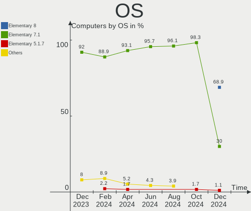
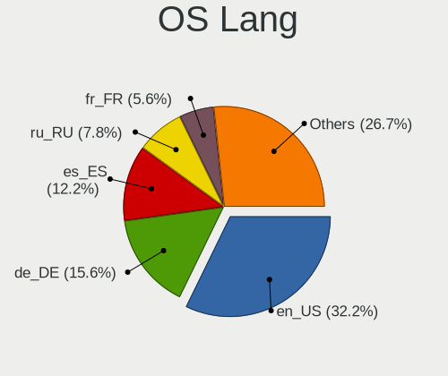
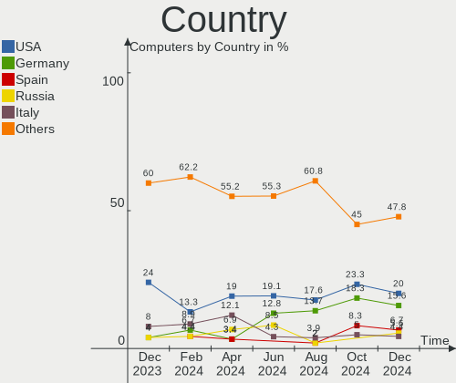
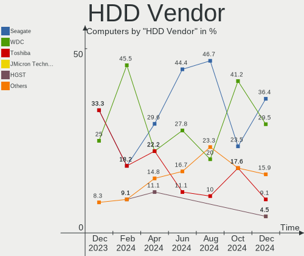
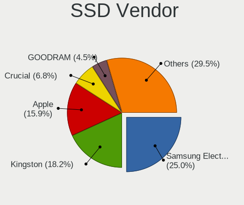
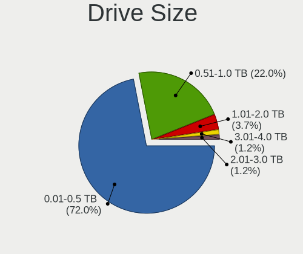
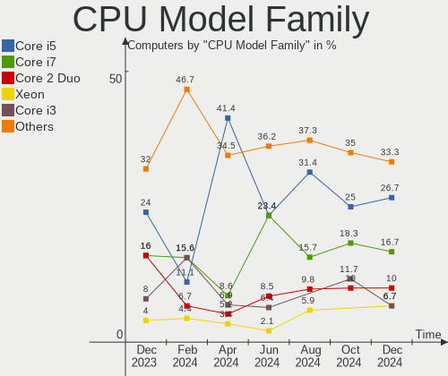
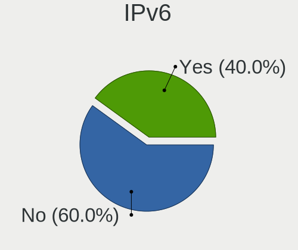

Elementary Hardware Trends
--------------------------

A project to identify most popular hardware characteristics and track their change
over time based on data collected by Elementary users at https://Linux-Hardware.org.

Anyone can contribute to this report by the [hw-probe](https://github.com/linuxhw/hw-probe) tool:

    sudo -E hw-probe -all -upload

This is a report for all computer types. See also reports for [desktops](/Dist/Elementary/Desktop/README.md) and [notebooks](/Dist/Elementary/Notebook/README.md).

Full-feature report is available here: https://linux-hardware.org/?view=trends

Period: Jan, 2022.

Contents
--------

* [ System ](#system)
  - [ OS                       ](#os)
  - [ OS Family                ](#os-family)
  - [ Kernel                   ](#kernel)
  - [ Kernel Family            ](#kernel-family)
  - [ Kernel Major Ver.        ](#kernel-major-ver)
  - [ Arch                     ](#arch)
  - [ DE                       ](#de)
  - [ Display Server           ](#display-server)
  - [ Display Manager          ](#display-manager)
  - [ OS Lang                  ](#os-lang)
  - [ Boot Mode                ](#boot-mode)
  - [ Filesystem               ](#filesystem)
  - [ Part. scheme             ](#part-scheme)
  - [ Dual Boot with Linux/BSD ](#dual-boot-with-linuxbsd)
  - [ Dual Boot (Win)          ](#dual-boot-win)

* [ Board ](#board)
  - [ Vendor                   ](#vendor)
  - [ Model                    ](#model)
  - [ Model Family             ](#model-family)
  - [ MFG Year                 ](#mfg-year)
  - [ Form Factor              ](#form-factor)
  - [ Secure Boot              ](#secure-boot)
  - [ Coreboot                 ](#coreboot)
  - [ RAM Size                 ](#ram-size)
  - [ RAM Used                 ](#ram-used)
  - [ Total Drives             ](#total-drives)
  - [ Has CD-ROM               ](#has-cd-rom)
  - [ Has Ethernet             ](#has-ethernet)
  - [ Has WiFi                 ](#has-wifi)
  - [ Has Bluetooth            ](#has-bluetooth)

* [ Location ](#location)
  - [ Country                  ](#country)
  - [ City                     ](#city)

* [ Drives ](#drives)
  - [ Drive Vendor             ](#drive-vendor)
  - [ Drive Model              ](#drive-model)
  - [ HDD Vendor               ](#hdd-vendor)
  - [ SSD Vendor               ](#ssd-vendor)
  - [ Drive Kind               ](#drive-kind)
  - [ Drive Connector          ](#drive-connector)
  - [ Drive Size               ](#drive-size)
  - [ Space Total              ](#space-total)
  - [ Space Used               ](#space-used)
  - [ Malfunc. Drives          ](#malfunc-drives)
  - [ Malfunc. Drive Vendor    ](#malfunc-drive-vendor)
  - [ Malfunc. HDD Vendor      ](#malfunc-hdd-vendor)
  - [ Malfunc. Drive Kind      ](#malfunc-drive-kind)
  - [ Failed Drives            ](#failed-drives)
  - [ Failed Drive Vendor      ](#failed-drive-vendor)
  - [ Drive Status             ](#drive-status)

* [ Storage controller ](#storage-controller)
  - [ Storage Vendor           ](#storage-vendor)
  - [ Storage Model            ](#storage-model)
  - [ Storage Kind             ](#storage-kind)

* [ Processor ](#processor)
  - [ CPU Vendor               ](#cpu-vendor)
  - [ CPU Model                ](#cpu-model)
  - [ CPU Model Family         ](#cpu-model-family)
  - [ CPU Cores                ](#cpu-cores)
  - [ CPU Sockets              ](#cpu-sockets)
  - [ CPU Threads              ](#cpu-threads)
  - [ CPU Op-Modes             ](#cpu-op-modes)
  - [ CPU Microcode            ](#cpu-microcode)
  - [ CPU Microarch            ](#cpu-microarch)

* [ Graphics ](#graphics)
  - [ GPU Vendor               ](#gpu-vendor)
  - [ GPU Model                ](#gpu-model)
  - [ GPU Combo                ](#gpu-combo)
  - [ GPU Driver               ](#gpu-driver)
  - [ GPU Memory               ](#gpu-memory)

* [ Monitor ](#monitor)
  - [ Monitor Vendor           ](#monitor-vendor)
  - [ Monitor Model            ](#monitor-model)
  - [ Monitor Resolution       ](#monitor-resolution)
  - [ Monitor Diagonal         ](#monitor-diagonal)
  - [ Monitor Width            ](#monitor-width)
  - [ Aspect Ratio             ](#aspect-ratio)
  - [ Monitor Area             ](#monitor-area)
  - [ Pixel Density            ](#pixel-density)
  - [ Multiple Monitors        ](#multiple-monitors)

* [ Network ](#network)
  - [ Net Controller Vendor    ](#net-controller-vendor)
  - [ Net Controller Model     ](#net-controller-model)
  - [ Wireless Vendor          ](#wireless-vendor)
  - [ Wireless Model           ](#wireless-model)
  - [ Ethernet Vendor          ](#ethernet-vendor)
  - [ Ethernet Model           ](#ethernet-model)
  - [ Net Controller Kind      ](#net-controller-kind)
  - [ Used Controller          ](#used-controller)
  - [ NICs                     ](#nics)
  - [ IPv6                     ](#ipv6)

* [ Bluetooth ](#bluetooth)
  - [ Bluetooth Vendor         ](#bluetooth-vendor)
  - [ Bluetooth Model          ](#bluetooth-model)

* [ Sound ](#sound)
  - [ Sound Vendor             ](#sound-vendor)
  - [ Sound Model              ](#sound-model)

* [ Memory ](#memory)
  - [ Memory Vendor            ](#memory-vendor)
  - [ Memory Model             ](#memory-model)
  - [ Memory Kind              ](#memory-kind)
  - [ Memory Form Factor       ](#memory-form-factor)
  - [ Memory Size              ](#memory-size)
  - [ Memory Speed             ](#memory-speed)

* [ Printers & scanners ](#printers--scanners)
  - [ Printer Vendor           ](#printer-vendor)
  - [ Printer Model            ](#printer-model)
  - [ Scanner Vendor           ](#scanner-vendor)
  - [ Scanner Model            ](#scanner-model)

* [ Camera ](#camera)
  - [ Camera Vendor            ](#camera-vendor)
  - [ Camera Model             ](#camera-model)

* [ Security ](#security)
  - [ Fingerprint Vendor       ](#fingerprint-vendor)
  - [ Fingerprint Model        ](#fingerprint-model)
  - [ Chipcard Vendor          ](#chipcard-vendor)
  - [ Chipcard Model           ](#chipcard-model)

* [ Unsupported ](#unsupported)
  - [ Unsupported Devices      ](#unsupported-devices)
  - [ Unsupported Device Types ](#unsupported-device-types)

System
------

OS
--

Installed operating systems

| Name             | Computers | Percent |
|------------------|-----------|---------|
| Elementary 6.1   | 108       | 89.26%  |
| Elementary 6     | 7         | 5.79%   |
| Elementary 5.1.7 | 6         | 4.96%   |

OS Family
---------

OS without a version

| Name       | Computers | Percent |
|------------|-----------|---------|
| Elementary | 121       | 100%    |

Kernel
------

Version of the Linux kernel

| Version                | Computers | Percent |
|------------------------|-----------|---------|
| 5.11.0-43-generic      | 40        | 33.06%  |
| 5.13.0-27-generic      | 28        | 23.14%  |
| 5.11.0-44-generic      | 16        | 13.22%  |
| 5.11.0-46-generic      | 12        | 9.92%   |
| 5.4.0-92-generic       | 2         | 1.65%   |
| 5.13.0-25-generic      | 2         | 1.65%   |
| 5.11.0-40-generic      | 2         | 1.65%   |
| 5.11.0-38-generic      | 2         | 1.65%   |
| 5.11.0-27-generic      | 2         | 1.65%   |
| 5.4.0-96-generic       | 1         | 0.83%   |
| 5.4.0-94-generic       | 1         | 0.83%   |
| 5.4.0-91-generic       | 1         | 0.83%   |
| 5.15.3-xanmod1         | 1         | 0.83%   |
| 5.15.13-xanmod1        | 1         | 0.83%   |
| 5.15.12-xanmod1-tt     | 1         | 0.83%   |
| 5.15.12-051512-generic | 1         | 0.83%   |
| 5.15.11-t2-big-sur     | 1         | 0.83%   |
| 5.15.1-xanmod1         | 1         | 0.83%   |
| 5.14.10-051410-generic | 1         | 0.83%   |
| 5.14.0-1011-oem        | 1         | 0.83%   |
| 5.13.0-28-generic      | 1         | 0.83%   |
| 5.11.0-43-lowlatency   | 1         | 0.83%   |
| 5.11.0-41-generic      | 1         | 0.83%   |
| 4.15.0-163-generic     | 1         | 0.83%   |

Kernel Family
-------------

Linux kernel without a distro release

| Version | Computers | Percent |
|---------|-----------|---------|
| 5.11.0  | 76        | 62.81%  |
| 5.13.0  | 31        | 25.62%  |
| 5.4.0   | 5         | 4.13%   |
| 5.15.12 | 2         | 1.65%   |
| 5.15.3  | 1         | 0.83%   |
| 5.15.13 | 1         | 0.83%   |
| 5.15.11 | 1         | 0.83%   |
| 5.15.1  | 1         | 0.83%   |
| 5.14.10 | 1         | 0.83%   |
| 5.14.0  | 1         | 0.83%   |
| 4.15.0  | 1         | 0.83%   |

Kernel Major Ver.
-----------------

Linux kernel major version

| Version | Computers | Percent |
|---------|-----------|---------|
| 5.11    | 76        | 62.81%  |
| 5.13    | 31        | 25.62%  |
| 5.15    | 6         | 4.96%   |
| 5.4     | 5         | 4.13%   |
| 5.14    | 2         | 1.65%   |
| 4.15    | 1         | 0.83%   |

Arch
----

OS architecture (x86_64, i586, etc.)

| Name   | Computers | Percent |
|--------|-----------|---------|
| x86_64 | 121       | 100%    |

DE
--

Desktop Environment

| Name     | Computers | Percent |
|----------|-----------|---------|
| Pantheon | 119       | 98.35%  |
| GNOME    | 1         | 0.83%   |
| Unknown  | 1         | 0.83%   |

Display Server
--------------

X11 or Wayland

| Name | Computers | Percent |
|------|-----------|---------|
| X11  | 121       | 100%    |

Display Manager
---------------

SDDM, LightDM, etc.

| Name    | Computers | Percent |
|---------|-----------|---------|
| Unknown | 75        | 61.98%  |
| LightDM | 44        | 36.36%  |
| GDM     | 2         | 1.65%   |

OS Lang
-------

Language

| Lang  | Computers | Percent |
|-------|-----------|---------|
| en_US | 56        | 46.28%  |
| de_DE | 17        | 14.05%  |
| en_GB | 11        | 9.09%   |
| ru_RU | 5         | 4.13%   |
| pt_BR | 4         | 3.31%   |
| pl_PL | 3         | 2.48%   |
| it_IT | 3         | 2.48%   |
| fr_FR | 3         | 2.48%   |
| es_ES | 3         | 2.48%   |
| en_CA | 3         | 2.48%   |
| pt_PT | 2         | 1.65%   |
| nl_NL | 2         | 1.65%   |
| en_AU | 2         | 1.65%   |
| tr_TR | 1         | 0.83%   |
| sv_SE | 1         | 0.83%   |
| hu_HU | 1         | 0.83%   |
| hr_HR | 1         | 0.83%   |
| fr_CA | 1         | 0.83%   |
| el_GR | 1         | 0.83%   |
| bg_BG | 1         | 0.83%   |

Boot Mode
---------

EFI or BIOS

| Mode | Computers | Percent |
|------|-----------|---------|
| EFI  | 89        | 73.55%  |
| BIOS | 32        | 26.45%  |

Filesystem
----------

Type of filesystem

| Type  | Computers | Percent |
|-------|-----------|---------|
| Ext4  | 114       | 94.21%  |
| Btrfs | 7         | 5.79%   |

Part. scheme
------------

Scheme of partitioning

| Type    | Computers | Percent |
|---------|-----------|---------|
| Unknown | 83        | 68.6%   |
| GPT     | 34        | 28.1%   |
| MBR     | 4         | 3.31%   |

Dual Boot with Linux/BSD
------------------------

Hosting more than one Linux/BSD

| Dual boot | Computers | Percent |
|-----------|-----------|---------|
| No        | 114       | 94.21%  |
| Yes       | 7         | 5.79%   |

Dual Boot (Win)
---------------

Hosting Linux and Windows

| Dual boot | Computers | Percent |
|-----------|-----------|---------|
| No        | 104       | 85.95%  |
| Yes       | 17        | 14.05%  |

Board
-----

Vendor
------

Motherboard manufacturer

| Name                | Computers | Percent |
|---------------------|-----------|---------|
| Lenovo              | 26        | 21.49%  |
| ASUSTek Computer    | 18        | 14.88%  |
| Apple               | 14        | 11.57%  |
| Hewlett-Packard     | 12        | 9.92%   |
| Dell                | 8         | 6.61%   |
| MSI                 | 7         | 5.79%   |
| Acer                | 6         | 4.96%   |
| HUAWEI              | 5         | 4.13%   |
| ASRock              | 5         | 4.13%   |
| Gigabyte Technology | 4         | 3.31%   |
| Star Labs           | 2         | 1.65%   |
| Sony                | 2         | 1.65%   |
| Timi                | 1         | 0.83%   |
| Teclast             | 1         | 0.83%   |
| Samsung Electronics | 1         | 0.83%   |
| Razer               | 1         | 0.83%   |
| Notebook            | 1         | 0.83%   |
| Monster             | 1         | 0.83%   |
| Microsoft           | 1         | 0.83%   |
| Fujitsu             | 1         | 0.83%   |
| Foxconn             | 1         | 0.83%   |
| FIRICH              | 1         | 0.83%   |
| Acidanthera         | 1         | 0.83%   |
| Unknown             | 1         | 0.83%   |

Model
-----

Motherboard model

| Name                                       | Computers | Percent |
|--------------------------------------------|-----------|---------|
| HUAWEI MACHD-WXX9                          | 2         | 1.65%   |
| Dell Inspiron N5110                        | 2         | 1.65%   |
| Apple MacBookPro8,2                        | 2         | 1.65%   |
| Apple MacBookPro5,5                        | 2         | 1.65%   |
| Apple MacBook5,1                           | 2         | 1.65%   |
| Timi TM1613                                | 1         | 0.83%   |
| Teclast X6 plus                            | 1         | 0.83%   |
| Star Labs StarBook                         | 1         | 0.83%   |
| Star Labs LabTop                           | 1         | 0.83%   |
| Sony VPCEA3S1E                             | 1         | 0.83%   |
| Sony SVE14A390X                            | 1         | 0.83%   |
| Samsung 900X3C/900X3D/900X3E/900X4C/900X4D | 1         | 0.83%   |
| Razer Blade Stealth                        | 1         | 0.83%   |
| Notebook W65_67SJ                          | 1         | 0.83%   |
| MSI PS63 Modern 8RD                        | 1         | 0.83%   |
| MSI MS-7C52                                | 1         | 0.83%   |
| MSI MS-7C02                                | 1         | 0.83%   |
| MSI MS-7B79                                | 1         | 0.83%   |
| MSI MS-7A59                                | 1         | 0.83%   |
| MSI GF63 Thin 9SCSR                        | 1         | 0.83%   |
| MSI GE60 2PE                               | 1         | 0.83%   |
| Monster ABRA A5 V13.2                      | 1         | 0.83%   |
| Microsoft Surface Go                       | 1         | 0.83%   |
| Lenovo Yoga 300-11IBR 80M1                 | 1         | 0.83%   |
| Lenovo ThinkPad X270 W10DG 20K5S2VL00      | 1         | 0.83%   |
| Lenovo ThinkPad X13 Gen 1 20UFS00G00       | 1         | 0.83%   |
| Lenovo ThinkPad X1 Carbon Gen 9 20XWCTO1WW | 1         | 0.83%   |
| Lenovo ThinkPad X1 Carbon 6th 20KHS1L200   | 1         | 0.83%   |
| Lenovo ThinkPad W541 20EGS1VV00            | 1         | 0.83%   |
| Lenovo ThinkPad T470 W10DG 20JNS08H00      | 1         | 0.83%   |
| Lenovo ThinkPad T470 20JNS08H00            | 1         | 0.83%   |
| Lenovo ThinkPad T460s 20F9CTO1WW           | 1         | 0.83%   |
| Lenovo ThinkPad T430 2347JC2               | 1         | 0.83%   |
| Lenovo ThinkPad P14s Gen 1 20Y1S00E00      | 1         | 0.83%   |
| Lenovo ThinkPad L390 Yoga 20NT001KGE       | 1         | 0.83%   |
| Lenovo ThinkPad E495 20NE001RTX            | 1         | 0.83%   |
| Lenovo ThinkPad E14 20RAS0EQ00             | 1         | 0.83%   |
| Lenovo Legion Y530-15ICH 81GT              | 1         | 0.83%   |
| Lenovo Legion Y530-15ICH 81FV              | 1         | 0.83%   |
| Lenovo IdeaPad Gaming 3 15IMH05 82CG       | 1         | 0.83%   |
| Lenovo IdeaPad 5 14ARE05 81YM              | 1         | 0.83%   |
| Lenovo IdeaPad 330-15ARR 81D2              | 1         | 0.83%   |
| Lenovo IdeaPad 310-15ISK 80SM              | 1         | 0.83%   |
| Lenovo IdeaPad 310-15IKB 80TV              | 1         | 0.83%   |
| Lenovo IdeaPad 130-15AST 81H5              | 1         | 0.83%   |
| Lenovo IdeaCentre AIO 3 24ARE05 F0EW00FLSC | 1         | 0.83%   |
| Lenovo G550 2958                           | 1         | 0.83%   |
| Lenovo G550 20023                          | 1         | 0.83%   |
| Lenovo G50-80 80E5                         | 1         | 0.83%   |
| HUAWEI NBLK-WAX9X                          | 1         | 0.83%   |
| HUAWEI MACHC-WAX9                          | 1         | 0.83%   |
| HUAWEI KPL-W0X                             | 1         | 0.83%   |
| HP ProLiant DL380p Gen8                    | 1         | 0.83%   |
| HP ProDesk 600 G5 SFF                      | 1         | 0.83%   |
| HP ProBook 4540s                           | 1         | 0.83%   |
| HP ProBook 4430s                           | 1         | 0.83%   |
| HP Pavilion Laptop 15-eh0xxx               | 1         | 0.83%   |
| HP Pavilion Laptop 15-cs0xxx               | 1         | 0.83%   |
| HP Pavilion dv5                            | 1         | 0.83%   |
| HP Laptop 15s-eq1xxx                       | 1         | 0.83%   |

Model Family
------------

Motherboard model prefix

| Name                 | Computers | Percent |
|----------------------|-----------|---------|
| Lenovo ThinkPad      | 13        | 10.74%  |
| Lenovo IdeaPad       | 6         | 4.96%   |
| HP Pavilion          | 3         | 2.48%   |
| Apple MacBookPro8    | 3         | 2.48%   |
| Apple MacBookPro5    | 3         | 2.48%   |
| Acer Aspire          | 3         | 2.48%   |
| Lenovo Legion        | 2         | 1.65%   |
| Lenovo G550          | 2         | 1.65%   |
| HUAWEI MACHD-WXX9    | 2         | 1.65%   |
| HP ProBook           | 2         | 1.65%   |
| HP Laptop            | 2         | 1.65%   |
| HP EliteBook         | 2         | 1.65%   |
| Dell Vostro          | 2         | 1.65%   |
| Dell Latitude        | 2         | 1.65%   |
| Dell Inspiron        | 2         | 1.65%   |
| ASUS ZenBook         | 2         | 1.65%   |
| ASUS VivoBook        | 2         | 1.65%   |
| ASUS TUF             | 2         | 1.65%   |
| ASUS ROG             | 2         | 1.65%   |
| Apple MacBookPro9    | 2         | 1.65%   |
| Apple MacBook5       | 2         | 1.65%   |
| Acer Swift           | 2         | 1.65%   |
| Timi TM1613          | 1         | 0.83%   |
| Teclast X6           | 1         | 0.83%   |
| Star Labs StarBook   | 1         | 0.83%   |
| Star Labs LabTop     | 1         | 0.83%   |
| Sony VPCEA3S1E       | 1         | 0.83%   |
| Sony SVE14A390X      | 1         | 0.83%   |
| Samsung 900X3C       | 1         | 0.83%   |
| Razer Blade          | 1         | 0.83%   |
| Notebook W65         | 1         | 0.83%   |
| MSI PS63             | 1         | 0.83%   |
| MSI MS-7C52          | 1         | 0.83%   |
| MSI MS-7C02          | 1         | 0.83%   |
| MSI MS-7B79          | 1         | 0.83%   |
| MSI MS-7A59          | 1         | 0.83%   |
| MSI GF63             | 1         | 0.83%   |
| MSI GE60             | 1         | 0.83%   |
| Monster ABRA         | 1         | 0.83%   |
| Microsoft Surface    | 1         | 0.83%   |
| Lenovo Yoga          | 1         | 0.83%   |
| Lenovo IdeaCentre    | 1         | 0.83%   |
| Lenovo G50-80        | 1         | 0.83%   |
| HUAWEI NBLK-WAX9X    | 1         | 0.83%   |
| HUAWEI MACHC-WAX9    | 1         | 0.83%   |
| HUAWEI KPL-W0X       | 1         | 0.83%   |
| HP ProLiant          | 1         | 0.83%   |
| HP ProDesk           | 1         | 0.83%   |
| HP Elite             | 1         | 0.83%   |
| Gigabyte X570        | 1         | 0.83%   |
| Gigabyte H61M-DS2    | 1         | 0.83%   |
| Gigabyte GA-970A-D3  | 1         | 0.83%   |
| Gigabyte B85M-DS3H-A | 1         | 0.83%   |
| Fujitsu LIFEBOOK     | 1         | 0.83%   |
| Foxconn p6616f       | 1         | 0.83%   |
| FIRICH J1900         | 1         | 0.83%   |
| Dell XPS             | 1         | 0.83%   |
| Dell Precision       | 1         | 0.83%   |
| ASUS X555LN          | 1         | 0.83%   |
| ASUS X550CA          | 1         | 0.83%   |

MFG Year
--------

Motherboard manufacture year

| Year | Computers | Percent |
|------|-----------|---------|
| 2020 | 20        | 16.53%  |
| 2018 | 14        | 11.57%  |
| 2021 | 12        | 9.92%   |
| 2019 | 11        | 9.09%   |
| 2012 | 10        | 8.26%   |
| 2016 | 8         | 6.61%   |
| 2015 | 8         | 6.61%   |
| 2017 | 7         | 5.79%   |
| 2014 | 7         | 5.79%   |
| 2009 | 7         | 5.79%   |
| 2011 | 6         | 4.96%   |
| 2013 | 4         | 3.31%   |
| 2010 | 4         | 3.31%   |
| 2008 | 3         | 2.48%   |

Form Factor
-----------

Physical design of the computer

| Name        | Computers | Percent |
|-------------|-----------|---------|
| Notebook    | 88        | 72.73%  |
| Desktop     | 26        | 21.49%  |
| All in one  | 3         | 2.48%   |
| Tablet      | 2         | 1.65%   |
| Convertible | 1         | 0.83%   |
| Server      | 1         | 0.83%   |

Secure Boot
-----------

Enabled or disabled

| State    | Computers | Percent |
|----------|-----------|---------|
| Disabled | 103       | 85.12%  |
| Enabled  | 18        | 14.88%  |

Coreboot
--------

Have coreboot on board

| Used | Computers | Percent |
|------|-----------|---------|
| No   | 119       | 98.35%  |
| Yes  | 2         | 1.65%   |

RAM Size
--------

Total RAM memory

| Size in GB  | Computers | Percent |
|-------------|-----------|---------|
| 4.01-8.0    | 39        | 32.23%  |
| 16.01-24.0  | 25        | 20.66%  |
| 8.01-16.0   | 21        | 17.36%  |
| 3.01-4.0    | 17        | 14.05%  |
| 32.01-64.0  | 10        | 8.26%   |
| 24.01-32.0  | 4         | 3.31%   |
| 1.01-2.0    | 3         | 2.48%   |
| 64.01-256.0 | 2         | 1.65%   |

RAM Used
--------

Used RAM memory

| Used GB    | Computers | Percent |
|------------|-----------|---------|
| 1.01-2.0   | 42        | 34.71%  |
| 2.01-3.0   | 29        | 23.97%  |
| 4.01-8.0   | 21        | 17.36%  |
| 3.01-4.0   | 17        | 14.05%  |
| 8.01-16.0  | 6         | 4.96%   |
| 0.51-1.0   | 5         | 4.13%   |
| 32.01-64.0 | 1         | 0.83%   |

Total Drives
------------

Number of drives on board

| Drives | Computers | Percent |
|--------|-----------|---------|
| 1      | 75        | 61.98%  |
| 2      | 35        | 28.93%  |
| 3      | 8         | 6.61%   |
| 4      | 2         | 1.65%   |
| 6      | 1         | 0.83%   |

Has CD-ROM
----------

Has CD-ROM on board

| Presented | Computers | Percent |
|-----------|-----------|---------|
| No        | 86        | 71.07%  |
| Yes       | 35        | 28.93%  |

Has Ethernet
------------

Has Ethernet on board

| Presented | Computers | Percent |
|-----------|-----------|---------|
| Yes       | 95        | 78.51%  |
| No        | 26        | 21.49%  |

Has WiFi
--------

Has WiFi module

| Presented | Computers | Percent |
|-----------|-----------|---------|
| Yes       | 108       | 89.26%  |
| No        | 13        | 10.74%  |

Has Bluetooth
-------------

Has Bluetooth module

| Presented | Computers | Percent |
|-----------|-----------|---------|
| Yes       | 93        | 76.86%  |
| No        | 28        | 23.14%  |

Location
--------

Country
-------

Geographic location (country)

| Country     | Computers | Percent |
|-------------|-----------|---------|
| Germany     | 17        | 14.05%  |
| USA         | 13        | 10.74%  |
| India       | 10        | 8.26%   |
| Canada      | 7         | 5.79%   |
| Brazil      | 7         | 5.79%   |
| UK          | 6         | 4.96%   |
| Turkey      | 5         | 4.13%   |
| Poland      | 5         | 4.13%   |
| Russia      | 4         | 3.31%   |
| Italy       | 4         | 3.31%   |
| France      | 4         | 3.31%   |
| Belarus     | 3         | 2.48%   |
| Australia   | 3         | 2.48%   |
| Spain       | 2         | 1.65%   |
| Indonesia   | 2         | 1.65%   |
| Greece      | 2         | 1.65%   |
| Czechia     | 2         | 1.65%   |
| Belgium     | 2         | 1.65%   |
| Austria     | 2         | 1.65%   |
| Thailand    | 1         | 0.83%   |
| Switzerland | 1         | 0.83%   |
| Sweden      | 1         | 0.83%   |
| Sri Lanka   | 1         | 0.83%   |
| Romania     | 1         | 0.83%   |
| Portugal    | 1         | 0.83%   |
| Pakistan    | 1         | 0.83%   |
| New Zealand | 1         | 0.83%   |
| Mozambique  | 1         | 0.83%   |
| Mexico      | 1         | 0.83%   |
| Malaysia    | 1         | 0.83%   |
| Lithuania   | 1         | 0.83%   |
| Kenya       | 1         | 0.83%   |
| Japan       | 1         | 0.83%   |
| Hungary     | 1         | 0.83%   |
| Hong Kong   | 1         | 0.83%   |
| Croatia     | 1         | 0.83%   |
| Colombia    | 1         | 0.83%   |
| Chile       | 1         | 0.83%   |
| Bulgaria    | 1         | 0.83%   |
| Argentina   | 1         | 0.83%   |

City
----

Geographic location (city)

| City                  | Computers | Percent |
|-----------------------|-----------|---------|
| Warsaw                | 3         | 2.48%   |
| Minsk                 | 3         | 2.48%   |
| Ankara                | 3         | 2.48%   |
| Vienna                | 2         | 1.65%   |
| Vernon                | 2         | 1.65%   |
| Sydney                | 2         | 1.65%   |
| Santo Andr?©          | 2         | 1.65%   |
| Munich                | 2         | 1.65%   |
| Znojmo                | 1         | 0.83%   |
| Wellington            | 1         | 0.83%   |
| Wattala               | 1         | 0.83%   |
| Vit??ria da Conquista | 1         | 0.83%   |
| Vila Nova de Gaia     | 1         | 0.83%   |
| Valencia              | 1         | 0.83%   |
| Tongeren              | 1         | 0.83%   |
| Thrissur              | 1         | 0.83%   |
| Surrey                | 1         | 0.83%   |
| Surabaya              | 1         | 0.83%   |
| Stockholm             | 1         | 0.83%   |
| Steinbach             | 1         | 0.83%   |
| Solapur               | 1         | 0.83%   |
| Siersburg             | 1         | 0.83%   |
| Shetland Islands      | 1         | 0.83%   |
| Sazava                | 1         | 0.83%   |
| Samobor               | 1         | 0.83%   |
| Saguenay              | 1         | 0.83%   |
| Russell               | 1         | 0.83%   |
| Rostock               | 1         | 0.83%   |
| Rome                  | 1         | 0.83%   |
| Pune                  | 1         | 0.83%   |
| Providencia           | 1         | 0.83%   |
| Petaling Jaya         | 1         | 0.83%   |
| Perth                 | 1         | 0.83%   |
| Patna                 | 1         | 0.83%   |
| Paris                 | 1         | 0.83%   |
| Osaka                 | 1         | 0.83%   |
| Orenburg              | 1         | 0.83%   |
| Oldham                | 1         | 0.83%   |
| Oldenburg             | 1         | 0.83%   |
| Oceanside             | 1         | 0.83%   |
| Novosibirsk           | 1         | 0.83%   |
| New Delhi             | 1         | 0.83%   |
| Nairobi               | 1         | 0.83%   |
| Mumbai                | 1         | 0.83%   |
| Moscow                | 1         | 0.83%   |
| Mississauga           | 1         | 0.83%   |
| Minerva               | 1         | 0.83%   |
| Milan                 | 1         | 0.83%   |
| Mieuxce               | 1         | 0.83%   |
| Mexico City           | 1         | 0.83%   |
| Marshfield            | 1         | 0.83%   |
| Mahemdavad            | 1         | 0.83%   |
| Mage                  | 1         | 0.83%   |
| Ma??eikiai            | 1         | 0.83%   |
| Lyubertsy             | 1         | 0.83%   |
| Lydney                | 1         | 0.83%   |
| London                | 1         | 0.83%   |
| Leduc                 | 1         | 0.83%   |
| Le Grand-Saconnex     | 1         | 0.83%   |
| Lamia                 | 1         | 0.83%   |

Drives
------

Drive Vendor
------------

Hard drive vendors

| Vendor              | Computers | Drives | Percent |
|---------------------|-----------|--------|---------|
| Samsung Electronics | 33        | 34     | 19.3%   |
| WDC                 | 20        | 25     | 11.7%   |
| Sandisk             | 15        | 15     | 8.77%   |
| Kingston            | 15        | 16     | 8.77%   |
| Seagate             | 13        | 13     | 7.6%    |
| Crucial             | 12        | 13     | 7.02%   |
| Toshiba             | 8         | 9      | 4.68%   |
| Unknown             | 7         | 7      | 4.09%   |
| HGST                | 5         | 5      | 2.92%   |
| SK Hynix            | 4         | 4      | 2.34%   |
| Intel               | 4         | 5      | 2.34%   |
| A-DATA Technology   | 4         | 4      | 2.34%   |
| Unknown             | 4         | 5      | 2.34%   |
| Micron Technology   | 3         | 3      | 1.75%   |
| KIOXIA              | 3         | 4      | 1.75%   |
| Hitachi             | 3         | 3      | 1.75%   |
| Apple               | 3         | 3      | 1.75%   |
| Transcend           | 2         | 2      | 1.17%   |
| Phison              | 2         | 2      | 1.17%   |
| ASMT                | 2         | 2      | 1.17%   |
| Teclast             | 1         | 1      | 0.58%   |
| Team                | 1         | 1      | 0.58%   |
| Star Drive          | 1         | 1      | 0.58%   |
| Star                | 1         | 1      | 0.58%   |
| SPCC                | 1         | 1      | 0.58%   |
| PNY                 | 1         | 1      | 0.58%   |
| OCZ                 | 1         | 1      | 0.58%   |
| GOODRAM             | 1         | 1      | 0.58%   |
| Apacer              | 1         | 1      | 0.58%   |

Drive Model
-----------

Hard drive models

| Model                                     | Computers | Percent |
|-------------------------------------------|-----------|---------|
| Samsung NVMe SSD Drive 512GB              | 4         | 2.22%   |
| Unknown                                   | 4         | 2.22%   |
| Seagate ST1000LM035-1RK172 1TB            | 3         | 1.67%   |
| Samsung SSD 850 EVO 250GB                 | 3         | 1.67%   |
| Samsung NVMe SSD Drive 256GB              | 3         | 1.67%   |
| Kingston SA400S37240G 240GB SSD           | 3         | 1.67%   |
| Kingston NVMe SSD Drive 500GB             | 3         | 1.67%   |
| WDC WDS240G2G0A-00JH30 240GB SSD          | 2         | 1.11%   |
| WDC WDS120G2G0A-00JH30 120GB SSD          | 2         | 1.11%   |
| Toshiba MQ04ABF100 1TB                    | 2         | 1.11%   |
| Toshiba MQ01ABD100V -63 1TB               | 2         | 1.11%   |
| SanDisk SD9SN8W-128G-1006 128GB SSD       | 2         | 1.11%   |
| SanDisk SD8SN8U-256G-1006 256GB SSD       | 2         | 1.11%   |
| Samsung SSD 850 EVO 120GB                 | 2         | 1.11%   |
| Samsung NVMe SSD Drive 1TB                | 2         | 1.11%   |
| Kingston SA400S37120G 120GB SSD           | 2         | 1.11%   |
| Kingston NVMe SSD Drive 1TB               | 2         | 1.11%   |
| Intel NVMe SSD Drive 512GB                | 2         | 1.11%   |
| Hitachi HTS547575A9E384 752GB             | 2         | 1.11%   |
| Crucial CT250MX500SSD1 250GB              | 2         | 1.11%   |
| WDC WDS500G2B0A-00SM50 500GB SSD          | 1         | 0.56%   |
| WDC WDS200T2B0A-00SM50 2TB SSD            | 1         | 0.56%   |
| WDC WD5000LPVX-80V0TT0 500GB              | 1         | 0.56%   |
| WDC WD5000BPVT-22HXZT1 500GB              | 1         | 0.56%   |
| WDC WD5000AAKX-00ERMA0 500GB              | 1         | 0.56%   |
| WDC WD5000AAKS-00UU3A0 500GB              | 1         | 0.56%   |
| WDC WD40EZAZ-00SF3B0 4TB                  | 1         | 0.56%   |
| WDC WD40EFRX-68N32N0 4TB                  | 1         | 0.56%   |
| WDC WD2500BEVS-22UST0 250GB               | 1         | 0.56%   |
| WDC WD1600JS-55NCB1 160GB                 | 1         | 0.56%   |
| WDC WD15EARX-00PASB0 1TB                  | 1         | 0.56%   |
| WDC WD10SPZX-24Z10 1TB                    | 1         | 0.56%   |
| WDC WD10JPCX-24UE4T0 1TB                  | 1         | 0.56%   |
| WDC WD10EZEX-08M2NA0 1TB                  | 1         | 0.56%   |
| WDC WD10EZEX-00BN5A0 1TB                  | 1         | 0.56%   |
| WDC WD1003FZEX-00MK2A0 1TB                | 1         | 0.56%   |
| WDC PC SN730 SDBQNTY-1T00-1014 1TB        | 1         | 0.56%   |
| WDC PC SN730 SDBPNTY-512G-1027 512GB      | 1         | 0.56%   |
| WDC PC SN520 SDAPNUW-512G                 | 1         | 0.56%   |
| Unknown USD00  16GB                       | 1         | 0.56%   |
| Unknown SL128  128GB                      | 1         | 0.56%   |
| Unknown SD/MMC/MS PRO 128GB               | 1         | 0.56%   |
| Unknown SC128  128GB                      | 1         | 0.56%   |
| Unknown MMC Card  128GB                   | 1         | 0.56%   |
| Unknown GD2S5  128GB                      | 1         | 0.56%   |
| Unknown 128G32  128GB                     | 1         | 0.56%   |
| Transcend TS512GSSD370S 512GB             | 1         | 0.56%   |
| Transcend TS512GMTS430S 512GB SSD         | 1         | 0.56%   |
| Toshiba TR150 480GB SSD                   | 1         | 0.56%   |
| Toshiba NVMe SSD Drive 512GB              | 1         | 0.56%   |
| Toshiba KBG30ZPZ128G 128GB                | 1         | 0.56%   |
| Toshiba KBG30ZMS128G 128GB NVMe SSD       | 1         | 0.56%   |
| Toshiba HDWE160 6TB                       | 1         | 0.56%   |
| Teclast BD256GB SHCA-2280 SSD             | 1         | 0.56%   |
| Team T253X1120G 120GB SSD                 | 1         | 0.56%   |
| Star Drive SATA SSD 960GB                 | 1         | 0.56%   |
| Star Drive PCIe SSD 480GB                 | 1         | 0.56%   |
| SPCC Solid State Disk 256GB               | 1         | 0.56%   |
| SK Hynix SKHynix_HFS512GD9TNI-L2B0B 512GB | 1         | 0.56%   |
| SK Hynix NVMe SSD Drive 512GB             | 1         | 0.56%   |

HDD Vendor
----------

Hard disk drive vendors

| Vendor              | Computers | Drives | Percent |
|---------------------|-----------|--------|---------|
| Seagate             | 13        | 13     | 30.95%  |
| WDC                 | 12        | 14     | 28.57%  |
| Toshiba             | 5         | 5      | 11.9%   |
| HGST                | 5         | 5      | 11.9%   |
| Hitachi             | 3         | 3      | 7.14%   |
| Samsung Electronics | 2         | 2      | 4.76%   |
| Unknown             | 1         | 1      | 2.38%   |
| Apple               | 1         | 1      | 2.38%   |

SSD Vendor
----------

Solid state drive vendors

| Vendor              | Computers | Drives | Percent |
|---------------------|-----------|--------|---------|
| Samsung Electronics | 14        | 14     | 20.29%  |
| Crucial             | 12        | 13     | 17.39%  |
| SanDisk             | 11        | 11     | 15.94%  |
| Kingston            | 8         | 8      | 11.59%  |
| WDC                 | 6         | 8      | 8.7%    |
| A-DATA Technology   | 3         | 3      | 4.35%   |
| Transcend           | 2         | 2      | 2.9%    |
| Micron Technology   | 2         | 2      | 2.9%    |
| Toshiba             | 1         | 1      | 1.45%   |
| Teclast             | 1         | 1      | 1.45%   |
| Team                | 1         | 1      | 1.45%   |
| Star                | 1         | 1      | 1.45%   |
| SPCC                | 1         | 1      | 1.45%   |
| PNY                 | 1         | 1      | 1.45%   |
| OCZ                 | 1         | 1      | 1.45%   |
| GOODRAM             | 1         | 1      | 1.45%   |
| ASMT                | 1         | 1      | 1.45%   |
| Apple               | 1         | 1      | 1.45%   |
| Apacer              | 1         | 1      | 1.45%   |

Drive Kind
----------

HDD or SSD

| Kind    | Computers | Drives | Percent |
|---------|-----------|--------|---------|
| SSD     | 61        | 72     | 38.36%  |
| NVMe    | 48        | 55     | 30.19%  |
| HDD     | 39        | 44     | 24.53%  |
| MMC     | 8         | 9      | 5.03%   |
| Unknown | 3         | 3      | 1.89%   |

Drive Connector
---------------

SATA, SAS, NVMe, etc.

| Type | Computers | Drives | Percent |
|------|-----------|--------|---------|
| SATA | 84        | 115    | 58.33%  |
| NVMe | 48        | 55     | 33.33%  |
| MMC  | 8         | 9      | 5.56%   |
| SAS  | 4         | 4      | 2.78%   |

Drive Size
----------

Size of hard drive

| Size in TB | Computers | Drives | Percent |
|------------|-----------|--------|---------|
| 0.01-0.5   | 63        | 81     | 67.74%  |
| 0.51-1.0   | 23        | 28     | 24.73%  |
| 1.01-2.0   | 3         | 3      | 3.23%   |
| 3.01-4.0   | 2         | 2      | 2.15%   |
| 2.01-3.0   | 1         | 1      | 1.08%   |
| 4.01-10.0  | 1         | 1      | 1.08%   |

Space Total
-----------

Amount of disk space available on the file system

| Size in GB     | Computers | Percent |
|----------------|-----------|---------|
| 101-250        | 51        | 42.15%  |
| 251-500        | 25        | 20.66%  |
| 501-1000       | 19        | 15.7%   |
| 51-100         | 11        | 9.09%   |
| 1001-2000      | 8         | 6.61%   |
| 21-50          | 3         | 2.48%   |
| More than 3000 | 2         | 1.65%   |
| 2001-3000      | 2         | 1.65%   |

Space Used
----------

Amount of used disk space

| Used GB   | Computers | Percent |
|-----------|-----------|---------|
| 1-20      | 44        | 36.36%  |
| 21-50     | 35        | 28.93%  |
| 101-250   | 16        | 13.22%  |
| 51-100    | 10        | 8.26%   |
| 251-500   | 9         | 7.44%   |
| 1001-2000 | 3         | 2.48%   |
| 2001-3000 | 2         | 1.65%   |
| 501-1000  | 2         | 1.65%   |

Malfunc. Drives
---------------

Drive models with a malfunction

| Model                           | Computers | Drives | Percent |
|---------------------------------|-----------|--------|---------|
| WDC WD10SPZX-24Z10 1TB          | 1         | 1      | 12.5%   |
| WDC WD1003FZEX-00MK2A0 1TB      | 1         | 1      | 12.5%   |
| Toshiba KBG30ZPZ128G 128GB      | 1         | 1      | 12.5%   |
| Seagate ST500LM030-2E717D 500GB | 1         | 1      | 12.5%   |
| Seagate ST3500312CS 500GB       | 1         | 1      | 12.5%   |
| HGST HUS724030ALA640 3TB        | 1         | 1      | 12.5%   |
| Crucial CT512M550SSD3 512GB     | 1         | 1      | 12.5%   |
| Crucial CT256M550SSD1 256GB     | 1         | 1      | 12.5%   |

Malfunc. Drive Vendor
---------------------

Vendors of faulty drives

| Vendor  | Computers | Drives | Percent |
|---------|-----------|--------|---------|
| WDC     | 2         | 2      | 25%     |
| Seagate | 2         | 2      | 25%     |
| Crucial | 2         | 2      | 25%     |
| Toshiba | 1         | 1      | 12.5%   |
| HGST    | 1         | 1      | 12.5%   |

Malfunc. HDD Vendor
-------------------

Vendors of faulty HDD drives

| Vendor  | Computers | Drives | Percent |
|---------|-----------|--------|---------|
| WDC     | 2         | 2      | 40%     |
| Seagate | 2         | 2      | 40%     |
| HGST    | 1         | 1      | 20%     |

Malfunc. Drive Kind
-------------------

Kinds of faulty drives

| Kind | Computers | Drives | Percent |
|------|-----------|--------|---------|
| HDD  | 5         | 5      | 62.5%   |
| SSD  | 2         | 2      | 25%     |
| NVMe | 1         | 1      | 12.5%   |

Failed Drives
-------------

Failed drive models

Zero info for selected period =(

Failed Drive Vendor
-------------------

Failed drive vendors

Zero info for selected period =(

Drive Status
------------

Number of failed and malfunc. drives

| Status   | Computers | Drives | Percent |
|----------|-----------|--------|---------|
| Detected | 93        | 128    | 69.4%   |
| Works    | 34        | 47     | 25.37%  |
| Malfunc  | 7         | 8      | 5.22%   |

Storage controller
------------------

Storage Vendor
--------------

Storage controller vendors

| Vendor                       | Computers | Percent |
|------------------------------|-----------|---------|
| Intel                        | 74        | 50.34%  |
| AMD                          | 19        | 12.93%  |
| Samsung Electronics          | 17        | 11.56%  |
| Kingston Technology Company  | 8         | 5.44%   |
| Sandisk                      | 7         | 4.76%   |
| Nvidia                       | 6         | 4.08%   |
| SK Hynix                     | 4         | 2.72%   |
| Phison Electronics           | 3         | 2.04%   |
| KIOXIA                       | 3         | 2.04%   |
| Toshiba America Info Systems | 2         | 1.36%   |
| Realtek Semiconductor        | 1         | 0.68%   |
| Micron Technology            | 1         | 0.68%   |
| Hewlett-Packard              | 1         | 0.68%   |
| Apple                        | 1         | 0.68%   |

Storage Model
-------------

Storage controller models

| Model                                                                                   | Computers | Percent |
|-----------------------------------------------------------------------------------------|-----------|---------|
| AMD FCH SATA Controller [AHCI mode]                                                     | 12        | 7.41%   |
| Intel Sunrise Point-LP SATA Controller [AHCI mode]                                      | 9         | 5.56%   |
| Intel 7 Series Chipset Family 6-port SATA Controller [AHCI mode]                        | 8         | 4.94%   |
| Samsung NVMe SSD Controller SM981/PM981/PM983                                           | 7         | 4.32%   |
| Samsung NVMe SSD Controller 980                                                         | 6         | 3.7%    |
| Nvidia MCP79 AHCI Controller                                                            | 6         | 3.7%    |
| Intel 6 Series/C200 Series Chipset Family 6 port Mobile SATA AHCI Controller            | 6         | 3.7%    |
| Intel Cannon Lake Mobile PCH SATA AHCI Controller                                       | 5         | 3.09%   |
| Intel 8 Series/C220 Series Chipset Family 6-port SATA Controller 1 [AHCI mode]          | 5         | 3.09%   |
| Kingston Company A2000 NVMe SSD                                                         | 4         | 2.47%   |
| AMD 400 Series Chipset SATA Controller                                                  | 4         | 2.47%   |
| Samsung NVMe SSD Controller SM951/PM951                                                 | 3         | 1.85%   |
| KIOXIA Non-Volatile memory controller                                                   | 3         | 1.85%   |
| Intel Wildcat Point-LP SATA Controller [AHCI Mode]                                      | 3         | 1.85%   |
| Intel Volume Management Device NVMe RAID Controller                                     | 3         | 1.85%   |
| Intel SSD 660P Series                                                                   | 3         | 1.85%   |
| Intel Cannon Lake PCH SATA AHCI Controller                                              | 3         | 1.85%   |
| Intel 82801IBM/IEM (ICH9M/ICH9M-E) 4 port SATA Controller [AHCI mode]                   | 3         | 1.85%   |
| Intel 8 Series SATA Controller 1 [AHCI mode]                                            | 3         | 1.85%   |
| Intel 200 Series PCH SATA controller [AHCI mode]                                        | 3         | 1.85%   |
| AMD SB7x0/SB8x0/SB9x0 IDE Controller                                                    | 3         | 1.85%   |
| SK Hynix BC511                                                                          | 2         | 1.23%   |
| Sandisk WD Blue SN550 NVMe SSD                                                          | 2         | 1.23%   |
| Sandisk WD Black SN750 / PC SN730 NVMe SSD                                              | 2         | 1.23%   |
| Sandisk Non-Volatile memory controller                                                  | 2         | 1.23%   |
| Phison E12 NVMe Controller                                                              | 2         | 1.23%   |
| Intel Comet Lake SATA AHCI Controller                                                   | 2         | 1.23%   |
| Intel Atom/Celeron/Pentium Processor x5-E8000/J3xxx/N3xxx Series SATA Controller        | 2         | 1.23%   |
| Intel 6 Series/C200 Series Chipset Family Desktop SATA Controller (IDE mode, ports 4-5) | 2         | 1.23%   |
| Intel 6 Series/C200 Series Chipset Family Desktop SATA Controller (IDE mode, ports 0-3) | 2         | 1.23%   |
| Intel 6 Series/C200 Series Chipset Family 6 port Desktop SATA AHCI Controller           | 2         | 1.23%   |
| Intel 5 Series/3400 Series Chipset 4 port SATA IDE Controller                           | 2         | 1.23%   |
| Intel 5 Series/3400 Series Chipset 2 port SATA IDE Controller                           | 2         | 1.23%   |
| AMD SB7x0/SB8x0/SB9x0 SATA Controller [IDE mode]                                        | 2         | 1.23%   |
| AMD SB7x0/SB8x0/SB9x0 SATA Controller [AHCI mode]                                       | 2         | 1.23%   |
| Toshiba America Info Systems XG6 NVMe SSD Controller                                    | 1         | 0.62%   |
| Toshiba America Info Systems BG3 NVMe SSD Controller                                    | 1         | 0.62%   |
| SK Hynix Non-Volatile memory controller                                                 | 1         | 0.62%   |
| SK Hynix BC501 NVMe Solid State Drive                                                   | 1         | 0.62%   |
| Sandisk WD Blue SN500 / PC SN520 NVMe SSD                                               | 1         | 0.62%   |
| Samsung NVMe SSD Controller PM9A1/PM9A3/980PRO                                          | 1         | 0.62%   |
| Realtek Realtek Non-Volatile memory controller                                          | 1         | 0.62%   |
| Phison E16 PCIe4 NVMe Controller                                                        | 1         | 0.62%   |
| Micron Non-Volatile memory controller                                                   | 1         | 0.62%   |
| Kingston Company U-SNS8154P3 NVMe SSD                                                   | 1         | 0.62%   |
| Kingston Company SNVS2000G [NV1 NVMe PCIe SSD 2TB]                                      | 1         | 0.62%   |
| Kingston Company OM3PDP3 NVMe SSD                                                       | 1         | 0.62%   |
| Kingston Company KC2000 NVMe SSD                                                        | 1         | 0.62%   |
| Intel Q170/Q150/B150/H170/H110/Z170/CM236 Chipset SATA Controller [AHCI Mode]           | 1         | 0.62%   |
| Intel NVMe Optane Memory Series                                                         | 1         | 0.62%   |
| Intel HM170/QM170 Chipset SATA Controller [AHCI Mode]                                   | 1         | 0.62%   |
| Intel Celeron/Pentium Silver Processor SATA Controller                                  | 1         | 0.62%   |
| Intel Celeron N3350/Pentium N4200/Atom E3900 Series SATA AHCI Controller                | 1         | 0.62%   |
| Intel Cannon Point-LP SATA Controller [AHCI Mode]                                       | 1         | 0.62%   |
| Intel C600/X79 series chipset 4-Port SATA IDE Controller                                | 1         | 0.62%   |
| Intel Atom Processor E3800 Series SATA AHCI Controller                                  | 1         | 0.62%   |
| Intel 9 Series Chipset Family SATA Controller [AHCI Mode]                               | 1         | 0.62%   |
| Intel 82801HM/HEM (ICH8M/ICH8M-E) SATA Controller [AHCI mode]                           | 1         | 0.62%   |
| Intel 82801HM/HEM (ICH8M/ICH8M-E) IDE Controller                                        | 1         | 0.62%   |
| Intel 82801 Mobile SATA Controller [RAID mode]                                          | 1         | 0.62%   |

Storage Kind
------------

Kind of storage controller (IDE, SATA, NVMe, SAS, ...)

| Kind | Computers | Percent |
|------|-----------|---------|
| SATA | 89        | 58.94%  |
| NVMe | 48        | 31.79%  |
| IDE  | 9         | 5.96%   |
| RAID | 5         | 3.31%   |

Processor
---------

CPU Vendor
----------

Processor vendors

| Vendor | Computers | Percent |
|--------|-----------|---------|
| Intel  | 93        | 76.86%  |
| AMD    | 28        | 23.14%  |

CPU Model
---------

Processor models

| Model                                         | Computers | Percent |
|-----------------------------------------------|-----------|---------|
| Intel Core i7-8565U CPU @ 1.80GHz             | 4         | 3.31%   |
| Intel 11th Gen Core i7-1165G7 @ 2.80GHz       | 4         | 3.31%   |
| Intel Core i7-9700 CPU @ 3.00GHz              | 2         | 1.65%   |
| Intel Core i7-8750H CPU @ 2.20GHz             | 2         | 1.65%   |
| Intel Core i7-8550U CPU @ 1.80GHz             | 2         | 1.65%   |
| Intel Core i7-10750H CPU @ 2.60GHz            | 2         | 1.65%   |
| Intel Core i5-6300U CPU @ 2.40GHz             | 2         | 1.65%   |
| Intel Core i5-3317U CPU @ 1.70GHz             | 2         | 1.65%   |
| Intel Core i5-10210U CPU @ 1.60GHz            | 2         | 1.65%   |
| Intel Core i3-2310M CPU @ 2.10GHz             | 2         | 1.65%   |
| Intel 11th Gen Core i5-1135G7 @ 2.40GHz       | 2         | 1.65%   |
| AMD Ryzen 9 3900X 12-Core Processor           | 2         | 1.65%   |
| AMD Ryzen 7 PRO 4750U with Radeon Graphics    | 2         | 1.65%   |
| AMD Ryzen 7 3700X 8-Core Processor            | 2         | 1.65%   |
| AMD Ryzen 5 5500U with Radeon Graphics        | 2         | 1.65%   |
| AMD Ryzen 5 3500U with Radeon Vega Mobile Gfx | 2         | 1.65%   |
| AMD Ryzen 5 2500U with Radeon Vega Mobile Gfx | 2         | 1.65%   |
| Intel Xeon CPU E5-2670 0 @ 2.60GHz            | 1         | 0.83%   |
| Intel Pentium Dual-Core CPU T4400 @ 2.20GHz   | 1         | 0.83%   |
| Intel Pentium CPU N4200 @ 1.10GHz             | 1         | 0.83%   |
| Intel Pentium CPU N3700 @ 1.60GHz             | 1         | 0.83%   |
| Intel Pentium CPU G3258 @ 3.20GHz             | 1         | 0.83%   |
| Intel Pentium CPU 4415Y @ 1.60GHz             | 1         | 0.83%   |
| Intel Core m5-6Y57 CPU @ 1.10GHz              | 1         | 0.83%   |
| Intel Core i7-9750H CPU @ 2.60GHz             | 1         | 0.83%   |
| Intel Core i7-8850H CPU @ 2.60GHz             | 1         | 0.83%   |
| Intel Core i7-7700K CPU @ 4.20GHz             | 1         | 0.83%   |
| Intel Core i7-6700HQ CPU @ 2.60GHz            | 1         | 0.83%   |
| Intel Core i7-6600U CPU @ 2.60GHz             | 1         | 0.83%   |
| Intel Core i7-6500U CPU @ 2.50GHz             | 1         | 0.83%   |
| Intel Core i7-4980HQ CPU @ 2.80GHz            | 1         | 0.83%   |
| Intel Core i7-4910MQ CPU @ 2.90GHz            | 1         | 0.83%   |
| Intel Core i7-4790 CPU @ 3.60GHz              | 1         | 0.83%   |
| Intel Core i7-4720HQ CPU @ 2.60GHz            | 1         | 0.83%   |
| Intel Core i7-4510U CPU @ 2.00GHz             | 1         | 0.83%   |
| Intel Core i7-3632QM CPU @ 2.20GHz            | 1         | 0.83%   |
| Intel Core i7-3615QM CPU @ 2.30GHz            | 1         | 0.83%   |
| Intel Core i7-2760QM CPU @ 2.40GHz            | 1         | 0.83%   |
| Intel Core i7-2675QM CPU @ 2.20GHz            | 1         | 0.83%   |
| Intel Core i7-2635QM CPU @ 2.00GHz            | 1         | 0.83%   |
| Intel Core i7-10710U CPU @ 1.10GHz            | 1         | 0.83%   |
| Intel Core i5-9400F CPU @ 2.90GHz             | 1         | 0.83%   |
| Intel Core i5-9300H CPU @ 2.40GHz             | 1         | 0.83%   |
| Intel Core i5-8400 CPU @ 2.80GHz              | 1         | 0.83%   |
| Intel Core i5-8300H CPU @ 2.30GHz             | 1         | 0.83%   |
| Intel Core i5-8250U CPU @ 1.60GHz             | 1         | 0.83%   |
| Intel Core i5-7200U CPU @ 2.50GHz             | 1         | 0.83%   |
| Intel Core i5-6400 CPU @ 2.70GHz              | 1         | 0.83%   |
| Intel Core i5-6200U CPU @ 2.30GHz             | 1         | 0.83%   |
| Intel Core i5-5300U CPU @ 2.30GHz             | 1         | 0.83%   |
| Intel Core i5-5200U CPU @ 2.20GHz             | 1         | 0.83%   |
| Intel Core i5-4590 CPU @ 3.30GHz              | 1         | 0.83%   |
| Intel Core i5-4300U CPU @ 1.90GHz             | 1         | 0.83%   |
| Intel Core i5-4210U CPU @ 1.70GHz             | 1         | 0.83%   |
| Intel Core i5-4210M CPU @ 2.60GHz             | 1         | 0.83%   |
| Intel Core i5-3337U CPU @ 1.80GHz             | 1         | 0.83%   |
| Intel Core i5-3330S CPU @ 2.70GHz             | 1         | 0.83%   |
| Intel Core i5-3210M CPU @ 2.50GHz             | 1         | 0.83%   |
| Intel Core i5-2520M CPU @ 2.50GHz             | 1         | 0.83%   |
| Intel Core i5 CPU M 520 @ 2.40GHz             | 1         | 0.83%   |

CPU Model Family
----------------

Processor model prefix

| Model                                | Computers | Percent |
|--------------------------------------|-----------|---------|
| Intel Core i7                        | 29        | 23.97%  |
| Intel Core i5                        | 26        | 21.49%  |
| AMD Ryzen 5                          | 9         | 7.44%   |
| Other                                | 8         | 6.61%   |
| Intel Core i3                        | 8         | 6.61%   |
| Intel Core 2 Duo                     | 8         | 6.61%   |
| AMD Ryzen 7                          | 7         | 5.79%   |
| Intel Celeron                        | 6         | 4.96%   |
| Intel Pentium                        | 4         | 3.31%   |
| AMD Ryzen 9                          | 2         | 1.65%   |
| AMD Ryzen 7 PRO                      | 2         | 1.65%   |
| AMD Ryzen 3                          | 2         | 1.65%   |
| AMD Phenom II X4                     | 2         | 1.65%   |
| Intel Xeon                           | 1         | 0.83%   |
| Intel Pentium Dual-Core              | 1         | 0.83%   |
| Intel Core m5                        | 1         | 0.83%   |
| Intel Celeron Dual-Core              | 1         | 0.83%   |
| Intel Atom                           | 1         | 0.83%   |
| AMD Turion X2 Ultra Dual-Core Mobile | 1         | 0.83%   |
| AMD FX                               | 1         | 0.83%   |
| AMD Athlon                           | 1         | 0.83%   |

CPU Cores
---------

Number of processor cores

| Number | Computers | Percent |
|--------|-----------|---------|
| 2      | 47        | 38.84%  |
| 4      | 46        | 38.02%  |
| 6      | 13        | 10.74%  |
| 8      | 11        | 9.09%   |
| 12     | 2         | 1.65%   |
| 16     | 1         | 0.83%   |
| 1      | 1         | 0.83%   |

CPU Sockets
-----------

Number of sockets

| Number | Computers | Percent |
|--------|-----------|---------|
| 1      | 120       | 99.17%  |
| 2      | 1         | 0.83%   |

CPU Threads
-----------

Threads per core (Hyper-Threading)

| Number | Computers | Percent |
|--------|-----------|---------|
| 2      | 86        | 71.07%  |
| 1      | 35        | 28.93%  |

CPU Op-Modes
------------

CPU Operation Modes (32-bit, 64-bit)

| Op mode        | Computers | Percent |
|----------------|-----------|---------|
| 32-bit, 64-bit | 121       | 100%    |

CPU Microcode
-------------

Microcode number

| Number     | Computers | Percent |
|------------|-----------|---------|
| Unknown    | 11        | 9.09%   |
| 0x306a9    | 9         | 7.44%   |
| 0x206a7    | 8         | 6.61%   |
| 0x806c1    | 7         | 5.79%   |
| 0x906ea    | 5         | 4.13%   |
| 0x406e3    | 5         | 4.13%   |
| 0x306c3    | 5         | 4.13%   |
| 0x1067a    | 5         | 4.13%   |
| 0x08600106 | 5         | 4.13%   |
| 0x806ec    | 3         | 2.48%   |
| 0x40651    | 3         | 2.48%   |
| 0x306d4    | 3         | 2.48%   |
| 0x20655    | 3         | 2.48%   |
| 0x10676    | 3         | 2.48%   |
| 0x08701021 | 3         | 2.48%   |
| 0xa0652    | 2         | 1.65%   |
| 0x906ed    | 2         | 1.65%   |
| 0x806eb    | 2         | 1.65%   |
| 0x806ea    | 2         | 1.65%   |
| 0x806e9    | 2         | 1.65%   |
| 0x506e3    | 2         | 1.65%   |
| 0x406c3    | 2         | 1.65%   |
| 0x08608103 | 2         | 1.65%   |
| 0x08108109 | 2         | 1.65%   |
| 0x08108102 | 2         | 1.65%   |
| 0x08101007 | 2         | 1.65%   |
| 0x0800820d | 2         | 1.65%   |
| 0xa0660    | 1         | 0.83%   |
| 0x906eb    | 1         | 0.83%   |
| 0x906e9    | 1         | 0.83%   |
| 0x706a1    | 1         | 0.83%   |
| 0x6fd      | 1         | 0.83%   |
| 0x6fb      | 1         | 0.83%   |
| 0x506c9    | 1         | 0.83%   |
| 0x406c4    | 1         | 0.83%   |
| 0x40661    | 1         | 0.83%   |
| 0x30678    | 1         | 0.83%   |
| 0x206d7    | 1         | 0.83%   |
| 0x08701013 | 1         | 0.83%   |
| 0x08600104 | 1         | 0.83%   |
| 0x08101016 | 1         | 0.83%   |
| 0x06006705 | 1         | 0.83%   |
| 0x0600063e | 1         | 0.83%   |
| 0x02000057 | 1         | 0.83%   |
| 0x010000db | 1         | 0.83%   |
| 0x010000c8 | 1         | 0.83%   |

CPU Microarch
-------------

Microarchitecture

| Name            | Computers | Percent |
|-----------------|-----------|---------|
| KabyLake        | 23        | 19.01%  |
| Zen 2           | 11        | 9.09%   |
| SandyBridge     | 10        | 8.26%   |
| Haswell         | 10        | 8.26%   |
| Skylake         | 9         | 7.44%   |
| IvyBridge       | 9         | 7.44%   |
| Penryn          | 8         | 6.61%   |
| TigerLake       | 7         | 5.79%   |
| Zen+            | 6         | 4.96%   |
| Silvermont      | 4         | 3.31%   |
| Zen             | 3         | 2.48%   |
| Westmere        | 3         | 2.48%   |
| CometLake       | 3         | 2.48%   |
| Broadwell       | 3         | 2.48%   |
| Unknown         | 3         | 2.48%   |
| K10             | 2         | 1.65%   |
| Core            | 2         | 1.65%   |
| K8 & K10 hybrid | 1         | 0.83%   |
| Goldmont plus   | 1         | 0.83%   |
| Goldmont        | 1         | 0.83%   |
| Excavator       | 1         | 0.83%   |
| Bulldozer       | 1         | 0.83%   |

Graphics
--------

GPU Vendor
----------

Vendors of graphics cards

| Vendor                     | Computers | Percent |
|----------------------------|-----------|---------|
| Intel                      | 76        | 50.67%  |
| Nvidia                     | 41        | 27.33%  |
| AMD                        | 32        | 21.33%  |
| Matrox Electronics Systems | 1         | 0.67%   |

GPU Model
---------

Graphics card models

| Model                                                                                    | Computers | Percent |
|------------------------------------------------------------------------------------------|-----------|---------|
| Intel 2nd Generation Core Processor Family Integrated Graphics Controller                | 9         | 5.92%   |
| Intel TigerLake-LP GT2 [Iris Xe Graphics]                                                | 7         | 4.61%   |
| Intel 3rd Gen Core processor Graphics Controller                                         | 7         | 4.61%   |
| AMD Renoir                                                                               | 6         | 3.95%   |
| Nvidia C79 [GeForce 9400M]                                                               | 5         | 3.29%   |
| Intel Skylake GT2 [HD Graphics 520]                                                      | 5         | 3.29%   |
| Intel CoffeeLake-H GT2 [UHD Graphics 630]                                                | 5         | 3.29%   |
| Intel WhiskeyLake-U GT2 [UHD Graphics 620]                                               | 4         | 2.63%   |
| AMD Picasso/Raven 2 [Radeon Vega Series / Radeon Vega Mobile Series]                     | 4         | 2.63%   |
| Intel UHD Graphics 620                                                                   | 3         | 1.97%   |
| Intel Mobile 4 Series Chipset Integrated Graphics Controller                             | 3         | 1.97%   |
| Intel HD Graphics 5500                                                                   | 3         | 1.97%   |
| Intel Haswell-ULT Integrated Graphics Controller                                         | 3         | 1.97%   |
| Intel Atom/Celeron/Pentium Processor x5-E8000/J3xxx/N3xxx Integrated Graphics Controller | 3         | 1.97%   |
| Intel 4th Gen Core Processor Integrated Graphics Controller                              | 3         | 1.97%   |
| AMD Raven Ridge [Radeon Vega Series / Radeon Vega Mobile Series]                         | 3         | 1.97%   |
| AMD Lucienne                                                                             | 3         | 1.97%   |
| Nvidia TU117M [GeForce GTX 1650 Ti Mobile]                                               | 2         | 1.32%   |
| Nvidia GP108M [GeForce MX150]                                                            | 2         | 1.32%   |
| Nvidia GP107M [GeForce GTX 1050 Mobile]                                                  | 2         | 1.32%   |
| Nvidia GM108M [GeForce 840M]                                                             | 2         | 1.32%   |
| Intel Xeon E3-1200 v3/4th Gen Core Processor Integrated Graphics Controller              | 2         | 1.32%   |
| Intel Xeon E3-1200 v2/3rd Gen Core processor Graphics Controller                         | 2         | 1.32%   |
| Intel Core Processor Integrated Graphics Controller                                      | 2         | 1.32%   |
| Intel CometLake-U GT2 [UHD Graphics]                                                     | 2         | 1.32%   |
| Intel CometLake-H GT2 [UHD Graphics]                                                     | 2         | 1.32%   |
| Intel CoffeeLake-S GT2 [UHD Graphics 630]                                                | 2         | 1.32%   |
| AMD Lexa PRO [Radeon 540/540X/550/550X / RX 540X/550/550X]                               | 2         | 1.32%   |
| AMD Ellesmere [Radeon RX 470/480/570/570X/580/580X/590]                                  | 2         | 1.32%   |
| Nvidia TU117M [GeForce MX450]                                                            | 1         | 0.66%   |
| Nvidia TU117M                                                                            | 1         | 0.66%   |
| Nvidia TU117 [GeForce GTX 1650]                                                          | 1         | 0.66%   |
| Nvidia TU104 [GeForce RTX 2080 SUPER]                                                    | 1         | 0.66%   |
| Nvidia TU104 [GeForce RTX 2060]                                                          | 1         | 0.66%   |
| Nvidia GP108BM [GeForce MX250]                                                           | 1         | 0.66%   |
| Nvidia GP107M [GeForce GTX 1050 Ti Mobile]                                               | 1         | 0.66%   |
| Nvidia GP107M [GeForce GTX 1050 Ti Max-Q]                                                | 1         | 0.66%   |
| Nvidia GP107GLM [Quadro P1000 Mobile]                                                    | 1         | 0.66%   |
| Nvidia GP107GL [Quadro P1000]                                                            | 1         | 0.66%   |
| Nvidia GP107 [GeForce GTX 1050]                                                          | 1         | 0.66%   |
| Nvidia GP104BM [GeForce GTX 1070 Mobile]                                                 | 1         | 0.66%   |
| Nvidia GP102 [GeForce GTX 1080 Ti]                                                       | 1         | 0.66%   |
| Nvidia GM108M [GeForce MX110]                                                            | 1         | 0.66%   |
| Nvidia GM108M [GeForce 940MX]                                                            | 1         | 0.66%   |
| Nvidia GM108M [GeForce 930M]                                                             | 1         | 0.66%   |
| Nvidia GM108M [GeForce 920MX]                                                            | 1         | 0.66%   |
| Nvidia GM107M [GeForce GTX 860M]                                                         | 1         | 0.66%   |
| Nvidia GM107M [GeForce GTX 850M]                                                         | 1         | 0.66%   |
| Nvidia GM107 [GeForce GTX 750]                                                           | 1         | 0.66%   |
| Nvidia GM107 [GeForce GTX 750 Ti]                                                        | 1         | 0.66%   |
| Nvidia GK107M [GeForce GT 650M Mac Edition]                                              | 1         | 0.66%   |
| Nvidia GK106GLM [Quadro K2100M]                                                          | 1         | 0.66%   |
| Nvidia GF119 [GeForce GT 625 OEM]                                                        | 1         | 0.66%   |
| Nvidia GA104 [GeForce RTX 3060 Ti Lite Hash Rate]                                        | 1         | 0.66%   |
| Nvidia GA102 [GeForce RTX 3080 Lite Hash Rate]                                           | 1         | 0.66%   |
| Nvidia G96CM [GeForce 9600M GT]                                                          | 1         | 0.66%   |
| Nvidia G96C [GeForce 9500 GT]                                                            | 1         | 0.66%   |
| Nvidia C79 [GeForce 9400]                                                                | 1         | 0.66%   |
| Matrox Electronics Systems MGA G200EH                                                    | 1         | 0.66%   |
| Intel Mobile GM965/GL960 Integrated Graphics Controller (secondary)                      | 1         | 0.66%   |

GPU Combo
---------

Combinations of graphics cards

| Name           | Computers | Percent |
|----------------|-----------|---------|
| 1 x Intel      | 48        | 39.67%  |
| 1 x AMD        | 25        | 20.66%  |
| Intel + Nvidia | 21        | 17.36%  |
| 1 x Nvidia     | 18        | 14.88%  |
| Intel + AMD    | 6         | 4.96%   |
| 2 x Nvidia     | 1         | 0.83%   |
| 1 x Matrox     | 1         | 0.83%   |
| AMD + Nvidia   | 1         | 0.83%   |

GPU Driver
----------

Free vs proprietary

| Driver      | Computers | Percent |
|-------------|-----------|---------|
| Free        | 96        | 79.34%  |
| Proprietary | 23        | 19.01%  |
| Unknown     | 2         | 1.65%   |

GPU Memory
----------

Total video memory

| Size in GB | Computers | Percent |
|------------|-----------|---------|
| Unknown    | 58        | 47.93%  |
| 0.01-0.5   | 21        | 17.36%  |
| 1.01-2.0   | 20        | 16.53%  |
| 3.01-4.0   | 11        | 9.09%   |
| 0.51-1.0   | 6         | 4.96%   |
| 7.01-8.0   | 2         | 1.65%   |
| 8.01-16.0  | 2         | 1.65%   |
| 5.01-6.0   | 1         | 0.83%   |

Monitor
-------

Monitor Vendor
--------------

Monitor vendors

| Vendor                  | Computers | Percent |
|-------------------------|-----------|---------|
| AU Optronics            | 18        | 13.14%  |
| LG Display              | 17        | 12.41%  |
| Apple                   | 14        | 10.22%  |
| Chimei Innolux          | 13        | 9.49%   |
| Samsung Electronics     | 11        | 8.03%   |
| BOE                     | 7         | 5.11%   |
| Lenovo                  | 6         | 4.38%   |
| Goldstar                | 6         | 4.38%   |
| Dell                    | 6         | 4.38%   |
| Acer                    | 6         | 4.38%   |
| Sharp                   | 5         | 3.65%   |
| Hewlett-Packard         | 4         | 2.92%   |
| PANDA                   | 3         | 2.19%   |
| CSO                     | 3         | 2.19%   |
| BenQ                    | 3         | 2.19%   |
| AOC                     | 3         | 2.19%   |
| ViewSonic               | 1         | 0.73%   |
| Sony                    | 1         | 0.73%   |
| Philips                 | 1         | 0.73%   |
| Panasonic               | 1         | 0.73%   |
| MSI                     | 1         | 0.73%   |
| LG Electronics          | 1         | 0.73%   |
| JDI                     | 1         | 0.73%   |
| InfoVision              | 1         | 0.73%   |
| Element                 | 1         | 0.73%   |
| CHR                     | 1         | 0.73%   |
| Chi Mei Optoelectronics | 1         | 0.73%   |
| AUS                     | 1         | 0.73%   |

Monitor Model
-------------

Monitor models

| Model                                                                 | Computers | Percent |
|-----------------------------------------------------------------------|-----------|---------|
| LG Display LCD Monitor LGD0563 1920x1080 344x194mm 15.5-inch          | 2         | 1.41%   |
| LG Display LCD Monitor LGD0521 1920x1080 309x174mm 14.0-inch          | 2         | 1.41%   |
| LG Display LCD Monitor LGD02DC 1366x768 344x194mm 15.5-inch           | 2         | 1.41%   |
| Goldstar HDR WFHD GSM7714 2560x1080 798x334mm 34.1-inch               | 2         | 1.41%   |
| CSO LCD Monitor CSO1309 3000x2000 293x195mm 13.9-inch                 | 2         | 1.41%   |
| Chimei Innolux LCD Monitor CMN15F5 1920x1080 344x193mm 15.5-inch      | 2         | 1.41%   |
| Chimei Innolux LCD Monitor CMN15DB 1366x768 344x193mm 15.5-inch       | 2         | 1.41%   |
| Chimei Innolux LCD Monitor CMN14D4 1920x1080 309x173mm 13.9-inch      | 2         | 1.41%   |
| AU Optronics LCD Monitor AUO235C 1366x768 256x144mm 11.6-inch         | 2         | 1.41%   |
| AU Optronics LCD Monitor AUO21ED 1920x1080 344x193mm 15.5-inch        | 2         | 1.41%   |
| Apple LCD Monitor APP9C89 1280x800 286x179mm 13.3-inch                | 2         | 1.41%   |
| Apple Color LCD APP9CA4 1440x900 331x207mm 15.4-inch                  | 2         | 1.41%   |
| ViewSonic LCD Monitor VX2260WM 3840x1080                              | 1         | 0.7%    |
| ViewSonic LCD Monitor VX2260WM                                        | 1         | 0.7%    |
| Sony Nvidia Defaul SNY05FA 1366x768 290x170mm 13.2-inch               | 1         | 0.7%    |
| Sharp LQ100P1JX51 SHP14A6 1800x1200 211x141mm 10.0-inch               | 1         | 0.7%    |
| Sharp LCD Monitor SHP14D1 1920x1200 336x210mm 15.6-inch               | 1         | 0.7%    |
| Sharp LCD Monitor SHP14B8 1920x1080 294x165mm 13.3-inch               | 1         | 0.7%    |
| Sharp LCD Monitor SHP148D 3840x2160 344x194mm 15.5-inch               | 1         | 0.7%    |
| Sharp LCD Monitor SHP1447 1920x1080 294x165mm 13.3-inch               | 1         | 0.7%    |
| Samsung Electronics T24D391 SAM0B72 1920x1080 521x293mm 23.5-inch     | 1         | 0.7%    |
| Samsung Electronics S27H85x SAM0E0E 2560x1440 597x336mm 27.0-inch     | 1         | 0.7%    |
| Samsung Electronics LCD Monitor SEC5441 1366x768 344x194mm 15.5-inch  | 1         | 0.7%    |
| Samsung Electronics LCD Monitor SDC4161 1920x1080 344x194mm 15.5-inch | 1         | 0.7%    |
| Samsung Electronics LCD Monitor SDC324C 1920x1080 344x194mm 15.5-inch | 1         | 0.7%    |
| Samsung Electronics LCD Monitor SAM0C39 1920x1080 885x498mm 40.0-inch | 1         | 0.7%    |
| Samsung Electronics LCD Monitor SAM0B54 1366x768 609x347mm 27.6-inch  | 1         | 0.7%    |
| Samsung Electronics LCD Monitor SAM0530 1360x768                      | 1         | 0.7%    |
| Samsung Electronics LCD Monitor S22D300                               | 1         | 0.7%    |
| Samsung Electronics LC32G5xT SAM7088 2560x1440 698x393mm 31.5-inch    | 1         | 0.7%    |
| Samsung Electronics C24F390 SAM0D2C 1920x1080 521x293mm 23.5-inch     | 1         | 0.7%    |
| Philips PHL 275E1 PHLC20C 2560x1440 597x336mm 27.0-inch               | 1         | 0.7%    |
| PANDA LCD Monitor NCP0040 1920x1080 344x194mm 15.5-inch               | 1         | 0.7%    |
| PANDA LCD Monitor NCP0035 1920x1080 309x174mm 14.0-inch               | 1         | 0.7%    |
| PANDA LC133LF1L02 NCP0019 1920x1080 294x165mm 13.3-inch               | 1         | 0.7%    |
| Panasonic LCD Monitor MEI96A2 2880x1620 344x193mm 15.5-inch           | 1         | 0.7%    |
| MSI MAG341CQ MSI1462 3440x1440 800x330mm 34.1-inch                    | 1         | 0.7%    |
| LG Electronics LCD Monitor 2D FHD LG TV 3840x1080                     | 1         | 0.7%    |
| LG Display LCD Monitor LGD060A 1920x1080 294x165mm 13.3-inch          | 1         | 0.7%    |
| LG Display LCD Monitor LGD05FA 1920x1080 309x174mm 14.0-inch          | 1         | 0.7%    |
| LG Display LCD Monitor LGD05E5 1920x1080 344x194mm 15.5-inch          | 1         | 0.7%    |
| LG Display LCD Monitor LGD04A5 1920x1280 253x169mm 12.0-inch          | 1         | 0.7%    |
| LG Display LCD Monitor LGD0456 1366x768 344x194mm 15.5-inch           | 1         | 0.7%    |
| LG Display LCD Monitor LGD040A 1920x1080 309x175mm 14.0-inch          | 1         | 0.7%    |
| LG Display LCD Monitor LGD03E9 1366x768 345x194mm 15.6-inch           | 1         | 0.7%    |
| LG Display LCD Monitor LGD039F 1366x768 345x194mm 15.6-inch           | 1         | 0.7%    |
| LG Display LCD Monitor LGD0362 1600x900 309x174mm 14.0-inch           | 1         | 0.7%    |
| LG Display LCD Monitor LGD02EB 1366x768 309x174mm 14.0-inch           | 1         | 0.7%    |
| LG Display LCD Monitor LGD01DA 1366x768 294x166mm 13.3-inch           | 1         | 0.7%    |
| Lenovo P24h-10 LEN61AE 2560x1440 527x296mm 23.8-inch                  | 1         | 0.7%    |
| Lenovo LEN-A350-B-A LENF908 1920x1080 527x296mm 23.8-inch             | 1         | 0.7%    |
| Lenovo LEN T2454pA LEN60C9 1920x1200 527x296mm 23.8-inch              | 1         | 0.7%    |
| Lenovo LEN P24h-20 LEN61F4 2560x1440 527x296mm 23.8-inch              | 1         | 0.7%    |
| Lenovo LEN L28u-30 LEN65FA 3840x2160 621x341mm 27.9-inch              | 1         | 0.7%    |
| Lenovo LCD Monitor LEN40B0 1366x768 344x193mm 15.5-inch               | 1         | 0.7%    |
| Lenovo L24q-10 LEN65CF 2560x1440 527x296mm 23.8-inch                  | 1         | 0.7%    |
| JDI LCD Monitor JDI422A 3000x2000 293x196mm 13.9-inch                 | 1         | 0.7%    |
| InfoVision LCD Monitor IVO0536 1920x1080 294x165mm 13.3-inch          | 1         | 0.7%    |
| Hewlett-Packard LCD Monitor w17e 1440x900                             | 1         | 0.7%    |
| Hewlett-Packard E273q HPN3475 2560x1440 597x336mm 27.0-inch           | 1         | 0.7%    |

Monitor Resolution
------------------

Monitor screen resolution

| Resolution         | Computers | Percent |
|--------------------|-----------|---------|
| 1920x1080 (FHD)    | 53        | 39.85%  |
| 1366x768 (WXGA)    | 25        | 18.8%   |
| 2560x1440 (QHD)    | 12        | 9.02%   |
| 3840x2160 (4K)     | 7         | 5.26%   |
| 1280x800 (WXGA)    | 6         | 4.51%   |
| 1600x900 (HD+)     | 5         | 3.76%   |
| 1440x900 (WXGA+)   | 4         | 3.01%   |
| 3000x2000          | 3         | 2.26%   |
| 3840x1080          | 2         | 1.5%    |
| 2560x1080          | 2         | 1.5%    |
| 1920x1200 (WUXGA)  | 2         | 1.5%    |
| 1680x1050 (WSXGA+) | 2         | 1.5%    |
| Unknown            | 2         | 1.5%    |
| 3840x2400          | 1         | 0.75%   |
| 3440x1440          | 1         | 0.75%   |
| 3072x1920          | 1         | 0.75%   |
| 2880x1920          | 1         | 0.75%   |
| 2880x1800          | 1         | 0.75%   |
| 1920x1280          | 1         | 0.75%   |
| 1800x1200          | 1         | 0.75%   |
| 1360x768           | 1         | 0.75%   |

Monitor Diagonal
----------------

Diagonal size in inches

| Inches  | Computers | Percent |
|---------|-----------|---------|
| 15      | 45        | 32.85%  |
| 13      | 21        | 15.33%  |
| 14      | 13        | 9.49%   |
| 27      | 8         | 5.84%   |
| 23      | 8         | 5.84%   |
| Unknown | 7         | 5.11%   |
| 24      | 6         | 4.38%   |
| 21      | 4         | 2.92%   |
| 34      | 3         | 2.19%   |
| 20      | 3         | 2.19%   |
| 12      | 3         | 2.19%   |
| 32      | 2         | 1.46%   |
| 31      | 2         | 1.46%   |
| 25      | 2         | 1.46%   |
| 17      | 2         | 1.46%   |
| 11      | 2         | 1.46%   |
| 47      | 1         | 0.73%   |
| 33      | 1         | 0.73%   |
| 26      | 1         | 0.73%   |
| 19      | 1         | 0.73%   |
| 16      | 1         | 0.73%   |
| 10      | 1         | 0.73%   |

Monitor Width
-------------

Physical width

| Width in mm | Computers | Percent |
|-------------|-----------|---------|
| 301-350     | 63        | 46.67%  |
| 201-300     | 22        | 16.3%   |
| 501-600     | 21        | 15.56%  |
| 401-500     | 8         | 5.93%   |
| Unknown     | 7         | 5.19%   |
| 701-800     | 6         | 4.44%   |
| 601-700     | 4         | 2.96%   |
| 351-400     | 3         | 2.22%   |
| 1001-1500   | 1         | 0.74%   |

Aspect Ratio
------------

Proportional relationship between the width and the height

| Ratio   | Computers | Percent |
|---------|-----------|---------|
| 16/9    | 88        | 72.73%  |
| 16/10   | 17        | 14.05%  |
| 3/2     | 7         | 5.79%   |
| Unknown | 6         | 4.96%   |
| 21/9    | 3         | 2.48%   |

Monitor Area
------------

Area in inch²

| Area in inch² | Computers | Percent |
|----------------|-----------|---------|
| 101-110        | 42        | 31.11%  |
| 81-90          | 24        | 17.78%  |
| 201-250        | 13        | 9.63%   |
| 71-80          | 11        | 8.15%   |
| 301-350        | 9         | 6.67%   |
| 351-500        | 8         | 5.93%   |
| Unknown        | 7         | 5.19%   |
| 151-200        | 5         | 3.7%    |
| 251-300        | 4         | 2.96%   |
| 61-70          | 2         | 1.48%   |
| 51-60          | 2         | 1.48%   |
| 111-120        | 2         | 1.48%   |
| 91-100         | 2         | 1.48%   |
| 41-50          | 1         | 0.74%   |
| 131-140        | 1         | 0.74%   |
| 121-130        | 1         | 0.74%   |
| 501-1000       | 1         | 0.74%   |

Pixel Density
-------------

Pixels per inch

| Density       | Computers | Percent |
|---------------|-----------|---------|
| 121-160       | 44        | 33.08%  |
| 101-120       | 35        | 26.32%  |
| 51-100        | 29        | 21.8%   |
| 161-240       | 10        | 7.52%   |
| More than 240 | 7         | 5.26%   |
| Unknown       | 7         | 5.26%   |
| 1-50          | 1         | 0.75%   |

Multiple Monitors
-----------------

Total monitors connected

| Total | Computers | Percent |
|-------|-----------|---------|
| 1     | 95        | 78.51%  |
| 2     | 21        | 17.36%  |
| 3     | 3         | 2.48%   |
| 0     | 2         | 1.65%   |

Network
-------

Net Controller Vendor
---------------------

Controller vendors

| Vendor                   | Computers | Percent |
|--------------------------|-----------|---------|
| Realtek Semiconductor    | 60        | 32.43%  |
| Intel                    | 59        | 31.89%  |
| Broadcom                 | 23        | 12.43%  |
| Qualcomm Atheros         | 11        | 5.95%   |
| Nvidia                   | 6         | 3.24%   |
| TP-Link                  | 5         | 2.7%    |
| Ralink Technology        | 3         | 1.62%   |
| Ralink                   | 2         | 1.08%   |
| Google                   | 2         | 1.08%   |
| Broadcom Limited         | 2         | 1.08%   |
| Xiaomi                   | 1         | 0.54%   |
| Sitecom Europe           | 1         | 0.54%   |
| Sierra Wireless          | 1         | 0.54%   |
| Samsung Electronics      | 1         | 0.54%   |
| OPPO Electronics         | 1         | 0.54%   |
| Motorola PCS             | 1         | 0.54%   |
| Microsoft                | 1         | 0.54%   |
| MEDIATEK                 | 1         | 0.54%   |
| Marvell Technology Group | 1         | 0.54%   |
| Linksys                  | 1         | 0.54%   |
| Hewlett-Packard          | 1         | 0.54%   |
| Apple                    | 1         | 0.54%   |

Net Controller Model
--------------------

Controller models

| Model                                                                   | Computers | Percent |
|-------------------------------------------------------------------------|-----------|---------|
| Realtek RTL8111/8168/8411 PCI Express Gigabit Ethernet Controller       | 43        | 19.63%  |
| Intel Wireless 8260                                                     | 7         | 3.2%    |
| Intel Wi-Fi 6 AX201                                                     | 7         | 3.2%    |
| Realtek RTL810xE PCI Express Fast Ethernet controller                   | 6         | 2.74%   |
| Nvidia MCP79 Ethernet                                                   | 6         | 2.74%   |
| Broadcom BCM4331 802.11a/b/g/n                                          | 6         | 2.74%   |
| Broadcom BCM4322 802.11a/b/g/n Wireless LAN Controller                  | 6         | 2.74%   |
| Realtek RTL8821CE 802.11ac PCIe Wireless Network Adapter                | 5         | 2.28%   |
| Intel Wi-Fi 6 AX200                                                     | 5         | 2.28%   |
| Broadcom NetXtreme BCM57765 Gigabit Ethernet PCIe                       | 5         | 2.28%   |
| Intel Cannon Point-LP CNVi [Wireless-AC]                                | 4         | 1.83%   |
| Realtek RTL8153 Gigabit Ethernet Adapter                                | 3         | 1.37%   |
| Ralink MT7601U Wireless Adapter                                         | 3         | 1.37%   |
| Intel Wireless-AC 9260                                                  | 3         | 1.37%   |
| Intel Wireless 7265                                                     | 3         | 1.37%   |
| Intel Ethernet Connection I219-LM                                       | 3         | 1.37%   |
| Intel Ethernet Connection (2) I219-V                                    | 3         | 1.37%   |
| Intel Dual Band Wireless-AC 3165 Plus Bluetooth                         | 3         | 1.37%   |
| Intel Comet Lake PCH-LP CNVi WiFi                                       | 3         | 1.37%   |
| Intel Cannon Lake PCH CNVi WiFi                                         | 3         | 1.37%   |
| Broadcom BCM43602 802.11ac Wireless LAN SoC                             | 3         | 1.37%   |
| TP-Link 802.11ac WLAN Adapter                                           | 2         | 0.91%   |
| Realtek RTL8822CE 802.11ac PCIe Wireless Network Adapter                | 2         | 0.91%   |
| Realtek RTL8723BE PCIe Wireless Network Adapter                         | 2         | 0.91%   |
| Realtek RTL8152 Fast Ethernet Adapter                                   | 2         | 0.91%   |
| Realtek RTL8125 2.5GbE Controller                                       | 2         | 0.91%   |
| Realtek 802.11ac NIC                                                    | 2         | 0.91%   |
| Qualcomm Atheros QCA9377 802.11ac Wireless Network Adapter              | 2         | 0.91%   |
| Qualcomm Atheros AR9485 Wireless Network Adapter                        | 2         | 0.91%   |
| Intel Wireless 8265 / 8275                                              | 2         | 0.91%   |
| Intel Wireless 7260                                                     | 2         | 0.91%   |
| Intel Wireless 3160                                                     | 2         | 0.91%   |
| Intel I211 Gigabit Network Connection                                   | 2         | 0.91%   |
| Intel Comet Lake PCH CNVi WiFi                                          | 2         | 0.91%   |
| Intel Centrino Wireless-N 2230                                          | 2         | 0.91%   |
| Intel Centrino Advanced-N 6235                                          | 2         | 0.91%   |
| Google Nexus/Pixel Device (tether)                                      | 2         | 0.91%   |
| Broadcom NetLink BCM5906M Fast Ethernet PCI Express                     | 2         | 0.91%   |
| Broadcom BCM4312 802.11b/g LP-PHY                                       | 2         | 0.91%   |
| Xiaomi Mi/Redmi series (RNDIS)                                          | 1         | 0.46%   |
| TP-Link TL-WN822N Version 4 RTL8192EU                                   | 1         | 0.46%   |
| TP-Link TL-WN821N v5/v6 [RTL8192EU]                                     | 1         | 0.46%   |
| TP-Link 802.11ac NIC                                                    | 1         | 0.46%   |
| Sitecom Europe WL-329 Wireless Dualband USB adapter 300N                | 1         | 0.46%   |
| Sierra Wireless EM7455                                                  | 1         | 0.46%   |
| Samsung Galaxy series, misc. (tethering mode)                           | 1         | 0.46%   |
| Realtek RTL88x2bu [AC1200 Techkey]                                      | 1         | 0.46%   |
| Realtek RTL8822BE 802.11a/b/g/n/ac WiFi adapter                         | 1         | 0.46%   |
| Realtek RTL8821AE 802.11ac PCIe Wireless Network Adapter                | 1         | 0.46%   |
| Realtek Realtek Network controller                                      | 1         | 0.46%   |
| Ralink RT3290 Wireless 802.11n 1T/1R PCIe                               | 1         | 0.46%   |
| Ralink RT3090 Wireless 802.11n 1T/1R PCIe                               | 1         | 0.46%   |
| Qualcomm Atheros QCA9565 / AR9565 Wireless Network Adapter              | 1         | 0.46%   |
| Qualcomm Atheros QCA8171 Gigabit Ethernet                               | 1         | 0.46%   |
| Qualcomm Atheros QCA6174 802.11ac Wireless Network Adapter              | 1         | 0.46%   |
| Qualcomm Atheros Killer E220x Gigabit Ethernet Controller               | 1         | 0.46%   |
| Qualcomm Atheros AR9287 Wireless Network Adapter (PCI-Express)          | 1         | 0.46%   |
| Qualcomm Atheros AR9285 Wireless Network Adapter (PCI-Express)          | 1         | 0.46%   |
| Qualcomm Atheros AR242x / AR542x Wireless Network Adapter (PCI-Express) | 1         | 0.46%   |
| OPPO RMX3381                                                            | 1         | 0.46%   |

Wireless Vendor
---------------

Wireless vendors

| Vendor                | Computers | Percent |
|-----------------------|-----------|---------|
| Intel                 | 52        | 45.22%  |
| Broadcom              | 22        | 19.13%  |
| Realtek Semiconductor | 15        | 13.04%  |
| Qualcomm Atheros      | 9         | 7.83%   |
| TP-Link               | 5         | 4.35%   |
| Ralink Technology     | 3         | 2.61%   |
| Ralink                | 2         | 1.74%   |
| Broadcom Limited      | 2         | 1.74%   |
| Sitecom Europe        | 1         | 0.87%   |
| Sierra Wireless       | 1         | 0.87%   |
| Microsoft             | 1         | 0.87%   |
| MEDIATEK              | 1         | 0.87%   |
| Linksys               | 1         | 0.87%   |

Wireless Model
--------------

Wireless models

| Model                                                                   | Computers | Percent |
|-------------------------------------------------------------------------|-----------|---------|
| Intel Wireless 8260                                                     | 7         | 6.03%   |
| Intel Wi-Fi 6 AX201                                                     | 7         | 6.03%   |
| Broadcom BCM4331 802.11a/b/g/n                                          | 6         | 5.17%   |
| Broadcom BCM4322 802.11a/b/g/n Wireless LAN Controller                  | 6         | 5.17%   |
| Realtek RTL8821CE 802.11ac PCIe Wireless Network Adapter                | 5         | 4.31%   |
| Intel Wi-Fi 6 AX200                                                     | 5         | 4.31%   |
| Intel Cannon Point-LP CNVi [Wireless-AC]                                | 4         | 3.45%   |
| Ralink MT7601U Wireless Adapter                                         | 3         | 2.59%   |
| Intel Wireless-AC 9260                                                  | 3         | 2.59%   |
| Intel Wireless 7265                                                     | 3         | 2.59%   |
| Intel Dual Band Wireless-AC 3165 Plus Bluetooth                         | 3         | 2.59%   |
| Intel Comet Lake PCH-LP CNVi WiFi                                       | 3         | 2.59%   |
| Intel Cannon Lake PCH CNVi WiFi                                         | 3         | 2.59%   |
| Broadcom BCM43602 802.11ac Wireless LAN SoC                             | 3         | 2.59%   |
| TP-Link 802.11ac WLAN Adapter                                           | 2         | 1.72%   |
| Realtek RTL8822CE 802.11ac PCIe Wireless Network Adapter                | 2         | 1.72%   |
| Realtek RTL8723BE PCIe Wireless Network Adapter                         | 2         | 1.72%   |
| Realtek 802.11ac NIC                                                    | 2         | 1.72%   |
| Qualcomm Atheros QCA9377 802.11ac Wireless Network Adapter              | 2         | 1.72%   |
| Qualcomm Atheros AR9485 Wireless Network Adapter                        | 2         | 1.72%   |
| Intel Wireless 8265 / 8275                                              | 2         | 1.72%   |
| Intel Wireless 7260                                                     | 2         | 1.72%   |
| Intel Wireless 3160                                                     | 2         | 1.72%   |
| Intel Comet Lake PCH CNVi WiFi                                          | 2         | 1.72%   |
| Intel Centrino Wireless-N 2230                                          | 2         | 1.72%   |
| Intel Centrino Advanced-N 6235                                          | 2         | 1.72%   |
| Broadcom BCM4312 802.11b/g LP-PHY                                       | 2         | 1.72%   |
| TP-Link TL-WN822N Version 4 RTL8192EU                                   | 1         | 0.86%   |
| TP-Link TL-WN821N v5/v6 [RTL8192EU]                                     | 1         | 0.86%   |
| TP-Link 802.11ac NIC                                                    | 1         | 0.86%   |
| Sitecom Europe WL-329 Wireless Dualband USB adapter 300N                | 1         | 0.86%   |
| Sierra Wireless EM7455                                                  | 1         | 0.86%   |
| Realtek RTL88x2bu [AC1200 Techkey]                                      | 1         | 0.86%   |
| Realtek RTL8822BE 802.11a/b/g/n/ac WiFi adapter                         | 1         | 0.86%   |
| Realtek RTL8821AE 802.11ac PCIe Wireless Network Adapter                | 1         | 0.86%   |
| Realtek Realtek Network controller                                      | 1         | 0.86%   |
| Ralink RT3290 Wireless 802.11n 1T/1R PCIe                               | 1         | 0.86%   |
| Ralink RT3090 Wireless 802.11n 1T/1R PCIe                               | 1         | 0.86%   |
| Qualcomm Atheros QCA9565 / AR9565 Wireless Network Adapter              | 1         | 0.86%   |
| Qualcomm Atheros QCA6174 802.11ac Wireless Network Adapter              | 1         | 0.86%   |
| Qualcomm Atheros AR9287 Wireless Network Adapter (PCI-Express)          | 1         | 0.86%   |
| Qualcomm Atheros AR9285 Wireless Network Adapter (PCI-Express)          | 1         | 0.86%   |
| Qualcomm Atheros AR242x / AR542x Wireless Network Adapter (PCI-Express) | 1         | 0.86%   |
| Microsoft Xbox 360 Wireless Adapter                                     | 1         | 0.86%   |
| MEDIATEK MT7921 802.11ax PCI Express Wireless Network Adapter           | 1         | 0.86%   |
| Linksys AE1000 v1 802.11n [Ralink RT3572]                               | 1         | 0.86%   |
| Intel Wireless Gigabit 17265                                            | 1         | 0.86%   |
| Intel Centrino Ultimate-N 6300                                          | 1         | 0.86%   |
| Intel Centrino Advanced-N 6205 [Taylor Peak]                            | 1         | 0.86%   |
| Broadcom Limited BCM43142 802.11b/g/n                                   | 1         | 0.86%   |
| Broadcom Limited BCM4312 802.11b/g LP-PHY                               | 1         | 0.86%   |
| Broadcom BCM4364 802.11ac Wireless Network Adapter                      | 1         | 0.86%   |
| Broadcom BCM4352 802.11ac Wireless Network Adapter                      | 1         | 0.86%   |
| Broadcom BCM43224 802.11a/b/g/n                                         | 1         | 0.86%   |
| Broadcom BCM4321 802.11a/b/g/n                                          | 1         | 0.86%   |
| Broadcom BCM43142 802.11b/g/n                                           | 1         | 0.86%   |

Ethernet Vendor
---------------

Ethernet vendors

| Vendor                   | Computers | Percent |
|--------------------------|-----------|---------|
| Realtek Semiconductor    | 55        | 53.92%  |
| Intel                    | 21        | 20.59%  |
| Broadcom                 | 8         | 7.84%   |
| Nvidia                   | 6         | 5.88%   |
| Qualcomm Atheros         | 2         | 1.96%   |
| Google                   | 2         | 1.96%   |
| Xiaomi                   | 1         | 0.98%   |
| Samsung Electronics      | 1         | 0.98%   |
| OPPO Electronics         | 1         | 0.98%   |
| Motorola PCS             | 1         | 0.98%   |
| Marvell Technology Group | 1         | 0.98%   |
| Hewlett-Packard          | 1         | 0.98%   |
| Broadcom Limited         | 1         | 0.98%   |
| Apple                    | 1         | 0.98%   |

Ethernet Model
--------------

Ethernet models

| Model                                                                          | Computers | Percent |
|--------------------------------------------------------------------------------|-----------|---------|
| Realtek RTL8111/8168/8411 PCI Express Gigabit Ethernet Controller              | 43        | 41.75%  |
| Realtek RTL810xE PCI Express Fast Ethernet controller                          | 6         | 5.83%   |
| Nvidia MCP79 Ethernet                                                          | 6         | 5.83%   |
| Broadcom NetXtreme BCM57765 Gigabit Ethernet PCIe                              | 5         | 4.85%   |
| Realtek RTL8153 Gigabit Ethernet Adapter                                       | 3         | 2.91%   |
| Intel Ethernet Connection I219-LM                                              | 3         | 2.91%   |
| Intel Ethernet Connection (2) I219-V                                           | 3         | 2.91%   |
| Realtek RTL8152 Fast Ethernet Adapter                                          | 2         | 1.94%   |
| Realtek RTL8125 2.5GbE Controller                                              | 2         | 1.94%   |
| Intel I211 Gigabit Network Connection                                          | 2         | 1.94%   |
| Google Nexus/Pixel Device (tether)                                             | 2         | 1.94%   |
| Broadcom NetLink BCM5906M Fast Ethernet PCI Express                            | 2         | 1.94%   |
| Xiaomi Mi/Redmi series (RNDIS)                                                 | 1         | 0.97%   |
| Samsung Galaxy series, misc. (tethering mode)                                  | 1         | 0.97%   |
| Qualcomm Atheros QCA8171 Gigabit Ethernet                                      | 1         | 0.97%   |
| Qualcomm Atheros Killer E220x Gigabit Ethernet Controller                      | 1         | 0.97%   |
| OPPO RMX3381                                                                   | 1         | 0.97%   |
| Motorola PCS Moto G (4)                                                        | 1         | 0.97%   |
| Marvell Group Yukon Optima 88E8059 [PCIe Gigabit Ethernet Controller with AVB] | 1         | 0.97%   |
| Intel I210 Gigabit Network Connection                                          | 1         | 0.97%   |
| Intel Ethernet Connection I219-V                                               | 1         | 0.97%   |
| Intel Ethernet Connection I218-LM                                              | 1         | 0.97%   |
| Intel Ethernet Connection I217-LM                                              | 1         | 0.97%   |
| Intel Ethernet Connection (7) I219-V                                           | 1         | 0.97%   |
| Intel Ethernet Connection (7) I219-LM                                          | 1         | 0.97%   |
| Intel Ethernet Connection (6) I219-V                                           | 1         | 0.97%   |
| Intel Ethernet Connection (4) I219-V                                           | 1         | 0.97%   |
| Intel Ethernet Connection (3) I218-LM                                          | 1         | 0.97%   |
| Intel Ethernet Connection (2) I218-V                                           | 1         | 0.97%   |
| Intel Ethernet Connection (13) I219-LM                                         | 1         | 0.97%   |
| Intel 82579LM Gigabit Network Connection (Lewisville)                          | 1         | 0.97%   |
| Intel 82577LM Gigabit Network Connection                                       | 1         | 0.97%   |
| HP lt4120 Snapdragon X5 LTE                                                    | 1         | 0.97%   |
| Broadcom NetXtreme BCM5719 Gigabit Ethernet PCIe                               | 1         | 0.97%   |
| Broadcom Limited NetXtreme BCM5761e Gigabit Ethernet PCIe                      | 1         | 0.97%   |
| Apple T2 Controller                                                            | 1         | 0.97%   |

Net Controller Kind
-------------------

Ethernet, WiFi or modem

| Kind     | Computers | Percent |
|----------|-----------|---------|
| WiFi     | 109       | 53.96%  |
| Ethernet | 93        | 46.04%  |

Used Controller
---------------

Currently used network controller

| Kind     | Computers | Percent |
|----------|-----------|---------|
| WiFi     | 103       | 54.5%   |
| Ethernet | 86        | 45.5%   |

NICs
----

Total network controllers on board

| Total | Computers | Percent |
|-------|-----------|---------|
| 2     | 67        | 55.37%  |
| 1     | 50        | 41.32%  |
| 3     | 2         | 1.65%   |
| 4     | 1         | 0.83%   |
| 0     | 1         | 0.83%   |

IPv6
----

IPv6 vs IPv4

| Used | Computers | Percent |
|------|-----------|---------|
| No   | 82        | 67.77%  |
| Yes  | 39        | 32.23%  |

Bluetooth
---------

Bluetooth Vendor
----------------

Controller vendors

| Vendor                          | Computers | Percent |
|---------------------------------|-----------|---------|
| Intel                           | 49        | 51.58%  |
| Apple                           | 15        | 15.79%  |
| Realtek Semiconductor           | 12        | 12.63%  |
| Cambridge Silicon Radio         | 5         | 5.26%   |
| Lite-On Technology              | 3         | 3.16%   |
| IMC Networks                    | 3         | 3.16%   |
| Qualcomm Atheros Communications | 2         | 2.11%   |
| Foxconn / Hon Hai               | 2         | 2.11%   |
| Broadcom                        | 2         | 2.11%   |
| Realtek                         | 1         | 1.05%   |
| Ralink                          | 1         | 1.05%   |

Bluetooth Model
---------------

Controller models

| Model                                                                               | Computers | Percent |
|-------------------------------------------------------------------------------------|-----------|---------|
| Intel Bluetooth Device                                                              | 25        | 26.32%  |
| Apple Bluetooth Host Controller                                                     | 10        | 10.53%  |
| Intel Bluetooth 9460/9560 Jefferson Peak (JfP)                                      | 9         | 9.47%   |
| Realtek Bluetooth Radio                                                             | 8         | 8.42%   |
| Intel Bluetooth wireless interface                                                  | 8         | 8.42%   |
| Cambridge Silicon Radio Bluetooth Dongle (HCI mode)                                 | 5         | 5.26%   |
| Intel Centrino Bluetooth Wireless Transceiver                                       | 4         | 4.21%   |
| Intel Wireless-AC 9260 Bluetooth Adapter                                            | 3         | 3.16%   |
| Apple Bluetooth USB Host Controller                                                 | 3         | 3.16%   |
| Realtek  Bluetooth 4.2 Adapter                                                      | 2         | 2.11%   |
| Realtek RTL8822BE Bluetooth 4.2 Adapter                                             | 1         | 1.05%   |
| Realtek RTL8821A Bluetooth                                                          | 1         | 1.05%   |
| Realtek Bluetooth Radio                                                             | 1         | 1.05%   |
| Ralink RT3290 Bluetooth                                                             | 1         | 1.05%   |
| Qualcomm Atheros  Bluetooth Device                                                  | 1         | 1.05%   |
| Qualcomm Atheros AR3011 Bluetooth                                                   | 1         | 1.05%   |
| Lite-On Qualcomm Atheros QCA9377 Bluetooth                                          | 1         | 1.05%   |
| Lite-On Broadcom BCM43142A0 Bluetooth Device                                        | 1         | 1.05%   |
| Lite-On Atheros AR3012 Bluetooth                                                    | 1         | 1.05%   |
| IMC Networks Wireless_Device                                                        | 1         | 1.05%   |
| IMC Networks Bluetooth Device                                                       | 1         | 1.05%   |
| IMC Networks BCM20702A0                                                             | 1         | 1.05%   |
| Foxconn / Hon Hai Foxconn T77H114 BCM2070 [Single-Chip Bluetooth 2.1 + EDR Adapter] | 1         | 1.05%   |
| Foxconn / Hon Hai Bluetooth USB Host Controller                                     | 1         | 1.05%   |
| Broadcom BCM20702A0 Bluetooth 4.0                                                   | 1         | 1.05%   |
| Broadcom BCM20702 Bluetooth 4.0 [ThinkPad]                                          | 1         | 1.05%   |
| Apple Built-in Bluetooth 2.0+EDR HCI                                                | 1         | 1.05%   |
| Apple Bluetooth HCI                                                                 | 1         | 1.05%   |

Sound
-----

Sound Vendor
------------

Sound card vendors

| Vendor                  | Computers | Percent |
|-------------------------|-----------|---------|
| Intel                   | 82        | 52.56%  |
| AMD                     | 35        | 22.44%  |
| Nvidia                  | 24        | 15.38%  |
| C-Media Electronics     | 6         | 3.85%   |
| Logitech                | 2         | 1.28%   |
| Realtek Semiconductor   | 1         | 0.64%   |
| Razer USA               | 1         | 0.64%   |
| Focusrite-Novation      | 1         | 0.64%   |
| Creative Labs           | 1         | 0.64%   |
| CalDigit                | 1         | 0.64%   |
| BEHRINGER International | 1         | 0.64%   |
| Apple                   | 1         | 0.64%   |

Sound Model
-----------

Sound card models

| Model                                                                                             | Computers | Percent |
|---------------------------------------------------------------------------------------------------|-----------|---------|
| AMD Family 17h (Models 10h-1fh) HD Audio Controller                                               | 16        | 8.47%   |
| Intel Sunrise Point-LP HD Audio                                                                   | 12        | 6.35%   |
| Intel 6 Series/C200 Series Chipset Family High Definition Audio Controller                        | 10        | 5.29%   |
| AMD Renoir Radeon High Definition Audio Controller                                                | 9         | 4.76%   |
| Intel Cannon Lake PCH cAVS                                                                        | 8         | 4.23%   |
| Intel 7 Series/C216 Chipset Family High Definition Audio Controller                               | 8         | 4.23%   |
| Intel Tiger Lake-LP Smart Sound Technology Audio Controller                                       | 7         | 3.7%    |
| AMD Raven/Raven2/Fenghuang HDMI/DP Audio Controller                                               | 7         | 3.7%    |
| Nvidia MCP79 High Definition Audio                                                                | 6         | 3.17%   |
| Nvidia GP107GL High Definition Audio Controller                                                   | 5         | 2.65%   |
| Intel Xeon E3-1200 v3/4th Gen Core Processor HD Audio Controller                                  | 5         | 2.65%   |
| Intel 8 Series/C220 Series Chipset High Definition Audio Controller                               | 5         | 2.65%   |
| Intel Cannon Point-LP High Definition Audio Controller                                            | 4         | 2.12%   |
| C-Media Electronics Audio Adapter (Unitek Y-247A)                                                 | 4         | 2.12%   |
| AMD Starship/Matisse HD Audio Controller                                                          | 4         | 2.12%   |
| AMD SBx00 Azalia (Intel HDA)                                                                      | 4         | 2.12%   |
| Intel Wildcat Point-LP High Definition Audio Controller                                           | 3         | 1.59%   |
| Intel Haswell-ULT HD Audio Controller                                                             | 3         | 1.59%   |
| Intel Comet Lake PCH-LP cAVS                                                                      | 3         | 1.59%   |
| Intel Broadwell-U Audio Controller                                                                | 3         | 1.59%   |
| Intel 82801I (ICH9 Family) HD Audio Controller                                                    | 3         | 1.59%   |
| Intel 8 Series HD Audio Controller                                                                | 3         | 1.59%   |
| Intel 5 Series/3400 Series Chipset High Definition Audio                                          | 3         | 1.59%   |
| AMD Baffin HDMI/DP Audio [Radeon RX 550 640SP / RX 560/560X]                                      | 3         | 1.59%   |
| Nvidia TU107 GeForce GTX 1650 High Definition Audio Controller                                    | 2         | 1.06%   |
| Nvidia TU104 HD Audio Controller                                                                  | 2         | 1.06%   |
| Nvidia GM107 High Definition Audio Controller [GeForce 940MX]                                     | 2         | 1.06%   |
| Intel Comet Lake PCH cAVS                                                                         | 2         | 1.06%   |
| Intel Atom/Celeron/Pentium Processor x5-E8000/J3xxx/N3xxx Series High Definition Audio Controller | 2         | 1.06%   |
| Intel 200 Series PCH HD Audio                                                                     | 2         | 1.06%   |
| Intel 100 Series/C230 Series Chipset Family HD Audio Controller                                   | 2         | 1.06%   |
| AMD Turks HDMI Audio [Radeon HD 6500/6600 / 6700M Series]                                         | 2         | 1.06%   |
| AMD Oland/Hainan/Cape Verde/Pitcairn HDMI Audio [Radeon HD 7000 Series]                           | 2         | 1.06%   |
| AMD Ellesmere HDMI Audio [Radeon RX 470/480 / 570/580/590]                                        | 2         | 1.06%   |
| Realtek Semiconductor USB Audio                                                                   | 1         | 0.53%   |
| Razer USA RC30-026902, Gaming Headset [Nari Essential, Wireless, Receiver]                        | 1         | 0.53%   |
| Nvidia GP104 High Definition Audio Controller                                                     | 1         | 0.53%   |
| Nvidia GP102 HDMI Audio Controller                                                                | 1         | 0.53%   |
| Nvidia GK107 HDMI Audio Controller                                                                | 1         | 0.53%   |
| Nvidia GK106 HDMI Audio Controller                                                                | 1         | 0.53%   |
| Nvidia GF119 HDMI Audio Controller                                                                | 1         | 0.53%   |
| Nvidia GA104 High Definition Audio Controller                                                     | 1         | 0.53%   |
| Nvidia GA102 High Definition Audio Controller                                                     | 1         | 0.53%   |
| Logitech G733 Gaming Headset                                                                      | 1         | 0.53%   |
| Logitech 960 Headset                                                                              | 1         | 0.53%   |
| Intel Celeron/Pentium Silver Processor High Definition Audio                                      | 1         | 0.53%   |
| Intel Celeron N3350/Pentium N4200/Atom E3900 Series Audio Cluster                                 | 1         | 0.53%   |
| Intel Atom Processor Z36xxx/Z37xxx Series High Definition Audio Controller                        | 1         | 0.53%   |
| Intel 9 Series Chipset Family HD Audio Controller                                                 | 1         | 0.53%   |
| Intel 82801H (ICH8 Family) HD Audio Controller                                                    | 1         | 0.53%   |
| Focusrite-Novation Focusrite Scarlett 2i2 2nd Gen                                                 | 1         | 0.53%   |
| Creative Labs Sound Core3D [Sound Blaster Recon3D / Z-Series]                                     | 1         | 0.53%   |
| CalDigit Thunderbolt 3 Audio                                                                      | 1         | 0.53%   |
| C-Media Electronics USB Audio Device                                                              | 1         | 0.53%   |
| C-Media Electronics SABAJ D3                                                                      | 1         | 0.53%   |
| BEHRINGER International UMC202HD 192k                                                             | 1         | 0.53%   |
| Apple Audio Device                                                                                | 1         | 0.53%   |
| AMD RV620 HDMI Audio [Radeon HD 3450/3470/3550/3570]                                              | 1         | 0.53%   |
| AMD RS880 HDMI Audio [Radeon HD 4200 Series]                                                      | 1         | 0.53%   |
| AMD Navi 10 HDMI Audio                                                                            | 1         | 0.53%   |

Memory
------

Memory Vendor
-------------

Memory module vendors

| Vendor              | Computers | Percent |
|---------------------|-----------|---------|
| Samsung Electronics | 13        | 28.26%  |
| SK Hynix            | 7         | 15.22%  |
| Micron Technology   | 7         | 15.22%  |
| Kingston            | 4         | 8.7%    |
| Unknown             | 2         | 4.35%   |
| Crucial             | 2         | 4.35%   |
| Unknown (ABCD)      | 1         | 2.17%   |
| Ramaxel Technology  | 1         | 2.17%   |
| PNY                 | 1         | 2.17%   |
| Patriot             | 1         | 2.17%   |
| Hewlett-Packard     | 1         | 2.17%   |
| GSkill              | 1         | 2.17%   |
| G.Skill             | 1         | 2.17%   |
| Elpida              | 1         | 2.17%   |
| Corsair             | 1         | 2.17%   |
| A-DATA Technology   | 1         | 2.17%   |
| Unknown             | 1         | 2.17%   |

Memory Model
------------

Memory module models

| Model                                                            | Computers | Percent |
|------------------------------------------------------------------|-----------|---------|
| SK Hynix RAM HMA81GS6DJR8N-XN 8GB SODIMM DDR4 3200MT/s           | 2         | 4%      |
| Samsung RAM M471A2K43CB1-CTD 16384MB SODIMM DDR4 2667MT/s        | 2         | 4%      |
| Samsung RAM M471A1K43DB1-CWE 8GB SODIMM DDR4 3200MT/s            | 2         | 4%      |
| Samsung RAM M471A1G44AB0-CWE 8192MB SODIMM DDR4 3200MT/s         | 2         | 4%      |
| Unknown RAM Module 8192MB SODIMM DDR3                            | 1         | 2%      |
| Unknown RAM Module 8192MB DIMM DDR3 1066MT/s                     | 1         | 2%      |
| Unknown (ABCD) RAM 123456789012345678 4GB SODIMM LPDDR3 2400MT/s | 1         | 2%      |
| SK Hynix RAM Module 8192MB SODIMM DDR3 1600MT/s                  | 1         | 2%      |
| SK Hynix RAM Module 4096MB SODIMM LPDDR3 1867MT/s                | 1         | 2%      |
| SK Hynix RAM Module 4096MB SODIMM DDR3 1600MT/s                  | 1         | 2%      |
| SK Hynix RAM HMT41GS6BFR8A-PB 8192MB SODIMM DDR3 1600MT/s        | 1         | 2%      |
| SK Hynix RAM HMA851S6JJR6N-VK 4096MB SODIMM DDR4 2667MT/s        | 1         | 2%      |
| SK Hynix RAM HMA82GS6MFR8N-TF 16GB SODIMM DDR4 2133MT/s          | 1         | 2%      |
| Samsung RAM Module 8192MB DIMM DDR4 2666MT/s                     | 1         | 2%      |
| Samsung RAM M471B5673FH0-CH9 2GB SODIMM DDR3 1334MT/s            | 1         | 2%      |
| Samsung RAM M471B5273CH0-CK0 4GB SODIMM DDR3 1600MT/s            | 1         | 2%      |
| Samsung RAM M471A5244CB0-CTD 4GB SODIMM DDR4 3266MT/s            | 1         | 2%      |
| Samsung RAM M471A2K43DB1-CTD 16GB SODIMM DDR4 2667MT/s           | 1         | 2%      |
| Samsung RAM M471A1K43CB1-CTD 8GB SODIMM DDR4 2667MT/s            | 1         | 2%      |
| Samsung RAM K4EBE304ED-EGCG 8192MB Row Of Chips LPDDR3 2133MT/s  | 1         | 2%      |
| Samsung RAM K3QF4F40BM-AGCF 4096MB Row Of Chips LPDDR3 1867MT/s  | 1         | 2%      |
| Ramaxel RAM RMUA5090KB78HAF2133 8192MB DIMM DDR4 2133MT/s        | 1         | 2%      |
| PNY RAM 8GBF1X08QFHH38-135-K 8192MB DIMM DDR4 3200MT/s           | 1         | 2%      |
| Patriot RAM 3200 C16 Series 16GB DIMM DDR4 3200MT/s              | 1         | 2%      |
| Micron RAM MT40A1G16KD-062E:E 8192MB SODIMM DDR4 2667MT/s        | 1         | 2%      |
| Micron RAM Module 2048MB SODIMM DDR3 1600MT/s                    | 1         | 2%      |
| Micron RAM 8KTF51264HZ-1G6N1 4096MB SODIMM DDR3 1600MT/s         | 1         | 2%      |
| Micron RAM 8KTF51264HZ-1G6E1 4096MB SODIMM DDR3 1600MT/s         | 1         | 2%      |
| Micron RAM 8ATF1G64HZ-2G6E1 8192MB SODIMM DDR4 2667MT/s          | 1         | 2%      |
| Micron RAM 53E2G32D4NQ-046 4GB Row Of Chips LPDDR4 4267MT/s      | 1         | 2%      |
| Micron RAM 53E1G32D4NQ 2048MB Row Of Chips LPDDR4 4267MT/s       | 1         | 2%      |
| Micron RAM 4ATF51264HZ-2G3AZ 4096MB SODIMM DDR4 2133MT/s         | 1         | 2%      |
| Kingston RAM KHX2666C16/16G 16GB DIMM DDR4 3200MT/s              | 1         | 2%      |
| Kingston RAM KHX1866C9D3/8GX 8GB DIMM DDR3 1866MT/s              | 1         | 2%      |
| Kingston RAM 9905625-030.A00G 8192MB DIMM DDR4 2133MT/s          | 1         | 2%      |
| Kingston RAM 9905471-015.A00LF 4096MB DIMM DDR3 1333MT/s         | 1         | 2%      |
| HP RAM 647650-071 8192MB DIMM DDR3 1333MT/s                      | 1         | 2%      |
| GSkill RAM F4-3200C22-8GRS 8192MB SODIMM DDR4 3200MT/s           | 1         | 2%      |
| G.Skill RAM F3-1600C11-8GSQ 8192MB SODIMM DDR3 1600MT/s          | 1         | 2%      |
| G.Skill RAM F3-1600C11-8GSL 8192MB SODIMM DDR3 1600MT/s          | 1         | 2%      |
| Elpida RAM Module 4GB SODIMM DDR3 1600MT/s                       | 1         | 2%      |
| Crucial RAM CT102464BF160B.C16 8GB SODIMM DDR3 1600MT/s          | 1         | 2%      |
| Crucial RAM CB8GS2400.C8D 8192MB SODIMM DDR4 2400MT/s            | 1         | 2%      |
| Corsair RAM CMK8GX4M1A2400C16 8GB DIMM DDR4 2800MT/s             | 1         | 2%      |
| A-DATA RAM AO1P32NCST2-B85S 16384MB SODIMM DDR4 3200MT/s         | 1         | 2%      |
| Unknown                                                          | 1         | 2%      |

Memory Kind
-----------

Memory module kinds

| Kind   | Computers | Percent |
|--------|-----------|---------|
| DDR4   | 23        | 53.49%  |
| DDR3   | 14        | 32.56%  |
| LPDDR4 | 3         | 6.98%   |
| LPDDR3 | 3         | 6.98%   |

Memory Form Factor
------------------

Physical design of the memory module

| Name         | Computers | Percent |
|--------------|-----------|---------|
| SODIMM       | 29        | 65.91%  |
| DIMM         | 10        | 22.73%  |
| Row Of Chips | 4         | 9.09%   |
| Chip         | 1         | 2.27%   |

Memory Size
-----------

Memory module size

| Size  | Computers | Percent |
|-------|-----------|---------|
| 8192  | 24        | 52.17%  |
| 4096  | 12        | 26.09%  |
| 16384 | 6         | 13.04%  |
| 2048  | 3         | 6.52%   |
| 32768 | 1         | 2.17%   |

Memory Speed
------------

Memory module speed

| Speed   | Computers | Percent |
|---------|-----------|---------|
| 3200    | 10        | 22.73%  |
| 1600    | 8         | 18.18%  |
| 2667    | 7         | 15.91%  |
| 2133    | 4         | 9.09%   |
| 4267    | 2         | 4.55%   |
| 2400    | 2         | 4.55%   |
| 1867    | 2         | 4.55%   |
| 1333    | 2         | 4.55%   |
| 3266    | 1         | 2.27%   |
| 2800    | 1         | 2.27%   |
| 2666    | 1         | 2.27%   |
| 1866    | 1         | 2.27%   |
| 1334    | 1         | 2.27%   |
| 1066    | 1         | 2.27%   |
| Unknown | 1         | 2.27%   |

Printers & scanners
-------------------

Printer Vendor
--------------

Printer device vendors

| Vendor | Computers | Percent |
|--------|-----------|---------|
| Canon  | 1         | 100%    |

Printer Model
-------------

Printer device models

| Model                     | Computers | Percent |
|---------------------------|-----------|---------|
| Canon PIXMA MG3600 Series | 1         | 100%    |

Scanner Vendor
--------------

Scanner device vendors

Zero info for selected period =(

Scanner Model
-------------

Scanner device models

Zero info for selected period =(

Camera
------

Camera Vendor
-------------

Camera device vendors

| Vendor                                 | Computers | Percent |
|----------------------------------------|-----------|---------|
| Chicony Electronics                    | 16        | 17.02%  |
| Apple                                  | 15        | 15.96%  |
| IMC Networks                           | 14        | 14.89%  |
| Acer                                   | 9         | 9.57%   |
| Microdia                               | 7         | 7.45%   |
| Cheng Uei Precision Industry (Foxlink) | 6         | 6.38%   |
| Realtek Semiconductor                  | 5         | 5.32%   |
| Quanta                                 | 5         | 5.32%   |
| Syntek                                 | 2         | 2.13%   |
| Suyin                                  | 2         | 2.13%   |
| Luxvisions Innotech Limited            | 2         | 2.13%   |
| Logitech                               | 2         | 2.13%   |
| Lite-On Technology                     | 2         | 2.13%   |
| Y Media                                | 1         | 1.06%   |
| Sunplus Innovation Technology          | 1         | 1.06%   |
| Sony                                   | 1         | 1.06%   |
| Silicon Motion                         | 1         | 1.06%   |
| kingcome                               | 1         | 1.06%   |
| Generalplus Technology                 | 1         | 1.06%   |
| Foxconn / Hon Hai                      | 1         | 1.06%   |

Camera Model
------------

Camera device models

| Model                                                                      | Computers | Percent |
|----------------------------------------------------------------------------|-----------|---------|
| Apple Built-in iSight                                                      | 7         | 7.22%   |
| IMC Networks Integrated Camera                                             | 6         | 6.19%   |
| Chicony Integrated Camera                                                  | 6         | 6.19%   |
| Apple FaceTime HD Camera                                                   | 5         | 5.15%   |
| IMC Networks USB2.0 HD UVC WebCam                                          | 3         | 3.09%   |
| Chicony HD WebCam                                                          | 3         | 3.09%   |
| Apple iPhone 5/5C/5S/6/SE                                                  | 3         | 3.09%   |
| Acer Lenovo EasyCamera                                                     | 3         | 3.09%   |
| Syntek Integrated Camera                                                   | 2         | 2.06%   |
| Realtek USB Camera                                                         | 2         | 2.06%   |
| Realtek Integrated_Webcam_HD                                               | 2         | 2.06%   |
| Microdia Laptop_Integrated_Webcam_HD                                       | 2         | 2.06%   |
| Microdia Integrated_Webcam_HD                                              | 2         | 2.06%   |
| Luxvisions Innotech Limited HP TrueVision HD Camera                        | 2         | 2.06%   |
| Cheng Uei Precision Industry (Foxlink) HD Camera                           | 2         | 2.06%   |
| Acer EasyCamera                                                            | 2         | 2.06%   |
| Y Media USB Camera                                                         | 1         | 1.03%   |
| Suyin USB 2.0 Camera                                                       | 1         | 1.03%   |
| Suyin HP Integrated Webcam                                                 | 1         | 1.03%   |
| Sunplus HP Universal Camera                                                | 1         | 1.03%   |
| Sony CEVCECM                                                               | 1         | 1.03%   |
| Silicon Motion WebCam SC-13HDL11624N                                       | 1         | 1.03%   |
| Realtek USB2.0 HD UVC WebCam                                               | 1         | 1.03%   |
| Quanta VGA WebCam                                                          | 1         | 1.03%   |
| Quanta USB2.0 HD UVC WebCam                                                | 1         | 1.03%   |
| Quanta HP Webcam                                                           | 1         | 1.03%   |
| Quanta hm1091_techfront                                                    | 1         | 1.03%   |
| Quanta HD User Facing                                                      | 1         | 1.03%   |
| Microdia Webcam Vitade AF                                                  | 1         | 1.03%   |
| Microdia Sonix USB 2.0 Camera                                              | 1         | 1.03%   |
| Microdia OV5648                                                            | 1         | 1.03%   |
| Microdia Laptop_Integrated_Webcam_2M                                       | 1         | 1.03%   |
| Logitech Webcam Pro 9000                                                   | 1         | 1.03%   |
| Logitech B525 HD Webcam                                                    | 1         | 1.03%   |
| Lite-On Integrated Camera                                                  | 1         | 1.03%   |
| Lite-On HP HD Webcam                                                       | 1         | 1.03%   |
| kingcome HD Camera                                                         | 1         | 1.03%   |
| IMC Networks USB2.0-Camera                                                 | 1         | 1.03%   |
| IMC Networks USB2.0 VGA UVC WebCam                                         | 1         | 1.03%   |
| IMC Networks USB2.0 UVC HD Webcam                                          | 1         | 1.03%   |
| IMC Networks ov9734_azurewave_camera                                       | 1         | 1.03%   |
| IMC Networks EasyCamera                                                    | 1         | 1.03%   |
| Generalplus GENERAL WEBCAM                                                 | 1         | 1.03%   |
| Foxconn / Hon Hai USB2.0 Camera                                            | 1         | 1.03%   |
| Chicony VGA Webcam                                                         | 1         | 1.03%   |
| Chicony USB2.0 VGA UVC WebCam                                              | 1         | 1.03%   |
| Chicony USB2.0 HD UVC WebCam                                               | 1         | 1.03%   |
| Chicony USB 2.0 Camera                                                     | 1         | 1.03%   |
| Chicony Integrated IR Camera                                               | 1         | 1.03%   |
| Chicony Integrated Camera (1280x720@30)                                    | 1         | 1.03%   |
| Chicony HP HD Webcam [Fixed]                                               | 1         | 1.03%   |
| Chicony EasyCamera                                                         | 1         | 1.03%   |
| Cheng Uei Precision Industry (Foxlink) HP Wide Vision HD Integrated Webcam | 1         | 1.03%   |
| Cheng Uei Precision Industry (Foxlink) HP Wide Vision HD Camera            | 1         | 1.03%   |
| Cheng Uei Precision Industry (Foxlink) HP Full HD Camera                   | 1         | 1.03%   |
| Cheng Uei Precision Industry (Foxlink) HP EliteBook integrated HD Webcam   | 1         | 1.03%   |
| Apple FaceTime HD Camera (Built-in)                                        | 1         | 1.03%   |
| Acer SunplusIT Integrated Camera                                           | 1         | 1.03%   |
| Acer Integrated Camera                                                     | 1         | 1.03%   |
| Acer HD Webcam                                                             | 1         | 1.03%   |

Security
--------

Fingerprint Vendor
------------------

Fingerprint sensor vendors

| Vendor                     | Computers | Percent |
|----------------------------|-----------|---------|
| Validity Sensors           | 5         | 35.71%  |
| Synaptics                  | 5         | 35.71%  |
| Shenzhen Goodix Technology | 3         | 21.43%  |
| LighTuning Technology      | 1         | 7.14%   |

Fingerprint Model
-----------------

Fingerprint sensor models

| Model                                             | Computers | Percent |
|---------------------------------------------------|-----------|---------|
| Validity Sensors VFS495 Fingerprint Reader        | 2         | 14.29%  |
| Synaptics Prometheus MIS Touch Fingerprint Reader | 2         | 14.29%  |
| Shenzhen Goodix  Fingerprint Device               | 2         | 14.29%  |
| Validity Sensors VFS7500 Touch Fingerprint Sensor | 1         | 7.14%   |
| Validity Sensors VFS491                           | 1         | 7.14%   |
| Validity Sensors VFS 5011 fingerprint sensor      | 1         | 7.14%   |
| Synaptics Metallica MOH Touch Fingerprint Reader  | 1         | 7.14%   |
| Synaptics Metallica MIS Touch Fingerprint Reader  | 1         | 7.14%   |
| Shenzhen Goodix FingerPrint                       | 1         | 7.14%   |
| LighTuning EgisTec Touch Fingerprint Sensor       | 1         | 7.14%   |
| Unknown                                           | 1         | 7.14%   |

Chipcard Vendor
---------------

Chipcard module vendors

| Vendor      | Computers | Percent |
|-------------|-----------|---------|
| Alcor Micro | 2         | 66.67%  |
| Broadcom    | 1         | 33.33%  |

Chipcard Model
--------------

Chipcard module models

| Model                               | Computers | Percent |
|-------------------------------------|-----------|---------|
| Alcor Micro AU9540 Smartcard Reader | 2         | 66.67%  |
| Broadcom 58200                      | 1         | 33.33%  |

Unsupported
-----------

Unsupported Devices
-------------------

Total unsupported devices on board

| Total | Computers | Percent |
|-------|-----------|---------|
| 0     | 94        | 77.69%  |
| 1     | 22        | 18.18%  |
| 2     | 3         | 2.48%   |
| 3     | 2         | 1.65%   |

Unsupported Device Types
------------------------

Types of unsupported devices

| Type                  | Computers | Percent |
|-----------------------|-----------|---------|
| Fingerprint reader    | 14        | 41.18%  |
| Graphics card         | 6         | 17.65%  |
| Net/wireless          | 5         | 14.71%  |
| Chipcard              | 3         | 8.82%   |
| Multimedia controller | 2         | 5.88%   |
| Camera                | 2         | 5.88%   |
| Net/ethernet          | 1         | 2.94%   |
| Bluetooth             | 1         | 2.94%   |

