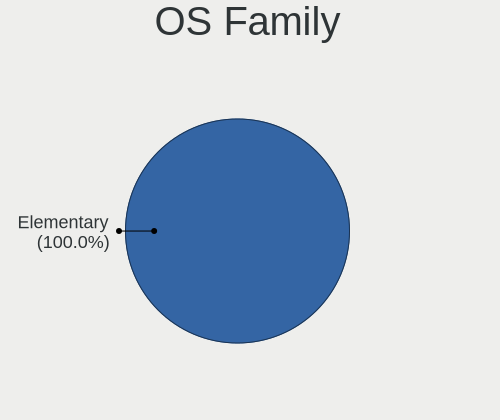
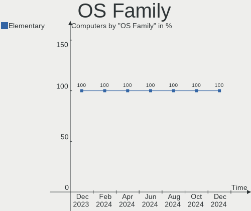
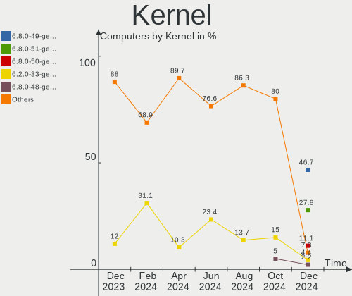
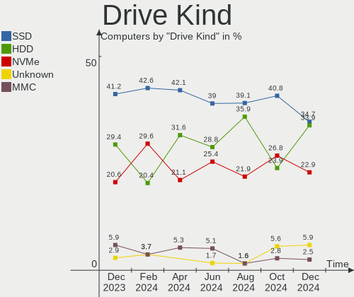
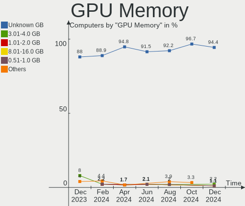
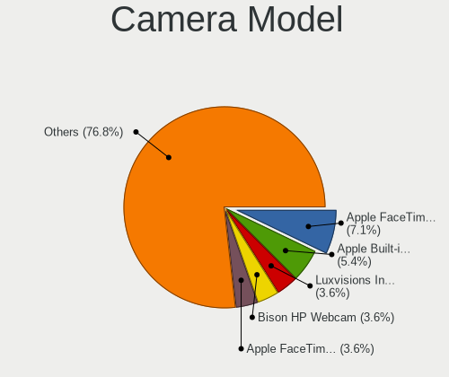

Elementary Hardware Trends
--------------------------

A project to identify most popular hardware characteristics and track their change
over time based on data collected by Elementary users at https://Linux-Hardware.org.

Anyone can contribute to this report by the [hw-probe](https://github.com/linuxhw/hw-probe) tool:

    sudo -E hw-probe -all -upload

This is a report for all computer types. See also reports for [desktops](/Dist/Elementary/Desktop/README.md) and [notebooks](/Dist/Elementary/Notebook/README.md).

This report is for one last month. Overall report since the beginning of time: [TestCoverage](https://github.com/linuxhw/TestCoverage)

Period: Apr, 2022.

Contents
--------

* [ System ](#system)
  - [ OS                       ](#os)
  - [ OS Family                ](#os-family)
  - [ Kernel                   ](#kernel)
  - [ Kernel Family            ](#kernel-family)
  - [ Kernel Major Ver.        ](#kernel-major-ver)
  - [ Arch                     ](#arch)
  - [ DE                       ](#de)
  - [ Display Server           ](#display-server)
  - [ Display Manager          ](#display-manager)
  - [ OS Lang                  ](#os-lang)
  - [ Boot Mode                ](#boot-mode)
  - [ Filesystem               ](#filesystem)
  - [ Part. scheme             ](#part-scheme)
  - [ Dual Boot with Linux/BSD ](#dual-boot-with-linuxbsd)
  - [ Dual Boot (Win)          ](#dual-boot-win)

* [ Board ](#board)
  - [ Vendor                   ](#vendor)
  - [ Model                    ](#model)
  - [ Model Family             ](#model-family)
  - [ MFG Year                 ](#mfg-year)
  - [ Form Factor              ](#form-factor)
  - [ Secure Boot              ](#secure-boot)
  - [ Coreboot                 ](#coreboot)
  - [ RAM Size                 ](#ram-size)
  - [ RAM Used                 ](#ram-used)
  - [ Total Drives             ](#total-drives)
  - [ Has CD-ROM               ](#has-cd-rom)
  - [ Has Ethernet             ](#has-ethernet)
  - [ Has WiFi                 ](#has-wifi)
  - [ Has Bluetooth            ](#has-bluetooth)

* [ Location ](#location)
  - [ Country                  ](#country)
  - [ City                     ](#city)

* [ Drives ](#drives)
  - [ Drive Vendor             ](#drive-vendor)
  - [ Drive Model              ](#drive-model)
  - [ HDD Vendor               ](#hdd-vendor)
  - [ SSD Vendor               ](#ssd-vendor)
  - [ Drive Kind               ](#drive-kind)
  - [ Drive Connector          ](#drive-connector)
  - [ Drive Size               ](#drive-size)
  - [ Space Total              ](#space-total)
  - [ Space Used               ](#space-used)
  - [ Malfunc. Drives          ](#malfunc-drives)
  - [ Malfunc. Drive Vendor    ](#malfunc-drive-vendor)
  - [ Malfunc. HDD Vendor      ](#malfunc-hdd-vendor)
  - [ Malfunc. Drive Kind      ](#malfunc-drive-kind)
  - [ Failed Drives            ](#failed-drives)
  - [ Failed Drive Vendor      ](#failed-drive-vendor)
  - [ Drive Status             ](#drive-status)

* [ Storage controller ](#storage-controller)
  - [ Storage Vendor           ](#storage-vendor)
  - [ Storage Model            ](#storage-model)
  - [ Storage Kind             ](#storage-kind)

* [ Processor ](#processor)
  - [ CPU Vendor               ](#cpu-vendor)
  - [ CPU Model                ](#cpu-model)
  - [ CPU Model Family         ](#cpu-model-family)
  - [ CPU Cores                ](#cpu-cores)
  - [ CPU Sockets              ](#cpu-sockets)
  - [ CPU Threads              ](#cpu-threads)
  - [ CPU Op-Modes             ](#cpu-op-modes)
  - [ CPU Microcode            ](#cpu-microcode)
  - [ CPU Microarch            ](#cpu-microarch)

* [ Graphics ](#graphics)
  - [ GPU Vendor               ](#gpu-vendor)
  - [ GPU Model                ](#gpu-model)
  - [ GPU Combo                ](#gpu-combo)
  - [ GPU Driver               ](#gpu-driver)
  - [ GPU Memory               ](#gpu-memory)

* [ Monitor ](#monitor)
  - [ Monitor Vendor           ](#monitor-vendor)
  - [ Monitor Model            ](#monitor-model)
  - [ Monitor Resolution       ](#monitor-resolution)
  - [ Monitor Diagonal         ](#monitor-diagonal)
  - [ Monitor Width            ](#monitor-width)
  - [ Aspect Ratio             ](#aspect-ratio)
  - [ Monitor Area             ](#monitor-area)
  - [ Pixel Density            ](#pixel-density)
  - [ Multiple Monitors        ](#multiple-monitors)

* [ Network ](#network)
  - [ Net Controller Vendor    ](#net-controller-vendor)
  - [ Net Controller Model     ](#net-controller-model)
  - [ Wireless Vendor          ](#wireless-vendor)
  - [ Wireless Model           ](#wireless-model)
  - [ Ethernet Vendor          ](#ethernet-vendor)
  - [ Ethernet Model           ](#ethernet-model)
  - [ Net Controller Kind      ](#net-controller-kind)
  - [ Used Controller          ](#used-controller)
  - [ NICs                     ](#nics)
  - [ IPv6                     ](#ipv6)

* [ Bluetooth ](#bluetooth)
  - [ Bluetooth Vendor         ](#bluetooth-vendor)
  - [ Bluetooth Model          ](#bluetooth-model)

* [ Sound ](#sound)
  - [ Sound Vendor             ](#sound-vendor)
  - [ Sound Model              ](#sound-model)

* [ Memory ](#memory)
  - [ Memory Vendor            ](#memory-vendor)
  - [ Memory Model             ](#memory-model)
  - [ Memory Kind              ](#memory-kind)
  - [ Memory Form Factor       ](#memory-form-factor)
  - [ Memory Size              ](#memory-size)
  - [ Memory Speed             ](#memory-speed)

* [ Printers & scanners ](#printers--scanners)
  - [ Printer Vendor           ](#printer-vendor)
  - [ Printer Model            ](#printer-model)
  - [ Scanner Vendor           ](#scanner-vendor)
  - [ Scanner Model            ](#scanner-model)

* [ Camera ](#camera)
  - [ Camera Vendor            ](#camera-vendor)
  - [ Camera Model             ](#camera-model)

* [ Security ](#security)
  - [ Fingerprint Vendor       ](#fingerprint-vendor)
  - [ Fingerprint Model        ](#fingerprint-model)
  - [ Chipcard Vendor          ](#chipcard-vendor)
  - [ Chipcard Model           ](#chipcard-model)

* [ Unsupported ](#unsupported)
  - [ Unsupported Devices      ](#unsupported-devices)
  - [ Unsupported Device Types ](#unsupported-device-types)

System
------

OS
--

Installed operating systems

| Name             | Computers | Percent |
|------------------|-----------|---------|
| Elementary 6.1   | 62        | 92.54%  |
| Elementary 5.1.7 | 3         | 4.48%   |
| Elementary 6     | 2         | 2.99%   |

OS Family
---------

OS without a version

| Name       | Computers | Percent |
|------------|-----------|---------|
| Elementary | 67        | 100%    |

Kernel
------

Version of the Linux kernel

| Version                | Computers | Percent |
|------------------------|-----------|---------|
| 5.13.0-39-generic      | 31        | 46.27%  |
| 5.13.0-40-generic      | 13        | 19.4%   |
| 5.11.0-43-generic      | 8         | 11.94%  |
| 5.4.0-107-generic      | 2         | 2.99%   |
| 5.13.0-37-generic      | 2         | 2.99%   |
| 5.13.0-35-generic      | 2         | 2.99%   |
| 5.13.0-27-generic      | 2         | 2.99%   |
| 5.4.0-104-generic      | 1         | 1.49%   |
| 5.15.36-xanmod1        | 1         | 1.49%   |
| 5.15.21-051521-generic | 1         | 1.49%   |
| 5.13.0-30-generic      | 1         | 1.49%   |
| 5.13.0-25-generic      | 1         | 1.49%   |
| 5.11.0-41-generic      | 1         | 1.49%   |
| 5.11.0-25-generic      | 1         | 1.49%   |

Kernel Family
-------------

Linux kernel without a distro release

| Version | Computers | Percent |
|---------|-----------|---------|
| 5.13.0  | 52        | 77.61%  |
| 5.11.0  | 10        | 14.93%  |
| 5.4.0   | 3         | 4.48%   |
| 5.15.36 | 1         | 1.49%   |
| 5.15.21 | 1         | 1.49%   |

Kernel Major Ver.
-----------------

Linux kernel major version

| Version | Computers | Percent |
|---------|-----------|---------|
| 5.13    | 52        | 77.61%  |
| 5.11    | 10        | 14.93%  |
| 5.4     | 3         | 4.48%   |
| 5.15    | 2         | 2.99%   |

Arch
----

OS architecture (x86_64, i586, etc.)

| Name   | Computers | Percent |
|--------|-----------|---------|
| x86_64 | 67        | 100%    |

DE
--

Desktop Environment

| Name     | Computers | Percent |
|----------|-----------|---------|
| Pantheon | 66        | 98.51%  |
| Unknown  | 1         | 1.49%   |

Display Server
--------------

X11 or Wayland

| Name | Computers | Percent |
|------|-----------|---------|
| X11  | 67        | 100%    |

Display Manager
---------------

SDDM, LightDM, etc.

| Name    | Computers | Percent |
|---------|-----------|---------|
| Unknown | 56        | 83.58%  |
| LightDM | 11        | 16.42%  |

OS Lang
-------

Language

| Lang    | Computers | Percent |
|---------|-----------|---------|
| en_US   | 25        | 37.31%  |
| es_ES   | 11        | 16.42%  |
| de_DE   | 10        | 14.93%  |
| pl_PL   | 3         | 4.48%   |
| fr_FR   | 3         | 4.48%   |
| ru_RU   | 2         | 2.99%   |
| pt_BR   | 2         | 2.99%   |
| en_GB   | 2         | 2.99%   |
| en_CA   | 2         | 2.99%   |
| uk_UA   | 1         | 1.49%   |
| tr_TR   | 1         | 1.49%   |
| ja_JP   | 1         | 1.49%   |
| it_IT   | 1         | 1.49%   |
| en_ZA   | 1         | 1.49%   |
| de_CH   | 1         | 1.49%   |
| Unknown | 1         | 1.49%   |

Boot Mode
---------

EFI or BIOS

| Mode | Computers | Percent |
|------|-----------|---------|
| EFI  | 39        | 58.21%  |
| BIOS | 28        | 41.79%  |

Filesystem
----------

Type of filesystem

| Type    | Computers | Percent |
|---------|-----------|---------|
| Ext4    | 66        | 98.51%  |
| Overlay | 1         | 1.49%   |

Part. scheme
------------

Scheme of partitioning

| Type    | Computers | Percent |
|---------|-----------|---------|
| Unknown | 63        | 94.03%  |
| GPT     | 3         | 4.48%   |
| MBR     | 1         | 1.49%   |

Dual Boot with Linux/BSD
------------------------

Hosting more than one Linux/BSD

| Dual boot | Computers | Percent |
|-----------|-----------|---------|
| No        | 66        | 98.51%  |
| Yes       | 1         | 1.49%   |

Dual Boot (Win)
---------------

Hosting Linux and Windows

| Dual boot | Computers | Percent |
|-----------|-----------|---------|
| No        | 61        | 91.04%  |
| Yes       | 6         | 8.96%   |

Board
-----

Vendor
------

Motherboard manufacturer

| Name                   | Computers | Percent |
|------------------------|-----------|---------|
| ASUSTek Computer       | 14        | 20.9%   |
| Hewlett-Packard        | 11        | 16.42%  |
| Lenovo                 | 10        | 14.93%  |
| Dell                   | 8         | 11.94%  |
| MSI                    | 4         | 5.97%   |
| Gigabyte Technology    | 4         | 5.97%   |
| Samsung Electronics    | 2         | 2.99%   |
| ASRock                 | 2         | 2.99%   |
| Apple                  | 2         | 2.99%   |
| Acer                   | 2         | 2.99%   |
| Pegatron               | 1         | 1.49%   |
| Panasonic              | 1         | 1.49%   |
| Inventec               | 1         | 1.49%   |
| Fujitsu                | 1         | 1.49%   |
| ECS                    | 1         | 1.49%   |
| AZW                    | 1         | 1.49%   |
| Avell High Performance | 1         | 1.49%   |
| AMI                    | 1         | 1.49%   |

Model
-----

Motherboard model

| Name                                        | Computers | Percent |
|---------------------------------------------|-----------|---------|
| MSI Prestige 15 A11UC                       | 2         | 2.99%   |
| ASUS ZenBook UX425EA_UX425EA                | 2         | 2.99%   |
| Samsung RV411/RV511/E3511/S3511/RV711/E3411 | 1         | 1.49%   |
| Samsung 950XDB/951XDB/950XDY                | 1         | 1.49%   |
| Pegatron IPMH61P1                           | 1         | 1.49%   |
| Panasonic CF-31SBLJGDM                      | 1         | 1.49%   |
| MSI MS-7A38                                 | 1         | 1.49%   |
| MSI MS-7885                                 | 1         | 1.49%   |
| Lenovo ThinkPad X270 W10DG 20K5S2VL00       | 1         | 1.49%   |
| Lenovo ThinkPad X260 20F5S84400             | 1         | 1.49%   |
| Lenovo ThinkPad X201 Tablet 3113CG2         | 1         | 1.49%   |
| Lenovo ThinkPad W541 20EGS0UB03             | 1         | 1.49%   |
| Lenovo ThinkPad T420 41786VU                | 1         | 1.49%   |
| Lenovo ThinkPad T410s 2912BR7               | 1         | 1.49%   |
| Lenovo ThinkPad E15 Gen 2 20TDS0GD00        | 1         | 1.49%   |
| Lenovo IdeaPad-510-15IKB 80SV               | 1         | 1.49%   |
| Lenovo IdeaPad 3 15IGL05 81WQ               | 1         | 1.49%   |
| Lenovo IdeaCentre 510S-07ICK 90LX006TGE     | 1         | 1.49%   |
| Inventec D CLASS                            | 1         | 1.49%   |
| HP Z200 SFF Workstation                     | 1         | 1.49%   |
| HP Stream Laptop 14-ax1xxx                  | 1         | 1.49%   |
| HP ProBook 6440b                            | 1         | 1.49%   |
| HP ProBook 440 G7                           | 1         | 1.49%   |
| HP Pavilion Notebook                        | 1         | 1.49%   |
| HP Pavilion g6                              | 1         | 1.49%   |
| HP Pavilion 17                              | 1         | 1.49%   |
| HP Notebook                                 | 1         | 1.49%   |
| HP EliteBook 840 G1                         | 1         | 1.49%   |
| HP Compaq 8200 Elite CMT PC                 | 1         | 1.49%   |
| HP 250 G7 Notebook PC                       | 1         | 1.49%   |
| Gigabyte H61M-D2H-USB3                      | 1         | 1.49%   |
| Gigabyte B450M DS3H                         | 1         | 1.49%   |
| Gigabyte B450 AORUS ELITE                   | 1         | 1.49%   |
| Gigabyte B150N Phoenix-WIFI                 | 1         | 1.49%   |
| Fujitsu ESPRIMO D757                        | 1         | 1.49%   |
| ECS H61H2-MV                                | 1         | 1.49%   |
| Dell XPS 2720                               | 1         | 1.49%   |
| Dell Vostro A860                            | 1         | 1.49%   |
| Dell Precision Tower 5810                   | 1         | 1.49%   |
| Dell OptiPlex 9010                          | 1         | 1.49%   |
| Dell OptiPlex 790                           | 1         | 1.49%   |
| Dell Latitude 5410                          | 1         | 1.49%   |
| Dell Latitude 3550                          | 1         | 1.49%   |
| Dell Inspiron 5481                          | 1         | 1.49%   |
| AZW GTi                                     | 1         | 1.49%   |
| Avell High Performance B.ON                 | 1         | 1.49%   |
| ASUS ZenBook UX325SA_UM325SA                | 1         | 1.49%   |
| ASUS TUF X470-PLUS GAMING                   | 1         | 1.49%   |
| ASUS TUF Gaming B460M-PLUS                  | 1         | 1.49%   |
| ASUS STRIKER II FORMULA                     | 1         | 1.49%   |
| ASUS ROG STRIX Z590-F GAMING WIFI           | 1         | 1.49%   |
| ASUS ROG CROSSHAIR VIII HERO                | 1         | 1.49%   |
| ASUS PRIME Z390-A                           | 1         | 1.49%   |
| ASUS P8Z77-V                                | 1         | 1.49%   |
| ASUS P8H61-M LX3 R2.0                       | 1         | 1.49%   |
| ASUS N56DY                                  | 1         | 1.49%   |
| ASUS H110I-PLUS                             | 1         | 1.49%   |
| ASUS All Series                             | 1         | 1.49%   |
| ASRock Z490 Pro4                            | 1         | 1.49%   |
| ASRock C226 WS                              | 1         | 1.49%   |

Model Family
------------

Motherboard model prefix

| Name                        | Computers | Percent |
|-----------------------------|-----------|---------|
| Lenovo ThinkPad             | 7         | 10.45%  |
| HP Pavilion                 | 3         | 4.48%   |
| ASUS ZenBook                | 3         | 4.48%   |
| MSI Prestige                | 2         | 2.99%   |
| HP ProBook                  | 2         | 2.99%   |
| Dell OptiPlex               | 2         | 2.99%   |
| Dell Latitude               | 2         | 2.99%   |
| ASUS TUF                    | 2         | 2.99%   |
| ASUS ROG                    | 2         | 2.99%   |
| Acer Aspire                 | 2         | 2.99%   |
| Samsung RV411               | 1         | 1.49%   |
| Samsung 950XDB              | 1         | 1.49%   |
| Pegatron IPMH61P1           | 1         | 1.49%   |
| Panasonic CF-31SBLJGDM      | 1         | 1.49%   |
| MSI MS-7A38                 | 1         | 1.49%   |
| MSI MS-7885                 | 1         | 1.49%   |
| Lenovo IdeaPad-510-15IKB    | 1         | 1.49%   |
| Lenovo IdeaPad              | 1         | 1.49%   |
| Lenovo IdeaCentre           | 1         | 1.49%   |
| Inventec D                  | 1         | 1.49%   |
| HP Z200                     | 1         | 1.49%   |
| HP Stream                   | 1         | 1.49%   |
| HP Notebook                 | 1         | 1.49%   |
| HP EliteBook                | 1         | 1.49%   |
| HP Compaq                   | 1         | 1.49%   |
| HP 250                      | 1         | 1.49%   |
| Gigabyte H61M-D2H-USB3      | 1         | 1.49%   |
| Gigabyte B450M              | 1         | 1.49%   |
| Gigabyte B450               | 1         | 1.49%   |
| Gigabyte B150N              | 1         | 1.49%   |
| Fujitsu ESPRIMO             | 1         | 1.49%   |
| ECS H61H2-MV                | 1         | 1.49%   |
| Dell XPS                    | 1         | 1.49%   |
| Dell Vostro                 | 1         | 1.49%   |
| Dell Precision              | 1         | 1.49%   |
| Dell Inspiron               | 1         | 1.49%   |
| AZW GTi                     | 1         | 1.49%   |
| Avell High Performance B.ON | 1         | 1.49%   |
| ASUS STRIKER                | 1         | 1.49%   |
| ASUS PRIME                  | 1         | 1.49%   |
| ASUS P8Z77-V                | 1         | 1.49%   |
| ASUS P8H61-M                | 1         | 1.49%   |
| ASUS N56DY                  | 1         | 1.49%   |
| ASUS H110I-PLUS             | 1         | 1.49%   |
| ASUS All                    | 1         | 1.49%   |
| ASRock Z490                 | 1         | 1.49%   |
| ASRock C226                 | 1         | 1.49%   |
| Apple MacBookPro10          | 1         | 1.49%   |
| Apple MacBookAir4           | 1         | 1.49%   |
| AMI Aptio                   | 1         | 1.49%   |

MFG Year
--------

Motherboard manufacture year

| Year | Computers | Percent |
|------|-----------|---------|
| 2021 | 10        | 14.93%  |
| 2018 | 8         | 11.94%  |
| 2012 | 7         | 10.45%  |
| 2020 | 6         | 8.96%   |
| 2013 | 6         | 8.96%   |
| 2011 | 6         | 8.96%   |
| 2015 | 5         | 7.46%   |
| 2010 | 5         | 7.46%   |
| 2019 | 4         | 5.97%   |
| 2014 | 4         | 5.97%   |
| 2016 | 3         | 4.48%   |
| 2022 | 1         | 1.49%   |
| 2017 | 1         | 1.49%   |
| 2008 | 1         | 1.49%   |

Form Factor
-----------

Physical design of the computer

| Name        | Computers | Percent |
|-------------|-----------|---------|
| Notebook    | 35        | 52.24%  |
| Desktop     | 29        | 43.28%  |
| Convertible | 1         | 1.49%   |
| Mini pc     | 1         | 1.49%   |
| All in one  | 1         | 1.49%   |

Secure Boot
-----------

Enabled or disabled

| State    | Computers | Percent |
|----------|-----------|---------|
| Disabled | 59        | 88.06%  |
| Enabled  | 8         | 11.94%  |

Coreboot
--------

Have coreboot on board

| Used | Computers | Percent |
|------|-----------|---------|
| No   | 67        | 100%    |

RAM Size
--------

Total RAM memory

| Size in GB  | Computers | Percent |
|-------------|-----------|---------|
| 16.01-24.0  | 17        | 25.37%  |
| 4.01-8.0    | 14        | 20.9%   |
| 3.01-4.0    | 13        | 19.4%   |
| 8.01-16.0   | 13        | 19.4%   |
| 32.01-64.0  | 7         | 10.45%  |
| 2.01-3.0    | 1         | 1.49%   |
| 64.01-256.0 | 1         | 1.49%   |
| 1.01-2.0    | 1         | 1.49%   |

RAM Used
--------

Used RAM memory

| Used GB   | Computers | Percent |
|-----------|-----------|---------|
| 1.01-2.0  | 27        | 40.3%   |
| 2.01-3.0  | 19        | 28.36%  |
| 4.01-8.0  | 8         | 11.94%  |
| 3.01-4.0  | 7         | 10.45%  |
| 8.01-16.0 | 3         | 4.48%   |
| 0.51-1.0  | 3         | 4.48%   |

Total Drives
------------

Number of drives on board

| Drives | Computers | Percent |
|--------|-----------|---------|
| 1      | 40        | 59.7%   |
| 2      | 19        | 28.36%  |
| 5      | 3         | 4.48%   |
| 4      | 3         | 4.48%   |
| 3      | 2         | 2.99%   |

Has CD-ROM
----------

Has CD-ROM on board

| Presented | Computers | Percent |
|-----------|-----------|---------|
| No        | 42        | 62.69%  |
| Yes       | 25        | 37.31%  |

Has Ethernet
------------

Has Ethernet on board

| Presented | Computers | Percent |
|-----------|-----------|---------|
| Yes       | 59        | 88.06%  |
| No        | 8         | 11.94%  |

Has WiFi
--------

Has WiFi module

| Presented | Computers | Percent |
|-----------|-----------|---------|
| Yes       | 52        | 77.61%  |
| No        | 15        | 22.39%  |

Has Bluetooth
-------------

Has Bluetooth module

| Presented | Computers | Percent |
|-----------|-----------|---------|
| Yes       | 47        | 70.15%  |
| No        | 20        | 29.85%  |

Location
--------

Country
-------

Geographic location (country)

| Country      | Computers | Percent |
|--------------|-----------|---------|
| Germany      | 8         | 11.94%  |
| USA          | 5         | 7.46%   |
| Spain        | 5         | 7.46%   |
| UK           | 4         | 5.97%   |
| Poland       | 4         | 5.97%   |
| Brazil       | 4         | 5.97%   |
| Switzerland  | 3         | 4.48%   |
| Mexico       | 3         | 4.48%   |
| France       | 3         | 4.48%   |
| Canada       | 3         | 4.48%   |
| Turkey       | 2         | 2.99%   |
| Russia       | 2         | 2.99%   |
| Japan        | 2         | 2.99%   |
| India        | 2         | 2.99%   |
| Chile        | 2         | 2.99%   |
| Austria      | 2         | 2.99%   |
| Sri Lanka    | 1         | 1.49%   |
| South Africa | 1         | 1.49%   |
| Romania      | 1         | 1.49%   |
| Portugal     | 1         | 1.49%   |
| Pakistan     | 1         | 1.49%   |
| Norway       | 1         | 1.49%   |
| Malaysia     | 1         | 1.49%   |
| Italy        | 1         | 1.49%   |
| Estonia      | 1         | 1.49%   |
| Croatia      | 1         | 1.49%   |
| Belgium      | 1         | 1.49%   |
| Australia    | 1         | 1.49%   |
| Argentina    | 1         | 1.49%   |

City
----

Geographic location (city)

| City                   | Computers | Percent |
|------------------------|-----------|---------|
| Wroclaw                | 2         | 2.99%   |
| Montornès del Vallès | 2         | 2.99%   |
| Istanbul               | 2         | 2.99%   |
| Hamburg                | 2         | 2.99%   |
| Bern                   | 2         | 2.99%   |
| Yokohama               | 1         | 1.49%   |
| Warsaw                 | 1         | 1.49%   |
| Vanse                  | 1         | 1.49%   |
| Toronto                | 1         | 1.49%   |
| Temuco                 | 1         | 1.49%   |
| Sydney                 | 1         | 1.49%   |
| Stockton               | 1         | 1.49%   |
| Stare Kozle            | 1         | 1.49%   |
| St Petersburg          | 1         | 1.49%   |
| Sioux City             | 1         | 1.49%   |
| Sindelfingen           | 1         | 1.49%   |
| Sarrebourg             | 1         | 1.49%   |
| Santiago               | 1         | 1.49%   |
| Revere                 | 1         | 1.49%   |
| Rakvere                | 1         | 1.49%   |
| Puebla City            | 1         | 1.49%   |
| Nuremberg              | 1         | 1.49%   |
| Norwich                | 1         | 1.49%   |
| Neuhofen an der Krems  | 1         | 1.49%   |
| Munich                 | 1         | 1.49%   |
| Moscow                 | 1         | 1.49%   |
| Maua                   | 1         | 1.49%   |
| Leiria                 | 1         | 1.49%   |
| Las Rozas de Madrid    | 1         | 1.49%   |
| Larnage                | 1         | 1.49%   |
| Krenglbach             | 1         | 1.49%   |
| Kootenay Bay           | 1         | 1.49%   |
| Kilchberg              | 1         | 1.49%   |
| Kamenz                 | 1         | 1.49%   |
| Itanhem                | 1         | 1.49%   |
| Islamabad              | 1         | 1.49%   |
| Hinsdale               | 1         | 1.49%   |
| Heist-op-den-Berg      | 1         | 1.49%   |
| Hatfield               | 1         | 1.49%   |
| Harrisburg             | 1         | 1.49%   |
| Getafe                 | 1         | 1.49%   |
| George Town            | 1         | 1.49%   |
| Fukuoka                | 1         | 1.49%   |
| Fortaleza              | 1         | 1.49%   |
| Delhi                  | 1         | 1.49%   |
| Dehradun               | 1         | 1.49%   |
| Dayton                 | 1         | 1.49%   |
| Cunewalde              | 1         | 1.49%   |
| Cotia                  | 1         | 1.49%   |
| Colombo                | 1         | 1.49%   |
| Chenove                | 1         | 1.49%   |
| Cervo                  | 1         | 1.49%   |
| Cape Town              | 1         | 1.49%   |
| Calgary                | 1         | 1.49%   |
| Botosani               | 1         | 1.49%   |
| Bonnybridge            | 1         | 1.49%   |
| Bonn                   | 1         | 1.49%   |
| Belišće              | 1         | 1.49%   |
| Belfast                | 1         | 1.49%   |
| Bahía Blanca          | 1         | 1.49%   |

Drives
------

Drive Vendor
------------

Hard drive vendors

| Vendor                    | Computers | Drives | Percent |
|---------------------------|-----------|--------|---------|
| Samsung Electronics       | 17        | 19     | 16.67%  |
| Seagate                   | 15        | 18     | 14.71%  |
| WDC                       | 12        | 12     | 11.76%  |
| Toshiba                   | 10        | 12     | 9.8%    |
| Kingston                  | 7         | 8      | 6.86%   |
| Micron/Crucial Technology | 4         | 5      | 3.92%   |
| Intel                     | 4         | 4      | 3.92%   |
| Crucial                   | 4         | 5      | 3.92%   |
| Unknown                   | 3         | 3      | 2.94%   |
| SK Hynix                  | 3         | 3      | 2.94%   |
| Team                      | 2         | 2      | 1.96%   |
| Sandisk                   | 2         | 2      | 1.96%   |
| Phison                    | 2         | 2      | 1.96%   |
| MAXTOR                    | 2         | 2      | 1.96%   |
| HGST                      | 2         | 2      | 1.96%   |
| Apple                     | 2         | 2      | 1.96%   |
| SSSTC                     | 1         | 1      | 0.98%   |
| PLEXTOR                   | 1         | 1      | 0.98%   |
| OSCOO                     | 1         | 1      | 0.98%   |
| Micron Technology         | 1         | 1      | 0.98%   |
| LITEON                    | 1         | 1      | 0.98%   |
| JMicron                   | 1         | 1      | 0.98%   |
| Intenso                   | 1         | 1      | 0.98%   |
| GOODRAM                   | 1         | 1      | 0.98%   |
| Fujitsu                   | 1         | 1      | 0.98%   |
| Dogfish                   | 1         | 1      | 0.98%   |
| A-DATA Technology         | 1         | 1      | 0.98%   |

Drive Model
-----------

Hard drive models

| Model                                       | Computers | Percent |
|---------------------------------------------|-----------|---------|
| Toshiba MQ01ABD100 1TB                      | 3         | 2.75%   |
| Samsung SSD 860 EVO 250GB                   | 3         | 2.75%   |
| Micron/Crucial NVMe SSD Drive 1TB           | 3         | 2.75%   |
| Samsung SSD 860 EVO 500GB                   | 2         | 1.83%   |
| Samsung NVMe SSD Drive 512GB                | 2         | 1.83%   |
| Samsung NVMe SSD Drive 1024GB               | 2         | 1.83%   |
| Phison NVMe SSD Drive 1TB                   | 2         | 1.83%   |
| Kingston SA400S37960G 960GB SSD             | 2         | 1.83%   |
| Crucial CT240BX500SSD1 240GB                | 2         | 1.83%   |
| WDC WDS500G1B0A-00H9H0 500GB SSD            | 1         | 0.92%   |
| WDC WD5000LPVT-08G33T1 500GB                | 1         | 0.92%   |
| WDC WD5000LPLX-60ZNTT2 500GB                | 1         | 0.92%   |
| WDC WD5000AAKX-00ERMA0 500GB                | 1         | 0.92%   |
| WDC WD5000AAKX-003CA0 500GB                 | 1         | 0.92%   |
| WDC WD3200AVJS-63B6A0 320GB                 | 1         | 0.92%   |
| WDC WD30EZRX-00SPEB0 3TB                    | 1         | 0.92%   |
| WDC WD2500JS-23MHB0 250GB                   | 1         | 0.92%   |
| WDC WD10SPZX-75Z10T2 1TB                    | 1         | 0.92%   |
| WDC WD10JPVX-22JC3T0 1TB                    | 1         | 0.92%   |
| WDC WD10EZEX-00ZF5A0 1TB                    | 1         | 0.92%   |
| WDC WD10EZEX-00BN5A0 1TB                    | 1         | 0.92%   |
| Unknown MMC Card  64GB                      | 1         | 0.92%   |
| Unknown MMC Card  32GB                      | 1         | 0.92%   |
| Unknown MMC Card  196GB                     | 1         | 0.92%   |
| Toshiba MQ01ACF050 500GB                    | 1         | 0.92%   |
| Toshiba MK5065GSX 500GB                     | 1         | 0.92%   |
| Toshiba MG06ACA600E 6TB                     | 1         | 0.92%   |
| Toshiba HDWF180 8TB                         | 1         | 0.92%   |
| Toshiba HDWD130 3TB                         | 1         | 0.92%   |
| Toshiba DT01ACA100 LENOVO 1TB               | 1         | 0.92%   |
| Toshiba DT01ACA100 1TB                      | 1         | 0.92%   |
| Toshiba DT01ACA050 500GB                    | 1         | 0.92%   |
| Team T253X6256G 256GB SSD                   | 1         | 0.92%   |
| Team T253X1480G 480GB SSD                   | 1         | 0.92%   |
| SSSTC CL1-8D256-HP 256GB                    | 1         | 0.92%   |
| SK Hynix NVMe SSD Drive 512GB               | 1         | 0.92%   |
| SK Hynix NVMe SSD Drive 256GB               | 1         | 0.92%   |
| SK Hynix HFM512GD3JX013N 512GB              | 1         | 0.92%   |
| Seagate ST980811AS 80GB                     | 1         | 0.92%   |
| Seagate ST9750420AS 752GB                   | 1         | 0.92%   |
| Seagate ST500LT012-1DG142 500GB             | 1         | 0.92%   |
| Seagate ST500DM002-1BD142 500GB             | 1         | 0.92%   |
| Seagate ST3500418AS 500GB                   | 1         | 0.92%   |
| Seagate ST3408111AS 40GB                    | 1         | 0.92%   |
| Seagate ST3320413AS 320GB                   | 1         | 0.92%   |
| Seagate ST3250312AS 250GB                   | 1         | 0.92%   |
| Seagate ST3160318AS 160GB                   | 1         | 0.92%   |
| Seagate ST31000528AS 1TB                    | 1         | 0.92%   |
| Seagate ST2000DM001-1ER164 2TB              | 1         | 0.92%   |
| Seagate ST2000DM001-1CH164 2TB              | 1         | 0.92%   |
| Seagate ST1000LM048-2E7172 1TB              | 1         | 0.92%   |
| Seagate ST1000LM035-1RK172 1TB              | 1         | 0.92%   |
| Seagate ST1000DM010-2EP102 1TB              | 1         | 0.92%   |
| Seagate NVMe SSD Drive 2TB                  | 1         | 0.92%   |
| Seagate BarraCuda Q1 SSD ZA960CV10001 960GB | 1         | 0.92%   |
| Seagate BACKUP+ 128PB                       | 1         | 0.92%   |
| SanDisk SSD PLUS 480GB                      | 1         | 0.92%   |
| Sandisk NVMe SSD Drive 500GB                | 1         | 0.92%   |
| Samsung SSD 980 PRO 500GB                   | 1         | 0.92%   |
| Samsung SSD 980 PRO 1TB                     | 1         | 0.92%   |

HDD Vendor
----------

Hard disk drive vendors

| Vendor              | Computers | Drives | Percent |
|---------------------|-----------|--------|---------|
| Seagate             | 12        | 15     | 30.77%  |
| WDC                 | 11        | 11     | 28.21%  |
| Toshiba             | 10        | 12     | 25.64%  |
| MAXTOR              | 2         | 2      | 5.13%   |
| HGST                | 2         | 2      | 5.13%   |
| Samsung Electronics | 1         | 1      | 2.56%   |
| Fujitsu             | 1         | 1      | 2.56%   |

SSD Vendor
----------

Solid state drive vendors

| Vendor              | Computers | Drives | Percent |
|---------------------|-----------|--------|---------|
| Samsung Electronics | 9         | 10     | 25.71%  |
| Kingston            | 6         | 6      | 17.14%  |
| Crucial             | 4         | 5      | 11.43%  |
| Team                | 2         | 2      | 5.71%   |
| Intel               | 2         | 2      | 5.71%   |
| Apple               | 2         | 2      | 5.71%   |
| WDC                 | 1         | 1      | 2.86%   |
| Seagate             | 1         | 1      | 2.86%   |
| SanDisk             | 1         | 1      | 2.86%   |
| PLEXTOR             | 1         | 1      | 2.86%   |
| Micron Technology   | 1         | 1      | 2.86%   |
| LITEON              | 1         | 1      | 2.86%   |
| JMicron             | 1         | 1      | 2.86%   |
| Intenso             | 1         | 1      | 2.86%   |
| GOODRAM             | 1         | 1      | 2.86%   |
| Dogfish             | 1         | 1      | 2.86%   |

Drive Kind
----------

HDD or SSD

| Kind    | Computers | Drives | Percent |
|---------|-----------|--------|---------|
| HDD     | 33        | 44     | 37.93%  |
| SSD     | 29        | 37     | 33.33%  |
| NVMe    | 20        | 26     | 22.99%  |
| MMC     | 3         | 3      | 3.45%   |
| Unknown | 2         | 2      | 2.3%    |

Drive Connector
---------------

SATA, SAS, NVMe, etc.

| Type | Computers | Drives | Percent |
|------|-----------|--------|---------|
| SATA | 52        | 81     | 67.53%  |
| NVMe | 20        | 26     | 25.97%  |
| MMC  | 3         | 3      | 3.9%    |
| SAS  | 2         | 2      | 2.6%    |

Drive Size
----------

Size of hard drive

| Size in TB | Computers | Drives | Percent |
|------------|-----------|--------|---------|
| 0.01-0.5   | 41        | 54     | 64.06%  |
| 0.51-1.0   | 17        | 20     | 26.56%  |
| 2.01-3.0   | 2         | 3      | 3.13%   |
| 1.01-2.0   | 2         | 2      | 3.13%   |
| 4.01-10.0  | 2         | 2      | 3.13%   |

Space Total
-----------

Amount of disk space available on the file system

| Size in GB     | Computers | Percent |
|----------------|-----------|---------|
| 101-250        | 25        | 37.31%  |
| 501-1000       | 15        | 22.39%  |
| 251-500        | 12        | 17.91%  |
| 51-100         | 8         | 11.94%  |
| 21-50          | 3         | 4.48%   |
| More than 3000 | 2         | 2.99%   |
| 1-20           | 1         | 1.49%   |
| Unknown        | 1         | 1.49%   |

Space Used
----------

Amount of used disk space

| Used GB        | Computers | Percent |
|----------------|-----------|---------|
| 1-20           | 32        | 47.76%  |
| 21-50          | 12        | 17.91%  |
| 51-100         | 12        | 17.91%  |
| 101-250        | 5         | 7.46%   |
| 501-1000       | 2         | 2.99%   |
| More than 3000 | 1         | 1.49%   |
| 251-500        | 1         | 1.49%   |
| 1001-2000      | 1         | 1.49%   |
| Unknown        | 1         | 1.49%   |

Malfunc. Drives
---------------

Drive models with a malfunction

Zero info for selected period =(

Malfunc. Drive Vendor
---------------------

Vendors of faulty drives

Zero info for selected period =(

Malfunc. HDD Vendor
-------------------

Vendors of faulty HDD drives

Zero info for selected period =(

Malfunc. Drive Kind
-------------------

Kinds of faulty drives

Zero info for selected period =(

Failed Drives
-------------

Failed drive models

Zero info for selected period =(

Failed Drive Vendor
-------------------

Failed drive vendors

Zero info for selected period =(

Drive Status
------------

Number of failed and malfunc. drives

| Status   | Computers | Drives | Percent |
|----------|-----------|--------|---------|
| Detected | 64        | 107    | 92.75%  |
| Works    | 5         | 5      | 7.25%   |

Storage controller
------------------

Storage Vendor
--------------

Storage controller vendors

| Vendor                         | Computers | Percent |
|--------------------------------|-----------|---------|
| Intel                          | 51        | 61.45%  |
| Samsung Electronics            | 7         | 8.43%   |
| AMD                            | 7         | 8.43%   |
| Micron/Crucial Technology      | 4         | 4.82%   |
| SK Hynix                       | 3         | 3.61%   |
| Phison Electronics             | 2         | 2.41%   |
| Kingston Technology Company    | 2         | 2.41%   |
| Solid State Storage Technology | 1         | 1.2%    |
| Seagate Technology             | 1         | 1.2%    |
| Sandisk                        | 1         | 1.2%    |
| Nvidia                         | 1         | 1.2%    |
| Marvell Technology Group       | 1         | 1.2%    |
| ASMedia Technology             | 1         | 1.2%    |
| ADATA Technology               | 1         | 1.2%    |

Storage Model
-------------

Storage controller models

| Model                                                                                   | Computers | Percent |
|-----------------------------------------------------------------------------------------|-----------|---------|
| Samsung NVMe SSD Controller PM9A1/PM9A3/980PRO                                          | 5         | 5.26%   |
| Intel Sunrise Point-LP SATA Controller [AHCI mode]                                      | 4         | 4.21%   |
| AMD FCH SATA Controller [AHCI mode]                                                     | 4         | 4.21%   |
| AMD 400 Series Chipset SATA Controller                                                  | 4         | 4.21%   |
| Micron/Crucial P2 NVMe PCIe SSD                                                         | 3         | 3.16%   |
| Intel Wildcat Point-LP SATA Controller [AHCI Mode]                                      | 3         | 3.16%   |
| Intel Comet Lake SATA AHCI Controller                                                   | 3         | 3.16%   |
| Intel 8 Series/C220 Series Chipset Family 6-port SATA Controller 1 [AHCI mode]          | 3         | 3.16%   |
| Intel 6 Series/C200 Series Chipset Family Desktop SATA Controller (IDE mode, ports 4-5) | 3         | 3.16%   |
| Intel 6 Series/C200 Series Chipset Family Desktop SATA Controller (IDE mode, ports 0-3) | 3         | 3.16%   |
| Intel 6 Series/C200 Series Chipset Family 6 port Desktop SATA AHCI Controller           | 3         | 3.16%   |
| Intel 5 Series/3400 Series Chipset 6 port SATA AHCI Controller                          | 3         | 3.16%   |
| SK Hynix BC511                                                                          | 2         | 2.11%   |
| Samsung NVMe SSD Controller 980                                                         | 2         | 2.11%   |
| Phison E12 NVMe Controller                                                              | 2         | 2.11%   |
| Kingston Company A2000 NVMe SSD                                                         | 2         | 2.11%   |
| Intel Volume Management Device NVMe RAID Controller                                     | 2         | 2.11%   |
| Intel SSD 660P Series                                                                   | 2         | 2.11%   |
| Intel Q170/Q150/B150/H170/H110/Z170/CM236 Chipset SATA Controller [AHCI Mode]           | 2         | 2.11%   |
| Intel C610/X99 series chipset 6-Port SATA Controller [AHCI mode]                        | 2         | 2.11%   |
| Intel 82801 Mobile SATA Controller [RAID mode]                                          | 2         | 2.11%   |
| Intel 8 Series SATA Controller 1 [AHCI mode]                                            | 2         | 2.11%   |
| Intel 7 Series/C210 Series Chipset Family 6-port SATA Controller [AHCI mode]            | 2         | 2.11%   |
| Intel 7 Series Chipset Family 6-port SATA Controller [AHCI mode]                        | 2         | 2.11%   |
| Intel 6 Series/C200 Series Chipset Family 6 port Mobile SATA AHCI Controller            | 2         | 2.11%   |
| Intel 200 Series PCH SATA controller [AHCI mode]                                        | 2         | 2.11%   |
| Solid State Storage Non-Volatile memory controller                                      | 1         | 1.05%   |
| SK Hynix Gold P31 SSD                                                                   | 1         | 1.05%   |
| Seagate FireCuda 510 SSD                                                                | 1         | 1.05%   |
| Sandisk WD Blue SN550 NVMe SSD                                                          | 1         | 1.05%   |
| Nvidia MCP55 SATA Controller                                                            | 1         | 1.05%   |
| Nvidia MCP55 IDE                                                                        | 1         | 1.05%   |
| Micron/Crucial Non-Volatile memory controller                                           | 1         | 1.05%   |
| Marvell Group 88SE9172 SATA 6Gb/s Controller                                            | 1         | 1.05%   |
| Intel Tiger Lake-LP SATA Controller [AHCI mode]                                         | 1         | 1.05%   |
| Intel SATA Controller [RAID mode]                                                       | 1         | 1.05%   |
| Intel Celeron/Pentium Silver Processor SATA Controller                                  | 1         | 1.05%   |
| Intel Cannon Lake PCH SATA AHCI Controller                                              | 1         | 1.05%   |
| Intel C610/X99 series chipset sSATA Controller [AHCI mode]                              | 1         | 1.05%   |
| Intel Atom Processor E3800 Series SATA AHCI Controller                                  | 1         | 1.05%   |
| Intel 82801HM/HEM (ICH8M/ICH8M-E) SATA Controller [IDE mode]                            | 1         | 1.05%   |
| Intel 8 Series/C220 Series Chipset Family 4-port SATA Controller 1 [IDE mode]           | 1         | 1.05%   |
| Intel 8 Series/C220 Series Chipset Family 2-port SATA Controller 2 [IDE mode]           | 1         | 1.05%   |
| Intel 6 Series/C200 Series Chipset Family Mobile SATA Controller (IDE mode, ports 0-3)  | 1         | 1.05%   |
| Intel 6 Series/C200 Series Chipset Family IDE-r Controller                              | 1         | 1.05%   |
| Intel 500 Series Chipset Family SATA AHCI Controller                                    | 1         | 1.05%   |
| Intel 5 Series/3400 Series Chipset 4 port SATA IDE Controller                           | 1         | 1.05%   |
| Intel 5 Series/3400 Series Chipset 2 port SATA IDE Controller                           | 1         | 1.05%   |
| Intel 300 Series Chipset Family SATA RAID Controller                                    | 1         | 1.05%   |
| ASMedia ASM1062 Serial ATA Controller                                                   | 1         | 1.05%   |
| AMD SB7x0/SB8x0/SB9x0 SATA Controller [AHCI mode]                                       | 1         | 1.05%   |
| ADATA Non-Volatile memory controller                                                    | 1         | 1.05%   |

Storage Kind
------------

Kind of storage controller (IDE, SATA, NVMe, SAS, ...)

| Kind | Computers | Percent |
|------|-----------|---------|
| SATA | 45        | 56.25%  |
| NVMe | 20        | 25%     |
| IDE  | 9         | 11.25%  |
| RAID | 6         | 7.5%    |

Processor
---------

CPU Vendor
----------

Processor vendors

| Vendor | Computers | Percent |
|--------|-----------|---------|
| Intel  | 59        | 88.06%  |
| AMD    | 8         | 11.94%  |

CPU Model
---------

Processor models

| Model                                       | Computers | Percent |
|---------------------------------------------|-----------|---------|
| Intel Core i5-2400 CPU @ 3.10GHz            | 3         | 4.48%   |
| Intel 11th Gen Core i7-1165G7 @ 2.80GHz     | 3         | 4.48%   |
| Intel 11th Gen Core i5-1135G7 @ 2.40GHz     | 3         | 4.48%   |
| Intel Core i7-3770 CPU @ 3.40GHz            | 2         | 2.99%   |
| Intel Core i5-7400 CPU @ 3.00GHz            | 2         | 2.99%   |
| Intel Core i5-7200U CPU @ 2.50GHz           | 2         | 2.99%   |
| Intel Core i5-10210U CPU @ 1.60GHz          | 2         | 2.99%   |
| Intel Core i3-5005U CPU @ 2.00GHz           | 2         | 2.99%   |
| Intel 11th Gen Core i7-1195G7 @ 2.90GHz     | 2         | 2.99%   |
| Intel Xeon CPU E5-1650 v3 @ 3.50GHz         | 1         | 1.49%   |
| Intel Xeon CPU E5-1620 v3 @ 3.50GHz         | 1         | 1.49%   |
| Intel Pentium CPU G620 @ 2.60GHz            | 1         | 1.49%   |
| Intel Pentium CPU G2030 @ 3.00GHz           | 1         | 1.49%   |
| Intel Core i9-9900K CPU @ 3.60GHz           | 1         | 1.49%   |
| Intel Core i7-6700K CPU @ 4.00GHz           | 1         | 1.49%   |
| Intel Core i7-6500U CPU @ 2.50GHz           | 1         | 1.49%   |
| Intel Core i7-4810MQ CPU @ 2.80GHz          | 1         | 1.49%   |
| Intel Core i7-4790K CPU @ 4.00GHz           | 1         | 1.49%   |
| Intel Core i7-4770S CPU @ 3.10GHz           | 1         | 1.49%   |
| Intel Core i7-3635QM CPU @ 2.40GHz          | 1         | 1.49%   |
| Intel Core i7-2677M CPU @ 1.80GHz           | 1         | 1.49%   |
| Intel Core i7-2670QM CPU @ 2.20GHz          | 1         | 1.49%   |
| Intel Core i7-10700K CPU @ 3.80GHz          | 1         | 1.49%   |
| Intel Core i7-1065G7 CPU @ 1.30GHz          | 1         | 1.49%   |
| Intel Core i7 CPU L 620 @ 2.00GHz           | 1         | 1.49%   |
| Intel Core i5-6300U CPU @ 2.40GHz           | 1         | 1.49%   |
| Intel Core i5-4300U CPU @ 1.90GHz           | 1         | 1.49%   |
| Intel Core i5-3330S CPU @ 2.70GHz           | 1         | 1.49%   |
| Intel Core i5-3320M CPU @ 2.60GHz           | 1         | 1.49%   |
| Intel Core i5-10400 CPU @ 2.90GHz           | 1         | 1.49%   |
| Intel Core i5 CPU M 560 @ 2.67GHz           | 1         | 1.49%   |
| Intel Core i5 CPU M 520 @ 2.40GHz           | 1         | 1.49%   |
| Intel Core i5 CPU 650 @ 3.20GHz             | 1         | 1.49%   |
| Intel Core i3-9100 CPU @ 3.60GHz            | 1         | 1.49%   |
| Intel Core i3-8145U CPU @ 2.10GHz           | 1         | 1.49%   |
| Intel Core i3-5020U CPU @ 2.20GHz           | 1         | 1.49%   |
| Intel Core i3-4130 CPU @ 3.40GHz            | 1         | 1.49%   |
| Intel Core i3-4030U CPU @ 1.90GHz           | 1         | 1.49%   |
| Intel Core i3-2310M CPU @ 2.10GHz           | 1         | 1.49%   |
| Intel Core i3 CPU M 380 @ 2.53GHz           | 1         | 1.49%   |
| Intel Core 2 Quad CPU @ 2.40GHz             | 1         | 1.49%   |
| Intel Core 2 Duo CPU T5870 @ 2.00GHz        | 1         | 1.49%   |
| Intel Celeron N4020 CPU @ 1.10GHz           | 1         | 1.49%   |
| Intel Celeron N4000 CPU @ 1.10GHz           | 1         | 1.49%   |
| Intel Celeron CPU N2940 @ 1.83GHz           | 1         | 1.49%   |
| Intel Celeron CPU N2808 @ 1.58GHz           | 1         | 1.49%   |
| Intel 11th Gen Core i7-11700K @ 3.60GHz     | 1         | 1.49%   |
| AMD Ryzen 9 5900X 12-Core Processor         | 1         | 1.49%   |
| AMD Ryzen 7 5800U with Radeon Graphics      | 1         | 1.49%   |
| AMD Ryzen 5 5600G with Radeon Graphics      | 1         | 1.49%   |
| AMD Ryzen 5 3600 6-Core Processor           | 1         | 1.49%   |
| AMD Ryzen 5 3400G with Radeon Vega Graphics | 1         | 1.49%   |
| AMD Ryzen 5 2600X Six-Core Processor        | 1         | 1.49%   |
| AMD G-T48E Processor                        | 1         | 1.49%   |
| AMD A8-5550M APU with Radeon HD Graphics    | 1         | 1.49%   |

CPU Model Family
----------------

Processor model prefix

| Model             | Computers | Percent |
|-------------------|-----------|---------|
| Intel Core i5     | 17        | 25.37%  |
| Intel Core i7     | 13        | 19.4%   |
| Other             | 9         | 13.43%  |
| Intel Core i3     | 9         | 13.43%  |
| Intel Celeron     | 4         | 5.97%   |
| AMD Ryzen 5       | 4         | 5.97%   |
| Intel Xeon        | 2         | 2.99%   |
| Intel Pentium     | 2         | 2.99%   |
| Intel Core i9     | 1         | 1.49%   |
| Intel Core 2 Quad | 1         | 1.49%   |
| Intel Core 2 Duo  | 1         | 1.49%   |
| AMD Ryzen 9       | 1         | 1.49%   |
| AMD Ryzen 7       | 1         | 1.49%   |
| AMD G             | 1         | 1.49%   |
| AMD A8            | 1         | 1.49%   |

CPU Cores
---------

Number of processor cores

| Number | Computers | Percent |
|--------|-----------|---------|
| 4      | 29        | 43.28%  |
| 2      | 28        | 41.79%  |
| 6      | 5         | 7.46%   |
| 8      | 4         | 5.97%   |
| 12     | 1         | 1.49%   |

CPU Sockets
-----------

Number of sockets

| Number | Computers | Percent |
|--------|-----------|---------|
| 1      | 67        | 100%    |

CPU Threads
-----------

Threads per core (Hyper-Threading)

| Number | Computers | Percent |
|--------|-----------|---------|
| 2      | 51        | 76.12%  |
| 1      | 16        | 23.88%  |

CPU Op-Modes
------------

CPU Operation Modes (32-bit, 64-bit)

| Op mode        | Computers | Percent |
|----------------|-----------|---------|
| 32-bit, 64-bit | 67        | 100%    |

CPU Microcode
-------------

Microcode number

| Number     | Computers | Percent |
|------------|-----------|---------|
| 0x806c1    | 6         | 8.96%   |
| 0x206a7    | 6         | 8.96%   |
| 0x306a9    | 5         | 7.46%   |
| 0x306c3    | 4         | 5.97%   |
| Unknown    | 4         | 5.97%   |
| 0x306d4    | 3         | 4.48%   |
| 0x20655    | 3         | 4.48%   |
| 0x906e9    | 2         | 2.99%   |
| 0x806ec    | 2         | 2.99%   |
| 0x806e9    | 2         | 2.99%   |
| 0x406e3    | 2         | 2.99%   |
| 0x40651    | 2         | 2.99%   |
| 0x30678    | 2         | 2.99%   |
| 0x20652    | 2         | 2.99%   |
| 0x0a50000c | 2         | 2.99%   |
| 0xa0671    | 1         | 1.49%   |
| 0xa0655    | 1         | 1.49%   |
| 0xa0653    | 1         | 1.49%   |
| 0x906ed    | 1         | 1.49%   |
| 0x906eb    | 1         | 1.49%   |
| 0x806eb    | 1         | 1.49%   |
| 0x806c2    | 1         | 1.49%   |
| 0x706e5    | 1         | 1.49%   |
| 0x706a8    | 1         | 1.49%   |
| 0x706a1    | 1         | 1.49%   |
| 0x6fd      | 1         | 1.49%   |
| 0x6f7      | 1         | 1.49%   |
| 0x506e3    | 1         | 1.49%   |
| 0x306f2    | 1         | 1.49%   |
| 0x0a201016 | 1         | 1.49%   |
| 0x08701021 | 1         | 1.49%   |
| 0x08108109 | 1         | 1.49%   |
| 0x0800820d | 1         | 1.49%   |
| 0x06001119 | 1         | 1.49%   |
| 0x05000119 | 1         | 1.49%   |

CPU Microarch
-------------

Microarchitecture

| Name          | Computers | Percent |
|---------------|-----------|---------|
| KabyLake      | 9         | 13.43%  |
| TigerLake     | 8         | 11.94%  |
| Haswell       | 8         | 11.94%  |
| SandyBridge   | 7         | 10.45%  |
| IvyBridge     | 6         | 8.96%   |
| Westmere      | 5         | 7.46%   |
| Zen 3         | 3         | 4.48%   |
| Skylake       | 3         | 4.48%   |
| Broadwell     | 3         | 4.48%   |
| Zen+          | 2         | 2.99%   |
| Silvermont    | 2         | 2.99%   |
| Icelake       | 2         | 2.99%   |
| Goldmont plus | 2         | 2.99%   |
| Core          | 2         | 2.99%   |
| CometLake     | 2         | 2.99%   |
| Zen 2         | 1         | 1.49%   |
| Piledriver    | 1         | 1.49%   |
| Bobcat        | 1         | 1.49%   |

Graphics
--------

GPU Vendor
----------

Vendors of graphics cards

| Vendor | Computers | Percent |
|--------|-----------|---------|
| Intel  | 46        | 56.79%  |
| Nvidia | 25        | 30.86%  |
| AMD    | 10        | 12.35%  |

GPU Model
---------

Graphics card models

| Model                                                                       | Computers | Percent |
|-----------------------------------------------------------------------------|-----------|---------|
| Intel TigerLake-LP GT2 [Iris Xe Graphics]                                   | 8         | 9.64%   |
| Intel 2nd Generation Core Processor Family Integrated Graphics Controller   | 6         | 7.23%   |
| Intel HD Graphics 5500                                                      | 3         | 3.61%   |
| Intel Core Processor Integrated Graphics Controller                         | 3         | 3.61%   |
| Nvidia GM107 [GeForce GTX 750]                                              | 2         | 2.41%   |
| Nvidia GA107M [GeForce RTX 3050 Mobile]                                     | 2         | 2.41%   |
| Intel Skylake GT2 [HD Graphics 520]                                         | 2         | 2.41%   |
| Intel HD Graphics 630                                                       | 2         | 2.41%   |
| Intel HD Graphics 620                                                       | 2         | 2.41%   |
| Intel Haswell-ULT Integrated Graphics Controller                            | 2         | 2.41%   |
| Intel GeminiLake [UHD Graphics 600]                                         | 2         | 2.41%   |
| Intel CometLake-U GT2 [UHD Graphics]                                        | 2         | 2.41%   |
| Intel Atom Processor Z36xxx/Z37xxx Series Graphics & Display                | 2         | 2.41%   |
| Intel 3rd Gen Core processor Graphics Controller                            | 2         | 2.41%   |
| AMD Cezanne                                                                 | 2         | 2.41%   |
| Nvidia TU117 [GeForce GTX 1650]                                             | 1         | 1.2%    |
| Nvidia TU116 [GeForce GTX 1660]                                             | 1         | 1.2%    |
| Nvidia TU106 [GeForce GTX 1650]                                             | 1         | 1.2%    |
| Nvidia GT218M [NVS 3100M]                                                   | 1         | 1.2%    |
| Nvidia GT218M [GeForce 315M]                                                | 1         | 1.2%    |
| Nvidia GP107 [GeForce GTX 1050 Ti]                                          | 1         | 1.2%    |
| Nvidia GP104 [GeForce GTX 1070]                                             | 1         | 1.2%    |
| Nvidia GM108M [GeForce 940MX]                                               | 1         | 1.2%    |
| Nvidia GM107 [GeForce 940MX]                                                | 1         | 1.2%    |
| Nvidia GK208B [GeForce GT 730]                                              | 1         | 1.2%    |
| Nvidia GK208B [GeForce GT 710]                                              | 1         | 1.2%    |
| Nvidia GK110B [GeForce GTX TITAN Black]                                     | 1         | 1.2%    |
| Nvidia GK107M [GeForce GT 750M]                                             | 1         | 1.2%    |
| Nvidia GK107M [GeForce GT 650M Mac Edition]                                 | 1         | 1.2%    |
| Nvidia GK106GLM [Quadro K2100M]                                             | 1         | 1.2%    |
| Nvidia GK104 [GeForce GTX 680]                                              | 1         | 1.2%    |
| Nvidia GF119M [Quadro NVS 4200M]                                            | 1         | 1.2%    |
| Nvidia GF119 [GeForce GT 610]                                               | 1         | 1.2%    |
| Nvidia GF117M [GeForce 610M/710M/810M/820M / GT 620M/625M/630M/720M]        | 1         | 1.2%    |
| Nvidia GF108 [GeForce GT 430]                                               | 1         | 1.2%    |
| Nvidia GA102 [GeForce RTX 3080]                                             | 1         | 1.2%    |
| Intel Xeon E3-1200 v3/4th Gen Core Processor Integrated Graphics Controller | 1         | 1.2%    |
| Intel Xeon E3-1200 v2/3rd Gen Core processor Graphics Controller            | 1         | 1.2%    |
| Intel WhiskeyLake-U GT2 [UHD Graphics 620]                                  | 1         | 1.2%    |
| Intel Mobile GM965/GL960 Integrated Graphics Controller (secondary)         | 1         | 1.2%    |
| Intel Mobile GM965/GL960 Integrated Graphics Controller (primary)           | 1         | 1.2%    |
| Intel IvyBridge GT2 [HD Graphics 4000]                                      | 1         | 1.2%    |
| Intel Iris Plus Graphics G7                                                 | 1         | 1.2%    |
| Intel CometLake-S GT2 [UHD Graphics 630]                                    | 1         | 1.2%    |
| Intel CoffeeLake-S GT2 [UHD Graphics 630]                                   | 1         | 1.2%    |
| Intel 4th Generation Core Processor Family Integrated Graphics Controller   | 1         | 1.2%    |
| Intel 4th Gen Core Processor Integrated Graphics Controller                 | 1         | 1.2%    |
| AMD Wrestler [Radeon HD 6250]                                               | 1         | 1.2%    |
| AMD Tahiti PRO [Radeon HD 7950/8950 OEM / R9 280]                           | 1         | 1.2%    |
| AMD Seymour [Radeon HD 6400M/7400M Series]                                  | 1         | 1.2%    |
| AMD Richland [Radeon HD 8550G]                                              | 1         | 1.2%    |
| AMD Picasso/Raven 2 [Radeon Vega Series / Radeon Vega Mobile Series]        | 1         | 1.2%    |
| AMD Park [Mobility Radeon HD 5430]                                          | 1         | 1.2%    |
| AMD Mars [Radeon HD 8670A/8670M/8750M / R7 M370]                            | 1         | 1.2%    |
| AMD Ellesmere [Radeon RX 470/480/570/570X/580/580X/590]                     | 1         | 1.2%    |
| AMD Caicos [Radeon HD 6450/7450/8450 / R5 230 OEM]                          | 1         | 1.2%    |

GPU Combo
---------

Combinations of graphics cards

| Name           | Computers | Percent |
|----------------|-----------|---------|
| 1 x Intel      | 33        | 49.25%  |
| 1 x Nvidia     | 14        | 20.9%   |
| Intel + Nvidia | 10        | 14.93%  |
| 1 x AMD        | 7         | 10.45%  |
| 2 x AMD        | 1         | 1.49%   |
| Intel + AMD    | 1         | 1.49%   |
| AMD + Nvidia   | 1         | 1.49%   |

GPU Driver
----------

Free vs proprietary

| Driver      | Computers | Percent |
|-------------|-----------|---------|
| Free        | 56        | 83.58%  |
| Proprietary | 11        | 16.42%  |

GPU Memory
----------

Total video memory

| Size in GB | Computers | Percent |
|------------|-----------|---------|
| Unknown    | 37        | 55.22%  |
| 1.01-2.0   | 9         | 13.43%  |
| 0.51-1.0   | 8         | 11.94%  |
| 0.01-0.5   | 4         | 5.97%   |
| 3.01-4.0   | 3         | 4.48%   |
| 7.01-8.0   | 2         | 2.99%   |
| 5.01-6.0   | 2         | 2.99%   |
| 2.01-3.0   | 1         | 1.49%   |
| 8.01-16.0  | 1         | 1.49%   |

Monitor
-------

Monitor Vendor
--------------

Monitor vendors

| Vendor               | Computers | Percent |
|----------------------|-----------|---------|
| Samsung Electronics  | 13        | 16.05%  |
| Chimei Innolux       | 7         | 8.64%   |
| AU Optronics         | 7         | 8.64%   |
| BOE                  | 6         | 7.41%   |
| LG Display           | 4         | 4.94%   |
| Lenovo               | 4         | 4.94%   |
| Goldstar             | 4         | 4.94%   |
| Ancor Communications | 4         | 4.94%   |
| Philips              | 3         | 3.7%    |
| NEC Computers        | 3         | 3.7%    |
| Hewlett-Packard      | 3         | 3.7%    |
| Dell                 | 3         | 3.7%    |
| Apple                | 3         | 3.7%    |
| AOC                  | 3         | 3.7%    |
| Acer                 | 3         | 3.7%    |
| Unknown              | 2         | 2.47%   |
| Plain Tree Systems   | 1         | 1.23%   |
| LG Electronics       | 1         | 1.23%   |
| InfoVision           | 1         | 1.23%   |
| HPN                  | 1         | 1.23%   |
| Fujitsu Siemens      | 1         | 1.23%   |
| EXP                  | 1         | 1.23%   |
| DPL                  | 1         | 1.23%   |
| BenQ                 | 1         | 1.23%   |
| ASUSTek Computer     | 1         | 1.23%   |

Monitor Model
-------------

Monitor models

| Model                                                                   | Computers | Percent |
|-------------------------------------------------------------------------|-----------|---------|
| Chimei Innolux LCD Monitor CMN152D 1920x1080 344x193mm 15.5-inch        | 2         | 2.38%   |
| Chimei Innolux LCD Monitor CMN14D5 1920x1080 309x173mm 13.9-inch        | 2         | 2.38%   |
| Ancor Communications ASUS VS247 ACI249A 1920x1080 521x293mm 23.5-inch   | 2         | 2.38%   |
| Unknown LCD Monitor SAMSUNG 1920x1080                                   | 1         | 1.19%   |
| Unknown LCD Monitor Bit 3 LE2262 1680x1050                              | 1         | 1.19%   |
| Samsung Electronics SyncMaster SAM0421 1920x1200 518x324mm 24.1-inch    | 1         | 1.19%   |
| Samsung Electronics SMBX2035 SAM06FD 1600x900 443x249mm 20.0-inch       | 1         | 1.19%   |
| Samsung Electronics S24E650 SAM0CB8 1920x1080 521x293mm 23.5-inch       | 1         | 1.19%   |
| Samsung Electronics LCD Monitor SEC5441 1366x768 309x174mm 14.0-inch    | 1         | 1.19%   |
| Samsung Electronics LCD Monitor SEC4251 1366x768 344x194mm 15.5-inch    | 1         | 1.19%   |
| Samsung Electronics LCD Monitor SDC4A42 1366x768 309x174mm 14.0-inch    | 1         | 1.19%   |
| Samsung Electronics LCD Monitor SDC4159 1920x1080 344x194mm 15.5-inch   | 1         | 1.19%   |
| Samsung Electronics LCD Monitor SDC4158 1920x1080 294x165mm 13.3-inch   | 1         | 1.19%   |
| Samsung Electronics LCD Monitor SDC3754 1600x900 382x215mm 17.3-inch    | 1         | 1.19%   |
| Samsung Electronics LCD Monitor SAM7016 3840x2160 1872x1053mm 84.6-inch | 1         | 1.19%   |
| Samsung Electronics LCD Monitor SAM0F09 3840x2160 1872x1053mm 84.6-inch | 1         | 1.19%   |
| Samsung Electronics LCD Monitor SAM0C3F 3840x2160 1050x590mm 47.4-inch  | 1         | 1.19%   |
| Samsung Electronics C24F390 SAM0D2C 1920x1080 521x293mm 23.5-inch       | 1         | 1.19%   |
| Plain Tree Systems LCD Monitor PTS07D4 1400x1050 410x310mm 20.2-inch    | 1         | 1.19%   |
| Plain Tree Systems LCD Monitor PTS07D3 1400x1050 408x306mm 20.1-inch    | 1         | 1.19%   |
| Philips PHL 221V8 PHLC211 1920x1080 477x268mm 21.5-inch                 | 1         | 1.19%   |
| Philips LCD Monitor PHL 498P9 3840x1080                                 | 1         | 1.19%   |
| Philips LCD Monitor PHL 323E7 1920x1080                                 | 1         | 1.19%   |
| NEC Computers EA241WM NEC674F 1920x1200 518x324mm 24.1-inch             | 1         | 1.19%   |
| NEC Computers EA221WMe NEC6778 1680x1050 474x296mm 22.0-inch            | 1         | 1.19%   |
| NEC Computers 70GX2 NEC6691 1280x1024 338x270mm 17.0-inch               | 1         | 1.19%   |
| LG Electronics LCD Monitor LG TV SSCR2 3840x2160                        | 1         | 1.19%   |
| LG Display LCD Monitor LGD060F 1920x1080 309x174mm 14.0-inch            | 1         | 1.19%   |
| LG Display LCD Monitor LGD05F5 1920x1080 309x174mm 14.0-inch            | 1         | 1.19%   |
| LG Display LCD Monitor LGD0503 1366x768 344x194mm 15.5-inch             | 1         | 1.19%   |
| LG Display LCD Monitor LGD02D9 1920x1080 344x194mm 15.5-inch            | 1         | 1.19%   |
| Lenovo LCD Monitor LEN4036 1440x900 303x190mm 14.1-inch                 | 1         | 1.19%   |
| Lenovo LCD Monitor LEN4011 1280x800 261x163mm 12.1-inch                 | 1         | 1.19%   |
| Lenovo D22-20 LEN66AD 1920x1080 477x268mm 21.5-inch                     | 1         | 1.19%   |
| Lenovo C24-25 LEN66B0 1920x1080 527x296mm 23.8-inch                     | 1         | 1.19%   |
| InfoVision LCD Monitor IVO048E 1366x768 256x144mm 11.6-inch             | 1         | 1.19%   |
| HPN LCD Monitor HP P244 1920x1080                                       | 1         | 1.19%   |
| Hewlett-Packard v220 HWP26FE 1680x1050 473x296mm 22.0-inch              | 1         | 1.19%   |
| Hewlett-Packard 27fw HPN354B 1920x1080 598x336mm 27.0-inch              | 1         | 1.19%   |
| Hewlett-Packard 24f HPN3545 1920x1080 527x296mm 23.8-inch               | 1         | 1.19%   |
| Goldstar W1752 GSM4490 1440x900 370x232mm 17.2-inch                     | 1         | 1.19%   |
| Goldstar IPS FULLHD GSM5AB6 1920x1080 480x270mm 21.7-inch               | 1         | 1.19%   |
| Goldstar HDR 4K GSM7750 3840x2160 697x392mm 31.5-inch                   | 1         | 1.19%   |
| Goldstar 20EN33 GSM4EE1 1600x900 443x249mm 20.0-inch                    | 1         | 1.19%   |
| Fujitsu Siemens B22W-7 LED FUS0837 1680x1050 474x296mm 22.0-inch        | 1         | 1.19%   |
| EXP EP-HDMI-RX EXP0901 1280x720 1150x650mm 52.0-inch                    | 1         | 1.19%   |
| DPL HDMI DPL2700 2560x1440 597x336mm 27.0-inch                          | 1         | 1.19%   |
| Dell XPS 2720 DEL93D6 2560x1440 597x336mm 27.0-inch                     | 1         | 1.19%   |
| Dell P2719H DEL4185 1920x1080 598x336mm 27.0-inch                       | 1         | 1.19%   |
| Dell E1914H DELD03A 1366x768 410x230mm 18.5-inch                        | 1         | 1.19%   |
| Chimei Innolux LCD Monitor CMN15E6 1366x768 344x193mm 15.5-inch         | 1         | 1.19%   |
| Chimei Innolux LCD Monitor CMN1493 1366x768 309x173mm 13.9-inch         | 1         | 1.19%   |
| Chimei Innolux LCD Monitor CMN1239 1920x1080 276x155mm 12.5-inch        | 1         | 1.19%   |
| BOE LCD Monitor BOE08F5 1920x1080 344x194mm 15.5-inch                   | 1         | 1.19%   |
| BOE LCD Monitor BOE0864 1920x1080 344x194mm 15.5-inch                   | 1         | 1.19%   |
| BOE LCD Monitor BOE0696 1366x768 309x173mm 13.9-inch                    | 1         | 1.19%   |
| BOE LCD Monitor BOE0687 1920x1080 344x193mm 15.5-inch                   | 1         | 1.19%   |
| BOE LCD Monitor BOE065E 1920x1080 344x194mm 15.5-inch                   | 1         | 1.19%   |
| BOE LCD Monitor BOE0620 1366x768 344x194mm 15.5-inch                    | 1         | 1.19%   |
| BenQ EW3270U BNQ7950 3840x2160 698x393mm 31.5-inch                      | 1         | 1.19%   |

Monitor Resolution
------------------

Monitor screen resolution

| Resolution         | Computers | Percent |
|--------------------|-----------|---------|
| 1920x1080 (FHD)    | 31        | 40.79%  |
| 1366x768 (WXGA)    | 15        | 19.74%  |
| 3840x2160 (4K)     | 6         | 7.89%   |
| 1600x900 (HD+)     | 5         | 6.58%   |
| 1680x1050 (WSXGA+) | 4         | 5.26%   |
| 1440x900 (WXGA+)   | 3         | 3.95%   |
| 2560x1440 (QHD)    | 2         | 2.63%   |
| 1920x1200 (WUXGA)  | 2         | 2.63%   |
| 5120x1440          | 1         | 1.32%   |
| 3840x1080          | 1         | 1.32%   |
| 2880x1800          | 1         | 1.32%   |
| 1400x1050          | 1         | 1.32%   |
| 1280x800 (WXGA)    | 1         | 1.32%   |
| 1280x720 (HD)      | 1         | 1.32%   |
| 1280x1024 (SXGA)   | 1         | 1.32%   |
| Unknown            | 1         | 1.32%   |

Monitor Diagonal
----------------

Diagonal size in inches

| Inches  | Computers | Percent |
|---------|-----------|---------|
| 15      | 16        | 19.51%  |
| Unknown | 9         | 10.98%  |
| 23      | 7         | 8.54%   |
| 14      | 7         | 8.54%   |
| 13      | 6         | 7.32%   |
| 27      | 5         | 6.1%    |
| 24      | 5         | 6.1%    |
| 21      | 4         | 4.88%   |
| 17      | 4         | 4.88%   |
| 84      | 3         | 3.66%   |
| 22      | 3         | 3.66%   |
| 20      | 3         | 3.66%   |
| 12      | 3         | 3.66%   |
| 31      | 2         | 2.44%   |
| 11      | 2         | 2.44%   |
| 52      | 1         | 1.22%   |
| 19      | 1         | 1.22%   |
| 18      | 1         | 1.22%   |

Monitor Width
-------------

Physical width

| Width in mm | Computers | Percent |
|-------------|-----------|---------|
| 301-350     | 27        | 34.62%  |
| 501-600     | 15        | 19.23%  |
| 401-500     | 10        | 12.82%  |
| Unknown     | 9         | 11.54%  |
| 201-300     | 7         | 8.97%   |
| 351-400     | 4         | 5.13%   |
| 1501-2000   | 3         | 3.85%   |
| 601-700     | 2         | 2.56%   |
| 1001-1500   | 1         | 1.28%   |

Aspect Ratio
------------

Proportional relationship between the width and the height

| Ratio   | Computers | Percent |
|---------|-----------|---------|
| 16/9    | 53        | 72.6%   |
| Unknown | 9         | 12.33%  |
| 16/10   | 8         | 10.96%  |
| 5/4     | 1         | 1.37%   |
| 4/3     | 1         | 1.37%   |
| 3/2     | 1         | 1.37%   |

Monitor Area
------------

Area in inch²

| Area in inch² | Computers | Percent |
|----------------|-----------|---------|
| 101-110        | 16        | 20.25%  |
| 201-250        | 13        | 16.46%  |
| 81-90          | 12        | 15.19%  |
| Unknown        | 9         | 11.39%  |
| 301-350        | 5         | 6.33%   |
| 151-200        | 5         | 6.33%   |
| More than 1000 | 4         | 5.06%   |
| 61-70          | 3         | 3.8%    |
| 51-60          | 2         | 2.53%   |
| 351-500        | 2         | 2.53%   |
| 251-300        | 2         | 2.53%   |
| 141-150        | 2         | 2.53%   |
| 121-130        | 2         | 2.53%   |
| 71-80          | 1         | 1.27%   |
| 131-140        | 1         | 1.27%   |

Pixel Density
-------------

Pixels per inch

| Density | Computers | Percent |
|---------|-----------|---------|
| 51-100  | 25        | 32.05%  |
| 121-160 | 22        | 28.21%  |
| 101-120 | 18        | 23.08%  |
| Unknown | 9         | 11.54%  |
| 161-240 | 3         | 3.85%   |
| 1-50    | 1         | 1.28%   |

Multiple Monitors
-----------------

Total monitors connected

| Total | Computers | Percent |
|-------|-----------|---------|
| 1     | 56        | 83.58%  |
| 2     | 8         | 11.94%  |
| 3     | 2         | 2.99%   |
| 4     | 1         | 1.49%   |

Network
-------

Net Controller Vendor
---------------------

Controller vendors

| Vendor                   | Computers | Percent |
|--------------------------|-----------|---------|
| Intel                    | 40        | 39.6%   |
| Realtek Semiconductor    | 30        | 29.7%   |
| Qualcomm Atheros         | 9         | 8.91%   |
| Broadcom                 | 7         | 6.93%   |
| TP-Link                  | 2         | 1.98%   |
| Sierra Wireless          | 2         | 1.98%   |
| Ralink Technology        | 2         | 1.98%   |
| Lenovo                   | 2         | 1.98%   |
| TRENDnet                 | 1         | 0.99%   |
| Nvidia                   | 1         | 0.99%   |
| Marvell Technology Group | 1         | 0.99%   |
| Huawei Technologies      | 1         | 0.99%   |
| D-Link                   | 1         | 0.99%   |
| Broadcom Limited         | 1         | 0.99%   |
| ASIX Electronics         | 1         | 0.99%   |

Net Controller Model
--------------------

Controller models

| Model                                                                             | Computers | Percent |
|-----------------------------------------------------------------------------------|-----------|---------|
| Realtek RTL8111/8168/8411 PCI Express Gigabit Ethernet Controller                 | 19        | 15.83%  |
| Realtek RTL810xE PCI Express Fast Ethernet controller                             | 7         | 5.83%   |
| Intel Wi-Fi 6 AX201                                                               | 5         | 4.17%   |
| Intel 82579LM Gigabit Network Connection (Lewisville)                             | 5         | 4.17%   |
| Intel Wi-Fi 6 AX210/AX211/AX411 160MHz                                            | 4         | 3.33%   |
| Intel Wi-Fi 6 AX200                                                               | 4         | 3.33%   |
| Realtek RTL8153 Gigabit Ethernet Adapter                                          | 3         | 2.5%    |
| Intel Wireless 8260                                                               | 3         | 2.5%    |
| Broadcom BCM43142 802.11b/g/n                                                     | 3         | 2.5%    |
| Qualcomm Atheros AR9485 Wireless Network Adapter                                  | 2         | 1.67%   |
| Lenovo ThinkPad Lan                                                               | 2         | 1.67%   |
| Intel Wireless 7265                                                               | 2         | 1.67%   |
| Intel Wireless 7260                                                               | 2         | 1.67%   |
| Intel Ethernet Controller I225-V                                                  | 2         | 1.67%   |
| Intel Ethernet Connection I217-LM                                                 | 2         | 1.67%   |
| Intel Ethernet Connection (2) I219-V                                              | 2         | 1.67%   |
| Intel Comet Lake PCH-LP CNVi WiFi                                                 | 2         | 1.67%   |
| Intel Centrino Advanced-N 6200                                                    | 2         | 1.67%   |
| Intel 82577LM Gigabit Network Connection                                          | 2         | 1.67%   |
| TRENDnet TEW-648UBM 802.11n 150Mbps Micro Wireless N Adapter [Realtek RTL8188CUS] | 1         | 0.83%   |
| TP-Link TL-WN821N v5/v6 [RTL8192EU]                                               | 1         | 0.83%   |
| TP-Link AC600 wireless Realtek RTL8811AU [Archer T2U Nano]                        | 1         | 0.83%   |
| Sierra Wireless MC7700                                                            | 1         | 0.83%   |
| Sierra Wireless EM7455 Qualcomm Snapdragon X7 LTE-A                               | 1         | 0.83%   |
| Realtek RTL88x2bu [AC1200 Techkey]                                                | 1         | 0.83%   |
| Realtek RTL8821CE 802.11ac PCIe Wireless Network Adapter                          | 1         | 0.83%   |
| Realtek RTL8821AE 802.11ac PCIe Wireless Network Adapter                          | 1         | 0.83%   |
| Realtek RTL8188ETV Wireless LAN 802.11n Network Adapter                           | 1         | 0.83%   |
| Realtek RTL8125 2.5GbE Controller                                                 | 1         | 0.83%   |
| Ralink RT5372 Wireless Adapter                                                    | 1         | 0.83%   |
| Ralink RT2870/RT3070 Wireless Adapter                                             | 1         | 0.83%   |
| Qualcomm Atheros QCA9565 / AR9565 Wireless Network Adapter                        | 1         | 0.83%   |
| Qualcomm Atheros QCA9377 802.11ac Wireless Network Adapter                        | 1         | 0.83%   |
| Qualcomm Atheros AR9462 Wireless Network Adapter                                  | 1         | 0.83%   |
| Qualcomm Atheros AR9285 Wireless Network Adapter (PCI-Express)                    | 1         | 0.83%   |
| Qualcomm Atheros AR8161 Gigabit Ethernet                                          | 1         | 0.83%   |
| Qualcomm Atheros AR8151 v2.0 Gigabit Ethernet                                     | 1         | 0.83%   |
| Qualcomm Atheros AR242x / AR542x Wireless Network Adapter (PCI-Express)           | 1         | 0.83%   |
| Nvidia MCP55 Ethernet                                                             | 1         | 0.83%   |
| Marvell Group 88E8072 PCI-E Gigabit Ethernet Controller                           | 1         | 0.83%   |
| Intel Wireless 8265 / 8275                                                        | 1         | 0.83%   |
| Intel I211 Gigabit Network Connection                                             | 1         | 0.83%   |
| Intel I210 Gigabit Network Connection                                             | 1         | 0.83%   |
| Intel Gemini Lake PCH CNVi WiFi                                                   | 1         | 0.83%   |
| Intel Ethernet Connection I219-V                                                  | 1         | 0.83%   |
| Intel Ethernet Connection I219-LM                                                 | 1         | 0.83%   |
| Intel Ethernet Connection I218-LM                                                 | 1         | 0.83%   |
| Intel Ethernet Connection (7) I219-V                                              | 1         | 0.83%   |
| Intel Ethernet Connection (2) I218-V                                              | 1         | 0.83%   |
| Intel Ethernet Connection (12) I219-V                                             | 1         | 0.83%   |
| Intel Ethernet Connection (11) I219-V                                             | 1         | 0.83%   |
| Intel Ethernet Connection (10) I219-V                                             | 1         | 0.83%   |
| Intel Dual Band Wireless-AC 3165 Plus Bluetooth                                   | 1         | 0.83%   |
| Intel Centrino Advanced-N 6235                                                    | 1         | 0.83%   |
| Intel Centrino Advanced-N 6205 [Taylor Peak]                                      | 1         | 0.83%   |
| Intel Cannon Point-LP CNVi [Wireless-AC]                                          | 1         | 0.83%   |
| Intel 82579V Gigabit Network Connection                                           | 1         | 0.83%   |
| Intel 82578DM Gigabit Network Connection                                          | 1         | 0.83%   |
| Huawei Modem/Networkcard                                                          | 1         | 0.83%   |
| D-Link 802.11 n WLAN                                                              | 1         | 0.83%   |

Wireless Vendor
---------------

Wireless vendors

| Vendor                | Computers | Percent |
|-----------------------|-----------|---------|
| Intel                 | 30        | 53.57%  |
| Qualcomm Atheros      | 7         | 12.5%   |
| Broadcom              | 6         | 10.71%  |
| Realtek Semiconductor | 4         | 7.14%   |
| TP-Link               | 2         | 3.57%   |
| Sierra Wireless       | 2         | 3.57%   |
| Ralink Technology     | 2         | 3.57%   |
| TRENDnet              | 1         | 1.79%   |
| D-Link                | 1         | 1.79%   |
| Broadcom Limited      | 1         | 1.79%   |

Wireless Model
--------------

Wireless models

| Model                                                                             | Computers | Percent |
|-----------------------------------------------------------------------------------|-----------|---------|
| Intel Wi-Fi 6 AX201                                                               | 5         | 8.93%   |
| Intel Wi-Fi 6 AX210/AX211/AX411 160MHz                                            | 4         | 7.14%   |
| Intel Wi-Fi 6 AX200                                                               | 4         | 7.14%   |
| Intel Wireless 8260                                                               | 3         | 5.36%   |
| Broadcom BCM43142 802.11b/g/n                                                     | 3         | 5.36%   |
| Qualcomm Atheros AR9485 Wireless Network Adapter                                  | 2         | 3.57%   |
| Intel Wireless 7265                                                               | 2         | 3.57%   |
| Intel Wireless 7260                                                               | 2         | 3.57%   |
| Intel Comet Lake PCH-LP CNVi WiFi                                                 | 2         | 3.57%   |
| Intel Centrino Advanced-N 6200                                                    | 2         | 3.57%   |
| TRENDnet TEW-648UBM 802.11n 150Mbps Micro Wireless N Adapter [Realtek RTL8188CUS] | 1         | 1.79%   |
| TP-Link TL-WN821N v5/v6 [RTL8192EU]                                               | 1         | 1.79%   |
| TP-Link AC600 wireless Realtek RTL8811AU [Archer T2U Nano]                        | 1         | 1.79%   |
| Sierra Wireless MC7700                                                            | 1         | 1.79%   |
| Sierra Wireless EM7455 Qualcomm Snapdragon X7 LTE-A                               | 1         | 1.79%   |
| Realtek RTL88x2bu [AC1200 Techkey]                                                | 1         | 1.79%   |
| Realtek RTL8821CE 802.11ac PCIe Wireless Network Adapter                          | 1         | 1.79%   |
| Realtek RTL8821AE 802.11ac PCIe Wireless Network Adapter                          | 1         | 1.79%   |
| Realtek RTL8188ETV Wireless LAN 802.11n Network Adapter                           | 1         | 1.79%   |
| Ralink RT5372 Wireless Adapter                                                    | 1         | 1.79%   |
| Ralink RT2870/RT3070 Wireless Adapter                                             | 1         | 1.79%   |
| Qualcomm Atheros QCA9565 / AR9565 Wireless Network Adapter                        | 1         | 1.79%   |
| Qualcomm Atheros QCA9377 802.11ac Wireless Network Adapter                        | 1         | 1.79%   |
| Qualcomm Atheros AR9462 Wireless Network Adapter                                  | 1         | 1.79%   |
| Qualcomm Atheros AR9285 Wireless Network Adapter (PCI-Express)                    | 1         | 1.79%   |
| Qualcomm Atheros AR242x / AR542x Wireless Network Adapter (PCI-Express)           | 1         | 1.79%   |
| Intel Wireless 8265 / 8275                                                        | 1         | 1.79%   |
| Intel Gemini Lake PCH CNVi WiFi                                                   | 1         | 1.79%   |
| Intel Dual Band Wireless-AC 3165 Plus Bluetooth                                   | 1         | 1.79%   |
| Intel Centrino Advanced-N 6235                                                    | 1         | 1.79%   |
| Intel Centrino Advanced-N 6205 [Taylor Peak]                                      | 1         | 1.79%   |
| Intel Cannon Point-LP CNVi [Wireless-AC]                                          | 1         | 1.79%   |
| D-Link 802.11 n WLAN                                                              | 1         | 1.79%   |
| Broadcom Limited BCM4331 802.11a/b/g/n                                            | 1         | 1.79%   |
| Broadcom BCM43224 802.11a/b/g/n                                                   | 1         | 1.79%   |
| Broadcom BCM4313 802.11bgn Wireless Network Adapter                               | 1         | 1.79%   |
| Broadcom BCM4312 802.11b/g LP-PHY                                                 | 1         | 1.79%   |

Ethernet Vendor
---------------

Ethernet vendors

| Vendor                   | Computers | Percent |
|--------------------------|-----------|---------|
| Realtek Semiconductor    | 29        | 46.77%  |
| Intel                    | 25        | 40.32%  |
| Qualcomm Atheros         | 2         | 3.23%   |
| Lenovo                   | 2         | 3.23%   |
| Nvidia                   | 1         | 1.61%   |
| Marvell Technology Group | 1         | 1.61%   |
| Broadcom                 | 1         | 1.61%   |
| ASIX Electronics         | 1         | 1.61%   |

Ethernet Model
--------------

Ethernet models

| Model                                                             | Computers | Percent |
|-------------------------------------------------------------------|-----------|---------|
| Realtek RTL8111/8168/8411 PCI Express Gigabit Ethernet Controller | 19        | 30.16%  |
| Realtek RTL810xE PCI Express Fast Ethernet controller             | 7         | 11.11%  |
| Intel 82579LM Gigabit Network Connection (Lewisville)             | 5         | 7.94%   |
| Realtek RTL8153 Gigabit Ethernet Adapter                          | 3         | 4.76%   |
| Lenovo ThinkPad Lan                                               | 2         | 3.17%   |
| Intel Ethernet Controller I225-V                                  | 2         | 3.17%   |
| Intel Ethernet Connection I217-LM                                 | 2         | 3.17%   |
| Intel Ethernet Connection (2) I219-V                              | 2         | 3.17%   |
| Intel 82577LM Gigabit Network Connection                          | 2         | 3.17%   |
| Realtek RTL8125 2.5GbE Controller                                 | 1         | 1.59%   |
| Qualcomm Atheros AR8161 Gigabit Ethernet                          | 1         | 1.59%   |
| Qualcomm Atheros AR8151 v2.0 Gigabit Ethernet                     | 1         | 1.59%   |
| Nvidia MCP55 Ethernet                                             | 1         | 1.59%   |
| Marvell Group 88E8072 PCI-E Gigabit Ethernet Controller           | 1         | 1.59%   |
| Intel I211 Gigabit Network Connection                             | 1         | 1.59%   |
| Intel I210 Gigabit Network Connection                             | 1         | 1.59%   |
| Intel Ethernet Connection I219-V                                  | 1         | 1.59%   |
| Intel Ethernet Connection I219-LM                                 | 1         | 1.59%   |
| Intel Ethernet Connection I218-LM                                 | 1         | 1.59%   |
| Intel Ethernet Connection (7) I219-V                              | 1         | 1.59%   |
| Intel Ethernet Connection (2) I218-V                              | 1         | 1.59%   |
| Intel Ethernet Connection (12) I219-V                             | 1         | 1.59%   |
| Intel Ethernet Connection (11) I219-V                             | 1         | 1.59%   |
| Intel Ethernet Connection (10) I219-V                             | 1         | 1.59%   |
| Intel 82579V Gigabit Network Connection                           | 1         | 1.59%   |
| Intel 82578DM Gigabit Network Connection                          | 1         | 1.59%   |
| Broadcom NetXtreme BCM57786 Gigabit Ethernet PCIe                 | 1         | 1.59%   |
| ASIX AX88179 Gigabit Ethernet                                     | 1         | 1.59%   |

Net Controller Kind
-------------------

Ethernet, WiFi or modem

| Kind     | Computers | Percent |
|----------|-----------|---------|
| Ethernet | 59        | 52.68%  |
| WiFi     | 52        | 46.43%  |
| Modem    | 1         | 0.89%   |

Used Controller
---------------

Currently used network controller

| Kind     | Computers | Percent |
|----------|-----------|---------|
| WiFi     | 39        | 54.93%  |
| Ethernet | 32        | 45.07%  |

NICs
----

Total network controllers on board

| Total | Computers | Percent |
|-------|-----------|---------|
| 2     | 34        | 50.75%  |
| 1     | 31        | 46.27%  |
| 3     | 2         | 2.99%   |

IPv6
----

IPv6 vs IPv4

| Used | Computers | Percent |
|------|-----------|---------|
| No   | 44        | 65.67%  |
| Yes  | 23        | 34.33%  |

Bluetooth
---------

Bluetooth Vendor
----------------

Controller vendors

| Vendor                          | Computers | Percent |
|---------------------------------|-----------|---------|
| Intel                           | 26        | 54.17%  |
| Cambridge Silicon Radio         | 6         | 12.5%   |
| Broadcom                        | 6         | 12.5%   |
| Realtek Semiconductor           | 3         | 6.25%   |
| Apple                           | 2         | 4.17%   |
| Qualcomm Atheros Communications | 1         | 2.08%   |
| Lite-On Technology              | 1         | 2.08%   |
| IMC Networks                    | 1         | 2.08%   |
| Hewlett-Packard                 | 1         | 2.08%   |
| Foxconn / Hon Hai               | 1         | 2.08%   |

Bluetooth Model
---------------

Controller models

| Model                                               | Computers | Percent |
|-----------------------------------------------------|-----------|---------|
| Intel Bluetooth wireless interface                  | 8         | 16.67%  |
| Intel Bluetooth Device                              | 7         | 14.58%  |
| Cambridge Silicon Radio Bluetooth Dongle (HCI mode) | 6         | 12.5%   |
| Intel AX210 Bluetooth                               | 4         | 8.33%   |
| Intel AX200 Bluetooth                               | 4         | 8.33%   |
| Intel Bluetooth 9460/9560 Jefferson Peak (JfP)      | 2         | 4.17%   |
| Broadcom BCM43142A0 Bluetooth 4.0                   | 2         | 4.17%   |
| Broadcom BCM2045B (BDC-2.1)                         | 2         | 4.17%   |
| Realtek RTL8821A Bluetooth                          | 1         | 2.08%   |
| Realtek  Bluetooth 4.2 Adapter                      | 1         | 2.08%   |
| Realtek Bluetooth 5.1 Radio                         | 1         | 2.08%   |
| Qualcomm Atheros AR3012 Bluetooth 4.0               | 1         | 2.08%   |
| Lite-On Atheros AR3012 Bluetooth                    | 1         | 2.08%   |
| Intel Centrino Bluetooth Wireless Transceiver       | 1         | 2.08%   |
| IMC Networks Atheros AR3012 Bluetooth 4.0 Adapter   | 1         | 2.08%   |
| HP Broadcom 2070 Bluetooth Combo                    | 1         | 2.08%   |
| Foxconn / Hon Hai Bluetooth Device                  | 1         | 2.08%   |
| Broadcom BCM43142A0 Bluetooth Device                | 1         | 2.08%   |
| Broadcom BCM2070 Bluetooth Device                   | 1         | 2.08%   |
| Apple Built-in Bluetooth 2.0+EDR HCI                | 1         | 2.08%   |
| Apple Bluetooth Host Controller                     | 1         | 2.08%   |

Sound
-----

Sound Vendor
------------

Sound card vendors

| Vendor                 | Computers | Percent |
|------------------------|-----------|---------|
| Intel                  | 57        | 56.44%  |
| Nvidia                 | 20        | 19.8%   |
| AMD                    | 11        | 10.89%  |
| Creative Labs          | 3         | 2.97%   |
| C-Media Electronics    | 3         | 2.97%   |
| SteelSeries ApS        | 1         | 0.99%   |
| Native Instruments     | 1         | 0.99%   |
| Generalplus Technology | 1         | 0.99%   |
| Focusrite-Novation     | 1         | 0.99%   |
| ESS Technology         | 1         | 0.99%   |
| Creative Technology    | 1         | 0.99%   |
| ASUSTek Computer       | 1         | 0.99%   |

Sound Model
-----------

Sound card models

| Model                                                                      | Computers | Percent |
|----------------------------------------------------------------------------|-----------|---------|
| Intel 6 Series/C200 Series Chipset Family High Definition Audio Controller | 9         | 7.83%   |
| Intel Tiger Lake-LP Smart Sound Technology Audio Controller                | 8         | 6.96%   |
| Intel 5 Series/3400 Series Chipset High Definition Audio                   | 5         | 4.35%   |
| Intel Sunrise Point-LP HD Audio                                            | 4         | 3.48%   |
| Intel 7 Series/C216 Chipset Family High Definition Audio Controller        | 4         | 3.48%   |
| Nvidia GM107 High Definition Audio Controller [GeForce 940MX]              | 3         | 2.61%   |
| Intel Xeon E3-1200 v3/4th Gen Core Processor HD Audio Controller           | 3         | 2.61%   |
| Intel Wildcat Point-LP High Definition Audio Controller                    | 3         | 2.61%   |
| Intel Broadwell-U Audio Controller                                         | 3         | 2.61%   |
| Intel 8 Series/C220 Series Chipset High Definition Audio Controller        | 3         | 2.61%   |
| AMD Family 17h/19h HD Audio Controller                                     | 3         | 2.61%   |
| Nvidia High Definition Audio Controller                                    | 2         | 1.74%   |
| Nvidia GK208 HDMI/DP Audio Controller                                      | 2         | 1.74%   |
| Nvidia GF119 HDMI Audio Controller                                         | 2         | 1.74%   |
| Intel Haswell-ULT HD Audio Controller                                      | 2         | 1.74%   |
| Intel Comet Lake PCH-LP cAVS                                               | 2         | 1.74%   |
| Intel Celeron/Pentium Silver Processor High Definition Audio               | 2         | 1.74%   |
| Intel C610/X99 series chipset HD Audio Controller                          | 2         | 1.74%   |
| Intel Atom Processor Z36xxx/Z37xxx Series High Definition Audio Controller | 2         | 1.74%   |
| Intel 8 Series HD Audio Controller                                         | 2         | 1.74%   |
| Intel 200 Series PCH HD Audio                                              | 2         | 1.74%   |
| Intel 100 Series/C230 Series Chipset Family HD Audio Controller            | 2         | 1.74%   |
| Creative Labs Sound Core3D [Sound Blaster Recon3D / Z-Series]              | 2         | 1.74%   |
| AMD Starship/Matisse HD Audio Controller                                   | 2         | 1.74%   |
| AMD Renoir Radeon High Definition Audio Controller                         | 2         | 1.74%   |
| SteelSeries ApS SteelSeries Arctis 1 Wireless                              | 1         | 0.87%   |
| Nvidia TU116 High Definition Audio Controller                              | 1         | 0.87%   |
| Nvidia TU107 GeForce GTX 1650 High Definition Audio Controller             | 1         | 0.87%   |
| Nvidia TU106 High Definition Audio Controller                              | 1         | 0.87%   |
| Nvidia MCP55 High Definition Audio                                         | 1         | 0.87%   |
| Nvidia GP107GL High Definition Audio Controller                            | 1         | 0.87%   |
| Nvidia GP104 High Definition Audio Controller                              | 1         | 0.87%   |
| Nvidia GK110 High Definition Audio Controller                              | 1         | 0.87%   |
| Nvidia GK107 HDMI Audio Controller                                         | 1         | 0.87%   |
| Nvidia GK106 HDMI Audio Controller                                         | 1         | 0.87%   |
| Nvidia GK104 HDMI Audio Controller                                         | 1         | 0.87%   |
| Nvidia GF108 High Definition Audio Controller                              | 1         | 0.87%   |
| Nvidia GA102 High Definition Audio Controller                              | 1         | 0.87%   |
| Native Instruments Traktor Audio 2 MK2                                     | 1         | 0.87%   |
| Intel Tiger Lake-H HD Audio Controller                                     | 1         | 0.87%   |
| Intel Ice Lake-LP Smart Sound Technology Audio Controller                  | 1         | 0.87%   |
| Intel Comet Lake PCH-V cAVS                                                | 1         | 0.87%   |
| Intel Comet Lake PCH cAVS                                                  | 1         | 0.87%   |
| Intel Cannon Point-LP High Definition Audio Controller                     | 1         | 0.87%   |
| Intel Cannon Lake PCH cAVS                                                 | 1         | 0.87%   |
| Intel 82801H (ICH8 Family) HD Audio Controller                             | 1         | 0.87%   |
| Generalplus Technology USB Audio Device                                    | 1         | 0.87%   |
| Focusrite-Novation Scarlett 18i6 USB                                       | 1         | 0.87%   |
| ESS Technology Asus USB DAC                                                | 1         | 0.87%   |
| Creative Technology Sound BlasterX Kratos S5                               | 1         | 0.87%   |
| Creative Labs EMU20k2 [Sound Blaster X-Fi Titanium Series]                 | 1         | 0.87%   |
| C-Media Electronics USB Microphone                                         | 1         | 0.87%   |
| C-Media Electronics CMI8788 [Oxygen HD Audio]                              | 1         | 0.87%   |
| C-Media Electronics Audio Adapter (Planet UP-100, Genius G-Talk)           | 1         | 0.87%   |
| ASUSTek Computer USB Audio                                                 | 1         | 0.87%   |
| AMD Wrestler HDMI Audio                                                    | 1         | 0.87%   |
| AMD Trinity HDMI Audio Controller                                          | 1         | 0.87%   |
| AMD Tahiti HDMI Audio [Radeon HD 7870 XT / 7950/7970]                      | 1         | 0.87%   |
| AMD SBx00 Azalia (Intel HDA)                                               | 1         | 0.87%   |
| AMD Raven/Raven2/Fenghuang HDMI/DP Audio Controller                        | 1         | 0.87%   |

Memory
------

Memory Vendor
-------------

Memory module vendors

| Vendor              | Computers | Percent |
|---------------------|-----------|---------|
| Samsung Electronics | 3         | 37.5%   |
| SK Hynix            | 2         | 25%     |
| Micron Technology   | 1         | 12.5%   |
| Kingston            | 1         | 12.5%   |
| ELPIDA              | 1         | 12.5%   |

Memory Model
------------

Memory module models

| Model                                                         | Computers | Percent |
|---------------------------------------------------------------|-----------|---------|
| SK Hynix RAM HMT351S6BFR8C-H9 4096MB SODIMM DDR3 1333MT/s     | 1         | 11.11%  |
| SK Hynix RAM H9HCNNNCPMMLXR-NEE 8192MB SODIMM LPDDR4 4266MT/s | 1         | 11.11%  |
| Samsung RAM UBE3D4AA-MGCR 8GB Row Of Chips LPDDR4 4267MT/s    | 1         | 11.11%  |
| Samsung RAM Module 8192MB SODIMM DDR4 3200MT/s                | 1         | 11.11%  |
| Samsung RAM M471B5674EB0-YK0 2048MB SODIMM DDR3 1600MT/s      | 1         | 11.11%  |
| Samsung RAM M471B5173EB0-YK0 4GB SODIMM DDR3 1600MT/s         | 1         | 11.11%  |
| Micron RAM 53E1G32D4NQ-046 2GB Row Of Chips LPDDR4 4267MT/s   | 1         | 11.11%  |
| Kingston RAM KF3600C18D4/16GX 16GB DIMM DDR4 3600MT/s         | 1         | 11.11%  |
| ELPIDA RAM EBJ21UE8BDS0-DJ-F 2048MB SODIMM DDR3 1334MT/s      | 1         | 11.11%  |

Memory Kind
-----------

Memory module kinds

| Kind   | Computers | Percent |
|--------|-----------|---------|
| LPDDR4 | 3         | 42.86%  |
| DDR4   | 2         | 28.57%  |
| DDR3   | 2         | 28.57%  |

Memory Form Factor
------------------

Physical design of the memory module

| Name         | Computers | Percent |
|--------------|-----------|---------|
| SODIMM       | 4         | 57.14%  |
| Row Of Chips | 2         | 28.57%  |
| DIMM         | 1         | 14.29%  |

Memory Size
-----------

Memory module size

| Size  | Computers | Percent |
|-------|-----------|---------|
| 8192  | 4         | 44.44%  |
| 4096  | 2         | 22.22%  |
| 2048  | 2         | 22.22%  |
| 16384 | 1         | 11.11%  |

Memory Speed
------------

Memory module speed

| Speed | Computers | Percent |
|-------|-----------|---------|
| 4267  | 2         | 25%     |
| 4266  | 1         | 12.5%   |
| 3600  | 1         | 12.5%   |
| 3200  | 1         | 12.5%   |
| 1600  | 1         | 12.5%   |
| 1334  | 1         | 12.5%   |
| 1333  | 1         | 12.5%   |

Printers & scanners
-------------------

Printer Vendor
--------------

Printer device vendors

| Vendor          | Computers | Percent |
|-----------------|-----------|---------|
| Hewlett-Packard | 1         | 100%    |

Printer Model
-------------

Printer device models

| Model                  | Computers | Percent |
|------------------------|-----------|---------|
| HP Ink Tank 110 series | 1         | 100%    |

Scanner Vendor
--------------

Scanner device vendors

Zero info for selected period =(

Scanner Model
-------------

Scanner device models

Zero info for selected period =(

Camera
------

Camera Vendor
-------------

Camera device vendors

| Vendor                                 | Computers | Percent |
|----------------------------------------|-----------|---------|
| Chicony Electronics                    | 9         | 20.93%  |
| Sunplus Innovation Technology          | 3         | 6.98%   |
| Logitech                               | 3         | 6.98%   |
| IMC Networks                           | 3         | 6.98%   |
| Cheng Uei Precision Industry (Foxlink) | 3         | 6.98%   |
| Apple                                  | 3         | 6.98%   |
| Acer                                   | 3         | 6.98%   |
| Realtek Semiconductor                  | 2         | 4.65%   |
| Microdia                               | 2         | 4.65%   |
| Lenovo                                 | 2         | 4.65%   |
| KYE Systems (Mouse Systems)            | 2         | 4.65%   |
| Unknown                                | 1         | 2.33%   |
| Syntek                                 | 1         | 2.33%   |
| Silicon Motion                         | 1         | 2.33%   |
| Razer USA                              | 1         | 2.33%   |
| Quanta                                 | 1         | 2.33%   |
| Cubeternet                             | 1         | 2.33%   |
| CQG-5693-201019                        | 1         | 2.33%   |
| Alcor Micro                            | 1         | 2.33%   |

Camera Model
------------

Camera device models

| Model                                               | Computers | Percent |
|-----------------------------------------------------|-----------|---------|
| Chicony integrated camera                           | 5         | 11.63%  |
| IMC Networks USB2.0 HD UVC WebCam                   | 3         | 6.98%   |
| Sunplus Integrated_Webcam_HD                        | 2         | 4.65%   |
| KYE Systems (Mouse Systems) Genius Webcam           | 2         | 4.65%   |
| Acer HD Camera                                      | 2         | 4.65%   |
| Unknown 720p HD Camera                              | 1         | 2.33%   |
| Syntek Integrated Camera                            | 1         | 2.33%   |
| Sunplus Asus Webcam                                 | 1         | 2.33%   |
| Silicon Motion WebCam SCB-0385N                     | 1         | 2.33%   |
| Realtek Integrated_Webcam_HD                        | 1         | 2.33%   |
| Realtek HP Truevision HD                            | 1         | 2.33%   |
| Razer USA Razer Kiyo Pro                            | 1         | 2.33%   |
| Quanta HP Webcam                                    | 1         | 2.33%   |
| Microdia Integrated_Webcam_HD                       | 1         | 2.33%   |
| Microdia Integrated_Webcam_FHD                      | 1         | 2.33%   |
| Logitech Webcam C925e                               | 1         | 2.33%   |
| Logitech HD Webcam C910                             | 1         | 2.33%   |
| Logitech HD Webcam C615                             | 1         | 2.33%   |
| Lenovo Integrated Webcam [R5U877]                   | 1         | 2.33%   |
| Lenovo Integrated Webcam                            | 1         | 2.33%   |
| Cubeternet USB2.0 Camera                            | 1         | 2.33%   |
| CQG-5693-201019 Real QHD(2592x1944)                 | 1         | 2.33%   |
| Chicony HP Webcam [2 MP Macro]                      | 1         | 2.33%   |
| Chicony HP TrueVision HD                            | 1         | 2.33%   |
| Chicony HP Integrated Webcam                        | 1         | 2.33%   |
| Chicony HD WebCam                                   | 1         | 2.33%   |
| Cheng Uei Precision Industry (Foxlink) HP Webcam    | 1         | 2.33%   |
| Cheng Uei Precision Industry (Foxlink) HP HD Webcam | 1         | 2.33%   |
| Cheng Uei Precision Industry (Foxlink) HP HD Camera | 1         | 2.33%   |
| Apple iPhone 5/5C/5S/6/SE                           | 1         | 2.33%   |
| Apple FaceTime HD Camera (Built-in)                 | 1         | 2.33%   |
| Apple FaceTime Camera                               | 1         | 2.33%   |
| Alcor Micro USB 2.0 PC Camera                       | 1         | 2.33%   |
| Acer EasyCamera                                     | 1         | 2.33%   |

Security
--------

Fingerprint Vendor
------------------

Fingerprint sensor vendors

| Vendor                | Computers | Percent |
|-----------------------|-----------|---------|
| Upek                  | 3         | 42.86%  |
| Synaptics             | 2         | 28.57%  |
| Validity Sensors      | 1         | 14.29%  |
| LighTuning Technology | 1         | 14.29%  |

Fingerprint Model
-----------------

Fingerprint sensor models

| Model                                                  | Computers | Percent |
|--------------------------------------------------------|-----------|---------|
| Upek Biometric Touchchip/Touchstrip Fingerprint Sensor | 3         | 42.86%  |
| Unknown                                                | 2         | 28.57%  |
| Validity Sensors VFS 5011 fingerprint sensor           | 1         | 14.29%  |
| LighTuning Fingerprint Sensor                          | 1         | 14.29%  |

Chipcard Vendor
---------------

Chipcard module vendors

| Vendor      | Computers | Percent |
|-------------|-----------|---------|
| Alcor Micro | 2         | 66.67%  |
| Broadcom    | 1         | 33.33%  |

Chipcard Model
--------------

Chipcard module models

| Model                               | Computers | Percent |
|-------------------------------------|-----------|---------|
| Alcor Micro AU9540 Smartcard Reader | 2         | 66.67%  |
| Broadcom 58200                      | 1         | 33.33%  |

Unsupported
-----------

Unsupported Devices
-------------------

Total unsupported devices on board

| Total | Computers | Percent |
|-------|-----------|---------|
| 0     | 51        | 76.12%  |
| 1     | 12        | 17.91%  |
| 2     | 3         | 4.48%   |
| 3     | 1         | 1.49%   |

Unsupported Device Types
------------------------

Types of unsupported devices

| Type                  | Computers | Percent |
|-----------------------|-----------|---------|
| Fingerprint reader    | 7         | 33.33%  |
| Chipcard              | 3         | 14.29%  |
| Unassigned class      | 2         | 9.52%   |
| Net/wireless          | 2         | 9.52%   |
| Net/ethernet          | 2         | 9.52%   |
| Card reader           | 2         | 9.52%   |
| Sound                 | 1         | 4.76%   |
| Multimedia controller | 1         | 4.76%   |
| Graphics card         | 1         | 4.76%   |

