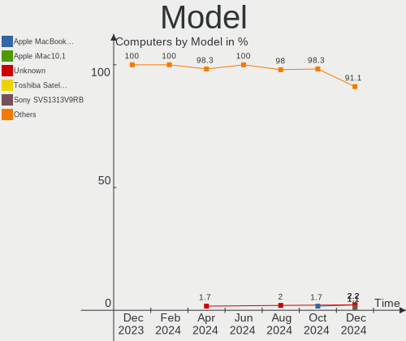
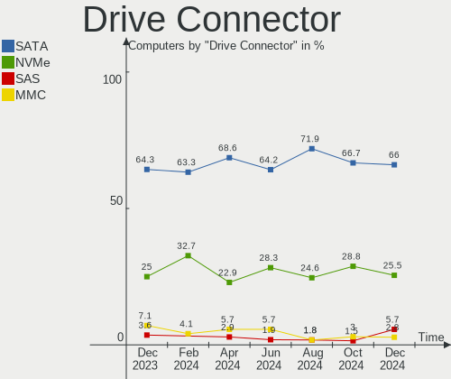
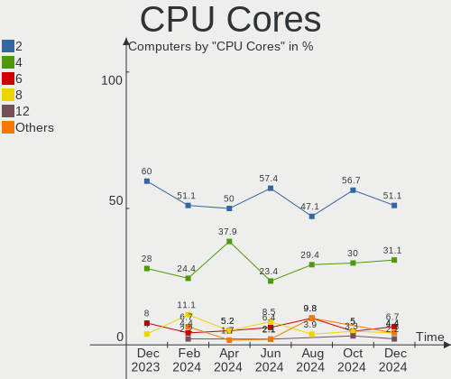
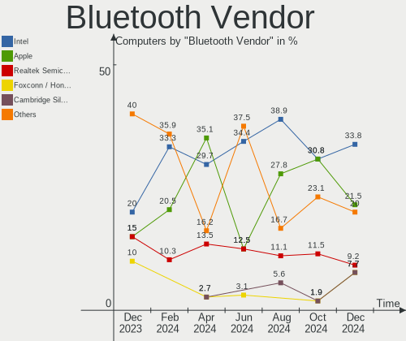

Elementary - Hardware Trends
----------------------------

A project to identify most popular hardware characteristics and track their change
over time based on data collected by Linux users at https://Linux-Hardware.org.

Anyone can contribute to this report by the [hw-probe](https://github.com/linuxhw/hw-probe) tool:

    sudo -E hw-probe -all -upload

This is a report for all computer types. See also reports for [desktops](/Dist/Elementary/Desktop/README.md) and [notebooks](/Dist/Elementary/Notebook/README.md).

This report is for one last month. Overall report since the beginning of time: [TestCoverage](https://github.com/linuxhw/TestCoverage)

Period: Dec, 2022.

Contents
--------

* [ System ](#system)
  - [ OS                       ](#os)
  - [ OS Family                ](#os-family)
  - [ Kernel                   ](#kernel)
  - [ Kernel Family            ](#kernel-family)
  - [ Kernel Major Ver.        ](#kernel-major-ver)
  - [ Arch                     ](#arch)
  - [ DE                       ](#de)
  - [ Display Server           ](#display-server)
  - [ Display Manager          ](#display-manager)
  - [ OS Lang                  ](#os-lang)
  - [ Boot Mode                ](#boot-mode)
  - [ Filesystem               ](#filesystem)
  - [ Part. scheme             ](#part-scheme)
  - [ Dual Boot with Linux/BSD ](#dual-boot-with-linuxbsd)
  - [ Dual Boot (Win)          ](#dual-boot-win)

* [ Board ](#board)
  - [ Vendor                   ](#vendor)
  - [ Model                    ](#model)
  - [ Model Family             ](#model-family)
  - [ MFG Year                 ](#mfg-year)
  - [ Form Factor              ](#form-factor)
  - [ Secure Boot              ](#secure-boot)
  - [ Coreboot                 ](#coreboot)
  - [ RAM Size                 ](#ram-size)
  - [ RAM Used                 ](#ram-used)
  - [ Total Drives             ](#total-drives)
  - [ Has CD-ROM               ](#has-cd-rom)
  - [ Has Ethernet             ](#has-ethernet)
  - [ Has WiFi                 ](#has-wifi)
  - [ Has Bluetooth            ](#has-bluetooth)

* [ Location ](#location)
  - [ Country                  ](#country)
  - [ City                     ](#city)

* [ Drives ](#drives)
  - [ Drive Vendor             ](#drive-vendor)
  - [ Drive Model              ](#drive-model)
  - [ HDD Vendor               ](#hdd-vendor)
  - [ SSD Vendor               ](#ssd-vendor)
  - [ Drive Kind               ](#drive-kind)
  - [ Drive Connector          ](#drive-connector)
  - [ Drive Size               ](#drive-size)
  - [ Space Total              ](#space-total)
  - [ Space Used               ](#space-used)
  - [ Malfunc. Drives          ](#malfunc-drives)
  - [ Malfunc. Drive Vendor    ](#malfunc-drive-vendor)
  - [ Malfunc. HDD Vendor      ](#malfunc-hdd-vendor)
  - [ Malfunc. Drive Kind      ](#malfunc-drive-kind)
  - [ Failed Drives            ](#failed-drives)
  - [ Failed Drive Vendor      ](#failed-drive-vendor)
  - [ Drive Status             ](#drive-status)

* [ Storage controller ](#storage-controller)
  - [ Storage Vendor           ](#storage-vendor)
  - [ Storage Model            ](#storage-model)
  - [ Storage Kind             ](#storage-kind)

* [ Processor ](#processor)
  - [ CPU Vendor               ](#cpu-vendor)
  - [ CPU Model                ](#cpu-model)
  - [ CPU Model Family         ](#cpu-model-family)
  - [ CPU Cores                ](#cpu-cores)
  - [ CPU Sockets              ](#cpu-sockets)
  - [ CPU Threads              ](#cpu-threads)
  - [ CPU Op-Modes             ](#cpu-op-modes)
  - [ CPU Microcode            ](#cpu-microcode)
  - [ CPU Microarch            ](#cpu-microarch)

* [ Graphics ](#graphics)
  - [ GPU Vendor               ](#gpu-vendor)
  - [ GPU Model                ](#gpu-model)
  - [ GPU Combo                ](#gpu-combo)
  - [ GPU Driver               ](#gpu-driver)
  - [ GPU Memory               ](#gpu-memory)

* [ Monitor ](#monitor)
  - [ Monitor Vendor           ](#monitor-vendor)
  - [ Monitor Model            ](#monitor-model)
  - [ Monitor Resolution       ](#monitor-resolution)
  - [ Monitor Diagonal         ](#monitor-diagonal)
  - [ Monitor Width            ](#monitor-width)
  - [ Aspect Ratio             ](#aspect-ratio)
  - [ Monitor Area             ](#monitor-area)
  - [ Pixel Density            ](#pixel-density)
  - [ Multiple Monitors        ](#multiple-monitors)

* [ Network ](#network)
  - [ Net Controller Vendor    ](#net-controller-vendor)
  - [ Net Controller Model     ](#net-controller-model)
  - [ Wireless Vendor          ](#wireless-vendor)
  - [ Wireless Model           ](#wireless-model)
  - [ Ethernet Vendor          ](#ethernet-vendor)
  - [ Ethernet Model           ](#ethernet-model)
  - [ Net Controller Kind      ](#net-controller-kind)
  - [ Used Controller          ](#used-controller)
  - [ NICs                     ](#nics)
  - [ IPv6                     ](#ipv6)

* [ Bluetooth ](#bluetooth)
  - [ Bluetooth Vendor         ](#bluetooth-vendor)
  - [ Bluetooth Model          ](#bluetooth-model)

* [ Sound ](#sound)
  - [ Sound Vendor             ](#sound-vendor)
  - [ Sound Model              ](#sound-model)

* [ Memory ](#memory)
  - [ Memory Vendor            ](#memory-vendor)
  - [ Memory Model             ](#memory-model)
  - [ Memory Kind              ](#memory-kind)
  - [ Memory Form Factor       ](#memory-form-factor)
  - [ Memory Size              ](#memory-size)
  - [ Memory Speed             ](#memory-speed)

* [ Printers & scanners ](#printers--scanners)
  - [ Printer Vendor           ](#printer-vendor)
  - [ Printer Model            ](#printer-model)
  - [ Scanner Vendor           ](#scanner-vendor)
  - [ Scanner Model            ](#scanner-model)

* [ Camera ](#camera)
  - [ Camera Vendor            ](#camera-vendor)
  - [ Camera Model             ](#camera-model)

* [ Security ](#security)
  - [ Fingerprint Vendor       ](#fingerprint-vendor)
  - [ Fingerprint Model        ](#fingerprint-model)
  - [ Chipcard Vendor          ](#chipcard-vendor)
  - [ Chipcard Model           ](#chipcard-model)

* [ Unsupported ](#unsupported)
  - [ Unsupported Devices      ](#unsupported-devices)
  - [ Unsupported Device Types ](#unsupported-device-types)

System
------

OS
--

Installed operating systems

| Name             | Computers | Percent |
|------------------|-----------|---------|
| Elementary 6.1   | 47        | 90.38%  |
| Elementary 5.1.7 | 4         | 7.69%   |
| Elementary 7     | 1         | 1.92%   |

OS Family
---------

OS without a version

| Name       | Computers | Percent |
|------------|-----------|---------|
| Elementary | 52        | 100%    |

Kernel
------

Version of the Linux kernel

| Version              | Computers | Percent |
|----------------------|-----------|---------|
| 5.15.0-56-generic    | 33        | 63.46%  |
| 5.11.0-43-generic    | 7         | 13.46%  |
| 5.4.0-135-generic    | 3         | 5.77%   |
| 5.15.0-53-generic    | 3         | 5.77%   |
| 6.0.8-060008-generic | 1         | 1.92%   |
| 5.4.0-99-generic     | 1         | 1.92%   |
| 5.15.0-52-generic    | 1         | 1.92%   |
| 5.15.0-50-generic    | 1         | 1.92%   |
| 5.15.0-48-generic    | 1         | 1.92%   |
| 5.15.0-46-generic    | 1         | 1.92%   |

Kernel Family
-------------

Linux kernel without a distro release

| Version | Computers | Percent |
|---------|-----------|---------|
| 5.15.0  | 40        | 76.92%  |
| 5.11.0  | 7         | 13.46%  |
| 5.4.0   | 4         | 7.69%   |
| 6.0.8   | 1         | 1.92%   |

Kernel Major Ver.
-----------------

Linux kernel major version

| Version | Computers | Percent |
|---------|-----------|---------|
| 5.15    | 40        | 76.92%  |
| 5.11    | 7         | 13.46%  |
| 5.4     | 4         | 7.69%   |
| 6.0     | 1         | 1.92%   |

Arch
----

OS architecture (x86_64, i586, etc.)

| Name   | Computers | Percent |
|--------|-----------|---------|
| x86_64 | 52        | 100%    |

DE
--

Desktop Environment

| Name     | Computers | Percent |
|----------|-----------|---------|
| Pantheon | 48        | 92.31%  |
| Unknown  | 3         | 5.77%   |
| GNOME    | 1         | 1.92%   |

Display Server
--------------

X11 or Wayland

| Name | Computers | Percent |
|------|-----------|---------|
| X11  | 51        | 98.08%  |
| Tty  | 1         | 1.92%   |

Display Manager
---------------

SDDM, LightDM, etc.

| Name    | Computers | Percent |
|---------|-----------|---------|
| Unknown | 39        | 75%     |
| LightDM | 13        | 25%     |

OS Lang
-------

Language

| Lang  | Computers | Percent |
|-------|-----------|---------|
| en_US | 22        | 42.31%  |
| de_DE | 6         | 11.54%  |
| ru_RU | 5         | 9.62%   |
| it_IT | 3         | 5.77%   |
| fr_FR | 3         | 5.77%   |
| es_ES | 3         | 5.77%   |
| sv_SE | 2         | 3.85%   |
| nl_NL | 2         | 3.85%   |
| zh_CN | 1         | 1.92%   |
| pt_PT | 1         | 1.92%   |
| pt_BR | 1         | 1.92%   |
| id_ID | 1         | 1.92%   |
| en_GB | 1         | 1.92%   |
| en_AU | 1         | 1.92%   |

Boot Mode
---------

EFI or BIOS

| Mode | Computers | Percent |
|------|-----------|---------|
| EFI  | 31        | 59.62%  |
| BIOS | 21        | 40.38%  |

Filesystem
----------

Type of filesystem

| Type    | Computers | Percent |
|---------|-----------|---------|
| Ext4    | 49        | 94.23%  |
| Overlay | 2         | 3.85%   |
| Btrfs   | 1         | 1.92%   |

Part. scheme
------------

Scheme of partitioning

| Type    | Computers | Percent |
|---------|-----------|---------|
| Unknown | 37        | 71.15%  |
| GPT     | 12        | 23.08%  |
| MBR     | 3         | 5.77%   |

Dual Boot with Linux/BSD
------------------------

Hosting more than one Linux/BSD

| Dual boot | Computers | Percent |
|-----------|-----------|---------|
| No        | 50        | 96.15%  |
| Yes       | 2         | 3.85%   |

Dual Boot (Win)
---------------

Hosting Linux and Windows

| Dual boot | Computers | Percent |
|-----------|-----------|---------|
| No        | 51        | 98.08%  |
| Yes       | 1         | 1.92%   |

Board
-----

Vendor
------

Motherboard manufacturer

| Name                   | Computers | Percent |
|------------------------|-----------|---------|
| Lenovo                 | 12        | 23.08%  |
| Hewlett-Packard        | 6         | 11.54%  |
| ASUSTek Computer       | 6         | 11.54%  |
| Apple                  | 6         | 11.54%  |
| Gigabyte Technology    | 2         | 3.85%   |
| Fujitsu                | 2         | 3.85%   |
| Dell                   | 2         | 3.85%   |
| ASRock                 | 2         | 3.85%   |
| Acer                   | 2         | 3.85%   |
| Positivo               | 1         | 1.92%   |
| MSI                    | 1         | 1.92%   |
| Microsoft              | 1         | 1.92%   |
| LORD ELECTRONICS       | 1         | 1.92%   |
| Jumper                 | 1         | 1.92%   |
| HUAWEI                 | 1         | 1.92%   |
| GMKtec                 | 1         | 1.92%   |
| Foxconn                | 1         | 1.92%   |
| Chuwi                  | 1         | 1.92%   |
| Avell High Performance | 1         | 1.92%   |
| AMI                    | 1         | 1.92%   |
| Acidanthera            | 1         | 1.92%   |

Model
-----

Motherboard model

| Name                                              | Computers | Percent |
|---------------------------------------------------|-----------|---------|
| Apple iMac8,1                                     | 2         | 3.85%   |
| Positivo S14SL01                                  | 1         | 1.92%   |
| MSI MS-7A34                                       | 1         | 1.92%   |
| Microsoft Surface Pro 2                           | 1         | 1.92%   |
| LORD ELECTRONICS LORD G4x 775 ICH7 8712 As Design | 1         | 1.92%   |
| Lenovo V310-14ISK 80SX                            | 1         | 1.92%   |
| Lenovo V17 G2 ITL 82NX                            | 1         | 1.92%   |
| Lenovo ThinkPad X390 20Q0CTO1WW                   | 1         | 1.92%   |
| Lenovo ThinkPad X201 3680HB1                      | 1         | 1.92%   |
| Lenovo ThinkPad T495 20NKS01W02                   | 1         | 1.92%   |
| Lenovo ThinkPad T470p 20J60018MX                  | 1         | 1.92%   |
| Lenovo ThinkPad T430 23448AG                      | 1         | 1.92%   |
| Lenovo ThinkCentre M71e 3129C3G                   | 1         | 1.92%   |
| Lenovo ThinkBook 13s G3 ACN 20YA                  | 1         | 1.92%   |
| Lenovo IdeaPad 5 14ALC05 82LM                     | 1         | 1.92%   |
| Lenovo IdeaPad 330-15IGM 81D1                     | 1         | 1.92%   |
| Lenovo IdeaPad 3 14ITL6 82H7                      | 1         | 1.92%   |
| Jumper EZpad                                      | 1         | 1.92%   |
| HUAWEI NBM-WXX9                                   | 1         | 1.92%   |
| HP ProBook 650 G1                                 | 1         | 1.92%   |
| HP ProBook 455R G6                                | 1         | 1.92%   |
| HP Pavilion x360 Convertible                      | 1         | 1.92%   |
| HP Pavilion g6                                    | 1         | 1.92%   |
| HP Laptop 17-ca0xxx                               | 1         | 1.92%   |
| HP 250 G7 Notebook PC                             | 1         | 1.92%   |
| GMKtec NucBox8                                    | 1         | 1.92%   |
| Gigabyte H61M-S2V-B3                              | 1         | 1.92%   |
| Gigabyte AB350-Gaming 3                           | 1         | 1.92%   |
| Fujitsu ESPRIMO P958                              | 1         | 1.92%   |
| Fujitsu ESPRIMO E3521                             | 1         | 1.92%   |
| Foxconn G5440pt                                   | 1         | 1.92%   |
| Dell System XPS L702X                             | 1         | 1.92%   |
| Dell OptiPlex 7020                                | 1         | 1.92%   |
| Chuwi HeroBook                                    | 1         | 1.92%   |
| Avell High Performance B.ON                       | 1         | 1.92%   |
| ASUS Zenbook UP5401EA_UP5401EA                    | 1         | 1.92%   |
| ASUS Z170-P                                       | 1         | 1.92%   |
| ASUS TUF Gaming FX505DT_FX505DT                   | 1         | 1.92%   |
| ASUS ROG STRIX B550-A GAMING                      | 1         | 1.92%   |
| ASUS PRIME H310M-E R2.0                           | 1         | 1.92%   |

Model Family
------------

Motherboard model prefix

| Name                        | Computers | Percent |
|-----------------------------|-----------|---------|
| Lenovo ThinkPad             | 5         | 9.62%   |
| Lenovo IdeaPad              | 3         | 5.77%   |
| HP ProBook                  | 2         | 3.85%   |
| HP Pavilion                 | 2         | 3.85%   |
| Fujitsu ESPRIMO             | 2         | 3.85%   |
| Apple iMac8                 | 2         | 3.85%   |
| Acer Aspire                 | 2         | 3.85%   |
| Positivo S14SL01            | 1         | 1.92%   |
| MSI MS-7A34                 | 1         | 1.92%   |
| Microsoft Surface           | 1         | 1.92%   |
| LORD ELECTRONICS LORD       | 1         | 1.92%   |
| Lenovo V310-14ISK           | 1         | 1.92%   |
| Lenovo V17                  | 1         | 1.92%   |
| Lenovo ThinkCentre          | 1         | 1.92%   |
| Lenovo ThinkBook            | 1         | 1.92%   |
| Jumper EZpad                | 1         | 1.92%   |
| HUAWEI NBM-WXX9             | 1         | 1.92%   |
| HP Laptop                   | 1         | 1.92%   |
| HP 250                      | 1         | 1.92%   |
| GMKtec NucBox8              | 1         | 1.92%   |
| Gigabyte H61M-S2V-B3        | 1         | 1.92%   |
| Gigabyte AB350-Gaming       | 1         | 1.92%   |
| Foxconn G5440pt             | 1         | 1.92%   |
| Dell System                 | 1         | 1.92%   |
| Dell OptiPlex               | 1         | 1.92%   |
| Chuwi HeroBook              | 1         | 1.92%   |
| Avell High Performance B.ON | 1         | 1.92%   |
| ASUS Zenbook                | 1         | 1.92%   |
| ASUS Z170-P                 | 1         | 1.92%   |
| ASUS TUF                    | 1         | 1.92%   |
| ASUS ROG                    | 1         | 1.92%   |
| ASUS PRIME                  | 1         | 1.92%   |
| ASUS ASUS                   | 1         | 1.92%   |
| ASRock H55M-LE              | 1         | 1.92%   |
| ASRock H110                 | 1         | 1.92%   |
| Apple MacBookPro8           | 1         | 1.92%   |
| Apple iMac19                | 1         | 1.92%   |
| Apple iMac16                | 1         | 1.92%   |
| Apple iMac12                | 1         | 1.92%   |
| AMI SN4-X5-4GBPRO3          | 1         | 1.92%   |

MFG Year
--------

Motherboard manufacture year

| Year | Computers | Percent |
|------|-----------|---------|
| 2021 | 8         | 15.38%  |
| 2018 | 7         | 13.46%  |
| 2019 | 6         | 11.54%  |
| 2017 | 6         | 11.54%  |
| 2011 | 6         | 11.54%  |
| 2010 | 4         | 7.69%   |
| 2022 | 3         | 5.77%   |
| 2015 | 3         | 5.77%   |
| 2020 | 2         | 3.85%   |
| 2012 | 2         | 3.85%   |
| 2008 | 2         | 3.85%   |
| 2016 | 1         | 1.92%   |
| 2014 | 1         | 1.92%   |
| 2013 | 1         | 1.92%   |

Form Factor
-----------

Physical design of the computer

| Name        | Computers | Percent |
|-------------|-----------|---------|
| Notebook    | 27        | 51.92%  |
| Desktop     | 14        | 26.92%  |
| All in one  | 6         | 11.54%  |
| Tablet      | 2         | 3.85%   |
| Convertible | 2         | 3.85%   |
| Server      | 1         | 1.92%   |

Secure Boot
-----------

Enabled or disabled

| State    | Computers | Percent |
|----------|-----------|---------|
| Disabled | 42        | 80.77%  |
| Enabled  | 10        | 19.23%  |

Coreboot
--------

Have coreboot on board

| Used | Computers | Percent |
|------|-----------|---------|
| No   | 52        | 100%    |

RAM Size
--------

Total RAM memory

| Size in GB | Computers | Percent |
|------------|-----------|---------|
| 8.01-16.0  | 18        | 34.62%  |
| 4.01-8.0   | 13        | 25%     |
| 3.01-4.0   | 9         | 17.31%  |
| 16.01-24.0 | 6         | 11.54%  |
| 32.01-64.0 | 4         | 7.69%   |
| 1.01-2.0   | 2         | 3.85%   |

RAM Used
--------

Used RAM memory

| Used GB  | Computers | Percent |
|----------|-----------|---------|
| 2.01-3.0 | 20        | 38.46%  |
| 1.01-2.0 | 17        | 32.69%  |
| 3.01-4.0 | 8         | 15.38%  |
| 4.01-8.0 | 6         | 11.54%  |
| 0.51-1.0 | 1         | 1.92%   |

Total Drives
------------

Number of drives on board

| Drives | Computers | Percent |
|--------|-----------|---------|
| 1      | 36        | 69.23%  |
| 2      | 6         | 11.54%  |
| 3      | 5         | 9.62%   |
| 4      | 4         | 7.69%   |
| 0      | 1         | 1.92%   |

Has CD-ROM
----------

Has CD-ROM on board

| Presented | Computers | Percent |
|-----------|-----------|---------|
| No        | 32        | 61.54%  |
| Yes       | 20        | 38.46%  |

Has Ethernet
------------

Has Ethernet on board

| Presented | Computers | Percent |
|-----------|-----------|---------|
| Yes       | 43        | 82.69%  |
| No        | 9         | 17.31%  |

Has WiFi
--------

Has WiFi module

| Presented | Computers | Percent |
|-----------|-----------|---------|
| Yes       | 39        | 75%     |
| No        | 13        | 25%     |

Has Bluetooth
-------------

Has Bluetooth module

| Presented | Computers | Percent |
|-----------|-----------|---------|
| Yes       | 35        | 67.31%  |
| No        | 17        | 32.69%  |

Location
--------

Country
-------

Geographic location (country)

| Country      | Computers | Percent |
|--------------|-----------|---------|
| Germany      | 6         | 11.54%  |
| Russia       | 5         | 9.62%   |
| Sweden       | 4         | 7.69%   |
| USA          | 3         | 5.77%   |
| Italy        | 3         | 5.77%   |
| Indonesia    | 3         | 5.77%   |
| Spain        | 2         | 3.85%   |
| Singapore    | 2         | 3.85%   |
| France       | 2         | 3.85%   |
| Canada       | 2         | 3.85%   |
| Brazil       | 2         | 3.85%   |
| Belgium      | 2         | 3.85%   |
| UK           | 1         | 1.92%   |
| South Africa | 1         | 1.92%   |
| Slovenia     | 1         | 1.92%   |
| Portugal     | 1         | 1.92%   |
| Netherlands  | 1         | 1.92%   |
| Mexico       | 1         | 1.92%   |
| Malaysia     | 1         | 1.92%   |
| Libya        | 1         | 1.92%   |
| Ireland      | 1         | 1.92%   |
| Guyana       | 1         | 1.92%   |
| Greece       | 1         | 1.92%   |
| Czechia      | 1         | 1.92%   |
| China        | 1         | 1.92%   |
| Chile        | 1         | 1.92%   |
| Belarus      | 1         | 1.92%   |
| Australia    | 1         | 1.92%   |

City
----

Geographic location (city)

| City                   | Computers | Percent |
|------------------------|-----------|---------|
| Singapore              | 2         | 3.85%   |
| Rome                   | 2         | 3.85%   |
| Moscow                 | 2         | 3.85%   |
| Warrington             | 1         | 1.92%   |
| Valladolid             | 1         | 1.92%   |
| Troisdorf              | 1         | 1.92%   |
| Tripoli                | 1         | 1.92%   |
| Tacoma                 | 1         | 1.92%   |
| St Petersburg          | 1         | 1.92%   |
| Saratov                | 1         | 1.92%   |
| Sao Luís              | 1         | 1.92%   |
| San Francisco          | 1         | 1.92%   |
| Rio Claro              | 1         | 1.92%   |
| Puchong Batu Dua Belas | 1         | 1.92%   |
| Prague                 | 1         | 1.92%   |
| Perth                  | 1         | 1.92%   |
| Oryol                  | 1         | 1.92%   |
| Nikaia                 | 1         | 1.92%   |
| Mulhouse               | 1         | 1.92%   |
| Mortsel                | 1         | 1.92%   |
| Minsk                  | 1         | 1.92%   |
| Milan                  | 1         | 1.92%   |
| Maastricht             | 1         | 1.92%   |
| Lidkoeping             | 1         | 1.92%   |
| La Ligua               | 1         | 1.92%   |
| Kunming                | 1         | 1.92%   |
| Kota Matsum Tiga       | 1         | 1.92%   |
| Johannesburg           | 1         | 1.92%   |
| Hoeganaes              | 1         | 1.92%   |
| Hamilton               | 1         | 1.92%   |
| Gothenburg             | 1         | 1.92%   |
| Georgetown             | 1         | 1.92%   |
| Freiburg im Breisgau   | 1         | 1.92%   |
| Frankfurt am Main      | 1         | 1.92%   |
| Flensburg              | 1         | 1.92%   |
| Cavan                  | 1         | 1.92%   |
| Buedingen              | 1         | 1.92%   |
| Brussels               | 1         | 1.92%   |
| Bromma                 | 1         | 1.92%   |
| Brampton               | 1         | 1.92%   |

Drives
------

Drive Vendor
------------

Hard drive vendors

| Vendor                    | Computers | Drives | Percent |
|---------------------------|-----------|--------|---------|
| Samsung Electronics       | 9         | 9      | 11.54%  |
| WDC                       | 8         | 10     | 10.26%  |
| Seagate                   | 6         | 6      | 7.69%   |
| Sandisk                   | 5         | 5      | 6.41%   |
| Unknown                   | 4         | 4      | 5.13%   |
| Kingston                  | 4         | 4      | 5.13%   |
| China                     | 4         | 4      | 5.13%   |
| Toshiba                   | 3         | 3      | 3.85%   |
| Crucial                   | 3         | 3      | 3.85%   |
| Micron Technology         | 2         | 2      | 2.56%   |
| Intel                     | 2         | 2      | 2.56%   |
| Hitachi                   | 2         | 2      | 2.56%   |
| Apple                     | 2         | 2      | 2.56%   |
| Apacer                    | 2         | 2      | 2.56%   |
| A-DATA Technology         | 2         | 2      | 2.56%   |
| UMIS                      | 1         | 1      | 1.28%   |
| Transcend                 | 1         | 1      | 1.28%   |
| Team                      | 1         | 1      | 1.28%   |
| StoreJet                  | 1         | 1      | 1.28%   |
| SPCC                      | 1         | 1      | 1.28%   |
| SK hynix                  | 1         | 1      | 1.28%   |
| PNY                       | 1         | 1      | 1.28%   |
| Phison Electronics        | 1         | 1      | 1.28%   |
| Phison                    | 1         | 1      | 1.28%   |
| OCZ                       | 1         | 1      | 1.28%   |
| Micron/Crucial Technology | 1         | 1      | 1.28%   |
| LITEON                    | 1         | 1      | 1.28%   |
| Lexar                     | 1         | 1      | 1.28%   |
| KingDian                  | 1         | 1      | 1.28%   |
| JMicron Technology        | 1         | 1      | 1.28%   |
| HS-SSD-C100               | 1         | 1      | 1.28%   |
| HGST                      | 1         | 1      | 1.28%   |
| External                  | 1         | 1      | 1.28%   |
| Emtec                     | 1         | 1      | 1.28%   |
| Unknown                   | 1         | 1      | 1.28%   |

Drive Model
-----------

Hard drive models

| Model                                               | Computers | Percent |
|-----------------------------------------------------|-----------|---------|
| Seagate ST1000LM035-1RK172 1TB                      | 2         | 2.5%    |
| Sandisk WD Blue SN550 NVMe SSD 500GB                | 2         | 2.5%    |
| Samsung NVMe SSD Controller SM981/PM981/PM983 500GB | 2         | 2.5%    |
| Intel SSD Pro 7600p/760p/E 6100p Series 1024GB      | 2         | 2.5%    |
| WDC WDS120G1G0A-00SS50 120GB SSD                    | 1         | 1.25%   |
| WDC WD5001AALS-00L3B2 500GB                         | 1         | 1.25%   |
| WDC WD5000LPCX-24VHAT0 500GB                        | 1         | 1.25%   |
| WDC WD5000AAKX-00ERMA0 500GB                        | 1         | 1.25%   |
| WDC WD20EZRX-00DC0B0 2TB                            | 1         | 1.25%   |
| WDC WD20EZBX-00AYRA0 2TB                            | 1         | 1.25%   |
| WDC WD10SPZX-60Z10T0 1TB                            | 1         | 1.25%   |
| WDC WD10EARS-00Y5B1 1TB                             | 1         | 1.25%   |
| WDC WD10EADS-00L5B1 1TB                             | 1         | 1.25%   |
| WDC WD1001FALS-00J7B0 1TB                           | 1         | 1.25%   |
| Unknown SD/MMC/MS PRO 64GB                          | 1         | 1.25%   |
| Unknown MMC Card  32GB                              | 1         | 1.25%   |
| Unknown MMC Card  128GB                             | 1         | 1.25%   |
| Unknown M0S002  64GB                                | 1         | 1.25%   |
| UMIS RPJTJ512MEE1OWX 512GB                          | 1         | 1.25%   |
| Transcend TS128GSSD360S 128GB                       | 1         | 1.25%   |
| Toshiba XG4 NVMe SSD Controller 512GB               | 1         | 1.25%   |
| Toshiba MQ04ABF100 1TB                              | 1         | 1.25%   |
| Toshiba DT01ABA300 3TB                              | 1         | 1.25%   |
| Team T253X6001T 1024GB SSD                          | 1         | 1.25%   |
| StoreJet Disk 4TB                                   | 1         | 1.25%   |
| SPCC Solid State Disk 256GB                         | 1         | 1.25%   |
| SK hynix BC501 NVMe Solid State Drive 512GB         | 1         | 1.25%   |
| Seagate ST3500630AS 500GB                           | 1         | 1.25%   |
| Seagate ST3500418AS 500GB                           | 1         | 1.25%   |
| Seagate ST250DM000-1BD141 250GB                     | 1         | 1.25%   |
| Seagate ST1000LM048-2E7172 1TB                      | 1         | 1.25%   |
| Sandisk WDC PC SN530 SDBPMPZ-512G-1101 512GB        | 1         | 1.25%   |
| Sandisk WDC PC SN530 SDBPMPZ-256G-1101 256GB        | 1         | 1.25%   |
| SanDisk SSD PLUS 240 GB                             | 1         | 1.25%   |
| Samsung SSD 860 EVO 500GB                           | 1         | 1.25%   |
| Samsung SSD 860 EVO 250GB                           | 1         | 1.25%   |
| Samsung NVMe SSD Controller PM9A1/PM9A3/980PRO 2TB  | 1         | 1.25%   |
| Samsung MZMTD256HAGM-000MV 256GB SSD                | 1         | 1.25%   |
| Samsung MZALQ512HBLU-00BL2 512GB                    | 1         | 1.25%   |
| Samsung MZALQ512HALU-000L2 512GB                    | 1         | 1.25%   |

HDD Vendor
----------

Hard disk drive vendors

| Vendor              | Computers | Drives | Percent |
|---------------------|-----------|--------|---------|
| WDC                 | 7         | 9      | 30.43%  |
| Seagate             | 6         | 6      | 26.09%  |
| Toshiba             | 2         | 2      | 8.7%    |
| Hitachi             | 2         | 2      | 8.7%    |
| Apple               | 2         | 2      | 8.7%    |
| Unknown             | 1         | 1      | 4.35%   |
| StoreJet            | 1         | 1      | 4.35%   |
| Samsung Electronics | 1         | 1      | 4.35%   |
| HGST                | 1         | 1      | 4.35%   |

SSD Vendor
----------

Solid state drive vendors

| Vendor              | Computers | Drives | Percent |
|---------------------|-----------|--------|---------|
| China               | 4         | 4      | 14.29%  |
| Samsung Electronics | 3         | 3      | 10.71%  |
| Kingston            | 3         | 3      | 10.71%  |
| Crucial             | 3         | 3      | 10.71%  |
| Apacer              | 2         | 2      | 7.14%   |
| WDC                 | 1         | 1      | 3.57%   |
| Transcend           | 1         | 1      | 3.57%   |
| Team                | 1         | 1      | 3.57%   |
| SPCC                | 1         | 1      | 3.57%   |
| SanDisk             | 1         | 1      | 3.57%   |
| PNY                 | 1         | 1      | 3.57%   |
| OCZ                 | 1         | 1      | 3.57%   |
| LITEON              | 1         | 1      | 3.57%   |
| Lexar               | 1         | 1      | 3.57%   |
| KingDian            | 1         | 1      | 3.57%   |
| JMicron Technology  | 1         | 1      | 3.57%   |
| Emtec               | 1         | 1      | 3.57%   |
| A-DATA Technology   | 1         | 1      | 3.57%   |

Drive Kind
----------

HDD or SSD

| Kind    | Computers | Drives | Percent |
|---------|-----------|--------|---------|
| SSD     | 25        | 28     | 35.71%  |
| HDD     | 22        | 25     | 31.43%  |
| NVMe    | 18        | 22     | 25.71%  |
| MMC     | 4         | 4      | 5.71%   |
| Unknown | 1         | 1      | 1.43%   |

Drive Connector
---------------

SATA, SAS, NVMe, etc.

| Type | Computers | Drives | Percent |
|------|-----------|--------|---------|
| SATA | 37        | 50     | 57.81%  |
| NVMe | 18        | 21     | 28.13%  |
| SAS  | 5         | 5      | 7.81%   |
| MMC  | 4         | 4      | 6.25%   |

Drive Size
----------

Size of hard drive

| Size in TB | Computers | Drives | Percent |
|------------|-----------|--------|---------|
| 0.01-0.5   | 30        | 35     | 66.67%  |
| 0.51-1.0   | 10        | 13     | 22.22%  |
| 1.01-2.0   | 3         | 3      | 6.67%   |
| 3.01-4.0   | 1         | 1      | 2.22%   |
| 2.01-3.0   | 1         | 1      | 2.22%   |

Space Total
-----------

Amount of disk space available on the file system

| Size in GB     | Computers | Percent |
|----------------|-----------|---------|
| 101-250        | 23        | 44.23%  |
| 251-500        | 13        | 25%     |
| 501-1000       | 5         | 9.62%   |
| 51-100         | 4         | 7.69%   |
| 2001-3000      | 2         | 3.85%   |
| 1-20           | 2         | 3.85%   |
| More than 3000 | 1         | 1.92%   |
| 21-50          | 1         | 1.92%   |
| 1001-2000      | 1         | 1.92%   |

Space Used
----------

Amount of used disk space

| Used GB   | Computers | Percent |
|-----------|-----------|---------|
| 1-20      | 22        | 42.31%  |
| 21-50     | 17        | 32.69%  |
| 51-100    | 6         | 11.54%  |
| 101-250   | 5         | 9.62%   |
| 1001-2000 | 1         | 1.92%   |
| 501-1000  | 1         | 1.92%   |

Malfunc. Drives
---------------

Drive models with a malfunction

Zero info for selected period =(

Malfunc. Drive Vendor
---------------------

Vendors of faulty drives

Zero info for selected period =(

Malfunc. HDD Vendor
-------------------

Vendors of faulty HDD drives

Zero info for selected period =(

Malfunc. Drive Kind
-------------------

Kinds of faulty drives

Zero info for selected period =(

Failed Drives
-------------

Failed drive models

Zero info for selected period =(

Failed Drive Vendor
-------------------

Failed drive vendors

Zero info for selected period =(

Drive Status
------------

Number of failed and malfunc. drives

| Status   | Computers | Drives | Percent |
|----------|-----------|--------|---------|
| Detected | 45        | 72     | 84.91%  |
| Works    | 8         | 8      | 15.09%  |

Storage controller
------------------

Storage Vendor
--------------

Storage controller vendors

| Vendor                       | Computers | Percent |
|------------------------------|-----------|---------|
| Intel                        | 38        | 59.38%  |
| AMD                          | 7         | 10.94%  |
| Samsung Electronics          | 5         | 7.81%   |
| SanDisk                      | 4         | 6.25%   |
| Phison Electronics           | 2         | 3.13%   |
| Micron Technology            | 2         | 3.13%   |
| Union Memory (Shenzhen)      | 1         | 1.56%   |
| Toshiba America Info Systems | 1         | 1.56%   |
| SK hynix                     | 1         | 1.56%   |
| Micron/Crucial Technology    | 1         | 1.56%   |
| ASMedia Technology           | 1         | 1.56%   |
| ADATA Technology             | 1         | 1.56%   |

Storage Model
-------------

Storage controller models

| Model                                                                                   | Computers | Percent |
|-----------------------------------------------------------------------------------------|-----------|---------|
| AMD FCH SATA Controller [AHCI mode]                                                     | 6         | 8.11%   |
| Intel Volume Management Device NVMe RAID Controller                                     | 3         | 4.05%   |
| Intel Sunrise Point-LP SATA Controller [AHCI mode]                                      | 3         | 4.05%   |
| Intel 6 Series/C200 Series Chipset Family 6 port Desktop SATA AHCI Controller           | 3         | 4.05%   |
| SanDisk WD Blue SN550 NVMe SSD                                                          | 2         | 2.7%    |
| SanDisk Non-Volatile memory controller                                                  | 2         | 2.7%    |
| Samsung NVMe SSD Controller SM981/PM981/PM983                                           | 2         | 2.7%    |
| Samsung NVMe SSD Controller 980                                                         | 2         | 2.7%    |
| Micron Non-Volatile memory controller                                                   | 2         | 2.7%    |
| Intel Tiger Lake-LP SATA Controller                                                     | 2         | 2.7%    |
| Intel SSD Pro 7600p/760p/E 6100p Series                                                 | 2         | 2.7%    |
| Intel Q170/Q150/B150/H170/H110/Z170/CM236 Chipset SATA Controller [AHCI Mode]           | 2         | 2.7%    |
| Intel NM10/ICH7 Family SATA Controller [IDE mode]                                       | 2         | 2.7%    |
| Intel Celeron/Pentium Silver Processor SATA Controller                                  | 2         | 2.7%    |
| Intel Cannon Lake PCH SATA AHCI Controller                                              | 2         | 2.7%    |
| Intel 82801HM/HEM (ICH8M/ICH8M-E) SATA Controller [AHCI mode]                           | 2         | 2.7%    |
| Intel 82801HM/HEM (ICH8M/ICH8M-E) IDE Controller                                        | 2         | 2.7%    |
| Intel 8 Series/C220 Series Chipset Family 6-port SATA Controller 1 [AHCI mode]          | 2         | 2.7%    |
| Intel 7 Series Chipset Family 6-port SATA Controller [AHCI mode]                        | 2         | 2.7%    |
| Intel 6 Series/C200 Series Chipset Family 6 port Mobile SATA AHCI Controller            | 2         | 2.7%    |
| AMD 300 Series Chipset SATA Controller                                                  | 2         | 2.7%    |
| Union Memory (Shenzhen) Non-Volatile memory controller                                  | 1         | 1.35%   |
| Toshiba America Info Systems XG4 NVMe SSD Controller                                    | 1         | 1.35%   |
| SK hynix BC501 NVMe Solid State Drive                                                   | 1         | 1.35%   |
| Samsung NVMe SSD Controller PM9A1/PM9A3/980PRO                                          | 1         | 1.35%   |
| Phison PS5013 E13 NVMe Controller                                                       | 1         | 1.35%   |
| Phison E12 NVMe Controller                                                              | 1         | 1.35%   |
| Micron/Crucial P2 NVMe PCIe SSD                                                         | 1         | 1.35%   |
| Intel Wildcat Point-LP SATA Controller [AHCI Mode]                                      | 1         | 1.35%   |
| Intel Celeron N3350/Pentium N4200/Atom E3900 Series SATA AHCI Controller                | 1         | 1.35%   |
| Intel Atom/Celeron/Pentium Processor x5-E8000/J3xxx/N3xxx Series SATA Controller        | 1         | 1.35%   |
| Intel 9 Series Chipset Family SATA Controller [AHCI Mode]                               | 1         | 1.35%   |
| Intel 82801G (ICH7 Family) IDE Controller                                               | 1         | 1.35%   |
| Intel 82801 Mobile SATA Controller [RAID mode]                                          | 1         | 1.35%   |
| Intel 8 Series SATA Controller 1 [AHCI mode]                                            | 1         | 1.35%   |
| Intel 6 Series/C200 Series Chipset Family Desktop SATA Controller (IDE mode, ports 4-5) | 1         | 1.35%   |
| Intel 6 Series/C200 Series Chipset Family Desktop SATA Controller (IDE mode, ports 0-3) | 1         | 1.35%   |
| Intel 5 Series/3400 Series Chipset 6 port SATA AHCI Controller                          | 1         | 1.35%   |
| Intel 5 Series/3400 Series Chipset 4 port SATA IDE Controller                           | 1         | 1.35%   |
| Intel 5 Series/3400 Series Chipset 4 port SATA AHCI Controller                          | 1         | 1.35%   |

Storage Kind
------------

Kind of storage controller (IDE, SATA, NVMe, SAS, ...)

| Kind | Computers | Percent |
|------|-----------|---------|
| SATA | 39        | 59.09%  |
| NVMe | 17        | 25.76%  |
| IDE  | 6         | 9.09%   |
| RAID | 4         | 6.06%   |

Processor
---------

CPU Vendor
----------

Processor vendors

| Vendor | Computers | Percent |
|--------|-----------|---------|
| Intel  | 41        | 78.85%  |
| AMD    | 11        | 21.15%  |

CPU Model
---------

Processor models

| Model                                       | Computers | Percent |
|---------------------------------------------|-----------|---------|
| Intel Core i3-2100 CPU @ 3.10GHz            | 2         | 3.85%   |
| Intel Core 2 Duo CPU E8335 @ 2.66GHz        | 2         | 3.85%   |
| Intel 11th Gen Core i7-1165G7 @ 2.80GHz     | 2         | 3.85%   |
| Intel Pentium Gold G5400 CPU @ 3.70GHz      | 1         | 1.92%   |
| Intel Pentium Dual-Core CPU E5700 @ 3.00GHz | 1         | 1.92%   |
| Intel Pentium CPU P6200 @ 2.13GHz           | 1         | 1.92%   |
| Intel Core i7-7700HQ CPU @ 2.80GHz          | 1         | 1.92%   |
| Intel Core i7-4790 CPU @ 3.60GHz            | 1         | 1.92%   |
| Intel Core i7-3610QM CPU @ 2.30GHz          | 1         | 1.92%   |
| Intel Core i7-2630QM CPU @ 2.00GHz          | 1         | 1.92%   |
| Intel Core i7-2600 CPU @ 3.40GHz            | 1         | 1.92%   |
| Intel Core i5-8500 CPU @ 3.00GHz            | 1         | 1.92%   |
| Intel Core i5-8265U CPU @ 1.60GHz           | 1         | 1.92%   |
| Intel Core i5-7500 CPU @ 3.40GHz            | 1         | 1.92%   |
| Intel Core i5-7400 CPU @ 3.00GHz            | 1         | 1.92%   |
| Intel Core i5-6200U CPU @ 2.30GHz           | 1         | 1.92%   |
| Intel Core i5-5575R CPU @ 2.80GHz           | 1         | 1.92%   |
| Intel Core i5-4300U CPU @ 1.90GHz           | 1         | 1.92%   |
| Intel Core i5-4200M CPU @ 2.50GHz           | 1         | 1.92%   |
| Intel Core i5-3210M CPU @ 2.50GHz           | 1         | 1.92%   |
| Intel Core i5-2415M CPU @ 2.30GHz           | 1         | 1.92%   |
| Intel Core i5-2400S CPU @ 2.50GHz           | 1         | 1.92%   |
| Intel Core i5-10400 CPU @ 2.90GHz           | 1         | 1.92%   |
| Intel Core i5-1035G1 CPU @ 1.00GHz          | 1         | 1.92%   |
| Intel Core i5 CPU M 520 @ 2.40GHz           | 1         | 1.92%   |
| Intel Core i5 CPU 760 @ 2.80GHz             | 1         | 1.92%   |
| Intel Core i3-8100 CPU @ 3.60GHz            | 1         | 1.92%   |
| Intel Core i3-7020U CPU @ 2.30GHz           | 1         | 1.92%   |
| Intel Core i3-6006U CPU @ 2.00GHz           | 1         | 1.92%   |
| Intel Core i3-5010U CPU @ 2.10GHz           | 1         | 1.92%   |
| Intel Core 2 Duo CPU E6550 @ 2.33GHz        | 1         | 1.92%   |
| Intel Celeron N4100 CPU @ 1.10GHz           | 1         | 1.92%   |
| Intel Celeron N4000 CPU @ 1.10GHz           | 1         | 1.92%   |
| Intel Atom x5-Z8350 CPU @ 1.44GHz           | 1         | 1.92%   |
| Intel Atom x5-E8000 CPU @ 1.04GHz           | 1         | 1.92%   |
| Intel Atom Processor E3950 @ 1.60GHz        | 1         | 1.92%   |
| Intel 11th Gen Core i5-1135G7 @ 2.40GHz     | 1         | 1.92%   |
| Intel 11th Gen Core i3-1115G4 @ 3.00GHz     | 1         | 1.92%   |
| AMD Ryzen 9 4900H with Radeon Graphics      | 1         | 1.92%   |
| AMD Ryzen 7 5700U with Radeon Graphics      | 1         | 1.92%   |

CPU Model Family
----------------

Processor model prefix

| Model                   | Computers | Percent |
|-------------------------|-----------|---------|
| Intel Core i5           | 15        | 28.85%  |
| Intel Core i3           | 6         | 11.54%  |
| Other                   | 5         | 9.62%   |
| Intel Core i7           | 5         | 9.62%   |
| AMD Ryzen 5             | 4         | 7.69%   |
| Intel Core 2 Duo        | 3         | 5.77%   |
| Intel Atom              | 3         | 5.77%   |
| AMD Ryzen 7             | 3         | 5.77%   |
| Intel Celeron           | 2         | 3.85%   |
| Intel Pentium Gold      | 1         | 1.92%   |
| Intel Pentium Dual-Core | 1         | 1.92%   |
| Intel Pentium           | 1         | 1.92%   |
| AMD Ryzen 9             | 1         | 1.92%   |
| AMD Ryzen 5 PRO         | 1         | 1.92%   |
| AMD Ryzen 3             | 1         | 1.92%   |

CPU Cores
---------

Number of processor cores

| Number | Computers | Percent |
|--------|-----------|---------|
| 4      | 25        | 48.08%  |
| 2      | 20        | 38.46%  |
| 6      | 5         | 9.62%   |
| 8      | 2         | 3.85%   |

CPU Sockets
-----------

Number of sockets

| Number | Computers | Percent |
|--------|-----------|---------|
| 1      | 52        | 100%    |

CPU Threads
-----------

Threads per core (Hyper-Threading)

| Number | Computers | Percent |
|--------|-----------|---------|
| 2      | 32        | 61.54%  |
| 1      | 20        | 38.46%  |

CPU Op-Modes
------------

CPU Operation Modes (32-bit, 64-bit)

| Op mode        | Computers | Percent |
|----------------|-----------|---------|
| 32-bit, 64-bit | 52        | 100%    |

CPU Microcode
-------------

Microcode number

| Number     | Computers | Percent |
|------------|-----------|---------|
| 0x206a7    | 6         | 11.54%  |
| Unknown    | 4         | 7.69%   |
| 0x906e9    | 3         | 5.77%   |
| 0x806c1    | 3         | 5.77%   |
| 0x906ea    | 2         | 3.85%   |
| 0x706a1    | 2         | 3.85%   |
| 0x406e3    | 2         | 3.85%   |
| 0x406c4    | 2         | 3.85%   |
| 0x306c3    | 2         | 3.85%   |
| 0x306a9    | 2         | 3.85%   |
| 0x20655    | 2         | 3.85%   |
| 0x10676    | 2         | 3.85%   |
| 0x08608103 | 2         | 3.85%   |
| 0xa0653    | 1         | 1.92%   |
| 0x906eb    | 1         | 1.92%   |
| 0x806ec    | 1         | 1.92%   |
| 0x806ea    | 1         | 1.92%   |
| 0x6fb      | 1         | 1.92%   |
| 0x506c9    | 1         | 1.92%   |
| 0x40671    | 1         | 1.92%   |
| 0x40651    | 1         | 1.92%   |
| 0x306d4    | 1         | 1.92%   |
| 0x106e5    | 1         | 1.92%   |
| 0x1067a    | 1         | 1.92%   |
| 0x0a50000c | 1         | 1.92%   |
| 0x0a201016 | 1         | 1.92%   |
| 0x08600104 | 1         | 1.92%   |
| 0x08108109 | 1         | 1.92%   |
| 0x08001129 | 1         | 1.92%   |
| 0x0800111c | 1         | 1.92%   |
| 0x06006705 | 1         | 1.92%   |

CPU Microarch
-------------

Microarchitecture

| Name          | Computers | Percent |
|---------------|-----------|---------|
| KabyLake      | 8         | 15.38%  |
| SandyBridge   | 6         | 11.54%  |
| TigerLake     | 4         | 7.69%   |
| Zen+          | 3         | 5.77%   |
| Penryn        | 3         | 5.77%   |
| Haswell       | 3         | 5.77%   |
| Zen 3         | 2         | 3.85%   |
| Zen           | 2         | 3.85%   |
| Westmere      | 2         | 3.85%   |
| Skylake       | 2         | 3.85%   |
| Silvermont    | 2         | 3.85%   |
| IvyBridge     | 2         | 3.85%   |
| Goldmont plus | 2         | 3.85%   |
| Broadwell     | 2         | 3.85%   |
| Unknown       | 2         | 3.85%   |
| Zen 2         | 1         | 1.92%   |
| Nehalem       | 1         | 1.92%   |
| IceLake       | 1         | 1.92%   |
| Goldmont      | 1         | 1.92%   |
| Excavator     | 1         | 1.92%   |
| Core          | 1         | 1.92%   |
| CometLake     | 1         | 1.92%   |

Graphics
--------

GPU Vendor
----------

Vendors of graphics cards

| Vendor | Computers | Percent |
|--------|-----------|---------|
| Intel  | 32        | 53.33%  |
| AMD    | 17        | 28.33%  |
| Nvidia | 11        | 18.33%  |

GPU Model
---------

Graphics card models

| Model                                                                                    | Computers | Percent |
|------------------------------------------------------------------------------------------|-----------|---------|
| Intel 2nd Generation Core Processor Family Integrated Graphics Controller                | 4         | 6.67%   |
| Intel TigerLake-LP GT2 [Iris Xe Graphics]                                                | 3         | 5%      |
| AMD Picasso/Raven 2 [Radeon Vega Series / Radeon Vega Mobile Series]                     | 3         | 5%      |
| Intel GeminiLake [UHD Graphics 600]                                                      | 2         | 3.33%   |
| Intel Core Processor Integrated Graphics Controller                                      | 2         | 3.33%   |
| Intel Atom/Celeron/Pentium Processor x5-E8000/J3xxx/N3xxx Integrated Graphics Controller | 2         | 3.33%   |
| Intel 4 Series Chipset Integrated Graphics Controller                                    | 2         | 3.33%   |
| Intel 3rd Gen Core processor Graphics Controller                                         | 2         | 3.33%   |
| AMD RV630/M76 [Mobility Radeon HD 2600 XT/2700]                                          | 2         | 3.33%   |
| AMD Lucienne                                                                             | 2         | 3.33%   |
| AMD Ellesmere [Radeon RX 470/480/570/570X/580/580X/590]                                  | 2         | 3.33%   |
| Nvidia TU117M [GeForce MX450]                                                            | 1         | 1.67%   |
| Nvidia TU117M [GeForce GTX 1650 Mobile / Max-Q]                                          | 1         | 1.67%   |
| Nvidia TU116M [GeForce GTX 1660 Ti Mobile]                                               | 1         | 1.67%   |
| Nvidia GP107 [GeForce GTX 1050]                                                          | 1         | 1.67%   |
| Nvidia GP102 [GeForce GTX 1080 Ti]                                                       | 1         | 1.67%   |
| Nvidia GM108M [GeForce 940MX]                                                            | 1         | 1.67%   |
| Nvidia GF108M [NVS 5400M]                                                                | 1         | 1.67%   |
| Nvidia GF108 [GeForce GT 420]                                                            | 1         | 1.67%   |
| Nvidia GF106M [GeForce GT 550M]                                                          | 1         | 1.67%   |
| Nvidia GA102 [GeForce RTX 3080 Lite Hash Rate]                                           | 1         | 1.67%   |
| Nvidia G84 [GeForce 8600 GT]                                                             | 1         | 1.67%   |
| Intel Xeon E3-1200 v3/4th Gen Core Processor Integrated Graphics Controller              | 1         | 1.67%   |
| Intel WhiskeyLake-U GT2 [UHD Graphics 620]                                               | 1         | 1.67%   |
| Intel Tiger Lake-LP GT2 [UHD Graphics G4]                                                | 1         | 1.67%   |
| Intel Skylake GT2 [HD Graphics 520]                                                      | 1         | 1.67%   |
| Intel Iris Pro Graphics 6200                                                             | 1         | 1.67%   |
| Intel Iris Plus Graphics G1 (Ice Lake)                                                   | 1         | 1.67%   |
| Intel HD Graphics 630                                                                    | 1         | 1.67%   |
| Intel HD Graphics 620                                                                    | 1         | 1.67%   |
| Intel HD Graphics 5500                                                                   | 1         | 1.67%   |
| Intel HD Graphics 520                                                                    | 1         | 1.67%   |
| Intel Haswell-ULT Integrated Graphics Controller                                         | 1         | 1.67%   |
| Intel CometLake-S GT2 [UHD Graphics 630]                                                 | 1         | 1.67%   |
| Intel CoffeeLake-S GT2 [UHD Graphics 630]                                                | 1         | 1.67%   |
| Intel Apollo Lake [HD Graphics 505]                                                      | 1         | 1.67%   |
| Intel 4th Gen Core Processor Integrated Graphics Controller                              | 1         | 1.67%   |
| AMD Whistler [Radeon HD 6630M/6650M/6750M/7670M/7690M]                                   | 1         | 1.67%   |
| AMD Stoney [Radeon R2/R3/R4/R5 Graphics]                                                 | 1         | 1.67%   |
| AMD Renoir                                                                               | 1         | 1.67%   |

GPU Combo
---------

Combinations of graphics cards

| Name           | Computers | Percent |
|----------------|-----------|---------|
| 1 x Intel      | 26        | 50%     |
| 1 x AMD        | 14        | 26.92%  |
| 1 x Nvidia     | 4         | 7.69%   |
| Intel + Nvidia | 4         | 7.69%   |
| AMD + Nvidia   | 2         | 3.85%   |
| 2 x Nvidia     | 1         | 1.92%   |
| Intel + AMD    | 1         | 1.92%   |

GPU Driver
----------

Free vs proprietary

| Driver      | Computers | Percent |
|-------------|-----------|---------|
| Free        | 48        | 92.31%  |
| Proprietary | 4         | 7.69%   |

GPU Memory
----------

Total video memory

| Size in GB | Computers | Percent |
|------------|-----------|---------|
| Unknown    | 31        | 59.62%  |
| 1.01-2.0   | 7         | 13.46%  |
| 0.01-0.5   | 6         | 11.54%  |
| 0.51-1.0   | 3         | 5.77%   |
| 7.01-8.0   | 2         | 3.85%   |
| 8.01-16.0  | 2         | 3.85%   |
| 3.01-4.0   | 1         | 1.92%   |

Monitor
-------

Monitor Vendor
--------------

Monitor vendors

| Vendor                  | Computers | Percent |
|-------------------------|-----------|---------|
| Chimei Innolux          | 8         | 15.38%  |
| Samsung Electronics     | 7         | 13.46%  |
| AU Optronics            | 7         | 13.46%  |
| BOE                     | 6         | 11.54%  |
| Apple                   | 6         | 11.54%  |
| Hewlett-Packard         | 3         | 5.77%   |
| Philips                 | 2         | 3.85%   |
| LG Display              | 2         | 3.85%   |
| AOC                     | 2         | 3.85%   |
| Vestel                  | 1         | 1.92%   |
| SKG                     | 1         | 1.92%   |
| RST                     | 1         | 1.92%   |
| PANDA                   | 1         | 1.92%   |
| LG Electronics          | 1         | 1.92%   |
| Lenovo                  | 1         | 1.92%   |
| Dell                    | 1         | 1.92%   |
| Chi Mei Optoelectronics | 1         | 1.92%   |
| BenQ                    | 1         | 1.92%   |

Monitor Model
-------------

Monitor models

| Model                                                                    | Computers | Percent |
|--------------------------------------------------------------------------|-----------|---------|
| AU Optronics LCD Monitor AUO208D 1920x1080 309x174mm 14.0-inch           | 2         | 3.77%   |
| Apple Color LCD APP9C6B 1680x1050 433x270mm 20.1-inch                    | 2         | 3.77%   |
| Vestel LCD Monitor 43UHD_LCD_TV 3840x2160                                | 1         | 1.89%   |
| SKG RW-W2413S SKG2413 1920x1080 597x336mm 27.0-inch                      | 1         | 1.89%   |
| Samsung Electronics SyncMaster SAM0423 1920x1080                         | 1         | 1.89%   |
| Samsung Electronics SyncMaster SAM0259 1280x1024 376x301mm 19.0-inch     | 1         | 1.89%   |
| Samsung Electronics LCD Monitor SEC324C 1600x900 310x174mm 14.0-inch     | 1         | 1.89%   |
| Samsung Electronics LCD Monitor SEC3242 1920x1080 235x132mm 10.6-inch    | 1         | 1.89%   |
| Samsung Electronics LCD Monitor SDC4154 2880x1800 302x189mm 14.0-inch    | 1         | 1.89%   |
| Samsung Electronics LCD Monitor SAM0C44 3840x2160 950x540mm 43.0-inch    | 1         | 1.89%   |
| Samsung Electronics LC49G95T SAM7053 3840x1080 1193x336mm 48.8-inch      | 1         | 1.89%   |
| Samsung Electronics C24F390 SAM0D2C 1920x1080 521x293mm 23.5-inch        | 1         | 1.89%   |
| RST GSV26 PASS RST0100 3840x2160 1872x1053mm 84.6-inch                   | 1         | 1.89%   |
| Philips PHL 272B8Q PHL0918 2560x1440 597x336mm 27.0-inch                 | 1         | 1.89%   |
| Philips PHL 226V6 PHLC11D 1920x1080 477x268mm 21.5-inch                  | 1         | 1.89%   |
| PANDA LCD Monitor NCP004D 1920x1080 344x194mm 15.5-inch                  | 1         | 1.89%   |
| LG Electronics LCD Monitor LG FULL HD 1920x1080                          | 1         | 1.89%   |
| LG Display LCD Monitor LGD0494 1366x768 293x165mm 13.2-inch              | 1         | 1.89%   |
| LG Display LCD Monitor LGD02F2 1366x768 344x194mm 15.5-inch              | 1         | 1.89%   |
| Lenovo LCD Monitor LEN4011 1280x800 261x163mm 12.1-inch                  | 1         | 1.89%   |
| Hewlett-Packard LCD Monitor w2007 1680x1050                              | 1         | 1.89%   |
| Hewlett-Packard LA2306 HWP294A 1920x1080 509x286mm 23.0-inch             | 1         | 1.89%   |
| Hewlett-Packard E241i HWP3124 1920x1200 518x324mm 24.1-inch              | 1         | 1.89%   |
| Dell E170S DELA04A 1280x1024 338x270mm 17.0-inch                         | 1         | 1.89%   |
| Chimei Innolux LCD Monitor CMN15DC 1366x768 344x193mm 15.5-inch          | 1         | 1.89%   |
| Chimei Innolux LCD Monitor CMN15DB 1366x768 344x193mm 15.5-inch          | 1         | 1.89%   |
| Chimei Innolux LCD Monitor CMN15C2 1920x1080 344x194mm 15.5-inch         | 1         | 1.89%   |
| Chimei Innolux LCD Monitor CMN1521 1920x1080 344x193mm 15.5-inch         | 1         | 1.89%   |
| Chimei Innolux LCD Monitor CMN150D 1920x1080 344x193mm 15.5-inch         | 1         | 1.89%   |
| Chimei Innolux LCD Monitor CMN14D4 1920x1080 309x173mm 13.9-inch         | 1         | 1.89%   |
| Chimei Innolux LCD Monitor CMN14C3 1366x768 309x173mm 13.9-inch          | 1         | 1.89%   |
| Chimei Innolux LCD Monitor CMN1404 1920x1080 309x173mm 13.9-inch         | 1         | 1.89%   |
| Chi Mei Optoelectronics LCD Monitor CMO1718 1600x900 382x215mm 17.3-inch | 1         | 1.89%   |
| BOE LCD Monitor BOE09C1 1920x1080 382x215mm 17.3-inch                    | 1         | 1.89%   |
| BOE LCD Monitor BOE0970 1920x1080 309x173mm 13.9-inch                    | 1         | 1.89%   |
| BOE LCD Monitor BOE08F5 1920x1080 344x194mm 15.5-inch                    | 1         | 1.89%   |
| BOE LCD Monitor BOE069B 1600x900 382x215mm 17.3-inch                     | 1         | 1.89%   |
| BOE LCD Monitor BOE0696 1366x768 309x173mm 13.9-inch                     | 1         | 1.89%   |
| BOE LCD Monitor BOE0687 1920x1080 344x193mm 15.5-inch                    | 1         | 1.89%   |
| BenQ EX3203R BNQ7F66 2560x1440 698x393mm 31.5-inch                       | 1         | 1.89%   |

Monitor Resolution
------------------

Monitor screen resolution

| Resolution         | Computers | Percent |
|--------------------|-----------|---------|
| 1920x1080 (FHD)    | 24        | 47.06%  |
| 1366x768 (WXGA)    | 6         | 11.76%  |
| 3840x2160 (4K)     | 5         | 9.8%    |
| 1600x900 (HD+)     | 4         | 7.84%   |
| 1680x1050 (WSXGA+) | 3         | 5.88%   |
| 2560x1440 (QHD)    | 2         | 3.92%   |
| 1280x800 (WXGA)    | 2         | 3.92%   |
| 1280x1024 (SXGA)   | 2         | 3.92%   |
| 3840x1080          | 1         | 1.96%   |
| 2880x1800          | 1         | 1.96%   |
| 1920x1200 (WUXGA)  | 1         | 1.96%   |

Monitor Diagonal
----------------

Diagonal size in inches

| Inches  | Computers | Percent |
|---------|-----------|---------|
| 15      | 10        | 18.87%  |
| 13      | 9         | 16.98%  |
| 14      | 6         | 11.32%  |
| 17      | 5         | 9.43%   |
| 21      | 4         | 7.55%   |
| Unknown | 4         | 7.55%   |
| 27      | 3         | 5.66%   |
| 23      | 3         | 5.66%   |
| 84      | 2         | 3.77%   |
| 20      | 2         | 3.77%   |
| 48      | 1         | 1.89%   |
| 31      | 1         | 1.89%   |
| 24      | 1         | 1.89%   |
| 19      | 1         | 1.89%   |
| 12      | 1         | 1.89%   |

Monitor Width
-------------

Physical width

| Width in mm | Computers | Percent |
|-------------|-----------|---------|
| 301-350     | 21        | 39.62%  |
| 501-600     | 7         | 13.21%  |
| 401-500     | 6         | 11.32%  |
| 351-400     | 6         | 11.32%  |
| 201-300     | 5         | 9.43%   |
| Unknown     | 4         | 7.55%   |
| 1501-2000   | 2         | 3.77%   |
| 601-700     | 1         | 1.89%   |
| 1001-1500   | 1         | 1.89%   |

Aspect Ratio
------------

Proportional relationship between the width and the height

| Ratio   | Computers | Percent |
|---------|-----------|---------|
| 16/9    | 36        | 73.47%  |
| 16/10   | 6         | 12.24%  |
| Unknown | 3         | 6.12%   |
| 5/4     | 2         | 4.08%   |
| 32/9    | 1         | 2.04%   |
| 3/2     | 1         | 2.04%   |

Monitor Area
------------

Area in inch²

| Area in inch² | Computers | Percent |
|----------------|-----------|---------|
| 81-90          | 12        | 22.64%  |
| 101-110        | 10        | 18.87%  |
| 201-250        | 5         | 9.43%   |
| 151-200        | 5         | 9.43%   |
| 121-130        | 4         | 7.55%   |
| Unknown        | 4         | 7.55%   |
| 71-80          | 3         | 5.66%   |
| 301-350        | 3         | 5.66%   |
| More than 1000 | 2         | 3.77%   |
| 61-70          | 1         | 1.89%   |
| 351-500        | 1         | 1.89%   |
| 251-300        | 1         | 1.89%   |
| 141-150        | 1         | 1.89%   |
| 501-1000       | 1         | 1.89%   |

Pixel Density
-------------

Pixels per inch

| Density       | Computers | Percent |
|---------------|-----------|---------|
| 121-160       | 15        | 28.85%  |
| 101-120       | 15        | 28.85%  |
| 51-100        | 14        | 26.92%  |
| Unknown       | 4         | 7.69%   |
| 161-240       | 3         | 5.77%   |
| More than 240 | 1         | 1.92%   |

Multiple Monitors
-----------------

Total monitors connected

| Total | Computers | Percent |
|-------|-----------|---------|
| 1     | 48        | 92.31%  |
| 2     | 4         | 7.69%   |

Network
-------

Net Controller Vendor
---------------------

Controller vendors

| Vendor                   | Computers | Percent |
|--------------------------|-----------|---------|
| Realtek Semiconductor    | 33        | 45.83%  |
| Intel                    | 18        | 25%     |
| Broadcom                 | 8         | 11.11%  |
| Qualcomm Atheros         | 5         | 6.94%   |
| Marvell Technology Group | 2         | 2.78%   |
| vivo                     | 1         | 1.39%   |
| Microsoft                | 1         | 1.39%   |
| MediaTek                 | 1         | 1.39%   |
| Edimax Technology        | 1         | 1.39%   |
| ASIX Electronics         | 1         | 1.39%   |
| AboCom Systems           | 1         | 1.39%   |

Net Controller Model
--------------------

Controller models

| Model                                                             | Computers | Percent |
|-------------------------------------------------------------------|-----------|---------|
| Realtek RTL8111/8168/8411 PCI Express Gigabit Ethernet Controller | 20        | 22.99%  |
| Realtek RTL8822CE 802.11ac PCIe Wireless Network Adapter          | 4         | 4.6%    |
| Realtek RTL810xE PCI Express Fast Ethernet controller             | 4         | 4.6%    |
| Realtek RTL8821CE 802.11ac PCIe Wireless Network Adapter          | 3         | 3.45%   |
| Qualcomm Atheros QCA9377 802.11ac Wireless Network Adapter        | 3         | 3.45%   |
| Realtek RTL8153 Gigabit Ethernet Adapter                          | 2         | 2.3%    |
| Realtek 802.11n WLAN Adapter                                      | 2         | 2.3%    |
| Marvell Group 88E8058 PCI-E Gigabit Ethernet Controller           | 2         | 2.3%    |
| Intel Wireless 7260                                               | 2         | 2.3%    |
| Intel Wireless 3160                                               | 2         | 2.3%    |
| Intel Wi-Fi 6 AX201                                               | 2         | 2.3%    |
| Broadcom NetXtreme BCM57766 Gigabit Ethernet PCIe                 | 2         | 2.3%    |
| Broadcom NetXtreme BCM57765 Gigabit Ethernet PCIe                 | 2         | 2.3%    |
| Broadcom BCM43602 802.11ac Wireless LAN SoC                       | 2         | 2.3%    |
| Broadcom BCM4321 802.11a/b/g/n                                    | 2         | 2.3%    |
| vivo 1806                                                         | 1         | 1.15%   |
| Realtek RTL8822BE 802.11a/b/g/n/ac WiFi adapter                   | 1         | 1.15%   |
| Realtek RTL8188EUS 802.11n Wireless Network Adapter               | 1         | 1.15%   |
| Realtek RTL8152 Fast Ethernet Adapter                             | 1         | 1.15%   |
| Realtek 802.11n NIC                                               | 1         | 1.15%   |
| Qualcomm Atheros AR93xx Wireless Network Adapter                  | 1         | 1.15%   |
| Qualcomm Atheros AR9287 Wireless Network Adapter (PCI-Express)    | 1         | 1.15%   |
| Microsoft XBOX ACC                                                | 1         | 1.15%   |
| MediaTek MT7921 802.11ax PCI Express Wireless Network Adapter     | 1         | 1.15%   |
| Intel Wireless-AC 9260                                            | 1         | 1.15%   |
| Intel Wireless 8265 / 8275                                        | 1         | 1.15%   |
| Intel Wireless 7265                                               | 1         | 1.15%   |
| Intel Wi-Fi 6 AX210/AX211/AX411 160MHz                            | 1         | 1.15%   |
| Intel Wi-Fi 6 AX200                                               | 1         | 1.15%   |
| Intel Ethernet Controller I225-V                                  | 1         | 1.15%   |
| Intel Ethernet Connection I217-V                                  | 1         | 1.15%   |
| Intel Ethernet Connection I217-LM                                 | 1         | 1.15%   |
| Intel Ethernet Connection (7) I219-LM                             | 1         | 1.15%   |
| Intel Ethernet Connection (6) I219-V                              | 1         | 1.15%   |
| Intel Ethernet Connection (5) I219-V                              | 1         | 1.15%   |
| Intel Ethernet Connection (2) I219-V                              | 1         | 1.15%   |
| Intel Ethernet Connection (12) I219-V                             | 1         | 1.15%   |
| Intel Centrino Wireless-N 1000 [Condor Peak]                      | 1         | 1.15%   |
| Intel Centrino Ultimate-N 6300                                    | 1         | 1.15%   |
| Intel Cannon Point-LP CNVi [Wireless-AC]                          | 1         | 1.15%   |

Wireless Vendor
---------------

Wireless vendors

| Vendor                | Computers | Percent |
|-----------------------|-----------|---------|
| Intel                 | 14        | 34.15%  |
| Realtek Semiconductor | 12        | 29.27%  |
| Broadcom              | 6         | 14.63%  |
| Qualcomm Atheros      | 5         | 12.2%   |
| Microsoft             | 1         | 2.44%   |
| MediaTek              | 1         | 2.44%   |
| Edimax Technology     | 1         | 2.44%   |
| AboCom Systems        | 1         | 2.44%   |

Wireless Model
--------------

Wireless models

| Model                                                                      | Computers | Percent |
|----------------------------------------------------------------------------|-----------|---------|
| Realtek RTL8822CE 802.11ac PCIe Wireless Network Adapter                   | 4         | 9.76%   |
| Realtek RTL8821CE 802.11ac PCIe Wireless Network Adapter                   | 3         | 7.32%   |
| Qualcomm Atheros QCA9377 802.11ac Wireless Network Adapter                 | 3         | 7.32%   |
| Realtek 802.11n WLAN Adapter                                               | 2         | 4.88%   |
| Intel Wireless 7260                                                        | 2         | 4.88%   |
| Intel Wireless 3160                                                        | 2         | 4.88%   |
| Intel Wi-Fi 6 AX201                                                        | 2         | 4.88%   |
| Broadcom BCM43602 802.11ac Wireless LAN SoC                                | 2         | 4.88%   |
| Broadcom BCM4321 802.11a/b/g/n                                             | 2         | 4.88%   |
| Realtek RTL8822BE 802.11a/b/g/n/ac WiFi adapter                            | 1         | 2.44%   |
| Realtek RTL8188EUS 802.11n Wireless Network Adapter                        | 1         | 2.44%   |
| Realtek 802.11n NIC                                                        | 1         | 2.44%   |
| Qualcomm Atheros AR93xx Wireless Network Adapter                           | 1         | 2.44%   |
| Qualcomm Atheros AR9287 Wireless Network Adapter (PCI-Express)             | 1         | 2.44%   |
| Microsoft XBOX ACC                                                         | 1         | 2.44%   |
| MediaTek MT7921 802.11ax PCI Express Wireless Network Adapter              | 1         | 2.44%   |
| Intel Wireless-AC 9260                                                     | 1         | 2.44%   |
| Intel Wireless 8265 / 8275                                                 | 1         | 2.44%   |
| Intel Wireless 7265                                                        | 1         | 2.44%   |
| Intel Wi-Fi 6 AX210/AX211/AX411 160MHz                                     | 1         | 2.44%   |
| Intel Wi-Fi 6 AX200                                                        | 1         | 2.44%   |
| Intel Centrino Wireless-N 1000 [Condor Peak]                               | 1         | 2.44%   |
| Intel Centrino Ultimate-N 6300                                             | 1         | 2.44%   |
| Intel Cannon Point-LP CNVi [Wireless-AC]                                   | 1         | 2.44%   |
| Edimax EW-7811Un 802.11n Wireless Adapter [Realtek RTL8188CUS]             | 1         | 2.44%   |
| Broadcom BCM4364 802.11ac Wireless Network Adapter                         | 1         | 2.44%   |
| Broadcom BCM4331 802.11a/b/g/n                                             | 1         | 2.44%   |
| AboCom Systems AboCom Systems Inc [WN2001 Prolink Wireless-N Nano Adapter] | 1         | 2.44%   |

Ethernet Vendor
---------------

Ethernet vendors

| Vendor                   | Computers | Percent |
|--------------------------|-----------|---------|
| Realtek Semiconductor    | 26        | 57.78%  |
| Intel                    | 10        | 22.22%  |
| Broadcom                 | 5         | 11.11%  |
| Marvell Technology Group | 2         | 4.44%   |
| vivo                     | 1         | 2.22%   |
| ASIX Electronics         | 1         | 2.22%   |

Ethernet Model
--------------

Ethernet models

| Model                                                             | Computers | Percent |
|-------------------------------------------------------------------|-----------|---------|
| Realtek RTL8111/8168/8411 PCI Express Gigabit Ethernet Controller | 20        | 43.48%  |
| Realtek RTL810xE PCI Express Fast Ethernet controller             | 4         | 8.7%    |
| Realtek RTL8153 Gigabit Ethernet Adapter                          | 2         | 4.35%   |
| Marvell Group 88E8058 PCI-E Gigabit Ethernet Controller           | 2         | 4.35%   |
| Broadcom NetXtreme BCM57766 Gigabit Ethernet PCIe                 | 2         | 4.35%   |
| Broadcom NetXtreme BCM57765 Gigabit Ethernet PCIe                 | 2         | 4.35%   |
| vivo 1806                                                         | 1         | 2.17%   |
| Realtek RTL8152 Fast Ethernet Adapter                             | 1         | 2.17%   |
| Intel Ethernet Controller I225-V                                  | 1         | 2.17%   |
| Intel Ethernet Connection I217-V                                  | 1         | 2.17%   |
| Intel Ethernet Connection I217-LM                                 | 1         | 2.17%   |
| Intel Ethernet Connection (7) I219-LM                             | 1         | 2.17%   |
| Intel Ethernet Connection (6) I219-V                              | 1         | 2.17%   |
| Intel Ethernet Connection (5) I219-V                              | 1         | 2.17%   |
| Intel Ethernet Connection (2) I219-V                              | 1         | 2.17%   |
| Intel Ethernet Connection (12) I219-V                             | 1         | 2.17%   |
| Intel 82579LM Gigabit Network Connection (Lewisville)             | 1         | 2.17%   |
| Intel 82577LM Gigabit Network Connection                          | 1         | 2.17%   |
| Broadcom NetLink BCM57780 Gigabit Ethernet PCIe                   | 1         | 2.17%   |
| ASIX AX88179 Gigabit Ethernet                                     | 1         | 2.17%   |

Net Controller Kind
-------------------

Ethernet, WiFi or modem

| Kind     | Computers | Percent |
|----------|-----------|---------|
| Ethernet | 43        | 51.81%  |
| WiFi     | 40        | 48.19%  |

Used Controller
---------------

Currently used network controller

| Kind     | Computers | Percent |
|----------|-----------|---------|
| WiFi     | 31        | 59.62%  |
| Ethernet | 21        | 40.38%  |

NICs
----

Total network controllers on board

| Total | Computers | Percent |
|-------|-----------|---------|
| 2     | 26        | 50%     |
| 1     | 21        | 40.38%  |
| 0     | 4         | 7.69%   |
| 3     | 1         | 1.92%   |

IPv6
----

IPv6 vs IPv4

| Used | Computers | Percent |
|------|-----------|---------|
| No   | 34        | 65.38%  |
| Yes  | 18        | 34.62%  |

Bluetooth
---------

Bluetooth Vendor
----------------

Controller vendors

| Vendor                          | Computers | Percent |
|---------------------------------|-----------|---------|
| Intel                           | 12        | 33.33%  |
| Realtek Semiconductor           | 6         | 16.67%  |
| Apple                           | 6         | 16.67%  |
| Qualcomm Atheros Communications | 2         | 5.56%   |
| Lite-On Technology              | 2         | 5.56%   |
| IMC Networks                    | 2         | 5.56%   |
| Cambridge Silicon Radio         | 2         | 5.56%   |
| Broadcom                        | 2         | 5.56%   |
| Realtek                         | 1         | 2.78%   |
| Marvell Semiconductor           | 1         | 2.78%   |

Bluetooth Model
---------------

Controller models

| Model                                               | Computers | Percent |
|-----------------------------------------------------|-----------|---------|
| Intel Bluetooth wireless interface                  | 6         | 16.67%  |
| Realtek  Bluetooth 4.2 Adapter                      | 3         | 8.33%   |
| Realtek Bluetooth Radio                             | 3         | 8.33%   |
| Qualcomm Atheros  Bluetooth Device                  | 2         | 5.56%   |
| Intel AX201 Bluetooth                               | 2         | 5.56%   |
| Cambridge Silicon Radio Bluetooth Dongle (HCI mode) | 2         | 5.56%   |
| Apple Bluetooth Host Controller                     | 2         | 5.56%   |
| Apple Bluetooth HCI                                 | 2         | 5.56%   |
| Realtek Bluetooth Radio                             | 1         | 2.78%   |
| Marvell Bluetooth and Wireless LAN Composite Device | 1         | 2.78%   |
| Lite-On Qualcomm Atheros QCA9377 Bluetooth          | 1         | 2.78%   |
| Lite-On Bluetooth Radio                             | 1         | 2.78%   |
| Intel Wireless-AC 9260 Bluetooth Adapter            | 1         | 2.78%   |
| Intel Bluetooth 9460/9560 Jefferson Peak (JfP)      | 1         | 2.78%   |
| Intel AX210 Bluetooth                               | 1         | 2.78%   |
| Intel AX200 Bluetooth                               | 1         | 2.78%   |
| IMC Networks Wireless_Device                        | 1         | 2.78%   |
| IMC Networks Bluetooth Radio                        | 1         | 2.78%   |
| Broadcom BCM20702 Bluetooth 4.0 [ThinkPad]          | 1         | 2.78%   |
| Broadcom BCM2045B (BDC-2.1)                         | 1         | 2.78%   |
| Apple Built-in Bluetooth 2.0+EDR HCI                | 1         | 2.78%   |
| Apple Bluetooth USB Host Controller                 | 1         | 2.78%   |

Sound
-----

Sound Vendor
------------

Sound card vendors

| Vendor               | Computers | Percent |
|----------------------|-----------|---------|
| Intel                | 39        | 55.71%  |
| AMD                  | 18        | 25.71%  |
| Nvidia               | 8         | 11.43%  |
| C-Media Electronics  | 2         | 2.86%   |
| iCreate Technologies | 1         | 1.43%   |
| BR25                 | 1         | 1.43%   |
| ASUSTek Computer     | 1         | 1.43%   |

Sound Model
-----------

Sound card models

| Model                                                                                             | Computers | Percent |
|---------------------------------------------------------------------------------------------------|-----------|---------|
| Intel 6 Series/C200 Series Chipset Family High Definition Audio Controller                        | 6         | 7.41%   |
| AMD Family 17h/19h HD Audio Controller                                                            | 6         | 7.41%   |
| Intel Tiger Lake-LP Smart Sound Technology Audio Controller                                       | 4         | 4.94%   |
| AMD Renoir Radeon High Definition Audio Controller                                                | 4         | 4.94%   |
| Intel Sunrise Point-LP HD Audio                                                                   | 3         | 3.7%    |
| Intel 5 Series/3400 Series Chipset High Definition Audio                                          | 3         | 3.7%    |
| Nvidia GF108 High Definition Audio Controller                                                     | 2         | 2.47%   |
| Intel Xeon E3-1200 v3/4th Gen Core Processor HD Audio Controller                                  | 2         | 2.47%   |
| Intel NM10/ICH7 Family High Definition Audio Controller                                           | 2         | 2.47%   |
| Intel Celeron/Pentium Silver Processor High Definition Audio                                      | 2         | 2.47%   |
| Intel Cannon Lake PCH cAVS                                                                        | 2         | 2.47%   |
| Intel Broadwell-U Audio Controller                                                                | 2         | 2.47%   |
| Intel 82801H (ICH8 Family) HD Audio Controller                                                    | 2         | 2.47%   |
| Intel 8 Series/C220 Series Chipset High Definition Audio Controller                               | 2         | 2.47%   |
| Intel 7 Series/C216 Chipset Family High Definition Audio Controller                               | 2         | 2.47%   |
| AMD Raven/Raven2/Fenghuang HDMI/DP Audio Controller                                               | 2         | 2.47%   |
| AMD Family 17h (Models 00h-0fh) HD Audio Controller                                               | 2         | 2.47%   |
| AMD Ellesmere HDMI Audio [Radeon RX 470/480 / 570/580/590]                                        | 2         | 2.47%   |
| AMD Baffin HDMI/DP Audio [Radeon RX 550 640SP / RX 560/560X]                                      | 2         | 2.47%   |
| Nvidia TU116 High Definition Audio Controller                                                     | 1         | 1.23%   |
| Nvidia TU107 GeForce GTX 1650 High Definition Audio Controller                                    | 1         | 1.23%   |
| Nvidia GP107GL High Definition Audio Controller                                                   | 1         | 1.23%   |
| Nvidia GP102 HDMI Audio Controller                                                                | 1         | 1.23%   |
| Nvidia GF106 High Definition Audio Controller                                                     | 1         | 1.23%   |
| Nvidia GA102 High Definition Audio Controller                                                     | 1         | 1.23%   |
| Intel Wildcat Point-LP High Definition Audio Controller                                           | 1         | 1.23%   |
| Intel Ice Lake-LP Smart Sound Technology Audio Controller                                         | 1         | 1.23%   |
| Intel Haswell-ULT HD Audio Controller                                                             | 1         | 1.23%   |
| Intel Comet Lake PCH-V cAVS                                                                       | 1         | 1.23%   |
| Intel CM238 HD Audio Controller                                                                   | 1         | 1.23%   |
| Intel Celeron N3350/Pentium N4200/Atom E3900 Series Audio Cluster                                 | 1         | 1.23%   |
| Intel Cannon Point-LP High Definition Audio Controller                                            | 1         | 1.23%   |
| Intel Atom/Celeron/Pentium Processor x5-E8000/J3xxx/N3xxx Series High Definition Audio Controller | 1         | 1.23%   |
| Intel 9 Series Chipset Family HD Audio Controller                                                 | 1         | 1.23%   |
| Intel 8 Series HD Audio Controller                                                                | 1         | 1.23%   |
| Intel 200 Series PCH HD Audio                                                                     | 1         | 1.23%   |
| Intel 100 Series/C230 Series Chipset Family HD Audio Controller                                   | 1         | 1.23%   |
| iCreate Technologies Xonar U7                                                                     | 1         | 1.23%   |
| C-Media Electronics CM8888 [Oxygen Express]                                                       | 1         | 1.23%   |
| C-Media Electronics CM108 Audio Controller                                                        | 1         | 1.23%   |

Memory
------

Memory Vendor
-------------

Memory module vendors

| Vendor              | Computers | Percent |
|---------------------|-----------|---------|
| Samsung Electronics | 4         | 25%     |
| Unknown             | 3         | 18.75%  |
| SK hynix            | 2         | 12.5%   |
| Micron Technology   | 2         | 12.5%   |
| Unknown (ABCD)      | 1         | 6.25%   |
| Team                | 1         | 6.25%   |
| Ramaxel Technology  | 1         | 6.25%   |
| Multilaser          | 1         | 6.25%   |
| Kingston            | 1         | 6.25%   |

Memory Model
------------

Memory module models

| Model                                                         | Computers | Percent |
|---------------------------------------------------------------|-----------|---------|
| Unknown RAM Module 8GB DIMM 1333MT/s                          | 1         | 6.25%   |
| Unknown RAM Module 2048MB SODIMM DDR3 1066MT/s                | 1         | 6.25%   |
| Unknown RAM Module 2048MB SODIMM DDR2 800MT/s                 | 1         | 6.25%   |
| Unknown (ABCD) RAM 123456789012345678 4GB DIMM DDR4 2400MT/s  | 1         | 6.25%   |
| Team RAM TEAMGROUP-SD4-2400 16384MB SODIMM DDR4 2400MT/s      | 1         | 6.25%   |
| SK hynix RAM Module 4GB SODIMM DDR3 1867MT/s                  | 1         | 6.25%   |
| SK hynix RAM HMA81GS6JJR8N-VK 8GB SODIMM DDR4 2667MT/s        | 1         | 6.25%   |
| Samsung RAM Module 4096MB SODIMM DDR4 2133MT/s                | 1         | 6.25%   |
| Samsung RAM M471B5773CHS-CH9 2GB SODIMM DDR3 4199MT/s         | 1         | 6.25%   |
| Samsung RAM M471A1K43EB1-CWE 8GB SODIMM DDR4 3200MT/s         | 1         | 6.25%   |
| Samsung RAM K4A8G165WC-BCTD 4096MB Row Of Chips DDR4 2667MT/s | 1         | 6.25%   |
| Ramaxel RAM RMSA3260NA78HAF-2666 8GB SODIMM DDR4 2667MT/s     | 1         | 6.25%   |
| Multilaser RAM MS3512NSZ-CA3G1 4GB SODIMM DDR3 1600MT/s       | 1         | 6.25%   |
| Micron RAM MT53E1G32D2NP-046 8GB Row Of Chips LPDDR4 4267MT/s | 1         | 6.25%   |
| Micron RAM 4ATF51264HZ-3G2J1 4GB Row Of Chips DDR4 3200MT/s   | 1         | 6.25%   |
| Kingston RAM 9905428-073.A00LF 4096MB SODIMM DDR3 1334MT/s    | 1         | 6.25%   |

Memory Kind
-----------

Memory module kinds

| Kind    | Computers | Percent |
|---------|-----------|---------|
| DDR4    | 6         | 40%     |
| DDR3    | 4         | 26.67%  |
| LPDDR4  | 2         | 13.33%  |
| SDRAM   | 1         | 6.67%   |
| DDR2    | 1         | 6.67%   |
| Unknown | 1         | 6.67%   |

Memory Form Factor
------------------

Physical design of the memory module

| Name         | Computers | Percent |
|--------------|-----------|---------|
| SODIMM       | 10        | 66.67%  |
| Row Of Chips | 3         | 20%     |
| DIMM         | 2         | 13.33%  |

Memory Size
-----------

Memory module size

| Size  | Computers | Percent |
|-------|-----------|---------|
| 4096  | 6         | 37.5%   |
| 8192  | 5         | 31.25%  |
| 2048  | 3         | 18.75%  |
| 16384 | 2         | 12.5%   |

Memory Speed
------------

Memory module speed

| Speed | Computers | Percent |
|-------|-----------|---------|
| 2667  | 3         | 18.75%  |
| 3200  | 2         | 12.5%   |
| 2400  | 2         | 12.5%   |
| 4267  | 1         | 6.25%   |
| 4199  | 1         | 6.25%   |
| 2133  | 1         | 6.25%   |
| 1867  | 1         | 6.25%   |
| 1600  | 1         | 6.25%   |
| 1334  | 1         | 6.25%   |
| 1333  | 1         | 6.25%   |
| 1066  | 1         | 6.25%   |
| 800   | 1         | 6.25%   |

Printers & scanners
-------------------

Printer Vendor
--------------

Printer device vendors

| Vendor | Computers | Percent |
|--------|-----------|---------|
| Canon  | 1         | 100%    |

Printer Model
-------------

Printer device models

| Model                    | Computers | Percent |
|--------------------------|-----------|---------|
| Canon PIXMA MX390 Series | 1         | 100%    |

Scanner Vendor
--------------

Scanner device vendors

Zero info for selected period =(

Scanner Model
-------------

Scanner device models

Zero info for selected period =(

Camera
------

Camera Vendor
-------------

Camera device vendors

| Vendor                                 | Computers | Percent |
|----------------------------------------|-----------|---------|
| Chicony Electronics                    | 10        | 28.57%  |
| Apple                                  | 6         | 17.14%  |
| Acer                                   | 4         | 11.43%  |
| Quanta                                 | 3         | 8.57%   |
| IMC Networks                           | 3         | 8.57%   |
| Microsoft                              | 2         | 5.71%   |
| Microdia                               | 2         | 5.71%   |
| USB Camera                             | 1         | 2.86%   |
| Suyin                                  | 1         | 2.86%   |
| Lite-On Technology                     | 1         | 2.86%   |
| Generalplus Technology                 | 1         | 2.86%   |
| Cheng Uei Precision Industry (Foxlink) | 1         | 2.86%   |

Camera Model
------------

Camera device models

| Model                                                   | Computers | Percent |
|---------------------------------------------------------|-----------|---------|
| IMC Networks USB2.0 HD UVC WebCam                       | 3         | 8.33%   |
| Apple FaceTime HD Camera (Built-in)                     | 3         | 8.33%   |
| Acer Integrated Camera                                  | 3         | 8.33%   |
| Chicony VGA WebCam                                      | 2         | 5.56%   |
| Chicony HP TrueVision HD Camera                         | 2         | 5.56%   |
| Chicony EasyCamera                                      | 2         | 5.56%   |
| Apple Built-in iSight                                   | 2         | 5.56%   |
| USB Camera USB Camera                                   | 1         | 2.78%   |
| Suyin HP Truevision HD                                  | 1         | 2.78%   |
| Quanta Laptop_Integrated_Webcam_2HDM                    | 1         | 2.78%   |
| Quanta HP HD Camera                                     | 1         | 2.78%   |
| Quanta HD Camera                                        | 1         | 2.78%   |
| Microsoft Rear LifeCam                                  | 1         | 2.78%   |
| Microsoft LifeCam HD-3000                               | 1         | 2.78%   |
| Microsoft Front LifeCam                                 | 1         | 2.78%   |
| Microdia USB 2.0 Camera                                 | 1         | 2.78%   |
| Microdia Camera                                         | 1         | 2.78%   |
| Lite-On Integrated Camera                               | 1         | 2.78%   |
| Generalplus GENERAL WEBCAM                              | 1         | 2.78%   |
| Chicony Thinkpad T430 camera                            | 1         | 2.78%   |
| Chicony Integrated Camera                               | 1         | 2.78%   |
| Chicony HP HD Webcam                                    | 1         | 2.78%   |
| Chicony 1.3M Webcam                                     | 1         | 2.78%   |
| Cheng Uei Precision Industry (Foxlink) HP Truevision HD | 1         | 2.78%   |
| Apple FaceTime HD Camera                                | 1         | 2.78%   |
| Acer SunplusIT Integrated Camera                        | 1         | 2.78%   |

Security
--------

Fingerprint Vendor
------------------

Fingerprint sensor vendors

| Vendor                     | Computers | Percent |
|----------------------------|-----------|---------|
| Validity Sensors           | 2         | 28.57%  |
| Synaptics                  | 2         | 28.57%  |
| Shenzhen Goodix Technology | 2         | 28.57%  |
| Upek                       | 1         | 14.29%  |

Fingerprint Model
-----------------

Fingerprint sensor models

| Model                                                      | Computers | Percent |
|------------------------------------------------------------|-----------|---------|
| Shenzhen Goodix  FingerPrint Device                        | 2         | 28.57%  |
| Validity Sensors VFS5011 Fingerprint Reader                | 1         | 14.29%  |
| Validity Sensors VFS495 Fingerprint Reader                 | 1         | 14.29%  |
| Upek Biometric Touchchip/Touchstrip Fingerprint Sensor     | 1         | 14.29%  |
| Synaptics  VFS7552 Touch Fingerprint Sensor with PurePrint | 1         | 14.29%  |
| Synaptics Prometheus MIS Touch Fingerprint Reader          | 1         | 14.29%  |

Chipcard Vendor
---------------

Chipcard module vendors

| Vendor      | Computers | Percent |
|-------------|-----------|---------|
| Upek        | 1         | 33.33%  |
| Lenovo      | 1         | 33.33%  |
| Alcor Micro | 1         | 33.33%  |

Chipcard Model
--------------

Chipcard module models

| Model                                                      | Computers | Percent |
|------------------------------------------------------------|-----------|---------|
| Upek TouchChip Fingerprint Coprocessor (WBF advanced mode) | 1         | 33.33%  |
| Lenovo Integrated Smart Card Reader                        | 1         | 33.33%  |
| Alcor Micro AU9540 Smartcard Reader                        | 1         | 33.33%  |

Unsupported
-----------

Unsupported Devices
-------------------

Total unsupported devices on board

| Total | Computers | Percent |
|-------|-----------|---------|
| 0     | 36        | 69.23%  |
| 1     | 13        | 25%     |
| 2     | 3         | 5.77%   |

Unsupported Device Types
------------------------

Types of unsupported devices

| Type                     | Computers | Percent |
|--------------------------|-----------|---------|
| Fingerprint reader       | 7         | 35%     |
| Net/wireless             | 5         | 25%     |
| Multimedia controller    | 3         | 15%     |
| Graphics card            | 2         | 10%     |
| Chipcard                 | 2         | 10%     |
| Communication controller | 1         | 5%      |

