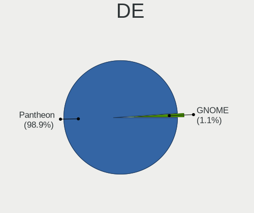
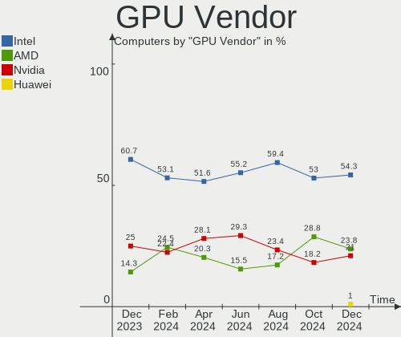
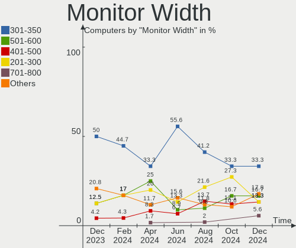
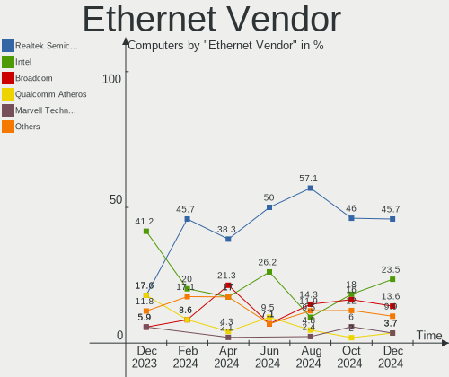
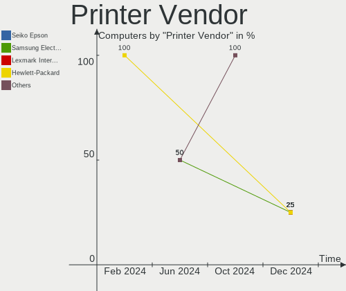

Elementary - Hardware Trends
----------------------------

A project to identify most popular hardware characteristics and track their change
over time based on data collected by Linux users at https://Linux-Hardware.org.

Anyone can contribute to this report by the [hw-probe](https://github.com/linuxhw/hw-probe) tool:

    sudo -E hw-probe -all -upload

This is a report for all computer types. See also reports for [desktops](/Dist/Elementary/Desktop/README.md) and [notebooks](/Dist/Elementary/Notebook/README.md).

This report is for one last month. Overall report since the beginning of time: [TestCoverage](https://github.com/linuxhw/TestCoverage)

Period: Aug, 2022.

Contents
--------

* [ System ](#system)
  - [ OS                       ](#os)
  - [ OS Family                ](#os-family)
  - [ Kernel                   ](#kernel)
  - [ Kernel Family            ](#kernel-family)
  - [ Kernel Major Ver.        ](#kernel-major-ver)
  - [ Arch                     ](#arch)
  - [ DE                       ](#de)
  - [ Display Server           ](#display-server)
  - [ Display Manager          ](#display-manager)
  - [ OS Lang                  ](#os-lang)
  - [ Boot Mode                ](#boot-mode)
  - [ Filesystem               ](#filesystem)
  - [ Part. scheme             ](#part-scheme)
  - [ Dual Boot with Linux/BSD ](#dual-boot-with-linuxbsd)
  - [ Dual Boot (Win)          ](#dual-boot-win)

* [ Board ](#board)
  - [ Vendor                   ](#vendor)
  - [ Model                    ](#model)
  - [ Model Family             ](#model-family)
  - [ MFG Year                 ](#mfg-year)
  - [ Form Factor              ](#form-factor)
  - [ Secure Boot              ](#secure-boot)
  - [ Coreboot                 ](#coreboot)
  - [ RAM Size                 ](#ram-size)
  - [ RAM Used                 ](#ram-used)
  - [ Total Drives             ](#total-drives)
  - [ Has CD-ROM               ](#has-cd-rom)
  - [ Has Ethernet             ](#has-ethernet)
  - [ Has WiFi                 ](#has-wifi)
  - [ Has Bluetooth            ](#has-bluetooth)

* [ Location ](#location)
  - [ Country                  ](#country)
  - [ City                     ](#city)

* [ Drives ](#drives)
  - [ Drive Vendor             ](#drive-vendor)
  - [ Drive Model              ](#drive-model)
  - [ HDD Vendor               ](#hdd-vendor)
  - [ SSD Vendor               ](#ssd-vendor)
  - [ Drive Kind               ](#drive-kind)
  - [ Drive Connector          ](#drive-connector)
  - [ Drive Size               ](#drive-size)
  - [ Space Total              ](#space-total)
  - [ Space Used               ](#space-used)
  - [ Malfunc. Drives          ](#malfunc-drives)
  - [ Malfunc. Drive Vendor    ](#malfunc-drive-vendor)
  - [ Malfunc. HDD Vendor      ](#malfunc-hdd-vendor)
  - [ Malfunc. Drive Kind      ](#malfunc-drive-kind)
  - [ Failed Drives            ](#failed-drives)
  - [ Failed Drive Vendor      ](#failed-drive-vendor)
  - [ Drive Status             ](#drive-status)

* [ Storage controller ](#storage-controller)
  - [ Storage Vendor           ](#storage-vendor)
  - [ Storage Model            ](#storage-model)
  - [ Storage Kind             ](#storage-kind)

* [ Processor ](#processor)
  - [ CPU Vendor               ](#cpu-vendor)
  - [ CPU Model                ](#cpu-model)
  - [ CPU Model Family         ](#cpu-model-family)
  - [ CPU Cores                ](#cpu-cores)
  - [ CPU Sockets              ](#cpu-sockets)
  - [ CPU Threads              ](#cpu-threads)
  - [ CPU Op-Modes             ](#cpu-op-modes)
  - [ CPU Microcode            ](#cpu-microcode)
  - [ CPU Microarch            ](#cpu-microarch)

* [ Graphics ](#graphics)
  - [ GPU Vendor               ](#gpu-vendor)
  - [ GPU Model                ](#gpu-model)
  - [ GPU Combo                ](#gpu-combo)
  - [ GPU Driver               ](#gpu-driver)
  - [ GPU Memory               ](#gpu-memory)

* [ Monitor ](#monitor)
  - [ Monitor Vendor           ](#monitor-vendor)
  - [ Monitor Model            ](#monitor-model)
  - [ Monitor Resolution       ](#monitor-resolution)
  - [ Monitor Diagonal         ](#monitor-diagonal)
  - [ Monitor Width            ](#monitor-width)
  - [ Aspect Ratio             ](#aspect-ratio)
  - [ Monitor Area             ](#monitor-area)
  - [ Pixel Density            ](#pixel-density)
  - [ Multiple Monitors        ](#multiple-monitors)

* [ Network ](#network)
  - [ Net Controller Vendor    ](#net-controller-vendor)
  - [ Net Controller Model     ](#net-controller-model)
  - [ Wireless Vendor          ](#wireless-vendor)
  - [ Wireless Model           ](#wireless-model)
  - [ Ethernet Vendor          ](#ethernet-vendor)
  - [ Ethernet Model           ](#ethernet-model)
  - [ Net Controller Kind      ](#net-controller-kind)
  - [ Used Controller          ](#used-controller)
  - [ NICs                     ](#nics)
  - [ IPv6                     ](#ipv6)

* [ Bluetooth ](#bluetooth)
  - [ Bluetooth Vendor         ](#bluetooth-vendor)
  - [ Bluetooth Model          ](#bluetooth-model)

* [ Sound ](#sound)
  - [ Sound Vendor             ](#sound-vendor)
  - [ Sound Model              ](#sound-model)

* [ Memory ](#memory)
  - [ Memory Vendor            ](#memory-vendor)
  - [ Memory Model             ](#memory-model)
  - [ Memory Kind              ](#memory-kind)
  - [ Memory Form Factor       ](#memory-form-factor)
  - [ Memory Size              ](#memory-size)
  - [ Memory Speed             ](#memory-speed)

* [ Printers & scanners ](#printers--scanners)
  - [ Printer Vendor           ](#printer-vendor)
  - [ Printer Model            ](#printer-model)
  - [ Scanner Vendor           ](#scanner-vendor)
  - [ Scanner Model            ](#scanner-model)

* [ Camera ](#camera)
  - [ Camera Vendor            ](#camera-vendor)
  - [ Camera Model             ](#camera-model)

* [ Security ](#security)
  - [ Fingerprint Vendor       ](#fingerprint-vendor)
  - [ Fingerprint Model        ](#fingerprint-model)
  - [ Chipcard Vendor          ](#chipcard-vendor)
  - [ Chipcard Model           ](#chipcard-model)

* [ Unsupported ](#unsupported)
  - [ Unsupported Devices      ](#unsupported-devices)
  - [ Unsupported Device Types ](#unsupported-device-types)

System
------

OS
--

Installed operating systems

| Name             | Computers | Percent |
|------------------|-----------|---------|
| Elementary 6.1   | 59        | 93.65%  |
| Elementary 5.1.7 | 3         | 4.76%   |
| Elementary 6     | 1         | 1.59%   |

OS Family
---------

OS without a version

| Name       | Computers | Percent |
|------------|-----------|---------|
| Elementary | 63        | 100%    |

Kernel
------

Version of the Linux kernel

| Version               | Computers | Percent |
|-----------------------|-----------|---------|
| 5.15.0-46-generic     | 27        | 42.86%  |
| 5.15.0-43-generic     | 13        | 20.63%  |
| 5.15.0-41-generic     | 7         | 11.11%  |
| 5.11.0-43-generic     | 7         | 11.11%  |
| 5.4.0-124-generic     | 2         | 3.17%   |
| 5.11.0-40-generic     | 2         | 3.17%   |
| 5.4.0-122-generic     | 1         | 1.59%   |
| 5.19.4-surface        | 1         | 1.59%   |
| 5.19.3-051903-generic | 1         | 1.59%   |
| 5.13.0-44-generic     | 1         | 1.59%   |
| 5.13.0-28-generic     | 1         | 1.59%   |

Kernel Family
-------------

Linux kernel without a distro release

| Version | Computers | Percent |
|---------|-----------|---------|
| 5.15.0  | 47        | 74.6%   |
| 5.11.0  | 9         | 14.29%  |
| 5.4.0   | 3         | 4.76%   |
| 5.13.0  | 2         | 3.17%   |
| 5.19.4  | 1         | 1.59%   |
| 5.19.3  | 1         | 1.59%   |

Kernel Major Ver.
-----------------

Linux kernel major version

| Version | Computers | Percent |
|---------|-----------|---------|
| 5.15    | 47        | 74.6%   |
| 5.11    | 9         | 14.29%  |
| 5.4     | 3         | 4.76%   |
| 5.19    | 2         | 3.17%   |
| 5.13    | 2         | 3.17%   |

Arch
----

OS architecture (x86_64, i586, etc.)

| Name   | Computers | Percent |
|--------|-----------|---------|
| x86_64 | 63        | 100%    |

DE
--

Desktop Environment

| Name     | Computers | Percent |
|----------|-----------|---------|
| Pantheon | 62        | 98.41%  |
| KDE5     | 1         | 1.59%   |

Display Server
--------------

X11 or Wayland

| Name | Computers | Percent |
|------|-----------|---------|
| X11  | 63        | 100%    |

Display Manager
---------------

SDDM, LightDM, etc.

| Name    | Computers | Percent |
|---------|-----------|---------|
| Unknown | 49        | 77.78%  |
| LightDM | 14        | 22.22%  |

OS Lang
-------

Language

| Lang  | Computers | Percent |
|-------|-----------|---------|
| en_US | 30        | 47.62%  |
| en_GB | 7         | 11.11%  |
| ru_RU | 4         | 6.35%   |
| pt_BR | 4         | 6.35%   |
| fr_FR | 4         | 6.35%   |
| es_ES | 4         | 6.35%   |
| de_DE | 4         | 6.35%   |
| it_IT | 3         | 4.76%   |
| nl_NL | 2         | 3.17%   |
| en_CA | 1         | 1.59%   |

Boot Mode
---------

EFI or BIOS

| Mode | Computers | Percent |
|------|-----------|---------|
| EFI  | 43        | 68.25%  |
| BIOS | 20        | 31.75%  |

Filesystem
----------

Type of filesystem

| Type    | Computers | Percent |
|---------|-----------|---------|
| Ext4    | 62        | 98.41%  |
| Overlay | 1         | 1.59%   |

Part. scheme
------------

Scheme of partitioning

| Type    | Computers | Percent |
|---------|-----------|---------|
| Unknown | 55        | 87.3%   |
| GPT     | 7         | 11.11%  |
| MBR     | 1         | 1.59%   |

Dual Boot with Linux/BSD
------------------------

Hosting more than one Linux/BSD

| Dual boot | Computers | Percent |
|-----------|-----------|---------|
| No        | 61        | 96.83%  |
| Yes       | 2         | 3.17%   |

Dual Boot (Win)
---------------

Hosting Linux and Windows

| Dual boot | Computers | Percent |
|-----------|-----------|---------|
| No        | 60        | 95.24%  |
| Yes       | 3         | 4.76%   |

Board
-----

Vendor
------

Motherboard manufacturer

| Name                | Computers | Percent |
|---------------------|-----------|---------|
| Apple               | 11        | 17.46%  |
| Lenovo              | 10        | 15.87%  |
| ASUSTek Computer    | 9         | 14.29%  |
| Hewlett-Packard     | 8         | 12.7%   |
| Dell                | 7         | 11.11%  |
| Gigabyte Technology | 3         | 4.76%   |
| Sony                | 2         | 3.17%   |
| MSI                 | 2         | 3.17%   |
| Microsoft           | 2         | 3.17%   |
| TrekStor            | 1         | 1.59%   |
| Toshiba             | 1         | 1.59%   |
| Standard            | 1         | 1.59%   |
| Notebook            | 1         | 1.59%   |
| Medion              | 1         | 1.59%   |
| Foxconn             | 1         | 1.59%   |
| Complet             | 1         | 1.59%   |
| ASRock              | 1         | 1.59%   |
| Acer                | 1         | 1.59%   |

Model
-----

Motherboard model

| Name                                  | Computers | Percent |
|---------------------------------------|-----------|---------|
| TrekStor Notebook Slim S130           | 1         | 1.59%   |
| Toshiba Satellite L875-11M            | 1         | 1.59%   |
| Sony VPCEB16FG                        | 1         | 1.59%   |
| Sony SVS15117FLB                      | 1         | 1.59%   |
| Notebook NLx0MU                       | 1         | 1.59%   |
| MSI MS-7C77                           | 1         | 1.59%   |
| MSI Creator 15 A10SET                 | 1         | 1.59%   |
| Microsoft Surface Pro 4               | 1         | 1.59%   |
| Microsoft Surface Pro                 | 1         | 1.59%   |
| Medion Akoya E6422 MD99680            | 1         | 1.59%   |
| Lenovo Yoga 530-14ARR 81H9            | 1         | 1.59%   |
| Lenovo ThinkPad X230 Tablet 34353MG   | 1         | 1.59%   |
| Lenovo ThinkPad T480 20L6S9WY00       | 1         | 1.59%   |
| Lenovo ThinkPad T460 20FMS271BR       | 1         | 1.59%   |
| Lenovo ThinkPad E470 20H2A02NBR       | 1         | 1.59%   |
| Lenovo ThinkCentre M92p 3212DF9       | 1         | 1.59%   |
| Lenovo ThinkBook 14-IML 20RV          | 1         | 1.59%   |
| Lenovo Legion Y540-15IRH 81SX         | 1         | 1.59%   |
| Lenovo IdeaPad Gaming 3 15IMH05 82CG  | 1         | 1.59%   |
| Lenovo IdeaPad 5 14ALC05 82LM         | 1         | 1.59%   |
| HP Spectre x360 Convertible 13-aw0xxx | 1         | 1.59%   |
| HP ProDesk 600 G2 SFF                 | 1         | 1.59%   |
| HP Pavilion dv6                       | 1         | 1.59%   |
| HP Pavilion 17                        | 1         | 1.59%   |
| HP Laptop 15-db0xxx                   | 1         | 1.59%   |
| HP 700-210xt                          | 1         | 1.59%   |
| HP 431                                | 1         | 1.59%   |
| HP 240 G7 Notebook PC                 | 1         | 1.59%   |
| Gigabyte H81M-DS2                     | 1         | 1.59%   |
| Gigabyte H61M-S1                      | 1         | 1.59%   |
| Gigabyte H370AORUSGAMING3WIFI         | 1         | 1.59%   |
| Foxconn Pro3500 Series                | 1         | 1.59%   |
| Dell XPS 13 7390 2-in-1               | 1         | 1.59%   |
| Dell Latitude E7250                   | 1         | 1.59%   |
| Dell Latitude E6400                   | 1         | 1.59%   |
| Dell Latitude D630                    | 1         | 1.59%   |
| Dell Latitude 3190                    | 1         | 1.59%   |
| Dell Inspiron 5570                    | 1         | 1.59%   |
| Dell Inspiron 5537                    | 1         | 1.59%   |
| Complet MY8312                        | 1         | 1.59%   |
| ASUS ZenBook Pro Duo UX581LV_UX581LV  | 1         | 1.59%   |
| ASUS X542UA                           | 1         | 1.59%   |
| ASUS TUF Gaming B550M-PLUS            | 1         | 1.59%   |
| ASUS PRIME B450M-A                    | 1         | 1.59%   |
| ASUS P7H55-M LX                       | 1         | 1.59%   |
| ASUS P5B                              | 1         | 1.59%   |
| ASUS M2N68-AM SE2                     | 1         | 1.59%   |
| ASUS K52F                             | 1         | 1.59%   |
| ASUS K43E                             | 1         | 1.59%   |
| ASRock N68-VGS3 FX                    | 1         | 1.59%   |
| Apple MacPro5,1                       | 1         | 1.59%   |
| Apple Macmini5,1                      | 1         | 1.59%   |
| Apple Macmini4,1                      | 1         | 1.59%   |
| Apple MacBookPro8,2                   | 1         | 1.59%   |
| Apple MacBookPro8,1                   | 1         | 1.59%   |
| Apple MacBookPro5,2                   | 1         | 1.59%   |
| Apple MacBookAir7,1                   | 1         | 1.59%   |
| Apple MacBookAir6,2                   | 1         | 1.59%   |
| Apple iMac7,1                         | 1         | 1.59%   |
| Apple iMac18,3                        | 1         | 1.59%   |

Model Family
------------

Motherboard model prefix

| Name                          | Computers | Percent |
|-------------------------------|-----------|---------|
| Lenovo ThinkPad               | 4         | 6.35%   |
| Dell Latitude                 | 4         | 6.35%   |
| Microsoft Surface             | 2         | 3.17%   |
| Lenovo IdeaPad                | 2         | 3.17%   |
| HP Pavilion                   | 2         | 3.17%   |
| Dell Inspiron                 | 2         | 3.17%   |
| Apple MacBookPro8             | 2         | 3.17%   |
| TrekStor Notebook             | 1         | 1.59%   |
| Toshiba Satellite             | 1         | 1.59%   |
| Sony VPCEB16FG                | 1         | 1.59%   |
| Sony SVS15117FLB              | 1         | 1.59%   |
| Notebook NLx0MU               | 1         | 1.59%   |
| MSI MS-7C77                   | 1         | 1.59%   |
| MSI Creator                   | 1         | 1.59%   |
| Medion Akoya                  | 1         | 1.59%   |
| Lenovo Yoga                   | 1         | 1.59%   |
| Lenovo ThinkCentre            | 1         | 1.59%   |
| Lenovo ThinkBook              | 1         | 1.59%   |
| Lenovo Legion                 | 1         | 1.59%   |
| HP Spectre                    | 1         | 1.59%   |
| HP ProDesk                    | 1         | 1.59%   |
| HP Laptop                     | 1         | 1.59%   |
| HP 700-210xt                  | 1         | 1.59%   |
| HP 431                        | 1         | 1.59%   |
| HP 240                        | 1         | 1.59%   |
| Gigabyte H81M-DS2             | 1         | 1.59%   |
| Gigabyte H61M-S1              | 1         | 1.59%   |
| Gigabyte H370AORUSGAMING3WIFI | 1         | 1.59%   |
| Foxconn Pro3500               | 1         | 1.59%   |
| Dell XPS                      | 1         | 1.59%   |
| Complet MY8312                | 1         | 1.59%   |
| ASUS ZenBook                  | 1         | 1.59%   |
| ASUS X542UA                   | 1         | 1.59%   |
| ASUS TUF                      | 1         | 1.59%   |
| ASUS PRIME                    | 1         | 1.59%   |
| ASUS P7H55-M                  | 1         | 1.59%   |
| ASUS P5B                      | 1         | 1.59%   |
| ASUS M2N68-AM                 | 1         | 1.59%   |
| ASUS K52F                     | 1         | 1.59%   |
| ASUS K43E                     | 1         | 1.59%   |
| ASRock N68-VGS3               | 1         | 1.59%   |
| Apple MacPro5                 | 1         | 1.59%   |
| Apple Macmini5                | 1         | 1.59%   |
| Apple Macmini4                | 1         | 1.59%   |
| Apple MacBookPro5             | 1         | 1.59%   |
| Apple MacBookAir7             | 1         | 1.59%   |
| Apple MacBookAir6             | 1         | 1.59%   |
| Apple iMac7                   | 1         | 1.59%   |
| Apple iMac18                  | 1         | 1.59%   |
| Apple iMac11                  | 1         | 1.59%   |
| Acer Aspire                   | 1         | 1.59%   |
| Unknown                       | 1         | 1.59%   |

MFG Year
--------

Motherboard manufacture year

| Year | Computers | Percent |
|------|-----------|---------|
| 2013 | 9         | 14.29%  |
| 2018 | 8         | 12.7%   |
| 2020 | 7         | 11.11%  |
| 2019 | 7         | 11.11%  |
| 2010 | 5         | 7.94%   |
| 2016 | 4         | 6.35%   |
| 2012 | 4         | 6.35%   |
| 2011 | 4         | 6.35%   |
| 2009 | 3         | 4.76%   |
| 2021 | 2         | 3.17%   |
| 2015 | 2         | 3.17%   |
| 2014 | 2         | 3.17%   |
| 2008 | 2         | 3.17%   |
| 2007 | 2         | 3.17%   |
| 2017 | 1         | 1.59%   |
| 2006 | 1         | 1.59%   |

Form Factor
-----------

Physical design of the computer

| Name        | Computers | Percent |
|-------------|-----------|---------|
| Notebook    | 38        | 60.32%  |
| Desktop     | 15        | 23.81%  |
| Convertible | 3         | 4.76%   |
| All in one  | 3         | 4.76%   |
| Tablet      | 2         | 3.17%   |
| Mini pc     | 2         | 3.17%   |

Secure Boot
-----------

Enabled or disabled

| State    | Computers | Percent |
|----------|-----------|---------|
| Disabled | 51        | 80.95%  |
| Enabled  | 12        | 19.05%  |

Coreboot
--------

Have coreboot on board

| Used | Computers | Percent |
|------|-----------|---------|
| No   | 63        | 100%    |

RAM Size
--------

Total RAM memory

| Size in GB  | Computers | Percent |
|-------------|-----------|---------|
| 4.01-8.0    | 19        | 30.16%  |
| 3.01-4.0    | 13        | 20.63%  |
| 8.01-16.0   | 11        | 17.46%  |
| 16.01-24.0  | 10        | 15.87%  |
| 32.01-64.0  | 7         | 11.11%  |
| 64.01-256.0 | 2         | 3.17%   |
| 24.01-32.0  | 1         | 1.59%   |

RAM Used
--------

Used RAM memory

| Used GB   | Computers | Percent |
|-----------|-----------|---------|
| 1.01-2.0  | 22        | 34.92%  |
| 3.01-4.0  | 14        | 22.22%  |
| 2.01-3.0  | 14        | 22.22%  |
| 4.01-8.0  | 9         | 14.29%  |
| 8.01-16.0 | 3         | 4.76%   |
| 0.51-1.0  | 1         | 1.59%   |

Total Drives
------------

Number of drives on board

| Drives | Computers | Percent |
|--------|-----------|---------|
| 1      | 39        | 61.9%   |
| 2      | 18        | 28.57%  |
| 6      | 2         | 3.17%   |
| 4      | 2         | 3.17%   |
| 3      | 1         | 1.59%   |
| 0      | 1         | 1.59%   |

Has CD-ROM
----------

Has CD-ROM on board

| Presented | Computers | Percent |
|-----------|-----------|---------|
| No        | 37        | 58.73%  |
| Yes       | 26        | 41.27%  |

Has Ethernet
------------

Has Ethernet on board

| Presented | Computers | Percent |
|-----------|-----------|---------|
| Yes       | 53        | 84.13%  |
| No        | 10        | 15.87%  |

Has WiFi
--------

Has WiFi module

| Presented | Computers | Percent |
|-----------|-----------|---------|
| Yes       | 53        | 84.13%  |
| No        | 10        | 15.87%  |

Has Bluetooth
-------------

Has Bluetooth module

| Presented | Computers | Percent |
|-----------|-----------|---------|
| Yes       | 51        | 80.95%  |
| No        | 12        | 19.05%  |

Location
--------

Country
-------

Geographic location (country)

| Country         | Computers | Percent |
|-----------------|-----------|---------|
| USA             | 11        | 17.46%  |
| UK              | 8         | 12.7%   |
| Brazil          | 6         | 9.52%   |
| Germany         | 4         | 6.35%   |
| Russia          | 3         | 4.76%   |
| Italy           | 3         | 4.76%   |
| Switzerland     | 2         | 3.17%   |
| Indonesia       | 2         | 3.17%   |
| India           | 2         | 3.17%   |
| France          | 2         | 3.17%   |
| Chile           | 2         | 3.17%   |
| Canada          | 2         | 3.17%   |
| Belgium         | 2         | 3.17%   |
| Ukraine         | 1         | 1.59%   |
| Thailand        | 1         | 1.59%   |
| Spain           | 1         | 1.59%   |
| Romania         | 1         | 1.59%   |
| Norway          | 1         | 1.59%   |
| North Macedonia | 1         | 1.59%   |
| Netherlands     | 1         | 1.59%   |
| Mexico          | 1         | 1.59%   |
| Kenya           | 1         | 1.59%   |
| Israel          | 1         | 1.59%   |
| Ireland         | 1         | 1.59%   |
| Czechia         | 1         | 1.59%   |
| Belarus         | 1         | 1.59%   |
| Barbados        | 1         | 1.59%   |

City
----

Geographic location (city)

| City                 | Computers | Percent |
|----------------------|-----------|---------|
| Teresina             | 2         | 3.17%   |
| Caslano              | 2         | 3.17%   |
| Ypres                | 1         | 1.59%   |
| Yaroslavl            | 1         | 1.59%   |
| Wervik               | 1         | 1.59%   |
| Werneck              | 1         | 1.59%   |
| Walnut Creek         | 1         | 1.59%   |
| Voronezh             | 1         | 1.59%   |
| Toronto              | 1         | 1.59%   |
| The Hague            | 1         | 1.59%   |
| Tangerang            | 1         | 1.59%   |
| Swansea              | 1         | 1.59%   |
| Struga               | 1         | 1.59%   |
| Sevastopol           | 1         | 1.59%   |
| San Julian de Muskiz | 1         | 1.59%   |
| San Felipe           | 1         | 1.59%   |
| Saint Charles        | 1         | 1.59%   |
| Rome                 | 1         | 1.59%   |
| Renca                | 1         | 1.59%   |
| Raleigh              | 1         | 1.59%   |
| Paddington           | 1         | 1.59%   |
| Oslo                 | 1         | 1.59%   |
| Newark               | 1         | 1.59%   |
| Navi Mumbai          | 1         | 1.59%   |
| Nairobi              | 1         | 1.59%   |
| Moscow               | 1         | 1.59%   |
| Milan                | 1         | 1.59%   |
| Mansfield            | 1         | 1.59%   |
| Mage                 | 1         | 1.59%   |
| Liverpool            | 1         | 1.59%   |
| Lincoln              | 1         | 1.59%   |
| Leeds                | 1         | 1.59%   |
| Kucharovice          | 1         | 1.59%   |
| Ketchum              | 1         | 1.59%   |
| Jerseyville          | 1         | 1.59%   |
| Hua Hin              | 1         | 1.59%   |
| Holbeach             | 1         | 1.59%   |
| Hanau                | 1         | 1.59%   |
| Hamburg              | 1         | 1.59%   |
| Gussago              | 1         | 1.59%   |
| Gomel                | 1         | 1.59%   |
| Givat Shmuel         | 1         | 1.59%   |
| Fortaleza            | 1         | 1.59%   |
| Fort Worth           | 1         | 1.59%   |
| Dublin               | 1         | 1.59%   |
| Daniel's Harbour     | 1         | 1.59%   |
| Cluj-Napoca          | 1         | 1.59%   |
| Bridgetown           | 1         | 1.59%   |
| Brest                | 1         | 1.59%   |
| Bogor                | 1         | 1.59%   |
| Billinge             | 1         | 1.59%   |
| Betim                | 1         | 1.59%   |
| Bethnal Green        | 1         | 1.59%   |
| Berlin               | 1         | 1.59%   |
| Belo Jardim          | 1         | 1.59%   |
| Austin               | 1         | 1.59%   |
| Arques-la-Bataille   | 1         | 1.59%   |
| Antioch              | 1         | 1.59%   |
| Albuquerque          | 1         | 1.59%   |
| Ahmedabad            | 1         | 1.59%   |

Drives
------

Drive Vendor
------------

Hard drive vendors

| Vendor              | Computers | Drives | Percent |
|---------------------|-----------|--------|---------|
| Samsung Electronics | 14        | 19     | 16.47%  |
| WDC                 | 11        | 12     | 12.94%  |
| Seagate             | 11        | 13     | 12.94%  |
| Hitachi             | 5         | 5      | 5.88%   |
| Crucial             | 5         | 5      | 5.88%   |
| Unknown             | 4         | 5      | 4.71%   |
| Toshiba             | 4         | 4      | 4.71%   |
| Kingston            | 4         | 4      | 4.71%   |
| SanDisk             | 3         | 3      | 3.53%   |
| Intel               | 3         | 3      | 3.53%   |
| PNY                 | 2         | 2      | 2.35%   |
| Phison              | 2         | 2      | 2.35%   |
| KIOXIA              | 2         | 2      | 2.35%   |
| Apple               | 2         | 2      | 2.35%   |
| XPG                 | 1         | 1      | 1.18%   |
| Timetec             | 1         | 1      | 1.18%   |
| Super Talent        | 1         | 1      | 1.18%   |
| OCZ                 | 1         | 1      | 1.18%   |
| Micron Technology   | 1         | 1      | 1.18%   |
| Lite-On             | 1         | 1      | 1.18%   |
| KingFast            | 1         | 1      | 1.18%   |
| JMicron Technology  | 1         | 1      | 1.18%   |
| HGST                | 1         | 1      | 1.18%   |
| FORESEE             | 1         | 1      | 1.18%   |
| EYOTA               | 1         | 1      | 1.18%   |
| China               | 1         | 1      | 1.18%   |
| BIWIN               | 1         | 1      | 1.18%   |

Drive Model
-----------

Hard drive models

| Model                                  | Computers | Percent |
|----------------------------------------|-----------|---------|
| Seagate ST500DM002-1BD142 500GB        | 2         | 2.13%   |
| Seagate ST1000DM003-1ER162 1TB         | 2         | 2.13%   |
| Samsung SSD 840 EVO 250GB              | 2         | 2.13%   |
| Samsung NVMe SSD Drive 500GB           | 2         | 2.13%   |
| Samsung NVMe SSD Drive 256GB           | 2         | 2.13%   |
| PNY CS900 480GB SSD                    | 2         | 2.13%   |
| Intel NVMe SSD Drive 512GB             | 2         | 2.13%   |
| XPG GAMMIX S5 256GB                    | 1         | 1.06%   |
| WDC WD7500BPVT-55HXZT3 752GB           | 1         | 1.06%   |
| WDC WD5003AZEX-00K1GA0 500GB           | 1         | 1.06%   |
| WDC WD5000AAKS-00A7B2 500GB            | 1         | 1.06%   |
| WDC WD3200BPVT-22ZEST0 320GB           | 1         | 1.06%   |
| WDC WD20EARS-00MVWB0 2TB               | 1         | 1.06%   |
| WDC WD2003FZEX-00SRLA0 2TB             | 1         | 1.06%   |
| WDC WD1600BEKT-08PVMT1 160GB           | 1         | 1.06%   |
| WDC WD10EFRX-68PJCN0 1TB               | 1         | 1.06%   |
| WDC WD Game Drive 2TB                  | 1         | 1.06%   |
| WDC WD Blue SA510 2.5 500GB SSD        | 1         | 1.06%   |
| WDC SSC-D0064SC-2100 64GB              | 1         | 1.06%   |
| WDC PC SN730 SDBPNTY-1T00-1032 1TB     | 1         | 1.06%   |
| Unknown SD08G  8GB                     | 1         | 1.06%   |
| Unknown SD/MMC 16GB                    | 1         | 1.06%   |
| Unknown NCard  64GB                    | 1         | 1.06%   |
| Unknown MMC Card  64GB                 | 1         | 1.06%   |
| Unknown M.S./M.S.Pro/HG 16GB           | 1         | 1.06%   |
| Toshiba MQ04ABF100 1TB                 | 1         | 1.06%   |
| Toshiba MQ01ABD100 1TB                 | 1         | 1.06%   |
| Toshiba DT01ACA100 1TB                 | 1         | 1.06%   |
| Toshiba DT01ACA050 500GB               | 1         | 1.06%   |
| Timetec 30TT253X2-256G                 | 1         | 1.06%   |
| Super Talent FTM56N325H 256GB          | 1         | 1.06%   |
| Seagate ST9500325AS 500GB              | 1         | 1.06%   |
| Seagate ST9320325AS 320GB              | 1         | 1.06%   |
| Seagate ST3500630AS 500GB              | 1         | 1.06%   |
| Seagate ST3500620AS 500GB              | 1         | 1.06%   |
| Seagate ST31500341AS 1TB               | 1         | 1.06%   |
| Seagate ST31000528AS 1TB               | 1         | 1.06%   |
| Seagate ST2000LM007-1R8174 2TB         | 1         | 1.06%   |
| Seagate ST1000LM035-1RK172 1TB         | 1         | 1.06%   |
| Seagate ST1000LM 035-1RK172 1TB        | 1         | 1.06%   |
| SanDisk SD8SBAT128G1122 128GB SSD      | 1         | 1.06%   |
| SanDisk NVMe SSD Drive 512GB           | 1         | 1.06%   |
| SanDisk NVMe SSD Drive 256GB           | 1         | 1.06%   |
| Samsung SSD PM851 mSATA 256GB          | 1         | 1.06%   |
| Samsung SSD PB22-JS3 FDE 2.5 256GB     | 1         | 1.06%   |
| Samsung SSD 870 EVO 500GB              | 1         | 1.06%   |
| Samsung SSD 870 EVO 1TB                | 1         | 1.06%   |
| Samsung SSD 860 EVO 500GB              | 1         | 1.06%   |
| Samsung SSD 860 EVO 1TB                | 1         | 1.06%   |
| Samsung SSD 850 EVO 500GB              | 1         | 1.06%   |
| Samsung SSD 850 EVO 250GB              | 1         | 1.06%   |
| Samsung SM963 2.5" NVMe PCIe SSD 128GB | 1         | 1.06%   |
| Samsung NVMe SSD Drive 2TB             | 1         | 1.06%   |
| Samsung NVMe SSD Drive 1TB             | 1         | 1.06%   |
| Samsung HM500JI 500GB                  | 1         | 1.06%   |
| Samsung HD502IJ 500GB                  | 1         | 1.06%   |
| Phison SSD 128GB PS3109-S9             | 1         | 1.06%   |
| Phison NVMe SSD Drive 960GB            | 1         | 1.06%   |
| OCZ AGILITY3 240GB SSD                 | 1         | 1.06%   |
| Micron NVMe SSD Drive 512GB            | 1         | 1.06%   |

HDD Vendor
----------

Hard disk drive vendors

| Vendor              | Computers | Drives | Percent |
|---------------------|-----------|--------|---------|
| Seagate             | 11        | 13     | 35.48%  |
| WDC                 | 8         | 8      | 25.81%  |
| Hitachi             | 5         | 5      | 16.13%  |
| Toshiba             | 4         | 4      | 12.9%   |
| Samsung Electronics | 2         | 2      | 6.45%   |
| HGST                | 1         | 1      | 3.23%   |

SSD Vendor
----------

Solid state drive vendors

| Vendor              | Computers | Drives | Percent |
|---------------------|-----------|--------|---------|
| Samsung Electronics | 7         | 10     | 25%     |
| Crucial             | 5         | 5      | 17.86%  |
| Kingston            | 3         | 3      | 10.71%  |
| PNY                 | 2         | 2      | 7.14%   |
| Apple               | 2         | 2      | 7.14%   |
| WDC                 | 1         | 1      | 3.57%   |
| Super Talent        | 1         | 1      | 3.57%   |
| SanDisk             | 1         | 1      | 3.57%   |
| Phison              | 1         | 1      | 3.57%   |
| OCZ                 | 1         | 1      | 3.57%   |
| Intel               | 1         | 1      | 3.57%   |
| FORESEE             | 1         | 1      | 3.57%   |
| EYOTA               | 1         | 1      | 3.57%   |
| China               | 1         | 1      | 3.57%   |

Drive Kind
----------

HDD or SSD

| Kind    | Computers | Drives | Percent |
|---------|-----------|--------|---------|
| SSD     | 27        | 31     | 32.53%  |
| HDD     | 27        | 33     | 32.53%  |
| NVMe    | 20        | 20     | 24.1%   |
| Unknown | 6         | 7      | 7.23%   |
| MMC     | 3         | 3      | 3.61%   |

Drive Connector
---------------

SATA, SAS, NVMe, etc.

| Type | Computers | Drives | Percent |
|------|-----------|--------|---------|
| SATA | 45        | 66     | 62.5%   |
| NVMe | 20        | 20     | 27.78%  |
| SAS  | 4         | 5      | 5.56%   |
| MMC  | 3         | 3      | 4.17%   |

Drive Size
----------

Size of hard drive

| Size in TB | Computers | Drives | Percent |
|------------|-----------|--------|---------|
| 0.01-0.5   | 36        | 44     | 69.23%  |
| 0.51-1.0   | 11        | 15     | 21.15%  |
| 1.01-2.0   | 4         | 4      | 7.69%   |
| 2.01-3.0   | 1         | 1      | 1.92%   |

Space Total
-----------

Amount of disk space available on the file system

| Size in GB     | Computers | Percent |
|----------------|-----------|---------|
| 101-250        | 22        | 34.92%  |
| 251-500        | 20        | 31.75%  |
| 501-1000       | 8         | 12.7%   |
| 1001-2000      | 5         | 7.94%   |
| 51-100         | 5         | 7.94%   |
| 21-50          | 2         | 3.17%   |
| More than 3000 | 1         | 1.59%   |

Space Used
----------

Amount of used disk space

| Used GB   | Computers | Percent |
|-----------|-----------|---------|
| 1-20      | 27        | 42.86%  |
| 21-50     | 13        | 20.63%  |
| 51-100    | 10        | 15.87%  |
| 251-500   | 5         | 7.94%   |
| 101-250   | 5         | 7.94%   |
| 501-1000  | 2         | 3.17%   |
| 1001-2000 | 1         | 1.59%   |

Malfunc. Drives
---------------

Drive models with a malfunction

| Model                            | Computers | Drives | Percent |
|----------------------------------|-----------|--------|---------|
| Kingston SUV400S37480G 480GB SSD | 1         | 1      | 100%    |

Malfunc. Drive Vendor
---------------------

Vendors of faulty drives

| Vendor   | Computers | Drives | Percent |
|----------|-----------|--------|---------|
| Kingston | 1         | 1      | 100%    |

Malfunc. HDD Vendor
-------------------

Vendors of faulty HDD drives

Zero info for selected period =(

Malfunc. Drive Kind
-------------------

Kinds of faulty drives

| Kind | Computers | Drives | Percent |
|------|-----------|--------|---------|
| SSD  | 1         | 1      | 100%    |

Failed Drives
-------------

Failed drive models

Zero info for selected period =(

Failed Drive Vendor
-------------------

Failed drive vendors

Zero info for selected period =(

Drive Status
------------

Number of failed and malfunc. drives

| Status   | Computers | Drives | Percent |
|----------|-----------|--------|---------|
| Detected | 57        | 88     | 90.48%  |
| Works    | 5         | 5      | 7.94%   |
| Malfunc  | 1         | 1      | 1.59%   |

Storage controller
------------------

Storage Vendor
--------------

Storage controller vendors

| Vendor                      | Computers | Percent |
|-----------------------------|-----------|---------|
| Intel                       | 47        | 61.04%  |
| Samsung Electronics         | 8         | 10.39%  |
| AMD                         | 5         | 6.49%   |
| Nvidia                      | 4         | 5.19%   |
| SanDisk                     | 3         | 3.9%    |
| KIOXIA                      | 2         | 2.6%    |
| Realtek Semiconductor       | 1         | 1.3%    |
| Phison Electronics          | 1         | 1.3%    |
| Micron Technology           | 1         | 1.3%    |
| Marvell Technology Group    | 1         | 1.3%    |
| Lite-On Technology          | 1         | 1.3%    |
| Kingston Technology Company | 1         | 1.3%    |
| JMicron Technology          | 1         | 1.3%    |
| Biwin Storage Technology    | 1         | 1.3%    |

Storage Model
-------------

Storage controller models

| Model                                                                          | Computers | Percent |
|--------------------------------------------------------------------------------|-----------|---------|
| Intel 6 Series/C200 Series Chipset Family 6 port Mobile SATA AHCI Controller   | 6         | 7.23%   |
| Intel Sunrise Point-LP SATA Controller [AHCI mode]                             | 4         | 4.82%   |
| Intel 82801 Mobile SATA Controller [RAID mode]                                 | 4         | 4.82%   |
| AMD FCH SATA Controller [AHCI mode]                                            | 4         | 4.82%   |
| Samsung NVMe SSD Controller SM981/PM981/PM983                                  | 3         | 3.61%   |
| Intel 8 Series/C220 Series Chipset Family 6-port SATA Controller 1 [AHCI mode] | 3         | 3.61%   |
| Intel 7 Series Chipset Family 6-port SATA Controller [AHCI mode]               | 3         | 3.61%   |
| Nvidia MCP61 SATA Controller                                                   | 2         | 2.41%   |
| KIOXIA NVMe SSD Controller BG4                                                 | 2         | 2.41%   |
| Intel SSD 660P Series                                                          | 2         | 2.41%   |
| Intel Q170/Q150/B150/H170/H110/Z170/CM236 Chipset SATA Controller [AHCI Mode]  | 2         | 2.41%   |
| Intel Comet Lake SATA AHCI Controller                                          | 2         | 2.41%   |
| Intel Celeron/Pentium Silver Processor SATA Controller                         | 2         | 2.41%   |
| Intel 82801HM/HEM (ICH8M/ICH8M-E) SATA Controller [AHCI mode]                  | 2         | 2.41%   |
| Intel 82801HM/HEM (ICH8M/ICH8M-E) IDE Controller                               | 2         | 2.41%   |
| Intel 6 Series/C200 Series Chipset Family 6 port Desktop SATA AHCI Controller  | 2         | 2.41%   |
| Intel 5 Series/3400 Series Chipset 4 port SATA AHCI Controller                 | 2         | 2.41%   |
| Intel 400 Series Chipset Family SATA AHCI Controller                           | 2         | 2.41%   |
| SanDisk WD Black SN750 / PC SN730 NVMe SSD                                     | 1         | 1.2%    |
| SanDisk PC SN520 NVMe SSD                                                      | 1         | 1.2%    |
| SanDisk Non-Volatile memory controller                                         | 1         | 1.2%    |
| Samsung NVMe SSD Controller SM961/PM961/SM963                                  | 1         | 1.2%    |
| Samsung NVMe SSD Controller SM951/PM951                                        | 1         | 1.2%    |
| Samsung NVMe SSD Controller 980                                                | 1         | 1.2%    |
| Samsung Electronics SATA controller                                            | 1         | 1.2%    |
| Samsung Electronics Non-Volatile memory controller                             | 1         | 1.2%    |
| Realtek Realtek Non-Volatile memory controller                                 | 1         | 1.2%    |
| Phison E12 NVMe Controller                                                     | 1         | 1.2%    |
| Nvidia MCP89 SATA Controller (AHCI mode)                                       | 1         | 1.2%    |
| Nvidia MCP79 AHCI Controller                                                   | 1         | 1.2%    |
| Nvidia MCP61 IDE                                                               | 1         | 1.2%    |
| Micron Non-Volatile memory controller                                          | 1         | 1.2%    |
| Marvell Group 88SS9183 PCIe SSD Controller                                     | 1         | 1.2%    |
| Lite-On Non-Volatile memory controller                                         | 1         | 1.2%    |
| Kingston Company A2000 NVMe SSD                                                | 1         | 1.2%    |
| JMicron JMB363 SATA/IDE Controller                                             | 1         | 1.2%    |
| Intel Wildcat Point-LP SATA Controller [AHCI Mode]                             | 1         | 1.2%    |
| Intel Tiger Lake-LP SATA Controller                                            | 1         | 1.2%    |
| Intel Comet Lake PCH-H RAID                                                    | 1         | 1.2%    |
| Intel Celeron N3350/Pentium N4200/Atom E3900 Series SATA AHCI Controller       | 1         | 1.2%    |
| Intel Cannon Lake PCH SATA AHCI Controller                                     | 1         | 1.2%    |
| Intel Cannon Lake Mobile PCH SATA AHCI Controller                              | 1         | 1.2%    |
| Intel 82801JI (ICH10 Family) SATA AHCI Controller                              | 1         | 1.2%    |
| Intel 82801HB (ICH8) 4 port SATA Controller [AHCI mode]                        | 1         | 1.2%    |
| Intel 8 Series SATA Controller 1 [AHCI mode]                                   | 1         | 1.2%    |
| Intel 7 Series/C210 Series Chipset Family 6-port SATA Controller [AHCI mode]   | 1         | 1.2%    |
| Intel 5 Series/3400 Series Chipset 6 port SATA AHCI Controller                 | 1         | 1.2%    |
| Intel 5 Series/3400 Series Chipset 4 port SATA IDE Controller                  | 1         | 1.2%    |
| Intel 5 Series/3400 Series Chipset 2 port SATA IDE Controller                  | 1         | 1.2%    |
| Biwin Storage Non-Volatile memory controller                                   | 1         | 1.2%    |
| AMD 500 Series Chipset SATA Controller                                         | 1         | 1.2%    |
| AMD 400 Series Chipset SATA Controller                                         | 1         | 1.2%    |

Storage Kind
------------

Kind of storage controller (IDE, SATA, NVMe, SAS, ...)

| Kind | Computers | Percent |
|------|-----------|---------|
| SATA | 49        | 61.25%  |
| NVMe | 20        | 25%     |
| IDE  | 6         | 7.5%    |
| RAID | 5         | 6.25%   |

Processor
---------

CPU Vendor
----------

Processor vendors

| Vendor | Computers | Percent |
|--------|-----------|---------|
| Intel  | 55        | 87.3%   |
| AMD    | 8         | 12.7%   |

CPU Model
---------

Processor models

| Model                                         | Computers | Percent |
|-----------------------------------------------|-----------|---------|
| Intel Core i7-3520M CPU @ 2.90GHz             | 2         | 3.17%   |
| Intel Core i7-10875H CPU @ 2.30GHz            | 2         | 3.17%   |
| Intel Core i7 CPU 870 @ 2.93GHz               | 2         | 3.17%   |
| Intel Core i5-2415M CPU @ 2.30GHz             | 2         | 3.17%   |
| Intel Xeon CPU X5680 @ 3.33GHz                | 1         | 1.59%   |
| Intel Pentium CPU P6100 @ 2.00GHz             | 1         | 1.59%   |
| Intel Pentium CPU N4200 @ 1.10GHz             | 1         | 1.59%   |
| Intel Pentium CPU B950 @ 2.10GHz              | 1         | 1.59%   |
| Intel Core m3-6Y30 CPU @ 0.90GHz              | 1         | 1.59%   |
| Intel Core i9-10980HK CPU @ 2.40GHz           | 1         | 1.59%   |
| Intel Core i7-9750HF CPU @ 2.60GHz            | 1         | 1.59%   |
| Intel Core i7-8700 CPU @ 3.20GHz              | 1         | 1.59%   |
| Intel Core i7-7700K CPU @ 4.20GHz             | 1         | 1.59%   |
| Intel Core i7-7660U CPU @ 2.50GHz             | 1         | 1.59%   |
| Intel Core i7-5650U CPU @ 2.20GHz             | 1         | 1.59%   |
| Intel Core i7-4770 CPU @ 3.40GHz              | 1         | 1.59%   |
| Intel Core i7-4720HQ CPU @ 2.60GHz            | 1         | 1.59%   |
| Intel Core i7-4500U CPU @ 1.80GHz             | 1         | 1.59%   |
| Intel Core i7-3610QM CPU @ 2.30GHz            | 1         | 1.59%   |
| Intel Core i7-2760QM CPU @ 2.40GHz            | 1         | 1.59%   |
| Intel Core i7-2670QM CPU @ 2.20GHz            | 1         | 1.59%   |
| Intel Core i7-10750H CPU @ 2.60GHz            | 1         | 1.59%   |
| Intel Core i7-10700K CPU @ 3.80GHz            | 1         | 1.59%   |
| Intel Core i7-1065G7 CPU @ 1.30GHz            | 1         | 1.59%   |
| Intel Core i5-8350U CPU @ 1.70GHz             | 1         | 1.59%   |
| Intel Core i5-8265U CPU @ 1.60GHz             | 1         | 1.59%   |
| Intel Core i5-8250U CPU @ 1.60GHz             | 1         | 1.59%   |
| Intel Core i5-7200U CPU @ 2.50GHz             | 1         | 1.59%   |
| Intel Core i5-6300U CPU @ 2.40GHz             | 1         | 1.59%   |
| Intel Core i5-5300U CPU @ 2.30GHz             | 1         | 1.59%   |
| Intel Core i5-4250U CPU @ 1.30GHz             | 1         | 1.59%   |
| Intel Core i5-4200M CPU @ 2.50GHz             | 1         | 1.59%   |
| Intel Core i5-3570 CPU @ 3.40GHz              | 1         | 1.59%   |
| Intel Core i5-3330 CPU @ 3.00GHz              | 1         | 1.59%   |
| Intel Core i5-1035G4 CPU @ 1.10GHz            | 1         | 1.59%   |
| Intel Core i5-10210U CPU @ 1.60GHz            | 1         | 1.59%   |
| Intel Core i3-7100U CPU @ 2.40GHz             | 1         | 1.59%   |
| Intel Core i3-6100U CPU @ 2.30GHz             | 1         | 1.59%   |
| Intel Core i3-6100 CPU @ 3.70GHz              | 1         | 1.59%   |
| Intel Core i3-3240 CPU @ 3.40GHz              | 1         | 1.59%   |
| Intel Core i3-2310M CPU @ 2.10GHz             | 1         | 1.59%   |
| Intel Core i3 CPU M 330 @ 2.13GHz             | 1         | 1.59%   |
| Intel Core 2 Quad CPU Q9400 @ 2.66GHz         | 1         | 1.59%   |
| Intel Core 2 Duo CPU T9600 @ 2.80GHz          | 1         | 1.59%   |
| Intel Core 2 Duo CPU T9550 @ 2.66GHz          | 1         | 1.59%   |
| Intel Core 2 Duo CPU T7700 @ 2.40GHz          | 1         | 1.59%   |
| Intel Core 2 Duo CPU T7250 @ 2.00GHz          | 1         | 1.59%   |
| Intel Core 2 Duo CPU P8600 @ 2.40GHz          | 1         | 1.59%   |
| Intel Celeron N4120 CPU @ 1.10GHz             | 1         | 1.59%   |
| Intel Celeron N4000 CPU @ 1.10GHz             | 1         | 1.59%   |
| Intel 11th Gen Core i5-1135G7 @ 2.40GHz       | 1         | 1.59%   |
| AMD Ryzen 7 5700U with Radeon Graphics        | 1         | 1.59%   |
| AMD Ryzen 7 3700X 8-Core Processor            | 1         | 1.59%   |
| AMD Ryzen 7 2700X Eight-Core Processor        | 1         | 1.59%   |
| AMD Ryzen 5 2500U with Radeon Vega Mobile Gfx | 1         | 1.59%   |
| AMD Ryzen 3 2200U with Radeon Vega Mobile Gfx | 1         | 1.59%   |
| AMD FX-6300 Six-Core Processor                | 1         | 1.59%   |
| AMD Athlon II X2 215 Processor                | 1         | 1.59%   |
| AMD A10-5757M APU with Radeon HD Graphics     | 1         | 1.59%   |

CPU Model Family
----------------

Processor model prefix

| Model             | Computers | Percent |
|-------------------|-----------|---------|
| Intel Core i7     | 20        | 31.75%  |
| Intel Core i5     | 14        | 22.22%  |
| Intel Core i3     | 6         | 9.52%   |
| Intel Core 2 Duo  | 5         | 7.94%   |
| Intel Pentium     | 3         | 4.76%   |
| AMD Ryzen 7       | 3         | 4.76%   |
| Intel Celeron     | 2         | 3.17%   |
| Other             | 1         | 1.59%   |
| Intel Xeon        | 1         | 1.59%   |
| Intel Core m3     | 1         | 1.59%   |
| Intel Core i9     | 1         | 1.59%   |
| Intel Core 2 Quad | 1         | 1.59%   |
| AMD Ryzen 5       | 1         | 1.59%   |
| AMD Ryzen 3       | 1         | 1.59%   |
| AMD FX            | 1         | 1.59%   |
| AMD Athlon II X2  | 1         | 1.59%   |
| AMD A10           | 1         | 1.59%   |

CPU Cores
---------

Number of processor cores

| Number | Computers | Percent |
|--------|-----------|---------|
| 2      | 30        | 47.62%  |
| 4      | 21        | 33.33%  |
| 8      | 7         | 11.11%  |
| 6      | 3         | 4.76%   |
| 12     | 1         | 1.59%   |
| 3      | 1         | 1.59%   |

CPU Sockets
-----------

Number of sockets

| Number | Computers | Percent |
|--------|-----------|---------|
| 1      | 62        | 98.41%  |
| 2      | 1         | 1.59%   |

CPU Threads
-----------

Threads per core (Hyper-Threading)

| Number | Computers | Percent |
|--------|-----------|---------|
| 2      | 49        | 77.78%  |
| 1      | 14        | 22.22%  |

CPU Op-Modes
------------

CPU Operation Modes (32-bit, 64-bit)

| Op mode        | Computers | Percent |
|----------------|-----------|---------|
| 32-bit, 64-bit | 63        | 100%    |

CPU Microcode
-------------

Microcode number

| Number     | Computers | Percent |
|------------|-----------|---------|
| 0x306a9    | 6         | 9.52%   |
| Unknown    | 6         | 9.52%   |
| 0x206a7    | 5         | 7.94%   |
| 0xa0652    | 4         | 6.35%   |
| 0x1067a    | 4         | 6.35%   |
| 0x406e3    | 3         | 4.76%   |
| 0x306c3    | 3         | 4.76%   |
| 0x806ea    | 2         | 3.17%   |
| 0x806e9    | 2         | 3.17%   |
| 0x706e5    | 2         | 3.17%   |
| 0x40651    | 2         | 3.17%   |
| 0x106e5    | 2         | 3.17%   |
| 0xa0655    | 1         | 1.59%   |
| 0x906ed    | 1         | 1.59%   |
| 0x906ea    | 1         | 1.59%   |
| 0x906e9    | 1         | 1.59%   |
| 0x806ec    | 1         | 1.59%   |
| 0x806c1    | 1         | 1.59%   |
| 0x706a8    | 1         | 1.59%   |
| 0x706a1    | 1         | 1.59%   |
| 0x6fd      | 1         | 1.59%   |
| 0x6fa      | 1         | 1.59%   |
| 0x506e3    | 1         | 1.59%   |
| 0x506c9    | 1         | 1.59%   |
| 0x306d4    | 1         | 1.59%   |
| 0x20655    | 1         | 1.59%   |
| 0x20652    | 1         | 1.59%   |
| 0x08701021 | 1         | 1.59%   |
| 0x08608103 | 1         | 1.59%   |
| 0x0810100b | 1         | 1.59%   |
| 0x08101007 | 1         | 1.59%   |
| 0x0800820d | 1         | 1.59%   |
| 0x06001119 | 1         | 1.59%   |
| 0x06000852 | 1         | 1.59%   |

CPU Microarch
-------------

Microarchitecture

| Name          | Computers | Percent |
|---------------|-----------|---------|
| KabyLake      | 10        | 15.87%  |
| SandyBridge   | 6         | 9.52%   |
| IvyBridge     | 6         | 9.52%   |
| Haswell       | 5         | 7.94%   |
| CometLake     | 5         | 7.94%   |
| Skylake       | 4         | 6.35%   |
| Penryn        | 4         | 6.35%   |
| Westmere      | 3         | 4.76%   |
| Zen           | 2         | 3.17%   |
| Piledriver    | 2         | 3.17%   |
| Nehalem       | 2         | 3.17%   |
| IceLake       | 2         | 3.17%   |
| Goldmont plus | 2         | 3.17%   |
| Core          | 2         | 3.17%   |
| Broadwell     | 2         | 3.17%   |
| Zen+          | 1         | 1.59%   |
| Zen 2         | 1         | 1.59%   |
| TigerLake     | 1         | 1.59%   |
| K10           | 1         | 1.59%   |
| Goldmont      | 1         | 1.59%   |
| Unknown       | 1         | 1.59%   |

Graphics
--------

GPU Vendor
----------

Vendors of graphics cards

| Vendor | Computers | Percent |
|--------|-----------|---------|
| Intel  | 39        | 52%     |
| AMD    | 22        | 29.33%  |
| Nvidia | 14        | 18.67%  |

GPU Model
---------

Graphics card models

| Model                                                                                 | Computers | Percent |
|---------------------------------------------------------------------------------------|-----------|---------|
| Intel 2nd Generation Core Processor Family Integrated Graphics Controller             | 6         | 7.69%   |
| Intel CometLake-H GT2 [UHD Graphics]                                                  | 4         | 5.13%   |
| Nvidia TU106M [GeForce RTX 2060 Mobile]                                               | 2         | 2.56%   |
| Intel UHD Graphics 620                                                                | 2         | 2.56%   |
| Intel Skylake GT2 [HD Graphics 520]                                                   | 2         | 2.56%   |
| Intel HD Graphics 620                                                                 | 2         | 2.56%   |
| Intel Haswell-ULT Integrated Graphics Controller                                      | 2         | 2.56%   |
| Intel GeminiLake [UHD Graphics 600]                                                   | 2         | 2.56%   |
| Intel 4th Gen Core Processor Integrated Graphics Controller                           | 2         | 2.56%   |
| Intel 3rd Gen Core processor Graphics Controller                                      | 2         | 2.56%   |
| AMD Whistler [Radeon HD 6730M/6770M/7690M XT]                                         | 2         | 2.56%   |
| AMD Raven Ridge [Radeon Vega Series / Radeon Vega Mobile Series]                      | 2         | 2.56%   |
| AMD Ellesmere [Radeon RX 470/480/570/570X/580/580X/590]                               | 2         | 2.56%   |
| Nvidia TU117M                                                                         | 1         | 1.28%   |
| Nvidia TU116M [GeForce GTX 1660 Ti Mobile]                                            | 1         | 1.28%   |
| Nvidia TU116 [GeForce GTX 1660]                                                       | 1         | 1.28%   |
| Nvidia TU106M [GeForce RTX 2070 Mobile / Max-Q Refresh]                               | 1         | 1.28%   |
| Nvidia MCP89 [GeForce 320M]                                                           | 1         | 1.28%   |
| Nvidia GP107 [GeForce GTX 1050 Ti]                                                    | 1         | 1.28%   |
| Nvidia GK208B [GeForce GT 730]                                                        | 1         | 1.28%   |
| Nvidia GK110 [GeForce GTX 780]                                                        | 1         | 1.28%   |
| Nvidia GK107M [GeForce GT 640M LE]                                                    | 1         | 1.28%   |
| Nvidia GF108 [GeForce GT 440]                                                         | 1         | 1.28%   |
| Nvidia GF100 [GeForce GTX 470]                                                        | 1         | 1.28%   |
| Nvidia G96CM [GeForce 9600M GT]                                                       | 1         | 1.28%   |
| Nvidia C79 [GeForce 9400M]                                                            | 1         | 1.28%   |
| Intel Xeon E3-1200 v3/4th Gen Core Processor Integrated Graphics Controller           | 1         | 1.28%   |
| Intel WhiskeyLake-U GT2 [UHD Graphics 620]                                            | 1         | 1.28%   |
| Intel TigerLake-LP GT2 [Iris Xe Graphics]                                             | 1         | 1.28%   |
| Intel Mobile GM965/GL960 Integrated Graphics Controller (secondary)                   | 1         | 1.28%   |
| Intel Mobile GM965/GL960 Integrated Graphics Controller (primary)                     | 1         | 1.28%   |
| Intel Mobile 4 Series Chipset Integrated Graphics Controller                          | 1         | 1.28%   |
| Intel Iris Plus Graphics G7                                                           | 1         | 1.28%   |
| Intel Iris Plus Graphics G4 (Ice Lake)                                                | 1         | 1.28%   |
| Intel Iris Plus Graphics 640                                                          | 1         | 1.28%   |
| Intel HD Graphics 6000                                                                | 1         | 1.28%   |
| Intel HD Graphics 5500                                                                | 1         | 1.28%   |
| Intel HD Graphics 530                                                                 | 1         | 1.28%   |
| Intel HD Graphics 515                                                                 | 1         | 1.28%   |
| Intel Core Processor Integrated Graphics Controller                                   | 1         | 1.28%   |
| Intel CometLake-U GT2 [UHD Graphics]                                                  | 1         | 1.28%   |
| Intel Celeron N3350/Pentium N4200/Atom E3900 Series Integrated Graphics Controller    | 1         | 1.28%   |
| AMD Venus PRO [Radeon HD 8850M / R9 M265X]                                            | 1         | 1.28%   |
| AMD Turks XT [Radeon HD 6670/7670]                                                    | 1         | 1.28%   |
| AMD Topaz XT [Radeon R7 M260/M265 / M340/M360 / M440/M445 / 530/535 / 620/625 Mobile] | 1         | 1.28%   |
| AMD Thames [Radeon HD 7500M/7600M Series]                                             | 1         | 1.28%   |
| AMD Sun XT [Radeon HD 8670A/8670M/8690M / R5 M330 / M430 / Radeon 520 Mobile]         | 1         | 1.28%   |
| AMD Seymour [Radeon HD 6400M/7400M Series]                                            | 1         | 1.28%   |
| AMD RV630/M76 [Mobility Radeon HD 2600 XT/2700]                                       | 1         | 1.28%   |
| AMD Richland [Radeon HD 8650G]                                                        | 1         | 1.28%   |
| AMD Park [Mobility Radeon HD 5430]                                                    | 1         | 1.28%   |
| AMD Navi 14 [Radeon RX 5500/5500M / Pro 5500M]                                        | 1         | 1.28%   |
| AMD Mars [Radeon HD 8670A/8670M/8750M / R7 M370]                                      | 1         | 1.28%   |
| AMD Madison [Mobility Radeon HD 5650/5750 / 6530M/6550M]                              | 1         | 1.28%   |
| AMD Lucienne                                                                          | 1         | 1.28%   |
| AMD Lexa PRO [Radeon 540/540X/550/550X / RX 540X/550/550X]                            | 1         | 1.28%   |
| AMD Curacao PRO [Radeon R7 370 / R9 270/370 OEM]                                      | 1         | 1.28%   |
| AMD Broadway PRO [Mobility Radeon HD 5850]                                            | 1         | 1.28%   |
| AMD Bonaire XTX [Radeon R7 260X/360]                                                  | 1         | 1.28%   |

GPU Combo
---------

Combinations of graphics cards

| Name           | Computers | Percent |
|----------------|-----------|---------|
| 1 x Intel      | 27        | 42.86%  |
| 1 x AMD        | 15        | 23.81%  |
| 1 x Nvidia     | 7         | 11.11%  |
| Intel + Nvidia | 6         | 9.52%   |
| Intel + AMD    | 6         | 9.52%   |
| 2 x Nvidia     | 1         | 1.59%   |
| 2 x AMD        | 1         | 1.59%   |

GPU Driver
----------

Free vs proprietary

| Driver      | Computers | Percent |
|-------------|-----------|---------|
| Free        | 55        | 87.3%   |
| Proprietary | 8         | 12.7%   |

GPU Memory
----------

Total video memory

| Size in GB | Computers | Percent |
|------------|-----------|---------|
| Unknown    | 30        | 47.62%  |
| 1.01-2.0   | 9         | 14.29%  |
| 0.01-0.5   | 8         | 12.7%   |
| 0.51-1.0   | 7         | 11.11%  |
| 5.01-6.0   | 4         | 6.35%   |
| 3.01-4.0   | 3         | 4.76%   |
| 7.01-8.0   | 2         | 3.17%   |

Monitor
-------

Monitor Vendor
--------------

Monitor vendors

| Vendor                  | Computers | Percent |
|-------------------------|-----------|---------|
| LG Display              | 10        | 14.49%  |
| Apple                   | 10        | 14.49%  |
| BOE                     | 8         | 11.59%  |
| AU Optronics            | 6         | 8.7%    |
| Samsung Electronics     | 5         | 7.25%   |
| Dell                    | 5         | 7.25%   |
| Hewlett-Packard         | 3         | 4.35%   |
| Chimei Innolux          | 3         | 4.35%   |
| Sony                    | 2         | 2.9%    |
| Goldstar                | 2         | 2.9%    |
| Chi Mei Optoelectronics | 2         | 2.9%    |
| ViewSonic               | 1         | 1.45%   |
| Sharp                   | 1         | 1.45%   |
| PANDA                   | 1         | 1.45%   |
| Onkyo                   | 1         | 1.45%   |
| LG Philips              | 1         | 1.45%   |
| LG Electronics          | 1         | 1.45%   |
| InfoVision              | 1         | 1.45%   |
| HKC                     | 1         | 1.45%   |
| Gateway                 | 1         | 1.45%   |
| BenQ                    | 1         | 1.45%   |
| AUS                     | 1         | 1.45%   |
| AOC                     | 1         | 1.45%   |
| Acer                    | 1         | 1.45%   |

Monitor Model
-------------

Monitor models

| Model                                                                    | Computers | Percent |
|--------------------------------------------------------------------------|-----------|---------|
| LG Display LCD Monitor LGD05E5 1920x1080 344x194mm 15.5-inch             | 2         | 2.78%   |
| ViewSonic VA702b VSC231C 1280x1024 338x270mm 17.0-inch                   | 1         | 1.39%   |
| Sony TV  *00 SNY8004 3840x2160 1220x680mm 55.0-inch                      | 1         | 1.39%   |
| Sony LCD Monitor MS_0025 1920x1080 340x190mm 15.3-inch                   | 1         | 1.39%   |
| Sharp LCD Monitor SHP14A8 3840x2400 288x180mm 13.4-inch                  | 1         | 1.39%   |
| Samsung Electronics T22C310 SAM0AE9 1920x1080 477x268mm 21.5-inch        | 1         | 1.39%   |
| Samsung Electronics LCD Monitor SDC3853 2736x1824 260x173mm 12.3-inch    | 1         | 1.39%   |
| Samsung Electronics LCD Monitor SDC3654 1600x900 382x215mm 17.3-inch     | 1         | 1.39%   |
| Samsung Electronics LCD Monitor SAM04FD 1360x768                         | 1         | 1.39%   |
| Samsung Electronics Color LCD SDCA029 2160x1440 252x168mm 11.9-inch      | 1         | 1.39%   |
| PANDA LC133LF2L03 NCP0015 1920x1080 294x165mm 13.3-inch                  | 1         | 1.39%   |
| Onkyo HT-R390 ONK0B33 3840x2160 890x500mm 40.2-inch                      | 1         | 1.39%   |
| LG Philips LCD Monitor LPL0140 1440x900 304x190mm 14.1-inch              | 1         | 1.39%   |
| LG Electronics LCD Monitor LG FULL HD 1920x1080                          | 1         | 1.39%   |
| LG Display LCD Monitor LGD0555 1536x1024 263x175mm 12.4-inch             | 1         | 1.39%   |
| LG Display LCD Monitor LGD0551 1920x1080 309x174mm 14.0-inch             | 1         | 1.39%   |
| LG Display LCD Monitor LGD04A7 1920x1080 344x194mm 15.5-inch             | 1         | 1.39%   |
| LG Display LCD Monitor LGD03AB 1366x768 344x194mm 15.5-inch              | 1         | 1.39%   |
| LG Display LCD Monitor LGD033C 1366x768 309x174mm 14.0-inch              | 1         | 1.39%   |
| LG Display LCD Monitor LGD0323 1920x1080 345x194mm 15.6-inch             | 1         | 1.39%   |
| LG Display LCD Monitor LGD02E9 1366x768 309x174mm 14.0-inch              | 1         | 1.39%   |
| LG Display LCD Monitor LGD02D8 1366x768 277x156mm 12.5-inch              | 1         | 1.39%   |
| InfoVision LCD Monitor IVO8584 1920x1080 294x165mm 13.3-inch             | 1         | 1.39%   |
| HKC LCD Monitor TV 1920x1080                                             | 1         | 1.39%   |
| Hewlett-Packard X24ih HPN36DA 1920x1080 530x300mm 24.0-inch              | 1         | 1.39%   |
| Hewlett-Packard 2310 HWP288F 1920x1080 510x287mm 23.0-inch               | 1         | 1.39%   |
| Hewlett-Packard 2010 HWP2889 1600x900 443x250mm 20.0-inch                | 1         | 1.39%   |
| Hewlett-Packard 2009 HWP2828 1600x900 443x250mm 20.0-inch                | 1         | 1.39%   |
| Goldstar HDR WFHD GSM7714 2560x1080 798x334mm 34.1-inch                  | 1         | 1.39%   |
| Goldstar 22EN33 GSM597C 1920x1080 480x270mm 21.7-inch                    | 1         | 1.39%   |
| Gateway HD1900 GWY078A 1440x900 410x257mm 19.1-inch                      | 1         | 1.39%   |
| Dell U3415W DELA0A7 3440x1440 798x335mm 34.1-inch                        | 1         | 1.39%   |
| Dell S2319HN DELD0CC 1920x1080 509x286mm 23.0-inch                       | 1         | 1.39%   |
| Dell P2419H DELD0D9 1920x1080 530x300mm 24.0-inch                        | 1         | 1.39%   |
| Dell P2214H DELA098 1920x1080 477x268mm 21.5-inch                        | 1         | 1.39%   |
| Dell LCD Monitor 1704FPV 1280x1024                                       | 1         | 1.39%   |
| Dell 1704FPV DEL3016 1280x1024 338x270mm 17.0-inch                       | 1         | 1.39%   |
| Chimei Innolux LCD Monitor CMN15B7 1366x768 344x193mm 15.5-inch          | 1         | 1.39%   |
| Chimei Innolux LCD Monitor CMN14D4 1920x1080 309x173mm 13.9-inch         | 1         | 1.39%   |
| Chimei Innolux LCD Monitor CMN1132 1366x768 256x144mm 11.6-inch          | 1         | 1.39%   |
| Chi Mei Optoelectronics LCD Monitor CMO1593 1366x768 344x193mm 15.5-inch | 1         | 1.39%   |
| Chi Mei Optoelectronics LCD Monitor CMO1426 1280x800 303x190mm 14.1-inch | 1         | 1.39%   |
| BOE LCD Monitor BOE085F 3840x1100 340x100mm 14.0-inch                    | 1         | 1.39%   |
| BOE LCD Monitor BOE0826 1920x1080 344x193mm 15.5-inch                    | 1         | 1.39%   |
| BOE LCD Monitor BOE07D3 1920x1080 309x174mm 14.0-inch                    | 1         | 1.39%   |
| BOE LCD Monitor BOE07B6 1920x1080 382x215mm 17.3-inch                    | 1         | 1.39%   |
| BOE LCD Monitor BOE06B3 1366x768 309x173mm 13.9-inch                     | 1         | 1.39%   |
| BOE LCD Monitor BOE06A9 1920x1080 344x193mm 15.5-inch                    | 1         | 1.39%   |
| BOE LCD Monitor BOE0697 1366x768 309x173mm 13.9-inch                     | 1         | 1.39%   |
| BOE LCD Monitor BOE05F4 1366x768 277x156mm 12.5-inch                     | 1         | 1.39%   |
| BenQ GL2460 BNQ78CE 1920x1080 531x299mm 24.0-inch                        | 1         | 1.39%   |
| AUS LCD Monitor PA248QV 3840x1200                                        | 1         | 1.39%   |
| AUS LCD Monitor PA248QV                                                  | 1         | 1.39%   |
| AU Optronics LCD Monitor AUOF08A 1920x1080 344x194mm 15.5-inch           | 1         | 1.39%   |
| AU Optronics LCD Monitor AUO403D 1920x1080 309x173mm 13.9-inch           | 1         | 1.39%   |
| AU Optronics LCD Monitor AUO38ED 1920x1080 344x193mm 15.5-inch           | 1         | 1.39%   |
| AU Optronics LCD Monitor AUO323C 1366x768 309x173mm 13.9-inch            | 1         | 1.39%   |
| AU Optronics LCD Monitor AUO22EC 1366x768 344x193mm 15.5-inch            | 1         | 1.39%   |
| AU Optronics LCD Monitor AUO208D 1920x1080 309x174mm 14.0-inch           | 1         | 1.39%   |
| Apple iMac APPAE11 3840x2160 597x336mm 27.0-inch                         | 1         | 1.39%   |

Monitor Resolution
------------------

Monitor screen resolution

| Resolution         | Computers | Percent |
|--------------------|-----------|---------|
| 1920x1080 (FHD)    | 27        | 39.71%  |
| 1366x768 (WXGA)    | 12        | 17.65%  |
| 3840x2160 (4K)     | 4         | 5.88%   |
| 1440x900 (WXGA+)   | 4         | 5.88%   |
| 1600x900 (HD+)     | 3         | 4.41%   |
| 1280x1024 (SXGA)   | 3         | 4.41%   |
| 2736x1824          | 2         | 2.94%   |
| 1920x1200 (WUXGA)  | 2         | 2.94%   |
| 1680x1050 (WSXGA+) | 2         | 2.94%   |
| 1280x800 (WXGA)    | 2         | 2.94%   |
| 3840x2400          | 1         | 1.47%   |
| 3840x1200          | 1         | 1.47%   |
| 3840x1100          | 1         | 1.47%   |
| 3440x1440          | 1         | 1.47%   |
| 2560x1440 (QHD)    | 1         | 1.47%   |
| 2560x1080          | 1         | 1.47%   |
| Unknown            | 1         | 1.47%   |

Monitor Diagonal
----------------

Diagonal size in inches

| Inches  | Computers | Percent |
|---------|-----------|---------|
| 15      | 14        | 19.72%  |
| 14      | 9         | 12.68%  |
| 13      | 9         | 12.68%  |
| 17      | 5         | 7.04%   |
| Unknown | 5         | 7.04%   |
| 24      | 4         | 5.63%   |
| 20      | 4         | 5.63%   |
| 12      | 4         | 5.63%   |
| 23      | 3         | 4.23%   |
| 21      | 3         | 4.23%   |
| 34      | 2         | 2.82%   |
| 27      | 2         | 2.82%   |
| 19      | 2         | 2.82%   |
| 11      | 2         | 2.82%   |
| 65      | 1         | 1.41%   |
| 40      | 1         | 1.41%   |
| 31      | 1         | 1.41%   |

Monitor Width
-------------

Physical width

| Width in mm | Computers | Percent |
|-------------|-----------|---------|
| 301-350     | 27        | 39.71%  |
| 201-300     | 11        | 16.18%  |
| 501-600     | 8         | 11.76%  |
| 401-500     | 8         | 11.76%  |
| Unknown     | 5         | 7.35%   |
| 351-400     | 4         | 5.88%   |
| 701-800     | 2         | 2.94%   |
| 801-900     | 1         | 1.47%   |
| 601-700     | 1         | 1.47%   |
| 1001-1500   | 1         | 1.47%   |

Aspect Ratio
------------

Proportional relationship between the width and the height

| Ratio   | Computers | Percent |
|---------|-----------|---------|
| 16/9    | 42        | 63.64%  |
| 16/10   | 11        | 16.67%  |
| Unknown | 5         | 7.58%   |
| 5/4     | 3         | 4.55%   |
| 3/2     | 2         | 3.03%   |
| 21/9    | 2         | 3.03%   |
| 3.40    | 1         | 1.52%   |

Monitor Area
------------

Area in inch

| Area in inch | Computers | Percent |
|----------------|-----------|---------|
| 101-110        | 14        | 20.29%  |
| 81-90          | 13        | 18.84%  |
| 201-250        | 9         | 13.04%  |
| 71-80          | 5         | 7.25%   |
| 151-200        | 5         | 7.25%   |
| Unknown        | 5         | 7.25%   |
| 61-70          | 3         | 4.35%   |
| 51-60          | 3         | 4.35%   |
| 351-500        | 3         | 4.35%   |
| 301-350        | 2         | 2.9%    |
| 141-150        | 2         | 2.9%    |
| 121-130        | 2         | 2.9%    |
| More than 1000 | 1         | 1.45%   |
| 131-140        | 1         | 1.45%   |
| 501-1000       | 1         | 1.45%   |

Pixel Density
-------------

Pixels per inch

| Density       | Computers | Percent |
|---------------|-----------|---------|
| 121-160       | 22        | 32.35%  |
| 101-120       | 20        | 29.41%  |
| 51-100        | 15        | 22.06%  |
| Unknown       | 5         | 7.35%   |
| More than 240 | 3         | 4.41%   |
| 161-240       | 3         | 4.41%   |

Multiple Monitors
-----------------

Total monitors connected

| Total | Computers | Percent |
|-------|-----------|---------|
| 1     | 53        | 84.13%  |
| 2     | 8         | 12.7%   |
| 3     | 2         | 3.17%   |

Network
-------

Net Controller Vendor
---------------------

Controller vendors

| Vendor                   | Computers | Percent |
|--------------------------|-----------|---------|
| Realtek Semiconductor    | 28        | 29.17%  |
| Intel                    | 25        | 26.04%  |
| Qualcomm Atheros         | 13        | 13.54%  |
| Broadcom                 | 11        | 11.46%  |
| Marvell Technology Group | 4         | 4.17%   |
| Nvidia                   | 3         | 3.13%   |
| Broadcom Limited         | 3         | 3.13%   |
| Ralink                   | 2         | 2.08%   |
| Xiaomi                   | 1         | 1.04%   |
| Samsung Electronics      | 1         | 1.04%   |
| Ralink Technology        | 1         | 1.04%   |
| Linksys                  | 1         | 1.04%   |
| JMicron Technology       | 1         | 1.04%   |
| Huawei Technologies      | 1         | 1.04%   |
| Apple                    | 1         | 1.04%   |

Net Controller Model
--------------------

Controller models

| Model                                                                          | Computers | Percent |
|--------------------------------------------------------------------------------|-----------|---------|
| Realtek RTL8111/8168/8411 PCI Express Gigabit Ethernet Controller              | 20        | 18.18%  |
| Intel Comet Lake PCH CNVi WiFi                                                 | 5         | 4.55%   |
| Qualcomm Atheros AR9285 Wireless Network Adapter (PCI-Express)                 | 4         | 3.64%   |
| Broadcom NetXtreme BCM57765 Gigabit Ethernet PCIe                              | 4         | 3.64%   |
| Realtek RTL810xE PCI Express Fast Ethernet controller                          | 3         | 2.73%   |
| Qualcomm Atheros QCA9377 802.11ac Wireless Network Adapter                     | 3         | 2.73%   |
| Realtek RTL8125 2.5GbE Controller                                              | 2         | 1.82%   |
| Ralink RT3290 Wireless 802.11n 1T/1R PCIe                                      | 2         | 1.82%   |
| Qualcomm Atheros AR928X Wireless Network Adapter (PCI-Express)                 | 2         | 1.82%   |
| Nvidia MCP61 Ethernet                                                          | 2         | 1.82%   |
| Marvell Group 88W8897 [AVASTAR] 802.11ac Wireless                              | 2         | 1.82%   |
| Intel Wireless 8265 / 8275                                                     | 2         | 1.82%   |
| Intel Wireless 8260                                                            | 2         | 1.82%   |
| Intel Ice Lake-LP PCH CNVi WiFi                                                | 2         | 1.82%   |
| Intel 82579LM Gigabit Network Connection (Lewisville)                          | 2         | 1.82%   |
| Broadcom Limited BCM4360 802.11ac Wireless Network Adapter                     | 2         | 1.82%   |
| Broadcom BCM4331 802.11a/b/g/n                                                 | 2         | 1.82%   |
| Broadcom BCM4322 802.11a/b/g/n Wireless LAN Controller                         | 2         | 1.82%   |
| Xiaomi Mi/Redmi series (RNDIS + ADB)                                           | 1         | 0.91%   |
| Samsung GT-I9070 (network tethering, USB debugging enabled)                    | 1         | 0.91%   |
| Realtek RTL8822CE 802.11ac PCIe Wireless Network Adapter                       | 1         | 0.91%   |
| Realtek RTL8822BE 802.11a/b/g/n/ac WiFi adapter                                | 1         | 0.91%   |
| Realtek RTL8723DE Wireless Network Adapter                                     | 1         | 0.91%   |
| Realtek RTL8723BU 802.11b/g/n WLAN Adapter                                     | 1         | 0.91%   |
| Ralink RT5372 Wireless Adapter                                                 | 1         | 0.91%   |
| Qualcomm Atheros QCA9565 / AR9565 Wireless Network Adapter                     | 1         | 0.91%   |
| Qualcomm Atheros QCA8171 Gigabit Ethernet                                      | 1         | 0.91%   |
| Qualcomm Atheros AR9485 Wireless Network Adapter                               | 1         | 0.91%   |
| Qualcomm Atheros AR8151 v2.0 Gigabit Ethernet                                  | 1         | 0.91%   |
| Qualcomm Atheros AR2417 Wireless Network Adapter [AR5007G 802.11bg]            | 1         | 0.91%   |
| Nvidia MCP79 Ethernet                                                          | 1         | 0.91%   |
| Marvell Group Yukon Optima 88E8059 [PCIe Gigabit Ethernet Controller with AVB] | 1         | 0.91%   |
| Marvell Group 88E8058 PCI-E Gigabit Ethernet Controller                        | 1         | 0.91%   |
| Linksys WUSB6300 V2                                                            | 1         | 0.91%   |
| JMicron JMC250 PCI Express Gigabit Ethernet Controller                         | 1         | 0.91%   |
| Intel Wireless 7265                                                            | 1         | 0.91%   |
| Intel Wireless 3165                                                            | 1         | 0.91%   |
| Intel Wi-Fi 6 AX200                                                            | 1         | 0.91%   |
| Intel Ultimate N WiFi Link 5300                                                | 1         | 0.91%   |
| Intel Ethernet Controller I225-V                                               | 1         | 0.91%   |
| Intel Ethernet Connection I219-LM                                              | 1         | 0.91%   |
| Intel Ethernet Connection (7) I219-V                                           | 1         | 0.91%   |
| Intel Ethernet Connection (4) I219-LM                                          | 1         | 0.91%   |
| Intel Ethernet Connection (3) I218-LM                                          | 1         | 0.91%   |
| Intel Ethernet Connection (2) I219-LM                                          | 1         | 0.91%   |
| Intel Ethernet Connection (13) I219-V                                          | 1         | 0.91%   |
| Intel Dual Band Wireless-AC 3168NGW [Stone Peak]                               | 1         | 0.91%   |
| Intel Comet Lake PCH-LP CNVi WiFi                                              | 1         | 0.91%   |
| Intel Centrino Wireless-N 1030 [Rainbow Peak]                                  | 1         | 0.91%   |
| Intel Centrino Advanced-N 6235                                                 | 1         | 0.91%   |
| Intel Centrino Advanced-N 6205 [Taylor Peak]                                   | 1         | 0.91%   |
| Intel Cannon Lake PCH CNVi WiFi                                                | 1         | 0.91%   |
| Intel 82574L Gigabit Network Connection                                        | 1         | 0.91%   |
| Intel 82567LM Gigabit Network Connection                                       | 1         | 0.91%   |
| Huawei JNY-LX1                                                                 | 1         | 0.91%   |
| Broadcom NetXtreme BCM57766 Gigabit Ethernet PCIe                              | 1         | 0.91%   |
| Broadcom NetXtreme BCM5764M Gigabit Ethernet PCIe                              | 1         | 0.91%   |
| Broadcom NetXtreme BCM5755M Gigabit Ethernet PCI Express                       | 1         | 0.91%   |
| Broadcom Limited BCM4331 802.11a/b/g/n                                         | 1         | 0.91%   |
| Broadcom BCM43602 802.11ac Wireless LAN SoC                                    | 1         | 0.91%   |

Wireless Vendor
---------------

Wireless vendors

| Vendor                   | Computers | Percent |
|--------------------------|-----------|---------|
| Intel                    | 21        | 38.18%  |
| Qualcomm Atheros         | 12        | 21.82%  |
| Broadcom                 | 9         | 16.36%  |
| Realtek Semiconductor    | 4         | 7.27%   |
| Broadcom Limited         | 3         | 5.45%   |
| Ralink                   | 2         | 3.64%   |
| Marvell Technology Group | 2         | 3.64%   |
| Ralink Technology        | 1         | 1.82%   |
| Linksys                  | 1         | 1.82%   |

Wireless Model
--------------

Wireless models

| Model                                                               | Computers | Percent |
|---------------------------------------------------------------------|-----------|---------|
| Intel Comet Lake PCH CNVi WiFi                                      | 5         | 9.09%   |
| Qualcomm Atheros AR9285 Wireless Network Adapter (PCI-Express)      | 4         | 7.27%   |
| Qualcomm Atheros QCA9377 802.11ac Wireless Network Adapter          | 3         | 5.45%   |
| Ralink RT3290 Wireless 802.11n 1T/1R PCIe                           | 2         | 3.64%   |
| Qualcomm Atheros AR928X Wireless Network Adapter (PCI-Express)      | 2         | 3.64%   |
| Marvell Group 88W8897 [AVASTAR] 802.11ac Wireless                   | 2         | 3.64%   |
| Intel Wireless 8265 / 8275                                          | 2         | 3.64%   |
| Intel Wireless 8260                                                 | 2         | 3.64%   |
| Intel Ice Lake-LP PCH CNVi WiFi                                     | 2         | 3.64%   |
| Broadcom Limited BCM4360 802.11ac Wireless Network Adapter          | 2         | 3.64%   |
| Broadcom BCM4331 802.11a/b/g/n                                      | 2         | 3.64%   |
| Broadcom BCM4322 802.11a/b/g/n Wireless LAN Controller              | 2         | 3.64%   |
| Realtek RTL8822CE 802.11ac PCIe Wireless Network Adapter            | 1         | 1.82%   |
| Realtek RTL8822BE 802.11a/b/g/n/ac WiFi adapter                     | 1         | 1.82%   |
| Realtek RTL8723DE Wireless Network Adapter                          | 1         | 1.82%   |
| Realtek RTL8723BU 802.11b/g/n WLAN Adapter                          | 1         | 1.82%   |
| Ralink RT5372 Wireless Adapter                                      | 1         | 1.82%   |
| Qualcomm Atheros QCA9565 / AR9565 Wireless Network Adapter          | 1         | 1.82%   |
| Qualcomm Atheros AR9485 Wireless Network Adapter                    | 1         | 1.82%   |
| Qualcomm Atheros AR2417 Wireless Network Adapter [AR5007G 802.11bg] | 1         | 1.82%   |
| Linksys WUSB6300 V2                                                 | 1         | 1.82%   |
| Intel Wireless 7265                                                 | 1         | 1.82%   |
| Intel Wireless 3165                                                 | 1         | 1.82%   |
| Intel Wi-Fi 6 AX200                                                 | 1         | 1.82%   |
| Intel Ultimate N WiFi Link 5300                                     | 1         | 1.82%   |
| Intel Dual Band Wireless-AC 3168NGW [Stone Peak]                    | 1         | 1.82%   |
| Intel Comet Lake PCH-LP CNVi WiFi                                   | 1         | 1.82%   |
| Intel Centrino Wireless-N 1030 [Rainbow Peak]                       | 1         | 1.82%   |
| Intel Centrino Advanced-N 6235                                      | 1         | 1.82%   |
| Intel Centrino Advanced-N 6205 [Taylor Peak]                        | 1         | 1.82%   |
| Intel Cannon Lake PCH CNVi WiFi                                     | 1         | 1.82%   |
| Broadcom Limited BCM4331 802.11a/b/g/n                              | 1         | 1.82%   |
| Broadcom BCM43602 802.11ac Wireless LAN SoC                         | 1         | 1.82%   |
| Broadcom BCM43228 802.11a/b/g/n                                     | 1         | 1.82%   |
| Broadcom BCM43224 802.11a/b/g/n                                     | 1         | 1.82%   |
| Broadcom BCM4321 802.11a/b/g/n                                      | 1         | 1.82%   |
| Broadcom BCM4312 802.11b/g LP-PHY                                   | 1         | 1.82%   |

Ethernet Vendor
---------------

Ethernet vendors

| Vendor                   | Computers | Percent |
|--------------------------|-----------|---------|
| Realtek Semiconductor    | 25        | 45.45%  |
| Intel                    | 11        | 20%     |
| Broadcom                 | 7         | 12.73%  |
| Nvidia                   | 3         | 5.45%   |
| Qualcomm Atheros         | 2         | 3.64%   |
| Marvell Technology Group | 2         | 3.64%   |
| Xiaomi                   | 1         | 1.82%   |
| Samsung Electronics      | 1         | 1.82%   |
| JMicron Technology       | 1         | 1.82%   |
| Huawei Technologies      | 1         | 1.82%   |
| Apple                    | 1         | 1.82%   |

Ethernet Model
--------------

Ethernet models

| Model                                                                          | Computers | Percent |
|--------------------------------------------------------------------------------|-----------|---------|
| Realtek RTL8111/8168/8411 PCI Express Gigabit Ethernet Controller              | 20        | 36.36%  |
| Broadcom NetXtreme BCM57765 Gigabit Ethernet PCIe                              | 4         | 7.27%   |
| Realtek RTL810xE PCI Express Fast Ethernet controller                          | 3         | 5.45%   |
| Realtek RTL8125 2.5GbE Controller                                              | 2         | 3.64%   |
| Nvidia MCP61 Ethernet                                                          | 2         | 3.64%   |
| Intel 82579LM Gigabit Network Connection (Lewisville)                          | 2         | 3.64%   |
| Xiaomi Mi/Redmi series (RNDIS + ADB)                                           | 1         | 1.82%   |
| Samsung GT-I9070 (network tethering, USB debugging enabled)                    | 1         | 1.82%   |
| Qualcomm Atheros QCA8171 Gigabit Ethernet                                      | 1         | 1.82%   |
| Qualcomm Atheros AR8151 v2.0 Gigabit Ethernet                                  | 1         | 1.82%   |
| Nvidia MCP79 Ethernet                                                          | 1         | 1.82%   |
| Marvell Group Yukon Optima 88E8059 [PCIe Gigabit Ethernet Controller with AVB] | 1         | 1.82%   |
| Marvell Group 88E8058 PCI-E Gigabit Ethernet Controller                        | 1         | 1.82%   |
| JMicron JMC250 PCI Express Gigabit Ethernet Controller                         | 1         | 1.82%   |
| Intel Ethernet Controller I225-V                                               | 1         | 1.82%   |
| Intel Ethernet Connection I219-LM                                              | 1         | 1.82%   |
| Intel Ethernet Connection (7) I219-V                                           | 1         | 1.82%   |
| Intel Ethernet Connection (4) I219-LM                                          | 1         | 1.82%   |
| Intel Ethernet Connection (3) I218-LM                                          | 1         | 1.82%   |
| Intel Ethernet Connection (2) I219-LM                                          | 1         | 1.82%   |
| Intel Ethernet Connection (13) I219-V                                          | 1         | 1.82%   |
| Intel 82574L Gigabit Network Connection                                        | 1         | 1.82%   |
| Intel 82567LM Gigabit Network Connection                                       | 1         | 1.82%   |
| Huawei JNY-LX1                                                                 | 1         | 1.82%   |
| Broadcom NetXtreme BCM57766 Gigabit Ethernet PCIe                              | 1         | 1.82%   |
| Broadcom NetXtreme BCM5764M Gigabit Ethernet PCIe                              | 1         | 1.82%   |
| Broadcom NetXtreme BCM5755M Gigabit Ethernet PCI Express                       | 1         | 1.82%   |
| Apple iPad 4/Mini1                                                             | 1         | 1.82%   |

Net Controller Kind
-------------------

Ethernet, WiFi or modem

| Kind     | Computers | Percent |
|----------|-----------|---------|
| WiFi     | 53        | 50%     |
| Ethernet | 53        | 50%     |

Used Controller
---------------

Currently used network controller

| Kind     | Computers | Percent |
|----------|-----------|---------|
| WiFi     | 42        | 70%     |
| Ethernet | 18        | 30%     |

NICs
----

Total network controllers on board

| Total | Computers | Percent |
|-------|-----------|---------|
| 2     | 39        | 61.9%   |
| 1     | 20        | 31.75%  |
| 3     | 2         | 3.17%   |
| 0     | 2         | 3.17%   |

IPv6
----

IPv6 vs IPv4

| Used | Computers | Percent |
|------|-----------|---------|
| No   | 47        | 74.6%   |
| Yes  | 16        | 25.4%   |

Bluetooth
---------

Bluetooth Vendor
----------------

Controller vendors

| Vendor                          | Computers | Percent |
|---------------------------------|-----------|---------|
| Intel                           | 20        | 39.22%  |
| Apple                           | 11        | 21.57%  |
| Realtek Semiconductor           | 4         | 7.84%   |
| Qualcomm Atheros Communications | 4         | 7.84%   |
| Cambridge Silicon Radio         | 3         | 5.88%   |
| Ralink                          | 2         | 3.92%   |
| Marvell Semiconductor           | 2         | 3.92%   |
| Foxconn / Hon Hai               | 2         | 3.92%   |
| IMC Networks                    | 1         | 1.96%   |
| Dell                            | 1         | 1.96%   |
| Broadcom                        | 1         | 1.96%   |

Bluetooth Model
---------------

Controller models

| Model                                                                               | Computers | Percent |
|-------------------------------------------------------------------------------------|-----------|---------|
| Intel Bluetooth wireless interface                                                  | 7         | 13.73%  |
| Intel AX201 Bluetooth                                                               | 6         | 11.76%  |
| Apple Bluetooth USB Host Controller                                                 | 4         | 7.84%   |
| Apple Bluetooth Host Controller                                                     | 4         | 7.84%   |
| Intel Bluetooth 9460/9560 Jefferson Peak (JfP)                                      | 3         | 5.88%   |
| Cambridge Silicon Radio Bluetooth Dongle (HCI mode)                                 | 3         | 5.88%   |
| Realtek Bluetooth Radio                                                             | 2         | 3.92%   |
| Ralink RT3290 Bluetooth                                                             | 2         | 3.92%   |
| Qualcomm Atheros  Bluetooth Device                                                  | 2         | 3.92%   |
| Marvell Bluetooth and Wireless LAN Composite                                        | 2         | 3.92%   |
| Apple Built-in Bluetooth 2.0+EDR HCI                                                | 2         | 3.92%   |
| Realtek RTL8822BE Bluetooth 4.2 Adapter                                             | 1         | 1.96%   |
| Realtek  Bluetooth 4.2 Adapter                                                      | 1         | 1.96%   |
| Qualcomm Atheros AR9462 Bluetooth                                                   | 1         | 1.96%   |
| Qualcomm Atheros AR3011 Bluetooth                                                   | 1         | 1.96%   |
| Intel Wireless-AC 3168 Bluetooth                                                    | 1         | 1.96%   |
| Intel Centrino Bluetooth Wireless Transceiver                                       | 1         | 1.96%   |
| Intel Centrino Advanced-N 6230 Bluetooth adapter                                    | 1         | 1.96%   |
| Intel AX200 Bluetooth                                                               | 1         | 1.96%   |
| IMC Networks Bluetooth Device                                                       | 1         | 1.96%   |
| Foxconn / Hon Hai Foxconn T77H114 BCM2070 [Single-Chip Bluetooth 2.1 + EDR Adapter] | 1         | 1.96%   |
| Foxconn / Hon Hai BCM20702A0                                                        | 1         | 1.96%   |
| Dell Wireless 360 Bluetooth                                                         | 1         | 1.96%   |
| Broadcom BCM20702 Bluetooth 4.0 [ThinkPad]                                          | 1         | 1.96%   |
| Apple Bluetooth HCI                                                                 | 1         | 1.96%   |

Sound
-----

Sound Vendor
------------

Sound card vendors

| Vendor                    | Computers | Percent |
|---------------------------|-----------|---------|
| Intel                     | 52        | 57.14%  |
| AMD                       | 16        | 17.58%  |
| Nvidia                    | 14        | 15.38%  |
| C-Media Electronics       | 2         | 2.2%    |
| Texas Instruments         | 1         | 1.1%    |
| Sennheiser Communications | 1         | 1.1%    |
| Microsoft                 | 1         | 1.1%    |
| Logitech                  | 1         | 1.1%    |
| Edifier Technology        | 1         | 1.1%    |
| Creative Labs             | 1         | 1.1%    |
| Corsair                   | 1         | 1.1%    |

Sound Model
-----------

Sound card models

| Model                                                                      | Computers | Percent |
|----------------------------------------------------------------------------|-----------|---------|
| Intel Sunrise Point-LP HD Audio                                            | 8         | 7.69%   |
| Intel 6 Series/C200 Series Chipset Family High Definition Audio Controller | 8         | 7.69%   |
| Intel Comet Lake PCH cAVS                                                  | 5         | 4.81%   |
| Intel 7 Series/C216 Chipset Family High Definition Audio Controller        | 4         | 3.85%   |
| Intel 5 Series/3400 Series Chipset High Definition Audio                   | 4         | 3.85%   |
| Nvidia TU106 High Definition Audio Controller                              | 3         | 2.88%   |
| Intel 82801H (ICH8 Family) HD Audio Controller                             | 3         | 2.88%   |
| Intel 8 Series/C220 Series Chipset High Definition Audio Controller        | 3         | 2.88%   |
| AMD Turks HDMI Audio [Radeon HD 6500/6600 / 6700M Series]                  | 3         | 2.88%   |
| AMD Family 17h/19h HD Audio Controller                                     | 3         | 2.88%   |
| Nvidia TU116 High Definition Audio Controller                              | 2         | 1.92%   |
| Nvidia MCP61 High Definition Audio                                         | 2         | 1.92%   |
| Intel Xeon E3-1200 v3/4th Gen Core Processor HD Audio Controller           | 2         | 1.92%   |
| Intel Wildcat Point-LP High Definition Audio Controller                    | 2         | 1.92%   |
| Intel Ice Lake-LP Smart Sound Technology Audio Controller                  | 2         | 1.92%   |
| Intel Haswell-ULT HD Audio Controller                                      | 2         | 1.92%   |
| Intel Celeron/Pentium Silver Processor High Definition Audio               | 2         | 1.92%   |
| Intel Broadwell-U Audio Controller                                         | 2         | 1.92%   |
| Intel 8 Series HD Audio Controller                                         | 2         | 1.92%   |
| Intel 100 Series/C230 Series Chipset Family HD Audio Controller            | 2         | 1.92%   |
| AMD Raven/Raven2/Fenghuang HDMI/DP Audio Controller                        | 2         | 1.92%   |
| AMD Ellesmere HDMI Audio [Radeon RX 470/480 / 570/580/590]                 | 2         | 1.92%   |
| Texas Instruments PCM2704 16-bit stereo audio DAC                          | 1         | 0.96%   |
| Sennheiser Communications Sennheiser USB headset                           | 1         | 0.96%   |
| Nvidia TU107 GeForce GTX 1650 High Definition Audio Controller             | 1         | 0.96%   |
| Nvidia MCP89 High Definition Audio                                         | 1         | 0.96%   |
| Nvidia MCP79 High Definition Audio                                         | 1         | 0.96%   |
| Nvidia GP107GL High Definition Audio Controller                            | 1         | 0.96%   |
| Nvidia GK208 HDMI/DP Audio Controller                                      | 1         | 0.96%   |
| Nvidia GK110 High Definition Audio Controller                              | 1         | 0.96%   |
| Nvidia GF108 High Definition Audio Controller                              | 1         | 0.96%   |
| Nvidia GF100 High Definition Audio Controller                              | 1         | 0.96%   |
| Microsoft LifeChat LX-3000 Headset                                         | 1         | 0.96%   |
| Logitech Logitech USB Microphone                                           | 1         | 0.96%   |
| Intel Tiger Lake-LP Smart Sound Technology Audio Controller                | 1         | 0.96%   |
| Intel Comet Lake PCH-LP cAVS                                               | 1         | 0.96%   |
| Intel Celeron N3350/Pentium N4200/Atom E3900 Series Audio Cluster          | 1         | 0.96%   |
| Intel Cannon Point-LP High Definition Audio Controller                     | 1         | 0.96%   |
| Intel Cannon Lake PCH cAVS                                                 | 1         | 0.96%   |
| Intel 82801JI (ICH10 Family) HD Audio Controller                           | 1         | 0.96%   |
| Intel 82801I (ICH9 Family) HD Audio Controller                             | 1         | 0.96%   |
| Edifier Technology HECATE GS02 GAMING SOUND CARD                           | 1         | 0.96%   |
| Creative Labs EMU20k2 [Sound Blaster X-Fi Titanium Series]                 | 1         | 0.96%   |
| Corsair Corsair VOID PRO Surround USB Adapter                              | 1         | 0.96%   |
| C-Media Electronics USB Advanced Audio Device                              | 1         | 0.96%   |
| C-Media Electronics Audio Adapter (Unitek Y-247A)                          | 1         | 0.96%   |
| AMD Trinity HDMI Audio Controller                                          | 1         | 0.96%   |
| AMD Tobago HDMI Audio [Radeon R7 360 / R9 360 OEM]                         | 1         | 0.96%   |
| AMD Starship/Matisse HD Audio Controller                                   | 1         | 0.96%   |
| AMD Renoir Radeon High Definition Audio Controller                         | 1         | 0.96%   |
| AMD Redwood HDMI Audio [Radeon HD 5000 Series]                             | 1         | 0.96%   |
| AMD Oland/Hainan/Cape Verde/Pitcairn HDMI Audio [Radeon HD 7000 Series]    | 1         | 0.96%   |
| AMD Navi 10 HDMI Audio                                                     | 1         | 0.96%   |
| AMD Juniper HDMI Audio [Radeon HD 5700 Series]                             | 1         | 0.96%   |
| AMD FCH Azalia Controller                                                  | 1         | 0.96%   |
| AMD Family 17h (Models 00h-0fh) HD Audio Controller                        | 1         | 0.96%   |
| AMD Cedar HDMI Audio [Radeon HD 5400/6300/7300 Series]                     | 1         | 0.96%   |
| AMD Baffin HDMI/DP Audio [Radeon RX 550 640SP / RX 560/560X]               | 1         | 0.96%   |

Memory
------

Memory Vendor
-------------

Memory module vendors

| Vendor              | Computers | Percent |
|---------------------|-----------|---------|
| SK hynix            | 3         | 27.27%  |
| Unknown (ABCD)      | 2         | 18.18%  |
| Samsung Electronics | 2         | 18.18%  |
| Unknown (0x038A)    | 1         | 9.09%   |
| Unknown             | 1         | 9.09%   |
| Micron Technology   | 1         | 9.09%   |
| Kingston            | 1         | 9.09%   |

Memory Model
------------

Memory module models

| Model                                                                | Computers | Percent |
|----------------------------------------------------------------------|-----------|---------|
| Unknown (ABCD) RAM 123456789012345678 2048MB SODIMM LPDDR4 2400MT/s  | 2         | 16.67%  |
| Unknown RAM Module 8GB DIMM DDR3 1066MT/s                            | 1         | 8.33%   |
| Unknown RAM Module 4GB DIMM DDR3 1066MT/s                            | 1         | 8.33%   |
| Unknown (0x038A) RAM Module 4GB DIMM DDR3 1066MT/s                   | 1         | 8.33%   |
| SK hynix RAM HMP351S6AFR8C-S6 4096MB SODIMM DDR2 800MT/s             | 1         | 8.33%   |
| SK hynix RAM HMAB2GS6AMR6N-XN 16GB SODIMM DDR4 3200MT/s              | 1         | 8.33%   |
| SK hynix RAM H9HCNNNFAMALTR-NEE 16384MB Row Of Chips LPDDR4 3733MT/s | 1         | 8.33%   |
| Samsung RAM M471A2K43CB1-CTD 16GB SODIMM DDR4 8400MT/s               | 1         | 8.33%   |
| Samsung RAM M471A1G44AB0-CTD 8GB SODIMM DDR4 2667MT/s                | 1         | 8.33%   |
| Micron RAM 4ATF1G64HZ-3G2E1 8GB Row Of Chips DDR4 3200MT/s           | 1         | 8.33%   |
| Kingston RAM KHX2400C14S4/8G 8GB SODIMM DDR4 2400MT/s                | 1         | 8.33%   |

Memory Kind
-----------

Memory module kinds

| Kind   | Computers | Percent |
|--------|-----------|---------|
| DDR4   | 5         | 50%     |
| LPDDR4 | 3         | 30%     |
| DDR3   | 1         | 10%     |
| DDR2   | 1         | 10%     |

Memory Form Factor
------------------

Physical design of the memory module

| Name         | Computers | Percent |
|--------------|-----------|---------|
| SODIMM       | 7         | 70%     |
| Row Of Chips | 2         | 20%     |
| DIMM         | 1         | 10%     |

Memory Size
-----------

Memory module size

| Size  | Computers | Percent |
|-------|-----------|---------|
| 8192  | 4         | 36.36%  |
| 4096  | 4         | 36.36%  |
| 16384 | 3         | 27.27%  |

Memory Speed
------------

Memory module speed

| Speed | Computers | Percent |
|-------|-----------|---------|
| 2400  | 3         | 30%     |
| 3200  | 2         | 20%     |
| 8400  | 1         | 10%     |
| 3733  | 1         | 10%     |
| 2667  | 1         | 10%     |
| 1066  | 1         | 10%     |
| 800   | 1         | 10%     |

Printers & scanners
-------------------

Printer Vendor
--------------

Printer device vendors

| Vendor              | Computers | Percent |
|---------------------|-----------|---------|
| Prolific Technology | 1         | 50%     |
| Brother Industries  | 1         | 50%     |

Printer Model
-------------

Printer device models

| Model                         | Computers | Percent |
|-------------------------------|-----------|---------|
| Prolific PL2305 Parallel Port | 1         | 50%     |
| Brother MFC-L2750DW series    | 1         | 50%     |

Scanner Vendor
--------------

Scanner device vendors

Zero info for selected period =(

Scanner Model
-------------

Scanner device models

Zero info for selected period =(

Camera
------

Camera Vendor
-------------

Camera device vendors

| Vendor                        | Computers | Percent |
|-------------------------------|-----------|---------|
| Apple                         | 9         | 20%     |
| Chicony Electronics           | 8         | 17.78%  |
| IMC Networks                  | 5         | 11.11%  |
| Microdia                      | 4         | 8.89%   |
| Quanta                        | 3         | 6.67%   |
| Acer                          | 3         | 6.67%   |
| Realtek Semiconductor         | 2         | 4.44%   |
| Logitech                      | 2         | 4.44%   |
| Alcor Micro                   | 2         | 4.44%   |
| Z-Star Microelectronics       | 1         | 2.22%   |
| Syntek                        | 1         | 2.22%   |
| Suyin                         | 1         | 2.22%   |
| Sunplus Innovation Technology | 1         | 2.22%   |
| Primax Electronics            | 1         | 2.22%   |
| Foxconn / Hon Hai             | 1         | 2.22%   |
| ALi                           | 1         | 2.22%   |

Camera Model
------------

Camera device models

| Model                                | Computers | Percent |
|--------------------------------------|-----------|---------|
| Chicony Integrated Camera            | 5         | 11.11%  |
| Apple Built-in iSight                | 3         | 6.67%   |
| IMC Networks Integrated Camera       | 2         | 4.44%   |
| Chicony HD Webcam                    | 2         | 4.44%   |
| Apple iPhone 5/5C/5S/6/SE            | 2         | 4.44%   |
| Apple FaceTime HD Camera             | 2         | 4.44%   |
| Z-Star Vega USB 2.0 Camera           | 1         | 2.22%   |
| Syntek Integrated Camera             | 1         | 2.22%   |
| Suyin HP Truevision HD               | 1         | 2.22%   |
| Sunplus Integrated_Webcam_HD         | 1         | 2.22%   |
| Realtek Integrated Webcam            | 1         | 2.22%   |
| Realtek Built-In Video Camera        | 1         | 2.22%   |
| Quanta HP Webcam                     | 1         | 2.22%   |
| Quanta HP TrueVision HD Camera       | 1         | 2.22%   |
| Quanta HP True Vision HD Camera      | 1         | 2.22%   |
| Primax HP Webcam-101                 | 1         | 2.22%   |
| Microdia Webcam                      | 1         | 2.22%   |
| Microdia Laptop_Integrated_Webcam_HD | 1         | 2.22%   |
| Microdia Integrated_Webcam_HD        | 1         | 2.22%   |
| Microdia Integrated Camera           | 1         | 2.22%   |
| Logitech Webcam C270                 | 1         | 2.22%   |
| Logitech C505 HD Webcam              | 1         | 2.22%   |
| IMC Networks USB2.0 VGA UVC WebCam   | 1         | 2.22%   |
| IMC Networks USB2.0 HD UVC WebCam    | 1         | 2.22%   |
| IMC Networks Integrated Webcam       | 1         | 2.22%   |
| Foxconn / Hon Hai USB2.0 Camera      | 1         | 2.22%   |
| Chicony TOSHIBA Web Camera - HD      | 1         | 2.22%   |
| Apple iPad 2                         | 1         | 2.22%   |
| Apple FaceTime HD Camera (Built-in)  | 1         | 2.22%   |
| ALi USB 2.0 Web Camera               | 1         | 2.22%   |
| Alcor Micro USB 2.0 PC Camera        | 1         | 2.22%   |
| Alcor Micro Asus Integrated Webcam   | 1         | 2.22%   |
| Acer ThinkPad Integrated Camera      | 1         | 2.22%   |
| Acer HD Camera                       | 1         | 2.22%   |
| Acer BisonCam,NB Pro                 | 1         | 2.22%   |

Security
--------

Fingerprint Vendor
------------------

Fingerprint sensor vendors

| Vendor                     | Computers | Percent |
|----------------------------|-----------|---------|
| Synaptics                  | 4         | 50%     |
| Validity Sensors           | 3         | 37.5%   |
| Shenzhen Goodix Technology | 1         | 12.5%   |

Fingerprint Model
-----------------

Fingerprint sensor models

| Model                                            | Computers | Percent |
|--------------------------------------------------|-----------|---------|
| Unknown                                          | 2         | 25%     |
| Validity Sensors VFS5011 Fingerprint Reader      | 1         | 12.5%   |
| Validity Sensors VFS 5011 fingerprint sensor     | 1         | 12.5%   |
| Validity Sensors Fingerprint scanner             | 1         | 12.5%   |
| Synaptics  WBDI                                  | 1         | 12.5%   |
| Synaptics Metallica MIS Touch Fingerprint Reader | 1         | 12.5%   |
| Shenzhen Goodix  FingerPrint Device              | 1         | 12.5%   |

Chipcard Vendor
---------------

Chipcard module vendors

| Vendor   | Computers | Percent |
|----------|-----------|---------|
| Broadcom | 2         | 66.67%  |
| O2 Micro | 1         | 33.33%  |

Chipcard Model
--------------

Chipcard module models

| Model                                          | Computers | Percent |
|------------------------------------------------|-----------|---------|
| Broadcom BCM5880 Secure Applications Processor | 2         | 66.67%  |
| O2 Micro OZ776 CCID Smartcard Reader           | 1         | 33.33%  |

Unsupported
-----------

Unsupported Devices
-------------------

Total unsupported devices on board

| Total | Computers | Percent |
|-------|-----------|---------|
| 0     | 46        | 73.02%  |
| 1     | 16        | 25.4%   |
| 2     | 1         | 1.59%   |

Unsupported Device Types
------------------------

Types of unsupported devices

| Type                  | Computers | Percent |
|-----------------------|-----------|---------|
| Fingerprint reader    | 8         | 44.44%  |
| Multimedia controller | 3         | 16.67%  |
| Chipcard              | 3         | 16.67%  |
| Net/wireless          | 2         | 11.11%  |
| Bluetooth             | 2         | 11.11%  |

