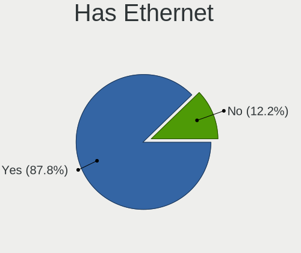
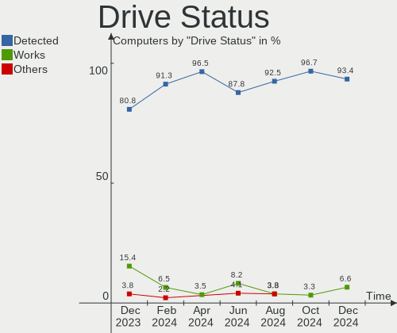
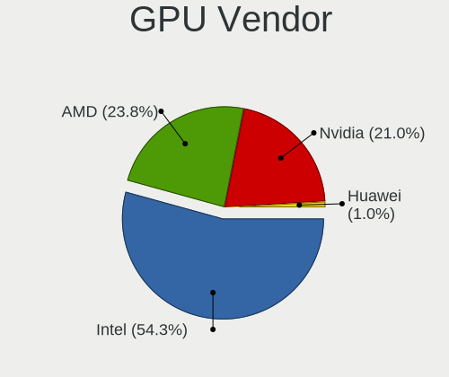

Elementary - Hardware Trends
----------------------------

A project to identify most popular hardware characteristics and track their change
over time based on data collected by Linux users at https://Linux-Hardware.org.

Anyone can contribute to this report by the [hw-probe](https://github.com/linuxhw/hw-probe) tool:

    sudo -E hw-probe -all -upload

This is a report for all computer types. See also reports for [desktops](/Dist/Elementary/Desktop/README.md) and [notebooks](/Dist/Elementary/Notebook/README.md).

This report is for one last month. Overall report since the beginning of time: [TestCoverage](https://github.com/linuxhw/TestCoverage)

Period: Oct, 2022.

Contents
--------

* [ System ](#system)
  - [ OS                       ](#os)
  - [ OS Family                ](#os-family)
  - [ Kernel                   ](#kernel)
  - [ Kernel Family            ](#kernel-family)
  - [ Kernel Major Ver.        ](#kernel-major-ver)
  - [ Arch                     ](#arch)
  - [ DE                       ](#de)
  - [ Display Server           ](#display-server)
  - [ Display Manager          ](#display-manager)
  - [ OS Lang                  ](#os-lang)
  - [ Boot Mode                ](#boot-mode)
  - [ Filesystem               ](#filesystem)
  - [ Part. scheme             ](#part-scheme)
  - [ Dual Boot with Linux/BSD ](#dual-boot-with-linuxbsd)
  - [ Dual Boot (Win)          ](#dual-boot-win)

* [ Board ](#board)
  - [ Vendor                   ](#vendor)
  - [ Model                    ](#model)
  - [ Model Family             ](#model-family)
  - [ MFG Year                 ](#mfg-year)
  - [ Form Factor              ](#form-factor)
  - [ Secure Boot              ](#secure-boot)
  - [ Coreboot                 ](#coreboot)
  - [ RAM Size                 ](#ram-size)
  - [ RAM Used                 ](#ram-used)
  - [ Total Drives             ](#total-drives)
  - [ Has CD-ROM               ](#has-cd-rom)
  - [ Has Ethernet             ](#has-ethernet)
  - [ Has WiFi                 ](#has-wifi)
  - [ Has Bluetooth            ](#has-bluetooth)

* [ Location ](#location)
  - [ Country                  ](#country)
  - [ City                     ](#city)

* [ Drives ](#drives)
  - [ Drive Vendor             ](#drive-vendor)
  - [ Drive Model              ](#drive-model)
  - [ HDD Vendor               ](#hdd-vendor)
  - [ SSD Vendor               ](#ssd-vendor)
  - [ Drive Kind               ](#drive-kind)
  - [ Drive Connector          ](#drive-connector)
  - [ Drive Size               ](#drive-size)
  - [ Space Total              ](#space-total)
  - [ Space Used               ](#space-used)
  - [ Malfunc. Drives          ](#malfunc-drives)
  - [ Malfunc. Drive Vendor    ](#malfunc-drive-vendor)
  - [ Malfunc. HDD Vendor      ](#malfunc-hdd-vendor)
  - [ Malfunc. Drive Kind      ](#malfunc-drive-kind)
  - [ Failed Drives            ](#failed-drives)
  - [ Failed Drive Vendor      ](#failed-drive-vendor)
  - [ Drive Status             ](#drive-status)

* [ Storage controller ](#storage-controller)
  - [ Storage Vendor           ](#storage-vendor)
  - [ Storage Model            ](#storage-model)
  - [ Storage Kind             ](#storage-kind)

* [ Processor ](#processor)
  - [ CPU Vendor               ](#cpu-vendor)
  - [ CPU Model                ](#cpu-model)
  - [ CPU Model Family         ](#cpu-model-family)
  - [ CPU Cores                ](#cpu-cores)
  - [ CPU Sockets              ](#cpu-sockets)
  - [ CPU Threads              ](#cpu-threads)
  - [ CPU Op-Modes             ](#cpu-op-modes)
  - [ CPU Microcode            ](#cpu-microcode)
  - [ CPU Microarch            ](#cpu-microarch)

* [ Graphics ](#graphics)
  - [ GPU Vendor               ](#gpu-vendor)
  - [ GPU Model                ](#gpu-model)
  - [ GPU Combo                ](#gpu-combo)
  - [ GPU Driver               ](#gpu-driver)
  - [ GPU Memory               ](#gpu-memory)

* [ Monitor ](#monitor)
  - [ Monitor Vendor           ](#monitor-vendor)
  - [ Monitor Model            ](#monitor-model)
  - [ Monitor Resolution       ](#monitor-resolution)
  - [ Monitor Diagonal         ](#monitor-diagonal)
  - [ Monitor Width            ](#monitor-width)
  - [ Aspect Ratio             ](#aspect-ratio)
  - [ Monitor Area             ](#monitor-area)
  - [ Pixel Density            ](#pixel-density)
  - [ Multiple Monitors        ](#multiple-monitors)

* [ Network ](#network)
  - [ Net Controller Vendor    ](#net-controller-vendor)
  - [ Net Controller Model     ](#net-controller-model)
  - [ Wireless Vendor          ](#wireless-vendor)
  - [ Wireless Model           ](#wireless-model)
  - [ Ethernet Vendor          ](#ethernet-vendor)
  - [ Ethernet Model           ](#ethernet-model)
  - [ Net Controller Kind      ](#net-controller-kind)
  - [ Used Controller          ](#used-controller)
  - [ NICs                     ](#nics)
  - [ IPv6                     ](#ipv6)

* [ Bluetooth ](#bluetooth)
  - [ Bluetooth Vendor         ](#bluetooth-vendor)
  - [ Bluetooth Model          ](#bluetooth-model)

* [ Sound ](#sound)
  - [ Sound Vendor             ](#sound-vendor)
  - [ Sound Model              ](#sound-model)

* [ Memory ](#memory)
  - [ Memory Vendor            ](#memory-vendor)
  - [ Memory Model             ](#memory-model)
  - [ Memory Kind              ](#memory-kind)
  - [ Memory Form Factor       ](#memory-form-factor)
  - [ Memory Size              ](#memory-size)
  - [ Memory Speed             ](#memory-speed)

* [ Printers & scanners ](#printers--scanners)
  - [ Printer Vendor           ](#printer-vendor)
  - [ Printer Model            ](#printer-model)
  - [ Scanner Vendor           ](#scanner-vendor)
  - [ Scanner Model            ](#scanner-model)

* [ Camera ](#camera)
  - [ Camera Vendor            ](#camera-vendor)
  - [ Camera Model             ](#camera-model)

* [ Security ](#security)
  - [ Fingerprint Vendor       ](#fingerprint-vendor)
  - [ Fingerprint Model        ](#fingerprint-model)
  - [ Chipcard Vendor          ](#chipcard-vendor)
  - [ Chipcard Model           ](#chipcard-model)

* [ Unsupported ](#unsupported)
  - [ Unsupported Devices      ](#unsupported-devices)
  - [ Unsupported Device Types ](#unsupported-device-types)

System
------

OS
--

Installed operating systems

| Name             | Computers | Percent |
|------------------|-----------|---------|
| Elementary 6.1   | 32        | 96.97%  |
| Elementary 5.1.7 | 1         | 3.03%   |

OS Family
---------

OS without a version

| Name       | Computers | Percent |
|------------|-----------|---------|
| Elementary | 33        | 100%    |

Kernel
------

Version of the Linux kernel

| Version                | Computers | Percent |
|------------------------|-----------|---------|
| 5.15.0-48-generic      | 11        | 33.33%  |
| 5.15.0-50-generic      | 10        | 30.3%   |
| 5.15.0-52-generic      | 4         | 12.12%  |
| 5.11.0-43-generic      | 3         | 9.09%   |
| 5.19.12-051912-generic | 1         | 3.03%   |
| 5.15.0-43-generic      | 1         | 3.03%   |
| 5.13.0-40-generic      | 1         | 3.03%   |
| 5.13.0-27-generic      | 1         | 3.03%   |
| 4.15.0-163-generic     | 1         | 3.03%   |

Kernel Family
-------------

Linux kernel without a distro release

| Version | Computers | Percent |
|---------|-----------|---------|
| 5.15.0  | 26        | 78.79%  |
| 5.11.0  | 3         | 9.09%   |
| 5.13.0  | 2         | 6.06%   |
| 5.19.12 | 1         | 3.03%   |
| 4.15.0  | 1         | 3.03%   |

Kernel Major Ver.
-----------------

Linux kernel major version

| Version | Computers | Percent |
|---------|-----------|---------|
| 5.15    | 26        | 78.79%  |
| 5.11    | 3         | 9.09%   |
| 5.13    | 2         | 6.06%   |
| 5.19    | 1         | 3.03%   |
| 4.15    | 1         | 3.03%   |

Arch
----

OS architecture (x86_64, i586, etc.)

| Name   | Computers | Percent |
|--------|-----------|---------|
| x86_64 | 33        | 100%    |

DE
--

Desktop Environment

| Name     | Computers | Percent |
|----------|-----------|---------|
| Pantheon | 33        | 100%    |

Display Server
--------------

X11 or Wayland

| Name | Computers | Percent |
|------|-----------|---------|
| X11  | 33        | 100%    |

Display Manager
---------------

SDDM, LightDM, etc.

| Name    | Computers | Percent |
|---------|-----------|---------|
| Unknown | 28        | 84.85%  |
| LightDM | 5         | 15.15%  |

OS Lang
-------

Language

| Lang  | Computers | Percent |
|-------|-----------|---------|
| en_US | 17        | 51.52%  |
| fr_FR | 3         | 9.09%   |
| en_GB | 3         | 9.09%   |
| de_DE | 3         | 9.09%   |
| ru_RU | 2         | 6.06%   |
| tr_TR | 1         | 3.03%   |
| pt_PT | 1         | 3.03%   |
| it_IT | 1         | 3.03%   |
| es_MX | 1         | 3.03%   |
| es_ES | 1         | 3.03%   |

Boot Mode
---------

EFI or BIOS

| Mode | Computers | Percent |
|------|-----------|---------|
| EFI  | 22        | 66.67%  |
| BIOS | 11        | 33.33%  |

Filesystem
----------

Type of filesystem

| Type  | Computers | Percent |
|-------|-----------|---------|
| Ext4  | 31        | 93.94%  |
| Xfs   | 1         | 3.03%   |
| Btrfs | 1         | 3.03%   |

Part. scheme
------------

Scheme of partitioning

| Type    | Computers | Percent |
|---------|-----------|---------|
| Unknown | 28        | 84.85%  |
| GPT     | 5         | 15.15%  |

Dual Boot with Linux/BSD
------------------------

Hosting more than one Linux/BSD

| Dual boot | Computers | Percent |
|-----------|-----------|---------|
| No        | 33        | 100%    |

Dual Boot (Win)
---------------

Hosting Linux and Windows

| Dual boot | Computers | Percent |
|-----------|-----------|---------|
| No        | 32        | 96.97%  |
| Yes       | 1         | 3.03%   |

Board
-----

Vendor
------

Motherboard manufacturer

| Name             | Computers | Percent |
|------------------|-----------|---------|
| Lenovo           | 11        | 33.33%  |
| ASUSTek Computer | 8         | 24.24%  |
| Hewlett-Packard  | 4         | 12.12%  |
| MSI              | 3         | 9.09%   |
| Toshiba          | 2         | 6.06%   |
| Dell             | 2         | 6.06%   |
| Kraftway         | 1         | 3.03%   |
| HUAWEI           | 1         | 3.03%   |
| Apple            | 1         | 3.03%   |

Model
-----

Motherboard model

| Name                                     | Computers | Percent |
|------------------------------------------|-----------|---------|
| Toshiba TECRA A11                        | 1         | 3.03%   |
| Toshiba Satellite C855-1WX               | 1         | 3.03%   |
| MSI MS-7B61                              | 1         | 3.03%   |
| MSI Modern 14 B10MW                      | 1         | 3.03%   |
| MSI GE70 2QE                             | 1         | 3.03%   |
| Lenovo Yoga 530-14ARR 81H9               | 1         | 3.03%   |
| Lenovo V130-15IKB 81HN                   | 1         | 3.03%   |
| Lenovo ThinkPad X1 Carbon 2nd 20A7008AMZ | 1         | 3.03%   |
| Lenovo ThinkPad T470 20JNS08H00          | 1         | 3.03%   |
| Lenovo ThinkPad T420 4236JY2             | 1         | 3.03%   |
| Lenovo ThinkPad E14 Gen 3 20YDCTO1WW     | 1         | 3.03%   |
| Lenovo ThinkPad E14 20RA004VPH           | 1         | 3.03%   |
| Lenovo Legion 5 15IMH05H 81Y6            | 1         | 3.03%   |
| Lenovo IdeaPad S340-15IIL 81VW           | 1         | 3.03%   |
| Lenovo IdeaPad 510-15IKB 80SV            | 1         | 3.03%   |
| Lenovo IdeaPad 3 15ITL05 81X8            | 1         | 3.03%   |
| Kraftway Credo KCxx                      | 1         | 3.03%   |
| HUAWEI NBLK-WAX9X                        | 1         | 3.03%   |
| HP ProDesk 600 G2 SFF                    | 1         | 3.03%   |
| HP Pavilion dv7                          | 1         | 3.03%   |
| HP Laptop 17-ca3xxx                      | 1         | 3.03%   |
| HP Laptop 15-bw0xx                       | 1         | 3.03%   |
| Dell OptiPlex 790                        | 1         | 3.03%   |
| Dell Inspiron 15-3567                    | 1         | 3.03%   |
| ASUS ZenBook S UX391UA                   | 1         | 3.03%   |
| ASUS VivoBook_ASUSLaptop X512DK_X512DK   | 1         | 3.03%   |
| ASUS Vivobook Slate T3300KA_T3300KA      | 1         | 3.03%   |
| ASUS UX31A                               | 1         | 3.03%   |
| ASUS TUF Z390-PLUS GAMING                | 1         | 3.03%   |
| ASUS TUF Gaming B550M-PLUS               | 1         | 3.03%   |
| ASUS ROG Zephyrus M16 GU603HE_GU603HE    | 1         | 3.03%   |
| ASUS PRIME X570-PRO                      | 1         | 3.03%   |
| Apple MacBookPro10,1                     | 1         | 3.03%   |

Model Family
------------

Motherboard model prefix

| Name               | Computers | Percent |
|--------------------|-----------|---------|
| Lenovo ThinkPad    | 5         | 15.15%  |
| Lenovo IdeaPad     | 3         | 9.09%   |
| HP Laptop          | 2         | 6.06%   |
| ASUS VivoBook      | 2         | 6.06%   |
| ASUS TUF           | 2         | 6.06%   |
| Toshiba TECRA      | 1         | 3.03%   |
| Toshiba Satellite  | 1         | 3.03%   |
| MSI MS-7B61        | 1         | 3.03%   |
| MSI Modern         | 1         | 3.03%   |
| MSI GE70           | 1         | 3.03%   |
| Lenovo Yoga        | 1         | 3.03%   |
| Lenovo V130-15IKB  | 1         | 3.03%   |
| Lenovo Legion      | 1         | 3.03%   |
| Kraftway Credo     | 1         | 3.03%   |
| HUAWEI NBLK-WAX9X  | 1         | 3.03%   |
| HP ProDesk         | 1         | 3.03%   |
| HP Pavilion        | 1         | 3.03%   |
| Dell OptiPlex      | 1         | 3.03%   |
| Dell Inspiron      | 1         | 3.03%   |
| ASUS ZenBook       | 1         | 3.03%   |
| ASUS UX31A         | 1         | 3.03%   |
| ASUS ROG           | 1         | 3.03%   |
| ASUS PRIME         | 1         | 3.03%   |
| Apple MacBookPro10 | 1         | 3.03%   |

MFG Year
--------

Motherboard manufacture year

| Year | Computers | Percent |
|------|-----------|---------|
| 2019 | 6         | 18.18%  |
| 2020 | 4         | 12.12%  |
| 2021 | 3         | 9.09%   |
| 2018 | 3         | 9.09%   |
| 2017 | 3         | 9.09%   |
| 2012 | 3         | 9.09%   |
| 2016 | 2         | 6.06%   |
| 2015 | 2         | 6.06%   |
| 2014 | 2         | 6.06%   |
| 2011 | 2         | 6.06%   |
| 2022 | 1         | 3.03%   |
| 2010 | 1         | 3.03%   |
| 2008 | 1         | 3.03%   |

Form Factor
-----------

Physical design of the computer

| Name        | Computers | Percent |
|-------------|-----------|---------|
| Notebook    | 24        | 72.73%  |
| Desktop     | 7         | 21.21%  |
| Tablet      | 1         | 3.03%   |
| Convertible | 1         | 3.03%   |

Secure Boot
-----------

Enabled or disabled

| State    | Computers | Percent |
|----------|-----------|---------|
| Disabled | 29        | 87.88%  |
| Enabled  | 4         | 12.12%  |

Coreboot
--------

Have coreboot on board

| Used | Computers | Percent |
|------|-----------|---------|
| No   | 33        | 100%    |

RAM Size
--------

Total RAM memory

| Size in GB  | Computers | Percent |
|-------------|-----------|---------|
| 4.01-8.0    | 16        | 48.48%  |
| 16.01-24.0  | 5         | 15.15%  |
| 32.01-64.0  | 4         | 12.12%  |
| 8.01-16.0   | 4         | 12.12%  |
| 3.01-4.0    | 3         | 9.09%   |
| 64.01-256.0 | 1         | 3.03%   |

RAM Used
--------

Used RAM memory

| Used GB   | Computers | Percent |
|-----------|-----------|---------|
| 2.01-3.0  | 13        | 39.39%  |
| 1.01-2.0  | 9         | 27.27%  |
| 4.01-8.0  | 6         | 18.18%  |
| 3.01-4.0  | 3         | 9.09%   |
| 8.01-16.0 | 1         | 3.03%   |
| 0.51-1.0  | 1         | 3.03%   |

Total Drives
------------

Number of drives on board

| Drives | Computers | Percent |
|--------|-----------|---------|
| 1      | 24        | 72.73%  |
| 2      | 6         | 18.18%  |
| 4      | 2         | 6.06%   |
| 3      | 1         | 3.03%   |

Has CD-ROM
----------

Has CD-ROM on board

| Presented | Computers | Percent |
|-----------|-----------|---------|
| No        | 24        | 72.73%  |
| Yes       | 9         | 27.27%  |

Has Ethernet
------------

Has Ethernet on board

| Presented | Computers | Percent |
|-----------|-----------|---------|
| Yes       | 25        | 75.76%  |
| No        | 8         | 24.24%  |

Has WiFi
--------

Has WiFi module

| Presented | Computers | Percent |
|-----------|-----------|---------|
| Yes       | 30        | 90.91%  |
| No        | 3         | 9.09%   |

Has Bluetooth
-------------

Has Bluetooth module

| Presented | Computers | Percent |
|-----------|-----------|---------|
| Yes       | 28        | 84.85%  |
| No        | 5         | 15.15%  |

Location
--------

Country
-------

Geographic location (country)

| Country                | Computers | Percent |
|------------------------|-----------|---------|
| USA                    | 6         | 18.18%  |
| Russia                 | 4         | 12.12%  |
| France                 | 3         | 9.09%   |
| UK                     | 2         | 6.06%   |
| Turkey                 | 2         | 6.06%   |
| India                  | 2         | 6.06%   |
| Germany                | 2         | 6.06%   |
| Thailand               | 1         | 3.03%   |
| Spain                  | 1         | 3.03%   |
| Slovenia               | 1         | 3.03%   |
| Portugal               | 1         | 3.03%   |
| Philippines            | 1         | 3.03%   |
| Nepal                  | 1         | 3.03%   |
| Mexico                 | 1         | 3.03%   |
| Italy                  | 1         | 3.03%   |
| Czechia                | 1         | 3.03%   |
| Canada                 | 1         | 3.03%   |
| Brazil                 | 1         | 3.03%   |
| Bosnia and Herzegovina | 1         | 3.03%   |

City
----

Geographic location (city)

| City             | Computers | Percent |
|------------------|-----------|---------|
| Paris            | 2         | 6.06%   |
| Istanbul         | 2         | 6.06%   |
| Visakhapatnam    | 1         | 3.03%   |
| Vipava           | 1         | 3.03%   |
| Toronto          | 1         | 3.03%   |
| Strasbourg       | 1         | 3.03%   |
| St Petersburg    | 1         | 3.03%   |
| Sao Paulo        | 1         | 3.03%   |
| Parkersburg      | 1         | 3.03%   |
| Novosibirsk      | 1         | 3.03%   |
| Northampton      | 1         | 3.03%   |
| Nazaré          | 1         | 3.03%   |
| Munich           | 1         | 3.03%   |
| Moscow           | 1         | 3.03%   |
| Monza            | 1         | 3.03%   |
| Mönchengladbach | 1         | 3.03%   |
| McAllen          | 1         | 3.03%   |
| Mahopac          | 1         | 3.03%   |
| Madrid           | 1         | 3.03%   |
| Kucharovice      | 1         | 3.03%   |
| Khimki           | 1         | 3.03%   |
| Kathmandu        | 1         | 3.03%   |
| Jonesborough     | 1         | 3.03%   |
| Gradacac         | 1         | 3.03%   |
| Chihuahua City   | 1         | 3.03%   |
| Chennai          | 1         | 3.03%   |
| Caloocan City    | 1         | 3.03%   |
| Bethnal Green    | 1         | 3.03%   |
| Bellevue         | 1         | 3.03%   |
| Bangkok          | 1         | 3.03%   |
| Ballwin          | 1         | 3.03%   |

Drives
------

Drive Vendor
------------

Hard drive vendors

| Vendor                       | Computers | Drives | Percent |
|------------------------------|-----------|--------|---------|
| Seagate                      | 7         | 7      | 15.22%  |
| SanDisk                      | 7         | 7      | 15.22%  |
| WDC                          | 5         | 6      | 10.87%  |
| Samsung Electronics          | 5         | 5      | 10.87%  |
| Toshiba                      | 3         | 3      | 6.52%   |
| PNY                          | 3         | 3      | 6.52%   |
| SK hynix                     | 2         | 2      | 4.35%   |
| Unknown                      | 1         | 1      | 2.17%   |
| Union Memory                 | 1         | 1      | 2.17%   |
| Shenzhen Longsys Electronics | 1         | 1      | 2.17%   |
| Realtek Semiconductor        | 1         | 1      | 2.17%   |
| Pioneer                      | 1         | 1      | 2.17%   |
| Phison Electronics           | 1         | 1      | 2.17%   |
| OCZ                          | 1         | 1      | 2.17%   |
| Micron/Crucial Technology    | 1         | 1      | 2.17%   |
| Kingston Technology Company  | 1         | 1      | 2.17%   |
| Intel                        | 1         | 2      | 2.17%   |
| HUSKY                        | 1         | 1      | 2.17%   |
| Crucial                      | 1         | 1      | 2.17%   |
| Apple                        | 1         | 1      | 2.17%   |
| Unknown                      | 1         | 1      | 2.17%   |

Drive Model
-----------

Hard drive models

| Model                                               | Computers | Percent |
|-----------------------------------------------------|-----------|---------|
| Sandisk WD Black SN750 / PC SN730 NVMe SSD 1TB      | 2         | 4.17%   |
| Samsung SSD 850 EVO 250GB                           | 2         | 4.17%   |
| WDC WDS240G2G0A-00JH30 240GB SSD                    | 1         | 2.08%   |
| WDC WDS100T1XHE-00AFY0 1TB                          | 1         | 2.08%   |
| WDC WDS100T1X0E-00AFY0 1TB                          | 1         | 2.08%   |
| WDC WD Elements 512GB                               | 1         | 2.08%   |
| WDC PC SN530 SDBPTPZ-256G-1002 256GB                | 1         | 2.08%   |
| WDC PC SN530 SDBPMPZ-256G-1001 256GB                | 1         | 2.08%   |
| Unknown MMC Card  1GB                               | 1         | 2.08%   |
| Union Memory UMIS RPJTJ256MEE1OWX 256GB             | 1         | 2.08%   |
| Toshiba NVMe Controller 512GB                       | 1         | 2.08%   |
| Toshiba KXG50ZNV512G 512GB                          | 1         | 2.08%   |
| Toshiba DT01ABA100V 1TB                             | 1         | 2.08%   |
| SK hynix SKHynix_HFS512GD9TNI-L2A0B 512GB           | 1         | 2.08%   |
| SK hynix HFS128G39TNF-N3A0A 128GB SSD               | 1         | 2.08%   |
| Shenzhen Longsys M2 Series NVMe SSD 250G            | 1         | 2.08%   |
| Seagate ST9320423AS 320GB                           | 1         | 2.08%   |
| Seagate ST9250320AS 250GB                           | 1         | 2.08%   |
| Seagate ST500DM009-2F110A 500GB                     | 1         | 2.08%   |
| Seagate ST3320813AS 320GB                           | 1         | 2.08%   |
| Seagate ST2000LM 007-1R8174 2TB                     | 1         | 2.08%   |
| Seagate ST1000LM014-1EJ164 1TB                      | 1         | 2.08%   |
| Seagate ST1000DM003-1ER162 1TB                      | 1         | 2.08%   |
| Sandisk WD Blue SN550 NVMe SSD 1TB                  | 1         | 2.08%   |
| SanDisk SDSSDHP256G 256GB                           | 1         | 2.08%   |
| SanDisk SD9SN8W-128G-1006 128GB SSD                 | 1         | 2.08%   |
| SanDisk SD5SE2256G1002E 256GB SSD                   | 1         | 2.08%   |
| Sandisk PC SN520 NVMe SSD 128GB                     | 1         | 2.08%   |
| Samsung NVMe SSD Controller SM981/PM981/PM983 500GB | 1         | 2.08%   |
| Samsung MZNTD512HAGL-000L1 512GB SSD                | 1         | 2.08%   |
| Samsung HM640JJ 640GB                               | 1         | 2.08%   |
| Realtek ADATA SX6000PNP 512GB                       | 1         | 2.08%   |
| PNY CS900 500GB SSD                                 | 1         | 2.08%   |
| PNY CS900 480GB SSD                                 | 1         | 2.08%   |
| PNY CS900 120GB SSD                                 | 1         | 2.08%   |
| Pioneer APS-SL3N-120 120GB                          | 1         | 2.08%   |
| Phison E12 NVMe Controller 2TB                      | 1         | 2.08%   |
| OCZ AGILITY3 240GB SSD                              | 1         | 2.08%   |
| Micron/Crucial P2 NVMe PCIe SSD 500GB               | 1         | 2.08%   |
| Kingston Company A2000 NVMe SSD 1TB                 | 1         | 2.08%   |

HDD Vendor
----------

Hard disk drive vendors

| Vendor              | Computers | Drives | Percent |
|---------------------|-----------|--------|---------|
| Seagate             | 7         | 7      | 77.78%  |
| Toshiba             | 1         | 1      | 11.11%  |
| Samsung Electronics | 1         | 1      | 11.11%  |

SSD Vendor
----------

Solid state drive vendors

| Vendor              | Computers | Drives | Percent |
|---------------------|-----------|--------|---------|
| SanDisk             | 3         | 3      | 18.75%  |
| Samsung Electronics | 3         | 3      | 18.75%  |
| PNY                 | 3         | 3      | 18.75%  |
| WDC                 | 1         | 1      | 6.25%   |
| SK hynix            | 1         | 1      | 6.25%   |
| Pioneer             | 1         | 1      | 6.25%   |
| OCZ                 | 1         | 1      | 6.25%   |
| HUSKY               | 1         | 1      | 6.25%   |
| Crucial             | 1         | 1      | 6.25%   |
| Apple               | 1         | 1      | 6.25%   |

Drive Kind
----------

HDD or SSD

| Kind    | Computers | Drives | Percent |
|---------|-----------|--------|---------|
| NVMe    | 16        | 20     | 38.1%   |
| SSD     | 14        | 16     | 33.33%  |
| HDD     | 9         | 9      | 21.43%  |
| MMC     | 2         | 2      | 4.76%   |
| Unknown | 1         | 1      | 2.38%   |

Drive Connector
---------------

SATA, SAS, NVMe, etc.

| Type | Computers | Drives | Percent |
|------|-----------|--------|---------|
| SATA | 20        | 24     | 51.28%  |
| NVMe | 16        | 20     | 41.03%  |
| MMC  | 2         | 2      | 5.13%   |
| SAS  | 1         | 2      | 2.56%   |

Drive Size
----------

Size of hard drive

| Size in TB | Computers | Drives | Percent |
|------------|-----------|--------|---------|
| 0.01-0.5   | 16        | 18     | 69.57%  |
| 0.51-1.0   | 6         | 6      | 26.09%  |
| 1.01-2.0   | 1         | 1      | 4.35%   |

Space Total
-----------

Amount of disk space available on the file system

| Size in GB | Computers | Percent |
|------------|-----------|---------|
| 101-250    | 14        | 42.42%  |
| 251-500    | 10        | 30.3%   |
| 501-1000   | 4         | 12.12%  |
| 1001-2000  | 2         | 6.06%   |
| 21-50      | 1         | 3.03%   |
| 2001-3000  | 1         | 3.03%   |
| 51-100     | 1         | 3.03%   |

Space Used
----------

Amount of used disk space

| Used GB   | Computers | Percent |
|-----------|-----------|---------|
| 21-50     | 12        | 36.36%  |
| 1-20      | 6         | 18.18%  |
| 51-100    | 6         | 18.18%  |
| 101-250   | 4         | 12.12%  |
| 251-500   | 3         | 9.09%   |
| 1001-2000 | 1         | 3.03%   |
| 501-1000  | 1         | 3.03%   |

Malfunc. Drives
---------------

Drive models with a malfunction

Zero info for selected period =(

Malfunc. Drive Vendor
---------------------

Vendors of faulty drives

Zero info for selected period =(

Malfunc. HDD Vendor
-------------------

Vendors of faulty HDD drives

Zero info for selected period =(

Malfunc. Drive Kind
-------------------

Kinds of faulty drives

Zero info for selected period =(

Failed Drives
-------------

Failed drive models

Zero info for selected period =(

Failed Drive Vendor
-------------------

Failed drive vendors

Zero info for selected period =(

Drive Status
------------

Number of failed and malfunc. drives

| Status   | Computers | Drives | Percent |
|----------|-----------|--------|---------|
| Detected | 30        | 41     | 88.24%  |
| Works    | 4         | 7      | 11.76%  |

Storage controller
------------------

Storage Vendor
--------------

Storage controller vendors

| Vendor                       | Computers | Percent |
|------------------------------|-----------|---------|
| Intel                        | 21        | 48.84%  |
| SanDisk                      | 7         | 16.28%  |
| AMD                          | 6         | 13.95%  |
| Toshiba America Info Systems | 2         | 4.65%   |
| Union Memory (Shenzhen)      | 1         | 2.33%   |
| SK hynix                     | 1         | 2.33%   |
| Samsung Electronics          | 1         | 2.33%   |
| Realtek Semiconductor        | 1         | 2.33%   |
| Phison Electronics           | 1         | 2.33%   |
| Micron/Crucial Technology    | 1         | 2.33%   |
| Kingston Technology Company  | 1         | 2.33%   |

Storage Model
-------------

Storage controller models

| Model                                                                            | Computers | Percent |
|----------------------------------------------------------------------------------|-----------|---------|
| Intel Sunrise Point-LP SATA Controller [AHCI mode]                               | 4         | 8.51%   |
| AMD FCH SATA Controller [AHCI mode]                                              | 4         | 8.51%   |
| Intel 7 Series Chipset Family 6-port SATA Controller [AHCI mode]                 | 3         | 6.38%   |
| SanDisk WD Black SN750 / PC SN730 NVMe SSD                                       | 2         | 4.26%   |
| SanDisk Non-Volatile memory controller                                           | 2         | 4.26%   |
| Intel Volume Management Device NVMe RAID Controller                              | 2         | 4.26%   |
| Intel 6 Series/C200 Series Chipset Family 6 port Desktop SATA AHCI Controller    | 2         | 4.26%   |
| Union Memory (Shenzhen) Non-Volatile memory controller                           | 1         | 2.13%   |
| Toshiba America Info Systems Toshiba America Info Non-Volatile memory controller | 1         | 2.13%   |
| Toshiba America Info Systems NVMe Controller                                     | 1         | 2.13%   |
| SK hynix Non-Volatile memory controller                                          | 1         | 2.13%   |
| SanDisk WD PC SN810 / Black SN850 NVMe SSD                                       | 1         | 2.13%   |
| SanDisk WD Blue SN550 NVMe SSD                                                   | 1         | 2.13%   |
| SanDisk PC SN520 NVMe SSD                                                        | 1         | 2.13%   |
| Samsung NVMe SSD Controller SM981/PM981/PM983                                    | 1         | 2.13%   |
| Realtek Realtek Non-Volatile memory controller                                   | 1         | 2.13%   |
| Phison E12 NVMe Controller                                                       | 1         | 2.13%   |
| Micron/Crucial P2 NVMe PCIe SSD                                                  | 1         | 2.13%   |
| Kingston Company A2000 NVMe SSD                                                  | 1         | 2.13%   |
| Intel Tiger Lake-LP SATA Controller                                              | 1         | 2.13%   |
| Intel SSD 660P Series                                                            | 1         | 2.13%   |
| Intel SATA Controller [RAID mode]                                                | 1         | 2.13%   |
| Intel Q170/Q150/B150/H170/H110/Z170/CM236 Chipset SATA Controller [AHCI Mode]    | 1         | 2.13%   |
| Intel Non-Volatile memory controller                                             | 1         | 2.13%   |
| Intel Comet Lake SATA AHCI Controller                                            | 1         | 2.13%   |
| Intel 82801 Mobile SATA Controller [RAID mode]                                   | 1         | 2.13%   |
| Intel 8 Series/C220 Series Chipset Family 6-port SATA Controller 1 [AHCI mode]   | 1         | 2.13%   |
| Intel 8 Series SATA Controller 1 [AHCI mode]                                     | 1         | 2.13%   |
| Intel 6 Series/C200 Series Chipset Family IDE-r Controller                       | 1         | 2.13%   |
| Intel 6 Series/C200 Series Chipset Family 6 port Mobile SATA AHCI Controller     | 1         | 2.13%   |
| Intel 5 Series/3400 Series Chipset 4 port SATA AHCI Controller                   | 1         | 2.13%   |
| Intel 400 Series Chipset Family SATA AHCI Controller                             | 1         | 2.13%   |
| Intel 200 Series PCH SATA controller [AHCI mode]                                 | 1         | 2.13%   |
| AMD SB7x0/SB8x0/SB9x0 SATA Controller [AHCI mode]                                | 1         | 2.13%   |
| AMD 500 Series Chipset SATA Controller                                           | 1         | 2.13%   |

Storage Kind
------------

Kind of storage controller (IDE, SATA, NVMe, SAS, ...)

| Kind | Computers | Percent |
|------|-----------|---------|
| SATA | 24        | 54.55%  |
| NVMe | 15        | 34.09%  |
| RAID | 4         | 9.09%   |
| IDE  | 1         | 2.27%   |

Processor
---------

CPU Vendor
----------

Processor vendors

| Vendor | Computers | Percent |
|--------|-----------|---------|
| Intel  | 24        | 72.73%  |
| AMD    | 9         | 27.27%  |

CPU Model
---------

Processor models

| Model                                         | Computers | Percent |
|-----------------------------------------------|-----------|---------|
| Intel Core i5-7200U CPU @ 2.50GHz             | 2         | 6.06%   |
| AMD Ryzen 5 3500U with Radeon Vega Mobile Gfx | 2         | 6.06%   |
| Intel Pentium Silver N6000 @ 1.10GHz          | 1         | 3.03%   |
| Intel Pentium CPU G850 @ 2.90GHz              | 1         | 3.03%   |
| Intel Core i9-9900K CPU @ 3.60GHz             | 1         | 3.03%   |
| Intel Core i7-9700 CPU @ 3.00GHz              | 1         | 3.03%   |
| Intel Core i7-8550U CPU @ 1.80GHz             | 1         | 3.03%   |
| Intel Core i7-7500U CPU @ 2.70GHz             | 1         | 3.03%   |
| Intel Core i7-4550U CPU @ 1.50GHz             | 1         | 3.03%   |
| Intel Core i7-3820QM CPU @ 2.70GHz            | 1         | 3.03%   |
| Intel Core i7-10750H CPU @ 2.60GHz            | 1         | 3.03%   |
| Intel Core i7-10510U CPU @ 1.80GHz            | 1         | 3.03%   |
| Intel Core i5-6300U CPU @ 2.40GHz             | 1         | 3.03%   |
| Intel Core i5-4210H CPU @ 2.90GHz             | 1         | 3.03%   |
| Intel Core i5-3317U CPU @ 1.70GHz             | 1         | 3.03%   |
| Intel Core i5-2520M CPU @ 2.50GHz             | 1         | 3.03%   |
| Intel Core i5-1035G4 CPU @ 1.10GHz            | 1         | 3.03%   |
| Intel Core i5 CPU M 460 @ 2.53GHz             | 1         | 3.03%   |
| Intel Core i3-6100 CPU @ 3.70GHz              | 1         | 3.03%   |
| Intel Core i3-2328M CPU @ 2.20GHz             | 1         | 3.03%   |
| Intel Core i3-2100 CPU @ 3.10GHz              | 1         | 3.03%   |
| Intel Core i3-10110U CPU @ 2.10GHz            | 1         | 3.03%   |
| Intel 11th Gen Core i7-11800H @ 2.30GHz       | 1         | 3.03%   |
| Intel 11th Gen Core i3-1115G4 @ 3.00GHz       | 1         | 3.03%   |
| AMD Ryzen 9 5950X 16-Core Processor           | 1         | 3.03%   |
| AMD Ryzen 7 3700X 8-Core Processor            | 1         | 3.03%   |
| AMD Ryzen 5 5500U with Radeon Graphics        | 1         | 3.03%   |
| AMD Ryzen 5 4500U with Radeon Graphics        | 1         | 3.03%   |
| AMD Ryzen 5 2500U with Radeon Vega Mobile Gfx | 1         | 3.03%   |
| AMD Phenom II N640 Dual-Core Processor        | 1         | 3.03%   |
| AMD A9-9420 RADEON R5, 5 COMPUTE CORES 2C+3G  | 1         | 3.03%   |

CPU Model Family
----------------

Processor model prefix

| Model                | Computers | Percent |
|----------------------|-----------|---------|
| Intel Core i5        | 8         | 24.24%  |
| Intel Core i7        | 7         | 21.21%  |
| AMD Ryzen 5          | 5         | 15.15%  |
| Intel Core i3        | 4         | 12.12%  |
| Other                | 3         | 9.09%   |
| Intel Pentium Silver | 1         | 3.03%   |
| Intel Pentium        | 1         | 3.03%   |
| Intel Core i9        | 1         | 3.03%   |
| AMD Ryzen 9          | 1         | 3.03%   |
| AMD Ryzen 7          | 1         | 3.03%   |
| AMD Phenom II        | 1         | 3.03%   |

CPU Cores
---------

Number of processor cores

| Number | Computers | Percent |
|--------|-----------|---------|
| 2      | 17        | 51.52%  |
| 4      | 8         | 24.24%  |
| 8      | 4         | 12.12%  |
| 6      | 3         | 9.09%   |
| 16     | 1         | 3.03%   |

CPU Sockets
-----------

Number of sockets

| Number | Computers | Percent |
|--------|-----------|---------|
| 1      | 33        | 100%    |

CPU Threads
-----------

Threads per core (Hyper-Threading)

| Number | Computers | Percent |
|--------|-----------|---------|
| 2      | 27        | 81.82%  |
| 1      | 6         | 18.18%  |

CPU Op-Modes
------------

CPU Operation Modes (32-bit, 64-bit)

| Op mode        | Computers | Percent |
|----------------|-----------|---------|
| 32-bit, 64-bit | 33        | 100%    |

CPU Microcode
-------------

Microcode number

| Number     | Computers | Percent |
|------------|-----------|---------|
| 0x206a7    | 4         | 12.12%  |
| 0x806e9    | 3         | 9.09%   |
| 0x906ed    | 2         | 6.06%   |
| 0x806ec    | 2         | 6.06%   |
| 0x306a9    | 2         | 6.06%   |
| Unknown    | 2         | 6.06%   |
| 0xa0652    | 1         | 3.03%   |
| 0x906c0    | 1         | 3.03%   |
| 0x806ea    | 1         | 3.03%   |
| 0x806c1    | 1         | 3.03%   |
| 0x706e5    | 1         | 3.03%   |
| 0x506e3    | 1         | 3.03%   |
| 0x40651    | 1         | 3.03%   |
| 0x306c3    | 1         | 3.03%   |
| 0x20655    | 1         | 3.03%   |
| 0x0a201016 | 1         | 3.03%   |
| 0x08701021 | 1         | 3.03%   |
| 0x08608103 | 1         | 3.03%   |
| 0x08600106 | 1         | 3.03%   |
| 0x08108109 | 1         | 3.03%   |
| 0x08108102 | 1         | 3.03%   |
| 0x0810100b | 1         | 3.03%   |
| 0x06006704 | 1         | 3.03%   |
| 0x010000c8 | 1         | 3.03%   |

CPU Microarch
-------------

Microarchitecture

| Name        | Computers | Percent |
|-------------|-----------|---------|
| KabyLake    | 8         | 24.24%  |
| SandyBridge | 4         | 12.12%  |
| Zen+        | 2         | 6.06%   |
| Zen 2       | 2         | 6.06%   |
| Skylake     | 2         | 6.06%   |
| IvyBridge   | 2         | 6.06%   |
| Haswell     | 2         | 6.06%   |
| Unknown     | 2         | 6.06%   |
| Zen 3       | 1         | 3.03%   |
| Zen         | 1         | 3.03%   |
| Westmere    | 1         | 3.03%   |
| Tremont     | 1         | 3.03%   |
| TigerLake   | 1         | 3.03%   |
| K10         | 1         | 3.03%   |
| IceLake     | 1         | 3.03%   |
| Excavator   | 1         | 3.03%   |
| CometLake   | 1         | 3.03%   |

Graphics
--------

GPU Vendor
----------

Vendors of graphics cards

| Vendor | Computers | Percent |
|--------|-----------|---------|
| Intel  | 21        | 52.5%   |
| AMD    | 11        | 27.5%   |
| Nvidia | 8         | 20%     |

GPU Model
---------

Graphics card models

| Model                                                                         | Computers | Percent |
|-------------------------------------------------------------------------------|-----------|---------|
| Intel HD Graphics 620                                                         | 3         | 6.98%   |
| Intel 2nd Generation Core Processor Family Integrated Graphics Controller     | 3         | 6.98%   |
| Intel CometLake-U GT2 [UHD Graphics]                                          | 2         | 4.65%   |
| Intel 3rd Gen Core processor Graphics Controller                              | 2         | 4.65%   |
| AMD Sun XT [Radeon HD 8670A/8670M/8690M / R5 M330 / M430 / Radeon 520 Mobile] | 2         | 4.65%   |
| AMD Picasso/Raven 2 [Radeon Vega Series / Radeon Vega Mobile Series]          | 2         | 4.65%   |
| AMD Lexa PRO [Radeon 540/540X/550/550X / RX 540X/550/550X]                    | 2         | 4.65%   |
| Nvidia TU106M [GeForce RTX 2060 Mobile]                                       | 1         | 2.33%   |
| Nvidia TU106 [GeForce RTX 2070]                                               | 1         | 2.33%   |
| Nvidia TU104 [GeForce RTX 2080 SUPER]                                         | 1         | 2.33%   |
| Nvidia GM108M [GeForce 940MX]                                                 | 1         | 2.33%   |
| Nvidia GM107M [GeForce GTX 960M]                                              | 1         | 2.33%   |
| Nvidia GK107M [GeForce GT 650M Mac Edition]                                   | 1         | 2.33%   |
| Nvidia GA107M [GeForce RTX 3050 Ti Mobile]                                    | 1         | 2.33%   |
| Nvidia GA102 [GeForce RTX 3080 Lite Hash Rate]                                | 1         | 2.33%   |
| Intel UHD Graphics 620                                                        | 1         | 2.33%   |
| Intel TigerLake-H GT1 [UHD Graphics]                                          | 1         | 2.33%   |
| Intel Tiger Lake UHD Graphics                                                 | 1         | 2.33%   |
| Intel Skylake GT2 [HD Graphics 520]                                           | 1         | 2.33%   |
| Intel JasperLake [UHD Graphics]                                               | 1         | 2.33%   |
| Intel Iris Plus Graphics G4 (Ice Lake)                                        | 1         | 2.33%   |
| Intel HD Graphics 530                                                         | 1         | 2.33%   |
| Intel Haswell-ULT Integrated Graphics Controller                              | 1         | 2.33%   |
| Intel Core Processor Integrated Graphics Controller                           | 1         | 2.33%   |
| Intel CoffeeLake-S GT2 [UHD Graphics 630]                                     | 1         | 2.33%   |
| Intel 4th Gen Core Processor Integrated Graphics Controller                   | 1         | 2.33%   |
| AMD Stoney [Radeon R2/R3/R4/R5 Graphics]                                      | 1         | 2.33%   |
| AMD RS880M [Mobility Radeon HD 4225/4250]                                     | 1         | 2.33%   |
| AMD Renoir                                                                    | 1         | 2.33%   |
| AMD Redwood XT [Radeon HD 5670/5690/5730]                                     | 1         | 2.33%   |
| AMD Raven Ridge [Radeon Vega Series / Radeon Vega Mobile Series]              | 1         | 2.33%   |
| AMD Park [Mobility Radeon HD 5430/5450/5470]                                  | 1         | 2.33%   |
| AMD Lucienne                                                                  | 1         | 2.33%   |
| AMD Lexa [Radeon 540X/550X/630 / RX 640 / E9171 MCM]                          | 1         | 2.33%   |

GPU Combo
---------

Combinations of graphics cards

| Name           | Computers | Percent |
|----------------|-----------|---------|
| 1 x Intel      | 14        | 42.42%  |
| 1 x AMD        | 6         | 18.18%  |
| Intel + Nvidia | 5         | 15.15%  |
| 2 x AMD        | 3         | 9.09%   |
| 1 x Nvidia     | 3         | 9.09%   |
| Intel + AMD    | 2         | 6.06%   |

GPU Driver
----------

Free vs proprietary

| Driver      | Computers | Percent |
|-------------|-----------|---------|
| Free        | 29        | 87.88%  |
| Proprietary | 4         | 12.12%  |

GPU Memory
----------

Total video memory

| Size in GB | Computers | Percent |
|------------|-----------|---------|
| Unknown    | 16        | 48.48%  |
| 1.01-2.0   | 7         | 21.21%  |
| 0.51-1.0   | 3         | 9.09%   |
| 0.01-0.5   | 3         | 9.09%   |
| 7.01-8.0   | 2         | 6.06%   |
| 5.01-6.0   | 1         | 3.03%   |
| 8.01-16.0  | 1         | 3.03%   |

Monitor
-------

Monitor Vendor
--------------

Monitor vendors

| Vendor              | Computers | Percent |
|---------------------|-----------|---------|
| BOE                 | 7         | 17.5%   |
| AU Optronics        | 7         | 17.5%   |
| Dell                | 5         | 12.5%   |
| Chimei Innolux      | 5         | 12.5%   |
| LG Display          | 4         | 10%     |
| Samsung Electronics | 3         | 7.5%    |
| ViewSonic           | 2         | 5%      |
| Goldstar            | 2         | 5%      |
| Vizio               | 1         | 2.5%    |
| TopView             | 1         | 2.5%    |
| BenQ                | 1         | 2.5%    |
| ASUSTek Computer    | 1         | 2.5%    |
| Apple               | 1         | 2.5%    |

Monitor Model
-------------

Monitor models

| Model                                                                 | Computers | Percent |
|-----------------------------------------------------------------------|-----------|---------|
| Vizio E280i-B1 VIZ1002 1360x768 607x345mm 27.5-inch                   | 1         | 2.38%   |
| ViewSonic VP2768 Series VSC2034 2560x1440 597x336mm 27.0-inch         | 1         | 2.38%   |
| ViewSonic VA2406-FHD VSC3B66 1920x1080 527x296mm 23.8-inch            | 1         | 2.38%   |
| TopView HD TV TOPC37E 1920x1080 700x390mm 31.5-inch                   | 1         | 2.38%   |
| Samsung Electronics SyncMaster SAM0580 1280x1024 376x301mm 19.0-inch  | 1         | 2.38%   |
| Samsung Electronics SyncMaster SAM0380 1680x1050 459x296mm 21.5-inch  | 1         | 2.38%   |
| Samsung Electronics LCD Monitor SDC4169 1920x1080 294x165mm 13.3-inch | 1         | 2.38%   |
| LG Display LCD Monitor LGD0525 1366x768 344x194mm 15.5-inch           | 1         | 2.38%   |
| LG Display LCD Monitor LGD0521 1920x1080 309x174mm 14.0-inch          | 1         | 2.38%   |
| LG Display LCD Monitor LGD0418 2560x1440 310x174mm 14.0-inch          | 1         | 2.38%   |
| LG Display LCD Monitor LGD033A 1366x768 344x194mm 15.5-inch           | 1         | 2.38%   |
| Goldstar ULTRAWIDE GSM59F1 2560x1080 798x334mm 34.1-inch              | 1         | 2.38%   |
| Goldstar 22EN33 GSM597C 1920x1080 480x270mm 21.7-inch                 | 1         | 2.38%   |
| Dell S2415H DELA0B5 1920x1080 527x296mm 23.8-inch                     | 1         | 2.38%   |
| Dell P2419H DELD0D9 1920x1080 527x296mm 23.8-inch                     | 1         | 2.38%   |
| Dell P2319H DELD0D7 1920x1080 509x286mm 23.0-inch                     | 1         | 2.38%   |
| Dell P2319H DELD0D6 1920x1080 510x290mm 23.1-inch                     | 1         | 2.38%   |
| Dell P2214H DELA098 1920x1080 477x268mm 21.5-inch                     | 1         | 2.38%   |
| Dell E1909W DELF00D 1440x900 408x255mm 18.9-inch                      | 1         | 2.38%   |
| Dell D2020H DELF11F 1600x900 432x243mm 19.5-inch                      | 1         | 2.38%   |
| Chimei Innolux LCD Monitor CMN175E 1920x1080 381x214mm 17.2-inch      | 1         | 2.38%   |
| Chimei Innolux LCD Monitor CMN1735 1920x1080 382x215mm 17.3-inch      | 1         | 2.38%   |
| Chimei Innolux LCD Monitor CMN15F4 1920x1080 344x193mm 15.5-inch      | 1         | 2.38%   |
| Chimei Innolux LCD Monitor CMN14D4 1920x1080 309x173mm 13.9-inch      | 1         | 2.38%   |
| Chimei Innolux LCD Monitor CMN1348 1920x1080 293x165mm 13.2-inch      | 1         | 2.38%   |
| BOE LCD Monitor BOE0A0B 2560x1600 344x215mm 16.0-inch                 | 1         | 2.38%   |
| BOE LCD Monitor BOE08DF 1920x1080 344x194mm 15.5-inch                 | 1         | 2.38%   |
| BOE LCD Monitor BOE08D7 1920x1080 309x174mm 14.0-inch                 | 1         | 2.38%   |
| BOE LCD Monitor BOE0877 1920x1080 309x173mm 13.9-inch                 | 1         | 2.38%   |
| BOE LCD Monitor BOE0816 1366x768 344x193mm 15.5-inch                  | 1         | 2.38%   |
| BOE LCD Monitor BOE07C9 1920x1080 309x173mm 13.9-inch                 | 1         | 2.38%   |
| BOE LCD Monitor BOE07A3 1920x1080 344x193mm 15.5-inch                 | 1         | 2.38%   |
| BenQ GW2270 BNQ78DB 1920x1080 480x270mm 21.7-inch                     | 1         | 2.38%   |
| AU Optronics LCD Monitor AUO81EC 1366x768 344x193mm 15.5-inch         | 1         | 2.38%   |
| AU Optronics LCD Monitor AUO71EC 1366x768 344x193mm 15.5-inch         | 1         | 2.38%   |
| AU Optronics LCD Monitor AUO492D 1920x1080 293x165mm 13.2-inch        | 1         | 2.38%   |
| AU Optronics LCD Monitor AUO403D 1920x1080 309x173mm 13.9-inch        | 1         | 2.38%   |
| AU Optronics LCD Monitor AUO313C 1366x768 309x173mm 13.9-inch         | 1         | 2.38%   |
| AU Optronics LCD Monitor AUO21ED 1920x1080 344x193mm 15.5-inch        | 1         | 2.38%   |
| AU Optronics LCD Monitor AUO139E 1600x900 382x214mm 17.2-inch         | 1         | 2.38%   |

Monitor Resolution
------------------

Monitor screen resolution

| Resolution         | Computers | Percent |
|--------------------|-----------|---------|
| 1920x1080 (FHD)    | 20        | 54.05%  |
| 1366x768 (WXGA)    | 7         | 18.92%  |
| 2560x1440 (QHD)    | 2         | 5.41%   |
| 1600x900 (HD+)     | 2         | 5.41%   |
| 2880x1800          | 1         | 2.7%    |
| 2560x1600          | 1         | 2.7%    |
| 2560x1080          | 1         | 2.7%    |
| 1680x1050 (WSXGA+) | 1         | 2.7%    |
| 1440x900 (WXGA+)   | 1         | 2.7%    |
| 1280x1024 (SXGA)   | 1         | 2.7%    |

Monitor Diagonal
----------------

Diagonal size in inches

| Inches | Computers | Percent |
|--------|-----------|---------|
| 15     | 11        | 27.5%   |
| 13     | 7         | 17.5%   |
| 14     | 4         | 10%     |
| 21     | 3         | 7.5%    |
| 19     | 3         | 7.5%    |
| 17     | 3         | 7.5%    |
| 24     | 2         | 5%      |
| 23     | 2         | 5%      |
| 38     | 1         | 2.5%    |
| 34     | 1         | 2.5%    |
| 31     | 1         | 2.5%    |
| 27     | 1         | 2.5%    |
| 16     | 1         | 2.5%    |

Monitor Width
-------------

Physical width

| Width in mm | Computers | Percent |
|-------------|-----------|---------|
| 301-350     | 20        | 50%     |
| 501-600     | 5         | 12.5%   |
| 401-500     | 5         | 12.5%   |
| 351-400     | 4         | 10%     |
| 201-300     | 3         | 7.5%    |
| 801-900     | 1         | 2.5%    |
| 701-800     | 1         | 2.5%    |
| 601-700     | 1         | 2.5%    |

Aspect Ratio
------------

Proportional relationship between the width and the height

| Ratio | Computers | Percent |
|-------|-----------|---------|
| 16/9  | 28        | 82.35%  |
| 16/10 | 4         | 11.76%  |
| 5/4   | 1         | 2.94%   |
| 21/9  | 1         | 2.94%   |

Monitor Area
------------

Area in inch²

| Area in inch² | Computers | Percent |
|----------------|-----------|---------|
| 101-110        | 11        | 28.21%  |
| 81-90          | 8         | 20.51%  |
| 201-250        | 6         | 15.38%  |
| 71-80          | 3         | 7.69%   |
| 151-200        | 3         | 7.69%   |
| 121-130        | 3         | 7.69%   |
| 351-500        | 2         | 5.13%   |
| 301-350        | 1         | 2.56%   |
| 111-120        | 1         | 2.56%   |
| 501-1000       | 1         | 2.56%   |

Pixel Density
-------------

Pixels per inch

| Density | Computers | Percent |
|---------|-----------|---------|
| 121-160 | 13        | 33.33%  |
| 101-120 | 10        | 25.64%  |
| 51-100  | 9         | 23.08%  |
| 161-240 | 6         | 15.38%  |
| 1-50    | 1         | 2.56%   |

Multiple Monitors
-----------------

Total monitors connected

| Total | Computers | Percent |
|-------|-----------|---------|
| 1     | 25        | 75.76%  |
| 2     | 7         | 21.21%  |
| 3     | 1         | 3.03%   |

Network
-------

Net Controller Vendor
---------------------

Controller vendors

| Vendor                | Computers | Percent |
|-----------------------|-----------|---------|
| Intel                 | 21        | 42%     |
| Realtek Semiconductor | 17        | 34%     |
| Qualcomm Atheros      | 3         | 6%      |
| MediaTek              | 2         | 4%      |
| Broadcom              | 2         | 4%      |
| ZyXEL Communications  | 1         | 2%      |
| Sierra Wireless       | 1         | 2%      |
| Samsung Electronics   | 1         | 2%      |
| D-Link                | 1         | 2%      |
| Broadcom Limited      | 1         | 2%      |

Net Controller Model
--------------------

Controller models

| Model                                                             | Computers | Percent |
|-------------------------------------------------------------------|-----------|---------|
| Realtek RTL8111/8168/8411 PCI Express Gigabit Ethernet Controller | 9         | 14.75%  |
| Intel 82579LM Gigabit Network Connection (Lewisville)             | 3         | 4.92%   |
| Realtek RTL8153 Gigabit Ethernet Adapter                          | 2         | 3.28%   |
| Realtek RTL810xE PCI Express Fast Ethernet controller             | 2         | 3.28%   |
| MediaTek MT7921 802.11ax PCI Express Wireless Network Adapter     | 2         | 3.28%   |
| Intel Wireless 8265 / 8275                                        | 2         | 3.28%   |
| Intel Comet Lake PCH-LP CNVi WiFi                                 | 2         | 3.28%   |
| ZyXEL NWD2205 802.11n Wireless N Adapter [Realtek RTL8192CU]      | 1         | 1.64%   |
| Sierra Wireless EM7345 4G LTE                                     | 1         | 1.64%   |
| Samsung GT-I9070 (network tethering, USB debugging enabled)       | 1         | 1.64%   |
| Realtek RTL88x2bu [AC1200 Techkey]                                | 1         | 1.64%   |
| Realtek RTL8822CE 802.11ac PCIe Wireless Network Adapter          | 1         | 1.64%   |
| Realtek RTL8822BE 802.11a/b/g/n/ac WiFi adapter                   | 1         | 1.64%   |
| Realtek RTL8821CE 802.11ac PCIe Wireless Network Adapter          | 1         | 1.64%   |
| Realtek RTL8821AE 802.11ac PCIe Wireless Network Adapter          | 1         | 1.64%   |
| Realtek RTL8723DE Wireless Network Adapter                        | 1         | 1.64%   |
| Realtek RTL8723AE PCIe Wireless Network Adapter                   | 1         | 1.64%   |
| Realtek RTL8125 2.5GbE Controller                                 | 1         | 1.64%   |
| Realtek Realtek Ethernet controller                               | 1         | 1.64%   |
| Qualcomm Atheros QCA9377 802.11ac Wireless Network Adapter        | 1         | 1.64%   |
| Qualcomm Atheros Killer E220x Gigabit Ethernet Controller         | 1         | 1.64%   |
| Qualcomm Atheros AR928X Wireless Network Adapter (PCI-Express)    | 1         | 1.64%   |
| Intel Wireless 8260                                               | 1         | 1.64%   |
| Intel Wireless 7260                                               | 1         | 1.64%   |
| Intel Wireless 3160                                               | 1         | 1.64%   |
| Intel Wi-Fi 6 AX201 160MHz                                        | 1         | 1.64%   |
| Intel Wi-Fi 6 AX201                                               | 1         | 1.64%   |
| Intel Wi-Fi 6 AX200                                               | 1         | 1.64%   |
| Intel Ice Lake-LP PCH CNVi WiFi                                   | 1         | 1.64%   |
| Intel I211 Gigabit Network Connection                             | 1         | 1.64%   |
| Intel Ethernet Connection I219-LM                                 | 1         | 1.64%   |
| Intel Ethernet Connection I218-V                                  | 1         | 1.64%   |
| Intel Ethernet Connection (7) I219-V                              | 1         | 1.64%   |
| Intel Ethernet Connection (2) I219-V                              | 1         | 1.64%   |
| Intel Ethernet Connection (2) I219-LM                             | 1         | 1.64%   |
| Intel Dual Band Wireless-AC 3165 Plus Bluetooth                   | 1         | 1.64%   |
| Intel Comet Lake PCH CNVi WiFi                                    | 1         | 1.64%   |
| Intel Centrino Advanced-N 6235                                    | 1         | 1.64%   |
| Intel Centrino Advanced-N 6205 [Taylor Peak]                      | 1         | 1.64%   |
| Intel Cannon Lake PCH CNVi WiFi                                   | 1         | 1.64%   |

Wireless Vendor
---------------

Wireless vendors

| Vendor                | Computers | Percent |
|-----------------------|-----------|---------|
| Intel                 | 16        | 50%     |
| Realtek Semiconductor | 7         | 21.88%  |
| Qualcomm Atheros      | 2         | 6.25%   |
| MediaTek              | 2         | 6.25%   |
| ZyXEL Communications  | 1         | 3.13%   |
| Sierra Wireless       | 1         | 3.13%   |
| D-Link                | 1         | 3.13%   |
| Broadcom Limited      | 1         | 3.13%   |
| Broadcom              | 1         | 3.13%   |

Wireless Model
--------------

Wireless models

| Model                                                                | Computers | Percent |
|----------------------------------------------------------------------|-----------|---------|
| MediaTek MT7921 802.11ax PCI Express Wireless Network Adapter        | 2         | 6.25%   |
| Intel Wireless 8265 / 8275                                           | 2         | 6.25%   |
| Intel Comet Lake PCH-LP CNVi WiFi                                    | 2         | 6.25%   |
| ZyXEL NWD2205 802.11n Wireless N Adapter [Realtek RTL8192CU]         | 1         | 3.13%   |
| Sierra Wireless EM7345 4G LTE                                        | 1         | 3.13%   |
| Realtek RTL88x2bu [AC1200 Techkey]                                   | 1         | 3.13%   |
| Realtek RTL8822CE 802.11ac PCIe Wireless Network Adapter             | 1         | 3.13%   |
| Realtek RTL8822BE 802.11a/b/g/n/ac WiFi adapter                      | 1         | 3.13%   |
| Realtek RTL8821CE 802.11ac PCIe Wireless Network Adapter             | 1         | 3.13%   |
| Realtek RTL8821AE 802.11ac PCIe Wireless Network Adapter             | 1         | 3.13%   |
| Realtek RTL8723DE Wireless Network Adapter                           | 1         | 3.13%   |
| Realtek RTL8723AE PCIe Wireless Network Adapter                      | 1         | 3.13%   |
| Qualcomm Atheros QCA9377 802.11ac Wireless Network Adapter           | 1         | 3.13%   |
| Qualcomm Atheros AR928X Wireless Network Adapter (PCI-Express)       | 1         | 3.13%   |
| Intel Wireless 8260                                                  | 1         | 3.13%   |
| Intel Wireless 7260                                                  | 1         | 3.13%   |
| Intel Wireless 3160                                                  | 1         | 3.13%   |
| Intel Wi-Fi 6 AX201 160MHz                                           | 1         | 3.13%   |
| Intel Wi-Fi 6 AX201                                                  | 1         | 3.13%   |
| Intel Wi-Fi 6 AX200                                                  | 1         | 3.13%   |
| Intel Ice Lake-LP PCH CNVi WiFi                                      | 1         | 3.13%   |
| Intel Dual Band Wireless-AC 3165 Plus Bluetooth                      | 1         | 3.13%   |
| Intel Comet Lake PCH CNVi WiFi                                       | 1         | 3.13%   |
| Intel Centrino Advanced-N 6235                                       | 1         | 3.13%   |
| Intel Centrino Advanced-N 6205 [Taylor Peak]                         | 1         | 3.13%   |
| Intel Cannon Lake PCH CNVi WiFi                                      | 1         | 3.13%   |
| D-Link DWA-131 Wireless N Nano Adapter (Rev. E1) [Realtek RTL8192EU] | 1         | 3.13%   |
| Broadcom Limited BCM4331 802.11a/b/g/n                               | 1         | 3.13%   |
| Broadcom BCM4313 802.11bgn Wireless Network Adapter                  | 1         | 3.13%   |

Ethernet Vendor
---------------

Ethernet vendors

| Vendor                | Computers | Percent |
|-----------------------|-----------|---------|
| Realtek Semiconductor | 14        | 51.85%  |
| Intel                 | 10        | 37.04%  |
| Samsung Electronics   | 1         | 3.7%    |
| Qualcomm Atheros      | 1         | 3.7%    |
| Broadcom              | 1         | 3.7%    |

Ethernet Model
--------------

Ethernet models

| Model                                                             | Computers | Percent |
|-------------------------------------------------------------------|-----------|---------|
| Realtek RTL8111/8168/8411 PCI Express Gigabit Ethernet Controller | 9         | 31.03%  |
| Intel 82579LM Gigabit Network Connection (Lewisville)             | 3         | 10.34%  |
| Realtek RTL8153 Gigabit Ethernet Adapter                          | 2         | 6.9%    |
| Realtek RTL810xE PCI Express Fast Ethernet controller             | 2         | 6.9%    |
| Samsung GT-I9070 (network tethering, USB debugging enabled)       | 1         | 3.45%   |
| Realtek RTL8125 2.5GbE Controller                                 | 1         | 3.45%   |
| Realtek Realtek Ethernet controller                               | 1         | 3.45%   |
| Qualcomm Atheros Killer E220x Gigabit Ethernet Controller         | 1         | 3.45%   |
| Intel I211 Gigabit Network Connection                             | 1         | 3.45%   |
| Intel Ethernet Connection I219-LM                                 | 1         | 3.45%   |
| Intel Ethernet Connection I218-V                                  | 1         | 3.45%   |
| Intel Ethernet Connection (7) I219-V                              | 1         | 3.45%   |
| Intel Ethernet Connection (2) I219-V                              | 1         | 3.45%   |
| Intel Ethernet Connection (2) I219-LM                             | 1         | 3.45%   |
| Intel 82577LC Gigabit Network Connection                          | 1         | 3.45%   |
| Intel 82574L Gigabit Network Connection                           | 1         | 3.45%   |
| Broadcom NetXtreme BCM57786 Gigabit Ethernet PCIe                 | 1         | 3.45%   |

Net Controller Kind
-------------------

Ethernet, WiFi or modem

| Kind     | Computers | Percent |
|----------|-----------|---------|
| WiFi     | 30        | 54.55%  |
| Ethernet | 25        | 45.45%  |

Used Controller
---------------

Currently used network controller

| Kind     | Computers | Percent |
|----------|-----------|---------|
| WiFi     | 24        | 70.59%  |
| Ethernet | 10        | 29.41%  |

NICs
----

Total network controllers on board

| Total | Computers | Percent |
|-------|-----------|---------|
| 2     | 21        | 63.64%  |
| 1     | 12        | 36.36%  |

IPv6
----

IPv6 vs IPv4

| Used | Computers | Percent |
|------|-----------|---------|
| No   | 27        | 81.82%  |
| Yes  | 6         | 18.18%  |

Bluetooth
---------

Bluetooth Vendor
----------------

Controller vendors

| Vendor                          | Computers | Percent |
|---------------------------------|-----------|---------|
| Intel                           | 14        | 50%     |
| Realtek Semiconductor           | 4         | 14.29%  |
| Toshiba                         | 2         | 7.14%   |
| Broadcom                        | 2         | 7.14%   |
| Realtek                         | 1         | 3.57%   |
| Qualcomm Atheros Communications | 1         | 3.57%   |
| IMC Networks                    | 1         | 3.57%   |
| Foxconn / Hon Hai               | 1         | 3.57%   |
| Cambridge Silicon Radio         | 1         | 3.57%   |
| Apple                           | 1         | 3.57%   |

Bluetooth Model
---------------

Controller models

| Model                                               | Computers | Percent |
|-----------------------------------------------------|-----------|---------|
| Intel Bluetooth wireless interface                  | 5         | 17.86%  |
| Intel Bluetooth 9460/9560 Jefferson Peak (JfP)      | 4         | 14.29%  |
| Intel AX201 Bluetooth                               | 3         | 10.71%  |
| Toshiba RT Bluetooth Radio                          | 1         | 3.57%   |
| Toshiba Integrated Bluetooth HCI                    | 1         | 3.57%   |
| Realtek RTL8822BE Bluetooth 4.2 Adapter             | 1         | 3.57%   |
| Realtek RTL8821A Bluetooth                          | 1         | 3.57%   |
| Realtek  Bluetooth 4.2 Adapter                      | 1         | 3.57%   |
| Realtek Bluetooth Radio                             | 1         | 3.57%   |
| Realtek Bluetooth Radio                             | 1         | 3.57%   |
| Qualcomm Atheros  Bluetooth Device                  | 1         | 3.57%   |
| Intel Centrino Bluetooth Wireless Transceiver       | 1         | 3.57%   |
| Intel AX200 Bluetooth                               | 1         | 3.57%   |
| IMC Networks Wireless_Device                        | 1         | 3.57%   |
| Foxconn / Hon Hai Wireless_Device                   | 1         | 3.57%   |
| Cambridge Silicon Radio Bluetooth Dongle (HCI mode) | 1         | 3.57%   |
| Broadcom BCM2070 Bluetooth 2.1 + EDR                | 1         | 3.57%   |
| Broadcom BCM2045B (BDC-2.1)                         | 1         | 3.57%   |
| Apple Bluetooth Host Controller                     | 1         | 3.57%   |

Sound
-----

Sound Vendor
------------

Sound card vendors

| Vendor              | Computers | Percent |
|---------------------|-----------|---------|
| Intel               | 24        | 54.55%  |
| AMD                 | 10        | 22.73%  |
| Nvidia              | 6         | 13.64%  |
| Tenx Technology     | 1         | 2.27%   |
| Sony                | 1         | 2.27%   |
| Huawei Technologies | 1         | 2.27%   |
| Goldvish            | 1         | 2.27%   |

Sound Model
-----------

Sound card models

| Model                                                                      | Computers | Percent |
|----------------------------------------------------------------------------|-----------|---------|
| Intel Sunrise Point-LP HD Audio                                            | 5         | 9.26%   |
| AMD Family 17h/19h HD Audio Controller                                     | 5         | 9.26%   |
| Intel 7 Series/C216 Chipset Family High Definition Audio Controller        | 3         | 5.56%   |
| Intel 6 Series/C200 Series Chipset Family High Definition Audio Controller | 3         | 5.56%   |
| AMD Raven/Raven2/Fenghuang HDMI/DP Audio Controller                        | 3         | 5.56%   |
| Nvidia TU106 High Definition Audio Controller                              | 2         | 3.7%    |
| Intel Comet Lake PCH-LP cAVS                                               | 2         | 3.7%    |
| AMD Starship/Matisse HD Audio Controller                                   | 2         | 3.7%    |
| AMD Renoir Radeon High Definition Audio Controller                         | 2         | 3.7%    |
| Tenx Technology USB AUDIO                                                  | 1         | 1.85%   |
| Sony Wireless Headset                                                      | 1         | 1.85%   |
| Nvidia TU104 HD Audio Controller                                           | 1         | 1.85%   |
| Nvidia GK107 HDMI Audio Controller                                         | 1         | 1.85%   |
| Nvidia GA102 High Definition Audio Controller                              | 1         | 1.85%   |
| Nvidia Audio device                                                        | 1         | 1.85%   |
| Intel Xeon E3-1200 v3/4th Gen Core Processor HD Audio Controller           | 1         | 1.85%   |
| Intel Tiger Lake-LP Smart Sound Technology Audio Controller                | 1         | 1.85%   |
| Intel Tiger Lake-H HD Audio Controller                                     | 1         | 1.85%   |
| Intel Jasper Lake HD Audio                                                 | 1         | 1.85%   |
| Intel Ice Lake-LP Smart Sound Technology Audio Controller                  | 1         | 1.85%   |
| Intel Haswell-ULT HD Audio Controller                                      | 1         | 1.85%   |
| Intel Comet Lake PCH cAVS                                                  | 1         | 1.85%   |
| Intel Cannon Lake PCH cAVS                                                 | 1         | 1.85%   |
| Intel 8 Series/C220 Series Chipset High Definition Audio Controller        | 1         | 1.85%   |
| Intel 8 Series HD Audio Controller                                         | 1         | 1.85%   |
| Intel 5 Series/3400 Series Chipset High Definition Audio                   | 1         | 1.85%   |
| Intel 200 Series PCH HD Audio                                              | 1         | 1.85%   |
| Intel 100 Series/C230 Series Chipset Family HD Audio Controller            | 1         | 1.85%   |
| Huawei Technologies CM-Q3                                                  | 1         | 1.85%   |
| Goldvish USB PnP Audio Device                                              | 1         | 1.85%   |
| AMD SBx00 Azalia (Intel HDA)                                               | 1         | 1.85%   |
| AMD Redwood HDMI Audio [Radeon HD 5000 Series]                             | 1         | 1.85%   |
| AMD High Definition Audio Controller                                       | 1         | 1.85%   |
| AMD Family 15h (Models 60h-6fh) Audio Controller                           | 1         | 1.85%   |
| AMD Cedar HDMI Audio [Radeon HD 5400/6300/7300 Series]                     | 1         | 1.85%   |
| AMD Baffin HDMI/DP Audio [Radeon RX 550 640SP / RX 560/560X]               | 1         | 1.85%   |

Memory
------

Memory Vendor
-------------

Memory module vendors

| Vendor              | Computers | Percent |
|---------------------|-----------|---------|
| SK hynix            | 2         | 33.33%  |
| Samsung Electronics | 1         | 16.67%  |
| Kingston            | 1         | 16.67%  |
| Elpida              | 1         | 16.67%  |
| Crucial             | 1         | 16.67%  |

Memory Model
------------

Memory module models

| Model                                                      | Computers | Percent |
|------------------------------------------------------------|-----------|---------|
| SK hynix RAM Module 8192MB SODIMM DDR3 1600MT/s            | 1         | 16.67%  |
| SK hynix RAM HMAA1GS6CJR6N-XN 8192MB SODIMM DDR4 3200MT/s  | 1         | 16.67%  |
| Samsung RAM U6E3S4AA-MGCR 4GB Row Of Chips LPDDR4 4267MT/s | 1         | 16.67%  |
| Kingston RAM KF3600C18D4/32GX 32GB DIMM DDR4 3600MT/s      | 1         | 16.67%  |
| Elpida RAM Module 4GB SODIMM DDR3 1600MT/s                 | 1         | 16.67%  |
| Crucial RAM CT8G4SFRA32A.C8FP 8192MB SODIMM DDR4 3200MT/s  | 1         | 16.67%  |

Memory Kind
-----------

Memory module kinds

| Kind   | Computers | Percent |
|--------|-----------|---------|
| DDR4   | 2         | 40%     |
| DDR3   | 2         | 40%     |
| LPDDR4 | 1         | 20%     |

Memory Form Factor
------------------

Physical design of the memory module

| Name         | Computers | Percent |
|--------------|-----------|---------|
| SODIMM       | 3         | 60%     |
| Row Of Chips | 1         | 20%     |
| DIMM         | 1         | 20%     |

Memory Size
-----------

Memory module size

| Size  | Computers | Percent |
|-------|-----------|---------|
| 8192  | 2         | 40%     |
| 4096  | 2         | 40%     |
| 32768 | 1         | 20%     |

Memory Speed
------------

Memory module speed

| Speed | Computers | Percent |
|-------|-----------|---------|
| 1600  | 2         | 40%     |
| 4267  | 1         | 20%     |
| 3600  | 1         | 20%     |
| 3200  | 1         | 20%     |

Printers & scanners
-------------------

Printer Vendor
--------------

Printer device vendors

Zero info for selected period =(

Printer Model
-------------

Printer device models

Zero info for selected period =(

Scanner Vendor
--------------

Scanner device vendors

Zero info for selected period =(

Scanner Model
-------------

Scanner device models

Zero info for selected period =(

Camera
------

Camera Vendor
-------------

Camera device vendors

| Vendor                                 | Computers | Percent |
|----------------------------------------|-----------|---------|
| Chicony Electronics                    | 8         | 33.33%  |
| IMC Networks                           | 6         | 25%     |
| Acer                                   | 3         | 12.5%   |
| Syntek                                 | 1         | 4.17%   |
| Suyin                                  | 1         | 4.17%   |
| Quanta                                 | 1         | 4.17%   |
| Microdia                               | 1         | 4.17%   |
| Lite-On Technology                     | 1         | 4.17%   |
| Cheng Uei Precision Industry (Foxlink) | 1         | 4.17%   |
| Apple                                  | 1         | 4.17%   |

Camera Model
------------

Camera device models

| Model                                            | Computers | Percent |
|--------------------------------------------------|-----------|---------|
| Chicony Integrated Camera                        | 5         | 20.83%  |
| IMC Networks USB2.0 HD UVC WebCam                | 3         | 12.5%   |
| IMC Networks Integrated Camera                   | 2         | 8.33%   |
| Acer Integrated Camera                           | 2         | 8.33%   |
| Syntek EasyCamera                                | 1         | 4.17%   |
| Suyin HP Webcam                                  | 1         | 4.17%   |
| Quanta HP Webcam                                 | 1         | 4.17%   |
| Microdia Integrated_Webcam_HD                    | 1         | 4.17%   |
| Lite-On Integrated Camera                        | 1         | 4.17%   |
| IMC Networks ov9734_azurewave_camera             | 1         | 4.17%   |
| Chicony USB2.0 UVC WebCam                        | 1         | 4.17%   |
| Chicony USB2.0 HD UVC WebCam                     | 1         | 4.17%   |
| Chicony TOSHIBA Web Camera - HD                  | 1         | 4.17%   |
| Cheng Uei Precision Industry (Foxlink) HP Webcam | 1         | 4.17%   |
| Apple FaceTime HD Camera (Built-in)              | 1         | 4.17%   |
| Acer HD Webcam                                   | 1         | 4.17%   |

Security
--------

Fingerprint Vendor
------------------

Fingerprint sensor vendors

| Vendor                     | Computers | Percent |
|----------------------------|-----------|---------|
| Shenzhen Goodix Technology | 4         | 44.44%  |
| Validity Sensors           | 2         | 22.22%  |
| Upek                       | 1         | 11.11%  |
| Synaptics                  | 1         | 11.11%  |
| AuthenTec                  | 1         | 11.11%  |

Fingerprint Model
-----------------

Fingerprint sensor models

| Model                                                  | Computers | Percent |
|--------------------------------------------------------|-----------|---------|
| Shenzhen Goodix  FingerPrint Device                    | 3         | 33.33%  |
| Validity Sensors VFS301 Fingerprint Reader             | 1         | 11.11%  |
| Validity Sensors VFS 5011 fingerprint sensor           | 1         | 11.11%  |
| Upek Biometric Touchchip/Touchstrip Fingerprint Sensor | 1         | 11.11%  |
| Synaptics  WBDI                                        | 1         | 11.11%  |
| Shenzhen Goodix Fingerprint Reader                     | 1         | 11.11%  |
| AuthenTec Fingerprint Sensor                           | 1         | 11.11%  |

Chipcard Vendor
---------------

Chipcard module vendors

| Vendor | Computers | Percent |
|--------|-----------|---------|
| Lenovo | 1         | 100%    |

Chipcard Model
--------------

Chipcard module models

| Model                               | Computers | Percent |
|-------------------------------------|-----------|---------|
| Lenovo Integrated Smart Card Reader | 1         | 100%    |

Unsupported
-----------

Unsupported Devices
-------------------

Total unsupported devices on board

| Total | Computers | Percent |
|-------|-----------|---------|
| 0     | 22        | 66.67%  |
| 1     | 9         | 27.27%  |
| 2     | 2         | 6.06%   |

Unsupported Device Types
------------------------

Types of unsupported devices

| Type                  | Computers | Percent |
|-----------------------|-----------|---------|
| Fingerprint reader    | 8         | 66.67%  |
| Sound                 | 1         | 8.33%   |
| Net/ethernet          | 1         | 8.33%   |
| Multimedia controller | 1         | 8.33%   |
| Chipcard              | 1         | 8.33%   |

